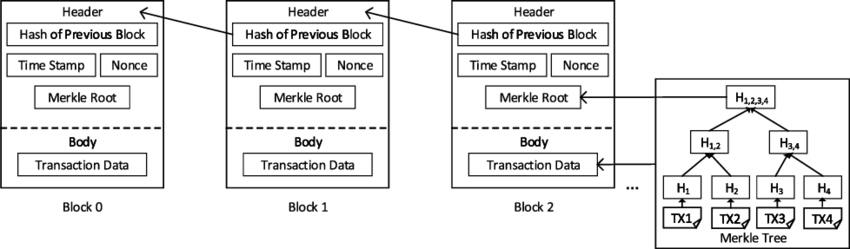
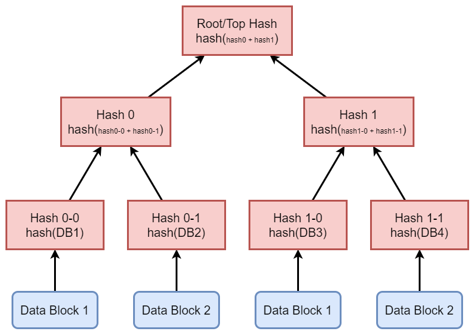
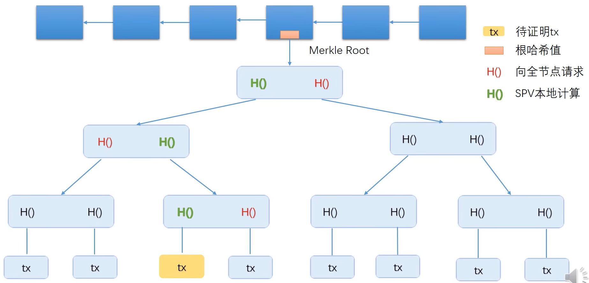

# 比特币

去中心化的比特币的设计核心

* 如何发行货币：挖矿
*  如何防范双花攻击：采用区块链的记账方式 

## *数据结构*

区块链重点使用的哈希需要具备三个性质：collision free、hiding 和 puzzle friendly，这部分可以看 *数据结构与算法.md* 的哈希部分

### 区块

一个区块 block 可以分为块头 block header 和块身 block body（具体的交易内容）

* 全节点 full node/fully validating node 含有完整信息，既保存block header，也保存block body
* 轻节点 light node 只保存一个block he ader。比如说手机上的比特币钱包

### 区块链

区块链是一个用哈希指针形成的链表，但并不是指Linux内核中用到的哈希链表 hlist（哈希桶）

和普通指针指向某一个内存地址不同，哈希指针指向的是把前面的整个block header（包括前面结构体的另外的哈希指针）进行哈希计算后得到的。可以实现 tamper-evident log 来防篡改，这是因为对每一个结构体的修改都是牵一发而动全身的，所以只要记住最后一个哈希指针，就可以判断前面任意区块链的内容有没有被修改过，普通链表则没有检测修改的功能

区块链中的第一个区块称为创世纪块 genesis block，最后一个区块称为最近块 most recent block

上面还有一个target，即挖矿难度的阈值，使用 nBits 来编码

nonce (number once) 随机值

## *Merkle Tree*

### Merkle Tree的结构

Merkle Tree 中用哈希指针代替普通指针，效果和区块链一样，都是牵一发而动全身的效果

* 最底层的L1、L2等是 data blocks，它们可以代表一笔笔的交易内容 transaction
* 而上面的则都是哈希指针，根节点称为root hash或top hash

### Merkle proof

现在要解决的问题是：如何证明一个轻节点属于区块链？使用 Proof of membership/Proof of inclusion ***O(logN)***

找到保存在block header中的Merkle Root，然后一直往上溯源验证， 从data block到root的路径就被称为 Merkle Proof

假设某个轻节点想要知道上图中的黄色交易是否包含在轻节点所在区块的Merkle Tree中，但是轻节点只有Merkle Root

1. 先计算出待验证交易的哈希值
2. 这个轻节点会向某个全节点发出请求，请求一个能够证明待证明交易被包含在某个全节点中的 Merkle Proof。全节点在收到请求后，会把红色的哈希值发给轻节点
3. 从待证明交易往上不断溯源，如果最终root的hash和轻节点保存的Merkle Root一致就证明成功

由于collision resistence的性质，在实际中不可能人为制造Merkle Proof

另外后面的节点算出前面节点的hash值作为hash指针放在当前节点会影响更后面的节点内容，有环的话就会发生先有鸡还是先有蛋的问题

无法证明proof of non-membership，因为要验证所有的叶节点来证明不在Merkle Tree中，此时的复杂度是线性的。如果要证明的话必须是Sorted Merkle Tree

## *记账 & 共识协议*

### 记账方式

数字货币本质上就是一个文件，可以被无限复制，因此带来的一个问题是 Double spending attack 花两次攻击/双花攻击。数字货币所面临的一个主要挑战就是如何应对双花攻击

电子支付是过中心化的，每次交易都得到中心（央行）查询和提交，虽然在实践中其正确性和安全性已经得到验证，但过程会比较复杂。去中心化思路就是将中心的验证职能分散给每一个用户

CreateCoin 铸币权  coinbase transaction 铸币交易

比特币系统中每笔交易都包含了输入和输出两部分，输入部分

和查询币来源的哈希对不上

加密是用接收者的公钥加密，接收者收到后用接受着自己的私钥解密

比如说上图中B还想要给F转5个比特币，但是回溯的时候发现B已经花出去两个比特币了，当前账户只有3个比特币了，转账非法，所以不会把这笔交易加入到区块链中

地址是通过对公钥做哈希计算得到的

和现实中的银行转账一样，比特币系统也没有提供一种账户查询的功能，转账对象的地址必须要通过收款方的主动公告来获取

转账发起者的公钥需要被包含在转账信息中一起 广播给区块链中的所有账户

分布式共识 distributed consensus

FLP impossibility result：在一个异步系统中 asynchronous system，即使只有一个成员是 faulty的，也不可能达成共识

比特币中的共识协议：有部分节点是恶意的，假设大部分节点是善意的

hyperledger fabric 联盟链

女巫攻击 sybil attack：开设大量的账户以获取占优势的投票权

比特币协议的应对方案是通过算力来分配投票权，即所谓的 hash rate

分叉攻击 forking attack：通过往区块链中间插入一个区块来回滚某个已经发生过的交易

区块链接受合法区块应该是要连接到最长合法链 longest valid chain

implicit consent：沿着待接受的区块继续往后扩展就表明已经接受了这个区块了

被抛弃的区块被称为 orphan block

只有获取了记账权的节点才可以往区块俩中写入

竞争记账权的好处

* 有一定的权力，可以决定哪些交易，可以写进区块链里。但是这不是主要的动力
* 出块奖励

50个BTC，没过25万个区块出块奖励就减半

# 挖矿

挖矿是一个发放货币的过程

# 以太坊 Ethereu