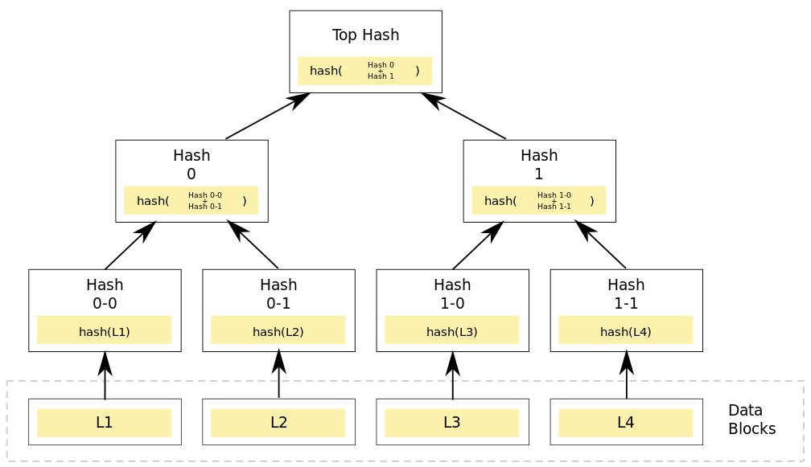

# 比特币

## *数据结构*

区块链重点使用的哈希需要具备三个性质：collision free、hiding 和 puzzle friendly，这部分可以看 *数据结构与算法.md* 的哈希部分

块头 block header

块身 block body

全节点既有块头也有块身（交易内容），轻节点则只有块头

### 区块

### 区块链

区块链是一个用哈希指针形成的链表

哈希指针指的是把前面的整个结构体（包括前面结构体的另外的哈希指针）进行哈希计算后得到的哈希。可以实现tamper-evident log 防篡改，这是因为对每一个结构体的修改都是牵一发而动全身的，所以只要记住最后一个哈希指针，就可以判断前面任意区块链的内容有没有被修改过，普通链表则没有检测修改的功能

第一个区块称为创世纪块 genesis block，最后一个区块称为最近块 most recent block

### Merkle Tree

用哈希指针代替普通指针，效果和区块链一样，都是牵一发而动全身的效果

Merkle proof

Proof membership/Proof of inclusion ***O(logN)***

Sorted Merkl tree

后面的节点算出前面节点的hash值作为hash指针放在当前节点会影响更后面的节点内容，有环的话就会发生先有鸡还是先有蛋的问题

## *共识协议*

Double spending attack 花两次攻击/双花攻击。数字货币所面临的一个主要挑战就是如何应对双花攻击

数字货币本质上就是一个文件

电子支付是过中心化的，每次交易都得到中心（央行）查询和提交，虽然在实践中其正确性和安全性已经得到验证，但过程会比较复杂。去中心化思路就是将中心的验证职能分散给每一个用户

CreateCoin 铸币权

比特币系统中每笔交易都包含了输入和输出两部分，输入部分

## *挖矿*

挖矿是一个发放货币的过程

# 以太坊 Ethereum