# Requirements

## *Introduction*

### Definition

**Requirements engineering RE** is the process of eliciting, analyzing, documenting, validating, and managing the requirements for a software system。需求工程是指在工程设计过程中定义、记录和维护需求的过程

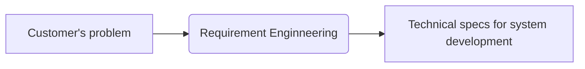

需求工程涉及多种活动，例如从利益相关者那里收集和记录需求，分析需求以识别潜在的冲突或遗漏的需求，对需求进行优先级排序，并验证需求以确保它们是完整、一致和可行的

**最终目标**是创建一个清晰而简洁的需求集，准确反映利益相关者的需求，并为高质量软件产品的开发提供坚实的基础

### What is requirements

* **Features** that the system **must have** in order to be accepted by the client
* **Constraints** that the system **must satisfy** in order to be accepted by the client

## *Stages*

### Overview

1. Elicitation: This involves gathering requirements from stakeholders through interviews, surveys, workshops, and other techniques
2. Analysis: This involves analyzing and prioritizing requirements, identifying dependencies, and resolving conflicts
3. Specification: This involves documenting requirements in a clear and concise manner, often using tech specs or standard notations (e.g., UML use-case diagram)
4. Verification and validation: This involves ensuring that the requirements are complete, consistent, and correct, and that they meet the needs of stakeholders
5. Management: This involves tracking changes to requirements, communicating changes to stakeholders, and ensuring that requirements are met throughout the software or system development life cycle
6. Maintenance: This involves managing changes to requirements over time, ensuring that they remain relevant and up-to-date

### Elicitation 获取

* 引出需求的主要目标是确定系统必须满足用户和利益相关者的需求的需求
* 有很多技术可以用来引出需求，包括面试、问卷调查、观察和焦点小组讨论
*  一旦需求被引出，它们通常会被记录在需求文档或类似的文档中

### Analysis

* 分析阶段涉及审查需求，以理解它们的含义，评估其可行性，并识别任何潜在的冲突或不一致性
* 在分析过程中，通常会以结构化的方式组织和分类需求，例如将相关需求分组或创建用例来描述系统在不同情境下的行为
* 分析阶段还涉及确定需求是否可在项目的约束条件内实现，例如预算、进度和可用资源

### Specification

* The purpose of specification is to create a clear, concise, and unambiguous description of the requirements after eliciation and alysis with stakeholders
* 规格说明还包括必须考虑的任何约束或限制，以及与数据或接口相关的任何特定需求
* There are many ways to document requirements, such as
  * UML use-case diagrams
  * User stories
  * Functional/non-functional requirements
  * System specifications

### Verification and validation

* Verification and validation are critical to ensuring that the requirements for a system are accurate, complete, and consistent
* Verification refers to the process of checking that the requirements have been correctly captured, and that they accurately reflect the needs/expectations of the stakeholders
* Validation, on the other hand, refers to the process of ensuring that the system meets the requirements that have been specified

### Management

需求工程中的管理涉及在软件开发生命周期中管理需求

* 优先排序和组织需求：确定哪些需求最重要或关键，并确保它们获得适当的关注和资源。
* 跟踪需求变更：记录需求的任何变更，这是必要的，以确保所有利益相关者都知道需求的任何变更，并防止误解/沟通不畅
* 确保需求仍然有效和最新：定期审查需求，以确保它们仍然相关和准确，并根据需要更新它们，以反映利益相关者需求或项目目标的任何变化

### Maintenance

需求工程中的维护涉及在软件系统部署并使用后管理需求。在这个阶段，需求根据系统环境的变化或用户需求的变化进行审核、更新和修改

一些维护的原因

* 系统长时间运行，而需求会随着时间的推移而发生变化
* 确保系统继续正常高效地运行，例如修复错误、硬件更新、性能更新等
* 系统仍然安全，并符合任何相关法规或标准

## *Types*

### 功能性需求

Functional requirements 会定义系统特定的行为或功能

* Describe the specific tasks and functions that a system or product must perform
* Typically expressed in terms of use cases or user stories, and describe the features and functionalities of a system or product

### 非功能性需求

Non-functional requirements 是指依一些条件判断系统运作情形或其特性，而不是针对系统特定行为的需求。可以视为为了满足客户业务需求而需要符合，但又不在功能性需求以内的特性

* Describe the characteristics or qualities that the system or product must possess to meet the desired level of performance, usability, and reliability
* Typically expressed in terms of **quality attributes**, such as system's response time, availability, or its ability to handle a certain number of users or transactions per second

## *云的非功能性需求*

### Performance 性能

* **The need for performance**：The specification of a computer system typically includes explicit (or implicit) performance goals

* **Performance metrics 性能指标**

  * Latency 延迟: The time interval between a user’s request and the system response
  * Throughput 吞吐量: Number of work units done (or requests served) per time unit
  * Utilization 占用率: The percentage of capacity used to serve a given workload of requests

* **Service level agreements (SLAs) 服务级别协议 **

  An SLA is an agreement between provider (cloud software) and client (or users) about measurable metrics, e.g., performance metrics

  服务提供商与客户之间定义的正式承诺。服务提供商与受服务用户之间具体达成了承诺的服务指标——质量、可用性，责任

### Scalability 可扩展性

* **Scalability**: Measures the ability of software systems to adapt to the increasing workloads, e.g., serving millions of active users! 可扩展性是指系统适应更大的负载的能力，只需通过增加资源，进一步扩展硬件或增加额外的节点
* **Scalability via concurrency**
  * Vertical scaling (scale-up!): Exploiting **parallelism** in multicores OR adding more resources on a single machine
  * Horizontal scaling (scale-out!): Exploiting **distributed architectures** by adding more machines in the system
* **Elasticity**: The ability of software systems to expand/shrink the usage of computing resource with increasing/decreasing workload 弹性是指动态地适应应对负载所需的资源的能力，当负载增加时，通过添加更多的资源来扩大规模；而当需求减弱时，就缩减并删除不需要的资源

### Reliability 可靠性

* **Reliability**: Applications are prone to hardware and software **failures (bugs)** in the cloud
* **Fault-tolerance** is the property that enables a system to continue operating properly in the event of the failure
* **Fault tolerance metrics**: common failure metrics that get measured and tracked for any system
  * Mean time between failures (MTBF) 平均故障间隔: The average operational time between one device failure or system breakdown and the next
  * Mean time to failure (MTTF) 平均失效前时间: The average time a device or system is expected to function before it fails (usually for not repairable devices)
  * Mean time to repair (MTTR) 平均修复时间: The average time to repair and restore a failed system

### Availability

* **High availability** specifies a design that aims to **minimize the downtime of a system or service**. The main objective of high availability is to keep these systems and services continuously available
* **Availability metrics**
  * We measure high availability through the percentage of time that a service is guaranteed to be online and available for use in a year
  * For e.g., usually they are referred to as “9s”
    * 99.99% (four nines): the four nines class accepts a maximum downtime of 52.6 minutes (less than an hour) per year
    * 99.999% (five nines): the five nines class tolerates a maximum downtime of 5.26 minutes (few minutes) per year

### Security 安全性

**Security**: Software deployed in the cloud is vulnerable to security vulnerabilities as the underlying computing infrastructure is untrusted (or shared by multiple tenants). Secure systems deal with securing computing, network and storage

### Maintainability 可维护性

* **Maintainable software** allows us to quickly and easily
  * Fix a bug
  * Add new features
  * Improve usability
  * Increase performance etc.
* **Design tips** for maintainable software (covered in the course!)
  * **Modular design** to easily extend/modify system components
  * **Version control** for proper software/code management
  * **Quality management**: Refactoring, comments, code reviews, etc.
  * **Continuous integration testing/deployment** for ensuring the extensions are stable/bug free

### Deployability 可部署性

* **Deployability** of a software system is the ease with which it can be taken from development to production
  * Incorporating (hardware and software) dependencies
  * Software updates (patches)
* **Design tips** for deployability (covered in the course!)
  * Build and release management
  * Packaging dependencies for deployment, e.g., containers
  * DevOps pipeline: continuous integration and deployment

# 网络通信框架

## *通用数据交换*

XML（eXtensible Markup Language）、JSON（JavaScript Object Notation）和 Protocol Buffers（通常称为Protobuf）都是用于描述和表示数据的通用格式，但在语法、应用场景和特点上有一些区别。以下是对 XML 和 JSON 的介绍和对比

### IDL

接口描述语言 Interface Description Language，IDL是一种用于描述系统、组件或服务之间的接口的语言。它提供了一种结构化的方式来定义接口的方法、参数、数据类型和协议等信息，以便不同的系统或组件之间能够进行有效的通信和交互

接口描述语言的主要作用是定义接口的规范，使得不同的系统能够理解和解析接口定义，并在运行时进行相应的操作和通信。它提供了一种中立的、独立于编程语言和平台的方式来描述接口，使得不同的编程语言和平台之间可以通过解析接口描述语言的定义来实现互操作性

以下是一些常见的接口描述语言

1. IDL（Interface Definition Language）：IDL是一种用于定义分布式对象的接口的语言，最初由OMG（Object Management Group）定义。它被广泛应用于CORBA（Common Object Request Broker Architecture）分布式系统中，用于描述对象之间的接口和通信协议
2. WSDL（Web Services Description Language）：WSDL是一种用于描述Web服务接口的语言，定义了Web服务的操作、消息格式和网络协议等信息。它使用XML（eXtensible Markup Language）来描述接口，被广泛用于SOAP（Simple Object Access Protocol）和RESTful（Representational State Transfer）等Web服务标准中
3. protobuf（Protocol Buffers）：protobuf是一种由Google开发的接口描述语言，用于定义数据结构和接口的格式。它使用简洁的二进制编码格式，并支持多种编程语言。protobuf广泛应用于Google内部和开源社区，用于高效的数据序列化和通信
4. JSON Schema：JSON Schema是一种基于JSON格式的接口描述语言，用于定义JSON数据的结构和约束。它提供了一种声明式的方式来描述JSON数据的类型、格式、校验规则等，以确保数据的有效性和一致性
5. RAML（RESTful API Modeling Language）：RAML是一种用于建模和描述RESTful API的语言。它提供了一种简洁的方式来定义API的资源、方法、参数、请求和响应等信息，以便于开发者理解和使用API

### XML

* 语法：XML 使用自定义的标记（Tags）来标识数据的结构和内容。它使用起始标签和结束标签来定义元素，可以嵌套和包含属性。XML 的语法比较繁琐，标记需要封闭，并且有更多的符号和冗余
* 应用场景：XML 在数据交换、配置文件、文档存储等方面有广泛应用。它被广泛用于Web服务、SOAP和XML-RPC等通信协议
* 可读性：XML 对人类来说比较容易阅读和理解，标记和结构清晰可见。它是一种自我描述的格式
* 可扩展性：XML 允许自定义标签和结构，可以根据需要进行扩展和定义复杂的数据模型

### JSON

* 语法：JSON 使用简洁的KV键值对的形式来表示数据，其中键是字符串，值可以是字符串、数字、布尔值、数组、对象等。JSON 的语法相对简单，符号较少，对于 JavaScript 来说是一种原生的数据格式
* 应用场景：JSON 在 Web 开发、API、移动应用程序等领域广泛使用。它被广泛用于 RESTful API 的数据交换，也是许多前端和后端框架中的常用数据格式
* 可读性：JSON 对人类来说也相对容易阅读和理解，尤其对于熟悉 JavaScript 的开发者来说。它是一种比 XML 更紧凑的数据表示方式
* 轻量级：JSON 的语法相对较简单，数据量较小，传输和解析的效率较高

### Protobuf

* 语法：Protobuf 使用结构化的消息定义语言（IDL）来描述数据结构和消息类型。它使用.proto文件定义消息的结构，包括字段、类型和消息之间的关系
* 应用场景：**Protobuf 在高性能、跨平台的数据交换和存储方面非常强大**。它通常用于大规模分布式系统、高性能网络通信和数据存储等领域
* 可读性：Protobuf 的编码格式是二进制的，不像 XML 和 JSON 那样易于人类阅读和解析。它更注重在高效的数据传输和解析上
* 体积和效率：相比于 XML 和 JSON，Protobuf 的编码更紧凑，数据体积更小。它使用二进制格式进行编码和传输，减少了数据大小和网络传输的开销。同时，Protobuf 的解析速度也比 XML 和 JSON 更快，因为它的编解码过程是高度优化的

### 对比

* 语法：XML 使用自定义的标记（Tags），JSON 使用KV键值对的形式，而 Protobuf 使用结构化的消息定义语言（IDL）
* 可读性：XML 和 JSON 相对容易阅读和理解，而 Protobuf 的二进制编码格式不直接面向人类
* 数据体积：相同数据的体积上，Protobuf 通常比 XML 和 JSON 更小，因为它使用二进制编码和紧凑的数据表示方式
* 解析效率：Protobuf 的解析速度通常比 XML 和 JSON 更快，因为它的编解码过程是高度优化的，而 XML 和 JSON 的解析过程相对更复杂

在实际选择时，需要根据具体的需求和应用场景来决定使用哪种序列化方案。如果关注高性能、低网络开销和紧凑的数据表示，Protobuf 是一个不错的选择。而如果可读性和可调试性对于数据交换更为重要，XML 和 JSON 可能更合适

## *Three-tier architecture*

### 什么是软件架构

软件架构定义了软件的组成、各个部件的交互和它们如何被封装

软件架构会影响到如何才能满足需求、如何组织研发以及部署方式

### 三层软件架构介绍

IBM: https://www.ibm.com/cn-zh/topics/three-tier-architecture

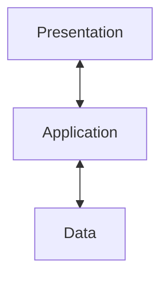

三层架构是一种十分完善的软件应用程序架构，它将应用程序组织成三个逻辑和物理计算层：表示层（或用户界面 UI）、应用层（负责处理数据）和数据层（负责存储和管理与应用程序相关的数据）

三层架构的主要优势在于，由于每层都在自己的基础架构上运行，因此每层都可以由独立开发团队同时开发，并且可根据需要进行更新或扩展，而不会影响其他层

数十年来，**三层架构都是C/S Web应用程序的主要架构**。 目前，大多数三层应用程序的目标是实现现代化、使用云原生 Cloud-native 技术（例如容器和微服务）以及迁移到云端

层间需要通信来传输数据，最广泛使用的技术是REST架构和RPC远程调用方式

### REST、RPC和HTTP的关系

REST、RPC（Remote Procedure Call）和HTTP（Hypertext Transfer Protocol）是三个不同的概念，但它们之间存在一些关系和联系

* REST与HTTP的关系

  **REST 是一种软件架构风格**，强调使用统一的接口和资源来设计和构建分布式系统。HTTP是一种应用最广泛的协议，**REST 常常使用 HTTP 协议作为通信协议**。因此，RESTful API 通常通过 HTTP 来进行通信，使用 HTTP 方法（GET、POST、PUT、DELETE）对资源进行操作

* RPC与HTTP的关系

  **RPC 本身并不是一个特定的协议，它是一种远程过程调用的机制**，用于实现分布式系统中的不同节点之间的通信。RPC 的目标是使远程调用像本地函数调用一样简单

  RPC **可以使用不同的协议来实现**，包括在应用层、传输层或网络层进行通信。因此，RPC 既可以是应用层协议，也可以使用其他层的协议进行实现

  在实际应用中，有一些常见的应用层 RPC 框架和协议，例如 **gRPC、Apache Thrift 和 XML-RPC 等**。这些框架和协议定义了通信的规范和方式，包括消息格式、编解码、序列化和反序列化等。它们可以在应用层或传输层上进行通信，并提供了一套 API 和工具，简化了远程调用的过程。

  除此之外，HTTP 可以作为 RPC 的传输协议之一，通过 HTTP 协议实现 RPC 被称为 HTTP-RPC 或者 HTTP-based RPC。RPC 可以使用其他协议（如 TCP、UDP）作为底层通信协议，与 HTTP 并不强关联

* REST和RPC都是进行网络通信的架构风格，它们之间的区别

  * REST 强调使用统一的接口和资源，通过资源的状态转移来进行操作，而 RPC 强调远程过程调用，即像调用本地函数一样调用远程函数
  * REST 基于无状态的通信协议，如 HTTP，每个请求都包含足够的信息，而 RPC 可以使用各种协议进行通信，包括无状态和有状态的协议
  * REST 更加面向资源和数据的操作，而 RPC 更加面向方法和过程的调用

虽然 REST 和 RPC 在设计思想和实现方式上有所差异，但它们都是用于构建分布式系统的通信机制。在实际应用中，可以根据需求选择合适的通信方式，使用 RESTful API、RPC 或者其他适合的协议来满足系统的通信需求。同时，HTTP 作为广泛使用的协议，可以被 REST 和 RPC 用作通信的基础协议之一

## *REST*

### intro

REST Representational State Transfer 是一种**基于网络的软件架构风格**，用于设计和构建分布式系统和网络应用程序。它在 Web 开发中广泛应用，特别是在构建 Web API（Application Programming Interface）时非常常见

REST 的设计原则强调以下几个关键概念：

1. 资源（Resources）：在 REST 中，所有的数据和功能都被视为资源，可以通过唯一的标识符（如 URL）进行访问和操作。资源可以是任何事物，如用户、文章、图片等
2. 统一接口（Uniform Interface）：REST 使用统一的接口来处理资源。这包括使用标准的 HTTP 方法（如 GET、POST、PUT、DELETE）对资源进行操作，以及使用合适的 HTTP 状态码表示操作结果
3. 无状态性（Stateless）：REST 是无状态的，意味着每个请求都应该包含足够的信息来完全理解和处理该请求，而不依赖于之前的请求或会话状态。每个请求都是独立的，服务器不需要维护客户端的状态
4. 资源表述（Resource Representation）：资源的表述是通过常见的数据格式（如 JSON、XML）来表示，以便在客户端和服务器之间传输和解析数据
5. Layered systems: clients can transparently communicate with the server through other layers (proxy, load balancer)

通过遵循 REST 的设计原则，可以构建具有良好可伸缩性、松耦合性和可扩展性的分布式系统。RESTful API 的设计使得客户端和服务器之间的通信变得简单和直观，而且易于在不同的平台和编程语言之间进行交互

### REST methods

以crul (cliet url) 工具为例

* GET: retrieve resouce

  ```shell
  curl -X GET https://api.github.com/repos/OWNER/REPO/branches
  ```

* POST: create resouce

  ```shell
  curl -X POST \
  https://api.github.com/repos/OWNER/REPO/branches/BRANCH/rename \
  -d '{"new_name":"my_renamed_branch"}'
  ```

* PUT: update resource

  ```shell
  curl -X PUT \
  https://api.github.com/repos/OWNER/REPO/pulls/PULL_NUMBER/merge \
  -d '{"commit_title":"title","commit_message":"msg"}'
  ```

* DELETE: delete resource

  ```shell
  curl -X DELETE https://api.github.com/repos/OWNER/REPO
  ```

## *RPC*

Remote Procedure Calls allow the execution of function calls on a remote process

### Example

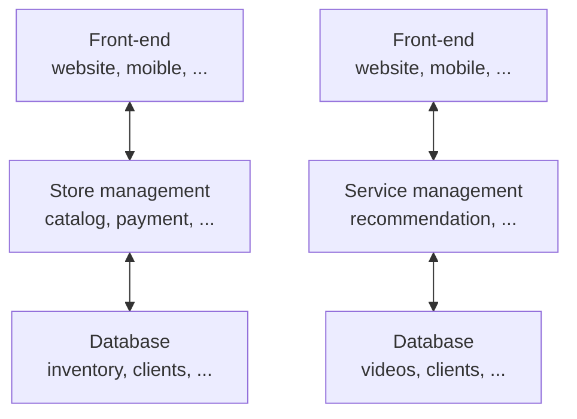

上图是两个典型的应用：网店和流媒体服务

# Software Architecture in Cloud

## *Monolithic architecture*

### 单体式架构的主要类型

### 优势

### 劣势

## *Microservice Architecture*


## *Example: Amazon Prime Video*

# System Design & Implementation

## *Modularity*

### 什么是模块化？

软件系统可以倍分解为一系列的模块 modules 或者说子系统 subsystems。模块化可以以任意的形式来实现，比如类、方法、子系统、rpc服务等。也就是说，模块化可以被应用在任意的抽象层次

模块化可以帮助管理软件的复杂度，微服务就是一个很好的模块化例子，我们将一个复杂的单体架构划分为大量的微服务系统

理想情况下，每一个模块应该是与彼此都完全独立的，用户可以直接使用模块而不需要知道有其他模块的存在。但实际上模块之间或多或少是相关的，它们依赖彼此提供的功能或服务，这也是软件系统复杂性的来源之一。**一个好的系统设计应该是要致力于降低模块之间的相互依赖**

### Terminology

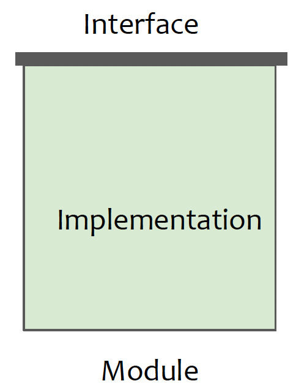

* Interface 接口
  * 接口包括开发人员在不同模块中工作所需了解的一切，以便使用给定的模块
  * **Interface describes “what” the module does, but ”not how” it does it!**
* Implementation 实现：是对接口定义内容的实际实现

在开发一个模块时，开发人员必须理解该模块的接口和实现，以及任何其他依赖模块的接口

### 实现模块之间的高内聚低耦合

设计目标：在允许模块之间的相互依赖的同时降低软件整体的复杂度

* Cohesion 内聚：衡量一个模块之间类之间的依赖性
  * **高内聚**：模块中的类执行相似的任务，并通过多个关联相互关联
  * 低内聚：大量杂类和辅助类，几乎没有关联
* Coupling 耦合：衡量多个模块之间的依赖性
  * 高耦合：一个模块的变动会对其他模块产生较大的影响
  * **低耦合**：一个模块的变动对其他依赖模块的影响较小

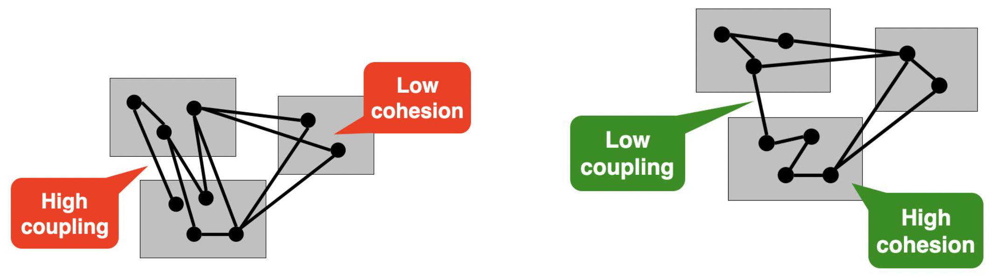

一个好的系统设计旨在实现高内聚低耦合，高内聚追求提高模块内的关联性，低耦合则追求降低模块间的相互依赖

高内聚可以通过将沟通、互动集中在模块内，而不是跨越模块边界来实现；低耦合则可以通过不让calling module知道called module的内部信息来实现

* 高内聚
  * Operations work on the same attributes
  * Operations implement a common abstraction or service
* 低耦合
  * Small interfaces
  * Information hiding principle
  * No/minimal global data
  * Interactions are mostly within the module rather than across module boundaries

### Subsystem decomposition: Modules

## *Design Pattern: Facade Pattern*

### Intro

外观模式 Facade Pattern 是一种软件设计模式，属于结构型模式。**它提供了一个higher-level的简化的接口（外观 Facade、入口），用于访问复杂子系统的功能**，从而隐藏了子系统的复杂性，并提供了一个更简单和统一的接口供客户端使用，同时也减少了客户端与子系统之间的直接依赖

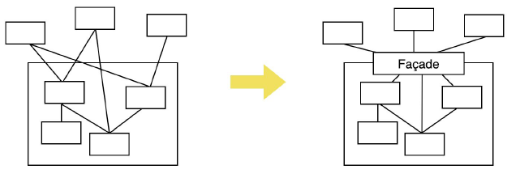

一个demo：<https://www.runoob.com/design-pattern/facade-pattern.html>

### 主要组成部分

1. 外观 Facade：外观是客户端与子系统之间的接口，它封装了底层子系统的复杂性，并提供了一个简化的接口供客户端使用。外观根据客户端的请求，调用相应的子系统组件
2. 子系统 Subsystems：子系统是实现系统功能的具体组件集合。它们包含了底层的业务逻辑和功能，但客户端并不直接与子系统的组件进行交互。外观模式通过外观作为中间层，将客户端请求转发给子系统来处理

### Pros & Cons

* Pros
  1. 简化客户端使用：外观模式提供了一个简化的接口，使得客户端使用子系统更加方便。客户端只需与外观对象交互，而不需要了解和处理子系统的复杂性，从而简化了客户端的使用方式
  2. 封装子系统复杂性：外观模式将底层子系统的复杂性封装在一个外观对象中。这样，客户端不需要了解子系统的内部工作细节，只需要通过外观对象进行交互。外观模式提供了一种高级接口，隐藏了子系统的复杂性，使得系统更易于理解和使用
  3. 解耦客户端和子系统：通过外观模式，客户端只与外观对象进行交互，而不直接与子系统的组件进行交互。这样可以降低客户端和子系统之间的耦合度，使得系统更加灵活和可维护
* Cons
  1. 违反开闭原则：在外观模式中，如果需要新增或修改子系统的功能，可能需要修改外观对象的接口和实现。这违反了开闭原则，因为修改外观对象可能会影响到客户端代码。因此，在设计外观模式时，需要权衡灵活性和稳定性之间的平衡
  2. 可能引入单点故障：外观模式将子系统的复杂性集中在一个外观对象中。如果外观对象出现问题或失败，整个子系统的功能可能受到影响。因此，需要谨慎设计和管理外观对象，以确保其稳定性和可靠性
  3. 限制灵活性：外观模式通过提供一个统一的接口来隐藏子系统的复杂性，这可能会导致某些特定功能无法直接访问。如果需要对子系统的某个特定功能进行高度定制或优化，可能需要绕过外观对象，直接与子系统的组件进行交互

## *接口设计*

### Deep vs shallow modules

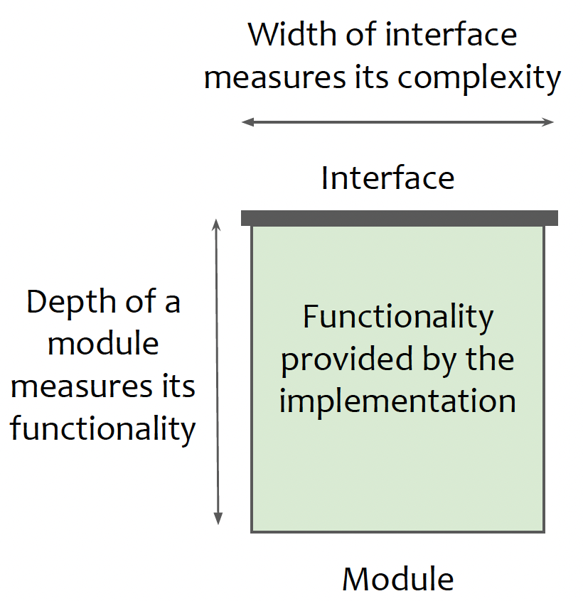

* Deep modules
  * They provide **powerful functionality yet have simple interfaces**, They provide good abstraction because only a small internal complexity is visible to users. 
  * Deep module是一种具有多层次嵌套关系的模块设计方式。它通过将功能细分为多个嵌套的子模块来构建复杂的接口。每个子模块都负责特定的功能或任务，并且可以进一步嵌套其他子模块。这种深层次的嵌套结构使得接口的功能和复杂性可以逐级增加，以满足更细粒度的需求
* Shallow modules
  * Provide **huge interface, but less functionality**. More dependencies with other modules leading to high coupling
  * Shallow module是一种扁平的模块设计方式，它没有多层次的嵌套关系。相反，它将所有的功能组织在同一个层次上。这种设计方式更简单直接，适用于相对简单的接口或功能较少的场景。Shallow module通常比Deep module更容易理解和使用
* Module design as a cost vs benefit trade-off
  * Cost: The complexity using the interface
  * Benefits: Provided functionality of the module

Deep modules的设计好与Shallow modules，**一个原则是可以将complexity藏到implementation里就藏进去，尽量不要增加接口的宽度**

### 例子

Linux的文件系统就是一个典型的Deep modules，它是由文件系统、虚拟文件系统、系统调用都嵌套构成的，最终向上层提供了系统调用接口 `open()`、`write()`、`read()` 等

举一个生活中的例子

假设我们正在设计一个在线购物系统的接口，其中包含以下功能：

1. 添加商品到购物车（Add Item to Cart）：将商品添加到用户的购物车中
2. 从购物车中移除商品（Remove Item from Cart）：从用户的购物车中移除指定的商品
3. 获取购物车中的商品列表（Get Cart Items）：获取用户购物车中的所有商品列表
4. 结算购物车（Checkout Cart）：对用户购物车中的商品进行结算

Deep module的设计方式：Deep module将每个功能细分为多个嵌套的子模块，每个子模块都负责特定的功能。在这种设计中，Deep module 只是一个购物车模块在这个例子中，Deep module将购物车功能的所有操作方法放在一个深层次的CartManager模块中。每个方法都属于CartManager模块的一部分，负责不同的购物车功能

Shallow module的设计方式：Shallow module的设计方式将所有功能组织在同一个层次上，没有多层次的嵌套关系。在这个例子中，Shallow module直接将购物车功能的所有操作方法放在一个ShoppingSystem模块中，没有额外的嵌套关系

### Information hiding & leakage

信息隐藏 Information hiding 是一种软件设计原则，旨在将模块或类的内部实现细节和数据隐藏起来，只向外界暴露必要的接口或方法。该原则的目标是减少系统中各个模块之间的依赖关系，提高模块的独立性和可维护性

信息隐藏的核心思想是通过将模块的实现细节封装起来，限制对内部数据和方法的直接访问，从而降低模块之间的耦合度。模块只向外部提供必要的接口，外部只能通过这些接口与模块进行交互，而无需关心模块内部的具体实现。这样可以实现模块的独立演化，当内部实现发生变化时，只需保持接口的兼容性，而不会影响到外部的使用

相反信息泄漏 information leakage 则是将设计细节暴露出去，这可能会导致模块之间的相互依赖

Information hiding的最经典实现就是面向对象语言C++/Java的类，Private访问限定符用于implementation，Public访问限定符则用于interface

## *General layered architecture*

 层式架构是模块化的最佳体现，每一层就是一个独立的子模块。网络栈、Linux文件系统，之前提过的三层Web架构都是层结构

### Closed vs open layered architectures

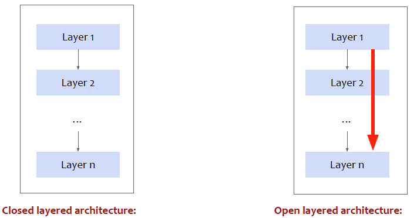

* Closed layer architecture
  * 每一层只能直接调用相邻下一层的服务
  * 优势：层次清晰，维护性好
* Open layer architecture
  * 可以跨层调用，即Layer1不需要call Layer2来获取Layer n的服务，Layer1直接call Layer n
  * 优势：高性能

### Different layers, different abstraction

每一层都应该提供不同的抽象，这样可以更好的解构系统

尽量不要使用Pass-through method 传递方法。Pass-through methods 是指在类或对象中定义的方法，这些方法在实现时只是简单地将调用转发给其他对象或类的对应方法，不做任何额外的处理或逻辑

## *MVC*

# Security

## *Security Engineering*

### CIA properties

* **Confidentiality** refers to protecting information from unauthorized access 避免被未经许可的访问拿到
* **Integrity** means data are trustworthy, complete and have not been accidentally altered or modified by an unauthorized user 数据是完整的，不会被未经许可的用户故意或不当心修改
* **Availability** means data are accessible when you need them 需要时可以被拿到

### Thread Model

A threat model is used to explicitly **list all threats that jeopardize the security of a system**

Thread Model 定义了系统环境以及攻击者的能力

* Enumerating and prioritizing all potential threats
* Define system assumptions: Trusted and untrusted parts
* Risk management and trade-offs

一些典型的问题有

* What are the high value-assets in a system?
* Which components of a system are most vulnerable?
* What are the most relevant threats or attack surfaces?

## *安全系统设计原则*

### Compartilization 区域分割

和分割船舱，以致于当某个船舱进水时不至于帆船一样，软件工程甚至是整个计算机系统也要进行区域分割

在安全工程领域，Compartilization 是一种关键概念和实践，用于将系统中的不同组件或资源隔离开来，以减少潜在的安全风险和限制潜在的攻击者的行动范围。隔离的目标是防止不受信任的组件对系统中的其他部分造成损害，并通过一些精心设计的通讯协议来限制潜在的攻击者从一个受损的组件中扩散到其他组件

### Principle of least privileges 最小权限原则

Least Privilege 用于确保用户、应用程序或进程**仅具有完成其必要任务所需的最低权限**。最小权限原则旨在减少系统中的安全风险，并限制恶意用户或攻击者可能利用的潜在攻击面

最小权限原则包括以下关键概念

1. 最小访问权限：用户、应用程序或进程应该只被授予完成其任务所需的最小访问权限。这意味着将权限限制在最低必要的级别，以防止不必要的权限滥用或误操作
2. 权限分离：不同的用户角色或任务应该被分配不同的权限。每个用户或应用程序只能访问其工作所需的资源和功能，而不能访问其他敏感资源。这种权限分离减少了潜在的攻击面和错误操作的影响范围
3. 基于需求的访问控制：通过实施基于需求的访问控制策略，只有在用户或进程确实需要访问某些资源或执行特定操作时，才授予相应的权限。这种策略确保权限的最小化，并且仅在必要时才进行授权
4. 权限审计和监控：对权限的使用进行审计和监控，以确保权限不被滥用或越权访问。这可以通过记录和分析权限使用的日志来实现，并及时检测异常行为或潜在的安全威胁

### Isolation via privilege mediation

隔离的目的是将两个组件相互分离，并限制它们之间的交互在一个明确定义的应用程序编程接口（API）中进行

为了实现组件之间的隔离，所有组件都需要某种形式的**安全监视器 security monitor**来进行监控和执行安全策略

**安全监视器以比隔离组件更高的权限级别运行**，并确保它们遵守隔离规则。如果违反隔离规则，安全监视器会阻止违规行为，并可能终止违规组件的执行。这种安排可以确保隔离的有效性，并防止攻击者通过违反隔离来访问敏感资源或执行恶意行为

### High-level 安全设计原则

* Break system into compartments

* Ensure each compartment is isolated

* Ensure each compartment runs with least privilege

* Treat compartment interface as the trust boundary

  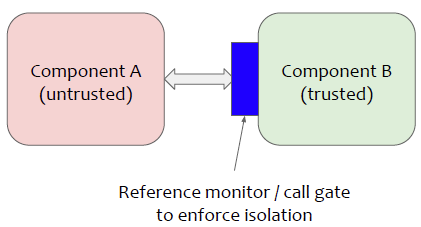

Trusted Computing Base（TCB）是指计算系统中被认为是可信任的核心组件集合。TCB包括操作系统内核、安全核心模块、认证机构、密码学实现以及其他被信任的软件和硬件组件。TCB的目标是提供一个可信的计算环境，确保系统的安全性和可靠性

TCB的设计和实现应该经过严格的安全考虑，并遵循安全最佳实践。**它应该尽可能地简化和最小化，以减少潜在的攻击面**。TCB应该受到适当的保护措施，以防止未经授权的访问和恶意操作

### Reference/Trusted monitor

Reference Monitor 引用监视器是一个安全机制的概念，用于确保系统中的所有访问都受到适当的控制和监视。它是一个抽象的概念，代表着一个系统内核或安全子系统，负责执行访问控制策略并保护系统资源

Trusted Monitor 在安全系统中起着至关重要的作用，它可以是操作系统内核的一部分，或者是一个独立的安全子系统。它通过实施访问控制策略、验证身份、执行审计等功能来确保系统的安全性和可靠性。Trusted Monitor 的设计和实现应该经过严格的安全考虑，并接受相应的验证和审计，以保证其可信度和有效性

* 斡旋来自应用的请求
* 必须一直被调用，不能被绕过
* Tamperproof 防篡改，权限很高无法被杀死，或者被杀死的时候也会把它监控的进程一同杀死

## *Access control 权限控制*

### Terminology

* Protected entities: “objects/resources” O。对象可以是任何资源，比如文件、系统资源、聂村等
* Active objects: “subjects/principals” S (i.e., users/processes)

### Authentication vs. Authorization

Authentication（身份验证）和 Authorization（授权）是访问控制中两个关键的概念，它们在保护系统和资源的访问方面具有不同的作用

Authentication（身份验证）是**用于验证用户或实体的身份是否合法和正确**。它是确认用户是谁的过程。身份验证通常涉及用户提供凭据（如用户名和密码、生物特征、数字证书等），然后系统对这些凭据进行验证，并确定用户是否具有合法的身份。身份验证确保用户是自己声称的那个人，而不是冒名顶替

Authorization（授权）是**确定用户或实体对系统或资源的访问权限的过程**。一旦用户的身份得到验证，授权决定用户可以访问哪些资源以及可以执行哪些操作。它是定义访问权限和权限级别的过程。授权规定了用户能够做什么和不能做什么，以保证资源的安全性和保护用户数据

在一个应用程序中，用户首先进行身份验证，提供用户名和密码进行验证。一旦身份验证成功，系统会检查该用户的授权级别和权限，以确定他们能够访问的功能、数据或服务。身份验证是确认用户是谁，而授权是决定用户可以做什么。这两个过程通常在访问控制的流程中一起使用，以确保只有合法用户获得适当的访问权限

### ACL vs CL

Access Control Lists ACLs 访问控制列表

Capabilities Lists CLs

## *ACL*

### Access control matrix

## *Capabilities*

# 可靠性 & 可扩展性

## *Reliability & Availability*

## *Performance*

## *Pattern implementation*

## *Scalability*

# 设计模式

## *Adapter pattern*

## *Observer pattern*

## *Strategy pattern*

## *MVC*

# Testing

## *Overview*

### 测试分类

1. Unit Testing 单元测试：单元测试是针对软件中的最小可测试单元（通常是函数或方法）进行的测试。它的目标是验证这些单元在隔离的环境中是否按照预期工作。单元测试通常由开发人员编写，旨在检测代码中的错误、确保每个单元的功能正确，并支持代码重构和维护。它可以使用模拟或桩件来隔离依赖项，使得测试更加独立和可重复
2. Integration Testing 集成测试：集成测试是将多个独立的单元组合在一起（通常是一个subsystem），测试它们之间的接口和交互是否正常工作。它的目标是检测不同组件之间的集成问题、接口错误和数据传递问题。集成测试可以涵盖不同层次（如模块间的集成测试、系统间的集成测试），并确保整个系统的各个部分协同工作
3. System Testing 系统测试：系统测试是对整个系统进行的测试，目的是验证整个系统在真实环境中的功能、性能和稳定性。系统测试通常是在与实际使用环境相似的环境中进行，以模拟最终用户的操作和预期结果。它可以涵盖各种功能、性能、安全性、兼容性和可靠性等方面的测试，以确保系统在各种情况下都能正常运行
4. Acceptance Testing 验收测试：验收测试是由最终用户、客户或其他授权人员执行的测试，以确认系统是否符合规格和需求。验收测试旨在验证系统是否满足用户的期望和需求，并且是否可以投入实际使用。它通常在开发周期的后期进行，以确保交付的系统符合预期并且可接受

### 黑箱、白箱、灰盒测试

* 黑盒测试 Black Box Testing：测试人员对被测系统进行测试，而不考虑其内部结构和实现细节。测试人员仅根据系统的规格说明、需求文档或功能描述来设计和执行测试用例，目的是验证系统的功能、界面和行为是否符合预期。黑盒测试关注系统的输入和输出，以及系统对输入的响应，而不关心内部逻辑和算法。它旨在检测功能缺陷、错误处理和系统性能等方面的问题
* 白盒测试 White Box Testing：测试人员了解被测系统的内部结构、设计和实现细节，并基于此设计和执行测试用例。测试人员可以访问系统的源代码、算法和数据结构等内部信息，以便更全面地测试系统的逻辑路径、代码覆盖率和内部错误等方面。白盒测试主要关注代码的正确性、结构和优化，以及系统的可维护性和安全性等方面
* 灰盒测试 Gray Box Testing：灰盒测试是黑盒测试和白盒测试的一种混合方法。在灰盒测试中，测试人员对被测系统有一些了解，但并不完全了解其内部实现细节。他们可能知道系统的某些算法、逻辑或设计，但没有完全的源代码访问权限。灰盒测试结合了黑盒测试的功能验证和白盒测试的结构覆盖，以设计和执行测试用例。它可以使用系统规格说明、日志文件、数据库结构等信息来指导测试，以验证系统的功能和内部逻辑的一致性

### 各种语言的Unit testing工具

* C++

  * Google Test（也称为gtest）：Google Test是一个流行的C++测试框架，提供了丰富的断言和测试装置，支持测试套件、参数化测试、测试夹具等功能。它被广泛应用于C++项目中的单元测试和集成测试
  * Catch2：Catch2是另一个轻量级的C++测试框架，具有简洁的语法和强大的表达能力。它支持自动发现测试用例、断言、测试标签等功能，并提供易于阅读的测试报告
  * Boost.Test：Boost.Test是Boost库中的一个模块，提供了一个功能齐全的C++测试框架。它支持多种断言和测试装置，以及测试套件、参数化测试、测试夹具等功能
  * doctest：doctest是一个轻量级的C++单元测试框架，设计简单、易于集成。它不需要外部依赖，可以仅包含单个头文件即可使用

* Java

  * JUnit: 最常用的Java单元测试框架之一，提供了注解和断言等丰富的功能

  * TestNG: 另一个流行的Java测试框架，具有更丰富的功能，如测试套件、参数化测试等

* Python

  * unittest: Python自带的单元测试框架，支持测试类和方法的定义，断言等

  * pytest: 功能更强大、易用的Python单元测试框架，支持插件扩展和参数化测试等

* JavaScript

  * Jest: 用于JavaScript的流行的单元测试框架，具有简洁的API、模拟和覆盖率报告等功能

  * Mocha: 灵活的JavaScript测试框架，支持异步测试和多种断言库

* C#

  * NUnit: .NET平台上的流行单元测试框架，类似于JUnit，具有丰富的断言和测试装置

  * xUnit.net: 另一个.NET平台上的开源单元测试框架，具有灵活的扩展性和可配置性

* Ruby

  * RSpec: 用于Ruby的行为驱动开发（BDD）风格的测试框架，具有可读性强的语法和丰富的断言

  * MiniTest: 轻量级的Ruby测试框架，与Ruby标准库一起提供，支持单元测试和性能测试

## *Integration testing*

### intro

集成测试（Integration Testing）是软件测试中的一种测试方法，旨在验证多个独立组件或模块在集成后的交互和协作是否正常工作。集成测试的目标是检测组件之间的接口问题、数据传递问题以及整个系统的功能和性能

最重要的是接口验证：集成测试关注组件之间的接口，包括方法调用、消息传递、共享数据等。测试人员需要验证接口是否正确地传递数据和信息，并确保各个组件之间的协作正确

Integration Testing的策略有

* Horizontal integration
  * Big Bang integration
  * Bottom up testing
  * Top down testing 
* Vertical integration

### Big Bang approach

Big Bang 策略：大爆炸策略将所有组件集成到一起，并一次性进行完整的系统集成测试。这种策略通常用于较小和较简单的系统，或者在项目开发的后期阶段，当所有组件已经开发完毕并准备集成时。大爆炸策略的优点是速度快，但可能更难确定出现问题的具体组件

### Driver & Stubs

Driver：Driver是一个用于调用被测试模块的程序或组件。**它模拟了主调用方的行为**，通过向被测试模块提供输入数据和调用它的方法来驱动被测试模块的执行。Driver的主要目的是激活被测试模块，传递输入并捕获输出，以便进行验证和测试

Stub：Stub是一个用于替代被测试模块所依赖的外部模块或组件的占位符。当被测试模块需要与其他模块进行交互时，如果这些模块尚未实现或无法访问，Stub就会被用来模拟这些模块的行为。Stub通常返回预定义的数据或执行预定义的操作，以便测试被测试模块在与外部模块进行交互时的行为

### Top-down

自上而下（Top-down）策略：这种策略从系统的最高级别开始，逐步向下测试系统的子组件。在这种策略下，虚拟的或模拟的子组件可能被用于代替尚未实现或无法访问的实际子组件。逐步完成各个组件的集成，直到整个系统被完全集成和测试

### Bottom-up

自下而上（Bottom-up）策略：这种策略从系统的最低级别开始，首先测试系统的基础组件，然后逐步将上层组件添加到测试中。这种策略不需要虚拟或模拟的组件，因为每个组件都是实际的。测试人员首先确保单个组件的正确功能，然后逐步构建和测试更高级别的组件和系统

### Vertical integration testing

## *System testing*

### Fuzz testing/Fuzzing

模糊测试（Fuzz Testing），也称为Fuzzing，是一种自动化的软件测试技术，旨在发现应用程序中的漏洞和安全弱点。它通过**输入大量的随机、无效或异常数据来测试目标程序**，以寻找潜在的错误或异常行为

Fuzz测试的主要优势是它可以发现应用程序中未预料到的错误和边界情况。通过模糊、随机的输入，Fuzzing可以探索程序的不同执行路径和输入组合，有助于发现可能被忽略的异常情况和漏洞

在实施Fuzz测试时，通常会使用专门的Fuzzing工具，如AFL（American Fuzzy Lop）、LibFuzzer、Peach Fuzzer等。这些工具提供了自动化的模糊测试功能，并提供了结果分析和漏洞报告的功能。此外，还可以结合其他测试技术和安全工具，如静态代码分析、漏洞扫描器等，以获取更全面的测试覆盖和安全保障

### Fuzzing的类型

### Symbolic execution

Symbolic execution（符号执行）是一种静态程序分析技术，旨在通过对程序的符号变量进行推理和路径探索来获取程序的执行路径和约束条件。与传统的具体执行（concrete execution）不同，符号执行使用符号值（symbolic values）代替实际输入值，以表示程序执行过程中的未知输入。

在符号执行中，程序的每个分支都会产生一个或多个路径条件，这些条件基于符号变量的值。符号执行引擎通过解析和求解这些路径条件来探索不同的执行路径。这样，符号执行可以产生满足特定条件的测试用例，用于验证程序的正确性、发现潜在的错误和漏洞。

以下是符号执行的关键概念和过程：

1. 符号变量（Symbolic Variables）：符号执行使用符号变量来表示程序执行过程中的未知输入或状态。这些变量可以代表任意值，并与路径条件相关联。
2. 路径条件（Path Conditions）：每个分支操作都会生成一个路径条件，基于符号变量的值来决定程序执行的路径。路径条件是关于符号变量的约束条件，用于控制程序的执行流程。
3. 符号执行引擎（Symbolic Execution Engine）：符号执行引擎是负责解析和推理路径条件的工具或框架。它通过对路径条件进行符号求解来生成满足特定条件的输入值，以探索不同的执行路径。
4. 路径探索（Path Exploration）：符号执行引擎根据路径条件的求解结果，选择不同的执行路径进行探索。它会生成新的测试用例，以覆盖程序中的不同代码路径，并尽可能发现错误和漏洞。

符号执行的优点是它可以探索程序中的各种可能情况，包括边界条件、异常情况和不常见的执行路径。这使得符号执行成为发现难以达到的程序行为和错误的强大工具。然而，符号执行也面临着路径爆炸问题，即程序中可能存在大量的执行路径，导致符号执行引擎的计算复杂度增加。因此，符号执行通常与其他技术，如约简技术和具体执行相结合，以提高分析效率和准确性

### Crashing: Chaos Monkey

## *Model based testing*

## *Object oriented testing*

Black box testing可能会有部分代码是没法test到的


Stub比Driver难写 2:03


Fuzzing

但有时候用户已经知道了大概要用哪些测试用例，但Fuzzing还是会无脑生成

# Software Analysis

# Software Management and Deployment

## *Git*

### 版本控制工具分类

* SVN是集中式版本管理系统，版本库是几种放在中央服务器的，而工作的时候要先从中央服务器拉取最新版本，然后工作完成后再push到中央服务器。集中式版本控制系统必须要联网才能工作，对网络带宽要求较高
* Git是分布式版本控制系统，没有中央服务器，每个人本地就有一个完整的版本库

### Git的数据模型

Git 将顶级目录中的文件和文件夹作为集合，并通过一系列快照 snapshot 来管理其历史记录。每一个文件被称为Blob对象，相当于是字节Array数据对象，目录被称为Tree，它将名字String于Blob对象或另外的树映射 `map<string, object>`

```
<root> (tree)
|
+- foo (tree)
|  |
|  + bar.txt (blob, contents = "hello world")
|
+- baz.txt (blob, contents = "git is wonderful")
```

Git使用由snapshot组成的有向无环图 directed acyclic graph 来建模历史。有向无环图的意思是每一个snapshot都有一系列的parent

每一个snapshot称为一个commit，每一个snapshot都会会指向它之前的snapshot。用伪代码可以表示成

```
// 文件就是一组数据
type blob = array<byte>

// 一个包含文件和目录的目录
type tree = map<string, tree | blob>

// 每个提交都包含一个父辈，元数据和顶层树
type commit = struct {
    parent: array<commit>
    author: string
    message: string
    snapshot: tree
}
```

### 对象和内存寻址

Git 中对象根据内容地址寻址，在储存数据时，所有的对象都会基于它们的SHA-1 哈希值进行寻址

```
objects = map<string, object>

def store(object):
    id = sha1(object)
    objects[id] = object

def load(id):
    return objects[id]
```

Blobs、树和提交都一样，它们都是对象。当它们引用其他对象时，它们并没有真正的在硬盘上保存这些对象，而是仅仅保存了它们的哈希值作为引用

但是哈希值是记不住了，所以要给他们起别名，也就是建立一个用string表示的reference 引用。和C++不同，这里reference应该被理解为指针，它可以不断变动指向不同的哈希值（或者说commit）。这样，Git 就可以使用诸如 “master” 这样人类可读的名称来表示历史记录中某个特定的提交，而不需要在使用一长串十六进制字符了
```
references = map<string, string>

def update_reference(name, id):
    references[name] = id

def read_reference(name):
    return references[name]

def load_reference(name_or_id):
    if name_or_id in references:
        return load(references[name_or_id])
    else:
        return load(name_or_id)
```

git的分支实质上仅是包含所指对象的SHA-1校验和文件，所以它的创建和销毁都很快。创建一个新分支就相当于网一个文件中写了41个字节

### 一些特殊的reference

* 当前的位置特殊的索引称为 HEAD
* origin一般用作本地对remote repository的名称，它是 `git clone` 时的默认remote库名称，可以 `git clone [-o RemoteName] ` 换一个名字
* 本地 `git init` 时的默认branch名称是master。因此对远程库的本地branch名称是，`<remote>/<branch>`，即origin/master

### git的设置

`git config`: Git 是一个 [高度可定制的](https://git-scm.com/docs/git-config) 工具。可以通过 `git config -l` 来查看设置列表

可以通过 `git config --unset` 来重制当前仓库的设置

`git config --global` 来设置当前host的全部仓库

### 工作区、暂存区和版本库

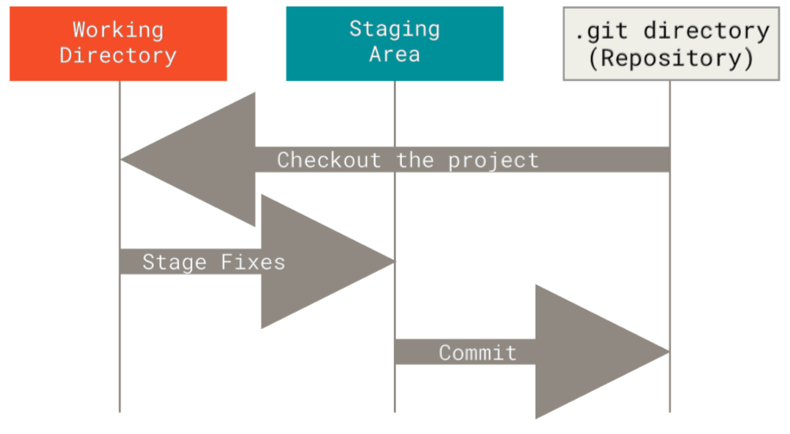

* 工作区 Working directory：放需要管理的代码和文件的目录

* 暂存区 Stage area/index：一般放在 `.git` 目录下的index文件中

* 版本库 Repository (locally)：`.git` 这个隐藏目录被称为Git的版本库

  

修改的工作区内容的索引会写入对象库的一个新的git对象 object 中

Git追踪管理的是修改，而不是文件

### 基础指令

Git 处理snapshot场景的方法是使用一种叫做 staging area 暂存区的机制，它允许用户指定下次快照中要包括那些改动

* `git help <command>`: 获取 git 命令的帮助信息
* `git init`: 创建一个新的 git 仓库，其数据会存放在一个名为 `.git` 的目录下
* `git status`: 显示当前的仓库状态
* `git add <filename>`: 添加文件到暂存区
* `git commit -m "YOUR COMMIT"`：创建一个新的commit，放到本地的repository中
* `git log`: 显示历史日志
* `git log --all --graph --decorate`: 可视化历史记录（有向无环图）
* `git diff <filename>`: 显示与暂存区文件的差异
* `git diff <revision> <filename>`: 显示某个文件两个版本之间的差异
* `git checkout <revision>`: 更新 HEAD 和目前的分支

### 撤销与回滚

* `git commit --amend`: 编辑提交的内容或信息
* `git reset [--soft | --mixed | --hard] <file>`: 用于回退 rollback。**本质是回退版本库中的内容**
  * `--mixed` 为**默认选项**，使用时可以不用带该参数。该参数将暂存区的内容退回为指定提交版本内容，工作区文件保持不变
  * `--soft` 参数对于工作区和暂存区的内容都不变，只是将版本库回退到某个指定版本
  * `--hard` 参数将暂存区与工作区都退回到指定版本。**切记工作区有未提交的代码时不要用这个命令**，因为工作区会回滚，没有commit的代码就再也找不回了，所以使用该参数前一定要慎重
  * file的说明
    * 可以直接使用commit id，表示指定退回的版本
    * 一般会使用HEAD来替代：HEAD 表示当前版本，`HEAD^` 上一个版本，`HEAD^^` 上上一个版本，以此类推。也可以使用 `~数字` 来替代，比如 `HEAD~0` 表示当前版本，`HEAD~1` 为上一个版本，依次类推
  * `git reset` 是可以来回rollback的，可以使用reflog来查看commit ID
* `git checkout -- <file>`：丢弃修改，让工作区中的文件回到最近一次add或commit时的状态
* `git restore`: git2.32版本后取代git reset 进行许多撤销操作

应用场景：撤销回滚的目的是为了防止自己写的代码影响到远程库这个公共空间中的代码

* 还没有add到暂存区
  * `git checkout -- <file>`，注意一定要带上 `--`，否则checkout就是用来对branch进行操作的
  * `git reset --hard file`
* 已经add到暂存区，但还没有commit到版本库中：`git reset [--mixed ｜ --hard] file`
* 已经commit到版本库中：前提是没有push到远程库 `git reset --hard file`

### 分支和合并

移动HEAD指针来指向不同的分支指针，分支指针再指向不同的commit ID。分支指针都放在 `.git/refs` 下面，分成了本地的heads和远端的remotes

注意：在新建branch的时候是在当时的分支上进行了一次commit，即

```
--------+-----+-----+----------+-----+------+          Main Branch      
Last commit before new branch<-|     |->new commit due to new branch    
                                     |
                                     |------+          New Branch
```

* `git branch`：显示本地分支，`git branch -r` 查看远端分支。`git branch --set-upstream-to=origin/master`
  * `git branch <name>`: 创建分支
  * `git branch -d <BranchName>` 删除某条分支，注意删除某条分支的时候必须先切换到其他的分支上
* `git checkout <branch>`：切换到特定的分支
* `git checkout -b <name>`：创建分支并切换到该分支。相当于 `git branch <name>; git checkout <name>`
* `git merge <revision>`：合并到当前分支
* `git mergetool`: 使用工具来处理合并冲突
* `git rebase <basename> <topicname>`: 将一系列补丁 topicname 变基 rebase 新的基线 basename

### 关于合并冲突的问题

合并冲突模式

* Fast-forward：看不出来是否有创建分支并merge，看起来就像是直接在当前分支上修改的，可以通过 `git merge [--no-ff -m "提提交信息"] <branch>` 来不使用fast-forward模式来merge，注意 -m 是一定要写的
* No-ff 非fast-forward：可以看出来有没有经过merge

```
<<<<<<< HEAD
当前分支的内容
=======
其他分支上发生冲突的内容
>>>>>>>
```

解决冲突的方式是把不需要的代码全部删除，包括尖括号提示符

merge冲突需要手动解决，并且**merge后一定要再进行一次commit**。HEAD会指向merge的新提交，但被merge的分支仍然会指向自己原来的commit

```
*   commit 1f7605d4cf4e180c21b693f2aed0f945611fa33b (HEAD -> main)
|\  Merge: 27b9c7b 4dcd274
| | Author: wjfeng <wj.feng@tum.de>
| | Date:   Sat Jun 17 16:36:45 2023 +0200
| |
| |     main branch conflict fixed
| |
| * commit 4dcd27411054788c7030e7936d62ebb1ca2a3247
| | Author: wjfeng <wj.feng@tum.de>
| | Date:   Sat Jun 17 16:33:19 2023 +0200
| |
| |     test branch on dev
| |
* | commit 27b9c7bbc515a114af67ce45c5fa86d0e5591765
|/  Author: wjfeng <wj.feng@tum.de>
|   Date:   Sat Jun 17 16:34:25 2023 +0200
|
```

从main上创建了一条新的branch后，若main上没有新的commit或者没有冲突就可以直接fast-forward merge

### 分支管理的原则

* master/main：稳定分支，用来发布新版本。不允许直接修改这个分支
* dev：不稳定的开发分支，用来开发新功能。等测试完毕后再merge到master分支
* 用 `git stash` 命令将当前工作区已经add（被git追踪了）但是还没有commit的内容存起来，会放在 `.git//refs/stash` 临时存储区中，将来可以被恢复。不能把没有add的文件stash
* 可以通过 `git stash list` 来查看临时存储区的内容

将代码merge到master中的好习惯是：**在master上merge完修复好的bug后，先切换到dev上merge master，再切换到master上merge dev**。而不是在master上merge dev。在merge的过程中也有可能因为一些误操作（少merge多merge了一行）等原因而出错，因此若直接在master上merge dev出bug了，master分支会受到直接的影响，而在dev上merge master，就算出错影响的也只是dev

### 远端操作

远端merge有两种方法，一种是在本地merge后push到远端，另一种是使用Pull request，Pull requset是给仓库管理员看的合并请求，实际开发中推荐使用PR

当用户在自己的分支上进行代码修改后，用户可以向主项目（或主分支）提交一个pull request。这相当于提议将用户的代码更改合并到主项目中。Pull request允许其他开发者对用户的代码进行审查、提出修改建议或进行讨论。通过pull request，团队成员可以共同讨论代码变更、解决问题并确保代码质量

**从远程仓库克隆后，Git会自动把本地的master分支和远程的master分支连接起来，并且远程仓库的默认名称是origin**

创建远端分支有两种方法，要么直接在远程库手动创建，要么在本地push一个新的分支。**绝对禁止直接在远程库中修改代码，必须是在本地修改后将改变push到远程库**

* `git clone`：从远端下载仓库

* `git remote -v`：列出远端

* `git remote add <name> <url>`：添加一个远端

* `git push <remote repo> <local branch>:<remote branch>`：将本地的某一个分支传送至远端的某一个分支并更新远端引用

  若本地分支和远程分支同名，可以将 `git push origin master:master` 省略冒号成 `git push origin master`

* `git fetch`：从远端获取对象/索引，`git fetch` 是用来获取远端的更新，不会将远端代码pull到本地

* `git pull <remote repo> <remote branch>:<local branch>`：相当于 `git fetch + git merge`

  若是要让远程分支与当前分支合并，可以省略冒号后的内容

### 本地库与远端库的连接关系

可以通过 `git branch -vv` 来查看本地库与远程库的连接关系

常用情景：**拉取一个本地不存在的新的远程分支到本地成为一个新的分支** `git checkout -b <local-branch> origin/<remote-branch>`，通过这个命令可以自动建立本地与远程的分支连接，这样以后就可以直接用短命令 `git push` 了

但是若没有使用 `git checkout -b <local-branch> origin/<remote-branch>`，或者说忘记打后半部分了导致没有建立连接关系也不用紧，还可以使用`git branch --set-upstream-to=<remote>/<remote branch>` 来创建本地和远端分支的关联关系

### Detached HEAD

当用户在 Git 中切换到一个特定的commit，而不是分支时， HEAD 引用会进入 detached HEAD 状态。这种状态下的提交可能会更加容易丢失，因此在进行任何修改之前，应谨慎考虑并理解当前所处的状态

在 detached HEAD 状态下，HEAD 直接指向一个具体的提交，而不是一个具名的分支。这意味着当前不再位于任何分支的最新提交上

当用户处于 detached HEAD 状态时，用户可以查看提交的内容，甚至进行修改和提交新的更改，但这些更改将不会与任何分支相关联。若在 detached HEAD 状态下进行提交，这些提交可能会很难恢复，因为没有分支引用指向它们

Detached HEAD 状态通常发生在以下几种情况下

1. 使用 `git checkout` 命令切换到特定的提交，而不是分支名称
2. 使用 `git checkout` 命令切换到一个 tag
3. 使用 `git checkout` 命令切换到一个远程分支的具体提交

要解决detached HEAD状态，可以执行以下操作之一

1. 若是意外进入了detached HEAD状态，但没有进行任何修改，可以直接通过运行 `git switch -` 或 `git checkout -` 返回到之前所在的分支
2. 若是在detached HEAD状态下进行了修改，并且希望将这些更改与一个新的分支关联起来，可以使用 `git branch <new-branch-name>` 来创建一个新的分支，然后使用 `git switch <new-branch-name>` 切换到新的分支，并commit更改

### 高级操作

* `git clone --depth=1`：浅克隆（shallow clone），不包括完整的版本历史信息
* `git add -p`：交互式暂存
* `git tag <name>`：打标签
* `git rebase -i`：交互式变基
* `git blame`：查看最后修改某行的人
* `git bisect`：通过二分查找搜索历史记录
* `.gitignore`： [指定](https://git-scm.com/docs/gitignore) 故意不追踪的文件

## *开发模型*

DevOps到底是什么意思？ - 小枣君的文章 - 知乎 https://zhuanlan.zhihu.com/p/91371659

### Waterfall 瀑布模式

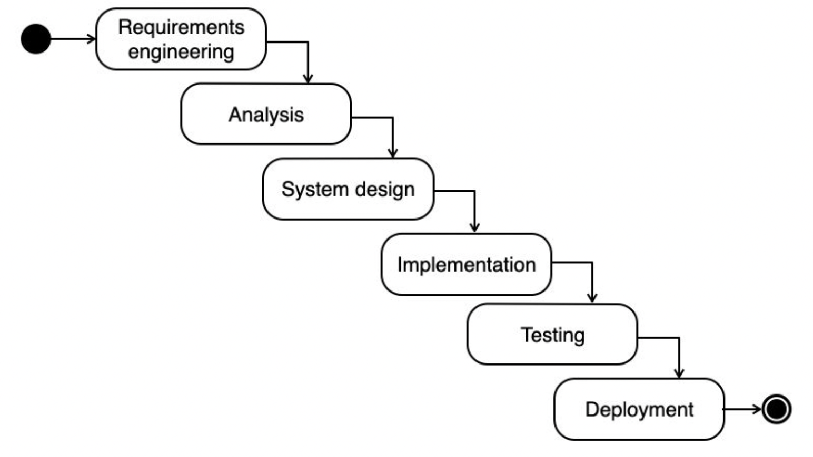

瀑布模型在如今的开发中显得过于笨重，很少再使用了

### Scrum 敏捷开发

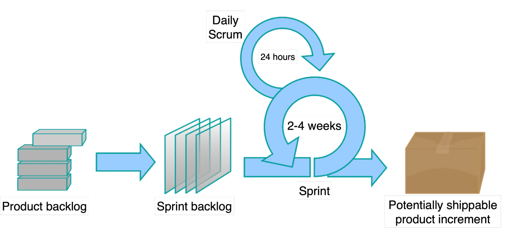

### DevOps

开发的高频更新与运维的追求稳定是天生的矛盾。DevOps是一种软件开发和运维的文化和方法论，旨在促进开发团队和运维团队之间的协作、沟通和整合。它强调开发人员和运维人员之间的紧密合作，以实现快速、高质量的软件交付和持续改进

DevOps的核心目标是通过自动化、持续集成、持续交付和持续部署等实践，加速软件开发和发布周期，提高软件交付的频率和质量。它鼓励开发团队和运维团队在整个应用程序生命周期中进行协作，共同承担责任，并共享对系统的理解。比如让运维人员会在项目开发期间就介入到开发过程中，了解开发人员使用的系统架构和技术路线，从而制定适当的运维方案。而开发人员也会在运维的初期参与到系统部署中，并提供系统部署的优化建议

下图说明了Waterfall、Scrum和DevOps三种开发模式的区别

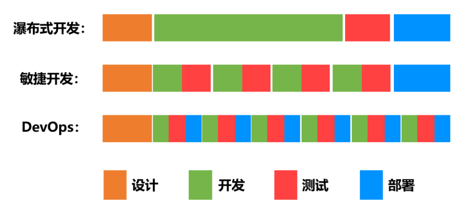

以下是一些关键特征和实践，通常与DevOps相关联：

1. 自动化：自动化是DevOps的核心原则之一。通过自动化构建、测试、部署和运维等任务，可以减少人工错误、提高效率和一致性
2. 持续集成（CI）：持续集成是指将开发人员的代码更频繁地集成到共享代码库中，并通过自动化构建和测试来验证代码的正确性。这有助于发现和解决问题的早期阶段
3. 持续交付（CD）：持续交付是指将通过持续集成生成的软件交付到预生产环境，并进行自动化测试和验证，以便随时可以将其部署到生产环境
4. 自动化部署：通过自动化部署实践，将软件应用程序从开发环境、测试环境到生产环境中进行快速且可靠的部署
5. 配置管理：使用配置管理工具（如Ansible、Chef、Puppet）来管理和自动化服务器和基础设施的配置，确保环境的一致性和可重复性
6. 实时监控和日志管理：持续监控应用程序和基础设施的运行状况，收集和分析实时数据和日志，以便快速发现和解决问题

通过采用DevOps实践，组织可以改善软件开发和运维之间的协作，缩短交付周期，提高应用程序的可靠性和质量，并能够更快地响应业务需求和市场变化

### CI/CD

<https://www.redhat.com/zh/topics/devops/what-is-ci-cd>

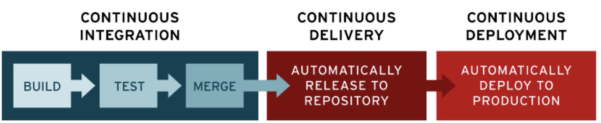

* Continuous Integration 持续集成：CI属于开发人员的自动化流程。成功的 CI 表明应用代码的新更改会定期构建、测试并合并到共享存储库中。这种方法可以解决在一次开发中有太多应用分支，从而导致相互冲突的问题
* Continuous Delivery/Deployment 持续交付/持续部署
  * 持续交付：持续交付通常是指开发人员对应用的更改会自动进行错误测试并上传到存储库（如 GitHub 或容器注册表），然后由运维团队将其部署到实时生产环境中。这旨在解决开发和运维团队之间可见性及沟通较差的问题。因此，持续交付的目的就是确保尽可能减少部署新代码时所需的工作量
  * 持续部署：指的是自动将开发人员的更改从存储库发布到生产环境，以供客户使用。它主要为了解决因手动流程降低应用交付速度，从而使运维团队超负荷的问题。持续部署以持续交付的优势为根基，实现了管道后续阶段的自动化

常用的CI/CD工具：Jenkins、GitLab CI/CD、Travis CI、CircleCI、Bamboo、Azure DevOps、TeamCity等

## *企业开发*

### 企业开发环境

* 开发环境 development：开发环境是程序猿们专门用于日常开发的服务器。为了开发调试方便，一般打开全部错误报告和测试工具，是最基础的环境
* 测试环境 testing：一个程序在测试环境工作不正常，那么肯定不能把它发布到生产机上。该环境是开发环境到生产环境的过渡环境
* 预发布环境/灰度环境 staging/pre-production
  * 该环境是为避免因测试环境和线上环境的差异等带来的缺陷漏测而设立的一套环境。其配置等基本和生产环境一致，但目的是能让我们发正式环境时更有把握。所以预发布环境是你的产品质量最后一道防线，因为下一步你的项目就要上线了。要注意预发布环境服务器不在线上集成服务器范围之内，为单独的一些机器
  * 所谓的灰度就是地域灰度、人群灰度环境，相当于是让小部分用户为我们的产品做测试
* 生产环境 production：是指正式提供对外服务的线上环境，例如我们目前在移动端或PC端能访问到的APP都是生产环境

### Git分支设计规范：GitFlow模型

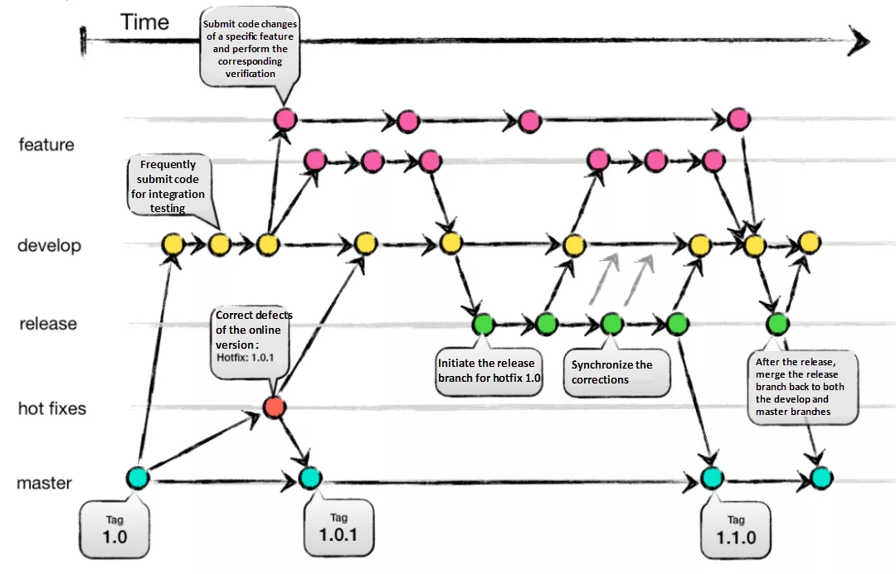

* master分支
  * master为主分支，该分支为**只读且唯一的分支**。用于部署到正式发布环境，一般由合并release分支得到
  * 主分支作为稳定的唯一代码库,任何情况下不允许直接在 master 分支上修改代码
  * 产品的功能全部实现后，最终在master分支对外发布，另外所有在master分支的推送应该打 tag 做记录，方便追溯
  * master 分支不可删除
* release分支
  * release为预发布分支，它是在本次上线所有的feature分支合并到develop分支之后，再基于develop分支创建的。可以被部署到测试或预发布集群
  * 命名以 `release/` 开头，建议的命名规则为：`release/version_publishtime`
  * release分支主要用于提交给测试人员进行功能测试。发布提测阶段，会以release分支代码为基准进行提测
  * **如果在 release 分支测试出问题，需要回归验证 develop 分支看否存在此问题**
  * release分支属于临时分支
* develop分支
  * develop 为开发分支，**基于master分支创建的只读且唯一的分支**，始终保持最新完成以及 bug 修复后的代码。可部署到开发环境对应集群
  * 可根据需求大小程度确定是由 feature 分支合并，还是直接在上面开发（非常不建议）
* feature分支
  * Feature分支通常为新功能或新特性开发分支，**以develop分支为基础创建feature分支**
  * 命名以 `feature/` 开头，建议的命名规则：`feature/user_createtime_feature`
  * 新特性或新功能开发完成后，开发人员需合到develop分支
  * 一旦该需求发布上线，便将其删除
* hotfix分支
  * hotfix分支为线上bug修复分支或叫补丁分支，主要用于对线上的版本进行 bug 修复。当线上出现紧急问题需要马上修复时，需要基于master 分支创建 hotfix 分支
  * 命名以 `hotfix/` 开头，建议的命名规则 `hotfix/user_createtime_hotfix`
  * 当问题修复完成后，需要**被合并到master分支和develop分支并推送远程**。一旦修复上线，便将其删除

**没有什么所谓最好的分支模型，只有最合适公司、团队、提高开发效率的分支模型**

## *Logging*

### OS

* UNIX 系统来说，程序的日志通常存放在 `/var/log`。Linux 系统都会使用 `systemd`，这是一个系统守护进程，它会控制系统中的很多东西，例如哪些服务应该启动并运行。`systemd` 会将日志以某种特殊格式存放于`/var/log/journal`，可以使用 [`journalctl`](http://man7.org/linux/man-pages/man1/journalctl.1.html) 命令显示这些消息

  > journalctl - Print log entries from the the systemd journal -- man journalctl

* 在 macOS 系统中是 `/var/log/system.log`，但是有更多的工具会使用系统日志，它的内容可以使用 `log show` 显示

### Java

日志就是Logging，它的目的是为了取代 `System.out.println()`。Java标准库内置了日志包 `java.util.logging`。它从严重到普通的等级分别为

* SEVERE
* WARNING
* INFO（默认等级，默认等级之下的不会被打印出来）
* CONFIG
* FINE
* FINER
* FINEST

方法

* 创建logger：`Logger.getLogger(String name)`
* 获取logger的level：`getLevel(newLevel)`
* 设置logger的level：`setLevel(newLevel)`

### Python

### C++

c++日志记录都有哪些好的开源项目？ - 叛逆者的回答 - 知乎 https://www.zhihu.com/question/37640953/answer/72889728

# Software Quality