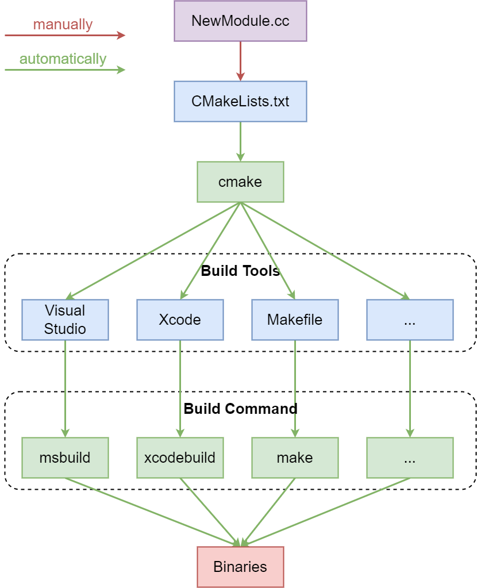
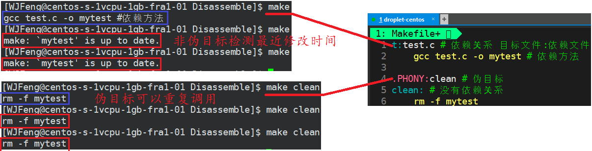

## *intro*

### build系统

直接用g++命令来编译的话，需要我们自己逐模块地编译目标文件，然后再链接起来，对于大的项目根本不可能手动来做

类似于Java的build工具maven、gradle等，`make` 是最常用的build系统之一，它通常被安装到了几乎所有类UNIX系统中

* 一个大的项目需要根据文件的类型、功能、模块按照一定顺序进行编译，不可能每次都手动输入编译命令，Makefile文件中存储着我们设计好的编译代码
* `make` 是一个命令，用来解释Makefile文件中指令的命令工具。当执行 `make` 时，它会去参考当前目录下名为 `Makefile` 的文件。所有构建目标、相关依赖和规则都需要在该文件中定义
* `make`并不完美，但是对于中小型项目来说，它已经足够好了。实际上单个project用的更多的是自动化构建Makefile工具如cmake，Makefile可以用来调用其他的build工具，比如camke、Maven等

### Makefile vs. CMake



* Makefile
  * Makefile 是一个文本文件，通常称为 `Makefile` 或 `makefile`，它包含了一系列规则，用于指导构建系统如何编译和链接项目的源代码文件
  * Makefile 的规则通常定义了目标文件、依赖文件和构建命令。当你运行 `make` 命令时，它会根据 Makefile 中的规则来构建项目
  * Makefile 通过检查文件的时间戳来确定哪些文件需要重新编译，以提高构建效率
  * Makefile 是一个传统的构建工具，通常需要手动编写，它是用于构建过程的静态规则
* CMake
  * CMake 是一个**跨平台**的构建系统生成工具，它允许开发者定义项目的构建过程，而不需要在不同平台上重复编写或使用复杂的构建工具
  * CMake 使用一个名为 `CMakeLists.txt` 的文本文件来描述项目的构建规则和依赖关系。这个文件中包含了构建配置选项、源代码文件、依赖库以及生成的目标等信息
  * CMake 生成的 Makefile 可以用于不同的构建工具，如 GNU Make、Ninja 等。这使得项目可以在不同的平台上使用不同的构建工具
  * CMake 支持多种生成器，允许你生成适用于不同集成开发环境和编译器的项目文件。这使得跨平台开发更加方便

总的来说，Makefile 是一个静态的构建工具，需要手动编写，而 CMake 是一个用于生成 Makefile 或其他构建系统的工具，它提供了更灵活的方式来管理和构建项目，特别是在需要跨平台支持的情况下。使用 CMake 可以减少构建系统的维护成本，提高项目的可移植性

## *Makefile*

### Makefile中的特殊符号

* `$@` 表示目标文件
* `$^` 表示所有的依赖文件
* `$<` 表示第一个依赖文件
* `$?` 表示比目标还要新的依赖文件列表
* `$%` 仅当目标是函数库文件中，表示规则中的目标成员名。例如，如果一个目标是 `foo.a(bar.o)`，那么，`$%` 就是 bar.o，`$@` 就是 foo.a。如果目标不是函数库文件（Unix下是[.a]，Windows下是[.lib]），那么，其值为空
* `$+` 这个变量很像 `$^`，也是所有依赖目标的集合。只是它不去除重复的依赖目标
* `$*` 这个变量要和 `%` 搭配使用，表示目标模式 % 及其之前的部分
  * 例子：如果目标是 `dir/a.foo.b`，并且目标的模式是 `a.%.b`，那么，`$*` 的值就是 `dir/a.foo`。这个变量对于构造有关联的文件名是比较有较
  * 如果目标中没有模式的定义，那么 `$*` 也就不能被推导出，但是，如果目标文件的后缀是make所识别的，那么`$*` 就是除了后缀的那一部分。例如：如果目标是 `foo.c`，因为 `.c` 是make所能识别的后缀名，所以，`$*` 的值就是 `foo`。这个特性是GNU make的，很有可能不兼容于其它版本的make，所以应该尽量避免使用 `$*`，除非是在隐含规则或是静态模式中。如果目标中的后缀是make所不能识别的，那么 `$*` 就是空值

### 赋值

* `=` 直接对变量赋值
* `+=` 追加赋值
* `:=` 该符号右侧是否有变量，如有变量且变量的定义在后边，则忽略该右侧变量，其他情况同=号
* `?=` 如果符号左侧的变量已经定义过则跳过该句

### 编写Makefile

```makefile
test: test.cc # 依赖关系 -> 目标文件: 依赖文件
    g++ -std=c++11 -o $@ $^ # 依赖方法，必须要用Tab缩进，不可以用空格

.PHONY: clean
clean:
    rm -f test
```

Makefile是一种汇编语言

* 一对make指令是由依赖关系和依赖方法组成的
  * 依赖关系：文件之间的关系，即 `目标文件: 依赖文件`
  * 依赖方法：如何通过依赖关系编译文件
* `make` **默认执行遇到的第一对依赖关系和依赖方法**，其余的需要 `make+依赖关系`，如 `make clean`
* 伪指令 `.PHONY`：每次 make 总是被执行的，若不是伪目标则若已经存在make后的结构则不会被执行；习惯是将 `clean` 设为伪目标，其他不设置
* make是如何知道目标已经是最新的呢？根据文件的最近修改时间，若可执行程序的修改时间比所有相关文件的修改时间都要晚，那么可执行程序就是最新的



## *基本语法*

### 基本语法格式

```CMake
#CMakeLists.txt
# CMake最小版本要求为2.8.3
CMAKE_MINIMUM_REQUIRED(VERSION 2.8.3)
PROJECT (HELLO)
SET(SRC_LIST main.cpp)
MESSAGE(STATUS "This is BINARY dir " ${HELLO_BINARY_DIR})
MESSAGE(STATUS "This is SOURCE dir "${HELLO_SOURCE_DIR})
ADD_EXECUTABLE(hello ${SRC_LIST})
```

* 基本语法格式为 `指令(参数1 参数2 ...)`
  * 参数使用 `()` 括起
  * 参数之间使⽤空格或分号分开，一般建议用空格
* 与makefile/Makefile都可以不一样，**CMakeLists.txt文件名必须严格区分大小写**。然而指令是⼤⼩写⽆关的，参数和变量是⼤⼩写相关的。但是推荐全部使⽤⼤写指令
* 变量使⽤ `${}` ⽅式取值，但是在 IF 控制语句中是直接使⽤变量名

CMake的指令笔者不会在这里统一给出，而是在下面用到了之后再给出

`CMAKE_MINIMUM_REQUIRED(VERSION versionNumber [FATAL_ERROR])` 指定CMake的最小版本要求

### PROJECT指令

PROJECT可以⽤来指定⼯程的名字和⽀持的语⾔，默认⽀持所有语⾔

* `PROJECT (HELLO)`：指定了⼯程的名字，并且⽀持所有语⾔，**建议这么写**
* `PROJECT (HELLO CXX)` 指定了⼯程的名字，并且⽀持语⾔是C++
* `PROJECT (HELLO C CXX)` 指定了⼯程的名字，并且⽀持语⾔是C和C++
* 也可以支持JAVA

## *CMake变量*

### 自定义变量方法

在CMake中，可以使用变量来存储和传递值。这些变量可用于设置构建选项、路径、编译器选项等。下面是一些常见的CMake变量用法

1. SET定义变量

   ```cmake
   set(variable_name value)
   ```

   **`set`  指令用于创建一个名为 `variable_name` 的变量，并将其设置为 `value`**

   demo中 `SET(SRC_LIST main.cpp)` 就是创建一个 `SRC_LIST` 变量，并将其值设置为 main.cpp

   如果源⽂件名中含有空格，就必须要加双引号，比如 `m ain.cpp`

2. 引用变量：

   ```cmake
   ${variable_name}
   ```

   在CMake中，使用 `${}` 来引用变量的值。例如，`${variable_name}` 将被替换为变量 `variable_name` 的实际值

3. MESSAGE获取变量的值

   ```cmake
   message(STATUS "Variable value: ${variable_name}")
   ```

   **`message` 指令可以用于向终端打印变量的值**。上述示例将输出变量 `variable_name` 的值到 CMake 构建过程的输出。

   主要包含三种信息

   * `SEND_ERROR`，产⽣错误，⽣成过程被跳过
   * `SATUS`，输出前缀为 `—` 或 `--` 的信息
   * `FATAL_ERROR`，⽴即终⽌所有 cmake 过程

4. 条件判断

   ```cmake
   if(variable_name)
     # 条件为真时执行的代码
   else()
     # 条件为假时执行的代码
   endif()
   ```

   可以使用 `if` 来根据变量的值执行不同的代码块

5. 全局变量和局部变量： CMake 中有全局变量和局部变量的概念。通过 `set` 命令定义的变量默认情况下是全局变量，可以在整个项目中使用。在函数或代码块中使用 `set` 命令定义的变量是局部变量，只在该代码块范围内有效

这些只是一些常见的CMake变量用法示例。CMake提供了更多高级用法，如列表变量、环境变量、缓存变量

### CMake常用内置变量

* CMAKE_C_FLAGS：gcc编译选项

* CMAKE_CXX_FLAGS：g++编译选项

  ```cmake
  # 在CMAKE_CXX_FLAGS编译选项后追加-std=c++11
  set( CMAKE_CXX_FLAGS "${CMAKE_CXX_FLAGS} -std=c++11")
  ```

* CMAKE_BUILD_TYPE：编译类型（Debug or Release）

  ```cmake
  # 设定编译类型为debug，调试时需要选择debug
  set(CMAKE_BUILD_TYPE Debug)
  # 设定编译类型为release，发布时需要选择release
  set(CMAKE_BUILD_TYPE Release)
  ```

* CMAKE_BINARY_DIR、PROJECT_BINARY_DIR、_BINARY_DIR：这三个变量指代的内容是一致的

  * 若是 in source build，指的就是工程顶层目录
  * 若是 out-of-source 编译，指的是工程编译发生的目录

* CMAKE_SOURCE_DIR、PROJECT_SOURCE_DIR、_SOURCE_DIR

* CMAKE_C_COMPILER：指定C编译器

* CMAKE_CXX_COMPILER：指定C++编译器

* EXECUTABLE_OUTPUT_PATH：可执行文件输出的存放路径

* LIBRARY_OUTPUT_PATH：库文件输出的存放路径

## *编译*

### 用到的指令

* INCLUDE_DIRECTORIES：向工程添加多个特定的头文件搜索路径，相当于指定g++编译器的 `-I` 参数

  ```cmake
  INCLUDE_DIRECTORIES([AFTER|BEFORE] [SYSTEM] dir1 dir2 ...)
  # 将/usr/include/myincludefolder 和 ./include 添加到头文件搜索路径
  INCLUDE_DIRECTORIES(/usr/include/myincludefolder ./include)
  ```

* LINK_DIRECTORIES：向工程添加多个特定的库文件搜索路径，相当于指定g++编译器的 `-L` 参数

  ```cmake
  LINK_DIRECTORIES(dir1 dir2 ...)
  # 将/usr/lib/mylibfolder 和 ./lib 添加到库文件搜索路径
  LINK_DIRECTORIES(/usr/lib/mylibfolder ./lib)
  ```

* TARGET_LINK_LIBRARIES：为 target 添加需要链接的共享库，相同于指定g++编译器 `-l` 参数

  ```cmake
  TARGET_LINK_LIBRARIES(target library1<debug | optimized> library2...)
  # 将hello动态库文件链接到可执行文件main
  TARGET_LINK_LIBRARIES(main hello)
  ```

* ADD_COMPILE_OPTIONS：添加编译参数

  ```cmake
  ADD_COMPILE_OPTIONS(）
  # 添加编译参数 -Wall -std=c++11 -O2
  ADD_COMPILE_OPTIONS(-Wall -std=c++11 -O2)
  ```

* ADD_EXECUTABLE：使用指定的源文件来生成目标可执行文件

  ```cmake
  ADD_EXECUTABLE(exename source1 source2 ... sourceN)
  # 编译main.cpp生成可执行文件main
  ADD_EXECUTABLE(main main.cpp)
  ```

  `ADD_EXECUTABLE(hello ${SRC_LIST})` ⽣成的可执⾏⽂件名是hello，源⽂件读取变量SRC_LIST中的内容。也可以直接写 `ADD_EXECUTABLE(hello main.cpp)`

  Demo可以简化的写成

  ```cmake
  PROJECT(HELLO)
  ADD_EXECUTABLE(hello main.cpp)
  ```

  注意：⼯程名的 HELLO 和⽣成的可执⾏⽂件 hello 是没有任何关系的

* ADD_SUBDIRECTORY

  ```cmake
  ADD_SUBDIRECTORY(source_dir [binary_dir] [EXCLUDE_FROM_ALL])
  ```

  * 这个指令⽤于向当前⼯程添加存放源⽂件的⼦⽬录，并可以指定中间⼆进制和⽬标⼆进制存放的位置
  * `EXCLUDE_FROM_ALL` 函数是将写的⽬录从编译中排除，如程序中的example
  * 例：`ADD_SUBDIRECTORY(src bin)`
    * 将 src ⼦⽬录加⼊⼯程并指定编译输出(包含编译中间结果)路径为bin ⽬录
    * 本质上和包头文件是一样的，相当于包子文件中的 `ADD_EXECUTABLE` 直接拷进来
    * 如果不进⾏ bin ⽬录的指定，那么编译结果(包括中间结果)都将存放在build/src ⽬录

* AUX_SOURCE_DIRECTORY：发现一个目录下所有的源代码文件并将列表存储在一个变量中，这个指令临时被用来自动构建源文件列表

  ```cmake
  AUX_SOURCE_DIRECTORY(dir VARIABLE)
  # 定义SRC变量，其值为当前目录下所有的源代码文件
  AUX_SOURCE_DIRECTORY(.src)
  # 编译SRC变量所代表的源代码文件，生成main可执行文件
  ADD_EXECUTABLE(main ${SRC})
  ```

### 工程结构

```shell
- MyProject/
  |- CMakeLists.txt
  |- src/
  |  |- main.cpp
  |  |- module1.cpp
  |  |- module2.cpp
  |
  |- include/
  |  |- module1.h
  |  |- module2.h
  |
  |- build/
  |
  |- bin/
  |
  |- libs/
  |  |- lib1/
  |  |  |- lib1.h
  |  |  |- lib1.cpp
  |  |
  |  |- lib2/
  |     |- lib2.h
  |     |- lib2.cpp
  |
  |- tests/
  |  |- test_module1.cpp
  |  |- test_module2.cpp
  |
  |- docs/
  |  |- README.md
  |  |- API.md

```

* `src/`：存放项目的源代码文件
* `include/`：存放项目的头文件
* `build/`：存放构建生成的可执行文件或库文件
* `libs/`：存放第三方库的文件夹。这里示例了两个库，每个库都有自己的头文件和源文件
* `tests/`：存放测试相关的代码文件
* `docs/`：存放项目的文档文件，包括项目说明和API文档等
* `bin/`：存放编译得到的二进制文件
* CMakeLists.txt or  Makefile：项目的构建文件，用于编译、链接和构建项目

### 内部构建 in-source build

在内部构建中，构建过程发生在源代码目录中，**也就是在与源代码相同的目录中进行构建**。这意味着生成的构建文件、中间文件和可执行文件与源代码混合在一起。这种构建方式简单，适用于小型项目或测试目的，但不推荐用于生产环境

```shell
cd /path/to/project
cmake .
make
```

### 外部构建 out-of-source build

在外部构建中，构建过程发生在与源代码目录分离的单独的build目录中。这意味着生成的构建文件、中间文件和可执行文件不会污染源代码目录，使得项目结构更加清晰和可维护。这种构建方式通常用于实际项目的生产环境

```shell
cd /path/to/project
mkdir build
cd build
cmake ..
make
```

在上述示例中，构建命令在与源代码目录分离的 build 目录中执行，这样可以确保生成的构建文件和输出文件不会与源代码混在一起

外部构建具有以下优点，通常建议在实际项目中使用外部构建

* 避免污染源代码目录，使得源代码目录保持干净和可重复使用
* 方便进行多个配置和平台的构建，而无需重复克隆源代码
* 更好地支持并行构建，加快构建过程
* 支持更简洁和可靠的清理过程

### CMake文件的层次结构

有两种方式来设置编译规则

* 包含源文件的子文件夹包含CMakeLists.txt文件，主目录的CMakeLists.txt通过add_subdirectory添加子目录即可。即每一个目录下面都要有一个CMakeLists.txt，**推荐使用这种方式**
* 包含源文件的子文件夹未包含CMakeLists.txt文件，子目录编译规则体现在主目录的CMakeLists.txt中

比如说有这么一个结构

```shell
.
├── build
├── CMakeLists.txt
└── src
    ├── CMakeLists.txt
    └── main.cpp
```

* 外层CMakeLists.txt

  ```cmake
  project(hello)
  add_subdirectory(src bin)
  ```

* src下的CMakeLists.txt

  ```cmake
  add_executable(hello main.cpp)
  ```

在一个复杂的项目中，可能有多个子目录，每个子目录都包含了相关的源代码文件和构建规则。为了方便管理和配置，CMake 采用了一种层次化的项目结构，每个子目录都可以拥有一个独立的 `CMakeLists.txt` 文件。每个子目录下的 `CMakeLists.txt` 文件可以根据需要设置特定的构建规则，并与父目录的配置进行协调

通过在每个目录下创建 `CMakeLists.txt` 文件，**可以将构建规则和相关配置与对应的源代码文件放在一起，使项目的组织更加清晰和可维护**。同时，这样的结构也使得整个项目可以方便地进行模块化和扩展

当使用 CMake 来构建项目时，CMake 会递归地遍历项目目录结构，并根据每个目录下的 `CMakeLists.txt` 文件来生成相应的构建脚本（如 Makefile、Visual Studio 解决方案等），最终用于编译和构建整个项目

因此，为了使 CMake 能够正确地解析和处理项目，每个目录下都需要一个 `CMakeLists.txt` 文件来描述该目录的构建规则和相关配置

### 编译流程

在Linux平台下使用CMake构建C/C++工程的流程如下

1. 手动编写CmakeLists.txt
2. 执行命令 `cmake PATH` 生成Makefile，PATH是顶层CMakeLists.txt所在的目录。注意，在哪里执行cmake命令生成的内容就在哪里，一般选择在build文件夹中执行 `cmake ..`，因为build中是所有编译产生的内容
3. 执行build命令make进行编译

## *构建库*

### 用到的指令

* SET_TARGET_PROPERTIES

* ADD_LIBRARY 生成库文件，SHARED为动态库，STATIC为静态库

  ```cmake
  add_library(libname [SHARED | STATIC | MODULE] [EXCLUDE_FROM_ALL] source1 source2 ... sourceN)
  # 通过变量 SRC 生成 libhello.so 共享库
  add_library(hello SHARED ${SRC})
  ```

  

SET 指令重新定义 `EXECUTABLE_OUTPUT_PATH` 和 `LIBRARY_OUTPUT_PATH` 变量来指定最终的⽬标⼆进制的位置

```cmake
SET(EXECUTABLE_OUTPUT_PATH ${PROJECT_BINARY_DIR}/bin)
SET(LIBRARY_OUTPUT_PATH${PROJECT_BINARY_DIR}/lib)
```

### 同时生成同名的动态库和静态库

```cmake
# 如果⽤这种⽅式，只会构建⼀个动态库，不会构建出静态库，虽然静态库的后缀是.a
ADD_LIBRARY(hello SHARED ${LIBHELLO_SRC})
ADD_LIBRARY(hello STATIC ${LIBHELLO_SRC})
# 修改静态库的名字，这样是可以的，但是我们往往希望他们的名字是相同的，只是后缀不同⽽已
ADD_LIBRARY(hello SHARED ${LIBHELLO_SRC})
ADD_LIBRARY(hello_static STATIC ${LIBHELLO_SRC})
```


### 使用外部库和头文件

## *安装*

### 安装的内容与方式

INSTALL的安装可以包括：⼆进制、动态库、静态库以及⽂件、⽬录、脚本等

* 从代码编译后直接 make install 安装
* 打包时的指定⽬录安装
  * 简单的可以这样指定⽬录：`make install DESTDIR=/tmp/test`
  * 稍微复杂⼀点可以这样指定⽬录：`./configure –prefix=/usr`

### 安装⽂件COPYRIGHT和README

INSTALL(FILES COPYRIGHT README DESTINATION share/doc/cmake/)

FILES：⽂件

DESTINATION：

1、写绝对路径

2、可以写相对路径，相对路径实际路径是：${CMAKE_INSTALL_PREFIX}/<DESTINATION 定义的路径>

CMAKE_INSTALL_PREFIX 默认是在 /usr/local/

cmake -DCMAKE_INSTALL_PREFIX=/usr 在cmake的时候指定CMAKE_INSTALL_PREFIX变量的路径
