# 并行架构的三大挑战

* Resource Contention (contention among N processors)
* Synchronization (updates to shared data)
* Load imbalance (imperfect parallelization)

# OpenMP

## *intro*

### 实现 TLP

现阶段很难做出自动并行的机器，其中难点在于：编译器不仅要弄清哪些操作之间是相互独立的，还要解决如何在并行环境中定位数据的棘手问题。编译器需要考虑的是整个代码，而非一个又一个的子程序。因此线程级并行需要程序员的参与

共享内存中的一种并行方式是：程序员编写普通程序，并借助 OpenMP 向编译器发布何时并行或如何并行的指令。这种指明数据分布，并将并行问题留给编译器的方法是后面要介绍的 PGAS 语言的基础。而在分布式内存 UMUA 中，程序员则需要通过 MPI 来管理一切

### OpenMP的特点

Open Multi-Processing, OpenMP 是 C 和 Fortran 的一个扩展包，它的主要并行方法是采用编译器指令来指示循环的并行执行。OpenMP 主要包括编译器指令 compiler directives、库例程 library routine（例程指的是一些预定义的代码片段）以及一些环境变量 environment variables

OpenMP 是基于线程的，它的特点是动态并行 dynamic parallelism：在代码的一个部分和另一个部分之间，并行运行的执行流的数量可以变化。**并行性是通过创建并行区域来声明的**，例如表明一个循环嵌套的所有迭代都是独立的，然后运行时系统将使用任何可用的资源

OpenMP 已成为一种广泛采用的并行编程模型和共享内存多核处理器的并行编程标准，受到了许多编程语言和编译器的支持。许多科学和工程应用程序、超级计算应用程序以及商业应用程序都使用 OpenMP 来充分利用多核计算机的性能

### OpenMP的历史

* 起源：OpenMP 的历史可以追溯到1997年，当时有几家公司和研究机构开始合作开发一种共享内存并行编程标准，以利用多核和多处理器系统的性能。最初的合作伙伴包括英特尔、Hewlett-Packard、IBM和美国国家能源研究科学计算中心（NERSC）等
* 第一个 OpenMP 标准：第一个 OpenMP 标准（OpenMP 1.0）于 1997 年发布，定义了一组指令和 API，允许程序员通过在代码中插入特殊指令来指示并行性。这些指令使得程序能够在多个线程之间共享数据和计算任务
* 不断发展：随着多核处理器和并行计算需求的增加，OpenMP 标准得到了不断发展和改进。后续版本如 OpenMP 2.0、OpenMP 3.0 和 OpenMP 4.0 引入了更多的功能，包括任务并行性、加速器支持、SIMD等
* OpenMP 4.5 和 OpenMP 5.0：OpenMP 4.5 和 OpenMP 5.0 标准进一步扩展了 OpenMP 的功能，引入了更多的指令和 API，以适应更复杂的并行计算任务。OpenMP 5.0 还引入了支持机器学习和深度学习等新兴领域的功能

### OpenMP系统栈


## *OpenMP执行模型*

### fork-join 模型


OpenMP API 使用并行执行的 fork-join 模型。多个执行线程执行由 OpenMP 指令隐式或显式定义的任务。OpenMP API 旨在支持可以同时作为并行程序（多个执行线程和完整的 OpenMP 支持库）和顺序程序（指令被忽略且简单的 OpenMP 存根库）正确执行的程序。然而，符合规范的 OpenMP 程序可能会作为并行程序正确执行，但作为顺序程序不正确执行，或者在作为并行程序执行和作为顺序程序执行时可能产生不同的结果。此外，使用不同数量的线程可能会因数值操作的关联性变化而导致不同的数值结果。例如，串行加法规约可能具有不同的加法关联模式，而并行规约可能具有不同的关联模式。这些不同的关联可能会改变浮点加法的结果

一个 OpenMP 程序开始时是一个单一的执行线程，称为初始线程 initial thread。初始线程按顺序执行，就好像遇到的代码是隐式任务区域 implicit task region的一部分，称为初始任务区域，该区域由整个程序周围的隐式并行区域生成

执行整个程序周围的隐式并行区域的线程在主机设备上执行。实现可以支持除主机设备之外的其他设备。如果支持，这些设备可供主机设备用于 offload 代码和数据。每个设备都有自己的线程，与在另一个设备上执行的线程不同。**线程不能从一个设备迁移到另一个设备**。每个设备由设备编号 device number 标识。主机设备的设备编号是非主机设备的总数，而每个非主机设备都有一个唯一的设备编号，大于或等于零，小于主机设备的设备编号。此外，常量 `omp_initial_device` 可用作主机设备的别名，常量 `omp_invalid_device` 可用于指定无效的设备编号。符合规范的设备编号要么是小于或等于 `omp_get_num_devices()` 的非负整数，要么等于 `omp_initial_device` 或 `omp_invalid_device`

### target

当遇到一个 target 构造块时，会生成一个新的 target 任务。target 任务区域包围着 target 区域。target 任务在 target 区域执行完成后才完成

当一个 target 任务执行时，包围的 target 区域由一个初始线程执行。初始线程按顺序执行，就好像 target 区域是由隐式并行区域生成的初始任务区域的一部分。如果请求的目标设备可用且受支持，初始线程可能会在目标设备上执行。如果目标设备不存在或实现不支持它，与该设备关联的所有 target 区域都将在主机设备上执行。实现必须确保 target 区域的执行就好像它是在目标设备的数据环境中执行的，除非存在 if 子句并且 if 子句表达式评估为 false

### teams Construct

`teams` construct 创建一个league of teams，其中**每个 league 是一个包含一个初始线程的初始团队，用来执行 teams 区域**。每个初始线程按序执行，就好像遇到的代码是由与每个团队相关的隐式并行区域生成的初始任务区域的一部分。初始线程是否并发执行 teams 区域是未指定的，依赖它们的并发执行以实现同步的程序可能会发生死锁

如果一个构造块创建一个数据环境，数据环境在遇到构造块时创建。构造块的描述定义了它是否创建一个数据环境

### parallel Construct

**当任何线程遇到一个 parallel 构造块时，线程会创建一个包括它自己的team，team中有零个或多个从它的到的额外线程**，initial threa会成为新团队的主线程 primary thread。一组隐式任务会生成，每个线程对应一个任务，任务的代码由 parallel 构造块内部的代码定义。每个任务分配给团队中的不同线程，并成为绑定的任务；也就是说，这些被分割成的子任务始终由最初分配给它的线程执行。正在执行遇到构造块的线程的任务区域被暂停，新团队的每个成员执行其隐式任务。在 parallel 区域的末尾有隐式barrier。只有主线程继续执行 parallel 构造块之后的代码，恢复在遇到 parallel 构造块时被暂停的任务区域。一个程序中可以指定任意数量的 parallel 构造块。

并行区域可以彼此嵌套。如果禁用了嵌套并行性，或者 OpenMP 实现不支持它，那么在parallel内部的线程如果遇到了一个嵌套的parallel construct，此时不会生成新的team，而是只包含自己这个线程。但如果支持并启用了嵌套并行性，那么新team可以由多个线程组成。一个 parallel 构造块可以包括一个 `proc_bind()` clause，以指定在 parallel 区域内的team中要使用的地方。

当任何团队遇到一个 worksharing construct 时，构造块内部的工作被分配给团队的成员，而不是由每个线程执行。在与 worksharing 构造块对应的任何区域的末尾发生隐式屏障，除非指定了 nowait 子句。对于没有指定 nowait 子句的 worksharing 构造块，代码被每个团队中的每个线程冗余执行，执行在 worksharing 构造块的末尾后继续。当任何线程遇到一个生成任务的构造块时，会生成一个或多个显式任务。显式生成的任务的执行分配给当前团队中的一个线程，取决于线程是否可以执行工作。因此，新任务的执行可能是立即的，也可能根据任务调度约束和线程可用性而延迟到稍后。线程允许在任务调度点暂停当前任务区域以执行不同的任务。如果被暂停的任务区域是绑定任务的任务区域，则最初分配的线程稍后恢复执行被暂停的任务区域。如果被暂停的任务区域是非绑定任务的任务区域，则任何线程都可以恢复执行它。在给定并行区域中完成所有显式任务的绑定在离开该区域末尾的隐式屏障之前是有保证的。可以通过使用任务同步构造块来指定给定并行区域的所有显式任务的子集完成。在程序退出时，隐式并行区域中的所有显式任务的完成是有保证的。

当任何线程遇到一个 simd construct 时，与construct相关的循环的迭代可以并行执行，使用线程可用的 SIMD 通道。

当遇到 loop construct 时，与construct 相关的循环的迭代在其遇到的线程的上下文中执行，根据其绑定区域的确定。如果循环区域绑定到 teams 区域，那么该区域由执行 teams 区域的主线程集合遇到。如果循环区域绑定到 parallel 区域，那么该区域由执行 parallel 区域的团队中的线程遇到。否则，该区域由单个线程遇到。

如果循环区域绑定到 teams 区域，那么遇到的线程可以在循环区域之后继续执行，而不必等待所有迭代完成；在 teams 区域结束之前，迭代完成是有保证的。否则，所有迭代必须在遇到的线程继续执行循环区域之后完成。遇到 loop 构造块的所有线程可以参与迭代的执行，但每个迭代只能由其中一个线程执行。

cancel 构造块可以改变 OpenMP 区域中已经描述的执行流程。cancel 构造块的效果取决于其 construct-type-clause。如果一个任务遇到一个带有 taskgroup construct-type-clause 的 cancel 构造块，那么任务会激活取消，并在其任务区域结束后继续执行，这意味着该任务完成。该任务组中的任何其他已经开始执行的任务将完成执行，除非它遇到了一个取消点构造块，在这种情况下，它将在其任务区域结束后继续执行，这意味着它完成。任务组区域中还没有开始执行的其他任务将被中止，这意味着它们完成。

对于所有其他 construct-type-clause 值，如果一个线程遇到 cancel 构造块，它会激活指定类型的最内部封闭区域的取消，然后线程会在该区域结束后继续执行。线程在取消点检查取消是否已激活，并如果是的话，也会在取消的区域结束后继续执行。

如果激活了取消，不论 construct-bype-Clause 如何，等待在除取消的区域末尾的隐式屏障之外的屏障内的线程将退出屏障并在取消的区域末尾继续执行。这个操作可能发生在其他线程达到该屏障之前。

当执行编译时错误终止时，效果就好像遇到了 sev-level 为 Eatal 和 action-time 为 compilation 的 error 指令。当执行运行时错误终止时，效果就好像遇到了 sev-level 为 Eatal 和 action-time 为 execution 的 error 指令。

OpenMP API 提供了同步构造块和库例程，用于协调并行区域中的任务和数据访问。此外，库例程和环境变量可用于控制或查询 OpenMP 程序的运行时环境。OpenMP 规范不保证在并行执行时相同文件的输入或输出是同步的。在这种情况下，程序员需要使用 OpenMP 同步构造块或库例程的帮助来同步输入和输出处理。对于每个线程访问不同文件的情况，程序员不需要同步访问。关于线程执行方面的基础语言定义的所有并发语义都适用于 OpenMP 线程，除非另有规定。

## *安装 & 编译*

### 安装

OpenMP 包含在 build-essential 包中

```cmd
$ sudo apt install build-essential
```

查看 OpenMP 版本

```cmd
$ echo | cpp -fopenmp -dM | grep -i open
#define _OPENMP 201511
```

201511 发布的是 OpenMP 4.5 版本

### 编译

引入 `<omp.h>` 库，直接在 gcc/g++ 的编译语句中加入 `-fopenmp` 选项来开启 OpenMP 的编译器指令即可

gcc 加入 `-Wunknown-pragmas` 选项会在编译时报告没有处理的 `#pragma` 语句

## *基础语法*

### demo

```c
#include <stdio.h>
#include <stdlib.h>
#include <omp.h>

void hello(void){ 6 
    int my_rank = omp_get_thread_num(); // 创建的线程组中的编号
    int thread_count = omp_get_num_threads(); // 创建的线程总数
    printf("Hello World from thread %d of %d.\n", my_rank, thread_count);
}

int main(int argc, char *argv[]) {
    int thread_count = strtol(argv[1], NULL, 10);
# pragma omp parallel num_threads(thread_count)
    hello();

    .
        
    return 0;
}
```

### 编译器指令

所有的编译器指令（指导语句）以 `#paragma omp` 开头，同一类 openmp 制导语句称为一种构造（construct）。使用 `{}` 标记作用的代码块，如果不用 `{}`，那么只有紧接着的一行有效

```c
#pragma omp <directive name> [clause]
{
    
}
```

### 共享和私有变量

在并行区外的变量默认是共享变量 shared variables，可以被所有线程使用；私有变量 private variables 只能被一条线程操作

```c++
int i；
float *a, *b, *c, tmp；
#pragma omp parallel for private(tmp)
for (i = 0; i < N; i++) {
	tmp = a[i] / b[i];
    c[i] = tmp * tmp;
}
```

Data sharing clauses 数据共享语句有如下

* `shared(var-list)`：在var-list中的是共享的。全局变量默认是shared

  * 共享变量在内存中只有一份，所有线程都可以访问
  * 请保证共享访问不会冲突
  * **不特别指定并行区变量默认为 shared**
  
* `private(var-list)`：在var-list中的变量是私有的

  * 每一个线程都独自拥有变量的副本
  * 如果j被定义为私有变量，那么在for循环里面所有的线程都不能访问其他的j，尽管j本来是共享变量
  * **所有的线程都不会使用到先前的定义，比如说一开始tmp若被赋值为3，则进入并行块后会被按照内置类型初始化为0.0（最好是自己初始化一下）**
  * 所有线程都不能给共享的赋值
  * 在循环的入口以及出口，都 不会进行定义，也就是说在并行块结束后不会对原来的变量产生影响

* `default(private | shared | none)`

  * 为一个并行区域的变量设置默认等级
  * 当设置为none的时候，若shared没有显式给出编译会报错

* `firstprivate(var-list)`：告诉编译器私有变量在**第一个循环**初始化为主线程中对应的数据的值，其他用法基本和private一样

* `lastprivate(var-list)`

  指定将线程中的一个或多个私有变量的值在并行处理结束后复制到主线程中的同名变量中，**负责拷贝的线程是执行最后一个for或sections的线程**

### 常用API

* `omp_get_num_threads()`：返回并行域中总线程的数量
* `omp_get_thread_num()`：返回当前工作的线程编号
* `omp_set_num_threads()`：设定并行域内开辟线程的数量
* `omp_get_wtime()`：openmp中自带的计时函数（单位是秒），用于检测并行优化效果。推荐使用这个函数，C/C++ runtime API 在并行环境下可能会影响程序的性能

### 环境变量

OpenMP 提供了一些环境变量，用来在运行时对并行代码的执行进行控制。这些环境变量也称为 internal control variables ICV

这些环境变量可以用来控制：设置线程数、指定循环如何划分、将线程绑定到处理器、启用/禁用嵌套并行，设置最大的嵌套并行级别、启用/禁用动态线程、设置线程堆栈大小、设置线程等待策略。常用的环境变量有：

* OMP_SCHEDULE：用于 for 循环并行化后的调度，它的值就是循环调度的类型
* OMP_NUM_THREADS：用于设置并行域中的线程数
* OMP_DYNAMIC：通过设定变量值，来确定是否允许动态设定并行域内的线程数
* OMP_NESTED：指出是否可以并行嵌套

## *并行区域*

### parallel constrcut

并行区域会被显式给出

```c
#pragma omp parallel [clause]
{ /**/ }
```

下面是一些要用的 clause

* 设置线程数/并行度，**优先级由低到高**

  * 什么也不做，系统选择运行线程数

  * 设置环境变量 `export OMP_NUM_THREADS=4`

  * 代码中使用库函数 `void omp_set_num_threads(int)`

  * 通过制导语句从句 `num_threads(integer-expression)`

  * if clause 判断串行还是并行执行，若表达式为真，就按照并行方式执行并行区，否则以串行方式执行

    ```c
    #pragma omp parallel if(scalar-expression)
    ```


### nowait

以下是一个示例，演示了`nowait`的作用。假设有一个循环，需要计算两个数组 `A` 和 `B` 的元素之和，并且我们使用OpenMP并行化来加速这个计算

```c
int N = 100;
int A[N], B[N], result[N];

#pragma omp parallel for
for (int i = 0; i < N; i++) {
    A[i] = i;
    B[i] = 2 * i;
}

#pragma omp parallel for
for (int i = 0; i < N; i++) {
    result[i] = A[i] + B[i];
}

printf("Results:\n");
for (int i = 0; i < N; i++) {
    printf("%d + %d = %d\n", A[i], B[i], result[i]);
}
```

在这个示例中，我们有两个并行区域，一个用于初始化数组 `A` 和 `B`，另一个用于计算 `result` 数组。这两个并行区域没有使用`nowait`

执行结果可能如下所示：

```
Results:
0 + 0 = 0
1 + 2 = 3
2 + 4 = 6
3 + 6 = 9
...
```

这个示例中，第一个并行区域初始化数组 `A` 和 `B`，然后第二个并行区域计算 `result`。线程必须等待第一个并行区域完成后才能执行第二个并行区域，这会引入等待开销

现在，让我们使用`nowait`来改进第一个并行区域：

```c
// same
#pragma omp parallel for nowait
for (int i = 0; i < N; i++) {
    A[i] = i;
    B[i] = 2 * i;
}
// same
```

在第一个并行区域中，我们添加了`nowait`。现在，线程不必等待第一个并行区域完成，而可以立即执行第二个并行区域。

这意味着线程可以更充分地利用并行性，减少等待时间，提高性能。但要注意，`nowait`必须小心使用，以确保没有潜在的竞态条件。

### 线程亲和性

亲和性通常以掩码 mask 的形式表示，即描述线程被允许在哪些位置运行的说明。mask取决于采用哪种亲和性策略

* close：适用于共享内存的线程

  ```
  Thread  Socket 0  Socket 1
  0       0
  1       1
  ```

* spread：适用于需要大的bandwidth的线程，这样可以进可以让它得到socket的bandwidth

  ```
  Thread  Socket 0  Socket 1
  0       0
  1                 1
  ```

### section construct

在一个并行区域中还可以再分组

```c
#pragma omp sections [parameters]
{
#pragma omp section
	{ /**/ }
#pragma omp section
	{ /**/ }
}
```

* sections在封闭代码的指定部分中，由线程组进行分配任务
* 每个独立的section都需要在sections里面
  * **每个section都是被一个线程执行的**
  * 不同的section可能执行不同的任务
  * 如果一个线程够快，该线程可能执行多个section
  * 完成任务的线程会在sections尾部同步屏障 barrier 处等待

下面看一个例子

```c
#pragma omp parallel shared(a,b,e,d) private(i)
{
#pragma omp sections
    {
#pragma omp section
        {
            for (i = 0; i < N; i++) {
                c[i] = a[i] + b[i];
            }
        }
#pragma omp section
        {
            for (i = 0; i < N; i++) {
                d[i] = a[i] * b[i];
            }
        }
    } /* end of sections */
} /* end of parallel block *
```

## *循环分割工作*

### for construct

for的下面两种写法是等价的，但是第二种只有在当并行区内只有一个for的时候才能这么简化

```c
int main() {
	int a[100];
#pragma omp parallel
{
#pragma omp for
    {
		for (int i= 1; i<n; i++) a[i] = i;
	}
    // implicit barrier
}
```

```c
int main () {
	int a[100];
#pragma omp parallel for
	{
		for (int i= 1; i<n; i++) a[i] = i;
	}
}
```

它告诉编译器接下来的for循环，将会使用并行的方式执行，也就是说把for的任务分配给不同的线程。成功并行需要满足以下条件：

* 在循环的迭代器必须是可计算的并且在执行前就需要确定迭代的次数
* for中的语句必须要以任何顺序执行
  * 在循环的代码块中不能包含break、return、exit

  * 在循环的代码块中不能使用goto跳出到循环外部
* 迭代器只能够被for语句中的增量表达式所修改，并且仅限加减法
* 所有线程组的线程会在块尾隐式定义的 barrier 处同步，除非声明了nowait

注意⚠️：OpenMP编译器不检查被parallel for指令并行化的循环所包含的迭代间的依赖关系，这是由程序员编程的时候来保证的。若一个或者更多个迭代结果依赖于其他迭代的循环，一般不能被正确的并行化

如果将 parallel 和 for construct 合并，那么支持的clauses会发生变化

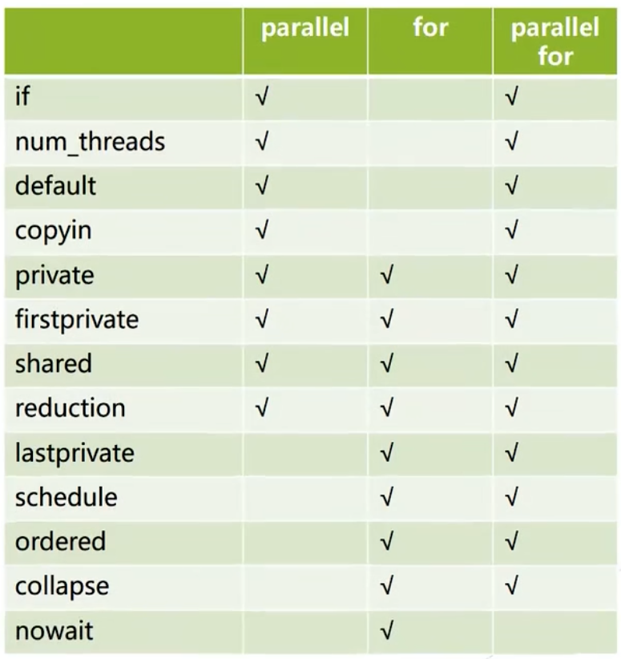

### 循环调度策略

Loop Scheduling Strategy 是一种用于在并行循环中分配迭代任务给线程的策略。这些策略控制了如何分割循环迭代任务到并行线程中，以求实现负载均衡和最佳性能。其语法格式为

```c
#pragma omp for schedule(type[, size])
```

循环调度策略 loop scheduling strategies 有

* `static` 静态调度，这是默认的调度方式

  静态调度将循环的迭代均匀地分配给不同的线程，即 round-robin fashion。每个线程获得一定数量的连续迭代。这在循环迭代的运行时间可预测且各迭代之间的工作负载相对均衡的情况下很有用

  chunk，即每个线程分配到的任务数默认是 `n/t`，其中n是for次数，t是线程数

  静态指的是当for启动之后chunk的分配是静态的

* `dynamic` 动态调度

  动态调度将迭代均匀分布给不同线程，但每个线程一次只处理一定数量的迭代，完成后运行时系统发现该线程变空了就再给他分配更多循环。这对于迭代之间的工作负载不均衡的情况很有用

  chunk的默认值为1，动态调整

* `guided` 引导调度

  引导调度类似于动态调度，但一开始分配给线程的迭代较多，然后几何级减少。这适用于工作负载不均衡且随时间变化的情况

* `auto` 自动调度

  它将迭代的分配交给编译器和运行时系统来决定，以尽量实现最佳性能。在这种情况下，编译器和运行时系统会根据工作负载的特性自动选择合适的调度策略，以确保负载均衡和性能优化

  编译器和运行时系统会考虑许多因素，包括迭代数量、迭代工作量、可用的CPU核心数量等

* `runtime` 运行时调度

  运行时根据控制变量 OMP_SCHEDULE 来调整

一个典型的例子是对对称矩阵做计算的时候（这时候只需要计算一个上/下三角矩阵）

### 循环嵌套

`collapse(n)`：应用于n重循环嵌套的合并（展开）循环，n要小于等于嵌套层数，要注意循环之间是否有数据依赖

## *数据同步*

### barrier

barrier是用于实现同步的一种手段，用于协调并行线程的执行。它会在代码的某个点，令线程停下直到所有的线程都到达该地方，从而确保在某一点上的所有线程都达到了同步点之后才能继续执行

barrier非常有用，因为它允许线程在并行执行的某个地方同步，以确保协作并发操作

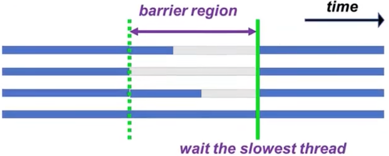

* **每一个并行区域（parallel construct）在末尾都有一个隐式的barrier**，不过可以用nowait声明来关闭这个隐式的barrier

  ```c
  #pragma omp parallel
  {
  #pragma omp for
      {
  		for (int i= 1; i<n; i++) a[i] = i;
  	}
      // implicit barrier
  }
  ```

* 额外的barrier也可以显式给出

  ```c
  #pragma omp barrier
  ```

**barrier可能会引起负载不均衡，只有在必要的时候才用它！**比如说在debug的时候还是很有用的

### master & masked

master目前已经被废弃了，目前用的是masked

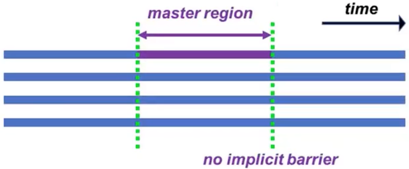

master/masked用来声明一个区域，在master中只有主线程 primary thread 可以执行，其他线程会跳过这个区域，也不会进行同步

```c
#pragma omp master // deprecated
	/**/
#pragma omp masked
	/**/
```

master/masked可能用于打印、IO

masked可以用来指定一些线程运行，其他线程会跳过这个区域，区域开始前也不会同步

```c
#pragma omp masked [filter(integer-expression)]
	/**/
```

* 可以用来指定主线程以外的线程来执行IO
* 可以用来和nowait搭配来制造一些大的并行区域

### single

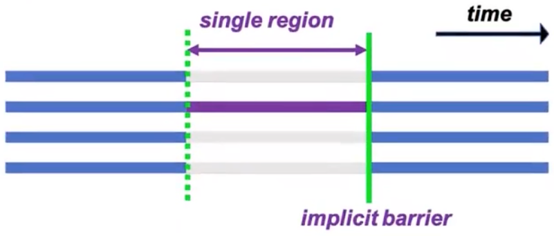

```c
#pragma omp single [parameter]
	/**?
```

* 告诉编译器接下来紧跟的下段代码将只由**任意一个**线程执行，有隐式 barrier
* 和masked不同，masked可以指定哪一个或哪一些线程来执行，而**single用哪一个则无法控制**
* 它可能会在处理多段线程不安全代码时非常有用，比如说初始化数据结构
* single region尾是一个隐式的barrier：在不使用no wait选项时，在线程组中不执行single的线程们将会等待single的结束

### critical

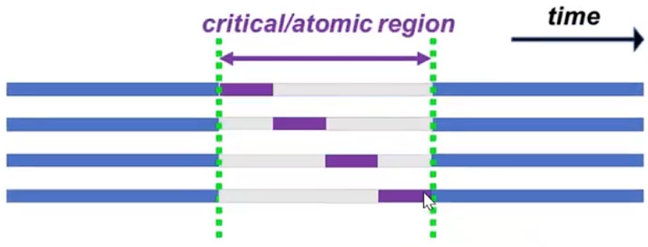

声明临界区，让里面的for互斥执行

```c
#pragma omp critical [(Name)]
	/**/
```

下面是一段示例，创建了两个临界区 MyCritialSection 用来执行++和AnotherCriticalSection 用来执行--。这两个临界区具有不同的名称，因此它们是相互独立的，多个线程可以同时进入不同名称的临界区

所有不具名的临界区会合并成同一个临界区

```c
int shared_variable = 0;
#pragma omp parallel
{
    int thread_id = omp_get_thread_num();
    // 使用 #pragma omp critical 来创建临界区
    #pragma omp critical (MyCriticalSection)
    {
        shared_variable++;  // 临界区中的操作是线程安全的
        printf("Thread %d incremented shared_variable to %d\n", thread_id, shared_variable);
    }
    // 可以创建多个不同名称的临界区
    #pragma omp critical (AnotherCriticalSection)
    {
        shared_variable--;
        printf("Thread %d decremented shared_variable to %d\n", thread_id, shared_variable);
    }
}
```

### atomic

```c
#pragma ATOMIC
	/*expression-stmt*/
```

atomic 和 critical 的语义基本是一样的，但 atomic 还可以指定**单个特定格式的语句或语句组中某个变量** atomic 操作

### 运行时锁

OpenMP除了directive之外，还提供了一些运行时锁的API，他们基本和pthread的使用是一样的

锁的数据类型是 `omp_lock_t`

```c
omp_init_lock(&lockvar);              // initialize a lock
omp_destroy_lock(&lockvar);           // destroy a lock
omp_set_lock(&lockvar);               // set lock
omp_unset_lock(&lockvar);             // free lock
logicalvar = omp_test_lock(&lockvar); // check lock and possibly set lock
```

运行时锁支持nestable lock

### ordered

ordered construct 用来声明有潜在的顺序执行部分

## *规约*

有时候在barrier的地方不仅需要同步数据，还需要进行规约，规约就是把各个线程的数据聚合起来，比如说要算一个大的加法，每个加法里面还有很多操作，那么可以让每个线程处理内部的操作，然后最后把结果加起来。规约的结果可以给主线程使用

```c
reduction(operator:variable)
```

* `operator`是规约操作的运算符，例如 `+` 表示求和，`*` 表示求积，`max` 表示求最大值，等等。
* `variable`是进行规约操作的变量

### reduction的执行过程

下面是 openmp 自带的内置规约操作

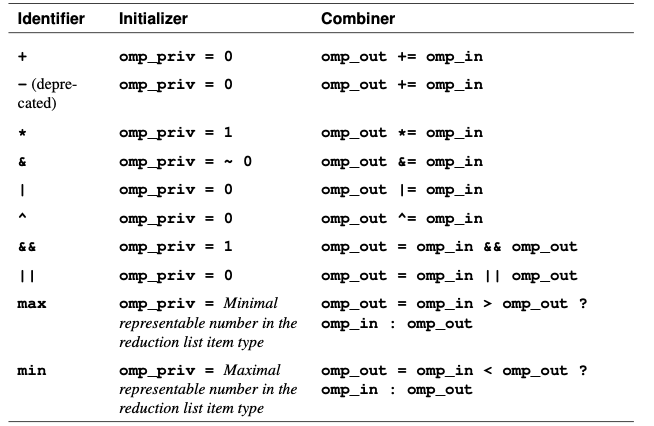

1. fork线程并分配任务
2. 每一个线程定义一个私有变量omp_priv（同private）
3. 各个线程执行计算
4. Combiner：所有私有的omp_in（就是omp_priv？）一起顺序进行reduction操作，并将结果写回原变量（omp_out）

### 自定义规约操作

OpenMP 提供的内置规约操作只可用于内置数据类型，比如 int、float 等，如果是要操作自定义类型 struct 或者有一些非内安置操作，比如 argmin、argmax，那么就需要自定义规约操作。有点C++重载类操作符的意味

```c
#pragma omp declare reduction (reduction-identifier : typename-list : combiner) [initializer-clause]
```

* reduction-identifier：归约标识符，相当于openmp自带的+，这里命名为MyAdd
* typename-list：归约操作的数据类型，这里为MyClass
* combiner：合并链接具体操作，+=为具体操作，omp_out与omp_in为固定的标识符
* initializer-clause：归约操作的每个线程的初始值，比如求和操作时赋值100则等效于100xn(线程数）基础上再求和数组,定义格式为initializer(omp_priv=MyClass(100)) ,此项可以省略不写，初值会按类型的默认构造函数赋值

### 将规约过程组织成数据结构

在各个线程之间的规约有可能会有比较大的消耗，一般来说不会采用线性结构来做规约，而会采用树等结构来做。因此规约应该要被实现为OpenMP和MPI层次的操作

## *OpenMP的内存模型*

# OpenMP源代码解析

下面的内容都是GCC按照OpenMP规范的实现

libgomp ABI: https://gcc.gnu.org/onlinedocs/libgomp/The-libgomp-ABI.html

gcc source code: https://github.com/gcc-mirror/gcc/blob/master/libgomp/parallel.c#L130

## *准备*

### 帮助阅读汇编的gcc选项

* 调整编译器的优化等级：编译器较高的优化登记会导致汇编代码产生严重变形，可读性严重下降。`-Og` 是减少GCC的优化程度，提高汇编程序的可读性，其中-g是 gdb debugging。较高的优化等级可以通过 `-O1`、`-O2` 等选项指定
* -Wunknown-pragmas: 此选项告诉 GCC 在遇到未知的 #pragma 指令时发出警告。在编译时，如果你使用了未知的 #pragma 指令，编译器会产生相应的警告信息，帮助用户避免使用不被支持的指令
* -fverbose-asm: 此选项用于生成更为详细的汇编代码，包括源代码行号和基本块的注释。这样生成的汇编代码更易于阅读和理解，特别是在进行汇编级别的调试时。这对于分析和理解生成的汇编代码非常有用
* -masm=intel：这个选项将汇编代码格式设置为 Intel 风格，而不是默认的 AT&T 风格，对于一些程序员来说更易读
* -fdump-tree-all：可以让GCC生成大量的中间代码文件，其中包括 `*.o.omp-expand` 文件，它包含了OpenMP指令的展开

```cmd
$ gcc -S main.c -o main.s -fopenmp -lm -Wunknown-pragmas -fverbose-asm -masm=intel -Og -fdump-tree-all
```

## *parallel construct*

https://gcc.gnu.org/onlinedocs/libgomp/Implementing-PARALLEL-construct.html

```c
#pragma omp parallel
{
    body;
}
```

会被展开为

```c
void subfunction (void *data)
{
	use data;
    body;
}

setup data;
GOMP_parallel_start (subfunction, &data, num_threads);
subfunction (&data);
GOMP_parallel_end ();
```

```c
void GOMP_parallel_start (void (*fn)(void *), void *data, unsigned num_threads)
```

* `fn`：指向表示并行区域的函数的指针。该函数必须接受一个 `void*` 参数，调用 `GOMP_parallel_start` 时应提供相应签名的函数。从上面展开的部分可以看出，这个函数指针就是用于回调 subfunction 的
* `data`：指向要传递给并行区域的数据的指针。在并行区域中，可以使用线程特定的机制访问此数据
* `num_threads`：一个无符号整数，指定在并行区域中要使用的线程。如果不指定这个 `num_threads()` 子句的话，默认的参数是 0 ，但是如果使用了 IF 子句并且条件是 false 的话，那么这个参数的值就是 1（即并行）

### GOMP_parallel_start 分析

```c
void
GOMP_parallel_start (void (*fn) (void *), void *data, unsigned num_threads)
{
  num_threads = gomp_resolve_num_threads (num_threads, 0);
  gomp_team_start (fn, data, num_threads, 0, gomp_new_team (num_threads),
		   NULL);
}
```

* gomp_resolve_num_threads

  ```c
  /* Determine the number of threads to be launched for a PARALLEL construct.
     This algorithm is explicitly described in OpenMP 3.0 section 2.4.1.
     SPECIFIED is a combination of the NUM_THREADS clause and the IF clause.
     If the IF clause is false, SPECIFIED is forced to 1.  When NUM_THREADS
     is not present, SPECIFIED is 0.  */
  gomp_resolve_num_threads (unsigned specified, unsigned count) {
    // ...
    if (specified == 1)
    return 1;
    // ...
    /* If NUM_THREADS not specified, use nthreads_var.  */
    if (specified == 0)
      threads_requested = icv->nthreads_var;
    else
      threads_requested = specified;
    // ...
  }
  ```

  SPECIFIED 是 NUM_THREADS 子句和 IF 子句的组合。 如果 IF 子句为假，则将 SPECIFIED 强制为 1。当 NUM_THREADS 未出现时，SPECIFIED 为 0，此时会由[这个算法](#https://www.openmp.org/spec-html/5.0/openmpsu35.html#x55-880002.6.1)决定，注意这个算法及到当前上下文中的多个因素，非常复杂。总而言之就是此时取决于运行时库的实现

* gomp_team_start

  ```c
  /* Launch a team.  */
  
  void
  gomp_team_start (void (*fn) (void *), void *data, unsigned nthreads,
  		 unsigned flags, struct gomp_team *team,
  		 struct gomp_taskgroup *taskgroup)
  {
    struct gomp_thread_start_data *start_data = NULL;
    struct gomp_thread *thr, *nthr;
    struct gomp_task *task;
    struct gomp_task_icv *icv;
    /*
    大量代码
    */
    for (; i < nthreads; ++i, ++start_data)
      {
        pthread_t pt;
        int err;
  
        start_data->fn = fn; // 这行代码就是将 subfunction 函数指针进行保存最终在函数  gomp_thread_start 当中进行调用
        start_data->fn_data = data; // 这里保存函数 subfunction 的函数参数
        start_data->ts.team = team; // 线程的所属组
        start_data->ts.work_share = &team->work_shares[0];
        start_data->ts.last_work_share = NULL;
        start_data->ts.team_id = i; // 线程的 id 我们可以使用函数 omp_get_thread_num 得到这个值
        start_data->ts.level = team->prev_ts.level + 1;
        start_data->ts.active_level = thr->ts.active_level;
  #ifdef HAVE_SYNC_BUILTINS
        start_data->ts.single_count = 0;
  #endif
        start_data->ts.static_trip = 0;
        start_data->task = &team->implicit_task[i];
        gomp_init_task (start_data->task, task, icv);
        team->implicit_task[i].icv.nthreads_var = nthreads_var;
        start_data->thread_pool = pool;
        start_data->nested = nested;
              // 如果使用了线程的亲和性那么还需要进行亲和性设置
        if (gomp_cpu_affinity != NULL)
      gomp_init_thread_affinity (attr);
  
        err = pthread_create (&pt, attr, gomp_thread_start, start_data);
        if (err != 0)
      gomp_fatal ("Thread creation failed: %s", strerror (err));
      }
  }
  ```

  本质上就是通过线程池来分发线程，parallel construct 最后就是一个通过 pthread_create 来构建线程池的过程

### 总结

将parallel construct的调用过程可以总结为

```
GOMP_parallel_start() -> gomp_resolve_num_threads(), gomp_team_start() -> for (num_threads) { pthread_create() }
```

### GOMP_parallel_end

这个函数的主要作用就是一个同步点，保证所有的线程都执行完成之后再继续往后执行。其核心原理就是使用路障 barrier 去实现的，这其中是 OpenMP 自己实现的一个 barrier 而不是直接使用 pthread 当中的 barrier  

## *for construct*

```c
#pragma omp parallel for
for (i = lb; i <= ub; i++)
	body;
```

会被展开为

```c
void subfunction (void *data)
{
	long _s0, _e0;
	while (GOMP_loop_static_next (&_s0, &_e0))
    {
        long _e1 = _e0, i;
        for (i = _s0; i < _e1; i++)
            body;
	}
	GOMP_loop_end_nowait ();
}

GOMP_parallel_loop_static (subfunction, NULL, 0, lb, ub+1, 1, 0);
subfunction (NULL);
GOMP_parallel_end ();
```

```c
void
GOMP_parallel_loop_dynamic_start (void (*fn) (void *), void *data,
                  unsigned num_threads, long start, long end,
                  long incr, long chunk_size)
{
  gomp_parallel_loop_start (fn, data, num_threads, start, end, incr,
                GFS_DYNAMIC, chunk_size);
}

static void
gomp_parallel_loop_start (void (*fn) (void *), void *data,
              unsigned num_threads, long start, long end,
              long incr, enum gomp_schedule_type sched,
              long chunk_size)
{
  struct gomp_team *team;
  // 解析具体创建多少个线程
  num_threads = gomp_resolve_num_threads (num_threads, 0);
  // 创建一个含有 num_threads 个线程的线程组
  team = gomp_new_team (num_threads);
  // 对线程组的数据进行初始化操作
  gomp_loop_init (&team->work_shares[0], start, end, incr, sched, chunk_size);
  // 启动 num_threads 个线程执行函数 fn 
  gomp_team_start (fn, data, num_threads, team);
}

enum gomp_schedule_type
{
  GFS_RUNTIME, // runtime 调度方式
  GFS_STATIC,     // static  调度方式
  GFS_DYNAMIC, // dynamic 调度方式
  GFS_GUIDED,     // guided  调度方式
  GFS_AUTO     // auto    调度方式
};
```

`gomp_parallel_loop_start()` 的参数为

* `start`: 循环的起始迭代，即 for 的第一个参数
* `end`: 循环的结束迭代，即 for 的第二个参数
* `incr`: 循环迭代的增量，比如如果是 1，则按顺序迭代；如果是 -1，则倒序迭代。所以 `#pragma omp for` 只能是 `++` 或者 `--`
* `sched`: 一个枚举类型，指定循环的调度策略
* `chunk_size`: 用于指定循环分块执行的块大小。这个参数在某些调度策略中非常重要，例如在静态调度中，它表示每个线程获取的连续迭代的数量

`gomp_parallel_loop_start()` 的主要作用就是将整个循环的起始位置信息保存到线程组内部，即 `gomp_loop_init()`。那么之后就能够在函数`GOMP_loop_dynamic_next()` 当中直接使用这些信息进行不同线程的分块划分

## *其他的construct*

### section construct

```c
#pragma omp sections
{
    #pragma omp section
    stmt1;
    #pragma omp section
    stmt2;
    #pragma omp section
    stmt3;
}
```

becomes

```c
for (i = GOMP_sections_start (3); i != 0; i = GOMP_sections_next ())
    switch (i)
      {
      case 1:
        stmt1;
        break;
      case 2:
        stmt2;
        break;
      case 3:
        stmt3;
        break;
      }
GOMP_barrier ();
```

# Correctness

## *Data Races*

### 竞态的种类

Data Races 是指对多个线程对一个变量的未同步的、有冲突性的获取，至少有一个线程写了这个数据，可以分为 RAW、WAW、WAR三种情况

竞态有时候是很难发现的，即使是我们能确认自己的代码没有问题，但是当我们调用别人的代码，或者我们的代码被别人调用的时候可能也会有问题。比如说下面这种情况，问题在于我们不知道FMAX可能是怎么实现的，它是否有对变量多线程的写？

```c++
static double farg1,farg2;
#define FMAX(a,b) (farg1=(a),farg2=(b),farg1>farg2?farg1:farg2)

1619: #pragma omp parallel for shared(bar, foo, THRESH) 
1620: for (x=0; x<1000;x++)
1621: double T = FMAX(0.1111*foo*bar[x],THRESH); 
1622: <work with value T>
```

竞态可以是无害的，如果我们真100%可以确认写同样的值肯定是发生在多线程不同的时间段内。但即使我们可以从语言层面上确定，编译器的优化方式可能也会造成竞态条件。所以最好不要用，即使用了也要明确标出

### 竞态条件检测工具

以下是一些常用的工具

* Helgrind 是一款开源的运行时工具，基于valgrind工具包
* Intel Inspector 是intel开发工具的一部分
* Thread Sanitizer 是LLVM的静态工具
* Archer 结合了Thread Sanitizer和OpenMP语义

这些工具的原理大概是需要往代码中插入一些内容然后取追踪这些代码的走向，所以开销会非常非常大导致debug时间非常非常久

* Static and/or dynamic instrumentation of all memory accesses
* Tracking synchronization
* Detection of unsynchronized accesses to the same memory

## *Dependencies*

到底有没有形成数据依赖取决于循环之间的关系以及变量、array之间的关系。比如说下面这个循环可能存在依赖，因为我们不知道A和B数据之间是否有交叉

```fortran
Do i=1,n 
	A(i) = 5*B(i) + A(i)
Enddo
```

### 数据依赖

数据依赖在流水线冲突中已经介绍过了，也就是RAW、WAW、WAR三种情况

和data race不同，数据依赖不一定就是坏事，有时候可以利用依赖来实现某些功能

### 循环依赖

* Loop Independent Dependencies：依赖性只存在于单次iteration之间，没有跨iteration的依赖性。这种循环可以直接循环展开 loop unrolling 后并行执行

  ```c++
  for (i = 0; i < 4; i++) {
      b[i] = 8;         // Step 1
      a[i] = b[i] + 10; // Step 2
  }
  ```

  ```c
  #include <omp.h>
  
  int main() {
      int b[4];
      int a[4];
  
      #pragma omp parallel for
      for (int i = 0; i < 4; i++) {
          b[i] = 8;  // 并行化 Step 1
      }
  
      #pragma omp parallel for
      for (int i = 0; i < 4; i++) {
          a[i] = b[i] + 10;  // 并行化 Step 2
      }
  
      return 0;
  }
  ```

* Loop Carried Dependencies：依赖性是跨越iteration的，在一个iteration中的数据依赖于另一个iteration的数据，这种循环无法并行展开执行

  ```c++
  for (i = 0; i < 4; i++) {
      b[i] = 8;           // Step 1
      a[i] = b[i-1] + 10; // Step 2
  }
  ```

## *Aliasing*

Aliasing就是多个变量实际指向的是同一个物理地址 

## *Loop Transformation*

### Loop Interchange

如果只有Loop Independent Dependencies可以安全地进行Loop Interchange，也就是调换嵌套循环的顺序

```c++
for (int i = 0; i < 10; i++) {
	for (int j = 0; j < 10; i++)  { // 调换j、k循环的顺序没有影响
		for (int k = 0; k < 10; i++) {
            A[i, j, k] = A[i, j, k] + B;
        }
    }
}
```

当有Loop Carried Dependencies，但是可以确保所有的依赖性中，数据更新的方向和interchange之前一样，则调换嵌套循环的顺序也是安全的

```c++
for (int i = 0; i < 10; i++) {
	for (int j = 0; j < 10; i++)  { // 调换j、k循环的顺序没有影响
		for (int k = 0; k < 10; i++) {
            A[i+1, j+2, k+3] = A[i, j, k] + B;
        }
    }
}
```

### Loop Distribution/Fission

将Loop Carried Dependencies分解为Loop Independent Dependencies。比如说下面这个Loop Carried Dependencies是很难并行化的

```c++
for (int i = 1; i < 10; i++) {
	a[i] = b[i] + 2;
    c[i] = a[i-1] * 2; // Loop Carried Dependencies
}
```

分解为两个独立的循环。这两个循环中间需要barrier同步数据，而且两个循环也会造成overhead

```c++
for (int i = 1; i < 10; i++) {
	a[i] = b[i] + 2;
}
for (int i = 1; i < 10; i++) {
    c[i] = a[i-1] * 2; 
}
```

### Loop Fusion

Loop Fusion就是Loop Distribution/Fission的反过程，合并后粒度上升，中间也不需要barrier了

```c++
for (int i = 1; i < 10; i++) {
	a[i] = b[i] + 2;
}
for (int i = 1; i < 10; i++) {
    c[i] = d[i+1] + a[i]; 
}
```

这两个循环合并后也不存在Loop Carried Dependencies，可以合并

```c++
for (int i = 1; i < 10; i++) {
   	a[i] = b[i] + 2;
    c[i] = d[i+1] + a[i]; 
}
```

下面这两个loop是无法合并的，因为 `a[i+1]` 读到的数据是要等整个 `a` 都更新完了才行，而如果是 `a[i-1]` 就可以合并

```c++
for (int i = 1; i < 10; i++) {
	a[i] = b[i] + 2;
}
// 不可以合并
for (int i = 1; i < 10; i++) {
    c[i] = d[i+1] + a[i+1]; 
}
// 可以合并
for (int i = 1; i < 10; i++) {
    c[i] = d[i+1] + a[i-1]; 
}
```

### Loop Alignment

Loop Alignment可以把Loop Carried Dependencies转换为Loop Independent Dependencies

```c++
for (int i = 1; i < 10; i++) {
	a[i] = b[i] + 2;
    c[i] = a[i-1] * 2;
}
```

这个循环实际上只要稍微shift错位后就可以完全并行化，不过要对第首位元素做一下特殊处理

```c++
c[2] = a[1] * 2;
for (int i = 2; i < 9; i++) {
	a[i] = b[i] + 2;
    c[i+1] = a[i] * 2;
}
a[9] = b[9] + 2;
```

# SIMD

## *多媒体 SIMD 扩展*

### 多媒体 SIMD 扩展起源

SIMD ISA 多媒体扩展源于这样一个事实：许多多媒体应用程序操作的数据类型要比对 32 或 64 位 CPU 进行针对性优化的数据类型要更窄一些，使用一个完整的 32 位或者 64 位寄存器来存储单元来进行操作实际上浪费了运算能力。**此时通过划分这个加法器中的进位链，CPU 可以同时对一些短向量进行操作**

* 图像、视频中大量使用8位（0-255）数据来表示 RGB 通道和透明度
* 音频采样则通常采用 16 位、24 位、32 位数据来表示
  * 16 位：这是最常见的音频采样位数之一，通常用于 CD 音质（44.1 kHz，16 位，立体声）。它提供了 65536 个不同的音量级别，可以捕捉大部分听觉范围的细微差异
  * 24 位：24 位音频采样通常被认为是高分辨率音频，它提供了更大的动态范围和更高的精度。它用于专业音频录制和音乐制作
  * 32 位浮点：32 位浮点音频采样具有非常高的精度，它们使用浮点数格式来表示音频样本，允许超过 24 位的动态范围和更高的精度。这在音频处理中非常有用，因为它可以避免损失音频质量

### 多媒体 SIMD 扩展相比于向量结构体系的简化

* **多媒体 SIMD 扩展固定了操作代码中数据操作数的数目，从而在 x86 体系结构的 MMX、SSE 和 AVX 扩展中添加了数百条指令**。向量体系结构有一个 VLR，用于指定当前操作的操作数个数。一些程序的向量长度小于体系结构的最大支持长度，由于这些向量寄存器的长度可以变化，所以也能够很轻松地适应此类程序。此外，向量体系结构有一个隐含的 MVL，它与向量长度寄存器相结合，可以避免使用大量操作码
* **多媒体 SIMD 扩展没有提供向量体系结构的更复杂寻址模式**，也就是步幅访问和集中一分散访问。这些功能增加了向量编译器成功向量化的程序数目
* **多媒体 SIMD 扩展通常不会像向量体系结构那样，为了支持元素的条件执行而提供遮罩寄存器**。这些省略增大了编译器生成 SIMD 代码的难度，也加大了 SIMD 汇编语言编程的难度

这些省略增大了编译器生成 SIMD 代码的难度，也加大了 SIMD 汇编语言编程的难度，那么为什么多媒体 SIMD 扩展还是如此流行呢，因为相比于向量结构体系，多媒体 SIMD 扩展具有如下优点

### x86-64 的多媒体 SIMD 扩展演进

MMX `->` SSE `->` SSE2 `->` AVX\*

SIMD简介 - 吉良吉影的文章 - 知乎 https://zhuanlan.zhihu.com/p/55327037

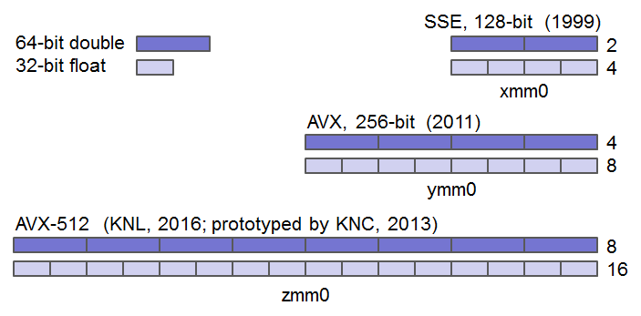

SIMD 于 20 世纪 70 年代首次引用于 ILLIAC IV 大规模并行计算机上。而大规模应用到消费级计算机则是在20实际90年代末

* 1996 年集成在 Pentium CPU上的 MMX SIMD 多媒体指令集

  引入 MMX, Multi Media eXtensions 的目的旨在提高多媒体和图像处理性能。MMX 引入**了 8 个 64 位寄存器 MM0 ~ MM7 (stands for MultiMedia register)**，用于存储多媒体数据，以及一组指令，用于执行各种多媒体操作。它最初被广泛应用于多媒体应用程序，如音频编解码和图像处理

  然而 MMX 没有提供独立的矢量寄存器，它的 8 个寄存器 MM0-MM8 实际上就是浮点数寄存器 st0-st7 用来存放尾数的部分，从而导致 MMX 指令和浮点数操作不能同时工作

* SSE 于 1999 年集成在 Pentium III CPU 上发布

  SSE, Streaming SIMD Extensions 流式 SIMD 扩展是对 MMX 的进一步扩展，引入了 **8 个 128 位的 XMM 寄存器 XMM0 ~ XMM7，后来的 X86-64 扩展又在原来的基础上添加了 8 个寄存器 XMM8 ~ XMM15**。同时引入了一组新的指令，支持单精度浮点数运算和更广泛的 SIMD 操作。SSE 提供了更多的并行性和性能，适用于一系列应用，包括3D图形渲染和数字信号处理。SSE 的不同版本（如SSE2、SSE3、SSSE4等）在后续的处理器中陆续发布，增加了功能和性能，比如双精度 SIMD 浮点数据

* AVX于2011年第一季度发布的Sandy Bridge系列处理器中首次支持

  AVX Advanced VEctor Extension 高级向量扩展引入了**16个256位的YMM寄存器 YMM0 ~ YMM15**，并提供了更多的SIMD指令，以支持更大规模的并行计算。AVX广泛用于高性能计算、虚拟化、人工智能等领域，它加速了复杂的浮点数运算任务

* AVX2于2013年发布的Core i7 Haswell CPU中引入

* AVX-512：AVX-512是AVX的进一步扩展，引入了**16个512位的ZMM寄存器 ZMM0 ~ ZMM15** 和广泛的指令集，支持更大规模的数据并行性。使用新的EVEX前缀编码将AVX指令进一步扩展到512位

* AMX, Advanced Matrix Extensions：Designed for AI/ML workloads, 2-dimensional registers, Tiled matrix multiply unit (TMUL)

以笔者这台使用Intel(R) Core(TM) i5-8257U CPU @ 1.40GHz的macOS为例，通过 `sysctl machdep.cpu` 可以看到它支持下面的SIMD指令集

```
machdep.cpu.features: FPU VME DE PSE TSC MSR PAE MCE CX8 APIC SEP MTRR PGE MCA CMOV PAT PSE36 CLFSH DS ACPI MMX FXSR SSE SSE2 SS HTT TM PBE SSE3 PCLMULQDQ DTES64 MON DSCPL VMX EST TM2 SSSE3 FMA CX16 TPR PDCM SSE4.1 SSE4.2 x2APIC MOVBE POPCNT AES PCID XSAVE OSXSAVE SEGLIM64 TSCTMR AVX1.0 RDRAND F16C
machdep.cpu.leaf7_features: RDWRFSGS TSC_THREAD_OFFSET SGX BMI1 AVX2 SMEP BMI2 ERMS INVPCID FPU_CSDS MPX RDSEED ADX SMAP CLFSOPT IPT MDCLEAR TSXFA IBRS STIBP L1DF ACAPMSR SSBD
```

## *SIMD的使用方法*

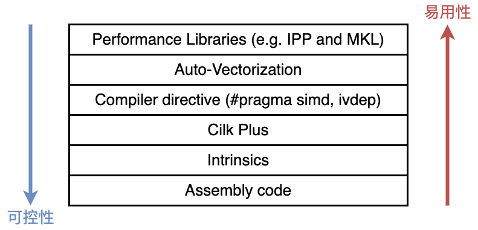

### IPP

Intel开发了跨平台函数库 IPP, Intel Integrated Performance Primitives ，里面的函数实现都使用了SIMD指令进行优化。它是一套用于加速图像、信号处理、数据压缩等应用的库。它包含了一系列的高性能函数，用于执行各种基本的数学运算和数据处理任务

还有MKL, Intel Math Kernel Library，数学核心库，用于执行高性能数学和线性代数计算。它包含了对 BLAS（Basic Linear Algebra Subprograms）、FFT（Fast Fourier Transform）、线性代数、随机数生成等的高度优化实现。 MKL 也是为英特尔处理器优化的

### Auto-Vectorization

Auto-vectorization 是一种编译器优化技术，旨在自动将代码转换为使用矢量指令集（如SSE、AVX等）的形式，以便在现代处理器上实现并行执行

```cmd
$ gcc -S main.c -o main.s -fopenmp -lm -Wunknown-pragmas -fverbose-asm -masm=intel -Og
```

如果看到编译器生成的汇编里，有大量 ss 结尾 的指令则说明矢量化失败；如果看到大多数都是 ps 结尾则说明矢量化成功

### Directive

* OpenMP

  ```c
  void add_floats(float * a，float * b，float * c，float * d，float * e，int n)
  {
      int i;
  #pragma simd
      for(i = 0; i < n; i ++) {
          a [i] = a [i] + b [i] + c [i] + d [i] + e [i];
      }
  }
  ```

* Click Plus

  Cilk Plus 是由 Intel 开发的，并在 icc 编译器中提供支持。Cilk Plus 最初是由 Cilk Arts 公司开发的，而后该公司于 2009 年被 Intel 收购

### intrinsic

intrinsic 指的是一种与硬件体系结构（如CPU指令集）紧密相关的、由编译器或编程语言提供的特殊函数或操作。这些函数或操作允许程序员直接使用底层硬件功能，而无需手动编写特定的汇编代码。Intrinsic 函数通常提供了对硬件指令的抽象，使得程序员能够以更高层次的抽象来使用底层硬件功能

常见的应用场景包括优化程序的性能，利用硬件特性进行并行计算等。这些函数通常由编译器提供，并以一种与编程语言紧密集成的方式使用。不同的编程语言和编译器可能提供不同的 intrinsic 函数，以适应不同的硬件架构

举个例子：SIMD ISA 中 C/C++ 提供 intrinsic，让程序员能够直接使用 SIMD 指令，而不必深入了解底层的汇编语言

```c
float x = 2.6f;
float y = 5.6f;
float z = -3.6f;
float w = 2.8f;
// __m128 m = _mm_set_ps{w, z, y, x}; // 注意，函数内部的实现把顺序反了过来
__m128 m = _mm_setr_ps(x, y, z, w);
__m128 one = _mm_set1_ps(1.0f); // 广播
m = _mm_add_ps(m, one);
```

GCC允许这么写，因为Linux里SSE/AVX是内置指令，而win的MSVC就要用函数来调用

# SSE/AVX Intrinsics

## *Intro*

https://www.intel.com/content/www/us/en/docs/intrinsics-guide/index.html

SIMD简介 - 吉良吉影的文章 - 知乎 https://zhuanlan.zhihu.com/p/55327037

### 头文件

SSE/AVX指令主要定义于以下一些头文件中：

* <xmmintrin.h> : SSE, 支持同时对4个32位单精度浮点数的操作
* <emmintrin.h> : SSE 2, 支持同时对2个64位双精度浮点数的操作
* <pmmintrin.h> : SSE 3, 支持对SIMD寄存器的水平操作 horizontal operation，如hadd, hsub等
* <tmmintrin.h> : SSSE 3, 增加了额外的instructions
* <smmintrin.h> : SSE 4.1, 支持点乘以及更多的整形操作
* <nmmintrin.h> : SSE 4.2, 增加了额外的instructions
* <immintrin.h> : AVX, 支持同时操作8个单精度浮点数或4个双精度浮点数。

每一个头文件都是向前兼容的，包含了之前的所有头文件，比方说如果想要使用SSE4.2以及之前SSE3, SSE2, SSE中的所有函数就只需要包含<nmmintrin.h>头文件

### 命名规则

* 数据类型通常以 `__mxxx(T)` 的方式进行命名，其中xxx代表数据的位数，如SSE提供的 `__m128` 为128位，AVX提供的 `__m256` 为256位。T为类型，若为单精度浮点型则省略（即**默认是单精度浮点类型**），若为整形则为i，比如 `__m128i`，若为双精度浮点型则为d，如 `__m256d`
* 操作浮点数的内置函数命名方式为：`_mm(xxx)_name_[A]PT`
  * xxx为SIMD寄存器的位数，若为128，xxx 则省略，比如`_mm_addsub_ps`，若为 AVX2 的256位就写 _mm256，比如`_mm256_add_ps`
  * name为函数执行的操作的名字，如加法为`_mm_add_ps`，减法为 `_mm_sub_ps`
  * A代表的是否对齐到16字节，a(ligned) 代表对齐，u(nanligned) 代表不对齐。这个命名项是可选的
  * P代表的是对矢量 packed data vector 还是对标量 scalar 进行操作，如`_mm_add_ss` 是只对最低位的32位浮点数执行加法，而 `_mm_add_ps` 则是对4个32位浮点数执行加法操作
  * T代表浮点数的类型，若为s（single）则为单精度浮点型，若为d（double）则为双精度浮点，如 `_mm_add_pd` 和 `_mm_add_ps`
* 操作整形的内置函数命名方式为：`_mm(xxx)_name_epUY`。xxx为SIMD寄存器的位数，若为128位则省略。 name为函数的名字。U为整数的类型，若为无符号类型则为u，否则为i，如 `_mm_adds_epu16` 和 `_mm_adds_epi16`。Y为操作的数据类型的位数，如 `_mm_cvtpd_pi32`。之所以加一个 `e` 是历史遗留问题，是为了和 MMX 的指令做区别

为什么int命名为 epi？extended packed integer，extended 是由于历史原因，MMX 已经把 `_mm_set_pi32` 占掉了

-msse4.1

### -march=native

`-march=native` 是 GCC 编译器中的一个选项，用于指示编译器生成针对本地计算机架构优化的代码。具体而言，它告诉编译器使用与主机处理器架构相匹配的指令集和优化

* 使用 `-march=native` 的好处是，编译器会根据当前系统的处理器类型自动选择最佳的指令集，以提高生成的机器代码的性能。这种方式特别适用于在特定系统上编译和运行代码，因为它充分利用了该系统硬件的优势
* 然而需要注意的是，使用 `-march=native` 可能会导致生成的代码无法在其他类型的处理器上运行。如果代码需要跨平台运行，可能需要选择一个更通用的 `-march` 选项，以确保生成的代码能够在不同的硬件上正常工作


horizontal 操作通常指的是在 SIMD 寄存器中横向（跨元素）组合或操作数据

例如，考虑一个 SIMD 寄存器，其中包含四个单精度浮点数：A, B, C, 和 D。"Horizontal add" 操作将执行 A+B+C+D，将这四个数相加得到一个结果。这是横向对这些数进行相加，而不是像传统的加法操作那样逐个元素相加


没有 horizontal max

## *存取*

### 存取操作 load/store/set

```c
__m128 _mm_load_ps (float const* mem_addr);
__m128 _mm_load_ps1 (float const* mem_addr);
__m128 _mm_set1_ps (float a); // 广播
__m128 _mm_set_ps (float e3, float e2, float e1, float e0);
__m128i _mm_set_epi32 (int e3, int e2, int e1, int e0);
__m128i _mm_setr_epi32 (int e3, int e2, int e1, int e0);
```


`__m128` 只能是4个double，而 `__m128i` 可以是16个char，8个short，4个int，分别用 `_mm_set_epi8`、16、32 来设置


## *算术运算*

### 加减法


### 乘除法

* `_mm_mul_epi32()` 是将高64位的两个32位数相乘，后64位直接被忽略了。注意溢出时的问题，返回的是两个 epi64
* `_mm_mullo_epi32()`
* `_mm_mulhi_epi32()`

### 平方

### 倒数

### 点乘

### 数据类型转换

`_mm_castps_si128()` 是直接按位转换，相当于 `reinterpret_cast` 按位强转，不会生成任何指令（数据类型转换，比如说浮点数转换成整形时，编译器需要生成很多指令才能正确转换）

`_mm_cvtps_si128()` 才会生成指令，类似于 `()` 或者 `static_cast`

`_mm_cvtps_epi32() ` 向上取整

`_mm_cvttps_epi32() ` 向下取整，多了一个 t（truncate）

```c
_MM_SET_ROUDING_MODE(_MM_ROUND_DOWN);
_MM_SET_ROUDING_MODE(_MM_ROUND_UP);
_MM_SET_ROUDING_MODE(_MM_ROUND_TOWARD_ZERO);
_MM_SET_ROUDING_MODE(_MM_ROUND_NEAREST); // 默认，往偶数取整
```


https://www.toolhelper.cn/Digit/FractionConvert

如果要实现强转的效果应该要用 `_mm_cvtps_si128()`（convert），这是向上取整，向下取整用 `_mm_cvttps_si128()`，多出来的一个t表示truncate

设置round模式 `_MM_SET_ROUNDING_MODE()`，可以选择 `_MM_ROUND_DOWN`、`_MM_ROUND_UP`、`_MM_ROUND_TOWARD_ZERO`，默认的模式是 `_MM_ROUND_NEAREST`（向偶数偏移，减少平均值误差偏移）

### 比较运算

要么全0，要么全1（`-nan(0xfffffffffffff)`）


`_mm256_blendv_pd(_mpi_j, _mpi_i, cmp_j);`，如果 cmp_j 为全0，则取前面的，若 cmp_j 为全1，则取后面的

### 逻辑运算

### Swizzle运算

### shuffle

`__m128i _mm_shuffle_epi32(__m128i a, int imm8);` 就是对数据重排，它将四个字段都复制一份同样的值

排列掩码 `imm8` 的四个字节中的每个字节都指定了相应结果向量中的一个元素。每个字节的值范围是0到3，用于选择输入向量中相应位置的元素

`_MM_SHUFFLER` 这个宏也是异常恶心，顺序又是反过来的，建议自己定义一个宏把它的顺序反过来。比如

```c
#define _MM_SHUFFLER(w, x, y, z) _MM_SHUFFLE(z, y, x, w)
```

其实里面的index可以是相同的，这时候的效果就是进行复制/广播。其实之前的广播操作里面就是利用了 `_MM_SHUFFLE(0, 0, 0, 0)`

## *SIMD优化*

# TBB

# MPI

## *安装 & 编译*

### 简介

Message Passing Interface, MPI 消息传递接口库，顾名思义用于消息传递型的多处理器通信。主要发起者为2022年图灵奖获得者之一 Jack j. dongarra

MPI 是一种新的库描述，不是一种语言。共有上百个函数调用接口，提供与C和Fortran语言的绑定。MPI是一种标准或规范的代表，而不是特指某一个对它的具体实现。迄今为止所有的并行计算机制造商都提供对MPI的支持。使用广泛的MPI实现有 Intel MPI、OpenMPI 和 mpich

MPI是一个 low-level 的网络库，设计它的目的是为了简化多Node的HPC之间的通信，让并行编程更加高效。MPI不应该被用于网络通信，因为它不像是TCP/IP协议这种网络通信库有安全检查等功能

MPI的接口大致可以分为

* 进程管理：包括查询并行环境和构建处理器的子集
* 点对点通信：一组用于两个进程之间进行交互的调用
* 集体调用：所有的处理器或者某个指定的处理器子集都会参与其中，比如广播调用

### OpenMPI vs. MPICH

OpenMPI 和 MPICH 是 MPI 标准的两个被最广泛应用的实现。两者的主要区别在于：

1. 开发团队：OpenMPI由多个机构和开发者共同维护，而MPICH由美国国家计算科学应用中心（Argonne National Laboratory）维护
2. 兼容性：OpenMPI拥有广泛的平台和操作系统支持，包括Linux、Windows、MAC等。而MPICH则更多的使用在Unix/Linux系统上，如Linux、AIX等
3. 性能：两者的性能差异非常小，不过有些特定的应用场景下，会出现其中一种更占优势的情况
4. 功能：OpenMPI提供了更多的功能，例如支持GPU加速、多线程、MPI-IO等特性。MPICH则更侧重于支持规范套接字接口（sockets）等基本的MPI功能

### 安装

Ubuntu 上可以直接通过包管理器来安装 mpich 或 OpenMPI

```cmd
$ sudo apt install mpich # 安装mpich
$ sudo apt-get install openmpi-bin openmpi-common libopenmpi-dev # 安装OpenMPI
```

或者通过编译源代码来安装

* 需要先安装 gcc 和 gfortran 编译器

* 下载mpich源代码：https://www.mpich.org/downloads/

* 安装

  ```cmd
  $./configure  --prefix=/usr/local/mpich-3.3.2 
  # --prefix这一参数是设置安装的路径，根据需要设置合适的路径即可，但需要记住安装的位置 
  $ make 
  $ make install 
  ```

* 到 `.bashrc` 中配置环境变量

  ```
  export PATH="/usr/local/mpich-3.3.2/bin:$PATH"  
  ```

### 编译程序

* 编译

* 运行

  ```cmd
  $ mpirun -n/-np <进程数> <可执行文件
  ```

## *基本使用*

### demo

```c
#include <stdio.h>
#include <mpi.h>
void main (int argc, char *argv[]) {
	int myrank, size;
	MPI_Init(&argc, &argv);
	MPI_Comm_rank(MPI_COMM_WORLD, &myrank);
	MPI_Comm_size(MPI_COMM_WORLD, &size);
	printf("Hello world from process %d of %d\n", myrank, size);
	MPI_Finalize();
}
```

### 基本接口

* MPI_Init 初始化

  ```c
  int MPI_Init( int *argc, char ***argv )
  ```

  MPI_Init 是MPI程序的第一个调用，它完成MPI程序所有的初始化工作，所有MPI程序的第一条可执行语句都是这条语句。MPI系统通过argc和argv得到命令行参数，并且将MPI系统专用的参数删除，留下用户的解释参数

* MPI_Comm_rank 获取进程标识号

  ```c
  int MPI_Comm_rank(MPI_Comm comm, int *rank);
  ```

* MPI_Comm_size 获取通信域中的进程数 

  ```c
  int MPI_Comm_size(MPI_Comm comm, int *size);
  ```

* MPI_Finalize 结束MPI

  ```c
  int MPI_Finalize(void);
  ```

  MPI_Finalize结束MPI程序的运行。每个进程都必须调用，使用后不准再调用任何MPI函数。若不执行MPI_Finalize()函数，进程可能被悬挂。在调用该函数前，应确保非阻塞通讯结束

### 点对点通信

* 发送数据

  ```c
  int MPI_Send(void* buf, int count, MPI_Datatype datatype,
               int dest, int tag, MPI_Comm comm);
  ```

  * `void *buf`：待发送数据的首地址
  * `int count` ：待发送的数据个数
  * `MPI_Datatype datatype`：待发送数据的数据类型
  * `int dest`：目标进程标识号
  * `int tag`：发送数据包的标签号
  * `MPI_Comm comm`：在指定通信域的进程组中发送数据

  MPI_Send将发送缓冲区中的count个datatype数据类型的数据发送到目的进程，目的进程在通信域中的标识号是dest，本次发送的消息标志是tag，使用这一标志就可以把本次发送的消息和本进程向同一目的进程发送的其它消息区别开来

* 接受数据

  ```c
  int MPI_Recv(void* buf, int count, MPI_Datatype datatype, int source,
               int tag, MPI_Comm comm, MPI_Status *status);
  ```

  * `void *buf`：存放所接收数据的首地址（需要有足够空间）
  * `int count`：所接收的数据个数
  * `MPI_Datatype datatype`：所接收数据的数据类型
  * `int source`：根据发送数据的进程标识号接收
  * `int tag`：根据数据包的标签号接收
  * `MPI_Comm comm`：根据指定通信域接收
  * `MPI_Status *status`：执行本接收操作的状态

  MPI_Recv从指定的进程source接收消息，并且该消息的数据类型和消息标识和本接收进程指定的datatype和tag相一致，接收到的消息所包含的数据元素的个数最多不能超过count，并将该过程的状态信息写入status中。MPI_Status有数据成员MPI_SOURCE, MPI_TAG, MPI_ERROR，分别表示发送数据的进程标识，发送数据使用tag标识和该接收操作返回的错误代码

* 返回读到的信息长度

  ```c
  int MPI_Get_count(const MPI_Status *status, MPI_Datatype datatype, int *count);
  int MPI_Get_count_c(const MPI_Status *status, MPI_Datatype datatype,
                      MPI_Count *count);
  ```

  ```c
  MPI_Status {
      MPI_SOURCE; // sender of the message
      MPI_TAG;    // message tag
      MPI_ERROR;  // error code
  };
  ```

  

## *通信域*

https://pop0726.github.io/bxjs/text/ch07/se02/r7_2_3_12.htm

MPI中的通信域 Communicator 提供了一种组织和管理进程间通信的方法，简单的来说**通信域就是定义了一组能够互相发消息的进程**。通信域包括通信上下文 Context、进程组Group、虚拟处理器拓扑结构 Topology 和属性等内容，它用于完整的描述进程之间的通信关系

### 进程组

每个通信域包括一组MPI进程，称为进程组。这一组进程之间可以相互通信，而且这个通信域内的通信不会跨越通信域的边界。这样就提供了一种安全的消息传递的机制，因为它隔离了内部和外部的通信，避免了不必要的同步。每个进程都至少在某个特定的通信域中，但有可能进程在多个通信域中的情形，这就像某个人可以是多个组织的成员一样。进程组由一个进程的有序序列进行描述，每个进程根据在序列中的位置被赋予一个进程号 rank

MPI预定义了一个空进程组：MPI_GROUP_EMPTY，它不包括任何的进程。另外一个常量 MPI_GROUP_NULL 用来表示一个无效的进程组

### 上下文

通信上下文可以视为对通信域内通信空间的一种划分，不同通信上下文中的消息不会相互混淆，也不能相互发送和接收（这就提供了一种手段来把不同类的通信分开，而不同担心它们之间的相互作用），比如集合通信和点到点通信具有不同的通信上下文，因此它们相互独立。需要注意的是，通信上下文虽然存在，但它并不作为显式的MPI对象独立存在，只是作为通信域的一部分

### 拓扑

就象分布式多处理器系统之间的互连有不同的拓扑结构一样，运行在这些处理器上的多个MPI进程之间逻辑关系也可以具有拓扑结构，只是这种拓扑是一种逻辑上的联系，所以称为**虚拟处理器拓扑**。它用来支持某些需要控制进程拓扑的应用，以及用来连结进程的逻辑拓扑和处理器的物理拓扑，从而获得比较高的性能

进程的虚拟拓扑对组内通信域来说，是额外的，可选的部分。通常情况下，它用来给用户程序提供一种方便直接的处理器命名方式（比如某个处理器可以通过"我南边的处理器"来指定某个处理器），这对很多算法是非常方便的。 MPI预定义了两个通信域：

* MPI_COMM_WORLD：将一个MPI程序产生的所有进程（由配置文件控制）作为一个通信域
* MPI_COMM_SELF 所在的通信域只包含当前的进程
* MPI_COMM_NULL则用来 表示一个无效的通信域

### 组间通信域

上面谈到，通常情况下，通信在通信域的进程组内进行，不会穿越进程组的边界。但有的时候，可能需要在两个进程组之间相互通信。这需要构造**组间通信域**。相应的，前面提到的通信域称为**组内通信域**（通过这个定义，可以理解通信域和进程组概念的区别）。组间通信域除了构造方式不同以外，使用方法并没有特殊的地方。所以我们不做详细介绍，下面只给出几个相关的函数，更详细的内容请参考规范

* MPI_INTERCOMM_CREATE
* MPI_INTERCOMM_MERGE
* MPI_REMOTE_GROUP
* MPI_REMOTE_SIZE
* MPI_COMM_TEST_INTER

### 创造新的通信域

```c
int MPI_Comm_dup(MPI_Comm comm, MPI_Comm *newcomm);
int MPI_Comm_free(MPI_Comm *comm);
```

子通信域

```c
int MPI_Comm_split(MPI_Comm comm, int color, int key, MPI_Comm *newcomm);
```


返回一个相当于过去的时间戳的时间

```c
double MPI_Wtime(void)
```

## *集合操作*

MPI 提供了3类集合操作 collective operation

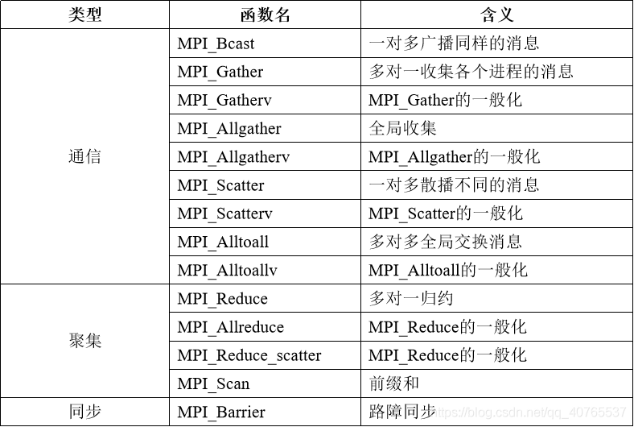

* 同步：Barrier
* 通信：Broadcast、Gather、Scatter
* 规约 reduction

## *RMA*

Remote Memory Access, RMA

## *MPI + OpenMP混编*

# 访存优化

查看系统的Cache大小

```cmd
$ lscpu -p=cpu,core,socket
```

## *Memory-Bound*

在 *操作系统理论.md* 中提到过应该用可以分为IO密集型和CPU（计算）密集型应用

在并行计算的程序中其实大部分都是CPU密集型，但它们的瓶颈往往都是在内存的访问上。**并行只能加速计算的部分，不能加速内存读写的部分**。也就是说根据木桶理论，内存访问的限制拖累了系统达到最大的计算性能

```c
const size_t n = 1 << 26;
std::vector<float> a(n); // 256MB
std::vector<float> b(n);

#omp parallel for
for (int i = 0; i < n; i++) { a[i] = i; }

#omp parallel for
for (int i = 0; i < n; i++) { b[i] = std::sin(i); }
```

比如说上面第一个for循环这种没有任何计算量，纯粹只有访存的循环体，并行没有加速效果，称为内存瓶颈 memory-bound。而 sine 这种内部需要泰勒展开来计算，每次迭代计算量很大的循环体，并行才有较好的加速效果，此时限制性能的仅仅是我们有多少计算资源可以使用，因此称为计算瓶颈 cpu-bound

并行能减轻计算瓶颈，但不减轻内存瓶颈，故后者是优化的重点

### 浮点加法的计算量

如果在上面的内存读写中加上一个浮点加法会怎么样？

```c
#omp parallel for
for (int i = 0; i < n; i++) { a[i] = a[i] + 1; }
```

反而会比原来还慢，因为一次浮点加法的计算量和访存的超高延迟相比实在太少了。计算太简单，数据量又很大，并行只带来了多线程调度的额外开销

一些经验公式，来自 *彭于斌（@archibate）*

* 1次浮点读写 ≈ 8次浮点加法
* 如果单核矢量化成功（SSE）：1次浮点读写 ≈ 32次浮点加法
* 如果CPU有4核且矢量化成功：1次浮点读写 ≈ 128次浮点加法

### 常见操作的计算消耗估计

以读写一个cache line为基准

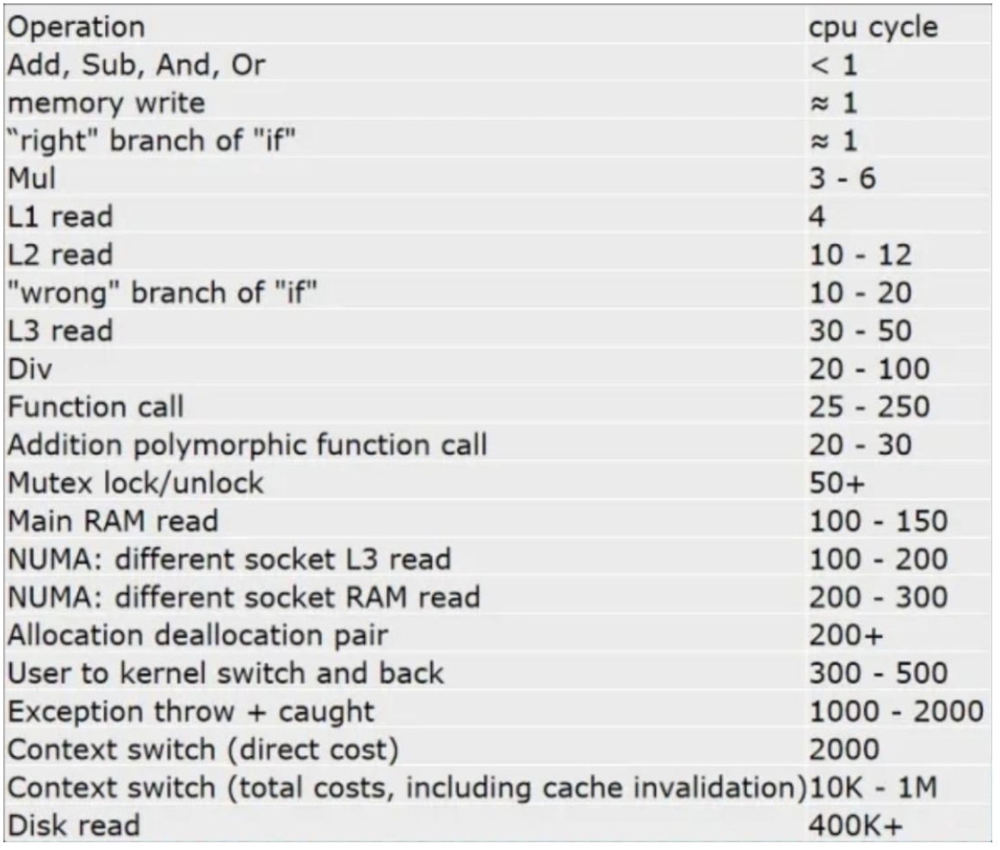

对于memory-bound的计算来说，应该达到 n 倍（n为物理核心数量）才算理想加速比

## *结构体*

### AOS

```c
struct MyClass {
    float x;
    float y;
    float z;
};

MyClass mc[4];
```

AOS, Array of Structure 是单个对象的属性紧挨着存

如果每次都只需要访问每个结构体中的一个属性，比如说x属性的话，此时相当于在跳步访问，cache line的利用率很低

### SOA

```c
struct MyClass {
    float x[4];
    float y[4];
    float z[4];
};
MyClass mc;
```

SOA, Structure of Array 属性分离存储在多个数组中

### AOSOA

```c++
struct MyClass {
    float x[1024]; // 1 page = 4KB
    float y[1024];
    float z[1024];
};
std::vector<MyClass> mc(n/1024);
```

AOSOA：让MyClass内部是SOA，而外部仍然是一个 `vector<MyClass>` 的AOS，这样外面可以继续扩展数组

缺点是必须保证AOS数组的长度是1024的整数倍，而且索引的时候要进行两次索引

之所以是1024的整数倍是因为，1024个float是4KB，这是一个page的大小（如下所述，预取一次最多就是一页）

如果内部的SOA太小，比如说内部循环只有16次连续的读取。假设现在只读写x，那么每16次x的读写结束后就会跳跃一段，然后再继续连续的读取。**这会导致CPU预取机制失效**，无法预测下一次要读哪里，等发现跳跃时已经来不及了，从而计算的延迟无法隐藏

### 使用建议

* 若结构体的几个属性几乎总是同时一起被使用的，比如位置矢量pos的xyz分量，可能都是同时读取同时修改的，这时用AOS，减轻预取压力
* 若结构体的几个属性有时只用到其中几个，不一定同时写入，比如pos和vel，通常的情况都是pos+=vel，也就是pos是读写，vel是只读，那这时候就用SOA比较好，省内存带宽
* 不过“pos的xyz分量用AOS”这个结论，是单从内存访问效率来看的，需要SIMD矢量化的话可能还是要SOA或AOSOA，比如hwO4那种的。而“pos和vel应该用SOA分开存” 是没问题的
* 而且SOA在遇到存储不是vector，而是稀疏的哈希网格之类索引有一定开销的数据结构，可能就不适合了

SOA和AOSOA基本在大部分情况都不会很差，但AOS只在一些情况下比较有利，所以尽量还是用AOSOA。可以在高层保持AOS的统一索引，底层又享受SOA带来的矢量化和缓存行预取等好处，只不过就是就是两层的随机索引比较麻烦

## *预取 & 分页*

一次预取的量最多就是预取触发预取所在的数据的那一页数据：这是因为出于安全考虑，预取不能跨越页边界，否则可能会触发不必要的 page fault

### 页对齐的增益

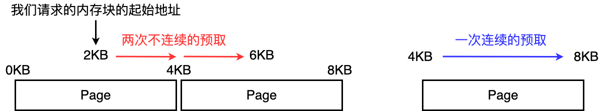

如果我们请求分配的内存块没有对齐到4KB的页大小，比如说在一个页的中间，因为上面说的预取不会跨越页边界，那么之后在用到这段分配的内存块的时候，预取会在两页的中间被强行中断，这就要进行两次不连续的预取

所以可以用 `_mm_alloc` 申请起始地址对齐到页边界的一段内存，真正做到每个块内部不出现跨页现象

### _mm_prefetch 手动预取

对于不得不随机访问很小一块的情况，可以通过x86提供的 `_mm_prefetch` intrinsic指令手动预取一个缓存行来弥补硬件预取的实效

```c
void _mm_prefetch(const void* p, int i);
```

Fetch the line of data from memory that contains address p to a location in the cache hierarchy specified by the locality hint i, which can be one of:

* _MM_HINT_ET0 // 7, move data using the ET0 hint. The PREFETCHW instruction will be generated
* _MM_HINT_T0 // 3, move data using the T0 hint. The PREFETCHT0 instruction will be generated
* _MM_HINT_T1 // 2, move data using the T1 hint. The PREFETCHT1 instruction will be generated
* _MM_HINT_T2 // 1, move data using the T2 hint. The PREFETCHT2 instruction will be generated
* _MM_HINT_NTA // 0, move data using the non-temporal access (NTA) hint. The PREFETCHNTA instruction will be generated

```c
#include <xmmintrin.h>

void prefetchData(const float* data, int index) {
    _mm_prefetch((const char*)&data[index], _MM_HINT_T0);
    // 后续的代码
}
```

### 汇编指令

* REFETCHT0：将缓存行预取到L1
* PREFETCHT1：将缓存行预取到L2
* PREFETCHT2：将缓存行预取到L3
* PREFETCHNTA：将缓存行预取，但不会让缓存行成为“专有”（non-temporal）

这些指令通常是通过在代码中插入相应的汇编指令或者使用编译器内置函数（例如，`_mm_prefetch`）来实现的

## *直写*

### 写入的粒度太小造成的浪费

## *合并循环*

### Toy Example

```c++
#pragma omp parallel for
	for (size_t i = 0; i < n; i++) {
        a[i] = a[i] * 2;
    }
#pragma omp parallel for
	for (size_t i = 0; i < n; i++) {
        a[i] = a[i] + 1;
    }
```

第一遍循环过了 1GB 的数据，执行到 `a[n-1]` 时， 原本 `a[0]` 处的缓存早已失效，因此第二遍循环开始读取 `a[0]` 时必须重新从主内存读取，然后再次写回主内存

这种代码在主内存看来，CPU做的事情相当于：读+写+ 读+写，每个元素都需要访问四遍内存

这时候应该进行合并循环 loop fusion 的优化，这是利用了时间局域性

```c++
#pragma omp parallel for
	for (size_t i = 0; i < n; i++) {
        a[i] = a[i] * 2;
        a[i] = a[i] + 1;
    }
```

### Jacobi

## *语言层面优化内存分配*

vector经历了3次写入，第一次是构造函数初始化为0。所以其实总时间上还是用malloc快

### 对齐问题

## *多维数组*

### 二维数组的行主序 & 列主序

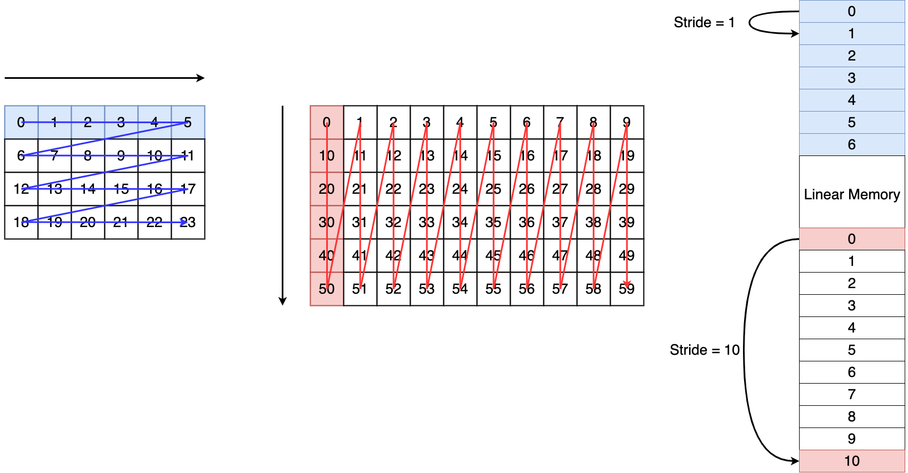

列主序 Column-major order 和行主序 Row-major order 是描述二维数组在内存中存储顺序的两种方式

* C和C++以及大部分编程语言中都采用行主序，行主序是更为常见的数组存储顺序。行主序的排列方式也称为YX序（越不连续的放在越前面，行方向，即Y方向是不连续的，所以称为YX序）
* Fortran等一些编程语言中，列主序则它是默认的数组存储顺序。列主列的的排列方式也称为XY序

### 遍历序

二维数组在内存中的布局有 YX 序，XY 序（C和C++永远都是YX序，或者说行主序的）。二维数组的循环遍历也有 YX 序，XY 序之分

* YX遍历序

  ```c
  int n = 3; // ny
  int m = 4; // nx
  
  double *M = (double*)malloc(n * m * sizeof (double));
  
  for (int i = 0; i < n; i++) {
  	for (int j = 0; j < m; j++) {
  		M[i * m + j] = 0;
  	}
  }
  // ----------------------- 等价 -----------------------
  // 3行4列 -> y方向有3个，x方向有4个
  int ny = 3; 
  int nx = 4;
  
  double *M = (double*)malloc(nx * my * sizeof (double));
  
  for (int y = 0; y < ny; i++) {
  	for (int x = 0; x < nx; j++) {
  		M[y * nx + x] = 0;
  	}
  }
  ```

* XY遍历序

  ```c
  int ny = 3; 
  int nx = 4;
  
  double *M = (double*)malloc(nx * my * sizeof (double));
  
  for (int x = 0; x < nx; i++) {
  	for (int y = 0; y < ny; j++) {
  		M[y * nx + x] = 0;
  	}
  }
  ```

**什么序的数组，就用什么序遍历**。比如说行主序或者说YX序的数组就应该用YX序遍历，因为可以利用到空间一致性（同一个cache block中）。否则跳着走的话，读一次cache block可能只会命中一次，即每次读取只用了 其中4字节，浪费了缓存行剩下的60字节，非常低效。同时还会影响预取器的效果

* 对于 YX 序（行主序，C/C++）的数组，请用 YX 序遍历（x变量做内层循环体）
* 对于 XY 序（列主序，Fortran）的数组，请用 XY 序遍历（y变量做内层循环体）

### ndarray来高维数组的扁平化

因为行列仅限于二维数组（矩阵），对高维数组（比如说三维Tensor）可以直接按照他们的 xyz 下标名这样称呼

* **ZYX 序**：`(z * ny + y) * nx + x`
* XYZ 序：`z + nz * (y + x * ny)`

主流程序都会用 **YX** 序，**ZYX** 序

*彭于斌（@archibate）* 提供了一个ndarray的扁平化高维数组的封装

* 访问越界问题：ndarray的第三个模版参数是用来padding的，做法是向外扩张，即多分配点空间
* 起始地址对齐问题

## *多核伪共享*

### 现象

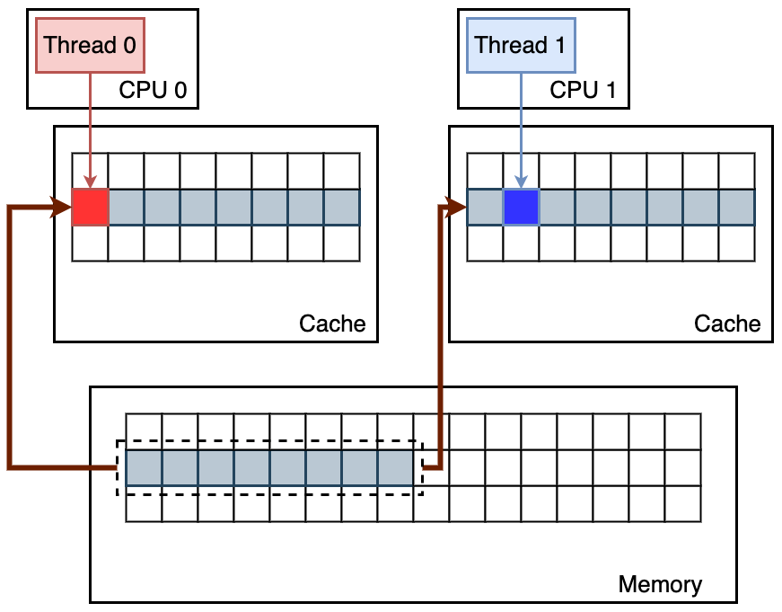

伪共享 false sharing 指的是在多线程或者说多核的情况下，当多线程修改看似互相独立的变量时，但实际上这些变量在在物理内存上可能靠的比较近，所以它们共享同一个缓存行

如果一个线程修改了缓存行中的一个变量，其他线程可能需要通过缓存一致性协议将缓存行无效，导致其他线程不得不重复地重新从主内存加载整个缓存行，即使它们访问的变量并未被修改。这种缓存行的无效和重新加载会引起额外的开销，降低程序的性能

### 消除方法

增大元素的间隔使得由不同线程存取的元素位于不同的缓存行上，以空间换时间

## *Memory Coalescing*

https://zhuanlan.zhihu.com/p/300785893?utm_id=0

Memory Coalescing 内存合并的核心思想是：因为在任何给定的时间点上，warp中的线程都执行相同的指令，那么当**warp中的所有线程访问全局内存的位置是连续的**时，将大大提高内存利用率

当warp中的所有线程执行load指令时，硬件会检测它们访问的全局内存位置是否是连续的。如果是的话，硬件会将这些访问合并成一个对连续位置的访问。所有这些访问都会被合并为单个请求。这种合并访问允许DRAMs 以 burst 方式传递数据

内存合并 Memory Coalescing 可以更高效地将数据从GPU的 global memory 移动到 shared memory 和寄存器中

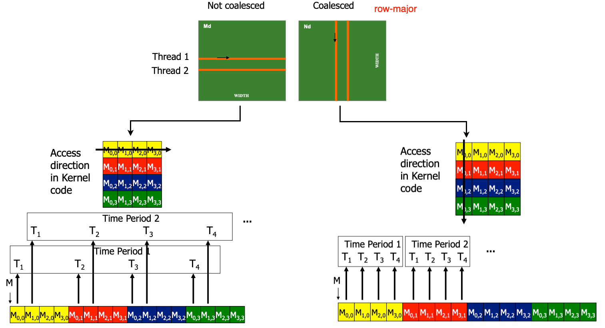

### 网格跨步循环

网格跨步循环 grid-stride loop

# 循环分块

Remainder：C/C++为Row-major，Fortran为Column-major，下面全部假设为Row-major

## *场景*

### 循环分块要解决的问题

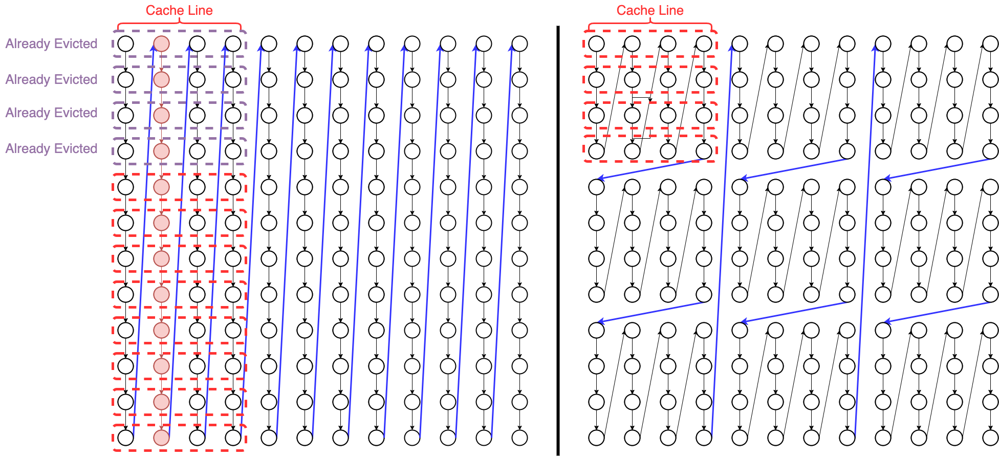

tile的本质是当总的数据量无法fit in cache的时候，把数据分成一个一个tile，比如说假设上图做一次操作总共需要12行中的值/12个cache line。y轴的一次径向模糊需要用到这12个值，所以要把它们所属的cache lines都加载进caceh。但是我们的L1 cache的容量不够在下一次轮到它们的时候，它们还留在Cache中，甚至在执行本轮y轴径向模糊的时候，头上的cache line就已经被驱逐出去了，因此它们完全无法利用 cache line带来的空间局部性

此时分成tile，让每一个tile的数据fit in the cache。相比于完全无法利用y方向的cache line，分块后可以部分利用y方向的cache line

所以tiling一般从最内层循环开始（tile外层循环的话一个tile就包括整个内层循环，这样的tile太大

### Stencil

Stencil 操作是一种计算模式，通常在科学计算、数值模拟、图像处理等领域中广泛使用。**Stencil 操作基于一个中心元素周围的邻居元素，通过在这些邻居元素上应用某种计算规则来更新中心元素**

比如求一个场的梯度、散度、旋度、拉普拉斯。如果场是用结构网格 structured grid 表示，那就是一个stencil操作。实际上图像处理中的模糊，信号处理、DL常用的卷积操作都是 stencil 操作

有的插桩内核各轴向是对称的（比如高斯模糊），有的是单单往一 个方向延伸很长（比如径向模糊），有的内核是正方形（箱滤波）

Stencil kernel 指的就是这个“周围范围”的形状和每个地方读取到值对修改自身值的权重等信息

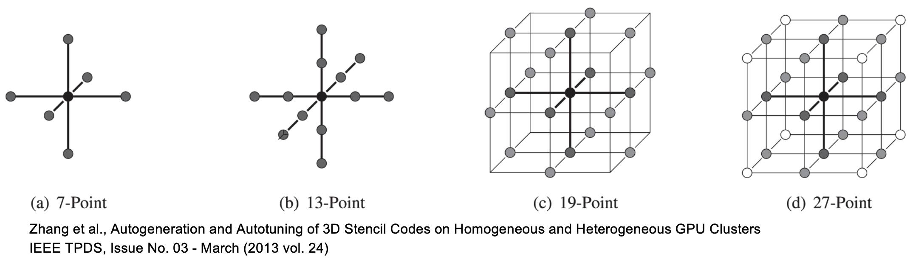

这种操作的名称来自于类似于使用模板或薄膜刻刀（stencil）在图案上进行操作的概念。它中文可以翻译为模版计算或者插桩计算，感觉很别扭，所以下面直接说stencil

### 场景：y方向的径向模糊

上面的例子中的就是y方向的径向模糊，它是一个典型的Stencil应用，需要用y方向的循环分块来加速

注意：如果假设cache size过小很容易被误导，现在问题不是出在cache line上，因为cache line不过是64 Byte，问题是出在一次y方向的径向模糊需要的多个数据无法通过1次cache加载而同时存在于L1 cache中，更不要说连续的y方向的插桩了

循环分块实现的就是降低L1 cache命中所需的数据量。注意：上图中表示的是一次y方向的插桩需要加载入内存的

我们可以对其进行理论分析，计算一下分块和不分块的cache miss数据级。我们假设为

* Cache line 中包含b个数据元素
* Tile size 为 T，T为b的倍数，否则要考虑边角料带来的问题
* 矩阵的大小为N，$N\gg T,b$

现在对其分析

* 不分块
  $$
  \#Cache\ Miss=N\times N=N^2
  $$

* y轴分块
  $$
  \#Cache\ Miss=\frac{T}{b}\times\frac{N}{T}\times N=\frac{N^2}{b}
  $$
  

虽然理论上通过分块，y方向的径向模糊能和x方向的径向模糊一样快，但是总体上y方向的径向模糊肯定是被x方向慢一些的，因为无法像x方向一样完全利用空间局域性带来的预取和一次cache line的完全利用

### 场景：矩阵转置

矩阵转置是一个二层循环

## *分块矩阵乘法*

以二阶矩阵乘法 $A_{mk}*B_{kn}$ 为例

* Base case：不分块

  ```c
  void standardMatrixMultiply(int m, int k, int n, 
                              double A[m][k], 
                              double B[k][n], 
                              double C[m][n]) {
      for (int i = 0; i < m; ++i) {
          for (int j = 0; j < n; ++j) {
              C[i][j] = 0; // Initialize result matrix
              for (int x = 0; x < k; ++x) {
                  C[i][j] += A[i][x] * B[x][j];
              }
          }
      }
  }
  ```

* 对 m 方向分块

  ```c
  void blockByM(int m, int k, int n, 
                double A[m][k], 
                double B[k][n], 
                double C[m][n], 
                int blockSize) {
      for (int i = 0; i < m; i += blockSize) {
          for (int x = 0; x < k; ++x) {
              for (int j = 0; j < n; ++j) {
                  for (int ii = i; ii < i + blockSize && ii < m; ++ii) {
                      C[ii][j] += A[ii][x] * B[x][j];
                  }
              }
          }
      }
  }
  ```

* 对 n 方向分块

  ```c
  void blockByN(int m, int k, int n, 
                double A[m][k], 
                double B[k][n], 
                double C[m][n], 
                int blockSize) {
      for (int j = 0; j < n; j += blockSize) {
          for (int i = 0; i < m; ++i) {
              for (int x = 0; x < k; ++x) {
                  for (int jj = j; jj < j + blockSize && jj < n; ++jj) {
                      C[i][jj] += A[i][x] * B[x][jj];
                  }
              }
          }
      }
  }
  ```

* 同时对 m 和 n 方向分块

  ```c
  void blockByMN(int m, int k, int n, 
                 double A[m][k], 
                 double B[k][n], 
                 double C[m][n], 
                 int blockSizeM, int blockSizeN) {
      for (int i = 0; i < m; i += blockSizeM) {
          for (int j = 0; j < n; j += blockSizeN) {
              for (int x = 0; x < k; ++x) {
                  for (int ii = i; ii < i + blockSizeM && ii < m; ++ii) {
                      for (int jj = j; jj < j + blockSizeN && jj < n; ++jj) {
                          C[ii][jj] += A[ii][x] * B[x][jj];
                      }
                  }
              }
          }
      }
  }
  ```

### 矩阵乘法的访存规律

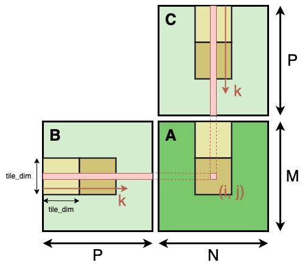

```c++
ndarray<2, float> a(n, n);
ndarray<2, float> b(n, n);
ndarray<2, float> c(n, n);

for (int j = 0; j < n; j++) {
    for (int i = 0; i < n; i++) {
        for (int t = 0; t < n; t++) {
            a(i, j) += b(i, t) * c(t, j);
        }
    }
}
```

* `a(i, j)` 始终在一个地址不动
* `b(i, t)` 每次跳跃 n strides 的访问
* `c(t, j)` 连续的顺序访问

因为存在不连续的 b 和一直不动的 a，会导致矢量化失败，一次只能处理一个标量， CPU也无法启动指令级并行 ILP

所以相比于上面的循环分块，矩阵乘法除了是一个三层的循环外，还要用到寄存器分块，或者说是 loop interchange


如果是矩阵相乘的话，实际上降低了A矩阵的局部性，但是提升了B矩阵的局部性，

## *分块模式*

如何分块和分块的大小决定了获得的增益

### 固定分块技术

### 参数化分块技术

### Morton Code

莫顿码 Morton Code，也称为 Z-顺序（Z-order），是一种空间填充曲线的编码方法。这种编码方法常用于将多维空间的坐标映射到一维编码，从而使得在N维空间中对于彼此接近的坐标具有彼此接近的莫顿码。莫顿码的基本思想是通过将多维坐标的各个位按位交错排列，将多维问题转化为一维问题，以便于在一维的情况下更高效地处理和检索

分形自相似是分形 fractal 的一个特性，描述了分形结构在不同尺度上具有相似性的性质。具体而言，自相似性表示在分形对象的不同部分或尺度上，都可以找到类似整体的形状或结构

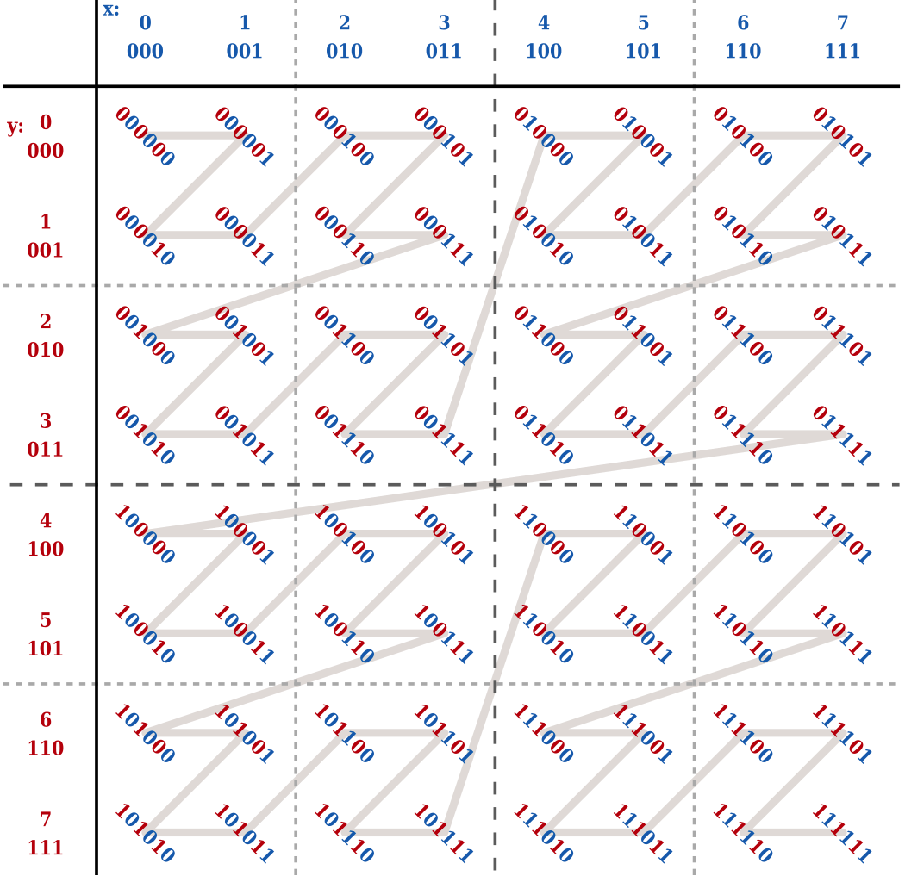

莫顿码的生成过程通常是通过将多维坐标的二进制表示中的位逐位交错组合而成。例如，对于二维空间中的坐标 `(x, y)`，其莫顿码可以通过如下的方式生成

1. 将x和y的二进制表示展开为二进制位串
2. 将x和y的对应位按位交错组合

例如，若 `(x, y) = (5, 3)`。其二进制展开为：

* x = 101（二进制）
* y = 011（二进制）

将对应位按位交错组合得到莫顿码 = 011011（二进制）

因此，坐标 `(5, 3)` 的莫顿码为011011。这种编码方法的主要优点在于，相邻的坐标在莫顿码中的表示也是相邻的，从而在一维的表示下，相邻的数据在空间中也是相邻的，有助于提高局部性，使得数据访问更加连续，有助于空间数据结构的构建和查询

我们上面的提到的分块都需要做实验的到分块相对较优的大小，而利用莫顿码则可以自适应地最大化利用任意大小的多级缓存

## *块大小*

分块的大小要接近Cache的大小

# GPU编程

## *Scaling*

Scaling指的是随着线程数的变化系统性能的变化

### Weak Scaling

Weak scaling是指令每个线程的problem size保持不变，HPC中最常用的scaling方式

负载和消耗的变化都不太大，sacling比较容易。但一些应用问题要保持problem size per thread不变会比较难

### Strong Scaling

强扩展性是指在增加计算资源（例如，处理器核心、计算节点）的情况下，保持问题的总规模不变，此时要改变问题的decomposition，或者说负载分配方式

Strong scaling在变得越来越重要，有些任务的problem size并不是一直在增长的，但对精确度、求解速度的要求越来越高

## *GPU通用计算*

### 异构计算

GPU并不是一个独立运行的计算平台，而需要与CPU协同作工作，因此可以GPU可以看成是CPU的协处理器 coprocessor，因此当我们在说GPU并行计算时，其实是指的基于CPU+GPU的异构计算架构

在异构计算架构中，GPU与CPU通过PCle总线连接在一起来协同工作

CPU所在位置称为为主机端 host，而GPU所在位置称为设备端 device

### GPGPU模型

> 自2003年以来，人们一直在努力利用GPU进行非图形应用。通过使用高级着色语言，如DirectX、OpenGL和Cg，各种数据并行算法被移植到了GPU上。诸如蛋白质折叠、股票期权定价、SQL查询和MRI重建等问题在GPU上实现了显著的性能加速。这些早期使用图形API进行通用计算的努力被称为GPGPU程序。
>
> 虽然GPGPU模型展示了巨大的加速能力，但它面临着一些缺点。
>
> * 首先，它要求程序员对**图形API和GPU架构有深入的了解**。
> * 其次，问题必须以顶点坐标、纹理和着色器程序的**形式表达**，大大增加了程序的复杂性。
> * 第三，基本的编程特性，如对**内存的随机读写操作，并不支持**，这大大限制了编程模型。
> * 最后，在最近之前**缺乏双精度**支持意味着一些科学应用无法在GPU上运行。
>
> 为解决这些问题，NVIDIA引入了两项关键技术
>
> * **G80**统一图形计算架构：（首次出现在GeForce 8800®、Quadro FX 5600®和Tesla C870® GPU中）
> * **CUDA**：这是一种软件和硬件架构，使GPU能够使用各种高级编程语言进行编程。
>
> 这两项技术共同代表了一种使用GPU的新方式。程序员不再使用专用的图形API对图形单元进行编程，而是可以使用具有CUDA扩展的C程序，针对通用的、高度并行的处理器进行编程。我们把这种新的GPU编程方式称为“GPU计算”——它代表了更广泛的应用支持、更广泛的编程语言支持，与早期的“GPGPU”编程模型有着明显区分。 -- https://zhuanlan.zhihu.com/p/632718322

### AI计算中的数据类型

https://blog.csdn.net/qq_43799400/article/details/134182459

## *GPU编程API*

### 多媒体API

GPU的API是一组允许软件与GPU进行通信和协作的软件函数和库，不过随着系统优化的深入，API也可以直接统筹管理高级语言、显卡驱动和底层汇编语言。以下是一些常见的GPU API

* 微软 DirectX 标准：DirectX是Microsoft开发的多媒体和图形API，主要用于Windows操作系统上的游戏和多媒体应用程序。它包括Direct3D用于3D图形渲染，以及其他组件用于音频、输入和网络等

  * Direct 3D & Dicrect 2D
  * DirectCompute 通用计算

* Khronos Group 标准

  > 科纳斯组织（Khronos Group）是一个开放、非营利的行业协会，致力于创建可免费使用的图形合成、虚拟现实、增强现实、视觉加速、并行计算和机器学习的开放API标准，使在各种平台和设备上的应用程序和中间件都能有效利用硬件加速。所有Khronos成员都能够在API公开发布前提出自己的意见、在规范制定初期得到草案并进行平台和应用程序测试。
  > 2006年7月31日，Khronos Group在SIGGRAPH上宣布得到OpenGL规范的控制权 -- wikipedia

  * OpenGL：OpenGL Open Graphics Library 开放图形库 是一种跨平台的图形API，用于2D和3D图形渲染。它提供了一套用于创建和管理图形对象、设置渲染状态以及执行渲染命令的函数。OpenGL是开放标准，因此可以在多个平台上使用
  * Vulkan：Vulkan是一个低级的跨平台图形API，旨在提供更高的性能和更好的多线程支持。它更接近硬件层，允许开发者更细粒度地控制GPU，但也需要更多的编程工作
  * OpenCL通用计算

* 其他标准

  * 苹果 Metal API
  * AMD Mantle API
  * Intel One API

### GPU通用计算编程框架

GPU通用计算 General-Purpose Graphics Processing Unit 的核心思想是利用 GPU 的大规模并行处理能力来加速计算任务，尤其是那些可以分解为许多小任务的工作负载。为了在 GPU 上进行通用计算，开发者使用 GPU 编程框架和 API 来编写并行计算代码，这些框架和 API 提供了对 GPU 资源的访问以及任务分发和同步的机制。以下是一些用于 GPGPU 的常见 API 和框架

* CUDA Compute Unified Device Architecture：由NVIDIA开发的CUDA是GPGPU编程的一种流行框架。它允许开发者使用类C编程语言来编写通用计算代码，并在NVIDIA GPU上执行。CUDA 提供了丰富的库和工具，用于优化并行计算任务
* HIP Heterogeneous-Computing Interface for Portability：由 AMD 开发的 HIP 是一个类似于 CUDA 的框架
* OpenCL Open Computing Language：OpenCL 是一个跨平台的 GPGPU 编程框架，允许在不同供应商的 GPU 上运行通用计算任务。它使用 C 样式的语言编写内核，并提供了广泛的设备支持
* OpenMP ：从OpenMP 4.0版本开始，它还引入了对GPU通用计算的支持，允许将OpenMP用于GPU加速的应用程序开发。加速器被视为 targets 和 devices
* OpenACC：脱胎于OpenMP
* DirectCompute：DirectCompute 是 Microsoft DirectX 的一部分，用于在 Windows 平台上进行通用计算。它允许开发者使用 HLSL（High-Level Shading Language）编写并行计算内核
* SYCL：SYCL 是一种基于 C++ 的编程模型，用于实现高性能并行计算，并在不同的硬件上运行。它允许开发者使用标准的 C++ 语言编写并行计算代码，然后将其映射到不同的加速器上，包括 GPU

# CUDA基础

https://godweiyang.com/2021/01/25/cuda-reading/

CUDA, Compute Unified Device Architecture

cuda编程本身就对硬件依赖很大，不同的GPU架构必须要编写不同的代码，否则性能会下降很多甚至会出现负优化的情况

CUDA提供了对其它编程语言的支持，如C/C++、Python、Fortran等语言

## *编译*

### nvcc编译器

NVCC, NVIDIA CUDA Compiler 是NVIDIA提供的专用于CUDA开发的编译器。它用于将CUDA C/C++源代码翻译为GPU二进制代码，以便在NVIDIA GPU上执行。以下是 nvcc 编译器的一些重要特点和用法：

* 支持CUDA C/C++：nvcc 主要用于编译CUDA C/C++源代码。CUDA C是一种基于C语言的扩展，允许开发者编写并行计算的核函数
* 将host代码和device代码整合
  * nvcc 能够识别CUDA源代码中的host代码（在CPU上执行）和device代码（在GPU上执行），并将它们整合在一起。这种整合的方法使得开发者可以方便地在同一个文件中编写包含主机和设备代码的CUDA程序
  * 与常规C++编译器集成：通常 nvcc 会调用底层的C++编译器来处理主机代码部分。这意味着在编译CUDA程序时，`nvcc`可以处理主机代码，并调用适当的C++编译器处理主机代码的部分
* 自动GPU代码生成： nvcc 会自动为目标GPU生成最佳的二进制代码。开发者通常无需手动优化生成的代码，因为 nvcc 会根据目标GPU的架构和特性进行优化
* 支持多种架构：nvcc 支持编译针对多种NVIDIA GPU架构的代码。开发者可以通过指定`-arch`选项来选择目标GPU的架构版本，以便生成相应的二进制代码
* 整合CUDA Runtime库：nvcc 会自动链接CUDA Runtime库，不需要像gcc一样自己去连接库这样开发者可以在程序中使用CUDA提供的运行时函数，如内存分配、核函数调用等
* 调试支持：nvcc 提供了调试选项，使开发者能够使用GPU调试器（如NVIDIA Nsight）来调试CUDA程序。这对于定位并行计算中的错误和性能问题非常有帮助

### build工具

最新版的CMake（3.18以上），只需在LANGUAGES 后面加上 CUDA 即可启用。然后在 add_executable 里直接加 `.cu`
文件，和.cpp一样

```cmake
project(hellocuda LANGUAGES CXX CUDA)
add_executable(main main.cu)
```

### CUDA、C、C++混编

CUDA 的语法，基本完全兼容C++。包括 C++17 新特性，都可以用。甚至可以把任何一个 C++ 项目的文件后缀名全部改成.cu，都能编译出来。这是 CUDA 的一大好处

CUDA和 C++ 的关系就像 C++和C的关系一样，大部分都兼容，因此能很方便地重用C++现有的任何代码库，引用 C++头文件等。host 代码和 device 代码写在同一个文件内，这是 OpenCL 做不到的

## *PTX*

### 编译过程

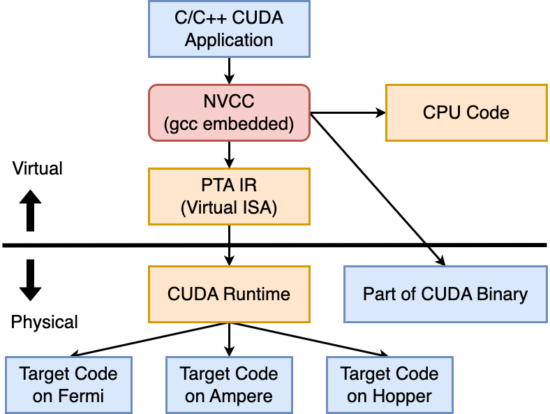

PTX, Parallel Thread Execution 是 CUDA 编译过程中的一种中间表示 IR，它处于高级CUDA C/C++源代码和底层GPU硬件指令之间，即一种高级语言和底层ISA之间的virtual ISA。**有点像GCC支持的C内联汇编**

使用PTX，程序员可以编写与特定GPU架构无关的CUDA内核代码，而不必关心底层硬件细节。PTX代码经过NVCC生成，并且可以在不同的NVIDIA GPU架构上运行

具体来说：nvcc会用g++对其中cpu部分的代码编译，余下gpu的部分使用cudacc进行编译，首先生成一个虚拟环境下的.ptx文件，之后再根据具体GPU类型生成不同的二进制码

### 例子

```c
__device__ __forceinline__ unsigned long long __globaltimer() {
  unsigned long long globaltimer;
  asm volatile("mov.u64 %0, %globaltimer;" : "=l"(globaltimer));
  return globaltimer;
}
```

* `__forceinline__`: 这是一个建议性的修饰符，它提示编译器尽可能地将函数内联。函数内联可以减少函数调用的开销，提高性能

* `unsigned long long __globaltimer()`: 这是函数的声明，表明该函数返回一个64位无符号长整型（`unsigned long long`）。函数名为`__globaltimer``

* ``asm volatile("mov.u64 %0, %globaltimer;" : "=l"(globaltimer));`: 这是使用内联汇编语法嵌入汇编代码的部分，用于获取全局计时器的值

  * `mov.u64 %0, %globaltimer;`: 这是汇编指令，将全局计时器的值移动到寄存器 `%0` 中。这里 `%0` 表示输出操作数（output operand），`%globaltimer` 表示全局计时器

  * `: "=l"(globaltimer)`: 这是输出操作数的约束（constraint），指示编译器将 `%0` 中的值存储到`globaltimer` 变量中。`"=l"`表示将 `%0` 与一个64位整数相关联

* `return globaltimer;`: 函数返回获取到的全局计时器的值

## *CUDA的函数执行环境限定符*

在CUDA中，host和device是两个重要的概念。用host指代CPU及其内存，而用device指代GPU及其内存。CUDA程序中既包含host程序，又包含device程序，它们分别在CPU和GPU上运行。host与device之间可以进行通信，这样它们之间可以进行数据拷贝

GPU是异构模型，所以需要区分host和device上的代码，在CUDA中是通函数类型限定词开区别host和device上的函数，主要的三个函数类型限定词如下：

* `__host__`：在host上执行，也仅可以从host上调用，**函数默认都是 `__host__`，所以一般省略不写**。不可以和 `__global__` 同时使用，但可以和 `__device__` 同时使用，此时函数在host和device上都会编译
* `__global__ void kernel()` **有点像是device上面的main函数**。在device上执行，从host中调用（一些特定的GPU也可以直接从device上调用）。返回类型必须是void，不支持可变参数参数，不能成为类成员函数
* `__device__`：只能在GPU device上调用和执行，不可以和 `__global__` 同时使用，因为CPU不能调用它。和普通函数用起来 一样，可以有参数和返回值

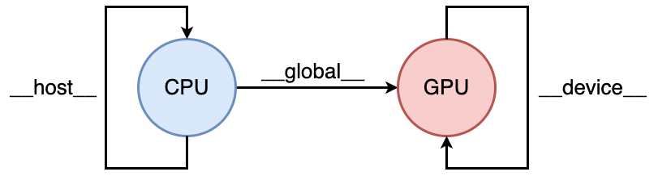

```
host -> global -> device
```

host 可以调用 global；global 可以调用 device；device 可以调用 device

### 核函数

上面流程中最重要的一个过程是调用CUDA的核函数来执行并行计算

核函数 kernel 是CUDA 中一个重要的概念，kernel 是 在device 上线程中并行执行的函数

核函数用 `__global__` 符号声明，在调用时需要用 **`<<<gridDim, blockDim>>>`** 来指定kernel要执行的线程数量。用 `__global__` 声明的核函数必须要返回void

在CUDA中，每一个线程都要执行核函数，并且每个线程会分配一个唯一的线程是thread ID，这个ID值可以通过核函数的內置变量threadldx来获得

```c++
// Kernel定义
__global__ void vec_add(double *x, double *y, double *z, int n) {
	int i= get_tid(); // user-defined macro/function
	if(i < n) z[i] = x[i] + y[i];
}
int main() {
    int N = 1000000; // 1M
	int bs = 256;
	int gs = (N + bs - 1) / bs; // 向上取整
	// kernel, call GPU
	vec_add<<<gs, bs>>>(x, y, z, N);
}
```

注意用 `__global__` 定义的**kernel是异步的，这意味着host只是把任务加入GPU的任务队列中，不会等待kernel执行完就会执行下一步，所以返回值也只能是void**。也就是 CPU 调用 `kernel<<<>>>()` 后，核函数并不会立即在 GPU 上执行完毕后再返回。实际上只是把kernel 这个任务推送到 GPU 的执行队列上，然后立即返回，并不会等待执行完毕

如果需要同步调用，就在调用kernel的host中使用 `cudaDeviceSynchronize()`，让CPU陷入等待，等 GPU 完成队列的所有任务后返回

### `__device__` 的声明定义分离问题

不建议分离，分离了之后不容易优化

### 同时为CPU和GPU定义函数

`__device__` 不能和 `__global__` 一起使用，但可以和 `__host__` 一块用，这时候会同时为CPU和GPU分别生成功能相同的代码

如果直接将函数声明为 `constexpr`，效果等同于同时声明 `__device__` 和 `__host__`。不过这样用的话要打开 `--expt-relaxed--constexpr` 这个选项

```cmake
target_compile_options(main PUBLIC $<$<COMPILE_LANGUAGE:CUDA>:--expt-relaxed-constexpr>)
# $<$ 是生成器表达式，只对 .cu 后缀的生效
```

## *版本号问题 Compute Capabilities*

具体的内容可以查看 CUDA C++ Programming Guide

Compute Capability（计算能力）是NVIDIA GPU架构的一个标识，用于指示GPU支持的硬件和特性。每个NVIDIA GPU都有一个特定的计算能力版本，它反映了该GPU架构的功能和性能水平。CUDA Compute Capabilities通常以主版本号和次版本号的形式表示

以下是一些常见的CUDA Compute Capabilities及其代表的架构：

1. 1.x：Tesla架构，代表型号：Tesla C1060, Tesla S1070
2. Compute Capability 2.x：Fermi架构，代表型号：GeForce GTX 480, Tesla C2050
3. Compute Capability 3.x：Kepler架构，代表型号：GeForce GTX 680, Tesla K20
4. Compute Capability 5.x：Maxwell架构，代表型号：GeForce GTX 980, Tesla M40
5. Compute Capability 6.x：Pascal架构，代表型号：GeForce GTX 1080, Tesla P100
6. Compute Capability 7.x：Volta架构，代表型号：Tesla V100, Titan V
7. Compute Capability 8.x：Turing架构，代表型号：GeForce RTX 2080 Ti, Tesla T4
8. Compute Capability 9.x：Ampere架构、Hooper架构，代表型号：GeForce RTX 30系列，A100 Tensor Core GPU、H100 

### `__CUDA__ARCH__`

每个计算能力版本引入了新的硬件特性和优化，开发者可以根据目标GPU的计算能力来优化其CUDA代码，以实现最佳性能。CUDA Toolkit通常会提供相应计算能力版本的编译器，确保开发者可以充分利用目标GPU的硬件特性

`__CUDA_ARCH__`宏提供了在编译时确定GPU架构的能力，从而允许在代码中进行条件编译，以根据不同的GPU架构选择不同的代码路径。这是一种在单一代码库中支持多个CUDA Compute Capabilities的方法

以下是一个简单的示例，演示了如何使用`__CUDA_ARCH__`宏进行条件编译：

```c++
#include <iostream>

__device__ void exampleFunction() {
#if defined(__CUDA_ARCH__) && (__CUDA_ARCH__ >= 500)
    // Code specific to CUDA Compute Capability 5.0 and above
    printf("Running on a GPU with Compute Capability 5.0 or higher.\n");
#else
    // Code for older CUDA Compute Capabilities
    printf("Running on a GPU with Compute Capability less than 5.0.\n");
#endif
}

int main() {
    exampleFunction();
    return 0;
}
```

在上述示例中，`__CUDA_ARCH__`被用于检查GPU的计算能力，并根据不同的计算能力版本选择不同的代码路径。在这里，代码检查了是否为5.0及以上的计算能力，并执行了相应的代码块

请注意，`__CUDA_ARCH__`宏仅在设备代码（`__device__`函数）中有效，而在主机代码中不可用。这是因为这个宏主要用于在设备代码中执行特定的GPU架构相关的操作

### 通过CMake来设置版本号

## *CUDA编程模型的线程结构*


CUDA的软件架构在逻辑上可以分为thread，block，gird。注意：thread，block，gird的设定是为了方便程序员进行软件设计和组织线程，是CUDA编程上的概念

* kernel在device上执行时实际上是启动很多线程，一个kernel所后动的所有线程称为一个网格 grid。同一个grid上的线程共享相同的全局内存空间。grid是线程结构的第一层
* Grid又可以分为很多线程块 block，一个线程块里面包含很多线程，这些线程运行在同一个SMP中。块不能太小以至于不能隐藏其调度开销，但是也不能太大，一般是128或256个线程（32的倍数）。block是第二层
* 一个block里的线程按顺序排成一个一维向量，每32个线程称为一个warp，是CUDA最小的调度单位。warp是第三层
* 单独的线程是第四层，线程是最小的逻辑单元

### 维度

grid、block和warp的维度对GPU内存调度有着重要影响。不同GPU架构，grid 和 block 的维度限制是不同的

grid 和 block 都是定义为 `dim3` 类型的变量。dim3可以看成是包含三个无符号整数 x, y, z 成员的结构体变量。在定义时缺省值初始化为1

```c++
struct dim3 {
    uint3 x = 1;
    uint3 y = 1;
    uint3 z = 1;
} dim3;
```

grid和block 可以灵活地定义为1-dim、2-dim以及3-dim结构。3-dim就是整个执行空间被划分为一个三维的grid，而每个grid又由多个三维的block组成

定义的grid和block如下所示，kernel 在调用时也必须通过执行配置 `<<<grid, block>>>` 来指定kernel所使用的线程数及结构

```c++
// 1-dim 的 grid 和 block
dim3 gridDim(128,);
dim3 blockDim(256);
kernel_fun<<< grid, block >>>(prams...);
// 2-dim 的 grid 和 block
dim3 gridDim(5, 4);
dim3 blockDim(4, 3)
kernel_funs<< grid, block >>>(prams...);
// 3-dim 的 grid 和 block
dim3 gridDim(100, 100, 50);
dim3 blockDim(16, 16, 4)
kernel_funs<< grid, block >>>(prams...);
```

### 各维度的排列顺序

一个线程需要两个内置的坐标变量 `(blockldx, threadldx)` 来唯一标识，它们都是dim3类型变量

* blockIdx指明线程所在grid中的位置，blockIdx同样包含三个值：`blockIdx.x, blockIdx.y, blockIdx.z`
* threaIdx指明线程所在block中的位置，threadIdx包含三个值：`threadIdx.x, threadIdx.y, threadIdx.z`


在内存中各个维度的排列是有顺序的：`X -> Y -> Z`

```c
lim3 grid(3, 2);
dim3 block(5, 3);
// block: (0, 0) -> (1, 0) -> (2, 0) -> (0, 1) -> (1, 1) -> (2, 1)
// thread: (0, 0) -> (1, 0) -> (2, 0) -> (3, 0) -> (4, 0) -> (0, 1) -> (1, 1) -> (2, 1) -> (3, 1) -> (4, 1) -> (0, 2) -> (1, 2) -> (2, 2) -> (3, 2) -> (4, 2)
```

处理矩阵的时候可以选择二维grid和block来对齐，而矢量就用一维的grid和block来对齐

### 拉平线程

cuda的三级分块依次是grid，block，thread，当前层级的大小是上一层级的dimension。所以获取thread的总数用 `blockDim.x`

## *Warp分组 & 边角料问题*

### Block的大小

Block的大小设置和硬件有关系，实际中的线程调度笔者到现在还没有完全弄清楚，可以看一下 *计算机体系结构.md* - GPU/加速卡 - Warp-based SIMD & Warp调度

Warp是GPU计算的最小调度单位，Nvidia都是以32个线程为一个warp。所以 **block 的大小通常应该是warp大小的整数倍，以充分利用 warp 的执行特性**

如果不是整数的话，此时warp会有一些闲置的threads，这些threads同一时间不会被调度给其他的warp使用，原因在于一次调度是以一个warp scheduler管理的数量为最小值的，比如说32，不会同时管理两个block的threds。相当于浪费了这些 threads 的计算能力

如果一个block超过一个基本warp size的话，即大于32个线程，那么就要对block进行分组以映射到不同的warp上。基本上 warp 分组的动作是由 SM 自动进行的，会以连续的方式来做分组。比如说如果有一个 block 里有 128 个 thread 的话，就会被分成四组 warp，第 0-31 个 thread 会是 warp 1、32-63 是 warp 2、64-95 是 warp 3、96-127 是 warp 4

注意：**同一个block中的不同warp不会被分配到不同的SMs中执行，而是在同一个SM中以 `Num of SPs per SM / Num of Warp Schedulers` 为一组来流水线进行**

```
Block 0 / SM 1
Warp 1        | Warp 2         | Warp 3         | Warp 4 
Thread 0 ~ 31 | Thread 32 ~ 63 | Thread 64 ~ 95 | Thread 96 ~ 127 |
```

### 边角料问题

### 优化：网格跨步循环

### 实战建议

配置建议：https://zhuanlan.zhihu.com/p/653918968

* 保证block中thread数目是32的倍数
* 避免block太小：每个blcok最少128或256个thread，以达成延迟隐藏的能力
* 根据kernel需要的资源调整block
* 保证block的数目远大于SM的数目
* 多做实验来挖掘出最好的配置，可以通过CUDA Toolkit里面的Occupancy_Calculator来进行计算

# CUDA内存管理

## *CUDA程序执行流程*

1. 分配host内存，并进行数据初始化
2. 分配device内存，并从host将数据拷贝到device上
3. 调用CUDA的核函数在device上完成指定的运算
4. 将device上的运算结果拷贝到host上（性能）
5. 释放device和host上分配的内存

### Remainder： GPU的物理内存结构

## *在GPU上分配内存*

### 在GPU上分配内存：cudaMalloc

GPU 和 CPU 使用不同的内存，两者之间虽然通过PCIe总线来传输数据，但是不能跨越访问

在GPU上申请内存要用专用的cudaMalloc

```c++
__host__ __device__ cudaError_t cudaMalloc ( void** devPtr, size_t size );
```

cudaMalloc的返回值已经用来表示错误代码了，所以返回的内存指针只能通过 `&pret` 二级指针

和malloc/free一样，释放 GPU 上申请的内存用对应的cudaFree

### 在CPU和GPU之间拷贝数据：cudaMemcpy

```c++
__host__ cudaError_t cudaMemcpy ( void* dst, const void* src, size_t count, cudaMemcpyKind kind );

enum cudaMemcpyKind {
    cudaMemcpyHostToHost = 0,     // Host -> Host
    cudaMemcpyHostToDevice = 1,   // Host -> Device
    cudaMemcpyDeviceToHost = 2,   // Device -> Host
    cudaMemcpyDeviceToDevice = 3, // Device -> Device
    cudaMemcpyDefault = 4         // Direction of the transfer is inferred from the pointer values.
        						  // Requires unified virtual addressing  
};
```

注意：**cudaMemcpy 会自动进行同步操作**， 即内部默认包含了 `cudaDeviceSynchronize()`

### cudaMemcpy的变种

```c++
__host__ cudaError_t cudaMemcpy2D ( void* dst, size_t dpitch, const void* src, size_t spitch, 
                                   size_t width, size_t height, cudaMemcpyKind kind );
```

按照二维的方式在主机和设备之间传输数据

* dst：目标地址，即数据将要传输到的设备内存地址
* dpitch：目标内存的行跨度，通常以字节为单位
* src：源地址，即数据将要从中传输的主机内存地址
* spitch：源内存的行跨度，通常以字节为单位
* width：数据的宽度（每行的元素数）
* height：数据的高度（行数）

```c++
__host__ cudaError_t cudaMemcpy2DArrayToArray ( cudaArray_t dst, size_t wOffsetDst, size_t hOffsetDst,
                                               cudaArray_const_t src, size_t wOffsetSrc, 
                                               size_t hOffsetSrc, size_t width, size_t height,
                                               cudaMemcpyKind kind = cudaMemcpyDeviceToDevice );
```

在两个二维数组之间进行数据传输

```c++
__host__ __device__ cudaError_t cudaMemcpy2DAsync ( void* dst, size_t dpitch, const void* src,
                                                   size_t spitch, size_t width, size_t height,
                                                   cudaMemcpyKind kind, cudaStream_t stream = 0 );
```

异步执行二维数据传输操作

### 统一内存地址技术

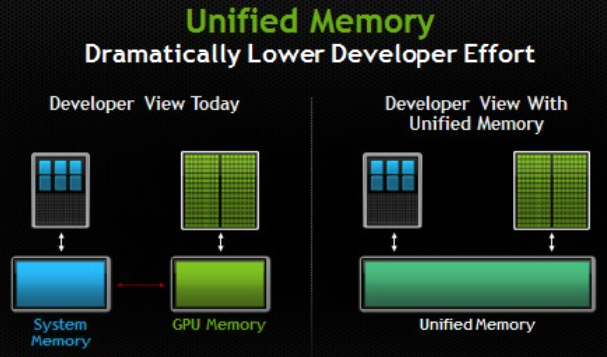

统一内存地址 unified memory 是一种在比较新的显卡上支持的特性，只需把 cudaMalloc 换成 cudaMallocManaged即可，释放时也是通过 cudaFree

```c++
__host__ cudaError_t cudaMallocManaged ( void** devPtr, size_t size,
                                        unsigned int  flags = cudaMemAttachGlobal );
```

flags

* cudaMemAttachGlobal：允许内存在多个设备之间共享，默认是这个选项
* cudaMemAttachHost：内存只能在主机上访问

这样分配出来的地址，从开发者的角度看不论在不存在CPU和GPU内存的区别，在host和device傻姑娘都可以直接访问。而且拷贝也会自动按需进行（当从 CPU 访问时），无需手动调用 cudaMemcpy，大大方便了开发者，特别是含有指针的一些数据结构

但是统一内存地址也会引入一些开销，所以可以的话还是尽量用分离的设备内存和主机内存

## *优化数据转移*

https://developer.nvidia.com/blog/how-optimize-data-transfers-cuda-cc/

### Guidelines

* 尽量在可能的情况下减少主机和设备之间的数据传输量，即使这意味着在 GPU 上运行的核函数与在主机 CPU 上运行的核函数相比速度提升不大或几乎没有
* 使用page-locked memory 或者叫做 pinned memory 时，主机和设备之间的带宽更高
* 将许多小的传输合并为一个较大的传输（Batching）执行性能更好，因为它消除了大部分传输的开销
* 在主机和设备之间的数据传输中，有时可以用核函数执行和其他数据传输来隐藏

### Pinnend Memory

# CUDA工具

https://developer.nvidia.com/tools-overview

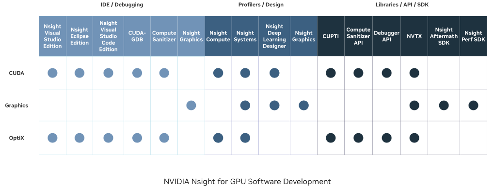

> NVIDIA Nsight™ tools are a powerful set of libraries, SDKs, and developer tools spanning across desktop and mobile targets that enable developers to build, debug, profile, and develop software that utilizes the latest accelerated computing hardware.

## *调试器*

### 错误分析

CUDA的函数调用出错时，并不会直接终止程序，也不会抛出 C++ 的异常，而是类似于C系统调用的风格，返回一个错误代码，告诉用户具体除了什么错误，这是出于通用性考虑

这个错误代码的类型是 `cudaError_t`，其实就是个 enum 类型，相当于 int

可以通过 `cudaGetErrorName()` 获取该enum的具体

### nvcc-gdb

## *Nsight Systems*

### Event

```c++
// Creates an event object.
__host__ cudaError_t cudaEventCreate ( cudaEvent_t* event ); 
// Creates an event object with the specified flags.
__host__ __device__ cudaError_t cudaEventCreateWithFlags ( cudaEvent_t* event, unsigned int  flags );
// Destroys an event object.
__host__ __device__ cudaError_t cudaEventDestroy ( cudaEvent_t event );
// Computes the elapsed time between events.
__host__ cudaError_t cudaEventElapsedTime ( float* ms, cudaEvent_t start, cudaEvent_t end );
// Queries an event's status.
__host__ cudaError_t cudaEventQuery ( cudaEvent_t event );
// Records an event.
__host__ __device__ cudaError_t cudaEventRecord ( cudaEvent_t event, cudaStream_t stream = 0 );
// Records an event.
__host__ cudaError_t cudaEventRecordWithFlags ( cudaEvent_t event, cudaStream_t stream = 0, unsigned int  flags = 0 );
// Waits for an event to complete.
__host__ cudaError_t cudaEventSynchronize ( cudaEvent_t event );
```

用event来分析测量性能需要改动代码，用nvprof可以直接测量。`nvprof` 是 NVIDIA 提供的用于分析和优化 CUDA 程序性能的命令行工具

但是 `nvprof` is not supported on devices with compute capability 8.0 and higher. Use NVIDIA Nsight Systems for GPU tracing and CPU sampling and NVIDIA Nsight Compute for GPU profiling

### 测量数据传输

## *工具库*

### cublas

CuBLAS, CUDA Basic Linear Algebra Subroutines 是NVIDIA提供的一个基于CUDA的线性代数库，用于在GPU上执行各种常见的线性代数运算。它提供了针对NVIDIA GPU优化的高性能BLAS（Basic Linear Algebra Subprograms）实现，其中包括矩阵乘法、矩阵-向量乘法、矩阵操作等

cublas, nvblas, cusolver, cufftw, cusparse, nvgraph

# AMD

## *ROCm*

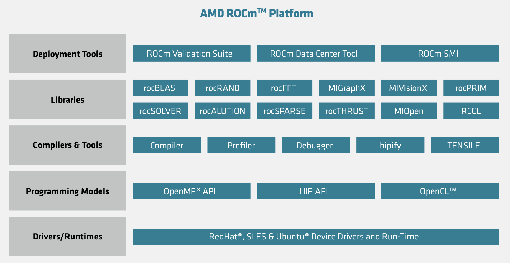

ROCM, Radeon Open Compute 是由 AMD 开发的开源平台，旨在支持 GPU 计算和高性能计算工作负载。ROCM 提供了一套工具、驱动程序和库，使开发者能够更好地利用 AMD GPU 进行通用目的计算，而不仅仅是用于图形渲染

* 部署工具
  * ROCm Validation Suite, RVS：RVS 是一个测试和验证工具，旨在帮助用户确保他们的 ROCm 环境和应用程序能够正常运行。它包含一系列测试和验证套件，用于检查 ROCm 软件栈的正确性、性能和稳定性
  * ROCm Data Center Tool：ROCM 提供了用于监视和管理 GPU 集群的工具，以帮助优化性能和资源使用
  * ROCm System Management Interface, ROCm SMI：ROCm SMI 是一个系统管理接口，允许用户监视和调整 AMD GPU 的各种设置。它提供了命令行工具，使用户能够查看 GPU 的状态、性能和健康状况，以及对某些参数进行调整
* ROCm Libraries：ROCm 包括一系列针对高性能计算的开源库，如 ROCBLAS（基本线性代数子程序）、ROCFFT（快速傅立叶变换）、MIOpen（深度学习和神经网络库）等
* 编程模型
  * HIP, Heterogeneous-Compute Interface for Portability：类似于 CUDA 的通用GPU编程模型
  * ROCM 支持 OpenCL，这是一种通用目的计算的开放标准，允许开发者使用不同的 GPU 架构进行并行编程

## *HIP*

### Hipify

hipify 是由 AMD 提供的一个工具，用于将 CUDA C/C++ 代码转换为 HIP 代码，从而使之能够在 AMD GPU 上运行

```cmd
$ hipify-perl <input-file> -o=<output-file>
```

### AMD GPU简介

### 架构

* `fiji`: Compile for GCN3 Fiji devices (gfx803)
* `gfx900`: Compile for GCN5 Vega 10 devices (gfx900)
* `gfx906`: Compile for GCN5 Vega 20 devices (gfx906)
* `gfx908`: Compile for CDNA1 Instinct MI100 series devices (gfx908)
* `gfx90a`: Compile for CDNA2 Instinct MI200 series devices (gfx90a)

# OpenMP用于GPU编程

OpenMP在4.0后加入了对GPU通用计算编程的支持

## *team construct*

### 使用

* Team只能嵌套在显式声明的并行区域或者**在target中使用**。如果是在嵌套在target中，此时target不能有任何在target中但在team外的语句

### Offloading

和CUDA的异构编程模型一样，OpenMP也是Host-centric，默认是在host上运行。需要offloading到device上运行代码。所谓offloading就是CUDA中的转移到device上运行

用target来声明要offloading的运算

```c++
int N=100;
double b[N]. c[N];
double a = 1.2;
for (int i = 0; i < N; i++) b[i] = (double)(i); 
#pragma omp target map(a, b, c)
{
for(int i=0; i<N; i++) c[i] = a * b[i];
}
```

map是offloading特有的变量类型，适用于separate memory，shared不允许在separate memory中使用

### team & parallel

Parallel 生成一组并行线程，而team则是生成一组parallel

## *parallel Construct*

### 语义

当一个线程遇到一个并行构造块时，将创建一个team of threads来执行并行区域。遇到并行构造块的线程成为新团队的主线程，在新的并行区域期间，其线程编号为零。新团队中的所有线程，包括主线程，都执行该区域。一旦team创建，team中的线程数量在该并行区域的持续时间内保持不变。

在并行区域内，线程编号唯一标识每个线程。线程编号是从主线程的零到团队中线程数量减一的连续整数。线程可以通过调用 `omp_get_thread_num` 库例程来获得自己的线程编号。

Encountering thread 生成的一组隐式任务的数量等于团队中线程的数量。并行构造块的结构化块确定了每个隐式任务中将执行的代码。每个任务分配给团队中的不同线程，并变为绑定任务。Encountering thread 正在执行的任务区域被暂停，团队中的每个线程执行其隐式任务。每个线程可以执行与其他线程不同的语句路径。在最终恢复执行隐式任务之前，实现可能会导致任何线程在任务调度点暂停执行，切换到团队中的任何线程生成的任何显式任务的执行。

在并行区域的末尾有一个隐式barrier。在并行区域结束后，只有团队的主线程会恢复执行封闭任务区域。

如果正在执行并行区域的团队中的线程遇到另一个并行指令，它将根据第10.1.1节中的规则创建一个新团队，并成为该新团队的主线程。

如果一个线程在执行并行区域时终止，所有团队中所有线程的执行都会终止。线程终止的顺序是未指定的。在任何barrier之前完成的所有工作都是有保证的。在线程通过最后一个barrier后的每个线程的工作量是未指定的。

### 执行模型

并行开始事件发生在遇到并行构造块的线程中，位于相应并行区域创建任何隐式任务之前。 在每个隐式任务创建时，在执行隐式任务的线程中会发生隐式任务开始事件，该事件发生在隐式任务完全初始化后，但在线程开始执行并行构造块之前。 如果并行区域创建了本机线程，那么本机线程开始事件会作为新线程上下文中的第一个事件发生在隐式任务开始事件之前。 与隐式屏障相关的事件发生在并行区域结束时。第15.3.2节描述了与隐式屏障相关的事件。 当线程完成一个隐式任务时，隐式任务结束事件发生在线程中，该事件发生在与隐式任务中的隐式屏障同步相关的事件之后。 并行结束事件发生在遇到并行构造块的线程中，该事件发生在线程执行其隐式任务结束事件之后，但在线程恢复执行遇到的任务之前。 如果在并行区域结束时销毁了本机线程，本机线程结束事件会发生在线程销毁之前的最后一个事件。

## *teams Construct*

### 语义

当线程遇到 teams construct 时，将创建一个league of teams。每个team都是一个initial team，每个team中的初始线程执行 teams 区域。创建的teams数量根据 `if` 和 `num_teams` clause来确定。一旦team被创建，initial team的数量在 teams 区域的持续时间内保持不变。在 teams 区域中，inital team编号唯一标识每个初始团队，这个编号是从零到小于初始团队数量的连续整数。

如果 teams construct 上存在`if`子句，并且`if`子句的表达式评估为`false`，则创建的团队数量为一个。在`teams`构造的`if`子句表达式中使用变量会导致对该变量的隐式引用，该引用在所有封闭的构造块中都存在。`if`子句表达式在`teams`构造之外的上下文中进行评估。

如果 teams construct 上没有出现`thread_limit`子句，但该构造紧嵌套在一个具有指定`thread_limit`子句的 target construct 内，那么行为就好像也为`teams`构造指定了该`thread_limit`子句。

在包括 target construct 和 teams construct 的组合或复合构造中，`num_teams`和`thread_limit`子句中的表达式在进入 target construct 构造时**在主机设备上进行评估**。

由遇到线程的`place-partition-var` ICV 给出的位置列表以一种实现定义的方式分割，并通过将其初始线程的`place-partition-var`设置为子分区，将每个团队分配给一个子分区。

 teams construct 将每个初始线程的`default-device-var` ICV 设置为一个实现定义的值。

在团队完成`teams`区域的执行之后，遇到的任务继续执行封闭任务区域。


若 `num_teams()` clause未定义，默认的 league of teams = 1 ？？

## *target Construct*

target construct提供了 target data 指令提供的功能的超集，除了 `use_device_ptr` 和 `use_device_addr` clause。target construct 添加的功能是包含在设备上执行的可执行区域。target construct 生成一个目标任务。生成的任务区域包围目标区域。如果存在depend clause，则与目标任务关联。device clause确定目标区域在哪个设备上执行。如果存在nowait子句，目标任务的执行可能会延迟。如果不存在nowait子句，则目标任务是一个包含的任务。 

所有clause在遇到目标构造时都会进行评估。目标任务的数据环境根据目标构造上的数据共享和数据映射属性子句、每个数据环境的ICV以及适用于目标构造的默认数据共享属性规则创建。如果目标构造映射了一个变量或变量的一部分，并且在构造中没有出现在 in_reduction clause 的列表项中，那么该变量在目标任务的数据环境中具有共享的默认数据共享属性。与映射变量相关的赋值操作发生在目标任务执行时。 如果使用ancestor device-modifier指定了device子句，则遇到的线程会在恢复之前等待父设备上的目标区域完成。对于在同一构造上的map子句中出现的任何列表项，如果相应的列表项存在于父设备的设备数据环境中，则将其视为具有正无穷大的引用计数。 当存在if子句并且if子句表达式评估为false时，效果就好像存在一个设备子句，指定omp_initial_device作为设备号，而不管指令上的任何其他设备子句。如果一个过程在一个不指定ancestor device-modifier的设备子句中明确或隐含地引用在目标构造中，则该过程被视为其名称出现在declare target指令的enter子句中一样。 如果在不指定ancestor device-modifier的设备子句中声明了具有静态存储期的变量，则命名变量被视为在declare target指令的enter子句上出现。

## *distribute Construct*

distribute Construct指定一个或多个循环的迭代将由上下文中的初始团队的隐式任务执行。这些迭代在执行分发区域绑定的初始团队的所有初始线程之间分布。

在分发区域的结束处不会发生隐式屏障。为了避免数据竞争，由于 `lastprivate` 子句而被修改的原始列表项不应在分发构造的结束和分发绑定的团队区域的结束之间访问。

如果未指定 `dist_schedule` 子句，则调度是实现定义的。

在每个逻辑迭代的开始，每个关联循环的循环迭代变量或由 `range-decl` 声明的变量具有它在顺序执行关联循环集合时的值。

调度是可重现的，如果以下条件之一为真：

* 使用可重现的修饰符指定了 `order` 子句；或者
* 使用 `dist_schedule` 子句指定了 `static` 作为 `kind` 参数，且 `order` 子句未使用不受限制的 `order-modifer`。

## *map*

### DDE

### map类型


Teams construct 只是生成了league of teams

需要要distribute来分发

否则就是在league of teams 之间round-robin


```c++
 #pragma omp target map(tofrom: a[0:datasetSize]) map(to: b[0:datasetSize], c[0:datasetSize], d[0:datasetSize])
    #pragma omp teams distribute
    for (unsigned long j = 0; j < repetitions; ++j)
    {
        #pragma omp parallel for schedule(static, 2)
        for (unsigned long i = 0; i < datasetSize; ++i)
        {
            a[i] = b[i] + c[i] * d[i];
        }
    }
    #pragma omp target exit data map(from : a[0 : datasetSize]) map(delete: b[0:datasetSize], c[0:datasetSize],d[0:datasetSize])
```
