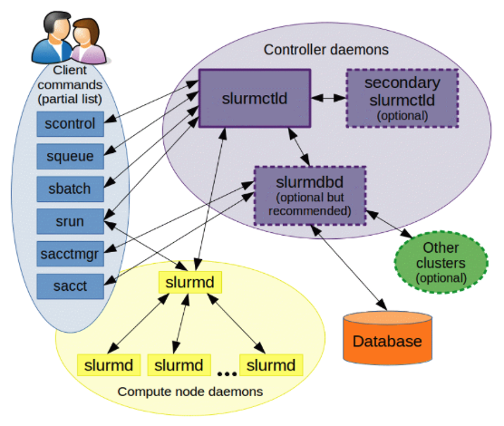
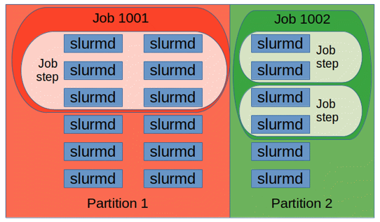

# SLURM

## *任务调度工具*

### 什么是任务调度工具

任务调度工具 Job Scheduling Tool 是用于在HPC集群或分布式计算环境中管理和调度作业的软件工具。它们用于有效地分配计算资源，如处理器、内存和存储，以满足不同用户或应用程序的需求。任务调度工具的主要目标是提高计算资源的利用率，减少等待时间，确保公平的资源分配，以及简化管理和监控任务的执行。

以下是一些常见的HPC任务调度工具：

* Simple Linux Utility for Resource Management, SLURM 极简Linux资源管理工具：SLURM是一种广泛使用的任务调度工具，特别用于Linux环境。它支持作业管理、资源分配、节点管理、负载平衡等功能，并被许多HPC集群采用
* Torque/Maui：Torque是一个开源的批处理系统，与Maui调度器一起使用。它提供了作业管理和节点管理功能，而Maui负责资源分配和作业调度
* Grid Engine：Grid Engine是一种用于管理和调度计算任务的开源工具。它支持作业队列管理、资源分配、负载平衡和可视化监控
* PBS, Portable Batch System：PBS是一种任务调度工具的通用标准，有多个实现，包括OpenPBS、PBS Professional等。它支持各种资源管理和作业调度功能
* LSF, Load Sharing Facility：LSF是IBM开发的任务调度工具，用于大型HPC集群和超算。它支持复杂的作业调度和资源管理需求
* Moab：Moab是Maui调度器的商业版本，提供高级的资源管理和调度功能，特别适用于大规模HPC环境
* Slurm-Workload Manager：Slurm是一个开源的HPC任务调度工具，与SLURM配套使用。它提供了资源管理、作业调度和监控功能

### SLURM简介

https://slurm.schedmd.com/overview.html

BEAST中使用的是SLURM

> **slurm 任务调度工具**（前身为**极简Linux资源管理工具**，英文：**Simple Linux Utility for Resource Management**，取首字母，简写为**SLURM**），或 **Slurm**，是一个用于 Linux 和 Unix 内核系统的[自由开源](https://zh.wikipedia.org/wiki/自由开源)的任务调度工具，被世界范围内的[超级计算机](https://zh.wikipedia.org/wiki/超级计算机)和[计算机群](https://zh.wikipedia.org/wiki/计算机集群)广泛采用。它提供了三个关键功能。第一，为用户分配一定时间的专享或非专享的资源(计算机节点)，以供用户执行工作。第二，它提供了一个框架，用于启动、执行、监测在节点上运行着的任务(通常是并行的任务，例如 [MPI](https://zh.wikipedia.org/wiki/訊息傳遞介面))，第三，为任务队列合理地分配资源。
>
> 大约60％的[500强](https://zh.wikipedia.org/wiki/TOP500)超级计算机上都运行着Slurm，包括2016年前世界上最快的计算机[天河-2](https://zh.wikipedia.org/wiki/天河二号)。
>
> Slurm使用基于Hilbert曲线调度或肥胖 网络拓扑结构的[最适算法](https://zh.wikipedia.org/wiki/曲線擬合)，以便优化并行计算机中的任务分配。-- wikipedia

Slurm 是一个开源、容错性强、高度可扩展的集群管理和作业调度系统，适用于大型和小型 Linux 集群。Slurm 在运行时不需要对内核进行修改，而且相对自包含。作为一个集群工作负载管理器，Slurm 具有三个关键功能

* 它为用户分配对资源（计算节点）的独占和/或非独占访问权限，以供一段时间内执行工作
* 它提供了一个启动、执行和监控工作（通常是并行作业）的框架，这些工作在分配的节点集上执行
* 它通过管理待处理工作队列来仲裁资源的争用。可以使用可选插件进行会计、高级预约、团体调度（并行作业的时间共享）、后台调度、拓扑优化的资源选择、按用户或银行账户的资源限制以及复杂的多因素作业优先级算法

## *SLURM的结构*

### SLURM架构

https://blog.csdn.net/qq_31910613/article/details/102916309



* 控制器守护进程 controller daemons
  * 集中式管理器 slurmctld是SLURM资源管理系统的中枢服务，它用于监视资源和工作
    * 在发生故障的情况下，可能还有一个可选的备份管理器 secondary slurmctld 来承担这些职责
    * 每个计算服务器（节点）都有一个 slurmd 守护进程，可以类比为远程 shell：它等待工作、执行工作、返回状态，然后等待更多工作
    * slurmd 守护进程提供了容错性强的分层通信
  * 可选的但是推荐运行的 slurmdbd（Slurm 数据库守护进程）：可用于记录单个数据库中管理的多个 Slurm 集群的记账信息
  * 可选的 slurmrestd（Slurm REST API 守护进程），可用于通过其 REST API 与 Slurm 进行交互。
* 用户命令：下面会具体介绍命令
* 节点监控进程 slurmd
  * slurmd 运行在每个计算节点上，负责收集节点上的资源状态并向控制进程报告。slurmd 接收来自控制进程与用户命令的请求，进行作业步任务加载、作业取消等操作
  * slurmstepd 作业管理进程是由slurmd在加载作业步任务或批处理作业时派生出来的。slurmstepd进程管理本节点上一个作业步的所有任务，负责计算任务启动、标准IO转发、信号传递、记账信息收集以及并行环境初始化等功能

### SLURM对Job的划分



上图是由 Slurm 守护程序管理的实体以及对它们的划分

* 节点 nodes：Slurm 中的计算资源，就是整个上图
* 分区 partitions：用于将节点分组成逻辑集合。可以将分区视为作业队列，每个队列具有各种约束条件，如作业大小限制、作业时间限制、允许使用的用户等
* 作业 jobs：分配给用户的资源，以供在指定时间内使用。作业按优先级顺序分配节点，直到该分区内的资源（节点、处理器、内存等）耗尽。一旦作业分配了一组节点，用户就能够以分配内的任何配置形式启动并行工作
* 作业步 job steps：它们是作业内的一组（可能是并行的）任务

可以启动一个单一作业步骤，利用分配给作业的所有节点，或者可以独立使用分配的一部分资源启动多个作业步骤。Slurm 提供了对分配给作业的处理器资源的资源管理，以便可以同时提交多个作业步骤并排队，直到作业的分配内有可用资源为止

## *SLURM的使用*

### 三种提交模式

https://www.bkunyun.com/help/docs/cloudE18

* `srun`

  ```shell
  srun [OPTIONS...] executable [args...]
  srun -p gpu -w g[1100-1101] -N 2 -n 80 -t 20 A.exe # 示例
  ```

  srun 属于交互式提交作业，有屏幕输出，但容易收到网络波动影响，断网或关闭窗口会导致作业中断。一般仅在调试程序时使用此方式提交作业。下面是一些参数的意义

  * -N 3：指定节点数为3
  * -n 12：指定进程数为12
  * -c 12：指定每个进程（任务）使用的CPU核 为12，一般运行OpenMP等多线程程序时需，普通MPI程序不需要指定
  * --gres=gpu:4：指定每台机器使用4张GPU卡
  * -p gpu：指定提交作业到GPU队列
  * -w g[100-101]：指定提交作业到 g100、g101 节点
  * -x g[100, 106]：排除 g100、g106 节点
  * --o out.log：指定标准输出到 out.log 文件
  * -e err.log：指定重定向错误输出到 err.log 文件
  * -J JOBNAME：指定作业名为 JOBNAME
  * -t 20：限制运行 20 分钟

* `sbatch`

  Slurm 支持利用 sbatch 命令采用批处理方式运行作业，sbatch 命令在脚本正确传递给作业调度系统后立即退出，同时获取到一个作业号。作业等所需资源满足后开始运行

* `salloc`

  salloc 命令用于申请节点资源

### 其他命令

* 查看状态
  * sinfo 用于报告系统状态
  * sacct 用于获取有关正在运行或已完成的作业和作业步骤的信息
  * sview 命令以图形方式报告系统和作业状态，包括网络拓扑
  * squeue 用于报告作业状态
* 作业控制
  * srun、salloc、sbatch
  * scancel 用于终止排队或运行中的作业
* scontrol 管理工具，可用于监视和/或修改集群的配置和状态信息
* sacctmgr 管理数据库的管理工具。它可用于识别集群、有效用户、有效银行账户等。对于所有功能都提供了 API

## *LRZ集群的SLURM节点*

### 节点分类

### 在集群上运行并行程序

