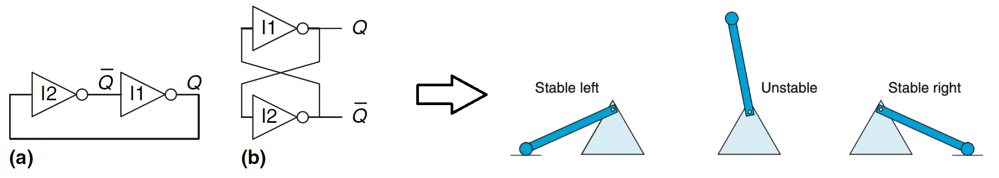

# 微机基础

## *计算机发展概述*

### 计算机发展历程

按照电子数字计算机主要元器件的制作材料和工艺水平来划分，计算机的发展经历了四代。这四个发展阶段以硬件进步为主要标志,同时也包括了软件技术的发展

1. 第一代 1946～1958年：电子管计算机时代
2. 第二代 1959～1964年：晶体管计算机时代
3. 第三代 1965～1970年：中小规模集成电路计算机时代 SSI & MSI
4. 第四代 1971年至今：大规模、超大规模集成电路计算机时代 LSI & VLSI

### 计算机的分类

* 按照规模分类
  1. **超级计算机 Supercomputers：** 这是最高级别的计算机，用于处理大规模的科学计算和复杂的数值模拟。它们通常具有极高的计算能力和处理速度，用于解决需要大量计算资源的问题，如气象预测、核物理模拟等
  2. **大型计算机 Mainframes：** 大型计算机主要用于处理大规模的数据处理任务，如企业级数据库管理、金融交易处理等。它们通常具有高度可靠性、可扩展性和强大的处理能力
  3. **小型计算机 Minicomputers：** 小型计算机介于大型计算机和微型计算机之间，用途广泛，可以支持多用户和多任务操作，常用于科学研究、工程设计等
  4. **微型计算机/微机 Microcomputers：** 这是个人计算机的范畴，包括了个人台式机、笔记本电脑、平板电脑等，适用于个人使用和小型办公环境
* 按照功能分类
  1. **通用计算机 General-Purpose Computers：** 这是最常见的计算机类型，能够执行各种不同类型的任务，根据不同的软件和应用进行配置
  2. **嵌入式系统 Embedded Systems：** 嵌入式系统是内置在其他设备中，用于特定控制、监测或执行任务的计算机系统。例如，汽车中的引擎控制系统、家电中的控制芯片等都属于嵌入式系统
  3. **服务器 Servers：** 服务器是专门用于提供服务、存储和共享资源的计算机。它们通常在网络环境中使用，用于托管网站、应用程序、数据库等。
  4. **工作站 Workstations：** 工作站是用于高性能计算和专业应用的计算机，常用于图形设计、科学计算、工程模拟等领域。
  5. **个人计算机 Personal Computers：** 个人计算机是供个人使用的计算机，包括了台式机、笔记本电脑、平板电脑等。

### 微机发展历程

微处理器是微机的核心，因此微机的发展历程是以微处理器的发展为标志的

1. 第一代 1971～1972年：4位和低档8位微机
   * 1971年诞生了全球第一个商用微处理器芯片Intel 4004，以它为核心组成的Intel MCS-4（Micro-Computer Set-4）计算机是世界上第一台微机。随后4004改进为4040
   * 次年Intel公司研制出8位微处理器芯片8008，并出现了由它组成的MCS-8微机
2. 第一代 1973～1977年：中、高档8位微机。摩托罗拉公司的MC6800和Intel 8008的升级版8080是这个时期的代表作
3. 第一代 1978～1984年：经典成熟的16位微机
   * Intel公司的8086/8088/80286、摩托罗拉公司的MC68000是这个时期的代表作。特别是8086成为了一代经典。**人们将自8086以来一直延续搭载的这种CISC指令集体系通称为x86指令体系**
   * 这一时期最著名的微机产品就是IBM推出的IBM PC，它采用了Intel的8088微处理器并搭载了微软发布的MS-DOS操作系统。此外比较出名的还有Apple公司推出的初代Macintosh机，其CPU主要采用摩托罗拉的68000系列和Power PC系列
4. 第一代 1985～1992年：32位微机时代
   * 1985年，Intel公司首次推出32位微处理器芯片80386，80386在结构上有重大进步。386是真正开创了PC的一款CPU，开始运行Unix系统了
   * 次后陆续推出了80486、80586（Pentium）、Pentium Pro、PentiumⅡ/Celeron 赛扬/Xeon 至强、PentiumⅢ/CeleronⅡ/Xeon 以及 Pentium 4
   * 32位微处理器都采用 IA32 Intel Architecture 32 指令架构，并逐步增加了面向多媒体数据处理和网络应用的扩展指令，如Intel的MMX、SSE指令集和AMD的3D Now!指令集
5. 第一代 1993年至今：性能更强的64位微机
   * 随着信息革命的蓬勃发展，32位为微处理器已不能满足实际需求，Intel、AMD、IBM、Sun 等厂商陆续设计并推出了它们的64位CPU
   * 2000年Intel推出的Itanium 安腾、2001年推出的Xeon 至强以及2006年推出的用于台式 PC的Core 酷睿，它们采用全新的指令架构“显式并行指令计算” ，该指令架构又称为IA64，以区别于原来的IA32架构。64位微处理器起初是面向服务器和工作站等高端应用,之后很快普及到PC领域
   * 从2003年开始，CPU的设计与制造由于功耗墙等限制不再只追求cpu的频率，而是通过多核来实现多任务处理速度和能耗之间的平衡

虽然上面5个时代看起来是根据CPU字长来划分的，但并不只是增加的字长提高了微机的性能，将其他因素也综合起来，比如时钟频率的提高、总线技术、存储技术以及软件（如操作系统和编译软件等系统软件）的共同进步推动了微机一代又一代的发展

历史上出现过很多知名的指令集架构，比如Alpha， SPARC，PowerPC，MIPS等，但是今天最流行的指令集架构是**x86(-64)，ARM，RISC-V**

## *微机结构 & 工作原理*

### 什么是微机

微机 Microcomputer 是一种以LSI & VLSI 集成电路为主要部件，以微处理器 Microprocessor 为核心所构造的个人计算机系统。微机通常包括中央处理器（CPU）、内存、输入输出接口、存储设备等基本组件，能够完成数据处理、存储和传输等任务。微机的概念最早在20世纪70年代提出，是个人计算机发展的重要阶段之一

微机是一个更广泛的术语，涵盖了使用微处理器的各种计算机系统，不仅包括个人计算机，还包括嵌入式系统、工控系统等。PC是微机的一个子集，特指适用于个人使用的计算机

### 常用基本概念

* 微处理器：也称为中央处理单元 Central Processing Unit CPU，由运算器、 控制器、寄存器以及片内总线等部件构成的大规模集成电路芯片
* 微机：微型计算机 Microcomputer 的简称，由 CPU、主存储器、输入/输出接口电路以及总线等构成
* 微机系统：由硬件和软件构成。硬件主要包括微机和外部设备，软件是指为了管理和维护计算机硬件系统、完成用户指定任务所编制的各种程序，主要包括系统软件和应用软件等
* 位 bit：二进制位0和1，位是计算机中存储信息的最小单位
* 字节 Byte：8个二进制位。计算机中通常以字节为最小存储单位，并以字节寻址
* 字 word：存储器和处理器中的一个固定长度的数据单元
* 字长 word size：一个字的位数，也是指针数据的标称大小 nominal size
* 指令：让计算机完成某种操作的命令，与CPU的具体型号密切相关
* 指令集：指令的集合，指示CPU该确切的做什么。指令集是一种抽象，不同的指令实现的目标可能是一样的，但底层的硬件操作不同，这也就给了优化的机会
* 程序：很多指令形成的序列
* 主频 Clock frequency：CPU的时钟频率，即CPU的工作频率
* 外频：外部总线频率的简称，通常为系统总线传输数据的频率。外频是CPU的基准频率

### 冯诺伊曼架构 & 哈佛架构

* 冯诺伊曼架构 Von Neumann Architecture 又称为普林斯顿架构 Princeton Architecture：将程序指令存储器和数据存储器合并在一起。冯诺伊曼结构隐约指导了将存储设备与中央处理器分开的概念，因此依本结构设计出的计算机又称**存储程序计算机**
* 哈佛架构 Harvard Architecture：将程序指令存储器和数据存储器分开

为什么电脑还沿用冯诺伊曼结构而不使用哈佛结构？ - 昌维的回答 - 知乎 <https://www.zhihu.com/question/22406681/answer/1030814514>

早期的冯诺伊曼机是**以运算器为中心**的，IO设备通过运算器于存储器传送数据


### 现代计算机

随着微电子技术的发展，现代计算机中CPU于存储设备和IO设备的速度差距非常大，这时候若数据传送都还非得经过运算器已经不合适了。所以现代计算机发展为了**以存储器为中心**，使IO操作尽可能地绕过CPU，直接在IO设备与存储器之间完成，从而提高系统的整体运行效率


现代计算机仍然把程序指令存储器和数据存储器合并在一起，所以大部分现代计算机仍然是冯诺伊曼架构

## *主板*

### 主板的功能

主板 mainboard/母板 motherboard的主要功能将微机系统的各种核心设别连接到一起，它是一种具有扩展能力的PCB Print Circuit Board 印刷电路板。也就是说主板提供一系列接合点，形成一个能集成CPU、内存、各种存储设别、GPU、声卡、网卡和各种IO设备的连接平台

主板的表面设计有可以直接插入扩展卡的插槽或可以连接其它内置设备（比如光驱）的线路连接。主板上最重要的构成组件是芯片组 chipset。早期的芯片组通常由北桥和南桥组成，不过在2010年后，Intel/AMD将北桥功能集成至CPU，所以**现在的主板上芯片组已经被简化为一颗独立的南桥芯片**

主板也可以指哪些具有单个板然而没有额外扩展能力的设备，主要是各种的嵌入式设备，比如Arduino和树莓派 Raspberry Pi这种开发板

### 主板的典型结构

# 8086CPU的结构与功能

## *通用微处理器的结构*

### 通用微处理器的外部结构


微处理器的外部结构表现为数量有限的输入/输出引脚，CPU的这些引脚信号称为微处理器级的总线

8086CPU芯片总共有40个引脚，微处理器通过这些引脚与外部的逻辑部件连接，从而完成信息的交换

各个存储器之间采用[统一编址](#统一编址)。IO接口是连接CPU与IO设备的控制电路，在IO接口中有多个IO端口寄存器用于与CPU之间的状态和数据交换，计算机会为每个端口寄存器分配一个地址（端口地址），CPU也是据此寻址的


**8086CPU有16条数据总线、20条地址总线和16条控制总线**。8086采用独立的存储器地址空间和IO地址空间。用于存储器的可寻址范围是 $2^{20}=1MB$，采用低16位地址对IO端口编址，因此可寻址 $2^{16}=65536$ 个端口寄存器

### 通用微处理器的内部结构


* ALU Arithmetic Logic Unit 算术逻辑单元：CPU的核心，完成所有的运算操作。它是一个组合电路，无记忆功能。具体可以看数电的相关内容
* 工作寄存器：可以暂存寻址信息和计算过程中的中间结果
  * 数据寄存器用于暂存操作数和中间结果
  * 地址寄存器用于暂存操作数的寻址信息
  * 注意：数据寄存器是专门用于暂存数据的，地址寄存器不存地址的话也可以用来存数据
* 控制器：CPU的控制中心，完成指令的读入、寄存和译码，并产生控制信号序列，使ALU完成指定的操作
  * 程序计数器 Program Counter PC：用于保存下一条要执行的指令的地址，也称为指令指针 instruction pointer
  * 指令寄存器 Instruction Register IR：保存从存储器中读入的当前要执行的指令
  * 指令译码器 Instruction Decoder ID：对指令进行译码
  * 控制逻辑部件：根据对指令译码的分析产生控制信号，以完成指令规定的操作
  * 微处理器状态字 Processor State Word PSW：寄存处理器当前的状态，如指令结果是否为0、结果是正是负、有没有进位或借位、是否溢出等
  * 堆栈指针 Stack Pointer SP：指示堆栈的地址
* IO控制逻辑：处理IO操作

### 8086/8088微处理器的功能结构


可以把功能结构分为两个部分

* 执行单元 Execution Unit EU：从指令队列寄存器中FIFO地获取指令，并对该指令译码后执行某条指令规定的操作。主要部件有ALU、暂存器、EU控制器、PSW和通用寄存器组
* 总线接口单元 Bus Interface Unit BIU：**主要完成CPU与存储器和IO设备之间的信息传递，即取指令、存取数据**。主要部件有ALU、段寄存器、指令指针 IP（8086/8088中等效于PC）、内部寄存器、指令队列寄存器和总线控制电路等

重点介绍一下指令队列寄存器，6个字节，因为PC是1个字节的，所以治要指令队列寄存器没满就可以往里面放。x86中最长的指令是5个字节的

8088和8086的区别是8088的指令队列寄存器是4字节的

## *8086的寄存器组织*

如果每次都通过总线去存储器中取数据会严重影响处理器的性能。所以在处理器上集成了放数据用的寄存器。可直接通过处理器的内部走线来传输数据，速度很快

寄存器的数量要合适，如果太少不够用，还是要经常去存储器上取；而太多则会影响处理器的体积和封装

8086CPU内部有**14个16位**的寄存器，按功能可以划分为8个通用寄存器、4个段寄存器和2个控制寄存器。**寄存器是汇编语言指令可以使用的操作数**

### 8个通用寄存器

所谓的通用就是说**一写程序就要用到**，8个通用寄存器组成了8086汇编编程的编程模型

* 4个16位的数据寄存器

  1. 累加器 accumulator AX：这是最常用的寄存器，许多操作都可以在AX中完成，而且有一些操作只能在AX中完成，比如乘法和除法操作。当进行自运算的时候一般都选用AX，如果是字节型的字运算，就用AL或AH
  2. 基址寄存器 Base Register BX：虽然属于数据寄存器，但它经常用作地址寄存器，**此时其提供的偏移地址默认在DS，注意和BP的分别**
  3. 计数寄存器 Count Register CX：经常用作循环的计数寄存器，比如在循环语句中默认CX的内容为循环次数
  4. 数据寄存器 Data Register DX：用于寄存数据，但在IO指令中DX用于表示端口地址，比如说IN和OUT指令

  这4个16位的数据寄存器又可以分成8个8位的字节寄存器，H表示高8位，L表示低8位，**每个8字节寄存器都可以单独使用**

  ```
  AX -> AH, AL
  BX -> BH, BL
  CX -> CH, CL
  DX -> DH, DL
  ```

* 4个16位地址指针/变址寄存器

  1. 变址寄存器 Source Index SI：在字符串操作指令中，**SI提供源操作数的段内偏移地址**，当然也可以在其他指令中用作地址寄存器。段地址为DS段
  2. 变址寄存器 Destination Index DI：在字符串操作指令中，**DI提供目的操作数的段内偏移地址**，当然也可以在其他指令中用作地址寄存器。段地址为DS段
  3. 堆栈指针 Stack Pointer SP：**用于保存堆栈段的段内偏移地址**。而段地址默认由段寄存器SS提供，**当处于堆栈中时，完整的地址默认为`SS:SP` **
  4. 基址指针 Base Pointer BP
  
     * **BP可以指定段内偏移地址**，但将BP用作地址寄存器时，**一般情况下其默认的段地址为SS段的**
  
     * 若要写到DS段中时，要显式注明
  
       ```assembly
       MOV DS: [BP], AL ; 前缀DS段超越前缀
       ```
  
  在将这上面这4个寄存器用作地址寄存器时它们只提供了16位的偏移地址。要形成20位的物理地址还需要由段寄存器提供段地址，它们之间的关系为
  $$
  物理地址=段地址\times 10H+偏移地址
  $$

### 4个段寄存器

1. 代码段 Code Segment CS 寄存器：用于存放当前执行程序的段地址，IP为指令指针。当处于代码段中时，完整的地址默认为 `CS:IP`
2. 数据段 Data Segment DS 寄存器：用于存放当前数据段的段地址
3. 附加段 Extra Segment ES 寄存器：用于存放当前附加数据段的段地址
4. 堆栈段 Stack Segment SS 寄存器：用于存放当前堆栈段的段地址

由段地址和偏移地址可以构成物理地址，这一点与存储器的分段结构有关

程序开始时要把DS、ES、SS段寄存器初始化，指向自己程序的对应段地址。而CS段寄存器要由OS完成

### 2个控制寄存器

1. 指令指针 Instruction Pointer IP：也称程序计数器 Program Counter PC。用于保存下一条即将要执行指令的**段内偏移地址**。**改变IP的值就意味着改变程序的流程**，不能通过普通的传送类指令修改IP的值，但某些指令可以改变IP的内容，如转移指令、子程序调用和返回指令等
2. 微处理器状态字 Processor State Word PSW：它是一个16位的寄存器，也称为标志寄存器。一共设定了9个标志位，其中6个标志位用于反映ALU前一次操作的结果状态，另3个标志位用于控制CPU操作

### PSW中的标志位


* 反映ALU前一次操作结果状态的标志位
  * 进位标志 Carry Flag CF：在加减运算时，标识最高位（D7或D15）有无进（借）位的标志。有为1，无为0
  * 奇偶标志 Parity Flag PF：操作结果的低8位中含有“1”的个数。偶为1，奇为0
  * 辅助进位标志 Auxiliary Carry Flag AF：在加减运算时，D3位有无进（借）位的标志。有为1，无为0
  * 零标志 Zero Flag ZF：运算结果是否为0。结果为0，ZF为0；结果为1，ZF为1
  * 符号标志 Sign Flag SF：操作结果的符号，它等同于操作的最高位D7（或D15）。正为0，负为1
  * 溢出标志 Overflow Flag OF：有符号数运算时是否溢出的标志。溢出为0，无溢出为1

* 控制CPU的标志位：用来控制CPU的运算状态
  * 方向标志 Direction Flag DF：在字符串操作中，当DF=0时其变址寄存器SI、DI的内容自动递增；当DF=1时，SI、DI 自动递减

  * 中断允许标志 Interrupt Enable Flag IF：当IF=1时，CPU能够响应可屏蔽中断请求；当IF=0 时，则CPU不能响应中断请求，这一位可以用指令STI、CLI来设置

  * 陷阱标志/单步标志 Trap Flag TF：当TF=1时，CPU处于单步执行方式，即每执行一条指令就自动执行一次类型 1 的内部中断，这主要用在Debug中。通过PUSHF和POP来置位和清零？

    

### x86的通用寄存器演进


1. 8086：8个16位通用寄存器。即从 `%ax` 到 `%sp`
2. IA32架构：寄存器扩展为32位，标号为 `%eax` 到 `%esp`，%e.. 表示extended
3. x86-64：16个存储64位值的通用目的寄存器 general-purpose registers。以 `%r` 开头，%r.. 表示register

从IA32到x86-64：生成1字节和2字节数字的指令会保持剩下的字节不变；生成4字节数字的指令会把高位4个字节置0

## *微处理器的存储器 & IO组织*

### 8086的物理地址形成

8086的存储器地址空间是全分段的，因为8086没有MMU，所以不能借助MMU来实现分页

早期的CPU在翻译地址是通过纯软件的方式借助ALU转换，后期在微机系统中也引入了MMU才实现了分页机制或者更成熟的分页+分段混合


还有一个8086采用地址分段的原因是因为要用16位寄存器来寻址20位地址空间。采用段地址基址+偏移量的方案，将寻址范围扩大到1MB。以执行指令为例，高16位为当前执行代码的段地址，放在CS寄存器中，偏移量放在PC寄存器中。若是堆栈中的数据，则段基址放在SS寄存器中。相邻段之间相差16字节，且段的起始地址必须能被16整除，最多能分 $2^{16}=64KB$ 个段

当一个字从偶地址开始存储时，我们说字的存储是对准的；否则当一个字从奇地址开始就是未对准的。CPU访问一个对准的字的时候只需要一个总线周期，直接分别分别通过 $AD_0\sim AD_{15}$ 完成传输；而访问未对准的则需要2个总线周期

之所以未对准需要两个时钟周期是因为执行过程由时钟周期调整，一周期固定**先低后高**。当未对准时，低地址指定为空，等于是用了第一周期的后半部分和第二周期的前半部分

逻辑地址（`端地址:段内偏移地址`）与物理地址的转换关系为下式，其中段内偏移地址也称为段内有效地址 Effective Address EA
$$
物理地址=段地址\times 10H+偏移地址
$$

### 8086的IO组织

# 汇编语言基础

## *汇编语言指令*

### CPU架构、指令集和汇编语言的关系

机器级代码 Machine-level code 是连接高级语言与CPU的中间状态。它有两个含义，一是最终经过编译、汇编和链接的目标代码 object code（二进制指令）。二是汇编代码，它是**机器语言的文本表示**。每条指令会继续根据不同的CPU指令集 Instruction-Set 继续翻译成CPU可以理解的二进制代码

处理器架构就是CPU的硬件电路。指令集决定了处理器的架构，因为处理器架构就是用硬件电路实现指令集。但指令集只是决定了硬件电路总体的输入输出，具体的底层，比如说用什么器件，用什么逻辑组合等和指令集联系不大

计算机能够直接执行的是以二进制代码表示的指令，这种以二进制代码指令编写程序的方法称为机器语言编程。用二进制来编程非常麻烦，所以很快的就出现了汇编语言。汇编语言通常采用一组字母、数字或符号来代替一条二进制代码指令，这种符号称为指令的助记符 Assembly Mnemonic。**汇编语言就是文本化的指令集**

### 汇编器

汇编器 assembler 用于将汇编语言代码翻译成机器码，以供计算机执行。以下是一些常见的汇编器

* **MASM Microsoft Macro Assembler**：MASM 是由微软开发的汇编器，主要用于x86和x86-64架构。它被广泛用于Windows平台上的开发，支持宏、符号和库等功能
* NASM Netwide Assembler：NASM 是一个广泛使用的汇编器，支持多种指令集，包括x86、x86-64和其他体系结构。它具有丰富的特性，能够生成多种输出格式，如二进制文件、可执行文件、目标文件等
* TASM Turbo Assembler：TASM 是Borland公司开发的汇编器，用于x86架构。它曾经在MS-DOS和早期的Windows开发中非常流行
* **GAS GNU Assembler**：GAS 是GNU工具链中的汇编器，用于多种体系结构，包括x86、ARM、MIPS等。它常用于Linux平台上的开发，与GCC（GNU Compiler Collection）配合使用
* FASM Flat Assembler：FASM 是一个小巧、高效的汇编器，适用于多种平台，包括x86和x86-64。它以单个可执行文件形式提供，不需要外部库
* YASM (Yet Another Assembler：YASM 是一个可扩展的汇编器，它支持多种指令集和输出格式。它旨在提供高度可配置的汇编器，适用于许多体系结构
* **Keil Assembler**：Keil MDK是用于嵌入式系统开发的集成开发环境，其中包含了适用于ARM体系结构的Keil Assembler

### 汇编语言中用到的符号

* OPR operands 表示一个操作数
* SRC source 表示源操作数
* DST destination 表示目的操作数
* REG register 表示一个寄存器
* REGn register with n bit 表示一个n位寄存器
* MEM memory 表示一个存储单元
* CNT counter 表示计数值
* LABEL label 标号或过程名
* PORT8 port address with 8 bit 8位端口地址
* DISPn displace with n bit 表示n位的偏移量
* EA effective address 表示有效抵制，即短内偏移抵制
* SEG segment address 表示段地址
* IDATA im data 表示立即数
* $\leftarrow$ moving 表示数据的传送
* $\leftarrow\rightarrow$ exchange 表示数据的交换
* $\left(\cdots\right)$ 取...的内容
* $\and,\ \or,\ \forall,\ \overline{X}$ 逻辑与、或、异或、非

### 汇编语句的分类

* 指令 instruction：汇编后形成的一条机器语言指令，一串二进制序列与一条汇编语句是一一对应的，在程序执行时指令得以执行
* 伪指令 pseudo instruction/directives：只是告诉汇编器如何进行汇编，伪指令在汇编后不会生成机器语言指令，它在程序汇编时得以执行。除了保留的指令助记符和 `macro endm` 之外所有的都是伪指令
* 宏指令 macro instruction：它是由用户自定义的指令，由指令和伪指令构成，它在程序汇编时进行宏展开，以相应的指令和伪指令替代宏指令。用成对出现的 `macro endm` 来定义

### 一条汇编语句的组成


* 名称：每条汇编语句可以有名称，也可以没有名称。这种名称有两种含义 
  * 标号：当语句中名称与助记符之间以冒号间隔时该名称表示标号，用于表示指令的地址 `段地址, 偏移地址`
  * 变量名：当语句中名称与助记符之间以空格间隔时该名称表示变量名，用于表示存放数据的存储空间
* 助记符：助记符由汇编语言指令系统规定，不能随意更改
* 操作数
  * 操作数是指令操作所需要的数据，**一般通过寻址方式给出**。 当直接给出操作的数据时，它可以取常数、标识符（代表常数）及其表达式
  * 操作数可以是一个或2个。当语句表示一条伪指令时可以包含多个操作数。助记符与第一个操作数之间用空格间隔，操作数之间用逗号间隔
* 注释：和C不同，`;` 不是一条语言结束时必须要加的，而是有注释时才加，作为注释的开头。也可以单独成行

### 常数 & 表达式

* 常数
  * 数值：二进制B、十进制（缺省或D结尾）、十六进制H
  * 字符串：用单引号 `''` 括起来的一串字符，表示各个字符的ASCII码。注意：DD、DW定义字符串只能有2个，DB定义的单个字符串不超过64K
* 表达式：算数、逻辑、关系（关系成立时其结果的每一位均为1，结果为–1；当关系不成立时，其结果为0）、属性 & PRT

### 标号 LABEL

伪指令 LABEL 标号是为一组机器指令所起的别名，它与助记符之间用冒号间隔，用于指示相应指令的地址

类似于Cpp中定义的变量和左值引用一样，用DW等定义的变量是已经占据了相应的段，而LABEL只是一个别名，它有段地址与偏移地址的属性，但不会占用段

标号具有3个属性

* 段地址：指示标号所在段的段地址
* 偏移地址：指示标号在段内的偏移地址
* 类型：若标号仅在本段内使用，则其类型为近程 NEAR；若标号还将在段间使用，则其类型为远程 FAR

### 变量

* 定义变量：变量必须首先进行定义，然后才能使用。变量是由**伪指令**来定义的

  ```assembly
  ;变量定义的位指令格式：<变量名> | <变量类型> | <初始值> ; 中间的空格是必须的
  SECTION .DATA
      VAR1 DB  12H,0A5H,18+20,50/3,0,-1  ; 在.data节中定义1个字节变量，可以在同一行上定义，每一个数值都是DB型的
      VAR2 DW  12H,$+1                   ; 地址偏移
      VAR3 DD  12345678H
      VAR4 DB  'ABC'                     ; 字符串
      	 DW  'AB'
      VAR5 DB  ?,?                       ; 只给变量预留存储空间
      VAR6 DB  4 DUP(0FFH,?)             ; 重复分配
      VAR7 DB  3 DUP(55H,2 DUP(77H))
  ```

  * 变量类型
    * DB：定义字节，一个字节数据占1个字节单元，读完一个，偏移量加1
    * DW：定义字，一个字数据占2个字节单元，读完一个，偏移量加2
    * DD：定义双字，一个双字数据占4个字节单元，读完一个，偏移量加4
    * DQ：定义四字，一个四字数据占8个字节单元，读完一个，偏移量加8
    * DT：定义十字节，用于BCD码
  * `?` 的意思是表示只给变量预留存储空间，不初始化，原来是多少就是多少
  * 预定义符号 `$`
    * 当 `$` 出现在表达式中时，它表示当前汇编语句的偏移地址
    * 当 `$` 出现在DOS功能调用显示字符串中时，它表示所显示字符串的结束符
  * 重复方式 DUP

  下图是上面定义的数据在存储器的分布，我们假设这段内存从0000H开始

  

  注意字符串的内存存放顺序：x86是小端机，然而上图中var4的 `'ABC'` 是按照大端顺序存放的，因为变量类型是DB，而DB字节类型的数据定义伪指令，每个字节是一个相对独立的单元，没有高低字节之分，所以顺次排列。而 `'AB'` 的变量类型则是DW，每个word作为一个单位，word里面的每个Byte是要按照小端存放的

* 变量的属性

  * 段地址：指示变量所在段的段地址
  * 段内偏移地址/段内有效地址：变量所在段内的偏移地址
  * 类型：表示变量的类型，它与变量定义伪指令的关键字有关。主要分三类 BYTE、WORD、DWORD
  * 长度：变量定义语句中第一个DUP前的系数，表示变量重复的次数；当变量定义语句中没有出现DUP或者第一个为数据时，其长度为1
  * 大小：变量定义语句中，变量所占用的总的字节数，它等于变量的长度与类型（字节数）之积

* 伪指令DW、DD的特殊用法：DW和DD除了定义变量，还可以用来预置变量（或标号）的段内偏移地址或包括段地址和段内偏移地址的完整地址

### 属性操作符 & PTR属性临时操作符

属性操作符是指**用来获取标号或变量属性的操作符**。标号或变量一旦定义后，它们就具有相应的属性。我们可通过属性操作符来获取变量或标号的属性

**SEG取段地址；OFFSET取偏移地址；TYPE取类型；LENGTH取长度；SIZE取大小**

```assembly
TYPE BYTE = 1
TYPE WORD = 2
TYPE DWORD = 4
```

PTR 操作符可以用来**临时**改变已经定义过的变量或标号的类型，也就是强制类型转换。在这条语句结束后，变量或标号仍然是原来的类型

```assembly
MOV AX WORD PTR VAR1; 将VAR1这个Byte类型的数据强转位WORD放入AX
```

## *寻址方式*

**寻址 addressing 是指在计算机程序中确定、计算和访问存储器中特定数据位置的过程。或者可以说是说明操作数所在地址的方法**

8086CPU指令系统的寻址方式 addressing modes 分为两类：

1. 数据的寻址方式：寻找指令操作所需数据的方法
2. 转移地址的寻址方式：寻找转移指令所需程序地址的方法

### 数据的寻址模式


注意：**上图是ATT格式**，这里是为了说明有多少种寻址模式

1. 立即数寻址 immediate addressing

   ```assembly
   MOV AX, 12A2H ; (AX) <- 12A2H
   ```

   虽然叫做立即数寻址，但其实并没有什么寻址的过程，因为操作符是直接作为一个常数给出的，而不是作为地址

   立即数只能作源操作数，不能作目的操作数

2. 寄存器寻址 register addressing：指令的操作数存放在寄存器中

   ```assembly
   MOV DS, AX
   ```

3. 存储器寻址：要寻找的OPR在存储器某单元中，存储OPR的单元的EA可以通过下面5种方式找到

   1. 直接寻址 direct addressing/absolute addressing

      OPR存放在一个存储器单元中，存储器单元的EA可以用变量名、变量名 $\pm$ 常数（即表达式）或方括号 `[]` 内的地址值来表示

      ```assembly
      MOV AL, VAR1
      MOV AL, [2000H] 
      ```

      上面这种直接给出地址的直接寻址用的不多，一般地址都符号化了，也就是用变量来寻址

   2. 寄存器间接寻址 register indirect addressing

      $$
      EA=\left\{\begin{array}{c}(BX)\\(SI)\\(DI)\end{array}\right\}
      $$
      OPR存放在一个存储器单元中，存储器单元的EA存放在寄存器中，可以使用的寄存器只有BX、 SI和DI。注意BP不能用，因为前面三个是默认存在数据段 DS，而BP是默认存在堆栈端 SS

      用方括号 `[]` 表示用寄存器内部的值寻址

      ```assembly
      MOV AX, [BX]
      ```

   3. 寄存器相对寻址 register relative addressing

      $$
      EA=\left\{\begin{array}{c}(BX)\\(BP)\\(SI)\\(DI)\end{array}\right\}+\left\{\begin{array}{c}disp8\\disp16\\\end{array}\right\}
      $$
      OPR存放在一个存储器单元中，存储器单元的EA为一个基址寄存器或变址寄存器的内容与一个8位（$-64\sim63$）或16位（$-128\sim127$）的位移量之和

      可以使用的寄存器为BX、 BP、SI和DI

      ```assembly
      MOV [BX]+3, AL
      MOV 3+[BX], AL
      MOV 3[BX], AL ; 偏移量加在左边的时候可以省略+号，三种写法等价
      ```

      注意下面使用了BP且没有给出偏移量的写法也是寄存器相对寻址，因为寄存器间接寻址不能使用BP

      ```assembly
      MOV [BP], AL ; (AL) -> ([BP] + 0)
      ```

      当偏移量是变量的时候，取变量的16位offset属性作为偏移量

      ```assembly
      MOV VAR1[BP], AL
      MOV OFFSET VAR1 + BP, AL ; 两条指令等价
      ```

      寄存器相对寻址的一个重要应用是通过SP指针取栈里压的某个值，之所以BP默认存的是SS寄存器中的值的原因就在于此

   4. 基址变址寻址 based indexed addressing
      $$
      EA=\left\{\begin{array}{c}(BX)\\(BP)\end{array}\right\}+\left\{\begin{array}{c}(SI)\\(DI)\end{array}\right\}
      $$
      OPR存放在一个存储器单元中，存储器单元的EA为一个基址寄存器BX、BP和一个变址寄存器SI、DI的内容之和

      ```assembly
      ; 将VAR1开始的10个字节设置为0
      MOV CX 10
      MOV BX, OFFSET VAR1
      MOV SI 0
      MOV AL 0
      NEXT: MOV [BX][SI], AL ; 基址变址寻址
      INC SI
      LOOP NEXT
      ```

   5. 基址变址且相对寻址 based indexed relative addressing

      $$
      EA=\left\{\begin{array}{c}(BX)\\(BP)\end{array}\right\}+\left\{\begin{array}{c}(SI)\\(DI)\end{array}\right\}+\left\{\begin{array}{c}disp8\\disp16\\\end{array}\right\}
      $$
      OPR存放在一个存储器单元中，存储器单元的EA为一个基址寄存器BX、BP的内容、一个变址寄存器SI、DI的内容与一个8位或16位的位移量之和

4. 隐含寻址 hidden addressing：所有字符串操作的DST & SRC

### 转移地址的寻址模式

* 段内转移：只有IP发生了改变，给出一个段内偏移量
  * 段内直接寻址/段内相对寻址 direct addressing within same segment
  * 段内间接寻址 indirect addressing within same segment
* 段间转移：CS和IP都发生了变化，给出一个转移标号
  * 段间直接寻址 direct addressing between different segments
  * 段内间接寻址 indirect addressing between different segments

### 规则

* 数据类型匹配，传送不同字长的数据都是以32位补码数字作为源数据的，除了 `movabsq` 扩展到64位

  ```assembly
  MOV AX CL ; 错误，类型不匹配
  MOV AX BX ; 正确
  ```

* 数据类型要明确

  ```assembly
  MOV [0200H] 56H ; 错误
  MOV WORD PTR [0200H] 56H ; 正确
  ```

  什么叫做数据类型要明确？只要有一方明确了就是整体明确了，比如上面56H立即数是没有类型的，`[0200H]` 直接寻址也没有类型，所以整体数据类型不明确，用PTR操作符将目的操作符的数据类型给固定下来

  当DST采用存储器寻址，而SRC用立即数寻址的时候两者都没有指定数据类型，因此此时DST一定要用PTR指定数据类型

* 当DS、ES和SS作DST时，SRC不能为立即数

  ```assembly
  MOV DS 1500H ; 错误，拆成两段
  
  MOV AX 1500H
  MOV DS AX
  ```

* CS和IP不能作DST。因为初始化时CS和IP是由OS初始化的，而在程序执行过程中是由CPU执行转移转移完成的

* **不能直接将一个内存位置复制到另一个内存位置**，而是会采用DMA来协调完成（**内存->寄存器，寄存器->内存两步走**）

* 8086中指令的操作数不允许两个变量的运算

# 汇编程序 -- 运算

## *指令 & 程序结构*

### 8086指令分类

1. 数据传送类指令
2. 算数运算类指令
3. 逻辑运算类指令
4. 移位类指令
5. 标志位操作指令
6. 转移指令
7. 循环控制指令
8. 子程序调用和返回指令
9. 中断调用返回指令
10. 字符串操作指令
11. IO指令
12. 其他指令
13. 宏指令

### 段定义伪指令

```assembly
<段名> SEGMENT [定位类型] [组合类型] [类别]
		<指令或伪指令语句>
<段名> ENDS
```

使用 SEGMENT 和 ENDS 关键字来成对定义，其前面的标识符必须一致，它就是所定义段的名称，程序中可以通过该名称来访问这个段。8086保留关键字不能用作段名

定义的段具有5个属性

1. 段地址

2. 偏移地址

3. 组合类型：主要在多模块程序连接时使用，告诉了链接器不同模块中的同段名且同组合类型的逻辑段该如何链接。常用的有STACK、NONE（默认，表示没有任何预定义的关系）、MEMORY、PUBLIC等。如果这个段要发挥STACK的功能，就最好定义为STACK的组合类型，OS会自动将地址分配好，否则需要自己手动分配

4. 类别：没什么意义，相当于给程序员的注释

5. 定位类型：用于说明段的起始边界要求，有PAGE 页、PARA 节（默认情况）、WORD 字、BYTE 字节4种类型

   

   PAGE型的外碎片比较多，而BYTE型虽然最小化了外碎片但是一般不会被使用，因为我们一般都要保证段（特别是代码段）的起始偏移地址是0，BYTE型无法保证这一点，PARA、WORD可以通过保证让段的地址物理地址能够被16、2整除来保证这一点

### ASSUME段寻址伪指令

```assembly
ASSUME [CS:CODE, DS:DATA, ...]
```

ASSUME告诉汇编器各个段寄存器当前存放的是哪个段的段地址，**这个段就称为当前段**

不过这并不意味着在段寄存器中已经预先装入了这些段地址，ASSUME只是汇编器的承诺，之后仍然应该用MOV将相应段的段地址置入段寄存器（立即数寻址，段名就是直接给出的段地址），CS 的内容不能被装入，是OS自动写入的

格式中的段寄存器可以为 CS、 DS、 ES 和 SS, 其后续的名称应该是伪指令 SEGMENT 所定义的段名

### END族伪指令

END伪指令表示整个源程序的结束，其表达式的值为该程序运行时的启动地址，**它通常是第一条可执行语句的标号**，即当程序装载到内存时它告诉汇编器 `CS:IP` 的值是什么

END族还有：ENDS用于表示段定义的结束；ENDP用于表示过程定义的结束；ENDM用于表示宏指令或重复宏的结束

### EQU等值伪指令 & `=` 伪指令

EQU是起别名，该伪指令可以为表达式赋一个新的名称，这样在程序设计中就可以用定义的名称来替代相应的表达式

当要赋的值不能超过16位，即不能超过65535时，可以用 `=` 代替EQU

EQU和 `=` 的不同点在于用EQU定义的名称只能有一次，而用 `=` 定义名称时则可以重复定义，这时程序中对应的名称为上一次所定义的值

### ORG定位伪指令

该伪指令用于**强制**为后续指令指定段内偏移地址，可以方便地将程序存入适当的地址，一点对中断设计非常有用

## *数据传送指令*

### 通用数据传送指令 MOV

```assembly
MOV DST SRC ; (DST) <- (SRC)
```

`MOV` 指令用于将数据从源位置复制到目的位置，不做任何变化

### 取有效地址指令 LEA

```assembly
LEA REG16 MEM ; (REG16) <- (MEM的偏移地址)
```

LEA Load Effective Address 可以将SRC的有效地址送入16位寄存器。注意：LEA传送的不是MEM的内容，而是MEM的地址

LEA和下面的MOV的功能一样

```assembly
MOV BX OFFSET VAR1
LEA BX VAR1 ; 两条指令等价
```

寄存器最好是BX、BP、SI、DI，在AX、BX里面也可以，但是不能间接寻址或相对寻址

实际上LEA常用于进行高效的、简短的算数操作，这部分可以看*计算机组成原理.md*的x86-64的LEA部分

### 取地址指针指令 LDS & LES

```assembly
LDS REG16, MEM ; (DS) <- (MEM+2), (REG16) <- (MEM) 
LES REG16, MEM ; (ES) <- (MEM+2), (REG16) <- (MEM)
```

* LDS Load Data Segment Register 将**双字变量**MEM内容中的高16位送入DS，低16位送入指定的REG16中。注意：这里的REG16不允许为段寄存器
* LES Load Extra Segment Register  将双字变量MEM内容中的高16位送入ES，低16位送入指定的REG16中

### 标志传送指令 LAHF & SAHF

```assembly
LAHF ; (AH) <- PSW 寄存器的低8位
SAHF ; PSW寄存器的低8位←(AH)
```

源操作数和目的操作数的寻址方式均为隐含寻址方式

* LAHF Load AH Register From Flags 可以将PSW寄存器中的低8位传送到寄存器AH中
* SAHF Store AH Register in Flags 可以将AH中的内容传送到PSW寄存器中的低8位中

### 数据交换指令 XCHG

```assembly
XCHG DST, SRC ; DST <--> SRC
```

完成两个操作数之间数据的交换，SRC和DST不能是立即数，可以是寄存器，也可以是存储单元，**但两者不能同时为存储单元**

这里的寄存器不能采用段寄存器

### 字节转换指令/查表指令 XLAT

```assembly
XLAT ; (AL) <- ((BX)+(AL))
```

字节转换指令 XLAT translate byte 可以将有效地址为 `(BX)+(AL)` 的存储单元的内容送入AL。当输入为一字节（AL的内容）时，输出也为一字节（同样存放在 AL中），这样就完成了一字节的转换

XLAT非常适合于两个代码之间的转换。举个例子我们要将Code1转换为Code2


```assembly
TABLE DB 15H, 08H, 16H, 25H, 11H, 21H, 19H, 09H, 01H
LEA BX TABLE
MOV AL 0 ; 转换Table中的第一个量
XLAT
```

此时BX相当于是段基址，AL相当于是偏移量

### 堆栈操作指令

* 压栈

  ```assembly
  PUSH SRC ; 将SRC压入堆栈，即 (SP) <- (SP)-2, (SP) <- (SRC)
  PUSHF ; 将PSW压入堆栈，即 (SP) <- (SP)-2, (SP) <- (PSW)
  ```

  压入堆栈指令 PUSH push word onto stack 将先修正堆栈指针SP的内容，然后将SRC的内容送入堆栈。**SRC必须是字型的，所以SP-2**。它可以是通用寄存器和段寄存器，也可以是某种寻址方式所指定的存储单元，**但不能是立即数**

  PUSHF 是将PSW的内容压栈

* 弹栈

  ```assembly
  POP DST ; 从堆栈弹出DST，即 (DST) <- (SP), (SP) <- (SP)+2
  POPF ; 从堆栈弹出PSW，即 (PSW) <- (SP), (SP) <- (SP)+2
  ```

  弹出堆栈指令 POP pop word off stack 可以取出堆栈的内容送入DST所指定的寄存器、存储单元或PSW，然后修正SP的内容。DST也必须是字型的，它可以是通用寄存器、段寄存器（**CS除外**），也可以是存储单元，但不能是立即数

  POPF 是将PSW的内容弹栈

## *数据运算指令*

### 关于数据运算和逻辑运算的两条准则

* CPU只要涉及了数据运算或逻辑运算，其结果就会影响PSW中的状态标志
* 所有的段寄存器不能参加数据运算和逻辑运算

### 加减法

* 加法
	
  ADD和ADC指令会正常影响PSW中的6个状态标志位：CF、AF、OF、SF、ZF和PF
  
  ```assembly
  ADD DST, SRC ; (DST) <- (SRC)+(DST)
  ADC DST, SRC  ; (DST) <- (SRC)+(DST)+(CF)
  ```

	* ADD add byte or word
	* ADC add byte or word with carry：带进位的加法
	
* 减法

  ```assembly
  SUB DST, SRC ; (DST) <- (DST)-(SRC)
  SBB DST, SRC ; (DST) <- (DST)-(SRC)-(CF)
  ```
  
  * SUB
  
  * SBB
  
  * 取负 NEG
  
    ```assembly
    NEG DST ; (DST) <- 0 - (DST)
    ```
    取负是一种特殊的减法运算，其被减数为0
  
* 递增递减

  根据结果设置除CF以外的5个状态标志，因为对CF没影响
  
  ```assembly
  INC DST ; (DST) <- (DST)+1
  DEC DST ; (DST) <- (DST)-1
  ```

  * INC increment byte or word by 1 为增量指令，每次对DST的内容增加 1
  * DEC decrement byte or word by 1 为减量指令，每次对DST的内容减去 1

### 比较指令 CMP

```assembly
CMP DST, SRC ; (DST)-(SRC)，并设置PSW中的状态标志位
```

CMP和SUB类似，设置PSW中的6个状态标志位，区别在于相减的结果不会保存到DST

CMP主要用于比较两数的大小、相等关系

* 若两数相减结果为0，即两数相等，则ZF=1
* SF等同于最高位
* CF、OF视具体情况而定
	* 当两个无符号数进行比较时
	  * 若CF=0、ZF=0,则表示 `(DST)>(SRC)`
	  * 若CF=1，则表示 `(DST)<(SRC)`。注意，此时为减法的借位 borrow
	
	* 当两个有符号数进行比较时：若OF=1，表示运算产生了溢出，但大小的比较要根据 OF 和 SF 共同来决定
	  * 若 $OF\cdot SF=0$ 时，$(DST)\geq (SRC)$
	  * 若 $OF\cdot SF=1$ 时，`(DST)<(SRC)`
	

### 乘除法指令

* 乘法

  ```assembly
  MUL SRC ; 无符号数相乘
  IMUL SRC ; 有符号数相乘
  ```

  * SRC可以取通用寄存器和存储单元，但不能为立即数寻址。到底是字型的还是字节型的乘法取决于给的SRC。DST为隐含在AX（DST为字）或AL（DST为字节）中的被乘数

    ```
    字节：(AL) * SRC -> AX，即 (AH:AL)
    字：(AX) * SRC -> DX:AX
    ```

    * 若SRC为字节，MUL和IMUL为字节运算，此时表示将AL中的数与 `(SRC)` 相乘，其结果放入AX中

    * 若SRC为字，MUL和IMUL为字运算，这时表示将AX中的数与 `(SRC)` 相乘，其结果的高16位保存在 `(DX)` 中，低16位则保存在 `(AX)` 中

  * MUL和IMUL指令只会对PSW中的CF和OF位有影响

    * 无符号乘法MUL
      * 字运算结果的DX=0时，CF=0，OF=0，表示两个字相乘其结果也为一个字
      * 字节运算结果的AH=0时，CF=0，OF=0，表示两个字节相乘其结果也为一个字节
      * 否则CF=1，OF=1
    * 有符号乘法IMUL
      * 字运算结果的DX为符号扩展时，CF=0，OF=0，表示两个字相乘其结果可以用一个字表示
      * 字节运算结果的AH为符号扩展时，CF=0，OF=0，表示两个字节相乘其结果也可以用一个字节表示
      * 否则 CF=1，OF=1

    * 简单来说就是：无进位无溢出高位无效，有进位有溢出高位有效。根据CF和OF判断是否对高位进行处理

* 除法

  ```assembly
  DIV SRC ; 无符号数的除法 
  IDIV SRC ; 有符号数的除法
  ```

  除法是乘法反过来，DIV和IDIV不影响 PSW 中的标志位

### 符号扩展指令

```assembly
CBW ; 将AL中的符号扩展到AH中，形成一个字AX：(AL) -> AX
CWD ; 将AX中的符号扩展到DX中，形成双字 (DX:AX)：AX -> DX:AX
```
* CBW convert byte to word 为字节到字的符号扩展指令，表示将AL中的有符号数扩展AH，即根据AL中的符号位的 $D_7$ 进行扩展：当 $D_7=0$ 时，AH=00H；当 $D_7=1$ 时，AH=FFH。这样可以保证有符号数AL与有符号数AX所表示的值相同
* CWD convert word to doubleword 为字到双字的符号扩展指令，表示将AX中的有符号扩展到DX，即根据AX中的符号位 $D_{15}$ 来扩展：当 $D_{15}=0$ 时，DX=0000H；当 $D_{15}=1$ 时，DX=FFFFH。这样可以保证有符号数AX与有符号数 `DX:AX` 所表示的值相同

注意：PTR不能代替符号扩展，因为PTR只在当前指令语句有用，执行下一条语句就无效了，而符号扩展指令则是一只有效的

## *BCD码相关*

### intro

BCD码 Binary Coded Decimal 是用四位二进制码来编码一位十进制数。BCD编码通常用于数字显示设备，例如LED数字显示器、数码时钟、计算器等，因为它可以直接映射到十进制数字。此外，在某些计算机系统的内部表示中也会使用BCD编码，以方便处理和显示数字

BCD码可以有如下的分类

* 根据有权无权
  * 有权码：8421码（最常用）、2421、5421
  * 无权码：余3码 Excess-3、格雷码
* 组合BCD码 & 分离BCD码 或者称为 压缩BCD码 compressed/packed & 未压缩BCD码 uncompressed/zoned：一字节即8位表示2个还是1个BCD码

### 组合BCD码（以8421码为例）

* 组合BCD码：8位的寄存器中包含两位BCD码
* 分离BCD码：8位的寄存器中只包含一位BCD码（$D_0\sim D_3$）

8421码是一种有权码，因为1000、0100、0010、0001分别表示8、4、2、1

```
0 <--> 0000
1 <--> 0001
2 <--> 0010
3 <--> 0011
4 <--> 0100
5 <--> 0101
6 <--> 0110
7 <--> 0111
8 <--> 1000
9 <--> 1001
```

### 补充：余3码

余3码 Excess-3 Code 通过在特定编码的十进制数字（比如说8421码）的值上加上正常二进制编码的3（0011）来表示相应的二进制码

```
0 <--> 0011
1 <--> 0100
2 <--> 0101
3 <--> 0110
4 <--> 0111
5 <--> 1000
6 <--> 1001
7 <--> 1010
8 <--> 1011
9 <--> 1111
```

这种编码方式在数字电子系统中用得较少，但它具有一些特定的应用，特别是在某些数字运算电路和逻辑电路中，它可以用于简化加法器和减法器的设计。然而由于余3码不是一种直观的表示方法，因此在通常的数字显示中，更常见的是BCD码

PS：在数电中学习过用于卡诺图的格雷码

> 格雷码 Gray Code/循环码/单位距离码是一种二进制编码方式，**其中相邻的两个数只有一位不同**。格雷码的特点是在进行数字变化时，每次只改变一位，从而减少误差和干扰

### BCD码的偶-奇校验变种

在某些应用中，BCD码可以附加一个偶-奇校验位，以确保数据的完整性。这个校验位可以用来检测编码错误

偶-奇校验位的值取决于BCD码中1的数量。如果1的数量是偶数，则校验位被设置为0，如果1的数量是奇数，则校验位被设置为1

### BCD数运算调整指令

利用BCD码可进行加、减、乘、除运算，但为了得到正确的结果，必须要对其进行修正

对于组合BCD码和分离BCD码两种情况下修正的方法是不同的，其调整指令也不同。**对于加减乘都是先运算后调整，而对于除法则是先调整再运算**

* 加法调整指令

  ```assembly
  AAA ; 加法分离BCD码调整
  DAA ; 加法组合BCD码调整
  ```

  * DAA (decimal adjust for addition) 为组合BCD码加法运算后的调整指令，表示对相加结果AL的低4位和高4位**分别进行加6修正（若有需要的话）**。DAA 指令对PSW中的 AF、CF、SF、ZF、PF 都有影响，其效果等同于ADD指令

    下面是一个DAA调整的例子，以53+28=81为例。注意：虽然用户知道是用BCD来编码的，但是计算机仍然认为是普通二进制编码，因此正常翻译成十六进制

    ```
    BCD, 8421 coded
    53 <--> 0101,0011B <--> 53H
    28 <--> 0010,1000B <--> 28H
    ```

    

    $D_3$ 往 $D_4$ 有进位，当进行16位加法时，这一次进位是+16，用BCD码相加相比于10进制多进了6，因此要+6 (0110)修正，当相加大于9的时候要加一个6强迫进位，此时将AF置1。实际上，**PSW中设置AF就是为了BCD码强迫进位调整**

    若高4位大于9且CF置1，则高4位也需要+6调整，我们的例子中不需要

    这部分可以看微机原理P11和P39

  * AAA (ASCII adjust for addition) 为分离BCD码加法运算后的调整指令，表示**对相加结果AL的低4位进行加6修正**。根据运算结果及修正结果的AF有无进位来进行下列操作

    * AF有进位，则AH=1，CF=1，AF=1
    * AF无进位，则AH=0，CF=0，AF=0，并清掉AL中的高4位

  * 因为分离BCD码加法的调整比组合BCD码加法的调整复杂的多，所以大部分实际应用中采用的都是组合BCD码

* 减法调整指令

  ```assembly
  AAS ; 减法分离BCD码调整
  DAS ; 减法组合BCD码调整
  ```

  * DAS (decimal adjust for subtraction) 为组合BCD码减法运算后的调整指令，表示对相减结果AL的低4位和高4位分别进行减6修正。DAS指令对PSW中的 AF、CF、SF、ZF、PF都有影响，其效果等同于SUB指令
  * AAS (ASCII adjust for subtraction) 为分离BCD码减法运算后的调整指令，表示对相减结果AL的低4位进行减6修正。根据运算结果及修正结果的AF有无借位，进行下列操作
    * AF有借位，则CF=1，AF=1
    * AF无借位，则CF=0，AF=0。并清掉AL中的高4位

* 乘法分离BCD码调整

  ```assembly
  AAM ; 乘法分离BCD码调整
  ```

  AAM (ASCII adjust for multiply)：除10，商放在AH，余数放在AL

* 除法分离BCD码调整

  ```assembly
  AAD ; 除法分离BCD码调整
  ```

  AAD (ASCII adjust for division)

## *数据位操作指令*

### 逻辑运算指令

* 与或、异或 AND、OR、NOR

  ```assembly
  AND DST, SRC ; (DST) <- (DST) and (SRC)，并置各标志位
  OR DST, SRC ; (DST) <- (DST) or (SRC)，并置各标志位
  XOR DST, SRC ; (DST) <- (DST) xor (SRC)，并置各标志位
  ```

  CF和OF会自动清零，AF未定义，其他标志位正常设置

* 非 NOT

  ```assembly
  NOT DST ; (DST) <- (not DST)
  ```

  不影响6个标志位

* 逻辑测试 TEST

  ```assembly
  TEST DST, SRC ; (DST) and (SRC)，并置各标志位
  ```

  功能和AND一样，但是不会把运算之保存到DST中，会设置PSW中的标志位

### 移位类指令


* 普通移位：设置除AF以外的5个标志位，AF未定义
  * 逻辑移位 logic shift：移位数看成无符号数，左移 SHL、右移 SHR
  * 算数移位 arithmetic shift：移位数看成有符号数，左移 SAL、右移 SAR
* 循环移位：设置CF和OF，剩余标志位未定义
  * 不带CF：循环左移 rotate left ROL 、循环右移 rotate right ROR
  * 带CF：带进位循环左移 rotate through carry left RCL、带进位循环右移 rotate through carry right RCR

# 汇编程序 -- 控制流 & 过程

## *分支程序设计*

### 无条件转移

```assembly
JMP LABEL ; 转移到标号 LABEL 处执行程序
JMP REG16 ; 转移到由通用寄存器REG指定的位置执行程序
JMP MEM ; 转移到由存储单元MEM指定的位置执行程序
```

无条件转移指令可以在本段内转移，还可以转移到其他段的任意位置，因为跳转的地址可以用1个（转移范围 $-128\sim+127$）或者2个字节（转移范围 $-65536\sim+65535$）来表示

当我们确定确定转移范围可以用1个字节来表达，可以用下面这个指令

```assembly
JMP SHORT
```

### 有条件转移


8086指令系统中，所有的有条件转移指令的转移范围都确定了用1个字节来表示。因此所有的条件指令只能在段内转移，且转移范围为 $-128\sim+127$，所以都是段内相对寻址

若要进行有条件的段间转移，则要设置LABEL后结合JMP进行多段跳

## *循环程序设计*

### 指针的应用

每次循环时要不断地修改指针，而且经常会出现同时使用多个指针的情况。因此指针的正确使用是关系到程序设计好坏的重要因素

8086中可以直接采用的指针有4个：SI、DI、BX和BP。BP指针的默认的段寄存器为SS，而其他三个指针所默认的段寄存器为DS。这几个指针寄存器使用起来有一些惯例

* 当程序中只需要一个指针时可以使用 SI、DI和BX中的任意一个
* 当程序需要两个指针时，一般会要求程序从源操作数中取出要处理的数据，处理结果存放在另一个目的存储区域中，这样可以将SI指向源操作数区域，DI 指向目的操作数区域
* 当程序需要3个指针时，可以将BX用作第三个指针
* 当需要4个以上的指针时，应该仔细分析数据区域的操作特点，找出可以采用同一个指针处理的多个区域

指针有两种应用方式

1. 指针表示绝对地址：将指针指向存储单元的段内偏移地址
2. 指针表示相对地址

### 循环控制指令

循环控制指令的寻址方式均为段内直接转移，而且为短转移方式

```assembly
LOOP LABEL ; (CX) <- (CX)-1, (CX)≠0时转LABEL
LOOPZ/LOOPE LABEL ; (CX) <- (CX)-1, (CX)≠0且ZF=1时转LABEL
LOOPNZ/LOOPNE LABEL ; (CX) <- (CX)-1, (CX)≠0且ZF=0时转LABEL
JCXZ LABEL ; CX=0时转LABEL
```

* LOOP

  ```assembly
      ; 初始化
      MOV  CX, 次数
          ; 循环工作体 
  标号：
          ; 参数修正
          ; 循环控制
      LOOP  标号
          ; [结果处理]，也可以放在循环体内
          ; 程序结束
  ```

* LOOPZ/LOOPE

  这种指令非常适合于在指定区域中查找**不同的**字符，当找到不同的字符时，会自动退出循环

* LOOPNZ/LOOPNE 

  这种指令非常适合于在区域中查找**指定的**字符，当找到指定的字符时，会自动退出循环

* JCXZ

  JCXZ jump if register CX=0，即若CX=0就跳转。指令经常与循环指令配合使用

  ```assembly
  	MOV  CX,VAR1 ; 设定循环次数，可能为0
  	JCXZ DONE    ; 当(CX)=0时，跳过循环     
  		; 循环准备
  L3:      
  		; 循环体
  	LOOP L3
  DONE:
  ```

### 字符串操作指令

字符串数据应该是成批存储在内存单元中的，所以因此字符串操作指令约定：源操作数的存储地址由 `DS:SI` 指定，目的操作数的存储地址由 `ES:DI` 指定

字符串操作的类型有两种：字节操作，即每次处理一字节的数据和字操作，即每次处理一个字的数据

每次字符串指令执行后，其源地址指针SI和目的地址指针DI的内容会自动进行更新，更新的方式取决于PSW中的DF Direction Flag标志位

* DF=0时，SI、DI 的内容自动增加1（字节操作）或自动增加2（字操作）
* DF=1时，SI、DI 的内容自动递减1或2

下面介绍字符串操作指令

* 字符串传送指令

  字符串传送指令表示将源操作数的内容传送到目的操作数，它有三种格式

  ```assembly
  MOVSB ; 字节传送 (ES:DI) <- (DS:SI), (SI) <- (SI)±1, (DI) <- (DI)±1
  MOVSW ; 字传送 (ES:DI) <- (DS:SI), (SI) <- (SI)±2, (DI) <- (DI)±2
  MOVS DST, SRC ; 当DST和SRC同为字节类型时，等同于MOVSB指令 
                ; 当DST和SRC同为字类型时，等同于MOVSW指令
  ```

  MOVS move byte or word string 的DST和SRC必须为类型一致的变量，用来确定操作类型

  字符串传送指令不会影响6个标志位，其目的操作数的段地址必须为ES，而源操作数的段地址可设成其他段

* 重复前缀

  

* 字符串比较指令

  字符串比较指令表示将源操作数与目的操作数的内容进行比较，其也有三种格式

  ```assembly
  CMPSB ; (DS:SI) <- (ES:DI)(字节操作), (SI) <- (SI)±1, (DI) <- (DI)±1
  CMPSW ;(DS:SI) <- (ES:DI)(字操作), (SI) <- (SI)±2, (DI) <- (DI)±2
  CMPSDST, SRC ; 当DST与SRC同为字节类型时，该指令等同于CMPSB指令
               ; 当DST与SRC同为字类型时，该指令等同于CMPSW指令
  ```

  

* 字符串扫描指令

  字符串扫描指令表示将目的操作数与 `(AL)`  或 `(AX)` 的内容进行比较，其也有三种格式

  ```assembly
  SCASB ; (AL) <- (ES:DI)(字节操作), (DI) <- (DI)±1
  SCASW ; (AX) <- (ES:DI)(字操作), (DI) <- (DI)±2
  SCAS DST, SRC ; 当DST与SRC同为字节类型时，该指令等同于SCASB指令
                ; 当DST与SRC同为字类型时，该指令等同于SCASW指令
  ```

  

* 字符串装入指令

  字符串装入指令表示将源字符串装入累加器 AL 或 AX，其也有三种格式

  ```assembly
  LODSB ; (AL) <- (DS:SI), (字节操作), (SI)±1
  LODSW ; (AX) <- (DS:SI), (字操作), (SI)±2
  LODS DST, SRC ; 当DST与SRC同为字节类型时，该指令等同于LODSB指令
                ; 当DST与SRC同为字类型时，该指令等同于LODSW指令
  ```

  

* 字符串存储指令

  字符串存储指令表示将累加器 AL 或 AX 的内容存储到目的字符串中,其也有三种格式

  ```assembly
  STOSB ; (ES:DI) <- (AL), (字节操作), (DI)±1
  STOSW ; (ES:DI) <- (AX), (字操作), (DI)±2
  STOS DST, SRC ; 当DST与SRC同为字节类型时，该指令等同于STOSB指令
                ; 当DST与SRC同为字类型时，该指令等同于STOSW指令
  ```

## *子程序*

### 子程序定义

```assembly
<标号>:

RET
```

子程序为功能确定且独立的程序段，子程序调用后会自动返回到调用指令的下一条指令

但是由于调用子程序和从子程序中返回需要执行指令，并且为保护某些寄存器的内容，要进行压入堆栈和弹出堆栈的操作，这种栈帧的开销会使程序执行速度受到一定的影响

子程序调用是通过自动修改IP和/或CS的内容实现的，为确保子程序调用后能够返回到调用指令之后，CALL指令会自动保存返回地址（IP和/或CS），而RET指令会自动返回到CALL指令的下一条指令

### 子程序调用指令 CALL

```assembly
CALL LABEL  ; 调用入口地址为标号LABEL的子程序
CALL OPR    ; 调用子程序，其入口地址为操作数OPR的内容
```

* `CALL LABEL` 根据CALL指令与标号LABEL的相对位置可以分为三种情况

  * 标号LABEL与CALL指令不在同一个段内时，子程序调用在栈间进行，其完成的操作有

    1. `(SP) <- (SP)-2`、CS入栈
    2. `(SP) <- (SP)-2`、IP入栈
    3. `(IP) <- LABEL的偏移地址`
    4. `(CS) <- LABEL的段地址`（段间直接寻址）

  * 标号LABEL与CALL指令在同一个段内

    * 且可以采用8位有符号数表示其相对位移量时，则子程序调用在段内进行，其完成的操作有
      1. `(SP) <- (SP)-2`、IP入栈 
      2. `(IP) <- (IP)+DISP8`（段内直接寻址）

    * 且需要采用16位有符号数表示其相对位移量时，则子程序调用在段内进行，其完成的操作有
      1. `(SP) <- (SP)-2`、IP入栈 
      2. `(IP) <- (IP)+DISP16`（段内直接寻址）

* `CALL OPR` 根据操作数OPR的不同也可以分为三种情况

  * OPR为16位通用寄存器REG16时，子程序调用在段内进行，其完成的操作有
    1. `(SP) <- (SP)-2`、IP入栈
    2. `(IP) <- (REG16)`（段内间接寻址）
  * OPR为16位的存储单元RAM时，子程序调用在段内进行，其完成的操作有
    1. `(SP) <- (SP)-2`、IP入栈
    2. `(IP) <- (RAM)`（段内间接寻址）
  * OPR为32位的存储单元RAM时，子程序调用在段间进行，其完成的操作有
    1. `(SP) <- (SP)-2`、CS入栈
    2. `(SP) <- (SP)-2`、IP入栈
    3. `(IP) <- (RAM), (CS) <- (RAM+2)`（段间间接寻址）

### 子程序返回指令 RET

```assembly
RET:  ; 用于段内子程序的返回，完成IP出栈，即(IP) <- (SP) 
RETF: ; 用于段间子程序的返回，完成IP出栈，CS出栈 
RETn: ; 完成RET（或RETF）指令功能后，(SP) <- (SP)+n
```

RETF return far

### 主程序 & 子程序之间的参数传递

* 寄存器参数传递：参数个数有限
* 存储单元参数传递：手动存取，效率低
* 堆栈参数传递：

## *中断*

### 中断调用指令

* 中断调用指令 `INT n`：表示调用第n号中断，n为中断类型号，其值可以是 0~255。当执行该指令时，会进行下列操作

  * PSW、CS、IP 入栈
  * 清除 IF、TF 标志
  * 从中断向量表中取出中断向量/中断指针
  * 转到中断服务子程序执行
  * 中断服务子程序的最后一条指令应该是中断返回指令，执行该指令可以返回到程序中断处继续执行

* 中断返回指令 IRET interrupt return：表示从中断服务子程序返回主程序

  执行该指令时会完成IP、CS、PSW的出栈操作，其次序与 `INT n` 指令的入栈次序相反。 由于修改了IP和CS的内容，实现了程序的返回功能

### 中断服务子程序

```assembly
<中断子程序名>: 
	PUSHAX  ; 保护现场
		; 
	PUSHSI
		; 中断子程序主体
	POPSI   ; 恢复现场
		;
	POPAX
	IRET    ; 中断返回
```

# 总线

## *总线的定义及分类*

### 总线的定义

总线是一组共用导线，它是用来在计算机系统中各模块之间互相传输数据、地址和控制信息的公共通路

通过总线，可以实现各部件之间的数据和命令的传输。在目前的微机系统中均采用标准化总线结构

### <span id="现代微机的总线结构">现代微机的总线结构与工作原理</span>


微机系统中的总线按照传送的信息来分，可以分为三总线

* 数据总线 DB 用于CPU与外设交换数据，它是双向的
* 地址总线 AB 是由CPU发出的为CPU之外的各部件提供地址信息的总线，它是单向的
* 控制总线 CB 是CPU为其他部件提供由CPU发出的控制信号或接受其他部件的反馈状态信号，它是双向的

计算机执行一条指令的过程是

1. CPU 先将该指令的地址码通过地址总线传送给存储器
2. 然后发出读命令信号
3. 存储器在读命令信号的控制下将相应存储单元的指令代码传送到数据总线
4. CPU 读回数据，从而完成取指令的操作

### 总线的分类

* 按连接对象分：内总线和外总线

* 按传输信息分：数据总线 DB、地址总线 AB、控制总线 CB 

* 按握手技术和联络方式分：同步传输总线和异步传输总线

* 按传输格式分：并行总线和串行总线

* **按功能分**
  
  * 片内总线 on-chip bus/on-die bus：连接集成电路芯片内部各功能单元的信息通路，比如说CPU内部的寄存器与寄存器之间、寄存器与ALU之间的连接
  
    虽然过去片内总线的设计基本上是由芯片生产商完成的，使用者只需要借助data sheet来了解其外部特性和使用方法。但现在借助EDA软件，微机系统的设计者已经可以方便地设计符合具体需求的专用集成电路 Application Specific Integrated Circuit ASIC，片内总线的设计也成为必不可少的一个环节
  
    > **特殊应用集成电路**（英语：**A**pplication **S**pecific **I**ntegrated **C**ircuit，缩写：**ASIC**），是指依产品需求不同而[全定制](https://zh.wikipedia.org/wiki/全定制)的特殊规格[集成电路](https://zh.wikipedia.org/wiki/集成電路)，是一种有别于标准工业IC（例如[7400系列](https://zh.wikipedia.org/wiki/7400系列)或[4000系列](https://zh.wikipedia.org/wiki/4000系列)[[1\]](https://zh.wikipedia.org/wiki/特殊應用積體電路#cite_note-:0-1) ）的集成电路产品。例如，设计用来执行数字录音机或是高效能的[比特币](https://zh.wikipedia.org/wiki/比特币)[挖矿机](https://zh.wikipedia.org/wiki/挖礦_(數位貨幣))功能的IC就是ASIC。ASIC芯片通常使用金氧半导体场效应管(MOSFET)技术的[半导体工艺](https://zh.wikipedia.org/wiki/半導體製程)。-- wikipedia
  
  * 元件级总线/板内总线：连接**同一个插板内**各个元件的总线
  
  * **系统总线**/板级总线/内总线：连接微处理器、主存储器和 I/O 接口等系统部件的信息通路，也是连接各个插件板的通路。系统总线是微型计算机系统的重要组成部分，其设计是否合理直接关系到系统的性能和可靠性
  
  * 通信总线/IO总线/外总线

### 系统总线

* STD总线：Standard Bus 通用标准总线是一种规模很小、面向工业控制、设计周密的8位/16位系统总线，它主要应用在以微处理器为中心的测量控制领域，尤其以应用于工业测控领域为多
* PC/XT扩展总线：PC/XT总线是Intel 微机系统总线系列中最为精简的，它有62根芯。PC/XT总线有8位数据总线，20位地址总线，其寻址空间为1MB
* ISA/EISA
  * ISA Industry Standard Architecture 工业标准体系结构总线
    * 由 PC/XT总线扩展而成，其中前62个引脚 $B_1\sim B_{31}$ 和 $A_1\sim A_{31}$ 与PC/XT总线完全相同
    * ISA 的数据总线扩充到16位，增加了 $SD_{15}\sim SD_8$ 高8位数据线，ISA除了加宽数据路径外，其寻址空间也增加到16MB
  * EISA Extended ISA总线
    * ISA总线由于性能较差，制约了高性能微处理器的发挥，因此在ISA总线的基础上又推出了EISA总线
    * EISA兼容ISA的引脚，而且又扩展到了196个引脚
    * EISA总线的数据宽度达到32位，并且可以根据需要自动进行8位、16位和32位数据的转换。同时地址线也扩展到了32根，寻址空间达到了4GB
* MCA Microchannel Architecture 微通道体系结构总线
  * 为了打破ISA总线的传输瓶颈，IBM公司在推出386微机的同时也制定了一个与 ISA 标准完全不兼容的系统总线标准，即MCA
  * 虽然MCA总线能充分发挥386微机的性能，但MCA总线标准的微机与ISA总线标准的微机在软件和硬件上完全不兼容，即需要使用OS/2操作系统，这提高了用户的学习使用成本，加上MCA没有开源，导致MCA很难推广开来
* PCI Peripheral Component Interconnect 外设部件互连标准总线
  * 1992年Intel公司联合了几大计算机厂商推出了新的总线标准，即PCI总线标准
  * PCI在CPU与总线控制器之间增加了一个中介层：PCI桥路。该桥路包括一个PCI控制器和一个PCI加速器，使得其他外设不与处理器直接相接，因此PCI 总线是一种局部总线，既实现了高的传输速度又保证了良好的兼容性

## *典型PC逻辑结构*

注意和之前[现代微机的总线结构图](#现代微机的总线结构)的区别，之前的结构图主要是按照传送的信息来区分的


* HOST总线也被称为存储总线，它连接一个或多个微处理器、Cache 和主存储器
* PCI总线连接高速的IO接口，PCI设备可以是主设备，也可以是从设备

### 桥设备

* HOST桥也称为PCI总线控制器，它含有集中式总线仲裁器，用于连接HOST总线和PCI总线
* 协调CPU、内存和高速缓存的高速北桥芯片 North bridge/PCI Bridge Peripheral Component Interconnect。对PCI总线进行扩展，使多个PCI总线形成多层次结构，以减轻单个PCI总线的负载
* 专门处理低速IO硬件设备的南桥芯片 South bridge，采用低速设备的ISA总线 Industrial Standard Architecture

### 桥设备的主要功能

1. 进行地址空间的映射，使位于不同总线上的设备可以看到相同的地址空间
2. 实现数据缓冲
3. 实现不同层次总线的协议和电平的转换

## *缓冲器和三态门*

### 缓冲器 Buffer

缓冲器又称为驱动器，缓冲器主要用于放大输入信号并将其传递到输出，**不改变信号的逻辑状态**。它将输入信号进行放大，然后输出相同的逻辑状态，但可能具有不同的电平特性

缓冲器的输出与输入相同，但通常具有更低的输出阻抗，可以提供更多的电流。它可以用来驱动较大负载，以确保信号的准确传输

与Op-Amp不同，缓冲器的增益通常接近1，意味着它提供了近似的电压放大功能，但不改变信号的逻辑状态。它的输出电压与输入电压成正比，但可能具有更低的输出阻抗，以便可以驱动较大负载

### 三态门 Tri-state Gate

三态门又称为三态缓冲器是指缓冲器的输出除有高、低电平两种状态外，还有第三种状态高阻态，并通过一个控制信号控制。高阻态又称为隔断状态


 三态门都有一个EN控制使能端，从而控制门电路的通断。现若假设EN高电平有效

* 当EN=1时，门电路导通，三态门电路呈现正常的0或1的输出
* 当EN=0时，门电路断开，三态门电路给出高阻状态的输出

高阻态时引脚对地的电阻无穷大，这意味着输出不会对电路的其他部分产生影响，相当于该门和它连接的电路处于断开的状态。因为实际电路中我们不可能手动去断开它，所以设置这样一个状态使它处于断开状态

实际中经常使用74LS244 8位数据单向三态门和74LS245 8位数据双向三态门，但出于PCB布线设计的原因我们在大多数情况下都会使用245来实现单向三态缓冲

### 三态门的作用

三态门大量应用于具有大量输入的情况，比如说存储器。三态门也对总线的构建有着重要作用

当需要在多个信号源之间切换时，可以将其中一个信号源的输出设置为高阻态，这样就不会影响其他信号源

* 总线：多个设备可以共享同一条线路，并且只有活动设备的输出处于低电阻态，其他设备的输出被设置为高阻态，以避免冲突和干扰。**若不设置高阻态，低电平和高电平可能会产生竞争，轻则系统无法正常工作，重则因为高电平向低电平电流倒灌等原因导致元件损坏**
* 多设备连接：在多设备系统中，使用三态门可以有效地连接多个设备到同一总线上，以便它们可以选择性地驱动总线或释放总线。这样，只有一个设备（或没有设备）驱动总线，可以减少电路中的冲突和干扰
* 多路选择器：三态门也可以用作多路选择器 Multiplexer 的组成部分，用于从多个输入中选择一个输入传递到输出。通过控制三态门的使能信号，可以选择性地连接某个输入到输出

## *8086的引脚功能 & 时序功能*

### 引脚


* [地址/数据引脚 2-16号 & 地址/状态引脚 35-39号引脚](#地址数据状态复用引脚)

* [NMI](#8086CPU的中断类型) 输入，17号引脚

  NMI Non Maskable Interrupt 外部非可屏蔽中断请求输入信号，上升沿有效

* [INTR](#8086CPU的中断类型) 输入，18号引脚

  外部可屏蔽中断请求输入信号，高电平有效。可屏蔽是通过IF标志位控制的，只有中断允许了，INTR才会被CPU相应

* [CLK](#CLK) 输入，19号引脚

* RESET 输入，21号引脚

  复位信号，至少要持续4个时钟周期，且其上升沿要与CLK的下降沿同步

  复位后清除IP、DS、ES、SS、PSW以及指令队列的内容，并重置 `(CS)->0xFFFF0H`，即复位后8086的启动地址是 0xFFFF0H

* READY 输入，22号引脚

* $\overline{TEST}$ 输入，23号引脚

  当CPU执行WAIT指令时，每隔5个时钟周期检测一次 $\overline{TEST}$，若持续为高电平则继续等待，低电平则继续执行下一条指令

* [$\overline{INTA}$ 输出](#8086CPU的中断类型)，24号引脚

* ALE 输出，25号引脚

  ALE Address Lock Enable 地址锁存允许信号，高电平有效。$T_1$ 的下降沿到来时将地址和 $\overline{BHE}$ 信号锁存住

* $\overline{DEN}$ 输出，三态，26号引脚

  Data ENable 数据允许信号，低电平有效时说明CPU准备好接收和发送信号了，可以作为双向三态门的使能

* $DT/\overline{R}$ 输出，三态，27号引脚

  $DT/\overline{R}$ 为数据收/发信号，高电平时CPU发送数据 Data transmission，低电平时CPU接收数据 Receiving

* $M/\overline{IO}$ 输出，三态，28号引脚

  用于区分是访问存储器 Memory（高电平）,还是访问IO端口（低电平）

  当选用最大方式的时候，26-28号表示给8288的3位[状态码](#S2S1S0)

* 29号引脚

  * MN：$\overline{WR}$ 输出，三态

    写信号，低电平有效。$\overline{WR}$ 有效时说明CPU正在执行从存储器或IO端口输出的操作

    我们如何知道是IO读/写还是存储器读写？配合28号 $M/\overline{IO}$。下面的可以判断是 $\overline{IOW}$ 还是 $\overline{IOR}$，同理也可以设计出判断MW和MR的电路

    

  * MX：$\overline{LOCK}$ 输出

    总线锁定信号，表示不允许总线上的其他主控设备占用总线

* [HLDA](#HOLD&HLDA) 输出，30号引脚

* 31号引脚

  * MN：[HOLD](#HOLD&HLDA) 输入

  * MX：$\overline{RQ}/\overline{GT}_0$ 输入、输出

* $\overline{RD}$ 输出，三态，32号引脚

  读信号，低电平有效。$\overline{RD}$ 有效时说明CPU正在执行从存储器或IO端口输入的操作

* [$MN/\overline{MX}$ 输入](#MNMX)，33号引脚：切换最小工作方式（接+5V）和最大工作方式（接地）

* <span id="BHE">$\overline{BHE}/S_7$ 输出</span>，三态，34号引脚

### <span id="MNMX">MN/MX输入</span>

* 最小方式适合用于由单微处理器组成的小系统，此时由8086直接产生系统所需要的全部控制信号。若要用最小方式构成多处理器系统，则最多有2个处理器
* 最大方式用于实现多处理器系统。我们一般将以处理器功能为主的芯片称为处理器芯片；其他芯片起到的只是辅助芯片，称为普通芯片或者芯片
  * 多处理器系统指的是系统中除了一个CPU外还有其他的处理器，但是它们共享一套总线系统，所以其他处理器要向CPU申请总线资源。只有当CPU把总线资源让出来了（即此时总线接口都呈现高阻态，CPU与总线隔离了）的时候其他处理器才能与系统交互
  * **微处理器以外的处理器称为总线主控设备**
  * CPU不直接提供用于存储器或IO读写的读写命令等控制信号，而是将当前要执行的传送操作类型编码为3个状态位置输出，由总线控制器8288对状态信息进行译码产生响应的控制信号

### <span id="CLK">CLK输入</span>

8086CPU的时钟信号由8284时钟发生器产生。8086CPU的最高时钟频率为5MHz，无法和现在的以GHz为单位的CPU相提并论。额定工作时钟频率是4.77MHz，此时在串行通讯中，积累误差最小

时钟周期 clock cycle 是CLK的最小工作节拍，8086CPU是以CLK的下降沿同步工作的。CPU通过总线对外访问一次所需的时间称为一个总线周期


* 基本总线周期：一个总线周期至少包含了4个时钟周期 $T_1,\ T_2,\ T_3,\ T_4$
* 典型的总线周期：当CPU需要IO的时候，会在总线周期内插入 $T_w$ 等待状态，形成较长的总线周期。若CPU不需要访问外部总线，则总线进入空闲状态 $T_1$

### <span id="地址数据状态复用引脚">地址/数据 & 地址/状态总线引脚</span>

8086共有20条地址总线和16条数据总线。为减少引脚，采用分时复用方式，共占20条引脚

* $AD_{15}\sim AD_{0}$ 输入/输出，三态 为分时复用的地址/数据总线

  * 当总线状态为 $T_1$ 时表示地址，其他状态时为数据
  * 低16位既可以和高4位配合为内存寻址，也可以为IO端口寄存器寻址。到底是给内存还是给IO寻址要配合28号 $M/\overline{IO}$

* $A_{19}/S_6$、$A_{18}/S_5$、$A_{17}/S_4$ 和 $A_{16}/S_3$ 输出，三态 为分时复用的地址/状态信号线

  * 当总线状态为 $T_1$ 时表示地址，其他状态时为地址

  * 当表示状态时，$S_6$ 时钟为低电平，$S_5$ 是PSW的IF 中断允许位，$S_4,\ S_3$ 的组合意义如下表

    

为了在非 $T_1$ 状态下也能够寻址，要用一个锁存器把地址保存下来，8086用的是72LS373锁存器

### READY

READY是来自存储器或IO的应答信号，高电平有效。上升沿采集，下降沿测

没有准备好的话CPU就会自动插入 $T_w$ 直到准备好

使用READY来实现慢速设备与CPU之间的同步

### BHE

BHE Bus High Enable 高字节允许信号，在 $T_1$ 输出 $\overline{BHE}$，其他状态输出未定义的 $S_7$。和 $A_0$ 配合可以决定到底是对读写字还是字节，以及是读写高子节还是低子节（取决于是奇地址还是偶地址）


设计存储器的时候，虽然地址总体上是连续的，但将其分成两部分，偶地址存储体和奇地址存储体

电路结构设计为偶地址对齐，即偶地址中的内容一定是靠低8位总线传输，奇地址中的内容一定是靠高8位总线传输数据


为什么BHE是高字节允许？当BHE有效时至少会使用高字节（即至少会写一个奇字节），当 $A_0=0$ 时就会写一个完整的对齐的字了

### <span id="HOLD&HLDA">HOLD & HLDA 握手信号</span>

8086工作在最小工作方式时也能构成多处理系统

HOLD是系统中其他总线主控设备向CPU请求总线使用权的总线申请信号。CPU让出总线控制权直到这个信号撤销后才恢复对总线的控制权

HLDA HoLD Acknowledgement signal 是CPU对系统中其他总线主控设备请求总线使用权的应答信号。当CPU让出总线控制权后就发出HLDA，并使CPU所有三态引脚进入高阻态，与外界隔离开

## *最大方式下引脚定义*

### QS1、QS0

$QS_1,\ QS_0$ Queue Status 为指令队列状态输出线，它们提供了8086内部指令队列的状态

其他的处理器可以通过 $QS_1,\ QS_0$ 来知道微处理器的指令执行状态


### <span id="S2S1S0">$\overline{S}_2, \overline{S}_1, \overline{S}_0$ 三态输出</span>

$\overline{S}_2, \overline{S}_1, \overline{S}_0$ 为状态信号输出线，这3位状态的组合表示了CPU当前总线周期的操作类型

这3位状态信号由8288总线控制器接收，从而产生访问存储器和IO端口的控制信号


### RQ/GT

$\overline{RQ}/\overline{GT}_1$ 和 $\overline{RQ}/\overline{GT}_0$ Request/Grant 为输入总线请求信号和输出总线授权信号，低电平有效，既是输入也是输出

$\overline{RQ}/\overline{GT}_0$ 的优先级高于 $\overline{RQ}/\overline{GT}_1$，这两个引脚主要用于不同处理器之间的连接控制

## *系统总线的形成*

### 最小方式系统总线形成

### 最小方式时序图

系统总线工作在最小方式时的主要时序图如下


* 读总线周期：$T_0$ 时为地址，其他时钟状态为状态和数据，ALE锁存
* 写总线周期

### 总线控制器8288


* CLK 输入，2号引脚：应该8086CPU的CLK和接通一个时钟

最大方式方式时

* 地址锁存器和数据收发器的控制信号

* 控制总线信号：由最大方式时的三位状态码 $\overline{S}_2, \overline{S}_1, \overline{S}_0$ 决定

  * $\overline{INTA}$：向中断控制器发送中断控制信号
  * $\overline{IORC}$：IO读，一般称为IOR
  * $\overline{IOWC}$：IO写，一般称为IOW

  * $\overline{MRDC}$：存储器读，一般称为MEMR
  * $\overline{MWTC}$：存储器写，一般称为MEMW

### 最大方式系统总线形成


### 总线仲裁 bus arbitration

总线仲裁：多个主设备同时竞争主线控制权时，需要以某种方式选择一个主设备优先获得总线控制权

总裁方式

* 集中仲裁方式
  * 链式查询方式
  * 计数器查询方式
  * 独立请求方式
* 分布仲裁方式：不需要中央仲裁器，每个潜在的主模块都有自己的仲裁器和仲裁号，多个仲裁器竞争使用总线

## *IBM PC/XT*

关于PC机的发展简史可以看*计算机体系结构.md*。IBM PC/XT 是IBM PC的扩展版，其中XT是Extended Technology的意思，它用Intel 8088作为CPU

### 8088与8086的总线区别

1. 8086CPU的指令队列寄存器由6字节组成，而8088CPU的指令队列寄存器由4字节组成
2. 8086具有16位数据总线，这意味着它可以一次传输16位（2字节）的数据，但8088具有8位数据总线，因此每次只能传输8位（1字节）的数据，8088中没有复用地址/数据引脚，单纯作为地址引脚 $A_{15}\sim A_{8}$
3. 在最小方式下，8088中的引脚 $IO/\overline{M}$ 与8086的 $M/\overline{IO}$ 相对应，但信号极性与8086相反。即8088的 $IO/\overline{M}$ 为高电平时代表IO操作，为低电平时代表存储器操作
4. 8086中的 $\overline{BHE}/S_7$ 引脚在8088中为 $\overline{SS_0}$（输出）。仅用于在最小方式中提供状态信息，在最大方式中始终为高电平

### IBM PC/XT系统总线


PC/XT系统主板上的CPU用的是8088CPU，且工作在最大方式

# 存储器

关于半导体存储器的内容可以看*数电.md*

## *存储器的技术指标*

* 存储容量

* 非易失性

* 可靠性

  半导体存储器芯片的可靠性通常用平均无故障时间 Mean Time Between Failure MTBF 来衡量

  MTBF越长则可靠性越高，为了延长MTBF，主存储器常采用纠错编码技术

* 读写速度：一般用存取时间和存储周期两个指标来衡量

  * 存取时间 access time 是指从启动一次存储器操作，完成这次操作的时间
  * 存储周期 memory cycle 是指对于两次独立的存储器单元的操作，从启动第一次操作开始到能够启动第二次操作之间的最小时间间隔

  存储器芯片的最小读出时间和最小写入时间应满足应满足下式，其中T为CPU时钟周期，$t_{da}$ 为8086 CPU的地址总线时延，$t_D$ 为各种因素引起的总线附加时延
  $$
  t_{cyc}(R)<4T-t_{da}-t_D-T\\t_{cyc}(W)<4T-t_{da}-t_D-T
  $$
  
* 主存带宽：主存带宽又称数据传输率，表示每秒从主存进出信息的最大数量

## *SRAM芯片*

### RAM分类


随机访问存储器 Random-Access Memory 可以分为两类

* SRAM 静态RAM：每个bit用6个transistor来实现，每个状态是稳定的，很昂贵。用于制造高速cache
* DRAM 动态RAM：每个bit用1个transistor来实现，比较便宜，光电干扰对DRAM影响很大（相机的感光元件就是DRAM）。用于制造内存

### 静态随机存储器SRAM -- 高速Cache

SRAM的每个位数据都存储在一个双稳态 bistable 存储器单元里。这种存储单元的属性是它可以无限期地（前提是不断电）保持在两个不同的电压状态之一。任何其他的状态都是不稳定的，任何不稳定状态都会快速转移到稳定状态之一



每个存储器是由下面这种6个CMOS晶体管都饿电路来实现的。除了6管的SRAM，其他SRAM还有8管、10管甚至每个位元使用更多的晶体管的实现。这可用于实现多端口的读写访问，比如显存或者暂存器档案的多口SRAM电路的实现


以前PC和服务器会使用独立的SRAM芯片作为一级、二级甚至三级高速Cache，而现在所有的高速Cache都被集成到了CPU芯片里，独立的SRAM芯片已经消失

### Intel 62系列

Intel 62系列是存储容量不同的一组SRAM，如下图所示


其中Intel 6264是一个容量为8KB的采用CMOS工艺制造的SRAM芯片，下图是其引脚排列及功能。注意1号引脚NC NOT CONNECTED 是悬空的，没有作用


* 写功能：当两个片选信号 $\overline{CS_1}=0,\ CS_2=1$ 同时有效的时候，且 $\overline{WE}=0$，即 write enable 低电平有效，$\overline{OE}=1$ output enable 低电平无效时，才允许把 $D_7\sim D_0$ 引脚上的数据写入由地址 $A_{12}\sim A_0$ 指定的存储单元
* 读功能：当两个片选信号 $\overline{CS_1}=0,\ CS_2=1$ 同时有效的时候，且 $\overline{WE}=1,\ \overline{OE}=0$ 时，才允许把由地址 $A_{12}\sim A_0$ 指定的存储单元中的数据输出到 $D_7\sim D_0$ 引脚
* 当两个片选信号 $\overline{CS_1},\ CS_2$ 中的任何一个片选信号无效时，$D_7\sim D_0$ 均处于高阻态，与系统数据总线 $D_7\sim D_0$ 隔离，从而避免了总线竞争

### 其他SRAM芯片

* Intel 2114：$1K\times 4bit$ 的SRAM，10根地址线、4根数据线
* Intel 6116：$2K\times 8bit$ 的SRAM，11根地址线、8根数据线

## *DRAM芯片*

### 主存简单模型

运用电容可以存储电荷的原理来存储二值信息，在提高集成度的同时要引入刷新电路

DRAM 的存储单元是由一个电容和一个开关组成，电容负责存储电荷以表示数据位，而开关用于读取和写入数据。然而电容会逐渐失去电荷以及很多其他原因会导致漏电，从而导致数据丢失。这种数据丢失现象被称为**电容漏电**或**电荷泄漏**。因此为了维持存储在DRAM中的数据的稳定性，**需要定期进行刷新操作**


* 存储矩阵：由大量相同的位存储单元阵列构成
* 译码驱动：将来自地址总线的地址信号翻译成对应存储单元的选通信号，将信号在读写电路的配合下完成对选中单元的读/写操作。因为两个存储单元不能同时写入数据，因此直接使用n位选片信号来表示地址会产生大量冗余，因此用译码器进行过渡。同时因为一个选片信号要控制n个存储元的开或关们需要使用驱动来提高译码器端口的信号
* 读写电路：包括读出放大器和写入电路，用来完成读/写操作
* 读/写控制线 Read/Write control line：决定芯片进行读/写操作
  * 读写共用一根线
  * 读写用分开的两根线
* 片选线 Chip select line：作为存储器的开关。可用于容量扩充
* 地址线 Address line：单向输入， 其位数与存储字的个数有关
* 数据线 Data line：双向，其位数与读出或写入数据位数有关

### DRAM的二维阵列寻址方式

* DRAM芯片被分为 $d$ 个超单元 supercell，每个超单元都由 $w$ 个DRAM单元组成，一个 $d\times w$ 的DRAM总共存储了 $dw$ 位信息。每一个超单元被组织成一个 $r$ 行 $c$ 列的长方形阵列，$rc=d$。每个超单元有形如 $(i,j)$ 的地址

  下面是一个16\*8的DRAM芯片的视图，一共有16个supercell，每个supercell中有8个DRAM单元（即8位）

  

* 相比于SRAM，DRAM用于海量数据存储，因此**为了降低地址引脚的数量，将DRAM的寻址方式组织成二维阵列而不是线性数组**。内存控制器 memory controller 分别通过RAS Row Access Strobe 行访问选通脉冲和CAS Column Access Strobe 列访问选通脉冲分两步来控制一个超单元里的 $w$ 位数据收发

> 存储领域从来没有未DRAM的阵列元素确定一个标准的名字。计算机架构师倾向于称之为“单元”，使这个术语具有DRAM存储单元之意。电路设计者倾向于称之为“字”，使之具有主存一个字之意。为了避免混淆，我们采用了无歧义的术语“超单元” -- CSAPP

### Intel 41256

Intel 41256是容量为 $256K\times 1bit$ 的DRAM芯片，其存取时间为200~300ns，下图为其引脚排列和功能


理论上要寻址256KB需要18条地址线，`2^18=256KB`，但Intel 41256只有9条地址线

之所以可以用9条地址线来寻址256KB的原因是因为**DRAM芯片通常都是将地址信号分两次输入**，也就是如上面所述，DRAM采用二维阵列的寻址方式，首先选通 $\overline{RAS}$ 输入9位的行地址，然后再选通 $\overline{CAS}$ 输入9位的列地址，这样总共就可以寻址18位地址了，$2^9\times 2^9=2^{18}$

Intel 41256采用读写分离，$\overline{W}$ 低电平选通时通过D引脚写入DRAM，高电平不选通时通过Q引脚读DRAM。下面给出Intel 41256读操作的时序，其中 $t_{RC}$ 是读周期时间，$t_{RAS}$ 是 $\overline{RAS}$ 的信号宽度，$t_{CAS}$ 是 $\overline{CAS}$ 的信号宽度，$t_{RCS}$ 是读信号建立时间，$t_{DOH}$ 为数据输出保持时间


### DRAM的刷新策略

由于DRAM有漏电问题，所以要设计专门的刷新电路，每隔1-2ms刷新一次。刷新操作**以行为单位**进行，对所有行刷新一遍的时间称为**刷新周期**。**实际上对每一行做刷新操作就是以行位单位把每个内存单元里面的信息读出来然后再写入进去**。所以刷新一行只需要给出行地址和 $\overline{RAS}$ 锁存。每次刷新占用一次读一次写，或者说一个读写周期

注意：在刷新过程中数据输入和输出端均呈高阻状态，故在此期间不能对DRAM进行正常的读写操作

下面给出Intel 41256的刷新时序


刷新方式：假设一个非Intel 41256的DRAM内部结构排列成128\*128的形式，读/写周期0.5us。2ms刷新一次，因此需要2ms/0.5us=4000周期。刷新是存储器内部过程，不需要CPU控制
* 分散刷新 Scatter refresh：每次读写完都刷新一行，系统的存取周期变为1us，前0.5us时间用于对外提供正常的读写服务，后0.5us用于刷新某行

  

* 集中刷新 Focus-on refresh：2ms内集中安排时间全部刷新，系统的存取周期还是0.5us，有一段时间专门用于刷新，无法访问存储器，称为方寸“死区”

  

* 异步刷新 Asynchronous refresh：2ms内每行刷新一次即可，2ms内需要产生128次刷新请求，每隔2ms/128=15.6us一次，每15.6us内有0.5us的死区

  

## *高速DRAM扩展*

DRAM因为其高集成度和大容量称为了视线存储器的主流芯片，因此也出现了大量的新技术来改善DRAM的性能

### 快页模式

普通的DRAM在读取某个地址的数据时，通常是会把某一行的数据全部加入行缓冲区中，然后使用需要的那一个并且抛弃其他的

快页模式DRAM Fast Page Mode DRAM/FPM DRAM允许对同一行连续访问可以直接从行缓冲区中获得数据。如下图时序所示，只有一个不变的 $\overline{RAS}$ 信号，多个 $\overline{CAS}$ 信号用来读取同一行的多个存储单元的内容。总结来说，FPM通过减少冗余的 $\overline{RAS}$ 信号来提高读写速度


### 扩展数据输出方式

扩展数据输出DRAM Extended Data Out DRAM/EDO DRAM 采用一种特殊的读写电路控制逻辑，在读写一个地址单元时，同时启动对地址连续的下一个存储单元的读写周期，从而让各个CAS信号靠得更加紧密一些

同步方式

EDO DRAM只能用于总线频率小于40MHz的情况，随着主频更高的CPU出现，EDO DRAM很快就被同步DRAM Synchronous DRAM/SDRAM替代了

SDRAM是配备了时钟的DRAM，它使用时钟来消除内存和处理器之间的同步问题。SDRAM的速度来自于，进行突发传输 burst transfer 时无须指定额外的地址位，而是通过时钟来突发传输后续数据

### DDR SDRM

双倍数据速率同步DRAM Double Data-Rate Synchronous DRAM/DDR SDRAM 是对SDRAM的一种增强，它使用两个时钟沿作为控制信号，从而使DRAM的速度翻倍。根据行预取缓冲区的大小可以分为DDR（2位）、DDR2（4位）、DDR3（8位）、DDR5（16位）

DDR SDRAM采用双存储器的结构，其内部有两个交错的存储体阵列，并且在时钟的上升沿和下降沿都可以进行数据传输。当CPU从一个存储体访问数据时，另一个存储体就已准备好读写数据了，通过两个存储阵列的紧密切换使得读写效率得到成倍提高

下面是DDR3 SDRAM的组织图，它以bank的方式来组织结构，DDR3划分为4个bank，每个bank包括一系列的行 row。发送pre-charge命令可以打开或关闭某个bank；发送激活 activate 命令发送行地址，并将对应行的数据传送到row buffer 行缓冲区中；用Rd/Wr发送列地址进行数据传输


DDR4有比DDR3和DDR2更低的供电电压以及更高的带宽，但由于电压标准、物理接口等诸多设计与DDR3等的不一致，因此DDR4与前代SDRAM等一样，不会向下兼容

### 显存/视频DRAM

显存也称为帧缓存或者视频DRAM Video RAM/VRAM，它是用来存储GPU处理过或者即将读取的渲染数据。和计算机的内存一样，显存是用来存储图形数据的硬件

在显示器上显示出的画面是由一个个的像素点构成的，而每个像素点都以4至64位的数据来控制它的亮度和色彩，这些点构成一帧的图形画面。为了保持画面流畅，要输出和要处理的多幅帧的像素数据必须通过显存来保存，达到缓冲效果，再交由显示芯片和中央处理器调配，最后把运算结果转化为图形输出到显示器上

## *ROM芯片*

### ROM分类

RAM在断电后会失去存储的数据，即易失 volatile。由于历史原因，虽然ROM中有的类型既可以读也可以写，但是它们整体上都被称为只读存储器 Read-Only Memory ROM。**ROM是非易失存储器 nonvolative memory**

**只读存储器ROM 实际上是组合电路**

* Mask ROM 掩模只读存储器

  

  * 存储矩阵的每个交叉点是一个“存储单元”，存储单元中通过有无器件判断存入1还是0
  * 存储器的容量：$字数*位数$
  * 特点：出厂时已经固定，不能更改，适合大量生产，简单，便宜，非易失性

* PROM Programmable ROM 只能被编程一次，原理是fuse，只能熔断一次

* EPROM Erasable Programmble ROM 可擦写可编程ROM，擦除和重编程的数量级可以达到1000次 -- Flash memeory 闪存

  * 发展历程：UVEPORM `->` E2PROM `->` Flash Memory
  * UVEPROM
    * 工艺：采用叠栅注入SIMOS Stakced-gate Injection MOS 工艺
    * 写入：雪崩注入
    * 擦除：通过照射产生电子-空穴对，提供泄放通道，紫外线照射20-30分钟

* EEPROM/E2PROM Electrically Erasable PROM 电子可擦除PROM，擦除和重编程的数量级可以达到 $10^5$ 次
  * 工艺：为了克服UVEPROM擦除慢，擦除不变的缺点采用FLOTOX(浮栅隧道氧化层MOS管)

* Flash：闪存技术是最新的非易失EPROM技术，它也有擦除的时间限制，所以我们会发现U盘的容量会越用越少
  * **NOR Flash：** NOR Flash 通常用于存储需要快速随机访问的数据，如引导代码、固件程序等。它的存储单元结构使得在读取数据时能够以较低的延迟进行。因此，NOR Flash 在一些需要快速读取速度的应用中被使用
  * **NAND Flash：** NAND Flash 适用于大容量数据存储，如文件、媒体、应用程序等。它的存储密度更高，因此可以存储更多的数据，但相对读取速度较慢。NAND Flash 常用于 SSD、USB 驱动器和移动设备中
  * 耗损均衡技术 wear leveling：大多数闪存产品对包括一个控制器，用来将发生多次写的块重新映射到较少被写的块

存储在ROM设备中的程序通常被称为固件 firmware，当一个计算机系统通电后，它会自动运行存储在ROM中的固件。ROM中存储的经常是用来启动电脑/OS的程序，比如BIOS。BIOS提供一连串的指令对CPU等组件进行初始化，在初始化过程中，BIOS程序初始化并检查RAM

### EPROM芯片 Intel 2764

Intel 27系列是不同容量的EPROM芯片，如下图所示


Intel 2764是 $8K\times8 bit$ 的EPROM芯片，其引脚和SRAM 6264是兼容的，因此在编写、调试软件时，可以用SRAM来调试，没问题后再写入EPROM


* 13根地址线寻址8KB空间，8根双向数据线
* $\overline{PGM}$：编程脉冲输入端。对EPROM编程时要在该端加上 $50ms\pm 5ms$ 的**负脉冲**；读操作时令 $\overline{PGM}=1$
* $V_{PP}$：编程电压输入端。编程时应在该端加上编程电压，不同的芯片对 $V_{PP}$ 值的要求不同，常见的是+12.5V

Intel 2764 有数据读出、编程写入和擦除三种工作方式

* 数据读出：基本和SRAM一样，令 $\overline{CE}=0,\ \overline{OE}=0$
* 编程写入：对 EPROM 芯片的编程有两种方式
  * 标准编程
    * $V_{PP}$ 上加编程电压，地址线、数据线上给出要编程单元的地址及其数据，并令 $\overline{CE}=0,\ \overline{OE}=1$。上述信号稳定后，在 $\overline{PGM}$ 端每给出一个 $50ms\pm 5ms$ 编程负脉冲就写入一字节的数据
    * 每写入一个单元后将 $\overline{OE}$ 变低，以对刚写入的数据读出进行校验。当然也可以写完所有单元后统一进行校验
  * 快速编程：快速编程使用 $100\mu s$ 的编程脉冲依次写完所有要编程的单元，然后从头开始校验每个写入的字节。若写得不正确则再重写此单元。快速编程用的比较多
* 擦除：EPROM允许擦除一万次以上。对一个使用过的EPROM芯片编程之前，应首先对齐进行擦除操作。擦除器利用紫外线光照射EPROM的窗口，擦除完毕后可读一下EPROM的每个单元，若其内容均为FFH，就认为擦除干净了

### EEPROM芯片 28C16

ROM因为具有非易失性而得到广泛应用，但早期的Mask ROM、PROM和EPROM因为使用不便已被逐渐淘汰，取而代之的是EEPROM和Flash等存储器

Intel 28C系列是不同的EEPROM芯片，如下图所示


### 串行EEPROM存储器芯片 24C64

## *存储器扩展*

### 扩展方式

* 位扩展：存储器是按字节来构成的，而所选择的存储器芯片的存储单元的字长不足8位时，用这样的存储器芯片构成系统所需的存储器子系统电路时需要进行位扩展，比如把2片 $1K\times 4bit$ 的SRAM芯片2114组合成 $1K\times 8bit$ 的存储器

  如下图所示，两片2114并联把数据线从4位扩展到8位，而地址线则保持为10位

  

* 字节扩展：增加存储器存储单元的数量，也就是增加存储器寻址字节的数量，比如用2片 $2K\times 8bit$ 的SRAM芯片6116，组成 $4K\times 8bit$ 的存储器

  如下图所示，两片6116串联把地址线从10位扩展到11位，而数据线则保持为8位

  

* 字节和位扩展：既进行位扩展也进行字节扩展

### 存储器地址译码方法

存储区一般会由多个存储器芯片组成，CPU要实现对存储单元的访问，首先要选择存储器芯片，然后再从选中的芯片中根据地址码选择相应的存储单元读写数据

* 存储器芯片内部存储单元的地址由CPU输出的低n位（n由片内存储容量 $2^n$ 决定）地址码决定
* 选哪一片芯片的片选信号则是通过对CPU输出的高位地址线译码产生，用以选择该芯片的所有存储单元在整个存储地址空间中的具体位置

常用的译码方式有三种

1. 全地址译码方式：除了用于存储器芯片片内地址外，微处理器总线的其他地址总线都参加芯片的片选地址译码，这种方式称为全地址译码方式。存储单元地址唯一但电路复杂、耗费硬件
2. 部分地址译码方式：部分地址译码方式的特点是某些高位地址线被省略而不参加地址译码，简化了电路，但有地址空间重叠
3. 线选译码方式：一条地址线只用来寻址一个内存芯片

看一道例题：在8088CPU工作在最大方式组成的微机应用系统中，扩充设计8KB的SRAM电路，SRAM芯片用Intel 6264。若分配给该SRAM的起始地址为62000H~63FFFH，片选信号 $\overline{CS_1}$ 为低电平有效。请用全地址译码方法设计该SRAM存储器的片选信号形成电路


如果不让最高位的A19参与地址译码的话就变成了部分地址译码方式，这样就会形成地址空间的重叠，即当A19=0时，寻址空间为62000H~63FFFH；当A19=1时，寻址空间为E2000H-E3FFFH，这两个地址空间是重叠的

## *总线负载能力*

### 总线负载的计算

驱动能力：某一芯片能在规定的性能下供给下一级的电流或者吸收下级的电流的能力，这是下级电路对驱动器的直流负载。而能在其输出端所接的等效电容的能力，是下级电路对驱动器的交流负载

* 直流负载的估算
* 交流负载的估算

### 总线的驱动与控制

对于数据双向的系统总线的驱动与控制，要遵循下列原则：

1. 只有当CPU读板内内存单元时，驱动器指向系统总线的三态门才允许导通
2. 只有当CPU写板内内存单元时，驱动器指向板内的三态门是导通的
3. 当CPU不去寻址板内内存时，驱动器两边均处于高阻状态

## *多端口存储器*

多微处理器系统中，经常利用多端口存储器实现处理器之间的快速数据交换

### 双端口存储器


用户既可以通过A端口对DS1609进行W/R操作，也可以通过B端口对它进行读写，两者独立控制，互不影响

### FIFO存储器

### 多模块存储器

* 单体多字存储器：指令和数据在主存内必须是连续存放的，一旦遇到转移指令，或操作数不能连续存放，这种方法的效果就不明显
* 多体并行存储器：每个模块都有相同的容量和存取速度，各模块都有独立的读写控制电路、地址寄存器和数据寄存器
  * 高位交叉编址：总是先在一个模块内访问，等到该模块访问完才转到下一个模块访问，存储模块内不能被并行访问，因而不能提高存储器的吞吐率。这个道理和cache中用中间s位来作为第一次组索引一样
  * 低位交叉编址：流水线工作，连续存取n个字耗时 $T+(n-1)r$，条件是 $m\geq T/r$
  

# IO接口技术

## *IO系统 & IO接口*

### IO系统

计算机中完成IO操作的部件称为IO系统，它包括IO软件和IO硬件。IO软件和IO硬件的综合设计称为IO接口技术

* IO软件：IO软件的功能是在IO硬件的基础上完成IO操作。不同类型的计算机上IO软件的差异很大
* IO硬件
  * IO控制部件：完成对IO操作过程的控制，有效地提高IO效率。典型的IO控制部件包括中断控制器、DMA控制器等
  * IO设备：即一般用户最熟悉的键盘、鼠标、显示器等等
  * IO接口：任何IO设备不能直接与CPU通信，需要设计一层IO接口电路。**IO接口实现了IO设备和系统总线之间的连接**。因为IO接口电路是直接连接到系统总线上的，所以CPU会把IO接口电路也看作是总线的一部分

### IO接口的功能

早期计算机中，IO设备很少且不常更换，因此IO设备于CPU之间是有每种不同IO设备的专用的逻辑控制电路的。随着IO设备和复杂性的增加，这样的连接方式过于复杂也难于维护

因此现代计算机设置了IO接口，不同类型的IO设备可以通过统一形式的IO接口，IO设备可以通过IO接口与系统总线相连，便于系统维护

IO接口的主要功能如下

* 地址选择
* 控制功能
* 状态指示
* 速度匹配
* 转换信息格式
* 电平转换
* 可编程性

### IO接口的分类

* 按照与IO设备的数据传送方式可以分为并行接口和串行接口
* 按照通用性可以分为通用接口和专用接口
* 按照可编程性可以分为可编程接口和不可编程接口
* 接口是否可以支持多种IO方式

### IO接口的组成


数据（入/出）信息、状态信息、命令要通过IO端口传送

### IO端口的编址方式

存储器和IO接口之间的编址逻辑有两种

* <span id="统一编址">统一/映像编址</span>，比如MCS-51系列单片机
  * 某些微处理器采用**统一的地址空间对存储器和IO端口**寻址，即存储器和IO端口进行统一的编址，一个地址要么对应于存储单元，要么对应于端口寄存器。读写控制信号用来区分CPU进行读/写操作
  * 缺点是缩小了内存的编址空间，优点是在这种方式下用于对存储器和IO端口的存取指令是一样的，简化了IO驱动程序的开发

* 独立编址，比如8086CPU
  * 但是**大多数微处理器则是采用两个独立的地址空间**，即存储器地址空间和IO地址空间，这时某存储单元和IO端口可能对应于相同的地址值
  * 那么如何区分CPU是存取存储单元还是IO端口？采用存储器读写信号和IO读写信号来区分，比如说8086的28号引脚 $M/\overline{IO}$。在这种方式下，对存储器和对IO端口的读写指令是不同的。此外只有两种寻址方式，直接寻址和间接寻址，对于编写程序而言不够灵活

## *IO的控制方式*

IO的控制方式是指以何种方式控制计算机的主机（包括微处理器、存储器等）与IO接口之间来进行数据传送，有四种IO控制方式

* 程序直接控制的IO：用 `IN/OUT` 指令实现
  * 无条件传送方式
  * 程序查询方式
  * IO中断方式
* DMA

### 无条件传送方式

无条件传送也称为同步传送方式：IO设备确定可以在微处理器限定的时间内准备就绪，所以微处理器**可以无须查询IO设备的就序状态，就直接执行预先编制的IO程序实现IO操作**

无条件传送是最简单的IO控制方式，通常也只有开关、发光二极管和七段LED管适合这种IO方式


设备与CPU之间传输的信息只有数据，没有状态和控制信息，因此不需要状态和控制信息寄存器。输入端必须有三态门，确保不发生总线竞争。锁存器则是用来缓存数据的，使快速CPU与慢速IO设备速度匹配

### 程序查询方式

程序中断方式也称为异步传送方式或者有条件传送方式。微处理器每次IO之前都哟啊不断查询IO设备的状态，只有当IO设备就绪时才会执行IO指令，因此此时除了数据寄存器，还需要状态寄存器

程序查询方式IO需要不断轮询IO设备，因此效率不高

### IO中断方式

中断方式的IO是指只有当IO设备准备就绪并提出了中断请求之后微处理器才会予以响应，大大提高了IO效率，但是也因此需要设计一套IO中断硬件系统，略微提高了硬件复杂度。不过相比于得到的巨大效率增益，这点硬件复杂度还是值得的


### 中断式IO的问题

* CPU运行IO程序和 `IN/OUT` 指令时需要时钟周期开销
* 中断式IO按字节或字进行IO，每次需要花费1-2个总线周期在系统总线上传送
* 每传送一次数据，都需要运行中断的标准过程
* 对于支持流水线的CPU，一旦进入中断，需要清除流水线中的内容，装入中断服务程序的指令，返回程序断点时又要中断一次，大大影响了流水线的效率

### DMA方式

DMA Direct Memory Access 直接存储器访问的思想是绕过CPU，直接在主存储器和IO设备之间成块地传输数据，这样既不需要CPU的参与，也不需要CPU的中转

需要使用DMAC DMA controller 来控制数据在主存储器和IO接口之间进行传送。因为DMAC将IO设备连接到总线上，它的作用就和普通的IO接口一样，所以也称其为DMA接口。8086/8088一般搭配的是 DMAC 8257/8237


* 数据缓存器用于暂存数据
* 地址寄存器里放的是在主存储器中的地址，它的值会随着数据的传送而递增或递减
* 字计数器的初值等于要传送的数据块的字节数，每传送一字节，字计数器自动减1，当减到0数据就说明传送结束了
* 控制/状态寄存器用于控制DMA的工作方式、指示DMA控制器的状态

以设备输入为例，一个完整的DMA传送过程为

1. 微处理器启动输入设备，并将数据块在主存储器中的起始地址、数据块的字或字节数，以及DMA的工作方式等内容写入地址寄存器、字计数器和控制/状态寄存器，完成对DMAC的设置
2. 输入设备准备就绪后将一字节写入DMA控制器的数据缓存器中，并向DMAC提出DMA请求
3. DMAC向微处理器发出HOLD信号以申请总线的使用权。微处理器收到请求后释放总线，并通过HLDA信号（HoLD Acknowledgement signal ）向DMA控制器做出应答
4. DMAC此时可以占用总线，通过总线给出地址、数据和写信号，将一字节数据写入主存储器中，然后将字计数器减1，并向输入设备做出DMA应答
5. 重复2-4步，直至字计数器减为0，然后DMAC通过中断方式通知微处理器传送结束，并释放总线

DMA的IO方式的突出优点是传送过程无须处理器的控制，数据也无须经过微处理器中转，而是直接在IO设备与主存储器间进行，因此既节省了微处理器的时间，也使传送速率大大提高，特别适合于硬盘等高速IO设备的输入/输出操作

# 中断系统 & 可编中断控制芯片8259A

## *中断的基本概念*

### 中断相关定义

* **中断 interrupt**：中断允许CPU在执行当前任务时，由于某个事件的发生，突然停下来执行另一个任务，然后在完成后返回原来的任务

* **中断源 interrupt source**：中断源能引起CPU的中断

  * 内部中断源：中断源出于微处理器的内部，比如程序异常（运算溢出等）、陷阱中断（单步运行程序）、软件中断（执行 `INTO`、`INT n` 指令)
    * 可屏蔽中断 interruption mask
    * 非可屏蔽中断
  * 外部中断源：大部分的中断源都是外部中断源，比如外部故障（电源故障、存储器读写校验错）、外部事件（定时时间到、外部特殊信号）、IO事件（外部设备完成一次IO操作，请求数据传输）等


**中断类型号**：系统中的中断源是很多的，为了让CPU正确识别中断请求从而可以正确地转向该中断源对应的中断服务程序入口,执行该中断服务程序，需要为中断源编码，该编码就称为中断源的中断类型号，比如8086系统中，除法错中断类型号为00H，陷阱中断类型号为01H

**中断断点 breakpoint**：中断发生时，程序中即将执行但由于中断而没有被执行的那条指令（即中断发生时CPU正在执行指令的下一条指令）的地址

**中断服务程序**：处理中断事件的程序段称为中断服务程序

**中断系统**：为实现计算机的中断功能而配置的相关硬件、软件的集合。中断系统的引入可以极大提高计算机的整体系统，具体表现为提高了并行处理能力、实时处理能力和故障处理能力

### 中断管理

中断系统需要实现对中断全过程的控制，解决中断源识别、中断优先权和中断嵌套等一系列问题

* 对中断全过程的控制

* 中断源的识别有两种方法

  * 软件识别方法：多个设备的中断源可以共用一个中断服务子程序
  * 硬件识别方法

* 中断的优先权

* 中断嵌套/多重（级）中断：微处理器在处理级别低的中断过程中，如果出现了级别更高的中断请求，则微处理器会暂停执行低级中断的处理程序，而转向处理更高级的中断，等高级中断处理完毕后，再接着执行低级的未处理完的中断服务程序

  

## *一般中断过程*

### 中断源请求中断

微处理器可以用程序控制的方法实现对外部可屏蔽中断源的屏蔽，这种操作称为中断屏蔽。在管理外部中断的接口内增设一个中断屏蔽触发器（可以用D触发器实现），该触发器的Q端与中断请求信号相与后连接到CPU的INTR。当Q=0时，外设发出的中断请求被屏蔽。因此通过适当地设定中断屏蔽触发器的状态，就可以控制各个设备的中断请求信号

### 中断响应的条件

中断源提出中断请求后必须满足一定的条件，微处理器才会响应中断

* 响应可屏蔽中断的条件
  * 微处理器处于中断允许状态（IF=1）
  * 没有不可屏蔽中断请求和总线请求 
  * 当前指令执行结束
* 响应不可屏蔽中断的条件
  * 没有总线请求
  * 当前指令执行结束
* 响应内部中断的条件：当前指令执行结束

### 中断响应的过程


1. 识别中断源，获得中断源的中断类型号
2. 将 PSW 和 CS、IP（断点）依次压入堆栈保存
3. 清除陷阱标志位 TF 和中断允许标志位 IF
4. 获得相应的中断服务程序入口地址，转入中断服务程序

### 中断服务

* 保护现场：在执行中断服务程序时，先保护中断服务中要使用的寄存器的内容（PSW、CS、IP），中断返回前再将其内容恢复。这样中断处理程序的运行就不会影响主程序的运行。具体的做法是将这些寄存器内容压入堆栈
* 开中断：在中断服务程序中开中断（IF=1），以便在执行中断服务程序时，能够响应较高级别的中断请求
* 中断处理：通过中断向量表，找到中断处理程序的入口。中断处理是指执行IO操作或处理非常事件，执行过程中允许微处理器响应较高级别设备的中断请求
* 关中断：在恢复现场之前应该关中断，以便确保恢复现场的完整性和正确性
* 恢复现场：中断服务程序执行结束前，应将堆栈中保存的内容按入栈相反的顺序弹出，恢复到原来的寄存器中，从而保证被中断的程序能够正常地继续执行
* 中断返回：在中断服务程序的最后，需要安排一条中断返回指令，用于将堆栈中保存的PSW、CS、IP的值弹出，使程序回到被中断的地址，并恢复被中断前的PSW状态

## *8086的中断系统*

### <span id="8086CPU的中断类型">8086CPU的中断类型</span>

8086用8位二进制来编码中断类型，因此最多可以有256个不同的中断，如前所述这些中断分为外部可屏蔽中断、外部非可屏蔽中断、内部中断三类


对于外部中断，8086有两根外部中断请求输入引脚。NMI Non Maskable Interrupt，17号引脚（上升沿有效）用于外部非可屏蔽中断请求信号。INTR ，18号引脚（高电平有效）用于外部可屏蔽中断请求信号

所有的可屏蔽中断源由可编程中断控制器8259A统一管理

8086规定了各类中断的优先级，优先级从低到高分别为：单步中断 `->` 可屏蔽中断 INTR `->` 不可屏蔽中断 NMI `->` 除法错误中断、`INT n` 和 INTO

### 8086响应外部中断

* 外部可屏蔽中断
  * 中断允许标志 Interrupt Enable Flag IF 控制CPU是否会响应外部可屏蔽中断：IF=0时不响应，IF=1时响应
  * 用STI指令令IF置1，称为开中断；用CLI指令令IF置0，称为关中断
  * 系统复位后或者微处理器响应了任何一种中断，即内部中断、 NMI、 INTR后，都会使IF=0。因此一般情况下可以用STI指令使IF=1，允许响应中断
* 外部非可屏蔽中断：不受IF控制，当NMI引脚上升沿触发到来时，只要输入的脉冲有效宽度（即高电平有效时间）大于两个时钟周期就能被8086锁存。**NMI 中断类型码固定为2**

### 8086响应内部中断

* 除法错中断：在执行DIV或IDIV指令时，若发现除数为0或者超过寄存器所能表达的范围，即商溢出时，8086立即执行**中断类型码为0**的内部中断
* 单步中断：PSW中的TF 陷阱标志位为1的时候，CPU**每执行完一条指令**就引起一个**中断类型码为1**的内部中断，单步中断是一种有效的调试手段
* 断电中断：`INT 3` 指令可以在程序中临时替换原有的指令，产生一个用来调试的断电，从而会产生一个**中断类型码为3**的内部中断。因此8086中 `INT 3 == 3CH`，是一个字节的指令，所以也被称为单字节中断 
* 溢出中断：由INTO Interrupt Overflow 指令产生，若上一条指令使得OF=1，就会产生一个**中断类型码为4**的内部中断
* `INT n` 指令：用户可以用这个指令来产生一个中断类型码为 `n` 中断，比如DOS系统功能调用 `INT 21H` 指令的中断类型码为21H

### 8086CPU的中断向量表

中断向量也称为中断指针，就是中断服务程序的入口地址。8086的中断向量表如下图所示，它用于存储各个中断服务程序的入口地址


80868086CPU的中断向量表占用从0000H开始的最低地址区的1024个单元，每个中断入口为4字节，总共256个中断，因此 `4*256=1024`

中断服务程序入口中的偏移地址存入两个低地址字节, 入口的段地址存入两个高地址字节。中断向量在中断向量表中的存储顺序是以中断类型号为索引的。中断类型号乘以4就是该中断的中断向量在中断向量表中的开始地址

## *8086CPU的中断响应过程*

### 可屏蔽中断的响应过程

1. 等待当前指令结束，然后进入中断响应周期

2. 微处理器从外部的中断控制逻辑获得中断类型号

   Intel 8259A 最适合与8086组成中断控制逻辑，它能向CPU提供中断类型号

   下图是中断响应的时序周期，中断响应周期在时间上占两个机器周期（8086的一个机器/总线周期是4个时钟周期），共8个时钟周期。当8086的INTR端上接收有效的中断请求信号后，会分别在每个机器周期发送一个低电平有效的 $\overline{INTA}$ 信号

   

   1. 第一个机器周期的 $\overline{INTA}$ 信号通知外部中断控制逻辑微处理器接收中断请求
   2. 第二个机器周期的 $\overline{INTA}$ 信号控制外部中断控制逻辑把中断类型号置于数据总线的 $D_0\sim D_7$，其由CPU读取

3. 将当前的PSW、CS、IP寄存器内容依次压栈。这一步就是这就保存了断点的状态和断点地址，以便返回时恢复

4. 清除PSW中的IF位和TF位

   * 默认关中断，在当前中断的情况下关闭了对可屏蔽中断的响应。若需要嵌套中断，中断服务程序中应采用STI指令开中断
   * 中断处理程序结束时的IRET会令IF=1，开中断

5. 把中断服务程序的入口地址置入IP和CS：地址为 `4n` 和 `4n+1` 放入IP；`4n+2, 4n+3 -> CS`

### 非可屏蔽中断的响应过程

### 内部中断的响应过程

## *可编程中断控制器8259A*

### 8259A的引脚功能


* $\overline{CS}$，1号引脚：片选信号 chip selection，输入，低电平有效

* $\overline{WR}$，2号引脚：写信号，输入，低电平有效

* $\overline{RD}$，3号引脚：读信号，输入，低电平有效

* $D_7\sim D_0$，4-11号引脚：双向三态数据总线

* $CAS_0\sim CAS_2$，12、13、15号引脚：双向级联线

* $\overline{SP}/\overline{EN}$，16号引脚：主从设备设定/缓冲器读写控制，双向双功能

* INT，17号引脚：中断请求信号，输出，高电平有效

* $IR_0\sim IR_7$，18-25号引脚：外设向8259A发出的中断请求信号，输入

* $\overline{INTA}$，26号引脚：中断响应信号，输入，低电平有效

* $A_0$，27号引脚：地址线，输入，用于选择内部端口

  因为8259A只有这一条地址输入信号线，所以它只有两个端口地址。习惯上会把 $A_0=0$ 所对应的端口称为**偶端口**，另一个则称为**奇端口**

### 中断控制器的功能特性

可编程中断控制器Intel 8259A是专门用于系统中断管理的大规模集成电路芯片。在IBM PC/XT微型机系统中只使用了一片8259A，在PC/AT微型机系统中使用了两片 8259A。目前的PC 系列微机，其外围控制芯片都集成有与两片8259A相当的中断控制电路

广义的中断控制器应具有如下的功能
* 接收外部中断请求，向微处理器发送中断请求
* 进行优先权级别的判断把当前优先权最高的中断源的中断类型号送往微处理器
* 处理器响应中断，进入中断服务后，当优先权更高的外部中断请求产生时，中断控制器能够实现中断的嵌套；反之，对于优先权较低的中断请求则予以屏蔽

8259A中断控制器的具体性能如下

1. 因为只有 $IR_0\sim IR_7$ 这8个中断请求信号，也就是说最多同时支持8个外部中断，因此具有8级优先权控制。**而最多通过9片8259A的级联可以扩展至64级的优先级**
2. 每个中断级都可以由编程实现屏蔽或开放
3. 在中断响应周期，8259A可以提供相应的中断类型号
4. 可以通过编程来选择8259A的各种工作方式

### 8259A的内部结构及各部件的功能


* 中断请求寄存器 IRR Interrupt Request Register
* 中断屏蔽寄存器 IMR Interrupt Mask Register
* 中断服务状态寄存器 ISR Interrupt Status Register
* 优先权处理器
* 控制逻辑
* 数据总线缓冲器
* 读写控制逻辑
* 级联缓冲/比较器