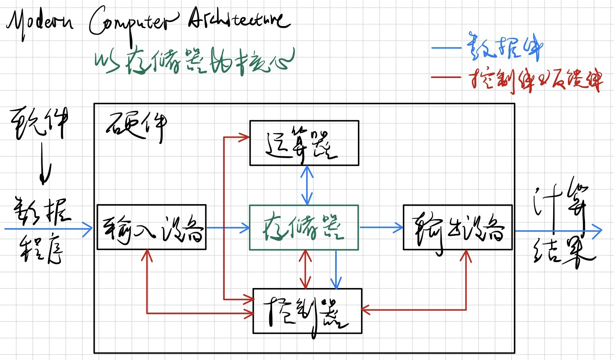

# 微机基础


## *计算机发展概述*

### 计算机发展历程

按照电子数字计算机主要元器件的制作材料和工艺水平来划分，计算机的发展经历了四代。这四个发展阶段以硬件进步为主要标志,同时也包括了软件技术的发展

1. 第一代 1946～1958年：电子管计算机时代
2. 第二代 1959～1964年：晶体管计算机时代
3. 第三代 1965～1970年：中小规模集成电路计算机时代 SSI & MSI
4. 第四代 1971年至今：大规模、超大规模集成电路计算机时代 LSI & VLSI

### 计算机的分类

* 按照规模分类
  1. **超级计算机 Supercomputers：** 这是最高级别的计算机，用于处理大规模的科学计算和复杂的数值模拟。它们通常具有极高的计算能力和处理速度，用于解决需要大量计算资源的问题，如气象预测、核物理模拟等
  2. **大型计算机 Mainframes：** 大型计算机主要用于处理大规模的数据处理任务，如企业级数据库管理、金融交易处理等。它们通常具有高度可靠性、可扩展性和强大的处理能力
  3. **小型计算机 Minicomputers：** 小型计算机介于大型计算机和微型计算机之间，用途广泛，可以支持多用户和多任务操作，常用于科学研究、工程设计等
  4. **微型计算机/微机 Microcomputers：** 这是个人计算机的范畴，包括了个人台式机、笔记本电脑、平板电脑等，适用于个人使用和小型办公环境
* 按照功能分类
  1. **通用计算机 General-Purpose Computers：** 这是最常见的计算机类型，能够执行各种不同类型的任务，根据不同的软件和应用进行配置
  2. **嵌入式系统 Embedded Systems：** 嵌入式系统是内置在其他设备中，用于特定控制、监测或执行任务的计算机系统。例如，汽车中的引擎控制系统、家电中的控制芯片等都属于嵌入式系统
  3. **服务器 Servers：** 服务器是专门用于提供服务、存储和共享资源的计算机。它们通常在网络环境中使用，用于托管网站、应用程序、数据库等。
  4. **工作站 Workstations：** 工作站是用于高性能计算和专业应用的计算机，常用于图形设计、科学计算、工程模拟等领域。
  5. **个人计算机 Personal Computers：** 个人计算机是供个人使用的计算机，包括了台式机、笔记本电脑、平板电脑等。

### 微机发展历程

微处理器是微机的核心，因此微机的发展历程是以微处理器的发展为标志的

1. 第一代 1971～1972年：4位和低档8位微机
   * 1971年诞生了全球第一个商用微处理器芯片Intel 4004，以它为核心组成的Intel MCS-4（Micro-Computer Set-4）计算机是世界上第一台微机。随后4004改进为4040
   * 次年Intel公司研制出8位微处理器芯片8008，并出现了由它组成的MCS-8微机
2. 第一代 1973～1977年：中、高档8位微机。摩托罗拉公司的MC6800和Intel 8008的升级版8080是这个时期的代表作
3. 第一代 1978～1984年：经典成熟的16位微机
   * Intel公司的8086/8088/80286、摩托罗拉公司的MC68000是这个时期的代表作。特别是8086成为了一代经典。**人们将自8086以来一直延续搭载的这种CISC指令集体系通称为x86指令体系**
   * 这一时期最著名的微机产品就是IBM推出的IBM PC，它采用了Intel的8088微处理器并搭载了微软发布的MS-DOS操作系统。此外比较出名的还有Apple公司推出的初代Macintosh机，其CPU主要采用摩托罗拉的68000系列和Power PC系列
4. 第一代 1985～1992年：32位微机时代
   * 1985年，Intel公司首次推出32位微处理器芯片80386，80386在结构上有重大进步。386是真正开创了PC的一款CPU，开始运行Unix系统了
   * 次后陆续推出了80486、80586（Pentium）、Pentium Pro、PentiumⅡ/Celeron 赛扬/Xeon 至强、PentiumⅢ/CeleronⅡ/Xeon 以及 Pentium 4
   * 32位微处理器都采用 IA32 Intel Architecture 32 指令架构，并逐步增加了面向多媒体数据处理和网络应用的扩展指令，如Intel的MMX、SSE指令集和AMD的3D Now!指令集
5. 第一代 1993年至今：性能更强的64位微机
   * 随着信息革命的蓬勃发展，32位为微处理器已不能满足实际需求，Intel、AMD、IBM、Sun 等厂商陆续设计并推出了它们的64位CPU
   * 2000年Intel推出的Itanium 安腾、2001年推出的Xeon 至强以及2006年推出的用于台式 PC的Core 酷睿，它们采用全新的指令架构“显式并行指令计算” ，该指令架构又称为IA64，以区别于原来的IA32架构。64位微处理器起初是面向服务器和工作站等高端应用,之后很快普及到PC领域
   * 从2003年开始，CPU的设计与制造由于功耗墙等限制不再只追求cpu的频率，而是通过多核来实现多任务处理速度和能耗之间的平衡

虽然上面5个时代看起来是根据CPU字长来划分的，但并不只是增加的字长提高了微机的性能，将其他因素也综合起来，比如时钟频率的提高、总线技术、存储技术以及软件（如操作系统和编译软件等系统软件）的共同进步推动了微机一代又一代的发展

历史上出现过很多知名的指令集架构，比如Alpha， SPARC，PowerPC，MIPS等，但是今天最流行的指令集架构是**x86(-64)，ARM，RISC-V**

## *微机结构 & 工作原理*

### 什么是微机

微机 Microcomputer 是一种以LSI & VLSI 集成电路为主要部件，以微处理器 Microprocessor 为核心所构造的个人计算机系统。微机通常包括中央处理器（CPU）、内存、输入输出接口、存储设备等基本组件，能够完成数据处理、存储和传输等任务。微机的概念最早在20世纪70年代提出，是个人计算机发展的重要阶段之一

微机是一个更广泛的术语，涵盖了使用微处理器的各种计算机系统，不仅包括个人计算机，还包括嵌入式系统、工控系统等。PC是微机的一个子集，特指适用于个人使用的计算机

### 常用基本概念

* 微处理器：也称为中央处理单元 Central Processing Unit CPU，由运算器、 控制器、寄存器以及片内总线等部件构成的大规模集成电路芯片
* 微机：微型计算机 Microcomputer 的简称，由 CPU、主存储器、输入/输出接口电路以及总线等构成
* 微机系统：由硬件和软件构成。硬件主要包括微机和外部设备，软件是指为了管理和维护计算机硬件系统、完成用户指定任务所编制的各种程序，主要包括系统软件和应用软件等
* 位 bit：二进制位0和1，位是计算机中存储信息的最小单位
* 字节 Byte：8个二进制位。计算机中通常以字节为最小存储单位，并以字节寻址
* 字 word：存储器和处理器中的一个固定长度的数据单元
* 字长 word size：一个字的位数，也是指针数据的标称大小 nominal size
* 指令：让计算机完成某种操作的命令，与CPU的具体型号密切相关
* 指令集：指令的集合，指示CPU该确切的做什么。指令集是一种抽象，不同的指令实现的目标可能是一样的，但底层的硬件操作不同，这也就给了优化的机会
* 程序：很多指令形成的序列
* 主频 Clock frequency：CPU的时钟频率，即CPU的工作频率
* 外频：外部总线频率的简称，通常为系统总线传输数据的频率。外频是CPU的基准频率

### 冯诺伊曼架构 & 哈佛架构

* 冯诺伊曼架构 Von Neumann Architecture 又称为普林斯顿架构 Princeton Architecture：将程序指令存储器和数据存储器合并在一起。冯诺伊曼结构隐约指导了将存储设备与中央处理器分开的概念，因此依本结构设计出的计算机又称**存储程序计算机**
* 哈佛架构 Harvard Architecture：将程序指令存储器和数据存储器分开

为什么电脑还沿用冯诺伊曼结构而不使用哈佛结构？ - 昌维的回答 - 知乎 <https://www.zhihu.com/question/22406681/answer/1030814514>

早期的冯诺伊曼机是**以运算器为中心**的，IO设备通过运算器于存储器传送数据


### 现代计算机

随着微电子技术的发展，现代计算机中CPU于存储设备和IO设备的速度差距非常大，这时候若数据传送都还非得经过运算器已经不合适了。所以现代计算机发展为了**以存储器为中心**，使IO操作尽可能地绕过CPU，直接在IO设备与存储器之间完成，从而提高系统的整体运行效率



现代计算机仍然把程序指令存储器和数据存储器合并在一起，所以大部分现代计算机仍然是冯诺伊曼架构

## *主板*

### 主板的功能

主板 mainboard/母板 motherboard的主要功能将微机系统的各种核心设别连接到一起，它是一种具有扩展能力的PCB Print Circuit Board 印刷电路板。也就是说主板提供一系列接合点，形成一个能集成CPU、内存、各种存储设别、GPU、声卡、网卡和各种IO设备的连接平台

主板的表面设计有可以直接插入扩展卡的插槽或可以连接其它内置设备（比如光驱）的线路连接。主板上最重要的构成组件是芯片组 chipset。早期的芯片组通常由北桥和南桥组成，不过在2010年后，Intel/AMD将北桥功能集成至CPU，所以**现在的主板上芯片组已经被简化为一颗独立的南桥芯片**

主板也可以指哪些具有单个板然而没有额外扩展能力的设备，主要是各种的嵌入式设备，比如Arduino和树莓派 Raspberry Pi这种开发板

### 主板的典型结构

# 8086CPU的结构与功能

## *微处理器的结构*

### 微处理器的外部结构


8086CPU芯片总共有40个引脚，微处理器通过这些引脚与外部的逻辑部件连接，从而完成信息的交换。CPU的这些引脚信号称为微处理器级的总线

各个存储器之间采用统一的编址。IO接口是连接CPU与IO设备的控制电路，在IO接口中有多个IO端口寄存器用于与CPU之间的数据交换，计算机会为每个端口寄存器分配一个地址（端口地址），CPU也是据此寻址的。存储器和IO接口之间的编址逻辑有两种

* 某些微处理器采用**统一的地址空间对存储器和IO端口**寻址，即存储器和IO端口进行统一的编址，一个地址要么对应于存储单元，要么对应于端口寄存器。读写控制信号用来区分CPU进行读/写操作。在这种方式下用于对存储器和IO端口的存取指令是一样的
* 但是**大多数微处理器则是采用两个独立的地址空间**，即存储器地址空间和IO地址空间，这时某存储单元和IO端口可能对应于相同的地址值。那么如何区分 CPU是存取存储单元还是IO端口？采用存储器读写信号和IO读写信号来区分。在这种方式下，对存储器和对IO端口的读写指令是不同的

**8086CPU有16条数据总线、20条地址总线和16条控制总线**。8086采用独立的存储器地址空间和IO地址空间。用于存储器的可寻址范围是 $2^{20}=1MB$，采用低16位地址对IO端口编址，因此可寻址 $2^{16}=65536$ 个端口寄存器

### 微处理器的内部结构


* ALU Arithmetic Logic Unit 算术逻辑单元：CPU的核心，完成所有的运算操作。它是一个组合电路，无记忆功能。具体可以看数电的相关内容
* 工作寄存器：可以暂存寻址信息和计算过程中的中间结果
  * 数据寄存器用于暂存操作数和中间结果
  * 地址寄存器用于暂存操作数的寻址信息
* 控制器：CPU的控制中心，完成指令的读入、寄存和译码，并产生控制信号序列，使ALU完成指定的操作
  * 程序计数器 Program Counter PC：用于保存下一条要执行的指令的地址，也称为指令指针 instruction pointer
  * 指令寄存器 Instruction Register IR：保存从存储器中读入的当前要执行的指令
  * 指令译码器 Instruction Decoder ID：对指令进行译码
  * 控制逻辑部件：根据对指令译码的分析产生控制信号，以完成指令规定的操作
  * 微处理器状态字 Processor State Word PSW：寄存处理器当前的状态，如指令结果是否为0、结果是正是负、有没有进位或借位、是否溢出等
  * 堆栈指针 Stack Pointer SP：指示堆栈的地址
* IO控制逻辑：处理IO操作

### 微处理器的功能结构


* 执行单元 Execution Unit EU：执行某条指令规定的操作。主要部件有ALU、暂存器、EU控制器、PSW和通用寄存器组
* 总线接口单元 Bus Interface Unit BIU：主要完成CPU与存储器和IO设备之间的信息传递，即取指令、存取数据。主要部件有ALU、段寄存器、指令指针 IP，也称为PC、内部寄存器、指令队列寄存器和总线控制电路等

## *8086的寄存器组织*

如果每次都通过总线去存储器中取数据会严重影响处理器的性能。所以在处理器上集成了放数据用的寄存器。可直接通过处理器的内部走线来传输数据，速度很快

寄存器的数量要合适，如果太少不够用，还是要经常去存储器上取；而太多则会影响处理器的体积和封装

8086CPU内部有**14个16位**的寄存器，按功能可以划分为8个通用寄存器、4个段寄存器和2个控制寄存器。**寄存器是汇编语言指令可以使用的操作数**

### 8个通用寄存器

* 4个16位的数据寄存器

  1. 累加器 accumulator AX：这是最常用的寄存器，许多操作都可以在AX中完成，而且有一些操作只能在AX中完成，比如乘法和除法操作
  2. 基址寄存器 Base Register BX：虽然属于数据寄存器，但它经常用作地址寄存器
  3. 计数寄存器 Count Register CX：经常用作循环的计数寄存器，比如在循环语句中默认CX的内容为循环次数
  4. 数据寄存器 Data Register DX：用于寄存数据，但在IO指令中DX用于表示端口地址

  这4个16位的数据寄存器又可以分成8个8位的字节寄存器，H表示高8位，L表示低8位，**每个8字节寄存器都可以单独使用**

  ```
  AX -> AH, AL
  BX -> BH, BL
  CX -> CH, CL
  DX -> DH, DL
  ```

* 4个16位地址指针/变址寄存器

  1. 变址寄存器 Source Index SI：在字符串操作指令中，**SI提供源操作数的段内偏移地址**，当然也可以在其他指令中用作地址寄存器
  2. 变址寄存器 Destination Index DI：在字符串操作指令中，**DI提供目的操作数的段内偏移地址**，当然也可以在其他指令中用作地址寄存器
  3. 堆栈指针 Stack Pointer SP：用于保存堆栈段的段内偏移地址。段地址由段寄存器SS提供
  4. 基址指针 Base Pointer BP：**BP可以指定段内偏移地址**，但将BP用作地址寄存器时，一般情况下其默认的段地址为SS

  在将这上面这4个寄存器用作地址寄存器时它们只提供了16位的偏移地址。要形成20位的物理地址还需要由段寄存器提供段地址，它们之间的关系为
  $$
  物理地址=段地址\times 10H+偏移地址
  $$

### 4个段寄存器

1. 代码段 Code Segment CS 寄存器：用于存放当前执行程序的段地址，IP为指令指针
2. 数据段 Data Segment DS 寄存器：用于存放当前数据段的段地址
3. 附加段 Extra Segment ES 寄存器：用于存放当前附加数据段的段地址
4. 堆栈段 Stack Segment SS 寄存器：用于存放当前堆栈段的段地址

由段地址和偏移地址可以构成物理地址，这一点与存储器的分段结构有关

### 2个控制寄存器

1. 指令指针 Instruction Pointer IP：也称程序计数器 Program Counter PC。用于保存下一条即将要执行指令的段内偏移地址。**改变IP的值就意味着改变程序的流程**，不能通过普通的传送类指令修改IP的值，但某些指令可以改变IP的内容，如转移指令、子程序调用和返回指令等
2. 微处理器状态字 Processor State Word PSW：它是一个16位的寄存器，也称为标志寄存器。一共设定了9个标志位，其中6个标志位用于反映ALU前一次操作的结果状态，另3个标志位用于控制CPU操作

### PSW中的标志位


* 反映ALU前一次操作结果状态的标志位
  * 进位标志 Carry Flag CF：在加减运算时，标识最高位（D7或D15）有无进（借）位的标志。有为1，无为0
  * 奇偶标志 Parity Flag PF：操作结果的低8位中含有“1”的个数。偶为1，奇为0
  * 辅助进位标志 Auxiliary Carry Flag AF：在加减运算时，D3位有无进（借）位的标志。有为1，无为0
  * 零标志 Zero Flag ZF：运算结果是否为0。结果为0，ZF为0；结果为1，ZF为1
  * 符号标志 Sign Flag SF：操作结果的符号，它等同于操作的最高位D7（或D15）。正为0，负为1
  * 溢出标志 Overflow Flag OF：有符号数运算时是否溢出的标志。溢出为0，无溢出为1
* 控制CPU的标志位
  * 方向标志 Direction Flag DF：在字符串操作中，当DF=0时其变址寄存器SI、DI的内容自动递增；当DF=1时，SI、DI 自动递减
  * 中断允许标志 Interrupt Enable Flag IF：当IF=1时，CPU能够响应可屏蔽中断请求；当IF=0 时，则CPU不能响应中断请求，这一位可以用指令STI、CLI来设置
  * 陷阱标志 Trap Flag TF：当TF=1时，CPU处于单步执行方式，即每执行一条指令就自动执行一次类型 1 的内部中断，这主要用在Debug中

### x86的通用寄存器演进


1. 8086：8个16位通用寄存器。即从 `%ax` 到 `%sp`
2. IA32架构：寄存器扩展为32位，标号为 `%eax` 到 `%esp`，%e.. 表示extended
3. x86-64：16个存储64位值的通用目的寄存器 general-purpose registers。以 `%r` 开头，%r.. 表示register

从IA32到x86-64：生成1字节和2字节数字的指令会保持剩下的字节不变；生成4字节数字的指令会把高位4个字节置0

## *微处理器的存储器 & IO组织*

### 数据格式

因为是从16位扩展到32位的，所以intel用术语 **字 word** 来表示16位数据类型（2字节构成一个字），32位为双字 double words，64位为四字 quad words

`char*` 代表的是指针类型，也用 `q` 来表示。双精度浮点数用的也是 `l` 来表示，但不会产生歧义，因为浮点数专用一套指令和寄存器


另外，x86采用小端模式。关于大小端的问题可以看*计算机组成原理.md*

### 8086的物理地址形成

8086的存储器地址空间是全分段的，因为8086没有MMU，所以不能借助MMU来实现分页

早期的CPU在翻译地址是通过纯软件的方式借助ALU转换，后期在微机系统中也引入了MMU才实现了分页机制或者更成熟的分页+分段混合


8086采用地址分段的方法，将寻址范围扩大到1MB。高16位为段地址，相邻段之间相差16位

当一个字从偶地址开始存储时，我们说字的存储是对准的；否则当一个字从奇地址开始就是未对准的。CPU访问一个对准的字的时候只需要一个总线周期，而访问未对准的则需要2个总线周期

### 8086的IO组织

# 汇编语言基础

## *汇编语言指令*

### CPU架构、指令集和汇编语言的关系

机器级代码 Machine-level code 是连接高级语言与CPU的中间状态。它有两个含义，一是最终经过编译、汇编和链接的目标代码 object code（二进制指令）。二是汇编代码，它是**机器语言的文本表示**。每条指令会继续根据不同的CPU指令集 Instruction-Set 继续翻译成CPU可以理解的二进制代码

处理器架构就是CPU的硬件电路。指令集决定了处理器的架构，因为处理器架构就是用硬件电路实现指令集。但指令集只是决定了硬件电路总体的输入输出，具体的底层，比如说用什么器件，用什么逻辑组合等和指令集联系不大

计算机能够直接执行的是以二进制代码表示的指令，这种以二进制代码指令编写程序的方法称为机器语言编程。用二进制来编程非常麻烦，所以很快的就出现了汇编语言。汇编语言通常采用一组字母、数字或符号来代替一条二进制代码指令，这种符号称为指令的助记符 Assembly Mnemonic。**汇编语言就是文本化的指令集**

### 汇编器

汇编器 assembler 用于将汇编语言代码翻译成机器码，以供计算机执行。以下是一些常见的汇编器

* **MASM Microsoft Macro Assembler**：MASM 是由微软开发的汇编器，主要用于x86和x86-64架构。它被广泛用于Windows平台上的开发，支持宏、符号和库等功能
* NASM Netwide Assembler：NASM 是一个广泛使用的汇编器，支持多种指令集，包括x86、x86-64和其他体系结构。它具有丰富的特性，能够生成多种输出格式，如二进制文件、可执行文件、目标文件等
* TASM Turbo Assembler：TASM 是Borland公司开发的汇编器，用于x86架构。它曾经在MS-DOS和早期的Windows开发中非常流行
* **GAS GNU Assembler**：GAS 是GNU工具链中的汇编器，用于多种体系结构，包括x86、ARM、MIPS等。它常用于Linux平台上的开发，与GCC（GNU Compiler Collection）配合使用
* FASM Flat Assembler：FASM 是一个小巧、高效的汇编器，适用于多种平台，包括x86和x86-64。它以单个可执行文件形式提供，不需要外部库
* YASM (Yet Another Assembler：YASM 是一个可扩展的汇编器，它支持多种指令集和输出格式。它旨在提供高度可配置的汇编器，适用于许多体系结构
* **Keil Assembler**：Keil MDK是用于嵌入式系统开发的集成开发环境，其中包含了适用于ARM体系结构的Keil Assembler

### 汇编语言中用到的符号

* OPR operands 表示一个操作数
* SRC source 表示源操作数
* DST destination 表示目的操作数
* REG register 表示一个寄存器
* REGn register with n bit 表示一个n位寄存器
* MEM memory 表示一个存储单元
* CNT counter 表示计数值
* LABEL label 标号或过程名
* PORT8 port address with 8 bit 8位端口地址
* DISPn displace with n bit 表示n位的偏移量
* EA effective address 表示有效抵制，即短内偏移抵制
* SEG segment address 表示段地址
* IDATA im data 表示立即数
* $\leftarrow$ moving 表示数据的传送
* $\leftarrow\rightarrow$ exchange 表示数据的交换
* $\left(\cdots\right)$ 取...的内容
* $\and,\ \or,\ \forall,\ \overline{X}$ 逻辑与、或、异或、非

### 汇编语句的分类

* 指令 instruction：汇编后形成的一条机器语言指令，一串二进制序列与一条汇编语句是一一对应的，在程序执行时指令得以执行
* 伪指令 pseudo instruction：只是告诉汇编器如何进行汇编，伪指令在汇编后不会生成机器语言指令，它在程序汇编时得以执行。除了保留的指令助记符和 `macro endm` 之外所有的都是伪指令
* 宏指令 macro instruction：它是由用户自定义的指令，由指令和伪指令构成，它在程序汇编时进行宏展开，以相应的指令和伪指令替代宏指令。用成对出现的 `macro endm` 来定义

### 一条汇编语句的组成


* 名称：每条汇编语句可以有名称，也可以没有名称。这种名称有两种含义 
  * 标号：当语句中名称与助记符之间以冒号间隔时该名称表示标号，用于表示指令的地址 `段地址, 偏移地址`
  * 变量名：当语句中名称与助记符之间以空格间隔时该名称表示变量名，用于表示存放数据的存储空间
* 助记符：助记符由汇编语言指令系统规定，不能随意更改
* 操作数
  * 操作数是指令操作所需要的数据，**一般通过寻址方式给出**。 当直接给出操作的数据时，它可以取常数、标识符（代表常数）及其表达式
  * 操作数可以是一个或2个。当语句表示一条伪指令时可以包含多个操作数。助记符与第一个操作数之间用空格间隔，操作数之间用逗号间隔
* 注释：和C不同，`;` 不是一条语言结束时必须要加的，而是有注释时才加，作为注释的开头。也可以单独成行

### 常数 & 表达式

* 常数
  * 数值：二进制B、十进制（缺省或D结尾）、十六进制H
  * 字符串：用单引号 `''` 括起来的一串字符，表示各个字符的ASCII码
* 表达式：算数、逻辑、关系（关系成立时其结果的每一位均为1，结果为–1；当关系不成立时，其结果为0）、属性 & PRT

### 标号

标号 LABEL 是为一组机器指令所起的别名，它与助记符之间用冒号间隔，用于指示相应指令的地址

标号具有3个属性

* 段地址：指示标号所在段的段地址
* 偏移地址：指示标号在段内的偏移地址
* 类型：若标号仅在本段内使用，则其类型为近程 NEAR；若标号还将在段间使用，则其类型为远程 FAR

### 变量

* 定义变量：变量必须首先进行定义，然后才能使用。变量是由**伪指令**来定义的

  ```assembly
  ;变量定义的位指令格式：<变量名> | <变量类型> | <初始值> ; 中间的空格是必须的
  SECTION .DATA
      VAR1 DB  12H,0A5H,18+20,50/3,0,-1  ; 在.data节中定义6个字节变量，可以在同一行上定义
      VAR2 DW  12H,$+1                   ; 地址偏移
      VAR3 DD  12345678H
      VAR4 DB  'ABC'                     ; 字符串
      	 DW  'AB'
      VAR5 DB  ?,?                       ; 只给变量预留存储空间
      VAR6 DB  4 DUP(0FFH,?)             ; 重复分配
      VAR7 DB  3 DUP(55H,2 DUP(77H))
  ```

  * 变量类型
    * DB：定义字节，一个字节数据占1个字节单元，读完一个，偏移量加1
    * DW：定义字，一个字数据占2个字节单元，读完一个，偏移量加2
    * DD：定义双字，一个双字数据占4个字节单元，读完一个，偏移量加4
    * DQ：定义四字，一个四字数据占8个字节单元，读完一个，偏移量加8
    * DT：定义十字节，用于BCD码
  * `?` 的意思是表示只给变量预留存储空间，不初始化
  * 预定义符号 `$`
    * 当 `$` 出现在表达式中时，它表示当前汇编语句的偏移地址
    * 当 `$` 出现在DOS功能调用显示字符串中时，它表示所显示字符串的结束符
  * 重复方式 DUP

  下图是上面定义的数据在存储器的分布，我们假设这段内存从0000H开始

  

* 变量的属性

  * 段地址：指示变量所在段的段地址
  * 偏移地址：变量所在段内的偏移地址
  * 类型：表示变量的类型，它与变量定义伪指令的关键字有关。主要分三类 BYTE、WORD、DWORD
  * 长度：变量定义语句中第一个DUP前的系数，表示变量重复的次数；当变量定义语句中没有出现DUP或者第一个为数据时，其长度为1
  * 大小：变量定义语句中，变量所占用的总的字节数，它等于变量的长度与类型（字节数）之积

* 伪指令DW、DD的特殊用法：DW和DD除了定义变量，还可以用来预置变量（或标号）的段内偏移地址或包括段地址和段内偏移地址的完整地址

### 属性操作符 & PTR操作符

属性操作符是指**用来获取标号或变量属性的操作符**。标号或变量一旦定义后，它们就具有相应的属性。我们可通过属性操作符来获取变量或标号的属性

SEG取段地址；OFFSET取偏移地址；TYPE取类型；LENGTH取长度；SIZE取大小

PTR 操作符可以用来暂时改变已经定义过的变量或标号的类型

## *寻址方式*

**寻址 addressing 是指在计算机程序中确定、计算和访问存储器中特定数据位置的过程。或者可以说是说明操作数所在地址的方法**

8086CPU指令系统的寻址方式 addressing modes 分为两类：

1. 数据的寻址方式：寻找指令操作所需数据的方法
2. 转移地址的寻址方式：寻找转移指令所需程序地址的方法

### 操作数指示符

大多数指令有一个或多个操作数 operand，指示出执行一个操作中要使用的源数据值，以及防止结果的目的的位置。操作数：CPU完成操作所需要的数

* 立即数 immediate 是所需要的数据直接在指令中给出，以 `$` 开头 + 标准C语言表示，注意默认是十进制，十六进制一定要用 `0x` 标识
* 寄存器 register：表示16个寄存器中的一个，比如 `%rax`。用符号 $r_a$ 来表示任意寄存器 $a$，用引用 $R[r_a]$ 来表示**寄存器内存的值**，相当于是把寄存器集合看成是一个数组 $R$，用寄存器标识符作为下标索引
* 内存引用 memory reference/寻址：**根据计算出来的有效地址访问某个内存位置**，用 `()` 括起来

通俗的解释一下三个操作数：立即数是一个直接给出的普通的数，寄存器里面存了一个数，可以直接用来加减乘除等，但是**一旦立即数和内存引用被`()`了，那么它们里面存的数就是一个地址了，会被用来去寻找内存对应地址存的数据**

### 数据的寻址模式


最后一个内存引用方式 $Imm(r_b,r_i,s)$ 是最常用的。$r_b$ 是基址寄存器 base register，$r_i$ 是变址寄存器 index register，$s$ 是比例因子 scale factor，只能取1、2、4或8，用来适应不同的数据类型，比如int和long。举例：`9(%rax, %rdx, 4) == M[9 + R[%rax] + 4R[%rdx]]`

C数组可以进行算数运算来寻址就是借助了底层 $Imm(r_b,r_i,s)$ 这种寻址模式。这里也可以看出来C的设计很大一部分是参考了底层的汇编语言的，既形成了机器语言所没有的高级语言特性，又保留了一部分机器语言的灵活性

1. 立即寻址 immediate addressing

   ```assembly
   MOV AX, 12A2H ; AX <- 12A2H
   ```

   虽然叫做立即寻址，但其实并没有什么寻址的过程，因为操作符是直接作为一个常数给出的，而不是作为地址

2. 寄存器寻址 register addressing

   ```assembly
   MOV DS, AX
   ```

   指令的操作数存放在寄存器中

3. 直接寻址 direct addressing/absolute addressing

4. 寄存器间接寻址 register indirect addressing

5. 寄存器相对寻址 register relative addressing

6. 基址变址寻址 based indexed addressing

7. 基址变址且相对寻址 based indexed relative addressing

8. 隐含寻址 hidden addressing

### 转移地址的寻址模式

* 段内
  * 段内直接寻址 direct addressing within same segment
  * 段内间接寻址 indirect addressing within same segment
* 段间
  * 段间直接寻址 direct addressing between different segments
  * 段内间接寻址 indirect addressing between different segments

## *代码实例*

### 调整编译器的优化等级

编译器较高的优化登记会导致汇编代码产生严重变形，可读性严重下降。`-Og` 是减少GCC的优化程度，提高汇编程序的可读性，其中-g是 gdb debugging。较高的优化等级可以通过 `-O1`、`-O2` 等选项指定

### 得到汇编代码

CSAPP书上的代码例子为

```c
// mstore.c
long mult2(long, long);

void multstore(long x, long y, long *dest)
{
    long t = mult2(x, y);
    *dest = t;
}
```

可以通过 `gcc -Og -S mstore.c` 得到 `mstore.s` 汇编代码

```assembly
    .file   "mstore.c"
    .text
    .globl  multstore
    .type   multstore, @function
multstore:
.LFB0:
    .cfi_startproc
    pushq   %rbx
    .cfi_def_cfa_offset 16
    .cfi_offset 3, -16
    movq    %rdx, %rbx
    call    mult2
    movq    %rax, (%rbx)
    popq    %rbx
    .cfi_def_cfa_offset 8
    ret
    .cfi_endproc
.LFE0:
    .size   multstore, .-multstore
    .ident  "GCC: (GNU) 4.8.5 20150623 (Red Hat 4.8.5-44)"
    .section    .note.GNU-stack,"",@progbits
```

所有以 `.` 开头的文件是要喂给debugger、linker的，用来指导它们的工作。通常可以忽略它们

### 查看目标代码文件

`gcc -Og -c mstore.c` 可以得到目标代码文件 `mstore.o`

目标代码文件是二进制的，无法直接查看，可以通过GDB工具来查看它的十六进制序列版本。即 `gdb mstore.o`，然后在 `(gdb) `  prompt后面输入命令 `x/14xb multstore`

```assembly
(gdb) x/14xb multstore
0x0 <multstore>:	0x53	0x48	0x89	0xd3	0xe8	0x00	0x00	0x00
0x8 <multstore+8>:	0x00	0x48	0x89	0x03	0x5b	0xc3
```

### 反汇编器 disassembler

反汇编器可以将目标代码文件的二进制序列中复原出汇编代码，Linux中为GNU软件objdump。`objdump -d mstore.o`

```assembly
0000000000000000 <multstore>:
//Offset    Bytes                   Equivalent assembly language
       0:	53                   	push   %rbx
       1:	48 89 d3             	mov    %rdx,%rbx
       4:	e8 00 00 00 00       	callq  9 <multstore+0x9>
       9:	48 89 03             	mov    %rax,(%rbx)
       c:	5b                   	pop    %rbx
       d:	c3                   	retq
```

### ATT与intel汇编代码格式

GCC、Objdump等GNU工具的默认格式是ATT格式（Bell lab from AT&T）。Microsoft、intel文档等工具则采用intel格式。用 `gcc -Og -S -masm=intel mstore.c` 来生成intel格式的汇编代码

```assembly
    .file   "mstore.c"
    .intel_syntax noprefix
    .text
    .globl  multstore
    .type   multstore, @function
multstore:
.LFB0:
    .cfi_startproc
    push    rbx
    .cfi_def_cfa_offset 16
    .cfi_offset 3, -16
    mov rbx, rdx
    call    mult2
    mov QWORD PTR [rbx], rax
    pop rbx
    .cfi_def_cfa_offset 8
    ret
    .cfi_endproc
.LFE0:
    .size   multstore, .-multstore
    .ident  "GCC: (GNU) 4.8.5 20150623 (Red Hat 4.8.5-44)"
    .section    .note.GNU-stack,"",@progbits
```

可以看到，intel格式的汇编代码和之前的ATT格式的汇编代码有很大的区别

* intel格式忽略了指示大小的后缀，比如是 `push` 而不是 `pushq`
* intel格式忽略了寄存器名字前面的 `%` 符号
* intel格式用不同的方式来描述内存中的位置，比如 `mov QWORD PTR [rbx], rax`，而不是 `movq    %rax, (%rbx)`
* 当带有多个操作数的指定情况下，列出操作数的顺序相反


# 汇编程序设计

## *数据传送指令*

### 数据传送指令 `MOV`

`MOV` 指令用于将数据从源位置复制到目的位置，不做任何变化

* 数据类型匹配，传送不同字长的数据都是以32位补码数字作为源数据的，除了 `movabsq` 扩展到64位
* 小到大需要填充高位：`MOVZ` 零扩展和 `MOVS` 符号扩展

理论中应该有9种MOV的搭配方式。immediate不能作为dest，因为它是常数，去掉了3种。另外出于硬件设计的便利性，**不能直接将一个内存位置复制到另一个内存位置**，而是会采用DMA来协调完成（**内存->寄存器，寄存器->内存两步走**），去掉了1种。因此一共有5种source和destination的组合

为什么是两个临时变量：因为不能从内存直接传值给内存，还是要写成两句，中间用个寄存器。比如下面这个例子，c语言可以只用一个临时变量，但需要有一句 `*xp = *yp;`，编译后就是两个寄存器

```cpp
void swap(int* xp, int* yp)
{
    int tmp = *xp; //临时变量tmp放在了寄存器里
    *xp = *yp; //不能是内存到内存的直接操作，要放到一个寄存器里
    *yp = tmp;
}
```

```assembly
    movl    (%rdi), %eax
    movl    (%rsi), %edx
    movl    %edx, (%rdi)
    movl    %eax, (%rsi)
    ret
```

### `lea`

`lea () r_a` 加载有效地址，load effective address 的形式是从内存读数据到寄存器，但实际上 `()` 根本没有进行内存引用（也就是说对括号里的数字（当然此时代表了地址）进行寻址），而是直接将 `()` 里的数字（地址）写入目标寄存器，**相当于 `()` 此时是无效的！**

因为可以直接取到数字/地址，所以用 `lea` 来实现C语言里的 `&` 操作符。注意：指针是C语言给的一种抽象，机器代码里指针就是地址·

GCC特别喜欢用它来描述间接的算数运算，下面给出一个例子

```c
long scale(long x, long y, long z)
{
    long t = x + 4 * y + 12 * z;
    return t;
}
```

当开启高优化等级的时候（`-O1` 或 `-O2`），可以得到下面的汇编代码

```assembly
# x in %rdi, y in %rsi, z in %rdx 实参没有保存在内存中，而是临时放在寄存器中
leaq    (%rdi,%rsi,4), %rax # x + 4y 放入新的寄存器rax中
leaq    (%rdx,%rdx,2), %rdx # 3z = z + 2z
leaq    (%rax,%rdx,4), %rax # x + 4y + 12z
ret
```

`lea` 容易与 `mov` 混淆，区别在于，`mov` 的作用是移动数据，如果操作数是 `()` ，它会对其寻址（即内存引用），但 `lea` 则不会对 `()` 内存引用，而是直接将 `()` 括号内的地址写入目标寄存器

lea功能等于一个线性方程，因为有独立的电路来实现，所以比常规的用add和mul的方法计算速度更快

## *数据运算指令*

### 算数运算

下面的所有运算都会设置条件码

* 一元操作符：`INC` ++（ZF+OF）、`DEC` --（ZF+OF）、`NEG` 取负、`NOT` 取补
* 二元操作符
  * `ADD`、`SUB`、`IMUL`、`XOR`（CF+OF）、`OR`、`AND`
  * 汇编没有除法，因为它的效率非常低 https://cjting.me/2021/03/16/the-missing-div-instruction-part1/
* 移位（CF）：`SHL` Shift Logical Left 左移、`SAL` 算数左移、`SAR` 算数右移、`SHR` 逻辑右移

### 特殊的算数操作：为什么要区分有符号数和无符号数？

https://www.cnblogs.com/walkerlala/p/5686014.html

为什么对于`ADD`、`SUB` 不需要区分有符号数还是无符号数，而乘除法却要区分操作数是有符号数还是无符号数来分别使用 `IMUL` 和 `MUL` 呢？

首先要明确，对于机器而言，其实没有什么补码、原码或者有符号数、无符号数之分，**有符号数和无符号数的加法对于CPU而言是完全等价的**，CPU只是对二进制串进行简单的加法运算（加减乘除都是以加法器为基础扩展开来的）。有符号数和无符号数是语言层次的概念，是用户定义了如何看待某个二进制串计算结果

那么是如何做到可以识别语言层级的 `signed` 和 `unsigned` 呢？需要借助条件码的帮助。The CARRY flag and OVERFLOW flag in binary arithmetic: http://teaching.idallen.com/dat2343/10f/notes/040_overflow.txt。在这篇文章中清楚的说明了不论是无符号数还是有符号数都要设置 Carry Flag 和 Overflow Flag 的条件码寄存器，但是对于无符号数来说只有CF是有作用的，而对于有符号数只有OF有效

```assembly
0000-0001 = 1111 # CF and OV will be set simultanesouly
```

从上面的例子中可以看出，加法是有可能会同时设置CF和OF两个条件码寄存器的，而我们只要去检查CF和OF就可以得到相应的结果了，所以`ADD`、`SUB` 不需要区分有符号数还是无符号数

但是对于乘除法就不同了，不同于加减法设置CF和OF与用户看待操作数的视角无关，乘除法的结果是否要设置OF，要看操作数是有符号数还是无符号数。比如 `-1*-2=2`，比如有符号数，它没有溢出，但是如果是无符号数，显然就溢出了，所以要区分两条机器指令

注意：`imulq` 和 `idivq` 既有单操作数形式，也有双操作数形式，注意区分

### BCD数运算调整

分离BCD码

组合BCD码

## *控制流 Control*

**`%rip` instruction pointer：存储当前正在执行的指令的地址**

### 条件码

除了整数寄存器，CPU还维护了一组条件码寄存器 condition codes，用来描述最近的算数或逻辑操作的属性。可以检测这些寄存器来执行条件分支指令。它们不是直接设置的，而是根据其他指令操作后的结果设置的

* CF Carry Flag (for unsigned)：进位标志，最近的操作使最高位产生了进位，**可以用来检查无符号操作的溢出**
* SF Sign Flag (for signed)：符号标志，最近的操作得到的结果为负数
* ZF Zero Flag：零标志，最近的操作的出的结果为0
* OF Overflow Flag (for signed)：溢出标志，最近的操作导致一个**补码溢出**（正溢出或负溢出）

所有算数和逻辑运算都会设置条件码，`leq` 不会设置，因为它是针对地址的运算

`CMP` 和 `TEST` 只会设置条件码而不会改变任何其他寄存器

* `CMP` 根据两个操作数之差来设置条件码，相当于是只设置条件码的 `SUB`。注意ATT格式中 `CMP` 的两个操作数顺序是反的（即右操作数减去左操作数）

  ```assembly
  comq %rsi, %rdi # a in %rdi, b in %rsi -> 根据 t = a - b 的结果来设置条件码
  ```

* `TEST` 是不设置条件码的 `AND`，不会影响到OF和ZF。常用 `testq %rax, %rax` 来检查 `%rax` 是负数、零还是正数

  ```assembly
  # 多位测试：测试al寄存器的位 0 和位 3 是否置 1
  test al, 00001001b #测试位 0 和位 3，其中00001001b是掩码
  # 只有当&结果为0时ZF才置1，表明位 0 和位 3已经被清除
  ```

### 条件码的使用

最近的一次指令会设置条件码，比如算数指令、`SET`、`TEST`、`CMP`，然后可以利用新置的条件码进行以下操作

* 根据条件码的某种组合将**一个字节**设置为0或者为1：`SET` 指令族
  * `SET` 指令的操作数是低位单字节寄存器，比如 `%al`，然后用 `movzbl` 将寄存器的高位清零（虽然是四字l，但会自动把更高位的其他4位也清零）
  * `SET` 指令族里有很多同义名 synonym，比如 `setq` 当大于时设置 和 `setnle` 当不小于等于时设置 效果是一样的。底层到底用哪一条机器指令取决于编译器和汇编器
  * 区分有符号数和无符号数的算数运算
    * 有符号数：利用SF^OF（异或）和ZF的组合
    * 无符号数：利用CF和ZF标志的组合
* 可以条件跳转到程序的某个其他的部分：`jump` 指令可以改变一组机器代码指令的执行顺序
* 借助条件码，用 `CMOV` 来实现条件分支

### General translation of conditional branch with `jX`

`jX` 指令族

* 无条件跳转，相当于条件码一直为1
  * 直接跳转：跳转目标是作为指令的一部分编码的，比如 `jmp .L1` 跳转到 `.L1` 标号 label处
  * 间接跳转：跳转目标是从寄存器或内存位置中读出来的，比如 `jmp *(%rax)`，从 `%rax` 寄存器内存引用得到里面存放的地址后跳转到该地址
* 有条件跳转：利用条件码的组合条件进行跳转，比如 `je` 是当条件码ZF置1时（相等/零）进行跳转

用 `jX` 指令族实现 `if-else` 条件分支：**`jX` 类似于 `goto` 跳转**

```c
long lt_cnt = 0;
long ge_cnt = 0;
long absdiff_se(long x, long y)
{
    long result;
    if (x < y) {
        lt_cnt++;
        result = y - x;
    }
    else {
        ge_cnt++;
        result = x - y;
    }
    return result;
}
```

可以得到汇编代码

```assembly
# long absdiff_se(long x, long y)
# x in %rdi, y in %rsi 
1 absdiff_se:
2 	cmpq %rsi, %rdi               # Compare x:y
3 	jge .L2 If >=                 # goto x_ge_y
4 	addq $1, lt_cnt(%rip)         # lt_cnt++ 
5 	movq %rsi, %rax 
6 	subq %rdi, %rax               # result = y - x 
7 	ret Return 
8 .L2: #x_ge_y: label标志 类似于goto跳转到这里
9 	addq $1, ge_cnt(%rip)         # ge_cnt++
10 	movq %rdi, %rax 
11 	subq %rsi, %rax               # result = x - y 
12 	ret Return
```

### Conditional Move `CMOV` 来实现条件分支

现代CPU的分支预测逻辑 brach prediction logic 整体上是高效的，但预测错误的时候要走回头路就会造成严重的效率浪费。因此在一些情况下可以通过 Conditonal Move 来进行优化。条件传送指令族 `CMOV`（即根据条件码做出反应的 `MOV`）无需预测测试的结果就可以执行条件传送，效率高

考虑 `jX` 用过的例子，注意不同之处在于取消了自加命令，这是因为 `CMOV` 不能在会造成分支side-effect的时候使用

```c
long absdiff_se(long x, long y)
{
    long result;
    if (x < y) 
        result = y - x; //分支取消了自加
    else
        result = x - y;
    return result;
}
```

它的汇编代码为

```assembly
# long absdiff(long x, long y)
# x in %rdi, y in %rsi
1 absdiff: 
2 	movq %rsi, %rax 
3 	subq %rdi, %rax                 # rval = y-x 
4 	movq %rdi, %rdx 
5 	subq %rsi, %rdx                 # eval = x-y 
6 	cmpq %rsi, %rdi                 # Compare x:y 
7 	cmovge %rdx, %rax               # If >=, rval = eval 
8 	ret Return tval
```

因此类似于 `v = test-expr ? then-expr : else-expr` 这种有简单分支的三目运算符一般会使用 `CMOV`

为什么不一直使用 `CMOV` 来提高效率？

* 计算两个分支的效率比较低（特别是当一个分支的计算负载很大，比如说算密码）
* 有些时候有可能某个分支甚至是违法的，比如对空指针解引用等
* 有些时候则是会有副作用 side-effect ，比如一个分支是 `x+=3` 这种会改变变量

### 循环

汇编没有专门的一条指令来实现循环，而是要条件测试和跳转组合起来实现循环的效果

* do while循环：至少执行一次
* while循环：可能判断完条件不满足，直接退出了，一次也不执行
  * jump-to-middle
  * guarded-do，GCC较高的优化等级 `-O1` 会采用这种方式

* for循环
  * jump-to-middle
  * guarded-do


### `switch`

## *过程 Procedure*

Procedure遵守一套被普遍承认的约定（不是强制化的协议），称为应用二进制接口 Application Binary Interface ABI。ABI是机器代码级别的规范，比如如何使用寄存器、调用过程中的细节等等，它与可执行代码的二进制兼容性有关

AMD64的ABI：https://web.archive.org/web/20080528070803/http://www.x86-64.org/documentation.html

### Mechanisms in Procedures

* 传递控制 Passing control
  * To beginning of procedure code
  * Back to return point
* 传递数据 Passing data
  * Procedure arguments
  * Return value
* 分配和释放内存 Allocating and deallocating memory
  * Allocate during procedure execution
  * Deallocate upon return

### 运行时栈 Run-time stack


C语言过程调用机制的一个关键特性（大多数其他语言也类似）在于**使用了虚拟内存的栈数据段提供的后进先出的内存管理原则**。程序可以用栈来管理它的过程所需要的存储空间，栈和程序寄存器存放着传递控制和数据、分配内存所需要的信息

不论代码里总共有多少函数，在单一时候只有一个函数被调用。调用函数的信息总是处于栈底，而被调用函数的信息则被放到栈顶，当结束调用后，可以LIFO的被释放掉

**栈帧 stack frame 是为一个过程开辟的特定栈内存空间**。栈是从高地址向低地址增长，假设过程P caller 调用Q callee，栈空间其依次为：P可能压入的6-n号参数 -> P的返回指令地址 -> 最多6个用于传参的寄存器 -> Q的局部变量

栈帧为什么要设计成从高地址向低地址增长呢？个人理解是为了方便寻址，比如说 `long a = 1234` 这么一个初始化语句，和它相关的汇编代码是如下。如果栈帧设计成从低地址向高地址增长，那么寻址就要写成 `movq $1234, -8(%rsp)` 了，这样不自然

```assembly
subq $8 %rsp # 新分配8字节的栈帧
movq $1234, 8(%rsp) # 寻址分配
```

### 压栈和弹出栈

压栈和弹出栈的意思是**往栈里写入或弹出数据**

x86-64的16个寄存器中具有特殊用途的是 `%rsp` 寄存器，它专用于存储栈指针；`%rbp` 寄存器存的是栈底指针（即调用函数的栈顶），固定不变的 `%rbp` 可以用来定位函数活动记录中的各个数据

* `pushq Src`

  通过递减栈指针进行压栈。将一个四字值压入栈中，首先要将栈指针减8字节（之所以是8字节是因为x86-64的最大数据类型是8字节的，对齐到8字节），然后将值写到新的栈顶地址，等价于下面的指令

  ```assembly
  subq $8, %rsp       # Decrement stack pointer
  movq %rbp, (%rsp)   # 将%rbp里存的地址写到栈顶
  ```

  当然这两条指令是无法替代 `pushq`，因为 `pushq` 一共就1字节，上面两条指针加起来要8字节

* `popq Dest`：弹出数据/释放数据，不需要去抹去原来的数据，仅仅是移动一下栈指针就可以了

  ```assembly
  moveq (%rsp), %rax  # Read %rax from stack
  addq $8, %rsp
  ```

### 转移控制 Control transfer

* 利用5字节的 `callq Q` 指令将控制权从函数P转移到函数Q（指令的后缀q只是为了表明这是x86-64中的指令）
  * 更改PC中的指令地址：只需要简单地将往PC寄存器 `%rip` 里放Q代码指令的起始地址就可以了，CPU会自动执行PC里放的指令。**没有指令能够直接显式更改 `%rip`，`callq` 指令会隐式地来修改 `%rip`**
  * 保存返回地址：同时为了顺利地从Q返回时还能接上原来P的执行流，要保存好P函数里 `call Q` 指令后紧跟着的那条指令A，方便Q执行完后返回到这里，所以要将A也压入栈顶。同样的，这个功能也是 `callq` 隐式完成的压栈，从汇编代码上看不出来
  * `callq` 的效果相当于是 `jup` + `pushq`
* `retq` 指令
  * 从栈中弹出返回处的指令地址A
  * 把PC设置为A
  * 把返回数据存到 `%rax` 中

### 数据传送

整数和指针（scaler data 标量数据）

* 被调用过程最多可用6个寄存器来传参：以4字节寄存器为例，使用寄存器传参的顺序是 `%edi`、`%esi`、`%edx`、`%ecx`、`%r8d`、`%r9d`
* 6个以上的其余参数需要通过保存在调用函数P的栈帧空间来传递，即上图运行时栈中的参数构造区 Argument build area
* ``%rax` 用来返回数据，要注意的时若返回的数据太大，比如说一个返回一个结构题就需要两次中转，即返回的时候要再压栈保存一个temp（自我修养300）。因此Cpp中才会鼓励传引用传参

高级语言如果被设计成可返回多个值时，编译器/解释器在实现时会把多个返回值放在栈里

x86-64定长栈帧的大小一般为32到128个字节之间，取决于不同的编译器。因为是定长的，所以不需要使用 `%ebp` 来限定栈帧空间，此时 `%rbp` 可用作一个普通寄存器。但对于可变参数，是无法知道将分配多少空间的，所以要用 `%rbp` 来限定

递归：超过最大递归深度称为stack overflow `ulimit -s` 可以看到一个进程的栈的**最大值**为 8192 KB = 8MB。mac可以用 `limit` 命令查看

### 栈上的局部存储

对于以下这些情况，需要将数据放在栈上

* 寄存器的数量不足够存放所有的本地数据
* 查看参数的地址（&运算），因为无法创建寄存器的地址，所以会将参数存到栈帧里，然后返回它的栈地址

### 寄存器内容的局部存储

寄存器是所有caller和callee共享的，需要设法保存每一个函数的寄存器数据。ABI有两种convention

* Caller saved 调用者保存：caller将要调用其他函数的时候，寄存器放的数据要放到caller的栈里。**这种convention比较常用**。`%r10` 和 `%r11` 用来保存临时数据
* Callee saved 被调用者保存，使用寄存器 `%rbx`、`%rbp`（特殊）、`%r12`～ `%r15` 来保存临时数据
  * 在callee使用寄存器之前，callee把caller的寄存器数据放到callee的栈帧里
  * 在callee return之前，把保存在栈帧里的数据重新装载回相应的寄存器里

## *函数调用时的栈帧开辟过程*

### 一个具体的例子


1. 局部变量是怎么创建的？
   通过寄存器拷贝传入的参数创建一份临时拷贝，然后push到自己的栈上

2. 为什么局部变量的值是随机值
   在建立函数栈帧空间的时候编译器为其中的部分空间赋了随机值。赋多少空间，赋什么值取决于编译器，VS2019编译器赋的是 `CCCCCCCCh`

3. 函数是怎么传参的？传参的顺序是怎样的？
   从右向左建立栈帧传擦

4. 形参和实参是什么关系？
   从上图中可以看到，OOA179C和000A179F两条指令表示从 `%ebp`上面的两个压入的参数取值，然后放置在寄存器中，所以形参是实参的一份临时拷贝

5. 函数调用时怎么做的？
   通过call指令，调用函数，函数的地址就是其第一条指令的地址。将传入的参数置于原栈帧空间的栈顶。

6. 函数调用结束后时怎么返回的？
   将 `%esp` 和 `%ebp` pop，清空其栈帧空间，通过存储的ebp-main和call的下一条指令回到上一步调用函数的栈帧中

   当Add的栈帧被销毁时，z也会被销毁，因此不能直接返回Add中的临时变量z。做法是将return的值装载到一个寄存器中，并将寄存器中保存的值给原函数中的接收变量。如果是将临时变量z设置为静态变量z，即 `static int z`。那么z会被保存到静态区中，并不会被销毁。但编译器仍然会选择将z的值加入到寄存器中生成临时拷贝后返回给上层

7. 为什么子函数可以使用上级变量或者全局变量，但反过来不行，或者为什么同级函数不能互相调用变量？
   全局变量保存在静态区中不会被销毁，需要使用时随时可以调用

8. C语言不允许函数里定义函数，只能是一个函数call一个外面定义好的函数应该也是在调用栈链上调用者的变量不能传递的关系，只能通过寄存器传参

### 静态变量栈帧开辟的对比

```cpp
#include <iostream>
using std::cout;
using std::endl;

class A
{
public:
    A(int a = 0)
    {
        _a = a;
        cout << "A(int a = 0)->" <<_a<< endl;
    }

    ~A()
    {
        cout << "~A()->" <<_a<<endl;
    }
private:
    int _a;
};

A aa3(3); // 静态变量

void f()
{
    static int i = 0; // 具有块作用域的静态变量
    static A aa0(0);
    A aa1(1);
    A aa2(2);
    static A aa4(4);
}
int main()
{
    f();
    cout << endl << endl;
    f();

    return 0;
}
```


虽然内存上的栈和静态区和数据结构中的栈在概念上是不一样的，但它们也有着先进后出的特点。静态区和常态区的变量是最先开辟和最后销毁的构造顺序：3 0 1 2 4 1 2

* 析构顺序：~2 ~1 ~2 ~1 ~4 ~0 ~3

## *内存安全*

### Memory-safety error

Memory-safety error 是指非法进入不被允许的内存区域

* Spatial errors: unintended address: buffer overflow, stack overflow (out-of-bounds)
* Temporal errors: unintended time: double free, dangling pointers (use-after-free, use-after-return)

通过对程序的静态分析和动态分析来提高安全性可以看*EIST软件工程.md*

### Binary Exploitation

Binary Exploitation（二进制漏洞利用）是一种计算机安全领域的技术，旨在利用软件程序中的漏洞来获取非授权访问、控制系统或执行恶意操作。它通常涉及对二进制可执行文件（如应用程序、操作系统或设备固件）进行分析和利用

二进制漏洞利用通常包括以下步骤：

1. 漏洞分析：对目标二进制程序进行静态或动态分析，以发现可能存在的漏洞。常见的漏洞类型包括缓冲区溢出、格式字符串漏洞、整数溢出、空指针解引用等
2. 漏洞利用：一旦发现漏洞，攻击者会利用漏洞来修改程序的正常执行流程，实现攻击目标。这可能涉及修改内存内容、覆盖函数指针、劫持程序控制流等
3. Shellcode injection 注入攻击：为了实现更复杂的攻击，攻击者通常会注入一段称为Shellcode的恶意代码。Shellcode被注入到目标程序的内存中，并在漏洞被利用时执行，以获取系统访问权限或执行其他恶意操作
4. 提权和权限提升：一旦攻击者获得对目标系统的控制，他们可能会利用其他漏洞或特权提升技术来提升自己的权限，以获取更高的访问权限或绕过安全措施

## *缓冲区溢出攻击*

C对于数组引用不进行任何边界检查，而栈中又有很多重要的信息，因此对越界数组元素的写操作会破坏存储在栈中的状态信息，若程序利用被破坏的状态重新加载寄存器或执行ret来跳转到其他程序，这就会是一个巨大的安全隐患

### [`gets()`](#gets) 的安全隐患

```c
char *gets(char *s)
{
    int c;
    char *dest = s;
    while ((c = getchar()) != '\n' && c != EOF)
        *dest++ = c; //++的优先级高于*
    if (c == EOF && dest == s)
    	return NULL;
    *dest++ = '\0';
    return s;
}

void echo()
{
    char buff[8];
    gest(buff); //读缓冲区
    puts(buff); //写缓冲区
}
```

查看汇编

```assembly
# void echo() 
1 echo: 
2 	subq $24, %rsp  # Allocate 24 bytes on stack 
3 	movq %rsp, %rdi # Compute buf as %rsp 
4 	call gets       # Call gets 
5 	movq %rsp, %rdi # Compute buf as %rsp
6 	call puts       # Call puts 
7 	addq $24, %rsp  # Deallocate stack space 
8 	ret             # Return
```


上图是echo call puts的时候的栈帧，puts可以写到buff里

* 当写0-7字节的时候，没有破坏
* 写8-23字节的时候，echo中的栈信息被破坏
* 写24-31的时候，puts的栈里保存的echo的返回地址被破坏

### 缓冲区溢出攻击的形式

缓冲区溢出的攻击方式就是输入给程序一个字符串，这个字符串包含一些可执行代码的字节编码，称为攻击编码 exploit code，另外还有一些字节码会覆盖ret地址，它会指向攻击编码。比如1988年11月的Internet蠕虫病毒

* 攻击代码会使用系统调用启动一个shell程序，从而给攻击者部分系统调用权限
* 攻击代码会试图修复栈破坏，让它看起来是调用正常返回了

### 对抗措施

* 栈随机化 stack randomization

  * 内存地址空间预留一段0-n字节的合适的空间来进行随机化，栈随机化是地址空间布局随机化 Address-Space Layout Randomization ASLR 技术的一部分
  * 可以通过空操作雪橇 nop sled 来暴力破解，对于一个32位操作系统，随机化范围为 $2^{23}$，破解起来还是相对轻松的
  * 栈随机化增加了破解系统难度，但没有提供很强的安全保障

* 栈破坏检测 stack corruption detection

  GCC的栈报护者机制 stack protector：在栈帧中任何局部缓冲区与栈状态之间存储一个特殊的金丝雀值 canary 或者哨兵值 guard value，检查这个值是否被修改过，若是调用一个错误处理例程

  > 金丝雀值这个名字源于历史上用这种鸟在煤矿中察觉有毒气体

  

* 限制可执行代码区域 limiting executable code regions：扩展页表中的标记位，单独设置可执行权限

# 总线

## *总线的定义及分类*

### 总线的定义

总线是一组共用导线，它是用来在计算机系统中各模块之间互相传输数据、地址和控制信息的公共通路

通过总线，可以实现各部件之间的数据和命令的传输。在目前的微机系统中均采用标准化总线结构

### <span id="现代微机的总线结构">现代微机的总线结构与工作原理</span>


微机系统中的总线按照传送的信息来分，可以分为三总线

* 数据总线 DB 用于CPU与外设交换数据，它是双向的
* 地址总线 AB 是由CPU发出的为CPU之外的各部件提供地址信息的总线，它是单向的
* 控制总线 CB 是CPU为其他部件提供由CPU发出的控制信号或接受其他部件的反馈状态信号，它是双向的

计算机执行一条指令的过程是

1. CPU 先将该指令的地址码通过地址总线传送给存储器
2. 然后发出读命令信号
3. 存储器在读命令信号的控制下将相应存储单元的指令代码传送到数据总线
4. CPU 读回数据，从而完成取指令的操作

### 总线的分类

* 按连接对象分：内总线和外总线

* 按传输信息分：数据总线 DB、地址总线 AB、控制总线 CB 

* 按握手技术和联络方式分：同步传输总线和异步传输总线

* 按传输格式分：并行总线和串行总线

* 按功能分
  * 片内总线 on-chip bus/on-die bus：连接集成电路芯片内部各功能单元的信息通路，比如说CPU内部的寄存器与寄存器之间、寄存器与ALU之间的连接

    虽然过去片内总线的设计基本上是由芯片生产商完成的，使用者只需要借助data sheet来了解其外部特性和使用方法。但现在借助EDA软件，微机系统的设计者已经可以方便地设计符合具体需求的专用集成电路 Application Specific Integrated Circuit ASIC，片内总线的设计也成为必不可少的一个环节

    > **特殊应用集成电路**（英语：**A**pplication **S**pecific **I**ntegrated **C**ircuit，缩写：**ASIC**），是指依产品需求不同而[全定制](https://zh.wikipedia.org/wiki/全定制)的特殊规格[集成电路](https://zh.wikipedia.org/wiki/集成電路)，是一种有别于标准工业IC（例如[7400系列](https://zh.wikipedia.org/wiki/7400系列)或[4000系列](https://zh.wikipedia.org/wiki/4000系列)[[1\]](https://zh.wikipedia.org/wiki/特殊應用積體電路#cite_note-:0-1) ）的集成电路产品。例如，设计用来执行数字录音机或是高效能的[比特币](https://zh.wikipedia.org/wiki/比特币)[挖矿机](https://zh.wikipedia.org/wiki/挖礦_(數位貨幣))功能的IC就是ASIC。ASIC芯片通常使用金氧半导体场效应管(MOSFET)技术的[半导体工艺](https://zh.wikipedia.org/wiki/半導體製程)。-- wikipedia

  * 元件级总线：连接**同一个插板内**各个元件的总线

  * **系统总线**/板级总线：连接微处理器、主存储器和 I/O 接口等系统部件的信息通路，也是连接各个插件板的通路。系统总线是微型计算机系统的重要组成部分，其设计是否合理直接关系到系统的性能和可靠性

  * 通信总线/IO总线/外总线

### 系统总线

* STD总线：Standard Bus 通用标准总线是一种规模很小、面向工业控制、设计周密的8位/16位系统总线，它主要应用在以微处理器为中心的测量控制领域，尤其以应用于工业测控领域为多
* PC/XT扩展总线：PC/XT总线是Intel 微机系统总线系列中最为精简的，它有62根芯。PC/XT总线有8位数据总线，20位地址总线，其寻址空间为1MB
* ISA/EISA
  * ISA Industry Standard Architecture 工业标准体系结构总线
    * 由 PC/XT总线扩展而成，其中前62个引脚 $B_1\sim B_{31}$ 和 $A_1\sim A_{31}$ 与PC/XT总线完全相同
    * ISA 的数据总线扩充到16位，增加了 $SD_{15}\sim SD_8$ 高8位数据线，ISA除了加宽数据路径外，其寻址空间也增加到16MB
  * EISA Extended ISA总线
    * ISA总线由于性能较差，制约了高性能微处理器的发挥，因此在ISA总线的基础上又推出了EISA总线
    * EISA兼容ISA的引脚，而且又扩展到了196个引脚
    * EISA总线的数据宽度达到32位，并且可以根据需要自动进行8位、16位和32位数据的转换。同时地址线也扩展到了32根，寻址空间达到了4GB
* MCA Microchannel Architecture 微通道体系结构总线
  * 为了打破ISA总线的传输瓶颈，IBM公司在推出386微机的同时也制定了一个与 ISA 标准完全不兼容的系统总线标准，即MCA
  * 虽然MCA总线能充分发挥386微机的性能，但MCA总线标准的微机与ISA总线标准的微机在软件和硬件上完全不兼容，即需要使用OS/2操作系统，这提高了用户的学习使用成本，加上MCA没有开源，导致MCA很难推广开来
* PCI Peripheral Component Interconnect 外设部件互连标准总线
  * 1992年Intel公司联合了几大计算机厂商推出了新的总线标准，即PCI总线标准
  * PCI在CPU与总线控制器之间增加了一个中介层：PCI桥路。该桥路包括一个PCI控制器和一个PCI加速器，使得其他外设不与处理器直接相接，因此PCI 总线是一种局部总线，既实现了高的传输速度又保证了良好的兼容性

## *典型PC逻辑结构*

注意和之前[现代微机的总线结构图](#现代微机的总线结构)的区别，之前的结构图主要是按照传送的信息来区分的


* HOST总线也被称为存储总线，它连接一个或多个微处理器、Cache 和主存储器
* PCI总线连接高速的IO接口，PCI设备可以是主设备，也可以是从设备

### 桥设备

* HOST桥也称为PCI总线控制器，它含有集中式总线仲裁器，用于连接HOST总线和PCI总线
* 协调CPU、内存和高速缓存的高速北桥芯片 North bridge/PCI Bridge Peripheral Component Interconnect。对PCI总线进行扩展，使多个PCI总线形成多层次结构，以减轻单个PCI总线的负载
* 专门处理低速IO硬件设备的南桥芯片 South bridge，采用低速设备的ISA总线 Industrial Standard Architecture

### 桥设备的主要功能

1. 进行地址空间的映射，使位于不同总线上的设备可以看到相同的地址空间
2. 实现数据缓冲
3. 实现不同层次总线的协议和电平的转换

## *缓冲器和三态门*

### 缓冲器 Buffer

### 三态门 Tri-state Gate

三态门是指逻辑门的输出除有高、低电平两种状态外，还有第三种状态，即高阻状态的门电路。高阻态又称为隔断状态

 三态门都有一个EN控制使能端，从而控制门电路的通断。现若假设EN高电平有效，

* 当EN=1时，门电路导通，三态门电路呈现正常的0或1的输出
* 当EN=0时，门电路断开，三态门电路给出高阻状态的输出

高阻态时引脚对地的电阻无穷大，相当于该门和它连接的电路处于断开的状态。因为实际电路中我们不可能手动去断开它，所以设置这样一个状态使它处于断开状态

## *系统总线的形成*

# 存储器

关于半导体存储器的内容可以看*数电.md*

## *存储器的技术指标*

### 存储容量

### 读写速度

### 非易失性

### 可靠性

## *存储器扩展*

## *多端口存储器*

# 常用芯片的接口技术

## *IO接口*

任何IO设备不能直接与CPU通信，需要设计一层IO接口电路

# 中断系统 & 可编中断控制芯片8259A

## *中断的基本概念*