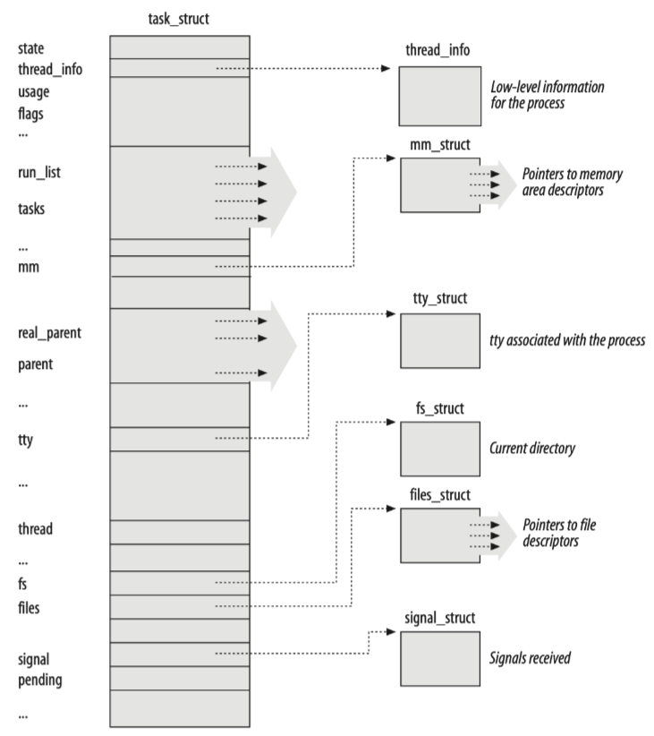
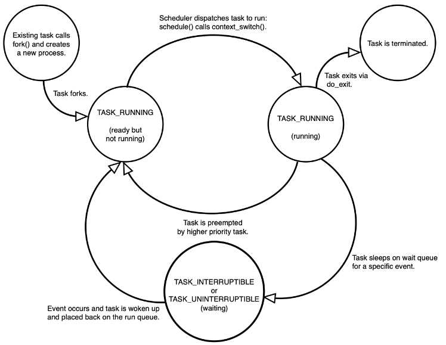
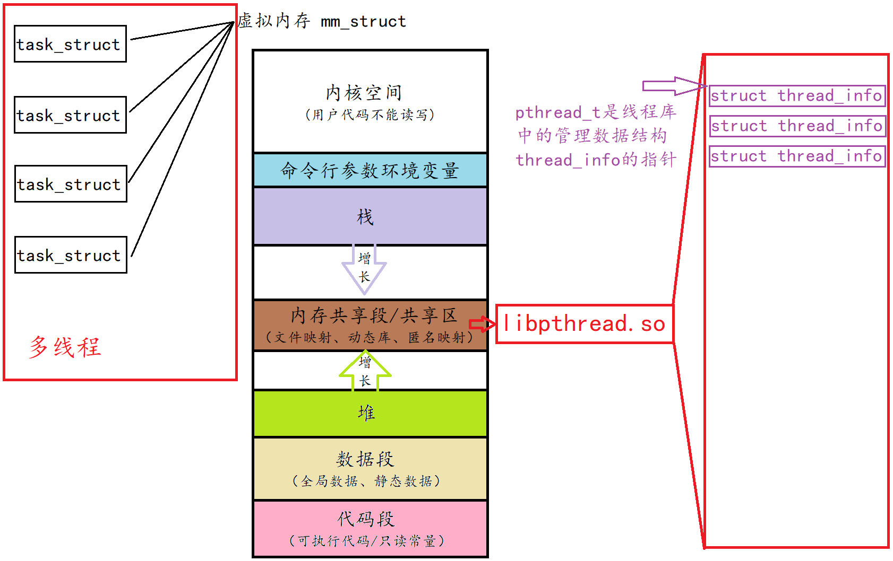
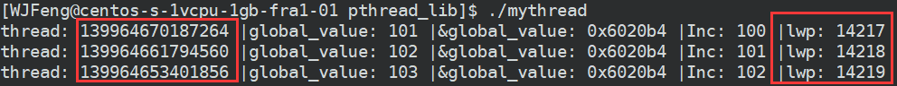
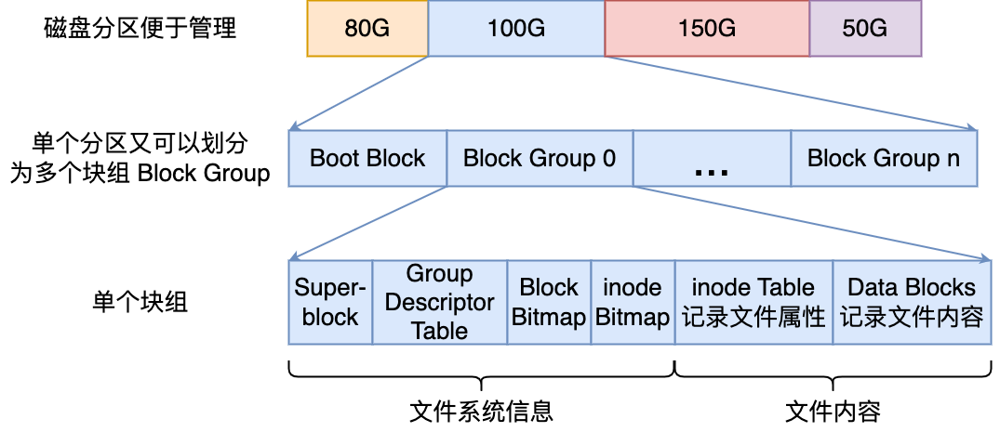
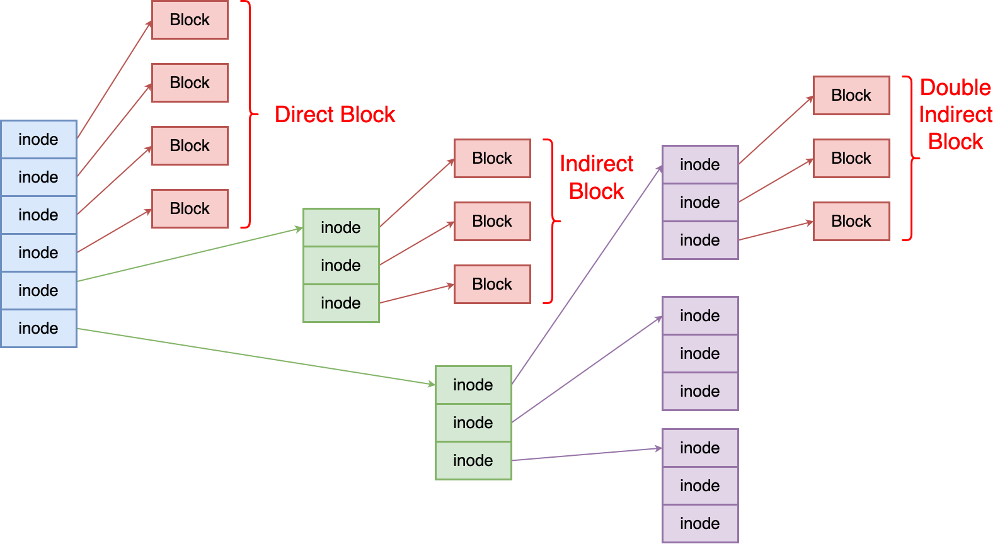

# 内存管理

# 进程 & 线程

## *task_struct*



Linux中的 `task_struct` 类型的结构体是进程描述符 process descriptor ，用来组织、管理进程资源

### state



## *进程切换*

### 理解 `pthread_t` 线程id

OS本身并不提供线程的系统调用接口是因为线程的全部实现并没有全部体现在OS内，而是OS提供服务流，具体的线程结构由用户层的库来管理。要进行管理就需要在线程库中维护相关的数据结构

主线程的独立栈结构，用的是地址空间中的栈区；**而新线程用的栈结构，用的是线程库中维护的栈结构**



```c
struct thread_info {
	pthread_t tid;
    void *stack; //私有栈
}
```


### `tid` 与 `lwp` 标识线程身份

`tid` 是用户级别的，可以由 `pthread_self()` 得到

`lwp` 是内核级别的，需要使用 `syscall(SYS_gettid)` 来获取


```cpp
void *startRoutine(void *args) {
    while (true) {
        cout << "thread: " << pthread_self() << " |global_value: " << global_value << 
            " |&global_value: " << &global_value << " |Inc: " << global_value++ <<
            " |lwp: " << syscall(SYS_gettid) << endl;
        sleep(1);
    }
}
```



## *Linux 2.6 Kernel 进程调度算法架构*

`ranqueue`

# 文件系统

文件对象由 file 结构体表示，定义在文件 `<linux/fs.h>` 中

```c
struct file {
	union {
		struct list_head      fu_list;            /* 文件对象链表 */
        struct rcu_head       fu_rchead;          /* 释放之后的RCU链表 */
    } f_u;
	struct path               f_path;             /* 包含目录项 */
	struct file_operations    *f_op;              /* 文件操作表 */
    spinlock_t                f_lock;             /* 单个文件结构锁 */
    atomic_t                  f_count;            /* 文件对象的使用计数 */
	unsigned int              f_flags;            /* 当打开文件时所指定的标志 */
	mode_t                    f_mode;             /* 文件的访问模式 */
    loff_t                    f_pos;              /* 文件当前的位移量（文件指针）*/
	struct fown_struct        f_owner;            /* 拥有者通过信号进行异步IO数据的传送 */
	const struct cred         *f_cred;            /* 文件的信任状 */
	struct file_ra_state      f_ra;               /* 预读状态 */
	u64                       f_version;          /* 版本号 */
	void                      *f_security;        /* 安全模块 */
	void                      *private_data;      /* tty 设备驱动的钩子 */
	struct list_head          f_ep_links;         /* 事件池链表 */
	spinlock_t                f_ep_lock;          /* 事件池锁 */
	struct address_space      *f_mapping;         /* 页缓存映射 */
	unsigned long             f_mnt_write_state;  /* 调试状态 */
};
```

## *Page Cache*

Page 页是内存管理的基本单位，而Page Cache 页缓存是操作系统中的一种**内存缓存机制**，用于提高文件系统的性能。它是在文件系统和物理磁盘之间的一层[缓冲区](#VFS支持多文件系统)，将磁盘上的数据以页面的整数倍形式缓存在内存中，以加快对文件的访问速度

当应用程序需要读取文件时，操作系统会首先检查 Page Cache 中是否已经存在所需的页面。如果页面已经缓存在内存中，操作系统可以直接从缓存中读取数据，避免了频繁的磁盘访问。如果页面不在缓存中，操作系统会将该页面从磁盘读取到缓存中，并提供给应用程序使用。类似地，当应用程序写入文件时，操作系统会首先将数据写入 Page Cache，然后在适当的时机再将数据刷写回磁盘

Page Cache 的存在极大地提高了文件系统的读取性能，因为内存的访问速度比磁盘快得多。大多数文件读取操作可以直接在内存中完成，避免了昂贵的磁盘 I/O 操作。此外，Page Cache 还可以提供一定程度的文件写入性能提升，因为数据可以先暂存在内存中，减少对磁盘的频繁写入操作

Page Cache 是透明的，对应用程序而言是不可见的，它是操作系统的一部分。操作系统会根据需要自动管理 Page Cache 的内容，并在内存紧张时自动释放一部分缓存空间

需要注意的是，Page Cache 的存在会导致文件系统的修改对应用程序的可见性延迟。因为数据首先写入到缓存中，而不是直接写入磁盘，所以在数据被刷新回磁盘之前，对文件的修改对其他应用程序是不可见的。这就意味着，如果系统崩溃或断电，尚未刷新到磁盘的数据可能会丢失。为了确保数据的持久性，应用程序可能需要使用类似于 `fsync()` 的操作来强制将数据刷新到磁盘上

Linux系统可以通过读取 `/proc/meminfo` 文件来查看系统内存

Page Cache中的数据是采用基数树组织的，效率很高

### Page & Page Cache

**并不是所有 page 都被组织为 Page Cache**，Linux 系统上供用户可访问的内存分为两个类型

* File-backed pages：文件备份页也就是 Page Cache 中的 page，对应于磁盘上的若干数据块；对于这些页最大的问题是脏页回盘。这种page的swap效率较高
* Anonymous pages：匿名页不对应磁盘上的任何磁盘数据块，它们是进程的运行时内存空间（例如方法栈、局部变量表等属性）。swap效率较低

还要注意：不是所有的磁盘数据都会被加载为内存的Page Cache中，比如Directed IO直接访问了 Buffer cache

[Buffer Cache](#VFS)（缓冲区缓存）是操作系统中另一种用于提高文件系统性能的内存缓存机制。它类似于 Page Cache，但其重点是缓存文件系统层面的数据块，而不是整个文件页面

Buffer Cache 的主要作用是减少磁盘 I/O 操作，通过将文件系统的数据块缓存在内存中，以便更快地访问和操作这些数据。当应用程序读取或写入文件系统的数据块时，操作系统会首先检查 Buffer Cache 中是否已经存在所需的数据块。如果数据块已经缓存在缓冲区中，操作系统可以直接从缓存中读取或写入数据，避免了对磁盘的实际读写操作

Linux Kernel 2.4之前，Page Cache 与 buffer cache 是完全分离的。2.4 版本内核之后，两块缓存近似融合在了一起：如果一个文件的页加载到了 Page Cache，那么同时 buffer cache 只需要维护块指向页的指针就可以了。只有Directed IO菜会真正放到buffer cache。因此现在说的Page Cache一般就是指这两者的结合

### Page Cache 与文件持久化的一致性&可靠性

任何系统引入缓存，就会引发一致性问题：即内存中的数据与磁盘中的数据不一致。例如常见后端架构中的 Redis 缓存与 MySQL 数据库就存在一致性问题

Linux提供了两种保证一致性的策略：写回与写透

* 写回策略 write-back 是指在更新缓存中的数据时，**只更新缓存而不立即写回到底层存储介质**。当数据被修改后，只会更新到缓存中的对应位置，而不是立即写入到主存或磁盘中。当数据被置换出缓存或缓存行被替换时，才会将被修改的数据写回到底层存储介质。**OS中存在周期性的线程执行写会任务，这是OS默认的方案**
* 写透策略 write-through 是指**在更新缓存中的数据时，同时将数据写回到底层存储介质**。当数据被修改后，会立即更新到缓存中的对应位置，并且同时将修改后的数据写入到主存或磁盘中。向用户层提供特定接口，用户可以自行调用强制写透

写回和写透之间的主要区别在于数据的更新时机和写入的位置：

* 写回 WB：数据被修改后，只更新到缓存中，然后在合适的时机将被修改的数据写回到底层存储介质
* 写透 WT：数据被修改后，立即更新到缓存中，并且同时写入到底层存储介质，保证数据的一致性和持久性

写回策略通常会在缓存的一致性机制中使用，例如在处理器高速缓存（CPU Cache）或磁盘缓存（Disk Cache）中。它可以提高写操作的性能，并减少对底层存储介质的频繁写入。然而，写回策略可能会导致数据的延迟一致性，即在写回之前，其他组件可能无法看到最新的修改。这就需要额外的机制（如写入无效ating或写入回调）来确保数据的一致性

写透策略则更注重数据的持久性和一致性，确保每次写操作都能够立即写入到底层存储介质。尽管写透策略提供了较高的数据一致性，但在写入操作频繁时可能会降低系统的整体性能，因为每次写操作都需要写入到底层存储介质

选择使用写回还是写透策略取决于具体应用场景和需求。写回策略通常用于读写比较频繁且对一致性要求不那么严格的情况，而写透策略则适用于对数据一致性和持久性要求较高的场景

### 写回 & 写透用到的系统调用

文件 = 数据 + 元数据，所以文件的一致性实际上包括两个方面，即数据的一致性和元数据的一致性

根据对数据和元数据持久化的不同表现可以区分3种用到的系统调用

* `fsync(int fd)`：将 fd 代表的文件的脏数据和脏元数据全部刷新至磁盘中
* `fdatasync(int fd)`：将 fd 代表的文件的脏数据刷新至磁盘，同时对必要的元数据刷新至磁盘中，这里所说的必要的概念是指：对接下来访问文件有关键作用的信息，如文件大小，而文件修改时间等不属于必要信息
* `sync()`：对系统中所有的脏的文件数据和元数据刷新至磁盘中

### Pros and Cons of Page Cache

* Pros
  * 提高访问性能：Page Cache将磁盘上的数据缓存在内存中，使得对文件的读取操作可以直接在内存中完成，避免了频繁的磁盘访问。由于内存的访问速度远远快于磁盘，因此可以显著提高文件的访问性能
  * 减少磁盘 I/O：通过缓存热门或频繁访问的数据页，Page Cache可以减少对磁盘的实际读写操作。它充分利用了内存的高速缓存能力，减少了对慢速磁盘的依赖，从而降低了磁盘 I/O 的开销
* Cons
  * 内存占用：Page Cache需要占用一部分系统内存来存储缓存的数据页。如果缓存的数据量很大，可能会占用较多的内存资源，导致可用内存减少，可能影响其他应用程序的运行
  * 数据一致性延迟：由于Page Cache采用写回策略，数据的更新可能存在一定的延迟。当数据被修改后，只会更新到缓存中，而不是立即写入到主存或磁盘中。这可能导致其他组件无法立即看到最新的修改，需要额外的机制来保证数据的一致性
  * 数据丢失风险：由于Page Cache是在内存中存储数据的，当系统崩溃或断电时，尚未写回到磁盘的数据可能会丢失。虽然操作系统会尽力确保数据的持久性，但在某些情况下，仍然存在数据丢失的风险
* 透明性：Page Cache对应用程序是透明的，对应用层并没有提供很好的管理 API，因此应用程序无需显式地管理缓存。操作系统会自动处理缓存的管理和更新，使得应用程序开发变得更简单。但这种透明性不一定是好事，应用层即使想优化 Page Cache 的使用策略也很难进行。因此像InnoDB就实现了自己的16KB单位的内存管理

# Linux Ext\* 文件系统

## *Ext\*文件系统*

### Ext\*文件系统介绍

Linux 的标准文件系统是可扩展文件系统 Extended File System，它经历了几代的发展，包括Ext2、Ext3和Ext4。最常见的版本是 Ext3 和Ext4

* Ext2发布于1993年
  * 作为最初的Ext文件系统的改进版本，它引入了许多重要的特性，如大文件支持和长文件名
  * 适用于小型到中型磁盘，被广泛用于Linux分发版
  * 不支持日志功能，这意味着系统崩溃后的恢复时间可能较长
* Ext3发布于2001年
  * 是EXT2的直接升级，主要新增特性是日志功能 Journaling，日志功能可以显著提高系统崩溃后的恢复速度
  * 向后兼容EXT2，可以轻松从EXT2迁移到EXT3而不需要格式化磁盘
  * 支持在线文件系统检查，减少了维护停机时间
* Ext4发布于2008年
  * 当前Linux系统中使用最广泛的文件系统之一
  * 支持更大的单个文件大小和整体文件系统大小
  * 引入了延迟分配（Extents）、更高效的碎片整理和多块分配等改进，提高了性能
  * 增加了对时间戳的纳秒级精度和更大的卷大小上限

Ext4由于其优越的性能和特性，成为当前Linux系统中的首选文件系统。对于需要高度稳定性和日志功能的系统，Ext3仍然是一个可靠的选择。而Ext2虽然较老，但在某些特定场景（如USB驱动器或其他可移动媒体）中仍然有其用武之地

### Ext\*文件系统组成

Linux的Ext\*文件系统会为每个文件分配两个数据结构：**索引节点index node** 和**目录项 directory entry**，它们主要用来记录文件的元信息和目录层次结构

* 索引节点 inode，用来记录文件的元信息，比如 inode 编号、文件大小、访问权限、创建时间、修改时间、数据在磁盘的位置等等。索引节点是文件的**唯一**标识，它们之间一一对应，也同样都会被存储在硬盘中，所以**索引节点同样占用磁盘空间**。每一个inode是一个大小一般为128字节或256字节的空间
* 目录项 dentry，用来记录文件的名字、**索引节点指针**以及与其他目录项的层级关联关系。多个目录项关联起来，就会形成目录结构，但它与索引节点不同的是，**目录项是由内核维护的一个数据结构，不存放于磁盘，而是缓存在内存**

### Ex2文件系统的物理结构



Linux中可以用 `stat` 来查看文件的具体块情况

* 虽然磁盘的基本单位是512 Byte的扇区 sector（这个是由计算机科学家经过试验设计出来的最优方案），但为了提高读写效率，OS和磁盘进行IO的基本单位是一个块 Block 8*512 Byte = 4KB。这么设计的理由主要有两个

  * 512字节太小，可能会导致多次IO，进而导致系统效率降低
  * 为了解耦硬件和软件设计，若将OS的控制与硬件强耦合，则若未来硬件更改了，OS也要进行大幅修改
* Boot Block 启动块：是为了能够使OS正常启动需要的数据，为了系统的安全可能在每个分区里都会存储一份
* inode
* Block group 块组组成

  * Super Block 超级块：整个文件系统的属性信息，每个block group都有一份备份也是为了整个硬盘的安全。**当文件系统挂载时超级块会被加入内存**
  * GDT 块组描述符：这是当前块组的属性信息，即块组的大小、使用情况、inode使用情况等
  * 用位图进行空闲空间管理 Free space management
    * Block Bitmap：每个bit标识一个Block是否空闲可用
    * inode Bitmap inode位图：每个bit标识一个inode是否空闲可用
  * inode Table 节点表：该块组内所有文件的inode空间的集合
  * Data Blocks：多个4KB块的集合。Linux文件=内容+属性，属性分开保存，因此 Data Blocks 里保存的都是特定文件的内容

## *Ex2的inode*

### inode的设计

inode是文件系统用来管理在磁盘上的文件所用的数据结构，每一个inode都由一个inumber数字隐式引用

* 多级索引 Multi-Level index

  

  设计inode的时候最重要的问题之一是如何表示一个文件用了哪些block，由于inode本身的大小限制，不可能用任意多个直接指针 `block` 来指明所有的block地址。为了支持大文件，采用了多级索引 Multi-Level index 的设计，用一个间接指针 indirect pointer 来指向其他使用的数据块，被指向的数据块里的数据不是普通的文件数据，而是用来只想其他数据块的指针

  举例来说，一个inode中有12个直接指针，1个间接指针。间接指针指向的一个4KB的Data block有 $4KB/4Byte=1024$ 个指针，因此可以将inode映射的文件的大小扩展为 $(12+1024)\times4KB=4144KB$

  若还是不够，则通过继续套娃得到双重间接指针 double indirect pointer 来支持约4GB大小的文件，甚至是继续的三级间接指针 triple indirect pointer

* 基于范围 Extent-based：一个起始指针+一个存储范围。虽然相比于多级索引减少了inode相关元数据，但不够灵活，不能保证在内存中可以找到一段空余空间

* 基于链接 Linked-based：采用链表的方式将数据块串起来，但存在找尾、不支持随机访问等问题。因此将这些链接保存成一个表，称为 File Allocation Table FAT 文件分配表，用于早期Windows

### Ex2的inode结构

注意区分Ex2文件系统的inode和VFS的inode

```c
struct ex2_innode {
	__le16                i_mode;           /* 文件类型和访问权限 */
    __le16                i_uid;            /* 拥有者标识符 */
    __le32                i_size;           /* 以字节为单位的文件长度 */
    __le32                i_atime;          /* 最后一次访问文件的时间 */
    __le32                i_ctime;          /* 索引节点最后改变的时间 */
    __le32                i_mtime;          /* 文件内容最后改变的时间 */ 
    __le32                i_dtime;          /* 文件删除的时间 */
    __le16                i_gid;            /* 用户组标识符 */
    __le16                i_links_count;    /* 硬链接计数器 */
    __le32                i_blocks;         /* 文件的数据块数 */ 
    __le32                i_flags;          /* 文件标志 */
    union                 osd1;             /* 特定的操作系统信息 */
    __le32[EXT2_N_BLOCKS] i_block;          /* 指向数据块的指针 */
    __le32                i_generation;     /* 文件版本（当网络文件系统访问文件时使用） */
    __le32                i_file_acl;       /* 文件访问控制列表 */
};
```

### inode与文件名的关系

* Linux中找到文件的过程：inode编号 -> 分区特定的block group -> inode -> 文件属性、内容
* Linux中的inode属性里面，没有保存文件名
* Linux下一切皆文件，因此目录也有自己的inode和data block，目录下的文件的文件名和inode编号映射关系都存储在目录的data block里。文件名和inode编号互为key值

# 块设备驱动

### bio

```c
struct bio {
	sector_t             bi_sector;           /* 块IO操作的第一个磁盘扇区 */
    struct bio*          bi_next;             /* 链接到请求队列中的下一个bio */
    struct block_device* bi_bdev;             /* 指向块设备描述符的指针 */
    unsigned long        bi_flags;            /* bio的状态标志 */
    unsigned long        bi_rw;               /* IO操作标志 */
    unsigned short       bi_vcnt;             /* bio的 bio_vec 数组中段的数目 */
    unsigned short       bi_idx;              /* bio 的bio_vec 数组中段的当前索引值 */
    unsigned short       bi_phys_segments;    /* 合并之后 bio 中物理段的数目 */
    unsigned short       bi_hw_segments;      /* 合并之后硬件段的数目 */
    unsigned int         bi_size;             /* 需要传送的字节数 */
    unsigned int         bi_hw_front_size;    /* 硬件段合并算法使用 */
    unsigned int         bi_hw_back_size;     /* 硬件段合并算法使用 */
    unsigned int         bi_max_vecs;         /* bio 的bio_vec数组中允许的最大段数 */
    struct bio_vec*      bi_io_vec;           /* 指向 bio 的bio_vec数组中的段的指针 */
    bio_end_io_t*        bi_end_io;           /* bio 的IO操作结束时调用的方法 */
    atomic_t             bi_cnt;              /* bio 的引用计数器 */
    void*                bi_private;          /* 通用块层和块设备驱动程序的IO完成方法使用的指针 */
    bio_destructor_t*    bi_destructor;       /* 释放bio时调用的析构方法（通常是bio-destructor()方法） */
};
```

```c
struct bio_vec {
    struct page* bv_page;      /* 说明指向段的页框中页描述符的指针 */
    unsigned int bv_len;       /* 段的字节长度 */
    unsigned int bv_offset;    /* 页框中段数据的偏移量 */
};
```

# 设备驱动