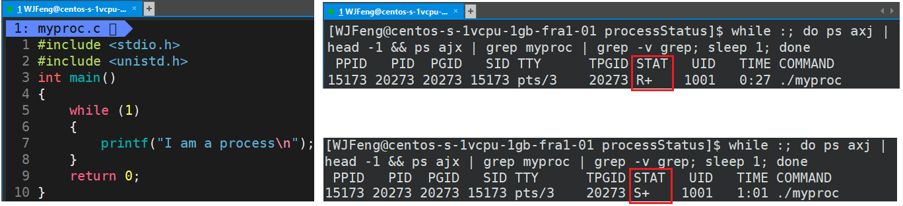
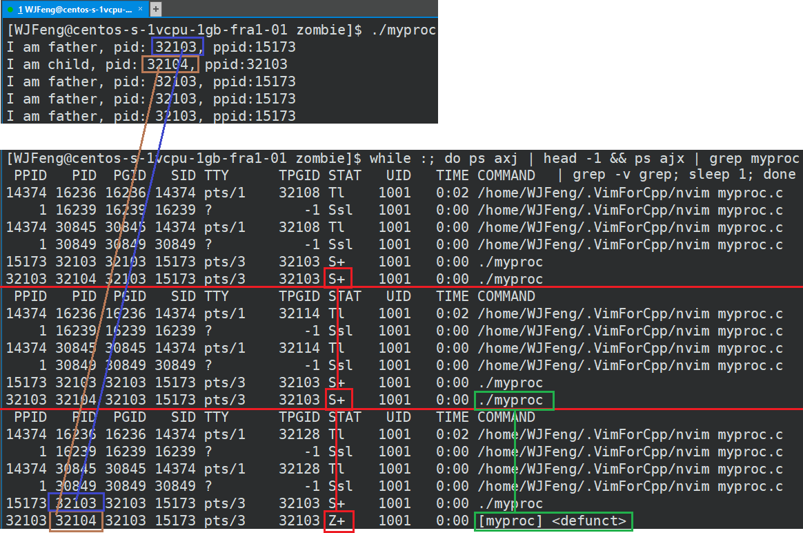

# 源代码

## *编译内核*

以 Linux 5.6.18 内核为例

```cmd
$ wget https://mirrors.edge.kernel.org/pub/linux/kernel/v5.x/linux-5.6.14.tar.xz
```


整体式结构：每个模块可以相对独立的编译

## *代码结构*

### 代码组成

以 Linux 5.6.18 内核为例

```
$ tree -L 1
.
├── arch
├── block
├── certs
├── COPYING
├── CREDITS
├── crypto
├── Documentation
├── drivers
├── fs
├── include
├── init
├── ipc
├── Kbuild
├── Kconfig
├── kernel
├── lib
├── LICENSES
├── MAINTAINERS
├── Makefile
├── mm
├── net
├── README
├── samples
├── scripts
├── security
├── sound
├── tools
├── usr
└── vir
```

* 文件夹
  * arch：包含和硬件体系结构相关的代码，每种平台占一个相应的目录。比如说和ARM体系存放在arm目录下，其中包括kerel（内核核心部分）、mm（内存管理）、nwfpe（浮点单元仿真）、lib（硬件相关工具函数）、boot（引导程序）、configs（各开发板的默认配置文件所在）
  * block：部分块设备驱动程序
  * certs：与认证和签名相关的代码
  * crypto：常用加密和散列算法（如AES、SHA等），还有一些压缩和CRC校验算法
  * documentation：关于内核各部分的参考文档、协议规范代码
  * drivers：设备驱动程序，一般每种不同的设备的驱动程序占用一个子目录。比如 USB 总线、PCI/PCIe总线、显示器、网卡等
  * fs：各种支持的文件系统的相关代码，如ext、fat、ntfs等
  * include：这个目录包括了核心的大多数include文件。另外对于每种支持的体系结构分别有一个子目录
  * init：内核初始化代码（注意不是系统引导代码），直接关联到内存的各个组件入口
  * ipc：此目录包含了核心的进程间通讯代码，比如信号量、共享内存等
  * kernel：内核的核心代码，是所有体系结构所共享的内核部分。包括进程调度、定时器等，和平台相关的一部分代码放在 `arch/*/kernel` 目录下
  * lib：此目录包含了核心的C标准库（子集）代码。与处理器结构相关库代码被放在 `arch/*/ib/` 目录下
  * LICENSES：Linux 内核根据 Licenses/preferred/GPL-2.0 中提供GNU 通用公共许可证版本2
  * mm：内存管理代码，和平台相关的一部分代码放在 `arch/*/mm` 目录下
  * net：网络相关代码，实现了各种常见的网络协议，比如 TCP、WiFi、IPv6 等
  * samples：内核实例代码
  * scripts：用于配置内核的脚本文件
  * security：内核安全模型相关的代码，主要是一个SELinux的模块
  * sound：常用音频设备的驱动程序等（声卡驱动）
  * tools：与内核交互的工具
  * usr：用户打包和压缩内核的实现的源码，目前实现了一个cpio
  * virt：/kvm 虚拟化目录相关支持实现

* 文件
  * .clang-format：内核代码格式化
  * .cocciconfig
  * .get_maintainer.ignore
  * .gitattributes
  * .gitignore
  * .mailmap
  * COPYING：许可和授权信息
  * CREDITS：贡献者列表
  * Kbuild：内核设定脚本
  * Kconfig：开发人员配置内核的时候所用到的参数等
  * MAINTAINERS：目前维护开发的人员列比哦啊
  * Makefile：用于编译内核的主要文件
  * README：编译内核信息

### 内核核心架构


## *系统调用设计*

<https://oska874.github.io/读核/Linux系统调用的定义.html>

Linux的系统调用都是用定义在 `include/linux/syscalls.h` 中的 `SYSCALL_DEFINEx` 来实现的

# 内核数据结构

## *链表*

https://zhjwpku.com/2018/11/20/kernel-data-structure-list-and-hlist.html

### 双向链表

和STL使用链表来直接管理数据不同，内核中的链表的数据结构中只有指针，没有数据。双向链表的实现采用侵入式的方式，链表节点不保存任何数据内容，而是将链表结构作为具体数据结构的成员

因为内核是用C写的，不支持模版和泛型编程，也就是说list不能保存一种通用形式的数据，所以每个node中不包含数据。具体的数据管理需要额外单独完成

```c
// include/linux/types.h
struct list_head {
	struct list_head *next, *prev;
};
```

双向链表的头不存储真实数据，它通常作为链表遍历的入口存在于系统的全局变量

### 无锁链表

```c
// include/linux/llist.h
struct llist_head {
	struct llist_node *first;
};

struct llist_node {
	struct llist_node *next;
};
```

## *哈希链表*

### hlist

```c
// include/linux/types.h
struct hlist_head {
	struct hlist_node *first;
};

struct hlist_node {
	struct hlist_node *next, **pprev;
};
```

### hlist_bl

hlist_bl 是 hlist 一个特殊版本。一般在使用 hlist 用作 hashtable 的时候，会给每个 hlist 定义一个 spinlock，而为了减少这种内存开销，hlist_bl 利用 hlist_bl_head->first 的地址最后一位来代替 spinlock，这种方式可行的原因是因为指针通常为4字节8字节对齐，最后一位一定为0

```c
// include/linux/list_bl.h
```

## *红黑树*


```c
// include/linux/rbtree.h
struct rb_node {
	unsigned long  __rb_parent_color;
	struct rb_node *rb_right;
	struct rb_node *rb_left;
} __attribute__((aligned(sizeof(long))));
    /* The alignment might seem pointless, but allegedly CRIS needs it */

struct rb_root {
	struct rb_node *rb_node;
};
```


使用场景：CFS、虚拟内存、epoll

# 进程 & 线程

## *task_struct*

### Linux进程

Linux内核把进程叫做任务 task，进程的虚拟地址空间可分为用户虚拟地址空间和内核虚拟地址空间，所有进程共享内核虚拟地址空间，每个进程有独立的用户虚拟地址空间

进程有两种特殊的形式：没有用户虚拟地址空间的进程叫内核线程，共享用户虚拟地址空间的进程叫用户线程。共享同一个用户虚拟地址空间的所有用户线程叫线程组

### task_struct 解析

Linux中的 `task_struct` 类型的结构体被成为进程控制块 Process Control Block, PCB 或者进程描述符 process descriptor ，用来组织、管理进程资源。Linux内核涉及进程和程序的所有算法都围绕task_struct数据结构而建立操作

定义在 `include/linux/sched.h` 中


## *进程状态*

### task_struct中的state


进程状态查看：`ps aux 或 ps axj`。Linux 2.6 内核的定义


* TASK_RUNNING / R运行状态 Running：并不意味着进程一定在运行中，它表示进程要么是在运行中要么在**CPU运行队列**里排队

  

* TASK_INTERRUPTIBLE / S 浅睡眠状态 Sleeping：意味着进程在等待睡眠完成（这里的睡眠也可叫做可中断睡眠 **interruptible sleep**），S状态对应的理论状态为阻塞态和挂起态，在等待非CPU资源就位，或者说在**非CPU硬件的队列**里排队。当等待的资源就位后，产生一个硬件中断或信号来环境进程。sOS可以通过调度算法在内存不够时将进程换出到Swap区

  * 情况一

    

    * 由于CPU的运行速度极快，实际上在该死循环中只有极少的时间在运行，绝大多数时间都在睡眠状态，将CPU资源给其他程序使用
    * 注意：当进程状态有一个 `+` 时，表示该任务为前台进程。具体可以看 *系统编程.md* 前台进程与后台进程的区别

  * 情况二

    

    一直在等待用户输入，所以一直处于IO的队列中，处于睡眠状态

* TASK_UNINTERRUPTIBLE / D 磁盘休眠状态 Disk sleep 或者深睡眠状态：也可叫做深度睡眠/不可中断睡眠 **uninterruptible sleep**，不可以被被动唤醒，在这个状态的进程通常会等待IO的结束

  * 例子：一个进程正在往硬盘或者往其他IO设备写入数据，但此时该进程仍然占用了内存资源。若此时OS压力过大，可能会选择终止处于S状态的进程以保护整体的OS。当进程处于D状态时，则不能被OS终止，只能等该进程结束读写后自动醒来时，OS再结束它
  * D状态一般用于硬盘的读写，因为涉及到用户的数据比较重要
  * D状态的模拟代码不给出，因为要模拟这个进程需要大量数据的IO读写

* TASK_STOPPED / T暂停状态 Stopped

  * 当进程接收到 SIGSTOP、SIGTSTP、SIGTTIN、SIGTTOU 信号后进入暂停状态，可以通过 `kill -19 [PID]` 暂停进程
  * 和D状态、S状态相比，前两者都在等待某项资源或执行任务，但T状态并没有，是被用户手动暂停的
  * 调试时会呈现T状态，比如gdb打断点时gdb会给进程发送 `kill -19 [PID]` 暂停进程

* TASK_TRACED / T tracing stop 调试状态：进程的执行由debugger程序暂停


下面的两个进程状态既可以放在task_struct的state字段里，也可以放在exit_state字段里。只有当进程的执行被终止时，进程的状态才会变为这两种状态中的一种

* EXIT_ZOMBIE / Z僵死状态 Zombie，具体见下

* EXIT_DEAD / X死亡状态 Dead：这个状态只是一个返回状态，不会在任务列表里看到这个状态。和理论中的新建状态类似，存在时间极短，资源立刻会被OS回收

### 僵尸进程

* 什么是僵尸进程 Zombie Process：一个进程已经退出，但是还不允许被释放，处于一个被检测的状态。进程一般尤其父进程或者init检测回收，维持该状态是为了让父进程和init来回收其返回或产生的数据（回收就是由Z状态转到X状态）

* 为什么会产生僵尸进程：子进程已退出，父进程还在运行，但父进程没有读取子进程状态，子进程就会变成Z状态

  ```c
  #include <stdio.h>
  #include <stdlib.h>
  #include <unistd.h>                                                        
                      
  int main() {
      pid_t id = fork();
      if (id<0) {
          perror("fork");
          return 1;
      } else if (id == 0) {
          // Child process
          while (1) {
              printf("I am child, pid: %d, ppid:%d\n", getpid(), getppid());
              sleep(3);
              break;
          }
          exit(0); // 子进程直接退出
      } else {
          // Parent process 
          while (1) {
              printf("I am father, pid: %d, ppid:%d\n", getpid(), getppid());
              sleep(1);
          }
      }                           
      printf("You can see me!\n");
      sleep(1);
  
      return 0;
  }   
  ```

  

  `<defunct>` 指的是父子进程间失去通信的进程

* 僵尸进程的危害

  * 若父进程或OS一直不读取子进程的返回，那么子进程就一直处于Z状态
  * 维护退出状态本身就是要用数据维护，也属于进程的基本信息，所有也保留在PCB中，若一直处于Z状态，则一直要维护PCB
  * 进程需要占据内存资源，若一直不回收，会造成内存浪费，也就是内存泄漏

* 孤儿进程 Orphan Process

  * 孤儿进程和僵尸进程相反，若父进程先于子进程结束，那么子进程变成Z进程后就成为孤儿进程

  * 孤儿进程被1号init进程领养后由init进程回收，下图可看到，PID为7425的子进程在PID为15713的父进程退出后被1号init进程领养了

    

## *链表管理*

Linux内核定义了 `list_head` 的带头双向循环链表的数据结构

### 进程链表

task_struct 有一个tasks链表

```c
struct list_head tasks {
    struct list_head *prev;
    struct list_head *next;
};
```


进程链表的哨兵位头是init_task，它就是0进程 process 0或swapper进程

### 进程间关系


* real_parent
* parent
* children
* sibling

进程1（init）是所有进程的祖先

### pidhash & 链表

## *线程*

### 理解 `pthread_t` 线程id

OS本身并不提供线程的系统调用接口是因为线程的全部实现并没有全部体现在OS内，而是OS提供服务流，具体的线程结构由用户层的库来管理。要进行管理就需要在线程库中维护相关的数据结构

主线程的独立栈结构，用的是地址空间中的栈区；**而新线程用的栈结构，用的是线程库中维护的栈结构**


```c
struct thread_info {
	pthread_t tid;
    void *stack; //私有栈
}
```

### `tid` 与 `lwp` 标识线程身份

`tid` 是用户级别的，可以由 `pthread_self()` 得到

`lwp` 是内核级别的，需要使用 `syscall(SYS_gettid)` 来获取

```cpp
void *startRoutine(void *args) {
    while (true) {
        cout << "thread: " << pthread_self() << " |global_value: " << global_value << 
            " |&global_value: " << &global_value << " |Inc: " << global_value++ <<
            " |lwp: " << syscall(SYS_gettid) << endl;
        sleep(1);
    }
}
```


### 内核线程

内核线程是直接由内核本身启动的进程。内核线程实际上是将内核函数委托给独立的进程，与系统中其他进程并行执行（实际上也并行于内核自身的执行）。内核线程经常称之为（内核）守护进程

内核线程与普通进程的区别在于它没有独立的用户地址空间，即 task_struct 中的 mm 为空

它们用于执行下列任务等

* 周期性地将修改的内存页与页来源块设备同步，比方说使用mmap的文件映射
* 若内存页很少使用，则写入交换区
* 定期将 page cache 冲刷落盘
* 管理延时动作 deferred action
* 实现文件系统的事务日志

# 进程调度

http://www.wowotech.net/process_management/447.html

## *优先级*

### 优先级取值

```c
// include/linux/sched/prio.h
/* Linux 内核优先级 */
#define MAX_USER_RT_PRIO	100
#define MAX_RT_PRIO		MAX_USER_RT_PRIO

#define MAX_PRIO		(MAX_RT_PRIO + NICE_WIDTH)
#define DEFAULT_PRIO		(MAX_RT_PRIO + NICE_WIDTH / 2)
```

限期进程的优先级比实时进程要高，实时进程的优先级比普通进程要高

```
高优先级                                                       低优先级
<--------------------------------------------------------------------
限期进程              实时进程                           普通进程
     -1 0                                99 100                   139
```

* 限期进程 deadline process 的优先级是-1
* 实时进程 realtime process 是优先级高，需要立即被执行的过程，它的优先级范围为 1\~99，优先级数值越大，表示优先级越高;
* 普通进程 normal process 的静态优先级为100\~139，优先级数值越小，表示优先级越高，可以通过修改nice值改变普通进程的优先级，优先级等于120加上nice值

```c
// in task_struct
/* 下面4个是进程调度的优先级 */
int				prio;
int				static_prio;
int				normal_prio;
unsigned int			rt_priority;
```

* prio 是动态优先级
* static_prio 静态优先级是进程创建的时候分配的，可以使用系统调用来修改它

### 不同类型进程的优先级


```
fork, vfork, clone（用户空间） ->
	sys_fork, sys_vfork, sys_clone, kthread_create（内核空间）->
        _do_fork_ ->
            copy_process
```

## *调度器*

### Linux进程调度器系统

Linux内核中用来调度进程（即安排进程的执行过程）的模块称为调度器 Scheduler，它可以切换进程状态 process status。调度器相当于CPU中央处理器的管理员，主要负责完成做两件事情

* 选择某些就绪进程来执行

  

  每一个调度器类可以分为主调度器和周期性调度器，主调度器通过 `schedule()` 来完成进程的选择和切换，而周期性调度器则根据频率自动调用 `scheduler_tick()`，作用根据进程运行时间触发调度

* 打断某些执行的进程让它们变为就绪状态

  

  如果调度器享可以将就绪状态切换到执行状态，**同时也可以把执行状态切换到就绪状态**，称该调度器为抢占式调度器 Preemptive Scheduler

* 注意⚠️：阻塞状态是进程主动进入的，然后阻塞状态等待相应的资源就绪，此时让出了 CPU 的使用权

### 公共部分

Linux支持的调度器有

* RT scheduler 实时进程的实时调度器：用 `rt_sched_class` 来描述，调度策略有SCHED_FIFO 和 SCHED_RR
* CFS scheduler 普通进程的完全公平调度器：用 `rt_sched_class` 来描述，调度策略有SCHED_NORMAL和SCHED_BATCH
* Deadline scheduler 期限调度器：用 `dl_sched_class` 来描述，调度策略为SCHED_DEADLINE
* Idle scheduler 空闲调度器：用 `idle_sched_class` 来描述，调度策略为SCHED_IDLE

Linux将调度器公共的部分抽象出来，使用`struct sched_class`结构体描述一个具体的调度类

```c
// 
/* 进程调度器类 */
struct sched_class {
	/* Kernel中有多个调度类，按照调度优先级拍成一个链表 */
	const struct sched_class *next;

#ifdef CONFIG_UCLAMP_TASK
	int uclamp_enabled;
#endif
	/* 将进程加入到执行队列中，即将调度实体（即进程）存放到红黑树中，并对nr_running自动+1 */
	void (*enqueue_task) (struct rq *rq, struct task_struct *p, int flags);
	/* 将进程从执行队列中删除，并对nr_running自动-1 */
	void (*dequeue_task) (struct rq *rq, struct task_struct *p, int flags);
	/* 放弃CPU执行权限，实际上此函数执行先出队后入队，在这种情况下直接将调度实体存放在红黑树的最右端 */
	void (*yield_task)   (struct rq *rq);
	bool (*yield_to_task)(struct rq *rq, struct task_struct *p, bool preempt);
	/* 专门用于检查当前进程是否可被新进程抢占 */
	void (*check_preempt_curr)(struct rq *rq, struct task_struct *p, int flags);
	/* 选择下一个要运行的进程，prev是将要被调度出的任务，返回值是将要被调度的任务 */
	struct task_struct *(*pick_next_task)(struct rq *rq);
	/* 当一个任务将要被调度出时队列时执行 */
	void (*put_prev_task)(struct rq *rq, struct task_struct *p);
	void (*set_next_task)(struct rq *rq, struct task_struct *p, bool first);

#ifdef CONFIG_SMP
	int (*balance)(struct rq *rq, struct task_struct *prev, struct rq_flags *rf);
	int  (*select_task_rq)(struct task_struct *p, int task_cpu, int sd_flag, int flags);
	void (*migrate_task_rq)(struct task_struct *p, int new_cpu);

	void (*task_woken)(struct rq *this_rq, struct task_struct *task);

	void (*set_cpus_allowed)(struct task_struct *p,
				 const struct cpumask *newmask);

	void (*rq_online)(struct rq *rq);
	void (*rq_offline)(struct rq *rq);
#endif

	void (*task_tick)(struct rq *rq, struct task_struct *p, int queued);
	void (*task_fork)(struct task_struct *p);
	void (*task_dead)(struct task_struct *p);

	/*
	 * The switched_from() call is allowed to drop rq->lock, therefore we
	 * cannot assume the switched_from/switched_to pair is serliazed by
	 * rq->lock. They are however serialized by p->pi_lock.
	 */
	void (*switched_from)(struct rq *this_rq, struct task_struct *task);
	void (*switched_to)  (struct rq *this_rq, struct task_struct *task);
	void (*prio_changed) (struct rq *this_rq, struct task_struct *task,
			      int oldprio);

	unsigned int (*get_rr_interval)(struct rq *rq,
					struct task_struct *task);

	void (*update_curr)(struct rq *rq);

#define TASK_SET_GROUP		0
#define TASK_MOVE_GROUP		1

#ifdef CONFIG_FAIR_GROUP_SCHED
	void (*task_change_group)(struct task_struct *p, int type);
#endif
};
```

1. next：指向下一个调度类（比自己低一个优先级）。在Linux中，每一个调度类都是有明确的优先级关系，高优先级调度类管理的进程会优先获得cpu使用权
2. enqueue_task：入队列，向该调度器管理的runqueue中添加一个进程，即将进程从ready改为running状态
3. dequeue_task：出队列，向该调度器管理的runqueue中删除一个进程，即将进程从running改为ready状态
4. check_preempt_curr：当一个进程被唤醒或者创建的时候，需要检查当前进程是否可以抢占当前cpu上正在运行的进程，如果可以抢占需要标记TIF_NEED_RESCHED flag
5. pick_next_task：从runqueue中选择一个最适合运行的task。问题是我们依据什么标准来挑选最适合运行的进程呢？一般是按照优先级的顺序

### 调度器类型

```c
// kernel/sched/sched.h
// 按照优先级从上到下排列
extern const struct sched_class stop_sched_class; // 停机调度类
extern const struct sched_class dl_sched_class;   // 限期调度类
extern const struct sched_class rt_sched_class;   // 实时调度类
extern const struct sched_class fair_sched_class; // 公平调度类
extern const struct sched_class idle_sched_class; // 空闲调度类
```

上面的调度类是按照优先级从上到下排列的，在内核中这种优先级的表示就是通过一个单链表来表示的

* Stop Scheduler 停机调度类：优先级最高的调度器类，可以抢占所有其他进程，而其他进程无法抢占停机进程

* Deadline Scheduler 期限调度器：是最早使用的优先算法，使用红黑树把进程按照绝对截止期限从小到大排序，每次调度时选择绝对截止期限最小的进程

  具体来说Deadline 调度器是一种实时 I/O 调度器，旨在确保 I/O 请求在给定的截止期限内完成。它通过为每个请求设置截止期限，优先执行截止期限最近的请求。这有助于避免 I/O 请求因等待时间过长而导致性能下降

  适用于对 I/O 响应时间要求敏感的实时系统

* Runtime Scheduler 实时调度类：为每个调度优先级都维护一个队列。具体见下

* Fair Scheduler 公平调度类：使用完全公平调度算法，引入了虚拟运行时间 vruntime 的概念。具体见下

* Idle Scheduler 空闲调度器：每个CPU上都有一个空闲线程，即0号线程，空闲调度类优先级别最低，仅当没有其他进程可以调度的时候才会调度空闲进程

  空闲调度器主要用于在系统处于空闲状态时执行 IO 操作。当系统没有其他任务运行时，空闲调度器可以执行挂起的 IO 操作，以充分利用系统资源。空闲调度是最不会影响其他活动任务的性能的调度器

### 进程调度策略

```c
// include/uapi/linux/sched.h
#define SCHED_NORMAL		0
#define SCHED_FIFO		1
#define SCHED_RR		2
#define SCHED_BATCH		3
/* SCHED_ISO: reserved but not implemented yet */
#define SCHED_IDLE		5
#define SCHED_DEADLINE		6
```

* SCHED_NORMAL：普通进程调度策略，使task选择CFS调度器来调度运行
* SCHED_FIFO 是一种 run to completion 的算法，采用先进先出的策略（first come, first serve），没有时间片的限制，获得CPU 控制权的进程会一直执行直到主动放弃CPU或者被更高优先级的实时进程抢占
* SCHED_RR 采用 round robin 的策略，比 SCHED_FIFO多维护了一个时间片，相同优先级之间的进程能够轮流执行，每次执行的实际是一个固定的时间片
* SCHED_BATCH：普通进程调度策略，批量处理，使task选择CFS调度器来调度运行
* SCHED_IDLE：普通进程调度策略，使task以最低优先级选择CFS调度器来调度运行
* SCHED_DEADLINE：限期进程调度策略，使task选择限期调度器来调度运行

注意⚠️：虽然有 SCHED_IDLE 调度策略，但实际上 Stop 和 Idle 调度器用户都是无法选择使用的，只能被内核使用

## *CFS*

Completely Fair Scheduler, CFS 完全公平调度器，顾名思义对待每个进程都是公平的，让每个进程都运行一段相同的时间片，即 CFS 是一种基于时间片轮训的调度算法


实际运行时间 = 调度周期 \* 进程权重 / 所有进程权重之和


为了找到虚拟运行时间最小的进程，内核使用了一棵红黑树来保存

### vruntime

CFS 定义了一种新的调度模型，它给 cfs_rq（cfs 的 run_queue）中的每一个进程都设置了一个虚拟时钟 virtual runtime, vruntime。若一个进程得以执行，则随着执行时间的不断增长，其 vruntime 也将不断增大，而没有被调度执行的进程的 vruntime 则不变

```c
static const int prio_to_weight[40] = {
    /* -20 */     88761,     71755,     56483,     46273,     36291,
    /* -15 */     29154,     23254,     18705,     14949,     11916,
    /* -10 */      9548,      7620,      6100,      4904,      3906,
    /*  -5 */      3121,      2501,      1991,      1586,      1277,
    /*   0 */      1024,       820,       655,       526,       423,
    /*   5 */       335,       272,       215,       172,       137,
    /*  10 */       110,        87,        70,        56,        45,
    /*  15 */        36,        29,        23,        18,        15
};
```

若新进程的vruntime初始值为0，会导致新进程立刻被调度，而且在一段时间内都是最小的

### CFS调度器类

```c
const struct sched_class fair_sched_class = {
	.next			= &idle_sched_class,
	.enqueue_task		= enqueue_task_fair,
	.dequeue_task		= dequeue_task_fair,
	.yield_task		= yield_task_fair,
	.yield_to_task		= yield_to_task_fair,

	.check_preempt_curr	= check_preempt_wakeup,

	.pick_next_task		= __pick_next_task_fair,
	.put_prev_task		= put_prev_task_fair,
	.set_next_task          = set_next_task_fair,

#ifdef CONFIG_SMP
	.balance		= balance_fair,
	.select_task_rq		= select_task_rq_fair,
	.migrate_task_rq	= migrate_task_rq_fair,

	.rq_online		= rq_online_fair,
	.rq_offline		= rq_offline_fair,

	.task_dead		= task_dead_fair,
	.set_cpus_allowed	= set_cpus_allowed_common,
#endif

	.task_tick		= task_tick_fair,
	.task_fork		= task_fork_fair,

	.prio_changed		= prio_changed_fair,
	.switched_from		= switched_from_fair,
	.switched_to		= switched_to_fair,

	.get_rr_interval	= get_rr_interval_fair,

	.update_curr		= update_curr_fair,

#ifdef CONFIG_FAIR_GROUP_SCHED
	.task_change_group	= task_change_group_fair,
#endif

#ifdef CONFIG_UCLAMP_TASK
	.uclamp_enabled		= 1,
#endif
};
```

## *runqueue*

系统中每个CPU都会有一个全局的就绪队列 cpu runqueue，使用`struct rq`结构体描述，它是per-cpu类型，即每个cpu上都会有一个`struct rq` 结构体


### cfs_rq

```c
/* CFS-related fields in a runqueue */
struct cfs_rq {
	struct load_weight	load;
	unsigned long		runnable_weight;
	unsigned int		nr_running;
	unsigned int		h_nr_running;      /* SCHED_{NORMAL,BATCH,IDLE} */
	unsigned int		idle_h_nr_running; /* SCHED_IDLE */

	u64			exec_clock;
	u64			min_vruntime;
#ifndef CONFIG_64BIT
	u64			min_vruntime_copy;
#endif

	struct rb_root_cached	tasks_timeline;

	/*
	 * 'curr' points to currently running entity on this cfs_rq.
	 * It is set to NULL otherwise (i.e when none are currently running).
	 */
	// sched_entity 是可被内核调度的实体
	struct sched_entity	*curr;
	struct sched_entity	*next;
	struct sched_entity	*last;
	struct sched_entity	*skip;
    // ...
}
```

cfs_rq 是跟踪就绪队列信息以及管理就绪态调度的实体，cfs_rq 中维护着一棵按照 vruntime 排序的红黑树。`tasks_timeline->rb_root` 是红黑树的根，`tasks_timeline->rb_leftmost` 指向红黑树中最左边的调度实体，即虚拟赶时间最小的调度实体

```c
// include/linux/rbtree.h
struct rb_root_cached {
	struct rb_root rb_root;
	struct rb_node *rb_leftmost;
};
```

### 红黑树

```c
// include/linux/rbtree.h
struct rb_node {
	unsigned long  __rb_parent_color;
	struct rb_node *rb_right;
	struct rb_node *rb_left;
} __attribute__((aligned(sizeof(long))));
    /* The alignment might seem pointless, but allegedly CRIS needs it */

struct rb_root {
	struct rb_node *rb_node;
};
```

### sched_entity

sched_entity

## *实时进程调度*

`const struct sched_class rt_sched_class` 这个实时调度器类定义在 `kernel/sched/rt.c` 中，基本和fair_sched_class是一样的，这里就不再赘述

### 优先级队列

```c
// kernel/sched/sched.h
struct rt_prio_array {
	DECLARE_BITMAP(bitmap, MAX_RT_PRIO+1); /* include 1 bit for delimiter */
	struct list_head queue[MAX_RT_PRIO];
};
```

### sched_rt_entity

表示被实时调度的实体，包含整个实时调度实体的数据信息

```c
// include/linux/sched.h
struct sched_rt_entity {
	struct list_head		run_list;       // 指向运行队列的指针，用于加入运行队列
	unsigned long			timeout;        // 设置时间超时
	unsigned long			watchdog_stamp; // 用于记录jiffies值
	unsigned int			time_slice;     // 时间片
	unsigned short			on_rq;        
	unsigned short			on_list;

	struct sched_rt_entity		*back;      // 临时用于从上往下连接到RT调度实体使用
#ifdef CONFIG_RT_GROUP_SCHED
	struct sched_rt_entity		*parent;    // 指向父RT实体
	/* rq on which this entity is (to be) queued: */
	struct rt_rq			*rt_rq;         // RT调度实体所属的实时运行队列，被调度
	/* rq "owned" by this entity/group: */
	struct rt_rq			*my_q;          // RT调度实体所拥有的实时运行队列，用于管理子任务或子组任务
#endif
} __randomize_layout;
```

### rt_rq

rt_rq 是实时调度类的运行队列

```c
// kernel/sched/sched.h
/* Real-Time classes' related field in a runqueue: */
struct rt_rq {
	struct rt_prio_array	active;  // 优先级队列
	unsigned int		rt_nr_running; // 在RT运行队列当中所有活动的任务数
	unsigned int		rr_nr_running; // 在RT运行队列上可运行的实时任务的数量
#if defined CONFIG_SMP || defined CONFIG_RT_GROUP_SCHED
	struct {
		int		curr; /* highest queued rt task prio 当前RT任务的最高优先级 */
#ifdef CONFIG_SMP
		int		next; /* next highest 下一个要运行的RT任务的优先级，如果两个任务都有最高优先级，curr==next*/
#endif
	} highest_prio;
#endif
#ifdef CONFIG_SMP
	unsigned long		rt_nr_migratory; // 队列上可以被迁移到其他运行队列的实时任务的数量
	unsigned long		rt_nr_total;
	int			overloaded;
	struct plist_head	pushable_tasks;

#endif /* CONFIG_SMP */
	int			rt_queued;

	int			rt_throttled;
	u64			rt_time;
	u64			rt_runtime;
	/* Nests inside the rq lock: */
	raw_spinlock_t		rt_runtime_lock;

#ifdef CONFIG_RT_GROUP_SCHED
	unsigned long		rt_nr_boosted;

	struct rq		*rq;
	struct task_group	*tg;
#endif
};
```

## *多核调度*

关于 SMPs 和 NUMA 的多核架构可以看 *计算机体系架构.md*

补充一个经过实践检验的经验：**SMPs服务器CPU利用率最好的情况是2～4个CPU**

### 多核调度要考虑的问题

在多核处理器系统当中，内核必须考虑几个额外的问题以确保良好的调度

* CPU负荷必须尽可能公平地在所有的处理器上共享
* 进程与系统中某些处理器的亲合性 thread affinity / NUMA affinity 必须是可定制的
* 内核必须能够将进程从一个CPU迁移到另一个

Linux内核的SMPs调度就是将进程安排/迁移到合适的CPU中去，保持各CPU负载均衡的过程


用户访问一个中心数据库


### CPU的调度域和调度组

Linux内核把所有同一个级别的CPU归纳为一个调度组 scheduling group，然后把同一级别的调度组组成一个调度域 scheduling domain

根据CPU的实际物理属性的分类（SMT 超线程、MC 多核、SoC 普通处理器）以及Linux内核分类（CONFIG_SCHED_SMT、 CONFIG_SCHED_MC、DIE）的不同。Linux内核对CPU的管理是通过bitmap来管理的，并且定义4状态：possible/present/online/active，具体内核源码的处理如下

```c
// include/linux/cpumask.h
extern struct cpumask __cpu_possible_mask;
extern struct cpumask __cpu_online_mask;
extern struct cpumask __cpu_present_mask;
extern struct cpumask __cpu_active_mask;
// 表示系统当中有多少个可以运行的CPU核心
#define cpu_possible_mask ((const struct cpumask *)&__cpu_possible_mask)
// 表示系统当中有多少个正在处于运行状态的CPU核心
#define cpu_online_mask   ((const struct cpumask *)&__cpu_online_mask)
// 表示系统当中有多少个具备online条件的CPU核心，它们不一定都是处于online核心，有的CPU核心可能被热插拔
#define cpu_present_mask  ((const struct cpumask *)&__cpu_present_mask)
// 表示系统当中有多少个活跃的CPU核心
#define cpu_active_mask   ((const struct cpumask *)&__cpu_active_mask)
```


软件看到的处理器就是最底层的处理器，也就是说如果支持超线程/硬件线程，那么看到的就是超线程，否则就是一个核心


## *进程调度实操*

### chrt

chrt 用于为特定的进程或线程设置不同的调度策略和优先级，如实时调度策略（SCHED_FIFO、SCHED_RR）或分时调度策略（SCHED_OTHER）

```cmd
$ chrt [options] [priority] command [arguments...]
```

* options 是一些可选的标志，用于指定调度策略等参数
* priority 是进程的优先级，一般是一个整数值，实时调度策略的优先级范围通常是 1 到 99
* command 是要执行的命令
* arguments 是命令的参数

以下是一些常用的选项

* -m 或 --max：显示指定调度策略的最大优先级值
* -p 或 --pid：指定一个已存在的进程的 PID，而不是启动新进程
* -a 或 --all-tasks：operate on all the tasks (threads) for a given pid
* -r 或 --rr：将进程设置为实时轮转调度策略（SCHED_RR）
* -b 或 --batch：将进程设置为批处理调度策略（SCHED_BATCH）
* -f 或 --fifo：将进程设置为实时先进先出调度策略（SCHED_FIFO）


Linux的调度器为非实时的进程预留了5%的CPU时间片，避免某死循环实时进程完全占满了CPU

```cmd
$ sysctl -a | grep sched_rt_

kernel.sched_rt_period_us = 1000000
kernel.sched_rt_runtime_us = 950000 # 在period 时间里RT进 程最多能运行的时间
```

`busy -j2` 这个程序调度进程变成实时调度的时候，CPU占用率会从200%变成190%，因为一个线程会留出5%给普通调度的进程


两个都改为FIFO，则同优先级的进程会把另一个实时进程的抢占完，比普通进程还惨

# Paging of x86-64

https://zhuanlan.zhihu.com/p/652983618 & Intel® 64 and IA-32 Architectures Software Developer Manuals Volume 3 Chapter 4 Paging

## *分页模式*

### 开启分页

分页 Paging 只能在保护模式（CR0.PE = 1）下使用。在保护模式下是否开启分页是由 CR0. PG 位（31位）决定的

* 当 CR0.PG = 0 时，未开启分页，此时线性地址等同于物理地址
* 当 CR0.PG = 1 时，开启分页

### 四种分页模式

intel-64 处理器支持 4 种分页模式

* 32 位分页
* PAE, Physical Address Extension 分页
* 4 级分页
* 5 级分页

处理器当前处于哪种分页模式是由 CR4.PAE、CR4.LA57 以及 IA32_EFER.LME 共同决定的

* 若 CR4.PAE = 0， 使用的是 **32位分页** 模式
* 若 CR4.PAE = 1 且 IA32_EFER.LME = 0，使用的是 **PAE 分页**模式
* 若 CR4.PAE = 1， IA32_EFER.LME = 1 且 CR4.LA57 = 0，使用的是 **4 级分页**模式
* 若 CR4.PAE = 1， IA32_EFER.LME = 1 且 CR4.LA57 = 1，使用的是 **5 级分页**模式

## *4级分页详解*

page-map level-4, PML4

Control Register 3, CR3

# 内存寻址

## *内存地址总览*

具体可以看 *操作系统理论.md*

### 三种地址

* 逻辑地址 logical address：包含在机器语言指令中用来指令一个操作数或一条指令的地址。每一个逻辑地址都由一个段 segment 和偏移量 offset 组成
* 虚拟地址 virtual address 或线性地址 linear address：32位或64位的连续无符号整数表示的虚拟地址
* 物理地址 physical address：用于memory chip的内存单元寻址，物理地址与从CPU的地址引脚发送到memory总线上的电信号相对应，物理地址也由32位或64位的连续无符号整数表示

### 地址翻译


MMU中的TWU负责两部分寻址

* 分段单元 segmentation unit 硬件电路：把一个逻辑地址转换成虚拟地址
* 分页单元 paging unit 硬件电路：把一个虚拟地址转换为物理地址

## *硬件分段*

## *Linux分段机制*

### Linux GDT

### Linux LDT

## *Linux分页机制*

x86-64的物理分页见上

从 Linux 的早期版本开始，Linux就支持两级分页；Linux 2.6版本开始支持PAE和三级分页，从 Linux 2.6.11开始支持四级分页，Linux 4.11 版本引入了对五级分页的支持。64位系统到底是用三级、四级还是五级分页取决于具体硬件对线性地址/虚拟地址的划分


* 全局页目录 PGD Page Global Director
* 上层页目录 PUD Page Upper Directory
* 中间页目录 PMD Page Middle Directory
* 页表项 PTE Page Table Entry

# 内存管理


内存管理子系统架构可以分为：用户空间、内核空间及硬件部分3个层面，具体结构如
下图所示：
1、用户空间：应用程序使用malloc（）申请内存资源/free（）释放内存资源。
2、内核空间：内核总是驻留在内存中，是操作系统的一部分。内核空间为内核保留，
不允许应用程序读写该区域的内容或直接调用内核代码定义的函数。
3、硬件：处理器包含一个内存管理单元（Memory Management Uint, MMU）的部
件，负责把虚拟地址转换为物理地址。


```cmd
$ grep vmalloc /proc/vmallocinfo
```

## *NUMA中的内存组织*


## *伙伴系统管理物理内存*

伙伴系统 Buddy System

## *slab分配器*

# 虚拟内存

### mm_struct

```c
// include/linux/mm_types.h
```


调用层级如下

```
new/delete
	-> STL allocator (optional)
		-> ptmalloc/tcmalloc/jemalloc
            -> sbrk/brk/mmap/munmap
                -> Wrapper: sys_brk/sys_mmap/sys_munmap
                    -> kmalloc/vmalloc
                        -> get_free_page
```


### 用户虛拟地址空间划分

进程的用户虚拟空间的起始地址是0，长度为一个宏 TASK_SIZE，它由每种处理器架构自己定义

ARM64架构定义的宏TASK_SIZE如下

```c
// arch/arm64/include/asm/memory.h
```

* 32位用户空间程序：TASK_SIZE的值是TASK_SIZE_32，即 `0x100000000=4GB`
* 64位用户空间程序：TASK_SIZE的值是TASK_SIZE_64，即 $2^{VA\_BITS}$​ 字节。VA_BITS 是编译内核的时候选择的虚拟地址位数


## *内存映射原理*

一个进程的虚拟地址空间主要由两个数据结构进行描述。一个是task_struct管理的mm_struct，另外一个是mm_struct管理的vm_area_struct。mm_struct结构体描述一个进程整个虚拟地址空间。vm_area_struct结构体描述虚拟地址空间的一个区间（称为虚拟区）


```c
// include/linux/mm_types.h
struct vm_area_struct {
    /* The first cache line has the info for VMA tree walking. */
	// 这两个成员分别用来保存该虚拟内存空间的首地址和末地址后第一个字节的地址
	unsigned long vm_start;		/* Our start address within vm_mm. */
	unsigned long vm_end;		/* The first byte after our end address
					   within vm_mm. */
	struct vm_area_struct *vm_next, *vm_prev; // 分别指向VMA链表的前后成员 
	// VMA的数据采用红黑树管理
	struct rb_node vm_rb;
	unsigned long rb_subtree_gap;
	/* Second cache line starts here. */
	struct mm_struct *vm_mm;	/* The address space we belong to. 指向内存描述符，即虚拟内存区域所属的用户虚拟地址空间 */
	pgprot_t vm_page_prot; // 访问权限，即一个保护位
	unsigned long vm_flags;		/* Flags, see mm.h. */

    /* 为了支持查询一个文件区间呗映射到那些虚拟内存区域，把一个文件映射到的所有虚拟内存区域加入该
    文件地址空间结构 address_space 的成员i_mmap指向的区域树 */
	struct {
		struct rb_node rb;
		unsigned long rb_subtree_last;
	} shared;
    // ... 
} __randomize_layout;
```


创建内存映射时，在进程的用户虚拟地址空间 mm_struct 中分配一个虚拟内存区域 vm_area_struct。内核采用的是延迟分配物理内存的策略，在进程第一次访问虚拟页的时候，产生缺页异常

* 文件映射是有文件支持的内存映射：分配物理页，把文件的指定区间的数据读到物理页中，然后在页表中记录把刚刚读的物理页到虚拟页鹅映射。文件的数据源是在 disk 上的
* 匿名映射是没有文件支持的内存映射：分配物理页，然后同样地在页表中把物理页映射到 虚拟页。没有数据源


两个进程可以使用共享的文件映射实现共享内存。匿名映射通常是私有映射，共享的匿名映射只可能出现在父进程和子进程之间。在进程的虚拟地址空间中，代码段和数据段是私有的文件映射，未初始化数据段，堆栈是私有的匿名映射


### mmap的原理

<https://nieyong.github.io/wiki_cpu/mmap详解.html>

<https://www.cnblogs.com/huxiao-tee/p/4660352.html>


管理虚拟进程空间的mm_struct结构体中有mmap指向 vm_area_struct，用于管理每一个虚拟内存段

mmap内存映射的实现过程，大致可以分为三个阶段

1. **进程启动映射过程，并在虚拟地址空间中为映射创建虚拟映射区域**

   1. 进程在用户空间发起系统调用接口mmap
   2. 在当前进程的虚拟地址空间中，寻找一段空闲的满足要求的连续的虚拟地址
   3. 为此虚拟区分配一个vm_area_struct结构，并对这个结构的各个域进行初始化
   4. 将新建的虚拟区结构 vm_area_struct 插入进程的虚拟地址区域链表或树中

2. **调用内核空间的系统调用函数mmap（不同于用户空间函数），实现文件物理地址和进程虚拟地址的一一映射关系**

   1. 为映射分配了新的虚拟地址区域后，通过待映射的文件指针，在文件描述符表中找到对应的文件描述符，通过文件描述符，链接到内核“已打开文件集”中该文件的文件结构体（struct file），每个文件结构体维护着和这个已打开文件相关各项信息
   2. 通过该文件的文件结构体，链接到 file_operations 模块，调用内核函数 sys_mmap
   3. sys_mmap 通过虚拟文件系统的inode定位到文件磁盘物理地址
   4. 通过remap_pfn_range函数建立页表，即实现了文件地址和虚拟地址区域的映射关系。此时，这片虚拟地址并没有任何数据关联到主存中

3. **进程发起对这片映射空间的访问，引发缺页异常，实现文件内容到物理内存（主存）的拷贝**

   前两个阶段仅在于创建虚拟区间并完成地址映射，但是并没有将任何文件数据的拷贝至主存。真正的文件读取是当进程发起读或写操作时

   1. 进程的读或写操作访问虚拟地址空间这一段映射地址，通过查询页表，发现这一段地址并不在物理页面上。因为目前只建立了地址映射，真正的硬盘数据还没有拷贝到内存中，因此引发缺页异常
   2. 缺页异常进行一系列判断，确定无非法操作后，内核发起请求调页过程
   3. 调页过程先在交换缓存空间（swap cache）中寻找需要访问的内存页，如果没有则调用nopage函数把所缺的页从磁盘装入到主存中
   4. 之后进程即可对这片主存进行读或者写的操作，如果写操作改变了其内容，一定时间后系统会自动回写脏页面到对应磁盘地址，也即完成了写入到文件的过程

注意：修改过的脏页并不会立即更新回文件中，而是有一段时间的延迟，可以调用 `msync()` 来强制同步, 这样所写的内容就能立即保存到文件里了


### vm_flags

```c
// include/linux/mm.h
#define VM_NONE		0x00000000

#define VM_READ		0x00000001	/* currently active flags */
#define VM_WRITE	0x00000002
#define VM_EXEC		0x00000004
#define VM_SHARED	0x00000008

/* mprotect() hardcodes VM_MAYREAD >> 4 == VM_READ, and so for r/w/x bits. */
#define VM_MAYREAD	0x00000010	/* limits for mprotect() etc */
#define VM_MAYWRITE	0x00000020
#define VM_MAYEXEC	0x00000040
#define VM_MAYSHARE	0x00000080

#define VM_GROWSDOWN	0x00000100	/* general info on the segment */
#define VM_UFFD_MISSING	0x00000200	/* missing pages tracking */
#define VM_PFNMAP	0x00000400	/* Page-ranges managed without "struct page", just pure PFN */
#define VM_DENYWRITE	0x00000800	/* ETXTBSY on write attempts.. */
#define VM_UFFD_WP	0x00001000	/* wrprotect pages tracking */

#define VM_LOCKED	0x00002000
#define VM_IO           0x00004000	/* Memory mapped I/O or similar */
// ...
```

## *系统调用*


```
mmap
	-> sys_mmap # mm/mmap.c
		-> ksys_mmap_pgoff # mm/mmap.c
			-> vm_mmap_pgoff # mm/util.c
				-> do_mmap_pgoff # include/linux/mm.h
					-> do_mmap # mm/mmap.c
```


# 内核锁

原子操作、信号量（semaphore）、读写信号量（rw_semaphore）、spinlock、BKL（Big Kernel Lock）、rwlock、brlock（只包含在2.4内核中）、RCU（只包含在2.6内核中）和seqlock（只包含在2.6内核中）

## *自旋锁*

## *RCU*

### RCU 的使用场景

Mutex和Spinlock这种锁不论读写，只允许一个用户。RCU本质是一种更细粒度的读写锁，允许同时读

RCU, Read-Copy-Update 是一种用于实现并发数据访问的机制，在 2.5 版本引入，通常用于多线程环境下对共享数据的访问和更新。它的设计目标是允许读操作可以在不加锁的情况下并发进行，而不会阻塞写操作

写者要删除对象，必须等待所有访问被删除对象读者访问结束的时候，才能够执行销毁操作实现。RCU 优势是读者没有任何同步开销；不需要获取任何的锁，不需要执行原子指令、不需要执行内存屏障。但是写者的同步开销比较写者需要延迟对象的释放、复制被修改的对象，写者之间必须使用锁互斥操作方法

RCU 经常用于读者性能要求比较高的场景

* RCU 只能够保护动态分配的数据结构，必须是通过指针访问此数据结构
* 受RCU 保护的临界区内不能sleep
* 读写不对称，对写者的性能没有要求，但是读者性能要求比较高

### 使用过程

它进行并发读写的过程如下：

1. 操作/读 read：读操作可以在不加锁的情况下进行，因为读操作不会修改数据，因此它们可以同时发生。读操作在读取数据之前会对其进行引用计数
2. 拷贝 copy：当需要进行写操作时，RCU并不直接在原始数据上进行修改，而是创建一个数据的副本。这样，读操作可以继续在原始数据上进行，不受影响
3. 更新 update：更新操作在新的副本上完成，而不是直接在原始数据上进行修改。一旦更新完成以及在所有进行读访问的使用者结束对旧副本的读取之后，**指针将指向新的数据**，这个过程是原子的。对于已经在进行的读操作，它们会继续引用原始数据，直到它们完成为止。这确保了读操作不会在修改过程中受到干扰
4. 回收 reclaim：一旦没有任何读操作引用原始数据，该数据可以被安全地回收

### 宽限期

怎么判断读者已经完成访问？等待所有读者完成读的时间称为宽限期 grace period

### 使用场景例子

RCU 一个重要的应用场景是链表，可以有效地提高遍历读取数据的效率，读取链表成员数据时候通常只需要令 `rcu_read_lock()`。允许多个线程同时读取链表，并且允许另一个写线程同时修改链表

经过 RCU 保护重写过的链表位于 `include/linux/rculist.h`

* 添加链表项

  ```c
  // include/linux/rculist.h
  static inline void list_add_rcu(struct list_head *new, struct list_head *head)
  {
  	__list_add_rcu(new, head, head->next);
  }
  
  static inline void __list_add_rcu(struct list_head *new,
  		struct list_head *prev, struct list_head *next)
  {
  	if (!__list_add_valid(new, prev, next))
  		return;
  
  	new->next = next;
  	new->prev = prev;
  	rcu_assign_pointer(list_next_rcu(prev), new);
  	next->prev = new;
  }
  ```

* 删除链表项

  ```c
  // include/linux/rculist.h
  static inline void list_del_rcu(struct list_head *entry)
  {
  	__list_del_entry(entry);
  	entry->prev = LIST_POISON2;
  }
  
  // include/linux/list.h
  static inline void __list_del_entry(struct list_head *entry)
  {
  	if (!__list_del_entry_valid(entry))
  		return;
  
  	__list_del(entry->prev, entry->next);
  }
  ```

* 更新链表项

  ```c
  // include/linux/rculist.h
  static inline void list_replace_rcu(struct list_head *old,
  				struct list_head *new)
  {
  	new->next = old->next;
  	new->prev = old->prev;
  	rcu_assign_pointer(list_next_rcu(new->prev), new);
  	new->next->prev = new;
  	old->prev = LIST_POISON2;
  }
  ```

### RCU的层次结构

RCU根据CPU数量的大小按照树形结构来组成其层次结构，称为RCU Hierarchy

RCU层次结构根据CPU数量决定，内核中有宏帮助构建RCU层次架构，其中 CONFIG_RCU_FANOUT_LEAF 表示一个子叶子的CPU数量，CONFIG_RCU_FANOUT 表示每个层数最多支持多少个叶子数量

## *内存优化屏障*

### 优化屏障

为了提高程序的执行性能，在编程时，指令一般不按照源程序顺序执行，**编译器、CPU以及硬件**都可能会对程序的执行顺序进行优化。然而在一些情况下，优化会造成程序的逻辑错误，所以就有了优化屏障 optimizaiton barrier 来避免编译的重新排序优化操作，保证编译程序时在优化屏障之前的指令不会在优化屏障之后执行

* 编译器优化：为提高系统性能，编译器在不影响逻辑的情况下会调整指令的执行顺序
* CPU 执行优化：为提高流水线的性能，CPU 的乱序执行 OoO 可能会让后面的寄存器冲突的指令先于前面指令完成
* 硬件优化：在多处理器系统当中，硬件工程师会使用存储缓冲区、使无效队列协助缓存和缓存一致性协议实现高效性能，这会引入处理器之间的内存访问乱序问题

比如说C语言中的volatile也是一种优化屏障。而Linux则使用宏barrier来实现优化屏障，如gcc编译器的优化屏障宏定义

```c
// include/linux/compiler-gcc.h
/* The "volatile" is due to gcc bugs */
#define barrier() __asm__ __volatile__("": : :"memory")
```

### 内存屏障

内存屏障 memory barrier，也称为屏障指令等，是一类同步屏障指令。效果是编译器或CPU对内存访问操作的时候，需要严格按照一定顺序来执行，也就是内存屏障之前的指令和内存屏障之后的指令不会由于系统优化等原因而导致乱序

Linux内核支持3种内存屏障：编译器屏障、处理器内存屏障、内存映射IO写屏障（Memory Mapping IO, MMIO，此屏障已被废弃新驱动不应该使用）

| 内存屏障类型 | 强制性的内存屏障         | SMP的内存屏障                |
| ------------ | ------------------------ | ---------------------------- |
| 通用内存屏障 | `mb()`                   | `smp_mb()`                   |
| 写内存屏障   | `wmb()`                  | `smp_wmb()`                  |
| 读内存屏障   | `rmb()`                  | `smp_rmb()`                  |
| 数据依赖屏障 | `read_barrier_depends()` | `smp_read_barrier_depends()` |

## *其他锁*


### 近似的 per-CPU 计数器

per-CPU 用来加速SMP系统的计数操作，类似于RCU，不直接去修改计数器变量，而是修改每个CPU本地的cache

```c
#ifdef CONFIG_SMP

struct percpu_counter {
	raw_spinlock_t lock;
	s64 count;
#ifdef CONFIG_HOTPLUG_CPU
	struct list_head list;	/* All percpu_counters are on a list */
#endif
	s32 __percpu *counters;
};
```

# IPC

# 驱动

# 模块

模块化软件管理系统通常会处理软件包的版本管理和依赖解决，确保安装的软件与系统中其他软件的兼容性，并且满足所需的依赖关系。这简化了软件包的管理和更新过程，使系统更加稳定和可靠

### Modules Environment

Module environment 是一个专门管理环境变量的工具，一般应用于软件或运行库等设备有多个版本，且需要分别配置这些环境变量

```shell
$ module list                  # list loaded modules
$ module avail                 # list all compilers / packages available
$ module load <package-name>   # load a module
$ module unload <package-name> # unload a module
$ module switch <package-name> # switch module ( unload and load )
```


# 中断 & 异常

* 上半部 top half / 硬中断 hardirq：用来**快速处理**中断，它在中断禁止模式下运行，主要处理跟硬件紧密相关的或时间敏感的工作
* 下半部 bottom half / 软中断 softirq：**延迟处理**上半部未完成的工作，通常以内核线程的方式之后运行


每个 CPU 都对应一个软中断内核线程，名字为 `ksoftirqd/CPU ID`，比如说， 0 号 CPU 对应的软中断内核线程的名字就是 `ksoftirqd/0`

```cmd
$ ps aux | grep softirq
root          13  0.0  0.0      0     0 ?        S    Jan18   0:12 [ksoftirqd/0]
root          22  0.0  0.0      0     0 ?        S    Jan18   0:12 [ksoftirqd/1]
```

这两个线程的名字外面都有中括号，这说明 ps 无法获取它们的命令行参数（cmline）。一般来说，如果 ps 的输出中，名字括在中括号里的，一般都是内核线程


软中断不只包括了刚刚所讲的硬件设备中断处理程序的下半部，一些内核自定义的事件也属于软中断，比如内核调度和 RCU 锁, Read-Copy Update 等

## *proc*

### /proc/softirqs

/proc/softirqs 提供了软中断的运行情况，即各种类型软中断在不同 CPU 上的累积运行次数

```cmd
$ cat /proc/softirqs
                    CPU0       CPU1
          HI:          1          0
       TIMER:   13092424   30698060
      NET_TX:          2          0
      NET_RX:    5081382    5097039
       BLOCK:     428631    5267739
    IRQ_POLL:          0          0
     TASKLET:      11144       9129
       SCHED:   33957966   48773573
     HRTIMER:         43         64
         RCU:   29092449   29456840
```

* HI 高优先级软中断：这是处理紧急事件的软中断，例如处理网络数据包的高优先级任务
* TIMER 定时器软中断：用于处理定时器事件，例如调度进程
* NET_TX 网络传输软中断：处理网络数据包的传输，从内核到网络接口
* NET_RX 网络接收软中断：处理接收到的网络数据包，从网络接口到内核
* BLOCK 块设备软中断：用于块设备的I/O操作，例如磁盘读写
* IRQ_POLL 中断轮询软中断：用于轮询中断状态，以检测中断事件
* TASKLET 任务软中断：用于延迟执行一些任务，通常在中断上下文中
* SCHED 调度软中断：用于系统调度，例如任务的切换和调度
* HRTIMER 高精度定时器软中断：用于处理高分辨率定时器事件
* RCU 读-复制更新软中断：用于在不阻塞读取的情况下执行更新操作

### /proc/interrupts

/proc/interrupts 提供了硬中断的运行情况

# 设备驱动


## *IDR机制*

IDR (ID Radix) 机制将对象的身份鉴别号整数值ID与对象指针建立字典，从而完成从ID与指针之间的相互转换。IDR机制使用 Radix Tree 作为由id进行索引获取指针的稀疏数组，通过使用位图可以快速分配新的ID，IDR机制避免了使用固定尺寸的数组存放指针。IDR机制的API函数在 `lib/idr.c` 中实现

# 块设备驱动


```c
/* 定义在 <fs/block_dev.c> 中 */
struct bdev_inode {
    struct block_device bdev;
    struct inode vfs_inode;
};
```


### bio

```c
struct bio {
	sector_t             bi_sector;           /* 块IO操作的第一个磁盘扇区 */
    struct bio*          bi_next;             /* 链接到请求队列中的下一个bio */
    struct block_device* bi_bdev;             /* 指向块设备描述符的指针 */
    unsigned long        bi_flags;            /* bio的状态标志 */
    unsigned long        bi_rw;               /* IO操作标志 */
    unsigned short       bi_vcnt;             /* bio的 bio_vec 数组中段的数目 */
    unsigned short       bi_idx;              /* bio 的bio_vec 数组中段的当前索引值 */
    unsigned short       bi_phys_segments;    /* 合并之后 bio 中物理段的数目 */
    unsigned short       bi_hw_segments;      /* 合并之后硬件段的数目 */
    unsigned int         bi_size;             /* 需要传送的字节数 */
    unsigned int         bi_hw_front_size;    /* 硬件段合并算法使用 */
    unsigned int         bi_hw_back_size;     /* 硬件段合并算法使用 */
    unsigned int         bi_max_vecs;         /* bio 的bio_vec数组中允许的最大段数 */
    struct bio_vec*      bi_io_vec;           /* 指向 bio 的bio_vec数组中的段的指针 */
    bio_end_io_t*        bi_end_io;           /* bio 的IO操作结束时调用的方法 */
    atomic_t             bi_cnt;              /* bio 的引用计数器 */
    void*                bi_private;          /* 通用块层和块设备驱动程序的IO完成方法使用的指针 */
    bio_destructor_t*    bi_destructor;       /* 释放bio时调用的析构方法（通常是bio-destructor()方法） */
};
```

```c
struct bio_vec {
    struct page* bv_page;      /* 说明指向段的页框中页描述符的指针 */
    unsigned int bv_len;       /* 段的字节长度 */
    unsigned int bv_offset;    /* 页框中段数据的偏移量 */
};
```

# VFS


笔者的理解是 VFS inode 是一切的核心，因为它的 i_ino 在 VFS 和各种不同的文件系统中都是独一无二的。底层的文件系统是通过自己的 inode 来找到具体的物理存储地址的


## *Overview*

```c
/* 定义在 <sched.h> 中 */
struct task_struct {
    // ...
    int link_count, total_link_count; /* 用于在查找环形链表时防止无限循环 */
    struct fs_struct    *fs;          /* 文件系统信息 */
    struct files_struct *files;       /* 打开文件信息 */
    struct nsproxy      *nsproxy;     /* 命名空间 */
    // ...
};
```

不要混淆 `struct fs_struct *fs` 和 `struct files_struct *files`

* 前者保存了进程相关的文件系统的数据，比如说当前工作目录和 chroot 资源限制有关的信息

* 后者则保存的则是当前进程的所使用的各个文件描述符的数据信息

  注意⚠️：这里的文件描述符可不是进行系统编程时的那个 fd 整数，而是一个确切的数据结构。既然我们用到了那个整数，那么 `struct files_struct` 必然是有数据类型可以完成二者之间的映射

VFS这章笔者会分成 VFS 对文件系统的管理和对文件本身的管理两大部分

下图是关于 VFS 中对于文件管理的总体结构


有两条路线可以走

* `super_blcok`
* `task_struct`

## *文件的标识符 inode*

### inode

```c
/* 定义在 <fs.h> 中 */
struct inode {
    struct hlist_node  i_hash; 
    struct list_head   i_list; 
    struct list_head   i_sb_list;
    struct list_head   i_dentry; 
    unsigned long      i_ino;    /* inode 的编号（ID）*/
    atomic_t           i_count;  /* 计数器，记录了访问该inode结构的进程数目 */
    unsigned int       i_nlink;  /* 计数器，记录了使用该inode的硬链接总数 */
    uid_t  i_uid;
    gid_t  i_gid;
    dev_t  i_rdev;
    unsigned long      i_version;
    loff_t             i_size;  /* 文件长度 in Bytes */
    struct timespec    i_atime; /* 最后访问的时间 */
    struct timespec    i_mtime; /* 最后修改的时间 */
    struct timespec    i_ctime; /* 最后修改inode的时间 */
    unsigned int  i_blkbits;
    blkcnt_t      i_blocks;     /* 指定了文件按块计算的长度 */
    umode_t       i_mode;       /* 访问权限 */
    struct inode_operations      *i_op;  /* inode 操作的函数指针集合 */
    const struct file_operations *i_fop; /* 文件操作集合：此前为->i_op->default_file_ops */
    struct super_block           *i_sb;
    struct address_space         *i_mapping;
    struct address_space          i_data;
    struct dquot                 *i_dquot[MAXQUOTAS];
    struct list_head              i_devices;
    union {
        struct pipe_inode_info *i_pipe; /* 用于实现管道的inode的相关信息 */
        struct block_device    *i_bdev; /* 用于块设备 */
        struct cdev            *i_cdev; /* 用于字符设备 */
    };
    int            i_cindex;
    __u32          i_generation;
    unsigned long  i_state;
    unsigned long  dirtied_when; /* 第一个脏操作发生的时间, 以jiffies计算 */
    unsigned int   i_flags;
    atomic_t       i_writecount;
    void          *i_security;
};
```

每个文件（目录也是文件）在文件系统中都有一个唯一的inode，通过该inode可以定位和管理文件的所有相关信息。当文件被创建时，系统会为其分配一个inode，并将文件的元数据信息存储在这个inode中。当文件被访问或修改时，操作系统会根据inode来定位文件的数据块，从而实现文件的读写操作

注意⚠️：底层的文件系统的 inode 数据结构和 VFS 的 inode 数据结构都是不一样的，即使是原生兼容的 Ext\* 文件系统

* 对于同样支持 inode 的底层文件系统，欠缺的部分由内核自身在从底层文件系统读入信息时生成或动态建立
* 对于那些没有 inode 的底层文件系统，必须从其包含的数据中提取出相关信息并拼接出这里给出的形式

### inode 操作 & 文件操作

inode_operations 和 file_operations 是两个包含了很多函数指针的结构体。file_operations 用于操作文件中包含的数据，inode_operations 则负责管理结构性的操作（比方说删除一个文件）和文件相关的元数据

这里先介绍 inode 操作，对于文件本身的操作 file_operations 会在下面介绍

```c
/* 定义在 <fs.h> 中 */
struct inode_operations {
    int (*create) (struct inode *,struct dentry *,int, struct nameidata *); 
    struct dentry * (*lookup) (struct inode *,struct dentry *, struct nameidata *); 
    int (*link) (struct dentry *,struct inode *,struct dentry *); 
    int (*unlink) (struct inode *,struct dentry *); 
    int (*symlink) (struct inode *,struct dentry *,const char *); 
    int (*mkdir) (struct inode *,struct dentry *,int); 
    int (*rmdir) (struct inode *,struct dentry *); 
    int (*mknod) (struct inode *,struct dentry *,int,dev_t); 
    int (*rename) (struct inode *, struct dentry *, struct inode *, struct dentry *); 
    int (*readlink) (struct dentry *, char __user *,int); 
    void * (*follow_link) (struct dentry *, struct nameidata *); 
    void (*put_link) (struct dentry *, struct nameidata *, void *); 
    void (*truncate) (struct inode *); 
    int (*permission) (struct inode *, int, struct nameidata *); 
    int (*setattr) (struct dentry *, struct iattr *); 
    int (*getattr) (struct vfsmount *mnt, struct dentry *, struct kstat *); 
    int (*setxattr) (struct dentry *, const char *,const void *,size_t,int); 
    ssize_t (*getxattr) (struct dentry *, const char *, void *, size_t); 
    ssize_t (*listxattr) (struct dentry *, char *, size_t); 
    int (*removexattr) (struct dentry *, const char *); 
    void (*truncate_range)(struct inode *, loff_t, loff_t);
    long (*fallocate)(struct inode *inode, int mode, loff_t offset, loff_t len);
}
```

## *VFS对文件本身的组织*

```c
/* 定义在 <sched.h> 中 */
struct files_struct {
    atomic_t count;
    struct fdtable *fdt; /* RCU 指针 */
    struct fdtable fdtab;
    int next_fd; /* 下一次打开新文件时使用的文件描述符 */
    struct embedded_fd_set close_on_exec_init;
    struct embedded_fd_set open_fds_init;
    struct file* fd_array[NR_OPEN_DEFAULT];
};

/* 定义在 `<file.h>` 中 */
struct embedded_fd_set {  unsigned long fds_bits[1];  }; /* 一个简单的 bitmap */
```

在 *系统编程.md* 中在上层应用编程时频繁出现的整数文件描述符 fd 其实就是这里 `fd_array` 的下标

`NR_OPEN_DEFAULT` 是每个进程可以打开的最大值，它定义在 `include/linux/sched.h` 中，默认值为 BITS_PER_LONG，32位和64位系统的值分别为32和64

```c
/* 定义在 <file.h> 中 */
struct fdtable {
    unsigned int max_fds;
    struct file ** fd; /* 当前fd_array */
    fd_set *close_on_exec;
    fd_set *open_fds;
    struct rcu_head rcu;
    struct files_struct *free_files;
    struct fdtable *next;
};
```

### 文件描述符 `struct file`

文件描述符保存了文件本身的特征信息

```c
/* 定义在 <fs.h> 中 */
struct file {
    struct list_head   fu_list; /* 文件对象实例链表 */
    struct path        f_path;  /* 包含目录项 */
#define f_dentry f_path.dentry
#define f_vfsmnt f_path.mnt
    const struct file_operations *f_op; /* 文件操作表 */
    atomic_t      f_count;              /* 文件对象的使用计数 */
    unsigned int  f_flags;              /* 当打开文件时所传递的额外的标志位 */
    mode_t        f_mode;               /* 文件的访问模式 */
    loff_t        f_pos;                /* 文件当前的位移量（文件指针）*/
    struct fown_struct    f_owner;      /* 拥有文件的进程的信息（信号 & 异步IO） */
    unsigned int          f_uid,   f_gid;
    struct file_ra_state  f_ra;         /* 预读状态 */
    unsigned long         f_version;    /* 版本号 */
    // ... 
    struct address_space  *f_mapping;   /* 页缓存映射 */
    // ... 
};

/* 定义在 <namei.h> 中 */
struct path {
    struct vfsmount *mnt;
    struct dentry *dentry;
};
```

path 的 `struct dentry` 缓存提供了文件名和 inode 之间的关联，用于快速寻找文件

### 文件操作

```c
/* 定义在 <fs.h> 中 */
struct file_operations {
    struct module *owner;
    loff_t (*llseek) (struct file *, loff_t, int);
    ssize_t (*read) (struct file *, char __user *, size_t, loff_t *);
    ssize_t (*write) (struct file *, const char __user *, size_t, loff_t *);
    ssize_t (*aio_read) (struct kiocb *, const struct iovec *, unsigned long, loff_t);
    ssize_t (*aio_write) (struct kiocb *, const struct iovec *, unsigned long, loff_t);
    int (*readdir) (struct file *, void *, filldir_t);
    unsigned int (*poll) (struct file *, struct poll_table_struct *);
    int (*ioctl) (struct inode *, struct file *, unsigned int, unsigned long);
    long (*unlocked_ioctl) (struct file *, unsigned int, unsigned long);
    long (*compat_ioctl) (struct file *, unsigned int, unsigned long);
    int (*mmap) (struct file *, struct vm_area_struct *);
    int (*open) (struct inode *, struct file *);
    int (*flush) (struct file *, fl_owner_t id);
    int (*release) (struct inode *, struct file *);
    int (*fsync) (struct file *, struct dentry *, int datasync);
    int (*aio_fsync) (struct kiocb *, int datasync);
    int (*fasync) (int, struct file *, int);
    int (*lock) (struct file *, int, struct file_lock *);
    ssize_t (*sendpage) (struct file *, struct page *, int, size_t, loff_t *, int);
    unsigned long (*get_unmapped_area)(struct file *, unsigned long,
                                       unsigned long, unsigned long, unsigned long);
    int (*check_flags)(int);
    int (*dir_notify)(struct file *filp, unsigned long arg);
    int (*flock) (struct file *, int, struct file_lock *);
    ssize_t (*splice_write)(struct pipe_inode_info *, struct file *,
                            loff_t *, size_t, unsigned int);
    ssize_t (*splice_read)(struct file *, loff_t *, 
                           struct pipe_inode_info *, size_t, unsigned int);
};
```

## *文件系统的特征信息*

```c
/* 定义在 <fs_struct.h> 中 */
struct fs_struct {
    atomic_t count;
    int umask;
    struct dentry * root, * pwd, * altroot;
    struct vfsmount * rootmnt, * pwdmnt, * altrootmnt;
};
```

### VFS命名空间

```c
/* 定义在 <nsproxy.h> 中 */
struct nsproxy {
    // ...  
	struct mnt_namespace *mnt_ns;
    // ...  
};

/* 定义在 <mnt_namespace.h> 中 */
struct mnt_namespace {
    atomic_t count;
    struct vfsmount * root;
    struct list_head list;
    // ...
};
```


## *目录项缓存*

Linux使用目录项缓存（简称dentry缓存）来快速访问此前的查找操作的结果

```c
/* 定义在 <dcache.h> 中 */
struct dentry {
    atomic_t d_count;
    unsigned int d_flags;   /* 由d_lock保护 */
    spinlock_t d_lock;    /* 每个dentry的锁 */
    struct inode *d_inode; /* 文件名所属的inode,如果为NULL,则表示不存在的文件名 */
    /* * 接下来的3个字段由__d_lookup处理
    * 将它们放置在这里,使之能够装填到一个缓存行中*/ 
    struct hlist_node d_hash; /* 用于查找的散列表 */
    struct dentry *d_parent;  /* 父目录的dentry实例 */
    struct qstr d_name;
    struct list_head d_lru;   /* LRU链表 */
    union {
        /* 链表元素,用于将当前dentry连接到父目录dentry的d_subdirs链表中 */
        struct list_head d_child;
        struct rcu_head d_rcu;
    } d_u;
    struct list_head d_subdirs;  /* 子目录/文件的目录项链表 */
    struct list_head d_alias; /* 链表元素,用于将dentry连接到inode的i_dentry链表中 */
    unsigned long d_time;  /* 由d_revalidate使用 */
    struct dentry_operations *d_op;
    struct super_block *d_sb;  /* dentry树的根,超级块 */
    void *d_fsdata;   /* 特定于文件系统的数据 */
    int d_mounted;
    unsigned char d_iname[DNAME_INLINE_LEN_MIN]; /* 短文件名存储在这里 */
};
```

### dentry 操作

```c
/* 定义在 <dcache.h> 中 */
struct dentry_operations { 
    int (*d_revalidate)(struct dentry *, struct nameidata *);
    int (*d_hash) (struct dentry *, struct qstr *);
    int (*d_compare) (struct dentry *, struct qstr *, struct qstr *);
    int (*d_delete)(struct dentry *);
    void (*d_release)(struct dentry *);
    void (*d_iput)(struct dentry *, struct inode *);
    char *(*d_dname)(struct dentry *,char *, int);
};
```

## *VFS对文件系统的操作*

### 注册文件系统

### 装载和卸载

### 管理超级块

## *VFS对文件本身的操作*

VFS以各种系统调用的形式提供了用于文件处理的通用 API

# Ext\* 文件系统

<http://chuquan.me/2022/05/01/understand-principle-of-filesystem/#文件操作>

## *Ext\*文件系统*

### Ext\*文件系统介绍

Linux 的标准文件系统是可扩展文件系统 Extended File System，它经历了几代的发展，包括Ext2、Ext3和Ext4。最常见的版本是 Ext3 和Ext4

* Ext2发布于1993年
  * 作为最初的Ext文件系统的改进版本，它引入了许多重要的特性，如大文件支持和长文件名
  * 适用于小型到中型磁盘，被广泛用于Linux分发版
  * 不支持日志功能，这意味着系统崩溃后的恢复时间可能较长
* Ext3发布于2001年
  * 是EXT2的直接升级，主要新增特性是日志功能 Journaling，日志功能可以显著提高系统崩溃后的恢复速度
  * 向后兼容EXT2，可以轻松从EXT2迁移到EXT3而不需要格式化磁盘
  * 支持在线文件系统检查，减少了维护停机时间
* Ext4发布于2008年
  * 当前Linux系统中使用最广泛的文件系统之一
  * 支持更大的单个文件大小和整体文件系统大小
  * 引入了延迟分配（Extents）、更高效的碎片整理和多块分配等改进，提高了性能
  * 增加了对时间戳的纳秒级精度和更大的卷大小上限

Ext4由于其优越的性能和特性，成为当前Linux系统中的首选文件系统。对于需要高度稳定性和日志功能的系统，Ext3仍然是一个可靠的选择。而Ext2虽然较老，但在某些特定场景（如USB驱动器或其他可移动媒体）中仍然有其用武之地

### Ext\*文件系统组成

作为Linux原生的文件系统，Ext\*文件系统和VFS完全一样，会为每个文件分配两个数据结构：**索引节点 index node** 和**目录项 directory entry**，它们主要用来记录文件的元信息和目录层次结构

* 索引节点 ext\*_inode，用来记录文件的元信息，比如 inode 编号、文件大小、访问权限、创建时间、修改时间、数据在磁盘的位置等等。索引节点是文件的**唯一**标识，它们之间一一对应，也同样都会被存储在硬盘中，所以**索引节点同样占用磁盘空间**。每一个inode是一个大小一般为128字节或256字节的空间
* 目录项 ext*_dentry，用来记录文件的名字、**索引节点指针**以及与其他目录项的层级关联关系。多个目录项关联起来，就会形成目录结构，但它与索引节点不同的是，**目录项是由内核维护的一个数据结构，不存放于磁盘，而是缓存在内存**

### Ex2文件系统的物理结构


Linux中可以用 `stat` 来查看文件的具体块情况

* 虽然磁盘的基本单位是512 Byte的扇区 sector（这个是由计算机科学家经过试验设计出来的最优方案），但为了提高读写效率，OS和磁盘进行IO的基本单位是一个块 Block 8*512 Byte = 4KB。这么设计的理由主要有两个

  * 512字节太小，可能会导致多次IO，进而导致系统效率降低
  * 为了解耦硬件和软件设计，若将OS的控制与硬件强耦合，则若未来硬件更改了，OS也要进行大幅修改
* Boot Block 启动块：是为了能够使OS正常启动需要的数据，为了系统的安全可能在每个分区里都会存储一份
* inode
* Block group 块组组成

  * Super Block 超级块：整个文件系统的属性信息，每个block group都有一份备份也是为了整个硬盘的安全。**当文件系统挂载时超级块会被加入内存**
  * GDT 块组描述符：这是当前块组的属性信息，即块组的大小、使用情况、inode使用情况等
  * 用位图进行空闲空间管理 Free space management
    * Block Bitmap：每个bit标识一个Block是否空闲可用
    * inode Bitmap inode位图：每个bit标识一个inode是否空闲可用
  * inode Table 节点表：该块组内所有文件的inode空间的集合
  * Data Blocks：多个4KB块的集合。Linux文件=内容+属性，属性分开保存，因此 Data Blocks 里保存的都是特定文件的内容

## *Ex2的inode*

### inode的设计

inode是文件系统用来管理在磁盘上的文件所用的数据结构，每一个inode都由一个inumber数字隐式引用

* 多级索引 Multi-Level index

  

  设计inode的时候最重要的问题之一是如何表示一个文件用了哪些block，由于inode本身的大小限制，不可能用任意多个直接指针 `block` 来指明所有的block地址。为了支持大文件，采用了多级索引 Multi-Level index 的设计，用一个间接指针 indirect pointer 来指向其他使用的数据块，被指向的数据块里的数据不是普通的文件数据，而是用来只想其他数据块的指针

  举例来说，一个inode中有12个直接指针，1个间接指针。间接指针指向的一个4KB的Data block有 $4KB/4Byte=1024$ 个指针，因此可以将inode映射的文件的大小扩展为 $(12+1024)\times4KB=4144KB$

  若还是不够，则通过继续套娃得到双重间接指针 double indirect pointer 来支持约4GB大小的文件，甚至是继续的三级间接指针 triple indirect pointer

* 基于范围 Extent-based：一个起始指针+一个存储范围。虽然相比于多级索引减少了inode相关元数据，但不够灵活，不能保证在内存中可以找到一段空余空间

* 基于链接 Linked-based：采用链表的方式将数据块串起来，但存在找尾、不支持随机访问等问题。因此将这些链接保存成一个表，称为 File Allocation Table FAT 文件分配表，用于早期Windows

### Ex2的inode结构

注意区分Ex2文件系统的inode和VFS的inode

```c
/* 定义在 <ext2_fs.h> 中 */
struct ext2_inode {
    __le16 i_mode;  /* 文件模式 */
    __le16 i_uid;  /* 所有者UID的低16位 */
    __le32 i_size;  /* 长度,按字节计算 */
    __le32 i_atime;  /* 访问时间 */
    __le32 i_ctime;  /* 创建时间 */
    __le32 i_mtime;  /* 修改时间 */ 
    __le32 i_dtime;  /* 删除时间 */ 
    __le16 i_gid;  /* 组ID的低16位 */ 
    __le16 i_links_count;  /* 链接计数 */ 
    __le32 i_blocks;  /* 块数目 */ 
    __le32 i_flags;  /* 文件标志 */ 
    union {
        struct {
            __le32 l_i_reserved1;
        } linux1;
        struct {
            // ... 
        } hurd1;
        struct {
            // ... 
        } masix1;
    } osd1;  /* 特定于操作系统的第一个联合 */
    __le32 i_block[EXT2_N_BLOCKS]; /* 块指针(块号) */ 
    __le32 i_generation; /* 文件版本,用于NFS */ 
    __le32 i_file_acl; /* 文件ACL */
    __le32 i_dir_acl; /* 目录ACL */
    __le32 i_faddr;  /* 碎片地址*/
    union {
        struct {
            __u8  l_i_frag;  /* 碎片编号 */
            __u8  l_i_fsize;  /* 碎片长度 */
            __u16  i_pad1;
            __le16  l_i_uid_high;  /* 这两个字段 */
            __le16  l_i_gid_high;  /* 此前定义为reserved2[0] */
            __u32  l_i_reserved2;
        } linux2;
        struct { 
            // ... 
        } hurd2;
        struct {
            // ... 
        } masix2;
    } osd2;   /* 特定于操作系统的第二个联合 */
};
```

### inode与文件名的关系

* Linux中找到文件的过程：inode编号 -> 分区特定的block group -> inode -> 文件属性、内容
* Linux中的inode属性里面，没有保存文件名
* Linux下一切皆文件，因此目录也有自己的inode和data block，目录下的文件的文件名和inode编号映射关系都存储在目录的data block里。文件名和inode编号互为key值

# Page Cache & Buffer Cache


## *Page Cache*

Page 页是内存管理的基本单位，而Page Cache 页高速缓存是操作系统中的一种**内存缓存机制**，用于提高文件系统的性能。它是在文件系统和物理磁盘之间的一层[缓冲区](#VFS支持多文件系统)，将磁盘上的数据以页面的整数倍形式缓存在内存中，以加快对文件的访问速度

当应用程序需要读取文件时，操作系统会首先检查 Page Cache 中是否已经存在所需的页面。如果页面已经缓存在内存中，操作系统可以直接从缓存中读取数据，避免了频繁的磁盘访问。如果页面不在缓存中，操作系统会将该页面从磁盘读取到缓存中，并提供给应用程序使用。类似地，当应用程序写入文件时，操作系统会首先将数据写入 Page Cache，然后在适当的时机再将数据刷写回磁盘

Page Cache 的存在极大地提高了文件系统的读取性能，因为内存的访问速度比磁盘快得多。大多数文件读取操作可以直接在内存中完成，避免了昂贵的磁盘 I/O 操作。此外，Page Cache 还可以提供一定程度的文件写入性能提升，因为数据可以先暂存在内存中，减少对磁盘的频繁写入操作

Page Cache 是透明的，对应用程序而言是不可见的，它是操作系统的一部分。操作系统会根据需要自动管理 Page Cache 的内容，并在内存紧张时自动释放一部分缓存空间

需要注意的是，Page Cache 的存在会导致文件系统的修改对应用程序的可见性延迟。因为数据首先写入到缓存中，而不是直接写入磁盘，所以在数据被刷新回磁盘之前，对文件的修改对其他应用程序是不可见的。这就意味着，如果系统崩溃或断电，尚未刷新到磁盘的数据可能会丢失。为了确保数据的持久性，应用程序可能需要使用类似于 `fsync()` 的操作来强制将数据刷新到磁盘上

Linux系统可以通过读取 `/proc/meminfo` 文件来查看系统内存

Page Cache中的数据是采用基数树组织的，效率很高

### Page & Page Cache

**并不是所有 page 都被组织为 Page Cache**，Linux 系统上供用户可访问的内存分为两个类型

* File-backed pages：文件备份页也就是 Page Cache 中的 page，对应于磁盘上的若干数据块；对于这些页最大的问题是脏页回盘。这种page的swap效率较高
* Anonymous pages：匿名页不对应磁盘上的任何磁盘数据块，它们是进程的运行时内存空间（例如方法栈、局部变量表等属性）。swap效率较低

还要注意：不是所有的磁盘数据都会被加载为内存的Page Cache中，比如Directed IO直接访问了 Buffer cache

[Buffer Cache](#VFS)（缓冲区缓存）是操作系统中另一种用于提高文件系统性能的内存缓存机制。它类似于 Page Cache，但其重点是缓存文件系统层面的数据块，而不是整个文件页面

Buffer Cache 的主要作用是减少磁盘 IO 操作，通过将文件系统的数据块缓存在内存中，以便更快地访问和操作这些数据。当应用程序读取或写入文件系统的数据块时，操作系统会首先检查 Buffer Cache 中是否已经存在所需的数据块。如果数据块已经缓存在缓冲区中，操作系统可以直接从缓存中读取或写入数据，避免了对磁盘的实际读写操作

Linux Kernel 2.4之前，Page Cache 与 buffer cache 是完全分离的。2.4 版本内核之后，两块缓存近似融合在了一起：如果一个文件的页加载到了 Page Cache，那么同时 buffer cache 只需要维护块指向页的指针就可以了。只有Directed IO才会真正放到buffer cache。因此现在说的Page Cache一般就是指这两者的结合

### Page Cache 与文件持久化的一致性&可靠性

任何系统引入缓存，就会引发一致性问题：即内存中的数据与磁盘中的数据不一致。例如常见后端架构中的 Redis 缓存与 MySQL 数据库就存在一致性问题

Linux提供了两种保证一致性的策略：写回与写透

* 写回策略 write-back 是指在更新缓存中的数据时，**只更新缓存而不立即写回到底层存储介质**。当数据被修改后，只会更新到缓存中的对应位置，而不是立即写入到主存或磁盘中。当数据被置换出缓存或缓存行被替换时，才会将被修改的数据写回到底层存储介质。**OS中存在周期性的线程执行写会任务，这是OS默认的方案**
* 写透策略 write-through 是指**在更新缓存中的数据时，同时将数据写回到底层存储介质**。当数据被修改后，会立即更新到缓存中的对应位置，并且同时将修改后的数据写入到主存或磁盘中。向用户层提供特定接口，用户可以自行调用强制写透

写回和写透之间的主要区别在于数据的更新时机和写入的位置：

* 写回 WB：数据被修改后，只更新到缓存中，然后在合适的时机将被修改的数据写回到底层存储介质
* 写透 WT：数据被修改后，立即更新到缓存中，并且同时写入到底层存储介质，保证数据的一致性和持久性

写回策略通常会在缓存的一致性机制中使用，例如在处理器高速缓存（CPU Cache）或磁盘缓存（Disk Cache）中。它可以提高写操作的性能，并减少对底层存储介质的频繁写入。然而，写回策略可能会导致数据的延迟一致性，即在写回之前，其他组件可能无法看到最新的修改。这就需要额外的机制（如写入无效ating或写入回调）来确保数据的一致性

写透策略则更注重数据的持久性和一致性，确保每次写操作都能够立即写入到底层存储介质。尽管写透策略提供了较高的数据一致性，但在写入操作频繁时可能会降低系统的整体性能，因为每次写操作都需要写入到底层存储介质

选择使用写回还是写透策略取决于具体应用场景和需求。写回策略通常用于读写比较频繁且对一致性要求不那么严格的情况，而写透策略则适用于对数据一致性和持久性要求较高的场景

### 写回 & 写透用到的系统调用

文件 = 数据 + 元数据，所以文件的一致性实际上包括两个方面，即数据的一致性和元数据的一致性

根据对数据和元数据持久化的不同表现可以区分3种用到的系统调用

* `fsync(int fd)`：将 fd 代表的文件的脏数据和脏元数据全部刷新至磁盘中
* `fdatasync(int fd)`：将 fd 代表的文件的脏数据刷新至磁盘，同时对必要的元数据刷新至磁盘中，这里所说的必要的概念是指：对接下来访问文件有关键作用的信息，如文件大小，而文件修改时间等不属于必要信息
* `sync()`：对系统中所有的脏的文件数据和元数据刷新至磁盘中

### Pros and Cons of Page Cache

* Pros
  * 提高访问性能：Page Cache将磁盘上的数据缓存在内存中，使得对文件的读取操作可以直接在内存中完成，避免了频繁的磁盘访问。由于内存的访问速度远远快于磁盘，因此可以显著提高文件的访问性能
  * 减少磁盘 I/O：通过缓存热门或频繁访问的数据页，Page Cache可以减少对磁盘的实际读写操作。它充分利用了内存的高速缓存能力，减少了对慢速磁盘的依赖，从而降低了磁盘 I/O 的开销
* Cons
  * 内存占用：Page Cache需要占用一部分系统内存来存储缓存的数据页。如果缓存的数据量很大，可能会占用较多的内存资源，导致可用内存减少，可能影响其他应用程序的运行
  * 数据一致性延迟：由于Page Cache采用写回策略，数据的更新可能存在一定的延迟。当数据被修改后，只会更新到缓存中，而不是立即写入到主存或磁盘中。这可能导致其他组件无法立即看到最新的修改，需要额外的机制来保证数据的一致性
  * 数据丢失风险：由于Page Cache是在内存中存储数据的，当系统崩溃或断电时，尚未写回到磁盘的数据可能会丢失。虽然操作系统会尽力确保数据的持久性，但在某些情况下，仍然存在数据丢失的风险
* 透明性：Page Cache对应用程序是透明的，对应用层并没有提供很好的管理 API，因此应用程序无需显式地管理缓存。操作系统会自动处理缓存的管理和更新，使得应用程序开发变得更简单。但这种透明性不一定是好事，应用层即使想优化 Page Cache 的使用策略也很难进行。因此像InnoDB就实现了自己的16KB单位的内存管理

## *管理 Page Cache*

### address_space 结构体

在 Page Cache 中缓存了很多的页，用于管理它们的数据结构是 `struct address_space` 结构体，它被定义在 `include/linux/fs.h` 中

```c
/* 定义在 <fs.h> 中 */
struct address_space {
    struct inode  *host;                         /* 所有者:inode,或块设备 */
    struct radix_tree_root  page_tree;           /* 所有页的基数树 */
    unsigned int  i_mmap_writable;               /* VM_SHARED映射的计数 */
    struct prio_tree_root  i_mmap;               /* 私有和共享映射的树 */
    struct list_head  i_mmap_nonlinear;          /* VM_NONLINEAR映射的链表元素 */
    unsigned long  nrpages;                      /* 页的总数 */
    pgoff_t  writeback_index;                    /* 回写由此开始 */
    struct address_space_operations *a_ops;      /* 方法,即地址空间操作 */
    unsigned long flags;                         /* 错误标志位/gfp掩码 */
    struct backing_dev_info  *backing_dev_info;  /* 设备预读 */
    struct list_head   private_list;
    struct address_space  *assoc_mapping;
} __attribute__((aligned(sizeof(long))));
```

* host指向address_space对应文件的inode
* address_space中的page cache之前一直是用radix tree的数据结构组织的，tree_lock是访问这个radix tree的spinlcok（现在已换成xarray）。
* i_mmap是管理address_space所属文件的多个VMAs映射的，用priority search tree的数据结构组织，i_mmap_lock是访问这个priority search tree的spinlcok。
* nrpages是address_space中含有的page frames的总数。
* a_ops是关于page cache如何与磁盘（backing store）交互的一系列operations

# 文件访问

## *读写文件*

# 页回收

页帧回收算法 Page Frame Reclaiming Algorithm, PFRA