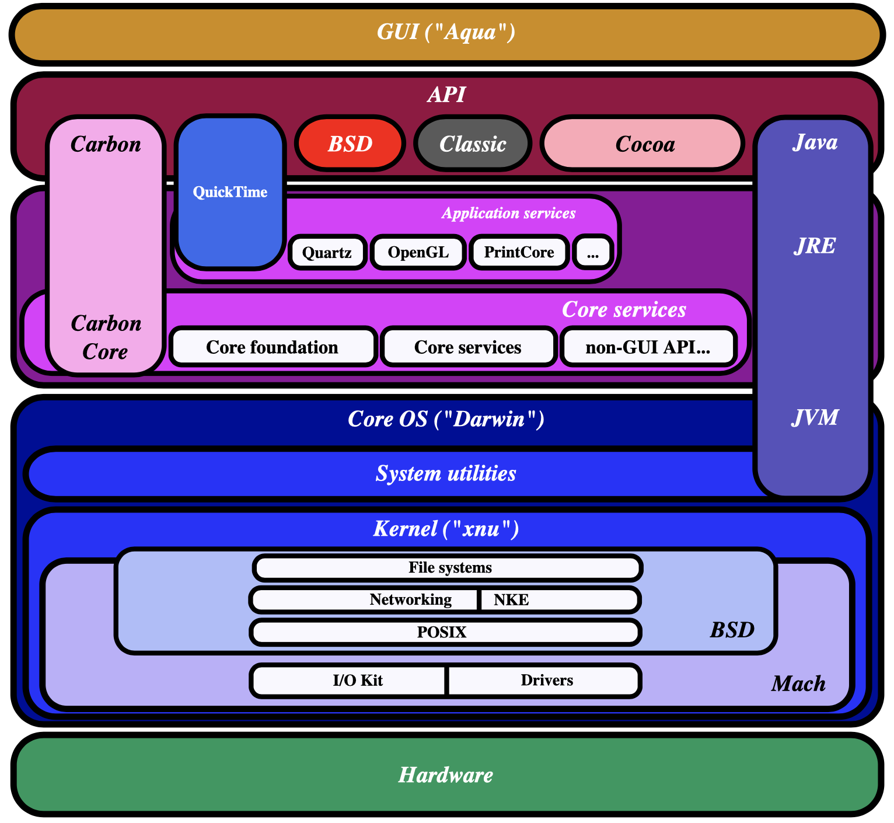

### 查看系统信息

虽然macOS也属于UNIX，但是它没有 /proc 虚拟文件系统来提供内核和系统的信息

不过仍然可以使用 `sysctl` 来查询相关信息

```cmd
$ sysctl kernel_parameter
```

* -a 列出所有信息
* -n 只显示指定参数的值，而不显示参数名
* -w 设置指定参数的值。注意：不是所有的参数都支持写入操作，而且需要足够的权限


### Hypervisor.framework

https://breaklimit.me/2017/04/14/mac-osx-vm-1/

**Hypervisor.framework** 是苹果提供的一组 API（应用程序编程接口），用于支持虚拟化技术。它允许开发者在 macOS 上创建和管理虚拟机，实现虚拟化的关键功能。这个框架在 macOS 10.10 Yosemite 版本中首次引入，并且它为虚拟机监控程序（VMM）提供了一些关键功能，使得在 Mac 上能够运行不同的操作系统实例。

一些常见的虚拟化软件，比如 Parallels Desktop 和 VMware Fusion，利用了 Hypervisor.framework 来实现高性能的虚拟化。这个框架提供了一种在硬件虚拟化支持下的轻量级虚拟化解决方案。


### xhyve

xhyve (x hypervisor) 是一款轻量级的虚拟化解决方案，专门设计用于 macOS。xhyve是一个Hypervisor.Framework的具体实现，是从FreeBSD的bhyve移植过来的。

与一些其他虚拟化工具相比，`xhyve` 的设计更注重简洁和性能

### virtualbox

* `VirtualBox` 是由 Oracle 提供的免费、开源的虚拟化软件，支持多种操作系统，包括 macOS。
* 它提供了用户友好的图形界面，使得虚拟机的创建和管理变得相对简单。
* `VirtualBox` 是一个功能丰富的虚拟化平台，支持各种虚拟设备和功能，适用于广泛的用途，包括开发、测试和生产环境。
* 虽然 `VirtualBox` 在功能上更全面，但由于其相对复杂的配置，可能在一些方面不如 `xhyve` 那样轻量级。