# Linux基础与重要命令笔记

## *重要命令*

* `touch` 创建文件
  * 当前文件已存在时，更新文件的最近修改时间
* `mkdir -p test/test1`
* `rm -rf`
  * -f 取消询问
  * -i 询问
  * -r 递归删除
* `cp [-fir] 源文件（可以有多个） 目标文件`：若是目录用 -rf
* `mv [-ri] 源文件或源目录 目标文件或目标目录`
  * 当目标目录已存在时为移动
  * 当目标目录或文件不存在时就是重命名
* `echo`：打印内容到显示器上
  * `echo "HelloWorld" > myfile`
  * 若目标文件不存在，创建之，否则直接进行写入
  * 访问
    * `>` 输出重定向（从文件的开始，覆盖式的写入）
    * `>>` 追加重定向（从文件的结尾，追加式的写入）
    * `<` 输入重定向：本来应该从键盘获取的内容，变成从文件中读取
* `more [选项] [文件]` 查看文件 -n 对输出的所有行编号
* `less [选项] [文件]` 查看文件
  * less功能比 `more` 更强大，less可以前后移动，但more只能往前，且less在查看之前不会加载整个文件
  * `-N`：显示行号
  * `/字符串`：向下搜索
  * `?字符串`：向上搜索
  * `n/N` 重复前一个/后一个搜索
* 管线命令 Pipe `|`，管段是用来传导数据的
* `head -n file` `tail -n file` 查看头尾各n行代码，若想看介于中间的代码可以使用管线命令，如想查看 [999, 1009] 行的代码：`head -1010 myfile | tail -11`
* `alias` 给命令起别名
* 查找
  * `find [路径] -name [文件名]`
  * `which` 查找某条命令的文件路径（命令就是可执行文件）
  * `whereis` 查找符合条件的源代码、二进制文件，不常用
  * `grep [选项] 字符串 文件` 行文本过滤工具 `grep -n '888' myfile`
    * -n 顺便输出行号
    * -i 忽略大小写的不同
    * -v 反选，即显示没有搜索的字符串的行
    * ^ 以xx为开头
    * $ 以xx为结尾
* 压缩/解压缩
  * `zip`
  * tar
    * `tar -czvf xx.tgz xx` 打包并压缩
    * `tar -xzvf xx.tgz -C path` 解压缩到指定路径
* 获取系统和文件信息
  * `pwd` 当前路径
  * `file` 显示文件的种类
  * `stat` 显示文件的状态，主要是修改时间等
  * `uname -a` 获取电脑和操作系统的相关信息
  * `top` 查看CPU占用
* 进程相关
  * `ps axj`

### 通配符 Wildcard

* `*` 代表无穷多个字符 如 `ll test*`：找出所有以test开头的文件
* `?` 一定有一个
* `[]` 可能有一个

## *Shell壳程序*

## *权限*

### 文件权限

* r-4, w-2, x-1
* `umask` 掩码：凡是在umask中出现的权限，最都不应该在最终权限中出现，即 最终权限=起始权限&(~umask)

### 添加sudo信任

### 粘滞位 Sticky bit

## *函数库和 gcc/g++ 编译器*

### 编译过程

<div align="center"></div>

* 预处理 Preprocessing
* 编译 Compilation
* 汇编 Assemble
* 链接 Linking

### 函数库

* 函数库可以让其他开发者用到高质量的代码以及提高自己工程的安全度，防止暴露源代码
* 静态库 Static Library
  * 静态库是指编译链接时，把库文件的代码全部加入到可执行文件中，因此生成的文件比较大，但在运行时也就不再需要库文件了
  * CentOS安装C/Cpp静态库（系统默认自带动态库）
    * C: `sudo yum install -y glibc-static`
    * Cpp: `sudo yum install -y libstdc++static`
  * 可以通过 `ldd` 命令查看依赖库文件 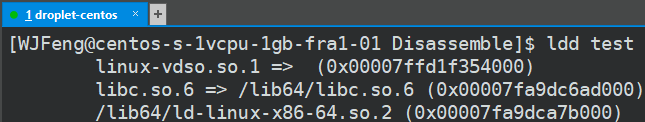
* 动态库 Dynamic Link Library：动态库在编译链接时并不会把库文件的代码加入到可执行文件中，而是在程序运行时由运行时链接文件加载库，这样可以节省系统的开销
* Linux环境中 `.so` 为动态库，`.a` 为静态库；而 windows环境中 `.dll` 为动态库，`.lib` 为静态库
* gcc生成的二进制文件默认采用动态链接，可以用 `file` 命令验证

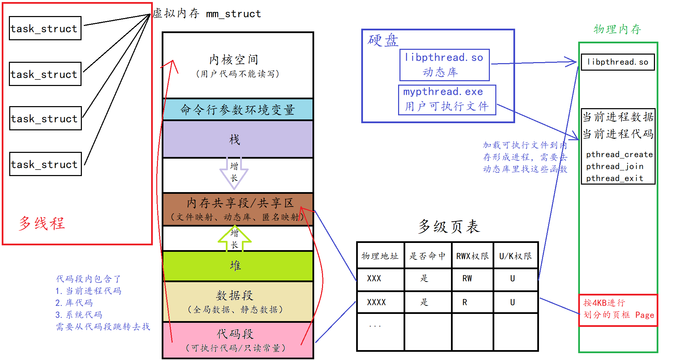

### 制作静态库

* 前缀必须是lib，后缀必须是.a  `ar -rc libhello.a mymath.o myprint.o`
* 库目录
  * include 库的所有头文件
  * lib 对应的库文件
* 发布和使用
  * 自己写的库属于第三方库，既不是语言提供的也不是系统调用库。gcc调用时需要显式给
  * 头文件gcc的默认搜索路径是：`/usr/include`
  * 库文件的默认搜索路径是：`/lib64` 或者 `/usr/lib64`
  * 把第三方库拷贝到系统的默认路径下，称为库的安装
  * 为了避免未经测试的库污染，不要把第三库放到系统库里，对第三方库进行指定头文件搜索路劲共和库文件搜索路径的硬使用：`gcc main.c -I ./hello/include -L ./hello/lib -lhello`，其中-I指定头文件搜索路径，-L指定库文件搜索路径，lhello是库名

### 制作动态库

* `gcc -shared  myprint.o mymath.o -o libhello.so`
* fPIC 的意思是生成一个与地址无关的目标二进制文件。程序编译完后有自己固定的内存地址空间，因此静态库在调用时是占用固定的地址空间的，而动态库则不占用，动态库采用的是相对动态编址方式
* gcc对动态库和静态库的使用选择
  * 静态库和动态库可以同名
  * 若只有静态库，则会强制进行静态连接
  * 若既有静态库也有动态库，则默认使用动态库；此时若想强制使用静态库，也可以用 `-staic` 来指定
* 动态库是一个独立的库文件，动态库可以和可执行文件分批加载
  * 动态库只要加载到内存中的**堆栈之间的共享区**一次，**每次使用时只要与调用它的进程的页表建立新的映射关系就可以**；但用静态库的时候是将静态库引入到了调用程序中，即即**保存在代码段**，成为程序的一部分，一起调用，若有很多个程序都使用了同一份静态库，那么内存中将存在大量的库代码冗余
  * 每一个动态库被加载到内存中，映射到进程的地址空间，映射的位置可能是不一样的，但是因为库里面是相对地址，每一个函数定位采用的是偏移量的方式来寻找的。即只要知道这个库的相对地址，库的起始地址+函数偏移量就可以将函数映射到虚拟地址上·
  
* 虽然在gcc编译的时候已经告诉了程序需要的动态库的地址，但对生成程序进行调用的时候它并不能找到动态库
  * 可以将库放到系统库中，但这会造成库污染，不要使用这种方法
  * 可以将第三方动态库的地址放到库加载的搜索路径的环境变量下 `export LD_LIBRARY_PATH=$LD_LIBRARY_PATH: pwd`，但这个环境变量在OS重启后会被重置为原来的内容
  * 可以通过新增系统默认的配置文件来达到永久修改的目的：往 `/etc/ld.so.conf.d` 新建一个带有库地址的配置文件后再执行 `ldconfig` 令配置文件生效
  * 也可以在系统库 `/usr/lib64` 中建立一个指向第三库的软连接

```makefile
.PHONY:all    
all:libhello.so libhello.a    

libhello.so:mymath_d.o myprint_d.o
    gcc -std=c99 -shared mymath_d.o myprint_d.o -o libhello.so    
mymath_d.o:mymath.c
    gcc -std=c99 -c -fPIC mymath.c -o mymath_d.o    
myprint_d.o:myprint.c
    gcc -std=c99 -c -fPIC myprint.c -o myprint_d.o

libhello.a: mymath.o myprint.o    
    ar -rc libhello.a mymath.o myprint.o
mymath.o:mymath.c    
    gcc -std=c99 -c mymath.c -o mymath.o    
myprint.o:myprint.c    
    gcc -std=c99 -c myprint.c -o myprint.o    

.PHONY:output    
output:    
    mkdir -p output/lib    
    mkdir -p output/include    
    cp -rf *.h output/include    
    cp -rf *.a output/lib    
    cp -rf *.so output/lib                                                                                     

.PHONY:clean    
clean:    
    rm -rf *.o *.a *.so output    
```


## *gdb调试器*

* gcc/g++编译出来的二进制程序默认是release模式，要使用gdb调试，必须在源代码生成二进制程序的时候加上选项 `-g`

## *自动化项目构建工具：make/Makefile基础*

### 概念

* 一个大的项目需要根据文件的类型、功能、模块按照一定顺序进行编译，不可能每次都手动输入编译命令，Makefile文件中存储着我们设计好的编译代码
* `make` 是一个命令，用来解释Makefile文件中指令的命令工具
* 实际上用的更多的是自动化构建Makefile工具如cmake

### 编写Makefile

* 一对make指令是由依赖关系和依赖方法组成的
  * 依赖关系：文件之间的关系
  * 依赖方法：如何通过依赖关系编译文件
* `make` 默认执行遇到的第一对依赖关系和依赖方法，其余的需要 `make+依赖关系`，如 `make clean`
* 伪目标 `.PHONY`：每次 make 总是被执行的，若不是伪目标则若已经存在make后的结构则不会被执行；习惯是将 `clean` 设为伪目标，其他不设置
* make是如何知道目标已经是最新的呢？根据文件的最近修改时间，若可执行程序的修改时间比所有相关文件的修改时间都要晚，那么可执行程序就是最新的


## *VSCode远程开发与SSH*

### VSCode添加SSH

下载Remote-SSH插件，然后进行设置。注意：用户名要对应，不是随便写的

### SSH

## *manual的使用*

1. 可执行的程式或是shell 指令
2. system calls，Linux 核心所提供的函数
3. 一般函式库函数
4. 特殊档案（通常位于/dev）
5. 档案格式与协定，如 /etc/passwd
6. 游戏
7. 杂项（巨集等，如man(7)、groff(7)）
8. 系统管理者指令（通常是管理者 root 专用的）
9. Kernel routines（非标准）

# Linux 进程概念

## *冯诺依曼架构 Von Neumann Architecture*

* 早期冯诺依曼机器以运算器为核心

    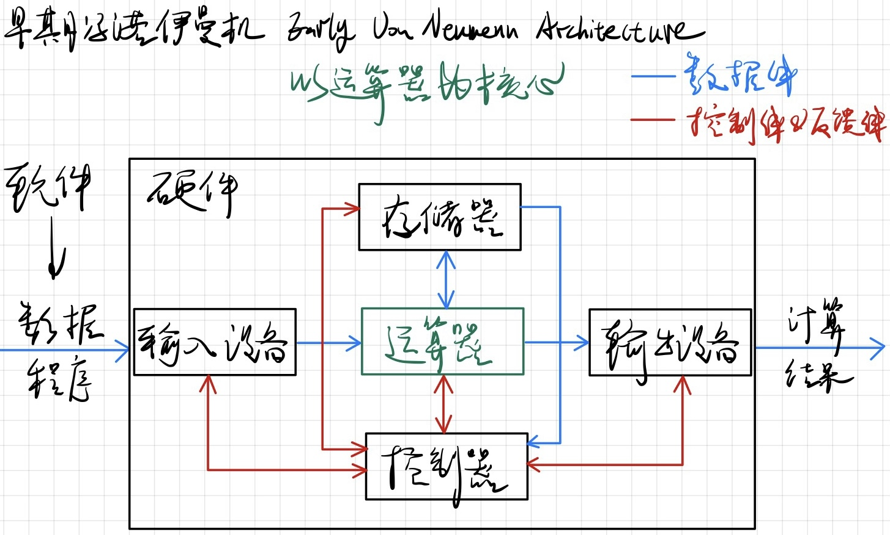

* 现代计算机以存储器（内存）为核心

    

  * 随着微电子制造技术的进步，大量IO设备与CPU的速度相差巨大，因此以计算器为中心的结构不能满足计算机发展的要求，现代计算机已发展为以存储器为中心
  * 目前绝大多数现代计算机仍遵循Von Neumann架构存储程序的设计思想

## *操作系统相关概念*

### OS组成

* Kernel 内核：进行最底层的进程管理、内存管理、文件管理、驱动管理
* 其他程序：如函数库、Shell等

### 设计OS目的

* 与硬件交互，管理所有的软硬件资源
* 为用户程序（应用程序）提供一个良好的执行环境

### 系统调用 System Call 和函数库

* 在开发角度，操作系统对外会表现为一个整体，但是会暴露自己的部分接口，供上层开发使用，这部分由操作系统提供的接口称为系统调用
* 系统调用在使用上，功能比较基础，对用户的要求相对也比较高。因此开发者会对部分系统调用进行二次开发和适度封装，形成一个供上层开发者使用的库

## *进程概念与PCB*

### 进程概念 Process

* 理论概念：程序的一个执行实例，正在执行的程序等
* 内核观点：担当分配系统资源（CPU时间、内存）的实体，是向系统申请资源的基本单位
* 一个加载到内存中的程序就是一个进程：内核PCB数据结构+可执行程序的代码和数据，执行可执行程序后变成了进程

### 进程描述-PCB

<div align="center">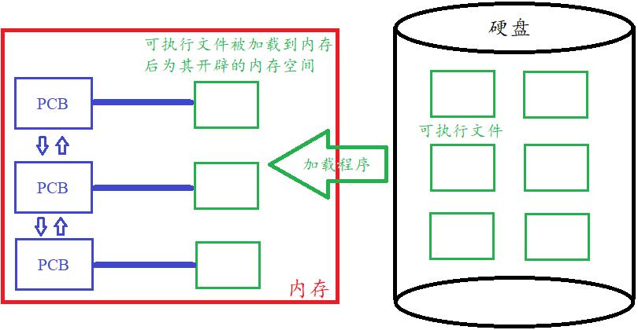</div>

* 进程信息被放在一个叫做进程控制块的数据结构中，可以理解为进程属性的集合

* PCB Process Control Block 进程控制块是一个学术上的统称，Linux系统中对应的PCB是 `task_struct`。`task_struct` 是Linux内核的一种数据结构，它会被装载到RAM里并且包含着进程的信息

* 所有运行在Linux系统里的进程都以 `tast_struct` 双链表的形式存在内核里。因此对进程的管理，也就变成了对进程PCB结构体链表的增删查改工作

* 操作系统和CPU运行某一个进程，本质是从tast_struct形成的队列中挑选一个tast_struct来执行它的代码。进程调度就是在tast_struct的队列中挑选一个task_struct来执行它的代码。只要想到进程，优先想到进程对应的tast_struct

  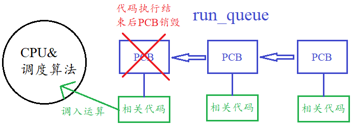

* 内容分类
  * 标识符 Identifier PID：描述进程的唯一信息，用来区别其他进程
  * 状态
  * 优先级
  * 程序计数器：相当于是一个指针，存放程序中即将被执行的下一条指令的地址
  * 内存指针：包括程序代码和进程相关数据的指针，还有和其他进程共享的内存块的指针
  * 上下文数据：进程执行时处理器的寄存器中的数据
  * IO状态信息：包括显示的IO请求，分配给进程的IO设备和被进程使用的文件列表
  * 记账信息：处理器时间总和，使用的时钟数总和等。该信息可以用来评估调度算法是否合理以及指导我们优化调度策略
  * 其他信息

### 通过系统调用获取进程标识符

* 查看进程信息
  * `ps axj | grep '进程名'` 或者 `top`
  * 进入 `/proc` 目录
* `getpid` 和 `getppid` 系统调用分别获得PID和PPID标识符

  ```c
  #include <stdio.h>    
  #include <unistd.h>    
  #include <sys/types.h>    
  
  int main() {    
      while (1) {    
          pid_t id = getpid(); // 获取的是自己的PID
          printf("hello world, pid: %d, ppid: %d\n", id, getppid());
          sleep(1);
      }
  }
  ```
  
  * 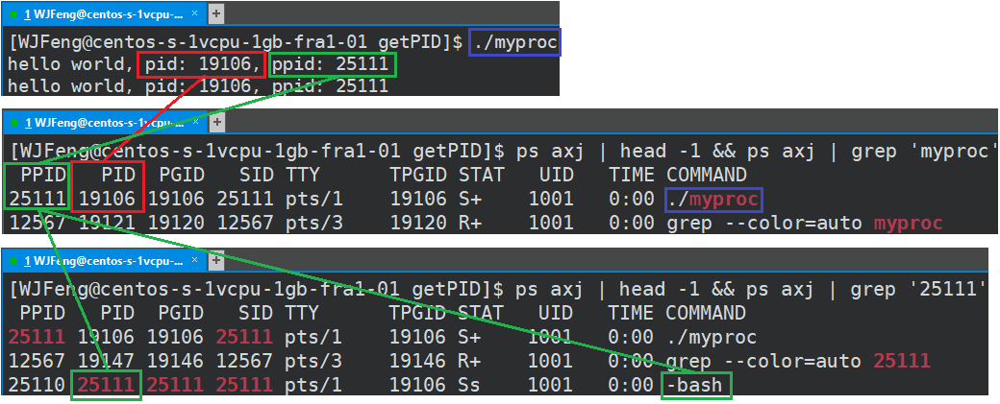
  * 可以发现父进程就是Bash，即Shell是通过创建子进程的方式调用了该程序，Shell也是系统的一个进程，其之上的父进程是操作系统
  
* `kill -9 [PID]` 终止进程
* `fork` 通过系统调用创建进程
  
  * fork的返回值
    * 失败的时候返回-1
    * 成功时fork具有两个返回值
      * 给父进程返回子进程的pid
      * 给子进程返回0
  * 为什么会有两个返回值
    * 创建进程的时候本质就是系统多了一个进程。即内部属性以父进程为模板新建一个task_struct。当运行到fork函数内部的return时，核心代码已经执行结束了，因为有父子进程的分别return，所以会有两个返回值
    * 返回两次并不意味着会保存两次
    * 父子进程被开出来后，谁先运行是不一定的，这是由操作系统的调度器决定的
  * 为什么给子进程返回0，而给父进程返回子进程的PID（一种感性的认识）：父进程与子进程的关系是一对多的。父进程需要获取子进程的PID对其进程操作，而子进程由于只有一个父进程，可以用其他方法方便的得到其父进程的信息
  
  ```c
  #include <stdio.h>
  #include <unistd.h>
  int main()                      
  {            
      pid_t id = fork(); // id在父进程里面是子进程的PID，在子进程里面是0
      // fork 之后父子进程共享代码
      if (id<0)          
      {            
          // 创建失败
          perror("fork");
          return 1;
      }                                  
      else if (id == 0)   
      {            
          // fork产生的两个进程会同时执行
          // Child process                                                  
          while (1)    
          {
              printf("I am child, pid: %d, ppid: %d\n", getpid(), getppid());
              sleep(1);
          }
      }                     
      else         
      {    
          // Parent process                                                  
          while (1)    
          {
              printf("I am father, pid: %d, ppid: %d\n", getpid(), getppid());
              sleep(1);
          }
      }                           
      printf("You can see me!\n");
      sleep(1);
  
      return 0;
  }   
  ```
  
  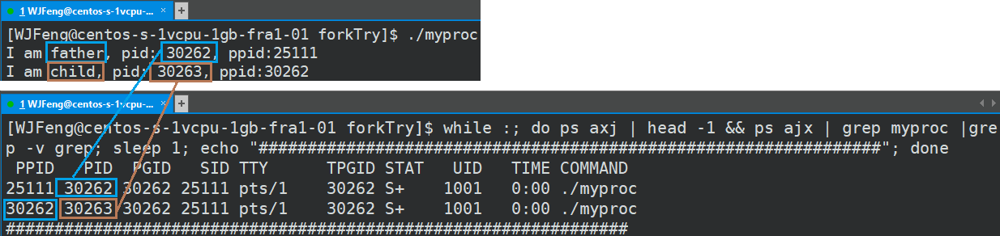

## *进程状态*

### Linux进程状态

* 进程状态查看：`ps aux 或 ps axj`
* 理论上的进程分类：每种参考书的理论进程都不一样，但大体可以分为
  * 新建状态
    * 创建PCB，还未被加入队列，实际上没有这种状态，只是一种理论上的完善
    * 可以对程序分批换入内存，在极端情况时仅仅生成了内核数据结构而没有分配任何内存，此时称为新建
  * 运行状态
  * 阻塞状态 Pending：等待非CPU资源就绪，其他非CPU设备也会维护各自的运行队列
  * 挂起状态 Suspend
    * 系统快内存不足的时候，OS将长时间不执行的进程代码和数据换出到磁盘中的SWAP区中，但其对应的PCB仍然保留在内存中
    * 进程的数据和代码都被换出到磁盘就称为挂起，页表不仅仅有虚拟地址和物理地址的映射也有虚拟地址和硬盘地址的映射，因此可以直接换出到硬盘上
  * 挂起阻塞状态：在阻塞状态时又被系统挂起了
* Linux实际上的进程分类
  * Linux 2.6 内核的定义：<div align="center">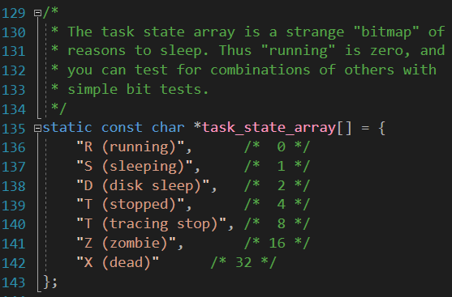</div>
  * S睡眠状态 Sleeping：意味着进程在等待睡眠完成（这里的睡眠也可叫做可中断睡眠 interruptible sleep），S状态对应的理论状态为阻塞态和挂起态，在等待非CPU资源就位，或者说在**非CPU硬件的队列**里排队。OS可以通过调度算法在内存不够时将进程换出到Swap区
    * 情况一
      * 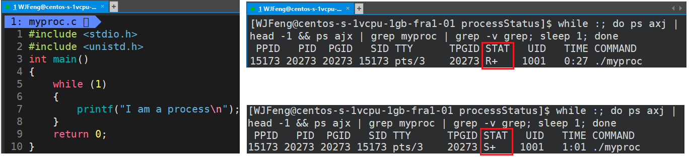
      * 由于CPU的运行速度极快，实际上在该死循环中只有极少的时间在运行，绝大多数时间都在睡眠状态，将CPU资源给其他程序使用
      * 注意：当进程状态有一个 `+` 时，表示该任务为前台进程。具体可以看下面前台进程与后台进程的区别
    * 情况二
      * 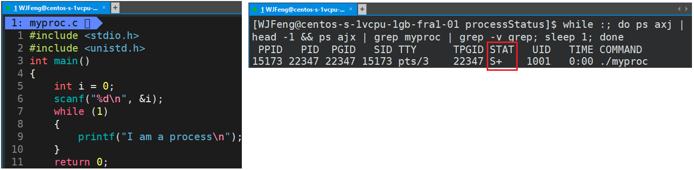
      * 一直在等待用户输入，所以一直处于IO的队列中，处于睡眠状态
  * R运行状态 Running：并不意味着进程一定在运行中，它表示进程要么是在运行中要么在**CPU运行队列**里排队 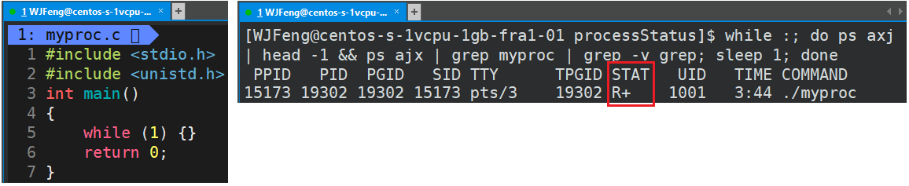
  * D磁盘休眠状态 Disk sleep：也可叫做深度睡眠/不可中断睡眠 uninterruptible sleep，不可以被被动唤醒，在这个状态的进程通常会等待IO的结束。
    * 例子：一个进程正在往硬盘或者往其他IO设备写入数据，但此时该进程仍然占用了内存资源。若此时OS压力过大，可能会选择终止处于S状态的进程以保护整体的OS。当进程处于D状态时，则不能被OS终止，只能等该进程结束读写后自动醒来时，OS再结束它
    * D状态一般用于硬盘的读写，因为涉及到用户的数据比较重要
    * D状态的模拟代码不给出，因为要模拟这个进程需要大量数据的IO读写
  * T暂停状态 Stopped
    * 可以通过 `kill -19 [PID]` 暂停进程
    * 和D状态、S状态相比，前两者都在等待某项资源或执行任务，但T状态并没有，是被用户手动暂停的
    * 调试时会呈现T状态，比如gdb打断点时gdb会给进程发送 `kill -19 [PID]` 暂停进程
  * T tracing stop 调试状态
  * X死亡状态 Dead：这个状态只是一个返回状态，不会在任务列表里看到这个状态。和理论中的新建状态类似，存在时间极短，资源立刻会被OS回收

### 前台进程与后台进程 Foreground and Background process

* 当进程状态有一个 `+` 时，表示该任务为前台进程。前台进程意味着会占据Shell界面，其运行时Shell无法进行其他操作
* 若要设置为后台进程，可以在运行文件时带上 `&`，如 `./myproc &`。这样Shell就不必等待进程结束就可以接收新的命令，启动新的进程
* Shell可以同时运行一个前台进程和任意多个后台进程，只有前台进程才能接收到按键信号
* 前台进程在运行过程中用户随时可以发送如ctrl+c这样的信号，也就是说该进程的用户空间代码执行到任何地方都有可能收到SIGINT信号而终止，所以信号相对于进程的控制流程来说是异步的 asynchronous

### 僵尸进程 Zombie Process

* 什么是僵尸进程：一个进程已经退出，但是还不允许被释放，处于一个被检测的状态。进程一般尤其父进程或者OS检测回收，维持该状态是为了让父进程和OS来回收其返回或产生的数据（回收就是由Z状态转到X状态）
* 为什么会产生僵尸进程：子进程已退出，父进程还在运行，但父进程没有读取子进程状态，子进程就会变成Z状态。

    ```c
    #include <stdio.h>
    #include <stdlib.h>
    #include <unistd.h>                                                        
                        
    int main()
    {
        pid_t id = fork();
        if (id<0)
        {
            perror("fork");
            return 1;
        }
        else if (id == 0)
        {
            // Child process
            while (1)
            {
                printf("I am child, pid: %d, ppid:%d\n", getpid(), getppid());
                sleep(3);
                break;
            }
            exit(0); // 子进程直接退出
        }  
        else 
        {
            // Parent process 
            while (1)
            {
                printf("I am father, pid: %d, ppid:%d\n", getpid(), getppid());
                sleep(1);
            }
        }                           
        printf("You can see me!\n");
        sleep(1);

        return 0;
    }   
    ```

  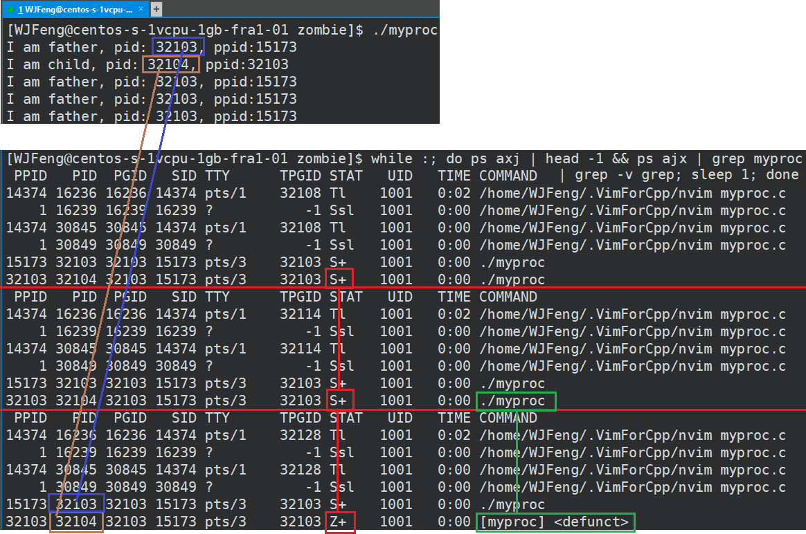

  `<defunct>` 指的是父子进程间失去通信的进程

* 僵尸进程的危害
  * 若父进程或OS一直不读取子进程的返回，那么子进程就一直处于Z状态
  * 维护退出状态本身就是要用数据维护，也属于进程的基本信息，所有也保留在PCB中，若一直处于Z状态，则一直要维护PCB
  * 进程需要占据内存资源，若一直不回收，会造成内存浪费，也就是内存泄漏
* 孤儿进程 Orphan Process
  * 孤儿进程和僵尸进程相反，若父进程先于子进程结束，那么子进程变成Z进程后就成为孤儿进程
  * 孤儿进程被1号init进程领养后由init进程回收，下图可看到，PID为7425的子进程在PID为15713的父进程退出后被1号init进程领养了

    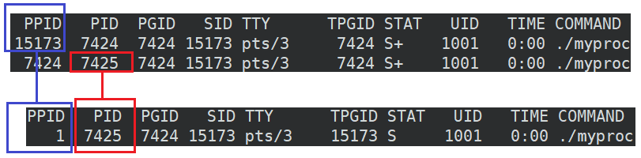

## *进程优先级 Priority与进程调度*

### 基本概念

* 为什么要有优先级？CPU资源有限，而进程太多，需要通过某种方式竞争资源
* CPU资源分配的先后顺序，就是指进程的优先权

### 查看系统进程 `ps -la`

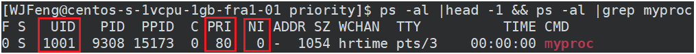

* UID：代表执行者的身份
* PRI：代表这个进程可被执行的优先级，其值越小越早被执行，系统默认优先级为80
* NI：代表这个进程的nice值，表示进程可被执行的优先级的修正数值，取值范围为 `-20~19`
* 优先级 = 老的优先级 + nice值，因此当nice值为负数时，优先值变小，优先级提高
* 为什么优先级的范围是在 `60~99` 内波动？OS的设计理念并不是让某一个程序最优先，而是均衡地分配资源，所以优先级的差距不宜过大，否则可能会有恶意进程通过提高自己的优先级而导致CPU在调度时总是先调度该恶意程序，导致其他进程得不到调度，将会导致一系列其他问题
* 用 `top` 命令更改已存在进程的nice：`top->r->输入PID->输入nice值`

### 进程的补充概念

* 竞争性：为了提高系统效率，OS进程需要通过优先级来竞争CPU资源，从而使资源分配更合理
* 独立性：多进程运行时（包括父子进程），需要独享各种资源，多进程运行期间互不干扰
* 并行 Parallelism：多个进程在多个CPU下分别同时进行运行
* 并发 Concurrency：多个进程在单个CPU下采用进程切换的方式，在一段时间之内，让多个进程都得以推进

调度算法：CPU在分配资源给一个进程时，不是一直令其独享资源直到代码运行结束的。否则当一个死循环在运行时，OS不能做任何其他的操作

## *环境变量 Environment variables*

### 一个直观的现象

<div align="center">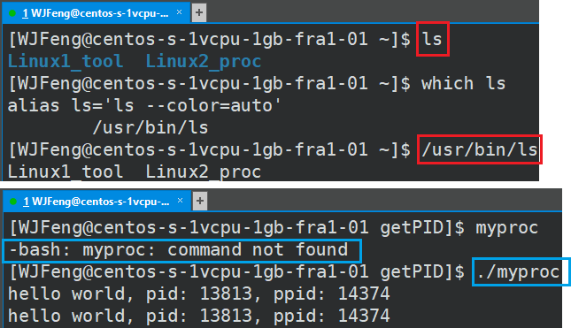</div>

* 当运行系统命令（命令就是一个可执行文件）时有两种方式
  * 输入命令直接运行，比如 `ls`
  * 也可以通过输入 `ls` 可执行程序所在的绝对路径 `/usr/bin/ls`
* 访问自己所创建的可执行文件时却要带上 `./`，也就是当前路径/相对路径，直接输入可执行文件名会报错

### 基本概念

* 环境变量一般是指在OS中指定OS运行环境的一些参数
  * 和Cpp中的命名空间或者C语言中的作用域相似，OS也会在OS的“作用域”当中为自己定义环境变量
  * OS通常具有某些特殊用途，还有在系统当中通常具有全局特性
* 常见环境变量
  * `PATH`：指定命令的搜索路径
  * `HOME`：指定用户的主工作目录（即用户登录到Linux系统中时默认的目录）
  * `SHELL`：当前Shell，它的值通常是 `/bin/bash`

### 和环境变量相关的命令

<div align="center"></div>

* 通过 `echo $NAME` 来查看环境变量：echo的实现就是系统调用 `getenv`
  * 发
  * 解释第一个现象：在Shell中直接键入可执行文件名时候，Shell在执行可执行程序时会去环境变量PATH中存在的路径中逐个搜索，若没有找到就不会运行。我们自己写的可执行程序并不在其中的任意一个路径中，所以不能直接执行，必须要写上绝对路径或相对路径
* `export`：设置一个新的环境变量（增减环境变量）
* `env`：显示所有环境变量
* `unset`：清除环境变量
* `set`：显示本地定义的shell局部变量和环境变量

### 环境变量的获取方式

* 环境变量的组织方式：环境表 Environment List 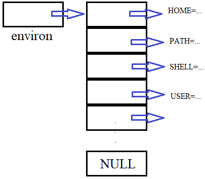
* 通过代码
  * main函数有三个参数 `int main(int argc, char* argc[], char* env[]);`
    * `argv` 是命令行参数指针数组， `argc` 是有几个命令行参数
    * 第三个参数char指针数组就是用来接收父进程继承的环境表的
  * 利用第三方变量 `extern char** environ;`
* 通过系统调用或设置环境变量

### 环境变量的全局属性

* 子进程的环境变量是从父进程继承的
* 默认所有的环境变量都会被子进程继承
* 最开始的父进程为Bash
* 全局属性移位着所有子进程都可以继承环境变量

## *地址空间 Address Space 与 虚拟内存 Virtual Memory*

### C/Cpp虚程序拟内存划分图

<div align="center"></div>

* 堆会多申请一些空间来存放和堆自身有关的属性信息，即cookie数据
* static修饰局部变量的本质就是将该变量开辟在全局区域
* 新建进程时会换入除堆和栈之外的代码，堆和栈只有在真正要用的时候才会开始开辟内存
* Linux vs Win 该结论只适用于Linux，Win可能由于不同的系统设计方法对于用户来说完全是随机的
* 问题：这样的内存划分是真实的物理内存划分吗？答案：不是！

### 为什么要引入地址空间和虚拟内存/优点

* 安全性
  * 历史上早期的计算机系统CPU是直接采用物理地址访问物理内存的，内存本身随时可以被读写，但这种方式非常的不安全，比如可以轻松地通过野指针访问损坏数据以及取得用户的私有数据。这些风险可以通过引入虚拟地址空间的保护机制来防护，即凡是非法的访问或者映射，OS都会识别并终止该进程
  * 举个例子：对于字符串常量 `char* str = "hello world"` 我们不能通过 `*str = 'H'` 进行修改，因为这是一个位于常量区的常变量。页表不仅维护了映射关系，也维护了其读写权限，当用户尝试对其非法读操作时，OS会直接终止当前进程，导致程序崩溃。这种方式不是物理上的保护，而是OS软件层面上的保护
* 解耦合内存管理模块和进程管理模块
  * 因为由地址空间和页表映射的存在，在物理内存中可以对未来的数据进行任意位置的加载。物理内存的分配就可以和进程的管理做到没有关系，也就是内存管理模块和进程管理模块完成了解耦合 Decoupling
  * 因为由地址空间的存在，所以上层申请空间时，其实是在地址空间上申请的，物理内存可以选择暂时不派发资源，而是在用于真正要访问物理内存空间的时候才执行内存的相关算法。这是一种延迟分配的策略，提高了整机的效率
* 有序化内存分布和独立性：物理内存理论上可以在任意位置加载，也就是说数据和代码在物理内存上是无序存放的。但因为页表的存在，它可以将地址空间上的虚拟地址和物理地址进行映射，因此在进程看来，内存就变成了有序的
* 结论：因为地址空间的存在，每一个地址都认为自己拥有总的内存空间，且各个区域是有序的，进而可以通过页表映射到物理内存上，从而实现进程的独立性。每一个进程不知道也不需要直到其他进程的存在

### 什么是地址空间与虚拟内存

* 地址空间是一种内核数据结构，它里面至少要有各个区域的划分，每一个进程都私有一份地址空间和页表（用户级）
* 只要保证每一个进程的页表，映射的是物理内存的不同区域，就能做到进程之间不会互相干扰，保证了进程的独立性
* 地址空间本质上就是一种内核中的数据结构 `struct mm_struct`，它里面至少要有对各个区域的划分，并结合维护映射关系的页表。该数据结构是PCB的一部分

    ```c
    struct mm_struct
    {
        int code_start;
        int code_end;

        int init_start;
        int init_end;

        int uninit_start;
        int uninit_end;

        int heap_start;
        int heap_end;

        int stack_start;
        int stack_end;

        // ... 其他属性
    }
    ```

* 本质上就是提供了一种OS看待内存的方案：即让PCB指向自己的地址空间数据结构并结合在内核空间中的页表来完成虚拟内存与物理内存之间的映射关系

### 一个直观的试验来验证是使用虚拟内存而不是直接使用物理内存

```c
#include <stdio.h>
#include <unistd.h>    
int g_val = 100;    
int main() {
    pid_t id = fork(); 
    // fork
    if (id == 0) {
        int count = 0;
        // Child process
        while (1) {
            printf("I am child, pid: %d, ppid: %d, g_val: %d, &g_val: %p\n", getpid(), getppid(), g_val, &g_val);
            printf("---------------------------------------\n");
            sleep(1);
            count++;
            if (count == 3) {
                g_val = 200;
                printf("child change g_val 100->200 success\n");
                printf("###################################\n");
            }
        }
    }
    else {
        // Parent process
        while (1) {
            printf("I am parent, pid: %d, ppid: %d, g_val: %d, &g_val: %p\n", getpid(), getppid(), g_val, &g_val);
            sleep(1);
        }    
    }
    sleep(1);
    return 0;
}
```

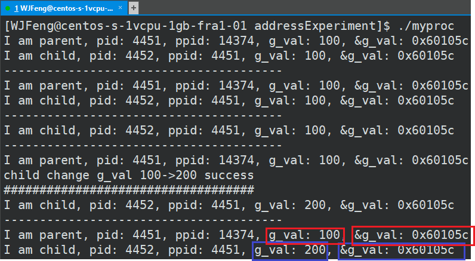

* 该实验发现，两个不同的进程使用了一个相同的地址，而该地址中存放的却不是相同的值
* 结论：C语言中使用的地址不可能是真是的物理地址，否则不可能同一地址却存的是不同值。而是虚拟地址（编译好形成可执行程序后叫做逻辑地址，二Linux中形成进程时又被称为线性地址）。几乎所有的语言角度上地址都不是物理地址，而是虚拟地址，这是为了保护系统本身免受用户错误的破坏
* 原因是因为地址空间和物理内存的分离：父子进程在用户层面用同一个变量，即同一个虚拟地址来表示，但通过不同的页表映射到了不一样的物理内存地址空间上。直观表现就是不同的进程使用了同一个变量，但变量的值却不一样。每个进程的地址空间是一样的，但只要其页表不同，从而映射到物理内存上的不同区域，就可以让进程达到独立性

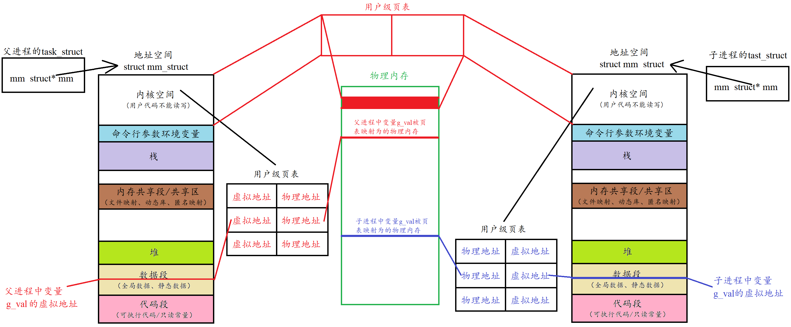

### 地址空间设计方法

* `objdump -afh hello` VMA Virtrual Memory Address 可以发现，编译器编译后生成的可执行文件已经被分配了虚拟内存地址
* 可执行程序在编译形成可执行程序后，但还没有加载到内存中成为一个进程时，已经被分虚拟地址了。编译时编译器就会给每一条语句、函数、变量等分配好虚拟地址。可以把编译的过程理解为一个理清代码逻辑、程序如何跳转的过程，这就需要借助虚拟地址的帮助。因此形成的可执行文件中不仅包含代码本身的内容，还有其对应的虚拟地址
* 换种说法：地址空间不仅仅是OS内部要遵守的，其实编译器也要遵守。即编译器编译代码的时候，就已经给程序形成了各个区域，并且采用和Linux内核中一样的编址方式，给每一个变量，每一行代码都进行了编制。故程序在编译的时候，每一个字段便已经具有了一个虚拟地址
* CPU并不知道有物理内存地址，只知道虚拟内存地址，通过内核空间维护的页表来进行二者的连接
* 通过可执行文件中的虚拟地址和物理内存的物理地址的对应关系来构建页表
* 负责进行虚拟地址和物理地址转换的硬件是MMU Memory Management Unit

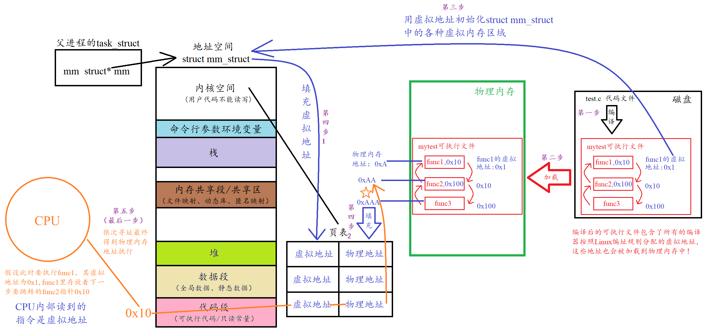

### 内核态和用户态

OS在物理内存中也要被加载，但不会随着进程的改变而改变。除了每个进程各自拥有的用户级页表外，**所有进程共享一份内核级页表**，用来为每个进程的内核空间与物理内存进行映射

通过内核级页表，无论进程如何切换，进程都可以找到内核的代码和数据，当然前提是用户有权利进行访问

* 当前进程如何具备权力来访问这个内核页表乃至于访问内核数据呢？需要进行身份切换。进程如果是用户态的就只能访问用户级列表，进程如果是内核态的就既可以访问内核态也可以访问用户级的列表。
* 那么如何标识用户的身份呢？CPU内部有对应的状态寄存器CR3来标识当前进程的状态，0为内核态，3为用户态
* 系统什么时候需要进行身份切换？以下给出两种典型情景需要修改CR3来切换用户身份
  * 当前进程执行**系统调用**的时候，系统调用是OS主动暴露给用户的接口，因此不存在安全问题。因此系统调用里包含了一系列切换和认证用户身份的操作
  * 时间片到了，需要进行进程间切换。身份切换后就可以访问内存内核空间的进程调度算法来执行进程切换，在进程的上下文中进行进程调度

总结

* 内核态可以访问所有的代码和数据，即内核态具备更高的权限
* 用户态只能访问自己的代码和数据
* 用户级的程序会无数次直接或间接的访问系统级软硬件资源（管理者是OS），本质上用户并没有权力去操作这些软硬件资源，而是必须通过OS。因此会无数次的陷入内核（1. 切换身份 2. 切换页表），从而调用内核代码来进行返回，然后OS会把结果返回给用户

### 多级页表

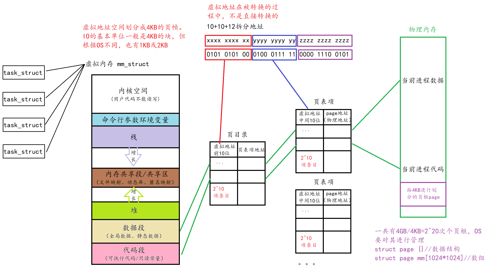

假设32位OS，寻址空间是 $2^{32}*1bit=4GB$，每一个地址都对应页表中的一个条目，每一个条目都保存了很多地址属性，假设每个条目是8字节，那么这张页表将会高达32Gb！

实际中采用的是多级页表。虚拟地址在被转换的过程中，不是直接转换的，而是将其分成10-10-12的形式通过多级页表进行分次寻址

虚拟地址空间划分成4KB的页帧（IO的基本单位一般是4KB的块，但根据OS不同，也有1KB或2KB）。为什么要划分成4KB？因为 $2^{12}=4KB$，这是虚拟地址内存管理的基本单位：页框

一共有4GB/4KB=2^20次个页框，OS要对其进行管理

```c
struct page {}//数据结构
struct page mm[1024*1024]//数组d
```

多级页表的好处

* 是否命中是以页为单位的，将进程虚拟地址管理和内存管理，通过page进行解耦
* 分页机制，按需创建页表，若以4KB为单位的页框单位没有用到，就不需要为其映射页表，以此来节省空间。页表最大只需要 $2^{32}/2^{12}=20MB$  

## *Linux 2.6 Kernel 进程调度算法架构*

# Linux 进程控制

## *进程创建 Create*

### 创建进程使用写时拷贝的原因

创建子进程，给子进程分配对应的内核结构，该结构必须子进程独有，因为进程具有独立性。理论上，子进程也要有自己的代码和数据，但子进程并没有加载过程，因此子进程没有自己的代码和数据。所以子进程只能“使用”父进程的代码和数据。

* 代码：都是不可被写的，只能读取，所以父子共享没有问题，父子进程都可以看到所有的代码
* 数据：是可能被修改的，因此必须分离
  * 创建进程的时候，就直接拷贝分离。问题：可能会拷贝子进程根本就不会用到的数据空间，即便是用到了也可能只是读取
  * 为了节省空间，在创建子进程时，不需要将不会被访问的或者只会被读取的数据拷贝一份。只需要拷贝将来会被父或者子进程写入的数据。问题：一般而言即便是OS，也无法提前直到哪些空间会被写入；而且即使是提前拷贝了，也不一定会马上使用
  * 因此OS选择了写时拷贝计数来分离父子进程数据
* 进一步解释为何OS要选择写时拷贝
  * 进程需要使用的时候再为其分配，是高效使用内存的表现
  * OS无法在代码执行前预知哪些空间会被访问

### 为什么子进程是从 `fork` 之后开始运行？

* 代码在经过汇编之后，会产生很多行代码，且每行代码在被加载到内存之后，都有对应的地址
* 因为进程随时可能被中断（可能并没有被执行完），下次回来时，CPU必须要从之前的位置继续运行，这就要求CPU必须随时记录下当前代码执行位置。因此CPU有对应的寄存器数据来存放当前进程的执行位置。具体为CPU中的EIP寄存器中的PC程序程序寄存器保存的
* 因此CPU中寄存器的数据（即进程上下文数据）也在写时拷贝中被拷贝走，而此时EIP中的PC在记录到 `fork` 执行时的代码，因此子进程只能代码的 `fork` 处开始运行。但是子进程还是拥有 `fork` 之前的代码的

### 写时拷贝的本质是一种延时申请

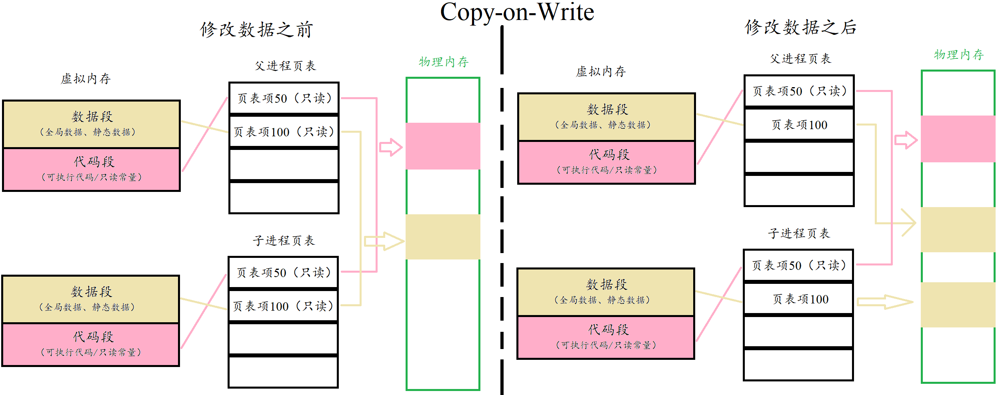

### `fork` 调用失败的原因

* 系统中有太多的进程
* 实际用户的进程数超过了限制

## *进程终止 Terminate*

### 进程退出时，OS做了什么？

释放进程申请的相关内核数据结构和对应的数据和代码。本质就是释放系统资源

### 进程退出场景

* C语言main函数为什么总是return 0？
  * main函数的return值被称为返回码/退出码，返回码被返回给上一级进程，用来评判该进程执行结果
  * return 0意味着代码运行完毕，结果正确；非0则代码运行完完毕，结果不正确
  * 不同的非0值可以标识不同的错误原因。方便定位错误的原因细节
  * 部分错误码实例：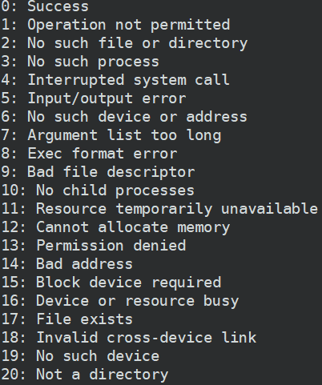
* 代码运行完毕，结果正确
* 代码运行完完毕，结果不正确
* 代码异常终止：此时退出码没有意义，一般而言不会执行到return，也就没有退出码

### 常见进程退出方法

<div align="center">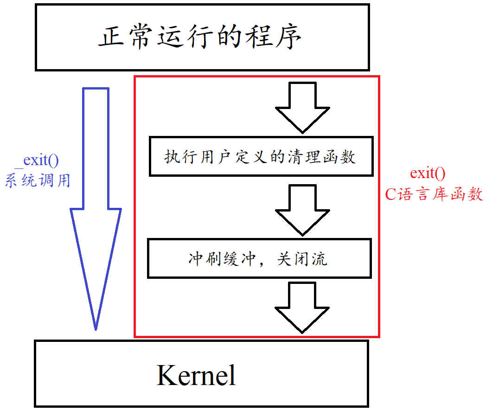</div>

* `_exit` 系统调用函数
* `exit` C语言库函数
  * 在代码的任何地方调用，都表示直接终止进程。推荐使用 `exit`
  * 通过试验发现，当使用 `exit` 时，会刷新缓冲区内的数据到输出设备上，而 `_exit` 则不会。因此可以从侧面证明，缓冲区是C标准库维护的，这点将会在IO中具体说明
* return退出语句：return语句只有在main函数中才是终止进程

## *进程等待 Wait State*

### 进程等待必要性

* 若子进程退出后无人回收会造成僵尸进程的问题，从而导致内存泄漏。僵尸进程无法被杀死
* 父进程通过进程等待的方式，回收子进程资源，获取子进程退出信息

### 进程等待方法

编写多进程的基本写法就是fork+wait/waitpid

```c
#include <sys/types.h>
#include <sys/wait.h>
pid_t wait(int *status);
pid_t waitpid(pid_t pid, int *status, int options);
```

* `wait`：`pid_t wait(int* status)`

  `status` 是一个输出型参数，用来存储子进程的退出信息

  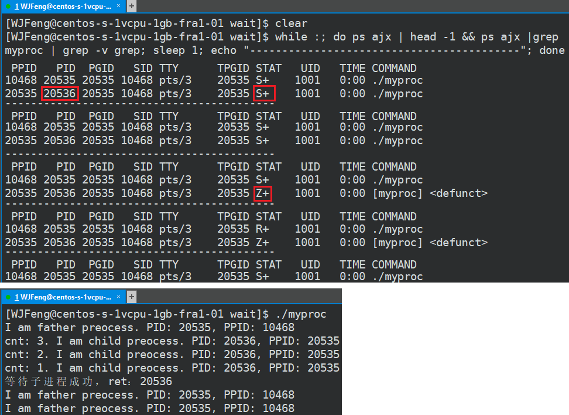

  试验过程：让子进程运行3秒后终止，但让父进程在5秒后才wait并回收，可以看到，子进程在一开始为运行间隔的S态，终止后由于暂时无人回收而变成Z状态，在父进程wait后被回收

* `waitpid`：`pid_t waitpid(pid_t pid, int* status, int options);`
  * 返回值
    * 当正常返回的时候waitpid返回收集到的子进程的PID
    * 若设置了选项 `WNOHANG`，而调用中waitpid发现没有已退出的子进程可收集，则返回0
    * 若调用中出错，则返回-1，此时errno会被设置成响应的值以指示错误所在
  * 参数
    * `pid`
      * `pid==-1`：等待任一个子进程，与wait等效
      * `pid>0`：等待其进程ID与pid相等的子进程，也就是等待指定进程
      * `pid==0`：
    * `status` 和 `wait` 的输出型参数一样，用户可以利用 `status` 选择输出宏 `WIFEXITED(status)` 或者 `WEXITSTATUS(status)`。实现见下方
    * `options`
      * 默认为0，表示设置父进程为阻塞状态：若子进程还没有返回，则挂起父进程，等子进程返回后从waitpid继续执行，此时父进程什么都干不了
      * `WNOHANG` 宏，表示设置父进程为非阻塞等待 `#define WNOHANG 1`：若没有子进程返回，waitpid直接返回0，会**不断进行查询访问，直到操作成功**
  
* 获取子进程status
  * 输出型参数，获取子进程退出状态，若不关心可以设置成为NULL
  
* 为什么要用wait/waitpid系统函数，因为数据产生写时拷贝，进程具有独立性，因此父进程无法拿到

* wait/waitpid作为系统调用函数，拥有权限读取僵尸进程（如果有的话）残存的PCB信息里保存的退出结果信息

```shell
while :; do ps ajx | head -1 && ps ajx |grep myproc | grep -v grep; sleep 1; echo "------------------------------------------"; done
```

### 获取子进程status：status是子进程PCB维护的一个数据

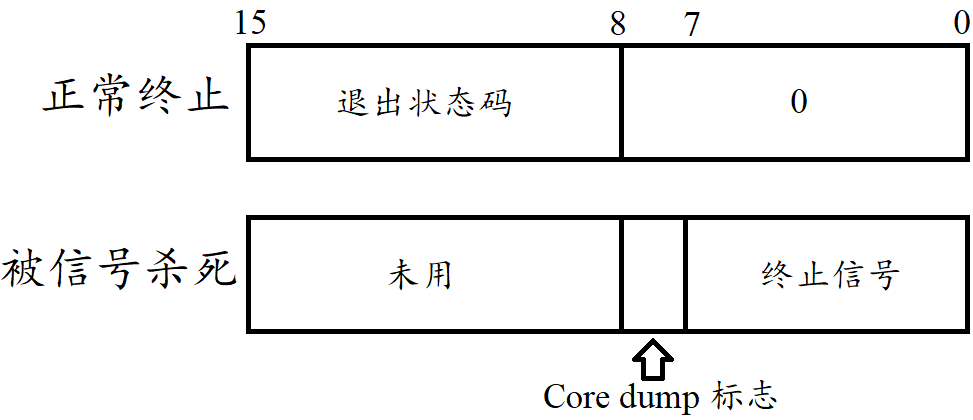

* status数据不能简单的看作一个整形，而是要看作一个32位的位图，其中高16位我们不关心
  * 输出 `WIFEXITED(status)` 宏：**`#define WIFEXITED(status) (status>>8)&0xff`**
  * 输出 `WEXITSTATUS(status)` 宏：**`#define WEXITSTATUS(status) status&0x7f`**
* 正常终止：使用高8位作为退出状态码
  * 试验：将退出状态码设为105，即 `exit(105)` 后正常终止
  * 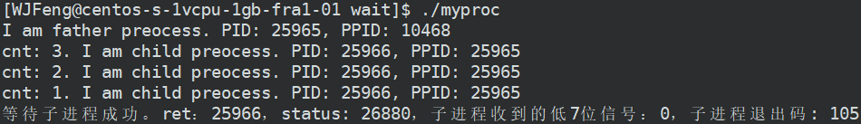
* 异常状态下被信号杀死，若core dump被设置，那么肯定是异常终止
  * 进程异常退出，或者崩溃，本质OS是在给进程写入信号，然后进程收到信号被终止，此时还会设置core dump位，关于core dump可以看[core dump 核心转储机制](#core_dump)
  * 试验：人为设置一个除0操作，返回的终止信号位8，对应信号SIGFPE：浮点数错误
  * 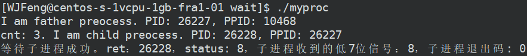

### 具体代码实现

* 进程的阻塞等待方式（上面的试验出自该例）

```c
#include <stdio.h>    
#include <unistd.h>    
#include <stdlib.h>    
#include <sys/types.h>    
#include <sys/wait.h>    
    
int main() {    
    pid_t id = fork();    
    if (id<0) {
        perror("fork failed\n");    
        exit(1);    
    }    
    else if (id==0) {
        int cnt = 3;    
        while (cnt) {
            printf("cnt: %d. I am child preocess. PID: %d, PPID: %d\n", cnt, getpid(), getppid());
            sleep(1);    
            //cnt--;    
            //int a = 10;    
            //a /= 0;    
        }                                                                                             
        exit(105); // 直接终止子进程，仅用作测试    
    }    
    else {
        printf("I am father preocess. PID: %d, PPID: %d\n", getpid(), getppid());
        //sleep(5);
        //pid_t ret = wait(NULL); // 阻塞式等待
        int status = 0;
        // 只有子进程退出的时候，父进程才会waitpid函数进行返回，此时父进程还存在
        // waitpid/wait 可以在目前的情况下，让进程退出具有一定的顺序性
        // 将来可以让父进程进行更多的收尾工作                                                             
        pid_t ret = waitpid(id, &status, 0); // 阻塞式等待
        if (ret>0) {
            // 可以不这么二进制处理
            // printf("等待子进程成功。ret：%d，status: %d，子进程收到的低7位信号：%d，子进程退出码: %d\n", ret, status, status&0x7f, (status>>8)&0xff);
            if (WIFEXITED(status))
                // 子进程是正常退出的
                printf("子进程执行完毕，子进程的退出码为：%d\n",WEXITSTATUS(status));
            else
                printf("子进程异常退出：%d\n", WIFEXITED(status));
        }
       // while (1)
       // {
       //     printf("I am father preocess. PID: %d, PPID: %d\n", getpid(), getppid());
       //     sleep(1);
       // }
    }
    return 0;
}
```

* 进程的非阻塞等待方式

### 子进程 `SIGCHLD` 信号捕捉

进程的阻塞和非阻塞等待效率其实都挺低的，实际进程退出是利用信号机制的，即子进程退出后会给父进程发 `SIGCHLD` 信号，父进程在陷入内核后对该信号进行处理，自定义 `SIGCHLD` 的处理动作，即调用 `wait` 清理子进程资源并回收其结果

``` c
void FreeChild(int signo) {
    assert(signo == SIGCHLD);
    pid_t id = waitpid(-1, nullptr, 0);
    if (id > 0) {
        cout << "父进程等待成功，chld pid: " << id << endl;
    }
    cout << "子进程退出，PID: " << signo << getpid() << endl;
}

int main() {
    signal(SIGCHLD, FreeChild);
    pid_t id = fork();
    if (id == 0) {
        int cnt = 10;
        while (cnt--) {
            cout << "子进程，PID：" << getpid() << "，PPID："<< getppid() << 
            "cnt: "<< cnt << endl;
            sleep(1);
        }
        exit(0);
    }
    
    //父进程
    while (true) {
        cout << "父进程，PID：" << getpid() << endl;
        sleep(1);
    }
    return 0;
}
```

上面的代码还需要改进，因为一个父进程可能会有很多很多个子进程。在父进程收到一个子进程的 `SIGCHLD` 并陷入内核处理时，OS会把该信号设置为阻塞，此时若还有其他子进程也在退出，就很有可能会丢失相关信号，从而产生僵尸进程

将 `waitpid` 放到循环里，以避免可能错过的退出码，但是一定要注意用非阻塞等待 `WNOHANG`，否则父进程可能会被卡死在这里

```c
void FreeChild(int signo) {
    assert(signo == SIGCHLD);
        while (true) {
        pid_t id = waitpid(-1, nullptr, WNOHANG); //非阻塞等待，否则父进程可能会卡死在这里
        if (id > 0) {
            cout << "父进程等待成功，chld pid: " << id << endl;
        }
        else if (id == 0) { //还有子进程，但是现在没有退出
            cout << "还有子进程，但是没有退出，父进程要去忙自己的事情" << endl;
            break;
        }
        else {
            cout << "父进程等待子进程结束" << endl;
            break;
        }
    }
}
```

事实上,由于UNIX 的历史原因,要想不产生僵尸进程还有另外一种办法：父进程用 `sigaction` 或 `signal` 函数将SIGCHLD的处理动作置为 `SIG_IGN`，这样fork出来的子进程在终止时会自动清理掉,不会产生僵尸进程，也不会通知父进程。系统默认的忽略动作和用户用 `sigaction` 或 `signal`函数自定义的忽略通常是没有区别的，但系统还是会将自定义动作仍然识别会自定义动作。此方法对于Linux可用,但不保证在其它UNIX系统上都可用

## *进程程序替换 Process Substitution*

### 替换原理：重新建立映射关系

* 进程替换是让进程（通常是子进程）执行一个全新的程序（类似加载）的过程
* 进程替换的两种方式
  * fork创建子进程后执行的是和父进程相同的程序（但有可能执行不同的代码分支）
  * 子进程往往要调用一种exec函数以执行另一个程序。当进程调用一种exec函数时，该进程的用户空间代码和数据完全被新程序替代，从新程序的启动历程开始执行。调用exec并不是创建新进程，所以调用exec前后该进程的PID并不改变

<div align="center">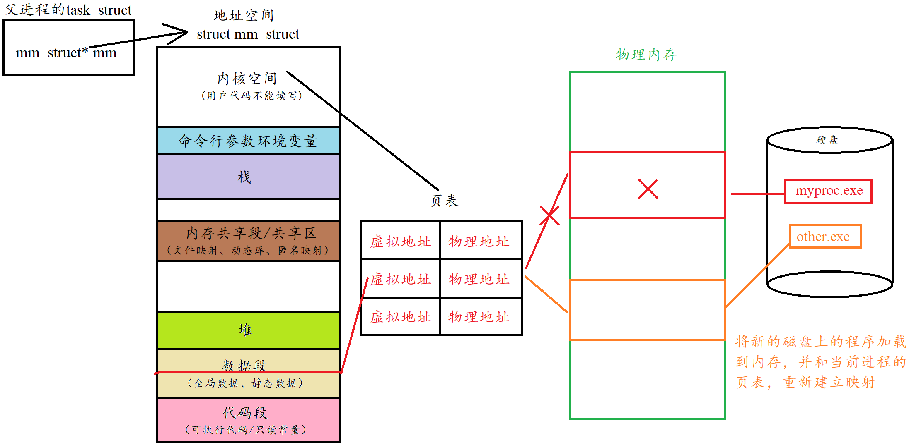</div>

### 六种exec替换函数

* `int execl(const char* path, const char* arg, ...);` l(list)：表示参数采用列表。可变参数列表的最后一个参数必须是NULL，用来表示参数传递完毕
* `int execlp(const char* file, const char* arg, ...);` p(path)：有p自动搜索环境变量PATH
* `int execle(const char* path, const char* arg, ...,char* const envp[]);` e(env)：表示自己维护环境变量
* `int execv(const char* path, char* const argv[]);` v(vector)：参数用指针数组
* `int execvp(const char* file, char* const argv[]);`
* <font color="red">***`int execve(const char* file, char* const argv[], char* const envp[])`***</font>：这个接口是最特殊的，因为它直接由OS提供的基本系统调用。之前函数的是经过C库封装的，适合在不同的调用场景下使用的

### 函数解释

* exec*函数本质就是如何加载从硬盘加载到内存的加载函数，其功能就是加载器
* 函数调用成功则加载新的程序，原程序剩余的代码不再执行。从下图试验可以发现，程序只打印了第一次printf和ls -al命令，之后的命令没有被执行
* exec函数只有出错返回-1，成功不会返回
* 当子进程加载新程序的时候，相当于是写入了新代码。此时要分离父子进程的代码，代码和数据都要写时拷贝
* 特殊情况：环境变量不会被替换

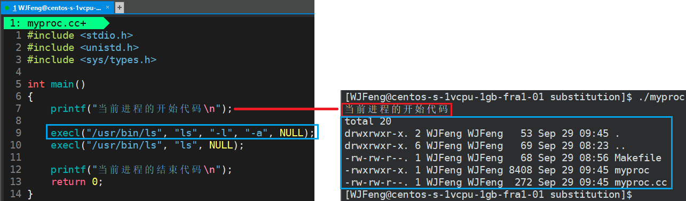

## *实现简单Shell*

### shell执行的命令

* 第三方提供的对应的在磁盘中有具体二进制文件的可执行程序，由子进程来执行
* shell内部自己实现的方法，由自己（即父进程）来执行。有些命令就是要用来影响shell本身的，如cd是要用来切换shell本身的路径

### 实现过程详见代码

* shell的环境变量是从其配置文件中来的，`.bashrc` (resource configuration) 是一个脚本文件，当shell启动的时候，通过执行改脚本来读取对应的配置文件

### 如何执行其他的C、C++二进制程序或其他语言的程序？

* 无论是任何语言，都是运行在OS上面的，都需要调用类似exec\*的系统接口。因此本质而言Shell就是一个解析用户输入命令并调用exec\*函数的C文件
* C语言、Python和Shell语言都像是软件，编译型的第一次编译之后生成二进制可执行文件，之后再使用都可以直接运行可执行文件，速度非常快。而解释型语言需要每次都将代码文件输入给python或shell解释器逐行解析，因此速度很慢

# 基础IO

## *预备知识点*

* 文件 = 文件内容 + 文件属性。因此对文件的所有操作要么就是对内容的操作，要么就是对属性的操作
* 文件在磁盘（硬件）上放着占用空间
* 文件访问与语言的跨平台性
  * 访问文件的本质是进程通过接口访问文件。只有OS有权利向硬件写入数据，因此普通用户想要往硬盘写入数据就必须让OS提供文件类的系统调用接口
  * 文件类的系统调用接口比较复杂，为了使用户更好地使用，因此每种语言对这些系统接口做了封装。从而导致了不同的语言由不同的语言级别的文件访问接口（都不一样），但底层的系统接口都是一样的
  * 不同的平台提供不同的接口，一旦使用系统接口来编写文件代码，就无法在其他平台上直接运行了，也就是不具备跨平台性。跨平台性要从语言级别上封装解决，也就是把所有平台的代码都实现一遍然后采用条件编译，动态裁剪
* linux下一切皆文件
  * 站在系统的角度，能够被input读取，或者能够output写出的设备就叫做文件
  * 广义上的文件：显示器、键盘、网卡、磁盘等几乎所有的外设都可以被称作文件

## *C语言文件接口和系统调用*

### C语言文件接口

* 当前路径：当一个进程运行起来的时候，每个进程都会记录自己当前所处的工作路径
* C/Cpp程序 默认会打开三个文件流：标准输入 `FILE *stdin`、标准输出 `FILE *stdout`、标准错误 `FILE *stderr`
* C语言接口
  * C语言打开文件 fopen：r, r+, w（在fwrite前就清空）, w+, a（追加）, a+
  * C语言按行读取文件：fgets
  * C语言写文件：fwirte, fprintf, fputs
  * 实现cat命令

      ```c
      #include <stdio.h>    
      #include <unistd.h>    
      #include <string.h>    
      
      int main(int argc, char *argv[]) {    
          if (argc != 2) {    
              printf("argv error\n");    
              return 1;    
          }    
          FILE *fp = fopen(argv[1], "r");                                                                             
          if (fp == NULL) {    
              perror("fopen");    
              return 2;    
          }    
          // 按行读取    
          char line[64];    
          // fgets是C语言的接口来取string，因此会自动在字符结尾添加\0    
          while (fgets(line, sizeof(line), fp) != NULL) {    
              // printf("%s", line);    
              fprintf(stdout, "%s", line);    
          }    
          return 0;    
      }    
      ```

### 系统调用接口

* 系统调用接口有 `open, close, read, write`，C语言对应的封装函数为 `fopen, fclose, fread, fwrite`

* 补充知识：bitmap 位图：将选项#define为不同的比特位，通过输入形参的不同组合来达到选择或同时输入多个参数的目的

    ```c
    #include <stdio.h>    
    #include <unistd.h>    
    #include <string.h>    
        
    // 用int中的不重复的一个bit，就可以表示一种状态    
    #define ONE 0x1 // 0000 0001    
    #define TWO 0x2 // 0000 0010    
    #define THREE 0x4 // 0000 0100    
        
    void show(int flags)    
    {    
        if (flags & ONE)    
            printf("hello one\n");    
        if (flags & TWO)    
            printf("hello two\n");    
        if (flags & THREE)    
            printf("hello three\n");    
    }    
        
    int main()    
    {    
        show(ONE);    
        printf("-------------------------\n");    
        show(TWO);    
        printf("-------------------------\n");    
        show(ONE | TWO);    
        printf("-------------------------\n");    
        show(ONE | TWO | THREE);    
        printf("-------------------------\n");                                                                                 
        show(ONE | THREE);    
        return 0;    
    }    
    ```

* 以 `open` 为例，查看open的手册，`man 2 open`

  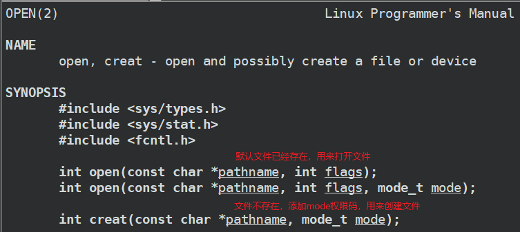

  * `flags` 是一种bitmap选项，`mode` 则是选择文件权限
  * `int fd = open("log.txt", O_WRONLY|O_CREAT|O_TRUNC, 0666)`：添加了权限码，用来创建文件，通过该种bitmap组合实现了 fopen w的效果
  * `int fd = open("log.txt", O_WRONLY|O_CREAT|O_APPEND, 0666)`：通过该种bitmap组合实现了 fopen a 的效果
  * `int fd = open("log.txt", O_RDONLY)`：不添加权限码，默认文件已经存在，会受umask的影响

* `close`

    ```c
    #include <unistd.h>
    int close(int fd);
    ```

* `write`

    ```c
    #include <unistd.h>
    ssize_t write(int fd, const void *buf, size_t count);
    ```

    * `buf` 计划写入的缓冲区
    * `count` 要写的字节数
    * 返回写入的字节数

* `read`

    ```c
    #include <unistd.h>
    ssize_t read(int fd, void *buf, size_t count);
    ```

    * 参数和write一样
    * 返回读到的字节数，若读到的是0，则意味着文件结束了，注意：换行和回车也是有效字符，不为0！

## *文件描述符 File Descriptor*

### 文件描述符fd引入

* 0，1，2号fd对应的分别是stdin，stdout，stderr
  * 验证

      ```c
      printf("stdin: %d\n", stdin->_fileno);
      printf("stdout: %d\n", stdout->_fileno);
      printf("stderr: %d\n", stderr->_fileno);
      ```

      输出结果分别为0，1，2
  
  * stdout 和 stderr 的区别：对应的外设可以理解为都是显示器，但是是不同的“显示器”，但对其做重定向到磁盘文件时，只有stdout会被重定向
  * 将 stdout 和 stderr 分开重定向到两个txt文件中：`./myfile > ok.txt 2> err.txt` 或者重定向到1个文件中：`./myfile > log.txt 2>&1`
* 进程要访问文件必须先打开文件，而一个进程可以打开多个文件。
* 文件要被访问，前提是要被加载到内存中才能被直接访问。OS内部为了管理每一个被打开的文件，构建 struct file（其中包含了每一个被打开的文件的几乎所有内容，不仅仅包含属性）。创建一个struct file的对象，充当一个被打开的文件，多个文件则struct file以链表的形式组织起来

    ```c
    struct file {
        struct file *next;
        struct file *prev;
        // 包含了一个被打开的文件的几乎所有的内容（不仅仅包含属性）
        // 文件的属性本来是保存在硬盘上的，加载入内存的时候也被加载进struct file中
    }
    ```
    
* **fd在内核中，本质是一个数组下标**。内核中进程的PCB结构体有一个\*files，它指向fd_arrary 文件描述符表，fd就是这个数组的下标，OS通过该下标来找到需要进行操作的文件

    

### fd和重定向 redirection

* fd分配规则：优先分配最小的，且违背占用的fd
* 输出重定向试验：为显示器默认分配的fd\==1，现在将fd\==1重定向到自定义文件 `log.txt` 中
* 重定向的本质：在OS内部，更改fd对应内容的指向

```c
int main() {    
    close(1);    
    // 这里的fd的分配规则是：优先分配最小的没有被占用的文件描述符    
    int fd = open("log.txt", O_WRONLY | O_CREAT | O_TRUNC, 0666);    
    if (fd < 0) {    
        perror("open");    
        return 1;    
    }      
    printf("fd: %d\n", fd);    
    fprintf(stdout, "hello fprintf\n");    
    const char *s = "hello fwrite";    
    fwrite(s, strlen(s), 1, stdout);    
    
    fflush(stdout);    
    close(fd);    
    return 0;    
}    
```

* `int dup2(int oldfd, int newfd)` 系统调用进行重定向：改变文件描述表 `struct file* fd_array` 中存储的文件指针，将newfd下标存放的文件流指针替换为oldfp下标所存放的文件指针以完成重定向

    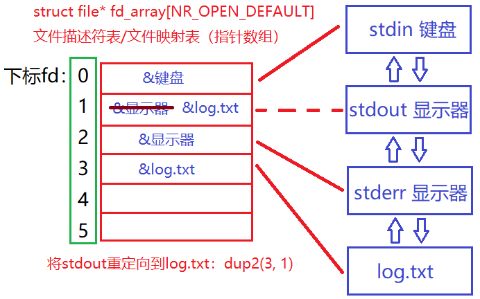

### 深度理解Linux下一切皆文件：Virtual File System VFS

Linux中采用面向对象或者说是多态的方法来设计IO。通过将函数指针写入struct file中的方法给每一个文件读写接口

```c
struct file {    
    int size;    
    mode_t mode;    
    int user;    
    int groupt;    
    // ...     
    // 函数指针    
    int (*readp)(int fd, void *buffer, int len);    
    int (*writep)(int fd, void *buffer, int len);    
    // ...     
}    
```

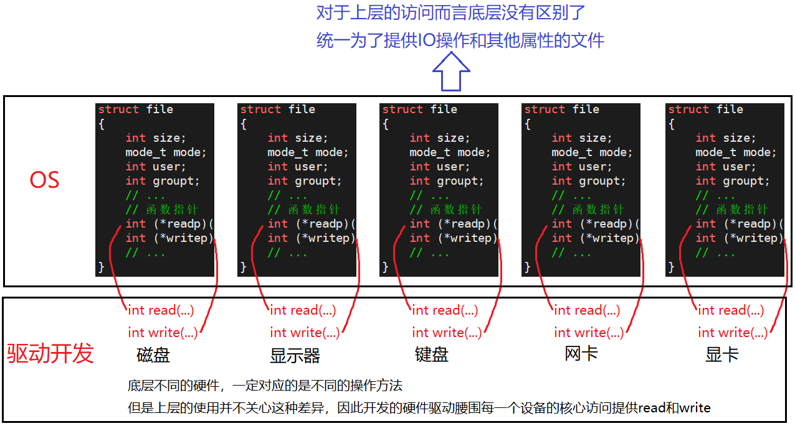

## *缓冲区* Buffer

### 缓冲区基础

* 为什么要有缓冲区？ -- Cache写方法，提高系统效率
  * 写透模式 Write Through WT：慢、成本高
  * 写透模式 Write Back WT：快速、成本低
* 缓冲区的刷新策略
  * 立即刷新
  * 行刷新/行缓冲 `\n`：一般是显示器采用这种刷新策略
  * 满刷新/全缓冲：缓冲区满了才刷新，一般是磁盘文件考虑效率采用这种刷新策略
  * 特殊情况
    * 用户强制刷新 `fflush`
    * 进程退出时若没有被 `close(fd)` 的话就强制刷新
  * 所有设备处于效率考量都倾向于使用全缓冲。这是因为在和外部设备IO的过程中，数据量的大小不是主要矛盾，OS和外设预备IO的的过程才是最耗费时间的，全缓冲可以有更少次的IO，从而提高了效率。其他刷新策略是结合具体情况做的妥协，如显示器是因为给用户看的，需要同时考虑到效率和用户体验
* 缓冲区的位置

### 缓冲区试验

<div align="center"></div>

* 现象：同样的一个程序，向显示器打印时只输出4行文本，但向磁盘上的普通文件重定向打印时就变成了7行，其中C的IO接口打印了2次，而系统接口则和向显示器上打印一样只打印了一次
* 原因：直接调用是写给stdout，策略是行缓冲；后来重定向到文件中，对于磁盘上的文件刷新策略是全缓冲，父进程产生的数据还保留在它的PCB上下文数据中，父子进程退出的时候一并刷新
* 函数退出的时候强制刷新缓冲区，这是一个将数据写给OS的过程，即发生了写时拷贝
* 从试验结果可以看到，缓冲区的刷新策略改变并不会影响系统调用，这说明缓冲区是由语言层面维护的，而非系统层面

## *C语言FILE结构体和用户层缓冲区的模拟实现*

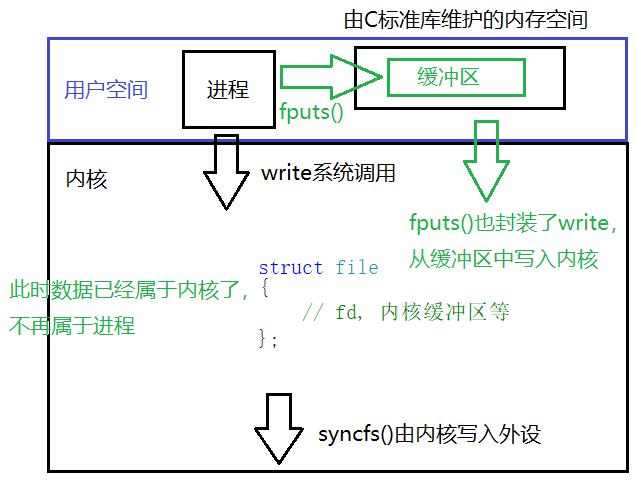

### 文件描述符fd和文件流指针FILE关系

* C语言层面上为每一个文件定义了FILE结构体（注意系统层面对文件的管理是通过封装fd的file结构体），FILE结构体中不仅封装了fd，还维护了该文件的缓冲区，FILE被称为文件流 stream
* 上层语言必须通过fd，并通过语言层次上维护缓冲区和指定刷新策略，比如Cpp的cout

### C语言层面上的FILE结构体模拟实现

* FILE结构体（并不是全部）

    ```c
    typedef struct MyFILE_ {
        int fd;
        char buffer[1024];
        int end; // 当前缓冲区的结尾
    } MyFILE;
    ```
    
* `fopen`：以w模式为例

    ```c
    MyFILE *fopen_(const char *pathname, const char *mode) {
        assert(pathname && mode);
        MyFILE *fp = NULL;
    
        if (strcmp(mode, "w") == 0) {
            int fd = open(pathname, O_WRONLY | O_TRUNC | O_CREAT ); // 封装系统调用
            if (fd >= 0) {// 若打开文件失败返回<0，则什么都没有发生，直接退出else if后返回fp == NULL
                fp = (MyFILE*)malloc(sizeof(MyFILE));
                memset(fp, 0, sizeof(MyFILE));
                fp->fd = fd;
            }
        }
        else if (strcmp(mode, "w+") == 0); // ... 其他模式的实现
        return fp;
    }
    ```
    
* `fputs_`：以stdin为例

    ```c
    void fputs_(const char *message, MyFILE *fp) {
        assert(message && fp);
        strcpy(fp->buffer + fp->end, message); // 若buffer里已经有数据了，则end!=0
        fp->end += strlen(message);
    
        printf("%s\n", fp->buffer); // 用来debug
        
        // 暂时没有刷新，刷新策略是用户通过执行C标准库中的代码逻辑来完成刷新动作的
        // 因为C提供了缓冲区，通过刷新策略，减少了IO的执行次数（数据量不变），IO的本质就是write和read等系统接口
        if (fp->fd == 0){} // stdin 涉及到键盘等硬件的IO比较复杂
        else if (fp->fd == 1) { // stdout
            if (fp->buffer[fp->end - 1] == '\n') {
                fprintf(stderr, "fflush: %s", fp->buffer);
                write(fp->fd, fp->buffer, fp->end);
                fp->end = 0;
            }
        }
        else if (fp->fd == 2) { /*stderr*/}
        else { /*其他文件*/}
    }
    ```
    
* `fclose`

    ```c
    void fclose_(MyFILE *fp) {    
        assert(fp);    
        fflush_(fp);    
        close(fp->fd); // 封装系统调用    
        free(fp);    
    }  
    ```
    
* fwite的逻辑流（->代表封装顺序）：`fwrite() -> FILE* -> fd -> write -> write(fd, ...) -> 执行OS内部的write方法 -> 能找到进程的 PCB，即 tast_struct -> *fs -> files_struct -> fd_array[fd] -> struct file -> 内存文件 -> 操作`

* `fflush`

    ```c
    void fflush_(MyFILE *fp) {
        assert(fp);
        if (fp->end != 0) {//end!=0就说明缓冲区里有数据
            // 暂且认为刷新了 -- 其实是把数据刷新到了内核
            // 若想把数据手动写到外设里，要用sync
            write(fp->fd, fp->buffer, fp->end);
            syncfs(fp->fd);
            fp->end = 0;
        }
    }
    ```

## *文件系统与 inode*

### 磁盘物理结构及其数据抽象

* 物理结构

    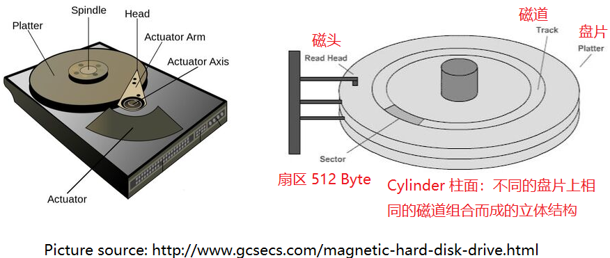

* 将磁盘抽象成一个线性数据结构

  * 
  * 将数据存储到磁盘的过程变成了将数据存储到该数组
  * 找到磁盘特定扇区的位置变成了找到数组特定的位置
  * 对磁盘的管理变成了对该数组的管理
  * CHS寻址 Cylinder-Head-Sector：C 对应的是哪一个磁头，H 对应的是哪一个磁道，S 对应的是哪一个扇区
  * 虚拟数组的地址系统：LBA Logical Block Address

### 文件系统

<div align="center">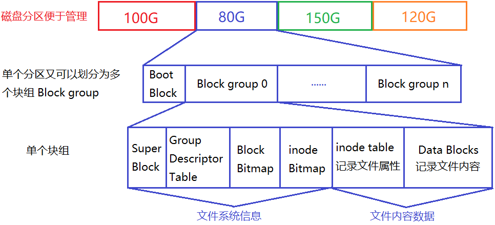</div>

* 虽然磁盘的基本单位是512 Byte的扇区（这个是由计算机科学家经过试验设计出来的最优方案），但OS和磁盘进行IO的基本单位是一个块 Block 8*512 Byte = 4KB。这么设计的理由主要有两个
  * 512字节太小，可能会导致多次IO，进而导致系统效率降低
  * 为了解耦硬件和软件设计，若将OS的控制与硬件强耦合，则若未来硬件更改了，OS也要进行大幅修改
* Boot Block 启动块：是为了能够使OS正常启动需要的数据，为了系统的安全可能在每个分区里都会存储一份
* inode：每一个inode是一个大小一般为128字节的空间，保存的是对应文件的属性。其中有一个文件属性叫做inode编号，是每一个文件的唯一身份标识
* Block group 块组组成
  * Super Block 超级块：整个文件系统的属性信息，每个block group都有一份备份也是为了整个硬盘的安全
  * GDT 块组描述符：这是当前块组的属性信息，即块组的大小、使用情况、inode使用情况等
  * Data Blocks：多个4KB块的集合。Linux文件=内容+属性，属性分开保存，因此 Data Blocks 里保存的都是特定文件的内容
  * Block Bitmap：每个bit标识一个Block是否空闲可用
  * inode Table 节点表：该块组内所有文件的inode空间的集合
  * inode Bitmap inode位图：每个bit标识一个inode是否空闲可用
* `struct inode`

    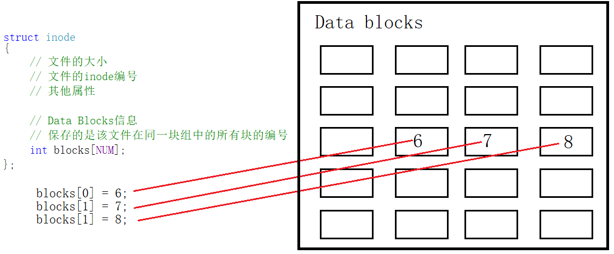

### inode与文件名的关系

* linux中找到文件的过程：inode编号 -> 分区特定的block group -> inode -> 文件属性、内容
* linux中的inode属性里面，没有保存文件名
* linux下一切皆文件，因此目录也有自己的inode和data block，目录下的文件的文件名和inode编号映射关系都存储在目录的data block里。文件名和inode编号互为key值

### 系统的文件操作

* 初始化就是设置文件系统中的bitmap中等数据，使用文件系统前必须要进行初始化
* 创建文件：在目录中创建文件必须要有写权限，也就是要往目录的data block里写入文件的文件名和inode。由用户给出文件名，返回inode
* 删除文件：将相关的bitmap置0，并不一定要将相关data block覆盖或置0，所以拷贝文件速度很慢（因为就是硬写入），而删除很快。因此很多被删除的文件可以通过找到曾经的inode恢复文件，前提是曾经的inode和data block没有被覆盖或重复占用
* 查看文件：通过目录的data block找到记录的文件属性和内容，然后进行操作

### 软硬连接 soft link and hard link

* 软连接：快捷方式，是一个独立的文件，有独立的inode，指向对应的文件路径
* 硬链接：起别名，不是独立的文件，和指向的文件的inode相同。创建硬连接仅仅是在指定的目录下，建立了文件名和指定inode的映射关系
* 文件属性中有一个数字称为硬连接数记录了该文件相关的硬连接（包括本身）数，当删除一个文件时，对该数字--，知道引用计数为0时该文件才真正被删除
* 取消连接关系：`unlink`
* 默认创建目录的引用计数（硬连接）是2：目录名映射到了inode、自己目录内部的 `.` 也映射到了目录的inode。目录会自动生成两个硬连接 `.` 和 `..`，前者指向本身，后者指向上一级目录，因此可以通过硬连接数算出当前目录包含多少个直接子目录 -- 硬连接数-2

# 进程间通信 IPC

## *进程间通信介绍*

### 进程间通信的必要性

* 单进程无法使用并发能力，更无法实现多进程协同
* 传输数据，同步执行流，消息通知等

### 进程间通信的技术背景

进程是具有独立性的。虚拟地址空间+页表保证了进程运行的独立性（进程内核数据结构+进程的代码和数据），因此通信的成本会比较高

### 进程间交换的本质

对进程的设计令进程运行具有天然的独立性，因此进程之间向通信存在困难

**进程间通信的本质就是让不同的进程看到同一份资源（内存空间）**

资源的不同决定了不同各种类的通信方式，比如管道就是提供共享文件资源的一种通信方式

### 进程间通信的目的

* 数据传输和资源共享
* 通知：一个进程需要向另一个或另一组进程发送消息
* 进程控制

### 进程间通信的发展

* 管道：Linux原生提供
  * 匿名管道 Anonymous pipe
  * 命名管道 Named pipe
* System V IPC 进程间通信：多进程单机通信
  * System V 共享内存 Shared memory
  * System V 消息队列（很陈旧，不常用）
  * System V 信号量：主要用于同步和互斥
* POSIX IPC 进程间通信：多线程网络通信
  * 消息队列
  * 共享内存
  * 信号量
  * 互斥量
  * 条件变量
  * 读写锁

## *管道*

### 管道原理

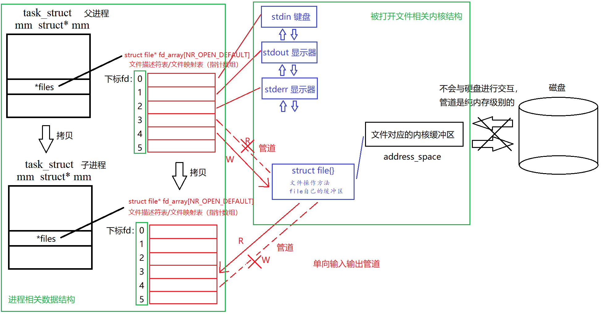

* 先看到同一份资源：父进程分别以读写方式打开同一个文件
  * `struct file` 是共享的，例子：printf都是向同一个显示器上打印！
  * 为什么父进程要以读写方式打开，而不是直接以写的方式打开？因为如果以只写方式打开，那么子进程继承的时候就会失去读功能

* fork() 创建子进程
* 管道系统设计来**专用于单向通信**的，所以双方进程各自关闭自己不需要的文件描述符。既可以选择父进程读子进程写，也可以选择父进程写子进程读，这是看个人需求的

注意：管道通信是一种纯内存级别的通信，不会将数据放到磁盘中（称为落盘或持久化 Redis）

### 匿名管道demo

需要手动两次open文件才能得到文件描述符吗？不需要，使用 `int pipe(int pipefd[2]);` 系统级调用

* 输出型参数，通过调用它来得到被打开的文件fd
* 里面封装了两次open，一次以读打开管道文件，一次以写打开管道文件

```cpp
//头文件
#include <iostream>
#include <unistd.h>
#include <assert.h>
#include <cstdio>
#include <cstring>
#include <sys/types.h>
#include <sys/wait.h>
using namespace std;
```

代码主体：

```cpp
// 为什么不定义全局buffer来进行通信？因为有写时拷贝的存在，数据是父子进程各自私有的，无法更改通信
int main() {
    //1. 创建管道
    int pipefd[2] = {0}; // pipefd[0]：读端，pipefd[1]：写端
    int n = pipe(pipefd);
    assert(n != -1);
    (void)n; //在realease下assert无效，若此时n是-1，那么需要证明n被使用过，否则会有很多报警信息

#ifdef DEBUG //条件编译
    cout << "pipefd[0]: " << pipefd[0] << endl;
    cout << "pipefd[1]: " << pipefd[1] << endl;
#endif

    //2. 创建子进程
    pid_t id = fork();
    assert(id != -1);
    if (id==0) {
        //子进程
        //3. 构建单向通信的信道，父进程写入，子进程读取
        //3.1 关闭子进程不需要的写端fd
        close(pipefd[1]);
        char buffer[1024];
        while (true) {
            ssize_t s = read(pipefd[0], buffer, sizeof(buffer)-1);
            if (s > 0) {
                buffer[s] = '\0'; //约定读的是C字符串，因为read是系统调用不会自动添加\0，所以手动添加
                cout << "child get a message[" << getpid() << "] Father#" << buffer << endl;
            }
        }
        close(pipefd[0]); //可写可不写，退出了之后自动关闭
        exit(0);
    }
    //父进程
    //3. 构建单向通信的信道
    //3.1 关闭父进程不需要的读端fd
    close(pipefd[0]);
    string message = "我是父进程，正在发送信息";
    int count = 0; //计数器，记录发送信息的条数
    char send_buffer[1024];
    while (true) {
        //3.2 构建一个变化的字符串
        snprintf(send_buffer, sizeof(send_buffer), "%s[%d]: %d", message.c_str(), getpid(), count++);
        //3.3 写入
        write(pipefd[1], send_buffer, strlen(send_buffer));
        //3.4 故意sleep
        sleep(1);
    }
    pid_t ret = waitpid(id, nullptr, 0);
    assert(ret > 0);
    (void)ret;
    close(pipefd[1]);
    return 0;
}
```

### 进程池 Process Pool

一个主进程分配业务，通过每个管道为其对应的子进程分配业务

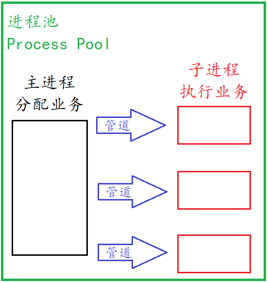

### 总结 Linux 管道 `|` 的特点

命令行 `|` 的底层就是兄弟进程之间的匿名管道通信

* 管道是用来进行**具有血缘关系**的进程间通信，常用于父子通信
* 管道是有访问控制的（同步和互斥机制），管道也是有容量大小的，若不进行控制，可能会丢失信息。`ulimit -a` 可以发现Linux中管道的默认大小为4096Byte
  * 写快，读满，写满了就不能再写了，writer必须阻塞等待
  * 写慢，读快，管道没有数据的时候，reader必须阻塞等待
  * 写关，读0，标识读到了文件结尾
  * 读关，写继续写，OS终止写进程。写段可以感应到读端关闭，这是通过struct file里的引用计数器知道的
* 管道提供的是面向字节流式的通信服务，即面向字节流，通过协议来定制。表现为读和写的次数可能不同，比如可能会写10次，读1次
* 管道的本质就是一种特殊的**内存级文件**，文件的生命周期是随进程的，因此管道的生命周期也是随进程的。
* 管道是单向通信的，这是由内核实现决定的，是半双工通信的一种特殊情况
  * 半双工 Half-duplex Communication ：通信方要么收要么发
  * 全双工 Duplex Communication：通信放可以同时收发

## *fifo 命名管道*

### 命名管道与匿名管道的区别

匿名管道只能是具有血缘关系的进程之间的通信，如果是完全不相干的进程之间想要通信该怎么实现呢？

进程间通信的本质就是让不同的进程看到同一份资源，匿名管道做到这点的方式是通过让子进程继承父进程，而命名管道则采取通过同一个fifo文件

### `mkfifo` 系统调用

```c
#include <sys/types.h>
#include <sys/stat.h>
int mkfifo(const char *pathname, mode_t mode);
```

创建一个fifo管道文件

* 参数
  * `const char *pathname`：创建位置
  * `mode_t mode`：fifo文件的权限
* 成功返回0，若出错就会返回-1，并自动设置errno

### demo

## *System V 共享内存*

UNIX System V 是Unix众多版本中的一支

**共享内存区是最快的IPC形式**。一旦这样的内存映射到共享它的进程的地址空间，这些进程间数据传递不再涉及到内核，即不再需要执行内核提供的系统调用来传递数据

### 共享内存通信的原理

在动静态库那一部分中，动态库的原理就是将动态库载入到物理内存中，然后通过页表与调用的进程的虚拟内存建立映射关系

通信的本质就是要看到同一块资源，这个资源可以是文件，也可以是内存。共享内存通信的原理和动态库一样，就是不同进程之间共享同一块内存区，以此来进行直接通信。==方法就是约定通过同一个key找到同一份共享内存==

创建共享内存与删除共享内存由OS完成；关联共享内存与去关联共享内存由进程完成

### 内核中的共享内存数据结构

OS中会存在大量的贡献内存，内核要维护这些共享内存块，因此OS也会维护管理共享内存的数据结构

共享内存要被管理 -> `struct shmid_ds{}` -> `struct ipc_perm` -> `key(shmget)`（用户提供的共享内存的唯一值）

```c
struct shmid_ds {
    struct ipc_perm shm_perm; /* operation perms */
    int shm_segsz; /* size of segment (bytes) */
    __kernel_time_t shm_atime; /* last attach time */
    __kernel_time_t shm_dtime; /* last detach time */
    __kernel_time_t shm_ctime; /* last change time */
    __kernel_ipc_pid_t shm_cpid; /* pid of creator */
    __kernel_ipc_pid_t shm_lpid; /* pid of last operator */
    unsigned short shm_nattch; /* no. of current attaches */
    unsigned short shm_unused; /* compatibility */
    void *shm_unused2; /* ditto - used by DIPC */
    void *shm_unused3; /* unused */
};
```

### 共享内存接口函数

* `shmget` 函数创建共享内存

  ```c
  #include <sys/ipc.h>
  #include <sys/shm.h>
  int shmget(key_t key, size_t size, int shmflg);
  ```

  * 参数
    * `key_t key`：这个共享内存段名字
    * `size_t size`：建议设置成为页（磁盘与内存IO的单位，4KB）的整数倍，系统分配的时候都是按页的单位倍给的
    * `int shmflg`：由九个权限标志宏位图构成，它们的用法和创建文件时使用的mode模式标志位图是一样的，下面是几个常用的
      * `IPC_CREAT`：创建共享内存，若已存在，就获取；若不存在，就创建
      * `IPC_EXCL`：不单独使用，必须与 `IPC_CREAT` 用 `|` 配合使用，若不存在指定的共享内存，就创建它；若不存在，就出错返回。通过配合使用的方法可以保证，若 `shmget` 函数调用成功，一定是一个全新的共享内存
  * 返回值：成功就返回一个非负整数，即该共享内存段的标识码；失败就返回-1

* `shmctl` 函数用于控制共享内存

  ```c
  #include <sys/ipc.h>
  #include <sys/shm.h>
  int shmctl(int shmid, int cmd, struct shmid_ds *buf);
  ```

  * 参数·
    * `shmid`：由 `shmget` 返回的用户级别的共享内存标识码
    * `cmd`：将要采取的动作
      * `IPC_STAT`：把 `shmid_ds` 结构中的数据设置为共享内存的当前关联值
      * `IPC_SET`：在进程有足够权限的前提下，把共享内存的当前关联值设置为 `shmid_ds` 数据结构中给出的值
      * `IPC_RMID`：删除共享内存段

    * `buf`：指向一个保存着共享内存的模式状态和返回权限的数据结构

  * 返回值：成功返回0，失败返回-1

* `shmat` 函数将共享内存段连接到进程空间与`shmdt` 函数将共享内存段与当前进程脱离

  ```c
  #include <sys/types.h>
  #include <sys/shm.h>
  void *shmat(int shmid, const void *shmaddr, int shmflg); //关联
  int shmdt(const void *shmaddr); //去关联
  ```

  * 参数
    * `shmaddr`：指定需要挂接的共享内存空间的地址，这个地址用户一般都是不知道的，因此一般都指定为 `nullptr`，让内核自动选择一个地址
    * `shmfig`
  * 返回值：成功返回一个指针，指向共享内存第一个字节；失败返回-1。类似于malloc的使用，需要自己进行强转匹配

### 生成shmid

`shmget` 要使用的 `key` 是内核级别的，`shmid` 是用户级别的，实际上用户操作都用 `shmid`

因此还需要用 `ftok` 先生成一个内核级别的key喂给 `shmget`

```c
#include <sys/types.h>
#include <sys/ipc.h>
key_t ftok(const char *pathname, int proj_id);
```

**总体的workflow是：用户自定义的 pathname 和 proj_id `-> ftok() -> shmget()` 得到用户级别的 `shmid`** 

### 查看和删除共享内存

* 查看：可以通过 `ipcs -m` 查看创建的共享内存； `ipcs -q` 查看创建的信号队列； `ipcs -s` 查看创建的信号量
* 删除
  * system V下的共享内存，生命周期是随内核的，也就是说如果不显式删除，只能通过kernel的重启来解决
  * `ipcrm -m shmid` 删除共享内存
  * 调用系统接口 `shmctl` 进行删除

### 共享内存的优缺点

* 优点：速度最快，通信过程中不需要调用系统调用和IO，管道需要至少4次IO拷贝
* 缺点：没有任何的访问控制，共享内存被双方直接看到，属于双方放的用户空间，可以直接通信但是不安全

可以通过共享内存+管道的方法进行一定的访问控制

## *信号量 Semaphore*

### 信号量作用：实现同步互斥的访问控制

共享内存没有访问控制，可以**通过信号量对其进行控制和资源保护**，但操作非常复杂

信号量不是以传送数据为目的，而是为了控制双方，让双方协调步调

### 信号量概念

临界资源的不同区域是可以同时访问的，但要保证不能有多余的线程以及要保证访问的是不同的资源（分配哪些资源这是由上层业务决定的）


为了保证对临界资源不同区域访问的互斥性，产生了信号量机制。任何进程想访问临界资源，就必须先申请信号量，若申请成功，就一定能访问临界资源中的一部分资源

**信号量本质是一个计数器**，当信号量仅为1的时候，表现的就是互斥特性，称为二元信号量，常规信号量称为多元信号量

悖论：信号量或者说计数器本身就是一种临界资源

**信号量是一个计数器，这个计数器对应的操作是原子的**，信号量的PV操作是原子的

* `--`：释放资源 P
* `++`：申请资源 V

## *System V 总结*

### 接口总览

* 创建 `shmget`, `msgget`, `semget`
* 控制 `shmctl`, `msgctl`, `semctl`
  * `shmat`, `shmdt`, `msgsnd`, `msgrcv`, `semop`
* 查看ipc资源 `ipcs -m/-q/-s`
* 删除ipc资源 `ipcrm -m/-q/-s`

### 统一设计

先回顾柔性数组，然后看2022-11-03 2:45:00开始的内容

## *扩展：mmap*

mmap也是一种共享内存，来实现进程通信，但是它可以直接映射到文件中

[(26条消息) mmap详解_augfun的博客-CSDN博客_mmap参数说明](https://blog.csdn.net/augfun/article/details/113667932)

# 进程信号

## *Introduction*

### 信号概念

**信号是进程之间事件异步通知的一种方式，属于软中断**

一个信号即使在没有收到信号的时候，也可以知道自己应该处理合法信号，这是在设计OS的进程信号机制时候就写好的

### `kill -l` 命令查看系统定义的信号列表

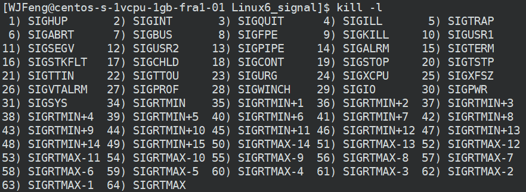

* Linux共有62种信号（没有32和33号信号），信号封装成了宏，它的序列号就是宏的值。这些宏可以在 signal.h 中找到它们的定义
* 1-31号是普通信号，编号34号以上的是实时信号，用于实时系统
* 9号信号是一个管理员信号，不能被捕捉自定义，所以它可以杀死所有进程

### 信号写入的本质

最底层给进程写入信号的方式都是一样的，就是修改PCB的信号数据结构

PCB中的信号数据结构是用位图来表示。所谓给进程发送信号并不是通过硬件，只是OS作为系统管理者有权限获取PCB的数据，直接去修改PCB中的sig位图，其实不应该说发生信号，而应该说写入信号

```c
task_struct {
    uint32_t sig;
}
```

### 信号的生命周期

* 信号产生
* 信号处理
* 信号处理后

## *产生信号*

### 通过终端按键产生信号

CPU通过中断机制处理硬件信号，按键输入、硬盘写入数据完毕、网卡收到数据等和硬件相关的操作都是通过中断机制和CPU进行沟通的

下面signal的程序就是这种信号产生方式

### 调用系统函数向进程发信号

kill系统调用

```c
#include <sys/types.h>
#include <signal.h>
int kill(pid_t pid, int sig);
```

raise库函数：给自己发信号

```c
#include <sys/types.h>
#include <signal.h>
int kill(pid_t pid, int sig);
```

### 由软件条件产生信号

* 管道中读端被关闭的时候，此时再在读端进行write操作，进程会写入13号 `SIGPIPE`信号，write进程退出，这是一种软件条件产生的信号 

* `alarm` 函数定时器中断：在固定计时后向进程写入26号 `SIGALRM` 信号，该信号默认终止程序

  ```c
  #include <unistd.h>
  unsigned int alarm(unsigned int seconds);
  ```

### 硬件异常产生信号

进程崩溃的本质，是该进程收到了异常信号。在C/C++当中除零，内存越界等异常，在系统层面上，是被当成信号处理的

* 除零：CPU内部有一个状态寄存器，当除0的时候，该状态寄存器就会被设置为有报错，浮点数越界

  一旦该状态寄存器被置1，OS就会通过该硬件识别到CPU内有报错，进而识别是那一个进程让状态寄存器置了1，然后OS就会修改该进程的PCB相关信号位图，目标进程在合适的时候就会处理信号

* 越界和野指针：在语言层面使用的地址（指针），其实都是虚拟地址，要通过MMU（硬件）和页表（OS数据结构，软件）映射到物理内存。若虚拟地址有问题，地址转换的工作就会出问题，会表现在MMU上。OS发现硬件出现了问题，就会去找是哪一个进程出现了问题，然后OS就会修改该进程的PCB相关信号位图，目标进程在合适的时候就会处理信号

## *信号相关内核数据结构*

### 常用信号概念

* 信号递达 Delivery：实际执行信号的处理动作
* 信号未决 Pending：从信号产生到实际递达信号的过程状态
* 阻塞 Block
  * 被阻塞的信号将保持在Pending状态，知道进程解除对它的阻塞，才会执行递达
  * 阻塞和忽略是不同的：忽略是已经处理了，它采取的方法就是 `SIG_IGN` 忽略方法，直接将对应信号的pending位图重置会0；而阻塞则是不会去执行这个信号

### 信号在内核中的表示

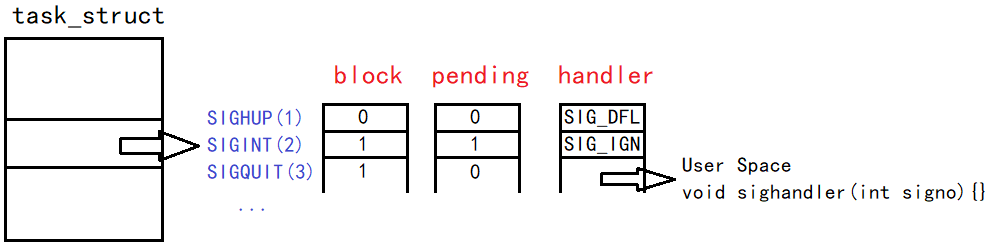

* 每个信号都有两个标志位来表示阻塞和未决，还有一个函数指针用来表示信号所对应的动作，即三种处理方式：默认、忽略、用户自定义handler。信号产生时，内核在PCB中将Pending设为1，直到信号被递达了才重置回0，即通过pending信号集位图来识别信号的到来，通过handler指针数组来处理到来的信号
* block信号集（信号屏蔽字 Signal mask）对应的比特位为1时，即使pending了的信号也会被拦截，不会被递达，若接收到了该信号pending状态将一直都会是1
* 因为是位图，所以连续发送相同信号时，一个信号至多只会被执行一次，在未重置的情况下多余的会被丢弃。但如果是实时信号，那么每个相同信号对会被执行，PCB会为实时信号维护一个队列

###  `sigset_t` 信号集：针对信号的用户级数据结构

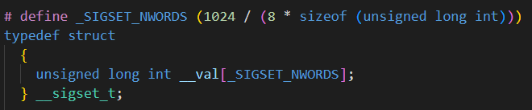

每个信号只需要表示二元的状态，因此用一个位图来实现未决和阻塞标志，即使用被称为 `sigset_t` 信号集的内核位图结构

因为操作系统版本不同，数据类型不同，不能直接对这个位图进行位操作，要使用提供的接口

### `sigset_t` 信号集接口函数

```c
#include <signal.h>
int sigemptyset(sigset_t *set); //清空指定信号集，表示该信号集不包含任何有效信号
int sigfillset(sigset_t *set); //
int sigaddset (sigset_t *set, int signo);
int sigdelset(sigset_t *set, int signo);
int sigismember(const sigset_t *set, int signo); //检查signo信号是否在set为1
```

## *信号处理与控制*

一共有三种处理与控制信号集的方式，`sigprocmask` 修改阻塞信号集，`sigpending` 修改pending信号集，`signal` 定制信号行为

### <span id="core_dump">Core Dump 核心转储机制</span>

用 `man 7 signal` 查看signal的manual，可以发现以下部分信号的终止作用。其中1号信号和2号等Action为Term的信号，作用就是将进程终止，而3号、4号等Action为Core的信号，除了终止进程，还会进行一种称为core dump的操作

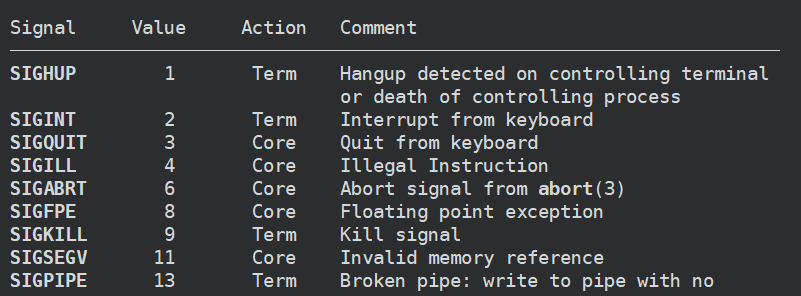

当一个进程因异常终止时，会把进程在运行中对应的异常上下文数据core dump到磁盘上方便调试，core dump生成的文件被命名为”core 进程号“。同时还要将退出状态码status中的core dump位置1

core文件的使用

* 在编译的时候添加 `-g` 开启调试模式
* 然后 gdb 进入调试，`core-file CORE-DUMP-FILE` 导入core dump文件就可以得到错误相关信息

注意：线上云服务器和实际工作中都是默认关闭生成core dump文件的（可以使用 `ulimit` 来修改这个限制），这主要是因为core dump有两个主要缺点

* 在实际的云服务器环境中，一般都会设置自动监测项目，一旦项目因意外关闭，可能在短时间内被高频率重启，每一次重启服务都会产生core dump文件，一段时间后直接会把硬盘塞满，此时甚至会导致正整台服务器开启保护机制然后强制关闭
* core文件可能包含了一些用户或项目的敏感信息，不安全

### `signal` 信号捕捉系统调用

即使是系统默认信号，崩溃不一定会终止程序，只要对该异常信号进行捕捉并重定向。C++的异常体系就是信号捕捉的体现

用signal系统调用来捕捉信号进行重定义，改变默认信号的对应行为

```c
#include <signal.h>
typedef void (*sighandler_t)(int);
sighandler_t signal(int signum, sighandler_t handler); //函数指针回调
```

下面的程序利用 `signal` 捕捉 ctrl+c 按键发生的 `SIGINT` 信号

```c
void handler(int signo) {
    cout << "我是一个进程，刚刚获取了一个信号：" << signo << endl;
}

int main() {
    signal(SIGQUIT, handler);
    sleep(3);
    cout << "我已经设置完了" << endl;
    sleep(3);
    while (true) {
        cout << "我是一个正在运行中的程序" << getpid() << endl;
        sleep(1);
    }
    return 0;
}
```

* 现在通过signal发生一个handler设置了用户对2号信号的自定义处理方法
* 这里不是调用handler方法，这里只是设置了一个回调，当SIGINT产生的时候，该方法才会被调用
* 若不产生SIGINT，该方法不会被调用
* ctrl + c：本质就是给前台进程产生了2号信号，发送给目标进程，目标进程默认对2号信号的处理是终止自己

### `sigprocmask` 函数

调用函数 `sigprocmask` 可以读取或更改进程的信号屏蔽字（阻塞信号集）

```c
#include <signal.h>
int sigprocmask(int how, const sigset_t *set, sigset_t *oldset);
```

* 参数
  * `int how`：指示如何更改阻塞信号集
    * `SIG_BLOCK` 为指定信号添加阻塞
    * `SIG_UNBLOCK` 解除阻塞
    * `SIG_SETMASK` 覆盖式地重设
  * `const sigset_t *set`：输入参数，更改阻塞信号集
  * `sigset_t *oldset`：输出型参数，将原来的屏蔽字拷贝到这个参数里，之后若想恢复可以使用，相当于是一份拷贝
* 返回值：成功返回0，失败返回-1，如果有error会自动设置errno

### `sigpending` 函数

获取信号的pending信号集

```c
#include <signal.h>
int sigpending(sigset_t *set);
```

* `sigset_t *set` 输出型参数
* 成功返回0，出错则返回-1

## *信号捕捉*

### 内核如何实现信号捕捉

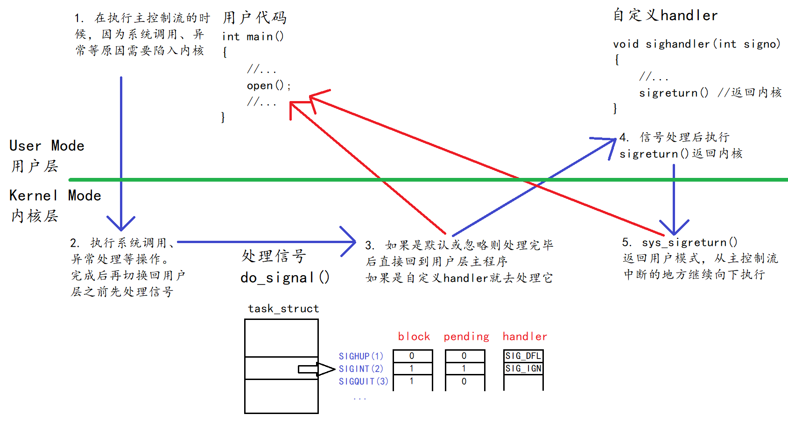

**当当前进程从内核态切换回用户态的时候（执行系统调用或执行进程调度的时候），进行信号的检测与处理**。进程的生命周期中，会有很多次机会去陷入内核（中断、陷阱、系统调用、异常等）

自定义的handler执行完毕后，不能直接回到用户态，而是要返回到内核态，从之前中断的地方继续执行，否则原来执行流不能正常执行完，比如系统调用的返回值无法获取、其他需要OS完成的操作无法完成

其中最重要的点是返回到用户层来执行用户代码的时候不能使用OS的身份，而是要回到用户的身份。因为这段代码是用户写的，存在系统漏洞，恶意代码可以利用因此获得的OS身份来执行一些损害OS的系统代码

下面给出一张快速记忆图

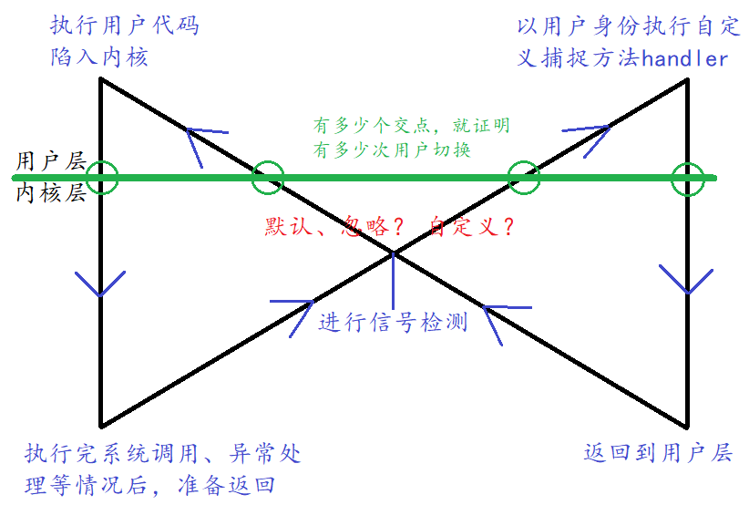

### `sigaction` 系统调用

`sigaction` 相比于 `signal` 功能更全面，用来对特定自定义实现捕捉，实现自定义的行为

```c
#include <signal.h>
int sigaction(int signum, const struct sigaction *act, struct sigaction *oldact);
```

* 参数

  * 若act指针非空，则根据act修改该信号的处理动作

  * 若oact指针非 空，则通过oact传出该信号原来的处理动作

  * act和oldact都是一个sigaction类型的结构体，需要用户对其进行设置

    ```c
    struct sigaction {
        void (*sa_handler)(int);
        void (*sa_sigaction)(int, siginfo_t *, void *);
        sigset_t sa_mask;
        int sa_flags;
        void (*sa_restorer)(void);
    };
    ```

    * `sa_sigaction` 函数指针用于实时信号
    * `flag` 默认为0
    * `sa_restorer` 不考虑
    * `sa_mask`
      * 在某个信号的处理函数被调用时，内核自动将当前信号加入进程的信号屏蔽字，当信号处理函数返回时自动恢复原来的信号屏蔽字，这样就保证了在处理某个信号时，若再次收到这种信号，那么它会被阻塞到当前处理信号结束为止。如果不这么做**可能会因为嵌套的内核陷入导致死循环**
      * 若在屏蔽当前信号的同时，还希望自动屏蔽另外一些信号，则可以用 `sa_mask` 字段来说明这些需要额外屏蔽的信号，当信号处理函数返回时会自动恢复原来的信号屏蔽字

* 调用成功则返回0，出错则返回- 1

### <span id="可重入函数">可重入函数 Reentrant</span>

同时被两个执行流，即主执行流和信号捕捉执行流调用造成执行流混乱引起内存泄漏等错误，一个最典型的场景就是链表的insert

90%以上的函数都是不可重入的，若一个函数符合以下条件之一就说它是不可重入的

* 调用了malloc或free，因为malloc也是用全局链表来管理堆的
* 调用了标准IO库，标准IO库的很多实现都是以不可重入的方式使用全局数据结构
* 可重入函数体内使用了静态的数据结构

一个函数名后缀为_r，那它就是可重入的

### `volatile`

```c
void handler (int signo) {
    flags = 1;
    printf("更改flags: 0->1\n");
}

int main() {
    signal(2, handler);
    while (!flags);
    printf("进程是正常退出的\n");
    return 0;
}
```

上面这段代码中，当采取较高级别的编译器优化后，比如 `gcc -O2`，因为编译器判断flags只是在判断，没有修改，因为此时的signal及其自定义handler属于非语言级别的系统调用，超出了语言级别的编译器管辖范畴

此时会将flags变量从内存拷贝一份移动到CPU的寄存器中，以求快速读取。此时如果用按键发信号，改变的只是内存中的拷贝量，寄存器中的不会变，此时就会陷入死循环

要解决这个问题可以使用 `volatile` 关键字，以下是BS在 *“The C++ Programming Language"* 中对 `volatile` 关键字的解释 

> A volatile specifier is a hint to a compiler that an object may change its value in ways not specified by the language so that aggressive optimizations must be avoided.

`volatile` 关键字是一种类型修饰符，用它声明的类型变量表示可以被某些编译器未知的因素更改，比如：操作系统、硬件或者其它线程等。遇到这个关键字声明的变量，编译器对访问该变量的代码就不再进行优化，从而可以提供对特殊地址的稳定访问。当将变量声明为 `volatile` 后，系统总是重新从它所在的内存读取数据，即**保持内存的可见性**

注意：`volatile` 和 `const` 是互相补充的，并不冲突

# Linux多线程

## *线程概念 Thread*

### 什么是线程

对很多任务而言，频繁的调度进程是不必要的。当进行进程切换的时候，需要调用进程调度算法，清空重载CPU中的所有上下文寄存器等，因此的切换成本是比较高的，很多时候也用不着切换进程

因此考虑用控制流对代码区、堆栈区等进行划分，这个概念就是线程 Thread

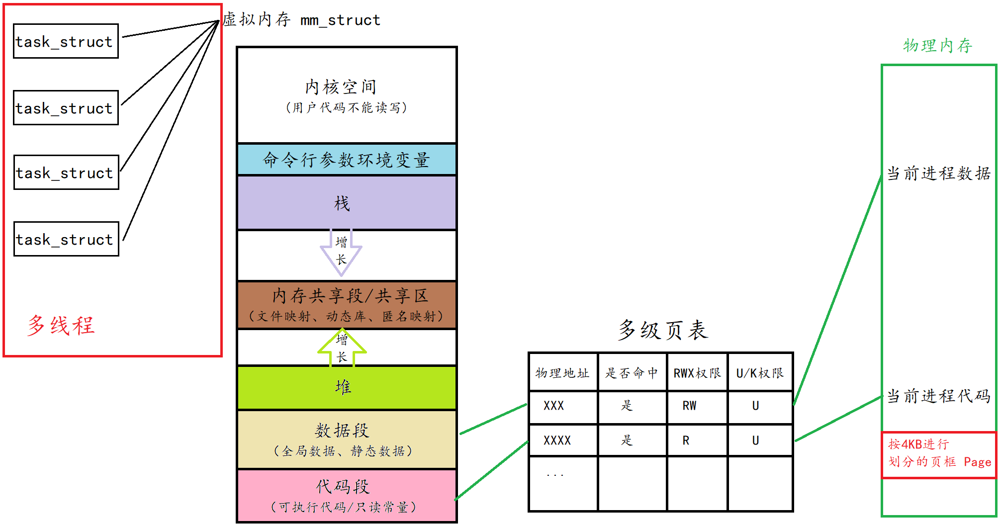

* 在一个程序里的一个执行路线就叫做线程，线程是一个进程内部的控制序列
* 若采取TCB管理线程，PCB管理进程，再管理它们之间的关系会很复杂。因此Linux采用的管理方法是全部复用PCB模拟， Win实现了真线程。因此Linux没有真正意义上的线程，而是用系统的PCB模拟实现的，Linux下的线程也称为轻量化进程 Light Weight Process  LWP
* CPU看到的基本调度单位都是线程，只有一个控制流的进程称为单执行流进程，一切进程至少都有一个执行线程，而内部有多个执行流的进程称为多执行流进程，线程是调度的基本单位
* 通过进程虚拟地址空间，可以看到进程的大部分资源，将进程资源合理分配给每个执行流，就形成了线程执行流

### 线程优点

* 创建一个新线程的代价要比创建一个新进程小得多，即线程调度的代价远小于进程调度的代价
* 线程也有自己的私有资源，但线程占用的资源要比进程少很多
* 能重复利用多核处理器的可并行数量
* 计算密集型应用，比如压缩解压缩，为了能在多处理系统上运行，将计算分解到多个线程中实现
* IO密集型应用为了提高性能，可以将IO重叠操作。线程可以同时等待不同的IO操作，比如一个线程等待硬盘，一个线程等待网卡，而单线程执行流只能串行等待

### 线程缺点

* 不合理的线程划分会降低性能损失
* 健壮性降低
* 缺乏访问控制
* 排查问题很困难

### 线程用途

* 合理的使用多线程，能提高CPU密集型程序的执行效率
* 合理的使用多线程，能提高IO型程序的IO效率

### 进程 Process vs. 线程 Thread

* 进程是资源分配的基本单位，一个进程拥有独立的地址空间资源
* 线程是调度的基本单位
* 线程共享进程数据，但是也有自己的私有数据
  * 线程ID
  * 线程相关寄存器
  * 线程栈
  * errno错误码
  * 信号屏蔽字
  * 调度优先级

进程的多个线程共享同一地址空间，因此 Text Segment、Data Segment都是共享的，若定义一个函数，在各线程中都可以调用，若定义一个全局变量，在各线程中都可以访问到，除此之外，各线程还共享以下进程资源和环境

* 文件描述符表
* 信号及其处理方式
* 当前工作目录
* 用户id和组id

### 线程异常

* 单个线程若出现除零、野指针等异常导致线程崩溃，整个进程也会随之崩溃
* 线程会影响其他线程的运行，健壮性较低

## *线程控制*

### 用户级线程库

因为Linux本质上是没有实现多线程（只是轻量化进程），所以Linux本身并不提供线程的系统调用接口。但是提供了创建轻量级进程的接口，即子进程与父进程共享一个地址空间的 `vfork` 和 `clone`，问题是这些接口用起来很麻烦，需要用户自定义线程保护等操作。如下图，线程库是一个介于用户和OS之间的交互层

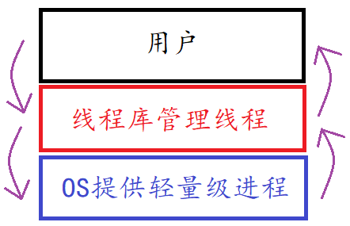

为了实现多线程的控制，Linux社区提供了pthread这个用户层的第三方原生线程库，头文件是 `pthread.h`。虽然说是第三方的库，但它和Linux系统强相关，在每一个Linux OS都要被预置

其中最常用的是POSIX版线程库

>**可移植操作系统接口**（英语：Portable Operating System Interface，缩写为**POSIX**）是[IEEE](https://zh.wikipedia.org/wiki/IEEE)为要在各种[UNIX](https://zh.wikipedia.org/wiki/UNIX)[操作系统](https://zh.wikipedia.org/wiki/操作系统)上运行软件，而定义[API](https://zh.wikipedia.org/wiki/API)的一系列互相关联的标准的总称 -- Wikipedia

当然语言层上，如C++、python等语言也提供了语言级别的线程库，但这些库基本上就是对用户层原生线程库的封装

### 理解 `pthread_t` 线程id

OS本身并不提供线程的系统调用接口是因为线程的全部实现并没有全部体现在OS内，而是OS提供服务流，具体的线程结构由用户层的库来管理。要进行管理就需要在线程库中维护相关的数据结构

主线程的独立栈结构，用的是地址空间中的栈区；**而新线程用的栈结构，用的是线程库中维护的栈结构**

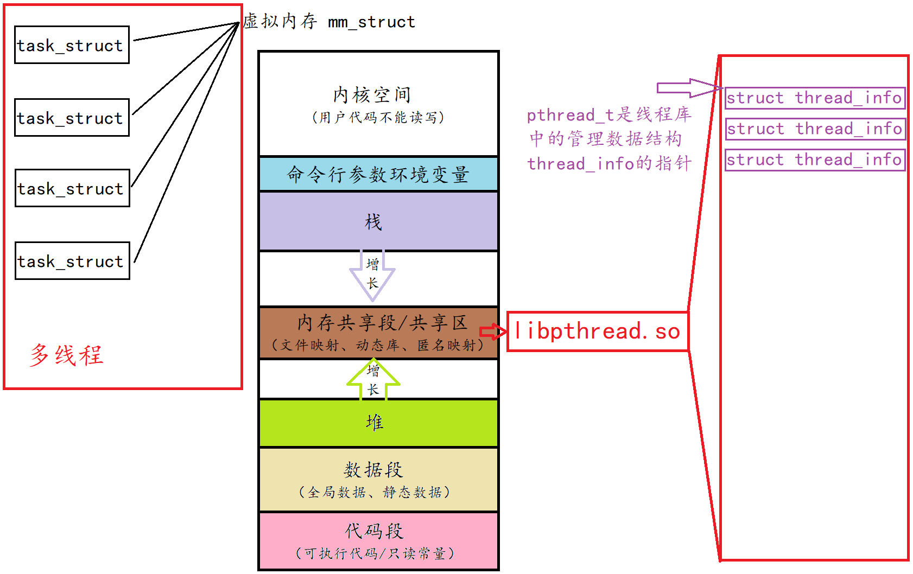

```c
struct thread_info {
	pthread_t tid;
    void *stack; //私有栈
}
```

### `tid` 与 `lwp` 标识线程身份

`tid` 是用户级别的，可以由 `pthread_self()` 得到

`lwp` 是内核级别的，需要使用 `syscall(SYS_gettid)` 来获取

```cpp
void *startRoutine(void *args) {
    while (true) {
        cout << "thread: " << pthread_self() << " |global_value: " << global_value << 
            " |&global_value: " << &global_value << " |Inc: " << global_value++ <<
            " |lwp: " << syscall(SYS_gettid) << endl;
        sleep(1);
    }
}
```

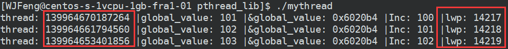

### 线程创建

```c
#include <pthread.h>
int pthread_create(pthread_t *thread, const pthread_attr_t *attr,
                   void *(*start_routine) (void *), void *arg);
//Compile and link with -pthread.
```

* 参数
  * `pthread_t *thread` 线程id
  * `attr` 线程的属性
  * `start_routine` 线程要执行的回调函数
  * `arg` 是要喂给回调函数的参数
* 创建成功返回0，失败返回errno

### 线程终止

```c
#include <pthread.h>
void pthread_exit(void *retval); //pthread_exit比较常用
int pthread_cancel(pthread_t thread);
```

* 线程的控制流 `start_routine` 内
  * 正常退出 return
  * `pthread_exit`
* 主线程内 `pthread_cancel` 取消分支线程
* 进程分离后main thread不再关心被分离thread的状态，相当于是一种延后退出

### 线程等待

```c
#include <pthread.h>
int pthread_join(pthread_t thread, void **retval);
```

* `void** retval` 是进程退出时的退出码，比如返回 `(void*)10`，它是一个二级指针输出型参数
* 线程退出时没必要像进程退出时输出32位的退出码，因为线程就是进程，线程异常整个进程退出，因此直接交给进程退出码来处理

* ```cpp
  //输出型参数
  void* ret = nullptr;
  pthread_join(tid, &ret);
  cout << "main thread join success, *ret: " << (long long)(ret) << endl;
  ```

`pthread_join` 的作用类似于进程等待 `wait`。线程退出的时候，一般必须要进行join，若不进行join，就会造成类似于进程那样的内存泄漏问题，但没有“僵尸线程”这种说法

调用该函数的线程将挂起等待，直到id为thread的线程终止。thread以不同的方法终止，通过 `pthread_join` 得到的终止状态是不同的

### 线程分离

默认情况下，新创建的线程是joinable的，线程退出后，需要对其进行 `pthread_join` 操作，否则无法释放资源，因而造成系统泄漏

若不关心线程的返回值，join是一种负担，此时可以通过进程分离来告诉系统，当线程退出时，自动释放线程资源

```c
#include <pthread.h>
int pthread_detach(pthread_t thread);
pthread_detach(pthread_self()); //对自己进程分离
```

可以是对线程组内其他线程的其他目标线程进行线程分离，也可以对自己线程分离，只要用`pthread_self()` 来获取tid就行。joinable和分离是冲突的，一个线程不能既是joinable又是分离的，会报22号错误 Invalid argument

进程分离，对应的main thread一般是不退出的，在死循环中常驻内存

## *线程互斥*

### 互斥相关概念

* 临界资源 Critical resource
  * 被多个进程或同一个进程的多个线程能够同时看到的公共资源
  * 临界资源有安全访问也有不安全访问，比如管道就是安全的
  * 若没有对临界资源进行保护，对于临界资源的访问，双方进程在进行访问的时候就都是乱序的，可能会因为读写交叉而导致的各种乱码废弃数据，导致访问控制方面的问题
  * 一个典型的例子就是父子进程同时往stdout printf，完全是乱的
* 临界区 Critical section：对多个进程而言，访问临界资源的代码被称为临界区
* 原子性 Atomicity：一件事情要么做完了，要么没做，没有中间状态。**一个操作或者多个操作要么全部执行并且执行的过程不会被任何因素打断，要么就都不执行**
* 互斥 Mutex：在访问某种资源的时候，任何时刻只允许一个执行流访问临界资源

### 抢票的例子

多线程并发操作若不加保护会产生问题，下面是一个多个线程都执行 `getTickets` 执行流的代码

```cpp
int tickets = 10000; //临界资源，可能会造成数据不一致问题

void *getTickets(void *args) {
    //访问临界资源的代码称为临界区
    const char* name = static_cast<const char*>(args);
    while (true) {
        if (tickets > 0) {
            cout << "thread[" << name << "] 抢到了票，票的编号" << tickets << endl;
            tickets--;
        }
        else {
            cout << "thread[" << name << "] 已经放弃抢票了，因为没票了" << endl;
            break;
        }
    }
    return nullptr;
}
```

* `--` 操作不是原子的，可能会导致数据不一致。CPU执行语句分为以下三步，在执行语句的任何地方，线程都有可能被切换走。若想令这三个过程不被错误的中断，需要对其加锁保护，此时操作才是原子的
  * Load tickets to registers in CPU
  * data of register--
  * wirte register to tickets
* 判断操作也不是原子的，A线程判断1>0后被切换到B线程也判断1>0，然后依次--，有可能将tickets减到负数

## *线程锁*

### 接口

```c
#include <pthread.h>
int pthread_mutex_destroy(pthread_mutex_t *mutex); //释放锁
int pthread_mutex_init(pthread_mutex_t *restrict mutex, 
                       const pthread_mutexattr_t *restrict attr); //局部初始化创建锁
pthread_mutex_t mutex = PTHREAD_MUTEX_INITIALIZER; //静态分布，不需要destroy
```

```c
#include <pthread.h>
int pthread_mutex_lock(pthread_mutex_t *mutex); //阻塞式上锁
int pthread_mutex_trylock(pthread_mutex_t *mutex); //非阻塞式上锁
int pthread_mutex_unlock(pthread_mutex_t *mutex); //解锁
```

只能对临界区加锁，而且加锁的粒度越细越好。本来线程是并发的，**加锁的本质是让线程临界区代码串行化，串行的代码越少，并发性越强，效率越高**

加锁是一套规范，只要线程通过临界区对临界资源进行访问的时候，就都要加锁，不能一部分加一部分不加

```cpp
int tickets = 10000; //临界资源，可能会造成数据不一致问题
pthread_mutex_t mutex; //全局锁

void *getTickets(void *args) {
    //访问临界资源的代码称为临界区
    pthread_mutex_lock(&mutex); //给临界区加锁
    const char* name = static_cast<const char*>(args);
    while (true) {
        if (tickets > 0) {
            cout << "thread[" << name << "] 抢到了票，票的编号" << tickets << endl;
            tickets--;
            pthread_mutex_unlock(&mutex); //解锁
            //当前线程重新申请锁的成本远低于唤醒其他线程，因此一直在跑这个线程
            //若想要其他线程也来申请，可以在临界区后面用usleep模拟唤醒其他线程
            usleep(123); //休眠微秒
        }
        else {
            cout << "thread[" << name << "] 已经放弃抢票了，因为没票了" << endl;
            pthread_mutex_unlock(&mutex); //解锁
            break;
        }
        //也不能在这里解锁，会造成死锁
        //pthread_mutex_unlock(&mutex); //解锁
    }
    //不能在while循环外面解锁，粒度太高，没人抢得到第一个线程
    //pthread_mutex_unlock(&mutex); //解锁
    return nullptr;
}

int main() {
    pthread_mutex_init(&mutex, nullptr); //初始化锁
    pthread_t tid1;
    pthread_t tid2;
    pthread_create(&tid1, nullptr, getTickets, (void*)"thread1");
    pthread_create(&tid2, nullptr, getTickets, (void*)"thread2");
    pthread_detach(tid1); //让主线程来分离
    pthread_detach(tid2);
    
    pthread_mutex_destroy(&mutex); //释放锁
    return 0;
}
```

在加锁的临界区里面，就没有线程切换了吗？可以有，但新的线程必须进行阻塞申请锁。上锁的临界区代码在运行过程中，被CPU切走，此时绝对不会有其他线程进入临界区，因为这把锁被切走的代码申请走了，此时其他线程必须阻塞等待锁资源，因此尽量不要在临界区里执行特别复杂的程序，否则会效率很低

### 锁原子性的实现

锁保护的是临界区，任何线程执行临界区代码访问临界资源的都必须先申请锁，前提是都必须先看到锁。那么这把锁本身就是临界资源。这个问题在设计锁的时候就解决了，`pthread_mutex_lock` 竞争和申请锁的过程本身就是原子的

那么要如何实现锁的原子性呢？从上面抢票的例子中可以看到 `++i` 或 `i++` 这种操作不是原子性的，因为它在编译过程中会被拆分成多个步骤，在每个步骤都有可能被CPU切走。因此我们只要保证在编译的时候是一条语句，即一个步骤，CPU不可能会拆分一个步骤，必须等它执行完再进行调度，这就保证了原子性

申请锁的原子性是通过将锁资源读入线程的寄存器只有一条汇编语句来实现的。将数据从内存读入寄存器，本质是将数据从共享（锁是全局资源）变成线程私有（寄存器上下文是被每个线程私有的）。也可以通过锁总线来实现

### 死锁 Deadlock

* 死锁是指在一组进程中的各个线程均占有不会释放的资源，但因互相申请被其他线程所占用而都不会释放资源，因此处于永久阻塞等待的情况

  ```cpp
  pthread_mutex_t mutexA = PTHREAD_MUTEX_INITIALIZER; //两把锁
  pthread_mutex_t mutexB = PTHREAD_MUTEX_INITIALIZER;
  
  void *startRoutine1(void *args) {
      while (ture) {
          pthread_mutex_lock(&mutexA);
          sleep(1);
          pthread_mutex_lock(&mutexB);
          // ...
          pthread_mutex_unlock(&mutexA);
          pthread_mutex_unlock(&mutexB);
      }
  }
  void *startRoutine2(void *args) {
      while (ture) {
          pthread_mutex_lock(&mutexB);
          sleep(1);
          pthread_mutex_lock(&mutexA);
          // ...
          pthread_mutex_unlock(&mutexB);
          pthread_mutex_unlock(&mutexA);
      }
  }
  ```

* 死锁的四个必要条件（四个条件都要满足）

  * 互斥条件：一个资源每次只能被一个执行流使用
  * 请求与保持条件：一个执行流因请求资源而阻塞时，对已获得的资源保持不放
  * 不剥夺条件：一个执行流已获得的资源，在未使用完之前，不能强行剥夺
  * 循环等待条件：若干执行流之间形成一种头尾相接的循环等待资源的关系

* 避免死锁

  * 破坏死锁的四个必要条件，主要是指破坏请求与保持条件、不剥夺条件和循环等待条件
  * 加锁顺序一致
  * 避免锁未释放的场景，减少锁分配的次数
  * 资源一次性分配

* 避免死锁算法

  * 死锁检测算法
  * 银行家算法

###  其他锁的概念

下面这些概念C++很少用到，一般都是在Java和数据库中用到

* 悲观锁 Pessimistic Concurrency Control PCC：在每次取数据时，总是担心数据会被其他线程修改，所以会在取数据前先加锁（读锁，写锁，行锁等），当其他线程想要访问数据时，被阻塞挂起
* 乐观锁 Optimistic Concurrency Control OCC：每次取数据时候，总是乐观的认为数据不会被其他线程修改，因此不上锁。但是在更新数据前，会判断其他数据在更新前有没有对数据进行修改。主要采用两种方式
  * 版本号机制 Versioning
  * CAS操作 Compare and Swap：当需要更新数据时，判断当前内存值和之前取得的值是否相等。如果相等则用新值更新。若不等则失败，失败则重试，一般是一个自旋的过程，即不断重试
* 自旋锁 spin_lock：在临界区等待时间比较短的话，采用轮询测试，询问锁资源是否到位。等待时间长还是短是通过试验确定的

## *线程安全 Thread safety*

### 线程安全的概念

线程安全是在多个线程并发执行同一段代码时，不会出现不同的结果。常见于对全局变量或者静态变量进行操作，并且没有锁保护的情况下会出现该问题

[可重入函数 Reentrant function](#可重入函数)是一种函数性质，在信号捕捉中介绍了

### 常见线程不安全情况

* 不保护共享变量的函数
* 函数状态随着被调用，状态发生变化的函数
* 返回指向静态变量指针的函数
* 调用线程不安全函数的函数

### 常见线程安全情况

* 每个线程对全局变量或者静态变量只有读取的权限，而没有写入的权限，一般来说这些线程是安全的
* 类或者接口对于线程来说都是原子操作，比如通过加锁
* 多个线程之间的切换不会导致该接口的执行结果存在二义性

### 可重入与线程安全联系

* 函数是可重入的，那就是线程安全的
* 函数是不可重入的，那就不能由多个线程使用，有可能引发线程安全问题
* **若一个函数中有全局变量，那么这个函数既不是线程安全也不是可重入的**

### 可重入与线程安全的区别

* 可重入函数是线程安全函数的一种
* 线程安全不一定是可重入的，而可重入函数则一定是线程安全的
* 若将对临界资源的访问加上锁，则这个函数是线程安全的，但若这个重入函数若锁还未释放则会产生死锁，因此是不可重入的

## *线程同步 Thread Synchronization*

### 同步概念

线程互斥是对的，但设计不一定合理。互斥有可能导致饥饿问题，即一个执行流因为它的优先级、调度等问题竞争能力不够，长时间得不到某种资源

为了避免饥饿问题和线程协同，产生了同步机制：在保证临界资源安全的前提下（互斥等），让线程访问某种资源，具有一定的顺序性。同步机制和互斥机制是互相补充的

### 竞态条件

因为时序问题，而导致程序异常的问题称为竞态问题

### 条件变量 Condition variables 接口

通过条件变量（对应的共享资源的状态，需要程序员来判断资源是否满足自己操作的要求），可以使之前的系统自动唤醒线程进行调度或等待，以此来实现同步机制

条件变量的接口和锁的接口非常相似，因为它们都遵守POSIX统一设计标准

```c
//初始化和销毁条件变量
#include <pthread.h>
int pthread_cond_destroy(pthread_cond_t *cond);
int pthread_cond_init(pthread_cond_t *restrict cond, const pthread_condattr_t *restrict attr); //局部
pthread_cond_t cond = PTHREAD_COND_INITIALIZER; //静态全局初始化
```

条件变量的等待接口，注意：**条件变量必须要和mutex互斥锁一块使用**

```c
int pthread_cond_timedwait(pthread_cond_t *restrict cond,
                           pthread_mutex_t *restrict mutex, //互斥锁必须要有有，即使没有用到
                           const struct timespec *restrict abstime); //等待时间
int pthread_cond_wait(pthread_cond_t *restrict cond,
                      pthread_mutex_t *restrict mutex);
```

唤醒进程

```c
#include <pthread.h>
int pthread_cond_broadcast(pthread_cond_t *cond); //唤醒在条件变量等待下的所有线程
int pthread_cond_signal(pthread_cond_t *cond); //唤醒在条件变量等待下的一个线程
```

### <span id="条件等待demo">条件变量demo</span>>

```cpp
void *waitCommand(void *args) {
    //pthread_detach(pthread_self());
    while (!quit) {
        //执行了下面的代码，就证明某一种条件不就绪，需要进行线程等待
        //三个线程，都会在条件变量下排队
        pthread_mutex_lock(&mutex);
        pthread_cond_wait(&cond, &mutex); //让对应的线程进行等待，等待被唤醒
        pthread_mutex_unlock(&mutex);
        cout << "thread id: " << pthread_self() << " run..." << endl;
        
    }
    cout << "thread id: " << pthread_self() << " end..." << endl;
    pthread_exit(nullptr);
    return nullptr;
}
```

具体代码可以看 ~/Linux/Linux7_thread/6_synchronization 的 mythread.cc

其中一个非常容易错的点是，当多个线程批量退出的时候，必须要在 `pthread_cond_wait` 之前和之后分别加锁和解锁，因为是多个线程broadcast同时被释放，但只有一个线程能竞争到锁，此时当这个线程退出时，它并没有释放锁，那么其他线程就必须要阻塞等待，也就无法退出了

## *生产者与消费者模型*

### 模型

生产者与消费者模型 Producer Consumer Problem 是同步与互斥机制最典型的应用场景，实际上条件变量的同步互斥机制就是根据生产消费模型建立的

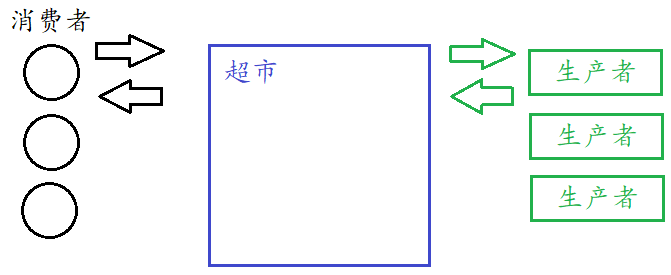

### 321原则

* **3**种关系
  * 消费者与消费者是互斥关系
  * 生产者与生产者是互斥关系
  * 消费者与生产者是同步互斥关系
    * 互斥关系是为了确保数据读取的正确性（要么不生产，要么生产完，具有原子性，没有生产到一半就被拿走这种情况）
    * 同步关系是为了提高双方效率，即生产完了再消费，消费完了再生产，避免双方不断地轮询检测
* **2**种角色：生产和消费者是由线程承担的两种角色
* **1**个交易场所：超时是内存中特定的一种内存结构/数据结构，用来提供交易场所。提高效率、解耦，就是一个缓冲区（一般是一个queue）

### 生产者消费者模型的优点

* 解耦：生产者与消费者没有交集，通过中间商中转
* 支持并发：并发一般来说并不是在临界区中并发，**而是生产任务（before blockqueue）和消费任务（after blockqueue）对应的并发**，因为实际中生产任务和消费处理任务都是要花时间的，比如从网上抓取数据，然后计算、落盘
* 支持忙闲不均：生产者生产和消费者消费时间是不一样的

### 同步式的阻塞队列 Block queue

需要有条件变量的方式来令双方在特定条件不满足的情况下进入不生产或不消费的情况，并且进入休眠，等待消费者在消费的时候唤醒生产者或者等待生产者在生产的时候唤醒消费者

下面给出代码接口，具体可以看 /Linux/Linux7_thread/7_blocking_queue/Test.cc

```cpp
template<class T>
class BlockQueue { 
public:
    BlockQueue(uint32_t cap = gDefaultCap) :_cap(cap), _bq(cap) {};
    ~BlockQueue() {};
    //生产函数
    void push(const T &in) { //const + &：纯输入
        lockQueue(); //加锁
        //判断是否适合生产，即判断bq是否满了
        if (isFull()); //if (满) 不生产，休眠。若不休眠可能会不断的加锁解锁，可能会造成pop的饥饿
        bq._push(in) //else if (不满) 生产，唤醒消费者
        unlockQueue(); //解锁
    }
    //消费接口
    T pop() {
        lockQueue();//加锁
        //判断是否适合消费，即判断bq是否为空
        if (isEmpty()) {}//if(空) 不消费，休眠
        T tmp = _bq.front();//else if (有) 消费，唤醒生产者
        _bq.pop();
        unlockQueue();//解锁
        return tmp;
    }
private:
    queue<T> _bq; //blockqueue
    uint32_t _cap; //capacity
    pthread_mutex_t _mutex; //保护阻塞队列的互斥锁，生产消费用一把锁来达到二者互斥
    pthread_cond_t _conCond; //让消费者等待的条件变量
    pthread_cond_t _proCond; //让生产者等待的条件变量
}
```

在intro部分说过条件变量的同步互斥机制就是根据生产消费模型建立的，可以发现 `pthread_cond_wait` 必须要传入一把锁的原因就是：**在阻塞线程的时候，会自动释放 `&_mutex`**，因为生产者（消费者）满足条件变量休眠等待时，一定在临界区中，若想让生产者（消费者）被消费者（生产者）唤醒，那么消费者（生产者）必须要进入临界区中，那么消费者（生产者）必须要拿到锁

这部分代码最核心的部分在于 `pthread_cond_wait()` 条件等待部分，为什么即使没有用到锁也要传入锁呢？一位内条件等待有两个性质要注意

* 条件等待启动时，它会自动释放锁。因为在满足条件变量休眠等待时，一定在临界区中。若想让生产者被消费者唤醒，那么消费者必须要进入临界区中，那么消费者必须要拿到锁
* 条件等待被其他线程唤醒时，它会自动重新获得锁。因为线程在醒来的时候仍然处于临界区中进行生产或消费
* 有一个注意点是，在生产消费者模型中，因为同步互斥机制就是基于该模型进行设计的，所以 `pthread_cond_wait` 设计了这两种自动机制。但是当将条件等待用于很多线程竞争的时候要自己加锁和释放锁，否则会导致无法退出。这个问题可以看上面的[条件等待demo](#条件等待demo)

## *环形阻塞队列*

### POSIX信号量实现锁的原子性

在System V中通过信号量对进程共享内存临界区通信实现同步互斥机制的保护，它的本质是一个描述临界资源数量的计数器，有++ P操作和 -- V操作

POSIX信号量和System V信号量作用相同，都是用于同步操作，POSIX专用于线程间同步以达到无冲突的访问资源目的

POSIX信号量相当于就是一种互斥锁，即V操作后信号量++，加锁；而P操作后信号量--，当信号量减到0时释放锁

### POSIX信号量接口

* 初始化信号量

  ```c
  #include <semaphore.h>
  int sem_init(sem_t *sem, int pshared, unsigned int value);
  ```

  * `sem_t` 是信号量的数据结构
  * `pshared` 0表示线程间共享，非零表示进程间共享
  * `value` 信号量初始值

* 销毁信号量

  ```c
  int sem_destroy(sem_t *sem);
  ```

* 等待信号量：P操作

  等待信号量，会将信号量的值减1

  ```c
  int sem_wait(sem_t *sem);
  ```

* 发布信号量：V操作

  发布信号量，表示资源使用完毕，可以归还资源了。将信号量值加1

  ```c
  int sem_post(sem_t *sem);
  ```

### 环形队列

复习环形队列/循环队列的实现：[622. 设计循环队列 - 力扣（LeetCode）](https://leetcode.cn/problems/design-circular-queue/)

环形队列可以用来重复存值，用于资源有限需要排队的情况

**一般都是用数组实现**，用链表实现缓存命中率较低；最开始默认front和rear处于同一位置

* 方案一：仅给出front和rear，不能判断环形队列是空还是满，因为既有可能是pop空了也有可能是push满了此时都是 `front==rear`。要多记录一个size来判断

  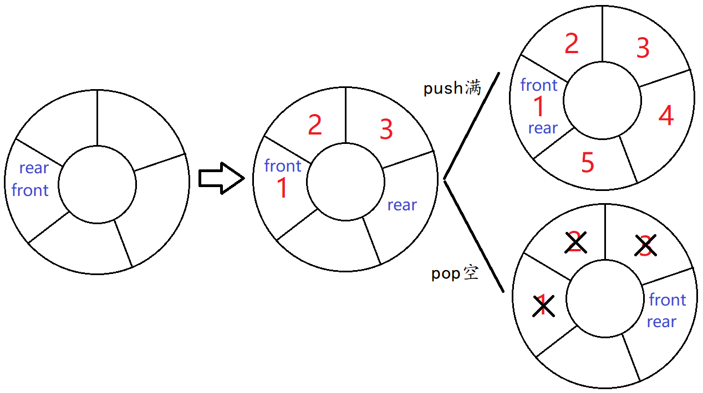

* 方案二：多开一个空间，不存数据，此时 `front==rear+1`是满了，`front==rail`为空

  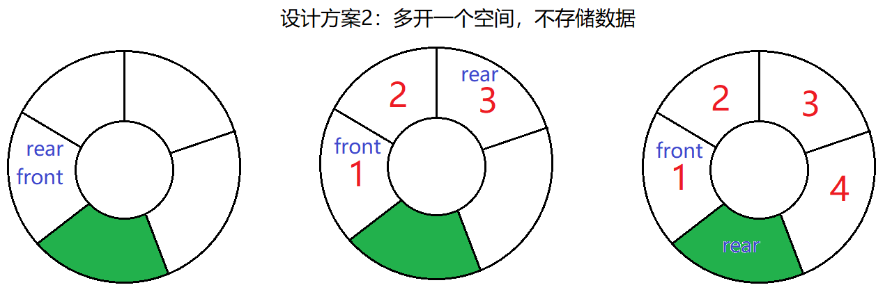

### 基于环形队列的生产消费模型

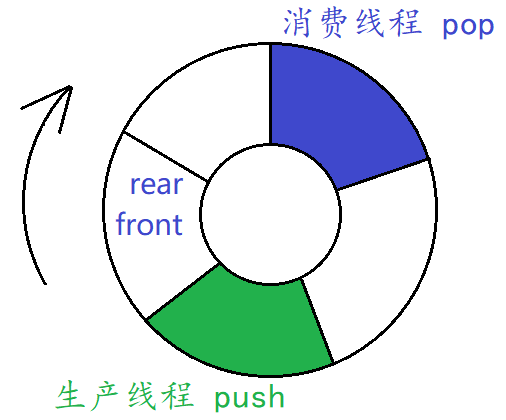

线程对临界资源的互斥性是指不会同时生产和消费同一个资源

* 若考虑第一种实现方案，指向同一个位置，需要互斥和同步
* 其他时候指向的都是不同的位置，可以实现并发

后续操作原则用信号量来保证

* 队列为空的时候，消费者不能超过生产者
* 队列为满的时候，生产者不能超过消费者

上面两个原则**通过 `roomSem` 和 `dataSem` 这两个信号量来进行控制**

如果是单生产者与单消费者的话，用信号量就可以控制有序的生产消费，实现线程同步。但如果是多生产者与多消费者的关系的话，还要通过锁控制生产者与生产者之间，消费者与消费者之间的互斥关系。是否需要多生产者与多消费者的关系是根据实际任务决定的

### 实现

下面给出最重要的两个读写函数，具体实现可以看~/Linux/Linux7_thread/8_ring_queue

```cpp
void push(const T &in) {
    //信号量是一种预定机制，只要申请到了就一定会有，因此不用加锁
    sem_wait(&_roomSem);
    pthread_mutex_lock(&_pmutex); //锁用来保护写入
    _ringqueue[_pIndex] = in; //生产的过程
    _pIndex++; //写入位置后移
    _pIndex %= _ringqueue.size(); //更新下标，来保证环形特征
    pthread_mutex_unlock(&_pmutex);
    sem_post(&_dataSem);
}
//消费
T pop() {
    sem_wait(&_dataSem);
    pthread_mutex_lock(&_cmutex);
    T temp = _ringqueue[_cIndex];
    _cIndex++;
    _cIndex %= _ringqueue.size(); //更新下标
    pthread_mutex_unlock(&_cmutex);
    sem_post(&_roomSem);
    return temp;
}
```

## *线程池 Thread pool*

线程池就是一种生产者消费者模型

具体实现可以看~/Linux/Linux7_thread/9_thread_pool

### `startRoutine` 函数的this指针问题

实现中有一个容易错的地方，就是关于 `ThreaPool` 类内 `threadRoutine` 的this指针问题。`pthread` 库里规定了 `int pthread_create(pthread_t *thread, const pthread_attr_t *attr, void *(*start_routine) (void *), void *arg);` 要这么实现，即将 `void *arg` 作为 `start_routine` 函数的参数

若把 `start_routine` 写在 `ThreadPoll` 类中，那么类成员函数的第一个默认参数必然是 this指针，这会导致无法取到 `*arg` 的问题

```cpp
//类内成员函数有this指针，所以实际上传了两个参数，所以不能这么写
class ThreadPool {
    //...
    void *threadRoutine(void *args) {
        while (1) {
            sleep(1);
            cout << "pthread[" << pthread_self() << "] running..." << endl; 
        }
    }
    //...
}
```

解决方法就是将 `threadRoutine` 设置为没有this指针的静态函数，然后将this指针作为 `*args` 传入，并通过他和暴露的接口来调取锁等私有资源

```cpp
static void *threadRoutine(void *args) {
    pthread_detach(pthread_self());
    ThreadPool<T> *tp = static_cast<ThreadPool<T> *>(args);
    while (1) {
        tp->lockQueue(); //没有this指针，只能靠接口来获取
        while (!tp->haveTask()) { //没有任务的时候等待
            tp->waitForTask();
        }
        T t = tp->pop();
        //任务被拿到了线程的上下文中
        tp->unlockQueue();
        // For debug
        int one, two;
        char oper;
        t.get(&one, &two, &oper);

        //所有的任务都必须有一个run方法
        Log() << "新线程完成计算任务：" << one << oper << two << "=" << t.run() << endl;
    }
}
```

### 线程池的单例模式

## *读者写者问题 Readers-writers*

### 读写锁的行为

在编写多线程的时候，有一种情况非常常见。有些公共数据修改的机会比较少，相较于写，它们读的机会反而高的多，在读的过程中往往会伴随着查找的操作，中间耗时很长。若给这种代码段加锁，会极大地降低程序地效率，本来是为了要防止写入，但同时也阻碍了其他希望读的程序。对这种情况设计了专用的读写锁

读写者之间的关系

* 写者和写者是互斥关系
* 读者和写者为了读取资源的稳定性和正确性所以也是互斥关系
* 读者和读者没有关系，是并发的

读者和读者之间因为没有对数据资源的竞争，所以二者之间没有关系，是纯并发的，这是和生产者和消费者模型中消费者和消费者的互斥关系的本质区别

### 读写同时到来的特殊情况

因为读写者操作是高度不同步的，即读者非常多，频率很高，而写者比较少，频率一般很低。但必须要考虑读写者同时到来的特殊情况，一般有两种处理方式

* 读者优先模式：竞争锁的时候优先让读者竞争到锁资源
* 写者优先模式：当写者到来的时候，想办法让已经在读的读者先读完，然后阻拦住写者之后的读者

### 读写锁接口

* 初始化和销毁锁

  ```c
  #include <pthread.h>
  int pthread_rwlock_destroy(pthread_rwlock_t *rwlock);
  int pthread_rwlock_init(pthread_rwlock_t *restrict rwlock,
                          const pthread_rwlockattr_t *restrict attr);
  ```

* 加写锁

  ```c
  #include <pthread.h>
  int pthread_rwlock_rdlock(pthread_rwlock_t *rwlock);
  int pthread_rwlock_tryrdlock(pthread_rwlock_t *rwlock);
  ```

* 加读锁

  ```c
  #include <pthread.h>
  int pthread_rwlock_trywrlock(pthread_rwlock_t *rwlock);
  int pthread_rwlock_wrlock(pthread_rwlock_t *rwlock);
  ```

### 大致实现方法 伪代码

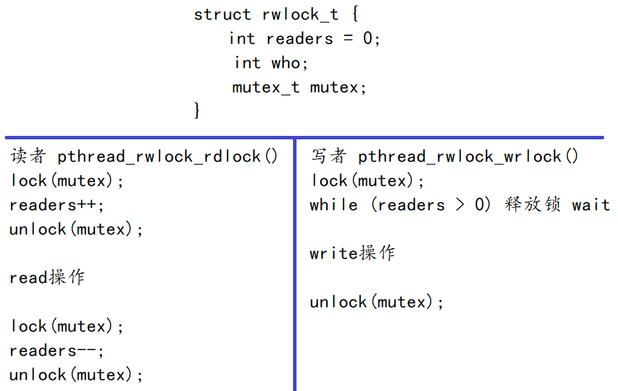
