# Linux基础与系统管理

## *OS的发展与作用*

### OS的简单历史

1. 简单库 library 与批处理 batch processing，采用人工调度
2. 系统调用 system call
3. 小型机 Minicomputer 与多道程序系统 Multiprogramming。时分系统、内存保护、并发。UNIX、BTS
4. 个人电脑 PC

### OS的作用

## *命令行命令*

### 通配符 Wildcard

* `*` 代表无穷多个字符 如 `ll test*`：找出所有以test开头的文件
* `?` 一定有一个
* `[]` 可能有一个

### 命令参数中括号的意义（非shell）

* `[]`：可选内容
* `{}`：一组必须的内容
* `<>`：表示必须被替换的占位符
* `|`：或，可以在多个选项里选一个

### 重要的常用命令

* `touch` 创建文件
  * 当前文件已存在时，更新文件的最近修改时间
* `mkdir -p test/test1`
* `rm -rf`
  * -f 取消询问
  * -i 询问
  * -r 递归删除
* `cp [-fir] <源文件>（可以有多个） <目标文件>`：若是目录用 -rf
* `mv [-ri] 源文件或源目录 目标文件或目标目录`
  * 当目标目录已存在时为移动
  * 当目标目录或文件不存在时就是重命名
* `echo`：打印内容到显示器上
  * `echo "HelloWorld" > myfile`
  * 若目标文件不存在，创建之，否则直接进行写入
  * 访问
    * `>` 输出重定向（从文件的开始，覆盖式的写入）
    * `>>` 追加重定向（从文件的结尾，追加式的写入）
    * `<` 输入重定向：本来应该从键盘获取的内容，变成从文件中读取
* `more [选项] [文件]` 查看文件 -n 对输出的所有行编号
* `less [选项] [文件]` 查看文件
  * less功能比 `more` 更强大，less可以前后移动，但more只能往前，且less在查看之前不会加载整个文件
  * `-N`：显示行号
  * `/字符串`：向下搜索
  * `?字符串`：向上搜索
  * `n/N` 重复前一个/后一个搜索
* 管线命令 Pipe `|`，管段是用来传导数据的
* `head -n file` `tail -n file` 查看头尾各n行代码，若想看介于中间的代码可以使用管线命令，如想查看 [999, 1009] 行的代码：`head -1010 myfile | tail -11`
* `alias` 给命令起别名
* 查找
  * `find [路径] -name [文件名]`
  * `which` 查找某条命令的文件路径（命令就是可执行文件）
  * `whereis` 查找符合条件的源代码、二进制文件，不常用
  * `grep [选项] 字符串 文件` 行文本过滤工具 `grep -n '888' myfile`
    * -n 顺便输出行号
    * -i 忽略大小写的不同
    * -v 反选，即显示没有搜索的字符串的行
    * ^ 以xx为开头
    * $ 以xx为结尾
* 压缩/解压缩
  * `zip`
  * tar
    * `tar -czvf xx.tgz xx` 打包并压缩
    * `tar -xzvf xx.tgz -C path` 解压缩到指定路径
* 获取系统和文件信息
  * `pwd` 当前路径
  * `file` 显示文件的种类
  * `stat` 显示文件的状态，主要是修改时间等
  * `uname -a` 获取电脑和操作系统的相关信息
  * `top` 查看CPU占用
  * `cat /etc/redhat-release` 查看Linux内核版本
  * `strace` 查看命令的系统调用
* 进程相关
  * `ps axj`

## *权限*

### 文件权限

* r-4, w-2, x-1
* `umask` 掩码：凡是在umask中出现的权限，最都不应该在最终权限中出现，即 最终权限=起始权限&(~umask)

### 添加sudo信任

### 粘滞位 Sticky bit

## *函数库和 gcc/g++ 编译器*

### 函数库

* 函数库可以让其他开发者用到高质量的代码以及提高自己工程的安全度，防止暴露源代码
* 静态库 Static Library
  * 静态库是指编译链接时，把库文件中用到的目标文件的代码全部链接到可执行文件中，因此生成的文件比较大，但在运行时也就不再需要库文件了
  * CentOS安装C/Cpp静态库（系统默认自带动态库）
    * C: `sudo yum install -y glibc-static`
    * Cpp: `sudo yum install -y libstdc++static`
  * 可以通过 `ldd` 命令查看依赖库文件 
* 动态库 Dynamic Link Library：动态库在编译链接时并不会把库文件的代码加入到可执行文件中，而是在程序运行时由运行时链接文件加载库，这样可以节省系统的开销
* Linux环境中 `.so` 为动态库，`.a` 为静态库；而 windows环境中 `.dll` 为动态库，`.lib` 为静态库
* gcc生成的二进制文件默认采用动态链接，可以用 `file` 命令验证


### 制作静态库

* 前缀必须是lib，后缀必须是.a  `ar -rc libhello.a mymath.o myprint.o`
* 库目录
  * include 库的所有头文件
  * lib 对应的库文件
* 发布和使用
  * 自己写的库属于第三方库，既不是语言提供的也不是系统调用库。gcc调用时需要显式给
  * 头文件gcc的默认搜索路径是：`/usr/include`
  * 库文件的默认搜索路径是：`/lib64` 或者 `/usr/lib64`
  * 把第三方库拷贝到系统的默认路径下，称为库的安装
  * 为了避免未经测试的库污染，不要把第三库放到系统库里，对第三方库进行指定头文件搜索路劲共和库文件搜索路径的硬使用：`gcc main.c -I ./hello/include -L ./hello/lib -lhello`，其中-I指定头文件搜索路径，-L指定库文件搜索路径，lhello是库名

### 制作动态库

* `gcc -shared  myprint.o mymath.o -o libhello.so`
* fPIC 的意思是生成一个与地址无关的目标二进制文件。程序编译完后有自己固定的内存地址空间，因此静态库在调用时是占用固定的地址空间的，而动态库则不占用，动态库采用的是相对动态编址方式
* gcc对动态库和静态库的使用选择
  * 静态库和动态库可以同名
  * 若只有静态库，则会强制进行静态连接
  * 若既有静态库也有动态库，则默认使用动态库；此时若想强制使用静态库，也可以用 `-staic` 来指定
* 动态库是一个独立的库文件，动态库可以和可执行文件分批加载
  * 动态库只要加载到内存中的**堆栈之间的共享区**一次，**每次使用时只要与调用它的进程的页表建立新的映射关系就可以**；但用静态库的时候是将静态库引入到了调用程序中，即即**保存在代码段**，成为程序的一部分，一起调用，若有很多个程序都使用了同一份静态库，那么内存中将存在大量的库代码冗余
  * 每一个动态库被加载到内存中，映射到进程的地址空间，映射的位置可能是不一样的，但是因为库里面是相对地址，每一个函数定位采用的是偏移量的方式来寻找的。即只要知道这个库的相对地址，库的起始地址+函数偏移量就可以将函数映射到虚拟地址上·

* 虽然在gcc编译的时候已经告诉了程序需要的动态库的地址，但对生成程序进行调用的时候它并不能找到动态库
  * 可以将库放到系统库中，但这会造成库污染，不要使用这种方法
  * 可以将第三方动态库的地址放到库加载的搜索路径的环境变量下 `export LD_LIBRARY_PATH=$LD_LIBRARY_PATH: pwd`，但这个环境变量在OS重启后会被重置为原来的内容
  * 可以通过新增系统默认的配置文件来达到永久修改的目的：往 `/etc/ld.so.conf.d` 新建一个带有库地址的配置文件后再执行 `ldconfig` 令配置文件生效
  * 也可以在系统库 `/usr/lib64` 中建立一个指向第三库的软连接

```makefile
.PHONY:all    
all:libhello.so libhello.a    

libhello.so:mymath_d.o myprint_d.o
    gcc -std=c99 -shared mymath_d.o myprint_d.o -o libhello.so    
mymath_d.o:mymath.c
    gcc -std=c99 -c -fPIC mymath.c -o mymath_d.o    
myprint_d.o:myprint.c
    gcc -std=c99 -c -fPIC myprint.c -o myprint_d.o

libhello.a: mymath.o myprint.o    
    ar -rc libhello.a mymath.o myprint.o
mymath.o:mymath.c    
    gcc -std=c99 -c mymath.c -o mymath.o    
myprint.o:myprint.c    
    gcc -std=c99 -c myprint.c -o myprint.o    

.PHONY:output    
output:    
    mkdir -p output/lib    
    mkdir -p output/include    
    cp -rf *.h output/include    
    cp -rf *.a output/lib    
    cp -rf *.so output/lib                                                                                     

.PHONY:clean    
clean:    
    rm -rf *.o *.a *.so output    
```

## *gdb调试器*

* gcc/g++编译出来的二进制程序默认是release模式，要使用gdb调试，必须在源代码生成二进制程序的时候加上选项 `-g`

http://c.biancheng.net/gdb/

## *VSCode远程开发与SSH*

### VSCode添加SSH

下载Remote-SSH插件，然后进行设置。注意：用户名要对应，不是随便写的

### SSH

## *manual的使用*

1. 可执行的程式或是shell 指令
2. system calls，Linux 核心所提供的函数
3. 一般函式库函数
4. 特殊档案（通常位于/dev）
5. 档案格式与协定，如 /etc/passwd
6. 游戏
7. 杂项（巨集等，如man(7)、groff(7)）
8. 系统管理者指令（通常是管理者 root 专用的）
9. Kernel routines（非标准）

## *操作系统相关概念*

### OS组成

* Kernel 内核：进行最底层的进程管理、内存管理、文件管理、驱动管理
* 其他程序：如函数库、Shell等

### 设计OS目的

* 与硬件交互，管理所有的软硬件资源
* 为用户程序（应用程序）提供一个良好的执行环境

### 系统调用 System Call 和函数库

* 在开发角度，操作系统对外会表现为一个整体，但是会暴露自己的部分接口，供上层开发使用，这部分由操作系统提供的接口称为系统调用
* 系统调用在使用上，功能比较基础，对用户的要求相对也比较高。因此开发者会对部分系统调用进行二次开发和适度封装，形成一个供上层开发者使用的库

# Shell脚本与正则表达式

## *helloworld*

```sh
#! /bin/bash
echo "hello, world"
```

脚本以 `#!/bin/bash` 开头来制定解析器 parser

### 执行方式

* 调用子bash或子sh来执行 `bash helloworld.sh`，嵌套执行可能会影响环境变量
* 用绝对路径或相对路径来执行脚本文件
* 用 `source`（csh实现）或 `.`（bash实现） 命令来执行脚本文件。source调用并加载新的配置到子bash

## *变量*

### 分类

* [环境变量](#环境变量)和自定义变量
* 全局和局部
  * 全局对所有bash有效，局部只对当前bash有效
  * 用户自定义的默认都是局部变量，可以通过 `export` 来导出为全局变量。但是特别的是对于子shell中更改了全局变量，不会对父shell造成影响

使用一个定义过的变量，只要在变量名前面加 `$` 符号即可

### 变量定义的规则

* 变量名称可以由字母、数字和下划线组成，但是不能以数字开头，环境变量名建议大写

* 等号两侧不能有空格

* 变量的值如果有空格，需要使用双引号或单引号括起来

* 在bash中，**变量默认类型都是字符串类型**，无法直接进行数值运算

  * 要进行数值运算要用运算符 operator 表达

    ```shell
    a=$((1+5)) # (()) 里面可以用<=这种数学表达式
    a=$[5+9]
    ```

  * 或者用比较麻烦的 `expr` 数值计算命令： `expr 1 + 2` 的时候中间要有空格，而且 `*` 要转义，即 `\*`

  * 命令替换：将一个命令运行的结果赋值给变量

    ```shell
    a=$(expr 5 \* 3) # or
    a=`expor 5 \* 3`
    ```


### 变量定义基本句法

* 定义变量：变量名=变量值，注意不能有空格，否则会被解释为两条语句
* 撤销变量：unset变量名
* 声明静态/只读变量：readonly变量 `readonly b=5`

### 特殊变量

* `$n`：n是数字，`$0` 代表该脚本名称， `$1-$9` 代表第1-9个参数，10 以上的参数要用花括号括起来 `${10}`

  ```shell
  #! /bin/bash
  echo "Hello, "
  echo $0
  echo $1
  echo $2
  ```

* `$#`：参数个数统计，获取所有输入参数的数量。常用于循环，判断参数的个数是否正确以及增强脚本的健壮性

* `$?`：最后一次执行的命令的返回状态，若为0则上次命令正确指令，非0则执行不正确

* `$*`：代表命令行中所有的参数，`$*` 把所有的参数看成一个整体

* `$@`：也代表命令中所有的参数，但是 `$@` 把每个参数区分对待，即形成一个集合或者数字

## *条件判断*

### 基本语法

* `test condition`

* `[ condition ]` 注意condition前后的空格不可少

  ``` shell
  a=hello
  [ $a = hello ] # 注意condition的空格也不能少，$a=hello 会被理解为一个整体，一个整体是非空的，从而输出0
  [ ] #echo $? 空输出1
  ```

和高级语言相反，shell script用0表示真，非0表示假，因为用的是返回状态作为判断条件

### 常用判断条件

* 两个整数之间比较：-eq 等于 -ne 不等于 -lt 小于 -le 小于等于 -gt 大于 -ge 大于等于

  ```shell
  [ 2 -lt 8 ] #echo $? 输出0 
  ```

* 两个字符串之间的比较：用等号=判断相当，用 != 判断不等

* 按照文件权限进行判断：-r -w -x 是否有读、写、执行的权限

* 按照文件类型进行判断：-e -f -d 文件是否存在 existence、存在并且是一个常规文件 file 、存并且是一个目录 directory

* 多条件判断：`&&` 表示前一条指令执行成功时，才执行后一条命令；`||` 表示上一条命令执行失败后，才执行下一条命令

  ```shell
  a=15
  [ $a -lt 20 ] && echo "$a < 20" || echo "$a >= 20" # 若判断成功则执行中间的，判断失败则执行后面的
  # 和三目运算符一样
  ```

## *流程控制*

### if语句

```shell
if [ condition ]
then
	程序
elif [ condition ]
then
	程序
else
	程序
fi
```

一个小优化保证判断条件不为空，""是进行字符串拼接（用单引号''就不会翻译$1了）

```shell
if [ "$1"x  = "zhang3"x ]; then echo "welcome, zhang3"; fi
```

若是多个判断条件有两种表示方法

```shell
if [ $a -gt 18 ] && [ $a -lt 35 ]; then echo OK; fi
if [ $a -gt 18 -a $a -lt 35 ]; then echo OK; fi # -a -r 表示逻辑与、或
```

### case语句

case就是switch语句

```shell
case $变量名 in
"value 1")
	# 程序1
;; # break
"value 2")
	# 程序2
;;
*)
	# 这里是default
;;
esac
```

## *循环*

### for循环

for循环有两种书写方式

```shell
# 书写方式1
for (( initialization;control;increment )) #(())里的循环变量不用在外面定义
do
	#程序
done

# 书写方式2
for 变量 in value 1 value 2 value 3 # 也可以表示成 for 变量 in (value 1 ... value n)
do
	#程序
done
```

一个例子

```shell
for (( i=1; i <= $1; i++ )) # (()) 里面可以用<=这种数学表达式
do
	sum=$[ $sum + $i ]
done
```

### while循环

```shell
while [ condition ] #[]里的循环变量要在外面定义
do
	程序
done
```

### read读取控制台输入

`read -p -t` -p指定读取值时的提示符；-t指定读取时等待的时间，若不加-t则一直等待

## *函数*

### 系统函数

* `basename [string/pathname][suffix]` 取路径里的文件名称，会去掉所有前缀（包括最后一个/），默认保留suffix，若指定了suffix，就会把文件的suffix后缀去掉
* `dirname`：截取绝对路径名称

### 自定义函数

```shell
[ function ] funname[()]
{
	Action;
	[return int;]
}
```

shell脚本是逐行运行，不会编译。所以必须在调用函数的地方之前，先声明函数

函数返回值，只能通过 `$?` 系统变量获得。若不加return，将以最后一条命令的运行结果作为返回值。return后跟数值n（0-255）

## *文本处理工具*

在Linux中，grep、sed、awk等文本处理工具都支持通过正则表达式来进行模式匹配

# CPU虚拟化：进程

## *进程概念与PCB*

### 进程概念 Process

* 理论概念：程序的一个执行实例，正在执行的程序等
* 内核观点：担当分配系统资源（CPU时间、内存）的实体，是向系统申请资源的基本单位
* 一个加载到内存中的程序就是一个进程：内核PCB数据结构+可执行程序的代码和数据，执行可执行程序后变成了进程

### 进程描述-PCB


* 进程信息被放在一个叫做进程控制块的数据结构中，可以理解为进程属性的集合

* PCB Process Control Block 进程控制块是一个学术上的统称，Linux系统中对应的PCB是 `task_struct`。`task_struct` 是Linux内核的一种数据结构，它会被装载到RAM里并且包含着进程的信息

* 所有运行在Linux系统里的进程都以 `tast_struct` 双链表的形式存在内核里。因此对进程的管理，也就变成了对进程PCB结构体链表的增删查改工作。将这种列表结构称为队列，可以根据进程状态分为就绪队列、阻塞队列等

* 操作系统和CPU运行某一个进程，本质是从tast_struct形成的队列中挑选一个tast_struct来执行它的代码。进程调度就是在tast_struct的队列中挑选一个task_struct来执行它的代码。只要想到进程，优先想到进程对应的tast_struct

  

* 内容分类

  * 标识符 Identifier PID：描述进程的唯一信息，用来区别其他进程
  * 状态
  * 优先级
  * 程序计数器：相当于是一个指针，存放程序中即将被执行的下一条指令的地址
  * 内存指针：包括程序代码和进程相关数据的指针，还有和其他进程共享的内存块的指针
  * 上下文数据：进程执行时处理器的寄存器中的数据
  * IO状态信息：包括显示的IO请求，分配给进程的IO设备和被进程使用的文件列表
  * 记账信息：处理器时间总和，使用的时钟数总和等。该信息可以用来评估调度算法是否合理以及指导我们优化调度策略
  * 其他信息

### 通过系统调用获取进程标识符

* 查看进程信息

  * `ps axj | grep '进程名'` 或者 `top`
  * 进入 `/proc` 目录

* `getpid` 和 `getppid` 系统调用分别获得PID和PPID标识符

  ```c
  #include <stdio.h>    
  #include <unistd.h>    
  #include <sys/types.h>    
  
  int main() {    
      while (1) {    
          pid_t id = getpid(); // 获取的是自己的PID
          printf("hello world, pid: %d, ppid: %d\n", id, getppid());
          sleep(1);
      }
  }
  ```

  

  可以发现父进程就是Bash，即Shell是通过创建子进程的方式调用了该程序，Shell也是系统的一个进程，其之上的父进程是操作系统

* `kill -9 [PID]` 终止进程

* `fork` 通过系统调用创建进程

  * fork的返回值
    * 失败的时候返回-1
    * 成功时fork具有两个返回值
      * 给父进程返回子进程的pid
      * 给子进程返回0
  * 为什么会有两个返回值
    * 创建进程的时候本质就是系统多了一个进程。即内部属性以父进程为模板新建一个task_struct。当运行到fork函数内部的return时，核心代码已经执行结束了，因为有父子进程的分别return，所以会有两个返回值
    * 返回两次并不意味着会保存两次
    * 父子进程被开出来后，谁先运行是不一定的，这是由操作系统的调度器决定的
  * 为什么给子进程返回0，而给父进程返回子进程的PID（一种感性的认识）：父进程与子进程的关系是一对多的。父进程需要获取子进程的PID对其进程操作，而子进程由于只有一个父进程，可以用其他方法方便的得到其父进程的信息

  ```c
  #include <stdio.h>
  #include <unistd.h>
  int main()                      
  {            
      pid_t id = fork(); // id在父进程里面是子进程的PID，在子进程里面是0
      // fork 之后父子进程共享代码
      if (id<0)          
      {            
          // 创建失败
          perror("fork");
          return 1;
      }                                  
      else if (id == 0)   
      {            
          // fork产生的两个进程会同时执行
          // Child process                                                  
          while (1)    
          {
              printf("I am child, pid: %d, ppid: %d\n", getpid(), getppid());
              sleep(1);
          }
      }                     
      else         
      {    
          // Parent process                                                  
          while (1)    
          {
              printf("I am father, pid: %d, ppid: %d\n", getpid(), getppid());
              sleep(1);
          }
      }                           
      printf("You can see me!\n");
      sleep(1);
  
      return 0;
  }   
  ```

  

## *进程状态*

### OS理论进程状态


理论上的进程分类：每种参考书的理论进程都不一样，但大体可以分为下面几种状态，粗体的三种状态是核心状态

* 新建状态 New
  * 创建PCB，还未被加入队列，实际上没有这种状态，只是一种理论上的完善
  * 可以对程序分批换入内存，在极端情况时仅仅生成了内核数据结构而没有分配任何内存，此时称为新建
* **运行状态 Running**：该时刻进程占用CPU资源
* **就绪状态 Ready**：可运行，由于其他进程处于运行状态而在CPU的等待队列中等待
* **阻塞状态 Pending/blocked**：一个进程执行了某种操作，直到等到某种非CPU资源就绪时才会继续运行。其他非CPU设备也会维护各自的运行队列。在阻塞态即使给进程CPU的权限它也无法使用CPU。更要命的是，一旦进程被阻塞，OS，或者更重要的是**CP3U本身将会保持这种进程的状态，直到等待资源就位**，因此在阻塞式IO中这是一个比较严重的缺陷
* 挂起状态 Suspend
  * 定义
    * OS会将长时间阻塞的进程代码和数据换出到磁盘中的SWAP区中，但其对应的PCB仍然保留在内存中，以此来节省内存资源
    * **进程的数据和代码都被换出到磁盘就称为挂起**，页表不仅仅有虚拟地址和物理地址的映射也有虚拟地址和硬盘地址的映射，因此可以直接换出到硬盘上
  * 类型
    * 阻塞挂起状态：进程在外存（硬盘）阻塞等待某个事件的发生
    * 就绪挂起状态：进程在外存，但已经等待完毕，只要被再次换入内存就马上可以运行
  * 挂起方式：除了内存不足被OS换出到硬盘之外，还可以通过sleep设置定时器、用户通过 `ctrl+z` 方式发信号等方式

### Linux实际上的进程分类

进程状态查看：`ps aux 或 ps axj`

* Linux 2.6 内核的定义

  

* S睡眠状态 Sleeping：意味着进程在等待睡眠完成（这里的睡眠也可叫做可中断睡眠 **interruptible sleep**），S状态对应的理论状态为阻塞态和挂起态，在等待非CPU资源就位，或者说在**非CPU硬件的队列**里排队。OS可以通过调度算法在内存不够时将进程换出到Swap区

  * 情况一

    

    * 由于CPU的运行速度极快，实际上在该死循环中只有极少的时间在运行，绝大多数时间都在睡眠状态，将CPU资源给其他程序使用
    * 注意：当进程状态有一个 `+` 时，表示该任务为前台进程。具体可以看下面前台进程与后台进程的区别

  * 情况二

    * 
    * 一直在等待用户输入，所以一直处于IO的队列中，处于睡眠状态

* R运行状态 Running：并不意味着进程一定在运行中，它表示进程要么是在运行中要么在**CPU运行队列**里排队

  

* D磁盘休眠状态 Disk sleep：也可叫做深度睡眠/不可中断睡眠 **uninterruptible sleep**，不可以被被动唤醒，在这个状态的进程通常会等待IO的结束

  * 例子：一个进程正在往硬盘或者往其他IO设备写入数据，但此时该进程仍然占用了内存资源。若此时OS压力过大，可能会选择终止处于S状态的进程以保护整体的OS。当进程处于D状态时，则不能被OS终止，只能等该进程结束读写后自动醒来时，OS再结束它
  * D状态一般用于硬盘的读写，因为涉及到用户的数据比较重要
  * D状态的模拟代码不给出，因为要模拟这个进程需要大量数据的IO读写

* T暂停状态 Stopped

  * 可以通过 `kill -19 [PID]` 暂停进程
  * 和D状态、S状态相比，前两者都在等待某项资源或执行任务，但T状态并没有，是被用户手动暂停的
  * 调试时会呈现T状态，比如gdb打断点时gdb会给进程发送 `kill -19 [PID]` 暂停进程

* T tracing stop 调试状态

* X死亡状态 Dead：这个状态只是一个返回状态，不会在任务列表里看到这个状态。和理论中的新建状态类似，存在时间极短，资源立刻会被OS回收

### 前台进程与后台进程 Foreground and Background process

* 当进程状态有一个 `+` 时，表示该任务为前台进程。前台进程意味着会占据Shell界面，其运行时Shell无法进行其他操作
* 若要设置为后台进程，可以在运行文件时带上 `&`，如 `./myproc &`。这样Shell就不必等待进程结束就可以接收新的命令，启动新的进程
* Shell可以同时运行一个前台进程和任意多个后台进程，只有前台进程才能接收到按键信号
* 前台进程在运行过程中用户随时可以发送如ctrl+c这样的信号，也就是说该进程的用户空间代码执行到任何地方都有可能收到SIGINT信号而终止，所以信号相对于进程的控制流程来说是异步的 asynchronous

### 僵尸进程 Zombie Process

* 什么是僵尸进程：一个进程已经退出，但是还不允许被释放，处于一个被检测的状态。进程一般尤其父进程或者OS检测回收，维持该状态是为了让父进程和OS来回收其返回或产生的数据（回收就是由Z状态转到X状态）

* 为什么会产生僵尸进程：子进程已退出，父进程还在运行，但父进程没有读取子进程状态，子进程就会变成Z状态。

  ```c
  #include <stdio.h>
  #include <stdlib.h>
  #include <unistd.h>                                                        
                      
  int main()
  {
      pid_t id = fork();
      if (id<0)
      {
          perror("fork");
          return 1;
      }
      else if (id == 0)
      {
          // Child process
          while (1)
          {
              printf("I am child, pid: %d, ppid:%d\n", getpid(), getppid());
              sleep(3);
              break;
          }
          exit(0); // 子进程直接退出
      }  
      else 
      {
          // Parent process 
          while (1)
          {
              printf("I am father, pid: %d, ppid:%d\n", getpid(), getppid());
              sleep(1);
          }
      }                           
      printf("You can see me!\n");
      sleep(1);
  
      return 0;
  }   
  ```

  

  `<defunct>` 指的是父子进程间失去通信的进程

* 僵尸进程的危害

  * 若父进程或OS一直不读取子进程的返回，那么子进程就一直处于Z状态
  * 维护退出状态本身就是要用数据维护，也属于进程的基本信息，所有也保留在PCB中，若一直处于Z状态，则一直要维护PCB
  * 进程需要占据内存资源，若一直不回收，会造成内存浪费，也就是内存泄漏

* 孤儿进程 Orphan Process

  * 孤儿进程和僵尸进程相反，若父进程先于子进程结束，那么子进程变成Z进程后就成为孤儿进程

  * 孤儿进程被1号init进程领养后由init进程回收，下图可看到，PID为7425的子进程在PID为15713的父进程退出后被1号init进程领养了

    

## *进程优先级 Priority与进程调度*

### 基本概念

* 为什么要有优先级？CPU资源有限，而进程太多，需要通过某种方式竞争资源
* CPU资源分配的先后顺序，就是指进程的优先权

### 查看系统进程 `ps -la`


* UID：代表执行者的身份
* PRI：代表这个进程可被执行的优先级，其值越小越早被执行，系统默认优先级为80
* NI：代表这个进程的nice值，表示进程可被执行的优先级的修正数值，取值范围为 `-20~19`
* 优先级 = 老的优先级 + nice值，因此当nice值为负数时，优先值变小，优先级提高
* 为什么优先级的范围是在 `60~99` 内波动？OS的设计理念并不是让某一个程序最优先，而是均衡地分配资源，所以优先级的差距不宜过大，否则可能会有恶意进程通过提高自己的优先级而导致CPU在调度时总是先调度该恶意程序，导致其他进程得不到调度，将会导致一系列其他问题
* 用 `top` 命令更改已存在进程的nice：`top->r->输入PID->输入nice值`

### 进程的补充概念

* 竞争性：为了提高系统效率，OS进程需要通过优先级来竞争CPU资源，从而使资源分配更合理
* 独立性：多进程运行时（包括父子进程），需要独享各种资源，多进程运行期间互不干扰
* 并行 Parallelism：多个进程在多个CPU下分别同时进行运行
* 并发 Concurrency：多个进程在单个CPU下采用进程切换的方式，在一段时间之内，让多个进程都得以推进

调度算法：CPU在分配资源给一个进程时，不是一直令其独享资源直到代码运行结束的。否则当一个死循环在运行时，OS不能做任何其他的操作

## <span id="环境变量">*环境变量 Environment variables*</span>

### 一个直观的现象


* 当运行系统命令（命令就是一个可执行文件）时有两种方式
  * 输入命令直接运行，比如 `ls`
  * 也可以通过输入 `ls` 可执行程序所在的绝对路径 `/usr/bin/ls`
* 访问自己所创建的可执行文件时却要带上 `./`，也就是当前路径/相对路径，直接输入可执行文件名会报错

### 基本概念

* 环境变量一般是指在OS中指定OS运行环境的一些参数
  * 和Cpp中的命名空间或者C语言中的作用域相似，OS也会在OS的“作用域”当中为自己定义环境变量
  * OS通常具有某些特殊用途，还有在系统当中通常具有全局特性
* 常见环境变量
  * `PATH`：指定命令的搜索路径
  * `HOME`：指定用户的主工作目录（即用户登录到Linux系统中时默认的目录）
  * `SHELL`：当前Shell，它的值通常是 `/bin/bash`

### 和环境变量相关的命令

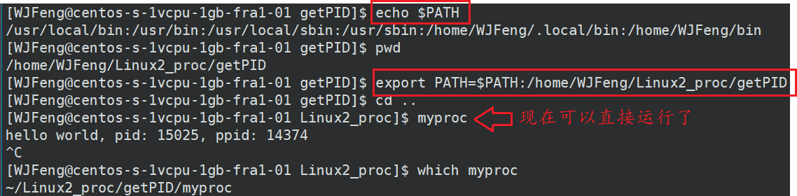

* 通过 `echo $NAME` 来查看环境变量：echo的实现就是系统调用 `getenv`

  解释第一个现象：在Shell中直接键入可执行文件名时候，Shell在执行可执行程序时会去环境变量PATH中存在的路径中逐个搜索，若没有找到就不会运行。我们自己写的可执行程序并不在其中的任意一个路径中，所以不能直接执行，必须要写上绝对路径或相对路径

* `export`：设置一个新的环境变量（增减环境变量），当然通过这个方法修改的环境变量会在重启shell后被重置，要想持久化需要修改shell的配置文件，比如bash的 `~/.bashrc`

* `env`：显示所有环境变量

* `unset`：清除环境变量

* `set`：显示本地定义的shell局部变量和环境变量

* `source`：调用并加载新的配置到子bash，所以修改配置文件后，用该命令不需要重启shell便可以让更新的环境变量生效

### 环境变量的获取方式

* 环境变量的组织方式：环境表 Environment List

  

* 通过代码
  * main函数有三个参数 `int main(int argc, char* argc[], char* env[]);`
    * `argv` 是命令行参数指针数组， `argc` 是有几个命令行参数
    * 第三个参数char指针数组就是用来接收父进程继承的环境表的
  * 利用第三方变量 `extern char** environ;`
  
* 通过系统调用或设置环境变量

### 环境变量的全局属性

* 子进程的环境变量是从父进程继承的
* 默认所有的环境变量都会被子进程继承
* 最开始的父进程为Bash
* 全局属性移位着所有子进程都可以继承环境变量

### Linux中Bash的环境配置


上图是一个Bash启动时依次需要读取的配置文件，这些文件全部都是shell脚本

* `/etc/profile` 是系统整体的设定：根据用户的UID设定各种环境变量以提供不同的权限。因为用户可以有多个 shell 比如 bash, sh, zsh 之类的，但像环境变量这种其实只需要在统一的一个地方初始化就可以了
  * `/etc/profile.d/` 文件夹下的各种shell文件用来设置Bash的各种属性 
  * `/etc/locate.conf` 负责环境变量 `$LANG` 来设置系统的语系
* `~/.bash_profile` 是每个用户的个人设定，它会再读入 `~/.bashrc`
  * `~/.bashrc` rc的意思是Run Command
  * `/etc/bashrc` 是专门用来给 bash 做初始化的，比如用来初始化 bash 的设置

# 进程控制与调度

## *受限直接访问*

CPU虚拟化，并对其进行控制调度遵循的一般准则称为 Limited Direct Excution LDE

### 内核态和用户态

OS在物理内存中也要被加载，但不会随着进程的改变而改变。除了每个进程各自拥有的用户级页表外，**所有进程共享一份内核级页表**，用来为每个进程的内核空间与物理内存进行映射

通过内核级页表，无论进程如何切换，进程都可以找到内核的代码和数据，当然前提是用户有权利进行访问

* 当前进程如何具备权力来访问这个内核页表乃至于访问内核数据呢？需要进行身份切换。进程如果是用户态的就只能访问用户级列表，进程如果是内核态的就既可以访问内核态也可以访问用户级的列表。
* 那么如何标识用户的身份呢？CPU内部有对应的状态寄存器CR3来标识当前进程的状态，0为内核态，3为用户态
* 系统什么时候需要进行身份切换？以下给出两种典型情景需要修改CR3来切换用户身份
  * 当前进程执行**系统调用**的时候，系统调用是OS主动暴露给用户的接口，因此不存在安全问题。因此系统调用里包含了一系列切换和认证用户身份的操作
  * 时间片到了，需要进行进程间切换。身份切换后就可以访问内存内核空间的进程调度算法来执行进程切换，在进程的上下文中进行进程调度

总结

* 内核态可以访问所有的代码和数据，即内核态具备更高的权限
* 用户态只能访问自己的代码和数据
* 用户级的程序会无数次直接或间接的访问系统级软硬件资源（管理者是OS），本质上用户并没有权力去操作这些软硬件资源，而是必须通过OS。因此会无数次的陷入内核（1. 切换身份 2. 切换页表），从而调用内核代码来进行返回，然后OS会把结果返回给用户

### 上下文切换

进程上下文切换是切换虚拟内存、栈、全局变量等用户控件的资源，也包括了切换内存堆栈、寄存器等内核空间的资源

## *进程创建 Create*

### 进程创建的过程

* 申请一个空白的 PCB，并向 PCB 中填写一些控制和管理进程的信息，比如进程的唯一标识等
* 为该进程分配运行时所必需的资源，比如内存资源
* 将 PCB 插入到就绪队列，等待被调度运行

### 创建进程使用写时拷贝的原因

创建子进程，给子进程分配对应的内核结构，该结构必须子进程独有，因为进程具有独立性。理论上，子进程也要有自己的代码和数据，但子进程并没有加载过程，因此子进程没有自己的代码和数据。所以子进程只能“使用”父进程的代码和数据。

* 代码：都是不可被写的，只能读取，所以父子共享没有问题，父子进程都可以看到所有的代码
* 数据：是可能被修改的，因此必须分离
  * 创建进程的时候，就直接拷贝分离。问题：可能会拷贝子进程根本就不会用到的数据空间，即便是用到了也可能只是读取
  * 为了节省空间，在创建子进程时，不需要将不会被访问的或者只会被读取的数据拷贝一份。只需要拷贝将来会被父或者子进程写入的数据。问题：一般而言即便是OS，也无法提前直到哪些空间会被写入；而且即使是提前拷贝了，也不一定会马上使用
  * 因此OS选择了写时拷贝计数来分离父子进程数据
* 进一步解释为何OS要选择写时拷贝
  * 进程需要使用的时候再为其分配，是高效使用内存的表现
  * OS无法在代码执行前预知哪些空间会被访问

### 为什么子进程是从 `fork` 之后开始运行？

* 代码在经过汇编之后，会产生很多行代码，且每行代码在被加载到内存之后，都有对应的地址
* 因为进程随时可能被中断（可能并没有被执行完），下次回来时，CPU必须要从之前的位置继续运行，这就要求CPU必须随时记录下当前代码执行位置。因此CPU有对应的寄存器数据来存放当前进程的执行位置。具体为CPU中的EIP寄存器中的PC程序程序寄存器保存的
* 因此CPU中寄存器的数据（即进程上下文数据）也在写时拷贝中被拷贝走，而此时EIP中的PC在记录到 `fork` 执行时的代码，因此子进程只能代码的 `fork` 处开始运行。但是子进程还是拥有 `fork` 之前的代码的

### 写时拷贝的本质是一种延时申请


### `fork` 调用失败的原因

* 系统中有太多的进程
* 实际用户的进程数超过了限制

## *进程终止 Terminate*

### 进程退出时，OS做了什么？

释放进程申请的相关内核数据结构和对应的数据和代码。本质就是释放系统资源

* 查找需要终止的进程的 PCB
* 如果处于执行状态，则立即终止该进程的执行，然后将 CPU 资源分配给其他进程
* 如果其还有子进程，则应将该进程的子进程交给 1 号进程接管
* 将该进程所拥有的全部资源都归还给操作系统
* 将其从 PCB 所在队列中删除

### 进程退出场景

* C语言main函数为什么总是return 0？

  * main函数的return值被称为返回码/退出码，返回码被返回给上一级进程，用来评判该进程执行结果

  * return 0意味着代码运行完毕，结果正确；非0则代码运行完完毕，结果不正确

  * 不同的非0值可以标识不同的错误原因。方便定位错误的原因细节

  * 部分错误码实例

    

* 代码运行完毕，结果正确

* 代码运行完完毕，结果不正确

* 代码异常终止：此时退出码没有意义，一般而言不会执行到return，也就没有退出码

### 常见进程退出方法


* `_exit` 系统调用函数
* `exit` C语言库函数
  * 在代码的任何地方调用，都表示直接终止进程。推荐使用 `exit`
  * 通过试验发现，当使用 `exit` 时，会刷新缓冲区内的数据到输出设备上，而 `_exit` 则不会。因此可以从侧面证明，缓冲区是C标准库维护的，这点将会在IO中具体说明
* return退出语句：return语句只有在main函数中才是终止进程

## *进程等待 Wait State*

### 进程等待必要性

* 若子进程退出后无人回收会造成僵尸进程的问题，从而导致内存泄漏。僵尸进程无法被杀死
* 父进程通过进程等待的方式，回收子进程资源，获取子进程退出信息

### 进程等待方法

编写多进程的基本写法就是fork+wait/waitpid

```c
#include <sys/types.h>
#include <sys/wait.h>
pid_t wait(int *status);
pid_t waitpid(pid_t pid, int *status, int options);
```

* `wait`：`pid_t wait(int* status)`

  `status` 是一个输出型参数，用来存储子进程的退出信息

  

  试验过程：让子进程运行3秒后终止，但让父进程在5秒后才wait并回收，可以看到，子进程在一开始为运行间隔的S态，终止后由于暂时无人回收而变成Z状态，在父进程wait后被回收

* `waitpid`：`pid_t waitpid(pid_t pid, int* status, int options);`

  * 返回值
    * 当正常返回的时候waitpid返回收集到的子进程的PID
    * 若设置了选项 `WNOHANG`，而调用中waitpid发现没有已退出的子进程可收集，则返回0
    * 若调用中出错，则返回-1，此时errno会被设置成响应的值以指示错误所在
  * 参数
    * `pid`
      * `pid==-1`：等待任一个子进程，与wait等效
      * `pid>0`：等待其进程ID与pid相等的子进程，也就是等待指定进程
      * `pid==0`：
    * `status` 和 `wait` 的输出型参数一样，用户可以利用 `status` 选择输出宏 `WIFEXITED(status)` 或者 `WEXITSTATUS(status)`。实现见下方
    * `options`
      * 默认为0，表示设置父进程为阻塞状态：若子进程还没有返回，则挂起父进程，等子进程返回后从waitpid继续执行，此时父进程什么都干不了
      * `WNOHANG` 宏，表示设置父进程为非阻塞等待 `#define WNOHANG 1`：若没有子进程返回，waitpid直接返回0，会**不断进行查询访问，直到操作成功**

* 获取子进程status

  * 输出型参数，获取子进程退出状态，若不关心可以设置成为NULL

* 为什么要用wait/waitpid系统函数，因为数据产生写时拷贝，进程具有独立性，因此父进程无法拿到

* wait/waitpid作为系统调用函数，拥有权限读取僵尸进程（如果有的话）残存的PCB信息里保存的退出结果信息

```shell
while :; do ps ajx | head -1 && ps ajx |grep myproc | grep -v grep; sleep 1; echo "------------------------------------------"; done
```

### 获取子进程status：status是子进程PCB维护的一个数据


* status数据不能简单的看作一个整形，而是要看作一个32位的位图，其中高16位我们不关心
  * 输出 `WIFEXITED(status)` 宏：**`#define WIFEXITED(status) (status>>8)&0xff`**
  * 输出 `WEXITSTATUS(status)` 宏：**`#define WEXITSTATUS(status) status&0x7f`**
* 正常终止：使用高8位作为退出状态码
  * 试验：将退出状态码设为105，即 `exit(105)` 后正常终止
  * 
* 异常状态下被信号杀死，若core dump被设置，那么肯定是异常终止
  * 进程异常退出，或者崩溃，本质OS是在给进程写入信号，然后进程收到信号被终止，此时还会设置core dump位，关于core dump可以看[core dump 核心转储机制](#core_dump)
  * 试验：人为设置一个除0操作，返回的终止信号位8，对应信号SIGFPE：浮点数错误
  * 

### 具体代码实现

* 进程的阻塞等待方式（上面的试验出自该例）

```c
#include <stdio.h>    
#include <unistd.h>    
#include <stdlib.h>    
#include <sys/types.h>    
#include <sys/wait.h>    
    
int main() {    
    pid_t id = fork();    
    if (id<0) {
        perror("fork failed\n");    
        exit(1);    
    }    
    else if (id==0) {
        int cnt = 3;    
        while (cnt) {
            printf("cnt: %d. I am child preocess. PID: %d, PPID: %d\n", cnt, getpid(), getppid());
            sleep(1);    
            //cnt--;    
            //int a = 10;    
            //a /= 0;    
        }                                                                                             
        exit(105); // 直接终止子进程，仅用作测试    
    }    
    else {
        printf("I am father preocess. PID: %d, PPID: %d\n", getpid(), getppid());
        //sleep(5);
        //pid_t ret = wait(NULL); // 阻塞式等待
        int status = 0;
        // 只有子进程退出的时候，父进程才会waitpid函数进行返回，此时父进程还存在
        // waitpid/wait 可以在目前的情况下，让进程退出具有一定的顺序性
        // 将来可以让父进程进行更多的收尾工作                                                             
        pid_t ret = waitpid(id, &status, 0); // 阻塞式等待
        if (ret>0) {
            // 可以不这么二进制处理
            // printf("等待子进程成功。ret：%d，status: %d，子进程收到的低7位信号：%d，子进程退出码: %d\n", ret, status, status&0x7f, (status>>8)&0xff);
            if (WIFEXITED(status))
                // 子进程是正常退出的
                printf("子进程执行完毕，子进程的退出码为：%d\n",WEXITSTATUS(status));
            else
                printf("子进程异常退出：%d\n", WIFEXITED(status));
        }
       // while (1)
       // {
       //     printf("I am father preocess. PID: %d, PPID: %d\n", getpid(), getppid());
       //     sleep(1);
       // }
    }
    return 0;
}
```

* 进程的非阻塞等待方式

### 子进程 `SIGCHLD` 信号捕捉

进程的阻塞和非阻塞等待效率其实都挺低的，实际进程退出是利用信号机制的，即子进程退出后会给父进程发 `SIGCHLD` 信号，父进程在陷入内核后对该信号进行处理，自定义 `SIGCHLD` 的处理动作，即调用 `wait` 清理子进程资源并回收其结果

``` c
void FreeChild(int signo) {
    assert(signo == SIGCHLD);
    pid_t id = waitpid(-1, nullptr, 0);
    if (id > 0) {
        cout << "父进程等待成功，chld pid: " << id << endl;
    }
    cout << "子进程退出，PID: " << signo << getpid() << endl;
}

int main() {
    signal(SIGCHLD, FreeChild);
    pid_t id = fork();
    if (id == 0) {
        int cnt = 10;
        while (cnt--) {
            cout << "子进程，PID：" << getpid() << "，PPID："<< getppid() << 
            "cnt: "<< cnt << endl;
            sleep(1);
        }
        exit(0);
    }
    
    //父进程
    while (true) {
        cout << "父进程，PID：" << getpid() << endl;
        sleep(1);
    }
    return 0;
}
```

上面的代码还需要改进，因为一个父进程可能会有很多很多个子进程。在父进程收到一个子进程的 `SIGCHLD` 并陷入内核处理时，OS会把该信号设置为阻塞，此时若还有其他子进程也在退出，就很有可能会丢失相关信号，从而产生僵尸进程

将 `waitpid` 放到循环里，以避免可能错过的退出码，但是一定要注意用非阻塞等待 `WNOHANG`，否则父进程可能会被卡死在这里

```c
void FreeChild(int signo) {
    assert(signo == SIGCHLD);
        while (true) {
        pid_t id = waitpid(-1, nullptr, WNOHANG); //非阻塞等待，否则父进程可能会卡死在这里
        if (id > 0) {
            cout << "父进程等待成功，chld pid: " << id << endl;
        }
        else if (id == 0) { //还有子进程，但是现在没有退出
            cout << "还有子进程，但是没有退出，父进程要去忙自己的事情" << endl;
            break;
        }
        else {
            cout << "父进程等待子进程结束" << endl;
            break;
        }
    }
}
```

事实上,由于UNIX 的历史原因,要想不产生僵尸进程还有另外一种办法：父进程用 `sigaction` 或 `signal` 函数将SIGCHLD的处理动作置为 `SIG_IGN`，这样fork出来的子进程在终止时会自动清理掉,不会产生僵尸进程，也不会通知父进程。系统默认的忽略动作和用户用 `sigaction` 或 `signal`函数自定义的忽略通常是没有区别的，但系统还是会将自定义动作仍然识别会自定义动作。此方法对于Linux可用,但不保证在其它UNIX系统上都可用

## *进程程序替换 Process Substitution*

### 替换原理：重新建立映射关系

* 进程替换是让进程（通常是子进程）执行一个全新的程序（类似加载）的过程
* 进程替换的两种方式
  * fork创建子进程后执行的是和父进程相同的程序（但有可能执行不同的代码分支）
  * 子进程往往要调用一种exec函数以执行另一个程序。当进程调用一种exec函数时，该进程的用户空间代码和数据完全被新程序替代，从新程序的启动历程开始执行。调用exec并不是创建新进程，所以调用exec前后该进程的PID并不改变


### 六种exec替换函数

* `int execl(const char* path, const char* arg, ...);` l(list)：表示参数采用列表。可变参数列表的最后一个参数必须是NULL，用来表示参数传递完毕
* `int execlp(const char* file, const char* arg, ...);` p(path)：有p自动搜索环境变量PATH
* `int execle(const char* path, const char* arg, ...,char* const envp[]);` e(env)：表示自己维护环境变量
* `int execv(const char* path, char* const argv[]);` v(vector)：参数用指针数组
* `int execvp(const char* file, char* const argv[]);`
* <font color="red">***`int execve(const char* file, char* const argv[], char* const envp[])`***</font>：这个接口是最特殊的，因为它是直接由OS提供的基本系统调用。之前函数的是经过C库封装的，适合在不同的调用场景下使用的

### 函数解释

* exec*函数本质就是如何加载从硬盘加载到内存的加载函数，其功能就是加载器
* 函数调用成功则加载新的程序，原程序剩余的代码不再执行。从下图试验可以发现，程序只打印了第一次printf和ls -al命令，之后的命令没有被执行
* exec函数只有出错返回-1，成功不会返回
* 当子进程加载新程序的时候，相当于是写入了新代码。此时要分离父子进程的代码，代码和数据都要写时拷贝
* 特殊情况：环境变量不会被替换


## *实现简单Shell*

### shell执行的命令

* 第三方提供的对应的在磁盘中有具体二进制文件的可执行程序，由子进程来执行
* shell内部自己实现的方法，由自己（即父进程）来执行。有些命令就是要用来影响shell本身的，如cd是要用来切换shell本身的路径

### 实现过程详见代码

* shell的环境变量是从其配置文件中来的，`.bashrc` (resource configuration) 是一个脚本文件，当shell启动的时候，通过执行改脚本来读取对应的配置文件

### 如何执行其他的C、C++二进制程序或其他语言的程序？

* 无论是任何语言，都是运行在OS上面的，都需要调用类似exec\*的系统接口。因此本质而言Shell就是一个解析用户输入命令并调用exec\*函数的C文件
* C语言、Python和Shell语言都像是软件，编译型的第一次编译之后生成二进制可执行文件，之后再使用都可以直接运行可执行文件，速度非常快。而解释型语言需要每次都将代码文件输入给python或shell解释器逐行解析，因此速度很慢

## *进程调度理论*

### 调度指标 Scheduling metrics

* 性能指标 performance：周转时间 turnaround time 定义为任务完成时间减去任务到达系统的时间，即
  $$
  T_{turnaround}=T_{completion}-T_{arrival}
  $$

* 公平指标 fairness：每一个进程都应该被分配一些资源，而不是一直由某个进程独占。性能指标和公平指标是矛盾的

* 交互性 interactive performance：响应时间 response time 定义为从任务达到系统到首次运行的时间，即
  $$
  T_{response}=T_{firstrun}-T_{arrival}
  $$

### 朴素的调度思想

* FIFO 先进先出
  * 假设所有任务同时到达、工作时间已知、任务只使用CPU（不执行IO）、非抢占 non-preemptive
  * 最先到达的任务最先被处理。严重的护航效应 convoy effect，即一些耗时较少的资源被排在耗时很长的资源后面，那么平均周转时间将会很大（明明那些耗时较少的任务可以一下就被做完的）
* SJF Shortest Job First 最短任务优先：让耗时最少的任务先做。可以证明，当所有任务同时到达的时候，SJF是最优的
* STCF Shortest Time-To-Completion First
  * 假设工作时间已知、任务只使用CPU（不执行IO）
  * 向SJF添加**抢占**，当任务随机到来时，谁的剩余时间最少就抢占CPU资源优先完成
  * 大大提升平均周转时间
* 考虑响应时间和公平性：轮转 Round-Robin 
  * RR在一个**时间片 time slice/调度量子 scheduling quantum** 内运行一个工作，然后切换到队列中的下一个任务
  * 时间片长度对于RR至关重要，越短，则响应时间越短；但果断又会增加进程切换时上下文切换成本，从而增加了周转时间
* 考虑IO：非阻塞式IO，实现重叠 overlap

### 多级反馈队列 MLFQ

上面所有的朴素调度思想有一个假设是始终没有去掉的，即已知一个任务的处理时间，但实际上这是最难知道的

多级反馈队列 Multi-Level Feedback Queue MLFQ 是用历史经验预测未来的一种调度方法，如果工作有明显的阶段性行为可以用来预测，那么这种方法就会很有效

工作负载类型

* 运行时间很短、频繁放弃CPU的交互性工作
* 需要很多CPU时间、响应时间却不重要的长时间计算密集型工作

MLFQ有多级队列，并利用任务行为的反馈信息决定某个队列的优先级

* 基本规则
  1. 若A的优先级 > B的优先级，则运行A（不运行B）
  2. 若A的优先级 = B的优先级，则轮转运行A和B
* 判断工作类型：一开始都假设是短的交互性工作，给高优先级，若确实是则马上执行完了，否则就慢慢降低优先级
  1. 工作进入系统时，放在最高优先级，即最上层队列
  2. 防止人为设置成交互性工作来骗取高优先级：一旦工作用完了其在某一层中的时间配额/时间片（无论中间主动放弃了多少次CPU），就降低其优先级（移入低一级队列）
* 避免饥饿问题 starvation：经过一段时间S，就将系统中所有工作重新加入最高优先级队列

### 比例份额

## *Linux 2.6 Kernel 进程调度算法架构*

`ranqueue`

# 内存虚拟化

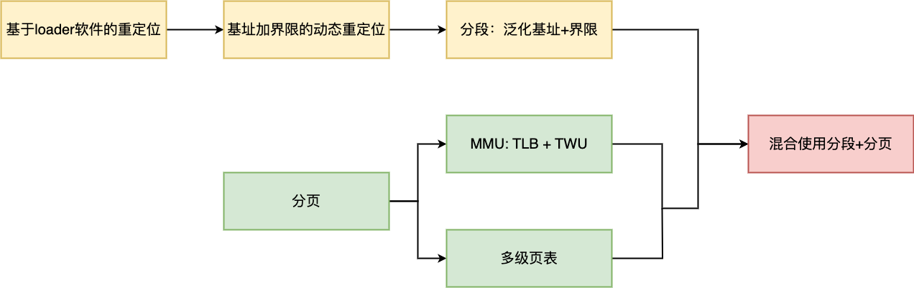

## *地址空间与虚拟内存*

### C/Cpp虚程序拟内存划分图

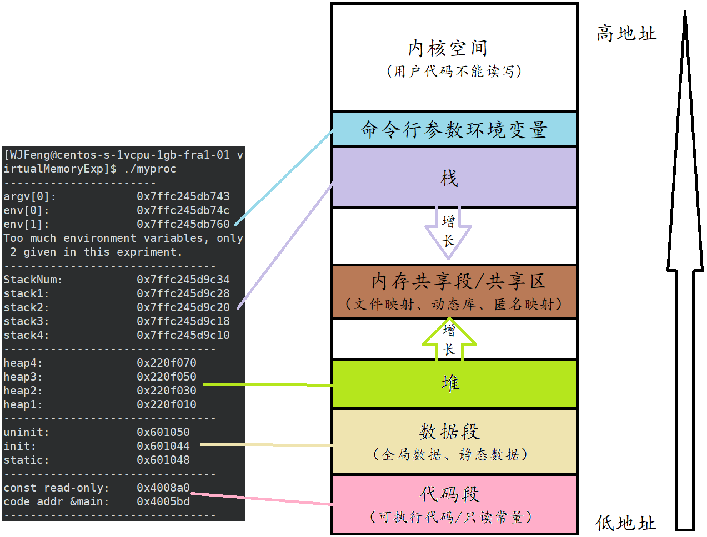

* 堆会多申请一些空间来存放和堆自身有关的属性信息，即cookie数据
* static修饰局部变量的本质就是将该变量开辟在全局区域
* 新建进程时会换入除堆和栈之外的代码，堆和栈只有在真正要用的时候才会开始开辟内存
* Linux vs Win 该结论只适用于Linux，Win可能由于不同的系统设计方法对于用户来说完全是随机的
* 问题：这样的内存划分是真实的物理内存划分吗？答案：不是！

### 为什么要引入地址空间和虚拟内存/优点

* 安全性
  * 批处理时代的计算机系统CPU是直接采用物理地址访问物理内存的，内存本身随时可以被读写，但这种方式非常的不安全，比如可以轻松地通过野指针访问损坏数据以及取得用户的私有数据。这些风险可以通过引入虚拟地址空间的保护机制来防护，即凡是非法的访问或者映射，OS都会识别并终止该进程
  * 举个例子：对于字符串常量 `char* str = "hello world"` 我们不能通过 `*str = 'H'` 进行修改，因为这是一个位于常量区的常变量。页表不仅维护了映射关系，也维护了其读写权限，当用户尝试对其非法读操作时，OS会直接终止当前进程，导致程序崩溃。这种方式不是物理上的保护，而是OS软件层面上的保护
* 解耦合内存管理模块和进程管理模块
  * 因为由地址空间和页表映射的存在，在物理内存中可以对未来的数据进行任意位置的加载。物理内存的分配就可以和进程的管理做到没有关系，也就是内存管理模块和进程管理模块完成了解耦合 Decoupling
  * 因为由地址空间的存在，所以上层申请空间时，其实是在地址空间上申请的，物理内存可以选择暂时不派发资源，而是在用于真正要访问物理内存空间的时候才执行内存的相关算法。这是一种延迟分配的策略，提高了整机的效率
* 有序化内存分布和独立性：物理内存理论上可以在任意位置加载，也就是说数据和代码在物理内存上是无序存放的。但因为页表的存在，它可以将地址空间上的虚拟地址和物理地址进行映射，因此在进程看来，内存就变成了有序的

结论：因为地址空间的存在，每一个地址都认为自己拥有总的内存空间，且各个区域是有序的，进而可以通过页表映射到物理内存上，从而实现进程的独立性。每一个进程不知道也不需要直到其他进程的存在

### 什么是地址空间与虚拟内存

* 地址空间 Address Space 是一种内核数据结构，它是运行的程序看到的系统中的内存

* 地址空间里面至少要有各个区域的划分，每一个进程都私有一份地址空间和页表（用户级）

* 只要保证每一个进程的页表，映射的是物理内存的不同区域，就能做到进程之间不会互相干扰，保证了进程的独立性

* 地址空间本质上就是一种内核中的数据结构 `struct mm_struct`，它里面至少要有对各个区域的划分，并结合维护映射关系的页表。该数据结构是PCB的一部分

  ```c
  struct mm_struct
  {
      int code_start;
      int code_end;
  
      int init_start;
      int init_end;
  
      int uninit_start;
      int uninit_end;
  
      int heap_start;
      int heap_end;
  
      int stack_start;
      int stack_end;
  
      // ... 其他属性
  }
  ```

* 本质上就是提供了一种OS看待内存的方案：即让PCB指向自己的地址空间数据结构并结合在内核空间中的页表来完成虚拟内存与物理内存之间的映射关系

### 内存编址与寻址

处于效率和计算机实际需求的考量，**大多数计算机的最小可寻址单元是Byte**，而不是bit

每台计算机都有一个字长 word size，用来指明指针数据的标称大小。虚拟地址根据一个字来对虚拟空间进行编制

* 32位操作系统：字长为32位，虚拟地址范围为$[0,2^{32}-1]$，可寻址 $2^{32}$ 个字节，虚拟地址空间大小为 $2^{32}=4\times2^{30}\approx4\times10^9=4GB$
* 64位操作系统：字长为64位，虚拟地址空间大小为 $2^{64}\approx1.84\times10^{19}=16EB$

### 一个直观的试验来验证是使用虚拟内存而不是直接使用物理内存

```c
#include <stdio.h>
#include <unistd.h>    
int g_val = 100;    
int main() {
    pid_t id = fork(); 
    // fork
    if (id == 0) {
        int count = 0;
        // Child process
        while (1) {
            printf("I am child, pid: %d, ppid: %d, g_val: %d, &g_val: %p\n", getpid(), getppid(), g_val, &g_val);
            printf("---------------------------------------\n");
            sleep(1);
            count++;
            if (count == 3) {
                g_val = 200;
                printf("child change g_val 100->200 success\n");
                printf("###################################\n");
            }
        }
    }
    else {
        // Parent process
        while (1) {
            printf("I am parent, pid: %d, ppid: %d, g_val: %d, &g_val: %p\n", getpid(), getppid(), g_val, &g_val);
            sleep(1);
        }    
    }
    sleep(1);
    return 0;
}
```


* 该实验发现，两个不同的进程使用了一个相同的地址，而该地址中存放的却不是相同的值
* 结论：C语言中使用的地址不可能是真是的物理地址，否则不可能同一地址却存的是不同值。而是虚拟地址（编译好形成可执行程序后叫做逻辑地址，二Linux中形成进程时又被称为线性地址）。几乎所有的语言角度上地址都不是物理地址，而是虚拟地址，这是为了保护系统本身免受用户错误的破坏
* 原因是因为地址空间和物理内存的分离：父子进程在用户层面用同一个变量，即同一个虚拟地址来表示，但通过不同的页表映射到了不一样的物理内存地址空间上。直观表现就是不同的进程使用了同一个变量，但变量的值却不一样。每个进程的地址空间是一样的，但只要其页表不同，从而映射到物理内存上的不同区域，就可以让进程达到独立性


### 地址空间设计方法

* `objdump -afh hello` VMA Virtrual Memory Address 可以发现，编译器编译后生成的可执行文件已经被分配了虚拟内存地址
* 可执行程序在编译形成可执行程序后，但还没有加载到内存中成为一个进程时，已经被分虚拟地址了。编译时编译器就会给每一条语句、函数、变量等分配好虚拟地址。可以把编译的过程理解为一个理清代码逻辑、程序如何跳转的过程，这就需要借助虚拟地址的帮助。因此形成的可执行文件中不仅包含代码本身的内容，还有其对应的虚拟地址
* 换种说法：地址空间不仅仅是OS内部要遵守的，其实编译器也要遵守。即编译器编译代码的时候，就已经给程序形成了各个区域，并且采用和Linux内核中一样的编址方式，给每一个变量，每一行代码都进行了编制。故程序在编译的时候，每一个字段便已经具有了一个虚拟地址
* CPU并不知道有物理内存地址，只知道虚拟内存地址，通过内核空间维护的页表来进行二者的连接
* 通过可执行文件中的虚拟地址和物理内存的物理地址的对应关系来构建页表
* 现代CPU中负责进行虚拟地址和物理地址转换的硬件是MMU Memory Management Unit


## *基于硬件的动态重定位*

### 基于loader软件的重定位

基于软件的静态重定位 software-based static relocation：出现在动态重定位之前，每次进行重定位都需要通过loader程序实现

基于软件的重定位是一种在加载时执行的技术，用于解决程序在内存中的实际物理地址和程序中的逻辑地址之间的不匹配。它通常涉及在程序的可执行代码中插入适当的指令或数据，以便在运行时进行地址修正

例如，假设一个程序中有一个相对地址引用，指向某个变量，而加载时并不知道该变量将位于内存中的哪个地址。在加载程序中，可以使用基于软件的重定位技术，在程序中的相对地址处插入指令，以便在运行时将相对地址转换为实际物理地址。

这种基于软件的重定位需要额外的指令和逻辑，会稍微增加程序的运行开销。并且基于软件的静态重定位无法提供保护且在运行后不能修改地址空间。相比之下，现代操作系统和处理器更倾向于使用硬件支持的分页和虚拟内存技术，这些技术可以在硬件层面自动进行地址映射和重定位，而不需要在程序中显式处理

### 基址加界限的动态重定位

通用技术：基于硬件的地址转换  hardware-based address translation，简称为地址转换。利用地址转换，硬件会将指令中的虚拟地址转换为物理地址 virtual address -> physical address。地址转换需要新的硬件和OS来共同实现

基址加界限机制 base and bound/基于硬件的动态重定位 hardware-based dynamic relocation：通过两个新的硬件**基址寄存器和界限寄存器硬件（有时也称为限制 limit寄存器）**快速完成重定位
* 之所以称为动态是因为通过硬件的重定位是在运行时发生的，而且甚至可以在运行开始后改变物理地址，只要移动拷贝一下内容到新的物理地址，然后改变一下基址寄存器里的值就行了。而基于软件的就不行，因为软件操作已经写死了
* 基址寄存器中保存的是地址空间的起始地址，每次进行重定位时，**电路会自动为虚拟地址加上寄存器里的值来得到物理地址**
* 界限寄存器中保存的是地址空间的大小，提供了保护。当要访问超越界限寄存器限制的地址空间时，会向CPU发送异常。有两种检查方式，可以是在虚拟地址和基址寄存器求和前检查界限，也可以是在转换虚拟地址到物理地址之后再检查界限

基址和界限寄存器属于CPU，早期如8086等是由ALU来负责计算，将虚拟地址转换为物理地址的

现在的大部分CPU中负责地址转换的结构称为MMU Memory Management Unit 内存管理单元，这种专用的硬件相比于直接用ALU来计算更加高效。当然MMU肯定不是只有基址和界限寄存器，还有其他很多的元件。MMU最早用于一些大型机和小型机上，并没有用到微机上


**问题**：如上图所示，对于一个占用内存空间较小的进程，物理内存中的已经分配给进程但没有使用的堆栈（尤其是堆）造成了很大的空间浪费，这种浪费称为**内部碎片 internal fragmentation**

### OS在地址转换中要考虑的问题

* 内容管理：通过空闲列表 free list 来管理内存，即为新进程分配内存空间，从终止的进程回收内存空间
* 基址/界限管理：因为CPU只有一个基址寄存器和一个界限寄存器，所以在进程切换时要正确处理上下文内容
* 异常处理

## *分段 Segmentation*

### 分段：泛化基址+界限

为了解决内部碎片的问题，提出了分段的思想。分段的思想是为每个进程空间不止分配一对基址/界限寄存器，而是为每个逻辑段 segment 分配一对逻辑上的基址/界限寄存器，之所以说是逻辑上，是因为物理上MMU当然还是只有一对基址/界限寄存器

一个逻辑段就是在地址空间里的一个连续定长的区域，比如代码段、栈、堆等。通过分段机制可以让OS将地址空间拆开，将每一个段放到任意OS觉得合适的物理地址上，而从虚拟地址角度，这些段还是连续一起存放的

对于多个段，每个段的虚拟地址是通过**OS维护的段表**与物理地址进行映射的


### 找到从属段

看到上面的分段示意图后，在进行地址转换时一个最自然的问题就是如何知道当前要转换的虚拟指令的地址是属于那个段的，也就是说应该要用哪一对基址/界限寄存器来进行地址转换

* 显式方法 explicit method：用虚拟地址的开头几位来标识不同的段，其余位用来标识段内偏移。VAX/VMS系统就采用了这种方法
* 隐式方法 implicit method：硬件通过地址产生的方式来确定段。比如说若地址是由程序计数器产生的，那么地址肯定在代码段

### 更多的硬件支持

* 反向增长标识位：对于栈是从高向低反向增长的段需要特殊处理：段寄存器中添加一位flag来标识是否反向增长，1为否，0位是
* 保护位 protection bit 支持共享， 比如说代码段 `.text`
* 细粒度：粗粒度 coarse-grained vs. 细粒度 fine-grained

## *空闲空间管理*

对于外部碎片问题，一种直接的解决方法是紧凑物理内存 compact physical memory。但这是一种成本很高的方法，因为拷贝段是内存密集型的，会占用大量的CPU时间。一种更优的方法是利用空闲列表管理算法，试图保留大的内存用于分配

### 底层机制

* 分割 slicing：申请内存时，找到一块可以满足请求的空闲空间，将其分割
* 合并 coalescing：归还内存时，查看代归还的空间地址以及它附近的空间，合并连续的可用空间
* 追踪已分配空间的大小
  * `free()` 的时候只需要传一个指针，不需要传大小，这是因为在申请空间的时候多申请了一个头块 header，里面保存了空间相关的信息
  *  `new[], delete[]` 括号不匹配出错和头块有一些关系，可以看Cpp.md
* 让堆增长：`sbrk()` 系统调用

### 基本策略

* 最优匹配 best fit
* 最差匹配 worst fit
* 首次匹配 first fit
* 下次匹配 next fit

## *分页 Paging*

分段的空间碎片化问题是无法被彻底解决的。为了尽可能提高空间利用率，引入了分页机制

分页不是将一个进程的地址空间分割成几个不同长度的逻辑段（比如代码段、堆、栈等），而是**分割成固定大小的页单元 page**。相应将物理内存看成是定长槽块的阵列，叫做**页帧 page frame**，每一幅页帧对应一个虚拟内存页

### 页表及地址转换过程

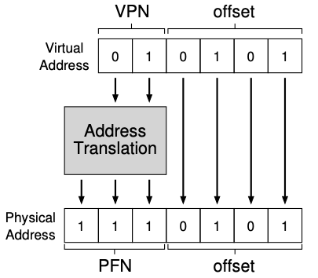

* 页地址可以分为VPN Virtual Page Number 虚拟页面号和offset 页内偏移量。VPN的位数 $a$ 和offset的位数 $b$ 满足 $2^{a+b}$ = 虚拟地址空间的大小，$2^a$ = 一个虚拟地址空间中支持多少张页，$2^b$ = 一张页的大小
* 地址转换时offset不变，VPN通过地址转换器（ALU或MMU）转换为物理帧号 Physical Frame Number PFN（或者称为Physical Page Number PPN）。将PFN与不变的offset再拼接一次就可以得到物理地址 Physical Address 了

页表是用来管理虚拟内存的页地址和物理内存的页帧地址的映射关系的数据结构，也就是上图中的Address Translation 地址转换机构。页表是一个**每进程**的数据结构，属于每个PID定义的结构。最简单的页表结构为线性页表 linear page table

注意：**地址转换器通过虚拟页号检索到的并不直接是一个物理页帧号**，而是一个包含了PFN的页表项 Page Table Entry PTE，里面还包括了其他的数据位。下图是一个4KB的x86架构的页表项

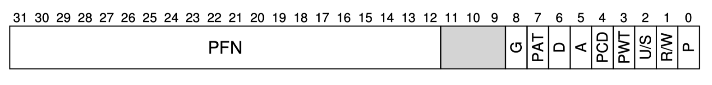

* 有效位 valid bit：已经有地址转换的为0，**还没有使用的堆、栈为1（注意：即使是还没有使用也要记录下该项页表映射，这也是造成纯分页方案体积巨大的原因）**
* 保护位 protection bit ：读写执行权限
* 存在位 present bit **P**：该页是否被换出到磁盘上
* 读写位 **R/W**
* 用户模式：用户/超级用户 **U/S**
* 脏位 dirty bit **D**：页被带入内存后是否被修改过
* 参考位 reference bit/访问位 accessed bit **A**：用于追踪页是否被访问，也用于确定哪些页很受欢迎，在页面替换中有重要作用
* 全局位 global **G**：这个位在全局页表中有不同的用途。在每个进程的页表中，通常被忽略。在全局页表中，它可以阻止页面从TLB（转换后备缓冲器）中被清除

### 页表存放位置

<span id="页表过大问题">假设32位的地址空间，一个页为4KB，那么最多有 $2^{32}\approx4*10^6KB/4KB=10^6$ 个页表，如果设一个页表项为4 Byte，那么一个进程的地址空间需要的页表为 $10^6*4Byte=4MB$。为了支持OS的运行，随随便便就需要上百个进程，那么仅仅是为了记住这些页表就要占掉几个G的物理空间</span>

所以显然页表不可能放在MMU的寄存器硬件中，甚至如果不进行进一步处理，甚至都不能放在内存里。实际中还可以换出 swap 到硬盘上来减少内存的占用。因为不能放在MMU里，也会造成多次引用从而降低速度

## *处理两次内存引用带来的速度损失：MMU*

### 单条指令/数据需要两次内存引用

以一个简单指令 `movl 66 %eax` 为例，这是对立即数66内存引用，即 `M[66]`。66当然是一个虚拟地址空间，因此内存引用要分访问页表和获取页表项两步走

1. 通过对虚拟地址进行两次掩码计算可以得到页表数组的索引和偏移量
1. 页表基址寄存器 page-table base register 包含了页表的起始位置的物理地址，对基址寄存器直接引用得到页表的起始物理地址。用上一步得到的PTE索引值得到对应的PTE
1. 然后合并从对应PTE中取出的PFN和原来的偏移量，可以得到实际物理地址
1. 对实际物理地址再进行内存引用可以得到需要的值

### TLB

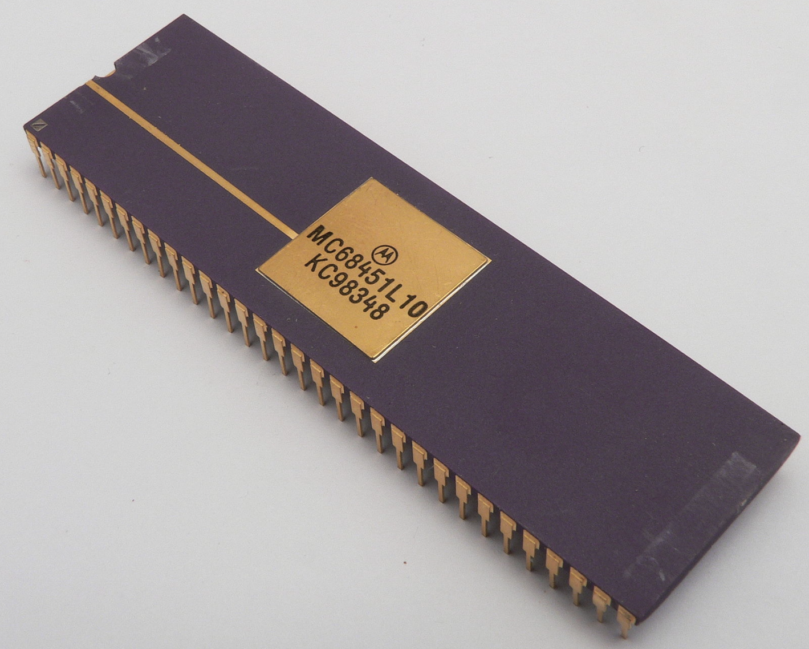

上图是MC68451内存管理单元，可与摩托罗拉68010处理器协同使用

CPU中的MMU是由旁路转换缓冲期 Transfer Lookaside Buffer TLB 和 Table Walk Unit TWU构成的

TLB是一个高速缓存，它缓存了常用到的页表项PTE。TLB被整合在CPU中，所以它的访问速度和CPU是一致的，这也导致了未命中会导致两次内存引用，代价很大。所以和普通的Cache一样，TLB也要尽可能借助时空局部性来提高命中率，比如说密集的、基于数组的访问就具有比较好的空间局部性

### 处理TLB未命中

虚拟地址转换[一] - 基本流程 - 兰新宇的文章 - 知乎 <https://zhuanlan.zhihu.com/p/65298260>

* Hardware TLB miss handling：CISC使用TWU硬件单元来查找page table
* Software TLB miss handling：RISC则由OS来处理

使用硬件的方式更快，而使用软件的方式灵活性更强。IA64则提供了一种混合模式，可以兼顾两者的优点

### 上下文切换对TLB的处理

TLB中包含的虚拟到物理的地址映射只是对当前进程有效，对其他进程则没有意义。可以直接将TLB清空来为切换的进程做准备，一般是有软硬件两种方式来解决

* 软件：发生上下文切换时，用一条显示的特权指令来清空
* 硬件：在页表基址寄存器内容发生变化时清空TLB

不论是哪种方法都是有开销的，所以此时可以进一步寻求硬件的支持，就是在TLB项中添加一个用于标注进程身份的类似于PID的ASID Address Space Identifier

### TLB表项

```
VPN | PFN | 其他位
```

## *处理页表的大size问题*

### 为什么不能按需建立页表

理论上，按需建立页表是可行的，这样可以节省一些空间。但是在实际操作系统中，为了保证系统的性能和稳定性，操作系统需要保证快速响应进程的页表访问请求，这就需要预先建立好整个虚拟地址空间的页表，并将其映射到物理内存中，以便快速访问

如果按需建立页表，那么在进程第一次访问某个虚拟地址时，操作系统需要动态地为这个地址建立页表，并将页表映射到物理内存中。这会增加操作系统的开销，降低系统的性能。此外，在进程第一次访问某个虚拟地址时，如果操作系统没有足够的空闲物理内存页框可供分配，那么就需要将某些物理页框换出到磁盘中，这也会增加操作系统的开销和延迟

因此，在实际操作系统中，通常会预先建立整个虚拟地址空间的页表，并将其映射到物理内存中，以便快速响应进程的页表访问请求，并在进程第一次访问某个虚拟地址时，操作系统会将相应的物理页框分配给该虚拟地址，并更新页表项。这种方法可以保证系统的性能和稳定性，但是会占用一定的空间

### 混合使用分段和分页

如果虚拟地址空间中某些部分没有映射到物理地址，那么操作系统会将对应的页表项置为空，即这些页没有被映射到任何物理内存页框中。因此，即使一个进程只使用了虚拟地址空间的一小部分，操作系统仍然需要建立完整的页表来管理整个虚拟地址空间，以便于CPU能够快速地访问任意虚拟地址所对应的物理地址。所以为了之前提过的[页表过大问题](#页表过大问题)，可以混合使用分段和分页两种方法

单纯分页的时候是为整个地址空间的所有地址都建立页表映射，但现在是为每个段建立页表映射，比如说最基本的为代码段、栈、堆分别建立一个页表映射。现在基址寄存器不是指向段本身，而是保存该段的页表的物理地址，而界限寄存器则用来指示页表的结尾（即它有多少有效页）

因为不再需要为未分配的栈和堆建立映射关系，分段+分页的方法有效减少了页表的大小

### 多级页表：按需建立页表


多级页表的原理是**局部性原理**，也就是说不会创建没有用到的一级页表地址对应的二级页表。虚拟地址在被转换的过程中，不是直接转换的，而是将其分成10-10-12的形式通过多级页表进行分次寻址

虚拟地址空间划分成4KB的页帧（IO的基本单位一般是4KB的块，但根据OS不同，也有1KB或2KB）。为什么要划分成4KB？因为 $2^{12}=4KB$，这是虚拟地址内存管理的基本单位：页框

一共有 $4GB/4KB=2^{20}$ 次个页框，OS要对其进行管理

```c
struct page {}//数据结构
struct page mm[1024*1024]//数组d
```

多级页表的好处

* 是否命中是以页为单位的，将进程虚拟地址管理和内存管理，通过page进行解耦
* 分页机制，按需创建页表，若以4KB为单位的页框单位没有用到，就不需要为其映射页表，以此来节省空间

32位下的二级页表可以进一步推广到64位下的4级页表


* 全局页目录项 PGD Page Global Directory
* 上层页目录项 PUD Page Upper Directory
* 中间页目录项 PMD Page Middle Directory
* 页表项 PTE Page Table Entry

## *超越物理内存：Swap Space*

# OS中的IO

## *提高IO效率*

### CPU与内存之间的IO：PIO

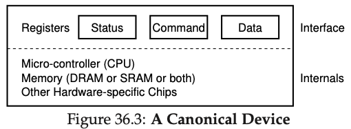

所有的设备都可以抽象成如上的标准设备模型，抽象上可以将其分割为两部分

* 暴露给系统其他部分的接口 Interface，即3个寄存器
  * `status` 寄存器：显示设备当前所处的状态
  * `command` 寄存器：通知设别执行某个动作
  * `data` 寄存器：读写数据
* 系统内部的硬件结构，比如硬件本身的CPU、RAM或大量的驱动程序和固件等

```
while (STATUS == BUSY) ; // wait until device is not busy
Write data to DATA register
Write command to COMMAND register (Doing so starts the device and executes the command)
While (STATUS == BUSY) ; // wait until device is done with your reques
```

OS与设备交互的标准协议是轮询 polling，即OS反复读取 `status` 寄存器，查询其是否已就绪（是否可以开始写、是否已经写完）

古老的设备中CPU是一个任何事都亲力亲为的设备，包括从内存、其他外设读写数据。需要将数据先保存到CPU再进行下一步的操作。比如说如果上面的协议内容都是CPU在参与数据移动的话，就称之为PIO Programmed IO

轮询标准协议的好处是简单，但坏处是这是一种阻塞式IO，效率很低，如下图中，CPU在IO过程中只是在不断自旋和询问，CPU的能力完全被浪费了

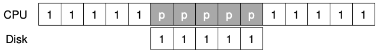

可以通过软件和硬件的结合来提高IO的效率。零拷贝是指计算机执行IO操作时，CPU不需要将数据从一个存储区域复制到另一个存储区域，从而可以减少上下文切换以及CPU的拷贝时间

* 硬件：DMA
* 软件
  * mmap+write
  * sendfile

关于DMA以及网络IO的内容可以看 *微机原理与接口技术.md* 和 *高并发.md*

### 硬件：利用中断和DMA进行高效数据传输

中断允许计算与IO重叠 overlap，这是提高CPU利用率的关键。然而CPU仍然需要自己将数据copy给IO

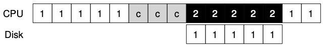

DMA Direct Memory Access 直接内存访问是一种内存访问技术。它允许某些电脑内部的硬件子系统（电脑外设），可以独立地直接读写系统内存，而不需要CPU介入处理。DMA相当于是CPU委托读写数据的外包公司

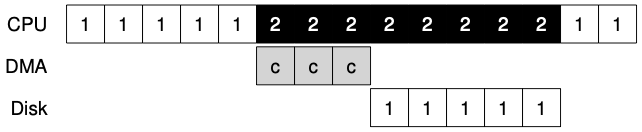

因为使用了DMA，也就无法实现直接从内存某处到内存另外一处的数据转移，而是要通过内存->寄存器、寄存器->内存的方式来进行

## *RAID*

### RAID简介

RAID Redundant Array of Inexpensive Disks 廉价冗余磁盘阵列技术：虚拟化储存技术把多个磁盘组合起来，构建一个更大、更快、更可靠的磁盘系统。RAID硬件非常像一个计算机系统，专门用于管理一组磁盘，它有自己的处理器、内存和磁盘，并且有专用的用于操作RAID的软件

RAID优点

* 性能 performance：并行使用多个磁盘来提高IO速度
* 容量 capacity：集合多个磁盘
* 可靠性 reliability：通过不同的冗余等级 redundancy level 来一定程序上RAID抗数据丢失的风险
* 透明性/解耦：更改RAID系统的单个磁盘不会对系统的其他部分造成影响

### RAID-0 level 性能基准

RAID-0对于连续和随机工作负载的效果和单个普通磁盘的效果是一样的，即传输连续工作负载的吞吐量远大于随机工作负载

### RAID-1 level

# 文件系统

## *intro*

### <span id="VFS">虚拟文件系统</span>

文件系统的种类众多，而**OS希望对用户提供一个统一的接口**。从而可以在OS上挂载不同的文件系统，而用户却可以得到相同的体验，实现文件系统和系统的部分解耦。实现的方法是在用户层与文件系统层中添加一层，即虚拟文件系统 Virtual File System VFS

称VFS是虚拟的，是因为它所有的数据结构都是在运行以后才建立，并在卸载时删除，在磁盘上并没有存储这些组织管理用的数据结构。若只有VFS，系统是无法工作的，因为它的这些数据结构不能凭空而来，只有与实际的文件系统，比如Ext 2/3/4 相结合后才能开始工作

Linux中采用面向对象或者说是多态的方法来设计IO。通过将函数指针写入struct file中的方法给每一个文件读写接口

```c
struct file {    
    int size;    
    mode_t mode;    
    int user;    
    int groupt;    
    // ...     
    // 函数指针    
    int (*readp)(int fd, void *buffer, int len);    
    int (*writep)(int fd, void *buffer, int len);    
    // ...     
}    
```


VFS 提供了一组操作函数（例如 `open()`、`read()`、`write()`、`close()` 等），这些操作函数的实际内容都是通过硬件的驱动实现的。当应用程序调用这些操作函数时，VFS 会将调用转发给对应的文件系统模块，由文件系统模块负责实现具体的读写操作

在文件系统模块中，实现读写操作的函数被称为“文件操作函数”（file operation），通常用一个 `file_operations` 结构体来表示。这个结构体中包含了文件系统中实现读写操作的函数，例如 `read()` 和 `write()` 函数就被存储在 `file_operations` 结构体中。当应用程序调用 `read()` 或 `write()` 函数时，VFS 会将调用通过指针指向给对应的文件系统模块，并执行该模块中的 `file_operations` 结构体中对应的函数

注意：**下面要说的数据结构都是属于时机的文件系统的，VFS只是提供了一些系统调用的API**，比如 sys_write、sys_open 等

### Linux下一切皆文件

* 站在Linux系统的角度，能够被input读取，或者能够output写出的设备就叫做文件
* 广义上的文件：显示器、键盘、网卡、磁盘等几乎所有的外设都可以被称作文件
* Linux支持的文件系统可以按照存储位置的不同分为3类
  * **磁盘文件系统**：它直接把数据存储在磁盘中，比如 Ext 2/3/4、XFS 等都是这类文件系统
  * **内存文件系统**：这类文件系统的数据不存储在硬盘上，而是占用内存空间，我们经常用到的 `/proc` 和 `/sys` 文件系统都属于这一类，读写这类文件，实际上是读写内核中相关的数据
  * **网络文件系统**：用来访问其他计算机主机数据的文件系统，比如 NFS、SMB 等等

### 文件系统的基本组成

文件系统是操作系统中负责管理持久数据的子系统。即负责将文件存到硬盘硬件或从中取出

* 文件是文件系统的基本数据单元。文件系统的目的是对磁盘上的文件进行组织和管理。因为组织管理的方法不同（用不同的数据结构来描述）就会形成不同的文件系统，最著名的有ex2、ex3、exFAT、NFS等等
* 文件 = 文件内容（一个线性字节数组，即数据） + 文件属性（元数据）。因此对文件的所有操作要么就是对内容的操作，要么就是对属性的操作

#### 文件访问与语言的跨平台性

* 访问文件的本质是进程通过接口访问文件。只有OS有权利向硬件写入数据，因此普通用户想要往硬盘写入数据就必须让OS提供文件类的系统调用接口
* 文件类的系统调用接口比较复杂，为了使用户更好地使用，因此每种语言对这些系统接口做了封装。从而导致了不同的语言由不同的语言级别的文件访问接口（都不一样），但底层的系统接口都是一样的
* 不同的平台提供不同的接口，一旦使用系统接口来编写文件代码，就无法在其他平台上直接运行了，也就是不具备跨平台性。跨平台性要从语言级别上封装解决，也就是把所有平台的代码都实现一遍然后采用条件编译，动态裁剪

## *C语言和系统级别的调用接口*

### 接口的封装关系

以open的封装为例说C标准库、glibc 运行时库、系统调用和Linux内核的关系

C函数 `fopen`，系统调用 `open`，系统调用 `__libc_open` （glibc/sysdeps/unix/sysv/linux/open.c）和Linux内核 `sys_open` （/fs/open.c）是在 C 和 Linux 系统中用于打开文件的函数，它们之间的关系如下：

1. 当应用程序调用 `fopen` 函数时，实际上是调用由 C 库提供的一个包装函数 wrapper function（包装函数就是封装了其他函数的函数）。这个包装函数对传递给 `fopen` 的参数进行了一些额外的处理，然后调用 `__fopen_internal` 函数
2. `__fopen_internal` 是 C 库的内部函数，它实现了实际的文件打开逻辑。它会根据使用的 C 库版本调用 `open` 或 `__libc_open` 函数
3. `open` 和 `__libc_open` 都是用于打开文件的函数。`open` 是 Linux 内核提供的系统调用，而 `__libc_open` 是 C 库的内部函数，提供了更灵活的打开文件接口。根据使用的 C 库版本，`__fopen_internal` 可能会调用 `open` 或 `__libc_open`
4. `sys_open` 是 Linux 内核提供的系统调用，由 `open` 或 `__libc_open` 调用，用于实际打开文件并返回文件描述符，这个文件描述符可用于后续的读写操作

因此，它们之间的调用顺序可以总结如下

1. 应用程序调用 `fopen` 函数
2. C 库的包装函数处理参数并调用 `__fopen_internal`
3. `__fopen_internal` 根据使用的 C 库版本调用 `open` 或 `__libc_open`
4. `open` 或 `__libc_open` 调用系统调用 `sys_open` 来打开文件并返回文件描述符
5. `sys_open` 打开文件并返回文件描述符
6. `open` 或 `__libc_open` 将文件描述符返回给 `__fopen_internal`
7. `__fopen_internal` 将 FILE 指针返回给 C 库的包装函数
8. 包装函数将 FILE 指针返回给应用程序

总结一下

* C函数是纯语言级别的库，涉及到系统的函数会去封装系统调用
* 系统调用是OS封装好暴露出接口交给用户使用的库，system call的时候会发生陷入内核
* Linux内核函数是最底层的库，完全由系统使用，用户无法接触到

### C语言文件接口

* 当前路径：当一个进程运行起来的时候，每个进程都会记录自己当前所处的工作路径

* C/Cpp程序 默认会打开三个文件流：标准输入 `FILE *stdin`、标准输出 `FILE *stdout`、标准错误 `FILE *stderr`

* C语言接口

  * C语言打开文件 fopen：r, r+, w（在fwrite前就清空）, w+, a（追加）, a+

  * C语言按行读取文件：fgets

  * C语言写文件：fwirte, fprintf, fputs

  * 实现cat命令

    ```c
    #include <stdio.h>    
    #include <unistd.h>    
    #include <string.h>    
    
    int main(int argc, char *argv[]) {    
        if (argc != 2) {    
            printf("argv error\n");    
            return 1;    
        }    
        FILE *fp = fopen(argv[1], "r");                                                                             
        if (fp == NULL) {    
            perror("fopen");    
            return 2;    
        }    
        // 按行读取    
        char line[64];    
        // fgets是C语言的接口来取string，因此会自动在字符结尾添加\0    
        while (fgets(line, sizeof(line), fp) != NULL) {    
            // printf("%s", line);    
            fprintf(stdout, "%s", line);    
        }    
        return 0;    
    }    
    ```

### 系统调用接口

* 系统调用接口有 `open, close, read, write`，C语言对应的封装函数为 `fopen, fclose, fread, fwrite`

* 补充知识：bitmap 位图：将选项#define为不同的比特位，通过输入形参的不同组合来达到选择或同时输入多个参数的目的

  ```c
  #include <stdio.h>    
  #include <unistd.h>    
  #include <string.h>    
      
  // 用int中的不重复的一个bit，就可以表示一种状态    
  #define ONE 0x1 // 0000 0001    
  #define TWO 0x2 // 0000 0010    
  #define THREE 0x4 // 0000 0100    
      
  void show(int flags)    
  {    
      if (flags & ONE)    
          printf("hello one\n");    
      if (flags & TWO)    
          printf("hello two\n");    
      if (flags & THREE)    
          printf("hello three\n");    
  }    
      
  int main()    
  {    
      show(ONE);    
      printf("-------------------------\n");    
      show(TWO);    
      printf("-------------------------\n");    
      show(ONE | TWO);    
      printf("-------------------------\n");    
      show(ONE | TWO | THREE);    
      printf("-------------------------\n");                                                              
      show(ONE | THREE);    
      return 0;    
  }    
  ```

* 以 `open` 为例，查看open的手册，`man 2 open`

  

  * `flags` 是一种bitmap选项，`mode` 则是选择文件权限
  * `int fd = open("log.txt", O_WRONLY|O_CREAT|O_TRUNC, 0666)`：添加了权限码，用来创建文件，通过该种bitmap组合实现了 fopen w的效果
  * `int fd = open("log.txt", O_WRONLY|O_CREAT|O_APPEND, 0666)`：通过该种bitmap组合实现了 fopen a 的效果
  * `int fd = open("log.txt", O_RDONLY)`：不添加权限码，默认文件已经存在，会受umask的影响

* `close`

  ```c
  #include <unistd.h>
  int close(int fd);
  ```

* `write`

  ```c
  #include <unistd.h>
  ssize_t write(int fd, const void *buf, size_t count);
  ```

  * `buf` 计划写入的缓冲区
  * `count` 要写的字节数
  * 返回写入的字节数

* `read`

  ```c
  #include <unistd.h>
  ssize_t read(int fd, void *buf, size_t count);
  ```

  * 参数和write一样
  * 返回读到的字节数，若读到的是0，则意味着文件结束了，注意：换行和回车也是有效字符，不为0！
  
* 使用 `sync(int fd)` 立即将脏数据 dirty data 落盘

## *文件描述符 File Descriptor*

### 文件描述符fd引入

* 0，1，2号fd对应的分别是stdin，stdout，stderr

  * 验证

    ```c
    printf("stdin: %d\n", stdin->_fileno);
    printf("stdout: %d\n", stdout->_fileno);
    printf("stderr: %d\n", stderr->_fileno);
    ```

    输出结果分别为0，1，2

  * stdout 和 stderr 的区别：对应的外设可以理解为都是显示器，但是是不同的“显示器”，但对其做重定向到磁盘文件时，只有stdout会被重定向

  * 将 stdout 和 stderr 分开重定向到两个txt文件中：`./myfile > ok.txt 2> err.txt` 或者重定向到1个文件中：`./myfile > log.txt 2>&1`

* 进程要访问文件必须先打开文件，而一个进程可以打开多个文件。

* 文件要被访问，前提是要被加载到内存中才能被直接访问。OS内部为了管理每一个被打开的文件，构建 struct file（其中包含了每一个被打开的文件的几乎所有内容，不仅仅包含属性）。创建一个struct file的对象，充当一个被打开的文件，多个文件则struct file以链表的形式组织起来

  ```c
  struct file {
      struct file *next;
      struct file *prev;
      // 包含了一个被打开的文件的几乎所有的内容（不仅仅包含属性）
      // 文件的属性本来是保存在硬盘上的，加载入内存的时候也被加载进struct file中
  }
  ```

* **fd在内核中，本质是一个数组下标**。内核中进程的PCB结构体有一个\*files，它指向 fd_arrary 文件描述符表，fd就是这个数组的下标，OS通过该下标来找到需要进行操作的文件

  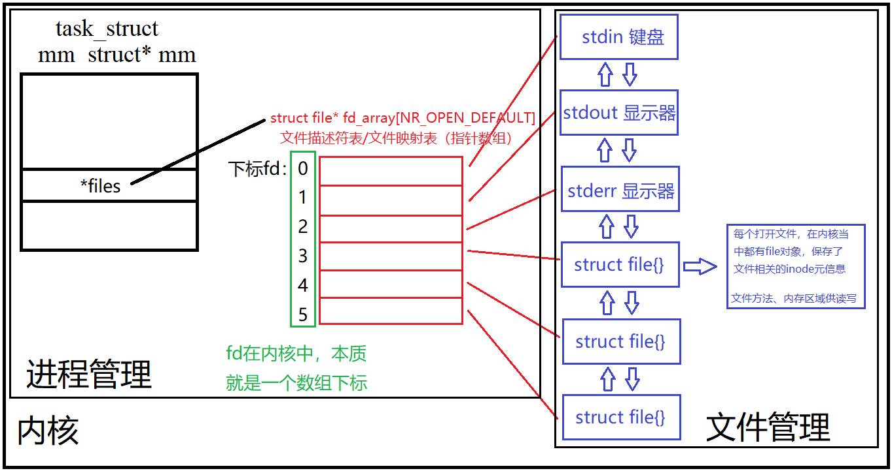

### fd和重定向 redirection

* fd分配规则：优先分配最小的，且违背占用的fd
* 输出重定向试验：为显示器默认分配的fd\==1，现在将fd\==1重定向到自定义文件 `log.txt` 中
* 重定向的本质：在OS内部，更改fd对应内容的指向

```c
int main() {    
    close(1);    
    // 这里的fd的分配规则是：优先分配最小的没有被占用的文件描述符    
    int fd = open("log.txt", O_WRONLY | O_CREAT | O_TRUNC, 0666);    
    if (fd < 0) {    
        perror("open");    
        return 1;    
    }      
    printf("fd: %d\n", fd);    
    fprintf(stdout, "hello fprintf\n");    
    const char *s = "hello fwrite";    
    fwrite(s, strlen(s), 1, stdout);    
    
    fflush(stdout);    
    close(fd);    
    return 0;    
}    
```

* `int dup2(int oldfd, int newfd)` 系统调用进行重定向：改变文件描述表 `struct file* fd_array` 中存储的文件指针，将newfd下标存放的文件流指针替换为oldfp下标所存放的文件指针以完成重定向

  

## *缓冲区*

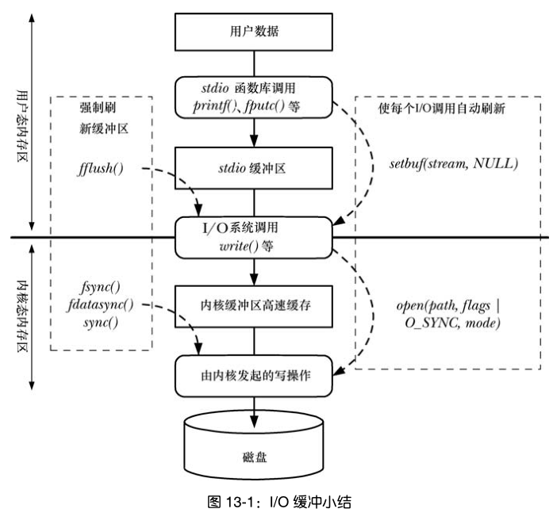

系统中一共有两种级别的缓冲区：语言级别的用户空间缓冲区和内核级别的缓冲区。以C语言和Linux OS为例，分别为stdio库的缓冲区和Page Cache机制

### 缓冲区基础

* 为什么要有缓冲区？ -- Cache写方法，提高系统效率
* 缓冲区的刷新策略
  * 立即刷新
  * 行刷新/行缓冲 `\n`：一般是显示器采用这种刷新策略
  * 满刷新/全缓冲：缓冲区满了才刷新，一般是磁盘文件考虑效率采用这种刷新策略 
  * 特殊情况
    * 用户强制刷新 `fflush`
    * 进程退出时若没有被 `close(fd)` 的话就强制刷新
  * 所有设备处于效率考量都倾向于使用全缓冲。这是因为在和外部设备IO的过程中，数据量的大小不是主要矛盾，OS和外设预备IO的的过程才是最耗费时间的，全缓冲可以有更少次的IO，从而提高了效率。其他刷新策略是结合具体情况做的妥协，如显示器是因为给用户看的，需要同时考虑到效率和用户体验
* 缓冲区的位置

### 语言级别的缓冲区：stdio缓冲区试验


* 现象：同样的一个程序，向显示器打印时只输出4行文本，但向磁盘上的普通文件重定向打印时就变成了7行，其中C的IO接口打印了2次，而系统接口则和向显示器上打印一样只打印了一次
* 原因：直接调用是写给stdout，策略是行缓冲；后来重定向到文件中，对于磁盘上的文件刷新策略是全缓冲，父进程产生的数据还保留在它的PCB上下文数据中，父子进程退出的时候一并刷新
* 函数退出的时候强制刷新缓冲区，这是一个将数据写给OS的过程，即发生了写时拷贝
* 从试验结果可以看到，缓冲区的刷新策略改变并不会影响系统调用，这说明缓冲区是由语言层面维护的，而非系统层面

### Page Cache

Page 页是内存管理的基本单位，而Page Cache 页缓存是操作系统中的一种**内存缓存机制**，用于提高文件系统的性能。它是在文件系统和物理磁盘之间的一层[缓冲区](#VFS)，将磁盘上的数据以页面的整数倍形式缓存在内存中，以加快对文件的访问速度

当应用程序需要读取文件时，操作系统会首先检查 Page Cache 中是否已经存在所需的页面。如果页面已经缓存在内存中，操作系统可以直接从缓存中读取数据，避免了频繁的磁盘访问。如果页面不在缓存中，操作系统会将该页面从磁盘读取到缓存中，并提供给应用程序使用。类似地，当应用程序写入文件时，操作系统会首先将数据写入 Page Cache，然后在适当的时机再将数据刷写回磁盘

Page Cache 的存在极大地提高了文件系统的读取性能，因为内存的访问速度比磁盘快得多。大多数文件读取操作可以直接在内存中完成，避免了昂贵的磁盘 I/O 操作。此外，Page Cache 还可以提供一定程度的文件写入性能提升，因为数据可以先暂存在内存中，减少对磁盘的频繁写入操作

Page Cache 是透明的，对应用程序而言是不可见的，它是操作系统的一部分。操作系统会根据需要自动管理 Page Cache 的内容，并在内存紧张时自动释放一部分缓存空间

需要注意的是，Page Cache 的存在会导致文件系统的修改对应用程序的可见性延迟。因为数据首先写入到缓存中，而不是直接写入磁盘，所以在数据被刷新回磁盘之前，对文件的修改对其他应用程序是不可见的。这就意味着，如果系统崩溃或断电，尚未刷新到磁盘的数据可能会丢失。为了确保数据的持久性，应用程序可能需要使用类似于 `fsync()` 的操作来强制将数据刷新到磁盘上

Linux系统可以通过读取 `/proc/meminfo` 文件来查看系统内存

Page Cache中的数据是采用基数树组织的，效率很高

### Page & Page Cache

**并不是所有 page 都被组织为 Page Cache**，Linux 系统上供用户可访问的内存分为两个类型

* File-backed pages：文件备份页也就是 Page Cache 中的 page，对应于磁盘上的若干数据块；对于这些页最大的问题是脏页回盘。这种page的swap效率较高
* Anonymous pages：匿名页不对应磁盘上的任何磁盘数据块，它们是进程的运行时内存空间（例如方法栈、局部变量表等属性）。swap效率较低

还要注意：不是所有的磁盘数据都会被加载为内存的Page Cache中，比如Directed IO直接访问了 Buffer cache

[Buffer Cache](#VFS)（缓冲区缓存）是操作系统中另一种用于提高文件系统性能的内存缓存机制。它类似于 Page Cache，但其重点是缓存文件系统层面的数据块，而不是整个文件页面

Buffer Cache 的主要作用是减少磁盘 I/O 操作，通过将文件系统的数据块缓存在内存中，以便更快地访问和操作这些数据。当应用程序读取或写入文件系统的数据块时，操作系统会首先检查 Buffer Cache 中是否已经存在所需的数据块。如果数据块已经缓存在缓冲区中，操作系统可以直接从缓存中读取或写入数据，避免了对磁盘的实际读写操作

Linux Kernel 2.4之前，Page Cache 与 buffer cache 是完全分离的。2.4 版本内核之后，两块缓存近似融合在了一起：如果一个文件的页加载到了 Page Cache，那么同时 buffer cache 只需要维护块指向页的指针就可以了。只有Directed IO菜会真正放到buffer cache。因此现在说的Page Cache一般就是指这两者的结合

### Page Cache 与文件持久化的一致性&可靠性

任何系统引入缓存，就会引发一致性问题：即内存中的数据与磁盘中的数据不一致。例如常见后端架构中的 Redis 缓存与 MySQL 数据库就存在一致性问题

Linux提供了两种保证一致性的策略：写回与写透

* 写回策略 write-back 是指在更新缓存中的数据时，**只更新缓存而不立即写回到底层存储介质**。当数据被修改后，只会更新到缓存中的对应位置，而不是立即写入到主存或磁盘中。当数据被置换出缓存或缓存行被替换时，才会将被修改的数据写回到底层存储介质。**OS中存在周期性的线程执行写会任务，这是OS默认的方案**
* 写透策略 write-through 是指**在更新缓存中的数据时，同时将数据写回到底层存储介质**。当数据被修改后，会立即更新到缓存中的对应位置，并且同时将修改后的数据写入到主存或磁盘中。向用户层提供特定接口，用户可以自行调用强制写透

写回和写透之间的主要区别在于数据的更新时机和写入的位置：

* 写回 WB：数据被修改后，只更新到缓存中，然后在合适的时机将被修改的数据写回到底层存储介质
* 写透 WT：数据被修改后，立即更新到缓存中，并且同时写入到底层存储介质，保证数据的一致性和持久性

写回策略通常会在缓存的一致性机制中使用，例如在处理器高速缓存（CPU Cache）或磁盘缓存（Disk Cache）中。它可以提高写操作的性能，并减少对底层存储介质的频繁写入。然而，写回策略可能会导致数据的延迟一致性，即在写回之前，其他组件可能无法看到最新的修改。这就需要额外的机制（如写入无效ating或写入回调）来确保数据的一致性

写透策略则更注重数据的持久性和一致性，确保每次写操作都能够立即写入到底层存储介质。尽管写透策略提供了较高的数据一致性，但在写入操作频繁时可能会降低系统的整体性能，因为每次写操作都需要写入到底层存储介质

选择使用写回还是写透策略取决于具体应用场景和需求。写回策略通常用于读写比较频繁且对一致性要求不那么严格的情况，而写透策略则适用于对数据一致性和持久性要求较高的场景

### 写回 & 写透用到的系统调用

文件 = 数据 + 元数据，所以文件的一致性实际上包括两个方面，即数据的一致性和元数据的一致性

根据对数据和元数据持久化的不同表现可以区分3种用到的系统调用

* `fsync(int fd)`：将 fd 代表的文件的脏数据和脏元数据全部刷新至磁盘中
* `fdatasync(int fd)`：将 fd 代表的文件的脏数据刷新至磁盘，同时对必要的元数据刷新至磁盘中，这里所说的必要的概念是指：对接下来访问文件有关键作用的信息，如文件大小，而文件修改时间等不属于必要信息
* `sync()`：对系统中所有的脏的文件数据和元数据刷新至磁盘中

### Pros and Cons of Page Cache

* Pros
  * 提高访问性能：Page Cache将磁盘上的数据缓存在内存中，使得对文件的读取操作可以直接在内存中完成，避免了频繁的磁盘访问。由于内存的访问速度远远快于磁盘，因此可以显著提高文件的访问性能
  * 减少磁盘 I/O：通过缓存热门或频繁访问的数据页，Page Cache可以减少对磁盘的实际读写操作。它充分利用了内存的高速缓存能力，减少了对慢速磁盘的依赖，从而降低了磁盘 I/O 的开销
* Cons
  * 内存占用：Page Cache需要占用一部分系统内存来存储缓存的数据页。如果缓存的数据量很大，可能会占用较多的内存资源，导致可用内存减少，可能影响其他应用程序的运行
  * 数据一致性延迟：由于Page Cache采用写回策略，数据的更新可能存在一定的延迟。当数据被修改后，只会更新到缓存中，而不是立即写入到主存或磁盘中。这可能导致其他组件无法立即看到最新的修改，需要额外的机制来保证数据的一致性
  * 数据丢失风险：由于Page Cache是在内存中存储数据的，当系统崩溃或断电时，尚未写回到磁盘的数据可能会丢失。虽然操作系统会尽力确保数据的持久性，但在某些情况下，仍然存在数据丢失的风险
* 透明性：Page Cache对应用程序是透明的，对应用层并没有提供很好的管理 API，因此应用程序无需显式地管理缓存。操作系统会自动处理缓存的管理和更新，使得应用程序开发变得更简单。但这种透明性不一定是好事，应用层即使想优化 Page Cache 的使用策略也很难进行。因此像InnoDB就实现了自己的16KB单位的内存管理

## *C语言FILE结构体和用户层缓冲区的模拟实现*


### 文件描述符fd和文件流指针FILE关系

* C语言层面上为每一个文件定义了FILE结构体（注意系统层面对文件的管理是通过封装fd的file结构体），FILE结构体中不仅封装了fd，还维护了该文件的缓冲区，FILE被称为文件流 stream
* 上层语言必须通过fd，并通过语言层次上维护缓冲区和指定刷新策略，比如Cpp的cout

### C语言层面上的FILE结构体模拟实现

* FILE结构体（并不是全部）

  ```c
  typedef struct MyFILE_ {
      int fd;
      char buffer[1024];
      int end; // 当前缓冲区的结尾
  } MyFILE;
  ```

* `fopen`：以w模式为例

  ```c
  MyFILE *fopen_(const char *pathname, const char *mode) {
      assert(pathname && mode);
      MyFILE *fp = NULL;
  
      if (strcmp(mode, "w") == 0) {
          int fd = open(pathname, O_WRONLY | O_TRUNC | O_CREAT ); // 封装系统调用
          if (fd >= 0) {// 若打开文件失败返回<0，则什么都没有发生，直接退出else if后返回fp == NULL
              fp = (MyFILE*)malloc(sizeof(MyFILE));
              memset(fp, 0, sizeof(MyFILE));
              fp->fd = fd;
          }
      }
      else if (strcmp(mode, "w+") == 0); // ... 其他模式的实现
      return fp;
  }
  ```

* `fputs_`：以stdin为例

  ```c
  void fputs_(const char *message, MyFILE *fp) {
      assert(message && fp);
      strcpy(fp->buffer + fp->end, message); // 若buffer里已经有数据了，则end!=0
      fp->end += strlen(message);
  
      printf("%s\n", fp->buffer); // 用来debug
      
      // 暂时没有刷新，刷新策略是用户通过执行C标准库中的代码逻辑来完成刷新动作的
      // 因为C提供了缓冲区，通过刷新策略，减少了IO的执行次数（数据量不变），IO的本质就是write和read等系统接口
      if (fp->fd == 0){} // stdin 涉及到键盘等硬件的IO比较复杂
      else if (fp->fd == 1) { // stdout
          if (fp->buffer[fp->end - 1] == '\n') {
              fprintf(stderr, "fflush: %s", fp->buffer);
              write(fp->fd, fp->buffer, fp->end);
              fp->end = 0;
          }
      }
      else if (fp->fd == 2) { /*stderr*/}
      else { /*其他文件*/}
  }
  ```

* `fclose`

  ```c
  void fclose_(MyFILE *fp) {    
      assert(fp);    
      fflush_(fp);    
      close(fp->fd); // 封装系统调用    
      free(fp);    
  }  
  ```

* fwite的逻辑流（->代表封装顺序）：`fwrite() -> FILE* -> fd -> write -> write(fd, ...) -> 执行OS内部的write方法 -> 能找到进程的 PCB，即 tast_struct -> *fs -> files_struct -> fd_array[fd] -> struct file -> 内存文件 -> 操作`

* `fflush`

  ```c
  void fflush_(MyFILE *fp) {
      assert(fp);
      if (fp->end != 0) {//end!=0就说明缓冲区里有数据
          // 暂且认为刷新了 -- 其实是把数据刷新到了内核
          // 若想把数据手动写到外设里，要用sync
          write(fp->fd, fp->buffer, fp->end);
          syncfs(fp->fd);
          fp->end = 0;
      }
  }
  ```

## *文件系统与 inode*

### 文件系统

Linux 文件系统会为每个文件分配两个数据结构：**索引节点index node** 和**目录项 directory entry**，它们主要用来记录文件的元信息和目录层次结构

* 索引节点 inode，用来记录文件的元信息，比如 inode 编号、文件大小、访问权限、创建时间、修改时间、数据在磁盘的位置等等。索引节点是文件的**唯一**标识，它们之间一一对应，也同样都会被存储在硬盘中，所以**索引节点同样占用磁盘空间**。每一个inode是一个大小一般为128字节或256字节的空间
* 目录项 dentry，用来记录文件的名字、**索引节点指针**以及与其他目录项的层级关联关系。多个目录项关联起来，就会形成目录结构，但它与索引节点不同的是，**目录项是由内核维护的一个数据结构，不存放于磁盘，而是缓存在内存**

### 文件系统的结构


* 虽然磁盘的基本单位是512 Byte的扇区 sector（这个是由计算机科学家经过试验设计出来的最优方案），但为了提高读写效率，OS和磁盘进行IO的基本单位是一个块 Block 8*512 Byte = 4KB。这么设计的理由主要有两个

  * 512字节太小，可能会导致多次IO，进而导致系统效率降低
  * 为了解耦硬件和软件设计，若将OS的控制与硬件强耦合，则若未来硬件更改了，OS也要进行大幅修改
* Boot Block 启动块：是为了能够使OS正常启动需要的数据，为了系统的安全可能在每个分区里都会存储一份
* inode
* Block group 块组组成

  * Super Block 超级块：整个文件系统的属性信息，每个block group都有一份备份也是为了整个硬盘的安全。**当文件系统挂载时超级块会被加入内存**
  * GDT 块组描述符：这是当前块组的属性信息，即块组的大小、使用情况、inode使用情况等
  * Data Blocks：多个4KB块的集合。Linux文件=内容+属性，属性分开保存，因此 Data Blocks 里保存的都是特定文件的内容
  * inode Table 节点表：该块组内所有文件的inode空间的集合
  * 用位图进行空闲管理 Free space management
    * Block Bitmap：每个bit标识一个Block是否空闲可用
    * inode Bitmap inode位图：每个bit标识一个inode是否空闲可用

### inode的设计

inode是文件系统用来管理在磁盘上的文件所用的数据结构，每一个inode都由一个inumber数字隐式引用

* 多级索引 Multi-Level index

  

  设计inode的时候最重要的问题之一是如何表示一个文件用了哪些block，由于inode本身的大小限制，不可能用任意多个直接指针 `block` 来指明所有的block地址。为了支持大文件，采用了多级索引 Multi-Level index 的设计，用一个间接指针 indirect pointer 来指向其他使用的数据块，被指向的数据块里的数据不是普通的文件数据，而是用来只想其他数据块的指针

  举例来说，一个inode中有12个直接指针，1个间接指针。间接指针指向的一个4KB的Data block有 $4KB/4Byte=1024$ 个指针，因此可以将inode映射的文件的大小扩展为 $(12+1024)\times4KB=4144KB$

  若还是不够，则通过继续套娃得到双重间接指针 double indirect pointer 来支持约4GB大小的文件，甚至是继续的三级间接指针 triple indirect pointer

* 基于范围 Extent-based：一个起始指针+一个存储范围。虽然相比于多级索引减少了inode相关元数据，但不够灵活，不能保证在内存中可以找到一段空余空间

* 基于链接 Linked-based：采用链表的方式将数据块串起来，但存在找尾、不支持随机访问等问题。因此将这些链接保存成一个表，称为 File Allocation Table FAT 文件分配表，用于早期Windows

### inode与文件名的关系

* Linux中找到文件的过程：inode编号 -> 分区特定的block group -> inode -> 文件属性、内容
* Linux中的inode属性里面，没有保存文件名
* Linux下一切皆文件，因此目录也有自己的inode和data block，目录下的文件的文件名和inode编号映射关系都存储在目录的data block里。文件名和inode编号互为key值

### 系统的文件操作

* 初始化就是设置文件系统中的bitmap中等数据，使用文件系统前必须要进行初始化
* 创建文件：在目录中创建文件必须要有写权限，也就是要往目录的data block里写入文件的文件名和inode。由用户给出文件名，返回inode
* 删除文件：将相关的bitmap置0，并不一定要将相关data block覆盖或置0，所以拷贝文件速度很慢（因为就是硬写入），而删除很快。因此很多被删除的文件可以通过找到曾经的inode恢复文件，前提是曾经的inode和data block没有被覆盖或重复占用
* 查看文件：通过目录的data block找到记录的文件属性和内容，然后进行操作
* 通过 `stat` 查看文件属性（文件元数据 metadata）

### 硬连接 hard link

* 硬链接：使用 `ln` 起别名，**不是独立的文件**，和指向的文件的inode相同。创建硬链接仅仅是在指定的目录下，建立了文件名和指定inode的映射关系
* 文件属性中有一个数字称为硬链接数记录了该文件相关的硬连接（包括本身）数，当删除一个文件时，对该数字--，知道引用计数为0时该文件才真正被删除
* 取消链接关系：`unlink()` 是 `rm` 命令的底层系统调用，因为删除文件就是要将文件的链接数降到0后让文件系统释放其inode和相关数据
* **默认创建目录的引用计数（硬链接）是2**：目录名映射到了inode、自己目录内部的 `.` 也映射到了目录的inode。目录会自动生成两个硬链接 `.` 和 `..`，前者指向本身，后者指向上一级目录，因此可以通过硬链接数算出当前目录包含多少个直接子目录 -- 硬链接数-2

### 软链接 soft link

硬链接存在一些问题，比如不能创建因为担心目录树成环而无法对目录生成硬链接，以及无法硬连接到其他分区中的文件

软链接/符号链接 symbolic link：使用 `ln -s` 创建快捷方式，是一个独立的文件，有独立的inode，指向对应的文件路径

## *访问文件的过程*

# 分布式系统

# 进程间通信 IPC

## *进程间通信介绍*

### 进程间通信的必要性

* 单进程无法使用并发能力，更无法实现多进程协同
* 传输数据，同步执行流，消息通知等

### 进程间通信的本质

进程是具有独立性的。虚拟地址空间+页表保证了进程运行的独立性（进程内核数据结构+进程的代码和数据），因此通信的成本会比较高

每个进程的用户地址空间是独立的，一般来说无法直接访问，但内核空间是每个进程都共享的，所以进程之间的通信肯定要借助内核空间

**进程间通信的本质就是让不同的进程看到同一份资源（内存空间）**

资源的不同决定了不同各种类的通信方式，比如管道就是提供共享文件资源的一种通信方式

### 进程间通信的目的

* 数据传输和资源共享
* 通知：一个进程需要向另一个或另一组进程发送消息
* 进程控制

### 进程间通信的发展

* 管道：Linux原生提供
  * 匿名单向管道 Anonymous pipe 使用后就销毁
  * 命名管道 Named pipe
* System V IPC 进程间通信：多进程单机通信
  * System V 共享内存 Shared memory
  * System V 消息队列（很陈旧，不常用）
  * System V 信号量：主要用于同步和互斥
* POSIX IPC 进程间通信：多线程网络通信
  * 消息队列 message queue
  * 共享内存
  * 信号量
  * 互斥量
  * 条件变量
  * 读写锁

## *匿名管道*

### 管道原理


* 先看到同一份资源：父进程分别以读写方式打开同一个文件
  * `struct file` 是共享的，例子：printf都是向同一个显示器上打印！
  * 为什么父进程要以读写方式打开，而不是直接以写的方式打开？因为如果以只写方式打开，那么子进程继承的时候就会失去读功能

* `fork()` 创建子进程
* 管道系统设计来**专用于单向通信**的，所以双方进程各自关闭自己不需要的文件描述符。既可以选择父进程读子进程写，也可以选择父进程写子进程读，这是看个人需求的

注意：管道通信是一种**纯内存级别**的通信，不会将数据放到磁盘中

### 匿名管道demo

需要手动两次open文件才能得到文件描述符吗？不需要，使用 `int pipe(int pipefd[2]);` 系统级调用

* 输出型参数，通过调用它来得到被打开的文件fd
* 里面封装了两次open，一次以读打开管道文件，一次以写打开管道文件
* 匿名管道是特殊的文件，只存在于内存，不存于文件系统中（不过命名管道是一个实在的p文件）

```cpp
//头文件
#include <iostream>
#include <unistd.h>
#include <assert.h>
#include <cstdio>
#include <cstring>
#include <sys/types.h>
#include <sys/wait.h>
using namespace std;
```

代码主体：

```cpp
// 为什么不定义全局buffer来进行通信？因为有写时拷贝的存在，数据是父子进程各自私有的，无法更改通信
int main() {
    //1. 创建管道
    int pipefd[2] = {0}; // pipefd[0]：读端，pipefd[1]：写端
    int n = pipe(pipefd);
    assert(n != -1);
    (void)n; //在realease下assert无效，若此时n是-1，那么需要证明n被使用过，否则会有很多报警信息

#ifdef DEBUG //条件编译
    cout << "pipefd[0]: " << pipefd[0] << endl;
    cout << "pipefd[1]: " << pipefd[1] << endl;
#endif

    //2. 创建子进程
    pid_t id = fork();
    assert(id != -1);
    if (id==0) {
        //子进程
        //3. 构建单向通信的信道，父进程写入，子进程读取
        //3.1 关闭子进程不需要的写端fd，避免造成混乱
        close(pipefd[1]);
        char buffer[1024];
        while (true) {
            ssize_t s = read(pipefd[0], buffer, sizeof(buffer)-1);
            if (s > 0) {
                buffer[s] = '\0'; //约定读的是C字符串，因为read是系统调用不会自动添加\0，所以手动添加
                cout << "child get a message[" << getpid() << "] Father#" << buffer << endl;
            }
        }
        close(pipefd[0]); //可写可不写，退出了之后自动关闭
        exit(0);
    }
    //父进程
    //3. 构建单向通信的信道
    //3.1 关闭父进程不需要的读端fd
    close(pipefd[0]);
    string message = "我是父进程，正在发送信息";
    int count = 0; //计数器，记录发送信息的条数
    char send_buffer[1024];
    while (true) {
        //3.2 构建一个变化的字符串
        snprintf(send_buffer, sizeof(send_buffer), "%s[%d]: %d", message.c_str(), getpid(), count++);
        //3.3 写入
        write(pipefd[1], send_buffer, strlen(send_buffer));
        //3.4 故意sleep
        sleep(1);
    }
    pid_t ret = waitpid(id, nullptr, 0);
    assert(ret > 0);
    (void)ret;
    close(pipefd[1]);
    return 0;
}
```

### 进程池 Process Pool

一个主进程分配业务，通过每个管道为其对应的子进程分配业务


### 总结 Linux 管道 `|` 的特点

命令行 `|` 的底层就是兄弟进程之间的单向匿名管道通信

* 管道是用来进行**具有血缘关系**的进程间通信，常用于父子通信
* 管道是有访问控制的（同步和互斥机制），管道也是有容量大小的，若不进行控制，可能会丢失信息。`ulimit -a` 可以发现Linux中管道的默认大小为4096Byte
  * 写快，读满，写满了就不能再写了，writer必须阻塞等待
  * 写慢，读快，管道没有数据的时候，reader必须阻塞等待
  * 写关，读0，标识读到了文件结尾
  * 读关，写继续写，OS终止写进程。写段可以感应到读端关闭，这是通过struct file里的引用计数器知道的
* 管道提供的是面向字节流式的通信服务，需要通过协议来定制。表现为读和写的次数可能不同，比如可能会写10次，读1次
* 管道的本质就是一种特殊的**内存级文件**，文件的生命周期是随进程的，因此管道的生命周期也是随进程的
* 管道是单向通信的，这是由内核实现决定的，是半双工通信的一种特殊情况
  * 半双工 Half-duplex Communication ：通信方要么收要么发
  * 全双工 Duplex Communication：通信放可以同时收发

## *fifo 命名管道*

### 命名管道与匿名管道的区别

匿名管道只能是具有血缘关系的进程之间的通信，如果是完全不相干的进程之间想要通信该怎么实现呢？

进程间通信的本质就是让不同的进程看到同一份资源，匿名管道做到这点的方式是通过让子进程继承父进程，而命名管道则采取通过同一个fifo文件

### `mkfifo` 系统调用

```c
#include <sys/types.h>
#include <sys/stat.h>
int mkfifo(const char *pathname, mode_t mode);
```

创建一个fifo管道文件，这个管道文件用p来表示

* 参数
  * `const char *pathname`：创建位置
  * `mode_t mode`：fifo文件的权限
* 成功返回0，若出错就会返回-1，并自动设置errno

## *消息队列*

### 消息队列的特点

相比于管道的阻塞IO，消息队列 message queue 是高效的。消息队列本身是异步的，这意味着，读取双方只需要把信息交给消息队列后就可以返回了，由消息队列自己来完成信息的发送并且在需要的时候去读取

消息队列是**保存在内核中的消息链表**，它是面向数据报的，不会存在粘包问题，所以也就不需要用协议去规范读取

和匿名管道生命周期随进程不同，**消息队列生命周期随内核**，若没有释放消息队列或者没有关闭操作系统，消息队列会一直存在

缺点

* 因为是面向数据报的，所以对数据报的大小和总的消息队列长度都有限制
* 存在4次拷贝（2次DMA，2次内核到用户）

### 消息队列中间件

ActiveMQ、RocketMQ、RabbitMQ、Kafka

## *System V 共享内存*

UNIX System V 是Unix众多版本中的一支

**共享内存区是最快的IPC形式**。一旦这样的内存映射到共享它的进程的地址空间，这些进程间数据传递不再涉及到内核，即不再需要执行内核提供的系统调用来传递数据

### 共享内存通信的原理

在动静态库那一部分中，动态库的原理就是将动态库载入到物理内存中，然后通过页表与调用的进程的虚拟内存建立映射关系

通信的本质就是要看到同一块资源，这个资源可以是文件，也可以是内存。共享内存通信的原理和动态库一样，就是不同进程之间共享同一块内存区，以此来进行直接通信。**方法就是约定通过同一个key找到同一份共享内存**

创建共享内存与删除共享内存由OS完成；关联共享内存与去关联共享内存由进程完成

### 内核中的共享内存数据结构

OS中会存在大量的共享内存，内核要维护这些共享内存块，因此OS也会维护管理共享内存的数据结构

共享内存要被管理 -> `struct shmid_ds{}` -> `struct ipc_perm` -> `key(shmget)`（用户提供的共享内存的唯一值）

```c
struct shmid_ds {
    struct ipc_perm shm_perm; /* operation perms */
    int shm_segsz; /* size of segment (bytes) */
    __kernel_time_t shm_atime; /* last attach time */
    __kernel_time_t shm_dtime; /* last detach time */
    __kernel_time_t shm_ctime; /* last change time */
    __kernel_ipc_pid_t shm_cpid; /* pid of creator */
    __kernel_ipc_pid_t shm_lpid; /* pid of last operator */
    unsigned short shm_nattch; /* no. of current attaches */
    unsigned short shm_unused; /* compatibility */
    void *shm_unused2; /* ditto - used by DIPC */
    void *shm_unused3; /* unused */
};
```

### 共享内存接口函数

* `shmget` 函数创建共享内存

  ```c
  #include <sys/ipc.h>
  #include <sys/shm.h>
  int shmget(key_t key, size_t size, int shmflg);
  ```

  * 参数
    * `key_t key`：这个共享内存段名字
    * `size_t size`：建议设置成为页（磁盘与内存IO的单位，4KB）的整数倍，系统分配的时候都是按页的单位倍给的
    * `int shmflg`：由九个权限标志宏位图构成，它们的用法和创建文件时使用的mode模式标志位图是一样的，下面是几个常用的
      * `IPC_CREAT`：创建共享内存，若已存在，就获取；若不存在，就创建
      * `IPC_EXCL`：不单独使用，必须与 `IPC_CREAT` 用 `|` 配合使用，若不存在指定的共享内存，就创建它；若不存在，就出错返回。通过配合使用的方法可以保证，若 `shmget` 函数调用成功，一定是一个全新的共享内存
  * 返回值：成功就返回一个非负整数，即该共享内存段的标识码；失败就返回-1

* `shmctl` 函数用于控制共享内存

  ```c
  #include <sys/ipc.h>
  #include <sys/shm.h>
  int shmctl(int shmid, int cmd, struct shmid_ds *buf);
  ```

  * 参数·
    * `shmid`：由 `shmget` 返回的用户级别的共享内存标识码
    * `cmd`：将要采取的动作
      * `IPC_STAT`：把 `shmid_ds` 结构中的数据设置为共享内存的当前关联值
      * `IPC_SET`：在进程有足够权限的前提下，把共享内存的当前关联值设置为 `shmid_ds` 数据结构中给出的值
      * `IPC_RMID`：删除共享内存段

    * `buf`：指向一个保存着共享内存的模式状态和返回权限的数据结构

  * 返回值：成功返回0，失败返回-1

* `shmat` 函数将共享内存段连接到进程空间与`shmdt` 函数将共享内存段与当前进程脱离

  ```c
  #include <sys/types.h>
  #include <sys/shm.h>
  void *shmat(int shmid, const void *shmaddr, int shmflg); //关联
  int shmdt(const void *shmaddr); //去关联
  ```

  * 参数
    * `shmaddr`：指定需要挂接的共享内存空间的地址，这个地址用户一般都是不知道的，因此一般都指定为 `nullptr`，让内核自动选择一个地址
    * `shmfig`
  * 返回值：成功返回一个指针，指向共享内存第一个字节；失败返回-1。类似于malloc的使用，需要自己进行强转匹配

### 生成shmid

`shmget` 要使用的 `key` 是内核级别的，`shmid` 是用户级别的，实际上用户操作都用 `shmid`

因此还需要用 `ftok` 先生成一个内核级别的key喂给 `shmget`

```c
#include <sys/types.h>
#include <sys/ipc.h>
key_t ftok(const char *pathname, int proj_id);
```

**总体的workflow是：用户自定义的 pathname 和 proj_id `-> ftok() -> shmget()` 得到用户级别的 `shmid`** 

### 查看和删除共享内存

* 查看：可以通过 `ipcs -m` 查看创建的共享内存； `ipcs -q` 查看创建的信号队列； `ipcs -s` 查看创建的信号量
* 删除
  * system V下的共享内存，生命周期是随内核的，也就是说如果不显式删除，只能通过kernel的重启来解决
  * `ipcrm -m shmid` 删除共享内存
  * 调用系统接口 `shmctl` 进行删除

### 共享内存的优缺点

* 优点：速度最快，通信过程中不需要调用系统调用和IO，管道需要至少4次IO拷贝
* 缺点：没有任何的访问控制，共享内存被双方直接看到，属于双方放的用户空间，可以直接通信但是不安全

可以通过共享内存+管道的方法进行一定的访问控制

## *信号量 Semaphore*

### 信号量作用：实现同步互斥的访问控制

共享内存没有访问控制，多线程时可能会产生线程竞争，可以**通过信号量对其进行控制和资源保护**

信号量不是以传送数据为目的，通过信号量这种**计数器**可以确保每一次时刻只有一个线程访问资源，即实现互斥与同步


任何进程想访问临界资源，就必须先申请信号量，若申请成功，就一定能访问临界资源中的一部分资源

**信号量本质是一个计数器，可以通过计数器的初始值实现不同的控制**

* 当信号量初始值为1的时候，表现的就是互斥特性，称为二元信号量，常规信号量称为多元信号量
* 当信号量初始值为0的时候，表现的就是同步特性

悖论：信号量是属于整个进程的，所以所有线程都可以操作信号量，因此信号量或者说计数器本身就是一种临界资源

### PV操作

**信号量是一个计数器，这个计数器对应的操作是原子的**，控制信号量的PV操作是原子的

* P操作申请资源，--信号量
  * 相减后若信号量 `<0`，则表明资源已被占用，进程需阻塞等待
  * 相减后若信号量 >= 0，则表明还有资源可使用，进程可正常继续执行

* V操作释放资源，++信号量
  * 相加后若信号量 `<=0`，则表明当前有阻塞中的进程，于是会将该进程唤醒运行
  * 相加后若信号量 `>0`，则表明当前没有阻塞中的进程

P操作是在进入共享资源之前，V操作是在离开共享资源之后，这两个操作必须是成对出现的

> 为什么叫PV操作，原来这是狄克斯特拉用荷兰文定义的，因为在荷兰文中，通过叫passeren，释放叫vrijgeven，PV操作因此得名

### 信号量实现互斥


**把信号量初始化为1可以实现互斥，即 `sem=1`**。以2个进程为例

1. 进程A在访问共享内存之前，先要执行P操作，所以 `sem=0`，对于P操作而言，此时表示还有资源可以用，所以程序继续执行访问共享内存
2. 进程B此时也想要访问共享内存，执行P操作  `sem=-1` ，表示现在想要访问的资源已经被占用了，进程会被放到阻塞队列中等待
3. 直到进程A的操作完毕，执行V操作 `sem=0`，接着就会唤醒阻塞等待的线程B，让它执行

### 信号量实现同步


很多情况都要实现线程同步，比如说消费者生产者模型

**把信号量初始化为0可以实现同步**，以2个进程为例

1. 若进程B比进程A先执行了，B执行到P操作时，由于 `sem` 初始值为 0，故信号量会变为 -1，表示进程A还没生产数据，于是进程B就阻塞等待
2. 当进程A生产完数据后，执行V操作 `sem=0`，于是就会唤醒阻塞在P操作的进程B
3. 进程B被唤醒后，意味着进程A已经生产了数据，于是进程B就可以正常读取数据了

### 信号量API

<https://blog.csdn.net/weixin_52495715/article/details/121768994>

```c
1 #include <sys/sem.h>
2 // 创建或获取一个信号量组：若成功返回信号量集ID，失败返回-1
3 int semget(key_t key, int nsems, int semflg);
4 // 对信号量组进行操作，改变信号量的值：成功返回0，失败返回-1
5 int semop(int semid, struct sembuf semoparray[], size_t numops);  
6 // 控制信号量的相关信息
7 int semctl(int semid, int sem_num, int cmd, ...);
```

## *System V 总结*

### 接口总览

* 创建 `shmget`, `msgget`, `semget`
* 控制 `shmctl`, `msgctl`, `semctl`
  * `shmat`, `shmdt`, `msgsnd`, `msgrcv`, `semop`
* 查看ipc资源 `ipcs -m/-q/-s`
* 删除ipc资源 `ipcrm -m/-q/-s`

### 统一设计

先回顾柔性数组，然后看2022-11-03 2:45:00开始的内容

## *mmap*

### API

内存映射 Memory mapping 是指将一个文件或者其他设备的内容映射到进程的虚拟地址空间，使得这部分内容可以被当作内存一样进行读写操作。进程可以通过读写这个区域来实现对文件或设备的操作，而不需要使用传统的文件读写接口或设备访问接口，比如缓慢的 read、write 等

内存映射可以通过操作系统提供的系统调用，如 `mmap()` 来实现，它将文件或设备映射到进程的地址空间，并在内核中建立相应的映射关系。一旦内存映射建立，进程就可以直接读写映射区域的内容，而OS会负责将这些操作转换为实际的文件读写或设备访问操作


```c
#include <sys/mman.h>
void *mmap(void *addr, size_t length, int prot, int flags, int fd, off_t offset);
int munmap(void *addr, size_t length); // 删除内存映射
```

* 参数
  * addr：用户进程中要映射的用户空间的起始地址，通常为NULL（由内核来指定）
  * length：要映射的内存区域的大小
  * prot：期望的内存保护标志
    * PROT_EXEC  Pages may be executed
    * PROT_READ  Pages may be read
    * PROT_WRITE Pages may be written
    * PROT_NONE  Pages may not be accessed
  * flags：指定映射对象的类型
  * fd：文件描述符（由open函数返回）
  * offset：设置在内核空间中已经分配好的的内存区域中的偏移，例如文件的偏移量，大小为PAGE_SIZE的整数倍
* 返回值：`mmap()`返回被映射区的指针，该指针就是需要映射的内核空间在用户空间的虚拟地址

### mmap的原理

<https://nieyong.github.io/wiki_cpu/mmap详解.html>

<https://www.cnblogs.com/huxiao-tee/p/4660352.html>


管理虚拟进程空间的mm_struct结构体中有mmap指向 vm_area_struct，用于管理每一个虚拟内存段

mmap内存映射的实现过程，大致可以分为三个阶段

1. **进程启动映射过程，并在虚拟地址空间中为映射创建虚拟映射区域**

   1. 进程在用户空间发起系统调用接口mmap
   2. 在当前进程的虚拟地址空间中，寻找一段空闲的满足要求的连续的虚拟地址
   3. 为此虚拟区分配一个vm_area_struct结构，并对这个结构的各个域进行初始化
   4. 将新建的虚拟区结构 vm_area_struct 插入进程的虚拟地址区域链表或树中

2. **调用内核空间的系统调用函数mmap（不同于用户空间函数），实现文件物理地址和进程虚拟地址的一一映射关系**

   1. 为映射分配了新的虚拟地址区域后，通过待映射的文件指针，在文件描述符表中找到对应的文件描述符，通过文件描述符，链接到内核“已打开文件集”中该文件的文件结构体（struct file），每个文件结构体维护着和这个已打开文件相关各项信息
   2. 通过该文件的文件结构体，链接到file_operations模块，调用内核函数 sys_mmap
   3. sys_mmap 通过虚拟文件系统的inode定位到文件磁盘物理地址
   4. 通过remap_pfn_range函数建立页表，即实现了文件地址和虚拟地址区域的映射关系。此时，这片虚拟地址并没有任何数据关联到主存中

3. **进程发起对这片映射空间的访问，引发缺页异常，实现文件内容到物理内存（主存）的拷贝**

   前两个阶段仅在于创建虚拟区间并完成地址映射，但是并没有将任何文件数据的拷贝至主存。真正的文件读取是当进程发起读或写操作时

   1. 进程的读或写操作访问虚拟地址空间这一段映射地址，通过查询页表，发现这一段地址并不在物理页面上。因为目前只建立了地址映射，真正的硬盘数据还没有拷贝到内存中，因此引发缺页异常
   2. 缺页异常进行一系列判断，确定无非法操作后，内核发起请求调页过程
   3. 调页过程先在交换缓存空间（swap cache）中寻找需要访问的内存页，如果没有则调用nopage函数把所缺的页从磁盘装入到主存中
   4. 之后进程即可对这片主存进行读或者写的操作，如果写操作改变了其内容，一定时间后系统会自动回写脏页面到对应磁盘地址，也即完成了写入到文件的过程

注意：修改过的脏页并不会立即更新回文件中，而是有一段时间的延迟，可以调用 `msync()` 来强制同步, 这样所写的内容就能立即保存到文件里了

### mmap的应用

* 通信 <https://blog.csdn.net/augfun/article/details/113667932>
* 实现零拷贝 IO，不过主要目的还是为了通信，可以看 *高并发.md*
* malloc分配大于128KB时会调用 `mmap()` 而不是 `brk()`

### 安全性

以下是一些可能的安全问题：

1. 内存访问越界：如果进程在内存映射区域之外进行读写操作，可能会导致内存访问越界的问题，例如读取或修改未映射的内存内容，或者覆盖其他重要数据
2. 潜在的漏洞利用：内存映射可以使恶意用户或程序能够读取或修改敏感数据，例如密码、私钥等。如果对映射区域的权限控制不严格或存在安全漏洞，攻击者可能利用这些漏洞来获取敏感信息
3. 共享对象的安全性：内存映射允许多个进程共享同一个文件的内容。如果共享对象不受适当的保护或验证，可能会导致一个进程对共享对象的恶意修改影响其他进程的安全性

为了确保内存映射的安全性，应该采取以下措施：

1. 权限控制：确保只有授权的进程或用户可以访问映射区域，并且限制他们对映射区域的读写权限。适当的权限控制可以防止未经授权的访问和恶意操作
2. 内存保护：使用内存保护机制，如设置合适的访问权限和内存保护位，以防止越界访问和非法操作
3. 数据验证和加密：对于包含敏感数据的内存映射区域，可以采用数据验证和加密的方法来保护数据的完整性和机密性，以防止未经授权的读取或篡改
4. 共享对象的安全性：对于共享对象，应该实施适当的验证和完整性检查，确保在共享过程中不会被恶意篡改

# 进程信号

## *Introduction*

### 信号概念

之前的进程间通信方式都属于正常执行时的通信，若进程出现了异常就需要通过信号来进程有限度的通信了。**信号是进程之间事件异步通知的一种方式，属于软中断**

一个信号即使在没有收到信号的时候，也可以知道自己应该处理合法信号，这是在设计OS的进程信号机制时候就写好的

### `kill -l` 命令查看系统定义的信号列表

```shell
$ kill -l
 1) SIGHUP	     2) SIGINT	     3) SIGQUIT	     4) SIGILL	     5) SIGTRAP
 6) SIGABRT	     7) SIGBUS	     8) SIGFPE	     9) SIGKILL	    10) SIGUSR1
11) SIGSEGV	    12) SIGUSR2	    13) SIGPIPE	    14) SIGALRM	    15) SIGTERM
16) SIGSTKFLT	17) SIGCHLD	    18) SIGCONT	    19) SIGSTOP	    20) SIGTSTP
21) SIGTTIN	    22) SIGTTOU	    23) SIGURG	    24) SIGXCPU	    25) SIGXFSZ
26) SIGVTALRM	27) SIGPROF	    28) SIGWINCH	29) SIGIO	    30) SIGPWR
31) SIGSYS	    34) SIGRTMIN	35) SIGRTMIN+1	36) SIGRTMIN+2	37) SIGRTMIN+3
38) SIGRTMIN+4	39) SIGRTMIN+5	40) SIGRTMIN+6	41) SIGRTMIN+7	42) SIGRTMIN+8
43) SIGRTMIN+9	44) SIGRTMIN+10	45) SIGRTMIN+11	46) SIGRTMIN+12	47) SIGRTMIN+13
48) SIGRTMIN+14	49) SIGRTMIN+15	50) SIGRTMAX-14	51) SIGRTMAX-13	52) SIGRTMAX-12
53) SIGRTMAX-11	54) SIGRTMAX-10	55) SIGRTMAX-9	56) SIGRTMAX-8	57) SIGRTMAX-7
58) SIGRTMAX-6	59) SIGRTMAX-5	60) SIGRTMAX-4	61) SIGRTMAX-3	62) SIGRTMAX-2
63) SIGRTMAX-1	64) SIGRTMAX
```

* Linux共有62种信号（没有32和33号信号），信号封装成了宏，它的序列号就是宏的值。这些宏可以在 signal.h 中找到它们的定义
* 1-31号是普通信号，编号34号以上的是实时信号，用于实时系统
* 9号信号是一个管理员信号，不能被捕捉自定义，所以它可以杀死所有进程

### 信号写入的本质

最底层给进程写入信号的方式都是一样的，就是修改PCB的信号数据结构

PCB中的信号数据结构是用位图来表示。所谓给进程发送信号并不是通过硬件，只是OS作为系统管理者有权限获取PCB的数据，直接去修改PCB中的sig位图，其实不应该说发生信号，而应该说写入信号

```c
task_struct {
    uint32_t sig;
}
```

### 信号的生命周期

* 信号产生
* 信号处理
* 信号处理后

## *产生信号*

### 通过终端按键产生信号

CPU通过中断机制处理硬件信号，按键输入、硬盘写入数据完毕、网卡收到数据等和硬件相关的操作都是通过中断机制和CPU进行沟通的

下面signal的程序就是这种信号产生方式

### 调用系统函数向进程发信号

kill系统调用

```c
#include <sys/types.h>
#include <signal.h>
int kill(pid_t pid, int sig);
```

raise库函数：给自己发信号

```c
#include <sys/types.h>
#include <signal.h>
int kill(pid_t pid, int sig);
```

### 由软件条件产生信号

* 管道中读端被关闭的时候，此时再在读端进行write操作，进程会写入13号 `SIGPIPE`信号，write进程退出，这是一种软件条件产生的信号 

* `alarm` 函数定时器中断：在固定计时后向进程写入26号 `SIGALRM` 信号，该信号默认终止程序

  ```c
  #include <unistd.h>
  unsigned int alarm(unsigned int seconds);
  ```

### 硬件异常产生信号

进程崩溃的本质，是该进程收到了异常信号。在C/C++当中除零，内存越界等异常，在系统层面上，是被当成信号处理的

* 除零：CPU内部有一个状态寄存器，当除0的时候，该状态寄存器就会被设置为有报错，浮点数越界

  一旦该状态寄存器被置1，OS就会通过该硬件识别到CPU内有报错，进而识别是那一个进程让状态寄存器置了1，然后OS就会修改该进程的PCB相关信号位图，目标进程在合适的时候就会处理信号

* 越界和野指针：在语言层面使用的地址（指针），其实都是虚拟地址，要通过MMU（硬件）和页表（OS数据结构，软件）映射到物理内存。若虚拟地址有问题，地址转换的工作就会出问题，会表现在MMU上。OS发现硬件出现了问题，就会去找是哪一个进程出现了问题，然后OS就会修改该进程的PCB相关信号位图，目标进程在合适的时候就会处理信号

## *信号相关内核数据结构*

### 常用信号概念

* 信号递达 Delivery：实际执行信号的处理动作
* 信号未决 Pending：从信号产生到实际递达信号的过程状态
* 阻塞 Block
  * 被阻塞的信号将保持在Pending状态，知道进程解除对它的阻塞，才会执行递达
  * 阻塞和忽略是不同的：忽略是已经处理了，它采取的方法就是 `SIG_IGN` 忽略方法，直接将对应信号的pending位图重置会0；而阻塞则是不会去执行这个信号

### 信号在内核中的表示


* 每个信号都有两个标志位来表示阻塞和未决，还有一个函数指针用来表示信号所对应的动作，即三种处理方式：默认、忽略、用户自定义handler。信号产生时，内核在PCB中将Pending设为1，直到信号被递达了才重置回0，即通过pending信号集位图来识别信号的到来，通过handler指针数组来处理到来的信号
* block信号集（信号屏蔽字 Signal mask）对应的比特位为1时，即使pending了的信号也会被拦截，不会被递达，若接收到了该信号pending状态将一直都会是1
* 因为是位图，所以连续发送相同信号时，一个信号至多只会被执行一次，在未重置的情况下多余的会被丢弃。但如果是实时信号，那么每个相同信号对会被执行，PCB会为实时信号维护一个队列

###  `sigset_t` 信号集：针对信号的用户级数据结构


每个信号只需要表示二元的状态，因此用一个位图来实现未决和阻塞标志，即使用被称为 `sigset_t` 信号集的内核位图结构

因为操作系统版本不同，数据类型不同，不能直接对这个位图进行位操作，要使用提供的接口

### `sigset_t` 信号集接口函数

```c
#include <signal.h>
int sigemptyset(sigset_t *set); //清空指定信号集，表示该信号集不包含任何有效信号
int sigfillset(sigset_t *set); //
int sigaddset (sigset_t *set, int signo);
int sigdelset(sigset_t *set, int signo);
int sigismember(const sigset_t *set, int signo); //检查signo信号是否在set为1
```

## *信号处理与控制*

一共有三种处理与控制信号集的方式，`sigprocmask` 修改阻塞信号集，`sigpending` 修改pending信号集，`signal` 定制信号行为

### <span id="core_dump">Core Dump 核心转储机制</span>

用 `man 7 signal` 查看signal的manual，可以发现以下部分信号的终止作用。其中1号信号和2号等Action为Term的信号，作用就是将进程终止，而3号、4号等Action为Core的信号，除了终止进程，还会进行一种称为core dump的操作


当一个进程因异常终止时，会把进程在运行中对应的异常上下文数据core dump到磁盘上方便调试，core dump生成的文件被命名为”core 进程号“。同时还要将退出状态码status中的core dump位置1

core文件的使用

* 在编译的时候添加 `-g` 开启调试模式
* 然后 gdb 进入调试，`core-file CORE-DUMP-FILE` 导入core dump文件就可以得到错误相关信息

注意：线上云服务器和实际工作中都是默认关闭生成core dump文件的（可以使用 `ulimit` 来修改这个限制），这主要是因为core dump有两个主要缺点

* 在实际的云服务器环境中，一般都会设置自动监测项目，一旦项目因意外关闭，可能在短时间内被高频率重启，每一次重启服务都会产生core dump文件，一段时间后直接会把硬盘塞满，此时甚至会导致正整台服务器开启保护机制然后强制关闭
* core文件可能包含了一些用户或项目的敏感信息，不安全

### `signal` 信号捕捉系统调用

即使是系统默认信号，崩溃不一定会终止程序，只要对该异常信号进行捕捉并重定向。C++的异常体系就是信号捕捉的体现

用signal系统调用来捕捉信号进行重定义，改变默认信号的对应行为

```c
#include <signal.h>
typedef void (*sighandler_t)(int);
sighandler_t signal(int signum, sighandler_t handler); //函数指针回调
```

下面的程序利用 `signal` 捕捉 ctrl+c 按键发生的 `SIGINT` 信号

```c
void handler(int signo) {
    cout << "我是一个进程，刚刚获取了一个信号：" << signo << endl;
}

int main() {
    signal(SIGQUIT, handler);
    sleep(3);
    cout << "我已经设置完了" << endl;
    sleep(3);
    while (true) {
        cout << "我是一个正在运行中的程序" << getpid() << endl;
        sleep(1);
    }
    return 0;
}
```

* 现在通过signal发生一个handler设置了用户对2号信号的自定义处理方法
* 这里不是调用handler方法，这里只是设置了一个回调，当SIGINT产生的时候，该方法才会被调用
* 若不产生SIGINT，该方法不会被调用
* ctrl + c：本质就是给前台进程产生了2号信号，发送给目标进程，目标进程默认对2号信号的处理是终止自己

### `sigprocmask` 函数

调用函数 `sigprocmask` 可以读取或更改进程的信号屏蔽字（阻塞信号集）

```c
#include <signal.h>
int sigprocmask(int how, const sigset_t *set, sigset_t *oldset);
```

* 参数
  * `int how`：指示如何更改阻塞信号集
    * `SIG_BLOCK` 为指定信号添加阻塞
    * `SIG_UNBLOCK` 解除阻塞
    * `SIG_SETMASK` 覆盖式地重设
  * `const sigset_t *set`：输入参数，更改阻塞信号集
  * `sigset_t *oldset`：输出型参数，将原来的屏蔽字拷贝到这个参数里，之后若想恢复可以使用，相当于是一份拷贝
* 返回值：成功返回0，失败返回-1，如果有error会自动设置errno

### `sigpending` 函数

获取信号的pending信号集

```c
#include <signal.h>
int sigpending(sigset_t *set);
```

* `sigset_t *set` 输出型参数
* 成功返回0，出错则返回-1

## *信号捕捉*

### 内核如何实现信号捕捉


**当当前进程从内核态切换回用户态的时候（执行系统调用或执行进程调度的时候），进行信号的检测与处理**。进程的生命周期中，会有很多次机会去陷入内核（中断、陷阱、系统调用、异常等）

自定义的handler执行完毕后，不能直接回到用户态，而是要返回到内核态，从之前中断的地方继续执行，否则原来执行流不能正常执行完，比如系统调用的返回值无法获取、其他需要OS完成的操作无法完成

其中最重要的点是返回到用户层来执行用户代码的时候不能使用OS的身份，而是要回到用户的身份。因为这段代码是用户写的，存在系统漏洞，恶意代码可以利用因此获得的OS身份来执行一些损害OS的系统代码

下面给出一张快速记忆图


### `sigaction` 系统调用

`sigaction` 相比于 `signal` 功能更全面，用来对特定自定义实现捕捉，实现自定义的行为

```c
#include <signal.h>
int sigaction(int signum, const struct sigaction *act, struct sigaction *oldact);
```

* 参数

  * 若act指针非空，则根据act修改该信号的处理动作

  * 若oact指针非 空，则通过oact传出该信号原来的处理动作

  * act和oldact都是一个sigaction类型的结构体，需要用户对其进行设置

    ```c
    struct sigaction {
        void (*sa_handler)(int);
        void (*sa_sigaction)(int, siginfo_t *, void *);
        sigset_t sa_mask;
        int sa_flags;
        void (*sa_restorer)(void);
    };
    ```

    * `sa_sigaction` 函数指针用于实时信号
    * `flag` 默认为0
    * `sa_restorer` 不考虑
    * `sa_mask`
      * 在某个信号的处理函数被调用时，内核自动将当前信号加入进程的信号屏蔽字，当信号处理函数返回时自动恢复原来的信号屏蔽字，这样就保证了在处理某个信号时，若再次收到这种信号，那么它会被阻塞到当前处理信号结束为止。如果不这么做**可能会因为嵌套的内核陷入导致死循环**
      * 若在屏蔽当前信号的同时，还希望自动屏蔽另外一些信号，则可以用 `sa_mask` 字段来说明这些需要额外屏蔽的信号，当信号处理函数返回时会自动恢复原来的信号屏蔽字

* 调用成功则返回0，出错则返回- 1

### <span id="可重入函数">可重入函数 Reentrant</span>

同时被两个执行流，即主执行流和信号捕捉执行流调用造成执行流混乱引起内存泄漏等错误，一个最典型的场景就是链表的insert

90%以上的函数都是不可重入的，若一个函数符合以下条件之一就说它是不可重入的

* 调用了malloc或free，因为malloc也是用全局链表来管理堆的
* 调用了标准IO库，标准IO库的很多实现都是以不可重入的方式使用全局数据结构
* 可重入函数体内使用了静态的数据结构

一个函数名后缀为_r，那它就是可重入的

### `volatile`

```c
void handler (int signo) {
    flags = 1;
    printf("更改flags: 0->1\n");
}

int main() {
    signal(2, handler);
    while (!flags);
    printf("进程是正常退出的\n");
    return 0;
}
```

上面这段代码中，当采取较高级别的编译器优化后，比如 `gcc -O2`，因为编译器判断flags只是在判断，没有修改，因为此时的signal及其自定义handler属于非语言级别的系统调用，超出了语言级别的编译器管辖范畴

此时会将flags变量从内存拷贝一份移动到CPU的寄存器中，以求快速读取。此时如果用按键发信号，改变的只是内存中的拷贝量，寄存器中的不会变，此时就会陷入死循环

要解决这个问题可以使用 `volatile` 关键字，以下是BS在 *“The C++ Programming Language"* 中对 `volatile` 关键字的解释 

> A volatile specifier is a hint to a compiler that an object may change its value in ways not specified by the language so that aggressive optimizations must be avoided.

`volatile` 关键字是一种类型修饰符，用它声明的类型变量表示可以被某些编译器未知的因素更改，比如：操作系统、硬件或者其它线程等。遇到这个关键字声明的变量，编译器对访问该变量的代码就不再进行优化，从而可以提供对特殊地址的稳定访问。当将变量声明为 `volatile` 后，系统总是重新从它所在的内存读取数据，即**保持内存的可见性**

注意：`volatile` 和 `const` 是互相补充的，并不冲突

# 并发与Linux多线程

造成并发竞态的核心原因就是：**不合时宜且几乎不可预知何时到来的中断**。不止线程和线程之间，系统的其他部分也存在并发问题，比如两个同时进行IO的进程，该如何保证对inode的操作是原子的？

## *并发与线程的概念*

### 区分并发与并行

并发 concurrency 是指在**同一时间间隔内**，**多个任务**在同一计算机系统中**交替执行，通过快速切换的方式让多个任务同时得到处理**，从而提高系统的效率。在并发执行中，每个任务的执行不是连续不断的，而是交替进行的。因此，并发处理更多地强调任务之间的互相配合和协调，以避免数据竞争、死锁等问题

并行 parallelism 则是指在**同一时间间隔**内，**多个任务**在**多个处理单元**上同时执行。在并行执行中，**每个任务的执行是连续不断的**，不需要等待其他任务的执行。并行处理更多地强调任务之间的独立性和相互之间的并行执行，以实现更高的计算性能和效率

简单来说，可以将并发理解为多个任务“同时”被处理，但实际上这些任务是交替进行的；而并行则是多个任务真正“同时”被处理，每个任务都独立执行，不会受到其他任务的影响

在实际应用中，通常需要同时考虑并发和并行的使用。例如，在多核处理器上，可以通过并行执行来提高单个任务的计算速度，同时通过并发执行来处理多个任务，以提高系统的整体效率

* 并发 concurrency 与顺序 sequential
  * 顺序是指只有当上一个开始执行的任务完成之后，当前任务才能开始执行
  * 并发是指无论上一个执行的任务是否完成当前任务都可以执行。比如说CPU的Pipeline、TCP的发送Pipeline还有多线程都是并发
* 并行 parallel 与串行 serial 的概念是用于CPU的计算任务的
  * 串行是指有一个任务执行单元，从物理上就只能是一个任务接着一个任务的执行
  * 并行是指有多个任务执行单元，从物理上可以多个任务一起执行

并发和并行并不是互斥的概念，**并发关注的是任务该如何调度，后者关注的则是任务具体是如何被执行的**。并发与顺序软件都可以既跑在并行也跑在串行CPU上

举个例子

* 单核CPU再执行多任务的时候一般是并发，但必然是串行的
* 多核CPU则可以是并发且并行的

### 什么是线程

对很多任务而言，频繁的调度进程是不必要的。当进行进程切换的时候，需要调用进程调度算法，清空重载CPU中的所有上下文寄存器等，因此的切换成本是比较高的，很多时候也用不着切换进程

因此考虑用控制流对代码区、堆栈区等进行划分，这个概念就是线程 Thread


* 在一个程序里的一个执行路线就叫做线程，线程是一个进程内部的控制序列
* 若采取TCB管理线程，PCB管理进程，再管理它们之间的关系会很复杂。因此Linux采用的管理方法是全部复用PCB模拟， Win实现了真线程。因此Linux没有真正意义上的线程，而是用系统的PCB模拟实现的，Linux下的线程也称为轻量化进程 Light Weight Process  LWP
* CPU看到的基本调度单位都是线程，只有一个控制流的进程称为单执行流进程，一切进程至少都有一个执行线程，而内部有多个执行流的进程称为多执行流进程，线程是调度的基本单位
* 通过进程虚拟地址空间，可以看到进程的大部分资源，将进程资源合理分配给每个执行流，就形成了线程执行流

### Pros and Cons of Thread

* Pros

  * 创建一个新线程的代价要比创建一个新进程小得多，即线程调度的代价远小于进程调度的代价

  * 线程也有自己的私有资源，但线程占用的资源要比进程少很多

  * 能重复利用多核处理器的可并行数量

  * 计算密集型应用，比如压缩解压缩，为了能在多处理系统上运行，将计算分解到多个线程中实现

  * IO密集型应用为了提高性能，可以将IO重叠操作。线程可以同时等待不同的IO操作，比如一个线程等待硬盘，一个线程等待网卡，而单线程执行流只能串行等待

* Cons

  * 不合理的线程划分会降低性能损失

  * 健壮性降低

  * 缺乏访问控制

  * 排查问题很困难


### 进程 Process vs. 线程 Thread

**进程是资源分配的基本单位，一个进程拥有独立的地址空间资源；而线程是CPU调度的基本单位**

* 线程是调度的基本单位
* 线程共享进程数据，但是也有自己的私有数据，所以进行线程调度的时候也会发生上下文切换 context switch
  * 线程ID
  * 线程相关寄存器
  * 线程栈
  * errno错误码
  * 信号屏蔽字
  * 调度优先级

**进程的多个线程共享同一地址空间**，因此 Text Segment、Data Segment都是共享的，数据则是写时拷贝。若定义一个函数，在各线程中都可以调用，若定义一个全局变量，在各线程中都可以访问到，除此之外，各线程还共享以下进程资源和环境

* 文件描述符表
* 信号及其处理方式
* 当前工作目录
* 用户id和组id

### 线程异常

* 单个线程若出现除零、野指针等异常导致线程崩溃，整个进程也会随之崩溃
* 线程会影响其他线程的运行，健壮性较低

## *线程控制 API*

### 用户级线程库

因为Linux本质上是没有实现多线程（只是轻量化进程），所以Linux本身并不提供线程的系统调用接口。但是提供了创建轻量级进程的接口，即子进程与父进程共享一个地址空间的 `vfork` 和 `clone`，问题是这些接口用起来很麻烦，需要用户自定义线程保护等操作。如下图，线程库是一个介于用户和OS之间的交互层


为了实现多线程的控制，Linux社区提供了pthread这个用户层的第三方原生线程库，头文件是 `pthread.h`。虽然说是第三方的库，但它和Linux系统强相关，在每一个Linux OS都要被预置

其中最常用的是POSIX版线程库

>**可移植操作系统接口**（英语：Portable Operating System Interface，缩写为**POSIX**）是[IEEE](https://zh.wikipedia.org/wiki/IEEE)为要在各种[UNIX](https://zh.wikipedia.org/wiki/UNIX)[操作系统](https://zh.wikipedia.org/wiki/操作系统)上运行软件，而定义[API](https://zh.wikipedia.org/wiki/API)的一系列互相关联的标准的总称 -- Wikipedia

当然语言层上，如C++、python等语言也提供了语言级别的线程库，但这些库基本上就是对用户层原生线程库的封装

### 理解 `pthread_t` 线程id

OS本身并不提供线程的系统调用接口是因为线程的全部实现并没有全部体现在OS内，而是OS提供服务流，具体的线程结构由用户层的库来管理。要进行管理就需要在线程库中维护相关的数据结构

主线程的独立栈结构，用的是地址空间中的栈区；**而新线程用的栈结构，用的是线程库中维护的栈结构**


```c
struct thread_info {
	pthread_t tid;
    void *stack; //私有栈
}
```

### `tid` 与 `lwp` 标识线程身份

`tid` 是用户级别的，可以由 `pthread_self()` 得到

`lwp` 是内核级别的，需要使用 `syscall(SYS_gettid)` 来获取

```cpp
void *startRoutine(void *args) {
    while (true) {
        cout << "thread: " << pthread_self() << " |global_value: " << global_value << 
            " |&global_value: " << &global_value << " |Inc: " << global_value++ <<
            " |lwp: " << syscall(SYS_gettid) << endl;
        sleep(1);
    }
}
```


### fork-join 模型


### 线程创建

```c
#include <pthread.h>
int pthread_create(pthread_t *thread, const pthread_attr_t *attr,
                   void *(*start_routine) (void *), void *arg);
//Compile and link with -pthread.
```

* 参数
  * `pthread_t *thread` 线程id
  * `attr` 线程的属性：设置栈大小、关于该线程调度优先级的信息等
  * `start_routine` 线程要执行的回调函数的函数指针
  * `arg` 是要喂给回调函数的参数
* 创建成功返回0，失败返回errno

### 线程终止

```c
#include <pthread.h>
void pthread_exit(void *retval); //pthread_exit比较常用
int pthread_cancel(pthread_t thread);
```

* 线程的控制流 `start_routine` 内
  * 正常退出 return
  * `pthread_exit`
* 主线程内 `pthread_cancel` 取消分支线程
* 进程分离后main thread不再关心被分离thread的状态，相当于是一种延后退出

### 线程等待

```c
#include <pthread.h>
int pthread_join(pthread_t thread, void **retval);
```

* `void** retval` 是进程退出时的退出码，比如返回 `(void*)10`，它是一个二级指针输出型参数

* 线程退出时没必要像进程退出时输出32位的退出码，因为线程就是进程，线程异常整个进程退出，因此直接交给进程退出码来处理

* ```cpp
  //输出型参数
  void* ret = nullptr;
  pthread_join(tid, &ret);
  cout << "main thread join success, *ret: " << (long long)(ret) << endl;
  ```

`pthread_join` 的作用类似于进程等待 `wait`。线程退出的时候，一般必须要进行join。若不进行join，就会造成类似于进程那样的内存泄漏问题，但没有“僵尸线程”这种说法

调用该函数的线程将挂起等待，直到id为thread的线程终止。thread以不同的方法终止，通过 `pthread_join` 得到的终止状态是不同的

### 线程分离

默认情况下，新创建的线程是joinable的，线程退出后，需要对其进行 `pthread_join` 操作，否则无法释放资源，因而造成系统泄漏

若不关心线程的返回值，join是一种负担，此时可以通过进程分离来告诉系统，当线程退出时，自动释放线程资源

```c
#include <pthread.h>
int pthread_detach(pthread_t thread);
pthread_detach(pthread_self()); //对自己进程分离
```

可以是对线程组内其他线程的其他目标线程进行线程分离，也可以对自己线程分离，只要用`pthread_self()` 来获取tid就行。joinable和分离是冲突的，一个线程不能既是joinable又是分离的，会报22号错误 Invalid argument

进程分离，对应的main thread一般是不退出的，在死循环中常驻内存

## *线程互斥*

### 互斥相关概念

* 临界资源 Critical resource
  * 被多个进程或同一个进程的多个线程能够同时看到的公共资源
  * 临界资源有安全访问也有不安全访问，比如管道就是安全的
  * 若没有对临界资源进行保护，对于临界资源的访问，双方进程在进行访问的时候就都是乱序的，可能会因为读写交叉而导致的各种乱码废弃数据，导致访问控制方面的问题
  * 一个典型的例子就是父子进程同时往stdout printf，完全是乱的
* 临界区 Critical section：对多个进程而言，访问临界资源的代码被称为临界区
* 原子性 Atomicity：一件事情要么做完了，要么没做，没有中间状态。**一个操作或者多个操作要么全部执行并且执行的过程不会被任何因素打断，要么就都不执行**
* 互斥 Mutex：在访问某种资源的时候，任何时刻只允许一个执行流访问临界资源

### 抢票的例子

多线程并发操作若不加保护会产生问题，下面是一个多个线程都执行 `getTickets` 执行流的代码

```cpp
int tickets = 10000; //临界资源，可能会造成数据不一致问题

void *getTickets(void *args) {
    //访问临界资源的代码称为临界区
    const char* name = static_cast<const char*>(args);
    while (true) {
        if (tickets > 0) {
            cout << "thread[" << name << "] 抢到了票，票的编号" << tickets << endl;
            tickets--;
        }
        else {
            cout << "thread[" << name << "] 已经放弃抢票了，因为没票了" << endl;
            break;
        }
    }
    return nullptr;
}
```

* `--` 操作不是原子的，可能会导致数据不一致。CPU执行语句分为以下三步，在执行语句的任何地方，线程都有可能被切换走。若想令这三个过程不被错误的中断，需要对其加锁保护，此时操作才是原子的
  * Load tickets to registers in CPU
  * data of register--
  * wirte register to tickets
* 判断操作也不是原子的，A线程判断1>0后被切换到B线程也判断1>0，然后依次--，有可能将tickets减到负数

## *线程锁*

### 接口

```c
#include <pthread.h>
int pthread_mutex_destroy(pthread_mutex_t *mutex); //释放锁
int pthread_mutex_init(pthread_mutex_t *restrict mutex, 
                       const pthread_mutexattr_t *restrict attr); //局部初始化创建锁
pthread_mutex_t mutex = PTHREAD_MUTEX_INITIALIZER; //静态分布，不需要destroy
```

```c
#include <pthread.h>
int pthread_mutex_lock(pthread_mutex_t *mutex); //阻塞式上锁
int pthread_mutex_trylock(pthread_mutex_t *mutex); //非阻塞式上锁
int pthread_mutex_unlock(pthread_mutex_t *mutex); //解锁
```

只能对临界区加锁，而且加锁的粒度越细越好。本来线程是并发的，**加锁的本质是让线程临界区代码串行化，串行的代码越少，并发性越强，效率越高**

加锁是一套规范，只要线程通过临界区对临界资源进行访问的时候，就都要加锁，不能一部分加一部分不加

```cpp
int tickets = 10000; //临界资源，可能会造成数据不一致问题
pthread_mutex_t mutex; //全局锁

void *getTickets(void *args) {
    //访问临界资源的代码称为临界区
    pthread_mutex_lock(&mutex); //给临界区加锁
    const char* name = static_cast<const char*>(args);
    while (true) {
        if (tickets > 0) {
            cout << "thread[" << name << "] 抢到了票，票的编号" << tickets << endl;
            tickets--;
            pthread_mutex_unlock(&mutex); //解锁
            //当前线程重新申请锁的成本远低于唤醒其他线程，因此一直在跑这个线程
            //若想要其他线程也来申请，可以在临界区后面用usleep模拟唤醒其他线程
            usleep(123); //休眠微秒
        }
        else {
            cout << "thread[" << name << "] 已经放弃抢票了，因为没票了" << endl;
            pthread_mutex_unlock(&mutex); //解锁
            break;
        }
        //也不能在这里解锁，会造成死锁
        //pthread_mutex_unlock(&mutex); //解锁
    }
    //不能在while循环外面解锁，粒度太高，没人抢得到第一个线程
    //pthread_mutex_unlock(&mutex); //解锁
    return nullptr;
}

int main() {
    pthread_mutex_init(&mutex, nullptr); //初始化锁
    pthread_t tid1;
    pthread_t tid2;
    pthread_create(&tid1, nullptr, getTickets, (void*)"thread1");
    pthread_create(&tid2, nullptr, getTickets, (void*)"thread2");
    pthread_detach(tid1); //让主线程来分离
    pthread_detach(tid2);
    
    pthread_mutex_destroy(&mutex); //释放锁
    return 0;
}
```

在加锁的临界区里面，就没有线程切换了吗？可以有，但新的线程必须进行阻塞申请锁。上锁的临界区代码在运行过程中，被CPU切走，此时绝对不会有其他线程进入临界区，因为这把锁被切走的代码申请走了，此时其他线程必须阻塞等待锁资源，因此尽量不要在临界区里执行特别复杂的程序，否则会效率很低

### 锁原子性的实现

锁保护的是临界区，任何线程执行临界区代码访问临界资源的都必须先申请锁，前提是都必须先看到锁。那么这把锁本身就是临界资源。这个问题在设计锁的时候就解决了，`pthread_mutex_lock` 竞争和申请锁的过程本身就是原子的

那么要如何实现锁的原子性呢？从上面抢票的例子中可以看到 `++i` 或 `i++` 这种操作不是原子性的，因为它在编译过程中会被拆分成多个步骤，在每个步骤都有可能被CPU切走。因此我们只要保证在编译的时候是一条语句，即一个步骤，CPU不可能会拆分一个步骤，必须等它执行完再进行调度，这就保证了原子性

申请锁的原子性是通过将锁资源读入线程的寄存器只有一条汇编语句来实现的。将数据从内存读入寄存器，本质是将数据从共享（锁是全局资源）变成线程私有（寄存器上下文是被每个线程私有的）。也可以通过锁总线来实现

### 死锁 Deadlock

* 死锁是指在一组进程中的各个线程均占有不会释放的资源，但因互相申请被其他线程所占用而都不会释放资源，因此处于永久阻塞等待的情况

  ```cpp
  pthread_mutex_t mutexA = PTHREAD_MUTEX_INITIALIZER; //两把锁
  pthread_mutex_t mutexB = PTHREAD_MUTEX_INITIALIZER;
  
  void *startRoutine1(void *args) {
      while (ture) {
          pthread_mutex_lock(&mutexA);
          sleep(1);
          pthread_mutex_lock(&mutexB);
          // ...
          pthread_mutex_unlock(&mutexA);
          pthread_mutex_unlock(&mutexB);
      }
  }
  void *startRoutine2(void *args) {
      while (ture) {
          pthread_mutex_lock(&mutexB);
          sleep(1);
          pthread_mutex_lock(&mutexA);
          // ...
          pthread_mutex_unlock(&mutexB);
          pthread_mutex_unlock(&mutexA);
      }
  }
  ```

* 死锁的四个必要条件（四个条件都要满足）

  * 互斥条件：一个资源每次只能被一个执行流使用

  * 持有并等待条件：一个执行流因其他执行流音请求资源而阻塞时，**不会主动释放**自己已占有资源

  * 不剥夺条件：一个执行流已获得的资源，在未使用完之前，**不能被他人强行释放**

  * 循环等待条件：若干执行流之间形成一种头尾相接的循环等待资源的关系

    

* 避免死锁

  * 破坏死锁的四个必要条件，主要是指破坏请求与保持条件、不剥夺条件和循环等待条件
  * 加锁顺序一致
  * 避免锁未释放的场景，减少锁分配的次数
  * 资源一次性分配

* 避免死锁算法

  * `pstack` + `gdb` 工具来排查定位死锁问题
  * 死锁检测算法
  * 银行家算法

##  *各种锁*

下面这些概念C++很少用到，一般都是在Java和数据库中用到

### 互斥锁与自旋锁

最底层的两种锁是互斥锁 mutex 和自旋锁 spin lock，所有其他锁都是基于这两种锁实现的

互斥锁和自旋锁的区别是是否阻塞轮询等待

* 互斥锁 mutex：当线程无法获取锁时，会主动释放CPU资源，并进入睡眠状态等待锁的释放
* 自旋锁 spin_lock：在临界区等待时间比较短的话，采用轮询测试，询问锁资源是否到位。等待时间长还是短是通过试验确定的

互斥锁的申请需要上下文切换（大概在几十纳秒到几微秒之间），频繁的申请释放的开销是比较大的。**若能确定被锁住的代码执行时间很短，就不应该用互斥锁，而应该选用自旋锁，否则使用互斥锁**

自旋锁是通过 CPU 提供的 `CAS` Compare And Swap 实现的，在用户态完成加锁和解锁操作，不会主动产生线程上下文切换，所以相比互斥锁来说，会快一些，开销也小一些

https://blog.csdn.net/xiaoyao1004/article/details/83858953

互斥锁的API在上面已经介绍过了，下面是自旋锁的API

* `spin_lock`：获取自旋锁。如果锁已经被占用，则当前线程会自旋等待锁的释放
* `spin_unlock`：释放自旋锁
* `spin_trylock`：尝试获取自旋锁，如果锁已经被占用则立即返回错误

### 读写锁

读写锁（Read-Write Lock）是一种并发编程中的同步机制，专门用于管理对共享资源的读取和写入操作。读写锁允许多个线程同时进行读操作，但在进行写操作时会独占资源，从而提高并发性能和资源利用率

在Linux中，读写锁的实现主要依赖于pthread库提供的函数。以下是在Linux中实现读写锁的基本步骤：

1. 创建读写锁： 使用`pthread_rwlock_t`类型的变量声明读写锁，并使用`pthread_rwlock_init`函数进行初始化
2. 读操作：
   * 在读操作之前，使用`pthread_rwlock_rdlock`函数对读写锁进行加读锁操作
   * 执行读操作
   * 读操作完成后，使用`pthread_rwlock_unlock`函数释放读锁
3. 写操作：
   * 在写操作之前，使用`pthread_rwlock_wrlock`函数对读写锁进行加写锁操作
   * 执行写操作
   * 写操作完成后，使用`pthread_rwlock_unlock`函数释放写锁
4. 销毁读写锁： 使用`pthread_rwlock_destroy`函数销毁读写锁

```c
#include <stdio.h>
#include <pthread.h>

pthread_rwlock_t rwlock;

void* read_thread(void* arg) {
    pthread_rwlock_rdlock(&rwlock);
    printf("Read thread: Reading the shared resource\n");
    // Perform read operation on the shared resource
    pthread_rwlock_unlock(&rwlock);
    return NULL;
}

void* write_thread(void* arg) {
    pthread_rwlock_wrlock(&rwlock);
    printf("Write thread: Writing to the shared resource\n");
    // Perform write operation on the shared resource
    pthread_rwlock_unlock(&rwlock);
    return NULL;
}

int main() {
    pthread_t tid1, tid2;

    // Initialize the read-write lock
    pthread_rwlock_init(&rwlock, NULL);

    // Create threads for read and write operations
    pthread_create(&tid1, NULL, read_thread, NULL);
    pthread_create(&tid2, NULL, write_thread, NULL);

    // Wait for the threads to finish
    pthread_join(tid1, NULL);
    pthread_join(tid2, NULL);

    // Destroy the read-write lock
    pthread_rwlock_destroy(&rwlock);

    return 0;
}
```

### 乐观锁与悲观锁

* 悲观锁 Pessimistic Concurrency Control PCC：在每次取数据时，总是担心数据会被其他线程修改，所以会在取数据前先加锁（读锁，写锁，行锁等），当其他线程想要访问数据时，被阻塞挂起
* 乐观锁 Optimistic Concurrency Control OCC：每次取数据时候，总是乐观的认为数据不会被其他线程修改，因此不上锁。但是在更新数据前，会判断其他数据在更新前有没有对数据进行修改。主要采用两种方式
  * 版本号机制 Versioning
  * CAS操作 Compare and Swap：当需要更新数据时，判断当前内存值和之前取得的值是否相等。如果相等则用新值更新。若不等则失败，失败则重试，一般是一个自旋的过程，即不断重试

多人同时编辑文档、SVN和Git等版本控制工具也都是乐观锁的思想，相当于把检查冲突和加锁的过程后置了

乐观锁虽然去除了加锁解锁的操作，但是一旦发生冲突，重试的成本非常高，所以**只有在冲突概率非常低，且加锁成本非常高的场景时，才考虑使用乐观锁**

## *线程安全 Thread safety*

### 线程安全的概念

线程安全是在多个线程并发执行同一段代码时，不会出现不同的结果。常见于对全局变量或者静态变量进行操作，并且没有锁保护的情况下会出现该问题

[可重入函数 Reentrant function](#可重入函数)是一种函数性质，在信号捕捉中介绍了

### 常见线程不安全情况

* 不保护共享变量的函数
* 函数状态随着被调用，状态发生变化的函数
* 返回指向静态变量指针的函数
* 调用线程不安全函数的函数

### 常见线程安全情况

* 每个线程对全局变量或者静态变量只有读取的权限，而没有写入的权限，一般来说这些线程是安全的
* 类或者接口对于线程来说都是原子操作，比如通过加锁
* 多个线程之间的切换不会导致该接口的执行结果存在二义性

### 可重入与线程安全联系

* 函数是可重入的，那就是线程安全的
* 函数是不可重入的，那就不能由多个线程使用，有可能引发线程安全问题
* **若一个函数中有全局变量，那么这个函数既不是线程安全也不是可重入的**

### 可重入与线程安全的区别

* 可重入函数是线程安全函数的一种
* 线程安全不一定是可重入的，而可重入函数则一定是线程安全的
* 若将对临界资源的访问加上锁，则这个函数是线程安全的，但若这个重入函数若锁还未释放则会产生死锁，因此是不可重入的

## *线程同步 Thread Synchronization*

### 同步概念

线程互斥是对的，但设计不一定合理。互斥有可能导致饥饿问题，即一个执行流因为它的优先级、调度等问题竞争能力不够，长时间得不到某种资源

为了避免饥饿问题和线程协同，产生了同步机制：**在保证临界资源安全的前提下（互斥等），让线程访问某种资源具有一定的顺序性**。并发进程/线程在一些关键点上可能需要互相等待与互通消息，同步机制和互斥机制是互相补充的

### 条件变量

条件变量 Condition Variable 是一种用于线程间通信和同步的机制。条件变量通常与互斥锁（Mutex）结合使用。线程可以通过条件变量等待某个条件的发生，当条件不满足时，线程会被阻塞挂起，直到其他线程通过唤醒操作通知该条件已经满足。条件变量的操作包括等待（Wait）、唤醒（Signal）和广播（Broadcast）。等待操作会将线程阻塞，直到其他线程发出唤醒操作；唤醒操作用于唤醒一个等待中的线程；广播操作用于唤醒所有等待中的线程。条件变量适用于等待某个事件的发生，例如线程A等待线程B完成某个任务后再继续执行

### 信号量 vs. 条件变量

在实现进程同步时，通常会使用信号量和条件变量这两种机制。它们分别用于不同的同步场景

* 使用场景1：资源访问控制。如果多个进程或线程需要访问某个共享资源，并且需要限制并发访问的数量，那么信号量是更合适的选择。信号量可以用来控制资源的访问权限，通过原子减（P操作）和原子增（V操作）来进行进程间的同步。例如，一个有限数量的线程需要访问某个共享数据结构，可以使用信号量来限制并发访问的线程数量
* 使用场景2：事件通知和等待。如果一个线程需要等待某个特定的条件满足后才能继续执行，那么条件变量是更适合的选择。条件变量通常与互斥锁结合使用，等待操作（Wait）会阻塞当前线程直到其他线程发出唤醒操作（Signal/Broadcast）。例如，一个线程需要等待另一个线程完成某个任务后才能继续执行，可以使用条件变量来实现等待和唤醒操作
* 使用场景3：优先级逆转问题 在某些情况下，信号量可以用于解决优先级逆转问题。当高优先级的进程因为等待低优先级的进程持有的资源而被阻塞时，低优先级的进程可以通过原子增（V操作）来释放资源，以解除阻塞。这样，高优先级的进程可以获得资源并继续执行。条件变量通常不直接用于解决优先级逆转问题

综上所述，**信号量适用于资源的并发访问控制和优先级逆转问题，而条件变量适用于事件通知和等待**。当需要对共享资源进行限制和控制访问权限时，使用信号量。当需要线程等待**某个特定条件**满足后才能继续执行时，使用条件变量。实际应用中，可以根据具体的需求和场景选择合适的机制或它们的组合来实现进程同步

### 条件变量API

通过条件变量（对应的共享资源的状态，需要程序员来判断资源是否满足自己操作的要求），可以使之前的系统自动唤醒线程进行调度或等待，以此来实现同步

条件变量的接口和锁的接口非常相似，因为它们都遵守POSIX统一设计标准

```c
//初始化和销毁条件变量
#include <pthread.h>
int pthread_cond_destroy(pthread_cond_t *cond);
int pthread_cond_init(pthread_cond_t *restrict cond, const pthread_condattr_t *restrict attr); //局部
pthread_cond_t cond = PTHREAD_COND_INITIALIZER; //静态全局初始化
```

条件变量的等待接口，注意：**条件变量必须要和mutex互斥锁一块使用**

```c
int pthread_cond_timedwait(pthread_cond_t *restrict cond,
                           pthread_mutex_t *restrict mutex, //互斥锁必须要有有，即使没有用到
                           const struct timespec *restrict abstime); //等待时间
int pthread_cond_wait(pthread_cond_t *restrict cond,
                      pthread_mutex_t *restrict mutex);
```

唤醒进程

```c
#include <pthread.h>
int pthread_cond_broadcast(pthread_cond_t *cond); //唤醒在条件变量等待下的所有线程
int pthread_cond_signal(pthread_cond_t *cond); //唤醒在条件变量等待下的一个线程
```

### <span id="条件等待demo">条件变量demo</span>

```cpp
void *waitCommand(void *args) {
    //pthread_detach(pthread_self());
    while (!quit) {
        //执行了下面的代码，就证明某一种条件不就绪，需要进行线程等待
        //三个线程，都会在条件变量下排队
        pthread_mutex_lock(&mutex);
        pthread_cond_wait(&cond, &mutex); //让对应的线程进行等待，等待被唤醒
        pthread_mutex_unlock(&mutex);
        cout << "thread id: " << pthread_self() << " run..." << endl;
        
    }
    cout << "thread id: " << pthread_self() << " end..." << endl;
    pthread_exit(nullptr);
    return nullptr;
}
```

具体代码可以看 ~/Linux/Linux7_thread/6_synchronization 的 mythread.cc

其中一个非常容易错的点是，当多个线程批量退出的时候，必须要在 `pthread_cond_wait` 之前和之后分别加锁和解锁，因为是多个线程broadcast同时被释放，但只有一个线程能竞争到锁，此时当这个线程退出时，它并没有释放锁，那么其他线程就必须要阻塞等待，也就无法退出了

## *生产者与消费者模型*

### 模型

生产者与消费者模型 Producer Consumer Problem 是同步与互斥机制最典型的应用场景，实际上条件变量的同步互斥机制就是根据生产消费模型建立的


### 321原则

* **3**种关系
  * 消费者与消费者是互斥关系
  * 生产者与生产者是互斥关系
  * 消费者与生产者是同步互斥关系
    * 互斥关系是为了确保数据读取的正确性（要么不生产，要么生产完，具有原子性，没有生产到一半就被拿走这种情况）
    * 同步关系是为了提高双方效率，即生产完了再消费，消费完了再生产，避免双方不断地轮询检测
* **2**种角色：生产和消费者是由线程承担的两种角色
* **1**个交易场所：超时是内存中特定的一种内存结构/数据结构，用来提供交易场所。提高效率、解耦，就是一个缓冲区（一般是一个queue）

### 生产者消费者模型的优点

* 解耦：生产者与消费者没有交集，通过中间商中转
* 支持并发：并发一般来说并不是在临界区中并发，**而是生产任务（before blockqueue）和消费任务（after blockqueue）对应的并发**，因为实际中生产任务和消费处理任务都是要花时间的，比如从网上抓取数据，然后计算、落盘
* 支持忙闲不均：生产者生产和消费者消费时间是不一样的

### 同步式的阻塞队列 Block queue

需要有条件变量的方式来令双方在特定条件不满足的情况下进入不生产或不消费的情况，并且进入休眠，等待消费者在消费的时候唤醒生产者或者等待生产者在生产的时候唤醒消费者

下面给出代码接口，具体可以看 /Linux/Linux7_thread/7_blocking_queue/Test.cc

```cpp
template<class T>
class BlockQueue { 
public:
    BlockQueue(uint32_t cap = gDefaultCap) :_cap(cap), _bq(cap) {};
    ~BlockQueue() {};
    //生产函数
    void push(const T &in) { //const + &：纯输入
        lockQueue(); //加锁
        //判断是否适合生产，即判断bq是否满了
        if (isFull()); //if (满) 不生产，休眠。若不休眠可能会不断的加锁解锁，可能会造成pop的饥饿
        bq._push(in) //else if (不满) 生产，唤醒消费者
        unlockQueue(); //解锁
    }
    //消费接口
    T pop() {
        lockQueue();//加锁
        //判断是否适合消费，即判断bq是否为空
        if (isEmpty()) {}//if(空) 不消费，休眠
        T tmp = _bq.front();//else if (有) 消费，唤醒生产者
        _bq.pop();
        unlockQueue();//解锁
        return tmp;
    }
private:
    queue<T> _bq; //blockqueue
    uint32_t _cap; //capacity
    pthread_mutex_t _mutex; //保护阻塞队列的互斥锁，生产消费用一把锁来达到二者互斥
    pthread_cond_t _conCond; //让消费者等待的条件变量
    pthread_cond_t _proCond; //让生产者等待的条件变量
}
```

在intro部分说过条件变量的同步互斥机制就是根据生产消费模型建立的，可以发现 `pthread_cond_wait` 必须要传入一把锁的原因就是：**在阻塞线程的时候，会自动释放 `&_mutex`**，因为生产者（消费者）满足条件变量休眠等待时，一定在临界区中，若想让生产者（消费者）被消费者（生产者）唤醒，那么消费者（生产者）必须要进入临界区中，那么消费者（生产者）必须要拿到锁

这部分代码最核心的部分在于 `pthread_cond_wait()` 条件等待部分，为什么即使没有用到锁也要传入锁呢？一位内条件等待有两个性质要注意

* 条件等待启动时，它会自动释放锁。因为在满足条件变量休眠等待时，一定在临界区中。若想让生产者被消费者唤醒，那么消费者必须要进入临界区中，那么消费者必须要拿到锁
* 条件等待被其他线程唤醒时，它会自动重新获得锁。因为线程在醒来的时候仍然处于临界区中进行生产或消费
* 有一个注意点是，在生产消费者模型中，因为同步互斥机制就是基于该模型进行设计的，所以 `pthread_cond_wait` 设计了这两种自动机制。但是当将条件等待用于很多线程竞争的时候要自己加锁和释放锁，否则会导致无法退出。这个问题可以看上面的[条件等待demo](#条件等待demo)

## *环形阻塞队列*

### POSIX信号量实现锁的原子性

在System V中通过信号量对进程共享内存临界区通信实现同步互斥机制的保护，它的本质是一个描述临界资源数量的计数器，有++ P操作和 -- V操作

POSIX信号量和System V信号量作用相同，都是用于同步操作，POSIX专用于线程间同步以达到无冲突的访问资源目的

POSIX信号量相当于就是一种互斥锁，即V操作后信号量++，加锁；而P操作后信号量--，当信号量减到0时释放锁

### POSIX信号量接口

* 初始化信号量

  ```c
  #include <semaphore.h>
  int sem_init(sem_t *sem, int pshared, unsigned int value);
  ```

  * `sem_t` 是信号量的数据结构
  * `pshared` 0表示线程间共享，非零表示进程间共享
  * `value` 信号量初始值

* 销毁信号量

  ```c
  int sem_destroy(sem_t *sem);
  ```

* 等待信号量：P操作

  等待信号量，会将信号量的值减1

  ```c
  int sem_wait(sem_t *sem);
  ```

* 发布信号量：V操作

  发布信号量，表示资源使用完毕，可以归还资源了。将信号量值加1

  ```c
  int sem_post(sem_t *sem);
  ```

### 环形队列

复习环形队列/循环队列的实现：[622. 设计循环队列 - 力扣（LeetCode）](https://leetcode.cn/problems/design-circular-queue/)

环形队列可以用来重复存值，用于资源有限需要排队的情况

**一般都是用数组实现**，用链表实现缓存命中率较低；最开始默认front和rear处于同一位置

* 方案一：仅给出front和rear，不能判断环形队列是空还是满，因为既有可能是pop空了也有可能是push满了此时都是 `front==rear`。要多记录一个size来判断

  

* 方案二：多开一个空间，不存数据，此时 `front==rear+1`是满了，`front==rail`为空

  

### 基于环形队列的生产消费模型


线程对临界资源的互斥性是指不会同时生产和消费同一个资源

* 若考虑第一种实现方案，指向同一个位置，需要互斥和同步
* 其他时候指向的都是不同的位置，可以实现并发

后续操作原则用信号量来保证

* 队列为空的时候，消费者不能超过生产者
* 队列为满的时候，生产者不能超过消费者

上面两个原则**通过 `roomSem` 和 `dataSem` 这两个信号量来进行控制**

如果是单生产者与单消费者的话，用信号量就可以控制有序的生产消费，实现线程同步。但如果是多生产者与多消费者的关系的话，还要通过锁控制生产者与生产者之间，消费者与消费者之间的互斥关系。是否需要多生产者与多消费者的关系是根据实际任务决定的

### 实现

下面给出最重要的两个读写函数，具体实现可以看~/Linux/Linux7_thread/8_ring_queue

```cpp
void push(const T &in) {
    //信号量是一种预定机制，只要申请到了就一定会有，因此不用加锁
    sem_wait(&_roomSem);
    pthread_mutex_lock(&_pmutex); //锁用来保护写入
    _ringqueue[_pIndex] = in; //生产的过程
    _pIndex++; //写入位置后移
    _pIndex %= _ringqueue.size(); //更新下标，来保证环形特征
    pthread_mutex_unlock(&_pmutex);
    sem_post(&_dataSem);
}
//消费
T pop() {
    sem_wait(&_dataSem);
    pthread_mutex_lock(&_cmutex);
    T temp = _ringqueue[_cIndex];
    _cIndex++;
    _cIndex %= _ringqueue.size(); //更新下标
    pthread_mutex_unlock(&_cmutex);
    sem_post(&_roomSem);
    return temp;
}
```

## *线程池 Thread pool*

线程池就是一种生产者消费者模型

具体实现可以看~/Linux/Linux7_thread/9_thread_pool

### `startRoutine` 函数的this指针问题

实现中有一个容易错的地方，就是关于 `ThreaPool` 类内 `threadRoutine` 的this指针问题。`pthread` 库里规定了 `int pthread_create(pthread_t *thread, const pthread_attr_t *attr, void *(*start_routine) (void *), void *arg);` 要这么实现，即将 `void *arg` 作为 `start_routine` 函数的参数

若把 `start_routine` 写在 `ThreadPoll` 类中，那么类成员函数的第一个默认参数必然是 this指针，这会导致无法取到 `*arg` 的问题

```cpp
//类内成员函数有this指针，所以实际上传了两个参数，所以不能这么写
class ThreadPool {
    //...
    void *threadRoutine(void *args) {
        while (1) {
            sleep(1);
            cout << "pthread[" << pthread_self() << "] running..." << endl; 
        }
    }
    //...
}
```

解决方法就是将 `threadRoutine` 设置为没有this指针的静态函数，然后将this指针作为 `*args` 传入，并通过他和暴露的接口来调取锁等私有资源

```cpp
static void *threadRoutine(void *args) {
    pthread_detach(pthread_self());
    ThreadPool<T> *tp = static_cast<ThreadPool<T> *>(args);
    while (1) {
        tp->lockQueue(); //没有this指针，只能靠接口来获取
        while (!tp->haveTask()) { //没有任务的时候等待
            tp->waitForTask();
        }
        T t = tp->pop();
        //任务被拿到了线程的上下文中
        tp->unlockQueue();
        // For debug
        int one, two;
        char oper;
        t.get(&one, &two, &oper);

        //所有的任务都必须有一个run方法
        Log() << "新线程完成计算任务：" << one << oper << two << "=" << t.run() << endl;
    }
}
```

### 线程池的单例模式

## *哲学家就餐问题*

## *读者写者问题 Readers-writers*

### 读写锁的行为

在编写多线程的时候，有一种情况非常常见。有些公共数据修改的机会比较少，相较于写，它们读的机会反而高的多，在读的过程中往往会伴随着查找的操作，中间耗时很长。若给这种代码段加锁，会极大地降低程序地效率，本来是为了要防止写入，但同时也阻碍了其他希望读的程序。对这种情况设计了专用的读写锁

读写者之间的关系

* 写者和写者是互斥关系
* 读者和写者为了读取资源的稳定性和正确性所以也是互斥关系
* 读者和读者没有关系，是并发的

读者和读者之间因为没有对数据资源的竞争，所以二者之间没有关系，是纯并发的，这是和生产者和消费者模型中消费者和消费者的互斥关系的本质区别

### 读写同时到来的特殊情况

因为读写者操作是高度不同步的，即读者非常多，频率很高，而写者比较少，频率一般很低。但必须要考虑读写者同时到来的特殊情况，一般有两种处理方式

* 读者优先模式：竞争锁的时候优先让读者竞争到锁资源
* 写者优先模式：当写者到来的时候，想办法让已经在读的读者先读完，然后阻拦住写者之后的读者

### 读写锁接口

* 初始化和销毁锁

  ```c
  #include <pthread.h>
  int pthread_rwlock_destroy(pthread_rwlock_t *rwlock);
  int pthread_rwlock_init(pthread_rwlock_t *restrict rwlock,
                          const pthread_rwlockattr_t *restrict attr);
  ```

* 加写锁

  ```c
  #include <pthread.h>
  int pthread_rwlock_rdlock(pthread_rwlock_t *rwlock);
  int pthread_rwlock_tryrdlock(pthread_rwlock_t *rwlock);
  ```

* 加读锁

  ```c
  #include <pthread.h>
  int pthread_rwlock_trywrlock(pthread_rwlock_t *rwlock);
  int pthread_rwlock_wrlock(pthread_rwlock_t *rwlock);
  ```

### 大致实现方法 伪代码


