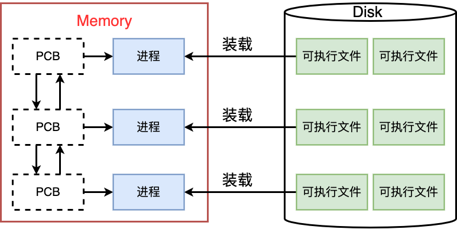
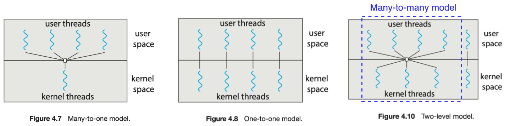
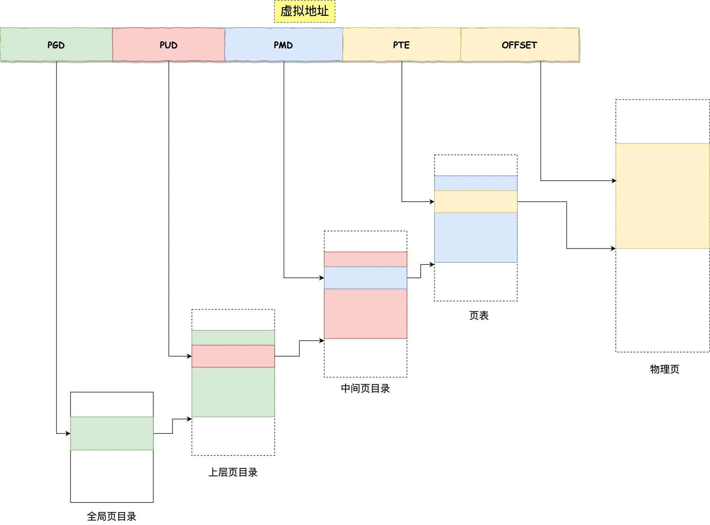

# OS

## *OS相关概念*

### 程序类型

* OS是一直运行在计算机上的程序，也称为Kernel 内核，它会进行最底层的进程管理、内存管理、文件管理、驱动管理
* 系统程序是与系统运行有关的程序，但它不是内核的一部分，比如函数库、Shell等
* 应用程序是与系统运行无关的所有其他程序

### OS发展简史

1. 早期系统，1950年代中期至1960年代：
   * 初期计算机没有操作系统。机器通常在单一任务模式下运行，用户直接与硬件交互
   * 随后出现了批处理系统 batch processing system，允许用户提交作业，由操作系统自动排队和处理，提高了效率
2. 多道程序设计，1960年代：
   * 多道程序 multiprogramming 设计的出现让计算机能夏同时处理多个任务，这是向多任务和多用户系统迈出的重要一步
   * 著名的早期操作系统包括IBM的OS/360
3. 分时系统，1960年代晚期至1970年代：
   * 分时系统 time-sharing system 允许多个用户通过终端同时使用同一台计算机，每个用户都感觉像独占了计算机
   * UNIX操作系统在这个时期诞生，对后续操作系统产生了深远影响
4. 个人计算机时代，1980年代：
   * 随着个人计算机（PC）的普及，操作系统开始向家庭和小型办公室用户转移
   * MS-DOS成为了早期PC上最流行的操作系统，后来微软推出了Windows系列
5. 图形用户界面 GUI，1980年代中期至1990年代：
   * GUI的出现极大地改善了用户体验，使得计算机操作更加直观和容易
   * Apple的Mac OS和微软的Windows都采用了图形界面
6. 互联网时代，1990年代至21世纪初
   * 随着互联网的兴起，操作系统开始集成网络功能
   * Linux作为开源操作系统，因其稳定性和安全性在服务器和企业市场中流行
7. 移动操作系统，2000年代至今
   * 智能手机和平板电脑的兴起导致了移动操作系统的发展，如iOS和Android
   * 这些操作系统专为触屏设备设计，提供了丰富的应用生态系统
8. 云计算和虚拟化，21世纪初至今
   * 随着云计算的兴起，操作系统开始适应虚拟化和云服务
   * 现代操作系统更加强调安全性、兼容性和网络集成

### OS的功能

OS是管理计算机硬件与软件资源的系统软件，它为各种应用软件提供服务，并为用户操作提供界面。操作系统的主要功能包括：

* 资源管理
   * 处理器管理：操作系统负责处理器的分配，确保各个程序能公平且高效地使用CPU
   * 内存管理：管理系统内存资源，包括分配和回收内存，以及在需要时进行内存的虚拟化
   * 设备管理：控制和协调外围设备，如打印机、硬盘等，提供设备驱动程序
* 文件系统管理：
   * 管理数据存储，提供文件的创建、删除、读写等功能
   * 维护文件和目录结构，确保数据的组织和存取都是有序和高效的
* 用户接口：
   * 提供用户接口，包括CLI和GUI
   * 使用户能以直观的方式与计算机系统交互
* 任务管理：
   * 管理系统中的所有进程和程序
   * 提供多任务处理能力，允许多个进程同时运行，管理进程间的通信与同步
* 安全管理：
   * 实施安全策略，防止未授权访问
   * 管理用户权限，确保系统资源的安全和保密
* 网络管理：
   * 管理网络连接，支持数据的传输和网络通信
   * 提供网络相关的各种服务和协议支持
* 系统调用和服务：
   * 提供程序接口，允许应用程序请求和使用操作系统服务
   * 系统调用是程序与操作系统通信的桥梁
* 错误检测与处理：
   * 监控系统运行，检测并处理硬件与软件错误
   * 确保系统稳定运行，防止故障影响到用户

## *OS的结构*

### 宏内核

宏内核 monolithic kernel 是一种传统的内核设计，其中大部分上面说到的操作系统功能，如设备驱动、文件系统、网络协议等，都直接集成在内核中。传统的UNIX、Linux和Windows等操作系统采用宏内核设计

宏内核的内核层中的功能模块都是链接在一起的，并没有一定的层次关系。它们之间可直接通过方法调用进行交互

* **集成度高**：几乎所有的系统服务和管理功能都在一个大的内核空间内实现
* **性能优势**：由于各种服务紧密集成，它们之间的通信和交互非常高效
* **复杂性高**：内核的代码量大，结构复杂，维护和更新相对困难
* **稳定性风险**：任何内核级别的错误都可能导致整个系统崩溃

### 微内核

UNIX在不断的发展中内核也在变得越来越庞大、复杂。20世纪80年代中期，CMU的研究人员开发了一个称为**Mach**的操作系统，它采用微内核技术对内核进行模块化。这种方法构造的操作系统从内核中删除所有不必要的部件，而将它们当作系统级与用户级的程序来实现

微内核 microkernel/μkernel 的设计理念是尽量简化内核，只在内核中实现最基本的系统功能（如最低级的内存管理、线程调度和进程间通信），而将其他服务（如设备驱动、文件系统等）移至用户空间运行。到底在微内核中保留哪些系统功能是一个值得商榷的问题，但一般微内核会提供最小的进程与内存管理以及通信功能。下面是微内核的典型结构


* **最小化内核**：内核只包含最基本和必要的服务
* **模块化设计**：系统服务以用户模式运行，通过消息传递与内核通信
* **稳定性与安全性**：故障通常局限于单个模块，不会影响整个系统
* **扩展性强**：易于添加新服务或修改现有服务，不必修改内核代码。所有新服务可在用户空间内增加，所以并不需要修改内核。当内核确实需要修改时，需要做的修改也会很小，因为微内核本身就很小
* **性能开销**：用户空间和内核空间的频繁切换可能导致性能下降

Mac OS X 内核（也称为 Darwin）部分采用了Mach 微内核，QNX实时操作系统以及一些实验性质的操作系统采用微内核设计

### 混合内核

混合内核 hybrid kernel，有时也被称作模块化内核，是宏内核和微内核两种设计理念的结合。这种设计旨在结合宏内核的高性能和微内核的高模块化及安全性。在混合内核架构中，内核本身包括更多的功能比起纯微内核，但这些功能通常可加载的内核模块 loadable kernel module, LKMs 的方式实现

这种设计的思想是：**内核提供核心服务，而其他服务可在内核运行时动态实现。动态链接服务优于直接添加新功能到内核**

上面提到的Linux、Win虽然整体上基本是宏内核，但是也引入了一些模块化设计，所以说它们是混合内核也可以

# CPU虚拟化：进程

## *进程概念与PCB*

### 进程概念 Process

* 理论概念：程序的一个执行实例，正在执行的程序等
* 内核观点：担当分配系统资源（CPU时间、内存）的实体，是向系统申请资源的基本单位
* 一个加载到内存中的程序就是一个进程：内核PCB数据结构+可执行程序的代码和数据，执行可执行程序后变成了进程

### 进程描述-PCB



* 进程信息被放在一个叫做进程控制块的数据结构中，可以理解为进程属性的集合

* PCB Process Control Block 进程控制块是一个学术上的统称，Linux系统中对应的PCB是 `task_struct`。`task_struct` 是Linux内核的一种数据结构，它会被装载到RAM里并且包含着进程的信息

* 所有运行在Linux系统里的进程都以 `tast_struct` 双链表的形式存在内核里。因此对进程的管理，也就变成了对进程PCB结构体链表的增删查改工作。将这种列表结构称为队列，可以根据进程状态分为就绪队列、阻塞队列等

* 操作系统和CPU运行某一个进程，本质是从tast_struct形成的队列中挑选一个tast_struct来执行它的代码。进程调度就是在tast_struct的队列中挑选一个task_struct来执行它的代码。只要想到进程，优先想到进程对应的tast_struct

  

* 内容分类

  * 标识符 Identifier PID：描述进程的唯一信息，用来区别其他进程
  * 状态
  * 优先级
  * 程序计数器：相当于是一个指针，存放程序中即将被执行的下一条指令的地址
  * 内存指针：包括程序代码和进程相关数据的指针，还有和其他进程共享的内存块的指针
  * 上下文数据：进程执行时处理器的寄存器中的数据
  * IO状态信息：包括显示的IO请求，分配给进程的IO设备和被进程使用的文件列表
  * 记账信息：处理器时间总和，使用的时钟数总和等。该信息可以用来评估调度算法是否合理以及指导我们优化调度策略
  * 其他信息

### 通过系统调用获取进程标识符

* 查看进程信息

  * `ps axj | grep '进程名'` 或者 `top`
  * 进入 `/proc` 目录

* `getpid` 和 `getppid` 系统调用分别获得PID和PPID标识符

  ```c
  #include <stdio.h>    
  #include <unistd.h>    
  #include <sys/types.h>    
  
  int main() {    
      while (1) {    
          pid_t id = getpid(); // 获取的是自己的PID
          printf("hello world, pid: %d, ppid: %d\n", id, getppid());
          sleep(1);
      }
  }
  ```

  

  可以发现父进程就是Bash，即Shell是通过创建子进程的方式调用了该程序，Shell也是系统的一个进程，其之上的父进程是操作系统

* `kill -9 [PID]` 终止进程

* `fork` 通过系统调用创建进程

  * fork的返回值
    * 失败的时候返回-1
    * 成功时fork具有两个返回值
      * 给父进程返回子进程的pid
      * 给子进程返回0
  * 为什么会有两个返回值
    * 创建进程的时候本质就是系统多了一个进程。即内部属性以父进程为模板新建一个task_struct。当运行到fork函数内部的return时，核心代码已经执行结束了，因为有父子进程的分别return，所以会有两个返回值
    * 返回两次并不意味着会保存两次
    * 父子进程被开出来后，谁先运行是不一定的，这是由操作系统的调度器决定的
  * 为什么给子进程返回0，而给父进程返回子进程的PID（一种感性的认识）：父进程与子进程的关系是一对多的。父进程需要获取子进程的PID对其进程操作，而子进程由于只有一个父进程，可以用其他方法方便的得到其父进程的信息

  ```c
  #include <stdio.h>
  #include <unistd.h>
  int main()                      
  {            
      pid_t id = fork(); // id在父进程里面是子进程的PID，在子进程里面是0
      // fork 之后父子进程共享代码
      if (id<0)          
      {            
          // 创建失败
          perror("fork");
          return 1;
      }                                  
      else if (id == 0)   
      {            
          // fork产生的两个进程会同时执行
          // Child process                                                  
          while (1)    
          {
              printf("I am child, pid: %d, ppid: %d\n", getpid(), getppid());
              sleep(1);
          }
      }                     
      else         
      {    
          // Parent process                                                  
          while (1)    
          {
              printf("I am father, pid: %d, ppid: %d\n", getpid(), getppid());
              sleep(1);
          }
      }                           
      printf("You can see me!\n");
      sleep(1);
  
      return 0;
  }   
  ```

  

## *进程状态*

### OS理论进程状态


理论上的进程分类：每种参考书的理论进程都不一样，但大体可以分为下面几种状态，粗体的三种状态是核心状态

* 新建状态 New
  * 创建PCB，还未被加入队列，实际上没有这种状态，只是一种理论上的完善
  * 可以对程序分批换入内存，在极端情况时仅仅生成了内核数据结构而没有分配任何内存，此时称为新建
* **运行状态 Running**：该时刻进程占用CPU资源
* **就绪状态 Ready**：可运行，由于其他进程处于运行状态而在CPU的等待队列中等待
* **阻塞状态 Pending/blocked**：一个进程执行了某种操作，直到等到某种非CPU资源就绪时才会继续运行。其他非CPU设备也会维护各自的运行队列。在阻塞态即使给进程CPU的权限它也无法使用CPU。更要命的是，一旦进程被阻塞，OS，或者更重要的是**CP3U本身将会保持这种进程的状态，直到等待资源就位**，因此在阻塞式IO中这是一个比较严重的缺陷
* 挂起状态 Suspend
  * 定义
    * OS会将长时间阻塞的进程代码和数据换出到磁盘中的SWAP区中，但其对应的PCB仍然保留在内存中，以此来节省内存资源
    * **进程的数据和代码都被换出到磁盘就称为挂起**，页表不仅仅有虚拟地址和物理地址的映射也有虚拟地址和硬盘地址的映射，因此可以直接换出到硬盘上
  * 类型
    * 阻塞挂起状态：进程在外存（硬盘）阻塞等待某个事件的发生
    * 就绪挂起状态：进程在外存，但已经等待完毕，只要被再次换入内存就马上可以运行
  * 挂起方式：除了内存不足被OS换出到硬盘之外，还可以通过sleep设置定时器、用户通过 `ctrl+z` 方式发信号等方式

# 进程控制与调度

## *受限直接访问*

CPU虚拟化，并对其进行控制调度遵循的一般准则称为 Limited Direct Excution LDE

### 内核态和用户态

OS在物理内存中也要被加载，但不会随着进程的改变而改变。除了每个进程各自拥有的用户级页表外，**所有进程共享一份内核级页表**，用来为每个进程的内核空间与物理内存进行映射

通过内核级页表，无论进程如何切换，进程都可以找到内核的代码和数据，当然前提是用户有权利进行访问

* 当前进程如何具备权力来访问这个内核页表乃至于访问内核数据呢？需要进行身份切换。进程如果是用户态的就只能访问用户级列表，进程如果是内核态的就既可以访问内核态也可以访问用户级的列表。
* 那么如何标识用户的身份呢？CPU内部有对应的状态寄存器CR3来标识当前进程的状态，0为内核态，3为用户态
* 系统什么时候需要进行身份切换？以下给出两种典型情景需要修改CR3来切换用户身份
  * 当前进程执行**系统调用**的时候，系统调用是OS主动暴露给用户的接口，因此不存在安全问题。因此系统调用里包含了一系列切换和认证用户身份的操作
  * 时间片到了，需要进行进程间切换。身份切换后就可以访问内存内核空间的进程调度算法来执行进程切换，在进程的上下文中进行进程调度

总结

* 内核态可以访问所有的代码和数据，即内核态具备更高的权限
* 用户态只能访问自己的代码和数据
* 用户级的程序会无数次直接或间接的访问系统级软硬件资源（管理者是OS），本质上用户并没有权力去操作这些软硬件资源，而是必须通过OS。因此会无数次的陷入内核（1. 切换身份 2. 切换页表），从而调用内核代码来进行返回，然后OS会把结果返回给用户

### 上下文切换

进程上下文切换是切换虚拟内存、栈、全局变量等用户控件的资源，也包括了切换内存堆栈、寄存器等内核空间的资源

## *进程创建*

### 进程创建的过程

* 申请一个空白的 PCB，并向 PCB 中填写一些控制和管理进程的信息，比如进程的唯一标识等
* 为该进程分配运行时所必需的资源，比如内存资源
* 将 PCB 插入到就绪队列，等待被调度运行

### 创建进程使用写时拷贝的原因

创建子进程，给子进程分配对应的内核结构，该结构必须子进程独有，因为进程具有独立性。理论上，子进程也要有自己的代码和数据，但子进程并没有加载过程，因此子进程没有自己的代码和数据。所以子进程只能“使用”父进程的代码和数据。

* 代码：都是不可被写的，只能读取，所以父子共享没有问题，父子进程都可以看到所有的代码
* 数据：是可能被修改的，因此必须分离
  * 创建进程的时候，就直接拷贝分离。问题：可能会拷贝子进程根本就不会用到的数据空间，即便是用到了也可能只是读取
  * 为了节省空间，在创建子进程时，不需要将不会被访问的或者只会被读取的数据拷贝一份。只需要拷贝将来会被父或者子进程写入的数据。问题：一般而言即便是OS，也无法提前直到哪些空间会被写入；而且即使是提前拷贝了，也不一定会马上使用
  * 因此OS选择了写时拷贝计数来分离父子进程数据
* 进一步解释为何OS要选择写时拷贝
  * 进程需要使用的时候再为其分配，是高效使用内存的表现
  * OS无法在代码执行前预知哪些空间会被访问

### 为什么子进程是从 `fork` 之后开始运行？

* 代码在经过汇编之后，会产生很多行代码，且每行代码在被加载到内存之后，都有对应的地址
* 因为进程随时可能被中断（可能并没有被执行完），下次回来时，CPU必须要从之前的位置继续运行，这就要求CPU必须随时记录下当前代码执行位置。因此CPU有对应的寄存器数据来存放当前进程的执行位置。具体为CPU中的EIP寄存器中的PC程序程序寄存器保存的
* 因此CPU中寄存器的数据（即进程上下文数据）也在写时拷贝中被拷贝走，而此时EIP中的PC在记录到 `fork` 执行时的代码，因此子进程只能代码的 `fork` 处开始运行。但是子进程还是拥有 `fork` 之前的代码的

## *进程调度基础*

### 抢占 vs. 非抢占

需要进行 CPU 调度的情况可分为以下四种

1. 当一个进程从运行状态切换到等待状态时。比如IO请求、`wait()` 调用以便等待一个子进程的终止
2. 当一个进程从运行状态切换到就绪状态时，比如当出现中断时
3. 当一个进程从等待状态切换到就绪状态时，比如当IO完成时
4. 当一个进程终止时

在第一种和第四种情况的时候，进程是自愿让渡CPU资源，接受调度的。在第二种和第三种情况时，进程是被迫进行调度的

如果只有第一种和第四种情况被称为非抢占式调度，否则就是抢占式调度。Windows 3.x 采用非抢占式调度，之后Windows 95引入抢占调度，现代的OS都支持抢占式调度

* 非抢占式调度 non-preemptive scheduling
  * 在非抢占式调度中，一个进程只有在主动、自愿放弃CPU控制权之后，其他就绪的进程才能被调度执行
  * 这意味着一个进程只有在自愿放弃CPU的情况下，或者在它自己的执行周期结束后，才会被系统切换
  * 非抢占式调度通常导致更简单的实现，但在某些情况下可能导致较差的响应时间，特别是在需要快速响应的情况下
* 抢占式调度 preemptive scheduling
  * 在抢占式调度中，操作系统具有中断能力，可以在一个正在执行的进程被强制中断，然后切换到另一个进程执行
  * 这意味着一个进程并不需要自愿放弃CPU的控制权，而是**可以在任何时间被系统强制中断**，然后由调度器选择并执行另一个就绪的进程
  * \+ 抢占式调度通常导致更好的响应时间，因为它允许操作系统在紧急情况下迅速切换到其他任务
  * \- 抢占式调度会引入资源竞争的问题，特比是在多核多进程、多线程的情况下。另外在抢占调度时还有保护上下文等损耗

### 调度程序

CPU 调度功能中的核心组件是调度程序/调度器 dispatcher or scheduler。调度程序是一个模块，用来将 CPU 控制交给由短期调度程序选择的进程。这个功能包括：切换上下文、切换到用户模式。跳转到用户程序的合适位置,以便重新启动程序

调度程序的开销是一个重要指标，因为在每次进程切换时都要被使用到。调度程序停止一个进程而启动另一个所需的时间称为调度延迟 dispatch latency

### IO密集 vs. CPU密集型应用

这两种应用在 *计算机体系结构.md* 中的Roofline图中有相关描述

* IO密集 IO bound
  * IO密集型应用主要通过大量的IO（如文件读写、网络通信、数据库查询等）来消耗系统资源
  * 这类应用的执行速度受限于IO操作的速度，而不是CPU的处理能力。因此在IO密集型应用中，CPU的压力比较小，通常都在等待IO操作的完成
  * 示例：Web服务器、文件处理系统、数据库系统等。这些应用需要频繁地进行读写操作，而大部分时间都花在等待IO完成上
* CPU密集 CPU bound
  * CPU密集型应用主要通过大量的计算操作来消耗系统资源，而IO操作相对较少
  * 这类应用的执行速度受限于CPU的处理能力，而不是IO速度。在CPU密集型应用中，CPU几乎一直处于繁忙状态，执行大量的计算任务
  * 示例：科学计算应用、图像处理、复杂模拟等。这些应用通常需要大量的数学运算和逻辑处理

对于这两类应用的进程调度算法是很不相同的，接下来会看到

### 另一种分类方法

除了IO密集和CPU密集的分发，还有另外的分类方法

* 交互式进程 interacrive process
  * 这些进程经常需要与用户进行交互，因此要花很多时间等待键盘和鼠标操作。当接受了输人后，进程必须被很快唤醒，否则用户将发现系统反应迟钝。一般来说用户不会感受到明显的延迟的时间是在50~150ms之间
  * 这样的延迟变化也必须进行限制，否则用户将发现系统是不稳定的
  * 典型的交互式程序是命令shell、文本编辑程序及图形应用程序
* 批处理进程 batch process
  * 这些进程不必与用户交互，因此经常在后台运行
  * 因为这样的进程不必被很快地响应，因此常常会受到调度程序的怠慢
  * 典型的批处理进程是程序设计语言的编译程序、数据库搜素引擎及科学计算
* 实时进程 real-time process
  * 实时进程需要在规定的时间内完成其任务，以满足特定的实时性需求，因此这些进程有很强的调度需要。这样的进程决不会被低优先级的进程阻塞，它们应该有一个短的响应时间，而且响应时间的变化应该很小
  * 典型的实时程序有视频和音频应用程序、机器人控制程序及从物理传感器上收集数据的程序

这种分类方法和上面的分类方法是可以交叉的，比如说一个批处理进程可能是 IO 密集型的，比如数据库服务器，或是 CPU受限型的，比如图像绘制程序

## *调度算法*

调度算法：CPU在分配资源给一个进程时，不是一直令其独享资源直到代码运行结束的。否则当一个死循环在运行时，OS不能做任何其他的操作

### 调度指标 Scheduling metrics

* 性能指标 performance：周转时间 turnaround time 定义为任务完成时间减去任务到达系统的时间，即
  $$
  T_{turnaround}=T_{completion}-T_{arrival}
  $$

* 公平指标 fairness：每一个进程都应该被分配一些资源，而不是一直由某个进程独占。性能指标和公平指标是矛盾的

* 交互性 interactive performance：响应时间 response time 定义为从任务达到系统到首次运行的时间，即
  $$
  T_{response}=T_{firstrun}-T_{arrival}
  $$

### 朴素的调度思想

* 先到先得 First-Come First-Served, FCFS / FIFO 先进先出
  * 假设所有任务同时到达、工作时间已知、任务只使用CPU（不执行IO）、非抢占 non-preemptive
  * 最先到达的任务最先被处理。严重的**护航效应 convoy effect**，即一些耗时较少的资源被排在耗时很长的资源后面，那么**平均周转时间将会很大**（明明那些耗时较少的任务可以一下就被做完的）
* SJF Shortest Job First 最短任务优先
  * 让耗时最少的任务先做。可以证明，当所有任务同时到达的时候，SJF是最优的
  * **可以证明SJF调度算法是最优的**，即JF算法的平均等待时间最小
  * SIF 算法的真正困难是如何知道下次CPU执行的长度，这是一个先有鸡还是先有蛋的问题

* STCF Shortest Time-To-Completion First
  * 假设工作时间已知、任务只使用CPU（不执行IO）
  * 向SJF添加**抢占**，当任务随机到来时，谁的剩余时间最少就抢占CPU资源优先完成
  * 大大提升平均周转时间
* 考虑响应时间和公平性：轮转 Round-Robin 
  * RR在一个**时间片 time slice/调度量子 scheduling quantum** 内运行一个工作，然后切换到队列中的下一个任务
  * 时间片长度对于RR至关重要，越短，则响应时间越短；但果断又会增加进程切换时上下文切换成本，从而增加了周转时间
* 考虑IO：非阻塞式IO，实现重叠 overlap

### 多级反馈队列 MLFQ

上面所有的朴素调度思想有一个假设是始终没有去掉的，即已知一个任务的处理时间，但实际上这是最难知道的

多级反馈队列 Multi-Level Feedback Queue MLFQ 是用历史经验预测未来的一种调度方法，如果工作有明显的阶段性行为可以用来预测，那么这种方法就会很有效

工作负载类型

* 运行时间很短、频繁放弃CPU的交互性工作
* 需要很多CPU时间、响应时间却不重要的长时间计算密集型工作

MLFQ有多级队列，并利用任务行为的反馈信息决定某个队列的优先级

* 基本规则
  1. 若A的优先级 > B的优先级，则运行A（不运行B）
  2. 若A的优先级 = B的优先级，则轮转运行A和B
* 判断工作类型：一开始都假设是短的交互性工作，给高优先级，若确实是则马上执行完了，否则就慢慢降低优先级
  1. 工作进入系统时，放在最高优先级，即最上层队列
  2. 防止人为设置成交互性工作来骗取高优先级：一旦工作用完了其在某一层中的时间配额/时间片（无论中间主动放弃了多少次CPU），就降低其优先级（移入低一级队列）
* 避免饥饿问题 starvation：经过一段时间S，就将系统中所有工作重新加入最高优先级队列

### 比例份额

## *实时CPU调度*

### 实时进程

实时进程通常分为硬实时和软实时两类

* 硬实时进程 Hard Real-Time：对任务执行时间有极其严格的要求，必须在预定的截止时间内完成。如果未能在规定时间内完成任务，系统可能会出现严重的问题，甚至导致系统故障。硬实时系统通常用于一些对时间要求极高的应用，如航空航天、医疗设备等
* 软实时进程 Soft Real-Time：对任务执行时间有一定要求，但在偶尔无法满足时，系统仍然可以继续运行。软实时系统通常用于一些对时间敏感但允许一定容忍度的应用，如多媒体处理、实时通信等

### 实时操作系统

实时操作系统 Real-Time Operating System, RTOS 是一种**专门设计和优化用于处理实时任务的操作系统**。与通用操作系统（如Windows、Linux）相比，实时操作系统更加注重对任务响应时间、可预测性和时间约束的满足

实时操作系统广泛应用于需要对事件作出快速响应的系统，如工业自动化、航空航天、医疗设备、汽车控制系统等领域

常见的实时操作系统包括：FreeRTOS、VxWorks、QNX、RTOS-32、NuttX、μClinux等

### 实时调度算法

* 优先权调度 priority scheduling：每个任务被分配一个优先级，系统按照任务的优先级来进行调度，优先级高的任务先执行。可以是静态的（在任务创建时分配）或动态的（根据任务的执行情况调整）
* 单调速率调度 rate-monotonic scheduling： 按照任务的周期（或周期的倒数，即频率）来分配优先级，周期短的任务具有高的优先级。单调速率调度假设执行时间相同的情况下，周期短的任务更紧急
* 最早截止期限优先调度 Earliest-Deadline-First, EDF scheduling：每个任务都有一个截止期限，调度器会选择最接近截止期限的任务来执行。如果有新的任务到达，会被插入到队列中，按照截止期限重新排序
* 比例分享调度 proportional share scheduling：将系统资源按照任务的权重进行分配，每个任务获得的资源比例与其权重成比例。通过这种方式，不同任务可以共享系统资源，但分配的比例是可控的

严格按照优先级来分配CPU时间，并且时间片轮转**不是**实时调度器的一个必选项

## *多处理器调度*

多处理器中的调度问题是如何合理地把进程分配给某个CPU运行，其实和虚拟内存到物理内存的映射很像

### 线程灵活性对性能的影响

线程亲和性 thread affinity、线程固定 thread pinning 和 process binding 是三个可以互换的概念

在多核处理器中，任何软件概念上的线程都可以被安排到某个核上。但这种灵活性可能会对性能造成影响

* 若一个线程迁移到不同的核心，并且该核心拥有自己的缓存，那么原始缓存中的内容将丢失，会发生不必要的内存传输
* 若线程迁移，OS无法阻止将两个线程放在一个核心上，而另一个核心完全未被使用这种负载不均衡的情况。显然，此时即使线程数量等于核心数量，也会导致不完美的加速

### 亲和性策略

我们称线程/进程与核心之间的映射为亲和性 thread/process affinity，Thread affinity/thread pinning技术是将线程固定到某个特定的核上

* 软亲和性 hard affinity
  * 指定线程**只能在一个特定**的处理器核心上执行。这确保了线程一直在同一个核心上执行，减少了在不同核心之间切换的开销
  * 硬亲和性通常通过操作系统提供的API（例如，Linux中的`pthread_setaffinity_np`函数）来实现
* 硬亲和性 weak affinity
  * 允许线程在一组处理器核心上（即一个核心子集上）执行，但可以在需要时在这组核心之间进行切换。这提供了一定的灵活性，同时也可以减少一些上下文切换的开销
  * 软亲和性可以通过系统的调度器来自动调整，或者由应用程序通过API进行手动设置

# 进程间通信 IPC

## *进程间通信介绍*

### intro

进程间通信的必要性

* 单进程无法使用并发能力，更无法实现多进程协同 cooperating
* 传输数据，同步执行流，消息通知等

进程间通信的目的

* 数据传输和资源共享
* 通知：一个进程需要向另一个或另一组进程发送消息
* 进程控制

### 进程间通信的本质

进程是具有独立性的。虚拟地址空间+页表保证了进程运行的独立性（进程内核数据结构+进程的代码和数据），因此通信的成本会比较高

每个进程的用户地址空间是独立的，一般来说无法直接访问，但内核空间是每个进程都共享的，所以进程之间的通信肯定要借助内核空间

**进程间通信的本质就是让不同的进程看到同一份资源（内存空间）**

资源的不同决定了不同各种类的通信方式，比如管道就是提供共享文件资源的一种通信方式

### 两种基本模型


进程间通信有两种基本模型：共享内存 shared memory 和消息传递 message passing

* 共享内存模型会建立起一块供协作进程共享的内存区域，进程通过向此共享区域读出或写入数据来交换信息
* 消息传递模型通过在协作进程间交换消息来实现通信
  * 消息传递对于交换较少数量的数据很有用，因为无需避免冲突
  * 对于分布式系统，消息传递也比共享内存更易实现。下面在消息传递部分我们会给出一些常用的消息队列中间件，它们在工程上都广泛应用于分布式系统
  * 但是消息传递的实现经常采用系统调用，因此相比于共享内存模型需要消耗更多时间以便内核介入
  * 因为在多核系统上使用共享内存会造成缓存一致性问题，所以在不同节点之间也广泛应用消息传递，比如MPI并行编程接口

### IPC在Linux上的发展

* 管道：Linux原生提供
  * 匿名单向管道 Anonymous pipe 使用后就销毁
  * 命名管道 Named pipe
* System V IPC 进程间通信：多进程单机通信
  * System V 共享内存 Shared memory
  * System V 消息队列（很陈旧，不常用）
  * System V 信号量：主要用于同步和互斥
* POSIX IPC 进程间通信：多线程网络通信
  * 消息队列 message queue
  * 共享内存
  * 信号量
  * 互斥量
  * 条件变量
  * 读写锁

## *消息传递*

### 消息队列的特点

相比于管道的阻塞IO，消息队列 message queue 是高效的。消息队列本身是异步的，这意味着，读取双方只需要把信息交给消息队列后就可以返回了，由消息队列自己来完成信息的发送并且在需要的时候去读取

消息队列是**保存在内核中的消息链表**，它是面向数据报的，不会存在粘包问题，所以也就不需要用协议去规范读取

和匿名管道生命周期随进程不同，**消息队列生命周期随内核**，若没有释放消息队列或者没有关闭操作系统，消息队列会一直存在

缺点

* 因为是面向数据报的，所以对数据报的大小和总的消息队列长度都有限制
* 存在4次拷贝（2次DMA，2次内核到用户）

### 消息队列中间件

* Apache ActiveMQ：一个开源的消息代理系统，实现了Java Message Service (JMS) API。它支持多种传递模式和消息持久化
* RocketMQ：一款开源的分布式消息中间件，最初由阿里巴巴集团开发
* RabbitMQ：一种开源消息队列，实现了高级消息队列协议（AMQP）。它支持多种消息传递模式，包括点对点和发布/订阅模式
* Apache Kafka：一个高吞吐量的分布式消息系统，被设计用于处理大量的实时数据。它采用发布/订阅模式，可以水平扩展

## *通信链路的逻辑实现*

若进程P和Q之间需要通信，那么它们必须互相发送消息和接收消息。它们之间要有通信链路 communication link 才可以通信，我们不关心硬件链路，只关心通信链路的逻辑实现

这里有几种逻辑实现链路和操作 `send()/receive():` 的方法

* 直接或间接的通信
* 同步或异步的通信
* 自动或显式的缓冲

### 命名

直接通信 direct communication 需要通信的每个进程必须明确指定通信的接收者或发送者

* 对称性寻址的发送和接收进程必须指定对方，从而进行通信。它的原语是
  * `send(P, message)`：向进程P发送message
  * `receive(Q, message)`：从进程Q接收 message
* 非对称性寻址只需要发送者指定接收者，而接收者不需要指定发送者
  * `send(P, message)`：向进程P发送 message
  * `receive(id, message)`：从任何进程接收 message，这里变量id被设置成与其通信进程的名称

间接通信 indirect communication 通过邮箱或端口来发送和接收消息。所谓邮箱就是一个抽象的对象，进稈可以向其中存放消息,也可从中删除消息

### 同步

进程间通信可以通过调用原语 `send()` 和 `receive()` 来进行。有不同的设计来实现这些原语。消息传递可以是阻塞 blocking 或非阻塞 nonblocking 的，也称为同步 synchronous 或异步 asynchronous

* 阻塞发送 blocking send：发送进程阻塞,直到消息由接收进程或邮箱所接收
* 非阻塞发送 nonblocking send：发送进程发送消息,并且恢复操作
* 阻塞接收 blocking receive：接收进程阻塞,直到有消息可用
* 非阻塞接收 nonblocking receive：接收进程收到一个有效消息或空消息

### 缓冲

不论通信是直接的还是间接的，通信进程交换的消息总是驻留在临时队列中

* 零容量 zero capacity：队列的最大长度为0，因此链路中不能有任何消息处于等待。此时发送者应阻塞，直到接收者接收到消息
* 有限容量 bounded capacity：队列长度为有限长度n，因此最多只能有n个消息在队列里排队
  * 如果在发送新消息时队列未满那么该消息可以放在队列中（或者复制消息或者保存消息的指针），且发送者可以继续执行而不必等待
  * 如果链路已满，那么发送者应阻塞，直到队列空间有可用的为止
* 无限容量 unbounded capacity：队列长度可以无限，不管多少消息都可在其中等待。发送者从不阻塞

零容量情况称为无缓冲的消息系统,其他情况称为自动缓冲的消息系统

# 并发与多线程

造成并发竞态的核心原因就是：**不合时宜且几乎不可预知何时到来的中断**。不止线程和线程之间，系统的其他部分也存在并发问题，比如两个同时进行IO的进程，该如何保证对inode的操作是原子的？

## *并发与线程的概念*

### 区分并发与并行

并发 concurrency 是指在**同一时间间隔内**，**多个任务**在同一计算机系统中**交替执行，通过快速切换的方式让多个任务同时得到处理**，从而提高系统的效率。在并发执行中，每个任务的执行不是连续不断的，而是交替进行的。因此，并发处理更多地强调任务之间的互相配合和协调，以避免数据竞争、死锁等问题

并行 parallelism 则是指在**同一时间间隔**内，**多个任务**在**多个处理单元**上同时执行。在并行执行中，**每个任务的执行是连续不断的**，不需要等待其他任务的执行。并行处理更多地强调任务之间的独立性和相互之间的并行执行，以实现更高的计算性能和效率

简单来说，可以将并发理解为多个任务“同时”被处理，但实际上这些任务是交替进行的；而并行则是多个任务真正“同时”被处理，每个任务都独立执行，不会受到其他任务的影响

在实际应用中，通常需要同时考虑并发和并行的使用。例如，在多核处理器上，可以通过并行执行来提高单个任务的计算速度，同时通过并发执行来处理多个任务，以提高系统的整体效率

* 并发 concurrency 与顺序 sequential
  * 顺序是指只有当上一个开始执行的任务完成之后，当前任务才能开始执行
  * 并发是指无论上一个执行的任务是否完成当前任务都可以执行。比如说CPU的Pipeline、TCP的发送Pipeline还有多线程都是并发
* 并行 parallel 与串行 serial 的概念是用于CPU的计算任务的
  * 串行是指有一个任务执行单元，从物理上就只能是一个任务接着一个任务的执行
  * 并行是指有多个任务执行单元，从物理上可以多个任务一起执行

并发和并行并不是互斥的概念，**并发关注的是任务该如何调度，后者关注的则是任务具体是如何被执行的**。并发与顺序软件都可以既跑在并行也跑在串行CPU上

举个例子

* 单核CPU再执行多任务的时候一般是并发，但必然是串行的
* 多核CPU则可以是并发且并行的

### 什么是线程

对很多任务而言，频繁的调度进程是不必要的。当进行进程切换的时候，需要调用进程调度算法，清空重载CPU中的所有上下文寄存器等，因此的切换成本是比较高的，很多时候也用不着切换进程

因此考虑用控制流对代码区、堆栈区等进行划分，这个概念就是线程 Thread


* 在一个程序里的一个执行路线就叫做线程，线程是一个进程内部的控制序列
* 若采取TCB管理线程，PCB管理进程，再管理它们之间的关系会很复杂。因此Linux采用的管理方法是全部复用PCB模拟， Win实现了真线程。因此Linux没有真正意义上的线程，而是用系统的PCB模拟实现的，Linux下的线程也称为轻量化进程 Light Weight Process, LWP
* CPU看到的基本调度单位都是线程，只有一个控制流的进程称为单执行流进程，一切进程至少都有一个执行线程，而内部有多个执行流的进程称为多执行流进程，线程是调度的基本单位
* 通过进程虚拟地址空间，可以看到进程的大部分资源，将进程资源合理分配给每个执行流，就形成了线程执行流

### Pros and Cons of Thread

* Pros

  * 创建一个新线程的代价要比创建一个新进程小得多，即线程调度的代价远小于进程调度的代价

  * 线程也有自己的私有资源，但线程占用的资源要比进程少很多

  * 能重复利用多核处理器的可并行数量

  * 计算密集型应用，比如压缩解压缩，为了能在多处理系统上运行，将计算分解到多个线程中实现

  * IO密集型应用为了提高性能，可以将IO重叠操作。线程可以同时等待不同的IO操作，比如一个线程等待硬盘，一个线程等待网卡，而单线程执行流只能串行等待

* Cons

  * 不合理的线程划分会降低性能损失

  * 健壮性降低

  * 缺乏访问控制

  * 排查问题很困难


### 进程 Process vs. 线程 Thread

**进程是资源分配的基本单位，一个进程拥有独立的地址空间资源；而线程是CPU调度的基本单位**

* 线程是调度的基本单位
* 线程共享进程数据，但是也有自己的私有数据，所以进行线程调度的时候也会发生上下文切换 context switch
  * 线程ID
  * 线程相关寄存器
  * 线程栈
  * errno错误码
  * 信号屏蔽字
  * 调度优先级

**进程的多个线程共享同一地址空间**，因此 Text Segment、Data Segment都是共享的，数据则是写时拷贝。若定义一个函数，在各线程中都可以调用，若定义一个全局变量，在各线程中都可以访问到，除此之外，各线程还共享以下进程资源和环境

* 文件描述符表
* 信号及其处理方式
* 当前工作目录
* 用户id和组id

### 线程异常

* 单个线程若出现除零、野指针等异常导致线程崩溃，整个进程也会随之崩溃
* 线程会影响其他线程的运行，健壮性较低

## *线程类型*

### 不同类型的线程

**核心是要理解线程是指令流调度的基本单位，而进程则是资源分配的基本单位，需要维护大量的数据结构来组织管理这些资源**

* 用户级线程 User Level Thread, ULT：用户级线程完全在用户空间中实现，不需要内核支持。线程的管理由应用程序或运行库（如POSIX pthreads）来负责
* 内核级线程 Kernel Level Thread, KLT 由操作系统的内核直接管理和调度。这意味着线程的创建、同步、调度和管理都在内核空间中进行
* 硬件上的线程：为什么硬件的角度看只有线程，没有进程？因为对于CPU来看都是执行流，它只知道有一个指令的执行单元，并不知道谁是资源的管理单元

### 用户级线程和内核级线程的对应关系



* 多对一模型：映射多个用户级线程到一个内核线程。因为对于硬件和内核来说，基本调度单位是一个内核线程，任一时刻只有一个用户级线程可以访问内核，所以多个用户级线程不能并行运行在多CPU系统上。现在多对一模型已经不再被使用
* 一对一模型：每一个用户线程映射到独立的一个内核线程
* 多对多模型：多路复用多个用户级线程到同样数量或更少数量的内核线程
* 双层模型 two-level model：仍允许多路复用，但也允许绑定某个用户线程到一个内核线程

## *多线程模型*

### 一对一的用户级线程库


用户的应用进程中的线程是通过一对一的使用系统内核提供的LWP接口来使用系统内核线程

Linux、Windows都实现了这种多线程模型

### 混合模式

下图描述了Solaris系统的Hybrid Model，它很好的说明了这种内核级线程、用户级线程的关系


# 线程同步

## *线程互斥*

### 线程同步

线程同步 thread synchronization 是指多个线程按照一定的顺序协调和共同完成任务的过程。在多线程环境中，由于多个线程可以并发执行，可能会导致对共享资源的不正确访问和竞态条件等问题。线程同步的目的是确保线程之间按照一定的规则、顺序或协议协同工作，以避免竞态条件、数据不一致以及其他并发问题

以下是一些常见的线程同步机制：

* 互斥锁 Mutex (Mutual exclusion)：通过互斥锁可以确保在任何给定时刻只有一个线程可以访问共享资源。当一个线程获取互斥锁时，其他线程必须等待，直到该线程释放锁
* 条件变量 Condition Variable：条件变量用于线程之间的通信和协调。它通常与互斥锁一起使用，允许线程等待某个条件的满足，当条件满足时，线程可以被唤醒
* 信号量 Semaphore：信号量是一个计数器，用于控制同时访问共享资源的线程数。它可以用于实现限制并发访问的需求
* 屏障 Barrier：屏障用于同步多个线程的执行，让它们在某个点上等待，直到所有线程都到达这个点后再继续执行

### 互斥相关概念

* 临界资源 Critical resource
  * 被多个进程或同一个进程的多个线程能够同时看到的公共资源
  * 临界资源有安全访问也有不安全访问，比如管道就是安全的
  * 若没有对临界资源进行保护，对于临界资源的访问，双方进程在进行访问的时候就都是乱序的，可能会因为读写交叉而导致的各种乱码废弃数据，导致访问控制方面的问题
  * 一个典型的例子就是父子进程同时往stdout printf，完全是乱的
* 临界区 Critical section：对多个进程而言，访问临界资源的代码被称为临界区
* 原子性 Atomicity：一件事情要么做完了，要么没做，没有中间状态。**一个操作或者多个操作要么全部执行并且执行的过程不会被任何因素打断，要么就都不执行**
* 互斥 Mutex：在访问某种资源的时候，任何时刻只允许一个执行流访问临界资源

### 抢票的例子

多线程并发操作若不加保护会产生问题，下面是一个多个线程都执行 `getTickets` 执行流的代码

```cpp
int tickets = 10000; //临界资源，可能会造成数据不一致问题

void *getTickets(void *args) {
    //访问临界资源的代码称为临界区
    const char* name = static_cast<const char*>(args);
    while (true) {
        if (tickets > 0) {
            cout << "thread[" << name << "] 抢到了票，票的编号" << tickets << endl;
            tickets--;
        }
        else {
            cout << "thread[" << name << "] 已经放弃抢票了，因为没票了" << endl;
            break;
        }
    }
    return nullptr;
}
```

* `--` 操作不是原子的，可能会导致数据不一致。CPU执行语句分为以下三步，在执行语句的任何地方，线程都有可能被切换走。若想令这三个过程不被错误的中断，需要对其加锁保护，此时操作才是原子的
  * Load tickets to registers in CPU
  * data of register--
  * wirte register to tickets
* 判断操作也不是原子的，A线程判断1>0后被切换到B线程也判断1>0，然后依次--，有可能将tickets减到负数

## *Peterson & Dekker算法*

## *线程锁*

### 死锁 Deadlock

* 死锁是指在一组进程中的各个线程均占有不会释放的资源，但因互相申请被其他线程所占用而都不会释放资源，因此处于永久阻塞等待的情况

  ```cpp
  pthread_mutex_t mutexA = PTHREAD_MUTEX_INITIALIZER; //两把锁
  pthread_mutex_t mutexB = PTHREAD_MUTEX_INITIALIZER;
  
  void *startRoutine1(void *args) {
      while (ture) {
          pthread_mutex_lock(&mutexA);
          sleep(1);
          pthread_mutex_lock(&mutexB);
          // ...
          pthread_mutex_unlock(&mutexA);
          pthread_mutex_unlock(&mutexB);
      }
  }
  void *startRoutine2(void *args) {
      while (ture) {
          pthread_mutex_lock(&mutexB);
          sleep(1);
          pthread_mutex_lock(&mutexA);
          // ...
          pthread_mutex_unlock(&mutexB);
          pthread_mutex_unlock(&mutexA);
      }
  }
  ```

* 死锁的四个必要条件（四个条件都要满足）

  * 互斥条件：一个资源每次只能被一个执行流使用

  * 持有并等待条件：一个执行流因其他执行流音请求资源而阻塞时，**不会主动释放**自己已占有资源

  * 不剥夺条件：一个执行流已获得的资源，在未使用完之前，**不能被他人强行释放**

  * 循环等待条件：若干执行流之间形成一种头尾相接的循环等待资源的关系

    

* 避免死锁

  * 破坏死锁的四个必要条件，主要是指破坏请求与保持条件、不剥夺条件和循环等待条件
  * 加锁顺序一致
  * 避免锁未释放的场景，减少锁分配的次数
  * 资源一次性分配

* 避免死锁算法

  * `pstack` + `gdb` 工具来排查定位死锁问题
  * 死锁检测算法
  * 银行家算法

##  *各种锁*

下面这些概念C++很少用到，一般都是在Java和数据库中用到

### 互斥锁与自旋锁

最底层的两种锁是互斥锁 mutex 和自旋锁 spin lock，所有其他锁都是基于这两种锁实现的

互斥锁和自旋锁的区别是是否阻塞轮询等待

* 互斥锁 mutex：当线程无法获取锁时，会主动释放CPU资源，并进入睡眠状态等待锁的释放
* 自旋锁 spin_lock：在临界区等待时间比较短的话，采用轮询测试，询问锁资源是否到位。等待时间长还是短是通过试验确定的

互斥锁的申请需要上下文切换（大概在几十纳秒到几微秒之间），频繁的申请释放的开销是比较大的。**若能确定被锁住的代码执行时间很短，就不应该用互斥锁，而应该选用自旋锁，否则使用互斥锁**

自旋锁是通过 CPU 提供的 `CAS` Compare And Swap 实现的，在用户态完成加锁和解锁操作，不会主动产生线程上下文切换，所以相比互斥锁来说，会快一些，开销也小一些

https://blog.csdn.net/xiaoyao1004/article/details/83858953

互斥锁的API在上面已经介绍过了，下面是自旋锁的API

* `spin_lock`：获取自旋锁。如果锁已经被占用，则当前线程会自旋等待锁的释放
* `spin_unlock`：释放自旋锁
* `spin_trylock`：尝试获取自旋锁，如果锁已经被占用则立即返回错误

### 读写锁

读写锁（Read-Write Lock）是一种并发编程中的同步机制，它是一种更细粒度的锁，专门用于管理对共享资源的读取和写入操作。读写锁允许多个线程同时进行读操作，但在进行写操作时会独占资源，从而提高并发性能和资源利用率

在Linux中，读写锁的实现主要依赖于pthread库提供的函数。以下是在Linux中实现读写锁的基本步骤：

1. 创建读写锁： 使用`pthread_rwlock_t`类型的变量声明读写锁，并使用`pthread_rwlock_init`函数进行初始化
2. 读操作：
   * 在读操作之前，使用`pthread_rwlock_rdlock`函数对读写锁进行加读锁操作
   * 执行读操作
   * 读操作完成后，使用`pthread_rwlock_unlock`函数释放读锁
3. 写操作：
   * 在写操作之前，使用`pthread_rwlock_wrlock`函数对读写锁进行加写锁操作
   * 执行写操作
   * 写操作完成后，使用`pthread_rwlock_unlock`函数释放写锁
4. 销毁读写锁： 使用`pthread_rwlock_destroy`函数销毁读写锁

```c
#include <stdio.h>
#include <pthread.h>

pthread_rwlock_t rwlock;

void* read_thread(void* arg) {
    pthread_rwlock_rdlock(&rwlock);
    printf("Read thread: Reading the shared resource\n");
    // Perform read operation on the shared resource
    pthread_rwlock_unlock(&rwlock);
    return NULL;
}

void* write_thread(void* arg) {
    pthread_rwlock_wrlock(&rwlock);
    printf("Write thread: Writing to the shared resource\n");
    // Perform write operation on the shared resource
    pthread_rwlock_unlock(&rwlock);
    return NULL;
}

int main() {
    pthread_t tid1, tid2;

    // Initialize the read-write lock
    pthread_rwlock_init(&rwlock, NULL);

    // Create threads for read and write operations
    pthread_create(&tid1, NULL, read_thread, NULL);
    pthread_create(&tid2, NULL, write_thread, NULL);

    // Wait for the threads to finish
    pthread_join(tid1, NULL);
    pthread_join(tid2, NULL);

    // Destroy the read-write lock
    pthread_rwlock_destroy(&rwlock);

    return 0;
}
```

### 乐观锁与悲观锁

* 悲观锁 Pessimistic Concurrency Control PCC：在每次取数据时，总是担心数据会被其他线程修改，所以会在取数据前先加锁（读锁，写锁，行锁等），当其他线程想要访问数据时，被阻塞挂起
* 乐观锁 Optimistic Concurrency Control OCC：每次取数据时候，总是乐观的认为数据不会被其他线程修改，因此不上锁。但是在更新数据前，会判断其他数据在更新前有没有对数据进行修改。主要采用两种方式
  * 版本号机制 Versioning
  * CAS操作 Compare and Swap：当需要更新数据时，判断当前内存值和之前取得的值是否相等。如果相等则用新值更新。若不等则失败，失败则重试，一般是一个自旋的过程，即不断重试

多人同时编辑文档、SVN和Git等版本控制工具也都是乐观锁的思想，相当于把检查冲突和加锁的过程后置了

乐观锁虽然去除了加锁解锁的操作，但是一旦发生冲突，重试的成本非常高，所以**只有在冲突概率非常低，且加锁成本非常高的场景时，才考虑使用乐观锁**

## *线程安全*

### 线程安全的概念

线程安全 thread safety 是在多个线程并发执行同一段代码时，不会出现不同的结果。常见于对全局变量或者静态变量进行操作，并且没有锁保护的情况下会出现该问题

[可重入函数 Reentrant function](#可重入函数)是一种函数性质，在信号捕捉中介绍了

### 常见线程不安全情况

* 不保护共享变量的函数
* 函数状态随着被调用，状态发生变化的函数
* 返回指向静态变量指针的函数
* 调用线程不安全函数的函数

### 常见线程安全情况

* 每个线程对全局变量或者静态变量只有读取的权限，而没有写入的权限，一般来说这些线程是安全的
* 类或者接口对于线程来说都是原子操作，比如通过加锁
* 多个线程之间的切换不会导致该接口的执行结果存在二义性

### 可重入与线程安全联系

* 函数是可重入的，那就是线程安全的
* 函数是不可重入的，那就不能由多个线程使用，有可能引发线程安全问题
* **若一个函数中有全局变量，那么这个函数既不是线程安全也不是可重入的**

### 可重入与线程安全的区别

* 可重入函数是线程安全函数的一种
* 线程安全不一定是可重入的，而可重入函数则一定是线程安全的
* 若将对临界资源的访问加上锁，则这个函数是线程安全的，但若这个重入函数若锁还未释放则会产生死锁，因此是不可重入的

## *信号量 Semaphore*

### 信号量作用：实现同步互斥的访问控制

共享内存没有访问控制，多线程时可能会产生线程竞争，可以**通过信号量对其进行控制和资源保护**

信号量不是以传送数据为目的，通过信号量这种**计数器**可以确保每一次时刻只有一个线程访问资源，即实现互斥与同步


任何进程想访问临界资源，就必须先申请信号量，若申请成功，就一定能访问临界资源中的一部分资源

**信号量本质是一个计数器，可以通过计数器的初始值实现不同的控制**

* 当信号量初始值为1的时候，表现的就是互斥特性，称为二元信号量，常规信号量称为多元信号量
* 当信号量初始值为0的时候，表现的就是同步特性

悖论：信号量是属于整个进程的，所以所有线程都可以操作信号量，因此信号量或者说计数器本身就是一种临界资源

### PV操作

**信号量是一个计数器，这个计数器对应的操作是原子的**，控制信号量的PV操作是原子的

* P操作申请资源，--信号量
  * 相减后若信号量 `<0`，则表明资源已被占用，进程需阻塞等待
  * 相减后若信号量 >= 0，则表明还有资源可使用，进程可正常继续执行

* V操作释放资源，++信号量
  * 相加后若信号量 `<=0`，则表明当前有阻塞中的进程，于是会将该进程唤醒运行
  * 相加后若信号量 `>0`，则表明当前没有阻塞中的进程

P操作是在进入共享资源之前，V操作是在离开共享资源之后，这两个操作必须是成对出现的

> 为什么叫PV操作，原来这是狄克斯特拉用荷兰文定义的，因为在荷兰文中，通过叫passeren，释放叫vrijgeven，PV操作因此得名

### 信号量实现互斥


**把信号量初始化为1可以实现互斥，即 `sem=1`**。以2个进程为例

1. 进程A在访问共享内存之前，先要执行P操作，所以 `sem=0`，对于P操作而言，此时表示还有资源可以用，所以程序继续执行访问共享内存
2. 进程B此时也想要访问共享内存，执行P操作  `sem=-1` ，表示现在想要访问的资源已经被占用了，进程会被放到阻塞队列中等待
3. 直到进程A的操作完毕，执行V操作 `sem=0`，接着就会唤醒阻塞等待的线程B，让它执行

### 信号量实现同步


很多情况都要实现线程同步，比如说消费者生产者模型

**把信号量初始化为0可以实现同步**，以2个进程为例

1. 若进程B比进程A先执行了，B执行到P操作时，由于 `sem` 初始值为 0，故信号量会变为 -1，表示进程A还没生产数据，于是进程B就阻塞等待
2. 当进程A生产完数据后，执行V操作 `sem=0`，于是就会唤醒阻塞在P操作的进程B
3. 进程B被唤醒后，意味着进程A已经生产了数据，于是进程B就可以正常读取数据了

## *条件变量*

### 互斥的问题

线程互斥是对的，但设计不一定合理。互斥有可能导致饥饿问题，即一个执行流因为它的优先级、调度等问题竞争能力不够，长时间得不到某种资

为了避免饥饿问题和线程协同，产生了同步机制：并发进程/线程在一些关键点上可能需要互相等待与互通消息，从而**在保证临界资源安全的前提下（互斥等），让线程访问某种资源具有一定的顺序性**。同步机制和互斥机制是互相补充的

### 条件变量

条件变量 Condition Variable 是一种用于线程间通信和同步的机制。条件变量通常与互斥锁 Mutex 结合使用。线程可以通过条件变量等待某个条件的发生，当条件不满足时，线程会被阻塞挂起，直到其他线程通过唤醒操作通知该条件已经满足

条件变量的操作包括等待 Wait、唤醒 Signal 和广播 Broadcast。等待操作会将线程阻塞，直到其他线程发出唤醒操作；唤醒操作用于唤醒一个等待中的线程；广播操作用于唤醒所有等待中的线程。条件变量适用于等待某个事件的发生，例如线程A等待线程B完成某个任务后再继续执行

### 信号量 vs. 条件变量

在实现进程同步时，通常会使用信号量和条件变量这两种机制。它们分别用于不同的同步场景

* 使用场景1：资源访问控制。如果多个进程或线程需要访问某个共享资源，并且需要限制并发访问的数量，那么信号量是更合适的选择。信号量可以用来控制资源的访问权限，通过原子减（P操作）和原子增（V操作）来进行进程间的同步。例如，一个有限数量的线程需要访问某个共享数据结构，可以使用信号量来限制并发访问的线程数量
* 使用场景2：事件通知和等待。如果一个线程需要等待某个特定的条件满足后才能继续执行，那么条件变量是更适合的选择。条件变量通常与互斥锁结合使用，等待操作（Wait）会阻塞当前线程直到其他线程发出唤醒操作（Signal/Broadcast）。例如，一个线程需要等待另一个线程完成某个任务后才能继续执行，可以使用条件变量来实现等待和唤醒操作
* 使用场景3：优先级逆转问题 在某些情况下，信号量可以用于解决优先级逆转问题。当高优先级的进程因为等待低优先级的进程持有的资源而被阻塞时，低优先级的进程可以通过原子增（V操作）来释放资源，以解除阻塞。这样，高优先级的进程可以获得资源并继续执行。条件变量通常不直接用于解决优先级逆转问题

综上所述，**信号量适用于资源的并发访问控制和优先级逆转问题，而条件变量适用于事件通知和等待**。当需要对共享资源进行限制和控制访问权限时，使用信号量。当需要线程等待**某个特定条件**满足后才能继续执行时，使用条件变量。实际应用中，可以根据具体的需求和场景选择合适的机制或它们的组合来实现进程同步

# 线程应用的经典模型

## *生产者与消费者模型*

### 模型

生产者-消费者问题是进程通信的经典例子，生产者和消费者之间的通信需要借助共享内存，在这里就是一个缓冲区

* 无界缓冲区 unbounded-buffer 没有限制缓冲区的大小。消费者可能不得不等待新的任务，但生产者总是可以产生新任务
* 有界缓冲区 bounded-buffer 假设固定大小的缓冲区。对于这种情况，如果缓冲区空，那么消费者必须等待；而如果缓冲区满，那么生产者必须等待。生产者与消费者模型中采用这种模型

另外生产者与消费者模型 Producer Consumer Problem 是同步与互斥机制最典型的应用场景，实际上条件变量的同步互斥机制就是根据生产消费模型建立的


### 321原则

* **3**种关系
  * 消费者与消费者是互斥关系
  * 生产者与生产者是互斥关系
  * 消费者与生产者是同步互斥关系
    * 互斥关系是为了确保数据读取的正确性（要么不生产，要么生产完，具有原子性，没有生产到一半就被拿走这种情况）
    * 同步关系是为了提高双方效率，即生产完了再消费，消费完了再生产，避免双方不断地轮询检测
* **2**种角色：生产和消费者是由线程承担的两种角色
* **1**个交易场所：超时是内存中特定的一种内存结构/数据结构，用来提供交易场所。提高效率、解耦，就是一个缓冲区（一般是一个queue）

### 生产者消费者模型的优点

* 解耦：生产者与消费者没有交集，通过中间商中转
* 支持并发：并发一般来说并不是在临界区中并发，**而是生产任务（before blockqueue）和消费任务（after blockqueue）对应的并发**，因为实际中生产任务和消费处理任务都是要花时间的，比如从网上抓取数据，然后计算、落盘
* 支持忙闲不均：生产者生产和消费者消费时间是不一样的

### 同步式的阻塞队列 Block queue

需要有条件变量的方式来令双方在特定条件不满足的情况下进入不生产或不消费的情况，并且进入休眠，等待消费者在消费的时候唤醒生产者或者等待生产者在生产的时候唤醒消费者

下面给出代码接口，具体可以看 /Linux/Linux7_thread/7_blocking_queue/Test.cc

```cpp
template<class T>
class BlockQueue { 
public:
    BlockQueue(uint32_t cap = gDefaultCap) :_cap(cap), _bq(cap) {};
    ~BlockQueue() {};
    //生产函数
    void push(const T &in) { //const + &：纯输入
        lockQueue(); //加锁
        //判断是否适合生产，即判断bq是否满了
        if (isFull()); //if (满) 不生产，休眠。若不休眠可能会不断的加锁解锁，可能会造成pop的饥饿
        bq._push(in) //else if (不满) 生产，唤醒消费者
        unlockQueue(); //解锁
    }
    //消费接口
    T pop() {
        lockQueue();//加锁
        //判断是否适合消费，即判断bq是否为空
        if (isEmpty()) {}//if(空) 不消费，休眠
        T tmp = _bq.front();//else if (有) 消费，唤醒生产者
        _bq.pop();
        unlockQueue();//解锁
        return tmp;
    }
private:
    queue<T> _bq; //blockqueue
    uint32_t _cap; //capacity
    pthread_mutex_t _mutex; //保护阻塞队列的互斥锁，生产消费用一把锁来达到二者互斥
    pthread_cond_t _conCond; //让消费者等待的条件变量
    pthread_cond_t _proCond; //让生产者等待的条件变量
}
```

在intro部分说过条件变量的同步互斥机制就是根据生产消费模型建立的，可以发现 `pthread_cond_wait` 必须要传入一把锁的原因就是：**在阻塞线程的时候，会自动释放 `&_mutex`**，因为生产者（消费者）满足条件变量休眠等待时，一定在临界区中，若想让生产者（消费者）被消费者（生产者）唤醒，那么消费者（生产者）必须要进入临界区中，那么消费者（生产者）必须要拿到锁

这部分代码最核心的部分在于 `pthread_cond_wait()` 条件等待部分，为什么即使没有用到锁也要传入锁呢？因为条件等待有两个性质要注意

* 条件等待启动时，它会自动释放锁。因为在满足条件变量休眠等待时，一定在临界区中。若想让生产者被消费者唤醒，那么消费者必须要进入临界区中，那么消费者必须要拿到锁
* 条件等待被其他线程唤醒时，它会自动重新获得锁。因为线程在醒来的时候仍然处于临界区中进行生产或消费
* 有一个注意点是，在生产消费者模型中，因为同步互斥机制就是基于该模型进行设计的，所以 `pthread_cond_wait` 设计了这两种自动机制。但是当将条件等待用于很多线程竞争的时候要自己加锁和释放锁，否则会导致无法退出。这个问题可以看上面的[条件等待demo](#条件等待demo)

## *环形阻塞队列*

### POSIX信号量实现锁的原子性

在System V中通过信号量对进程共享内存临界区通信实现同步互斥机制的保护，它的本质是一个描述临界资源数量的计数器，有 `++P` 操作和 `--V` 操作

POSIX信号量和System V信号量作用相同，都是用于同步操作，POSIX专用于线程间同步以达到无冲突的访问资源目的

POSIX信号量相当于就是一种互斥锁，即V操作后信号量++，加锁；而P操作后信号量--，当信号量减到0时释放锁

### 环形队列

复习环形队列/循环队列的实现：[622. 设计循环队列 - 力扣（LeetCode）](https://leetcode.cn/problems/design-circular-queue/)

环形队列可以用来重复存值，用于资源有限需要排队的情况

**一般都是用数组实现**，用链表实现缓存命中率较低；最开始默认front和rear处于同一位置

* 方案一：仅给出front和rear，不能判断环形队列是空还是满，因为既有可能是pop空了也有可能是push满了此时都是 `front==rear`。要多记录一个size来判断

  

* 方案二：多开一个空间，不存数据，此时 `front==rear+1`是满了，`front==rail`为空

  

### 基于环形队列的生产消费模型


线程对临界资源的互斥性是指不会同时生产和消费同一个资源

* 若考虑第一种实现方案，指向同一个位置，需要互斥和同步
* 其他时候指向的都是不同的位置，可以实现并发

后续操作原则用信号量来保证

* 队列为空的时候，消费者不能超过生产者
* 队列为满的时候，生产者不能超过消费者

上面两个原则**通过 `roomSem` 和 `dataSem` 这两个信号量来进行控制**

如果是单生产者与单消费者的话，用信号量就可以控制有序的生产消费，实现线程同步。但如果是多生产者与多消费者的关系的话，还要通过锁控制生产者与生产者之间，消费者与消费者之间的互斥关系。是否需要多生产者与多消费者的关系是根据实际任务决定的

### 实现

下面给出最重要的两个读写函数，具体实现可以看~/Linux/Linux7_thread/8_ring_queue

```cpp
void push(const T &in) {
    //信号量是一种预定机制，只要申请到了就一定会有，因此不用加锁
    sem_wait(&_roomSem);
    pthread_mutex_lock(&_pmutex); //锁用来保护写入
    _ringqueue[_pIndex] = in; //生产的过程
    _pIndex++; //写入位置后移
    _pIndex %= _ringqueue.size(); //更新下标，来保证环形特征
    pthread_mutex_unlock(&_pmutex);
    sem_post(&_dataSem);
}
//消费
T pop() {
    sem_wait(&_dataSem);
    pthread_mutex_lock(&_cmutex);
    T temp = _ringqueue[_cIndex];
    _cIndex++;
    _cIndex %= _ringqueue.size(); //更新下标
    pthread_mutex_unlock(&_cmutex);
    sem_post(&_roomSem);
    return temp;
}
```

## *线程池*

线程池就是一种生产者消费者模型，任务队列是一种临界资源，需要同步互斥机制来控制

具体实现可以看~/Linux/Linux7_thread/9_thread_pool

### `startRoutine` 函数的this指针问题

实现中有一个容易错的地方，就是关于 `ThreaPool` 类内 `threadRoutine` 的this指针问题。`pthread` 库里规定了 `int pthread_create(pthread_t *thread, const pthread_attr_t *attr, void *(*start_routine) (void *), void *arg);` 要这么实现，即将 `void *arg` 作为 `start_routine` 函数的参数

若把 `start_routine` 写在 `ThreadPoll` 类中，那么类成员函数的第一个默认参数必然是 this指针，这会导致无法取到 `*arg` 的问题

```cpp
//类内成员函数有this指针，所以实际上传了两个参数，所以不能这么写
class ThreadPool {
    //...
    void *threadRoutine(void *args) {
        while (1) {
            sleep(1);
            cout << "pthread[" << pthread_self() << "] running..." << endl; 
        }
    }
    //...
}
```

解决方法就是将 `threadRoutine` 设置为没有this指针的静态函数，然后将this指针作为 `*args` 传入，并通过他和暴露的接口来调取锁等私有资源

```cpp
static void *threadRoutine(void *args) {
    pthread_detach(pthread_self());
    ThreadPool<T> *tp = static_cast<ThreadPool<T> *>(args);
    while (1) {
        tp->lockQueue(); //没有this指针，只能靠接口来获取
        while (!tp->haveTask()) { //没有任务的时候等待
            tp->waitForTask();
        }
        T t = tp->pop();
        //任务被拿到了线程的上下文中
        tp->unlockQueue();
        // For debug
        int one, two;
        char oper;
        t.get(&one, &two, &oper);

        //所有的任务都必须有一个run方法
        Log() << "新线程完成计算任务：" << one << oper << two << "=" << t.run() << endl;
    }
}
```

### 线程池的单例模式

## *哲学家就餐问题*

## *读者写者问题 Readers-writers*

### 读写锁的行为

在编写多线程的时候，有一种情况非常常见。有些公共数据修改的机会比较少，相较于写，它们读的机会反而高的多，在读的过程中往往会伴随着查找的操作，中间耗时很长。若给这种代码段加锁，会极大地降低程序地效率，本来是为了要防止写入，但同时也阻碍了其他希望读的程序。对这种情况设计了专用的读写锁

读写者之间的关系

* 写者和写者是互斥关系
* 读者和写者为了读取资源的稳定性和正确性所以也是互斥关系
* 读者和读者没有关系，是并发的

读者和读者之间因为没有对数据资源的竞争，所以二者之间没有关系，是纯并发的，这是和生产者和消费者模型中消费者和消费者的互斥关系的本质区别

### 读写同时到来的特殊情况

因为读写者操作是高度不同步的，即读者非常多，频率很高，而写者比较少，频率一般很低。但必须要考虑读写者同时到来的特殊情况，一般有两种处理方式

* 读者优先模式：竞争锁的时候优先让读者竞争到锁资源
* 写者优先模式：当写者到来的时候，想办法让已经在读的读者先读完，然后阻拦住写者之后的读者

### 读写锁接口

* 初始化和销毁锁

  ```c
  #include <pthread.h>
  int pthread_rwlock_destroy(pthread_rwlock_t *rwlock);
  int pthread_rwlock_init(pthread_rwlock_t *restrict rwlock,
                          const pthread_rwlockattr_t *restrict attr);
  ```

* 加写锁

  ```c
  #include <pthread.h>
  int pthread_rwlock_rdlock(pthread_rwlock_t *rwlock);
  int pthread_rwlock_tryrdlock(pthread_rwlock_t *rwlock);
  ```

* 加读锁

  ```c
  #include <pthread.h>
  int pthread_rwlock_trywrlock(pthread_rwlock_t *rwlock);
  int pthread_rwlock_wrlock(pthread_rwlock_t *rwlock);
  ```

### 大致实现方法 伪代码


# 内存虚拟化


## *地址空间与虚拟内存*

### C/Cpp程序虚拟内存划分图


* 堆会多申请一些空间来存放和堆自身有关的属性信息，即cookie数据
* static修饰局部变量的本质就是将该变量开辟在全局区域
* 新建进程时会换入除堆和栈之外的代码，堆和栈只有在真正要用的时候才会开始开辟内存
* Linux vs Win 该结论只适用于Linux，Win可能由于不同的系统设计方法对于用户来说完全是随机的
* 问题：这样的内存划分是真实的物理内存划分吗？答案：不是！

### 为什么要引入地址空间和虚拟内存/优点

* 最核心的原因是因为CPU只能直接访问寄存器、cache和内存，不能直接访问硬盘或SSD，引入虚拟内存相当于让内存称为了硬盘的缓存
* 安全性
  * 批处理时代的计算机系统CPU是直接采用物理地址访问物理内存的，内存本身随时可以被读写，但这种方式非常的不安全，比如可以轻松地通过野指针访问损坏数据以及取得用户的私有数据。这些风险可以通过引入虚拟地址空间的保护机制来防护，即凡是非法的访问或者映射，OS都会识别并终止该进程
  * 举个例子：对于字符串常量 `char* str = "hello world"` 我们不能通过 `*str = 'H'` 进行修改，因为这是一个位于常量区的常变量。页表不仅维护了映射关系，也维护了其读写权限，当用户尝试对其非法读操作时，OS会直接终止当前进程，导致程序崩溃。这种方式不是物理上的保护，而是OS软件层面上的保护
* 解耦合内存管理模块和进程管理模块
  * 因为由地址空间和页表映射的存在，在物理内存中可以对未来的数据进行任意位置的加载。物理内存的分配就可以和进程的管理做到没有关系，也就是内存管理模块和进程管理模块完成了解耦合 Decoupling
  * 因为由地址空间的存在，所以上层申请空间时，其实是在地址空间上申请的，物理内存可以选择暂时不派发资源，而是在用于真正要访问物理内存空间的时候才执行内存的相关算法。这是一种延迟分配的策略，提高了整机的效率
* 有序化内存分布和独立性：物理内存理论上可以在任意位置加载，也就是说数据和代码在物理内存上是无序存放的。但因为页表的存在，它可以将地址空间上的虚拟地址和物理地址进行映射，因此在进程看来，内存就变成了有序的

结论：因为地址空间的存在，每一个地址都认为自己拥有总的内存空间，且各个区域是有序的，进而可以通过页表映射到物理内存上，从而实现进程的独立性。每一个进程不知道也不需要直到其他进程的存在

### 什么是地址空间与虚拟内存

* 地址空间 Address Space 是一种内核数据结构，它是运行的程序看到的系统中的内存

* 地址空间里面至少要有各个区域的划分，每一个进程都私有一份地址空间和页表（用户级）

* 只要保证每一个进程的页表，映射的是物理内存的不同区域，就能做到进程之间不会互相干扰，保证了进程的独立性

* 地址空间本质上就是一种内核中的数据结构 `struct mm_struct`，它里面至少要有对各个区域的划分，并结合维护映射关系的页表。该数据结构是PCB的一部分

  ```c
  struct mm_struct
  {
      int code_start;
      int code_end;
  
      int init_start;
      int init_end;
  
      int uninit_start;
      int uninit_end;
  
      int heap_start;
      int heap_end;
  
      int stack_start;
      int stack_end;
  
      // ... 其他属性
  }
  ```

* 本质上就是提供了一种OS看待内存的方案：即让PCB指向自己的地址空间数据结构并结合在内核空间中的页表来完成虚拟内存与物理内存之间的映射关系

### 三种地址

* 逻辑地址 logical address：包含在机器语言指令中用来指令一个操作数或一条指令的地址。每一个逻辑地址都由一个段 segment 和偏移量 offset 组成
* 虚拟地址 virtual address 或线性地址 linear address：32位或64位的连续无符号整数表示的虚拟地址
* 物理地址 physical address：用于memory chip的内存单元寻址，物理地址与从CPU的地址引脚发送到memory总线上的电信号相对应，物理地址也由32位或64位的连续无符号整数表示

### 内存编址与寻址

处于效率和计算机实际需求的考量，**大多数计算机的最小可寻址单元是Byte**，而不是bit

每台计算机都有一个字长 word size，用来指明指针数据的标称大小。虚拟地址根据一个字来对虚拟空间进行编制

* 32位操作系统：字长为32位，虚拟地址范围为$[0,2^{32}-1]$，可寻址 $2^{32}$ 个字节，虚拟地址空间大小为 $2^{32}=4\times2^{30}\approx4\times10^9=4GB$
* 64位操作系统：字长为64位，虚拟地址空间大小为 $2^{64}\approx1.84\times10^{19}=16EB$

### 一个直观的试验来验证是使用虚拟内存而不是直接使用物理内存

```c
#include <stdio.h>
#include <unistd.h>    
int g_val = 100;    
int main() {
    pid_t id = fork(); 
    // fork
    if (id == 0) {
        int count = 0;
        // Child process
        while (1) {
            printf("I am child, pid: %d, ppid: %d, g_val: %d, &g_val: %p\n", getpid(), getppid(), g_val, &g_val);
            printf("---------------------------------------\n");
            sleep(1);
            count++;
            if (count == 3) {
                g_val = 200;
                printf("child change g_val 100->200 success\n");
                printf("###################################\n");
            }
        }
    }
    else {
        // Parent process
        while (1) {
            printf("I am parent, pid: %d, ppid: %d, g_val: %d, &g_val: %p\n", getpid(), getppid(), g_val, &g_val);
            sleep(1);
        }    
    }
    sleep(1);
    return 0;
}
```


* 该实验发现，两个不同的进程使用了一个相同的地址，而该地址中存放的却不是相同的值
* 结论：C语言中使用的地址不可能是真实的物理地址，否则不可能同一地址却存的是不同值。而是虚拟地址（编译好形成可执行程序后叫做逻辑地址，Linux中形成进程时又被称为线性地址）。几乎所有的语言角度上地址都不是物理地址，而是虚拟地址，这是为了保护系统本身免受用户错误的破坏
* 原因是因为地址空间和物理内存的分离：父子进程在用户层面用同一个变量，即同一个虚拟地址来表示，但通过不同的页表映射到了不一样的物理内存地址空间上。直观表现就是不同的进程使用了同一个变量，但变量的值却不一样。每个进程的地址空间是一样的，但只要其页表不同，从而映射到物理内存上的不同区域，就可以让进程达到独立性


### 地址空间设计方法

* `objdump -afh hello` VMA Virtrual Memory Address 可以发现，编译器编译后生成的可执行文件已经被分配了虚拟内存地址
* 可执行程序在编译形成可执行程序后，但还没有加载到内存中成为一个进程时，已经被分虚拟地址了。编译时编译器就会给每一条语句、函数、变量等分配好虚拟地址。可以把编译的过程理解为一个理清代码逻辑、程序如何跳转的过程，这就需要借助虚拟地址的帮助。因此形成的可执行文件中不仅包含代码本身的内容，还有其对应的虚拟地址
* 换种说法：地址空间不仅仅是OS内部要遵守的，其实编译器也要遵守。即编译器编译代码的时候，就已经给程序形成了各个区域，并且采用和Linux内核中一样的编址方式，给每一个变量，每一行代码都进行了编制。故程序在编译的时候，每一个字段便已经具有了一个虚拟地址
* CPU并不知道有物理内存地址，只知道虚拟内存地址，通过内核空间维护的页表来进行二者的连接
* 通过可执行文件中的虚拟地址和物理内存的物理地址的对应关系来构建页表
* 现代CPU中负责进行虚拟地址和物理地址转换的硬件是MMU Memory Management Unit


## *基于硬件的动态重定位*

### 基于loader软件的重定位

基于软件的静态重定位 software-based static relocation：出现在动态重定位之前，每次进行重定位都需要通过loader程序实现

基于软件的重定位是一种在加载时执行的技术，用于解决程序在内存中的实际物理地址和程序中的逻辑地址之间的不匹配。它通常涉及在程序的可执行代码中插入适当的指令或数据，以便在运行时进行地址修正

例如，假设一个程序中有一个相对地址引用，指向某个变量，而加载时并不知道该变量将位于内存中的哪个地址。在加载程序中，可以使用基于软件的重定位技术，在程序中的相对地址处插入指令，以便在运行时将相对地址转换为实际物理地址。

这种基于软件的重定位需要额外的指令和逻辑，会稍微增加程序的运行开销。并且基于软件的静态重定位无法提供保护且在运行后不能修改地址空间。相比之下，现代操作系统和处理器更倾向于使用硬件支持的分页和虚拟内存技术，这些技术可以在硬件层面自动进行地址映射和重定位，而不需要在程序中显式处理

### 基址加界限的动态重定位

通用技术：基于硬件的地址转换  hardware-based address translation，简称为地址转换。利用地址转换，硬件会将指令中的虚拟地址转换为物理地址 virtual address -> physical address。地址转换需要新的硬件和OS来共同实现

基址加界限机制 base and bound/基于硬件的动态重定位 hardware-based dynamic relocation：通过两个新的硬件**基址寄存器 base register 和界限寄存器 bound register（有时也称为界限地址寄存器 limit register）**快速完成重定位

* 之所以称为动态是因为通过硬件的重定位是在运行时发生的，而且甚至可以在运行开始后改变物理地址，只要移动拷贝一下内容到新的物理地址，然后改变一下基址寄存器里的值就行了。而基于软件的就不行，因为软件操作已经写死了
* 基址寄存器中保存的是地址空间的起始地址（最小的合法的物理内存地址），每次进行重定位时，**电路会自动为虚拟地址加上寄存器里的值来得到物理地址**
* 界限寄存器中保存的是地址空间的大小，提供了保护。当要访问超越界限寄存器限制的地址空间时，会向CPU发送异常。有两种检查方式，可以是在虚拟地址和基址寄存器求和前检查界限，也可以是在转换虚拟地址到物理地址之后再检查界限

基址和界限寄存器属于CPU，早期如8086等是由ALU来负责计算，将虚拟地址转换为物理地址的

现在的大部分CPU中负责地址转换的结构称为MMU Memory Management Unit 内存管理单元，这种专用的硬件相比于直接用ALU来计算更加高效。当然MMU肯定不是只有基址和界限寄存器，还有其他很多的元件。MMU最早用于一些大型机和小型机上，并没有用到微机上


**问题**：如上图所示，对于一个占用内存空间较小的进程，物理内存中的已经分配给进程但没有使用的堆栈（尤其是堆）造成了很大的空间浪费，这种浪费称为**内部碎片 internal fragmentation**

内核之所以一般放在低地址的原因主要是中断向量通常位于低内存地址

### OS在地址转换中要考虑的问题

* 内容管理：通过空闲列表 free list 来管理内存，即为新进程分配内存空间，从终止的进程回收内存空间
* 基址/界限管理：因为CPU只有一个基址寄存器和一个界限寄存器，所以在进程切换时要正确处理上下文内容
* 异常处理

## *分段 Segmentation*

### 分段：泛化基址+界限

为了解决内部碎片的问题，提出了分段的思想。分段的思想是为每个进程空间不止分配一对基址/界限寄存器，而是为每个逻辑段 segment 分配一对逻辑上的基址/界限寄存器，之所以说是逻辑上，是因为物理上MMU当然还是只有一对基址/界限寄存器

一个逻辑段就是在地址空间里的一个连续定长的区域，比如代码段、栈、堆等。通过分段机制可以让OS将地址空间拆开，将每一个段放到任意OS觉得合适的物理地址上，而从虚拟地址角度，这些段还是连续一起存放的

对于多个段，每个段的虚拟地址是通过**OS维护的段表**与物理地址进行映射的。注意下图中堆栈在物理内存中的增长方向和在虚拟地址空间中相反，这只是举一个例子，没有什么特殊的地方，也可以改成相向生长


### 找到从属段

看到上面的分段示意图后，在进行地址转换时一个最自然的问题就是如何知道当前要转换的虚拟指令的地址是属于那个段的，也就是说应该要用哪一对基址/界限寄存器来进行地址转换

* 显式方法 explicit method：用虚拟地址的开头几位来标识不同的段，其余位用来标识段内偏移。VAX/VMS系统就采用了这种方法
* 隐式方法 implicit method：硬件通过地址产生的方式来确定段。比如说若地址是由程序计数器产生的，那么地址肯定在代码段

### 更多的硬件支持

* 反向增长标识位：对于栈是从高向低反向增长的段需要特殊处理：段寄存器中添加一位flag来标识是否反向增长，1为否，0位是
* 保护位 protection bit 支持共享， 比如说代码段 `.text`
* 细粒度：粗粒度 coarse-grained vs. 细粒度 fine-grained

### 8086的分段机制

就像在 *微机原理与接口技术.md* 中看到的，8086处理器引入分段内存模型，主要是为了克服16位地址总线只能寻址64KB内存的限制。通过使用分段，8086能访问更大的内存空间。在这种模型中，物理地址是通过将段地址和偏移量组合生成的，允许理论上访问1MB的内存空间（虽然实际上由于硬件和兼容性的原因，可用的内存可能少于这个值）

分段内存管理的主要目的是为了扩展地址空间，并提供一定程度的内存保护和数据隔离。然而与现代的分页内存管理相比，分段模型在内存保护和管理方面相对简单，没有实现例如虚拟内存、内存交换等高级功能

分页机制是在后来的处理器架构中引入的，例如Intel的80286处理器引入了简单的分页机制，而更完整的分页支持出现在80386及以后的处理器中。分页内存管理通过将内存分割成固定大小的页，提供了更为复杂和灵活的内存管理方式，包括虚拟内存和内存保护等功能

## *分页 Paging*

分段的空间碎片化问题是无法被彻底解决的。为了尽可能提高空间利用率，引入了分页机制

分页不是将一个进程的地址空间分割成几个不同长度的逻辑段（比如代码段、堆、栈等），而是**分割成固定大小的页单元 page**。相应将物理内存看成是定长槽块的阵列，叫做**页帧 page frame 或者 帧 frame**（为了不混淆，本文统一使用帧而不是页帧的说法），每一帧对应一个虚拟内存页

### 页表及地址转换过程


* 页地址可以分为VPN Virtual Page Number 虚拟页面号和offset 页内偏移量。VPN的位数 $a$ 和offset的位数 $b$ 满足 $2^{a+b}$ = 虚拟地址空间的大小，$2^a$ = 一个虚拟地址空间中支持多少张页，$2^b$ = 一张页的大小
* 地址转换时offset不变，VPN通过地址转换器（ALU或MMU）转换为物理帧号 Physical Frame Number PFN（或者称为Physical Page Number PPN）。将PFN与不变的offset再拼接一次就可以得到物理地址 Physical Address 了

页表是用来管理虚拟内存的页地址和物理内存的帧地址的映射关系的数据结构，也就是上图中的Address Translation 地址转换机构。页表是一个**每进程**的数据结构，属于每个PID定义的结构。最简单的页表结构为线性页表 linear page table

注意：**地址转换器通过虚拟页号检索到的并不直接是一个物理帧号**，而是一个包含了PFN的页表项 Page Table Entry PTE，里面还包括了其他的数据位。下图是一个4KB的x86架构的页表项


* 有效位 valid bit：已经有地址转换的为0，**还没有使用的堆、栈为1（注意：即使是还没有使用也要记录下该项页表映射，这也是造成纯分页方案体积巨大的原因）**
* 保护位 protection bit ：读写执行权限
* 存在位 present bit **P**：该页是否被换出到磁盘上
* 读写位 **R/W**
* 用户模式：用户/超级用户 **U/S**
* 脏位 dirty bit **D**：页被带入内存后是否被修改过
* 参考位 reference bit/访问位 accessed bit **A**：用于追踪页是否被访问，也用于确定哪些页很受欢迎，在页面替换中有重要作用
* 全局位 global **G**：这个位在全局页表中有不同的用途。在每个进程的页表中，通常被忽略。在全局页表中，它可以阻止页面从TLB（转换后备缓冲器）中被清除

### 页表存放位置

<span id="页表过大问题">假设32位的地址空间，一个页为4KB，那么最多有 $2^{32}\approx4*10^6KB/4KB=10^6$ 个页表，如果设一个页表项为4 Byte，那么一个进程的地址空间需要的页表为 $10^6*4Byte=4MB$。为了支持OS的运行，随随便便就需要上百个进程，那么仅仅是为了记住这些页表就要占掉几个G的物理空间</span>

所以显然页表不可能放在MMU的寄存器硬件中，甚至如果不进行进一步处理，甚至都不能放在内存里。实际中还可以换出 swap 到硬盘上来减少内存的占用。因为不能放在MMU里，也会造成多次引用从而降低速度

## *处理两次内存引用带来的速度损失：MMU*

### 单条指令/数据需要两次内存引用

以一个简单指令 `movl 66 %eax` 为例，这是对立即数66内存引用，即 `M[66]`。66当然是一个虚拟地址空间，因此内存引用要分访问页表和获取页表项两步走

1. 通过对虚拟地址进行两次掩码计算可以得到页表数组的索引和偏移量
1. 页表基址寄存器 page-table base register 包含了页表的起始位置的物理地址，对基址寄存器直接引用得到页表的起始物理地址。用上一步得到的PTE索引值访问内存中的页表来得到对应的PTE，**这是第一次内存引用**
1. 然后合并从对应PTE中取出的PFN和原来的偏移量，可以得到实际物理地址
1. 对实际物理地址再进行内存引用可以得到需要的值，**这是第次内存引用**

MMU集成了一系列硬件来提高页表项的寻找速度


上图是MC68451内存管理单元，可与摩托罗拉68010处理器协同使用

CPU中的MMU是由旁路转换缓冲期 Transfer Lookaside Buffer TLB 和 Table Walk Unit TWU构成的

### TLB

TLB是一个高速缓存，它缓存了常用到的页表项PTE。TLB被整合在CPU中，所以它的访问速度和CPU是一致的，这也导致了未命中会导致两次内存引用，代价很大。TLB和普通的Cache一样，普通cache的替换策略、存在的问题和优化全部适用于TLB，比如说TLB也要尽可能借助时空局部性来提高命中率，还有prefetch等

TLB在现代CPU中常实现为多级cache结构。并且为了将TLB整合进pipeline，TLB的entry控制在32~1024之间，并且采用分开的指令和数据地址的TLB

有些TLB在每个TLB entry还会保存地址空间标识符 Address-Space Identifier ASID，ASID用来为每个进程提供地址空间的保护。若不支持ASID的话，进行进程切换的时候就需要冲刷 flush TLB，以防止进程使用错误的地址转换

TLB entry

```
VPN | PFN | 其他位
```

### 处理TLB未命中

虚拟地址转换[一] - 基本流程 - 兰新宇的文章 - 知乎 <https://zhuanlan.zhihu.com/p/65298260>

* Hardware TLB miss handling：CISC使用TWU硬件单元来查找page table
* Software TLB miss handling：RISC则由OS来处理

使用硬件的方式更快，而使用软件的方式灵活性更强。IA64则提供了一种混合模式，可以兼顾两者的优点

### 上下文切换对TLB的处理

TLB中包含的虚拟到物理的地址映射只是对当前进程有效，对其他进程则没有意义。可以直接将TLB清空来为切换的进程做准备，一般是有软硬件两种方式来解决

* 软件：发生上下文切换时，用一条显示的特权指令来清空
* 硬件：在页表基址寄存器内容发生变化时清空TLB

不论是哪种方法都是有开销的，所以此时可以进一步寻求硬件的支持，就是在TLB项中添加一个用于标注进程身份的类似于PID的ASID Address Space Identifier

### TWU

* 表遍历：虚拟地址通常被分为多个级别的页表，每个级别对应不同的页表项。TWU负责遍历这些页表，以找到虚拟地址到物理地址的映射。这个过程通常涉及多次内存访问，因为页表本身也存储在内存中
* 页表项解释：TWU解释页表中的每个页表项，从中提取物理地址的各个部分，以构建最终的物理地址。这可能涉及到对页表项中的位字段进行解码和位移操作
* 缓存页表项：为了提高性能，TWU通常会在内部缓存一些最近使用的页表项，以减少对内存的访问。这种缓存可以减少表行走的时间

## *处理页表的大size问题*

### 为什么不能按需建立页表

理论上，按需建立页表是可行的，这样可以节省一些空间。但是在实际操作系统中，为了保证系统的性能和稳定性，操作系统需要保证快速响应进程的页表访问请求，这就需要预先建立好整个虚拟地址空间的页表，并将其映射到物理内存中，以便快速访问

如果按需建立页表，那么在进程第一次访问某个虚拟地址时，操作系统需要动态地为这个地址建立页表，并将页表映射到物理内存中。这会增加操作系统的开销，降低系统的性能。此外，在进程第一次访问某个虚拟地址时，如果操作系统没有足够的空闲物理内存页框可供分配，那么就需要将某些物理页框换出到磁盘中，这也会增加操作系统的开销和延迟

因此，在实际操作系统中，通常会预先建立整个虚拟地址空间的页表，并将其映射到物理内存中，以便快速响应进程的页表访问请求，并在进程第一次访问某个虚拟地址时，操作系统会将相应的物理页框分配给该虚拟地址，并更新页表项。这种方法可以保证系统的性能和稳定性，但是会占用一定的空间

### 混合使用分段和分页

如果虚拟地址空间中某些部分没有映射到物理地址，那么操作系统会将对应的页表项置为空，即这些页没有被映射到任何物理内存页框中。因此，即使一个进程只使用了虚拟地址空间的一小部分，操作系统仍然需要建立完整的页表来管理整个虚拟地址空间，以便于CPU能够快速地访问任意虚拟地址所对应的物理地址。所以为了之前提过的[页表过大问题](#页表过大问题)，可以混合使用分段和分页两种方法

单纯分页的时候是为整个地址空间的所有地址都建立页表映射，但现在是为每个段建立页表映射，比如说最基本的为代码段、栈、堆分别建立一个页表映射。现在基址寄存器不是指向段本身，而是保存该段的页表的物理地址，而界限寄存器则用来指示页表的结尾（即它有多少有效页）

因为不再需要为未分配的栈和堆建立映射关系，分段+分页的方法有效减少了页表的大小

### 多级页表：按需建立页表


多级页表的原理是**局部性原理**，也就是说不会创建没有用到的一级页表地址对应的二级页表。虚拟地址在被转换的过程中，不是直接转换的，而是将其分成10-10-12的形式通过多级页表进行分次寻址

虚拟地址空间划分成4KB的页（IO的基本单位一般是4KB的块，但根据OS不同，也有1KB或2KB）。为什么要划分成4KB？因为 $2^{12}=4KB$，这是虚拟地址内存管理的基本单位：页框

一共有 $4GB/4KB=2^{20}$ 次个页框，OS要对其进行管理

```c
struct page {}//数据结构
struct page mm[1024*1024]//数组d
```

多级页表的好处

* 是否命中是以页为单位的，将进程虚拟地址管理和内存管理，通过page进行解耦
* 分页机制，按需创建页表，若以4KB为单位的页框单位没有用到，就不需要为其映射页表，以此来节省空间

32位下的二级页表可以进一步推广到64位下的4级页表



* 全局页目录 PGD Page Global Director
* 上层页目录 PUD Page Upper Directory
* 中间页目录 PMD Page Middle Directory
* 页表项 PTE Page Table Entry

## *其他页表形式*

### 哈希页表

### 倒置页表

## *超越物理内存：Swap Space*

### 移动OS的swap

# 虚拟内存管理

## *缓存 & 虚拟内存之间的相似性*

与cache是内存的缓存一样，虚拟内存实际上是存在物理内存中的页和在磁盘中的帧的**扩展和全相联缓存**，因为虚拟页可以被映射到物理内存和磁盘上的任何帧。所以对虚拟内存做管理实际上和cache的管理是基本一样的。关于cache的管理可以看 *计算机组成原理.md*

因此虚拟内存的管理也要解决cache中同样的管理问题

* Page placement：如何找到一个对应的页，可能是在物理内存中，也可能是在硬盘上。这个问题已经在上面页表部分详细阐述过了
* Replacement / Demand paging 请求调页：当发生read miss/write miss的时候，该如何从硬盘中取帧并为页建立映射。如果帧表已满，又该采用什么策略来驱逐一些页，从而为要调入的页腾位置
* Granularity of management 页管理的粒度
* Write policy


## *空闲空间管理*

对于外部碎片问题，一种直接的解决方法是紧凑物理内存 compact physical memory。但这是一种成本很高的方法，因为拷贝段是内存密集型的，会占用大量的CPU时间。一种更优的方法是利用**空闲列表管理算法**，试图保留大的内存用于分配

### 底层机制

* 分割 slicing：申请内存时，找到一块可以满足请求的空闲空间，将其分割
* 合并 coalescing：归还内存时，查看代归还的空间地址以及它附近的空间，合并连续的可用空间
* 追踪已分配空间的大小
  * `free()` 的时候只需要传一个指针，不需要传大小，这是因为在申请空间的时候多申请了一个头块 header，里面保存了空间相关的信息
  * `new[], delete[]` 括号不匹配出错和头块有一些关系，可以看Cpp.md
* 让堆增长：`sbrk()` 系统调用

### 基本策略

* 首次匹配 first fit：在内存中从头开始顺序搜索，分配第一个足够大的空闲区域给进程
* 下次匹配 next fit：类似于首次匹配，只不过是上次查找停止的地方开始找
* 最优匹配 best fit：搜索整个内存，分配能够满足要求且最小的空闲区域
* 最差匹配 worst fit：选择并分配最大的空闲内存块

## *请求调页*

### 处理页错误

请求调页 demand paging：当页对应帧不在物理内存中，而是在硬盘中时，把磁盘中的帧调入物理内存并调整映射关系


处理缺页错误 page fault 的过程是

1. 检查这个进程的内部表（通常与PCB一起保存），以确定该引用是有效的还是无效的内存访问
2. 如果引用无效则终止进程，若引用有效但是尚未调入页面的话则应现在就应调入
3. 从空闲帧列表中找到一个空闲帧
4. 调度一个磁盘操作，将所需页读入刚分配的帧
5. 当磁盘读取完成时，重新映射进程的内部表和页表，以指示该页现在处于内存中
6. 重启被陷阱中断的指令。该进程现在能访问所需的页面，就好像它总是在内存中

### 写时拷贝与 vfork

 `vfork()` 不为子进程分配新的内存空间。子进程直接使用父进程的地址空间，直到它调用 `exec()` 系列函数或者通过 `_exit()` 退出。这种方法节省了内存和CPU时间

vfork 用于创建一个新的进程，该进程将执行一个全新的程序。它通常在子进程中紧接着调用 `exec()` 系列函数。使用vfork要谨慎，因为它对数据的修改父进程是可见的

## *帧分配*

因为虚拟内存的存在，不需要在进程运行的时候，把它需要的全部帧都加载到物理内存上，只需要把它运行必须要的帧加载到物理内存上就可以了。从而可以提高多道程序运行的并发度

但问题是到底应该为每一个进程分配多少帧才是合理的？

### 帧的最小值

分配至少最小数量的帧的一个原因涉及性能。若在执行指令完成之前发生缺页错误，应重新启动指令。当一个程序运行时，它执行的每个指令可能会引用多个不同的内存地址。例如，一个指令可能需要读取一个变量的值（存储在一个页面上），写入到另一个变量（可能在另一个页面上），并且代码本身也存储在一个页面上。这意味着单个指令可能需要访问多个不同的页面

确保有足够的帧的最小数是为了防止一个情况，即即使执行页面替换，程序也无法正常运行的情况。这通常与特定的指令或指令序列相关，它们可能需要在一个时刻同时访问多个不同的内存页面。如果没有足够的物理帧来满足这种需求，即使进行页面替换，程序也可能无法继续执行

为什么即使进行页面替换，程序也可能无法继续执行？考虑这样一种极端情况，此时所有的进程都仅仅在物理内存中保持维持其运行所需要的最小的帧数，将任何一个帧驱逐出去都会引发程序被强行关闭

因此最小帧数实际上是一个木桶效应，它由计算机架构和ISA共同决定，通常受到ISA指令的operands数量等因素影响

### 分配策略

* 平均分配 equal allocation
* 比例分配 proportional allocation：根据每个进程大小分配可用内存

### 全局分配 & 局部分配

为各个进程分配帧的另一个重要因素是页面置换。由于多个进程竞争帧，可以将页面置换算法分为两大类

* 全局置换 global replacement：允许一个进程从所有帧的集合中选择一个置换帧，而不管该帧是否已分配给其他进程
* 局部置换 local replacement：局部置换要求每个进程只能从它自己分配的帧中进行选择

全局置换的页错误率会收到其他进程的影响，所以在不同的环境中执行效率可能会很不同。而局部置换则无法利用空闲的内存页。总体上来说，全局置换系统的吞吐量更高，所以它比较常用

## *LRU页调度的近似实现*

页调度算法和cache的调度算法基本上没什么区别，这里介绍一下LRU页面调度算法的近似实现

### 时钟算法

### 增强型

## *系统抖动*

### 抖动的成因

高度的页面调度活动称为抖动 thrashing，若一个进程的调页时间多于它的执行时间，那么这个进程就在抖动

抖动是一种恶性循环，本质上就是所有进程都在争抢页资源，导致CPU把所有的资源用于调度页，最终没有任何进程可以完成任何工作

假设全局替换算法


一种解决方案局部置换算法 local replacement algorithm 或 优先权置换算法 priority replacement algorithm。一旦检测到抖动，就立马停止全局置换。但是并没有完全解决抖动问题，此时进程在大多数时间内会排队等待调页设备，由于调页设备的平均队列更长，缺页错误的平均等待时间也会增加。因此即使对于不再抖动的进程，有效访问时间也会大幅增加

真正可以有效抵御抖动的方法是局部性模型  locality model 和工作集模型 working-set model

### 局部性 & 工作集模型

局部性模型指出：随着进程执行，进程会从一个局部移向另一个局部。局部性是最近使用页面的一个集合，一个程序通常由多个不同的可能重叠的局部组成

工作集模型 working-set model 基于局部性假设。该模型采用参数 $\Delta$ 来定义工作集窗口 working-set window。它的核心思想是检查最近 $\Delta$ 个页面引用。这最近 $\Delta$ 个页面引用的页面集合称为工作集 working-set

若一个页面处于活动使用状态，那么它处在工作集中。若它不再被使用，那么它在最后一次引用的 $\Delta$ 个时间单位后，会从工作集中删除。比如下面这个例子中， $\Delta=10$，从 $t_1$ 到 $t_2$，工作集从 $WS(t_1)=\left\{1,2,5,6,7\right\}$ 变为 $WS(t_2)=\left\{3,4\right\}$ 


工作集的精度取决于 $\Delta$ 的选择，太大会包含多个局部，太小则无法包含一个局部

若系统内的每个工作集通过计算为 $WSS_i$，则 $D=\sum{WSS_i}$ 为帧的总需求量。当总需求 $D$ 大于帧的可用数时会发生抖动，此时操作系统会选择一个进程来挂起

### 缺页错误频率

采用缺页错误频率 Page-Fault Frequency, PFF的策略是一种更力直接的方法

抖动具有高缺页错误率。因此需要控制缺页错误率，可以设置所需缺页错误率的上下限


* 当缺页错误率太高时，可以推测该进程需要更多的帧，如果实际缺页错误率超过上限，则可为进程再分配一帧
* 当缺页错误率太低，则该进程可能具有太多的帧。;如果实际缺页错误率低于下限，则可从进程中删除一帧

内存映射*

# 大容量存储

## *Disk*

### Disk物理结构


* Disk部分由多个盘片 platters 叠加而成，中间有空气隔绝开，每个platter有上下两面
* 每面可以分成多组同心的磁道 track
* 每个磁道又可以分成多个扇区 sector，扇区之间有gap间隔，**每个扇区是512KB**
* 不同盘片上的对齐的磁道构成了同心的柱面 cylinder

注意：连续信息并不是存储在连续的扇区，而是以在柱面进行连续分割的页面 Page为单位进行存取的。磁盘读写一个或多个完整的页面，对于一个典型磁盘来说，一页的长度可能为 $2^{11}\sim2^{14}Byte=2KB\sim16KB$

### Disk IO接口

* PATA, Parallel Advanced Technology Attachment。早期计算机系统中常用，现已较少使用
* SATA, Serial Advanced Technology Attachment。主要用于连接传统硬盘驱动器（HDDs）和SSD
* SCSI, Small Computer System Interface。在服务器和高性能计算环境中常见，包括传统的并行SCSI和更新的串行SCSI（SAS）
* NVMe, Non-Volatile Memory Express。用于连接高速固态硬盘，特别是通过PCIe总线

### 磁盘的性能指标

* 容量
  * Recording density bits/in 记录密度
  * Track density tracks/in 磁道密度
  * Areal density bits/in2 面密度

* 读写速度
  * 不同磁道：seek 寻道时间，切换到目标磁道，很慢ms级
  * 同一磁道：rotational latency 旋转延迟，旋转磁头到期望的扇区，很慢ms级
  * data transfer 数据传输时间是很小的

* 工作负载
  * 顺序 sequential 工作负载。尽量以顺序工作负载方式进行IO，若使用随机方式会显著影响IO性能。大量时间用于传输数据，传输速率非常接近磁盘的峰值带宽
  * 随机 random 工作负载：数据库管理系统

## *SMR 瓦楞式*

## *SATA详解*

## *Disk调度*

First-Come First Served, FCFS 的效率极低，基本不会被使用

### SSTF & SPTF

SSTF Shortest-Seek-Time-First 最短寻道优先：在移动磁头到别处以便处理其他请求之前，处理靠近当前磁头位置的所有请求。SSTF算法选择处理距离当前磁头位置的最短寻道时间的请求

SSTF调度本质上是一种最短作业优先 SJF 调度，与SJF调度一样，SSTF可能会导致一些请求的饥饿

SPTF Shortest Positioning Time First 最短接入时间优先算法选择的是下一个接入时间最短的请求，而不仅仅是距离磁头最近的请求。在选择下一个要服务的请求时，SPTF考虑寻道时间和旋转延迟。这意味着它不仅仅选择最近的磁道，而是考虑哪个请求可以最快开始读/写操作

SPTF的实现相对复杂，因为需要预测每个请求的实际开始时间

### 电梯调度 SCAN & C-SCAN

SCAN 扫描算法：磁头以一定的方向移动，处理所有路径上的请求，到达边缘后反向移动。

SCAN也称为电梯算法 elevator algorithm，因为磁头的移动类似于电梯在楼层间的运动，先处理所有向上的请求，然后再处理相反方向的请求。它比SSTF更公平，但在反转点处的等待时间可能较长

循环扫描 Circular SCAN, C-SCAN 调度是SCAN的一个变种，以提供更均匀的等待时间。类似于SCAN，但磁头到达一端后直接快速移动到另一端，仅在一个方向上处理请求

### LOOK & C-LOOK调度

上面说SCAN和C-SCAN在disk的整个宽度内移动磁臂，但实际上这两种算法通常都不是按这种方式实施的。更一般的是磁臂只需移到一个方向的最远请求为止。遵循这种模式的 SCAN算法和C-SCAN 算法分别称为LOOK和C-LOOK调度，因为它们在向特定方向移动时查看是否会有请求

* **LOOK**：类似于SCAN，但磁头在没有请求需要服务的地方会改变方向，而不是移动到磁盘的末端。
* **C-LOOK**：类似于C-SCAN，但磁头在没有进一步的请求时立即改变方向

## *Disk管理*

### Disk逻辑划分

一个disk可以划分为多个分区 partition，其中的每个分区都可以有单独的文件系统。存储设备还可以组成RAID，一起提供保护以免受单个disk故障

包含文件系统的分区通常称为卷 volume

### 将磁盘抽象成一个线性数据结构块 Block


* 将数据存储到磁盘的过程变成了将数据存储到该数组
* 找到磁盘特定扇区的位置变成了找到数组特定的位置
* 对磁盘的管理变成了对该数组的管理
* CHS寻址 Cylinder-Head-Sector：C 对应的是哪一个磁头，H 对应的是哪一个磁道，S 对应的是哪一个扇区，一般都是数字编号
* 虚拟数组的地址系统：LBA Logical Block Address

## *RAID*

### RAID简介

RAID Redundant Array of Inexpensive Disks 廉价冗余磁盘阵列技术：虚拟化储存技术把多个磁盘组合起来，构建一个更大、更快、更可靠的磁盘系统。RAID硬件非常像一个计算机系统，专门用于管理一组磁盘，它有自己的处理器、内存和磁盘，并且有专用的用于操作RAID的软件

RAID优点

* 性能 performance：并行使用多个磁盘来提高IO速度
* 容量 capacity：集合多个磁盘
* 可靠性 reliability：通过不同的冗余等级 redundancy level 来一定程序上RAID抗数据丢失的风险
* 透明性/解耦：更改RAID系统的单个磁盘不会对系统的其他部分造成影响

### RAID-0 level 性能基准

RAID-0对于连续和随机工作负载的效果和单个普通磁盘的效果是一样的，即传输连续工作负载的吞吐量远大于随机工作负载

### RAID-1 level

# 文件系统

## *通用文件系统*

### 文件系统的基本组成

文件系统是操作系统中负责管理持久数据的子系统。**文件系统是一种把数据组织成文件和目录的存储方式，在管理的基础上提供了基于文件的存取接口，并通过文件权限控制访问**

* 文件是文件系统的基本数据单元。文件系统的目的是对磁盘上的文件进行组织和管理。因为组织管理的方法不同（用不同的数据结构来描述）就会形成不同的文件系统，最著名的有ex2、ex3、exFAT、NFS等等
* 文件 = 文件内容（一个线性字节数组，即数据） + 文件属性（元数据）。因此对文件的所有操作要么就是对内容的操作，要么就是对属性的操作

### 文件访问与语言的跨平台性

* 访问文件的本质是进程通过接口访问文件。只有OS有权利向硬件写入数据，因此普通用户想要往硬盘写入数据就必须让OS提供文件类的系统调用接口
* 文件类的系统调用接口比较复杂，为了使用户更好地使用，因此每种语言对这些系统接口做了封装。从而导致了不同的语言由不同的语言级别的文件访问接口（都不一样），但底层的系统接口都是一样的
* 不同的平台提供不同的接口，一旦使用系统接口来编写文件代码，就无法在其他平台上直接运行了，也就是不具备跨平台性。跨平台性要从语言级别上封装解决，也就是把所有平台的代码都实现一遍然后采用条件编译，动态裁剪

### 文件访问

* 顺序访问 sequential access：目前最常见的访问模式，文件信息按顺序，即一个record接着一个record地加以处理。编辑器和编译器通常以这种方式访问文件
* 直接访问 direct access 或相对访问 relative access

### 文件操作

* 初始化就是设置文件系统中的bitmap中等数据，使用文件系统前必须要进行初始化
* 创建文件：在目录中创建文件必须要有写权限，也就是要往目录的data block里写入文件的文件名和inode。由用户给出文件名，返回inode
* 读写、截断文件
* 删除文件：将相关的bitmap置0，并不一定要将相关data block覆盖或置0，所以拷贝文件速度很慢（因为就是硬写入），而删除很快。因此很多被删除的文件可以通过找到曾经的inode恢复文件，前提是曾经的inode和data block没有被覆盖或重复占用
* 查看文件：通过目录的data block找到记录的文件属性和内容，然后进行操作
* 通过 `stat` 查看文件属性（文件元数据 metadata）

### Linux下一切皆文件

* 站在Linux系统的角度，能够被input读取，或者能够output写出的设备就叫做文件
* 广义上的文件：显示器、键盘、网卡、磁盘等几乎所有的外设都可以被称作文件
* Linux支持的文件系统可以按照存储位置的不同分为3类
  * **磁盘文件系统**：它直接把数据存储在磁盘中，比如 Ext 2/3/4、XFS 等都是这类文件系统
  * **内存文件系统**：这类文件系统的数据不存储在硬盘上，而是占用内存空间，我们经常用到的 `/proc` 和 `/sys` 文件系统都属于这一类，读写这类文件，实际上是读写内核中相关的数据
  * **网络文件系统**：用来访问其他计算机主机数据的文件系统，比如 NFS、SMB 等等

## *目录*

目录可视为符号表，可将其中的文件名称转成目录条目，它记录所有文件的信息,如名称、位置、大小和类型等

### 单级、两级、树形目录

目录通常具有层次结构，允许在一个目录（父目录）下创建多个子目录和文件。这种层次结构帮助用户以有序和逻辑的方式组织数据

单级目录 single-level directory（不支持多用户）和两级目录 two-level directory（显式给出用户名来获取其他用户的文件）没什么好说的，只是理论上的目录形式

现代操作系统中的目录都是树形目录 tree-structured directory，树形目录就是把两级目录推广到了无限高度的树

### 无环图目录 & 链接

树结构中两个我那个户是无法共享公共子目录的，而无环图目录 acyclic-graph directory 则支持。Unix通过软链接和硬链接的形式来形成无环图目录

* 硬链接 hard link/非符号链接：使用 `ln` 起别名，**不是独立的文件**，和指向的文件的inode相同。创建硬链接仅仅是在指定的目录下，建立了文件名和指定inode的映射关系
  * 硬链接采用引用计数机制：文件属性中有一个数字称为硬链接数记录了该文件相关的硬连接（包括本身）数，当删除一个文件时，对该数字--。删除一个硬链接不会影响文件的物理内容，直到引用计数为0时该文件才真正被删除
  * 取消链接关系：`unlink()` 是 `rm` 命令的底层系统调用，因为删除文件就是要将文件的链接数降到0后让文件系统释放其inode和相关数据
  * **默认创建目录的引用计数（硬链接）是2**：目录名映射到了inode、自己目录内部的 `.` 也映射到了目录的inode。目录会自动生成两个硬链接 `.` 和 `..`，前者指向本身，后者指向上一级目录，因此可以通过硬链接数算出当前目录包含多少个直接子目录 -- 硬链接数-2
  * 硬链接不能跨越文件系统（不能在不同的磁盘分区或驱动器之间创建）
  * 不能为目录创建硬链接

* 软链接 soft link/符号链接 symbolic link
  * 硬链接存在一些问题，比如不能创建因为担心目录树成环而无法对目录生成硬链接，以及无法硬连接到其他分区中的文件。软链接可以跨越文件系统，也可以链接到目录
  * 软链接使用 `ln -s` 创建**快捷方式**，软链接本身是一个**独立的文件**，有独立的inode，指向对应的文件路径。软链接存储的是目标文件的路径，而不是其实际内容
  * 如果原始文件被移动或删除，软链接将失效变成死链接，相当于野指针了

引入链接后可能会成环，有环图会给文件的搜索等造成很多额外的开销。由于自我引用等现象，需要使用垃圾回收等机制来避免成环

### 目录的实现

* 线性列表
* 哈希表

## *文件系统实现*

### 文件系统结构

文件系统要考虑两个问题：如何定义文件系统的用户接口以便契合VFS？如何创建算法和数据结构，以便应用程序映射逻辑文件系统到物理外存设备？


文件系统是一个层状结构

* 逻辑文件系统 logical file system 
  * 管理元数据信息，构建关于文件控制块 File Control Block, FCB（Ext\*中为inode）的数据结构来管理
  * 逻辑文件系统提供保护功能
* 文件组织模块 file-organization module
  * 可以将逻辑块地址转成物理块地址，以供基本文件系统传输
  * 包括可用空间管理器，以跟踪未分配的块并根据要求提供给文件组织模块
* 基本文件系统 basic file system
  * 向适当设备驱动程序发送通用命令，以读取和写入磁盘的物理块
  * 该层也管理内存缓冲区和保存各种文件系统、目录和数据块的缓存
* IO control 层包括设备驱动程序和中断处理程序，从而实现在memory与disk系统之间传输信息

文件系统和文件系统之间最大的区别在于逻辑文件系统和文件组织模块。IO控制的内容，有时还包括基本文件系统的代码，可以复用于多个文件系统

下图是一般磁盘分区和文件系统布局


### VFS支持多文件系统

文件系统的种类众多，而**OS希望对用户提供一个统一的接口**。从而可以在OS上挂载不同的文件系统，而用户却可以得到相同的体验，实现文件系统和系统的部分解耦。实现的方法是在用户层与文件系统层中添加一层，即虚拟文件系统 Virtual File System VFS。VFS提供两个重要功能

* 通过定义一个清晰的VFS接口将文件系统的通用操作和实现分开
* VFS提供一种机制来唯一表示网络上的文件。VFS基于称为虚拟节点或v节点, vnode的文件表示结构，它包含一个数字指示符以唯一表示网络上的一个文件

称VFS是虚拟的，是因为它所有的数据结构都是在运行以后才建立，并在卸载时删除，在磁盘上并没有存储这些组织管理用的数据结构。若只有VFS，系统是无法工作的，因为它的这些数据结构不能凭空而来，只有与实际的文件系统，比如Ext 2/3/4 相结合后才能开始工作

Linux VFS 定义了4种主要对象类型

* 索引节点对象 inode object：表示一个单独的文件
* 文件对象 file object：表示一个已打开的文件
* 超级块对象 superblock object：表示整个文件系统
* 目录条目对象 dentry object：表示单个目录条目

对于以上4种对象类型的每种，Linux的VFS 分别都提供了一组操作函数，即 `open()`、`read()`、`write()`、`close()`、`mmap()`，这些操作函数的实际内容都是通过继续调用硬件的驱动实现的。当应用程序调用这些操作函数时，VFS 会将调用转发给对应的文件系统模块，由文件系统模块负责实现具体的读写操作

Linux中采用面向对象或者说是多态的方法来设计IO。通过将函数指针写入struct file中的方法给每一个文件读写接口

```c
struct file {    
    int size;    
    mode_t mode;    
    int user;    
    int groupt;    
    // ...     
    // 函数指针    
    int (*readp)(int fd, void *buffer, int len);    
    int (*writep)(int fd, void *buffer, int len);    
    // ...     
}    
```

在文件系统模块中，实现读写操作的函数被称为“文件操作函数”（file operation），通常用一个 `file_operations` 结构体来表示。这个结构体中包含了文件系统中实现读写操作的函数，例如 `read()` 和 `write()` 函数就被存储在 `file_operations` 结构体中。当应用程序调用 `read()` 或 `write()` 函数时，VFS 会将调用通过指针指向给对应的文件系统模块，并执行该模块中的 `file_operations` 结构体中对应的函数

## *保护 & 权限*

### 文件权限

* r-4, w-2, x-1
* `umask` 掩码：凡是在umask中出现的权限，最都不应该在最终权限中出现，即 最终权限=起始权限&(~umask)

### 粘滞位 Sticky bit

粘滞键（Sticky Keys）是一种辅助功能，主要设计用于帮助那些无法轻松同时按下多个键的用户。这种功能在多个操作系统中都有提供，包括Windows、macOS和各种Linux发行版。下面是关于粘滞键的更多详细信息

**键盘修饰键独立激活**：粘滞键允许用户依次而不是同时按下键盘上的修饰键（如Ctrl、Alt、Shift和Windows键）和其他键。这意味着用户可以先按下一个修饰键，释放它，然后按下另一个键，就像两个键是同时被按下的一样

## *磁盘空间分配*

### 连续分配

连续分配 contiguous allocation：每个文件在磁盘上占有一组连续的块

### 链接分配

链接分配 linked allocation 能够解决连续分配的所有问题

### 索引分配

索引分配 indexed allocation 通过将所有指针放在一起，即索引块 index block

## *恢复*

### 基于日志的文件系统

日志文件系统 Journaling File System 是一种文件系统设计和实现的方式，旨在提高文件系统的可靠性和恢复性。它通过在文件系统操作之前记录这些操作的详细信息（称为日志），以确保在发生系统崩溃或故障时可以快速而可靠地恢复文件系统到一致的状态。和数据库中的日志非常相似

* 日志记录 journaling： 日志文件系统在进行文件操作（如创建、写入、删除文件）之前会将这些操作的详细信息记录到特殊的日志区域中。这个操作日志通常包括文件操作的类型、位置、相关数据等信息
* 事务 transaction：文件系统中的一组相关文件操作通常被称为一个事务。日志文件系统会将事务作为一个整体记录到日志中，以确保这些操作要么全部完成，要么全部回滚
* 恢复 recovery：当系统因为崩溃或故障而重新启动时，日志文件系统可以使用之前记录的日志来检测不完整的事务并完成它们，或者回滚已经开始但没有完成的事务，从而保持文件系统的一致性。
* 性能影响：日志文件系统的日志记录会带来一些性能开销，因为每个文件操作都需要额外的日志记录。但通常这种性能开销是可以接受的，尤其是对于关键的系统和数据完整性
* 数据完整性：除了提高恢复性，日志文件系统还可以帮助保护数据的完整性，因为它可以检测到在写入到磁盘之前损坏的文件操作，从而避免数据损坏

常见的日志文件系统有

* Ext3/Ext4（第三/第四扩展文件系统）：这是Linux上常见的文件系统
* NTFS（新技术文件系统）：这是Windows操作系统的默认文件系统，它包含了日志记录功能以提高可靠性
* ZFS（Zettabyte File System）：这是一种先进的文件系统，支持高级的数据完整性和快照功能

### 上古时代

在没有日志文件系统的早期系统中，通常使用一些传统的文件系统设计和实现方式来尽量保证文件系统的可靠性和恢复性。以下是一些这些方法和技术：

* fsck（文件系统检查）工具：在早期的文件系统中，通常会有一个文件系统检查工具，例如Unix系统上的`fsck`。这个工具用于在系统启动时或手动运行时检查文件系统的完整性，并尝试修复损坏的文件系统结构。然而，这种修复过程通常需要花费大量时间，而且可能无法完全修复文件系统
* 元数据备份：有些文件系统会定期备份文件系统的元数据（如inode表和目录结构）以防止损坏。这样，即使文件系统出现问题，可以使用备份的元数据来恢复
* 文件系统镜像：一些早期的文件系统将整个文件系统内容的镜像保存在备份介质上，例如磁带或其他存储设备。这种方法可以用于完全恢复文件系统
* 文件系统设计的健壮性：一些早期的文件系统被设计为尽量简单，以减少损坏的可能性。例如，FAT文件系统（File Allocation Table）是一种较为简单的文件系统，因此较少容易损坏
* 事务性文件系统：一些早期文件系统尝试实现事务性操作，尽量确保文件操作要么全部完成，要么全部回滚。例如，VMS文件系统（VAX/VMS操作系统的文件系统）就采用了这种方法

尽管这些方法可以在一定程度上提高文件系统的可靠性和恢复性，但它们通常不如现代的日志文件系统那样高效和可靠。日志文件系统通过记录每个文件操作的详细信息，可以更精确地在系统崩溃或故障后恢复文件系统状态，同时减少了修复过程的时间和资源开销。因此现代操作系统通常采用日志文件系统来提供更好的可靠性和恢复性

## *访问文件的过程*


# IO系统

## *提高IO效率*

### CPU与内存之间的IO：PIO


所有的设备都可以抽象成如上的标准设备模型，抽象上可以将其分割为两部分

* 暴露给系统其他部分的接口 Interface，即3个寄存器
  * `status` 寄存器：显示设备当前所处的状态
  * `command` 寄存器：通知设别执行某个动作
  * `data` 寄存器：读写数据
* 系统内部的硬件结构，比如硬件本身的CPU、RAM或大量的驱动程序和固件等

```
while (STATUS == BUSY) ; // wait until device is not busy
Write data to DATA register
Write command to COMMAND register (Doing so starts the device and executes the command)
While (STATUS == BUSY) ; // wait until device is done with your reques
```

OS与设备交互的标准协议是轮询 polling，即OS反复读取 `status` 寄存器，查询其是否已就绪（是否可以开始写、是否已经写完）

古老的设备中CPU是一个任何事都亲力亲为的设备，包括从内存、其他外设读写数据。需要将数据先保存到CPU再进行下一步的操作。比如说如果上面的协议内容都是CPU在参与数据移动的话，就称之为PIO Programmed IO

轮询标准协议的好处是简单，但坏处是这是一种阻塞式IO，效率很低，如下图中，CPU在IO过程中只是在不断自旋和询问，CPU的能力完全被浪费了


可以通过软件和硬件的结合来提高IO的效率。零拷贝是指计算机执行IO操作时，CPU不需要将数据从一个存储区域复制到另一个存储区域，从而可以减少上下文切换以及CPU的拷贝时间

* 硬件：DMA
* 软件
  * mmap+write
  * sendfile

关于DMA以及网络IO的内容可以看 *微机原理与接口技术.md* 和 *高并发.md*

### 硬件：利用中断和DMA进行高效数据传输

中断允许计算与IO重叠 overlap，这是提高CPU利用率的关键。然而CPU仍然需要自己将数据copy给IO


DMA Direct Memory Access 直接内存访问是一种内存访问技术。它允许某些电脑内部的硬件子系统（电脑外设），可以独立地直接读写系统内存，而不需要CPU介入处理。DMA相当于是CPU委托读写数据的外包公司


因为使用了DMA，也就无法实现直接从内存某处到内存另外一处的数据转移，而是要通过内存->寄存器、寄存器->内存的方式来进行

# 分布式系统


# 系统启动

## *Boot*


1. 开机时自动运行主板上ROM 固件 firmware 里的Basic Input Output System, BIOS（可能是BIOS也可能是UEFI，下面都假设使用BIOS），先进行硬件自检 Power-On Self-Test, POST
2. 通过硬件自检后，BIOS根据预设的启动顺序（可以在其设置中修改），在可能的启动设备中寻找操作系统的启动加载程序。启动设备可以是硬盘、固态硬盘、光驱、U盘、网络等
3. 我们假设从硬盘上启动，BIOS会把硬盘中0号扇区的内容加载入内存，0号扇区存储的是Master Root Record, MBR 主引导记录/主引导扇区。512Byte的扇区中存储了446Byte的MBR，其余的64Byte是硬盘分区表
4. 通过硬盘分区表来查找系统分区，从而通过将系统分区的第1个扇区中的引导加载程序 Bootloader 加载入内存来启动OS。Win是Windows引导管理器，Linux则是GRUB

### BIOS模式

* 旧版BIOS, Basic Input/Output System，既可以搭配MBR也可以搭配GPT使用
* 新版UEFI, Unified Extensible Firmware Interface，一般搭配GPT使用

### MBR

MBR, Master Boot Record 和 GPT, GUID Partition Table 是磁盘上存储分区表信息的两种不同标准。它们的核心区别在于结构、容量支持、兼容性以及数据恢复的复杂性

* 容量限制：MBR最多支持2TB（TeraBytes）的磁盘空间
* 分区限制：MBR仅支持最多四个主分区，或者三个主分区加一个扩展分区，扩展分区内可以创建多个逻辑分区
* 数据结构：MBR位于硬盘的第一个扇区，包含了启动代码（Bootstrapping Code）、分区表以及一个魔术数（用于识别该扇区是否为有效的MBR）
* 兼容性：由于是较早的标准，几乎所有的操作系统都支持MBR
* 数据恢复：如果MBR损坏，可能会导致整个磁盘不可启动，数据恢复相对困难，但由于其简单性，有许多工具可以辅助恢复

在MBR磁盘上，MBR本身包含的内容大致有：

* 引导代码 Boot code：通常包含一些用于引导操作系统的基础代码，这部分代码被执行时会加载操作系统
* 分区表 Partition table：记录了磁盘上的分区信息，每个分区条目占用16字节，一共四个分区，共64字节
* 魔术数 Magic number：用于标识MBR是否有效，固定为0x55AA

### GPT

* 容量限制：理论上GPT支持的磁盘大小可以达到ZB（ZettaBytes），远超MBR
* 分区限制：GPT支持创建多达128个分区（这个数值在某些操作系统中可能更大），无需扩展分区和逻辑分区
* 数据结构：GPT使用分区表头部和备份来存储分区信息，并有多个副本以增强数据结构的完整性和恢复能力
* 兼容性：较新的操作系统如Windows（从Vista开始）、Linux（使用较新的内核）、macOS都支持GPT。但是在某些旧的系统上可能无法使用或需要特定的引导方式（如UEFI）
* 数据恢复：GPT因为在磁盘的头部和尾部都存有分区表的副本，即使数据部分损坏也更易于恢复

由于GPT是为现代计算机系统设计的，它在多个方面优于MBR，包括支持更大的磁盘、支持更多的分区数量以及更加健壮和可恢复性。但在旧硬件或需要与老旧系统兼容的情况下，可能仍需使用MBR。

> 1. 按“Windows + R”键，在弹出的运行对话框中输入“diskpart”，并按回车键启动diskpart实用程序。 
> 2. 输入“list disk”命令，然后按回车，查看磁盘信息。 在命令行中的GPT列下方，带有一个星号 \* 的为**GPT**磁盘类型。 没有星号 \* 的为**MBR**磁盘类型

## *GRUB*

Grand Unified Bootloader, GRUB

### 在MBR上的文件格式

### 在GPT上的文件格式

## *启动操作系统*

### 加载操作系统

* 引导加载程序接管后，会加载操作系统的核心文件
* 对于Windows，它会加载`ntoskrnl.exe`和必要的系统驱动
* 对于Linux，它会加载Linux内核和初始化内存盘（initrd）

### 初始化操作系统

* 操作系统核心被加载到内存后，开始初始化操作系统
* 加载设备驱动程序，挂载文件系统，启动系统服务和守护进程
* Windows会启动winlogon或其他服务来展示登录界面
* Linux会启动systemd或init等系统初始化守护进程，并最终到达登录界面或桌面环境

## *shell*

### 用户界面

用户界面 User Interface, UI 有三种形式

* 命令行界面 Command-Line Interface, CLI：CLI采用文本命令，并用某一方法输入，比如通过键盘可按一定格式和选项来输入命令，Shell就是一种CLI
* 批处理界面 Batch Interface：命令以及控制这些命令的指令可以编成文件以便执行
* 图形用户界面 Graphical User Interface, GUI。这种界面是一种视窗系统，用户可以通过鼠标点按、键盘输入等交互方式进行操作

### Shell登录


Unix内核（更准确的说是init进程）会为每个登录的物理终端自动启动一个getty程序。getty是一个设备驱动程序，能够让login进程在其所分配的终端上显示 `login:`。若是通过ssh、telnet等程序来登录的，就会分配一个伪终端或伪tty

输入账号密码后login程序会比对 `/etc/passwd` 中的条目。一旦通过验证，login就会把控制权转交给默认的shell程序，然后结束自己的运行

当shell登出后，shell会终止自己的运行，回到init中
