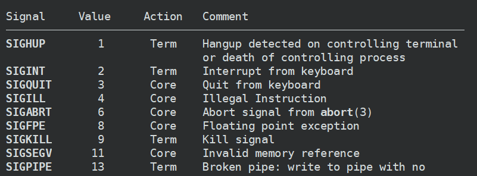
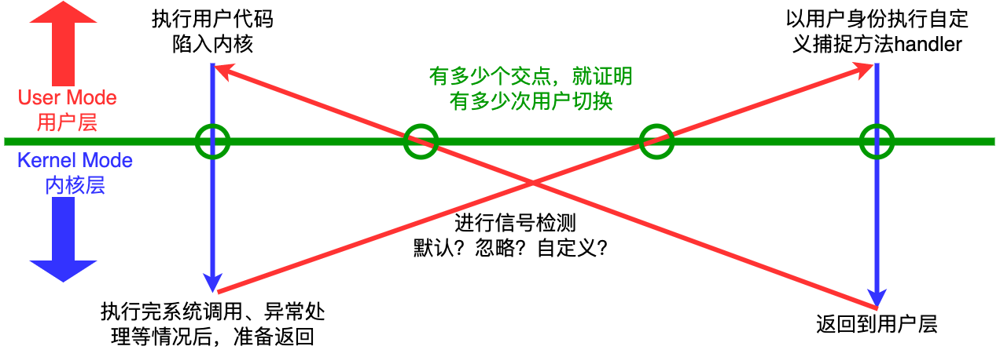

# Linux发展史 & 标准

## *UNIX*

### UNIX的定义

* 指通过 SUS, Single UNIX Specification 所规范的官方一致性测试,且由OPEN GROUP（UNIX 商标的持有者）正式授权冠以“UNIX”的操作系统
* 运作方式类似于经典 UNIX 系统的操作系统

### UNIX & C的早期历史

1. 1960年代初：1969年，由美国贝尔实验室的 Ken Thompson 和 Dennis Ritchie 等计算机科学家创建。最初的UNIX系统是为PDP-7和PDP-11等小型计算机设计的，旨在提供一个多用户、多任务的操作系统，用于支持科学和研究计算

2. 1970年代：在70年代初，UNIX系统逐渐发展壮大， Dennis Ritchie 设计并实现出了C编程语言，这成为后来UNIX系统的主要编程语言。C语言的设计受到了汇编语言和BCPL语言的影响，它具有直接的硬件访问能力、高效的内存管理和丰富的控制结构，使其非常适合系统编程。

   实现C语言的初衷就是为了实现 UNIX 内核及其相关软件而开发一种高层语言。这也是为什么C/C++成为了系统编程的首要语言。C的出现在当时填补了系统编程方面的语言空白

3. 1973年：UNIX操作系统的第一个正式版本被称为UNIX第四版（UNIX Version 4），这个版本是用C语言编写的。这标志着C语言与UNIX系统的密切结合，使得UNIX能够更容易地在不同的硬件平台上移植，因为C语言具有可移植性

   UNIX 因此也一变而为最早以高级语言开发而成的操作系统之一

4. 1975 年 3 月发布的第六版UNIX是在 AT&T 之外广泛使用的首个 UNIX 版本

## *UNIX家族*

1980年代：UNIX系统分化出了多个不同的分支，包括AT&T的System III和System V，以及 UC Berkeley 的BSD, Berkeley Software Distribution。这些分支在功能和特性上有所不同，但它们都继承了UNIX的核心思想，并继续使用C语言进行开发和扩展


Source: Wikipedia https://en.wikipedia.org/wiki/History_of_Unix

### BSD家族

受母校 UC Berkeley 之邀， Ken Thompson 于 1975/1976 学年曾担任该校的客座教授。在此期间，他与研究生们一起为 UNIX 开发了许多新特性和工具。比如说C shell、vi 编辑器、一种改进型的文件系统(伯克利快速文件系统) 、sendmail、Pascal 语言编译器，以及用于新型 Digital V AX 架构的虚拟内存管理机制

1. 1979年12月，诞生了首个完整的 UNIX 发布版 3BSD
2. 1983年的4.2BSD：这是BSD家族的第一个重要版本，于1983年发布。它引入了许多重要的功能，如完整的TCP/IP网络协议栈实现、虚拟内存系统和套接字编程接口。4.2BSD对互联网的发展产生了深远的影响，并成为后来BSD版本的基础

BSD的著名版本，基本都是开源软件

1. FreeBSD：FreeBSD是BSD家族中最著名和广泛使用的实现之一。它注重性能和可用性，广泛应用于服务器环境和大规模应用。FreeBSD具有强大的网络功能和可扩展性，还支持Jails技术，允许虚拟化多个独立的操作系统环境
2. OpenBSD：OpenBSD专注于安全性和代码审查，其目标是创建最安全的操作系统。它具有强大的网络安全功能和默认启用的安全设置。OpenBSD还维护了OpenSSH项目，这是一种用于加密远程通信的开源工具
3. NetBSD：NetBSD是一个注重可移植性的BSD分支，其目标是在各种硬件平台上运行。它的主要特点之一是广泛的硬件支持，使其成为嵌入式系统和各种设备的首选操作系统。NetBSD还注重代码的清晰性和可维护性
4. DragonFly BSD：DragonFly BSD是一个专注于多处理器 SMP 系统的BSD分支，它的目标是提供高性能的多核心支持。它采用了一种全新的虚拟内存系统，以提高系统的扩展性和性能

### System V家族

在BSD蓬勃发展的同时，由于AT&T受到反垄断法的拆分，随着其在电话系统市场垄断地位的丧失，AT&T 也因而获准销售 UNIX

1. System III 由 AT&T 所属的 UNIX 支撑团队 UNIX Support Group, USG 研发, 该团队雇佣了数以百计的研发人员来从事 UNIX 系统的增强以及应用开发（尤其针对文档预备软件包和软件开发工具）
2. 1983 年，System V 的首个发布版发布。在经过一系列发布后，USG 最终于 1989 年推出了 System V Release 4(SVR4) ，此时的 System V 吸收了 BSD 的诸多特性，比如说联网能力。AT&T 将 System V 授权给不同厂商，这些厂商又将其作为自身 UNIX 实现的基础

System V的著名版本，基本都是商业软件

1. AT&T UNIX System V：AT&T UNIX System V是System V的官方实现，起源于贝尔实验室。它是System V操作系统的基础版本，后来的System V版本都是从它分支出来的
2. IBM AIX：IBM的AIX操作系统是基于System V的UNIX实现，旨在运行IBM的大型服务器和工作站。它具有强大的企业级特性和可扩展性
3. HP-UX：惠普（Hewlett-Packard）的HP-UX是另一种基于System V的UNIX实现，用于HP的服务器和工作站。它提供了高性能的计算和可靠性
4. Solaris：Solaris是Sun Microsystems（后来被Oracle收购）开发的UNIX操作系统。它基于System V Release 4（SVR4），具有强大的网络和存储功能。Solaris曾经是企业级UNIX操作系统的领先选择

## *GNU & Linux内核*

### GNU & Linux

GNU, GNU's Not Unix 是一个自由软件项目，它是一个由 Richard Stallman 于1983年发起的计算机操作系统项目，旨在创建一个自由、开源的类UNIX操作系统。GNU项目的目标是提供一个完全自由的操作系统，使用户可以自由运行、复制、分发、学习、修改和改进软件

以下是关于GNU项目的一些重要信息：

1. 自由软件：GNU强调自由软件的理念，即用户应该具有运行、研究、分享和修改软件的自由。为了保护这些自由，GNU采用了GNU通用公共许可证（GNU General Public License，GPL）等自由软件许可协议，确保软件的自由性不受侵犯
2. 工具和应用：GNU项目不仅涉及操作系统内核的开发，还包括了一系列工具、库和应用程序的开发。其中一些著名的GNU工具包括GNU C编译器（GCC）、GNU调试器（GDB）、GNU文本编辑器（Emacs）等
3. GNU/Linux：虽然GNU项目开发了大部分操作系统组件，但在早期，还缺少一个称为内核的关键组件。因此，Richard Stallman 与 Linus Torvalds 合作，将Linux内核与GNU工具和应用程序相结合，创造了GNU/Linux操作系统，也被简称为Linux。这个组合成为了开源社区中最流行的操作系统之一
4. GNU自由文档许可证：GNU项目还为文档和教育资料提供了自由文档许可证（GNU Free Documentation License，GFDL），以保护用户对于文档的自由使用和分发
5. 社区参与：GNU项目鼓励开发者和用户积极参与，为自由软件的开发和改进做出贡献。社区支持和合作在GNU项目的成功中起到了关键作用

### Linux版本号

1. Linux 0.01（1991年）：这是Linux内核的首个公开发布版本，由 Linus Torvalds 发布。它只包含了约10,000行代码，仅支持Intel 386处理器
2. Linux 0.95（1992年）：这个版本引入了虚拟文件系统（Virtual File System，VFS），这是一个允许Linux支持多种文件系统的重要组件
3. Linux 1.0（1994年）：这是Linux内核的首个正式稳定版本，标志着Linux成熟为可用于生产环境的操作系统
4. Linux 2.0（1996年）：这个版本引入了对Symmetric Multiprocessing（SMP）的支持，使Linux能够在多处理器系统上运行。此外，它还增加了对新的硬件设备的支持
5. Linux 2.2（1999年）：这个版本带来了TCP/IP栈的性能改进，使Linux成为一个更好的网络服务器。它还增加了对USB设备的支持
6. Linux 2.4（2001年）：这个版本进一步改进了SMP支持、网络性能和硬件兼容性。它引入了防火墙功能（Netfilter/Iptables）
7. **Linux 2.6（2003年）：这个版本引入了动态调度器、完善的电源管理、内存管理改进以及更好的性能和稳定性。2.6内核系列维持了很长时间，成为许多发行版的基础**
8. Linux 3.x（2011年）：这个版本引入了很多新的硬件支持和性能优化，同时也改进了文件系统和虚拟化支持
9. Linux 4.x（2015年）：这个版本继续增加了新硬件的支持，改进了内存管理、文件系统、安全性和性能
10. Linux 5.x（2019年）：这个版本引入了许多新功能，包括实时内核调度、I/O性能优化、显著改进的网络性能以及新的文件系统特性
11. Linux 6.x（预期）：未来的Linux内核版本将继续演进，以满足新的硬件和应用需求，增加新的功能和改进性能、安全性等方面的特性

Linux内核版本号在2.6之前确实采用了x.y.z（主版本号、次版本号和修订号）的格式

### Linux发行版

准确来说，Linux指的是Linus Torvalds及社区开发的Linux内核，不过也可以指Linux的软件包（工具和库），这些软件包可以被商业化形成不同的发行版 Linux distribution

发行版的目的是为了简化Linux操作系统的安装、配置和维护，以满足不同用户的需求和用途。每个发行版都可以有自己的特点和目标受众

* Ubuntu：用户友好、易用性强、大量的软件包、广泛社区支持。适用于桌面、服务器和云计算
* Debian：稳定性强、广泛的软件包支持、强调自由软件。适用于桌面、服务器和嵌入式系统
* CentOS（现在称为CentOS Stream）：稳定性强、面向企业、与Red Hat Enterprise Linux, RHEL 兼容。适用于：企业服务器和工作站
* Fedora：先进的软件、最新技术、社区驱动。适用于：桌面和开发者
* Red Hat Enterprise Linux, RHEL：企业级支持、长期支持（LTS）、面向企业客户。适用于：大型企业和数据中心
* SUSE Linux Enterprise Server, SLES：企业级支持、高可用性、面向企业客户。适用于：大型企业和数据中心
* Arch Linux：滚动更新、高度可定制、面向高级用户
* Manjaro：用户友好的Arch Linux分支、易用性强
* Slackware：古老而稳定、简单、面向高级用户

### License

下面是一些常见的开源许可证

* MIT许可证：
   * 允许用户在几乎任何情况下自由使用、修改、复制和分发项目
   * 要求在项目中包含原始许可证和版权声明
   * MIT许可证非常宽松，允许其他人在几乎不受限制的情况下使用代码
* BSD许可证：
   * 有多个变种，如2-Clause BSD、3-Clause BSD等
   * 允许几乎不受限制地使用、修改和分发代码，类似于MIT许可证
   * 通常只要求在源代码中包含原始许可证和版权声明
* GNU通用公共许可证（GPL）：
   * 分为GPLv2和GPLv3两个主要版本，其中GPLv3具有更多的保护措施和约束
   * 强制要求所有派生作品也必须采用相同的GPL许可证，以保持开源性
   * 用于确保开源项目的自由和共享，但可能对商业应用产生一些限制
* Apache许可证：
   * 允许用户使用、修改、分发和用于商业目的
   * 对专利权有一些附加规定，以确保贡献者不会通过专利权来限制其他人的使用
   * 适用于需要保护知识产权并允许广泛使用的项目
* GNU较宽松公共许可证（LGPL）：
   * 允许将LGPL许可的代码链接到封闭源码项目中，而不会强制整个项目采用LGPL
   * 通常用于开发库或组件，使其在广泛的应用程序中可用
* Creative Commons许可证：
   * 主要用于非代码内容，如文档、图像、音频和视频
   * 允许创建者定义一系列条件，如是否允许商业用途、是否要求署名等

## *UNIX标准化*

### POSIX & SUS


* IEEE 的 POSIX 标准
  * POSIX, Portable Operating System Interface 可移植操作系统 最初由IEEE制定，以确保UNIX操作系统在不同系统上的可移植性。POSIX定义了一系列API（应用程序编程接口）和命令行工具，包括文件操作、进程管理、信号处理、线程控制、网络编程和 Shell 命令等。POSIX标准的目标是使开发人员能够编写在不同UNIX系统上可移植的应用程序
  * POSIX大致可以分为POSIX.1和POSIX.2（对UNIX中的shell和各种工具定义了标准），最新的标准是POSIX.1-2017
* The Open Group 的 SUS 标准
  * 1996年，X/Open 与 Open Software Foundation, OSF 开放软件基金会合并，成立了 The Open Group。几乎每家与UNIX 系统有关的公司或组织都是 The Open Group 的会员，该组织持续着对 API 标准的开发
  * SUS, Single UNIX Specification 由The Open Group制定和维护，它包括了UNIX操作系统的核心和可选组件
* 统一POSIX和SUS
  * 1999 年开始，出于修订并加强 POSIX 标准和 SUS 规范的目的，IEEE、The Open Group 以及 ISO/IEC 联合技术委员会共同成立了奥斯丁公共标准修订工作组 The Austin Common Standards Revision Group, CSRG
  * 2001 年 12 月，该工作组正式批准了 POSIX 1003.1-2001，有时也简称为 POSIX.1-2001。随后又获批为 ISO 标准：ISO/IEC 9945:2002)
  * POSIX 1003.1-2001 是具有里程碑意义的UNIX标准，它取代了 SUSv2、POSIX.1、POSIX.2 以及大批的早期 POSIX 标准。有时, 人们也将该标准称为SUSv3。通过 SUSv3 认证的 UNIX 实现可被称为 UNIX 03
  * 2008年，Austin CSRG又推出了 POSIX.1-2008/SUSv4

### ABI

ABI, Application Binary Interface 应用程序二进制接口相比于语言层面的API更加严格和难以实现，定义了编程语言编译器和操作系统之间的接口规范，从而实现一次编译成型后在不同的ISA上都可以运行

ABI没有提供显式接口，而是由内核和工具链 toolchain 定义和实现的

ABI包括了以下方面的规范：

* 数据表示：定义了数据类型的表示方式，包括整数、浮点数、字符等。它规定了数据的字节顺序、对齐方式以及数据在内存中的布局
* 函数调用约定：规定了函数的参数传递方式、寄存器的使用规则、栈的管理方式以及函数调用的返回值处理方法。不同的架构和操作系统可能有不同的函数调用约定
* 寄存器使用：定义了哪些寄存器是可用的、用于哪些目的、以及在函数调用时如何保存和恢复寄存器的值
* 异常处理：规定了异常、中断和系统调用的处理方式，包括如何触发和响应这些事件，以及如何传递异常信息
* 系统调用：定义了操作系统提供的服务和函数调用接口，包括如何通过系统调用访问操作系统功能，例如文件系统、进程管理、网络通信等
* 共享库：规定了共享库（也称为动态链接库）的格式、加载方式以及运行时链接过程，以便不同程序可以共享和重用代码

## *Linux命令行命令*

### 通配符 Wildcard

* `*` 代表无穷多个字符 如 `ll test*`：找出所有以test开头的文件
* `?` 一定有一个
* `[]` 可能有一个

### 命令参数中括号的意义（非Shell）

* `[]`：可选内容
* `{}`：一组必须的内容
* `<>`：表示必须被替换的占位符
* `|`：或，可以在多个选项里选一个

### 重要的常用命令

* `touch` 创建文件
  * 当前文件已存在时，更新文件的最近修改时间
* `mkdir -p test/test1`
* `rm -rf`
  * -f 取消询问
  * -i 询问
  * -r 递归删除
* `cp [-fir] <源文件>（可以有多个） <目标文件>`：若是目录用 -rf
* `mv [-ri] 源文件或源目录 目标文件或目标目录`
  * 当目标目录已存在时为移动
  * 当目标目录或文件不存在时就是重命名
* `echo`：打印内容到显示器上
  * `echo "HelloWorld" > myfile`
  * 若目标文件不存在，创建之，否则直接进行写入
  * 访问
* 重定向
  * `>` 输出重定向（从文件的开始，覆盖式的写入）
  * `>>` 追加重定向（从文件的结尾，追加式的写入）
  * `<` 输入重定向：本来应该从键盘获取的内容，变成从文件中读取
  * `./text > log.txt 2>&1` ：将2和1都重定向到log

* `more [选项] [文件]` 查看文件 -n 对输出的所有行编号
* `less [选项] [文件]` 查看文件
  * less功能比 `more` 更强大，less可以前后移动，但more只能往前，且less在查看之前不会加载整个文件
  * `-N`：显示行号
  * `/字符串`：向下搜索
  * `?字符串`：向上搜索
  * `n/N` 重复前一个/后一个搜索
* 管线命令 Pipe `|`，管段是用来传导数据的
* `head -n file` `tail -n file` 查看头尾各n行代码，若想看介于中间的代码可以使用管线命令，如想查看 [999, 1009] 行的代码：`head -1010 myfile | tail -11`
* `alias` 给命令起别名
* 查找
  * `find [路径] -name [文件名]`
  * `which` 查找某条命令的文件路径（命令就是可执行文件）
  * `whereis` 查找符合条件的源代码、二进制文件，不常用
  * `grep [选项] 字符串 文件` 行文本过滤工具 `grep -n '888' myfile`
    * -n 顺便输出行号
    * -i 忽略大小写的不同
    * -v 反选，即显示没有搜索的字符串的行
    * ^ 以xx为开头
    * $ 以xx为结尾
* 压缩/解压缩
  * `zip`
  * tar
    * `tar -czvf xx.tgz xx` 打包并压缩
    * `tar -xzvf xx.tgz -C path` 解压缩到指定路径
* 获取系统和文件信息
  * `pwd` 当前路径
  * `file` 显示文件的种类
  * `stat` 显示文件的状态，主要是修改时间等
  * `uname -a` 获取电脑和操作系统的相关信息
  * `top` 查看CPU占用
  * `cat /etc/redhat-release` 查看Linux内核版本
  * `strace` 查看命令的系统调用
* 进程相关
  * `ps axj`

### manual的使用

1. 可执行的程序或是shell 指令
2. system calls，Linux 核心所提供的函数
3. 一般函式库函数
4. 特殊档案（通常位于/dev）
5. 档案格式与协定，如 /etc/passwd
6. 游戏
7. 杂项（巨集等，如man(7)、groff(7)）
8. 系统管理者指令（通常是管理者 root 专用的）
9. Kernel routines（非标准）

# 系统调用

## *系统调用的封装 & 使用*

### 封装流程


1. 用户层的函数调用：在用户层，系统调用通常通过标准库函数（如 glibc）提供的封装接口调用。例如，当在 C 程序中调用 `read()` 或 `write()` 时，实际上是在调用封装了系统调用的标准库函数
2. 封装和转换：这些标准库函数内部会进行一些参数的封装和转换，准备好用于系统调用。它们使用 `syscall` 函数（或类似机制）来发起实际的系统调用。**`syscall` 函数负责将系统调用的编号和参数放到正确的寄存器中**
3. 触发系统调用：接下来，`syscall` 函数会执行一个特殊的指令（如 `int 0x80` 或 `syscall`），这个指令触发一个模式切换从用户模式跳转到内核模式，并将控制权传递给操作系统
4. 系统调用入口点：在内核中，有一个系统调用入口点（通常是一些汇编代码），它根据系统调用的编号将执行流程转发到相应的内核服务函数。这个入口点负责从寄存器中读取系统调用的参数（如果有的话），并将其传递给相应的内核函数
5. 执行系统调用：内核中的系统调用处理函数（如 `sys_read` 或 `sys_write`）接下来执行实际的工作。这可能涉及文件操作、网络通信、进程管理等
6. 返回结果：一旦系统调用处理函数完成，结果和任何输出参数都会被放回到寄存器中。然后控制权返回到系统调用入口点，该入口点接着返回到用户空间
7. 用户空间恢复执行：最后，控制权回到用户空间的 `syscall` 函数，它从寄存器中获取返回值，并将其返回给原始的库函数调用。随后，库函数将这个返回值传递回应用程序
8. 应用程序继续执行：应用程序接收到从库函数返回的系统调用结果，并继续其执行流程

### 以open为例说明封装

以open的封装为例来厘清 C标准库、glibc 运行时库、系统调用和Linux内核之间的关系

首先C标准库是一套标准，而不是一种具体的实现。glibc 动态库（运行时库）是GNU项目的一部分，它是C标准库的一个具体实现

C函数 `fopen`，系统调用 `open`，系统调用 `__libc_open` （glibc/sysdeps/unix/sysv/linux/open.c）和Linux内核 `sys_open` （/fs/open.c），这些是在 C 和 Linux 系统中用于打开文件的函数，它们之间的关系如下：

1. 当应用程序调用 `fopen` 函数时，实际上是调用由 glibc 所提供的一个包装函数 wrapper function（包装函数就是封装了其他函数的函数）。这个包装函数对传递给 `fopen` 的参数进行了一些额外的处理，然后调用 `__fopen_internal` 函数
2. `__fopen_internal` 是 glibc 的内部函数，它实现了实际的文件打开逻辑。它会根据使用的 glibc 版本调用 `open` 或 `__libc_open` 函数
3. `open` 和 `__libc_open` 都是用于打开文件的函数。`open` 是 Linux 内核提供的系统调用，而 `__libc_open` 是 glibc 的内部函数，提供了更灵活的打开文件接口。根据使用的 glibc 版本，`__fopen_internal` 可能会调用 `open` 或 `__libc_open`
4. `sys_open` 是 Linux 内核提供的系统调用，由 `open` 或 `__libc_open` 调用，用于实际打开文件并返回文件描述符，这个文件描述符可用于后续的读写操作

因此，它们之间的调用顺序可以总结如下

1. 应用程序调用 `fopen` 函数
2. glibc 库的包装函数处理参数并调用 `__fopen_internal`
3. `__fopen_internal` 根据使用的 C 库版本调用 `open` 或 `__libc_open`
4. `open` 或 `__libc_open` 调用系统调用 `sys_open` 来打开文件并返回文件描述符
5. `sys_open` 打开文件并返回文件描述符
6. `open` 或 `__libc_open` 将文件描述符返回给 `__fopen_internal`
7. `__fopen_internal` 将 FILE 指针返回给 C 库的包装函数
8. 包装函数将 FILE 指针返回给应用程序

总结一下

* Glibc 是纯语言级别的库，它里面有大量wrapper，涉及到系统的函数会去封装系统调用
* 系统调用是OS封装好暴露出接口交给用户使用的库，system call的时候会发生陷入内核
* Linux内核函数是最底层的库，完全由系统使用，用户无法接触到

### 系统调用的使用方式

* 使用C运行时库

* 使用 `syscall` 函数来调用

  ```c
  syscall(SYS_write, fd, buffer, nbytes);
  ```

  当需要执行没有直接库函数封装的系统调用，或者需要绕过标准库对某个系统调用的特定行为时

  ```c
  #include <unistd.h>
  #include <sys/syscall.h>   /* For SYS_xxx definitions */
  long syscall(long number, ...);
  ```

  * 参数
    * sysno是系统调用号，唯一标识系统调用号，详见 sys/syscall.h
    * `...` 为剩余可变长的参数，为系统调用所带的参数，根据系统调用的不同，可带0~5个不等的参数。若超过特定系统调用能带的参数，多余的参数会被忽略
  * 返回值：该函数返回值为特定系统调用的返回值，在系统调用成功之后可以将该返回值转化为特定的类型，若系统调用失败则返回 -1，错误代码存放在errno中

  ```c
  #include <stdio.h>
  #include <unistd.h>
  #include <sys/syscall.h>
  #include <errno.h>
  
  int main() {
      int rc;
      rc = syscall(SYS_chmod, "/etc/passwd", S_IROTH | S_IRGRP | S_IRUSR);
      if (rc == -1) fprintf(stderr, "chmod failed, errno = %d\n", errno);
      else printf("chmod succeess!\n");
      return 0;
  }
  ```

  存在移植性问题：不同系统上的系统调用号可能是不同的，用syscall取调用的话不方便

* 低级访问，直接使用软件中断：这种方式极少使用

  这种方法涉及直接在程序中使用汇编代码，或使用特殊的编译器内置功能来触发系统调用。在x86架构上，这通常通过执行 `int 0x80` 指令（旧的方法）或 `syscall` 指令（较新的方法）完成

  极少数情况下会使用，通常用于深度系统编程或操作系统开发。对于应用程序开发者来说，这种方法通常是不必要的，且难以维护

## *内核空间的实现*

### 系统调用表

系统调用表本质上是一个函数指针数组，每个元素对应一个系统调用处理函数。当用户空间的程序发起一个系统调用时，操作系统使用这个表来查找并调用相应的内核函数。这个表是内核如何处理各种不同系统调用的基础。下面是一种可能的声明

```c
asmlinkage long (*sys_call_table[])(void);
```

当一个程序执行系统调用时（比如通过 `syscall` 指令），系统调用的编号会被传递给内核。内核使用这个编号作为索引到系统调用表中，找到对应的函数指针，然后执行相应的函数

系统编号一般被定义在 asm/unistd.h 中，它就是所有系统调用的宏定义。比如说

```c
#define __NR_restart_SYScall           (__NR_SYSCALL_BASE+   0)
#define __NR_exit                      (__NR_SYSCALL_BASE+   1)
#define __NR_fork                      (__NR_SYSCALL_BASE+   2)
#define __NR_read                      (__NR_SYSCALL_BASE+   3)
#define __NR_write                     (__NR_SYSCALL_BASE+   4)
#define __NR_open                      (__NR_SYSCALL_BASE+   5)
#define __NR_close                     (__NR_SYSCALL_BASE+   6)
```

例如，如果一个程序执行 `read()` 系统调用，操作系统将使用与 `read` 对应的编号在系统调用表中查找，然后调用 `sys_read` 函数

在某些情况下，比如在开发某些类型的内核模块时，可能需要修改系统调用表。这是一个高风险操作，因为不正确的修改可能导致系统不稳定或不安全。在现代的Linux内核中，系统调用表通常是只读的，以防止恶意软件更改

### asmlinkage

`asmlinkage` 是一个在 Linux 内核源代码中经常出现的关键字，它在 C 语言函数和汇编代码之间的接口中扮演了重要的角色

在许多操作系统中，特别是在使用 C 语言编写的系统中，当一个函数被调用时，它的参数通常是通过寄存器或者堆栈传递的。不同的编译器和架构可能有不同的约定来决定使用哪种方式

当执行系统调用时，参数是通过寄存器传递给操作系统的。这是因为系统调用通常是通过特殊的指令（如在 x86 架构上的 `int 0x80` 或 `syscall`）来实现的，这些指令不会像标准的函数调用那样使用堆栈传递参数

`asmlinkage` 标记用于告诉编译器，被标记的函数的所有参数都应该从堆栈中获取，而不是寄存器。这对于系统调用非常重要，因为它们的参数实际上是由用户空间的程序放在堆栈上的，然后由系统调用的入口代码（通常是汇编写的）从堆栈上获取并放入寄存器。内核中相应的系统调用处理函数然后使用 `asmlinkage` 来从堆栈上恢复这些参数

一个带有 `asmlinkage` 的函数定义可能看起来像下面这样，这表示 `sys_my_syscall` 函数期望其参数从堆栈上获取，而不是从寄存器中

```c
asmlinkage long sys_my_syscall(int arg1, char *arg2, ...);
```

## *运行时库*

### 系统调用 System Call 和函数库

* 在开发角度，操作系统对外会表现为一个整体，但是会暴露自己的部分接口，供上层开发使用，这部分由操作系统提供的接口称为系统调用
* 系统调用在使用上，功能比较基础，对用户的要求相对也比较高。因此开发者会对部分系统调用进行二次开发和适度封装，形成一个供上层开发者使用的库

### glibc wrapper

Wrapper 或 外壳函数 通常是指一个包装或封装另一个函数的函数。这种技术通常用于修改或扩展原始函数的行为，同时保持原始函数的API不变。glibc中的wrapper一般都会调用syscall来陷入内核执行系统调用

标准C语言函数库的实现随UNIX的实现而异。glibc 是 Linux 下使用的开源的标准C库，用于支持Unix-like操作系统的开发。glibc 是 GNU 发布的libc 库，即运行时库。glibc提供了一组标准的C函数和头文件，使程序员能够编写跨平台的C代码，并与操作系统进行交互，执行各种系统级操作

Glibc 实现操作系统提供的系统服务，即系统调用的封装。每个特定的系统调用对应了至少一个 glibc 封装的库函数。多个 API 也可能只对应同一个系统调用

返回值-1在多数情况下表示内核不能满足进程的请求，Libc中定义的errno变量包含特定的出错码

### 确定glibc的版本

* 查看共享库版本号

  ```cmd
  $ ldd main | grep libc
  	libc.so.6 => /lib/x86_64-linux-gnu/libc.so.6 (0x00007ff395ef7000)
  ```

* `gnu_get_libc_version()`

* `confstr()`

## *系统调用的性能*

# 系统设置

## *用户和组*

### 用户

系统的每个用户都拥有唯一的登录名 login name（用户名 username）和与之相对应的整数型用户 ID User ID, UID

系统密码文件 /etc/passwd 为每个用户都定义有一行记录，每行都包含 7 个字段，每个字段之间用冒号分隔

```
用户名 username:经过加密的密码:UID:GID:注释:主目录$HOME:登陆shell$SHELL
wjfeng:x:1002:1002:,,,:/home/wjfeng:/bin/zsh
```

关于密码：要是启用了 shadow 密码（这是常规做法）的话，系统将会不解析该字段。这时 /etc/passwd 中的密码字段通常会包含字母“x” （当然也可以是任何非空字串），而经过加密处理的密码实际上却存储到 shadow 密码文件中。若 /etc/passwd 中密码字段为空，则该账户登录时无需密码

### shadow密码

UNIX 一直在 /etc/passwd 中维护所有的用户信息，这其中就包括经过加密处理的密码，但这会引发安全问题。因为密码是很多非内核程序也需要用到的，所以也需要提供权限给这些程序，这就给密码破解留下了机会

作为一种反制措施，shadow 密码文件 /etc/shadow shadow 单独维护密码文件，仅供具有特权的程序读取

UNIX 系统采用单向加密算法对密码进行加密，需要用下面的 crypt 库函数来进行验证。使用 crypt 时要在编译程序时需开启–lcrypt 选项,以便程序链接 crypt 库

```c
#include <crypt.h>
char *crypt (const char *hey, const char *salt);
			// Returns pointer to statically alocated string containing
			// encrypted password on success, or NULL on error
```

crypt采用DES算法来加密，其中 key 是最长可达 8 字符的密钥，salt 则是一个两字符的字符串，用来扰动 DES 算法

### 组

将用户分组主要是出于便于管理的目的，尤其是为了控制对文件和其他资源的访问

每个用户组都对应着系统组文件 /etc/group 中的一行记录

```
组名:经过加密的密码:GID:用户列表
sudo:x:27:ubuntu,wjfeng
```

### 添加sudo信任

root的UID是0

## *系统限制*

## *获取系统和进程信息*

## *proc文件系统*

/proc 是一个特殊的虚拟文件系统，该目录下文件用来表示与启动、内核相关的特殊信息。该文件系统驻留于/proc 目录中，包含了各种用于展示内核信息的文件，并且允许进程通过常规文件 IO 系统调用来方便地读取，有时还可以修改这些信息

注意：虽然称为虚拟文件系统，但它不是VFS，是因为其包含的文件和子目录并未存储于磁盘上，而是由内核在进程访问此类信息时动态创建而成，所以称为虚拟

* /proc/cpuinfo：CPU 详细信息
* /proc/meminfo：内存相关信息
* /proc/version：版本信息
* /proc/sys/fs/file-max：系统中能同时打开的文件总数，可修改该文件
* 进程的相关信息：/proc/32689/ 表示指定进程（进程号为 32689)的相关信息
* /proc/devices：已分配的字符设备、块设备的设备号

## *时间*

### 日历时间

### 时间转换函数

### 时区 & 地区

```c
#include <locale.h>
char *setlocale(int category, const char *locale);
			// Returns pointer to a (usually statically allocated) string identifying
			// the new or current locale on success, or NULL on error
```

### 进程时间

进程时间是进程创建后使用的 CPU 时间数量，它分为用户CPU时间和进程CPU时间

* 用户 CPU 时间是在用户模式下执行所耗费的时间，也称为虚拟时间 virtual time
* 系统 CPU 时间是在内核模式中执行系统调用所耗费的时间

```c
#include <sys/times.h>
clock_t times(struct tms *buf);
			// Returns number of clock ticks (sysconf(_SC_CLK_TCK)) since
			// “arbitrary" time in past on success, or (clock_t)-1 on crror
```

结果通过 buf 指向的结构体返回

```c
struct tms {
	clock_t tms_utime;  /* User CPU time used by Caller */
	clock_t tms_stime;  /* System CPU time used by caller */
	clock_t tms_cutime; /* User CPU time of all (waited for) children */
	clock_t tms_cstime; /* System CPU time of all (waited for) children */
};
```

tms 结构体的前两个字段返回调用进程到目前为止使用的用户和系统组件的 CPU 时间。后两个字段返回的信息是父进程（比如 times 的调用者）执行了 wait 的所有已经终止的子进程使用的 CPU 时

```c
#include <time.h>
clock_t clock(void);
			// Returns total CPU time used by calling process measured in
			// CLOCKS_PER_SEC, Or (clock_t)-1 on error
```

返回一个值描述了调用进程使用的总的 CPU 时间（包括用户和系统）

# 通用文件IO

## *Helper*

### Reminder：C文件接口

* 当前路径：当一个进程运行起来的时候，每个进程都会记录自己当前所处的工作路径

* C/Cpp程序 默认会打开三个文件流：标准输入 `FILE *stdin`、标准输出 `FILE *stdout`、标准错误 `FILE *stderr`

* C语言接口

  * C语言打开文件 fopen：r, r+, w（在fwrite前就清空）, w+, a（追加）, a+

  * C语言按行读取文件：fgets

  * C语言写文件：fwirte, fprintf, fputs

  * 简单模拟实现cat命令

    ```c
    #include <stdio.h>    
    #include <unistd.h>    
    #include <string.h>    
    
    int main(int argc, char *argv[]) {    
        if (argc != 2) {    
            printf("argv error\n");    
            return 1;    
        }    
        FILE *fp = fopen(argv[1], "r");
        if (fp == NULL) {    
            perror("fopen");    
            return 2;    
        }    
        // 按行读取    
        char line[64];    
        // fgets是C语言的接口来取string，因此会自动在字符结尾添加\0    
        while (fgets(line, sizeof(line), fp) != NULL) {    
            // printf("%s", line);    
            fprintf(stdout, "%s", line);    
        }    
        return 0;    
    }    
    ```

### 补充：位图的使用

bitmap 位图：将选项#define为不同的比特位，通过输入形参的不同组合来达到选择或同时输入多个参数的目的

```c
#include <stdio.h>    
#include <unistd.h>    
#include <string.h>    
    
// 用int中的不重复的一个bit，就可以表示一种状态    
#define ONE 0x1   // 0000 0001    
#define TWO 0x2   // 0000 0010    
#define THREE 0x4 // 0000 0100    
    
void show(int flags) {    
    if (flags & ONE)    
        printf("hello one\n");    
    if (flags & TWO)    
        printf("hello two\n");    
    if (flags & THREE)    
        printf("hello three\n");    
}    
    
int main() {    
    show(ONE);    
    printf("-------------------------\n");    
    show(TWO);    
    printf("-------------------------\n");    
    show(ONE | TWO);    
    printf("-------------------------\n");    
    show(ONE | TWO | THREE);    
    printf("-------------------------\n");
    
    show(ONE | THREE);    
    return 0;    
}    
```

## *打开、关闭、读写*

### 文件描述符fd引入


* 0，1，2号fd对应的分别是stdin，stdout，stderr

  * 验证

    ```c
    printf("stdin: %d\n", stdin->_fileno);
    printf("stdout: %d\n", stdout->_fileno);
    printf("stderr: %d\n", stderr->_fileno);
    ```

    输出结果分别为0，1，2

  * stdout 和 stderr 的区别：对应的外设可以理解为都是显示器，但是是不同的“显示器”，但对其做重定向到磁盘文件时，只有stdout会被重定向

  * 将 stdout 和 stderr 分开重定向到两个txt文件中：`./myfile > ok.txt 2> err.txt` 或者重定向到1个文件中：`./myfile > log.txt 2>&1`

* 进程要访问文件必须先打开文件，而一个进程可以打开多个文件

* 文件要被访问，前提是要被加载到内存中才能被直接访问。OS内部为了管理每一个被打开的文件，构建 struct file（其中包含了每一个被打开的文件的几乎所有内容，不仅仅包含属性）。创建一个struct file的对象，充当一个被打开的文件，多个文件则struct file以链表的形式组织起来

  ```c
  struct file {
      struct file *next;
      struct file *prev;
      // 包含了一个被打开的文件的几乎所有的内容（不仅仅包含属性）
      // 文件的属性本来是保存在硬盘上的，加载入内存的时候也被加载进struct file中
  }
  ```

* **fd在内核中，本质是一个数组下标**。内核中进程的PCB结构体有一个\*files，它指向 fd_arrary 文件描述符表，fd就是这个数组的下标，OS通过该下标来找到需要进行操作的文件

### 打开、关闭文件

打开文件用open

```c
#include <sys/types.h>
#include <sys/stat.h>
#include <fcntl.h>

int open(const char *pathname, int flags);
int open(const char *pathname, int flags, mode_t mode);
int creat(const char *pathname, mode_t mode);
				// Returns file descriptor on success, or -1 on error
```

* flags 是一种bitmap选项
  * 三种互斥的文件访问模式标志，不能同时使用。其中任意一种可以与其他 flags 进行 `|` 操作
    * O_RDONLY 以只读方式打开文件
    * O_WRONLY 以只写方式打开文件
    * O_RDWR 以可读写方式打开文件
  * O_CREAT 若欲打开的文件不存在则自动建立该文件
  * O_EXCL（exclude）提供保证进程是打开文件的创建者的机制，即独占机制
    * 若O_CREAT 也被设置，此指令会去检查文件是否存在。文件若不存在则建立该文件，否则将导致打开文件错误
    * 若O_CREAT 与O_EXCL 同时设置， 并且欲打开的文件为符号连接，则会打开文件失败
  * O_NOCTTY 如果欲打开的文件为终端机设备时，则不会将该终端机当成进程控制终端机
  * O_TRUNC 若文件存在并且以可写的方式打开时，该 flag 会令文件长度清为0，而原来存于该文件的内容也会消失
  * O_APPEND 当读写文件时会从文件尾开始移动，也就是所写入的数据会以附加的方式加入到文件后面
  * O_NONBLOCK/O_NDELAY 以不可阻断的方式打开文件，也就是无论有无数据读取或等待，都会立即返回进程之中
  * O_SYNC 以同步IO的方式打开文件，阻塞IO过程直到数据被持久化到disk上
  * O_NOFOLLOW 如果参数pathname 所指的文件为一符号连接，则会令打开文件失败
  * O_DIRECTORY 如果参数pathname 所指的文件并非为一目录，则会令打开文件失败。此为 Linux2.2 以后特有的旗标，以避免一些系统安全问题
* mode 选择文件权限，只有在创建文件的时候才起作用。注意：新建文件的访问权限不仅仅依赖于参数 mode，而且还受到进程的 umask 值和（可能存在的）父目录的默认访问控制列表影响。具体可以看手册或interface

在早期的 UNIX 实现中，`open()` 没有mode参数，无法用来创建新文件，而是使用 `creat()` 系统调用来创建并打开一个新文件。create完全等价于下面的open调用，如果文件已存在会清空文件

```c
fd = open(pathname, O_WRONLY | O_CREAT | O_TRUNC, mode)；
```

关闭文件用close

```c
#include <unistd.h>
int close(int fd);
			// Returns O on success, or -1 on error
```

### write

```c
#include <unistd.h>
ssize_t write(int fd, const void *buf, size_t count);
			// Returns number of bytes written, or -l on error
```

* 参数
  * fd 是要操作的文件
  * buf 是计划写入的缓冲区，缓冲区至少要有count个size_t的大小
  * count 要写的**字节数**
* 返回写入的字节数，若遇到文件结尾 EOF 则返回0

参数和read一样。返回读到的字节数，若读到的是0，则意味着文件结束了，注意：换行和回车也是有效字符，不为0！

### read

```c
#include <unistd.h>
ssize_t read (int fd, void *buf, size_t count); 
			// Returns number of bytes read, 0 on EOF, or -1 on error
```

* 参数
  * fd是要操作的文件
  * buf 是计划写入的缓冲区，缓冲区至少要有count个size_t的大小
  * count 要写的字节数
* 返回写入的字节数，若遇到文件结尾 EOF 则返回0

read没有在 `printf()` 函数打印的字符串尾部添加一个表示终止的空字符

## *文件指针相关操作*

有些接口用到了文件指针，即 `struct file` 中的 `loff_t f_pos;` 来控制在文件的某个位置操作

### lseek

> `lseek()`调用名中的 `l` 源于这样一个事实：offset 参数和调用返回值的类型起初都是 long 型。早期的 UNIX 系统还提供了 `seek()` 系统调用，当时这两个值的类型为 int 型。 -- The Linux Programming Interface

```c
#include <sys/types.h>
#include <unistd.h>
off_t lseek(int fd, off_t offset, int whence);
			// Returns new file offset if successful, or -1 on error
```

* offset 参数指定了一个以字节为单位的数值。 SUSv3 规定 `off_t` 数据类型为有符号整型数

* whence 参数表示应参照哪个基点来解释 offset 参数，应为下列其中之一

  

  * SEEK_SET 将文件偏移量设置为**从文件头部起始点开始**的 offset 个字节
  * SEEK_CUR 相对于**当前文件偏移量**，将文件偏移量调整 offset 个字节
  * SEEK_END 将文件偏移量设置为**起始于文件尾部**的 offset 个字节。也就是说，offset 参数应该从文件最后一个字节之后的下一个字节算起

### 在文件特定偏移量处的IO

```c
#include <unistd.h>
ssize_t pread(int fd, void *buf, size_t count, off_t offset);
			// Returns number of bytes read, 0 on EOF, or -1 on error
ssize_t pwrite(int fd, const void *buf, size_t count, off_t offset);
			// Returns number of bytes written, or -1 on error
```

Pread/pwrite会在 offset 参数所指定的位置进行文件IO操作，而非始于文件的当前偏移量处

Pread/pwrite = `lseek(fd, offset, SEEK_CUR)` + read/write。不过区别在于**read/write会改变文件指针，但pread/pwrite不会改变**

Pread64/pwrite64是把offset扩大为64位的

### 文件空洞

从文件结尾后到新写入数据间的这段空间被称为文件空洞 file holes。这段空间用read去读取的会返回全0填充的缓冲区

文件空洞不占用任何磁盘空间，知道后续某个时间点在文件空洞中写入了数据时，文件系统才会为它分配磁盘快

原生的UNIX系统一般都支持文件空洞。不支持文件空洞的OS会显式地将空字节写入文件

### 文件截断

```c
#include <unistd.h>
#include <sys/types.h>
int truncate(const char *path, off_t length);
int ftruncate(int fd, off_t length);
			// Both retur O on success, or -1 on error
```

注意：虽然叫做truncate，但是这个系统调用并不是只能把大file size截断为小file size，而是可以将file调整为给定的任意大小的length

若文件当前长度大于参数 length，调用将丢弃超出部分；若小于参数 length，调用将在文件尾部添加一系列空字节或是一个文件空洞（SUSv3标准）

Truncate 通过文件路径字符串来指定要操作的文件，而fruncate则通过fd来指定文件

## *修改文件状态*

### fcntl

```c
#include <unistd.h>
#include <fcntl.h>
int fcntl(int fd, int cmd, ... /* arg */ );
			// Return on success depends on cnd, or -1 on error
```

`fcntl()`（file control）是一个Unix和Unix-like操作系统中的系统调用，用于对fd进行各种控制操作。它可以用于执行多种文件操作，具体实现fd的什么功能，取决于`cmd`。包括但不限于以下几种

* `cmd=F_DUPFD`：复制一个现有的描述符
* `cmd=F_GETFD` 或 `cmd=F_SETFD`：获得/设置文件描述符标记
* `cmd=F_GETFL` 或 `F_SETFL`：获得/设置文件状态标记
* `cmd=F_GETOWN` 或 `F_SETOWN`：获得/设置异步IO所有权
* `cmd=F_GETLK`、`cmd=F_SETLK` 或 `cmd=F_SETLKW`：获得/设置记录锁

### dup\* 复制fd

```c
#include <unistd.h>
int dup(int oldfd);
			// Returns (new)file descriptor on success, or -1 on error
int dup2(int oldfd, int newfd);
			// Returns (new)file descriptor on success, or -l on error

#define _GNU_SOURCE             /* See feature_test_macros(7) */
#include <fcntl.h>              /* Obtain O_* constant definitions */
#include <unistd.h>
int dup3(int oldfd, int newfd, int flags);
			// Returns (new)file descriptor on success, or -l on error
```

* `dup` （Duplicate File Descriptor）用于复制一个fd，并返回一个新的fd，该新描述符指向与原始文件描述符相同的文件或资源。新的fd是通过寻找fd表中的最小未使用的fd来创建的

* `dup2`（Duplicate to Specified File Descriptor）用于将一个fd复制到另一个指定的fd，而不是创建一个新的fd。如果指定的文件描述符已经被使用，那么 `dup2` 将关闭该fd，然后将其复制为指定的fd

* `dup3` 是Linux特有的系统调用，它类似于 `dup2`，但提供了更多的选项，包括指定文件描述符的标志位（flags）。这使得 `dup3` 更加灵活，并允许在复制文件描述符时设置更多的选项

  ```c
  int fd1 = open("file1.txt", O_RDONLY);
  int fd2 = open("file2.txt", O_WRONLY | O_CREAT, 0644);
  dup3(fd1, 0, O_CLOEXEC); // 将标准输入复制为 fd1，并设置新文件描述符的关闭-on-exec标志
  ```

### fd和重定向 redirection

* fd分配规则：优先分配最小的，且违背占用的fd
* 输出重定向试验：为显示器默认分配的fd\==1，现在将fd\==1重定向到自定义文件 `log.txt` 中
* 重定向的本质：在OS内部，更改fd对应内容的指向

```c
int main() {    
    close(1);    
    // 这里的fd的分配规则是：优先分配最小的没有被占用的文件描述符    
    int fd = open("log.txt", O_WRONLY | O_CREAT | O_TRUNC, 0666);    
    if (fd < 0) {    
        perror("open");    
        return 1;    
    }      
    printf("fd: %d\n", fd);    
    fprintf(stdout, "hello fprintf\n");    
    const char *s = "hello fwrite";    
    fwrite(s, strlen(s), 1, stdout);    
    
    fflush(stdout);    
    close(fd);    
    return 0;    
}    
```

* `int dup2(int oldfd, int newfd)` 系统调用进行重定向：改变文件描述表 `struct file* fd_array` 中存储的文件指针，将newfd下标存放的文件流指针替换为oldfp下标所存放的文件指针以完成重定向


## *目录 & 链接*

```c
#include <unistd.h>
int unlink(const char *pathname);
			// Returns O on success, or -1 on error

#include <fcntl.h>           /* Definition of AT_* constants */
#include <unistd.h>
int unlinkat(int dirfd, const char *pathname, int flags);
```


```c
#include <stdio.h>
int remove(const char *pathname);
			// Returs O on success, or -1 on error
```

remove 库函数移除一个文件或一个空目录

* 若 pathname 是一文件，那么 remove 调用 unlink
* 若 pathname 为一目录，那么 remove 调用 rmdir


## *特殊的文件操作*

### 大文件操作

32位系统中 off_t 被实现为一个32位的有符号整型，因此它最大能表示一个2GB的文件

调用 open64，相当于在调用 open 的时候在flags里加上了O_LARGEFILE标志。若调用 open 时未指定此标志，且与打开的文件大小是大于2GB的，那么调用将会返回错误

### /dev/fd

### 临时文件

# 缓冲

## *两种级别的缓冲区*

### 缓冲区总览

使用 `sync(int fd)` 立即将脏数据 dirty data 落盘


一次IO的整个过程是

1. 通过 stdio 库将用户数据传递到 stdio 缓冲区，该缓冲区位于用户态内存区
2. 当 stdio 缓冲区填满时，stdio 库会调用 `write()` 系统调用，将数据传递到内核高速缓冲区（位于内核态内存区)）
3. 最终，内核发起磁盘操作，将数据传递到磁盘

系统中一共有两种级别的缓冲区：语言级别的用户空间缓冲区和内核级别的缓冲区。以C语言和Linux OS为例，分别为stdio库的缓冲区和内核的Page Cache（从内核 2.4 开始，Linux 不再维护一个单独的缓冲区高速缓存 buffer cache，而是将其并入Page Cache）

利用缓冲区，不论是语言级的函数还是系统调用都无须确认数据真的持久化了之后再返回，而是直接返回，OS会负责稍后进行落盘操作

系统调用不会自动创建缓冲区，使用者必须要预先创建、分配好缓冲区。而语言级别的wrapper则往往会自己创建好缓冲区

### stdio缓冲区

glibc运行时库的stdio和内核都有自己的缓冲区，既然系统调用可以直接利用内核的缓冲区，那stdio为什么自己还要维护一个缓冲区呢？

* 如果可以在用户层的缓冲区就命中的话，就没有必要通过系统调用去内核缓冲区取数据，节省了系统调用的损耗
* 标准IO库提供了格式化的输入/输出功能，例如`printf`和`scanf`。这些函数允许以特定格式读取和写入数据，而内核缓冲区通常没有这种格式化的能力
* 保障可移植性：标准IO库提供了与平台无关的接口，使得程序更容易移植到不同的操作系统上。这种抽象层隐藏了底层系统调用的细节，提供了更一致的接口

标准I/O库提供了对缓冲区的更灵活的控制。应用程序可以使用 `setvbuf()` 等函数来设置缓冲区的大小、类型和刷新方式。这使得程序员能够根据具体的需求来优化I/O操作。缓冲区的刷新策略

```c
#include <stdio.h>
int setvbuf(FILE *stream, char *buf, int mode, size_t size);
			// Returns O on success, or nonzero on error
```

* stream 指定将要修改哪个文件流的缓冲。打开流后,必须在调用任何其他 stdio 函数之前先调用 setvbuf()。setvbuf()调用将影响后续在指定流上进行的所有 stdio 操作

* buf

  * 若 buf 为 NULL，那么 stdio 库会为 stream 自动分配一个缓冲区（除非是直接IO O_DIRECT），glibc此时会忽略size参数
  * 若 buf 不为 NULL，则其指向 size 大小的内存块以作为 stream 的缓冲区，这块缓冲区应该是使用malloc来获取的堆上的内存，而不是栈上的内存

* mode 指定了缓冲类型

  * _IONBF，不缓冲立即刷新：每个 stdio 库函数将立即调用 write 或者 read。stderr 默认属于这一类型

  * _IOLBF，行刷新/行缓冲：write遇到换行符 `\n` 就往下层刷新，read每次读取一行数据。指代终端设备的流默认采用这种刷新策略

  * _IOFBF，满刷新/全缓冲/块缓冲：缓冲区满了才往下层刷新，一般是**指代磁盘的流文件考虑效率采用这种刷新策略 

  * 特殊情况
    * 用户强制刷新 `fflush`
    
      ```c
      #include <stdio.h>
      int fflush(FILE *stream);
      			// Returns 0 on success, EOF on error
      ```
    
    * 进程退出时若没有被 `close(fd)` 的话就强制刷新


所有设备出于效率考量都倾向于使用全缓冲。这是因为**在和外部设备IO的过程中，数据量的大小不是主要矛盾，OS和外设预备IO的的过程才是最耗费时间的**，全缓冲可以有效减少IO次数，从而提高了效率。其他刷新策略是结合具体情况做的妥协，如显示器是因为给用户看的，需要同时考虑到效率和用户体验

另外还有一些和setvbuf同族的gilbc函数，它们都是基于setvbuf的

```c
#include <stdio.h>
void setbuf(FILE *stream, char *buf);
void setbuffer(FILE *stream, char *buf, size_t size);
void setlinebuf(FILE *stream);
```

* `setbuf(fp, buf)` 等价于

  ```c
  setvbuf(fp, buf, (buf != NULL) ? _IOFFB : _IONBF, BUFSIEZ);
  ```

  BUFSIZ 定义于 `<stdio.h>` 中，glibc 库实现将此常量定义为一个典型值8192

* setbuffer 函数类似于 setbuf 函数，但允许调用者指定 buf 缓冲区大小。等价于

  ```C
  setvbuf(fp, buf, (buf != NULL) ? _IOFBF : _IONBF, size);
  ```

### stdio缓冲区试验


* 现象：同样的一个程序，向显示器打印时只输出4行文本，但向磁盘上的普通文件重定向打印时就变成了7行，其中C的IO接口打印了2次，而系统调用接口则和像显示器上打印一样只打印了一次
* 原因：直接调用是写给stdout，策略是行缓冲；后来重定向到文件中，对于磁盘上的文件刷新策略是全缓冲，父进程产生的数据还保留在它的PCB上下文数据中，父子进程退出的时候一并刷新
* 函数退出的时候强制刷新缓冲区，这是一个将数据写给OS的过程，即发生了写时拷贝
* 从试验结果可以看到，缓冲区的刷新策略改变并不会影响系统调用，这说明缓冲区是由语言层面维护的，而非系统层面

### 同步IO完成

SUSv3 将同步IO完成 synchronized IO completion 定义为：某一 IO 操作，要么已成功完成到磁盘的数据传递，要么被诊断为不成功

SUSv3 定义了两种不同类型的同步 iO 完成

* synchronized IO data integrity completion：确保针对文件的一次更新传递了足够的信息（到disk），以便于之后对数据的获取
  * 读操作：被请求的文件数据已经（从disk）传递给进程。若存在任何影响到所请求数据的挂起写操作，那么在执行读操作之前，将这些数据传递到磁盘
  * 写操作：写请求所指定的数据已传递（至disk）完毕，且用于获取数据的所有文件元数据也已传递（至disk）完毕
* Synchronized IO file integrity completion 是另一种同步 iO 完成，它是synchronized IO data integrity completion的超集：在对文件的一次更新过程中，要将所有发生更新的**文件元数据**都传递到磁盘上，即使有些在后续对文件数据的读操作中并不需要

### 内核缓冲区

下面三个强制刷新内核刷冲区的数据的范围是**由小到大**排列的

```c
#include <unistd.h>
int fdatasync(int fd);
int fsync(int fd);
			// Both returns 0 on success, or-1 on error
void sync(void);
```

1. fdatasync：强制文件处于 synchronized IO data integrity completion 的状态。将 fd 代表的文件的脏数据刷新至磁盘，同时对必要的元数据刷新至磁盘中，这里所说的必要的概念是指：对接下来访问文件有关键作用的信息，如文件大小，而文件修改时间等不属于必要信息
2. fsync：强制使文件处于 Synchronized IO file integrity completion 状态，使与 fd 相关的缓冲数据和与打开文件描述符 fd 相关的所有元数据都刷新到disk上。并且fsync会等待实际刷新到disk完成后才会返回
3. sync：包含更新文件信息的**所有**内核缓冲区（即数据块、 指针块、 元数据等）排入写队列（IO Queue，只有控制流加入，数据流放在Page Cache中不动），然后就返回，它不会等待实际刷新到disk，所以sync并不能完全保证真的将所有脏数据持久化了。sync和哪一个fd无关

若内容发生变化的内核缓冲区在 30 秒内未经显式方式同步到磁盘上，则一条长期运行的内核线程会确保将其刷新到磁盘上。这一做法是为了规避缓冲区与相关磁盘文件内容长期处于不一致状态（以至于在系统崩溃时发生数据丢失）的问题。在 Linux 2.6 版本中，该任务由 **pdflush 内核线程**执行

注意：**这三种刷新数据的方式和在open的时候把flags设置为 O_SYNC 是完全不同的**。O_SYNC 实现了 Synchronized IO file integrity completion，但是每写一次就要阻塞，等到数据持久化才返回，**会造成严重的效率损耗**。而这三种刷新方式是受我们控制的，我们可以选择什么时候持久化

## *其他的缓冲利用形式*

### 混合使用库函数和系统调用进行IO

```c
#include <stdio.h>
#define _POSIX_C_SOURCE
int fileno(FILE *stream);
			// Returns file descriptor on success, or -1 on error
```

输入一个语言级的文件流，返回一个内核级的fd，然后可以直接用read、write等系统调用（无缓冲IO）

```c
#include <stdio.h>
FILE *fdopen(int fd, const char *mode);
			// Returns (new) file pointer on success, or NULL on error
```

fdopen 与 fileno 的功能相反。输入一个fd，返回一个文件流对象。创建套接字和管道的系统调用总是返回文件描述符，这可以在这些文件上使用stdio缓冲和stdio函数

### 分散输入和集中输出

分散输入和集中输出 Scatter-Gather IO：`*readv*()` 和 `*writev*()` 分别实现了分散输入和集中输出的功能

```c
#include <sys/uio.h>
ssize_t readv(int fd, const struct iovec *iov, int iovcnt);
			// Returns number of bytes read, 0 on EOF, or -1 on error
ssize_t writev(int fd, const struct iovec *iov, int iovcnt);
			// Returs number of bytes written, or -1 on error
ssize_t preadv(int fd, const struct iovec *iov, int iovcnt,
              off_t offset);
ssize_t pwritev(int fd, const struct iovec *iov, int iovcnt,
               off_t offset);
ssize_t preadv2(int fd, const struct iovec *iov, int iovcnt,
               off_t offset, int flags);
ssize_t pwritev2(int fd, const struct iovec *iov, int iovcnt,
                off_t offset, int flags);
```

这些系统调用并非只对单个缓冲区进行读写操作，而是一次即可传输多个缓冲区的数据

* 数组 iov 定义了一组用来传输数据的缓冲区。iov数组 中的每个成员都是如下形式的数据结构

  ```c
  struct iovec {
  	void *iov_base;    /* Start address of buffer */
  	size_t iov_len;    /* Number of bytes to transfer to/from buffer */
  };
  ```

* iovcnt 则指定了 iov 的成员个数

## *C运行库FILE结构体和用户层缓冲区的模拟实现*


### 文件描述符fd和文件流指针FILE关系

* C语言层面上为每一个文件定义了FILE结构体（注意系统层面对文件的管理是通过封装fd的file结构体），FILE结构体中不仅封装了fd，还维护了该文件的缓冲区，FILE被称为文件流 stream
* 上层语言必须通过fd，并通过语言层次上维护缓冲区和指定刷新策略，比如Cpp的cout

### C语言层面上的FILE结构体模拟实现

* FILE结构体（并不是全部）

  ```c
  typedef struct MyFILE_ {
      int fd;
      char buffer[1024];
      int end; // 当前缓冲区的结尾
  } MyFILE;
  ```

* `fopen`：以w模式为例

  ```c
  MyFILE *fopen_(const char *pathname, const char *mode) {
      assert(pathname && mode);
      MyFILE *fp = NULL;
  
      if (strcmp(mode, "w") == 0) {
          int fd = open(pathname, O_WRONLY | O_TRUNC | O_CREAT ); // 封装系统调用
          if (fd >= 0) {// 若打开文件失败返回<0，则什么都没有发生，直接退出else if后返回fp == NULL
              fp = (MyFILE*)malloc(sizeof(MyFILE));
              memset(fp, 0, sizeof(MyFILE));
              fp->fd = fd;
          }
      }
      else if (strcmp(mode, "w+") == 0); // ... 其他模式的实现
      return fp;
  }
  ```

* `fputs_`：以stdin为例

  ```c
  void fputs_(const char *message, MyFILE *fp) {
      assert(message && fp);
      strcpy(fp->buffer + fp->end, message); // 若buffer里已经有数据了，则end!=0
      fp->end += strlen(message);
  
      printf("%s\n", fp->buffer); // 用来debug
      
      // 暂时没有刷新，刷新策略是用户通过执行C标准库中的代码逻辑来完成刷新动作的
      // 因为C提供了缓冲区，通过刷新策略，减少了IO的执行次数（数据量不变），IO的本质就是write和read等系统接口
      if (fp->fd == 0){} // stdin 涉及到键盘等硬件的IO比较复杂
      else if (fp->fd == 1) { // stdout
          if (fp->buffer[fp->end - 1] == '\n') {
              fprintf(stderr, "fflush: %s", fp->buffer);
              write(fp->fd, fp->buffer, fp->end);
              fp->end = 0;
          }
      }
      else if (fp->fd == 2) { /*stderr*/}
      else { /*其他文件*/}
  }
  ```

* `fclose`

  ```c
  void fclose_(MyFILE *fp) {    
      assert(fp);    
      fflush_(fp);    
      close(fp->fd); // 封装系统调用    
      free(fp);    
  }  
  ```

* fwite的逻辑流（->代表封装顺序）：`fwrite() -> FILE* -> fd -> write -> write(fd, ...) -> 执行OS内部的write方法 -> 能找到进程的 PCB，即 tast_struct -> *fs -> files_struct -> fd_array[fd] -> struct file -> 内存文件 -> 操作`

* `fflush`

  ```c
  void fflush_(MyFILE *fp) {
      assert(fp);
      if (fp->end != 0) {//end!=0就说明缓冲区里有数据
          // 暂且认为刷新了 -- 其实是把数据刷新到了内核
          // 若想把数据手动写到外设里，要用sync
          write(fp->fd, fp->buffer, fp->end);
          syncfs(fp->fd);
          fp->end = 0;
      }
  }
  ```

# 文件属性

## *文件信息*

### stat系统调用

```c
#include <sys/types.h>
#include <sys/stat.h>
#include <unistd.h>

int stat(const char *pathname, struct stat *statbuf);
int fstat(int fd, struct stat *statbuf);
int lstat(const char *pathname, struct stat *statbuf);
			// All return O on success, or -1 on error
```

上面3个系统调用之间仅有的区别在于对文件的描述方式不同 

* `stat()` 会返回所命名文件的相关信息
* `lstat()` 与 `stat()` 类似，区别在于如果文件属于符号链接，那么所返回的信息针对的是符号链接自身，而非符号链接所指向的文件
* `fstat()` 则会返回由某个打开fd所指代文件的相关信息

`*stat()` 会在缓冲区中返回一个由statbuf指向的stat结构

```c
struct stat {
	dev_t     st_dev;        /* IDs of device on which file resides */
	ino_t     st_ino;        /* I-node number of file */
	mode_t    st_mode;       /* File type and permissions */
	nlink_t   st_nlink;      /* Number of (hard) links to file */
	uid_t     st_uid;        /* User ID of file owner */
	gid_t     st_gid;        /* Group ID of file ouner */
	dev_t     st_rdev;       /* IDs for device special files */
	off_t     st_size;       /* Total file size (bytes) */
	blksize_t st_blksize;    /* Optimal block size for I/O (bytes) */
	blkcnt_t  st_blocks;     /* Number of (512B) blocks allocated */
	time_t    st_atime;      /* Time of last file access */
	time_t    st_mtime;      /* Time of last file modification */
	time_t    st_ctime;      /* Time of last status change */
};
```

### 时间戳


### 文件从属

### 文件权限

## *扩展属性 EA*

## *ACL*

访问控制列表 Access Control List, ACL

## *监控文件*

# 文件锁

当多个进程同时更新一个文件时会产生竞态条件

尽管可以使用比如信号量等同步机制来完成所需的同步，但通常文件锁更好一些，因为内核能够自动将锁与文件关联起来

* 劝告式文件锁 advisory locking / 自由加锁 discretionary locking 是一种建议性的锁定机制，它向其他程序或线程发出信号，建议它们在对文件进行访问之前先获取锁
* 强制式文件锁 mandatory locking / 强制模式加锁 enforcement-mode locking 是强制性的锁定机制，一旦某个程序获得了文件的锁，其他程序将被阻塞，无法继续对文件进行访问，直到锁被释放


`flock()` 对整个文件加锁，而 `fcntl()` 对一个文件区域加锁


```c
#include <sys/file.h>
int flock(int fd, int operation);
			// Returns O on success, or -1 on error
```

operation是对文件进行的操作

* LOCK_SH：在 fd 引用的文件上放置一把共享锁
* LOCK_EX：在 fd 引用的文件上放置一把互斥锁
* LOCK_UN：解锁 fd 引用的文件
* LOCK_NB：发起一个非阻塞锁请求

# 进程属性

```c
#include <sys/types.h>
#include <unistd.h>
pid_t getpid(void);
pid_t getppid(void);
			// Always successfully returns process ID of caller and process ID of the parent process
```


## *进程凭证*

### 分类

每个进程都有一套用数字表示的UID和GID，有时也将这些 ID 称之为进程凭证 process credentials，它们是用于标识和管理进程身份和权限的一组属性。可以分为

* 实际 read UID & GID：确定了进程所属的用户和组
* 有效 effective UID & GID
  * 当进程尝试执行各种操作（即系统调用）时，联通辅助GID来一起确定授予进程的权限
  * 内核还会使用有效UID 来决定一个进程是否能向另一个进程发送信号
* 保存的 set-user-ID (saved set-user-ID) & GID
* 文件系统用户 ID file-system UID & GID，Linux 专有
* 辅助组 ID supplementary GID

### 获取和修改API

## *进程优先级*

* 为什么要有优先级？CPU资源有限，而进程太多，需要通过某种方式竞争资源
* CPU资源分配的先后顺序，就是指进程的优先权

### 查看系统进程 `ps -la`


* UID：代表执行者的身份
* PRI：代表这个进程可被执行的优先级，其值越小越早被执行，系统默认优先级为80
* NI：代表这个进程的nice值，表示进程可被执行的优先级的修正数值，取值范围为 `-20~19`
* 优先级 = 老的优先级 + nice值，因此当nice值为负数时，优先值变小，优先级提高
* 为什么优先级的范围是在 `60~99` 内波动？OS的设计理念并不是让某一个程序最优先，而是均衡地分配资源，所以优先级的差距不宜过大，否则可能会有恶意进程通过提高自己的优先级而导致CPU在调度时总是先调度该恶意程序，导致其他进程得不到调度，将会导致一系列其他问题
* 用 `top` 命令更改已存在进程的nice：`top->r->输入PID->输入nice值`

## *环境变量使用*

### 环境变量的获取方式

Remainder：环境变量是通过进程的环境表 Environment List组织的。environ 指向一个以 NULL 结尾的指针列表，每个指针又指向一个以空字节终止的字符串


* 通过代码

  * main函数有三个参数 `int main(int argc, char* argc[], char* env[]);`
    * `argv` 是命令行参数指针数组， `argc` 是有几个命令行参数
    * 第三个参数char指针数组就是用来接收父进程继承的环境表的
  * 利用第三方变量 `extern char** environ;`
* 通过系统调用或设置环境变量

### main的参数argc和argv

## *进程资源*

# 进程信号

## *Introduction*

### 信号概念

一般的进程间通信方式都属于正常执行时的通信，若进程出现了异常就需要通过信号来进程有限度的通信了。**信号是进程之间事件异步通知的一种方式，属于软中断**。信号与硬件中断的相似之处在于打断了程序执行的正常流程，大多数情况下无法预测信号到达的精确时间

一个信号即使在没有收到信号的时候，也可以知道自己应该处理合法信号，这是在设计OS的进程信号机制时候就写好的

引发内核为进程产生信号的各类事件有

* 硬件发生异常：即硬件检测到一个错误条件并通知内核，比如说访问了受保护的地址等
* 用户键入了能够产生信号的终端特殊字符，比如中断 ctrl + C
* 发生了软件事件，比如说定时器到时

下面我们会围绕着信号的生命周期来描述信号相关的内容，即

* 信号产生
* 信号处理控制
* 信号处理后

### `kill -l` 命令查看系统定义的信号列表

```shell
$ kill -l
 1) SIGHUP	     2) SIGINT	     3) SIGQUIT	     4) SIGILL	     5) SIGTRAP
 6) SIGABRT	     7) SIGBUS	     8) SIGFPE	     9) SIGKILL	    10) SIGUSR1
11) SIGSEGV	    12) SIGUSR2	    13) SIGPIPE	    14) SIGALRM	    15) SIGTERM
16) SIGSTKFLT	17) SIGCHLD	    18) SIGCONT	    19) SIGSTOP	    20) SIGTSTP
21) SIGTTIN	    22) SIGTTOU	    23) SIGURG	    24) SIGXCPU	    25) SIGXFSZ
26) SIGVTALRM	27) SIGPROF	    28) SIGWINCH	29) SIGIO	    30) SIGPWR
31) SIGSYS	    34) SIGRTMIN	35) SIGRTMIN+1	36) SIGRTMIN+2	37) SIGRTMIN+3
38) SIGRTMIN+4	39) SIGRTMIN+5	40) SIGRTMIN+6	41) SIGRTMIN+7	42) SIGRTMIN+8
43) SIGRTMIN+9	44) SIGRTMIN+10	45) SIGRTMIN+11	46) SIGRTMIN+12	47) SIGRTMIN+13
48) SIGRTMIN+14	49) SIGRTMIN+15	50) SIGRTMAX-14	51) SIGRTMAX-13	52) SIGRTMAX-12
53) SIGRTMAX-11	54) SIGRTMAX-10	55) SIGRTMAX-9	56) SIGRTMAX-8	57) SIGRTMAX-7
58) SIGRTMAX-6	59) SIGRTMAX-5	60) SIGRTMAX-4	61) SIGRTMAX-3	62) SIGRTMAX-2
63) SIGRTMAX-1	64) SIGRTMAX
```

* Linux共有62种信号（没有32和33号信号），信号封装成了宏，它的序列号就是宏的值。这些宏可以在 signal.h 中找到它们的定义
* 信号分为两大类：1-31号是标准信号，编号34号以上的是实时信号，用于实时系统
* 9号信号是一个管理员信号，不能被捕捉自定义，所以它可以杀死所有进程

## *产生/写入信号*

### 信号写入的本质

最底层给进程写入信号的方式都是一样的，就是修改PCB的信号数据结构

PCB中的信号数据结构是用位图来表示。所谓给进程发送信号并不是通过硬件，只是OS作为系统管理者有权限获取PCB的数据，直接去修改PCB中的sig位图，其实不应该说发生信号，而应该说写入信号

```c
task_struct {
    uint32_t sig;
}
```

### 通过终端按键产生信号

CPU通过中断机制处理硬件信号，按键输入、硬盘写入数据完毕、网卡收到数据等和硬件相关的操作都是通过中断机制和CPU进行沟通的

下面signal的程序就是这种信号产生方式

### 由软件条件产生信号

* 管道中读端被关闭的时候，此时再在读端进行write操作，进程会写入13号 `SIGPIPE`信号，write进程退出，这是一种软件条件产生的信号 

* `alarm` 函数定时器中断：在固定计时后向进程写入26号 `SIGALRM` 信号，该信号默认终止程序

  ```c
  #include <unistd.h>
  unsigned int alarm(unsigned int seconds);
  ```

### 硬件异常产生信号

进程崩溃的本质，是该进程收到了异常信号。在C/C++当中除零，内存越界等异常，在系统层面上，是被当成信号处理的

* 除零：CPU内部有一个状态寄存器，当除0的时候，该状态寄存器就会被设置为有报错，浮点数越界

  一旦该状态寄存器被置1，OS就会通过该硬件识别到CPU内有报错，进而识别是那一个进程让状态寄存器置了1，然后OS就会修改该进程的PCB相关信号位图，目标进程在合适的时候就会处理信号

* 越界和野指针：在语言层面使用的地址（指针），其实都是虚拟地址，要通过MMU（硬件）和页表（OS数据结构，软件）映射到物理内存。若虚拟地址有问题，地址转换的工作就会出问题，会表现在MMU上。OS发现硬件出现了问题，就会去找是哪一个进程出现了问题，然后OS就会修改该进程的PCB相关信号位图，目标进程在合适的时候就会处理信号

## *发送信号*

### 通过系统调用向进程发信号

kill系统调用，和shell的kill命令相似

不要误会，kill不是仅仅用来发送9号终止信号 SIGKILL 的，而是可以发送任意的信号。之所以叫做kill是一个历史遗留问题，早期 UNIX 实现中大多数信号的默认行为是终止进程

```c
#include <sys/types.h>
#include <signal.h>
int kill(pid_t pid, int sig);
			// Returns O on success, or -1 on error
```

* sig 指定了要发送的信号
* pid 参数标识一个或多个目标进程，若没有进程与指定的pid相匹配，那么kill调用失败，将errno设置为ESRCH
  * `pid>0`：发送信号给由 pid 指定的进程
  * `pid==0`：那么会发送信号给与调用进程同组的每个进程，包括调用进程自身
  * `pid<-1`：向组 ID 等于该 pid 绝对值的进程组内所有下属进程发送信号，这在shell作业控制中有重要作用
  * `pid==-1`：**广播信号**，调用进程有权将信号发往的每个目标进程，除了 init 和调用进程自身。如果是特权级进程发起这一调用，那么会发送信号给系统中的所有进程

当sig为0时（即空信号），无信号发送。此时kill只会去执行错误检查，查看是否可以像目标进程发送信号。作用相当于是**用空信号来检测具有特定进程 ID 的进程是否存在**。当 errno 为 ESRCH 时表示目标进程不存在，当调用失败，且 errno 为 EPERM（表示进程存在，但无权向目标进程发送信号）或者直接调用成功时就表示

但是不要高兴的太早，即使有这个pid也不能说明什么，因为内核会重用这些pid，还有可能这个pid是一个僵尸进程。因此需要配合一些其他手段来检查某一特定进程是否正在运行，比如wait、信号量等

### 通过库函数向进程发信号

* raise库函数：给自己发信号

  ```c
  #include <signal.h>
  int raise(int sig);
  			// Returns O on success, or nonzero on error
  ```

  * 在单线程中等价于 `kill(getpid(), sig);`
  * 在多线程环境中等价于 `pthread_kill(pthread_self(), sig);`

* killpg库函数：向某一进程组的所有成员发送一个信号

  ```c
  #include <signal.h>
  int killpg(int pgrp, int sig);
  			// Returns 0 on success, or -1 on error
  ```

  相当于对 kill 的如下调用

  ```c
  kill(-pgrp, sig);
  ```

## *信号相关数据结构*

### 常用信号概念

* 信号递达 delivery：实际执行信号的处理动作
* 信号未决/等待 pending：从信号产生到实际递达信号的过程状态
* 阻塞 block
  * 被阻塞的信号将保持在Pending状态，知道进程解除对它的阻塞，才会执行递达
  * 阻塞和忽略是不同的：忽略是已经处理了，它采取的方法就是 `SIG_IGN` 忽略方法，直接将对应信号的pending位图重置会0；而阻塞则是不会去执行这个信号

### 信号在内核中的表示


* 每个信号都有两个标志位来表示阻塞和等待，还有一个函数指针用来表示信号所对应的动作，即三种处理方式：默认、忽略、用户自定义handler。**信号产生时，内核在PCB中将Pending设为1，直到信号被递达了才重置回0**，即通过pending信号集位图来识别信号的到来，通过handler指针数组来处理到来的信号

  `sigpending()` 系统调用用来确定进程中有哪些信号处于等待状态

  ```c
  #include <signal.h>
  int sigpending(sigset_t *set);
  			// Returns 0 on success, or -1 on error
  ```

  参数set是一个输出型参数，将处于pending状态的信号集输出到set中

* 当block信号集（信号掩码 Signal mask）对应的比特位为1时，即使pending的信号也会被拦截，不会被递达，若接收到了该信号pending状态将一直都会是1

  * 有多种方式来修改block信号集，其中有[用 sigaction 系统调用](#)来处理的

  * 还可以使用 `sigprocmask()` 系统调用

    ```c
    #include <signal.h>
    int sigprocmask(int how, const sigset_t *set, sigset_t *oldset);
    			// Returns 0 on success, or -1 on error
    ```

    * how：指示如何更改阻塞信号集
      * `SIG_BLOCK` 为指定信号添加阻塞
      * `SIG_UNBLOCK` 解除阻塞
      * `SIG_SETMASK` 覆盖式地重设
    * set：输入参数，更改阻塞信号集
    * oldset：输出型参数，将原来的屏蔽字拷贝到这个参数里，之后若想恢复可以使用，相当于是一份拷贝

* 因为是位图，所以连续发送相同信号时，一个信号至多只会被执行一次，在未重置的情况下多余的会被丢弃。但如果是实时信号，那么每个相同信号对会被执行，PCB会为实时信号维护一个队列

###  sigset_t 信号集：针对信号的用户层数据结构


每个信号只需要表示二元的状态，因此用一个位图来实现阻塞和等待标志，即使用被称为 `sigset_t` 信号集的用户层位图结构。注意：sigset_t 是用户层的数据结构，和上面的内核级数据结构不同

因为操作系统版本不同，数据类型不同，不能直接对这个位图进行位操作，要使用提供的接口

glibc针对sigset_t提供了很多用户层的操作接口

* 初始化信号集

  ```c
  #include <signal.h>
  int sigemptyset(sigset_t *set); // 清空指定信号集，表示该信号集不包含任何有效信号
  int sigfillset(sigset_t *set);  // 初始化一个信号集，使其包含所有信号（包括实时信息）
  			// Both return O on success, or -l on error
  ```

  必须使用 sigemptyset 或者 sigfillset 来初始化信号集。因为 C 语言不会对自动变量进行初始化

* 添加或移除信号

  ```c
  #include <signal.h>
  int sigaddset(sigset_t *set, int signo);
  int sigdelset(sigset_t *set, int signo);
  			// Both return O on success, or -1 on error
  ```

* 测试信号 sig 是否是信号集 set 的成员

  ```c
  #include <signal.h>
  int sigismember(const sigset_t *set, int signo); // 检查signo信号是否在set为1
  			// Returs l if sig is a member of set, otherwise 0
  ```

* glibc还实现了3个非标准的扩展函数，作为对上述信号集标准函数的补充

  ```c
  #define _GNU_SOURCE
  #include <signal.h>
  int sigorset(sigset_t *dest, const sigset_t *left, const sigset_t *right);
  int sigandset(sigset_t *dest, const sigset_t *left, const sigset_t *right);
  			// Both return 0 on success, or -1 on error
  int sigisemptyset(const sigset_t *set);
  			// Returns 1 if sig is empty, otherwise 0
  ```

  * sigandset 将 left 集和 right 集的交集置于 dest 集
  * sigorset 将 left 集和 right 集的并集置于 dest 集
  * 若 set 集内未包含信号，则 sigisemptyset 返回 true

## *信号捕捉*

一共有三种捕捉控制信号集的方式，sigprocmask 修改阻塞信号集，sigpending 修改pending信号集，signal` 和 `sigaction 定制信号行为

signal 是设置信号处置的原始 API，所提供的接口比 sigaction 简单，且在不同的UNIX发行版中的实现可能不同，存在移植性问题。因此 **sigaction 是建立信号处理器的首选 API**

### 信号处置

信号到达后，进程根据具体到达的是什么信号来执行如下**默认操作**之一

* 忽略信号：内核会将信号丢弃，信号对进程没有产生任何影响，进程永远都不知道曾经出现过该信号
* 终止（杀死）进程：这有时是指进程异常终止，而不是进程因调用 `exit()` 而发生的正常终止
* 产生核心转储文件的同时进程终止
* 停止进程：暂停进程的执行
* 于之前暂停后再度恢复进程的执行

除了根据特定信号而采取默认行为之外，程序也可以改变信号到达时的响应行为。也将此称之为对信号的处置 disposition 设置。程序可以将对信号的处置设置为如下之一

* 采取默认行为：这适用于撤销之前对信号处置的修改、恢复其默认处置的场景
* 忽略信号：这适用于默认行为为终止进程的信号。
* 执行信号处理器 handler 程序

### <span id="core_dump">Core Dump 核心转储</span>

用 `man 7 signal` 查看signal的manual，可以发现以下部分信号的终止作用。其中1号信号和2号等Action为Term的信号，作用就是将进程终止，而3号、4号等Action为Core的信号，除了终止进程，还会进行一种称为core dump的操作



当一个进程因异常终止时，会把进程在运行中对应的异常上下文数据core dump到磁盘上方便调试，core dump生成的文件被命名为”core 进程号“。同时还要将退出状态码status中的core dump位置1

核心转储文件包含对进程虚拟内存的镜像，可将其加载到调试器中以检查进程终止时的状。core文件的使用大概如下，具体的分析使用可以看 *IDE与调试工具.md*

* 在编译的时候添加 `-g` 开启调试模式
* 然后 gdb 进入调试，`core-file CORE-DUMP-FILE` 导入core dump文件就可以得到错误相关信息

注意：线上云服务器和实际工作中都是默认关闭生成core dump文件的（可以使用 `ulimit` 来修改这个限制），这主要是因为core dump有两个主要缺点

* 在实际的云服务器环境中，一般都会设置自动监测项目，一旦项目因意外关闭，可能在短时间内被高频率重启，每一次重启服务都会产生core dump文件，一段时间后直接会把硬盘塞满，此时甚至会导致正整台服务器开启保护机制然后强制关闭
* core文件可能包含了一些用户或项目的敏感信息，不安全

### `signal` 信号捕捉系统调用

即使是系统默认信号，崩溃不一定会终止程序，只要对该异常信号进行捕捉并重定向。C++的异常体系就是信号捕捉的体现

用signal系统调用来捕捉信号进行重定义，改变默认信号的对应行为

```c
#include <signal.h>
typedef void (*sighandler_t)(int); // 信号到来时调用的函数是无返回值(void)的，并接收一个int参数
sighandler_t signal(int signum, sighandler_t handler); //函数指针回调
			// Returns previous signal disposition on success, Or SIG_ERR On CITOr
```

下面的程序利用 `signal` 捕捉 ctrl+c 按键发生的 `SIGINT` 信号

```c
void handler(int signo) {
    cout << "我是一个进程，刚刚获取了一个信号：" << signo << endl;
}

int main() {
    signal(SIGQUIT, handler);
    sleep(3);
    cout << "我已经设置完了" << endl;
    sleep(3);
    while (true) {
        cout << "我是一个正在运行中的程序" << getpid() << endl;
        sleep(1);
    }
    return 0;
}
```

* 现在通过signal发生一个handler设置了用户对2号信号的自定义处理方法
* 这里不是调用handler方法，这里只是设置了一个回调，当SIGINT产生的时候，该方法才会被调用
* 若不产生SIGINT，该方法不会被调用
* ctrl + c：本质就是给前台进程产生了2号信号，发送给目标进程，目标进程默认对2号信号的处理是终止自己

### 内核如何实现信号捕捉


**当当前进程从内核态切换回用户态的时候（执行系统调用或执行进程调度的时候），进行信号的检测与处理**。进程的生命周期中，会有很多次机会去陷入内核（中断、陷阱、系统调用、异常等）

自定义的handler执行完毕后，不能直接回到用户态，而是要返回到内核态，从之前中断的地方继续执行，否则原来执行流不能正常执行完，比如系统调用的返回值无法获取、其他需要OS完成的操作无法完成

其中最重要的点是返回到用户层来执行用户代码的时候不能使用OS的身份，而是要回到用户的身份。因为这段代码是用户写的，存在系统漏洞，恶意代码可以利用因此获得的OS身份来执行一些损害OS的系统代码

下面给出一张快速记忆图



### `sigaction` 系统调用

`sigaction` 相比于 `signal` 功能更全面，允许在获取信号处置的同时无需将其改变，以及可以设置各种属性对调用信号处理器程序时的行为施以更加精准的控制

```c
#include <signal.h>
int sigaction(int signum, const struct sigaction *act, struct sigaction *oldact);
			// Returns 0 on success, or -1 on error
```

* 参数

  * 若act指针非空，则根据act修改该信号的处理动作

  * 若oldact指针非空，则通过oact传出该信号原来的处理动作

  * act和oldact都是一个sigaction类型的结构体，需要用户对其进行设置

    ```c
    struct sigaction {
        void (*sa_handler)(int);
        void (*sa_sigaction)(int, siginfo_t *, void *);
        sigset_t sa_mask;
        int sa_flags;
        void (*sa_restorer)(void);
    };
    ```

    * `sa_sigaction` 函数指针用于实时信号
    * `flag` 默认为0
    * `sa_restorer` 不考虑
    * `sa_mask`
      * 在某个信号的处理函数被调用时，内核自动将当前信号加入进程的信号屏蔽字，当信号处理函数返回时自动恢复原来的信号屏蔽字，这样就保证了在处理某个信号时，若再次收到这种信号，那么它会被阻塞到当前处理信号结束为止。如果不这么做**可能会因为嵌套的内核陷入导致死循环**
      * 若在屏蔽当前信号的同时，还希望自动屏蔽另外一些信号，则可以用 `sa_mask` 字段来说明这些需要额外屏蔽的信号，当信号处理函数返回时会自动恢复原来的信号屏蔽字

* 调用成功则返回0，出错则返回- 1

## *信号处理器函数的设计*

### <span id="可重入函数">可重入函数 Reentrant</span>

同时被两个执行流，即主执行流和信号捕捉执行流调用造成执行流混乱引起内存泄漏等错误，一个最典型的场景就是链表的insert

90%以上的函数都是不可重入的，若一个函数符合以下条件之一就说它是不可重入的

* 调用了malloc或free，因为malloc也是用全局链表来管理堆的
* 调用了标准IO库，标准IO库的很多实现都是将静态数据结构用于内部记账
* 经静态分配的内存来返回信息
* 可重入函数体内使用了静态的数据结构

一个函数名后缀为_r，那它就是可重入的

有一个相关概念是标准异步信号安全函数 Standard async-signal-safe functions：异步信号安全的函数是指当从信号处理器函数调用时，可以保证其实现是安全的。如果某一函数是可重入的，又或者信号处理器函数无法将其中断时，就称该函数是异步信号安全的

### `volatile`

```c
void handler (int signo) {
    flags = 1;
    printf("更改flags: 0->1\n");
}

int main() {
    signal(2, handler);
    while (!flags);
    printf("进程是正常退出的\n");
    return 0;
}
```

上面这段代码中，当采取较高级别的编译器优化后，比如 `gcc -O2`，因为编译器判断flags只是在判断，没有修改，因为此时的signal及其自定义handler属于非语言级别的系统调用，超出了语言级别的编译器管辖范畴

此时会将flags变量从内存拷贝一份移动到CPU的寄存器中，以求快速读取。此时如果用按键发信号，改变的只是内存中的拷贝量，寄存器中的不会变，此时就会陷入死循环

要解决这个问题可以使用 `volatile` 关键字，以下是BS在 *“The C++ Programming Language"* 中对 `volatile` 关键字的解释 

> A volatile specifier is a hint to a compiler that an object may change its value in ways not specified by the language so that aggressive optimizations must be avoided.

`volatile` 关键字是一种类型修饰符，用它声明的类型变量表示可以被某些编译器未知的因素更改，比如：操作系统、硬件或者其它线程等。遇到这个关键字声明的变量，编译器对访问该变量的代码就不再进行优化，从而可以提供对特殊地址的稳定访问。当将变量声明为 `volatile` 后，系统总是重新从它所在的内存读取数据，即**保持内存的可见性**

注意：`volatile` 和 `const` 是互相补充的，并不冲突

## *实时信号*

# 定时器

# 终端

## *终端相关概念*

https://www.linuxdashen.com/你真的知道什么是终端吗？

人必须借助某种接口 interface 才能与机器交流信息，Unix和Linux把这种使得人和机器可以交互的接口称为终端 terminals。终端的两个基本功能是向主机输入信息和向外部输出信息

### 传统型终端

早期的终端属于硬件，

控制台 console

### 终端模拟程序

终端模拟程序 Terminal Emulation Program


X Window是大多数Unix-like系统GUI界面的基础，它模拟的图形终端是Tektronix 4014

xterm：xterm模拟的是DEC公司制造的VT102终端

Unix系统在诞生之初就被设计成一个单主机-多终端模式的多用户系统


## *伪终端*

伪终端 pseudoterminals

伪终端是一种软件设备，用于模拟终端的功能，允许程序之间通过伪终端进行交互

伪终端通常用于实现远程登录、SSH等场景，使得一个程序能够像与终端一样与另一个程序进行通信

伪终端的概念是为了在不同的进程之间提供一个类似于终端的交互界面，使得它们可以像在用户终端上一样进行通信

# 进程控制

进程控制的核心在于4个系统调用：fork、exit、wait、execve。可以用下面这张图来总结（也是shell执行一条命令所历经的步骤）。具体的可以看各节


## *创建进程*

### fork

```c
#include <sys/types.h>
#include <unistd.h>
pid_t fork(void);
			// In parent: returns process ID of child on success, or -l on error；
			// in successfully created child: always returns 0
```

Fork 可以从父进程创建出一个新的进程（子进程)）。具体做法是：新的子进程几近于对父进程的翻版，子进程获得父进程的栈、数据段、堆和执行文本段的拷贝

* **共享代码段**：子进程通常与父进程共享代码段，这意味着它们执行相同的程序。这样可以节省内存，并且对于许多用途非常有用

* **独立数据段 & 写时拷贝**

  * 尽管子进程共享代码段，但它们有独立的数据段和堆栈，因此它们可以在没有互相干扰的情况下操作自己的数据

  * 不过要注意的时，为了减少内存占用，一开始父子进程仍然是共享数据段的，只有当需要修改数据段时，才会发生数据段的写时拷贝，写时拷贝的本质是一种延时申请

    

  * 文件共享：子进程会获得父进程所有文件描述符的副本（fd均指向相同的打开文件句柄），从而实现了文件共享。这些副本的创建方式类似于dup。需要使用wait在进程之间同步，从而确保输出不会随意混杂在一起

Fork 调用失败的原因

* 系统中有太多的进程
* 实际用户 real UID 的进程数超过了限制 RLIMIT_NPROC

### vfork

```c
#include <sys/types.h>
#include <unistd.h>
pid_t vfork(void);
			// In parent: returns process ID of child on success, or -l on error；
			// in successfully created child: always returns 0
```

在早期的 BSD 实现中，fork 会对父进程的数据段、堆和栈施行严格的复制。为了规避这种高消耗引入了 vfork。vfork的特点是

* 无需为子进程复制虚拟内存页或页表。相反子进程共享父进程的内存，直至其成功执行了 exec 或是调用 \_exit 退出 
* 在子进程调用 exe 或 \_exit 之前，将暂停执行父进程

因为现代UNIX系统中在执行fork的时候都会采用写时拷贝，所以vfork失去了用武之地也很少被使用了。此外 vfork 的怪异语义可能会导致一些难以察觉的bug，所以尽量不要使用vfork

### fork之后的竞态条件

调用 fork()之后,系统将率先“垂青”于哪个进程(即调度其使用 CPU) ,是无法确定的

## *进程终止*

### 进程退出时，OS做了什么？

释放进程申请的相关内核数据结构和对应的数据和代码。本质就是释放系统资源

* 查找需要终止的进程的 PCB
* 如果处于执行状态，则立即终止该进程的执行，然后将 CPU 资源分配给其他进程
* 如果其还有子进程，则应将该进程的子进程交给 1 号进程接管
* 将该进程所拥有的全部资源都归还给操作系统
* 将其从 PCB 所在队列中删除

### 进程退出场景

* C语言main函数为什么总是return 0？

  * main函数的return值被称为返回码/退出码，返回码被返回给上一级进程，用来评判该进程执行结果

  * return 0意味着代码运行完毕，结果正确；非0则代码运行完完毕，结果不正确

  * 不同的非0值可以标识不同的错误原因。方便定位错误的原因细节

  * 通过 `$ errno -ls` 查看部分错误码

    ```
    EPERM 1 Operation not permitted
    ENOENT 2 No such file or directory
    ESRCH 3 No such process
    EINTR 4 Interrupted system call
    EIO 5 Input/output error
    ENXIO 6 No such device or address
    E2BIG 7 Argument list too long
    ENOEXEC 8 Exec format error
    EBADF 9 Bad file descriptor
    ECHILD 10 No child processes
    EAGAIN 11 Resource temporarily unavailable
    ENOMEM 12 Cannot allocate memory
    EACCES 13 Permission denied
    EFAULT 14 Bad address
    ENOTBLK 15 Block device required
    EBUSY 16 Device or resource busy
    EEXIST 17 File exists
    EXDEV 18 Invalid cross-device link
    ENODEV 19 No such device
    ENOTDIR 20 Not a directory
    ```

* 代码运行完毕，结果正确

* 代码运行完完毕，结果不正确

* 代码异常终止：此时退出码没有意义，一般而言不会执行到return，也就没有退出码

### 常见进程退出方法


* `_exit` 系统调用函数

  ```c
  #include <unistd.h>
  void _exit(int status);
  ```

* `exit` C语言库函数

  ```c
  #include <stdlib.h>
  void exit(int status);
  ```

  库函数 exit 终止一进程，将进程占用的所有资源（内存、文件描述符等）归还内核，交其进行再次分配。参数 status 为一整型变量,表示进程的退出状态。父进程可使用系统调用 wait 来获取该状态

  * exit会执行如下动作
    * 调用退出处理程序（通过 `atexit()` 和 `on_exit()` 注册的函数），其执行顺序与注册顺序相反
    * 刷新 stdio 流缓冲区
    * 使用由 status 提供的值执行 `_exit()` 系统调用
  * 在代码的任何地方调用，都表示直接终止进程。推荐使用 `exit`
  * 通过试验发现，当使用 `exit` 时，会刷新缓冲区内的数据到输出设备上，而 `_exit` 则不会。因此可以从侧面证明，缓冲区是C标准库维护的，这点将会在IO中具体说明

* Remainder：return退出语句，return语句只有在main函数中才是终止进程

### 自定义退出处理程序

glibc 提供两种方式来注册退出处理程序

```c
#include <stdlib.h>
int atexit(void (*function)(void));
```

atexit 将 func 函数指针加到一个函数列表中，当进程终止时会调用该函数列表的所有函数。应将函数 func 定义为不接受任何参数，也无返回值的函数

```c
#include <stdlib.h>
int on_exit(void (*function)(int , void *), void *arg);
```

on_exit接受的函数指针是可以接受参数的

注意：当进程收到信号而终止时,将不会调用退出处理程序，此时最佳的应对方式可能是为可能发送给进程的信号建立信号处理程序

## *Wait*

### 进程等待必要性

* 若子进程退出后无人回收会造成僵尸进程的问题，从而导致内存泄漏。僵尸进程无法被杀死
* 父进程通过进程等待的方式，回收子进程资源，获取子进程退出信息
* 为什么要用wait/waitpid系统函数？因为数据产生写时拷贝，进程具有独立性，因此父进程无法拿到
* wait/waitpid作为系统调用函数，拥有权限读取僵尸进程（如果有的话）残存的PCB信息里保存的退出结果信息

### wait & waitpid

编写多进程的基本写法就是fork+wait/waitpid

```c
#include <sys/types.h>
#include <sys/wait.h>
pid_t wait(int *status);
			// Returns process ID of terminated child, or -1 on error
```

status 是一个输出型参数，用来存储子进程的退出信息。若不关心可以设置成为NULL


试验过程：让子进程运行3秒后终止，但让父进程在5秒后才wait并回收。可以看到，子进程在一开始为运行间隔的S态，终止后由于暂时无人回收而变成Z状态，在父进程wait后被回收

### waitpid

wait存在以下几个问题

* 若父进程已经创建了多个子进程，则使用 wait 将无法等待某个特定子进程的完成，只能是按顺序等待下一个子进程的终止
* 若没有子进程退出，wait 会一直阻塞。有时候会希望执行非阻塞的等待，当有是子进程退出的时候会收到通知
* 使用 wait 只能发现那些已经终止的子进程。对于子进程因某个信号，比如 SIGSTOP 或 SIG TTIN 而停止的，或者是已停止子进程收到 SIGCONT 信号后恢复执行的情况那就无能为力了

waitpid就是为了解决这些问题而设计的

```c
#include <sys/types.h>
#include <sys/wait.h>
pid_t waitpid(pid_t pid, int *status, int options);
			// Returns process ID of child, 0 （see text）， or -1 on error
```

* 参数
  * pid
    * `pid==-1`：等待任一个子进程，`waitpid(-1, &status, 0)` 与 `wait(&status)` 等效
    * `pid>0`：等待其进程ID与pid相等的子进程，也就是等待指定进程
    * `pid==0`：等待与调用进程（父进程）同一个进程组的所有子进程
    * `pid<-1`：等待 PGID 与 pid 绝对值相等的所有子进程
  * status 和 wait 的输出型参数一样，用户可以利用 `status` 选择输出宏 `WIFEXITED(status)` 或者 `WEXITSTATUS(status)`。实现见下方
  * options
    * 默认为0，表示设置父进程为阻塞状态：若子进程还没有返回，则挂起父进程，等子进程返回后从waitpid继续执行，此时父进程什么都干不了
    * WNOHANG 宏，表示设置父进程为非阻塞等待 `#define WNOHANG 1`：若没有子进程返回，waitpid直接返回0，会**不断进行查询访问，直到操作成功**
    * WUNTRACED：除了返回终止子进程的信息外，还返回因信号而停止的子进程信息
    * WCONTINUED：返回那些因收到 SIGCONT 信号而恢复执行的已停止子进程的状态信息
* 返回值
  * 当正常返回的时候waitpid返回收集到的子进程的PID
  * 若设置了选项 `WNOHANG`，而调用中waitpid发现没有已退出的子进程可收集，则返回0
  * 若调用中出错，则返回-1，此时errno会被设置成响应的值以指示错误所在

### 获取子进程status：status是子进程PCB维护的一个数据


* status数据不能简单的看作一个整形，而是要看作一个32位的位图，**其中高16位我们不关心**

  * 输出 `WIFEXITED(status)` 宏：**`#define WIFEXITED(status) (status>>8)&0xff`**
  * 输出 `WEXITSTATUS(status)` 宏：**`#define WEXITSTATUS(status) status&0x7f`**
  * `WIFSIGNALED (status)` 

* 正常终止：使用高8位作为退出状态码

  * 试验：将退出状态码设为105，即 `exit(105)` 后正常终止

    

* 异常状态下被信号杀死，若core dump被设置，那么肯定是异常终止

  * 进程异常退出，或者崩溃，本质OS是在给进程写入信号，然后进程收到信号被终止，此时还会设置core dump位

  * 试验：人为设置一个除0操作，返回的终止信号位8，对应信号SIGFPE：浮点数错误

    

### 具体代码实现

* 进程的阻塞等待方式（上面的试验出自该例）

```c
#include <stdio.h>    
#include <unistd.h>    
#include <stdlib.h>    
#include <sys/types.h>    
#include <sys/wait.h>    
    
int main() {    
    pid_t id = fork();    
    if (id<0) {
        perror("fork failed\n");    
        exit(1);    
    }    
    else if (id==0) {
        int cnt = 3;    
        while (cnt) {
            printf("cnt: %d. I am child preocess. PID: %d, PPID: %d\n", cnt, getpid(), getppid());
            sleep(1);    
            //cnt--;    
            //int a = 10;    
            //a /= 0;    
        }                                                                                             
        exit(105); // 直接终止子进程，仅用作测试    
    }    
    else {
        printf("I am father preocess. PID: %d, PPID: %d\n", getpid(), getppid());
        //sleep(5);
        //pid_t ret = wait(NULL); // 阻塞式等待
        int status = 0;
        // 只有子进程退出的时候，父进程才会waitpid函数进行返回，此时父进程还存在
        // waitpid/wait 可以在目前的情况下，让进程退出具有一定的顺序性
        // 将来可以让父进程进行更多的收尾工作                                                             
        pid_t ret = waitpid(id, &status, 0); // 阻塞式等待
        if (ret>0) {
            // 可以不这么二进制处理
            // printf("等待子进程成功。ret：%d，status: %d，子进程收到的低7位信号：%d，子进程退出码: %d\n", ret, status, status&0x7f, (status>>8)&0xff);
            if (WIFEXITED(status))
                // 子进程是正常退出的
                printf("子进程执行完毕，子进程的退出码为：%d\n",WEXITSTATUS(status));
            else
                printf("子进程异常退出：%d\n", WIFEXITED(status));
        }
       // while (1) {
       //     printf("I am father preocess. PID: %d, PPID: %d\n", getpid(), getppid());
       //     sleep(1);
       // }
    }
    return 0;
}
```

* 进程的非阻塞等待方式

### waitid

waitid系统调用提供了waitpid的进一步扩展。该系统调用源于 System V

```c
#include <sys/types.h>
#include <sys/wait.h>
int waitid(idtype_t idtype, id_t id, siginfo_t *infop, int options);
			// Returns O on success or if WNOHANG was specified and
			// there were no children to wait for, or -l on crror
```

对于应该等待的子进程事件，waitid 可以更为精确地控制

参数 idtype 和 id 指定需要等待哪些子进程

* idtype 为 P_ALL：等待任何子进程，同时忽略 id 值
* idtype 为 P_PID：等待进程 ID 为 id 进程的子进程
* idtype 为 P_PGID：等待进程组 ID 为 id 各进程的所有子进程

关于oftions和siginfo_t结构体的定义看书

### wait3 & wait4

通过wait3和wait4可以知道等待的子进程的更多资源信息

```c
#include <sys/types.h>
#include <sys/time.h>
#include <sys/resource.h>
#include <sys/wait.h>
pid_t wait3(int *wstatus, int options, struct rusage *rusage);
pid_t wait4(pid_t pid, int *wstatus, int options, struct rusage *rusage);
			// Both return process ID of child, or -1 on crror
```

wait3 和 wait4 通过参数 rusage 所指向的结构中返回终止子进程的资源使用情况。 其中包括进程使用的 CPU 时间总量以及内存管理的统计数据

wait3 等待的是任意子进程，而 wait4 则可以用于等待选定的一个或多个子进程

### 子进程 `SIGCHLD` 信号捕捉

进程的阻塞和非阻塞等待效率其实都挺低的，实际进程退出是利用信号机制的，即子进程退出后会给父进程发 `SIGCHLD` 信号，父进程在陷入内核后对该信号进行处理，自定义 `SIGCHLD` 的处理动作，即调用 `wait` 清理子进程资源并回收其结果

``` c
void FreeChild(int signo) {
    assert(signo == SIGCHLD);
    pid_t id = waitpid(-1, nullptr, 0);
    if (id > 0) {
        cout << "父进程等待成功，chld pid: " << id << endl;
    }
    cout << "子进程退出，PID: " << signo << getpid() << endl;
}

int main() {
    signal(SIGCHLD, FreeChild);
    pid_t id = fork();
    if (id == 0) {
        int cnt = 10;
        while (cnt--) {
            cout << "子进程，PID：" << getpid() << "，PPID："<< getppid() << 
            "cnt: "<< cnt << endl;
            sleep(1);
        }
        exit(0);
    }
    
    //父进程
    while (true) {
        cout << "父进程，PID：" << getpid() << endl;
        sleep(1);
    }
    return 0;
}
```

上面的代码还需要改进，因为一个父进程可能会有很多很多个子进程。在父进程收到一个子进程的 `SIGCHLD` 并陷入内核处理时，OS会把该信号设置为阻塞，此时若还有其他子进程也在退出，就很有可能会丢失相关信号，从而产生僵尸进程

将 `waitpid` 放到循环里，以避免可能错过的退出码，但是一定要注意用非阻塞等待 `WNOHANG`，否则父进程可能会被卡死在这里

```c
void FreeChild(int signo) {
    assert(signo == SIGCHLD);
        while (true) {
        pid_t id = waitpid(-1, nullptr, WNOHANG); //非阻塞等待，否则父进程可能会卡死在这里
        if (id > 0) {
            cout << "父进程等待成功，chld pid: " << id << endl;
        }
        else if (id == 0) { //还有子进程，但是现在没有退出
            cout << "还有子进程，但是没有退出，父进程要去忙自己的事情" << endl;
            break;
        }
        else {
            cout << "父进程等待子进程结束" << endl;
            break;
        }
    }
}
```

事实上,由于UNIX 的历史原因,要想不产生僵尸进程还有另外一种办法：父进程用 `sigaction` 或 `signal` 函数将SIGCHLD的处理动作置为 `SIG_IGN`，这样fork出来的子进程在终止时会自动清理掉,不会产生僵尸进程，也不会通知父进程。系统默认的忽略动作和用户用 `sigaction` 或 `signal`函数自定义的忽略通常是没有区别的，但系统还是会将自定义动作仍然识别会自定义动作。此方法对于Linux可用,但不保证在其它UNIX系统上都可用

## *程序的执行*

### 替换原理：重新建立映射关系

* 进程替换是让进程（通常是子进程）执行一个全新的程序（类似加载）的过程
* 进程替换的两种方式
  * fork创建子进程后执行的是和父进程相同的程序（但有可能执行不同的代码分支）
  * 子进程往往要调用一种exec函数以执行另一个程序。当进程调用一种exec函数时，该进程的用户空间代码和数据完全被新程序替代，从新程序的启动历程开始执行。调用exec并不是创建新进程，所以调用exec前后该进程的PID并不改变


### 六种exec替换函数

```c
#include <unistd.h>
int execve(const char *pathname, char *const argv[], char *const envp[]);
			// Never returns on success; returns -1 on error
```

`execve(pathname, argv, envp)` 加载一个新程序到当前进程的内存

* 参数
  * pathname 包含准备载入当前进程空间的新程序的路径名，既可以是绝对路径，也可以是相对于调用进程当前工作目录 cwd 的相对路径
  * argv 则指定了传递给新进程的命令行参数。该数组对应于 C 语言 main 函数的第 2 个参数 `char **argv` ,且格式也与之相同:是由字符串指针所组成的列表
  * envp 指定了新程序的环境列表。参数 envp 对应于新程序的 environ 数组
* 返回值：由于是将调用程序取而代之, 对 execve 的成功调用将永不返回，而且也无需检查 execve 的返回值，因为该值总是等于-1

这将丢弃现存的程序文本段，并为新程序重新创建栈、数据段以及堆。通常将这一动作称为执行一个新程序。稍后会介绍构建于 `execve()` 之上的多个C库函数，每种都为编程接口提供了实用的变体。在彼此差异无关紧要的场合，按照惯例会将此类函数统称为 `exec()`,尽管实际上并没有以之命名的系统调用或者库函数

* **`int execve(const char* file, char* const argv[], char* const envp[])`**：这个接口是最特殊的，因为它是直接由OS提供的基本系统调用。之前函数的是经过C库封装的，适合在不同的调用场景下使用的
* `int execl(const char* path, const char* arg, ...);` l(list)：表示参数采用列表。可变参数列表的最后一个参数必须是NULL，用来表示参数传递完毕
* `int execlp(const char* file, const char* arg, ...);` p(path)：有p自动搜索环境变量PATH，可以只提供文件名
* `int execvp(const char* file, char* const argv[]);`
* `int execle(const char* path, const char* arg, ...,char* const envp[]);` e(env)：表示自己维护环境变量
* `int execv(const char* path, char* const argv[]);` v(vector)：参数用指针数组

### 函数解释

* `exec*` 函数本质就是如何加载从硬盘加载到内存的加载函数，其功能就是加载器
* 函数调用成功则加载新的程序，原程序剩余的代码不再执行。从下图试验可以发现，程序只打印了第一次printf和ls -al命令，之后的命令没有被执行
* exec函数只有出错返回-1，成功不会返回
* 当子进程加载新程序的时候，相当于是写入了新代码。此时要分离父子进程的代码，代码和数据都要写时拷贝
* 特殊情况：环境变量不会被替换


### 解释器

所谓解释器 interpreter 就是能够读取并执行文本格式命令的程序。比如各种UNIX shell，以及awk、perl、python和ruby之类的程序都是解释器，它们都可以从脚本 script 文本文件中读取和执行命令

在 *shell脚本和正则..md* 中提供了一个简单shell的实现，里面的过程如下


同理也可以执行其他的C、C++二进制程序或其他语言的程序

* 无论是任何语言，都是运行在OS上面的，都需要调用类似exec\*的系统接口。因此本质而言Shell就是一个解析用户输入命令并调用exec\*函数的C文件解释器
* C语言、Python和Shell语言都像是软件，编译型的第一次编译之后生成二进制可执行文件，之后再使用都可以直接运行可执行文件，速度非常快。而解释型语言需要每次都将代码文件输入给python或shell解释器逐行解析，因此速度很慢

### system

```c
#include <stdlib.h>
int system(const char *command);
```

`system` 函数允许在一个新的进程中运行命令

参数是一个字符串，表示要执行的命令。它会调用底层的 shell 解释器来执行这个命令，然后等待命令执行完毕。`system` 函数的返回值表示命令的执行结果，通常是命令的退出状态码

```c
#include <stdlib.h>

int main() {
    int result = system("ls -l");
    if (result == -1) {
        // 处理错误
    }
    return 0;
}
```

## *进程组和作业*

进程组和会话是为支持 shell 作业控制而定义的抽象概念

作业 job 和进程组 process group 基本上是同义词

进程组由一个或多个共享同一进程组标识符 PGID 的进程组成

```c
#include <sys/types.h>
#include <unistd.h>
int setpgid(pid_t pid, pid_t pgid);
			// Always successfully returns process group ID of calling process
pid_t getpgid(pid_t pid);
			// Returns O on success, or -1 on error
```

### 进程组与job控制

执行一个程序可能会创建一个或多个进程，这些进程被称为一个进程组 Process group，进程组也叫job。将多个进程划分为一个进程组是为了方便进行统一的管理，说白了就是可以给组内的所有进程同时发信号，这个过程就是job管理/job调度。比如BEAST lab中使用的SLURM 任务调度工具

每个进程组都有一个process group leader，leader的PID就是整个进程组的Process Group ID PGID。Process group leader可以自己退出，不会影响同属于该group的其他进程，其他进程的PGID仍然为原来的PGID，等到进程组中的所有进程都退出后，进程组的周期才结束

job管理

* `jobs` 命令可以查看当前OS中的job
* `&` 符可以让进程在后台运行
* `fg %n` 指定jobID为n的job到前台工作（foreground）
* crtl+z 挂起job，让它的状态变成S
* `bg %n` 指定jobID为n的job到后台工作（background），这个命令可以在job挂起来再使用，而 `&` 必须时在shell中输入命令时就带上

### 会话 Session

守护进程的父进程是系统

同一时刻有且只能有一个前台进程组

自成新进程和新会话的进程称为守护进程

### 前台进程与后台进程

* 当进程状态有一个 `+` 时，表示该任务为前台进程 Foreground process。前台进程意味着会占据Shell界面，其运行时Shell无法进行其他操作
* 若要设置为后台进程 Background process，可以在运行文件时带上 `&`，如 `./myproc &`。这样Shell就不必等待进程结束就可以接收新的命令，启动新的进程
* Shell可以同时运行一个前台进程和任意多个后台进程，只有前台进程才能接收到按键信号
* 前台进程在运行过程中用户随时可以发送如ctrl+c这样的信号，也就是说该进程的用户空间代码执行到任何地方都有可能收到SIGINT信号而终止，所以信号相对于进程的控制流程来说是异步的 asynchronous

## *守护进程 Daemon*

### 形成守护进程的方式

* 自己写（强烈推荐）
* `nohup process &` 默认形成日志 `nohup.out`

### 守护进程编写

守护进程编写就是对服务器的部署，让它的父进程从bash变成1号 kernel_init 进程，这样在bash被关闭后server也能继续运行。守护进程的名字一般以d结尾，比如ssd

必做：必须调用函数 `setsid()` 将调用进程设置称为新的session，但进程组的组长不能调用 `setsid()`，一旦调用会立刻报错，所以一般做法就是fork当前进程，然后让fork出的子进程取调用 `setsid()`

选做

* 和管道控制一样，当server一直在写，而client关闭了，那么server也会收到client发来的SIGPIPE终止信号。若不想要进程退出，就要忽略SIGPIPE信号
* 守护进程一般会放到另一个工作目录下，因此可以通过 `chdir()` 来更改存放地址

选做 || 必做

* 将stdout、stdin、stderr关闭，但为了程序的兼容性问题，很少会有人这么做
* 将stdout、stdin、stderr重定向至Linux的垃圾桶/信息黑洞 /dev/null

## *进程资源*

## *能力*

能力 capabilities

把授予给超级用户的特权划分为若干不同单元，且能独立启用和禁用这些单元

# Pthread

因为Linux本质上是没有实现多线程（只是轻量化进程），所以Linux本身并不提供线程的系统调用接口。但是提供了创建轻量级进程的接口，即子进程与父进程共享一个地址空间的 `vfork` 和 `clone`，问题是这些接口用起来很麻烦，需要用户自定义线程保护等操作

为了实现多线程的控制，Linux社区提供了pthread这个用户层的第三方原生线程库，头文件是 `pthread.h`。虽然说是第三方的库，但它和Linux系统强相关，在每一个Linux OS都要被预置

其中最常用的是POSIX版线程库。当然语言层上，如C++、python等语言也提供了语言级别的线程库，但这些库基本上就是对用户层原生线程库的封装

## *clone*

clone是Linux特别提供的系统调用，是Pthread的基础

### clone系统调用

clone 的功能类似于 fork，但相比于 fork 更为灵活，因为它允许创建一个与父进程共享某些资源的子进程

```c
#define _GNU_SOURCE
#include <sched.h>
int clone(int (*fn)(void *), void *stack, int flags, void *arg, ...
         /* pid_t *parent_tid, void *tls, pid_t *child_tid */ );
```

* fn：一个函数指针，指向新进程将要执行的函数。这个函数接受一个参数，类型为 `void *`，并返回一个整数
* child_stack：新进程的栈顶指针，指向分配给新进程的栈的末尾地址
* flags：标志位，用于指定创建新进程的方式。下面只介绍与用于创建线程有关的flags，其他具体的flags可以看书
* arg：传递给新进程的参数，会传递给 fn 函数

除了上述参数之外，clone 还可以接受可选的变长参数，用于传递其他信息

fork、vfork 以及 clone 最终均由同一函数实现，即 kernel/fork.c 中的 `do_fork()`。另外 clone 是由 glibc 对 `sys_clone()` 的封装。对该函数的定义位于 glibc 针对特定架构的汇编源码中，例如 sysdeps/unix/sysv/linux/i386/clone.S 

### clone用于创建线程

Linux中没有真正的线程，或者说线程都是轻量化进程 LWP。不论是进程还是线程都是统一的 **内核调度实体 KSE, kernel scheduling entity**，它们在Linux中的实现上只不过是一些资源的共享程度不同而已

clone 的 flags 是各种位掩码的组合，即 “或”操作

线程组就是共享同一线程组标识 TGID, Thread Group IDentifier 的一组 KSE

Linux中对于Posix 标准线程的两种实现分别是LinuxThreads和NPTL，它们都适用clone来创建线程，但是用到的flags参数不同

* LinuxThreads

  ```c
  flags = CLONE_VM | CLONE_FILES | CLONE_FS | CLONE_SIGHAND
  ```

  * CLONE_VM：共享虚拟内存空间，父子进程共享相同的虚拟内存，对内存的修改在两个进程中都可见
  * CLONE_FILES：共享文件描述符表，父子进程共享相同的文件描述符表，打开或关闭文件描述符会影响到两个进程
  * CLONE_FS：父子进程共享与文件系统相关的信息 file system related information：权限掩码 umask、根目录以及当前工作目录
  * CLONE_SIGHAND：父子进程将共享同一个信号处置表。无论在哪个进程中调用 sigaction 或 signal 来改变对信号处置的设置，都会影响其他进程对信号的处置

* NPTL

  ```c
  CLONE_VM | CLONE_FILES | CLONE_FS | CLONE_SIGHAND | CLONE_THREAD |
  CLONE_SETTLS | CLONE_PARENT_SETTID | CLONE_CHILD_CLEARTID | CLONE_SYSVSEM
  ```

  * CLONE_THREAD：若设置了该标志，则会将子进程置于父进程的线程组中，否则会将子进程置于新的线程组中
  * CLONE_SETTLS：设置子进程的 TLS（Thread Local Storage）指针。子进程中的 TLS 指针会被设置为 `arg` 参数指定的值
  * CLONE_PARENT_SETTID：设置父进程中的 TID（Thread ID）父进程中的 TID 会被设置为 arg 参数指定的值
  * CLONE_CHILD_CLEARTID：在子进程中清除 TID。子进程中的 TID 会被设置为 0
  * CLONE_SYSVSEM：共享 System V 信号量集。父子进程共享相同的 System V 信号量集，允许它们进行进程间同步

另外fork相当于仅设置了SIGCHLD的clone调用，而vfork则相当于设置了 `CLONE_VM | CLONE_VFORK| SIGCHLD` 的系统调用

## *线程操作*

### 线程创建

```c
#include <pthread.h>
int pthread_create(pthread_t *thread, const pthread_attr_t *attr,
                  void *(*start_routine) (void *), void *arg);
			// Returns O on success, or a positive error number on error
```

* `thread`：用于存储新线程的标识符的指针
* `attr`：用于设置线程属性的指针。可以为 `NULL`，表示使用默认属性。pthread_attr_t 数据结构中保存了很多线程相关的属性，比如说线程栈的位置和大小、 线程调度策略、优先级、线程是否处于可join或detach等等
* `start_routine`：是一个指向线程函数的指针，新线程将从这个函数开始执行。新线程通过调用带有参数 arg 的函数 start_routine，即 `start_routine(arg)` 而开始执行。`pthread_create()` 的线程会继续执行该调用之后的语句
* `arg`：是传递给线程函数 `start_routine` 的参数

和fork一样，pthread_create之后是无法确定系统接着会调度哪一个线程来使用 CPU 资源，在多CPU的情况下，甚至无法知道哪一个CPU的哪一个核在运行哪一个线程。因此会产生race condition，如果有执行顺序的需求，需要对其进行同步

### 终止线程

终止线程的方式有如下4种

1. 线程 start 函数执行 return 语句并返回指定值
2. 线程调用 pthread_exit
3. 调用 pthread_cancel 取消线程
4. **任意线程调用了 exit**，或者主线程的main函数执行了 return，都会导致进程中的所有线程立即终止

```c
#include <pthread.h>
void pthread_exit(void *retval);
```

retval 指定了线程的返回值。retval 所指向的内容不应分配于线程栈中，因为线程终止后，将无法确定线程栈的内容是否有效

pthread_exit 终止调用线程后，retval 可由另一线程通过调用 pthread_join 来获取

### 线程id

进程内部的每个线程都有一个唯一标识，称为 thread id 线程id。thread id 会在调用 pthread_create 的时候输出到其参数 `pthread_t *thread` 中

一个线程也可以通过 `thread_self()` 来获取自己的thread id

```c
#include <pthread.h>
pthread_t pthread_self(void);
			// Returns the thread ID of the calling thread
```

**注意区分 thread id和tid**

* thread id 指的是 **pthread 库**定义的 `pthread_t` 这种数据结构，它可以用来创建、操作和标识线程
* `pid_t tid` 则是在一些**系统调用接口**中用于表示线程标识符的整形

```c
#include <pthread.h>
int pthread_equal(pthread_t t1, pthread_t t2);
			// Returns nonzero value if tl and t2 are equal, otherwise 0
```

pthread_equal 可以用来检查两个 thread id 是否相同

### join 连接


```c
#include <pthread.h>
int pthread_join(pthread_t thread, void **retval);
			// Returns 0 on success, or a positive error number on error
```

* thread：要等待的线程的标识符

* retval：二级指针，用于存储线程的返回值
  * 如果不关心返回值，可以将其设为 `NULL`
  * 若 retval 为一非空指针，将会保存线程终止时返回值的拷贝
  
  ```c
  //输出型参数
  void* ret = nullptr;
  pthread_join(tid, &ret);
  cout << "main thread join success, *ret: " << (long long)(ret) << endl;
  ```

注意：若向 pthread_join 传入一个之前已经 join 过的thred id，将会导致无法预知的行为。并且若线程没有detach，就必须要join，否则会产生类似于僵尸进程的僵尸线程 zombie thread

pthread_create - pthread_join 的功能就和进程的 fork-wait 是一样的，用来回收某个线程的返回值。但是也存在差异

* 线程之间的关系是对等的 peers，进程中的**任意线程**均可以调用 pthread_join 来join该进程的任何其他线程，并不是和线程一样一定要由父进程来wait
* 无法做到join任何其他线程，即类似于 `waitpid(-1, &status, options)`。这样设计的目的是为了让程序应只能连接它所“知道的”线程，比如说一个进程中必然包含很多由C运行时库产生的线程，如果直接join所有线程，那么C运行时库产生的线程无法被本来设计好的线程来join，从而形成僵尸线程
* 不能以非阻塞 nonblocking 方式进行join，使用条件变量可以实现类似的功能

### 线程分离

默认情况下，新创建的线程是joinable的，线程退出后，需要对其进行 `pthread_join` 操作，否则无法释放资源，因而造成系统泄漏

若不关心线程的返回值，join是一种负担，此时可以通过进程分离来告诉系统，当线程退出时，自动释放线程资源

```c
#include <pthread.h>
int pthread_detach(pthread_t thread);
			// Returns O on success, or a positive error number on error
```

注意：detach不是一个可逆的过程，一旦线程处于detach状态，就不能再使用 pthread_join 来获取其状态，也无法使其重新回到可以进行join的状态

可以是对线程组内其他线程的其他目标线程进行线程分离，也可以对自己线程分离，只要用`pthread_self()` 来获取tid就行。joinable和分离是冲突的，一个线程不能既是joinable又是分离的，会报22号错误 Invalid argument

进程分离，对应的main thread一般是不退出的，在死循环中常驻内存

## *线程取消*

线程取消指的是向线程发送一个请求，要求其立即退出

```c
#include <pthread.h>
int pthread_cancel(pthread_t thread);
			// Returns O on success, or a positive error number on error
```

发出取消请求后，pthread_cancel 会立即返回，不会等待目标线程的退出

### 取消状态及类型

pthread_setcancelstate 和 pthread_setcanceltype 会设定cancel的一些标志，以允许线程对取消请求的响应过程加以控制

```c
#include <pthread.h>
int pthread_setcancelstate(int state, int *oldstate);
int pthread_setcanceltype(int type, int *oldtype);
			// Both return O on success, or a positive error number on error
```

* pthread_setcancelstate 用于设置线程的取消状态，即决定线程是否可以响应取消请求
  * PTHREAD_CANCEL_ENABLE：允许线程响应取消请求
  * PTHREAD_CANCEL_DISABLE：禁止线程响应取消请求
* pthread_setcanceltype 用于设置线程的取消类型，即确定线程是否响应取消请求以及何时响应取消请求
  * PTHREAD_CANCEL_DEFERRED：延迟取消，线程将取消请求挂起，直到到达取消点时才执行取消操作
  * PTHREAD_CANCEL_ASYNCHRONOUS：异步取消，可能会在任何时点（也许是立即取消，但不一定）取消线程

oldstate、oldtype 是可选的指针，用于存储之前的取消状态、类型。若设置为 `NULL`，表示不关心之前的状态

### 取消点

若将线程的取消性的state和type分别置为PTHREAD_CANCEL_ENABLE和PTHREAD_CANCEL_DEFERRED，则仅当线程抵达某个取消点 cancellation point 时取消请求才会起作用。取消点即是对由实现定义的一组函数之一加以调用

### 清理函数

```c
#include <pthread.h>
void pthread_cleanup_push(void (*routine)(void *), void *arg);
void pthread_cleanup_pop(int execute);
```

pthread_cleanup_push 和 pthread_cleanup_pop 分别负责向调用线程的清理函数栈添加和移除清理函数

## *Pthread实现*

### LinuxThread

### NLT

# 线程同步

## *互斥量*

### 静态分配互斥量

```c
#include <pthread.h>
pthread_mutex_t mutex = PTHREAD_MUTEX_INITIALIZER; //静态分配，不需要destroy
```

互斥量是属于 pthread_mutex_t 类型的变量。在使用之前必须对其初始化。有两种初始化方式，静态分配和动态分配

静态分配只能用于对经由静态分配且携带默认属性的互斥量进行初始化

### 加锁、解锁

```c
#include <pthread.h>
int pthread_mutex_lock(pthread_mutex_t *mutex); //阻塞式上锁
int pthread_mutex_trylock(pthread_mutex_t *mutex); //非阻塞式上锁
int pthread_mutex_unlock(pthread_mutex_t *mutex); //解锁
			// Both return O on success, or a positive error number on error
```

只能对临界区加锁，而且加锁的粒度越细越好。本来线程是并发的，**加锁的本质是让线程临界区代码串行化，串行的代码越少，并发性越强，效率越高**

加锁是一套规范，只要线程通过临界区对临界资源进行访问的时候，就都要加锁，不能一部分加一部分不加

```cpp
int tickets = 10000; //临界资源，可能会造成数据不一致问题
pthread_mutex_t mutex; //全局锁

void *getTickets(void *args) {
    //访问临界资源的代码称为临界区
    pthread_mutex_lock(&mutex); //给临界区加锁
    const char* name = static_cast<const char*>(args);
    while (true) {
        if (tickets > 0) {
            cout << "thread[" << name << "] 抢到了票，票的编号" << tickets << endl;
            tickets--;
            pthread_mutex_unlock(&mutex); //解锁
            //当前线程重新申请锁的成本远低于唤醒其他线程，因此一直在跑这个线程
            //若想要其他线程也来申请，可以在临界区后面用usleep模拟唤醒其他线程
            usleep(123); //休眠微秒
        }
        else {
            cout << "thread[" << name << "] 已经放弃抢票了，因为没票了" << endl;
            pthread_mutex_unlock(&mutex); //解锁
            break;
        }
        //也不能在这里解锁，会造成死锁
        //pthread_mutex_unlock(&mutex); //解锁
    }
    //不能在while循环外面解锁，粒度太高，没人抢得到第一个线程
    //pthread_mutex_unlock(&mutex); //解锁
    return nullptr;
}

int main() {
    pthread_mutex_init(&mutex, nullptr); //初始化锁
    pthread_t tid1;
    pthread_t tid2;
    pthread_create(&tid1, nullptr, getTickets, (void*)"thread1");
    pthread_create(&tid2, nullptr, getTickets, (void*)"thread2");
    pthread_detach(tid1); //让主线程来分离
    pthread_detach(tid2);
    
    pthread_mutex_destroy(&mutex); //释放锁
    return 0;
}
```

在加锁的临界区里面，就没有线程切换了吗？可以有，但新的线程必须进行阻塞申请锁。上锁的临界区代码在运行过程中，被CPU切走，此时绝对不会有其他线程进入临界区，因为这把锁被切走的代码申请走了，此时其他线程必须阻塞等待锁资源，因此尽量不要在临界区里执行特别复杂的程序，否则会效率很低

### 锁原子性的实现

锁保护的是临界区，任何线程执行临界区代码访问临界资源的都必须先申请锁，前提是都必须先看到锁。那么这把锁本身就是临界资源。这个问题在设计锁的时候就解决了，`pthread_mutex_lock` 竞争和申请锁的过程本身就是原子的

那么要如何实现锁的原子性呢？从上面抢票的例子中可以看到 `++i` 或 `i++` 这种操作不是原子性的，因为它在编译过程中会被拆分成多个步骤，在每个步骤都有可能被CPU切走。因此我们只要保证在编译的时候是一条语句，即一个步骤，CPU不可能会拆分一个步骤，必须等它执行完再进行调度，这就保证了原子性

申请锁的原子性是通过将锁资源读入线程的寄存器只有一条汇编语句来实现的。将数据从内存读入寄存器，本质是将数据从共享（锁是全局资源）变成线程私有（寄存器上下文是被每个线程私有的）。也可以通过锁总线来实现

### 动态初始化互斥量

```c
#include <pthread.h>
int pthread_mutex_init(pthread_mutex_t *restrict mutex, 
                       const pthread_mutexattr_t *restrict attr);
int pthread_mutex_destroy(pthread_mutex_t *mutex);
			// Both returns O on success, or a positive error number on error
```

* mutex：指向要初始化的互斥锁的指针
* attr：指向互斥锁属性的指针，可以为 `NULL`，表示使用默认属性。互斥锁属性包含有关互斥锁行为的信息

### 互斥量类型

attr的一个属性之一就是互斥量的类型

* PTHREAD_MUTEX_NORMAL：这是默认的互斥锁类型。它不提供死锁检测或错误检测功能，如果同一线程尝试两次锁定同一互斥锁，则会导致死锁。当一个线程加锁以后，其余请求锁的线程将形成一个等待队列，并在解锁后按优先级获得锁。这种锁策略保证了资源分配的公平性
* PTHREAD_MUTEX_ERRORCHECK：错误检查互斥锁，在同一线程中对同一互斥锁的多次锁定会导致返回错误EDEADLK，而不会形成死锁。这样可以在开发和调试阶段更容易地检测到互斥锁使用错误
* PTHREAD_MUTEX_RECURSIVE：递归互斥锁允许同一线程多次锁定同一互斥锁，而不会导致死锁。线程必须在每次成功锁定后对互斥锁进行相应数量的解锁。这种类型的互斥锁提供了嵌套锁定的支持

## *条件变量*

### 初始化

通过条件变量（对应的共享资源的状态，需要程序员来判断资源是否满足自己操作的要求），可以使之前的系统自动唤醒线程进行调度或等待，以此来实现同步

条件变量的接口和锁的接口非常相似，因为它们都遵守POSIX统一设计标准

```c
//初始化和销毁条件变量
#include <pthread.h>
pthread_cond_t cond = PTHREAD_COND_INITIALIZER; //静态全局初始化

// 动态分配
int pthread_cond_init(pthread_cond_t *restrict cond, const pthread_condattr_t *restrict attr); //局部
int pthread_cond_destroy(pthread_cond_t *cond);
```

### 操作

条件变量的主要操作是发送信号 signal 和等待 wait。注意：**条件变量必须要和mutex互斥锁一块使用**

* 发送信号即通知/唤醒一个或多个处于等待的线程，某个共享变量的状态已经改变

  ```c
  #include <pthread.h>
  int pthread_cond_broadcast(pthread_cond_t *cond); // 唤醒在条件变量等待下的所有线程
  int pthread_cond_signal(pthread_cond_t *cond);    // 唤醒在条件变量等待下的一个线程
  			// Both return O on success, or a positive error number on error
  ```

  当所有等待线程都在执行完全相同的任务时，pthread_cond_signal 会比 pthread_cond_broadcast 效率更高

* 条件变量的等待接口

  ```c
  #include <pthread.h>
  int pthread_cond_wait(pthread_cond_t *restrict cond,
                        pthread_mutex_t *restrict mutex);
  int pthread_cond_timedwait(pthread_cond_t *restrict cond,
                             pthread_mutex_t *restrict mutex, //互斥锁必须要有有，即使没有用到
                             const struct timespec *restrict abstime); //等待时间
  			// Both return O on success, or a positive error number on error
  ```

  pthread_cond_timedwait 跟 pthread_cond_wait 基本上是一样的，只是多了一个 abstime 来指定一个线程等待条件变量通知时休眠时间的上限

条件变量从进入阻塞等待到唤醒的过程中会发生这些事情

1. 解锁互斥量 mutex
2. 堵塞调用线程，直至另一线程就条件变量 cond 发出信号
3. 收到信号醒来，然后重新锁定 mutex

### 条件变量demo

```cpp
void *waitCommand(void *args) {
    //pthread_detach(pthread_self());
    while (!quit) {
        //执行了下面的代码，就证明某一种条件不就绪，需要进行线程等待
        //三个线程，都会在条件变量下排队
        pthread_mutex_lock(&mutex);
        pthread_cond_wait(&cond, &mutex); //让对应的线程进行等待，等待被唤醒
        pthread_mutex_unlock(&mutex);
        cout << "thread id: " << pthread_self() << " run..." << endl;
        
    }
    cout << "thread id: " << pthread_self() << " end..." << endl;
    pthread_exit(nullptr);
    return nullptr;
}
```

具体代码可以看 ~/Linux/Linux7_thread/6_synchronization 的 mythread.cc

其中一个非常容易错的点是，当多个线程批量退出的时候，必须要在 `pthread_cond_wait` 之前和之后分别加锁和解锁，因为是多个线程broadcast同时被释放，但只有一个线程能竞争到锁，此时当这个线程退出时，它并没有释放锁，那么其他线程就必须要阻塞等待，也就无法退出了

## *线程安全*

# IPC & 管道

## *IPC工具*

下面是 UNIX 系统上各种通信和同步工具，并根据功能将它们分成了三类。尽管其中一些工具关注的是同步，但通用术语进程间通信 IPC 通常指代所有这些工具

* 通信：关注进程之间的数据交换
  * 数据传输
    * 字节流：管道、FIFO、流socket
    * 伪终端
    * 消息：System V消息队列、POSIX消息队列、数据报socket
  * 共享内存
    * System V共享内存
    * POSIX共享内存
    * 内存映射：匿名映射、文件映射
* 信号：信号在特定场景下可以用作一种同步和通信技术
  * 标准信号
  * 实时信号
* 同步：这些进程关注进程和线程操作之间的同步
  * 信号量
    * System V信号量
    * POSIX信号量
      * 命名信号量
      * 无名信号量
  * 文件锁
    * 记录锁 `fcntl()`
    * 文件锁 `flock()`
  * 互斥
  * 条件变量

### IPC功能重叠

有一些IPC工具提供的功能是非常相似的，这是因为UNIX在不同的发型版上的IPC实现是独立发展出来的，然后后来再被互相移植

* 比如 FIFO 首先是在 System V 上实现的，而（流）socket 是首先是在 BSD 上实现的
* 新工具被开发出来用于弥补之前类似的工具存在的不足。 比如 POSIX IPC 工具（消息队列、信号量以及共享内存）是对较早的 System V IPC 工具的改进
* System V IPC 工具主要用于多进程单机通信，而POSIX IPC工具则主要用于多线程网络通信

## *匿名管道*

### 管道原理


* 先看到同一份资源：父进程分别以读写方式打开同一个文件
  * `struct file` 是共享的，例子：printf都是向同一个显示器上打印！
  * 为什么父进程要以读写方式打开，而不是直接以写的方式打开？因为若以只写方式打开，那么子进程继承的时候就会失去读功能

* `fork()` 创建子进程
* 管道系统设计来**专用于单向通信**的，所以双方进程各自关闭自己不需要的文件描述符。既可以选择父进程读子进程写，也可以选择父进程写子进程读，这是看个人需求的

注意：管道通信是一种**纯内存级别**的通信，不会将数据放到磁盘中

### 匿名管道demo

```c
#include <unistd.h>
int pipe(int pipefd[2]);
			// Returns O on success, or -1 on error
```

不需要手动两次open文件，使用 `int pipe(int pipefd[2]);` 可以直接得到输入、输出两个fd

* 输出型参数，通过调用它来得到被打开的文件fd
* 里面封装了两次open，一次以读打开管道文件，一次以写打开管道文件
* 匿名管道是特殊的文件，只存在于内存，不存于文件系统中（不过命名管道是一个实在的p文件）

```cpp
//头文件
#include <iostream>
#include <unistd.h>
#include <assert.h>
#include <cstdio>
#include <cstring>
#include <sys/types.h>
#include <sys/wait.h>
using namespace std;
```

代码主体：

```cpp
// 为什么不定义全局buffer来进行通信？因为有写时拷贝的存在，数据是父子进程各自私有的，无法更改通信
int main() {
    //1. 创建管道
    int pipefd[2] = {0}; // pipefd[0]：读端，pipefd[1]：写端
    int n = pipe(pipefd);
    assert(n != -1);
    (void)n; //在realease下assert无效，若此时n是-1，那么需要证明n被使用过，否则会有很多报警信息

#ifdef DEBUG //条件编译
    cout << "pipefd[0]: " << pipefd[0] << endl;
    cout << "pipefd[1]: " << pipefd[1] << endl;
#endif

    //2. 创建子进程
    pid_t id = fork();
    assert(id != -1);
    if (id==0) {
        //子进程
        //3. 构建单向通信的信道，父进程写入，子进程读取
        //3.1 关闭子进程不需要的写端fd，避免造成混乱
        close(pipefd[1]);
        char buffer[1024];
        while (true) {
            ssize_t s = read(pipefd[0], buffer, sizeof(buffer)-1);
            if (s > 0) {
                buffer[s] = '\0'; //约定读的是C字符串，因为read是系统调用不会自动添加\0，所以手动添加
                cout << "child get a message[" << getpid() << "] Father#" << buffer << endl;
            }
        }
        close(pipefd[0]); //可写可不写，退出了之后自动关闭
        exit(0);
    }
    //父进程
    //3. 构建单向通信的信道
    //3.1 关闭父进程不需要的读端fd
    close(pipefd[0]);
    string message = "我是父进程，正在发送信息";
    int count = 0; //计数器，记录发送信息的条数
    char send_buffer[1024];
    while (true) {
        //3.2 构建一个变化的字符串
        snprintf(send_buffer, sizeof(send_buffer), "%s[%d]: %d", message.c_str(), getpid(), count++);
        //3.3 写入
        write(pipefd[1], send_buffer, strlen(send_buffer));
        //3.4 故意sleep
        sleep(1);
    }
    pid_t ret = waitpid(id, nullptr, 0);
    assert(ret > 0);
    (void)ret;
    close(pipefd[1]);
    return 0;
}
```

### 进程池 Process Pool

一个主进程分配业务，通过每个管道为其对应的子进程分配业务


### shell的 `>`、`<` 原理

命令行中有这些重定向的方式，它们的实现原理就是用下面的popen

* `>` 输出重定向（从文件的开始，覆盖式的写入）
* `<` 输入重定向：本来应该从键盘获取的内容，变成从文件中读取
* `./text > log.txt 2>&1` ：将2和1都重定向到log

```c
#include <stdio.h>
FILE *popen(const char *command, const char *type);
			// Returns file stream, or NULL on error
int pclose(FILE *stream);
			// Returns termination status of child process, or -1 on error
```


popen 会创建一个管道，然后创建一个子进程来执行shell，而shell又创建了一个子进程来执行comman

其中type可以取 `w` 或 `r`，即是作为stdin 输入还是stdout 输出

注意：不要使用fclose，而是要用专用的pclose，因为pclose会等待管道创建的子进程结束

### 管道和stdio缓冲

由于popen调用的文件流指针并没有引用一个终端，所以stdio库会默认使用全缓冲/块缓冲。也就是说当mode设置为w的时候，只有当缓冲区满了之后才会刷新

如果要确保子进程可以立即从管道中获取数据，可以定期调用fflush或者使用 `setbuf(fp, NULL)` 将缓冲方式设置为无缓冲/立即刷新

但是当mode是r的时候，除非我们能修改子进程的代码，否则没有什么能够做的。此时可以使用伪终端来代替管道，伪终端的默认stdio缓冲为行缓冲

### 总结 Linux 管道 `|` 的特点

命令行 `|` 的底层就是兄弟进程之间的单向匿名管道通信

* 管道是用来进行**具有血缘关系**的进程间通信，常用于父子通信
* 管道是有访问控制的（同步和互斥机制），管道也是有容量大小的，若不进行控制，可能会丢失信息。`ulimit -a` 可以发现Linux中管道的默认大小为4096Byte
  * 写快，读满，写满了就不能再写了，writer必须阻塞等待
  * 写慢，读快，管道没有数据的时候，reader必须阻塞等待
  * 写关，读0，标识读到了文件结尾
  * 读关，写继续写，OS终止写进程。写段可以感应到读端关闭，这是通过struct file里的引用计数器知道的
* 管道提供的是面向字节流式的通信服务，需要通过协议来定制。表现为读和写的次数可能不同，比如可能会写10次，读1次
* 管道的本质就是一种特殊的**内存级文件**，文件的生命周期是随进程的，因此管道的生命周期也是随进程的
* 管道是单向通信的，这是由内核实现决定的，是半双工通信的一种特殊情况
  * 半双工 Half-duplex Communication ：通信方要么收要么发
  * 全双工 Duplex Communication：通信放可以同时收发

## *fifo 命名管道*

### 命名管道与匿名管道的区别

匿名管道只能是具有血缘关系的进程之间的通信，如果是完全不相干的进程之间想要通信该怎么实现呢？

进程间通信的本质就是让不同的进程看到同一份资源，匿名管道做到这点的方式是通过让子进程继承父进程，而命名管道则采取通过同一个fifo文件的方式

fifo命名管道是一种真实的p类型文件，且从管道中读取数据的顺序与写入的顺序是一样的（fifo）

### `mkfifo` 系统调用

```c
#include <sys/types.h>
#include <sys/stat.h>
int mkfifo(const char *pathname, mode_t mode);
			// Returns O on success, or -1 on error
```

创建一个fifo管道文件，这个管道文件用p来表示

* 参数
  * `const char *pathname`：创建位置
  * `mode_t mode`：fifo文件的权限
* 成功返回0，若出错就会返回-1，并自动设置errno

## *管道IO的语义*

### read


### write


# System V IPC

System V通信是指一组在System V UNIX操作系统中用于进程间通信的机制和API。这些通信机制允许不同的进程在同一系统上进行数据交换和协作。System V通信包括以下几种主要的形式：

1. **消息队列（Message Queues）：** 消息队列允许进程通过在消息队列中发送和接收消息来进行通信。每个消息都有一个类型，进程可以选择接收特定类型的消息。消息队列通常用于进程之间的异步通信，其中一个进程将消息发送到队列，而另一个进程则可以在需要时从队列中读取消息。
2. **信号量（Semaphores）：** 信号量是一种计数器，它用于同步多个进程的操作。进程可以执行P（Wait）和V（Signal）操作来控制信号量的值。信号量通常用于解决竞争条件和进程同步问题。
3. **共享内存（Shared Memory）：** 共享内存允许多个进程访问同一块物理内存，这使得它们可以高效地共享数据。共享内存通常用于需要快速数据传输的应用程序，但也需要谨慎处理，以避免数据一致性问题。

这些System V通信机制都是底层的，需要开发人员自行管理进程间的同步和互斥。它们为不同的进程提供了一种可靠的方式来进行进程间通信，以便协作完成任务。这些通信机制通常用于复杂的多进程或多线程应用程序中，以确保数据的一致性和协调工作。

System V通信机制在Linux中也有支持和实现。Linux支持System V IPC，以便与传统的UNIX系统和应用程序兼容。因此，在Linux上，你可以使用System V消息队列、信号量和共享内存来进行进程间通信，就像在其他UNIX系统上一样。

## *System V 共享内存*

UNIX System V 是Unix众多版本中的一支

**共享内存区是最快的IPC形式**。一旦这样的内存映射到共享它的进程的地址空间，这些进程间数据传递不再涉及到内核，即不再需要执行内核提供的系统调用来传递数据

### 共享内存通信的原理

在动静态库那一部分中，动态库的原理就是将动态库载入到物理内存中，然后通过页表与调用的进程的虚拟内存建立映射关系

通信的本质就是要看到同一块资源，这个资源可以是文件，也可以是内存。共享内存通信的原理和动态库一样，就是不同进程之间共享同一块内存区，以此来进行直接通信。**方法就是约定通过同一个key找到同一份共享内存**

创建共享内存与删除共享内存由OS完成；关联共享内存与去关联共享内存由进程完成

### 内核中的共享内存数据结构

OS中会存在大量的共享内存，内核要维护这些共享内存块，因此OS也会维护管理共享内存的数据结构

共享内存要被管理 -> `struct shmid_ds{}` -> `struct ipc_perm` -> `key(shmget)`（用户提供的共享内存的唯一值）

```c
struct shmid_ds {
    struct ipc_perm shm_perm; /* operation perms */
    int shm_segsz; /* size of segment (bytes) */
    __kernel_time_t shm_atime; /* last attach time */
    __kernel_time_t shm_dtime; /* last detach time */
    __kernel_time_t shm_ctime; /* last change time */
    __kernel_ipc_pid_t shm_cpid; /* pid of creator */
    __kernel_ipc_pid_t shm_lpid; /* pid of last operator */
    unsigned short shm_nattch; /* no. of current attaches */
    unsigned short shm_unused; /* compatibility */
    void *shm_unused2; /* ditto - used by DIPC */
    void *shm_unused3; /* unused */
};
```

### 共享内存接口函数

* `shmget` 函数创建共享内存

  ```c
  #include <sys/ipc.h>
  #include <sys/shm.h>
  int shmget(key_t key, size_t size, int shmflg);
  ```

  * 参数
    * `key_t key`：这个共享内存段名字
    * `size_t size`：建议设置成为页（磁盘与内存IO的单位，4KB）的整数倍，系统分配的时候都是按页的单位倍给的
    * `int shmflg`：由九个权限标志宏位图构成，它们的用法和创建文件时使用的mode模式标志位图是一样的，下面是几个常用的
      * `IPC_CREAT`：创建共享内存，若已存在，就获取；若不存在，就创建
      * `IPC_EXCL`：不单独使用，必须与 `IPC_CREAT` 用 `|` 配合使用，若不存在指定的共享内存，就创建它；若不存在，就出错返回。通过配合使用的方法可以保证，若 `shmget` 函数调用成功，一定是一个全新的共享内存
  * 返回值：成功就返回一个非负整数，即该共享内存段的标识码；失败就返回-1

* `shmctl` 函数用于控制共享内存

  ```c
  #include <sys/ipc.h>
  #include <sys/shm.h>
  int shmctl(int shmid, int cmd, struct shmid_ds *buf);
  ```

  * 参数·
    * `shmid`：由 `shmget` 返回的用户级别的共享内存标识码
    * `cmd`：将要采取的动作
      * `IPC_STAT`：把 `shmid_ds` 结构中的数据设置为共享内存的当前关联值
      * `IPC_SET`：在进程有足够权限的前提下，把共享内存的当前关联值设置为 `shmid_ds` 数据结构中给出的值
      * `IPC_RMID`：删除共享内存段

    * `buf`：指向一个保存着共享内存的模式状态和返回权限的数据结构

  * 返回值：成功返回0，失败返回-1

* `shmat` 函数将共享内存段连接到进程空间与`shmdt` 函数将共享内存段与当前进程脱离

  ```c
  #include <sys/types.h>
  #include <sys/shm.h>
  void *shmat(int shmid, const void *shmaddr, int shmflg); //关联
  int shmdt(const void *shmaddr); //去关联
  ```

  * 参数
    * `shmaddr`：指定需要挂接的共享内存空间的地址，这个地址用户一般都是不知道的，因此一般都指定为 `nullptr`，让内核自动选择一个地址
    * `shmfig`
  * 返回值：成功返回一个指针，指向共享内存第一个字节；失败返回-1。类似于malloc的使用，需要自己进行强转匹配

### 生成shmid

`shmget` 要使用的 `key` 是内核级别的，`shmid` 是用户级别的，实际上用户操作都用 `shmid`

因此还需要用 `ftok` 先生成一个内核级别的key喂给 `shmget`

```c
#include <sys/types.h>
#include <sys/ipc.h>
key_t ftok(const char *pathname, int proj_id);
```

**总体的workflow是：用户自定义的 pathname 和 proj_id `-> ftok() -> shmget()` 得到用户级别的 `shmid`** 

### 查看和删除共享内存

* 查看：可以通过 `ipcs -m` 查看创建的共享内存； `ipcs -q` 查看创建的信号队列； `ipcs -s` 查看创建的信号量
* 删除
  * system V下的共享内存，生命周期是随内核的，也就是说如果不显式删除，只能通过kernel的重启来解决
  * `ipcrm -m shmid` 删除共享内存
  * 调用系统接口 `shmctl` 进行删除

### 共享内存的优缺点

* 优点：速度最快，通信过程中不需要调用系统调用和IO，管道需要至少4次IO拷贝
* 缺点：没有任何的访问控制，共享内存被双方直接看到，属于双方放的用户空间，可以直接通信但是不安全

可以通过共享内存+管道的方法进行一定的访问控制

## *System V信号量*

### 信号量API

<https://blog.csdn.net/weixin_52495715/article/details/121768994>

```c
1 #include <sys/sem.h>
2 // 创建或获取一个信号量组：若成功返回信号量集ID，失败返回-1
3 int semget(key_t key, int nsems, int semflg);
4 // 对信号量组进行操作，改变信号量的值：成功返回0，失败返回-1
5 int semop(int semid, struct sembuf semoparray[], size_t numops);  
6 // 控制信号量的相关信息
7 int semctl(int semid, int sem_num, int cmd, ...);
```

## *System V 总结*

### 接口总览

* 创建 `shmget`, `msgget`, `semget`
* 控制 `shmctl`, `msgctl`, `semctl`
  * `shmat`, `shmdt`, `msgsnd`, `msgrcv`, `semop`
* 查看ipc资源 `ipcs -m/-q/-s`
* 删除ipc资源 `ipcrm -m/-q/-s`

### 统一设计

先回顾柔性数组，然后看2022-11-03 2:45:00开始的内容

# POSIX IPC

## *POSIX 信号量*

### POSIX信号量实现锁的原子性

在System V中通过信号量对进程共享内存临界区通信实现同步互斥机制的保护，它的本质是一个描述临界资源数量的计数器，有 `++P` 操作和 `--V` 操作

POSIX信号量和System V信号量作用相同，都是用于同步操作，POSIX专用于线程间同步以达到无冲突的访问资源目的

POSIX信号量相当于就是一种互斥锁，即V操作后信号量++，加锁；而P操作后信号量--，当信号量减到0时释放锁

### POSIX信号量接口

* 初始化信号量

  ```c
  #include <semaphore.h>
  int sem_init(sem_t *sem, int pshared, unsigned int value);
  ```

  * `sem_t` 是信号量的数据结构
  * `pshared` 0表示线程间共享，非零表示进程间共享
  * `value` 信号量初始值

* 销毁信号量

  ```c
  int sem_destroy(sem_t *sem);
  ```

* 等待信号量：P操作

  等待信号量，会将信号量的值减1

  ```c
  int sem_wait(sem_t *sem);
  ```

* 发布信号量：V操作

  发布信号量，表示资源使用完毕，可以归还资源了。将信号量值加1

  ```c
  int sem_post(sem_t *sem);
  ```

# 内存映射

## *Intro*

内存映射 Memory mapping 是指将一个文件或者其他设备的内容映射到进程的虚拟地址空间，使得这部分内容可以被当作内存一样在相应的内存区域中操作字节来访问文件内容。进程可以通过读写这个区域来实现对文件或设备的操作，而不需要使用传统的文件读写接口或设备访问接口，比如缓慢的 read、write 等

内存映射可以通过操作系统提供的系统调用，如 `mmap()` 来实现，它将文件或设备映射到进程的地址空间，并在内核中建立相应的映射关系。一旦内存映射建立，进程就可以直接读写映射区域的内容，而OS会负责将这些操作转换为实际的文件读写或设备访问操作

### 发生场景

一个进程的映射中的内存可以与其他进程中的映射共享，即各个进程的页表条目指向 RAM 中相同分页

* 当两个进程映射了一个文件的同一个区域时它们会共享物理内存的相同分页
* 通过 fork 创建的子进程会继承其父进程的映射的副本，并且这些映射所引用的物理内存分页与父进程中相应映射所引用的分页相同

当两个及以上的进程共享相同分页时，是否能看到其他进程对分页作出的变更取决于共享分页的类型

* 私有/写时复制映射 MAP_PRIVATE：在映射内容上发生的变更对其他进程不可见，当一个进程要修改分页时，该分页会被写时拷贝成一个新的分页
* 共享映射 MAP_SHARED：在映射内容上发生的变更对所有共享同一个映射的其他进程都可见。对于文件映射来讲，变更将会发生在底层的文件上

### 内存映射分类

* 文件映射 file mapping：将文件的一部分直接映射到调用进程的虚拟内存中，映射完成后进程可以通过读写这个区域来实现对文件或设备的操作，进程可以在内存区域中操作字节来访问文件内容
* 匿名映射 anonymous mapping：一个匿名映射没有对应的文件。相反，这种映射的分页会被初始化为 0

与上面的私有/共享映射相组合后可以得到4中内存映射类型

* 私有文件映射：主要用途是使用一个文件的内容来初始化一块内存区域
* 私有匿名映射：主要用途是为一个进程分配新（用 0 填充）的内存，比如在分配大块内存（大于128KB）时 malloc 会为此而使用 mmap 而不是 brk
* 共享文件映射：主要用于替代缓慢的read、write，以加快IO速度（零拷贝），以及用于无关进程之间的IPC
* 共享匿名映射：主要用于相关进程之间的IPC

### 安全性

以下是一些可能的安全问题：

1. 内存访问越界：如果进程在内存映射区域之外进行读写操作，可能会导致内存访问越界的问题，例如读取或修改未映射的内存内容，或者覆盖其他重要数据
2. 潜在的漏洞利用：内存映射可以使恶意用户或程序能够读取或修改敏感数据，例如密码、私钥等。如果对映射区域的权限控制不严格或存在安全漏洞，攻击者可能利用这些漏洞来获取敏感信息
3. 共享对象的安全性：内存映射允许多个进程共享同一个文件的内容。如果共享对象不受适当的保护或验证，可能会导致一个进程对共享对象的恶意修改影响其他进程的安全性

为了确保内存映射的安全性，应该采取以下措施：

1. 权限控制：确保只有授权的进程或用户可以访问映射区域，并且限制他们对映射区域的读写权限。适当的权限控制可以防止未经授权的访问和恶意操作
2. 内存保护：使用内存保护机制，如设置合适的访问权限和内存保护位，以防止越界访问和非法操作
3. 数据验证和加密：对于包含敏感数据的内存映射区域，可以采用数据验证和加密的方法来保护数据的完整性和机密性，以防止未经授权的读取或篡改
4. 共享对象的安全性：对于共享对象，应该实施适当的验证和完整性检查，确保在共享过程中不会被恶意篡改

## *API*

### 创建、销毁mapping


```c
#include <sys/mman.h>
void *mmap(void *addr, size_t length, int prot, int flags, int fd, off_t offset);
			// Returns starting address of mapping on success, Or MAP_FAILED on error
int munmap(void *addr, size_t length); 
			// Returns 0 on success, or -1 on error
```

* 参数
  * addr：用户进程中要映射的用户空间的起始地址，通常为NULL，表示由内核来指定一个合适的地址。addr 参数在指定了 MAP_FIXED 的情况下必须要与分页对齐
  * length：要映射的内存区域的大小。API没有强制要求length是一页大小的整数倍，但会被自动向上提升为页的最小整数倍
  * prot：期望的内存保护标志。若违反了保护位，内核会向该进程发送一个 SIGSEGV 信号
    * PROT_EXEC  Pages may be executed
    * PROT_READ  Pages may be read
    * PROT_WRITE Pages may be written
    * PROT_NONE  Pages may not be accessed
  * flags：指定映射对象的类型
    * MP_PRIVATE 创建一个私有映射
    * MP_SHARED 创建一个共享映射
  * fd：文件描述符（由open函数返回）
  * offset：设置映射在文件中的起点，例如文件的偏移量，大小必须为PAGE_SIZE的整数倍，用于对齐。要映射整个文件就需要将 offset 指定为 0 并且将 length 指定为文件大小
* 返回值
  * 成功时 `mmap()` 返回被映射区的指针，该指针就是需要映射的内核空间在用户空间的虚拟地址
  * 失败时根据SUSv3标准返回 `MAP_FAILED == ((void *)-1)` 常量

### msync

```c
int msync(void *addr, size_t length, int flags);
			// Returs O on success, or -1 on error
```

msync 系统调用可以让程序显式控制何时完成共享映射与映射文件之间的同步

* MS_SYNC 同步：调用后等到更新完成之后才返回
* MS_ASYNC 异步：调用后立即返回，不会等待更新的完成
* MS_INVALIDATE：使映射数据的缓存副本失效
* 成功返回0，失败返回-1

### mremap

Linux提供了不可移植的 `mremap()` 系统调用来执行映射区域变更（扩容或缩容）

```c
void *mremap(void *old_address, size_t old_size,
                    size_t new_size, int flags, ... /* void *new_address */);
			// Returns starting address of remapped region on success，or MAP_FAILED on error
```

* addr：上一次已映射到进程空间的地址
* old_size：旧空间的大小，地址必须是分页对齐的。通常是一个由之前的 mmap 调用返回的值
* new_size：重新映射指定的新空间大小
* flags
  * 0代表不允许内核移动映射区域，只能原地扩，如果原地扩失败了就报错
  * MREMAP_MAYMOVE：表示内核可以根据实际情况移动映射区域以找到一个符合new_size大小要求的内存区域

在 Linux 上，realloc 使用 mremap 来高效地为 malloc 之前使用 MAP_ANONYMOUS（私有匿名映射）分配的大内存块重新指定位置

## *匿名映射*

### 创建匿名映射的方式

* 在flags中指定 MAP_ANONYMOUS 并将 fd 指定为-1
* 打开/dev/zero设备文件并将得到的fd传递给mmap

## *其他的mmap flags*

* MAP_LOCKED：将映射分页锁进内存（自 Linux 2.6 起）
* MAP_HUGETLB：创建一个使用巨页的映射（自 Linux 2.6.32 起）
* MAP_POPULATE：填充一个映射的分页（自 Linux 2.6 起）
* MAP_UNINITIALIZED：不清除匿名映射（自 Linux 2.6.33 起）

### MMAP_FIXED

### MAP_NORESERVE

# 虚拟内存

## *虚拟内存操作*

