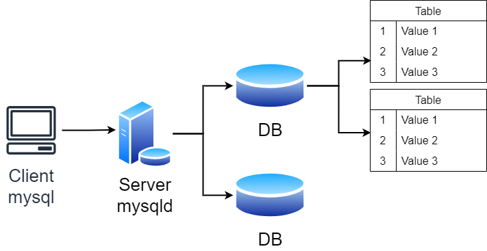
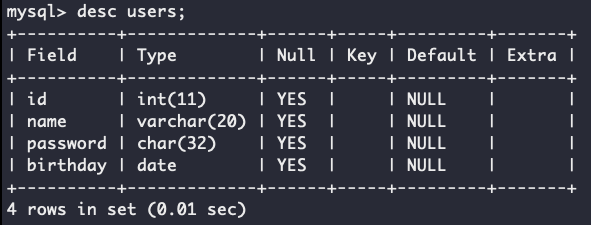

# MySQL数据库基础

## *数据库简介*

数据库用来管理数据，数据库是以某种有组织的方式存储数据集合。ßß数据库是针对文件内容进行操作，不需要用户手动进行数据管理

### 主流数据库

* SQL Sever： 微软的产品，.Net程序员的最爱，中大型项目
* Oracle： 甲骨文产品，适合大型项目，复杂的业务逻辑，并发一般来说不如MySQL
* MySQL：世界上最受欢迎的数据库，属于甲骨文，并发性好，不适合做复杂的业务。主要用在电商，SNS，论坛。对简单的SQL处理效果好
* PostgreSQL：加州大学伯克利分校计算机系开发的关系型数据库，不管是私用、商用、还是学术研究使用，都可以免费使用，修改和分发
* SQLite：是一款轻型的数据库，是遵守ACID的关系型数据库管理系统，它包含在一个相对小的C库中。它的设计目标是嵌入式的，而且目前已经在很多嵌入式产品中使用了它，它占用资源非常的低，在嵌入式设备中，可能只需要几百K的内存就够了
* H2：是一个用Java开发的嵌入式数据库，它本身只是一个类库，可以直接嵌入到应用项目中
* Redis REmote DIctionary Service：是一个使用ANSI C编写的开源、支持网络、基于内存、分布式、可选持久性的键值对存储数据库

## *MySQL DBMS的基本使用*

* `ps ajx | grep mysqld` 看一下 `mysqld` 有没有在运行
* 启动服务 `systemctl start mysqld.service`
  * 因为安装的时候是用root身份安装的，所以启动服务要用root身份来启动
  * 当然也可以以普通用户身份启动，然后输入root密码

* 连接服务器 `mysql -h 127.0.0.1 -P 3306 -u root -p`
* 关闭服务器 `systemctl stop mysqld`

## *MySQL数据库的架构*

### 分层


* 有一个小型的编译器，对SQL语句i进行解析、优化
* Indexes 插件层/存储引擎层：接收上层请求后对文件进行增删查改。引擎是真正提供服务的部件，存储引擎的种类很多，是插件式的 Plug-in，可以用 `show engines;` 来查看。插件式：可以想象成懒加载的单例类，需要的时候就实例化

### SQL分类

Structured Query Language

* DDL Data Definition Language 数据定义语言，用来维护存储数据的结构，即对数据库和表结构的属性操作。比如 `create, drop, alter`
* DML Data Manipulation Language 数据操纵语言，用来对数据进行操作，即对数据库和表结构的内容操作。比如 `insert, delete, update`
  * DQL Data Query Language 数据查询语言 `select`
* DCL Data Control Language 数据控制语言，主要负责权限管理和事务，比如 `grant, revoke, commit`

### 服务器、数据库与表的关系



* mysql是客户端，mysqld是服务端
  * Linux中mysql建立在 `/var/lib/mysql` 中
  * Mac中mysql建立在 `/usr/local/mysql` 中
  * Win中mysql建立在 `C:\Program Files\MySQL\MySQL Server 5.7` 中

* mysqld是一个软件层，能够帮助用户进行数据管理
* 创建一个数据库本质是在Linux中建立了一个目录

## *MySQL的启动选项*

# 数据库操作

## *字符集和校验规则*

存到数据库：系统默认字符集

通过数据比较来取数据：校验规则

一般字符集和校验规则是匹配的

### 查看系统的字符集信息

* 查看系统默认字符集以及校验规则

  ```mysql
  show variables like 'character_set_database';
  show variables like 'collation_database';
  ```

* 查看数据库支持的字符集

  ```mysql
  show charset;
  ```

* 查看数据库支持的字符集校验规则

  ```mysql
  show collation;
  ```

### 校验规则对数据库的影响

设置数据库的编码和校验规则，数据库本身是一个索引目录，本质会影响对应数据库内部的表的编码和校验规则

创建一个新的数据库，会在 `db.opt` 里自动写入使用的字符集和校验规则

单机使用就默认，如果要备份到远端就显式字符集和校验规则创建

下面做一个实验可以观察到有不同的效果

## *创建数据库*

* 创建数据库 `create database DatabaseName`
* 数据库的名字加不加反引号 \`\` 取决于创建的数据库名是否和SQL的关键字冲突，不过特别不建议冲突
* 用 `select database();` 来查看当前数据库
* 可以用 `show create database DatabaseName` 来显式查看创建数据库时用的语句

## *操纵数据库*

### 修改数据库

### 删除数据库

```mysql
drop database [if exists] DatabaseName;
```

* 轻易不要删库！！！
* 迭代删除，删除最外面，里面的也被删光了

### 数据库的备份与恢复

* 备份：`mysqldump` 对数据做备份、对操作语句做备份
  * MySQL是备份语句，这种方式比较好，有上下文还可以带时间，若只是备份数据则没有上下文（Redis支持两种备份方式）
  * 备份过程中会对SQL语句进行优化，比如六条连续插入合并为一条插入等
* 还原：`source` 还原数据

### 查看链接情况

```mysql
show processlist;
```

# 数据类型

约束 Constraint：插入数据越界，和C语言编译器不同不会截断数据，而是**直接终止操作**，否则会影响MySQL数据的可信度。倒逼程序员，必须遵守规则

MySQL的数据类型，除了能满足各种应用场景，其本身就是一种约束

## *数值类*

|        类型        | 大小 Byte |                     范围（有符号）                      |         范围（无符号）          |     用途     |
| :----------------: | :-------: | :-----------------------------------------------------: | :-----------------------------: | :----------: |
|     `tinyint`      |     1     |                       (-128, 127)                       |            (0, 225)             |   小整数值   |
|     `smallint`     |     2     |                    (-32,768, 32,767)                    |           (0, 65,535)           |   大整数值   |
|    `mediumint`     |     3     |                 (-8,388,608, 8,388,607)                 |         (0, 16,777,215)         |   大整数值   |
| `int` 或 `integer` |     4     |             (-2,147,483,648, 2,147,483,647)             |       (0, 4,294,967,295)        |   大整数值   |
|      `bigint`      |     8     | (-9,223,372,036,854,775,808, 9,223,372,036,854,775,807) | (0, 18,446,744,073,709,551,615) |  极大整数值  |
|      `float`       |     4     |                          见下                           |              见下               | 单精度浮点数 |
|      `double`      |     8     |                          见下                           |              见下               | 双精度浮点数 |
|     `decimal`      |   见下    |                          见下                           |              见下               |    小数值    |

### `tinyint` 类

MySQL的 `tinyint`、`smallint`、`int` 数据类型可以类比C语言里的 `char`、`short` 和 `int` 类型。MySQL的数据类型划分越精细化，越可以进行有效管理

若要设置成无符号可以在数据类型后面加上 `unsigned`

### `bit` 类

`bit[(M)]`：位字段类型。M表示每个值的位数，范围从1到64。如果M被忽略，默认为1。bit以ASCII码形式显示

位字段还是很有用的，比如用来表示性别等取值非常有限的变量

### 浮点数： `float` 和 `decimal` 类

* `float[(m, d)] [unsigned]`：M指定显示长度，d指定小数位数，占用空间4个字节。注意M和d表示的就是十进制数字总的长度和小数部分的长度，不是二进制位长度，比如 `float(4,2)` 表示的范围是 -99.99~99.99
* `decimal(m, d) [unsigned]`：定点数m指定长度，d表示小数点的位数。支持小数最大位数d是30。如果d被省略，默认为0；如果m被省略，默认是10

注意一个细节，浮点数只会四舍，不会五入。以上面 `float(4,2)` 为例，多余的小数位大于等于5会被MySQL拒绝，也就是说 99.990~99.994是被接受且舍入到99.99，但 99.995以上就会被拒绝。但是这是5.6、5.7版本的特点，其他的MySQL版本不一定是这么处理浮点数的

同时对于unsigned也和整数类型的不太一样，设置成unsigned后相当于是直接把负数那一半砍掉，但不会增加整数部分的范围，也就是说 `float(4,2) unsinged` 的取值范围是 0~99.99

`decimal` 相比于 `float` 和 `double` 精度更高。比如说下面这个例子中可以发现用 `float` 存的小数和实际存的精确值不同了，发生了精度损失。存高精度小数decimal用的多

```mysql
mysql> create table tt8 ( id int, salary float(10,8), salary2
decimal(10,8));
mysql> insert into tt8 values(100,23.12345612, 23.12345612);
Query OK, 1 row affected (0.00 sec)

mysql> select * from tt8;
+------+-------------+-------------+
| id | salary | salary2 |
+------+-------------+-------------+
| 100 | 23.12345695 | 23.12345612 |
```

## *字符串类*

|    类型    |  大小 Byte   |             用途              |
| :--------: | :----------: | :---------------------------: |
|    CHAR    |    0-255     |          定长字符串           |
|  VARCHAR   |   0-65535    |          变长字符串           |
|  TINYBLOB  |    0-255     | 不超过255个字符的二进制字符串 |
|  TINYTEXT  |    0-255     |         短文本字符串          |
|    BLOB    |   0-65535    |    二进制形式的长文本数据     |
|    TEXT    |   0-65535    |          长文本数据           |
| MEDIUMBLOB |  0-16777215  | 二进制形式的中等长度文本数据  |
| MEDIUMTEXT |  0-16777215  |       中等长度文本数据        |
|  LONGBLOB  | 0-4294967295 |   二进制形式的极大文本数据    |
|  LONGTEXT  | 0-4294967295 |         极大文本数据          |

### `char`

`char` 是固定长度的字符串。和C语言中1个字符是1个字节不同，MySQL中1个字符就是1个字符，比如说 `'ab'` 是两个字符，`'中国'` 也是两个字符

### `varchar`

格式是 `varchar(L)`，但是这个L到底是多大，是和编码有关系的

* `varchar` 长度可以指定为0~65535之间的值，但有1-3 个字节用于记录数据大小，因此说有效字节数是65532个
* 当编码是utf8时，`varchar(n)` 的参数n最大值是65532/3=21844，因为ut8f中，一个字符占3个字节
* 当编码是gbk时，`varchar(n)` 的参数n最大是65532/2=32766，因为gbk中，一个字符占2字节

变长是什么意思呢？意思就是它支持的L仅仅是最大字符长度，若存的是小于L的，那么开的空间也就是按存的字符定

* 若数据长度都一样，就用定长 `char` 一类，比如ID、手机号等；若长度有变化，就用定长，但要确保最长的能存进去，比如名字、地址等
* 定长磁盘空间比较浪费，但效率高；变长磁盘空间比较节省，但效率低

## *日期和时间类型*

|   类型    | 大小 Byte |       格式        |   用途   |
| :-------: | :-------: | :---------------: | :------: |
|   DATE    |     3     |    YYYY-MM-DD     |  日期值  |
|   TIME    |     3     |     HH:MM:SS      |  时间值  |
|   YEAR    |     1     |       YYYY        |  年份值  |
| DATETIME  |     8     | YYYY-MM-DD HHMMSS | 混合日期 |
| TIMESTAMP |     4     | YYYY-MM-DD HHMMSS |  时间戳  |

```mysql
create table birthday (t1 date, t2 datetime, t3 timestamp);
```

用 `desc birthday;` 查看表结构，可以看到 `timestamp` 的 extra 里写的是 `on update CURRENT_TIMESTAMP`，意思是 `update` 数据时时间戳是自动更新的

## *`enum` 和 `set`*

### 语法

enum单选，set多选。`set(Option1, Option2, ...)` 可以输入一个整数，代表位图，比如5是0101

```mysql
create table if not exists votes( 
    name varchar(30), 
    gender enum('Male', 'Female'),
    hobby set('Coding', 'Hiking', 'Basketball', 'Swimming')
)engine=InnoDB default charset=utf8;
```

### 在 `set` 中查询

不能用 `select * from votes where hobby='Hiking'` 来查找出所有爱好有 `Hiking` 的项，因为它返回的是严格等于查询条件的行，要用查找函数 `find_in_est`

查找函数：`select * from votes where find_in_set('Coding', hobby);` 返回行index

# 表

## *表操作*

### 创建表

```mysql
CREATE TABLE table_name (
field1 datatype,
field2 datatype,
field3 datatype
) character set 字符集 collate 校验规则 engine 存储引擎;
```

可以自己指定表的字符集和校验规则，就近原则可以与数据库的字符集和校验规则不同，但不推荐这么做，容易引起混淆

### 查看表结构

```mysql
create table users (
    id int,
    name varchar(20) comment '用户名',
    password char(32) comment '密码是32位的md5值',
    birthday date comment '生日'
) character set utf8 engine MyISAM;
```

* `NULL` 代表没有，`` 代表空串

* 查看 comment 内容 `show create tabl e XXX;`

* 用 `desc users;` 查看表结构

  

  Field 是字段名称；Type 字段类型；Null 是否为空；Key 索引类型；Default 默认值；Extra 扩充

* 查找数据 `select 查找项 from 表名 order by 排序项`，比如说打印所有值为 `select *`

### 索引 Key

在关系数据库中，索引是一种单独的、物理的对数据库表中一列或多列的值进行排序的一种存储结构，它是某个表中一列或若干列值的集合和相应的指向表中物理标识这些值的数据页的逻辑指针清单。索引的作用相当于图书的目录，可以根据目录中的页码快速找到所需的内容

索引提供指向存储在表的指定列中的数据值的指针，然后根据您指定的排序顺序对这些指针排序。数据库使用索引以找到特定值，然后顺指针找到包含该值的行。这样可以使对应于表的SQL语句执行得更快，可快速访问数据库表中的特定信息

索引：是一种精心设计过的数据结构。用空间换时间，用更多的资源来提高查找速度

### 修改表本身

和数据库本身一样，表本身也是轻易不能改的，否则会出现很多问题，建立之前必须要仔细设计

* 改表名 `alter table 原表名 rename 新表名`（`alter` 可以改表名，database不支持改名）
* 删表 `DROP [TEMPORARY] TABLE [IF EXISTS] tbl_name [, tbl_name] ... `

### 修改列

```mysql
ALTER TABLE tablename ADD (column datatype [DEFAULT expr][,column
datatype]...);
ALTER TABLE tablename MODIfy (column datatype [DEFAULT expr][,column
datatype]...);
ALTER TABLE tablename DROP (column)
```

* `alter table 表名 modify 列名 varchar(60);` 修改表结构的时候是覆盖式的，即此时 `show create table 表名` 可以发现已经是修改后的结果了
* 插入记录 `insert into 表名 values;`
* 改名字：`alter table 表名 change 老名字 新名字 数据类型`，也是覆盖式地改

## *表约束*

### 空属性

数据库默认字段基本都是字段为空 `NULL`，但是实际开发时，尽可能保证字段不为空，因为数据为空没办法参与运算

```mysql
mysql> create table myclass(
    -> class_name varchar(20) not null,
    -> class_room varchar(10) not null);
Query OK, 0 rows affected (0.03 sec)
```

### 默认值

某一种数据会经常性的出现某个具体的值，可以在一开始就指定好，在需要真实数据的时候，用户可以选择性的使用默认值。若数据在输入的时候不给该字段赋值，就使用默认值

建表的时候或者插入列的时候用 `defualt 值` 来给出

```mysql
mysql> create table info (
    -> name varchar(20) not null,
    -> age tinyint unsigned default 18,
    -> gender char(2) default 'Male'
    -> );
Query OK, 0 rows affected (0.00 sec)
```

约束是可以堆叠的，比如 `age tinyint unsigned not null default 18`，它的意思是插入的数据不可以是显式的 `NULL`，但若是没有给值的话就默认是18。默认值实际上是降低了约束等级。这里的例子不太好，因为 `not null` 和 `defalut` 一般不需要同时出现，因为 `default` 本身有默认值，不会为空

### 列描述

comment，没有实际含义，专门用来描述字段，会根据表创建语句保存，用来给程序员或DBA来进行了解

comment是一种代码规范，只不过是一种软性的描述，没有强制能力

然而通过 `desc` 是看不到comment信息的，要用 `show create table 表名` 才能看到

```mysql
mysql> create table info (
    -> name varchar(20) not null comment 'Name',
    -> age tinyint unsigned default 18 comment 'Age, do not allow users under 18 to register',
    -> gender char(2) default 'Male' comment 'Gender'
    -> );
Query OK, 0 rows affected (0.00 sec)
```

### zerofill

```mysql
mysql> create table if not exists `test`(
    -> a int not null,
    -> b int unsigned not null
    -> );
Query OK, 0 rows affected (0.15 sec)

mysql> desc test2;
+-------+------------------+------+-----+---------+-------+
| Field | Type             | Null | Key | Default | Extra |
+-------+------------------+------+-----+---------+-------+
| a     | int(11)          | NO   |     | NULL    |       |
| b     | int(10) unsigned | NO   |     | NULL    |       |
+-------+------------------+------+-----+---------+-------+
2 rows in set (0.00 sec)
```

建立上面这个表，但是 `desc test` 查看表结构却会发现Type里面的两个 `int` 后面都会有一个括号里的值。`int` 类型的数据是4字节的，所以括号里的并不是它的长度

这个值的意义是数字前面填充0的个数，但是如果没有给出 `zerofill` 约束的话，这个值是没有意义的。下面给出 `zerofill` 的修改后，可以发现a的值变成了00001

```mysql
mysql> alter table test modify a int(5) unsigned zerofill;
mysql> insert into test values(1,2);
mysql> select * from test;
+-------+---+
| a     | b |
+-------+---+
| 00001 | 2 |
+-------+---+
```

为什么要将有符号和无符号的 `int` 的默认 `zerofill` 分别设置为11位和10位？$2^{32}-1=4,294,967,295$ 一共10位

### 主键 primary key

主键是用来**唯一的表征每条记录身份**的属性，**不能重复或者为空**。一张表中最多只能有一个主键，主键所在的列通常是整数类型

下面给出一些对主键的操作

* 创建表的时候直接在字段上指定主键

  ```mysql
  mysql> create table test(
      -> id int unsigned primary key comment 'ID can not be empty',
      -> name varchar(20) not null);
  # 或者下面这么写也可以
  mysql> create table test(
      -> id int unsigned comment 'ID can not be empty',
      -> name varchar(20) not null
  	primary key ('id'));
  ```

  此时主键就设置好了
  ```mysql
  mysql> desc test2;
  +-------+------------------+------+-----+---------+-------+
  | Field | Type             | Null | Key | Default | Extra |
  +-------+------------------+------+-----+---------+-------+
  | id    | int(10) unsigned | NO   | PRI | NULL    |       |
  | name  | varchar(20)      | NO   |     | NULL    |       |
  +-------+------------------+------+-----+---------+-------+
  ```

* 当表创建好以后但是没有主键的时候，可以再次追加主键 `alter table 表名 add primary key(字段列表)`。但是这种做法是特别不推荐的，主键一定要建表之前就构思好，不要之后再改

* 删除主键 `alter table 表名 drop primary key;`

* 复合主键 Composite Primary Key：多个字段组合起来作为一个主键，只有当主键的所有字段都冲突了才会触发主键冲突

  比如选课的场景中用ID和课程号作为复合主键，它的语义限制是允许一名同学选择不同的课，如果是用ID作为主键的话，就不能让同一个人选择多门课了

  ```mysql
  mysql> create table tt14(
      -> id int unsigned,
      -> course char(10) comment 'Course Code',
      -> score tinyint unsigned default 60 comment 'Grade',
      -> primary key(id, course) # id和course为复合主键
      -> );
  ```

如何设计主键？

* 结合业务，选择一个唯一的列属性作为主键
* 选择与业务无关的经过设计的唯一值。这样设计，主键值和业务无关，业务调整不会影响整体主键的表结构。这样可以做到表结构与主键一定程度上的解耦，比如说QQ号

### 自增长 auto_increment

当对应的字段，不给值，会自动的被系统触发，系统会从当前字段中已经有的最大值+1操作，得到一个新的不同的值。通常和主键搭配使用，作为逻辑主键

* 任何一个字段要做自增长，前提是本身是一个索引（key一栏有值）
* 自增长字段必须是整数，默认从1开始
* 一张表最多只能有一个自增长

```mysql
mysql> create table info(
    -> id int unsigned primary key auto_increment,
    -> name varchar(10) not null default ''
    -> );
```

用 `show create table info;` 可以看到表维护了一个 `AUTO_INCREMENT` 的计数器但是用户可以强行指定非重复的自增长键，注意再强行手动非连续的插入后，`AUTO_INCREMENT` 的值会变成当前最大的值，比如下面的例子

```mysql
mysql> insert into info (name) values ('a');
mysql> insert into info (id, name) values (100, 'b');
mysql> insert into info (id, name) values (50, 'c');

mysql> select * from info;
+-----+------+
| id  | name |
+-----+------+
|   1 | a    |
|  50 | c    |
| 100 | b    |
+-----+------+

mysql> show create table info;
+-------+-----------------------------------------------------------------------------------------------------------------------------------------------------------------------------------------------+
| Table | Create Table                                                                                                                                                                                  |
+-------+-----------------------------------------------------------------------------------------------------------------------------------------------------------------------------------------------+
| info  | CREATE TABLE `info` (
  `id` int(10) unsigned NOT NULL AUTO_INCREMENT,
  `name` varchar(10) NOT NULL DEFAULT '',
  PRIMARY KEY (`id`)
) ENGINE=InnoDB AUTO_INCREMENT=101 DEFAULT CHARSET=utf8 | # 现在维护的AUTO_INCREMENT值变成100了！
+-------+-----------------------------------------------------------------------------------------------------------------------------------------------------------------------------------------------+
```

`AUTO_INCREMENT` 也可以在建表的时候手动指定初始化

### 唯一键 unique key

唯一键与主键是不冲突的，互相补充。因为有时候将一个字段设置为主键了，但可能还需要约束其他字段的唯一性，这时候就要用 unique key。比如说用ID作为主键，但是每个人的电话号码和邮箱也要唯一，这时候就把号码和邮箱都设置为 unique key

```mysql
mysql> create table student (
    -> id char(10) primary key comment '以学号为主键',
    -> phone char(11) unique key '要保证电话的唯一性',
    -> email varchar(100) unique key '要保证邮箱的唯一性' 
    -> );
```

### 外键 foreign key

外键用于定义主表和从表之间的关系：外键约束主要定义在从表上，主表则必须是有主键约束或unique约束。当定义外键后，要求外键列数据必须在主表的主键列存在或为null

# 内置函数

# 连接

# 索引

# 事务

