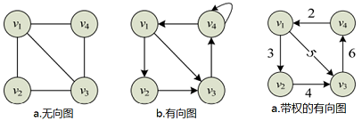
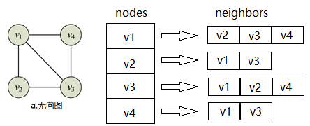

# 顺序表和链表

## *线性表 Linear List*

线性表是n个具有相同特性的数据元素的有限序列。线性表是一种在实际中广泛使用的数据，常见的线性表有顺序表、链表、栈、队列、字符串。

线性表在逻辑上是线性结构，但在物理结构上并不一定是连续的，线性表在物理上存储时，通常以数组和链式结构的形式存储。

## *顺序表 Sequential List*

### 顺序表的基本操作

* 定义动态顺序表

    ```c
    #define N 100
    typedef int SLDataType;
    
    typedef struct SeqList {
        SLDataType* a;
        int size;
        int capacity;
    }SL;
    ```
    
* 初始化

    ```c
    void SLInit(SL* ps) {
        assert(ps); //防御式编程
        ps->a = NULL;
        ps->size = ps->capacity = 0;
    }
    ```
    
* 销毁

    ```c
    void SLDestroy(SL* ps) {
        if(ps->a) {
            free(ps->a);
            ps->a = NULL;
            ps->size = ps->capacity = 0;
        }
    }
    ```
    
* 打印

    ```c
    void SLPrint(SL* ps) {
        assert(ps);
        for (int i=0; i<ps->size; i++)
            printf("%d ", ps->a[i]);
        printf("\n");
    }
    ```
    
* 头插头删/尾插尾删的两种实现方式
  * 辅助的SLCheckCapacity函数

    ```c
    void SLCheckCapacity(SL* ps) {
        assert(ps);
        if (ps->size == ps->capacity) {
            int newCapacity = ps->capacity == 0 ? 4 : 2 * ps->capacity;
            SLDataType* tmp = (SLDataType*)realloc(ps->a, sizeof(SLDataType) * newCapacity);
            if (tmp == NULL) {
                perror("realloc");
                exit(-1);
            }
            ps->a = tmp;
            ps->capacity = newCapacity;
        }
    }
    ```
    
  * 直接实现
    * 尾插

        ```c
        void SLPushBack(SL* ps, SLDataType x) {
            assert(ps);
            SLCheckCapacity(ps);
            ps->a[ps->size] = x;
        }
        ```
        
    * 头插
    
        <div align="center"></div>
    
        ```C
        void SLPushFront(SL* ps, SLDataType x) {
            assert(ps);
            SLCheckCapacity(ps);
        
            int end = ps->size-1;
            while (end >= 0) {
                ps->a[end+1] = ps->a[end]; // 从后往前挪
                --end;
            } 
            ps->a[0] = x;
            ps->size++;
        }
        ```
        
    * 尾删
    
      ```c
      void SLPopBack(SL* ps) {
          assert(ps);
          assert(ps->size > 0);
          ps->size--;
      }
      ```
      
    * 头删
    
    <div align="center"></div>
    
    ```c
    void SLPopFront(SL* ps) {
        assert(ps);
        assert(ps->size > 0);
    
        int begin = 1;
        while (begin < ps->size) {
            ps -> a[begin-1] = ps->a[begin]; // 从前往后挪
            ++begin;
        }
        ps->size--;
    }
    ```
    
  * 复用Insert和Erase
    * Insert
  
        ```c
        void SLInsert(SL* ps, int pos, SLDataType x) {
            assert(ps);
            assert(pos>=0 && pos<=ps->size); // '=' 是为了适合尾插的复用
            SLCheckCapacity(ps);
        
            int end = ps->size - 1;
            while (end >= pos) {
                ps->a[end+1] = ps->a[end];
                --end;
            }
            ps->a[pos] = x;
            pos-size++;
        }
        ```
        
    * Erase
  
        ```c
        void SLErase(SL* ps, int pos) {
            assert(ps);
            assert(pos>=0 && pos<=ps->size);
        
            int begin = pos;
            while (begin < ps->size-1) {
                ps->a[begin] = ps->a[begin+1]; // 从前往后挪
                ++begin;
            }
            ps->size--;
        }
        ```
        
    * 复用
    
        ```c
        void SLPushBack(SL* ps, SLDataType x) {
            SLInsert(ps, ps->size, x);
        }
        void SLPushFront(SL* ps, SLDataType x) {
            SLInsert(ps, 0, x);
        }
        void SLPopBack(SL* ps) {
            SLErase(ps, ps->size-1);
        }
        void SLPopFront(SL* ps) {
            SLErase(ps, 0);
        }
        ```
    
  * 顺序表的尾插尾删效率高，为O(1)；头插头删效率低，需要挪动数据，为O(N)
  
* 查

    ```c
    int SLFind(SL* ps, SLDataType x) {
        assert(ps);
        for (int i=0; i<ps->size; i++) {
            if (ps->a[i] == x)
                return i;
        }
        return -1;
    }
    ```
    
* 改

    ```c
    void SLModify(SL* ps, int pos, SLDataType x) {
        assert(ps);
        assert(pos>=0 && pos<ps->size);
        ps->a[pos] = x;
    }
    ```

### 顺序表OJ题（详见刷题）

* 原地移除数组中所有的元素val，要求时间复杂度为O(N)，空间复杂度为O(1)
* 删除排序数组中的重复项
* 合并两个有序数组

## *链表 Linked List*

链表的本质是为了克服顺序表的缺点而设计的。链表是一种物理存储结构上非连续的存储结构，数据元素的逻辑顺序是通过链表中的指针链接次序实现的

### 链表的分类

* 无头单向非循环链表 Singly linked list：结构简单，一般不会单独用来存数据，实际中更多是作为其他数据结构的子结构，如哈希桶、图的邻接表等 
* 双向带头循环链表 Circular doubly linked list with dummy node：结构最复杂的链表，一般用在单独存储数据，在实际中所使用的链表数据结构，都是带头双向循环链表 
* 哨兵位/虚结点 Dummy node/Header node/Sentinel node

    尾插的题目一般都需要创建哨兵位，会简化第一次尾插时为空列表的特殊情况，因为尾插需要找尾，这时候就可能会出现对NULL解引用的情况，带一个哨兵位会避免这种情况。而头插一般不需要

### 链表的基本操作（无头单向非循环链表）

* 头文件与定义结点数据结构

    ```C
    typedef int SLTDataType;
    typedef struct SListNode {
        SLTDataType data;
        struct SListNode* next;
    }SLTNode;
    ```
    
* 打印

    ```c
    void SListPrint(SLTNode* phead) {
        SLTNode* curr = phead;
        while (curr) {
            printf("%d->", curr->data);
            curr = curr->next;
        }
        printf("NULL\n");
    }
    ```
    
* 创建新节点

    ```c
    SLTNode* BuySListNode(SLTDataType x) {
        SLTNode* newnode = (SLTNode*)malloc(sizeof(SLTNode));
        assert(newnode);
    
        newnode->data = x;
        newnode->next = NULL;
        return newnode;
    }
    ```
    
* 头插，为了达到修改指针，有两种设计方式
  * 传入二级指针，返回void，从而直接修改一级指针，推荐这种方式

    

    ```c
    // 前插时要改变phead，即将phead给newcode，因此仍然要用二级指针
    void SListPushFront(SLTNode** pphead, SLTDataType x) {
        assert(pphead);
        SLTNode* newnode = BuySListNode(x);
        newnode->next = *pphead; //把原来的头结点的地址给新的头结点的next
        *pphead = newnode; //把新的newnode的地址给到phead
    }
    ```
    
    * 若传一级指针，并返回void，则改变的是一级指针的形参拷贝，SListPushFront退出后形参销毁，指针没有改变
    * 需要改变node本身的Push和Pop都需要传二级指针+返回void，打印等不需要改变node的只需要一级指针+返回void
    
  * 传入一级指针，返回新的头结点。不推荐这种方式，返回值不直观，需要用指针来接收后重新使用
  
    ```c
    SLTNode* SListPushFront(SLTNode* phead, SLTDataType x) {
        assert(phead);
        SLTNode* newnode = BuySListNode(x);
        newnode->next = phead;
        phead = newnode;
        return phead;
    }
    
    // 使用起来很别扭，不直观
    void TestSList1() {
        SListPushBack(&plist, 5);
        SListPushBack(&plist, 6);
        SListPushBack(&plist, 7);
        SListPushBack(&plist, 8);
        SLTNode* newPlist = SListPushFront(plist, 10); // 得创建一个新的头指针，再给其他接口使用
        SListPrint(newPlist);
    }
    ```
  
* 尾插

    

    ```c
    void SListPushBack(SLTNode** pphead, SLTDataType x) {
        assert(pphead); //所有用二级指针的地方都得检查，因为即使1级指针为空，二级指针也不可能为空
        SLTNode* newnode = BuySListNode(x);
        //一开始一个结点都没有
        if(*pphead == NULL)
            *pphead = newnode;
        else {
            //找尾结点
            SLTNode* tail = *pphead;
            while(tail->next != NULL)
                tail = tail->next;
            tail->next = newnode;
        }
    }
    //PushBack结束后newnode指针被销毁，但新创建的node结构体还是存在的，而且原来的tail->next已经
    //指向了新的结构体的地址，所以newnode指针被销毁没有影响
    ```
    
* 头删

    

    ```c
    void SListPopFront(SLTNode** pphead) {
        assert(pphead);
        assert(*pphead);
        SLTNode* next = (*pphead)->next;
        free(*pphead);
        *pphead = next;
    }
    ```
    
* 尾删

    ```c
    void SListPopBack(SLTNode** pphead) {
        assert(pphead);
        assert(*pphead); //没有结点
        if ((*pphead)->next == NULL) {//只有一个结点
            free(*pphead);
            *pphead = NULL;
        }
        else {//还有多个结点
            SLTNode* tailPrev = NULL;
            SLTNode* tail = *pphead;
            while (tail->next) {
                tailPrev = tail;
                tail = tail->next;
            }
            free (tail);
            tailPrev->next = NULL;
        }
    }
    ```
    
* 查找以及修改复用

    ```c
    SLTNode* SListFind(SLTNode* phead, SLTDataType x) {
        SLTNode* cur = phead;
        while (cur) {
            if (cur->data == x)
                return cur;
            cur = cur->next;
        }
        return NULL;
    }
    ```
    
* 任意位置插入
  * pos前插入 Insert：单链表很不适合插入或删除前面的，因为要从头找前面的node

    ```c
    //单链表不适合在pos之前插入，因为需要找前一个位置，可以用双向列表解决
    void SListInsert(SLTNode** pphead, SLTNode* pos, SLTDataType x) {
        assert(pos); //pos为空时变成尾插了，同时检查pos就是顺便检查了链表不为空
        assert(pphead);
        if (pos == *pphead) //要插入的是第一个结点，调用头插
            SListPushFront(pphead, x);
        else
        {
            SLTNode* prev = *pphead;
            while (prev->next != pos)
                prev = prev->next;
    
            SLTNode* newnode = BuySListNode(x);
            prev->next = newnode;
            newnode->next = pos;
        }
    }
    ```
    
  * InsertAfter
  
    ```c
    void SListInsertAfter(SLTNode* pos, SLTDataType x)
    {
        assert(pos);
        //// 错误的顺序
        //SLTNode* newnode = BuySListNode(x);
        //newnode->next = pos->next;
        //pos->next = newnode;
    
        //不在乎链接的顺序
        SLTNode* newnode = BuySListNode(x);
        SLTNode* next = pos->next;
        pos->next = newnode;
        newnode->next = next;
    }
    ```
  
* 任意位置删除
  * pos前删除 Erase

    ```c
    void SListErase(SLTNode** pphead, SLTNode* pos)
    {
        assert(pphead);
        assert(pos);
        if (*pphead == pos)
            SListPopFront(pphead); //删除的是第一个结点
        else
        {
            SLTNode* prev = *pphead;
            while (prev->next != pos)
                prev = prev->next;
            prev->next = pos->next;
            free(pos);
            pos = NULL;
        }
    }
    ```

  * EraseAfter

    ```c
    void SListEraseAfter(SLTNode* pos)
    {
        assert(pos);
        assert(pos->next);
        SLTNode* del = pos->next;
        //pos->next = pos->next->next;
        pos->next = del->next;
        free(del);
        del = NULL;
    }
    ```

### 链表OJ题（详见各题实现）

* 删除链表中等于给定值val的所有结点
* 反转一个单链表
* 给定一个带有头结点head的非空单链表，返回链表的中间结点。如果有两个中间结点，则返回第二个中间结点
* 输入一个链表，输出该链表中倒数第k个结点
* 将两个有序链表合并为一个新的有序链表并返回。新链表是通过拼接给定的两个链表的所有结点组成的
* 编写代码，以给定值x为基准将链表分割成两部分，所有小于x的结点排在大于或等于x的结点之前
* 链表的回文结构
* 输入两个链表，找出它们的第一个公共结点
* 给定一个链表，判断链表中是否有环

### 带头双向循环列表（代码参考工程文件）

* 头文件与定义结点数据结构

    ```c
    #include <stdio.h>
    #include <stdlib.h>
    #include <assert.h>
    #include <stdbool.h>

    typedef int LTDataType;
    typedef struct ListNode
    {
        struct ListNode* next;
        struct ListNode* prev;
        LTDataType data;
    }LTNode;
    ```

* 创建头结点与初始化：自己指向自己

    

    ```c
    LTNode* BuyListNode(LTDataType x)
    {
        LTNode* node = (LTNode*)malloc(sizeof(LTNode));
        if (node == NULL)
        {
            perror("malloc");
            exit(-1);
        }
        node->data = x;
        node->next = NULL;
        node->prev = NULL;
        return node;
    }

    LTNode* ListInit()
    {
        LTNode* phead = BuyListNode(-1);
        phead->next = phead;
        phead->prev = phead;
        return phead;
    }
    ```

* 销毁
* 列表大小和判空
* Insert
* Erase
* PushBack和PushFront/用Insert复用
* PopBack和PopFront/用Erase复用

### 顺序表VS链表，二者是相辅相成的，各有各的应用场景

* 顺序表
  * 优点：物理空间连续，下标随机访问；CPU高速缓存命中率高
  * 缺点
    * 若空间不够，需要realloc等方式扩容。扩容有一定的性能消耗，其次一般扩容2倍，存在一些空间浪费；头部或者中间位置的插入删除效率低下
    * 头插头插或中间插入、删除需要挪动数据，O(N)效率很低
* 单链表：尾插尾删需要找尾，效率低
* 带头双向循环链表
  * 优点：任意位置插入删除O(1)，按需申请释放空间
  * 缺点
    * 不支持下标随机访问，需要O(N)查找
    * CPU高速缓存命中率低，且有可能带来缓存污染。CPU加载内存中的数据时会多加载后面几个数据，因此顺序表地址连续具有连续命中率高；而链表地址不连续，多加载的数据往往是无用数据

# 栈和队列

## *栈 Stack*

### 栈的概念及实现

<div align="center"></div>

* 栈是一种特殊的线性表，其只允许在固定的一端进行插入和删除元素操作。进行数据插入和删除操作的一端称为栈顶，另一端称为栈底。栈中的数据元素遵守后进先出 LIFO (Last In First Out) 的原则
* 压栈：栈的插入操作叫做压栈，入数据在栈顶
* 出栈：栈的删除操作叫做出栈，出数据在栈顶

### 栈的实现

栈使用数组（顺序表）实现比较合适，因为栈只有尾插尾删，数组尾插尾删效率比较高；若要实现链式栈则要用链首作为栈顶。栈的性质决定了栈没有打印或遍历，因为如果要打印或遍历，相当于把栈清空了

* 定义栈

    ```c
    #include <stdio.h>
    #include <assert.h>
    #include <stdlib.h>
    #include <stdbool.h>
    #define N 10
    typedef int STDataType;
    typedef struct Stack
    {
        STDataType* a;
        int top;
        int capacity;
    }ST;
    ```

* 初始化

    ```c
    void StackInit(ST* ps)
    {
        assert(ps);
        ps->a = NULL;
        ps->top = 0;
        ps->capacity = 0;
    }
    ```

* 销毁

    ```c
    void StackDestroy(ST* ps)
    {
        assert(ps);
        free(ps->a);
        ps->a = NULL;
        ps->top = ps->capacity = 0;
    }
    ```

* 压栈，FILO，只有尾插

    ```c
    void StackPush(ST* ps, STDataType x)
    {
        assert(ps);
        if (ps->top == ps->capacity)
        {
            int newcapacity = ps->capacity == 0 ? 4 : ps->capacity*2;
            STDataType* tmp = (STDataType*)realloc(ps->a, sizeof(STDataType)*newCapacity);
            if (tmp == NULL)
            {
                printf("realloc fail\n");
                exit(-1);
            }
            ps->a = tmp;
            ps->capacity = newCapacity;
        }
        
        ps->a[ps->top] = x;
        ps->top++; // 先放数据再++
    }
    ```

* 出栈，FILO，只有尾删

    ```c
    void StackPop(ST* ps)
    {
        assert(ps);
        assert(!StackEmpty(ps));
        ps->top--;
    }
    ```

* 取栈顶元素

    ```c
    STDataType StackTop(ST* ps)
    {
        assert(ps);
        assert(!StackEmpty(ps));
        return ps->a[ps->top - 1];
    }
    ```

* 判断栈是否为空

    ```c
    bool StackEmpty(ST* ps)
    {
        assert(ps);
        return ps->top == 0;
    }
    ```

* 获取栈的大小

    ```c
    int StackSize(ST* ps)
    {
        assert(ps); 
        return ps->top;
    }
    ```

## *队列 Queue*

### 队列的概念及结构

* 队列是只允许在一端进行插入数据操作，在另一端进行删除数据操作的特殊线性表，队列具有先进先出 FIFO (First In First Out) 的特点。进行插入操作的一端称为队尾出队列，进行删除操作的一端称为队头
* 队列需要在队头头删，在队尾尾插，因此用链表实现比较合适


### 队列的实现

* 定义队列

    ```c
    #include <stdio.h>
    #include <assert.h>
    #include <stdlib.h>
    #include <stdbool.h>
    typedef int QDataType;
    typedef struct QueueNode {
        struct QueueNode* next;
        QDataType data;
    }QNode;
    
    typedef struct Queue {
        // int size; // 用于计数，效率比较高：Push ++size, Pop --size
        QNode* head;
        QNode* tail;
    }Queue;
    ```
    
* 初始化

    ```c
    void QueueInit(Queue* pq) {// 用到的指针封到了一个结构体Queue中
    // 改变的是结构体里的指针，因此不需要传二级指针
        assert(pq);
        pq->head = pq->tail = NULL;
    }
    ```
    
* 销毁队列

    ```c
    void QueueDestroy(Queue* pq) {
        assert(pq);
        QNode* curr = pq->head;
        while (curr) {
            QNode* next = curr->next;
            free(next);
            curr = next; 
        }
    }
    ```
    
* 验证是否为空队列

    ```c
    bool QueueEmpty(Queue* pq) {
        assert(pq);
        return pq->head == NULL;
    }
    ```
    
* 入队列

    ```c
    void QueuePush(Queue* pq, QDataType x) {
        assert(pq);
        // 只有一个Push用到了BuyNode，因此直接写在Push里面
        QNode* newnode = (QNode*)malloc(sizeof(QNode));
        if (newnode ==NULL) {
            printf("malloc fail\n");
            exit(-1);
        }
        newnode->data = x;
        newnode->next = NULL;
        if (pq->tail == NULL) {// 一个结点都没有
            pq->head = pq->tail = newnode;
        }
        else {
            pq->tail->next = newnode;
            pq->tail = newnode;
        }
    }
    ```
    
* 出队列

    ```c
    void QueuePop(Queue* pq) {
        assert(pq);
        assert(!QueueEmpty(pq));
    
        if (pq->head->next == NULL) {// 只剩一个结点
            free(pq->head);
            pq->head = pq->tail = NULL;
        }
        else {
            QNode* next = pq->head->next;
            free(pq->head);
            pq->head = next;
        }
    }
    ```
    
* 取队头数据

    ```c
    QDataType QueueFront(Queue* pq) {
        assert(pq);
        assert(!QueueEmpty(pq));
        return pq->head->data;
    }
    ```
    
* 取队尾数据

    ```c
    QDataType QueueBack(Queue* pq) {
        assert(pq);
        assert(!QueueEmpty(pq));
        return pq->tail->data;
    }
    ```
    
* 队列大小

    ```c
    int QueueSize(Queue* pq) {
        assert(pq);
        QNode* curr = pq->head;
        while (curr) {
            ++size;
            curr = curr->next;
        }
        return size;
    }
    ```

## *循环队列*

## *栈和队列OJ题*

* 括号匹配问题
* 用队列实现栈
* 用栈实现队列
* 设计循环队列

思路一：覆盖删除 --O(N^2)

思路二：保留不是val的值，挪到新数组（双指针）--时间复杂度 O(N)，空间复杂度O(N)

思路三：双指针，保留不是val的值，覆盖前面的值

思路一：开辟一个新数组，依次取小的放到新数组

# 二叉树 Binary Tree

## *树概念及结构*

### 树的相关概念

<div align="center"></div>

* 树是一种非线性的数据结构，它是由n个有限结点组成一个具有层次关系的集合
* 结点的度 Degree：一个节点含有子树的个数
* 叶子结点 Leaf node：度为0的结点
* 分支节点：度不位0的结点
* 父节点：若一个节点含有子节点，则这个节点称为其子节点的父节点
* 子节点：一个节点含有的子树的根节点称为该节点的子节点
* 兄弟节点：具有相同父节点的节点称为兄弟节点
* 树的度：一棵树中，最大的节点的度称为该树的度
* 节点的层次：从根开始定义起，根为第一层，根的子节点为第二层
* 树的深度：树的节点的最大层次
* 堂兄弟节点：双亲在同一层的节点互为堂兄弟
* 节点的祖先：从根到该节点所经分支上的所有结点
* 子孙：以某节点为根的子树中任一结点
* 森林：由m棵互不相关的树的集合称为森林
  
### 树的表示

```c
// 左孩子右兄弟表示法
typedef int DataType;
struct Node
{
    struct Node* _firstChild1; // 第一个孩子结点
    struct Node* _pNextBrother; // 指向其下一个兄弟结点
    DataType _data; // 结点中的数据域
}
```

## *二叉树概念及结构*

### 概念

* 二叉树不存在度大于2的结点
* 二叉树的子树有左右之分，次序不能颠倒，因此二叉树是有序树

### 特殊的二叉树

* 满二叉树 Full Binary Tree：一个二叉树，如果每一个层的结点树都达到最大值，则这个二叉树就是满二叉树，也就是说，若一个二叉树的层数为 $k$，且结点总数为 $2^{k}-1$，则它就是满二叉树 
* 完全二叉树 Complete Binary Tree：对于深度为 $k$ 的，有 $n$ 个结点的二叉树，当且仅当每一个结点都与深度为 $k$ 的满二叉树中编号从1至 $n$ 的结点一一对应时称之为完全二叉树。满二叉树就是一种特殊的完全二叉树 

### 二叉树的性质

* 若规定根结点的层数为1，则一棵非空二叉树的第 $i$ 层上最多有 $2^{(i-1)}$ 个结点
* 若规定根结点的层数为1，则深度为 $h$ 的二叉树的最大结点数是 $2^{h}-1$
* 若规定根结点的层数为1，具有 $n$ 个结点的满二叉树的深度为 $h=\log_{2}{(n+1)}$
* 对任何一棵二叉树，如果度 为0的叶结点个数为 $n_0$，度为2的分支结点个数为 $n_2$，则有 $n_0=n_2+1$
* 对于具有n个结点的完全二叉树，若按照从上至下从左至右的数组顺序对所有结点从0开始编号，则对于序号为i的结点有

### 二叉树的存储结构

* 顺序存储 Sequential Storage Structure
  * 二叉树的顺序存储就是堆。普通的二叉树不适合用数组来存储，因为可能会存在大量的空间浪费，而完全二叉树更适合使用顺序结构存储。
  * 现实中我们通常把堆（一种二叉树）使用顺序结构的数组来存储，需要注意的是这里的堆和操作系统虚拟进程空间中的堆区是两回事，前者是数据结构，后者是操作系统中管理内存的一块区域分段
* 链式存储 Linked Storage Structure：用链表来表示一颗二叉树，即用链来指示元素的逻辑关系。通常的方法是链表中每个结点用三个域组成，即数据域和左右指针域。
  * 二叉链表
  * 三叉链表：红黑树等

## *二叉树的顺序结构及实现：堆 Heap*

### 堆的结构和性质

* 性质
  * 堆中某个结点的值总是不大于或不小于其父节点的值
  * 堆总是一棵完全二叉树
  * 结合以上性质可以得出下标计算父子间的关系（注：元素从0开始）：
    * $leftchild=parent*2+1$
    * $rightchild=parent*2+2$
    * $parent=(child-1)/2$：整除统一了左右孩子
* 结构：假设一个数据集合 $K=\left\{k_0,k_1,k_2,\cdots,k_{n-1}\right\}$
  * 小根堆：堆中所有父亲小于等于孩子 $k_i\leq k_{2i+1}\ and\ k_{i}\leq k_{2i+2}$
  * 大根堆：堆中所有父亲大于等于孩子 $k_i\geq k_{2i+1}\ and\ k_{i}\geq k_{2i+2}$

### 堆的实现

* 堆的基本接口
  * 定义堆
  
    ```c
    #include <stdio.h>
    #include <stdlib.h>
    #include <assert.h>
    #include <stdbool.h>
    #include <time.h>
    typedef int HPDataType;
    typedef struct Heap
    {
        HPDataType* a; // 数组
        int size;
        int capacity;
    }HP;
    ```
  
  * 初始化

    ```c
    void HeapInit(HP* php)
    {
        assert(php);
        php->a = NULL;
        php->size = php->capacity = 0;
    }
    ```

  * 销毁

    ```c
    void HeapDestroy(HP* php)
    {
        assert(php);
        free(php->a);
        php->a = NULL;
        php->size = php->capacity = 0;
    }
    ```

  * 打印数据

    ```c
    void HeapPrint(HP* php)
    {
        assert(php);
        for (i=0; i<php->size; ++i)
        {
            printf("%d->", php->a[i]);
        }
        printf("\n");
    }
    ```
  * 取堆顶数据

    ```c
    HPDataType HeapTop(HP* php)
    {
        assert(php);
        assert(php->size > 0);
        return php->a[0];
    }
    ```

  * 判空

    ```c
    bool HeapEmpty(HP* php)
    {
        assert(php);
        return php->size == 0;
    }
    ```

  * 堆尺寸

    ```c
    int HeapSize(HP* php)
    {
        assert(php);
        return php->size;
    }
    ```

  * 堆的插入

    插入的过程就是一个不断建堆的过程 

    ```c
    void HeapPush(HP* php, HPDataType x)
    {
        assert(php);
        // 扩容
        if (php->size == php->capacity)
        {
            int newCapacity = php->capacity == 0 ? 4 : php->capacity*2;
            HPDataType* tmp = (HPDataType*)realloc(php->a, sizeof(HPDataType)*newCapacity);
            if(tmp==NULL)
            {
                printf("realloc fail\n");
                exit(-1);
            }
            php->a = tmp;
            php->capacity = newCapacity;
        }
        php->a[php->size] = x;
        php->size++;

        AdjustUp(php->a, php->size-1); // 向上调整
    }
    ```

  * 堆的删除：指删除堆顶数据，不是删除任意位置的值，因为没有意义 

    堆的删除不能使用顺序表中向前挪动覆盖的方式，会直接将整个堆打乱掉。删除堆的方法是将堆顶的数据和最后一个数据交换，然后删除最后一个数据后再进行向下调整

    ```c
    void HeapPop(HP* php)
    {
        assert(php);
        assert(php->size > 0);
        Swap(&(php->a[0]), &(php->a[php->size-1]));
        php->size--;
        AdjustDown(php->a, php->size, 0);
    }
    ```

* 堆向上调整算法用于堆插入：给出第一个孩子的下标，计算父亲的下标并进行比较

```c
void Swap(HPDataType* a, HPDataType* b)
{
    HPDataType tmp = *b;
    *b = *a;
    *a = tmp;
}

void AdjustUp(HPDataType* a, int child)
{
    int parent = (child-1) / 2;
    //while (parent >= 0) // 这样写错误
    // parent = (child-1)/2 会导致无法跳出循环 
    while (child > 0)
    {
        if (a[child] < a[parent])
        {
            Swap(&a[child], &a[parent]);
            child = parent;
            parent = (child-1)/2;  
        }
        else
            break;
    }
}
```

* 堆向下调整算法用于堆删除

  * 选出左右孩子中小的那一个
  * 小的孩子跟父亲比较，最多调整到叶子结束（下标大于数组size）
    * 若比父亲小，则交换，继续往下调整
    * 若比父亲大，则调整结束

```C
void AdjustDown(HPDataType* a, int size, int parent)
{
    int child = parent*2 + 1;
    while (child < size)
    {
        // 1、选出左右孩子中小/大的那一个，默认child是左孩子
        if (child + 1 < size && a[child + 1] < a[child]) // 用于小堆删除，防止在只有左孩子没有右孩子的情况下越界
        //if (child + 1 < size && a[child + 1] > a[child]) // 用于大堆删除，防止在只有左孩子没有右孩子的情况下越界
        {
            ++child;
        }
        // 2、小/大的这个孩子跟父亲比较，如果比父亲要小/大，则交换
        // 继续往下调整（最多到叶子结束）；如果比父亲要大/小，则调整结束
        if (a[child] < a[parent]) // 用于小堆删除
        //if (a[child] > a[parent]) // 用于大堆删除
        {
            Swap(&a[child], &a[parent]);
            parent = child;
            child = parent*2+1;
        }
        else
        {
            break;
        }
    }
}
```

* 建堆时间复杂度
  * 建堆方式1：向上调整建堆（以建小堆为例）-- ***NlogN***
        <div align="center"></div>
    * 向上调整是第二层到最后一层，第一次没有父节点不需要比较
    * 设满二叉树的高度为h，最后第二层的有 $2^{(h-2)}$ 个结点，每个结点最坏要调整 $h-1$ 次，这层最多需要调整 $2^{(h-1)}*(h-1)$ 次，
    * 需要移动结点的总部数为 $T(N)=2^1*(1)+2^2*(2)+\cdots+2^{(h-1)}*(h-1)$
    * 错位相减 $\left\{\begin{array}{l}T(N)=2^1*(1)+2^2*(2)+\cdots+2^{(h-1)}*(h-1)\\2*T(N)=\ \ \ \ \ \ \ \ \ \ \ \ 2^2*(1)+\cdots+2^{(h-1)}*(h-2)+2^{(h)}*(h-1)\end{array}\right.$
    * 相减得 $T(N)=2^{(h)}*(h-1)-\left[2^1+2^2+\cdots+2^{(h-1)}\right]=2^{h}(h-1)-(2^h-2)=2^hh-2^{h+1}+2$
    * 代入 $h=\log_{2}{(N+1)}$，得到 $T(N)=(N+1)\log_{2}{(N+1)}-2\log_{2}{(N+1)}+2=(N-1)\log_{2}{(N+1)}+2\approx N\log_{2}{N}$，即向上调整建堆的算法复杂度为NlogN
    <div align="center"></div>
  * 建堆方式2：向下调整建堆（以建大堆为例）-- ***N***
        <div align="center"></div>
    * 向下调整是从最后第二层到第一层，因为最后一层都是叶子没有可以孩子来比较，因此不需要调整
    * 设满二叉树的高度为h，最后第二层的有 $2^{(h-2)}$ 个结点，每个结点最坏要调整 $1$ 次，这层最多需要调整 $2^{(h-2)}*(1)$ 次，
    * 需要移动结点的总部数为 $T(N)=2^0*(h-1)+2^1*(h-2)+\cdots+2^{(h-2)}*(1)$
    * 错位相减 $\left\{\begin{array}{l}T(N)=2^0*(h-1)+2^1*(h-2)+\cdots+2^{(h-2)}*(1)\\2*T(N)=\ \ \ \ \ \ \ \ \ \ \ \ \ \ \ \ \ \ \ 2^1*(h-1)+\cdots+2^{(h-2)}*(2)+2^{(h-1)}*(1)\end{array}\right.$
    * 相减得 $T(N)=1-h+2^1+\cdots+2^{h-2}+2^{h-1}=2^h-1-h$
    * 代入 $h=\log_{2}{(N+1)}$，得到 $T(N)=N-\log_{2}{(N+1)}\approx N$，即向下调整建堆的算法复杂度为N
    <div align="center"></div>

### 堆的应用

* 升序打印用小堆/降序打印用大堆

```c
// 升序打印
HP hp;
HeapInit(&hp);
int a[] = { 27, 15, 19, 18, 28, 34, 65, 49, 25, 37 };
for (int i = 0; i < sizeof(a) / sizeof(int); i++)
{
    HeapPush(&hp, a[i]); // 建小堆
}

while (!HeapEmpty(&hp))
{
    printf("%d ", HeapTop(&hp));
    HeapPop(&hp); // 每次选出最小值
}
printf("\n");
```

* 堆排序 -- ***O(N\*logN)***
  * 建堆
    * 升序建大堆，降序建小堆。若升序用小堆，&则需要反复建堆选出最小数，效率会大大降低，整体时间复杂度会变成O(N^2)
    * 建堆方式1：向上调整建堆

      ```c
      void HeapSort(int* a, int n)
      {
          //建堆方式1：从第二个元素开始直接向上调整，相当于不断Push，复杂度为O(N*logN)
          for (int i = 1; i < n; i++)
          {
              AdjustUp(a, i); //最多调整高度次，因此时间复杂度为O(logN)
          }
          // ... 接下方排序
      }
      ```

    * 建堆方式2：向下调整建堆，推荐使用这种建堆方式，效率比较高

      ```c
      void HeapSort(int* a, int n)
      {
          //建堆方式2向下调整，前提是左右子树都是堆：O(N)
          for (int i = (n - 1 - 1) / 2; i >= 0; --i) //从倒数第一个非叶子结点开始调
              // 因为非叶子结点没有子孙进行比较，所以不需要调
          { //i从n-1开始也可以，但没有意义，进入AdjustDown之后直接发现该叶子节点的子节点>n然后退出
              AdjustDown(a, n, i); //最多调整高度次，因此时间复杂度为O(logN)
          }
          
          // ... 接下方排序
      }
      ```

  * 利用堆删除思想进行排序（每次选出最小值/最大值）
    * 以升序为例，建堆后得到大堆
    * 首位呼唤，最后一位变成最大值后将其隔离开来（不再视作为堆的一部分）
    * 因为其余部分除堆顶外仍然为大堆，堆其余部分做一次向下调整就得到了次大数
    * 重复

    ```c
    // ... 接上方建堆
    //升序：O(N*logN)，HeapSort的总体时间复杂度为O(N*logN)
    int end = n - 1;
    while (end > 0){
        Swap(&a[0], &a[end]); 
        AdjustDown(a, end, 0); 
        --end; 
    }
    ```
  
* TOP-K问题：N个数中找出最大/最小前K个，N非常大且远大于K（以找最大前k个为例）
  * 三种解法
    * 排序 -- ***O(N\*logN)***，N很大时效率太低
    * 建N个数大堆，Top/Pop k次 -- ***O(N+k\*logN)***
    * 用数据集中前K个元素来建小堆，用剩余的N-K个元素依次与堆顶元素来比较，若比堆顶元素大则进堆替换堆顶元素 -- ***O(k+(N-k)\*logK)***
  * 最好的方法是第三种，建N个数的堆需要建立一个在内存中的非常大的数组这是不现实的，第三种方法相比于第二种方法时间复杂度不一定有非常大的优化，优势在于大数据量的空间

    ```c
    void PrintTopK(int* a, int n, int k){
        //1.建堆--用a中前k个元素建堆
        int* KMinHeap = malloc(k * sizeof(int));
        assert(KMinHeap);
        for (int i = 0; i < k; i++)
            KMinHeap[i] = a[i];
    
        for (int i = (k - 1 - 1) / 2; i >= 0; i--)
            AdjustDown(KMinHeap, k, i);
        //2.将剩余n-k个元素依次与堆顶元素比较替换
        for (int j = k; j < n; j++){
            if (a[j] > KMinHeap[0]){
                KMinHeap[0] = a[j];
                AdjustDown(KMinHeap, k, 0);
            }
        }
    
        for (int i = 0; i < k; i++)
            printf("%d ", KMinHeap[i]);
        printf("\n");
    }
    ```

## *二叉树链式结构的实现*

### 二叉树链式结构的意义

* 二叉树不一定都是满二叉树或完全二叉树，此时可以用链式结构来表示，但普通二叉树的增删查改没有什么意义（删除后子树如何连接起来，连接后有什么意义？）。
* 若只是为了单纯的存储数据，不如直接用顺序表和链表
* 学习二叉树的链式结构式为了后面学习更复杂的二叉树（搜索二叉树BST、AVL树、红黑树、B树系列）打基础
* 二叉树学习的重点在于学习遍历和控制结构

### 创建二叉树

* 二叉树结点

```c
#include <stdio.h>
#include <assert.h>
#include <stdlib.h>
#include "Queue.h"

typedef int BTDataType;
typedef struct BinaryTreeNode{
    struct BinaryTreeNode* left;
    struct BinaryTreeNode* right;
    BTDataType data;
}BTNode;
```

* 因为没有增删查改接口，所以直接造一个二叉树结构

<div align="center"></div>

```c
BTNode* BuyNode(BTDataType x){
    BTNode* node = (BTNode*)malloc(sizeof(BTNode*));
    assert(node);
    node->data = x;
    node->left = node->right = NULL;
    return node;
}

BTNode* CreatBinaryTree(){
    BTNode* node1 = BuyNode(1);
    BTNode* node2 = BuyNode(2);
    BTNode* node3 = BuyNode(3);
    BTNode* node4 = BuyNode(4);
    BTNode* node5 = BuyNode(5);
    BTNode* node6 = BuyNode(6);

    node1->left = node2;
    node1->right = node4;
    node2->left = node3;
    node4->left = node5;
    node4->right = node6;
    return node1;
}
```

### 二叉树递归遍历 Tree Traversal

* 前序/中序/后序遍历(深度优先遍历 DFS)：区别在于访问根的时机
  * 前序遍历 Pre-order traversal：Node subtree-Left subtree-Right NLR

    <div align="center"></div>

    ```c
    void PreOrder(BTNode* root){
        if (root == NULL){
            printf("# ");
            return;
        }
        printf("%d ", root->data);
        PreOrder(root->left);
        PreOrder(root->right);
    }
    ```
    
  * 中序遍历 In-order traversal：LNR，在上图中的访问顺序为 # 3 # 2 # 1 # 5 # 4 # 6 #

    ```c
    void InOrder(BTNode* root){
        if (root == NULL){
            printf("# ");
            return;
        }
        InOrder(root->left);
        printf("%d ", root->data);
        InOrder(root->right);
    }
    ```
    
  * 后续遍历 Post-order traversal：LRN，在上图中的访问顺序为 # # 3 # 2 # # 5 # # 6 4 1
  
    ```c
    void PostOrder(BTNode* root){
        if (root == NULL){
            printf("# ");
            return;
        }
        PostOrder(root->left);
        PostOrder(root->right);
        printf("%d ", root->data);
    }
    ```
  
* 层序遍历 Level-order traversal（广度优先遍历 BFS）：借助Queue实现 

<div align="center"></div>

```c
#include <Queue.h>
typedef BTNode* QDataType;
void LevelOrder(BTNode* root) {
    Queue q;
    QueueInit(&q);
    if (root)
        QueuePush(&q, root);
    while (!QueueEmpty(&q)) {
        BTNode* front = QueueFront(&q);
        QueuePop(&q);
        printf("%d ", front->data);
        if (front->left) // 一层一层放
            QueuePush(&q, front->left);
        if (front->right)
            QueuePush(&q, front->right);
    }
    printf("\n");
    QueueDestroy(&q);
}
```

### 二叉树非递归遍历

* 前序遍历

  * 

    ```cpp
    vector<int> preorderTraversal(TreeNode* root) {
        stack<TreeNode*> st; //辅助栈
        vector<int> v; //待返回的v
        TreeNode* curr = root;
        //若curr不为空，则说明还有树没有访问完；若栈里不为空，则说明还有右子树没有访问。有一个不为空都要继续
        while (curr || !st.empty()) {
            // 1. 左路节点
            while (curr) {
                v.push_back(curr->val);
                st.push(curr); //curr入栈
                curr = curr->left;
            }
            // 2. 左路节点的右子树
            TreeNode* top = st.top();
            st.pop();
            curr = top->right; // 子问题访问右子树
        }
        return v;
    }
    ```
  
* 中序遍历：区别在于 `v.push_back(curr->val)` 要换到当左子树全部入栈之后在插入v

    ```cpp
    // ... 与前序相同
    while (curr || !st.empty()) {
        while (curr) {
            st.push(curr);
            curr = curr->left;
        }
        TreeNode *top = st.top();
        v.push_back(top->val);
        st.pop();
        curr = top->right;
    }
    ```
    
* 后序遍历
  * 和前序、中序的实现不同，一个节点不为空的情况下
    * 右子树没有访问，访问右子树
    * 右子树已经访问过了，访问根节点
  * 因此考虑记录上一次访问的节点prev，若上一次访问的是左节点那么说明右节点还没有访问过，要访问右节点；若上一次访问的是右节点，说明右节点访问过了，现在要访问根节点

    ```cpp
    vector<int> postorderTraversal(TreeNode* root) {
        vector<int> v;
        stack<TreeNode*> st;
        TreeNode* prev = nullptr;
        TreeNode *curr = root;
        while (curr || !st.empty()) {
            while (curr) {
                st.push(curr);
                curr = curr->left;
            }
            TreeNode *top = st.top();
    
            if (top->right == nullptr || top->right == prev) {
                // 右子树为空或者右子树已经访问过了，此时就可以访问根节点，否则子问题访问top的右子树
                v.push_back(top->val);
                prev = top;
                curr = nullptr;
                st.pop();
            }
            else
                curr = top->right;
        }
        return v;
    }
    ```

### 结点个数以及高度等

* 二叉树结点个数
  * 写法一：每次使用前count置零

    ```c
    int count = 0; // 全局变量
    int TreeSize(BTNode* root) {
        if (root == NULL)
            return;
        ++count;
        TreeSize(root->left);
        TreeSize(root->right);
    }
    ```
    
  * 写法二：分治思想（推荐）

    ```c
    int count = 0; // 全局变量
    int TreeSize(BTNode* root) {
        return root == NULL ? 0 :
            TreeSize(root->left) + TreeSize(root->right) + 1;
    }
    ```
  
* 二叉树叶子结点个数

```c
int TreeLeafSize(BTNode* root)
{
    //return root->left == NULL && root->right == NULL ? 1 : 
    //    TreeLeafSize(root->left) + TreeLeafSize(root->right);
    if (root == NULL)
        return 0;
    
    if (root->left == NULL && root->right == NULL)
        return 1;

    return TreeLeafSize(root->left) + TreeLeafSize(root->right);
}
```

* 二叉树第k层结点个数

```c
// 转换成子问题：求左子树的第K-1层+求右子树的第K-1层
int TreeKLevel(BTNode* root, int k)
{
    assert(k >= 1);
    if (root == NULL)
        return 0;    
    if (k == 1)
        return 1;
    return TreeKLevel(root->left, k-1) + TreeKLevel(root->right, k-1);
}
```

* 二叉树查找值为x的结点（只返回第一个找到的x值）

  * 前序遍历是最优的：因为先访问Node，效率最高

    ```c
    BTNode* TreeFind(BTNode* root, BTDataType x)
    {
        if (root == NULL)
            return NULL;
    
        if (root->data == x)
            return root;
        BTNode* ret1 = TreeFind(root->left, x);
        if (ret1)
            return ret1;
        BTNode* ret2 = TreeFind(root->right, x);
        if (ret2)
            return ret2;
        return NULL;
    }
    ```

* 中序遍历

    ```c
    BTNode* TreeFind(BTNode* root, BTDataType x)
    {
        if (root == NULL)
            return NULL;
        
        BTNode* ret1 = TreeFind(root->left, x);
        if (ret1)
            return ret1;
        if (root->data == x)
            return root;
        BTNode* ret2 = TreeFind(root->right, x);
        if (ret2)
            return ret2;
        return NULL;
    }
    ```

* 二叉树高度/深度：实质上是后序遍历

    ```c
    int TreeDepth(BTNode* root)
    {
        if (root == NULL)
            return 0;
        int leftDepth = TreeDepth(root->left) + 1;
        int rightDepth = TreeDepth(root->right) + 1;
        return leftDepth > rightDepth ? leftDepth : rightDepth;
    }
    ```

* 二叉树销毁：后序销毁

    ```c
    void TreeDestroy(BTNode* root)
    {
        if (root == NULL)
            return;
        TreeDestroy(root->left);
        TreeDestroy(root->right);
        free(root);
    }
    ```

### OJ题（详见各题实现）

* 单值二叉树
* 检查两颗树是否相同
* 对称二叉树
* 二叉树的前序遍历
* 二叉树中序遍历
* 二叉树的后序遍历
* 另一颗树的子树
* 判断二叉树是否是完全二叉树

# 排序 Sorting

## *排序的概念及其运用*

### 排序的概念

* 排序：使一串记录，按照其中的某个或某些关键字的大小，递增或递减的排列起来的操作
* 稳定性：在原序列中相等的元素（当然还是有先后关系的），在排序后是否会改变这种先后关系的性质
* 内部排序：数据元素全部放在内存中的排序

## *常见排序算法的实现*

### 插入排序

* 直接插入排序
  * 自己的实现

    ```c
    // 直接交换，类似于冒泡的过程
    void InsertSort(int* a, int n)
    {
        for (int i = 1; i < n; i++)
        {
            for (int j = 0; j < i; j++)
            {
                // 升序
                if (a[i - j] < a[i - j - 1])
                {
                    int tmp = a[i - j];
                    a[i - j] = a[i - j - 1];
                    a[i - j - 1] = tmp;
                }
            }
        }
    }
    ```

  * 参考实现方法

    <div align="center"></div>

    ```c
    void InsertSort(int* a, int n)
    {
        // [0, end]有序，把end+1位置的值插入，保持有序
        for (int i = 0; i < n - 1; i++)
        {
            int end = i;
            int tmp = a[end + 1];
            while (end >= 0)
            {
                if (tmp < a[end]) // 升序
                {
                    a[end + 1] = a[end];
                    --end;
                }
                else
                    //a[end + 1] = tmp; // 若将这步写在该处
                    // 当插入值比所有数组值都小的时候会产生end=-1问题
                    // 最后一个元素的比较失败，所以放在一趟循环外面
                    break;
            }
            a[end + 1] = tmp;
        }
    }
    ```
  
* 希尔排序
  * 分组预排序（接近顺序有序）
  * 直接插入排序（有序）

    <div align="center"></div>

    ```c
    int gap = n; 
    while (gap > 1) // 将gap控制为n相关，进行多次预排序，来平衡预排序速度与域排序效果
        // gap>1 时是预排序，gap最后一次等于1，是直接插入排序
    {
        gap = gap / 3 + 1; // +1 是为了防止 gap=0
        for (int i = 0; i < n - gap; i++) // 每组中按照直接插入方法进行预排序
        {
            int end = i;
            int tmp = a[end + gap];
            while (end >= 0)
            {
                if (tmp < a[end]) // 升序
                {
                    a[end + gap] = a[end];
                    end -= gap;
                }
    
                else
                    break;
            }
            a[end + gap] = tmp;
        }
    }
    ```

### 选择排序

* 选择排序 Selection Sort

    ```c
    void SelectSort(int* a, int n)
    {
        // 优化：一趟同时选出最小和最大的
        assert(a);
        int begin = 0, end = n - 1;
        while (begin < end)
        {
            int mini = begin, maxi = begin;
            for (int i = begin + 1; i <= end; i++)
            {
                if (a[i] < a[mini])
                    mini = i;
                if (a[i] > a[maxi])
                    maxi = i;
            }
            Swap(&a[begin], &a[mini]); // 升序
            if (begin == maxi) // 若begin和maxi重叠，要修正maxi的位置
            {
                maxi = mini;
            }
            Swap(&a[end], &a[maxi]);
            begin++;
            end--;
        }
    }
    ```

* 堆排序 Heap Sort（见上）

### 交换排序

* 冒泡排序 Bubblesort

```c
void BubbleSort(int* a, int n)
{
    assert(a);
    for (int j = 0; j < n - 1; j++)
    {
        int exchange = 0; // 若冒牌的过程中没有发生交换，则说明已经完成排序
        // 不需要进行后面的冒泡，直接退出
        for (int i = 1; i < n - j; i++)
        {
            if (a[i - 1] > a[i]) // 升序
            {
                Swap(&a[i - 1], &a[i]);
                exchange = 1;
            }
        }
        if (exchange == 0)
            break;
    }
}
```

* 快速排序 Qsort
  * hoare版本/分治法
    * 过程
      * 选出一个Key，一般最左边或者最右边的值
      * 左边找到第一个比Key大的值，右边找到比Key小的值，交换后继续（升序）
      * 当左边和右边相遇时，相遇的值和Key交换
      * 单趟结束后，要求左边比Key大，右边比Key小
      * 通过二叉树迭代分治思想排序剩余的内容
      * 
    * 若左边做Key，为什么要让右边先走？因为要保证相遇位置的值比Key小，或者极端情况下就是Key
      * R先走，R停下来，L去遇到R
        * 相遇位置就是R停下来的位置，R停的位置就是比Key要小的位置。而且这一趟中Key的位置就是经过完全排序之后其所处的位置，因为交换后它的左边不会有比它大的，而右边不会有比它小的
        * 
      * R先走，R没有找到比Key要小的值，R去遇到了L
        * 相遇位置是L上一轮停下里的位置，要么就是Key的位置，要么比Key要小（已经交换了）
        * 
      * 反证：若L先走，结果失败 
      * 规则
        * 若左边做Key，则右边先走；若右边做Key，则左边先走
        * 升序则左边找大，右边找小；降序则左边找小，右边找大

    ```c
    // Hoare
    int PartSort1(int* a, int begin, int end)
    {
        int left = begin, right = end;
        int keyi = left; // 选择最左边作为key
        while (left < right)
        {
            // 右边先走，升序找小
            // 右边先走的原因是保证和key交换的值是比key小的（升序），因为右边找小
            while (left < right && a[right] >= a[keyi]) 
            {
                // left<right 防止越界，相遇时停下来
                // a[right] >= a[keyi] 加等于号是为了防止类似于5,5,...,5这种数组出现死循环
                right--;
            }
            // 左边再走，找大
            while (left < right && a[left] <= a[keyi])
                left++;
            Swap(&a[left], &a[right]);
        }
        Swap(&a[keyi], &a[left]);
        keyi = left;
        return keyi;
    }
    ```

  * 挖坑法

    

    ```c
    // 挖坑法
    int PartSort2(int* a, int begin, int end)
    {
        int key = a[begin];
        int piti = begin; // 坑
        while (begin < end)
        {
            // 右边找小，填到左边的坑里面去，这个位置形成新的坑
            while (begin < end && a[end] >= key)
                end--;
            a[piti] = a[end]; 
            piti = end; // 形成新的坑位

            // 左边找大，填到右边的坑里面去，这个位置形成新的坑
            while (begin < end && a[begin] <= key)
                begin++;
            a[piti] = a[begin];
            piti = begin;
        }
        a[piti] = key;
        return piti;
    }
        
    ```

  * 前后指针版本
    * 步骤
      * 开始时，prev指针指向序列开头，curr指针指向prev指针的后一个位置
      * 判断curr指针指向的是否小于key，若小于，则prev后移一位后将curr和prev指向的内容互换后再将curr+1；否则就只将curr+1
      * 当curr越界后，将prev指向内容与key互换
      * 递归
    * 实现

        

        ```c
        // 前后指针
        int PartSort3(int* a, int begin, int end)
        {
            int keyi = begin;
            int prev = begin;
            int curr = prev + 1;
        
            int midi = GetMidIndex(a, begin, end); //三数取中
            Swap(&a[keyi], &a[midi]);
        
            while (curr <= end)
            {
                if (a[curr] < a[keyi] && ++prev != curr) // ++prev != curr 处理自己和自己交换的冗余情况
                    Swap(&a[prev], &a[curr]);
                curr++;
            }
            Swap(&a[prev], &a[keyi]);
            keyi = prev;
        
            return keyi;
        }
        ```

  * 快速排序的优化
    * 随机选Key
    * 三数取中：把Key选为第一个、中间和最后一个中不是最大的那一个
    * 递归到小的子区间时，可以考虑使用插入排序
      * 当递归到类似于10个数的小区间时，若仍然使用递归则需要增加很多运算和栈开销。设递归深度为 $h$，则总共需要调用 $2^{(h-1)}$ 次，可见最后一层的递归将总调用次数的一半，若减少2-3层的递归，则可以将递归调用和栈开销减少大约80%
      * 因此在最后几层可以考虑直接使用效率较高的简单排序--插入排序

    ```c
    int GetMidIndex(int* a, int begin, int end)
    {
        int mid = (begin + end) / 2;
        if (a[begin] < a[mid])
        {
            if (a[mid] < a[end])
                return mid;
            else if (a[begin] < a[end])
                return end;
            else
                return begin;
        }
        else
        {
            if (a[mid] > a[end])
                return mid;
            else if (a[begin] < a[end])
                return begin;
            else
                return end;
        }
    }
    
    void QSort(int* a, int begin, int end)
    {
        // 区间不存在，或者只有一个值则不需要再处理
        if (begin >= end)
            return;
        if (end - begin > 10)
        {
            int keyi = PartSort3(a, begin, end);
            //二叉树递归，前序遍历
            QSort(a, begin, keyi - 1);
            QSort(a, keyi + 1, end);
        }
        else
            InsertSort(a + begin, end - begin + 1);
    } 
    ```
    
  * 快排递归改非递归
    * 递归最严重的问题是若递归深度太深，会出现栈溢出。将递归改成非递归有两种方式
      * 直接改写成循环，如Fibonacci数列、归并排序
      * 用数据结构模拟递归过程（栈开在堆上，空间比较大）
      * 也可以使用队列模拟，但会变成层序遍历
    * 
  
    ```c
    void QSortNonR(int* a, int begin, int end)
    {
        ST st;
        StackInit(&st);
        // 入栈先入右再入左，之后出栈先出左再出右
        StackPush(&st, end);
        StackPush(&st, begin);
    
        // 栈里面的区间都会拿出来，单趟排序分割，子区间再入栈
        while (StackEmpty(&st))
        {
            int left = StackTop(&st); // left == begin
            StackPop(&st);
            int right = StackTop(&st); // right == end
            StackPop(&st);
    
            int keyi = PartSrot3(a, left, right);
            // 得到区间 [left, keyi-1] keyi [keyi+1, right]
            if (keyi + 1 < right)
            {
                StackPush(&st, right);
                StackPush(&st, keyi + 1);
            }
    
            if (left < keyi - 1)
            {
                StackPush(&st, keyi - 1);
                StackPush(&st, left);
            }
        }
        StackDestory(&st);
    }
    ```

### 归并排序 Merge Sort

* 递归实现

    

    ```c
    void _MergeSort(int* a, int begin, int end, int* tmp)
    {
        if (begin >= end)
            return; // 区间不存在

        int mid = (begin + end) / 2;
        // [begin, mid] [mid, end] 分治递归，让子区间有序
        // 后序
        _MergeSort(a, begin, mid, tmp); // 使左区间有序
        _MergeSort(a, mid + 1, end, tmp); // 使右区间有序

        // 归并 [begin, mid] [mid+1, end]
        int begin1 = begin, end1 = mid;
        int begin2 = mid + 1, end2 = end;
        int i = begin1;
        while (begin1 <= end1 && begin2 <= end2)
        {
            if (a[begin1] < a[begin2])
                tmp[i++] = a[begin1++];
            else
                tmp[i++] = a[begin2++];
        }
        
        while (begin1 <= end1)
            tmp[i++] = a[begin1++];
        while (begin2 <= end2)
            tmp[i++] = a[begin2++];
        
        // 把归并数据拷贝回原数组
        memcpy(a + begin, tmp + begin, (end - begin + 1) * sizeof(int));
    }

    void MergeSort(int* a, int n)
    {
        int* tmp = (int*)malloc(sizeof(int) * n);
        if (tmp == NULL)
        {
            printf("malloc fail\n");
            exit(-1);
        }

        _MergeSort(a, 0, n - 1, tmp);
        free(tmp);
    }
    ```

* 循环实现
  * 后序遍历不适合用栈实现，栈比较适合快排那种前序遍历。
  * 考虑用gap控制。但用gap控制时由于使用的是二分法在数组内容非2的幂次时比较麻烦，只有begin1不会越界，其他三个都有可能会越界
  * 根据memcpy的未知分有两种实现方式

### 计数排序

* 没有用到比较大小，是一种非比较排序
* 步骤
  * 统计每个数据出现的次数
  * 按出现次数写回原数组
* 局限性
  * 如果是浮点数、字符串就不能使用了，因为要将内容映射为字典
  * 如果数据范围很大，那么空间复杂度会很大
  * 若有1000, 1005, 1000, 1008, 1009, 1005, 1006这种情况使用直接映射会出现大量的空间和时间浪费，使用相对映射
* 不适合数据范围很大的排序，适用于数据集中且重复较多的排序

```c
void CountSort(int* a, int n)
{
    int min = a[0], max = a[0];
    for (int i = 1; i < n; i++)
    {
        if (a[i] < min)
            min = a[i];
        if (a[i] > max)
            max = a[i];
    }

    // 开统计次数的数组
    int range = max - min + 1;
    int* count = (int*)malloc(sizeof(int) * range);
    if (count == NULL)
    {
        printf("malloc fail\n");
        exit(-1);
    }
    memset(count, 0, sizeof(int) * range);

    // 统计次数
    for (int i = 0; i < n; i++)
        count[a[i] - min]++;

    // 回写排序
    int j = 0;
    for (int i = 0; i < range; i++)
    {
        // 出现几次就会写几个i+min
        while (count[i]--)
            a[j++] = i + min;
    }
}
```

## *排序算法复杂度及稳定性分析*

* 插入排序 Insertion Sort：原理就是打扑克牌时抓牌后将新牌放入手中
  * 直接插入排序 Straight Insertion Sort
    * 元素集合越接近有序，直接插入排序的时间效率越高
    * 时间复杂度 -- ***O(N^2)***：最坏为所有元素逆序，最优为元素有序
    * 空间复杂度 -- ***O(1)***
    * 稳定性：稳定
  * 希尔排序 Shellsort/缩小增量排序
    * 先分组预排序后再运用一次直接插入排序
    * 排升序，gap越大（分组越多），预排序速度越快，但越不接近有序；gap越小（分组越少），预排序速度越慢，但越接近有序
    * 将gap控制为n相关，进行多次预排序，来平衡预排序速度与域排序效果, gap>1时是预排序，gap最后一次等于1，是直接插入排序
* 选择排序
  * 选择排序 Selection Sort
    * 时间复杂度 -- ***O(N^2)***
    * 对比插入排序，插入更好。因为在数组接近有序时，插入接近 ***O(N)***，而选择仍然是 ***O(N^2)***，只有在完全逆序的情况下，选择比插入好
    * 选择几乎是最慢的一种排序
  * 堆排序 Heap Sort
* 交换排序
  * 冒泡排序 Bubblesort
    * 冒泡排序名字的由来是因为最大/最小值会像气泡一样逐渐达到数列顶端
    * 时间复杂度 -- ***O(N^2)***，最好是 ***O(N)***
    * 和插入排序相比，插入排序比较好。接近有序或局部有序时插入能更好适应
  * 快速排序 Qsort
    * hoare版本
    * 挖坑法：挖坑法和hoare版本相比没有特别明显的优势，只是更好理解
    * 前后指针版本
* 归并排序 Mergesort
  * 严格二分 时间复杂度 -- ***O(NlogN)***
  * 归并排序需要借助一个辅助数组，因此空间复杂度 -- ***O(N)***
* 计数排序
  * 时间复杂度 -- ***O(max(range, N))***
  * 空间复杂度 -- ***O(range)***
  * 使用局限性比较强

插入、冒泡、简单选择三种比较慢的排序中，插入排序是最好的，因为他能适应接近有序或局部有序的情况，选择是最差的，其对于接近有序或局部有序的情况没有适应性，几乎没有使用价值。冒泡在经过改进后对接近有序或局部有序的情况也有一定的适应性

希尔和简单插入排序相比需要在数据量很大的时候才能体现出其优势

排序防范 | 平均情况 |最好情况 |最坏情况 |辅助空间 |稳定性
:-:|:-:|:-:|:-:|:-:|:-:
冒泡| ***O(N^2)***| ***O(N)***| ***O(N^2)***| ***O(1)***| 稳定
简单选择| ***O(N^2)***| ***O(N^2)***| ***O(N^2)***| ***O(1)***| 不稳定
直接插入| ***O(N^2)***| ***O(N)***| ***O(N^2)***| ***O(1)***| 稳定
希尔| ***O(NlogN)~O(N^2)***| ***O(N^1.3)***| ***O(N^2)***| ***O(1)***| 不稳定
堆| ***O(NlogN)***| ***O(NlogN)***| ***O(NlogN)***| ***O(1)***| 不稳定
归并| ***O(NlogN)***| ***O(NlogN)***| ***O(NlogN)***| ***O(N)***| 稳定
快排| ***O(NlogN)***| ***O(NlogN)***| ***O(N^2)***| ***O(logN)~O(N)***| 不稳定

# 二叉树进阶

## *二叉搜索树 Binary Search Tree BST*

### BST概念

<div align="center"></div>

BST 又称二叉排序树，它或者是一颗空树，或者是具有以下性质的二叉树

* 若它的左子树不为空，则左子树上所有节点的值都小于根节点的值
* 若它的右子树不为空，则右子树上所有节点的值都大于根节点的值
* 它的左右子树也都必须为BST

### BST的实现

* BST支持增删查，不支持改，因为会打乱整棵树，可以采取先查后删再插入的方法改
* 循环实现
  * BSTreeNode

    ```cpp
    template<class K>
    struct BSTreeNode
    {
        BSTreeNode<K>* _left;
        BSTreeNode<K>* _right;
        K _key;

        BSTreeNode(const K& key) // 因为要new 提供构造函数
            :_left(nullptr)
            , _right(nullptr)
            , _key(key)
        {}
    };
    ```

  * Insert

    插入过程不仅仅是一个排序的过程，也是一个天然的去重过程，因为若可以插入键值进去一定是没有重复的

    ```cpp
    bool Insert(const K& key)
    {
        if (_root == nullptr) // 空树
        {
            _root = new Node(key); // 要对Node提供构造函数
            return true;
        }
        Node* parent = nullptr;
        Node* curr = _root;
        while (curr)
        {
            if (curr->_key < key) // 要插入的key比当前_key大就往右边走
            {
                parent = curr;
                curr = curr->_right;
            }
            else if (curr->_key > key)
            {
                parent = curr;
                curr = curr->_left;
            }
            else // 默认的搜索树不允许键值冗余
                return false;
        }
        curr = new Node(key);
        if (parent->_key < key)
            parent->_right = curr;
        else
            parent->_left = curr;
        return true;
    }
    ```

  * Find

    利用搜索树不允许键值冗余，若相等则是找到了

    ```cpp
    bool Find(const K& key)
    {
        Node* curr = _root;
        while (curr)
        {
            if (curr->_key < key) // 要插入的key比当前_key大就往右边走
                curr = curr->_right;
            else if (curr->_key > key)
                curr = curr->_left;
            else // 利用搜索树不允许键值冗余，若相等则是找到了
                return true;
        }
        return false; // 走完了还没找到
    }
    ```

  * Erase

    

    * 没有孩子就直接删除
    * 有一个孩子就“托孤”，将待删除结点的子节点托管给待删除结点的父节点
    * 有两个孩子采用替换法删除：替换节点赋值给删除节点后，删除替换节点，替换节点要么没有孩子，要么就只有一个孩子，可以直接删除
      * 左子树的最大节点：也就是左子树的最右节点
      * 右子树的最小节点：也就是右子树的最左节点
  * 前序遍历：递归函数必须显式传入参数root进行递归，但外面取不到最开始的_root，所以封装一个函数

    ```cpp
    void _InOrder(Node* root) // 中序遍历
    {
        if (root == nullptr)
            return;
        _InOrder(root->_left);
        cout << root->_key << " ";
        _InOrder(root->_right);
    }
    ```

* 递归实现：传引用是这里的神之一笔，可以简化改动节点时更改指针朝向的工作（若不改动指针，就会导致出站后指针销毁，和没有删除一样）
  * Insert

    ```cpp
    bool _InsertR(Node*& root, const K& key)
        // 采用引用传参，最后一步时直接连接起来
    {
        if (root == nullptr)
        {
            root = new Node(key);
            return true;
        }
        if (root->_key < key)
            return _InsertR(root->_right, key);
        else if (root->_key > key)
            return _InsertR(root->_left, key);
        else
            return false;
    }
    ```

  * Find

    ```cpp
    bool _FindR(Node* root, const K& key)
    {
        if (root == nullptr)
            return false;
        if (root->_key < key) // 去右子树找
            return _FindR(root->_right);
        else if (root->_key > key)`
            return _FindR(root->_left);
        else
            return true;
    }
    ```

  * Erase：重点在于删除左右子树都不为空的情况下需要缩小搜索范围

    

### BST的性能分析

* BST的性能和其树的结构有关，而结构又取决于插入构造的顺序
* 最优情况下，BST为完全二叉树，此时只需要搜索高度次，即复杂度为 ***O(h)--O(logN)***
* 最差情况下，BST退化为单支树，此时复杂度升高为 ***O(N)***
* 需要利用平衡树，即红黑树和AVL树进行优化

### BST的应用

* K模型：判断Key关键字在不在，顺便也完成了排序和去重
  * 门禁系统，检查用户资料是否在系统中
  * 检查一篇英文文档中单词拼写是否正确
* KV模型：通过Key关键字来找响应的Value
  * 简单中英互译程序
  * 统计出现次数

## *AVL树 自平衡二叉搜索树*

### AVL树的性质

* 左右子树都是AVL树
* 左右子树高度之差（简称平衡因子）的绝对值不超过1
  * Balance factor 平衡因子=右子树高度-左子树高度
  * 之所以是控制高度差不超过1，而不是严格相等，这是因为这是由于节点的个数限制，子树的高度差不可能严格相等
* AVL树节点的数据结构

    ```cpp
    template<class K, class V>
    struct AVLTreeNode
    {
        AVLTreeNode<K, V>* _left;
        AVLTreeNode<K, V>* _right;
        AVLTreeNode<K, V>* _parent; // 三叉链，更方便找祖先
    
        pair<K, V> _kv;
        int _bf; // 平衡因子
    
        AVLTreeNode(const pair<K, V>& kv)
            :_left(nullptr)
            , _right(nullptr)
            , _parent(nullptr)
            , _kv(kv)
            , _bf(0)
        {}
    };
    ```

### AVL树的插入与删除

* 按照BST的规则插入新节点
* 调整节点的平衡因子

### 更新平衡因子的规则


* 新增右节点，左边为空，`parent->_bf++`；新增左节点，右边为空，`parent->_bf--`
* 更新后，若 `parent->_bf == 1 || parent->_bf == -1`，说明parent插入前的平衡因子是0，说明parent所在分支发生了高度变化，需要继续向上更新
* 更新后，若 `parent->_bf == 0`，说明parent插入前的平衡因子是-1或1，说明原来左右子树一边高一边低，插入后填上了原来矮的一遍，parent所在子树没有发生高度变化，不需要继续向上更新
* 更新后，若 `parent->_bf == 2 || parent->_bf == -2`，说明parent插入前的平衡因子是-1或1，说明已经超过了高度差临界值，需要对parent所在子树做旋转处理
* 若出现 `parent->_bf > 2 || parent->_bf < -2`，这说明之前的AVL树结构出现了问题，要检查实现

    ```cpp
    // 控制平衡
    // 1. 更新平衡因子
    while (parent) // 可能要更新到根节点
    {
        if (curr == parent->_right)
            parent->_bf++;
        else
            parent->_bf--;
    
        if (parent->_bf == 0) //parent所在子树没有发生高度变化，不需要继续向上更新
            break;
        else if (abs(parent->_bf) == 1) //parent所在分支发生了高度变化，需要继续向上更新
        {
            parent = parent->_parent;
            curr = curr->_parent;
        }
        else if (abs(parent->_bf == 2)) //超过了高度差临界值，需要对parent所在子树做旋转处理
        {/* 2. 旋转*/}
        else
            assert(false);
    }
    ```

### AVL树的旋转 Rotation of AVL Tree

* 新节点插入较高右子树的右侧--右右：左单旋
  * 本质是由于右边插入后使 `parent->_df == 2` 引起的，因此最多只需要一次旋转就可以将整棵树都保持在高度平衡状态
  * 抽象图：

    ```cpp
    void RotateL(Node* parent)
    {
        Node* subR = parent->_right;
        Node* subRL = subR->_left;
        
        // 需要改动6个指针的指向
        parent->_right = subRL;
        if (subRL) //subRL的高度为0时为空节点
            subRL->_parent = parent;
    
        Node* ppNode = parent->_parent; //记录parent的parent
    
        subR->_left = parent;
        parent->_parent = subR;
        // 旋转前的parent既可能是整棵树的root，也有可能是子树的root
        if (_root == parent) //parent是整棵树的root
        {
            _root = subR;
            subR->_parent = nullptr;
        }
        else //parent是子树的root
        {
            if (ppNode->_left == parent) //不知道parent是ppNode的左子树还是右子树
                ppNode->_left = subR;
            else
                ppNode->_right = subR;
            subR->_parent = ppNode;
        }
        subR->_bf = parent->_bf = 0; // 平衡因子都变成0
    }
    ```

* 新节点插入较高左子树的左侧--左左：右单旋

  * 抽象图：

    ```cpp
    void RotateR(Node* parent)
    {
        Node* subL = parent->_left;
        Node* subLR = subL->_right;
    
        parent->_left = subLR;
        if (subLR)
            subLR->_parent = parent;
    
        Node* ppNode = parent->_parent;
        subL->_right = parent;
        parent->_parent = subL;
        
        if (_root == parent)
        {
            _root = subL;
            subL->_parent = nullptr;
        }
        else
        {
            if (ppNode->_left == parent)
                ppNode->_left = subL;
            else
                ppNode->_right = subL;
            subL->_parent = ppNode;
        }
        subL->_bf = parent->_bf = 0;
    }
    ```

* 新节点插入较高左子树的右侧--左右：先左单旋再右单旋
  * 抽象图：
  * 平衡因子分析：核心在于subLR的平衡因子为多少，因为它反应了新插入的节点是左边还是右边还是它自己本身
    * 较高左子树右侧子树的左子树为新增节点：左边两个平衡因子为0，右边的为1
    * 较高左子树右侧子树的右子树为新增节点：右边两个平衡因子为0，左边的为-1
    * 较高左子树的右节点自己本身就是新增节点，即a、b、c子树的高度h=0：3个平衡因子都是0

    ```cpp
    void RotateLR(Node* parent) //先左旋再右旋，即左右双旋
    {
        Node* subL = parent->_left;
        Node* subLR = subL->_right;
        int bf = subLR->_bf; //单旋会修改平衡因子，先记录一下
        RotateL(subL); //以subL为核心进行左旋
        RotateR(parent); //以parent为核心进行右旋
        // 针对3钟情况分别处理平衡因子的更新
        subLR->_bf = 0;
        if (bf == 1)
        {
            parent->_bf = 0;
            subL->_bf = -1;
        }
        else if (bf == -1)
        {
            parent->_bf = 1;
            subL->_bf = 0;
        }
        else if (bf == 0)
        {
            parent->_bf = 0;
            subL->_bf = 0;
        }
        else
            assert(false);
    }
    ```

* 新节点插入较高右子树的右侧--右左：先右单旋再左单旋
  * 抽象图：
  * 平衡因子分析
    * 较高右子树左侧子树的左子树为新增节点：左边两个平衡因子为0，右边的为1
    * 较高右子树左侧子树的右子树为新增节点：右边两个平衡因子为0，左边的为-1
    * 较高右子树的左节点自己本身就是新增节点：3个平衡因子都是0

## *红黑树 Red-black-tree*

* 红黑树和AVL树有相似之处，红黑树认为AVL树的平衡过于严格，可能的过多旋转有可能会导致一定程度的性能下降。因此红黑树将平衡条件从严格平衡放宽为近似平衡，即最长路径不超过最短路径的2倍
* 插入同样的数据，AVL树旋转更多，红黑树旋转更少

### 红黑树的性质

* 每个节点不是红色就是黑色
* 根节点是黑色的
* 若一个节点是红色的，则它的两个孩子节点是黑色的（但没说黑节点的孩子不能是黑的）。也就是说树中没有连续的红色节点
* 对于每个节点，从该节点到所有后代叶节点的简单路径上，均包含相同数目的黑色节点。也就是说每条路径的黑色节点数量相等
* 每个叶子节点都是黑色的（此处的叶子节点指的是空节点NIL）

### 红黑树的结构


STL库中的实现有带一个header方便迭代器等实现，但实际上不带这个header也不会有太大影响

### 红黑树的插入和变色旋转

* 代码见 Cpp进阶 Lecture10

* 按照二叉搜索树的规则插入新节点：在节点的定义中，将节点的默认颜色给成红色的。虽然插入红色也需要进行修正，但比起插入黑色改动整颗树要好

* 检测新节点在插入后，红黑树的性质是否遭到破坏。插入红色遇到遇到黑色的没有违反红黑树的性质，所有不需要调整，若遇到红色的父节点就进行修正，分成如下三种情况分别进行处理，约定 curr 为当前节点，p为父节点，g为祖父节点，u为叔叔节点。注意，**关键点在于u节点**
  * curr 为红，p为红，g为黑，u存在且为红
    
    
    
    *   解决方法：将p和u改为黑，g改为红，然后把g当成curr，继续向上调整
      * 若g是根节点，则把g改成黑色
      * 若g不是根节点，就把g当成curr，继续向上调整
    *   把g变红是因为有可能这是一棵子树，为了保持该条路径上黑色节点数目不变
    *   curr可能本身是新增，也有可能是通过它自己的子树的新增变红的
    *   新增节点可以是四种，因此变化种类非常多
    
  * curr 为红，p 为红，g 为黑，u 不存在/u存在且为黑，新增节点与长链成直线：单旋+变色
    * p在左，u在右（u不存在或存在且为黑）：左左 右单旋+变色
    
    * p在右，u在左（u不存在或存在且为黑）：右右 左单旋+变色
    
      >
    
  * curr 为红，p 为红，g 为黑，u 不存在/u存在且为黑，新增节点与长链不成直线：双旋+变色
    * p在左，u在右（u不存在或存在且为黑）：左右 左单旋+右单旋+变色
    
    * p在右，u在左（u不存在或存在且为黑）：右左 右单旋 +左单旋+变色
    
      

## *并查集 union-find-set*

### 并查集分组

在一些问题中，要将n个不同的元素划分成若干个不相交的集合。最初每个元素自成一个单元素集合或者说是一个单元素树，然后按一定的规律将归于同一组元素的集合合并。在此过程中要反复用到查询某一个元素归属于哪一个集合的运算

如下图中，假设有10个人，他们的编号是0-9（若是对名字编号，则需要先用一个字典来映射一下）。根据某类属性可以分成三组，即 $s1=\left\{0,6,7,8\right\},\ s2=\left\{1,4,9\right\},\ s3=\left\{2,3,5\right\}$。用vector容器的下标来表示这10个人的编号，每个元素都初始化为-1

我们选择下标最小的作为组长，即每棵集合树的parent。每棵树的children把自己存储的元素累加给parent，然后把自己的元素设为parent的下标


* 数组的下标对应集合中元素的编号
* 数组中若为负数则为parent，数字代表该集合中元素的个数（包括了parent）
* 数组中若为非负数，代表该元素parent在数组中的下标

并查集归并：假设1号元素和8号元素因为某些原因可以被归并到一块了，那么就有如下变动


### 并查集实现

并查集可以用来解决如下问题

* 查找元素属于哪个集合 `int FindRoot(int x)`
* 查看两个元素是否属于同一个集合 `bool InSet(int x1, int x2)`
* 将两个集合归并为一个集合 `void Union(int x1, int x2)`
* 集合的个数 `size_t SetSize()`

`FindRoot` 是并查集最核心的接口，可以通过它来实现其他的接口

```cpp
int FindRoot(int x)
{
    int parent = x;
    while (_ufs[parent] >= 0)
    {
        parent = _ufs[parent];
    }
    return parent;
}
```

## *B树和B+树*

## *Huffman树*

# 哈希 Hash

## *哈希概念*

在顺序结构以及平衡树中，元素关键码Key与其存储位置之间没有对应的关系，因此在查找一个元素时候，必须要对Key进行多次比较。搜索的效率取决于搜索过程中元素的比较次数。

理想的搜索方法是可以不经过任何的比较，一次直接从表中得到要搜索的元素。哈希/散列 Hash -- Key和存储位置通过哈希函数 Hash Function 建立映射关联关系哈希表 Hash Table 就是这种解决方法。

* 插入元素：根据待插入元素的关键码Key，以此函数计算该元素的存储位置并按此位置进行存放
* 搜索元素：对元素的关键码Key进行同样的计算，把求得的函数值当作元素的存储位置，在结构中按此位置取元素比较，若关键码相同则搜索成功

### 哈希冲突 Hash Collision

不同关键字通过相同哈希函数计算出相同的地址冲突，这种现象称为哈希冲突或哈希碰撞 Hash Clash

把具有不同关键码而具有相同哈希地址的数据元素称为同义词

### 哈希函数

* 直接定址法 Multiplication method
  * 适合查找比较小且连续的情况，若特别分散小的特别小，大的特别大那么就不适合用
  * 不存在哈希冲突
  * 计数排序 -- 字符串只出现1次

* 除留余数法 Division method
  * 存在哈希冲突，重点在于解决哈希冲突

* 平方取中法 Middle-square method
* 折叠法形成一个基数树
  * 举例一种划分方式
  * 只针对整形，没有哈希冲突
  * 比较费空间

* 随机数法
* 数学分析法

### 哈希冲突解决

* 闭散列 Closed Hashing /开放定址法 Open Addressing：核心思想是若自己的位置被占了，就再去占用其他人的位置。**这种方法现在基本上已经被淘汰了**
  * 线性探测 Linear Probing：依次往后 $+i$ 找有无没有被占用的位置，直到空结束
    * 
    * 插入
      * 通过哈希函数获取待插入元素在哈希表中的位置
      * 若该位置中没有元素则直接插入新元素，若该位置中有元素发生哈希冲突，则使用线性探测找到下一个空位置后再插入新元素
      * 这种方法适用于负数，会将其整型提升
    * 删除
      * 使用闭散列处理哈希冲突时，不能随便物理删除哈希表中已有的元素，若直接删除元素会影响其他元素的搜索
      * 线性探测采用标记的伪删除法来删除一个元素，也就是把元素标记为 `DELETE`
    * 扩容
      * 引入负载因子 $\alpha$ = 填入表中的元素个数/散列表的长度，负载因子到了一个基准值就扩容，牺牲空间提升效率
      * 负载因子越大/小，冲突概率越大/小，效率越低/高，但空间利用率越高/低
      * 基准值应该严格限制在0.7-0.8以下
      * 不能直接拷贝新表，因为扩容后需要重新建立映射关系，代价很大
      * 所以采用先resize一个新表，然后按照原表顺序挨个插入调整的方式
    * 线性探测在某个位置冲突很多的情况下，会互相占用冲突一片
  * 二次探测 Quadratic Probing：依次往后 $+2^i$ 找有无没有被占用的位置，直到空结束，相比线性探测而言更趋向于分散
* 开散列 Open hashing /拉链法 Separate Chaining /哈希桶 Hash Buckets
  
  
  
  * 首先对关键码集合用散列函数计算散列地址，具有相同地址的关键码归于同一子集合，每一个子集合称为一个桶，各个桶中的元素通过一个**单链表**链
    起来，各链表的头结点存储在哈希表中
  * 开散列增容
  * 开散列的思考

时间复杂度为 ***O(N)***，但这种情况概率极低，可以认为在大数据量的情况下效率是 ***O(1)***，也就是每个桶中挂的都是常数个。有些库中的设计是若桶的深度超过一定数量，会将桶改成红黑树结构

## *哈希的模拟实现*

### 用于闭散列的哈希数据结构

* 标记元素状态

  ```cpp
  enum State {
      EMPTY,
      EXIST,
      DELETE
  };
  ```

* 哈希数据

  ```cpp
  template<class K, class V>
  struct HashData {
      pair<K, V> _kv;
      State _state = EMPTY; // 缺省值为空
  };
  ```

* 哈希函数（仿函数）

  ```cpp
  template<class K>
  struct HashFunc {// 仿函数类
      size_t operator()(const K& key) {
          return (size_t)key;
      }
  };
  ```

* 为string类的模运算适配的仿函数：模板特化t

  ```cpp
  struct HashFuncString {// 专门处理string转换的仿函数类
      size_t operator()(const string& key) {
          size_t val = 0;
          for (auto ch : key)
              val += ch;
          return val;
      }
  };
  ```

  string类的Hash函数还有很多其他的设计方式，如 BKDRHash，APHash，DJBHash 等等，进一步避免了冲突

### 闭散列

* 插入

  ```cpp
  template<class K, class V, class Hash = HashFunc<K>> // Hash仿函数将Key转化为可以进行运算的类型，给缺省值HashFunc，若key可以强转为size_t
  class HashTable {
      public:
      bool Insert(const pair<K, V>& kv) {
          if (Find(kv.first)) // 已经有了就不插入
              return false;
          if (_tables.size() == 0 || 10 * _size / _tables.size() > 7) {// 计算负载因子 到了扩容
              size_t newSize = _tables.size() == 0 ? 10 : _tables.size() * 2;
              HashTable<K, V, Hash> newHT;
              newHT._tables.resize(newSize);
              // 旧表的数据映射到新表
              for (auto e : _tables) {
                  if (e._state == EXIST)
                      newHT.Insert(e._kv); // 直接对新表调用Insert
                  // 第一次是0，会进到if里，会直接给一张size为10的新的哈希表，然后插入第一个值
              }
              _tables.swap(newHT._tables); // 交换 *this 和newHT._tables地址，newHT在Insert结束后会被析构
          }
          // 线性探测
          Hash hash; // 实例化仿函数对象
          size_t hashi = hash(kv.first) % _tables.size(); // 不能用capacity，因为capacity比size多的空间不能用
          // 所以尽量保持size和capacity相等，开空间用resize
          // 负数即有符号整形和无符号整形运算时会被整型提升成无符号整形，也适用于哈希表
          while (_tables[hashi]._state == EXIST) {
              hashi++;
              hashi %= _tables.size();
          }
          _tables[hashi]._kv = kv;
          _tables[hashi]._state = EXIST;
          _size++;
  
          return true;
      }
      // 接下...
  ```

* 插入：二次探测

  ```cpp
  // 二次探测
  Hash hash; // 实例化仿函数对象
  size_t start = hash(kv.first) % _tables.size(); // 不能用capacity，因为capacity比size多的空间不能用
  size_t i = 0;
  size_t hashi = start;
  while (_tables[hashi]._state == EXIST) {
      //hashi++;
      hashi = start + i * i;
      hashi %= _tables.size();
  }
  _tables[hashi]._kv = kv;
  _tables[hashi]._state = EXIST;
  _size++;
  return true;
  ```

* 查找

  ```cpp
  HashData<K, V>* Find(const K& key) {
      if (_tables.size() == 0)
          return nullptr;
      // 有这样一种可能性，连续不断的交替插入和删除，可能会出现所有位置都是DELETE，但这种可能性很小
      Hash hash; // 实例化仿函数对象
      size_t start = hash(key) % _tables.size();
      size_t hashi = start;
      while (_tables[hashi]._state != EMPTY) {// DELELTE也要查
          if (_tables[hashi]._state != DELETE && _tables[hashi]._kv.first == key)
              return &_tables[hashi];
          hashi++;
          hashi %= _tables.size(); //有可能出界
  
          if (hashi == start)
              break;
      }
      return nullptr;
  }
  ```

* 删除

  ```cpp
  bool Erase(const K& key) {
      HashData<K, V>* ret = Find(key);
      if (ret) {// 找到了
          ret->_state = DELETE;
          _size--;
          return true;
      }
      else // 没找到
          return false;
  }
  ```

### 开散列/哈希桶

* 哈希桶数据结构及其构造函数

  ```cpp
  template<class K, class V>
  struct HashNode {
      pair<K, V> _kv;
      HashNode<K, V>* _next;
  
      HashNode(const pair<K, V>& kv)
          :_kv(kv)
              , _next(nullptr)
          {}
  };
  ```

* 析构

  ```cpp
  template<class K, class V>
  class HashTable {
      typedef HashNode<K, V> Node;
  public:
      //vector<Node*> 会调用自己的析构释放掉，但下面挂的桶不会
      ~HashTable() {
          for (size_t i = 0; i < _tables.size(); i++) {
              Node* curr = _tables[i];
              while (curr) {
                  Node* next = curr->_next;
                  free(curr);
                  curr = next;
              }
              _tables[i] = nullptr;
          }
      }
      // ... 接下
  ```

* 插入

  * 头插，保持原来的顺序。和闭散列中的复用Insert进行插入不同，哈希桶是直接将旧的桶上的数据node拆下来挂到新的桶上，否则原来的node就浪费了
  * C++11哈希表的扩容尺寸用的是间隔将近2倍的素数
  * 哈希表和哈希桶的插入消耗很大，主要是因为扩容的重新映射问题
  * 可以用rehash来缩表，但会提高负载因子，提高一定的速度；若提前知道要存多少数据，用reserve来提前开好也是可以提高效率的

  ```cpp
  bool Insert(const pair<K, V>& kv) {
      // 去重
      if (Find(kv.first))
          return false;
  
      // 负载因子到1就扩容
      if (_size == _tables.size()) {
          size_t newSize = _tables.size() == 0 ? 10 : _tables.size() * 2;
          vector<Node*> newTables;
          newTables.resize(newSize, nullptr);
          // 把旧表中的节点拆下来依次挂到新表上
          for (size_t i = 0; i < _tables.size(); i++) {
              Node* curr = _tables[i];
              while (curr) {
                  Node* next = curr->_next; // 保存原表中的next，方便下回继续拆
                  size_t hashi = curr->_kv.first % newTables.size(); // 算新表中的位置
                  curr->_next = newTables[hashi]; // 在新表中头插
                  newTables[hashi] = curr;
                  curr = next;
              }
              _tables[i] = nullptr;
          }
          _tables.swap(newTables);
      }
  
      size_t hashi = kv.first % _tables.size();
      // 考虑用头插
      Node* newnode = new Node(kv); // new出来的是在堆上的实例化类对象，出Insert不会被析构
      newnode->_next = _tables[hashi];
      _tables[hashi] = newnode;
      _size++;
      return true;
  }
  ```

* 删除

  

  ```cpp
  bool Erase(const K& key) {
      if (_tables.size() == 0) { // 防止除零错误
          return nullptr; 
      }
      size_t hashi = key % _tables.size();
      Node* prev = nullptr;
      Node* curr = _tables[hashi];
  
      while (curr) {
          if (curr->_kv.first == key) {
              //1. 头删
              if (prev == nullptr) {
                  _table[hashi] = curr->_next;
              }
              else { //2. 中间删
                  prev->_next = curr->_next;
              }
              delete curr;
              _size--;
              return true;
          }
          // 找目标
          prev = curr;
          curr = curr->_next;
      }
      return false;
  }
  ```

* 查找

  ```cpp
  Node* Find(const K& key) {
      if (_tables.size() == 0) // 防止除零错误
          return nullptr;
      size_t hashi = key % _tables.size();
      Node* curr = _tables[hashi];
      while (curr) {
          if (curr->_kv.first == key)
              return curr;	
          curr = curr->_next;
      }
      return nullptr;
  }
  ```

## *哈希应用：位图 Bit map*

### 介绍

位图用每一位来存放在或不在的状态，适用于海量无重复数据的场景，通常用来判断某个数据存不存在。相当于是一种哈希的直接定址法，不存在哈希冲突

对于海量数据，用搜索树和哈希表来进行存储是不行的，虽然他们的操作效率很高，但是除了实际存储的数据外，会因为其结构产生大量的冗余数据，如结点的child指针、RBTree的颜色等等，往往需要数倍于存储数据的冗余数据才可以存储下整棵树或哈希结构

STL中准备了bitset容器，注意：这个容器是用纯数组实现的，而不是vector容器，因此在大数据量时很容易就栈溢出了，可以考虑用new转移到堆上

```cpp
template<size_t N> //Nontype
class bit_set {
    public:
    bit_set() {
        _bits.resize(N/8 + 1, 0); //N是要开的位图的长度，一个char有一字节8位，多开一字节防止整除截断
    }

    void set(size_t x) { //设置bit为1
        size_t i = x / 8; //在第几个char上
        size_t j = x % 8; //在char的第几位上
        _bits[i] |= (1 << j); //00000001左移j位后进行或运算
        //适用于小端机和大端机，因为 "<<" 的意思是往高位移动，而不是左移
    }

    void reset(size_t x) { //设置bit为0
        size_t i = x / 8;
        size_t j = x % 8;
        _bits[i] &= ~(1 << j);
    }

    bool test(size_t x) { //判断x在不在
        size_t i = x / 8;
        size_t j = x % 8;
        return _bits[i] & (1 << j);
    }
    private:
    vector<char> _bits;
};
```

### 特点

* 优点：快、节省空间
* 缺点：相对局限，只能用于映射整数

### 位图应用

$$
2^{10}=1024\approx10^3\\1\ Byte=8\ bit\\1\ int=4\ Byte(32位)=32\ bit\\1\ GB=1024\ MB=1024\ast1024\ KB=1024\ast1024\ast1024\ Byte=2^{30}Byte=2^{33}\ bit\\2^{32}\ bit=4,294,967,296=512\ MB
$$

对于海量数据注意开的位图大小不是有多少数据，而是 $2^{32}$ 个bit位，因为这是无符号整数可以映射的最大范围（32位OS中），$2^{32}$ 个bit位需要的内存空间是 $2^{32}\ bit=512\ MB$，相对于存储数据是对空间的极大节省


* 给定100亿个整数，设计算法找到只出现一次的整数

  * 类似于kv统计次数搜索模型，复用一个bit为一单位的位图，用2个bit作为一单位来表示位图。00表示0次，01表示1次，10表示2次及以上。映射完毕后直接找结果为01的就是只出现一次的整数

  * 此时存在哈希冲突，相当于用的是除留余数法

    ```cpp
    template<size_t N>
    class twobitset {
        public:
        //00：0次； 01：1次； 10：2次； 11：3次及以上
        void set(size_t x) {
            bool inset1 = _bs1.test(x);
            bool inset2 = _bs2.test(x);
            //00
            if (inset1 == false && inset2 == false) {
                //-> 01
                _bs2.set(x);
            }
            else if (inset1 == false && inset2 == true) {
                //-> 10
                _bs1.set(x);
                _bs2.reset(x);
            }
            else if (inset1 == true && inset2 == false) {
                _bs1.set(x);
                _bs2.set(x);
            }
        }
        private:
        bit_set<N> _bs1;
        bit_set<N> _bs2;
    };
    ```

* 给两个文件，分别有100亿个整数，我们只有1G内存，如何找到两个文件交集？：两个文件中位图都为1的就是交集

* 位图应用变形：1个文件有100亿个int，1G内存，设计算法找到出现次数不超过2次的所有整数

  * 类似于第一个问题，此时用11来表示3次及以上，映射完毕后直接找结果为不是11的就是不超过2次的所有整数


## *哈希应用：布隆过滤器 Bloom Filter*

### BF概念

一般的位图无法用于其他数据类型，尤其是字符串或string。布隆过滤器一般是用来过滤字符串或string的

BF的思路：用多个字符串哈希算法转成多个整形去多映射一个位图位置进行标记，为了降低误判概率，采用多映射：一个字符串可以用不同的字符串哈希函数生成不同的映射位


BF的特点是高效插入和查询，可以用来判断某样东西==一定不存在或者可能存在==

一个例子：用BF将不在黑名单里的过滤掉或者将没有用过的用户名过滤掉，提高查找效率


### BF的查找

因为采用的是多映射，当前的一个bit位为1可能是因为其他元素映射为1，因此存在误判，但是若映射的一个bit位为0，那么这个元素肯定不存在。即判断在是不准确的，存在误判；判断不在是准确的，不存在误判

### BF的删除

BF一般不能直接支持删除，因为在删除一个元素时，可能会影响到其他元素存在性的判断。一种解决方法是使用计数删除，但是这意味着要采用多个位图，成倍增加了内存消耗，削弱了BF原本的优势，而且因为计数为有限次的限制（比如２个位图的最高计数次`数为３次，那万一出现一个元素它出现的次数高于３次呢？），不可能完全保证计数删除的准确性，因此不如利用多余的内存消耗增加映射降低误判率

如何选择合适的哈希函数个数以及布隆过滤器长度等数据？[详解布隆过滤器的原理，使用场景和注意事项 - 知乎 (zhihu.com)](https://zhuanlan.zhihu.com/p/43263751/)

### 哈希切割

给两个文件，分别有100亿个query，我们只有1G内存，如何找到两个文件交集？分别给出精确算法和近似算法

* 假设一个query为30Byte，100亿个query占大于300G空间，不可能把数据读入这么大的内存后采用搜索树或哈希表等方法进行存储和搜索。
* 近似解法就是直接将100亿个query采用BF映射到一个bitmap上，因为BF从原理上不可能消除误判，所以这种方法只能是近似解法
* 精确解法是把这些在硬盘上的query哈希切割成小的位图后找交集，找交集的方法是放把query原值存到内存的两个set/unordered_set里，若key相同就是交集。此时每个小集合中的元素相比于原来已经减少了很多，平均下来每个集合可能就是几百兆的大小，此时再进行统计和比较就已经很快了
* 若出现一个小文件因为其中误判程度过高以至其文件很大，可以单独进一步进行哈希切割


给一个超过100G大小的log file, log中存着IP地址, 设计算法找到出现次数最多的IP地址？与上题条件相同，如何找到top K的IP？

* 同样使用哈希切割，`i=hash(ip) % 1000`，相同的IP一定进入同一个小文件
* 然后依次使用 `map<string, int>` 对每个小文件统计IP出现次数
* topK，建一个K值小堆统计（建大堆的话需要保存每个值，空间消耗太大，建小堆只要比堆顶值大就进，只要保存K个值）

## *一致性哈希与服务器设计*

集群管理与分布式存储

[java - 图解一致性哈希算法_个人文章 - SegmentFault 思否](https://segmentfault.com/a/1190000021199728)

## *跳表 skiplist*

# 图 Graph

参考：<https://zhuanlan.zhihu.com/p/346666812>

搜索算法的内容可以看GKI，里面的比较详细

## *图基础*

### 图结构

* 当树结构中产生了环之后就变成了图结构。图是一种非线性数据结构，数据元素用节点 node 表示，元素间的关系用边 edge 表示。若两个元素相关，则用一条边将相应的节点连接起来，这两个节点称为相邻节点
* 图记作 $G=(V,\ E)$
  * V是节点的有限集合 $V=\left\{x|x\in 某个具有相同特性的数据元素集合\right\}$
  * E是边的有限集合 $E=\left\{e(x,\ y)|x,\ y\in V\right\}$：用括号表示无向图，用尖括号表示方向，比如 $<x,y>$ 表示从x到y的路径边
* 图的分类
  * 
  * 无向图 undirected graph：上图中的无向图可以表示为 $\left\{\begin{array}{l}V(G)=\left\{v_1,v_2,v_3,v_4\right\}\\E(G)=\left\{(v_1,\ v_2),\ (v_1,\ v_3),\ (v_1,\ v_4),\ (v_2,\ v_3),\ (v_3,\ v_4)\right\}\end{array}\right.$
  * 有向图 directed graph：上图中的有向图可以表示为 $\left\{\begin{array}{l}V(G)=\left\{v_1,v_2,v_3,v_4\right\}\\E(G)=\left\{<v_1,\ v_2>,\ <v_1,\ v_3>,\ <v_2,\ v_3>,\ <v_3,\ v_4>,\ <v_4,\ v_4>,\ <v_4,\ v_1>\right\}\end{array}\right.$
  * 带权图 weighted graph

### 计算机中的图结构表示方法

* 邻接矩阵表示法 Adjacency matrix
  * 邻接矩阵用来表示图的边集和，设 $G=(V,E)$ 是一个具有n个节点的图，它的邻接矩阵是一个n阶矩阵，则其中的元素 $a_{ij}$ 满足 $\left\{\begin{array}{ll}1&若e(v_i,\ v_j)\in E或者e<v_i,\ v_j>\in E\\0&若e(v_i,\ v_j)\notin E或者e<v_i,\ v_j>\notin E\end{array}\right.$
  * 对于无向图其邻接矩阵必然是对称矩阵，即 $a_{ij}=a_{ji}$，上图的无权图用邻接矩阵表示为 $A=\left[\begin{matrix}0&1&1&1\\1&0&1&0\\1&1&0&1\\1&0&1&0\end{matrix}\right]$
  * 对于有向图不一定对称，上图的无权图用邻接矩阵表示为 $A=\left[\begin{matrix}0&1&0&0\\0&0&1&0\\1&0&0&1\\1&0&0&0\end{matrix}\right]$
  * 对于带权图
    * 设 $e(v_i,\ v_j)$ 的权值为 $w_{ij}$，则邻接矩阵定义为 $a_{ij}$ 满足 $\left\{\begin{array}{ll}w_{ij}&若e(v_i,\ v_j)\in E或者e<v_i,\ v_j>\in E\\\infty&若e(v_i,\ v_j)\notin E或者e<v_i,\ v_j>\notin E\\0&若v_i=v_j\end{array}\right.$
    * 上图的带权有向图用邻接矩阵表示为 $A=\left[\begin{matrix}0&3&5&\infty\\\infty&0&4&\infty\\\infty&\infty&0&6\\2&\infty&\infty&0\end{matrix}\right]$
  * 邻接矩阵的空间复杂度为 ***O(N^2)***，且矩阵可能稀疏，因此可能会有很多空间浪费，因此考虑用邻接表来表示图结构
* 邻接表 Adjacency list
  * 邻接表用来保存图中的所有节点的连接关系，通常是一个顺序存储的线性表，节点数据包括节点数据和其邻节点

    

## *图数据结构实现*

参考：<https://blog.csdn.net/y1054765649/article/details/88763699>

## *深度优先搜索 Depth First Search DFS*

### 普通DFS

<div align="center"></div>

* 利用栈作为容器
  * 从源节点开始把节点按照深度放入栈，然后弹出
  * 每弹出一个点，把该结点下一个没有进过栈的邻接点放入栈
  * 直到栈变空
* DFS能够快速找到一条路径，是一种以时间换空间的方法，但找到的路径并不是所需要的最优路径

### 启发式搜索算法 Heuristic algorithm -- 贪婪最佳优先算法 Greedy Best First Search GBFS

* 使用代价函数 $f(n) = h(n)$ 作为判断优先级的标准，$h(n)$ 为距离函数
* 采用优先级队列作为容器，first in，largest out*
* 在实际中常常会有很多障碍物，因为计算的是距离，很容易陷入局部最优的陷阱，虽然GBFS速度很快，但有可能找不到最优路径

## *广度优先搜索 Breadth First Search BFS*

### 普通BFS

<div align="center"></div>

* 利用队列作为容器
  * 从源节点开始依次按照宽度进队列，然后弹出
  * 每弹出一个点，把该点邻接点中没有进过队列的放队列中
  * 直到队列边空
* BFS中是一种以时间换空间的方法，具有完备性。虽然可以找到最优的路径，但大量的enqueue、dequeeu操作使算法消耗很大

### 带权图的BFS -- Uniform cost search/Dijkstra算法

* 因为是权图，使用可以使用代价函数 $f(n) = g(n)$，表示从起点到当前点的移动代价
* 可以得到最优路径，但仍然是BFS，速度较慢

### A*算法

代价函数为 $f(n) = g(n) + h(n)$，融合了GBFS和Dijkstra两种算法的优点

## *最小生成树*

### Kruskal算法

### Prim算法

## *最短路径*

### Dijkstra算法

### Bellman-Ford算法

### Floyd-Warshall算法

# 经典算法思想

## *动态规划 Dynamic Programming*

## *贪心算法 Greedy*

## *回溯算法 Backtracking 详见GKI*

### 算法思想

* 回溯算法实际上是一个类似枚举的搜索尝试过程，主要是在搜索过程中寻找问题的解，当发现已不满足求解条件时，就回溯返回，尝试别的路径
* 满足回溯条件的某个状态的点称为“回溯点”，也称为剪枝点

## *KMP和BF*
