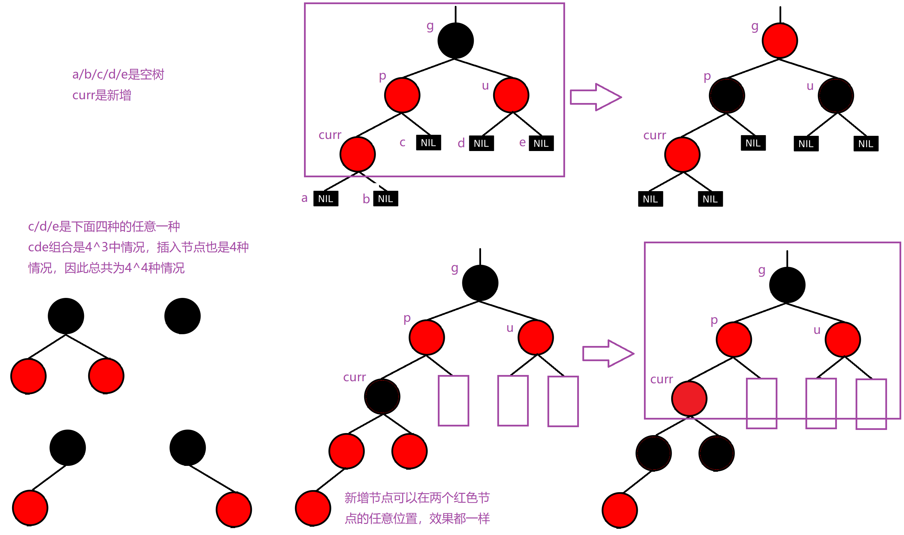
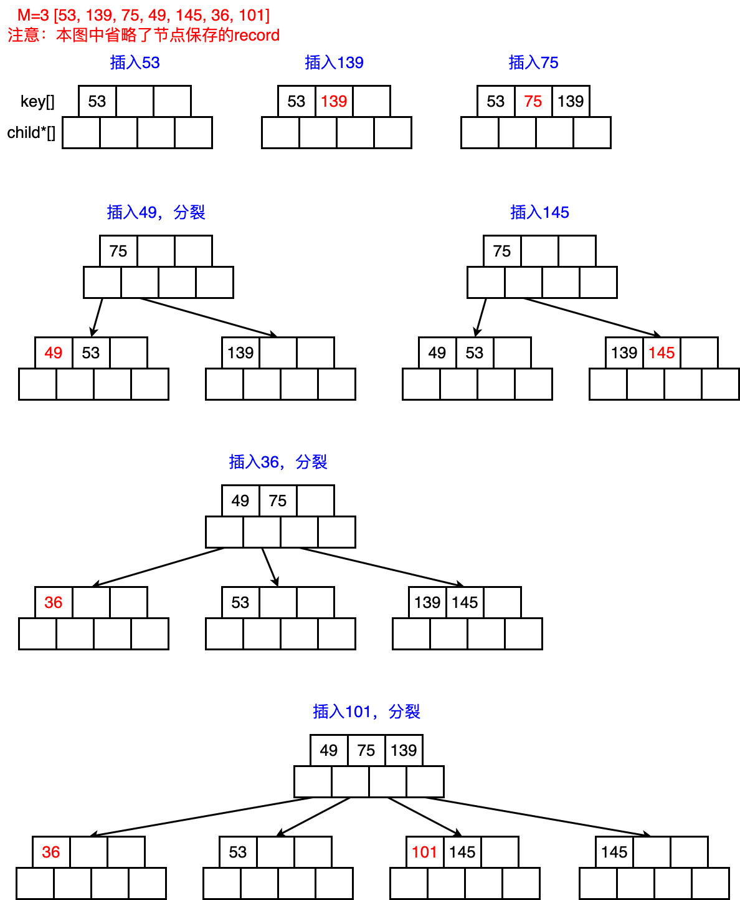
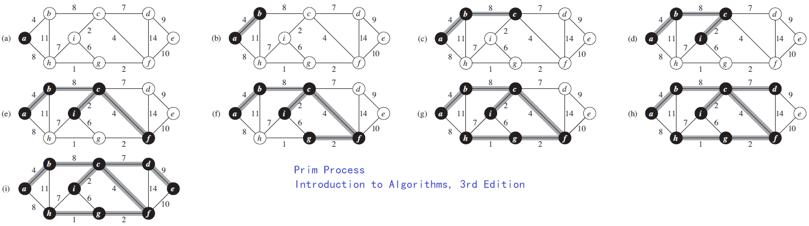

可视化工具：https://www.cs.usfca.edu/~galles/visualization/Algorithms.html

# 顺序表和链表

## *线性表 Linear List*

线性表是n个具有相同特性的数据元素的有限序列。线性表是一种在实际中广泛使用的数据，常见的线性表有顺序表、链表、栈、队列、字符串。

线性表在逻辑上是线性结构，但在物理结构上并不一定是连续的，线性表在物理上存储时，通常以数组和链式结构的形式存储。

## *顺序表 Sequential List*

### 顺序表的基本操作

* 定义动态顺序表

    ```c
    #define N 100
    typedef int SLDataType;
    
    typedef struct SeqList {
        SLDataType* a;
        int size;
        int capacity;
    } SL;
    ```
    
* 初始化

    ```c
    void SLInit(SL* ps) {
        assert(ps); //防御式编程
        ps->a = NULL;
        ps->size = ps->capacity = 0;
    }
    ```
    
* 销毁

    ```c
    void SLDestroy(SL* ps) {
        if(ps->a) {
            free(ps->a);
            ps->a = NULL;
            ps->size = ps->capacity = 0;
        }
    }
    ```
    
* 打印

    ```c
    void SLPrint(SL* ps) {
        assert(ps);
        for (int i=0; i<ps->size; i++)
            printf("%d ", ps->a[i]);
        printf("\n");
    }
    ```
    
* 头插头删/尾插尾删的两种实现方式
  * 辅助的SLCheckCapacity函数

    ```c
    void SLCheckCapacity(SL* ps) {
        assert(ps);
        if (ps->size == ps->capacity) {
            int newCapacity = ps->capacity == 0 ? 4 : 2 * ps->capacity;
            SLDataType* tmp = (SLDataType*)realloc(ps->a, sizeof(SLDataType) * newCapacity);
            if (tmp == NULL) {
                perror("realloc");
                exit(-1);
            }
            ps->a = tmp;
            ps->capacity = newCapacity;
        }
    }
    ```
    
  * 直接实现
    * 尾插

        ```c
        void SLPushBack(SL* ps, SLDataType x) {
            assert(ps);
            SLCheckCapacity(ps);
            ps->a[ps->size] = x;
        }
        ```
        
    * 头插
    
        <div align="center"></div>
    
        ```C
        void SLPushFront(SL* ps, SLDataType x) {
            assert(ps);
            SLCheckCapacity(ps);
        
            int end = ps->size-1;
            while (end >= 0) {
                ps->a[end+1] = ps->a[end]; // 从后往前挪
                --end;
            } 
            ps->a[0] = x;
            ps->size++;
        }
        ```
        
    * 尾删
    
      ```c
      void SLPopBack(SL* ps) {
          assert(ps);
          assert(ps->size > 0);
          ps->size--;
      }
      ```
      
    * 头删
    
    <div align="center"></div>
    
    ```c
    void SLPopFront(SL* ps) {
        assert(ps);
        assert(ps->size > 0);
    
        int begin = 1;
        while (begin < ps->size) {
            ps -> a[begin-1] = ps->a[begin]; // 从前往后挪
            ++begin;
        }
        ps->size--;
    }
    ```
    
  * 复用Insert和Erase
    * Insert
  
        ```c
        void SLInsert(SL* ps, int pos, SLDataType x) {
            assert(ps);
            assert(pos>=0 && pos<=ps->size); // '=' 是为了适合尾插的复用
            SLCheckCapacity(ps);
        
            int end = ps->size - 1;
            while (end >= pos) {
                ps->a[end+1] = ps->a[end];
                --end;
            }
            ps->a[pos] = x;
            pos-size++;
        }
        ```
        
    * Erase
  
        ```c
        void SLErase(SL* ps, int pos) {
            assert(ps);
            assert(pos>=0 && pos<=ps->size);
        
            int begin = pos;
            while (begin < ps->size-1) {
                ps->a[begin] = ps->a[begin+1]; // 从前往后挪
                ++begin;
            }
            ps->size--;
        }
        ```
        
    * 复用
    
        ```c
        void SLPushBack(SL* ps, SLDataType x) {
            SLInsert(ps, ps->size, x);
        }
        void SLPushFront(SL* ps, SLDataType x) {
            SLInsert(ps, 0, x);
        }
        void SLPopBack(SL* ps) {
            SLErase(ps, ps->size-1);
        }
        void SLPopFront(SL* ps) {
            SLErase(ps, 0);
        }
        ```
    
  * 顺序表的尾插尾删效率高，为O(1)；头插头删效率低，需要挪动数据，为O(N)
  
* 查

    ```c
    int SLFind(SL* ps, SLDataType x) {
        assert(ps);
        for (int i=0; i<ps->size; i++) {
            if (ps->a[i] == x)
                return i;
        }
        return -1;
    }
    ```
    
* 改

    ```c
    void SLModify(SL* ps, int pos, SLDataType x) {
        assert(ps);
        assert(pos>=0 && pos<ps->size);
        ps->a[pos] = x;
    }
    ```

### 顺序表OJ题（详见刷题）

* 原地移除数组中所有的元素val，要求时间复杂度为O(N)，空间复杂度为O(1)
* 删除排序数组中的重复项
* 合并两个有序数组

## *链表 Linked List*

链表的本质是为了克服顺序表的缺点而设计的。链表是一种物理存储结构上非连续的存储结构，数据元素的逻辑顺序是通过链表中的指针链接次序实现的

### 链表的分类

* 无头单向非循环链表 Singly linked list：结构简单，一般不会单独用来存数据，实际中更多是作为其他数据结构的子结构，如哈希桶、图的邻接表等

    

* 双向带头循环链表 Circular doubly linked list with dummy node：结构最复杂的链表，一般用在单独存储数据，在实际中所使用的链表数据结构，都是带头双向循环链表

    

* 哨兵位/虚结点 Dummy node/Header node/Sentinel node

    尾插的题目一般都需要创建哨兵位，会简化第一次尾插时为空列表的特殊情况，因为尾插需要找尾，这时候就可能会出现对NULL解引用的情况，带一个哨兵位会避免这种情况。而头插一般不需要

### 链表的基本操作（无头单向非循环链表）

* 头文件与定义结点数据结构

    ```C
    typedef int SLTDataType;
    typedef struct SListNode {
        SLTDataType data;
        struct SListNode* next;
    }SLTNode;
    ```
    
* 打印

    ```c
    void SListPrint(SLTNode* phead) {
        SLTNode* curr = phead;
        while (curr) {
            printf("%d->", curr->data);
            curr = curr->next;
        }
        printf("NULL\n");
    }
    ```
    
* 创建新节点

    ```c
    SLTNode* BuySListNode(SLTDataType x) {
        SLTNode* newnode = (SLTNode*)malloc(sizeof(SLTNode));
        assert(newnode);
    
        newnode->data = x;
        newnode->next = NULL;
        return newnode;
    }
    ```
    
* 头插，为了达到修改指针，有两种设计方式
  * 传入二级指针，返回void，从而直接修改一级指针，推荐这种方式

    

    ```c
    // 前插时要改变phead，即将phead给newcode，因此仍然要用二级指针
    void SListPushFront(SLTNode** pphead, SLTDataType x) {
        assert(pphead);
        SLTNode* newnode = BuySListNode(x);
        newnode->next = *pphead; //把原来的头结点的地址给新的头结点的next
        *pphead = newnode; //把新的newnode的地址给到phead
    }
    ```
    
    * 若传一级指针，并返回void，则改变的是一级指针的形参拷贝，SListPushFront退出后形参销毁，指针没有改变
    * 需要改变node本身的Push和Pop都需要传二级指针+返回void，打印等不需要改变node的只需要一级指针+返回void
    
  * 传入一级指针，返回新的头结点。不推荐这种方式，返回值不直观，需要用指针来接收后重新使用
  
    ```c
    SLTNode* SListPushFront(SLTNode* phead, SLTDataType x) {
        assert(phead);
        SLTNode* newnode = BuySListNode(x);
        newnode->next = phead;
        phead = newnode;
        return phead;
    }
    
    // 使用起来很别扭，不直观
    void TestSList1() {
        SListPushBack(&plist, 5);
        SListPushBack(&plist, 6);
        SListPushBack(&plist, 7);
        SListPushBack(&plist, 8);
        SLTNode* newPlist = SListPushFront(plist, 10); // 得创建一个新的头指针，再给其他接口使用
        SListPrint(newPlist);
    }
    ```
  
* 尾插

    

    ```c
    void SListPushBack(SLTNode** pphead, SLTDataType x) {
        assert(pphead); //所有用二级指针的地方都得检查，因为即使1级指针为空，二级指针也不可能为空
        SLTNode* newnode = BuySListNode(x);
        //一开始一个结点都没有
        if(*pphead == NULL)
            *pphead = newnode;
        else {
            //找尾结点
            SLTNode* tail = *pphead;
            while(tail->next != NULL)
                tail = tail->next;
            tail->next = newnode;
        }
    }
    //PushBack结束后newnode指针被销毁，但新创建的node结构体还是存在的，而且原来的tail->next已经
    //指向了新的结构体的地址，所以newnode指针被销毁没有影响
    ```
    
* 头删

    

    ```c
    void SListPopFront(SLTNode** pphead) {
        assert(pphead);
        assert(*pphead);
        SLTNode* next = (*pphead)->next;
        free(*pphead);
        *pphead = next;
    }
    ```
    
* 尾删

    ```c
    void SListPopBack(SLTNode** pphead) {
        assert(pphead);
        assert(*pphead); //没有结点
        if ((*pphead)->next == NULL) {//只有一个结点
            free(*pphead);
            *pphead = NULL;
        }
        else {//还有多个结点
            SLTNode* tailPrev = NULL;
            SLTNode* tail = *pphead;
            while (tail->next) {
                tailPrev = tail;
                tail = tail->next;
            }
            free (tail);
            tailPrev->next = NULL;
        }
    }
    ```
    
* 查找以及修改复用

    ```c
    SLTNode* SListFind(SLTNode* phead, SLTDataType x) {
        SLTNode* cur = phead;
        while (cur) {
            if (cur->data == x)
                return cur;
            cur = cur->next;
        }
        return NULL;
    }
    ```
    
* 任意位置插入
  * pos前插入 Insert：单链表很不适合插入或删除前面的，因为要从头找前面的node

    ```c
    //单链表不适合在pos之前插入，因为需要找前一个位置，可以用双向列表解决
    void SListInsert(SLTNode** pphead, SLTNode* pos, SLTDataType x) {
        assert(pos); //pos为空时变成尾插了，同时检查pos就是顺便检查了链表不为空
        assert(pphead);
        if (pos == *pphead) //要插入的是第一个结点，调用头插
            SListPushFront(pphead, x);
        else
        {
            SLTNode* prev = *pphead;
            while (prev->next != pos)
                prev = prev->next;
    
            SLTNode* newnode = BuySListNode(x);
            prev->next = newnode;
            newnode->next = pos;
        }
    }
    ```
    
  * InsertAfter
  
    ```c
    void SListInsertAfter(SLTNode* pos, SLTDataType x)
    {
        assert(pos);
        //// 错误的顺序
        //SLTNode* newnode = BuySListNode(x);
        //newnode->next = pos->next;
        //pos->next = newnode;
    
        //不在乎链接的顺序
        SLTNode* newnode = BuySListNode(x);
        SLTNode* next = pos->next;
        pos->next = newnode;
        newnode->next = next;
    }
    ```
  
* 任意位置删除
  * pos前删除 Erase

    ```c
    void SListErase(SLTNode** pphead, SLTNode* pos)
    {
        assert(pphead);
        assert(pos);
        if (*pphead == pos)
            SListPopFront(pphead); //删除的是第一个结点
        else
        {
            SLTNode* prev = *pphead;
            while (prev->next != pos)
                prev = prev->next;
            prev->next = pos->next;
            free(pos);
            pos = NULL;
        }
    }
    ```

  * EraseAfter

    ```c
    void SListEraseAfter(SLTNode* pos)
    {
        assert(pos);
        assert(pos->next);
        SLTNode* del = pos->next;
        //pos->next = pos->next->next;
        pos->next = del->next;
        free(del);
        del = NULL;
    }
    ```

### 链表OJ题（详见各题实现）

* 删除链表中等于给定值val的所有结点
* 反转一个单链表
* 给定一个带有头结点head的非空单链表，返回链表的中间结点。如果有两个中间结点，则返回第二个中间结点
* 输入一个链表，输出该链表中倒数第k个结点
* 将两个有序链表合并为一个新的有序链表并返回。新链表是通过拼接给定的两个链表的所有结点组成的
* 编写代码，以给定值x为基准将链表分割成两部分，所有小于x的结点排在大于或等于x的结点之前
* 链表的回文结构
* 输入两个链表，找出它们的第一个公共结点
* 给定一个链表，判断链表中是否有环

### 带头双向循环列表（代码参考工程文件）

* 头文件与定义结点数据结构

    ```c
    #include <stdio.h>
    #include <stdlib.h>
    #include <assert.h>
    #include <stdbool.h>

    typedef int LTDataType;
    typedef struct ListNode
    {
        struct ListNode* next;
        struct ListNode* prev;
        LTDataType data;
    }LTNode;
    ```

* 创建头结点与初始化：自己指向自己

    

    ```c
    LTNode* BuyListNode(LTDataType x)
    {
        LTNode* node = (LTNode*)malloc(sizeof(LTNode));
        if (node == NULL)
        {
            perror("malloc");
            exit(-1);
        }
        node->data = x;
        node->next = NULL;
        node->prev = NULL;
        return node;
    }

    LTNode* ListInit()
    {
        LTNode* phead = BuyListNode(-1);
        phead->next = phead;
        phead->prev = phead;
        return phead;
    }
    ```

* 销毁
* 列表大小和判空
* Insert
* Erase
* PushBack和PushFront/用Insert复用
* PopBack和PopFront/用Erase复用

### 顺序表VS链表，二者是相辅相成的，各有各的应用场景

* 顺序表
  * 优点：物理空间连续，下标随机访问；CPU高速缓存命中率高
  * 缺点
    * 若空间不够，需要realloc等方式扩容。扩容有一定的性能消耗，其次一般扩容2倍，存在一些空间浪费；头部或者中间位置的插入删除效率低下
    * 头插头插或中间插入、删除需要挪动数据，O(N)效率很低
* 单链表：尾插尾删需要找尾，效率低
* 带头双向循环链表
  * 优点：任意位置插入删除O(1)，按需申请释放空间
  * 缺点
    * 不支持下标随机访问，需要O(N)查找
    * CPU高速缓存命中率低，且有可能带来缓存污染。CPU加载内存中的数据时会多加载后面几个数据，因此顺序表地址连续具有连续命中率高；而链表地址不连续，多加载的数据往往是无用数据

# 栈和队列

## *栈 Stack*

### 栈的概念及实现


* 栈是一种特殊的线性表，其只允许在固定的一端进行插入和删除元素操作。进行数据插入和删除操作的一端称为栈顶，另一端称为栈底。栈中的数据元素遵守后进先出 LIFO (Last In First Out) 的原则
* 压栈：栈的插入操作叫做压栈，入数据在栈顶
* 出栈：栈的删除操作叫做出栈，出数据在栈顶

### 栈的实现

栈使用数组（顺序表）实现比较合适，因为栈只有尾插尾删，数组尾插尾删效率比较高；若要实现链式栈则要用链首作为栈顶。栈的性质决定了栈没有打印、遍历和迭代器，因为如果要打印或遍历，相当于把栈清空了

* 定义栈

    ```c
    #define N 10
    typedef int STDataType;
    typedef struct Stack {
        STDataType* a;
        int top;
        int capacity;
    } ST;
    ```
    
* 初始化

    ```c
    void StackInit(ST* ps) {
        assert(ps);
        ps->a = NULL;
        ps->top = 0;
        ps->capacity = 0;
    }
    ```
    
* 销毁

    ```c
    void StackDestroy(ST* ps) {
        assert(ps);
        free(ps->a);
        ps->a = NULL;
        ps->top = ps->capacity = 0;
    }
    ```
    
* 压栈，FILO，只有尾插

    ```c
    void StackPush(ST* ps, STDataType x) {
        assert(ps);
        if (ps->top == ps->capacity) {
            int newcapacity = ps->capacity == 0 ? 4 : ps->capacity*2;
            STDataType* tmp = (STDataType*)realloc(ps->a, sizeof(STDataType)*newCapacity);
            if (tmp == NULL) {
                printf("realloc fail\n");
                exit(-1);
            }
            ps->a = tmp;
            ps->capacity = newCapacity;
        }
        
        ps->a[ps->top] = x;
        ps->top++; // 先放数据再++
    }
    ```
    
* 出栈，FILO，只有尾删

    ```c
    void StackPop(ST* ps) {
        assert(ps);
        assert(!StackEmpty(ps));
        ps->top--;
    }
    ```
    
* 取栈顶元素

    ```c
    STDataType StackTop(ST* ps) {
        assert(ps);
        assert(!StackEmpty(ps));
        return ps->a[ps->top - 1];
    }
    ```
    
* 判断栈是否为空

    ```c
    bool StackEmpty(ST* ps) {
        assert(ps);
        return ps->top == 0;
    }
    ```
    
* 获取栈的大小

    ```c
    int StackSize(ST* ps) {
        assert(ps); 
        return ps->top;
    }
    ```

## *队列 Queue*

### 队列的概念及结构


* 队列是只允许在一端进行插入数据操作，在另一端进行删除数据操作的特殊线性表，队列具有先进先出 FIFO (First In First Out) 的特点。进行插入操作的一端称为队尾出队列，进行删除操作的一端称为队头
* 队列需要在队头头删，在队尾尾插，因此用链表实现比较合适

### 队列的实现

* 定义队列

    ```c
    typedef int QDataType;
    typedef struct QueueNode {
        struct QueueNode* next;
        QDataType data;
    } QNode;
    
    typedef struct Queue {
        // int size; // 用于计数，效率比较高：Push ++size, Pop --size
        QNode* head;
        QNode* tail;
    } Queue;
    ```
    
* 初始化

    ```c
    void QueueInit(Queue* pq) {// 用到的指针封到了一个结构体Queue中
    // 改变的是结构体里的指针，因此不需要传二级指针
        assert(pq);
        pq->head = pq->tail = NULL;
    }
    ```
    
* 销毁队列

    ```c
    void QueueDestroy(Queue* pq) {
        assert(pq);
        QNode* curr = pq->head;
        while (curr) {
            QNode* next = curr->next;
            free(next);
            curr = next; 
        }
    }
    ```
    
* 验证是否为空队列

    ```c
    bool QueueEmpty(Queue* pq) {
        assert(pq);
        return pq->head == NULL;
    }
    ```
    
* 入队列

    ```c
    void QueuePush(Queue* pq, QDataType x) {
        assert(pq);
        // 只有一个Push用到了BuyNode，因此直接写在Push里面
        QNode* newnode = (QNode*)malloc(sizeof(QNode));
        if (newnode ==NULL) {
            printf("malloc fail\n");
            exit(-1);
        }
        newnode->data = x;
        newnode->next = NULL;
        if (pq->tail == NULL) {// 一个结点都没有
            pq->head = pq->tail = newnode;
        }
        else {
            pq->tail->next = newnode;
            pq->tail = newnode;
        }
    }
    ```
    
* 出队列

    ```c
    void QueuePop(Queue* pq) {
        assert(pq);
        assert(!QueueEmpty(pq));
    
        if (pq->head->next == NULL) {// 只剩一个结点
            free(pq->head);
            pq->head = pq->tail = NULL;
        }
        else {
            QNode* next = pq->head->next;
            free(pq->head);
            pq->head = next;
        }
    }
    ```
    
* 取队头数据

    ```c
    QDataType QueueFront(Queue* pq) {
        assert(pq);
        assert(!QueueEmpty(pq));
        return pq->head->data;
    }
    ```
    
* 取队尾数据

    ```c
    QDataType QueueBack(Queue* pq) {
        assert(pq);
        assert(!QueueEmpty(pq));
        return pq->tail->data;
    }
    ```
    
* 队列大小

    ```c
    int QueueSize(Queue* pq) {
        assert(pq);
        QNode* curr = pq->head;
        while (curr) {
            ++size;
            curr = curr->next;
        }
        return size;
    }
    ```

# 二叉树 Binary Tree

## *树概念及结构*

### 树的相关概念


* 树是一种非线性的数据结构，它是由 n 个有限结点组成一个具有层次关系的集合
* 结点的度 Degree：一个节点含有子树的个数
* 叶子结点 Leaf node：度为 0 的结点
* 分支节点：度不为 0 的结点
* 父节点：若一个节点含有子节点，则这个节点称为其子节点的父节点
* 子节点：一个节点含有的子树的根节点称为该节点的子节点
* 兄弟节点：具有相同父节点的节点称为兄弟节点
* 树的度：一棵树中，最大的节点的度称为该树的度
* 节点的层次：从根开始定义起，根为第一层，根的子节点为第二层
* 树的高度 depth（最大深度）：树的节点的最大层次
* 堂兄弟节点：双亲在同一层的节点互为堂兄弟
* 节点的祖先：从根到该节点所经分支上的所有结点
* 子孙：以某节点为根的子树中任一结点
* 森林：由 m 棵互不相关的树的集合称为森林
  
### 树的表示

```c
// 左孩子右兄弟表示法
typedef int DataType;
struct Node {
    struct Node* _firstChild1; // 第一个孩子结点
    struct Node* _pNextBrother; // 指向其下一个兄弟结点
    DataType _data; // 结点中的数据域
}
```

## *二叉树概念及结构*

### 概念

* 二叉树不存在度大于 2 的结点
* 二叉树的子树有左右之分，次序不能颠倒，因此二叉树是有序树

### 特殊的二叉树


* 满二叉树 Full Binary Tree：一个二叉树，如果每一个层的结点树都达到最大值，则这个二叉树就是满二叉树，也就是说，若一个二叉树的层数为 $k$，且结点总数为 $2^{k}-1$，则它就是满二叉树
* 完全二叉树 Complete Binary Tree：对于深度为 $k$ 的，有 $n$ 个结点的二叉树，当且仅当每一个结点都与深度为 $k$ 的满二叉树中编号从 1 至 $n$ 的结点一一对应时称之为完全二叉树。满二叉树就是一种特殊的完全二叉树

### 二叉树的性质

* 若规定根结点的层数为 1，则一棵非空二叉树的第 $i$ 层上最多有 $2^{(i-1)}$ 个结点
* 若规定根结点的层数为 1，则深度为 $h$ 的二叉树的最大结点数是 $2^{h}-1$
* 若规定根结点的层数为 1，具有 $n$ 个结点的满二叉树的深度为 $h=\log_{2}{(n+1)}$
* 对任何一棵二叉树，如果度为0的叶结点个数为 $n_0$，度为2的分支结点个数为 $n_2$，则有 $n_0=n_2+1$
* 对于具有 n 个结点的完全二叉树，若按照从上至下从左至右的数组顺序对所有结点从 0 开始编号，则对于序号为 i 的结点有

### 二叉树的存储结构

* 顺序存储 Sequential Storage Structure
  * 二叉树的顺序存储就是堆。普通的二叉树不适合用数组来存储，因为可能会存在大量的空间浪费，而**完全二叉树更适合使用顺序结构存储**
  
    
  
  * 现实中我们通常把堆（一种二叉树）使用顺序结构的数组来存储，需要注意的是这里的堆和操作系统虚拟进程空间中的堆区是两回事，前者是数据结构，后者是操作系统中管理内存的一块区域分段
  
* 链式存储 Linked Storage Structure：用链表来表示一颗二叉树，即用链来指示元素的逻辑关系。通常的方法是链表中每个结点用三个域组成，即数据域和左右指针域

## *二叉树的顺序结构及实现：堆 Heap*

### 堆的结构和性质

* 性质
  * 堆中某个结点的值总是不大于或不小于其父节点的值
  * **堆总是一棵完全二叉树**
  * 结合以上性质可以得出下标计算父子间的关系（注：元素从 0 开始）：
    * $leftchild=parent*2+1$
    * $rightchild=parent*2+2$
    * $parent=(child-1)/2$：整除统一了左右孩子
* 结构：假设一个数据集合 $K=\left\{k_0\ ,k_1\ ,k_2,\ \cdots,\ k_{n-1}\right\}$
  * 小根堆：堆中所有父亲小于等于孩子 $k_i\leq k_{2i+1}\ and\ k_{i}\leq k_{2i+2}$
  * 大根堆：堆中所有父亲大于等于孩子 $k_i\geq k_{2i+1}\ and\ k_{i}\geq k_{2i+2}$

### 堆的实现

* 堆的基本接口
  * 定义堆
  
    ```c
    typedef int HPDataType;
    typedef struct Heap {
        HPDataType* a; // 数组
        int size;
        int capacity;
    } HP;
    ```
    
  * 初始化
  
    ```c
    void HeapInit(HP* php) {
        assert(php);
        php->a = NULL;
        php->size = php->capacity = 0;
    }
    ```
    
  * 销毁
  
    ```c
    void HeapDestroy(HP* php) {
        assert(php);
        free(php->a);
        php->a = NULL;
        php->size = php->capacity = 0;
    }
    ```
    
  * 打印数据
  
    ```c
    void HeapPrint(HP* php) {
        assert(php);
        for (i=0; i<php->size; ++i) { 
            printf("%d->", php->a[i]);
        }
        printf("\n");
    }
    ```
    
  * 取堆顶数据
  
    ```c
    HPDataType HeapTop(HP* php) {
        assert(php);
        assert(php->size > 0);
        return php->a[0];
    }
    ```
    
  * 判空
  
    ```c
    bool HeapEmpty(HP* php) {
        assert(php);
        return php->size == 0;
    }
    ```
    
  * 堆尺寸
  
    ```c
    int HeapSize(HP* php) {
        assert(php);
        return php->size;
    }	
    ```
    
  * 堆的插入
  
    插入的过程就是一个不断建堆的过程
  
    
  
    ```c
    void HeapPush(HP* php, HPDataType x) {
        assert(php);
        // 扩容
        if (php->size == php->capacity) {
            int newCapacity = php->capacity == 0 ? 4 : php->capacity*2;
            HPDataType* tmp = (HPDataType*)realloc(php->a, sizeof(HPDataType)*newCapacity);
            if(tmp==NULL) {
                printf("realloc fail\n");
                exit(-1);
            }
            php->a = tmp;
            php->capacity = newCapacity;
        }
        php->a[php->size] = x;
        php->size++;
    
        AdjustUp(php->a, php->size-1); // 向上调整
    }
    ```
    
  * 堆的删除：指删除堆顶数据，不是删除任意位置的值，因为没有意义
  
    
  
    堆的删除不能使用顺序表中向前挪动覆盖的方式，会直接将整个堆打乱掉。删除堆的方法是将堆顶的数据和最后一个数据交换，然后删除最后一个数据后再进行向下调整
    
    ```c
    void HeapPop(HP* php) {
        assert(php);
        assert(php->size > 0);
        Swap(&(php->a[0]), &(php->a[php->size-1]));
        php->size--;
        AdjustDown(php->a, php->size, 0);
    }
    ```
  
* 堆向上调整算法用于堆插入：给出第一个孩子的下标，计算父亲的下标并进行比较

  ```c
  void Swap(HPDataType* a, HPDataType* b) {
      HPDataType tmp = *b;
      *b = *a;
      *a = tmp;
  }
  
  void AdjustUp(HPDataType* a, int child) {
      int parent = (child-1) / 2;
      //while (parent >= 0) // 这样写错误
      // parent = (child-1)/2 会导致无法跳出循环 
      while (child > 0) {
          if (a[child] < a[parent]) {
              Swap(&a[child], &a[parent]);
              child = parent;
              parent = (child-1)/2;  
          }
          else
              break;
      }
  }
  ```
  
* 堆向下调整算法用于堆删除

  * 选出左右孩子中小的那一个
  * 小的孩子跟父亲比较，最多调整到叶子结束（下标大于数组size）
    * 若比父亲小，则交换，继续往下调整
    * 若比父亲大，则调整结束
  
  ```c
  void AdjustDown(HPDataType* a, int size, int parent) {
      int child = parent*2 + 1;
      while (child < size) {
          // 1、选出左右孩子中小/大的那一个，默认child是左孩子
          if (child + 1 < size && a[child + 1] < a[child]) {// 用于小堆删除，防止在只有左孩子没有右孩子的情况下越界
          //if (child + 1 < size && a[child + 1] > a[child]) // 用于大堆删除，防止在只有左孩子没有右孩子的情况下越界
              ++child;
          }
          // 2、小/大的这个孩子跟父亲比较，如果比父亲要小/大，则交换
          // 继续往下调整（最多到叶子结束）；如果比父亲要大/小，则调整结束
          if (a[child] < a[parent]) {// 用于小堆删除
          //if (a[child] > a[parent]) // 用于大堆删除
              Swap(&a[child], &a[parent]);
              parent = child;
              child = parent*2+1;
          }
          else {
              break;
          }
      }
  }
  ```

### 建堆时间复杂度

* 建堆方式1：向上调整建堆（以建小堆为例）-- ***NlogN***
  
  
  
  * 向上调整是第二层到最后一层，第一次没有父节点不需要比较
  
  * 设满二叉树的高度为h，最后一层有 $2^{(h-1)}$ 个结点，每个结点最坏要调整 $h-1$ 的高度次，即最坏每一层都要调整（因为是建堆，所以是每个结点），这层最多需要被调整 $2^{(h-1)}*(h-1)$ 次
  
  * 需要移动结点的总步数为 $T(N)=2^1*(1)+2^2*(2)+\cdots+2^{(h-1)}*(h-1)$
  
  * 错位相减
    $$
    \left\{\begin{array}{l}T(N)=2^1*(1)+2^2*(2)+\cdots+2^{(h-1)}*(h-1)\\2*T(N)=\ \ \ \ \ \ \ \ \ \ \ \ 2^2*(1)+\cdots+2^{(h-1)}*(h-2)+2^{(h)}*(h-1)\end{array}\right.
    $$
  
  * 相减得 $T(N)=2^{(h)}*(h-1)-\left[2^1+2^2+\cdots+2^{(h-1)}\right]=2^{h}(h-1)-(2^h-2)=2^hh-2^{h+1}+2$
  
  * 代入 $h=\log_{2}{(N+1)}$，得到 $T(N)=(N+1)\log_{2}{(N+1)}-2\log_{2}{(N+1)}+2=(N-1)\log_{2}{(N+1)}+2\approx N\log_{2}{N}$，即向上调整建堆的算法复杂度为 ***NlogN***
  
  
  
* 建堆方式2：向下调整建堆（以建大堆为例）-- ***N***
  
  
  
  * 向下调整是从最后第二层到第一层，因为最后一层都是叶子没有孩子来比较，因此不需要调整
  
  * 设满二叉树的高度为h，最后第二层的有 $2^{(h-2)}$ 个结点，每个结点最坏要调整 $1$ 次，这层最多需要调整 $2^{(h-2)}*(1)$ 次
  
  * 需要移动结点的总步数为 $T(N)=2^0*(h-1)+2^1*(h-2)+\cdots+2^{(h-2)}*(1)$
  
  * 错位相减 
    $$
    \left\{\begin{array}{l}T(N)=2^0*(h-1)+2^1*(h-2)+\cdots+2^{(h-2)}*(1)\\2*T(N)=\ \ \ \ \ \ \ \ \ \ \ \ \ \ \ \ \ \ \ 2^1*(h-1)+\cdots+2^{(h-2)}*(2)+2^{(h-1)}*(1)\end{array}\right.
    $$
    相减得 $T(N)=1-h+2^1+\cdots+2^{h-2}+2^{h-1}=2^h-1-h$
  
  * 代入 $h=\log_{2}{(N+1)}$，得到 $T(N)=N-\log_{2}{(N+1)}\approx N$，即向下调整建堆的算法复杂度为N
  
  

## *堆的应用*

### 升序打印用小堆/降序打印用大堆

```c
// 升序打印
HP hp;
HeapInit(&hp);
int a[] = { 27, 15, 19, 18, 28, 34, 65, 49, 25, 37 };
for (int i = 0; i < sizeof(a) / sizeof(int); i++) {
    HeapPush(&hp, a[i]); // 建小堆
}

while (!HeapEmpty(&hp)) {
    printf("%d ", HeapTop(&hp));
    HeapPop(&hp); // 每次选出最小值
}
printf("\n");
```

### <span id="堆排序">堆排序 -- ***O(NlogN)***</span>

* 建堆
  
  

  * 升序建大堆，降序建小堆。若升序用小堆，则需要反复建堆选出最小数，效率会大大降低，整体时间复杂度会变成 ***O(N^2)***
  * 建堆方式1：向上调整建堆
  
    ```c
    void HeapSort(int* a, int n)
    {
        //建堆方式1：从第二个元素开始直接向上调整，相当于不断Push，复杂度为O(N*logN)
        for (int i = 1; i < n; i++)
        {
            AdjustUp(a, i); //最多调整高度次，因此时间复杂度为O(logN)
        }
        // ... 接下方排序
    }
    ```
  
  * 建堆方式2：向下调整建堆，推荐使用这种建堆方式，效率比较高
  
    ```c
    void HeapSort(int* a, int n)
    {
        //建堆方式2向下调整，前提是左右子树都是堆：O(N)
        for (int i = (n - 1 - 1) / 2; i >= 0; --i) //从倒数第一个非叶子结点开始调
            // 因为非叶子结点没有子孙进行比较，所以不需要调
        { //i从n-1开始也可以，但没有意义，进入AdjustDown之后直接发现该叶子节点的子节点>n然后退出
            AdjustDown(a, n, i); //最多调整高度次，因此时间复杂度为O(logN)
        }
        
        // ... 接下方排序
    }
    ```
  
* 利用堆删除思想进行排序（每次选出最小值/最大值）
  
  
  
  * 以升序为例，建堆后得到大堆
  * 首位呼唤，最后一位变成最大值后将其隔离开来（不再视作为堆的一部分）
  * 因为其余部分除堆顶外仍然为大堆，堆其余部分做一次向下调整就得到了次大数
  * 重复
  
  ```c
  // ... 接上方建堆
  //升序：O(N*logN)，HeapSort的总体时间复杂度为O(N*logN)
  int end = n - 1;
  while (end > 0){
      Swap(&a[0], &a[end]); 
      AdjustDown(a, end, 0); 
      --end; 
  }
  ```

* TOP-K问题：N个数中找出最大/最小前K个，N非常大且远大于K（以找最大前k个为例）
  * 三种解法
    * 排序 -- ***O(N\*logN)***，N很大时效率太低
    * 建N个数大堆，Top/Pop k次 -- ***O(N+k\*logN)***
    * 用数据集中前K个元素来建小堆，用剩余的N-K个元素依次与堆顶元素来比较，若比堆顶元素大则进堆替换堆顶元素 -- ***O(k+(N-k)\*logK)***
  * 最好的方法是第三种，建N个数的堆需要建立一个在内存中的非常大的数组这是不现实的，第三种方法相比于第二种方法时间复杂度不一定有非常大的优化，优势在于大数据量的空间

    ```c
    void PrintTopK(int* a, int n, int k) {
        //1.建堆--用a中前k个元素建堆
        int* KMinHeap = malloc(k * sizeof(int));
        assert(KMinHeap);
        for (int i = 0; i < k; i++)
            KMinHeap[i] = a[i];
    
        for (int i = (k - 1 - 1) / 2; i >= 0; i--)
            AdjustDown(KMinHeap, k, i);
        //2.将剩余n-k个元素依次与堆顶元素比较替换
        for (int j = k; j < n; j++) {
            if (a[j] > KMinHeap[0]) {
                KMinHeap[0] = a[j];
                AdjustDown(KMinHeap, k, 0);
            }
        }
    
        for (int i = 0; i < k; i++)
            printf("%d ", KMinHeap[i]);
        printf("\n");
    }
    ```

## *二叉树链式结构的实现 & 遍历*

### 二叉树链式结构的意义

* 二叉树不一定都是满二叉树或完全二叉树，此时也是可以用链式结构来表示的，但普通二叉树的增删查改没有什么意义（删除后子树如何连接起来，连接后有什么意义？）
* 若只是为了单纯的存储数据，不如直接用顺序表和链表
* 学习二叉树的链式结构式为了后面学习更复杂的二叉树（搜索二叉树BST、AVL树、红黑树、B树系列）打基础
* 二叉树学习的重点在于学习遍历和控制结构

### 创建二叉树

* 二叉树结点

  ```c
  typedef int BTDataType;
  typedef struct BinaryTreeNode {
      struct BinaryTreeNode* left;
      struct BinaryTreeNode* right;
      BTDataType data;
  }BTNode;
  ```

* 因为没有增删查改接口，所以直接造一个二叉树结构

  

  ```c
  BTNode* BuyNode(BTDataType x) {
      BTNode* node = (BTNode*)malloc(sizeof(BTNode*));
      assert(node);
      node->data = x;
      node->left = node->right = NULL;
      return node;
  }
  
  BTNode* CreatBinaryTree() {
      BTNode* node1 = BuyNode(1);
      BTNode* node2 = BuyNode(2);
      BTNode* node3 = BuyNode(3);
      BTNode* node4 = BuyNode(4);
      BTNode* node5 = BuyNode(5);
      BTNode* node6 = BuyNode(6);
  
      node1->left = node2;
      node1->right = node4;
      node2->left = node3;
      node4->left = node5;
      node4->right = node6;
      return node1;
  }
  ```

### 二叉树递归遍历 Tree Traversal

递归遍历的框架如下

```cpp
/**
 * Definition for a binary tree node.
 * struct TreeNode {
 *     int val;
 *     TreeNode *left;
 *     TreeNode *right;
 *     TreeNode() : val(0), left(nullptr), right(nullptr) {}
 *     TreeNode(int x) : val(x), left(nullptr), right(nullptr) {}
 *     TreeNode(int x, TreeNode *left, TreeNode *right) : val(x), left(left), right(right) {}
 * };
 */
void traverse(TreeNode* root) {
    // base case
    // 前序位置
    traverse(root->left);
    // 中序位置
    traverse(root->right);
    // 后序位置
}
```

下面对我们自己实现的二叉树进行递归遍历

* 前序/中序/后序遍历（深度优先遍历 DFS）：区别在于访问根的时机
  * 前序遍历 Pre-order traversal：Node subtree-Left subtree-Right NLR。**前序位置的代码在刚刚进入一个二叉树节点的时候执行**

    [144. 二叉树的前序遍历](https://leetcode.cn/problems/binary-tree-preorder-traversal/)

    
    
    ```c
    void PreOrder(BTNode* root) {
        if (root == NULL) {
            printf("# ");
            return;
        }
        printf("%d ", root->data);
        PreOrder(root->left);
        PreOrder(root->right);
    }
    ```
    
  * 中序遍历 In-order traversal：LNR，在上图中的访问顺序为 # 3 # 2 # 1 # 5 # 4 # 6 #。**中序位置的代码在一个二叉树节点左子树都遍历完，即将开始遍历右子树的时候执行**
  
    [94. 二叉树的中序遍历](https://leetcode.cn/problems/binary-tree-inorder-traversal/)
    
    ```c
    void InOrder(BTNode* root){
        if (root == NULL) {
            printf("# ");
            return;
        }
        InOrder(root->left);
        printf("%d ", root->data);
        InOrder(root->right);
    }
    ```
    
  * 后序遍历 Post-order traversal：LRN，在上图中的访问顺序为 # # 3 # 2 # # 5 # # 6 4 1。**后序位置的代码在要离开一个二叉树节点的时候执行**
  
    [145. 二叉树的后序遍历](https://leetcode.cn/problems/binary-tree-postorder-traversal/)
    
    ```c
    void PostOrder(BTNode* root){
        if (root == NULL) {
            printf("# ");
            return;
        }
        PostOrder(root->left);
        PostOrder(root->right);
        printf("%d ", root->data);
    }
    ```
  
* 层序遍历 Level-order traversal（广度优先遍历 BFS）：借助Queue实现 

  [102. 二叉树的层序遍历](https://leetcode.cn/problems/binary-tree-level-order-traversal/)

  

  ```c
  typedef BTNode* QDataType;
  void LevelOrder(BTNode* root) {
      Queue q;
      QueueInit(&q);
      if (root)
          QueuePush(&q, root);
      while (!QueueEmpty(&q)) {
          BTNode* front = QueueFront(&q);
          QueuePop(&q);
          printf("%d ", front->data);
          if (front->left) // 一层一层放
              QueuePush(&q, front->left);
          if (front->right)
              QueuePush(&q, front->right);
      }
      printf("\n");
      QueueDestroy(&q);
  }
  ```

### 二叉树非递归遍历

二叉树的三种非递归遍历之间差别是挺大的，不像递归遍历只要访问顺序换一换就可以，特别是后序遍历

* 前序遍历就是借助栈的DFS，这部分在 *GKI.md* 中有详细描述，可以复习一下。写的时候有两个注意点

  * 因为用的是stack，所以先要把当前节点pop掉，才能把当前节点的左右节点入栈

  * 一定是先入右节点，再入左节点，以达到中左右的遍历顺序
  
  
  
  
  ```cpp
  class Solution {
  public:
      vector<int> preorderTraversal(TreeNode* root) {
          stack<TreeNode*> st;
          vector<int> res;
          st.push(root);
          if (root == nullptr) return res;
  
          while (!st.empty()) {
              TreeNode *top = st.top(); 
              res.push_back(top->val); // 中序
              st.pop();
              if (top->right) st.push(top->right); // 右节点
              if (top->left) st.push(top->left);   // 左节点
          }
  
          return res;
      }
  };
  ```
  
* 中序遍历：区别在于 `v.push_back(curr->val)` 要换到当左子树全部入栈之后在插入v

    ```cpp
    // ... 与前序相同
    while (curr || !st.empty()) {
        while (curr) {
            st.push(curr);
            curr = curr->left;
        }
        TreeNode *top = st.top();
        v.push_back(top->val);
        st.pop();
        curr = top->right;
    }
    ```

* 后序遍历
  * 和前序、中序的实现不同，一个节点不为空的情况下
    * 右子树没有访问，访问右子树
    * 右子树已经访问过了，访问根节点
  * 因此考虑记录上一次访问的节点prev，若上一次访问的是左节点那么说明右节点还没有访问过，要访问右节点；若上一次访问的是右节点，说明右节点访问过了，现在要访问根节点

    ```cpp
    vector<int> postorderTraversal(TreeNode* root) {
        vector<int> v;
        stack<TreeNode*> st;
        TreeNode* prev = nullptr;
        TreeNode *curr = root;
        while (curr || !st.empty()) {
            while (curr) {
                st.push(curr);
                curr = curr->left;
            }
            TreeNode *top = st.top();
    
            if (top->right == nullptr || top->right == prev) {
                // 右子树为空或者右子树已经访问过了，此时就可以访问根节点，否则子问题访问top的右子树
                v.push_back(top->val);
                prev = top;
                curr = nullptr;
                st.pop();
            }
            else
                curr = top->right;
        }
        return v;
    }
    ```

### 结点个数以及高度等

* 二叉树结点个数
  * 写法一：每次使用前count置零

    ```c
    int count = 0; // 全局变量
    int TreeSize(BTNode* root) {
        if (root == NULL)
            return;
        ++count;
        TreeSize(root->left);
        TreeSize(root->right);
    }
    ```
    
  * 写法二：分治思想（推荐）

    ```c
    int count = 0; // 全局变量
    int TreeSize(BTNode* root) {
        return root == NULL ? 0 :
            TreeSize(root->left) + TreeSize(root->right) + 1;
    }
    ```
  
* 二叉树叶子结点个数

```c
int TreeLeafSize(BTNode* root) {
    //return root->left == NULL && root->right == NULL ? 1 : 
    //    TreeLeafSize(root->left) + TreeLeafSize(root->right);
    if (root == NULL)
        return 0;
    
    if (root->left == NULL && root->right == NULL)
        return 1;

    return TreeLeafSize(root->left) + TreeLeafSize(root->right);
}
```

* 二叉树第k层结点个数

```c
// 转换成子问题：求左子树的第K-1层+求右子树的第K-1层
int TreeKLevel(BTNode* root, int k) {
    assert(k >= 1);
    if (root == NULL)
        return 0;    
    if (k == 1)
        return 1;
    return TreeKLevel(root->left, k-1) + TreeKLevel(root->right, k-1);
}
```

* 二叉树查找值为x的结点（只返回第一个找到的x值）

  * 前序遍历是最优的：因为先访问Node，效率最高

    ```c
    BTNode* TreeFind(BTNode* root, BTDataType x) {
        if (root == NULL)
            return NULL;
    
        if (root->data == x)
            return root;
        BTNode* ret1 = TreeFind(root->left, x);
        if (ret1)
            return ret1;
        BTNode* ret2 = TreeFind(root->right, x);
        if (ret2)
            return ret2;
        return NULL;
    }
    ```
  
* 中序遍历

    ```c
    BTNode* TreeFind(BTNode* root, BTDataType x) {
        if (root == NULL)
            return NULL;
        
        BTNode* ret1 = TreeFind(root->left, x);
        if (ret1)
            return ret1;
        if (root->data == x)
            return root;
        BTNode* ret2 = TreeFind(root->right, x);
        if (ret2)
            return ret2;
        return NULL;
    }
    ```
    
* 二叉树高度/深度：实质上是后序遍历

    ```c
    int TreeDepth(BTNode* root) {
        if (root == NULL)
            return 0;
        int leftDepth = TreeDepth(root->left) + 1;
        int rightDepth = TreeDepth(root->right) + 1;
        return leftDepth > rightDepth ? leftDepth : rightDepth;
    }
    ```
    
* 二叉树销毁：后序销毁

    ```c
    void TreeDestroy(BTNode* root) {
        if (root == NULL)
            return;
        TreeDestroy(root->left);
        TreeDestroy(root->right);
        free(root);
    }
    ```

# 排序 Sorting

https://leetcode.cn/leetbook/detail/sort-algorithms/

<https://www.cnblogs.com/onepixel/articles/7674659.html>

[912. 排序数组](https://leetcode.cn/problems/sort-an-array/)：这道题可以用来测试除了 ***O(N^2)*** 之外的所有排序方法，经过测试冒泡是失败的

## *排序的概念*

### 一些概念

* 排序：使一串记录，按照其中的某个或某些关键字的大小，递增或递减的排列起来的操作

* 稳定性 stability：在原序列中相等的元素（当然还是有先后关系的），在排序后是否会改变这种先后关系的性质

  稳定性有什么作用？当要排序的内容是一个对象的多个属性，且其先完成的排序顺序存在意义时，若我们需要在二次排序后保持已经完成的排序的意义，就需要使用到稳定性的算法

  举个例子：若我们要对一组商品排序，且商品存在两个属性：价格和销量。当我们按照价格从高到低排序后，要再按照销量对其排序，这时，如果要保证销量相同的商品仍保持价格从高到低的顺序，就必须使用稳定性算法

* 内部排序 internal sort：数据元素全部放在内存中的排序

* 外部排序 external sort：数据元素太多不能同时放在内存中，根据排序过程的要求不能在内外存之间移动数据的排序

### 分类

* 比较类排序：通过比较来决定元素间的相对次序，由于其时间复杂度不能突破***O(NlogN)***，因此也称为非线性时间比较类排序
  * 插入排序
    * 直接插入排序
    * 希尔排序

  * 选择排序
    * 选择排序
    * 堆排序

  * 交换排序
    * 冒泡排序
    * 快速排序

  * 归并排序
    * 二路归并
    * 多路归并

* 非比较排序：不通过比较来决定元素间的相对次序，它可以突破基于比较排序的时间下界，以线性时间运行，因此也称为线性时间非比较类排序
  * 计数排序
  * 基数排序
  * 桶排序


下面为了方便实际的应用，我们将不按照上面的分类而是根据时间复杂度来介绍各种排序算法

## *时间复杂度O(N^2)*

### 冒泡排序 Bubblesort

冒泡排序重复地遍历待排序的列表，每次比较相邻的两个元素，并在必要时交换它们的位置，直到整个列表都按照升序或降序排列为止

冒牌排序每遍历一次就会将一个之前没有排好序的最大值/最小值放到最后。因此这个算法的名称来自于在排序过程中较小（或较大）的元素会像气泡一样逐渐“浮”到列表的顶部

总共需要走N趟，每次遍历 `N-i` 个值，因此总共需要下面的次数，复杂度为***O(N^2)***。因为是在原始的数组上操作的，所以不消耗多余空间，空间复杂度为***O(1)***
$$
\sum\limits_{i=1}^{n}{i}=\frac{n(n-1)}{2}
$$


```c
void BubbleSort(int* a, int n) {
    assert(a);
    for (int j = 0; j < n - 1; j++) {
        int exchange = 0; // 优化1：若冒牌的过程中没有发生交换，则说明已经完成排序
        // 优化2：不需要进行后面已经排升序完成的冒泡，直接退出
        for (int i = 1; i < n - j; i++) {
            if (a[i - 1] > a[i]) { // 升序
                Swap(&a[i - 1], &a[i]);
                exchange = 1;
            }
        }
        if (exchange == 0)
            break;
    }
}
```

关于两数交换的技巧，比如说不用临时变量来交换两数可以看刷题-数学运算技巧-常用的位操作

### 选择排序 Selection Sort

选择排序的思想是双重循环遍历数组，每经过一轮比较，找到最小/最大元素的下标，将其放到已排序序列的末尾/开头


```c
void selectionSort(int* a, int n) {
    asssert(a);
    int minIndex = 0;
    for (int i = 0; i <= n-1; i++) {
        minIndex = i;
        for (int j = i+1; j<= n-1; j++) {
            if (a[minIndex] > a[j]) 
                minIndex = j;
        }
        Swap(&a[i], &a[minIndex]); // 将最小元素放到首位
    }
}
```

分析方法和冒泡排序一样，都是两层循环，所以时间复杂度为***O(N^2)***。不消耗多余空间，空间复杂度为***O(1)***。选择排序和冒泡排序的区别在于：冒泡排序在比较过程中一直在交换，而选择排序则保存了最值的序号，只有在完成一轮比较选择后才交换

优化方法是**二元选择排序**，一趟同时选出最小和最大的。二元选择相比于普通选择排序提升不算大

```cpp
void SelectSort(int* a, int n) {
    assert(a);
    int begin = 0, end = n - 1;
    while (begin < end) {
        int mini = begin, maxi = begin;
        for (int i = begin + 1; i <= end; i++) {
            if (a[i] < a[mini])
                mini = i;
            if (a[i] > a[maxi])
                maxi = i;
        }
        Swap(&a[begin], &a[mini]); // 升序
        // 若begin和maxi重叠，要修正maxi的位置
        // 因为这个时候maxi，也就是begin已经被换到mini了，所以maxi就是mini
        if (begin == maxi) maxi = mini;
        Swap(&a[end], &a[maxi]);
        begin++;
        end--;
    }
}
```

### 直接插入排序 Insertion Sort

插入排序一个直观的类比就是打扑克牌时理牌的过程。它的工作原理是逐步构建有序序列，对于未排序数据，在已排序序列中从后向前扫描，找到相应位置并插入


* 自己的实现

  ```c
  // 直接交换，类似于冒泡的过程
  void InsertSort(int* a, int n) {
      for (int i = 1; i < n; i++) {
          for (int j = 0; j < i; j++) {
              // 升序
              if (a[i - j] < a[i - j - 1]) {
                  int tmp = a[i - j];
                  a[i - j] = a[i - j - 1];
                  a[i - j - 1] = tmp;
              }
          }
      }
  }
  ```
  
* 参考实现方法

  

  ```c
  void InsertSort(int* a, int n) {
      // [0, end]有序，把end+1位置的值插入，保持有序
      for (int i = 0; i < n - 1; i++) {
          int end = i;
          int tmp = a[end + 1];
          while (end >= 0) {
              if (tmp < a[end]) { // 升序
                  a[end + 1] = a[end];
                  --end;
              }
              else
                  //a[end + 1] = tmp; // 若将这步写在该处
                  // 当插入值比所有数组值都小的时候会产生end=-1问题
                  // 最后一个元素的比较失败，所以放在一趟循环外面
                  break;
          }
          a[end + 1] = tmp;
      }
  }
  ```

## *时间复杂度O(NlogN)*

### 希尔排序 Shell Sort

希尔排序于1959年由Donald Shell发明，发表在《ACM通讯》上，它是第一个突破***O(N^2)***的排序算法，是简单插入排序的改进版。它与插入排序的不同之处在于，它会优先比较距离较远的元素。希尔排序又叫**缩小增量排序**

虽然原始的希尔排序最坏时间复杂度仍然是***O(N^2)***，但经过优化的希尔排序可以达到 $\mathcal{O}(n^{1.3})$，甚至是 $\mathcal{O}(n^{7/6})$

希尔排序虽然具有划时代的意义，但它只被短暂的用过，在快速排序出现后马上就被淘汰了，所以起到了承上启下的作用


* 第一遍是分组预排序（接近顺序有序）：将待排序数组按照一定的间隔分为多个子数组，每组分别进行插入排序

* 第二遍是直接插入排序（有序）：最后一轮时采用直接插入排序

  

  ```c
  int gap = n; 
  while (gap > 1) {
      // 将gap控制为n相关，进行多次预排序，来平衡预排序速度与域排序效果
      // gap>1 时是预排序，gap最后一次等于1，是直接插入排序
      gap = gap / 3 + 1; // +1 是为了防止 gap=0
      for (int i = 0; i < n - gap; i++) { // 每组中按照直接插入方法进行预排序
          int end = i;
          int tmp = a[end + gap];
          while (end >= 0) {
              if (tmp < a[end]) { // 升序
                  a[end + gap] = a[end];
                  end -= gap;
              } else {
                  break;
              }
          }
          a[end + gap] = tmp;
      }
  }
  ```

### 堆排序 Heap Sort

[堆排序](#堆排序)我们在堆的应用中已经记录过了

### 归并排序 Merge Sort

Von Neumann 在1945年提出了归并排序算法，该算法建立在归并操作上。归并排序是采用分治 Divide and Conquer 的一个非常典型的应用

**归并排序就是一个二叉树的后序遍历（左右中）**


* 递归实现

  

  其实从上图中我们已经可以看出来归并排序的本质就是后序遍历

  ```c++
  void Sort(vector<int>& nums, int lo, int hi) {
      if (lo == hi) return;
      
      int mid = lo + (hi - lo)/2; // 防止溢出
      Sort(nums, lo, mid);
      Sort(nums, mid + 1, hi);
      
      // 后序操作
      MergeSort(vector<int>& nums, int lo, int mid, int hi);
  }
  
  MergeSort(vector<int>& nums, int lo, int mid, int hi) {}
  ```

  下面是参考《算法4》的实现：借助一个 tmp 辅助数组，三指针排序

  

  ```c
  class Solution {
  public:
      vector<int> tmp;
      void Merge(vector<int>& nums, int lo, int mid, int hi) {
          int i = lo;
          int beginL = lo;
          int endL = mid;
          int beginR = mid + 1;
          int endR = hi;
  
          // 两个区间都没有走完
          while (beginL <= endL && beginR <= endR) {
              if (nums[beginL] <= nums[beginR]) {
                  tmp[i++] = nums[beginL++];
              } else {
                  tmp[i++] = nums[beginR++];
              }
          }
  
          // 右区间走完了
          while (beginL <= endL) {
              tmp[i++] = nums[beginL++]; 
          }
          // 左区间走完了
          while (beginR <= endR) {
              tmp[i++] = nums[beginR++];
          }
          // 将 tmp 写回 nums
          std::copy(tmp.begin() + lo, tmp.begin() + hi + 1, nums.begin() + lo);
      }
  
      // [lo, hi] 这道题用左闭右闭对于边界控制会简单点
      void Sort(vector<int>& nums, int lo, int hi) {
          if (lo == hi) return;
  
          int mid = lo + (hi - lo)/2;
          Sort(nums, lo, mid);
          Sort(nums, mid + 1, hi);
  
          Merge(nums, lo, mid, hi);
      }
  
      vector<int> sortArray(vector<int>& nums) {
          tmp = nums;
          Sort(nums, 0, nums.size() - 1);
          return nums; 
      }
  };
  ```

* 循环实现

  * 后序遍历不适合用栈实现，栈比较适合快排那种前序遍历
  * 考虑用gap控制。但用gap控制时由于使用的是二分法在数组内容非2的幂次时比较麻烦，只有begin1不会越界，其他三个都有可能会越界
  * 根据memcpy的未知分有两种实现方式

## *快速排序 Qsort O(NlogN)*

因为快排非常重要，又非常复杂，所以单独成一节

### 快排的基本方法

快速排序 Quick Sort 又称**划分交换排序 partition-exchange sort**。最早由C. A. R. Hoare教授（也提出了哲学家就餐问题、go语言使用的并发模型CSP）在1960年左右提出

在平均状况下，排序n个项目需要 ***O(NlogN)*** 次比较。 在最坏状况下则需要 ***O(N^2)*** 次比较，但这种状况并不常见。事实上，快速排序通常明显比其他算法更快，因为它的内部循环可以在大部分的架构上很有效率地达成


**快速排序就是个二叉树的前序遍历**。其基本思想是：

1. **挑选基准值**：任取待排序元素序列中的某元素作为基准值 pivot
2. **基准值**分割按照该排序码将待排序集合分割成两子序列，左子序列中所有元素均小于基准值，右子序列中所有元素均大于基准值
3. **前序递归**：左右子序列重复该过程，直到所有元素都排列在相应位置上为止

选取基准值有数种具体方法，此选取方法对排序的时间性能有决定性影响，具体的基准值选取 & 区间分割方式有下面几种

* hoare版本/分治法 Divide & Conquer, DC
* 挖坑法
* 双指针法

### hoare版本

* 过程
  * **挑选基准值**：挑选最左边或者最右边的值作为基准值 pivot，后面以最左边为 pivot 讲解

  * **基准值分割**

    * 令 left 指向最左边的数，right 指向最右边的数。让 right 往左边走，找到**第一个**比 pivot  小的值，让 left 往右边走，找到第一个比 pivot 大的值，交换后继续（升序）。与基准值相等的数可以到任何一边
    * 当左边与右边找到需要的值时，把找到的这两个数交换
    * 让左边和右边继续走，当左边和右边相遇时，相遇的值和 pivot 交换
    * 单趟结束后，要求左边比 pivot 大，右边比 pivot 小
  
    
  
  * **前序递归**：通过二叉树迭代分治思想排序剩余的内容
  
    
  
* 若左边做 pivot，为什么要让右边先走？因为要保证相遇位置的值比 pivot 小，或者极端情况下就是 pivot
  * R先走，R停下来，L去遇到R

    相遇位置就是R停下来的位置，R停的位置就是比 pivot 要小的位置。而且这一趟中 pivot 的位置就是经过完全排序之后其所处的位置，因为交换后它的左边不会有比它大的，而右边不会有比它小的

    

  * R先走，R没有找到比 pivot 要小的值，R去遇到了L

    相遇位置是L上一轮停下里的位置，要么就是 pivot 的位置，要么比 pivot 要小（已经交换了）

    

  * 反证：若L先走，结果失败

    

  * **规则**
    
    * 若左边做 pivot，则右边先走；若右边做 pivot，则左边先走
    * 升序则左边找大，右边找小；降序则左边找小，右边找大
  
  从上面的过程中我们已经可以明显看到 QSort 就是一个前序递归，因为进入递归之前需要先基准值分割，所以实现大纲如下
  
  ```c++
  // 假设按照升序对array数组中[left, right)区间中的元素进行排序
  void QuickSort(vector<int> &nums, int left, int right) {
      if(right - left <= 1) return;
  	// 前序基准值分割：按照基准值对array数组的 [left, right) 区间中的元素进行划分
      int div = partion(array, left, right);
  	// 划分成功后以div为边界形成了左右两部分 [left, div) 和 [div+1, right) 
      // 递归遍历 [left, div)
  	QuickSort(array, left, div);
  	// 递归遍历 [div+1, right)
      QuickSort(array, div+1, right);
  }
  ```
  
  下面是具体的实现
  
  ```cpp
  // Hoare
  int PartSort1(int* a, int begin, int end)
  {
      int left = begin, right = end;
      int keyi = left; // 选择最左边作为key
      while (left < right)
      {
          // 右边先走，升序找小
          // 右边先走的原因是保证和key交换的值是比key小的（升序），因为右边找小
          while (left < right && a[right] >= a[keyi]) 
          {
              // left<right 防止越界，相遇时停下来
              // a[right] >= a[keyi] 加等于号是为了防止类似于5,5,...,5这种数组出现死循环
              right--;
          }
          // 左边再走，找大
          while (left < right && a[left] <= a[keyi])
              left++;
          Swap(&a[left], &a[right]);
      }
      Swap(&a[keyi], &a[left]);
      keyi = left;
      return keyi;
  }
  ```

### 挖坑法

* 步骤
  * 选择一个 pivot（这里仍然使用最左边的元素作为 pivot），这个位置相当于是一个坑
  * 令 left 指向最左边的数，right 指向最右边的数
    * 让 right 往左边走，如果比 pivot 大，则right指针向左移动；如果比 pivot 小，则把 right 所指向的元素填入原来坑中，然后 right 所指向的元素称为新的坑
    * 切换到 left 指针进行比较。如果 left 指向的元素小于 pivot，则left指针向右移动；如果元素大于 pivot，则把 left 指向的元素填入坑中
  * 不断重复上面的过程，直到当 left 和 right 相遇的时候，将 pivot 填入坑中
  * 一轮完成，开启递归
* 实现


```c
// 挖坑法
int PartSort2(int* a, int begin, int end) {
    int key = a[begin];
    int piti = begin; // 坑
    while (begin < end) {
        // 右边找小，填到左边的坑里面去，这个位置形成新的坑
        while (begin < end && a[end] >= key)
            end--;
        a[piti] = a[end]; 
        piti = end; // 形成新的坑位

        // 左边找大，填到右边的坑里面去，这个位置形成新的坑
        while (begin < end && a[begin] <= key)
            begin++;
        a[piti] = a[begin];
        piti = begin;
    }
    a[piti] = key;
    return piti;
}
    
```

### 前后指针版本

* 步骤
  * 开始时，prev指针指向序列开头，curr指针指向prev指针的后一个位置
  * 判断curr指针指向的是否小于key，若小于，则prev后移一位后将curr和prev指向的内容互换后再将curr+1；否则就只将curr+1
  * 当curr越界后，将prev指向内容与key互换
  * 递归
* 实现

    

    ```c
    // 前后指针
    int PartSort3(int* a, int begin, int end) {
        int keyi = begin;
        int prev = begin;
        int curr = prev + 1;
    
        int midi = GetMidIndex(a, begin, end); //三数取中
        Swap(&a[keyi], &a[midi]);
    
        while (curr <= end) {
             // ++prev != curr 处理自己和自己交换的冗余情况
            if (a[curr] < a[keyi] && ++prev != curr)
                Swap(&a[prev], &a[curr]);
            curr++;
        }
        Swap(&a[prev], &a[keyi]);
        keyi = prev;
    
        return keyi;
    }
    ```

### 快速排序的优化

* 随机选Key
* 三数取中：把Key选为第一个、中间和最后一个中不是最大的那一个
* 递归到小的子区间时，可以考虑使用插入排序
  * 当递归到类似于10个数的小区间时，若仍然使用递归则需要增加很多运算和栈开销。设递归深度为 $h$，则总共需要调用 $2^{(h-1)}$ 次，可见最后一层的递归将总调用次数的一半，若减少2-3层的递归，则可以将递归调用和栈开销减少大约80%
  * 因此在最后几层可以考虑直接使用效率较高的简单排序--插入排序

```c
int GetMidIndex(int* a, int begin, int end) {
    int mid = (begin + end) / 2;
    if (a[begin] < a[mid]) {
        if (a[mid] < a[end])
            return mid;
        else if (a[begin] < a[end])
            return end;
        else
            return begin;
    } else {
        if (a[mid] > a[end])
            return mid;
        else if (a[begin] < a[end])
            return begin;
        else
            return end;
    }
}

void QSort(int* a, int begin, int end) {
    // 区间不存在，或者只有一个值则不需要再处理
    if (begin >= end)
        return;
    if (end - begin > 10) {
        int keyi = PartSort3(a, begin, end);
        //二叉树递归，前序遍历
        QSort(a, begin, keyi - 1);
        QSort(a, keyi + 1, end);
    } else {
        InsertSort(a + begin, end - begin + 1);
    }
} 
```

### 快排递归改非递归
* 递归最严重的问题是若递归深度太深，会出现栈溢出。将递归改成非递归有两种方式
  * 直接改写成循环，如Fibonacci数列、归并排序
  * 用数据结构模拟递归过程（栈开在堆上，空间比较大）
  * 也可以使用队列模拟，但会变成层序遍历
  
  

```c
void QSortNonR(int* a, int begin, int end) {
    ST st;
    StackInit(&st);
    // 入栈先入右再入左，之后出栈先出左再出右
    StackPush(&st, end);
    StackPush(&st, begin);

    // 栈里面的区间都会拿出来，单趟排序分割，子区间再入栈
    while (StackEmpty(&st)) {
        int left = StackTop(&st); // left == begin
        StackPop(&st);
        int right = StackTop(&st); // right == end
        StackPop(&st);

        int keyi = PartSrot3(a, left, right);
        // 得到区间 [left, keyi-1] keyi [keyi+1, right]
        if (keyi + 1 < right) {
            StackPush(&st, right);
            StackPush(&st, keyi + 1);
        }

        if (left < keyi - 1) {
            StackPush(&st, keyi - 1);
            StackPush(&st, left);
        }
    }
    StackDestory(&st);
}
```

## *Timsort O(NlogN)*

https://www.cnblogs.com/sunshuyi/p/12680918.html

TimSort基于归并和插入排序，并用作Java和Python的内置排序算法

## *时间复杂度O(N)*

***O(N)***的排序算法实际上比***O(NlogN)***的排序算法出现的时间更早，但很遗憾的是，***O(NlogN)***的排序算法具有通用性，即它们可以被应用在任何场合下。而***O(N)***的排序算法则缺乏通用性，它们只能被用在某些特定的场合下

下面介绍三种常用的***O(N)***的排序算法

### 计数排序


* 没有用到比较大小，是一种非比较排序
* 步骤
  * 统计每个数据出现的次数
  * 按出现次数写回原数组
* 局限性
  * 如果是浮点数、字符串就不能使用了，因为要将内容映射为字典
  * 如果数据范围很大，那么空间复杂度会很大
  * 若有1000, 1005, 1000, 1008, 1009, 1005, 1006这种情况使用直接映射会出现大量的空间和时间浪费，使用相对映射
* 不适合数据范围很大的排序，适用于数据集中且重复较多的排序

```c
void CountSort(int* a, int n) {
    int min = a[0], max = a[0];
    for (int i = 1; i < n; i++) {
        if (a[i] < min)
            min = a[i];
        if (a[i] > max)
            max = a[i];
    }

    // 开统计次数的数组
    int range = max - min + 1;
    int* count = (int*)malloc(sizeof(int) * range);
    if (count == NULL) {
        printf("malloc fail\n");
        exit(-1);
    }
    memset(count, 0, sizeof(int) * range);

    // 统计次数
    for (int i = 0; i < n; i++)
        count[a[i] - min]++;

    // 回写排序
    int j = 0;
    for (int i = 0; i < range; i++) {
        // 出现几次就会写几个i+min
        while (count[i]--)
            a[j++] = i + min;
    }
}
```

### 桶排序 Bucket Sort

桶排序是计数排序利用了哈希桶的思想

### 基数排序 Radix Sort

补充：基数 Radix 又称为底数，是指进位制中用以乘每个数位以得到有效值的数。比如十进制数的底数为10，而二进制数的底数为2

基数排序的思想是**利用多关键字进行排序**，其中的每个关键字都被称作一个基数（貌似数据结构中的基数，包括基数排序和基数树，都是指 key 的意思，感觉和上面补充的底数没有什么关系）

比如说排序日期 2008年8月8日 和 2009年6月2日，我们直观的比较方法就是从年、月、日这三个关键字分别进行比较的

基数排序有两种实现方法

* 最高位优先法 Most Significant Digital MSD：从最高位开始，依次对基数进行排序
* 最低位优先法 Least Significant Digital LSD：从最低位开始，依次对基数进行排序。**使用LSD必须保证对基数进行排序的过程是稳定的**

再比如下面动画中排序非负整数组 `[8, 235, 20, 50, 527, 138, 156]`


## *排序算法复杂度及稳定性分析*

* 插入排序 Insertion Sort：原理就是打扑克牌时抓牌后将新牌放入手中
  * 直接插入排序 Straight Insertion Sort
    * 元素集合越接近有序，直接插入排序的时间效率越高
    * 时间复杂度 -- ***O(N^2)***：最坏为所有元素逆序，最优为元素有序
    * 空间复杂度 -- ***O(1)***
    * 稳定性：稳定
  * 希尔排序 Shellsort/缩小增量排序
    * 先分组预排序后再运用一次直接插入排序
    * 排升序，gap越大（分组越多），预排序速度越快，但越不接近有序；gap越小（分组越少），预排序速度越慢，但越接近有序
    * 将gap控制为n相关，进行多次预排序，来平衡预排序速度与域排序效果, gap>1时是预排序，gap最后一次等于1，是直接插入排序
* 选择排序
  * 选择排序 Selection Sort
    * 时间复杂度 -- ***O(N^2)***
    * 对比插入排序，插入更好。因为在数组接近有序时，插入接近 ***O(N)***，而选择仍然是 ***O(N^2)***，只有在完全逆序的情况下，选择比插入好
    * 选择几乎是最慢的一种排序
  * 堆排序 Heap Sort
* 交换排序
  * 冒泡排序 Bubblesort
    * 冒泡排序名字的由来是因为最大/最小值会像气泡一样逐渐达到数列顶端
    * 时间复杂度 -- ***O(N^2)***，最好是 ***O(N)***
    * 和插入排序相比，插入排序比较好。接近有序或局部有序时插入能更好适应
  * 快速排序 Qsort
    * hoare版本
    * 挖坑法：挖坑法和hoare版本相比没有特别明显的优势，只是更好理解
    * 前后指针版本
* 归并排序 Mergesort
  * 严格二分 时间复杂度 -- ***O(NlogN)***
  * 归并排序需要借助一个辅助数组，因此空间复杂度 -- ***O(N)***
* 计数排序
  * 时间复杂度 -- ***O(max(range, N))***
  * 空间复杂度 -- ***O(range)***
  * 使用局限性比较强

插入、冒泡、简单选择三种比较慢的排序中，插入排序是最好的，因为他能适应接近有序或局部有序的情况，选择是最差的，其对于接近有序或局部有序的情况没有适应性，几乎没有使用价值。冒泡在经过改进后对接近有序或局部有序的情况也有一定的适应性

希尔和简单插入排序相比需要在数据量很大的时候才能体现出其优势

排序防范 | 平均情况 |最好情况 |最坏情况 |辅助空间 |稳定性
:-:|:-:|:-:|:-:|:-:|:-:
冒泡| ***O(N^2)***| ***O(N)***| ***O(N^2)***| ***O(1)***| 稳定
简单选择| ***O(N^2)***| ***O(N^2)***| ***O(N^2)***| ***O(1)***| 不稳定
直接插入| ***O(N^2)***| ***O(N)***| ***O(N^2)***| ***O(1)***| 稳定
希尔| ***O(NlogN)~O(N^2)***| ***O(N^1.3)***| ***O(N^2)***| ***O(1)***| 不稳定
堆| ***O(NlogN)***| ***O(NlogN)***| ***O(NlogN)***| ***O(1)***| 不稳定
归并| ***O(NlogN)***| ***O(NlogN)***| ***O(NlogN)***| ***O(N)***| 稳定
快排| ***O(NlogN)***| ***O(NlogN)***| ***O(N^2)***| ***O(logN)~O(N)***| 不稳定

# 搜索/查找结构

| 搜索方法             | 数据格式 | 时间复杂度    |
| -------------------- | -------- | ------------- |
| 顺序查找             | 无要求   | ***O(N)***    |
| 二分查找             | 有序     | ***O(logN)*** |
| 二叉搜索树           | 无要求   | ***O(N)***    |
| 二叉平衡树：AVL+红黑 | 无要求   | ***O(logN)*** |
| 哈希                 | 无要求   | ***O(1)***    |
| B树系列              | 无要求   | ***O(N)***    |

## *静态搜索*

### 二分查找

## *二叉搜索树 Binary Search Tree BST*

### BST概念


BST 又称二叉排序树，它或者是一颗空树，或者是具有以下性质的二叉树

* 若它的左子树不为空，则左子树上所有节点的值都小于根节点的值
* 若它的右子树不为空，则右子树上所有节点的值都大于根节点的值
* 它的左右子树也都必须为BST

### BST的实现

* BST支持增删查，不支持改，因为会打乱整棵树，可以采取先查后删再插入的方法改

* 循环实现
  * BSTreeNode

    ```cpp
    template<class K>
    struct BSTreeNode {
        BSTreeNode<K>* _left;
        BSTreeNode<K>* _right;
        K _key;
    
        BSTreeNode(const K& key) // 因为要new 提供构造函数
            :_left(nullptr)
            , _right(nullptr)
            , _key(key)
        {}
    };
    ```
    
  * Insert
  
    插入过程不仅仅是一个排序的过程，也是一个天然的去重过程，因为若可以插入键值进去一定是没有重复的
  
    ```cpp
    bool Insert(const K& key) {
        if (_root == nullptr) { // 空树
            _root = new Node(key); // 要对Node提供构造函数
            return true;
        }
        Node* parent = nullptr;
        Node* curr = _root;
        while (curr) {
            if (curr->_key < key) { // 要插入的key比当前_key大就往右边走
                parent = curr;
                curr = curr->_right;
            }
            else if (curr->_key > key) {
                parent = curr;
                curr = curr->_left;
            }
            else // 默认的搜索树不允许键值冗余
                return false;
        }
        curr = new Node(key);
        if (parent->_key < key)
            parent->_right = curr;
        else
            parent->_left = curr;
        return true;
    }
    ```
    
  * Find
  
    利用搜索树不允许键值冗余，若相等则是找到了
  
    ```cpp
    bool Find(const K& key) {
        Node* curr = _root;
        while (curr) {
            if (curr->_key < key) // 要插入的key比当前_key大就往右边走
                curr = curr->_right;
            else if (curr->_key > key)
                curr = curr->_left;
            else // 利用搜索树不允许键值冗余，若相等则是找到了
                return true;
        }
        return false; // 走完了还没找到
    }
    ```
    
  * Erase
  
    * 没有孩子就直接删除
  
    * 有一个孩子就“托孤”，将待删除结点的子节点托管给待删除结点的父节点
    
    * 有两个孩子的情况有两种方法
      
      * 两种方法都要找到下面两个特殊节点的一个
      
        * 左子树的最大节点：也就是左子树的最右节点
        * 右子树的最小节点：也就是右子树的最左节点
      
      * 替换法删除：替换节点赋值给删除节点后，删除替换节点，替换节点要么没有孩子（可以直接删除），要么就只有一个孩子。替代节点有两种选择方式，即
      
        
      
      * 旋转法删除：以最小左节点 minR 为例，将 curr 的左节点接到 minR 的左节点，然后将 curr 删除并将 curr 的右节点接到 curr 的父节点（如果是迭代实现的话，不需要找父节点，直接返回root）
      
        推荐使用这种方法，不容易出错
      
        
    
  * 前序遍历：递归函数必须显式传入参数root进行递归，但外面取不到最开始的_root，所以封装一个函数
  
    ```cpp
    void _InOrder(Node* root) { // 中序遍历
        if (root == nullptr)
            return;
        _InOrder(root->_left);
        cout << root->_key << " ";
        _InOrder(root->_right);
    }
    ```
  
* 递归实现：传引用是这里的神之一笔，可以简化改动节点时更改指针朝向的工作（若不改动指针，就会导致出站后指针销毁，和没有删除一样）
  * Insert

    ```cpp
    bool _InsertR(Node*& root, const K& key) {
        // 采用引用传参，最后一步时直接连接起来
        if (root == nullptr) {
            root = new Node(key);
            return true;
        }
        if (root->_key < key)
            return _InsertR(root->_right, key);
        else if (root->_key > key)
            return _InsertR(root->_left, key);
        else
            return false;
    }
    ```
    
  * Find

    ```cpp
    bool _FindR(Node* root, const K& key) {
        if (root == nullptr)
            return false;
        if (root->_key < key) // 去右子树找
            return _FindR(root->_right);
        else if (root->_key > key)`
            return _FindR(root->_left);
        else
            return true;
    }
    ```
    
  * Erase：重点在于删除左右子树都不为空的情况下需要缩小搜索范围
  
    

### BST的性能分析

* BST的性能和其树的结构有关，而结构又取决于插入构造的顺序
* 最优情况下，BST为完全二叉树，此时只需要搜索高度次，即复杂度为 ***O(h)--O(logN)***
* 最差情况下，BST退化为单支树，此时复杂度升高为 ***O(N)***
* 需要利用平衡树，即红黑树和AVL树进行优化

### BST的应用

* K模型：判断Key关键字在不在，顺便也完成了排序和去重
  * 门禁系统，检查用户资料是否在系统中
  * 检查一篇英文文档中单词拼写是否正确
* KV模型：通过Key关键字来找响应的Value
  * 简单中英互译程序
  * 统计出现次数

## *AVL树：自平衡二叉搜索树*

### AVL树的性质

* 左右子树都是AVL树
* 左右子树高度之差（简称平衡因子）的绝对值不超过1
  * Balance factor 平衡因子=右子树高度-左子树高度
  * 之所以控制高度差不超过1，而不是严格相等，这是因为这是由于节点的个数限制，子树的高度差不可能严格相等
* AVL树节点的数据结构

    ```cpp
    template<class K, class V>
    struct AVLTreeNode {
        AVLTreeNode<K, V>* _left;
        AVLTreeNode<K, V>* _right;
        AVLTreeNode<K, V>* _parent; // 三叉链，更方便找祖先
    
        pair<K, V> _kv;
        int _bf; // 平衡因子
    
        AVLTreeNode(const pair<K, V>& kv)
            :_left(nullptr)
            , _right(nullptr)
            , _parent(nullptr)
            , _kv(kv)
            , _bf(0)
        {}
    };
    ```

### AVL树的插入与删除

* 按照BST的规则插入新节点
* 调整节点的平衡因子

### 更新平衡因子的规则


* 新增右节点，左边为空，`parent->_bf++`；新增左节点，右边为空，`parent->_bf--`
* 更新后，若 `parent->_bf == 1 || parent->_bf == -1`，说明parent插入前的平衡因子是0，说明parent所在分支发生了高度变化，需要继续向上更新
* 更新后，若 `parent->_bf == 0`，说明parent插入前的平衡因子是-1或1，说明原来左右子树一边高一边低，插入后填上了原来矮的一遍，parent所在子树没有发生高度变化，不需要继续向上更新
* 更新后，若 `parent->_bf == 2 || parent->_bf == -2`，说明parent插入前的平衡因子是-1或1，说明已经超过了高度差临界值，需要对parent所在子树做旋转处理
* 若出现 `parent->_bf > 2 || parent->_bf < -2`，这说明之前的AVL树结构出现了问题，要检查实现

    ```cpp
    // 控制平衡
    // 1. 更新平衡因子
    while (parent) { // 可能要更新到根节点
        if (curr == parent->_right)
            parent->_bf++;
        else
            parent->_bf--;
    
        if (parent->_bf == 0) //parent所在子树没有发生高度变化，不需要继续向上更新
            break;
        else if (abs(parent->_bf) == 1) {//parent所在分支发生了高度变化，需要继续向上更新
            parent = parent->_parent;
            curr = curr->_parent;
        }
        else if (abs(parent->_bf == 2)) //超过了高度差临界值，需要对parent所在子树做旋转处理
        {/* 2. 旋转*/}
        else
            assert(false);
    }
    ```

### AVL树的旋转 Rotation

* 新节点插入较高右子树的右侧--右右：左单旋
  * 本质是由于右边插入后使 `parent->_df == 2` 引起的，因此最多只需要一次旋转就可以将整棵树都保持在高度平衡状态
  
  * 抽象图
  
    
    
    ```cpp
    void RotateL(Node* parent) {
        Node* subR = parent->_right;
        Node* subRL = subR->_left;
        
        // 需要改动6个指针的指向
        parent->_right = subRL;
        if (subRL) //subRL的高度为0时为空节点
            subRL->_parent = parent;
    
        Node* ppNode = parent->_parent; //记录parent的parent
    
        subR->_left = parent;
        parent->_parent = subR;
        // 旋转前的parent既可能是整棵树的root，也有可能是子树的root
        if (_root == parent) { //parent是整棵树的root
            _root = subR;
            subR->_parent = nullptr;
        }
        else //parent是子树的root {
            if (ppNode->_left == parent) //不知道parent是ppNode的左子树还是右子树
                ppNode->_left = subR;
            else
                ppNode->_right = subR;
            subR->_parent = ppNode;
        }
        subR->_bf = parent->_bf = 0; // 平衡因子都变成0
    }
    ```
  
* 新节点插入较高左子树的左侧--左左：右单旋

  * 抽象图

    
    
    ```cpp
    void RotateR(Node* parent) {
        Node* subL = parent->_left;
        Node* subLR = subL->_right;
    
        parent->_left = subLR;
        if (subLR)
            subLR->_parent = parent;
    
        Node* ppNode = parent->_parent;
        subL->_right = parent;
        parent->_parent = subL;
        
        if (_root == parent) {
            _root = subL;
            subL->_parent = nullptr;
        }
        else {
            if (ppNode->_left == parent)
                ppNode->_left = subL;
            else
                ppNode->_right = subL;
            subL->_parent = ppNode;
        }
        subL->_bf = parent->_bf = 0;
    }
    ```
  
* 新节点插入较高左子树的右侧--左右：先左单旋再右单旋
  * 抽象图
  
    
  
  * 平衡因子分析：核心在于subLR的平衡因子为多少，因为它反应了新插入的节点是左边还是右边还是它自己本身
    * 较高左子树右侧子树的左子树为新增节点：左边两个平衡因子为0，右边的为1
    * 较高左子树右侧子树的右子树为新增节点：右边两个平衡因子为0，左边的为-1
    * 较高左子树的右节点自己本身就是新增节点，即a、b、c子树的高度h=0：3个平衡因子都是0
  
    ```cpp
    void RotateLR(Node* parent) { //先左旋再右旋，即左右双旋
        Node* subL = parent->_left;
        Node* subLR = subL->_right;
        int bf = subLR->_bf; //单旋会修改平衡因子，先记录一下
        RotateL(subL); //以subL为核心进行左旋
        RotateR(parent); //以parent为核心进行右旋
        // 针对3钟情况分别处理平衡因子的更新
        subLR->_bf = 0;
        if (bf == 1) {
            parent->_bf = 0;
            subL->_bf = -1;
        }
        else if (bf == -1) {
            parent->_bf = 1;
            subL->_bf = 0;
        }
        else if (bf == 0) {
            parent->_bf = 0;
            subL->_bf = 0;
        }
        else
            assert(false);
    }
    ```
  
* 新节点插入较高右子树的右侧--右左：先右单旋再左单旋
  * 抽象图：
  * 平衡因子分析
    * 较高右子树左侧子树的左子树为新增节点：左边两个平衡因子为0，右边的为1
    * 较高右子树左侧子树的右子树为新增节点：右边两个平衡因子为0，左边的为-1
    * 较高右子树的左节点自己本身就是新增节点：3个平衡因子都是0

## *红黑树*

* 红黑树 Red-black-tree 和AVL树有相似之处，红黑树认为AVL树的平衡过于严格，可能的过多旋转有可能会导致一定程度的性能下降。因此红黑树将平衡条件从严格平衡放宽为近似平衡，即最长路径不超过最短路径的2倍
* 插入同样的数据，AVL树旋转更多，红黑树旋转更少

### 红黑树的性质

* 每个节点不是红色就是黑色
* 根节点是黑色的
* 若一个节点是红色的，则它的两个孩子节点是黑色的（但没说黑节点的孩子不能是黑的）。也就是说树中没有连续的红色节点
* 对于每个节点，从该节点到所有后代叶节点的简单路径上，均包含相同数目的黑色节点。也就是说每条路径的黑色节点数量相等
* 每个叶子节点都是黑色的（此处的叶子节点指的是空节点NIL）

### 红黑树的结构


STL库中的实现有带一个header方便迭代器等实现，但实际上不带这个header也不会有太大影响

### 红黑树的插入和变色旋转

* 代码见 Cpp进阶 Lecture10

* 按照二叉搜索树的规则插入新节点：在节点的定义中，将节点的**默认颜色给成红色**的。虽然插入红色也需要进行修正，但比起插入黑色改动整颗树要好

* 检测新节点在插入后，红黑树的性质是否遭到破坏。插入红色遇到遇到黑色的没有违反红黑树的性质，所有不需要调整，若遇到红色的父节点就进行修正，分成如下三种情况分别进行处理，约定 curr 为当前节点，p为父节点，g为祖父节点，u为叔叔节点。注意，**关键点在于u节点**
  * curr 为红，p为红，g为黑，u存在且为红
    
    
    
    *   解决方法：将p和u改为黑，g改为红，然后把g当成curr，继续向上调整
      * 若g是根节点，则把g改成黑色
      * 若g不是根节点，就把g当成curr，继续向上调整
    *   把g变红是因为有可能这是一棵子树，为了保持该条路径上黑色节点数目不变
    *   curr可能本身是新增，也有可能是通过它自己的子树的新增变红的
    *   新增节点可以是四种，因此变化种类非常多
    
  * curr 为红，p 为红，g 为黑，u 不存在/u存在且为黑，新增节点与长链成直线：单旋+变色
    * p在左，u在右（u不存在或存在且为黑）：左左 右单旋+变色
    
    * p在右，u在左（u不存在或存在且为黑）：右右 左单旋+变色
    
      >
    
  * curr 为红，p 为红，g 为黑，u 不存在/u存在且为黑，新增节点与长链不成直线：双旋+变色
    * p在左，u在右（u不存在或存在且为黑）：左右 左单旋+右单旋+变色
    
    * p在右，u在左（u不存在或存在且为黑）：右左 右单旋 +左单旋+变色
    
      

## *B树*

### 内查找与外查找

其他查找（顺序、二分、二叉搜索、二叉平衡、哈希）等用于内查找：不是特别大的数据可以直接加载入内存中并用一定的数据结构管理，从而实现排序、查找等功能。而B树用于外查找：非常大的数据量，比如说100G，不能直接加载进内存中，而是要放到磁盘上，磁盘中的数据是挨着排放的，不方便随机查找

* 假设用平衡树：内存中存了一棵平衡树的数据结构，每个节点以KV形式存了关键字+相应数据在磁盘上的位置。要进行高度次IO，即 ***logN*** 次，在内存中是完全可以接受的。但是在disk中，每一次的层跳转/孩子节点跳转都有可能是一次disk的IO，因此每次 IO 要把每层节点的索引内容（保存在一个数据页）从 disk 加载进内存，那么这么多次的disk IO是非常慢的
* 哈希的复杂度是 ***O(1)***，但是若在磁盘中对大体量数据映射哈希表，那么哈希冲突会很严重。而且哈希不适合做范围查找。哈希的扩容期间会暂停服务，导致MySQL震荡（用着用着卡了）

B树思想：平衡搜索树基础上优化空间：**二叉变多叉，压缩高度**；一个节点里面有多个KV对（关键字+映射值）

B树可以指它的整个家族：

* B-Tree (1971)
* B+Tree (1973) Most used
* B\*Tree (1977?)
* $B^{link}$​-Tree (1981) at CMU
* Bε-Tree (2003)
* Bw-Tree (2013) lock free version of B+ tree from Microsoft

### B树系列的寻路规则

为了让一次硬盘IO读取足够多的数据，因此分支因子/阶 degree, order $M$ 会设置的很大，比如 $M=1024$。$M$ 很大，所以查找的效率很高，但也会存在一定的空间浪费，因为最少存 $M/2$ 

一棵完整的B树也是一个很大的数据，所以往往只会往内存上加载根节点或者加上第一层。寻路的流程为

1. 从根节点开始，根据关键字进行搜索，找到应该包含目标节点的子节点。单节点进行查找定位的时候使用二分查找
2. 若子节点对应的指针所指向的磁盘块已经在内存/缓存中就直接使用，否则磁盘IO将磁盘块中的节点加载到内存中
3. 重复步骤1和2，直到找到目标节点所在的磁盘块

### B树的定义规则

B树是一棵 $M$ 路的平衡多叉树（$M$ 的具体值会进行动态调整）。一棵 $m$ 阶（$m>2$​）的B树，是一棵平衡的M路平衡搜索树，可以是空树或者满足以下性质

* 根结点至少有两个孩子

* 每个分支节点都包含 $k-1$ 个 key 和 $k$ 个孩子，其中 $ceil(m/2)\leq k\leq m$​（ceil是向上取整函数）。分支节点的孩子比 key 保持多1个的关系。以M为10举例，最少是4个 key，5个孩子；最多是9个 key，10个孩子

  每个节点既保存了索引 key，也保存了 data，data 可能是 page ID 或者 record ID，即 page ID + offset，而 MySQL 和 SQLite 中这个 data 就是 tuple 本身

  

* 每个叶子节点都包含 $k-1$ 个 key，其中 $ceil(m/2)\leq k\leq m$，**以非降序存储**，方便进行节点内的二分查找

* 所有的叶子节点都在同一层

* 每个节点中的 key 从小到大排列，节点当中 $k-1$ 个元素正好是 $k$ 个孩子包含的元素的值域划分

* 每个结点的结构为：$(n,A_0,K_1,A_1,K_2,A_2,\dots,K_n，A_n)$其中，$K_i(1\leq i\leq n)$ 为 key，且 $K_i<K_{i+1}(1\leq i\leq n-1)$。$A_i(0\leq i\leq n)$ 为指向子树根结点的指针。$A_i$ 所指子树所有结点中的关键字均小于 $K_{i+1}$，n为结点中关键字的个数，满足 $ceil(m/2)-1\leq n\leq m-1$

和平衡树不同，红黑树和AVL树的规则是为了实现平衡，插入等操作要保证平衡。而平衡多叉树的主要目标是为了插入而不是平衡

B树的高度为
$$
M+M^2+\cdots+M^h=\frac{M(1-M^h)}{1-M}=N\rightarrow\ h\approx\log_{M}{N}
$$

### B树的插入规则

https://www.cnblogs.com/nullzx/p/8729425.html

* 开空间的时候要开M个关键字的位置，也就是说比最大关键字数目多开一个。这样做的目的是方便插入，因为要允许在即将分裂前夕时再插入一个不能越界
* **插入新节点的时候一定是插入到叶子里去**，不能插入到中间层，否则中间层的分割关系会被破坏。而叶子没有孩子，不会影响 key 和孩子关系
* 当关键字的数量等于M，就是满了。**满了就分裂出一个兄弟，分裂一半 `M/2` 的值和孩子给兄弟。还要提取中位数给父亲，没有父亲就创建新的根**。注意⚠️：当 M 为偶数的时候，`k<=M-1` 的中位数是不定的，选择偏左的还是偏右的视具体实现而定
* 天然平衡：**向上和向右生长**。根节点满了才会增加层数



### B树的删除

1. **定位待删除的键值对所在的叶子节点**：从根节点开始，沿着B树的路径向下搜索，直到找到包含待删除键值对的叶子节点

2. 删除节点有两种节点

   * 删除的是非叶子节点：直接删除即可
   * 删除的是叶子节点：使用和 BST 删除节点时的完全相同的替换法

3. **维护B树的平衡性和有序性**

   * 如果删除键值对后节点的 key 数量仍然在允许范围内，则删除操作完成

   * 如果删除导致节点的 key 数量低于最小 key 数量 `ceil(m/2)`，则需要进行节点合并或者从兄弟节点（如果左右兄弟都存在的，左右兄弟任选一个，视实现而定）借用键值对，以确保B树的平衡性和有序性。此时也视兄弟节点的 key 数量是否低于最小 key 数量 `ceil(m/2)` 分为两种情况
     * 兄弟结点 key 个数大于最小 key 数量 `ceil(m/2)`：直接将父结点中的 key 下移到该结点，兄弟结点中的一个 key 上移，删除操作结束
     * 兄弟结点 key 个数大于最小 key 数量 `ceil(m/2)`：要进行**合并 Merge** 操作了，将父结点中的 key 下移，并与当前结点及它的兄弟结点中的 key 合并，形成一个新的结点。原父结点中的 key 的两个孩子指针就变成了一个孩子指针，指向这个新结点。然后当前结点的指针指向父结点

   * 如果借用或合并操作导致父节点关键字数量低于最小关键字数，需要递归地向上调整，直到根节点，确保B树的结构保持平衡

## *B+树*

https://cmudb.io/btree 动画模拟 B+ 树的构建和操作过程

B+树是B树的改进，B树系列里实际用的最多的是B+树，比如InnoDB的page索引

### B树的问题

B树最主要的问题是它的每个节点都是既要存key，又要存record数据，这会造成两个问题

* 大多数时候，用户的record数据的大小很有可能远远超过索引的数据大小，这就需要花费更多的 disk IO 操作次数来读到 key
* 如果想要读到B树底层的数据，更是会造成大量无用的 disk IO 以及内存与 disk 之间的数据交换
* 使用 B 树来做范围查询的话，需要使用中序遍历，这会涉及多个节点的磁盘 IO 问题，从而导致整体速度下降

### B+树的优化

B+ 树的定义有很多，一个很大的区别是子树指针与 key 个数相同还是子树指针 = key 数 + 1（Wikipedia，此时和 B 树的相关定义相同）

这两种定义会都其他的细节造成影响，但是总体来说不是最核心的改进，下面的图采用的是个数相同的情况

鉴于上面说的问题，B+树对B树做出了如下的优化

* 分支节点的子树指针 `p[i]` 指向关键字值大小在 `[k[i]，k[i+1] `区间之间，相当于取消了B树中最左边的子树
* **叶子节点（最底部的节点）才会存放实际数据（索引+记录）**，非叶子节点（内部节点 inner node）只会存放索引
* **所有叶子节点增加一个链接指针连接在一起**
* 分支节点跟叶子结点有重复的值，分支节点存的是叶子结点索引，父亲中存的是孩子结点中的最小值或最大值做索引。相当于是分支节点是Key，叶子节点是KV。这么做的好处是遍历不需要从根开始了


**B+树第一次插入的时候要插入两层节点，一层做根，一层做分支**。后面也一样，唯一区别是B树分裂的时候是把中间节点上提给父亲，而B+树是把最小值拷贝一份给父亲充当索引

B+树的插入和删除基本是和B树相同的，当然细节上肯定是有所不同的

### B+树的范围查找

https://zhuanlan.zhihu.com/p/602957325

B树需要中序遍历递归的进行范围查找，B+树直接通过指向兄弟叶子节点的指针就可以进行范围查找了

### B\*树

B树和B+树的空间浪费还是比较大的，假设M=1000。最满的时候就是负载很均衡的时候，插入的数据在一棵树一左一右分别插入；最空的时候就是负载非常不均衡，比如说数据一直是递增或递减地插入


B\*树是B+树的变形，在B+树的非根和非叶子节点再增加指向兄弟节点的指针 **sibling pointers**，主要目的是为了**让B+树的空间利用率更高**

* B\*树的节点关键字和孩子数量为 $[\frac{2}{3}M,M]$
* B\*树的分裂规则是优先将多的转移给兄弟，而不是马上分裂。当自己和兄弟都1满了的时候才分裂


### B+树的应用

B树的空间利用率较低，消耗高，插入删除数据时，分裂和合并节点，必然要挪动数据，挪数据代价是大的。虽然高度下降了，但在内存中和平衡树的时间复杂度是一个等级的。因此B树系列在内存中优势不大，主要还是用在硬盘文件的搜索中

MySQL要求主键是不重复的唯一字段，比如电话、身份证号、ID等，名字、地址不适合。若没有字段能保持唯一，可以考虑**自增主键**（自己建立一个自增整数做为主键）

不用主键进行查找的时候要进行暴力的全表扫描，利用B+树的性质可以达成***O(N)***，但是如果可以的话还是要尽可能避免

B+树做主键索引相比B树的优势：B+树的相对优势是B树不用到叶子就能找到值，而B树一定要到叶子，但是B+树的高度已经很低了，所以这个相对优势也不明显

* B+树所有值都在叶子，遍历很方便，方便区间查找
* 对于没有建立索引的字段，全表扫描的遍历很方便
* 分支节点值存储Key，一个分支节点空间占用更小，可以尽可能加载到缓存

MyISAM：支持全文检索，全文检索实际上是倒排索引这种搜索技术

# 哈希 Hash

## *哈希概念*

在顺序结构以及平衡树中，元素关键码Key与其存储位置之间没有对应的关系，因此在查找一个元素时候，必须要对Key进行多次比较。搜索的效率取决于搜索过程中元素的比较次数

理想的搜索方法是可以不经过任何的比较，一次直接从表中得到要搜索的元素。哈希/散列 Hash -- Key和存储位置通过哈希函数 Hash Function 建立映射关联关系哈希表 Hash Table 就是这种解决方法

* 插入元素：根据待插入元素的关键码Key，以此函数计算该元素的存储位置并按此位置进行存放
* 搜索元素：对元素的关键码Key进行同样的计算，把求得的函数值当作元素的存储位置，在结构中按此位置取元素比较，若关键码相同则搜索成功

### 哈希函数

* 直接定址法 Multiplication method
  * 适合查找比较小且连续的情况，若特别分散小的特别小，大的特别大那么就不适合用
  * 不存在哈希冲突
  * 计数排序 -- 字符串只出现1次

* 除留余数法 Division method
  * 存在哈希冲突，重点在于解决哈希冲突

* 平方取中法 Middle-square method
* 折叠法形成一个基数树
  * 举例一种划分方式
  * 只针对整形，没有哈希冲突
  * 比较费空间

* 随机数法
* 数学分析法

## *哈希冲突*

### 概念

* 不同关键字通过相同哈希函数计算出相同的地址冲突，这种现象称为哈希冲突 Hash Collision 或哈希碰撞 Hash Clash。把具有不同关键码而具有相同哈希地址的数据元素称为同义词

  Collision free 容易产生误解，没有一种哈希算法可以从理论上证明避免了哈希碰撞，但可以做到的是找不到一种高效的方法来人为制造哈希冲突

* 哈希函数是单向的不可逆的，也就是说不能通过哈希值来反推输入的内容。这种性质称为**hiding 隐藏性**。通过这种隐藏性可以实现 digital commitment of a sealed envelop

* **Puzzle friendly**：要想使得计算得到的hash值在某一个范围之内，则只能够一个一个的输入去尝试，很难直接找到某个值使得其hash值在某一个范围内。这是挖矿的原理。挖矿就是把区块中的一些信息+随机数进行hash，使得其结果前K位数为0，才能够满足要求。挖矿无捷径，只能够去大量的试。所以也就产生了 **工作量证明 Proof of Work POW**

### 应对哈希冲突的静态策略

静态哈希方案是哈希表大小固定的方案

* 闭散列 Closed Hashing /开放定址法 Open Addressing：核心思想是若自己的位置被占了，就再去占用其他人的位置。**这种方法现在基本上已经被淘汰了**
  * 线性探测 Linear Probing：依次往后 $+i$ 找有无没有被占用的位置，直到空结束
    
    
    
    * 插入
      * 通过哈希函数获取待插入元素在哈希表中的位置
      * 若该位置中没有元素则直接插入新元素，若该位置中有元素发生哈希冲突，则使用线性探测找到下一个空位置后再插入新元素
      * 这种方法适用于负数，会将其整型提升
    * 删除
      * 使用闭散列处理哈希冲突时，**不能随便物理删除哈希表中已有的元素**，若直接删除元素会影响其他元素的搜索，比如说明明哈希表里已经存了某个值，只是因为哈希冲突往后挪动了，如果直接删除了那么到底是根本没有存过这个值，还是说冲突后挪了？无法判断了
      * 删除有两种方式
        * Movement：将和被删除的元素有相同哈希映射值重新映射到空出来的slot中。牵一发而动全身，很昂贵，可能需要重新映射整张表，这种方法几乎不被使用
        * Tombstones 墓碑法：线性探测**采用标记的伪删除法，即Tombstones**来删除一个元素，具体实现是将元素标记为 `DELETE` 这个枚举常量
    * 扩容
      * 引入负载因子 $\alpha$ = 填入表中的元素个数/散列表的长度，负载因子到了一个基准值就扩容，牺牲空间提升效率
      * 负载因子越大/小，冲突概率越大/小，效率越低/高，但空间利用率越高/低
      * 基准值应该严格限制在0.7-0.8以下
      * 不能直接拷贝新表，因为扩容后需要重新建立映射关系，代价很大
      * 所以采用先resize一个新表，然后按照原表顺序**挨个插入调整**的方式
    * 线性探测在某个位置冲突很多的情况下，会互相占用冲突一片
  * 二次探测 Quadratic Probing：依次往后 $+2^i$​​ 找有无没有被占用的位置，直到空结束，相比线性探测而言更趋向于分散
  
* Robin Hood Hashing 罗宾汉哈希

  尽可能减少每个key离它们应该在的位置距离的最大值。之所以叫这个名字就是因为有点劫富济贫的味道

  这个方法中，每一项都顺便存储了离自己本来位置的距离。每次插入，若插入的key离自己本来的位置的距离大于现在的slot中离它本来位置的距离，就插入这个slot，再重新尝试插入被替换的项

* Cuckoo Hashing 杜鹃鸟哈希

  杜鹃鸟有把蛋下到其他鸟巢里的诡计。杜鹃鸟哈希的思想是把某个元素放到其他的哈希表中

  这种方法不使用单个哈希表，而是使用不同的哈希函数维护多个哈希表，一个元素可以映射到不同哈希表中。插入元素的时候随机选择没有冲突的表。如果没有表有空闲的槽，则随机选择并删除某个表中的旧项。然后将旧项重新散列映射到另一个表中（鸠占鹊巢）

### 应对哈希冲突的动态策略

https://zhuanlan.zhihu.com/p/598896263

动态哈希方法能够根据需要调整哈希表的大小，而无需重建整个表

* 开散列 Open hashing /拉链法 Separate Chaining /哈希桶 Hash Buckets

  

  * 首先对关键码集合用散列函数计算散列地址，具有相同地址的关键码归于同一子集合，每一个子集合称为一个桶，各个桶中的元素通过一个**单链表**链起来，各链表的头结点存储在哈希表中
  * 开散列增容
  * 开散列的思考

* Extendible Hashing 可扩展哈希

  链式哈希的变种，将bucket拆分，而不是让链表永远增长，拆分的过程只会移动被拆分的bucket中的元素，而不会影响其他的元素

* Linear Hashing 线性哈希

时间复杂度为 ***O(N)***，但这种情况概率极低，可以认为在大数据量的情况下效率是 ***O(1)***，也就是每个桶中挂的都是常数个。**有些库中的设计是若桶的深度超过一定数量，会将桶改成红黑树结构**

## *哈希的模拟实现*

### 用于闭散列的哈希数据结构

* 标记元素状态

  ```cpp
  enum State {
      EMPTY,
      EXIST,
      DELETE
  };
  ```

* 哈希数据

  ```cpp
  template<class K, class V>
  struct HashData {
      pair<K, V> _kv;
      State _state = EMPTY; // 缺省值为空
  };
  ```

* 哈希函数（仿函数）

  ```cpp
  template<class K>
  struct HashFunc {// 仿函数类
      size_t operator()(const K& key) {
          return (size_t)key;
      }
  };
  ```

* 为string类的模运算适配的仿函数：模板特化

  ```cpp
  struct HashFuncString {// 专门处理string转换的仿函数类
      size_t operator()(const string& key) {
          size_t val = 0;
          for (auto ch : key)
              val += ch;
          return val;
      }
  };
  ```

  string类的Hash函数还有很多其他的设计方式，如 BKDRHash，APHash，DJBHash 等等，进一步避免了冲突

### 闭散列

* 插入

  ```cpp
  template<class K, class V, class Hash = HashFunc<K>> // Hash仿函数将Key转化为可以进行运算的类型，给缺省值HashFunc，若key可以强转为size_t
  class HashTable {
      public:
      bool Insert(const pair<K, V>& kv) {
          if (Find(kv.first)) // 已经有了就不插入
              return false;
          if (_tables.size() == 0 || 10 * _size / _tables.size() > 7) {// 计算负载因子 到了扩容
              size_t newSize = _tables.size() == 0 ? 10 : _tables.size() * 2;
              HashTable<K, V, Hash> newHT;
              newHT._tables.resize(newSize);
              // 旧表的数据映射到新表
              for (auto e : _tables) {
                  if (e._state == EXIST)
                      newHT.Insert(e._kv); // 直接对新表调用Insert
                  // 第一次是0，会进到if里，会直接给一张size为10的新的哈希表，然后插入第一个值
              }
              _tables.swap(newHT._tables); // 交换 *this 和newHT._tables地址，newHT在Insert结束后会被析构
          }
          // 线性探测
          Hash hash; // 实例化仿函数对象
          size_t hashi = hash(kv.first) % _tables.size(); // 不能用capacity，因为capacity比size多的空间不能用
          // 所以尽量保持size和capacity相等，开空间用resize
          // 负数即有符号整形和无符号整形运算时会被整型提升成无符号整形，也适用于哈希表
          while (_tables[hashi]._state == EXIST) {
              hashi++;
              hashi %= _tables.size();
          }
          _tables[hashi]._kv = kv;
          _tables[hashi]._state = EXIST;
          _size++;
  
          return true;
      }
      // 接下...
  ```

* 插入：二次探测

  ```cpp
  // 二次探测
  Hash hash; // 实例化仿函数对象
  size_t start = hash(kv.first) % _tables.size(); // 不能用capacity，因为capacity比size多的空间不能用
  size_t i = 0;
  size_t hashi = start;
  while (_tables[hashi]._state == EXIST) {
      //hashi++;
      hashi = start + i * i;
      hashi %= _tables.size();
  }
  _tables[hashi]._kv = kv;
  _tables[hashi]._state = EXIST;
  _size++;
  return true;
  ```

* 查找

  ```cpp
  HashData<K, V>* Find(const K& key) {
      if (_tables.size() == 0)
          return nullptr;
      // 有这样一种可能性，连续不断的交替插入和删除，可能会出现所有位置都是DELETE，但这种可能性很小
      Hash hash; // 实例化仿函数对象
      size_t start = hash(key) % _tables.size();
      size_t hashi = start;
      while (_tables[hashi]._state != EMPTY) {// DELELTE也要查
          if (_tables[hashi]._state != DELETE && _tables[hashi]._kv.first == key)
              return &_tables[hashi];
          hashi++;
          hashi %= _tables.size(); //有可能出界
  
          if (hashi == start)
              break;
      }
      return nullptr;
  }
  ```

* 删除

  ```cpp
  bool Erase(const K& key) {
      HashData<K, V>* ret = Find(key);
      if (ret) {// 找到了
          ret->_state = DELETE;
          _size--;
          return true;
      }
      else // 没找到
          return false;
  }
  ```

### 开散列/哈希桶

* 每一个哈希桶中挂的节点的数据结构及其构造函数

  ```cpp
  template<class K, class V>
  struct HashNode {
      pair<K, V> _kv;
      HashNode<K, V>* _next;
  
      HashNode(const pair<K, V>& kv)
          :_kv(kv)
              , _next(nullptr)
          {}
  };
  ```

* 析构

  ```cpp
  template<class K, class V>
  class HashTable {
      typedef HashNode<K, V> Node;
  public:
      //vector<Node*> 会调用自己的析构释放掉，但下面挂的桶不会
      ~HashTable() {
          for (size_t i = 0; i < _tables.size(); i++) {
              Node* curr = _tables[i];
              while (curr) {
                  Node* next = curr->_next;
                  free(curr);
                  curr = next;
              }
              _tables[i] = nullptr;
          }
      }
      // ... 接下
  ```

* 插入

  * 头插，保持原来的顺序。和闭散列中的复用Insert进行插入不同，哈希桶是直接将旧的桶上的数据node拆下来挂到新的桶上，否则原来的node就浪费了
  * C++11哈希表的扩容尺寸用的是间隔将近2倍的素数
  * 哈希表和哈希桶的插入消耗很大，主要是因为扩容的重新映射问题
  * 可以用rehash来缩表，但会提高负载因子，提高一定的速度；若提前知道要存多少数据，用reserve来提前开好也是可以提高效率的

  ```cpp
  bool Insert(const pair<K, V>& kv) {
      // 去重
      if (Find(kv.first))
          return false;
  
      // 负载因子到1就扩容
      if (_size == _tables.size()) {
          size_t newSize = _tables.size() == 0 ? 10 : _tables.size() * 2;
          vector<Node*> newTables;
          newTables.resize(newSize, nullptr);
          // 把旧表中的节点拆下来依次挂到新表上
          for (size_t i = 0; i < _tables.size(); i++) {
              Node* curr = _tables[i];
              while (curr) {
                  Node* next = curr->_next; // 保存原表中的next，方便下回继续拆
                  size_t hashi = curr->_kv.first % newTables.size(); // 算新表中的位置
                  curr->_next = newTables[hashi]; // 在新表中头插
                  newTables[hashi] = curr;
                  curr = next;
              }
              _tables[i] = nullptr;
          }
          _tables.swap(newTables);
      }
  
      size_t hashi = kv.first % _tables.size();
      // 考虑用头插
      Node* newnode = new Node(kv); // new出来的是在堆上的实例化类对象，出Insert不会被析构
      newnode->_next = _tables[hashi];
      _tables[hashi] = newnode;
      _size++;
      return true;
  }
  ```

* 删除

  

  ```cpp
  bool Erase(const K& key) {
      if (_tables.size() == 0) { // 防止除零错误
          return nullptr; 
      }
      size_t hashi = key % _tables.size();
      Node* prev = nullptr;
      Node* curr = _tables[hashi];
  
      while (curr) {
          if (curr->_kv.first == key) {
              //1. 头删
              if (prev == nullptr) {
                  _table[hashi] = curr->_next;
              }
              else { //2. 中间删
                  prev->_next = curr->_next;
              }
              delete curr;
              _size--;
              return true;
          }
          // 找目标
          prev = curr;
          curr = curr->_next;
      }
      return false;
  }
  ```

* 查找

  ```cpp
  Node* Find(const K& key) {
      if (_tables.size() == 0) // 防止除零错误
          return nullptr;
      size_t hashi = key % _tables.size();
      Node* curr = _tables[hashi];
      while (curr) {
          if (curr->_kv.first == key)
              return curr;	
          curr = curr->_next;
      }
      return nullptr;
  }
  ```

## *哈希应用：位图 Bit map*

### 介绍

位图用每一位来存放在或不在的状态，适用于海量无重复数据的场景，通常用来判断某个数据存不存在。相当于是一种哈希的直接定址法，不存在哈希冲突

对于海量数据，用搜索树和哈希表来进行存储是不行的，虽然他们的操作效率很高，但是除了实际存储的数据外，会因为其结构产生大量的冗余数据，如结点的child指针、RBTree的颜色等等，往往需要数倍于存储数据的冗余数据才可以存储下整棵树或哈希结构

STL中准备了bitset容器，注意：这个容器是用纯数组实现的，而不是vector容器，因此在大数据量时很容易就栈溢出了，可以考虑用new转移到堆上

```cpp
template<size_t N> //Nontype
class bit_set {
    public:
    bit_set() {
        _bits.resize(N/8 + 1, 0); //N是要开的位图的长度，一个char有一字节8位，多开一字节防止整除截断
    }

    void set(size_t x) { //设置bit为1
        size_t i = x / 8; //在第几个char上
        size_t j = x % 8; //在char的第几位上
        _bits[i] |= (1 << j); //00000001左移j位后进行或运算
        //适用于小端机和大端机，因为 "<<" 的意思是往高位移动，而不是左移
    }

    void reset(size_t x) { //设置bit为0
        size_t i = x / 8;
        size_t j = x % 8;
        _bits[i] &= ~(1 << j);
    }

    bool test(size_t x) { //判断x在不在
        size_t i = x / 8;
        size_t j = x % 8;
        return _bits[i] & (1 << j);
    }
    private:
    vector<char> _bits;
};
```

### 特点

* 优点：快、节省空间
* 缺点：相对局限，只能用于映射整数

### 位图应用

$$
2^{10}=1024\approx10^3\\1\ Byte=8\ bit\\1\ int=4\ Byte(32位)=32\ bit\\1\ GB=1024\ MB=1024\ast1024\ KB=1024\ast1024\ast1024\ Byte=2^{30}Byte=2^{33}\ bit\\2^{32}\ bit=4,294,967,296=512\ MB
$$

对于海量数据注意开的位图大小不是有多少数据，而是 $2^{32}$ 个bit位，因为这是无符号整数可以映射的最大范围（32位OS中），$2^{32}$ 个bit位需要的内存空间是 $2^{32}\ bit=512\ MB$，相对于存储数据是对空间的极大节省


* 给定100亿个整数，设计算法找到只出现一次的整数

  * 类似于kv统计次数搜索模型，复用一个bit为一单位的位图，用2个bit作为一单位来表示位图。00表示0次，01表示1次，10表示2次及以上。映射完毕后直接找结果为01的就是只出现一次的整数

  * 此时存在哈希冲突，相当于用的是除留余数法

    ```cpp
    template<size_t N>
    class twobitset {
        public:
        //00：0次； 01：1次； 10：2次； 11：3次及以上
        void set(size_t x) {
            bool inset1 = _bs1.test(x);
            bool inset2 = _bs2.test(x);
            //00
            if (inset1 == false && inset2 == false) {
                //-> 01
                _bs2.set(x);
            }
            else if (inset1 == false && inset2 == true) {
                //-> 10
                _bs1.set(x);
                _bs2.reset(x);
            }
            else if (inset1 == true && inset2 == false) {
                _bs1.set(x);
                _bs2.set(x);
            }
        }
        private:
        bit_set<N> _bs1;
        bit_set<N> _bs2;
    };
    ```

* 给两个文件，分别有100亿个整数，我们只有1G内存，如何找到两个文件交集？：两个文件中位图都为1的就是交集

* 位图应用变形：1个文件有100亿个int，1G内存，设计算法找到出现次数不超过2次的所有整数

  * 类似于第一个问题，此时用11来表示3次及以上，映射完毕后直接找结果为不是11的就是不超过2次的所有整数

## *哈希应用：布隆过滤器*

### BF概念

Bloom Filter, BF 布隆过滤器，由 Burton Howard 于1970年提出，用于能够高效地插入和查询某个元素是否可能在集合中，可以确定**一定不在**集合中，但是无法确定它是否一定在集合中（假阳误判）

比如说我们想检查一个 string 是否在一个集合中。一般的位图无法用于其他数据类型，尤其是字符串或string。而布隆过滤器却一般是用来过滤字符串或string的

BF的思路：类似于数据库中 tuple 的 dictionary encoding，用一个字符串哈希算法转成一个对应的整形，然后将该整形映射到一个位图对应的位置来作为标记。为了降低误判概率，采用多映射，即一个字符串可以用不同的字符串哈希函数生成不同的映射位


* BF的插入：通过k个hash函数将元素映射到位图的k个点，并把它们**都置为1**
* BF的查找：因为采用的是多映射，当因为同一个哈希函数或者其他哈希函数产生了哈希冲突，那么当前的一个bit位为1可能是因为其他元素映射为1，因此存在假阳误判，但是**只要有映射的一个bit位为0，那么这个元素肯定不存在**。即判断在是不准确的，存在误判；判断不在是准确的，不存在误判
* BF的删除：BF一般不能直接支持删除，因为在删除一个元素时，可能会影响到其他元素存在性的判断。一种解决方法是使用计数删除（计数BF变量），但是这意味着要采用多个位图，成倍增加了内存消耗，削弱了BF原本的优势，而且因为计数为有限次的限制（比如２个位图的最高计数次`数为３次，那万一出现一个元素它出现的次数高于３次呢？），不可能完全保证计数删除的准确性，因此不如利用多余的内存消耗增加映射降低误判率

### BF的应用场景

BF的特点是高效插入和查询，可以用来判断某样东西**一定不存在或者可能存在**

* Redis防止缓存穿透：当不存在该数据时直接返回，不会将大量请求涌入到持久层（比如说MySQL）
* Google Chrome 使用BF对网页URL去重，避免爬取相同的URL
* 推荐系统：：针对不希望重复推荐的场景，如文章推荐、广告推荐的非重复性推荐场景
* 垃圾邮件过滤/黑名单系统：用BF将不在黑名单里的过滤掉或者将没有用过的用户名过滤掉，提高查找效率


### 实现

```c++
// N表示准备要映射N个值
template <size_t N, class K, class Hash1, class Hash2, class Hash3>
class BloomFilter {
 public:
  void Set(const K& key) {
    size_t hash1 =
        Hash1()(key) %
        (_ratio *
         N);  // 匿名对象仿函数得到的hash值可能超出范围，要用除留余数法让它落到合法范围内
    _bits.set(hash1);
    size_t hash2 = Hash2()(key) % (_ratio * N);
    _bits.set(hash2);
    size_t hash3 = Hash3()(key) % (_ratio * N);
    _bits.set(hash3);
  }

  bool Test(const K& key) {
    size_t hash1 = Hash1()(key) % (_ratio * N);
    if (!_bits.test(hash1))  // 有一个为0，就可以判断不在了，判断不在是准确的
      return false;
    size_t hash2 = Hash2()(key) % (_ratio * N);
    if (!_bits.test(hash2))  // 有一个为0，就可以判断不在了
      return false;
    size_t hash3 = Hash3()(key) % (_ratio * N);
    if (!_bits.test(hash3))  // 有一个为0，就可以判断不在了
      return false;

    return true;  // 可能存在误判
  }

 private:
  const static size_t _ratio =
      5;  // ratio是根据公式算出来的，3个哈希函数，每个插入值给5个比特位
  bitset<_ratio * N> _bits;
};
```

### 哈希切割

给两个文件，分别有100亿个query，我们只有1G内存，如何找到两个文件交集？分别给出精确算法和近似算法

假设一个query为30Byte，100亿个query占大于300G空间，不可能把数据读入这么大的内存后采用搜索树或哈希表等方法进行存储和搜索

* 近似解法就是直接将100亿个query采用BF映射到一个bitmap上，因为BF从原理上不可能消除误判，所以这种方法只能是近似解法
* 精确解法是把这些在硬盘上的query哈希切割成小的位图后找交集，找交集的方法是放把query原值存到内存的两个set/unordered_set里，若key相同就是交集。此时每个小集合中的元素相比于原来已经减少了很多，平均下来每个集合可能就是几百兆的大小，此时再进行统计和比较就已经很快了
* 若出现一个小文件因为其中误判程度过高以至其文件很大还是放不进内存，可以单独进一步进行哈希切割


给一个超过100G大小的log file, log中存着IP地址, 设计算法找到出现次数最多的IP地址？与上题条件相同，如何找到top K的IP？

* 同样使用哈希切割，`i=hash(ip) % 1000`，相同的IP一定进入同一个小文件
* 然后依次使用 `map<string, int>` 对每个小文件统计IP出现次数
* topK，建一个K值小堆统计（建大堆的话需要保存每个值，空间消耗太大，建小堆只要比堆顶值大就进，只要保存K个值）

### 误判率计算

如何选择合适的哈希函数个数以及布隆过滤器长度等数据？[详解布隆过滤器的原理，使用场景和注意事项 - 知乎 (zhihu.com)](https://zhuanlan.zhihu.com/p/43263751/)

https://blog.csdn.net/Xin_101/article/details/129066363

令 m 为布隆过滤器长度，n 为已经添加的元素数量，k 为 hash 的次数
$$
m=-\frac{n\ln{p}}{(\ln{2})^2}\\k=\frac{m}{n}\ln{2}\\f(k)=\left[1-\exp{(-kn/m)}\right]^k
$$

## *哈希树家族*

### 哈希树

哈希树 Hash Tree 由 Ralph Charles Merkle 于 1979 年申请专利，所以也称为 Merkle Tree：每个叶节点均以数据块的哈希作为标签，而除了叶节点以外的节点则以其子节点标签的加密哈希作为标签

和上面的二叉树不同，哈希树是从叶子向根构建的


1. 一份完整的数据可以被切分成很多小分的数据块，每一份小的数据块都会计算得到对应的哈希值相应地哈希和它对应。

2. 相邻的两份小块数据的哈希值合并成一个字符串，然后再运算这个字符串的哈希，称为子哈希

   若当前层的哈希总数是单数，那两两结合最后必然会剩下一个单身哈希，这种情况就直接对它自己进行哈希运算来得到它的子哈希

   迭代向上不断得到数目更少的新一级哈希，最终形成一棵倒挂的树

3. 到了树根的这个位置，这一代就剩下一个根哈希 Merkle root，也称为主哈希 master hash，或者顶哈希 top hash 

Merkle Tree 的明显的一个好处是可以单独拿出一个分支来（作为一个小树）对部分数据进行校验。这些优秀的性质在区块链和加密技术中有很大的作用

### 字典树

Trie（re**Trie**val）**前缀树**或**字典树**，又称单词查找树或键树。字典树是一种有序树，用于保存关联数组，其中的 key 通常是字符串，因此字典树实际上是一种哈希树的变种

与二叉查找树不同，**key 不是直接保存在节点中，而是由节点在树中的位置决定**。一个节点的所有子孙都有相同的前缀，也就是这个节点对应的字符串，而**根节点对应空字符串**。一般情况下，不是所有的节点都有对应的值，只有叶子节点和部分内部节点所对应的键才有相关的值


* 根节点不包含字符，除根节点外每一个节点都**只包含一个Key的一个字符**
* 从根节点到某一节点，路径上经过的字符连接起来，为该节点对应的Key
* 每个节点的所有子节点包含的字符都不相同，即Key不重复

Trie 的核心思想是以空间换时间，**利用字符串的公共前缀来降低查询时间的开销**以达到提高效率的目的。Trie 的典型应用是用于统计，排序和保存大量的字符串（但不仅限于字符串），所以经常被搜索引擎系统用于文本词频统计

Trie支持动态查询：如果是通过哈希来查询字符串的话，虽然在不考虑哈希函数的结算等消耗时可以达到 ***O(1)***，但一个很大的问题就是只有等到用户把字符串全部输入完后才能进行查询。而 Trie 可以一边输入一边查询

自己动手实现一颗前缀树：[208. 实现 Trie (前缀树)](https://leetcode.cn/problems/implement-trie-prefix-tree/)，实现的方式很多，具体看 *刷题.md*

### 基数树

<https://juejin.cn/post/6933244263241089037>

**基数树 Radix Tree/Patricia Tree** 就是带压缩的字典树，也称作压缩前缀树。它的计数统计原理和 Trie Tree 极为相似，一个最大的区别点在于它不是每一个节点保存一个字符 key，而是可以**以1个或压缩多个字符**作为一个前缀分支。这就避免了长字符key会分出深度很深的节点。**Trie 和 Radix Tree实际上都是分层哈希的思想，哈希Key是由多层合并组成的**

树的叶子结点是实际的数据条目。每个结点有固定数量 `2^n`指针指向子结点（每个指针称为槽slot，n为划分的基的大小）


### 基数树的应用

* Linux Cache 管理
* 基数树可用来构建[关联数组](https://zh.wikipedia.org/wiki/关联数组)。 用于[IP](https://zh.wikipedia.org/wiki/IP地址) [路由](https://zh.wikipedia.org/wiki/路由)。 [信息检索](https://zh.wikipedia.org/wiki/信息检索)中用于文本文档的[倒排索引](https://zh.wikipedia.org/wiki/倒排索引)

### MPT

Merkle Patricia Tree 是 Merkle Tree (Hash Tree) 和 Patricia Tree (Radix Tree) 的混合数据结构

# 图 Graph

[图论部分简介 - OI Wiki (oi-wiki.org)](https://oi-wiki.org/graph/)

参考：<https://zhuanlan.zhihu.com/p/346666812>

搜索算法的内容可以看GKI，里面的比较详细

## *图的基本概念*

[图论相关概念 - OI Wiki (oi-wiki.org)](https://oi-wiki.org/graph/concept/)

[图论概念梳理 (yhx-12243.github.io)](https://yhx-12243.github.io/OI-transit/memos/14.html)

### 图结构

* 当树结构中产生了环之后就变成了图结构。图是一种非线性数据结构，数据元素用顶点 vertex 或节点 node 表示（其数量称为图的阶 order），元素间的关系用边 edge 表示。若两个元素相关，则用一条边将相应的节点连接起来，这两个节点称为相邻节点

* 图记作 $G=(V,\ E)$
  * $V$ 是节点的有限集合 $V=\left\{x|x\in 某个具有相同特性的数据元素集合\right\}$
  * $E$ 是边的有限集合 $E=\left\{e(x,\ y)|x,\ y\in V\right\}$：用括号表示无向图，用尖括号表示方向，比如 $\langle x,y\rangle$ 表示从x到y的路径边
  
* 图的分类
  
  
  
  * 无向图 undirected graph：上图中的无向图可以表示为
    $$
    \left\{\begin{array}{l}V(G)=\left\{v_1,v_2,v_3,v_4\right\}\\E(G)=\left\{(v_1,\ v_2),\ (v_1,\ v_3),\ (v_1,\ v_4),\ (v_2,\ v_3),\ (v_3,\ v_4)\right\}\end{array}\right.
    $$
  
  * 有向图 directed graph：上图中的有向图可以表示为
    $$
    \left\{\begin{array}{l}V(G)=\left\{v_1,v_2,v_3,v_4\right\}\\E(G)=\left\{\langle v_1,\ v_2\rangle,\ \langle v_1,\ v_3\rangle,\ \langle v_2,\ v_3\rangle,\ \langle v_3,\ v_4\rangle,\ \langle v_4,\ v_4\rangle,\ \langle v_4,\ v_1\rangle\right\}\end{array}\right.
    $$
  
  * 混合图 mixed graph：既有有向边，也有无向边
  
    * 带权图 weighted graph
  

### 一些图的概念

* Complete Graph 完全图：在有 $n$ 个顶点的无向图中，若有 $n*(n-1)/2$ 条边，即任意两个顶点之间有且仅有一条边，则称此图为无向完全图；在 $n$ 个顶点的有向图中，若有 $n * (n-1)$ 条边，即任意两个顶点之间有且仅有方向相反的边，则称此图为有向完全图。也就是说任意两个顶点之间都直接相连，完全图是最稠密的图

* Adjacent vertices 邻接顶点：在无向图G中，若 $(u, v)$ 是 $E(G)$ 中的一条边，则称u和v互为邻接顶点，并称边 $(u,v)$ 依附于顶点u和v；在有向图G中，若 $\langle u, v\rangle$是 $E(G)$ 中的一条边，则称顶点u邻接到v，顶点v邻接自顶点u，并称边 $\langle u, v\rangle$ 与顶点u和顶点v相关联

* Degree of vertex 顶点的度：顶点v的度是指与它相关联的边的条数，记作 $deg(v)$。在有向图中，顶点的度等于该顶点的入度 indegree 与出度 outdegree 之和，其中顶点v的入度是以v为终点的有向边的条数，记作 $indev(v)$；顶点v的出度是以v为起始点的有向边的条数，记作 $outdev(v)$。因此：$dev(v) = indev(v) + outdev(v)$。注意：对于无向图，顶点的度等于该顶点的入度和出度，即 $dev(v) = indev(v) = outdev(v)$

* 路径与回路

  * Path 路径：在图 $G=(V,E)$ 中，若从顶点 $v_i$ 出发有一组边使其可到达顶点 $v_j$，则称顶点 $v_i$ 到顶点 $v_j$ 的顶点序列为从顶点 $v_i$ 到顶点 $v_j$ 的路径

  * Length 路径长度：对于不带权的图，一条路径的路径长度是指该路径上的边的条数；对于带权的图，一条路径的路径长度是指该路径上各个**边权值的总和**

  * Simple path and loop 简单路径与回路：若路径上各顶点 $v_1,v_2,v_3,\dots,v_m$ 均不重复，则称这样的路径为简单路径。若路径上第一个顶点 $v_1$ 和最后一个顶点 $v_m$ 重合，则称这样的路径为回路或环

    

* Child graph 子图：设图 $G=\left\{V, E\right\}$ 和图 $G_1=\left\{V_1,E_1\right\}$，若 $V_1$ 属于 $V$ 且 $E_1$ 属于 $E$，则称 $G_1$ 是 $G$ 的子图


### 连通性

* Connected graph 连通图：在无向图中，若从顶点 $v_1$ 到顶点 $v_2$ 有路径，则称顶点 $v_1$ 与顶点 $v_2$ 是连通的。如果图中**任意一对顶点都是连通的**，则称此图为连通图。无向图实现连通是比较简单的
* Strongly connected 强连通图：在有向图中，若在每一对顶点 $v_i$ 和 $v_j$ 之间都存在一条从 $v_i$ 到 $v_j$ 的路径，也存在一条从 $v_j$ 到 $v_i$​ 的路径，则称此图是强连通图（双向连通）
  * Strongly Connected Component, SCC 强连通分量 
* Spanning tree 生成树：生成树的概念是对于无向图而言的。**一个连通图的最小连通子图称作该图的生成树**，最小连通子图指的是用最少的边将图连通。有n个顶点的连通图的生成树有n个顶点和n-1条边

## *计算机中的图结构表示方法*

树是存储型结构，关注的是节点里存储的值；图是表示型结构，关注的是顶点和边的权重

### 邻接矩阵表示法 Adjacency matrix


* 邻接矩阵用来表示图的边集和，设 $G=(V,E)$ 是一个具有n个节点的图，它的邻接矩阵是一个n阶矩阵，则其中的元素 $a_{ij}$ 满足如下，其中行 $i$ 代表的是每一个节点，列 $j$ 代表是每个节点要连接的节点
  $$
  a_{ij}=\left\{\begin{array}{ll}1&若e(v_i,\ v_j)\in E或者e\langle v_i,\ v_j\rangle\in E\\0&若e(v_i,\ v_j)\notin E或者e\langle v_i,\ v_j\rangle\notin E\end{array}\right.
  $$

* 无权图
  * 对于无向图其邻接矩阵必然是**对称矩阵**，即 $a_{ij}=a_{ji}$，上图的无权图用邻接矩阵表示为 $A=\left[\begin{matrix}0&1&1&1\\1&0&1&0\\1&1&0&1\\1&0&1&0\end{matrix}\right]$
  * 对于有向图不一定对称，上图的无权图用邻接矩阵表示为 $A=\left[\begin{matrix}0&1&0&0\\0&0&1&0\\1&0&0&1\\1&0&0&0\end{matrix}\right]$
  
* 带权图
  * 设 $e(v_i,\ v_j)$ 的权值为 $w_{ij}$，则邻接矩阵定义为 $a_{ij}$ 满足 $\left\{\begin{array}{ll}w_{ij}&若e(v_i,\ v_j)\in E或者e\langle v_i,\ v_j\rangle\in E\\\infty&若e(v_i,\ v_j)\notin E或者e\langle v_i,\ v_j\rangle\notin E\\0&若v_i=v_j\end{array}\right.$
  * 上图的带权有向图用邻接矩阵表示为 $A=\left[\begin{matrix}0&3&5&\infty\\\infty&0&4&\infty\\\infty&\infty&0&6\\2&\infty&\infty&0\end{matrix}\right]$

Pros and Cons of Adjacent matrix

* 邻接矩阵存储方式非常适合稠密图
* 邻接矩阵可以 ***O(1)*** 判断两个顶点的连接关系，并取到权值
* 相对而言不适合查找一个顶点连接的所有边，因为要遍历整行 ***O(N)***

### 邻接表 Adjacency list

邻接表用来保存图中的所有节点的连接关系，通常是一个顺序存储的线性表，节点数据包括节点数据和其邻节点


Pros and Cons

* 适合存储稀疏图
* 适合查找一个顶点连接出去的边，查找量相较于邻接矩阵来说比较少
* 不适合确定两个顶点是否相连及权值

## *图数据结构实现*

参考：<https://blog.csdn.net/y1054765649/article/details/88763699>

邻接矩阵和邻接表属于相辅相成的实现，各有优缺点

### 邻接矩阵

虽然存的是节点，但访问的时候仍然用的是下标来管理，所以要建立一个节点内容和下标之间的映射 `map<V, int> _indexMape`

```cpp
// Weight 可以是整数，也可以是浮点数
template<class V, class W, W MAX_W = INT_MAX, bool Direction = false>
class Graph {
    typedef Graph<V, W, MAX_W, Direction> Self;
public:
	//成员函数，见下
private:
    vector<V> _vertices;           //顶点集合
    map<V, int> _indexMap;         //顶点映射下标，因为顶点可能是V=char这种类型的
    vector<vector<W>> _matrix;     //邻接矩阵
};
```

* 构造函数

  ```cpp
  //图的创建
  Graph() = default;
  Graph(const V* a, size_t n) { //创建图要提供节点内容数组a*和节点数n
      _vertices.reserve(n); //先开好n大小的内存
      for (size_t i = 0; i < n; i++) {
          _vertices.push_back(a[i]); //往_vertices里填充节点内容
          _indexMap[a[i]] = i; //填充_indexMap的映射关系
      }
  
      _matrix.resize(n);
      for (size_t i = 0; i < _matrix.size(); i++) {
          _matrix[i].resize(n, MAX_W); //nontype模板初始化
          for (size_t j = 0; j < _matrix[i].size(); j++)
     		//对角线上的权重初始化为0
              if (i == j) _matrix[i][j] = 0;
      }
  }
  ```
  
* `Graph` 成员函数 `GetVertexIndex` 通过Vertex的值得到下标映射

  ```cpp
  size_t GetVertexIndex(const V& v) {
      auto it = _indexMap.find(v);
      if (it != _indexMap.end())
          return it->second; //返回int下标
      else {
          assert(false);
          //throw invalid_argument("顶点不存在");
          return -1;
      }
  }
  ```
  
* `Graph` 成员函数 `AddEdge`

  ```cpp
  //给的是vertex的下标，最小生成树用
  void _AddEdge(size_t srci, size_t dsti, const W& w) {
      _matrix[srci][dsti] = w;
      // 无向图要添加两个方向的权重
      if (Direction == false)
          _matrix[dsti][srci] = w;
  }
  
  //给的是vertex
  void AddEdge(const V& src, const V& dst, const W& w) {
      size_t srci = GetVertexIndex(src);
      size_t dsti = GetVertexIndex(dst);
      _matrix[srci][dsti] = w;
      // 无向图要添加两个方向的权重
      _AddEdge(srci, dsti, w); //复用
  }
  ```

### 邻接表

* OJ做题时常用 `unordered_map` 来实现：**`unodered_map<V, vector<pair<V, W>>`**，其中作为key的V是源节点，后面的Value `vector` 是邻接表结构，pair中的V是目标节点，W则是权重

* 使用顶点映射下标的方式实现

  ```cpp
  template<class V, class W, bool Direction = false> //连接表模板不需要MAX_W
  class Graph
  {
      typedef Edge<W> Edge;
  public:
  	//成员函数，见下
  private:
      vector<V> _vertices;           //顶点集合
      map<V, int> _indexMap;         //顶点映射下标，因为顶点可能是V=char这种类型的
      vector<Edge*> _tables;         //邻接表
  };
  ```

  * 构造函数

    ```cpp
    //图的创建
    Graph(const V* a, size_t n) {
        _vertices.reserve(n);
        for (size_t i = 0; i < n; i++) {
            _vertices.push_back(a[i]);
            _indexMap[a[i]] = i;
        }
        _tables.resize(n, nullptr);
    }
    ```
    
  * Edge出度表

    ```cpp
    template<class W>
    struct Edge {
        //int _srci;
        //一般来说只考虑出度就可以了，入度不太用得着，因为自己的入度就是别人的出度
        int _dsti; //目标点的下标
        W _w; //权值
        Edge<W>* _next; //邻接表类似于哈希结构
    
        Edge(int dsti, const W& w)
            :_dsti(dsti), _w(w), _next(nullptr)
        {}
    };
    ```
    
  * `Graph` 成员函数 `GetVertexIndex`
  
    ```cpp
    size_t GetVertexIndex(const V& v)
    {
        auto it = _indexMap.find(v);
        if (it != _indexMap.end())
            return it->second;
        else
        {
            assert(false);
            //throw invalid_argument("顶点不存在");
            return -1;
        }
    }
    ```
  
  * `Graph` 成员函数 `AddEdge`
  
    ```cpp
    void AddEdge(const V& src, const V& dst, const W& w) {
        size_t srci = GetVertexIndex(src);
        size_t dsti = GetVertexIndex(dst);
    
        Edge* eg = new Edge(dsti, w);
        //头插
        eg->_next = _tables[srci];
        _tables[srci] = eg; //eg变成链上的第一个元素 
        //无向图
        if (Direction == false) {
            Edge* eg = new Edge(srci, w);
            eg->_next = _tables[dsti];
            _tables[dsti] = eg;
        }
    }
    ```

## *图的DFS和BFS*

Search内容可以看 GrundlageKI.md

## *二分图*

### 定义

二分图 bipartite graph 的顶点集可分割为两个互不相交（互斥）的独立子集U和V，图中每条边依附的两个顶点都分属于这两个子集，即所有边都是连结一个U中的点和一个V中的点，且两个子集内的顶点不相邻


上面的定义非常拗口、难以理解，换种说法：

> **二分图（Bigraph, Bipartite graph）**是一种特殊的图，它的顶点可以被分成两个不相交的集合（U 和 V），**并且同属一个集合内的点两两不相连**（$E_U=E_V=\empty$）。这也就是说，如果一个图是二分图，那么它要么没有圈，要么圈所包含的边的数量必定是偶数
>
> https://liam.page/2016/04/03/Hungarian-algorithm-in-the-maximum-matching-problem-of-bigraph/

### 二分图的应用


### 匈牙利算法

匈牙利算法 Hungarian algorithm 主要用于解决一些与二分图匹配有关的问题

## *并查集*

### 并查集要解决的问题

并查集 union-find-set 常用来解决动态连通性的问题，当需要判断两个元素是否在同一个集合里的时候，就可以考虑用并查集

并查集主要有两个功能：

* 将两个元素添加到一个集合中
* 判断两个元素在不在同一个集合

### 并查集分组

在一些问题中，要将n个不同的元素划分成若干个不相交的集合。最初每个元素自成一个单元素集合或者说是一个单元素树，然后按一定的规律将归于同一组元素的集合合并。在此过程中要反复用到查询某一个元素归属于哪一个集合的运算

如下图中，假设有10个人，他们的编号是0-9（若是对名字编号，则需要先用一个字典来映射一下）。根据某类属性可以分成三组，即 $s1=\left\{0,6,7,8\right\},\ s2=\left\{1,4,9\right\},\ s3=\left\{2,3,5\right\}$。用vector容器的下标来表示这10个人的编号，每个元素都初始化为-1

我们选择下标最小的作为组长，即每棵集合树的parent。每棵树的children把自己存储的元素累加给parent，然后把自己的元素设为parent的下标


* 数组的下标对应集合中元素的编号
* 数组中若为负数则为parent，数字代表该集合中元素的个数（包括了parent）
* 数组中若为非负数，代表该元素parent在数组中的下标

并查集归并：假设1号元素和8号元素因为某些原因可以被归并到一块了，那么就有如下变动


### 并查集实现

并查集可以用来解决如下问题

* 查找元素属于哪个集合 `int FindRoot(int x)`
* 查看两个元素是否属于同一个集合 `bool InSet(int x1, int x2)`
* 将两个集合归并为一个集合 `void Union(int x1, int x2)`
* 集合的个数 `size_t SetSize()`

`FindRoot` 是并查集最核心的接口，可以通过它来实现其他的接口。在查找的过程中还进行了路径压缩来提高效率

```cpp
int FindRoot(int x) {
    int root = x;
    while (_ufs[root] >= 0) {
        root = _ufs[root];
    }

    //路径压缩
    while (_ufs[x] >= 0) {
        int parent = _ufs[x];
        _ufs[x] = root;

        x = parent; //沿着路径往上
    }

    return root;
}
```

## *最小生成树*

Minimum Spanning Tree MST

用最小的代价把图节点连接起来

### Kruskal算法：全局贪心


不一定是最优解

### Prim算法：局部贪心



局部贪心是直接可以避开成环的

## *最短路径 shortest paths*

从在带权有向图G中的某一顶点出发，找出一条通往另一顶点的最短路径，最短也就是沿路径各边的权值总和达到最小

最短路径算法可以分为单源 single-source 和多源

* 单源：图中的一个节点到其他节点的最短路径。最常用的算法是贪心的Dijkstra算法和处理负权重的Bellman-Ford算法
* 多源：执行一次算法，计算所有节点之间的最短距离。最常用的算法是Floyd-Warshall算法

### Dijkstra算法

不采用 `priority_queue` 的方式来实现Dijkstra，因为 `priority_queue` 很难取得整条路径的信息，在OJ题中采用的是 `priority_queue` 的方式来实现，因此一般只需要一个权重和。用一个 `vector<W> dist` 来记录从出发节点 `src` 到其余所有节点的最短距离（不断更新迭代），用一个 `vector<int> pPath` 来记录每个节点的父节点下标，通过对每个节点的父节点迭代寻找，可以得到 `srci` 到其他节点的完整路径

Dijkstra算法仅适用于不带负权图的最短路径，负权值会导致Dijkstra的贪心失效


```cpp
void Dijkstra(const V& src, vector<W>& dist, vector<int>& pPath) {
    size_t srci = GetVertexIndex(src);
    size_t n = _vertices.size();
    dist.resize(n, MAX_W); //将dist里的所有值先初始化为MAX_W
    pPath.resize(n, -1); //将pPath里的所有值先初始化为MAX_W
    //srci节点初始化
    dist[srci] = W(); //记录srci到其余节点的最短距离
    pPath[srci] = srci; //记录当前节点的父节点下标
    //不能直接修改优先级队列中的某一个元素，所以不能直接采用优先级队列
    //S用来标记已经确定最短路径的顶点集合
    vector<bool> visited(n, false); //S改成visited
    for (size_t i = 0; i < n; i++) {
        //选出本轮最短路径顶点curr更新其他路径
        int curr = 0; //本次循环选出的有最小距离的结点，相当于priority_queue每次的队头
        W min = MAX_W; //保存最小权值
        for (size_t j = 0; j < n; j++) { //最多把所有n个结点都遍历一遍
            if (visited[j] == false && dist[j] < min) {
                curr = j;
                min = dist[j];
            }
        }
        visited[curr] = true;
        //松弛更新curr连接的顶点j _matrix[curr][j] + dist[curr] < dist[j]
        for (size_t j = 0; j < n; j++) {
            if (visited[j] == false && //第一个条件防止成环
                _matrix[curr][j] != MAX_W && 
                dist[curr] + _matrix[curr][j] < dist[j]) {
                dist[j] = dist[curr] + _matrix[curr][j];
                pPath[j] = curr; //谁更新存谁
            }
        }
    }
}
```

### Bellman-Ford算法

可以带负权，直接通过遍历暴力求解

SPFA优化 Shortest Path Faster Algorithm

无法解决负权回路，S到S走了一圈之后S到S的距离竟然变成-1了

### Floyd-Warshall算法

对每个节点用Dijkstra或者Bellman-Ford算法也可以解决多源最短路径问题，但Dijkstra不能带负权，而Bellman-Ford则效率不高，所以可以考虑用Floyd-Warshall算法

# 高级算法

回溯、贪心、动态规划等算法思想直接看 *刷题.md*

# 字符串类算法

## *Overview*

字符串算法是用于处理字符串数据的一类算法，它们涉及字符串的搜索、匹配、编辑、压缩、加密等各种操作。以下是一些常见的字符串算法，它们并不一定是专用于字符串的，但是在字符串中有极大的应用

* **字符串匹配算法**

  * Knuth-Morris-Pratt (KMP) 算法：利用前缀函数加速字符串匹配

  * Boyer-Moore 算法：利用坏字符规则和好后缀规则来进行快速的字符串匹配

* **字符串搜索算法**

  * Rabin-Karp 算法：利用哈希函数进行字符串搜索

  * Aho-Corasick 算法：多模式字符串搜索算法，可以在一次预处理后用于搜索多个模式串

* **字符串编辑距离算法**

  * Levenshtein 距离：用于衡量两个字符串之间的编辑操作次数（插入、删除、替换）

  * Damerau-Levenshtein 距离：类似于 Levenshtein 距离，但还允许交换操作

* **字符串排序算法**：基于比较的排序算法（如快速排序、归并排序等）可用于对字符串数组进行排序

* **字符串压缩算法**

  * Run-Length Encoding, RLE 游码编码压缩：将连续出现的字符用计数值表示

  * Huffman 编码：根据字符出现频率构建编码表，实现对字符串的压缩

* **字符串加密算法**

  * Caesar 加密：通过将字母按照一个固定的偏移量进行移位来加密字符串

  * AES（Advanced Encryption Standard）：对称加密算法，用于保护敏感信息的安全传输和存储

* **字符串分割与连接算法**

  Split 和 Join：将字符串分割成子串或者将多个子串连接成一个字符串

* **其他字符串处理算法**

  * 字符串反转算法

  * 字符串转换算法（如大小写转换、编码转换等）

  * 字符串格式化算法

## *KMP*

### BF

## *Rabin-Karp算法*

## *跳表 skiplist*

https://www.jianshu.com/p/9d8296562806

# 压缩算法

## *Huffman编码*

### 原理

Huffman 编码是一种常用的数据压缩算法，由 David A. Huffman 在 1952 年提出。它通过对字符进行变长编码来实现数据的压缩，**使得出现频率高的字符使用较短的编码，出现频率低的字符使用较长的编码**，从而达到压缩数据的目的

Huffman 编码的基本思想是根据**字符出现的频率构建一个 Huffman 树**，然后根据 Huffman 树来为每个字符分配唯一的变长编码。**Huffman树是带权路径达到最小的二叉树，也叫最优二叉树**

构建 Huffman 树的过程如下：

1. 统计输入数据中每个字符出现的频率

2. 将字符按出现频率高低将其放入一个优先级队列中，从左到右依次为频率逐渐增加

3. 构建 Huffman 树：将每个字符及其频率构建为独立的节点

   从频率最低的两个节点开始，合并成一个新节点，其频率为这两个节点的频率之和。新节点成为合并节点的父节点。重复此步骤，直到所有节点都合并为一个根节点，形成 Huffman 树

   如果在构建过程中，频率大小不再是从小到大，需要调整 Huffman 树

   在 Huffman 树中，左子树表示编码为 0，右子树表示编码为 1

4. 构建好 Huffman 树后，为了实现压缩，可以根据 Huffman 树的路径为每个字符分配唯一的编码

   在 Huffman 树中，从根节点到每个叶子节点的路径上的 0 和 1 构成了该叶子节点的编码。因为频率高的字符位于 Huffman 树的较低层，它们具有较短的编码，而频率较低的字符位于 Huffman 树的较高层，具有较长的编码

Huffman 编码的优点是它是一种**无损压缩**方法，即通过解码可以还原原始数据。它尤其适用于处理频率分布不均匀的数据，能够在保证数据完整性的同时达到较高的压缩比

### 两个字符出现的频率一样怎么办

以任意选择其中一个作为左子树，另一个作为右子树。这不会影响最终的编码结果，因为 Huffman 编码的本质是基于字符频率构建树，频率相同的字符在树中位置不同仅影响编码的具体形式，但不会影响解码的准确性

通常的做法是按照一定的规则来确定左右子树的位置，比如可以按照字符的 ASCII 编码顺序来决定。无论如何选择，最终生成的 Huffman 编码都是唯一的，只要解码规则一致，就可以正确地解码出原始数据

### 例子

我们以这篇文章 https://blog.csdn.net/FX677588/article/details/70767446 中的 `"we will we will r u"` 为例

如果不采用 Huffman 编码，而是直接使用 Ascii 码的话上面的字符串会变成下面的，很明显需要19个字节

```
w   e       w   i   l   l       w   e       w   i   l   l       r       u
119 101 032 119 105 108 108 032 119 101 032 119 105 108 108 032 114 032 117（十进制）
```

1. 统计每个字符的出现频率
  |   字符   |  空   |   w   |  `l`  |   e   |   i   |   r   |   u   |
  | :------: | :---: | :---: | :---: | :---: | :---: | :---: | :---: |
  | **频率** | **5** | **4** | **4** | **2** | **2** | **1** | **1** |

2. 构建优先级队列（从左到右是频率从低到高）

   ```
   u -> r -> i -> e -> l -> w -> 空
   ```

3. 构建 Huffman 树

   

4. 利用 Huffman 树得到字符对应的 Huffman 编码。在 Huffman 树中，左子树表示编码为 0，右子树表示编码为 1

   |   字符   |  `l`   |   w    |   空   |    e    |    i     |     u     |     r     |
   | :------: | :----: | :----: | :----: | :-----: | :------: | :-------: | :-------: |
   | **编码** | **00** | **01** | **10** | **110** | **1111** | **11100** | **11101** |


现在重新以 Huffman 编码来编码`"we will we will r u"`。现在变成了 28 bit 或者 4 字节（padding 后），相比于原来的 19 字节是大幅缩小了体积

```
w  e      w  i    l  l     w  e      w  i    l  l     r     u
01 110 10 01 1111 00 00 10 01 110 10 01 1111 00 00 10 11101 11100（二进制）
```

## *gzip*

