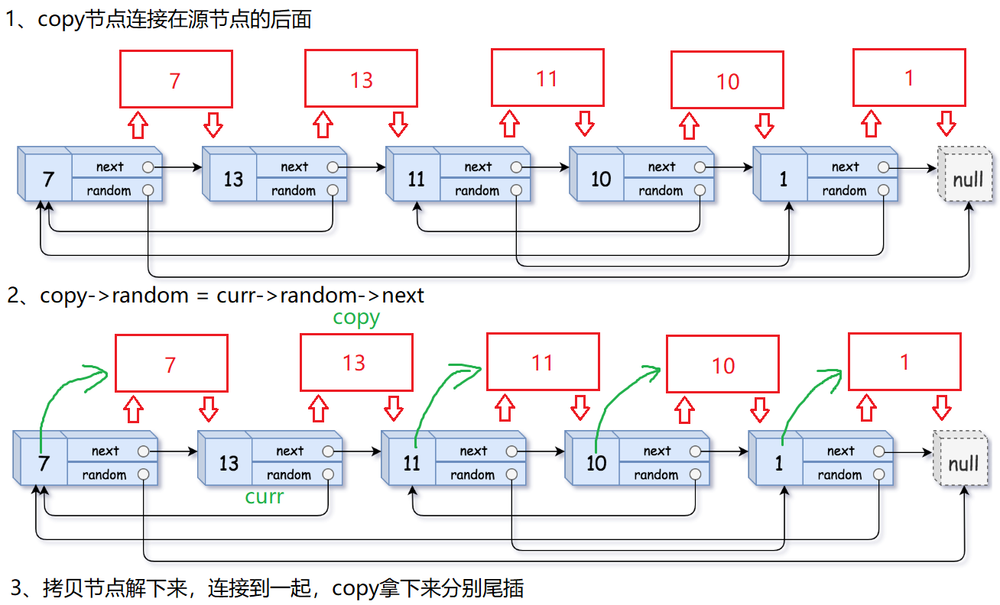
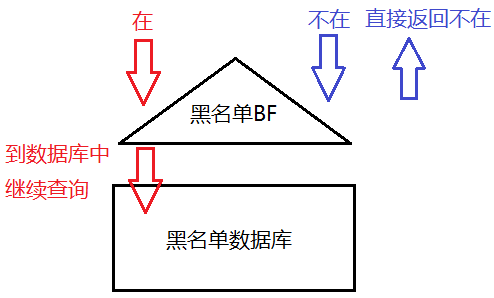
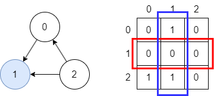

可视化工具：https://www.cs.usfca.edu/~galles/visualization/Algorithms.html

# 二分查找

之所以把二分查找的部分放在最头上是因为二分查找的区间定义及其影响的边界控制方法对后面做题非常重要

二分查找的复杂度是***O(logN)***

## *框架*

### 使用二分查找的前提

1. 有序数组，不论是排升序还是排降序
2. 返回一个索引

### 无重复值

[704. 二分查找](https://leetcode.cn/problems/binary-search/)

二分查找最重要的就是边界控制，而边界控制是要根据区间定义来的。二分查找根据区间定义的不同有两种写法

* 左闭右闭 `[left, right]`

  ```c++
  int binarySearch(vector<int>& nums, int target) {
      int left = 0;
      int right = nums.size() - 1;
      
      while (left <= right) {
          int mid = left + (right - left)/2; // int mid = (left + right) / 2;
          if (nums[mid] == target) {
              return mid;
          }
          else if (nums[mid] < target) { // 提高下界
              left = mid + 1;
          }
          else if (nums[mid] > target) { // 缩小上界
              right = mid - 1;
          }
      }
      return -1;
  }
  ```

  * 为什么要写成 `left + (right - left)/2`？这种表达和 `(left + right)/2` 是一样的效果，但是前者可以抵抗大整数相加溢出

  * 为什么while判断条件用了 `left <= right`？因为将right初始化为 `nums.size()-1`，而不是 `num.size()`，这相当于是左闭右闭的写法。所以当 `left == right` 的时候是有意义的，此时会做最后一次搜索，此时的搜索空间就是 `[left, left]`

  * 为什么迭代操作是 `left = mid + 1` 和 `right = mid - 1`？因为我们已经计算确定了 `nums[mid]` 不等于 target，可以直接把当前的mid排除在外了，所以因为区间定义是左闭右闭，所以把当前mid排除

  * 关于数组是奇数还是偶数的问题：奇数时 `/2` 可以整除，偶数时则要向下取整。但两种情况下边界都是 `+1`、`-1`，所以边界在不断缩小，适用于两种情况，可以手推一下下面两个例子

    ```
    奇数：0 3 5 7 9     target = 7
    偶数：0 3 5 7 9 11  target = 9
    ```

  * 全部用了else if没有用else的原因是这样可以有效的帮助我们理清楚三种情况

* 左开右开 `[left, right)`

  ```c++
  int binarySearch(vector<int>& nums, int target) {
      int left = 0;
      int right = nums.size();
      
      while (left < right) {
          int mid = left + (right - left)/2; // int mid = (left + right) / 2;
          if (nums[mid] == target) {
              return mid;
          }
          else if (nums[mid] < target) { // 提高下界
              left = mid + 1;
          }
          else if (nums[mid] > target) { // 缩小上界
              right = mid;
          }
      }
      return -1;
  }
  ```

  * while判断改为 `left < right`，因为这时候 `left==right` 没有意义
  * 区间迭代的时候是 `left=mid + 1` 和 `right=mid`，同样的因为我们已经计算确定了 `nums[mid]` 不等于 target，可以直接把当前的mid排除在外了，所以因为区间定义是左闭右开，所以把当前mid排除的方式就是直接让 `right=mid`。注意 ⚠️：`left=mid+1` 仍然是这样

### 有重复值：找左侧边界

### 无重复值：找右侧边界

## *扩展题目*

[35. 搜索插入位置](https://leetcode.cn/problems/search-insert-position/)

### 搜索二维矩阵

* [搜索二维矩阵](https://leetcode.cn/problems/search-a-2d-matrix/)
* [搜索二维矩阵 II](https://leetcode.cn/problems/search-a-2d-matrix-ii/)

### 山峰数组

[852. 山脉数组的峰顶索引](https://leetcode.cn/problems/peak-index-in-a-mountain-array/)

## *二分查找变体*

# 顺序表 & 链表

## *线性表 Linear List*

线性表是n个具有相同特性的数据元素的有限序列。线性表是一种在实际中广泛使用的数据，常见的线性表有顺序表、链表、栈、队列、字符串。

线性表在逻辑上是线性结构，但在物理结构上并不一定是连续的，线性表在物理上存储时，通常以数组和链式结构的形式存储。

## *顺序表 Sequential List*

### 顺序表的基本操作

* 定义动态顺序表

    ```c
    #define N 100
    typedef int SLDataType;
    
    typedef struct SeqList {
        SLDataType* a;
        int size;
        int capacity;
    } SL;
    ```
    
* 初始化

    ```c
    void SLInit(SL* ps) {
        assert(ps); //防御式编程
        ps->a = NULL;
        ps->size = ps->capacity = 0;
    }
    ```
    
* 销毁

    ```c
    void SLDestroy(SL* ps) {
        if(ps->a) {
            free(ps->a);
            ps->a = NULL;
            ps->size = ps->capacity = 0;
        }
    }
    ```
    
* 打印

    ```c
    void SLPrint(SL* ps) {
        assert(ps);
        for (int i=0; i<ps->size; i++)
            printf("%d ", ps->a[i]);
        printf("\n");
    }
    ```
    
* 头插头删/尾插尾删的两种实现方式
  * 辅助的SLCheckCapacity函数

    ```c
    void SLCheckCapacity(SL* ps) {
        assert(ps);
        if (ps->size == ps->capacity) {
            int newCapacity = ps->capacity == 0 ? 4 : 2 * ps->capacity;
            SLDataType* tmp = (SLDataType*)realloc(ps->a, sizeof(SLDataType) * newCapacity);
            if (tmp == NULL) {
                perror("realloc");
                exit(-1);
            }
            ps->a = tmp;
            ps->capacity = newCapacity;
        }
    }
    ```
    
  * 直接实现
    * 尾插

        ```c
        void SLPushBack(SL* ps, SLDataType x) {
            assert(ps);
            SLCheckCapacity(ps);
            ps->a[ps->size] = x;
        }
        ```
        
    * 头插
    
        <div align="center"></div>
    
        ```C
        void SLPushFront(SL* ps, SLDataType x) {
            assert(ps);
            SLCheckCapacity(ps);
        
            int end = ps->size-1;
            while (end >= 0) {
                ps->a[end+1] = ps->a[end]; // 从后往前挪
                --end;
            } 
            ps->a[0] = x;
            ps->size++;
        }
        ```
        
    * 尾删
    
      ```c
      void SLPopBack(SL* ps) {
          assert(ps);
          assert(ps->size > 0);
          ps->size--;
      }
      ```
      
    * 头删
    
    <div align="center"></div>
    
    ```c
    void SLPopFront(SL* ps) {
        assert(ps);
        assert(ps->size > 0);
    
        int begin = 1;
        while (begin < ps->size) {
            ps -> a[begin-1] = ps->a[begin]; // 从前往后挪
            ++begin;
        }
        ps->size--;
    }
    ```
    
  * 复用Insert和Erase
    * Insert
  
        ```c
        void SLInsert(SL* ps, int pos, SLDataType x) {
            assert(ps);
            assert(pos>=0 && pos<=ps->size); // '=' 是为了适合尾插的复用
            SLCheckCapacity(ps);
        
            int end = ps->size - 1;
            while (end >= pos) {
                ps->a[end+1] = ps->a[end];
                --end;
            }
            ps->a[pos] = x;
            pos-size++;
        }
        ```
        
    * Erase
  
        ```c
        void SLErase(SL* ps, int pos) {
            assert(ps);
            assert(pos>=0 && pos<=ps->size);
        
            int begin = pos;
            while (begin < ps->size-1) {
                ps->a[begin] = ps->a[begin+1]; // 从前往后挪
                ++begin;
            }
            ps->size--;
        }
        ```
        
    * 复用
    
        ```c
        void SLPushBack(SL* ps, SLDataType x) {
            SLInsert(ps, ps->size, x);
        }
        void SLPushFront(SL* ps, SLDataType x) {
            SLInsert(ps, 0, x);
        }
        void SLPopBack(SL* ps) {
            SLErase(ps, ps->size-1);
        }
        void SLPopFront(SL* ps) {
            SLErase(ps, 0);
        }
        ```
    
  * 顺序表的尾插尾删效率高，为O(1)；头插头删效率低，需要挪动数据，为O(N)
  
* 查

    ```c
    int SLFind(SL* ps, SLDataType x) {
        assert(ps);
        for (int i=0; i<ps->size; i++) {
            if (ps->a[i] == x)
                return i;
        }
        return -1;
    }
    ```
    
* 改

    ```c
    void SLModify(SL* ps, int pos, SLDataType x) {
        assert(ps);
        assert(pos>=0 && pos<ps->size);
        ps->a[pos] = x;
    }
    ```

## *链表 Linked List*

链表的本质是为了克服顺序表的缺点而设计的。链表是一种物理存储结构上非连续的存储结构，数据元素的逻辑顺序是通过链表中的指针链接次序实现的

### 链表的分类

* 无头单向非循环链表 Singly linked list：结构简单，一般不会单独用来存数据，实际中更多是作为其他数据结构的子结构，如哈希桶、图的邻接表等

    

* 双向带头循环链表 Circular doubly linked list with dummy node：结构最复杂的链表，一般用在单独存储数据，在实际中所使用的链表数据结构，都是带头双向循环链表

    

* 哨兵位/虚结点 Dummy node/Header node/Sentinel node

    尾插的题目一般都需要创建哨兵位，会简化第一次尾插时为空列表的特殊情况，因为尾插需要找尾，这时候就可能会出现对NULL解引用的情况，带一个哨兵位会避免这种情况。而头插一般不需要

### 链表的基本操作（无头单向非循环链表）

* 头文件与定义结点数据结构

    ```C
    typedef int SLTDataType;
    typedef struct SListNode {
        SLTDataType data;
        struct SListNode* next;
    } SLTNode;
    ```
    
* 打印

    ```c
    void SListPrint(SLTNode* phead) {
        SLTNode* curr = phead;
        while (curr) {
            printf("%d->", curr->data);
            curr = curr->next;
        }
        printf("NULL\n");
    }
    ```
    
* 创建新节点

    ```c
    SLTNode* BuySListNode(SLTDataType x) {
        SLTNode* newnode = (SLTNode*)malloc(sizeof(SLTNode));
        assert(newnode);
    
        newnode->data = x;
        newnode->next = NULL;
        return newnode;
    }
    ```
    
* 头插，为了达到修改指针，有两种设计方式
  * 传入二级指针，返回void，从而直接修改一级指针，推荐这种方式

    

    ```c
    // 前插时要改变phead，即将phead给newcode，因此仍然要用二级指针
    void SListPushFront(SLTNode** pphead, SLTDataType x) {
        assert(pphead);
        SLTNode* newnode = BuySListNode(x);
        newnode->next = *pphead; //把原来的头结点的地址给新的头结点的next
        *pphead = newnode; //把新的newnode的地址给到phead
    }
    ```
    
    * 若传一级指针，并返回void，则改变的是一级指针的形参拷贝，SListPushFront退出后形参销毁，指针没有改变
    * 需要改变node本身的Push和Pop都需要传二级指针+返回void，打印等不需要改变node的只需要一级指针+返回void
    
  * 传入一级指针，返回新的头结点。不推荐这种方式，返回值不直观，需要用指针来接收后重新使用
  
    ```c
    SLTNode* SListPushFront(SLTNode* phead, SLTDataType x) {
        assert(phead);
        SLTNode* newnode = BuySListNode(x);
        newnode->next = phead;
        phead = newnode;
        return phead;
    }
    
    // 使用起来很别扭，不直观
    void TestSList1() {
        SListPushBack(&plist, 5);
        SListPushBack(&plist, 6);
        SListPushBack(&plist, 7);
        SListPushBack(&plist, 8);
        SLTNode* newPlist = SListPushFront(plist, 10); // 得创建一个新的头指针，再给其他接口使用
        SListPrint(newPlist);
    }
    ```
  
* 尾插

    

    ```c
    void SListPushBack(SLTNode** pphead, SLTDataType x) {
        assert(pphead); //所有用二级指针的地方都得检查，因为即使1级指针为空，二级指针也不可能为空
        SLTNode* newnode = BuySListNode(x);
        //一开始一个结点都没有
        if(*pphead == NULL)
            *pphead = newnode;
        else {
            //找尾结点
            SLTNode* tail = *pphead;
            while(tail->next != NULL)
                tail = tail->next;
            tail->next = newnode;
        }
    }
    //PushBack结束后newnode指针被销毁，但新创建的node结构体还是存在的，而且原来的tail->next已经
    //指向了新的结构体的地址，所以newnode指针被销毁没有影响
    ```
    
* 头删

    

    ```c
    void SListPopFront(SLTNode** pphead) {
        assert(pphead);
        assert(*pphead);
        SLTNode* next = (*pphead)->next;
        free(*pphead);
        *pphead = next;
    }
    ```
    
* 尾删

    ```c
    void SListPopBack(SLTNode** pphead) {
        assert(pphead);
        assert(*pphead); //没有结点
        if ((*pphead)->next == NULL) {//只有一个结点
            free(*pphead);
            *pphead = NULL;
        }
        else {//还有多个结点
            SLTNode* tailPrev = NULL;
            SLTNode* tail = *pphead;
            while (tail->next) {
                tailPrev = tail;
                tail = tail->next;
            }
            free (tail);
            tailPrev->next = NULL;
        }
    }
    ```
    
* 查找以及修改复用

    ```c
    SLTNode* SListFind(SLTNode* phead, SLTDataType x) {
        SLTNode* cur = phead;
        while (cur) {
            if (cur->data == x)
                return cur;
            cur = cur->next;
        }
        return NULL;
    }
    ```
    
* 任意位置插入
  * pos前插入 Insert：单链表很不适合插入或删除前面的，因为要从头找前面的node

    ```c
    //单链表不适合在pos之前插入，因为需要找前一个位置，可以用双向列表解决
    void SListInsert(SLTNode** pphead, SLTNode* pos, SLTDataType x) {
        assert(pos); //pos为空时变成尾插了，同时检查pos就是顺便检查了链表不为空
        assert(pphead);
        if (pos == *pphead) //要插入的是第一个结点，调用头插
            SListPushFront(pphead, x);
        else
        {
            SLTNode* prev = *pphead;
            while (prev->next != pos)
                prev = prev->next;
    
            SLTNode* newnode = BuySListNode(x);
            prev->next = newnode;
            newnode->next = pos;
        }
    }
    ```
    
  * InsertAfter
  
    ```c
    void SListInsertAfter(SLTNode* pos, SLTDataType x)
    {
        assert(pos);
        //// 错误的顺序
        //SLTNode* newnode = BuySListNode(x);
        //newnode->next = pos->next;
        //pos->next = newnode;
    
        //不在乎链接的顺序
        SLTNode* newnode = BuySListNode(x);
        SLTNode* next = pos->next;
        pos->next = newnode;
        newnode->next = next;
    }
    ```
  
* 任意位置删除
  * pos前删除 Erase

    ```c
    void SListErase(SLTNode** pphead, SLTNode* pos)
    {
        assert(pphead);
        assert(pos);
        if (*pphead == pos)
            SListPopFront(pphead); //删除的是第一个结点
        else
        {
            SLTNode* prev = *pphead;
            while (prev->next != pos)
                prev = prev->next;
            prev->next = pos->next;
            free(pos);
            pos = NULL;
        }
    }
    ```

  * EraseAfter

    ```c
    void SListEraseAfter(SLTNode* pos)
    {
        assert(pos);
        assert(pos->next);
        SLTNode* del = pos->next;
        //pos->next = pos->next->next;
        pos->next = del->next;
        free(del);
        del = NULL;
    }
    ```

### 带头双向循环列表（代码参考工程文件）

* 头文件与定义结点数据结构

    ```c
    #include <stdio.h>
    #include <stdlib.h>
    #include <assert.h>
    #include <stdbool.h>

    typedef int LTDataType;
    typedef struct ListNode
    {
        struct ListNode* next;
        struct ListNode* prev;
        LTDataType data;
    }LTNode;
    ```

* 创建头结点与初始化：自己指向自己

    

    ```c
    LTNode* BuyListNode(LTDataType x)
    {
        LTNode* node = (LTNode*)malloc(sizeof(LTNode));
        if (node == NULL)
        {
            perror("malloc");
            exit(-1);
        }
        node->data = x;
        node->next = NULL;
        node->prev = NULL;
        return node;
    }

    LTNode* ListInit()
    {
        LTNode* phead = BuyListNode(-1);
        phead->next = phead;
        phead->prev = phead;
        return phead;
    }
    ```

* 销毁
* 列表大小和判空
* Insert
* Erase
* PushBack和PushFront/用Insert复用
* PopBack和PopFront/用Erase复用

### 顺序表VS链表，二者是相辅相成的，各有各的应用场景

* 顺序表
  * 优点：物理空间连续，下标随机访问；CPU高速缓存命中率高
  * 缺点
    * 若空间不够，需要realloc等方式扩容。扩容有一定的性能消耗，其次一般扩容2倍，存在一些空间浪费；头部或者中间位置的插入删除效率低下
    * 头插头插或中间插入、删除需要挪动数据，O(N)效率很低
* 单链表：尾插尾删需要找尾，效率低
* 带头双向循环链表
  * 优点：任意位置插入删除O(1)，按需申请释放空间
  * 缺点
    * 不支持下标随机访问，需要O(N)查找
    * CPU高速缓存命中率低，且有可能带来缓存污染。CPU加载内存中的数据时会多加载后面几个数据，因此顺序表地址连续具有连续命中率高；而链表地址不连续，多加载的数据往往是无用数据

## *跳表 skiplist*

https://www.jianshu.com/p/9d8296562806

# 单向链表题目

## *链表重构*

### 什么时候应该加哨兵位头节点？

哨兵位主要是方便了头插、头删的时候找头，以及方便调整头指针等

此外若给了一个空链表，那么首先我们需要判断是否链表为空

个人的经验是：**当涉及到链表的遍历、重构时，构思时不论怎样先把头节点加上，看看是否可以简化边界情况的处理，如果感觉不需要的话再去掉**

### 遍历

各种数据结构的遍历+访问有两种形式：线性的和非线性的。线性的就是用for/while来迭代 iteration，非线形的就是递归 recursion

```cpp
void traverse(vector<int>& nums) {
    for (int i = 0; i < nums.size(); i++) {
        // 迭代访问 arr[i]
    }
}

// 递归遍历数组
void traverse(vector<int>& arr, int i) {
    if (i == arr.size()) {     // base case
        return;
    }
    // 前序位置
    traverse(arr, i + 1);
    // 后序位置
}
```

而链表的遍历则既有线性的也有非线性的

```cpp
/**
 * Definition for singly-linked list.
 * struct ListNode {
 *     int val;
 *     ListNode *next;
 *     ListNode() : val(0), next(nullptr) {}
 *     ListNode(int x) : val(x), next(nullptr) {}
 *     ListNode(int x, ListNode *next) : val(x), next(next) {}
 * };
 */

void traverse(ListNode* head) {
    while (head->next) {
        // 迭代访问 p->val
        head = head->next;
    }
}

void traverse(ListNode* head) {
    // 递归访问 head->val
    // 前序位置
    traverse(head -> next);
    // 后序位置
}
```

[二叉树的遍历](#二叉树的遍历)也是既有线性的也有非线性的（其实就是链表的扩展）

同时也可以利用[链表和数组的前序和后序遍历](#链表和数组的前序和后序遍历)来做一些逆序的题目

### 设计链表

* [707. 设计链表](https://leetcode.cn/problems/design-linked-list/)：自己定义链表节点 Node、然后有两种方法来实现

  1. 使用 `dummyhead_` 简化操作、定义 `size_` 记录链表长度

     ```C++
     typedef struct Node {
         int val;
         Node* next;
     
         Node(int x) : val(x), next(nullptr) {}
     } Node;
     
     class MyLinkedList {
     public:
         MyLinkedList() : size_(0), dummy_(new Node(-1)) {}
         
         int get(int index);
         void addAtHead(int val);
         void addAtTail(int val);
         void addAtIndex(int index, int val);
         void deleteAtIndex(int index);
     private:
         int size_;
         Node* dummy_;
     };
     ```

  2. 直接使用双向带头循环链表

     ```C++
     typedef struct Node {
         int val;
         Node* prev;
         Node* next;
     
         Node(int num) : val(num), prev(nullptr), next(nullptr) {}
     } Node;
     
     class MyLinkedList {
     public:
         MyLinkedList() : size_(0), dummy_(new Node(-1)) {
             dummy_->next = dummy_;
             dummy_->prev = dummy_;
         }
         
         int get(int index);
         void addAtHead(int val);
         void addAtTail(int val);
         void addAtIndex(int index, int val);
         void deleteAtIndex(int index);
     private:
         int size_;
         Node* dummy_;
     };
     ```

* 注意点
  * **如果是在 Leetcode 中不要把链表节点命名为 ListNode，会和 leetcode 预编译的数据结构冲突**

    ```
    Line 1: Char 16: error: redefinition of 'ListNode'
        1 | typedef struct ListNode {
          |                ^
    /leetcode/precompiled/ListNode.h:5:8: note: previous definition is here
        0 | struct ListNode {
          |        ^
    1 error generated.
    ```

  * 找节点的时候从 `dummyhead_` 开始找，而不是从 `dummyhead_->next` 开始找

### <span id="合并两个有序链表">合并两个有序链表</span>

* [21. 合并两个有序链表](https://leetcode.cn/problems/merge-two-sorted-lists/)

* 思路1：双指针，比较结点数据大小。令一个为dest，另一个为src，进行尾插。这种方式虽然很清晰，但边界条件很不好控制

* 思路2：双指针归并，从头开始比较，取小的尾插到新链表。归并操作，指的是将两个顺序序列合并成一个顺序序列的方法

  

### <span id="分隔列表">分隔列表</span>

* 题目

  * [86. 分隔链表](https://leetcode.cn/problems/partition-list/)

  * <https://www.nowcoder.com/practice/0e27e0b064de4eacac178676ef9c9d70?tpId=8&&tqId=11004&rp=2&ru=/activity/oj&qru=/ta/cracking-the-coding-interview/question-ranking>

    给你一个链表的头节点 `head` 和一个特定值 `x` ，请你对链表进行分隔，使得所有 **小于** `x` 的节点都出现在 **大于或等于** `x` 的节点之前。

    你应当 **保留** 两个分区中每个节点的初始相对位置

* 思路：三指针，一个 `currNewGreater` 跟踪大数值链表，一个 `currNewLess` 跟踪小数值链表，另外一个 `currOld` 跟踪原链表中走到了哪里。`currOld` 走完之后，再把新的两个链表连接起来。**注意⚠️：最后一定要把大链表的最后一个置空，即 `currNewGreater->next = nullptr;`，否则会成环**

  

* 注意：因为我们的做法相当于是直接从原链表上摘节点下来，而且不像[合并两个有序链表](#合并两个有序链表)这道题，我们不能确认最后新的链表的最后一个节点就是（任意）原来链表的最后一个节点（若是的话本身最后一个节点的next就已经是空了）。**所以最后一个节点的next必须要置nullptr**，否则就会形成环

### 合并K个有序链表

* 题目：[23. 合并 K 个升序链表](https://leetcode.cn/problems/merge-k-sorted-lists/)
* 思路：用一个优先级队列来先将所有的节点入队列，然后思路就和[合并两个有序链表](#合并两个有序链表)这道题一样了。优先级队列默认 `std::less` 建大堆，记得用lambda自定义一下建小堆
* 注意：这道题和[分隔列表]((#分隔列表))那道题有同样的坑，就是因为不知道到底哪个原来的节点是新的最后一个节点，所以一定要将新的最后一个节点置空，否则会成环
* 时间复杂度分析：***O(NlogK)***，N是链表的总节点数，K是链表的条数

### 查找和最小的K对数字

### 复制带随机指针的链表

* [138. 随机链表的复制](https://leetcode.cn/problems/copy-list-with-random-pointer/)

* 思路1：构造深拷贝，问题在于每一个random应该放在什么位置？将要copy的节点连接到源节点的后面

  

* 思路2：利用BST的KV模型：存储源节点和拷贝节点的KV映射

### 其他链表重构的题目

* [24. 两两交换链表中的节点](https://leetcode.cn/problems/swap-nodes-in-pairs/)

  

## *链表双指针*

### 链表的中间结点

* [876. 链表的中间结点](https://leetcode.cn/problems/middle-of-the-linked-list/)：快慢指针，慢指针一次走1步，快指针一次走2步。注意区分奇数和偶数两种情况

  

### 删除链表中等于给定值 val 的所有结点

* [203. 移除链表元素](https://leetcode.cn/problems/remove-linked-list-elements/)

* 思路1：哨兵位简化尾插后直接遍历过去就行了，尾插一般要考虑哨兵位。说实话这道题使用这种方法已经够了，最自然的想法也就是这种方法

* 思路2：快慢指针，遇到等于val的就调整指针关系

  

* 思路3：遍历原链表，把不是val的结点拿出来尾插到新链表

### 输入一个链表，输出该链表中倒数第 K 个结点

* 题目
  * [19. 删除链表的倒数第 N 个结点](https://leetcode.cn/problems/remove-nth-node-from-end-of-list/)
  * <https://www.nowcoder.com/practice/529d3ae5a407492994ad2a246518148a?tpId=13&&tqId=11167&rp=2&ru=/activity/oj&qru=/ta/coding-interviews/question-ranking>
* 思路
  * 两次遍历求出链表长度 N 后再走 N-K 步，复杂度为***O(N)***
  * 快慢指针，快指针先走 K 步，然后快慢指针同时走。等到快指针走到 nullptr 时，慢指针就是倒数第 K 个结点。虽然复杂度也为***O(N)***，不过只需要一次遍历了

### 输入两个链表，找出它们的第一个公共结点

* 题目：[160. 相交链表](https://leetcode.cn/problems/intersection-of-two-linked-lists/)
* 思路1：快慢指针。分别找出两个链表的长度和长度差 K，然后令长的为快指针走 K 步后，再令慢指针也出发遍历链表并同时判断 node 的地址是否有相同的
* 思路2：因为给的是 struct 结构体，所以分别建两个 vector 后 push_back，将长的 vector pop_back 掉两个 vector 的长度差个元素，然后逐次比较
* 思路3：利用两个栈，分别入栈，将长的栈 pop 掉两个栈的长度差个元素，然后逐次比较
* 思路4：利用BST的K模型，找出第一个出现两次的节点

## *删除链表元素*

### <span id="删除排序链表中的重复元素">删除排序链表中的重复元素</span>

* 题目：[83. 删除排序链表中的重复元素](https://leetcode.cn/problems/remove-duplicates-from-sorted-list/)。这道题虽然标了简单难度，然而是比较麻烦的一道题

* 思路1：用单指针curr来跟踪走到哪里了，这么走是不太好控制的

* 思路2：快慢指针，注意处理尾巴是连续的重复节点的情况，此时要让 `slow->next = nullptr;`

  

### 删除排序链表中的重复元素 II

* 题目：[删除排序链表中的重复元素 II](https://leetcode.cn/problems/remove-duplicates-from-sorted-list-ii/)
* 思路1：这道题不要用和[删除排序链表中的重复元素](#删除排序链表中的重复元素)一样的双指针走，主要问题在于if-else这种结构中slow是必然要移动的，我们既要用 `slow->val` 来判断是否值相等，又要保存slow之前的那个元素，若引入第三个指针好像会变得很复杂
* 思路2：当发现重复元素时用while把这段区间跳过，这样slow就还是开始重复的元素之前的那一个。尽管如此，这种方法仍然需要考虑一些特殊情况，比较容易犯错误
* 思路2：快慢指针 + table。第一遍遍历和[删除排序链表中的重复元素](#删除排序链表中的重复元素)一样，得到一个只保留一个重复元素的链表，并在此期间也建立一张重复元素的set。第二遍遍历时若遇到了这个节点就调整指针指向。这种方法虽然需要额外空间来保存一个set，但是不需要考虑边界条件或特殊情况，是最简单的一种方法
* 思路3：递归

### 从未排序的链表中移除重复元素

* 题目：[1836. 从未排序的链表中移除重复元素](https://leetcode.cn/problems/remove-duplicates-from-an-unsorted-linked-list/)
* 思路：快慢指针 + table。第一次遍历建立一个元素出现次数的table，第二遍历时若发现元素出现次数 `>=2`，就调整指针，将元素删去

## *判断成环*

### 给定一个链表，判断链表中是否有环

* [141. 环形链表 - 力扣（LeetCode）](https://leetcode.cn/problems/linked-list-cycle/description/)
* 思路：用快慢指针转变为一个追击问题，若有环则慢指针肯定能追上快指针。若没有环则当 fast 或 `fast->next`走完时就返回 false
* 证明：为什么快指针每次走2步，慢指针每次走1步时若有环一定能追上？
  * slow 进环后开始追击。假设 slow 进环后，fast 和 slow 之间的距离是X
  * 这次 fast 真正开始追击 slow，每追击一次，fast 和 slow 之间距离缩短1
  * 直到距离缩短到 0，二者相遇
* 如果快指针一次走 3 步、4 步、n 步时，fast 是否肯定能追上 slow 呢？不一定！这时候环的大小就有影响了
  * 假设环的大小为R，假设 fast 一次走 3 步，每走一次 fast 和 slow 距离缩短 2
    * 若 fast 和 slow 之间的距离 N 是偶数，则第一次就追上
    * 若 X 是奇数，则距离会变成 X, X-2, ..., 3, 1, X-1
    * 此时开始第二次追击，若 R-1 是偶数（即 R 是奇数），则第二次就追上了
    * 若 R-1 是奇数（R 是偶数），则永远追不上

### 返回链表开始入环的第一个结点

* [142. 环形链表 II - 力扣（LeetCode）](https://leetcode.cn/problems/linked-list-cycle-ii/description/)

* 思路1：让快慢指针同时从链表起始位置开始遍历链表找出相遇点。当二者相遇时，让任意一个指针从**相遇点**位置开始绕环每次走一步运行，另外一个指针则重新从头出发。之后两个指针都是每次均走一步，最终肯定会在入口点的位置相遇。时间复杂度 ***O(N)***，空间复杂度 ***O(1)***

  

  * 当 slow 走 1 步，fast 走 2 步时，slow 进环以后，fast 一定在 2 圈之内追上 slow。因为追击过程快慢指针之间相对距离每次缩小 1，不可能会错过，他们相对距离最多是 1 圈，slow 最多走 1 圈就会被追上

  * 设环之前的路程为 L，slow 进环后走 X，环的大小是 R

  * 假设 slow 进环前，fast 在环里面转了 N 圈（$N\geq1$，fast 至少要走一圈追上 slow）

  * 则 fast 走的路程为 $L+n*R+X\ (n=1,\cdots,n)$

  * 根据下面的公式可以看出若一个指针从相遇点出发，一个指针从头开始走，他们会在入口点相遇
    $$
    fast == slow\longleftrightarrow L+n*R+X = 2*(L+X) \rightarrow L=n*R-X=(n-1)*R+(R-X)\\\rightarrow\underbrace{L}_{slow}+\underbrace{(R-X)}_{fast}=\underbrace{(n-1)*R}_{环大小的整数倍}
    $$

  * 假设的参数中只有 R 是可以明确算出来的

* 思路2：建立索引遍历，第一个重新遇到的就是入口。时间、空间复杂度都是***O(N)***

## *单链表递归法*

### Base case：反转一个单链表

* [206. 反转链表](https://leetcode.cn/problems/reverse-linked-list/)

* 遍历法

    * 思路1：颠倒指针，这道题的关键是要设置一个 `ListNode* prev = nullptr`，然后不断颠倒 prev 和 curr，next 只是为了保存下一步要颠倒的指针

        

        ```c
        ListNode* reverseList(ListNode* head) {
            ListNode* curr = head;
            ListNode* next = head;
            ListNode* prev = nullptr;
            while (curr != nullptr) {
                next = curr->next;
                curr->next = prev;
                prev = curr;
                curr = next;
            }
            return prev;
        }
        ```
        
    * 思路2：遍历原链表，把所有结点拿出来头插尾插到新链表。这个题目的关系没有上面方法那么简单
    
        
    
* 递归法

    ```c++
    ListNode* reverseList(ListNode* head) {
        // head == nullptr 是用来防止一开始就是空链表的情况
        // 正常的链表它不会起作用
        if (head == nullptr || head->next == nullptr) {
            return head;
        }
    	// 需要记住 last 层层返回作为作为的 head
        ListNode* last = reverseList(head->next);
        head->next->next = head;
        head->next = nullptr;
        return last;
    }
    ```
    
    

### 反转一个链表的某个区间

循序渐进：要想实现某个区间内的节点的反转得先实现反转链表的前 n 个节点

上面反转整个链表的时候是直接把 `head->next` 设置为 nullptr，因为整个链表反转后原来的 head 变成了整个链表的最后一个节点。但现在 `head` 节点在递归反转之后不一定是最后一个节点了，所以要想办法在递归中把第 `n + 1` 个节点（即 successor）给保存下来，反转之后再和原来的 head 连接上

```c++
ListNode* successor = nullptr;
ListNode* reverseList(ListNode* head, int n) {
    if (n == 1) {
        successor = head->next;
        return head;
    }
    ListNode* last = reverseList(head->next, n - 1);
    head->next->next = head;
    head->next = successor;
    return last;
}
```

[92. 反转链表 II](https://leetcode.cn/problems/reverse-linked-list-ii/)：反转区间 `[m, n]` 中的链表节点，这里先得找到序号为 `m-1` 的节点。注意：这道题里的区间是 index + 1

这里有个地方不太好想，为什么传入的区间是 `[m - 1, n - 1]`？因为对 `head->next` 来说它往前走了一步，那么原来的区间对 `head->next` 来说自然都缩小了一步

递归的思路还是抽象的，做这道题的最好方式还是画图


```C++
class Solution {
public:
    // 后驱节点
    ListNode* successor = nullptr;
    
    // 反转以 head 为起点的 n 个节点，返回新的头结点
    ListNode* reverseN(ListNode* head, int n) {
        if (n == 1) {
            // 记录第 n + 1 个节点
            successor = head->next;
            return head;
        }
        ListNode* last = reverseN(head->next, n - 1);

        head->next->next = head;
        head->next = successor;
        return last;
    }
    
    ListNode* reverseBetween(ListNode* head, int m, int n) {
        // base case
        if (m == 1) {
            return reverseN(head, n);
        }
        // 前进到反转的起点触发 base case
        head->next = reverseBetween(head->next, m - 1, n - 1);
        return head;
    }
};
```

### 链表翻转的综合应用

* [25. K 个一组翻转链表](https://leetcode.cn/problems/reverse-nodes-in-k-group/)

  

  * 递归法

    这道题用递归法做是比较简单的，基础就是翻转前 N 个链表元素，然后不足 K 个元素的一组就跳过它，不需要处理。要做这道题还是把图画出来后考虑清楚连接关系就可以

  * 迭代法

* [61. 旋转链表 - 力扣（LeetCode）](https://leetcode.cn/problems/rotate-list/description/) 这道题目和 [151. 反转字符串中的单词 - 力扣（LeetCode）](https://leetcode.cn/problems/reverse-words-in-a-string/description/) 非常相似。思路就是先反转整体，然后翻转 `(k + 1, list.size())` 区间的，然后再翻转前 k 个链表元素。注意这里的区间都是 index + 1

  这道题的 corner case 如果使用迭代法做的话是比较恶心的，但用递归法来做就比较省力。主要是两种情况

  * 考虑链表本身为空
  * 考虑 k 为 0，或者 k 是链表 size 的整数倍。这两种情况可以合并为一种情况

  

### 回文链表

* [234. 回文链表](https://leetcode.cn/problems/palindrome-linked-list/)
  * 借助额外空间：将值复制到数组中后用双指针法
  * 递归法
  * 快慢指针找到中间结点后将后半段链表逆置后再比较
* [OR36 链表的回文结构](https://www.nowcoder.com/practice/d281619e4b3e4a60a2cc66ea32855bfa?tpId=49&&tqId=29370&rp=1&ru=/activity/oj&qru=/ta/2016test/question-ranking)
  * 思路1：快慢指针找到中间结点rhead后将rhead后面的部分逆置。奖后将head和rhead都看作慢指针，每次走一步并且比较，若有不同则返回false。奇数次和偶数次的情况可以统一为一种情况，奇数次时会形成环
  * 思路2：直接新建一个翻转的新链表，然后两个指针同时走比较
  * 思路3：二叉树后序遍历？


# 数组

## *双指针*

### 典型：***O(1)*** 原地移除元素

* [27. 移除元素](https://leetcode.cn/problems/remove-element/) 给你一个数组 nums 和一个值 val，你需要 原地 移除所有数值等于 val 的元素，并返回移除后数组的新长度。不要使用额外的数组空间，你必须仅使用 O(1) 额外空间并 原地 修改输入数组。

* 思路：双指针

  

### 其他题目

* [26. 删除有序数组中的重复项](https://leetcode.cn/problems/remove-duplicates-from-sorted-array/)

* [283. 移动零](https://leetcode.cn/problems/move-zeroes/)

* [977. 有序数组的平方](https://leetcode.cn/problems/squares-of-a-sorted-array/)

* [189. 轮转数组](https://leetcode.cn/problems/rotate-array/) & https://kamacoder.com/problempage.php?pid=1065 右旋转字符串。空间复杂度 ***O(1)*** 的两种方法

  

  * 思路1：双指针遍历
  * 思路2：负负得正，先倒置整体，后倒置每个单词


### 合并两个有序数组

* [88. 合并两个有序数组](https://leetcode.cn/problems/merge-sorted-array/) 给你两个按非递减顺序排列的整数数组nums1和nums2，另有两个整数m和n，分别表示 nums1和nums2中的元素数目。请你合并nums2到nums1中，使合并后的数组同样按非递减顺序排列。
* 思路：因为是非递减的数组，所以三指针从后往前排

```c
void merge(int* nums1, int nums1Size, int m, int* nums2, int nums2Size, int n){
    int dest = m-1, src = n-1, dest_end = m+n-1;
    while (src>=0 && dest>=0)
    {
        if (nums2[src] >= nums1[dest])
            nums1[dest_end--] = nums2[src--];
        else
            nums1[dest_end--] = nums1[dest--]; 
    }
    while (src>=0)
        nums1[dest_end--] = nums2[src--]; 
}
```

### 汇总区间

* 题目：[228. 汇总区间](https://leetcode.cn/problems/summary-ranges/)
* 思路：快慢指针

```cpp
class Solution {
public:
    vector<string> summaryRanges(vector<int>& nums) {
        int stay = 0, move = 1;
        int n = nums.size();
        vector<string> ret {};
        while (move <= n - 1) {
            if (nums[move] == nums[move - 1] + 1) {
                move++;
            }
            else {
                if (stay == move - 1) {
                    ret.push_back(std::to_string(nums[stay])); // only one element
                }
                else {
                    ret.push_back(std::to_string(nums[stay]) + "->" + std::to_string(nums[move - 1]));
                }
                stay = move++;
            }
        }
        // last range
        if (n > 0) {
            if (stay == n - 1) {
                ret.push_back(std::to_string(nums[stay])); // only one element
            }
            else {
                ret.push_back(std::to_string(nums[stay]) + "->" + std::to_string(nums[n - 1]));
            }
        }
        return ret;
    }
};
```

## *前缀和*

前缀和主要适用的场景是**原始数组不会被修改的情况下，频繁查询某个区间的累加和**

### 数组的前缀和

[303. 区域和检索 - 数组不可变 - 力扣（LeetCode）](https://leetcode.cn/problems/range-sum-query-immutable/description/)：这道题目是一道前缀和的典型题目，它要求输入一个数组和两个索引值，以 ***O(1)*** 查询得到数组两个索引值所确定的区间之间的和

具体做法就是以空间换时间，提前开好另外一个数组 `preSum` ，`preSum[i]` 中存好的是算好的前 `i` 位累加值，即 `preSum[i] = num[0] + num[1] + ... + num[i - 1]`


比如上面的数组中如果我们想得到索引区间 `[1, 4]` 内的所有元素之和，正常思路当然就是直接计算 `num[1] + num[2] + num[3] + num[4]` 就行了。而有了 preSum 之后我们就可以通过 `preSum[5] - preSum[1] = num[0] + num[1] + num[2] + num[3] + num[4] - num[0] = num[1] + num[2] + num[3] + num[4]` 得出

```C++
class NumArray {
private:
    vector<int> pre_sum_;
public:
    NumArray(vector<int>& nums) {
        // 构建 pre_sum_ 
        pre_sum_.resize(nums.size() + 1, 0);
        for (int i = 1; i < pre_sum_.size(); ++i) {
            pre_sum_[i] = pre_sum_[i - 1] + nums[i - 1];
        }
    }
    
    int sumRange(int left, int right) {
        return pre_sum_[right + 1] - pre_sum_[left];
    }
};
```

### 二阶矩阵的前缀和

[304. 二维区域和检索 - 矩阵不可变 - 力扣（LeetCode）](https://leetcode.cn/problems/range-sum-query-2d-immutable/description/)

这道题就是把之前一维的情况扩展到二维了，这道题的核心是要理解下面的**面积**计算方法（ 面积就是前缀和），无论是构建 preSum 还是最后通过 preSum 来求区间和都要用到下图中的原理


这里有个很重要的技巧，即给 preSum 矩阵上面和左边分别 padding 了一行和一列 0，以此为基础来求 `preSum`。这样在求 `preSum[i][j]` 以及最后的 return 时就不用单独讨论最左边和最上边边界条件了

### 前缀和相关题目

* [724. 寻找数组的中心下标 - 力扣（LeetCode）](https://leetcode.cn/problems/find-pivot-index/)：直接利用前缀和即可

  

### 前缀积

* [238. 除自身以外数组的乘积 - 力扣（LeetCode）](https://leetcode.cn/problems/product-of-array-except-self/description/)：这道题要求不能使用除法，并以 ***O(1)*** 查询

  具体做法是分别构造前缀积数组 prefix 和后缀积数组 suffix，`prefix[i] = nums[0] * ... * nums[i - 1]`，而 `suffix[i] = nums[i + 1] * nums[nums.size() - 1]`。这样 `res[i] = prefix[i - 1] * suffix[i + 1]` 就可以了

  

* [1352. 最后 K 个数的乘积 - 力扣（LeetCode）](https://leetcode.cn/problems/product-of-the-last-k-numbers/)：这道题虽然叫做最后K个数的乘积，但是相当于是一个栈，可以通过前缀积来做，只需要注意处理一下新加入的数字是0的情况就可以了

  如果插入的数字是0，就直接把 pre_product 数组清空并插入一个 1 就行了，因为前面的乘积对后面的计算已经无意义了，肯定是0

### 寻找标和为 `target` 的子数组：哈希 + 前缀和

* [525. 连续数组 - 力扣（LeetCode）](https://leetcode.cn/problems/contiguous-array/description/)：解题的核心在于因为是要找相同数量的 0 和 1，所以可以把 0 视作 -1，这道题可以转换为寻找和 0 的最长子数组

  如果哈希中第二次出现了某个前缀和，则说明二者之间的元素和为 0，也就找到了一个符合要求的子数组

* [523. 连续的子数组和 - 力扣（LeetCode）](https://leetcode.cn/problems/continuous-subarray-sum/description/)：一个好数组是

  - 长度 **至少为 2**
  - 子数组元素总和为 `k` 的倍数。所以记录的应该是模 k 所得到的余数

* [560. 和为 K 的子数组 - 力扣（LeetCode）](https://leetcode.cn/problems/subarray-sum-equals-k/description/)

  这道题看起来类似 [713. 乘积小于 K 的子数组](https://leetcode.cn/problems/subarray-product-less-than-k) 比较相似，但这本题不可以用滑动窗口，关键是题目说了 `nums` 中的元素有负数，使用滑动窗口法的时候一定要保证只要有元素加入窗口，和一定变大，只要有元素离开窗口，和一定变小

  而如果存在负数的话就没有这个性质了，也就不能确定什么时候扩大和缩小窗口，也就不能使用滑动窗口算法，而应该使用前缀和 + 哈希表的方式解决

* [325. 和等于 k 的最长子数组长度 - 力扣（LeetCode）](https://leetcode.cn/problems/maximum-size-subarray-sum-equals-k/description/)

* [974. 和可被 K 整除的子数组 - 力扣（LeetCode）](https://leetcode.cn/problems/subarray-sums-divisible-by-k/description/)

* [1124. 表现良好的最长时间段 - 力扣（LeetCode）](https://leetcode.cn/problems/longest-well-performing-interval/description/)


## *差分数组*

查分数组主要适用的场景是**频繁对原始数组的某个区间的元素进行增减**

### 例题 & 原理

[370. 区间加法 - 力扣（LeetCode）](https://leetcode.cn/problems/range-addition/description/)

```C++
class Difference {
private:
    vector<int> diff_;
public:
    // 为给定的 nums 构造差分数组
    Difference(const vector<int> &nums) {
        int sz = nums.size();
        diff_.resize(sz, 0);

        diff_[0] = nums[0];
        for (int i = 1; i < sz; ++i) {
            diff_[i] = nums[i] - nums[i - 1];
        } 
    }

    // 将 nums [start, end] 区间内所有的数值都增加 val
    void increment(int start, int end, int val) {
        diff_[start] += val;
        // 当 end + 1 >= diff_.size() 时，说明是对 nums[i] 及以后的整个数组都进行修改
        if (end + 1 < diff_.size()) {
            diff_[end + 1] -= val;
        }
    }

    // 根据差分数组来构造结果结束
    vector<int> result() {
        int sz = diff_.size();
        vector<int> res(sz, 0);
        res[0] = diff_[0];
        for (int i = 1; i < sz; ++i) {
            res[i] = res[i - 1] + diff_[i];
        }
        return res;
    }
};
```

### 差分数组的应用

* [1109. 航班预订统计 - 力扣（LeetCode）](https://leetcode.cn/problems/corporate-flight-bookings/description/)
* [1094. 拼车 - 力扣（LeetCode）](https://leetcode.cn/problems/car-pooling/)

## *矩阵相关题*

### 顺/逆时针旋转矩阵

[48. 旋转图像 - 力扣（LeetCode）](https://leetcode.cn/problems/rotate-image/description/)：这道题没什么思维上的难度，是一道技巧题

* 顺时针旋转等价于以左上角到右下角的对角线镜像后 + 反转每一行

  

* 逆时针旋转等价于以左下角到右上角的对角线镜像后 + 反转每一行

[1886. 判断矩阵经轮转后是否一致 - 力扣（LeetCode）](https://leetcode.cn/problems/determine-whether-matrix-can-be-obtained-by-rotation/description/)：其实这道题可以帮助我们更好地找规律，及可以用坐标的角度来看待旋转变化

| 旋转度数  | 原坐标   | 转换后的坐标（n为数组长度） |
| --------- | -------- | --------------------------- |
| 0° (360°) | `[x, y]` | `[x, y]`                    |
| 90°       | `[x, y]` | `[y, n-x]`                  |
| 180°      | `[x, y]` | `[n-x, n-y]`                |
| 270°      | `[x, y]` | `[n-y, x]`                  |

```C++
bool findRotation(vector<vector<int>>& mat, vector<vector<int>>& target) {
    int n = mat.size() - 1;
    vector<bool> flag(4, true); // 分别表示 0° (360°)、90°、180° 和 270° 旋转后的值是否相等
    for (int i = 0; i <= n; ++i) {
        for (int j = 0; j <= n; ++j) {
            // 0° (360°)
            if (flag[0] && mat[i][j] != target[i][j]) {
                flag[0] = false;
            }
            // 90°
            if (flag[1] && mat[i][j] != target[j][n-i]) {
                flag[1] = false;
            }
            // 180°
            if (flag[2] && mat[i][j] != target[n-i][n-j]) {
                flag[2] = false;
            }
            // 270°
            if (flag[3] && mat[i][j] != target[n-j][i]) {
                flag[3] = false;
            }

            // 当已经可以确定 4 种旋转情况都行不通的时候就返回 false
            if (!flag[0] && !flag[1] && !flag[2] && !flag[3]) {
                return false;
            }
        }
    }

    return true;
}
```

### 螺旋遍历

* [59. 螺旋矩阵 II](https://leetcode.cn/problems/spiral-matrix-ii/)

  螺旋遍历没有什么高级的技巧，就是按照顺序遍历即可。难点在于边界控制

  核心是要将遍历统一为左闭右开方便上下左右的四趟遍历，其实就是要分成奇偶数两种情况

  

  https://leetcode.cn/problems/spiral-matrix-ii/solutions/12594/spiral-matrix-ii-mo-ni-fa-she-ding-bian-jie-qing-x

  下面这份代码对边界的控制非常巧妙

  ```C++
  vector<vector<int>> generateMatrix(int n) {
      // 定义上下左右边界
      int l = 0;
      int r = n - 1;
      int t = 0;
      int b = n - 1;
  
      int num = 1; // 填充数字
      vector<vector<int>> matrix(n, vector(n, 0));
  
      while (num <= n * n) {
          for (int i = l; i <= r; ++i) { matrix[t][i] = num++; }
          t++; // 收缩上边界
  
          for (int j = t; j <= b; ++j) { matrix[j][r] = num++; }
          r--; // 收缩右边界
  
          for (int i = r; i >= l; --i) { matrix[b][i] = num++; }
          b--; // 收缩下边界
  
          for (int j = b; j >= t; --j) { matrix[j][l] = num++; }
          l++; // 收缩左边界
      }
      return matrix;
  }
  ```

* [54. 螺旋矩阵 - 力扣（LeetCode）](https://leetcode.cn/problems/spiral-matrix/description/)

  59的反过程，即已经给了矩阵，把数字打印出来

  至于为什么先做了59，再做了54，完全是因为笔者先看到了59而已。。

* [885. 螺旋矩阵 III - 力扣（LeetCode）](https://leetcode.cn/problems/spiral-matrix-iii/)

  

* [2326. 螺旋矩阵 IV - 力扣（LeetCode）](https://leetcode.cn/problems/spiral-matrix-iv/)

### 矩阵乘法

[311. 稀疏矩阵的乘法](https://leetcode.cn/problems/sparse-matrix-multiplication/)

### 其他矩阵操作

* [867. 转置矩阵](https://leetcode.cn/problems/transpose-matrix/)：基本操作，比较简单

## *滑动窗口*

**滑动窗口算法技巧主要用来解决子数组问题，比如寻找符合某个条件的最长/最短子数组**

### 典型例题 & 框架

[209. 长度最小的子数组](https://leetcode.cn/problems/minimum-size-subarray-sum/)

给定一个含有 `n` 个正整数的数组和一个正整数 `target`

找出该数组中满足其总和大于等于 `target` 的长度最小的 **连续子数组** `[numsl, numsl+1, ..., numsr-1, numsr]` ，并返回其长度。如果不存在符合条件的子数组，返回 `0`


滑动窗口的框架是一个 for/while + while，第一层循环控制的是终止位置，如何移动起始位置是滑动窗口的核心所在

```C++
void slidingWindow(string s, string t) {
    int sz = s.size();
    int right = 0; // 窗口的终止位置
    int left = 0;  // 窗口的起始位置
    unordered_map<char, int> window;    // 记录滑动窗口中的命中情况
    unordered_map<char, int> need;      // 记录目标

    // 区间为 [,)
    while (right < sz) {
        char right_char = s[right];
        window[right_char]++;
        right++;
        // 进行窗口内数据的一系列更新
        while (window needs shrink) {
            char left_char = s[left];
            window[left_char]--;
            left++;
            // 进行窗口内数据的一系列更新
        }
    }
}
```

注意上面的区间应该设计为左开右闭 `[,)`，这是通过将 left 和 right 都初始化为 0 来实现的，因此窗口右边界扩大的条件应该设置为 `right < sz`，而不是 `right <= sz`

这个算法的复杂度仍然是 ***O(2N)***，因为所有元素最多就过两遍。相当于是两层 for 循环的剪枝


* [1658. 将 x 减到 0 的最小操作数 - 力扣（LeetCode）](https://leetcode.cn/problems/minimum-operations-to-reduce-x-to-zero/description/)

### 运用滑动窗口算法的字符串问题

这类题目的特点是会给定两个字符串，从其中一个字符串中提取出某些特征然后在另一个字符串中寻找符合该特征的子串

* [76. 最小覆盖子串 - 力扣（LeetCode）](https://leetcode.cn/problems/minimum-window-substring/description/)：给你一个字符串 `s` 、一个字符串 `t` 。返回 `s` 中涵盖 `t` 所有字符的最小子串。如果 `s` 中不存在涵盖 `t` 所有字符的子串，则返回空字符串 `""` 

  笔者在写的时候有一个想岔的地方，收缩窗口的时候不需要考虑 `in_window` 内小于 0 的问题，因为窗口左边不会超过右边的，不可能会出现这种情况

  另外不要用 push_back 和 erase 来控制子串，因为最后在结束的时候不好控制，用 `substr(start, end)` 来控制比较简单

* [567. 字符串的排列 - 力扣（LeetCode）](https://leetcode.cn/problems/permutation-in-string/description/)：给你两个字符串 `s1` 和 `s2` ，写一个函数来判断 `s2` 是否包含 `s1` 的排列。如果是，返回 `true` ；否则，返回 `false` 

* [438. 找到字符串中所有字母异位词 - 力扣（LeetCode）](https://leetcode.cn/problems/find-all-anagrams-in-a-string/description/)：给定两个字符串 `s` 和 `p`，找到 `s` 中所有 `p` 的 异位词的子串，返回这些子串的起始索引。不考虑答案输出的顺序

  字母异位词是通过重新排列不同单词或短语的字母而形成的单词或短语，并使用所有原字母一次

  异位词听着很玄乎，其实就是排列，因此和上面这道题是一样的

* [3. 无重复字符的最长子串 - 力扣（LeetCode）](https://leetcode.cn/problems/longest-substring-without-repeating-characters/description/)：给定一个字符串 `s` ，请你找出其中不含有重复字符的最长子串的长度

  这道题没有给 s，不过反而简单了，只要有出现重复的 char 就缩小窗口

这里有个问题需要考虑，即缩小窗口是应该放在第二层 while 内，还是应该放在第二层 while 之后

### 寻找子数组的滑动窗口算法

* [1658. 将 x 减到 0 的最小操作数 - 力扣（LeetCode）](https://leetcode.cn/problems/minimum-operations-to-reduce-x-to-zero/description/)：长度最大的子数组

  不过这道题有一点 tricky 的地方，就是不能够正向操作，要反向操作

* [713. 乘积小于 K 的子数组 - 力扣（LeetCode）](https://leetcode.cn/problems/subarray-product-less-than-k/description/)

* [1004. 最大连续1的个数 III - 力扣（LeetCode）](https://leetcode.cn/problems/max-consecutive-ones-iii/)

* [340. 至多包含 K 个不同字符的最长子串 - 力扣（LeetCode）](https://leetcode.cn/problems/longest-substring-with-at-most-k-distinct-characters/description/)

* [424. 替换后的最长重复字符 - 力扣（LeetCode）](https://leetcode.cn/problems/longest-repeating-character-replacement/description/)

* [219. 存在重复元素 II - 力扣（LeetCode）](https://leetcode.cn/problems/contains-duplicate-ii/description/)

* [220. 存在重复元素 III - 力扣（LeetCode）](https://leetcode.cn/problems/contains-duplicate-iii/description/)

### 应用

* [904. 水果成篮 - 力扣（LeetCode）](https://leetcode.cn/problems/fruit-into-baskets/description/)

## *滑动窗口算法的实践 ：Rabin-Karp字符匹配算法*

[滑动窗口延伸：Rabin Karp 字符匹配算法 | labuladong 的算法笔记](https://labuladong.online/algo/practice-in-action/rabinkarp/)

[Rabin-Karp算法，超全解释_rabin-karp 算法-CSDN博客](https://blog.csdn.net/m0_72410588/article/details/131218148)

Rabin-Karp算法是由Richard M. Karp和Michael O. Rabin在1987年提出的字符串匹配算法。该算法在计算机科学领域得到了广泛应用，主要用于在文本中搜索字符串出现的位置

Rabin-Karp 算法通过使用哈希函数来加速比较过程，尤其适合于在一个较长的文本中查找多个模式或者查找较长的模式串。Rabin-Karp 算法的核心是将待搜索字符串（模式）和文本中的子字符串通过哈希函数映射为数字，然后比较这些数字以判断是否匹配。如果哈希值相同，则进一步检查实际的字符串是否完全相同

为了有效地处理大量数据，Rabin-Karp 算法通常使用滚动哈希或称为多项式哈希的技术，使得计算相邻子串的哈希值时能够复用之前的计算结果，从而降低时间复杂度

### 算法步骤

1. **哈希计算**：
   - 计算模式字符串 ( P ) 的哈希值 ( h_p )。
   - 计算文本 ( T ) 开头与模式串等长的子串的哈希值 ( h_t )。
2. **字符串匹配**：
   - 比较模式串的哈希值与当前文本子串的哈希值。
   - 如果哈希值相同，进一步逐字符比较模式串和文本子串以确认真正的匹配。
   - 如果哈希值不同，模式串和文本子串肯定不匹配。
3. **滚动哈希更新**：
   - 若未达到文本结尾，则去掉文本子串的第一个字符，并加上下一个字符，形成新的子串。
   - 使用滚动哈希公式快速计算新子串的哈希值。
   - 重复步骤 2。
4. **处理哈希冲突**：
   - 即使两个不同的字符串可能有相同的哈希值，所以每次哈希值匹配后还需要进行实际的字符串比较。

### 滑动哈希

滚动哈希的一个常见实现是使用基数 ( b ) 的多项式表示法，其中 ( b ) 是一个大于字符集大小的常数（例如，如果输入是 ASCII 字符，( b ) 可以选择 256）。

对于字符串 ( s = s[1]s[2]...s[n] )，其哈希值可定义为：

[ h(s) = (s[1] \cdot b^{n-1} + s[2] \cdot b^{n-2} + ... + s[n] \cdot b^0) \mod m ]

其中 ( m ) 是一个大素数，用于减少哈希冲突的概率。

当计算相邻子串的哈希值时，我们可以从当前哈希值中减去最左端字符的贡献，将哈希值乘以基数 ( b )，然后添加新字符的贡献，这样只需常数时间即可完成更新。

### 复杂度分析

- 平均情况下，Rabin-Karp 算法的时间复杂度为 ( O(n+m) )，其中 ( n ) 是文本长度，( m ) 是模式串的长度。
- 最坏情况下，如果出现许多哈希冲突，时间复杂度会退化到 ( O(nm) )。

Rabin-Karp 算法特别适用于：

- 同时搜索多个模式串时（因为可以共享文本的哈希计算）。
- 需要避免明文比较的应用场景，例如检查文档的版权信息时。

总的来说，Rabin-Karp 是一种高效且易于理解和实施的字符串搜索算法，在某些情况下，它可以提供非常快的搜索性能。

### Rabin-Karp 题目

* [187. 重复的DNA序列 - 力扣（LeetCode）](https://leetcode.cn/problems/repeated-dna-sequences/description/)
* [1392. 最长快乐前缀 - 力扣（LeetCode）](https://leetcode.cn/problems/longest-happy-prefix/description/)

## *数组/顺序表*


### 杨辉三角

* [118. 杨辉三角 - 力扣（LeetCode）](https://leetcode.cn/problems/pascals-triangle/)

```cpp
class Solution {
public:
    vector<vector<int>> generate(int numRows) {
        vector<vector<int>> vv;
        vv.resize(numRows); // resize初始化每一行
        // 每一行的首尾元素赋为1
        for (size_t i=0; i<vv.size(); i++)
        {
            vv[i].resize(i+1, 0);
            vv[i].front() = vv[i].back() = 1;
        }

        for (size_t i=0; i<vv.size(); i++)
        {
            for (size_t j=0; j<vv[i].size(); j++)
                if (!vv[i][j])
                    vv[i][j] = vv[i-1][j] + vv[i-1][j-1];
        }
        return vv;
    }
};
```

### 电话号码的字母组合

* <https://leetcode.cn/problems/letter-combinations-of-a-phone-number/>
* 思路：排列组合多路递归，深度优先遍历。


```cpp
class Solution {
    const char* numToStr[10] = {"", "", "abc", "def", "ghi", "jkl", "mno", "pqrs", "tuv", "wxyz"};
    //string numToStr[10] = {"", "", "abc", "def", "ghi", "jkl", "mno", "pqrs", "tuv", "wxyz"};
public:
    void combine(string digits, int di, vector<string>& retV, string combineStr)
    { // digits为选中的数字，di为其下标，retV存放返回的可能组合，combineStr
        // 取数字字符映射的字符串
        if (di == digits.size())
        {
            retV.push_back(combineStr);
            return;
        }
        int num = digits[di] - '0';
        string str = numToStr[num];
        for (auto ch : str)
            combine(digits, di+1, retV, combineStr+ch);
            // 这里注意不要写成combineStr+=ch了，因为处于for循环中，combineStr需要重复使用
    }
    vector<string> letterCombinations(string digits) {
        vector<string> v;
        if (digits.empty())
            return v;
        string str;
        combine(digits, 0, v, str);
        return v;
    }
};
```

# 字符串

## *字符串算法 Overview*

字符串算法是用于处理字符串数据的一类算法，它们涉及字符串的搜索、匹配、编辑、压缩、加密等各种操作。以下是一些常见的字符串算法，它们并不一定是专用于字符串的，但是在字符串中有极大的应用

* **字符串匹配算法**

  * Knuth-Morris-Pratt (KMP) 算法：利用前缀函数加速字符串匹配

  * Boyer-Moore 算法：利用坏字符规则和好后缀规则来进行快速的字符串匹配

* **字符串搜索算法**

  * Rabin-Karp 算法：利用哈希函数进行字符串搜索

  * Aho-Corasick 算法：多模式字符串搜索算法，可以在一次预处理后用于搜索多个模式串

* **字符串编辑距离算法**

  * Levenshtein 距离：用于衡量两个字符串之间的编辑操作次数（插入、删除、替换）

  * Damerau-Levenshtein 距离：类似于 Levenshtein 距离，但还允许交换操作

* **字符串排序算法**：基于比较的排序算法（如快速排序、归并排序等）可用于对字符串数组进行排序

* **字符串压缩算法**

  * Run-Length Encoding, RLE 游码编码压缩：将连续出现的字符用计数值表示

  * Huffman 编码：根据字符出现频率构建编码表，实现对字符串的压缩

* **字符串加密算法**

  * Caesar 加密：通过将字母按照一个固定的偏移量进行移位来加密字符串

  * AES（Advanced Encryption Standard）：对称加密算法，用于保护敏感信息的安全传输和存储

* **字符串分割与连接算法**

  Split 和 Join：将字符串分割成子串或者将多个子串连接成一个字符串

* **其他字符串处理算法**

  * 字符串反转算法

  * 字符串转换算法（如大小写转换、编码转换等）

  * 字符串格式化算法

## *字符串的库函数及其复杂度*


### 构造字符串

```c++
string();
string (const string& str);
// substring
string (const string& str, size_t pos, size_t len = npos);
// from c-string
string (const char* s);
// from buffer
string (const char* s, size_t n);
// fill
string (size_t n, char c);
// range
template <class InputIterator>  string  (InputIterator first, InputIterator last);
// initializer list
string (initializer_list<char> il);
// move
string (string&& str) noexcept;
```

### 大小写、判断类型

下面几个内置函数很有用

* `islower(char c)` 是否为小写字母
* `isupper(char c)` 是否为大写字母
* `isdigit(char c)` 是否为数字
* `isalpha(char c)` 是否为字母
* `isalnum(char c)` 是否为字母或者数字
* `toupper(char c)` 字母小转大
* `tolower(char c)` 字母大转小

### 容量操作

* `size` 与 `length` 是一样的，只是因为string类产生的比较早，用的是 `length`，后来出现了其他容器后统一规范为 `size`

  `string.size()` 返回的是一个无符号的 `string::size_type` 类型的数据，所以当求了size之后，就不要和int混用了以免出错

* `reserve(size_t n)`：预留空间

* `clear`：清空有效字符

* `resize(size_t n, char c)`：将有效字符的个数改成n个，多出的空间用字符c填充（开空间+初始化）

### 访问及遍历操作

* `operator[]` 重载的意义：可以像操作数组一样用 `[]` 去读写访问对象。返回一个 char&

  ```c++
  char& operator[] (size_t pos);
  const char& operator[] (size_t pos) const;
  ```

* `at` 和 `operator[]` 的区别是越界以后抛异常，同样返回一个 char&

* `back()` 和 `front()` 分别返回 string 的最后一个和第一个 char&

### 迭代器 iterator

PS：范围for的底层实现，范围for的底层就是无脑直接替换迭代器

* iterator是属于容器的一个类，它的用法很像指针，可能是指针也可能不是
* string和vector不太使用迭代器，因为 `operator[]` 更方便，但是对于其他的容器如list、map、set来说只能用迭代器来访问。迭代器是所有容器的通用访问方式，用法类似
* C++中的迭代区间都是左闭右开 `[ )`，右开是因为方便遍历到 `\0` 时正好结束
* `begin` & `end`: return iterator to beginning/end
* `rbegin` & `rend`: return reverse iterator
* 四种迭代器
  * iterator/reverse_iterator
  * const_iterator/const_reverse_iterator

```cpp
// 迭代器示例
void PrintString(const string& str) {
    string::const_iterator it = str.begin();
//auto it = str.begin(); // auto自动推导
    while (it != str.end())
//*it = 'x';
        cout << *it++ << " ";
    cout << endl;

    string::const_reverse_iterator rit = str.rbegin();
    while (rit != str.rend())
        cout << *rit++ << " ";
    cout << endl;
}
```

### 查找

* `find` 和 `rfind`：返回 size_t，返回第一个/最后一个找到的位置，找不到则返回 `npos`，这时会解释为一个非常大的数，这是因为默认不存在这么大的字符串

* `substr` 从pos位置开始取n个字节长度的子串

  ```c++
  string substr (size_t pos = 0, size_t len = npos) const;
  ```

### 插入

* insert：时间复杂度大概是 ***O(N)***

  ```c++
  // 插入一份 str 的拷贝
  string& insert (size_t pos, const string& str);
  // 插入某个 string 的 substring 拷贝
  string& insert (size_t pos, const string& str, size_t subpos, size_t sublen = npos);
  // 插入一个 c 字符串数组
  string& insert (size_t pos, const char* s);
  // 插入一个 c 字符串数组的前n个字符（一个缓冲区）
  string& insert (size_t pos, const char* s, size_t n);
  // 在 pos 位置连续插入 n 个 字符 c
  string& insert (size_t pos, size_t n, char c);
  iterator insert (const_iterator p, size_t n, char c);
  // 在迭代器位置 p 之前插入一个字符 c
  iterator insert (const_iterator p, char c);
  // 在迭代器位置 p 之前插入
  template <class InputIterator>
  iterator insert (iterator p, InputIterator first, InputIterator last);
  string& insert (const_iterator p, initializer_list<char> il);
  ```

  注意⚠️：是插入在 **位置 pos 或 迭代器 p 之前**

* push_back 在 string 末尾插入一个 char

  ```c++
  void push_back (char c);
  ```

* append

  ```c++
  // 在尾部添加 string
  string& append (const string& str);
  // 在尾部添加 substring
  string& append (const string& str, size_t subpos, size_t sublen = npos);
  // 在尾部添加一个 c 字符串数组
  string& append (const char* s);
  // 在尾部添加一个 c 字符串数组的前n个字符（一个缓冲区）
  string& append (const char* s, size_t n);
  // 在尾部添加 n 个相同的 c 字符
  string& append (size_t n, char c);
  // 添加某个 range 内的 string
  template <class InputIterator>
  string& append (InputIterator first, InputIterator last);
  // 使用初始化列表
  string& append (initializer_list<char> il);
  ```

* `operator+=` 在字符串后追加字符串str

  ```cpp
  // string
  string& operator+= (const string& str);
  // c-string
  string& operator+= (const char* s);
  // character
  string& operator+= (char c);
  // initializer list
  string& operator+= (initializer_list<char> il);
  ```

### 修改

* replace

* assign

* erase

  ```c++
  // 删除 pos 位置的连续 len 个字符
  string& erase (size_t pos = 0, size_t len = npos);
  // 删除迭代器 p 位置的一个字符
  iterator erase (const_iterator p);
  // 删除迭代器 range 内的字符
  iterator erase (const_iterator first, const_iterator last);
  ```

### 判断相等

* Remainder：C 字符串使用 `strcmp()`

  ```c
  int my_strcmp(const char* s1, const char* s2) {
      assert(s1 && s2);
      while (*s1 == *s2) {
          if (*s1 == '\0') return 0;
          s1++;
          s2++;
      }
      return *s1 - *s2;
  }
  ```

* string的compare函数

  ```c++
  // string
  int compare (const string& str) const noexcept;
  // substrings
  int compare (size_t pos, size_t len, const string& str) const;
  int compare (size_t pos, size_t len, const string& str, size_t subpos, size_t sublen = npos) const;
  // c-string
  int compare (const char* s) const;int compare (size_t pos, size_t len, const char* s) const;
  // buffer
  int compare (size_t pos, size_t len, const char* s, size_t n) const;
  ```

  大概是 ***O(N)*** 的复杂度

* `operator==`

  ```c++
  bool operator== (const string& lhs, const string& rhs) noexcept;
  bool operator== (const char* lhs, const string& rhs);
  bool operator== (const string& lhs, const char* rhs);
  ```

  和 compare 的区别在于 `operator==` 返回的是一个bool，而 compare 和 C 的 strcmp 一样，比较的不是字符串的长度，而是字符串中对应位置上的字符的ASCII码大小

  https://blog.csdn.net/fefe82/article/details/44037887 这篇文章指出因为 `operator==` 可以直接通过 string 的属性 `_size` 来比较，所以大多数情况下甚至都是 ***O(1)***，不需要像 compare 或 strcmp 一样要去访问内存

  所以如果仅仅是在判断字符串是否相等，需要返回一个 bool 的时候，用 `operator==` 是更好的选择

### 非成员函数

* getline：cin和scanf一样，输入以空格或换行符为间隔标志，因此会自动把空格去掉。getline和C语言中的fgetf函数功能一样，帮助取到一句有空格的字符串
* operator+：尽量少用，传值返回导致深拷贝效率低

### string 和其他数据类型之间的转换

* string 和 char/char 数组之间的转换

  * `char -> string`：使用 string 的构造函数

  * `string -> char`

    * 随机索引获取 `[]` 的就是 char

    * 使用 `c_str`：用来兼容 C 字符串，C不支持 string 类型。比如说 `printf()` 无法直接输出 string，可借助 `c_str()` 来输出

      ```C++
      printf("%s", s.c_str()); // print string
      
      string filename("test.cpp");
      FILE* fout = fopen(filename.c_str(), "r");
      assert(fout);
      // ...
      ```

* 补充 atoi：Ascii to Integer 是一个C标准库函数，用于将字符串转换为整数

  ```c++
  int atoi(const char *str) 
  ```

* stoi, stol, stof, stod：字符串转换为 int、long、float、double

  ```c++
  int stoi (const string&  str, size_t* idx = 0, int base = 10);
  int stoi (const wstring& str, size_t* idx = 0, int base = 10);
  ```

  * 函数参数

    * `const string& str`：要转换的字符串

    * `size_t* idx = 0`：可选参数，用于存储第一个无法被转换的字符的位置的指针。如果转换成功，此参数保持为默认值 0

    * `int base = 10`：可选参数，表示字符串中的数字的进制，默认为十进制。可以选择 2、8、10 或 16 进制

  * 返回转换后的整数值

  * stoi 会对转化后的数进行检查，判断是否会超出 int 范围，如果超出范围就会报错。比如说会报 invalid argument

* to_sring, to_wstring：可以将**数值（整数和浮点数）**转换为其对应的字符串表示

## *字符串操作问题*

### 反转

* [344. 反转字符串](https://leetcode.cn/problems/reverse-string/)：双指针即可。`lo <= hi` 和 `lo < hi` 都可以，前者的话奇数会多做一次操作

* [917. 仅仅反转字母](https://leetcode.cn/problems/reverse-only-letters/)：双指针，若判断为字母就swap

* [541. 反转字符串 II](https://leetcode.cn/problems/reverse-string-ii/)

  这道题看起来简单，但是笔者第一次做的时候使用计数器，然后越写发现 if 的判断条件和分支加的越来越多，最后也没有做出来

  这道题的核心在于 **每计数至 `2k` 个字符，就反转**，所以应该设计成一个 stride 为 `2*k` 的for循环

  reverse 可以自己实现，也可以用 `std::reverse`，反正时间复杂度都是 ***O(N/2)***

* [151. 反转字符串中的单词](https://leetcode.cn/problems/reverse-words-in-a-string/)：比较复杂的一道题，特别是对于不善处理字符串的 C++ 来说

  * 使用库函数：split 提取单词后拼接起来
  * 空间复杂度 ***O(1)*** 的做法：分成下面三步
    1. 去除多余的空格，包括头尾和单词中间的多余空格，只保留下每个单词中间的一个空格
    2. 翻转整体
    3. 以单词中间的一个空格为界，翻转每个单词

### 替换问题

* https://kamacoder.com/problempage.php?pid=1064 替换数字
* [1844. 将所有数字用字符替换](https://leetcode.cn/problems/replace-all-digits-with-characters/)
* 字符串转整型数字 <https://www.nowcoder.com/practice/1277c681251b4372bdef344468e4f26e?tpId=13&&tqId=11202&rp=6&ru=/activity/oj&qru=/ta/coding-interviews/question-ranking>：从头遍历

### 其他题目

* [2828. 判别首字母缩略词](https://leetcode.cn/problems/check-if-a-string-is-an-acronym-of-words/)：很简单的一道题目

## *KMP算法问题*

[动态规划之 KMP 算法详解 (qq.com)](https://mp.weixin.qq.com/s/r9pbkMyFyMAvmkf4QnL-1g)

KMP 算法（Knuth-Morris-Pratt）是一种高效的字符串匹配算法，由 Donald Knuth, Vaughan Pratt和James H. Morris 在 1977 年共同发明。KMP 算法能够在最坏情况下以时间复杂度 ***O(n)*** 完成对模式字符串在文本中的搜索，其中 n 是文本字符串的长度

KMP 算法的关键在于当出现不匹配的情况时，它可以利用已经部分匹配的信息来避免从文本的下一个字符开始重新匹配。这种方法的核心是 DP，它利用了模式串自身之间的相似性来优化匹配过程


[28. 找出字符串中第一个匹配项的下标 - 力扣（LeetCode）](https://leetcode.cn/problems/find-the-index-of-the-first-occurrence-in-a-string/description/)

这道题相当于就是让我们实现 C 库里的 `strStr()`。`strStr()` 用于在一个字符串（haystack）中搜索另一个字符串（needle）的第一次出现。这个函数定义在 `<string.h>` 中，并且返回一个指向第一次出现的子字符串的指针。如果没有找到，它会返回NULL


[459. 重复的子字符串 - 力扣（LeetCode）](https://leetcode.cn/problems/repeated-substring-pattern/description/)

## *字典树 Trie*

### TrieSet & TrieMap

实现方式非常多，大致可以分为 TrieSet 和 TrieMap 两种，在 C++ 中的实现中区别只是里面保存的是 bool 还是 int

* TrieSet：[208. 实现 Trie (前缀树)](https://leetcode.cn/problems/implement-trie-prefix-tree/)

  ```c++
  struct TrieNode {
      bool isWord; // TrieSet
      TrieNode* next[26];
  
      TrieNode() : isWord(false) {
          for (int i = 0; i < 26; ++i) {
              next[i] = nullptr;
          }
      }
  };
  ```

* TrieMap：[1804. 实现 Trie （前缀树） II](https://leetcode.cn/problems/implement-trie-ii-prefix-tree/)

  ```c++
  struct TrieNode {
      int val; // TrieMap;
      TrieNode* next[26];
  
      TrieNode() : val(0) {
          for (int i = 0; i < 26; ++i) {
              next[i] = nullptr;
          }
      }
  };
  ```

​	另外这道题需要清空某个字符串

字典可以补充的 API 很多，在下面的字典树引用中会逐渐补充其他的 API

### Trie 相关的题目

* [211. 添加与搜索单词 - 数据结构设计](https://leetcode.cn/problems/design-add-and-search-words-data-structure/)
* [720. 词典中最长的单词](https://leetcode.cn/problems/longest-word-in-dictionary/)
* [648. 单词替换](https://leetcode.cn/problems/replace-words/)
* [676. 实现一个魔法字典](https://leetcode.cn/problems/implement-magic-dictionary/)
* [820. 单词的压缩编码](https://leetcode.cn/problems/short-encoding-of-words/)
* [677. 键值映射](https://leetcode.cn/problems/map-sum-pairs/)
* [421. 数组中两个数的最大异或值](https://leetcode.cn/problems/maximum-xor-of-two-numbers-in-an-array/)
* [1707. 与数组中元素的最大异或值](https://leetcode.cn/problems/maximum-xor-with-an-element-from-array/)
* [面试题 17.17. 多次搜索](https://leetcode.cn/problems/multi-search-lcci/)
* [745. 前缀和后缀搜索](https://leetcode.cn/problems/prefix-and-suffix-search/)

## *其他*


### 字符串最后一个单词的长度

* [58. 最后一个单词的长度](https://leetcode.cn/problems/length-of-last-word/)：使用反向迭代器
* <https://www.nowcoder.com/practice/8c949ea5f36f422594b306a2300315da?tpId=37&&tqId=21224&rp=5&ru=/activity/oj&qru=/ta/huawei/question-ranking>：调用 `string::rfind` 找到最后一个空格后再用strlen，因为不用考虑最后的空格？

### 字符串中的第一个唯一字符

* <https://leetcode.cn/problems/first-unique-character-in-a-string/>
* 思路：计数排序

```cpp
class Solution {
public:
    int firstUniqChar(string s) {
        int countArr[26] = {0};
        for (auto ch:s)
        {
            countArr[ch-'a']++;
        }
        for (size_t i=0; i<s.size(); i++)
        {
            if (countArr[s[i]-'a'] == 1)
                return i;
        }
        return -1;
    }
};
```

### 字符串相加--实现大整数加法

* [415. 字符串相加](https://leetcode.cn/problems/add-strings/)
* 思路：从后往前将每一个转换为数字后进行加法，用next来保留进位。将加法得到的结果转换回string然后进行尾插。注意：string和vector一样因为效率原因不提供尾插，尾插的方法是直接+=，最后reverse

```cpp
class Solution {
public:
    string addStrings(string num1, string num2) {
        int end1 = num1.size() - 1, end2 = num2.size() - 1;
        int next = 0; // 保存进位
        string strRet; // 保存返回的string
        while (end1 >= 0 || end2 >= 0) // 两个都走完才结束
        {
            int val1 = end1 >= 0 ? num1[end1] - '0' : 0; // 若有一个加数走完了，那么就将他相应位看作0
            int val2 = end2 >= 0 ? num2[end2] - '0' : 0;
            int ret = val1 + val2 + next;
            next = ret > 9 ? 1 : 0;
            // // string 不支持 push_front，因为string和vector一样头插要挪动数据，效率很低。要使用insert
            // strRet.insert(0, 1, (ret % 10) + '0'); // strRet.insert(strRet.begin(), (ret % 10) + '0') 用迭代器
            --end1;
            --end2;
            // 尾插就是直接+=后最后统一reverse一下就可以了
            strRet += ('0' + ret%10);
        }
        // 类似于'1' + '9'这种情况下，还有1个进位
        if (next == 1)
            strRet += '1';
        reverse(strRet.begin(), strRet.end());
        // // 类似于'1' + '9'这种情况下，还有1个进位
        // if (next)
        //     strRet.insert(strRet.begin(), '1');
        return strRet;
    }
};
```

# 哈希原理

## *哈希概念*

在顺序结构以及平衡树中，元素关键码Key与其存储位置之间没有对应的关系，因此在查找一个元素时候，必须要对Key进行多次比较。搜索的效率取决于搜索过程中元素的比较次数

理想的搜索方法是可以不经过任何的比较，一次直接从表中得到要搜索的元素。哈希/散列 Hash -- Key和存储位置通过哈希函数 Hash Function 建立映射关联关系哈希表 Hash Table 就是这种解决方法

* 插入元素：根据待插入元素的关键码Key，以此函数计算该元素的存储位置并按此位置进行存放
* 搜索元素：对元素的关键码Key进行同样的计算，把求得的函数值当作元素的存储位置，在结构中按此位置取元素比较，若关键码相同则搜索成功

### 哈希函数

* 直接定址法 Multiplication method
  * 适合查找比较小且连续的情况，若特别分散小的特别小，大的特别大那么就不适合用
  * 不存在哈希冲突
  * 计数排序 -- 字符串只出现1次

* 除留余数法 Division method
  * 存在哈希冲突，重点在于解决哈希冲突

* 平方取中法 Middle-square method
* 折叠法形成一个基数树
  * 举例一种划分方式
  * 只针对整形，没有哈希冲突
  * 比较费空间

* 随机数法
* 数学分析法

## *哈希冲突*

### 概念

* 不同关键字通过相同哈希函数计算出相同的地址冲突，这种现象称为哈希冲突 Hash Collision 或哈希碰撞 Hash Clash。把具有不同关键码而具有相同哈希地址的数据元素称为同义词

  Collision free 容易产生误解，没有一种哈希算法可以从理论上证明避免了哈希碰撞，但可以做到的是找不到一种高效的方法来人为制造哈希冲突

* 哈希函数是单向的不可逆的，也就是说不能通过哈希值来反推输入的内容。这种性质称为**hiding 隐藏性**。通过这种隐藏性可以实现 digital commitment of a sealed envelop

* **Puzzle friendly**：要想使得计算得到的hash值在某一个范围之内，则只能够一个一个的输入去尝试，很难直接找到某个值使得其hash值在某一个范围内。这是挖矿的原理。挖矿就是把区块中的一些信息+随机数进行hash，使得其结果前K位数为0，才能够满足要求。挖矿无捷径，只能够去大量的试。所以也就产生了 **工作量证明 Proof of Work POW**

### 应对哈希冲突的静态策略

静态哈希方案是哈希表大小固定的方案

* 闭散列 Closed Hashing /开放定址法 Open Addressing：核心思想是若自己的位置被占了，就再去占用其他人的位置。**这种方法现在基本上已经被淘汰了**
  * 线性探测 Linear Probing：依次往后 $+i$ 找有无没有被占用的位置，直到空结束
    
    
    
    * 插入
      * 通过哈希函数获取待插入元素在哈希表中的位置
      * 若该位置中没有元素则直接插入新元素，若该位置中有元素发生哈希冲突，则使用线性探测找到下一个空位置后再插入新元素
      * 这种方法适用于负数，会将其整型提升
    * 删除
      * 使用闭散列处理哈希冲突时，**不能随便物理删除哈希表中已有的元素**，若直接删除元素会影响其他元素的搜索，比如说明明哈希表里已经存了某个值，只是因为哈希冲突往后挪动了，如果直接删除了那么到底是根本没有存过这个值，还是说冲突后挪了？无法判断了
      * 删除有两种方式
        * Movement：将和被删除的元素有相同哈希映射值重新映射到空出来的slot中。牵一发而动全身，很昂贵，可能需要重新映射整张表，这种方法几乎不被使用
        * Tombstones 墓碑法：线性探测**采用标记的伪删除法，即Tombstones**来删除一个元素，具体实现是将元素标记为 `DELETE` 这个枚举常量
    * 扩容
      * 引入负载因子 $\alpha$ = 填入表中的元素个数/散列表的长度，负载因子到了一个基准值就扩容，牺牲空间提升效率
      * 负载因子越大/小，冲突概率越大/小，效率越低/高，但空间利用率越高/低
      * 基准值应该严格限制在0.7-0.8以下
      * 不能直接拷贝新表，因为扩容后需要重新建立映射关系，代价很大
      * 所以采用先resize一个新表，然后按照原表顺序**挨个插入调整**的方式
    * 线性探测在某个位置冲突很多的情况下，会互相占用冲突一片
  * 二次探测 Quadratic Probing：依次往后 $+2^i$ 找有无没有被占用的位置，直到空结束，相比线性探测而言更趋向于分散
  
* Robin Hood Hashing 罗宾汉哈希

  尽可能减少每个key离它们应该在的位置距离的最大值。之所以叫这个名字就是因为有点劫富济贫的味道

  这个方法中，每一项都顺便存储了离自己本来位置的距离。每次插入，若插入的key离自己本来的位置的距离大于现在的slot中离它本来位置的距离，就插入这个slot，再重新尝试插入被替换的项

* Cuckoo Hashing 杜鹃鸟哈希

  杜鹃鸟有把蛋下到其他鸟巢里的诡计。杜鹃鸟哈希的思想是把某个元素放到其他的哈希表中

  这种方法不使用单个哈希表，而是使用不同的哈希函数维护多个哈希表，一个元素可以映射到不同哈希表中。插入元素的时候随机选择没有冲突的表。如果没有表有空闲的槽，则随机选择并删除某个表中的旧项。然后将旧项重新散列映射到另一个表中（鸠占鹊巢）

### 应对哈希冲突的动态策略

https://zhuanlan.zhihu.com/p/598896263

动态哈希方法能够根据需要调整哈希表的大小，而无需重建整个表

* 开散列 Open hashing /拉链法 Separate Chaining /哈希桶 Hash Buckets

  

  * 首先对关键码集合用散列函数计算散列地址，具有相同地址的关键码归于同一子集合，每一个子集合称为一个桶，各个桶中的元素通过一个**单链表**链起来，各链表的头结点存储在哈希表中
  * 开散列增容
  * 开散列的思考

* Extendible Hashing 可扩展哈希

  链式哈希的变种，将bucket拆分，而不是让链表永远增长，拆分的过程只会移动被拆分的bucket中的元素，而不会影响其他的元素

* Linear Hashing 线性哈希

时间复杂度为 ***O(N)***，但这种情况概率极低，可以认为在大数据量的情况下效率是 ***O(1)***，也就是每个桶中挂的都是常数个。**有些库中的设计是若桶的深度超过一定数量，会将桶改成红黑树结构**

## *哈希的模拟实现*

### 用于闭散列的哈希数据结构

* 标记元素状态

  ```cpp
  enum State {
      EMPTY,
      EXIST,
      DELETE
  };
  ```

* 哈希数据

  ```cpp
  template<class K, class V>
  struct HashData {
      pair<K, V> _kv;
      State _state = EMPTY; // 缺省值为空
  };
  ```

* 哈希函数（仿函数）

  ```cpp
  template<class K>
  struct HashFunc {// 仿函数类
      size_t operator()(const K& key) {
          return (size_t)key;
      }
  };
  ```

* 为string类的模运算适配的仿函数：模板特化

  ```cpp
  struct HashFuncString {// 专门处理string转换的仿函数类
      size_t operator()(const string& key) {
          size_t val = 0;
          for (auto ch : key)
              val += ch;
          return val;
      }
  };
  ```

  string类的Hash函数还有很多其他的设计方式，如 BKDRHash，APHash，DJBHash 等等，进一步避免了冲突

### 闭散列

* 插入

  ```cpp
  template<class K, class V, class Hash = HashFunc<K>> // Hash仿函数将Key转化为可以进行运算的类型，给缺省值HashFunc，若key可以强转为size_t
  class HashTable {
      public:
      bool Insert(const pair<K, V>& kv) {
          if (Find(kv.first)) // 已经有了就不插入
              return false;
          if (_tables.size() == 0 || 10 * _size / _tables.size() > 7) {// 计算负载因子 到了扩容
              size_t newSize = _tables.size() == 0 ? 10 : _tables.size() * 2;
              HashTable<K, V, Hash> newHT;
              newHT._tables.resize(newSize);
              // 旧表的数据映射到新表
              for (auto e : _tables) {
                  if (e._state == EXIST)
                      newHT.Insert(e._kv); // 直接对新表调用Insert
                  // 第一次是0，会进到if里，会直接给一张size为10的新的哈希表，然后插入第一个值
              }
              _tables.swap(newHT._tables); // 交换 *this 和newHT._tables地址，newHT在Insert结束后会被析构
          }
          // 线性探测
          Hash hash; // 实例化仿函数对象
          size_t hashi = hash(kv.first) % _tables.size(); // 不能用capacity，因为capacity比size多的空间不能用
          // 所以尽量保持size和capacity相等，开空间用resize
          // 负数即有符号整形和无符号整形运算时会被整型提升成无符号整形，也适用于哈希表
          while (_tables[hashi]._state == EXIST) {
              hashi++;
              hashi %= _tables.size();
          }
          _tables[hashi]._kv = kv;
          _tables[hashi]._state = EXIST;
          _size++;
  
          return true;
      }
      // 接下...
  ```

* 插入：二次探测

  ```cpp
  // 二次探测
  Hash hash; // 实例化仿函数对象
  size_t start = hash(kv.first) % _tables.size(); // 不能用capacity，因为capacity比size多的空间不能用
  size_t i = 0;
  size_t hashi = start;
  while (_tables[hashi]._state == EXIST) {
      //hashi++;
      hashi = start + i * i;
      hashi %= _tables.size();
  }
  _tables[hashi]._kv = kv;
  _tables[hashi]._state = EXIST;
  _size++;
  return true;
  ```

* 查找

  ```cpp
  HashData<K, V>* Find(const K& key) {
      if (_tables.size() == 0)
          return nullptr;
      // 有这样一种可能性，连续不断的交替插入和删除，可能会出现所有位置都是DELETE，但这种可能性很小
      Hash hash; // 实例化仿函数对象
      size_t start = hash(key) % _tables.size();
      size_t hashi = start;
      while (_tables[hashi]._state != EMPTY) {// DELELTE也要查
          if (_tables[hashi]._state != DELETE && _tables[hashi]._kv.first == key)
              return &_tables[hashi];
          hashi++;
          hashi %= _tables.size(); //有可能出界
  
          if (hashi == start)
              break;
      }
      return nullptr;
  }
  ```

* 删除

  ```cpp
  bool Erase(const K& key) {
      HashData<K, V>* ret = Find(key);
      if (ret) {// 找到了
          ret->_state = DELETE;
          _size--;
          return true;
      }
      else // 没找到
          return false;
  }
  ```

### 开散列/哈希桶

* 每一个哈希桶中挂的节点的数据结构及其构造函数

  ```cpp
  template<class K, class V>
  struct HashNode {
      pair<K, V> _kv;
      HashNode<K, V>* _next;
  
      HashNode(const pair<K, V>& kv)
          :_kv(kv)
              , _next(nullptr)
          {}
  };
  ```

* 析构

  ```cpp
  template<class K, class V>
  class HashTable {
      typedef HashNode<K, V> Node;
  public:
      //vector<Node*> 会调用自己的析构释放掉，但下面挂的桶不会
      ~HashTable() {
          for (size_t i = 0; i < _tables.size(); i++) {
              Node* curr = _tables[i];
              while (curr) {
                  Node* next = curr->_next;
                  free(curr);
                  curr = next;
              }
              _tables[i] = nullptr;
          }
      }
      // ... 接下
  ```

* 插入

  * 头插，保持原来的顺序。和闭散列中的复用Insert进行插入不同，哈希桶是直接将旧的桶上的数据node拆下来挂到新的桶上，否则原来的node就浪费了
  * C++11哈希表的扩容尺寸用的是间隔将近2倍的素数
  * 哈希表和哈希桶的插入消耗很大，主要是因为扩容的重新映射问题
  * 可以用rehash来缩表，但会提高负载因子，提高一定的速度；若提前知道要存多少数据，用reserve来提前开好也是可以提高效率的

  ```cpp
  bool Insert(const pair<K, V>& kv) {
      // 去重
      if (Find(kv.first))
          return false;
  
      // 负载因子到1就扩容
      if (_size == _tables.size()) {
          size_t newSize = _tables.size() == 0 ? 10 : _tables.size() * 2;
          vector<Node*> newTables;
          newTables.resize(newSize, nullptr);
          // 把旧表中的节点拆下来依次挂到新表上
          for (size_t i = 0; i < _tables.size(); i++) {
              Node* curr = _tables[i];
              while (curr) {
                  Node* next = curr->_next; // 保存原表中的next，方便下回继续拆
                  size_t hashi = curr->_kv.first % newTables.size(); // 算新表中的位置
                  curr->_next = newTables[hashi]; // 在新表中头插
                  newTables[hashi] = curr;
                  curr = next;
              }
              _tables[i] = nullptr;
          }
          _tables.swap(newTables);
      }
  
      size_t hashi = kv.first % _tables.size();
      // 考虑用头插
      Node* newnode = new Node(kv); // new出来的是在堆上的实例化类对象，出Insert不会被析构
      newnode->_next = _tables[hashi];
      _tables[hashi] = newnode;
      _size++;
      return true;
  }
  ```

* 删除

  

  ```cpp
  bool Erase(const K& key) {
      if (_tables.size() == 0) { // 防止除零错误
          return nullptr; 
      }
      size_t hashi = key % _tables.size();
      Node* prev = nullptr;
      Node* curr = _tables[hashi];
  
      while (curr) {
          if (curr->_kv.first == key) {
              //1. 头删
              if (prev == nullptr) {
                  _table[hashi] = curr->_next;
              }
              else { //2. 中间删
                  prev->_next = curr->_next;
              }
              delete curr;
              _size--;
              return true;
          }
          // 找目标
          prev = curr;
          curr = curr->_next;
      }
      return false;
  }
  ```

* 查找

  ```cpp
  Node* Find(const K& key) {
      if (_tables.size() == 0) // 防止除零错误
          return nullptr;
      size_t hashi = key % _tables.size();
      Node* curr = _tables[hashi];
      while (curr) {
          if (curr->_kv.first == key)
              return curr;	
          curr = curr->_next;
      }
      return nullptr;
  }
  ```

## *哈希应用：位图 Bit map*

### 介绍

位图用每一位来存放在或不在的状态，适用于海量无重复数据的场景，通常用来判断某个数据存不存在。相当于是一种哈希的直接定址法，不存在哈希冲突

对于海量数据，用搜索树和哈希表来进行存储是不行的，虽然他们的操作效率很高，但是除了实际存储的数据外，会因为其结构产生大量的冗余数据，如结点的child指针、RBTree的颜色等等，往往需要数倍于存储数据的冗余数据才可以存储下整棵树或哈希结构

STL中准备了bitset容器，注意：这个容器是用纯数组实现的，而不是vector容器，因此在大数据量时很容易就栈溢出了，可以考虑用new转移到堆上

```cpp
template<size_t N> //Nontype
class bit_set {
    public:
    bit_set() {
        _bits.resize(N/8 + 1, 0); //N是要开的位图的长度，一个char有一字节8位，多开一字节防止整除截断
    }

    void set(size_t x) { //设置bit为1
        size_t i = x / 8; //在第几个char上
        size_t j = x % 8; //在char的第几位上
        _bits[i] |= (1 << j); //00000001左移j位后进行或运算
        //适用于小端机和大端机，因为 "<<" 的意思是往高位移动，而不是左移
    }

    void reset(size_t x) { //设置bit为0
        size_t i = x / 8;
        size_t j = x % 8;
        _bits[i] &= ~(1 << j);
    }

    bool test(size_t x) { //判断x在不在
        size_t i = x / 8;
        size_t j = x % 8;
        return _bits[i] & (1 << j);
    }
    private:
    vector<char> _bits;
};
```

### 特点

* 优点：快、节省空间
* 缺点：相对局限，只能用于映射整数

### 位图应用

$$
2^{10}=1024\approx10^3\\1\ Byte=8\ bit\\1\ int=4\ Byte(32位)=32\ bit\\1\ GB=1024\ MB=1024\ast1024\ KB=1024\ast1024\ast1024\ Byte=2^{30}Byte=2^{33}\ bit\\2^{32}\ bit=4,294,967,296=512\ MB
$$

对于海量数据注意开的位图大小不是有多少数据，而是 $2^{32}$ 个bit位，因为这是无符号整数可以映射的最大范围（32位OS中），$2^{32}$ 个bit位需要的内存空间是 $2^{32}\ bit=512\ MB$，相对于存储数据是对空间的极大节省


* 给定100亿个整数，设计算法找到只出现一次的整数

  * 类似于kv统计次数搜索模型，复用一个bit为一单位的位图，用2个bit作为一单位来表示位图。00表示0次，01表示1次，10表示2次及以上。映射完毕后直接找结果为01的就是只出现一次的整数

  * 此时存在哈希冲突，相当于用的是除留余数法

    ```cpp
    template<size_t N>
    class twobitset {
        public:
        //00：0次； 01：1次； 10：2次； 11：3次及以上
        void set(size_t x) {
            bool inset1 = _bs1.test(x);
            bool inset2 = _bs2.test(x);
            //00
            if (inset1 == false && inset2 == false) {
                //-> 01
                _bs2.set(x);
            }
            else if (inset1 == false && inset2 == true) {
                //-> 10
                _bs1.set(x);
                _bs2.reset(x);
            }
            else if (inset1 == true && inset2 == false) {
                _bs1.set(x);
                _bs2.set(x);
            }
        }
        private:
        bit_set<N> _bs1;
        bit_set<N> _bs2;
    };
    ```

* 给两个文件，分别有100亿个整数，我们只有1G内存，如何找到两个文件交集？：两个文件中位图都为1的就是交集

* 位图应用变形：1个文件有100亿个int，1G内存，设计算法找到出现次数不超过2次的所有整数

  * 类似于第一个问题，此时用11来表示3次及以上，映射完毕后直接找结果为不是11的就是不超过2次的所有整数

## *哈希应用：布隆过滤器*

### BF概念

Bloom Filter, BF 布隆过滤器，由 Burton Howard 于1970年提出，用于能够高效地插入和查询某个元素是否可能在集合中，可以确定**一定不在**集合中，但是无法确定它是否一定在集合中（假阳误判）

比如说我们想检查一个 string 是否在一个集合中。一般的位图无法用于其他数据类型，尤其是字符串或string。而布隆过滤器却一般是用来过滤字符串或string的

BF的思路：类似于数据库中 tuple 的 dictionary encoding，用一个字符串哈希算法转成一个对应的整形，然后将该整形映射到一个位图对应的位置来作为标记。为了降低误判概率，采用多映射，即一个字符串可以用不同的字符串哈希函数生成不同的映射位


* BF的插入：通过k个hash函数将元素映射到位图的k个点，并把它们**都置为1**
* BF的查找：因为采用的是多映射，当因为同一个哈希函数或者其他哈希函数产生了哈希冲突，那么当前的一个bit位为1可能是因为其他元素映射为1，因此存在假阳误判，但是**只要有映射的一个bit位为0，那么这个元素肯定不存在**。即判断在是不准确的，存在误判；判断不在是准确的，不存在误判
* BF的删除：BF一般不能直接支持删除，因为在删除一个元素时，可能会影响到其他元素存在性的判断。一种解决方法是使用计数删除（计数BF变量），但是这意味着要采用多个位图，成倍增加了内存消耗，削弱了BF原本的优势，而且因为计数为有限次的限制（比如２个位图的最高计数次`数为３次，那万一出现一个元素它出现的次数高于３次呢？），不可能完全保证计数删除的准确性，因此不如利用多余的内存消耗增加映射降低误判率

### BF的应用场景

BF的特点是高效插入和查询，可以用来判断某样东西**一定不存在或者可能存在**

* Redis防止缓存穿透：当不存在该数据时直接返回，不会将大量请求涌入到持久层（比如说MySQL）
* Google Chrome 使用BF对网页URL去重，避免爬取相同的URL
* 推荐系统：：针对不希望重复推荐的场景，如文章推荐、广告推荐的非重复性推荐场景
* 垃圾邮件过滤/黑名单系统：用BF将不在黑名单里的过滤掉或者将没有用过的用户名过滤掉，提高查找效率



### 实现

```c++
// N表示准备要映射N个值
template <size_t N, class K, class Hash1, class Hash2, class Hash3>
class BloomFilter {
 public:
  void Set(const K& key) {
    size_t hash1 =
        Hash1()(key) %
        (_ratio *
         N);  // 匿名对象仿函数得到的hash值可能超出范围，要用除留余数法让它落到合法范围内
    _bits.set(hash1);
    size_t hash2 = Hash2()(key) % (_ratio * N);
    _bits.set(hash2);
    size_t hash3 = Hash3()(key) % (_ratio * N);
    _bits.set(hash3);
  }

  bool Test(const K& key) {
    size_t hash1 = Hash1()(key) % (_ratio * N);
    if (!_bits.test(hash1))  // 有一个为0，就可以判断不在了，判断不在是准确的
      return false;
    size_t hash2 = Hash2()(key) % (_ratio * N);
    if (!_bits.test(hash2))  // 有一个为0，就可以判断不在了
      return false;
    size_t hash3 = Hash3()(key) % (_ratio * N);
    if (!_bits.test(hash3))  // 有一个为0，就可以判断不在了
      return false;

    return true;  // 可能存在误判
  }

 private:
  const static size_t _ratio =
      5;  // ratio是根据公式算出来的，3个哈希函数，每个插入值给5个比特位
  bitset<_ratio * N> _bits;
};
```

### 哈希切割

给两个文件，分别有100亿个query，我们只有1G内存，如何找到两个文件交集？分别给出精确算法和近似算法

假设一个query为30Byte，100亿个query占大于300G空间，不可能把数据读入这么大的内存后采用搜索树或哈希表等方法进行存储和搜索

* 近似解法就是直接将100亿个query采用BF映射到一个bitmap上，因为BF从原理上不可能消除误判，所以这种方法只能是近似解法
* 精确解法是把这些在硬盘上的query哈希切割成小的位图后找交集，找交集的方法是放把query原值存到内存的两个set/unordered_set里，若key相同就是交集。此时每个小集合中的元素相比于原来已经减少了很多，平均下来每个集合可能就是几百兆的大小，此时再进行统计和比较就已经很快了
* 若出现一个小文件因为其中误判程度过高以至其文件很大还是放不进内存，可以单独进一步进行哈希切割


给一个超过100G大小的log file, log中存着IP地址, 设计算法找到出现次数最多的IP地址？与上题条件相同，如何找到top K的IP？

* 同样使用哈希切割，`i=hash(ip) % 1000`，相同的IP一定进入同一个小文件
* 然后依次使用 `map<string, int>` 对每个小文件统计IP出现次数
* topK，建一个K值小堆统计（建大堆的话需要保存每个值，空间消耗太大，建小堆只要比堆顶值大就进，只要保存K个值）

### 误判率计算

如何选择合适的哈希函数个数以及布隆过滤器长度等数据？[详解布隆过滤器的原理，使用场景和注意事项 - 知乎 (zhihu.com)](https://zhuanlan.zhihu.com/p/43263751/)

https://blog.csdn.net/Xin_101/article/details/129066363

令 m 为布隆过滤器长度，n 为已经添加的元素数量，k 为 hash 的次数
$$
m=-\frac{n\ln{p}}{(\ln{2})^2}\\k=\frac{m}{n}\ln{2}\\f(k)=\left[1-\exp{(-kn/m)}\right]^k
$$

## *哈希树家族*

### 哈希树

哈希树 Hash Tree 由 Ralph Charles Merkle 于 1979 年申请专利，所以也称为 Merkle Tree：每个叶节点均以数据块的哈希作为标签，而除了叶节点以外的节点则以其子节点标签的加密哈希作为标签

和上面的二叉树不同，哈希树是从叶子向根构建的


1. 一份完整的数据可以被切分成很多小分的数据块，每一份小的数据块都会计算得到对应的哈希值相应地哈希和它对应。

2. 相邻的两份小块数据的哈希值合并成一个字符串，然后再运算这个字符串的哈希，称为子哈希

   若当前层的哈希总数是单数，那两两结合最后必然会剩下一个单身哈希，这种情况就直接对它自己进行哈希运算来得到它的子哈希

   迭代向上不断得到数目更少的新一级哈希，最终形成一棵倒挂的树

3. 到了树根的这个位置，这一代就剩下一个根哈希 Merkle root，也称为主哈希 master hash，或者顶哈希 top hash 

Merkle Tree 的明显的一个好处是可以单独拿出一个分支来（作为一个小树）对部分数据进行校验。这些优秀的性质在区块链和加密技术中有很大的作用

### 字典树

Trie（re**Trie**val）**前缀树**或**字典树**，又称单词查找树或键树。字典树是一种有序树，用于保存关联数组，其中的 key 通常是字符串，因此字典树实际上是一种哈希树的变种

与二叉查找树不同，**key 不是直接保存在节点中，而是由节点在树中的位置决定**。一个节点的所有子孙都有相同的前缀，也就是这个节点对应的字符串，而**根节点对应空字符串**。一般情况下，不是所有的节点都有对应的值，只有叶子节点和部分内部节点所对应的键才有相关的值


* 根节点不包含字符，除根节点外每一个节点都**只包含一个Key的一个字符**
* 从根节点到某一节点，路径上经过的字符连接起来，为该节点对应的Key
* 每个节点的所有子节点包含的字符都不相同，即Key不重复

Trie 的核心思想是以空间换时间，**利用字符串的公共前缀来降低查询时间的开销**以达到提高效率的目的。Trie 的典型应用是用于统计，排序和保存大量的字符串（但不仅限于字符串），所以经常被搜索引擎系统用于文本词频统计

Trie支持动态查询：如果是通过哈希来查询字符串的话，虽然在不考虑哈希函数的结算等消耗时可以达到 ***O(1)***，但一个很大的问题就是只有等到用户把字符串全部输入完后才能进行查询。而 Trie 可以一边输入一边查询

自己动手实现一颗前缀树：[208. 实现 Trie (前缀树)](https://leetcode.cn/problems/implement-trie-prefix-tree/)，实现的方式很多，具体看 *刷题.md*

### 基数树

<https://juejin.cn/post/6933244263241089037>

**基数树 Radix Tree/Patricia Tree** 就是带压缩的字典树，也称作压缩前缀树。它的计数统计原理和 Trie Tree 极为相似，一个最大的区别点在于它不是每一个节点保存一个字符 key，而是可以**以1个或压缩多个字符**作为一个前缀分支。这就避免了长字符key会分出深度很深的节点。**Trie 和 Radix Tree实际上都是分层哈希的思想，哈希Key是由多层合并组成的**

树的叶子结点是实际的数据条目。每个结点有固定数量 `2^n`指针指向子结点（每个指针称为槽slot，n为划分的基的大小）


### 基数树的应用

* Linux Cache 管理
* 基数树可用来构建[关联数组](https://zh.wikipedia.org/wiki/关联数组)。 用于[IP](https://zh.wikipedia.org/wiki/IP地址) [路由](https://zh.wikipedia.org/wiki/路由)。 [信息检索](https://zh.wikipedia.org/wiki/信息检索)中用于文本文档的[倒排索引](https://zh.wikipedia.org/wiki/倒排索引)

### MPT

Merkle Patricia Tree 是 Merkle Tree (Hash Tree) 和 Patricia Tree (Radix Tree) 的混合数据结构

# set & map 题目

哈希表最擅长做的就是给一个元素，看这个元素是否在表中出现过

* 数组：用下标做索引，如果元素的范围很大或者很分散的话，用数组就不合适，因为要开很大的空间，浪费空间
* set：**避免重复的情况，验证唯一性**
* map：需要通过特殊的下标索引来记录值，或者下表索引范围很大或很分散

## *nSum*

### 一场意外：排序的 twoSum

这道题严格意义上并不属于 nSum 问题，因为它用双指针就能解决

* 题目：[167. 两数之和 II - 输入有序数组](https://leetcode.cn/problems/two-sum-ii-input-array-is-sorted/)。从一个**已经排升序**的数组之中找出满足相加之和等于目标数 `target` 的两个数，以长度为 2 的整数数组 `[index1, index2]` 的形式返回这两个整数的下标 `index1` 和 `index2`

* 思路：左右指针，因为已经排成升序了，所以如果当前两个边界的值大于 `target` 就缩小右边界，若小于 `target` 就放大左边界

### 哈希表：未排序的 twoSum

* 题目：[1. 两数之和](https://leetcode.cn/problems/two-sum/)。这道题目虽然标的是简单，但实际上比前面排序好的 twoSum 要难很多，很有理由怀疑是两道题目的难易程度搞混了

* 思路
  * 因为这道题目由题目保证了每种输入只会对应一个答案，**不需要我们去重**，所以可以用哈希表来做。其实这道题即使想要用双指针也用不了，因为题目要求返回的是数组下标，而双指针法需要首先进行排序，排序完下标也就乱了
  * 和 base case 的区别是没有排序，所以我们首先要排序。但是用 `sort()` 排序是对原来的 vector 直接操作的，那么排完序之后就不能取到原来的序号了。我们可以尝试用 unordered_map 来保存 `<num, 对应的原下标>` 这种对应关系，但会很麻烦
  * 实际上不需要排序，只要一次遍历，一边用 unordered_map 来保存 `<num, 对应下标>` 这种对应关系，一边找 `target-nums[i]` 是否已经在 dict 中就可以了。如果找到了直接返回对应的两个下标就行

* 面试题扩展：要找出两个数字都是第二次出现的下标：改成用 map 来记录次数，当两个都是2的时候就是我们要的，不过要用另外一个 num2pos 的字典来找到另外一个次数为 2 的数字的位置

  ```c++
  unordered_map<int, int> isSecond;
  unordered_map<int, int> num2pos;
  int N = 9; // 两数之和
  for (int i = 0; i < nums.size(); ++i) {
  	if (isSecond[nums[i]] == 2) {
          num2pos[nums[i]]++;
          if (isSeoncd[nums[N-nums[i]]] == 2) {
              int first = i + 1;
              int second = num2pos[N-nums[i]];
          }
      }
  }
  ```


### 哈希表：四数之和II

* [454. 四数相加 II](https://leetcode.cn/problems/4sum-ii/)：思路基本和 [1. 两数之和](https://leetcode.cn/problems/two-sum/) 一样
* 这道题比四数之和简单，因为不需要去重。思路就是将暴力的四层 for 循环拆分为 2 个两层 for 循环，复杂度为 ***2O(N^2)***。在第一个两层 for 循环中在 map 中记录下头两个元素的和，在第二个两层 for 循环中只要去找 `target-nums3[i]-nums4[j]` 就可以了

### 需要去重问题的 \*Sum 问题的Base Case

现在泛化 twoSum：`nums` 中**可能有多对**元素之和都等于 `target`，请算法返回**所有**和为 `target` 的元素对，其中**不能出现重复**

比如说输入为 `nums = [1,3,1,2,2,3], target = 4`，那么算法返回的结果就是：`[[1,3],[2,2]]`（注意：要求返回元素，而不是索引，所以可以 sort 后用双指针）


有去重需求的 nSum 不适合用哈希表来做，因为在去重的操作中有很多细节需要注意，很难一次写出 bug-free 的代码

适应这种情况的方式是使用双指针，因为需求是返回元素而非索引，所以可以先快排，然后左右指针如果遇到了重复的就继续移动。复杂度为快排引起的 ***O(NlogN)***

```cpp
vector<int> twoSum(vector<int>& numbers, int target) {
    sort(nums.begin(), nums.end());
    int sz = nums.size();
    int lo = 0, hi = sz - 1;
    vector<vector<int>> ret;
    while (lo <= hi) {
    	if (nums[lo] + nums[hi] < target) {
            // 思维误区：这里不需要去重，全部统一在了找到二元组的情况
            lo++;
        } else if (nums[lo] + nums[hi] > target) {
            // 思维误区：这里不需要去重，全部统一在了找到二元组的情况
			hi--;
        } else {
            ret.push_back( {left, right} );
            lo++;
            hi--;
            while (hi > 0 && nums[hi] == nums[hi + 1]) hi--;
            while (lo < sz - 1 && nums[lo] == nums[lo - 1]) lo++;
        }
    }
    
    return ret;
}
```

### 指针法：threeSum & fourSum

[15. 三数之和](https://leetcode.cn/problems/3sum/) 和 [18. 四数之和](https://leetcode.cn/problems/4sum/) 这两道题思路和之前的 base 是一样的。关键仍然在于去重，分别是对三元组的第一个元素去重，以及对三元组的第二、第三个元素去重

* 因为这两道题都不需要返回原来的数组下标，所以可以排序
* threeSum 和 fourSum可以分一层/两层for循环 + Base Case来解决
* 剪枝
  * 三数之和的 target 为 0，所以排序之后可以对三元组的第一个元素剪枝，即若第一个元素就 > 0，那么后面也是正数，三个正数无法凑成 0
  * 注意⚠️：四数之和很鸡贼，**它的target可以是负数**，所以无法对四元组的第一、第二个元素剪枝

## *其他*

### set应用

* [349. 两个数组的交集](https://leetcode.cn/problems/intersection-of-two-arrays/)：不要求顺序，输出唯一的交集元素。相当于就是验证 `nums2` 中有哪些元素也是在 `nums1` 中的，因为要验证唯一性/存在性，所以用 set 就可以

* [202. 快乐数](https://leetcode.cn/problems/happy-number/)：如果 `n` 是 *快乐数* 就返回 `true` ；不是，则返回 `false` 

  快乐数的定义为：

  * 对于一个正整数，每一次将该数替换为它每个位置上的数字的平方和
  * 然后重复这个过程直到这个数变为 1，也可能是 **无限循环** 但始终变不到 1
  * 如果这个过程 **结果为** 1，那么这个数就是快乐数

  无限循环的意思就是说有一个相加结果会重复出现，从这个相加结果开始陷入死循环。所以这道题的核心就是要验证结果是否重复，即结果的唯一性。因此要用 set 来验证唯一性

### map应用

* [242. 有效的字母异位词](https://leetcode.cn/problems/valid-anagram/)：通过字典分别统计两个单词中出现的字母的个数是否相同就行
* [383. 赎金信](https://leetcode.cn/problems/ransom-note/)：和字母异位词的思路是一样的，不过这道题中 `magazine` 中包含的字符是可以多于 `ransomNote` 中的字符的，也就是说 `ransomNote` 是 `magazine` 的子集，这点在判断字符数量的时候要注意
* [169. 多数元素](https://leetcode.cn/problems/majority-element/)：很简单的一道题，map 统计元素个数就行
* [961. 在长度 2N 的数组中找出重复 N 次的元素 - 力扣（LeetCode）](https://leetcode.cn/problems/n-repeated-element-in-size-2n-array/)：跟169题基本一样的。遍历一遍数组，放到计数的countMap里，若countMap的Val等于N，返回countMap的Key
* [387. 字符串中的第一个唯一字符 - 力扣（LeetCode）](https://leetcode.cn/problems/first-unique-character-in-a-string/description/)
* [2351. 第一个出现两次的字母](https://leetcode.cn/problems/first-letter-to-appear-twice/)
* [2278. 字母在字符串中的百分比](https://leetcode.cn/problems/percentage-of-letter-in-string/)
* [451. 根据字符出现频率排序](https://leetcode.cn/problems/sort-characters-by-frequency/)

### 前K个高频单词

* [692. 前K个高频单词 - 力扣（LeetCode）](https://leetcode.cn/problems/top-k-frequent-words/description/)
* 思路1：优先级队列通过构建仿函数，提供自定义仿函数less来实现字典序

    ```cpp
    struct Less { // 为优先级队列自定义仿函数
        bool operator()(const pair<string, int>& kv1, const pair<string, int>& kv2) const { //临时变量具常性，不用const可能通不过编译
            if (kv1.second < kv2.second) // 比较val的大小
                return true;
            if (kv1.second == kv2.second && kv1.first > kv2.first) // 若val相同，则按字典序排
                return true;
            return false;
        }
    };
    
    vector<string> topKFrequent(vector<string>& words, int k) {
        map<string, int> countMap; // 统计次数
        for (auto& str : words)
            countMap[str]++;
        // topK问题，优先级队列方案
        priority_queue<pair<string, int>, vector<pair<string, int>>, Less> maxHeap;
        for (auto& kv : countMap)
            maxHeap.push(kv);
        // 返回topK的vector<string>
        vector<string> v;
        while (k--) {
            v.push_back(maxHeap.top().first);
            maxHeap.pop();
        }
        return v;
    }
    ```
    
* 思路2：直接使用 `stable_sort`

    ```cpp
    struct Greater {
        bool operator()(const pair<string, int>& kv1, const pair<string, int>& kv2) const {
            if (kv1.second > kv2.second)
                return true;
            // // 若用的是stable_sort就不用提供下面的比较了，这里是间接解决了sort的稳定性问题
            // if (kv1.second == kv2.second && kv1.first < kv2.first) // 若val相同，则按字典序排
            //     return true;
            return false;
        }
    };
    vector<string> topKFrequent(vector<string>& words, int k) {
        map<string, int> countMap;
        for (auto str:words)
            countMap[str]++;
        // 保证字典序就要保证sort稳定性，因此用stable_sort
        // sort和stable_sort都要使用随机访问迭代器，因此将map里的东西转移到vector里
        vector<pair<string, int>> sortV(countMap.begin(), countMap.end());
        stable_sort(sortV.begin(), sortV.end(), Greater());
    
        vector<string> v;
        for (size_t i=0; i<k; i++)
            v.push_back(sortV[i].first);
        return v;
    }
    ```
    
* 思路3：使用multimap进行排序，因为map底层是红黑树，可以对key进行排序

    ```cpp
    vector<string> topKFrequent(vector<string>& words, int k) {
        map<string, int> countMap;
        for (auto& str : words)
            countMap[str]++;
        
        multimap<int, string, greater<int>> sortMap; //不能用map，因为要保留重复项
        for (auto& kv : countMap)
            sortMap.insert(make_pair(kv.second, kv.first));
        
        vector<string> v;
        multimap<int, string, greater<int>>::iterator it = sortMap.begin();
        for (size_t i=0; i<k; i++)
        {
            v.push_back(it->second);
            it++;
        }
        return v;
    }
    ```


# 栈 & 队列原理

## *栈 Stack*

### 栈的概念及实现


* 栈是一种特殊的线性表，其只允许在固定的一端进行插入和删除元素操作。进行数据插入和删除操作的一端称为栈顶，另一端称为栈底。栈中的数据元素遵守后进先出 LIFO (Last In First Out) 的原则
* 压栈：栈的插入操作叫做压栈，入数据在栈顶
* 出栈：栈的删除操作叫做出栈，出数据在栈顶

### 栈的实现

栈使用数组（顺序表）实现比较合适，因为栈只有尾插尾删，数组尾插尾删效率比较高；若要实现链式栈则要用链首作为栈顶。栈的性质决定了栈没有打印、遍历和迭代器，因为如果要打印或遍历，相当于把栈清空了

* 定义栈

    ```c
    #define N 10
    typedef int STDataType;
    typedef struct Stack {
        STDataType* a;
        int top;
        int capacity;
    } ST;
    ```
    
* 初始化

    ```c
    void StackInit(ST* ps) {
        assert(ps);
        ps->a = NULL;
        ps->top = 0;
        ps->capacity = 0;
    }
    ```
    
* 销毁

    ```c
    void StackDestroy(ST* ps) {
        assert(ps);
        free(ps->a);
        ps->a = NULL;
        ps->top = ps->capacity = 0;
    }
    ```
    
* 压栈，FILO，只有尾插

    ```c
    void StackPush(ST* ps, STDataType x) {
        assert(ps);
        if (ps->top == ps->capacity) {
            int newcapacity = ps->capacity == 0 ? 4 : ps->capacity*2;
            STDataType* tmp = (STDataType*)realloc(ps->a, sizeof(STDataType)*newCapacity);
            if (tmp == NULL) {
                printf("realloc fail\n");
                exit(-1);
            }
            ps->a = tmp;
            ps->capacity = newCapacity;
        }
        
        ps->a[ps->top] = x;
        ps->top++; // 先放数据再++
    }
    ```
    
* 出栈，FILO，只有尾删

    ```c
    void StackPop(ST* ps) {
        assert(ps);
        assert(!StackEmpty(ps));
        ps->top--;
    }
    ```
    
* 取栈顶元素

    ```c
    STDataType StackTop(ST* ps) {
        assert(ps);
        assert(!StackEmpty(ps));
        return ps->a[ps->top - 1];
    }
    ```
    
* 判断栈是否为空

    ```c
    bool StackEmpty(ST* ps) {
        assert(ps);
        return ps->top == 0;
    }
    ```
    
* 获取栈的大小

    ```c
    int StackSize(ST* ps) {
        assert(ps); 
        return ps->top;
    }
    ```

## *队列 Queue*

### 队列的概念及结构


* 队列是只允许在一端进行插入数据操作，在另一端进行删除数据操作的特殊线性表，队列具有先进先出 FIFO (First In First Out) 的特点。进行插入操作的一端称为队尾出队列，进行删除操作的一端称为队头
* 队列需要在队头头删，在队尾尾插，因此用链表实现比较合适

### 队列的实现

* 定义队列

    ```c
    typedef int QDataType;
    typedef struct QueueNode {
        struct QueueNode* next;
        QDataType data;
    } QNode;
    
    typedef struct Queue {
        // int size; // 用于计数，效率比较高：Push ++size, Pop --size
        QNode* head;
        QNode* tail;
    } Queue;
    ```
    
* 初始化

    ```c
    void QueueInit(Queue* pq) {// 用到的指针封到了一个结构体Queue中
    // 改变的是结构体里的指针，因此不需要传二级指针
        assert(pq);
        pq->head = pq->tail = NULL;
    }
    ```
    
* 销毁队列

    ```c
    void QueueDestroy(Queue* pq) {
        assert(pq);
        QNode* curr = pq->head;
        while (curr) {
            QNode* next = curr->next;
            free(next);
            curr = next; 
        }
    }
    ```
    
* 验证是否为空队列

    ```c
    bool QueueEmpty(Queue* pq) {
        assert(pq);
        return pq->head == NULL;
    }
    ```
    
* 入队列

    ```c
    void QueuePush(Queue* pq, QDataType x) {
        assert(pq);
        // 只有一个Push用到了BuyNode，因此直接写在Push里面
        QNode* newnode = (QNode*)malloc(sizeof(QNode));
        if (newnode ==NULL) {
            printf("malloc fail\n");
            exit(-1);
        }
        newnode->data = x;
        newnode->next = NULL;
        if (pq->tail == NULL) {// 一个结点都没有
            pq->head = pq->tail = newnode;
        }
        else {
            pq->tail->next = newnode;
            pq->tail = newnode;
        }
    }
    ```
    
* 出队列

    ```c
    void QueuePop(Queue* pq) {
        assert(pq);
        assert(!QueueEmpty(pq));
    
        if (pq->head->next == NULL) {// 只剩一个结点
            free(pq->head);
            pq->head = pq->tail = NULL;
        }
        else {
            QNode* next = pq->head->next;
            free(pq->head);
            pq->head = next;
        }
    }
    ```
    
* 取队头数据

    ```c
    QDataType QueueFront(Queue* pq) {
        assert(pq);
        assert(!QueueEmpty(pq));
        return pq->head->data;
    }
    ```
    
* 取队尾数据

    ```c
    QDataType QueueBack(Queue* pq) {
        assert(pq);
        assert(!QueueEmpty(pq));
        return pq->tail->data;
    }
    ```
    
* 队列大小

    ```c
    int QueueSize(Queue* pq) {
        assert(pq);
        QNode* curr = pq->head;
        while (curr) {
            ++size;
            curr = curr->next;
        }
        return size;
    }
    ```

# 栈 & 队列题目

## *构造问题*

### 用栈实现队列

* [232. 用栈实现队列](https://leetcode.cn/problems/implement-queue-using-stacks/)：使用两个栈实现队列

* 思路

  

  * 一种想法是每次 pop 的时候先把数据从 `in_` 全部倒入 `out_`，从 `out_` 取到要 pop 的数据并且 pop 后再把此时 `out_` 中所有的元素重新倒回 `in_` 中。这种做法可以完成任务，但并不好。因为会造成非常冗余的倒数据，比如说连续的pop。以及在这道题中如果采用这种方式则 peek 无法复用 pop，因为会造成数据顺序的混乱
  * 优化的方法是 pop 的时候并不把所有的数据从 `out_` 全部倒回 `in_`，而是保留在 `out_` 中，之后如果 `out_` 中有数据就直接从 `out_` 中拿，如果没有数据才从 `in_` 中倒入

### 用队列实现栈

* [225. 用队列实现栈](https://leetcode.cn/problems/implement-stack-using-queues/)：使用两个队列实现栈

* 思路：给两个 FIFO 的队列，保持一个队列存储数据，一个队列空着，空着的队列是为了将另一个队列的数据倒过来。和用栈实现队列不太一样，这里 pop 的实现中是先要把全部数据搬到队列 `out_` ，然后再搬回队列 `in_`，也就是用栈实现队列中那种 peek 不可复用 pop 的设计。之所以有这种不同是因为即使有另外一个队列也无法实现连续 pop 的栈顺序

  

### 设计循环队列/环形缓冲器

* [622. 设计循环队列](https://leetcode.cn/problems/design-circular-queue/)：解决的问题是当位子有限时的排队，比如限定了人数的商店，只有当一个人出去了另一个人才能进来。OS中的生产者消费者模型
* 思路：
  * 因为有可能是因为 push 满了也有可能是 pop 空了，此时都是 `front == rear`，无法判断到底是满了还是空了
  * 可以考虑多记录一个 size
  * 也可以考虑多开一个空间不存储数据，当 `rear + 1 == front` 是就是满了，若 `front == rear` 就是空
  * 因为用单链表实现比较难取尾，所以用数组来实现
  * 要处理当 tail 或 head 在边界时的特殊情况

为了更方便的取队尾数据，采用数组来实现

## *栈的应用*

由于栈结构的特殊性，非常适合做对称匹配类的题目，比如说括号是否匹配

### 括号匹配问题

* [20. 有效的括号](https://leetcode.cn/problems/valid-parentheses/)

* 思路：左括号入栈，若不是左括号则进行匹配，若匹配则将此时的栈顶元素pop掉，若不匹配则返回false。直到全部元素判断完

* 这道题的思路虽然不难，但是要分析清楚三种括号不正常的情况

    ```
    ( ] ) // 括号类型不匹配 -> 判断栈顶元素
    ( ( ) // 左括号多余了 -> 最后stack判空
    [ ]]] // 右括号多余了 -> 如果栈顶元素不匹配直接返回false
    ```

* 改进：若队列中不仅仅包含括号，还有其他字符怎么办？多添加一个 else if 判断就可以


### 栈的弹出压入序列

* [栈的压入、弹出序列_牛客题霸_牛客网 (nowcoder.com)](https://www.nowcoder.com/practice/d77d11405cc7470d82554cb392585106?tpId=13&&tqId=11174&rp=1&ru=/activity/oj&qru=/ta/coding-interviews/question-ranking)：输入两个整数序列，第一个序列表示栈的压入顺序，请判断第二个序列是否可能为该栈的弹出顺序
* 思路：用一个辅助栈来模拟 push 和 pop 的过程。若当前 push 的值不等于要 pop 的值就持续入；若和 pop 序列匹配就持续出。若辅助栈的值能 pop 完就为真，否则为假


```cpp
class Solution {
public:
    bool IsPopOrder(vector<int> pushV,vector<int> popV) {
        stack<int> st;
        int popi = 0;

        for (auto pushVal : pushV)
        {
            st.push(pushVal);
            // 出栈序列匹配后要持续比较，可能会有多个匹配
            while (!st.empty() && popV[popi] == st.top())
            {
                popi++;
                st.pop();
            }
        }
        return st.empty(); // return popi == popV.size();
    }
};
```

### 其他题目

* [1047. 删除字符串中的所有相邻重复项](https://leetcode.cn/problems/remove-all-adjacent-duplicates-in-string/)：比较简单，单指针遍历字符串入栈，最后将栈中的字符串依次拿出来然后倒置一下就可以了

* [2390. 从字符串中移除星号 - 力扣（LeetCode）](https://leetcode.cn/problems/removing-stars-from-a-string/description/)

  * 很简单，将字符串入栈，遇到星号就删除栈顶元素即可，遍历完毕后直接出栈后将字符串 reverse 一下就行了。不用考虑星号左边没有字符串的情况
  * 甚至这道题用双指针更简单，不过频繁调用 erase 会导致时间开销大于栈方法

* [1209. 删除字符串中的所有相邻重复项 II](https://leetcode.cn/problems/remove-all-adjacent-duplicates-in-string-ii/)：这道题相比于 1047 要麻烦一点，区别在于要删除连续的 k 个字符，而不是删除所有的重复字符，这需要通过维护一个计数器栈来实现。删除重复字符的时候也可以和 1047 一样将字符串入栈来删除字符，但是没有太大的必要，直接用 erase 即可，用 erase 原地删除的时候注意要更新 for 计数器，并且 for 的终止条件得设置为 `s.size()`，这样才能应对 s 的动态变化，从而避免字符串越界

  ```
  pbbcggttciiippooaais, k = 2
  -> pcggttciiippooaais -> pcttciiippooaais -> pcciiippooaais -> piiippooaais
  -> pippooaais -> piooaais -> piaais -> piis -> ps
  ```

## *优先级队列*

### 数组中第 k 个大的元素

[215. 数组中的第K个最大元素 - 力扣（LeetCode）](https://leetcode.cn/problems/kth-largest-element-in-an-array/description/)：优先级队列建大堆，将前 `k-1` 个pop掉后，堆顶的就是第 k 个最大元素

```cpp
class Solution {
public:
    int findKthLargest(vector<int>& nums, int k) {
        // 建大堆 -- O(N)
        priority_queue<int> maxHeap(nums.begin(), nums.end());
        while (--k) // 将前k-1个pop掉后，堆顶的就是第k个最大元素
            maxHeap.pop(); // O(logN * k)
        return maxHeap.top();
    }
};
```

类似的题目还有

* [347. 前 K 个高频元素 - 力扣（LeetCode）](https://leetcode.cn/problems/top-k-frequent-elements/description/)
* [692. 前K个高频单词 - 力扣（LeetCode）](https://leetcode.cn/problems/top-k-frequent-words/solutions/)

### 滑动窗口最大值

[239. 滑动窗口最大值 - 力扣（LeetCode）](https://leetcode.cn/problems/sliding-window-maximum/description/)

这道题是优先级队列的典型应用，固定长度的队列在数组上滑动，为了找这个窗口内的最大值，有下面几种想法

- [ ] 维护一个最大堆，不断 push 队首就，但问题是窗口是滑动的，所以还需要 pop 队尾的，但大根堆是没办法 pop 掉队尾的

- [ ] 优先级队列是行不通的，因为优先级队列会改变队列内的数据排列，这样 push 和 pop 的时候数据都是错的

- [x] 我们得自己手搓一个不会影响原数组的辅助队列，但这个队列做的不仅仅是排序那么简单，否则复杂度会很高

  **队列没有必要维护窗口里的所有元素，只需要维护有可能成为窗口里最大值的元素就可以了，同时保证队列里的元素数值是由大到小的**。具体来说，这个队列的 push 和 pop 行为应该是这样的：

  * `pop(value)`：若窗口移除的元素 value 等于单调队列的队头元素，那么队列弹出元素，否则不用任何操作
  * `push(value)`：若 push 的元素 value 大于队尾元素的数值，那么就将队尾的元素弹出（为了操作队尾的值我们需要使用 deque），直到 push 元素的数值小于等于队尾元素的数值为止

  

## *最大最小栈*

### 最小栈：要求时间复杂度为 *O(1)*

[155. 最小栈](https://leetcode.cn/problems/min-stack/)：构造一个辅助栈 minst 存储最小值，当 st 中有小于等于 minst 堆顶数据的时候 minst 才插入，栈的末尾插入、删除是 ***O(1)*** 的


这里要考虑清楚的是 push 和 pop 两个接口

* minst的push条件是 `minst_.empty() || minst_.top() >= val` ，之所以要大于等于是因为有重复的元素
* pop 的时候 st 的栈顶元素不可能比 minst 的栈顶小，因为 minst 保留了 st 中递减元素的顺序，所以肯定是一一对应的。比如说上面的例子中 minst 保留了 `[4,3,1,0,0]` 的弱序递减性

进一步扩展：若待入栈的数据是大量重复数据该怎么办？比如插入10w 个 1。将 minst 中的数据类型改成一个 struct 或 class，加一个计数器类成员。若是相同的数据则只要更新计数器就行

### 最大栈

[716. 最大栈](https://leetcode.cn/problems/max-stack/)

比最小栈麻烦，需要实现一个 popMax，它的功能是删除栈中最大的那个值

* 思路1：和[155. 最小栈](https://leetcode.cn/problems/min-stack/)一样，用多个栈，这道题还要再添加一个栈，用来在 popMax 的时候存放从 st 中拿出来的值，但是这个来回倒数据的过程最坏是 ***O(N)*** 的

  所以这个思路无法通过第165个测试用例，因为超时了。所以要想一个 ***O(logN)*** 甚至 ***O(1)*** 的思路

* 思路2：popMax 相当于是一个随机删除的过程，那就只能用链表了，它的插入、删除都是 ***O(1)*** 的。另外也要 ***O(1)*** 的找到链表的元素，所以要用哈希（类似于LRU的思路），同时因为元素有重复，所以应该用 multimap

  所以最终的思路是链表 + `multimap<key, list<int>::iterator>`，可以复习一下 multimap 的接口使用，比如说用到了比较少用到的 upper_bound

  这个思路中这道题的 pop 等接口不需要判断 multimap 的最右元素和链表最后一个元素的大小问题，直接全部加入 multimap 就行了，否则 popMax 又会遇到[155. 最小栈](https://leetcode.cn/problems/min-stack/)pop后变成空的问题

## *单调栈*

单调栈就是栈的一种应用，只是利用某些算法结构，**使得每次新元素入栈后，栈内的元素都保持有序**（升序或者降序）

单调栈可以解决这样一类问题：**找出当前元素右边/左边第一个比它大/小的元素是什么**

### 基础题

[739. 每日温度](https://leetcode.cn/problems/daily-temperatures/)：这道题直接两层 for 循环暴力求解的复杂度是 ***O(N^2)***，无法通过第47个测试用例。可以通过单调栈优化到 ***O(N)***

这道题中单调栈中不应该放元素本身，因为无法借此来找到下标，应该直接放下标

维护一个单调递增的栈（递增是指遍历栈的时候元素的出栈顺序，也就是从栈顶到栈底是递增的，栈顶最小）。如果满足条件就弹出，这样之后都是一一对应的过程。只有弹出的时候才计算

注意⚠️：一定要 while 判断弹栈，也就是说要连续判断，从而维护栈中的递增/递减性质

```c++
vector<int> dailyTemperatures(vector<int>& temperatures) {
    int sz = temperatures.size();
    vector<int> results(sz, 0);
    stack<int> st; // 保存的是temp下标
    st.push(0);

    for (int i = 1; i < sz; ++i) {
        // 注意这里要连续判断，才能保持栈顶是小的
        while (!st.empty() && temperatures[i] > temperatures[st.top()]) { 
            results[st.top()] = i - st.top();
            st.pop();
        }
        st.push(i);
    }

    return results;
}
```

### 下一个更大元素

* [496. 下一个更大元素 I](https://leetcode.cn/problems/next-greater-element-i/)：`nums1` 是 `nums2` 的子集，没有重复元素。`nums1` 中数字 `x` 的 **下一个更大元素** 是指 `x` 在 `nums2` 中对应位置 **右侧** 的 **第一个** 比 `x` 大的元素

  这道题是简单题，用暴力搜索能过。现在考虑用单调栈来优化，道题比上面的基础题更麻烦，需要通过单调栈 + 哈希表来优化

  去哪里找元素就用哪个来建栈，所以在 nums2 上遍历 + 建栈，为了确认 nums1 中有遍历到的栈顶元素并且将结果记录下来，需要建立 nums1 中元素和其下标的哈希表

* [503. 下一个更大元素 II](https://leetcode.cn/problems/next-greater-element-ii/)：环形数组 `nums` （ `nums[nums.length - 1]` 的下一个元素是 `nums[0]` ），返回 `nums` 中每个元素的 **下一个更大元素**

  * 思路1：两个 nums 拼接到一起后再用单调栈，遍历完毕后将 results resize 到 `nums.size()`。记得栈里面存的是下标

  * 思路2：不开辟新数组，用取模的方法来模拟环形数组。**其实不止这道题，只要是成环的题目都可以考虑用这种方法**

    ```c++
    vector<int> nextGreaterElements(vector<int>& nums) {
        int sz = nums.size();
        vector<int> results(sz, -1);
        stack<int> st;
        st.push(0);
    
        for (int i = 1; i < 2 * sz; ++i) {
            int curr = i % nums.size();
            while (!st.empty() && nums[curr] > nums[st.top()]) {
                results[st.top()] = nums[curr];
                st.pop();
            }
            st.push(curr);
        }
    
        return results;
    }
    ```

### 接雨水问题

[42. 接雨水](https://leetcode.cn/problems/trapping-rain-water/)：给定 `n` 个非负整数表示每个宽度为 `1` 的柱子的高度图，计算按此排列的柱子，下雨之后能接多少雨水


上面是由数组 `[0,1,0,2,1,0,1,3,2,1,2,1]` 表示的高度图，在这种情况下，可以接 6 个单位的雨水（蓝色部分表示雨水）

从题目来看，本质上就是一个找下一个更大的元素的问题，当然具体情况和[739. 每日温度](https://leetcode.cn/problems/daily-temperatures/)还不一样，这道题在编码上要注意很多细节。这道题目我们要找的是一个凹槽来存水，也就是说既要找右边第一个更大的，也要找左边第一个更大的才能存水

```c++
if (!st.empty()) {
    int leftHight = height[st.top()];
    int height = std::min(rightHigh, leftHight) - mid;
    int width = i - st.top() - 1;
    raindrop += height * width;
}
```


`[0, 0, 60, 20, 20, 10, 30]` 这个测试用例是一个比较全面的例子

像上图这种第一个左边为0的格子怎么处理？用 `st.empty()` 来处理

### 柱状图中最大的矩形

[84. 柱状图中最大的矩形](https://leetcode.cn/problems/largest-rectangle-in-histogram/)：核心思路是以当前遍历到的元素，分别找它左边第一个比它矮的和它右边第一个比它矮的元素，然后求最大面积


这道题用单调栈来做的话，需要构建一个单调递减的栈 

首尾都要加0，来分别应对递增（比如 `[8, 6, 4, 2]`） 和递减（比如 `[2, 4]`）的两种特殊情况

# 树原理

## *树概念及结构*

### 树的相关概念


* 树是一种非线性的数据结构，它是由 n 个有限结点组成一个具有层次关系的集合
* 结点的度 Degree：一个节点含有子树的个数
* 叶子结点 Leaf node：度为 0 的结点
* 分支节点：度不为 0 的结点
* 父节点：若一个节点含有子节点，则这个节点称为其子节点的父节点
* 子节点：一个节点含有的子树的根节点称为该节点的子节点
* 兄弟节点：具有相同父节点的节点称为兄弟节点
* 树的度：一棵树中，最大的节点的度称为该树的度
* 节点的层次：从根开始定义起，根为第一层，根的子节点为第二层
* 树的高度 depth（最大深度）：树的节点的最大层次
* 堂兄弟节点：双亲在同一层的节点互为堂兄弟
* 节点的祖先：从根到该节点所经分支上的所有结点
* 子孙：以某节点为根的子树中任一结点
* 森林：由 m 棵互不相关的树的集合称为森林
  
### 树的表示

```c
// 左孩子右兄弟表示法
typedef int DataType;
struct Node {
    struct Node* _firstChild1; // 第一个孩子结点
    struct Node* _pNextBrother; // 指向其下一个兄弟结点
    DataType _data; // 结点中的数据域
}
```

## *二叉树概念及结构*

### 概念

* 二叉树不存在度大于 2 的结点
* 二叉树的子树有左右之分，次序不能颠倒，因此二叉树是有序树

### 特殊的二叉树


* 完全二叉树 Complete Binary Tree：对于深度为 $k$ 的，有 $n$ 个结点的二叉树，当且仅当每一个结点都与深度为 $k$ 的满二叉树中编号从 1 至 $n$ 的结点一一对应时称之为完全二叉树。满二叉树就是一种特殊的完全二叉树
* 满二叉树 Full Binary Tree：一个二叉树，如果每一个层的结点树都达到最大值，则这个二叉树就是满二叉树，也就是说，若一个二叉树的层数为 $k$，且结点总数为 $2^{k}-1$，则它就是满二叉树

### 二叉树的性质

* 若规定根结点的层数为 1，则一棵非空二叉树的第 $i$ 层上最多有 $2^{(i-1)}$ 个结点
* 若规定根结点的层数为 1，则深度为 $h$ 的二叉树的最大结点数是 $2^{h}-1$
* 若规定根结点的层数为 1，具有 $n$ 个结点的满二叉树的深度为 $h=\log_{2}{(n+1)}$
* 对任何一棵二叉树，如果度为0的叶结点个数为 $n_0$，度为2的分支结点个数为 $n_2$，则有 $n_0=n_2+1$
* 对于具有 n 个结点的完全二叉树，若按照从上至下从左至右的数组顺序对所有结点从 0 开始编号，则对于序号为 i 的结点有

### 二叉树的存储结构

* 顺序存储 Sequential Storage Structure
  * 二叉树的顺序存储就是堆 heap。普通的二叉树不适合用数组来存储，因为可能会存在大量的空间浪费，而**完全二叉树更适合使用顺序结构存储**
  
    
  
  * 现实中我们通常把堆（一种二叉树）使用顺序结构的数组来存储，需要注意的是这里的堆和操作系统虚拟进程空间中的堆区是两回事，前者是数据结构，后者是操作系统中管理内存的一块区域分段
  
* 链式存储 Linked Storage Structure：用链表来表示一颗二叉树，即用链来指示元素的逻辑关系。通常的方法是链表中每个结点用三个域组成，即数据域和左右指针域

## *二叉树的顺序结构及实现：堆 Heap*

### 堆的结构和性质

* 性质
  * 堆中某个结点的值总是不大于或不小于其父节点的值
  * **堆总是一棵完全二叉树**
  * 结合以上性质可以得出下标计算父子间的关系（注：元素从 0 开始）：
    * $leftchild=parent*2+1$
    * $rightchild=parent*2+2$
    * $parent=(child-1)/2$：整除统一了左右孩子
* 结构：假设一个数据集合 $K=\left\{k_0\ ,k_1\ ,k_2,\ \cdots,\ k_{n-1}\right\}$
  * 小根堆：堆中所有父亲小于等于孩子 $k_i\leq k_{2i+1}\ and\ k_{i}\leq k_{2i+2}$
  * 大根堆：堆中所有父亲大于等于孩子 $k_i\geq k_{2i+1}\ and\ k_{i}\geq k_{2i+2}$

### 堆的实现

* 堆的基本接口
  * 定义堆
  
    ```c
    typedef int HPDataType;
    typedef struct Heap {
        HPDataType* a; // 数组
        int size;
        int capacity;
    } HP;
    ```
    
  * 初始化
  
    ```c
    void HeapInit(HP* php) {
        assert(php);
        php->a = NULL;
        php->size = php->capacity = 0;
    }
    ```
    
  * 销毁
  
    ```c
    void HeapDestroy(HP* php) {
        assert(php);
        free(php->a);
        php->a = NULL;
        php->size = php->capacity = 0;
    }
    ```
    
  * 打印数据
  
    ```c
    void HeapPrint(HP* php) {
        assert(php);
        for (i=0; i<php->size; ++i) { 
            printf("%d->", php->a[i]);
        }
        printf("\n");
    }
    ```
    
  * 取堆顶数据
  
    ```c
    HPDataType HeapTop(HP* php) {
        assert(php);
        assert(php->size > 0);
        return php->a[0];
    }
    ```
    
  * 判空
  
    ```c
    bool HeapEmpty(HP* php) {
        assert(php);
        return php->size == 0;
    }
    ```
    
  * 堆尺寸
  
    ```c
    int HeapSize(HP* php) {
        assert(php);
        return php->size;
    }	
    ```
    
  * 堆的插入
  
    往堆中插入元素就是先插到最后然后一个不断向上调整建堆的过程
  
    
  
    ```c
    void HeapPush(HP* php, HPDataType x) {
        assert(php);
        // 扩容
        if (php->size == php->capacity) {
            int newCapacity = php->capacity == 0 ? 4 : php->capacity*2;
            HPDataType* tmp = (HPDataType*)realloc(php->a, sizeof(HPDataType)*newCapacity);
            if(tmp==NULL) {
                printf("realloc fail\n");
                exit(-1);
            }
            php->a = tmp;
            php->capacity = newCapacity;
        }
        php->a[php->size] = x;
        php->size++;
    
        AdjustUp(php->a, php->size-1); // 向上调整
    }
    ```
    
  * 堆的删除：指删除堆顶数据，不是删除任意位置的值，因为没有意义
  
    
  
    堆的删除不能使用顺序表中向前挪动覆盖的方式，会直接将整个堆打乱掉。删除堆的方法是将堆顶的数据和最后一个数据交换，然后删除最后一个数据后再进行向下调整
    
    ```c
    void HeapPop(HP* php) {
        assert(php);
        assert(php->size > 0);
        Swap(&(php->a[0]), &(php->a[php->size-1]));
        php->size--;
        AdjustDown(php->a, php->size, 0);
    }
    ```
  
* 堆向上调整算法用于堆插入：给出第一个孩子的下标，计算父亲的下标并进行比较

  ```c
  void Swap(HPDataType* a, HPDataType* b) {
      HPDataType tmp = *b;
      *b = *a;
      *a = tmp;
  }
  
  void AdjustUp(HPDataType* a, int child) {
      int parent = (child-1) / 2;
      //while (parent >= 0) // 这样写错误
      // parent = (child-1)/2 会导致无法跳出循环 
      while (child > 0) {
          if (a[child] < a[parent]) {
              Swap(&a[child], &a[parent]);
              child = parent;
              parent = (child-1)/2;  
          }
          else
              break;
      }
  }
  ```
  
* 堆向下调整算法用于堆删除

  * 选出左右孩子中小的那一个
  * 小的孩子跟父亲比较，最多调整到叶子结束（下标大于数组 size）
    * 若比父亲小，则交换，继续往下调整
    * 若比父亲大，则调整结束
  
  ```c
  void AdjustDown(HPDataType* a, int size, int parent) {
      int child = parent*2 + 1;
      while (child < size) {
          // 1、选出左右孩子中小/大的那一个，默认 child 是左孩子
          if (child + 1 < size && a[child + 1] < a[child]) {// 用于小堆删除，防止在只有左孩子没有右孩子的情况下越界
          //if (child + 1 < size && a[child + 1] > a[child]) // 用于大堆删除，防止在只有左孩子没有右孩子的情况下越界
              ++child;
          }
          // 2、小/大的这个孩子跟父亲比较，如果比父亲要小/大，则交换
          // 继续往下调整（最多到叶子结束）；如果比父亲要大/小，则调整结束
          if (a[child] < a[parent]) {// 用于小堆删除
          //if (a[child] > a[parent]) // 用于大堆删除
              Swap(&a[child], &a[parent]);
              parent = child;
              child = parent*2+1;
          }
          else {
              break;
          }
      }
  }
  ```

### 建堆时间复杂度

* 建堆方式1：向上调整建堆（以建小堆为例）-- ***NlogN***
  
  
  
  * 向上调整是第二层到最后一层，第一次没有父节点不需要比较
  
  * 设满二叉树的高度为h，最后一层有 $2^{(h-1)}$ 个结点，每个结点最坏要调整 $h-1$ 的高度次，即最坏每一层都要调整（因为是建堆，所以是每个结点），这层最多需要被调整 $2^{(h-1)}*(h-1)$ 次
  
  * 需要移动结点的总步数为 $T(N)=2^1*(1)+2^2*(2)+\cdots+2^{(h-1)}*(h-1)$
  
  * 错位相减
    $$
    \left\{\begin{array}{l}T(N)=2^1*(1)+2^2*(2)+\cdots+2^{(h-1)}*(h-1)\\2*T(N)=\ \ \ \ \ \ \ \ \ \ \ \ 2^2*(1)+\cdots+2^{(h-1)}*(h-2)+2^{(h)}*(h-1)\end{array}\right.
    $$
  
  * 相减得 $T(N)=2^{(h)}*(h-1)-\left[2^1+2^2+\cdots+2^{(h-1)}\right]=2^{h}(h-1)-(2^h-2)=2^hh-2^{h+1}+2$
  
  * 代入 $h=\log_{2}{(N+1)}$，得到 $T(N)=(N+1)\log_{2}{(N+1)}-2\log_{2}{(N+1)}+2=(N-1)\log_{2}{(N+1)}+2\approx N\log_{2}{N}$，即向上调整建堆的算法复杂度为 ***NlogN***
  
  
  
* 建堆方式2：向下调整建堆（以建大堆为例）-- ***N***
  
  
  
  * 向下调整是从最后第二层到第一层，因为最后一层都是叶子没有孩子来比较，因此不需要调整
  
  * 设满二叉树的高度为 h，最后第二层的有 $2^{(h-2)}$ 个结点，每个结点最坏要调整 $1$ 次，这层最多需要调整 $2^{(h-2)}*(1)$ 次
  
  * 需要移动结点的总步数为 $T(N)=2^0*(h-1)+2^1*(h-2)+\cdots+2^{(h-2)}*(1)$
  
  * 错位相减 
    $$
    \left\{\begin{array}{l}T(N)=2^0*(h-1)+2^1*(h-2)+\cdots+2^{(h-2)}*(1)\\2*T(N)=\ \ \ \ \ \ \ \ \ \ \ \ \ \ \ \ \ \ \ 2^1*(h-1)+\cdots+2^{(h-2)}*(2)+2^{(h-1)}*(1)\end{array}\right.
    $$
    相减得 $T(N)=1-h+2^1+\cdots+2^{h-2}+2^{h-1}=2^h-1-h$
  
  * 代入 $h=\log_{2}{(N+1)}$，得到 $T(N)=N-\log_{2}{(N+1)}\approx N$，即向下调整建堆的算法复杂度为 ***N***
  
  

## *堆的应用*

### 升序打印用小堆/降序打印用大堆

```c
// 升序打印
HP hp;
HeapInit(&hp);
int a[] = { 27, 15, 19, 18, 28, 34, 65, 49, 25, 37 };
for (int i = 0; i < sizeof(a) / sizeof(int); i++) {
    HeapPush(&hp, a[i]); // 建小堆
}

while (!HeapEmpty(&hp)) {
    printf("%d ", HeapTop(&hp));
    HeapPop(&hp); // 每次选出最小值
}
printf("\n");
```

### <span id="堆排序">堆排序 -- ***O(NlogN)***</span>

* 建堆
  
  

  * 升序建大堆，降序建小堆。若升序用小堆，则需要反复建堆选出最小数，效率会大大降低，整体时间复杂度会变成 ***O(N^2)***
  * 建堆方式 1：向上调整建堆
  
    ```c
    void HeapSort(int* a, int n) {
        //建堆方式1：从第二个元素开始直接向上调整，相当于不断Push，复杂度为O(N*logN)
        for (int i = 1; i < n; i++) {
            AdjustUp(a, i); //最多调整高度次，因此时间复杂度为O(logN)
        }
        // ... 接下方排序
    }
    ```
    
  * 建堆方式 2：向下调整建堆，推荐使用这种建堆方式，效率比较高
  
    ```c
    void HeapSort(int* a, int n) {
        //建堆方式2向下调整，前提是左右子树都是堆：O(N)
        for (int i = (n - 1 - 1) / 2; i >= 0; --i) //从倒数第一个非叶子结点开始调
            // 因为非叶子结点没有子孙进行比较，所以不需要调
        { //i从n-1开始也可以，但没有意义，进入AdjustDown之后直接发现该叶子节点的子节点>n然后退出
            AdjustDown(a, n, i); //最多调整高度次，因此时间复杂度为O(logN)
        }
        
        // ... 接下方排序
    }
    ```
  
* 利用堆删除思想进行排序（每次选出最小值/最大值）
  
  
  
  * 以升序为例，建堆后得到大堆
  * 首位互换，最后一位变成最大值后将其隔离开来（不再视作为堆的一部分）
  * 因为其余部分除堆顶外仍然为大堆，堆其余部分做一次向下调整就得到了次大数
  * 重复
  
  ```c
  // ... 接上方建堆
  //升序：O(N*logN)，HeapSort的总体时间复杂度为O(N*logN)
  int end = n - 1;
  while (end > 0) {
      Swap(&a[0], &a[end]); 
      AdjustDown(a, end, 0); 
      --end; 
  }
  ```

* TOP-K 问题：N 个数中找出最大/最小前 K 个，N 非常大且远大于 K（以找最大前 k 个为例）
  * 三种解法
    * 排序 -- ***O(N\*logN)***，N 很大时效率太低
    * 建有 N 个数的大堆，Top/Pop k 次 -- ***O(N+k\*logN)***
    * 用数据集中前 K 个元素来建小堆，用剩余的 N-K 个元素依次与堆顶元素来比较，若比堆顶元素大则进堆替换堆顶元素 -- ***O(k+(N-k)\*logK)***
  * 最好的方法是第三种，建N个数的堆需要建立一个在内存中的非常大的数组这是不现实的，第三种方法相比于第二种方法时间复杂度不一定有非常大的优化，优势在于大数据量的空间

    ```c
    void PrintTopK(int* a, int n, int k) {
        //1.建堆--用a中前k个元素建堆
        int* KMinHeap = malloc(k * sizeof(int));
        assert(KMinHeap);
        for (int i = 0; i < k; i++)
            KMinHeap[i] = a[i];
    
        for (int i = (k - 1 - 1) / 2; i >= 0; i--)
            AdjustDown(KMinHeap, k, i);
        //2.将剩余n-k个元素依次与堆顶元素比较替换
        for (int j = k; j < n; j++) {
            if (a[j] > KMinHeap[0]) {
                KMinHeap[0] = a[j];
                AdjustDown(KMinHeap, k, 0);
            }
        }
    
        for (int i = 0; i < k; i++)
            printf("%d ", KMinHeap[i]);
        printf("\n");
    }
    ```

## *二叉树链式结构的实现 & 遍历*

### 二叉树链式结构的意义

* 二叉树不一定都是满二叉树或完全二叉树，此时也是可以用链式结构来表示的，但普通二叉树的增删查改没有什么意义（删除后子树如何连接起来，连接后有什么意义？）
* 若只是为了单纯的存储数据，不如直接用顺序表和链表
* 学习二叉树的链式结构式为了后面学习更复杂的二叉树（搜索二叉树 BST、AVL 树、红黑树、B 树系列）打基础
* 二叉树学习的重点在于学习遍历和控制结构

### 创建二叉树

* 二叉树结点

  ```c
  typedef int BTDataType;
  typedef struct BinaryTreeNode {
      struct BinaryTreeNode* left;
      struct BinaryTreeNode* right;
      BTDataType data;
  } BTNode;
  ```

* 因为没有增删查改接口，所以直接造一个二叉树结构

  

  ```c
  BTNode* BuyNode(BTDataType x) {
      BTNode* node = (BTNode*)malloc(sizeof(BTNode*));
      assert(node);
      node->data = x;
      node->left = node->right = NULL;
      return node;
  }
  
  BTNode* CreatBinaryTree() {
      BTNode* node1 = BuyNode(1);
      BTNode* node2 = BuyNode(2);
      BTNode* node3 = BuyNode(3);
      BTNode* node4 = BuyNode(4);
      BTNode* node5 = BuyNode(5);
      BTNode* node6 = BuyNode(6);
  
      node1->left = node2;
      node1->right = node4;
      node2->left = node3;
      node4->left = node5;
      node4->right = node6;
      return node1;
  }
  ```

### 二叉树递归遍历 Tree Traversal

递归遍历的框架如下

```cpp
/**
 * Definition for a binary tree node.
 * struct TreeNode {
 *     int val;
 *     TreeNode *left;
 *     TreeNode *right;
 *     TreeNode() : val(0), left(nullptr), right(nullptr) {}
 *     TreeNode(int x) : val(x), left(nullptr), right(nullptr) {}
 *     TreeNode(int x, TreeNode *left, TreeNode *right) : val(x), left(left), right(right) {}
 * };
 */
void traverse(TreeNode* root) {
    // base case
    // 前序位置
    traverse(root->left);
    // 中序位置
    traverse(root->right);
    // 后序位置
}
```

下面对我们自己实现的二叉树进行递归遍历

* 前序/中序/后序遍历（深度优先遍历 DFS）：区别在于访问根的时机
  * 前序遍历 Pre-order traversal：Node subtree-Left subtree-Right NLR。前序就是在访问左右节点前率先访问根节点，也就是说**前序位置的代码在刚刚进入一个二叉树节点的时候执行**

    [144. 二叉树的前序遍历](https://leetcode.cn/problems/binary-tree-preorder-traversal/)

    
    
    ```c
    void PreOrder(BTNode* root) {
        if (root == NULL) {
            printf("# ");
            return;
        }
        printf("%d ", root->data);
        PreOrder(root->left);
        PreOrder(root->right);
    }
    ```
    
  * 中序遍历 In-order traversal：LNR，在上图中的访问顺序为 # 3 # 2 # 1 # 5 # 4 # 6 #。**中序位置的代码在一个二叉树节点左子树都遍历完，即将开始遍历右子树的时候执行**
  
    [94. 二叉树的中序遍历](https://leetcode.cn/problems/binary-tree-inorder-traversal/)
    
    ```c
    void InOrder(BTNode* root){
        if (root == NULL) {
            printf("# ");
            return;
        }
        InOrder(root->left);
        printf("%d ", root->data);
        InOrder(root->right);
    }
    ```
    
  * 后序遍历 Post-order traversal：LRN，在上图中的访问顺序为 # # 3 # 2 # # 5 # # 6 4 1。**后序位置的代码在要离开一个二叉树节点的时候执行**
  
    [145. 二叉树的后序遍历](https://leetcode.cn/problems/binary-tree-postorder-traversal/)
    
    ```c
    void PostOrder(BTNode* root){
        if (root == NULL) {
            printf("# ");
            return;
        }
        PostOrder(root->left);
        PostOrder(root->right);
        printf("%d ", root->data);
    }
    ```
  
* 层序遍历 Level-order traversal（广度优先遍历 BFS）：借助Queue实现 

  [102. 二叉树的层序遍历](https://leetcode.cn/problems/binary-tree-level-order-traversal/)

  

  ```c
  typedef BTNode* QDataType;
  void LevelOrder(BTNode* root) {
      Queue q;
      QueueInit(&q);
      if (root)
          QueuePush(&q, root);
      while (!QueueEmpty(&q)) {
          BTNode* front = QueueFront(&q);
          QueuePop(&q);
          printf("%d ", front->data);
          if (front->left) // 一层一层放
              QueuePush(&q, front->left);
          if (front->right)
              QueuePush(&q, front->right);
      }
      printf("\n");
      QueueDestroy(&q);
  }
  ```

### 二叉树非递归遍历

二叉树的三种非递归遍历之间差别是挺大的，不像递归遍历只要访问顺序换一换就可以，特别是后序遍历

* 前序遍历就是借助栈的 DFS，这部分在 *GKI.md* 中有详细描述，可以复习一下。写的时候有两个注意点

  * 因为用的是 stack，所以先要把当前节点 pop 掉，才能把当前节点的左右节点入栈

  * 一定是先入右节点，再入左节点，以达到中左右的遍历顺序
  
  
  
  
  ```cpp
  class Solution {
  public:
      vector<int> preorderTraversal(TreeNode* root) {
          stack<TreeNode*> st;
          vector<int> res;
          if (root != nullptr) st.push(root);
  
          while (!st.empty()) {
              TreeNode *top = st.top(); 
              res.push_back(top->val); // 中序
              st.pop();
              if (top->right) st.push(top->right); // 右节点
              if (top->left) st.push(top->left);   // 左节点
          }
  
          return res;
      }
  };
  ```
  
* 中序遍历：区别在于 `v.push_back(curr->val)` ，即中间的父节点要换到当左子树全部入栈之后再插入 res

    ```cpp
    // ... 与前序相同
    while (curr || !st.empty()) {
        while (curr) {
            st.push(curr);
            curr = curr->left;
        }
        TreeNode *top = st.top();
        res.push_back(top->val);
        st.pop();
        curr = top->right;
    }
    ```

* 后序遍历
  * 和前序、中序的实现不同，一个节点不为空的情况下
    * 右子树没有访问，访问右子树
    * 右子树已经访问过了，访问根节点
  * 因此考虑记录上一次访问的节点 prev，若上一次访问的是左节点那么说明右节点还没有访问过，要访问右节点；若上一次访问的是右节点，说明右节点访问过了，现在要访问根节点

    ```cpp
    vector<int> postorderTraversal(TreeNode* root) {
        vector<int> v;
        stack<TreeNode*> st;
        TreeNode* prev = nullptr;
        TreeNode *curr = root;
        while (curr || !st.empty()) {
            while (curr) {
                st.push(curr);
                curr = curr->left;
            }
            TreeNode *top = st.top();
    
            if (top->right == nullptr || top->right == prev) {
                // 右子树为空或者右子树已经访问过了，此时就可以访问根节点，否则子问题访问top的右子树
                v.push_back(top->val);
                prev = top;
                curr = nullptr;
                st.pop();
            }
            else
                curr = top->right;
        }
        return v;
    }
    ```

### 结点个数以及高度等

* 二叉树结点个数
  * 写法一：每次使用前count置零

    ```c
    int count = 0; // 全局变量
    int TreeSize(BTNode* root) {
        if (root == NULL)
            return;
        ++count;
        TreeSize(root->left);
        TreeSize(root->right);
    }
    ```
    
  * 写法二：分治思想（推荐）

    ```c
    int count = 0; // 全局变量
    int TreeSize(BTNode* root) {
        return root == NULL ? 0 :
            TreeSize(root->left) + TreeSize(root->right) + 1;
    }
    ```
  
* 二叉树叶子结点个数

```c
int TreeLeafSize(BTNode* root) {
    //return root->left == NULL && root->right == NULL ? 1 : 
    //    TreeLeafSize(root->left) + TreeLeafSize(root->right);
    if (root == NULL)
        return 0;
    
    if (root->left == NULL && root->right == NULL)
        return 1;

    return TreeLeafSize(root->left) + TreeLeafSize(root->right);
}
```

* 二叉树第 k 层结点个数

```c
// 转换成子问题：求左子树的第K-1层+求右子树的第K-1层
int TreeKLevel(BTNode* root, int k) {
    assert(k >= 1);
    if (root == NULL)
        return 0;    
    if (k == 1)
        return 1;
    return TreeKLevel(root->left, k-1) + TreeKLevel(root->right, k-1);
}
```

* 二叉树查找值为x的结点（只返回第一个找到的x值）

  * 前序遍历是最优的：因为先访问Node，效率最高

    ```c
    BTNode* TreeFind(BTNode* root, BTDataType x) {
        if (root == NULL)
            return NULL;
    
        if (root->data == x)
            return root;
        BTNode* ret1 = TreeFind(root->left, x);
        if (ret1)
            return ret1;
        BTNode* ret2 = TreeFind(root->right, x);
        if (ret2)
            return ret2;
        return NULL;
    }
    ```
  
* 中序遍历

    ```c
    BTNode* TreeFind(BTNode* root, BTDataType x) {
        if (root == NULL)
            return NULL;
        
        BTNode* ret1 = TreeFind(root->left, x);
        if (ret1)
            return ret1;
        if (root->data == x)
            return root;
        BTNode* ret2 = TreeFind(root->right, x);
        if (ret2)
            return ret2;
        return NULL;
    }
    ```
    
* 二叉树高度/深度：实质上是后序遍历

    ```c
    int TreeDepth(BTNode* root) {
        if (root == NULL)
            return 0;
        int leftDepth = TreeDepth(root->left) + 1;
        int rightDepth = TreeDepth(root->right) + 1;
        return leftDepth > rightDepth ? leftDepth : rightDepth;
    }
    ```
    
* 二叉树销毁：后序销毁

    ```c
    void TreeDestroy(BTNode* root) {
        if (root == NULL)
            return;
        TreeDestroy(root->left);
        TreeDestroy(root->right);
        free(root);
    }
    ```

# 搜索/查找结构

| 搜索方法             | 数据格式 | 时间复杂度    |
| -------------------- | -------- | ------------- |
| 顺序查找             | 无要求   | ***O(N)***    |
| 二分查找             | 有序     | ***O(logN)*** |
| 二叉搜索树           | 无要求   | ***O(N)***    |
| 二叉平衡树：AVL+红黑 | 无要求   | ***O(logN)*** |
| 哈希                 | 无要求   | ***O(1)***    |
| B树系列              | 无要求   | ***O(N)***    |

## *静态搜索*

### 二分查找

## *二叉搜索树 Binary Search Tree BST*

### BST  概念


BST 又称二叉排序树，它或者是一颗空树，或者是具有以下性质的二叉树

* 若它的左子树不为空，则左子树上**所有**节点的值都小于根节点的值
* 若它的右子树不为空，则右子树上**所有**节点的值都大于根节点的值
* 它的左右子树也都必须为 BST

### BST 的实现

* BST 支持增删查，不支持改，因为会打乱整棵树，可以采取先查后删再插入的方法改

* 循环实现
  * BSTreeNode

    ```cpp
    template<class K>
    struct BSTreeNode {
        BSTreeNode<K>* _left;
        BSTreeNode<K>* _right;
        K _key;
    
        BSTreeNode(const K& key) // 因为要new 提供构造函数
            :_left(nullptr)
            , _right(nullptr)
            , _key(key)
        {}
    };
    ```
    
  * Insert
  
    插入过程不仅仅是一个排序的过程，也是一个天然的去重过程，因为若可以插入键值进去一定是没有重复的
  
    ```cpp
    bool Insert(const K& key) {
        if (_root == nullptr) { // 空树
            _root = new Node(key); // 要对Node提供构造函数
            return true;
        }
        Node* parent = nullptr;
        Node* curr = _root;
        while (curr) {
            if (curr->_key < key) { // 要插入的key比当前_key大就往右边走
                parent = curr;
                curr = curr->_right;
            }
            else if (curr->_key > key) {
                parent = curr;
                curr = curr->_left;
            }
            else // 默认的搜索树不允许键值冗余
                return false;
        }
        curr = new Node(key);
        if (parent->_key < key)
            parent->_right = curr;
        else
            parent->_left = curr;
        return true;
    }
    ```
    
  * Find
  
    利用搜索树不允许键值冗余，若相等则是找到了
  
    ```cpp
    bool Find(const K& key) {
        Node* curr = _root;
        while (curr) {
            if (curr->_key < key) // 要插入的key比当前_key大就往右边走
                curr = curr->_right;
            else if (curr->_key > key)
                curr = curr->_left;
            else // 利用搜索树不允许键值冗余，若相等则是找到了
                return true;
        }
        return false; // 走完了还没找到
    }
    ```
    
  * Erase
  
    * 没有孩子就直接删除
  
    * 有一个孩子就“托孤”，将待删除结点的子节点托管给待删除结点的父节点
    
    * 有两个孩子的情况有两种方法
      
      * 两种方法都要找到下面两个特殊节点的一个
      
        * 左子树的最大节点：也就是左子树的最右节点
        * 右子树的最小节点：也就是右子树的最左节点
      
      * 替换法删除：替换节点赋值给删除节点后，删除替换节点，替换节点要么没有孩子（可以直接删除），要么就只有一个孩子。替代节点有两种选择方式，即
      
        
      
      * 旋转法删除：以最小左节点 minR 为例，将 curr 的左节点接到 minR 的左节点，然后将 curr 删除并将 curr 的右节点接到 curr 的父节点（如果是迭代实现的话，不需要找父节点，直接返回 root）
      
        推荐使用这种方法，不容易出错
      
        
    
  * 前序遍历：递归函数必须显式传入参数 root 进行递归，但外面取不到最开始的 `_root`，所以封装一个函数
  
    ```cpp
    void _InOrder(Node* root) { // 中序遍历
        if (root == nullptr)
            return;
        _InOrder(root->_left);
        cout << root->_key << " ";
        _InOrder(root->_right);
    }
    ```
  
* 递归实现：传引用是这里的神之一笔，可以简化改动节点时更改指针朝向的工作（若不改动指针，就会导致出栈后指针销毁，和没有删除一样）
  * Insert

    ```cpp
    bool _InsertR(Node*& root, const K& key) {
        // 采用引用传参，最后一步时直接连接起来
        if (root == nullptr) {
            root = new Node(key);
            return true;
        }
        if (root->_key < key)
            return _InsertR(root->_right, key);
        else if (root->_key > key)
            return _InsertR(root->_left, key);
        else
            return false;
    }
    ```
    
  * Find

    ```cpp
    bool _FindR(Node* root, const K& key) {
        if (root == nullptr)
            return false;
        if (root->_key < key) // 去右子树找
            return _FindR(root->_right);
        else if (root->_key > key)`
            return _FindR(root->_left);
        else
            return true;
    }
    ```
    
  * Erase：重点在于删除左右子树都不为空的情况下需要缩小搜索范围
  
    

### BST的性能分析

* BST 的性能和其树的结构有关，而结构又取决于插入构造的顺序
* 最优情况下，BST为完全二叉树，此时只需要搜索高度次，即复杂度为 ***O(h)--O(logN)***
* 最差情况下，BST退化为单支树，此时复杂度升高为 ***O(N)***
* 需要利用平衡树，即红黑树和AVL树进行优化

### BST的应用

* K 模型：判断 Key 关键字在不在，顺便也完成了排序和去重
  * 门禁系统，检查用户资料是否在系统中
  * 检查一篇英文文档中单词拼写是否正确
* KV 模型：通过 Key 关键字来找响应的 Value
  * 简单中英互译程序
  * 统计出现次数

## *AVL树：自平衡二叉搜索树*

### AVL 树的性质

* 左右子树都是 AVL 树
* 左右子树高度之差（简称平衡因子）的绝对值不超过 1
  * Balance factor 平衡因子=右子树高度-左子树高度
  * 之所以控制高度差不超过 1，而不是严格相等，这是因为这是由于节点的个数限制，子树的高度差不可能严格相等
* AVL 树节点的数据结构

    ```cpp
    template<class K, class V>
    struct AVLTreeNode {
        AVLTreeNode<K, V>* _left;
        AVLTreeNode<K, V>* _right;
        AVLTreeNode<K, V>* _parent; // 三叉链，更方便找祖先
    
        pair<K, V> _kv;
        int _bf; // 平衡因子
    
        AVLTreeNode(const pair<K, V>& kv)
            :_left(nullptr)
            , _right(nullptr)
            , _parent(nullptr)
            , _kv(kv)
            , _bf(0)
        {}
    };
    ```

### AVL 树的插入与删除

* 按照 BST 的规则插入新节点
* 调整节点的平衡因子

### 更新平衡因子的规则


* 新增右节点，左边为空，`parent->_bf++`；新增左节点，右边为空，`parent->_bf--`
* 更新后，若 `parent->_bf == 1 || parent->_bf == -1`，说明 parent 插入前的平衡因子是 0，说明 parent 所在分支发生了高度变化，需要继续向上更新
* 更新后，若 `parent->_bf == 0`，说明 parent 插入前的平衡因子是 -1 或 1，说明原来左右子树一边高一边低，插入后填上了原来矮的一遍，parent 所在子树没有发生高度变化，不需要继续向上更新
* 更新后，若 `parent->_bf == 2 || parent->_bf == -2`，说明 parent 插入前的平衡因子是 -1 或 1，说明已经超过了高度差临界值，需要对 parent 所在子树做旋转处理
* 若出现 `parent->_bf > 2 || parent->_bf < -2`，这说明之前的 AVL 树结构出现了问题，要检查实现

    ```cpp
    // 控制平衡
    // 1. 更新平衡因子
    while (parent) { // 可能要更新到根节点
        if (curr == parent->_right)
            parent->_bf++;
        else
            parent->_bf--;
    
        if (parent->_bf == 0) //parent所在子树没有发生高度变化，不需要继续向上更新
            break;
        else if (abs(parent->_bf) == 1) {//parent所在分支发生了高度变化，需要继续向上更新
            parent = parent->_parent;
            curr = curr->_parent;
        }
        else if (abs(parent->_bf == 2)) //超过了高度差临界值，需要对parent所在子树做旋转处理
        {/* 2. 旋转*/}
        else
            assert(false);
    }
    ```

### AVL 树的旋转 Rotation

* 新节点插入较高右子树的右侧--右右：左单旋
  * 本质是由于右边插入后使 `parent->_df == 2` 引起的，因此最多只需要一次旋转就可以将整棵树都保持在高度平衡状态
  
  * 抽象图
  
    
    
    ```cpp
    void RotateL(Node* parent) {
        Node* subR = parent->_right;
        Node* subRL = subR->_left;
        
        // 需要改动6个指针的指向
        parent->_right = subRL;
        if (subRL) //subRL的高度为0时为空节点
            subRL->_parent = parent;
    
        Node* ppNode = parent->_parent; //记录parent的parent
    
        subR->_left = parent;
        parent->_parent = subR;
        // 旋转前的parent既可能是整棵树的root，也有可能是子树的root
        if (_root == parent) { //parent是整棵树的root
            _root = subR;
            subR->_parent = nullptr;
        }
        else //parent是子树的root {
            if (ppNode->_left == parent) //不知道parent是ppNode的左子树还是右子树
                ppNode->_left = subR;
            else
                ppNode->_right = subR;
            subR->_parent = ppNode;
        }
        subR->_bf = parent->_bf = 0; // 平衡因子都变成0
    }
    ```
  
* 新节点插入较高左子树的左侧--左左：右单旋

  * 抽象图

    
    
    ```cpp
    void RotateR(Node* parent) {
        Node* subL = parent->_left;
        Node* subLR = subL->_right;
    
        parent->_left = subLR;
        if (subLR)
            subLR->_parent = parent;
    
        Node* ppNode = parent->_parent;
        subL->_right = parent;
        parent->_parent = subL;
        
        if (_root == parent) {
            _root = subL;
            subL->_parent = nullptr;
        }
        else {
            if (ppNode->_left == parent)
                ppNode->_left = subL;
            else
                ppNode->_right = subL;
            subL->_parent = ppNode;
        }
        subL->_bf = parent->_bf = 0;
    }
    ```
  
* 新节点插入较高左子树的右侧--左右：先左单旋再右单旋
  * 抽象图
  
    
  
  * 平衡因子分析：核心在于subLR的平衡因子为多少，因为它反应了新插入的节点是左边还是右边还是它自己本身
    * 较高左子树右侧子树的左子树为新增节点：左边两个平衡因子为0，右边的为1
    * 较高左子树右侧子树的右子树为新增节点：右边两个平衡因子为0，左边的为-1
    * 较高左子树的右节点自己本身就是新增节点，即a、b、c子树的高度h=0：3个平衡因子都是0
  
    ```cpp
    void RotateLR(Node* parent) { //先左旋再右旋，即左右双旋
        Node* subL = parent->_left;
        Node* subLR = subL->_right;
        int bf = subLR->_bf; //单旋会修改平衡因子，先记录一下
        RotateL(subL); //以subL为核心进行左旋
        RotateR(parent); //以parent为核心进行右旋
        // 针对3钟情况分别处理平衡因子的更新
        subLR->_bf = 0;
        if (bf == 1) {
            parent->_bf = 0;
            subL->_bf = -1;
        }
        else if (bf == -1) {
            parent->_bf = 1;
            subL->_bf = 0;
        }
        else if (bf == 0) {
            parent->_bf = 0;
            subL->_bf = 0;
        }
        else
            assert(false);
    }
    ```
  
* 新节点插入较高右子树的右侧--右左：先右单旋再左单旋
  * 抽象图：
  * 平衡因子分析
    * 较高右子树左侧子树的左子树为新增节点：左边两个平衡因子为0，右边的为1
    * 较高右子树左侧子树的右子树为新增节点：右边两个平衡因子为0，左边的为-1
    * 较高右子树的左节点自己本身就是新增节点：3个平衡因子都是0

## *红黑树*

* 红黑树 Red-black-tree 和 AVL 树有相似之处，红黑树认为 AVL 树的平衡过于严格，可能的过多旋转有可能会导致一定程度的性能下降。因此红黑树将平衡条件从严格平衡放宽为近似平衡，即最长路径不超过最短路径的2倍
* 插入同样的数据，AVL 树旋转更多，红黑树旋转更少

### 红黑树的性质

* 每个节点不是红色就是黑色
* 根节点是黑色的
* 若一个节点是红色的，则它的两个孩子节点是黑色的（但没说黑节点的孩子不能是黑的）。也就是说树中没有连续的红色节点
* 对于每个节点，从该节点到所有后代叶节点的简单路径上，均包含相同数目的黑色节点。也就是说每条路径的黑色节点数量相等
* 每个叶子节点都是黑色的（此处的叶子节点指的是空节点 NIL）

### 红黑树的结构


STL 库中的实现有带一个 header 方便迭代器等实现，但实际上不带这个 header 也不会有太大影响

### 红黑树的插入和变色旋转

* 代码见 Cpp进阶 Lecture10

* 按照二叉搜索树的规则插入新节点：在节点的定义中，将节点的**默认颜色给成红色**的。虽然插入红色也需要进行修正，但比起插入黑色改动整颗树要好

* 检测新节点在插入后，红黑树的性质是否遭到破坏。插入红色遇到遇到黑色的没有违反红黑树的性质，所有不需要调整，若遇到红色的父节点就进行修正，分成如下三种情况分别进行处理，约定 curr 为当前节点，p为父节点，g为祖父节点，u为叔叔节点。注意，**关键点在于u节点**
  * curr 为红，p为红，g为黑，u存在且为红
    
    
    
    *   解决方法：将p和u改为黑，g改为红，然后把g当成curr，继续向上调整
      * 若g是根节点，则把g改成黑色
      * 若g不是根节点，就把g当成curr，继续向上调整
    *   把g变红是因为有可能这是一棵子树，为了保持该条路径上黑色节点数目不变
    *   curr可能本身是新增，也有可能是通过它自己的子树的新增变红的
    *   新增节点可以是四种，因此变化种类非常多
    
  * curr 为红，p 为红，g 为黑，u 不存在/u存在且为黑，新增节点与长链成直线：单旋+变色
    * p在左，u在右（u不存在或存在且为黑）：左左 右单旋+变色
    
    * p在右，u在左（u不存在或存在且为黑）：右右 左单旋+变色
    
      >
    
  * curr 为红，p 为红，g 为黑，u 不存在/u存在且为黑，新增节点与长链不成直线：双旋+变色
    * p在左，u在右（u不存在或存在且为黑）：左右 左单旋+右单旋+变色
    
    * p在右，u在左（u不存在或存在且为黑）：右左 右单旋 +左单旋+变色
    
      

## *B树*

### 内查找与外查找

其他查找（顺序、二分、二叉搜索、二叉平衡、哈希）等用于内查找：不是特别大的数据可以直接加载入内存中并用一定的数据结构管理，从而实现排序、查找等功能。而B树用于外查找：非常大的数据量，比如说100G，不能直接加载进内存中，而是要放到磁盘上，磁盘中的数据是挨着排放的，不方便随机查找

* 假设用平衡树：内存中存了一棵平衡树的数据结构，每个节点以KV形式存了关键字+相应数据在磁盘上的位置。要进行高度次IO，即 ***logN*** 次，在内存中是完全可以接受的。但是在disk中，每一次的层跳转/孩子节点跳转都有可能是一次disk的IO，因此每次 IO 要把每层节点的索引内容（保存在一个数据页）从 disk 加载进内存，那么这么多次的disk IO是非常慢的
* 哈希的复杂度是 ***O(1)***，但是若在磁盘中对大体量数据映射哈希表，那么哈希冲突会很严重。而且哈希不适合做范围查找。哈希的扩容期间会暂停服务，导致MySQL震荡（用着用着卡了）

B树思想：平衡搜索树基础上优化空间：**二叉变多叉，压缩高度**；一个节点里面有多个KV对（关键字+映射值）

B树可以指它的整个家族：

* B-Tree (1971)
* B+Tree (1973) Most used
* B\*Tree (1977?)
* $B^{link}$-Tree (1981) at CMU
* Bε-Tree (2003)
* Bw-Tree (2013) lock free version of B+ tree from Microsoft

### B树系列的寻路规则

为了让一次硬盘IO读取足够多的数据，因此分支因子/阶 degree, order $M$ 会设置的很大，比如 $M=1024$。$M$ 很大，所以查找的效率很高，但也会存在一定的空间浪费，因为最少存 $M/2$ 

一棵完整的B树也是一个很大的数据，所以往往只会往内存上加载根节点或者加上第一层。寻路的流程为

1. 从根节点开始，根据关键字进行搜索，找到应该包含目标节点的子节点。单节点进行查找定位的时候使用二分查找
2. 若子节点对应的指针所指向的磁盘块已经在内存/缓存中就直接使用，否则磁盘IO将磁盘块中的节点加载到内存中
3. 重复步骤1和2，直到找到目标节点所在的磁盘块

### B树的定义规则

B树是一棵 $M$ 路的平衡多叉树（$M$ 的具体值会进行动态调整）。一棵 $m$ 阶（$m>2$）的B树，是一棵平衡的M路平衡搜索树，可以是空树或者满足以下性质

* 根结点至少有两个孩子

* 每个分支节点都包含 $k-1$ 个 key 和 $k$ 个孩子，其中 $ceil(m/2)\leq k\leq m$（ceil是向上取整函数）。分支节点的孩子比 key 保持多1个的关系。以M为10举例，最少是4个 key，5个孩子；最多是9个 key，10个孩子

  每个节点既保存了索引 key，也保存了 data，data 可能是 page ID 或者 record ID，即 page ID + offset，而 MySQL 和 SQLite 中这个 data 就是 tuple 本身

  

* 每个叶子节点都包含 $k-1$ 个 key，其中 $ceil(m/2)\leq k\leq m$，**以非降序存储**，方便进行节点内的二分查找

* 所有的叶子节点都在同一层

* 每个节点中的 key 从小到大排列，节点当中 $k-1$ 个元素正好是 $k$ 个孩子包含的元素的值域划分

* 每个结点的结构为：$(n,A_0,K_1,A_1,K_2,A_2,\dots,K_n，A_n)$其中，$K_i(1\leq i\leq n)$ 为 key，且 $K_i<K_{i+1}(1\leq i\leq n-1)$。$A_i(0\leq i\leq n)$ 为指向子树根结点的指针。$A_i$ 所指子树所有结点中的关键字均小于 $K_{i+1}$，n为结点中关键字的个数，满足 $ceil(m/2)-1\leq n\leq m-1$

和平衡树不同，红黑树和AVL树的规则是为了实现平衡，插入等操作要保证平衡。而平衡多叉树的主要目标是为了插入而不是平衡

B树的高度为
$$
M+M^2+\cdots+M^h=\frac{M(1-M^h)}{1-M}=N\rightarrow\ h\approx\log_{M}{N}
$$

### B树的插入规则

https://www.cnblogs.com/nullzx/p/8729425.html

* 开空间的时候要开M个关键字的位置，也就是说比最大关键字数目多开一个。这样做的目的是方便插入，因为要允许在即将分裂前夕时再插入一个不能越界
* **插入新节点的时候一定是插入到叶子里去**，不能插入到中间层，否则中间层的分割关系会被破坏。而叶子没有孩子，不会影响 key 和孩子关系
* 当关键字的数量等于M，就是满了。**满了就分裂出一个兄弟，分裂一半 `M/2` 的值和孩子给兄弟。还要提取中位数给父亲，没有父亲就创建新的根**。注意⚠️：当 M 为偶数的时候，`k<=M-1` 的中位数是不定的，选择偏左的还是偏右的视具体实现而定
* 天然平衡：**向上和向右生长**。根节点满了才会增加层数


### B树的删除

1. **定位待删除的键值对所在的叶子节点**：从根节点开始，沿着B树的路径向下搜索，直到找到包含待删除键值对的叶子节点

2. 删除节点有两种节点

   * 删除的是非叶子节点：直接删除即可
   * 删除的是叶子节点：使用和 BST 删除节点时的完全相同的替换法

3. **维护B树的平衡性和有序性**

   * 如果删除键值对后节点的 key 数量仍然在允许范围内，则删除操作完成

   * 如果删除导致节点的 key 数量低于最小 key 数量 `ceil(m/2)`，则需要进行节点合并或者从兄弟节点（如果左右兄弟都存在的，左右兄弟任选一个，视实现而定）借用键值对，以确保B树的平衡性和有序性。此时也视兄弟节点的 key 数量是否低于最小 key 数量 `ceil(m/2)` 分为两种情况
     * 兄弟结点 key 个数大于最小 key 数量 `ceil(m/2)`：直接将父结点中的 key 下移到该结点，兄弟结点中的一个 key 上移，删除操作结束
     * 兄弟结点 key 个数大于最小 key 数量 `ceil(m/2)`：要进行**合并 Merge** 操作了，将父结点中的 key 下移，并与当前结点及它的兄弟结点中的 key 合并，形成一个新的结点。原父结点中的 key 的两个孩子指针就变成了一个孩子指针，指向这个新结点。然后当前结点的指针指向父结点

   * 如果借用或合并操作导致父节点关键字数量低于最小关键字数，需要递归地向上调整，直到根节点，确保B树的结构保持平衡

## *B+树*

https://cmudb.io/btree 动画模拟 B+ 树的构建和操作过程

B+树是B树的改进，B树系列里实际用的最多的是B+树，比如InnoDB的page索引

### B树的问题

B树最主要的问题是它的每个节点都是既要存key，又要存record数据，这会造成两个问题

* 大多数时候，用户的record数据的大小很有可能远远超过索引的数据大小，这就需要花费更多的 disk IO 操作次数来读到 key
* 如果想要读到B树底层的数据，更是会造成大量无用的 disk IO 以及内存与 disk 之间的数据交换
* 使用 B 树来做范围查询的话，需要使用中序遍历，这会涉及多个节点的磁盘 IO 问题，从而导致整体速度下降

### B+树的优化

B+ 树的定义有很多，一个很大的区别是子树指针与 key 个数相同还是子树指针 = key 数 + 1（Wikipedia，此时和 B 树的相关定义相同）

这两种定义会都其他的细节造成影响，但是总体来说不是最核心的改进，下面的图采用的是个数相同的情况

鉴于上面说的问题，B+树对B树做出了如下的优化

* 分支节点的子树指针 `p[i]` 指向关键字值大小在 `[k[i]，k[i+1] `区间之间，相当于取消了B树中最左边的子树
* **叶子节点（最底部的节点）才会存放实际数据（索引+记录）**，非叶子节点（内部节点 inner node）只会存放索引
* **所有叶子节点增加一个链接指针连接在一起**
* 分支节点跟叶子结点有重复的值，分支节点存的是叶子结点索引，父亲中存的是孩子结点中的最小值或最大值做索引。相当于是分支节点是Key，叶子节点是KV。这么做的好处是遍历不需要从根开始了


**B+树第一次插入的时候要插入两层节点，一层做根，一层做分支**。后面也一样，唯一区别是B树分裂的时候是把中间节点上提给父亲，而B+树是把最小值拷贝一份给父亲充当索引

B+树的插入和删除基本是和B树相同的，当然细节上肯定是有所不同的

### B+树的范围查找

https://zhuanlan.zhihu.com/p/602957325

B树需要中序遍历递归的进行范围查找，B+树直接通过指向兄弟叶子节点的指针就可以进行范围查找了

### B\*树

B树和B+树的空间浪费还是比较大的，假设M=1000。最满的时候就是负载很均衡的时候，插入的数据在一棵树一左一右分别插入；最空的时候就是负载非常不均衡，比如说数据一直是递增或递减地插入


B\*树是B+树的变形，在B+树的非根和非叶子节点再增加指向兄弟节点的指针 **sibling pointers**，主要目的是为了**让B+树的空间利用率更高**

* B\*树的节点关键字和孩子数量为 $[\frac{2}{3}M,M]$
* B\*树的分裂规则是优先将多的转移给兄弟，而不是马上分裂。当自己和兄弟都1满了的时候才分裂


### B+树的应用

B树的空间利用率较低，消耗高，插入删除数据时，分裂和合并节点，必然要挪动数据，挪数据代价是大的。虽然高度下降了，但在内存中和平衡树的时间复杂度是一个等级的。因此B树系列在内存中优势不大，主要还是用在硬盘文件的搜索中

MySQL要求主键是不重复的唯一字段，比如电话、身份证号、ID等，名字、地址不适合。若没有字段能保持唯一，可以考虑**自增主键**（自己建立一个自增整数做为主键）

不用主键进行查找的时候要进行暴力的全表扫描，利用B+树的性质可以达成***O(N)***，但是如果可以的话还是要尽可能避免

B+树做主键索引相比B树的优势：B+树的相对优势是B树不用到叶子就能找到值，而B树一定要到叶子，但是B+树的高度已经很低了，所以这个相对优势也不明显

* B+树所有值都在叶子，遍历很方便，方便区间查找
* 对于没有建立索引的字段，全表扫描的遍历很方便
* 分支节点值存储Key，一个分支节点空间占用更小，可以尽可能加载到缓存

MyISAM：支持全文检索，全文检索实际上是倒排索引这种搜索技术

# 树题目

## *二叉树的遍历*

二叉树解题的总体思路可以分为两种

* 遍历思路 -- 回溯算法：**是否可以通过遍历一遍二叉树来得到答案？**若可以的话，就用一个 `traverse` 函数配合外部变量来实现
* 分解问题思路 -- 动态规划算法：**是否可以定义一个递归函数，通过子问题（子树）的答案推导出原问题的答案？**若是的话就写出递归函数，并充分利用这个函数的返回值

两种方式都要思考的问题是若单独抽出一个二叉树节点，需要对它做什么事，即操作逻辑？需要在什么时候做，即是在前序、中序还是后序，即操作顺序？

### General：如何写递归？

1. 确定递归函数的参数 & 返回值

   关于是否需要设置返回值

   * 遍历的思维：如果需要搜索整棵二叉树且不用处理递归返回值，递归函数就不要返回值
   * 分解问题的思维：如果需要搜索整棵二叉树且需要处理递归返回值，因为要根据子问题的结果来计算当前问题的结果，递归函数就需要返回值
   * 如果只要搜索**其中一条**符合条件的路径，那么递归一定需要返回值，因为遇到符合条件的路径了就要通过返回值来终结递归及时返回
2. 确定终止条件
3. 确定单层递归的逻辑

### <span id="二叉树的遍历">二叉树的递归遍历框架</span>

二叉树遍历最常用、最典型的就是非线性的递归遍历，而且这种遍历是一种 DFS

```cpp
/**
 * Definition for a binary tree node.
 * struct TreeNode {
 *     int val;
 *     TreeNode *left;
 *     TreeNode *right;
 *     TreeNode() : val(0), left(nullptr), right(nullptr) {}
 *     TreeNode(int x) : val(x), left(nullptr), right(nullptr) {}
 *     TreeNode(int x, TreeNode *left, TreeNode *right) : val(x), left(left), right(right) {}
 * };
 */
void traverse(TreeNode* root) {
    if (root == nullptr) return; // base case
    // 前序位置
    traverse(root->left);
    // 中序位置
    traverse(root->right);
    // 后序位置
}
```

二叉树可以扩展为多叉树，多叉树又可以进一步扩展为[图的DFS遍历](#图的遍历)

```cpp
/* 基本的 N 叉树节点 */
class TreeNode {
public:
    int val;
    vector<TreeNode*> children;
};

void traverse(TreeNode* root) {
    if (root == nullptr) return; // base case
    // 前序位置
    for (TreeNode* child : root->children) {
        // 回溯
        traverse(child);
        // 回溯
    }
    // 后序位置
}
```

<span id="链表和数组的前序和后序遍历">我们可以借此 generalize 前序和后序遍历到其他的数据结构</span>，如下图所示**前序位置，就是刚进入一个节点（元素）的时候**，而**后序位置就是即将离开一个节点（元素）的时候**。所以代码在前序和后序的不同位置执行的时机也不同


一道典型的例题就是[1265. 逆序打印不可变链表](https://leetcode.cn/problems/print-immutable-linked-list-in-reverse/)

### 非递归遍历的框架

二叉树的非递归遍历本质上就是图借助栈实现的 DFS   推广到二叉树上（递归写法不具有一般性）

### 二叉树高度/深度问题

深度 depth 是二叉树里指从**根节点**到该节点的最长简单路径边的条数，要用前序遍历（越上面越小）；而高度 height 则是从该节点到**叶子节点**的最长简单路径边的条数，要用后序遍历（越上面越大）


* [104. 二叉树的最大深度](https://leetcode.cn/problems/maximum-depth-of-binary-tree/)：利用max递归求子树的最大深度（即高度），所以用后序遍历

* [111. 二叉树的最小深度](https://leetcode.cn/problems/minimum-depth-of-binary-tree/)

  

  * 思路1：前序遍历的代码要用回溯比较麻烦，还是用后序。和求最大深度相反用 min，但要注意的是**当有一个分支为空时，这个分支不能被计算在内，而是将有效子树的高度+1**。比如说下面的做法是当左子树或右子树为空时取max，这样可以避开空子树的情况

    ```c++
    class Solution {
    public:
        int traverse(TreeNode* root) {
            if (root == nullptr) return 0;
            if (root->left && root->right) {
                return min(traverse(root->left), traverse(root->right)) + 1;
            } else {
                return max(traverse(root->left), traverse(root->right)) + 1;
            }
        }
    
        int minDepth(TreeNode* root) {
            return traverse(root);
        }
    };
    ```

  * 思路2：BFS，当找到第一个左右子树都为0的节点时，就输出当前的层数

* [110. 平衡二叉树](https://leetcode.cn/problems/balanced-binary-tree/)：这道题相当于是一次递归实现了求最大深度和判断左右子树的高度差，即借助子树的高度差来递归判断每一棵子树是否是平衡树

### 其他遍历问题

* [965. 单值二叉树](https://leetcode.cn/problems/univalued-binary-tree/)：中序遍历

* [226. 翻转二叉树](https://leetcode.cn/problems/invert-binary-tree/)：指针做交换，而不是数值做交换

  

  * 迭代：前序、后序都可以
  * 非迭代：DFS、层序

* [116. 填充每个节点的下一个右侧节点指针](https://leetcode.cn/problems/populating-next-right-pointers-in-each-node/)：递归做法、层序遍历做法

* [117. 填充每个节点的下一个右侧节点指针 II](https://leetcode.cn/problems/populating-next-right-pointers-in-each-node-ii/)

* [114. 二叉树展开为链表](https://leetcode.cn/problems/flatten-binary-tree-to-linked-list/)：这个题目用分解成子问题的思路来做很方便，只要左子树和右子树分别拉平，自底向上就可以将整棵树拉平

  这道题要注意的一个点是当把右子树接到原来的左子树上的时候要对左子树找尾，此时候应该要从root开始找，可以把左子树为空的情况囊括进去

  

* [222. 完全二叉树的节点个数](https://leetcode.cn/problems/count-complete-tree-nodes/)：后序遍历，写法和二叉树的最大深度差不多

* [958. 二叉树的完全性检验](https://leetcode.cn/problems/check-completeness-of-a-binary-tree/)：这道题代做，考虑如果每一层的个数不对就return false？

### 回溯

* [257. 二叉树的所有路径](https://leetcode.cn/problems/binary-tree-paths/)

  ```c++
  void traverse(TreeNode* root, vector<int>& path, vector<string>& result);
  ```

  * 注意拼接 int 的时候要用 `to_string()`，否则会变成 \u0001 的unicode表示
  * 回溯：因为我们这里使用的是 `vector<int>& path` 引用，也就是只有一个path来保存路径，所以要回溯

* [112. 路径总和](https://leetcode.cn/problems/path-sum/)

* [113. 路径总和 II](https://leetcode.cn/problems/path-sum-ii/)

## *后序遍历的妙用*

### 后序遍历的特殊性

前序遍历（中左右）的代码只能从函数参数中获取父节点传递来的数据，而后序遍历（左右中）的代码不仅可以获取参数数据，还可以获取到子树通过函数返回值传递回来的数据

**一旦发现题目和子树有关，那大概率要给函数设置合理的定义和返回值，在后序位置写代码**

### 例题：对称二叉树

[101. 对称二叉树](https://leetcode.cn/problems/symmetric-tree/)：这道题只能使用后序，只有后序才能收集子树的信息。同时遍历两棵树

1. 确定递归函数的参数 & 返回值

   ```c++
   bool compare(TreeNode* left, TreeNode* right);
   ```

2. 确定终止条件

   * 左为空，右不为空 `-> return false`
   * 左不为空，右为空 `-> return false`
   * 左为空，右为空  `-> return true`
   * 左右不为空，值不相等 `-> return false`

3. 确定单层递归的逻辑

   

   若左右不为空，值相等，则应该继续往下层遍历。分别对比外侧和内侧的元素值是否相等

```c++
class Solution {
public:
    bool compare(TreeNode* left, TreeNode* right) {
        if (left == nullptr && right != nullptr) return false;
        if (left != nullptr && right == nullptr) return false;
        if (left == nullptr && right == nullptr) return true;
        if (left->val != right->val) return false;

        // 后序
        bool outside = compare(left->left, right->right); // 外侧
        bool inside = compare(left->right, right->left);  // 内侧
        return outside && inside;
    }

    bool isSymmetric(TreeNode* root) {
        return compare(root->left, root->right);
    }
};
```

### 二叉树的直径

## *层序遍历 BFS*

### 框架


核心就是利用FIFO的队列。[102. 二叉树的层序遍历](https://leetcode.cn/problems/binary-tree-level-order-traversal/)

```cpp
void levelTraverse(TreeNode* root) {
    queue<TreeNode*> q;
    if (root) q.push(root);
    
    while (!q.empty()) {
        int levelSize = q.size();
        for (int i = 0; i < levelSize; i++) {
            TreeNode* top = q.front();
            /* 
            对队首元素的操作
            */
            if (top->left) q.push(top->left);
            if (top->right) q.push(top->right);
            q.pop();
        }
    }
}
```

### 层序遍历的题目

* [429. N 叉树的层序遍历](https://leetcode.cn/problems/n-ary-tree-level-order-traversal/)：二叉树层序遍历扩展到N叉树
* [107. 二叉树的层序遍历 II](https://leetcode.cn/problems/binary-tree-level-order-traversal-ii/)：102得到的res里的元素用reverse函数反转一下
* [637. 二叉树的层平均值](https://leetcode.cn/problems/average-of-levels-in-binary-tree/)
* [199. 二叉树的右视图](https://leetcode.cn/problems/binary-tree-right-side-view/)：层序遍历将每层的最后一个值加入vector即可
* [515. 在每个树行中找最大值](https://leetcode.cn/problems/find-largest-value-in-each-tree-row/)

## *其他二叉树问题*

### 子树问题

* 检查两颗树是否相同
* 另一颗树的子树
* 寻找重复的子树

### 最近公共祖先问题

最近公共祖先问题 Lowest Common Ancestor, LCA 重要的原因是因为它是 Git 的原理

* [236. 二叉树的最近公共祖先](https://leetcode.cn/problems/lowest-common-ancestor-of-a-binary-tree/)

  > [百度百科](https://baike.baidu.com/item/最近公共祖先/8918834?fr=aladdin)中最近公共祖先的定义为：“对于有根树 T 的两个节点 p、q，最近公共祖先表示为一个节点 x，满足 x 是 p、q 的祖先且 x 的深度尽可能大（**一个节点也可以是它自己的祖先**）。”

  

  * 思路1：递归法，这道题的核心就在于当左右子树递归的返回值都不为空的时候，当前的节点就是最近共工祖先。复杂度为 ***O(h\*N)***

    包括了一种特殊情况，即若其中一个寻找的节点 `p` 是另外一个寻找的节点 `q` 的父节点，那么 `p` 它自己本身就是 `p` 和 `q` 的最近公共祖先

  * 思路2：遍历法，借助队列和三叉链（节点带parent），转换为链表相交问题 -- 优化到 ***O(N)***

    

  * 题目里已经说明了给出的节点一定在树里能找到；若不一定在树里，那么需要迭代更多
  * 若换成搜索二叉树，那么就不需要find函数了，直接利用搜索二叉树进行优化
  
* 扩展题


## *构造题*

构造二叉树的题目中要用前序遍历（中左右），一般题目给出的都是一个数组，我们要控制的是数组的下标。当数组的下标相同时就说明构造区间走完了，返回的是nullptr，如果不这么控制的话，很容易会多构造节点出来

```c++
// [begin, end)
TreeNode* buildTree(vector<int>&nums, int begin, int end) {
	if (begin == end) return nullptr;
    // 前序操作获得构建root的index
    TreeNode* root = new TreeNode(index);
    // 叶子节点
    if (begin == end + 1) return root;
    // 遍历
    root->left = buildTree(nums, leftBegin, leftEnd);
    root->right = buildTree(nums, rightBegin, rightEnd);
    return root;
}
```

### 根据一棵树的前序遍历/后序遍历 & 中序遍历构造二叉树

* 必须是前序和中序或者中序和后序的序列和无重复值才能重建二叉树，**若是前序和后序则不能。也就是必须要有中序**，前序和后序确定树的根，而中序分割树的区间

    举个例子，下面的两棵二叉树是不同的，但是它们的前序和后序都是一样的，即前序为 `[1, 2, 3]`，后序为 `[3, 2, 1]`。所以不用中序是无法构造出来的，因为无法分割左右区间

    

* [106. 从中序与后序遍历序列构造二叉树](https://leetcode.cn/problems/construct-binary-tree-from-inorder-and-postorder-traversal/)

    

    * 步骤

      1. 若后序节点为空，则说明已经遍历完毕了，没有什么可以再用来分割root了，返回 nullptr
	  2. 若后序数组的size == 1，说明遍历到叶子节点了，返回root
      3. 寻找后序最后一个元素在中序数组中对应的下标
      4. 切割中序数组
      5. 切割后序数组
      6. 递归处理左区间与后区间
    
    * 代码注意事项
    
      * 有两种方案来划分区间：
    
        * 每一层递归都创建新的数组，消耗的空间会很大
    
          ```c++
          TreeNode* _buildTree(vector<int> inorder, vector<int> postorder);
          ```
    
        * 采用下标控制，传引用
    
          ```c++
          TreeNode* _buildTree(vector<int>& inorder, int inorderBegin, int inorderEnd,
                               vector<int>& postorder, int postorderBegin, int postorderEnd);
          ```
    
      * 切割后序数组的时候用中序左区间的size来控制，而不是再找一遍index，这样就不需要处理一些特殊情况了

* [105. 从前序与中序遍历序列构造二叉树](https://leetcode.cn/problems/construct-binary-tree-from-preorder-and-inorder-traversal/)

### 二叉树创建字符串

* [606. 根据二叉树创建字符串](https://leetcode.cn/problems/construct-string-from-binary-tree/)
* 用C语言来写，可以用strcat，strcat需要自己开空间，问题是要开多大，很麻烦
* 思路：左右都为空则省略掉相应括号；左子树不为空，右子树为空，则省略掉；左子树为空，右子树不为空，则不省略

### 其他构造题

* [654. 最大二叉树](https://leetcode.cn/problems/maximum-binary-tree/)：这道题就是根据一棵树的前序遍历/后序遍历 & 中序遍历构造二叉树的扩展，但是没有那么复杂，仍然用前序遍历（中左右）
* [617. 合并二叉树](https://leetcode.cn/problems/merge-two-binary-trees/)：同时操作两棵二叉树，这道题不难

## *BST*

### BST 的重要性质

这里再复习一下 BST 最重要的几个性质，它们对我们做题有重要作用

* 若它的左子树不为空，则左子树上**所有**节点的值都小于根节点的值
* 若它的右子树不为空，则右子树上**所有**节点的值都大于根节点的值
* 它的左右子树也都必须为BST

但是对于做算法题而言，BST 最重要的一个隐藏性质是：**对 BST 的中序遍历结果是有序的（升序）**


比如对于上面这棵 BST，它的中序（左中右）为 `1 3 4 6 7 8 10 12 14`，显然是成升序的

### 利用中序遍历有序的性质

双指针法

```c++
TreeNode* pre = nullptr; // 全局
void traerse(TreeNode* root) {
    // base condition
    if (pre != nullptr && /*some condition*/) {
        // some operation
    }
    pre = root; // 更新 pre
    // other code
}
```

* [98. 验证二叉搜索树](https://leetcode.cn/problems/validate-binary-search-tree/)

  * 思路1：直接走一遍中序，将结果放到一个vector中，然后判断是否生序。不能用 `std::is_sorted` 来判断，因为它会把 `[2, 2, 2]` 这类情况也判断为 true。得自己写一个
  * 思路2：不使用一个新的vector，直接在递归遍历的时候判断。这种思路也有两种做法
    * 设置一个全局的 LONG_MIN，因为这道题的后台测试中最小值是 INT_MIN，但是如果题目改成最小值是 LONG_MIN 怎么办？
    * 所以另外一种做法是不使用 LONG_MIN，而是找到最左边的值，然后依次比较（双指针做法）

* [530. 二叉搜索树的最小绝对差](https://leetcode.cn/problems/minimum-absolute-difference-in-bst/) & [783. 二叉搜索树节点最小距离](https://leetcode.cn/problems/minimum-distance-between-bst-nodes/)（两道题相同）：使用 [98. 验证二叉搜索树](https://leetcode.cn/problems/validate-binary-search-tree/) 双指针的做法，一遍进行中序遍历，一遍比较两个节点的差值就可以了。另外这两道题不需要设置返回值，所以在给的函数外面再套一层

* [700. 二叉搜索树中的搜索](https://leetcode.cn/problems/search-in-a-binary-search-tree/)：利用BST的性质简化搜索就可以了，这道题用递归法和迭代法都很简单

* [501. 二叉搜索树中的众数](https://leetcode.cn/problems/find-mode-in-binary-search-tree/)：这道题看起来简单，并且做这道题的方法很多，但并不容易写好

  * BST可以不借助额外的数据结构来遍历

    * 遍历两遍：第一遍遍历出众数出现过的次数，第二遍找出众数，但是这种方法容易出错，因为要用到两个全局变量，一个参数，总共需要控制三个变量来统计
    * **双指针法遍历一遍（推荐）**：如何知道当前的是真正的众数？我们不知道！因为是BST，中序是排好序的，所以如果后面有出现更大的众数（即更大的maxCount），那就把已有的结果集 result 中的元素全部 pop 掉（`vector.clear()`），然后重新把当前的 push 进 result

  * 借助map：map统计完成后，从map中筛选出出现频率最高的Key（先sort排序，然后再选出key）。如果不是BST，而是找普通二叉树的众数的话只能用这种方法

    这道题是要对 unordered_map 的 value 进行比较，所以没办法直接用 sort，要将所有的 pair 导入到一个 vector 后再用 sort
    
    ```c++
    class Solution {
    public:
        map<int, int> dict; // map<int, int> key:元素，value:出现频率
        void traverse(TreeNode* root) {
            if (root == nullptr) return;
            traverse(root->left);
            dict[root->val]++; // 统计元素频率
            traverse(root->right);
        }
    
        bool static cmp(const pair<int, int>& a, const pair<int, int>& b) {
            return a.second > b.second; // 按照频率从大到小排序
        }
    
        vector<int> findMode(TreeNode* root) {
            traverse(root);
            vector<pair<int, int>> tmp;
            for (const auto& kv : dict) {
                tmp.push_back(kv);
            }
    
            sort(tmp.begin(), tmp.end(), cmp); // 给频率排序
    
            vector<int> res;
            for (const auto& kv : dict) {
                if (kv.second == tmp[0].second) {
                    res.push_back(kv.first);
                }
            }
    
            return res;
        }
    };
    ```

### BST 的操作

* [235. 二叉搜索树的最近公共祖先](https://leetcode.cn/problems/lowest-common-ancestor-of-a-binary-search-tree/)

  * 这道题是[236. 二叉树的最近公共祖先](https://leetcode.cn/problems/lowest-common-ancestor-of-a-binary-tree/)的子集，完全可以用[236. 二叉树的最近公共祖先](https://leetcode.cn/problems/lowest-common-ancestor-of-a-binary-tree/)的通用解法来做。但是这道题的意图是利用BST的搜索性质来做，然后要用上BST的搜索性质却并不容易
  * 解决这道题的核心是要理解：当第一次遇到在 `[p->val, q->val]` 的root就是 `p` 和 `q` 的最近公共祖先
  * 这道题千万不要去试图处理 `root->val` 在 `[p->val, q->val]` 的情况，会非常非常麻烦，比如说因为 `p` 和 `q` 的大小题目是未定的，所以光是要处理 `p` 和 `q` 的大小就要分两种情况，然后还要区分 `root->val == p->val || root->val == q->val` 等等情况，非常麻烦
  * 最简单的方法就是取反，无非就是处理三种情况：当 `root->val` 既比 `p->val` 也比 `q->val` 小的时候（省去了判断 `p` 和 `q` 之间的大小的麻烦）就往左走；如果 `root->val` 最大则往右走；否则就是我们要找的root

  ```c++
  TreeNode* lowestCommonAncestor(TreeNode* root, TreeNode* p, TreeNode* q) {
      if (root == nullptr) return nullptr;
      // 往右走
      if (root->val < p->val && root->val < q->val)
          return lowestCommonAncestor(root->right, p, q);
      // 往左走
      if (root->val > p->val && root->val > q->val)
          return lowestCommonAncestor(root->left, p, q);
  	// 剩余的所有情况
      return root;
  }
  ```

* [701. 二叉搜索树中的插入操作](https://leetcode.cn/problems/insert-into-a-binary-search-tree/)

  * 这道题的题目说明有些误导，重构的操作是 AVL 树和红黑树的，一般的 BST 不需要重构，就一个一个往里面插就好了。注意：构造 BST 时元素插入的顺序是有影响的，不同的插入顺序最后会形成不同的 BST
  * 参考BST的Insert实现，可以考虑循环和递归两种写法
  * 和其他二叉树题目不同，注意单独处理 `root == nullptr` 的情况

* [450. 删除二叉搜索树中的节点](https://leetcode.cn/problems/delete-node-in-a-bst/)：参考 BST 删除节点小节的 3 种情况，即删除节点没有孩子、有 1 个孩子（托孤）和有两个孩子三种情况。其中有两个孩子的情况推荐使用**旋转法**不容易出错

  如果采用替换法，因为我们最后要删除的并不是 curr，而是 leftMost，所以首先要同时找 leftMost 和 leftMost 的父节点而且要考虑很多种 leftMost 和 leftMostPre 的关系以调整 leftMostPre 和 `leftMost->right` 之间的关系，所以很容易出错

  

  ```c++
  // 右子树的最左节点肯定没有左节点，判断是否有右节点
  if (leftMost->right != nullptr) {
      if (leftMost == leftMostPre->left) {
          leftMostPre->left = leftMost->right; 
      } else {
          leftMostPre->right = leftMost->right;
      }
  } else {
      if (leftMost == leftMostPre->left) {
          leftMostPre->left = nullptr;
      } else {
          leftMostPre->right = nullptr;
      }
  }
  ```

* [669. 修剪二叉搜索树](https://leetcode.cn/problems/trim-a-binary-search-tree/)

  * 这道题比删除BST中的节点简单的多，因为如果一个节点比 low 小，则它的左树（如果存在）肯定也是要删除的，同理如果一个节点比 high 大，则它的右树（如果存在）肯定也是要删除的
  * 所以我们要考虑的就是当一个节点比 low 小时，它的右树（如果存在）中的所有节点是否都比 low 小，因此要继续递归遍历，同理一个节点比 high 大时，要继续递归遍历它的左树

  比如说下面两种情况，其中红色是 low，蓝色是 high，对于左边的树 4 是不应该被删除的，对于右边的树 1 和 2是都要被删除的

  

### BST 的构造

* [108. 将有序数组转换为二叉搜索树](https://leetcode.cn/problems/convert-sorted-array-to-binary-search-tree/)：和之前一般二叉树的构造题是一样的，也是通过控制区间下标来构造，核心是构造BST时是要找到有序数组的中间位来作为root，这样树才是平衡的

  

  ```c++
  TreeNode* buildTree(vector<int>& nums, int begin, int end) {
      // other codes
      // 奇数取中间，偶数取左边
      int mid = (end + begin) / 2;
      // other codes
  }
  ```

* [538. 把二叉搜索树转换为累加树](https://leetcode.cn/problems/convert-bst-to-greater-tree/) & [1038. 从二叉搜索树到更大和树](https://leetcode.cn/problems/binary-search-tree-to-greater-sum-tree/)（两道题相同）：看清题干，是在原来的树上转换，然后返回root即可。因为是倒序的，所以直接右中左遍历即可，定义一个sum累加更新

* 二叉树搜索树转换成排序双向链表：<https://www.nowcoder.com/practice/947f6eb80d944a84850b0538bf0ec3a5?tpId=13&&tqId=11179&rp=1&ru=/activity/oj&qru=/ta/coding-interviews/question-ranking>

  * 要求不能创建任何新的结点，只能调整树中结点指针的指向。当转化完成以后，树中节点的左指针需要指向前驱，树中节点的右指针需要指向后继。也就是要在原来的搜索二叉树上进行改动，不能创建一个新的vector

  * 思路1：和二叉树线索化（线索化在实际中没有价值）一样，令left指向中序顺序的前一个，令right指向中序顺序的后一个。用2次递归

  * 思路2：

# 排序算法

之所以将排序算法放在树后面，是因为排序和树的递归息息相关

https://leetcode.cn/leetbook/detail/sort-algorithms/

<https://www.cnblogs.com/onepixel/articles/7674659.html>

[912. 排序数组](https://leetcode.cn/problems/sort-an-array/)：这道题可以用来测试除了 ***O(N^2)*** 之外的所有排序方法，经过测试冒泡是失败的

## *排序的概念*

### 一些概念

* 排序：使一串记录，按照其中的某个或某些关键字的大小，递增或递减的排列起来的操作

* 稳定性 stability：在原序列中相等的元素（当然还是有先后关系的），在排序后是否会改变这种先后关系的性质

  稳定性有什么作用？当要排序的内容是一个对象的多个属性，且其先完成的排序顺序存在意义时，若我们需要在二次排序后保持已经完成的排序的意义，就需要使用到稳定性的算法

  举个例子：若我们要对一组商品排序，且商品存在两个属性：价格和销量。当我们按照价格从高到低排序后，要再按照销量对其排序，这时，如果要保证销量相同的商品仍保持价格从高到低的顺序，就必须使用稳定性算法

* 内部排序 internal sort：数据元素全部放在内存中的排序

* 外部排序 external sort：数据元素太多不能同时放在内存中，根据排序过程的要求不能在内外存之间移动数据的排序

### 分类

* 比较类排序：通过比较来决定元素间的相对次序，由于其时间复杂度不能突破***O(NlogN)***，因此也称为非线性时间比较类排序
  * 插入排序
    * 直接插入排序
    * 希尔排序

  * 选择排序
    * 选择排序
    * 堆排序

  * 交换排序
    * 冒泡排序
    * 快速排序

  * 归并排序
    * 二路归并
    * 多路归并

* 非比较排序：不通过比较来决定元素间的相对次序，它可以突破基于比较排序的时间下界，以线性时间运行，因此也称为线性时间非比较类排序
  * 计数排序
  * 基数排序
  * 桶排序


下面为了方便实际的应用，我们将不按照上面的分类而是根据时间复杂度来介绍各种排序算法

## *时间复杂度O(N^2)*

### 冒泡排序 Bubblesort

冒泡排序重复地遍历待排序的列表，每次比较相邻的两个元素，并在必要时交换它们的位置，直到整个列表都按照升序或降序排列为止

冒牌排序每遍历一次就会将一个之前没有排好序的最大值/最小值放到最后。因此这个算法的名称来自于在排序过程中较小（或较大）的元素会像气泡一样逐渐“浮”到列表的顶部

总共需要走N趟，每次遍历 `N-i` 个值，因此总共需要下面的次数，复杂度为***O(N^2)***。因为是在原始的数组上操作的，所以不消耗多余空间，空间复杂度为***O(1)***
$$
\sum\limits_{i=1}^{n}{i}=\frac{n(n-1)}{2}
$$


```c
void BubbleSort(int* a, int n) {
    assert(a);
    for (int j = 0; j < n - 1; j++) {
        int exchange = 0; // 优化1：若冒牌的过程中没有发生交换，则说明已经完成排序
        // 优化2：不需要进行后面已经排升序完成的冒泡，直接退出
        for (int i = 1; i < n - j; i++) {
            if (a[i - 1] > a[i]) { // 升序
                Swap(&a[i - 1], &a[i]);
                exchange = 1;
            }
        }
        if (exchange == 0)
            break;
    }
}
```

关于两数交换的技巧，比如说不用临时变量来交换两数可以看刷题-数学运算技巧-常用的位操作

### 选择排序 Selection Sort

选择排序的思想是双重循环遍历数组，每经过一轮比较，找到最小/最大元素的下标，将其放到已排序序列的末尾/开头


```c
void selectionSort(int* a, int n) {
    asssert(a);
    int minIndex = 0;
    for (int i = 0; i <= n-1; i++) {
        minIndex = i;
        for (int j = i+1; j<= n-1; j++) {
            if (a[minIndex] > a[j]) 
                minIndex = j;
        }
        Swap(&a[i], &a[minIndex]); // 将最小元素放到首位
    }
}
```

分析方法和冒泡排序一样，都是两层循环，所以时间复杂度为***O(N^2)***。不消耗多余空间，空间复杂度为***O(1)***。选择排序和冒泡排序的区别在于：冒泡排序在比较过程中一直在交换，而选择排序则保存了最值的序号，只有在完成一轮比较选择后才交换

优化方法是**二元选择排序**，一趟同时选出最小和最大的。二元选择相比于普通选择排序提升不算大

```cpp
void SelectSort(int* a, int n) {
    assert(a);
    int begin = 0, end = n - 1;
    while (begin < end) {
        int mini = begin, maxi = begin;
        for (int i = begin + 1; i <= end; i++) {
            if (a[i] < a[mini])
                mini = i;
            if (a[i] > a[maxi])
                maxi = i;
        }
        Swap(&a[begin], &a[mini]); // 升序
        // 若begin和maxi重叠，要修正maxi的位置
        // 因为这个时候maxi，也就是begin已经被换到mini了，所以maxi就是mini
        if (begin == maxi) maxi = mini;
        Swap(&a[end], &a[maxi]);
        begin++;
        end--;
    }
}
```

### 直接插入排序 Insertion Sort

插入排序一个直观的类比就是打扑克牌时理牌的过程。它的工作原理是逐步构建有序序列，对于未排序数据，在已排序序列中从后向前扫描，找到相应位置并插入


* 自己的实现

  ```c
  // 直接交换，类似于冒泡的过程
  void InsertSort(int* a, int n) {
      for (int i = 1; i < n; i++) {
          for (int j = 0; j < i; j++) {
              // 升序
              if (a[i - j] < a[i - j - 1]) {
                  int tmp = a[i - j];
                  a[i - j] = a[i - j - 1];
                  a[i - j - 1] = tmp;
              }
          }
      }
  }
  ```
  
* 参考实现方法

  

  ```c
  void InsertSort(int* a, int n) {
      // [0, end]有序，把end+1位置的值插入，保持有序
      for (int i = 0; i < n - 1; i++) {
          int end = i;
          int tmp = a[end + 1];
          while (end >= 0) {
              if (tmp < a[end]) { // 升序
                  a[end + 1] = a[end];
                  --end;
              }
              else
                  //a[end + 1] = tmp; // 若将这步写在该处
                  // 当插入值比所有数组值都小的时候会产生end=-1问题
                  // 最后一个元素的比较失败，所以放在一趟循环外面
                  break;
          }
          a[end + 1] = tmp;
      }
  }
  ```

## *时间复杂度O(NlogN)*

### 希尔排序 Shell Sort

希尔排序于1959年由Donald Shell发明，发表在《ACM通讯》上，它是第一个突破***O(N^2)***的排序算法，是简单插入排序的改进版。它与插入排序的不同之处在于，它会优先比较距离较远的元素。希尔排序又叫**缩小增量排序**

虽然原始的希尔排序最坏时间复杂度仍然是***O(N^2)***，但经过优化的希尔排序可以达到 $\mathcal{O}(n^{1.3})$，甚至是 $\mathcal{O}(n^{7/6})$

希尔排序虽然具有划时代的意义，但它只被短暂的用过，在快速排序出现后马上就被淘汰了，所以起到了承上启下的作用


* 第一遍是分组预排序（接近顺序有序）：将待排序数组按照一定的间隔分为多个子数组，每组分别进行插入排序

* 第二遍是直接插入排序（有序）：最后一轮时采用直接插入排序

  

  ```c
  int gap = n; 
  while (gap > 1) {
      // 将gap控制为n相关，进行多次预排序，来平衡预排序速度与域排序效果
      // gap>1 时是预排序，gap最后一次等于1，是直接插入排序
      gap = gap / 3 + 1; // +1 是为了防止 gap=0
      for (int i = 0; i < n - gap; i++) { // 每组中按照直接插入方法进行预排序
          int end = i;
          int tmp = a[end + gap];
          while (end >= 0) {
              if (tmp < a[end]) { // 升序
                  a[end + gap] = a[end];
                  end -= gap;
              } else {
                  break;
              }
          }
          a[end + gap] = tmp;
      }
  }
  ```

### 堆排序 Heap Sort

[堆排序](#堆排序)我们在堆的应用中已经记录过了

### 归并排序 Merge Sort

Von Neumann 在1945年提出了归并排序算法，该算法建立在归并操作上。归并排序是采用分治 Divide and Conquer 的一个非常典型的应用

归并是 ***O(NlogN)*** 的排序算法，它的是后序遍历。

**归并排序的本质就是一个二叉树的后序遍历（左右中）**


* 递归实现

  

  其实从上图中我们已经可以看出来归并排序的本质就是后序遍历

  ```c++
  void Sort(vector<int>& nums, int lo, int hi) {
      if (lo == hi) return;
      
      int mid = lo + (hi - lo)/2; // 防止溢出
      Sort(nums, lo, mid);
      Sort(nums, mid + 1, hi);
      
      // 后序操作
      MergeSort(vector<int>& nums, int lo, int mid, int hi);
  }
  
  MergeSort(vector<int>& nums, int lo, int mid, int hi) {}
  ```

  下面是参考《算法4》的实现：借助一个 tmp 辅助数组，三指针排序

  

  ```c
  class Solution {
  public:
      vector<int> tmp;
      void Merge(vector<int>& nums, int lo, int mid, int hi) {
          int i = lo;
          int beginL = lo;
          int endL = mid;
          int beginR = mid + 1;
          int endR = hi;
  
          // 两个区间都没有走完
          while (beginL <= endL && beginR <= endR) {
              if (nums[beginL] <= nums[beginR]) {
                  tmp[i++] = nums[beginL++];
              } else {
                  tmp[i++] = nums[beginR++];
              }
          }
  
          // 右区间走完了
          while (beginL <= endL) {
              tmp[i++] = nums[beginL++]; 
          }
          // 左区间走完了
          while (beginR <= endR) {
              tmp[i++] = nums[beginR++];
          }
          // 将 tmp 写回 nums
          std::copy(tmp.begin() + lo, tmp.begin() + hi + 1, nums.begin() + lo);
      }
  
      // [lo, hi] 这道题用左闭右闭对于边界控制会简单点
      void Sort(vector<int>& nums, int lo, int hi) {
          if (lo == hi) return;
  
          int mid = lo + (hi - lo)/2;
          Sort(nums, lo, mid);
          Sort(nums, mid + 1, hi);
  
          Merge(nums, lo, mid, hi);
      }
  
      vector<int> sortArray(vector<int>& nums) {
          tmp = nums;
          Sort(nums, 0, nums.size() - 1);
          return nums; 
      }
  };
  ```

* 循环实现

  * 后序遍历不适合用栈实现，栈比较适合快排那种前序遍历
  * 考虑用gap控制。但用gap控制时由于使用的是二分法在数组内容非2的幂次时比较麻烦，只有begin1不会越界，其他三个都有可能会越界
  * 根据memcpy的未知分有两种实现方式


[315. 计算右侧小于当前元素的个数](https://leetcode.cn/problems/count-of-smaller-numbers-after-self/)

[327. 区间和的个数](https://leetcode.cn/problems/count-of-range-sum/)

[493. 翻转对](https://leetcode.cn/problems/reverse-pairs/)


## *快速排序 Qsort O(NlogN)*

因为快排非常重要，又非常复杂，所以单独成一节

快排是 ***O(NlogN)*** 的排序算法，它的本质是前序遍历

### 快排的基本方法

快速排序 Quick Sort 又称**划分交换排序 partition-exchange sort**。最早由C. A. R. Hoare教授（也提出了哲学家就餐问题、go语言使用的并发模型CSP）在1960年左右提出

在平均状况下，排序n个项目需要 ***O(NlogN)*** 次比较。 在最坏状况下则需要 ***O(N^2)*** 次比较，但这种状况并不常见。事实上，快速排序通常明显比其他算法更快，因为它的内部循环可以在大部分的架构上很有效率地达成


**快速排序就是个二叉树的前序遍历**。其基本思想是：

1. **挑选基准值**：任取待排序元素序列中的某元素作为基准值 pivot
2. **基准值**分割按照该排序码将待排序集合分割成两子序列，左子序列中所有元素均小于基准值，右子序列中所有元素均大于基准值
3. **前序递归**：左右子序列重复该过程，直到所有元素都排列在相应位置上为止

选取基准值有数种具体方法，此选取方法对排序的时间性能有决定性影响，具体的基准值选取 & 区间分割方式有下面几种

* hoare版本/分治法 Divide & Conquer, DC
* 挖坑法
* 双指针法

### hoare版本

* 过程
  * **挑选基准值**：挑选最左边或者最右边的值作为基准值 pivot，后面以最左边为 pivot 讲解

  * **基准值分割**

    * 令 left 指向最左边的数，right 指向最右边的数。让 right 往左边走，找到**第一个**比 pivot  小的值，让 left 往右边走，找到第一个比 pivot 大的值，交换后继续（升序）。与基准值相等的数可以到任何一边
    * 当左边与右边找到需要的值时，把找到的这两个数交换
    * 让左边和右边继续走，当左边和右边相遇时，相遇的值和 pivot 交换
    * 单趟结束后，要求左边比 pivot 大，右边比 pivot 小
  
    
  
  * **前序递归**：通过二叉树迭代分治思想排序剩余的内容
  
    
  
* 若左边做 pivot，为什么要让右边先走？因为要保证相遇位置的值比 pivot 小，或者极端情况下就是 pivot
  * R先走，R停下来，L去遇到R

    相遇位置就是R停下来的位置，R停的位置就是比 pivot 要小的位置。而且这一趟中 pivot 的位置就是经过完全排序之后其所处的位置，因为交换后它的左边不会有比它大的，而右边不会有比它小的

    

  * R先走，R没有找到比 pivot 要小的值，R去遇到了L

    相遇位置是L上一轮停下里的位置，要么就是 pivot 的位置，要么比 pivot 要小（已经交换了）

    

  * 反证：若L先走，结果失败

    

  * **规则**
    
    * 若左边做 pivot，则右边先走；若右边做 pivot，则左边先走
    * 升序则左边找大，右边找小；降序则左边找小，右边找大
  
  从上面的过程中我们已经可以明显看到 QSort 就是一个前序递归，因为进入递归之前需要先基准值分割，所以实现大纲如下
  
  ```c++
  // 假设按照升序对array数组中[left, right)区间中的元素进行排序
  void QuickSort(vector<int> &nums, int left, int right) {
      if(right - left <= 1) return;
  	// 前序基准值分割：按照基准值对array数组的 [left, right) 区间中的元素进行划分
      int div = partion(array, left, right);
  	// 划分成功后以div为边界形成了左右两部分 [left, div) 和 [div+1, right) 
      // 递归遍历 [left, div)
  	QuickSort(array, left, div);
  	// 递归遍历 [div+1, right)
      QuickSort(array, div+1, right);
  }
  ```
  
  下面是具体的实现
  
  ```cpp
  // Hoare
  int PartSort1(int* a, int begin, int end)
  {
      int left = begin, right = end;
      int keyi = left; // 选择最左边作为key
      while (left < right)
      {
          // 右边先走，升序找小
          // 右边先走的原因是保证和key交换的值是比key小的（升序），因为右边找小
          while (left < right && a[right] >= a[keyi]) 
          {
              // left<right 防止越界，相遇时停下来
              // a[right] >= a[keyi] 加等于号是为了防止类似于5,5,...,5这种数组出现死循环
              right--;
          }
          // 左边再走，找大
          while (left < right && a[left] <= a[keyi])
              left++;
          Swap(&a[left], &a[right]);
      }
      Swap(&a[keyi], &a[left]);
      keyi = left;
      return keyi;
  }
  ```

### 挖坑法

* 步骤
  * 选择一个 pivot（这里仍然使用最左边的元素作为 pivot），这个位置相当于是一个坑
  * 令 left 指向最左边的数，right 指向最右边的数
    * 让 right 往左边走，如果比 pivot 大，则right指针向左移动；如果比 pivot 小，则把 right 所指向的元素填入原来坑中，然后 right 所指向的元素称为新的坑
    * 切换到 left 指针进行比较。如果 left 指向的元素小于 pivot，则left指针向右移动；如果元素大于 pivot，则把 left 指向的元素填入坑中
  * 不断重复上面的过程，直到当 left 和 right 相遇的时候，将 pivot 填入坑中
  * 一轮完成，开启递归
* 实现


```c
// 挖坑法
int PartSort2(int* a, int begin, int end) {
    int key = a[begin];
    int piti = begin; // 坑
    while (begin < end) {
        // 右边找小，填到左边的坑里面去，这个位置形成新的坑
        while (begin < end && a[end] >= key)
            end--;
        a[piti] = a[end]; 
        piti = end; // 形成新的坑位

        // 左边找大，填到右边的坑里面去，这个位置形成新的坑
        while (begin < end && a[begin] <= key)
            begin++;
        a[piti] = a[begin];
        piti = begin;
    }
    a[piti] = key;
    return piti;
}
    
```

### 前后指针版本

* 步骤
  * 开始时，prev指针指向序列开头，curr指针指向prev指针的后一个位置
  * 判断curr指针指向的是否小于key，若小于，则prev后移一位后将curr和prev指向的内容互换后再将curr+1；否则就只将curr+1
  * 当curr越界后，将prev指向内容与key互换
  * 递归
* 实现

    

    ```c
    // 前后指针
    int PartSort3(int* a, int begin, int end) {
        int keyi = begin;
        int prev = begin;
        int curr = prev + 1;
    
        int midi = GetMidIndex(a, begin, end); //三数取中
        Swap(&a[keyi], &a[midi]);
    
        while (curr <= end) {
             // ++prev != curr 处理自己和自己交换的冗余情况
            if (a[curr] < a[keyi] && ++prev != curr)
                Swap(&a[prev], &a[curr]);
            curr++;
        }
        Swap(&a[prev], &a[keyi]);
        keyi = prev;
    
        return keyi;
    }
    ```

### 快速排序的优化

* 随机选Key
* 三数取中：把Key选为第一个、中间和最后一个中不是最大的那一个
* 递归到小的子区间时，可以考虑使用插入排序
  * 当递归到类似于10个数的小区间时，若仍然使用递归则需要增加很多运算和栈开销。设递归深度为 $h$，则总共需要调用 $2^{(h-1)}$ 次，可见最后一层的递归将总调用次数的一半，若减少2-3层的递归，则可以将递归调用和栈开销减少大约80%
  * 因此在最后几层可以考虑直接使用效率较高的简单排序--插入排序

```c
int GetMidIndex(int* a, int begin, int end) {
    int mid = (begin + end) / 2;
    if (a[begin] < a[mid]) {
        if (a[mid] < a[end])
            return mid;
        else if (a[begin] < a[end])
            return end;
        else
            return begin;
    } else {
        if (a[mid] > a[end])
            return mid;
        else if (a[begin] < a[end])
            return begin;
        else
            return end;
    }
}

void QSort(int* a, int begin, int end) {
    // 区间不存在，或者只有一个值则不需要再处理
    if (begin >= end)
        return;
    if (end - begin > 10) {
        int keyi = PartSort3(a, begin, end);
        //二叉树递归，前序遍历
        QSort(a, begin, keyi - 1);
        QSort(a, keyi + 1, end);
    } else {
        InsertSort(a + begin, end - begin + 1);
    }
} 
```

### 快排递归改非递归
* 递归最严重的问题是若递归深度太深，会出现栈溢出。将递归改成非递归有两种方式
  * 直接改写成循环，如Fibonacci数列、归并排序
  * 用数据结构模拟递归过程（栈开在堆上，空间比较大）
  * 也可以使用队列模拟，但会变成层序遍历
  
  

```c
void QSortNonR(int* a, int begin, int end) {
    ST st;
    StackInit(&st);
    // 入栈先入右再入左，之后出栈先出左再出右
    StackPush(&st, end);
    StackPush(&st, begin);

    // 栈里面的区间都会拿出来，单趟排序分割，子区间再入栈
    while (StackEmpty(&st)) {
        int left = StackTop(&st); // left == begin
        StackPop(&st);
        int right = StackTop(&st); // right == end
        StackPop(&st);

        int keyi = PartSrot3(a, left, right);
        // 得到区间 [left, keyi-1] keyi [keyi+1, right]
        if (keyi + 1 < right) {
            StackPush(&st, right);
            StackPush(&st, keyi + 1);
        }

        if (left < keyi - 1) {
            StackPush(&st, keyi - 1);
            StackPush(&st, left);
        }
    }
    StackDestory(&st);
}
```

## *Timsort O(NlogN)*

https://www.cnblogs.com/sunshuyi/p/12680918.html

TimSort基于归并和插入排序，并用作Java和Python的内置排序算法

## *时间复杂度O(N)*

***O(N)***的排序算法实际上比***O(NlogN)***的排序算法出现的时间更早，但很遗憾的是，***O(NlogN)***的排序算法具有通用性，即它们可以被应用在任何场合下。而***O(N)***的排序算法则缺乏通用性，它们只能被用在某些特定的场合下

下面介绍三种常用的***O(N)***的排序算法

### 计数排序


* 没有用到比较大小，是一种非比较排序
* 步骤
  * 统计每个数据出现的次数
  * 按出现次数写回原数组
* 局限性
  * 如果是浮点数、字符串就不能使用了，因为要将内容映射为字典
  * 如果数据范围很大，那么空间复杂度会很大
  * 若有1000, 1005, 1000, 1008, 1009, 1005, 1006这种情况使用直接映射会出现大量的空间和时间浪费，使用相对映射
* 不适合数据范围很大的排序，适用于数据集中且重复较多的排序

```c
void CountSort(int* a, int n) {
    int min = a[0], max = a[0];
    for (int i = 1; i < n; i++) {
        if (a[i] < min)
            min = a[i];
        if (a[i] > max)
            max = a[i];
    }

    // 开统计次数的数组
    int range = max - min + 1;
    int* count = (int*)malloc(sizeof(int) * range);
    if (count == NULL) {
        printf("malloc fail\n");
        exit(-1);
    }
    memset(count, 0, sizeof(int) * range);

    // 统计次数
    for (int i = 0; i < n; i++)
        count[a[i] - min]++;

    // 回写排序
    int j = 0;
    for (int i = 0; i < range; i++) {
        // 出现几次就会写几个i+min
        while (count[i]--)
            a[j++] = i + min;
    }
}
```

### 桶排序 Bucket Sort

桶排序是计数排序利用了哈希桶的思想

### 基数排序 Radix Sort

补充：基数 Radix 又称为底数，是指进位制中用以乘每个数位以得到有效值的数。比如十进制数的底数为10，而二进制数的底数为2

基数排序的思想是**利用多关键字进行排序**，其中的每个关键字都被称作一个基数（貌似数据结构中的基数，包括基数排序和基数树，都是指 key 的意思，感觉和上面补充的底数没有什么关系）

比如说排序日期 2008年8月8日 和 2009年6月2日，我们直观的比较方法就是从年、月、日这三个关键字分别进行比较的

基数排序有两种实现方法

* 最高位优先法 Most Significant Digital MSD：从最高位开始，依次对基数进行排序
* 最低位优先法 Least Significant Digital LSD：从最低位开始，依次对基数进行排序。**使用LSD必须保证对基数进行排序的过程是稳定的**

再比如下面动画中排序非负整数组 `[8, 235, 20, 50, 527, 138, 156]`


## *排序算法复杂度及稳定性分析*

* 插入排序 Insertion Sort：原理就是打扑克牌时抓牌后将新牌放入手中
  * 直接插入排序 Straight Insertion Sort
    * 元素集合越接近有序，直接插入排序的时间效率越高
    * 时间复杂度 -- ***O(N^2)***：最坏为所有元素逆序，最优为元素有序
    * 空间复杂度 -- ***O(1)***
    * 稳定性：稳定
  * 希尔排序 Shellsort/缩小增量排序
    * 先分组预排序后再运用一次直接插入排序
    * 排升序，gap越大（分组越多），预排序速度越快，但越不接近有序；gap越小（分组越少），预排序速度越慢，但越接近有序
    * 将gap控制为n相关，进行多次预排序，来平衡预排序速度与域排序效果, gap>1时是预排序，gap最后一次等于1，是直接插入排序
* 选择排序
  * 选择排序 Selection Sort
    * 时间复杂度 -- ***O(N^2)***
    * 对比插入排序，插入更好。因为在数组接近有序时，插入接近 ***O(N)***，而选择仍然是 ***O(N^2)***，只有在完全逆序的情况下，选择比插入好
    * 选择几乎是最慢的一种排序
  * 堆排序 Heap Sort
* 交换排序
  * 冒泡排序 Bubblesort
    * 冒泡排序名字的由来是因为最大/最小值会像气泡一样逐渐达到数列顶端
    * 时间复杂度 -- ***O(N^2)***，最好是 ***O(N)***
    * 和插入排序相比，插入排序比较好。接近有序或局部有序时插入能更好适应
  * 快速排序 Qsort
    * hoare版本
    * 挖坑法：挖坑法和hoare版本相比没有特别明显的优势，只是更好理解
    * 前后指针版本
* 归并排序 Mergesort
  * 严格二分 时间复杂度 -- ***O(NlogN)***
  * 归并排序需要借助一个辅助数组，因此空间复杂度 -- ***O(N)***
* 计数排序
  * 时间复杂度 -- ***O(max(range, N))***
  * 空间复杂度 -- ***O(range)***
  * 使用局限性比较强

插入、冒泡、简单选择三种比较慢的排序中，插入排序是最好的，因为他能适应接近有序或局部有序的情况，选择是最差的，其对于接近有序或局部有序的情况没有适应性，几乎没有使用价值。冒泡在经过改进后对接近有序或局部有序的情况也有一定的适应性

希尔和简单插入排序相比需要在数据量很大的时候才能体现出其优势

| 排序防范 |       平均情况        |    最好情况    |    最坏情况    |      辅助空间      | 稳定性 |
| :------: | :-------------------: | :------------: | :------------: | :----------------: | :----: |
|   冒泡   |     ***O(N^2)***      |   ***O(N)***   |  ***O(N^2)***  |     ***O(1)***     |  稳定  |
| 简单选择 |     ***O(N^2)***      |  ***O(N^2)***  |  ***O(N^2)***  |     ***O(1)***     | 不稳定 |
| 直接插入 |     ***O(N^2)***      |   ***O(N)***   |  ***O(N^2)***  |     ***O(1)***     |  稳定  |
|   希尔   | ***O(NlogN)~O(N^2)*** | ***O(N^1.3)*** |  ***O(N^2)***  |     ***O(1)***     | 不稳定 |
|    堆    |    ***O(NlogN)***     | ***O(NlogN)*** | ***O(NlogN)*** |     ***O(1)***     | 不稳定 |
|   归并   |    ***O(NlogN)***     | ***O(NlogN)*** | ***O(NlogN)*** |     ***O(N)***     |  稳定  |
|   快排   |    ***O(NlogN)***     | ***O(NlogN)*** |  ***O(N^2)***  | ***O(logN)~O(N)*** | 不稳定 |

# 回溯算法

对于回溯算法的题目，使用左闭右闭的方式来做边界控制会比较省力

## *回溯算法介绍*

### 算法思想

* 回溯算法实际上是一个类似枚举的搜索尝试过程，主要是在搜索过程中寻找问题的解，当发现已不满足求解条件时，就回溯返回，尝试别的路径
* 满足回溯条件的某个状态的点称为“回溯点”，也称为剪枝点

回溯和递归是相辅相成的，有递归就可以有回溯。回溯函数其实就是递归函数，因为并没有一个完全只用来实现回溯功能的独立函数

回溯算法常用于解决组合问题、排列问题和搜索问题等，如求解数独、八皇后问题、迷宫问题等。在回溯算法的实现中，常常需要使用深度优先遍历来搜索所有可能的解

本质上就是模拟栈操作？

### 模版

**回溯法解决的问题是在有限的解空间，并且解空间可以抽象为树形结构（N叉树）**

**所以回溯法其实就是多叉树的遍历**：回溯法一般是在集合中递归搜索，集合的大小构成了树的宽度（条件由 for 来掌管），递归的深度构成的树的深度（条件由 backtrack 递归掌管）


1. 确定递归函数 backtrack 的参数和返回值

   回溯算法中的递归函数的返回值一般都是void

2. 确定终止条件

3. 实现单层递归逻辑

```pseudocode
void backtrack(参数) {
    if (终止条件) {
        存放结果;
        return;
    }
    
	// 前序操作
    for (选择：本层集合中元素（树中节点孩子的数量就是集合的大小）) {
        处理节点;
        backtrack(路径，选择列表); // 递归
        回溯，撤销处理结果
    }
    // 后序操作
}
```

**在这里先总结一下组合问题、排列问题、分割问题、子集问题和棋盘问题的联系和区别**

* 收集叶子节点的数据
  * 无序：利用 startIndex 来控制
    * 组合问题
    * 分割问题
  * 排列问题：有序，不用 startIndex 控制，每一个树枝的递归都是从头开始，但需要 `visited` 记录遍历过的元素
* 收集所有节点的数据：子集问题。子集问题也是无序的

根据题目类型的不同会有下面代码的区别

* 关于重复元素的问题
  * 可以重复利用给定数组 `nums`：`backtrack(i)`；不可以重复利用则是 `backtrack(i+1)` 
  * 给定数组 `nums` 中本身有重复元素，但是要求结果集中没有重复的结果：两种去重方式
    * 可以事先 sort 的用 `isBacktrack` 来实现 for 方向去重，递归方向不去重
    * 不可以事先 sort 的，每层都用一个 sort 来记录
* for 循环里 continue 和 break 的问题
  * continue 是把这根树枝的回溯删掉，但是for循环剩余的继续走
  * break 则是对 for 循环进行剪枝

### 回溯 vs. DFS

实际上回溯算法就是 DFS 的一种细分场景，进行多叉树/图的 DFS 或者二叉树的递归时，天然的就会产生可以进行回溯操作的实际。回溯的作用就是要收集中间产生的结果（可能是叶子节点也可能是所有节点）

但是 DFS 或者二叉树递归就可以选择不做回溯，因为它们不一定要收集中间结果，而是可以选择做一些其他的事情

**DFS 关注的是节点，回溯关注的则是树枝，即转移的过程**。回溯的过程总是在从同层 for 循环中一个节点转移到另一个节点的过程中发生的，而 DFS 和 二叉树递归则是在节点上进行操作的，也就是前序、后序和中序（二叉树才有），具体来说就是 for 循环之前和之后

```cpp
// DFS 算法把「做选择」「撤销选择」的逻辑放在 for 循环外面
void dfs(Node* root) {
    if (root == NULL) return;
    // 做选择
    printf("我已经进入节点 %p 啦\n", root);
    for (Node* child : root->children) {
        dfs(child);
    }
    // 撤销选择
    printf("我将要离开节点 %p 啦\n", root);
}

// 回溯算法把「做选择」「撤销选择」的逻辑放在 for 循环里面
void backtrack(Node* root) {
    if (root == NULL) return;
    for (Node* child : root->children) {
        // 做选择
        printf("我站在节点 %p 到节点 %p 的树枝上\n", root, child);
        backtrack(child);
        // 撤销选择
        printf("我将要离开节点 %p 到节点 %p 的树枝上\n", child, root);
    }
}

```

我们可以发现，当做 DFS 的时候，选择和撤销选择是在 for 外面，因此它可以把 root 给打出来。但是做回溯的时候选择和撤销是在 for 里面，也就是说这时候已经经过了节点，在转移到下一个节点的过程中了，所以它会把 root 给漏掉

笔者认为这道题用这道题 [22. 括号生成](https://leetcode.cn/problems/generate-parentheses/) 来说明很合适。这道题的规则是**只有当 `)` 的数量严格小于 `(` 的数量的时候**，才有右子树 https://leetcode.cn/problems/generate-parentheses/solutions/35947/hui-su-suan-fa-by-liweiwei1419


* 因为括号只包括多对圆括号 `()`，所以这道题既可以用二叉树（这里可以用二叉树的中序递归来扩展到把我们要说明的 DFS，原理是一样的）的前序遍历来做

* 如果要用回溯来做就稍微麻烦点，但是效率高了，因为题目没有为我们提供相应的数组，所以我们要建立 `char dict[2] = {'(', ')'};` 和 `vector<int> nums` 来方便回溯控制区间，但是优点就在于反复利用同一个 path，不必像递归/dfs一样每层都要开一个 string

  TODO：如果是要生成 `()`、`[]`、`{}` 多种括号形式的话可能可以考虑使用回溯法？

从中我们可以看到，回溯的题目大多需要借助数组来存储要查询的值，然后通过 index 来控制

### 性能分析

TODO：即然都是暴力求解，本质上还是大量的 for 循环，为什么回溯法就能通过测试？

## *组合问题*

组合问题：N 个数里面按一定规则找出 K 个数的集合。组合问题是无序的，也就是 `[1, 2]` 和 `[2, 1]` 是一回事

[77. 组合](https://leetcode.cn/problems/combinations/)：给定两个整数 `n` 和 `k`，返回范围 `[1, n]` 中所有可能的 `k` 个数的组合，可以按 **任何顺序** 返回答案

朴素的思想是用 for 循环来暴力搜索，比如说当 `n=100, k=3`。这当然是不可持续的，试想当  `n=100, k=50` 时要写 50 层 for 循环。而且 for 循环暴力搜索也没有普适性，因为一个算法中 for 循环的层数是写死的，没办法给一个变量 `n`，就自动套几层 for 循环

```c++
vector<vector<int>> res;
for (int i = 0; i < n + 1; i++) {
    for (int j = i; j < n + 1; j++) {
        for (int k = j; k < n + 1; k++) {
            res.push_back({i, j, k});
        }
    }
}
```

所以解决这个问题得用回溯算法。回溯算法也是暴力穷举，但它是智能的、自适应的暴力穷举法


上面的搜索树可以进行剪枝优化：当列表中还没有用过的元素 `n-i` 大于等于 还需要的元素个数 `k - path.size()` 时就停止。之所以要 `+1`，因为这道题的 startIndex 是从 1 开始的

```c++
for (int i = startIndex; i <= n - (k - path.size()) + 1; i++) {}
```

### 其他组合问题

* [216. 组合总和 III](https://leetcode.cn/problems/combination-sum-iii/)：只使用数字 1 ~ 9 找出所有不重复的相加之和为 `n` 的 `k` 个数的组合

  这道题就是用 `[1, 2, 3, 4, 5, 6, 7, 8, 9]` 来找出和为 `n` 的 `k` 个树的组合

* [39. 组合总和](https://leetcode.cn/problems/combination-sum/)：这道题是允许重复使用給的数组中的元素的，所以只要将纵向递归的起始条件 `startIndex` 设置为相同的 `i` 就可以了

  

  注意剪枝的时候要先 `std::sort()` 排升序，否则会把正确答案直接剪掉

* [40. 组合总和 II](https://leetcode.cn/problems/combination-sum-ii/)：给定一个**有重复数字的**候选人编号的集合 `candidates` 和一个目标数 `target` ，找出 `candidates` 中所有可以使数字和为 `target` 的组合。`candidates` 中的每个数字在每个组合中只能使用 **一次** 且 **解集中不能包含重复的组合**

  这道题最大的难点在于要实现 for 方向 / 横向去重，但是递归方向 / 纵向不能去重，如果仅仅是对 startIndex 或者 `i` 做文章的话是实现不了的，因为无论是改动 startIndex 还是 `i` 都既会对横向也会对纵向产生影响

  所以做法是借助一个 `vector<bool> isOnBacktrack` 来判断是处于第二层及以下的 backtrack 递归中（此时 `isOnBacktrack[i-1] == true`），还是第一层backtrack的 for 循环中（此时 `isOnBacktrack[i-1] == false`）

  
  
  要将原数组 sort 排升序，才能用 `candidates[i-1] == candidates[i]` 俩判断是否数字相同
  
* [17. 电话号码的字母组合](https://leetcode.cn/problems/letter-combinations-of-a-phone-number/)：给出字典的对应关系，然后就是一道普通的组合题

  ```c++
  unordered_map<char, string> dict = {
      {'2', "abc"},
      {'3', "def"},
      {'4', "ghi"},
      {'5', "jkl"},
      {'6', "mno"},
      {'7', "pqrs"},
      {'8', "tuv"},
      {'9', "wxyz"}
  };
  ```
  
  注意⚠️：这道题和之前的组合总和题是不一样的，之前的题目都是在同一个集合来求组合。而这道题是**多个集合之间取组合，各个集合之间是互不影响的**。所以题目里没有写 startIndex，因为我们不需要分割同一个数列，题目里有一个 Index 只是用来记录当前在哪一个元素然后用来查字典

## *分割问题*

切割问题：一个字符串按一定规则有几种切割方式

### 分割回文串

[131. 分割回文串](https://leetcode.cn/problems/palindrome-partitioning/)


**切割问题基本和组合问题是一样的**，通过 startIndex 和 `i` 来充当分割线，然后这道题判断回文串的 `isPalindrome()` 用的是双指针法

注意⚠️：在 for 方向如果判定当前新分割的单词不是回文串，不能 return，而是要 continue 跳过这个分割，因为有可能后面新的是回文串

TODO：优化，动态规划思想

### 复原IP地址

[93. 复原 IP 地址](https://leetcode.cn/problems/restore-ip-addresses/)：这道题也是一道分割子串的题目，这道题虽然只是中等难度，但很麻烦，要考虑的内容很多。实际上这道题虽然放在回溯算法这里，实际上考验的是string操作


下面是这道题要考虑的要点

* 层数控制 & 树枝个数控制
  * 层数控制：因为只能分成4段，所以就是3层遍历。一开始笔者尝试了直接使用 `i` 或者单独使用 `level` 来进行层数控制，都不太好控制。最后是直接用 `sumPoint` 来控制，即每次加一个 `.` 就 `+1`
  * 树枝个数控制：不能修改 for 的结束区间，因为第二层、第三层递归都要往后走，直接通过检查合法性的区间数组不大于 255 来控制

* 在原字符串 s 上原地修改：因为这里是需要这整个 s（分开好之后）全部一次性放到 result 之中，而不是分段一个一个放到 result 之中，所以本题不需要 path
* 添加、删除 `.`：要注意 C++ string 的 insert 和 erase 接口的使用，特别是它们都是在 pos 或 iterator 之前操作的
* 检查合法性：不以 0 开头、区间数字不大于 255、没有除了数字以外的字符

## *子集问题*

子集问题：一个 N 个数的集合里有多少符合条件的子集。**子集问题是要找树的所有节点，也就是前序遍历多叉树**

因为要前序遍历整棵多叉树，所以子集问题不需要任何剪枝

### 子集例题

[78. 子集](https://leetcode.cn/problems/subsets/)


### 两种去重方法的对比

* [491. 非递减子序列](https://leetcode.cn/problems/non-decreasing-subsequences/)

  

  这道题目有两个方面需要考虑

  ```c++
  if (dict.count(nums[i]) != 0 || // 去重
      (!path.empty() && nums[i] < path.back()) ) { // 非递减
      continue;
  }
  ```

  * 如何判断非递减 path：当 path 不为空的时候，当前元素 `nums[i]` 必须要大于 path 中的最后一个元素
  * 去重：这道题因为不可以事先排序，所以不能用 `visited` 来实现 backtrack 不去重，for方向去重的效果。这道题去重的方式是在每一层都开一个 `unordered_set` 的字典来记录当前层哪些元素已经遍历过了
  
* [90. 子集 II](https://leetcode.cn/problems/subsets-ii/)：有重复元素，但返回的结果中的子集不能重复。和 [40. 组合总和 II](https://leetcode.cn/problems/combination-sum-ii/) 的思路是一样的，别忘了要先 sort

  这道题也可以用上面每层开一个 set 的方法来做，但是注意⚠️：set方法仍然需要事先排序

  上面的题目虽然不能事先排序，但它找的是**非递增**的子集，所以非递增已经保证了不会出现不能树枝间的重复，比如说 `[1, 2]` 和 `[2, 1]` 这两种情况

每层的 set 方法相比于全局的 `isBacktrack` 数组来说，空间复杂度高了很多

## *排列问题*

排列问题：N个数按一定规则全排列，有几种排列方式。排列问题是有序的，也就是 `[1, 2]` 和 `[2, 1]` 是不同的

### 全排列问题

[46. 全排列](https://leetcode.cn/problems/permutations/)：在这种情况下无法通过 startIndex 来划分区间了，因为并不是每次区间都往后走。此时要通过一个 `vector<bool> visited(nums.size(), false)` 来记录下已经走过了数组的哪些元素，相当于是一个掩码，如果元素已经遍历过了，下次迭代就不能取它了。另外此时 for 循环不应该从 startIndex 开始了，**而是应该每次都从 0 开始**


### 其他排列问题

* [47. 全排列 II](https://leetcode.cn/problems/permutations-ii/)：有重复元素，但返回的结果中的子集不能重复。和[40. 组合总和 II](https://leetcode.cn/problems/combination-sum-ii/)的思路是一样的，别忘了要先 sort

  

## *棋盘问题*

棋盘问题是用到二维数组数据结构的排列问题，它的元素需要满足题目所规定的一些条件

TODO：[332. 重新安排行程](https://leetcode.cn/problems/reconstruct-itinerary/)，图DFS or 回溯算法？

### N皇后问题

按照国际象棋的规则，皇后可以攻击与之处在同一行或同一列或同一斜线上的棋子。**N皇后问题** 研究的是如何将 `n` 个皇后放置在 `n×n` 的棋盘上，并且使皇后彼此之间不能相互攻击


其实是比较简单的一道回溯题，需要注意下面两个点

* 检查对角线上是否有棋子可以分为两种情况：要分别检查列、左上斜线和右上斜线是否有皇后，不需要检查行方向是否有皇后，因为是逐层递归的，所以行方向只能有一个皇后

* 字符串操作：关于 board 笔者尝试过两种写法

  ```c++
  vector<vector<string>> board(n, vector<string>(n, "."));
  /* 以 n = 4 为例
  [["."], ["."], ["."], ["."],
   ["."], ["."], ["."], ["."],
   ["."], ["."], ["."], ["."],
   ["."], ["."], ["."], ["."]]
  */
  vector<string> board(n, string(n, '.'));
  /* 以 n = 4 为例
  ["....",
   "....",
   "....",
   "...."]
  */
  ```

  笔者一开始用的是第一种，这会极大的复杂化字符串操作，因为我们还需要一个 `vector<string> solution` 在每次回溯的时候把一层棋盘插入进去，并且还需要对其进行拼接形成一层

  而第二种方式就直接在 board 上操作就好，然后直接 `results.push_back(board)` 就可以了

### 数独问题


只要找到一个解就可以，不需要遍历整棵树，所以 backtrack 要返回 bool，一旦 bool 为 ture 就逐层返回

在做这道题的时候被上面的 N 皇后带进过坑里，一开始写的回溯函数如下，这样相当于从下往上一行一行填。这么写主要是返回的条件以及回溯的时候撤销不好写

```c++
bool backtrack(vector<vector<char>>& board, int row);
```

实际上这道题如果想法是直接以行主序的方式一个一个填的话非常好做，即

```c++
bool backtrack(vector<vector<char>>& board);
```

Debug用到的测试用例

```c++
int main() {
    vector<vector<char>> board = {
        {'5', '3', '.', '.', '7', '.', '.', '.', '.'},
        {'6', '.', '.', '1', '9', '5', '.', '.', '.'},
        {'.', '9', '8', '.', '.', '.', '.', '6', '.'},
        {'8', '.', '.', '.', '6', '.', '.', '.', '3'},
        {'4', '.', '.', '8', '.', '3', '.', '.', '1'},
        {'7', '.', '.', '.', '2', '.', '.', '.', '6'},
        {'.', '6', '.', '.', '.', '.', '2', '8', '.'},
        {'.', '.', '.', '4', '1', '9', '.', '.', '5'},
        {'.', '.', '.', '.', '8', '.', '.', '7', '9'}};
    solveSudoku(board);
    for (int i = 0; i < 9; i++) {
        for (int j = 0; j < 9; j++) {
            cout << board[i][j] << ", ";
        }
        cout << endl;
    }
    return 0;
}
```

# 图论基础

[图论部分简介 - OI Wiki (oi-wiki.org)](https://oi-wiki.org/graph/)

参考：<https://zhuanlan.zhihu.com/p/346666812>

搜索算法的内容可以看 *GrundlageKI.md*，里面的比较详细

## *图的基本概念*

[图论相关概念 - OI Wiki (oi-wiki.org)](https://oi-wiki.org/graph/concept/)

[图论概念梳理 (yhx-12243.github.io)](https://yhx-12243.github.io/OI-transit/memos/14.html)

### 图结构

* 当树结构中产生了环之后就变成了图结构。图是一种非线性数据结构，数据元素用顶点 vertex 或节点 node 表示（其数量称为图的阶 order），元素间的关系用边 edge 表示。若两个元素相关，则用一条边将相应的节点连接起来，这两个节点称为相邻节点

* 图记作 $G=(V,\ E)$
  * $V$ 是节点的有限集合 $V=\left\{x|x\in 某个具有相同特性的数据元素集合\right\}$
  * $E$ 是边的有限集合 $E=\left\{e(x,\ y)|x,\ y\in V\right\}$：用括号表示无向图，用尖括号表示方向，比如 $\langle x,y\rangle$ 表示从x到y的路径边
  
* 图的分类
  
  
  
  * 无向图 undirected graph：上图中的无向图可以表示为
    $$
    \left\{\begin{array}{l}V(G)=\left\{v_1,v_2,v_3,v_4\right\}\\E(G)=\left\{(v_1,\ v_2),\ (v_1,\ v_3),\ (v_1,\ v_4),\ (v_2,\ v_3),\ (v_3,\ v_4)\right\}\end{array}\right.
    $$
  
  * 有向图 directed graph：上图中的有向图可以表示为
    $$
    \left\{\begin{array}{l}V(G)=\left\{v_1,v_2,v_3,v_4\right\}\\E(G)=\left\{\langle v_1,\ v_2\rangle,\ \langle v_1,\ v_3\rangle,\ \langle v_2,\ v_3\rangle,\ \langle v_3,\ v_4\rangle,\ \langle v_4,\ v_4\rangle,\ \langle v_4,\ v_1\rangle\right\}\end{array}\right.
    $$
  
  * 混合图 mixed graph：既有有向边，也有无向边
  
    * 带权图 weighted graph
  
* Degree of vertex 顶点的度：顶点v的度是指与它相关联的边的条数，记作 $deg(v)$。在有向图中，顶点的度等于该顶点的入度 indegree 与出度 outdegree 之和，其中顶点v的入度是以v为终点的有向边的条数，记作 $indev(v)$；顶点v的出度是以v为起始点的有向边的条数，记作 $outdev(v)$。因此：$dev(v) = indev(v) + outdev(v)$。注意：对于无向图，顶点的度等于该顶点的入度和出度，即 $dev(v) = indev(v) = outdev(v)$

* 稀疏图 sparse graph & 稠密图 dense graph（并没有严格的定义）

  * 若一张图的边数远小于其顶点数的平方，那么它是一张稀疏图
  * 若一张图的边数接近其顶点数的平方，那么它是一张稠密图

* Complete Graph 完全图：在有 $n$ 个顶点的无向图中，若有 $n*(n-1)/2$ 条边，即任意两个顶点之间有且仅有一条边，则称此图为无向完全图；在 $n$ 个顶点的有向图中，若有 $n * (n-1)$ 条边，即任意两个顶点之间有且仅有方向相反的边，则称此图为有向完全图。也就是说任意两个顶点之间都直接相连，完全图是最稠密的图

* Adjacent vertices 邻接顶点：在无向图G中，若 $(u, v)$ 是 $E(G)$ 中的一条边，则称u和v互为邻接顶点，并称边 $(u,v)$ 依附于顶点u和v；在有向图G中，若 $\langle u, v\rangle$是 $E(G)$ 中的一条边，则称顶点u邻接到v，顶点v邻接自顶点u，并称边 $\langle u, v\rangle$ 与顶点u和顶点v相关联

* 路径与回路

  * Path 路径：在图 $G=(V,E)$ 中，若从顶点 $v_i$ 出发有一组边使其可到达顶点 $v_j$，则称顶点 $v_i$ 到顶点 $v_j$ 的顶点序列为从顶点 $v_i$ 到顶点 $v_j$ 的路径

  * Length 路径长度：对于不带权的图，一条路径的路径长度是指该路径上的边的条数；对于带权的图，一条路径的路径长度是指该路径上各个**边权值的总和**

  * Simple path and loop 简单路径与回路：若路径上各顶点 $v_1,v_2,v_3,\dots,v_m$ 均不重复，则称这样的路径为简单路径。若路径上第一个顶点 $v_1$ 和最后一个顶点 $v_m$ 重合，则称这样的路径为回路或环

    

### 连通性 Connectivity

* 连通图 connected graph：在无向图中，若从顶点 $v_1$ 到顶点 $v_2$ 有路径，则称顶点 $v_1$ 与顶点 $v_2$ 是连通的。如果图中**任意一对顶点都是连通的**，则称此图为连通图。无向图实现连通是比较简单的

  * 连通分量 connected component / 极大连通子图：无向图 G 的连通子图称为 G 的连通分量。任何连通图的连通分量只有一个，即其自身，而非连通的无向图有多个连通分量

    

    比如上图中连通分量有 ABCD、E、FG、HI

* Strongly connected 强连通图：在有向图中，若在每一对顶点 $v_i$ 和 $v_j$ 之间都存在一条从 $v_i$ 到 $v_j$ 的路径，也存在一条从 $v_j$ 到 $v_i$ 的路径，则称此图是强连通图（双向连通）
  * **Strongly Connected Component, SCC 强连通分量**：有向图 G 的强连通子图称为 G 的强连通分量。和连通分量的概念一样，强连通图只有一个强连通分量，即其自身，非强连通的有向图有多个强连通分量

    

    比如上图中强连通分量有 ABE、FG、CDH

  * 若一张有向图的边替换为无向边后可以得到一张连通图，则称原来这张有向图是**弱连通的 weakly connected**

* 割 cut

### 子图 & 生成树

参考 [子图，生成子图（Spanning Subgraph），导出子图（Induced Subgraph）的定义-CSDN博客](https://blog.csdn.net/feat_ct/article/details/91335313) 这个定义

设有原图 $G=\left\{V, E\right\}$​，V 是顶点集合，E 是边集合

下面的概念是从宽松到严格的

* 子图 subgraph：设有子图 $G_1=\left\{V_1,E_1\right\}$，若 V~1~ 属于 V 且 E~1~ 属于 E，则称 G~1~ 是 G​ 的子图
* 导出子图 induced subgraph：导出子图 G~1~，$V_1\in V$，但对于 V~1~ 中任一顶点，只要在原图 G 中有对应边，那么就要出现在 E~1~ 中
* 生成子图 / 支撑子图 spanning subgraph：生成子图 G~1~  中顶点个数 V~1~ 必须和原图 G 中 V 的数量相同，而 $E_1\in E$​​​ 即可
  * 生成树 spanning tree ：生成树的概念是对于无向图而言的
  * 最小生成树 Minimum Spanning Tree, MST**一个连通图的边权和最小的连通子图称作该图的生成树**，最小连通子图指的是用最少的边将图连通。有 n 个顶点的连通图的生成树有 n 个顶点和 n-1 条边


## *计算机中的图结构表示方法*

树是存储型结构，关注的是节点里存储的值；图是表示型结构，关注的是顶点和边的权重

### 邻接矩阵表示法 Adjacency matrix


* 邻接矩阵用来表示图的边集和，设 $G=(V,E)$ 是一个具有n个节点的图，它的邻接矩阵是一个n阶矩阵，则其中的元素 $a_{ij}$ 满足如下，其中行 $i$ 代表的是每一个节点，列 $j$ 代表是每个节点要连接的节点
  $$
  a_{ij}=\left\{\begin{array}{ll}1&若e(v_i,\ v_j)\in E或者e\langle v_i,\ v_j\rangle\in E\\0&若e(v_i,\ v_j)\notin E或者e\langle v_i,\ v_j\rangle\notin E\end{array}\right.
  $$

* 无权图
  * 对于无向图其邻接矩阵必然是**对称矩阵**，即 $a_{ij}=a_{ji}$，上图的无权图用邻接矩阵表示为 $A=\left[\begin{matrix}0&1&1&1\\1&0&1&0\\1&1&0&1\\1&0&1&0\end{matrix}\right]$
  * 对于有向图不一定对称，上图的无权图用邻接矩阵表示为 $A=\left[\begin{matrix}0&1&0&0\\0&0&1&0\\1&0&0&1\\1&0&0&0\end{matrix}\right]$
  
* 带权图
  * 设 $e(v_i,\ v_j)$ 的权值为 $w_{ij}$，则邻接矩阵定义为 $a_{ij}$ 满足 $\left\{\begin{array}{ll}w_{ij}&若e(v_i,\ v_j)\in E或者e\langle v_i,\ v_j\rangle\in E\\\infty&若e(v_i,\ v_j)\notin E或者e\langle v_i,\ v_j\rangle\notin E\\0&若v_i=v_j\end{array}\right.$
  * 上图的带权有向图用邻接矩阵表示为 $A=\left[\begin{matrix}0&3&5&\infty\\\infty&0&4&\infty\\\infty&\infty&0&6\\2&\infty&\infty&0\end{matrix}\right]$

Pros and Cons of Adjacent matrix

* 邻接矩阵存储方式非常适合稠密图
* 对于一些复杂的图论算法，图的一些隐晦性质可以借助矩阵运算实现
* 邻接矩阵可以 ***O(1)*** 判断两个顶点的连接关系，并取到权值
* 相对而言不适合查找一个顶点连接的所有边，因为要遍历整行 ***O(N)***

### 邻接表 Adjacency list

邻接表用来保存图中的所有节点的连接关系，通常是一个顺序存储的线性表，节点数据包括节点数据和其邻节点


Pros and Cons

* 适合存储稀疏图
* 适合查找一个顶点连接出去的边，查找量相较于邻接矩阵来说比较少
* 不适合确定两个顶点是否相连及权值

## *图数据结构模拟实现*

参考：<https://blog.csdn.net/y1054765649/article/details/88763699>

邻接矩阵和邻接表属于相辅相成的实现，各有优缺点

### 邻接矩阵

虽然存的是节点，但访问的时候仍然用的是下标来管理，所以要建立一个节点内容和下标之间的映射 `map<V, int> _indexMape`

```cpp
// Weight 可以是整数，也可以是浮点数
template<class V, class W, W MAX_W = INT_MAX, bool Direction = false>
class Graph {
    typedef Graph<V, W, MAX_W, Direction> Self;
public:
	//成员函数，见下
private:
    vector<V> _vertices;           //顶点集合
    map<V, int> _indexMap;         //顶点映射下标，因为顶点可能是V=char这种类型的
    vector<vector<W>> _matrix;     //邻接矩阵
};
```

* 构造函数

  ```cpp
  //图的创建
  Graph() = default;
  Graph(const V* a, size_t n) { //创建图要提供节点内容数组a*和节点数n
      _vertices.reserve(n); //先开好n大小的内存
      for (size_t i = 0; i < n; i++) {
          _vertices.push_back(a[i]); //往_vertices里填充节点内容
          _indexMap[a[i]] = i; //填充_indexMap的映射关系
      }
  
      _matrix.resize(n);
      for (size_t i = 0; i < _matrix.size(); i++) {
          _matrix[i].resize(n, MAX_W); //nontype模板初始化
          for (size_t j = 0; j < _matrix[i].size(); j++)
     		//对角线上的权重初始化为0
              if (i == j) _matrix[i][j] = 0;
      }
  }
  ```
  
* `Graph` 成员函数 `GetVertexIndex` 通过Vertex的值得到下标映射

  ```cpp
  size_t GetVertexIndex(const V& v) {
      auto it = _indexMap.find(v);
      if (it != _indexMap.end())
          return it->second; //返回int下标
      else {
          assert(false);
          //throw invalid_argument("顶点不存在");
          return -1;
      }
  }
  ```
  
* `Graph` 成员函数 `AddEdge`

  ```cpp
  //给的是vertex的下标，最小生成树用
  void _AddEdge(size_t srci, size_t dsti, const W& w) {
      _matrix[srci][dsti] = w;
      // 无向图要添加两个方向的权重
      if (Direction == false)
          _matrix[dsti][srci] = w;
  }
  
  //给的是vertex
  void AddEdge(const V& src, const V& dst, const W& w) {
      size_t srci = GetVertexIndex(src);
      size_t dsti = GetVertexIndex(dst);
      _matrix[srci][dsti] = w;
      // 无向图要添加两个方向的权重
      _AddEdge(srci, dsti, w); //复用
  }
  ```

### 邻接表

使用顶点映射下标的方式实现

```cpp
template<class V, class W, bool Direction = false> //连接表模板不需要MAX_W
class Graph
{
    typedef Edge<W> Edge;
public:
	//成员函数，见下
private:
    vector<V> _vertices;           //顶点集合
    map<V, int> _indexMap;         //顶点映射下标，因为顶点可能是V=char这种类型的
    vector<Edge*> _tables;         //邻接表
};
```

* 构造函数

  ```cpp
  //图的创建
  Graph(const V* a, size_t n) {
      _vertices.reserve(n);
      for (size_t i = 0; i < n; i++) {
          _vertices.push_back(a[i]);
          _indexMap[a[i]] = i;
      }
      _tables.resize(n, nullptr);
  }
  ```
  
* Edge出度表

  ```cpp
  template<class W>
  struct Edge {
      //int _srci;
      //一般来说只考虑出度就可以了，入度不太用得着，因为自己的入度就是别人的出度
      int _dsti; //目标点的下标
      W _w; //权值
      Edge<W>* _next; //邻接表类似于哈希结构
  
      Edge(int dsti, const W& w)
          :_dsti(dsti), _w(w), _next(nullptr)
      {}
  };
  ```
  
* `Graph` 成员函数 `GetVertexIndex`

  ```cpp
  size_t GetVertexIndex(const V& v)
  {
      auto it = _indexMap.find(v);
      if (it != _indexMap.end())
          return it->second;
      else
      {
          assert(false);
          //throw invalid_argument("顶点不存在");
          return -1;
      }
  }
  ```

* `Graph` 成员函数 `AddEdge`

  ```cpp
  void AddEdge(const V& src, const V& dst, const W& w) {
      size_t srci = GetVertexIndex(src);
      size_t dsti = GetVertexIndex(dst);
  
      Edge* eg = new Edge(dsti, w);
      //头插
      eg->_next = _tables[srci];
      _tables[srci] = eg; //eg变成链上的第一个元素 
      //无向图
      if (Direction == false) {
          Edge* eg = new Edge(srci, w);
          eg->_next = _tables[dsti];
          _tables[dsti] = eg;
      }
  }
  ```

# 图遍历 & 环问题

## *DFS*

### OJ 中如何表示图的两种逻辑结构

* C++
  * 邻接矩阵：提前开好的固定大小的 `vector<vector<bool>> matrix;`
  * 邻接表
    * OJ 做题时如果是无权重图的话就直接用  `vector<vector<int>>`，然后不断往里面插入来构建图
    * OJ 做题时如果是权重图常用 **`unodered_map<V, vector<pair<V, W>>`** 来实现，其中作为 key 的 V 是源节点，后面的 Value `vector` 是邻接表结构，pair 中的 V 是目标节点，W 则是权重
    * 如果图的节点不是 int，而是 string、自定义类这种比较复杂的数据结构的时候，就可以先用哈希将节点映射为一个 int

* Python
* Go


要表示无向图的时候其实就是把原本相反方向的路径的值设成一样的就行了，也就是 `matrix[i][j] = matrix[j][i]`（假设这两个元素是连通的）

### DAG 遍历

对于 DAG, Directed Acyclic Graph 有向无环图而言其实完全等价于树的遍历

DAG的遍历就是从二叉树遍历扩展开来的[多叉树的DFS](#二叉树的遍历)：这道题就是典型的单向无环图 DAG 遍历 [797. 所有可能的路径](https://leetcode.cn/problems/all-paths-from-source-to-target/)

```c++
/* 基本的 N 叉树节点 */
class GraphNode {
public:
    int val;
    vector<GraphNode*> neighbors;
};

void traverse(GraphNode* root) {
    if (root == nullptr) return; // base case
    // 前序位置
    for (GraphNode* child : root->children) {
        // 回溯
        traverse(child);
        // 回溯
    }
    // 后序位置
}
```

### DCG 遍历

对于 DCG, Directed Cycline Graph 有向有环图的遍历会引入两个辅助数组

* visited 数组用来遍历整个图上的节点，而不至于陷入死循环。我们知道图就是可能带环的树，所以我们需要一个 visited 数组来帮我们记录哪些节点是已经访问过了，防止重复访问造成死循环

  

* on_path 数组则是用来寻找从 src node 到 target node 的所有可能路径，我们也可以用它来判断是否成环，比如用于路径依赖问题（课程表问题）

  寻找可能的路径要求做出和撤销选择的节点（我们仍称其为 DFS，而非回溯算法，因为算法关注的是节点而是），这就会导致可能会重复访问同一个节点，on_path 数组保证了我们找到的路径不会成环

```c++
vector<int> visited; // 记录被遍历过的结点
vector<vector<int>> on_path; // 记录当前搜索路径，或者说从起点到当前结点的路径
void traverse(vector<vector<int>> Graph, int s) { // 图多以邻接表形式给
    if (visited[s]) return;
    for (int neighbor : graph[s]) { // 遍历每一个相邻结点，图中的相邻结点就是树种的子节点
    		traverse(graph, v);
    }
}
```

visited 数组和 on_path 数组的使用是取决于具体情况的

1. 仅使用 visited 数组：遍历图的所有节点
2. 仅使用 on_path 数组：寻找所有可能路径
3. 同时使用 visited 数组和 on_path 数组：找出所有可能路径的消耗可能会很大，所以可以用 visited 来辅助剪枝 
4. 既不使用 visited 数组也不使用 on_path 数组：DAG 不需要

### visited 数组的容器选择

是用 `vector<bool>` 容器还是用 `unordered_set<T>` 容器？

当每一个分支的孩子结点基本确定且存储的数据为较简单的 int 等类型时，就用 `vector<bool>` 直接通过随机访问来查找，如全排列、课程表等问题

当每一个分支的孩子并不知道有多少或者数目很大，且存储的是类似于 string 这种较复杂的结构时，就考虑用 `unordered_set<T>` 来存储，然后用 `set.count(T)` 来查找是否在 set 中，如数独问题、滑动谜题等问题

## *BFS*

### BFS 框架

BFS 就是二叉树迭代写法扩展到多叉树/图中，并且 GKI 中也学过 BFS 算法。BFS 适用的场景是寻找从起点 start 到终点 target 的**最短路径**

BFS 是一种采用队列以空间换时间的方法，**具有完备性**。虽然可以找到最优的路径，但大量的 enqueue、dequeue 操作使算法消耗很大，空间复杂度也比较大

BFS 找到的路径一定是最短的，但是空间复杂度会比 DFS 大很多，因为要存每一层的结点

```cpp
//计算从起点start到终点target的距离
int BFS(Node* start, Node* target){
    queue<Node*> q; //保存数据
    if (start) //将起点先加入队列
        q.push(root);
    unordered_set<Node*> visited; //保存走过的路径，避免走回头路
    int step; //记录扩散步数
    
    while (!q.empty()) {
        int levelSize = q.size();
        for (int i = 0; i < levelSize; i++) {
            Node* front = q.top();
            q.pop();
            // 判断是否到达终点
            if (front == target)
                return step;
            // 将front的所有相邻结点加入队列中
            for (int i = 0; i < front->children.size(); i++) {
                if (!visited.count(front->children[i])) {
                    visited.insert(front->children[i]);
                	q.push(front->children[i]);
                }
            }
        }
      	step++;
    }
    return -1; //没找到
}
```

### 滑动谜题

[773. 滑动谜题 - 力扣（LeetCode）](https://leetcode.cn/problems/sliding-puzzle/description/)

> 在一个 `2 x 3` 的板上（`board`）有 5 块砖瓦，用数字 `1~5` 来表示, 以及一块空缺用 `0` 来表示。一次 **移动** 定义为选择 `0` 与一个相邻的数字（上下左右）进行交换.
>
> 最终当板 `board` 的结果是 `[[1,2,3],[4,5,0]]` 谜板被解开。
>
> 给出一个谜板的初始状态 `board` ，返回最少可以通过多少次移动解开谜板，如果不能解开谜板，则返回 `-1` 

## *岛屿类题目*

### 岛屿数量

[200. 岛屿数量](https://leetcode.cn/problems/number-of-islands/)：给一个由 `'1'`（陆地）和 `'0'`（水）组成的的二维网格，计算网格中岛屿的数量

```
输入：grid = [["1","1","1","1","0"],
             ["1","1","0","1","0"],
             ["1","1","0","0","0"],
             ["0","0","0","0","0"]]
输出：1

输入：grid = [["1","1","0","0","0"],
             ["1","1","0","0","0"],
             ["0","0","1","0","0"],
             ["0","0","0","1","1"]]
输出：3
```

设置一个计数器记录岛屿的数量，只要**水平方向和/或竖直方向上**有相邻的陆地，那么计数器就不自加

实际上就是做了一个填色游戏（见下面的Flood Fill），只要找到一块没有访问过的陆地就把它的所有相连的陆地块全部设置为visited

这里有一个在图常见到的问题，如何把一个二维矩阵转换为一个图的遍历？有下面两种处理方式


* 使用方向数组

  ```c++
  const int dir[4][2] {{-2, -1, 0}, {-1, 0, 1}, {0, 1, 2}};
  ```

* 四次 dfs，分别表示上下左右

  ```c++
  dfs(grid, x - 1, y);
  dfs(grid, x, y - 1);
  dfs(grid, x, y + 1);
  dfs(grid, x + 1, y);
  ```

这两种处理方式都需要考虑边缘的处理

```c++
if (x < 0 || y < 0 || x >= grid.size() || y >= grid[0].size()) return;
```

这道题目有下面几种做法

* DFS
  * 使用 visited 防止走重路
  * 淹没陆地，直接将遍历到的陆地改为海洋，这样就不需要 visited 了
* BFS

### Flood Fill 算法

https://mp.weixin.qq.com/s/Y7snQIraCC6PRhj9ZSnlzw

Flood Fill 最经典的场景应该就是画图工具把选中区域的所有像素全部填充成一个颜色以及扫雷中选中一个格子然后扩展出一大片吧

这些场景都可以抽象成一个二维矩阵（图片其实就是像素点矩阵），然后从某个点开始向四周 DFS/BFS 扩展（四叉树遍历），直到无法再扩展为止

```c++
// (x, y) 为坐标位置
void fill(int x, int y) {
    fill(x - 1, y); // 上
    fill(x, y - 1); // 左
    fill(x, y + 1); // 右
    fill(x + 1, y); // 下
}
```

下面两道题都是这种类型的。**这两道题要处理当 oldColor 和 newColor 相同时的无限递归**，有两种方法：使用visited数组或者-1回溯，不过还是推荐使用visited数组，因为更清晰和通用，回溯在有些特殊情况下无法使用，比如说下面的[1034. 边界着色](https://leetcode.cn/problems/coloring-a-border/)

* [733. 图像渲染](https://leetcode.cn/problems/flood-fill/)：主程序中不需要遍历所有的像素点，因为就只是点一个格子扩展一下

  

* [1034. 边界着色](https://leetcode.cn/problems/coloring-a-border/)：这道题题目要看清楚，说的是给边界上色

  判断边界的条件：区域边界上的坐标，至少有一个方向不是 oldColor（即下图中的绿色块）。dfs要返回 bool 或 int 来判断。用bool来判断的时候就是越界和不是 oldColor 都返回 false

  

  注意⚠️：这道题不能用回溯，一定要借助visited来防止走重路。输入是

  ```c++
  vector<vector<int>> grid{{1, 1, 1}, {1, 1, 1}, {1, 1, 1}};
  row = 1, col = 1, color = 2
  ```

  下面的回溯的问题在于处理中心块的时候，上下左右应该返回的都是 true，但是此时因为颜色都已经修改完了，因为回溯又都撤销了-1的复制，所以左下右都直接走了 `if (grid[i][j] != oldColor) return false;` 的分支，所以都返回 false 了

  ```c++
  class Solution {
  public:
      bool dfs(vector<vector<int>>& grid, int i, int j, int oldColor, int newColor) {
          if (i < 0 || j < 0 || i >= grid.size() || j >= grid[0].size()) return false;
          if (grid[i][j] == -1) return true;
          if (grid[i][j] != oldColor) return false;
          int origColor = grid[i][j];
          grid[i][j] = -1;
          bool upper = dfs(grid, i - 1, j, oldColor, newColor);
          bool left = dfs(grid, i, j - 1, oldColor, newColor);
          bool right = dfs(grid, i, j + 1, oldColor, newColor);
          bool lower = dfs(grid, i + 1, j, oldColor, newColor);
          bool result = upper && left && right && lower;
          grid[i][j] = result == false ? newColor : origColor;
          return true;
      }
  
      vector<vector<int>> colorBorder(vector<vector<int>>& grid, int row, int col, int color) {
          // if (grid[row][col] == color) return grid;
          int m = grid.size();
          int n = grid[0].size();
          dfs(grid, row, col, grid[row][col], color);
          return grid;
      }
  };
  ```


### 飞地

* [1020. 飞地的数量](https://leetcode.cn/problems/number-of-enclaves/)：返回网格中 **无法** 在任意次数的移动中离开网格边界的陆地单元格的数量。飞地就是没有和边界相邻的陆地块
* [130. 被围绕的区域](https://leetcode.cn/problems/surrounded-regions/)：正好和飞地的数量反过来。被围绕的区间会存在于边界上，换句话说，任何边界上的 `'O'` 都不会被填充为 `'X'`。 任何不在边界上，或不与边界上的 `'O'` 相连的 `'O'` 最终都会被填充为 `'X'`
  * 这道题还有一种解法是用并查集来做


### 太平洋大西洋水流问题

[417. 太平洋大西洋水流问题](https://leetcode.cn/problems/pacific-atlantic-water-flow/)

### 最大人工岛

[827. 最大人工岛](https://leetcode.cn/problems/making-a-large-island/)

### 其他题

* [695. 岛屿的最大面积](https://leetcode.cn/problems/max-area-of-island/)：计算并返回 `grid` 中某个最大的岛屿面积。如果没有岛屿，则返回面积为 `0`。没什么难度，只要遍历找最大面积就行了
* [463. 岛屿的周长](https://leetcode.cn/problems/island-perimeter/)：这道题都用不上图遍历，直接网格遍历，如果邻居是边界和陆地，那么边长就++
* [1254. 统计封闭岛屿的数目](https://leetcode.cn/problems/number-of-closed-islands/)：封闭岛是一个完全被海洋包围（左、上、右、下）的岛
* [1905. 统计子岛屿](https://leetcode.cn/problems/count-sub-islands/)
* [694. 不同岛屿的数量](https://leetcode.cn/problems/number-of-distinct-islands/)

## *DCG 的拓扑排序*

### 环检测 & 路径依赖问题

看到路径依赖问题，首先应该将其转换为有向图的逻辑结构，只要有向图中有环，就说明肯定存在路径依赖

笔者用[Leetcode 207. 课程表](https://leetcode.cn/problems/course-schedule/)这个典型的路径依赖问题来说明。这道题有三种做法

1. 建图 + DFS：单纯用 on_path 是无法通过测试用例的，因为复杂度太高，需要用 visited 来剪枝
2. 建图 + BFS
3. 建图 + 拓扑排序见下

### 拓扑排序方法

拓扑排序 topological sorting 是一种对有向无环图 DAG 的所有顶点进行线性排序的算法，使得对于任何来自顶点`u`到顶点`v`的边，`u`都会在排序中出现在`v`之前。如果图包含循环（即它不是 DAG），则无法进行拓扑排序；实际上，尝试进行拓扑排序可以帮助检测图中是否存在循环


笔者用[Leetcode 210. 课程表 II](https://leetcode.cn/problems/course-schedule-ii/)个典型的拓扑排序问题来说明

这道题不仅仅要判断是否可以完成所有课程，而是进一步要返回一个合理的上课顺序，保证开始修每个课程时，前置的课程都已经修完

**将后序遍历的结果进行反转，就是拓扑排序的结果，之所以拓扑排序的基础是后序遍历，是因为一个任务必须等到它依赖的所有任务都完成之后才能开始开始执行**

因此所谓拓扑排序的实现不过就是上面的 **DFS/BFS 环检测 + 收集后序遍历的结果**就可以了

### 课程表问题扩展

* [Leetcode 207. 课程表](https://leetcode.cn/problems/course-schedule/)进一步返回图中哪些节点是成环的：直接返回 on_path 是不对的，因为如下面的 snippet 所示，有可能 on_path 总只是部分成环。这个问题实际就变成了找出成环链表的入口问题

  ```
            6 <- 5
            |    ^
            |    |
  1 -> 2 -> 3 -> 4
  ```

* 课程表III
  * 题目：[Leetcode 630. 课程表 III](https://leetcode.cn/problems/course-schedule-iii/)
  * 思路
    * DFS
    * BFS
  
* 课程表IV
  * 题目：[Leetcode 1462. 课程表 IV](https://leetcode.cn/problems/course-schedule-iv/)
  * 思路
    * Floyd

### 找熟人问题

[997. 找到小镇的法官 - 力扣（LeetCode）](https://leetcode.cn/problems/find-the-town-judge/description/)

只要找到一个入度等于 `n - 1`，并且出度等于 `0` 的节点就是所求的点了



[277. 搜寻名人 - 力扣（LeetCode）](https://leetcode.cn/problems/find-the-celebrity/description/)：这道题乍一看和上面的 997 一样用出度和入度计算会很简单，但问题是题目没有直接提供给我们邻接表或邻接矩阵，而建图的代价是 ***O(N^2)*** 的，所以不能用图的思想来做，要借助一些逻辑推理的方法来做

核心逻辑是

* 如果 `knows(i,j)` 为 true，说明 `i` 不可能是名人
* 如果 `knows(i,j)` 为 false， 说明 `j` 不可能是名人

两两比较总能淘汰1个，这样就可以在线性时间内找到名人，最简单的方法是迭代一遍数组。n 轮淘汰下来，淘汰 `n-1` 个，剩下 1 个，而题目给出名人最多 1 个，也就是说可能没有名人，因此只要再检查这个剩下的候选名人即可

```C++
int findCelebrity(int n) {
    int cand = 0;
    for (int i = 0; i < n; ++i) {
        if (knows(cand, i) || !knows(i, cand)) {
            cand = i;
        }
    }

    for (int i = 0; i < n; ++i) {
        if (cand == i) continue;
        if (knows(cand, i) || !knows(i, cand)) {
            return -1;
        }
    }
    return cand;
}
```

## *环计数问题*

## *最小环*

图的最小环也称围长

## *LGV引理*

Lindström–Gessel–Viennot lemma，即 LGV 引理，可以用来处理**有向无环图 DAG** 中不相交路径计数等问题

## *图上随机游走*

# 最短路

从在带权有向图G中的某一顶点出发，找出一条通往另一顶点的最短路径 shortest paths，最短也就是沿路径各边的权值总和达到最小

最短路径算法可以分为单源 single-source 和多源

* 单源：图中的一个节点到其他节点的最短路径。最常用的算法是贪心的Dijkstra算法和处理负权重的Bellman-Ford算法
* 多源：执行一次算法，计算所有节点之间的最短距离。最常用的算法是Floyd-Warshall算法

## *Dijkstra 算法*

* 加权有向图
* 没有负权重边
* 用优先级队列作为容器

不采用 `priority_queue` 的方式来实现Dijkstra，因为 `priority_queue` 很难取得整条路径的信息，在OJ题中采用的是 `priority_queue` 的方式来实现，因此一般只需要一个权重和。用一个 `vector<W> dist` 来记录从出发节点 `src` 到其余所有节点的最短距离（不断更新迭代），用一个 `vector<int> pPath` 来记录每个节点的父节点下标，通过对每个节点的父节点迭代寻找，可以得到 `srci` 到其他节点的完整路径

Dijkstra算法仅适用于不带负权图的最短路径，负权值会导致Dijkstra的贪心失效


```C++
void Dijkstra(const V& src, vector<W>& dist, vector<int>& pPath) {
    size_t srci = GetVertexIndex(src);
    size_t n = _vertices.size();
    dist.resize(n, MAX_W); //将dist里的所有值先初始化为MAX_W
    pPath.resize(n, -1); //将pPath里的所有值先初始化为MAX_W
    //srci节点初始化
    dist[srci] = W(); //记录srci到其余节点的最短距离
    pPath[srci] = srci; //记录当前节点的父节点下标
    //不能直接修改优先级队列中的某一个元素，所以不能直接采用优先级队列
    //S用来标记已经确定最短路径的顶点集合
    vector<bool> visited(n, false); //S改成visited
    for (size_t i = 0; i < n; i++) {
        //选出本轮最短路径顶点curr更新其他路径
        int curr = 0; //本次循环选出的有最小距离的结点，相当于priority_queue每次的队头
        W min = MAX_W; //保存最小权值
        for (size_t j = 0; j < n; j++) { //最多把所有n个结点都遍历一遍
            if (visited[j] == false && dist[j] < min) {
                curr = j;
                min = dist[j];
            }
        }
        visited[curr] = true;
        //松弛更新curr连接的顶点j _matrix[curr][j] + dist[curr] < dist[j]
        for (size_t j = 0; j < n; j++) {
            if (visited[j] == false && //第一个条件防止成环
                _matrix[curr][j] != MAX_W && 
                dist[curr] + _matrix[curr][j] < dist[j]) {
                dist[j] = dist[curr] + _matrix[curr][j];
                pPath[j] = curr; //谁更新存谁
            }
        }
    }
}
```

## *Bellman-Ford 算法*

可以带负权，直接通过遍历暴力求解

SPFA优化 Shortest Path Faster Algorithm

无法解决负权回路，S到S走了一圈之后S到S的距离竟然变成-1了

### 队列优化的 Bellman-Ford

也叫SPFA算法（Shortest Path Faster Algorithm）

> SPFA的称呼来自 1994年西南交通大学段凡丁的论文，其实Bellman_ford 提出后不久 （20世纪50年代末期） 就有队列优化的版本，国际上不承认这个算法是是国内提出的。 所以国际上一般称呼 该算法为 Bellman_ford 队列优化算法（Queue improved Bellman-Ford）

## Floyd-Warshall算法

对每个节点用Dijkstra或者Bellman-Ford算法也可以解决多源最短路径问题，但Dijkstra不能带负权，而Bellman-Ford则效率不高，所以可以考虑用Floyd-Warshall算法

## K 短路

给定一个有 n 个结点，m 条边的有向图，求从 s 到 t 的所有不同路径中的第 k 短路径的长度

## 斯坦纳树

*斯坦纳树*问题是组合优化问题，与最小生成树相似，是最短网络的一种

## 同余最短路

# 图的连通性

## *二分图*

### 定义

二分图 bipartite graph 的顶点集可分割为两个互不相交（互斥）的独立子集 U 和 V，图中每条边依附的两个顶点都分属于这两个子集，即所有边都是连结一个 U 中的点和一个 V 中的点，且两个子集内的顶点不相邻


上面的定义非常拗口、难以理解，换种说法 https://liam.page/2016/04/03/Hungarian-algorithm-in-the-maximum-matching-problem-of-bigraph/：

**二分图（Bigraph, Bipartite graph）**是一种特殊的图，它的顶点可以被分成两个不相交的集合（U 和 V），**并且同一个集合内部没有边（即集合内的点两两不相连）**（$E_U=E_V=\empty$）。这也就是说，如果一个图是二分图，那么它要么没有圈，要么圈所包含的边的数量必定是偶数

### 二分图的应用

双色问题：给你一幅图，请你用两种颜色将图中的所有顶点着色，且使得任意一条边的两个端点的颜色都不相同

这个问题等价于二分图的判定问题，如果能够成功地将图染色，那么这幅图就是一幅二分图，反之则不是


[785. 判断二分图](https://leetcode.cn/problems/is-graph-bipartite/)

[886. 可能的二分法 - 力扣（LeetCode）](https://leetcode.cn/problems/possible-bipartition/description/)

### 匈牙利算法

匈牙利算法 Hungarian algorithm 主要用于解决一些与二分图匹配有关的问题

## *扩展：图着色问题*

## *并查集*

### 并查集要解决的问题

并查集 union-find-set 常用来解决**DAG 的动态连通性**的问题，当需要判断两个元素是否在同一个集合里的时候，就可以考虑用并查集

首先问题是什么是动态连通性？顾名思义，图的连通关系是随着边的连接关系的改变而改变的

我们这里讨论的是无向图的连通关系，即它拥有下面三个性质

1. 自反性：节点 `p` 和 `p` 是连通的
2. 对称性：如果节点 `p` 和 `q` 连通，那么 `q` 和 `p` 也连通
3. 传递性：如果节点 `p` 和 `q` 连通，`q` 和 `r` 连通，那么 `p` 和 `r` 也连通

并查集主要有两个功能：

```C++
class UF {
public:
    // 将 p 和 q 连接
    void union_(int p, int q) = 0;

    // 判断 p 和 q 是否连通
    bool connected(int p, int q) = 0;

    // 返回图中有多少个连通分量
    int count() = 0;
};
```

* 将两个元素添加到一个集合中
* 判断两个元素在不在同一个集合
* 返回图中的连通分量

### 并查集的具体实现

讨论具体的实现：我们用一个 vector 就可以表示所有节点的连通关系！

在一些问题中，要将 n 个不同的元素划分成若干个不相交的集合。最初每个元素自成一个单元素集合或者说是一个单元素树，然后按一定的规律将归于同一组元素的集合合并。在此过程中要反复用到查询某一个元素归属于哪一个集合的运算

如下图中，假设有 10 个人，他们的编号是 0-9（若是对名字编号，则需要先用一个字典来映射一下）。根据某类属性可以分成三组，即 $s1=\left\{0,6,7,8\right\},\ s2=\left\{1,4,9\right\},\ s3=\left\{2,3,5\right\}$

用 vector 容器的下标来表示这 10 个人的编号，每个节点（一个连通分量）都初始化为自己的下标，可以理解为一开始每个连通分量都指向自己，即自己就是自己的 parent。还有一种做法是全部初始化为 -1

```C++
class UF {
    // 记录连通分量
    int count_;
    // 节点 x 的父节点是 parent[x]
    vector<int> parent_;

public:
    // 构造函数，n 为图的节点总数
    UF(int n) {
        // 一开始互不连通
        this->count_ = n;
        // 父节点指针初始指向自己
        parent_ = vector<int>(n);
        for (int i = 0; i < n; i++)
            parent_[i] = i;
    }
    // 其他函数
};
```

我们选择下标最小的作为组长，即每棵集合树的 parent。**如果某两个节点被连通，则让其中的（任意）一个节点的根节点接到另一个节点的根节点上**。也就是说每棵树的 children 把自己存储的元素累加给 parent，然后把自己的元素设为 parent 的下标


* 数组的下标对应集合中元素的编号
* 数组中若为负数则为 parent，数字代表该集合中元素的个数（包括了parent）
* 数组中若为非负数，代表该元素parent在数组中的下标

并查集归并：假设 1 号元素和 8 号元素因为某些原因可以被归并到一块了，那么就有如下变动


我们可以进一步写出 find、union、connected 和 count 的逻辑

这里注意一个点：union 中 `parent[rootP] = rootQ` 和 `parent[rootQ] = rootP` 都可以，因为我们现在讨论的是无向图的 连通性，这也为我们之后的优化奠定了基础

```C++
class UF {
// 为了节约篇幅，省略上文给出的代码部分...

private:
    // 返回某个节点 x 的根节点
    int find(int x) {
        // 根节点的 parent[x] == x
        while (parent_[x] != x)
            x = parent_[x];
        return x;
    }
    
public:
    void union_(int p, int q) {
        int rootP = find(p);
        int rootQ = find(q);
        if (rootP == rootQ) return;
        // 将两棵树合并为一棵
        parent_[rootP] = rootQ;
        // parent[rootQ] = rootP 也一样

        // 两个分量合二为一
        count_--;
    }
    // 如果节点 p 和 q 连通的话，它们一定拥有相同的根节点
    bool connected(int p, int q) {
        int rootP = find(p);
        int rootQ = find(q);
        return rootP == rootQ;
    }
    int count() {
        return count_;
    }
};
```

### 并查集的效率优化1：比较树大小

上面实现的 API 中复杂度都取决于 find，和二叉平衡树的最坏情况一样，find 的复杂度并不是高度 ***O(logN)***，而是退化成链表的 ***O(N)***，这并不理想，需要进行优化

**我们希望，小一些的树接到大一些的树下面，这样就能避免头重脚轻，更平衡一些**。解决方法是额外使用一个 `size` 数组，记录每棵树包含的节点数

```C++
class UF {
private:
    int count_;
    vector<int> parent_;
    // 新增一个数组记录树的“重量”
    vector<int> size_;

public:
    UF(int n) {
        this->count_ = n;
        this->parent_.resize(n);
        // 最初每棵树只有一个节点
        // 重量应该初始化 1
        this->size_.resize(n); 
        for (int i = 0; i < n; i++) {
            parent_[i] = i;
            size_[i] = 1;
        }
    }
    // 其他函数
};
```

### 优化2：路径压缩

因为是无向图，所以其实在同一个连通图中，哪个节点做根都无所谓，这种思想在初始化的时候就体现了。所以路径压缩的思路就是将树的高度永远维持在常数2，这样只需要 ***O(1)*** 就可以找到根了

路径压缩有两种方法

1. 迭代写法

   ```C++
   int find(int x) {
       while (parent_[x] != x) {
           // 这行代码进行路径压缩
           parent_[x] = parent_[parent_[x]];
           x = parent_[x];
       }
       return x;
   }
   ```

   

2. 递归写法，这种写法实际上是优于迭代写法的，实际上所有的 `return parent[x]` 返回的都是最顶层的节点，因此效果就是直接压成两层了，它压缩的非常彻底

   ```C++
   int find(int x) {
       if (parent_[x] != x) {
           parent_[x] = find(parent_[x]);
       }
       return parent_[x];
   }
   ```

### 并查集应用

给出完整的并查集代码，OJ 的时候可以直接用

```C++
class UF {
private:
    int count_;
    vector<int> parent_;

public:
    UF(int n) {
        count_ = n;
        parent_.resize(n);
        for (int i = 0; i < n; i++) {
            parent_[i] = i;
        }
    }
    void union_(int p, int q) {
        int rootP = find(p);
        int rootQ = find(q);
        if (rootP == rootQ) return;
        parent_[rootQ] = rootP;
        count_--;
    }
    bool connected(int p, int q) {
        int rootP = find(p);
        int rootQ = find(q);
        return rootP == rootQ;
    }
    int find(int x) {
        if (parent_[x] != x) {
            parent_[x] = find(parent_[x]);
        }
        return parent_[x];
    }
    int count() { return count_; }
};
```

可以用这道题来验证一下：[323. 无向图中连通分量的数目 - 力扣（LeetCode）](https://leetcode.cn/problems/number-of-connected-components-in-an-undirected-graph/submissions/)

可以用并查集的题目中一般都会出现有联系、可传递，然后要判断是不是相同，这种题目一般都可以转换为问**两者是不是同一个集合的**

下面的题目都是可以用并查集来解决的

* [990. 等式方程的可满足性 - 力扣（LeetCode）](https://leetcode.cn/problems/satisfiability-of-equality-equations/description/)：第一遍遍历 `==`，建立集合关系，第二遍遍历 `!=` 看看有没有违反连通关系的

* [547. 省份数量 - 力扣（LeetCode）](https://leetcode.cn/problems/number-of-provinces/description/)：无向图连通问题，并查集秒杀

* [1101. 彼此熟识的最早时间 - 力扣（LeetCode）](https://leetcode.cn/problems/the-earliest-moment-when-everyone-become-friends/)

* [737. 句子相似性 II - 力扣（LeetCode）](https://leetcode.cn/problems/sentence-similarity-ii/description/)

* [734. 句子相似性 - 力扣（LeetCode）](https://leetcode.cn/problems/sentence-similarity/description/)：这道题不能用并查集来走，因为它和 737 不同的地方在单词的**相似关系不可传递**

* [261. 以图判树](https://leetcode.cn/problems/graph-valid-tree/) 这道题一开始笔者是想直接用 DFS 来检测有没有环的，但是这种思路并不好，因为这道题是无向图，用并查集可以很方便地判断其连通性

  这道题最后 `return uf.count() == 1;`，因为有个这样的测试用例：`[[0,1],[2,3]]`，虽然没有成环，但也不是一棵树 

* [1361. 验证二叉树 - 力扣（LeetCode）](https://leetcode.cn/problems/validate-binary-tree-nodes/submissions/)：和 261 题不同，这道题要验证的是有向图，但是也可以做。二叉树的特点是只有一个入度（比判断出度方便多了），先遍历看看有没有除根之外入度大于等于 2 的节点，然后找出入度为 0 的根。完成之后再用并查集查是否成环就可以了

## *Kruskal 最小生成树算法：全局贪心*

Minimum Spanning Tree MST

用最小的代价把图节点连接起来


不一定是最优解

[1135. 最低成本连通所有城市](https://leetcode.cn/problems/connecting-cities-with-minimum-cost/)

## *Prim 最小生成树算法：局部贪心*


局部贪心是直接可以避开成环的

## *瓶颈生成树*

## *Tarjan 的 DMST 算法*

有向图上的最小生成树 Directed Minimum Spanning Tree, DMST 称为最小树形图

## *矩阵树定理*

矩阵树定理解决了一张图的生成树个数计数问题

## *支配树*

# 网络流

## *网络流介绍*

网络（network）是指一个特殊的有向图 $G=(V, E)$，其与一般有向图的不同之处在于有容量和源汇点

* E 中的每条边 $(u, v)$ 都有一个被称为容量 capacity 的权值，记作 $c(u, v)$。当 $(u,v)\notin E$ 时，可以假定 $c(u,v)=0$
* V 中有两个特殊的点：源点 source, s 和汇点 sink, t （$s \neq t$）

## *最大流*

最大流问题 maximum flow problem

### 拆点

拆点是一种图论建模思想，常用于 [网络流](https://oi-wiki.org/graph/flow/)，用来处理 **点权或者点的流量限制** 的问题，也常用于 **分层图**

## *最小割*

### 割的定义

对于一个网络流图 $G=(V, E)$。其割的定义为一种**点的划分方式**，将所有的点划分为 S 和 T=V-S 两个集合，其中源点 $s\in S$，汇点 $t\in T$

minimum cut / min-cut

## *上下界网络流*

## *Stoer–Wagner 算法*

Stoer–Wagner 算法在 1995 年由*Mechthild Stoer*与*Frank Wagner*提出，是一种通过 **递归** 的方式来解决 **无向正权图** 上的全局最小割问题的算法

## *图匹配*

**匹配 matching** 或是 **独立边集 edge independent set** 是一张图中不具有公共端点的边的集合。 在二分图中求匹配等价于网路流问题

# 特殊图

## *欧拉图*

## *哈密顿图*

## *平面图*

如果图 G 能画在平面 S 上，即除顶点处外无边相交，则称 G 可平面嵌入 S，G 为可平面图或平面图。画出的没有边相交的图称为 G 的平面表示或平面嵌入

## *弦图*

弦图是一种特殊的图，很多在一般图上的 NP-Hard 问题在弦图上都有优秀的线性时间复杂度算法

# 贪心算法

## *贪心算法基础*

### 算法思想

贪心算法是一种算法思想，相比于树、回溯算法和图全部可以 generalize 到图的遍历算法而言，贪心算法并没有什么可以总结出来的模版

贪心算法的思想是**通过局部最优，推出整体最优**，其实就是 UCS/GBFS。难点在于如何总结出题目的实质是贪心

### 例题

* [455. 分发饼干](https://leetcode.cn/problems/assign-cookies/)：每个小朋友都要吃能够吃饱的最小量
* [1005. K 次取反后最大化的数组和](https://leetcode.cn/problems/maximize-sum-of-array-after-k-negations/)：将 `nums` 按照绝对值大小排降序，然后遍历遇到负的就改正。如果遍历完了 `k` 还没有用完，就让它在最后一个数组元素上把 `k` 消耗完
* [860. 柠檬水找零](https://leetcode.cn/problems/lemonade-change/)：算是比较简单的一道题了。5的时候不用找，10的时候固定找一张5，20的时候可以选择找一张5和一张10，或者3张5，优先找1张5和1张10，因为只用5可以应对10和20的两种情况，所以5是比10更通用的

## *序列问题*

### 摆动序列

[376. 摆动序列](https://leetcode.cn/problems/wiggle-subsequence/)

这个题目大概的思路并不难想，主要是有几个特殊的情况非常恶心


### 最大子序和

## *两个维度权衡*

### 分发糖果 

[135. 分发糖果](https://leetcode.cn/problems/candy/)

即要和左边的小孩比较，也要和右边的小孩比较，如果同时考虑左边和右边基本上是很难解出来的。所以本题的核心思想就是走两遍：**第一遍从左往右考虑，第二遍在第一遍的基础上从右往左考虑**


另外还需要注意这些

* 初始化 candies 数组的所有元素为 1，因为所有孩子至少要有一颗糖果
* 当右边 rating = 左边 rating，就不用改变 candies，因为题目没有说相等时怎么办
* 第二遍遍历的时候如果遇到左边比右边大的情况，要对比 `candies[i-1]` 和 `candies[i]+1` 谁大，然后取大的那个，因为大的值可以同时保证第二遍与第一遍的结果

第二遍不可以像第一遍一样从左往右遍历，因为当前的更新可能会影响到前面的 candies 元素，因为是向右遍历的，所以无法回头调整

### 根据身高重建队列

[406. 根据身高重建队列](https://leetcode.cn/problems/queue-reconstruction-by-height/)

和上面的题目一样，这道题如果同时考虑两个维度，即身高 `h` 和次数 `k` 的话会非常混乱，所以也是分两次走

如果先对 k 排序的话说明不了任何事情，因为 k 表示的是队列前面高于或等于自己身高的人的数量，所以应该要先对 h 排降序，这样第二遍走的时候就可以利用上 k 的信息了


这里有个注意点，如果两个人身高相同的话，要对 k 排升序，这样才能保证第一遍排序后的第一个元素的 k 是 0（为什么这样做之后第一个元素的 k 一定是0？因为第一个元素必然是最高的，队列中不可能有高于他的，所以高于或等于他的肯定是0），否则在第二遍插入到新的 queue 的时候就会发生越界

另外这道题如果用 `vector<vector<int>> queue` 来做的话，扩容 + 插入，复杂度比较高，可以考虑用链表来优化

## *区间问题*

### 跳跃游戏

* [55. 跳跃游戏](https://leetcode.cn/problems/jump-game/)

  * 其实这道题一开始想到的是用回溯来做
  * 通过覆盖范围俩做

  

* [45. 跳跃游戏 II](https://leetcode.cn/problems/jump-game-ii/)

  每一步跳跃都尽可能的往远跳，即达到局部最优，那么就可以整体最优。但是问题是这个尽可能是什么意思呢，意思就是有限制条件限制了我们跳每一步的最远距离 `nums[i]`，这个限制条件就是我们如何知道如果我们当前步跳最远 `nums[i]`，从 `i ~ i+nums[i]` 之间不会有能让 span 更大的呢？

  解决方案就是我们要结合当前步和下一步的距离一块看，因为可以这么理解，

  不过要考虑一种特殊情况，那就是直接第一步就走完了

### 重叠区间

* [452. 用最少数量的箭引爆气球](https://leetcode.cn/problems/minimum-number-of-arrows-to-burst-balloons/)

  这个问题一开始想到的是困惑是当有多种重叠区间组合的时候，如何才能保证选择最优的组合来让使用的弓箭最少

  比如说下面的第一个例子中 `[2, 8]` 和 `[7, 12]` 两个区间也是重叠的，但是如果这么选的话，`[1, 6]` 和 `[10, 16]` 就又需要单独的两支箭，总共需要3支箭了，此时就不是最优的

  

  所以就将所有区间按照每个区间的左边界的大小排升序（如果左边界相等，就按照右边界排升序）。此时就按序遍历，每支箭尽量射多的重叠区间，具体做法就是记录一个range，一旦出现超过range的区间就把前面的射掉

  注意两个细节，这里最小的区间是 `-2^32 == INT32_MIN`，所以我们的 range 要初始化为 `long long range = INT64_MIN`

  另外看第二个特殊情况，如果中间出现一个重叠区间，虽然左边界仍然在 range 内，但是其右边界已经比 range 小了，此时应该要射掉，因为乳沟后面的重叠区间的右边界比这个缩小的range大的话，后面再射箭有可能是射不到这个缩小的范围内的

* [435. 无重叠区间](https://leetcode.cn/problems/non-overlapping-intervals/)：题目要求是返回需要移除区间的最小数量，使剩余区间互不重叠。这道题有好几种做法

  * 按左边界排序：还是一样要考虑 range 缩小的特殊情况，即右边界在缩小的时候。比方说下面这个测试用例，遍历到 `[-62, -49]` 的时候它的右边界相比于原来的 `range == -26` 缩小了，但此时并不是把 `[-62, -49]` 这个区间移除掉，而是要把  区间移除掉

    ```
    [[-52,31],[-73,-26],[82,97],[-65,-11],[-62,-49],[95,99],[58,95],[-31,49],[66,98],[-63,2],[30,47],[-40,-26]]
    ```

    也就是说，这里的贪心思想体现在我们要找的区间要尽可能小，这样才能让移除的区间尽可能的少

    

  * 按右边界排序

  * 从反方向来考虑，即从 [452. 用最少数量的箭引爆气球](https://leetcode.cn/problems/minimum-number-of-arrows-to-burst-balloons/) 这道题的反面来考虑

* [56. 合并区间](https://leetcode.cn/problems/merge-intervals/)：这道题不难，主要是题目有点难读懂。其他基本上和前面的思路的没有什么区别

  题目的意思是要去重叠区间的并集，而不是交集。就比如说下面的例子

  ```
  [[1,5], [2,3], [4,6]] -> [[1,6]]
  ```

* [763. 划分字母区间](https://leetcode.cn/problems/partition-labels/)

  

  这道题目其实是一种面多加水，水多加面的思想。因为第一步是我们无法选择的，所以如果后面几步的最远距离是小于第一步的话，那说明在第一步的可划分范围内，所以只要等走到第一步字符的最远出现处切分就可以了。如果后面几步的最远出现距离有比第一步大的话，那就相当于新加了面，必须要把这一步的字符也全部囊括进来才行，所以就只能更新一个 range 了

### 安排会议

安排会议系列题目本质上就是重叠区间问题

* [252. 会议室](https://leetcode.cn/problems/meeting-rooms/)：最简单的一道题，只要排序后判断下有没有重叠就可以了
* [253. 会议室 II](https://leetcode.cn/problems/meeting-rooms-ii/)：和 [435. 无重叠区间](https://leetcode.cn/problems/non-overlapping-intervals/) 是一样的思路，一样的题目还有 [1094. 拼车](https://leetcode.cn/problems/car-pooling/)
* [2402. 会议室 III](https://leetcode.cn/problems/meeting-rooms-iii/)

## *其他题目*

### 最大子数组和

[53. 最大子数组和](https://leetcode.cn/problems/maximum-subarray/)

* 贪心（推荐）：当**连续子数组的和**是负数的时候，就立即抛弃这个连续子数组，从后面非负的数组元素重新开始。注意不是元素是负数就马上抛弃

* DP：`dp[i]` 的定义是以 `i` 为结尾的 `nums[i]` 的最大连续子序列的和

  ```c++
  dp[i] = std::max(dp[i - 1] + nums[i], nums[i])
  ```

### 加油站

[134. 加油站](https://leetcode.cn/problems/gas-station/)，这道题是比较难的。即使是 ***O(N^2)*** 的暴力解法要考虑的细节也是相当多，因为这道题里面有一个逻辑上的环。不过就算写出来了暴力解法也会超出时间限制

我们考虑从一个加油站跑到另一个加油站的剩余燃油 deposit

```c++
class Solution {
public:
    int canCompleteCircuit(vector<int>& gas, vector<int>& cost) {
        int curr_deposit = 0;
        int sum_deposit = 0;
        int start = 0;
        for (int i = 0; i < gas.size(); i++) {
            curr_deposit += gas[i] - cost[i];
            sum_deposit += gas[i] - cost[i];
            if (curr_deposit < 0) {
                curr_deposit = 0;
                start = i + 1;
            }
        }
        return sum_deposit < 0 ? -1 : start;
    }
}
```

另外这道题里有几个特别 sb 的测试用例，近乎全0，又特别长。所以就算有这种思路了之后，也要注意编码，笔者一开始写了两个 for 循环，结果还是超时了

```c++
vector<int> deposit;
for (int i = 0; i < gas.size(); ++i) {
    deposit.push_back(gas[i] - cost[i]);
}
// 超时
for (int i = 0; i < deposit.size(); ++i) {
    int sumDeposit = 0;
    for (int j = i; j < deposit.size(); ++j) {
        sumDeposit += deposit[j];
        if (sumDeposit < 0) break;
        if (j == deposit.size() - 1) return i;
    }
}
```

### 监控二叉树

# 动态规划 DP

## *核心框架*

### 动态规划三要素

动态规划 DP Dynamic Programming 是一种解决复杂问题的算法设计技术，它通常用于运筹学中的决策过程 decision process 的最优化问题和组合问题，**以在给定约束条件下找到最优解或计算问题的解决方案**

之前用到过的递归、DFS等其实都是一种**自顶向下的暴力搜索**，DFS做了很多的无用嗖嗖，而递归甚至比DFS在实际中更加糟糕，因为它更容易导致栈溢出。而动态规划算法的关键思想则是**自底向上**，将问题分解成子问题，然后**把中间子结果保存下来**，这样就能有效降低搜索的复杂度，避免冗余的重复搜索，最后将子问题的解合并以找到原始问题的解决方案

如上所述，DP有两种重要特性

* 重叠子问题
* 最优子结构

### DP解题步骤

既然是要最优化，所以DP的一般形式就是求最值，而求最值的核心问题自然就是穷举。不过穷举并非一件简单的事情，动态规划需要考虑下面几个方面

1. 确定dp数组（dp table），明确下标的含义

2. 根据题意，列出正确的**状态转移方程/递推公式**。一般来说就是**把dp定义为答案，然后找递推关系，反推到起点**

3. 确定dp数组的初始化方式（可能依赖于递推公式）

4. 确定遍历顺序

5. optional for debug：打印出dp数组，看是否和我们预想的不同

   ```c++
   void print_1d_dp(const vector<int> &dp) {
       for (int i = 0; i < dp.size(); ++i) {
           std::cout << dp[i] << " ";
       }
       std::cout << std::endl;
   }
   
   void print_2d_dp(const vector<vector<int>> &dp) {
       int m = dp.size();
       int n = dp[0].size();
       for (int i = 0; i < m; ++i) {
           for (int j = 0; j < n; ++j) {
               std::cout << dp[i][j] << " ";
           }
           std::cout << std::endl;
       }
       std::cout << std::endl;
   }
   ```

下面是两个额外的优化

1. 单纯暴力穷举的话效率会很低，所以需要使用**备忘录 DP table**来优化穷举过程，避免不必要的计算
2. 需要判断算法问题是否具备**最优子结构**，是否能够通过子问题的最值得到原问题的最值（即变成了贪心问题）

### 状态转移方程 & 框架

动态规划问题通常通过状态转移方程来描述子问题之间的关系。这是问题的数学表示，用于定义如何从一个或多个子问题的解来计算原始问题的解

写出状态转移方程：明确 base case `->` 明确状态 `->` 定义dp数组/函数的含义

下面我们用两个例子Fibonacci数和经典的爬楼梯问题来说明动态规划的思想

## *基础题目*

### Fibonacci数

[509. 斐波那契数](https://leetcode.cn/problems/fibonacci-number/)

* 动规写法

  ```c++
  int fib(int n) {
      if (n == 0 || n == 1) return n;
      vector<int> dp(n + 1);
      dp[0] = 0;
      dp[1] = 1;
      for (int i = 2; i <= n; ++i) {
          dp[i] = dp[i-1] + dp[i-2];
      }
      return dp[n];
  }
  ```

  1. `dp[i]` 的意义是第 `i` 个斐波那契数
  2. 递推公式题目已经给出：`dp[i] = dp[i-1] + dp[i-2];`
  3. dp数组的初始化方式题目已经给出
  4. 遍历顺序：递推公式中可以看出 `dp[i]` 是依赖于前面两个元素的，所以应该要从前往后遍历

* 空间优化：滚动数组，求中间的一个状态仅使用之前的N个有效状态。能把***O(N^2)***空间复杂度降为***O(N)***，***O(N)***空间复杂度降为***O(1)***

  注意滚动数组的赋值方向，从前往后赋值

  ```c++
  int fib(int n) {
      if (n == 0 || n == 1) return n;
      int dp[2];
      dp[0] = 0;
      dp[1] = 1;
      int sum = 0;
      for (int i = 2; i <= n; ++i) {
          sum = dp[0] + dp[1];
          dp[0] = dp[1];
          dp[1] = sum;
      }
      return dp[1];
  }
  ```

* 递归写法

  ```c++
  int fib(int n) {
      if (n == 0) return 0;
      if (n == 1 || n == 2) return 1;
      return fib(n-1) + fib(n-2);
  }
  ```

相关题目

* [1137. 第 N 个泰波那契数](https://leetcode.cn/problems/n-th-tribonacci-number/)

### 爬楼梯

* [70. 爬楼梯](https://leetcode.cn/problems/climbing-stairs/)

  这个问题笔者觉得想起来还是很费劲的。笔者主要的疑惑就是为什么是可以转换为 `f(N) = f(N-1) + f(N-2)`

  为什么是加起来呢，不会有重复吗？其实是没有的，以下面跳到第4层为例，第三层本来有三种方法，它要跳到第四层只能是跳一步；而二阶虽然可以选择跳一步也可以选择跳两步，但是跳一步变成第三层的方法已经被第四层囊括在内了，所以它是选跳两层，所以第四层跳的方法就是第三层+第二层c

  核心是要理解**对于 `f(N)`，此时 `f(N-1)` 只能跳一步，`f(N-2)` 只能跳两步**，所有的都遵守这个规定，最后可以递归到 `f(1)` 和 `f(2)`，这两个没有重复，所以整体也就没有重复了

  | 台阶层数 | 走法数量 |                        走法                        |
  | :------: | :------: | :------------------------------------------------: |
  |    1     |    1     |                         1                          |
  |    2     |    2     |                       11、2                        |
  |    3     |    3     |                    111、12、21                     |
  |    4     |    5     | 1111、121、212（第3层跳法）、112、22（第二层跳法） |

  在实现的时候基本上和斐波那契数列是完全一样的，只是有一个地方要注意：笔者把 `dp[0]=0`，为什么这么做？因为我们让严格遵守 dp 数组的意义，在这道题里面 `dp[i]` 的意义就是第 `i` 有几种方法，显然 `dp[0]` 就是在楼顶，所以没有方法

  ```c++
  int dp[3];
  dp[0] = 0;
  dp[1] = 1;
  dp[2] = 2;
  ```

* [746. 使用最小花费爬楼梯](https://leetcode.cn/problems/min-cost-climbing-stairs/)：这道题其实是一道贪心的题目，思路也是一样的，从最后一级往后看，从中选花费最小的，所以 `dp[i]` 的意义是第 `i` 级阶梯的最小花费，递推公式如下

  ```c++
  dp[i] = std::min(cost[i-1]+dp[i-1], cost[i-2]+dp[i-2]);
  ```

  这道题的初始化是个大坑，因为默认第0级和第1级台阶都不需要花费体力

  ```c++
  dp[0] = 0;
  dp[1] = 0;
  ```

* 扩展问题：一步可以走m阶，n层需要几步？本质上变成了一个完全背包的排列个数问题，用凑零钱类比，m 就是零钱的面值，n 就是要凑的数量

### 不同路径

* [62. 不同路径](https://leetcode.cn/problems/unique-paths/)
* [63. 不同路径 II](https://leetcode.cn/problems/unique-paths-ii/)

### 不同的 BST 的数量

[96. 不同的二叉搜索树](https://leetcode.cn/problems/unique-binary-search-trees/)


这道题不要被节点中的数字所迷惑，跟数字没有关系，根据 BST 的规则，具有 `n` 个节点的 BST 的排布数量是相同的，不可能会因为节点里存放的值而发生变化

以 `n=3` 为例，它的总排列数字为 n=1 的情况 + n=2 的情况 + n=3 的情况。而每种情况又可以进行拆分，比如说 n=1 时可以拆分为左树是空树的情况和右数是 n=2 的情况

```c++
int numTrees(int n) {
    vector<int> dp(n+1, 0);
    dp[0] = 1; // 空BST 也是一种情况
    dp[1] = 1;
    for (int i = 2; i <= n; ++i) {
        for (int j = 0; j <= i-1; ++j) {
            dp[i] += dp[j] * dp[i-j-1];
        }
    }
    return dp[n];
}
```

## *0-1背包*

### 背包问题 overview

https://leetcode.cn/problems/last-stone-weight-ii/solutions/805162/yi-pian-wen-zhang-chi-tou-bei-bao-wen-ti-5lfv

不同背包问题的区别在于物品怎么取

* 0-1背包：有 n 种物品，每种物品只有一个。
* 完全背包：有 n 种物品，每种物品有无限个
* 多重背包：有 n 种物品，每种物品的个数有限且各不相同（可以转换为0-1背包）
* 分组背包：有 n 种物品，要对各种物品进行分组打包且每组中最多选一个

每种背包问题又有下面三种要求，每种问题的递推公式、初始化条件都各不相同

* 最值问题返回最值 int：要求最大值/最小值。`dp[i] = max/min(dp[i], dp[i-nums]+1)` 或 `dp[i] = max/min(dp[i], dp[i-num]+nums)`
* 存在问题返回 bool：是否存在 XXX，满足 XXX。`dp[i]=dp[i]||dp[i-num]`
* 组合问题返回组合数 int：求所有满足 XXX 的排列组合。`dp[i]+=dp[i-num]`

以上的三种要求和几种背包问题是可以排列组合的

可以用 [474. 一和零](https://leetcode.cn/problems/ones-and-zeroes/) 这道题来体会一下这些问题的区别

### 背包基础（0-1背包）

0-1背包要求：有 n 件物品和一个最多能背重量为 w 的背包，第 i 件物品的重量是 `weight[i]`，得到的价值是 `value[i]` 。**每件物品只能用一次**，求解将哪些物品装入背包里物品价值总和最大

暴力解法可以用回溯来实现，回溯的深度是 n，每种物品有取与不取两种状态，因此回溯的时间复杂度是***O(2^N)***

动态规划可以通过保存中间的重叠子问题来降低复杂度。0-1背包有一维 dp 和二维 dp 两种写法，二维 dp 实际上是可以转换为一维 dp 的，下面来看一下具体的写法。[NC145 01背包](https://www.nowcoder.com/practice/2820ea076d144b30806e72de5e5d4bbf?tpId=196&tqId=37561&ru=/exam/oj)、[DP41【模板】01背包](https://www.nowcoder.com/practice/fd55637d3f24484e96dad9e992d3f62e?tpId=230&tqId=38964&ru=/exam/oj)

以算法图解的动态规划的0-1背包为例，我们有一个可以装下4kg东西的背包，现在有3样东西，它们的 `(价值, 重量)` 元组分别如下，求背包最高装下多少价值的东西

```
{ 吉他：     [1500, 1]
  音响：     [3000, 4]
  笔记本电脑：[2000, 3] }
```

* 二维 dp

  

  `dp[i][j]` 表示的是符合条件的任取 `0~i` 中的物品，然后放进 `j` 大小背包的最大价值（相当于是在说每一个 `j` 大小的背包的最大价值是多少）

  对于装入的情况，要判断是否装得下，如果装得下的话还要判断不装入的情况和装入了之后谁的价值大。更新dp的条件是比较下面两个选项的最大值，其他装得下的情况的表达式的意思当前物品的价值和背包除去当前物品的重量之后的剩余可装重量的最大价值的和
  $$
  装入当前行的物品:\ \left\{\begin{array}{l}装不下：\ dp[i-1][j]\\装得下：\ \max{(dp[i-1][j],\ value[i]+dp[i-1][j-weight[i]])}\end{array}\right.
  $$
  设想一下一种这种情况：有三样东西，吉他、音响和一颗钻石，钻石虽然只有 0.1 kg 重，但是它的价值非常大，而背包的容量恰好是吉他和音响可以把背包塞满，这时候还是要选只装下钻石，因为装钻石虽然空间利用率不高，但总的价值确实最高的

  ```c++
  vector<int> weight = {1, 3, 4};
  vector<int> value = {15, 20, 30};
  int bagweight = 4;
  
  // 二维数组
  vector<vector<int>> dp(weight.size(), vector<int>(bagweight + 1, 0));
  
  // 初始化
  for (int i = 0; i < value.size(); ++i) {
      dp[i][0] = 0;
  }
  for (int j = weight[0]; j <= bagweight; j++) {
      dp[0][j] = value[0];
  }
  
  // weight数组的大小 就是物品个数
  for(int i = 1; i < weight.size(); i++) { // 遍历物品
      for(int j = 0; j <= bagweight; j++) { // 遍历背包容量
          if (j < weight[i]) {
              dp[i][j] = dp[i - 1][j];
          } else {
              dp[i][j] = max(dp[i - 1][j], dp[i - 1][j - weight[i]] + value[i]);
          }
      }
  }
  ```

* 一维 dp `vector<int> dp(sz+1, 0)`

  就像在斐波那契数列中用的一样，每一次遍历都把上一轮的dp值拷贝到当前层，然后计算出当前层的数据后覆盖就可以了，从而把二维dp矩阵压缩成一行。在一维dp数组中，`dp[j]` 表示：容量为 `j` 的背包，所背的物品价值可以最大为 `dp[j]`
  
  这里需要考虑三个问题
  
  * 很自然会想到的问题是，如果 dp 前面的元素已经被更新过了，后面的怎么办，这个问题体现在二维 dp 中需要求 `dp[i-1][背包重量-j]`。所以我们要做的是从后往前遍历，因为本轮遍历仅依赖于上一轮的dp，所以从后往前遍历不会对结果产生任何影响
  * 还要控制的是当遍历到 `nums[i]` 的时候就应该停止，这相当于二维数组中for循环判断 `j < nums[i]`（如果重量按降序拍完序就可以不用控制这个条件了？）
  * 一维 dp 的初始化没有二维 dp 那么复杂，因为我们申请的是 `vector<int> dp(sz+1, 0)`，现在相当于是在二维dp数组的 `j` 方向也多申请了一行，所以第一行直接赋成全0就可以
  
  ```c++
  vector<int> weight = {1, 3, 4};
  vector<int> value = {15, 20, 30};
  int bagWeight = 4;
  
  // 初始化
  vector<int> dp(bagWeight + 1, 0);
  for(int i = 0; i < weight.size(); i++) { // 遍历物品
      for(int j = bagWeight; j >= weight[i]; j--) { // 遍历背包容量
          dp[j] = max(dp[j], dp[j - weight[i]] + value[i]);
      }
  }
  ```

可以验证的是各行的排列顺序无关紧要，另外网格的粒度取决于重量的粒度

### 0-1背包例题

每个元素只能取一次，然后可以选择取与不取的问题都可以归纳为0-1背包问题

[416. 分割等和子集](https://leetcode.cn/problems/partition-equal-subset-sum/)：`dp[i][j]` 表示的是符合条件的任取数组下标为 `0~i` 中的元素，然后放进 `j` 大小背包的最大值（相当于是在说每一个 `j` 大小的背包的最大价值是多少）

下面图中的测试用例是 `[1, 2, 3, 4, 5, 6, 7]`


TODO：这道题也可以用 set 来做

### 最后一块石头的重量

[1046. 最后一块石头的重量](https://leetcode.cn/problems/last-stone-weight/)：每次取重量最重的两块石头

[1049. 最后一块石头的重量 II](https://leetcode.cn/problems/last-stone-weight-ii/)：每次任取两块石头

分成重量上尽量相近的两个石头堆，然后它们的差值就是答案

有关于为什么可以看成是两堆之和石头相撞，是因为这里涉及到的运算无非就是减法和取绝对值，而取绝对值又只是改变加减号，所以最后的结果还是可以看成是两个数做减法，而这两个数就是两堆石头的分别和

### 组合问题例题：目标和

[494. 目标和](https://leetcode.cn/problems/target-sum/)

将整个数组拆分成2个子集：pos（全加）和 neg（全减）
$$
\left\{\begin{array}{l}pos+neg=sum\\pos-neg=target\end{array}\right.\Rightarrow neg=pos-target\Rightarrow pos+pos-target=sum\\pos=\frac{sum+target}{2}
$$
如果 `sum+target` 不能整除2就是不能凑出来 target。现在的问题就变成了在集合nums中找出和为 pos 的组合

* 二维 dp：`dp[i][j]`使用 下标为 `[0, i-1]` 的元素中能够凑满 `j`（包括 `j`）这么大容量的包，有 `dp[i][j]` 种方法

  https://leetcode.cn/problems/target-sum/solutions/816361/mu-biao-he-by-leetcode-solution-o0cp

  dp 的第一列 `dp[i][0]` 的意思是使用下标为 0~i 的nums元素来凑满 0 的组合。这里有一种特殊情况情况是需要考虑的，就是当数组中有0的时候，这个时候如果任何数字搭配取0也是一种方案，不取0也是一种方案

  以 `nums=[0,0,0,0,0], target=0` 为例，实际上最后有 `2^5=32` 种组合方案（要么取，要么不取，每个0都有两种可能）

  所以如果不多开一行，那么 `dp[0][nums[0]]` 就无法确定如何初始化了，特别是当数组中有多个0的时候更是麻烦。多开了一行之后因为此时 `dp[0][0]` 的意思仅仅是 nums 中一个也不取可以凑成0的组合，那就只能是1，即什么都不取这一种情况

  那么为什么这里需要多开一行，而之前的最值问题则不需要多开一行？因为现在求的是组合数，那么不取也是一种组合，而之前的最值求的是值

  ```c++
  int findTargetSumWays(vector<int>& nums, int target) {
      int sum = std::accumulate(nums.begin(), nums.end(), 0);
      if ((sum + target) % 2 == 1 || std::abs(target) > sum) return 0;
  
      int m = nums.size();
      int n = (sum + target) / 2;
      /* dp[i][j] 的意义是从 nums的 0~i-1 个元素中可以凑到 j 的组合数 */
      vector<vector<int>> dp(m+1, vector<int>(n+1, 0));
      dp[0][0] = 1;
  
      for (int i = 1; i < m + 1; ++i) {
          for (int j = 0; j <= n; ++j) {
              if (j < num[i-1]) {
                  dp[i][j] = dp[i-1][j];
              } else {
                  dp[i][j] = dp[i-1][j] + dp[i-1][j-num[i-1]];
              }
          }
      }
  
      return dp[m][n];
  }
  ```

* 一维 dp：`dp[j]` 的意义是凑成 `j` 的有 `dp[j]` 种方案

  还是要从 dp 数组的意义出发：如果已经有一个体积为 `nums[i]` 的物品，那么剩下的体积就是 `j-nums[i]`，而此时对应的组合方案就是 `dp[j-nums[i]]`，也就是说还需要 `dp[j-nums[i]]` 个组合来凑满。所以总的递推公式就是 **`dp[j] += dp[j-nums[i]]`**

  一维数组多开了一个元素，所以相当于就是多开了一行

  另外根据 dp 的含义，在背包容量为0的时候，不选任何数字就是一种方案，所以dp数组第一个元素必须要初始化为1，而其他的元素则要初始化为0

  ```c++
  int findTargetSumWays(vector<int>& nums, int target) {
      int sum = std::accumulate(nums.begin(), nums.end(), 0);
      if ((sum+target) % 2 == 1 || std::abs(target) > sum) return 0;
      int bagSz = (sum + target) / 2;
  
      vector<int> dp(bagSz+1, 0);
      dp[0] = 1;
  
      for (int i = 0; i < nums.size(); ++i) {
          for (int j = bagSz; j >= nums[i]; --j) {
              dp[j] += dp[j-nums[i]];
          }
      }
  
      return dp[bagSz];
  }
  ```

## *完全背包*

### 完全背包基础

完全背包和0-1背包的区别在于，完全背包的同一件物品可以使用无数次。实现起来其实很简单，**只要把0-1背包一维数组的遍历顺序改为正序就可以了**，后面的都是根据前面状态推，所以正序遍历相当于在放过这个物品的情况下再用这个物品

另外完全背包中，如果是求最值问题，那么两个for循环的先后循序，都不影响计算 `dp[j]` 所需要的值，反正要重复用到前面的值

但是如果是要求组合数问题，那么先遍历背包还是先遍历物品就有讲究了，这部分可以看凑零钱问题


```c++
#include <iostream>
#include <vector>
using namespace std;

void print_1d_dp(const vector<int> &dp) {
    for (int i = 0; i < dp.size(); ++i) {
        std::cout << dp[i] << " ";
    }
    std::cout << std::endl;
}

void test_CompletePack() {
    vector<int> weight = {1, 3, 4};
    vector<int> value = {15, 20, 30};
    int bagWeight = 4;
    vector<int> dp(bagWeight + 1, 0);
    for (int i = 0; i < weight.size(); i++) {          // 遍历物品
        for (int j = weight[i]; j <= bagWeight; j++) { // 遍历背包容量
            dp[j] = max(dp[j], dp[j - weight[i]] + value[i]);
        }
        print_1d_dp(dp);
    }
    print_1d_dp(dp);
}

int main() {
    test_CompletePack();
    return 0;
}
```

### 排列组合的区别

* [518. 零钱兑换 II](https://leetcode.cn/problems/coin-change-ii/)：本题中coin的数量无限制，coin的面值也不变化，只有amount会随着凑零钱的进度不断向target靠近，所以是一个完全背包问题。要求的是组合数，所以不需要顺序

  以这道题为例来说明一下完全背包求排列、组合问题的区别

  先遍历物品的时候相当于是先把这个物品放进去了然后再看其他的能不能放进去，所以不会出现逆序；而先遍历背包相当于是用每个大小的背包看看把每一个物品都放进去一次再看别的物品能不能放进去，所以可以有逆序

  * 求组合

    ```c++
    vector<int> dp(amount + 1, 0);
    dp[0] = 1;
    
    for (int i = 0; i < coins.size(); ++i) {       // 遍历物品
        for (int j = coins[i]; j <= amount; ++j) { // 遍历背包容量
            dp[j] += dp[j - coins[i]];
        }
        print_1d_dp(dp);
    }
    ```

    ```
    1 1 1 1 1 1
    1 1 2 2 3 3
    1 1 2 2 3 4
    ```

  * 求排列

    ```c++
    vector<int> dp(amount + 1, 0);
    dp[0] = 1;
    
    for (int j = 0; j <= amount; j++) {          // 遍历背包容量
        for (int i = 0; i < coins.size(); i++) { // 遍历物品
            if (j - coins[i] >= 0)
                dp[j] += dp[j - coins[i]];
        }
        print_1d_dp(dp);
    }
    ```

    ```
    1 0 0 0 0 0
    1 1 0 0 0 0
    1 1 2 0 0 0
    1 1 2 3 0 0
    1 1 2 3 5 0
    1 1 2 3 5 9
    ```

  总结一下就是：**如果求组合数就是外层for循环遍历物品，内层for遍历背包；如果求排列数就是外层for遍历背包，内层for循环遍历物品**

  扩展：如果给定的数组中含有负数会发生什么？问题会产生何种变化？如果允许负数出现，需要向题目中添加哪些限制条件？如果存在负权值，答案可能会有无穷个。因为本身数值能够被选无限次，一旦存在负权，可以构造多个总和为 0 的方案，然后在此方案上构造出 target

* [377. 组合总和 Ⅳ](https://leetcode.cn/problems/combination-sum-iv/)

  * 数组中的元素使用次数不限，所以是完全背包问题
  * 另外虽然这道题题目是叫组合，但是题目又说顺序不同的序列被视作不同的组合，也就是说顺序是有影响的，所以这道题其实是一道排列问题
  * 扩展面试题：

* [322. 零钱兑换](https://leetcode.cn/problems/coin-change/)：计算并返回可以凑成总金额所需的 **最少的硬币个数**

  

  * `dp[j]` 的意义是能够凑成 `j` 元的最少硬币个数

  * 递推公式是 `std::min(dp[j - coins[i]] + 1, dp[j])`，也就是选凑零钱和不凑零钱的最小值。注意如果 `dp[j - coins[i]]` 是 INT_MAX 就跳过，此时的意识就是凑不成要的零钱，比如说 `coins=[2], amount=3` 这种情况下是凑不成的

    ```c++
    if (dp[j - coins[i]] != INT_MAX) {
        dp[j] = std::min(dp[j - coins[i]] + 1, dp[j]);
    }
    ```

  * 初始化：因为我们现在求的是最小值，所以应该初始化为 INT_MAX，如果初始化为0或者其他值，那么得到的所有递推都会是0

  * **本题是要求最少硬币数量，硬币是组合数还是排列数都无所谓，所以两个for循环先后顺序怎样都可以**

* [279. 完全平方数](https://leetcode.cn/problems/perfect-squares/)：这道题和上面零钱兑换的题目基本上是一模一样的，相当于是用 `[1,2,3,..., sqrt(n)]` 这些 coins 的平方和来凑一个 `n`。之所以是 `sqrt(n)` 是因为凑一个 n 需要的最少的平方数就是 `sqrt(n)`

  

* [139. 单词拆分](https://leetcode.cn/problems/word-break/)

  * 和[131. 分割回文串](https://leetcode.cn/problems/palindrome-partitioning/)这道题比较相似，可以用回溯来做，可以AC
  * 完全背包问题，问题在于如何确定背包的大小？


## *打家劫舍问题*

### 不能偷连续的两个房间

[198. 打家劫舍](https://leetcode.cn/problems/house-robber/)：不能连续偷两个房间。因为偷和不偷的状态实际上取决于前面的两个房子，所以是子状态的问题

* `dp[i]` 表示偷或不偷第 `i` 家所获得的最大金币数量

* 每个状态无非是偷和不偷两种情况，如果偷的话那么前面的那个房间肯定是不偷的，我们要比较的就是到底偷（`dp[i-2] + nums[i]`）和不偷（`dp[i-1]`）两种情况

  ```c++
  dp[i] = std::max(dp[i-2] + nums[i], dp[i - 1]);
  ```

* 初始化要单独考虑第一个房间和第二个房间的情况，因为后面的状态都是根据这两个状态推导出来的。同时也要考虑只有一个和两个房间的两种特殊情况

### 房间成环，不能同时偷首尾房间

[213. 打家劫舍 II](https://leetcode.cn/problems/house-robber-ii/)：房子围成一圈，相比于[198. 打家劫舍](https://leetcode.cn/problems/house-robber/)增加了不能同时偷第一个和最后一个房间的条件

这道题可以分成两个部分来做：偷第一个房子而不偷最后一个房子、不偷第一个房子而**可能**偷最后一个房子。对两种情况分别dp，最后比较最后一个dp元素，取最值就可以了

### 二叉树房子

[337. 打家劫舍 III](https://leetcode.cn/problems/house-robber-iii/)：房子的形状成二叉树状排列，不能偷相连的两个房间。这是一道树形dp题

根据之前两道题的经验，首先想到的一个问题就是这道题的 dp 应该怎么开出来？难道要先遍历一遍二叉树看有几个节点吗。其实不必，**每一层都开一个 `dp[0]` 和 `dp[1]`**，`dp[0]` 表示不偷这个房子获得的最大金钱，`dp[1]` 表示偷这个房子获得的最大金钱


采用后序遍历，因为要利用左右子树传回来的结果。有以下两种情况

* 偷当前节点：当前节点的值 + 左右孩子不偷的值
* 不偷当前节点：左孩子偷或不偷的最大值 + 右孩子偷或不偷的最大值

## *股票问题*

### 基础题

下面两道股票问题的基础题都是既可以用贪心也可以用DP，当然用贪心更简单一些

* [121. 买卖股票的最佳时机](https://leetcode.cn/problems/best-time-to-buy-and-sell-stock/)：题目要求是只能有一天买入，未来的某一天卖出，最多持有一支股票

  * 可以直接使用贪心，直接找左边最小值和右边最大值，然后相减就是最大获利

    ```c++
    int maxProfit(vector<int>& prices) {
        int low = INT_MAX;
        int profit = INT_MIN;
        for (int i = 0; i < prices.size(); ++i) {
            if (prices[i] < low) low = prices[i];
            profit = std::max(profit, prices[i] - low);
        }
    
        return profit;
    }
    ```

  * DP

    * 和打家劫舍III有点像，开一个二维的 DP 数组来保存每一天的两种状态，即持有股票的最大获利和不持有股票的最大获利。注意用词是持有和不持有，并不是买入和卖出，因为并不一定就是当天在买卖，可能是延续前面的状态
    * 递推公式
      * 第 `i` 天持有股票 `dp[i][0]` 的状态可以从两个状态推出来
        * 要么是前一天就持有了股票，即 `dp[i-1][0]`
        * 要么是今天买入的股票，既然因为只能买卖股票一次，所以前一天必然是未持有股票，即之前买股票的获利 `dp[i-1][1]` 必然是0，所以获利就是 `0 - prices[i]`
      * 第 `i` 天不持有股票
        * 要么是前一天就不持有股票，即 `dp[i-1][1]`
        * 要么就是今天卖出了，即 `prices[i] + dp[i-1][0]`
    * 初始化
    * 最后返回是返回不持有股票的，包含了没有交易这种情况
    
    ```c++
    int maxProfit(vector<int>& prices) {
        int sz = prices.size();
        // [持有股票，不持有股票]
        vector<vector<int>> dp(sz, vector<int>(2, 0));
        dp[0][0] = -prices[0]; // 持有股票的最大获利
        dp[0][1] = 0; // 不持有股票的最大获利
        for (int i = 1; i < sz; ++i) {
            dp[i][0] = std::max(dp[i-1][0], -prices[i]);
            dp[i][1] = std::max(dp[i-1][1], prices[i] + dp[i-1][0]);
        }
    
        return dp[sz - 1][1];
    }
    ```

* [122. 买卖股票的最佳时机 II](https://leetcode.cn/problems/best-time-to-buy-and-sell-stock-ii/)：题目要求是在每一天都可以买/卖股票，最多持有一支股票。其实这道题比第一道题好想一些

  * 贪心：所以可以计算每两天股票价格的差值得到每两天买卖股票的利润，然后取其中正的加起来就行

    

  * DP：不持有股票的情况还是一样的，但是持有的情况要改一下，因为现在可以多次买卖股票

    ```c++
    dp[i][0] = std::max(dp[i-1][0], dp[i-1][1] - price[i]);
    ```

### 买卖股票的最佳时机 II 泛化到固定交易笔数

下面的题目用贪心就不太行了，只能用 DP

* [123. 买卖股票的最佳时机 III](https://leetcode.cn/problems/best-time-to-buy-and-sell-stock-iii/)：最多可以完成 **两笔** 交易，不能同时参与持有多支股票，必须在再次购买前出售掉之前的股票

  * 这道题首先想到的就是，该如何表示两笔交易？考虑增加 dp 的状态
  * 开一个有4个状态的 DP 数组，分别表示第一次持有、第一次不持有、第二次持有和第二次不持有
  * 初始化`dp[0][2]=0` 此时可以理解为在第一天买入又卖出

* [188. 买卖股票的最佳时机 IV](https://leetcode.cn/problems/best-time-to-buy-and-sell-stock-iv/)：第3题的general情况，最多可以完成 **k笔** 交易，不能同时参与持有多支股票，必须在再次购买前出售掉之前的股票

  有了第3题的经验，就直接修改状态就可以了，开一个 `2*k` 个状态的 DP 数组

### 增加额外的限制

* [309. 买卖股票的最佳时机含冷冻期](https://leetcode.cn/problems/best-time-to-buy-and-sell-stock-with-cooldown/)：在第2题的基础上增加了冷冻期，即卖出股票后，无法在第二天买入股票（即冷冻期为 1 天）
  
  * 在第2题的基础上，这道题的核心思想就是将不持有股票的状态拆分为具体的卖出股票和保持卖出股票的两种状态。一共有4种状态，持有股票、卖出股票、保持卖出股票和冷冻期
  
    
  
  * 初始化有点不好搞，除了持有股票状态初始化为 `-prices[0]` 之外，其他状态都初始化为0。可以这么理解，因为题目是允许在同一天买入、卖出的，所以第一天既可以是买入、卖出和冷冻期，所以初始化为0，但这样无法解释保持卖出的状态也初始化0。实际上保持卖出和冷冻期在第一天应该是非法的，但是从递推关系可以推导出需要初始化它们为0
  
* [714. 买卖股票的最佳时机含手续费](https://leetcode.cn/problems/best-time-to-buy-and-sell-stock-with-transaction-fee/)：在第2题的基础上增加了手续费 fee。这道题没什么难度，就是第二天的基础上多花一个 fee。fee 在一次买入 + 卖出中只需要出一次，这里统一在买入的时候减去 fee，这样也把初始化也统一进去了

## *LIS问题*

**子序列 subsequence** 是由数组派生而来的序列，删除（或不删除）数组中的元素而不改变其余元素的顺序。例如，`[3,6,2,7]` 是数组 `[0,3,1,6,2,2,7]` 的子序列

子序列问题是动态规划解决的经典问题

<https://writings.sh/post/longest-increasing-subsequence-revisited#有限递增的子序列长度>

### LIS基础

[300. 最长递增子序列](https://leetcode.cn/problems/longest-increasing-subsequence/)：最长递增子序列 Longest Increasing Subsequence, LIS 是非常经典的一个算法问题

* 动态规划：***O(N^2)***

  

  * `dp[i]` 表示的是以 `nums[i]` 结尾的最长递增子序列的长度

  * 递推关系

    ```c++
    if (nums[i] > nums[j]) dp[i] = max(dp[i], dp[j] + 1);
    ```

    跟自身比较是因为在遍历 `dp[j]` 的时候每一次都要把最大的 `dp[j]+1` 存放到 `dp[i]` 中。即 `dp[i]` 记录了遍历过的区间中最大的子序列长度，遍历的过程中不能破坏这种关系

    比如说上图的遍历过程中，当 `i=3` 时，`dp=[1, 2, 1, 3, 1]`，在 `j=2` 的时候，这时候就不应该取 `dp[j] + 1`，因为 0 比 1 小，中间不连续了，所以应该取 `dp[i]`

  * 初始化：全部初始化1，因为每一个子序列 `dp[i]` 至少包括一个自己 `i`
  * DP的最后一个不一定就是LIS长度，DP完成后需要遍历找最大值

* 贪心 + 二分查找：要尽量让序列上升的更慢，才能找到更长的递增子序列

  维护一个数组 d，它的意义是所有长度为 `i+1` 的上升子序列的末尾元素中的最小值。根据定义，在遍历的时候要分成两种情况

  * `nums[i] > d.back()`：找到了一个新的上升子序列元素，加入 d
  * `nums[i] < d.back()`：找到了一个（可能）更慢上升的子序列元素，找到 d 中对 `nums[i]` 的 lower_bound 进行替换。为什么说可能呢？因为不一定后面有足够的序列可以使它比当前已经找到的序列更长，但是这个没有关系，已经我们的 `d.size()` 已经是我们当前能够找到的 LIS，后面的不影响

  ```c++
  int lengthOfLIS(vector<int>& nums) {
      vector<int> d{nums[0]};
      for (int i = 1; i < nums.size(); ++i) {
          if (auto num = nums[i]; num > d.back()) {
              d.push_back(num);
          } else {
              auto it = std::lower_bound(d.begin(), d.end(), num);
              *it = num;
          }
      }
      return d.size();
  }
  ```

  lower_bound 应该采用的是二分法查找，所以复杂度是 ***O(logN)***

### LIS引申

* [673. 最长递增子序列的个数](https://leetcode.cn/problems/number-of-longest-increasing-subsequence/)

* [674. 最长连续递增序列](https://leetcode.cn/problems/longest-continuous-increasing-subsequence/)：和LIS是一样的，区别在于它是连续的，所以只要比较 `nums[i] > nums[i-1]` 就行了，不用比较之前的每一个值

  ```c++
  if (nums[i] > nums[i - 1]) dp[i] = dp[i - 1] + 1
  ```

* [354. 俄罗斯套娃信封问题](https://leetcode.cn/problems/russian-doll-envelopes/)：是 LIS 问题在二维上的一个延伸问题

* [2407. 最长递增子序列 II](https://leetcode.cn/problems/longest-increasing-subsequence-ii/)

## *LCS问题*

### LCS基础

[1143. 最长公共子序列](https://leetcode.cn/problems/longest-common-subsequence/)：Longest Common Subsequence, LCS 是另外一个经典的算法问题。选取两个字符串之间重复的元素，但元素之间可以不连续

```
text1 = "abcde", text2 = "ace" -> 输出 3，公共子序列为 ace
text1 = "abcde", text2 = "bf"  -> 输出 1，公共子序列为 b
```

* 用什么形式来比较两个数组元素中比较的状态？定义一个二维的dp数组。`dp[i][j]` 的意义是以 `i-1` 为结尾的 nums1 和以 `j-1` 为结尾的 nums2 的最长公共子序列的长度

  之所以不定义为 `i` 和 `j` 结尾，是为了便利初始化，当这么定义的时候，就要手动去比较两个数组的第一个元素是否相等，相等则要初始化为1，否则初始化为0。一般子序列DP的题目都是这么定义的

* 递推公式

  * 如果相等的话：`dp[i][j] = dp[i-1][j-1]+1;`

  * 如果不相等的话：`dp[i][j] = std::max(dp[i][j-1], dp[i-1][j])`

    具体的例子就是当遍历到 `i=3` 时，`'c' != 'e'`，还需要比较下面两种情况的公共子串

    ```
    abc | de
    ac | e
    
    ab | cde
    ace
    ```

    ```c++
    for (int i = 1; i <= m; ++i) {
        for (int j = 1; j <= n; ++j) {
            if (text1[i - 1] == text2[j - 1]) { // 注意这里是i-1和j-1，根据dp的定义来
                dp[i][j] = dp[i-1][j-1] + 1;
            } else {
                dp[i][j] = std::max(dp[i][j-1], dp[i-1][j]);
            }
        }
    }
    ```

* 从dp的定义出发，第一行第一列与空串的公共子序列当然是0，所以全部初始化为0

* 从上到下、从左到右遍历，最后返回 `dp[m][n]`

### LCS引申

* [1035. 不相交的线](https://leetcode.cn/problems/uncrossed-lines/)：这道题和LCS是一模一样的，之所以可以抽象成LCS的原因是因为在遍历的过程中不会走回头路，所以也就不会有交叉
* [718. 最长重复子数组](https://leetcode.cn/problems/maximum-length-of-repeated-subarray/)：这道题和LCS基础题目的区别就在于这道题的元素之间是连续的，所以这道题反而简单了很多
  * `dp[i][j]` 的意义是以 `i-1` 为结尾的 nums1 和以 `j-1` 为结尾的 nums2 的最长重复子数组
  * 递推公式
    * 如果相等的话：`dp[i][j] = dp[i-1][j-1]+1;`
    * 如果不相等的话，因为要求的是连续的子序列，所以就是默认的0就可以了，因为之后如果再有相等的子序列也是从这个0开始重新递推
  * 二维DP数组全部初始化为0即可，因为 -1 的下标没有意义

## *其他子序列问题*

### 编辑距离

下面的题目难度是逐步递增的，都是为了铺垫最后编辑距离这道题目

* [392. 判断子序列](https://leetcode.cn/problems/is-subsequence/)：比较简单的一道题，做法很多

  * 推荐用双指针，效率极高
  * 为了铺垫编辑距离，这道题可以用DP来做。思路很简单，其实就是LCS那道题目，如果最后得到的最大公共子序列长度等于要判断的 s 的长度的话，就说明 s 是 t 的子串

* [115. 不同的子序列](https://leetcode.cn/problems/distinct-subsequences/)：给两个字符串 `s` 和 `t` ，统计并返回在 `s` 的 **子序列** 中 `t` 出现的个数。没有说连续

  ```
  s = "babgbag", t = "bag" -> 输出 5
  babgbag
  ^^ ^
  babgbag
  ^^    ^
  babgbag
  ^    ^^
  babgbag
    ^  ^^
  babgbag
      ^^^
  ```

  * DP

    

    * `dp[i][j]` 表示 `s[0:i-1]` 的子序列中 `t[0:j-1]` 出现的次数

    * 递推公式

      * `s[i-1] == s[j-1]`
        * 使用 `s[j-1]`：`dp[i-1][j-1]+1`
        * 不使用 `s[j-1]`：`dp[i-1][j]`，意思是不用 `s[i-1]` 来匹配，也就是模拟在s中删除这个元素
      * `s[i-1] != s[j-1]`

      `dp[i-1][j]` 可以看成在 `s[0:i-2]` 子序列中找 `t[0:j-1]` 中总共出现多少次，我们以上图右边的例子中推导 `[2,1]` 的时候的情况为例。因为 `'a'!='b'`，所以此时应该就不用考虑 `dp[i-1][j-1]+1`，只需要考虑之前 `t` 的匹配情况就可以了，即 `dp[i-1][j]`，这个意思就是说不考虑 `s[i-1]` 时的子串匹配情况。用上面的例子来说，就是 `b` 和 `b` 匹配的次数

      为什么不考虑 `dp[i-1][j]`？因为我们要找的是 s 中 t 的匹配次数，`dp[i-1][j]` 的意思就翻过来了

    * 根据dp数组的定义第一行除第一个元素外应该初始化为0，因为空串除了空串之外不可能有子串；第一列则应该初始化为1，至少有一个空串是子串

  * 0-1背包解法：现在有7个物品“babgbag", 依次放进size为3的背包"bag"中，但放进背包的条件是只有字符相等才能放，可以选择放与不放

  * 这道题还有一个很坑的点，要用 uint64_t 或者 unsigned long long 才行，不然就会溢出

* [583. 两个字符串的删除操作](https://leetcode.cn/problems/delete-operation-for-two-strings/)：最少删除几个字母，使两个单词相同

  ```
  word1 = "park", word2 = "spake" -> 输出3，park去掉r，spake去掉s和e
  ```

  就是[1143. 最长公共子序列](https://leetcode.cn/problems/longest-common-subsequence/)这道题反过来，`m + n - 2 * LCS` 即可

* [72. 编辑距离](https://leetcode.cn/problems/edit-distance/)：求通过插入、删除和替换三种方法将 word1 转换为 word2 的最少操作次数（既可以操作 word1，也可以操作 word2）

  * `dp[i][j]` 表示把 `word[0:i-1]` 的子序列中 `word2[0:j-1]` 的最小操作次数

  * 递推

    * 相等的时候不需要操作，不相等的时候可以通过修改 word2
    * 不相等的时候可以删除 word1 中的元素 `word1[i-1]`，此时就是 `dp[i-1][j]+1`（等价于 word2 添加一个元素）；或者 word2 删除一个元素 `word2[j-1]`，此时就是 `dp[i][j-1]+1`（等价于 word1 添加一个元素）；或者 `dp[i][j]+1`，即替换一个元素。取三种方法中的最小值

    ```c++
    if (word1[i - 1] == word2[j - 1]) {
        dp[i][j] = dp[i - 1][j - 1];
    } else {
        dp[i][j] = std::min(dp[i - 1][j - 1], 
            std::min(dp[i - 1][j], dp[i][j - 1])) + 1;
    }
    ```

  * 初始化：如果另外一个是空串，那么要插入的次数就是当前串的长度次

## *回文串问题*

回文串问题有两种解法：双指针和DP

### 双指针

* [125. 验证回文串 - 力扣（LeetCode）](https://leetcode.cn/problems/valid-palindrome/description/?utm_source=LCUS&utm_medium=ip_redirect&utm_campaign=transfer2china)

  要完成这道题本身有一些坑，就是要处理空格和大小写。用C++内置的 `islower(), isdigit(), isupper()` 可以很轻松的完成这个任务

  不需要考虑字符串长度是奇数还是偶数的问题，偶数的自然能判断问题，奇数的话中间字符那个不需要判断

* [5. 最长回文子串 - 力扣（LeetCode）](https://leetcode.cn/problems/longest-palindromic-substring/description/)

  这道题的难点在于对字符串长度是奇数还是偶数的不同处理，解决该问题的核心是**从中心向两端扩散**的双指针技巧。如果回文串的长度为奇数，则它有一个中心字符；如果回文串的长度为偶数，则可以认为它有两个中心字符

### DP

* [647. 回文子串](https://leetcode.cn/problems/palindromic-substrings/)

  ```
  s = "aaa"
  输出：6
  解释：6个回文子串: "a", "a", "a", "aa", "aa", "aaa"
  ```

  * 这道题和之前直接把DP数组用题目来定义不太一样，`dp[i][j]` 表示的是 `[i, j]` 范围内的子串是否是回文串，最后的结果用一个变量 result 来收集
  * 递推公式
  * `dp[0][]` 初始化
  * 这道题的遍历顺序和范围是有讲究的：从低往上、从左往右地进行遍历。另外 `j = i` 作为 `j` 的遍历起点，因为子串的范围要求 `j >= i` 

* [516. 最长回文子序列](https://leetcode.cn/problems/longest-palindromic-subsequence/)：子序列和子串是不一样的，子串是连续的，不可以中断，子序列可以经过插入、删除操作来调整

  ```
  s = "bbbab"
  输出：4
  解释：一个可能的最长回文子序列为 "bbbb" 
  ```

  * `dp[i][j]` 表示的是 `[i, j]` 范围内的子序列的最长回文子序列的长度。子序列的不连续性体现在i，j会遍历所有的区间
  * 对角线元素要初始化为
  * 注意遍历的时候是从 `j=i+1` 开始的，因为 `j==i` 的情况在初始值已经处理过了，另外如果赋成 `j=i+1` 的话，第一次循环的 `dp[i][j] = dp[i + 1][j - 1] + 2;` 就越界了

# 算法设计

## *常数时间删除、查找数组中的任意元素*

## *缓存算法*

### 实现 LRU 缓存

[146. LRU 缓存](https://leetcode.cn/problems/lru-cache/)


分析一下需求：即要 ***O(1)*** 的查找，又要 ***O(1)*** 的插入、删除，前者可以通过哈希map实现，后者可以通过链表实现，要同时实现这两样需求就只能结合哈希和链表。因此总体的设计就是用 list 来存放插入的 KV，这样就可以在 list 上实现 ***O(1)*** 的插入、删除，然后通过一个 `<key, pointer>` 的字典来 ***O(1)*** 的查找对应的 list 节点

之所以 list 存的是 KV，是因为我们在 evict 的时候要通过 list 中的 key 来找到 `list_map_` 中的元素并删除它

笔者是直接了使用 `std::list<int, int>` 和 `std::unordered_map<int, std::list<int, int>::iterator>`，有些题解是自己实现一个双向链表及其接口，不太理解为什么，即然已经有现成的数据结构了为什么不用呢

关于 `make_recent()` 的实现有两个点要注意下

* make_recent 的效果是要把某个访问的元素放到 list 的头部，笔者用 splice 删除 + 拼接来实现的，第二种直接 swap 是错误的

  ```c++
  LRU_list_.splice(LRU_list_.begin(), LRU_list_, list_map_[key]); // renew
  // std::iter_swap(LRU_list_.begin(), list_map_[key]); // 错误的写法
  ```

* 别忘了如果缓存中已经存在了key，那么在 put 更新它的时候也要让它成为最近使用的

另外建议先实现 get，因为 put 可以复用 get

### 实现 LFU 缓存

[460. LFU 缓存](https://leetcode.cn/problems/lfu-cache/)

一定要记录使用频率 freq，list 每次使用某个元素就调整 list 的次序是不对的，比如说元素 a 最近用了10次，元素 b 最近用了 2 次，这时候不能访问 a 就更换它们的次序，因为在一段时间内仍然是 a 用的最频繁

仍然要使用 list 来作为存储数据结构，它有两个功能

* 实现c
* 不同的 key 可能有相同的 freq，此时插入最久未使用的 KV（即删除最先插入的），所以此时 list 是可以把相同 freq 时的时序保留下来的

evict 的逻辑要找到最小的 freq，且要通过 freq 找到对应的（可能有多个）节点，所以既要记录 `key2freq` 的映射，也要记录 `freq2key` 的映射


### 哲学家进餐问题

[1226. 哲学家进餐](https://leetcode.cn/problems/the-dining-philosophers/)

# 编译器类题目

## *词法分析：构建DFA*

### 有效数字

[65. 有效数字](https://leetcode.cn/problems/valid-number/) 的规则是

**有效数字**（按顺序）可以分成以下几个部分：

1. 一个 **小数** 或者 **整数**
2. （可选）一个 `'e'` 或 `'E'` ，后面跟着一个 **整数**

**小数**（按顺序）可以分成以下几个部分：

1. （可选）一个符号字符（`'+'` 或 `'-'`）
2. 下述格式之一：
   1. 至少一位数字，后面跟着一个点 `'.'`
   2. 至少一位数字，后面跟着一个点 `'.'` ，后面再跟着至少一位数字
   3. 一个点 `'.'` ，后面跟着至少一位数字

**整数**（按顺序）可以分成以下几个部分：

1. （可选）一个符号字符（`'+'` 或 `'-'`）
2. 至少一位数字

参考的是 https://leetcode.cn/problems/valid-number/solutions/1/biao-qu-dong-fa-by-user8973 和 https://leetcode.cn/problems/valid-number/solutions/2361385/65-you-xiao-shu-zi-you-xian-zhuang-tai-z-5lde 这两篇题解构造DFA的方法

### atoi

[8. 字符串转换整数 (atoi)](https://leetcode.cn/problems/string-to-integer-atoi/)

这道题要处理很多的特殊 case，参考 https://leetcode.cn/problems/string-to-integer-atoi/solutions/96686/jin-liang-bu-shi-yong-ku-han-shu-nai-xin-diao-shi-

注意溢出的判断有两个，以上溢为例

* 如果当前的 res 已经大于 `INT32_MAX / 10` 了，那么即使下一位的数字是 0，也一定会溢出了
* 当前的 res 等于 `INT32_MAX / 10`，那么只有当下一位数字小于等于 `INT32_MAX % 10` 的时候才不会溢出

## *语法分析*

[736. Lisp 语法解析](https://leetcode.cn/problems/parse-lisp-expression/)

[439. 三元表达式解析器](https://leetcode.cn/problems/ternary-expression-parser/)

[722. 删除注释](https://leetcode.cn/problems/remove-comments/)

[385. 迷你语法分析器](https://leetcode.cn/problems/mini-parser/)

[341. 扁平化嵌套列表迭代器](https://leetcode.cn/problems/flatten-nested-list-iterator/)

## *表达式问题*

### 波兰表达式

波兰表达式 Polish notation 也称前缀表达式。在计算机中人类习惯的中缀表达式是无法进行有效计算的，必须转换成前缀或后缀表达式队列后，利用出栈和入栈再进行运算

* 中缀表达式 infix expression `2 + 1 * 3`

* 后缀表达式 postfix expression（逆波兰表达式 Reverse Polish Notation, RPN）：不包含括号，运算符放在两个运算对象的**后面**，所有的计算按运算符出现的顺序，严格**从左向右**进行（不再考虑运算符的优先规则），比如 `2 1 3 * +`

  ```
  2 + (1 * 3) -> 2 1 3 * +
  ```

* 前缀表达法 prefix expression（波兰表达式）：不包含括号，运算符放在两个运算对象的**前面**，严格**从右向左**进行（不再考虑运算符的优先规则），所有的计算按运算符出现的顺序，比如 `+ 2 * 1 3` 

  ```
  2 + (1 * 3) -> + 2 * 1 3
  ```

### 中缀、后缀、前缀之间的转换

Online Converter: https://raj457036.github.io/Simple-Tools/prefixAndPostfixConvertor.html

我们来具体看一下中缀表达式是如何转换为后缀、前缀表达式的，分别以 `2 + 1 * 3` 和 `(2 + 1) * 3` 为例

* 后缀表达式

  1. 初始化一个空栈和一个空列表，用于存储运算符和最终的逆波兰表达式

  2. **从左到右**扫描中缀表达式的每个元素

     * 如果是操作数，直接添加到逆波兰表达式中

     * 如果是运算符：

       * 如果栈为空，直接将运算符入栈
       * 如果栈不为空，比较栈顶运算符的优先级和当前运算符的优先级：
         * 如果当前运算符的优先级**高于**栈顶运算符，直接将当前运算符**入栈**
         * 如果当前运算符的优先级**不高于**栈顶运算符，将栈顶运算符**弹出并添加到逆波兰表达式中**，然后继续比较直到满足条件

       * 将当前运算符入栈

  3. 扫描完所有元素后，将栈中剩余的运算符依次弹出并添加到逆波兰表达式中

     

* 中缀转换为前缀表达式与中缀转换为后缀的区别是

  * 前缀是**从右到左扫描中缀表达式中的每个元素**
  * 要反转最后得到的表达式才是前缀表达式

  

### 逆波兰表达式求值

* [150. 逆波兰表达式求值](https://leetcode.cn/problems/evaluate-reverse-polish-notation/)
* 思路
  * 给一个辅助栈，只入操作数，不入操作符
  * 遇到操作数就入栈，遇到运算符就就取栈顶的连续两个数据运算，运算结果继续入栈
  * 若序列走完了，最后辅助栈里栈顶元素就是结果

### 基本运算器

[227. 基本计算器 II](https://leetcode.cn/problems/basic-calculator-ii/) 我们以这道题为例，讲解一下如何用 RNP 这种最通用但是也是最复杂的做法来实现计算器，即对一个由 `[+-*/()0-9]*` 组成的字符串求值

通用计算器包含了两个基本步骤：先要将输入的中缀表达式转换为后缀表达式，然后再利用后缀表达式求值

1. 中缀转后缀

   * 处理空格
   * 操作数输出到存储序列中，操作符入辅助栈

   * 栈为空，或者若操作符比当前栈顶的操作符优先级高则当前操作符入栈；若低于或等于栈顶操作符，则栈顶元素出栈放到存储序列中，然后当前操作符入栈（注意，若栈中有多个运算符，就要进行连续比较）。这是因为要控制栈顶的优先级高

     这里处理优先级是 RNP 的核心，分成两个部分

     1. 处理操作符的优先级

        ```C++
        int get_priority(const char &op) {
            switch(op) {
                case '+':
                case '-':
                    return 1;
                    break;
                case '*':
                case '/':
                    return 2;
                    break;
                default:
                    return 0;
            }
        }
        // 或者可以用一个 unordred_map 来做
        ```

     2. 处理括号对操作符优先级的改变：遇到左括号直接入栈，遇到右括号就将第一个匹配的左括号之间的操作符都弹出来后放入 rpn

   * 序列走完了，若辅助栈里还有操作符则依次输出到存储序列中

   * 若有括号，则设置一个flag，将 flag = 1，则将运算符优先级升到最高

2. 利用后缀表达式求值：这个过程见上面讲解的 150 题

[772. 基本计算器 III](https://leetcode.cn/problems/basic-calculator-iii/) 这道题没看出来和 227 有啥区别

### 基本计算器 变种

* [224. 基本计算器](https://leetcode.cn/problems/basic-calculator/)：这道题的难度为 hard，可能是因为这道题虽然只需要支持 `+`、`-` 操作，但是还需要

  * 处理单目运算符 `+-`：加减符号可以作为单目运算符使用，比如 `"1-(     -2)"` 这个测试用例

    单目运算符判定方法为 `-` 前为空或者为其他运算符（不包括右括号）

  * 不过也正是因为只需要加减操作，所以可以优化一下，必须要使用完整的 RNP。双栈法

* [770. 基本计算器 IV](https://leetcode.cn/problems/basic-calculator-iv/)：很麻烦的一道题，比之前的题目都更难


# 数学运算技巧

## *常用的位操作*

### 使用 bitset

* [461. 汉明距离](https://leetcode.cn/problems/hamming-distance/)

  ```c++
  int hammingDistance(int x, int y) {
      return bitset<32>(x ^ y).count();
  }
  ```

* [477. 汉明距离总和](https://leetcode.cn/problems/total-hamming-distance/)

* [191. 位1的个数](https://leetcode.cn/problems/number-of-1-bits/)

* [231. 2 的幂](https://leetcode.cn/problems/power-of-two/)

* [342. 4的幂](https://leetcode.cn/problems/power-of-four/)：4的幂的特点是它的为1的位都出现在奇数bit上

### 异或

异或有一个重要性质就是 `a^a = 0`，一个重要应用就是找出奇数次的元素

* [136. 只出现一次的数字](https://leetcode.cn/problems/single-number/)
* [268. 丢失的数字](https://leetcode.cn/problems/missing-number/)

### 只出现一次的数字进阶

下面两道题是只出现一次的数字的进阶题，不是单纯使用异或就能解决的

* [137. 只出现一次的数字 II](https://leetcode.cn/problems/single-number-ii/)

  因为数字是要么出现1次，要么出现3次，所以异或运算没用。思路是出现3次的数字的每一个二进制位都出现了3次，那么只要把这一次提取出来后看看是否能成功模3就可以了

  ```c++
  int singleNumber(vector<int>& nums) {
      int res = 0;
      for (int i = 0; i < 32; ++i) {
          int sum = 0;
          for (int num : nums) {
              sum += (num >> i) & 1;
          }
  
          if (sum % 3 != 0) {
              res |= (1 << i);
          }
      }
  
      return res;
  }
  ```

* [260. 只出现一次的数字 III](https://leetcode.cn/problems/single-number-iii/)

### 不引入第三个变量交换两个变量

* 先加后减：可能会有溢出问题

  ```cpp
  a = a + b;
  b = a - b;
  a = a - b;
  ```

* 先减后加：可能会有溢出问题

  ```cpp
  a = b - a;
  b = b - a;
  a = a + b;
  ```

* 异或：速度很快，但是只能用于整数

  ```cpp
  a = a ^ b;
  b = a ^ b; // b == a^b^b == a
  a = a ^ b; // a == a^b^a^b^b == b
  ```

## *高效模幂运算*

### 实现高效的 pow

[50. Pow(x, n)](https://leetcode.cn/problems/powx-n/)：当然不能直接用 `std::pow(x, n);`

题目中提示了要找到比***O(N)***暴力法更好的方法，那就只能是***O(logN)***了，所以要往二分分治去思考

### 阶乘算法

## *遍历数字类题目*

### 单调递增的数字

[738. 单调递增的数字](https://leetcode.cn/problems/monotone-increasing-digits/)

非常麻烦的一道题，不仅思路上不好想，代码实现也很麻烦

核心思路就是**某一位变成9了，那么这位后面的所有位都要变成9**，否则已经遍历过的就有可能没办法递增。比如还是以 52396 为例，这个测试用例整体呈现一个波浪起伏的状态，比较全面。一开始错误的想法会导致再遍历过5和2之后，因为原来的 `2>3`，会导致已经被遍历过的3不变，最后结果变成了 49399

因此处理方法是要用一个 flag 位记录下最后变成9的前一位，然后最后把这一位后面的全部赋成9


做这道题的时候要把给的 int 用 `std::to_stirng()` 转成 string 再遍历每位数字，否则会非常麻烦，处理好后再用 `std::stoi()` 转回去

`--` 是要随着遍历进行的。有一个问题困扰了很久，就是如何处理中间有0的情况，其实不需要特别考虑，因为我们现在转换成了 string，`'0'--` 是有意义的，而且后面的数字可以照常判断大小

## *高效寻找素数*

## *丑数*

### 丑数I

### 丑数II

### 丑数III

### 超级丑数

## *摩尔投票*

[169. 多数元素](https://leetcode.cn/problems/majority-element/)

## *其他数学类题目*

### 整数拆分

[343. 整数拆分](https://leetcode.cn/problems/integer-break/)

这道题是一道数学题，主要证明了两个点

1. 通过算术几何均值不等式可以简单的得到：对于某个整数 `n`，若拆分的数量 a 确定， 则 **各拆分数字相等时** ，乘积最大
   $$
   \frac{n_1+n_2+\dots+ n_a}{a}\geq\sqrt[a]{n_1n_2\dots n_a}
   $$

2. 将数字 `n` 尽可能以因子 3，等分时，乘积最大。具体的数学推导可以看 https://leetcode.cn/problems/integer-break/solutions/29098/343-zheng-shu-chai-fen-tan-xin-by-jyd

因此拆分规则是

* 最优：`n%3` 余数为0 ，此时直接返回 `3^n`
* 次优：`n%3` 余数为2，此时返回 `(3^n)*2`
* 最差：`n%3` 余数为1，此时应该把最后一个 3 和 1 转换为 `3 + 1 = 4 = 2 * 2`，因为 `3*1 < 2*2`

另外一种思路是动态规划：这题其实就是零钱兑换类的背包问题，只不过由最少硬币数变成了最大硬币乘积（最大价值）

### GCD

最大公约数 Greatest Common Divisor

[最大公约数GCD算法 - 知乎 (zhihu.com)](https://zhuanlan.zhihu.com/p/38100838)

[最大公约数 - OI Wiki (oi-wiki.org)](https://oi-wiki.org/math/number-theory/gcd/#更相减损术)

# 随机算法

## *随机选择算法*

## *水塘抽样算法*


### 统计参与通信的服务器

* 题目：[统计参与通信的服务器](https://leetcode.cn/problems/count-servers-that-communicate/)
* 思路：因为只要两台服务器位于同一行或者同一列就可以通信，所以只要判断在同一行或者同一列上是否有两台主机就可以。两次遍历即可


# 压缩算法

## *Huffman编码*

### 原理

Huffman 编码是一种常用的数据压缩算法，由 David A. Huffman 在 1952 年提出。它通过对字符进行变长编码来实现数据的压缩，**使得出现频率高的字符使用较短的编码，出现频率低的字符使用较长的编码**，从而达到压缩数据的目的

Huffman 编码的基本思想是根据**字符出现的频率构建一个 Huffman 树**，然后根据 Huffman 树来为每个字符分配唯一的变长编码。**Huffman树是带权路径达到最小的二叉树，也叫最优二叉树**

构建 Huffman 树的过程如下：

1. 统计输入数据中每个字符出现的频率

2. 将字符按出现频率高低将其放入一个优先级队列中，从左到右依次为频率逐渐增加

3. 构建 Huffman 树：将每个字符及其频率构建为独立的节点

   从频率最低的两个节点开始，合并成一个新节点，其频率为这两个节点的频率之和。新节点成为合并节点的父节点。重复此步骤，直到所有节点都合并为一个根节点，形成 Huffman 树

   如果在构建过程中，频率大小不再是从小到大，需要调整 Huffman 树

   在 Huffman 树中，左子树表示编码为 0，右子树表示编码为 1

4. 构建好 Huffman 树后，为了实现压缩，可以根据 Huffman 树的路径为每个字符分配唯一的编码

   在 Huffman 树中，从根节点到每个叶子节点的路径上的 0 和 1 构成了该叶子节点的编码。因为频率高的字符位于 Huffman 树的较低层，它们具有较短的编码，而频率较低的字符位于 Huffman 树的较高层，具有较长的编码

Huffman 编码的优点是它是一种**无损压缩**方法，即通过解码可以还原原始数据。它尤其适用于处理频率分布不均匀的数据，能够在保证数据完整性的同时达到较高的压缩比

### 两个字符出现的频率一样怎么办

以任意选择其中一个作为左子树，另一个作为右子树。这不会影响最终的编码结果，因为 Huffman 编码的本质是基于字符频率构建树，频率相同的字符在树中位置不同仅影响编码的具体形式，但不会影响解码的准确性

通常的做法是按照一定的规则来确定左右子树的位置，比如可以按照字符的 ASCII 编码顺序来决定。无论如何选择，最终生成的 Huffman 编码都是唯一的，只要解码规则一致，就可以正确地解码出原始数据

### 例子

我们以这篇文章 https://blog.csdn.net/FX677588/article/details/70767446 中的 `"we will we will r u"` 为例

如果不采用 Huffman 编码，而是直接使用 Ascii 码的话上面的字符串会变成下面的，很明显需要19个字节

```
w   e       w   i   l   l       w   e       w   i   l   l       r       u
119 101 032 119 105 108 108 032 119 101 032 119 105 108 108 032 114 032 117（十进制）
```

1. 统计每个字符的出现频率
|   字符   |  空   |   w   |  `l`  |   e   |   i   |   r   |   u   |
| :------: | :---: | :---: | :---: | :---: | :---: | :---: | :---: |
| **频率** | **5** | **4** | **4** | **2** | **2** | **1** | **1** |

2. 构建优先级队列（从左到右是频率从低到高）

   ```
   u -> r -> i -> e -> l -> w -> 空
   ```

3. 构建 Huffman 树

   

4. 利用 Huffman 树得到字符对应的 Huffman 编码。在 Huffman 树中，左子树表示编码为 0，右子树表示编码为 1

   |   字符   |  `l`   |   w    |   空   |    e    |    i     |     u     |     r     |
   | :------: | :----: | :----: | :----: | :-----: | :------: | :-------: | :-------: |
   | **编码** | **00** | **01** | **10** | **110** | **1111** | **11100** | **11101** |


现在重新以 Huffman 编码来编码`"we will we will r u"`。现在变成了 28 bit 或者 4 字节（padding 后），相比于原来的 19 字节是大幅缩小了体积

```
w  e      w  i    l  l     w  e      w  i    l  l     r     u
01 110 10 01 1111 00 00 10 01 110 10 01 1111 00 00 10 11101 11100（二进制）
```

## *gzip*
