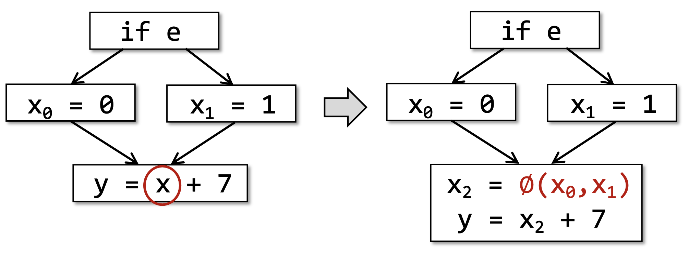

[Static Program Analysis | Tai-e (pascal-lab.net)](https://tai-e.pascal-lab.net/lectures.html)

[静态分析 (cuijiacai.com)](https://static-analysis.cuijiacai.com/)


# 静态分析基础

## *静态分析的概念 & 不可达性*

> Static analysis analyzes a program P to reason about its behaviors and determines whether it satisfies some properties before running P.
>
> 静态分析是指在实际运行程序P之前，通过分析静态程序P本身来推测程序的行为，并判断程序是否满足某些特定的性质Q。

我们关心的程序性质有比如

- 程序P是否会产生私有信息泄漏（Private Information Leak），或者说是否存在访问控制漏洞（Access Control Venerability）
- 程序P是否有空指针的解引用(Null Pointer Dereference)操作，更一般的，是否会发生不可修复的运行时错误（Runtime Error）
- 程序P中的类型转换（Type Cast）是否都是安全的
- 程序P中是否存在可能无法满足的断言（Assersion Error）
- 程序P中是否存在死代码（Dead Code, 即控制流在任何情况下都无法到达的代码）

然而根据 *计算理论.md* 中的Rice's Theorem：递归可枚举语言的所有非平凡 non-trivial 的性质都是不可判定的，静态分析并不能为我们关心的程序的非平凡性质给出一个确切的答案，即简单的Yes or No

## *静态分析的类型*

### 完美的静态分析

若一个静态分析S能够对于程序P的某个非平凡性质Q给出确切的答案，我们就称S是P关于Q的 **完美静态分析 Perfect Static Analysis** 。我们定义程序P的关于Q的真实行为为 **真相 Truth** ，那么完美静态分析有两种性质：

- **完全性（健全、全面）Soundness）**：真相一定包含在S给出的答案中
- **正确性（Completeness）**：给出的答案一定包含在真相中

即记S给出的答案集合为A，真相的集合为T，则完美的静态分析可以写作下面的集合，也就是说一个完美的静态分析应当是既sound又complete的
$$
T\sube A\and A\sube T\Leftrightarrow A=T
$$

### 妥协的静态分析

根据Rice定理，完美的静态分析是不存在的，但这并不意味静态分析就没有意义。我们需要对静态分析的两个性质做一些取舍，即妥协的静态分析 Compromised Static Analysis


* Sound Static Analysis / Over-approximation 过近似，会出现假阳 false positive
* Complete Static Analysis / Under-approximation 欠近似，会出现假阴 false negative

### 实际开发中的静态分析要达成的目标

大部分的静态分析都会选择保全 soundness，牺牲 completnessm。soundness 是更加重要的，因为而对于bug宁可杀错，不可放过

现实中的静态分析 Real-World Static Analysis 需要保证（或者尽可能保证）Soundness ，并在速度和精度 Precision 之间做出一个合适的权衡

## *抽象*

# IR

## *intro*

### 什么是IR

编译器通常会生成一种或多种形式的中间代码 Intermediate Representation, IR。中间代码位于高级源代码和目标机器代码之间的抽象层级。生成中间代码是编译器设计中的关键步骤，它对优化和跨平台代码生成尤为重要

注意⚠️：**AST本身不是编译过程中的中间代码**，但它是生成中间代码的基础。通过AST，编译器可以执行各种优化，并最终将其转换成中间代码，然后再转换成目标代码

### 为什么需要划分成不同的中间表示

* 编译器工程上的考虑
  * 阶段划分：把整个编译过程划分成不同的阶段
  * 任务分解：每个阶段只处理翻译过程的一个步骤
  * 代码工程：代码更容易实现、除错、维护和演进
* 程序分析和代码优化的需要，这是现代编译器必须要做的。这两者都和程序的中间表示密切相关，许多优化在特定的中间表示上才可以或才容易进行

具体划分成哪些中间表示是和具体的编译器相关的

### Overview

下面列举了一些中间表示，但是实际中还有很多很多的中间表示，而且工业编译器往往都会同时采用多种中间表示

* 树和有向无环图（DAG）：高层表示，适用于程序源代码
* 三地址码（3-address code）：低层表示，靠近目标机器
* 控制流图（CFG）：更精细的三地址码，程序的图状表示，适合做程序分析、程序优化等
* 静态单赋值形式（SSA）：更精细的控制流图，同时编码控制流信息和数据流信息
* 连续传递风格（CPS）：更一般的SSA，在函数式编程中用的比较多

## *三地址码*

### Generalizaiton：n地址码

将形如 $f(a_1,a_2,\dots,a_n)$ 的指令称为 **n地址码 N-Address Code**，其中，每一个 $a_i$ 是一个地址，既可以通过 $a_i$ 传入数据，也可以通过 $a_i$ 传出数据， $f$​ 是从地址到语句的一个映射，其返回值是某个语句 s，s 中最多包含输入的 n 个地址。这里，我们定义某编程语言 L 的语句 s 是 L 的操作符、关键字和地址的组合

n地址码中主要被使用的是三地址码，一方面是因为一些历史传统，一些经典的分析算法是以 3 地址码作为 IR 的所以这种表示方法就一直沿用着；另一方面是因为它表示上更加简洁方便且表达能力完备

### 三地址码的组成

三地址代码 Three-Address Code, TAC or 3AC，它被称为三地址是因为每条指令最多涉及三个地址，通常对应于两个操作数和一个结果

地址可能有下面的几种类型

- 名字 Name
  - 变量 Variable
  - 标签 Label：用于指示程序位置，方便跳转指令的书写
- 字面常量 Literal Constant
- 编译器生成的临时量 Compiler-Generated Temporary

三地址码的每一条指令通常包含以下几个部分：

* 运算符（Operator）：表示要执行的操作，如加法、减法、乘法等
* 操作数1（Operand1）：第一个输入值，可以是变量、常量或临时变量
* 操作数2（Operand2）：第二个输入值，与操作数1类似
* 结果（Result）：运算的输出，通常存储在一个变量或临时变量中

这种格式允许了复杂表达式和控制结构的简单翻译，同时也便于进行各种优化

### 三地址码的特点

* 每个三地址赋值指令的右部最多只有一个运算符
* 给每个中间变量和计算结果命名，没有复合表达式，即编译器应该生成一个临时名字以存放一个三地址指令计算得到的值
* 只有最基本的控制流，没有if、do、while、for等，只有goto、call等
* 有些三地址指令的运算分量少于三个
* 三地址码可以看成是抽象的指令集

### TAC的（近似）形式定义

三地址码并没有完全统一的定义方式，下面给出两种部分三地址码的形式定义

* 中科大编译器课程。下面给出的TAC的形式定义并不是完全严格的，有些是上下文有关的

  ```
  s -> x = n                // 常数赋值
     | x = y ⊕ z           // 二元运算
     | x = Ө y              // 一元运算
     | x = y                // 数据移动
     | x[y] = z             // 内存写
     | x = y[v]             // 内存读
     | x = f (x1, ..., xn)  // 函数调用，上下文有关
     | Cjmp (x1, L1, L2)    // 条件跳转
     | Jmp L                // 无条件跳转
     | Label L              // 标号
     | Return x             // 函数返回
  ```

* 南京大学静态分析课程

  ```
  x = y bop z
  x = uop y
  x = y
  goto L
  if x goto L
  if x rop y goto L
  ```

  - x, y, z是变量的地址
  - `bop` 是双目操作符（Binary Operator），可以是算数运算符，也可以是逻辑运算符
  - `uop` 是单目操作符（Unary Operator），可能是取负、按位取反或者类型转换
  - `L` 是标签（Label），是标记程序位置的助记符，本质上还是地址
  - `rop` 是关系运算符（Relational Operator），运算结果一般为布尔值
  - `goto` 是无条件跳转， `if... goto` 是条件跳转

### 静态单赋值形式

静态单赋值形式 Static Single Assignment, SSA 和3AC的区别在于在每次赋值的时候都会创建一个新的变量，也就是说每个变量只被定义/赋值一次

|                 3AC                 |                           SSA                           |
| :---------------------------------: | :-----------------------------------------------------: |
| $p=a+b\\q=p-c\\p=q*d\\p=e-p\\q=p+q$ | $p_1=a+b\\q_1=p_1-c\\p_2=q_1*d\\p_3=e-p_2\\q_2=p_3+q_1$ |

当控制流汇合（Merge）的时候，我们会用一个特殊的操作符表示汇和后的定义
$$
x_3=\phi(x_1,x_2)=\left\{\begin{array}{ll}x_1,&if\ true\\x_2,&otherwise\end{array}\right.
$$


* Pros
  * 控制流的信息间接地被包含在了独特的变量名之中，当我们做一些对控制流敏感的分析的时候，这些信息可能会有帮助
  * 定义和使用的关系明确
* Cons
  * 可能会引入过多的变量名和 $\phi$ 函数
  * 被翻译成机器码的时候效率低，因为有太多对于程序执行来说不必要的赋值

## *控制流图*

三地址码的控制流信息是隐式的，对于做控制流分析不够方便，可以采用控制流图来做进一步的控制流分析

控制流图 Control Flow Graph, CFG 是进行控制流分析 Control Flow Analysis, CFA 的最重要一环（前提）

### 基块

控制流图中的结点可以是一个指令，也可以是一个**基块 Basic Block, BB**

记一个程序 P **在IR表示下** 的指令序列为 $P=\left\{a_1,a_2,\dots,a_n\right\}$，这里 P 是一个有序集。我们定义

* $IN_i=\left\{a_j|next(a_j)=a_i\right\}$，即 $a_i$ 是控制流 $a_j$ 中的下一条指令 
* $OUT_I=\left\{a_j|prev(a_j)=a_i\right\}$，即 $a_i$ 是控制流 $a_j$ 中的上一条指令

若连续的指令序列 $a_p,a_{p+1},a_{p+2},\dots,a_q$ 的满足如下性质，并且 $a_{p-1},a_{p},\dots,a_{q-1},a_q$ 和 $a_{p},a_{p+1},\dots,a_{q},a_{q+1}$ 都不满足下面的性质，则称 $\left\{a_p,a_{p+1},a_{p+2},\dots,a_q\right\}$ 为BB
$$
\left(\forall i\in\left[p+1,q\right],\ IN_i=\left\{a_{i-1}\right\}\right)\and\left(\forall i\in[p,q-1],\ OUT_I=\left\{a_{i+1}\right\}\right)
$$
抽取出上面的定义中最核心的BB特征，即BB就是满足如下性质的最长指令序列：

- 程序的控制流只能从首指令进入
- 程序的控制流只能从尾指令流出

### Leader of BB

对于一个IR表示下的程序 $P=\left\{a_1,a_2,\dots,a_n\right\}$，考虑某个BB $B=\left\{a_p,a_{p+1},a_{p+2},\dots,a_q\right\}$，我们称 $a_p$ 为 P 的BB $B$​ 的领导者 leader

goto 跳转指令指导着如何划分BB

考虑程序 $P=\left\{a_1,a_2,\dots,a_n\right\}$ 中所有的leader所组成的集合 $L$，则有
$$
L=\left\{a_1\right\}\cup\left\{a_j|\exists a_i,\ type(a_i)=jump\and target(a_i)=a_j\right\}\cup\left\{a_{i+1}|type
(a_i)=jump\right\}
$$
其中，$type(a_i)$ 表示指令 $a_i$ 的类型，jump 类型是跳转指令，它包括了条件跳转 conditional jump和无条件跳转 unconditional jump。$target(a_i)$ 仅用于 $a_i$ 是跳转指令的时候，表示 $a_i$ 的目标指令

一个基块的领导者就是这个基块的首指令，整个程序中的领导者有如下3种：

- 整个程序的首指令
- 跳转指令（包括条件跳转和无条件跳转）的目标指令，保证唯一的入口
- 跳转指令（包括条件跳转和无条件跳转）紧接着的下一条指令，保证唯一的出口

考虑程序 $P=\left\{a_1,a_2,\dots,a_n\right\}$ 中所有的leader所组成的集合 $L$，则有
$$
\left(a_p\in L\right)\and\left(a_{q+1}\in L\right)\in\left(\forall a_i\left(i\in[p+1,q]\right),a_i\notin L\right)\Leftrightarrow B=\left\{a_p,a_{p+1},a_{p+2},\dots,a_q\right\}\ is\ BB
$$

### 基于IR的BB构建算法

## *构建CFG*

### CFG的定义

记程序 $P$ 的BB构成了集合 $B=\left\{b_1,b_2,\dots,b_k\right\}$，考虑 $CFG_0=(B,E_0)$ ，其中 $E_0\sube B\times B$，满足
$$
E_0=\{(b_i, b_j)|(type(last(b_i))=jump\and target(last(b_i))=first(b_j))\\\or(next(last(b_i))=fist(b_j)\and type(last(b_i))\neq unconditional\ jump)\}
$$
其中，$first(b_i)$ 表示BB $b_i$ 的首指令（即leader），$last(b_i)$ 表示BB $b_i$ 的尾指令，$next(x)$ 表示指令x紧随其后的指令

若 $(b_i, b_j)\in E_0$，则 $b_i$ 是 $b_j$ 的前驱 predecessor，$b_j$ 是 $b_i$ 的后继 successor

- 对于图 $CFG_0$ 中所有入度为0的点（一般只有一个），考虑虚拟结点 **入口 Entry** ，所有的 **入度 In Degree** 为0的点都是Entry的后继
- 对于图 $CFG_0$ 中所有出度为0的点（可能不止一个），考虑虚拟结点 **出口 Exit** ，所有的 **出度 Out Degree** 为0的点都是Exit的前驱

分别记 $E_1=\left\{(Entry,b)|b\in B\and inDegree(b)=0\right\}$ 和 $E_2=\left\{(Exit,b)|b\in B\and outDegree(b)=0\right\}$，则可以定义CFG为 $CFG=(V,E)$，其中
$$
V=B\cup\left\{Entry,\ Exit\right\},\ E=E_0\cup E_1\cup E_2
$$

### 基于BB的CFG控制算法

增加CFG的边


现代编译器中往往会在非常早期的阶段就会执行

死基本块删除

L3的入度为0


# 数据流分析的应用


## *到达定义分析*

到达定义分析 Reaching Definitions Analysis 静态分析用于确定在程序的每个点，哪些变量定义可能会“到达”这个点。这里的“定义”指的是给变量赋值的操作，而一个定义“到达”某个点表示在控制流图上，从定义点到该点的路径上不存在对该变量的其他赋值操作，“覆盖”了这个定义


强度削弱 strength reduction 就是把耗费较多CPU周期的汇编指令用耗费较少CPU周期的汇编指令替代掉，最常见的就是用高效的 `<<` 来替代 `2^n` 的乘法


### 数据流方程

d是语句的编号

gen 产生集，kill 杀死集

```
defs[y] = {1, 4, 5}

```


## *活性分析*

活性分析 liveness analysis

在代码生成的讨论中假设了可以使用无限多个寄存器

必须把有限多个虚拟寄存器分配到有限个寄存器当中


### 活性分析的数据流方程


## *死循环检测*

编译器检测死循环（即永远不会终止的循环）在理论上是一个不可判定问题，意味着没有通用的算法可以解决所有情况。这是因为它与停机问题（Halting Problem）紧密相关，而停机问题已被证明是不可判定的。

尽管如此，编译器仍然采取启发式方法或静态分析技术来检测特定种类的潜在死循环。以下是一些可能使用的技术：

### 1. 循环不变量和单调性分析

编译器可以分析循环中的不变量和条件表达式。如果循环条件涉及到的变量在循环体内没有改变，或者存在某种趋势表明循环条件将永远为真，则该循环可能是一个死循环。

例如：

```c
for (int i = 0; i < 10; i--) {
    // ...
}
```

在这个例子中，循环控制变量 `i` 初始化为0，并且每次循环时都在减少，所以 `i < 10` 这个条件总是为真，导致一个死循环。

### 2. 控制流图分析

编译器构建程序的控制流图（CFG），然后检查图中是否存在从循环体指向自身且无法到达退出路径的情况。

### 3. 符号执行

通过符号执行，编译器可以跟踪循环中的变量取值范围。如果这个分析表明循环退出条件永远不会得到满足，那么这可能是一个死循环。

### 4. 抽象解释

抽象解释是一种对程序的行为进行近似描述的方法，编译器可以用它来推断循环是否可能无限执行。

### 5. 数据流分析

编译器可能使用数据流分析来确定变量的存活范围和其随时间的变化。如果在循环体内部的变量操作不影响循环的退出条件，那么这可能是一个死循环。

### 限制

- **假阳性**：编译器可能错误地标记实际会终止的循环为死循环。
- **假阴性**：编译器可能无法检测到某些复杂的死循环情况。
- **计算资源**：复杂的分析可能需要大量的计算资源，并增加编译时间。

由于死循环的自动检测可能不完美，软件工程师通常需要通过代码审查、测试和动态分析等手段来辅助发现并解决死循环问题

# 数据流分析理论

# 过程间分析

## *创建调用图*

## *过程间控制流图*

## *过程间数据流分析*

# 指针分析基础

# 静态分析在安全工程中的应用

# CFL & IFDS

# 完全性 & 近似完全性