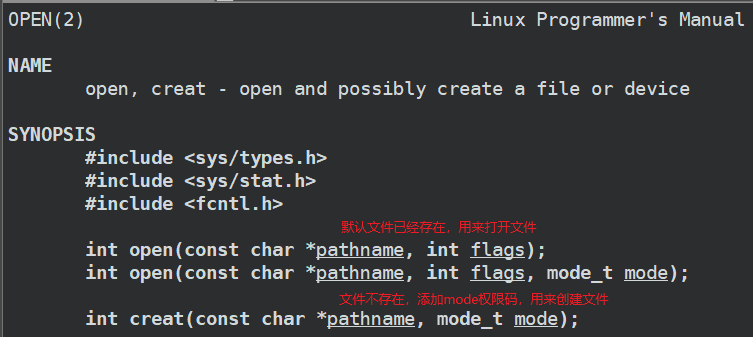

## *C语言和系统级别的调用接口*

### 接口的封装关系

以open的封装为例说C标准库、glibc 运行时库、系统调用和Linux内核的关系

C函数 `fopen`，系统调用 `open`，系统调用 `__libc_open` （glibc/sysdeps/unix/sysv/linux/open.c）和Linux内核 `sys_open` （/fs/open.c）是在 C 和 Linux 系统中用于打开文件的函数，它们之间的关系如下：

1. 当应用程序调用 `fopen` 函数时，实际上是调用由 C 库提供的一个包装函数 wrapper function（包装函数就是封装了其他函数的函数）。这个包装函数对传递给 `fopen` 的参数进行了一些额外的处理，然后调用 `__fopen_internal` 函数
2. `__fopen_internal` 是 C 库的内部函数，它实现了实际的文件打开逻辑。它会根据使用的 C 库版本调用 `open` 或 `__libc_open` 函数
3. `open` 和 `__libc_open` 都是用于打开文件的函数。`open` 是 Linux 内核提供的系统调用，而 `__libc_open` 是 C 库的内部函数，提供了更灵活的打开文件接口。根据使用的 C 库版本，`__fopen_internal` 可能会调用 `open` 或 `__libc_open`
4. `sys_open` 是 Linux 内核提供的系统调用，由 `open` 或 `__libc_open` 调用，用于实际打开文件并返回文件描述符，这个文件描述符可用于后续的读写操作

因此，它们之间的调用顺序可以总结如下

1. 应用程序调用 `fopen` 函数
2. C 库的包装函数处理参数并调用 `__fopen_internal`
3. `__fopen_internal` 根据使用的 C 库版本调用 `open` 或 `__libc_open`
4. `open` 或 `__libc_open` 调用系统调用 `sys_open` 来打开文件并返回文件描述符
5. `sys_open` 打开文件并返回文件描述符
6. `open` 或 `__libc_open` 将文件描述符返回给 `__fopen_internal`
7. `__fopen_internal` 将 FILE 指针返回给 C 库的包装函数
8. 包装函数将 FILE 指针返回给应用程序

总结一下

* C函数是纯语言级别的库，涉及到系统的函数会去封装系统调用
* 系统调用是OS封装好暴露出接口交给用户使用的库，system call的时候会发生陷入内核
* Linux内核函数是最底层的库，完全由系统使用，用户无法接触到

### C语言文件接口

* 当前路径：当一个进程运行起来的时候，每个进程都会记录自己当前所处的工作路径

* C/Cpp程序 默认会打开三个文件流：标准输入 `FILE *stdin`、标准输出 `FILE *stdout`、标准错误 `FILE *stderr`

* C语言接口

  * C语言打开文件 fopen：r, r+, w（在fwrite前就清空）, w+, a（追加）, a+

  * C语言按行读取文件：fgets

  * C语言写文件：fwirte, fprintf, fputs

  * 实现cat命令

    ```c
    #include <stdio.h>    
    #include <unistd.h>    
    #include <string.h>    
    
    int main(int argc, char *argv[]) {    
        if (argc != 2) {    
            printf("argv error\n");    
            return 1;    
        }    
        FILE *fp = fopen(argv[1], "r");                                                                             
        if (fp == NULL) {    
            perror("fopen");    
            return 2;    
        }    
        // 按行读取    
        char line[64];    
        // fgets是C语言的接口来取string，因此会自动在字符结尾添加\0    
        while (fgets(line, sizeof(line), fp) != NULL) {    
            // printf("%s", line);    
            fprintf(stdout, "%s", line);    
        }    
        return 0;    
    }    
    ```

### 系统调用接口

* 系统调用接口有 `open, close, read, write`，C语言对应的封装函数为 `fopen, fclose, fread, fwrite`

* 补充知识：bitmap 位图：将选项#define为不同的比特位，通过输入形参的不同组合来达到选择或同时输入多个参数的目的

  ```c
  #include <stdio.h>    
  #include <unistd.h>    
  #include <string.h>    
      
  // 用int中的不重复的一个bit，就可以表示一种状态    
  #define ONE 0x1 // 0000 0001    
  #define TWO 0x2 // 0000 0010    
  #define THREE 0x4 // 0000 0100    
      
  void show(int flags) {    
      if (flags & ONE)    
          printf("hello one\n");    
      if (flags & TWO)    
          printf("hello two\n");    
      if (flags & THREE)    
          printf("hello three\n");    
  }    
      
  int main() {    
      show(ONE);    
      printf("-------------------------\n");    
      show(TWO);    
      printf("-------------------------\n");    
      show(ONE | TWO);    
      printf("-------------------------\n");    
      show(ONE | TWO | THREE);    
      printf("-------------------------\n");                                                              
      show(ONE | THREE);    
      return 0;    
  }    
  ```
  
* 以 `open` 为例，查看open的手册，`man 2 open`

  

  * `flags` 是一种bitmap选项，`mode` 则是选择文件权限
  * `int fd = open("log.txt", O_WRONLY|O_CREAT|O_TRUNC, 0666)`：添加了权限码，用来创建文件，通过该种bitmap组合实现了 fopen w的效果
  * `int fd = open("log.txt", O_WRONLY|O_CREAT|O_APPEND, 0666)`：通过该种bitmap组合实现了 fopen a 的效果
  * `int fd = open("log.txt", O_RDONLY)`：不添加权限码，默认文件已经存在，会受umask的影响

* `close`

  ```c
  #include <unistd.h>
  int close(int fd);
  ```

* `write`

  ```c
  #include <unistd.h>
  ssize_t write(int fd, const void *buf, size_t count);
  ```

  * `buf` 计划写入的缓冲区
  * `count` 要写的字节数
  * 返回写入的字节数

* `read`

  ```c
  #include <unistd.h>
  ssize_t read(int fd, void *buf, size_t count);
  ```

  * 参数和write一样
  * 返回读到的字节数，若读到的是0，则意味着文件结束了，注意：换行和回车也是有效字符，不为0！

* 使用 `sync(int fd)` 立即将脏数据 dirty data 落盘