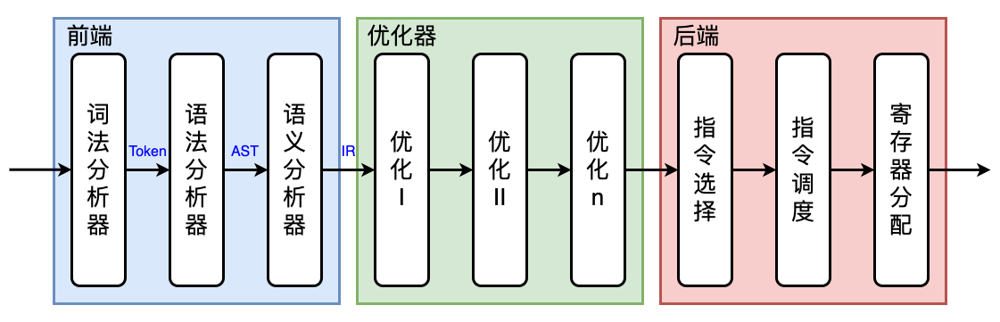
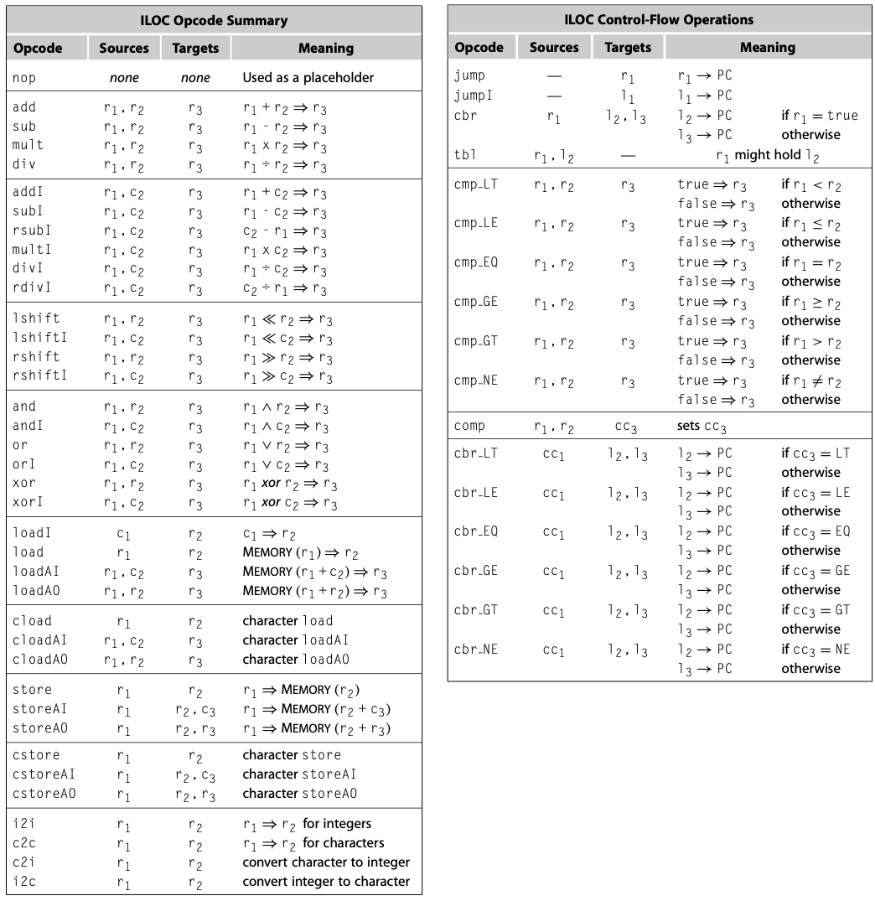
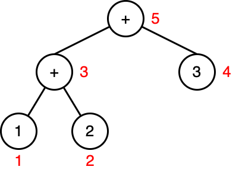
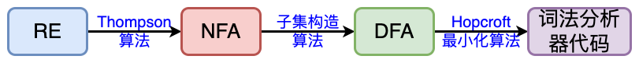
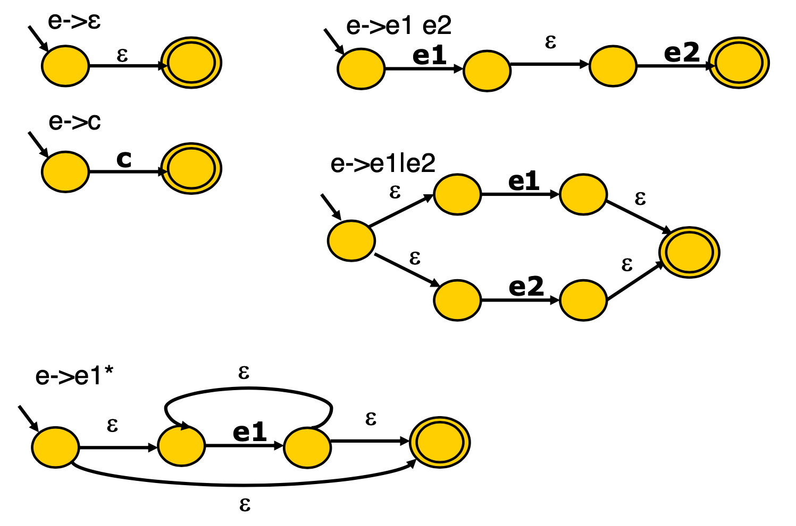
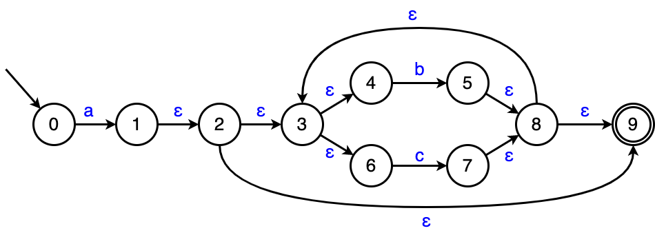
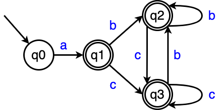
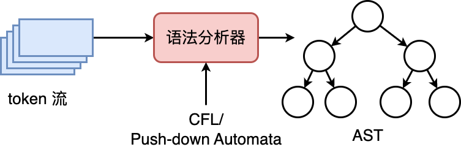

# Introduction

## *编译器构造*



### 前端

前端负责理解源语言程序

* 词法分析 Lexical Analysis (Parser)：扫描源代码字符流，并将其组织成有意义的词法单元 token 序列
* 语法分析 Syntax Analysis：语法分析器检查源代码的语法结构是否符合编程语言的规则，并按照语法规则将代码组织成树状结构（比如 抽象语法树 Abstract Syntax Tree, AST）
* 语义分析 Semantic Analysis：检查变量的声明、类型匹配、函数调用等，以确保程序在逻辑上是合理的

### 优化/中端

优化器分析代码的的IR形式，通过发现有关上下文的事实来重写代码，以求提高实现的效率

理想情况下优化器应该是机器无关的，即它应该通用于所有的机器。但事实并非如此，优化器总是要用到一些机器特性

### 后端

后端负责将程序映射到目标机器上

* 指令选择 Instruction Selection：选择适当的目标机器指令来执行高级语言中对应的操作，同时考虑目标机器的特定约束和优化策略
* 指令调度 Instruction Scheduling：通过重排指令 reordering 的执行顺序，指令调度旨在减少指令之间的依赖关系，最大程度地利用目标机器的硬件资源，从而提高程序的性能
* 寄存器分配 Register Allocation：最大限度地减少内存访问次数，以提高程序的执行速度

## *ILOC*

ILOC, Intermediate Language for an Optimizing Compiler 是一种用于优化编译器的中间表示 IR

ILOC 的设计旨在简化编译器的分析和优化任务，同时提供足够的灵活性，可以说它是一种RISC的核心指令集



### 命名规则

1. 变量的内存偏移量表示为变量名加前缀 `@` 字符
2. 用户可以假定寄存器数量是无限的，它们用简单的整数或符号名引用，前者如 `r_1776`，后者如 `r_i` 
3. 寄存器rarp是保留的，用做指向当前活动记录的指针

## *简单的例子*

### 栈式计算机

栈式计算机是一种计算机体系结构，其中的指令和数据都存储在一个栈（stack）数据结构中。在栈式计算机中，操作数和运算符都被压入栈中，并且所有的计算都是通过栈顶的元素进行的。栈顶指针（stack pointer）指向栈顶元素，指令执行时会从栈顶取出操作数进行计算，并将结果压入栈顶

现在栈式计算机已经不被用来构建计算机系统，但是仍常用于虚拟机、编译器和解释器的实现中，例如Java虚拟机（JVM）和.NET平台的中间语言（CIL）都采用了栈式计算机的模型

现在我们的例子如下

* 源语言：加法表达式语言 Sum
  * 两种语法形式
    * 整型数字：n
    * 加法：e1 + e2

* 目标机器：栈式计算机 Stack
  * 一个操作数栈
  * 两条指令
    * 压栈指令：`push n`
    * 加法指令：`add`。add的操作数不需要指定，因为是隐含的


### 编译器的阶段

任务：编译程序 `1+2+3` 到栈式计算机

1. 词法、语法分析

2. 语法树构建

3. 代码生成：后序遍历语法树，根据不同的节点类型生成不同的指令

   

   ```
   n -> push n
   + -> add
   ----------根据AST生成如下指令----------
   push 1
   push 2
   add
   push 3
   add
   ```

## *编译器与NLP的对比*

https://cloud.tencent.com/developer/article/1776822

# 词法分析

## *Token*

### 从字符流到记号流

词法分析器的任务是将字符流到记号流

* 字符流：和被编译的语言密切相关（ASCII, Unicode, or ...）
* 记号流：token是编译器内部定义的数据结构，编码所识别出的词法单元

```c
if (x > 5)
    y = "hello";
else
    z = 1;
```

注意每一行的末尾是一个隐藏的 `\n`，即 ASCII 的10

经过词法分析后上面的字符流会变成下面的token/word流，空格会被扔掉

```
IF LPAREN IDENT(x) GT INT(5) RPAREN
	IDENT(y) ASSIGN STRING("hello") SEMICOLON
ELSE
	IDENT(z) ASSIGN INT(1) SEMICOLON EOF
```

### Token 的数据结构定义

```c
enum kind {IF, LPAREN, ID, INTLIT, ...};
struct token {
    enum kind k;  // token的类型
    char *lexeme; // token的值
    // ... 其他内容如行号等，用来给编译器后续阶段提供支持
};
```

`if (x > 5)` 会变成下面的 token

```c
token{k = IF, lexeme = 0}; // 0 就是没有值
token{k = LPAREN, lexeme = 0}; 
token{k = IDENT, lexeme = 'x'};
token{k = GT, lexeme = 0}; 
token{k = INT, lexeme = '5'}; 
token{k = RPAREN, lexeme = 0}; 
```

## *实现词法分析器的两种方式*

* 手工编码实现法：相对复杂、且容易出错，但是是目前非常流行的实现方法，因为所有的一切都是由程序员来控制的，所以很灵活、高效。比如说GCC、LLVM都是这么实现的
* 词法分析器的生成器：可快速原型、代码量较少，程序员在使用的时候只需要写一些词法规的声明，然后由生成器自动生成语法分析器（DFA），和手工编码相比较难控制细节，难以调优。比如说 lex、flex、jlex、antlr 等

### 转移图算法

从编译器的角度看，关键字是标识符的一个子集

关键字表算法

* 对给定语言中所有的关键字，构造关键字构成的哈希表H
* 对所有的标识符和关键字，先统一按标识符的转移图进行识别
* 识别完成后，进一步查表H看是否是关键字
* 通过合理的构造哈希表H（完美哈希 perfect hashing），可以 ***O(1)*** 时间完成

### 生成器

从RE的角度看，因为NFA允许类似于 or 这种不确定的分支语义以及 ε 转换，这使得我们可以以更灵活的方式来构建自动机，所以描述NFA显然更容易。但是从编码的对角度看，对DFA的编程是更加容易的，因为它具有确定性。所以我们的workflow应该是：RE `->` NFA `->` DFA



最终的词法分析器本质上就是一个DFA, Deterministic Finite Automaton 确定有限状态自动机。如何将RE转换为DFA是我们要重点研究的内容，具体来说分成下面这四步

1. RE转换成NFA：Thompson算法
2. NFA转换成DFA：子集构造算法
3. DFA的最小化：Hopcroft算法
4. 从DFA生成分析算法

接下来我们会首先介绍RE，然后介绍如何从RE转换为DFA

## *正则表达式*

正则表达式的详细内容可以看 *计算理论.md*

引入正则表达式最关键的目的是为了表达源程序中词法的规则，从而通过自动生成工具来生成词法解析器

### 定义

对于给定的字符集 $\Sigma=\left\{c_1,\ c_2,\ \dots,\ c_n\right\}$​​。有归纳定义

```
e -> ε
  -> c
  -> e1 e2
  -> e1 | e2
  -> e1*
```

* 空串 ε 是正则表达式
* 对于任意 $c\in\Sigma$，c 是正则表达式
* 若M和N都是正则表达式，则下面这些也是正则表达式
  * 选择/并集 union $M|N=\left\{M,\ N\right\}$
  * 连接 concatination $MN=\left\{mn|m\in M,n\in N\right\}$
  * kleene 闭包 $M^*=\left\{\varepsilon,\ M,\ MM,\ MMM,\ \cdots\right\}$

### 用正则表达式表示C语言中的标识符

* 关键字：以C语言中的关键字 if、while 为例：$i\in\Sigma,\ f\in\Sigma\Rightarrow if\in\Sigma$

* 标识符：以字母或下划线开头，后跟零个或多个字母、数字或下划线

  ```
  (a|b|c|...z|A|B|C|...|Z)(a|b|c|...z|A|B|C|...|Z|0|1|2|3|...|9)*
  ```

* （十进制整型数）规则是：或者是0；或者是以1到9开头，后跟零个或多个0到9

### 语法糖

语法糖 syntax sugar 是指对基本功能的封装，从而便利高层用户的使用。比如说图灵机的底层仅仅需要赋值和跳转两个基本的功能就可以表达所有的高层语法，所以其他的指令其实都是对赋值和跳转的进一步封装

因此类似地我们也可以为上面的正则表达式引入更多的语法糖来便利之后的说明

- `[c1-cn] == c1|c2|...|cn`，前者必须按顺序排列

- `e+`：一个或多个e

- `e?`：零个或多个e

- `"a*"`：`a*` 自身，不是a的Kleen闭包

- `e{i, j}`：`i` 到 `j` 个 e 的连接

- `.`：除 `\n` 之外的任意字符

## *构造DFA*

DFA 和 NFA 的相关内容看 *计算理论.md*

### Thompson算法

Thompson算法 / Thompson构造法由C语言&Unix之父之一的Ken Thompson提出。它的核心思想是先构造识别子表达式的ε-NFA，再通过几个简单的规则将ε-NFA合并，最终得到识别完整正则表达式的ε-NFA。Thompson构造法的优点是构造速度快，且构造的ε-NFA状态数较少

基于对RE的结构做归纳



* 对基本的、原子的RE直接构造

  ```
  e -> ε
    -> c
  ```

* 对复合的RE递归构造：递归算法是容易实现的，在具体的工程实现里，只需要不到100行的C代码就可以实现它

  ```
  e -> e1 e2
    -> e1 | e2
    -> e1*
  ```

  怎么把两个小的子ε-NFA表达式连接起来呢？其实很简单，用一个无代价的 ε 连接就行了

  其实这里很容易会产生这样一个疑惑，为什么不使用 ε，而是直接将两个子ε-NFA表达式连接起来呢，效果和上面的 ε 连接是完全等价的。这其实是出于工程编码上的考虑，用 ε 连接会使递归更工整，节点的融合、边的删除也更方便

考虑这样一个例子：`a(b|c)*`



### 子集构造算法

关于具体的子集构造算法的形式定义可以看 *计算理论.md*

仍然以上面 `a(b|c)*` 为例，求每一个状态的 ε 闭包

```
n0 : q0
(q0, a) -> {n1, n2, n3, n4, n6, n9} : q1
(q1, b) -> {n5, n8, n9, n3, n4, n6} : q2
(q1, c) -> {n7, n8, n9, n3, n4, n6} : q3
```

最终 `a(b|c)*` 的NFC转换成的DFC为如下



下面是实现子集构造算法（工作表算法）的部分伪代码

```pseudocode
q0 <- eps_closure(n0)
Q <- {q0}
workList <- q0
while (workList != [])
	remove q from workList
    foreach (character c)
    t <- eps-closure(delta(q, c))
	D[q, c] <- t
	if (t\not\in Q)
	add t to Q and workList
```

ε 闭包的计算可以采用 DFS 和 BFS 两种实现

* DFS

  ```pseudocode
  # DFS
  set closure = {};
  
  void eps_closure(x)
  	closure += {x}
  	foreach (y: x--eps --> y) # 意思是每个通过eps转移到y的x
  		if (!visited(y))
  			eps_closure(y)
  ```

* BFS

  ```pseudocode
  # BFS
  set closure = {};
  Q = []; // queue
  void eps_closure(x)
  	Q = [x];
  	while (Q not empty)
  	q <- deQueue(Q)
  	closure += q
  	foreach (y: q--eps --> y)
  		if (!visited(y))
  			enQueue(Q, y)
  ```

子集构造算法总是可以终止的，不会无限循环，因为它是一个不动点算法

### Hopcroft最小化算法

```pseudocode
split(S)
	foreach (character c)
		if (c can split S)
			split S into T1, ..., Tk
			
hopcroft()
	split all nodes into N, A
	while (set is still changes)
		split(S)
```

## *DFA的代码表示*

DFA就是一个有向图，实际中的实现有转移表（类似邻接矩阵）、哈希表、跳转表等表示方法，使用什么实现取决于在实际实现中，对时间和空间的权衡

```pseudocode
char table[M][N];
table[0]['a'] = 1;
table[1]['b'] = 1;
table[1]['c'] = 1;
// other table entries are ERROR
```


```pseudocode
nextToken()
	state = 0
	stack = []
	while (state != ERROR)
	c = getChar()
	if (state is ACCEPT)
	clear(stack)
	push(state)
	state = table[state][c]
	while (state is not ACCEPT)
	state = pop();
	rol1back();
```

### 跳转表

```pseudocode
nextToken()
	state = 0
	stack = []
	goto q0
q0:
	c = getChar()
	if (state is ACCEPT)
		clear(stack)
	push (state)
	if (c == 'a')
		goto q1

q1:
	c = getChar()
	if (state is ACCEPT)
		clear(stack)
	push (state)
	if (c == 'b' || c == 'c')
		goto q1
```

# 语法分析



语法分析器的输入是token流，借助的规则则是 CFG 上下文无关语法/形式语言 或者说下推自动机。具体来说，给定文法G和句子s，语法分析要回答的问题是：是否存在对句子s的推导

关于CFG、推导树和二义性的内容可以看 *计算理论.md*

语法分析的实现可以分为

* 自顶向下分析：从开始符号出发推出句子，对应于分析树自顶向下的构造顺序
  * 暴力搜索
  * 递归下降
  * LL(1)

## *暴力搜索*

### 实现

为了回答对于G是否存在对句子s的推导的问题，基本的算法思想是从G的开始符号，随意推导出某个和s无关的句子t，并比较t和s。若 `t==s`，则返回 true，否则就要不断回溯继续迭代

算法本质就是BFS/回溯的暴搜（配合剪枝）

```pseudocode
tokens[]; // all tokens
i = 0;
stack = [S]; // s是开始符号
while(stack != [])
	if(stack[top] is a terminal t)
		if(t==tokens[i++])
			pop();
        else backtrack();
    else if (stack[top] is a nonterminal T)
    	pop(); push(the next right hand side of T) 
```

暴力搜索的效率非常低下，我们需要寻找更高效的算法。即下面两种避免回溯的常数时间复杂度的算法：递归下降和LL(1)分析算法

### 优化暴力搜索：尽量避免回溯

递归下降算法的基本思想是：每个非终结符构造一个分析函数、用前看符号指导产生式规则的选择

比如说有下面的CFL，对于一个给定的搜索token `[g d w]`，如果知道 N 能够推导出s、t、g、w，那只要选择匹配的g就好了，当然如果没有匹配的就返回 false，即不合法的 token

```
S -> N V N
N -> s
   | t
   | g
   | w
V -> e
   | d
```

但是这个算法的实现没有那么简单，比如说下面的这种情况，N可以推导出两种可能的 g 怎么办？

```
S -> N V N
N -> s
   | t
   | g
   | w -> g N
V -> e
   | d
```

## *递归下降分析算法*

### 优势

递归下降分析算法 Recursive-Descent Parsing 也称为预测分析算法，它有下面这些优点

* 线性时间，分析高效
* 方便手工编码，容易实现
* 错误定位和诊断信息准确
* 被很多开源和商业的编译器所采用：GCC 4.0、LLVM

### 实现

递归下降的核心思想是

* 每个非终结符构造一个分析函数
* 用前看符号指导产生式规则的选择

分治思想：将 S 是否能分别推导出g、d、w 分解为N是否能推导出g、V是否能推导出d、N是否能推导出w

```
S -> N V N   ; 命名为分析函数 f 
N -> s       ; 命名为分析函数 k
   | t
   | g
   | w
V -> e       ; 命名为分析函数 h
   | d
```

```pseudocode
parse_S()
	parse_N()
	parse_V()
	parse_N()

parse_N()
	token = tokens[i++]
	if (token==s || token==t || token==g || token==w)
		return;
	error(“…”);
	
parse_V()
	token = tokens[i++]
```

### 递归下降一般算法框架

```
X -> β11 ... β1i
   | β21 ... β2j
   | β31 ... β3k
   | ...
```

```pseudocode
parse_X()
	token = nextToken()
	switch(token)
	case ...: 非终结符递归调用 // β11 ... β1i
	case ...: // β21 ... β2j
	case ...: // β31 ... β3k
	...
	default: error（".."); // 不匹配
```

## *LL(1) 分析算法*

Antlr、YACC、Bison

丛左（L）向右读入程序，最左（L）推导，采用一个（1）前看符号（这个前看符号的功能和之前递归下降中用的不一样 ）

* 分析高效（线性时间）
* 错误定位和诊断信息准确
* 有很多开源或商业的生成工具，比如ANTLR

算法的基本思想是表驱动的分析算法


分析表中编码了分析栈在操作的时候什么时候该移入字符、什么时候该展开的建议信息


不应该是盲目地压下一个字符，而是压一个相对正确的字符

## *自底向上（LR分析）*

### 自底向上

### LR(0) 分析

### SLR分析算法

# 语义分析


# Optimization

Common Subexpression Elimination, CSE

# Backend

