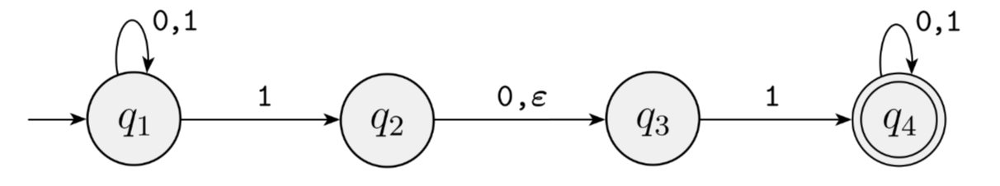

https://ocw.mit.edu/courses/18-404j-theory-of-computation-fall-2020/

# 基础数学知识

## *集合与元组*

### 集合的定义与形式化描述

集合 set 是一组对象，把它看成一个整体。集合中可以包含任何类型的对象，包括数、符号甚至是其他集合，集合中的对象称为它的元素 element 或成员 member

用大括号 $\left\{\right\}$ 来逐个列出集合的元素，用符号 $\in$ 和 $\notin$ 来分别表示集合成员和非集合成员，读作属于和不属于

集合与描述它的元素的排列顺序无关，也不考虑其元素的重复，即 $\left\{1,2,3\right\}$ 和  $\left\{1,1,1,2,2,3\right\}$ 是相同的集合。若要考虑元素出现的次数，则把它称为多重集合 multiset

### 常用的特殊集合

不含任何元素的集合称为空集 empty set $\emptyset$

无穷集合 infinite set 是包含无穷多元素的集合，不可能列出无穷集合的所有元素，所以有时用记号 $\cdots$ 来表示集合的元素将永远持续下去

数字集合

* 自然数集 set of natural number $N=\left\{1,2,3,\cdots\right\}$
* 整数集 set of integers  $Z=\left\{\cdots,-2,-1,0,1,2,\cdots\right\}$
* 实属集

### 集合之间的关系

对于两个集合 $A$ 和 $B$，若 $A$ 的每个成员也是 $B$ 的成员，则称 $A$ 为 $B$ 的子集 subset，记作 $A\subseteq B$，若 $A$ 为 $B$ 的子集且不等于 $B$，那么 $A$ 为 $B$ 的真子集 proper subset，记作 $A\subset B$

并集、交集、补集

### 序列

序列 sequence 是某些元素或成员按某种顺序排成的一个列表，通常把它写在一对圆括号来指明它为一个序列，比如 $(1,2,3)$

在集合中不用考虑元素的顺序和重复性，但在序列中要考虑元素的顺序和重复性，此时$\left(1,2,3\right)$ 和  $\left(1,1,2,1,2,3\right)$ 是两个不同的序列

与集合一样，序列也可以分为是有穷序列或者无穷序列，通常**把有穷序列称为多元组 tuple**，比如k个元素的序列称为k元组 k-tuple，二元组可以特殊地称为有序对 ordered pair

### 幂集与笛卡尔积

* 集合与序列可以作为其他集合或序列的元素，$A$ 的幂集 power set 为 $A$ 的所有子集的集合，表示为 $2^A$ 或 $\rho(A)$。比如 $A=\left\{0,1\right\}$ 的幂集为 $\left\{(0,0),(0,1),(1,0),(1,1)\right\}$。当 $A$ 为有限集时，$\#A=n$，则 $\rho(A)$ 的元素数为
  $$
  C_n^0+C_n^1+\cdots+C_n^n=2^n
  $$

* $A$ 和 $B$ 的笛卡尔积 Cartesian product 或叉积 cross prodcut $A\times B$ 为第一个 $A$ 的元素和第二个 $B$ 的元素的所有有序对组成的结合，注意顺序是很重要的！比如 $A=\left\{1,2\right\}$ 和 $B=\left\{x,y,z\right\}$ 的笛卡尔积为
  $$
  A\times B=\left\{(1,x),(1,y),(1,z),(2,x),(2,y),(2,z)\right\}
  $$

* 集合自身的笛卡尔积可以写作 $\overbrace{A\times A\times\cdots\times A}^{k}=A^k$

## *关系*

### 关系的定义

设 $A$ 是一个集合，$A\times A$ 的一个子集 $R$，称为是集合 $A$ 上的一个二元关系，简称关系

### 等价关系

### 关系闭包

## *函数映射*

# 语言及文法

## *自然语言和形式语言*

### 两种语言

自然语言 natrual language 是人类讲的语言，这种语言并不是人为设计的（当然有人类试图对其规范化的努力）而是自然进化产生的。形式语言 formal language 是为了特定应用而人为设计的语言，例如数字和运算符号、化学分子式和反应式、用来表达计算过程的编程语言等

形式语言有严格的syntax规则，语法规则由规定符号 token 和结构 structure 的规则所组成，下面以有效的数学表达式 `1+1=2` 和无效的数学表达式 `1+=$2` 为例

* 关于token的规则被称为**词法 lexical**
  * token的概念相当于自然语言中的单词与标点符号，数学表达式中的数字和运算符等，是最基本的组成
  * `1+=$3` 的lexical错误在于没有定义过有效的数字或运算符 `$`
* 关于structure的规则称为**语法 grammer**
  * structure是指token的正确排列组合方式，以产生有效的语义 semantic
  * `1+=$2` 的grammer错误在于虽然 `+` 和 `=` 都是lexical正确的运算符，但是数学式grammer没有定义 `=` 直接放在 `+` 后面所表达的意义

注意：在中文中syntax和grammer都被翻译成了语法，但实际上**syntax是包含了lexical和grammer的规则**

### 如何读懂一个句子？

无论是阅读自然语言还是形式语言，为了读懂一个句子，必须要同时明白token和structure

因此读懂一个句子的步骤是：1、识别token；2、分析句子结构的构成，该过程称为解析 parse

对于自然语言，这一过程在学习一门外语时是显得那么重要。当然相比于形式语言，自然语言由于其歧义性和不一致性还需要结合上下文 context 来理解

### 两种语言的不同处

形式语言与自然语言主要存在下面三个不同点

* 歧义性 ambiguity 
  * 自然语言充满了歧义，人们需要通过上下文的辅助，甚至是自己的常识来解决这个问题
  * 形式语言的设计要求是清晰的、毫无歧义的，这意味着每个语句可以被单独拆开来看还能表达确切的意思，相当于与上下文切割开来了。因此形式语言一般都是上下文无关语言 context free language
* 冗余性 redundancy：为了消除歧义减少误解，自然语言引入了相当多的冗余，其结果就是语言的膨胀，或者说啰嗦。而形式语言则很紧凑 compact，很少有冗余
* 与字面意思的一致性 consistent with literal
  * 自然语言充斥着成语和隐喻 metaphor，这种成语和隐喻往往意味着意有所指，即与其字面意思不一致，这在文学作品中表现的淋漓精致，可以说这些文学作品的伟大有很大一部分是来源于自然语言的灵活与不一致
  * 形式语言中literal的意思就是其token代表的真实意思

## *Sprache und Grammatik*

### 语言的定义与运算

* 字母表与字符串 alphabet table

  * 字母表是非空的形式符号有限集合，常用 $T$ 或 $\Sigma$ 来表示
    * 英文字母表
    * 数字表、数学符号表

  * 字符串/句子 string 是由字母表 $T$ 中的字符构成的序列
    * $\varepsilon$ 称为空串 empty string，它是一个长度为0的字符串
    * $\lvert\vert$ 用来计算字符串长度

* 字符串运算

  * 连接 concatenation

  * 取前缀 prefix、取后缀 suffix、取子串

  * 取逆/倒置

* 字母表的幂运算

  * 定义
    * $T^0=\left\{\varepsilon\right\}$
    * 设 $x\in T^{n-1},\ a\in T$，则 $ax\in T^n$
  * 克林闭包 Kleene closure  $T^*=T^0\cup T^1\cup T^2\cup\dots$：字母表 $T$ 上的所有字符串和空串的集合
  * 正闭包 positive closure $T^+=T^1\cup T^2\cup T^3\cup\dots$：字母表 $T$ 上的所有字符串构成的集合
  * $T^*=T^+\cup\left\{\varepsilon\right\},\ T^+=T^*-\left\{\varepsilon\right\}$

* 语言 Language：设 $T$ 是字母表，则任何集合 $L\subseteq T^*$ 是字母表 $T$ 上的一个语言。由语言的定义知语言的本质是集合，因此对集合的运算可以用于语言

  * 语言的积：两个语言 $L_1$ 和 $L_2$ 是由 $L_1$ 和 $L_2$ 中的字符串连接所构成的字符串的集合
  * 语言的幂

### 语法

语法是用来定于语言的一个数学模型

* 若 $L$ 是有限集合，可用列举法
* 若 $L$ 是无限集合
  * 用语法产生系统，由定义的语法规则产⽣出语⾔的每个句⼦
  * 输入状态机，不报错就是符合语言规则的

元语言 metalanguage：描述语言的语言。当⼈们要解释或讨论程序设计语⾔本⾝时，又需要⼀种语⾔，被讨论的语⾔叫做对象语⾔，即某种程序设计语⾔，讨论对象语⾔的语⾔称为元语⾔

### 推导与句型

* 直接推导：设 $\alpha$ 和 $\gamma$ 是 $(V\cup T)^*$ 中的字符串，则有 $\alpha A\gamma\Rightarrow\alpha\beta\gamma$，称 $\alpha A\gamma$ 直接推导出 $\alpha\beta\gamma$
* 推导序列
  * $\alpha_0\Rightarrow\alpha_1\Rightarrow\cdots\alpha_n$ 是长度为n的推导序列
  * 推导序列的每一步，都会产生一个字符串，这些字符串一般称为句型
* 句型和句子
  * 通过recursive 递归不断生成新的句型，中间可能有终结符也有可能有非终结符，最终推导到所有的符号都被替换为终结符为止
  * 中间产生的还可以继续递归的，还有非中间符的就是一个句型
  * 推导到最后，若只包含了终结符，那么它就是一个句子
  * 用汉语举一个例子：句型就是[主语]+[谓语]+[宾语]，而一个句子就是对之前的三个非终结符进行替换，比如[我]+[吃]+[饭]就是一个句子

## *Chomsky 语法体系 & Backus-Naur Form*

### Chomsky语法体系

关于Chomsky语法体系和Backus-Naur范式的建立历史可以看这篇博客：https://blog.csdn.net/taidaohualang/article/details/93624507

Chomsky在1956年在他的论文 *syntactic structures* 中提出了他对语法的数学与逻辑定义，即Chomsky范式。对语法的定义并不是绝对的，实际上Chomsky范式之所以如此出众，还得归功于Backus之后为建立形式语言时从Chomsky的论文中得到的启发。简单地说，Chomsky的理论回答了这样一个问题，即**具备何种特征的语言可以用于书写程序**，而Backus的工作则告诉我们，**计算机程序确实能够用人类可以理解的方式写出并同时让人类和计算机理解**

>  *syntactic structures* 是对美国传统的描写语言学的一场革命，其革命性首先表现在乔姆斯基站在理性主义的立场上反对描写语言学的经验主义。
>
> 他把语言学看成跟自然科学中的其他科学一样，可以从假设出发，进行推演并形式化。换句话说，非经验主义是可能的。 *syntactic structures* 有一半篇幅用于英语语法的形式化。非经验主义和形式化是转换生成语法的首要标志。
>
> 把句法关系作为语言结构的中心并以此说明语句的生成是这场革命的又一表现。为了描写和解释语言现象，乔姆斯基在 *syntactic structures* 中论证了语法的生成能力，认为应该把语法看成是能生成无限句子的有限规则系统。-- 豆瓣读书

对于Backus是如何与这篇论文相遇并且理解了语言学如此晦涩的内容则无人可知。对于Chomsky语法体系本身的争论和批判虽然至今仍在继续，但以Chomsky为启发的Backus范式却在计算机科学中得到了几乎完美的使用

Chomksy范式定义的语法是一个4元组 $\mathcal{G}=\left\{V,T,P,S\right\}$

* $V$ Variable 变量或者非终结符，一般用大写字母表示。用来表示在句子中不同类型的短语或子句，非终止符在句子中不会出现，只会在生成式中出现
* $T$ Terminale 终结符，一般用小写字母表示 $V\cap T=\empty$：字母表 Alphabet 或者词典 Dictionary
* $P$ Produktionsregel 生成式/推导式，它是一个语法的**核心**
  * 形式为 $\alpha\rightarrow\beta$ 的生成式的有限集合
  * $\alpha\in(V\cup T)^*N^+(V\cup T)^*,\ \beta\in(N\cup T)^*$
* $S$ Startsymbol 开始变量，用来表示整个句子（或程序）。它必须是 $V$ 非终结符的元素

P中的⽣成式是⽤来产⽣语⾔句⼦的规则，它是语法的核心，决定了句子如何产生。⽽句⼦则是仅由终结符组成的字符串。这些字符必须从⼀个起始符S开始，不断使⽤P中的⽣成式⽽推导出来

所谓的终结符就是一个用来描述某一类终结符共同特性的概念。用汉语来举一个例子，所谓的终结符就是“主语”、“谓语”这种概念，而非终结符就是“我”、“吃”这种不可拆分的元素。而所谓的生成式就是比如说"主语"替换为“我”、“你”、“他”这种具体的token

### 用Chosmky语法体系来定义德语

### Chomsky Hierarchy

Chomsky语法体系，又称为Chomsky谱系 Chomsky Hierarchy **根据生成式**对语言和语法进行了分类

* 0型语法：无限制语法，即图灵机
* 1型语法：上下文有关语法 Context-Sensitive Grammer CSG
  * 生成式的形式为 $\alpha\rightarrow\beta$
    * 左部的长度小于右部 $\lvert\alpha\rvert\leq\lvert\beta\rvert$
    * $\beta$ 不能为空串，即不含 $A\rightarrow\beta$
  * 对应的语言为上下文有关语言 Context-Sensitive Language CSL
  * 若不包含 $\varepsilon$ 空串，则与线形有界自动机 Linear Bounded Automaten LBA 等价
* 2型语法：上下文无关语法 Context Free Grammer CFG
  * **生成式的约束为左部只能是一个非终结符**
  * 对应的语言为上下文无关语言 Contex t-Free Language CFL
  * 对应的自动机为下推自动机 Pushdown Automaten PDA
  * 上下文无关更加关注语法，而不关注这句话是不是符合人类的认知。目前形式语言都是CFL，表达紧凑，避免歧义
* 3型语法：正则语法 Regular Grammer
  * 正则语法可以分为两类
    * 右线形语法 Right-linear Grammer $A\rightarrow\omega\beta$ 或 $A\rightarrow\beta$，$A,B\in N;\omega\in T^*$
    * 左线形语法 Left-linear Grammer $A\rightarrow\beta\omega$ 或 $A\rightarrow\beta$，$A,B\in N;\omega\in T^*$
  * 对应的语言是正则语言 Regular Language
  * 对应的自动机为有限自动机 Finite Automaten

### Chomsky Normal Form CNF Chomsky 范式

和逻辑命题中的CNF 和取范式（MMK.md中若不加说明，CNF指的都是Chomsky Normal Form）与DNF 析取范式一样，**任何的CFG都可以被转换为Chomsky Normal Form**

CNF的定义为：称一个CFG为CNF，若它的每一个生成规则都为如下形式
$$
A\rightarrow BC\\A\rightarrow a
$$
即生成式右边要么只有两个变量要么只有两个非终结符，要么只有一个终结符

### Backus-Naur Form

BNF是CFG或者说形式语言的另一个表达方式，但它不是一种范式，而是一种对CFG的encoding方法

如今各种形式语言，尤其是各种程序设计语言因为BNF对于形式语言的高效表达而全部采用BNF描述，BNF的起点是第二版ForTran语言
$$
\langle Variable\rangle::=Terminal|\langle Variable\rangle
$$
在左边的尖括号中必须是Variable，右边要么是终止符，要么也是Variable，不断迭代

* Extended Backus-Naur Form EBNF：增加了可选项 $[\dots]$ 和重复项 $\left\{\dots\right\}$
* ABNF

# 有限自动机和右线形文法

## *语言与自动机的等价性*

* 1956年Chomsky从**语言产生**的角度定义了语言与文法
* 1951-1956，Kleene提出了有穷状态自动机 FA，从**语言识别**的角度，定义了语言
* 1959年，Chomsky证明了语言与自动机的等价性，形式语言从此诞生

## *有限自动机*

### 有限自动机 Finite Automaten 和状态概念

* FA系统是具有离散输入输出系统的一种**数学模型**（可以没有输出，比较特殊的也可以没有输入）
* 该系统具有任意有限数据的内部状态。所谓状态就是可以将事物区分开的一种标识
* 状态+输入会导致对应的状态转移
* 根据每次状态转移得到的后继状态的唯一性可以分为
  * DFA Deterministic Finite Automaton 确定有限状态自动机
  * NFA Non-Deterministic Finite Automaton 非确定有限状态自动机
* 当有限自动机读入一个字符串时，它从初始状态 $q_0$ 开始，经过一系列状态转换，当读完字符串的最后一个字符，若能到达接受/终止状态，那么则称这一字符串可被有限自动机所接受

### DFA的形式定义

DFA是一个5-元组 $\mathcal{A}=(Q,\Sigma,\delta,q_0,F)$

* $Q$ 是一个有限非空的状态集合
* $\Sigma$ 是输入字母表，有限非空的字符集合（也可以用 $T$ 来表示）
* $\delta$ 是状态转移函数：$Q\times\Sigma\rightarrow Q$，这个式子的意思是输入是 $Q$ 和 $\Sigma$ 中各自元素的集合，其笛卡尔积仍然在 $Q$ 中
* 一个初始状态 $q_0\in Q$
* 一个接受/终止状态集 $F\subseteq Q$，当令 $F=\emptyset$ 的时候就没有接受状态

若 $A$ 是机器 $M$ 接受的全部字符串集，那么称 $A$ 是机器 $M$ 的语言，记作 $L(M=A)$，又称 $M$ 识别 $A$ 或 $M$ 接受 $A$。一台机器可能接受若干字符串，但它永远只能识别一种语言。若机器不接受任何字符串，那么它仍识别一个空语言 $\emptyset$

下面举一个例子，下图是某个自动机 $M_1$ 的状态转换图，其中双圆圈是接受的特殊状态

$M_1=(Q,T,\delta,s,F)$ 识别的语言为至少含有一个1并且在最后的1后面有偶数个0

* 其中状态集合 $Q=\left\{q_1,q_2,q_3\right\}$

* 字母表为 $T=\left\{0,1\right\}$ 

* 转移函数 $\delta$ 的描述为

  

* $q_1$ 为起始状态

* 接受集为 $F=\left\{q_2\right\}$

对于上面五元组的定义是针对单个字符的，下面给出对任意字符串 $\omega\in T^*$（字母表的克林闭包），$\delta'(q,\omega)$ 表示DFA在状态 $q$ 输入字符串 $\omega$ 后的状态，$\delta'$ 的定义如下

* 对 $\varepsilon\in T^*$，有 $\delta'(q,\varepsilon)=q$。即当没有读到字符时，或者说读到的是空字符时，FA的状态不发生改变

* 对任意 $a\in T$ 和 $\omega\in T^*$，有 $\delta'(q,\omega a)=\delta(\delta'(q,\omega),a)$。表示读入字符串 $\omega a$ 后，为了找出后即状态，应该是在读入 $\omega$ 之后得到转移过后的状态 $p=\delta'(q,\omega)$ 后，然后在这个新状态的基础上再求 $\delta(p,a)$

* 若有 $p=\delta'(q_0,\omega)\in F$，那么称字符串 $\omega$ 被FA $M$ 所接受，而 $L(M)$ 则表示 $M$ 所接受的语言，表示为
  $$
  L(M)=\left\{\omega|\delta'(q_0,\omega)\in F\right\}
  $$

### 格局

为描述FA的工作过程，对于它在某一时刻的工作状态，可以用两个信息表明

1. 在该FA所处的状态 $q$，称为当前状态
2. 在该时刻等待输入的字符串 $\omega$

两个构成一个瞬时描述，称为格局，用 $(q,\omega)$ 表示

### 设计有限自动机

如同设计文法一样，自动机的设计也是一个创造的过程，因此不可能提取出一种更简单的算法或设计流程

对于有限自动机，设计的核心在于估算出读一个字符串时需要记住哪些关键的东西。这是因为FA根据内部的状态来“记忆”字符串的某些性质。设想极端情况下，FA内部的状态数量可以变化成和任意字符串的长度一样，那么就相当于直接把字符串给存下来了，这显然是不现实的。因此要根据任务需求来设计合适的状态数来处理输入

## *不确定有限自动机*

### DFA的概念和形式定义

上图是一个NFA $N_1$ 的状态转换图。在NFA中，在一个输入下可能会转移到多个后继状态，即一个状态对于字母表中的每一个符号可能有多个射出的箭头

NFA是一个5元组 $\mathcal{A}=(Q,T,\delta,s,F)$，它和DFA的区别只在于转移函数 $\delta$ 不同，对于NFA，$\delta$ 是从 $Q\times T$ 到 $2^Q$，即 $Q$ 的 power set。也就是说，从当NFA在某一个状态下输入一个字符时，可转换的后继状态是 $Q$ 的一个子集

当NFA的所有后继状态都只有一个 $Q$ 的子集时，NFA也就变成了DFA，因此说DFA是NFA的特例

### 转移树

NFA的转移过程可以看成是一棵树，当然在DFA中，也可以认为状态转移的过程是一条直线的特殊的树

只要子过程中至少有一个到达了接受状态，那么整个计算过程就是接受的

下面是上面 $N_1$ 当一个输入字符串 010110 的转移过程用树来表示

### 证明DFA与NFA的等效性：子集构造法

设 $L(M_N)$ 是由不确定的有限自动机 $M_N$ 接受的语言，则存在一台确定确定的有限自动机 $M_D$ 接受 $L(M_D)$，满足 $L(M_D)=L(M_N)$

用子集构造法 Subset construction 来证明：设一个语言被一台NFA识别，构造一个接受它所能接受语言的DFA，这个DFA的每一个状态对应了NFA的状态集合

设NFA $M_N=(Q,T,\delta,q_0,F)$，接受 $L(M_N)$，对应 $M_N$ 构造一个DFA $M_D=(Q_D,T,\delta_D,q_{0D},F_D)$

* $Q_D=2^Q$
  * 对于NFA，一个输入可以对应多个状态，那么我们可以把它对应的多个状态组合为一个新的确定的状态，即新的 $Q_D$ 是 $Q$ 的幂集。若子集为 $\left\{q_1,q_2,\cdots,q_k\right\}$，则 $Q_D$ 中的**状态**标记为 $\left[q_1,q_2,\cdots,q_k\right]$
  * 用下面的子集构造法例子来说明，对于对应的完整的DFA来说，它一共有 $2^3=8$ 个状态，比如 $\left\{p,q\right\}$ 是一个全新独立的状态
* $q_{0D}=\left[q_0\right]$
* $F_D\subseteq Q_D$，$F_D$ 的每个状态包含 $M_N$ 的至少一个终止状态
* $\delta_D$ 的定义为：$\delta_D\left([q_1,q_2,\cdots,q_i],a\right)=\left[p_1,p_2,\cdots,p_j\right]$ 当且仅当 $\delta\left(\left\{q_1,q_2,\cdots,q_i\right\},a\right)=\left\{p_1,p_2,\cdots,p_j\right\}(a\in T)$
  * 这个定义的意思是当要确定对于某个 $a$ 和状态 $Q_D$ 的 $\delta_D$ 的值时，要先将 $Q_D$ 中的对应**状态**还原为 $Q$ 中的**状态集**，然后通过 $\delta$ 的扩充定义计算出它的值，然后再把它看成是 $Q_D$ 中的状态即可
  * 用下面的子集构造法例子来说明，当试图确定最右边修剪DFA中新构造的 $\left\{p,q\right\}$ 状态的输出时候，我们要回到NFA中，分别取 $p,q$ 都等于0或者1时的输出进行组合。比如NFA中，$p=0,q=0\rightarrow\left\{p,r\right\};\ p=1,q=1\rightarrow\left\{p,q,r\right\}$

等价性可以由数学归纳法得出

下面是子集构造法的一个例子，注意完整的等价DFA中有很多状态实际上对于等价的NFA其实是不可达到的，因此要修剪完整DFA状态

### 有epsilon转换的不确定的有限自动机

把NFA进行扩展，使之在不接受输入符号，即输入为 $\varepsilon$ 时也能做转移动作。这种自动机在NFA的基础上又增加了一种不确定性，它不仅在某些情况下有更简洁的表达能力，而且在证明一些理论问题时更是不可缺少的工具

$\varepsilon$-NFA的五元组定义和NFA基本一样，但 $\delta$ 是 $Q\times\left(T\cup\left\{\varepsilon\right\}\right)\rightarrow2^Q$ 

若 $L$ 被一个具有 $\varepsilon$ 转移的FA接受，那么 $L$ 也会被一个不具有 $\varepsilon$ 转移的NFA接受

## *正则集与正则式*

### 正则式、正则集与正则运算

正则表达式的值是一个语言，或者说是某种字符串的规律，比如说用grep来摘出需要的字符串模式

正则集：字母表上的一些特殊形式的字符串的集合，是正则式所表示的集合

正则式：用类似代数表达式的方法表示正则语言

正则运算：作用于语言上的三种代数运算（正则运算符运算优先级 precedence 如数字顺序）

1. 克林闭包 closure
2. 连接 concatenation
3. 联合 union 取并集

一个例子：用 $(0+1)^*011$ 来表示所有以011结尾的串组成的语言
$$
(0+1)^*011\Rightarrow\left\{\left\{0\right\}\cup\left\{1\right\}\right\}^*\left\{0\right\}\left\{1\right\}\left\{1\right\}\Rightarrow\left\{0,1\right\}^*011\Rightarrow L((0+1)^*011)
$$

### 正则式和正则集的递归定义

字母表T上的一个正则式和它表示的正则集，可递归定义如下

1. $\varepsilon$ 和 $\emptyset$ 都是正则式，分别表示的正则集是 $\left\{\varepsilon\right\}$ 和空集 $\emptyset$
2. 任意 $a\in T$ 是正则式，它表示的正则集是 $\left\{a\right\}$
3. 若 $A$ 和 $B$ 是正则式，分别表示的正则集是 $L(A)$ 和 $L(B)$，则 $(A+B)、(A\cdot B)、(A^*)$ 也都是正则式，分别表示的正则集是 $L(A)\cup L(B)、L(A)L(B)、L(A)^*$

仅由有限次使用以上三步所定义的表达式，才是字母表T上的正则式，且这些正则式表示的字符串集合才是T上的正则集

定义：若两个正则式表示相同的正则集，则称这两个正则式相等，即 $R_1=R_2\Leftrightarrow L(R_1=L(R_2)$

### 正则式的性质

设 $\alpha,\beta,\gamma$ 都是正则式

* 交换律和结合律
* 等幂律 idempotent law $\alpha+\alpha=\alpha$
* 分配律
* 幺元（单位元 identities）和零元（annihilators）
  * $\alpha+\emptyset=\emptyset+\alpha=\alpha$
  * $\alpha\emptyset=\emptyset\alpha=\emptyset$
  * $\alpha\varepsilon=\varepsilon\alpha=\alpha$
* 与闭包相关的定律
  * $(\alpha^*)^*=\alpha^*$
  * $\alpha^*=\alpha+\alpha^*$

## *右线形文法和正则式*

右（左）线形文法又称为正则文法，右线形文法与正则式可以用来代表同一正则语言，二者具有等效性

### 从右线形文法导出正则式

设 $x\rightarrow\alpha x+\beta$，则 $x$ 的解为 $x=\alpha^*\beta$

## *正则表达式和有限自动机*

## *右线形语言与有限自动机*

## *右线形语言的性质*

### 确定的有限自动机的化简

### 泵浦引理

泵浦引理给出了正则集的一个重要性质，利用它可以证明某个语言不是正则集

设 $L$ 是正则集，存在常数 $k$，对字符串 $\omega\in L$ 且 $\lvert\omega\rvert\geq k$，则 $w$ 可写作 $\omega_1\omega_0\omega_3$，其中 $0<\lvert\omega_0\rvert$，$\lvert\omega_1\omega_0\rvert\leq k$，并对所有 $i\geq0$ 有 $\omega_1\omega_0^i\omega_2\in L$ 

集合 $L=\left\{a^nb^n|n\geq1\right\}$ 不是正则集

## *双向和有输出的有限自动机*

## *正则表达式和有限自动机的应用*

# 上下文无关文法与下推自动机

## *Pasetree*

### 推导树 Parse-tree

可以用图的方法来表示一个句型的推导，这种图称为推导树 Parse-tree。**推导树的根节点的标记是文法的起始符**，其他枝和叶节点的标记，可以是非终结符、终结符或 $\varepsilon$

若标记为 $A$ 的节点，有直接子孙 $X_1X_2,\cdots,X_i$，那么 $A\rightarrow X_1X_2\cdots X_i$ 是 $P$ 的一个生成式

从左到右连接推导树的叶子结点所标记组成的字符串称为推导树的**边缘 frontier**

### 最左推导与最右推导

推导是为了对句子的结构进行确定性的分析，可以有各种不同的推导，但一般情况下，仅考虑最左推导或最右推导

对于CFG $\mathcal{G}$，若在从起始符 $S$ 推导过程的每一步中，都只能替换句型中**最左边的Variable**，则此推导过程称为最左推导 leftmost derivation/Linksentwicklung；类似地，若若在从起始符 $S$ 推导过程的每一步中，都只能替换句型中**最右边的Variable**，则此推导过程称为最右推导 rightmost derivation/Rechtsentwicklung

### 二义性 Ambiguity

对于某个CFG $\mathcal{G}$，若有某个字符串 $\omega\in L(\mathcal{G})$，存在两棵不同的语法分析树都以 $\omega$ 为边缘，或者说**存在两个不同的最左（最右）推导过程**，则称该文法 $\mathcal{G}$ 是有二义性的

### Chomsky范式和Greibach范式

* 上下文无关文法的生成式形式若是 $A\rightarrow BC$ 和 $A\rightarrow a$，$A,B,C\in N, a\in T$，则该文法为CNF

  * 任何CFG都可以转换为CNF：通过引入新变量将所有不符合规范的生成式转换为CNF，比如下面这个例子
    $$
    S\rightarrow bA\Rightarrow S\rightarrow CA\ and\ C\rightarrow b
    $$

  * 转换为Chomsky范式的优势：可以使用动态规划进行高速推导语法树

* CFG $\mathcal{G}$ 的生成式形式都是 $A\rightarrow\alpha\beta$ 且不包含 $\varepsilon$ 生成式，$A\in N,\alpha\in T, \beta\in N^*$ ，则 $\mathcal{G}$ 是Greibach范式 GNF

## *上下文无关文法的变换*

### 删除无用符号

### 删除 $\varepsilon$ 生成式

## *下推自动机 PDA*

下推自动机 Push-Down Automaten PDA (de. Kellerautomaten) 是一种用于处理上下文无关语言的有限状态自动机。下推自动机 在NFA的基础上配备了一个下推栈，栈在控制器的有限存储量之外提供了附加的存储，用于存储和操作数据，从而使PDA能够识别形式语言

一个PDA包括五元组 $(Q,\Sigma,\Gamma,\delta,q_0,F)$：

* $Q$ 是有限状态集合
* $\Sigma$ 是有限输入符号集合
* $\Gamma$ 是有限栈符号集合
* $\delta$ 是状态转移函数，$\delta: Q\times (\Sigma\cup{\epsilon}) \times \Gamma \rightarrow Q \times \Gamma^*$，其中$\epsilon$ 表示空串，$\Gamma^*$表示 $\Gamma$ 的所有字符串
* $q_0\in Q$ 是初始状态
* $F\subseteq Q$ 是终止状态集合

1. 初始化：将空字符 $\varepsilon$ 压入栈中
1. 循环过程：转移方程的表示为 $\left(\sigma,\gamma\right)\rightarrow op$，或者 $\left(\gamma,\sigma,op\right)$ 其中 $\gamma$ 为正在处理的栈符号，$\sigma$ 为输入符号，$op$ 是对应的栈操作
3. 如果栈已经为空并且当前状态 $q$ 在终止状态集合 $F$ 中，则接受该输入字符串 $w$；否则，拒绝该输入字符串 $w$。

# 图灵机

图灵机是由Alan Turing于1936年提出的一种抽象的计算模型。这个模型被认为是计算理论的基石，对计算机科学和理论计算机科学产生了深远的影响。图灵机的提出是为了解决一个关键问题：什么是可计算的？

图灵机的基本构想包括：

1. **无限长的纸带（tape）：** 纸带被划分为一个个的格子，每个格子上可以写有一个符号，这些符号包括图灵机的指令和输入数据
2. **读写头（head）：** 读写头可以在纸带上左右移动，读取或写入符号
3. **状态集合：** 图灵机有一个有限的状态集合，每个状态对应于机器在某一时刻的内部状态
4. **转移函数：** 由状态和当前纸带上的符号决定的转移函数，它规定了在给定状态和读写头所指向的符号下，图灵机应该执行什么操作，包括移动读写头、改变状态和写入新的符号

图灵机通过执行一系列状态转移来处理输入数据，直到进入停机状态或者无限循环。图灵提出的这个抽象模型帮助人们理解什么是可计算的，即什么样的问题可以通过一台通用计算机（图灵机）解决。这也为后来计算机科学的发展提供了基础，例如通用图灵机的概念成为了通用计算机的理论基础

### 图灵完备

图灵完备 Turing compelete 是指一种计算模型或编程语言具备足够的能力，可以模拟图灵机（Turing machine）的计算过程。如果一个系统是图灵完备的，那么它具有处理任何可计算问题的能力，尽管在实际中可能会有性能上的差异

一个图灵完备的系统应该满足以下条件：

1. **状态：** 系统需要能够存储和处理信息的状态。这对应于图灵机的内部状态
2. **转移规则：** 系统需要定义规则，根据当前状态和输入来决定下一个状态。这对应于图灵机的状态转移函数
3. **无限存储：** 系统需要有足够的内存来存储无限多的数据。图灵机的纸带是无限长的，因此图灵完备的系统需要提供类似的无限存储能力
4. **基本操作：** 系统需要提供一组基本操作，通过这些操作可以实现复杂的计算。这对应于图灵机的读写头在纸带上的移动和改变符号等基本操作

编程语言通常被认为是图灵完备的，如果它能够支持条件判断、循环和递归等基本结构，并且具有足够的数据存储和处理能力。绝大多数主流编程语言，如C、Java、Python等，都是图灵完备的，因此它们能够表示和解决任何可计算的问题

## *算法定义*

# 时间复杂度理论

## *P类*

## *NP类*

## *NP完全*