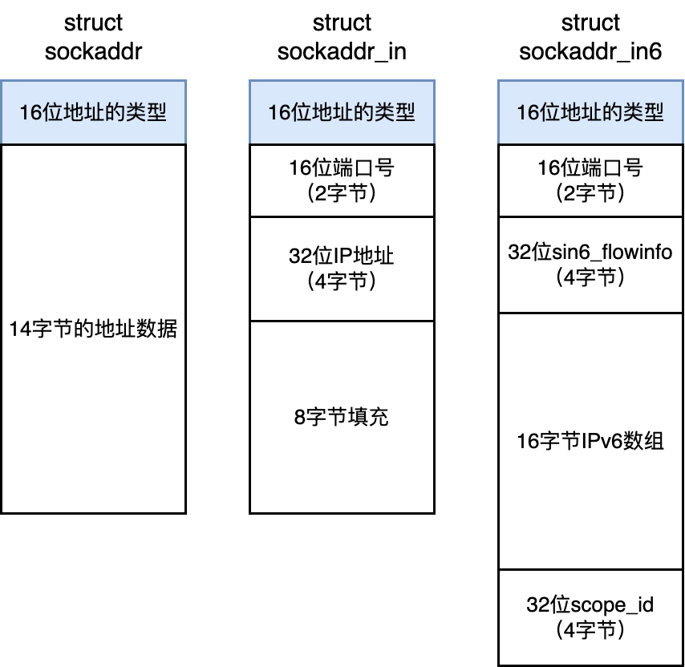
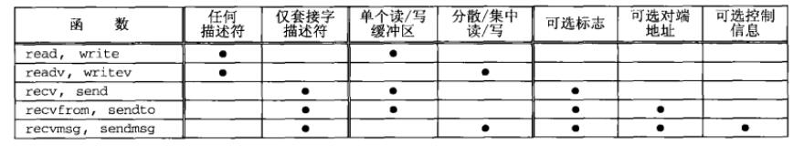
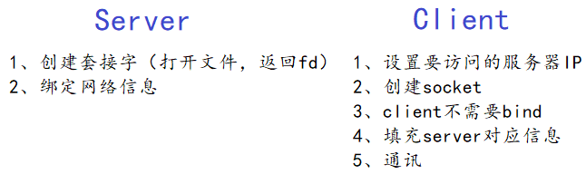
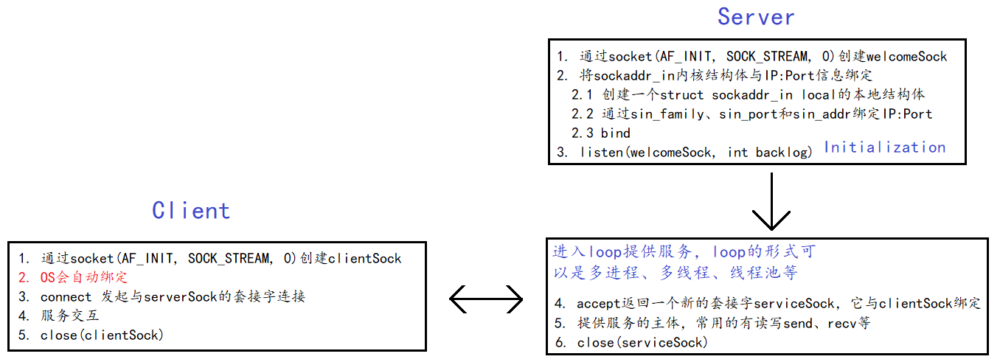
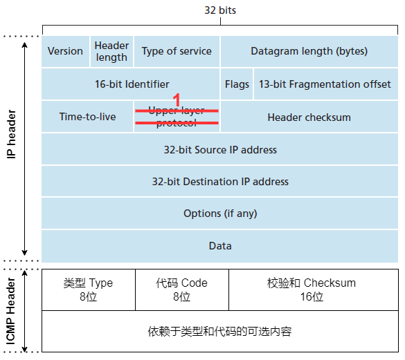
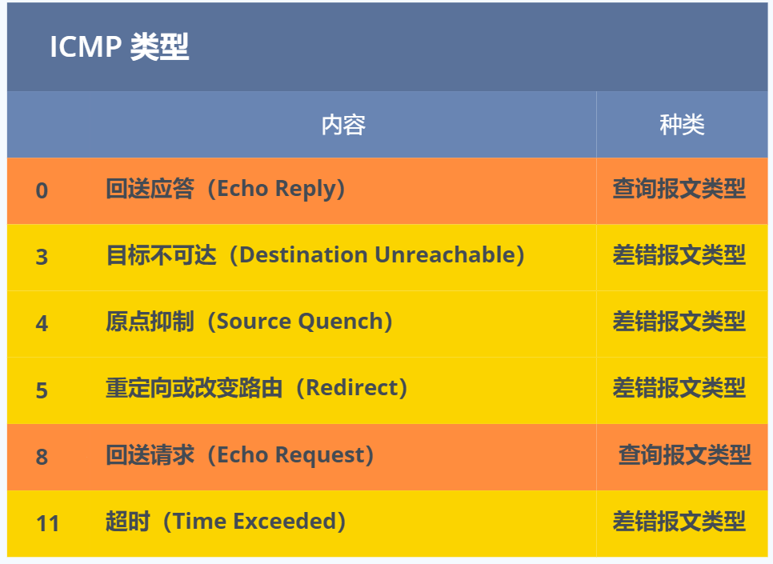

# 套接字编程

## *网络端口*

### 端口号 Port

IP地址可以完成主机和主机的通信，而主机上各自的通信进程才是发送和接收数据的一方，比如一个服务器上的应用程序是一个提供服务的进程，而用户是一个接收服务的进程

**端口号 port 用来确保该主机上的进程的唯一性**， `IP:Port` 标识互联网中**唯一的一个进程**，从而可以进行确定的进程间通信。**网络通信的本质，也是进程通信**

Linux中的System V属于本地进程通信，而**网络进程通信使用的是POSIX标准**

### pid和端口号的区别

pid是专门用来对系统进程调度进行管理的，若也用它来进行网络通信的定位，这就是将本地系统管理和网络通信强行耦合起来，这是不合理的。而且并不是所有进程都会进行网络通信的，若在这种这种情况下因为某些原因通过网路修改了OS相关的问题，会对OS的安全造成影响

端口号与pid一样，都是通过OS维护的哈希表来快速查找的

**一个进程可以关联多个端口号，但反过来一个端口号不能关联多个进程**

## *Socket编程*

### 什么是socket？

套接字通信是一种 IPC，它允许位于同一主机 (计算机) 或使用网络连接起来的不同主机上的应用程序之间交换数据

套接字是通信端点的抽象。套接字描述在UNIX系统中被当作是一种**文件描述符**，位于内核区

* UDP的socket是一个二元组：（目标IP，目标Port）
* TCP的socket是一个四元组：（源IP，源Port，目标IP，目标Port）
* 为什么TCP是一个四元组？是因为TCP在通信前需要建立一对一的连接，一个四元组可以建立一对一的会话关系。对于两个通信目标相同的UDP，从接收方来看是一样的

### 创建套接字

```c 
#include <sys/types.h>          /* See NOTES */
#include <sys/socket.h>
int socket(int domain, int type, int protocol);
			// Returns file descriptor on success, or -1 on error
```

* 参数
  * domain 确定通信特性，包括地址格式，各个域都有自己表示地址的格式
    
    * 网络通信：IPv4的 AF_INET 宏和 IPv6 的 AF_INET6 宏
    * 本地通信：AF_UNIX 宏
    
    有些UNIX实现可能会有PF开头的domain，AF 表示 地址族 address family，PF 表示 协议族 protocol family
    
  * type：套接字类型决定了通信的时候对应的报文类型
    * TCP流式：SOCK_STREAM，双向可靠字节流
    * UDP用户数据报：SOCK_DGRAM
    
  * protocol：协议类型
  
    * 网络通信设为0
    * 裸 socket(SOCK_RAW) 中会将 protocol 指定为 IPPROTO_RAW
  
* 创建成功返回新套接字的文件描述符sockfd，失败返回-1，设置errno

### 监听socket

```c
#include <sys/types.h>          /* See NOTES */
#include <sys/socket.h>
int listen(int sockfd, int backlog);
			// Returns O on success, or-1on error
```

* 成功返回0，失败返回-1，设置errno

* listen的第二个参数是底层的全连接队列的长度，表示在**不accept**的情况下最多可以为backlog+1个连接。若超出了这个长度，只会产生半连接，服务器停留在SYN_RCYD的状态

  SUSv3 规定实现应该通过在 `<sys/socket.h>` 中定义 SOMAXCONN 常量来发布这个限制。在 Linux 上, 这个常量的值被定义成了 128。通过 Linux 特有的/proc/sys/net/core/somaxconn 文件可以来调整这个限制

### 接收请求 accept

```cpp
#include <sys/types.h>          /* See NOTES */
#include <sys/socket.h>
int accept(int sockfd, struct sockaddr *addr, socklen_t *addrlen);
			// Returns file descriptor on success, or -1 on error
```

* 参数
  * 传入的sockfd套接字的核心工作是获取新的连接，称为接听socket
  * 输出型参数 `*addr`：连接者的地址
  * 输入输出型参数 `*addrlen`
* 成功返回一个非负的**新的**socket文件描述符，任务是为连接提供IO服务。失败返回-1，设置errno

### 建立连接 connect

建立连接：实际建立socket连接

```cpp
#include <sys/types.h>          /* See NOTES */
#include <sys/socket.h>
int accept(int sockfd, struct sockaddr *addr, socklen_t *addrlen);
			// Returns O on success, or -1 on error
```

### 终止连接

可以直接用关闭fd的文件IO接口 `int close(int fd);` 来关闭fd对应的socket。此时在套接字上**会将双向通信通道的两端都关闭**

假设在关闭一个连接之后，对等应用程序崩溃了或没有读取或错误处理了之前发送给它的数据。在这种情况下就无法知道已经发生了一个错误。如果需要确保数据被成功地读取和处理,那么就必须要在应用程序中构建某种确认协议。这通常由一个从对等应用程序传过来的显式的确认消息构成

有时只关闭连接的一端也是有用处的，这样数据只能在一个方向上通过套接字传输，通过 `shutdown()` 来提供对关闭套接字的更精细的控制

```c
#include <sys/socket.h>
int shutdown(int sockfd, int how);
			// Returns O on succesS, or -1 on error
```

根据参数 how 的值选择关闭套接字通道的一端还是两端

* SHUT_RD：关闭连接的读端
* SHUT_WR：关闭连接的写端
* SHUT_RDWR：同时关闭连接的读、写端

## *bind详解*

bind这一步有很多细节和让人疑惑的地方，我们拿出来描述一下

### 绑定地址 bind

绑定**本地**内核套接字与本地结构体（填充了 `IP:Port` 信息）栈地址（可能是不同的本地域）。这是一个比较容易让人产生疑惑的点，bind的对象一直都是自己的 `IP:Port` 和结构体，和通信对象没有关系，具体如何建立连接对于TCP是 `connect()` 的事情，而UDP直接用 `send()` 指明发送对象的 `IP:Port `就行（当然，发送前要创建并填充发送对象的 `sockaddr_in` 结构体）

```c
#include <sys/types.h>          /* See NOTES */
#include <sys/socket.h>
int bind(int sockfd, const struct sockaddr *addr, socklen_t addrlen);
			// Returns O on success, or -1 on error
```

* 参数
  * sockfd：已创建的待绑定的套接字文件描述符
  * \*addr：本地特地类型的 `sockaddr` 结构体地址
  * addrlen：`sockaddr` 结构体的大小
* 成功返回0，失败返回-1，设置errno

### 地址填充

在bind之前要把server的 `<ip:port>` 填充进 `struct sockaddr_in`

```c
// 2.1 填充服务器信息
struct sockaddr_in local;          // 用户栈上
memset(&local, 0, sizeof(local));  // 清空，local中可能有一些垃圾值
local.sin_family = PF_INET;        // 和AF_INET是一样的
local.sin_port = htons(_port);
_ip.empty() ? (local.sin_addr.s_addr = INADDR_ANY)
            : (inet_aton(_ip.c_str(), &local.sin_addr));

// 2.2 本地socket信息，写入_sock对应的内核区域
bind(_listenSock, (const struct sockaddr *)&local, sizeof(local))
```

这里有两个特别值得注意的问题

1. 为什么要把地址设置为INADDR_ANY？
2. 为什么要将bind & accept的第二个参数强转为 `const struct sockaddr *`？

### INADDR_ANY

当服务器绑定到 `INADDR_ANY` 时，表示它监听所有可用的网络接口，即所谓多宿主机 multihomed（一张网卡一个ip）的通配地址 wildcard address。这样的服务器在任何本地接口上都可以接受连接。当客户端希望连接服务器时，它需要知道服务器所在的主机名或IP地址

试想有3张网卡，如果绑定某个具体的ip地址，那么只能监听所设置的ip地址所在的网卡的端口，其它两块网卡无法监听端口，如果需要三个网卡都监听，那就需要绑定3个ip，也就等于需要管理3个套接字进行数据交换，这样会很繁琐。而当绑定通配地址 INADDR_ANY 的时候，只要管理一个套接字就行，不管数据是从哪个网卡过来的，只要是绑定的端口号过来的数据就都可以接收到

SUSv3 并没有为 INADDR_ANY 规定一个特定的值，但大多数实现将其定义成了0.0.0.0

INADDR_ANY：程序员不关心会bind到哪一个IP，有些时候host会有多个IP

* 任意地址bind，强烈推荐的做法，所有服务器一般的做法
* `inet_addr` 进行指定绑定到具体的IP，特殊用途，或者测试时使用。除了做转化，还自动进行 `hton`

那么客户端应该怎么知道服务器到底绑定到了哪个地址呢？有几种方法可以让客户端知道服务器的IP地址：

1. **域名：** 如果服务器有一个域名，客户端可以通过解析该域名来获取服务器的IP地址。这通常是在客户端进行DNS解析的方式，将域名解析为实际的IP地址。
2. **手动配置：** 在一些情况下，客户端可能事先知道服务器的IP地址，可以直接将其硬编码到应用程序中。这种方式在一些特定的场景中是可行的，但在实际应用中可能并不常见，因为IP地址可能会发生变化。
3. **服务发现：** 在某些情况下，服务发现机制可以被用来让客户端动态地发现服务器的IP地址。服务发现工具或协议（如Consul、etcd、ZooKeeper等）可以帮助客户端发现可用的服务及其地址。这种发布可以通过向一个中心目录服务应用程序注册服务器的地址来完成,之后客户端可以通过这个服务来获取服务器的地址。当然，目录服务应用程序的 socket 必须要位于一个众所周知的地址上

### sockaddr 结构体

socket通信除了网络通信，还有一种域间socket Domain socket用于本地通信，它本质上是一种双向管道的本地文件通信。即socket既可以用于跨网络也可以用于本地通信，做到了跨网络和本地通信的统一，因此可以很容易地被整合进文件系统（Linux一切皆文件），逐渐的替代了原来的System V本地通信标准

为了让socket做到跨网络和本地通信的兼容性，设计了 `sockaddr_in` 和 `sockaddr_un` 两个结构体分别来表征两种通信方式，又设计了一套整合前面两种方式的 `sockaddr` 来实现统一的API。这个类型的唯一用途是将各种 domain 特定的地址结构转换成单个类型以供 socket 系统调用中的各个参数使用

一个地址表示一个特定通信域的套接字端点，地址格式与这个特定的通信域相关，为了使不同格式地址能传入到套接字函数，地址会被强制转换为一个通用的地址结构 `sockaddr`，类似于多态的概念

```c
struct sockaddr {
	sa_family_t sa_family;          /* Address family (AF_* constant) */
	char sa_data[14];               /* Socket address (size varies
                                       according to socket domain) */
};
```

### sockaddr_in & sockaddr_in6

用于网络通信的 AF_INET IPv4 domain 的 sockaddr_in 结构体定义在 `<netinet/in.h>` 中

* `sin_port` 用来表示一个端口号，类型是一个 `uint16_t` 16位整数，所以转换的时候用s相关的函数
* `in_addr` 用来表示一个IPv4的IP地址，类型是一个 `uint32_t` 32位的整数，所以转换的时候用l相关的函数

````cpp
struct in_addr {              /* IPV4 4-byte address */
	in_addr_t s_addr;         /* Unsigned 32-bit integer */
};
struct sockaddr_in {          /* IPv4 socket address */
	sa_family_t sin_family;   /* Address family (AF_INET) */
	in_port_t sin_port;       /* Port number */
	struct in_addr sin_addr;  /* IPv4 address */
	unsigned char __pad[X];   /* Pad to size of 'sockaddr'
								structure (16 bytes)*/
};
````

而用于 AF_INET6 IPv6 domain 的 sockaddr_in6 的定义则是

```c
struct in6_addr {               /* IPv6 address structure */
	uint8_t s6_addr[16];        /* 16 bytes == 128 bits */
};
struct sockaddr_in6 {           /* IPv6 socket address */
	sa_family_t sin6_family;    /* Address family (AF_INET6) */
	in_port_t sin6_port;        /* Port number */
	uint32_t sin6_flowinfo;     /* IPv6 flow information */
	struct in6_addr sin6_addr;  /* IPv6 address */
	uint32_t sin6_scope_id;     /* Scope ID (new in kernel 2.4) */
};
```



很多网络编程函数诞生早于 IPv4 协议，那时候都使用的是 sockaddr 结构体，为了向前兼容，现在 sockaddr 退化成了 `(void*)` 的作用，传递一个地址给函数，至于这个函数是 sockaddr_in 还是其他的，由地址族确定，然后函数内部再强制类型转化为所需的地址类型

之所以API的接口中暴露出了 `sockaddr` 而不是直接使用 `void*` 来进行接收后强转，是因为在设计这套接口的时候C语言并不支持 `void*`

相当于先判断是 `AF_INET` 还是 `AF_UNIX` 然后再对后面的地址进行强转

## *字符串 & 二进制形式之间的转换*

### IP地址转换

```c
#include <arpa/inet.h>
int inet_pton(int af, const char *src, void *dst);
			// Returns 1 on successful conversion, O if src_str is not in
			// presentation format, or -l on error
const char *inet_ntop(int af, const void *src, char *dst, socklen_t size);
			// Returns pointer to dst_str on success, or NULL on error
```

p表示presentation，即人类可读的字符串形式；n表示network，即二进制IP形式

* inet_pton 将字符串地址转换为整形地址

  * af 参数应该被指定为 AF_INET 或 AF_INET6
  * 转换得到的地址会被放在 dest 指向的结构中，它应该根据在 af 参数中指定的值指向一个 in_addr 或 in6_addr 结构

* 将整形地址转换为字符串地址

  得到的以 null 结尾的字符串会被放置在 dst_str 指向的缓冲中。 size 参数必须被指定为这个缓冲器的大小。 inet_ntop 在成功时会返回 dst_str。如果 len 的值太小了，那么 inet_ntop 会返回 NULL 并将 errno 设置成 ENOSPC

### 主机和服务名与二进制形式之间的转换

最好不要使用上面提供的这些IP地址函数，而不是将一个 IP 地址转换/解析成主机名

* 将一个 IP 地址解析成主机名可能需要向一台 DNS 服务器发送一个耗时较长的请求
* 在一些场景中，可能并不存在一个 DNS(PTR)记录将 IP 地址映射到对应的主机名上

```c
#include <sys/types.h>
#include <sys/socket.h>
#include <netdb.h>

int getaddrinfo(const char *node, const char *service,
               const struct addrinfo *hints,
               struct addrinfo **res);
int getnameinfo(const struct sockaddr *addr, socklen_t addrlen,
               char *host, socklen_t hostlen,
               char *serv, socklen_t servlen, int flags);
```

* getaddrinfo：给定一个主机名和一个服务名，getaddrinfo 会返回一组包含对应的二进制IP 地址和端口号的结构
* getnameinfo：将一个 IP 地址和端口号转换成对应的主机名和服务名

### 废弃API

* IP地址转换：inet_aton 和 inet_ntoa 只能处理IPv4
* 主机和服务名与二进制形式之间的转换
  * gethostbyname 返回与主机名对应的二进制 IP 地址，getservbyname 函数返回与服务名对应的端口号
  * 逆向：gethostbyaddr 和 getservbyport

## *网络字节序说明*

### 网络字节序 Endianness


字节序是一个处理器架构特性，用于指示像整数这样的大数据类型内部的字节如何排序

内存中的多字节数据相对于内存地址有大端和小端之分，网络数据流同样也有大小端之分。那么如何定义网络数据流的地址呢？

* 发送host通常将发送**缓冲区**中的数据按**内存地址从低到高**的顺序发出
* 接收host把从网络上接到的字节也是**按内存地址从低到高**的顺序依次保存在接收缓冲区中
* 因此网络数据流的地址就如此规定：先发出、先接收到的数据流为低地址，后发出、后接受的数据为高地址

TCP/IP协议规定，网络数据流应采用**大端**，即**低地址高字节**。被称为网络字节序 Network Byte Order

* 不论host是大端机还是小端机，都要按照该TCP/IP规定传输数据，否则就不能实现跨网络通信
* 若当前发送host为小端机，就要先把数据转成大端   后再发送；如是大端机就忽略，直接发送

### 字节序调整函数

为了使网络程序具有可移植性，使同样的C代码在大端机和小端机上编译后都能正常运行，可以调用以下库函数做网络字节序和主机字节序的转换

```c
#include <arpa/inet.h>
uint32_t htonl(uint32_t hostlong);
			// Returns host_uint32 converted to network byte order
uint16_t htons(uint16_t hostshort);
			// Returns host_uint16 converted to network byte order
uint32_t ntohl(uint32_t netlong);
			// Returns net_wint32 converted to host byte order
uint16_t ntohs(uint16_t netshort);
			// Returns net_wint16 converted to host byte order
```

* 命名中的h表示host，n表示network，l表示32为长整数，s表示16为短整数
* 若host是小端机，函数将参数做相应转换后返回；若host是大端机，将参数原封不动返回

## *数据传输函数*

<https://blog.csdn.net/qq_31833457/article/details/78495354>



这些函数之间的联系在于它们都用于数据传输和读写操作，但是其具体使用方式、参数和适用场景有所不同。需要根据你所使用的文件描述符类型（套接字、文件等）、是否已建立连接以及想要实现的功能来选择适当的函数

流socket上IO的语义与管道IO的语义基本一样

### read/write

1. `read` 函数

   * `read` 函数是用于**从文件描述符（包括套接字）**读取数据的系统调用

   * 它是在文件描述符上使用的，例如标准输入、文件或套接字

   * `read` 函数将读取指定数量的字节并将其存储到**缓冲区**中，返回实际读取的字节数或错误代码

2. `write` 函数

   * `write` 函数是用于向文件描述符（包括套接字）写入数据的系统调用
     
   * 它是在文件描述符上使用的，例如标准输出、文件或套接字
     
   * `write` 函数将指定数量的字节从缓冲区写入文件描述符，返回实际写入的字节数或错误代码

### recv/send：TCP

```c
#include <sys/types.h>
#include <sys/socket.h>
ssize_t recv(int sockfd, void *buf, size_t len, int flags);
			// Returns number of bytes received, 0 on EOF, or -l on error
ssize_t send(int sockfd, const void *buf, size_t len, int flags);
			// Returns number of bytes sent, or -1 on error
```

1. `recv` 函数
   * `recv` 函数用于从已连接套接字接收数据
   * 它是在已建立连接的套接字上使用的，例如 TCP 套接字
   * `recv` 函数返回实际接收的字节数或错误代码
2. `send` 函数：
   * `send` 函数用于将数据发送到已连接套接字的另一端
   * 它是在已建立连接的套接字上使用的，例如 TCP 套接字
   * `send` 函数返回实际发送的字节数或错误代码

### recvfrom/sendto：UDP

recvfrom和sendto用于无连接的数据报套接字上使用的，例如 UDP 套接字

```c
#include <sys/types.h>
#include <sys/socket.h>
ssize_t recvfrom(int sockfd, void *buf, size_t len, int flags,
                struct sockaddr *src_addr, socklen_t *addrlen);
			// Returns number of bytes received, 0 on EOF, or -l on error
ssize_t sendto(int sockfd, const void *buf, size_t len, int flags,
                      const struct sockaddr *dest_addr, socklen_t addrlen);
			// Returns number of bytes sent, or -1 on error
```

1. `recvfrom` 函数
   * `recvfrom` 函数用于从**无连接套接字接收数据**，并获取数据的源地址
   * `recvfrom` 函数返回实际接收的字节数、源地址以及其他相关信息，或错误代码
2. `sendto` 函数
   * `sendto` 函数用于将数据发送到指定的目标地址
   * `sendto` 函数返回实际发送的字节数或错误代码

### recvmsg/sendmsg：扩展recv/send

```c
#include <sys/types.h>
#include <sys/socket.h>
ssize_t recvmsg(int sockfd, struct msghdr *msg, int flags);
			// Returns number of bytes received, 0 on EOF, or -l on error
ssize_t sendmsg(int sockfd, const struct msghdr *msg, int flags);
			// Returns number of bytes sent, or -1 on error
```

1. `recvmsg` 函数
   * `recvmsg` 函数用于从已连接套接字接收数据，并获取更多的相关信息
   * 它是在已建立连接的套接字上使用的，例如 TCP 套接字
   * `recvmsg` 函数返回实际接收的字节数、相关信息以及其他相关信息，或错误代码
2. `sendmsg` 函数
   * `sendmsg` 函数用于将数据发送到已连接套接字的另一端，并附带更多的相关信息
   * 它是在已建立连接的套接字上使用的，例如 TCP 套接字
   * `sendmsg` 函数返回实际发送的字节数或错误代码

### readline

### sendfile

## *套接字选项*

### API

套接字选项能影响到套接字操作的多个功能，系统调用 setsockopt 和 getsockopt 分别用来设定和获取套接字选项

```c
#include <sys/types.h>          /* See NOTES */
#include <sys/socket.h>
int getsockopt(int sockfd, int level, int optname,
              void *optval, socklen_t *optlen);
int setsockopt(int sockfd, int level, int optname,
              const void *optval, socklen_t optlen);
			// Both return O on success, or -1 on crror
```

* sockfd 代表指向套接字的fd
* level 指定了套接字选项所适用的协议，一般都设置为 SOL_SOCKET，这表示选项作用于套接字 API 层
* optname 是我们希望设定或取出的套接字选项
* optval 是一个指向缓冲区的指针，用来指定或者返回选项的值
* optlen 指定了由 optval 所指向的缓冲区空间大小（字节数）

注意：由 accept 返回的套接字fd从监听套接字中继承了可设定的套接字选项值

### SO_REUSEADDR

用 SO_REUSEADDR 可以避免当 TCP 服务器重启时，尝试将套接字绑定到当前已经同 TCP 结点相关联的端口上时出现的 EADDRINUSE（地址已使用）错误

造成这种错误的主要原因是之前连接到客户端的服务器要么通过 close，要么是因为崩溃（例如被信号杀死）而执行了一个主动关闭。 这就使得 TCP 结点将处于 TIME_WAIT 状态, 直到 2 倍的 MSL 超时过期为止

```C
int sockfd, optval = 1;
sockfd = socket (AF_INET, SOCK_STREAM, O);
setsockopt(sockfd, SOL_SOCKET, SO_REUSEADDR, &optval);
```

## *简单的UDP网络程序*



UDP socket：本地IP和本地端口，无连接通信，不需要 `connect()`

### Server

首先对Server进行封装

```cpp
class UdpServer {
public:
    UdpServer(int port, std::string ip=""):_port((uint16_t)port), _ip(ip), _sockfd(-1) {}
        //初始化列表设为1，用init接口进行创建
    ~UdpServer() {}
public:
    void init() {} //初始化server
    void start() {} //启动server
private:
    uint16_t _port; //服务器必须要有端口号信息
    std::string _ip;
    int _sockfd; //服务器的socket fd信息
    std::unordered_map<std::string , struct sockaddr_in> users; //记录用户信息
};
```

1. 创建socket套接字，相当于打开了一个文件，返回一个文件描述符fd

   ```cpp
   _sockfd = socket(AF_INET, SOCK_DGRAM, 0); 
   // _sockfd<0 是的差错控制和log
   ```

2. 绑定网路信息，指定 `IP:Port`，服务器是要提供服务的，必须要确定一个端口

   1. 先填充基本信息到 `struct sockaddr_in`

      ```cpp
      //local是在用户栈开辟的临时变量，要进行bind写入到内核中
      struct sockaddr_in local;
      bzero(&local, sizeof(local)); //初始化，也可以用memset
      //填充协议家族
      local.sin_family = AF_INET;
      //填充服务器对应的端口号信息，端口号一定要相互传输，所以要转大端
      local.sin_port = htons(_port);
      local.sin_addr.s_addr = _ip.empty() ? htonl(INADDR_ANY) : inet_addr(_ip.c_str());
      ```

      INADDR_ANY(0)：程序员不关心会bind到哪一个IP，有些时候host会有多个IP

      * 任意地址bind，强烈推荐的做法，所有服务器一般的做法
      * `inet_addr` 进行指定绑定到具体的IP，特殊用途，或者测试时使用。除了做转化，还自动进行 `hton`

   2. 绑定网络信息

      ```cpp
      if (bind(_sockfd, (const struct sockaddr*)&local, sizeof(local)) == -1) {
          logMessage(FATAL, "bind: %s:%d", strerror(errno), _sockfd);
          exit(2);
      }
      ```

`inet_nota` 的作用是把一个4字节IP地址转换成十进制

### Client

1. 根据命令行，设置要访问的服务器IP

2. 创建socket

3. client不需要bind

   * 不需要指的是用户自己不需要自己bind端口信息，因为OS会自动绑定。也推荐这么做，但如果用户非得自己绑定，也可以，但很不推荐
   * 这是因为客户端不需要指定一个固定的本地地址来接收数据，而是通过服务器返回的地址来接收数据。具体来说，客户端的套接字在调用 `connect()` 函数时，会自动分配一个临时的本地端口号，并将该端口号发送给服务器。服务器在收到连接请求后，会返回一个已连接的套接字地址，该地址包括服务器的IP地址和端口号。客户端通过这个地址与服务器进行通信
   * 那么server为什么需要bind呢？因为server提供的服务，必须让所有clients知道自己的port，且不能随便更改，不然就不能找到一个随机的port

4. 填充server对应信息

   ```cpp
   server.sin_family = AF_INET;
   server.sin_port = htons(server_port);
   server.sin_addr.s_addr = inet_addr(server_ip.c_str());
   ```

5. 通讯过程

   下面的读取和发送专用于UDP的用户数据报

   ```c
   #include <sys/types.h>
   #include <sys/socket.h>
   ssize_t recv(int sockfd, void *buf, size_t len, int flags);
   ssize_t recvfrom(int sockfd, void *buf, size_t len, int flags,
                    struct sockaddr *src_addr, socklen_t *addrlen);
   ssize_t recvmsg(int sockfd, struct msghdr *msg, int flags);
   ```

   ```cpp
   #include <sys/types.h>
   #include <sys/socket.h>
   ssize_t send(int sockfd, const void *buf, size_t len, int flags);
   ssize_t sendto(int sockfd, const void *buf, size_t len, int flags,
                  const struct sockaddr *dest_addr, socklen_t addrlen);
   ssize_t sendmsg(int sockfd, const struct msghdr *msg, int flags);
   ```

## *简单的TCP网络程序*



### General design

通过 `socket` 创建套接字，然后将这个套接字与本地

### 单进程版本server

单进程提供服务内部是死循环，一旦进入主执行流就无法向后执行，因此虽然能够同时和多个client建立连接，但无法同时为它们提供服务

相比UDP，TCP server需要进行listen和accept

1. 创建socket套接字 相当于打开了一个文件
2. 绑定网路信息，指定 IP:Port
   1. 先填充基本信息到 `struct sockaddr_in`
   2. 绑定网络信息
3. listen 监听socket，tcp是面向连接的
4. accept 获取连接
5. 提供服务

### 单进程版本client

1. 创建socket套接字
2. 需要bind，但不需要自己显式bind
3. 不需要listen，因为没人连client
4. 不需要accept
5. 需要connet，向服务器发起连接请求
   1. 先填充需要连接的远端主机的基本信息
   2. 发起请求，connet会自动进行bind

### 简单的TCP网络程序（多进程版）

多进程版本创建子进程提供多个服务。多进程时，创建出来的子进程会继承父进程的fd，这也就包括了socket fd，因此虽然welcomeSocket与固定端口绑定了，但是不影响子进程使用accept返回的serviceSocket

accept是阻塞式的等待，所以要通过多进程、多线程和线程池的方式实现并发

> If no pending connections are present on the queue, and the socket is not marked as nonblocking, accept() **blocks** the caller until a connection is present. If the socket is marked nonblocking and no pending connections are present on the queue, accept() fails with the error EAGAIN or EWOULDBLOCK. -- man accept

多进程server提供服务

* 用signal来控制

  ```cpp
  signal(SIGCHLD, SIG_IGN); //Only Linux valid
  //SIG_IGN 忽略，子进程在终止时会自动清理掉,不会产生僵尸进程，也不会通知父进程
  // ...
  //5.1 v1版本 -- 多进程版本，父进程打开的fd会被子进程拿到
  pid_t id = fork();
  assert(id != -1);
  if (id == 0)
  {
      close(_listenSock); //建议关掉
      //子进程
      transService(serviceSock, peerIP, peerPort);
      exit(0);
  }
  //父进程
  close(serviceSock);
  ```

* 用系统领养来控制

  ```cpp
  // 5.1 v1.1 版本 -- 多进程版本
  //爷爷进程
  pid_t id = fork();
  if (id == 0)
  {
      //爸爸进程
      close(_listenSock); //建议
      //又进程了以此fork，让爸爸进程终止
      if (fork() > 0)
          exit(0);
      //孙子进程，爸爸进程被终止，变成了孤儿进程，被系统领养，回收问题就交给了系统来回收
      transService(serviceSock, peerIP, peerPort);
      exit(0);
  }
  //父进程
  close(serviceSock);
  //爸爸进程直接终止，立马得到退出码，释放僵尸进程状态
  pid_t ret = waitpid(id, nullptr, 0); //阻塞时等待
  assert(ret > 0);
  (void)ret;
  ```

### 简单的TCP网络程序（多线程版）

```cpp
static void *threadRoutine(void *args) {
    pthread_detach(pthread_self()); //设置线程分离
    ThreadData *td = static_cast<ThreadData *>(args);
    td->_this->transService(td->_sock, td->_clientIP, td->_clientPort); //transService放在server类外
    delete td;
    return nullptr;
}
void loop() {
    while (true) {
        //多线程不需要关闭文件描述符，多线程会共享文件描述符
        pthread_t tid;
        ThreadData *td = new ThreadData(peerPort, peerIP, serviceSock, this);
        pthread_create(&tid, nullptr, threadRoutine, (void*)td);
        //不能pthread_join
    }
}
```

### 简单的TCP网络程序（线程池）

* 改造Task

  ```cpp
  class Task {
  public:
      using callBack_t = std::function<void (int, std::string, uint16_t)>;
  private:
      int _sock; //给用户提供IO服务的sock
      uint16_t _port; //client port
      std::string _ip; //client ip
      callBack_t _func; //回调方法
  public:
      Task(): _sock(-1), _port(-1)
      {}
      Task(int sock, std::string ip, uint16_t port, callBack_t func)
          : _sock(sock), _ip(ip), _port(port), _func(func)
      {}
      void operator() () //让Task对象成为一个仿函数 Task()
      {
          _func(_sock, _ip, _port);
      }
      ~Task()
      {}
  };
  ```
  
* 构建任务

  ```cpp
  void loop() {
      _tp->start(); //启动线程池
  
      while (true) {
          //5. 获取连接，accept的返回值是一个新的套接字文件描述符
          //5.1 获取客户端基本信息
          //...
          //6 构建任务
          Task t(serviceSock, peerIP, peerPort,\
                	std::bind(&ServerTcp::transService, this,\ 
                  std::placeholders::_1,std::placeholders::_2, std::placeholders::_3));
          _tp->push(t); //push进线程池，由线程池进行分发
      }
  }
  ```

采用了**function包装器和bind调整参数**的方法

* Task的第四个属性是回调函数，然后在Task内部通过仿函数在进行调用，这相当于进行了**解耦**，Task并不实现具体的任务，具体执行什么任务需要在类外通过回调函数的方式传入，比如 `execCommand`、`transService` 这种函数指针。换任务的时候线程池、Task类都不用改，只要改服务器里给用户具体提供服务的接口就行了
* 因为 `transService` 是定义在 `ServerTCP` 中的非静态类方法，它的第一个参数为this，一共由4个参数，多于回调函数需要的3个参数，因此进行 `std::bind`，相当于是先把this指针传入 `transService` ，然后返回一个只有3个参数的新的可调用对象
* 若不想绑定的话可以把 `transService` 放到类外面 `ServerTCP` 外，然后直接 `Task t(serviceSock, peerIP, peerPort, transService);` 就完成任务构建了

一个问题：若server在保有连接的时候，server自己先因为一些原因而导致退出，服务器无法立即重启


# Linux网络栈


### 网络栈文件

1. 文件的实现主要在/linux/net目录下。
2. /linux/net目录下的几乎每个文件夹就是一个协议族的集合。如ipv6,ipv4,802,ATM。
3. 对于ipv4的网络层，传输层的实现分布在/linux/net/ipv4中。
4. 协议无关接口层和设备无关接口层分布在/linux/net/core文件夹中

# 虚拟网络设备

Linux系统中有大量的模块、隔离等，所以Linux就模仿真实世界中的网络通信一样，在内部设置了大量的虚拟网络设备，来实现这些模块和隔离设备之间的通信

Linux系统中的虚拟网络设备是一种软件实体，用于模拟和支持网络功能。这些设备允你在系统内创建虚拟网络接口、路由数据以及执行其他网络相关任务，而无需物理硬件支持。以下是一些常见的Linux虚拟网络设备：

* 虚拟以太网接口 Virtual Ethernet Interface：TAP

* 虚拟路由器接口：TUN

* 虚拟回环接口 Loopback Interface：`lo` 设备是一个特殊的虚拟网络设备，用于本地主机内部的网络通信。它通常用于在本地主机上进行回环测试和本地通信

* 桥接设备 Bridge Interface：br设，桥接设备允许将多个网络接口连接在一起，形成一个网络桥接，实现不同网络之间的通信。这常用于构建虚拟局域网和容器网络

* 虚拟隧道设备 Virtual Tunnel Interface：gre设备 Generic Routing Encapsulation Interface 是一种通用的隧道协议，用于在不同网络之间封装和传输数据包

这些虚拟网络设备允许系统管理员和开发人员在Linux系统上创建复杂的网络拓扑，测试网络配置，以及实现各种网络功能。虚拟网络设备通常通过工具如iproute2套件中的ip命令来进行配置和管理

## *Network Namespace*

Network Namespace（简称netns）namespace 隔离的一种，允许在同一系统上创建和使用多个独立的网络堆栈。每个Network Namespace都有自己独立的网络接口、IP地址、路由表和防火墙规则，使得不同的命名空间之间的网络环境互相隔离。这种隔离性使得在一个系统上可以运行多个相互独立的网络环境，每个都有自己的网络配置和连接。比如docker就使用了netns来实现容器之间的网络隔离特性

使用Network Namespace的典型场景包括容器技术，其中每个容器都可以运行在独立的Network Namespace中，实现容器之间的网络隔离。此外，Network Namespace还可用于模拟网络拓扑、测试网络配置等方面

### 操作

```cmd
$ ip netns help
Usage:	ip netns list                  # 列出所有当前存在的 netns
	ip netns add NAME                  # 创建新的 netns
	ip netns attach NAME PID
	ip netns set NAME NETNSID
	ip [-all] netns delete [NAME]
	ip netns identify [PID]
	ip netns pids NAME
	ip [-all] netns exec [NAME] cmd ...   # 进入某个 netns 中执行命令
	ip netns monitor
	ip netns list-id [target-nsid POSITIVE-INT] [nsid POSITIVE-INT]
NETNSID := auto | POSITIVE-INT
```

* 进入 netns：使用`ip netns exec`命令可以在指定的Namespace中执行命令。例如：`ip netns exec ns1 bash`将进入名为ns1的Namespace并启动一个新的bash shell
* 连接 netns：不同的netns之间无法之间通信，需要借助下面的虚拟设备，比如 veth pari、bridge
* 路由和防火墙：每个 netns 都有自己独立的路由表和防火墙规则。这意味着可以在每个Namespace中配置不同的网络路由和防火墙策略，实现网络隔离

## *TAP/TUN*

https://www.zhaohuabing.com/post/2020-02-24-linux-taptun/

`TAP`（Tap）和 `TUN`（Tunnel）是Linux内核中的两种虚拟网络设备类型，**用于在用户空间和内核空间之间传递网络数据包，或者说允许用户态程序向内核协议栈注入数据**。它们通常用于实现虚拟私有网络（VPN）和虚拟化网络设备

### TAP/TUN是什么

* TAP设备是一种**第二层链路层**的虚拟以太网设备，可以在用户空间和内核空间之间传递完整的以太网帧。TAP设备通常用于模拟一个完整的以太网接口，允许用户空间程序以类似于物理网卡的方式处理网络数据包

  TAP设备主要用于实现虚拟私有网络（VPN）和虚拟局域网（VLAN）以及虚拟机、容器等场景，以使它们能够直接与物理网络通信

* TUN设备是一种第三层网络层的点对点设备（相当于是路由器），用于在用户空间和内核空间之间传递IP数据包。TUN设备只传递IP层数据包，而不处理链路层（如以太网帧）

  TUN设备通常用实现隧道协议，如IP隧道（IP tunneling）以及创建虚拟私有网络（VPN）连接，将用户空间的数据包封装为IP包。这使得可以在两个网络节点之间建立虚拟的点对点连接。

这两种设备允许用户空间的程序通过一组系统调用（如`read`和`write`）来读取和写入网络数据包，从而实现用户空间对网络数据包的控制和处理。在许多网络虚拟化和隧道技术中，TAP和TUN设备都被广泛使用

### 操作

在Linux系统中，可以使用`ip`和`ifconfig`等命令配置和管理TAP和TUN设备。它们提供了一种灵活的方式，使用户空间程序能够直接参与网络数据的传输和处理

* TAP

  ```cmd
  $ sudo ip tuntap add mode tap name tap0    # 创建TAP设备
  $ sudo ip link set tap0 up                 # 启用TAP设备
  $ sudo ip addr add 192.168.1.1/24 dev tap0 # 配置IP地址
  $ sudo ip link set tap0 down               # 关闭TAP设备
  ```

* TUN

  ```cmd
  $ sudo ip tuntap add mode tun name tun0    # 创建TUN设备
  $ sudo ip link set tun0 up                 # 启用TUN设备
  $ sudo ip addr add 192.168.2.1/24 dev tun0 # 配置IP地址
  $ sudo ip link set tun0 down               # 关闭TUN设备
  ```

tun/tap 设备创建成功后可以当作普通的网卡一样使用

### 例子

* 使用TAP设备创建 VPN
  1. 创建两个TAP设备，分别命名为`tap0`和`tap1`
  2. 启用这两个TAP设备
  3. 配置各自的IP地址
  4. 在两个主机之间建立VPN连接
* 使用TUN设备实现隧道通信：
  1. 创建两个TUN设备，分别命名为`tun0`和`tun1`
  2. 启用这两个TUN设备
  3. 配置各自的IP地址
  4. 使用隧道协议（例如IPsec或GRE）在两个主机之间建立通信隧道

## *veth*

https://zhuanlan.zhihu.com/p/293659939

veth pair是一对虚拟网络设备，一端发送的数据会由另外一端接受

当需要通信的节点数量增加时，veth 的数量也会极速增加，形成非常复杂的拓扑，所以实际中很少会用veth，一般会用下面的虚拟网桥

## *虚拟网桥*

https://zhuanlan.zhihu.com/p/293667316

Linux 的虚拟网桥 virtual bridge 是一种网络设备文件，有着和物理网桥/交换机一样的功能，它用于连接不同的网络接口，并允许数据在这些接口之间进行转发。比如说可以对主机上真实的物理网卡（如eth0，eth1），或虚拟的网卡（tap0，tap1，vnet0，vnet1）之间进行桥接。桥接上来的网卡就相当于网桥上的端口。 端口收到的数据包都是提交到这个虚拟网桥，让其进行转发

Linux 内核中有一个名为 `bridge` 的模块，它提供了虚拟网桥的核心功能。这个模块允许创建和管理虚拟网桥设备

### brctl 命令行工具

`brctl` 是一个命令行工具，用于配置和管理虚拟网桥

```cmd
$ brctl help
never heard of command [help]
Usage: brctl [commands]
commands:
	addbr     	<bridge>		add bridge    # 创建虚拟网桥
	delbr     	<bridge>		delete bridge # 删除虚拟网桥
	addif     	<bridge> <device>	add interface to bridge # 添加物理或虚拟网络接口
	delif     	<bridge> <device>	delete interface from bridge
	hairpin   	<bridge> <port> {on|off}	turn hairpin on/off
	setageing 	<bridge> <time>		set ageing time
	setbridgeprio	<bridge> <prio>		set bridge priority
	setfd     	<bridge> <time>		set bridge forward delay
	sethello  	<bridge> <time>		set hello time
	setmaxage 	<bridge> <time>		set max message age
	setpathcost	<bridge> <port> <cost>	set path cost
	setportprio	<bridge> <port> <prio>	set port priority
	show      	[ <bridge> ]		show a list of bridges
	showmacs  	<bridge>		show a list of mac addrs
	showstp   	<bridge>		show bridge stp info
	stp       	<bridge> {on|off}	turn stp on/off
```

配置IP地址：虚拟网桥可以配置IP地址，但通常它本身不直接用于通信，配置IP地址是为了方便网桥所在的主机和网桥所桥接的网卡（包括虚拟网卡）。可以为虚拟网桥分配IP地址，例如：

```cmd
$ sudo ip addr add 192.168.1.1/24 dev mybridge
$ sudo ip link set mybridge u
```

注意：必须给网桥br0配制IP地址，且保持和tap0所对应的虚拟机网卡上配制的ip地址在同一网段，这样才能从主机中直接访问到虚拟机

# 抓包工具

## *简介*

市面上主流的抓包分析工具有

* Win/MacOS: Wireshark, Fiddler, Charles, BurpSuite, F12
* Linux: tcpdump

### PCAP文件

PCAP（Packet Capture）文件是一种常见的网络数据包捕获文件格式，它用于存储网络数据包的内容。PCAP文件通常由网络监控和分析工具生成，例如Wireshark、tcpdump等

PCAP文件可以包含从网络中捕获的各种数据包，包括以太网帧、IP数据包、TCP和UDP数据报等。这些数据包可以包含网络通信中的各种信息，如源IP地址、目标IP地址、端口号、协议类型、数据载荷等

## *Wireshark*

### 混杂模式

* 混杂模式 promiscuous mode 就是接收所有经过网卡的数据包，包括不是发给本机的包，即不验证包的MAC地址
* 普通模式下网卡只接收发给本机的包（包括广播包）传递给上层程序，其它的包一律丢弃

一般来说，混杂模式不会影响网卡的正常工作，多在网络监听工具上使用

Wireshark 中可以通过 capture - options 来打开或关闭

### TShark

TShark (Terminal Wireshark) 是 Wireshark 的命令行形式。它使用libpcap来捕获网络数据包，并提供与Wireshark相似的功能。它可以在Linux、Unix、Windows等操作系统上运行

# tcpdump

## *命令介绍*

tcpdump (dump the traffic on a network)，是一个运行在linux平台可以根据使用者需求对网络上传输的数据包进行捕获的抓包工具

tcpdump可以支持的功能有

* 在Linux平台将网络中传输的数据包全部捕获过来进行分析
* 虽然叫做 tcpdump，但是它并不仅仅支持捕获 tcp 协议，而是支持捕获过滤网络层、传输层的多种协议
* 数据发送和接收的主机、网卡和端口等各种过滤捕获数据规则
* 提供and、or、not等语句进行逻辑组合捕获数据包或去掉不用的信息
* 结合wireshark工具分析捕获的报文

**tcpdump 需要 root 权限才能运行**，下面是它的一般形式

```cmd
$ sudo tcpdump [options] [filters]
```

* `options` 是 tcpdump 的一些选项，可以控制捕获过程的行为
* `filters` 是过滤器，用于指定用户要捕获的数据包的条件。可以根据源 IP、目标 IP、端口等条件来过滤数据包

### 选项

```cmd
$ tcpdump -h
tcpdump version 4.99.1
libpcap version 1.10.1 (with TPACKET_V3)
OpenSSL 3.0.2 15 Mar 2022
Usage: tcpdump [-AbdDefhHIJKlLnNOpqStuUvxX#] [ -B size ] [ -c count ] [--count]
		[ -C file_size ] [ -E algo:secret ] [ -F file ] [ -G seconds ]
		[ -i interface ] [ --immediate-mode ] [ -j tstamptype ]
		[ -M secret ] [ --number ] [ --print ] [ -Q in|out|inout ]
		[ -r file ] [ -s snaplen ] [ -T type ] [ --version ]
		[ -V file ] [ -w file ] [ -W filecount ] [ -y datalinktype ]
		[ --time-stamp-precision precision ] [ --micro ] [ --nano ]
		[ -z postrotate-command ] [ -Z user ] [ expression ]
```

* `-i` interface：指定要监听的网络接口，例如 `-i eth1`，默认是 eth0。`-i any` 是坚挺所有网络接口

* `-w` write：将捕获的数据包写入文件中以供后续分析，且不分析和打印在屏幕

  导出的文件可以设置为cap或者pcap的格式，可以直接用wireshark工具打开

* `-r` read：从文件中读取数据，读取后，照样可以使用上述的过滤器语法进行过滤分析

* IP 格式控制

  * `-n`：不把 ip 解析成域名，直接显示ip，避免执行 DNS lookups 的过程，速度会快很多
  * `-nn`：进一步不把协议和端口号转化成名字，速度也会快很多
  * `-X`：显示数据包的十六进制和 ASCII 表示
  * `-q`：简洁地打印输出。即打印很少的协议相关信息，从而输出行都比较简短
  * `-A`：以ASCI格式打印出所有的分组并且读取此文件
  * `-e`：在输出行打印出数据链路层的头部信息
  * `-l`：对标准输出进行行缓冲，使标准输出设备遇到一个换行符就马上把这行的内容打印出来，在需要同时观察抓包打印以及保存抓包记录的时候很有用

* 时间显示控制

  * `-t`：在每行的输出中不输出时间
  * `-tt`：在每行的输出中会输出时间戳
  * `-ttt`：在每行的输出中会输出时间间隔（以毫秒为单位）
  * `-tttt`：在每行打印的时间戳之前添加日期的打印（此种选项，输出的时间最直观）

* `-c`：指定收取数据包的次数，即在收到指定数量的数据包后退出tcpdump，停止抓包

* `-C`：与 `-w FILE` 选项配合使用。该选项使得tcpdump在把原始数据包直接保存到文件中之前，检查此文件大小是否超过file-size

* `-Q`：选择是入方向还是出方向的数据包

* `-s`：指定每个包捕获的长度、单位是byte（默认为262144 bytes）

* `-F`：指定使用哪个文件的过滤表达式抓包，此时命令行上的 filter 输入将被忽略

### 过滤器

* 过滤 IP

  * `host <ip>`：获取某个地址为 ip 的接收和发出的数据包
  * 过滤传输方向
    * `src <ip>`：获取某个源地址为 ip 发出的数据包
    * `dst <ip>`：获取某个目的地址为 ip 接受的数据包
  * 基于网段进行过滤：net。同样也可以通过 `src net` 和 `dst net` 来控制传输方向。网段是指在计算机网络中，具有相同网络地址的一组连续的IP地址范围

  截获特定网段 `192.168.10.0/24` 的主机收到的和发出的所有的数据包

  ```cmd
  $ tcpdump net 192.168.10.0/24
  ```

* 过滤 Port

  * `port <port>`：获取某个端口为 port 的接收和发出的数据包

  * 捕获多个 port

    * 可以使用逻辑运算符来捕获

      ```cmd
      $ tcpdump port 80 or port 22
      $ tcpdump port 80 or 22 # 等价
      ```

    * 捕获一个范围内的 port 的包

      ```cmd
      $ tcpdum portrange 8000-8080
      ```

  * 对于一些常见协议的默认端口，还可以直接使用协议名，而不用具体的端口号：比如 `http==80`，`https==443` 等

    ```cmd
    $ tcpdump tcp port http
    ```

* 过滤协议

  ```cmd
  $ tcpdump [some_protocol]
  $ tcpdump icmp # 获取ICMP协议的报文
  ```

  标明要抓取的协议报文，一般常用的比如ip，ip6,arp,icmp，tcp，udp等

  注意⚠️：http，dns，https，ssh等这些应用层的协议，不能直接这样写，需要写成

  ```cmd
  $ tepdump port http
  $ tcpdump port 53 # DNS
  ```

* 过滤指定大小的包

## *分析各种协议*

### 基本使用

默认输入tcpdump这个命令，回车操作之后，它将监视第一个网络接口上所有流过的数据包，一般是eth0

下面是它显示的内容

```cmd
$ tcpdump
tcpdump: verbose output suppressed, use -v[v]... for full protocol decode
listening on eth0, link-type EN10MB (Ethernet), snapshot length 262144 bytes
23:55:48.478438 IP VM-0-10-ubuntu.ssh > emasq.stusta.mhn.de.55208: Flags [P.], seq 1190333885:1190334073, ack 3958945706, win 501, options [nop,nop,TS val 3450533719 ecr 1916331685], length 188
```

1. 第一列 `23:55:48.478438`：这是捕获到数据包的时间戳，格式为 `时:分:秒.微秒`
2. `IP VM-0-10-ubuntu.ssh > emasq.stusta.mhn.de.55208`: 这部分描述了数据包的源和目标地址。具体来说：
   * `IP` 是使用的网络协议
   * `VM-0-10-ubuntu.ssh` 是源 IP 地址和端口号。它告诉我们这个数据包来自一个名为 VM-0-10-ubuntu 的主机的 SSH 服务（SSH服务就是22号端口）。**tcpdump会自动把端口号翻译成协议名称**
   * `emasq.stusta.mhn.de.55208` 是目标 IP 地址和端口号。它告诉我们这个数据包正在发送到名为 emasq.stusta.mhn.de 的主机的端口号 55208
3. `Flags [P.]`: 这个字段显示了 TCP 数据包的标志。在这个例子中，`P` 表示数据包包含数据 (Pushed data)。`.` 表示其它标志位没有被设置
4. `seq 1190333885:1190334073`: 这个部分显示了 TCP 数据包的序列号范围。在这个例子中，序列号从 1190333885 开始，到 1190334073 结束
5. `ack 3958945706`: 这是 TCP 确认号。它告诉我们这个数据包确认了远端主机发送的序列号为 3958945706 的数据包
6. `win 501`: 这是 TCP 窗口大小 (Window size)。它表示发送端还可以接收多少字节的数据而不需要等待确认
7. `options [nop,nop,TS val 3450533719 ecr 1916331685]`: 这是 TCP 选项。在这个例子中，`TS val` 和 `ecr` 分别代表时间戳值和确认时间戳值
8. `length 188`: 这是数据包的长度，单位为字节。这告诉我们这个数据包的有效载荷有 188 个字节

### tcp协议

TCP数据包的标志

* `[S]`：SYN（开始连接）
* `[P]`：PSH（推送数据）
* `[F]`：FIN（结束连接）
* `[R]`：RST（重置连接）
* `[.]`：没有 Flag（意思是除上面四种类型外的其他情况，有可能是 ACK 也有可能是 URG）

### 分析 HTTP/2 协议


# Linux网络工具

## *Overview*

https://linux.cn/article-15013-1.html

* `ip`：操纵路由来分配和配置网络参数
* `traceroute`：识别数据包到达主机的路径
* `tracepath`：在追踪网络主机的路径时，获取最大传输单元
* `ping`：通常用于检查主机和服务器之间的连接情况

## *ip*

`ip` 命令是 Linux 中用于配置网络接口、路由表和策略路由等网络相关操作的强大工具。`ip` 命令是 `ifconfig` 的继任者，它提供了更多的网络配置选项和功能，`ifconfig` 在被逐渐淘汰

1. **查看网络接口信息：**

   ```
   bashCopy code
   ip link show
   ```

   这个命令将显示当前系统上所有的网络接口，包括物理接口和虚拟接口。

2. **显示详细的网络接口信息：**

   ```
   bashCopy code
   ip -s link show
   ```

   添加 `-s` 选项将显示更详细的网络接口统计信息。

3. **显示 IP 地址：**

   ```
   bashCopy code
   ip addr show
   ```

   这个命令将显示所有网络接口的 IP 地址配置。

4. **显示路由表：**

   ```
   bashCopy code
   ip route show
   ```

   这个命令将显示系统的路由表，包括默认路由和其他路由信息。

5. **添加 IP 地址：**

   ```
   bashCopy code
   sudo ip addr add 192.168.1.2/24 dev eth0
   ```

   这个命令将为指定的网络接口（例如，eth0）添加一个 IP 地址。

6. **删除 IP 地址：**

   ```
   bashCopy code
   sudo ip addr del 192.168.1.2/24 dev eth0
   ```

   这个命令将从指定的网络接口删除一个 IP 地址。

7. **启用或禁用网络接口：**

   ```
   bashCopy code
   sudo ip link set eth0 up
   sudo ip link set eth0 down
   ```

   这些命令分别用于启用或禁用指定的网络接口。

8. **显示邻居表（ARP 表）：**

   ```
   bashCopy code
   ip neigh show
   ```

   这个命令将显示邻居表，包括与本机通信的邻居的 MAC 地址和对应的网络接口。

## *监控*

### netstat

`netstat -nltp` 最常用的命令组合

netstat 是一个用于显示网络连接、路由表和网络接口等信息的命令行工具

* `-a`：列出所有活动的网络连接，包括监听和已建立的连接
* `-n`：以数字形式显示地址和端口号，而不进行反向域名解析
* `-l`：显示所有正在监听的端口，以及相应的服务或程序
* `-r`：显示系统的路由表，包括目标地址、网关、接口和路由类型等信息
* `-t`：显示与 TCP 协议相关的连接信息
* `-p`：显示使用某个端口的进程信息
* `-s`：显示各种协议的统计信息，例如传输层协议 (TCP、UDP) 和 IP 协议等
* `-i`：显示所有网络接口的信息，包括接口名称、MTU（最大传输单元）、数据包统计等
* `-c`：持续显示连接信息，类似于实时监控


## <span id="ICMP">*ICMP*</span>

IP协议本身没有办法来获取失败信息和诊断信息，比如说一些传输的时间信息对于诊断错误是很有用的

为了更好的诊断网络，获取一些IP协议层配置和IP数据包处置相关的诊断和控制信息，将 **Internet Control Message Protocol 互联网控制报文协议**与IP协议结合起来使用

注意：ICMP报文可以用来获取重要的系统功能和防火期配置信息，因此很容易被利用来进行网络攻击，所以很多的防火墙会直接封锁ICMP报文

### ICMP报文

ICMP不是一个独立的协议，它寄生于IP协议。它会把IP报头中的**协议字段改成1**，然后把ICMP报文封装到IP报文后面，此时ICMP报文变成了IP报文的一部分



### ICMP类型

ICMP可以分为两大类

* 有关IP数据报传递、通知出错原因的ICMP报文，称为差错报文 **E**rror message
* 有关信息采集、配置，用于诊断的ICMP报文，称为查询 query 或者信息类报文 **I**nformational message

ICMPv4和v6有多达百种type，但常用的类型有



* 查询报文：一般源主机用8号，目标主机回送0号
* 差错报文
  * 目标不可达 Destination Unreachable Message
    * 网络不可达 Network Unreachable 代码为 0
    * 主机不可达代码为 1
    * 协议不可达代码为 2
    * 端口不可达代码为 3
    * 需要进行分片但设置了不分片位代码为 4
  * 原点抑制消息 ICMP Source Quench Message：路由器向低速线路发送数据时，其发送队列的缓存变为零而无法发送出去可以发送这种ICMP报文，从而缓和拥堵情况
  * 重定向消息 ICMP Redirect Message：说明当前没有使用最优的路由路径，建议下回使用
  * 超时消息 ICMP Time Exceeded Message：每一跳 hop 都会--TTL，当TTL降为0时发送这个ICMP类型的报文

### ping 工具 -- 利用查询报文

ping工具利用了ICMP的0号和8号查询报文类型

ping 命令执行的时候，源主机首先会构建一个 **ICMP 回送请求消息**数据包，ICMP 数据包内包含多个字段，最重要的是两个

* **类型**，对于回送请求消息而言该字段为8
* 在包头中增加一个**序号**字段，主要用于区分连续 ping 的时候发出的多个数据包
* 在可选数据中填入时间，以确定网络的延迟情况

ping的目标主机在收到数据包后，提取ICMP报文并构建一个**ICMP 回送响应消息**数据包，回送响应数据包的**类型**字段为0，**序号**为接收到的请求数据包中的序号

在规定的时候间内，源主机如果没有接到 ICMP 的应答包，则说明目标主机不可达；如果接收到了 ICMP 回送响应消息，则说明目标主机可达。此时，源主机会检查，用当前时刻减去该数据包最初从源主机上发出的时刻，就是 ICMP 数据包的时间延迟

### traceroute 工具 -- 利用差错报文

traceroute工具利用了ICMP的3号和11号差错报文类型

traceroute最主要有两个作用

* 探路：自动设置**TTL从1逐次递增的UDP包**，以此来追踪去往目的地时沿途经过的路由器

  traceroute 在发送 `UDP` 包时，会填入一个**不可能的端口号**值 33434 作为 UDP 目标端口号。然后对于每个下一个探针，它都会增加一个，这些端口都是通常认为不会被使用。但是并不是强制不能使用这些端口号，因为traceroute用到了这些端口号，所以用户最好别用，否则可能会影响traceroute的功能

  当目的主机收到 UDP 包后，会返回 ICMP 差错报文消息，这个差错报文消息的类型是3号目标不可达中的端口不可达

  因此**当差错报文类型是端口不可达时，说明发送方发出的 UDP 包到达了目的主机**

* 路径MTU发现：故意设置不分片，从而确定路径的 MTU

## *IGMP*

### IGMP的工作机制

## *SSH*

ssh的内容可以直接看config仓库中 *README.md*

## *telnet*

Telnet（远程终端）是一种网络协议，用于通过网络连接到远程计算机或设备。它是一种基于文本的协议，通常用于测试和调试网络服务

Telnet的底层原理是**Telnet客户端和Telnet服务器之间的传输控制协议（TCP）连接**。 当用户使用Telnet客户端连接到远程主机时，Telnet客户端会将用户输入的命令发送到远程主机。 远程主机通过Telnet服务器接收这些命令，并将响应发送回Telnet客户端

### 常用命令

* `open <hostname>`：建立到主机的 Telnet 连接，或者直接在命令行的时候输入 `telnet <hostname>` 效果也是一样的

  出现 `Escape character is '^]'.` 后按下 `ctrl + ]` 开始输入命令

* close：关闭现有的 Telnet 连接

* display：查看 Telnet 客户端的当前设置

* send：使用 send 命令可以向 Telnet 服务器发送命令，支持以下命令
  * ao：放弃输出命令
  * ayt： “Are you there”命令
  * esc：发送当前的转义字符
  * ip：中断进程命令
  * synch：执行 Telnet 同步操作
  * brk : 发送信号
  上面所列命令以外的其他命令都将以字符串的形式发送至 Telnet 服务器。比方说 `send abcd` 将发送字符串 `abcd` 至 Telnet 服务器，这样 Telnet 会话窗口中将出现该字符串
  
* quit：退出 Telnet 客户端

### 例子

```cmd
$ telnet example.com 80
Trying 93.184.216.34...
Connected to example.com.
Escape character is '^]'.
GET / HTTP/1.1
Host: example.com

HTTP/1.1 200 OK
...
Connection closed by foreign host.
```

上述示例演示了如何使用Telnet连接到 `example.com` 的80端口，并发送一个HTTP GET请求

请注意，由于Telnet是基于文本的，它不提供加密和安全性，因此在连接到不受信任的网络或设备时，应慎重使用。在安全性要求较高的环境中，考虑使用更安全的协议，如SSH

## *文件传输*

### curl

### wget