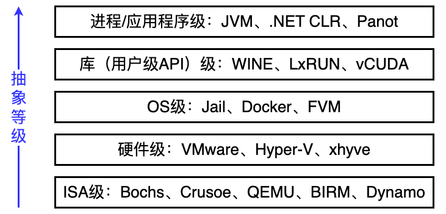
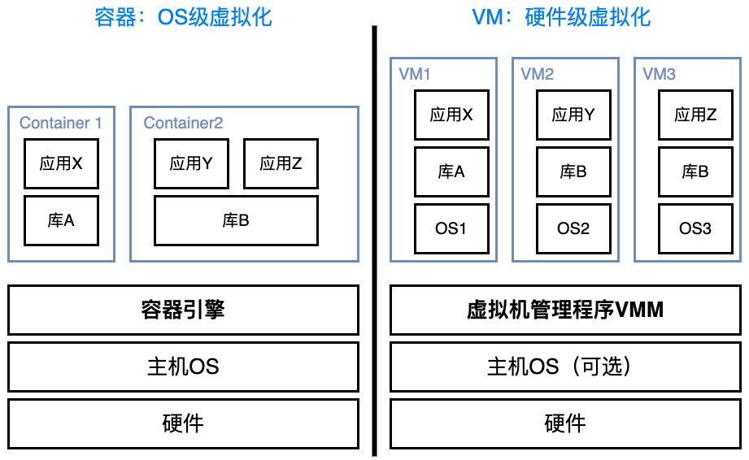
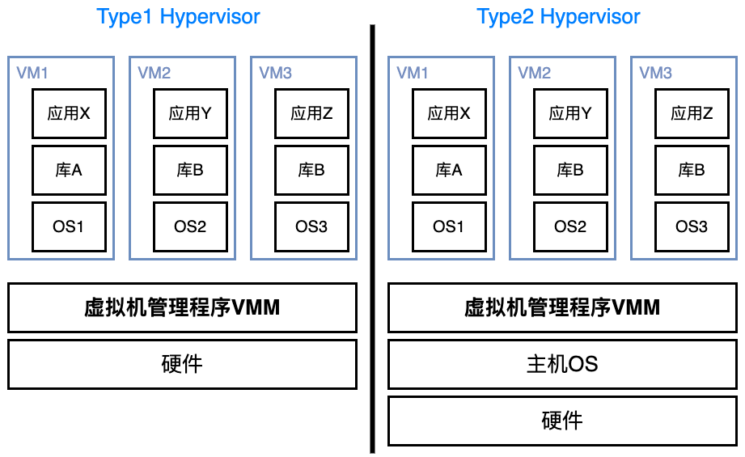

# 虚拟机导论

### 虚拟化层次

虚拟化技术 Virtualization 通过在同一个硬件主机上多路复用虚拟机的方式来共享昂贵的硬件资源，从而提高资源利用效率和应用程序灵活度。硬件资源（CPU、内存、IO）和软件资源（OS和库）可以在不同的功能层虚拟化

* 指令集体系结构级：使用物理主机的ISA（指令集架构 Instruction Set Architecture）模拟出另外一个ISA。效率极低，因为一条源指令只能需要数十条甚至上百条指令来实现
* 硬件抽象级：共用同一份硬件资源，通过Hypervisor或VMM（虚拟机监视器 Virtual Machine Monitor）这一种新增的处于硬件与不同OS之间的软件层来管理资源，最著名的就是半虚拟化的VMware和全虚拟化Xen
* 操作系统级：共用同一份操作系统资源，将部分系统资源隔离形成容器，最重要的应用之一就是用Docker来部署服务
* 库支持级：大部分应用程序使用用户级库的API而非系统调用，通过API钩子可以控制应用程序和其他系统部分之间的通信连接
* 应用程序级：也称为进程级虚拟化，虚拟化层本身就作为一个进程跑在OS上面，最典型的就是JVM

### 硬件系统级和OS级的虚拟化对比

也可以说是虚拟机和容器的对比

每个VM都需要一套完整的OS，在一个物理PC上能够同时运行的VM是很有限的

而容器非常轻量化。**容器引擎 container engine 的核心功能**是准备运行容器所需要的资源以及管理容器生命周期，作用和VMM比较相似

* 容器是对应用程序及其依赖关系的封装，属于操作系统级的虚拟化。具体地说容器是一种轻量级、可移植的虚拟化技术，用于打包、部署和运行应用程序及其所有依赖。容器技术的核心思想是将应用程序及其运行环境、依赖项等打包到一个独立的单元中，该单元被称为容器
* 容器解决的问题就是环境依赖造成部署困难的问题，或者说“程序能在我的OS上运行，但是在别人的OS上却运行不了”

容器的一个主要缺点在于所有容器共享主机的内核，所以容器只能运行与主机一样的内核

### 不同级别虚拟化性能的大致比较

下表中X越多，说明performance越好

| 实现级别 | 高性能 | 应用程序灵活性 | 实现复杂度 | 应用程序隔离性 |
| :------: | :----: | :------------: | :--------: | :------------: |
|  ISA级   |   X    |     XXXXX      |    XXX     |      XXX       |
|  硬件级  | XXXXX  |      XXX       |   XXXXX    |      XXXX      |
|   OS级   |  XXXX  |       XX       |    XXX     |       XX       |
| 用户库级 |  XXX   |       XX       |     XX     |       XX       |
|  进程级  |   XX   |       XX       |   XXXXX    |     XXXXX      |

# ISA虚拟化

# 进程虚拟机

# 系统/硬件虚拟机

### 虚拟机类型

根据是否需要借助Host OS可以把虚拟机分类 Type 1 Hypervisor/Native or bare metal hypervisor 全虚拟化和 Type 2 Hypervisor/Hosted Hypervisor 半虚拟化

* Type 1 Hypervisor是指在虚拟机中模拟硬件的完整功能，包括CPU、内存、存储和网络等。在全虚拟化中，虚拟机不知道自己正在运行在虚拟化环境中，而是认为自己正在直接运行在物理硬件上

  为了实现全虚拟化，需要翻译虚拟机操作系统的指令，这会导致性能开销，因为每个指令都需要进行额外的处理

  常见的全虚拟化技术包括VMware ESXi、Microsoft Hyper-V Server、Xen 和 KVM (Kernel-based Virtual Machine) 等

* Type 2 Hypervisor是指虚拟机操作系统知道自己正在运行在虚拟化环境中，可以与虚拟化层进行交互，以实现更高的性能和更少的开销

  在半虚拟化中，虚拟机操作系统会使用Host OS提供的API来访问硬件资源，而不是直接访问硬件。这减少了指令翻译的需要，并且能够更好地利用硬件资源

  常见的半虚拟化技术包括 VMware Workstation、Oracle VirtualBox、Hyper-V 和 Parallel Desktop 等

因此，全虚拟化和半虚拟化之间的主要区别在于虚拟化的方式和性能开销。全虚拟化模拟完整的硬件功能，导致性能开销，而半虚拟化操作系统知道自己正在运行在虚拟化环境中，可以与虚拟化层进行交互，从而减少性能开销

### 虚拟化种类

在一个Data center里面，一台服务器主要就是三个组成部分：Compute (CPU)、Storage (Disk or SSD)、Network。因此虚拟化也就着重在这三个层面

* Compute: VM or Container
* Network
* Storage https://www.redhat.com/zh/topics/data-storage/file-block-object-storage#
  * Object storage 对象存储
  * Block storage 块存储

# 多处理器虚拟化

# OS虚拟化

这部分直接看 *cloud.md*

OS虚拟化就是资源隔离与容器技术