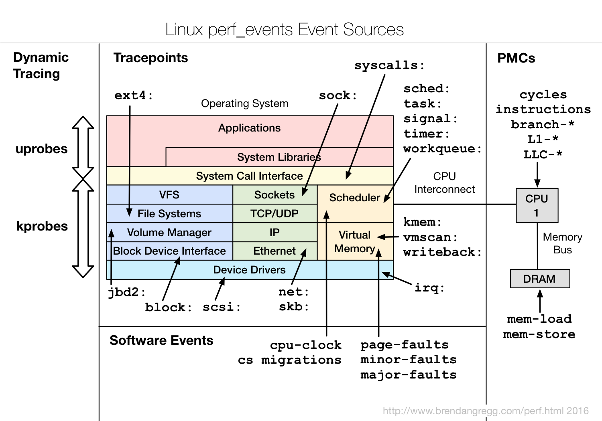

# 基准测试

## *Google性能评估框架*

google/benchmark

### 安装

````cmd
$ git clone git@github.com:google/benchmark.git
````

### 使用

```c++
#include <vector>
#include <cmath>
#include <benchmark/benchmark.h>

constexpr size_t n = 1<<27;
std::vector<float> a(n);

void BM_for(benchmark::State &bm) {
    for (auto _: bm) {
        // fill a with sin(i)
        for (size_t i = 0; i < a.size(); i++) {
            a[i] = std::sin(i);
        }
    }
}

BENCHMARK(BM_for);

void BM_reduce(benchmark::State &bm) {
    for (auto _: bm) {
        // calculate sum of a 
        for (size_t i = 0; i < a.size(); i++) {
            res += a[i];
        }
        benchmark::DoNotOptimize(res);
    }
}

BENCHMARK(BM_reduce);

BENCHMARK_MAIN();
```

使用起来很方便，只需将需要测试的代码放在 `for (auto _: bm)` 里面即可。它会自动决定要重复多少次， 保证结果是准确的，同时不浪费太多时间

BENCHMARK_MAIN 会自动生成了一个 main 函数， 从而生成一个可执行文件供你运行。运行后会得到测试的结果打印在终端上

google/benchmark 还提供了一些 helper 函数/方法，比如说DoNotOptimize，因为BM_reduce中是一个计算任务，如果不使用res的话编译器会把它优化掉，所以要用DoNotOptimize禁止优化。如果不使用google/benchmark的话就得打印一下res来强制使用它

### 编译

使用编译器编译你的测试代码，确保链接 Google Benchmark 库。需要添加 `-lbenchmark` 和 `-lpthread` 等链接选项

```cmd
$ g++ -o mybenchmark mybenchmark.cpp -lbenchmark -lpthread
```

### 命令行参数

google/benchmark 提供了一些命令行参数，来更好的控制测试的输出行为

# Perf

perf是Linux操作系统中内置的性能分析工具。它通过使用硬件性能监测器和事件计数器，提供了对程序运行时的诸多性能指标的收集和分析能力。Perf工具可以用于测量和分析各种系统层面的性能指标，包括CPU利用率、指令执行次数、缓存命中率、内存访问模式等



* 综合性能分析：pert提供了广泛的性能分析功能，包括CPU性能分析、内存分析、事件采样、调用图等。
* 功能强大：通过硬件性能检测器来收集性能数据，可以独立的为每个线程计数，提供更全面的多线程性能分析
* 可扩展性好：perf支持多种分析和报告输出格式，可以根据需要生成文本、图形或其他格式的分析结果。它还可以与其他工具（如gprof2dot）进一步生成多种形式的分析结果

## *硬件 & 事件*

### PMU & MSR

随着现代 CPU 变得越来越复杂，设计开发工程师也需要更多的硬件帮助来收集 CPU 上的数据

Performance Monitor Unit, PMU 是一种硬件组件，通常集成在现代 CPU 中，用于监测和收集有关处理器性能和执行的信息。PMU 提供了对处理器内部活动的详细视图，帮助开发人员和系统管理员优化程序性能、调试问题以及进行系统性能分析

PMU 可以提供各种性能计数器，用于测量处理器执行的指令数量、缓存命中和缓存失效的次数、分支预测的准确性等。通过这些计数器，开发人员可以了解程序的执行情况，找出性能瓶颈并进行优化

软件通过 PMU 中的特殊寄存器 MSR 特殊寄存器来编程。MSR 一般被称为 CPU Counter，MSR分为固定功能 fixed-purpose counter 和 通用功能 general-purpose counter。以Icelake为例，固定功能 counter 有3个，通用通能有3个（关闭hyper-thread后有4个 ）

### Events

```cmd
$ sudo perf list # 部分 events
List of pre-defined events (to be used in -e):

  alignment-faults                                   [Software event]
  bpf-output                                         [Software event]
  alarmtimer:alarmtimer_cancel                       [Tracepoint event]
  alarmtimer:alarmtimer_fired                        [Tracepoint event]
```

Events 指的是用户选择进行性能分析的具体计数器或事件类型，这些events就是预先编程好的，通过counter数据集成的。比如说上面的 BpTkBranch、L1MPKI 等

* Hardware Event 是由 PMU 硬件产生的事件，比如 cache 命中，当需要了解程序对硬件特性的使用情况时，便需要对这些事件进行采样

* Software Event 是内核软件产生的事件，比如进程切换，tick 数等

* Tracepoint event 是散落在内核中的静态 tracepoint 所触发的事件，而 tracepoint 则是散落在内核源码中的一些hook，它们可以在特定的代码被执行到时触发，这些 tracepoint 用来判断程序运行期间内核的行为细节，比如 slab 分配器的分配次数等

  tracepint的对应的sysfs节点在 /sys/kernel/debug/tracing/events 中

## *采集模式*

### Couting mode

### Sampling mode

### Tracing mode

## *安装*

```cmd
sudo apt install linux-tools-common
```

接下来输入 `perf` 会出现下面的内容

```cmd
$ perf
WARNING: perf not found for kernel 5.15.0-88

  You may need to install the following packages for this specific kernel:
    linux-tools-5.15.0-88-generic
    linux-cloud-tools-5.15.0-88-generic

  You may also want to install one of the following packages to keep up to date:
    linux-tools-generic
    linux-cloud-tools-generic
```

以 5.15.0-88 为例，继续安装

```cmd
sudo apt install linux-tools-5.15.0-88-generic
sudo apt install linux-cloud-tools-5.15.0-88-generic
```

### 权限问题

## *Perf的基本使用*

https://perf.wiki.kernel.org/index.php/Main_Page

### Overview

````
❯ perf --help

 usage: perf [--version] [--help] [OPTIONS] COMMAND [ARGS]

 The most commonly used perf commands are:
   annotate        Read perf.data (created by perf record) and display annotated code
   archive         Create archive with object files with build-ids found in perf.data file
   bench           General framework for benchmark suites
   buildid-cache   Manage build-id cache.
   buildid-list    List the buildids in a perf.data file
   c2c             Shared Data C2C/HITM Analyzer.
   config          Get and set variables in a configuration file.
   daemon          Run record sessions on background
   data            Data file related processing
   diff            Read perf.data files and display the differential profile
   evlist          List the event names in a perf.data file
   ftrace          simple wrapper for kernel's ftrace functionality
   inject          Filter to augment the events stream with additional information
   iostat          Show I/O performance metrics
   kallsyms        Searches running kernel for symbols
   kmem            Tool to trace/measure kernel memory properties
   kvm             Tool to trace/measure kvm guest os
   list            List all symbolic event types
   lock            Analyze lock events
   mem             Profile memory accesses
   record          Run a command and record its profile into perf.data
   report          Read perf.data (created by perf record) and display the profile
   sched           Tool to trace/measure scheduler properties (latencies)
   script          Read perf.data (created by perf record) and display trace output
   stat            Run a command and gather performance counter statistics
   test            Runs sanity tests.
   timechart       Tool to visualize total system behavior during a workload
   top             System profiling tool.
   version         display the version of perf binary
   probe           Define new dynamic tracepoints
   trace           strace inspired tool
````

* annotate：解析perf record生成的perf.data文件，显示被注释的代码
* archive：根据数据文件记录的build-id，将所有被采样到的elf文件打包。利用此压缩包，可在任何机器上分析数据文件中记录的采样数据
* bench：perf中内置的benchmark，目前包括两套针对调度器和内存管理子系统的benchmark
* buildid-cache：管理perf的buildid缓存，每个elf文件都有一个独一无二的buildid。buildid被perf用来关联性能数据与elf文件
* buildid-list：列出数据文件中记录的所有buildid
* diff
* evlist
* inject
* record：收集采样信息，并将其记录在数据文件（默认为 perf.data）中。随后可通过其它工具对数据文件进行分析
* report：读取 `perf record` 创建的数据文件，并给出热点分析结果
* stat：执行某个命令，收集特定进程的性能概况，包括CPI、Cache丢失率等
* probe：用于定义动态检查点
* trace：关于syscall的工具

### top

Symbol

* `[.]`：user level 用户态空间，若自己监控的进程为用户态进程，那么这些即主要为用户态的cpu-clock占用的数值
* `[k]`：kernel level 内核态空间
* `[g]`：guest kernel level (virtualization) 客户内核级别
* `[u]`：guest os user space 操作系统用户空间
* `[H]`：hypervisor 管理程序

## *record*

record 需要修改源代码，加入插桩

# 其他

## *gprof*

### intro

gprof是GNU项目中的一个性能分析工具，可用于C和C++程序。它通过在程序中插入计时代码和函数调用跟踪来测量程序执行时间，并生成函数调用图和剖析报告，以帮助确定程序的性能瓶颈

* Pros
  * 和GNU集成，可以跨平台使用
  * 配合第三方工具可以实现比较好的可视化效果
  * 没有perf那么复杂，比较容易使用
* Cons
  * 不能像perf一样通过硬件性能检测器收集数据，其精准度有限，对程序执行时间较短或细粒度性能问题的分析方面可能不够准确
  * 对于多线程和并发程序的性能分析能力有限
  * 主要针对C/C++程序

### 使用

* 使用-pg参数编译程序

  ```cmd
  $ g++ -pg main.cpp-o main.exe
  ```

* 运行程序并正常退出，执行完成后会生成gmon.out文件

  ```cmd
  $ ./main.exe
  ```

* 对使用gprof将生成的gmon.out文件转成可读文件

  ```cmd
  $ gprof main.exe gmon.out > result.txt
  ```

### 函数调用可视化

可以通过gprof2dot工具将 result.txt 转换成调用关系图。Gprof2dot是一个开源的工具，可以将多种性能分析工具分析结果进行可视化。支持pert、valgrid、gprof、vtune等等

* 安装：需要有python环境和graphviz环境

  ```cmd
  $ sudo apt-get install python3 graphviz
  $ pip install gprof2dot
  ```

* 使用

  ```cmd
  $ gprof2dot result.txt | dot -Tpng-o output.png
  ```


# Likwid

https://github.com/RRZE-HPC/likwid/wiki

https://hpc.fau.de/research/tools/likwid/

LIKWID (Like I Knew What I’m Doing) 是一个易用的、清亮的命令行性能分析工具，由 FAU 研发。其主要工具有

* **likwid-topology** : A tool to display the thread and cache topology on multicore/multisocket computers 用于显示多核/多插槽计算机上的线程和缓存拓扑结构
* **likwid-perfctr** : A tool to measure hardware performance counters on recent Intel and AMD processors. It can be used as wrapper application **without modifying the profiled code or with a marker API** to measure only parts of the code. An introduction can be found in here. 用于测量近期的Intel和AMD处理器上的硬件性能计数器
* **likwid-pin** : A tool to pin your threaded application without changing your code. Works for pthreads and OpenMP. 无需修改代码即可将多线程应用程序进行固定到特定的核心上
* **likwid-bench** : Benchmarking framework allowing rapid prototyping of threaded assembly kernels. 用于快速原型设计线程汇编内核的基准测试框架
* **likwid-mpirun** : Script enabling simple and flexible pinning of MPI and MPI/threaded hybrid applications. With integrated likwid-perfctr support. 脚本，支持MPI和MPI/线程混合应用程序的简单灵活固定
* **likwid-powermeter** : Tool for accessing RAPL counters and query Turbo mode steps on Intel processor. RAPL counters are also available in likwid-perfctr. 用于访问Intel处理器上的RAPL计数器和查询Turbo模式步骤
* **likwid-memsweeper** : Tool to cleanup ccNUMA domains and last level caches. 用于清理ccNUMA域和最后一级缓存
* **likwid-setFrequencies** : Tool to set the clock frequency of hardware threads. 用于设置硬件线程的时钟频率
* **likwid-agent** : Monitoring agent for LIKWID with multiple output backends. 监控代理，支持多个输出后端
* **likwid-genTopoCfg** : Config file writer that saves system topology to file for faster startup. 配置文件编写器，将系统拓扑结构保存到文件以加速启动
* **likwid-perfscope** : Tool to perform live plotting of performance data using gnuplot. 用于使用gnuplot执行性能数据的实时绘图

## *likwid-perfctr*

```
-h, --help            帮助信息
-v, --version         版本信息
-V, --verbose <level> 日志打印等级, 0 (only errors), 1 (info), 2 (details), 3 (developer)
-c <list>             要测量的处理器ID (必选), 例如 1,2-4,8
-C <list>             固定线程并测量的处理器ID, e.g. 1,2-4,8
                      有关更多 <list> 的语法, 参见 likwid-pin
-G <list>             要测量的GPU ID
-g, --group <string>  CPU的性能组或自定义事件集字符串
-W <string>           英伟达GPU的性能组或自定义事件集字符串
-H                    获得性能组的帮助 (与 -g 选项一起用)
-s, --skip <hex>      用于跳过线程的比特位掩码
-M <0|1>              设置如何访问MSR寄存器, 0=直接, 1=访问守护进程
-a                    列出可用的性能组
-e                    列出可用事件和计数器寄存器
-E <string>           列出可用事件和对应的计数器中匹配<string>的计数器(不区分大小写)
-i, --info            打印CPU信息
-T <time>             以给定的频率切换事件集
模式:
-S <time>             听诊器模式的周期，以s, ms 或 us 为单位, 比如 20ms
-t <time>             时间线模式的频率，以 s, ms 或 us 为单位, 比如 300ms
-m, --marker          在代码中使用Marker API
输出选项:
-o, --output <file>   保存输出到文件. (可选: 根据文件名后缀应用文本过滤器)
-O                    输出可解析的 CSV 而不是 fancy tables
```


# BPF

# 火焰图

## *SystemTap*

https://blog.csdn.net/han2529386161/article/details/103428728


火焰图是由 Linux 性能优化大师 Brendan Gregg 发明的，从宏观角度查看时间花在了哪里

* X轴
  * 由多个方块组成，每个方块表示一个函数
  * 函数在X轴占据的宽度越宽，表示它被采样到的次数越多，可以简单的粗暴的近似理解为执行时间
* Y轴
  * 表示函数调用栈，调用栈越深，火焰就越高
  * 顶部是 CPU 正在执行的函数，下方都是它的父函数

### 生成火焰图

1. 采集堆栈：perf、SystemTap、sample-bt
2. 折叠堆栈：stackcollapse.pl
3. 生成火焰图：flamegraph.pl

# Intel Vtune profiler

Intel VTune profiler是一款功能强大的性能分析工具，针对Intel处理器和架构进行了优化。它可以提供广泛的性能分析功能，包括CPU
使用率、内存访问模式、并行性分析等。VTune profiler支持Windows和Linux操作系统

* 性能强大，和pert一样可以通过硬件事件采样，而且可以对多个维度分析线程、内存、cache、ofiload
* 用户友好：提供使用简便的GUI，使用起来非常方便，也支持命令行
* 丰富的可视化和报告功能：VTune提供直观的可视化界面和丰富的报告功能，使得性能数据和分析结果易于理解和解释。开发人员可以通过图表、图形化界面和报告来展示和分享性能分析的结果。
* 跨平台，支持Windows和linux系统
* 支持本地和远程调试