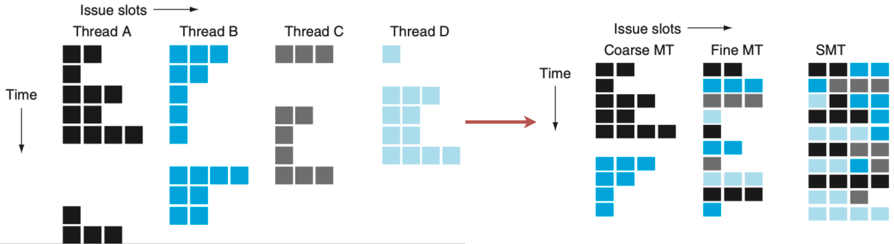
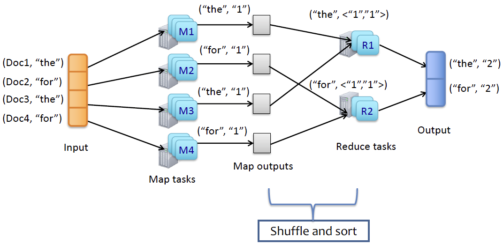

# 体系结构基础 & 并行性

## *计算机分类 & PC发展史*


### 分类

* 个人移动设备 PMD

  个人移动设备 Personal Mobile Device PMD 是指一类带有带有多媒体用户界面的无线设备，比如智能手机、平板电脑等

  PMD上的应用程序大部分是基于Web应用、面向媒体的。能耗与尺寸要求决定了要采用闪存而不是磁盘来作为存储方式

* 桌面计算机/PC

* 服务器 Server

  服务器是专门用于提供服务、存储数据、执行计算和处理网络请求的计算机。它们通常用于支持网络应用程序、托管网站、存储大量数据、进行数据分析、提供网络服务等任务

  服务器已经取代了传统的大型机，称为大规模企业计算的中枢

  因为服务器一般都是用来提供商业服务的，因此服务器的要求集中于高可用性、可扩展性和很高的吞吐能力

* 仓库级计算机 Warehouse-Scale Computer/集群 Cluster

  互联网的爆炸式增长，特别是一些SaaS应用，比如社交网络、互联网商业推动了一类被称为集群 cluster的大型计算机的发展

  集群是一群使用局域网连接到一起的PC或Server，其中最大规模的集群被称为仓库级计算机 WSC

* 嵌入式设备 & IoT

  嵌入式设备存在于各种工业产品中，价格和能耗是使用嵌入式设备时最关心的要素

  嵌入式设备在硬件和软件复杂性方面有很大的限制，我们以**能否运行第三方软件作为区分是否为嵌入式计算机的标准**

  随着嵌入式设备的蓬勃发展与智能互联的需求，物联网 Internet of Things IoT 也迅速崛起。IoT指的是嵌入式计算机连接到互联网，通常是无线连接。当加装传感器和执行器时，物联网设备收集有用的数据并与物理世界互动，从而产生各种“智能”应用，例如智能手表、智能恒温器、智能音响、智能汽车、智能家居、智能电网和智能城市等

### 补充：PC机的发展简史

个人计算机（PC）的发展历史可以追溯到上世纪70年代以及之前，以下是个人计算机发展历史的简要概述：

1. 早期计算器和机械计算机：在20世纪初期，机械计算机和早期电子计算器开始出现，用于执行基本的数学运算和数据处理任务。这些设备通常是巨大的、昂贵的，且使用范围有限
2. 第一台个人计算机：**Altair 8800**：在1975年，Altair 8800被认为是第一台真正的个人计算机。它是一台基于微处理器的计算机，由一家名为MITS的公司制造。Altair 8800需要通过切换开关来编程，而没有图形界面，但它启发了很多人
3. **Apple I和Apple II**：在1976年，史蒂夫·乔布斯和史蒂夫·沃兹尼亚克成立了苹果公司，并推出了Apple I计算机。随后，他们发布了Apple II，这是一台具有图形界面和键盘的计算机，大受欢迎，被认为是个人计算机的重要里程碑
4. **IBM PC和MS-DOS**：1981年，IBM发布了IBM PC（个人计算机）并使用了微软的操作系统MS-DOS。IBM PC的成功导致了PC市场的标准化，并为后来的兼容机打下了基础
5. **IBM兼容机的崛起**：1980年代末和1990年代初，许多公司开始生产IBM兼容机，它们使用与IBM PC兼容的硬件和操作系统，使得PC市场多样化和竞争激烈
6. Windows操作系统：微软推出了Windows操作系统，它具有图形用户界面（GUI），并成为世界上最流行的PC操作系统之一。Windows 3.0和Windows 95版本的发布进一步推动了个人计算机的普及
7. 互联网的普及：1990年代中期，互联网的广泛普及促使许多人购买个人计算机，并开始使用电子邮件、浏览网页等在线服务
8. 移动计算：21世纪初，便携式计算机如笔记本电脑和智能手机开始流行，改变了计算机的使用方式。智能手机特别改变了人们与计算的互动方式

### **IBM PC兼容机 IBM PC compatible**

1980年代初期，市场上已经存在了大量不同标准的个人电脑，比如Apple机、TRS-80、PC-9801等。1981年，IBM推出了IBM PC。然后在1982年IBM公开了IBM PC上除BIOS之外的全部技术资料，从而在IBM PC机的基础上形成了**PC机的开放标准**，使不同厂商的标准部件可以互换。开放标准聚拢了大量板卡生产商和整机生产商，大大促进了PC机的产业化发展速度

到1990年代初，个人电脑市场上仅剩下IBM PC兼容机和苹果的麦金塔电脑  Macintosh 两个主要系列，并且IBM兼容机数量占据了绝对主导地位。随着IBM兼容机的发展以及计算能力的大大提高，它甚至蚕食了小型机的市场份额

在IBM PC兼容机逐步成为事实上的PC标准过程中，为微软、Intel，以及大量兼容机部件商、兼容机厂商提供了市场机会，甚至IBM自己在PC市场上的份额都不是第一位。随着技术的发展，IBM容机经历了IBM PC XT/AT (8086)、80286、80386、80486、奔腾 Pentium等阶段，很多新的内容加入进来，因此到了1990年代/BM对个人电脑架构的影响力逐渐下降，计算机技术人员更倾向称之为Wintel标准架构

Wintel标准架构在字面上指由Microsoft Windows操作系统与Intel CPU所组成的个人计算机。但该词实际上是指Microsoft与Intel的商业联盟，该联盟意图并成功地取代了BM公司在个人计算机市场上的主导地位。所以也称为Winte联盟。这是广受媒体使用的一种通俗用法

在奔腾电脑之后，由于大量新的PC的技术标准应用，PC的技术标准开始由IEEE等组织而不是某个厂家来确定，IBM PC兼容机的说法逐渐被**标准PC**以及后续的**ACPI PC**所取代

### Macintosh PC的三次ISA迁移

虽然早期的Macintosh PC都比较昂贵，市场由更便宜的Commodore 64、IBM PC及IBM PC兼容机主导。但后来，麦金塔操作系统被教育和出版领域广泛应用，使得苹果公司成为未来十年的世界第二大个人电脑制造商。20世纪90年代初，苹果公司推出了麦金塔LC I和Color Classic，这两款产品在价格上与当时的Wintel机型竞争

但是由于早期Macintosh PC搭载的都是摩托罗拉的CPU，而摩托罗拉在与Intel的竞争中逐渐被打败，其各类产品无法在benchmarking中击败intel的产品，Macintosh PC的市场逐渐萎缩。直到乔布斯重回苹果之后精简产品线Macintosh PC才重焕生机

1. 1994年，Macintosh 从摩托罗拉68000系处理器迁移至PowerPC处理器
2. 2005年至2006年，Macintosh 从PowerPC处理器迁移至Intel平台处理器，并且改名Mac
3. 2020年开始，Mac从intel平台处理器迁移至苹果处理器 Apple silicon（基于ARM架构）

### ACPI PC

ACPI Advanced Configuration and Power Interface 是一种电脑标准，旨在管理计算机硬件和软件之间的电源管理、配置和通信。ACPI标准最初由英特尔、微软和东芝等公司于1996年共同开发，旨在取代之前的计算机电源管理（APM）标准，以提供更高级、更灵活的电源管理和配置功能。以下是ACPI标准的主要特点和组成部分：

1. **电源管理**：ACPI允许操作系统和硬件协同管理电源，以实现更有效的电源管理和降低能耗。它允许计算机在不同的电源模式之间切换，例如休眠模式、待机模式和正常运行模式，以节省电能
2. **硬件配置**：ACPI标准提供了一种描述计算机硬件配置的方式，包括中央处理器、内存、外围设备等。这使操作系统能够更好地理解和管理计算机的硬件资源
3. **高级电源管理**：ACPI允许操作系统动态控制硬件组件的电源状态，以实现更精确的电源管理。这包括在不需要时关闭设备、降低处理器频率、调整显示器亮度等
4. **设备热插拔**：ACPI支持设备的热插拔，这意味着用户可以在计算机运行时插入或移除设备，而无需重启计算机
5. **事件通知**：ACPI标准引入了一种事件通知机制，可以通过特定的事件触发操作系统或应用程序的响应。这些事件可以是硬件状态更改、电源事件、按键触发事件等
6. **操作系统支持**：ACPI标准通常需要操作系统提供ACPI驱动程序以实现功能。大多数现代操作系统，如Windows、Linux和macOS，都提供了ACPI支持
7. **ACPI表**：计算机的ACPI信息通常存储在特殊的数据结构中，称为ACPI表。这些表包含了计算机的硬件配置、电源管理信息和其他相关信息，操作系统通过解析这些表来了解和控制计算机的状态

## *计算机体系结构*

### 什么是Computer Architecture？

**Computer Architecture 计算机体系结构**是指计算机系统中各个组件的结构、功能和互联方式，以及它们如何共同协作以实现数据处理和运算任务的方法和规范。计算机体系结构涉及到硬件和软件之间的接口 Interface between SW and HW，以及如何有效地组织硬件资源来实现高性能、高效率的计算

计算机体系结构包括以下几个关键方面：

1. **指令集架构（Instruction Set Architecture，ISA）**：指令集架构定义了处理器能够理解和执行的指令集合，包括操作码、寄存器、地址模式等。ISA 是硬件和软件之间的重要接口，不同的计算机体系结构有不同的指令集架构
2. **内存层次结构**：计算机的内存层次结构包括多级缓存和主存，这些层次的设计影响了数据访问速度和性能。高速缓存被用来存储最常用的数据，以减少处理器访问主存的延迟
3. **处理器结构**：处理器结构涉及到处理器的核心数、流水线设计、并行处理能力等。现代处理器常常具备多核心、超线程等功能，以实现更高的并行处理能力
4. **总线结构**：总线是连接计算机内部各个组件的通信通道，包括数据总线、地址总线和控制总线。总线的设计影响了各个组件之间数据传输的速度和效率
5. **输入输出（I/O）系统**：I/O 系统包括与计算机外部设备进行通信的方式和接口，如网络接口、磁盘控制器等
6. **中断和异常处理机制**：这些机制允许计算机在运行过程中响应外部事件，如硬件错误、输入输出请求等，以保持系统的稳定性和可靠性

计算机体系结构的设计旨在平衡性能、功耗、成本和可扩展性等方面的需求。不同的计算机体系结构在不同的应用场景下可能表现出更适合的特点，例如高性能计算、嵌入式系统、移动设备等

### Computer Architecture的8个伟大思想

1. 面向摩尔定律的设计

2. 使用抽象简化设计 abstraction

3. 加速经常性事件 make the common case fast

   通过试验来确定系统中哪些是经常性事件，哪些是罕见事件。经常性事件往往比罕见事件简单，因此通过优化经常性事件可以有效地改善系统性能

4. 通过并行提高性能 parallellism

5. 通过流水线提高性能 pipelining

6. 通过预测提高性能 prediction

7. 存储层次

8. 通过冗余提高可靠性

### 架构师面对的最重要的功能需求

## *发展趋势*

### 技术趋势

### 成本趋势

## *计算机性能*

### 性能的定义

不同的场景下性能的定义是不同的

* 对于PC等个人设备来说更关心响应时间 response time。响应时间也叫执行时间 execution time，它是指从开始一个任务到该任务完成的时间，其中更包括了硬盘访问、内存访问、IO活动、OS的开销和CPU执行时间
* 对于Data Center或Server而言则吞吐量 throughput 或带宽 bandwidth 是更重要的，即在给定时间内完成的任务数

为了减少“增加”和“减少”带来的误解，当我们想表达增加性能 increase performance 和减少执行时间 decrease execution time 的时候，实际会说改善性能 improve performance 和改善执行实现 improve execution time

### 时间的度量

计算机中对时间最直接的定义是挂钟时间 wall clock time/响应时间 response time/运行时间 elapsed time等。这些术语均表示完成某项任务所需的总时间，包括了磁盘访问、内存访问、IO活动和OS开销等一切时间

CPU执行时间 CPU execution time，简称为**CPU时间**，它只是在CPU上花费的时间，不包括IO等待等其他程序运行的时间。CPU时间还可以进一步划分为

* 用户CPU时间 user CPU time：CPU时间中属于运行用户程序的时间
* 系统CPU时间 system CPU time：CPU时间中属于OS为用户执行相关任务所花去的时间（即陷入内核的时间）

用术语**系统性能 system performance** 表示空载系统的响应时间，并于术语CPU性能 CPU performance 来表示用户CPU时间

### 时钟周期

时钟周期 clock cycle，也称为滴答数 ticks、时钟滴答数 clock ticks、时钟数、周期数

时钟周期是指计算机内部的主时钟发生一次脉冲或周期性振荡的时间间隔。时钟周期用于同步计算机的各个组件，确保它们在正确的时间执行操作

### CPU周期 & CPU性能

CPU性能度量的基本指标应该是CPU执行时间，也称为CPU周期或者机器周期
$$
程序的CPU执行时间=程序的CPU时钟周期数\times 时钟周期长度=\frac{程序的CPU时钟周期数}{时钟频率}
$$
从上式中可以看出，只要硬件设计者可以减少程序执行所需的CPU时钟周期数或缩短时钟周期长度就可以改善性能。不过这两者往往是此消彼长的，设计者需要做出抉择

### 指令周期 & 指令性能

指令周期是一条指令所需要的CPU执行时间
$$
CPU时钟周期数=程序的指令数\times 每条指令的平均时钟周期数
$$
指令平均时钟周期数 clock cycle per instruction CPI 表示执行每条指令所需的时钟周期平均数。CPI提供了一种相同指令系统 ISA在不同的实现下（不同的硬件实现方式或者不同的处理器设计来执行这些指令）比较性能的方法，因为在相同ISA中程序的指令数是相同的，所以可以比较CPU的性能

### CPU性能公式

结合上面两个公式，可以得到基本的CPU性能公式
$$
CPU时间=指令数\times CPI\times 时钟周期长度=\frac{指令数\times CPI}{时钟频率}
$$
指令数和CPI是很难测量的。CPI与计算机的各种设计细节密切相关。CPI对于不同应用程序是不同的，对于相同ISA的不同实现方式也是不同的

## *Benchmarking*

### 桌面基准测试

* CPU密集型基准测试
* 图形密集型基准测试

### 服务器基准测

### 并行基准测试

* Linpack：Linpack 线性代数包是一个用于解决线性代数问题的benchmarking，主要用于测量计算机系统的浮点运算性能。它通常用于评估超级计算机和高性能计算群集的性能。Linpack通常使用在TOP500超级计算机排名中，以确定超级计算机的性能排名
* SPECrate
* SPLASH & SPLASH2：Stanford Parallel Applications for Shared Memory 是20世纪90年代斯坦福大学的研究成果，目的是提供类似于SPEC CPU的并行benchmarking。这两个基准测试可用于评估计算机系统的内存子系统性能，特别是对于并行应用程序来说，内存性能非常关键
* NAS (NASA Advanced Supercomputing)：NAS Parallel Benchmarks是一组由NASA开发的基准测试，旨在评估超级计算机和并行计算系统的性能。这些基准测试包括一系列科学应用程序，涵盖了不同的计算和通信模式。允许用C或Fortran重写
* PARSEC (Princeton Application Repository for Shared Memory Computer) 由Pthread和OpenMP的多线程程序组成，它们主要专注于新兴的计算领域，由9个应用程序和3个核心程序组成
* YCSB (Yahoo Cloud Serving Benchmark) 是云端的并行benchmarking，目的是比较云数据服务的性能，它通过使用Cassandra和HBase作为具有代表性的例子，提供了一个易于让用户评测新数据服务的框架

## *单核向多核的跨越*

### 功耗墙 Power wall

$$
功耗\propto\frac{1}{2}\times负载电压\times电压^2\times开关频率
$$

### 多核时代

为了避免处理器 Processor 和微处理器 Microprocessor的混淆，又将处理器称之为一个核 core。例：在一个微处理器中有4个处理器/核心，那么将这个微处理器称为4核芯片/4核微处理器（其中一个处理器是一个数据通路/运算器+一个控制器）

多核时代的到来也宣告着处理器性能的提高从单纯依靠指令级并行 ILP 转向数据级并行 DLP 、线程级并行 TLP 和请求级并行 RLP。原来的ILP是依靠编译器和硬件自动进行的，但新时代的DLP、TLP和RLP则更多的是需要程序员显式调整应用程序的结构，对程序员的开发能力提出了更多的要求

## *并行度 & 并行体系结构分类*

多种级别的并行度已经成为各种不同的计算机设计的推动力量，其中能耗和成本则是主要的约束条件

### 应用并行

* 数据级并行 DLP Data Level Parallelism：同时操作许多数据项
* 任务级并行 TLP Task Level Parallelism：创建了一些能够单独处理但大量采用并行方式执行的工作任务

### 硬件并行

* 指令级并行 ILP Instruction Level Parallelism：流水线、推理执行
* 3种SIMD形式将单条指令并行引用于一个数据集，以开发数据级并行 DLP
* 线程级并行 TLP Thread Level Parallelism
* 请求级并行 RLP Request Level Parallelism：有大量工作可以自然地并行开发，几乎不需要通信或同步

### 费林分类法

费林分类法 Flynn's Taxonomy 是CS领域中用于描述并行计算体系结构的一种分类方法。它是由计算机科学家Michael J. Flynn于1966年首次提出的，用于区分不同类型的并行计算架构和计算模型。Flynn's Taxonomy为研究和描述并行计算提供了一个基本的框架，有助于理解不同类型的并行计算架构和其适用性

Flynn's Taxonomy**根据指令流和数据流的并行性**来将计算机系统划分为四种基本类别，这些类别分别是：


* SISD Single Instruction stream, Single Data stream 单指令流单数据流：这是传统的、串行的计算模型，其中每个时钟周期只执行一条指令，并处理单个数据元素。它们适用于串行计算任务，用ILP来实现并行加速
* SIMD Single Instruction stream, Multiple Data streams 单指令流多数据流：大多数计算机都采用了SIMD架构，它是最重要的一种架构，下面会重点介绍
* MISD Multiple Instruction streams, Single Data stream 多指令单数据流：这是一种相对不常见的体系结构，其中不同的指令流并行操作相同的数据流。MISD体系结构通常用于冗余系统和错误检测纠正系统，以提高系统的可靠性
* MIMD Multiple Instruction stream, Multiple Data streams 多指令流多数据流
  * 这是一种典型的多处理器计算机系统，其中多个处理器同时执行不同的指令流，每个指令流可以操作不同的数据流。MIMD适用于通用并行计算任务，可以并行执行多个独立的任务或线程
  * 在MIMD处理器上经常会编写SPMD Single Program Multiple Data 多程序多数据流编程风格的程序，即不同的处理器通过条件语句执行不同的代码段

## *创建并形处理程序的挑战*

提高并行性的困难并不在于硬件上，而是在于只有很少的应用程序在被重写后能够在多处理器上取得更高的速度，开发多处理器的并行处理程序是非常困难的

### Amdahl定律的加速比定义

加速比 speedup 是一种用于衡量并行计算系统性能改善程度的度量。它通常用于比较串行计算和并行计算之间的性能差异。加速比 speedup 取决于两个因素

1. 原计算机计算时间中可升级部分所占的比例，这个比例称为**升级比例** $Frachtion_{enhanced}<1$。比如60秒中有20秒是可以改善的，则升级比例为 $1/3$ 
2. 可升级部分的改善幅度称为**升级加速比** $Speed_{enhanced}>1$

$$
改进后的执行时间=\frac{受改进影响的执行时间}{改进量}+不受影响的执行时间=原执行时间\times\left(\left(1-升级比例\right)+\frac{升级比例}{升级加速比}\right)
$$

Amdahl定律定义了使用某一特定功能所获的的加速比 speedup
$$
Amdahl's\ law:\ 加速比=\frac{整个任务在采用该升级时的性能}{整个任务在未采用该升级时的性能}=\frac{1}{\left(1-升级比例\right)+\frac{升级比例}{升级加速比}}
$$

### Amdahl定律在并行处理器上的应用

Amdahl定律可以用作评估并行计算性能的数学模型，它对于理解如何利用多核CPU的性能提供了重要的洞察。Amdahl定律的核心观点是，**对于一个并行计算任务，其性能提升受到了任务中无法并行化部分的限制**

我们可以将并行任务套用到上面的Amdahl定律中，此时

* 升级比例 $Frachtion_{enhanced}=f$ 是程序中并行执行的的比例
* 升级加速比 $Speed_{enhanced}=p$ 是CPU的核心数，因为没多一个核心就提高一倍的改善幅度
* 原执行时间就是纯顺序执行的时间 T

根据Amdahl定律可以写出加速比为

$$
T(p)=\left(1-f\right)\cdot T+\frac{f\cdot T}{p}
$$

从上式可以得到下面的关系，即在固定的处理器核心数为了达到某个加速比程序中需要并行化的部分的比例。从而引出了一个构建并序的难点，即在一定的核心数下要向得到至少等比例的加速比需要极高的程序并行度


### 大规模问题

想要在多处理器上获得良好的加速比，保持问题规模不变的情况相比于问题规模增长的情况要困难得多

* 强比例缩放 strong scaling 意味着在保持问题规模不变的情况下在多处理器上获得的加速比
* 弱比例缩放 weak scaling 意味着在问题规模与处理器数量成比例增加的情况下在多处理器上获得的加速比

假设问题规模M是主存中的工作集，处理器数量是P，那么每个处理器所占用的内存对于强比例缩放大约为 $M/P$，对于弱比例缩放大约为M

### 负载均衡

调度并将工作划分为可并行的部分，以及在处理器之间同步时间、维持通信、均衡负载都是困难的

# 存储器层次结构设计

## *缓存性能的高级优化方法*

# 指令级并行及其开发

## *高级分支预测*

# 三种硬件形式开发DLP

## *SIMD体系 & 历史*

关于具体的SIMD编程可以看*并行编程.md*

### SIMD简介

SIMD有三种变体：向量结构体系、多媒体SIMD指令集扩展和GPU。因为GPU的重要性以及内容比较丰富单独开一章

SIMD与MIMD相比最大的优势是，由于数据是并行的，所以程序员可以采用顺序的编程方式但却能获得并行的加速比，减轻了程序员编程的压力

向量结构体系是多媒体SIMD ISA的超集，因此向量结构体系相比于多媒体SIMD ISA更具有一般性

### 标量 & 向量


* 标量浮点数扩展
  * 标量意味着一次只处理一个数据元素。在标量浮点数扩展中，浮点数操作是针对单个数据元素执行的，每个操作都只影响一个数据。这是传统的浮点数处理方式，通常用于处理单个数据的任务，如标量数学运算、科学计算中的某个标量数据，或者处理循环迭代中的单个元素
  * 比如如果我们有一个包含1000个单精度浮点数的数组，并且要对每个元素执行某种数学运算，那么标量浮点数扩展会将运算应用于数组中的每个元素，逐个处理
  * 标量处理器通常具有更高的时钟频率，因为它们不需要考虑同时处理多个元素
* 向量浮点数扩展
  * 向量意味着一次处理多个数据元素。在向量浮点数扩展中，浮点数操作是并行处理多个数据元素的，每个操作同时影响多个数据。这对于需要高吞吐量和并行性的任务非常有用，如图形处理、向量运算、多媒体处理等
  * 例如，一个向量浮点数扩展处理器可以一次性处理4个、8个或更多单精度浮点数，而不是仅处理一个
  * 向量处理器通常在特定应用领域中具有出色的性能，但在一些通用用途的计算中可能效率较低，因为它们不太适合标量计算

### SIMD -- 子字并行

SIMD是对多个不同的数据并行执行同一个操作：这种体系结构中，同一条指令同时应用于多个数据元素，通常通过向量寄存器或向量处理器来实现。SIMD适用于数据并行任务，如多媒体处理和科学计算中的向量操作

* 在基于SIMD架构的计算机上**有多个核心**，在任意时间点上所有核心只有一个指令流处理不同的数据流，**现在大多数计算机都采用了SIMD架构**
* SIMD本质上是采用一个控制器来控制多个处理器，同时对一组数据中的每一条分别执行相同的操作，从而实现空间上的并行性的技术

所有的微处理器都对字节和半字有特殊支持，然后在整数程序中却很少会用到。然而计算机架构师发现通过在128位的加法器内划分进位链，CPU可以同时对16个8位操作数、8个16位操作数、4个32位操作数或者2个64位操作数的短向量进行并行操作。这种分割加法器的开销很小，但带来的加速却可能会很大

**将这种在一个宽字内部进行的并行操作称为子字并行 subword parallelism 或者数据级并行 data level parallelism**。对于单指令多数据，它们也被称为向量或SIMD

### SIMD的发展历史

1. ILLIAC IV
2. Cray-1

### DGEMM程序：字节并行 & 矩阵乘法

## *向量结构体系*

向量体系结构就是以流水线形式来执行许多数据操作

### RV64V

下面是一个典型的向量处理器，其以Cray-1作为基础，将其称为RV64V。RISC-V的向量扩展集是RVV，RV64V是RVV的一个核心子集，就像计算机组成原理中实现的RISC-V的标量核心子集一样


* 向量寄存器 vector register

  * 向量寄存器是SIMD的核心所在，它用于存储向量数据，允许在单个指令中同时操作多个数据元素。如上图所示，向量寄存器和标量寄存器的不同之处就在于一个向量寄存器中可以存放多个数（实际上就是**把多个标量寄存器堆叠起来就可以形成一个矢量寄存器**）。注意：上图中的都是寄存器堆，每一个小框都是一个单独的寄存器

    

  * 这些寄存器用于执行向量化操作，如SIMD指令集中的操作

  * RV64V中有32个向量寄存器，每个为64bit宽

* 向量功能单元 vector functional units：每个功能单元都是完全流水线化的，RV64V有5个功能单元：浮点的加、减、乘、除、整数和逻辑运算

* 向量载入/存储单元 vector load/store unit：从存储单元中载入或者向存储单元中存储向量，这两个操作是完全流水线化的

* 标量寄存器集合 a set of scalar register：标量寄存器通常就是RISC-V的32个通用寄存器和32个浮点寄存器，标量寄存器可以i用来提供数据、作为向量功能单元的输入，还可以计算传送存储单元的地址

RV64V的具体指令可以看书，用后缀 `.vv`、`.vs`、`\sv` 来表示矢量和标量的操作数组合，当然也可以用 `i` 来表示纯标量的操作数

另外RV64V采用了dynamic register typing 的类型，在指令中删去了操作数类型，此举可以避免大量的指令重复

### 单车道测量向量执行时间

向量运算序列的执行时间主要取决于3个因素：操作数向量的长度、操作之间的结构冒险、数据相关

为了简化对向量指令执行时间的测量，只使用单车道 lane，此时一条向量指令的执行时间大约就是向量长度。注意：车道 lane 和流水线 pipeline 是不同的，车道时完全并行的任务，而流水线则是交错的进行任务

护航指令组 convoy 是一组可以一直执行的向量指令，可以通过计算convoy的数目来估计一段代码的性能

钟鸣 chime 是指执行convoy所花费的时间单位，用来将convoy转换为执行时间所定义的定时度量

### 多车道

向量指令集的一个重要的优势就是它允许软件仅使用一条很短的指令就可以让硬件进行大量的并行操作，也就是说，借助硬件，一条简短的矢量指令的效果等价于很多条标量指令

可以通过添加更多车道来提高向量单元的峰值吞吐率，下图是一个4车道向量单元的结构。向量寄存器分散在各个车道里，每个车道都由于多车道非常有利，所以应用程序和体系结构都必须支持长向量


## *多媒体SIMD扩展*

### 多媒体SIMD扩展起源

SIMD ISA多媒体扩展源于这样一个事实：许多多媒体应用程序操作的数据类型要比对32或64位CPU进行针对性优化的数据类型要更窄一些，使用一个完整的32位或者64位寄存器来存储单元来进行操作实际上浪费了运算能力。**此时通过划分这个加法器中的进位链，CPU可以同时对一些短向量进行操作**

* 图像、视频中大量使用8位（0-255）数据来表示RGB通道和透明度
* 音频采样则通常采用16位、24位、32位数据来表示
  * 16位：这是最常见的音频采样位数之一，通常用于CD音质（44.1 kHz，16位，立体声）。它提供了65536个不同的音量级别，可以捕捉大部分听觉范围的细微差异
  * 24位：24位音频采样通常被认为是高分辨率音频，它提供了更大的动态范围和更高的精度。它用于专业音频录制和音乐制作
  * 32位浮点：32位浮点音频采样具有非常高的精度，它们使用浮点数格式来表示音频样本，允许超过24位的动态范围和更高的精度。这在音频处理中非常有用，因为它可以避免损失音频质量

### 多媒体SIMD扩展相比于向量结构体系的简化

* **多媒体SIMD扩展固定了操作代码中数据操作数的数目，从而在x86体系结构的MMX、SSE和AVX扩展中添加了数百条指令**。向量体系结构有一个VLR，用于指定当前操作的操作数个数。一些程序的向量长度小于体系结构的最大支持长度，由于这些向量寄存器的长度可以变化，所以也能够很轻松地适应此类程序。此外，向量体系结构有一个隐含的MVL，它与向量长度寄存器相结合，可以避免使用大量操作码
* **多媒体SIMD扩展没有提供向量体系结构的更复杂寻址模式**，也就是步幅访问和集中一分散访问。这些功能增加了向量编译器成功向量化的程序数目
* **多媒体SIMD扩展通常不会像向量体系结构那样，为了支持元素的条件执行而提供遮罩寄存器**。这些省略增大了编译器生成 SIMD 代码的难度，也加大了 SIMD 汇编语言编程的难度

这些省略增大了编译器生成SIMD代码的难度，也加大了SIMD汇编语言编程的难度，那么为什么多媒体SIMD扩展还是如此流行呢，因为相比于向量结构体系，多媒体SIMD扩展具有如下优点

### x86-64的多媒体SIMD扩展演进

* 1997年集成在Pentium CPU上的MMX SIMD多媒体指令集

  引入MMX Multi Media eXtensions 的目的旨在提高多媒体和图像处理性能。MMX引入了8个64位寄存器，用于存储多媒体数据，以及一组指令，用于执行各种多媒体操作。它最初被广泛应用于多媒体应用程序，如音频编解码和图像处理

  然而MMX没有提供独立的矢量寄存器，它的8个寄存器MM0-MM8实际上就是浮点数寄存器st0-st7用来存放尾数的部分，从而导致MMX指令和浮点数操作不能同时工作

* SSE于1999年集成在Pentium III CPU上发布

  SSE Streaming SIMD Extensions 流式SIMD扩展是对MMX的进一步扩展，引入了128位XMM寄存器和一组新的指令，支持单精度浮点数运算和更广泛的SIMD操作。SSE提供了更多的并行性和性能，适用于一系列应用，包括3D图形渲染和数字信号处理。SSE的不同版本（如SSE2、SSE3、SSSE4等）在后续的处理器中陆续发布，增加了功能和性能，比如双精度SIMD浮点数据

* AVX于2011年第一季度发布的Sandy Bridge系列处理器中首次支持

  AVX Advanced VEctor Extension 高级向量扩展引入了256位和512位YMM和ZMM寄存器，并提供了更多的SIMD指令，以支持更大规模的并行计算。AVX广泛用于高性能计算、虚拟化、人工智能等领域，它加速了复杂的浮点数运算任务

* AVX2于2013年发布的Core i7 Haswell CPU中引入

* AVX-512：AVX-512是AVX的进一步扩展，引入了512位ZMM寄存器和广泛的指令集，支持更大规模的数据并行性。使用新的EVEX前缀编码将AVX指令进一步扩展到512位

# 线程级并行

## *多处理器*

### TLP & 多处理器

TLP意味着有多个程序计数器，因此主要是通过MIMD加以开发。而为了充分利用拥有n个处理器的MIMD多处理器，通常必须拥有至少n个要执行的线程（1个任务拆成n份交给n个处理器执行）或进程（n个任务交给n个处理器分别执行），因此TLD就是多处理器

多处理器是紧耦合处理器组成的计算机，其中的所有处理器的协调与使用由单一的处理器系统控制，通过共享地址空间来共享存储器。多处理器通过两种不同的软件模型来开发

* 并行处理模型：运行一组紧密耦合的线程，协同完成同一个任务
* 请求级并行 RLP：执行可能由一位或多位用户发起的多个相对独立的进程。当然在同一台计算机上RLP的规模是远小于在一个WSC系统上的。RLP可以由单个app或多个app开发（多重编程 multiprogramming）

指定给一个线程的计算量称为粒度 grain size。TLP与DLP的重要定性区别在于：TLP是由软件系统或程序员在较高层级确定的，这些线程由数百条乃至数百万条可以并行执行的指令组成

### 多处理器体系结构的分类

一个挑战是如何通过有效地变成来利用单个芯片上数量不断增长的处理器，从而发挥出不断进步的硬件的能量。重写旧程序使其能够直接在并行处理器上良好的运行是困难的，计算机架构师设计了一些架构来简化编程的过程

* 共享内存多处理器：一种方法是为所有处理器提供一个共享的统一物理地址空间，使得所有处理器都可以直接取到需要的变量，从而专注于如何并行执行。处理器通过存储器中的共享变量进行通信，因此统一地址空间支持共享时必须要提供一套同步 synchronizaiton 机制

  根据多处理器所包含的存储器数量，可以将共享存储器的多处理器分为两类，处理器的数量决定了存储器的组织方式和互连策略。处理器的数目是多少可以按照时间而变化的，因此按照存储器的组织方式来分类多处理器

  **注意：SMPs指的是 Symmetric shared-memory Multiprocessors，即对称多处理器，而不是Shared Memory Processor**

  * 对称（共享存储器）多处理器 Symmetric shared-memory Multiprocessors SMPs 或者集中式（共享存储器）多处理器 centralized shared-memory multiprocessors 有少量的处理器（一般少于32个）

    因为处理器数目少，所以处理器可以共享一个集中式存储器，所有处理器都能够平等访问该处理器，这就是对称名字的来源

    SMPs也称为统一内存访问多处理器 Uniform Memory Access UMA：访存延迟不依赖于是哪个处理器提出的请求。即无论哪个处理器访问存储器，存储器的访问延迟都大致相同

    

  * 分布式共享存储器 Distributed Shared Memory DSM

    为了支持更多的处理器，存储器必须分散在处理器之间，而不应该是集中式的；否则存储器系统无法在不大幅延长访问延迟的情况下为大量处理器提供带宽支持

    DSM也称为非统一内存访问多处理器 Non-Uniform Memory Access NUMA：存储器的访问延迟各不相同，具体取决于哪个存储器访问哪个存储器

    

* 信息传递多处理器：另一种方法则是每个处理器采用独立的地址空间，此时必须进行显示的信息传递。一般在WSC中使用

## *硬件多线程*

硬件多线程 hardware multithreading 是通过在一个线程停顿时切换到另一个线程来提高CPU的利用率，它允许多个线程以重叠的方式共享单个处理器的功能单元，从而可以有效地利用硬件资源

硬件多线程是在ILP发展到一个瓶颈阶段后引入的一种新机制，以便让多个线程在同一个CPU上同时执行，以提高吞吐率

注意这个硬件多线程和程序中的多线程不是一个概念

### 硬件多线程的实现方法

* 细粒度多线程 fine-grained multithreading 在每条指令之后切换线程，从而形成了多线程的交叉执行
* 粗粒度多线程 coarse-grained multithreading 是作为细粒度多线程的一种可选项被发明的。它仅在重大事件（比如说末级cache失效，需要IO）之后才会切换线程

### 同时多线程

同时多线程 SMT Simultaneous Multithreading 是硬件多线程的一种变体，通过利用多发射、动态调度的微体系结构的资源来降低多线程的成本



## *集中式共享存储器*

### Cache一致性

### 实现cache一致性的基本方案

### 监听协议

## *对称共享存储器*

# GPU

## *intro*

### 简介

https://zhidx.com/p/259964.html

在GPU的体系结构中融合了TLD（多核）、ILP（流水线、多发射）、DLP（SIMD）的多种并行处理形式，因此GPU的设计让它称为处理并行问题的好手。可以说**GPU是由多线程SIMD处理器组成的MIMD**

GPU还依赖于单个多线程SIMD处理器中的硬件多线程来隐藏存储器延迟

异构系统 heterogeneous system：一个结合了多种处理器的系统，比如PC是一个CPU-GPU系统

这种统一且可扩展的处理器阵列为GPU引入了一种新的编程模型。GPU处理器阵列中大量的浮点处理能力非常适合解决非图形问题

GPU计算是指通过并行编程语言和API在GPU上进行计算，而不使用传统的图形API和图形管线模型。这与早期的通用GPU计算（GPGPU）方法形成对比，后者涉及使用图形API和图形管线来执行非图形任务

### GPU的发展历程

图形处理单元(GPU)的演进 - 2know的文章 - 知乎 <https://zhuanlan.zhihu.com/p/493201665>

1. 早期计算机图形（1950s - 1960s）：在计算机图形的早期阶段，计算机的图形渲染能力非常有限。图形主要由文本字符和线段构成，没有高级图形处理单元

2. Raster CRT（1970s - 1980s）：随着计算机显示器的普及，Raster CRT（阴极射线管）技术允许计算机以像素为基础进行图形渲染

3. 早期图形卡（1980s - 1990s）：早期的图形卡通过添加专用硬件，如帧缓冲器和图形处理器，来加速图形渲染。这些图形卡通常支持2D图形

4. 3D加速卡的兴起（1990s）：随着3D游戏的兴起，出现了首批3D加速卡，如3dfx Voodoo，它们引入了3D图形渲染的硬件支持。这些卡使用了专用的3D渲染引擎，为游戏提供了更高的性能和图形质量

5. NVIDIA的创立（1993）：NVIDIA 公司的创立标志着GPU行业的重要时刻。NVIDIA 在1990年代末和2000年代初推出了一系列创新的GPU产品，如GeForce系列，推动了GPU的发展

6. 通用GPU计算（2000s）：GPU不再仅仅用于图形渲染，它们的计算能力也得到了利用。通用GPU计算（GPGPU）允许开发人员在GPU上执行通用计算任务，如科学计算和深度学习

7. 并行处理（2010s）：GPU的核心数量迅速增加，引入了大规模并行处理能力

   NVIDIA的CUDA和AMD的OpenCL等编程模型使开发人员能够更好地利用GPU的并行性

   处理器指令和内存硬件被添加以支持通用编程语言，并创建了一个编程环境，允许使用熟悉的语言（包括C和C++）来编程GPU。这一创新使GPU成为一个完全通用的、可编程的、众核处理器

8. 深度学习加速（2010s - 至今）：GPU在深度学习领域取得了巨大的成功，因为它们可以高效地执行深度神经网络的训练和推理任务。许多深度学习框架如TensorFlow和PyTorch都支持GPU加速

9. 光线追踪和实时图形（2020s - 至今）：GPU的性能继续提升，允许实时光线追踪和更高质量的图形渲染。这推动了游戏图形的逼真度和虚拟现实体验的发展

### 异构计算

如何用通俗易懂的话解释异构计算？ - 辣笔小星的回答 - 知乎 <https://www.zhihu.com/question/63207620/answer/1707221853>

行业报告：两次发展趋势？

异构计算 Heterogeneous Computing 是一种特殊的并行分布式计算系统

https://imgtec.eetrend.com/blog/2021/100061572.html

两大派别：GPU和FPGA

## *Nvidia GPU架构*

### 概览

GPU的微架构和CPU的不同，除了ISA外，还有图形函数API集合。图形函数主要用于绘制各种图形所需要的运算。比如像素、光影处理、3D坐标变换等相关运算要由GPU硬件加速来实现

<https://blog.csdn.net/tony_vip/article/details/123604308>

NVIDIA的GPU产品根据目标市场主要分成GeForce、 Tesla和Quadro三大系列区别。虽然从硬件角度来看采用的架构可以是相同的，也都支持用作通用GPU计算，但因为它们分别面向的目标市场以及产品定位的不同，这三个系列的GPU在软硬件的设计和支持上还是存在许多差异的

* Quadro是面向专业图形领域的专用显卡
* Tesla是面向数据中心的专业GPU，单价相对较高，也都很少会被用作其他用途
* GeForce显卡用于消费者级别的PC端影音娱乐，却因为出货量大，价格较低的缘故经常被当作另外两个专业产品的替代品來使用

NVIDIA的显卡的微架构有如下，按照发布时间从早到晚的顺序排列

* Tesla架构：初代G80系列使用的架构，是第一个实现统一着色器模型的微架构
* Fermi架构
  * Fermi架构是NVIDIA GPU架构的第一个重要版本，首次引入了CUDA计算架构，将GPU用于通用计算任务。这个架构引入了多处理器 Multiprocessor 的概念，每个多处理器包含多个CUDA核心，具有更强大的计算能力和性能
  * 代表性产品有 Tesla C2050/C2070、GeForce GTX 480/470
* Kepler架构
  * Kepler架构进一步改进了GPU的性能和能效，引入了动态并行度调整、更多的CUDA核心和更高的计算性能。这个架构还引入了GPU Boost技术，可以根据工作负载的需求自动提高GPU的时钟频率
  * 代表性产品有Tesla K20/K40、GeForce GTX 680/780
* Maxwell架构
  * Maxwell架构继续提高了能效，引入了更多的CUDA核心和新的功耗管理技术。这个架构还引入了NVIDIA的第一代深度学习加速器，使GPU在深度学习任务中表现出色
  * 代表性产品有Tesla M60、GeForce GTX 980/980 Ti
* Pascal架构
  * Pascal架构进一步提高了性能，引入了16nm制程技术，提高了能效。它还引入了NVLink高速互连技术，允许多个GPU之间更高带宽的通信。这个架构也引入了更多的CUDA核心和更高的内存容量
  * 代表性产品有Tesla P100、GeForce GTX 1080/1080 Ti
* Volta架构
  * Volta架构主要面向深度学习和人工智能应用，引入了张量核心（Tensor Cores），大大加速了矩阵计算，有助于深度学习模型的训练。这个架构还引入了更高带宽的HBM2内存
  * 代表性产品有Tesla V100、Titan V
* Turing架构
  * Turing架构继续优化了深度学习性能，引入了RT核心，用于实时光线追踪 RTX 和深度学习推理。它还引入了GDDR6内存，提供更高的内存带宽
  * 代表性产品有Tesla T4、GeForce RTX 20系列（如RTX 2080）
* Ampere架构
  * Ampere架构进一步提高了性能和能效，引入了第三代Tensor核心，加速了深度学习任务。它还采用了更先进的制程技术，提供更多的CUDA核心和更大的内存容量
  * 代表性产品有A100、GeForce RTX 30系列（如RTX 3080）
* Hopper架构

### Tesla

### Fermi

GPU的流处理器单元是NVIDIA对其统一架构GPU内通用标量着色器的命名

纹理映射单元（TMU）作为GPU的部件，它能够对二进制图像旋转、缩放、扭曲，然后将其作为纹理放置到给定3D模型的任意平面，这个过程称为纹理映射。纹理映射单元不可简单跨平台横向比较，大量的纹理映射单元是GPU性能强劲的必要非充分条件。

光栅化处理单元（ROPs）主要负责游戏中的光线和反射运算，兼顾AA、高分辨率、烟雾、火焰等效果。游戏里的抗锯齿和光影效果越厉害，对ROPs的性能要求就越高，否则可能导致帧数的急剧下降。NVIDIA的ROPs单元是和流处理器进行捆绑的，二者同比例增减。在AMD GPU中，ROPs单元和流处理器单元没有直接捆绑关系。

## *GPU编程概览*

### API

GPU的API是一组允许软件与GPU进行通信和协作的软件函数和库，不过随着系统优化的深入，API也可以直接统筹管理高级语言、显卡驱动和底层汇编语言。以下是一些常见的GPU API。具体的编程方法等可以看*并行编程.md*

* 微软 DirectX 标准：DirectX是Microsoft开发的多媒体和图形API，主要用于Windows操作系统上的游戏和多媒体应用程序。它包括Direct3D用于3D图形渲染，以及其他组件用于音频、输入和网络等
  * Direct 3D & Dicrect 2D
  * DirectCompute 通用计算
  
* Khronos Group 标准
  
  > 科纳斯组织（Khronos Group）是一个开放、非营利的行业协会，致力于创建可免费使用的图形合成、虚拟现实、增强现实、视觉加速、并行计算和机器学习的开放API标准，使在各种平台和设备上的应用程序和中间件都能有效利用硬件加速。所有Khronos成员都能够在API公开发布前提出自己的意见、在规范制定初期得到草案并进行平台和应用程序测试。
  > 2006年7月31日，Khronos Group在SIGGRAPH上宣布得到OpenGL规范的控制权 -- wikipedia
  
  * OpenGL：OpenGL Open Graphics Library 开放图形库 是一种跨平台的图形API，用于2D和3D图形渲染。它提供了一套用于创建和管理图形对象、设置渲染状态以及执行渲染命令的函数。OpenGL是开放标准，因此可以在多个平台上使用
  * Vulkan：Vulkan是一个低级的跨平台图形API，旨在提供更高的性能和更好的多线程支持。它更接近硬件层，允许开发者更细粒度地控制GPU，但也需要更多的编程工作
  * OpenCL通用计算
  
* 其他标准

  * 苹果 Metal API
  * AMD Mantle API
  * Intel One API


### GPGPU 通用计算

GPU通用计算 General-Purpose Graphics Processing Unit 的核心思想是利用 GPU 的大规模并行处理能力来加速计算任务，尤其是那些可以分解为许多小任务的工作负载。为了在 GPU 上进行通用计算，开发者使用 GPU 编程框架和 API 来编写并行计算代码，这些框架和 API 提供了对 GPU 资源的访问以及任务分发和同步的机制。以下是一些用于 GPGPU 的常见 API 和框架

* CUDA Compute Unified Device Architecture：由NVIDIA开发的CUDA是GPGPU编程的一种流行框架。它允许开发者使用类C编程语言来编写通用计算代码，并在NVIDIA GPU上执行。CUDA 提供了丰富的库和工具，用于优化并行计算任务
* OpenCL Open Computing Language：OpenCL 是一个跨平台的 GPGPU 编程框架，允许在不同供应商的 GPU 上运行通用计算任务。它使用 C 样式的语言编写内核，并提供了广泛的设备支持
* DirectCompute：DirectCompute 是 Microsoft DirectX 的一部分，用于在 Windows 平台上进行通用计算。它允许开发者使用 HLSL（High-Level Shading Language）编写并行计算内核
* HIP Heterogeneous-Computing Interface for Portability：由 AMD 开发的 HIP 是一个类似于 CUDA 的框架，旨在实现跨供应商的移植性，使开发者能够在不同供应商的 GPU 上运行通用计算代码
* SYCL：SYCL 是一种基于 C++ 的编程模型，用于实现高性能并行计算，并在不同的硬件上运行。它允许开发者使用标准的 C++ 语言编写并行计算代码，然后将其映射到不同的加速器上，包括 GPU

## *三种SIMD形式对比*

### 向量体系结构 vs. GPU

### 多媒体SIMD扩展 vs. GPU

## *术语对比*


# 以DSC开发RLP、DLP

## *WSC & HPC & Data Center*

### WSC vs. Data Center

传统的Data Center和WSC最大的区别就在于其规模上，传统的Data Center一般只有数千台服务器，而一个WSC则拥有数十万台服务器。WSC从而凭借其规模优势，形成了云计算行业不断盈利，而Data Center则完全没有盈利

1. 所有权和管理
   * WSC：WSC由第三方提供商拥有和管理，客户租用云资源。客户无需购买硬件或承担硬件维护责任
   * 数据中心传统数据中心通常由组织或企业自己拥有和管理，需要购买、配置和维护硬件设
2. 客户的付费模式
   * WSC：WSC通常采用按需付费模型，客户只需为实际使用的资源付费，无需大量预先投资
   * 数据中心：传统数据中心需要前期投资，包括硬件购买、维护和运营成本。数据中心都是各家公司自己组建的，需要自己维护，最大的成本是人力费用
3. 灵活性和可伸缩性
   * WSC：WSC提供灵活的资源扩展和缩减，客户可以根据业务需求快速调整资源
   * 数据中心：扩展或收缩传统数据中心的资源通常需要更多时间和资源
4. 安全性和可用性
   * WSC：WSC通常提供一系列安全和高可用性选项，但安全性和可用性取决于客户的配置和管理
   * 数据中心：安全性和可用性完全由组织负责
5. 管理和自动化
   * WSC：WSC通常提供丰富的管理和自动化工具，以简化资源配置和监控
   * 数据中心：组织需要自行开发和维护管理工具

### WSC vs. HPC

WSC和HPC在多核处理器分类里都属于是信息传递类多核计算机

1. 用途
   * WSC：WSC是用于对外提供数据中心功能或云计算环境的大规模服务器集群，旨在支持云服务、大规模数据处理、分布式计算、虚拟化等工作负载。它们主要用于托管和运行各种云服务、网站、应用程序和存储服务，以满足广泛的企业和用户需求
   * HPC：HPC是专门设计用于解决复杂科学和工程计算问题的高性能计算机。它们通常用于模拟、模型化、数据分析和科学研究，用于处理大规模计算、模拟和模型化任务
2. 架构
   * WSC：WSC通常采用通用计算节点，具有通用处理器、存储和网络连接，以支持各种工作负载。它们可能使用虚拟化技术来运行多个虚拟机和容器
   * HPC：HPC通常采用高度定制化的硬件架构，包括专用的处理器、高速互连网络和大规模内存。它们的设计旨在最大程度地提高计算性能和并行性。HPC的架构更加紧凑，处理器和节点之间的通信要比WSC中快的多，因为HPC应用程序的独立性更强，通信也更频繁
3. 性能
   * WSC：WSC的性能度量通常以处理大量的并发请求、提供高可用性和可伸缩性为重点，而不是以计算性能为主
   * HPC：HPC的性能度量通常以浮点运算性能 FLOPS/s 为重点，旨在解决科学和工程领域的复杂计算问题。因为HPC的高度定制化，它在某一个特定任务中具有出色的计算能力，但通常不具备与仓库级计算机相同规模的存储和通用计算能力
4. 并行性 & 负荷
   * WSC：实际业务需求中往往存在着大量的RLP，因此重视RLP来完成许多独立的任务请求。WSC中服务器的利用率是不高的，大部分时间都在10%-50%之间，但浮动很大
   * HPC：编程环境强调TLP和DKP，通常会重视单项任务的完成时间。HPC集群往往需要长时间作业，以充分利用其计算性能。大负荷的计算任务会使服务器满负荷运行，持续时间甚至达到数周
5. 管理和维护
   * WSC：WSC机通常由数据中心管理员进行管理和维护，重点是确保高可用性、可伸缩性和资源分配
   * HPC：HPC通常由专门的高性能计算中心进行管理和维护，重点是最大程度地提高计算性能和解决科学问题

## *WSC的体系结构*

### 补充：Imperial Unit

* 长度单位
  * 英寸 inch：1英寸 = 25.4毫米
  * 英尺 foot：1英尺 = 12英寸，约0.3048米
  * 码 yard：3英尺 = 36英寸 = 9.144 dm  = 914.4 mm
  * 英里 mile：1英里 = 1.609344千米
* 重量单位：磅 pound：1磅等于0.45359237千克
* 体积单位
  * 加仑 gallon：1美制加仑等于3.785411784升
  * 液体盎司 fluid ounce：1液体盎司等于约0.0295735升
* 温度单位：华氏度 Fahrenheit：华氏温度用于测量温度，而不是摄氏度。水的冰点为32°F，沸点为212°F，在这个范围内刻度

### 机架标准

* IA-310标准
  * 电子工业联盟（Electronic Industries Alliance，EIA）制定了EIA-310标准，定义了机架的物理尺寸和标准化孔位。这个标准包括了机架高度、宽度、深度、前后支柱位置以及孔位的排列等信息
  * 标准机架高度通常为48U（1U等于1.75英寸或44.45毫米，1U是一个服务器可以占用的最小单元），但也有其他高度可供选择，如45U或42U
* 19英寸机架：大多数服务器机架采用19英寸的标准宽度。这个宽度在EIA-310标准中有详细规定，以确保不同厂家的设备可以放置在同一个机架内

## *WSC编程模型 - 批处理框架*

### MapReduce

WSC中最流行的批处理框架 batch processing framework 是Google开发的MapReduce及其开源孪生框架Apache Hadoop。MapReduce现在由Apache基金会管理，被包裹在Hadoop中

MapReduce依赖HDFS或GFS这种分布式文件系统向任意计算机提供文件，开发工作（包含调试）需要一个运行Hadoop或GFS的计算机。关于这两种分布式文件系统可以看 *DistributedSystem.md*

<https://www.open-open.com/lib/view/open1328763069203.html>

<https://www.twblogs.net/a/5b8dc8ab2b7177188340a30e/?lang=zh-cn>

MapReduce系统分为3个组件

* 客户端用于将用户撰写的并行处理作业提交至Master节点
* Master会自动将用户作业分解为Map任务和Reduce任务，并将任务调度到工作节点 Worker
  * `Map(key, value) -> (key, value)`：Map首先将程序员提供的函数应用于位于数万台服务器上的每个逻辑输入记录，从而产生KV对的中间结果
  * `Reduce(key, <value>) -> (key, value)`：Reduce收集对应key的分布式任务的输出的value后，并使用另外一个程序员定义的函数折叠它们（合并聚合结果）

* Worker向master请求执⾏任务，同时多个Worker组成的分布式文件系统HDFS或GFS⽤于存储输入输出数据

下面是一个用于计算大量文档中每个英语单词的出现次数的程序的伪代码



```
map(String key, String value): 
	// key: document name 
	// value: document contents
	for each word w in value: 
	EmitIntermediate(w, “1”); // Produce list of all words
	
reduce(String key, Iterator values): 
	// key: a word 
	// values: a list of counts 
	int result = 0;
	for each v in values: 
	result += ParseInt(v); // get integer from keyvalue pair 
	Emit(AsString(result)
```

### Pig

Pig是由Yahoo开发的高级数据流语言和执行框架，用于数据分析和大数据处理，现在由Apache基金会管理。Pig语言允许用户编写数据处理脚本，而Pig执行引擎将这些脚本转换为MapReduce作业，并在Hadoop集群上执行

Pig 提供的SQL-Like语言叫Pig Latin，该语言的编译器会把类SQL的数据分析请求转换为一系列经过优化处理的MapReduce运算。Pig Latin = SQL-kind queries + Distributed execution


Pig为复杂的海量数据并行计算提供了一个简单的操作和编程接口，使用者可以透过Python或者JavaScript编写Java，之后再重新转写

# DSA

<http://www.365pr.net/tech_view.asp?id=5602>

> Domain-Specific Architectures（DSA）是后摩尔时代持续提升处理器性能的一种技术理念，即采用可编程的专用集成电路（ASICs）去加速特定的高强度的处理器负载，比如加速图形渲染、加速AI神经网络的前向推理计算、提高巨量网络数据的吞吐等。