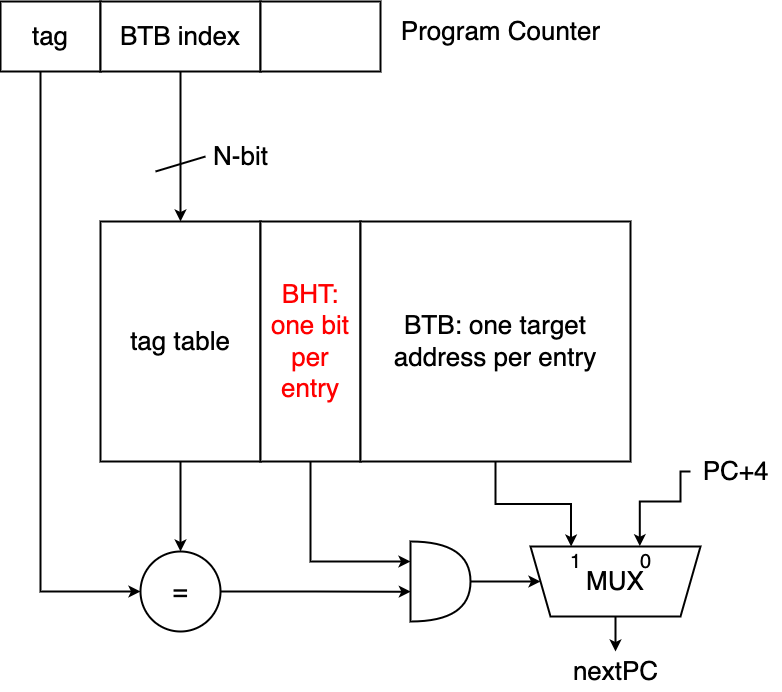
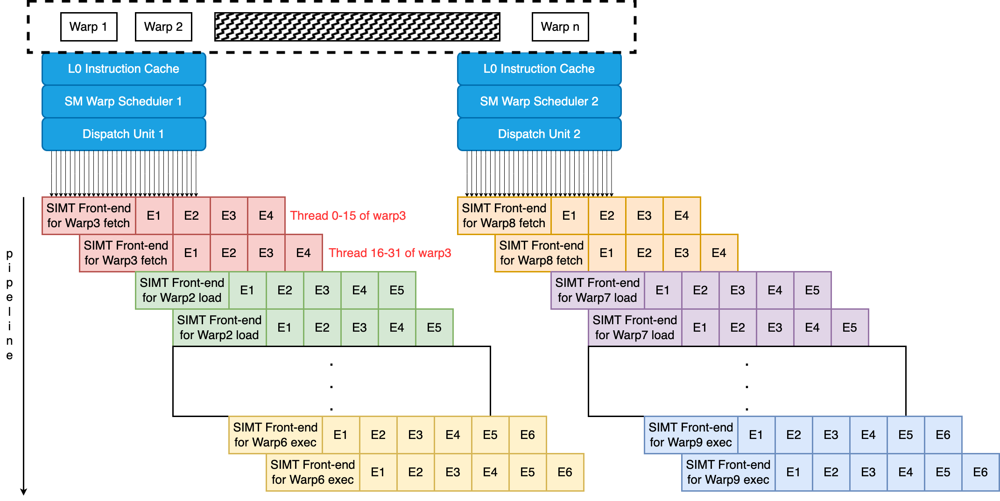
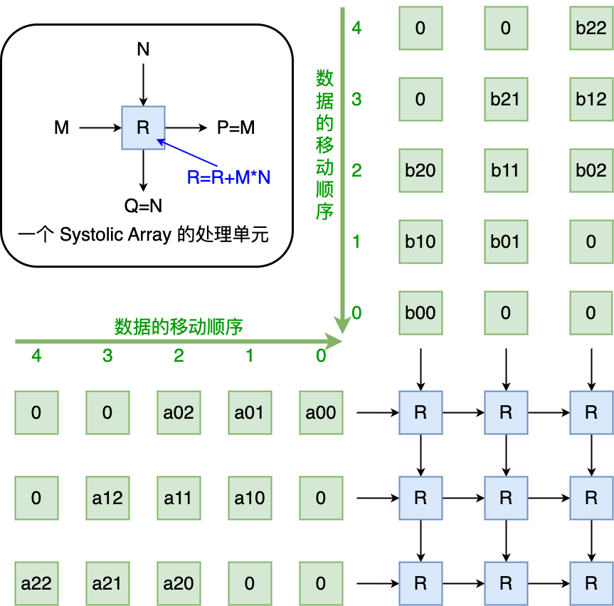
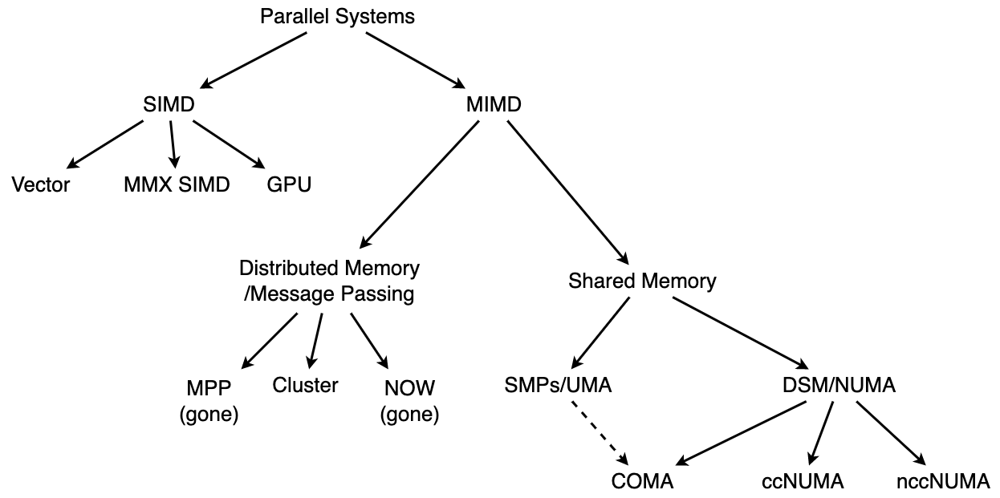
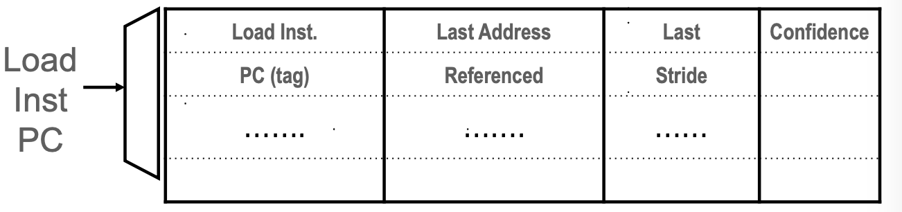

# 体系结构基础 & 并行性

## *计算机分类 & PC发展史*


### 分类

* 个人移动设备 PMD

  个人移动设备 Personal Mobile Device PMD 是指一类带有带有多媒体用户界面的无线设备，比如智能手机、平板电脑等

  PMD上的应用程序大部分是基于Web应用、面向媒体的。能耗与尺寸要求决定了要采用闪存而不是磁盘来作为存储方式

* 桌面计算机/PC

* 服务器 Server

  服务器是专门用于提供服务、存储数据、执行计算和处理网络请求的计算机。它们通常用于支持网络应用程序、托管网站、存储大量数据、进行数据分析、提供网络服务等任务

  服务器已经取代了传统的大型机，称为大规模企业计算的中枢

  因为服务器一般都是用来提供商业服务的，因此服务器的要求集中于高可用性、可扩展性和很高的吞吐能力

* 仓库级计算机 Warehouse-Scale Computer/集群 Cluster

  互联网的爆炸式增长，特别是一些SaaS应用，比如社交网络、互联网商业推动了一类被称为集群 cluster的大型计算机的发展

  集群是一群使用局域网连接到一起的PC或Server，其中最大规模的集群被称为仓库级计算机 WSC

* 嵌入式设备 & IoT

  嵌入式设备存在于各种工业产品中，价格和能耗是使用嵌入式设备时最关心的要素

  嵌入式设备在硬件和软件复杂性方面有很大的限制，我们以**能否运行第三方软件作为区分是否为嵌入式计算机的标准**

  随着嵌入式设备的蓬勃发展与智能互联的需求，物联网 Internet of Things IoT 也迅速崛起。IoT指的是嵌入式计算机连接到互联网，通常是无线连接。当加装传感器和执行器时，物联网设备收集有用的数据并与物理世界互动，从而产生各种“智能”应用，例如智能手表、智能恒温器、智能音响、智能汽车、智能家居、智能电网和智能城市等

### 补充：PC机的发展简史

个人计算机（PC）的发展历史可以追溯到上世纪70年代以及之前，以下是个人计算机发展历史的简要概述：

1. 早期计算器和机械计算机：在20世纪初期，机械计算机和早期电子计算器开始出现，用于执行基本的数学运算和数据处理任务。这些设备通常是巨大的、昂贵的，且使用范围有限
2. 第一台个人计算机：**Altair 8800**：在1975年，Altair 8800被认为是第一台真正的个人计算机。它是一台基于微处理器的计算机，由一家名为MITS的公司制造。Altair 8800需要通过切换开关来编程，而没有图形界面，但它启发了很多人
3. **Apple I和Apple II**：在1976年，史蒂夫·乔布斯和史蒂夫·沃兹尼亚克成立了苹果公司，并推出了Apple I计算机。随后，他们发布了Apple II，这是一台具有图形界面和键盘的计算机，大受欢迎，被认为是个人计算机的重要里程碑
4. **IBM PC和MS-DOS**：1981年，IBM发布了IBM PC（个人计算机）并使用了微软的操作系统MS-DOS。IBM PC的成功导致了PC市场的标准化，并为后来的兼容机打下了基础
5. **IBM兼容机的崛起**：1980年代末和1990年代初，许多公司开始生产IBM兼容机，它们使用与IBM PC兼容的硬件和操作系统，使得PC市场多样化和竞争激烈
6. Windows操作系统：微软推出了Windows操作系统，它具有图形用户界面（GUI），并成为世界上最流行的PC操作系统之一。Windows 3.0和Windows 95版本的发布进一步推动了个人计算机的普及
7. 互联网的普及：1990年代中期，互联网的广泛普及促使许多人购买个人计算机，并开始使用电子邮件、浏览网页等在线服务
8. 移动计算：21世纪初，便携式计算机如笔记本电脑和智能手机开始流行，改变了计算机的使用方式。智能手机特别改变了人们与计算的互动方式

### **IBM PC兼容机 IBM PC compatible**

1980年代初期，市场上已经存在了大量不同标准的个人电脑，比如Apple机、TRS-80、PC-9801等。1981年，IBM推出了IBM PC。然后在1982年IBM公开了IBM PC上除BIOS之外的全部技术资料，从而在IBM PC机的基础上形成了**PC机的开放标准**，使不同厂商的标准部件可以互换。开放标准聚拢了大量板卡生产商和整机生产商，大大促进了PC机的产业化发展速度

到1990年代初，个人电脑市场上仅剩下IBM PC兼容机和苹果的麦金塔电脑  Macintosh 两个主要系列，并且IBM兼容机数量占据了绝对主导地位。随着IBM兼容机的发展以及计算能力的大大提高，它甚至蚕食了小型机的市场份额

在IBM PC兼容机逐步成为事实上的PC标准过程中，为微软、Intel，以及大量兼容机部件商、兼容机厂商提供了市场机会，甚至IBM自己在PC市场上的份额都不是第一位。随着技术的发展，IBM容机经历了IBM PC XT/AT (8086)、80286、80386、80486、奔腾 Pentium等阶段，很多新的内容加入进来，因此到了1990年代/BM对个人电脑架构的影响力逐渐下降，计算机技术人员更倾向称之为Wintel标准架构

Wintel标准架构在字面上指由Microsoft Windows操作系统与Intel CPU所组成的个人计算机。但该词实际上是指Microsoft与Intel的商业联盟，该联盟意图并成功地取代了BM公司在个人计算机市场上的主导地位。所以也称为Winte联盟。这是广受媒体使用的一种通俗用法

在奔腾电脑之后，由于大量新的PC的技术标准应用，PC的技术标准开始由IEEE等组织而不是某个厂家来确定，IBM PC兼容机的说法逐渐被**标准PC**以及后续的**ACPI PC**所取代

### Macintosh PC的三次ISA迁移

虽然早期的Macintosh PC都比较昂贵，市场由更便宜的Commodore 64、IBM PC及IBM PC兼容机主导。但后来，麦金塔操作系统被教育和出版领域广泛应用，使得苹果公司成为未来十年的世界第二大个人电脑制造商。20世纪90年代初，苹果公司推出了麦金塔LC I和Color Classic，这两款产品在价格上与当时的Wintel机型竞争

但是由于早期Macintosh PC搭载的都是摩托罗拉的CPU，而摩托罗拉在与Intel的竞争中逐渐被打败，其各类产品无法在benchmarking中击败intel的产品，Macintosh PC的市场逐渐萎缩。直到乔布斯重回苹果之后精简产品线Macintosh PC才重焕生机

1. 1994年，Macintosh 从摩托罗拉68000系处理器迁移至PowerPC处理器
2. 2005年至2006年，Macintosh 从PowerPC处理器迁移至Intel平台处理器，并且改名Mac
3. 2020年开始，Mac从intel平台处理器迁移至苹果处理器 Apple silicon（基于ARM架构）

### ACPI PC

ACPI Advanced Configuration and Power Interface 是一种电脑标准，旨在管理计算机硬件和软件之间的电源管理、配置和通信。ACPI标准最初由英特尔、微软和东芝等公司于1996年共同开发，旨在取代之前的计算机电源管理（APM）标准，以提供更高级、更灵活的电源管理和配置功能。以下是ACPI标准的主要特点和组成部分：

1. **电源管理**：ACPI允许操作系统和硬件协同管理电源，以实现更有效的电源管理和降低能耗。它允许计算机在不同的电源模式之间切换，例如休眠模式、待机模式和正常运行模式，以节省电能
2. **硬件配置**：ACPI标准提供了一种描述计算机硬件配置的方式，包括中央处理器、内存、外围设备等。这使操作系统能够更好地理解和管理计算机的硬件资源
3. **高级电源管理**：ACPI允许操作系统动态控制硬件组件的电源状态，以实现更精确的电源管理。这包括在不需要时关闭设备、降低处理器频率、调整显示器亮度等
4. **设备热插拔**：ACPI支持设备的热插拔，这意味着用户可以在计算机运行时插入或移除设备，而无需重启计算机
5. **事件通知**：ACPI标准引入了一种事件通知机制，可以通过特定的事件触发操作系统或应用程序的响应。这些事件可以是硬件状态更改、电源事件、按键触发事件等
6. **操作系统支持**：ACPI标准通常需要操作系统提供ACPI驱动程序以实现功能。大多数现代操作系统，如Windows、Linux和macOS，都提供了ACPI支持
7. **ACPI表**：计算机的ACPI信息通常存储在特殊的数据结构中，称为ACPI表。这些表包含了计算机的硬件配置、电源管理信息和其他相关信息，操作系统通过解析这些表来了解和控制计算机的状态

## *计算机体系结构*

### 什么是Computer Architecture？

**Computer Architecture 计算机体系结构**是指计算机系统中各个组件的结构、功能和互联方式，以及它们如何共同协作以实现数据处理和运算任务的方法和规范。其中属于计算机体系结构的范围是硬件和软件之间的接口 Interface between SW and HW 以及微结构的设计

下图是一张计算机整个体系的抽象模型


计算机体系结构包括以下几个关键方面：

* **指令集架构 Instruction Set Architecture，ISA**：指令集架构定义了处理器能够理解和执行的指令集合，包括操作码、寄存器、地址模式等。ISA 是硬件和软件之间的重要接口，不同的计算机体系结构有不同的指令集架构

* **微结构设计**：也称为计算机组织 computer organization，是指计算机系统中具体实现的一套底层硬件架构，它描述了实现特定 ISA 所需的处理器设计细节。微结构包括了处理器内部组件的实际设计和操作方式
  * **内存层次结构**：计算机的内存层次结构包括多级缓存和主存，这些层次的设计影响了数据访问速度和性能。高速缓存被用来存储最常用的数据，以减少处理器访问主存的延迟
  * **处理器结构**：处理器结构涉及到处理器的核心数、流水线设计、并行处理能力等。现代处理器常常具备多核心、超线程等功能，以实现更高的并行处理能力
  * **总线结构**：总线是连接计算机内部各个组件的通信通道，包括数据总线、地址总线和控制总线。总线的设计影响了各个组件之间数据传输的速度和效率
  * **输入输出（I/O）系统**：I/O 系统包括与计算机外部设备进行通信的方式和接口，如网络接口、磁盘控制器等
  * **中断和异常处理机制**：这些机制允许计算机在运行过程中响应外部事件，如硬件错误、输入输出请求等，以保持系统的稳定性和可靠性

计算机体系结构的设计旨在平衡性能、功耗、成本和可扩展性等方面的需求。不同的计算机体系结构在不同的应用场景下可能表现出更适合的特点，例如高性能计算、嵌入式系统、移动设备等

### Computer Architecture的8个伟大思想

1. 面向摩尔定律的设计

2. 使用抽象简化设计 abstraction

3. 加速经常性事件 make the common case fast

   通过试验来确定系统中哪些是经常性事件，哪些是罕见事件。经常性事件往往比罕见事件简单，因此通过优化经常性事件可以有效地改善系统性能

4. 通过并行提高性能 parallellism

5. 通过流水线提高性能 pipelining

6. 通过预测提高性能 prediction

7. 存储层次

8. 通过冗余提高可靠性

### 架构师面对的最重要的功能需求

## *发展趋势*

### 性能趋势：带宽胜过延迟

带宽的增长速度至少是延迟改进速度的平方

### 成本趋势

## *计算机性能*

### 性能的定义

不同的场景下性能的定义是不同的

* 对于PC等个人设备来说更关心响应时间 response time。响应时间也叫执行时间 execution time，它是指从开始一个任务到该任务完成的时间，其中更包括了硬盘访问、内存访问、IO活动、OS的开销和CPU执行时间
* 对于Data Center、Server或HPC而言则吞吐量 throughput 或带宽 bandwidth 是更重要的，即在给定时间内完成的任务数

为了减少“增加”和“减少”带来的误解，当我们想表达增加性能 increase performance 和减少执行时间 decrease execution time 的时候，实际会说改善性能 improve performance 和改善执行实现 improve execution time

### 存储器的延迟 & 带宽

* 延迟 latency

  * 延迟为处理器发出内存项请求到内存项实际到达之间的间隔
  * 延迟的成因很多，比如从内存到缓存的传输、缓存到寄存器的传输，或者将它们总结为内存和处理器之间的延迟
  * CPU通过构建合理高效的层次化存储器来降低延迟，而GPU则通过快速的硬件级线程切换来规避延迟

* 带宽 bandwidth 或吞吐量 throughput

  $$
  理论极限内存带宽\ Bytes/s = 内存标称频率\ Hz \times 内存通道数量 \times 数据传输宽度/总线宽度\ Bytes
  $$
  
  * 内存频率是内存模块的工作频率，通常以赫兹（Hz）表示，关于内存频率的事情在内存部分会详细说明
  * 内存通道数量是系统中同时可访问的内存通道数
  * 数据传输宽度（总线宽度）是每个内存访问的宽度，通常以字节为单位

### CPU相关的时间度量

计算机中对时间最直接的定义是挂钟时间 wall clock time/响应时间 response time/运行时间 elapsed time等。这些术语均表示完成某项任务所需的总时间，包括了磁盘访问、内存访问、IO活动和OS开销等一切时间

CPU执行时间 CPU execution time，简称为**CPU时间**，它只是在CPU上花费的时间，不包括IO等待等其他程序运行的时间。CPU时间还可以进一步划分为

* 用户CPU时间 user CPU time：CPU时间中属于运行用户程序的时间
* 系统CPU时间 system CPU time：CPU时间中属于OS为用户执行相关任务所花去的时间（即陷入内核的时间）

用术语**系统性能 system performance** 表示空载系统的响应时间，并于术语CPU性能 CPU performance 来表示用户CPU时间

### 主板晶振 & 时钟周期

* 主板

  * 主板上的晶振 Crystal Oscillator, XO 来提供原始的时钟频率（XTAL晶体），常见的为24 MHz。这个频率经过频率发生器放大或缩小后就成个主板上各种不同的总线频率

  * 晶振频率经过PPL和差分器可以得到基础频率 Base Clok, BCLK，一般是前端总线的时钟频率。一般就是100 MHz（没有为什么，这是一种潮流）。用基础频率来和除CPU以外的其他设备同步

  * CPU用来和外部设备通信的频率称为外频 External Clock，一般就等价于基础频率

* CPU的时钟周期 clock cycle，也称为滴答数 ticks、时钟滴答数 clock ticks、时钟数、周期数。时钟周期是指计算机内部的主时钟发生一次脉冲或周期性振荡的时间间隔。时钟周期用于同步计算机的各个组件，确保它们在正确的时间执行操作。时钟周期的倒数称为主频

* CPU的时钟频率很高，将CPU主频和同步外频之间相差的倍数称为倍频 Multiplexer
  $$
  External\ Clock\times Multiplexer=1/Clock\ Cycle
  $$

* 超频 Overclocking 是指将计算机硬件组件（通常是CPU、GPU、RAM）的工作频率设置高于它们出厂时的默认频率，以提高性能的过程。超频通常用于提升计算机的处理能力，使其能够更快地执行任务，如游戏、视频编辑、数据处理等

* 睿频：处理器自动调整频率，以让程序更流畅运行的一种技术。最早由Intel在其Core i5处理器上实现，Intel的睿频技术称为turbo boost

### CPU周期 & CPU性能

CPU性能度量的基本指标应该是**CPU执行时间**，也称为CPU周期或者机器周期
$$
程序的CPU执行时间=程序的CPU时钟周期数\times 时钟周期长度=\frac{程序的CPU时钟周期数}{时钟频率}
$$
从上式中可以看出，只要硬件设计者可以减少程序执行所需的CPU时钟周期数或缩短时钟周期长度就可以改善性能。不过这两者往往是此消彼长的，设计者需要做出抉择

### 指令周期 & 指令性能

CPI取决于指令周期/程序的CPU时钟周期数是一条指令所需要的CPU执行时间和程序指令数 Instruction Count或指令路径长度 Instruciton Path Length
$$
CPI=\frac{程序的CPU时钟周期数}{IC}
$$
**指令平均时钟周期数 clock cycle per instruction CPI 表示执行每条指令所需的时钟周期平均数**。CPI提供了一种相同指令系统 ISA在不同的实现下（不同的硬件实现方式或者不同的处理器设计来执行这些指令）比较性能的方法，因为在相同ISA中程序的指令数是相同的，所以可以比较CPU的性能

也可以使用每时钟周期指令数 IPC instruction per clock cycle

### CPU性能公式

结合上面两个公式，可以得到基本的CPU性能公式
$$
CPU时间=IC\times CPI\times 时钟周期=\frac{IC\times CPI}{时钟频率}
$$
其中时钟周期取决于硬件技术与组成；CPl取决于组成与指令集体系结构；IC取决于指令集体系结构和编译器技术

指令数和CPI是很难测量的。CPI与计算机的各种设计细节密切相关。CPI对于不同应用程序是不同的，对于相同ISA的不同实现方式也是不同的

## *Roofline Model*

Roofline模型是在 *Samuel Williams, Andrew Waterman, and David Patterson. 2009. Roofline: an insightful visual performance model for multicore architectures. Commun. ACM 52, 4 (April 2009), 65–76. https://doi.org/10.1145/1498765.1498785* 论文中提出的关于系统性能的可视化模型，它将浮点性能、算术强度和内存性能结合到一张二维图中

### 算术强度

$$
算术强度=\frac{浮点操作数/秒}{浮点操作数/字节}=字节/秒
$$

存储器每访问一字节所包含的浮点运算比例称为算术强度 arithmetic intensity。下面是几种Berkeley设计模式的算术强度


算术强度指标通常用于评估程序对计算资源（如处理器）与内存资源的依赖程度。算术强度高的程序通常被认为是计算密集型，因为它们执行大量的计算而相对较少地访问内存

### Operational Intensity

Operational Intensity是在 中给出的概念。它测量的不是Processor和Cache之间的流量，而是LLC和memory之间的bandwidth

### Roofline模型解析

$$
FLOPS=\frac{\#FLOP}{time(Sec)}=\frac{\#FLOP}{Byte}\cdot\frac{Byte}{time(Sec)}=Arithmetic\ Intensity\times Bandwidth=AI\times BW\\\xrightarrow{Log}\log{(FLOPs)}=\log{(AI\times BW)}=\log{(AI)}+\log{(BW)}\sim y=x+b
$$


计算密集型程序主要受限于浮点计算峰值性能 peak GFLOP/s，而内存密集型程序则主要受限于DRAM的峰值理论带宽 peak Gigabytes/s。二者的交叉点 ridge point 称为 machine balance，表征了硬件架构的特点

优化过程是这样的：理论计算得到峰值DRAM bandwidth，然后测量实际的GLOPs，比较二者？

## *Benchmarking*

### Triad

### STREMA

### 桌面基准测试

* CPU密集型基准测试
* 图形密集型基准测试

### 服务器基准测试

### 并行基准测试

* Linpack：Linpack 线性代数包是一个用于解决线性代数问题的benchmarking，主要用于测量计算机系统的浮点运算性能。它通常用于评估超级计算机和高性能计算群集的性能。Linpack通常使用在TOP500超级计算机排名中，以确定超级计算机的性能排名
* SPECrate
* SPLASH & SPLASH2：Stanford Parallel Applications for Shared Memory 是20世纪90年代斯坦福大学的研究成果，目的是提供类似于SPEC CPU的并行benchmarking。这两个基准测试可用于评估计算机系统的内存子系统性能，特别是对于并行应用程序来说，内存性能非常关键
* NAS (NASA Advanced Supercomputing)：NAS Parallel Benchmarks是一组由NASA开发的基准测试，旨在评估超级计算机和并行计算系统的性能。这些基准测试包括一系列科学应用程序，涵盖了不同的计算和通信模式。允许用C或Fortran重写
* PARSEC (Princeton Application Repository for Shared Memory Computer) 由Pthread和OpenMP的多线程程序组成，它们主要专注于新兴的计算领域，由9个应用程序和3个核心程序组成
* YCSB (Yahoo Cloud Serving Benchmark) 是云端的并行benchmarking，目的是比较云数据服务的性能，它通过使用Cassandra和HBase作为具有代表性的例子，提供了一个易于让用户评测新数据服务的框架

## *单核向多核的跨越*

### 功耗墙 Power wall


SPECint Benchmarking的结果显示，1986-2002频率年增52%，按照这个趋势，到2020年频率应该有几十GHz了，但是实际上从2002之后的三年频率增幅仅为20%，目前稳定在1-5GHz。这被称为 Power Wall
$$
功耗\propto\frac{1}{2}\times负载电压\times电压^2\times开关频率
$$
计算机芯片的晶体管数量和集成度不断增加，带来了更多的计算能力和复杂性。然而，随着晶体管数量的增加，芯片的功耗也会相应地增加。更多的晶体管在工作时需要更多的电能，而且在高频率运行时产生的热量也会急剧增加

### 多核时代

为了避免处理器 Processor 和微处理器 Microprocessor的混淆，又将处理器称之为一个核 core。例：在一个微处理器中有4个处理器/核心，那么将这个微处理器称为4核芯片/4核微处理器（其中一个处理器是一个数据通路/运算器+一个控制器）

多核时代的到来也宣告着处理器性能的提高从单纯依靠指令级并行 ILP 转向数据级并行 DLP 、线程级并行 TLP 和请求级并行 RLP。原来的ILP是依靠编译器和硬件自动进行的，但新时代的DLP、TLP和RLP则更多的是需要程序员显式调整应用程序的结构，对程序员的开发能力提出了更多的要求

* 桌面级多核 CPU：通常在 3.0 GHz 到 5.0 GHz 的范围内，具体取决于型号和用途。高端桌面和游戏处理器可能会提供更高的频率
* 服务器级多核 CPU：服务器处理器的频率范围可能更广，一般在 2.0 GHz 到 4.0 GHz 之间。服务器 CPU 通常更注重多核性能、可靠性和功耗效率，而非单核高频
* 移动平台多核 CPU：对于笔记本电脑和移动设备，CPU 的频率一般较低，通常在 1.0 GHz 到 3.0 GHz 之间。移动平台更注重功耗和散热的平衡

## *并行度 & 并行体系结构分类*

并行 parallelism 就是在程序的执行过程中寻找独立的操作，这些独立的操作往往其执行逻辑相同，只是用于不同的数据项

多种级别的并行度已经成为各种不同的计算机设计的推动力量，其中能耗和成本则是主要的约束条件

### 应用并行

* 数据级并行 DLP, Data Level Parallelism
  * 同一操作被并行地应用于许多数据项，一般都是在 SIMD 中使用
  * 数据并行性在科学计算中十分常见，并行性往往源于一个数据集（向量、矩阵、图等）被分散到许多处理器上，没个处理器都可以处理其数据的一部分

* 任务级并行 TLP, Task Level Parallelism：创建了一些能够单独处理但大量采用并行方式执行的工作任务/子程序

### 硬件并行

* 指令级并行 ILP, Instruction Level Parallelism
  * 主要的ILP技术有流水线 pipelining、多发射 multiple-issue、分支预测和推理执行 branch prediction and speculative execution、无序 out-of-order execution、预取 prefetching
  * ILP并不在用户的控制范围内，而是由编译器和CPU共同决定的

* 3 种 SIMD 形式将单条指令并行引用于一个数据集，以开发数据级并行 DLP
* 线程级并行 TLP, Thread Level Parallelism：软件级 TLP 和硬件级 TLP，可以由程序员来制定
* 请求级并行 RLP, Request Level Parallelism：有大量工作可以自然地并行开发，几乎不需要通信或同步

## *创建并形处理程序的挑战*

提高并行性的困难并不在于硬件上，而是在于只有很少的应用程序在被重写后能够在多处理器上取得更高的速度，开发多处理器的并行处理程序是非常困难的

### Amdahl 定律的加速比定义

加速比 speedup 是一种用于衡量并行计算系统性能改善程度的度量。它通常用于比较串行计算和并行计算之间的性能差异。加速比 speedup 取决于两个因素

1. 原计算机计算时间中可升级部分所占的比例，这个比例称为**升级比例** $Frachtion_{enhanced}<1$。比如60秒中有20秒是可以改善的，则升级比例为 $1/3$ 
2. 可升级部分的改善幅度称为**升级加速比** $Speed_{enhanced}>1$

$$
改进后的执行时间=\frac{受改进影响的执行时间}{改进量}+不受影响的执行时间=原执行时间\times\left(\left(1-升级比例\right)+\frac{升级比例}{升级加速比}\right)
$$

Amdahl定律定义了使用某一特定功能所获的的加速比 speedup
$$
Amdahl's\ law:\ 加速比=\frac{整个任务在采用该升级时的性能}{整个任务在未采用该升级时的性能}=\frac{1}{\left(1-升级比例\right)+\frac{升级比例}{升级加速比}}
$$

### Amdahl定律在并行处理器上的应用

Amdahl定律可以用作评估并行计算性能的数学模型，它对于理解如何利用多核CPU的性能提供了重要的洞察。Amdahl定律的核心观点是，**对于一个并行计算任务，其性能提升受到了任务中无法并行化部分的限制**。所谓无法并行化的部分就是指部分代码必须依赖故有顺序执行

我们可以将并行任务套用到上面的Amdahl定律中，此时

* 升级比例 $Frachtion_{enhanced}=f$ 是程序中并行执行的的比例
* 升级加速比 $Speed_{enhanced}=p$ 是CPU的核心数，因为每多一个核心就提高一倍的改善幅度
* 原执行时间就是纯顺序执行的时间 T

根据Amdahl定律可以写出加速比为

$$
T(p)=\left(1-f\right)\cdot T+\frac{f\cdot T}{p}
$$

从上式可以得到下面的关系，即在固定的处理器核心数为了达到某个加速比程序中需要并行化的部分的比例。从而引出了一个构建并序的难点，即在一定的核心数下要向得到至少等比例的加速比需要极高的程序并行度


### 大规模问题

想要在多处理器上获得良好的加速比，保持问题规模不变的情况相比于问题规模增长的情况要困难得多

* 强比例缩放 strong scaling 意味着在保持问题规模不变的情况下在多处理器上获得的加速比
* 弱比例缩放 weak scaling 意味着在问题规模与处理器数量成比例增加的情况下在多处理器上获得的加速比

假设问题规模M是主存中的工作集，处理器数量是P，那么每个处理器所占用的内存对于强比例缩放大约为 $M/P$，对于弱比例缩放大约为M

### 负载均衡 & 高度并行

调度并将工作划分为可并行的部分，以及在处理器之间同步时间、维持通信、均衡负载都是困难的

若各个处理器并未分配到完全相同的工作量，则会产生一部分的闲置，从而造成负载不均衡 load unbalance

处理器之间的通信是效率损失的一个重要来源，一个不需要通信就可以解决的问题无疑是具有吸引力的。这类问题实际上由许多完全独立的计算组成，被称为高度并行 embarrassingly parallel 或便捷并行 conveniently parallel

# 流水线数据依赖

## *数据依赖*

### 数据依赖的种类

因无法提供指令所需数据而导致指令不能在预期的时钟周期内执行的情况称为数据依赖。计算机流水线中，数据依赖源于一条指令依赖于一条尚在流水线中的指令

* Dataflow/Flow dependence 是 true dependence，因为是语义上的依赖，也就是说第二步的r3用到的就是第一步的r3

  

  比如说下面的指令就对应RAW，若不进行修正，它会严重干扰流水线的运行，第二条指令需要等到第一条指令WB，会白白浪费3个时钟周期

  ```assembly
  add x1, x2, x3
  sub x4, x1, x5
  ```

* Anti dependence 和 Output dependence 是 false dependence，因为没有语义上的依赖，只是因为寄存器标号不是无限多造成的name dependency。为什么说没有语义上的依赖？举个例子，先做 `z=x+y`，再做 `x=m+n`，这种对于x的WAR实际上第二步并不关心第一步x是多少，反正都是要写覆盖的，只要第二步不比第一步先执行就行。In-Order和OoO通过reorder和保留站提供的寄存器重命名就可以解决它

  * Anti dependence 反依赖

    

    第二步不一定要写到r1里，如果可以的话写到r6、r7都行，这是可以从结构上避免的

  * Output dependence 输出依赖

    

    如果交换第一步和第三步的顺序，则会影响到第二步的结果，所以这两步无法在流水线上并行执行。但是如果将其中任意一个r3换成另一个寄存器就可以消除output dependence了

### 如何消除数据依赖

Anti和Output dependence 是比较容易消除的，只要是按照指令顺序，后面的指令在最后阶段写入就可以完全消除这两种数据依赖

但是Flow dependence是不能这么简单就消除的。消除Flow dependence 主要有6种方法

* Detect and wait until value is available in register file，最保守的方法，让流水线停顿
* Detect and forward/bypass data to dependent instruction 前递
* Detect and eliminate the dependence at the software level 利用编译器重排指令来消除Flow dependency，静态调度和动态调度
* Detect and move it out of the way for independent instructions
* Predict the needed value(s), execute “speculatively”, and verify 预测
* GPU的fine-grained multithreading，线程快速切换

### 静态调度和动态调度

* Static scheduling 静态调度：software based instruction scheduling，也称为编译时，就是任何在程序真正被执行之前的行为
* Hardware scheduling 动态调度：hardware based instruction scheduling，也称为运行时，就是任何在程序真正被执行时的行为

一般来说任何只靠一方的努力都无法达到相对最佳的效果，实际中都是二者的结合。有一个很好的例子是MIPS的设计

MIPS是一种有大语义鸿沟的ISA，所以编译器要做很多，包括防止Interlocking。一开始MIPS没有在微结构层面设置任何的anti-interlocking。这也是MIPS, Microprocessor without Interlocked Pipeline Stages 名字的由来。不过后来发现这是一个极其糟糕的设计，因为compiler和软件要做大量的静态调度，所以后来MIPS实际上加入了静态期防止interlocking的内容

另一方面为了进行静态调度，编译器要知道很多信息，但是不幸的是，任何在运行时才能知道的信息编译器都是无法知晓的，比如说依赖于长度的操作的延迟（比方说如果乘法有一个操作数在运行时确定为0，那么就能极大的缩短操作时间）、**特别是涉及到缓存或内存的访问**、分支方向等

一种方法是对程序进行动态或静态的做实验来进行性能分析 profiling

## *检测数据依赖*

### 计分牌 score-boarding

每一个寄存器都多带一个有效位 Valid bit，每一个要写这个寄存器的指令都要重置这个有效位。另外的指令在译码阶段要检查它的所有dest和src寄存器是否都有效，如果是则说明没有依赖不需要停顿流水线；否则要停顿流水线

好处是这种实现方法比较简单，坏处是它无法分辨三种数据依赖

### 组合逻辑检查

这种方法可以只识别出Flow dependence，但是需要硬件支持，而且随着流水线的加深硬件会越来越复杂

## *前递*

当检测出数据依赖后，最终的解决方法是令流水线停顿 stall pipeline。但是流水线停顿的损耗很大，所以如果可以避免停顿就要必要它。前递 forwarding（将结果从前面一条指令直接传递给后面一条指令） 或旁路 bypassing（将结果绕过寄存器堆，直接传递给需要它的单元） 就是避免不必要的流水线停顿的一种方法

前递的思路是提前从内部缓冲中取到数据，而不是等到数据到达程序员可见的寄存器或存储器之后再去取


`and $t0, $s0, $s1` 要用到 `$s0` 寄存器的值至少要等到 `add $s0, $s2, $s3` 的第5步 WB之后才能取到

这种情况就可以用forwarding来修正，上图中 `add` 第3步EX之后连接到 `and` 的ID之后的通路就是这种效果

前递实际上和dafaflow的一旦数据准备好，就立刻trigger需要它的指令的思想是一样的

### 前递失效


load指令要直到写入内存后才可以bypass给其他指令。此时必须要插入bubble，stall pipeline才能解决数据冒险

不过注意，上图中因为三条指令都需要用到 `$s0`，所以无法通过静态调度的方式调换指令顺序来实现bypass的目标·

## *插入bubble*

### 微结构上实现stall

实现stall需要硬件支持

* IF/ID流水线寄存器需要使能EN控制，来保存stall之前的指令
* EX流水线寄存器需要synchronous clear/reset CLR，或者在每个流水线寄存器添加INV invalid位，用来插入bubble/nop

stall的步骤是

* 不使能PC和IF/ID流水线寄存器的锁存功能，让之后被stalled的指令都留在原地
* 在开始stall的指令后插入nops 指令

### 例子

载入-使用型数据冒险 load-use data harzard：一种特定形式的数据冒险，指当载入指令要取的数据还没取回时，其他指令就需要该数据的情况

```assembly
ld x1, 0(x2)
sub x4, x1, x5
```

上面的汇编代码就是典型的载入-使用型数据冒险，`ld` 要到第四阶段才能memory中把数据取到。这种情况下没有任何的前递方法可以帮助提前取到数据


解决方法是使用硬件检测停顿，或由软件对代码重新排序以尽量避免载入-使用型流水线停顿。这种情况称为**流水线停顿 pipeline stall，通常俗称为气泡 bubble**。具体做法是插入一个从未无意义的控制信号 `nop`，令CPU空转一个时钟周期

对于当今普遍有20-30级pipeline的处理器来说stall的操作带来的损耗是非常大的

# Precise Exception

## *多周期执行*

### 不同的FU


* Decode, D 解码：取指令后放入register，在ROB中预留一个位置，如果指令可以执行，就**dispatch指令，也就是送到functional unit**。如果因为任何原因指令无法执行，都不可以dispatch
* Execute, E 执行：指令在执行的时候可以乱序。这个阶段在不同的functional unit中的执行时间是不同的
* Completion, R：将结果写入reorder buffer
* Ertirement/Commit, W 提交
  * Retire/graduate/commit：完成执行后更新architectural state的步骤
  * 检查最早的指令是否发生了异常，如果没有就将结果写入architectural register或者内存；如果发生异常，就要冲刷pipeline并跳转到exception handler

### 交付的时间点


上图中后执行的指令在先执行的指令写入结果之前就写入了，没有遵守Von Neumann的顺序执行语意。如果不保留Von Neumann规定的顺序语义的话会引发很多问题

比如说在语言层面如果我们catch了一个exception，如果这个exception的结果是已经写入了寄存器或内存的话会很麻烦

### 异常和中断

* 异常 exception 是内部错误 internal：比如除0错误、溢出、页错误等
* 中断 interrupt 是外部错误 external：比如没有内存了，这是系统的问题，程序员无力解决

处理异常和中断都需要

* 停止现有指令
* 将architectural state保存下来
* 跳转到handler来处理异常或中断
* Optional：回到程序停止执行的地方

### Precise Exception

Precise exception的本质就是说要遵循Von Neumann语义

保留Von Neumann语意有助于debugging，如果没有Von Neumann这层语义上的约定，程序员需要自己重构程序，努力去找出程序到底是如何执行的

traps 软件层面的opcode，比如说浮点运算可能在硬件层面消耗过大，可以通过在软件层面模拟

Dataflow model就很难遵循precise exception，dataflow中还是有异常，但根本不知道有没有执行了

支持Precise Exception的方法有多种

* Reorder Buffer
* History Buffer
* Future Register File
* Checkpointing

## *Reorder Buffer*

### ROB 结构


ROB在硬件上被设计为一个先进先出的环形队列，它里面存储的指令是已经译码了但还没有被retired/commited的指令

* 仍然乱序执行指令，但在写入体系寄存器之前把结果放到 Reorder Buffer, ROB 重排序缓冲区 里面
* 当指令被解码的时候，会在ROB中为这条指令按序预留一个位置
* 当指令完成的时候，它的结果会写入ROB entry
* 当ROB中最早的指令无异常完成的时候，它的结果才会被写入寄存器堆或内存中

### ROB Entry


* Valid bit有效位：为一条尚未retire的指令保留了ROB entry或者已经被写入entry了
* DesRegID：要写入的寄存器ID
* DesRegVal：要写入寄存器中的数据
* StoreAddr & StoreData：写内存要用的
* PC & Exception：若有异常发生，需要处理
* Valid bits for reg/data + control bits：数据是否已写完成等控制位，从而可以给其他后面的指令提供数据

### Example

具体的例子可以直接看课件笔记

其中有一个要注意的点是为了防止pipeline中的RAW数据依赖，在写的时候要把Valid bit设为0，直到数据写入后再改为1

### 考虑数据依赖性

stall是一个保守的坏主意，既然结果已经在ROB里去了，那就想办法去ROB中取

ROB的访问不是按照序号来的，而是按照指令的先后顺序。因此这里用到了 content adressable memory，它的作用就是一个 KV map，通过Key，在这里是Register ID来搜索某个ROB entry。而且必须是R3的最新定义，因为很有可能有多个写R3的entry，要用一个 priority comparison logic 的硬件逻辑或者软件来实现

现在的处理器的ROB一般都多达上千个entry，这导致用来搜索的硬件逻辑变得非常昂贵

ROB实际上提供了renaming of registers的方式来解决anti-dependency和output-dependency两种false-dependency的数据依赖形势。ROB给用户营造了一种有很多很多寄存器的假设，实际上一个CPU上的寄存器可能只有数十个


ROB达到的效果就是上图，即In-order dispatch, out-of-order completion, in-order retirement 按序分发、乱序执行、按序提交

# 乱序执行

Distributed: load imbalance

## *OoO with Precise Exceptions*

### In-Order dispatch的问题

Dispatch 派送 指令的意思是把一个指令送到 functional unit。In-Order dispatch 的问题在于如果发生了 stall，那会停止后面所有指令的 dispatch，即使是根本没有数据依赖性的指令


就比如上图中的例子，因为第二句指令 `ADD R3 <- R3, R1` 对第一句指令存在RAW的真数据依赖，所以要stall流水线，单后面三句指令是无辜的，他们对前面的指令并不存在数据依赖。我们可以优化因为In-Order dispatch造成的损失

### Tomasulo Algorithm

Tomasulo Algorithm 是IBM的 Robert Tomasulo 1967年所研发用来改善处理器乱序执行指令级并行性的硬件算法。首先应用在 IBM 360/91 的浮点运算单元上

Tomasulo Algorithm 在提出后还加入了一些改进，主要是加入了对precise exception的支持。OoO变种被使用在当今大部分高性能的处理器上

Tomasulo Algorithm 过程如下

* If 保留站在renaming之前就可用了
  * 将指令 + renamed 操作数（source value/tag）插入到保留站中
  * 只有当保留站可用时才rename
* Else stall
* While 在保留站中的时候，每一条指令
  * 通过 Common Data Bus, CDB 监控各自的tag of its sources
  * 若tag可见，就把tag对应的值取过来放到保留站中
* 若指令需要的source register都准备好了，就把指令dispatch到functional unit中（前提是若FU的流水线没满）
* 在FU中的指令执行完毕后
  * CDB仲裁
  * 将tagged value放到CDB中广播

### 保留站

核心思想：增加硬件缓冲保留站 reservation station，把没有准备好的指令移到保留站里

具体过程看pdf


在支持 precise exception 的OoO中，主要有以下几部分组

* Reservations Stations 保留站/Scheduling Window 发射窗口：保留站 + 中间配合保留站使用的用于renaming的寄存器堆/表称为Register Alias Table, RAT，或者Frontend Register File
* Reorder Buffer/Instruction Window/Active Window：ROB用于按序retire
* architectural state register总是在最后确定retire的时候在修改的

执行完毕后需要deallocate 清空保留站，否则如果没有足够的保留站 entry可以使用的话还是会stall pipeline

### OoO的改进效果


对于上面在In-Order Dispatch中的同一个例子，现在用OoO改进。后三个不存在数据依赖的指令现在不会被stall了，将原来5条指令需要20个cycle来执行缩短到了16个cycle

## *Load-Store handling in OoO*

### 挑战

* 对内存地址做重命名很困难

* load/store是否存在依赖性不像只需要寄存器的指令可以再译指阶段就能检测出是否存在依赖，load/store需要指令部分执行才可以检测出依赖，比如说

  ```assembly
  ld x5, 40(x6) # x5 = Memory[x6 + 40]
  ```

* 当load/store的地址准备被计算出了之后，可能会有其他位置地址的older/younger stores/loads依赖


在一个OoO CPU中，一个younger load可能会依赖于older store，而如果这个younger load的地址在older store的地址之前被计算出来，我们就无法判断是否有数据依赖，这杯称为 memory disambiguation 或者 unknown address 问题

### 应对方法

* 保守：stall load直到所有load之前的store的内存地址都被计算出来了（或者甚至是从reservation station retire了）
* 激进：一直假设load是不依赖于store的，但出错了就要flush pipeline
* 预测：用根据之前的行为等作为指标的一个预测器

事实证明采用预测的方法效果远好于保守和激进的两种方案

### Data Forwarding & load/store 队列

需要将所有的load/store指令分别存到 load queue（即一个寄存器）和 store queue 中

LQ 可以用来做预测，若预测一个load不依赖于store，则当store完成的时候要check LQ看看是否所有的load都是对的

一个store需要搜索大量SQ相关的内容，这导致这个搜索效率极其低下，因此这个部件不能很大，不能往系统中同时放大量的store/load

确保OoO的load-store语义需要大量硬件微结构来实现一致性模型，这部分可以看下面数据一致性模型部分的内容

## *Value Replication*

### 问题

在OoO的各个环节的寄存器中都存在着大量重复的值

优化方法就是只保留一个physical register file，所以其他地方没有寄存器，而是一个软件的map，其中保存 `<Register, Pointers to Register File>` KV对

### 解决方法

Frontend register file 在执行结束后进行广播的时候更新，用于renaming


# 分支预测

## *控制依赖 & 分支类型*

### 控制依赖的场景

控制依赖也称为分支依赖 branch dependency，由于取到的指令并不是所需要的，或者指令地址的流向不是流水线所预期的。或者通俗的说，当需要根据一条指令的结果做出决定，而其他指令正在执行

若是一条分支指令的话，跳转到的PC是需要先decode才能得到的，这在指令周期的第一步就卡住了

### 分支类型


* Conditional 条件跳转：需要根据条件判断是否跳转，一般就是if语句
  
  ```assembly
  cmp eax, ebx ; 比较寄存器eax和ebx的值，这个比较操作本身需要执行，占用了额外的计算时间和资源
  je label1    ; 如果相等，跳转到label1处执行
  jne label2   ; 如果不相等，跳转到label2处执行
  ```
  
  * Direct 直接跳转：跳转的目标地址从指令编码中的立即数可以直接计算而得
  * Indirect 间接跳转（也称为计算跳转、间接跳转、寄存器间接跳转）：用参数来指定地址位置，这意味着下一条要执行的指令位于寄存器或内存中的某处（x86）。在执行指令之前，跳转目标地址是未知的，因为跳转地址放在寄存器里面
  
* Unconditional 无条件跳转：跳转分支指令一定会发生跳转，一般是switch和goto
  
  ```assembly
  jmp label ; 无条件跳转到label处执行代码
  ```
  
  * 同样的，无条件跳转也有直接和间接跳转两种
  
* Call & Return：Call = push + jump, ret = pop + jump

### 应对控制依赖的方法

* Stall：采用停顿，这种保守的方法是有效的，不过对性能影响很大，只有在所有方法都失效时才会使用
* Branch prediction 预测分支是否运行，预测的方法很多
* Delayed branching, branch delay slot
* 和在应对数据依赖时一样，FGMP通过快速线程切换也可以应对控制依赖
* Predicated Execution 判定式执行：Eliminate control-flow instructions，将控制依赖转换为数据依赖
* Multipath execution：取出所有可能的分支并执行

## *分支预测*

### 分支预测的内容

需要在IF阶段预测三件事

1. 取到的指令是否是一个分支
2. （条件）分支的方向
3. 条件分支的地址

通过记录分支指令跳转目标地址的 Branch Target Buffer, BTB 分支目标缓冲器 既可以解决target address也可以解决是否是branch的问题，因为如果出现在了BTB里面，那么肯定是一条分支指令。所以实际上只需要一个BTB和direction predictor。一个比较通用的架构如下


实际上是否是一条分支指令也可以作为指令的一种元数据存储在I-cahce里面，也就是在指令里增加表示是否是分支指令的bits

### 分支方向预测方法

分支预测 branch prediction 可以说是解决分支冒险的最重要的方法，它预测分支的结果并直接沿预测方向执行，而不是等分支结果确定后才开始执行。若预测对了则流水线全速运行；若预测错误就要 flush 清空或刷新预测分支流水线的各个阶段的数据，然后回头做实际发生的那个分支方向

* 静态编译时分支预测

  * Always not taken
  * Always taken
  * BTFN
  * Profile based
  * Program analysis based

* 动态运行时分支预测

  动态分支预测 dynamic branch prediction 是借助硬件实现的，比如一种实现方案是采用分支预测缓存 branch prediction buffer或分支历史表 branch history table。分支预测缓存是一块按照分支指令的低位地址定位的小容量存储器

  动态硬件检测器根据每个条件分支指令的行为进行预测，并在程序生命周期内可能改变条件分支的预测结果

  动态预测的一种常用实现方法是保存每个条件分支是否发生分支的历史记录，然后**根据过去一段时间的执行情况来预测未来**。当历史记录的数量和类型足够多时。动态分支预测器的正确率超过90%

  * Last Time Predictability
    * Last time prediction (single-bit)
    * Two-bit counter based prediction
  * Two-level prediction (global vs. local) 两级预测算法
    * Global：1个分支的输出可能与其他分支的输出有联系
    * Local：1个分支的下一个输出可能与该分支的之前输出有联系
  * Hybrid
  * Neural branch prediction：现代处理器还会采用ML来预测分支

## *静态分支预测*

### Alway staken/not taken & BTFN

* Always taken/not taken
  * 不需要复杂的硬件支持
  * always taken（概率为60%～70%）的效果一般比always not taken（概率为30%～40%）的效果好。因为大量的backward branches/loop branches是taken的
* Backward taken, forward not taken (BTFN)
  * backward branch通常指的是控制流程中的一个向后的跳转。程序中当一个程序执行到某一点，需要回到之前的某个点重新执行时，会使用到向后分支。这常常发生在循环结构中，比如while循环或for循环。每当循环的一次迭代完成，程序就会通过一个向后分支返回到循环的开始，继续下一次迭代
  * BTFN指的是把loop分支设为taken，其他分支设为not taken

### Profile-based

利用 Profiling 的方式来预测分支

* 静态/编译时Profiling

  * 这种分析在编译过程中进行，无需运行程序

  * 编译器可以分析源代码中的静态特性，如函数调用图、循环嵌套层次、分支预测等

  * 静态profiling通常不会测量运行时间或内存使用，但它可以帮助优化代码的结构和大小

* 动态/运行时Profiling

  * 动态profiling在程序运行时收集数据，它更常用且功能更强大

  * 编译器可能会在编译时插入额外的指令，用于在运行时收集信息。这种方法称为 Instrumentation

  * 另一种动态profiling方法是采样，它定期检查程序的状态而不是记录每个事件。这通常通过操作系统的定时器中断来实现

Profile-based是一种per-branch的预测，当profiling的结果准确时比较有效，不过需要在分支指令中额外插入命中位 hint bits

如果分支的真实概率是五五开的话，效果就会很差。特别是若profiling本身就出错了，那么run-time会变成一场灾难。比如说profiling得到的结果是分支A的概率是99%，分支B的概率是1%，所以编译时预测为分支A。但是实际上run-time的结果是分支B的概率是99%，分支A的概率是1%，意味着99%的情况下流水线都是错误的

* Accuracy depends on representativeness of profile input set

  ```
  TTTTTTTTTTTTTTTTTTNN -> 90% accuracy (or 10%?)
  ```

* Accuracy depends on dynamic branch behavior

  ```
  TTTTTTTTTTNNNNNNNNNN -> 50% accuracy
  TNTNTNTNTNTNTNTNTNTN -> 50% accuracy
  ```

### Programm-based

* 思路：使用基于程序分析的启发式方法来静态预测分支方向
* 操作码启发式 opcode heuristic：预测 BLEZ 为not taken（在许多程序中使用负整数作为错误值） 
* 循环启发式 loop heuristic：预测作为循环执行守卫的分支为已取（即执行循环）
* 指针和浮点数比较：预测不相等

Programm-based 不需要性能分析，但是启发式方法可能不具代表性或者效果不佳，启发式需要编译器分析和ISA支持（对于其他静态方法同理）

另外也可以通过编译程序指令 `#pragma` 为编译器提供建议

```c++
if (likely(x)) { /**/ }
if (unlikely(error)) { /**/ }
```

举一个OpenMP的例子：`#pragma omp parallel` 只是说建议编译器采用并行的方式来执行代码，而不是强制性的（虽然大部分情况下这么写都可以产生并行区）

## *Last Time Predictability*

### Last Time Predictor

Last Time Predictor 假设分支会采取和上回同样的选择

对于一个拥有K个迭代的循环，它的正确率是 $(K-2)/K$

* 当K很大时，接近100%正确率

  ```
  TTTTTTTTTTNNNNNNNNNN -> 90% accuracy，中间从T到N的时候预测N出错
  ```

* 当K很小时，接近0%正确率

  ```
  TNTNTNTNTNTNTNTNTNTN -> 0% accuracy
  ```



### 问题 & 改善措施

Last Time Predictor的问题在于它从 `Not Taken -> Taken` 和 `Taken -> Not Taken` 的预测变换的太快了，换句话说动态性能太强

需要增加一些迟滞 hysteresis，从而来预测器不会因为一次不同的分支输出就发生变换

### 2BC Prediction

Two-Bit Counter Based Prediction, 2BC Prediction 就是上面增加迟滞的实现方法。2BC Prediction用两个bit来表示一个Taken or Not Taken的状态，因此2BC Prediction也被称为bimodal prediction

2BC Prediction采用saturating arithmetic，其状态图变化如下图


* Strongly taken：饱和状态，预测跳转，编码11
* Weaklytaken：不饱和状态，预测跳转，编码10
* Weakly nottaken：不饱和状态，预测不跳转，编码01
* Strongly nottaken：饱和状态，预测不跳转，编码00；
* 状态机处于饱和状态时，只有两次预测失败才会改变结果。适用于分支指令方向总是朝一个方向，状态机处于饱和状态，则正确率较高

2BC Prediction提供了 $(K-1)/K$ 的正确率

```
TTTTTTTTTTTTTTTTTTTN -> 95% accuracy
TNTNTNTNTNTNTNTNTNTN -> 50% accuracy
```

虽然可以采用更多bits来进一步增加Taken or Not Taken的状态，但效果并不显著，因此用的最多的还是2BC Prediction。对于大部分程序而言，使用了2BC Prediction后可以达到80%-90%的正确率。不过这个正确率对于分支预测还是不够的，需要进一步优化

## *Global Branch Correlation*

### 设计

核心思想是**1个分支的输出可能与其他分支的输出（全局的T/NT历史）有联系**，然后基于上次全局的T/NT历史出现这个分支的表现来判断

比如说下面几种情况

* 若第一个分支not taken，第二个分支肯定也not taken

  ```c
  if (cond1) {}
  else if (cond1 && cond2) {}
  else {}
  ```

* 若第一个分支taken，第二个分支肯定not taken

  ```c++
  if (x<1）{}
  else if (x>1) {}
  else {}
  ```

* 若Y和Z都taken，则X肯定不taken；若Y和Z都not taken，则X肯定也not taken

  ```c++
  //branch Y
  if (cond1) {}
  //branch Z
  else if (cond2) {}
  //branch X
  else if (cond1 && cond2) {}
  else {}
  ```

### Implementation

将当前分支的结果与所有其他分支的上一次的taken/not taken结果联系起来，保持一份所有条件跳转指令的共享的历史记录。优点是能识别出不同的跳转指令之间的相关性，缺点是历史记录被不相关的不同的条件跳转指令的执行情况稀释了 diluted

Global history/branch predictor = two levels of history (GHR + history at that GHR)，具体实现是


* 用 Global History Register, GHR 来保存过去N个分支的全局T/NT历史，当然具体能放多少历史完全取决于GHR有多大
* 放新的记录的时候将Global History Register, GHR向左移动一位，然后将分支的输出结果放到最右边LSR位。16位的GHR比较常见
* 用GHR的值作为索引，来索引一个Pattern History Table, PHT。PHT里面放的是上一次出现这种GHR值的情况时的输出状态（BHT entry）

### Gshare Branch Predictor

计算机架构师意识到除了GHR的结果外，PC的值同样也有参考意义，可以进一步提升Global Predictor的准确率。所以可以将GHR和PC的值Hash后，用来索引PHT

比如说XOR就是一种hash，当然还可以使用其他的hash


## *Local Branch Correlation*

### 设计

1个分支的下一个输出可能与该分支的之前输出有联系，因此可以将粒度从全局降低到每一个分支

让每一份local history都有一份单独的PHT记录，可以更好的分别不同的局部循环


需要进行warmup，即需要一段时间来累计数据，从而判断分支

### 混合Two-Level Predcitor

实际上Global和Local Branch Predictor这两种Two-Level Predictor中的硬件粒度是可以调整和混合使用的。*Yeh and Patt, “Two-Level Adaptive Training Branch Prediction,” MICRO 1991.* 这篇论文中提出了不同的组合方式

Branch History Register 可以是粗粒度全局的（此时就是GHR），也可以是多条分支为一组（S），也可以是细粒度每条分支（P）。PHT同样也可以是Global、per Set of branches、Per branch

PAg的方案其实在逻辑上站不住脚，但考虑到硬件成本还是可以做的

## *其他分支预测方法的介绍*

### Hybrid

使用多种预测机制，自适应挑选使用哪种分支预测器。所有的现代处理器都采用了Hybrid Predicator

* Pros
  * Better accuracy: different predictors are better for different branches
  * 缩短了 warmup 所需要的时间，先用热身快的预测直到热身慢的预测器热身完毕
* Cons：需要引入新的硬件 coice predictor，硬件更复杂了，延迟可能更高了

### Biased Branches & Branches Filtering

很多分支可能是严重偏向T或者NT的，比方说可能99%的情况下都是T。这种分支会“污染”预测器的预测行为

要想办法将这些biased branches识别出来并且使用比较简单的预测器来预测

### Perceptron

### TAGE

Prediction using multiple history lengths：观察到的现象是不同的分支需要不同长度的历史记录来达到高的预测准确度，比如说有些分支它关联的分支可能是在很遥远的地方

设计是设计多个记录了不同长度的历史长度的GHR来索引的PHTs，然后分配不同的PHT给不同的分支

# 其他应对控制依赖方式

## *Predicated Execution*

### 设计

核心思想：将控制依赖转换为数据依赖

介绍一个概念：Basic code block is a piece of code with only one entry and only one exit, no control flow

我们假设有这样一个分支

```c
int a;
if (cond) {
    a = 0;
} else {
    a = 1;
}
```


Predicated Code的直观作用就是消除了分支，使指令呈现顺序形式，即形成了指令中更大的basic block

如果条件不满足，predicated code 不会要求flush pipeline，此时预测错误的分支只是插入了一个nop

### CMOV\* for x86

x86中的CMOV conditional mov（Conditional Move）就是一种predicated execution。它允许在不使用分支指令的情况下，根据条件来选择是否将数据从一个源操作数传送到目标操作数。CMOV指令通常用于优化代码，以减少分支操作的使用，从而提高程序的性能

```assembly
CMOVcc dest, src
```

"cc"代表条件码 Condition Code，它决定了指令是否执行数据传送。如果条件满足，就会执行传送操作，否则不执行

比如说 CMOVE（Conditional Move if Equal），如果相等时执行传送。其他的cc可以查阅手册

值得一提的是，ARM中所有的指令都是predicated code

### Pros & Cons

* Pros
  * 消除难以预测的分支
  * 始终不采用分支预测效果更好（没有分支）
  * 编译器有更多自由优化代码（没有分支）
  * 控制流不妨碍指令重排序优化
  * 仅由数据依赖关系妨碍代码优化
* Cons
  * 无用的工作：一些指令被提取/执行但被丢弃（对于容易预测的分支特别不好）
  * 需要额外的ISA（和硬件）支持

## *Delayed Branching*

无条件分支比较容易填delayed slot，条件分支不容易，如果预测错了需要额外的fixup code来处理

### Squashing

### Pros & Cons

## *间接跳转的预测*

### 间接跳转的问题

 间接跳转分支指令的的目标地址来自于通用寄存器，是无法通过BTB预测的

一种想法是寄存器中存放的也是分支的地址，那把寄存器里存放的内容取出来放到BTB里不就行了吗？这种方法在实际的处理器设计中存在几个关键的挑战和限制：

* 寄存器值的动态性：寄存器中的值是非常动态的，它可以在任何时候被程序修改。在间接跳转指令执行之前，寄存器的值可能会经历多次变化。因此即使把寄存器的内容提前存入BTB，这个信息很快可能就会变得过时或不正确
* 预测时机问题：**间接跳转的目标地址直到执行阶段才能确定**。但是，为了高效的流水线执行，**分支预测通常需要在指令的取指阶段就完成**。这时寄存器中的值可能还没有被最终确定，导致无法提前准确预测
* 增加复杂性和开销：实现这种机制需要额外的硬件和逻辑来跟踪寄存器的值，并且在每次寄存器值改变时更新BTB。这会增加处理器的设计复杂性和能耗
* 指令流动态性：在现代程序中，间接跳转的目标地址可能受到多个因素的影响，如动态函数调用、虚函数、事件驱动编程等。这些情况下，预测的准确性会受到限制

### RAS

Return Address Stack, RAS的思想是call和ret大部分情况下是成双成对的，那么用一个FILO的栈来保存call对应的ret。RAS的准确率是比较高的，一个有8条记录容量的RAS可以达到95%的预测准确率

RAS的工作流程大致如下：

1. Call：当处理器执行一个函数调用指令（如x86架构中的`CALL`指令）时，它将把返回地址（即`call`指令后面那条指令的地址）压入RAS中。这个返回地址是函数执行完毕后应该返回到的位置
2. Ret：当处理器遇到一个函数返回指令（如x86架构中的`RET`指令）时，它将从RAS中弹出一个地址作为预测的返回地址。由于RAS是按LIFO顺序操作的，所以这个地址通常是与当前`ret`指令对应的`call`指令所记录的地址
3. 堆栈平衡：在标准的函数调用和返回模式中，RAS的这种操作可以确保每个`ret`指令得到正确的返回地址。但是，如果存在非标准的调用/返回行为（如异常处理、长跳转等），RAS可能会失衡。为了处理这种情况，一些处理器可能提供了机制来手动管理或调整RAS的内容

实际上RAS的容量是有限的，如果子程序嵌套过深，会超出RAS容量限制。可以采取继续顺序写入RAS的策略，将最旧的内容覆盖。而且对于连续写入的返回地址一致的情况，可以用计数的方式记录，出栈时改变计数即可，相当于扩展了RSA的容量

### ret和call不成对的情况

在大多数情况下，函数的 call 和 ret 是成对出现的，这是标准的函数调用和返回机制。然而也存在一些特殊情况或编程技巧，使得 call 和 ret 可能不成对出现：

* 异常或错误处理：如果在函数执行过程中发生异常或错误，并且这些异常或错误被捕获并处理（例如通过异常处理机制），那么可能会直接从函数中跳出，而不执行正常的`return`语
* 长跳转 Long Jump：在一些编程语言中，例如C语言，提供了长跳转（如`setjmp`和`longjmp`）的功能。这允许程序从一个函数直接跳转到另一个函数，而不经过正常的调用和返回过程
* 尾调用优化 Tail Call Optimization：在一些情况下，编译器可能将函数的尾部调用优化成跳转指令，这种情况下最后一个函数的`return`可能会被省略，直接跳转到另一个函数
* 内联汇编和底层操作：在使用内联汇编或进行底层系统编程时，程序员可能会直接操作堆栈和指令流，这可能导致 call 和 ret 不成对使用
* 中断和信号处理：在操作系统中，中断处理程序或信号处理函数可能会在任何时候被调用，并且它们的返回可能不是返回到原始的`call`位置
* 非局部跳转（非标准控制流）：使用如`goto`语句（在那些支持它的编程语言中）或其他非局部跳转机制，可以实现跳过标准的`call`/`return`模式
* 动态链接和运行时加载：在动态链接或运行时加载（如使用dlopen和dlsym在C中动态加载共享库）的情况下，函数的调用和返回可能不遵循传统的`call`/`return`模式

# 多发射

## *Superscalar*

### 动态多发射处理器

动态多发射处理器也称为**超标量处理器 superscalar processors**，或者直接叫superscalars。超标量是一种处理器的硬件处理方式，处理器能够在动态执行时选择指令，并在同一个cycle执行一条以上的指令。同一个周期最多同时执行N条指令的被称为N-wide superscalar

Superscalar和Out-of-Order是完全正交的概念，可以排列组合。但出于历史原因很少有out-order scalar，因为superscalar和OoO基本上是同一时间发展出来的

### 多发射技术

流水线技术充分实现了指令级并行性 ILP，我们可以进一步增加流水线级数以进一步提高ILP，但是随着流水线级数的增加会带来更多的问题

另一种提高ILP的方法是增加流水线内部的功能部件数量，这样可以每周期发出多条指令，这种技术被称为**多发射技术 multiple issue**。同一周期发射的指令组合称为**发射指令包 issue packet**，可能是由编译器静态打包，也可能是由处理器在动态执行过程中进行调度的


实现多发射CPU主要有两种方式，区别在于编译器和硬件的不同分工

* 静态多发射 static multiple issue：指令发射与否的判断是在编译时完成的

  这种技术要求编译器非常聪明，它需要检测指令之间的数据依赖关系，并尽可能重新安排指令顺序，使得处理器在每个时钟周期都能尽可能多地发射无冲突的指令

  静态多发射技术在早期的 RISC 处理器中使用较多，如早期的 SPARC 和 MIPS 架构

* 动态多发射 dynamic multiple issue：指令发射与否的判断是在动态执行过程中完成的

  处理器通过采用更复杂的硬件机制，如乱序执行、寄存器重命名等，来检测和解决指令间的冲突，从而在每个时钟周期内发射多条指令

  许多现代的 x86 处理器，如英特尔的 Core 系列和 AMD 的 Ryzen 系列，采用了动态多发射技术

* 虽然这两种方法听起来差别很大，但实际中这两种方法往往是互相集合的

多发射技术的缺点在于需要在相邻流水阶段之间传递负载，并保证所有机器都满负荷工作，这会增加额外的工作量

### 超标量处理器

补充：发射槽 issue slots 是指令发射时所处的位置

1. 将指令打包并放入发射槽。处理器该如何判断本周期发射多少条指令？发射哪些指令？

   * 在大多数静态多发射CPU中，编译器会完成这部分工作
   * 在动态多发射CPU中则是由硬件来完成，编译器可以通过指令调度来提高发射效率

2. CPU除了要处理原来pipeline中的数据和控制冒险之外，现在还需要处理在同一cycle内同时执行的指令之间的依赖。和上面一样，静态由编译器完成，动态由硬件完成。比如说把下面这种情况编译器把OR命令提前

   

### 推测的概念

以预测 prediction 思想为基础，**推测 speculation** 方法允许编译器或处理器猜测指令的行为，并允许**其他与被推测指令相关的指令提前开始执行**，以求今早消除掉该指令与其他指令之间的依赖关系

推测的难点在于预测结果可能出错，从而导致所在以预测指令为基础的推测全部失效。因此所有推测机制都必须包括预测结果正确性的检查机制，以及预测出错后的回退 & 恢复机制，这进一步复杂化了结构设计的复杂度

## *VLIW*

### 静态多发射处理器

超长指令字 Very Long Instruction Word VLIW ISA：一种ISA类型，编译器支持在单个指令中使用不同的编码位来**把多个无逻辑关系的可同时被发射的独立操作指令叠加到一起**


将VLIW的思路套到静态多发射上：可以将发射指令包看成是一条需要进行多种操作的大指令，同时由编译器等软件来实现之前硬件上的OoO等调度

VLIW并不像超标量一样应用在几乎所有现代处理器中，但是它也对处理器设计产生了重大影响，特别是编译器优化及其软件栈

VLIW是以Von Neumann为基础的，但对Von Neumann进行了微调。可以认为VLIW是Von Neumann的变种

编译器了解底层硬件，Instructions in a bundle **statically aligned** to be directly supplied into the functional units

### VLIW 特点

* 缺点
  * 静态调度无法应对长延迟操作，特别是涉及到缓存、内存的操作。编译器此时只能假设一些情况，如果假设的不对，就只能依靠硬件来stall pipeline
  * 如果没有很多的并行性，会插入很多的nop来stall pipeline
  * 为了方便编译器调度，一条VLIW中的所有指令在同一个lock step内完成，如果有早完成的不能继续加载新的指令
  * 静态调度和微结构紧密相关，导致一代的代码优化可能无法给下一代使用
* 优点
  * 大部分给VLIW开发的编译器优化都可以给其他CPU使用，比如说给超标量处理器使用
  * 当有很多并行性的时候VLIW的效果很好，比如说在一些嵌入式场景、DSP、GPU等 

# SIMD

## *SIMD 体系*

关于具体的 SIMD 编程可以看*并行编程.md*

### 费林分类法

费林分类法 Flynn's Taxonomy 是CS领域中用于描述并行计算体系结构的一种分类方法。它是由计算机科学家Michael J. Flynn于1966年首次提出的，用于区分不同类型的并行计算架构和计算模型。Flynn's Taxonomy为研究和描述并行计算提供了一个基本的框架，有助于理解不同类型的并行计算架构和其适用性

Flynn's Taxonomy**根据指令流和数据流的并行性**来将计算机系统划分为四种基本类别，这些类别分别是：


* SISD, Single Instruction stream, Single Data stream 单指令流单数据流：这是传统的、串行的计算模型，其中每个时钟周期只执行一条指令，并处理单个数据元素。它们适用于串行计算任务，用ILP来实现并行加速
* SIMD, Single Instruction stream, Multiple Data streams 单指令流多数据流
  * 利用向量寄存器，可以同时对多个数据流执行相同的指令
  * 大多数计算机都会采用 SIMD 架构，它是最重要的一种架构，下面会重点介绍

* MISD, Multiple Instruction streams, Single Data stream 多指令单数据流：这是一种相对不常见的体系结构，其中不同的指令流并行操作相同的数据流。Systolic Arrays 和 Streaming Processor 非常接近 MISD
* MIMD, Multiple Instruction stream, Multiple Data streams 多指令流多数据流
  * 大部分并行计算机都是MIMD，其中多个处理器同时执行不同的指令流，每个指令流可以操作不同的数据流。MIMD适用于通用并行计算任务，可以并行执行多个独立的任务或线程
  * 在MIMD处理器上经常会编写**SPMD Single Program Multiple Data 多程序多数据流编程风格的程序**，这是一个Nvidia的术语。SPMD即不同的处理器通过条件语句执行不同的代码段（并不意味着同一cycle执行同一指令）

### SIMD简介

SIMD有三种变体：向量结构体系、多媒体SIMD指令集扩展和GPU。因为GPU的重要性以及内容比较丰富单独开一章

SIMD与MIMD相比最大的优势是，由于数据是并行的，所以程序员可以采用顺序的编程方式但却能获得并行的加速比，减轻了程序员编程的压力

向量结构体系是多媒体SIMD ISA的超集，因此向量结构体系相比于多媒体SIMD ISA更具有一般性

### SIMD -- 子字并行

SIMD是对多个不同的数据并行执行同一个操作：这种体系结构中，同一条指令同时应用于多个数据元素，通常通过向量寄存器或向量处理器来实现。SIMD适用于数据并行任务，如多媒体处理和科学计算中的向量操作

* 在基于SIMD架构的计算机上**有多个核心**，在任意时间点上所有核心只有一个指令流处理不同的数据流，**现在大多数计算机都采用了SIMD架构**
* SIMD本质上是采用一个控制器来控制多个处理器，同时对一组数据中的每一条分别执行相同的操作，从而实现空间上的并行性的技术

所有的微处理器都对字节和半字有特殊支持，然后在整数程序中却很少会用到。然而计算机架构师发现通过在128位的加法器内划分进位链，CPU可以同时对16个8位操作数、8个16位操作数、4个32位操作数或者2个64位操作数的短向量进行并行操作。这种分割加法器的开销很小，但带来的加速却可能会很大

**将这种在一个宽字内部进行的并行操作称为子字并行 subword parallelism 或者数据级并行 data level parallelism**。对于单指令多数据，它们也被称为向量或SIMD

## *SIMD操作*

### 标量 & 向量


* 标量浮点数扩展
  * 标量意味着一次只处理一个数据元素。在标量浮点数扩展中，浮点数操作是针对单个数据元素执行的，每个操作都只影响一个数据。这是传统的浮点数处理方式，通常用于处理单个数据的任务，如标量数学运算、科学计算中的某个标量数据，或者处理循环迭代中的单个元素
  * 比如如果我们有一个包含1000个单精度浮点数的数组，并且要对每个元素执行某种数学运算，那么标量浮点数扩展会将运算应用于数组中的每个元素，逐个处理
  * 标量处理器通常具有更高的时钟频率，因为它们不需要考虑同时处理多个元素
* 向量浮点数扩展
  * 向量意味着一次处理多个数据元素。在向量浮点数扩展中，浮点数操作是并行处理多个数据元素的，每个操作同时影响多个数据。这对于需要高吞吐量和并行性的任务非常有用，如图形处理、向量运算、多媒体处理等
  * 例如，一个向量浮点数扩展处理器可以一次性处理4个、8个或更多单精度浮点数，而不是仅处理一个
  * 向量处理器通常在特定应用领域中具有出色的性能，但在一些通用用途的计算中可能效率较低，因为它们不太适合标量计算

### Time-Space Duality

一条指令可以在时间维度上也可以在空间维度上作用在多条数据流上


注意：上图中的LD0、LD1中的数字只是说明他们的操作数据不同，并不是指令不同，不需要重复的IF和ID

* Array Processor 阵列处理器：单条指令在同一cycle使用**具有相同功能**的不同的Processing Elements, PEs 来处理不同的数据。Array Processsor中的PE很强大，每个都可以做任何的操作
* Vector Processor 向量处理器：单条指令在连续的cycle使用相同的PEs来处理不同的数据

其实大部分现代的SIMD处理器都不是单独的阵列或者向量处理器，通常是二者的结合，最典型的就是GPU

### SIMD vs. VLIW


## *向量结构体系*

向量体系结构就是以流水线形式来执行许多数据操作

### 向量寄存器

下面是一个典型的向量处理器，其以Cray-1作为基础，将其称为RV64V。RISC-V的向量扩展集是RVV，RV64V是RVV的一个核心子集，就像计算机组成原理中实现的RISC-V的标量核心子集一样


* 向量寄存器 vector register

  * 向量寄存器是SIMD的核心所在，它用于存储向量数据，允许在单个指令中同时操作多个数据元素。如上图所示，向量寄存器和标量寄存器的不同之处就在于一个向量寄存器中可以存放多个数（实际上就是**把多个标量寄存器堆叠起来就可以形成一个矢量寄存器**）。注意：上图中的都是寄存器堆，每一个小框都是一个单独的寄存器

    

  * 这些寄存器用于执行向量化操作，如SIMD指令集中的操作

  * RV64V中有32个向量寄存器，每个为64bit宽

* 向量功能单元 vector functional units

  * **每个功能单元都是完全流水线化的**，RV64V有5个功能单元：浮点的加、减、乘、除、整数和逻辑运算

  * 因为数据并行不存在数据或控制依赖，因此也不需要stall或flush这些操作，所以向量功能单元完全不需要像普通的标量处理器一样只能拥有10-20级的流水线，向量功能单元的流水线可以做到非常深，即上千级的向量流水线

    

* 向量载入/存储单元 vector load/store unit：从存储单元中载入或者向存储单元中存储向量，这两个操作是完全流水线化的

* 标量寄存器集合 a set of scalar register：标量寄存器通常就是RISC-V的32个通用寄存器和32个浮点寄存器，标量寄存器可以i用来提供数据、作为向量功能单元的输入，还可以计算传送存储单元的地址

RV64V的具体指令可以看书，用后缀 `.vv`、`.vs`、`\sv` 来表示矢量和标量的操作数组合，当然也可以用 `i` 来表示纯标量的操作数

另外RV64V采用了dynamic register typing 的类型，在指令中删去了操作数类型，此举可以避免大量的指令重复

### 向量控制寄存器

一个Vector操作还需要其他的辅助寄存器

* 要可以在不同长度的Vector上操作：需要一个 **Vector Length Register, VLEN** 来存放向量长度

* 一个Vector的元素可能会存放在内存的不同地方：需要一个 **Vector Stride Register, VSTR** 来存放Stride的长度。Stride就是逻辑上一个vector的两个相邻元素之间在内存中的物理距离

  Row-major order：矩阵中同一行的元素在内存中连续存储；Column-major order：矩阵中同一列的元素在内存中连续存储

  假设下图中A和B矩阵都是row-major order存储的。因此行列相乘，A每次取要一行一行的元素取，所以它的stride是1；而B每次取要一列一列的元素取，所以它的stride是10
  $$
  A_{4\times6}B_{6\times10}\rightarrow C_{4\times10}
  $$
  

* 有时候不是要在所有的vector元素上都进行操作的，有几个元素不需要操作：需要一个 **Vector Mask Register, VMASK** 来存放哪些元素需要操作

## *向量计算优化*

相比于标量计算，向量计算一次的数据量很大，这很容易让Memory Bandwidth成为限制计算的Bottleneck（暂时不考虑缓存等）

因此需要对向量的计算做出一些优化

### Vector Memory System

Vector从内存中load或store的时候要尽量将其分散到不同的banks里去，否则可能会发生bank conflict。当满足下面的三个条件时，我们可以获得1 element/cycle 的throughput

* stride == 1
* 连续的元素分散在不同的banks里
* banks的数量要大于每一个bank的延迟


分成多个bank后，虽然单个bank仍然需要多个cycle来读取，但因为现在每个cycle都可以读写一个bank，所以相当于**也组成了流水线**，平均的读写时间下降了。并且单个bank的读取时间也下降了

### Scalar Code Example

下面我们考虑来看一下如何通过上面的数据分散到不同的banks是如何优化向量运算的，首先看一下scalar版本的代码

```c
for (int i = 0; i < 49; i++) { C[i] = (A[i] + B[i]) /2; }
```

Assembly code of the scalar code (instruction and its latency in clock cycles)，总共是需要 `4 + 50*6 = 304` 条指令 

```assembly
    MOVI RO = 50       # 1 cycle
    MOVA R1 = A        # 1
    MOVA R2 = B        # 1
    MOVA R3 = C        # 1
X:  LD R4 = MEM[R1++]  # 11 jautoincrement addressing
	LD R5 = MEM[R2++]  # 11
	ADD R6 = R4 +R5    # 4
	SHFR R7 = R6 >> 1  # 1 
	ST MEM[R3++]= R7   # 11
	DECBNZ RO, X       # 2 ;decrement and branch if NZ
```

* 上面的指令如果是只有1个bank、1个port的情况下需要 `4 + 50*40=2004` 个cycles完成
* 如果采用2个banks、1个port或者1个bank、2个port的话，两条LD指令就可以流水线化了，只需要付出第一次load的11个cycles，第二个load平均下来是1个cycles，因此两个ld总共只需要消耗12个cycles，节省了10个cycles。即最终需要`4 + 50*30=1504` 个cycles完成

### 循环展开

循环展开 Loop unwinding/loop unrolling：一个循环是一个Vectorizable Loop如果每一次迭代之间没有依赖性，编译器展开后可以形成vector functional unit和memory banking的流水线

上面的scalar代码中的for循环里每一次迭代之间没有依赖性，我们可以把它展开

```assembly
# Vectorized Loop
MOVI VLEN = 50     # 1
MOVI VSTR = 1      # 1
VLD VO = A         # 11 + VLEN – 1
VLD V1 = B         # 11 + VLEN – 1
VADD V2 = VO +V1   # 4 + VLEN – 1
VSHFR V3 = V2 >> 1 # 1 + VLEN – 1
VST C = V3         # 11 + VLEN – 1
```

假设没有 vector chaining，所有的向量元素都准备好了才能往后面的向量功能单元送；1个port、16个banks


其中 `VLEN=50`，总共需要285个cycles

可以看到向量比标量效率高多了，标量一个数据流程就需要一个完整的指令流程，而向量一个指令流程就可以操作很多数据，不过也需要特殊的ISA向量指令支持

### Vector Chaining

所谓的Chaining其实和应对数据依赖的前递 forwarding 是一个思路，也就是顺序靠前的向量运算的单个元素准备好之后直接给顺序靠后的向量功能单元，不需要等一个向量功能单元全部元素全运算好了才给

因为memory只有一个port，不能同时读写，所以VLD和VSD不能piepline。现在总共需要182个cycles

可以进一步优化，为每一个bank提供2个load ports、1个store port，现在可以完全pipeline load和store，总共需要79个cycles

### 其他优化

* Vector Stripmining/Loop Tiling：如果要进行的向量操作大于向量寄存器的容量，此时可以将一个loop打散成多个loop

* Gather/Scatter Operations：如果存储的向量的stride不规则

  特别试用于稀疏矩阵，稀疏矩阵又在ML中很常见。假设有一个有10亿数据的矩阵，但是里面90%都是0，这时候再按照同样的stride去存储、寻址、加载它们就没有道理了。scatter的作用就是把他们取出来后pack到一个vector后进行运算

* VMASK去除了分支操作

## *车道*

### 多车道

实际中都是把Array Processor和Vector Processor组合起来使用的。其中一个Vector Processor称为一个车道 Lane，比如说下图中一个车道包含了1个浮点加法功能单元、1个浮点乘法功能单元和1个存取单元

Array Processor则体现在把多个车道组合起来。然后把同一个向量寄存器中的不同元素分配给不同的车道以优化memory banking性质以提高memory的流水线程度

多车道是GPU


### Automatic Code Vectorization

对于SIMD指令，编译器自动把循环做了automatic code vectorization。自动向量化是指把一个没有依赖的循环展开为向量操作，比如说把下面迭代1和迭代2自动向量化


自动向量化是一个编译时完成的reordering，需要循环依赖分析

### Example

这个例子中既有纵向的车道数据并行，也有横向的CPU流水线


### 单车道测量向量执行时间

向量运算序列的执行时间主要取决于3个因素：操作数向量的长度、操作之间的结构冒险、数据相关

为了简化对向量指令执行时间的测量，只使用单车道 lane，此时一条向量指令的执行时间大约就是向量长度。注意：车道 lane 和流水线 pipeline 是不同的，车道是完全并行的任务，而流水线则是交错的进行任务

护航指令组 convoy 是一组可以一直执行的向量指令，可以通过计算convoy的数目来估计一段代码的性能

钟鸣 chime 是指执行convoy所花费的时间单位，用来将convoy转换为执行时间所定义的定时度量

## *向量处理器的例子*

### ILLIAC IV 

### Cray-1

[Cray-1 - Chessprogramming wiki](https://www.chessprogramming.org/Cray-1)

Cray-1既有vector操作也有scalar操作，体现了heterogeneity 

设计者希望大部分的计算都发生在vector部分，而此时scalar的部分就成为了bottleneck，因此Cray-1的scalar操作部分被优化了当时计算机中最快的

# GPU

## *GPU简介*

https://zhidx.com/p/259964.html

在GPU的体系结构中融合了TLD（多核）、ILP（流水线、多发射）、DLP（SIMD）的多种并行处理形式，因此GPU的设计让它称为处理并行问题的好手。可以说**GPU是由多线程SIMD处理器组成的MIMD**

和CPU依赖于多级cache来消除内存的长延迟不同，GPU依赖于单个多线程SIMD处理器中的硬件多线程来隐藏存储器延迟（快速、大量的线程/warp调度）

### GPU的发展历程

图形处理单元(GPU)的演进 - 2know的文章 - 知乎 <https://zhuanlan.zhihu.com/p/493201665>

1. 早期计算机图形（1950s - 1960s）：在计算机图形的早期阶段，计算机的图形渲染能力非常有限。图形主要由文本字符和线段构成，没有高级图形处理单元

2. Raster CRT（1970s - 1980s）：随着计算机显示器的普及，Raster CRT（阴极射线管）技术允许计算机以像素为基础进行图形渲染

3. 早期图形卡（1980s - 1990s）：早期的图形卡通过添加专用硬件，如帧缓冲器和图形处理器，来加速图形渲染。这些图形卡通常支持2D图形

4. 3D加速卡的兴起（1990s）：随着3D游戏的兴起，出现了首批3D加速卡，如3dfx Voodoo，它们引入了3D图形渲染的硬件支持。这些卡使用了专用的3D渲染引擎，为游戏提供了更高的性能和图形质量

5. NVIDIA的创立（1993）：NVIDIA 公司的创立标志着GPU行业的重要时刻。NVIDIA 在1990年代末和2000年代初推出了一系列创新的GPU产品，如GeForce系列，推动了GPU的发展

6. 通用GPU计算（2000s）：GPU不再仅仅用于图形渲染，它们的计算能力也得到了利用。通用GPU计算（GPGPU）允许开发人员在GPU上执行通用计算任务，如科学计算和深度学习

7. 并行处理（2010s）：GPU的核心数量迅速增加，引入了大规模并行处理能力

   NVIDIA的CUDA和AMD的OpenCL等编程模型使开发人员能够更好地利用GPU的并行性

   处理器指令和内存硬件被添加以支持通用编程语言，并创建了一个编程环境，允许使用熟悉的语言（包括C和C++）来编程GPU。这一创新使GPU成为一个完全通用的、可编程的、众核处理器

8. 深度学习加速（2010s - 至今）：GPU在深度学习领域取得了巨大的成功，因为它们可以高效地执行深度神经网络的训练和推理任务。许多深度学习框架如TensorFlow和PyTorch都支持GPU加速

9. 光线追踪和实时图形（2020s - 至今）：GPU的性能继续提升，允许实时光线追踪和更高质量的图形渲染。这推动了游戏图形的逼真度和虚拟现实体验的发展

### 显卡结构

【显卡科普】小白必看的入门显卡科普，关于显卡的原理、结构、作用 - JanePot的文章 - 知乎
https://zhuanlan.zhihu.com/p/156083352


GPU只是显卡 Video Card 的一个部件，显卡还有很多其他的部件

* GPU毋庸置疑是最核心的处理芯片
* 大量显存，目前好的显卡的显存基本都大于20G
* 电源供电
* 视频输出接口：HDMI、DisplayPort、DVI、VGA等
* OEM 厂商基本只会设计显卡散热（涡轮式、开放式）和外壳

显卡分类

* 集成显卡/集显：集成显卡是指集成在主板的北桥芯片的显示芯片。它不是一个独立的硬件组件
* 核心显卡/核显：核心显卡是集成在CPU内部的显卡。这是集成显卡的一种，但专指集成在处理器内部的显卡，共享系统内存资源
* 独立显卡/独显：独立显卡是一个独立的硬件组件，通常安装在主板的PCIe插槽上

## *异构计算*

### 异构系统

如何用通俗易懂的话解释异构计算？ - 辣笔小星的回答 - 知乎 <https://www.zhihu.com/question/63207620/answer/1707221853>

异构计算 Heterogeneous Computing 是一种特殊的并行分布式计算系统

* GPU包括更多的运算核心，其特别适合数据并行的计算密集型任务，比如大型矩阵运算。CPU的运算核心较少，但是其可以实现复杂的逻辑运算，因此其适合逻辑密集型任务
* CPU上的线程是重量级的，上下文切换开销大，存在大量的高级ILP技术；GPU的线程是轻量级的，没有那么多的ILP部件
* 基于CPU+GPU的异构计算平台可以优势互补，CPU负责处理逻辑复杂的串行程序，而GPU重点处理数据密集型的并行计算程序，从而发挥最大功效

https://imgtec.eetrend.com/blog/2021/100061572.html

异构系统 heterogeneous system：一个结合了多种处理器的系统，比如PC是一个CPU-GPU系统

这种统一且可扩展的处理器阵列为GPU引入了一种新的编程模型。GPU处理器阵列中大量的浮点处理能力非常适合解决非图形问题

GPU计算是指通过并行编程语言和API在GPU上进行计算，而不使用传统的图形API和图形管线模型。这与早期的通用GPU计算（GPGPU）方法形成对比，后者涉及使用图形API和图形管线来执行非图形任务

### 主从设备

现代计算机为了运行应用程序，首先需要建立一个操作系统或类似的中间组件。**对计算设备的任何请求，都将通过 `OS->CPU->OS->GPU` 的路径传输请求信号**

* 在物理层面，CPU与GPU通过PCIE总线互联，构成了通信基础
* 在软件层面，GPU驱动使得操作系统知道如何操作GPU进行计算

### 主从设备交互流水线

CPU 与 GPU 之间总是异步的，这样可以互相掩盖掉 CPU 和 GPU 上的延迟，这使得CPU可以在等待GPU完成运算的时候转手去做一些其他的事情，比如准备下一批需要送上数据

在GPU上有所谓的指令流水线，GPU可以缓存接受到的任务并逐个执行，CPU完全无需等待GPU的执行结果就可以继续它其他的工作内容

## *FGMT*

### 概念


Fine-Grained Multithreading, FGMT 的思想是在每个cycle里从不同的线程中取指令，这些指令并行的在pipeline中跑。对于每个thread而言并不存在pipeline，从每个thread自己的视角看出去自己是独享整个系统的，只是这个系统看起来是完全串行的

* 硬件上有多个完全独立的线程（PC+线程寄存器）
* 除非一个线程的一条指令在pipeline中跑完了，否则不能从这个线程中再取指令

下面是一个FGMT的实现例子，可以看到每个线程有自己的PC和General Purpose Register, GPR


### GTX 285


NVIDIA GeForce GTX 285采用Tesla架构，引入了CUDA。它仍然采用FGMT调度，但CDUA的调度单位从thread上升为32个threads一组的warp，此时每一个warp共享一个PC，执行相同的执行。最多有32个warp以FGMT方式交叉调度

### Pros & Cons

* Pros
  * 线程之间是完全独立的，所以不需要处理数据和控制依赖
  * 总体上的吞吐量非常高
* Cons
  * 因为要隔一段时间才能从同一个线程中取指，单个线程的性能会受影响。如果需要特别提高某个线程的性能不能使用FGMT
  * 线程的上下文切换需要硬件逻辑支持
  * 线程会争用cache和memory
  * 如果不能有足够的线程来充满流水线的话，总体吞吐量受影响

## *Warp-based SIMD & Warp调度*

### 编程模型和执行模型

* 编程模型 programming model 是指程序员是如何表达代码的。比如说 Von Neumann、Dataflow、SPMD
* 执行模型 execution model 是指底层硬件是如何执行代码的。比如说OoO、SIMD (Array & Vector)、多核处理器、多线程处理器

结论：GPU使用了在SIMT执行模型上执行的SPMD编程模型

* SPMD Single Program Multiple Data 多程序多数据流编程编程模型，这是一个Nvidia的概念。SPMD即不同的处理器或者说线程通过条件语句执行不同的代码段（并不意味着同一cycle执行同一指令）
* SPMD编程模型可以在 Single Instruction Multiple Thread, SIMT 机器上执行。同样SIMT也是一个Nvidia的概念，它的意思是硬件会动态地把执行相同指令的线程放到同一个warp (Nvidia)/wavefront (AMD)里去

### SIMD vs. SIMT Execution Model

SIMT是NVIDIA 提出基于GPU 的新概念。SIMT和SIMD都通过将同样的指令广播给多个执行单元来实现并行。主要的不同在于 SIMD 要求所有的 vector element 在统一的同步组里（一个线程内）同步执行，而 SIMT 则是让以 warp 为单位调度线程来执行

SIMT和SIMD很相似，区别在于**GPU编程是利用线程，而不是SIMD指令**，其中一个warp相当于一条SIMD指令，一个线程相当于是一个数据流。也就是说编译器不会把一个没有依赖的循环向量化，而是把这个循环的每个iteration都当作一个独立的线程来执行

* SIMD：SIMD指令的单个顺序指令流，每个指令指定多个数据输入。`[VLD, VLD, VADD, VST], VLEN`
* SIMT：向量指令的多个指令流，线程会被动态分组为warp。`[LD, LD, ADD, ST], NumThreads`

SIMT有两个主要的优势

* 每一个线程可以被分开处理和指令，然后每个线程都可以使用任何标量流水线，这实际上就是一种MIMD
* 可以灵活地将不同线程分组为warp，warp里的线程执行同样的指令

### CUDA软件架构


CUDA的软件架构在逻辑上可以分为thread，block，gird。注意：thread，block，gird的设定是为了方便程序员进行软件设计和组织线程，是CUDA编程上的概念

* **Grid**：kernel在device上执行时实际上是启动很多线程，一个kernel所后动的所有线程称为一个网格 grid。同一个grid上的线程共享相同的全局内存空间。grid是线程结构的第一层
* **Block**：Grid又可以分为很多线程块 block，一个线程块里面包含很多线程，这些线程运行在同一个SMP中。块不能太小以至于不能隐藏其调度开销，但是也不能太大，一般是128或256个线程（32的倍数）。block是第二层
* **Warp**：一个block里的线程按顺序排成一个一维向量，每32个线程称为一个warp，是CUDA最小的调度单位。warp是第三层
* 单独的线程是第四层，线程是最小的逻辑单元

### Fermi架构

https://zhuanlan.zhihu.com/p/27153737

大部分的Nvidia GPU的架构组成、命名都起源于革命性的Fermi架构，所以在研究Ampere的A100之前，有必要详细地了解Fermi架构

下面的Fermi架构是计算卡的，图形卡的SM底下还有Tex单元、Tex Cache，以及PolyMorph Engine


Fermi架构是NVIDIA GPU架构的第一个重要版本，首次引入了CUDA计算架构，将GPU用于通用计算任务。这个架构引入了流多处理器 Streaming Multiprocessor 的概念，每个多处理器包含多个CUDA core，具有更强大的计算能力和性能。代表性产品有 Tesla C2050/C2070、GeForce GTX 480/470

Fermi架构有16个Streaming Multiprocessor, SM 流多处理器（分别属于4个 GPC, Graphic Processing Cluster），每个SM通过L2 Cache与全局DRAM显存相连

* 每个SM有32个核心 Core，也称为 Streaming Processor, SP 或者CUDA Core。每个核心通过interconnect network和L1 Cache/共享全局内存互联。每个核心中还有Warp Scheduler、Dispatch Snit以及Special Functional Unit等硬件

  **所谓的SP就是一个SIMD车道**，里面有一个浮点单元和一个整形计算单元/ALU。一个SM因此就是一个多车道（Array + Vector Processo） 

  因为不需要处理数据和控制依赖，浮点单元和ALU都是上千级**深度流水线化**的

  * 32位和64位的整形计算单元 ALU

  * ISA提供了单精度和双精度的FMA, Fused Multiply-Add，通过在中间阶段保留完整的精度来改进乘加

    之前使用的都是MAD, Multiply-Add，中间阶段的计算结果会被截断，进行四舍五入

    

  * 为支持HPC增加了64位的16个双精度浮点单元 FP unit

* 2个Warp Schedulers：调度Warp。一个流处理器有2个Warp Scheduler，相当于提供了2个warp的并行能力。具体的调度关系见下面的映射

* Dispatch Unit：48个Warp是以SIMT（单指令多线程）的方式同时运行在16个core上的，每个Warp在Register File都有自己的一份。在每个cycle，Dispatch Unit负责决定何个Warp的何条指令来使用这16个core，执行一条指令

* Interconnect Network

* 16组加载存储 LD/ST 辅助单元：可满足一个Warp从Share Memory或Video Memory加载或存储数据的需求

* 4个特殊函数单元 SFU：负责计算特殊的ALU运算，如SIN、COS，平方根等等，另外SFU还负责为每个像素插值

### Warp映射到SM


一个kernel grid会被分割成多个block，每个block会被分配给一个SM。在每个SM内部，block中的线程会被组织成多个warp，同一个block的warps只能在同一个SM上执行（推测是为了不走全局内存来减少延迟？）。但同一个SM可以通过warp scheduler调度，容纳来自不同block甚至不同grid的若干个warp。在同一个block中的线程可以通过共享内存来通信，但不同的block的线程之间无法通信

Warp 线程束 是程序员可以操作的最基本的执行单位，这些warp将在SM内部的SPs上并行执行。具体Warp中的线程是如何使用SPs的呢？

1. 设一个SM有32个SPs。一个warp包含32个线程（据说32是硬件系统设计的结果，也就是集成电路工程师搞出来的）
2. 当这个warp被调度执行时，warp中的线程0会被分配到SP0上，线程1会被分配到SP1上，依此类推，直到线程31被分配到SP31上
3. 然后这个warp中的所有线程将同时执行相同的指令，每个线程都在自己的SP上

但是实际中硬件的SP分配可能更加复杂，虽然逻辑上thread和SP是一一分配的关系，但是实际中每个clock中一个warp应该是只会并行地执行 `Num of SPs per SM / Num of Warp Schedulers` 个线程

* 当SP小于 warp size：在早期的G80 & Tesla架构上，一个SM只有8个SP，此时一个warp（即32个线程）是在8个SP上执行4次，即一组8个线程进行轮换。所以此时一个warp并没有并行执行，而是warp内的线程轮换。但CUDA的软件抽象是在一个warp在并行跑

* 当SP大于 warp size：Fermi及其之后的所有架构都是这种情况，比如Fermi的一个SM中正好有32个SPs，但是里面却有2个warp schedulers和2个dispatch units，这说明一个周期其实是在一个SM上调度两个warp，每个warp中有16个threads在跑，这样每2个周期才完成1个warp的执行

  注意：**虽然1个warp中的32个线程分到4个周期中执行，但是它们是连续执行的，只有这1个warp中的所有线程都执行完它的1个指令后，才会轮到下一个warp**

  如果一个SM有更多的SPs，它可以同时执行多个warp；如果有更少的SPs，那么不同的warp将会在不同的时间周期被调度到SPs上执行
  
  再举一个A100的例子，一个SM中有64个FP32计算单元和4个warp schedulers和4个dispatch units，所以一个周期实际上会调度4个warps，每个warp中有16个threads在跑，这样每2个周期才完成1个warp的执行

### FGMT的Warp调度

当一个warp在执行时，会不断的进行warp切换，GPU的调度器会切换到另一个warp，这个过程称为上下文切换。这种快速的上下文切换是GPU实现高吞吐量的关键机制，因为它允许硬件在等待一个操作完成（如长周期的计算和内存读取）时不必闲置，而是可以执行其他工作。并且因为每个CUDA core的上下文都是自己独有的（即 on-chip），切换起来的代价和CPU中的上下文切换相比很小

**SM中的warp scheduler会选择warp执行，被选中的成为selected，没选中但已经具备执行条件的成为eligible，没准备好的成为stalled**

我们以Fermi架构为例，Fermi的每个SM有32个SPs，2个warp schedulers和2个dispatch units。我们暂时假设每个block都是32个threads，即正好一个warp，然后每个执行过程耗费6个周期

每个时钟周期一个warp scheduler会调度1个warp的16个线程，总共花2个周期来调度完一次warp。之后就是FGMP思想，切换到其他warp，来隐藏刚刚调度的warp的执行延迟



从这里我们可以理解SIMT和SIMD的相似与不同。可以发现SIMT基本就是把一条SIMD指令来执行多个数据流换成用一个warp中的32个线程来执行多个数据流

从这里我们就可以理解GPU中支持的warp量和线程量了，以A100为例，它在doc上的数据如下。这些数据是怎么来的呢？


首先根据doc, 对于Compute Capabilities 9.x (Ampere)，every SM can maximally schedule 64 warps。一个SM最多可以容纳多少个warp并行，取决于compute capacity，关于compute capacity的内容可以看 *ParallelProgramming.md* 和 CUDA C++ Programming Guide
$$
108\ SMs \times 64 = 6912\ maximal\ warps\\
108\ SMs \times 4\ warp\ schedulers/SM = 432\ active\ warps\\
432\ active warps \times 32 threads/warp = 13824\ active\ threads\\
(6912-432)\ maximal\ waiting\ warps * 32\ threads/warp = 207360\ maximal\ waiting\ threads\\
6912\ maximal\ warps * 32\ threads/warp = 221184\ maximal\ threads
$$

### SP流水线


SP 是深度流水线化的（FP、ALU操作可能需要多个cycle），这样在执行操作的第一个cycle时，其他warp的线程就可以调度过来开启它的操作。也就是说在任何给定的时刻，一个SP可能会被来自不同warp的不同线程所使用。这种设计允许GPU在处理一个线程的指令时准备和发起其他线程的指令，从而确保流水线保持忙碌状态，最大化资源利用。

这个过程称为 warp交织, warp interleaving，它确保当一些线程因为例如等待内存读取完成而暂停时，其他线程能够继续执行，从而隐藏延迟。这样，深度流水线化的SP可以持续执行操作，几乎没有空闲时间

在一个SM中，通常会有多个warp同时处于活跃状态。这些warp中的线程会根据调度器的安排在SP上执行。当一个warp遇到延迟并不能继续执行时，调度器会选择另一个准备就绪的warp继续执行，这样就可以利用SP的流水线特性，实现高效率的执行。这种动态的线程调度是GPU硬件的一个关键特性，它允许高吞吐量的并行处理，尤其是在执行大量浮点计算和图形渲染任务时充分利用了SP这个深度SIMD流水线

## *SPMD的分支问题*

warp里的所有线程使用的是同一个PC或者说执行的是同一条指令，如果要走不同的分支说明需要不同的PC，此时需要masking，将需要走某些分支的线程关闭

### Thread Divergence

Thread Divergence 线程分歧可能会发生在条件语句（如if语句）、循环或者其他控制流结构中，当不同线程的条件判断结果不同时，它们就会选择不同的执行路径。这可能导致一些线程需要等待其他线程执行完毕，以保持同步。在某些情况下，线程分歧可能会导致一些线程处于空闲状态，等待其他线程完成它们的工作，从而浪费了计算资源

线程分歧的影响通常会在GPU程序中引入一些性能损失，因为它破坏了SIMT或SIMD模型的理想执行情况，降低了并行计算的效率。为了最大限度地减小线程分歧的影响，程序员通常需要设计算法和代码结构，以尽量减少不同线程之间的条件差异，或者使用一些技术来优化分歧的影响，如warp的分支合并等


比如说实际上此时Path A和Path B用不同的PC，处理线程分歧通常是通过在同一个warp中设置执行掩码 execution mask 然后顺序执行的方式。如果一个线程在分支中选择了不执行的路径，其对应的执行掩码将被禁用（active thread: mask bit is 1），从而不再执行后续指令，这有助于保持warp内线程的同步。SIMD里程序员需要自己用mask来处理这种情况

CUDA是有比较简单的分支预测策略的，大概就是在warp粒度上直接把两个分支都跑一遍，事后把不正确的分支mask掉

另一种思路是将原本属于同一个warp的thrad分散到两个warp中去。并且在两个warp分别执行完毕后，再由一些硬件逻辑来converge两条分支。不过貌似实际中一般用的都是设置掩码的方式？

这个过程中先执行完毕的warp必须要等待后执行完的warp以进行同步，这就产生了依赖，降低了并行度

### Dynamic Warp Formation/Merging


我们需要找到执行同一条指令（相同PC）的线程，然后动态的把它们合并到同一个warp中。理想状态是实现Full warp: utilization rate of threads is 100%

Warp合并失败的一种情况是：当属于两个warps上的两个threads是由同一个SP来执行的，此时如果想合并就必须要有一个thread被删除，不能换到另一个线程，比如说下图中红框中的线程对。因为它们用的是同一个SP，或者说同一个SIMD车道，所以用的寄存器是相同的


## *内存模型*

GPU的数据大部分都直接进入memory，因为核心太多，cache不足以支撑

### GPU物理内存结构


L1 cache, L2 cache

### CUDA逻辑内存结构

下面这张图有点把软硬件混在了一块，但是可以很好地说明软件上的grid、block和thread可以获取到什么存储资源


* 每个线程有自己的一份寄存器和私有本地内存 local memory
* 每个block拥有一份共享内存 shared memory，block里面的线程都可以用它。Shared memory的作用相当于是L1缓存，它是一个scratchpad，程序员可以显式地对其操作
* 同一个grid里的所有线程（包括不同 block 的线程）都可以访问全局内存 global memory（即显存，general purpose，read/write）以及只读内存 常量内存 constant memory 和 纹理内存 texture memory。这些内存也可以被host访问，用来在host-device之间传输数据

### 可编程内存

* 可编程内存 scratchpad：用户可以用的代码来控制这组内存的行为
* 不可编程内存的行为用户无法决定，是由底层的微架构设计决定的。用户只能尽量去了解它们，然后利用某些规则来加速程序

CPU/GPU 内存结构中，L1和L2 cache都是不可编程（完全不可控制）的存储设备，完全由CPU自己决定如何使用它们

## *Nvidia GPU*

### GPU产品线

https://xueqiu.com/3291483942/251584761

https://xueqiu.com/9327232572/125778723

GPU的微架构和CPU的不同，除了ISA外，还有图形函数API集合。图形函数主要用于绘制各种图形所需要的运算。比如像素、光影处理、3D坐标变换等相关运算要由GPU硬件加速来实现

早期产品是

* 多媒体加速芯片：1995.1 NV1 `->` NV2（未完成）
* 转换到PC专用的2D/3D显卡：1997.4 全球首款128bit的3D处理器 RIVA 128（NV3）`->` 1998 RIVA TNT（NV4）`->` 1999.4 RIVA TNT2（NV5）从这代开始，产生了众多衍生型号，产品的市场化细分正式开始
* 1999.8 全球首款GPU GeForce256。其首次加入了硬件T&L，即 Transforming & Lighting，坐标转换和光影计算，从而减少了CPU的处理量，**让显卡成为了电脑的核心硬件并彻底解放CPU**
* 1998.11 发布了全球最快的工作站GPU：Quadro
* 2006 CUDA问世
* 2007 Tesla GPU发布

NVIDIA的GPU产品根据目标市场主要分成GeForce、 Tesla和Quadro三大系列区别。虽然**从硬件角度来看采用的架构可以是相同的**，也都支持用作通用GPU计算，但因为它们分别面向的目标市场以及产品定位的不同，这三个系列的GPU在软硬件的设计和支持上还是存在许多差异的

* Quadro系列是面向专业图形领域的专用显卡
* Tesla系列是面向数据中心的专业GPU，单价相对较高，也都很少会被用作其他用途
* GeForce系列显卡用于消费者级别的PC端影音娱乐，却因为出货量大，价格较低的缘故经常被当作另外两个专业产品的替代品來使用
  * GTX：从2004年的Geforce 6800系列开始出现 GT 代号，来表示中高端显卡或者是加强版显卡，比如6600GT和6800GT。到了2005年的7800系列之后又出现 GTX 代号，来表示高端或者顶级显卡。进入GTX400系列以后，全部独立显卡统称为 GTX，然后通过gtx后面的数字大小来区分性能等级，直到GTX1000系列显卡一直都采用这种命名方式
  * Titan：2013年推出的定位发烧级的游戏显卡
  * RTX：光线追踪技术

* 移动端芯片：Tegra `->` Xavier

一般将数据中心GPU称为GPU加速卡，只做计算。主要针对的是 AI 计算、数据分析和 HPC 应用场景，能够实现在不同规模下出色的加速性能。以Nvidia家的显卡为例，从早先的NVIDIA Tesla系列到现在的NVIDIA Tensor Core GPU（Volta架构开始），都有专门的计算核心。理论上这三者的使用场景并没有严格的边界，需要的话也可以用 GeForce 系列来做深度学习训练

上面提到同一代但是不同的产品线可以采用相同的架构，那么具体来说GeForce系列和Tesla系列有什么区别呢，我们以Turing架构为例

* GeForce RTX 2080 Ti（GeForce系列）：性能特点：强调图形渲染性能，支持光追技术（Ray Tracing）和DLSS（深度学习超级采样）等图形增强功能
* NVIDIA Tesla V100（数据中心加速卡）性能特点：具有大规模的GPU加速器，高性能的深度学习计算，支持NVIDIA的Tensor Core技术，专注于科学研究和大规模数据处理

用于图像渲染、处理的显卡是计算机图形学的重点，可以看 *计算机图形学.md*，下面我们主要介绍Tesla系列的计算加速卡

### Nvidia GPU架构

NVIDIA的显卡的微架构有如下，按照发布时间从早到晚的顺序排列：

Tesla架构 `->` Fermi架构 `->` Kepler架构 `->` Maxwell架构 `->` Pascal架构 `->` Volta架构 `->` Turing架构 `->` Ampere架构 `->` Hooper架构

* Tesla是初代G80系列使用的架构，是第一个实现统一着色器模型的微架构。**注意区分Tesla架构和用于AI计算的Tesla数据中心加速卡系列**
* Volta架构是第一款全面面向加速深度学习和AI计算的GPU，引入了张量核心 Tensor Cores，大大加速了矩阵计算，有助于深度学习模型的训练。这个架构还引入了更高带宽的HBM2内存。代表性产品有Tesla V100、Titan V
* Turing架构继续优化了深度学习性能，引入了RT核心，用于实时光线追踪 RTX 和深度学习推理。它还引入了GDDR6内存，提供更高的内存带宽。代表性产品有Tesla T4、GeForce RTX 20系列（如RTX 2080）
* Ampere架构进一步提高了性能和能效，引入了第三代Tensor核心，加速了深度学习任务。它还采用了更先进的制程技术，提供更多的CUDA核心和更大的内存容量。代表性产品有A100、GeForce RTX 30系列（如RTX 3080）

## *AMD、Intel & 摩尔线程*

### AMD (ATI)

* 显卡

  * Radeon RX系列

    * 用途：面向游戏玩家和消费者市场的显卡系列

    * 特点：提供高性能图形处理，支持最新的图形技术和显示标准，如DirectX 12和AMD FreeSync技术

    * 代表型号：Radeon RX 6000系列，如RX 6900 XT、RX 6800 XT等

  * Radeon Pro系列
    * 用途：面向专业用户、设计师、工程师和创作者的显卡系列
    * 特点：针对专业应用程序进行优化，提供稳定性和可靠性。支持一系列专业应用的认证和优化
    * 代表型号：Radeon Pro WX系列，如Radeon Pro WX 7100等

* 加速器

  * AMD Instinct系列

    * 用途：面向高性能计算、深度学习和机器学习任务的加速卡系列

    * 特点：采用AMD的GPU架构，如CDNA（Compute DNA），提供大规模并行计算性能。支持GPU加速的计算和深度学习工作负载

    * 代表型号：Instinct MI100、Instinct MI200

  * Radeon Instinct系列

    * 用途：面向专业计算和加速应用程序的加速卡系列

    * 特点：结合了图形和计算能力，适用于科学计算、数据分析和虚拟化等领域

    * 代表型号：Radeon Instinct MI系列，如Radeon Instinct MI25

AMD GPU/加速卡的架构 & 产品发展历史：https://www.wpgdadatong.com.cn/blog/detail/44129

* 游戏卡：GCN架构（Graphic Core Next）1.0 ~ 5.0 `->` RDNA架构（Radeon DNA）
* 计算加速卡：CNDA架构（Compute DNA）

### Intel

* 显卡

  * Intel Iris Xe图形

    * 用途：面向轻量级游戏、娱乐和办公应用的集成图形解决方案

    * 特点：提供对图形性能的显著改进，支持硬件加速视频解码、支持DirectX 12和Vulkan等图形API

    * 代表型号：集成在一些Intel处理器中，例如11th和12th Gen Intel Core处理器

  * Intel Xe图形卡
    * 用途：面向独立显卡市场，包括游戏玩家和创作者
    * 特点：提供更高的图形性能，支持硬件追踪和其他高级图形功能。支持Xe-HPG架构
    * 代表型号：Intel Xe DG1是第一款基于Xe架构的独立显卡

* 加速器

  * Intel FPGA

    * 用途：面向需要定制硬件加速的应用程序，如数据中心加速、网络加速等

    * 特点：提供灵活性和可编程性，允许用户根据特定的工作负载进行定制。适用于高性能计算和加速工作负载

    * 代表型号：Intel Stratix系列、Intel Arria系列等

  * Intel Movidius神经计算棒（Neural Compute Stick）
    * 用途：面向边缘设备和嵌入式系统，用于加速神经网络推断
    * 特点：集成Movidius VPU（视觉处理单元）以进行高效的神经网络推断，适用于计算机视觉和深度学习应用
    * 代表型号：Intel Movidius Neural Compute Stick 2

### 摩尔线程

第一代MUSA架构 Moore Threads Unified System Architecture，摩尔线程统一系统架构，中文名为苏堤

第二代MUSA架构：春晓

* 桌面级（消费市场和工作站）：MTT S50、S70、S80
* 服务器：MTT S2000、S3000、S4000（https://www.ithome.com/0/740/281.htm）

## *Nvidia A100详解*

### A100 Overview

https://zhuanlan.zhihu.com/p/258196004

NVIDIA A100 Tensor Core GPU 基于新的 NVIDIA Ampere GPU 架构，并建立在以前的 NVIDIA Tesla V100GPU 的能力之上。它添加了许多新功能


* 108 SMs, 64 FP32 Cores/SM
* Register File/SM: 65536 个 32-bit 的 register，总大小为256KB/SM
* L1 Data Cache / Shared Memory = scratchpad in Nvidia terminology per SM: configurable up to 164KB
* L2 Cache: 40960 KB

### SM


每个SM单元分成4个处理块，每个处理块中有

* 1 个 Warp Scheduler，1 个 Dispatch Unit
* 8 个 FP64 Core
* 16 个 FP32 Core
* 16 个 INT32 Core
* 1 个 Tensor Core
* 8 个 LD/ST Unit
* 4 个 SFU

### HBM2

HBM（High Bandwidth Memory）是一种先进的高带宽内存技术，用于显卡、加速器卡以及其他需要大规模内存带宽的计算设备。HBM被设计用于提供比传统的GDDR（Graphics Double Data Rate）内存更高的带宽和更低的功耗

以下是HBM的一些主要特点和优势：

1. **3D堆叠设计：** HBM是一种采用三维堆叠设计的内存技术。相比于传统的2D布局，HBM通过在堆叠多个DRAM芯片层，将内存堆叠在一起，实现更高的集成度和更短的信号传输路径，从而提供更高的带宽
2. **高带宽：** HBM提供了极高的内存带宽，这是其主要优势之一。通过并行访问多个内存堆叠层，HBM可以在较低的时钟频率下实现比传统内存更高的数据传输速率。这对于需要大规模数据传输的图形处理、深度学习和科学计算等应用非常有利
3. **低功耗：** 由于HBM的3D堆叠设计，信号传输路径更短，从而减小了功耗。此外，HBM通常运行在较低的电压和时钟频率下，与传统内存相比，它能在相同的功耗范围内提供更高的性能
4. **更小的封装体积：** HBM的3D堆叠设计允许在较小的封装中容纳大量内存。这对于具有空间限制的设备（如笔记本电脑、小型计算机等）尤为重要
5. **广泛应用：** HBM主要用于高性能计算和图形处理单元（GPU）等领域，以满足对内存带宽和性能的高要求。NVIDIA的Tesla和GeForce系列、AMD的Radeon系列等高性能显卡中普遍采用了HBM技术

A100中用到的是HBM2，总大小为40GB，最大可以达到80GB

### NVLink

NVLink（NVIDIA NVLink）是一种由NVIDIA开发的高速互连技术，旨在用于连接GPU、GPU与GPU之间，以及连接GPU与其他处理器（如CPU）之间。NVLink被广泛应用于NVIDIA的高性能计算和深度学习加速器中，以提供高带宽、低延迟、直接内存访问等特性

以下是NVLink的一些主要特点和优势：

1. **高带宽和低延迟：** NVLink提供了比传统的PCI Express（PCIe）总线更高的带宽和更低的延迟。这使得在多个GPU之间和GPU与其他处理器之间进行更快速、高效的数据传输成为可能
2. **直接内存访问（DMA）：** NVLink支持直接内存访问，允许GPU直接访问与其它GPU或其他处理器关联的内存，而无需通过主机CPU的干预。这可以降低数据传输的额外开销，提高效率
3. **多GPU协同工作：** NVLink允许多个GPU之间直接通信，而无需通过主机内存，从而加速支持多GPU的计算任务。这对于深度学习、科学计算等需要大规模并行计算的应用非常重要
4. **GPU互联网络：** 在一些高性能计算平台上，多个GPU通过NVLink形成一个GPU互联网络，提供更大规模的并行计算能力。这种互联网络通常用于超级计算集群和数据中心
5. **支持不同架构的连接：** NVLink可以用于连接不同架构的NVIDIA GPU，包括相同架构的不同GPU或不同架构的GPU。这提供了一种高效、灵活的方式来构建具有不同计算能力和特性的系统
6. **通用性和灵活性：** 尽管NVLink最初是为GPU之间的连接设计的，但它也可以用于连接GPU与其他类型的处理器，如NVIDIA的DGX系统中将GPU与CPU连接

## *AMD MI210详解*


AMD Instinct MI200 系列采用了新的CDNA2架构，随后又陆续推出了在HPC上的 MI250(X) 以及在服务器上的计算卡 MI210

### 术语对比


### MI210 Overview

* GPU frequency: 1700 MHz
* 104 Compute Units (SM), 6656 Stream Processors/Shader Cores, size of Wavefront (Warp) = 6656/104 = 64 SP/CU
* 64GB HMB2e 显存，内存频率 1.6 GHz，峰值带宽 1638.4 GB/s
* L2 cache (shared memory) 8 MB or 8192 KB
* 16 KB (per CU)

# DSA/ASIC/AI 硬件加速器

## *Dataflow*

[探索Dataflow架构：从理论到芯片实现 - Dataflow - 1nfinite](https://1nfinite.ai/t/dataflow/97)

[DNN硬件加速器设计3 -- DNN Accelerators（MIT）_spatial architecture-CSDN博客](https://blog.csdn.net/Archar_Saber/article/details/123901834)

Dataflow 架构的特点是以数据驱动操作，即指令是按照 dataflow order 来取指、执行。没有 Pragramm Counter，只有当操作数准备好了的时候才会取指、执行

执行顺序是由Dataflow dependence指定的。每条指令会声明哪些其他的指令会接受自己的执行结果，当当前指令执行完毕后会 "fire" 其他需要自己结果的指令。一条指令所需要的所有input到位后就会被执行

* **并行性**：Dataflow体系结构天然支持并行计算。由于计算节点是独立且异步触发的，只要节点的输入数据准备就绪，它就能立即执行。因此在数据流图中不同的节点可以同时执行，大大提高了并行性
* **图模型**：在这种体系结构中，程序被表示为一个图，其中节点代表操作（如加法、乘法等），而边则代表数据的流动。这种图通常被称为数据流图（Dataflow Graph）
* **无显式存储指令**：与传统架构不同，Dataflow体系结构没有显式的存储指令。数据通过边在节点之间传递，数据值被直接传递到需要它的地方，而不会临时存储在寄存器或内存中
* **异步性**：由于Dataflow体系结构使用数据可用性来驱动执行，因此其本质上是异步的。不同的节点操作可以在任何数据准备好时异步执行
* **容错性与灵活性**：这种架构允许对局部故障具有更好的容忍性，因计算图的多个部分可以独立运行，并且在节点或连接出错时，只需重新计算受影响的部分

因此在同一时间可能会有多条指令在执行，相比于一般按序执行的Von  Neumann模型有更高的并行度

### 两种高度并行的体系结构

* Temporal/Sequential Architecture: SIMD/SIMT

  

  该结构的特点是有个公用的Register File，统一的控制单元，用于并行计算的多条数据路径

  ```
  v = a + b;
  w = b * 2;
  x = v - w;
  y = v + w;
  z = x * y;
  ```

  从结果来看，`a` 和 `b` 是唯一的输入，`z` 是唯一的输出

* Spatial Architecture: Dataflow

  

  和Temporal Architecture相比，Spatial Architecture中的ALU运算单元具有独立的 Register File 和 Control Unit，数据以流的形式流过各个运算单元后产生最后的结果输出

  

### Dataflow Nodes

下图是一个典型的Dataflow Node及其ISA表示


* Conditional

  

* Relational

  

* Barrier Synchronization：等待所有的dataflow到位后向外发射

  

### OoO & Dataflow的关系

OoO 对于让没有数据依赖的指令 OoO dispatch，让数据准备好的指令 fire 需要这些数据的指令实际上和 dataflow model 的思想基本是一样的

实际上在pdf的例子中，我们可以根据在某一个cycle中的部分寄存器信息来部分还原出dataflow model。要注意的是这种逆向工程的能力可以用来对系统进行攻击

因此在程序员的视角中，仍然是一个Von Neumann模型，但在微架构层面实际上则是一个dataflow模型

### FPGA

FPGA很适合dataflow，把（部分）程序变成了一个dataflow graph 然后映射到了硬件上。中间没有ISA，相当于直接写了一个硬件逻辑，比如说用在视频压缩的时候

FPGA的应用很多，比如说最近很多ML的应用可以在FPGA上加速

### Dataflow Model at ISA Level

* Pros：相比于Von Neumann可以获得更多的ILP，只有真正的数据依赖才会限制指令执行
* Cons
  * 没有precise state语义，这对于debugging和interrupt/exception的处理会造成很大的麻烦
  * 硬件的消耗比较大，比如tag matching的硬件
  * 过多的ILP也不是好事，调度不过来

## *三种硬件/编程模型的对比*

<http://www.365pr.net/tech_view.asp?id=5602>

> Domain-Specific Architectures（DSA）是后摩尔时代持续提升处理器性能的一种技术理念，即采用可编程的专用集成电路（ASICs）去加速特定的高强度的处理器负载，比如加速图形渲染、加速AI神经网络的前向推理计算、提高巨量网络数据的吞吐等。


> **特殊应用集成电路**（英语：**A**pplication **S**pecific **I**ntegrated **C**ircuit，缩写：**ASIC**），是指依产品需求不同而[全定制](https://zh.wikipedia.org/wiki/全定制)的特殊规格[集成电路](https://zh.wikipedia.org/wiki/集成電路)，是一种有别于标准工业IC（例如[7400系列](https://zh.wikipedia.org/wiki/7400系列)或[4000系列](https://zh.wikipedia.org/wiki/4000系列)[[1\]](https://zh.wikipedia.org/wiki/特殊應用積體電路#cite_note-:0-1) ）的集成电路产品。例如，设计用来执行数字录音机或是高效能的[比特币](https://zh.wikipedia.org/wiki/比特币)[挖矿机](https://zh.wikipedia.org/wiki/挖礦_(數位貨幣))功能的IC就是ASIC。ASIC芯片通常使用金氧半导体场效应管(MOSFET)技术的[半导体工艺](https://zh.wikipedia.org/wiki/半導體製程)。-- wikipedia


不是很清楚 ASIC 和 DSA 的区别，都是为了满足一些加速需求而产生的


虽然GPU已经移除了大量指令集系统，但对于特定应用而言，仍然有很多指令是不必须的

GPU 为了图形运算，还有一些特殊器件包括 texture memeory, ray tracing core等等，这些东西也可以被移除。另外由于 GPU 的功耗和体积问题，它也不适合嵌入式场景

ASIC 在架构上一般做了下面的优化

* 考虑到量化对整数计算的需求，移除浮点运算器，添加更多整数运算器
* 移除 GPU 的图形计算设备，不支持图形相关指令
* 更大的缓存和显存


FPGA 是上述其它三种硬件加速方案的折中而不是融合。因为，从硬件算力，功耗，价格（PPA）三个指标与以上三种硬件平台单独比较都不占绝对优势。但经过 tradeoff 后，是一种性价比很高的用于实现深度学习算法加速的硬件平台

### 芯片计算能力运算

我们常说的芯片有 nTOPS/nTFLOPS 算力，指的是1秒内完成的**乘法运算和加法运算**数量的总和为 n\*10^12 次

* 需要考虑操作的数据类型，比如是计算 INT4、INT8、还是 FP16 等
* 需要考虑稠密算力还是稀疏算力

DP4 这类术语的意思是

- 8-bit 的 DP4 计算：指的是对两个 4 元素的向量执行 8 位整数点积运算。这里每个向量的元素都是 8 位整数
  $$
  \text{result}=(a_1\times b_1)+(a_2\times b_2)+(a_3\times b_3)+(a_4\times b_4)
  $$

- 16-bit 的 DP2 计算：对两个 2 元素的向量执行 16 位整数点积运算。这与 8-bit DP4 类似，但每个向量元素是 16 位整数
  $$
  \text{result}=(a_1\times b_1)+(a_2\times b_2)
  $$

## *Dataflow Taxonomy*

[DNN加速器数据流架构的比较 - 知乎](https://zhuanlan.zhihu.com/p/626287843)

在设计深度学习硬件加速器（如 TPU、GPU、NPU）时，数据流策略至关重要。Output Stationary, Input Stationary 和 Weight Stationary 是三种不同的数据流策略，用于优化计算和存储之间的关系。这些策略旨在减少数据移动，提高计算效率，特别是在处理大量数据和复杂计算（例如卷积神经网络）时

### DNN 中的计算模式

### DNN 中的数据复用

[DNN加速器数据流架构的比较 - 知乎](https://zhuanlan.zhihu.com/p/626287843)


* Convolutional reuse 是利用卷积层中天然的计算模式，用同一个卷积核计算不同input map位置的输出

  每个权重在同一ifmap平面中被重复使用 E^2^ 次，并且每个ifmap像素通常在同一滤波器平面中被重新使用 R^2^ 次(步长=1时）

* Fmap Reuse (activation)：Input feature map reuse指重复利用同一块输入进行计算，算完了所有卷积核之后再换下一块Input

* Filter Reuse (weight)：Filter reuse是指如果有一个batch的输入，那么对于这一个batch都重复使用同一个卷积核进行计算，计算完一个batch中所有输入后，再进行数据更换

* partial sum accumulation：单步卷积操作的中间结果，来自不同输入通道的卷积部分和互相累加并reduce成一个输出值，输入通道方向上一个部分和可以被复用C次，同时在二维卷积时，一个输出特征图的部分和可以被复用 R^2^ 次

  可以将其暂存在PE中较小的Buffer里，等最终结果算出再传输出去，这样会比直接与大Buffer数据交互更加节省能耗

大致可以分成两成方式的复用

* 空间复用：把相同的数据广播到多个PE，同时进行计算
* 时间复用：在多次计算中把一个小buffer中的数据反复使用

input，weight 以及 partial sum 的 reuse 往往不能同时满足，更准确地说是一般只能复用其中一种。比如当复用weight时，input就必须更换，以及partial sum不能累加。所以复用其中一种数据，那么其他两种的搬运就不可避免。在设计过程中，就需要根据加速器实际用途，来进行权衡

### Output Stationary

部分和psum暂存在每个PE中，ifmap和weight在PE间流动，并更新每个PE中暂存的部分和，最后将计算完成的结果输出；最大化**psum accumulation**

- 减少数据在存储器和计算单元之间的移动
- 降低因数据搬移带来的能量消耗
- 有效利用缓存，以支持多次累加运算

应用：在卷积计算中，所有的输入和权重累加结果在输出位置更新并一直保留，直到卷积完成

### Input Stationary

输入数据保持在特定的存储位置不变，直到计算完成。这意味着输入数据读取一次后，被用于计算多个输出而不进行移动

- 减少输入数据多次加载所需的存储带宽
- 对边界缓存提供有效的访问管理

应用：适合需要对单个输入数据进行多重计算的运算，比如卷积核在某一位置上需要应用于多个输出特征图

### Weight Stationary

权重在PE内保持不动，激活值和部分和在PE间流动，最大化权值的 convolutional reuse

权重数据固定在特定的存储位置。每个权重被一次性加载并用于多个输入对应的计算

- 有效减少权重数据的搬移，降低存储带宽
- 适合在需要大量重复使用相同权重的计算中

应用：普遍用于卷积和全连接层，因为这些层中权重常多次用于不同输入

### No Local Reuse

### Row Stationary

## *脉动阵列*

### 脉动阵列的架构

[脉动阵列 - 因Google TPU获得新生 - 知乎](https://zhuanlan.zhihu.com/p/26522315)

脉动阵列 Systolic Arrays 实际上是一种execution model（Von Neumann、Dataflow）

Systolic 的意思是 adj. 血压收缩期的。之所以起这个名字是因为把数据流动的过程看作是血液在心脏中的流动。其中memory是心脏，它推动数据行进；PE是细胞，处理使用血液

核心思想是把一个 PE 换成一个 PE 的阵列，并且特殊设计数据流后将其送入 PE 阵列。在这种情况下都不需要指令了


### PE 阵列和 pipeline 的 PE 的区别

* 每一个 PE 都是独立的 PE
* Array 结构可以是非线性的和多维的
* PE 之间的连接可以是 multi-directional，之间可以是不同的速度
* PE 可以有本地内存和 execute kernels，而不是只是作为指令的加工站。从而可以实现 stream processing 以及 pipeline parallelism

### 二维矩阵运算

Systolic Arrays 最重要的设计就是如何设计 PE 阵列的组织方式以及组织数据输入 PE 阵列
$$
\left[\begin{matrix}c_{00}&c_{01}&c_{02}\\c_{10}&c_{11}&c_{12}\\c_{20}&c_{21}&c_{22}\end{matrix}\right]=\left[\begin{matrix}a_{00}&a_{01}&a_{02}\\a_{10}&a_{11}&a_{12}\\a_{20}&a_{21}&a_{22}\end{matrix}\right]\times\left[\begin{matrix}b_{00}&b_{01}&b_{02}\\b_{10}&b_{11}&b_{12}\\b_{20}&b_{21}&b_{22}\end{matrix}\right]
$$


### TPU & NPU

Tensor Processing Unit, TPU 是由Google开发的一种专用集成电路（ASIC），专门为执行TensorFlow框架中的操作而设计，TensorFlow 利用了称为张量 tensor 的多维数据数组作为基本数据结构。TPU 特别擅长加速神经网络的前向和反向传播算法，这些算法大量依赖于矩阵和向量的乘法和加法运算。Systolic Array 架构使得 TPU 在这些任务上比传统的 CPU 和 GPU 更加高效

TPU 内部含有专用硬件单元 systolic array，用于执行并行的张量运算。Systolic array是一种高效的多处理器配置，可以同步地执行大量乘法累加（MAC）操作，这是深度学习中最常见的操作之一

Neural Processing Unit, NPU 是一个通用术语，用来描述专门设计用于处理神经网络计算的处理器。这类处理器优化了机器学习算法中常用的操作，如矩阵乘法、向量运算和激活函数等。NPU 可以采用不同的架构设计，其中 systolic array 只是众多可能的设计之一

各家公司设计的 NPU 各不相同，它们可能采用不同的架构和技术以优化特定类型的机器学习任务。有的 NPU 设计中可能会包括 systolic array 架构以提高矩阵运算效率，而其他的设计可能采用不同的并行处理架构来优化运算速度或者能效。关键点在于 NPU 被优化用于执行与人工智能和机器学习相关的操作


比如说上图是一个有256个元素的TPU矩阵乘法处理单元，source: *Jouppi et al., “In-Datacenter Performance Analysis of a Tensor Processing Unit”, ISCA 2017.*


## *TPU*

[8.2. 加速器基本组成原理 — 机器学习系统：设计和实现 1.0.0 documentation](https://openmlsys.github.io/chapter_accelerator/accelerator_architecture.html)

Google TPU paper: [In-Datacenter Performance Analysis of a Tensor Processing Unit](https://research.google/pubs/in-datacenter-performance-analysis-of-a-tensor-processing-unit/)

## *Tensor Core*

NVIDIA在Volta、Turing、Ampere、Hopper上分别搭载了一二三四代的Tensor Core

Tensor Core的出现本质上是因为用GPU去做AI还是太通用了，最常见的Conv/Gemm操作，依|日要被转编码成一堆FMA操作，硬件层面还是需要把数据按 寄存器-ALU-寄存器-ALU-寄存器 来回倒数据，能耗比完全比不上ASIC

如上所说，Google发布的TPU，内部用的是专用的脉动阵列 systolic array通过让数据在ALU间流动，省去重复的存取而获得了极高的能耗比

NVIDIA似乎没有直接披露Tensor Core的实现细节，但普遍认为这就是小型的systolic array

每个Tensor Core每周期能做4×4×4的GEMM，即64个FMA。虽然只支持FP16的数据，但输出可以是FP32。而且这相当于64个FP32 ALU提供的算力了，能耗上还有优势


A100 当深度学习任务中使用低精度（半精度，FP16）矩阵乘法时，Tensor Core会被启用。在这种情况下，A100会将FP16的输入转换为Tensor Core的内部格式，执行矩阵运算，然后将结果转回到 FP16 格式


## *FPGA*

FPGA（Field-Programmable Gate Array，现场可编程门阵列）是一种高度灵活的集成电路，用户可以在硬件层面对其功能进行编程和重配置。与固定功能的芯片不同，FPGA在制造时并未设定功能，这使得它在多种应用中具有广泛的适用性。以下是FPGA的一些主要特点和应用场景

FPGA由可编程逻辑块组成，这些逻辑块通过可编程互连（如连接线和交换矩阵）相互连接。用户可以通过硬件描述语言（HDL）如Verilog或VHDL配置这些逻辑块以实现各种数字功能

# 线程级并行：多核CPU

## *多核处理器*

### TLP & 多核处理器

TLP意味着有多个程序计数器，因此主要是通过MIMD加以开发。而为了充分利用拥有n个处理器的MIMD多处理器，通常必须拥有至少n个要执行的线程（1个任务拆成n份交给n个处理器执行）或进程（n个任务交给n个处理器分别执行），因此TLD就是多处理器。

多处理器是紧耦合处理器组成的计算机，其中的所有处理器的协调与使用由单一的处理器系统控制，通过共享地址空间来共享存储器。多处理器通过两种不同的软件模型来开发

* 并行处理模型：运行一组紧密耦合的线程，协同完成同一个任务
* 请求级并行 RLP：执行可能由一位或多位用户发起的多个相对独立的进程。当然在同一台计算机上RLP的规模是远小于在一个WSC系统上的。RLP可以由单个app或多个app开发（多重编程 multiprogramming）

指定给一个线程的计算量称为粒度 grain size。TLP与DLP的重要定性区别在于：TLP是由软件系统或程序员在较高层级确定的，这些线程由数百条乃至数百万条可以并行执行的指令组成

多核处理器可以降低能量消耗，即使降低单核的频率使得总体的性能不变，其中V是需要的电压，它会随着f的下降也下降，因此总共是 quadratic 的能源下降
$$
P=\alpha\cdot C\cdot V^2\cdot f
$$

### 重核 & 众核

* 重核Monolithic Core
   * 重核指的是在一个物理处理器芯片上集成了单个大型核心。这个核心通常非常强大，包含多个执行单元和缓存层级，能够处理多个线程和任务
   * 重核设计的目标是提供单核性能的提升，适用于串行计算任务，如游戏、单线程应用等。这种设计追求高性能，但可能会牺牲多核处理能力
* 众核 Many-Core：众核指的是在一个物理处理器芯片上集成了大量的小型核心。每个核心可能相对较简单，但可以同时处理多个线程

### 多处理器体系结构的分类

一个挑战是如何通过有效地变成来利用单个芯片上数量不断增长的处理器，从而发挥出不断进步的硬件的能量。重写旧程序使其能够直接在并行处理器上良好的运行是困难的，计算机架构师设计了一些架构来简化编程的过程



* 共享内存多处理器 Shared Memory Processor：一种方法是为所有处理器提供一个共享的统一物理地址空间，使得所有处理器都可以直接取到需要的变量，从而专注于如何并行执行。处理器通过存储器中的共享变量进行通信，因此统一地址空间支持共享时必须要提供一套同步 synchronizaiton 机制

  根据多处理器所包含的存储器数量，可以将共享存储器的多处理器分为两类，处理器的数量决定了存储器的组织方式和互连策略。处理器的数目是多少可以按照时间而变化的，因此按照存储器的组织方式来分类多处理器

  **注意：SMPs指的是 Symmetric shared-memory Multiprocessors，即对称多处理器，而不是Shared Memory Processor**

  * **统一内存访问多处理器 Uniform Memory Access, UMA/SMPs**，也称为集中式（共享存储器）多处理器 centralized shared-memory multiprocessors 有少量的处理器（一般少于32个）：因为处理器数目少，所以处理器可以共享一个集中式存储器。访存延迟不依赖于是哪个处理器提出的请求。即无论哪个处理器访问存储器，存储器的访问延迟都大致相同

    **当所有的处理器对外设IO也拥有相同的访问能力UMA也称为对称（共享存储器）多处理器 Symmetric shared-memory Multiprocessors SMPs，否则就是非对称处理器 asymmetric multiprocessor**。所有处理器都能够平等访问存储资源，这就是对称名字的来源

    

    目前主流的共享内存多核处理器的典型 Cache 结构是: 片内共享最后一级 Cache, LLC，片间共享内存

  * **非统一内存访问多处理器 Non-Uniform Memory Access, NUMA**：存储器的访问延迟各不相同，具体取决于哪个CPU访问哪个存储器。NUMA也称为分布式共享存储器 Distributed Shared Memory, DSM。注意⚠️：**NUMA的内存在物理上是分开的，但逻辑上还是只有一个统一的地址空间**，不要和消息传递的多Node HPC/HTC系统搞混了

    为了支持更多的处理器，内存必须分散在处理器之间，而不应该是集中式的；否则存储器系统无法在不大幅延长访问延迟的情况下为大量处理器提供带宽支持。这些存储器在物理上虽然是分开的，但位于同一个逻辑地址空间

    

    Interconnect 此时可以看作一个全相连的mesh结构，不再是一个shared bus
    
    NUMA系统中的内存被分为多个区域，每个区域与特定的处理器或处理器组关联。这些区域被称为NUMA节点（NUMA node）或NUMA域（NUMA domain）。在一个NUMA系统中，这些节点或域之间可能存在不同的内存访问延迟，因此软件设计需要考虑这些差异以优化性能
    
    * COMA, Cache-Only Memory Architecture：若把NUMA系统中所有的分布式的主memory变为cache则形成了COMA系统，它是NUMA的一种特殊形式
    * ccNUMA, Cache-Coherent Non-Uniform Memory Access 缓存一致性NUMA：在NUMA架构之上保证了多处理器之间的缓存一致性
    * nccNUMA, Non-Cache-Coherent Non-Uniform Memory Access

* 消息传递多处理器：另一种方法则是每个处理器采用独立的地址空间，此时必须进行显示的信息传递（一般使用MPI）。一般在WSC/HTC和HPC中使用

### 共享内存多处理器的挑战

1. 缓存一致性问题：由于同一份数据在整个系统中存在多份，分布在不同处理器的缓存中。如果一个处理器修改了其缓存中的数据，那么其他处理器的数据就会变得不是最新的有效数据。确保处理器之间的缓存一致性是多核处理器设计的一个关键方面
2. 多核之间的连接问题：多核之间通过共享内存进行通信，这是通过向全局内存写入数据和从中读取数据来完成的。当多个处理器同时访问（写入或读取）共享内存时，可能导致总线上的竞争，从而降低系统性能。因此优化总线结构设计也是提升多核性能的一个重要技术

## *硬件多线程*

### 硬件多线程 & 软件多线程

线程就是一个拥有自己Programm Counter和栈的执行流

* 软件多线程 software multithreading 就是在每个单核中通过CPU的动态时间片调度不同线程组所模拟出来的并行假象，实际上还是在串行执行
* 硬件多线程 hardware multithreading 是用硬件来实现的独立的执行流 + 一套独立的控制单元来执行指令流。硬件多线程是在ILP发展到一个瓶颈阶段后引入的一种新机制，以便让多个线程在同一个CPU上同时执行，以提高吞吐率

### 硬件多线程的实现方法

硬件上实现线程的一般方式是

* 寄存器和堆栈：每个线程具有自己的寄存器堆，这些寄存器包括通用寄存器、程序计数器PC、堆栈指针等。线程还有独立的堆栈空间，用于保存函数调用和局部变量
* 硬件调度：操作系统使用硬件的计时器中断等机制来决定何时切换线程。硬件提供了机制来触发上下文切换，通常在特定的时间片内或在等待I/O等操作时发生
* 同步和互斥：硬件提供原子操作和锁机制，用于实现线程之间的同步和互斥，以避免竞争条件和数据不一致
* 上下文切换 context switch： 硬件支持上下文切换，以便在多线程环境中切换执行线程。上下文切换涉及保存当前线程的寄存器状态和内存映射表，然后加载下一个线程的状态。这通常由操作系统和硬件协同完成
* Intel的超线程技术 Hyper-Threading： 一些处理器支持超线程技术，它允许一个物理核心模拟多个逻辑核心。这意味着每个物理核心可以执行多个线程，每个线程都有自己的寄存器集和执行状态。这提高了并发性，允许更多的线程在同一物理核心上运行

### 硬件层级

Network > Node > Socket > Core > Processor 逻辑核（比如超线程）

* Core 核心：核心是处理器芯片上的基本计算单元。一个多核处理器包含多个核心，每个核心可以执行独立的指令流。每个核心通常有自己的寄存器文件和执行单元。**一个Core里面还可以通过SMT/Hyper-threading来实现多个HWT**
* Socket 插槽：一个插槽通常包含一个物理处理器芯片（CPU）。多核处理器系统可以包含多个插槽，每个插槽上插有一个处理器芯片，每个处理器芯片上有多个核心。这意味着一个多插槽系统可以同时运行多个处理器，每个处理器有多个核心。一般一个插槽的多个多核CPU共享一个L2或L3缓存
* Node 节点：节点是一台独立的计算机，通常由多个插槽组成，这些插槽访问一个共享内存。每个节点可以具有自己的内存、存储和其他资源。在HPC领域，一个节点通常指的是一个独立的计算单元，它可以运行独立的作业或任务。节点通常通过网络连接在一起，以构建更大的并行计算集群
* Network 网络：在多核处理器系统中，网络通常指的是连接不同节点之间的通信网络。这个网络用于在节点之间传输数据和消息，以支持分布式计算、协作任务和数据共享。高性能计算集群通常使用高速网络（如InfiniBand）来实现节点之间的低延迟和高带宽通信


注意：**从软件的视角来看每个HWT就是一个单独的CPU**

### 线程粒度

* 细粒度多线程 fine-grained multithreading 在每条指令之后切换线程，从而形成了多线程的交叉执行
* 粗粒度多线程 coarse-grained multithreading 是作为细粒度多线程的一种可选项被发明的。它仅在重大事件（比如说末级cache失效，需要IO）之后才会切换线程

## *同时多线程/超线程*

### 原理

> Hyper-Threading Technology is a form of simultaneous multithreading technology  introduced by Intel, while the concept behind the technology has been patented  by Sun Microsystems.  -- wikipedia

同时多线程 SMT Simultaneous Multithreading 或者称超线程 Hyper-threading 是一种CPU的虚拟化技术，也就是说从一颗物理上的CPU可以得到多颗逻辑或者说软件层面的CPU，从而表现为1个核心里面产生了多个核心。

Intel自Pentium开始引入超标量、乱序执行、大量的寄存器及寄存器重命名、多指令解码器、预测执行等新的ILP特性。这些特性的原理是让CPU拥有大量资源，但是现实中这些硬件很少会同时运行起来，所以其实存在着资源浪费。

所以SMT的思想就是让两个线程同时不冲突的利用CPU的这些资源。比方说一条整数运算指令只会用到整数运算单元，此时浮点运算单元是空闲的，ILP也只是在同一颗CPU上的，不可能同时用到另一份硬件。而使用了SMT的话，此时刚好有另一个线程要执行一个浮点运算指令，CPU就允许属于两个不同线程的整数运算指令和浮点运算指令同时执行。


上面是Intel提供的原理说明，可以看到在Physical processor中，黄色资源和橙色资源在任何时间片都是没有冲突的，而蓝色资源则存在冲突，所以最终通过SMT可以得到两个并行运行的线程。

### Pros & Cons

* Pros
  * 更好的利用资源：超线程允许一个物理核心模拟多个逻辑核心，从而更有效地利用了处理器的资源。这意味着更多的线程可以并行执行，提高了处理器的吞吐量
  * 更好的多任务处理：超线程可以显著提高多任务处理性能。在多任务环境中，多个线程可以在同一个核心上并行执行，而不会相互干扰
  * 更好的响应时间： 超线程有助于提高系统的响应时间，因为处理器可以更快地切换到不同的线程来处理不同的任务
  * 降低成本：超线程允许在相同的物理处理器上实现更多的逻辑核心，而无需增加硅芯片的物理核心数。这有助于降低成本
* Cons
  * 性能下降：尽管超线程提高了并发性，但并不总是带来性能提升。在某些工作负载下，超线程可能导致性能下降，因为多个线程在竞争相同的处理资源
  * 资源竞争：超线程引入了更多的资源竞争，包括缓存、执行单元等。这可能导致一些线程在等待资源时浪费了处理时间
  * 安全问题：超线程可能引入安全问题，因为多个线程可以同时运行在同一个核心上，它们可能访问共享的资源。这可能导致信息泄漏和侧信道攻击的潜在风险。

超线程引入了一些潜在的安全问题

* 信息泄漏：如果敏感数据在一个线程中处理，并且另一个线程同时运行在同一个核心上，它可能通过缓存侧信道攻击或其他方式访问敏感数据，从而导致信息泄漏
* 侧信道攻击：通过分析处理器的资源使用模式，攻击者可能能够获得有关运行在同一核心上的线程的信息，这可能导致侧信道攻击，例如缓存侧信道攻击和分支预测侧信道攻击
* 争用条件：多个线程同时运行在同一个核心上可能导致争用条件，从而可能导致数据不一致或不可预测的行为

HPC系统中基本都是默认关闭超线程

## *NUMA架构*

### 从 UMA 到 NUMA

CPU 和内存控制器之间的前端总线 Front Side Bus, FSB 在系统 CPU 数量不断增加的前提下， 成为了系统性能的瓶颈

### NUMA 拓扑

NUMA 拓扑描述了多处理器系统中处理器、内存和它们之间连接方式的物理布局。这种拓扑体现了系统中各个部分的相对位置及其访问内存时的性能差异

在 NUMA 系统中，节点（Node）是核心概念。每个节点都包含一组处理器和本地内存，且每个处理器都有直接的访问通道到自己节点的内存，称为本地内存访问。不同节点之间通过高速互联（如超前传输链路HTT、QuickPath Interconnect QPI、或者是 Scalable Coherent Interface SCI等）链接。处理器访问本地节点外的内存时，需要通过这些互联通道，因此访问速度会比访问本地内存慢，这就产生了“非一致”的内存访问时间

NUMA 中内存的访问时间是依赖于处理器和内存之间的相对位置的。NUMA中存在和处理器相对近的内存，通常被称作本地内存 local memory；还有和处理器相对远的内存， 通常被称为非本地内存 non-local memory

随着处理器核心数的增加以及多核处理器的出现，NUMA 拓扑变得越来越复杂。高端服务器可能含有复杂的层次结构，多级缓存，以及优化的数据路径，所有这些都必须在考虑最佳性能配置时加以考虑

正确管理 NUMA 系统需要细致地平衡和优化内存使用和任务调度，确保进程尽量在本地节点执行，减少跨节点的内存访问。这通常涉及操作系统级别的支持以及对于应用程序的适当编码，以确保它们能够识别并有效利用底层的 NUMA 架构

### NUMA 亲和性

NUMA 亲和性 affinity 是指在具有 NUMA 架构的多处理器计算系统中，优化进程或线程与内存分配之间的关系，以减少对远程节点内存的访问和提高对本地内存的使用效率。通俗来讲，就是尽量确保 CPU 核心访问其最近的内存，而非远端节点的内存，这样可以降低延迟、提升带宽利用率，从而优化整体系统性能

### 验证 NUMA 拓扑

我们以 Intel Icelake Xeon Platinum 8360Y 和 AMD Milan EPYC 7773X 为例

```cmd
$ numactl --hardware
$ numactl -H
```

```cmd
$ numactl -H
available: 2 nodes (0-1)
node 0 cpus: 0 1 2 3 4 5 6 7 8 9 10 11 12 13 14 15 16 17 18 19 20 21 22 23 24 25 26 27 28 29 30 31 32 33 34 35 72 73 74 75 76 77 78 79 80 81 82 83 84 85 86 87 88 89 90 91 92 93 94 95 96 97 98 99 100 101 102 103 104 105 106 107
node 0 size: 255526 MB
node 0 free: 243068 MB
node 1 cpus: 36 37 38 39 40 41 42 43 44 45 46 47 48 49 50 51 52 53 54 55 56 57 58 59 60 61 62 63 64 65 66 67 68 69 70 71 108 109 110 111 112 113 114 115 116 117 118 119 120 121 122 123 124 125 126 127 128 129 130 131 132 133 134 135 136 137 138 139 140 141 142 143
node 1 size: 255724 MB
node 1 free: 241211 MB
node distances:
node   0   1
  0:  10  20
  1:  20  10
```

AMD 有两个 sockets，但是却有 8 个 NUMA nodes

```
$ numactl -H
available: 8 nodes (0-7)
node 0 cpus: 0 1 2 3 4 5 6 7 8 9 10 11 12 13 14 15 128 129 130 131 132 133 134 135 136 137 138 139 140 141 142 143
node 0 size: 128752 MB
node 0 free: 127201 MB
node 1 cpus: 16 17 18 19 20 21 22 23 24 25 26 27 28 29 30 31 144 145 146 147 148 149 150 151 152 153 154 155 156 157 158 159
node 1 size: 129014 MB
node 1 free: 127304 MB
node 2 cpus: 32 33 34 35 36 37 38 39 40 41 42 43 44 45 46 47 160 161 162 163 164 165 166 167 168 169 170 171 172 173 174 175
node 2 size: 129014 MB
node 2 free: 127447 MB
node 3 cpus: 48 49 50 51 52 53 54 55 56 57 58 59 60 61 62 63 176 177 178 179 180 181 182 183 184 185 186 187 188 189 190 191
node 3 size: 128956 MB
node 3 free: 127525 MB
node 4 cpus: 64 65 66 67 68 69 70 71 72 73 74 75 76 77 78 79 192 193 194 195 196 197 198 199 200 201 202 203 204 205 206 207
node 4 size: 129014 MB
node 4 free: 127513 MB
node 5 cpus: 80 81 82 83 84 85 86 87 88 89 90 91 92 93 94 95 208 209 210 211 212 213 214 215 216 217 218 219 220 221 222 223
node 5 size: 129014 MB
node 5 free: 127150 MB
node 6 cpus: 96 97 98 99 100 101 102 103 104 105 106 107 108 109 110 111 224 225 226 227 228 229 230 231 232 233 234 235 236 237 238 239
node 6 size: 129014 MB
node 6 free: 127599 MB
node 7 cpus: 112 113 114 115 116 117 118 119 120 121 122 123 124 125 126 127 240 241 242 243 244 245 246 247 248 249 250 251 252 253 254 255
node 7 size: 128581 MB
node 7 free: 126801 MB
node distances:
node   0   1   2   3   4   5   6   7
  0:  10  12  12  12  32  32  32  32
  1:  12  10  12  12  32  32  32  32
  2:  12  12  10  12  32  32  32  32
  3:  12  12  12  10  32  32  32  32
  4:  32  32  32  32  10  12  12  12
  5:  32  32  32  32  12  10  12  12
  6:  32  32  32  32  12  12  10  12
  7:  32  32  32  32  12  12  12  10
```

# Interconnect

Interconnect 是指连接处理器核心之间的通信结构。多核处理器是一种将多个处理器核心集成到同一芯片上的设计，这些核心可以并行地执行任务。为了协调和管理这些核心之间的数据传输和通信，需要一个有效的互连结构

Interconnect 对系统的可扩展性有极大的影响，它的设计涉及到数据传输的带宽、延迟、可伸缩性等方面的考虑。Interconnect的设计主要是三方面

* 拓扑结构：Bus、P2P、Ring、Crossbar、Tree、Omega、Hypercube、Mesh、Torus、Butterfly
* 路由算法 routing algorithm：和网络中的路由器使用的路由算法相似，决定了信息包如何从source到destination
* 缓冲和流量控制 Buffering and Flow Control

## *拓扑*

### 两个极端

* 总线架构 Bus-Based Architecture：最简单的形式是使用总线连接所有核心，也方便实现总线嗅探等缓存一致性协议。但是总线的带宽限制可能导致性能瓶颈，特别是在大量核心并发执行任务时。总线很难scale，竞争也激烈

* P2P：所有的节点都直接和其他节点相连

  

  最低的竞争，可能是最低的延迟，但是非常难scale，因为每一个节点都需要 ***O(N^2)*** 的连接

### Crossbar

crossbar 通常是一组水平和垂直的导线（线路）的交叉点，每个节点都和其他节点通过不同的共享线路连接


改善crossbar，采用 multistage：omega network、butterfly（电路交换、分组交换）、Benes、Banyan


### Ring


处理器核心连接成一个环形结构，每个核心都连接到环上的相邻核心。这种结构可以提供较好的伸缩性和低延迟

* unidirectional ring
* bidirectional ring
* hierarchical ring: rings inside ring

### Mesh

网格互连 Mesh Interconnect：多核处理器的核心被组织成一个网格状结构，每个核心都直接连接到相邻的核心，比如说自己东西南北四个邻居。这样的设计有助于减少总线瓶颈，提高并行通信的效率

在边上的node是非对称的，可以使用Torus设计来改善


### Tree

顶部的有更多的contention，因此设计成更大的bandwidth


## *路由、缓冲 & 流量控制*

### 路由算法

* Deterministic-Order Routing, DOR 维序路由：一直选择同一种 src-dest 路由路线
* Oblivious：信息从 src-dest 可以走不同的路径，但是不是根据网络的拥塞度来选择的。比如在可用路径中随机选择
* Adaptive：根据网路的拥塞度来选择合适的路径从src-dest，比如说根据局部/全局的反馈信息来自适应

### 死锁

### 缓冲

* Deflection routing

# 多核的内存模型

## *一致性模型*

### Consistency vs. Coherence

有一个概念要厘清：Memory Consistency vs. Cache Coherence

* Consistency is about ordering of all memory operations from different processors (i.e., to different memory locations)
  * **Global ordering** of accesses to **all** memory locations
* Coherence is about ordering of operations from different processors to the same memory location
  * **Local ordering** of accesses to each cache block，必须以遵循每个线程的程序顺序的总顺序来执行所有线程的load/store到单个内存位置

cache coherence 研究的是多核场景中如何保证多核上的CPU缓存数据一致，也就是如何一个内存地址一致，所以cache coherence 是支持内存一致性模型的一部分

参考 [辨析三种一致性](辨析三种一致性.html) 这篇文章，多核情况下的内存一致性模型和分布式系统的数据一致性模型都是以Lamport的相关论文为基础，这有可能是为什么内存一致性模型和数据一致性相关名词那么相似的原因

**内存一致性模型是程序员和系统之间的契约**。系统向程序员保证，如果程序员遵循内存操作规则，内存将是一致的，读取、写入或更新内存的结果将是可预测的（遵循冯诺依曼语义）

### 场景

多核情况下load/store的顺序可能会错乱，如果每一个单核都遵循冯诺依曼语义，有可能会违反内存存取的顺序吗？可能！比如说下面这种情况，如果根据冯诺依曼语义，左边的代码是不能够进入临界区的，因为F2被右边的代码修改了，if不成立，但是因为F2没有一致性控制，经过了100个cycle才进入内存修改


也就是说单核的冯诺依曼架构中不论是in-order还是OoO都是可以提供内存一致性的，Dataflow则无法提供。多核CPU中不一定能提供

因此需要微结构来实现一种一致性模型，由此使得在任何core的视角下顺序都一样

## *几种内存一致性*

### 顺序一致性 SC

在 *Lamport, “How to Make a Multiprocessor Computer That Correctly Executes Multiprocess Programs,” IEEE Transactions on Computers, 1979* 这篇论文中提出了顺序一致性 Sequential Consistency, CS 这种理想模型，在这种内存模型中，没有乱序的存在。顺序一致性把基本不可实现的全局精确时钟要求转换到了局部时钟要求

顺序一致性是最简单也是最强的内存模型，也称为强定序模型。CPU会按照全局程序顺序来执行所有的load/store，即按照它们在程序中出现的次序来执行。从主存储器和CPU的角度来看，load和store是顺序地对主存储器进行访问。效果等同只有共享存储，没有独立存储

几乎没有一个硬件微结构支持顺序一致性，因为它会严重限制硬件对CPU执行效率的优化，比如对寄存器/Cache/流水线的使用

### 完全存储定序 TSO

### 部分存储定序 PSO


## *Cache Coherence*

cache的使用进一步提升了维持内存一致性的复杂度

### 如何实现 Cache Coherence

Need to guarantee that all processors see a consistent value (i.e., consistent updates) for the same memory location

要实现cache coherence，要保证做到下面这 2 点

* **Write propagation 写传播**: guarantee that updates will propagate
  * 基于总线嗅探
  * 基于目录
* **Transaction serialization 事务串行化**: provide a consistent global order seen by all processors，某个 CPU core 里对数据的操作顺序，必须在其他core看起来顺序是一样的
  * CPU 核心对于 Cache 中数据的操作，需要同步给其他 CPU 核心
  * 要引入锁，当两个 CPU 核心里有相同数据的 cache，那么之后对于这个 cache 数据的更新，core 只有拿到了锁，才能进行对应的数据更新
  * 利用总线仲裁来实现，总线独占性要求同一时刻最多只有一个主模块占用总线，天然地会将所有核心对内存的读写操作串行化。如果多个核心同时发起总线事务，此时总线仲裁单元会对竞争做出仲裁，未获胜的事务只能等待获胜的事务处理完成后才能执行

Need a global point of serialization for this store ordering

### 更新数据的方式

* update protocol：将数据更新推送至所有的副本
* invalidate/broadcast protocol：保证更新时只有一份数据，并更新它

对于read miss对于两种protocol都是相同的，发出一个读请求，如果其他节点的cache有则返回数据，否则内存返回

对于write miss则会根据使用哪种protocol存在区别，不过首先从内存中读取对应的block

* update protocol：将数据写入cache中的block，然后同时广播block的数据和地址，以便让其他拥有该block拷贝的cache也更新
* invalidate protocol：将数据写入cache中的block，然后同时广播block的数据和地址，其他拥有该block拷贝的cache会让它的block拷贝无效化

### update 和 invalidate 的权衡

* update protocol
  * \+ 若共享集 sharer set 是比较稳定的且更新并不频繁的话，就避免了invalidate-reacquire (broadcast update pattern) 的损耗
  * \- 若其他节点中被更新的数据在cache被驱逐之前没有被read的话，那么这次更新是无用的
  * \- update是一种变相的write-through policy，bus的带宽可能会成为瓶颈
* invalidate protocol
  * \+：在广播了无效命令后，当前的core对数据拥有单独的访问权限
  * \+：cache中只有频繁被使用的数据才会留在cache中，有助于提高miss rate
  * \-：当读竞争很激烈的时候，容易引发 ping-ponging (rapid mutual invalidation-reacquire)

**实际中 invalidate/broadcast protocol 用的比较多**

## *MESI协议家族*

https://zhuanlan.zhihu.com/p/417949142

基于总线嗅探/目录和总线仲裁，现代 CPU 逐渐形成了各种缓存一致性协议

### MSI协议

MSI协议是基础，在这个基础上衍生出了各种不同的变种

MSI协议有三种cache line状态，这些状态表示了cache line在多个处理器之间的共享状态。处理器通过在cache line上设置不同的状态来维护一致性

* Modified 已修改：该状态只能存在一处cache中，该状态下cache line，CPU能够直接读写而不需要知会其它CPU上的Cache。该状态的cache line负责为其它cache节点提供最新的数据，同时也负责把最新数据写回到memory中
* Shared 共享：该cache line的内容没有被修改并且处于只读状态，该cache line存在于至少一处cache中和memory中，该状态下CPU能够直接读取该cache line数据而无需与其它cache进行通信，总线上没有操作
* Invalid 无效：该cache line在当前cache中不存在或者被总线上的invalidate操作设置为无效，处于该状态的cache line需要从memory或者其它cache中获取。若访问该cache line，cache控制器需要往总线上产生一个read miss或者write miss操作

### MESI协议

MESI是一种缓存一致性协议，用于保持多处理器系统中各个处理器的缓存一致。MESI协议在MSI协议的基础上引入了Exclusive 独占状态

Exclusive 独占：表示cache line未被其他处理器缓存，与主存一致

### MESI变种

* MESIF (Intel) 引入了新状态 F (Forward) 来指定哪个CPU core应该对read miss和write miss做出响应

  处于F状态的cache block必须满足两个条件

  1. cache block是干净 clean的，也就是与memory中的数据时一致的
  2. 该cache block处于shared 状态

* MOESI (AMD) 引入一个新状态 O (owned)

1+3(100-90)/40

## *提升MESI协议的效率*

## *写传播*

有两种方法配合MESI协议来实现cache coherence机制

### 基于总线嗅探

多个处理器共享同一条总线，通过这条总线连接到内存和其他外设。每个 core 通过监视（嗅探）总线上的通信来跟踪数据的读取和写入，以确保系统中的所有处理器都能获得一致的数据视图

尽管总线嗅探是一种有效的缓存一致性维护方法，但它可能引入总线竞争，每个core都需要监听总线，而且无论core是否有相关数据都要被广播，这会导致严重的总线负载和性能下降。因为处理器需要竞争总线的使用权，这可能限制了系统的可扩展性，因此只适用于比较小规模的系统

### 基于目录

https://zhuanlan.zhihu.com/p/419722803

系统维护一个目录 directory，它会扮演一个中间人的角色。目录中包含了cache line的信息，例如哪个处理器拥有该cache line，以及cache line的状态。处理器在访问缓存时，首先向目录发起请求，目录会确定cache line的状态并协调一致性


* 块状态 block state：指示cache block/cache line的协议状态（比如MESI协议）。这些状态表示了缓存中的数据与主存之间的关系
* 拥有者信息 owner information：标识当前独占或拥有该缓存块的处理器。这对于确定在修改缓存块时哪个处理器负责是至关重要的
* 共享者列表 sharer list：列出当前共享该缓存块的处理器。这有助于其他处理器了解哪些处理器拥有该块的共享副本，这是一个位图掩码
* 其他控制信息 additional control information：可能包括一些额外的控制信息，例如缓存块的访问权限、最后一次访问或修改时间等

# RAM

https://zhuanlan.zhihu.com/p/561501585

## *RAM结构*

### Bank简单模型

复习一下一个RAM中一个Bank的简单模型，具体内容可以看 *微机原理与接口技术.md* - 存储器部分


注意上图的内存模型是一个monolithic SRAM，也就是只有一个bank，每次只能读取一个数据单元，并且里面存储一bit用的是D锁存器。右边则是DRAM，存储一bit用的是一个CMOS反相器 + 一个电容

Row Buffer 是RAM中的一个区域，用于暂时存储从内存中激活的行中读取的数据。当激活某一行时，相关的数据被加载到行缓冲中。如果接下来的内存访问请求仍然是在同一行内，数据可以直接从行缓冲中读取，而无需再次执行激活操作，从而提高内存访问速度。Row Buffer 挺大的，64-8192KB都有

添加bus是非常昂贵的，因为这牵涉到实际DRAM需要为行地址和列地址准备多少pin口，所以RAS, Row Address Select和 CAS, 共享一组地址总线

### Memory Banking

当我们想要构建更大的monolithic memory的时候，速度会随着memory尺寸的增大而减慢，因为此时寻址一个数据变得更慢了。随着 bitline 和 wordline 的长度越来越长，也就意味着 bitline 和 wordline 的电容值也越来越大，这会导致 bitline 和 wordline 的信号边沿速率下降（电平从高变低或者从低变高的速率），最终导致性能的下降

另外monolithic memory也不运行数据的并行读写，特别是在进行向量运算的时候

可以通过将一个monolithic large memory分割成多个可以独立访问的banks，每个bank都可以在一个cycle内通过数据和地址总线被连续**轮询**单独访问


端口 port 是IO电路中能被CPU直接访问的寄存器的地址，出于节省总线的目的，所以上图中不同的Banks的寄存器仍然共享同一根数据/地址总线

### 通用RAM结构


```
Cell/Mat(unit of one <Row, Column>) -> (Sub)arrway -> Bank -> RAM Chip -> Rank -> DIMM -> Channel
```

Dual In-line Memory Module, DIMM 双列直插式存储器模块

中文会把 DRAM chip 称为内存颗粒

## *内存的频率问题*

$$
理论极限内存带宽\ Bytes/s = 内存标称频率\ Hz \times 内存通道数量 \times 数据传输宽度/总线宽度\ Bytes
$$

### 内存的频率由谁决定？

在 *微机原理与接口技术.md* 中给出的SRAM芯片和DRAM芯片都是依靠8086的时钟信号的，所以基本可以说8086的时钟频率就等于SRAM和DRAM的时钟频率。但是在现代CPU中使用的内存一般为DDR DRAM，DDR DRAM从SDRAM演变而俩，内存自己有有时钟晶振，但是频率仍然不是由它自己决定的，下面说明DDRn内存的三种频率

* 核心频率：所以的DDRn都是133MHz（为什么比主板的基础频率高33MHz看下面的Ratio）、166MHz、200MHz三种
* 工作频率：核心频率的两倍，即266、333、400三种。因为DDR对SDRAM的改进允许一个周期内既可以在上升沿也可以在下降沿读写数据
* 内存条标注频率一般是指等效频率（安全下限，即内存不支持超频的情况下可以达到的最高频率）
	* DDR4内存的等效频率是1066 MHz、1333 MHz 和 1600 MHz
	* DDR4内存的等效频率为2133 MHz、2400 MHz、2666 MHz、2933 MHz、3200 MHz
	* DDR5内存的等效频率为4800 MHz（36倍频） - 8000 Mhz（60倍频）

内存本身不能决定其工作的频率，其工作频率受制于主板和CPU工作频率。限制内存频率的关键因素

* 内存条本身的标注频率
* CPU的默认内存频率
* 主板的默认内存频率
* 主板的超频内存频率

在对内存超频的情况下，内存频率将无视CPU的默认频率，此时内存频率的上限由内存颗粒的体质、IMC的性能和体质以及主板的布线与电气性能的最低值决定

### 异步Ratio

和CPU存在主频和倍频一样，RAM相比于主板的基本时钟频率来说很快，它也有自己的主频（等效工作频率）和外频/倍频。内存的等效工作是由内存模块和主板之间的通信协议决定的，主要是DDRn

非偶数的频率是怎么来的？内存外频异步工作：为了提高电脑性能，电子硬件工程师研究出了一种方法，可以让内存的主频比基础频率高 33.33333... Hz 运行。为了实现这个功能，就要让内存的频率和基础频率移步工作，这就是内存频率转化率 Ratio。比如 `133.3333 * 16 = 2133`

### SPD

SPD, Serial Presence Detect 串行存在检测是一种存储在计算机内存模块上的信息标准，用于描述内存模块的性能参数和制造商信息。SPD 是一种小型的 EEPROM芯片，它通常位于内存模块上，并包含一组序列化的数据，首先会在POST 开机自检的时候被计算机读取

* 性能参数： SPD 存储了有关内存模块的性能参数的信息，包括时钟频率、时序（CAS延迟、RAS到CAS延迟等）、电压要求以及模块的制造商和型号等。这些信息对于计算机主板和操作系统来说是关键的，因为它们帮助系统正确配置和使用内存
* 自动配置： 当计算机启动时，主板的内存控制器会读取每个内存模块上的 SPD 数据。这样，系统就能自动识别每个模块的规格，并根据 SPD 中的信息自动配置内存控制器，以确保内存模块以最佳性能运行
* 插槽识别： SPD 还包括一个插槽识别机制，使主板能够确定每个内存插槽中是否已安装内存模块，并且了解每个插槽中模块的规格
* 标准化： SPD 格式是由 JEDEC（Joint Electron Device Engineering Council）标准化的，这样可以确保不同制造商的内存模块都遵循相同的标准，使得计算机系统更容易实现兼容性

SPD信息可以被 BIOS、CPU-Z 和 Thaiphoon 等软件读取

### XMP

XMP 是 SPD的延伸，XMP（eXtreme Memory Profile）是由英特尔推出的一项技术，用于提高计算机内存模块的性能。XMP 允许内存制造商在其产品中预设一些超频参数，以便用户在主板 BIOS/UEFI设置中轻松启用这些超频配置，从而实现更高的内存性能

AMD平台也有相同的技术，称为A-XMP、DOCP（华硕）或者EOCP

注意：BIOS不会自动应用XMP参数，为了保证兼容性和可靠性，BIOS仍然会用一组较低的通用预设参数来开机，比如说kingston的标称3200MHz DDR4第一次使用只有2133MHz 就是这个原因。而且这个时候我们不能只是手动将内存频率改为3200MHz，而是要通过XMP来改，不然参数对应的系统是不稳定的

* 自动超频配置： XMP 提供了一种自动超频配置内存的方法。内存模块制造商可以在模块的 SPD（Serial Presence Detect）中预设一组超频参数，如时钟频率、时序等，用户只需在主板的 BIOS/UEFI 设置中启用 XMP 模式，系统就会自动应用这些配置。如果超频失败会自动套用XMP中的一组参数，避免无法开机的尴尬
* 简化超频过程： 传统上，用户要手动配置内存的超频参数，这需要对内存和主板的性能参数有一定的了解。XMP 简化了这个过程，使用户不需要深入了解具体参数，只需通过 BIOS/UEFI 中的简单开关或选项即可实现超频
* 多配置文件： 一些内存模块支持多个 XMP 配置文件，用户可以选择不同的配置文件以满足不同的性能需求。例如，一个配置文件可能用于提供高性能，而另一个用于更低功耗的操作
* 兼容性： XMP 技术也是由 JEDEC 标准化的，这意味着符合 XMP 标准的内存模块可以在支持 XMP 的主板上正常工作。这提高了不同制造商的内存模块和主板之间的兼容性

使用 XMP 可以有效提高系统的内存性能，尤其对于那些希望在不深入超频调整的情况下获得更好性能的用户来说。需要注意的是，启用 XMP 模式可能会对内存模块的稳定性产生一些影响，因此在使用 XMP 配置时，建议测试系统的稳定性以确保可靠性

## *RAM的读写过程*

### 读写要克服的问题

http://www.wowotech.net/basic_tech/307.html

navie的RAM的读写过程大概是

* 读数据时：将 wordline 设为逻辑高电平，打开 access transistor，然后每个读取 bitline 上的状态
* 写数据时：先把要写入的电平状态设定到 bitline 上，然后打开 access transistor，通过 bitline 改变 Storage Capacitor 内部的状态

但是在实际的读写过程中会遇到下面这些问题

* **当存储电容中存储了电荷（即此时表示1）的时候无法有效读取**：外界的逻辑电平与存储电容的电平不匹配，由于 bitline 的电容值比存储电容要大的多（通常为 10 倍以上），当 access transistor 导通后，如果存储电容存储的信息为 1 时，Bitline 电压变化非常小。外界电路无法直接通过 Bitline 来读取存储电容所存储的信息
* **destructive read**：进行一次读取操作后，存储电容存储的电荷会变化。在进行一次读取操作的过程中，access transistor 导通后，由于 bitline 和 存储电容端的电压不一致，会导致存储电容中存储的电荷量被改变。最终可能会导致在下一次读取操作过程中，无法正确的判断存储电容内存储的信息
* **电荷泄漏**：由于存储电容的物理特性，即使不进行读写操作，其所存储的电荷都会慢慢变少。因此 DRAM 即使在没有读写操作时，也要主动对存储电容进行电荷恢复的操作，即刷新 refresh。刷新的具体操作和基本策略已经在 *微机原理与接口技术.md* 讲解过了，在计算机体系结构中将会讨论一些高级的刷新策略


为了克服这些问题，引入了Differential Sense Amplifier，它包含 Sensing Circuit 和 Voltage Equalization Circuit 两个主要部分

### DRAM

1. Precharge：通过控制 EQ 信号，让 Te1、Te2、Te3 晶体管处于导通状态，将 bitline 和 /bitline 线上的电压稳定在 $V_{ref}$ 上，$V_{ref} = V_{cc}/2$

   注意：precharge的粒度不低，一般都是以整个bank来precharge

2. Access：row地址解码，驱动对应的word-line。存储电容中的正电荷会流向 bitline，继而将 bitline 的电压拉升到 $V_{ref}+$

3. 把对应的整个row data读到row buffer中

4. Sense (Amplify row data)

   由于在 Access 阶段，bitline 的电压被拉升到 $V_{ref}+$，Tn2 会比 Tn1 更具导通性，Tp1 则会比 Tp2 更具导通性

   此时，SAN, Sense-Amplifier N-Fet Control 会被设定为逻辑 0 的电压，而SAP, Sense-Amplifier P-Fet Control 则会被设定为逻辑 1 的电压，即 $V_{cc}$。由于 Tn2 会比 Tn1 更具导通性，/bitline 上的电压会更快被 SAN 拉到逻辑 0 电压，同理bitline 上的电压也会更快被 SAP 拉到逻辑 1 电压。接着 Tp1 和 Tn2 进入导通状态，Tp2 和 Tn1 进入截止状态

   最后，bitline 和 /bitline 的电压都进入稳定状态，正确的呈现了存储电容所存储的信息 bit

   在sense的过程中，sense amp 会缓存数据到其row buffer，从而实现之后行数据的restore

5. Restore：把sense amp的内容放入对应的row中，即根据放大器的锁存值把位线拉高到供电电压或是 0 电压，bitline 向 cell 电容充放电，充放电结束之后，就可以关闭 wordline

读过程基本是一样的，知识在restore后面增加一个write recovery的操作：控制WE 写使能信号来操控相应的write driver

SRAM和DRAM的读写过程基本一样，但SRAM使用D锁存器作为存储单元，是稳定的，所以没有refresh和destructive read的问题。另外SRAM和DRAM中使用的Differential Sense Amplifier不太一样

**访问延迟 access latency 主要取决于Access和Sense的过程，而整体访问时间 cycle time 则取决于Precharge、Access和Sense**

## *Memory Controller*

### 结构

内存控制器以前一般是放在chipset（北桥芯片组）中的，现代处理器则将其集成到了CPU中，所以一般现在称为 Intergrated Memory Controller, IMC


arbiter 仲裁器

### 单通道内存控制器

* 连接一个DRAM device

  

* 连接多个DRAM device

  

  多个 DRAM Devices 共享控制和数据总线，DRAM Controller 通过 Chip Select 分时单独访问各个 DRAM Devices。此外，在其中一个 Device 进入刷新周期时，DRAM Controller 可以按照一定的调度算法，优先执行其他 Device 上的访问请求，提高系统整体内存访问性能

CS0 和 CS1 在同一时刻，只有一个可以处于使能状态，即同一时刻，只有一个 Device 可以被访问，无法并行访问多个DRAM devices

当多个DRAM  dvises通过同一条CS来控制的时候，则可以既增加总体容量，也增加带宽


### 多通道内存控制

多通道是指DRAM Controller 具有多组控制和数据总线，每一组总线可以独立访问 DRAM Devices

* 连接单通道DRAM

  

  多个 Devices 可以同时工作，DRAM Controller 可以对不同 Channel 上的 Devices 同时发起读写请求，提高了读写请求的吞吐率

* 连接多通道DRAM

  

  在单个 Device 上达成 Multi Channel 同时访问的效果，最终带来读写请求吞吐率的提升

注意：**消费者级市场（非HEDT）中的CPU的IMC最多只支持2通道，所以即使主板上有4个插槽插满了，效果也是2通道**

现象：为什么？在PC中，装两条8GB的内存性能会好于16GB？因为此时有双通道的带宽增益

### Gear

https://www.bilibili.com/video/BV1AM4y157ut/?spm_id_from=333.999.0.0&vd_source=ae602f37eb59a22980f23644723779c7

11代Intel 酷睿采用了Cypress Core 架构，这一代CPU有了新的IMC分频特性：Gear1和Gear2。内存动态齿轮比为
$$
DRAM\ Freq=QCLK\ Ratio\times BCLK\times RefCLK
$$
### ECC

ECC, Error-Correcting Code 错误校正码常用在服务器、工作站和其他对数据完整性要求较高的系统

ECC的原理是汉明码，每个块的内存通常是72 bit，其中64 bit是原始数据块，8 bit是校验码

ECC采用汉明码而不是更厉害的LDPC校验码主要是因为它在硬件上实现起来比较简单

## *改善刷新*


# 多核系统中的内存控制

## *DRAM调度策略*

## *Row buffer管理策略*

在上面DRAM的写过程的第三步 Sense 中，sense amp会把行数据写到row buffer中。为节省时间我们应当尽可能多地利用这一row buffer，但是也要考虑到conflict的overhead，具体的有下面几种策略

* open row

  不要每读写完一个比特就把 row buffer 里的数据写回，而是**先保持 row buffer 数据**，等待后续指令，如果后续指令还要读写这一行的数据，那么就可以直接操作 row buffer ，而不需要开启单元行并抓取数据

* close row

  每读写完一个比特就把 row buffer 里的数据写回，然后清空。这样可以避免下一次读取其他行的时候发生conflict的overhead

* adaptive policies：结合上面两种方法

### Burst

一次内存访问需要把取出的数据放到cache中，一个cache line一般为64或128个Bytes，但是对一个通道一次读取可能读不到一个cache line（比如说一个1通道、1个rank、8个bank、8个subarry的DRAM一次只能读写8个Bytes）。这并不满足缓存行的要求

Burst猝发模式可以解决这个问题：每当我们读取 cell 阵列中的一个比特，我们**不仅把这个通过RAS和CAS寻址的bit送到输出缓存中，而且紧接着把这个比特所在行的各个比特都（即row buffer中的所有数据）送到输出缓存**，这样就完成了一次猝发，即把目标比特周围的多个比特连续地读出

*Data Mapping*

# 预取

https://zhuanlan.zhihu.com/p/491673969

## *intro*

### 预取的引入

预取 Prefetching 是一种通过提前将数据从memory加载到cache中的技术，以减少处理器等待内存访问的时间。通过预取，可以尽可能地避免等待主存数据传输的时间，提高程序的整体性能。prefecther在系统的各处都存在

预取技术的主要思想是在程序执行过程中提前将未来可能用到的数据加载到缓存中，从而避免在真正需要数据时才开始加载。这可以通过硬件预取和软件预取两种方式来实现

1. **硬件预取：** 硬件预取是由处理器硬件自动完成的，Hardware stream prefetcher 会观察输入流是否有一定的pattern。它能够根据程序的访存模式和数据访问的历史来预测未来可能访问的数据，并提前将这些数据加载到缓存中。硬件预取通常是透明的，程序员无需手动介入
2. **软件预取：** 软件预取是由程序员显式插入代码来指示处理器预取特定的数据。在一些特殊的情况下，程序员可能更了解程序的数据访问模式，手动插入预取指令可以更好地优化性能。在一些架构中，像 SSE 指令集中的 `_mm_prefetch` 就是一种软件预取的方式。软件预取intrinsic的使用可以看 *ParallelProgramming.md* 的访存优化部分
3. Execution-based prefetching: a “thread” is executed to prefetch data for the main program, which can be generated by either software/programmer or hardware。意思是在OS中甚至是用户空间单独执行一条线程来为其他线程执行数据预取的工作

在实际编程中，预取需要根据程序的特性和数据访问模式来进行精细调整。过多或不当的预取可能导致缓存污染，反而影响性能。因此，在使用预取技术时，需要通过性能测试和分析来确定最佳的预取策略

### 预取设计的核心问题

想要消除内存性能与CPU性能的巨大的gap，相关的预取策略必须考虑以下三个核心问题

1. What 预取哪块数据：必须能准确地判断所需预取的数据，若取到的是无效数据对我们毫无用处，只会白白耗费电源

   实际上如果能比较准确的知道要用什么数据，就可以通过预取来消除所有的cache miss。更极端的是理论上甚至可以通过预取来完全消除cache的作用

2. When 何时开始预取

   * 过早了不好，因为可能会过早抢占资源，把本来要用的block evict出去
   * 太晚了则减少latency的效果不明显，还会浪费硬件资源

3. Where 数据存放在哪：如果相关预取数据存放不合理，将会将后续需要用到的数据踢出CPU，造成性能下降

   注意：prefetch到L1要小心一些，因为L1很小，如果预取的不好就会压制L1原本的功能

### Metrics

* 覆盖率 coverage：启用了prefetching后cache miss降低了多少
  $$
  Coverage = \frac{cache\ misses\ eliminated\ by\ prefetching}{total\ cache\ misses}
  $$

* 准确性 accuracy：预取机制发出了几次预取操作
  $$
  Prefetch\ Accuracy = \frac{cache\ misses\ eliminated\ by\ prefetching}{useless\ cache\ prefetches+cache\ misses\ eliminated\ by\ prefetching}
  $$

* 时效性 timeliness
* 带宽消耗 bandwidth consumption：启用预取后带宽消耗增加了多少
* 是否污染缓存 cache pollution：启用预取后缓存命中率是否反而上升了？

## *指令硬件预取*

### 指令预取的情景


### Summary

最右侧所消耗的硬件资源估计是晶体管数量


## *数据硬件预取*

### 四种数据硬件预取器

预取可以是针对指令的 instruction prefetching 和针对数据流的 data stream prefetching。指令预取比较有规律，比较好容易解决，但数据预取就比较难了

大致可以将数据预取简单分为四类：

1. 简单根据Cache Line的访问步幅来进行下一个Cache Line的预取，可以简单认为就是指令预取中的Next-line预取
2. 针对重复遍历的序列进行记录，以发现重复模式时进行预取，这种对指针的数据比较有效
3. 针对常规的数据结构进行针对性地设计相关预取策略
4. 在CPU的乱序阶段前就进行预取相应的识别和预取，故不依赖内存地址访问的规律性和重复性

### Stride Prefetcher 

* Instruction-Based Stride Prefetching：作用于IF阶段，每次会记录最后一次访问的地址，并且还会记录最后两次访问地址直接的间距。只要该模块连续两次观察到相同的间距时，便会用最后一次访问的地址加上相应的部分作为要预取的地址进行提前的预取

  

* Memory-Region-Based Based Stride Prefetching：作用于LD阶段

  

  * 记录读取的数据地址后续会访问的地址，一般会保存四个候选地址。在访问某个地址时，在相应的表格中查找，如果命中，可以将候选地址中的全部取出，当然也有做出调整，只取出访问频率最高的那一个
  * 该策略等于维护了一个地址访问记录日志，把某个地址后续可能会访问的地址记录下来，当然出于资源的限制，只能记录少数的地址和少数的候选人

* Spatially correlated prefetching

### Summary


# 存内计算

存内计算 Processing using Memory

> 目前针对AI计算需求，由于其业务模型的独特性，还有一种技术潮流，就是把计算下沉，不管是process in memory 还是process near memory, 或者Compute Express Link™ (CXL™)， 其本质都是减少数据在内存与CPU之间的来回搬运 -- https://zhuanlan.zhihu.com/p/427398869

# 近内存处理

近内存处理 Processing near Memory

# RowHammer

https://zhuanlan.zhihu.com/p/408497427

对于bank里某一行的读写会影响他旁边的两行，RowHammer就是通过对某几行的频繁访问，造成邻居一点点的电容变化，最终导致数据丢失（量变引发质变）

这个原因有很多种

* 硬件本身就会出问题，本不应该连接的部分连到一起
* 当读取一行的时候，会把这一行的wordline拉高。拉高这一行的wordline，其它行的wordline也会短暂的提升，因此会造成电容的泄漏
* 本来频繁的变换wordline就会对器件本身造成永久的伤害（hot-carrier injection）

# SSD

### SSD固态硬盘


* 每个闪存芯片替代了传统机械硬盘中的disk driver
* Flash translation layer 的作用和disk controller是一样的，将对逻辑块的请求翻译成对底层物理设备的访问
* 读写操作以页（16KB）为单位。一个页只能在所属的整个块都被擦除之后，才能重写这一页。每一个块可以进行大约100,000次擦除，之后这个块就会损坏（其实SSD能用的时间甚至会超过一半电脑的寿命）

# WSC/HTC

## *WSC & HPC & Data Center*

### WSC vs. Data Center

传统的Data Center和WSC最大的区别就在于其规模上，传统的Data Center一般只有数千台服务器，而一个WSC则拥有数十万台服务器。WSC从而凭借其规模优势，形成了云计算行业不断盈利，而Data Center则完全没有盈利

1. 所有权和管理
   * WSC：WSC由第三方提供商拥有和管理，客户租用云资源。客户无需购买硬件或承担硬件维护责任
   * 数据中心传统数据中心通常由组织或企业自己拥有和管理，需要购买、配置和维护硬件设
2. 客户的付费模式
   * WSC：WSC通常采用按需付费模型，客户只需为实际使用的资源付费，无需大量预先投资
   * 数据中心：传统数据中心需要前期投资，包括硬件购买、维护和运营成本。数据中心都是各家公司自己组建的，需要自己维护，最大的成本是人力费用
3. 灵活性和可伸缩性
   * WSC：WSC提供灵活的资源扩展和缩减，客户可以根据业务需求快速调整资源
   * 数据中心：扩展或收缩传统数据中心的资源通常需要更多时间和资源
4. 安全性和可用性
   * WSC：WSC通常提供一系列安全和高可用性选项，但安全性和可用性取决于客户的配置和管理
   * 数据中心：安全性和可用性完全由组织负责
5. 管理和自动化
   * WSC：WSC通常提供丰富的管理和自动化工具，以简化资源配置和监控
   * 数据中心：组织需要自行开发和维护管理工具

### WSC vs. HPC

WSC和HPC在多核处理器分类里都属于是信息传递类多核计算机

1. 用途
   * WSC：WSC是用于对外提供数据中心功能或云计算环境的大规模服务器集群，旨在支持云服务、大规模数据处理、分布式计算、虚拟化等工作负载。它们主要用于托管和运行各种云服务、网站、应用程序和存储服务，以满足广泛的企业和用户需求
   * HPC：HPC是专门设计用于解决复杂科学和工程计算问题的高性能计算机。它们通常用于模拟、模型化、数据分析和科学研究，用于处理大规模计算、模拟和模型化任务
2. 架构
   * WSC：WSC通常采用通用计算节点，具有通用处理器、存储和网络连接，以支持各种工作负载。它们可能使用虚拟化技术来运行多个虚拟机和容器
   * HPC：HPC通常采用高度定制化的硬件架构，包括专用的处理器、高速互连网络和大规模内存。它们的设计旨在最大程度地提高计算性能和并行性。HPC的架构更加紧凑，处理器和节点之间的通信要比WSC中快的多，因为HPC应用程序的独立性更强，通信也更频繁
3. 性能
   * WSC：WSC的性能度量通常以处理大量的并发请求、提供高可用性和可伸缩性为重点，而不是以计算性能为主
   * HPC：HPC的性能度量通常以浮点运算性能 FLOPS/s 为重点，旨在解决科学和工程领域的复杂计算问题。因为HPC的高度定制化，它在某一个特定任务中具有出色的计算能力，但通常不具备与仓库级计算机相同规模的存储和通用计算能力
4. 并行性 & 负荷
   * WSC：实际业务需求中往往存在着大量的RLP，因此重视RLP来完成许多独立的任务请求。WSC中服务器的利用率是不高的，大部分时间都在10%-50%之间，但浮动很大
   * HPC：编程环境强调TLP和DKP，通常会重视单项任务的完成时间。HPC集群往往需要长时间作业，以充分利用其计算性能。大负荷的计算任务会使服务器满负荷运行，持续时间甚至达到数周
5. 管理和维护
   * WSC：WSC机通常由数据中心管理员进行管理和维护，重点是确保高可用性、可伸缩性和资源分配
   * HPC：HPC通常由专门的高性能计算中心进行管理和维护，重点是最大程度地提高计算性能和解决科学问题

## *WSC的体系结构*

### 补充：Imperial Unit

* 长度单位
  * 英寸 inch：1英寸 = 25.4毫米
  * 英尺 foot：1英尺 = 12英寸，约0.3048米
  * 码 yard：3英尺 = 36英寸 = 9.144 dm  = 914.4 mm
  * 英里 mile：1英里 = 1.609344千米
* 重量单位：磅 pound：1磅等于0.45359237千克
* 体积单位
  * 加仑 gallon：1美制加仑等于3.785411784升
  * 液体盎司 fluid ounce：1液体盎司等于约0.0295735升
* 温度单位：华氏度 Fahrenheit：华氏温度用于测量温度，而不是摄氏度。水的冰点为32°F，沸点为212°F，在这个范围内刻度

### 机架标准

* IA-310标准
  * 电子工业联盟（Electronic Industries Alliance，EIA）制定了EIA-310标准，定义了机架的物理尺寸和标准化孔位。这个标准包括了机架高度、宽度、深度、前后支柱位置以及孔位的排列等信息
  * 标准机架高度通常为48U（1U等于1.75英寸或44.45毫米，1U是一个服务器可以占用的最小单元），但也有其他高度可供选择，如45U或42U
* 19英寸机架：大多数服务器机架采用19英寸的标准宽度。这个宽度在EIA-310标准中有详细规定，以确保不同厂家的设备可以放置在同一个机架内

## *WSC编程模型 - 批处理框架*

### MapReduce

WSC中最流行的批处理框架 batch processing framework 是Google开发的MapReduce及其开源孪生框架Apache Hadoop。MapReduce现在由Apache基金会管理，被包裹在Hadoop中

MapReduce依赖HDFS或GFS这种分布式文件系统向任意计算机提供文件，开发工作（包含调试）需要一个运行Hadoop或GFS的计算机。关于这两种分布式文件系统可以看 *DistributedSystem.md*

<https://www.open-open.com/lib/view/open1328763069203.html>

<https://www.twblogs.net/a/5b8dc8ab2b7177188340a30e/?lang=zh-cn>

MapReduce系统分为3个组件

* 客户端用于将用户撰写的并行处理作业提交至Master节点
* Master会自动将用户作业分解为Map任务和Reduce任务，并将任务调度到工作节点 Worker
  * `Map(key, value) -> (key, value)`：Map首先将程序员提供的函数应用于位于数万台服务器上的每个逻辑输入记录，从而产生KV对的中间结果
  * `Reduce(key, <value>) -> (key, value)`：Reduce收集对应key的分布式任务的输出的value后，并使用另外一个程序员定义的函数折叠它们（合并聚合结果）

* Worker向master请求执⾏任务，同时多个Worker组成的分布式文件系统HDFS或GFS⽤于存储输入输出数据

下面是一个用于计算大量文档中每个英语单词的出现次数的程序的伪代码


```
map(String key, String value): 
	// key: document name 
	// value: document contents
	for each word w in value: 
	EmitIntermediate(w, “1”); // Produce list of all words
	
reduce(String key, Iterator values): 
	// key: a word 
	// values: a list of counts 
	int result = 0;
	for each v in values: 
	result += ParseInt(v); // get integer from keyvalue pair 
	Emit(AsString(result)
```

### Pig

Pig是由Yahoo开发的高级数据流语言和执行框架，用于数据分析和大数据处理，现在由Apache基金会管理。Pig语言允许用户编写数据处理脚本，而Pig执行引擎将这些脚本转换为MapReduce作业，并在Hadoop集群上执行

Pig 提供的SQL-Like语言叫Pig Latin，该语言的编译器会把类SQL的数据分析请求转换为一系列经过优化处理的MapReduce运算。Pig Latin = SQL-kind queries + Distributed execution


Pig为复杂的海量数据并行计算提供了一个简单的操作和编程接口，使用者可以透过Python或者JavaScript编写Java，之后再重新转写

# HPC

Blue Gene/Q


