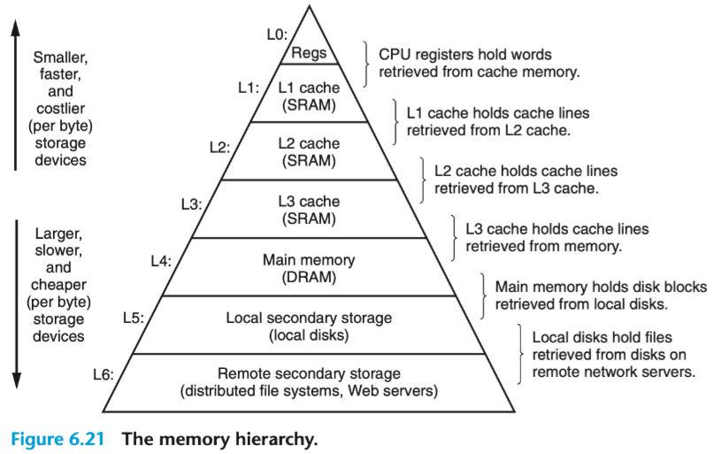

<https://course.ece.cmu.edu/~ece447/s15/doku.php?id=start>

<https://www.elsevier.com/books-and-journals/book-companion/9780128122754>

关于的关系：国外的计算机专业 是如何教《计算机组成原理》这门课的？ - Zack的回答 - 知乎 <https://www.zhihu.com/question/38838088/answer/78368713>

《微机原理与接口技术》和《计算机组成原理》、《计算机体系结构》三门课程有什么区别？先后修的顺序应该是怎么样的？研究操作系统需要学习哪门课程？ - 知乎用户的回答 - 知乎 <https://www.zhihu.com/question/19954019/answer/427424135>

学习顺序：电路原理/电路分析 `->` 模拟电路 `->` 数字电路 `->` 计算机组成原理 `->` 计算机体系结构 or 微机原理与接口技术

CSAPP是计算机组成原理、计算机结构体系 Computer Architecture、编译原理、操作系统的导论课

计算机组成原理：组成原理关键在cpu和计算机是怎么设计的，cpu中的控制器和机器指令Q怎么设计的。不考虑性能，只考虑原理，硬件如何设计，机器指令如何设计，不具体特指某一个CPU，同时也涉及存储器的层次结构原理

计算机结构体系：系统分析如何设计CPU会提高性能、如何设计指令集能提高性能、如何设计计算机的整体性能来提高性能

微机原理与接口技术

* 微机原理关键是使用和学习某个已经设计好的cpu（x86、ARM、MIPS、POWERPC等架构），如何设计具体的应用系统，包括汇编语言的学习
* 接口技术，学习各种接口的原理，与某个cpu组成具体的应用，设计接口硬件并编程对接口操作，并了解当前微机的体系结构

# 量化设计与分析基础

## *intro*

### 什么是Computer Architecture？

**Computer Architecture 计算机体系结构**是指计算机系统中各个组件的结构、功能和互联方式，以及它们如何共同协作以实现数据处理和运算任务的方法和规范。计算机体系结构涉及到硬件和软件之间的接口 Interface between SW and HW，以及如何有效地组织硬件资源来实现高性能、高效率的计算

计算机体系结构包括以下几个关键方面：

1. **指令集架构（Instruction Set Architecture，ISA）**：指令集架构定义了处理器能够理解和执行的指令集合，包括操作码、寄存器、地址模式等。ISA 是硬件和软件之间的重要接口，不同的计算机体系结构有不同的指令集架构
2. **内存层次结构**：计算机的内存层次结构包括多级缓存和主存，这些层次的设计影响了数据访问速度和性能。高速缓存被用来存储最常用的数据，以减少处理器访问主存的延迟
3. **处理器结构**：处理器结构涉及到处理器的核心数、流水线设计、并行处理能力等。现代处理器常常具备多核心、超线程等功能，以实现更高的并行处理能力
4. **总线结构**：总线是连接计算机内部各个组件的通信通道，包括数据总线、地址总线和控制总线。总线的设计影响了各个组件之间数据传输的速度和效率
5. **输入输出（I/O）系统**：I/O 系统包括与计算机外部设备进行通信的方式和接口，如网络接口、磁盘控制器等
6. **中断和异常处理机制**：这些机制允许计算机在运行过程中响应外部事件，如硬件错误、输入输出请求等，以保持系统的稳定性和可靠性

计算机体系结构的设计旨在平衡性能、功耗、成本和可扩展性等方面的需求。不同的计算机体系结构在不同的应用场景下可能表现出更适合的特点，例如高性能计算、嵌入式系统、移动设备等

### Computer Architecture的8个伟大思想

1. 面向摩尔定律的设计

2. 使用抽象简化设计 abstraction

3. 加速经常性事件 make the common case fast

   通过试验来确定系统中哪些是经常性事件，哪些是罕见事件。经常性事件往往比罕见事件简单，因此通过优化经常性事件可以有效地改善系统性能

4. 通过并行提高性能 parallellism

5. 通过流水线提高性能 pipelining

6. 通过预测提高性能 prediction

7. 存储层次

8. 通过冗余提高可靠性

## *计算机性能*

指令平均时钟周期数 clock cycle per instruction CPI 表示执行每条指令所需的时钟周期平均数

## *单核向多核的跨越*

### 功耗墙 Power wall

$$
功耗\propto\frac{1}{2}\times负载电压\times电压^2\times开关频率
$$

### 多核时代

为了避免处理器 Processor 和微处理器 Microprocessor的混淆，又将处理器称之为一个核 core。例：在一个微处理器中有4个处理器/核心，那么将这个微处理器称为4核芯片/4核微处理器（其中一个处理器是一个数据通路/运算器+一个控制器）

# 信息的表示和处理

## *信息存储*

### 进制间转换方式

速记：$x$ 是2的非负整数 $n$ 次幂时，即 $x=2^n$ 时，$x$ 对应的二进制表示就是1后面跟 $n$ 个0；对于16进制数，$n=i+4j,\ 0\leq i\leq3$，$x$ 开头的数字为 $1(i=0),\ 2(i=1),\ 4(i=2),\ 8(i=3)$，后面跟着 $j$ 个十六进制的0


十进制 $x$ 转十六进制：可以反复地用16除 $x$，得到一个商 $q$ 和一个余数 $r$，即 $x=q\cdot16+r$，不断对 $q$ 重复这个过程，最先得到的 $r$ 是低位，最后得到的 $r$ 是高位，将 $r$ 从高到低排列出来就得到转换的十六进制数。十进制转二进制同理，只是反复地用2除 $x$

### 补充：除十取余法 & 比较法

### 字节顺序（大小端）

[嵌入式er笔记]大端小端详解(含代码及详细注释) - 程序员秘书的文章 - 知乎 <https://zhuanlan.zhihu.com/p/144718837>

* 什么是大端和小端

  ```
           高字节 --> 低字节
           0x 12 34 ab cd
           
  # 内存地址是从低到高分配的
           低地址 ---------------> 高地址
  地址：    0x0000 0x0001 0x0002 0x0003
  小端： 0x cd     ab     34     12
  大端： 0x 12     34     ab     cd    -> 比价符合我们的阅读习惯
  ```

  * 大端 Big endian：**低地址高字节**，即**数据的高字节保存在内存的低地址中，而数据的低字节保存在内存的高地址中**，比较符合阅读习惯
  * 小端 Little endian：**低地址低字节**

* 判断内存是以大端存储还是小端存储

  * 利用指针

    ```c
    int i = 1; // 01 00 00 00
    if (1 == *(char*)&i) // 将int*强制转换成char*后对该指针解引用，char*只能得到1字节的内存
        printf("Little endian\n");
    else
        printf("Big endian\n");
    ```

  * 利用联合体

    ```c
    int CheckSys() {
        union Un {
            char c;
            int i;
        }u;
    
        u.i = 1;
        return u.c; // 两者共用地址，若是小端则返回1，否则返回0
    }
    ```
  
  * python
  
    ```python
    import sys
    
    if sys.byteorder == 'little':
        print("little endian")
    else:
        print("big endian")
    ```

### 大小端的选择

大端字节序和小端字节序都有各自的优点和用途，主要取决于应用场景和硬件架构

* 大端字节序优点
  * 易于人类阅读和调试：大端字节序将最高有效字节放在最低的内存地址，这样在内存中查看数据时，字节的排列顺序与我们人类的阅读习惯一致，更容易理解
  * 网络传输：大部分网络协议使用的是大端字节序，因为网络协议往往需要在不同的机器之间传输数据。TCP/IP协议规定，网络数据流应采用**大端**
  * 便于快速判断数据的正负和大小：CPU做数值运算时从内存中依顺序依次从低位地址到高位地址取数据进行运算

* 小端字节序优点
  * 内存中的顺序与存储顺序一致：小端字节序在内存中的表示与存储在文件或其他存储介质中的表示一致。这使得直接将内存中的数据内容保存到文件中（如数据持久化）时更加简单
  * 处理器效率：小端字节序在某些情况下可以提高处理器的效率。例如，当处理器从较低的字节地址加载数据时，可以先加载最低有效字节，从而在大多数情况下能够更快地获取到数据

大多数现代处理器和架构（如 x86、ARM）采用小端字节序，其中ARM既可以工作在大端也可以工作在小端，但是ARM默认为小端。CPU PowerPC、IBM是大端模式则是大端机

## *整数表示*

### 整型数据类型

C语言标准定义了每种数据类型必须能够表示的**最小的取值范围**

### 无符号数的编码

设一个有 $w$ 位的整数数据类型，有位向量 $\vec{x}=\left[x_{w-1},x_{w-2},\cdots,x_{0}\right]$，其中每个位 $x_i$ 的取值为0或1。用一个函数 $B2U_w$ Binary to Unsigned 来表示从二进制到无符号数
$$
B2U_w\left(\vec{x}\right)\triangleq\sum\limits_{i=0}^{w-1}{x_i2^i}
$$
一个 $w$ 为的二进制位向量 $\vec{x}$ 可以表示的最大无符号数为 $UMax_w$，它的二进制为 $\left[11\cdots1\right]_w$
$$
UMax_w\triangleq\sum\limits_{i=0}^{w-1}{2^i}=2^w-1
$$
无符号数编码具有唯一性，因为 $B2U_w$ 是一个双射 bijection，即可以进行反向操作从无符号数唯一映射到二进制，用函数 $U2B_w$ 来表示。关于溢出 overflow 的问题写在下面整数加法的小段里

### 补码 two's-complement

C语言标准并没有要求要用补码形式来表示有符号整数，但是几乎所有的机器都是这么做的

这里要理清一个概念：用补码还是原码来表示一个数是**语言层次的概念**（高级语言和机器语言），对于计算机而言是无所谓的，都是二进制串。数据的类型通常是通过程序中的变量类型来指定的。变量类型告诉计算机如何对二进制串进行解释，以及如何对其进行运算。CPU的硬件通过指令中的操作码、操作数和前缀等信息来识别有符号数和无符号数，并根据不同的类型选择适当的运算方法和指令

为了表示负数，引入了原码 Sign and Magnitude（用最高位表示符号位，其他位表示大小）、反码 Ones' complemen（整数和原码相同，其他位取反）t 和补码表示。因为原码和反码对0的表示有两种和其他原因，补码是最好的选择


用补码来表示有符号数时，可以直接使用和无符号数一样的加法电路，所以不用额外设计电路，简化了硬件。如果使用原码进行两个正数之间的减法运算，还需要使用单独设计减法电路并且使用比较电路来决定谁大谁小，这非常低效。**设计补码的初衷是为了便利减法运算**，这是因为**减去一个数的原码等于加上它的补码**。考虑下面两个例子

* 钟表上是10点，要回到5点，既可以回拨/减去5小时，也可以前拨/加上7小时，这是因为在12小时进制中，7是-5对模12的补数
* 对于4位2进制数

$$
B_{comp}=\left\{\begin{array}{cl}B&,B\geq0\\2^n-B&,B<0\end{array}\right.
$$

补码的最高有效位 $x_{w-1}$ 称为符号位 sign bit，被解释为负权 negative weight，它的权重为 $-2^{w-1}$。用函数 $B2T_w$ Binary to Two's-complement 定义
$$
B2T_w\left(\vec{x}\right)\triangleq-x_{w-1}2^{w-1}+\sum\limits_{i=0}^{w-2}{x_i2^i}
$$
补码能表示的最小值是位向量 $\left[10\cdots0\right]_w$，最小整数值是 $TMin_w=-2^{w-1}$；最大值的位向量是 $\left[01\cdots1\right]_w$，最大整数值为 $TMax_w=\sum\limits_{i=0}^{w-2}{2^i}=2^{w-1}-1$ 

* $B2T_w$ 是一个双射，是从 $TMin_w$ 到 $TMax_w$ 之间的映射，即 $B2T_w:\left\{0,1\right\}^w\rightarrow\left\{TMin_w,\cdots,TMax_w\right\}$。它的反函数为 $T2B_w$
* 不对称性：$\lvert TMin\rvert=\lvert TMax\rvert+1$，因为一半的位模式用来表示负数，而另一半则用来表示0和正数
* $UMax_w=2TMax_w+1$

### 有符号数和无符号数之间的转换

强制类型转换的结果保持**位值不变，只是改变了解释这些位的方式**。C语言中有符号数和无符号数运算的时候，有符号数会被隐式转换为无符号数
$$
T2U_w(x)\triangleq B2U_w\left(T2B_w(x)\right),\ x\in\left[TMin_w,TMax_w\right]\\U2T_w(x)\triangleq B2T_w\left(U2B_w(x)\right),\ x\in\left[0,UMax_w\right]
$$


上图给出了补码与无符号数相互转换以及各自溢出回绕的情况。特别注意对应关系：-1和 $UMax$，它们的位模式都为全1

给定位模式的补码与无符号数之间的关系可以表示为函数 $T2U_w$ 和函数 $U2T_w$
$$
T2U_w(x)=\left\{\begin{array}{cc}x+2^w,&x<0\\x,&x\geq0\end{array}\right.\\U2T_w(x)=\left\{\begin{array}{cc}u,&u\leq TMax_w\\u-2^w,&u>TMax_w\end{array}\right.
$$

### 扩展位

* 无符号数的0扩展 zero extension 高位添0
* 补码数的符号扩展：高位添符号位

$$
B2T_{w+k}\left(\left[\underbrace{x_{w-1},\cdots,x_{w-1}}_{k\ times},x_{w-1},x_{w-2},\cdots,x_0\right]\right)=B2T_w\left(\left[x_{w-1},x_{w-2},\cdots,x_0\right]\right)
$$

### 截断 truncating

* 截断无符号数
  $$
  B2U_w\left(\left[x_{w-1},x_{w-2},\cdots,x_0\right]\right)\mod{2^k}=B2U_w\left(\left[x_{k-1},x_{k-2},\cdots,x_0\right]\right)
  $$

* 截断补码数：和截断无符号数一样，但要将最高位转换为符号位
  $$
  B2T_k\left(\left[x_{k-1},x_{k-2},\cdots,x_0\right]\right)=U2T_k\left(B2U_w\left(\left[x_{w-1},x_{w-2},\cdots,x_0\right]\right)\mod{2^k}\right)
  $$

## *加减法*

关于加减法的ALU实现可以看*数电.md*

### 无符号加法

无符号数原码的算数运算溢出 overflow/Überlauf：**完整的整数结果不能放到数据类型的字长限制中去**

对于两个无符号数 $x$ 和 $y$，因为它们能表示的无符号最大值为 $UMax_w=2^w-1$，所以 $\geq2^w$ 的值会被截断，相当于是 $\mod{2^w}$。定义无符号数加法 $+_w^u$
$$
x+_w^uy=\left\{\begin{array}{cc}x+y,&x+y<2^w\\x+y-2^w,&2^w\leq x+y\leq2^{w+1}\end{array}\right.
$$
上式中的溢出也可以表示为 $\left(x+y\right)\mod{2^w}$

### 补码加法


有符号数补码的算数运算溢出是**两个操作数的符号位同时发生改变**，有两种溢出情况

* 正溢出 positive overflow：正+正->负
* 负溢出 negative overflow：负+负->正

$$
x+_w^ty=\left\{\begin{array}{ccc}x+y-2^w,&2^{w-1}\leq x+y&positive\ overflow\\x+y,&-2^{w-1}\leq x+y<2^{w-1}&normal\\x+y+2^w,&x+y<-2^{w-1}&negative\ overflow\end{array}\right.=U2T_w\left[\left(x+y\right)\mod{2^w}\right]
$$

### 补码非

对 $TMin_w$ 的非操作要做出特殊规定，因为 $-TMin_w=TMax_w+1$，这会发生补码正溢。规定 $TMin$ 的非就是自身，因为 $TMin_w+TMin_w=2*-2^{w-1}=-2^w=0$ 。所以有
$$
-_w^tx=\left\{\begin{array}{ll}TMin_w,&x=TMin_w\\-x,&x>TMin_w\end{array}\right.
$$


求反的操作就是符号位不变，数值位取反，然后+1（对正数来说是原码求补码，求负数来说是补码求源码）

C语言中 `int` 的 $TMin$ 的定义为什么要写成 `(-INT_MAX - 1)` 的形式呢？因为编译器在解析 `-X` 的数据类型时，不会将其看作是一个整体，而是先翻译正数 `X`，再通过符号位不变，数值位取反，然后+1的方式求其补码。因为补码的非对称性，$\lvert TMin\rvert=\lvert TMax\rvert+1$，若直接写成 `-INT_MIN` 的形式，直接就溢出了

## *乘法及其硬件实现*

* 无符号乘法
  $$
  x\times\ ^u_wy=\left(x\times y\right)\mod{2^w}
  $$

* 补码乘法

* 乘常数


### 快速乘法

## *除法及其硬件实现*

### 快速除法

## *浮点数*

### 二进制小数

$$
b=\sum\limits_{i=-n}^{m}{2^i\times b_i}
$$

浮点 `.` 的左边是2的正幂，右边是2的负幂，比如
$$
101.11_2=1\times2^2+0\times2^1+1\times2^0+1\times2^{-1}+1\times2^{-2}=5\frac{3}{4}
$$
正如十进制无法精确表示 $1/3$ 这类数一样，小数的二进制表达法也只能表示可以被写成 $x\times2^y$ 这样的数，其他的值只能够近似表达，增加二进制的长度可以提高精度。形如 $0.11\dots1_2$ 的数表示的是刚好小于1的数，可以用 $1.0-\varepsilon$ 来表示

手算浮点数的二进制转十进制就是上面的加权展开，十进制转二进制则先拆分整数部分和浮点数部分，整数部分和之前一样，对小数部分采用**乘2取整**法。若某次相乘得到整数就结束，否则就可以一直乘下去

### IEEE浮点数

用定点方式来存储浮点数是非常不方便的：有很多小数不能精确表达且影响了能够存储的数字的最大值。对此制定了IEEE浮点数标准，用一个三元组 $V=\left(s,E,M\right)$ 来表示浮点数
$$
V=\left(-1\right)^s\times M\times 2^E
$$

* 公式成分
  * 符号位 sign $s$，$s=0,1$ 分别表示正数和负数，而对于数值0的符号则作为特殊情况处理
  * 尾数 significand $M$，首字母来源于mantissa。它是一个二进制小数，范围是 $1\sim2-\varepsilon$ 或者 $0\sim1-\varepsilon$
  * 阶码 exponent $E$。它的做作用是对浮点数加权。这个权重是2的 $E$ 次幂
* 对浮点数的编码，将浮点数的位划分为三个字段。这套编码制度被称为移码 offset binary
  * 一个单独的符号位 $s$ 
  * $k$ 位阶码字段 $\exp=e_{k-1}e_{k-2}\cdots e_1e_0$ 编码阶码 $E$。**阶码表示的是2为base的幂的次数**（IEEE754以2为base，IEEE854扩展到10为base）
  * $n$ 位小数字段 $frac=f_{n-1}f_{n-2}\cdots f_1f_0$ 编码尾数 $M$，但尾数的值还取决于阶码 $\exp$。**尾数表示的是小数部分**


上图中给出了IEEE 754的两种浮点数编码

* 32位单精度浮点数 single precision：$s$ 为1位，$k=8,\ n=23$ 
* 64位双精度浮点数 double precision：$s$ 为1位，$k=11,\ n=52$ 
* 80 bits Extended precision only for intel

**为什么用移码来表示浮点数而不是使用补码？**首先我们可以确定的是我们需要能够分辨阶数的正负，所以解码必须能够提供类似与补码那种可以取分正负的机制。使用移码是为了比较阶码的时候可以直接比较无符号数 $e$。若使用补码表示浮点数的阶码时，需要进行符号位判断，并根据符号位的值来确定阶码的实际值。这个额外的处理增加了计算的复杂性和延迟

### 根据 $\exp$ 来分类尾数 $M$


* 规格化 normalized：当 $\exp$ 的位模式既不全为0也不为全1
  * 阶码的值是 $E=e-Bias$，其中 $e$ 是无符号数，而 $Bias=2^{k-1}-1$ 的偏置
    * 单精度的表示范围是 $\left[1,254\right]-\left(2^7-1\right)=\left[-126,+127\right]$
    * 双精度的表示范围是 $\left[1,2046\right]-\left(2^{10}-1\right)=\left[-1022,+1023\right]$
  * 隐含的以1开头的表示 implied leading 1：$M=1+f$ ，即 $M$ 可以看作是一个表达式为 $1.f_{n-1}f_{n-2}\cdots f_{0}$ 的数字。可以通过调整阶码来调整尾数 $M$ 在 $1\leq M<2$ 之间

* 非规格化 denormalized：当 $\exp$ 的位模式为全0，可以用来表示0
  * 特点
    * Exponent 是 $E=1-Bias$，而不是 $E=0-Bias$，这样设计的目的是为了让非规格化值**平滑过渡**到规格值，非常巧妙的设计。可以看书上8位浮点数的例子
    * 没有隐含的1开头，即 $M=f$
  * 非规格化数的作用
    * 提供了一种表示数值0的方法
    * 表示那些非常接近于0.0的数

* 特殊值 special value：当 $\exp$ 的位模式为全1
  * 当小数字段是全0的时候，得到的值是 $-\infty$ 或 $+\infty$，用来表示两个非常大的数相乘，或者除数为0时表示溢出的结果
  * 若小数段不是全0，则得到的值是 $NaN$（Not a Number），表示没有合适的答案，比如对-1开方，$\infty-\infty$ 等情况

### 舍入 rounding

IEEE浮点格式定义了四种不同的舍入方式

* Nearest even **default** 向偶数舍入/向最近值舍入：小于一半向下，大于一半向上，正好一半向偶数舍入（四舍六入五取偶）。通过向偶数舍入可以避免造成统计值偏差
* Towards zero 向零舍入：正数向下舍入，负数向上舍入
* Round down 向下舍入 $-\infty$
* Round up 向上舍入 $+\infty$

### 浮点计算

* 浮点数加法
  * 对阶 exponent alignment：将指数较小的浮点数进行尾数向右移位，指数同步增大，直到两个操作数的指数等
  * 求和：对尾数求和
  * 规格化
    * If M ≥ 2, shift M right, increment E
    * if M < 1, shift M left k positions, decrement E by k
    * Overflow if E out of range
    * Round M to fit frac precision
* 浮点数乘法，步骤也是对阶、求和和规格化

因为需要对阶和rounding，浮点数计算满足交换律，但不满足结合率。比如对于单精度浮点数的加法 `(3.14 + 1e10)-1e10 -> 0` 和 `3.14+(1e10-1e10) -> 3.14` 的结果是不同的，前者 `3.14+1e10` 时，3.14直接被rounding掉了

自然现象中的变化程度基本不会达到2的7次方，因而前一时刻的浮点数可以和后一时刻的相加并且结果在预期内。但如果是非自然情况下，比如说金融行业中，就可能会出现不连续的数据变化（Bill Gates的资产 + 我的资产 = Bill Gates的资产Lol）

# 指令集

*CSAPP*中使用的是Intel x86指令集架构，而*computer organization and design the hardware/software interface*有MIPS、RISC-V和ARM三个版本，我使用了RISC-V版本

## *RISC vs. CISC*

### RISC

RISC Reduced Instruction Set Computer 精简指令集计算机： RISC架构的主要思想是通过精简指令集，使每个指令执行的时间更短，从而提高处理器的执行效率。RISC处理器通常有较少的指令类型，每种指令都被设计成能够在一个时钟周期内完成，这有助于提高流水线 pipeline 的效率。RISC处理器通常鼓励程序员使用更多的寄存器来存储中间结果，减少对内存的访问次数，从而提高性能

RISC架构的概念在20世纪80年代初开始引起关注，旨在通过简化指令集和优化硬件流水线来提高处理器的性能。最早的RISC架构之一是由IBM的研究员设计的IBM 801，但RISC的真正推广始于1980年代中期。加州大学伯克利分校的David Patterson研究团队在1980年代早期发布了一系列的RISC论文，这些论文强调了简化指令集、流水线和高速缓存等概念，对后来的RISC处理器设计产生了深远影响

> 精简指令集的名称最早来自1980年[大卫·帕特森](https://zh.wikipedia.org/wiki/大衛·帕特森_(學者))在[加州大学柏克莱分校](https://zh.wikipedia.org/wiki/加州大學柏克萊分校)主持的[Berkeley RISC](https://zh.wikipedia.org/w/index.php?title=Berkeley_RISC&action=edit&redlink=1)计划。但在他之前，已经有人提出类似的设计理念。由[约翰·科克](https://zh.wikipedia.org/wiki/約翰·科克)主持，在1975年开始，1980年完成的[IBM 801](https://zh.wikipedia.org/wiki/IBM_801)计划，可能是第一个使用精简指令集理念来设计的系统。-- wikipedia

1981年，在David Patterson的带领下，加州大学伯克利分校的一个研究团队起草了RISC-1，这就是今天RISC架构的基础。RISC-1原型芯片有44500个晶体管，拥有31条指令。包含78个32位寄存器，分为6个窗口，每个窗口包含14个寄存器，另外还有18个全局变量，寄存器占用大部分面积，控制和指令只占用芯片面积的6%，而同时代的芯片设计里要占用约50%的面积

### CISC

CISC Complex Instruction Set Computer 复杂指令集计算机： CISC架构的特点是指令集非常丰富和复杂，每个指令可以执行多种操作，甚至包括高级操作。这使得单个指令的执行可能需要多个时钟周期，但它们可以一次性完成复杂的任务。CISC处理器通常拥有更多的寻址模式和寄存器，允许程序员在一条指令中执行多个操作，这在某些情况下可以简化编程

CISC架构最早出现在上世纪50年代末和60年代初，当时的计算机处理器设计注重硬件效率，试图通过支持多功能和复杂的指令来减少程序员的工作量。这些指令可以执行多个操作，包括内存访问、算术运算、逻辑运算等，以便于编写高级语言的编译器生成**更紧凑的**机器语言。Intel的x86系列处理器就是CISC架构的代表，从最早的8086到后来的80286、80386等，一直延续到今天的x86-64架构

## *MIPS*

### 简介

* MIPS（Microprocessor without Interlocked Pipeline Stages）是一种经典的 RISC架构。它注重简单指令集和高性能设计。MIPS的中文直译为无内部互锁流水级的微处理器，其机制是**尽量利用软件办法避免流水线中的数据相关问题**
* MIPS 的指令集具有固定的指令格式，包括加载、存储、算术、逻辑和分支等指令
* 该架构在处理器设计中强调性能优化和流水线执行。它在多媒体、网络设备和嵌入式系统领域得到广泛应用

### 实际应用

MIPS技术市场分析 - 吴建明wujianming的文章 - 知乎 <https://zhuanlan.zhihu.com/p/515475193>

1984年，斯坦福大学前校长John LeRoy Hennessy与团队一起创立了MIPS，将MIPS架构商业化

MIPS在90年代曾经一度辉煌过，Pacemips、IDT和东芝等半导体公司都采用MIPS的设计来制造芯片，其生产的芯片也被Sony和Nintendo的游戏机，Cisco的路由器和SGI超级计算机等终端设备采用，尤其是家用路由器市场，到现在每年生产的超过160亿微处理器中，99%是RISC处理器。过去也曾当作高效能计算架构使用到超算平台上

但是在智能手机时代中，因为在嵌入式、低能耗方面被ARM架构取代，并且因为授权和收费方式等原因。MIPS在中高端芯片中也逐渐失去优势

## *ARM*

### 简介

* ARM（Advanced RISC Machines）架构是一种流行的 RISC 架构，广泛应用于移动设备、嵌入式系统和服务器
* ARM 处理器具有高度的灵活性，可以根据应用需求进行定制。它有不同级别的性能和能效，从低功耗嵌入式设备到高性能服务器
* 由于其能耗效率和多样性，ARM 架构成为移动设备、物联网和云计算领域的主要选择

### 历史

ARM 指令集架构的历史与发展 - Salieri的文章 - 知乎 <https://zhuanlan.zhihu.com/p/350962975>

1. 1983年Acorn公司开启了基于UC Berkeley RISC项目的新处理器架构研发项目Acorn RISC Machine (ARM)。
2. 1985年4月，第一代基于ARMv1架构的ARM1处理器正式发布，它主要以工业用途作为BBC Micro平台上的协处理器，来加速下一代芯片开发软件的运行
3. 1990年，在Acorn和Apple的合作下，Acorn的先进研发部门被剥离出来，成立了单独的ARM公司

ARMv9是目前最新的ARM架构，Cortex-A、Cortex-R、Cortex-M都是著名的ARM架构，苹果的M系列芯片也是ARM架构的

### 实际应用

ARM架构的灵活性、低功耗和性能使其成为各种嵌入式系统和移动设备的理想选择，甚至可以说占据了以移动设备为代表的处理器IP的绝大部分市场。同时也在其他领域如物联网、网络设备、汽车电子等方面发挥着重要作用

1. **移动设备**：ARM架构在移动设备市场占有重要地位，如智能手机、平板电脑和可穿戴设备。ARM处理器因其低功耗、高效能和性能表现而受到欢迎，可以满足移动设备对电池寿命和性能的需求
2. **嵌入式系统**：ARM在嵌入式系统中得到广泛应用，包括家电、工业控制、汽车电子、医疗设备等。ARM架构适合于这些领域，因为它可以提供足够的性能，同时保持低功耗
3. **物联网（IoT）**：由于ARM的低功耗特性，它在连接设备到互联网的物联网应用中非常流行。无论是智能家居、智能传感器还是工业物联网，ARM处理器都能够提供所需的性能和能效
4. **嵌入式操作系统**：许多嵌入式操作系统，如Linux、Android和RTOS（实时操作系统），都支持ARM架构。这使得ARM成为嵌入式系统开发的首选平台
5. **网络设备**：ARM处理器也在网络设备中得到广泛应用，如路由器、交换机、网络防火墙等。它们能够提供足够的处理能力来管理和路由网络流量
6. **汽车电子**：现代汽车中使用了大量的电子设备，包括驾驶辅助系统、娱乐系统、安全系统等。ARM架构可以为这些应用提供适当的处理性能和能效
7. **媒体和娱乐**：ARM架构在媒体播放器、游戏控制台、数字电视等领域中也有应用。其处理器能够满足多媒体处理和图形渲染的要求

## *RISC-V*

### 简介

* RISC-V 是一种**开源**RISC架构，具有可伸缩性和可定制性
* RISC-V 的设计哲学强调简化指令集和开放性。它的设计遵循开放指令集的原则，允许任何人基于 RISC-V 架构开发自己的处理器
* 由于其开源性质和灵活性，RISC-V 在教育、研究和定制化硬件等领域受到关注。它正在逐步进入商业领域

### 历史

2010年，奠定了RISC基础的UC Berkeley教授DavidDavid Patterson的准备启动一个新项目，需要设计CPU，因而要选择一种指令集。他们调研了包括arm、MIPS、SPARC、X86等多个指令集，发现它们不仅设计越来越复杂，而且还存在知识产权问题

RISC-V（第五代精简指令集）是David Patterson教授基于其30多年在精简指令集RISC领域的深入积累，在2010年到2014年期间带领团队研发出的最新一代CPU芯片设计指令集。RISC-V是基于RISC原理建立的开放指令集架构，RISC-V是在指令集不断发展和成熟的基础上建立的全新指令。RISC-V指令集完全开源、设计简单、易于移植Linix系统，采用模块化设计，拥有完整工具链

### RISC-V与ARM的竞争

https://www.eet-china.com/mp/a120053.html

MIPS、RISC-V和ARM同根同源，都出自RISC架构

RISC-V一经推出，就得到了极大的关注，甚至已经形成了事实上的对ARM架构的冲击，其中ARM授权费，而RISC-V则完全开源是关键的因素

ARM是一种封闭的指令集架构，众多只用ARM架构的厂商，只能根据自身需求，调整产品频率和功耗，不得改变原有设计，经过几十年的发展演变，CPU架构变得极为复杂和冗繁，ARM架构文档长达数千页，指令数目复杂，版本众多，彼此之间既不兼容，也不支持模块化，并且存在着高昂的专利和架构授权问题

反观RISC-V，在设计之初，就定位为是一种完全开源的架构，规避了计算机体系几十年发展的弯路，架构文档只有二百多页，基本指令数目仅40多条，同时一套指令集支持所有架构，模块化使得用户可根据需求自由定制，配置不同的指令子集

ARM与RISC-V的竞争有些像OS市场上Win和Linux的竞争。几乎可以肯定的是，在ARM的传统优势领域，即手机领域，RISC-V基本没有机会，因为手机经过十年迭代后不太会彻底改变处理器内核了，这也和目前Windows经过二十多年风雨仍然是PC市场操作系统龙头老大一样。但是，在新兴的领域，RISC-V和ARM都处于同一起跑线上，而RISC-V凭着指令集开源等特性很有可能可以击败ARM，或者至少能够占据可观的市场份额。比如说IoT市场、新能源、嵌入式设备等

## *Intel x86*

### 简介

* Intel x86 是一种CISC架构的典型代表，由英特尔推出。它广泛应用于个人电脑领域，占领了市场上95%的份额
* x86 架构拥有大量的指令集和多种寻址模式，可以执行复杂的操作。它最初用于桌面和服务器计算，现在也适用于移动设备和嵌入式系统
* 在个人计算机领域，x86 架构的代表性产品包括 Intel 的 Core 和 Xeon 系列处理器，以及 AMD 的类似架构

### Intel x86的演化

1. **86的起源（上世纪70年代末）**：1978年：Intel推出了8086处理器，这是x86架构的最早版本，为16位处理器，由8位的8080扩展而来。8086开创了x86架构的先河

2. **16位时代（1980年代）**：1982年：Intel推出了80286（或称286），这是x86架构的第二代处理器，引入了16位保护模式，并且具有更强的性能和内存管理能力

3. **32位时代（1990年代）**：

   * 1985年：Intel发布了80386（或称386），第三代x86处理器，引入了32位操作模式和虚拟内存支持，大大提升了性能和多任务能力
   * 1993年：Intel推出了80486（或称486），这是386的改进版本，提升了性能和缓存

4. **Pentium时代（1990年代后半）**：

   * 1993年：Intel推出了Pentium处理器（第一代Pentium，也称P5），继续在32位基础上提升了性能
   * 后续几年，Intel推出了多个Pentium处理器的改进版本，包括Pentium Pro、Pentium MMX等

5. **Pentium II、III、4时代（1990年代末至2000年代）**：

   * 1997年：Intel发布了Pentium II处理器，引入了Slot 1插槽设计，以及L2缓存放在芯片外部的设计
   * 1999年：Pentium III发布，进一步改进了性能
   * 2000年：Intel推出了Pentium 4，引入了NetBurst微架构，但其设计在初期受到了一些争议

6. **Intel与AMD的竞争与合作（2000年代至2000年代末）**

   * 2003年由AMD率先基于Intel的32位架构将32位地址空间扩展为64位，推出了AMD64，趁着互联网高速发展的东风，抢占了不少市场份额
   * AMD公司和Intel都是从仙童半导体公司中分出来的。AMD一直都是和Intel一样生产x86架构的芯片。在共同对抗RISC架构，维护CISC架构在市场上的地位这方面AMD和Intel有共同利益。因为AMD的研发水平、市值和资金方面远远达不到Intel的水平，Intel也出于对抗反垄断法等原因，和AMD公司一直都是合作大于对抗，所以不久便也接受了AMD64架构，而后Intel也开始支持AMD64的指令集，称为x86-64，即x86架构的64位版本，不过二者基本上是同一个东西

7. **核心架构时代（2000年代末至2010年代）**：

   * 2006年：Intel发布了Core微架构，首次应用于Core 2 Duo处理器，这标志着x86架构的一个重要转折点，带来了更好的性能和能效
   * 随后的几年，Intel发布了多个基于Core架构的处理器，包括i3、i5和i7系列，不断提升性能和多核能力

8. **现代时代（2010年代至今）**：

   * 2011年：Sandy Bridge架构发布，进一步优化性能和能效
   * 之后的年份，Intel陆续发布了多个新架构，如Ivy Bridge、Haswell、Broadwell、Skylake、Kaby Lake、Coffee Lake等，不断提升性能、能效和集成图形处理能力

# 程序的机器级表示（RISC-V）

## *操作数*

### 计算机硬件的操作

每个RISC-V算数指令都只执行一个操作，并且必须总是只有三个变量

比如说要把4个变量b、c、d和e的和放入变量a中

```assembly
add a, b, c    // The sum of b and c is placed in a 
add a, a, d    // The sum of b, c, and d is now in a 
add a, a, e    // The sum of b, c, d, and e is now in a
```

这么设计的原因是**操作数数量可变的硬件比固定数量的硬件会更复杂**

### 存储器操作数

RISC-V中寄存器的大小为64位。一共有32个寄存器 x0-x31。寄存器长度为32位的变体称为RV32

RISC-V中一个字 word的长度是32 bit/位或4字节，一个双字 doubleword 的长度是64 bit/位或8字节

### 常数或立即数操作数

## *机器指令表示*


### 设计权衡

设计机器指令的字段格式时需要在另所有指令保持相同长度和保持单一的指令格式之间权衡，RISC-V做出的选择是保持统一的32位指令长度，但为不同的指令设计不同的指令格式。具体的有R型、I型和S型字段

保持尽可能相似的指令格式降低了硬件的复杂性

### R型指令字段

R型（Register）指令字段用于寄存器


上面的指令中每一段称为一个字段 field，具体的指令格式为

* opcode 操作码：指令的基本操作
* rd：目的操作数寄存器，用来存放操作结果
* funct3：一个另外的操作码字段
* rs1：第一个源操作数寄存器
* rs2：第二个源操作数寄存器
* funct7：一个另外的操作码字段

RISC-V架构之所以设计了32个寄存器，也与这里的rs1和rs2字段设计长度有关，`2^5=32`。若要设计64个寄存器，则rs1和rs2都要增加一位，这就势必要缩减其他的字段长度

以 `add x9, x20, x21` 为例，它要将x20寄存器和x21寄存器中的值加起来后放到x9寄存器

对应的十进制表示为

```
0 | 21 | 20 | 0 | 9 | 51
```


### I型指令字段


I型指令字段用于带常数的算数指令，比如 `addi` 以及加载指令`ld`

当I型指令用于加载指令 `ld` 时，immediate 表示的是偏移量

### S型指令字段


## *运算*

### 加减乘除

### 移位

## *控制流*

## *过程*

## *RISC-V指令系统的剩余部分*

### 扩展体系结构

# 程序的机器级表示（ARM）

# 计算机的算数运算

# 处理器 Processor

# 层次化存储

ROM存储了启动系统用的BIOS，又称为程序存储器。RAM又称为数据存储器

## *存储器层次结构*

中心思想：对于每个k，位于k层的更快更小的存储设备作为位于k+1层的更大更慢的存储设备的缓存



具体的SRAM、DRAM和Cache的结构可以看*数电.md*，性能指标可以看*微机原理与接口技术.md*

## *固态硬盘与SSD*

### 磁盘物理结构


* Disk部分由多个盘片 platters 叠加而成，中间有空气隔绝开，每个platter有上下两面
* 每面可以分成多组同心的磁道 track
* 每个磁道又可以分成多个扇区 sector，扇区之间有gap间隔，**每个扇区是512KB**
* 不同盘片上的对齐的磁道构成了同心的柱面 cylinder

注意：连续信息并不是存储在连续的扇区，而是以在柱面进行连续分割的页面 Page为单位进行存取的。磁盘读写一个或多个完整的页面，对于一个典型磁盘来说，一页的长度可能为 $2^{11}\sim2^{14}Byte=2KB\sim16KB$

### SSD固态硬盘


* 每个闪存芯片替代了传统机械硬盘中的disk driver
* Flash translation layer 的作用和disk controller是一样的，将对逻辑块的请求翻译成对底层物理设备的访问
* 读写操作以页为单位。一个页只能在所属的整个块都被擦除之后，才能重写这一页。每一个块可以进行大约100,000次擦除，之后这个块就会损坏（其实SSD能用的时间甚至会超过一半电脑的寿命）

### 磁盘的性能指标

* 容量
  * Recording density bits/in 记录密度
  * Track density tracks/in 磁道密度
  * Areal density bits/in2 面密度

* 读写速度
  * 不同磁道：seek 寻道时间，切换到目标磁道，很慢ms级
  * 同一磁道：rotational latency 旋转延迟，旋转磁头到期望的扇区，很慢ms级
  * data transfer 数据传输时间是很小的

* 工作负载
  * 顺序 sequential 工作负载。尽量以顺序工作负载方式进行IO，若使用随机方式会显著影响IO性能。大量时间用于传输数据，传输速率非常接近磁盘的峰值带宽
  * 随机 random 工作负载：数据库管理系统

### 将磁盘抽象成一个线性数据结构块 Block


* 将数据存储到磁盘的过程变成了将数据存储到该数组
* 找到磁盘特定扇区的位置变成了找到数组特定的位置
* 对磁盘的管理变成了对该数组的管理
* CHS寻址 Cylinder-Head-Sector：C 对应的是哪一个磁头，H 对应的是哪一个磁道，S 对应的是哪一个扇区
* 虚拟数组的地址系统：LBA Logical Block Address

### 磁盘调度

* SSTF Shortest-Seek-Time-First 最短寻道优先
* 电梯调度 SCAN或C-SCAN
* SPTF Shortest Positioning Time First 最短接入时间优先

## *局部性*

### 局部性定义

局部性原理 principle of locality：倾向于引用临近于其他最近引用过的数据项的数据项，或者最近引用过的数据项本身

* 时间局部性 temporal locality：被引用过一次的内存位置很可能在**不远的将来**再被多次引用
* 空间局部性 spatial locality：若一个内存位置被引用了一次，那么程序很可能在不远的将来引用**附近**的一个内存位置

### 量化评价局部性的一些规则

* 重复引用相同变量的程序有良好的时间局部性
* 对于具有步长为 $k$ 的引用模式 strike-k reference pattern 的程序，步长越小，空间局部性越好；具有步长为1的引用模式的程序有很好的空间局部性。在内存中以大步长跳来跳去的程序的空间局部性会差很多
* 对于取指令来说，循环有好的时间和空间局部性。循环体越小，循环迭代次数越多，局部性越好

## *高速缓存*

### 缓存不命中的基本处理策略

当程序需要第 $k+1$ 层的某个数据对象 $d$ 时，$d$ 刚好就存储在第 $k$ 层的某个块里，这就是缓存命中 cache hit，否则就是缓存不命中 cache miss

当发生缓存不命中时，第 $k$ 层的缓存从第 $k+1$ 层缓存中取出包含 $d$ 的那个块，若第 $k$ 层的缓存已经满了，可能就会覆盖现存的一个块。覆盖一个现存块的过程称为替换 replacing 或驱逐 evicting 这个块，被驱逐的这个块有时也被称为牺牲块 victim block。决定改替换哪个块是由缓存的替换策略 replacement policy 来控制的，比如说LRU 最近最少使用策略、LFU、MRU等等

Cache replacement policies（缓存替换策略）：https://blog.csdn.net/weixin_40539125/article/details/104739835

缓存不命中的种类

* 强制性不命中 compulsory miss/冷不命中 cold miss：刚开始一个空的缓存被称为冷缓存 cold cache
* 冲突不命中 conflict miss：类似于哈希冲突，因为固定的放置策略 placement policy $k+1$ 层某个编号 $i$ 的块（$i$ 取模后得到相同的数字）一直放在 $k$ 层同一个地方，即使是 $k$ 层本身并没有被放满，这就会导致极大的效率损失
* 容量不命中 capacity miss：缓存太小无法处理工作集 working set

### 通用高速缓存存储器组织架构


假设计算机的内存总线是 $m$ 位，对于高速缓存的寻址，可以把 $m$ 位拆分为 $t$ 位 标记位 + $s$ 位组索引 + $b$ 位块偏移位

* 标记位 tag bit 唯一表示高速缓存中的某一行
* 有效位 valid set 指明这个行是否包含有意义的信息

高速缓存的结构可以用元组 $(S,E,B,m)$ 来描述，这个元组是一个哈希表，建立了块的映射关系，每一个块可以快速被找到

高速缓冲的容量 $C$ 指的是所有有效块数量喝，不包括有效位和标记位，因此有 $C=S\times E\times B$

### 直接映射高速缓存

### 组相连高速缓存

### 全相联高速缓存

### LRU Cache的实现

[146. LRU 缓存 - 力扣（LeetCode）](https://leetcode.cn/problems/lru-cache/)

Least Recently Used

高效LRU：任意操作都是***O(1)***

# 并行处理器 Parallel Processors