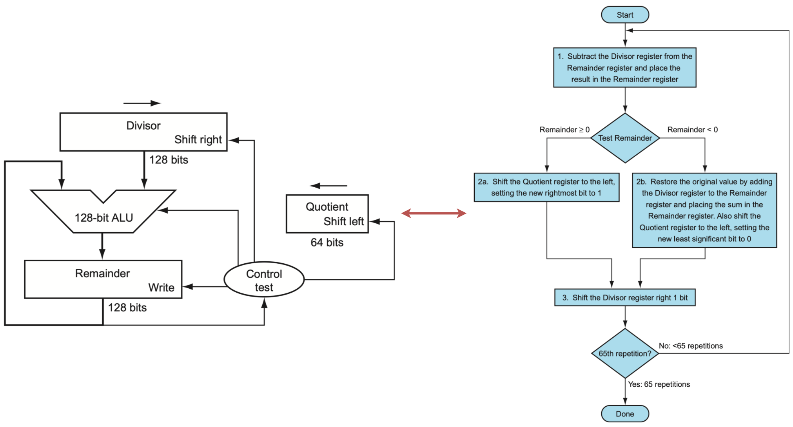
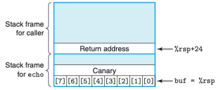
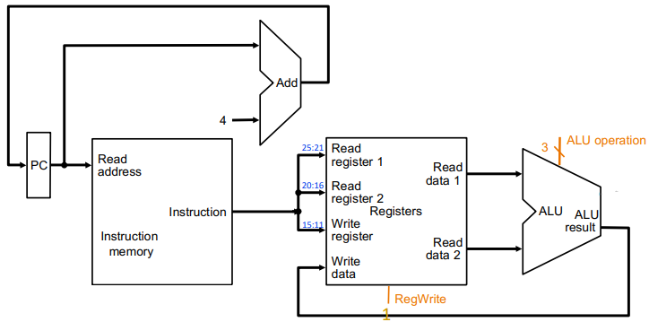

<https://course.ece.cmu.edu/~ece447/s15/doku.php?id=start>

<https://www.elsevier.com/books-and-journals/book-companion/9780128122754>

关于的关系：国外的计算机专业 是如何教《计算机组成原理》这门课的？ - Zack的回答 - 知乎 <https://www.zhihu.com/question/38838088/answer/78368713>

《微机原理与接口技术》和《计算机组成原理》、《计算机体系结构》三门课程有什么区别？先后修的顺序应该是怎么样的？研究操作系统需要学习哪门课程？ - 知乎用户的回答 - 知乎 <https://www.zhihu.com/question/19954019/answer/427424135>

学习顺序：电路原理/电路分析 `->` 模拟电路 `->` 数字电路 `->` 计算机组成原理 `->` 计算机体系结构 or 微机原理与接口技术

CSAPP是计算机组成原理、计算机结构体系 Computer Architecture、编译原理、操作系统的导论课

计算机组成原理：组成是计算机设计的高阶内容。组成原理暂时不考虑性能，只考虑原理、硬件如何设计、ISA如何设计，不具体特指某一个CPU。同时也涉及存储器的层次结构原理以及CPU的算数、逻辑、分支和数据输送等功能

计算机结构体系：系统分析如何设计CPU会提高性能、如何设计指令集能提高性能、如何设计计算机的整体性能来提高性能

微机原理与接口技术

* 微机原理关键是使用和学习某个已经设计好的cpu（x86、ARM、MIPS、POWERPC等架构），如何设计具体的应用系统，包括汇编语言的学习
* 接口技术，学习各种接口的原理，与某个cpu组成具体的应用，设计接口硬件并编程对接口操作，并了解当前微机的体系结构

# 信息的表示 & ALU中的处理

## *信息存储*

### 进制间转换方式

速记：$x$ 是2的非负整数 $n$ 次幂时，即 $x=2^n$ 时，$x$ 对应的二进制表示就是1后面跟 $n$ 个0；对于16进制数，$n=i+4j,\ 0\leq i\leq3$，$x$ 开头的数字为 $1(i=0),\ 2(i=1),\ 4(i=2),\ 8(i=3)$，后面跟着 $j$ 个十六进制的0


十进制 $x$ 转十六进制：可以反复地用16除 $x$，得到一个商 $q$ 和一个余数 $r$，即 $x=q\cdot16+r$，不断对 $q$ 重复这个过程，最先得到的 $r$ 是低位，最后得到的 $r$ 是高位，将 $r$ 从高到低排列出来就得到转换的十六进制数。十进制转二进制同理，只是反复地用2除 $x$

### 补充：除十取余法 & 比较法

### <span id="大小端模式">字节顺序（大小端）</span>

[嵌入式er笔记]大端小端详解(含代码及详细注释) - 程序员秘书的文章 - 知乎 <https://zhuanlan.zhihu.com/p/144718837>

* 什么是大端和小端

  ```
           高字节 --> 低字节
           0x 12 34 ab cd
           
  # 内存地址是从低到高分配的
           低地址 ---------------> 高地址
  地址：    0x0000 0x0001 0x0002 0x0003
  小端： 0x cd     ab     34     12
  大端： 0x 12     34     ab     cd    -> 比价符合我们的阅读习惯
  ```

  * 大端 Big endian：**低地址高字节**，即**数据的高字节保存在内存的低地址中，而数据的低字节保存在内存的高地址中**，比较符合阅读习惯
  * 小端 Little endian：**低地址低字节**

  注意：无论是大端还是小端都是以一个字节为最小单位的，也就是说字节内的顺序是不受影响的，比如说上面的 `cd` 是一个独立的字节，按照小端法低地址低字节排序，所以它放在最左边，但是并不影响 `cd` 内部的排序，也就是说不会变成 `dc`

* 判断内存是以大端存储还是小端存储

  * 利用指针

    ```c
    int i = 1; // 01 00 00 00
    if (1 == *(char*)&i) // 将int*强制转换成char*后对该指针解引用，char*只能得到1字节的内存
        printf("Little endian\n");
    else
        printf("Big endian\n");
    ```

  * 利用联合体

    ```c
    int CheckSys() {
        union Un {
            char c;
            int i;
        }u;
    
        u.i = 1;
        return u.c; // 两者共用地址，若是小端则返回1，否则返回0
    }
    ```

  * python

    ```python
    import sys
    
    if sys.byteorder == 'little':
        print("little endian")
    else:
        print("big endian")
    ```

### 大小端的选择

大端字节序和小端字节序都有各自的优点和用途，主要取决于应用场景和硬件架构

* 大端字节序优点
  * 易于人类阅读和调试：大端字节序将最高有效字节放在最低的内存地址，这样在内存中查看数据时，字节的排列顺序与我们人类的阅读习惯一致，更容易理解
  * 网络传输：大部分网络协议使用的是大端字节序，因为网络协议往往需要在不同的机器之间传输数据。TCP/IP协议规定，网络数据流应采用**大端**
  * 便于快速判断数据的正负和大小：CPU做数值运算时从内存中依顺序依次从低位地址到高位地址取数据进行运算

* 小端字节序优点
  * 内存中的顺序与存储顺序一致：小端字节序在内存中的表示与存储在文件或其他存储介质中的表示一致。这使得直接将内存中的数据内容保存到文件中（如数据持久化）时更加简单
  * 处理器效率：小端字节序在某些情况下可以提高处理器的效率。例如，当处理器从较低的字节地址加载数据时，可以先加载最低有效字节，从而在大多数情况下能够更快地获取到数据

大多数现代处理器和架构（如 x86、ARM）采用小端字节序，其中ARM既可以工作在大端也可以工作在小端，但是ARM默认为小端。CPU PowerPC、IBM是大端模式则是大端机

## *整数表示*

### 整型数据类型

C语言标准定义了每种数据类型必须能够表示的**最小的取值范围**

### 无符号数的编码 -- 真值

设一个有 $w$ 位的整数数据类型，有位向量 $\vec{x}=\left[x_{w-1},x_{w-2},\cdots,x_{0}\right]$，其中每个位 $x_i$ 的取值为0或1。用一个函数 $B2U_w$ Binary to Unsigned 来表示从二进制到十进制无符号数
$$
B2U_w\left(\vec{x}\right)\triangleq\sum\limits_{i=0}^{w-1}{x_i2^i}
$$
一个 $w$ 为的二进制位向量 $\vec{x}$ 可以表示的最大无符号数为 $UMax_w$，它的二进制为 $\left[11\cdots1\right]_w$
$$
UMax_w\triangleq\sum\limits_{i=0}^{w-1}{2^i}=2^w-1
$$
无符号数编码具有唯一性，因为 $B2U_w$ 是一个双射 bijection，即可以进行反向操作从无符号数唯一映射到二进制，用函数 $U2B_w$ 来表示。关于溢出 overflow 的问题写在下面整数加法的小段里

### 补码 two's-complement

C语言标准并没有要求要用补码形式来表示有符号整数，但是几乎所有的机器都是这么做的，一个重要的原因是用补码可以便利很多硬件的设计

这里要理清一个概念：用补码还是原码来表示一个数是**语言层次的概念**（高级语言和机器语言），对于计算机而言是无所谓的，都是二进制串。数据的类型通常是通过程序中的变量类型来指定的。变量类型告诉计算机如何对二进制串进行解释，以及如何对其进行运算。CPU的硬件通过指令中的操作码、操作数和前缀等信息来识别有符号数和无符号数，并根据不同的类型选择适当的运算方法和指令

为了表示负数，引入了原码 Sign and Magnitude（用最高位表示符号位，其他位表示大小）、反码 Ones' complemen（整数和原码相同，其他位取反）和补码表示。因为原码和反码对0的表示有两种和其他原因，补码是最好的选择


用补码来表示有符号数时，可以直接使用和无符号数一样的加法电路，所以不用额外设计电路，简化了硬件。如果使用原码进行两个正数之间的减法运算，还需要使用单独设计减法电路并且使用比较电路来决定谁大谁小，这非常低效。**设计补码的初衷是为了便利减法运算**，这是因为**减去一个数的原码等于加上它的补码**。考虑下面两个例子

* 钟表上是10点，要回到5点，既可以回拨/减去5小时，也可以前拨/加上7小时，这是因为在12小时进制中，7是-5对模12的补数
* 对于4位2进制数

$$
B_{comp}=\left\{\begin{array}{cl}B&,B\geq0\\2^n-B&,B<0\end{array}\right.
$$

补码的最高有效位 $x_{w-1}$ 称为符号位 sign bit，被解释为负权 negative weight，它的权重为 $-2^{w-1}$。用函数 $B2T_w$ Binary to Two's-complement 定义
$$
B2T_w\left(\vec{x}\right)\triangleq-x_{w-1}2^{w-1}+\sum\limits_{i=0}^{w-2}{x_i2^i}
$$
补码能表示的最小值是位向量 $\left[10\cdots0\right]_w$，对应的最小整数值是 $TMin_w=-2^{w-1}$；最大值的位向量是 $\left[01\cdots1\right]_w$，对应的最大整数值为 $TMax_w=\sum\limits_{i=0}^{w-2}{2^i}=2^{w-1}-1$ 

* $B2T_w$ 是一个双射，是从 $TMin_w$ 到 $TMax_w$ 之间的映射，即 $B2T_w:\left\{0,1\right\}^w\rightarrow\left\{TMin_w,\cdots,TMax_w\right\}$。它的反函数为 $T2B_w$
* 不对称性：$\lvert TMin\rvert=\lvert TMax\rvert+1$，因为一半的位模式用来表示负数，而另一半则用来表示0和正数
* $UMax_w=2TMax_w+1$

### 有符号数和无符号数之间的转换

强制类型转换的结果保持**位值不变，只是改变了解释这些位的方式**。C语言中有符号数和无符号数运算的时候，有符号数会被隐式转换为无符号数
$$
T2U_w(x)\triangleq B2U_w\left(T2B_w(x)\right)=x+x_{w-1}2^w,\ x\in\left[TMin_w,TMax_w\right]\\U2T_w(x)\triangleq B2T_w\left(U2B_w(x)\right)=-u_{w-1}2^w+u,\ x\in\left[0,UMax_w\right]
$$


上图给出了补码与无符号数相互转换以及各自溢出回绕的情况。特别注意对应关系：-1和 $UMax$，它们的位模式都为全1

给定位模式的补码与无符号数之间的关系可以表示为函数 $T2U_w$ 和函数 $U2T_w$
$$
T2U_w(x)=\left\{\begin{array}{cc}x+2^w,&x<0\\x,&x\geq0\end{array}\right.\\U2T_w(x)=\left\{\begin{array}{cc}u,&u\leq TMax_w\\u-2^w,&u>TMax_w\end{array}\right.
$$

### 扩展位

* 无符号数的0扩展 zero extension 高位添0
* 补码数的符号扩展：高位添符号位

$$
B2T_{w+k}\left(\left[\underbrace{x_{w-1},\cdots,x_{w-1}}_{k\ times},x_{w-1},x_{w-2},\cdots,x_0\right]\right)=B2T_w\left(\left[x_{w-1},x_{w-2},\cdots,x_0\right]\right)
$$

### 截断 truncating

* 截断无符号数
  $$
  B2U_w\left(\left[x_{w-1},x_{w-2},\cdots,x_0\right]\right)\mod{2^k}=B2U_w\left(\left[x_{k-1},x_{k-2},\cdots,x_0\right]\right)
  $$

* 截断补码数：和截断无符号数一样，但要将最高位转换为符号位
  $$
  B2T_k\left(\left[x_{k-1},x_{k-2},\cdots,x_0\right]\right)=U2T_k\left(B2U_w\left(\left[x_{w-1},x_{w-2},\cdots,x_0\right]\right)\mod{2^k}\right)
  $$

## *加减法*

关于加减法的ALU实现可以看*数电.md*

### 无符号加/减法 & 回绕

虽然*CSAPP*把无符号整数的**完整的整数结果不能放到数据类型的字长限制中去**也称作溢出 overflow/Überlauf，但笔者更倾向于根据*secure coding in C and C++*的观点将这种现象称为无符号整数的回绕 wraparound

对于两个无符号数 $x$ 和 $y$，因为它们能表示的无符号最大值为 $UMax_w=2^w-1$，所以 $\geq2^w$ 的值会被截断，相当于是 $\mod{2^w}$。定义无符号数加法 $+_w^u$
$$
x+_w^uy=\left\{\begin{array}{cc}x+y,&x+y<2^w\\x+y-2^w,&2^w\leq x+y\leq2^{w+1}\end{array}\right.
$$
上式中的回绕也可以表示为 $\left(x+y\right)\mod{2^w}$

对于无符号数加法发生回绕的标志就是**和小于任何一个加数；减法则是若差大于被减数**

### 有符号数补码加/减法 & 溢出

C中有符号有符号数补码加/减法的溢出是一种**未定义现象**，但是大部分编译器都会实现为 sliently wrap 或者是 trap 引发中断。所谓sliently wrap就是指默认回绕


硬件上该如何判断有符号数有符号数补码的算数运算溢出？**两个操作数的符号位同时发生改变**，有两种溢出情况

* 正溢出 positive overflow
  * 正+正 `->` 负
  * 正-负 `->` 负

* 负溢出 negative overflow
  * 负+负 `->` 正
  * 负-正 `->` 正


$$
x+_w^ty=\left\{\begin{array}{ccc}x+y-2^w,&2^{w-1}\leq x+y&positive\ overflow\\x+y,&-2^{w-1}\leq x+y<2^{w-1}&normal\\x+y+2^w,&x+y<-2^{w-1}&negative\ overflow\end{array}\right.=U2T_w\left[\left(x+y\right)\mod{2^w}\right]
$$

### 补码非

非操作就是求反

对 $TMin_w$ 的非操作要做出特殊规定，因为补码的不对称性，即 $-TMin_w=TMax_w+1$，这会发生补码正溢。因为 $TMin_w+TMin_w=2*-2^{w-1}=-2^w=0$ ，所以规定 $TMin$ 的非就是自身，即
$$
-_w^tx=\left\{\begin{array}{ll}TMin_w,&x=TMin_w\\-x,&x>TMin_w\end{array}\right.
$$


求反的操作就是符号位不变，数值位取反，然后+1（对正数来说是原码求补码，求负数来说是补码求源码）

C语言 `<limits.h>` 中 `int` 的 $TMin$ 的定义为什么要写成 `(-INT_MAX - 1)` 的形式呢？因为编译器在解析 `-X` 的数据类型时，不会将其看作是一个整体，而是先翻译正数 `X`，再通过符号位不变，数值位取反，然后+1的方式求其补码。因为补码的非对称性，$\lvert TMin\rvert=\lvert TMax\rvert+1$，若直接写成 `-INT_MIN` 的形式，直接就溢出了

## *无符号数的安全问题*

### 回绕：无符号数 + 隐式类型转换的坑

```c
for (unsigned i = n; i >= 0; i--);
```

### 转换和截断错误

`getpeername()`

### 无符号数的应用

既然无符号数有那么多坑和安全隐患，为什么C还要用无符号数呢？避免这一类安全隐患的一种方式就是完全不用无符号数，实际上除了C之外很少有语言会使用无符号数，比如Java就完全采用有符号数

* size_t

## *乘法*

### 无符号乘法

若忽略符号位，一个n位的被乘数和一个m位的乘数的积是一个n+m位的数

对于范围在 $0\leq x,\ y\leq 2^w-1$ 内的整数x和y可以被表示为w位的无符号数，理论上最大乘积为 $\left(2^{w}-1\right)^2=2^{2w}-2^{w+1}+1$，因此需要2w位的数来保存结果。但是我们只有w位的值来保存结果，所以也要处理无符号乘法的回绕

将一个无符号数截断位w位等价于计算该值模上 $2^w$，即如下式
$$
x\cdot\ ^u_wy=\left(x\cdot y\right)\mod{2^w}
$$

### 有符号数的补码乘法

对于范围在 $-2^{w-1}\leq x,\ y\leq 2^{w-1}-1$ 内的整数x和y可以被表示为w位的无符号数，理论上的乘积范围为如下，此需要2w位的数来保存结果。但是我们只有w位的值来保存结果，所以也要处理有符号数的补码乘法的溢出
$$
-2^{w-1}\cdot\left( 2^{w-1}-1\right)=-2^{2w-2}+w^{w-1}\sim-2^{w-1}\cdot-2^{w-1}=2^{2w-2}
$$
根据无符号乘法和补码乘法的位级等价性可以得到有符号数的补码乘法公式为
$$
x\cdot\ ^t_wy=U2T_w\left(\left(x\cdot y\right)\mod{2^w}\right)
$$

### 无符号乘法和补码乘法的位级等价性

无符号乘法和补码乘法的位级等价性 Bit-level equivalence of unsigned and two’s-complement multiplication：给定长度为w的位向量 $\vec{x}$ 和 $\vec{y}$，用补码形式的位向量表示来定义有符号数 $x=B2T_w\left(\vec{x}\right),\ y=B2T_w\left(\vec{y}\right)$ 和无符号数 $x'=B2U_w\left(\vec{x}\right),\ y'=B2U_w\left(\vec{y}\right)$。则有
$$
T2B_w\left(x\cdot\ ^t_wy\right)=U2B_w\left(x'\cdot\ ^u_wy'\right)
$$
推导：
$$
T2U_w(x)= B2U_w\left(T2B_w(x)\right)=x+x_{w-1}2^w
$$
根据下面T2U的关系，无符号数和有符号数之间的关系为 $x'=x+x_{w-1}2^w,\ y'=y+y_{w-1}2^w$，因此可以得到下面的结果
$$
\left(x'\cdot y'\right)\mod{2^w}=\left[\left(x+x_{w-1}2^w\right)\cdot\left(y+y_{w-1}2^w\right)\right]\mod{2^w}\\=\left[x\cdot y+\left(x_{w-1}y+xy_{w-1}\right)2^w+x_{w-1}y_{w-1}2^{2w}\right]\mod{2^w}=\left(x\cdot y\right)\mod{2^w}
$$
由于是对 $2^w$ 的模运算，所有带有 $2^w$ 的项的运算结果都为0

### 乘常数

乘以一个 $2^n$，相当于是左移了n位。借助这个方法，可以将乘法转换为加减法和移位操作

乘法相比于加法要耗费多倍的时钟周期，许多C编译器都会考虑用加减法和移位操作来代替整数乘以常数的运算

对于某个常数K的表达式 $x\cdot K$ 生成代码，编译器会将K的二进制表示成一组0和1交替的序列

* 形式A

  ```
  (x<<n) + (x<<(m-1)) + ... + (x<<m)
  ```

* 形式B

  ```
  (x<<(n+1)) - (x<<m)
  ```

## *乘法的硬件实现*

### 串行乘法器


观察上面的二进制数乘法的竖式，其计算过程就是Multiplicand 被乘数逐个与Multiplier 乘数做运算，若乘数轮到的当前位是0，那么结果就是0，若乘数轮到的当前位是1，那么结果就是被乘数。可以总结出乘法每一轮运算最重要的3个步骤

1. 乘数逐位右移，乘数的当前位就是右边第一位
2. 被乘数和乘数的当前位进行运算后将结果加到积
3. 积左移一位


根据上面的竖式总结出来的步骤我们可以据此设计一个64位的串行化的乘法器

1. Multiplier首位与Multiplicand相乘后与Product相加
2. Multiplier右移一位
3. Multiplicand左移一位

这个串行化的乘法器和上面的竖式有一点区别，竖式每个循环累加结果左移一位的任务直接交给了被乘数来执行

我们可以通过提高操作的串行化水平来优化这个串行乘法器：取消了独立的乘数寄存器，将其放入Product的右侧，同时将Multiplicand减少位64位寄存器，将左移的任务交给了Product，原来左移、右移两步直接变成一步


### 快速乘法

快速乘法可以通过为每一个乘数位提供一个64位的加法器来实现，从而让每一个乘数位并行地与完整的被乘数运算

下面的快速乘法器硬件形成了一棵并行树


绝大多数现代CPU都会集成乘法器，因为乘法是计算机中非常常见且重要的操作之一。通过在CPU内部集成乘法器，可以显著提高执行乘法操作的速度和效率

一些低功耗或嵌入式系统的CPU可能会限制硬件资源，因此可能不会包含非常大型或高度复杂的乘法器。但在大多数通用用途的桌面、服务器和移动设备的CPU中，都会包含高效的乘法器，以满足广泛的计算需求

### 一位原码乘法的ALU过程


## *除法及其硬件实现*

### 除以2的幂

除以2的幂的无符号除法和有符号除法都是向下舍入，即 `x>>k` 产生数值 $\lfloor x/2^k\rfloor$

可以通过在移位之前偏置 biasing 这个值，来获得向上舍入：C变量x和k分别有补码值 `x` 和无符号数值 `k`，且 $0\leq k<w$，则当执行算术移位时，C表达式 `(x+(1<<k)-1) >> k` 产生向上舍入的数值 $\lceil x/2^k\rceil$

利用的性质是对于整数x和 $y>0$，$\lceil x/y\rceil=\lfloor(x+y-1)/y\rfloor$

### 串行除法器


除法的两个源操作数分别为被除数 Dividend 和除数 Divisor，除法的结果叫做 Quotient，随之产生的附带结果叫做余数 Remainder，它们之间满足下面的关系式，其中余数是小于除数的
$$
被除数=商\times 除数+余数
$$


可以认为除法基本就是乘法反过来

* 初始化：将64位的商寄存器置为0，将除数放到128位除数寄存器的左半部分，余数寄存器初始化位被除数
* 除数寄存器右移一位，使之与被除数对齐
* 除数是如何知道是否小于被除数的？它不知道，它需要尝试
  * 被除数减去除数，若余数是正数，则被除数大于等于除数，在商中生成一位1
  * 若余数是负数，则要通过将除数加回余数来恢复原始值，并在商中生成一位0

## *校验码*

检验原理：由若干位代码组成的一个字叫码字 Code Word，将两个码字逐位进行对比，具有不同的位的个数称为两个码字间的距离。一种编码方案可能由若干个合法码字，各合法码字之间的最小距离称为码距 Code Distance

### 奇偶校验码

奇偶校验码 parity check 是一种常用于检测数据传输错误的方法，它通过在数据中添加一个额外的位（称为校验位）来实现错误检测。这个校验位的值取决于数据中的1的数量，以确保数据中的位数是奇数或偶数

奇偶校验码的工作原理如下：

1. **奇校验**：在奇校验中，校验位被设置为确保数据中的1的总数（包括校验位在内）是奇数。如果数据中的1总数为偶数，校验位将设置为1，以使总数变为奇数。如果数据中的1总数已经是奇数，校验位将设置为0
2. **偶校验**：在偶校验中，校验位被设置为确保数据中的1的总数（包括校验位在内）是偶数。如果数据中的1总数为奇数，校验位将设置为1，以使总数变为偶数。如果数据中的1总数已经是偶数，校验位将设置为0

奇偶校验码的主要用途是检测单一位错误。当数据传输时，发送方计算校验位并将其添加到数据中，然后将数据传输给接收方。接收方会重新计算校验位，如果接收到的数据与重新计算的校验位不匹配，那么就说明数据在传输过程中发生了错误

奇偶校验码的优点是简单易实现，但它只能检测到单一位错误，不能纠正错误。如果在传输过程中发生多位错误，奇偶校验码可能无法检测到错误，因此在更复杂的通信系统中，通常会使用更强大的错误检测和纠正方法，如循环冗余校验（CRC）或汉明码

### 汉明码 -- 多重奇偶校验码


### 循环冗余校验码

循环冗余校验码 Cyclic Redunancy Check CRC：在K位信息码后再拼接R位的校验码，整个编码的长度位N位，因此也称为(N, K)码

* 生成多项式
* 编码和检测过程
  * 将原信息码左移R位，低位补0
  * 对移位后的用生成多项式进行模2除
  * 检错和纠错

余数和出错位确实有循环关系，但并不是简单的二进制转换为十进制的关系。因此要选择合适的信息码和生成多项式的位数来匹配循环关系，即K个信息位，R个校验位，当选择 $2^R\geq K+R+1$ 时，CRC码可纠错1位。但实际中CRC码一般用于计算机网络数据传输，通常为上千位信息位+几位校验位，因此基本只会用来检错

# 浮点运算

## *浮点数*

### 二进制小数 -- 定点法

$$
b=\sum\limits_{i=-n}^{m}{2^i\times b_i}
$$

浮点 `.` 的左边是2的正幂，右边是2的负幂，比如
$$
101.11_2=1\times2^2+0\times2^1+1\times2^0+1\times2^{-1}+1\times2^{-2}=5\frac{3}{4}
$$
正如十进制无法精确表示 $1/3$ 这类数一样，小数的二进制表达法也只能表示可以被写成 $x\times2^y$ 这样的数，其他的值只能够近似表达，增加二进制的长度可以提高精度。形如 $0.11\dots1_2$ 的数表示的是刚好小于1的数，可以用 $1.0-\varepsilon$ 来表示

手算浮点数的二进制转十进制就是上面的加权展开，十进制转二进制则先拆分整数部分和浮点数部分，整数部分和之前一样，对小数部分采用**乘2取整**法。若某次相乘得到整数就结束，否则就可以一直乘下去

### IEEE 754浮点数标准

在IEEE 754标准出现之前，各个微处理器厂商都有自己表示浮点数和浮点数运算的实现规则。这些方法往往侧重于运算速度，而削弱了运算精度。IEEE 754浮点数标准则改变了这种局面，IEEE 754是和8087 CPU的研发同时进行的，8087为8086提供浮点数运算的支持

用定点方式来存储浮点数是非常不方便的：有很多小数不能精确表达且影响了能够存储的数字的最大值。对此制定了IEEE浮点数标准，用一个三元组 $V=\left(s,E,M\right)$ 来表示浮点数
$$
V=\left(-1\right)^s\times M\times 2^E
$$

* 公式成分
  * 符号位 sign $s$，$s=0,1$ 分别表示正数和负数，而对于数值0的符号则作为特殊情况处理
  * 尾数 significand $M$，首字母来源于mantissa。它是一个二进制小数，范围是 $1\sim2-\varepsilon$ 或者 $0\sim1-\varepsilon$
  * 阶码 exponent $E$。它的作用是对浮点数加权。这个权重是2的 $E$ 次幂
* 对浮点数的编码，将浮点数的位划分为三个字段。这套编码制度被称为移码 offset binary
  * 一个单独的符号位 $s$ 
  * $k$ 位阶码字段 $\exp=e_{k-1}e_{k-2}\cdots e_1e_0$ 编码阶码 $E$。**阶码表示的是2为base的幂的次数**（IEEE754以2为base，IEEE854扩展到10为base）
  * $n$ 位小数字段 $frac=f_{n-1}f_{n-2}\cdots f_1f_0$ 编码尾数 $M$，但尾数的值还取决于阶码 $\exp$。**尾数表示的是小数部分**


上图中给出了IEEE 754的两种浮点数编码

* 32位单精度浮点数 single precision：$s$ 为1位，$k=8,\ n=23$ 
* 64位双精度浮点数 double precision：$s$ 为1位，$k=11,\ n=52$ 
* 80 bits Extended precision only for intel

**为什么用移码来表示浮点数而不是使用补码？**首先我们可以确定的是我们需要能够分辨阶数的正负，所以解码必须能够提供类似与补码那种可以取分正负的机制。使用移码是为了比较阶码的时候可以直接比较无符号数 $e$。若使用补码表示浮点数的阶码时，需要进行符号位判断，并根据符号位的值来确定阶码的实际值。这个额外的处理增加了计算的复杂性和延迟

### 根据 $\exp$ 来分类尾数 $M$


* 规格化 normalized：当 $\exp$ 的位模式既不全为0也不为全1，这是最普遍的情况。规格化的意义是科学计数法中数字的整数部分表现为 `1.x` 的形式
  * 阶码字段被解释为以偏置 biased 形式表示的有符号整数，即它的值是 $E=e-Bias$，其中 $e=e_{k-1}e_{k-2}\cdots e_1e_0$ 是无符号数，而 $Bias=2^{k-1}-1$ 是一个固定的值（当 $k$ 固定的时候）
    * 单精度的阶码是 $\left[1,254\right]-\left(2^7-1\right)=\left[-126,+127\right]$
    * 双精度的阶码是 $\left[1,2046\right]-\left(2^{10}-1\right)=\left[-1022,+1023\right]$
    * 将阶码设计成 $E=e-Bias$ 这种形式而不是采用补码是因为方便正阶码和负阶码的排序，此时全0就是最小阶码，全1就是最大阶码
  * 隐含的以1开头的表示 implied leading 1：尾数定义为 $M=1+f$ ，即 $M$ 可以看作是一个表达式为 $1.f_{n-1}f_{n-2}\cdots f_{0}$ 的数字。可以通过调整阶码来调整尾数 $M$ 在 $1\leq M<2$ 之间
* 非规格化 denormalized：当 $\exp$ 的位模式为全0，可以用来表示0
  * 特点
    * Exponent 是 $E=1-Bias$，而不是 $E=0-Bias$，这样设计的目的是为了让非规格化值**平滑过渡**到规格值，非常巧妙的设计。可以看书上8位浮点数的例子
    * 没有隐含的1开头，即 $M=f$
  * 非规格化数的作用
    * 提供了一种表示数值0的方法
    * 表示那些非常接近于0.0的数，提供了一种称为逐渐下溢 gradual underflow 的功能，可能的数值会均匀地接近0.0
* 特殊值 special value：当 $\exp$ 的位模式为全1。IEEE 754使用特殊符号来表示异常事件
  * 当小数字段是全0的时候，得到的值是 $-\infty$ 或 $+\infty$，用来表示两个非常大的数相乘，或者除数为0时表示溢出的结果
  * 若小数段不是全0，则得到的值是 $NaN$（Not a Number），表示没有合适的答案，比如对-1开方，$\infty-\infty$ 等情况

### 舍入 rounding

IEEE浮点格式定义了四种不同的舍入方式

* Nearest even **default** 向偶数舍入/向最近值舍入：小于一半向下，大于一半向上，正好一半向偶数舍入（四舍六入五取偶），或者说让最低有效位是一个偶数，比如说1.5和2.5都舍入为偶数2。通过向偶数舍入可以在理论上避免造成统计值偏差
* Towards zero 向零舍入：正数向下舍入，负数向上舍入
* Round down 向下舍入 $-\infty$
* Round up 向上舍入 $+\infty$

### 浮点计算

* 浮点数加法
  1. 对阶 exponent alignment：将指数较小的浮点数进行尾数向右移位，指数同步增大，直到两个操作数的指数等
  
  2. 求和：对尾数/有效数位求和
  
  3. 规格化，并检测上溢和下溢
  
     * If M ≥ 2, shift M right, increment E
  
     * if M < 1, shift M left k positions, decrement E by k
  
     * Overflow if E out of range
  
     * Round M to fit frac precision
  
  4. 可能的舍入
* 浮点数乘法，步骤也是对阶、求和和规格化

因为需要对阶和rounding，浮点数计算满足交换律，但不满足结合率。比如对于单精度浮点数的加法 `(3.14 + 1e10)-1e10 -> 0` 和 `3.14 + (1e10-1e10) -> 3.14` 的结果是不同的，前者 `3.14+1e10` 时，3.14直接被rounding掉了

自然现象中的变化程度基本不会达到 $2^7$，因而前一时刻的浮点数可以和后一时刻的相加并且结果在预期内。但如果是非自然情况下，比如说金融行业中，就可能会出现不连续的数据变化（Bill Gates的资产 + 我的资产 = Bill Gates的资产Lol）

## *大规模浮点数运算 & FPU*

### 大规模浮点运算的需求

总的来说，大规模浮点运算需求的发展受到科学、工程、金融、媒体处理、科学研究、人工智能和其他领域的不断推动。这些需求不仅推动了超级计算机和高性能计算集群的发展，还推动了通用处理器、GPU、FPGA和其他硬件加速器的性能提升，以满足不断增长的计算需求

特别介绍一下多媒体应用。多媒体应用是指那些涉及到音频、视频、图形和图像处理等多种媒体数据的应用程序。这些应用程序通常需要处理大量的数据，并且需要在短时间内进行高效的数据处理和计算，以提供良好的用户体验。以下是一些常见的多媒体应用领域：

* 音频处理：多媒体应用包括音频处理软件，如音频编辑器、音乐制作工具、语音识别系统等。这些应用需要对音频信号进行采样、滤波、混音、压缩和解压缩等处理
* 视频处理：视频处理应用包括视频编辑软件、视频编码和解码、视频流媒体、视频游戏等。这些应用需要处理视频帧的编解码、特效添加、剪辑和渲染等任务
* 图形和图像处理：图形和图像处理应用包括图像编辑器、计算机辅助设计（CAD）、计算机图形学、图像识别等。这些应用需要进行图像变换、滤波、模式识别和计算机生成图像等操作

多媒体应用通常需要大量的浮点数计算，以执行图像处理、音频处理、视频编解码等复杂的数据处理任务。SIMD和向量处理器是设计用于高效执行这些多媒体应用中的浮点数计算的硬件或指令集扩展。它们允许一次性处理多个数据元素，从而加速多媒体数据的处理。这种并行性对于实时图像渲染、音频滤波、视频解码等任务非常有用，有助于提供更好的多媒体性能和用户体验。因此，多媒体应用是使用SIMD和向量处理器的一个重要应用领域

### <span id="浮点性能">浮点性能</span>

由于大规模浮点运算的重要性和普通性，浮点性能也成为CPU计算能力的一个重要指标

浮点性能 Floating-Point Performance 是计算机或计算设备在执行浮点运算 Floating-Point Operations FLOPs 时的能力或性能指标。浮点运算是用于处理实数（包括小数和大数）的数学运算，通常包括加法、减法、乘法、除法以及更复杂的数学函数，如三角函数和指数函数等

浮点性能通常以每秒浮点运算次数 FLOPs per second 或峰值性能 Peak Performance 来衡量，通常以 FLOPs 或 GFLOPs 千兆（$1Giga=10^9$）浮点运算每秒 为单位表示。一千兆浮点运算每秒等于每秒执行十亿次浮点运算

计算设备的浮点性能取决于多个因素，包括处理器的架构、时钟频率、浮点单元的数量、SIMD（单指令多数据流）指令集的支持以及硬件加速器的存在。因此，不同的计算设备可能具有不同的浮点性能水平。浮点性能通常由硬件制造商或计算机系统的规格表提供。在选择计算设备或优化数值算法时，浮点性能是一个重要的参考指标

### FPU的发展进程

浮点处理器（Floating-Point Unit，FPU）是计算机体系结构的一个重要组成部分，用于执行浮点数运算，包括浮点加法、减法、乘法、除法以及其他与浮点数相关的运算。FPU是整数ALU之后的一大重要发明。以下是浮点处理器发展的简要历史

* 早期计算机：早期的计算机（20世纪50年代和60年代）通常不具备硬件浮点处理能力。浮点数运算是通过软件实现的（用整数来模拟），这导致了性能瓶颈和效率问题
* 单元浮点处理器：20世纪70年代，出现了第一批单元浮点处理器，这些处理器在硬件中引入了浮点数运算指令，从而提高了浮点数运算的性能。这些处理器适用于科学计算和工程应用
* IEEE 754标准：1985年，IEEE颁布了IEEE 754浮点数标准，定义了浮点数的二进制表示法、算术运算规则和异常处理等方面的标准。这个标准为浮点数运算提供了统一的规范，使得浮点处理器之间的互操作性更强，也为软件开发者提供了可移植性
* x87 FPU：英特尔推出了x87 FPU，这是一种8087协处理器，用于为8086和8088微处理器提供浮点运算支持。它是早期PC时代的一种重要浮点处理器，用于提供硬件浮点数运算支持
* RISC架构：20世纪80年代末和90年代初，RISC架构流行起来。RISC架构通常使用了更先进的浮点单元，如MIPS和SPARC，以提供更快的浮点运算性能
* SIMD和向量处理器：为了更好地支持多媒体应用和科学计算，一些处理器开始引入SIMD和向量处理单元，允许一次执行多个浮点数操作。例如，英特尔的SSE和AVX是这方面的重要支持指令集
* GPU加速：图形处理单元 GPU 越来越被广泛用于浮点数计算。由于其大规模的并行性，GPU可以高效地执行大规模的浮点数运算，因此在科学计算、深度学习和大数据分析等领域取得了巨大的成功

浮点处理器的历史经历了从纯软件到硬件支持、从单元浮点到SIMD和向量处理、以及GPU加速等多个阶段


# 指令集

微机原理中主要介绍了8086CPU使用的16位x86架构，*CSAPP*中使用的是Intel x86-64指令集架构，而*computer organization and design the hardware/software interface*有MIPS、RISC-V和ARM三个版本，我使用了RISC-V版本

## *RISC vs. CISC*

### 什么是ISA

指令集架构 Instruction Set Architecture ISA **是硬件和软件的中间抽象层**，指令集是程序的最小单位。处理器的**具体硬件实现方案称为微架构 Microarchiecture/Uarch**（单周期、多周期等设计）。借助ISA可以使用不同的硬件来实现不同性能的处理器，软件无需做任何修改就可以正常运行在不同的微架构上


指令集不仅仅是指令的集合，也就是说除了定义了机器级程序的格式和行为，它还要定义任何软件程序员（这里的程序要是指那些写汇编代码的程序员）需要了解的硬件信息。包括支持的数据类型、存储器 memory、寄存器状态、寻址模式和存储器模型等

不同的ISA之间是存在很多的相似性的，这是因为所有计算机都是基于相似基本原理的硬件技术构建的，且有些基本操作是所有计算机都必须提供的，比如说加法、移位等。此外，计算机设计人员都有一个共同目标是找到一种让构建硬件和编译器容易，同时最大化性能且最小化成本和资源的语言

根据不同的设计思路，ISA总体上可以分类RISC和CISC

### RISC

RISC Reduced Instruction Set Computer 精简指令集计算机： RISC架构的主要思想是通过精简指令集，使每个指令执行的时间更短，从而提高处理器的执行效率。RISC处理器通常有较少的指令类型，每种指令都被设计成能够在一个时钟周期内完成，这有助于提高流水线 pipeline 的效率。RISC处理器通常鼓励程序员使用更多的寄存器来存储中间结果，减少对内存的访问次数，从而提高性能

RISC架构的概念在20世纪80年代初开始引起关注，旨在通过简化指令集和优化硬件流水线来提高处理器的性能。最早的RISC架构之一是由IBM的研究员设计的IBM 801，但RISC的真正推广始于1980年代中期。加州大学伯克利分校的David Patterson研究团队在1980年代早期发布了一系列的RISC论文，这些论文强调了简化指令集、流水线和高速缓存等概念，对后来的RISC处理器设计产生了深远影响

> 精简指令集的名称最早来自1980年[大卫·帕特森](https://zh.wikipedia.org/wiki/大衛·帕特森_(學者))在[加州大学柏克莱分校](https://zh.wikipedia.org/wiki/加州大學柏克萊分校)主持的[Berkeley RISC](https://zh.wikipedia.org/w/index.php?title=Berkeley_RISC&action=edit&redlink=1)计划。但在他之前，已经有人提出类似的设计理念。由[约翰·科克](https://zh.wikipedia.org/wiki/約翰·科克)主持，在1975年开始，1980年完成的[IBM 801](https://zh.wikipedia.org/wiki/IBM_801)计划，可能是第一个使用精简指令集理念来设计的系统。-- wikipedia

1981年，在David Patterson的带领下，加州大学伯克利分校的一个研究团队起草了RISC-1，这就是今天RISC架构的基础。RISC-1原型芯片有44500个晶体管，拥有31条指令。包含78个32位寄存器，分为6个窗口，每个窗口包含14个寄存器，另外还有18个全局变量，寄存器占用大部分面积，控制和指令只占用芯片面积的6%，而同时代的芯片设计里要占用约50%的面积

### CISC

CISC Complex Instruction Set Computer 复杂指令集计算机： CISC架构的特点是指令集非常丰富和复杂，每个指令可以执行多种操作，甚至包括高级操作。这使得单个指令的执行可能需要多个时钟周期，但它们可以一次性完成复杂的任务。CISC处理器通常拥有更多的寻址模式和寄存器，允许程序员在一条指令中执行多个操作，这在某些情况下可以简化编程

CISC架构最早出现在上世纪50年代末和60年代初，当时的计算机处理器设计注重硬件效率，试图通过支持多功能和复杂的指令来减少程序员的工作量。这些指令可以执行多个操作，包括内存访问、算术运算、逻辑运算等，以便于编写高级语言的编译器生成**更紧凑的**机器语言。Intel的x86系列处理器就是CISC架构的代表，从最早的8086到后来的80286、80386等，一直延续到今天的x86-64架构

### 两者特性总结

* 指令数量
  * CISC：指令数量很多。Intel描述全套指令的文档有1200多页
  * RISC：少得多，核心指令数量只有100条左右。指令少，硬件就相对简单，有助于提高CPU频率，降低功耗。不过同时编译器也要做更多工作，那么就性能而言程序要运行更长时间，如下图所示这反而不一定会降低总的功耗
* 延迟
  * CISC：有些指令的延迟很长。包括将一个整块从内仔的一个部分复制到另一部分的指令，以及其他一些将多个寄存器的值复制到内存或从内存复制到多个寄存器的指令
  * RISC：没有较长延迟的指令。有些早期的 RISC 机器甚至没有整数乘法指令，要求编译器通过一系列加法来实现乘法
* 编码长度
  * CISC：编码是可变长度的，x86-64的指令长度在1-15个字节之间
  * RISC：编码是固定长度的，通常所有的指令都编码为4个字节
* 寻址方式
  * CISC：多样化的编制方式，x86-64有11种
  * RISC：简单寻址方式，通常只有基址和偏移量寻址
* 算数和逻辑运算的对象
  * CISC：既可以对内存也可以对寄存器操作数进行算数和逻辑运算。这种方法被称为**Register-Memory 体系结构**
  * RISC：只能对寄存器操作數进行算术和逻辑运算。允许使用内存引用的只有 `load` 和 `store`，`load` 是从内存读到寄存器，`store` 是从寄存器写到内存。这种方法被称为**Load-Store 体系结构**
* 实现细节是否对于机器级代码可见
  * CISC：对机器级程序来说实现细节是不可见的。ISA 提供了程序和如何执行程序之间的清晰的抽象
  * RISC：对机器级程序来说实现细节是可见的。有些 RISC 机器禁止某些特殊的指令序列，而有些跳转要到下一条指令执行完了以后才会生效。编译器必须在这些约東条件下进行性能优化
* 条件码
  * CISC：有条件码。作为指令执行的副产品，设置了一些特殊的标志位，可以用于条件分支检测
  * RISC：没有条件码。相反，对条件检测来说，要用明确的测试指令，这些指令会將测试结果放在一个普通的奇存器中
* 过程链接
  * CISC：栈密集的过程链接。栈被用来存取过程参数和返回地址
  * RISC：寄存器密集的过程链接。奇存器被用来存取过程参数和返回地址。因此有些过程能完全避免内存引用。通常处理器有更多（最多的有32个）寄存器

## *Intel x86*

### 简介

* Intel x86 是一种CISC架构的典型代表，由英特尔推出。它广泛应用于个人电脑领域，占领了市场上95%的份额
* x86 架构拥有大量的指令集和多种寻址模式，可以执行复杂的操作。它最初用于桌面和服务器计算，现在也适用于移动设备和嵌入式系统
* 在个人计算机领域，x86 架构的代表性产品包括 Intel 的 Core 和 Xeon 系列处理器，以及 AMD 的类似架构

### Intel x86的演化

1. **86的起源（上世纪70年代末）**：1978年：Intel推出了8086处理器，这是x86架构的最早版本，为16位处理器，由8位的8080扩展而来。8086开创了x86架构的先河

2. **16位时代（1980年代）**：1982年：Intel推出了80286（或称286），这是x86架构的第二代处理器，引入了16位保护模式，并且具有更强的性能和内存管理能力

3. **32位时代（1990年代）**：

   * 1985年：Intel发布了80386（或称386），第三代x86处理器，引入了32位操作模式和虚拟内存支持，大大提升了性能和多任务能力
   * 1993年：Intel推出了80486（或称486），这是386的改进版本，提升了性能和缓存

4. **Pentium时代（1990年代后半）**：

   * 1993年：Intel推出了Pentium处理器（第一代Pentium，也称P5），继续在32位基础上提升了性能
   * 后续几年，Intel推出了多个Pentium处理器的改进版本，包括Pentium Pro、Pentium MMX等

5. **Pentium II、III、4时代（1990年代末至2000年代）**：

   * 1997年：Intel发布了Pentium II处理器，引入了Slot 1插槽设计，以及L2缓存放在芯片外部的设计
   * 1999年：Pentium III发布，进一步改进了性能
   * 2000年：Intel推出了Pentium 4，引入了NetBurst微架构，但其设计在初期受到了一些争议

6. **Intel与AMD的竞争与合作（2000年代至2000年代末）**

   * 2003年由AMD率先基于Intel的32位架构将32位地址空间扩展为64位，推出了AMD64，趁着互联网高速发展的东风，抢占了不少市场份额
   * AMD公司和Intel都是从仙童半导体公司中分出来的。AMD一直都是和Intel一样生产x86架构的芯片。在共同对抗RISC架构，维护CISC架构在市场上的地位这方面AMD和Intel有共同利益。因为AMD的研发水平、市值和资金方面远远达不到Intel的水平，Intel也出于对抗反垄断法等原因，和AMD公司一直都是合作大于对抗，所以不久便也接受了AMD64架构，而后Intel也开始支持AMD64的指令集，称为x86-64，即x86架构的64位版本，不过二者基本上是同一个东西

7. **核心架构时代（2000年代末至2010年代）**：

   * 2006年：Intel发布了Core微架构，首次应用于Core 2 Duo处理器，这标志着x86架构的一个重要转折点，带来了更好的性能和能效
   * 随后的几年，Intel发布了多个基于Core架构的处理器，包括i3、i5和i7系列，不断提升性能和多核能力

8. **现代时代（2010年代至今）**：

   * 2011年：Sandy Bridge架构发布，进一步优化性能和能效
   * 之后的年份，Intel陆续发布了多个新架构，如Ivy Bridge、Haswell、Broadwell、Skylake、Kaby Lake、Coffee Lake等，不断提升性能、能效和集成图形处理能力

### Intel产品线

* 至强可扩展处理器 Xeon scalable processor：Intel的高端服务器处理器系列，提供更多性能、灵活性和适应性，特别适用于大规模数据中心和高性能计算应用。内置大量加速器，因此可提升 Al、分析、网络、存储和 HPC 的性能
  * Platinum：高级双路、4路和8路处理器性能，专为从边缘到云的要求苛刻的工作负载和服务而
  设计
  * Gold：多达4个插槽的可扩展性能，先进的可靠性，以及高级安全解决方案。
  * Silver：面向入门级计算、网络和存储的性能和能效
  * Bronze：为小型企业和存储服务器解决方案提供可靠性和可维护性
* 至强处理器 Xeon processor：面向一系列数据中心、边缘和工作站工作负载进行了性能、规模和效率优化。覆盖了更广泛的市场，适用于各种规模的企业和数据中心
  * Max系列：Max系列是首款也是唯一一款x86高带宽内存 HBM 处理器，可最大程度提高带宽
  * W系列：专为创意专业人士设计，可在工作站上提供VFX、3D渲染和3D CAD所需的性能
  * D系列：当空间和功耗非常宝贵时，这些创新的片上系统处理器可带来工作负载优化的性能
  * E系列：入门级服务器解决方案必要的业务就绪型性能、可扩展性和可靠性
* 酷睿处理器 Core processor：面向桌面端笔记本和PC的多核处理器
  * I9：至多提供24核，实现无缝4K超高清和360度视频、酣畅淋漓的游戏玩法和多任务处理性能
  * i7：至多提供20核的能力进行加速计算，支持高端游戏、连接和安全
  * i5：至多提供14核，可用于游戏、创意和多任务处理
  * i3：提供2核
  * Core X 系列：未锁频的CPU可提供多达18个内核，用于最极端的游戏、创意制作和多任务处理
* 凌动处理器 Atom processor：适合移动和物联网设备，以及高密度、低能耗的数据中心应用程序
  * C系列专为轻量级处理设计，可提供多达8个处理核心，对小型企业实现较高的网络集成和加速而言，是一个经济高效的选择
  * P系列具有多种性能特性，可提供多达24个处理核心，能够满足高密度网络边缘负载的需求

### AMD产品线

* AMD EPYC 霄龙处理器： EPYC处理器系列是AMD的服务器和数据中心处理器，具有高核心数和多线程性能。它们用于云计算、虚拟化、大数据分析和企业级应用，提供了卓越的性能和能效
* AMD Ryzen Threadripper 线程撕裂者：Threadripper处理器系列是高性能桌面处理器，面向专业人士和内容创作者。它们具有多核心架构，适用于高度多线程的任务
* AMD Ryzen 锐龙处理器：Ryzen处理器系列是AMD的桌面和移动处理器，用于个人电脑和笔记本电脑。它们提供了强大的多核性能，适用于游戏、多媒体处理和一般计算任务
* AMD Athlon 速龙处理器：Athlon处理器系列是PC端的入门处理器，适用于一般办公任务和轻度娱乐应用
* AMD Radeon 镭龙图形卡：Radeon图形卡系列是AMD的离散图形处理器，用于游戏、图形设计和GPU计算。它们提供了强大的图形性能，支持高分辨率游戏和虚拟现实体验
* AMD Radeon嵌入式GPU：这些GPU是面向嵌入式系统和嵌入式应用的图形处理器，适用于医疗设备、嵌入式显示和嵌入式计算。
* AMD A系列APU：A系列APU（加速处理器单元）集成了CPU和GPU，适用于主流笔记本电脑和台式机。它们提供了良好的图形性能和能效

## *Power*

### Power & PowerPC

注意：Power和PowerPC不是一回事

PowerPC Performance Optimization With Enhanced RISC – Performance Computing，性能优化与增强型精简指令集计算 是一种微处理器架构，最初由IBM、苹果和摩托罗拉共同开发，并于1991年首次发布。PowerPC架构采用RISC的设计原则，旨在提供高性能、低功耗和高度可扩展性的微处理器解决方案

但除了苹果公司的麦金塔电脑以外，使用PowerPC处理器的个人电脑很少，而自2005年起，Macintosh也转用x86 ISA

### Power的应用

Power ISA的主要特点就是高性能，因此

## *ARM*

### 简介

* ARM（Advanced RISC Machines）架构是一种流行的 RISC 架构，广泛应用于移动设备、嵌入式系统和服务器
* ARM 处理器具有高度的灵活性，可以根据应用需求进行定制。它有不同级别的性能和能效，从低功耗嵌入式设备到高性能服务器
* 由于其能耗效率和多样性，ARM 架构成为移动设备、物联网和云计算领域的主要选择

### 历史

ARM 指令集架构的历史与发展 - Salieri的文章 - 知乎 <https://zhuanlan.zhihu.com/p/350962975>

1. 1983年Acorn公司开启了基于UC Berkeley RISC项目的新处理器架构研发项目Acorn RISC Machine (ARM)。
2. 1985年4月，第一代基于ARMv1架构的ARM1处理器正式发布，它主要以工业用途作为BBC Micro平台上的协处理器，来加速下一代芯片开发软件的运行
3. 1990年，在Acorn和Apple的合作下，Acorn的先进研发部门被剥离出来，成立了单独的ARM公司
4. 2016年ARM被日本软银收购

### ARM的盈利模式


ARM并不是直接生产处理器芯片，而是作为**知识产权 Intellectual Property IP 供应商**，ARM转让授权许可给其合作伙伴。它主要有以下两种盈利模式

* ARM处理器IP（公版ARM）：直接使用ARM处理器IP，自己再进一步设计封装SoC芯片。采用这种方式的芯片公司需要支付一笔通常为数百万美元的前期授权费 upfront license fee，之后若该芯片被大规模生产销售，则每卖出一笔芯片需按其售价的一定比例（比如说1%-2%）向ARM公司支付一定比例的版税 royalty fee
* ARM架构（定制自研ARM，私有内核）：基于ARM架构自研处理器核，然后自研处理器并进一步自研设计封装的SoC芯片。只有实力雄厚的大型芯片公司才会采用这种方案。首先ARM的授权架构非常昂贵，大约在数千万美元。其次是自研处理器具有极高的技术难度，需要极大的技术研发成本。目前也只有苹果 apple sillicon、高通骁龙、华为海思等

### 补充：SoC芯片

SOC芯片 System-on-a-Chip **单片系统**或**片上系统** 是一种集成电路，它集成了计算机或电子设备中的多个功能组件或子系统，包括中央处理器（CPU）、图形处理器（GPU）、内存控制器、输入输出接口、通信接口等，全部集成在一个单一的芯片上。SOC芯片的设计目标是将尽可能多的电子功能集成到一个小而高效的芯片上，以提高性能、降低功耗、减小物理尺寸，并降低成本

SOC芯片通常用于移动设备、智能手机、平板电脑、嵌入式系统、物联网设备、数字电视、汽车电子、无人机等各种应用中。由于其高度集成的特性，SOC芯片通常能够提供出色的性能和能效，同时占用较少的物理空间，这使得它们非常适合需要高度集成的应用领域

### ARM的主要系列

ARM公司自2004年推出ARMv7内核架构后，便摒弃了以往以“ARM+数字”这种处理器明明方法（之前的处理器统称为经典处理器系列），而是采用Cortex来命名。有三个Cortex系列


* Cortex-A：面向性能密集型系统的应用处理器核
* Cortex-R：面向实时应用的高性能核
* Cortex-M：面向各类嵌入式应用的微控制核
* Cortex-X：2020年开始的一个新系列，目标是高性能

我们可以把嵌入式分为三块：深嵌入式、移动领域、实时嵌入式，ARM在所有的嵌入式领域都栈有绝对的统治地位。每种一个领域分别对应Cortex-A、R、M的一种，下面会介绍

### Cortex-M & 深嵌入式领域

深嵌入式 deep embeeded 就是以往的传统嵌入式领域。比如说智能家居传感器、工业传感器、电风扇、家电等

该领域最重要的是低功耗、低成本和高能效比，无需搭载大型的OS，软件大多是需要定制的裸机程序或者非常简单的实时OS（比如FreeRTOS、RIOT等），因此对软件生态的依赖性较低。不过ARM的Cortex-M仍然占据着大多数的市场份额，其他ISA如Synopsys ARC和Andes等也有一定的市场份额

Cortex-M是一组用于低功耗微处理器领域的32位RISC处理器系列。下面是Cortex-M系列家族，其中Cortex-M3是该家族中最为广泛使用的一款芯片


Cortex-M另一个取得巨大成功的领域便是在微控制器 Microcontroller Unit MCU，MCU的发展随着IoT的发展也是水涨船高。可以说Cortex-M系列的32位MCU的地位就如同8051（受到众多供应商支持的工业标准内核）对于8位MCU。未来Cortex-M系列的MCU替代8051或其他专用架构已是大势所趋

### Cortex-A & 移动领域

随着智能手机和手持设备的爆炸式发展，移动领域 mobile 逐渐发展成了与传统的PC和服务器领域同等重要的一个独立领域

移动领域的处理器需要搭载Unix家族的OS，比如Android、Linux等，设计到复杂的软件生态，因此其具有和PC领域一样对软件生态的严重依赖。当前Cortex-A系列已经取得了在该领域的绝对统治权。ISA如Synopsys ARC等也有一定的市场份额

Cortex-A是一组用于高性能低功耗应用处理器的32位和64位RISC处理器系列

ARM在2005年推出Cortex-A8 CPU，这是首款支持ARMv7-A ISA的CPU，之后的Cortex-A9则是首款支持ARMv7-A ISA的多核处理器

### Cortex-R & 实时嵌入式

实时嵌入式 real time embeeded

该领域相对而言没有那么严重的软件依赖性，因此没有形成绝对的垄断，不过ARM处理器架构仍然占据绝大数市场份额

## *RISC-V*

### 简介

* RISC-V 是一种**开源**RISC架构，具有可伸缩性和可定制性
* RISC-V 的设计哲学强调简化指令集和开放性。它的设计遵循开放指令集的原则，允许任何人基于 RISC-V 架构开发自己的处理器
* 由于其开源性质和灵活性，RISC-V 在教育、研究和定制化硬件等领域受到关注。它正在逐步进入商业领域

### 历史

2010年，奠定了RISC基础的UC Berkeley教授DavidDavid Patterson的准备启动一个新项目，需要设计CPU，因而要选择一种指令集。他们调研了包括arm、MIPS、SPARC、X86等多个指令集，发现它们不仅设计越来越复杂，而且还存在知识产权问题

RISC-V（第五代精简指令集）是David Patterson教授基于其30多年在精简指令集RISC领域的深入积累，在2010年到2014年期间带领团队研发出的最新一代CPU芯片设计指令集。RISC-V是基于RISC原理建立的开放指令集架构，RISC-V是在指令集不断发展和成熟的基础上建立的全新指令。RISC-V指令集完全开源、设计简单、易于移植Linix系统，采用模块化设计，拥有完整工具链

### RISC-V与ARM的竞争

https://www.eet-china.com/mp/a120053.html

MIPS、RISC-V和ARM同根同源，都出自RISC架构

RISC-V一经推出，就得到了极大的关注，甚至已经形成了事实上的对ARM架构的冲击，其中ARM授权费，而RISC-V则完全开源是关键的因素

ARM是一种封闭的指令集架构，众多只用ARM架构的厂商，只能根据自身需求，调整产品频率和功耗，不得改变原有设计，经过几十年的发展演变，CPU架构变得极为复杂和冗繁，ARM架构文档长达数千页，指令数目复杂，版本众多，彼此之间既不兼容，也不支持模块化，并且存在着高昂的专利和架构授权问题

反观RISC-V，在设计之初，就定位为是一种完全开源的架构，规避了计算机体系几十年发展的弯路，架构文档只有二百多页，基本指令数目仅40多条，同时一套指令集支持所有架构，模块化使得用户可根据需求自由定制，配置不同的指令子集

ARM与RISC-V的竞争有些像OS市场上Win和Linux的竞争。几乎可以肯定的是，在ARM的传统优势领域，即手机领域，RISC-V基本没有机会，因为手机经过十年迭代后不太会彻底改变处理器内核了，这也和目前Windows经过二十多年风雨仍然是PC市场操作系统龙头老大一样。但是，在新兴的领域，RISC-V和ARM都处于同一起跑线上，而RISC-V凭着指令集开源等特性很有可能可以击败ARM，或者至少能够占据可观的市场份额。比如说IoT市场、新能源、嵌入式设备等

## *被时代淘汰的著名ISA*

### MIPS

MIPS（Microprocessor without Interlocked Pipeline Stages）是一种经典的 RISC架构。它注重简单指令集和高性能设计。MIPS的中文直译为无内部互锁流水级的微处理器，其机制是**尽量利用软件办法避免流水线中的数据相关问题**

MIPS技术市场分析 - 吴建明wujianming的文章 - 知乎 <https://zhuanlan.zhihu.com/p/515475193>

1984年，斯坦福大学前校长John LeRoy Hennessy与团队一起创立了MIPS，将MIPS架构商业化

MIPS在90年代曾经一度辉煌过，Pacemips、IDT和东芝等半导体公司都采用MIPS的设计来制造芯片，其生产的芯片也被Sony和Nintendo的游戏机，Cisco的路由器和SGI超级计算机等终端设备采用，尤其是家用路由器市场，到现在每年生产的超过160亿微处理器中，99%是RISC处理器。过去也曾当作高效能计算架构使用到超算平台上

但是在智能手机时代中，因为在嵌入式、低能耗方面被ARM架构取代，并且因为授权和收费方式等原因，MIPS在中高端芯片中也逐渐失去优势。2021年3月，MIPS宣布MIPS架构的开发已经结束，因为该公司正在向RISC-V过渡

### SPARC

SPARC Scalable Processor Architecture 可伸缩处理器架构 是一种RISC ISA，最早由Sun Microsystems（现在已经被Oracle Corporation收购）开发。SPARC架构旨在设计高性能、高可扩展性、高可用性的计算机系统，以支持各种应用领域，尤其是大型服务器和超级计算机

SPRAC是面向服务器领域设计的，其最大特点是拥有一个大型的寄存器窗口，即72-640个64位的通用寄存器组

很遗憾的是Sun公司在与Intel的竞争中逐渐落败，因此SPARC在服务区领域的份额也逐渐减少，最终被市场淘汰

### Alpha

Alpha是一种高性能的RISC ISA，最初由Digital Equipment Corporation（DEC）开发。Alpha处理器及其相关系统被广泛用于大型服务器和高性能计算领域，是1990年代和早期2000年代的一个重要计算机架构

Alpha是最早跨过GHz的企业级处理器，而且是最早使用多核架构的处理器，然而由于其架构昂贵、维护成本高等因素并没有风靡市场

## *国产ISA*

### MIPS系 -- 龙芯、君正

国产CPU之4种架构和6大品牌 - 神经蛙没头脑的文章 - 知乎 <https://zhuanlan.zhihu.com/p/613402076>

龙芯 Loongson，旧称Godson。龙芯由中国科学院计算技术所龙芯课题组研制，由中国科学院计算技术所授权的北京神州龙芯集成电路设计公司研发

龙芯从其架构核心构建了3个处理器系列

* 龙芯一号：用于消费电子和嵌入式应用
* 龙芯二号：用于嵌入式应用和低性能个人计算机的单核CPU，频率最高为1GHz
* 龙芯三号：用于高性能计算机、高性能计算和服务器的多核CPU

### x86系 -- 北大众志、兆芯和海光

### Power系 -- 中晟宏芯

IBM于2013年联合NVIDIA等公司成立了OpenPower开放联盟，其他公司也可以获得Power架构授权。此后还推动成立了中国POWER技术产业生态联盟，与多家中国公司签署了授权协议，中晟宏芯就是其中的一家

### Alpha系 -- 申威

申威（英语：ShenWei或Sunway) 是江南计算技术研究所开发的微处理器系列。根据部分公开资讯表明，此系列的微体系架构基于DEC Apha衍生而来

申威对自主的Alpha架构在不断深化升级，在双核Alpha基础上拓展了多核架构和SIMD等特色扩展指令集，主要面向高性能计算、服务器领域，最著名的应用就是超算神威太湖之光

### ARM系 -- 飞腾、华为海思、展讯和华芯通

华为海思 Hisilicon 芯片家族

* 麒麟 Kirin
  * 麒麟芯片家族是海思的移动处理器产品线，用于智能手机和平板电脑等移动设备
  * 这个系列的芯片以高性能、低功耗和先进的图形处理能力而闻名，为华为和荣耀品牌的智能手机提供了强大的计算和多媒体性能
* 昇腾 Ascend
  * 昇龙芯片家族主要专注于AI和ML领域，包括昇腾910和昇腾310处理器，采用自研达芬奇架构NPU
  * 这个系列的芯片包括AI加速器和AI处理器，用于数据中心、边缘计算和各种物联网设备，以提供高效的AI处理性能
* 鲲鹏 Kunpeng
  * 鲲鹏芯片用于高性能数据中心和云计算。目的在于满足数据中心的多样性计算和绿色计算需求，具有高性能，高带宽，高集成度，高效能四大特点
  * 鲲鹏计算产业是基于Kunpeng处理器构建的全栈IT基础设施、行业应用及服务。包括PC、服务器、存储、操作系统、中间件、虚拟化、数据库、云服务、行业应用以及咨询管理服务等
  * 从技术的应用场景来看，鲲鹏云在分布式存储、大数据、原生应用、原生BYOD、游戏云等方面都可以提供不同层级的支持
* 巴龙 Balong
  * 巴龙芯片系列主要用于无线通信领域，包括移动通信和IoT应用
  * 这个系列的芯片通常用于4G和5G调制解调器，帮助设备连接到移动网络。它们支持高速数据传输、低功耗和多种连接标准，适用于智能手机、移动热点、物联网模块等设备
* 陵霄 Lingxiao：Wi-Fi芯片，用于路由器
* 天罡 Tiangang：首款5G核心芯片
* 鸿鹄 Honghu
  * 鸿鹄芯片系列主要用于智能显示领域，如智能电视和显示屏
  * 这些芯片具有高度集成的图像处理能力，支持高清晰度、高动态范围（HDR）和其他先进的显示技术。它们用于提供更好的视觉体验，包括电视、显示屏和其他智能设备

# x86-64 ISA

在微机原理中重点学习了8086CPU的指令集及其汇编语言。但是随着硬件的发展，我们普遍采用的是32位的或者64位的x86-64架构指令集，虽然是一脉相承，但还是存在着一些变化

x86-64是8086的一个扩展，它引入了许多新的指令和功能，以适应现代计算机的需求。以下是一些主要区别：

1. 位数差异：
   * 8086是一个16位指令集架构，它使用16位寄存器和地址总线，最大支持1MB的内存
   * x86-64（也称为AMD64或Intel 64）是一个64位指令集架构，它使用64位寄存器和地址总线，可以寻址远超过1TB的内存
2. 寄存器数量：
   * 8086有8个16位通用寄存器，分别是AX、BX、CX、DX、SI、DI、BP、SP
   * x86-64拥有16个64位通用寄存器，如RAX、RBX、RCX、RDX等，同时还有8个128位XMM寄存器用于处理多媒体指令
3. 指令集扩展：
   * x86-64引入了许多新的指令，包括增强的浮点运算指令、SIMD（单指令多数据）指令集（如SSE、AVX等），以及更强大的内存管理指令，以支持64位寻址
   * x86-64还添加了一些新的保护模式特性，如NX（不可执行）位和SMEP（安全模式执行保护），用于提高安全性
4. 兼容性：
   * x86-64架构保留了对8086指令的向后兼容性，这意味着它可以执行8086的指令，但通常在64位模式下会限制性能
5. 寻址模式：
   * 8086使用实模式和保护模式，而x86-64引入了长模式（64位模式），以支持更大的内存寻址和更高的性能

## *代码实例（ATT格式）*

### 调整编译器的优化等级

编译器较高的优化登记会导致汇编代码产生严重变形，可读性严重下降。`-Og` 是减少GCC的优化程度，提高汇编程序的可读性，其中-g是 gdb debugging。较高的优化等级可以通过 `-O1`、`-O2` 等选项指定

### 得到汇编代码

CSAPP书上的代码例子为

```c
// mstore.c
long mult2(long, long);

void multstore(long x, long y, long *dest) {
    long t = mult2(x, y);
    *dest = t;
}
```

可以通过 `gcc -Og -S mstore.c` 得到 `mstore.s` 汇编代码

```assembly
    .file   "mstore.c"
    .text
    .globl  multstore
    .type   multstore, @function
multstore:
.LFB0:
    .cfi_startproc
    pushq   %rbx
    .cfi_def_cfa_offset 16
    .cfi_offset 3, -16
    movq    %rdx, %rbx
    call    mult2
    movq    %rax, (%rbx)
    popq    %rbx
    .cfi_def_cfa_offset 8
    ret
    .cfi_endproc
.LFE0:
    .size   multstore, .-multstore
    .ident  "GCC: (GNU) 4.8.5 20150623 (Red Hat 4.8.5-44)"
    .section    .note.GNU-stack,"",@progbits
```

所有以 `.` 开头的文件是要喂给debugger、linker的，用来指导它们的工作。通常可以忽略它们

### 查看目标代码文件

`gcc -Og -c mstore.c` 可以得到目标代码文件 `mstore.o`

目标代码文件是二进制的，无法直接查看，可以通过GDB工具来查看它的十六进制序列版本。即 `gdb mstore.o`，然后在 `(gdb) `  prompt后面输入命令 `x/14xb multstore`

```assembly
(gdb) x/14xb multstore
0x0 <multstore>:	0x53	0x48	0x89	0xd3	0xe8	0x00	0x00	0x00
0x8 <multstore+8>:	0x00	0x48	0x89	0x03	0x5b	0xc3
```

### 反汇编器 disassembler

反汇编器可以将目标代码文件的二进制序列中复原出汇编代码，Linux中为GNU软件objdump。`objdump -d mstore.o`

```assembly
0000000000000000 <multstore>:
//Offset    Bytes                   Equivalent assembly language
       0:	53                   	push   %rbx
       1:	48 89 d3             	mov    %rdx,%rbx
       4:	e8 00 00 00 00       	callq  9 <multstore+0x9>
       9:	48 89 03             	mov    %rax,(%rbx)
       c:	5b                   	pop    %rbx
       d:	c3                   	retq
```

## *ATT格式*

### ATT与intel汇编代码格式的区别

https://blog.csdn.net/qq_31985307/article/details/123017861?spm=1001.2014.3001.5501

GCC、Objdump等GNU工具的默认格式是ATT格式（Bell lab from AT&T）。Microsoft、intel文档等工具则采用intel格式。用 `gcc -Og -S -masm=intel mstore.c` 来生成intel格式的汇编代码

在微机原理中学习的8086CPU的16位 x86指令集采用的就是intel格式

```assembly
; intel 格式
	.file   "mstore.c"
    .intel_syntax noprefix
    .text
    .globl  multstore
    .type   multstore, @function
multstore:
.LFB0:
    .cfi_startproc
    push    rbx
    .cfi_def_cfa_offset 16
    .cfi_offset 3, -16
    mov rbx, rdx
    call    mult2
    mov QWORD PTR [rbx], rax
    pop rbx
    .cfi_def_cfa_offset 8
    ret
    .cfi_endproc
.LFE0:
    .size   multstore, .-multstore
    .ident  "GCC: (GNU) 4.8.5 20150623 (Red Hat 4.8.5-44)"
    .section    .note.GNU-stack,"",@progbits
```

可以看到，intel格式的汇编代码和之前的ATT格式的汇编代码有很大的区别，总结ATT格式与intel格式的不同点

* 操作数后缀：ATT格式有指示操作数类型的后缀，比如是 `pushq` 而不是 `push`
* 寄存器前缀：ATT格式寄存器名字前面有一个 `%` 符号
* 操作数顺序：当带有多个操作数的指定情况下，列出操作数的顺序是 `SRC, DST`，与intel格式的 `DST, SRC` 相反
* 立即数/常数前缀、后缀：ATT格式中的立即数/常数需要用 `$` 前缀来表示，intel格式不需要，但二进制数后面要加B，十六进制后面要加H
* **寻址格式**
  * ATT格式用 `()` 来表示用某个值来寻址，比如 `movq %rax, (%rbx)` 
  * Intel格式用 `[]` 来表示用某个值来寻址 `mov QWORD PTR [rbx], rax`，注意intel格式一定要类型明确且类型匹配

* 伪指令：ATT格式中的伪指令以 `.` 开头

### 数据格式

因为是从16位扩展到32位的，所以intel用术语 **字 word** 来表示16位数据类型（2字节构成一个字），32位为双字 double words，64位为四字 quad words

`char*` 代表的是指针类型，也用 `q` 来表示。双精度浮点数用的也是 `l` 来表示，但不会产生歧义，因为浮点数专用一套指令和寄存器


另外，x86采用[小端模式](#大小端模式)

### ATT格式的操作数指示符说明

大多数指令有一个或多个操作数 operand，指示出执行一个操作中要使用的源数据值，以及防止结果的目的的位置。操作数：CPU完成操作所需要的数

* 立即数 immediate 是所需要的数据直接在指令中给出，以 `$` 开头 + 标准C语言表示，注意默认是十进制，十六进制一定要用 `0x` 标识
* 寄存器 register：表示16个寄存器中的一个，比如 `%rax`。用符号 $r_a$ 来表示任意寄存器 $a$，用引用 $R[r_a]$ 来表示**寄存器内存的值**，相当于是把寄存器集合看成是一个数组 $R$，用寄存器标识符作为下标索引
* 内存引用 memory reference/寻址：**根据计算出来的有效地址访问某个内存位置**，用 `M_b[Addr]` 来表示某个内存单元内存的值，而格式则是用 `()` 括起来

通俗的解释一下三个操作数：立即数是一个直接给出的普通的数，寄存器里面存了一个数，可以直接用来加减乘除等，但是**一旦立即数和内存引用被`()`了，那么它们里面存的数就是一个地址了，会被用来去寻找内存对应地址存的数据**

### 寻址模式


x86-64的寻址模式和8086CPU的16位指令集是一样的，具体可以看*微机原理.md*

最后一个内存引用方式 $Imm(r_b,r_i,s)$ 是最常用的。$r_b$ 是基址寄存器 base register，$r_i$ 是变址寄存器 index register，$s$ 是比例因子 scale factor，只能取1、2、4或8，用来适应不同的数据类型，比如int和long。举例：`9(%rax, %rdx, 4) == M[9 + R[%rax] + 4R[%rdx]]`

C数组可以进行算数运算来寻址就是借助了底层 $Imm(r_b,r_i,s)$ 这种寻址模式。这里也可以看出来C的设计很大一部分是参考了底层的汇编语言的，既形成了机器语言所没有的高级语言特性，又保留了一部分机器语言的灵活性

## *寄存器*

### x86的通用寄存器演进


### x86-64中的寄存器

x86-64扩展了之前的x86指令集，引入了一些新的寄存器。以下是x86-64架构中的一些重要寄存器：

* 16个64位通用寄存器

  * RAX 累加器：用于存储操作数和函数返回值

  * RBX 基址寄存器：通常用作数据指针

  * RCX 计数寄存器：通常用于循环计数和计时

  * RDX 数据寄存器：用于存储操作数和I/O操作

  * RSI 源索引寄存器：通常用于源数据地址

  * RDI 目的索引寄存器：通常用于目标数据地址

  * RBP 基址指针：通常用于栈帧基址

  * RSP 栈指针：指向当前栈顶

  * 扩展寄存器 R8 - R15：这些是额外的通用寄存器，用于扩展寄存器组。它们可以用于存储临时数据或函数参数

* 5个段寄存器
  * CS 代码段寄存器：存储代码段地址
  
  * DS 数据段寄存器：存储数据段地址
  * SS 堆栈段寄存器：用于存储堆、栈段地址
  
  * ES 额外段寄存器：通常用于附加数据段
  
  * FS 附加段寄存器：通常用于线程本地存储
  
  * GS 附加段寄存器：通常用于操作系统特定的用途
  
* 其他寄存器

  * RIP 指令指针寄存器：存储当前执行的指令地址

  * RFLAGS 条件码/标志寄存器：包含条件标志位，用于控制程序执行和条件分支
  * 这些寄存器用于控制和监视处理器的状态和行为，如CR0、CR2、CR3和CR4等

* 浮点寄存器：x86-64引入了SSE和AVX等SIMD（单指令多数据）指令集，它们有一组额外的寄存器用于浮点运算

## *数据传送指令*

### 数据传送指令 MOV

MOV 指令用于将数据从源位置复制到目的位置，不做任何变化。下面是一些注意事项

* 大部分情况下MOV指令只会更新DST的内容，唯一的例外是MOVL指令，此时会把目标寄存器的高4位置0，这是因为按照x86-64的惯例，任何为寄存器生成32位值的指令都会把该寄存器的高位部分置0
* 常规的MOVQ指令传送不同字长的数据都是以32位补码数字作为源数据的，除了 MOVABSQ 扩展到64位，且只能以寄存器作为目的
* 一般来说数据大小要和DST大小匹配，但x86-64也支持小数据源直接传送到大的DST，小到大需要填充高位：MOVZ 零扩展和 MOVS 符号扩展

理论中应该有9种MOV的搭配方式。immediate不能作为dest，因为它是常数，去掉了3种。另外出于硬件设计的便利性，**不能直接将一个内存位置复制到另一个内存位置**，而是会采用DMA来协调完成（**内存->寄存器，寄存器->内存两步走**），去掉了1种。因此一共有5种source和destination的组合

为什么是两个临时变量：因为不能从内存直接传值给内存，还是要写成两句，中间用寄存器转交。比如下面这个例子，c语言可以只用一个临时变量，但需要有一句 `*xp = *yp;`，编译后就是两个寄存器

```cpp
void swap(int* xp, int* yp) {
    int tmp = *xp; //临时变量tmp放在了寄存器里
    *xp = *yp; //不能是内存到内存的直接操作，要放到一个寄存器里
    *yp = tmp;
}
```

```assembly
    movl    (%rdi), %eax
    movl    (%rsi), %edx
    movl    %edx, (%rdi)
    movl    %eax, (%rsi)
    ret
```

### LEA

`lea () r_a` 加载有效地址 load effective address 的形式是从内存读数据到寄存器，但实际上 `()` 根本**没有进行内存引用**（也就是说对括号里的数字（当然此时代表了地址）进行寻址），而是直接将 `()` 里的数字（地址）写入目标寄存器，**相当于 `()` 此时是无效的！**

因为可以直接取到数字/地址，所以用LEA来实现C语言里的 `&` 操作符。注意：指针是C语言给的一种抽象，机器代码里指针就是地址

GCC特别喜欢用它来描述间接的算数运算，下面给出一个例子

```c
long scale(long x, long y, long z) {
    long t = x + 4 * y + 12 * z;
    return t;
}
```

当开启高优化等级的时候（`-O1` 或 `-O2`），可以得到下面的汇编代码

```assembly
# x in %rdi, y in %rsi, z in %rdx 实参没有保存在内存中，而是临时放在寄存器中
leaq    (%rdi,%rsi,4), %rax # x + 4y 放入新的寄存器rax中
leaq    (%rdx,%rdx,2), %rdx # 3z = z + 2z
leaq    (%rax,%rdx,4), %rax # x + 4y + 12z
ret
```

LEA容易与MOV混淆，区别在于，MOV的作用是移动数据，如果操作数是 `()` ，它会对其寻址（即内存引用），但LEA则不会对 `()` 内存引用，而是直接将 `()` 括号内的地址写入目标寄存器

LEA功能等于一个线性方程，因为有独立的电路来实现，所以比常规的用ADD和MUL的方法计算速度更快

## *数据运算指令*

### 算数运算

下面的所有运算都会设置条件码，大部分的内容和8086CPU的16位x86指令集差不多，可以看*微机原理.md*

* 一元操作符：`INC` ++（ZF+OF）、`DEC` --（ZF+OF）、`NEG` 取负、`NOT` 取补
* 二元操作符
  * `ADD`、`SUB`、`IMUL`、`XOR`（CF+OF）、`OR`、`AND`
  * 汇编没有除法，因为它的效率非常低 https://cjting.me/2021/03/16/the-missing-div-instruction-part1/
* 移位（CF）：`SHL` Shift Logical Left 左移、`SAL` 算数左移、`SAR` 算数右移、`SHR` 逻辑右移

### 乘除法：为什么要区分有符号数和无符号数？

https://www.cnblogs.com/walkerlala/p/5686014.html

为什么对于`ADD`、`SUB` 不需要区分有符号数还是无符号数，而乘除法却要区分操作数是有符号数还是无符号数来分别使用 `IMUL` 和 `MUL` 呢？

首先要明确，对于机器而言，其实没有什么补码、原码或者有符号数、无符号数之分，**有符号数和无符号数的加法对于CPU而言是完全等价的**，CPU只是对二进制串进行简单的加法运算（加减乘除都是以加法器为基础扩展开来的）。有符号数和无符号数是语言层次的概念，是用户定义了如何看待某个二进制串计算结果

那么是如何做到可以识别语言层级的 `signed` 和 `unsigned` 呢？需要借助条件码的帮助。The CARRY flag and OVERFLOW flag in binary arithmetic: http://teaching.idallen.com/dat2343/10f/notes/040_overflow.txt。在这篇文章中清楚的说明了不论是无符号数还是有符号数都要设置 Carry Flag 和 Overflow Flag 的条件码寄存器，但是对于无符号数来说只有CF是有作用的，而对于有符号数只有OF有效

```assembly
0000-0001 = 1111 # CF and OV will be set simultanesouly
```

从上面的例子中可以看出，加法是有可能会同时设置CF和OF两个条件码寄存器的，而我们只要去检查CF和OF就可以得到相应的结果了，所以`ADD`、`SUB` 不需要区分有符号数还是无符号数

但是对于乘除法就不同了，不同于加减法设置CF和OF与用户看待操作数的视角无关，乘除法的结果是否要设置OF，要看操作数是有符号数还是无符号数。比如 `-1*-2=2`，若是有符号数，它没有溢出，但若是无符号数，显然就溢出了，所以要区分两条机器指令

注意：`imulq` 和 `idivq` 既有单操作数形式，也有双操作数形式，注意区分

## *控制流 Control*

**`%rip` instruction pointer：存储当前正在执行的指令的地址**

### 条件码

除了整数寄存器，CPU还维护了一组条件码寄存器 condition codes，用来描述最近的算数或逻辑操作的属性。可以检测这些寄存器来执行条件分支指令。它们不是直接设置的，而是根据其他指令操作后的结果设置的

* CF Carry Flag (for unsigned)：进位标志，最近的操作使最高位产生了进位，**可以用来检查无符号操作的溢出**
* SF Sign Flag (for signed)：符号标志，最近的操作得到的结果为负数
* ZF Zero Flag：零标志，最近的操作的出的结果为0
* OF Overflow Flag (for signed)：溢出标志，最近的操作导致一个**补码溢出**（正溢出或负溢出）

所有算数和逻辑运算都会设置条件码，`leq` 不会设置，因为它是针对地址的运算

`CMP` 和 `TEST` 只会设置条件码而不会改变任何其他寄存器

* `CMP` 根据两个操作数之差来设置条件码，相当于是只设置条件码的 `SUB`。注意ATT格式中 `CMP` 的两个操作数顺序是反的（即右操作数减去左操作数）

  ```assembly
  comq %rsi, %rdi # a in %rdi, b in %rsi -> 根据 t = a - b 的结果来设置条件码
  ```

* `TEST` 是不设置条件码的 `AND`，不会影响到OF和ZF。常用 `testq %rax, %rax` 来检查 `%rax` 是负数、零还是正数

  ```assembly
  # 多位测试：测试al寄存器的位 0 和位 3 是否置 1
  test al, 00001001b #测试位 0 和位 3，其中00001001b是掩码
  # 只有当&结果为0时ZF才置1，表明位 0 和位 3已经被清除
  ```

### 条件码的使用

最近的一次指令会设置条件码，比如算数指令、`SET`、`TEST`、`CMP`，然后可以利用新置的条件码进行以下操作

* 根据条件码的某种组合将**一个字节**设置为0或者为1：`SET` 指令族
  * `SET` 指令的操作数是低位单字节寄存器，比如 `%al`，然后用 `movzbl` 将寄存器的高位清零（虽然是四字l，但会自动把更高位的其他4位也清零）
  * `SET` 指令族里有很多同义名 synonym，比如 `setq` 当大于时设置 和 `setnle` 当不小于等于时设置 效果是一样的。底层到底用哪一条机器指令取决于编译器和汇编器
  * 区分有符号数和无符号数的算数运算
    * 有符号数：利用SF^OF（异或）和ZF的组合
    * 无符号数：利用CF和ZF标志的组合
* 可以条件跳转到程序的某个其他的部分：`jump` 指令可以改变一组机器代码指令的执行顺序
* 借助条件码，用 `CMOV` 来实现条件分支

### General translation of conditional branch with `jX`

`jX` 指令族

* 无条件跳转，相当于条件码一直为1
  * 直接跳转：跳转目标是作为指令的一部分编码的，比如 `jmp .L1` 跳转到 `.L1` 标号 label处
  * 间接跳转：跳转目标是从寄存器或内存位置中读出来的，比如 `jmp *(%rax)`，从 `%rax` 寄存器内存引用得到里面存放的地址后跳转到该地址
* 有条件跳转：利用条件码的组合条件进行跳转，比如 `je` 是当条件码ZF置1时（相等/零）进行跳转

用 `jX` 指令族实现 `if-else` 条件分支：**`jX` 类似于 `goto` 跳转**

```c
long lt_cnt = 0;
long ge_cnt = 0;
long absdiff_se(long x, long y) {
    long result;
    if (x < y) {
        lt_cnt++;
        result = y - x;
    }
    else {
        ge_cnt++;
        result = x - y;
    }
    return result;
}
```

可以得到汇编代码

```assembly
# long absdiff_se(long x, long y)
# x in %rdi, y in %rsi 
1 absdiff_se:
2 	cmpq %rsi, %rdi               # Compare x:y
3 	jge .L2 If >=                 # goto x_ge_y
4 	addq $1, lt_cnt(%rip)         # lt_cnt++ 
5 	movq %rsi, %rax 
6 	subq %rdi, %rax               # result = y - x 
7 	ret Return 
8 .L2: #x_ge_y: label标志 类似于goto跳转到这里
9 	addq $1, ge_cnt(%rip)         # ge_cnt++
10 	movq %rdi, %rax 
11 	subq %rsi, %rax               # result = x - y 
12 	ret Return
```

### Conditional Move `CMOV` 来实现条件分支

现代CPU的分支预测逻辑 brach prediction logic 整体上是高效的，但预测错误的时候要走回头路就会造成严重的效率浪费。因此在一些情况下可以通过 Conditonal Move 来进行优化。条件传送指令族 `CMOV`（即根据条件码做出反应的 `MOV`）无需预测测试的结果就可以执行条件传送，效率高

考虑 `jX` 用过的例子，注意不同之处在于取消了自加命令，这是因为 `CMOV` 不能在会造成分支side-effect的时候使用

```c
long absdiff_se(long x, long y) {
    long result;
    if (x < y) 
        result = y - x; //分支取消了自加
    else
        result = x - y;
    return result;
}
```

它的汇编代码为

```assembly
# long absdiff(long x, long y)
# x in %rdi, y in %rsi
1 absdiff: 
2 	movq %rsi, %rax 
3 	subq %rdi, %rax                 # rval = y-x 
4 	movq %rdi, %rdx 
5 	subq %rsi, %rdx                 # eval = x-y 
6 	cmpq %rsi, %rdi                 # Compare x:y 
7 	cmovge %rdx, %rax               # If >=, rval = eval 
8 	ret Return tval
```

因此类似于 `v = test-expr ? then-expr : else-expr` 这种有简单分支的三目运算符一般会使用 `CMOV`

为什么不一直使用 `CMOV` 来提高效率？

* 计算两个分支的效率比较低（特别是当一个分支的计算负载很大，比如说算密码）
* 有些时候有可能某个分支甚至是违法的，比如对空指针解引用等
* 有些时候则是会有副作用 side-effect ，比如一个分支是 `x+=3` 这种会改变变量

### 循环

汇编没有专门的一条指令来实现循环，而是要条件测试和跳转组合起来实现循环的效果

* do while循环：至少执行一次
* while循环：可能判断完条件不满足，直接退出了，一次也不执行
  * jump-to-middle
  * guarded-do，GCC较高的优化等级 `-O1` 会采用这种方式

* for循环
  * jump-to-middle
  * guarded-do

### `switch`

## *过程 Procedure*

Procedure遵守一套被普遍承认的约定（不是强制化的协议），称为应用二进制接口 Application Binary Interface ABI。ABI是机器代码级别的规范，比如如何使用寄存器、调用过程中的细节等等，它与可执行代码的二进制兼容性有关

AMD64的ABI：https://web.archive.org/web/20080528070803/http://www.x86-64.org/documentation.html

### Mechanisms in Procedures

一次过程调用的过程

1. 传递控制 Passing control

   * To beginning of procedure code

   * Back to return point

2. 传递数据 Passing data

   * Procedure arguments

   * Return value

3. 分配和释放内存 Allocating and deallocating memory

   * Allocate during procedure execution

   * Deallocate upon return

### 运行时栈 Run-time stack


C语言过程调用机制的一个关键特性（大多数其他语言也类似）在于**使用了虚拟内存的栈数据段提供的后进先出的内存管理原则**。程序可以用栈来管理它的过程所需要的存储空间，栈和程序寄存器存放着传递控制和数据、分配内存所需要的信息

不论代码里总共有多少函数，在单一时候只有一个函数被调用。调用函数的信息总是处于栈底，而被调用函数的信息则被放到栈顶，当结束调用后，可以LIFO的被释放掉

**栈帧 stack frame 是为一个过程开辟的特定栈内存空间**。栈是从高地址向低地址增长，假设过程P caller 调用Q callee，栈空间其依次为：P可能压入的6-n号参数 `->` P的返回指令地址 `->` 最多6个用于传参的寄存器保存到Q的栈上 `->` Q的局部变量

栈帧为什么要设计成从高地址向低地址增长呢？个人理解是为了方便寻址，比如说 `long a = 1234` 这么一个初始化语句，和它相关的汇编代码是如下。如果栈帧设计成从低地址向高地址增长，那么寻址就要写成 `movq $1234, -8(%rsp)` 了，这样不自然

```assembly
subq $8 %rsp        # 新分配8字节的栈帧
movq $1234, 8(%rsp) # 寻址分配
```

### 压栈和弹出栈

压栈和弹出栈的意思是**往栈里写入或弹出数据**

x86-64的16个寄存器中具有特殊用途的是 `%rsp` 寄存器，它专用于存储栈指针；`%rbp` 寄存器存的是栈底指针（即调用函数的栈顶），固定不变的 `%rbp` 可以用来定位函数活动记录中的各个数据

* `pushq Src`

  通过递减栈指针进行压栈。将一个四字值压入栈中，首先要将栈指针减8字节（之所以是8字节是因为x86-64的最大数据类型是8字节的，对齐到8字节），然后将值写到新的栈顶地址，等价于下面的指令

  ```assembly
  subq $8, %rsp       # Decrement stack pointer
  movq %rbp, (%rsp)   # 将%rbp里存的地址写到栈顶
  ```

  当然这两条指令是无法替代 `pushq`，因为 `pushq` 一共就1字节，上面两条指针加起来要8字节

* `popq Dest`：弹出数据/释放数据，不需要去抹去原来的数据，仅仅是移动一下栈指针就可以了

  ```assembly
  moveq (%rsp), %rax  # Read %rax from stack
  addq $8, %rsp
  ```

### 转移控制 Control transfer

* 利用5字节的 `callq Q` 指令将控制权从函数P转移到函数Q（指令的后缀q只是为了表明这是x86-64中的指令）
  * 更改PC中的指令地址：只需要简单地将往PC寄存器 `%rip` 里放Q代码指令的起始地址就可以了，CPU会自动执行PC里放的指令。**没有指令能够直接显式更改 `%rip`，`callq` 指令会隐式地来修改 `%rip`**
  * 保存返回地址：同时为了顺利地从Q返回时还能接上原来P的执行流，要保存好P函数里 `call Q` 指令后紧跟着的那条指令A，方便Q执行完后返回到这里，所以要将A也压入栈顶。同样的，这个功能也是 `callq` 隐式完成的压栈，从汇编代码上看不出来
  * `callq` 的效果相当于是 `jup` + `pushq`
* `retq` 指令
  * 从栈中弹出返回处的指令地址A
  * 把PC设置为A
  * 把返回数据存到 `%rax` 中

### 数据传送

整数和指针（scaler data 标量数据）

* 被调用过程最多可用6个寄存器来传参：以4字节寄存器为例，使用寄存器传参的顺序是 `%edi`、`%esi`、`%edx`、`%ecx`、`%r8d`、`%r9d`
* 6个以上的其余参数需要通过保存在调用函数P的栈帧空间来传递，即上图运行时栈中的参数构造区 Argument build area（保存的返回地址上面），因为此时rsp指向当前函数压的局部变量，所以子程序可以通过rsp的偏移来取到这些其余参数
* ``%rax` 用来返回数据，要注意的是若返回的数据太大，比如说一个返回一个结构题就需要两次中转，即返回的时候要再压栈保存一个temp（自我修养300）。因此Cpp中才会鼓励传引用传参

高级语言如果被设计成可返回多个值时，编译器/解释器在实现时会把多个返回值放在栈里

x86-64定长栈帧的大小一般为32到128个字节之间，取决于不同的编译器。因为是定长的，所以不需要使用 `%ebp` 来限定栈帧空间，此时 `%rbp` 可用作一个普通寄存器。但对于可变参数，是无法知道将分配多少空间的，所以要用 `%rbp` 来限定

递归：超过最大递归深度称为stack overflow `ulimit -s` 可以看到一个进程的栈的**最大值**为 8192 KB = 8MB。mac可以用 `limit` 命令查看

### 栈上的局部存储

对于以下这些情况，需要将数据放在栈上

* 寄存器的数量不足够存放所有的本地数据
* 查看参数的地址（&运算），因为无法创建寄存器的地址，所以会将参数存到栈帧里，然后返回它的栈地址

### 寄存器内容的局部存储

寄存器是所有caller和callee共享的，需要设法保存每一个函数的寄存器数据。ABI有两种convention

* Caller saved 调用者保存：caller将要调用其他函数的时候，寄存器放的数据要放到caller的栈里。**这种convention比较常用**。`%r10` 和 `%r11` 用来保存临时数据
* Callee saved 被调用者保存，使用寄存器 `%rbx`、`%rbp`（特殊）、`%r12`～ `%r15` 来保存临时数据
  * 在callee使用寄存器之前，callee把caller的寄存器数据放到callee的栈帧里
  * 在callee return之前，把保存在栈帧里的数据重新装载回相应的寄存器里

## *函数调用时的栈帧开辟过程*

### 一个具体的例子


1. 局部变量是怎么创建的？
   调用者P先压到自己的栈上，然后通过寄存器拷贝这些参数，被调用者Q创建一份临时拷贝，然后push到自己的栈上

2. 为什么局部变量的值是随机值
   在建立函数栈帧空间的时候编译器为其中的部分空间赋了随机值。赋多少空间，赋什么值取决于编译器，VS2019编译器赋的是 `CCCCCCCCh`

3. 函数是怎么传参的？传参的顺序是怎样的？
   从右向左建立栈帧传擦，最多可以用寄存器传递6个参数，大于6个的通过栈来传参，自函数要通过rsp和偏移来取用多余的参数

4. 形参和实参是什么关系？
   从上图中可以看到，OOA179C和000A179F两条指令表示从 `%ebp`上面的两个压入的参数取值，然后放置在寄存器中，所以形参是被调用者Q压到在其栈上的寄存器拷贝，而实参则是被调用者P压到在其栈上的一份临时拷贝

5. 函数调用时怎么做的？
   通过call指令，调用函数，函数的地址就是其第一条指令的地址。将传入的参数置于原栈帧空间的栈顶。同时压入call下一条指令的地

6. 函数调用结束后时怎么返回的？
   将 `%esp` 和 `%ebp` pop，清空其栈帧空间，通过存储的ebp-main和call的下一条指令回到上一步调用函数的栈帧中

   当Add的栈帧被销毁时，z也会被销毁，因此不能直接返回Add中的临时变量z。做法是将return的值装载到一个寄存器中，并将寄存器中保存的值给原函数中的接收变量。如果是将临时变量z设置为静态变量z，即 `static int z`。那么z会被保存到静态区中，并不会被销毁。但编译器仍然会选择将z的值加入到寄存器中生成临时拷贝后返回给上层

7. 为什么子函数可以使用上级变量或者全局变量，但反过来不行，或者为什么同级函数不能互相调用变量？
   全局变量保存在静态区中不会被销毁，需要使用时随时可以调用

8. C语言不允许函数里定义函数，只能是一个函数call一个外面定义好的函数应该也是在调用栈链上调用者的变量不能传递的关系，只能通过寄存器传参

### 静态变量栈帧开辟的对比

```cpp
#include <iostream>
using std::cout;
using std::endl;

class A {
public:
    A(int a = 0) {
        _a = a;
        cout << "A(int a = 0)->" <<_a<< endl;
    }

    ~A() {
        cout << "~A()->" <<_a<<endl;
    }
private:
    int _a;
};

A aa3(3); // 静态变量

void f() {
    static int i = 0; // 具有块作用域的静态变量
    static A aa0(0);
    A aa1(1);
    A aa2(2);
    static A aa4(4);
}
int main() {
    f();
    cout << endl << endl;
    f();

    return 0;
}
```


虽然内存上的栈和静态区和数据结构中的栈在概念上是不一样的，但它们也有着先进后出的特点。静态区和常态区的变量是最先开辟和最后销毁的构造顺序：3 0 1 2 4 1 2

* 析构顺序：~2 ~1 ~2 ~1 ~4 ~0 ~3

## *数组 & 异质数据结构*

## *内存安全*

### Memory-safety error

Memory-safety error 是指非法进入不被允许的内存区域

* Spatial errors: unintended address: buffer overflow, stack overflow (out-of-bounds)
* Temporal errors: unintended time: double free, dangling pointers (use-after-free, use-after-return)

通过对程序的静态分析和动态分析来提高安全性可以看*EIST软件工程.md*

### Binary Exploitation

Binary Exploitation（二进制漏洞利用）是一种计算机安全领域的技术，旨在利用软件程序中的漏洞来获取非授权访问、控制系统或执行恶意操作。它通常涉及对二进制可执行文件（如应用程序、操作系统或设备固件）进行分析和利用

二进制漏洞利用通常包括以下步骤：

1. 漏洞分析：对目标二进制程序进行静态或动态分析，以发现可能存在的漏洞。常见的漏洞类型包括缓冲区溢出、格式字符串漏洞、整数溢出、空指针解引用等
2. 漏洞利用：一旦发现漏洞，攻击者会利用漏洞来修改程序的正常执行流程，实现攻击目标。这可能涉及修改内存内容、覆盖函数指针、劫持程序控制流等
3. Shellcode injection 注入攻击：为了实现更复杂的攻击，攻击者通常会注入一段称为Shellcode的恶意代码。Shellcode被注入到目标程序的内存中，并在漏洞被利用时执行，以获取系统访问权限或执行其他恶意操作
4. 提权和权限提升：一旦攻击者获得对目标系统的控制，他们可能会利用其他漏洞或特权提升技术来提升自己的权限，以获取更高的访问权限或绕过安全措施

## *缓冲区溢出攻击*

C对于数组引用不进行任何边界检查，而栈中又有很多重要的信息，因此对越界数组元素的写操作会破坏存储在栈中的状态信息，若程序利用被破坏的状态重新加载寄存器或执行ret来跳转到其他程序，这就会是一个巨大的安全隐患

### [`gets()`](#gets) 的安全隐患

```c
char *gets(char *s) {
    int c;
    char *dest = s;
    while ((c = getchar()) != '\n' && c != EOF)
        *dest++ = c; //++的优先级高于*
    if (c == EOF && dest == s)
    	return NULL;
    *dest++ = '\0';
    return s;
}

void echo() {
    char buff[8];
    gest(buff); //读缓冲区
    puts(buff); //写缓冲区
}
```

查看汇编

```assembly
# void echo() 
1 echo: 
2 	subq $24, %rsp  # Allocate 24 bytes on stack 
3 	movq %rsp, %rdi # Compute buf as %rsp 
4 	call gets       # Call gets 
5 	movq %rsp, %rdi # Compute buf as %rsp
6 	call puts       # Call puts 
7 	addq $24, %rsp  # Deallocate stack space 
8 	ret             # Return
```


上图是echo call puts的时候的栈帧，puts可以写到buff里

* 当写0-7字节的时候，没有破坏
* 写8-23字节的时候，echo中的栈信息被破坏
* 写24-31的时候，puts的栈里保存的echo的返回地址被破坏

### 缓冲区溢出攻击的形式

缓冲区溢出的攻击方式就是输入给程序一个字符串，这个字符串包含一些可执行代码的字节编码，称为攻击编码 exploit code，另外还有一些字节码会覆盖ret地址，它会指向攻击编码。比如1988年11月的Internet蠕虫病毒

* 攻击代码会使用系统调用启动一个shell程序，从而给攻击者部分系统调用权限
* 攻击代码会试图修复栈破坏，让它看起来是调用正常返回了

### 对抗措施

* 栈随机化 stack randomization

  * 内存地址空间预留一段0-n字节的合适的空间来进行随机化，栈随机化是地址空间布局随机化 Address-Space Layout Randomization ASLR 技术的一部分
  * 可以通过空操作雪橇 nop sled 来暴力破解，对于一个32位操作系统，随机化范围为 $2^{23}$，破解起来还是相对轻松的
  * 栈随机化增加了破解系统难度，但没有提供很强的安全保障

* 栈破坏检测 stack corruption detection

  GCC的栈报护者机制 stack protector：在栈帧中任何局部缓冲区与栈状态之间存储一个特殊的金丝雀值 canary 或者哨兵值 guard value，检查这个值是否被修改过，若是调用一个错误处理例程

  > 金丝雀值这个名字源于历史上用这种鸟在煤矿中察觉有毒气体

  

* 限制可执行代码区域 limiting executable code regions：扩展页表中的标记位，单独设置可执行权限

# RISC-V ISA

## *数据传送*

### 计算机硬件的操作

每个RISC-V算数指令都只执行一个操作，并且必须总是只有三个变量

比如说要把4个变量b、c、d和e的和放入变量a中

```assembly
add a, b, c    // The sum of b and c is placed in a 
add a, a, d    // The sum of b, c, and d is now in a 
add a, a, e    // The sum of b, c, d, and e is now in a
```

这么设计的原因是**操作数数量可变的硬件比固定数量的硬件会更复杂**

### 寄存器

RISC-V中寄存器的大小为64位。一共有32个寄存器 x0-x31，x后面的数字就是对应的用于寻址的寄存器ID register ID。寄存器长度为32位的变体称为RV32

和x86中一个字的长度2字节/16位不同，**RISC-V中一个字 word的长度是32 bit/位或4字节**，一个双字 doubleword 的长度是64 bit/位或8字节

和x86相同的是，RISC-V也采用**小端编制**，且RISC-V也没有对齐限制

编译器会尽量把最常用的变量放在寄存器中，剩下的存放在内存中。将不常用的变量存放到内存中的过程称为寄存器换出 spilling registers

### Load-Store 架构

RISC使用的是load-store结构。Load-Store结构将指令分为两类：**内存访问**（内存单元和寄存器之间的load和store）和**ALU操作**（仅发生在寄存器之间）

而x86中的指令是能够直接处理存储器中的数据的，CISC这种架构也被称为Register-Memory架构

### load & store 指令

* `ld`指令（Load Doubleword）：`ld`指令用于从内存中加载一个双字（64位）数据到寄存器中。它的语法通常如下：

  ```assembly
  ld rd, offset(rs1)
  ld x10, 8(x8) # example
  ```

  * `rd`：目标寄存器，用于存储加载的数据
  * `offset`：偏移量，表示从`rs1`寄存器中的地址开始的偏移位置
  * `rs1`：基址寄存器 base register/下标寄存器 index register，包含了要加载数据的内存地址

* `sd`指令（Store Doubleword）：`sd`指令用于将一个双字（64位）数据从寄存器存储到内存中。它的语法通常如下：

  ```assembly
  sd rs2, offset(rs1)
  sd x11, 16(x8) # example
  ```

### 常数/立即数操作数

立即数也是保存在内存单元中，这些立即数会在程序加载的时候存放到内存中，然后通过 `ld` 来加载到某个寄存器中，比如我们想要把常数4加到寄存器x22上

```assembly
ld x9, AddrConstant4(x3) # x9 = constant 4
add x22, x22, x9         # x22 = x22 + x9 (where x9 == 4)
```

避免使用加载指令的一种方法是提供另一个版本的算术指令，它的其中一个操作数是常数。这种带有一个常数操作数的快速加指令称为立即数加或 `addi`。同样还是要将4加到寄存器 x22，可以写成

```assembly
addi x22, x22, 4         # x22 = x22 + 4
```

另外在RISC-V中常数0是一个很有用的立即数，通过有效使用它可以简化指令系统体系结构。比如使用常0存器求原数的相反数。因此，RISC-V专用寄存器x0硬连线到常数0

## *定长格式*

### 设计权衡

设计机器指令的字段格式时需要在另所有指令保持相同长度和保持单一的指令格式之间权衡，RISC-V做出的选择是保持统一的32位/4字节的指令长度，但为不同的指令设计不同的指令格式。具体的有R型、I型和S型字段

保持尽可能相似的指令格式降低了硬件的复杂性

### R型指令字段

R型（Register）指令字段用于寄存器之间的操作


上面的指令中每一段称为一个**字段 field**，具体的指令格式为

* opcode 操作码：指令的基本操作
* rd：目的操作数寄存器，用来存放操作结果
* funct3：一个另外的操作码字段
* rs1：第一个源操作数寄存器
* rs2：第二个源操作数寄存器
* funct7：一个另外的操作码字段

RISC-V架构之所以设计了32个寄存器，也与这里的rs1和rs2字段设计长度有关，`2^5=32`。若要设计64个寄存器，则rs1和rs2都要增加一位，这就势必要缩减其他的字段长度

以 `add x9, x20, x21` 为例，它要将x20寄存器和x21寄存器中的值加起来后放到x9寄存器

对应的十进制表示为

```
0 | 21 | 20 | 0 | 9 | 51
```

### I型指令字段


**I型指令字段用于带立即数的算数指令**，比如 `addi` 以及加载指令`ld`

当I型指令用于加载指令 `ld` 时，immediate 表示的是偏移量

### S型指令字段


S型指令用于 store 相关指令

S型格式的12位立即数字段分成了两个字段，低5位和高7位。之所以这么设计是因为它能够在所有指令格式中保持rs1和rs2字段有相同的位置。保持尽可能的指令格式相似性降低了硬件的复杂度

## *指令*


### 算数和逻辑运算

* RISC-V中的操作数只作用于寄存器，不能作用于内存单元

* 移位指令使用的是I型格式，因为对一个64位的寄存器采取大于63位的移位没有意义，所以实际只有immediate中的低6位被使用，其余被用作额外的操作码字段func6

  

* 因为NOT只有一个操作数，所以保持三操作数个是，RISC-V用XOR来取代NOT。具体就是用一个将NOT对象XOR上全1

  ```
  M = 1111,1111
  B = A XOR M
  ```

### 分支

RISC-V提供了 `beq`、`bne`、`blt`、`bge`、`bltu`、`bgeq` 这几种不同的分支判断语句

下面是一个简单的if-then-else结构的RISC-V汇编代码

```c
if (i == j) f = g + h;
else f = g − h;
```

```assembly
bne x22, x23, Else       # go to Else if i ≠ j
add x19, x20, x21        # f = g + h (skipped if i ≠ j)
beq x0, x0, Exit         # if 0 == 0, go to Exit
Else: sub x19, x20, x21  # f = g − h (skipped if i = j)
Exit:
```

注意上面的第三句是一句无条件分支 unconditional branch，遇到该指令时，程序必须分支。做法就是让条件为恒成立 `x0 == x0`

### 循环

```c
while (save[i] == k) i += 1;
```

```assembly
Loop: slli x10, x22, 3  # Temp reg x10 = i * 8
add x10, x10, x25       # x10 = address of save[i]
ld x9, 0(x10)           # Temp reg x9 = save[i]
bne x9, x24, Exit       # go to Exit if save[i] ≠ k
addi x22, x22, 1        # i = i + 1
beq x0, x0, Loop        # go to Loop
Exit:
```

### case/switch语句

相比于形成大量的if-else分支结构，case/switch的一种更有效的表示方式是编码形成指令序列的地址表，即分支地址表 branch address table 或者分支表 branch table

为了支持这种情况，RISC-V提供了一个间接跳转指令 `jalr`，该指令对寄存器中指定的地址执行无条件跳转

### 过程中的寄存器使用

RISC-V软件位过程调用分配寄存器时遵循以下约定


* x10~x17：8个参数寄存器，用于传递参数和返回值
* x1：一个返回地址寄存器，用于返回到起始点。实际上就是保存了x86中的PC+4
* x2：栈顶指针
* x8：帧指针/栈底指针
* x5~x7 以及 x28~x31：临时寄存器，在过程调用中不会被被调用者保存
* x8~x9 以及 x18~x27：保存寄存器 saved register，在过程调用中必须被保存（一旦使用了，需要由被调用者保存并恢复）

`jal` 跳转-链接指令是专门用于过程调用的指令：跳转到某个地址的同时将下一条指令的地址保存到目标寄存器rd中

### RISC-V指令系统的剩余部分

### 扩展体系结构

# MIPS ISA

## *寄存器*


和RISC-V一样，每个MIPS算数指令都只执行一个操作，并且必须总是只有三个变量。MIPS中的字 word 为32位

MIPS使用32个32位的通用寄存器：`$s0 - $s7`、`$t0 - $t9`、 `$zero`、`$a0 - $a3`、`$v0- $v1`、`$gp`、`fp`、`$sp`，`$ra`，`$at`。规定以 `$` + 两个字符为名来书写，不可以省略 `$`

其中两个有特殊作用。`$zero` 的值恒为0，`at` 则被汇编器保留，用来处理大的常数

### 寄存器映射

因为几乎所有的指令中都要用到寄存器，所以必须有一套规定，以将寄存器名字映射成数字

MIPS中，`＄s0~$s7` 映射到寄存器16~23；寄存器 `＄t0~$t7` 映射到寄存器8~15；`$s0` 表示寄存器16；`$s1` 表示寄存器17，`$s2` 表示寄存器18；`＄t0` 表示寄存器8，`$t1` 表示寄存器9，依次类推

## *定长格式*

和RISC-V一样，MIPS保持统一的32位/4字节的指令长度，但为不同的指令设计不同的指令格式。具体的有R型、I型和J型字段

### R-Type 寄存器型指令


* op：指令的基本操作，通常称为操作码 opcode
* rs：第一个源操作数寄存器
* rt：第二个源操作数寄存器
* rd：用于存放操作结果的目的寄存器
* shamt：位移量 shift amount。移位指令中使用，除此之外指令都不使用这个字段，将此字段的内容填为0
* funct：功能。一般称功能码 function code，用于指明 op 字段中操作的特定变式

R型指令通常用于寄存器之间的操作，如加法、减法、逻辑运算等，比如add, sub, and, or, slt, jr等

### I-Type 立即数型指令


I型指令通常涉及一个立即数（常数）和一个寄存器，用于执行加载、存储、分支等操作，比如lw, sw, beq, lui, addi等

### J-Type 跳转型指令


J型指令用于无条件或有条件地跳转到指定地址。比如j, jal, jr等

## *指令*


### 过程中寄存器的分配

MIPS 软件在为过程调用分配32个寄存器时遵循以下约定：
* `$a0 ~ $a3`：用于传递参数的4个参数寄存器
* `$v0 ~ $v1`：用于返回值的两个值寄存器
* `Sra`：用于返回起始点的返回地址寄存器

除了分配这些寄存器之外，MIPS汇编语言还包括一条过程调用指令：跳转到某个地址的同时将下一条指令的地址保存在寄存器 `＄ra` 中。这条跳转和链接指令 jump-and-link instruction的格式为：

```assembly
jal ProcedureAddress
```

# ARM ISA

# 微结构基础

对于编程（包括机器码和汇编）程序员需要知道的内容属于ISA，不需要知道的属于微结构

微结构是在某种设计限制下的ISA的实现，ISA则是软件层和硬件层的接口

## *Von Neumann 模型*


上图中虚线为Control Signal，实线为Datapath

### Architectural State

微处理器的体系结构状态 architectural state 包括程序的状态，对于RISC-V来说就是寄存器堆 + PC

在任何时刻如果当前程序流因为某些原因中断了，只要包括了寄存器堆 + PC，那么之后就可以在恢复这两个文件后从中断的地方继续执行

当然还有一些非体系结构状态 non-architectural state，它们主要是在多周期机里面用到的用来保存中间状态的寄存器

### 特点

* 现代冯诺依曼模型以Memory为核心，将指令和数据统一存放在内存中。至于到底是翻译成指令还是数据取决于控制信号
* 按顺序执行程序
  * 同一时间只有一条指令被处理（一个指令周期的六个步骤），**只有当先运行的程序写入完成后，后运行的程序才可以运行写入**，这便利了程序员编程和异常处理
  * 通过PC直到当前的指令
  * PC会顺序递增，除非有jmp等跳转控制指令

### 内存

大部分ISA都按字节寻址内存单元 Byte-Addressable Memory，这是在过小的Bit-Addressable和过大的Word-Addressable中间的tradeoff。另外有一个概念 Addressability：每一个可寻址单位存储多少bits


上图来自 *微机原理与接口结束.md* - 存储器 - DRAM 部分，具体可以回顾

对主存数据的读写都需要访问主存，读写需要用到两种寄存器MAR和MDR

* 读主存
  * 将要访问的主存单元的地址装入MAR
  * 找到对应的内存单元地址，将其中的数据装入MDR
* 写主存
  * 将要访问的主存单元的地址装入MAR，将要写的数据装入MDR
  * 打开Write Enable 写使能信号，将MDR中的内容写入MAR指定的单元

### 处理单元

处理单元 Processing Unit是用来执行计算的，一个PU里面会有很多个Functional Unit，比如ALU、浮点运算器等。FU是通过指令来暴露给用户的

ALU处理的单位被称为 words，这是word的真正来源，人们所说的32位、64位机也是指的字长，而非寻址空间

ALU这样一个FU在同一时间只能执行一种操作，在一个真实的Processor中会有很多个这样的FUs在并行运行

PU中会有一定数量的寄存器和L1片上缓存供快速的数据取用

* 通用寄存器 General-Purpose Registers
  * 通用寄存器是用于存储数据的寄存器，通常可以存储整数数据、地址和其他通用数据
  * 这些寄存器通常由程序员自由使用，可以在程序中存储临时数据、中间结果和其他通用数据
  * 通用寄存器的数量和宽度（位数）可以因不同的计算机体系结构而异，例如，x86架构有多个通用寄存器，如EAX、EBX、ECX、EDX等
  * 通用寄存器的操作通常包括存储、加载、移动、算术和逻辑运算等
* 特殊寄存器 Special-Purpose Registers
  * 特殊寄存器是用于特定目的的寄存器，通常不由程序员直接访问或操作，而是由处理器本身、操作系统或硬件控制器使用
  * 这些寄存器用于执行特定的控制和监控任务，例如处理器状态、程序计数器、栈指针、标志寄存器等
  * 特殊寄存器的数量和功能会根据计算机体系结构的设计而有所不同
  * 这些寄存器通常用于控制程序执行、处理中断、异常和系统调用，以及管理系统的状态和资源

### 控制单元

控制单元 Control Unit 按序逐步执行一个程序，Control Unit conducts the step-by-step process of executing every instruction in a program in sequence

控制单元主要用两个寄存器来保存state

* Instruction Register, IR 用来保存当前执行的指令
* Program Counter, PC 或 Instruction Pointer IP 用来保存（下一条）指令的地址。PC会顺序递增，除非有jmp等跳转控制指令

## *LC-3*

Little Computer 3/LC-3，是一种用于教学的简单ISA，它的设计非常便于学习。LC-3 ISA并没有实际的微架构被生产出来过

The LC-3 was developed by [Yale N. Patt](https://en.wikipedia.org/wiki/Yale_Patt) at the [University of Texas at Austin](https://en.wikipedia.org/wiki/University_of_Texas_at_Austin) and [Sanjay J. Patel](https://en.wikipedia.org/w/index.php?title=Sanjay_J._Patel&action=edit&redlink=1) at the University of Illinois at Urbana–Champaign. This ISA is described in the textbook *introduction to computing systems from bits and gates to c and beyond*

### 指令处理引擎的组成


可以将LC-3的组成推广到几乎所有指令处理引擎，**数据通路与控制器一起构成了CPU的核心**

* Datapath 数据通路：由处理数据和转移数据的信号组成，Datapath由下面3个数据通路单元 datapath element组成
  * Functional Unit 直接运算数据
  * Storage Units 负责存储数据
  * Hardware Structures 负责数据向FU和SU流动，比如wire、MUX、decoder、tri-state buffer
* Control logic 控制逻辑：由决定控制信号的硬件组成，这些信号告诉数据通路该如何走。主要是decoder和MUX组成的FSM

### FSM


控制逻辑是由通过这样一个随着输入状态而变化而输出不同状态的FSM形成的

在LC-3的FSM中只有63个状态来控制控制信号，而大部分现代处理器中都有成百上千个状态。状态的设计是数字电路的设计

实际设计时，如果想要增加一些控制功能，这样在已有的FSM上添加状态，然后增加对应的数字电路就可以

## *指令周期*


一个指令周期 Instruction Cycle 有六个部分组成

1. Instruction Fetch, IF 取指令

   1. 将PC中的指令地址load进MAR，PC的值递增移动到下一条指令的地址
   2. 对MAR中的地址寻址，并将结果放入MDR
   3. 将MDR中的内容（下一条指令）load进Instruction Register, IR

2. Instruction Decode, ID 译码

   把IF取到的放在IR中的指令送入FSM，FSM大致由decoder和MUX组成，根据输入的指令来输出对应的状态，即一个控制信号

3. Evaluate Address 寻址：计算操作数的地址，这一步对于LDR是需要的，但对于ADD则不需要
4. Fetch Operands 取操作数

   * LDR

     * 将从寻址步得到的地址写入MAR

     * 读MAR对应的内存单元，将读到的数据写入MDR

   * ADD

     * 获取从寄存器堆中获取的操作数

     * 在一些微处理器中，从寄存器堆中取操作数可以在和decoder中同步完成
5. Execute, EX 执行：相关FU获取控制信号，执行相应操作，并将结果反馈
6. Store Result 存结果：将得到的数据（访问存储器或者修改其它寄存器的值获得）写回相应的寄存器

当然并不是所有的指令都要执行满6步，比如有些是4步的（没有第4步），有些是3步的（没有第4步、第5步）

### 单周期 vs. 多周期 CPU

* 单周期机器 Single-cycle
  * 一条单独的指令总共需要一个时钟周期来完成
  * 控制信号是在同一个时钟周期内产生的
  * 所有的state都是在指令执行结束时更新的
* 多周期机器 Multi-cycle
  * 一条单独指令可以分割为多个时钟周期来完成分别完成各个部分
  * 下一个时钟周期的控制信号在当前产生，因此控制信号的延迟可以用当前的数据处理覆盖，增加了更多的并行性
  * 普通state可以在指令执行时更新，AS仍然在指令执行结束时更新

## *ISA设计权衡*

### 语义鸿沟


ISA设计中设计到的权衡，比如说要设计成CISC，还是RISC？应该提供多少种数据格式？应该提供多少种寻址模式？这些都是造成不同的语义鸿沟 semantic gap。语义鸿沟是指ISA和High Level Language, HLL 之间的距离

* 如果设计简单的ISA，那么ISA就更接近底层硬件，这样硬件设计就比较简单。但编译器和其他软件就要做出更多的努力
* 如果设计复杂的ISA，那么ISA就更接近顶层软件
  * 优点：生成的代码更紧凑，编译器设计比较简洁，有更好的bandwidth利用率和命中率
  * 缺点：编译器优化的机会较少，需要借助更多的微架构硬件帮助来翻译代码

复杂的ISA还有一个问题：一旦在ISA中定义了就很难再把它拿掉，因为要考虑兼容性，一旦改动已有的指令甚至是删除指令，会极大地扰乱现有的顶层软件生态。所以ISA随着时间和产品的迭代可能会变得越来越大、越来越复杂，从而导致底层的Uarch设计也变得越来越复杂，也就是在ISA层和Uarch层都变成屎山了

注意：不要把计算机体系结构中的语义鸿沟和Vision中的语义鸿沟弄混了。在计算机视觉中，语义鸿沟指的是图像或视频的底层视觉特征与高级语义概念之间的差距和不匹配。这个概念强调了在计算机视觉任务中，如图像识别、物体检测和场景理解等方面，需要克服的挑战

### 原语

[转 什么是“原语” - Hualalasummer - 博客园 (cnblogs.com)](https://www.cnblogs.com/hualalasummer/p/3704225.html)

原语 primitive 是不可分割的最小语句。但是是否不可分割是相对的，比如说我们的物质世界如果不规定一个范围（比如说规定最小到原子层面），目前来说是可以一直分割下去的

因此是否是原语取决于所处的计算机体系层次，比如规定了在ISA层次，那么一句指令就是一句原语；而到微架构层级，那么一句指令还可以继续分割到一个时钟周期内做的事

### ISA翻译


可以借助软件/硬件来将一个语义鸿沟较小的ISA翻译成更底层的拥有更多原语的ISA

这也是ISA虚拟化的原理

如何高效的转换是处理器厂商的独门秘诀

## *翻译器*

### Rosseta

Rosetta 2是苹果公司开发的一种动态二进制翻译工具 Dynamic Binary Translation，旨在帮助在新的Apple Silicon架构下运行的Mac电脑上无缝地运行之前基于x86架构的软件。这个工具被设计为一种二进制翻译器，可以在不需要软件重新编译的情况下，将x86架构的应用程序翻译成适用于Apple Silicon（M1芯片等）的ARM架构

虽然Rosetta 2提供了很好的兼容性，但为了获得最佳性能和效率，软件开发者可能需要重新编译和优化他们的应用程序以针对Apple Silicon架构进行优化。 Apple还鼓励开发者采用通用二进制（Universal Binary）格式，这样一个应用程序可以同时包含x86和ARM版本，以在不同的Mac硬件上提供最佳性能

### Nvidia Denver

### Transmeta

x86 to VLIW translation


# 单时钟周期CPU（RISC-V）

## *非流控制指令的数据通路*

### RISC-V核心子集

我们的目标是实现一个RISC-V的核心子集，它实现了下面的指令
* 存储器访问指令 load doubleword `ld` 和 store doubleword `sd`
* 算数逻辑指令 `add`、`sub`、`and` 和 `or`
* 条件分支指令 branch if equal `beq`

用术语**有效 asserted** 表示信号为逻辑高，**无效 deasserted** 表示信号为逻辑低

WB可以来自Data Memory，比如说ld指令；或者来自ALU，比如说add指令

### PH书单周期处理器的5步指令周期


* Instruction Memory 指令存储器：用于存储程序的指令，并根据给定地址提供指令
* Program Counter 程序计数器：一个锁存器，用于保存当前指令的地址。因为是单周期的，不需要像之前多周期LC-3中用CLK来使能它
* Adder 加法器：只用来进行加法运算，所以上面标了 `Add`

将这三个单元组合起来，可以不断取出指令并令 `(PC)+4` 以获得下一条指令的地址

### R型指令的数据通路



R型指令用于寄存器之间的操作，典型例子是 `add x1, x2, x3`，因此需要2个SRC寄存器，1个DEST寄存器

```pseudocode
if MEM[PC] == ADD rd rs rt
	GPR[rd] <- GPR[rs] + GPR[rt]	
	PC <- PC+ 4
```

处理器的32个通用寄存器位于上图左侧的被称为**寄存器堆 register file**的结构中。可以通过指定的寄存器号 register ID 来读写对应的寄存器。上图的寄存器堆需要3个寄存器号输入（5位编码寄存器号 `2^5=32`），其余的1个写入数据和2个输出数据总线都是64位宽

根据PC内容取指令内存中取值，译码后分别取对应的两个Read register中读，然后送入ALU计算，ALU用控制信号 ALU operation 来说明进行什么运算，运算完毕后将data写入寄存器

### I型指令 & S型指令的数据通路

下图是结合了R型和I型指令的数据通路，最下面的MemtoReg MUX用来控制是I型还是R型 


I型指令，它一般形式为 `ld x1, offset(x2)` 、`sd x1, offset(x2)` 和 `addi x1, imm, x2`

```pseudocode
if MEM[PC] == lw rt offset16 (base)
	PC <- PC+4
	address = sign-extend(ofset)+ GPR(base)
	GPR[rt] <- MEM[address]
```

相比于R型指令的数据通路，改动的是Read data2 不应该是一个寄存器，而是一个立即数

需要用立即数生成单元将I型指令中的12位的立即数扩展为64位，以便与寄存器 `x2` 中的地址相加，从而用得到的地址到上图左侧的内存单元寻址

store 要改动的地方在于此时要把Register的Read data 2 接到 Data Memory 的 Write data

## *流控制指令的数据通路*

###  分支指令的部分数据通路


分支指令的指令格式式 `beq x1, x2, offset`。分支指令的数据通路需要完成两个操作：计算分支目标地址+检测分支条件

MIPS的 `j` 指令是要和PC的地址相对寻址的，所以计算跳转地址的时候，其中一个输入是连接到PC

### 控制元件的设计

组合逻辑控制/hardwired control：单周期CPU控制元件的设计就是基于不同指令的bits的一个组合逻辑

也可以使用sequential logic，此时相当于是在memory中建立了一张look up table，这样就不需要大量的hardwired circuit

在不同的opcode的情况下，这条指令的不同部分有不同的deasserted和asserted的情况，从而来设置不同的控制信号。下面是部分的信号的设计


### Put all together


将Instruction Memory和Data Memory分开是因为在单时钟周期中无法复用原件，我们要对Data Memory施加控制信号，但Instruction Memory则不用

## *单周期的问题*

### Critical Path

Critical Path也称为Clock Period，决定了一个clock cycle为了满足最长延迟需要的最小周期

在很多assumption的前提下，上面实现的单周期CPU的critical path应该是load指令，因为它会用到指令周期的所有6个步骤

但是更严重的问题在于对内存的访问、甚至是对网络的访问是根本无法度量的，想象有一个指令需要连续访问10000次内存来获取一个10000长度的数组，这种情况下根本无法决定Clock Period是多少

### Control Logic

对于单周期CPU来说，控制信号必须要在指令之前产生

### 违反设计原则

* 违反了critical path design
* 无法优化most often case，而必须要去优化critical path的延迟，这和Buffer and Bread的设计原则冲突
* 违反了balanced design，硬件不可复用

# 多时钟周期CPU

PH书并没有给出多时钟周期CPU，而是直接给出了流水线 C多周期CPU。所以这里采用CDHH RISC-V版本的多时钟周期CPU

## *多时钟周期处理器的变化*

### 复用元件

单周期的控制器是个组合逻辑，它没有状态，对于一种特定的输入只有一种确定的对应的输出，所以在一个指令内只能给一个元件一个控制信号，比方说ALU就只能让它要么做adder，要么做logic运算（所以PH书上的图给的是adder，而不是ALU）。因此在一个时钟周期捏无法复用ALU原件，也就是无法让它发挥两种功能

而多周期CPU中的控制器是一个时序逻辑电路，即一个FSM，它保存着上一个时钟周期的状态，所以可以在不同的时钟周期发出不同的控制信号，从而可以在不同的时钟周期重复使用同一个元件

同样现在可以将Data Memory和Instruction Memory合并起来了

### Non-AS register

在单周期CPU中，因为数据流是直接从一个元件流向另一个元件的，不需要暂存中间态

但在多周期CPU中，如上所说，因为不同的时钟周期之间需要切换状态、重新发出控制信号。所以肯定是有停顿的，因此需要把不同状态之间的中间态用寄存器暂存下来。这些寄存器对程序员不可见，所以称为Non-architectural registers 非体系结构寄存器

相比于单周期CPU，虽然会多一些寄存器的硬件开销，但相比于获得的提速是完全值得的

## *电路设计*

### Overview

具体可以看DDCA书


### 控制元件的设计

给出部分的控制元件的FSM


多周期CPU可以应对不可测的内存和网络IO了，此时只要还没有完成，就一直停在同一个状态

## *Microprogrammed Control*

# 流水线

## *流水线介绍*

在单周期CPU设计的基础上，利用各阶段电路间可并行执行的特点，让各个阶段的执行在时间上重叠起来，这种技术就是流水线技术

为什么基于单周期CPU而不是多周期CPU？其实多周期CPU解决的只是clock cycle到底该设置为多少的问题，它相比于单周期处理器也没有利用并行。因为多周期处理器复用了很多的元件，相比之下之前的单周期处理器更容易扩展为流水线

流水线利用并行执行提高了整个系统的吞吐率，但并没有提高单条指令的执行效率（延迟并没有降低）

流水线技术实际上是在微架构层面上违反了Von Neumm模型，因为Von Neumm模型要求按顺序执行程序，而流水线显然没有等一条指令执行完再执行另一条指令

### 流水线的一些性能指标

如上所述，多周期CPU设计就是流水线技术 pipelining，下图中下方的图是多周期CPU，上方的图是流水线CPU 


流水线带来的性能加速比可以归纳为一个公式：若流水线各阶段操作平衡，则流水线CPU上的平均指令执行时间（假设在理想条件下）为：

$$
平均指令执行时间_{流水线}=\frac{指令执行时间_{非流水线}}{流水线级数}
$$

CPU流水线的级数 number of pipe stages 是指流水线中分成的阶段数量，即一个指令拆成几个时钟周期来完成。一般是4级或者5级

### 流水线设计指标：理想的流水线

设计的目标是用尽量少的代价来提高throughput 吞吐率

* 重复相同操作
* 重复独立操作：同一个步骤之间是没有依赖的，比如说在第一步load数据时没有依赖
* 可以均匀分隔的子操作：指令可以被均匀地分割为延迟均匀的子操作

### 实际中的流水线

不过在实际中，各阶段不是完全平衡的，而且流水线本身也会引入开销，所以时机中的加速比将小于流水线的级数

比如k级流水线就要额外引入k个流水线寄存器，而经过寄存器本身也是有损耗的

## *流水线CPU的简单实现*

### 指令流水线的图形表示

单时钟周期流水线图 single-clock-cycle pipeline diagrams 和多时钟周期流水线图 multiple-clock-cycle diagrams

以单周期流水线为基础？因为每过一个clock cycle就取指一次


上图是添加了控制之后的一个周期的多周期流水线处理器图。一个周期的流水线处理器的实现图比多个周期的流水线图详细，通常是多幅一个周期的流水线图共用来表示一个连续的指令

控制信号有两种实现方式

* 上图中控制信号从ID/EX阶段开始不断通过寄存器传递，过了当前阶段之后丢弃对应的信号，这会造成流水线寄存器的尺寸不平衡
* 也有一些流水线是只在一个阶段带着相关的控制信号，然后在下一个阶段locally decode

下图是多周期流水线图。其中虚线表示寄存器堆。阴影表示被使用，**左半边为阴影表示该阶段被写，右半边为阴影表示该阶段被读**

每个阶段都被该阶段使用的物理资源标记：IM表示指令寄存器和取指阶段的PC；Reg表示指令译码/ID阶段的寄存器堆和符号扩展单元


### 流水线寄存器

用流水线寄存器存储每个流水线阶段的中间结果或状态，流水线寄存器可以起到分离各个执行阶段、解决数据相关性（数据冒险）等功能

流水线寄存器用该寄存器分开的两个阶段来命名，比如IF和ID阶段之间的流水线寄存器被命名为IF/ID

流水线寄存器的位宽必须足够大以存储通它们的所有数据，比方说IF/ID的位宽必须位96位，因为它需要同时存储从指令存储器IM中提取出的32位指令以及自增的64位PC地址。ID/EX的位宽为256位、EX/MEM的位宽为193位、EX/MEM的位宽为128位

## *流水线中的问题*

### 流水线设计的考量

* 平衡各流水线阶段的负载
* 让流水线正常工作，要解决资源争用、数据和结构依赖
* 应对流水线的异常和中断
* 最小化流水线停顿，提高流水线吞吐量

### 引起流水线停顿的原因

流水线冒险 harzard 是指在**下一个时钟周期中下一条指令无法执行**

* long-latency (multi-cycle) operations 比如内存访问
* resource contention 资源争用 / resource dependency 资源依赖 / 结构冒险 structural hazard。因为资源争用本质上并不是因为程序语义引起的，所以我们把它和下面的依赖分开
* 依赖 dependency / 冲突冒险 hazard，dependency 就是 hazard，Lecturer说之所以不称为hazard的原因是因为hazard不能被消除，但dependency可以借助很多的方法消除
  * 数据依赖 data dependency
  * 控制依赖 control dependency

在 *计算机组成原理.md* 只解决最简单的资源争用，其他CPU的高级内容在 *计算机体系结构.md* 中

## *资源争用/结构依赖*

### 什么是资源争用

资源争用是**多个任务在同一时间周期内争用同一个流水段资源**。比如说，假设在指令流水线中，若数据和指令是放在同一个储存器中，并且访问的接口也只有一个，那么两条指令就会争用储存器；在一些算数流水线中，有些运算会同时访问一个运算部件

资源争用是三种流水线冒险中最简单，对于RISC-V来说也最容易规避的一种冒险

对于现代流水线而言，结构冒险通常会出现在浮点单元周围，浮点单元可能不是完全流水线化的

结构冒险是指因为**缺乏硬件支持**而导致指令不能在预定的时钟周期内执行的情况。在流水线数据通路设计中的每一个逻辑部件（例如指令寄存器、寄存器读段欧、ALU、寄存器写端口等）**只能在单个流水线阶段中被使用**，否则就会发生结构冒险

RISC-V ISA是面向流水线设计的，比如它采用了固定长度的指令等，所以设计者在设计硬件时是很容易规避结构冒险的

### 解决方法

* 增加硬件资源来增加吞吐量，同时也就消除了资源争用。比如说一个内存用多个端口等

* 监测到资源增用并且停顿流水线。最主要的读写寄存器的时候让读操作和写操作分别只占用半个时钟周期，这样就不会冲突了

  

# 层次化存储

ROM存储了启动系统用的BIOS，又称为程序存储器。RAM又称为数据存储器

## *存储器层次结构*

中心思想：对于每个k，位于k层的更快更小的存储设备作为位于k+1层的更大更慢的存储设备的缓存


**寄存器内容可以看 *数电.md*，具体的SRAM、DRAM、性能指标、常用芯片可以看 *微机原理与接口技术.md***

## *固态硬盘 & SSD*

### 磁盘物理结构


* Disk部分由多个盘片 platters 叠加而成，中间有空气隔绝开，每个platter有上下两面
* 每面可以分成多组同心的磁道 track
* 每个磁道又可以分成多个扇区 sector，扇区之间有gap间隔，**每个扇区是512KB**
* 不同盘片上的对齐的磁道构成了同心的柱面 cylinder

注意：连续信息并不是存储在连续的扇区，而是以在柱面进行连续分割的页面 Page为单位进行存取的。磁盘读写一个或多个完整的页面，对于一个典型磁盘来说，一页的长度可能为 $2^{11}\sim2^{14}Byte=2KB\sim16KB$

### SSD固态硬盘


* 每个闪存芯片替代了传统机械硬盘中的disk driver
* Flash translation layer 的作用和disk controller是一样的，将对逻辑块的请求翻译成对底层物理设备的访问
* 读写操作以页为单位。一个页只能在所属的整个块都被擦除之后，才能重写这一页。每一个块可以进行大约100,000次擦除，之后这个块就会损坏（其实SSD能用的时间甚至会超过一半电脑的寿命）

### 磁盘的性能指标

* 容量
  * Recording density bits/in 记录密度
  * Track density tracks/in 磁道密度
  * Areal density bits/in2 面密度

* 读写速度
  * 不同磁道：seek 寻道时间，切换到目标磁道，很慢ms级
  * 同一磁道：rotational latency 旋转延迟，旋转磁头到期望的扇区，很慢ms级
  * data transfer 数据传输时间是很小的

* 工作负载
  * 顺序 sequential 工作负载。尽量以顺序工作负载方式进行IO，若使用随机方式会显著影响IO性能。大量时间用于传输数据，传输速率非常接近磁盘的峰值带宽
  * 随机 random 工作负载：数据库管理系统

### 将磁盘抽象成一个线性数据结构块 Block


* 将数据存储到磁盘的过程变成了将数据存储到该数组
* 找到磁盘特定扇区的位置变成了找到数组特定的位置
* 对磁盘的管理变成了对该数组的管理
* CHS寻址 Cylinder-Head-Sector：C 对应的是哪一个磁头，H 对应的是哪一个磁道，S 对应的是哪一个扇区
* 虚拟数组的地址系统：LBA Logical Block Address

### 磁盘调度

* SSTF Shortest-Seek-Time-First 最短寻道优先
* 电梯调度 SCAN或C-SCAN
* SPTF Shortest Positioning Time First 最短接入时间优先

## *RAM*

### Memory Banking

当我们想要构建更大的monolithic memory的时候，速度会随着memory尺寸的增大而减慢，因为此时寻址一个数据变得更慢了，另外monolithic memory也不运行数据的并行读写，特别是在进行向量运算的时候

可以通过将一个monolithic large memory分割成多个可以独立访问的banks，每个bank都可以在一个cycle内通过数据和地址总线被连续**轮询**单独访问


端口 port 是IO电路中能被CPU直接访问的寄存器的地址

添加bus是非常昂贵的，因为这牵涉到实际需要多少pin口和port口，所以上图中不同的Banks仍然共享同一根数据/地址总线

### 通用RAM结构


```
Cell/Mat(Row/Column) -> Subarrway -> Bank -> RAM Chip -> Rank -> DIMM -> Channel
```

Dual In-line Memory Module, DIMM 双列直插式存储器模块

### Bank简单模型

复习一下一个RAM中一个Bank的简单模型，具体内容可以看 *微机原理与接口技术.md* - 存储器部分


注意上图的内存模型是一个monolithic SRAM，也就是只有一个bank，每次只能读取一个数据单元，并且里面存储一bit用的是D锁存器

## *局部性*

### 局部性定义

局部性原理 principle of locality：倾向于引用临近于其他最近引用过的数据项的数据项，或者最近引用过的数据项本身

* 时间局部性 temporal locality：被引用过一次的内存位置很可能在**不远的将来**再被多次引用
* 空间局部性 spatial locality：若一个内存位置被引用了一次，那么程序很可能在不远的将来引用**附近**的一个内存位置

### 量化评价局部性的一些规则

* 重复引用相同变量的程序有良好的时间局部性
* 对于具有步长为 $k$ 的引用模式 strike-k reference pattern 的程序，步长越小，空间局部性越好；具有步长为1的引用模式的程序有很好的空间局部性。在内存中以大步长跳来跳去的程序的空间局部性会差很多
* 对于取指令来说，循环有好的时间和空间局部性。循环体越小，循环迭代次数越多，局部性越好

# 缓存

## *缓存命中*

### 缓存缺失的缓存替换策略

当程序需要第 $k+1$ 层的某个数据对象 $d$ 时，$d$ 刚好就存储在第 $k$ 层的某个块里，这就是缓存命中 cache hit，否则就是缓存不命中 cache miss

当发生缓存不命中时，第 $k$ 层的缓存从第 $k+1$ 层缓存中取出包含 $d$ 的那个块，若第 $k$ 层的缓存已经满了，可能就会覆盖现存的一个块。**覆盖一个现存块的过程称为替换 replacing 或驱逐 evicting 这个块**，被驱逐的这个块有时也被称为**牺牲块 victim block**。决定改替换哪个块是由缓存的替换策略 replacement policy 来控制的，比如说LRU 最近最少使用策略、LFU、MRU等等

Cache replacement policies（缓存替换策略）：https://blog.csdn.net/weixin_40539125/article/details/104739835

* RAND随机算法：随机地确定替换的Cache块，它的实现比较简单，但没有依据程序访问的局部性原理，故可能命中率较低
* FIFO先进先出算法：选择最早调入的行进行替换。它比较容易实现，但也没有依据程序访问的局部性原理，可能会把一些需要经常使用的程序块（如循环程序）也作为最早进入Cache的块替换掉
* LRU近期最少使用算法：依据程序访问的局部性原理选择近期内长久未访问过的存储行作为替换的行，平均命中率要比FIFO高，是堆栈类算法。LRU算法对每行设置一个计数器，Cache每命中一次，命中行计数器清0，而其他各行计数器加1，需要替换时比较各特定行的计数值，将计数值最大的行换出
* LUF最不经常使用算法：将一段时间内被访问次数最少的存储行换出。每行也设置一个计数器，新行建立后从0开始计数，每访问一次，被访问的行计数器加1，需要替换时比较各特定行的计数值，将计数值最小的行换出

### 缓存缺失类型

* 强制性缺失 compulsory miss/冷缺失 cold miss：刚开始一个空的缓存被称为冷缓存 cold cache，在经过有效的缓存热身 warmed up 之后不会出现这种不命中
* 冲突缺失 conflict miss：类似于哈希冲突，因为固定的放置策略 placement policy $k+1$ 层某个编号 $i$ 的块（$i$ 取模后得到相同的数字）一直放在 $k$ 层同一个地方，即使是 $k$ 层本身并没有被放满，这就会导致极大的效率损失
* 容量缺失  capacity miss缓存太小无法处理工作集 working set
* 一致性缺失 coherency miss/无效缺失 invalidation miss：在多核时的一种缓存失效，若缓存中的某个项因为另一个内核改变了相应内存地址的值而失效，就会发生这种情况

### 写问题

* 写命中 write hit：写一个已经缓存了的字，处理多级缓存 multi-level cache 以及内存之间的一致性
  * 写回 write back：推迟更新，只有当替换算法要驱逐这个字的时候才将其更新到下层的缓存中，此时必须要维护一个额外的修改为 dirty bit 来记录是否曾经被修改过
  * 写透/直写 write through：立即将修改的字往下层更新
* 写不命中
  * 写分配 write-allocate：逐级从低层cache、内存中加载要写的块，然后更新
  * 非写分配 not-write-allocate：绕开当前层和中间层，直接到块所处的层去更新

推荐使用写回 + 写分配的缓存模型，因为它利用了局部性原理

### Intel Core i7 的高速cache层次结构


只保存指令的高速cache称为i-cache，只保存程序数据的高速cache称为d-cache。既保存指令的又保存数据的高速cache称为 unified cache

设计成分离i-cache和d-cache是有好处的，比如i-cache是只读的，还有一些其他性质，可以分别对这两种cache优化

同时Intel Core i7 采用的是多级cache multi-level cache的设计，其中L3则是共享的。所有的SRAM (cache) 全部集成在CPU中

## *高速缓存的组织形式*

### 通用高速缓存存储器组织架构

我们具体如何知道数据项是否存在于cache中？或者如果知道数据项存在于cache中，又应该如何才能找到这个数据项呢？总结就是一个问题：该如何组织缓存

下面是一种高速缓存的通用组织形式


高速缓存总体被分成了 $S=2^s$ 个高速缓存组 cache set，而每个组包含 $E$ 个高速缓冲行 cache line，每个行是由一个 $B=2^b$ 的数据块 block 组成的，数据块是用来存储从内存中缓冲的数据的

假设计算机的内存总线是 $m$ 位，对于高速缓存部分的寻址，可以把 $m$ 位地址拆分为 $t$ 位 标记位 + $s$ 位组索引 + $b$ 位数据块块内偏移


* 标记位 tag bit 唯一表示高速缓存中的某一行，用来记录对应请求字的高位地址（不同的映射策略有不同的作用）
* 有效位 valid set 指明这个行是否包含有意义的信息

高速缓存的结构可以用元组 $(S,E,B,m)$ 来描述，这个元组是一个哈希表，建立了块的映射关系，每一个块可以快速被找到

高速缓冲的容量 $C$ 指的是**所有有效块的字节总量，不包括有效位和标记位**，因此有 $C=S\times E\times B$。另外每一个数据行中是不包括set index的

令元组 $(S,E,B,m)$ 选择不同的值会产生三种最常用的映射策略：直接映射 direct mapped、组相联 set associative、全相联 fully associative

### 直接映射高速缓存

在cache中为每个存储中的数据字进行位置分配的最简单方式是直接映射 cache direct mapped：基于它在存储中的地址来分配cache中的位置，每个存储地址都被直接映射到cache中的**确定**位置。直接映射法就是哈希中的除留余数法

几乎所有的直接映射cache都会使用下面的映射方法来找到对应的数据块。当cache中的数据块数是2的N次幂，那么cache的取模运算是很简单的，只需要取地址的低N位即可
$$
\left(块地址\right)\mod{\left(cache中的数据块数量\right)}
$$

直接映射的元组表达中 $E=1$。下面是高速缓存确定一个请求是否命中，然后抽取出被请求的字的过程，相当于是**用了3次数组索引**


1. 组选择：从地址中抽取s位的缓存组索引，通过索引来找到对应的缓存组
2. 行匹配：因为此时是直接映射，$E=1$，每个缓存组只有一行，只有当有效位=1，标记位正确才是命中
3. 字选择：通过b位块内偏移来确定需要的字节的起始地址
4. 若不命中，则要进行行替换，若没有有效行，则把新取出的行直接放进对应的缓存地址就可以了；若有有效行，就要先驱逐再放。因为一个组里只有一个行，所以用不到什么其他的缓存替换策略（比如LRU），只能是直接替换

### 问题：为什么用中间位作为组索引？

上面的高速缓存的寻址拆分中，将中间的s位作为第一步寻址呢？


### 组相联高速缓存

直接映射未命中率较高的原因在于每个映射组只能有一行。放宽 $E=1$ 的限制，每个组可以有多条高速缓存行。一个 $1<E<C/B$ 的高速缓存行通常称为E路组相联高速缓存 E-way set associative cache


组相联cache的字抽取策略和直接映射cache的没什么区别，但是如果未命中就有区别了。区别在于现在因为一个缓存组里有多行，所以当不命中若有空位就随机放到一个空位上，若没有空位时时需要考虑用什么缓存替换策略了

### 全相联高速缓存

全相联中只有一个缓存组，也就是说把所有的行全部放在一个组内。因为只有一个组，所以也就不需要s位的组索引了。这种情况下实际就等价于说数据可以放在cache中的任何地方，这样就减少了类似于直接映射中的冲突，因为只要有空位，数据就可以放，但同时也增加了寻找对应数据块的成本

因为相联cache需要并行搜索大量的 tag 标记位，所以构建一个庞大的相联电路在硬件上是苦难很昂贵的，因此全相联只会用于比较小的高速缓存，比如用作加速页表转换的TLB

## *Cache的性能评估 & 改进*


### cache设计中的权衡

* 高速缓存大小的影响
* 块大小的影响：单个块的大小和组数是经过实验确定下来的，单个块的大小需要均衡空间局部性和失效损失
* 相联度的影响
  * 高相联度能提高命中率，降低抖动的可能性，但需要更高的硬件复杂度来实现并行寻址
  * 一般会设计成在较高层，比如说L1为较小的相联度，因为它速度快可以忍受不命中处罚；而把下层较慢不能忍受不命中处罚的高速缓存设计为较大的相联度
* 写策略的影响

# 预取

# 处理器（类x86）

## *Y86-64 ISA*

### 自定义ISA

直接学习x86-64的难度是比较高的，因为它很复杂。出于学习的目的，*CSAPP*定义了一个类x86-64的相对简单的ISA：Y86-64

相比于完整的x86-64，Y86-64 ISA的数据类型、指令和寻址方式都要少一些。它的字节级编码也比较简单，机器代码也没有相应的×86-64汇编代码紧凑，不过设计它的CPU译码逻辑也要简单一些。虽然Y86-64 指令集很简单，它仍然足够完整，能让我们写一些处理整数的程序

### Programmer-Visible State

程序员可见状态 Programmer-Visible State 就是 Y86-64 程序中每条指令都会读取或修改处理器状态的某些部分


* 15个64位的通用程序寄存器，和x86-64中16个通用寄存器相比少了一个，这是为了能够用一个16进制来描述所有的寄存器标识符 register ID 
* 3个1位的条件码 CC
* PC程序计数器
* Stat 状态码：表示程序执行的总体状态，用来指示程序是正常运行还是出现了某种异常。出现异常时，Y86-64只是简单的暂停程序，而实际中完整的CPU则会调用异常处理程序 exception handler
  * `AOK <--> 1`：表示程序正常执行
  * `HLT <--> 2`：处理器执行了一条 `halt` 指令
  * `ADR <--> 3`：处理器试图从/向一个非法内存地址读/写
  * `INS <--> 4`：遇到了非法的指令代码

### Y86-64 ISA 指令

Y86-64 ISA 基本上是x86-64 ISA的一个子集，寻址方式较少，操作也比较少。**它只支持8字节整数操作**，因此在**这章中的字 word用来描述8字节数据**，注意不要和实际中的x86架构的字（2字节）混淆了


上图是Y86-64的指令集，左边是汇编码，右边是16进制的字节编码，汇编代码风格与x86-64的ATT风格类似

指令的长度从1个字节到10个字节不等。每条指令的第一个字节表明指令的类型，其高4位是代码 code 部分，低4位是功能 function 部分，功能值只有在一组相关指令共用一个代码时才有用

* `halt`指令停止程序的执行，和x86-64中的 `hlt` 一样，x86-64中是不允许使用这条指令的，会导致整个系统暂停运行。Y86-64中的halt也会导致CPU暂停，并将状态码设置为 `HLT`
* `nop`：No Operation 创建一个不执行任何操作的空操作，用于占位、填充和对齐、时间延迟和维护代码结构等功能
* 4种movq指令
  * `rrmoveq`、`irmovq`、`rmmovq`、`mrmovq` 的第一个字母和第二个字母分别指示了SRC和DST的类型
  * 内存引用方式和8086一样，是简单的基址+偏移，没有第二变址和scale factor
  * 和x86一样不允许直接的内存单元到内存单元的数据传送，除此之外还不允许立即数直接传送到内存单元（**这点貌似和x86不同？有待考证**）
* 4种整数操作指令 OPq
  * `addq`、`subq`、`andq`、`xorq` 只允许对寄存器DST操作，和x86不同，不允许对内存单元操作
  * 设置3个条件码ZF、SF和OF
* 7种跳转指令 jXX：`jmp`、`jle`、`jl`、`je`、`jne`、`jge` 和 `jg`
* 6种条件传送指令 cmovXX
  * `cmovle`、`cmovl`、`cmove`、`cmovne`、`cmovge` 和 `cmovg` 与 `rrmovq` 一样，但是只有当条件码满足所需要的约束时，才会传送寄存器的值
  * cmovXX的第一个字节的code部分和 `rrmovq` 一样都是2，可以把 `rrmovq` 看作是一个无条件传送
* call & ret指令
* pushq & popq

## *HCL*

在数电中学习过两种主要的HDL：Verilog和VHDL，在*CSAPP*中作者构建了一种简单的HDL子集HCL Hardware Control Language来描述Y86-64 ISA

HCL具有HDL的一些特性，允许用户方便地描述布尔函数和字级别的选择操作。但另一方面，它缺乏真正的HDL中的许多特性，如声明寄存器和其他存储元素的方法；循环和条件构造；模块定义和实例化能力；以及位提取和插入操作

在其实现中，HCL实际上只是一种生成非常特定形式的C代码的语言。HCL文件中的所有块定义都会被一个名为HCL2C的程序转换为C函数。然后，这些函数与实现其他模拟器功能的源代码一起编译，以生成可执行的仿真程序

### 数据类型 & 基础语法

HCL中只支持两种数据类型

* bool：描述0、1信号，转换成C语言的时候对应的是只能取0和1的int
* int：描述大于2的多个信号，转换成C语言的时候对应的是 long long int

## *Sequential Y86-64*

基于顺序操作：每个时钟周期执行一条完整的Y86-64指令

## *流水线的通用原理*

冒险就是一条指令的位置或操作数依赖于其他仍在流水线中的指令

## *Pipelining Y86-64*

