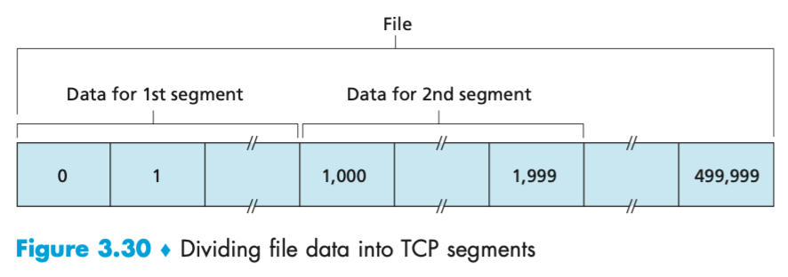
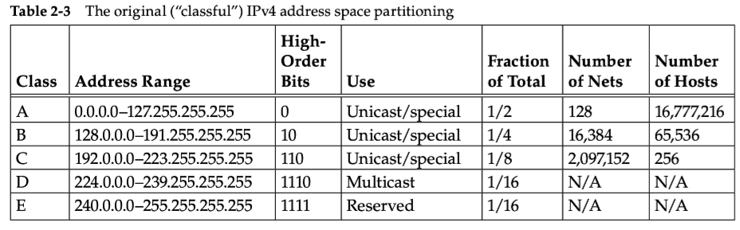

# 计算机网络体系结构

## *什么是因特网 Internet*

### 从具体构成角度

Internet是一个由全世界数十亿计算设备构成的一个大型网络（或者说图），因特网可以不断细分为更小的网络

* 节点
  * 主机 host 或端系统 end system及其上运行的应用程序
  * 路由器 Router、交换机 Switch 等网络交换设备
* 边：通信链路 communication link
  * 组成
    * 接入网链路 access：主机连接到互联网的链路
    * 主干链路 backbone：路由器间的链路
  * 通信链路又很多不同的物理媒体组成，链路的传输速率 transmission rate 以 **bit/s 或 bps** 度量
  * 发送的数据分段加上首部字节后形成的信息包称为**分组 packet**，或者 PDU Protocol Data Unit 协议数据单元
* 协议 protocol
  * **协议定义了在两个或多个通信实体的同一层级之间交换的报文格式（即语法、语义）和时序，以及在报文传输和/或接收或其他事件方面所采取的动作**，协议最终体现为在网络上传输的数据包的格式。互联网中最主要的网络协议栈是TCP/IP协议
  * 因特网标准由IETF组织研发，IETF的标准文档为 Request For Comment RFC
  * 接口 Interface：上层使用下层服务的入口
  * 服务 Service：下层为相邻上层提供的功能调用

### 从服务角度

分布式应用程序 distributed application：应用程序分布在不同计算机上，通过网络来共同完成一项任务。通常为服务器/客户端模式

可以将因特网直接划分为分布式应用程序以及为这些应用程序提供数据运输服务的基础设施

## *对网络的划分*

### Edge、Acess与Core


Fig. source: https://www.mdpi.com/1999-5903/2/4/603


上图中的图标是网络相关的图经常会用到的符号

通常把与因特网相连的计算机何其他设备称为端系统 end system，因为它们位于因特网的边缘，故而被称为端系统

端系统与端系统之间不可能直接相连，必须通过access接入core后进行数据交换，否则建立通信的成本会很大。当然core是一个大型的分布式系统，由无数的小型交换机、路由器何数据中心构成

### 网络设施提供服务的方式

* 面向连接 connection-Oriented：TCP协议，在端系统之间传输数据报之前必须建立起有效连接
* 无连接：UDP协议，不用建立连接，直接发信息

注意：面向连接和有连接是不同的概念。面向连接是只针对端系统而言的，与中间的core无关；而有连接是针对整个通信路径而言的，中间的core也要建立起连接

## *网络边缘 Edge*

### 接入网

端系统通过因特网服务提供商 Internet Service Provider ISP 接入网络。每个ISP自身就是一个由多台分组交换机和多段通信链路组成的网络

* modem, modulator-demodulator 调制-解调器。medem的作用就是利用原来已经存在的连接到各个用户的各类电线缆，将网络通信通信进行调制、解调

  * Dial-up modem 拨号上网
    * 因为原来的语音通信只需要用到0.3-4kHz的**模拟频段**，所以对于数据传输，速度很慢，一般最高只有56Kbps
    * 数字通信中，数据通过数字信号传输，通常使用调制方式如频移键控（FSK）、相位键控（PSK）和振幅键控（ASK）等。数字通信速率取决于数字信号的带宽和信噪比等因素，因此**数字通信速率可以比模拟通信速率更高**，但最高也只能达到56Kbps
    * 由于语音通信和网络通信都需要调制和解调，所以不能同时上网和打电话
  * Cable modem：依靠电视信号线上网，需要对原来的单向广播电视线改造为双向通信线路。所有用户共享上行路线
  * 国外甚至还有使用普通电网上网的
  * DSL Digital Subscriber Line 数字用户线：DSL是一种可以让数字信号加载到电话线路未使用频段的方法，这就实现了只使用一条线缆在不影响话音服务的前提下在普通电话线上提供数据通信。ADSL上行、下限带宽是非对称的
    * 高速下行通道：50kHz-1MHz
    * 中速上行通道：4kHz-50kHz
    * 普通双向电话信道：0-4kHz

  

  经典的Win xp 和 win 10的拨号上网页面

* Fiber To The Home FFTH 光纤到户

* 以太网和WiFi

* 广域无线接入：3G、LTE、4G、5G

关于带宽的概念，在DSP中，带宽是指滤波器等可以通过的频带宽度，单位为Hz；而在网络中，带宽是指数据的最大传输速度，单位为bps。宽带一般是指传输速率为56Kbps以上的网络，它对应的是窄带

电信运营商所谓的百兆网络、千兆网络是描述下行速度的，且单位是Mbps，所以最大实际下载速度大概为12.5MBps

### 物理媒体

* 导引形媒体 guided media：电波沿着固定媒体前行，如光缆、双绞铜线或同轴电缆等
* 非导引媒体 unguided media 信号在空气或外层空间中传播，信号衰减极快，因此对它的控制方式也不同

## *网络核心 Core*

### <span id="电路交换">电路交换 circuit switching</span>

电路交换网络一般用于电话通信。电路交换网络中，在端系统间通信期间，预留了端系统间沿路径通信所需要的资源（缓存、链路传输速率等）

复用方式 Multiplex

* 频分复用 Frequency- Division Multiplexing FDM

  

  链路频谱由跨越链路创建的所有连接共享，在连接期间为每条连接专用一个频段 Frequency band。在电话网络中，频段的带宽 band width 一般为4 kHz

* 时分复用 Time- Division Multiplexing TDM

  

  TDM链路中，时间被划分为固定期间的帧 Frame，并且每个帧又被划分为固定数量的**时隙 timeslot**

* 波分复用 Wave- Division Multiplexing WDM：适用于光纤通信 

* 码分复用 Code- Division Multiplexing CDM

**电路交换不适合计算机之间的通信**

* 秒级的连接建立时间过长
* 计算机之间的通信有突发性，若使用线路交换，则浪费资源较多
* 可靠性不高

### 分组交换 packet swithing

不再进行复用，而是使用通信链路的全部通信能力。将信息制作成分组 packet进行传输

* 存储转发传输 store- and -forward transmission：只有当路由器缓存了要传输的数据的所有内容之后，才能开始向出链路传输
* 排队时延和分组丢失。在每个节点上有更长的存储延迟，但换取了整条线路的共享性
* 通过转发表和路由选择协议进行跳转 hop

数据报是按地址找人，不事先确定路好不好走；虚电路是先去一次，熟悉一下路线，再进行发送。依靠信令 Signaling

同样的网络资源，分组交换允许更多用户使用网络

* 假设1 Mb/s 链路，每个用户活动时占用100 kb/s，10%的时间是活动的

* 使用电路交换：因为资源是同时占用的，所以最多同时只能是10个用户

* 使用分组交换：假设有35个用户同时在使用，我们计算10个用户互动的概率为，也就是10个用户同时活动的概率仅为0.0004，显然使用分组交换可以支持更多的用户。当然实际上不能令 $n=10$，因为此时的流量强度=1，系统会挂
  $$
  1-\sum\limits_{n=0}^{10}{C_{35}^n\cdot p^n\cdot\left(1-p\right)^{35-n}}>0.0004
  $$

### 网络的网络


不可扩展性：扩展到一定规模，若再继续扩展需要付出很大的代价

网络是一个层次结构，它有大量的最底层的接入设备和local ISP。Naive的想法是local ISP之间相互互联，但由于网络的不可扩展性这是不可能实现的。因此需要更高级别的ISP来将低层次的ISP之间互联

相同等级之间的peer ISP需要通过 IXP Internet Exchange Point 来互联，而不是通过上层ISP进行流量移动。它们之间无结算

同时还有大量的内容提供商网络 Content Provider Network，如谷歌、百度等。这种网络相当于是公司服务的专网，经常是在全球范围内的数据中心部署。对于用户对该公司的服务请求，可以不通过各类ISP，而是直接走专网，因此可以节省支出，也可以更好更快的提供服务

## *分组交换网中的时延、丢包和吞吐量*

### 时延类型

$$
d_{nodal}=d_{proc}+d_{queue}+d_{trans}+d_{prop}
$$


节点总时延 total nodal delay 由以下4部分构成

* 节点处理时延 nodal processing delay：检查分组首部和决定将该分组导向何处所需要的时间。高速路由器的处理时延通常为微秒甚至更低
* 排队时延 queuing delay：在输出链路上等待传输的时间，依赖于路由器的拥塞程度。通常为毫秒到微秒量级
* 传输时延 transmission delay：$d_{trans}=L/R$，用 $L$ 比特表示该分组长度，$R$ bps是该链路的传输速率。通常为毫秒到微秒量级
* 传播时延 propagation delay：$d_{prop}=d/s$，用 $d$ 表示两台路由器之间的距离，$s$ 表示传输媒介中的传播速率，一般在 $2*10^8\sim3*10^*$ m/s 之间。通常在毫秒量级

### 排队时延和丢包

排队时延是节点时延中最复杂，也是最重要的部分。通常使用统计量来度量排队时延，比如平均排队时延、方差等

用 $a$ pkt/s 表示分组到达队列的平均速率，那么有流量强度 traffic intensity $La/R$，当流量强度大于1时，比特达到队列的恶平均速率超过从该队列传输出去的速率，此时队列趋向于无限增长。因此流量工程中最重要的是**设计系统时流量强度不能大于1**。实际上，当流量强度=1的时候系统就会挂

队列都是有限长度的，当队列满了之后，会自动舍弃之后到来的分组，这种现象称为**丢包 packet loss**

### 端到端时延的测试工具

Traceroute和Ping工具都是用了ICMP协议

### 吞吐量 Throughout

吞吐量：在源端和目标端之间传输的速率，即数据量/时间，单位为bps。可以分为瞬间吞吐量 instantaneous throughout 和平均吞吐量 average throughout $F/T$：主机接收 $F$ 比特用去了 $T$ 秒


瓶颈链路 bottleneck link：某条完整链路的吞吐量取决于吞吐量最小的那一段链路，即 $R=\min\left\{R_1,R_2,\dots,R_n\right\}$

## *OSI七层模型*

### OSI介绍

* OSI Open System Interconnection 七层开放系统互连参考模型是一个逻辑上的定义和规范
* OSI把网络从逻辑上分为了7层，每一层都有相关、相对应的物理设备，比如路由器，交换机等
* OSI 七层模型是一种框架性的设计方法，其最主要的功能使就是帮助不同类型的主机实现数据传输。它的最大优点是将服务、接口和协议这三个概念明确地区分开并定义。 通过七个层次化的结构模型使不同的系统不同的网络之间实现可靠的通讯
* 但是在将理论转换为实际应用的时候，OSI显得不太实际，比如说表示层、会话层都是和用户的需求强相关的，若再使用不同的协议规范，那么就会显得比较混乱，不如直接统一到应用层，实际中用的都是TCP/IP模型

### 具体分层（自顶向下）

* 应用层：针对特定应用的协议
* 表示层：设备固有数据格式和网络标准数据格式的转换
* 会话层：通信管理，负责建立和断开通信连接
* 传输层：管理和确保两个节点之间的可靠数据传输
* 网络层：地址管理与路由选择
* 数据链路层：互连设备之间传送和识别数据帧
* 物理层

## *TCP/IP 四层（五层）模型*

### TCP/IP模型分层


TCP/IP是一组包括许多协议的总称，这些协议共同构成了TCP/IP协议簇。TCP/IP模型一共分为以下五层（自顶向下），因为很少会涉及到物理层的改动，所以也可以说是四层模型

* **应用层 Application**：负责应用程序间沟通，如简单电子邮件传输 SMTP、文件传输协议 FTP、网络远程访问协议 Telnet 等。我们的网络编程主要就是针对应用层。该层的PDU称为报文 message
* **传输层 Transport**：负责两台主机之间的数据传输，如传输控制协议 （TCP协议），能够确保数据可靠的从源主机发送到目标主机。该层的PDU称为报文段 segment，特别地，TCP称为段，UCP称为数据报
* **网络层 Network**：负责地址管理和路由选择，例如在IP协议中通过IP地址来标识一台主机，并通过路由表的方式规划出两台主机之间的数据传输的线路（路由）。路由器工作在网路层。该层的有连接PDU称为分组 packet，无连接称为数据报 datagram
* **数据链路层 Data link/Network Interface**：负责设备之间的数据帧的传送和识别，如网卡设备的驱动、帧同步（从网线上检测到什么信号算作新帧的开始）、冲突检测（若检测到冲突就自动重发）、数据差错校验等工作。有以太网、令牌环网、无线LAN等标准。该层的PDU称为帧 frame
* **物理层 Physical**：负责光/电信号的传递方式。比如现在以太网通用的网线（双绞线）、早期以太网采用的的同轴电缆(现在主要用于有线电视)、光纤，现在的Wi-Fi无线网使用电磁波等都属于物理层的概念。物理层的能力决定了最大传输速率、传输距离、抗干扰性等. 集线器(Hub)工作在物理层。该层的PDU为位 bit

### 每层与对应硬件的关系

* 对于一台主机，它的OS Kernel 实现了从传输层到物理层的内容
* 对于一台路由器 Router，它实现了从网路层到物理层的内容。路由器相当于是一台拥有通信双方两个MAC地址的主机，是横跨两个局域网的
* 对于一台交换机 Switch，它实现了从数据链路层到物理层。交换机实现的是局域网与局域网之间的中继
* 对于集线器，它只实现了物理层

### 网络和OS之间的关系


TCP/IP协议和OS之间的关系是：OS内部有一个模块就叫做TCP/IP，传输层和网络层是隶属于OS的

OS提供的系统调用和基于系统调用的语言级别的应用都属于应用层

## *数据包的封装和分用*

### 封装 Encapsulation 与多路复用 multiplexing


* 不同的协议层对应用层数据包 Package 有不同的称谓，在传输层叫做叫做**段 Segment**，在网络层称为**数据报 Datagram**，在链路层叫做**帧 Frame**
* 应用层通过协议栈发到网络上进行传输时，每层协议都要加上一个数据首部 Header，用户数据+上层首部称作正文 Body。将这种操作称为封装 Encapsulation
* 在传输回到接收方时，要将发送时层层添加的首部按照FILO顺序层层脱去。因为这种协议的FILO关系，所以将网络协议的堆叠称为**协议栈 Protocol stack**
* 首部信息中包含了一些类似于首部有多长，有效载荷有多长，上层协议有多长等信息
* 因为网络层的对象是很多的，用socket信息来标识身份，从网络层到传输层的封装称为**多路复用 multiplexing**

### 多路分用 demultiplexing


一层上会有很多的可用协议，数据包添加报头的时候，也要考虑未来解包的时候，将自己的**有效载荷 Payload**交付给上层的哪一个协议。这个过程称为有效载荷的分用过程

* 一般而言，任何报头属性里面，一定要存在一些能够支持进行封装和解包的字段
* 也一定要存在一些字段来支持有效载荷的分用
* 从传输层到网络层的分用称为**多路分用 multiplexing**

## *网络传输及其地址管理*

### 网络传输流程图


* 计算机的体系结构决定了数据包在主机进行流动的时候，必然是自顶向下或者自底向上流动的，这和OS的IO读取是一样的
* 同层协议都认为自己和对方直接通信，当前层只是利用下层接口提供的信息，然后为上层接口提供服务，并不关心上下层的工作细节。为了做到这一点**每一层都需要有自己的通信协议**

**网络传输的本质就是在数据在网络中不断被封包和解包**

### MAC地址


每一台主机都要有自己的唯一标识符，MAC地址 Media-Access-Control Address 是网卡在出厂时内嵌的地址，作用是用来在局域网中标定主机的唯一性，也就是用来在局域网中进行中转的时候标定唯一身份

### IP地址

IP地址用来在广域网（公网）中标定地址的唯一性。源IP地址和目标IP地址可以是在同一个局域网，也可以不在

所有的IP层向上的协议，发送和接收主机看到的数据是一摸一样的，因为将不同的数据链路层的报头（或者说去除了用于在局域网中中转的可能不同的局域网MAC地址）进行了解包，剩下的报文是一样的。相当于在数据链路层上添加了一层网络层，这是一种软件虚拟技术，之后就不需要处理不同协议的不同局域网的差异了

因此又称网络为IP网络，因为屏蔽了底层网络的差异（也就是不关心在哪个局域网了）

## *计算机网络发展史*

### 发展历程

1. 分组交换的发展 1961-1972
   1. 1961-1964 Kleinrock使用排队论，完美地体现了使用分组交换方法处理突发性流量源的有效性
   2. MIT、兰德和NPL对分组交换的工作奠定了互联网的基础
   3. 1967-1972 有15个节点的ARPA-net被部署，ARPA-net是第一个分组交换计算机网络，是当今互联网的直接祖先。ARPA-net主机间的通信采用了NCP 网络控制协议

2. 专用网络和网络互联 1972-1980
   1. 20世纪70年代早期和中期，除了ARPA-net之外的其他分组交换网络相继问世。ALOHAnet 微波网络、BBN的商用分组交换网Telenet、法国的Cyclades、IBM的SNA等等
   2. 为了将这些分组交换网络连接到一块，DARPA领导的互联网研究工作奠定了当今的TCP/IP协议基础

3. 网络激增 1980-1990
   1. 1983.1.1 被称为 Flag day，在这一天，ARPA-net 将所有主机关机，并从NCP迁移到TCP/IP协议。20世纪80年代后期，TCP进行了大量重要拓展，如拥塞控制等。DNS协议也出现了
   2. 1986年建立的NSFNET为NSF资助的超算中心提供接入，逐渐称为区域网络的基本骨干

4. 因特网爆炸 20世纪90年代
   1. 互联网的逐步成熟，以及其开源特性促进了快速的商业化。APRA-net和NSFNET相继退役，因特网主干流量逐步由商业因特网服务提供商承载
   2. 20世纪90年代的主要事件是万维网 WWW 应用程序的出现

5. 目前：高速、大流量、云端

### 网络集群

使用多主机互联，构建宏观冯诺依曼架构


# 网络套接字编程

## *预备知识*

### 端口号 Port

IP地址可以完成主机和主机的通信，而主机上各自的通信进程才是发送和接收数据的一方，比如一个服务器上的应用程序是一个提供服务的进程，而用户是一个接收服务的进程

**端口号 port 用来确保该主机上的进程的唯一性**， `IP:Port` 标识互联网中**唯一的一个进程**，从而可以进行确定的进程间通信。**网络通信的本质，也是进程通信**

Linux中的System V属于本地进程通信，而**网络进程通信使用的是POSIX标准**

### pid和端口号的区别

pid是专门用来对系统进程调度进行管理的，若也用它来进行网络通信的定位，这就是将本地系统管理和网络通信强行耦合起来，这是不合理的。而且并不是所有进程都会进行网络通信的，若在这种这种情况下因为某些原因通过网路修改了OS相关的问题，会对OS的安全造成影响

端口号与pid一样，都是通过OS维护的哈希表来快速查找的

**一个进程可以关联多个端口号，但反过来一个端口号不能关联多个进程**

### 常用工具

* `netstat -nltp`
* `telnet`

## *Socket编程*

### 什么是socket？

套接字是通信端点的抽象。套接字描述在UNIX系统中被当作是一种**文件描述符**，位于内核区

* UDP的socket是一个二元组：（目标IP，目标Port）
* TCP的socket是一个四元组：（源IP，源Port，目标IP，目标Port）
* 为什么TCP是一个四元组？是因为TCP在通信前需要建立一对一的连接，一个四元组可以建立一对一的会话关系。对于两个通信目标相同的UDP，从接收方来看是一样的

### socket常见API

* 创建套接字

  ```c 
  #include <sys/types.h>          /* See NOTES */
  #include <sys/socket.h>
  int socket(int domain, int type, int protocol);
  ```

  * 参数
    * `domain` 地址族，确定通信特性，包括地址格式，各个域都有自己表示地址的格式
      * 网络通信：`AF_INET` 宏
      * 本地通信：`AF_UNIX` 宏
    * `type`：套接字类型决定了通信的时候对应的报文类型
      * TCP流式：`SOCK_STREAM `
      * UDP用户数据报：`SOCK_DGRAM`
    * `protocol`：协议类型
      * 网络通信设为0
  * 创建成功返回新套接字的文件描述符sockfd，失败返回-1，设置errno

* 绑定**本地**内核套接字与本地结构体（填充了 `IP:Port` 信息）栈地址（可能是不同的本地域）。这是一个比较容易让人产生疑惑的点，bind的对象一直都是自己的 `IP:Port` 和结构体，和通信对象没有关系，具体如何建立连接对于TCP是 `connect` 的事情，而UDP直接用 `send` 指明发送对象的 `IP:Port `就行（当然，发送前要创建并填充发送对象的 `sockaddr_in` 结构体）

  ```c
  #include <sys/types.h>          /* See NOTES */
  #include <sys/socket.h>
  int bind(int sockfd, const struct sockaddr *addr,
           socklen_t addrlen);
  ```

  * 参数
    * `sockfd`：已创建的待绑定的套接字文件描述符
    * `*addr`：本地特地类型的 `sockaddr` 结构体地址
    * `addrlen`：`sockaddr` 结构体的大小
  * 成功返回0，失败返回-1，设置errno

* 开始监听socket

  ```c
  #include <sys/types.h>          /* See NOTES */
  #include <sys/socket.h>
  int listen(int sockfd, int backlog);
  ```

  * 成功返回0，失败返回-1，设置errno
  * listen的第二个参数是底层的全连接队列的长度，表示在**不accept**的情况下最多可以为backlog+1个连接。若超出了这个长度，只会产生半连接，服务器停留在SYN_RCYD的状态

* 接收请求 accept

  ```cpp
  #include <sys/types.h>          /* See NOTES */
  #include <sys/socket.h>
  int accept(int sockfd, struct sockaddr *addr, socklen_t *addrlen);
  ```

  * 参数
    * 传入的sockfd套接字的核心工作是获取新的连接，称为接听socket
    * 输出型参数 `*addr`：连接者的地址
    * 输入输出型参数 `*addrlen`
  * 成功返回一个非负的**新的**socket文件描述符，任务是为连接提供IO服务。失败返回-1，设置errno

* 建立连接：实际建立socket连接

  ```cpp
  #include <sys/types.h>          /* See NOTES */
  #include <sys/socket.h>
  int accept(int sockfd, struct sockaddr *addr, socklen_t *addrlen);
  ```

### `sockaddr` 结构

socket通信除了网络通信，还有一种域间socket Domain socket用于本地通信，它本质上是一种双向管道的本地文件通信。即socket既可以用于跨网络也可以用于本地通信，做到了跨网络和本地通信的统一，因此可以很容易地被整合进文件系统（Linux一起皆文件），逐渐的替代了原来的System V本地通信标准

为了让socket做到跨网络和本地通信的兼容性，设计了 `sockaddr_in` 和 `sockaddr_un` 两个结构体分别来表征两种通信方式，又设计了一套整合前面两种方式的 `sockaddr` 来实现统一的API。一个地址表示一个特定通信域的套接字端点，地址格式与这个特定的通信域相关，为了使不同格式地址能传入到套接字函数，地址会被强制转换为一个通用的地址结构 `sockaddr`，类似于多态的概念

之所以API的接口中暴露出了 `sockaddr` 而不是直接使用 `void*` 来进行接收后强转，是因为在设计这套接口的时候C语言并不支持 `void*`

相当于先判断是 `AF_INET` 还是 `AF_UNIX` 然后再对后面的地址进行强转

### `sockaddr_in`

用于网络通信的 `AF_INET` IPV4域的 `sockaddr_in` 结构体定义在 `netinet/in.h` 头文件中

* `sin_port` 用来表示一个端口号，类型是一个 `uint16_t` 16位整数，所以转换的时候用s相关的函数
* `in_addr` 用来表示一个IPv4的IP地址，类型是一个 `uint32_t` 32位的整数，所以转换的时候用l相关的函数

````cpp
/* Structure describing an Internet socket address.  */
struct sockaddr_in
  {
    __SOCKADDR_COMMON (sin_); // 地址族
    in_port_t sin_port;			/* Port number.  */
    struct in_addr sin_addr;		/* Internet address.  */

    /* Pad to size of `struct sockaddr'. 用于对不同地址族的对齐填充 */
    unsigned char sin_zero[sizeof (struct sockaddr) -
			   __SOCKADDR_COMMON_SIZE -
			   sizeof (in_port_t) -
			   sizeof (struct in_addr)];
  };
````

## *简单的UDP网络程序*


UDP socket：本地IP和本地端口，无连接通信，不需要 `connect()`

### Server

首先对Server进行封装

```cpp
class UdpServer {
public:
    UdpServer(int port, std::string ip=""):_port((uint16_t)port), _ip(ip), _sockfd(-1) {}
        //初始化列表设为1，用init接口进行创建
    ~UdpServer() {}
public:
    void init() {} //初始化server
    void start() {} //启动server
private:
    uint16_t _port; //服务器必须要有端口号信息
    std::string _ip;
    int _sockfd; //服务器的socket fd信息
    std::unordered_map<std::string , struct sockaddr_in> users; //记录用户信息
};
```

1. 创建socket套接字，相当于打开了一个文件，返回一个文件描述符fd

   ```cpp
   _sockfd = socket(AF_INET, SOCK_DGRAM, 0); 
   // _sockfd<0 是的差错控制和log
   ```

2. 绑定网路信息，指定 `IP:Port`，客户端是要提供服务的，必须要确定一个端口

   1. 先填充基本信息到 `struct sockaddr_in`

      ```cpp
      //local是在用户栈开辟的临时变量，要进行bind写入到内核中
      struct sockaddr_in local;
      bzero(&local, sizeof(local)); //初始化，也可以用memset
      //填充协议家族
      local.sin_family = AF_INET;
      //填充服务器对应的端口号信息，端口号一定要相互传输，所以要转大端
      local.sin_port = htons(_port);
      local.sin_addr.s_addr = _ip.empty() ? htonl(INADDR_ANY) : inet_addr(_ip.c_str());
      ```

      INADDR_ANY(0)：程序员不关心会bind到哪一个IP，有些时候host会有多个IP

      * 任意地址bind，强烈推荐的做法，所有服务器一般的做法
      * `inet_addr` 进行指定绑定到具体的IP，特殊用途，或者测试时使用。除了做转化，还自动进行 `hton`

   2. 绑定网络信息

      ```cpp
      if (bind(_sockfd, (const struct sockaddr*)&local, sizeof(local)) == -1)
      {
          logMessage(FATAL, "bind: %s:%d", strerror(errno), _sockfd);
          exit(2);
      }
      ```

`inet_nota` 的作用是把一个4字节IP地址转换成十进制

### Client

1. 根据命令行，设置要访问的服务器IP

2. 创建socket

3. client不需要bind

   * 不需要指的是用户自己不需要自己bind端口信息，因为OS会自动绑定。也推荐这么做，但如果用户非得自己绑定，也可以，但很不推荐
   * 这是因为客户端不需要指定一个固定的本地地址来接收数据，而是通过服务器返回的地址来接收数据。具体来说，客户端的套接字在调用 `connect()` 函数时，会自动分配一个临时的本地端口号，并将该端口号发送给服务器。服务器在收到连接请求后，会返回一个已连接的套接字地址，该地址包括服务器的IP地址和端口号。客户端通过这个地址与服务器进行通信
   * 那么server为什么需要bind呢？因为server提供的服务，必须让所有clients知道自己的port，且不能随便更改，不然就不能找到一个随机的port

4. 填充server对应信息

   ```cpp
   server.sin_family = AF_INET;
   server.sin_port = htons(server_port);
   server.sin_addr.s_addr = inet_addr(server_ip.c_str());
   ```

5. 通讯过程

   下面的读取和发送专用于UDP的用户数据报

   ```c
   #include <sys/types.h>
   #include <sys/socket.h>
   ssize_t recv(int sockfd, void *buf, size_t len, int flags);
   ssize_t recvfrom(int sockfd, void *buf, size_t len, int flags,
                    struct sockaddr *src_addr, socklen_t *addrlen);
   ssize_t recvmsg(int sockfd, struct msghdr *msg, int flags);
   ```

   ```cpp
   #include <sys/types.h>
   #include <sys/socket.h>
   ssize_t send(int sockfd, const void *buf, size_t len, int flags);
   ssize_t sendto(int sockfd, const void *buf, size_t len, int flags,
                  const struct sockaddr *dest_addr, socklen_t addrlen);
   ssize_t sendmsg(int sockfd, const struct msghdr *msg, int flags);
   ```

## *简单的TCP网络程序*


### General design

通过 `socket` 创建套接字，然后将这个套接字与本地

### 单进程版本server

单进程提供服务内部是死循环，一旦进入主执行流就无法向后执行，因此虽然能够同时和多个client建立连接，但无法同时为它们提供服务

相比UDP，TCP server需要进行listen和accept

1. 创建socket套接字 相当于打开了一个文件
2. 绑定网路信息，指定 IP:Port
   1. 先填充基本信息到 `struct sockaddr_in`
   2. 绑定网络信息
3. listen 监听socket，tcp是面向连接的
4. accept 获取连接
5. 提供服务

### 单进程版本client

1. 创建socket套接字
2. 需要bind，但不需要自己显式bind
3. 不需要listen，因为没人连client
4. 不需要accept
5. 需要connet，向服务器发起连接请求
   1. 先填充需要连接的远端主机的基本信息
   2. 发起请求，connet会自动进行bind

### 简单的TCP网络程序（多进程版）

多进程版本创建子进程提供多个服务。多进程时，创建出来的子进程会继承父进程的fd，这也就包括了socket fd，因此虽然welcomeSocket与固定端口绑定了，但是不影响子进程使用accept返回的serviceSocket

多进程server提供服务

* 用signal来控制

  ```cpp
  signal(SIGCHLD, SIG_IGN); //Only Linux valid
  //SIG_IGN 忽略，子进程在终止时会自动清理掉,不会产生僵尸进程，也不会通知父进程
  // ...
  //5.1 v1版本 -- 多进程版本，父进程打开的fd会被子进程拿到
  pid_t id = fork();
  assert(id != -1);
  if (id == 0)
  {
      close(_listenSock); //建议关掉
      //子进程
      transService(serviceSock, peerIP, peerPort);
      exit(0);
  }
  //父进程
  close(serviceSock);
  ```

* 用系统领养来控制

  ```cpp
  // 5.1 v1.1 版本 -- 多进程版本
  //爷爷进程
  pid_t id = fork();
  if (id == 0)
  {
      //爸爸进程
      close(_listenSock); //建议
      //又进程了以此fork，让爸爸进程终止
      if (fork() > 0)
          exit(0);
      //孙子进程，爸爸进程被终止，变成了孤儿进程，被系统领养，回收问题就交给了系统来回收
      transService(serviceSock, peerIP, peerPort);
      exit(0);
  }
  //父进程
  close(serviceSock);
  //爸爸进程直接终止，立马得到退出码，释放僵尸进程状态
  pid_t ret = waitpid(id, nullptr, 0); //阻塞时等待
  assert(ret > 0);
  (void)ret;
  ```

### 简单的TCP网络程序（多线程版）

```cpp
static void *threadRoutine(void *args)
{
    pthread_detach(pthread_self()); //设置线程分离
    ThreadData *td = static_cast<ThreadData *>(args);
    td->_this->transService(td->_sock, td->_clientIP, td->_clientPort); //transService放在server类外
    delete td;
    return nullptr;
}
void loop()
{
    while (true)
    {
        //多线程不需要关闭文件描述符，多线程会共享文件描述符
        pthread_t tid;
        ThreadData *td = new ThreadData(peerPort, peerIP, serviceSock, this);
        pthread_create(&tid, nullptr, threadRoutine, (void*)td);
        //不能pthread_join
    }
```

### 简单的TCP网络程序（线程池）

* 改造Task

  ```cpp
  class Task
  {
  public:
      using callBack_t = std::function<void (int, std::string, uint16_t)>;
  private:
      int _sock; //给用户提供IO服务的sock
      uint16_t _port; //client port
      std::string _ip; //client ip
      callBack_t _func; //回调方法
  public:
      Task(): _sock(-1), _port(-1)
      {}
      Task(int sock, std::string ip, uint16_t port, callBack_t func)
          : _sock(sock), _ip(ip), _port(port), _func(func)
      {}
      void operator() () //让Task对象成为一个仿函数 Task()
      {
          _func(_sock, _ip, _port);
      }
      ~Task()
      {}
  };
  ```

* 构建任务

  ```cpp
  void loop()
  {
      _tp->start(); //启动线程池
  
      while (true)
      {
          //5. 获取连接，accept的返回值是一个新的套接字文件描述符
          //5.1 获取客户端基本信息
          //...
          //6 构建任务
          Task t(serviceSock, peerIP, peerPort,\
                	std::bind(&ServerTcp::transService, this,\ 
                  std::placeholders::_1,std::placeholders::_2, std::placeholders::_3));
          _tp->push(t); //push进线程池，由线程池进行分发
      }
  }
  ```

采用了**function包装器和bind调整参数**的方法

* Task的第四个属性是回调函数，然后在Task内部通过仿函数在进行调用，这相当于进行了**解耦**，Task并不实现具体的任务，具体执行什么任务需要在类外通过回调函数的方式传入，比如 `execCommand`、`transService` 这种函数指针。换任务的时候线程池、Task类都不用改，只要改服务器里给用户具体提供服务的接口就行了
* 因为 `transService` 是定义在 `ServerTCP` 中的非静态类方法，它的第一个参数为this，一共由4个参数，多于回调函数需要的3个参数，因此进行 `std::bind`，相当于是先把this指针传入 `transService` ，然后返回一个只有3个参数的新的可调用对象
* 若不想绑定的话可以把 `transService` 放到类外面 `ServerTCP` 外，然后直接 `Task t(serviceSock, peerIP, peerPort, transService);` 就完成任务构建了

一个问题：若server在保有连接的时候，server自己先因为一些原因而导致退出，服务器无法立即重启

## *守护进程 Daemon*

### 进程组与job控制

执行一个命令会创建一个或多个进程，这些进程被称为一个进程组 Process group，进程组也叫job。将多个进程划分为一个进程组是为了方便进行统一的管理，说白了就是可以给组内的所有进程同时发信号，这个过程就是job管理

每个进程组都有一个process group leader，leader的PID就是整个进程组的Process Group ID PGID。Process group leader可以自己退出，不会影响同属于该group的其他进程，其他进程的PGID仍然为原来的PGID，等到进程组中的所有进程都退出后，进程组的周期才结束

job管理

* `jobs` 命令可以查看当前OS中的job
* `&` 符可以让进程在后台运行
* `fg %n` 指定jobID为n的job到前台工作（foreground）
* crtl+z 挂起job，让它的状态变成S
* `bg %n` 指定jobID为n的job到后台工作（background），这个命令可以在job挂起来再使用，而 `&` 必须时在shell中输入命令时就带上

### 会话 Session

守护进程的父进程是系统

同一时刻有且只能有一个前台进程组

自成新进程和新会话的进程称为守护进程或精灵进程

### 形成守护进程的方式

* 自己写（强烈推荐）
* `nohup process &` 默认形成日志 `nohup.out`

### 守护进程编写

守护进程编写就是对服务器的部署，让它的父进程从bash变成1号 kernel_init 进程，这样在bash被关闭后server也能继续运行。守护进程的名字一般以d结尾，比如ssd

必做：必须调用函数 `setsid()` 将调用进程设置称为新的session，但进程组的组长不能调用 `setsid()`，一旦调用会立刻报错，所以一般做法就是fork当前进程，然后让fork出的子进程取调用 `setsid()`

选做

* 和管道控制一样，当server一直在写，而client关闭了，那么server也会收到client发来的SIGPIPE终止信号。若不想要进程退出，就要忽略SIGPIPE信号
* 守护进程一般会放到另一个工作目录下，因此可以通过 `chdir()` 来更改存放地址

选做 || 必做

* 将stdout、stdin、stderr关闭，但为了程序的兼容性问题，很少会有人这么做
* 将stdout、stdin、stderr重定向至Linux的垃圾桶/信息黑洞 /dev/null

# 应用层

## *网络应用架构*

### Client-Server模式

CS模式，即典型的主从模式，一般就是有一个中心Server提供服务，大量Client接受服务。CS模式存在可扩展性差和可靠性不佳（一旦宕机，就不能够再提供服务了）的问题

### P2P Peer-to-Peer 对等模式

又称为点对点技术。是去中心化 decentralized、依靠用户群（peers）交换信息的互联网体系。P2P模式只有很少，甚至是没有专门的服务器，每一个用户主机既是客户端，也是服务器。比如Gnutella、KaZaA、Emule等，磁力链接、BitTorrent、迅雷等就是典型应用

P2P的自扩展性 self-scalability 很强，尽管每个对等方都由于请求文件产生工作负载，但每个对等方通过向其他对等方分发文件也为系统增加服务能力，也降低了维护大量中心服务器和数据中心的成本。但由于其高度的去中心化，P2P应用很难管理，面临着安全性、性能和可靠性等挑战

>  P2P是英文peer to peer lending（或peer-to-peer）的缩写，意即个人对个人（伙伴对伙伴）。又称点对点网络借款，是一种将小额资金聚集起来借贷给有资金需求人群的一种民间小额借贷模式。属于[互联网金融](https://baike.baidu.com/item/互联网金融/7040983?fromModule=lemma_inlink)（ITFIN）产品的一种。属于民间小额借贷，借助互联网、[移动互联网](https://baike.baidu.com/item/移动互联网/7837035?fromModule=lemma_inlink)技术的网络信贷平台及相关理财行为、金融服务。 -- 百度百科

### CS与P2P混合

Napster音乐共享软件、即时通信软件QQ等

* 文件搜索是CS集中式的
  * 主机在中心服务器上注册其资源
  * 主机向中心服务器查询资源位置
* 文件传输是P2P形式的

socket 就是 SAP

## *Web与HTTP*

### 什么是Web？

首先分清楚互联网 internet（小写）> 因特网 Internet（大写）>万维网。互联网是广义的任何可以互联的主机形成的网络，因特网是特指利用TCP/IP协议栈组织起来的互联网，万维网 Web则是跑在因特网上的一个服务。其他的因特网服务还有电子邮件、FTP、Telnet等

万维网 World Wide Web，也称为 Web，是因特网的一项应用层服务。它是一个使用HTML 超文本标记语言编写的文件、图片、多媒体和其他资源的集合，资源通过超链接互相连接形成网络，即一个超级巨大的图文件系统。并使用统一资源标志符（URL）标识资源的唯一性，然后通过HTTP这个万维网的主要访问协议进行远程访问

Web页面 page（也叫文档）是由对象组成的，比如HTML文件、图片、Java程序、视频等等，它们可以通过URL到服务器端寻址。多数Web页面含有一个HTML基本文件 index.html

Web浏览器 browser 则是一个实现了HTTP的客服端，它是一个类似于C语言编译器的HTML或其他文本标记语言的渲染器，用来解释形式语法。WWW这一名称，是Web浏览器当年用来浏览超文本的客户端应用程序名称，现在则用来表示这一系列的集合，也可简称为Web

### URL介绍

URL Uniform Resource Locator 统一资源定位符，俗称网址，它的完整格式为下面这个字符串。其中[访问凭证信息]（支持匿名访问）、[端口号]、[查询]、[片段ID]都属于选填项

```
[协议类型]://[访问资源需要的凭证信息]@[服务器地址]:[端口号]/[资源层级UNIX文件路径][文件名]?[查询]#[片段ID]
```

域名在使用的时候必须被转换为IP地址，访问网络服务，服务端必须具有Port 端口号。特别是端口号，但使用确定协议的时候，一般会缺省端口号，但浏览器等会自动添加。这是因为**应用层协议规定了强绑定关系**，即httpServer对应80号端口、httpsServer对应443端口、sshd对应22号端口，这就像是110对应警察，119对应火警。一般来说用户能使用的只有1024之后的端口，之前的端口都被协议占用了

因为网络资源都是部署在Linux服务器上的，所以**URL实际上就是服务器上文件资源的地址**

### URL-Encode and URL-Decode

对特殊字符需要进行编码

### HTTP概况

HTTP Hyper Text Transfer Protocol 超文本传输协议是向特定的服务器申请特定的资源的协议，将这些资源获取到本地进行展示或者使用。它是Web的应用层协议

HTTP由两个程序实现：一个客户程序和一个服务器程序（固定 `IP:Port`），它们分别运行在不同的端系统中，通过交换HTTP报文进行会话

HTTP使用TCP连接作为它的支撑运输协议，占用**固定端口号80**

HTTP是一个**无状态协议 stateless protocol**，服务器并不维护关于客户的任何信息，因为维护状态是很麻烦的。可以采用Cookies、session等技术维护

* 当发生异常时需要有一种机制去同步双方状态很麻烦
* 无状态的服务器能够支持更多的客服端

### 非持续连接和持续连接


* 非持续连接 non-persistent connnection HTTP/1.0
  * 对每一个HTTP请求都要重新建立TCP请求，或者说最多只有一个对象在TCP连接上发送
  * 空间负担：比如说请求1个index.html，里面包含10个图片的链接，那么总共需要11次TCP传输，因为建立TCP本身需要建立缓冲区等
  * 时间负担：每次传输需要2个RTT Round-Trip Time $RTT=d_{proc}+d_{queue}+d_{prop}$ + 1次传输文件时间 $d_{trans}$
* 持续连接 persistent connection HTTP/1.1 默认使用流水式的持续连接：服务器在发送响应后，保持TCP连接以发送后续请求
  * 流水线方式 pipeline：客户端遇到一个引用对象就立即产生一个请求，所有引用对象甚至有可能只花费一个RTT
  * 非流水线方式 non-pipeline：客户端只能在收到前一个响应后才能发出新的请求，每个引用对象花费一个RTT

## *自定义应用层协议*

### 序列化与反序列化

* 应用层数据传输要将数据序列化为字符串：在不同机器、不同编译器版本下结构体的内存对齐方式可能会存在差异，从而影响对数据的提取使用，但对于字符串序列的处理是统一的（逐个处理），所以考虑转换成字符串流进行传输。转换的正反过程称为**序列化 Serialization和反序列化 Deserialization**
* 对于网络协议栈传输层及以下的协议则可以传输结构体：因为网络层以下实际上变化是很少的，且要求高效，因此在传输的时候使用的就是规定了固定格式的结构体，然后直接转成二进制。但是应用层的灵活度和弹性要很高，因为要考虑不同版本、不同时间段的用户需求，所以应用层必须要加一层序列化和反序列化的软件层来方便定制
* 序列化不仅仅是在网络中应用，本地也是可以直接使用的，特别在落盘的时候序列化会比较好，因为长期存储的数据可能在之后会被升级过的软件打开


### 举例：网络计算器任务

用一个网络计算器的任务来说明应用层的序列化与反序列化过程。我们的任务是让Client把要计算的两个加数发送给Server，然后让Server进行计算，最后再让Server把计算结果发送给Client

应用层协议定制：将发送加数的任务交给一个Request类来管理执行，将计算和发送计算结果的任务交给一个Response类来管理执行。**两个类中分别有序列化和反序列化的方法**

无论是Request还是Response都需要对字符串进行Encode和Decode，即添加和删除报头的工作，因此把这两个函数提出来放在外面公用

下面给出tcpServer.cc中的netCal函数来执行相关任务

```cpp
void netCal(int sock, const std::string &clientIP, uint16_t clientPort)
{
    while (true)
    {
        /*
		前面的检查代码略，具体看~/Network/App_layer/1_calculator/tcpServer.cc
		*/
        //1. 检查inbuffer是不是已经具有了一个完整的strPackage
        uint32_t packageLen = 0;
        std::string package = decode(inbuffer, &packageLen);
        if (packageLen == 0) continue; //无法提取一个完整的报文，继续努力读取

        //2. 已经获得一个完整的package
        if (req.deserialize(package))
        {
            req.debug();
            //3. 处理逻辑，输入的是一个req，得到的是一个response
            Response resp = calculator(req); 
            //resp是一个结构化数据，需要进行序列化
            //4. 对resp进行序列化
            std::string respPackage;
            resp.serialize(&respPackage);
            //5. 对报文进行encode
            encode(respPackage, respPackage.size());
            //6. 暂时进行简单处理
            write(sock, respPackage.c_str(), respPackage.size());
        }
    }
}
```

### Encode

Encode：整个序列化之后的字符串添加报头

首先要考虑的问题是如何确定传输的字符个数，通过**自描述长度的协议**：将序列化的长度设置为4字节，将长度放到序列化之后的字符串的起始地址，也就是这种形式 `"strLen\r\nXXXXXXXXXXXX\r\n"`，用 `\r\n` 分割，方便读取，`"strLen\r\n"` 相当于是一个协议报头。这里有一个问题，为什么不直接读 `"XXXXXXXXXXXX\r\n"` 呢？因为不能保证 `\r\n` 就不是内容的一部分，必须要给一个长度

```cpp
std::string encode(const std::string &in, uint32_t len)
{
    // "_exitCode _result"
    // "len\r\n""_exitCode _result\r\n"
    std::string encodein = std::to_string(len);
    encodein += CRLF;
    encodein += in;
    encodein += CRLF;
    return encodein;
}
```

### Decode

Decode：整个序列化之后的字符串去掉报头，需要满足下面两个条件才返回有效载荷和len，否则就是不停地检测

1. 必须具有完整的长度
2. 必须具有和len相符合的有效载荷

```cpp
std::string decode(std::string &in, uint32_t* len)
{
    assert(len);
    //1. 确认是否是一个包含len的有效字符串
    *len = 0;
    std::size_t pos = in.find(CRLF);
    if (pos == std::string::npos)
        return "";
    //2. 提取长度
    std::string inLen = in.substr(0, pos); //头上的报文长度字符串
    int intLen = atoi(inLen.c_str()); //转换成int
    //3. 确认有效载荷是符合要求的
    int surplus = in.size() - 2 * CRLF_LEN - pos;
    if (surplus < intLen) return ""; //报文不完整
    //4. 确认报文是完整的
    std::string package = in.substr(pos+CRLF_LEN, intLen);
    *len = intLen;
    //5. 将当前报文完整的从in中全部移除掉
    int removeLen = inLen.size() + package.size() + 2*CRLF_LEN;
    in.erase(0, removeLen);
    //6. 正常返回
    return package;
}
```

### 定制Request和Response

具体代码可以看 `~/Network/App_layer/1_calculator/Protocol.hpp`

Request类中包含了三个类属性：`int _x`，`int _y` 这两个需要计算的数据，以及 `char _op` 这个需要进行的操作

Response类中包含了 `_exitCode` 退出码 和 `_result` 计算结果两个类属性。退出码0是默认值，-1是除法除零错误，-2是取模除零错误，-3是未定义的非法操作符

Request和Response分别需要完成序列化和反序列化的定制

### 使用json完成序列化与反序列化

自己来完成序列化与反序列化是比较繁琐的，可以考虑使用一些工具（处理报头的Encode和Decode还是要自己写的）。主流的应用层序列化与反序列化解决方案有xml、json、protobuf等，这里介绍json。centOS上安装json第三方库用 `sudo yum install -y jsoncpp-devel`

1. 创建Value对象， Value对象是一个万能对象，也就是说它可以用来接收几乎任意类型的对象

2. 填充Value，json是基于KV的，也就说要给每一个序列化的对象构建为字典中的一项

3. 序列化，将所有的数据内容转换成字符串。json有两套操作方法 `Json::FastWriter` 和 `Json::StyledWriter`

   ```cpp
   void serialize(std::string *out) 
   {
       Json::Value root; //Value对象
       //填充
       root["x"] = _x;
       root["y"] = _y;
       root["op"] = _op;
       //序列化
       Json::FastWriter fw;
       *out = fw.write(root);   
   }
   ```

   通过 `FasterWriter` 序列化之后得到的是一个字典形式的字符串 `{"op":43,"x":1,"y":3}`

   而通过 `StyledWriter` 序列化之后的是下面这种以行为单位的字符串，可读性更好，不过字符串长度也变长了

   ```
   {
   	"op":43,
   	"x":1,
   	"y":3
   }
   ```

4. 反序列化

   ```cpp
   bool deserialize(std::string &in) //反序列化：字符串转换成结构化数据
   {
       Json::Value root;
       Json::Reader rd;
       rd.parse(in, root);
       _x = root["x"].asInt();
       _y = root["y"].asInt();
       _op = root["op"].asInt();
       return true;
   }
   GET /index.html HTTP/1.1
   ```

## *HTTP协议*


### HTTP的请求格式

以 `\r\n` 作为每一个 `key:value` 间隔，然后用一个 `\r\n` 行来作为请求报头和正文的分割，它的作用就是在手写协议中我们需要一个方法来表示字符串长度

有一个细节：`key: value` 中冒号后的空格必须存在

```cpp
void handlerHttpRequest(int sock, const std::string &clientIp, uint16_t clientPort)
{
    std::cout << clientIp << ": " << clientPort << std::endl;
    char buffer[10240];
    ssize_t s = read(sock, buffer, sizeof(buffer));
    if (s > 0)
    {
        std::cout << buffer;
    }
    close(sock);
}
```


* 请求行 request line Get / HTTP /1.1：请求方法、请求URL资源、http版本
  * GET方法会以明文方式将对应的参数信息，拼接到URL中。GET方式是不私密的，注意是不私密，而不是不安全，实际上用HTTP协议进行传输都是不安全的，因为都是明文传输
  * POST方法提交参数时，会将参数以明文的方式，拼接到http的正文中进行提交。可以用来传比较大的文件：正文是有参数说明的（比如图片、音频等），而URL就是二进制文本（比如搜索引擎的输入）
  * OPTIONS：绝大部分服务器都只会返回GET和POST两种方法。搜索引擎的常用请求，只要头部构建索引

* 首部行 header line
  * Host：被请求的主机的 `IP:Port`
  * Connection：进行请求的连接方式，keep-alive是使用持续连接，close就是使用非持续连接
  * Cache-control：缓存算法
  * User-Agent：浏览器版本及相关信息


### HTTP的响应格式

```
telnet www.tum.de 80
```


* 状态行 status line：协议版本字段、状态码、相应状态信息
* 首部行 header line
  * 对象类型：Content-Type对照表：[HTTP content-type | 菜鸟教程 (runoob.com)](https://www.runoob.com/http/http-content-type.html)
* 实体体 entity body：包含了所请求的对象本身

不是根目录，是web根目录，但也可以设置为根目录

### 返回结果的状态码 Status code

* 1XX informational 信息性状态码，接受的请求正在处理。这个状态码是原来网络速度较慢的时候使用的，表示正在处理中，随着网络的高速化现在基本上已经不被使用了
* 2XX Success 成功 请求正常处理完毕
* 3XX Redirection 重定向
  * 301永久重定向，302临时重定向
  * 304 Not Modified
* 4XX Client error 客户端错误
  * 400 Bad Request 一个通用差错代码，指示该请求不能被服务器理解
  * 404 Not Found 被请求的文档不在服务器上
* 5XX Server error 服务器错误

## *状态维护*

### Cookies

用户需要进行cookies 会话保持，比如说避免每一次打开软件或网站都需要重新登陆

Cookie分为4个部分

* HTTP响应报文中有一个Cookie的首部行
* HTTP请求报文中有一个Cookie的首部行
* 浏览器维护的Cookie文件，这个文件可以是内存级的，此时关闭了浏览器之后下次需要重新登陆；也可以落盘持久化，这样无论是否关闭浏览器，一直都可以自动登陆
* Web后端的数据库中维护了Cookie用于比对

结合用户众多的Cookie内容，可以对用户的很多行为模式做出推断，因此若Cookie泄漏会对用户的隐私和系统造成很大的威胁。由于Cookie的安全性问题，目前主流的方法是Cookie+Session

### Web缓存

Web缓存 Cache 也叫**代理服务器 proxy server**，它会在本地缓存一些用户最近访问过的原服务器中的资源。在因特网上部署代理服务器有两个原因


* Web缓存可以大大减少对客户请求的响应时间，特别是当客户与初始服务器之间的瓶颈款低啊远低于客户与Web缓存器之间的瓶颈宽带时。往往升级接入ISP的宽带成本是很高的，比如升级上图中从1.54Mbps的接入宽带
* Web缓存能从整体上大大减低因特网上的Web流量，从而改善了所有应用的性能

当访问安装了本地缓存的系统之后，会产生以下步骤

1. 浏览器创建一个到Web缓存起的TCP连接，并向Web缓存器中的对象发送一个HTTP请求
2. Web缓存起进行检查，看看本地是否存储了该对象副本，若有就直接TCP返回这个HTTP请求
3. 若没有，就打开一个与该对象的初始服务器的TCP连接，然后发起HTTP请求
4. 当Web缓存起接收到该对象后，它会在本地存储一份副本，然后向客户浏览器发送该副本

### 代理服务器与VPN

代理服务器 proxy server指的是访问方必须要通过中间的代理来访问资源


* 正向代理服务器 forward proxy：如校园网，搭建者在校园中搭建了代理服务器来访问运营商，通过代理服务器，可以过滤或拦截访问请求、提高效率（缓存）、身份认证等功能
* 反向代理服务器 reverse proxy：大型数据中心，比如说云服务器厂商就会使用reverse proxy，以进行负载均衡，以整个集群的能力来处理请求或防火墙、黑名单等来拦截和防御DDoS攻击。云服务器的公网IP不能绑定的简化原因就是，它的公网IP是反向代理服务器虚拟出来的IP，不是一台物理服务器，实际上在机房内的IP为了安全性是不暴露的

Virtual Private Network VPN 虚拟专用网：将请求用https加密后发给代理服务器，由代理服务器进行请求拿到数据后，再经由代理服务器加密后发回请求方

### 条件Get方法

存放在缓存器中的对象副本可能是旧的，为了解决这个问题，可以通过HTTP的条件GET conditional GET方法，来更新缓存器中的对象

条件GET：请求报文使用GET方法 + 有一个 If-modified-since 首部行

## *FTP*

## *电子邮件*

### 电子邮件系统的3个主要组成部分


因特网电子邮件系统主要有三部分构成

* 用户代理 user agent：用户代理就是一个应用程序，提供了用户编辑邮件的功能，比如Outlook、Apple mail等软件
* 邮件服务器 mail server
* 简单邮件传输协议 SMTP

队列是用来缓冲的，不然一下发送大量邮件可能超出服务器负载。也可以设置成一段时间内，比如5分钟、10分钟等，积攒一定数量的邮件后一块发送

### SMTP

Simple Mail Transfer Protocol SMTP 一般不会使用中间邮件服务器跳转

### 邮件访问协议

* POP3 Post Office Protocol -- Version 3
* IMAP Internet Mail Access Protocol
* 基于Web的电子邮件 HTTP

## *DNS：因特网的目录服务*

### DNS介绍

DNS Domain Name System 域名系统

* DNS需要解决的问题

  * 如何命名设备
  * 如何完成名字到IP地址的转换
  * 如何维护，即增加或删除域，需要在域名系统中做哪些工作

* 主要思路

  * 分层的、基于域的命名机制

  * 若干分布式的数据库完成名字到IP地址的转换

  * **DNS是运行在UDP之上端口号为53的应用服务，它是应用于应用的应用**
  * 大部分DNS服务器采用BIND Berkeley Internet Name Domain作为其运行软件

  * DNS是一种核心的Internet功能，但它部署在网络边缘，以应用层协议实现

* 主要目的

  * 最主要的目的：实现主机名和IP地址的相互转换 name/IP translation

  * 主机别名到规范名字 canonical hostname 的转换 host aliasing

  * 邮件服务器别名到邮件服务器的正规名字的转换 mail server aliasing

  * 负载均衡 load distribution

### 集中式系统 vs. 分布式系统

Pros and Cons of Centralized System

* Pros
  * 管理和控制简单，易于维护。由于整个系统的所有资源和控制都在一个中心节点上，因此容易进行监控和管理
  * 性能和稳定性高。由于所有数据和处理都在一个节点上进行，因此可以更好地优化性能和稳定性
  * 易于保障安全。由于系统资源和控制都在一个中心节点上，因此可以更容易地对整个系统进行安全管理
* Cons
  * 单点故障 a single point of failure。由于整个系统的所有资源和控制都在一个中心节点上，一旦该节点发生故障，整个系统将无法正常工作。特别是对于DNS来说，若只有一个DNS服务器，然后它发生了故障，那么整个因特网就瘫痪了
  * 可扩展性差 poor scalability。由于所有的资源和控制都在一个中心节点上，因此扩展性非常有限，无法有效地支持大规模的用户和数据
  * 通信容量高 low traffic volume。单个DNS服务器要为上千亿台设备提供服务
  * 距离太远，延迟很大

Pros and Cons of Distributed System

* Pros
  * 可扩展性强。由于分布式系统可以通过增加节点数量来提高系统的处理能力，因此非常适合处理大规模的用户和数据
  * 高可用性。由于分布式系统的资源和控制分布在多个节点上，因此即使某些节点发生故障，整个系统仍然可以正常工作
  * 支持分布式的协作和交互。由于分布式系统的资源和控制分布在多个节点上，因此可以更好地支持节点之间的协作和交互
* Cons
  * 系统的管理和控制较为复杂。由于分布式系统的资源和控制分布在多个节点上，因此需要复杂的管理和协调机制，以确保系统正常运行
  * 安全管理难度大。由于分布式系统的资源和控制分布在多个节点上，因此需要更复杂的安全管理机制，以确保数据的安全和保密
  * 性能优化难度大。由于分布式系统的资源和控制分布在多个节点上，因此需要更复杂的性能优化和调整机制，以确保系统性能的稳定和高效

### DNS工作原理

鉴于上面分布式系统的优点，为了处理扩展性问题，**DNS采用了分布式、层次化数据库的设计**


* 根服务器 Root Server。提供TLD服务器的IP地址
* 顶级域 Top-Level Domain TLD DNS服务器。提供权威DNS服务器的IP地址
* 权威DNS服务器 authoritative nameserver。存储了所有域名的RR信息
* 本地DNS服务器 local DNS server。严格来说，本地DNS服务器不属于层次结构中的一层，它提供了DNS缓存 Caching：为了改善时延性能并减少在因特网上到处传输的DNS报文数量，DNS广泛使用了缓存技术。在某次DNS查询时，本地DNS可以存储在查询链上的所有信息。本地DNS服务器没有类似于条件GET那样的更新方法，因此它会在TTL时间后删除，当然我们把TTL设置的长一些，那么本地DNS缓存期也就相应的长一些

DNS查询

* 递归查询 recursive query：直接问根服务器，然后由根服务器完成所有的逐级查询，最后由根服务器返回给用户。这会导致根服务器的负担太重
* 迭代查询 iterative query：各级服务器向用户返回继续查询的下级服务器，最后由权威DNS服务器返回给用户解析结果

### DNS 分层结构及发展历史

根域名服务器只有13台？ - 命运之轮的文章 - 知乎 https://zhuanlan.zhihu.com/p/107492241

### DNS协议与报文

每个权威服务器的数据库中存储了**资源记录 Resource Record RR**，RR提供了主机名到IP地址的映射。RR是一个四元组 $\left(Name,\ Value,\ Type,\ TTL\right)$

* TTL Time-To-Live 生存时间：RR应当从本地DNS缓存中删除的时间
* Name和Value的值取决于Type
  * Type=A：Name为主机名，Value为IP地址
  * Type=NS：Name是个域名，Value是它的一个子域
  * Type=CNAME：Name是别名，Value是规范名
  * Type=MX：Value是个别名为Name的邮件服务器的规范主机名

DNS协议的查询和响应报文的报文格式相同


* 16位标识符 ID：同一个网络客户端可以进行并行查询。也通过标识符来表示是查询还是响应报文
* Flags
  * 查询/应答
  * 希望递归
  * 递归可用
  * 应答是权威还是缓存

### 使用 `dig` 工具分析


## *P2P文件分发*

### P2P体系结构的扩展性

* CS
  $$
  D_{cs}\geq\max\left\{\frac{NF}{\mu_s},\frac{F}{d_{min}}\right\}
  $$

  * 服务器必须向N个对等方 peer identity 的每个传输该文件的一个副本。因此该服务器必须传输 $NF$ 比特，因为该服务器的上载速率是 $\mu_s$，分发该文件的时间至少为 $\frac{NF}{\mu_s}$
  * 令 $d_{min}$ 表示具有最小下载速率的对等方的下载速度，对于所有对等方而言，最大分发时间为 $\frac{F}{d_{min}}$
  * 当客户端数量小的时候，分发时间 distribution time $D_{cs}$ 主要取决于客户端的最低下载速度；当客户端数量大的时候，分发时间主要取决于服务器的上载速率

* P2P：每个对等方能够向任何其他对等发重新分法它已经收到的该文件的任何部分，从而在分发过程中协助该服务器
  $$
  D_{P2P}\geq\max{\left\{\frac{F}{\mu_s},\frac{F}{d_{min}},\frac{NF}{\mu_s+\sum\limits_{i=1}^{N}{u_i}}\right\}}
  $$

* CS和P2P的分发时间下限和客户端数量的关系见下图，可以看到CS模式下分发时间呈线形上升，而P2P则有明显改善。具有P2P体系结构的应用程序能够是自扩展的，因为对等方除了是比特的消费者外还是它们的重新分发者

  

### P2P结构分类

P2P系统,一致性哈希和DHT：https://www.kancloud.cn/digest/in-memory-computing/content/42612349.md

http://quant67.com/post/system-design/con-hash/hash.html

覆盖网络 overlay network 是一个建立在底层网络之上的**逻辑网络**，它将多个主机和服务连接在一起，形成一个虚拟的、独立于底层网络的网络。Overlay网络的通信是通过在底层网络上发送数据包来实现的，但是这些数据包是被封装在overlay网络的消息中，并且被路由到overlay网络中的特定节点。在overlay网络中，节点可以直接通信，而不需要知道底层网络的拓扑或其他节点的物理地址

Overlay网络可以在底层网络之上创建不同的拓扑结构，如星形、环形或网状结构，以满足特定的应用需求。例如，在一个分布式应用中，overlay网络可以实现节点之间的通信和协作，从而支持数据共享和协同计算。

* 非结构化网络 unstructured network
  * P2P 文件共享网络
    * 集中化目录：Napster，单点故障、集中式目录容易被攻击
    * 完全分布式：Gnutella 效果很差
    * 混合体：任命组长，KaZaA
  * 社交网络
  * 整个互联网，尽管有一些层次结构，但它仍然是一个高度分散的、非结构化的网络
* 结构化
  * DHT Distributed Hash Table：它使用哈希函数将数据分布在整个网络中，以便快速查找和检索
  * 数据库系统：使用表格和结构化查询语言（SQL）来存储和检索数据
  * 索引系统：例如搜索引擎，它使用结构化的索引来帮助用户查找和访问特定的网页或文档

### BitTorrent

将带分发文件拆解成很多个256KB的小块 chunk，然后用bitmap来记录拥有哪些文件块

* 将所有参与一个特定文件分发的对等方集合称为**洪流 torrent**
* 加入分发
  * 当一个对等方加入洪流参与分法时，它没有任何文件块
  * 每一个对等方拥有一个tracker，向tracker注册，tracker会随机地给对等方一个邻居peer的list
* 接受块
  * 不使用洪范式请求 query flooding，而是周期性地通过TCP连接询问邻居它们有的块列表
  * 最稀缺优先 rarest first，目标是均衡每个文件块在洪流中的副本数量
* 发送块，一报还一报 tit-for-tat 的激励模式：优先疏通 unchoked 前4个能够以最高速率向自身提供数据的邻居

### 一致性哈希 consistent Hashing

## *视频流和内容分发网*

# 传输层

## *网络字节序说明*

### 网络字节序 Endianness


字节序是一个处理器架构特性，用于指示像整数这样的大数据类型内部的字节如何排序

内存中的多字节数据相对于内存地址有大端和小端之分，网络数据流同样也有大小端之分。那么如何定义网络数据流的地址呢？

* 发送host通常将发送**缓冲区**中的数据按**内存地址从低到高**的顺序发出
* 接收host把从网络上接到的字节也是**按内存地址从低到高**的顺序依次保存在接收缓冲区中
* 因此网络数据流的地址就如此规定：先发出、先接收到的数据流为低地址，后发出、后接受的数据为高地址

TCP/IP协议规定，网络数据流应采用**大端**，即**低地址高字节**

* 不论host是大端机还是小端机，都要按照该TCP/IP规定传输数据，否则就不能实现跨网络通信
* 若当前发送host为小端机，就要先把数据转成大端   后再发送；如是大端机就忽略，直接发送

### 字节序调整函数

为了使网络程序具有可移植性，使同样的C代码在大端机和小端机上编译后都能正常运行，可以调用以下库函数做网络字节序和主机字节序的转换

```c
#include <arpa/inet.h>
uint32_t htonl(uint32_t hostlong);
uint16_t htons(uint16_t hostshort);
uint32_t ntohl(uint32_t netlong);
uint16_t ntohs(uint16_t netshort);
```

* 命名中的h表示host，n表示network，l表示32为长整数，s表示16为短整数
* 若host是小端机，函数将参数做相应转换后返回；若host是大端机，将参数原封不动返回

## *传输层：UDP协议*

UDP协议 User Datagram Protocol

### UDP协议端格式


8字节**定长报头**利用字段 data field 来实现。通信层及以下都属于内核的内容了，因此用一个结构体来表示。程序中通过移动指针位置来进行填充

```cpp
struct udp_hdr
{
    unsigned int src_port:16;
    unsigned int dst_port:16;
    unsigned int udp_len:16;
    unsigned int udp_check:16;
};
//填充udp_hdr结构体
struct udp_hdr h;
h.src_port = 1234;
h.dst_port = 8080;
h.udp_len = strlen(/**/); 
h.udp_check = /**/;
```

* 16位源端口号
* 16位目的端口号：分用，决定将自己的有效载荷交给上层的哪一个有效协议（或者说哪一个端口/应用）。通过端口号找到对应的进程，然后将收到的数据报写入套接字对应的文件的缓冲区
* 16位UDP长度：表示整个数据报（UDP首部+UDP数据）的最大长度。也就是说最多一次可以传输 $2^{16}=65536\ Bit=64\ KB$ 的数据，这个数据量在目前的网络环境中是很小的。如果我们需要传输的数据超过64K，就需要在应用层手动的分包，多次发送，并在接收端手动拼装
* 16位UDP校验和：校验失败直接弃置报文

### UDP特点

* 无连接：知道对端的IP和端口号就可以直接进行传输，不需要建立连接

* 不可靠：既然选择了UDP，那么丢包就是允许的。大部分转发采用UDP协议，比如一般的语音通信、直播等等。转账这种对安全性有要求的就得用可靠TCP协议。注意，不可靠是一个特点，而不是缺点，不可靠意味着不需要很多的代码来进行控制，所以不可靠带来的好处就是代码实现简单

* 面向数据报：不能够灵活的控制读写数据的次数和数量

### 面向数据报和面向字节流的区别

* 面向数据报 Datagram-oriented：报文和报文之间有明显的边界，通过16位UDP长度来确定数据总长度后进行划分。应用层交给UDP多长的报文，UDP就原样发送，不会进行拆分。发几次就收几次，要么不收，收就是一个完整的数据报
* 面向字节流 Stream-oriented：所有发送内容之间没有明显的边界，是连续的。如果内容过长，TCP会对流进行切割后发送。多个数据报可能只需要一次传输。传输后得到的字节流的控制需要用户自行完成，比如文件流和管道通信

### 缓冲区

* UDP没有真正意义上的发送缓冲区，UDP比较简单，不需要进行控制，调用 `sendto` 会直接交给内核，然后由内核将数据交给网络层后进行后续的传输工作
* UDP具有接收缓冲区。但是这个接收缓冲区不能保证收到的UDP报文的顺序和发送的UDP报文顺序一致（中间的路由路径选择的不同可能会导致最终到达接收者的先后顺序不同），不保证顺序也是不可靠传输的一个表现。且若缓冲区满了，那么之后到达的UDP数据报就会被丢弃
* UDP的socket既能读也能写，也就是UDP是全双工的

`write` 或 `sendto` 这类系统调用只是拷贝到响应的传输层缓冲区中

### 基于UDP的应用层协议

* NFS Network File System：网络文件系统
* TFTP Trivial File Transfer Protocol：简单文件传输协议
* DHCP Dynamic Host Configuration Protocol：动态主机配置协议
* BOOTP Boostrap Protocol：启动协议(用于无盘设备启动)
* DNS Domain Name System：域名解析协议

## *一般化的可靠数据传输原理 RDT*

### 服务模型


定义一个抽象的服务模型：**可靠数据传输协议 reliable data transfer protocol**，rdt的任务就是当它的下层传输是不可靠的时候，为rdt的上层提供可靠的数据。一共使用了4个函数传输数据

* `rst_send()`：rdt的上层调用这个函数来传输数据给rdt，中间还要经过 `make_pkt(data)` 将data打包为packet
* `udt_send()`：rdt调用这个函数将packet通过unreliable channel传输给接收方（双向）
* `rdt_rcv()`：当分组通过不可靠信道后接收方调用这个函数来获取分组（双向）
* `deliver_data()`：rdt向上层交付数据

下面仅仅关注单向数据传输 unidirectional data transfer，因为双向传输是完全同理的。但是要注意控制或反馈信息是双向的 bidirecitonal

### 构造可靠数据传输协议

1. 经**完全可靠信道**的可靠数据传输：rdt 1.0

   

   使用FSM 有限状态机来描述发送方和接收方的动作-状态变化。图中虚线箭头指向的是初始状态，横线上方表示引起状态变化的事件，横线下方表示事件发生时所采取的动作

   当信道完全可信的时候，发送方和接收方基本上都不用做任何事情。以发送方为例，当rdt的上层 `rdt_send(data)` 给它后，rdt需要做 `make_pkt(data)` 然后 `udt_send(packet)`，之后仍然保持在 Wait for call from above 的状态；接收方同理

2. 经具有**比特差错信道**的可靠数据传输

   1. 传输的比特受损出错：rdt 2.0 **停等协议 stop-and-wait**

      

      使用肯定确认 positive acknowledgment *ACK* 来表示接收成功，使用否定确认 negative ackowledgment *NAK* 来表示接受失败，需要重传。通过这两个控制报文让接收方可以向发送方反馈哪些内容被正确接收，哪些内容接收有误需要重传

      这个协议被称为**自动重传请求协议 Automatic Repeat reQuest ARQ**，然而ARQ还需要3种其他的协议功能来处理比特差错

      * 差错检测：通过校验码来进行
      * 接收方反馈：只需要一个1比特表示，即1表示ACK，0表示NAK
      * 发送方的重传功能

      上图中，对于发送方，从初始状态 Wait for call from above 开始，当rdt的上层 `rdt_send(data)` 给它后，rdt需要做 `make_pkt(data, checksum)` 然后 `udt_send(sndpkt)`，checksum 是添加的校验码，然后状态转移到 Wait for ACK or NAK from receiving side。若 `rdt_rcv(rcvpkt) && isNAK(rcvpkt)`，收到的是NAK，就重传 `udt_send(sndpkt)`，状态不变；若收到的是ACK，则不用做任何动作，即 $\Lambda$，然后状态转移回 Wait for call from above

      当发送方的状态处于 Wait for ACK or NAK时，不可能会收到新的rdt上层数据，即 `rdt_send()` 不会发生。因此除非发送方收到ACK确信接收方已经收到了正确的信息，否则它不会发新的消息

   2. ACK或NAK分组本身受损：rdt 2.1 **分组序号机制**

      

      当接收方收到错误的或者无法被解析的ACK、NAK之后，只需重传当前数据分组即可。然而这种方法引入了**冗余分组 duplicate packet**。冗余分组的根本问题在于**接收方不知道它上次所发送的ACK或NAK是否被发送方正确接收到**，所以发送方不能判断到底这次收到的是重发的分组还是新的分组

      通过引入分组的序号 sequence number 来解决这个问题。对于无丢包信道而言，1比特的序号就够了，即对于接收方只要收到的序号与上回的相同就是重发，此时要发送ACK给发送方，与上回的不同就是新的分组，也发送ACK给发送方

   3. 通过对ACK编号去除冗余NAK：rdt 2.2 **确认序号机制**

      对于流水线的发送数据，若仍然采用ACK和NAK应答，就要分别对ACK和NAK编号来区分了，这会变的很麻烦

      语义上来说答非所问就是在拒绝，比如说这段对话：你觉得他的能力怎么样？我觉得他性格挺好的。只要回答的不是对应的答案其实就是在回答相反的意思。因此我们可以只对ACK编号，然后若收到的内容错误，就返回前一个ACK。这就是确认序号机制 ack sequence 

3. 具有比特差错的**丢包信道**的可靠数据传输：rdt 3.0 **超时重传机制**

   核心问题：怎样检测丢包？以及在丢包后如何补救？直观的思路是在经过一个RTT 往返时延后重传

   为了实现基于时间的重传，需要一个倒计时定时器 countdown timer，在超出给定的时间后重传。因为已经实现了分组序号和确认序号机制，所以无论是分组丢失还是ACK丢失都不会有问题

   若重传时间小于RTT，那么会重复传送数据，使通信效率降低一半

### 流水线可靠数据传输协议

为了提高信道的吞吐量和效率，以流水线 pipelining 方式发送数据：不以停等方式运行，允许发送方发送多个分组而无须等待确认


为此需要对之前的可靠传输机制进行改造

* 增加序号范围，1个比特已经不足以来表达发送分组的序号
* 协议的发送方（检错重发和超时重传）和接收方（接收速率>rdt上层用户的使用速率）两端可能需要缓存多个分组，发送方最低限度应当缓存那些已发送但还没有确认的分组
* 流水线的差错恢复有两种基本方法，**流水线需要引入窗口概念**
  * 回退N步 Go-Back-N GBN
  * 选择重传 Selective Repeat SR


一般性的**滑动窗口协议 slide window** 可以分为

* Stop-and-Wait: SW=1, RW=1
* GBN: SW>1, RW=1
* SR: SW>1, RW>1

### 回退N步 GBN

动画演示：https://media.pearsoncmg.com/aw/ecs_kurose_compnetwork_7/cw/content/interactiveanimations/go-back-n-protocol/index.html


缓冲区与滑动窗口的问题

* 缓冲区 send buffer是内存中的一个区域，落入缓冲区的分组可以发送。需要重发时可以使用。缓冲区通过取模运算设计成环状结构，不用担心滑动窗口会越界的问题
* 窗口 window
  * 窗口是发送缓冲区内容的一个范围
  * 窗口的尺寸是 $N$，它由发射窗口和可用窗口两部分组成
  * 发送窗口的最大值 $\leq$ 发送缓冲区的值


* GBN发送方
  * 发送分组：rdt上层调用 `rdt_send()` 时，要首先检查发送窗口是否已满，只有在窗口未满时才能发送
  * 收到ACK：采取**累积确认 cummulative acknowledgment** 来确保传输数据的完整性和有序性，若接收到序号为 $n$ 的确认序号 $ACK_n$，则表明接收方已经正确接收到前 $n$ 个分组。当收到的 $ACK_n=base$ 时，窗口前移1位
  * 超时：发送方需要**重传所有**已发送但还未被确认过的分组，因为接收方只能接受一个，那么至少是最早还没被确认的有问题，但是也不能确认它之后的没问题，所以全部重传。所有的分组只有一个定时器，它属于最早的还未被确认的分组。若收到新的确认，但仍然有未确认的分组，就重设计时器

* GBN接收方
  * 若一个序号为 $n$ 的分组被正确接收到，并且按序收到（即 $expectedseqnum=n-1$）时，接收方会发送一个 $ACK_n$ （累积确认）
  * 在所有其他情况下，接收方丢弃该分组，并且重发**最近**按序接收的分组的ACK


GBN的发送方丢弃所有可能失序分组的优点和缺点

* Pros：接受缓存简单，接收方不需要缓存任何失序分组，即接受窗口RW长度为1
* Cons
  * 丢弃了一个发送窗口内未确认的但正确的分组，随后对该分组的重传也许会丢失或出错，因此甚至需要更多的重传
  * 单个分组的差错就能够引起GBN重传大量分组，但实际上许多分组根本没必要重传。随着信道差错率的增加，流水线可能会被这些不必要的重传分组赛满了，导致实际的通信效率变低

### 选择重传 SR

动画演示：https://media.pearsoncmg.com/aw/ecs_kurose_compnetwork_7/cw/content/interactiveanimations/selective-repeat-protocol/index.html


SR协议通过让发送方仅重传那些它怀疑在接收方出错的分组而避免了不必要的重传。这种个别的、按需的重传要求接收方**逐个地**确认正确接收的分组

* SR发送方
  * 发送分组的行为和GBN一样
  * 超时：每个分组都有一个自己的计时器，而不是像GBN中所有分组共享一个计时器
  * 收到ACK：若收到ACK，SR将**这个**被确认的分组标记为已接收，若 $ACK_n=send\_base$，则 $send\_base$ 前移到具有最小序号的未确认分组处，若窗口移动后有序号落在窗口内的未发送分组，就发送它们。注意：SR提供的是**单独确认 individual acknowledgment**
* SR接收方
  * 接收到的分组的序号等于 $rcv\_base$ 时，$rcv\_base$ 向前滑动1位，并且将该分组以及以前缓存的**序号连续的**所有分组交付给上层
  * 序号不等于 $rcv\_base$，就缓存下来

### GBN于SR的比较以及使用情况

异同

### 窗口大小问题

## *传输层：TCP协议*

### TCP连接概述


TCP协议 Transmission Control Protocol 

* 面向连接 connection-oriented
* TCP连接是一种逻辑连接
* TCP是可靠的。可靠性：不丢失、不失序、不重复、不错
* TCP连接提供的是全双工服务 full-duplex service
* TCP连接是点对点的 point-to-point
* TCP提供面向字节流的服务，不关心任何的数据格式。但是若应用层要正确使用这个数据，必须得有特定的格式，这个格式只能是应用层来处理

### TCP协议段格式


* 16位源端口、目的地端口
* 32位序号、32位确认序号
* 4位TCP报头长度：表示该TCP头部有多少个32位bit（有多少个4字节）。所以TCP头部最大长度是 $\left(2^4-1\right)*4\ Bit=60\ Bit$。这个值不是从0开始的，因为TCP报头的标准长度为20字节，也就是说Header length的标准值是0101。所以长度介于20-60字节之间
* 6位标志位
  * CWR
  * ECE
  * URG：紧急指针是否有效。携带了URG可以被优先读取，适用于优先级比较高的内容。通过16位紧急指针来标识数据的位置，只有1个字节。实际中URG并不会很常用，一个常用的应用场景是当服务器不响应或者其他异常情况时，询问服务器状态，若此时用正常询问报文需要在缓冲区内排队
  * ACK：确认标记位，表示该报文是对历史报文的确认。一般在大部分正式通信的情况下，ACK都是1
  * PSH：提示接收端应用程序立刻从TCP缓冲区把数据读走。`read` 函数是阻塞式的轮询检测缓冲区中是否有数据可以读，但TCP中的PSH标识位是主动告知别人自己的缓冲区中的数据高于低水位线，可以读了
  * RST 复位报文段标识：对方要求重新建立连接
  * SYN 同步报文段标识：要求建立连接
  * FIN 结束报文段标识：通知对方本端要关闭了
* 16位窗口大小：流量控制

因为不像HTTP协议那样有很多客制化的内容，所以底层传输用的是二进制化的结构体。但是因为不同的操作系统、编译器、字节序等会对结构体的编译造成很大的影响，所以底层代码做了大量的预处理、条件编译等工作

分装、解包及分用：TCP是面向字节流的，所以不需要知道传输信息的长度。TCP报头的标准长度为20字节，所以不论如何至少读20字节，然后读到Header length的时候，读出完整的报头长度，如果有超过20字节的选项部分，就再读 Header length - 20 个字节

### 序号和确认号的具体内容

TCP可从缓存中取出并放入报文段中的数据数量受限于最大报文段长度 Maximum Segment Size MSS，而MSS又取决于最大传输单元 Maximum Transmission Unit MTU，以太网和PPP链路层协议都具有1500字节的MTU，MTU的主要设计目的是为了减少传输过程中的碰撞。因为TCP/IP首部长度通常为40字节，所以MSS的典型值为1460字节，因此MSS的值一般就是应用层有效数据（报头+正文）


序号是建立在字节流之上的，而不是数据报之上。因此一个报文段的序号 sequence number for a segment 是该报文段首字节的字节流编号。上图中假设一个500000字节的文件，其中MSS为1000字节，而数据流的首字节编号是0，该TCP将为该字节流构建500个报文段，第一个报文段分配序号0，第二个报文段分配序号1000，依次类推



主机A要发送的报文中填充的确认号是主机A**期望**从主机B收到的下一子节的序号。**TCP使用的是累积确认机制**。TCP的RFC并没有规定若收到失序报文该怎么办（丢弃还是缓存？），基本上采用的都是缓存下来，因为这样效率比较高

## *TCP的可靠数据传输机制*

### 往返时间的估计与超时

TCP协议采用超时重传机制来处理报文段的丢失问题，最核心的问题是该如何设置超时间隔？

大多数TCP的实现仅在某个时刻为仅传输一次的报文做一次SampleRTT测量（不为重传的报文测量），而不是为每个发送的报文段测量一个SampleRTT

由于网络的不稳定性，采用指数加权移动平均 Exponentially Weighted Moving Average 方法来更新 EstimatedRTT，*RFC  6298* 中给出的 $\alpha=0.125$
$$
EstimatedRTT=\left(1-\alpha\right)\cdot EstimatedRTT+\alpha\cdot SampleRTT
$$
估计SampleRTT的偏差（和方差类似），$\beta$ 的推荐值为0.25
$$
DevRTT=\left(1-\beta\right)\cdot DevRTT+\beta\cdot\vert SampleRTT-EstimatedRTT\vert\\TimeoutInterval=EstimatedRTT+4\cdot DevRTT
$$

### 重传机制

TCP采用了和GBN一样的**单一重传定时器**，因为SR为每一个报文设置单独的定时器比较昂贵

超时间隔加倍：每次TCP重传时都会将下一次的超时间隔设为先前值的两倍，而不是用从 EstimatedRTT 和 DevRTT 中推算出来的值

快速重传 fast retransmit：即使还没有timeout，若收到同一个 $ACK_n$ 3次，则立刻重传 $n$ 号报文

### 双向流量控制 Flow control

**若因为发送和接受双方处理信息能力的差异导致后面到来的信息来不及处理，则这些信息会被丢弃，这种处理方式是不合理的**。为了避免这种情况，必须让发送者知道接收者的接收能力。流量控制 flow-control service 是为了防止发送方发送太快，接收方缓存溢出

流量控制因此是一个速度匹配服务，即控制发送方的发送速率和接收方的读取速率相匹配。接受能力由接收者的缓冲区剩余空间的大小来衡量，而这个大小又由TCP报头中的窗口大小字段来表征。通过控制接受窗口下面的等式成立
$$
rwnd=RcvBuffer-\left[LastByteRcvd-LastByteRead\right]
$$


当给对方发信息的时候，TCP报头中填充的窗口大小是自己的而不是对方的，这样对方才能在它回复信息的时候知道自己的缓冲区剩余空间。那么在**第一次发信息的时候**该如何确定对方的接收能力呢？通过三次握手时进行协商约定

窗口大小是16位的，也就是只有 $2^{16}=65536\ Bit=64\ KB$ 大小，但选项中有扩大因子可以用来扩充窗口大

接收到数据马上应答可能上层来不及处理数据，可以通过延迟应答 delayed ACK 来增加一个缓冲时间，一般是每隔2个包就延迟一次，延迟时间一般为200ms

### 粘包问题 packet fragmentation/coalescing

UDP是基于数据报的，要么收完整的报文，要么不收，因此两个包之间的边界。而TCP是基于字节流的，若切割的不是很合适，就会切割到某个发送的数据报中间

避免粘包问题的方式就是明确两个包之间的边界

* 对于定长的包，可以每次读区固定长度的字节
* 对于变长的包，可以通过约定字段长度，或者在应用层使用明确的分隔符

## *TCP的连接管理机制：3次握手*

### 3次握手建立连接


上图中发送线是斜的，说明发送与接受存在时间差

三次握手的过程  three-way handshake

1. **`client_isn` + `SYN`**：Client和Server都处于 `CLOSE` 状态，Server先主动 `LISTEN`。客户端会随机初始化序列号 `client_isn` 并填入“序列号”字段中，然后将 `SYN` 标志为置1后将SYN报文发送给服务端。发送后客户端的状态变成 `SYN_SENT`
2. **`server_isn` + `SYN+ACK`+ `Ack Num`**：Server也会随机初始化序列号 `srever_isn` 并填入“序列号”字段中，然后将确认应答设置为 `client_isn+1`，最后将 `SYN` 和 `ACK` 标志位设为1后将报文发送给客户端。Server发送之后的状态变成 `SYN_RCVD`。对于客户对服务器的SYN的确认被装载在服务器对客户的数据中，这被称为**捎带 piggybacking**
3. **`ACK` + `Ack Num` **：Client收到Server的报文后，将确认应答设置为 `server_isn+1` 并将 `ACK` 标志位设为1后将报文发送给Server。发送后Client状态变成 `ESTABLISHED`。当Server收到Client的报文后，它的状态也变成 `ESTABLISHED`，连接建立完毕

对所有的连接对象内核需要维护结构体来管理相关信息。通信双方为了建立可靠的连接需要付出一定的时间和空间成本

### `client_isn` 和 `server_isn` 随机初始值算法

RFC793提到初始化序列号ISN的随机生成算法为 `ISN = M + F(localhost, localport, remotehost, remoteport)`

* `M` 是一个基于时钟的计时器，这个计时器每隔4微秒+1
* `F` 是一个自变量为 `localhost, localport, remotehost, remoteport` 的Hash算法

为什么每次建立TCP连接时，初始化的序列号要求不同呢？

### 为什么需要三次握手？

若只进行一次握手或两次握手，那么很容易被攻击（SYN Flood，发送大量SYN请求）。奇数次的握手把最后一次ACK丢失的成本转移给了发起通话的客户端。当然这并不意味着三次握手就可以完全避免SYN洪水攻击

* 避免历史连接
* 同步双方初始序列号
* 避免资源浪费

### 三次握手中出现报文丢失的情况

### SYN Flood 攻击

半连接、全连接队列

* SYN queue/半连接队列：第一次握手后，Server收到Client发起的SYN请求，内核会为该连接维护一个半连接队列
* Accept queue/全连接队列：第三次握手后，Server收到ACK，内核会把该连接从半连接队列中移除，然后把新的完全连接加入accept队列。维护全连接队列的目的是为了方便accept取用，相当于是一种池化操作。若维护的队列太长占用了大量系统资源反而会影响系统

SYN洪泛攻击是一种典型的DoS攻击，攻击者向服务器发起大量TCP连接请求，但不完成第三次握手，服务器因此需要维护大量的半连接数据结构，从而消耗服务器的资源

可以使用SYN cookie进行防御：当SYN 队列满了之后，若后续服务端收到 SYN 包不会丢弃，而是会根据算法计算出一个cookie值。服务端会将 cookie 值放到第二次握手报文的序列号里，然后服务端会第二次握手给客户端。服务端接收到客户端的应答报文时，服务端会检查这个 ACK 包的合法性。如果合法，将该连接对象放入到Accept 队列。此时即使受到 SYN 攻击而导致 SYN 队列满时，也能保证正常的连接成功建立

## *TCP的连接管理机制：4次挥手*

### 4次挥手断开连接


建立起了连接之后，双方进行全双工通信，因此要进行4次挥手 four-way wavehand
* 四次挥手的过程：服务端和客户端分别需要发出FIN和ACK，也就是各两次挥手，因此加起来4次挥手
* 第三次握手后，客户端向服务端发出ACK后，客户端的状态并不是马上就变成CLOSED，而是要变成TIME_WAIT等待一段时间。这是为了最大程度上保证ACK达到了服务端，因为若ACK丢失了，服务端在发出FIN一端时间后若仍然没有收到ACK，就会进行FIN的超时重传。这就是为什么当关闭了某个端口的服务器后，不能立即重启这个端口的服务器
* 很巧合的情况下，比如服务端和客户端同时希望断开连接，也可以只有三次挥手，此时第二次挥手就是FIN+ACK

### 4次挥手中出现报文丢失的情况

### `TIME_WAIT` 不能够及时启动的问题

`setsockopt`

## *TCP的拥塞控制 Congestion control*

### 一般性拥塞控制方法

在网络不发生拥塞的情况下尽可能提高发送速率

* 端到端拥塞控制
  * 没有来自网络的显式反馈
  * 端系统根据延迟和丢失事件推断是否有拥塞
  * TCP采用的方法
* 网络辅助的拥塞控制
* 路由器提供给端系统以反馈信息
  * 单个bit置位，显示有拥塞（SNA，DECbit，TCP/IP ECN，ATM）。显式提供发送端可以采用的速率
  * 明确拥塞通告 Explicit Congestion Notification ECN：利用IP数据报首部的ToS字段中的两个比特来通告路由器的堵塞情况

### 拥塞感知

* 拥塞：某个段超时了
  * 发生超时的情况有两种
    * 网络拥塞，大概率
    * 传输中的错误，导致没有通过检验，被丢弃了（小概率）
  * 虽然有一定几率是被丢弃，但这种误动作的几率比较小，总体上可以接受
* 轻微拥塞：收到某个段的3次冗余ACK，表征网络即将拥塞

### 拥塞控制的速率控制方法

TCP的发送方维护一个拥塞窗口 cwnd，来限制已发送但是还未确认的数据量的上限，并且拥塞控制和流量控制和联合进行的，取cwnd和rwnd的最小值
$$
LastByteSent-LastByteAcked\leq\min\left\{cwnd,\ rwnd\right\}
$$
通过cwnd来粗略地控制发送方向网络中发送的速率 $rate\approx\frac{cwnd}{RTT}$ bytes/sec

cwnd是动态变化的，是感知到的网络拥塞程度的函数

* 超时或者3个冗余ACK
  * 超时时进入SS阶段：cwnd降为1MSS，然后倍增直到 $cwnd/2$
  * 3个冗余ACK时进入CA阶段：cwnd降为 $cwnd/2$，然后线性增加
* 否则
  * SS：每个RTT，cwnd加倍增加
  * CA：每个RTT，cwnd线形增加

### 拥塞控制策略


* 慢启动 slow-start
  * cwnd初始化为一个MSS
  * 每次首次收到一个ACK，cwnd就增加一个MSS，相当于是以2倍的速度呈指数级增长
  * 增加到发生超时时，将此时的cwnd记为 `ssthresh=cwnd/2`
  * 将cwnd重设为1并重新指数增长，但这次当cwnd增长到 `ssthresh` 后进入拥塞避免模式
* 拥塞避免  congestion avoidance：进入拥塞避免后，每个RTT增加一个MSS，直到收到3个冗余ACK后，将此时的cwnd记为 `ssthresh=cwnd/2` 后进入快速恢复阶段
* 快速恢复

忽略第一轮的慢启动阶段，TCP的拥塞控制策略被称为AIMD Additive-Increase, Multiplicative-Decrease 线性增加、乘性减

### 公平性 Fairness

TCP趋于在竞争的多条TCP连接之间提供对一段瓶颈链路带宽的平等分享


上图为连接1和连接2对带宽 $R$ 的占用关系，即 $R_x+R_y=R$，假设两个连接从A点开始，此时是不公平的，因为两个都是线性增加，且带有一定缓冲，所以可以增加到B点超时重传，之后因为两个都要乘性减，所以沿着 $-45\degree$ 的对角线减到C点，可以发现最后两个带宽占用不断逼近平等带宽分享线

# 网络层：数据平面

## *路由器工作原理*

### 数据平面和控制平面

网络层提供了一种尽力而为的服务 best-effort service。它可以被划分为控制平面和数据平面

控制平面的功能是路由选择 routing：确定分组从源到目的地所采取的端到端路径的网络范围处理过程

数据平面的功能是转发 forwarding：将分组从一个输入链路接口转移到适当的输出链路接口的路由器本地动作

### 路由器结构


* 输入端口 input port：与数据链路层交互、查询转发表确定送到哪一个输出端口。注意：虽然在上图中看起来输入端口是单向的，但这只是为了画出来，实际上输入、输出端口都是双向的。且一般来说输入、输出端口是结合在一起的
* 交换结构 switch fabric：沟通输入与输出端口
* 输出端口 output port，同样为双向
* 路由选择处理器 routing processor
  * 传统路由器：执行路由选择协议，计算转发表
  * SDN路由器：与远程控制器通信，接受远程控制器计算的转发表

路由器的输入端口、输出端口和交换结构几乎都使用硬件实现的，因为数据报处理流水线的速度远超软件能够达到的速率

### 输入端口处理和基于目的地转发


采用最长前缀匹配规则 longest prefix matching rule 进行转发匹配

当交换机构的速率小于输入端口的汇聚速率时，在输入端口可能要排队，而排队延迟以及由于输入缓存溢出会造成丢失

Head-Of-the-Line Blocking HOL阻塞：排在对头的数据报组织了队列中其他数据报向前移动

### 交换


* 经内存交换 memory：第一代路由器，IO很慢
* 经总线交换 bus：第二代路由器，总线竞争问题
* 经互联网络/纵横式 crossbar 、榕树网络Banyan交换

## *网际协议：IPv4数据报*

### IPv4数据报格式


* 4位版本号：IPv4还是IPv6，IPv4、IPv6的版本号分别是4和6
* 首部长度：有多少个4字节，4bit最多能表达15，因此ip首部最长为60个字节，一般ip首部都是20个字节
* ToS 服务类型：3位优先权字段（已经弃用），4位TOS字段，和1位保留字段（必须置0）)。4位ToS分别表示：最小延时、最大吞吐量、最高可靠性、最小成本，这四者是互相冲突的，只能选择一个。对ssh/telnet这种应用程序，最小延时比较重要；对于ftp这种程序，最大吞吐量比较重要
* 16位总长度：IP数据包的整体长度
* 第二层是分片相关的信息，详细说明见下方
  * 16位标识
  * Flags 3位标识字段
  * 13位分片偏移
* 8位生存时间：允许数据报到达目的地的最大跳数 hop，一般是64。每经过一个路由-1，若减到0就丢弃，防止网络中出现大量的“迷路”报文
* 8位协议：只有到达目的地时才有用，指示了应该分用给UDP还是TCP，6表示给TCP，17表示给UDP
* 分片组装最害怕的是Header都错了，所以仅仅校验Header，对数据的校验交给TCP
* 32位源和目的IP地址

### 数据报分片

因为链路层对帧大小做出了规定，即最大传送单元 Maximum Transmission Unit MTU。而在传输过程中，不同的链路可能会使用具有不同MTU的链路层协议，因此IP层要继续对数据报进行切分，切分后的较小的数据包称为片 Fragment

处于效率等因素考量，分割后的片不会在网络核心中进行重新组装，而是直接发给端系统后由端系统的网络层组装后交给传输层

* 经过切分后的数据包拥有同一个16位标识
* Flags 3位标识字段
  * 第1位保留
  * 第2位标识禁止分片，若在传输过程中超过了MTU，该数据包会被丢弃
  * 第3位为1时表示最后一个分片，其他是0。通过与分片偏移的组合可以识别是首位还是中间
* 13位分片偏移：为了让目标主机确认是否丢失了片且能按照正确顺序组装片，用偏移字段指定该片应该放在初始IP数据报的哪一个位置

## *IP协议的地址约定：编址*

### IP编址简介

Naive idea：网络中的主机都需要一个唯一的IP地址来标识自己的身份

IP地址的长度为32bit或4字节。采用点分十进制记法 dotted-decimal notation，即地址中的每个字节用它的10进制来书写，各字节间以句点隔开。主机/路由器和物理链路的连接处称为接口 Interface，一个IP地址和一个接口相关联

**IP地址可以分为子网 subnet 部分（高位bits）（或者网络号）和主机部分（地位bits）**。通过子网划分可以提高通过路由表查找目标主机的效率

* 一个字网内的所有节点的IP地址高位相同，这些节点构成的网络称为子网。子网又可以继续划分子网
* 这种使用单个网络前缀 prefix 来通告多个网络的能力通常称为地址聚合 address aggregation 或路由聚合 route aggregation 或路由摘要 route summarization
* 同一个子网内的主机可以通过交换机直接互联，能进行转发必须是在同一个局域网中

### 分类编址 classful addressing



最开始的时候采用分类编址的方案，IP地址被分为5类，其中A、B和C类用于单播，D类为组播，E类保留。ABC类分别用1、2、3个字节来表示网络号，剩余字节用于表示网络下的主机号

随着计算机网络的快速发展，这种编址很快就出现了问题。一个C类子网仅仅能支持254台主机（除去主机为全0和全1两个特殊主机号），而一个B类地址能够支持65534台主机，对很多组织来说又显得过于大了。这类情况导致了IPv4地址在造成很大浪费的同时，很快就不够用了

特殊的IP地址

* 子网部分: 全为表示本网络
* 主机部分: 全为0表示本主机
* 主机部分: 全为1表示广播地址，这个网络的所有主机
* **本地环回 loop**：经过网络协议栈不发送，重新向上交付给另一个进程。用来代表当前主机
  * IPv4：`127.0.0.1`
  * IPv6：`::1`
  * 名称：`localhost`


### CIDR

目前因特网的IP地址分配策略被称为**无类别域间路由选择 Classless Interdomain Routing CIDR**。**网络号和主机号的划分与这个IP地址是ABC哪一类无关**，相当于是从按照字节分配变成了按位分配。

因此CIDR引入了子网掩码 usbnet mask 来识别哪几位是网络号。子网掩码也是一个32bit的正整数，通常用一串0来结尾。将IP地址和子网掩码进行**按位与**操作，得到的结果就是网络号

举例：IP地址为128.32.1.14与长度为24的子网掩码进行按位与运算得到网络号（用a.b.c.d/x来表示）

```
10000000,00100000,00000001,00001110 &&
11111111,11111111,11111111,00000000 =
10000000,00100000,00000001,00000000 = 128.32.1.0/24
```

虽然CIDR在一定程度上提高了IP地址的利用率，缓解了IP地址不足的问题，但没有增加IP地址的绝对上限，IP地址还是很不够用。有三种方式来解决这个问题

* 动态分配IP协议
* NAT
* IPv6

### 分配IP地址

* 手动分配
* DHCP Dynamic Host Configuration Protocol 动态主机配置协议：从服务器中动态获得一个IP地址
  * 目标：允许主机在加入网络的时候，动态地从服务器那里获得IP地址
    * renew 可以更新对主机在用IP地址的租用期
    * 重新启动时，允许重新使用以前用过的IP地址
    * 支持移动用户加入到该网络（短期在网）
  * 过程
    * 主机广播 `DHCP discover` 报文
    * DHCP服务器提供 `DHCP offer` 报文响应
    * 主机请求IP地址：发送 `DCHP request` 报文
    * DHCP服务器发送地址：`DHCP ACK` 报文

### NAT

随着大量家用、私人网络的部署，IP地址的紧缺日益急迫。NAT Network Address Translation 网络地址转换技术解决了这个燃眉之急

RFC 1918规定了三部分的IP地址空间为用于组建局域网的私有IP地址，其余的则称为全局IP或公网IP。公网IP可以出现在公网上，私有IP不能出现在公网上。10开头的IP就可以构建出大型的局域网，`192.168.*` 就是小型家用的局域网

* `10.*`：前8位是网络号，共16,777,216个地址
* `172.16.*` 到 `172.31.*`：前12位是网络号，共1,048,576个地址
* `192.168.*`：前16位是网络号，共65,536个地址

NAT路由器维护了一张NAT转换表 NAT translation table，当数据报往外发送时，会将LAN Local Area Network 替换为WAN Wide Area Network，也就是说将局域网的私有IP替换为广域网的全局IP


上图中是一个NAT转发的过程

* 从 `10.0.0.1, 3345` 发送到  `128.119.40.186, 80`
* NAT路由器将LAN端的 `10.0.0.1` 转换为WAN端的 `138.76.29.7`，并随机挑选了一个空闲端口号 5001
* 将LAN和WAN的端口对应关系写入NAT表
* 报文传送回来的时候先到达NAT路由器，然后查找NAT转换表送回目标主机。可以说返回报文的时候找的不是最终接受方的IP，而是找到NAT的IP，然后通过NAT表某个端口回送，最终到达目标

NAT的争议和解决方法

* 违反了end-to-end原则：路由器属于第3层，只应该对第3层做信息处理，而这里对端口号（4层）作了处理
* NAT可能要被一些应用设计者考虑, eg, P2P applications
* 若内网服务器从未访问过外网，也就从未建立过NAT转换表，那么此时公网主机就无法访问内网主机，需要进行NAT穿透。而通过NAT穿透暴露内网地址则可能存在安全风险，特别对于大型的数据中心

### NAT穿透 NAT traversal

* 静态配置NAT：转发进来的对服务器特定端口连接请求，写死NAT转换表
* Universal Plug and Play UPnP Internet Gateway Device IGD（自动化配置静态NAT），类似于DHCP
* 中继站

### NAT和proxy server的区别

* 从应用角度讲，NAT是网络基础设施，解决的是IP不足的问题；代理服务器则是更贴近具体应用，比如通过VPN、cache等
* 从底层实现上讲，NAT是工作在网络层，直接对IP地址进行替换；代理服务器往往工作在应用层
* 从使用范围上讲，NAT一般在局域网的出口部署；代理服务器可以在局域网做，可以在广域网做，也可以跨网
* 从部署位置上看，NAT一般集成在防火墙，路由器等硬件设备上；代理服务器则是一个软件程序，需要部署在服务器上

### IPv6


* IPv6的首部意义
  * IPv6的地址长度为128位，同时IPv6还引入了任播地址 anycast address，这种地址可以使数据报交付给一组主机中的任意一个
  * flow的概念没有完全确定
  * Traffic class 就是IPv4中的ToS
  * Next header：标识分用给UCP还是TCP
  * Hop limit：跳数限制，经过一个路由器-1，减到0被舍弃
* 相比于IPv4的简化
  * 不允许在中间路由器进行分片，分片只允许在源与目的地路由器执行。若传输过程中数据报过大则直接舍弃，然后向发送方发回一个ICMP差错报文
  * 去除了首部校验和：IPv4中因为每一跳TTL都要变化，所以每一跳都要重新校验，这很费时
  * 去除了选项，IP报头固定为定长40字节

IPv6采用称为块或字段 blocks or fields 的**四个十六进制数**，由冒号分隔，如 `5f05:2000:80ad:5800:0058:0800:2023:1d71`。IPv6的简化表示法已经标准化

* 一个块中前导的零不必书写。比如上面的例子可以写成  `5f05:2000:80ad:5800:58:800:2023:1d71`
* 全零的块可以省略，并用符号 `::` 省略，为了避免歧义，每个IPv6地址 `::` 只能使用一次。比如  `2001:0db8:0:0:0:0:0:2` 可以写成 `2001:0db8::2`
* 在IPv6格式中嵌入IPv4地址可使用混合符号形式，紧接着IPv4部分的地址块的地址为 `ffff`
* IPv6地址的低32位通常采用点分十进制四组表示法

## *通用转发和SDN*

NAT这种部件被称为中间盒 middlebox，它运行在网络层并具有与路由器十分不同的功能。中间盒并不执行传统的数据报转发，而是执行诸如NAT、流量流的均衡负载、流量防火墙等功能。中间盒的大量出现会对整个网络的操作造成很多麻烦

传统路由器基于目的地转发的特征可以总结为**匹配加动作**：查找目的IP地址（匹配），然后将分组发送到有特定输出端口的交换结构（动作，可以是转发、复杂均衡、重写首部、防火墙等）

分组交换机的名字很疑惑，它实际上就是路由器，因为它能使用网络层和/或链路层源和目的地址做出转发决定，所以称其为分组交换机

# 网络层：控制平面

## *路由选择算法*

### `route` 命令查看路由表


### 路由算法的分类

* 按照集中式还是分散式
  * 集中式路由选择算法 centralized routing algorithmus：用完整的、全局性的网络知识计算出从源到目的地之间的最低开销路径，这种算法被称为链路状态 Link State LS算法
  * 分散式路由选择算法 decentralized routing algorithmus：路由器以迭代、分不式的方式计算出最低开销路径，每个节点仅有与其相邻链路的开销知识即可开始工作：距离向量 Distantce-Vector DV算法
* 静态还是动态
  * static：路由随时间的变化非常缓慢，通常是人工进行调整，比如人为手工编辑一条链路开销
  * dynamic：随着网络流量负载或拓扑发生变化而改变路由选择路径，虽然动态算法易于对网络的变化引起变化，但容易引起路由选择循环、路由振荡之类问题的影响
* 负载敏感还是负载迟钝
  * load-sensitive：链路开销会动态地变化以反映射底层链路的当前拥塞水平
  * load-insensitive：某条链路的开销不明确地反应其当前的拥塞水平

### 链路状态路由选择算法

### 距离向量路由选择算法

## *OSPF*

## *BGP*

## *SDN控制平面*

# 数据链路层

## *数据链路层简介*

将运行链路层协议的任何设备均称为节点 node，把沿着通信路径连接连接相邻节点的通信信道称为链路 link

### 两种类型的网络链路

* 广播链路 broadcast link/多点连接：能够让多个发送和接收节点都连接到相同的、单一的、共享的广播信道上。常用于接入同一个有限**局域网**、卫星网和混合光纤同轴点按接入网中的多台主机之间的通信

  * 传统以太网
  * HFC上行链路
  * 802.11无线局域网

  

* 点对点链路 point-to-point link：由链路一端的单个发送方和链路另一端的单个接收方组成。这在长距离链路连接（比如海底光缆）的**广域网**或用户办公室计算机与它们所连接的临近以太网交换机之间等场合经常被使用

  * 点对点协议 Point-to-Point Protocol PPP
  * 高级数据链路控制 High-level Data Link Control HDLC

### 链路层提供的服务

* 成帧 framing：将网络层数据封装成链路层帧。具体的帧结构由链路层协议规定
* 链路接入：**媒体访问协议 Medium Access Control MAC 协议**规定了帧在链路上传输的规则
* 可靠交付，这是对general的链路层而言的，比如以太网通过导引式介质传输比较可靠，所以就没有实现，而是通过TCP实现的，但WLAN因为它出错率很高就要实现这个功能
* 差错检测和纠正：链路层的差错检测通常更复杂，并且用硬件实现。运用了编码里的差错检测技术，比如奇偶校验、循环冗余检测等
* 流量控制
* 半双工和全双工通信

### 链路层在何处实现

链路层的主题部分是在网络适配器 network adapter 中实现的，网络适配器也被称为网络接口卡 Network Interface Card NIC，即网卡。网卡的核心是链路层控制器，该控制器通常是一个实现了许多链路层服务，比如成帧、链路接入、差错检测等任务的专用芯片

每一张网卡在出厂前都会写死它的MAC地址

部分链路层的功能是在CPU中的软件来实现的

## *多路访问链路和协议*

### 多路访问问题

多路访问问题 multiple access problem：如何协调多个发送和接收节点对同一个共享广播信道的访问

通过多路访问协议 muliple access protocol（MAP是从协议角度来说的，MAC是从算法角度来说的）来规范它们在共享的广播信道上的传输行为，从而减少甚至避免碰撞 collide。给定一个 $R$ bps的广播信道，它应该要具有下面的特性

* 当仅有一个节点要发送，可以以 $R$ 速率发送
* 当有M个节点要发送时，每个可以以 $R/M$ 的平均速率发送
* 完全分布式，不会因某个主节点故障而使整个系统崩溃
  * 没有特殊节点协调发送
  * 没有时钟和时隙的同步
* 协议要简单

可以将所有的多路访问协议划分为三种多路访问协议类型`

* [电路交换](#电路交换)：信道划分协议 Channel Partitioning Protocol，低负载效率低，高负载效率高
* 分组交换
  * 随机接入协议 Random Access Protocol，低负载效率高，高负载效率低
    * RAP规定了：如何检测冲突、如何从冲突中恢复（如：通过稍后的重传）
    * 随机MAC协议：纯ALOHA、时隙ALOHA、CSMA、CMSA/CD：以太网、CSMA/CA（WLAN）
  * 轮流协议 Taking- turns protocol：高负载和低负载时效率但比较高，但存在单点故障的可靠性问题

### ALOHA

* 时隙ALOHA

  

  C：Collision slot 碰撞时隙，E：Empty slot 空闲时隙，S：Successful slot 成功时隙（刚好有一个节点传输的时隙）

  * 传输时若没有检测到冲突，就直接传输；若检测到碰撞，则在下一时隙经过一个随机时延后以概率 $p$ 重传数据

  * Pros：高度分散，仅需要节点之间在时隙上的同步
  * 效率：当有大量的活跃节点且每个节点总有大量的帧要发送时，长期运行中成功时隙的份额。若没有重传时延，效率为0。N个活跃节点的效率为 $\lim\limits_{N\rightarrow\infty}Np\left(1-p\right)^{N-1}=1/e\approx0.37$，大量空闲时隙，效率很低

* 纯ALOHA：完全分散、非时隙，效率仅为 $f\left(p^*\right)=\lim\limits_{N\rightarrow\infty}Np\left(1-p\right)^{2\left(N-1\right)}=1/2e\approx0.18$

### CSMA

* 载波侦听多路访问 Carrier Sense Multiple Access CSMA：发送之前持续侦听信道，即检测有无信号能量从信道进入适配器

  虽然有了侦听，但由于广播信道的端到端信道传播时延 channel propagation delay 仍然会产生碰撞。比如下图中的ABCD四台主机是有空间距离的，当B开始传输但它的信息还没有到达D的时刻 $t_1$，D仍在侦听信道，但没有发现有人在传输，那么此时D就会开始广播。这种情况称为**用局部探知来判断全局的使用情况**

* 具有碰撞检测的CSMA CSMA with Collision Detection CSMA/CD：执行碰撞检测可以有效降低碰撞时间

  
  
* 碰撞中止的Jam信号需要被强化，以让所有通信方获知碰撞的发生。之后**需要等待一个随机时间量后重传**，这个时间量可以通过二进制指数后退算法 binary exponential backoff 来解决：在第 $m$ 次失败后，适配器从一个窗口 $\left\{0,1,2,2^{m-1}\right\}$ 中选择一个 $K$，等待 $k*512$ 位时后重发

* CSMA/CD效率：$1/\left(1+5d_{prop}/d_{trans}\right)$

### 轮流协议 taking-turns protocol

* 轮询协议 polling protocol
* 令牌传递协议 token-passing protocol：令牌环网 Token-ring network 相当于就是加锁保护，规定了一种特殊的数据帧 token，只有拿到这种特殊的数据格式才能给其他人发消息

## *交换局域网 LAN：链路层寻址和ARP*

### MAC地址

MAC地址、LAN地址、物理地址 physical address 是同一回事。MAC地址的长度为6字节，每个字节用16进制来表示。IEEE管理MAC的方式是，为每个生产网路适配器的公司分配前3个字节，后3个字节由公司自己分配

局域网中每一个主机的数据链路层每时每刻都在收数据，并且进行解析（解包+分用），若不相等直接丢弃，相同则向上交付

有时候要让局域网中的所有其他适配器来接收并处理发送的MAC帧，可以使用MAC广播地址 broadcast address，对于以太网和802.11来说，广播地址是48位连续的1，即 `FF-FF-FF-FF-FF-FF`

### ARP协议

向同一个子网中的其他主机发送数据时，要知道对方的MAC地址，但问题是发送方是不知道接收方的MAC地址的。这个问题用Address Resolution Protocol ARP 地址解析协议来解决。**ARP：将在同一个子网上的主机和路由器的IP地址解析为MAC地址**

ARP过程

* 在同一个LAN通信

  1. 发送方构造一个被称为ARP分组 ARP packet 的特殊分组

  2. 发送方将目标MAC设为广播MAC `FF-FF-FF-FF-FF-FF` 后交给网卡，向子网中的所有其他主机分发

  3. 若接收方发现自己的IP与ARP分组中的目的IP地址相同，则调用ARP模块，将自己的MAC地址写入ARP表 ARP table 的对应项。下图是一个ARP表的示例，其中TTL表明了IP与MAC映射项从ARP表中删除的时间，一般为20分钟

     

  4. 被查询主机将ARP分组回传给接收方

* 跨越子网进行传输

  

  1. 通过ARP查询确定路由器左端口IP对应的MAC
  2. 查询路由表确定是从右边端口出去
  3. 到达右侧子网后再一次进行ARP查询
  4. 向发送方回报ARP分组

虽然理论上是每个网络适配器都有唯一的MAC地址，但只要保证局域网内唯一就可以了，而且有用软件方法强制修改MAC地址的方法

## *以太网*

### 以太网帧

以太网 Ethernet 是一种被广泛部署的无连接、不可靠服务，采用的MAC帧协议是CSMA/CD协议

> 以太网名字的来源：1973年，梅特卡夫将其命名为以太网，并指出这一系统除了支持Alto工作站外，还可以支持任何类型的计算机，而且整个网络结构已经超越了Aloha系统。他选择“以太”（ether）这一名词作为描述这一网络的特征：物理介质（比如电缆）将比特流传输到各个站点，就像古老的“以太理论”（luminiferous ether）所阐述的那样，古代的“以太理论”认为“以太”通过电磁波充满了整个空间


* 8字节Preamble 前同步码：同步适配器和发送方的时钟
* 6字节目标和源MAC地址
* 2字节类型字段：分用给哪一个网络层协议
* 数据：以太网的MTU为46-1500字节
* CRC 循环冗余校验码

补充：网卡设置为**混杂模式 promiscuous mode**，能够接收所有经过它的数据流，而不论其目的地址是否是它。这是wireshark等抓包软件的原理

## *链路层交换机*

### 以太网互联节点的发展历程

以太网的交换节点经历了总线拓扑（同轴电缆） $\rightarrow$ 集线器 hub $\rightarrow$ 交换机的历程

其中集线器作用于比特而不是帧，它的作用仅仅是放大，将一个接口收到的数据放大后向其他所有接口输出，虽然Hub物理上是一个星形拓扑，但逻辑上它仍然是一个总线型，因此碰撞的概率还是很大

为了降低碰撞概率，提高效率，引入了交换机：划分碰撞域，降低碰撞可能性；每一个网口都互相连接，可以同时收发，避免了CSMA/CA高负载情况下的低效

### 交换机转发和过滤

### 自学习 self-learning

### 链路层交换机的性质

MAC帧的体积过大会大大增加碰撞的概率

# 无线网络和移动网络

## *无线WLAN*

## *移动IP*

# 高级IO

## *IO模型*

### 5种IO模型

* 同步IO
  * 阻塞模型
  * 非阻塞模型：等待时间就绪的方式不同
  * 信号驱动IO：信号会丢失，用的比较少
  * IO多路转接
* 异步IO

90%的场景里都是阻塞IO，因为它很简单，部分会采用非阻塞和多路转接，这三种是主流的。异步IO的逻辑非常复杂，一般都是底层的库，在公司里因为异步IO的代码很复杂也不易维护，所以一般不会使用

### 同步通信 vs. 异步通信

### 阻塞 vs. 非阻塞

## *`select`*

### `select` 函数

```cpp
#include <sys/select.h>    
int select(int nfds, fd_set *readfds, fd_set *writefds,
                  fd_set *exceptfds, struct timeval *timeout);
```

* `nfds`：要监视的最大的文件描述符+1
* `rdset, wrset, exset` 分别对应于需要检测的可读文件描述符的集合，可写文件描述符的集合及异常文件描述符的集合，都是输入输出型参数
  * 输入时：用户告诉OS，要关心哪些fd
  * 输出时：OS告诉用户，哪些fd已经就绪
* 参数 `timeout` 为结构 `timeval`，用来设置 `select()` 的等待时间

## *poll*

## *epoll*

# 网络安全

密码相关可以看Cryptography.md

## *什么是网络安全*

### 网络安全的概念

* 机密性 confidentiality：只有发送方和预订的接收方能否理解传输的报文内容
* 报文完整性 message integrity：发送方、接受方需要确认报文在传输的过程中或者事后没有被改变
* 端点鉴别 end-point authentication/认证：发送方和接收方需要确认对方的身份
* 访问控制和服务的可用性：服务可以接入以及对用户而言是可用的

### 常见的网络攻击

* 植入恶意软件 malware

  * 主机被恶意软件感染后，会成为受害设备网络中的一员，它们被统称为僵尸网络 botnet
  * 大部分恶意软件是自我复制的 self-replicating
    * 病毒 virus 是一种需要某种形式的用户交互来感染用户设别的恶意软件，比如包含恶意可执行代码的电子邮件附件
    * 蠕虫 worm 是一种无须任何明显用户交互就能进入设备的恶意软件，比如某些自动运行的软件

* 攻击服务器和网络基础设施

  * 拒绝服务攻击 Denial-of-Service attack DoS 会使得网络、主机或其他基础设施部分不能由合法用户使用

    * 弱点攻击
    * 带宽洪泛：向目标主机发送大量分组，使得接入链路变得拥塞

    * 连接洪泛：创建大量半开或全开的TCP连接

  * 分布式DoS Distributed DoS DDOS，恶意软件胁持了大量僵尸网络中的主机，对目标发动DoS攻击

* 分组嗅探 packet sniffer，抓包软件也属于这一类

* IP哄骗 IP spoofing

## *HTTPS协议*

### SSL/TLS

HTTPS是在在HTTP应用层和传输层之间加了一层SSL/TLS软件层


虽然有了更安全的HTTPS，但HTTP是不会被淘汰的，因为多进行了加密、解密之后会降低效率，在一些高并发、高效率要求，但安全性没有那么重要的应用环境中，HTTP仍然是主流

### TLS握手

### RSA握手

### ECDHE握手

## *IPsec和VPN*

## *让无线LAN变得安全*

## *防火墙和入侵检测*

交换机毒化 switch poisoning

# 多媒体网络
