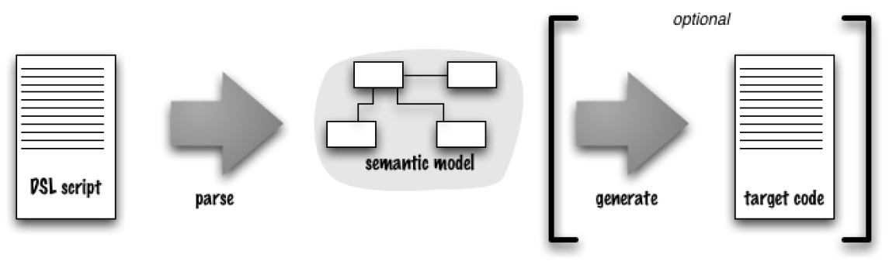

# DSL介绍

## *intro*

### DSL的定义

Domain Specific Language, DSL 领域特定语言是针对某一特定领域,具有受限表达性的一种计算机程序设计语言

* 计算机程序设计语言 computer programming language：人们用DSL指挥计算机去做一些事。同大多数现代程序设计语言一样，其结构设计成便于人们理解的样子，但它应该还是可以由计算机执行的语言
* 语言性 language nature：SL 是一种程序设计语言，因此它必须具备连贯的表达能力，不论是一个表达式还是多个表达式组合在一起
* 受限的表达性 limited expressiveness：通用程序设计语言 GPL 提供广泛的能力：支持各种数据、控制,以及抽象结构。这些能力很有用，但也会让语言难于学习和使用。DSL 只支持特定领域所需要特性的最小集。使用 DSL无法构建一个完整的系统（即非图灵完备），但相反却可以解决系统某一方面的问题
* 针对领域 domain focus：只有在一个明确的小领域下，这种能力有限的语言才会有用。这个领域才使得这种语言值得使用

### DSL的类型

* 外部DSL, external DSL：在主要程序设计语言之外，用一种单独的语言表示DSL。这种语言可能是一种全新的定制语法，或者是一门已经存在的语言，比如XML
* 内部DSL, internal DSL / 嵌入式DSL, embedded DSL：跟主要程序设计语言一样的通用程序设计语言。用内部DSL 写成的脚本是一段合法的程序，但是它具有特定的风格，而且只用到了语言的一部分特性，用于处理整个系统一个小方面的问题。用这种 DSL写出的程序有一种自定义语言的风格，与其所使用的宿主语言有所区别

代码生成风格

* first-pass code
* 确保生成代码绝对不需要手动修改

### 可视化

Language Workbench: Metaedit, DOT

[如何设计领域特定语言，实现终极业务抽象？-腾讯云开发者社区-腾讯云 (tencent.com)](https://cloud.tencent.com/developer/article/1833276)

