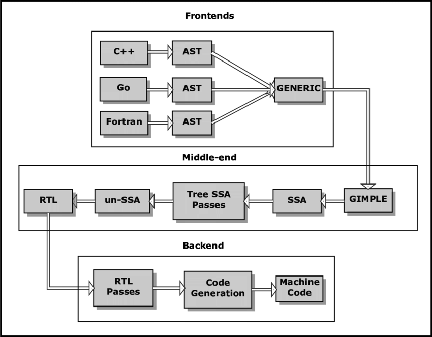

# Intro





### gcc vs. g++

gcc和g++的主要区别默认的编程语言和链接库

虽然gcc和g++都可以编译C和C++，但是gcc默认编译C，而g++则默认编译C++。g++会自动链接C++标准库，而gcc则不会

gcc和g++都有很多预定义的宏，但是数目和内容则不同。比如下面这些gcc的预定义宏

```C
#define __GXX_WEAK__ 1
#define __cplusplus 1
#define __DEPRECATED 1
```


-Wall参数，可以开启警告信息，显示所有的警告信息

# IR

## *GIMPLE*

GIMPLE Generic and GIMPLE Intermediate Language 是GCC使用的三地址码

## *RTL*

RTL, Register Transfer Language

# Optimization

### GCC 优化等级


1. **-O0**：没有优化。此等级生成最简单、最容易调试的代码，但性能通常较低。
2. **-O1**：启用基本的优化。这一级别启用一些简单的优化，如函数内联和一些代码移动。它可以提高性能，同时保留了较好的调试能力。
3. **-O2**：启用更多的优化。此等级会应用更多的代码转换，包括循环展开和更强大的优化。这通常会提高代码的性能，但会增加编译时间。
4. **-O3**：启用高级优化。它启用了大多数常用的优化，包括函数内联、循环展开、自动矢量化等。这可以显著提高生成的代码的性能，但仍然保留了对浮点精度和符号运算的一定程度的保守性。因此，它适用于大多数情况下，可以在不牺牲太多数值精度的情况下提高性能。
5. **-Ofast**：极高级别的优化。此等级启用了所有常见的优化，同时允许牺牲一些数值精度以提高性能。它适用于那些对数值精度要求不高的高性能应用。
6. **-Os**：优化代码大小。这一级别旨在减小生成的可执行文件的大小，而不是提高性能。它会删除一些不必要的代码和数据，适合于资源有限的环境。
7. **-Og**：适用于调试的优化。这一级别会进行一些优化，同时保留了较好的调试能力。它是为了在调试期间获得较好的性能和调试能力的平衡。
8. **-O**：默认优化等级。这一级别通常等同于 `-O1` 或 `-O2`，具体取决于编译器版本和配置。

一些参数的意义如下

* `-flto`

  在GCC编译器中，选项 `-flto` 表示 "Link Time Optimization"，即链接时优化。它是一种编译器优化技术，它将编译阶段的优化延伸到链接阶段，以进一步提高生成的可执行文件的性能。

  使用 `-flto` 选项，编译器将在编译时生成中间表示（IR），然后将这些中间表示保存在目标文件中。在链接时，编译器会再次优化这些中间表示，并生成最终的可执行文件。这使得编译器能够进行全局的优化，跨足够多的源文件，从而产生更高效的代码。

* `march=native`

  `march=native` 是GCC编译器的一个选项，用于优化生成的机器代码以最大限度地利用当前主机的CPU架构。这个选项告诉编译器使用当前主机的本机（native）CPU架构，以便生成特定于该CPU的指令集的代码。

  使用 `-march=native` 时，GCC会检测当前主机的CPU架构，并根据检测结果生成与该架构最兼容的机器代码。这可以提高程序的性能，因为生成的代码会更好地利用当前CPU的特性和指令集扩展。

  注意：使用 `-march=native` 选项可能会导致生成的代码在其他CPU架构上不兼容，因为它会针对当前主机的CPU进行优化。因此如果计划在多个不同CPU架构的计算机上运行相同的二进制程序，应谨慎使用这个选项。

  这个选项通常用于在特定主机上编译和运行程序，以获得最佳性能。**如果要生成可移植的代码，不建议使用 `-march=native`**，而应选择适当的目标架构标志，例如 **`-march=core2`**、**`-march=corei7`** 等。这将生成适用于特定CPU架构的代码，而不仅仅是当前主机的本机架构。


# 预定义宏

## *`__attribute__`*

### GCC 的 \_\_attribute\_\_ 属性说明符

[Function Attributes - Using the GNU Compiler Collection (GCC)](https://gcc.gnu.org/onlinedocs/gcc-5.3.0/gcc/Function-Attributes.html#Function-Attributes)

`__attribute__` 机制是 GNU C 编译器（如 GCC）提供的一种用于控制编译器行为和注释的机制。它允许程序员使用一些特殊的属性来**告诉编译器**如何处理变量、函数、结构等元素，或者对代码进行一些特殊的优化或警告。比如它们的对齐方式、是否进行内联展开、是否在链接时可见等

`__attribute__` 的格式为

```C
__attribute__ ((attribute-list))
```

 `__attribute__`可以设置函数属性 Function Attribute 、变量属性 Variable Attribute 和类型属性 Type Attribute

### `__attribute__` 的实现

`__attribute__` 机制是通过宏的多层封装实现的

### 函数属性

* `__attribute__((noreturn))`: 这个属性用于标记函数，表示该函数不会返回。这对于像 `exit()` 这样的函数很有用，因为它们在调用之后程序将终止，从不会返回

  ```c
  void my_exit() __attribute__((noreturn));
  ```

* `__attribute__((constructor))` 和 `__attribute__((destructor))`: 这些属性用于标记函数，指示它们应该在程序启动或结束时自动执行，通常用于初始化或清理工作

  ```c
  void my_init_function() __attribute__((constructor));
  void my_cleanup_function() __attribute__((destructor));
  ```

* `__attribute__((warn_unused_result))`: 这个属性用于标记函数，表示调用该函数的返回值应该被检查，以避免警告。

  ```c
  int get_value() __attribute__((warn_unused_result));
  ```

* `__attribute__((clean_up))` [黑魔法__attribute__((cleanup)) · sunnyxx的技术博客](https://blog.sunnyxx.com/2014/09/15/objc-attribute-cleanup/)

### 变量属性

### 类型属性

* `__attribute__((packed))`: 这个属性用于结构体，它告诉编译器要尽量减小结构体的内存占用，不要进行字节对齐

  ```c
  struct MyStruct {
      int a;
      char b;
  } __attribute__((packed));
  ```

* `__attribute__((unused))`: 这个属性可以用于变量或函数，它告诉编译器忽略未使用的警告

  ```c
  int unused_variable __attribute__((unused));
  ```

* `__attribute__((aligned(N)))`: 这个属性用于指定变量或结构体的对齐方式，其中 `N` 是对齐要求的字节数

  ```c
  int aligned_variable __attribute__((aligned(16)));
  ```

### 同时使用多个属性

可以在同一个函数声明里使用多个 `__attribute__`，并且实际应用中这种情况是十分常见的。使用方式上，可以选择两个单独的 `__attribute__`，或者把它们写在一起

```C++
/* 把类似printf的消息传递给stderr 并退出 */
extern void die(const char *format, ...)
   __attribute__((noreturn))
   __attribute__((format(printf, 1, 2)));

// 或者写成

extern void die(const char *format, ...)
   __attribute__((noreturn, format(printf, 1, 2)));
```

如果带有该属性的自定义函数追加到库的头文件里，那么所以调用该函数的程序都要做相应的检查

## *alias机制*

https://www.cnblogs.com/justinyo/archive/2013/03/12/2956438.html

定义在 `include/libc-symbols.h` 下面

`__attribute__((alias))` 用于创建一个符号别名，将一个变量、函数或符号关联到另一个符号上。这可以用于在编译期间将一个符号的名称关联到另一个名称，从而使它们在链接时被视为同一符号

```c
/* Define ALIASNAME as a strong alias for NAME.  */
# define strong_alias(name, aliasname) _strong_alias(name, aliasname)
# define _strong_alias(name, aliasname) \
  extern __typeof (name) aliasname __attribute__ ((alias (#name))) \
    __attribute_copy__ (name);

/* Define ALIASNAME as a weak alias for NAME.
   If weak aliases are not available, this defines a strong alias.  */
# define weak_alias(name, aliasname) _weak_alias (name, aliasname)
# define _weak_alias(name, aliasname) \
  extern __typeof (name) aliasname __attribute__ ((weak, alias (#name))) \
    __attribute_copy__ (name);
```

### 强别名 strong_alias

在大多数情况下，当在C或C++代码中定义一个函数或变量时，它默认具有强链接属性。这意味着如果多个不同的编译单元（比如不同的源文件）尝试定义同名的全局符号，链接器会报告错误，因为它不允许有多个相同名称的强符号存在

* 使用 `__attribute__((alias))` 属性创建强别名
* 强别名会将一个符号完全替代为另一个符号，它们在链接时被视为完全相同的符号，没有区别。强别名会完全替代原始符号，因此它们具有相同的可见性和强度
* 如果两个符号具有相同的名称，则 `strong_alias` 可以用于将它们显式地关联在一起

### 弱别名 weak_alias

与强符号不同，一个弱符号允许在程序中存在多个同名的定义。只要至少有一个是强定义，链接器就不会报错，而是选择强符号的定义来解析所有引用。如果所有的符号都是弱的，则链接器会从它们中选择任意一个

* 使用 `__attribute__((weak))` 属性创建弱别名
* 弱别名不会完全替代原始符号，而是在原始符号不存在时才会起作用
* 如果原始符号存在，弱别名将被忽略，原始符号将被使用。弱符号在库设计中非常有用，特别是当库希望提供一些可选的、可由用户覆盖的默认行为时。此外，弱符号也用于实现某些运行时功能，如动态链接的函数替换等
* 弱别名常用于提供一个**默认实现**，但允许用户覆盖它

```C
int myFunction() {
    // 实现
}

int __attribute__((weak)) myFunction() {
    // 默认实现
}
/*========================================*/
int original_myFunction() {
    // 实际实现
}

// 创建一个弱别名
extern int alias_myFunction() __attribute__((weak, alias("original_myFunction")));
```

## *Visibility*

`visibility`属性是GCC和Clang都支持的一个编译器属性，用于设置符号在共享库中的可见性级别。这个属性影响了如何处理函数、变量及类型定义对于动态链接器和运行时的可见性。主要目的是减少动态库的大小和提高动态加载的性能

### Visibility Levels

以下是一些常见的可见性选项：

- `default`: 这是系统默认的可见性。除非另外指定，所有对象都被赋予此可见性。它表示符号将被动态链接器看到，可以从其他模块（例如其他共享库或执行文件）被引用
- `hidden`: 此选项会隐藏符号，使其无法被其他模块直接引用。即使头文件被公开包含，并且相应的API被公开调用，如果该符号被标记为`hidden`，在其他模块中将不可见。这有助于避免名称空间的冲突，并可以减少动态符号的数量，降低动态链接的成本
- `protected`: 符号以受保护的方式被导出。这意味着符号对于外部模块不可见，但是对于定义它的模块内部的其他符号则是可见的。这种情况下的符号解析速度比默认可见性更快，因为它们不需要经过动态链接器来解析
- `internal`: 类似于`hidden`，但它仅适用于ELF格式的文件。这会使得符号不能被外部模块引用，同时也不能在所定义的模块内通过函数指针进行引用

### Example

```C
__attribute__((visibility("default"))) void myFunction() {
    // 函数实现
}

__attribute__((visibility("hidden"))) int hiddenVariable;

typedef struct __attribute__((visibility("hidden"))) {
    int internalField;
} HiddenStruct;
```

在上面的示例中，`myFunction` 被赋予了默认的可见性，所以它在其他模块中是可见的。而`hiddenVariable` 和 `HiddenStruct` 标记为 `hidden`，所以它们在模块外部是不可见的

### 注意事项

- 当使用`visibility`属性时，务必了解代码库和其他依赖关系之间的交互关系。错误地设置可见性可能会导致链接错误或运行时错误
- 如果正在创建库，考虑使用`visibility`属性来优化库的大小和性能
- `visibility`属性的使用将影响代码的移植性，因为它是特定于编译器和平台的。确保只在支持它的环境中使用它
- 在设置可见性时，请考虑应用程序的安全性，因为限制符号的可见性也可以作为防止符号被恶意代码利用的一种手段

## *其他预定义宏*

### _GNU_SOURCE

`_GNU_SOURCE` 是一个用于预处理的宏定义，它用于启用特定于GNU编译器（如GCC）和GNU C库（glibc）的扩展功能和特性。具体来说，当在程序中包含 `_GNU_SOURCE` 宏定义时，编译器和标准库会根据 GNU 扩展启用额外的功能和特性，这些功能和特性在标准C或C++中不一定可用

`_GNU_SOURCE` 宏通常用于以下情况：

* 启用 GNU C 库的扩展功能：通过定义 `_GNU_SOURCE`，可以启用 glibc 提供的一些额外的非标准函数和特性。例如，这可以包括特定于 GNU 的线程函数、内存分配函数等
* 启用 POSIX 标准扩展：一些 POSIX 扩展功能在标准C或C++中不是默认可用的。通过定义 `_GNU_SOURCE`，可以启用这些 POSIX 扩展，使它们在程序中可用
* 启用一些 GNU 编译器扩展：一些 GNU 编译器（如 GCC）提供了特定于编译器的扩展功能。通过定义 `_GNU_SOURCE`，可以启用这些扩展功能

需要注意的是，使用 `_GNU_SOURCE` 可能会使代码在不同编译器和平台上不具有可移植性，因为这些扩展功能不一定在所有编译器和标准库中都可用。因此，除非明确需要使用这些特定于 GNU 的特性，否则最好避免在通用的跨平台代码中使用 `_GNU_SOURCE`。如果要编写可移植的代码，建议仅依赖于标准C或C++功能，而不使用非标准或特定于编译器/库的扩展
