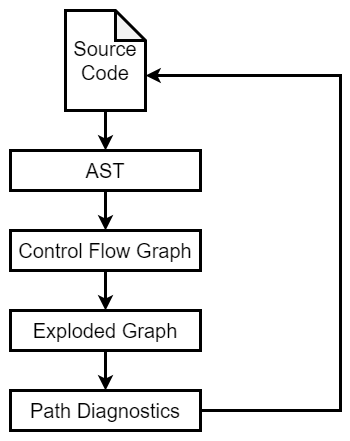

# LLVM IR/LLVM Assembly

[A Gentle Introduction to LLVM IR · mcyoung](https://mcyoung.xyz/2023/08/01/llvm-ir/)

[StormQ's Blog (csstormq.github.io)](https://csstormq.github.io/blog/LLVM 之 IR 篇（1）：零基础快速入门 LLVM IR)

LLVM 可以被认为是 Clang 的优化器和后端，这可以被认为是 “LLVM 语言” 或 “LLVM 汇编” 的编译器。Clang 和其他语言前端（如 Rust）本质上编译为 LLVM IR，然后 LLVM 将其编译为机器代码

LVM IR 是LLVM增强性、优化性和灵活性的核心所在。在编译过程中，源代码首先被转换成LLVM IR，然后经过各种优化和变换处理，最终生成目标平台的机器代码。LLVM的模块化和可扩展特性使得开发者可以很容易地实现新的优化、目标后端、新语言前端并通过共享的LLVM IR进行交互。这使得LLVM成为现代编译器构建的标准工具之一

## *LLVM IR 的格式*

LLVM IR 采用静态单赋值 SSA 的中间表示。它设计用于优化、分析和生成高度优化的机器码。LLVM IR有三种表现形式：内存中表示（In-memory）、二进制字节码（Bitcode）文件和人类可读的文本表示。下面主要介绍其文本表示格式，因为这是开发者最常接触到的形式

### LLVM IR 的核心结构

* 模块 Module
  - 模块是 LLVM IR 的顶层容器，包含全局变量、函数和符号表等定义
  - 通常是由一个源文件编译生成的
* 类型系统 Type System
  - 支持基本类型（如`i32`、`float`）、复合类型（如数组、结构体）、指针类型以及函数类型等
* 函数 Function：一个函数包含参数列表、返回类型和一系列基本块（Basic Blocks）
* 基本块 Basic Block
  - 基本块是一系列顺序执行的 LLVM 指令，以终止指令（如`br`或`ret`）结尾
  - 每个基本块都有一个唯一标识符（Label）
* 指令 Instructions
  - LLVM 指令以 SSA 形式组织，共享一个无限个寄存器的抽象
  - 常见指令包括`add`、`mul`、`load`、`store`、`phi`等


## *Type*

LLVM 的类型系统非常丰富，主要包括：

- **基本类型**：整数、浮点、指针、向量等
- **复合类型**：数组、结构体、函数等
- **特殊类型**：void、label、metadata 等

```llvm
; 定义一个结构体类型
%MyStruct = type { i32, [4 x i8], float* }

; 定义一个函数类型
%MyFunc = type i32 (i32, i32)

; 定义一个函数
define i32 @foo(i32 %a, i32 %b) {
  %sum = add i32 %a, %b
  ret i32 %sum
}

; 使用向量类型
%vec = <4 x i32> <i32 1, i32 2, i32 3, i32 4>
```

### 基本类型

基本类型 Primitive Types 是 LLVM 中最简单的类型，通常用于表示单个值

* 整数类型 Integer Type

  * 用于表示整数，位宽可以是任意正整数
  * 语法：`iN`，其中 `N` 是位宽

  ```llvm
  i32     ; 32 位整数
  i1      ; 1 位整数（通常用于布尔值）
  i64     ; 64 位整数
  ```

* 浮点类型 Floating-Point Type

  - 用于表示浮点数

  - 语法：`half`、`float`、`double` 等

  ```llvm
  half    ; 16 位浮点数
  float   ; 32 位浮点数
  double  ; 64 位浮点数
  ```

* 指针类型 Pointer Type

  - 用于表示内存地址

  - 语法：`T*`，其中 `T` 是任意类型

  ```llvm
  i32*    ; 指向 i32 类型的指针
  float*  ; 指向 float 类型的指针

* 向量类型 Vector Type

  - 用于表示固定长度的向量，通常用于 SIMD 操作

  - 语法：`<N x T>`，其中 `N` 是元素个数，`T` 是元素类型

    ```llvm
    <4 x i32>   ; 包含 4 个 i32 元素的向量
    <8 x float> ; 包含 8 个 float 元素的向量
    ```

### 复合类型

复合类型 Composite Types 是由其他类型组合而成的类型

* 数组类型Array Type

  - 用于表示固定长度的数组

  - 语法：`[N x T]`，其中 `N` 是数组长度，`T` 是元素类型

  ```llvm
  [10 x i32]  ; 包含 10 个 i32 元素的数组
  [5 x float] ; 包含 5 个 float 元素的数组
  ```

* 结构体类型 Struct Type

  - 用于表示一组不同类型的字段


  - 语法：`{T1, T2, ...}`，其中 `T1`、`T2` 等是字段类型

  ```llvm
  {i32, float}        ; 包含一个 i32 和一个 float 的结构体
  {i32, [4 x i8], i64} ; 包含一个 i32、一个 4 元素 i8 数组和一个 i64 的结构体
  ```

* 函数类型 Function Type

  - 用于表示函数的签名，包括参数类型和返回值类型

  - 语法：`ret_type (param1_type, param2_type, ...)`

  ```llvm
  i32 (i32, i32)      ; 接受两个 i32 参数并返回 i32 的函数
  void (float, float) ; 接受两个 float 参数并返回 void 的函数
  ```

### 特殊类型

特殊类型 Special Types 在 LLVM 中有特殊的用途

* Void 类型 Void Type

  用于表示没有值的情况，通常用于函数的返回值

  ```llvm
  void ; 无返回值
  ```

* 标签类型 Label Type

  用于表示基本块的标签

  ```llvm
  label ; 用于标记基本块
  ```

* 元类型 Metadata Type

  用于表示附加的元数据，通常用于调试或优化

  ```llvm
  metadata ; 元数据
  ```

### 其他类型

* 不透明类型 Opaque Type

  用于表示尚未定义的类型

  ```
  opaque ; 不透明类型
  ```

* 函数指针类型 Function Pointer Type

  - 用于表示指向函数的指针

  - 语法：`ret_type (param1_type, param2_type, ...)*`

    ```
    i32 (i32, i32)* ; 指向一个接受两个 i32 参数并返回 i32 的函数的指针
    ```


## *寄存器命名*

将 %-prefixed 的名称称为 register（LLVM IR 是基于 SSA 的，所以有无限个虚拟寄存器可以使用）

### 寄存器的数字命名规则

在 LLVM IR 中，寄存器（或临时值）可以使用数字名称，例如 `%0`、`%1`、`%2` 等。这些寄存器必须按顺序定义：

- 必须先定义 `%0`，然后才能定义 `%1`，接着是 `%2`，依此类推
- 这些数字命名的寄存器通常用于表示“临时结果”，即在计算过程中生成的中间值

### 隐式命名规则

LLVM IR 中有一些隐式命名规则，可能会导致数字命名的冲突：

- **函数参数的隐式命名**：如果函数的参数没有显式命名，LLVM 会自动为它们分配数字名称，从 `%0` 开始。例如：

  ```llvm
  define void @foo(i32, i32) {
    ; 参数会被隐式命名为 %0 和 %1
  }
  ```
  
  这里的两个参数会被隐式命名为 `%0` 和 `%1`
  
- **基本块的隐式命名**：如果函数的基本块 BB （即函数体）没有显式命名，LLVM 会自动为它们分配数字名称，从下一个可用的数字开始。例如：

  ```llvm
  define void @foo(i32, i32) {
    ; 第一个基本块会被隐式命名为 %2
    %2 = add i32 %0, %1
  }
  ```
  
  这里的第一个基本块会被隐式命名为 `%2`

### 命名冲突的问题

由于隐式命名的存在，可能会导致数字命名的冲突。例如：

```llvm
define void @foo(i32, i32) {
  ; 参数被隐式命名为 %0 和 %1
  %2 = add i32 %0, %1  ; 这里试图定义 %2
}
```

在这段代码中：

- 参数已经被隐式命名为 `%0` 和 `%1`
- 第一个基本块会被隐式命名为 `%2`
- 当尝试显式定义 `%2` 时，LLVM 会报错，因为 `%2` 已经被基本块的名称占用了

这种冲突会导致非常令人困惑的错误，因为开发者可能没有意识到隐式命名的存在


### 如何避免冲突

为了避免这种问题，可以采取以下措施：

- **显式命名参数**：为函数的参数显式命名，避免隐式命名占用数字

  ```llvm
  define void @foo(i32 %a, i32 %b) {
    ; 参数被显式命名为 %a 和 %b
    %sum = add i32 %a, %b  ; 可以使用 %sum 作为临时寄存器
  }
  ```
  
- **显式命名基本块**：为基本块显式命名，避免隐式命名占用数字

  ```llvm
  define void @foo(i32 %a, i32 %b) {
  entry:
    %sum = add i32 %a, %b
  }
  ```
  
- **避免过度依赖数字命名**：尽量使用有意义的名称来命名寄存器和基本块，而不是依赖数字命名


## *IR的数据结构*

[看看 LLVM 的码（一）基础数据结构、IR (glass-panel.info)](https://blog.glass-panel.info/post/read-llvm-code-1/)

[LLVM笔记(16) - IR基础详解(一) underlying class - Five100Miles - 博客园 (cnblogs.com)](https://www.cnblogs.com/Five100Miles/p/14083814.html)

## *bitcode*

[LLVM Bitcode File Format — LLVM 19.0.0git documentation](https://llvm.org/docs/BitCodeFormat.html)

[blog/articles/llvm/2020_11_23_bc.md at main · zxh0/blog (github.com)](https://github.com/zxh0/blog/blob/main/articles/llvm/2020_11_23_bc.md)

bitcode 是 LLVM IR 的二进制形式

```cmd
$ clang -emit-llvm -c test.cc -o test.bc
$ file test.bc
test.bc: LLVM IR bitcode
```

### `-fembed-bitcode`

`-fembed-bitcode` 是 Clang 编译器的一个选项，它用于生成包含 LLVM bitcode 的二进制文件。当你在编译阶段使用这个选项时，编译器会在生成的目标文件（通常是 `.o` 文件）中嵌入一个 LLVM bitcode 的副本。这样，目标文件既包含了原生的机器码，也包含了可以进行进一步优化的 LLVM bitcode。

这个特性主要有两个应用场景：

1. **App Store 提交**：对于 iOS 和 macOS 应用开发者来说，当向 App Store 提交应用程序时，苹果公司要求所有的代码都包含 bitcode。这使得苹果可以重新优化应用程序而无需开发者提交新的二进制版本。例如，如果苹果发布了一个新的处理器或为现有的处理器引入了新的优化技术，他们可以自己对已经上传的 bitcode 进行重编译和优化，以便利用这些新特性
2. **后期优化和分析**：在其他环境，嵌入 bitcode 使得开发者能够在不访问源代码的情况下对程序进行后期的优化和分析。这可以用于产品支持、性能优化、安全分析等方面

还有几个相关的选项：

- `-fembed-bitcode-marker`：这个选项会在目标文件中插入一个占位符，代表 bitcode，但实际上并不包含真正的 bitcode 数据。这对确保工具链在其余部分支持 bitcode，但不需要完整的 bitcode 数据时非常有用。
- `-fembed-bitcode=all`：确保所有生成的文件（包括链接后的最终二进制文件）都包含 bitcode。

应当注意的是，嵌入 bitcode 会增加生成的二进制文件的大小，因为它既包含了可直接运行的机器码，也包含了用于可能的未来优化的 bitcode

# 代码优化 Pass

LLVM 中优化工作是通过一个个的 Pass（遍）来实现的，它支持三种类型的 Pass

1. 分析型 pass（Analysis Passes），只是做分析，产生一些分析结果用于后序操作
2. 做代码转换的 pass（Transform Passes），比如做公共子表达式删除
3. 工具型的 pass，比如对模块做正确性验证


# Clang Static Analyzer

[Clang Static Analyzer — Clang 19.0.0git documentation (llvm.org)](https://clang.llvm.org/docs/ClangStaticAnalyzer.html)

Clang Static Analyzer，下面简称CSA，是LLVM提供的静态分析工具

[Clang Static Analyzer 介绍 | jywhy6's blog](https://blog.jywhy6.zone/2021/05/31/clang-static-analyzer-intro/)

CSA 是基于libclang实现的


整个 clang static analyzer 的入口是 AnalysisConsumer，接着会调 HandleTranslationUnit() 方法进行 AST 层级进行分析或者进行 path-sensitive 分析。默认会按照 inline 的 path-sensitive 分析，构建 CallGraph，从顶层 caller 按照调用的关系来分析，具体是使用的 WorkList 算法，从 EntryBlock 开始一步步的模拟，这个过程叫做 intra-procedural analysis（IPA）。这个模拟过程还需要对内存进行模拟，clang static analyzer 的内存模型是基于《A Memory Model for Static Analysis of C Programs》这篇论文而来，pdf地址：http://lcs.ios.ac.cn/~xuzb/canalyze/memmodel.pdf 在clang里的具体实现代码可以查看这两个文件 [MemRegion.h](https://code.woboq.org/llvm/clang/include/clang/StaticAnalyzer/Core/PathSensitive/MemRegion.h.html)和 [RegionStore.cpp](https://code.woboq.org/llvm/clang/lib/StaticAnalyzer/Core/RegionStore.cpp.html) 。

## *内存模型*


## *Exploded Graph*

### CSA流程



1. CSA以源代码为起点，将源代码转换为AST
2. 将AST转换为控制流图 CFG
3. 随着程序的模拟执行，Clang 的符号执行引擎会生成 Exploded Graph 扩展图，详细记录程序的执行位置和程序当前状态信息
4. 最后，在各个 Checker（CSA中可自定义的漏洞检查器）回调函数检测到漏洞产生时，将基于 Exploded Graph 中的数据生成带漏洞触发路径的漏洞报告

### Exploded Graph

[clang static analyzer源码分析（一）_clang源码分析-CSDN博客](https://blog.csdn.net/dashuniuniu/article/details/50773316)

[clang static analyzer源码分析（二）_clang源码分析-CSDN博客](https://blog.csdn.net/dashuniuniu/article/details/52434781)

### CSA的符号执行

## *Checker*

以alpha开头的checker是实验版本

- DeadStores: 检测未被使用的存储，即赋值给变量但随后未使用的值。
- MallocChecker: 检测与动态内存分配相关的问题，包括内存泄漏、双重释放等。
- NullDereference: 检测潜在的空指针解引用。
- DivideZero: 检测可能导致除零错误的情况。
- UninitializedObject: 检测可能未初始化的对象使用

## *自定义Checker*

[Checker Developer Manual (llvm.org)](https://clang-analyzer.llvm.org/checker_dev_manual.html)

# JIT Compiler

JIT Compiler（Just-In-Time Compiler）即时编译器，**它在运行时（即程序执行期间）将程序的源代码或字节码动态地编译成机器码，然后立即执行**。这与传统的AOT（Ahead-Of-Time Compilation）编译方式不同，后者在程序运行前就已经将源代码完全编译成机器码。

JIT编译器的优势在于能够结合解释执行和静态编译的好处：它可以在运行时进行优化，根据程序的实际执行情况来生成更高效的机器码。同时，由于JIT编译器只编译程序中实际要执行的部分，因此可以减少初次启动时间，并避免编译那些在运行过程中从未使用到的代码。

Java虚拟机（JVM）是使用JIT编译技术的一个著名例子。在JVM中，Java程序首先被编译成平台无关的字节码，随后在运行时，JIT编译器会将热点代码（经常执行的代码）编译成针对具体硬件平台优化的机器码，以提升性能。

[其他支持JIT编译的语言和运行环境包括.NET](http://xn--jit-5q9d13js0cgyd9wllkz2fa19u3w4ciyhuj5aw42ajyf2ripoa232d.net/) Framework的CLR（Common Language Runtime），JavaScript的各种现代引擎（如V8引擎）等。通过JIT编译，这些环境能够提供既快速又灵活的执行策略。

# LLVM Backend

## *指令选择*

## *寄存器分配*

## *指令调度*

## *代码生成*

# LLVM的汇编器 & 链接器

## *llvm-as*

## *LLD - The LLVM Linker*

[LLD - The LLVM Linker — lld 19.0.0git documentation](https://lld.llvm.org/)

### 使用LLD

```cmd
$ lld
lld is a generic driver.
Invoke ld.lld (Unix), ld64.lld (macOS), lld-link (Windows), wasm-ld (WebAssembly) instead
```

链接器通常由编译器驱动来调用，所以一般不需要直接使用这个命令

lld命令是一个generic driver，也就是会根据平台的不同调用不同形式的lld，LLD在UNIX上被安装为ld.lld

```cmd
$ ld.lld --version
LLD 19.0.0 (compatible with GNU linkers)
```

编译的时候默认会使用ld，有几种方法可以告诉编译器驱动使用ld.lld而不是默认的ld

* 最简单的方法是创建一个软链接覆盖默认链接器。来创建一个符号链接，这样 `/usr/bin/ld` 就会解析到LLD

  ```cmd
  $ ln -s /path/to/ld.lld /usr/bin/ld
  ```

* 如果不想更改系统设置，可以使用clang的 `-fuse-ld` 选项。这样做时，需要在构建程序时将 `-fuse-ld=lld` 设置为LDFLAGS

  ```cmd
  $ clang++ -std=c++20 -stdlib=libc++ -fuse-ld=lld test_format.cpp 
  ```

LLD会将其名称和版本号留在输出文件的.comment节中。如果不确定是否成功地使用了LLD，运行 `readelf --string-dump .comment <output-file>` 并检查输出。如果输出中包含了字符串 `Linker: LLD`，那么就是正在使用LLD

```cmd
$ readelf --string-dump .comment a.out

String dump of section '.comment':
  [     0]  Linker: LLD 19.0.0
  [    14]  GCC: (Ubuntu 11.4.0-1ubuntu1~22.04) 11.4.0
  [    3f]  clang version 19.0.0git (git@github.com:llvm/llvm-project.git 348240362f9673c824c0ad22fd9e13ae3f937864)
```

### LLD的一些历史

以下是ELF和COFF端口项目历史的简要介绍。

2015年5月：我们决定重写COFF链接器，并已完成。注意到新链接器比MSVC链接器快得多。

2015年7月：基于COFF链接器架构开发了新的ELF端口。

2015年9月：首批支持MIPS和AArch64的补丁发布。

2015年10月：成功地自托管了ELF端口。我们注意到链接器比GNU链接器快，但当时我们并不确定，随着我们向链接器添加更多特性，能否保持这个优势。

2016年7月：开始致力于提高链接脚本支持。

2016年12月：成功构建了包括内核在内的整个FreeBSD基础系统。我们已经扩大了与GNU链接器的性能差距


# LLVM 中的数据结构

[LLVM Programmer’s Manual — LLVM 20.0.0git documentation](https://llvm.org/docs/ProgrammersManual.html#picking-the-right-data-structure-for-a-task)

## *LLVM String*

### StringRef

llvm-project/llvm/include/llvm/ADT/StringRef.h

StringRef 用于提供对字符串（通常是字符数组）的 **const 引用**。与标准库中的 `std::string` 类相比，StringRef 不会复制字符串数据，它只是引用已经存在的字符串。这使得 StringRef 能够在不涉及内存分配和复制的情况下高效地操作字符串

实际上 StringRef 和 C++17 引入的 `std::string_view` 的设计思路是一样的，但 StringRef 在 C++17 标准引入 `std::string_view` 之前就已经存在了。LLVM 需要一种轻量级的方式来传递和检查字符串而无需复制底层数据，所以 StringRef 是 LLVM 内部为满足这个需求而创建的

StringRef 的典型用法示例：

```C++
#include "llvm/ADT/StringRef.h"
#include <iostream>

using namespace llvm;

int main() {
    const char *cstr = "Hello, world!";
    StringRef strRef(cstr);

    // 使用 StringRef 进行子串操作
    StringRef hello = strRef.substr(0, 5); // 截取前5个字符
    bool startsWithHello = strRef.startswith("Hello"); // 检查是否以 Hello 开头

    std::cout << "Substring: " << hello.str() << "\n";
    std::cout << "Starts with 'Hello': " << (startsWithHello ? "Yes" : "No") << "\n";

    // 遍历 StringRef 中的每个字符
    for (char c : strRef) {
        // ...
    }

    return 0;
}
```

在这个例子中，我们创建了一个 StringRef 来引用一个 C 风格字符串，并展示了如何使用其中的一些方法

使用 StringRef 的时候要谨慎 ，因为它的设计意图主要是用作临时对象，在函数调用过程中传递字符串，而不是长期存储字符串数据。所以使用 StringRef 时，需要小心保证它引用的字符串在 StringRef 被使用的整个时间里都是有效的

### Twine

C++ 中对 string 的拼接等操作一直是个痛点，LLVM 提供了 Twine 来优化。Twine 是一个用于高效地进行字符串连接和操作的实用工具类，**它的底层是 rope**

下面是关于 Twine 的一些关键特性：

1. **延迟求值 lazy evaluation**：Twine 会保留对所涉及的各个字符串片段的引用，只在最终需要时（例如输出到流或转换为 `std::string` 时）才进行实际的字符串拼接
2. **非拥有性质**：类似于 StringRef，Twine 不拥有其引用的字符串数据，因此它应该只用作临时对象，在创建后尽快用于字符串操作，以确保引用的数据在使用时仍然有效
3. **不修改原始字符串**：Twine 只是引用原始字符串，并不修改它们。所有的拼接和组合操作都是在**最终转换为另一个字符串**表示时发生的
4. **不用于长期存储**：由于其非拥有的特性和对原始数据的引用，Twine 并不适合用于长期存储字符串数据
5. **与其他 LLVM 数据结构相互作用**：Twine 能够处理 LLVM 的 StringRef、基本 C 字符串 (`const char*`) 以及 C++ 标准库的 `std::string` 对象

Twine 最常见的使用场景是构建错误消息或其他复杂的字符串，特别是在性能敏感的上下文中，因为它可以避免许多小型的临时字符串分配和复制

Twine 的使用示例：

```C++
#include "llvm/ADT/Twine.h"
#include "llvm/ADT/StringRef.h"
#include <iostream>

using namespace llvm;

int main() {
    StringRef part1 = "Hello, ";
    std::string part2 = "world";
    const char *part3 = "!";

    // 创建 Twine 实例表示整个字符串，但没有立即执行连接。
    Twine fullMessage = Twine(part1) + part2 + part3;

    // 现在我们需要实际的字符串表示，这会构造一个新的 std::string 对象。
    std::string finalString = fullMessage.str();

    std::cout << finalString << std::endl; // 输出: Hello, world!

    return 0;
}
```

在上述代码中，我们创建了几个不同类型的字符串片段，并使用 `Twine` 将它们连接成一个完整的信息。请注意，只有在调用 `.str()` 方法时，`Twine` 才会生成一个新的 `std::string` 对象。在此之前，所有的操作都没有产生临时字符串对象或执行任何连接操作

### SmallString

SmallString 是 SmallVector 的派生类，它补充了很多 string API

### Formatting

## *Sequential Containers*

### ArrayRef

ArrayRef 用于提供对数组的轻量级、不拥有所有权的引用。它是为了在不需要控制底层数组生命周期的情况下方便地传递和使用数组数据

ArrayRef 提供了与 C++20 中 `std::span` 类似的功能，但 ArrayRef 更早提供并专门用于 LLVM 项目中

### SmallVector

`llvm::SmallVector` 是一个针对小数组进行优化的结构。优化为当数组元素较少时不执行堆分配（不进行 malloc），只在栈上分配。若添加的元素数量超过了使用自动存储分配的元素数量，它将转回 `std::vector` 的行为并分配越来越大的数组。当明确始终拥有少量元素时，`llvm::SmallVector` 可以带来性能优势

### PagedVector

- **非连续存储**：与 `std::vector` 等容器使用单一连续内存块不同，PagedVector 在多个小块内存中存储数据，每块称为一页
- **动态扩展**：当现有的页面填满时，PagedVector 会自动添加新页面来存储更多数据
- **高效追加**：由于采用了分页方式，向 PagedVector 追加新元素通常不需要重新分配和复制整个数据集合，从而提高了效率
- **缓解内存碎片**：分页存储可以减少大型数据导致的内存碎片问题，因为它允许使用较小的、更易管理的内存块

### PackedVector

PackedVector 是一个模板类，用于将多个值紧密地打包到一块连续的内存。这个容器对于存储大量的小尺寸元素（比如布尔值或者小整数）特别有用，因为它可以减少因内存对齐和额外的空间开销带来的浪费

### ilist_node

和 Linux 内核中的双向链表一样，LLVM 中实现的是侵入式的双向链表，ilist_node 则是它的基础节点。如 `ClassA : public ilist_node<ClassA, Tag1>` 这种类声明，即在 `ClassA` 内部放置了对应 Tag1 的双向链表指针，使用 `simple_ilist<ClassA, Tag1> list` 即可往 `list` 中插入 `ClassA` 对象，当一个对象需要插入至不同链表中时，多重继承不同的 Tag 的 `ilist_node` 模板，同上链表也使用对应的 Tag。需要**注意**元素对象的**生命周期**问题，`simple_ilist` 不负责管理容器中元素的生命周期，要实现比较复杂的生命周期管理需要在链表插入/删除元素等操作时使用 `iplist_impl` 包装类指定回调函数来实现

### Sentinels

对于熟悉STL的程序员而言，Sentinel 哨兵位的概念再熟悉不过了，它用来帮助在容器的头尾实现标准的迭代器行为

迭代器标准行为的约束为 ilist 如何分配和存储哨兵位提供了一些实现自由度。相应的策略由 `ilist_traits<T>` 决定。默认情况下，每当需要哨兵时，就会在堆上分配一个 T 类型的对象

尽管默认策略在大多数情况下是足够的，但当 T 没有提供默认构造函数时，可能会出现问题。此外，在许多 ilist 实例的情况下，与哨兵位关联的内存开销是浪费的。为了缓解众多且体积庞大的 T-哨兵的情况，有时会采用一种技巧，导致出现 ghostly sentinels

ghostly sentinels 是通过特别设计的 `ilist_traits<T>` 获得的，它们在内存中与 ilist 实例重叠。使用指针运算来获取相对于 ilist 的 this 指针的哨兵。ilist 增加了一个额外的指针，作为哨兵位的反向链接。这是唯一可以合法访问的ghostly sentinels字段

## *Set-like Containers*

* SmallSet：和 SmallVector、SmallString 一样，适用于元素数量较少的情况。当集合小于某个阈值时，它在栈上分配空间，否则会转为用 `std::set` 存储元素
* SmallPtrSet：高度定制化的专门用于存储指针的 set
* StringSet：特化的 `StringMap<char>`，用于存储字符串。其内部使用哈希集合进行存储，优化了字符串的唯一性检查和存储
* DenseSet：基于密集哈希表实现的集合类，适用于存储大量元素。它提供了快速的插入、查找和删除操作
* SparseSet：用稀疏数组表示的集合，特别适合于当元素是小整数且分布不均匀时。它可以高效地进行元素插入和存在性检查
* SparseMultiSet：SparseSet 的变体，允许存储多个重复元素。它维护了元素计数来支持多个相同元素的存在
* FoldingSet：一个去重的容器，它使用自定义的散列和相等性算法来存储节点。FoldingSet 非常适合存储大量可能存在高度相似或重复数据的情况
* SetVector：结合 `std::set` 和 `std::vector` 的特点，即保证了元素的唯一性，又保留了插入顺序。它在内部同时维护一个向量和一个集合
* UniqueVector：类似于 SetVector，它保证了元素的唯一性并且为每个元素提供了一个唯一的索引。如果尝试插入一个已经存在的元素，它将返回该元素的索引而不是添加新元素
* ImmutableSet：一个不可变的集合类，意味着一旦创建就不能改变。它常用于函数式编程风格，以及在需要保证数据不被更改的上下文中

## ***Map-like Containers***

* StringMap

  StringMap 使用字符串作为键。它通常比标准库中的 `std::map<std::string, ValueType>` 或 `std::unordered_map<std::string, ValueType>` 提供更好的性能，特别是对于编译器这样频繁进行字符串操作的应用场景。字符串键存储在 StringMap 中，并且通常与 StringMapEntry 结合使用，后者保存了键和值

  StringMap 的效率之一来源于它对键的内存管理方式：它将键存储在与值相邻的内存中，以减少指针跳转并提升缓存一致性

* IndexdMap

  IndexedMap 是一个数组风格的映射，通过整数索引访问元素。它提供快速的随机访问性能，其行为类似于直接使用一个数组或 `std::vector`，但是具有额外的功能，如按需自动调整大小

  此数据结构非常适用于情况是有密集的整数键集合，并且需要一个数组的性能而不是一般映射的开销

* ValueMap

  ValueMap 可以持有 LLVM IR 中的值（例如指令、全局变量等）作为键。这个数据结构通过增加一些针对 LLVM 值系统定制的附加逻辑来处理键的内部表示形式和生命周期问题。这意味着当使用 LLVM IR 中的值作为键时，`ValueMap` 可以确保在值被改变或删除时映射也会更新

  `ValueMap` 在做数据流分析或者其他 IR 级别的转换时非常有用，因为经常需要将值映射到某些分析结果或者新创建的值上

  ```C++
  llvm::ValueMap<llvm::Value*, int> Map;
  llvm::Value* Val; // 假设 Val 已初始化为有效的 LLVM IR Value
  Map[Val] = 42;
  ```

* MapVector 结合了 map 快速查找和 vector 保持插入顺序的特性。值是保存在 SmallVector 里的，键是通过 DenseMap 实现的，通过 key 来快速索引 SmallVector

### DenseMap

[llvm中的数据结构及内存分配策略 - DenseMap_llvm::densemap-CSDN博客](https://blog.csdn.net/dashuniuniu/article/details/80043852)

DenseMap 的实现是一个基于 quadratic probing 二次探测的散列表，键值对本身是 `std::pair<KeyT, ValueT>`

`DenseMap<>` 的构造函数和赋值运算符的定义如下

```C++
// llvm-project/llvm/include/llvm/ADT/DenseMap.h
template <typename KeyT, typename ValueT,
          typename KeyInfoT = DenseMapInfo<KeyT>,
          typename BucketT = llvm::detail::DenseMapPair<KeyT, ValueT>>
class DenseMap : public DenseMapBase<DenseMap<KeyT, ValueT, KeyInfoT, BucketT>,
                                     KeyT, ValueT, KeyInfoT, BucketT> {
  friend class DenseMapBase<DenseMap, KeyT, ValueT, KeyInfoT, BucketT>;

  // Lift some types from the dependent base class into this class for
  // simplicity of referring to them.
  using BaseT = DenseMapBase<DenseMap, KeyT, ValueT, KeyInfoT, BucketT>;

  BucketT *Buckets;
  unsigned NumEntries;
  unsigned NumTombstones;
  unsigned NumBuckets;

public:
  /// Create a DenseMap with an optional \p InitialReserve that guarantee that
  /// this number of elements can be inserted in the map without grow()
  explicit DenseMap(unsigned InitialReserve = 0) { init(InitialReserve); }

  DenseMap(const DenseMap &other) : BaseT() {
    init(0);
    copyFrom(other);
  }

  DenseMap(DenseMap &&other) : BaseT() {
    init(0);
    swap(other);
  }

  template<typename InputIt>
  DenseMap(const InputIt &I, const InputIt &E) {
    init(std::distance(I, E));
    this->insert(I, E);
  }

  DenseMap(std::initializer_list<typename BaseT::value_type> Vals) {
    init(Vals.size());
    this->insert(Vals.begin(), Vals.end());
  }
  // ...
};
```

`DenseMap<>` 有四个数据成员

* Buckets 散列桶的首地址（一块连续的内存）
* NumEntries 存储的数据个数
* NumTombstones Tombstone个数（二次探测法删除数据时需要设置deleted标识）
* NumBuckets 桶的个数

## *Bit Storage Containers*


## *Pointer*

### 引用计数器

* RefCountedBase

  一个CRTP模板，引用增加会调用 `Retain()`，而引用减少则调用 `Release()`

  * ThreadSafeRefCountedBase

* IntrusiveRefCntPtr

  侵入式引用计数是一种内存管理技术，其中对象自身负责跟踪有多少个指针引用了它。这与非侵入式引用计数（如 C++ 中的 `std::shared_ptr`）相对，后者通常在控制块中维护引用计数

  侵入式引用计数要求每个想要被引用计数管理的对象内部都有一个引用计数器，通常是一个整数类型的成员变量。当创建一个新的指向对象的指针时，该对象的引用计数会增加。当指针销毁或改变指向时，相应对象的引用计数减少。一旦某个对象的引用计数归零，意味着没有任何指针再指向它，那么这个对象就可以被销毁

  IntrusiveRefCntPtr 用于持有一个指向继承自 RefCountedBase 的对象的指针

### TinyPtrVector

一个高度定制化的模板类容器，专门用来存放指针，它有三个特点

* 当容器中存放了 0 个或 1 个值的时候，避免进行 heap allocation
* 只能存放指针类型
* 不能存放 nullptr

### PointerIntPair

PointerIntPair 允许在一个指针的存储空间内同时存储一个指针和一个小整数。这通过对指针和整数进行位操作实现，能够在不增加额外存储开销的情况下保存这两种信息

在32或64位架构中，由于指针的对齐要求，指针的低位通常是未使用的（例如，可能是4字节或8字节对齐），因此可以将整数值编码到指针值的低位来利用这些位。这样的编码和解码过程需要依赖特定平台和对象类型的对齐规则

`PointerIntPair` 的设计考虑了以下特点：

1. **空间效率**：通常情况下，它使用单个指针大小的存储空间来存储一个指针和一个小整数
2. **整数位数限制**：能够存储的整数位数受限于可用的未使用低位数。比如在一个系统上，可能只能存储3位的整数
3. **高位存储整数值**：`PointerIntPair` 总是尝试使用高位来存储整数值。即使只有一个比特位被用于布尔值，也会使用最高的那个可用位，而不是最低的位。这样做的目的是留出空间供其他可能的用途，比如进一步地嵌套 `PointerIntPair`

```C++
PointerIntPair<void*, 1, bool>
```

在这个例子中，可能会把布尔值存储在指针的第二位，而不是第零位，这使得指针的低两位可用于其他目的

如果我们嵌套使用 `PointerIntPair`：

```C++
PointerIntPair<PointerIntPair<void*, 1, bool>, 1, bool>
```

这个结构就能够存储两个独立的布尔值，并且每个布尔值占用不同的位

这种数据结构在性能关键的应用程序中非常有用，尤其是在需要压缩数据表示以减少内存占用和提高缓存利用率的场合。然而，它的使用需要对底层平台的内存对齐和整数编码有较深的理解，以确保正确地进行位操作

### PointerUnion

# 其他 LLVM 工具

## *LLDB*

LLDB 的使用可以看 *IDE与调试工具.md*

## *TableGen*

[Tablegen Language Tutorial - TinyEdi](https://www.tinyedi.com/tablegen-language-tutorial/)

[TableGen Overview — LLVM 19.0.0git documentation](https://llvm.org/docs/TableGen/index.html)

[1 TableGen Programmer’s Reference — LLVM 20.0.0git documentation](https://llvm.org/docs/TableGen/ProgRef.html)

TableGen 是 LLVM 项目用来定义和生成各种数据结构（或者更专业的说就是特定领域的信息记录 records of domain-specific information）的一种工具。它说白了就是把不变的内容抽成一个模板（即 Python + Jinja 的形式），然后在 `.td` 文件中给出那些变化的内容，从而避免了直接写很长的 C++ 代码，而是直接用 TableGen 工具直接生成它们

这些 `.td` 文件通常包含着描述编译器组件如指令集架构、寄存器信息、指令选择规则等重要信息的声明

1. 应当把 TableGen DSL 视为一种 C++ 语言的变体，尽管能看到 `def` 这样的 Python 关键词
2. `.td` 文件仅仅用于记录，不要把后端的功能和前端的实体绑定起来，不同的后端可能对同样的数据有非常不同的解释
3. 虽然 TableGen 声称自己是一种声明式语言，但是仅有涉及 **field 之间** 的交叉引用时，才是按照依赖顺序处理的，其他场合都可以认为代码是顺序执行的

> `.td` 这个后缀意思是 "target (machine) description"，这对于 `llvm-tblgen` 是非常有意义的，但对其他后端则显得不太合理，我想这也是一个历史问题，否则可能叫 `.tg` 似乎更加合理

**TableGen 本质是一个 parser，用 llvm-tblgen 命令将输入的 `.td` 文件转化为特定的数据结构后再输出为易于阅读的 cpp 代码**（一般是一个 `.h.inc` 文件）

- `.inc` 文件通常包含由 `tablegen` 自动生成的代码片段，例如：
  - 查找表（lookup tables）
  - 枚举值（enums）
  - 常量定义（constants）
  - 初始化数据（initialization data）
- `.inc` 文件就是一个 C/C++ 文件，这些内容通过 `#inclue` 会被直接嵌入到 C/C++ 代码中

### TableGen 后端

[TableGen BackEnds — LLVM 20.0.0git documentation](https://llvm.org/docs/TableGen/BackEnds.html#introduction)

TableGen 也分为前后端，TableGen 后端决定了 `.td` 文件如何被 parse 并生成有意义的前端高级语言文件

后端分别被 LLVM、Clang、LLDB 和 MLIR 使用

- LLVM
  - 生成寄存器描述：TableGen可用于定义处理器的寄存器类、寄存器别名以及其他与寄存器相关的属性
  - 指令编码解码：可以定义指令的二进制编码格式，并由此生成编码和解码指令所需的代码
  - 指令选择规则：后端编译器的负责将中间表示转换为目标机器代码的指令选择阶段可以通过`.td`文件中的模式来定义
  - 调度信息：给出CPU的管线模型和指令的延迟，调度算法需要此信息来进行指令重排序以提高性能
- Clang 生成诊断信息
- MLIR：Operation、OpTrait、Pass、Dialect 等都可以通过 TableGen 来快速生成
- LLDB

### 数据类型

- bit：表示布尔类型，可取值为 0 或 1
- int：表示 64 位整数。比如：1、-2
- string：表示任意长度的字符串
- code：表示一段代码片段
- dag：表示可嵌套的有向无环图（Directed Acyclic Graph, DAG）。DAG 的节点由一个运算符、零个或多个参数（或操作数）组成。节点中的运算符必须是一个实例化的记录。DAG 的大小等于参数的数量
- `bits<n>`：表示大小为 `n` 的比特数组（数组中的每个元素占用一个比特）。**注意：** 比特数组中索引为 0 的元素位于最右侧。比如：`bits<2> val = { 1, 0 }`，表示十进制整数 2
- `list<type>`：表示元素数据类型为 `type` 的列表。列表元素的下标从 0 开始，用 `[]` 给出元素
- `ClassID`：表示抽象记录的名称

### 定义 class & record

[StormQ's Blog (csstormq.github.io)](https://csstormq.github.io/blog/LLVM 之后端篇（1）：零基础快速入门 TableGen)

- class：类似于 C++ 中的类，用于定义一组字段和它们默认值的集合

  可选带有一个 `<>` 包围的**模板参数列表**，可选带有一个**基类列表**，也可选带有一个 `{//stmts}` 型的 **init-body**

  * 基类列表：基类列表用于进行继承，且 tablegen 允许多继承，在实例化过程中，基类的 init-body 会先于子类执行
  * 模板参数列表：每个 class 的模板参数中会有一个隐含的 `NAME` 参数，这个参数会在 class 被**实例化**时传入。使用模板参数的 `<>` 符号也额外强调了实参值都是 constexpr
  * init-body：类似于构造函数，主要是下面几种句子
    * `defvar a = b;` 用于定义局部变量，它支持类型推导 defvar 创建的值不允许被修改 defvar 初始化时不能引用 field
    * `Type var_name = init_value;` 用于进行 field-def，它将会创建一个新的 filed，并用 init_value 初始化。注意：这种形式的 stmt 只能作为 filed-def 使用，所以不会出现在其他 scope 中
    * `let c = d;` 用于修改已经存在的 field
    * `?` 用于表示一个字段是 **可选的**（optional）。如果一个字段被标记为 `?`，则它可以没有值（即未定义），而不会导致错误

- def 关键词用于实例化 class

  class 的实例一般被称为 **concrete record**，不要和官方的 ProgRef 还把 class 称作的 **abstract record** 搞混了

  如果 def 时没有给出名字，那么这将创建一个匿名 record，匿名 record 虽然可以被后端读取到，但是一般约定后端不对匿名 record 做任何处理

### `.td` 文件内容·

~~一个`.td`文件会包含一个或多个通过 TableGen 语言攥写的记录（record）格式定义的条目。这些记录描述了各种属性和值。下面是一个简单的例子：~~

```tablegen
// InstrInfo.td - Example instruction definitions for an imaginary target.

def MyTargetInst : Instruction {
  let Namespace = "MyTarget";
  bit<5> Opcode;
}

def ADD : MyTargetInst<"add", "Add two values">,
          InOperandList<[GPR, GPR]>, OutOperandList<[GPR]> {
  let Inst{31-27} = Opcode;
  let ParserMatchClass = AddRegReg;
}
```

~~上面的例子中，我们首先定义了一个指令类`MyTargetInst`，它有一个5位的操作码字段`Opcode`。接着我们使用该类来定义了一个加法指令`ADD`，并且指定了其输`入和输出操作数列表，以及如何在解析器中匹配该指令~~

~~最终，TableGen 工具会读取`.td`文件并根据其中的定义来生成相应的代码或数据，这样开发者就不再需要手动编写大量重复而容易出错的代码了。在LLVM中，这种自动化的方法使得支持新的指令集架构或修改现有的指令集变得更加灵活和简单~~

```tablegen
// llvm_12/clang/include/clang/Driver/Options.td
def version : Flag<["-"], "version">,
  HelpText<"Print the compiler version">,
  MarshallingInfoFlag<FrontendOpts<"ShowVersion">>;

def v : Flag<["-"], "v">, Flags<[CC1Option, CoreOption]>,
  HelpText<"Show commands to run and use verbose output">,
  MarshallingInfoFlag<HeaderSearchOpts<"Verbose">>;
```

~~`Options.td` 中用到的字段，比如 Flag，HelpText 等定义在 `llvm_12/llvm/include/llvm/Option/OptParser.td` 中~~

### 实现一个新的 Backend

[1 TableGen Backend Developer’s Guide — LLVM 20.0.0git documentation](https://llvm.org/docs/TableGen/BackGuide.html)

# LLVM 测试工具

## *llvm-lit*

[lit - LLVM Integrated Tester — LLVM 20.0.0git documentation](https://llvm.org/docs/CommandGuide/lit.html)

lit 代表 LLVM Integrated Tester

llvm-lit 支持多种测试文件格式，常见的有：

- `.mlir` 文件：用于 MLIR 测试
- `.ll` 文件：用于 LLVM IR 测试
- `.c` 文件：用于 C 语言测试

### Example

```cmd
$ llvm-lit [options] [<tests>...]
```

测试文件通常包含以下内容：

- RUN 指令：指定如何运行测试的命令
- CHECK 指令：指定如何验证测试输出

以下是一个简单的 MLIR 测试文件 `test.mlir`：

```mlir
// RUN: mlir-opt %s | FileCheck %s

// CHECK-LABEL: func @foo
func.func @foo() -> i32 {
  // CHECK: return %0 : i32
  %0 = arith.constant 42 : i32
  return %0 : i32
}
```

- `RUN` 指令：运行 `mlir-opt` 工具处理当前文件，并将输出传递给 `FileCheck` 工具
- `CHECK` 指令：验证 `mlir-opt` 的输出是否符合预期

### 选项

### 测试结果

Lit 的测试结果主要包括以下几种：

* **PASS**：测试成功
* **FLAKYPASS**：测试在多次重试后成功，仅适用于包含`ALLOW_RETRIES`注解的测试
* **XFAIL**：测试失败，但这是预期的结果，通常用于已知未通过但仍保留在测试套件中的测试
* **XPASS**：测试成功，但预期是失败的，通常用于原本预期失败但现已修复的测试
* **FAIL**：测试失败
* **UNRESOLVED**：测试结果无法确定，可能是由于测试无法运行、测试本身无效或测试被中断
* **UNSUPPORTED**：测试在当前环境中不受支持
* **TIMEOUT**：测试超时未能完成，视为失败

### Run Pattern

在 llvm/utils/lit/lit/TestRunner.py 中定义了很多 RUN 指令的 pattern

* `%s`: source path (path to the file currently being run)
* `%S` & `%p`:  source dir (directory of the file currently being run)

### 高级指令

## *FileCheck*

[FileCheck - Flexible pattern matching file verifier — LLVM 20.0.0git documentation](https://llvm.org/docs/CommandGuide/FileCheck.html)

FileCheck 用于验证测试输出是否符合预期，通常与 LLVM 测试框架（如 Lit）结合使用，用于验证文本输出是否符合预期。它通过读取输入文件中的 CHECK 指令来检查工具（如 `llc`、`opt`）的输出，并将其与实际的输出进行比较，从而判断测试是否通过。FileCheck 的主要特点是灵活性和精确性，能够处理复杂的文本匹配场景

### CHECK 指令

CHECK 指令是 FileCheck 的核心，用于定义预期的输出模式。常见的指令包括：

- **CHECK**：最基本的指令，用于匹配一行或多行文本
- **CHECK-NEXT**：匹配紧接在前一个匹配行之后的行
- **CHECK-SAME**：匹配与**前一个匹配行在同一行**的内容
- **CHECK-NOT**：确保指定的模式**不**出现在输出中
- **CHECK-DAG**：匹配无序的内容（允许匹配的行之间插入其他内容）
- **CHECK-LABEL**：用于标记测试的特定部分，通常用于分隔不同的测试用例

### 变量和正则表达式

FileCheck 支持使用变量和正则表达式来增强匹配的灵活性：

- 正则表达式：可以在 CHECK 指令中使用正则表达式，用 `{{ }}` 包起来。例如：

  ```mlir
  CHECK: add i32 {{[0-9]+}}, {{[0-9]+}}
  ```

  这将匹配类似 `add i32 1, 2` 的内容

- String 变量：可以通过 `[[ ]]` 定义变量，并在后续的 `CHECK` 指令中引用。变量名是 `\$[a-zA-Z_][a-zA-Z0-9_]*`，如果变量名后面带冒号就是定义，否则就是引用，例如：

  ```mlir
  CHECK: [[VAR:.*]] = add i32 1, 2
  CHECK: mul i32 [[VAR]], 3
  ```

  这里 `[[VAR:.*]]` 定义了一个变量 `VAR`，并匹配任意内容

- 全局变量：开启 `--enable-var-scope` 后认为 `$` 开头的变量是全局的，其他的变量则是局部的，局部变量的作用域是在 CHECK-LABEL 里

- Numeric 变量：捕获数字值的语法为 `[[#%<fmtspec>,<NUMVAR>:]]`，其中

  - `%<fmtspec>,` 是一个可选的格式说明符，用于指示要匹配的数字格式以及预期的最小数字位数。
  - `<NUMVAR>:` 是从捕获的值中定义变量 `<NUMVAR>` 的可选定义。

  `<fmtspec>` 的语法为：`#.<precision><conversion specifier>`，其中

  - `#` 是一个可选标志，可用于十六进制值（请参阅下面的 `<conversion specifier>`），它要求匹配的值以 `0x` 为前缀。
  - `.<precision>` 是一个可选的 printf 风格的精度说明符，其中 `<precision>` 指示匹配的值必须具有的最小数字位数，如果需要，则期望前导零。
  - `<conversion specifier>` 是一个可选的 scanf 风格的转换说明符，用于指示要匹配的数字格式（例如十六进制数）。当前接受的格式说明符为 `%u`、`%d`、`%x` 和 `%X`。如果不存在，则格式说明符默认为 `%u`

- Pseudo numeric variables

### 自动生成检查指令

`update_test_checks.py` 系列脚本用于自动生成 FileCheck 的检查指令，减少手动编写 `CHECK` 指令的工作量

- `update_llc_test_checks.py`：用于生成 `llc` 测试的检查指令
- `update_opt_test_checks.py`：用于生成 `opt` 测试的检查指令
- `update_mca_test_checks.py`：用于生成 `llvm-mca` 测试的检查指令

## *llvm-cov*