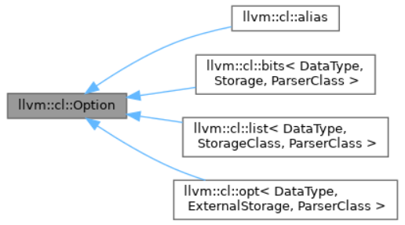

Doxygen of APIs: [LLVM: LLVM](https://llvm.org/doxygen/)

# 安装 & 编译 & 测试 LLVM

截止到2024.6.11，LLVM的最新release版本为18.1.6

[Getting Started with the LLVM System — LLVM 19.0.0git documentation](https://llvm.org/docs/GettingStarted.html#getting-the-source-code-and-building-llvm)

## *Intro of LLVM Compiler Infrastructure*

[The LLVM Compiler Infrastructure Project](https://llvm.org/)

[Getting Started with LLVM Core Libraries（中文版） — Getting Started with LLVM Core Libraries 文档 (getting-started-with-llvm-core-libraries-zh-cn.readthedocs.io)](https://getting-started-with-llvm-core-libraries-zh-cn.readthedocs.io/zh-cn/latest/index.html#)

LLVM, Low Level Virtual Machine 是一个开源的编译器基础设施项目，旨在为各种编程语言提供优化的编译器和工具，用来开发编译器前端前端和后端。LLVM的设计目标是提供可移植、高效和灵活的编译解决方案

> 它最初的编写者，是一位叫做Chris Lattner(个人主页)的大神，硕博期间研究内容就是关于编译器优化的东西，发表了很多论文，博士论文是提出一套在编译时、链接时、运行时甚至是闲置时的优化策略，与此同时，LLVM的基本思想也就被确定了，这也让他在毕业前就在编译器圈子小有名气。
>
> 而在这之前，Apple公司一直使用GCC作为编译器，后来GCC对Objective-C的语言特性支持一直不够，Apple自己开发的GCC模块又很难得到GCC委员会的合并，所以老乔不开心。等到Chris Lattner毕业时，Apple就把他招入靡下，去开发自己的编译器，所以LLVM最初受到了Apple的大力支持。
>
> 最初时，LLVM的前端是GCC，后来Apple还是立志自己开发了一套Clang出来把GCC取代了，不过现在带有Dragon Egg的GCC还是可以生成LLVM IR，也同样可以取代Clang的功能，我们也可以开发自己的前端，和LLVM后端配合起来，实现我们自定义的编程语言的编译器。
>
> 原文链接：https://blog.csdn.net/RuanJian_GC/article/details/132031490

LLVM最早以C/C++为实作对象，到目前它已支援包括ActionScript、Ada、D语言、Fortran、GLSL、Haskell、Java字节码、Objective-C、Swift、Python、Ruby、Crystal、Rust、Scala以及C#等语言

LLVM 项目由一系列模块组成，包括前端、优化器和后端。以下是 LLVM 的关键组件


1. 前端（Frontend）：LLVM 前端是与特定编程语言相关的部分。它能够将不同的源代码语言转换为 LLVM 的中间表示（LLVM IR），这种中间表示是一种低级别的、面向对象的指令集表示形式，类似于汇编语言
2. 优化器（Optimizer）：LLVM 优化器是 LLVM 框架的核心组件之一。它可以对 LLVM IR 进行各种优化，包括常量折叠、循环优化、内联函数、代码消除、死代码消除等。这些优化可以显著提高程序的性能和执行效率
3. 后端（Backend）：LLVM 后端负责将优化后的 LLVM IR 转换为目标平台的机器码。LLVM 支持多种不同的目标体系结构，包括x86、ARM、MIPS等，因此可以在多个平台上生成高效的机器码
4. 工具链和库：LLVM 提供了一整套工具和库，用于构建编译器和开发工具。这些工具包括llvm-as（将汇编代码转换为 LLVM IR）、llvm-dis（将 LLVM IR 转换为可读的汇编代码）、llvm-link（将多个 LLVM 模块链接在一起）


## *准备工作*

### 依赖

* **CMake >= 3.20.0**,  Makefile/workspace generator

* **python >= 3.8**, Automated test suite

  Only needed if you want to run the automated test suite in the `llvm/test` directory, or if you plan to utilize any Python libraries, utilities, or bindings.

* **zlib >= 1.2.3.4**, Compression library

  Optional, adds compression / uncompression capabilities to selected LLVM tools.

* **GNU Make 3.79, 3.79.1**, Makefile/build processor

  Optional, you can use any other build tool supported by CMake.

```C++
$ sudo apt install -y gcc g++ git cmake ninja-build
```

zlib 是一个库，没有命令行的命令

另外要编译LLVM需要host compiler， 即已经安装的GCC或LLVM，注意它们及其toolchain的版本是否满足条件（比如说string_view从GCC 7才开始提供）

## *使用预编译二进制包*

该方法适用于系统配置不足以完成编译的计算机体验LLVM，但如果未来要进行LLVM的自定义和实验，不建议使用该方法

### 从LLVM官网下载

[Download LLVM releases](https://releases.llvm.org/)

### Linux使用发行版的包管理器

* Ubuntu

  ```cmd
   $ sudo apt-get install llvm clang
  ```

* Fedora

  ```cmd
  $ sudo yum install llvm clang
  ```

Debian和Ubuntu Linux（i386和amd64）仓库可用于下载从LLVM subversion仓库编译得到的快照。[LLVM Debian/Ubuntu packages](https://apt.llvm.org/)

## *使用CMake进行编译*

### 拉取LLVM 

拉取LLVM source code [llvm/llvm-project: The LLVM Project is a collection of modular and reusable compiler and toolchain technologies. (github.com)](https://github.com/llvm/llvm-project)

github上面的是完整的LLVM项目，频繁的拉取完整的LLVM项目开销很大，以下是减少代码拉取量的设置

* shallow-clone

  ```cmd
  $ git clone --depth 1 https://github.com/llvm/llvm-project.git # https
  $ git clone --depth 1 git@github.com:llvm/llvm-project.git
  ```

* 不拉取 user branch

  ```cmd
  $ git config --add remote.origin.fetch '^refs/heads/users/*'
  $ git config --add remote.origin.fetch '^refs/heads/revert-*'
  ```

* 只拉取某个版本的LLVM

  ```cmd
  $ git clone --branch llvmorg-12.0.1 --depth 1 https://github.com/llvm/llvm-project.git
  ```

补充一个概念：Clang trunk 指的是Clang编译器项目的开发主分支。在版本控制系统中，trunk一词通常用来描述项目的主开发线或主分支

### 编译

[Getting Started with the LLVM System — LLVM 19.0.0git documentation](https://llvm.org/docs/GettingStarted.html#getting-the-source-code-and-building-llvm)

```cmd
$ cd llvm-project
# cmake configure
$ cmake -S llvm -B build -G Ninja -DCMAKE_BUILD_TYPE=Release -DCMAKE_INSTALL_PREFIX=/usr/local -DLLVM_ENABLE_RTTI=ON -DLLDB_ENABLE_LIBEDIT=ON -DLLVM_ENABLE_PROJECTS="clang;lldb;lld;clang-tools-extra" -DLLVM_ENABLE_RUNTIMES="compiler-rt;libcxx;libcxxabi;libunwind"
# $ cmake -G Ninja -DCMAKE_BUILD_TYPE=Release ../llvm
$ cmake --build build # cmake build
$ sudo cmake --build build --target install # cmake install
```

注意安装时文件可能不全，/usr/local/include/llvm/Config/config.h不会被安装进去，需要手动从build文件夹内复制出来。在运行编译时可以根据缺少头文件自行`sudo cp`

### Shell Script

```shell
# Download:
git clone https://github.com/llvm/llvm-project.git
cd llvm-project/llvm

# Configure
mkdir build && cd build && cmake .. -DCMAKE_BUILD_TYPE=Release

# build:
cmake --build . -j $(nproc)

# install:
cmake -DCMAKE_INSTALL_PREFIX=${HOME}/.local/ -P cmake_install.cmake

# uninstall
xargs rm -rf < install_manifest.txt
```

### 同时安装多个版本的LLVM

TBD

建议采用Docker的方式来安装

### CMake Cache

许多在本文档页面中提到的构建配置可以通过使用CMake缓存来实现。CMake缓存本质上是一个配置文件，用于设置特定构建配置所需的标志。Clang的缓存位于单一仓库的 `/clang/cmake/caches` 目录下。在下面的示例中展示了如何结合额外的配置标志，使用 `-C` 标志将它们传递给CMake

### 执行测试

```cmd
$ make check-all
```

### Stand-alone Builds

Stand-alone Builds 独立构建允许针对系统中已有的预编译版clang或LLVM库来构建子项目

You can use the source code from a standard checkout of the llvm-project (as described above) to do stand-alone builds, but you may also build from a sparse checkout or from the tarballs available on the releases page. 

对于独立构建，必须拥有一个配置正确、能够被其他项目的独立构建所使用的LLVM安装版本。这可以是发行版提供的LLVM安装，或者可以自己构建，像这样：

```cmake
cmake -G Ninja -S path/to/llvm-project/llvm -B $builddir \
      -DLLVM_INSTALL_UTILS=ON \
      -DCMAKE_INSTALL_PREFIX=/path/to/llvm/install/prefix \
      < other options >

ninja -C $builddir install
```

## *Options & Variables for CMake*

### 常用的CMake变量

`cmake --help-variable VARIABLE_NAME` 查看CMake变量的帮助

* **CMAKE_BUILD_TYPE**:STRING

  设置 make 或 ninja 的优化等级

  | Build Type         | Optimizations | Debug Info | Assertions | Best suited for            |
  | ------------------ | ------------- | ---------- | ---------- | -------------------------- |
  | **Release**        | For Speed     | No         | No         | Users of LLVM and Clang    |
  | **Debug**          | None          | Yes        | Yes        | Developers of LLVM         |
  | **RelWithDebInfo** | For Speed     | Yes        | No         | Users that also need Debug |
  | **MinSizeRel**     | For Size      | No         | No         | When disk space matters    |

  - Optimizations make LLVM/Clang run faster, but can be an impediment for step-by-step debugging.
  - Builds with debug information can use a lot of RAM and disk space and is usually slower to run. You can improve RAM usage by using `lld`, see the [LLVM_USE_LINKER](https://llvm.org/docs/CMake.html#llvm-use-linker) option.
  - Assertions are internal checks to help you find bugs. They typically slow down LLVM and Clang when enabled, but can be useful during development. You can manually set [LLVM_ENABLE_ASSERTIONS](https://llvm.org/docs/CMake.html#llvm-enable-assertions) to override the default from CMAKE_BUILD_TYPE.

* **CMAKE_INSTALL_PREFIX**:PATH

  Path where LLVM will be installed when the “install” target is built. 默认路径是/usr/local

* **CMAKE_{C,CXX}_FLAGS**:STRING

  Extra flags to use when compiling C and C++ source files respectively.

* **CMAKE_{C,CXX}_COMPILER**:STRING

  Specify the C and C++ compilers to use. If you have multiple compilers installed, CMake might not default to the one you wish to use.

### 常用的LLVM相关变量

- **LLVM_ENABLE_PROJECTS:STRING** 这个变量控制哪些项目被启用。如果只想要构建特定的LLVM子项目，比如Clang或者LLDB，可以使用这个变量来指定。例如，如果想同时构建Clang和LLDB，可以在CMake命令中加入 `-DLLVM_ENABLE_PROJECTS="clang;lldb"`

  所谓的Project就是llvm-project下面的那些目录，完整的Project Lists为 `clang;clang-tools-extra;cross-project-tests;libc;libclc;lld;lldb;openmp;polly;pstl`

- **LLVM_ENABLE_RUNTIMES:STRING** 这个变量让能够控制哪些运行时库被启用。如果想要构建libc++或者libc++abi这样的库，可以使用这个变量。例如，为了同时构建libc++和libc++abi，应该在CMake命令中添加 `-DLLVM_ENABLE_RUNTIMES="compiler-rt;libcxx;libcxxabi;libunwind"`

  这通常是为了确保LLVM能够使用与之兼容的C++标准库，尤其是在那些不希望依赖系统默认C++库，或者想要利用`libc++`提供的特性和性能优势的场景下

  **libcxx & libcxxabi & libunwind 这三个标准库一般是同时安装的，因为三者间存在依赖关系**

  比如说若要添加libcxxabi的话，要把libunwind加上，否则会报下面的错误

  ```
  CMake Error at /mnt/data/llvm-project/libcxxabi/CMakeLists.txt:52 (message):
    LIBCXXABI_USE_LLVM_UNWINDER is set to ON, but libunwind is not specified in
    LLVM_ENABLE_RUNTIMES.
  ```

  补充：libunwind 是**一个可移植且高效的C 语言库，用于确定程序的调用链（backtrace）**。 它特别适用于帮助实现程序的错误报告功能，和需要对程序崩溃进行后处理的情况

  [⚙ D113253 [runtimes\] Fix building initial libunwind+libcxxabi+libcxx with compiler implied -lunwind (llvm.org)](https://reviews.llvm.org/D113253?id=387614)

- **LLVM_LIBDIR_SUFFIX:STRING** 这个变量用于附加额外的后缀到库文件的安装目录。在64位架构上，你可能希望库文件被安装在`/usr/lib64`而非`/usr/lib`，那么可以设置 `-DLLVM_LIBDIR_SUFFIX=64`

- **LLVM_PARALLEL_{COMPILE,LINK}_JOBS:STRING** 构建LLVM工具链可能会消耗大量资源，尤其是Debug的链接。使用这些选项，当使用Ninja生成器时，可以限制并行性。例如，为了避免内存溢出（OOM）或使用交换空间(swap)，每15GB DRAM 可以给一个link job

- **LLVM_TARGETS_TO_BUILD:STRING** 这个变量控制哪些目标架构被启用。例如，如果只需要为本地目标架构（比如x86）构建LLVM，你可以使用 `-DLLVM_TARGETS_TO_BUILD=X86` 来实现

- **LLVM_USE_LINKER:STRING** 这个变量允许你覆盖系统默认的链接器。例如，如果你想使用LLD作为链接器，可以设置 `-DLLVM_USE_LINKER=lld`

## *高级编译设置*

[Advanced Build Configurations — LLVM 19.0.0git documentation](https://llvm.org/docs/AdvancedBuilds.html)

### Multi-Stage Build

Multi-Stage Build 也称为 bootstrap build 自举编译，即将LLVM的编译过程分为多个阶段

为什么需要这么设计？因为会有这样的需求：当开发者想要移植LLVM到一个新的平台或支持一个新的处理器架构时，他们可能会遇到先有鸡还是先有蛋的问题，即需要一个已经存在的编译器来构建新的编译器。多阶段编译解决了这个问题，让开发者能够逐步地生成能够自举的LLVM工具链

* Stage 1

  使用现有编译器（例如系统提供的GCC或Clang）构建LLVM和Clang的基本可执行版本。这个阶段的输出是 bootstrap 编译器，它包含了基本的核心LLVM工具链，足以进行进一步的编译

* Stage 2

  使用第一步构建出的 bootstrap 编译器来编译完整的LLVM。这是为了确保新编译器能够编译自己的代码库，并且可以在特定的优化和代码生成方面自我验证与改进。产生一个由自身编译的更优化和精简的LLVM工具链

* Stage 3 and even more stages (optional)

  理论上，第三阶段的构建输出应该和第二阶段完全一致，这可以作为一个测试来确保编译器的生成自洽性（也就是说，它可以可靠地复制自己的输出）

LLVM的多阶段编译可以通过 `-DCLANG_ENABLE_BOOTSTRAP=On` 来开启

```cmd
$ cmake -G Ninja -DCMAKE_BUILD_TYPE=Release \
    -DCLANG_ENABLE_BOOTSTRAP=On \
    -DLLVM_ENABLE_PROJECTS="clang" \
    <path to source>/llvm
$ ninja stage2
```


```cmd
$ cmake -G Ninja -DCMAKE_BUILD_TYPE=Release \
    -DCLANG_ENABLE_BOOTSTRAP=On \
    -DCLANG_BOOTSTRAP_PASSTHROUGH="CMAKE_INSTALL_PREFIX;CMAKE_VERBOSE_MAKEFILE" \
    -DLLVM_ENABLE_PROJECTS="clang" \
    <path to source>/llvm
$ ninja stage2
```


### Multi-Stage PGO

Profile-Guided Optimizations, PGO

### BOLT

Binary Optimization and Layout Tool, BOLT

### 3-Stage Non-Determinism


## *Docker*

### Shell Script for Generating Dockerfile

`llvm/utils/docker` 文件夹下存放着将LLVM docker化的相关文件

LLVM Project提供了以 `debian10` and `nvidia-cuda` 分别作为基准镜像的两个dockerfile，还有一个example供用户自己填充关键选项

LLVM Project 另外提供了一个用来生成可定制化的LLVM的Dockerfile的Shell script `llvm/utils/build_docker_image.sh`

```cmd
$ cd llvm/utils/docker
$ ./build_docker_image.sh \
    --source ubuntu2204 \
    --docker-repository clang-ubuntu --docker-tag "staging" \
    -p clang -p lldb -i install-clang -i install-clang-resource-headers \
    -- \
    -DCMAKE_BUILD_TYPE=Debug
```

docker-repository 就是一个名字，取什么无所谓

### 自定义的Dockerfile

```dockerfile
FROM ubuntu22.04

ENV TZ=Asia/Shanghai

SHELL ["/bin/bash", "-c"]

RUN apt-get clean && \
    apt-get autoclean

# default cmake version 3.10.2
RUN apt-get update && apt-get upgrade -y && \
    apt-get install -y \
    htop \
    tree \
    apt-utils \
    curl \
    wget \
    cmake \ 
    git \
    openssh-server \
    build-essential \
    libboost-all-dev \
    net-tools \
    vim \
    stress \
    python3 \
    ninja-build \
    zlib1g

# default gcc verison 7.5.0
RUN apt-get install -y libc-ares-dev libssl-dev gcc g++ make

RUN git clone --depth 1 --progress https://github.com/llvm/llvm-project.git

WORKDIR /llvm-project

# RUN git config --add remote.origin.fetch '^refs/heads/users/*' && git config --add remote.origin.fetch '^refs/heads/revert-*'

# cmake config
RUN cmake -S llvm -B build -G Ninja -DCMAKE_BUILD_TYPE=Debug -DLLVM_PARALLEL_LINK_JOBS=1 -DCMAKE_INSTALL_PREFIX=/usr/local -DLLVM_ENABLE_PROJECTS="clang;lldb"

# cmake build
RUN cmake --build build

# cmake install
RUN cmake --build build --target install

# LLVM non-relevant install if needed
```

## *Prelude: Target Triple*

### `llvm::Triple`

LLVM作为一个编译器框架支持交叉编译的特性使得它非常适合开发需要在多平台上运行的软件。 LLVM提供了目标三元组 target triple（不一定是三元的，取这个名字是因为历史原因，之前是严格triple的）的概念，它用来标识目标系统的格式，包括CPU类型、制造商和操作系统等信息，以便于交叉编译器生成正确的代码

```
ARCHITECTURE-VENDOR-OPERATING_SYSTEM（CPU架构-CPU制造商-操作系统）
or
ARCHITECTURE-VENDOR-OPERATING_SYSTEM-ENVIRONMENT（CPU架构-CPU制造商-操作系统-环境）
```

```cmd
$ clang --version | grep Target
Target: x86_64-unknown-linux-gnu
```

```C++
// llvm-project/llvm/include/llvm/TargetParser/Triple.h
class Triple {
public:
  enum ArchType { };
  enum SubArchType { };
  enum VendorType { };
  enum OSType { };
  enum EnvironmentType { };
  enum ObjectFormatType { };
public:
  explicit Triple(const Twine &Str);
  Triple(const Twine &ArchStr, const Twine &VendorStr, const Twine &OSStr);
  Triple(const Twine &ArchStr, const Twine &VendorStr, const Twine &OSStr,
         const Twine &EnvironmentStr);
};
```

这里面比较特殊的是EnvironmentType，它进一步指定了目标操作系统或 ABI 的环境。这个字段对于支持不同 ABI 类型或对同一操作系统有不同变体支持的编译器来说是非常有用的

例如，在 ARM 架构上，可能需要区分使用硬浮点调用约定的软件（hard-float）与使用软浮点调用约定的软件（soft-float）。为此，`EnvironmentType` 可能会是 `gnueabihf` 表明使用了硬浮点 ABI，或者是 `gnueabi` 表示使用了软浮点 ABI

另一个例子是在 x86 架构上，可以通过 `EnvironmentType` 来指定目标是 32 位 (`i386`) 还是 64 位 (`x86_64`) 的程序，并且还可以指定是否针对具有特定功能的 Linux 发行版（如 Android 操作系统的 `android` 环境）

```C++
  enum EnvironmentType {
    UnknownEnvironment,

    GNU, // 使用GNU工具链
    GNUABIN32,
    GNUABI64,
    GNUEABI,
    GNUEABIHF,
    GNUX32,
    GNUILP32,
    CODE16,
    EABI, // 嵌入式应用二进制接口 EABI
    EABIHF,
    Android,
    Musl,
    MuslEABI,
    MuslEABIHF,

    MSVC,
    Itanium,
    Cygnus,
    CoreCLR,
    Simulator, // Simulator variants of other systems, e.g., Apple's iOS
    MacABI, // Mac Catalyst variant of Apple's iOS deployment target.
    LastEnvironmentType = MacABI
  };
```

### Biarch & Multiarch

`Biarch` 是指双架构的概念，这意味着某些系统既支持 32 位架构也支持 64 位架构。例如，在 x86 架构中，一个系统可能同时支持 i386/x86 (32 位) 和 x86_64 (64 位) 指令集

我们以 `Generic_GCC::GCCInstallationDetector::init()` 中的代码为例

```C++
// llvm_12/clang/lib/Driver/ToolChains/Gnu.cpp
llvm::Triple BiarchVariantTriple = TargetTriple.isArch32Bit()
                                     ? TargetTriple.get64BitArchVariant()
                                     : TargetTriple.get32BitArchVariant();
```

这段代码是在计算与当前目标三元组 TargetTriple 相对应的另一个架构的三元组 BiarchVariantTriple。具体来说：

- 如果 TargetTriple 表示的是一个 32 位架构（`isArch32Bit()` 返回 `true`），那么 BiarchVariantTriple 将会是对应的 64 位版本的架构
- 反过来，如果 TargetTriple 表示的是一个 64 位架构，则 BiarchVariantTriple 将会是对应的 32 位版本的架构

这样做允许编译器或工具链处理与双架构相关的逻辑，比如当搜索库和工具时，可能需要知道同一平台上另一种位数的对应架构

我们可以看下 `isArch64Bit()` 是如何实现判断的，非常简单，就是switch穷举的

```C++
// llvm_12/llvm/lib/Support/Triple.cpp
bool Triple::isArch64Bit() const {
  return getArchPointerBitWidth(getArch()) == 64;
}

static unsigned getArchPointerBitWidth(llvm::Triple::ArchType Arch) {
  switch (Arch) {
  case llvm::Triple::UnknownArch:
    return 0;
          
  case llvm::Triple::msp430:
    return 16;

  case llvm::Triple::x86:
    return 32;

  case llvm::Triple::x86_64:
    return 64;
  }
  llvm_unreachable("Invalid architecture value");
}
```

类似的，MultiarchTriple 就是多种架构

## *Cross-compile*

[How To Cross-Compile Clang/LLVM using Clang/LLVM — LLVM 19.0.0git documentation](https://llvm.org/docs/HowToCrossCompileLLVM.html)

[Cross-compilation using Clang — Clang 19.0.0git documentation (llvm.org)](https://clang.llvm.org/docs/CrossCompilation.html)

### 交叉编译的需求 

LLVM的cross-compile 交叉编译是指在一种架构或操作系统上使用LLVM工具链来编译为在不同的目标架构或操作系统上运行的代码。简而言之，交叉编译涉及生成可在与构建环境（即我们正在编译代码的机器）不同的目标环境（即代码将要运行的机器）上执行的程序

比如说我们可能在一台x86架构的Linux电脑上开发软件，但是需要为ARM架构的嵌入式设备编译这个软件。使用交叉编译，我们可以创建一个专门针对ARM架构的可执行文件，尽管我们的开发机器是基于x86架构的

交叉编译通常用于以下情况：

1. 编写嵌入式系统或移动设备应用程序，因为这些设备通常没有足够的资源来编译复杂的代码
2. 构建为特定操作系统或硬件优化的软件，尤其是当开发环境与目标环境不同时
3. 创建操作系统镜像，通常在主机系统上为其他架构的设备构建系统镜像

### CMAKE_TOOLCHAIN_FILE

`CMAKE_TOOLCHAIN_FILE` 是一个 CMake 变量，用于指定一个工具链文件的路径。工具链文件包含了一系列用来告知 CMake 如何编译和链接程序的特定于平台或编译器的配置

工具链文件包含了编译器、汇编器、链接器等工具的路径和其他相关设置。它告诉 CMake 使用哪些工具以及如何找到这些工具，还可能包括必要的编译器和链接器的选项

比如说下面的

```cmake
set(CMAKE_CXX_COMPILER "/usr/bin/g++")
set(CMAKE_C_COMPILER "/usr/bin/gcc")
set(CMAKE_AR "/usr/bin/ar")
set(CMAKE_STRIP "/usr/bin/strip")
set(CMAKE_LINKER "/usr/bin/ld")
set(CMAKE_SYSTEM_PROCESSOR "x86_64")
set(CMAKE_SYSTEM_NAME "Linux")
set(CMAKE_CUDA_HOST_COMPILER "")
set(CUDA_TOOLKIT_ROOT_DIR "")
set(CUDA_TOOLKIT_TARGET_NAME "aarch64")
set(CMAKE_CUDA_COMPILER "")
```

这个变量会被同名的环境变量初始化（若存在的话）

注意：因为`CMAKE_TOOLCHAIN_FILE` 的优先级很高，它会覆盖我们在 `CMakeLists.txt` 中给定的工具链。所以如果希望使用特定的编译器，应避免同时指定 `CMAKE_TOOLCHAIN_FILE` 和 `CMAKE_CXX_COMPILER`

### CMAKE_FIND_ROOT_PATH

`CMAKE_FIND_ROOT_PATH` 的主要作用是为CMake提供一个或多个根目录，CMake将在这些目录下优先搜索各种依赖项、程序、库和头文件。这个变量特别有用于交叉编译场景，因为它允许开发者指定一个与宿主机系统隔离的搜索路径，避免与宿主机系统上的库和头文件混淆

当进行交叉编译时，通常会有一个专门的工具链和一个为目标架构准备好的系统根目录（sysroot），里面包含了所有必要的库和头文件。通过设置 `CMAKE_FIND_ROOT_PATH`，可以确保CMake首先查看这个sysroot路径来寻找构建项目所需的资源

例如，在交叉编译环境中，可能会这样使用 `CMAKE_FIND_ROOT_PATH`：

```cmd
set(CMAKE_FIND_ROOT_PATH /path/to/sysroot)
```

CMake在执行例如 `find_package`, `find_library`, `find_file`, `find_path` 等命令时，会考虑此变量指定的路径作为额外的前缀。这意味着如果尝试寻找一个库，CMake不仅会在默认的系统目录中搜索，还会在 `CMAKE_FIND_ROOT_PATH` 所列出的目录中搜索

`CMAKE_FIND_ROOT_PATH` 的行为可以进一步通过以下几个变量控制：

- `CMAKE_FIND_ROOT_PATH_MODE_PROGRAM`
- `CMAKE_FIND_ROOT_PATH_MODE_LIBRARY`
- `CMAKE_FIND_ROOT_PATH_MODE_INCLUDE`
- `CMAKE_FIND_ROOT_PATH_MODE_PACKAGE`

这些变量定义了CMake寻找程序、库、头文件和软件包时是否应该考虑 `CMAKE_FIND_ROOT_PATH`。每个变量都可以设定为 `NEVER`、`ONLY` 或 `BOTH`。`NEVER` 会忽略根路径，`ONLY` 会只在根路径下搜索，而 `BOTH` 会同时在系统路径和根路径下搜索。比如

```cmake
set(CMAKE_FIND_ROOT_PATH_MODE_PROGRAM NEVER)
set(CMAKE_FIND_ROOT_PATH_MODE_LIBRARY ONLY)
set(CMAKE_FIND_ROOT_PATH_MODE_INCLUDE ONLY)
set(CMAKE_FIND_ROOT_PATH_MODE_PACKAGE ONLY)
```

### 实操

[Cross-compilation using Clang — Clang 19.0.0git documentation (llvm.org)](https://clang.llvm.org/docs/CrossCompilation.html)

[How To Cross-Compile Clang/LLVM using Clang/LLVM — LLVM 19.0.0git documentation](https://llvm.org/docs/HowToCrossCompileLLVM.html)

## *卸载LLVM*

## *测试*

[Llvm 源码结构及测试基础 - 吴建明wujianming - 博客园 (cnblogs.com)](https://www.cnblogs.com/wujianming-110117/p/17128814.html)

[LLVM测试框架_llvm-lit-CSDN博客](https://zhikunhuo.blog.csdn.net/article/details/125173869)

LLVM 测试基础设施包含三大类测试：单元测试 unit test、回归测试 regression test 和整个程序。单元测试和回归测试分别包含在 LLVM 存储在 LLVM/unittest 和 LLVM/test 之下，并且应该始终通过，一般情况作为check-in，即它们应该在每次提交之前运行

* 单元测试是使用 Google Test 和 Google Mock 编写的，位于 llvm/unittest 目录中。在一般情况下，单元测试用于针对支持库和其他通用数据结构，我们倾向于依赖回归测试来测试 IR 上的转换和分析
* 回归测试是测试 LLVM 特定特性或在 LLVM 中触发特定 bug 的小段代码。它们使用的语言取决于测试的 LLVM 部分。这些测试由 Lit 测试工具(LLVM 的一部分)驱动，位于 LLVM/test 目录中

通常，当在 LLVM 中发现 bug 时，应该编写一个回归测试，其中包含足够的代码来重现问题，并将该测试放置在这个目录的某个位置。例如，它可以是从实际应用程序或基准中提取的一小段 LLVM IR

## *Components & Libraries*

组件 components 是构成LLVM框架各个功能部分的模块，它们对应于LLVM中的不同库。`llvm-config --components` 可以用来列出所有可用的组件。每个组件通常对应于LLVM的一组特定功能，比如代码生成、目标文件处理、汇编解析等

```cmd
$ llvm-config --components
aarch64 aarch64asmparser aarch64codegen aarch64desc aarch64disassembler aarch64info aarch64utils aggressiveinstcombine all all-targets amdgpu amdgpuasmparser amdgpucodegen amdgpudesc amdgpudisassembler amdgpuinfo amdgputargetmca amdgpuutils analysis arm armasmparser armcodegen armdesc armdisassembler arminfo armutils asmparser asmprinter avr avrasmparser avrcodegen avrdesc avrdisassembler avrinfo binaryformat bitreader bitstreamreader bitwriter bpf bpfasmparser bpfcodegen bpfdesc bpfdisassembler bpfinfo cfguard codegen codegentypes core coroutines coverage debuginfobtf debuginfocodeview debuginfodwarf debuginfogsym debuginfologicalview debuginfomsf debuginfopdb demangle dlltooldriver dwarflinker dwarflinkerclassic dwarflinkerparallel dwp engine executionengine extensions filecheck frontenddriver frontendhlsl frontendoffloading frontendopenacc frontendopenmp fuzzercli fuzzmutate globalisel hexagon hexagonasmparser hexagoncodegen hexagondesc hexagondisassembler hexagoninfo hipstdpar instcombine instrumentation interfacestub interpreter ipo irprinter irreader jitlink lanai lanaiasmparser lanaicodegen lanaidesc lanaidisassembler lanaiinfo libdriver lineeditor linker loongarch loongarchasmparser loongarchcodegen loongarchdesc loongarchdisassembler loongarchinfo lto mc mca mcdisassembler mcjit mcparser mips mipsasmparser mipscodegen mipsdesc mipsdisassembler mipsinfo mirparser msp430 msp430asmparser msp430codegen msp430desc msp430disassembler msp430info native nativecodegen nvptx nvptxcodegen nvptxdesc nvptxinfo objcarcopts objcopy object objectyaml option orcdebugging orcjit orcshared orctargetprocess passes powerpc powerpcasmparser powerpccodegen powerpcdesc powerpcdisassembler powerpcinfo profiledata remarks riscv riscvasmparser riscvcodegen riscvdesc riscvdisassembler riscvinfo riscvtargetmca runtimedyld scalaropts selectiondag sparc sparcasmparser sparccodegen sparcdesc sparcdisassembler sparcinfo support symbolize systemz systemzasmparser systemzcodegen systemzdesc systemzdisassembler systemzinfo tablegen target targetparser textapi textapibinaryreader transformutils ve veasmparser vecodegen vectorize vedesc vedisassembler veinfo webassembly webassemblyasmparser webassemblycodegen webassemblydesc webassemblydisassembler webassemblyinfo webassemblyutils windowsdriver windowsmanifest x86 x86asmparser x86codegen x86desc x86disassembler x86info x86targetmca xcore xcorecodegen xcoredesc xcoredisassembler xcoreinfo xray
```

- aarch64, aarch64asmparser, aarch64codegen, aarch64desc, aarch64disassembler, aarch64info, aarch64utils：这些组件与 ARM 的 AArch64 架构相关，包括代码生成、汇编解析、描述符管理、反汇编以及其他针对该架构的实用工具
- aggressiveinstcombine：提供激进的指令合并优化
- amdgpu, amdgpuasmparser, amdgpucodegen, amdgpudesc, amdgpudisassembler, amdgpuinfo, amdgputargetmca, amdgpuutils：与 AMD GPU 相关的组件集合，涵盖了从代码生成到反汇编等多方面功能
- analysis：提供 IR 层面上的分析功能
- arm, armasmparser, armcodegen, armdesc, armdisassembler, arminfo, armutils：与 ARM 架构（32位）相关的组件，包括代码生成、汇编语法解析、描述符管理等
- asmparser：提供通用的汇编语法解析器
- asmprinter：提供通用的汇编打印功能，即将 IR 转换为目标汇编语言
- binaryformat：提供对二进制文件格式的处理能力
- bitreader, bitstreamreader：提供读取 LLVM bitcode 文件的功能
- bitwriter：提供将 LLVM IR 写入成 bitcode 文件的功能
- bpf, bpfasmparser, bpfcodegen, bpfdesc, bpfdisassembler, bpfinfo：针对 BPF (Berkeley Packet Filter) 架构的代码生成、汇编解析等功能
- codegen, codegentypes：与 LLVM 的通用代码生成层相关的组件
- **core：LLVM 的核心组件，提供基本的 LLVM IR 操作和转换能力**
- coroutines：提供协程支持
- coverage：提供代码覆盖率工具的支持
- debuginfoxxx：与调试信息的不同方面和不同格式相关的组件，例如 DWARF，CodeView，GSYM 等
- demangle：提供名称重整（demangling）的功能，即将编译器生成的装饰过的名称还原为源代码中的名称
- dwarflinker：提供 DWARF 链接器功能
- **engine：提供JIT编译和执行引擎**
- executionengine：执行引擎的基础设施
- globalisel：提供全局指令选择的功能
- hexagon: 与 Hexagon DSP 架构相关的代码生成、汇编解析等功能
- ipo：提供链接时优化（Interprocedural Optimization）的功能
- irreader：提供从文本形式读取 LLVM IR 的功能
- jitlink：提供 JIT 编译时的链接功能
- lto：提供链接时优化的库
- mc, mcparser, mcdisassembler：提供低级别机器代码表示，汇编语句的解析和反汇编
- mirparser：提供机器 IR 的解析功能
- msp430：与 MSP430 微控制器架构相关的代码生成和工具
- native：提供本地（当前运行环境）目标的支持
- nvptx：与 NVIDIA PTX 架构相关的代码生成和工具
- objcarcopts：提供 Objective-C 自动引用计数（Automatic Reference Counting, ARC）的优化
- objcopy：提供 objcopy 工具的功能，可以复制和转换对象文件
- object：提供对对象文件（.o 文件）的操作支持
- option：提供命令行选项处理的支持
- orcxxx：与 ORC JIT 编译器相关的组件
- passes：提供 LLVM 优化和变换的 Passes
- powerpc：与 PowerPC 架构相关的代码生成和工具
- profiledata：提供对性能数据（如性能分析结果）的支持
- riscv：与 RISC-V 架构相关的代码生成和工具
- scalaropts：提供标量优化技术
- selectiondag：提供 SelectionDAG 基础设施，这是 LLVM 中表示和转换指令的一个系统
- **support：提供跨平台支持和底层实用程序**
- symbolize：提供符号反向查找（将地址映射回源代码符号）的功能
- target：提供对特定目标处理器架构的支持
- transformsxxx：提供各种 IR 变换的支持
- vectorize：提供向量化技术
- webassembly：与 WebAssembly 相关的代码生成和工具
- windowsmanifest：提供 Windows Manifest 文件的处理
- x86, x86asmparser, x86codegen, x86desc, x86disassembler, x86info：与 x86 和 x86-64 架构相关的代码生成、汇编解析等功能
- xray：提供 XRay 功能追踪工具的支持
- xcore：与 XMOS xCORE 架构相关的代码生成和工具

### 控制库行为的cmake变量

* **BUILD_SHARED_LIBS**:BOOL
* **LLVM_BUILD_LLVM_DYLIB**:BOOL


`llvm_map_components_to_libraries()` (LLVM < 3.5, otherwise deprecated)

# 预定义宏

## *`__attribute__`*

和GCC一样，Clang同样支持用 `__attribute__` 来显式地控制编译器的行为，而且还添加了一些自己的扩展。为了检查一个特殊属性的可用性，可以使用`__has_attribute`指令

这里介绍一下Clang独有的 `__attribute__` 指令

### availability

[__attribute__详解及应用 | roy's blog (woshiccm.github.io)](https://woshiccm.github.io/posts/__attribute__详解及应用/)

# Example: Kaleidoscope Language

[My First Language Frontend with LLVM Tutorial — LLVM 19.0.0git documentation](https://llvm.org/docs/tutorial/MyFirstLanguageFrontend/index.html)

[基于 LLVM 自制编译器——序 | 楚权的世界 (chuquan.me)](https://chuquan.me/2022/07/17/compiler-for-kaleidoscope-00/)

官方给出了一个 Kaleidoscope Language 万花筒语言的构建过程来展示LLVM的使用，这门语言采用手写前端（Lexer + Parser）+ LLVM IR + LLVM 后端的结构

1. [Chapter #1: Kaleidoscope language and Lexer](https://llvm.org/docs/tutorial/MyFirstLanguageFrontend/LangImpl01.html) - 这展示了我们的目标和我们想要构建的基本功能。Lexer 也是为语言构建 parser的第一部分，我们使用一个简单的C++ lexer，它易于理解
2. [Chapter #2: Implementing a Parser and AST](https://llvm.org/docs/tutorial/MyFirstLanguageFrontend/LangImpl02.html)- 有了lexer，我们可以讨论解析技术和基础的AST构建。本教程描述了递归下降解析和运算符优先级解析
3. [Chapter #3: Code generation to LLVM IR](https://llvm.org/docs/tutorial/MyFirstLanguageFrontend/LangImpl03.html) - AST准备好后，我们将展示生成LLVM IR有多么容易，并展示如何简单地将LLVM集成到你的项目中
4. [Chapter #4: Adding JIT and Optimizer Support](https://llvm.org/docs/tutorial/MyFirstLanguageFrontend/LangImpl04.html) - LLVM的一个优点是其对JIT编译的支持，因此我们将直接深入研究，并向您展示添加JIT支持只需3行代码。后续章节将展示如何生成 `.o` 文件
5. [Chapter #5: Extending the Language: Control Flow](https://llvm.org/docs/tutorial/MyFirstLanguageFrontend/LangImpl05.html) - 有了基础语言的支持，我们展示了如何用控制流操作（'if'语句和'for'循环）来扩展它。这给了我们一个讨论SSA构建和控制流的机会
6. [Chapter #6: Extending the Language: User-defined Operators](https://llvm.org/docs/tutorial/MyFirstLanguageFrontend/LangImpl06.html) - 本章扩展了语言，允许用户自定义任意一元和二元操作符——并且可以分配优先级！这使我们能够将“语言”的重要部分作为库例程来构建
7. [Chapter #7: Extending the Language: Mutable Variables](https://llvm.org/docs/tutorial/MyFirstLanguageFrontend/LangImpl07.html) - 本章讨论如何添加用户自定义的局部变量以及赋值操作符。这展示了在LLVM中构建SSA形式有多简单：LLVM不要求您的前端构建SSA形式就可以使用它
8. [Chapter #8: Compiling to Object Files](https://llvm.org/docs/tutorial/MyFirstLanguageFrontend/LangImpl08.html) - 本章解释了如何将LLVM IR编译成对象文件，就像静态编译器所做的那样
9. [Chapter #9: Debug Information](https://llvm.org/docs/tutorial/MyFirstLanguageFrontend/LangImpl09.html) - 一个真正的语言需要支持试器，因此我们添加了调试信息，允许在万花筒函数中设置断点，打印出参数变量，并调用函数
10. [Chapter #10: Conclusion and other tidbits](https://llvm.org/docs/tutorial/MyFirstLanguageFrontend/LangImpl10.html) - 本章通过讨论扩展语言的方法来结束整个系列，并包括指向关于“特殊主题”的信息的指针，比如添加垃圾回收支持、异常处理、调试、对“spaghetti stacks”等的支持


## *在项目中通过CMake使用LLVM*

```cmake
cmake_minimum_required(VERSION 3.20.0)
project(SimpleProject)

find_package(LLVM REQUIRED CONFIG)

message(STATUS "Found LLVM ${LLVM_PACKAGE_VERSION}")
message(STATUS "Using LLVMConfig.cmake in: ${LLVM_DIR}")

# Set your project compile flags.
# E.g. if using the C++ header files
# you will need to enable C++11 support
# for your compiler.

include_directories(${LLVM_INCLUDE_DIRS})
separate_arguments(LLVM_DEFINITIONS_LIST NATIVE_COMMAND ${LLVM_DEFINITIONS})
add_definitions(${LLVM_DEFINITIONS_LIST})

# Now build our tools
add_executable(simple-tool tool.cpp)

# Find the libraries that correspond to the LLVM components
# that we wish to use
llvm_map_components_to_libnames(llvm_libs support core irreader)

# Link against LLVM libraries
target_link_libraries(simple-tool ${llvm_libs})
```

# Clang Driver

[Clang C Language Family Frontend for LLVM](https://clang.llvm.org/)

[Welcome to Clang's documentation! — Clang 19.0.0git documentation (llvm.org)](https://clang.llvm.org/docs/)

[Clang Compiler User’s Manual — Clang 19.0.0git documentation (llvm.org)](https://clang.llvm.org/docs/UsersManual.html)

设计手册：[“Clang” CFE Internals Manual — Clang 19.0.0git documentation (llvm.org)](https://clang.llvm.org/docs/InternalsManual.html)

Doxygen: [clang: clang (llvm.org)](https://clang.llvm.org/doxygen/)

> The Clang project provides a language front-end and tooling infrastructure for languages in the C language family (C, C++, Objective C/C++, OpenCL, CUDA, and RenderScript) for the [LLVM](https://www.llvm.org/) project. Both a GCC-compatible compiler driver (`clang`) and an MSVC-compatible compiler driver (`clang-cl.exe`) are provided. You can [get and build](https://clang.llvm.org/get_started.html) the source today.

[clang 源码导读（1）: clang 入门-腾讯云开发者社区-腾讯云 (tencent.com)](https://cloud.tencent.com/developer/article/1803207)

[clang 源码导读（2）: clang driver 流程简介-腾讯云开发者社区-腾讯云 (tencent.com)](https://cloud.tencent.com/developer/article/1803206)

[clang 源码导读（3）: clang driver 参数解析-腾讯云开发者社区-腾讯云 (tencent.com)](https://cloud.tencent.com/developer/article/1803211)

[clang 源码导读（4）: clang driver 构建 Actions-腾讯云开发者社区-腾讯云 (tencent.com)](https://cloud.tencent.com/developer/article/1803208)

[clang 源码导读（5）: clang driver 构建 Jobs (qq.com)](https://mp.weixin.qq.com/s/abhUVoXqr52yXj-HJEjd8Q)

[clang 源码导读（6）: clang driver 执行命令 (qq.com)](https://mp.weixin.qq.com/s/7khfjSesUdeJUXi-NT5zZA)

[clang 源码导读（7）：编译器前端流程简介-腾讯云开发者社区-腾讯云 (tencent.com)](https://cloud.tencent.com/developer/article/1810976)

## *实操：编译Pipeline*

下图是以Clang为前端的，LLVM为后端的编译器的整体架构


以下面这份代码为例

```C++
//Example.c
#include <stdio.h>
int global;
void myPrint(int param) {
    if (param == 1)
        printf("param is 1");
    for (int i = 0 ; i < 10 ; i++ ) {
        global += i;
    }
}
int main(int argc, char *argv[]) {
    int param = 1;
    myPrint(param);
    return 0;
}
```

### 编译传参

由于Clang Driver的架构设计，需要分别用 `-Xclang` 和 `-mllvm` 分别将参数传递给Clang前端和LLVM中后段

* -Xclang参数是将参数传递给Clang的CC1前端

  比如想要禁用所有LLVM Pass的运行，也就是生成无任何优化的IR，那么就要使用-disable-llvm-passes参数传递给CC1。但是这个参数并没有Clang Driver的表示形式（也就是不使用-Xclang传递给CC1），那么就需要写-Xclang -disable-llvm-passes把参数透过Clang Driver把参数传递给CC1

* -mllvm参数的作用是将参数传递给作为中后端的LLVM

  如果参数是在LLVM中后端定义的，那么直接把参数给Clang的Driver或者CC1都是不行的，需要使用-mllvm将参数跳过Clang的Driver和CC1传递到LLVM。比如想要在Pass运行完成后输出IR，那么就需要使用-mllvm --print-after-all把参数传给LLVM

### clang & clang++

和gcc & g++的不同分工一样，clang & clang++同样分别适用于编译C和C++

clang++会自动链接C++标准库，而clang则不会

```C++
int half(int x) {
  int result = (x / 2);
  return result;
}

int main() {
  half(2);
  return 0;
}
```

```cmd
$ clang -### test.cc &> clang_output.txt
$ clang++ -### test.cc &> clangpp_output.txt
$ diff -u clang_output.txt clangpp_output.txt
```

编译器的参数是一样的，都是调用的cc1。差异在于链接器 ld的调用参数：

- 当使用 `clang` 时，链接器没有被告知链接 C++ 标准库 `libstdc++` 或数学库 `libm`
- 当使用 `clang++` 时，链接器的调用包含了 `-lstdc++` 和 `-lm` 参数，这表明它需要链接 C++ 标准库和数学库。这是因为 `clang++` 被当作 C++ 编译器使用，自动假设需要这些库

### 分别编译不同的阶段

我们可以看下有下面这些阶段

```cmd
$ clang -ccc-print-phases main.cc
            +- 0: input, "main.cc", c++
         +- 1: preprocessor, {0}, c++-cpp-output
      +- 2: compiler, {1}, ir
   +- 3: backend, {2}, assembler
+- 4: assembler, {3}, object
5: linker, {4}, image
```

1. 预处理

   ```cmd
   $ clang -E source.c -o preprocessed.i
   ```

2. 编译

   ```cmd
   $ clang -S -emit-llvm source.c -o intermediate.ll
   ```

3. 生成目标代码

   ```cmd
   $ clang -S source.c -o assembly.s
   ```

4. 汇编

   ```cmd
   $ clang -c source.c -o object.o
   ```

5. 编译

   ```cmd
   $ clang object.o -o executable
   ```

## *Overview*

平常使用的可执行文件 `clang.exe` 只是一个Driver（Drop-in substitute for GCC，指一种可以直接替换另一种已有组件或产品而无需进行任何修改或仅需最少修改的替代品），即一个命令解析器，**用于接收gcc兼容的参数**（`clang++.exe`/`clang-cl.exe`同理，用于g++/msvc兼容的参数），然后传递给真正的clang编译器前端，也就是CC1。CC1作为前端，负责解析C++源码为语法树，转换到LLVM IR。比如选项A在gcc中默认开启，但是clang规则中是默认不开启的，那么为了兼容gcc，clang.exe的Driver就要手动开启选项A，也就是添加命令行参数，将它传递给CC1

可以把Driver理解为以Clang为前端的LLVM整个软件的main函数，在这个main函数中依次调用整个编译流程中的各个阶段

### Procedure

[Driver Design & Internals — Clang 19.0.0git documentation (llvm.org)](https://clang.llvm.org/docs/DriverInternals.html)


上图中橙色的代表数据，绿色代表操作这些数据的阶段，蓝色的代表辅助组件

1. Input Strings

   调用Clang的时候后面命令行传入的命令

2. Parse: Option Parsing

   将传入的String类型输入解析成具体的参数对象，如果要查看完整的解析过程，可以使用 `-###`，下面有说明

3. Pipeline: Compilation Action Construction

   一旦解析了参数，就会构造出后续编译所需要的子任务。这涉及到确定输入文件及其类型，要对它们做哪些工作（预处理、编译、组装、链接等），以及为每个任务构造一个Action实例列表。其结果是一个由一个或多个顶层Action组成的列表，每个Action通常对应一个单一的输出（例如，一个对象或链接的可执行文件）。可以使用 `-ccc-print-phases` 可以打印出这个阶段的内容

4. Bind: Tool & Filename Selection

   这个阶段和后面的Trasnlate一起将将Actions转化成真正的进程。Driver自上而下匹配，将Actions分配给分配给Tools，ToolChain负责为每个Action选择合适的Tool，一旦选择了Tool，Driver就会与Tool交互，看它是否能够匹配更多的Action

   一旦所有的Action都选择了Tool，Driver就会决定如何连接工具（例如，使用进程内模块、管道、临时文件或用户提供的文件名）

   Driver驱动程序与ToolChain交互，以执行Tool的绑定。ToolChain包含了特定架构、平台和操作系统编译所需的所有工具的信息，一次编译过程中，单个Driver调用可能会查询多个ToolChain，以便与不同架构的工具进行交互

   可以通过`-ccc-print-bindings` 可以查看Bind的大致情况，以下展示了在i386和ppc上编译t0.c文件Bing过程

5. Translate: Tool Specific Argument Translation

   一旦选择了一个Tool来执行一个特定的Action，该Tool必须构建具体的Commands，并在编译过程中执行。该阶段主要的工作是将gcc风格的命令行选项翻译成子进程所期望的任何选项

   这个阶段的结果是一些列将要执行Commands（包含执行路径和参数字符）

6. Execute

   执行阶段，Clang Driver 会创建两个子线程来分别之前上一阶段输出的编译和链接任务，并且产出结果


### `-###` option

```cmd
$ clang -### test.cc
clang version 19.0.0git (git@github.com:llvm/llvm-project.git 424188abe4956d51c852668d206dfc9919290fbf)
Target: x86_64-unknown-linux-gnu
Thread model: posix
InstalledDir: /usr/local/bin
 "/usr/local/bin/clang-19" "-cc1" "-triple" "x86_64-unknown-linux-gnu" "-emit-obj" "-dumpdir" "a-" "-disable-free" "-clear-ast-before-backend" "-disable-llvm-verifier" "-discard-value-names" "-main-file-name" "test.cc" "-mrelocation-model" "pic" "-pic-level" "2" "-pic-is-pie" "-mframe-pointer=all" "-fmath-errno" "-ffp-contract=on" "-fno-rounding-math" "-mconstructor-aliases" "-funwind-tables=2" "-target-cpu" "x86-64" "-tune-cpu" "generic" "-debugger-tuning=gdb" "-fdebug-compilation-dir=/home/wjfeng/clang_learn" "-fcoverage-compilation-dir=/home/wjfeng/clang_learn" "-resource-dir" "/usr/local/lib/clang/19" "-internal-isystem" "/usr/lib/gcc/x86_64-linux-gnu/11/../../../../include/c++/11" "-internal-isystem" "/usr/lib/gcc/x86_64-linux-gnu/11/../../../../include/x86_64-linux-gnu/c++/11" "-internal-isystem" "/usr/lib/gcc/x86_64-linux-gnu/11/../../../../include/c++/11/backward" "-internal-isystem" "/usr/local/lib/clang/19/include" "-internal-isystem" "/usr/local/include" "-internal-isystem" "/usr/lib/gcc/x86_64-linux-gnu/11/../../../../x86_64-linux-gnu/include" "-internal-externc-isystem" "/usr/include/x86_64-linux-gnu" "-internal-externc-isystem" "/include" "-internal-externc-isystem" "/usr/include" "-fdeprecated-macro" "-ferror-limit" "19" "-fgnuc-version=4.2.1" "-fskip-odr-check-in-gmf" "-fcxx-exceptions" "-fexceptions" "-fcolor-diagnostics" "-faddrsig" "-D__GCC_HAVE_DWARF2_CFI_ASM=1" "-o" "/tmp/test-0f12cd.o" "-x" "c++" "test.cc"
 "/usr/bin/ld" "-z" "relro" "--hash-style=gnu" "--eh-frame-hdr" "-m" "elf_x86_64" "-pie" "-dynamic-linker" "/lib64/ld-linux-x86-64.so.2" "-o" "a.out" "/lib/x86_64-linux-gnu/Scrt1.o" "/lib/x86_64-linux-gnu/crti.o" "/usr/lib/gcc/x86_64-linux-gnu/11/crtbeginS.o" "-L/usr/lib/gcc/x86_64-linux-gnu/11" "-L/usr/lib/gcc/x86_64-linux-gnu/11/../../../../lib64" "-L/lib/x86_64-linux-gnu" "-L/lib/../lib64" "-L/usr/lib/x86_64-linux-gnu" "-L/usr/lib/../lib64" "-L/lib" "-L/usr/lib" "/tmp/test-0f12cd.o" "-lgcc" "--as-needed" "-lgcc_s" "--no-as-needed" "-lc" "-lgcc" "--as-needed" "-lgcc_s" "--no-as-needed" "/usr/lib/gcc/x86_64-linux-gnu/11/crtendS.o" "/lib/x86_64-linux-gnu/crtn.o"
```

`clang -### test.cc` 实际上并没有编译文件，而是告诉 Clang 输出它将会执行的命令来编译 `test.cc` 源文件。**`-###` 选项使得 Clang 打印出详细的命令行调用信息，但不真正运行这些命令**。这非常有用于调试和理解 Clang 内部的工作机制

输出显示了 Clang Driver 组装出的将要执行的两个主要步骤：

1. 使用 cc1 编译器生成目标文件

   ```cmd
   "/usr/local/bin/clang-19" "-cc1" [一系列参数] "-o" "/tmp/test-0f12cd.o" "-x" "c++" "test.cc"
   ```

   这个命令调用了 Clang 的内部前端 (`-cc1`) 来编译 C++ 源文件 `test.cc` 并生成中间对象文件 `/tmp/test-0f12cd.o`。在这个过程中，Clang 处理了包括预处理、编译和生成 LLVM IR 等任务，并最终将其转换为目标代码

   参数包括指定目标三元组 `-triple` ("x86_64-unknown-linux-gnu")、优化设置、调试信息选项、警告级别等。这里也配置了编译路径、资源目录以及系统库的包含路径等信息

2. 使用ld链接器，链接生成可执行文件

   ```cmd
   "/usr/bin/ld" [一系列参数] "/tmp/test-0f12cd.o" "-o" "a.out"
   ```

   在第二步中，调用系统的链接器 `ld` 来将之前生成的目标文件 `/tmp/test-0f12cd.o` 链接成最终的可执行文件，默认输出为 `a.out`。链接器还会链接其他启动和结束例程需要的目标文件（如 `crt1.o`, `crti.o`, `crtbeginS.o`, `crtendS.o`）和库文件（如 `-lgcc`, `-lgcc_s`, `-lc`）。这些文件和库提供了程序初始化、标准库支持和正确关闭程序所需的代码

   链接器的参数还设定了一些链接选项，比如 PIE（Position Independent Executable，位置无关可执行文件），选择动态链接器以及库和搜索路径等

### Walkthrough of `clang_main`

[LLVM-Driver笔记 | 香克斯 (shanks.pro)](https://shanks.pro/2020/07/14/llvm-driver/)

[clang 01. clang driver流程分析-CSDN博客](https://blog.csdn.net/qq_43566431/article/details/130689146)

在`clang/tools/driver/driver.cpp` 我们可以找到Driver的入口，其中入口逻辑都集中在**clang_main**之中

1. **创建诊断**：clang_main 会先创建诊断实例 DiagnosticsEngine。编译器通过诊断可以提供错误、警告或建议

   ```C++
   DiagnosticsEngine Diags(DiagID, &*DiagOpts, DiagClient);
   ```

2. **创建Driver实例**：创建 `clang::driver::Driver` 的实例 TheDriver，它会负责后续的所有任务

3. **创建Compilation**：通过 Driver 的 `BuildCompilation()` 生成需要执行的命令，下面的都是`BuildCompilation()` 所调用的方法

   1. `ParseArgStrings()` 参数解析 
   2. 获取ToolChain：通过 `computeTargetTriple()` 获取 triple 并通过 `getToolChain()` 获取对应的 ToolChain
   3. 创建Compilation持有参数
   4. 通过 `BuildInputs()` 获取输入文件
   5. 构建 Action：通过 `BuildUniversalActions()` 构建 Action
   6. 构建 Jobs：通过 `BuildJobs()` 构建 Jobs

4. **执行Compilation**：当 Driver 构造完 Jobs 后，会通过 Driver 的 ExecuteCompilation 方法执行命令

下面会对一些重要环节进行详细说明

### main 函数

用Debug模式编译后用lldb调试，断点打到 Driver.cpp:4151，得到如下的栈帧

```cmd
(lldb) r
Process 2900 launched: '/usr/local/bin/clang++' (x86_64)
Process 2900 stopped
* thread #1, name = 'clang++', stop reason = breakpoint 3.1
    frame #0: 0x000055555b9f897e clang++`clang::driver::Driver::BuildActions(this=0x00007fffffffd250, C=0x000055556cba09c0, Args=0x000055556cb9f040, Inputs=0x00007fffffffcde0, Actions=0x000055556cba0a30) const at Driver.cpp:4154:7
   4151
   4152   // Builder to be used to build offloading actions.
   4153   std::unique_ptr<OffloadingActionBuilder> OffloadBuilder =
-> 4154       !UseNewOffloadingDriver
   4155           ? std::make_unique<OffloadingActionBuilder>(C, Args, Inputs)
   4156           : nullptr;
   4157
(lldb) bt
* thread #1, name = 'clang++', stop reason = breakpoint 3.1
  * frame #0: 0x000055555b9f897e clang++`clang::driver::Driver::BuildActions(this=0x00007fffffffd250, C=0x000055556cba09c0, Args=0x000055556cb9f040, Inputs=0x00007fffffffcde0, Actions=0x000055556cba0a30) const at Driver.cpp:4154:7
    frame #1: 0x000055555b9eae01 clang++`clang::driver::Driver::BuildCompilation(this=0x00007fffffffd250, ArgList=ArrayRef<char const*> @ 0x00007fffffffc9b0) at Driver.cpp:1543:17
    frame #2: 0x00005555569fe03a clang++`clang_main(Argc=2, Argv=0x00007fffffffe668, ToolContext=0x00007fffffffe480) at driver.cpp:361:66
    frame #3: 0x0000555556a3921c clang++`main(argc=2, argv=0x00007fffffffe668) at clang-driver.cpp:17:20
    frame #4: 0x00007ffff7a66d90 libc.so.6`___lldb_unnamed_symbol3139 + 128
    frame #5: 0x00007ffff7a66e40 libc.so.6`__libc_start_main + 128
    frame #6: 0x00005555569fc3e5 clang++`_start + 37
```

可以看到入口是在**`llvm_project/clang/tools/driver/driver.cpp::clang_main()`**（实际上是从LLVM 15.0.0-rc1开始从 `main()` 改名为了 `clang_main()`）

## *参数解析*

### 用到的数据结构

* `llvm::opt::ArgList`
  * `llvm::opt::InputArgList : ArgList`：持有输入的原始参数和解析后的参数列表
  * `llvm::opt::DerivedArgList : ArgList`：持有的参数可能是在其他的参数列表中
* `llvm::opt::DriverOptTable : OptTable` （`/llvm-project/clang/lib/Driver/DriverOptions.cpp`）记录了Driver支持的所有参数信息。DriverOptTable 初始化时依赖的 InfoTable 参数是导入了通过 TableGen 生成的 `clang/Driver/Options.inc` 
  * OptTable 最小的单位是 `struct Info`，里面存放了一个 `ArrayRef<Info> OptionInfos`

### `Driver::ParseArgStrings()` 解析参数的流程

```
ParseArgStrings() -> ParseArgs() -> ParseOneArg()
```

`Driver::ParseArgStrings()` 的作用是将字符串数组解析为 ArgList，并做相关的校验

1. 调用 `Driver::getOpts()` 获取 Driver 支持的所有参数 `Info`
2. 调用 `ParseArgs()` 解析命令行参数
   1. 先初始化 `InputArgList` 的实例，并存储原始的入参信息
   2. 通过 `while` 对**原始参数字符串**进行遍历，并通过 `OptTable::ParseOneArg()` 将所有的**原始参数字符串**解析为 `Arg` 的实例
      1. 先移除参数的前缀，并通过 `std::lower_bound` 查找第一个前缀匹配的 `Info` 比如，`-arch` 会变成 `arch`
      2. 根据 `Info` 初始化 `Option` 持有参数信息
      3. 通过 `Option::accept` 方法校验参数是否正常
      4. 参数正常时直接返回
      5. 如果没有找到合适的参数，再判断参数是否以 `/` 开头，如果开始，会把参数当做**源码文件**进行处理
      6. 其它情况下，会当做参数当做 **未知参数** 进行下一步处理
   3. 最后 `Args` 会持有所有的解析后的参数
3. 对解析到的命令行参数进行判断，检测到 **不支持** 或者 **未知** 的参数时，会抛出异常

如何区分不支持或者不认识的参数？clang driver **不支持** 的参数，都可以通过 `Options.td` 文件查到。以 -pass-exit-codes 为例，gcc 支持该参数，但是 clang **不支持** 此参数

## *构建Actions*

### Action Class

[clang: clang::driver::Action Class Reference (llvm.org)](https://clang.llvm.org/doxygen/classclang_1_1driver_1_1Action.html)

Action 是代表一个编译步骤的抽象基类，可以理解为将某种输入转为输出文件的操作步骤

* BindArchAction 将 `.o` 文件与特定的架构做绑定
* InputAction 只代表原始的输入文件/参数
* **JobAction 可以理解能够通过单独的程序执行的过程**
  * PreprocessJobAction 是将源码进行预处理的过程
  * CompileJobAction 是将上一步的结果转为 `bitcode` 的过程
  * BackendJobAction 是将 `bitcode` 转为 `.s` 文件的过程
  * AssembleJobAction 是将`.s` 文件转为 `.o` 二进制文件的过程
  * LinkJobAction 是将 `.o` 文件合并为静态库/动态库/可执行文件的过程
  * LipoJobAction 是用于将多个 `BindArchAction` 输入合并为单一的 `fat mach-o` 文件
* OffloadAction GPU的offload过程

### `BuildUniversalActions()`

通过 `BuildUniversalActions()` 构建 Actions

1. 若没有传入 `-arch` 参数，可以通过 `ToolChain::getDefaultUniversalArchName()` 获取 triple 对应的架构

2. 调用 `BuildActions()` 计算每个输入文件对应的 `SingleActions` (可能包含预处理、编译、后端、汇编等)

   1. 调用 `Driver::handleArguments()` 对参数进行一些处理

   2. 遍历输入源码文件`Inputs`，并通过下面的 `getCompilationPhases()` 获取需要对输入文件进行处理的 `phase` 数组，其内部会根据传入的参数通过 `getFinalPhase()` 来获取需要执行的最后一个 phase

      ```llvm
      // llvm-project/clang/include/clang/Driver/Types.def
      
      TYPE("c",                        C,            PP_C,            "c",      phases::Preprocess, phases::Compile, phases::Backend, phases::Assemble, phases::Link)
      
      TYPE("c++",                      CXX,          PP_CXX,          "cpp",    phases::Preprocess, phases::Compile, phases::Backend, phases::Assemble, phases::Link)
      ```

      ```C++
      // llvm-project/clang/lib/Driver/Types.cpp
      llvm::SmallVector< phases::ID, phases::MaxNumberOfPhases > clang::driver::types::getCompilationPhases(const clang::driver::Driver &Driver,
                                                 lvm::opt::DerivedArgList &DAL, ID Id);	
      ```

      1. 先组装一个 `InputAction`，相当于输入文件的占位符
      2. 依次遍历 phase，并根据 phase 创建 Acti	on（通过调用 `ConstructPhaseAction()` 实现） **注意，每个 NewCurrent 都会持有 Current**

### Action流程

1. Preprocess
2. Compile
3. Backend
4. Assemble
5. Link
6. Bind & Lipo

## *构建Jobs*

### 为什么需要Jobs

如前所述，上一步构建Actions中的每个JobAction可以理解为都可以通过单独的程序完成。但是这种方案会浪费很多时间进行 **生成中间文件** 和 **解析中间文件** 的操作。因此 clang driver 会尝试合并多个 JobAction ，以避免反复的硬盘读写操作和文件生成/解析操作

构建 Jobs 包含两个步骤：

1. Bind：将 Actions 组合绑定，最终转换要运行的实际 Jobs
2. Translate：将 clang driver 接收的参数转为对应 Tools 可以理解的参数

### Procedure

```
Driver::BuildCompilation() -> Driver::BuildJobs() -> Driver::BuildJobsForAction() -> Driver::BuildJobsForActionNoCache() -> Clang::ConstructJob() -> Clang::AddPreprocessingOptions()
```


`BuildJobsForAction()` 方法会先查找缓存 `CachedResults`，查找失败后，再调用 `BuildJobsForActionNoCache()` 创建 InputInfo


### `ConstructJob()`

每一个Tool都实现了 `ConstructJob()` 来完成具体Job的构建，该接口会被 `BuildJobsForActionNoCache()` 调用


## *执行命令*

jobs 构建完成后，会先调用 `Driver::ExecuteCompilation()`，它会依次完成以下任务：

1. 通过 `Compilation::ExecuteJobs()` 执行命令
2. 如果某些命令存在报错，将结果文件移除，并打印相关信息

# Clang ToolChain

## *ToolChain构成*

ToolChain 工具链用来管理一个平台/架构上的编译器、汇编器、链接器等工具的路径和其他相关设置，以支持编译器正常工作

[Assembling a Complete Toolchain — Clang 19.0.0git documentation (llvm.org)](https://clang.llvm.org/docs/Toolchain.html)


### Clang支持的ToolChain

Clang支持各种平台的toolchain，下面是所有支持的toolchain


我们会重点介绍Linux/Generic_GCC toolchain


## *核心类实现*

### ToolChain

ToolChain类用来获取某个平台的工具链

```C++
// llvm_12/clang/include/clang/Driver/ToolChain.h
class ToolChain {
public:
  using path_list = SmallVector<std::string, 16>;  
  friend class RegisterEffectiveTriple;

  const Driver &D; // 和Clang Driver有绑定关系，Driver可以有多套ToolChain
  llvm::Triple Triple;
  const llvm::opt::ArgList &Args;

  // We need to initialize CachedRTTIArg before CachedRTTIMode
  const llvm::opt::Arg *const CachedRTTIArg;

  const RTTIMode CachedRTTIMode;

  /// The list of toolchain specific path prefixes to search for libraries.
  path_list LibraryPaths;

  /// The list of toolchain specific path prefixes to search for files.
  path_list FilePaths;

  /// The list of toolchain specific path prefixes to search for programs.
  path_list ProgramPaths;

  mutable std::unique_ptr<Tool> Clang;
  mutable std::unique_ptr<Tool> Flang;
  mutable std::unique_ptr<Tool> Assemble;
  mutable std::unique_ptr<Tool> Link;
  mutable std::unique_ptr<Tool> StaticLibTool;
  mutable std::unique_ptr<Tool> IfsMerge;
  mutable std::unique_ptr<Tool> OffloadBundler;
  mutable std::unique_ptr<Tool> OffloadWrapper;
    
  mutable std::unique_ptr<SanitizerArgs> SanitizerArguments;
  mutable std::unique_ptr<XRayArgs> XRayArguments;

  /// The effective clang triple for the current Job.
  mutable llvm::Triple EffectiveTriple;
  // ...
};
```

### Tool

Tool类是具体编译工具的信息，即对一个具体编译工作的封装基类，所有的具体的Tool都继承自它，比如说 `clang::driver::tools::Clang`、`clang::driver::tools::gnutools::Linker` 等

```C++
// llvm_12/clang/include/clang/Driver/Tool.h
class Tool {
  /// The tool name (for debugging).
  const char *Name;
  /// The human readable name for the tool, for use in diagnostics.
  const char *ShortName;
  /// The tool chain this tool is a part of. 每一个Tool都关联于一套ToolChain
  const ToolChain &TheToolChain;

public:
  Tool(const char *Name, const char *ShortName, const ToolChain &TC);
  virtual void ConstructJob(Compilation &C, const JobAction &JA,
                            const InputInfo &Output,
                            const InputInfoList &Inputs,
                            const llvm::opt::ArgList &TCArgs,
                            const char *LinkingOutput) const = 0;
  virtual void ConstructJobMultipleOutputs(Compilation &C, const JobAction &JA,
                                           const InputInfoList &Outputs,
                                           const InputInfoList &Inputs,
                                           const llvm::opt::ArgList &TCArgs,
                                           const char *LinkingOutput) const;
};
```

## *Generic_GCC ToolChain*

Generic_GCC是一个特定的ToolChain实现，它被设计为使用GCC提供的工具来执行所有子命令。Clang可以充当GCC的 前端，即 Clang 使用与 GCC 兼容的命令行接口来调用 GCC 的后端工具链进行编译和链接等操作

换言之，即使使用的是Clang编译器，这个工具链会让Clang在内部调用GCC提供的工具，比如GCC自己的编译器、汇编器和链接器

为何要这么做？因为GCC的工具链在很多系统上都被广泛支持和使用，而且有些系统可能只预装了GCC而没有预装Clang。Generic_GCC允许用户在这样的系统上通过安装Clang来获得Clang的某些优势，比如更好的诊断信息和现代化的代码分析工具，同时仍然可以利用已经存在的基于GCC的构建系统和工具链

### Linux ToolChain

Linux ToolChain就是Generic_GCC的一个子类，这说明Linux OS上是默认使用GCC工具链的，这也说明Generic_GCC的重要性

Linux ToolChain 中包括了在Linux平台上寻找toolchain的方法，这也是我们有最多疑惑因此最关心的部分，所以单独成章来详细介绍一下

Linux ToolChain还有4个子类，分别是Hexagon, Mips, PPCLinux和VE，简单介绍下它们

* Hexagon 是高通公司的微处理器架构，主要用于移动和嵌入式设备。
* MIPS架构，RISC的先驱者，在 *计算机组成原理.md* 中有详细介绍
* PPCLinux（PowerPC Linux）：PowerPC 是由 IBM、苹果和摩托罗拉共同开发的另一种 RISC 处理器架构，旨在面向个人电脑、服务器、嵌入式系统和游戏机等广泛的产品线
* VE（Vector Engine）：VE （Nec SX-Aurora TSUBASA Vector Engine）是 NEC 公司开发的向量处理器架构。这种架构特别适合执行大规模并行操作，常见于科学计算、数据分析和机器学习等领域，需要大量数值计算的任务

`Driver::getToolChain()` 会根据target triple选择相应的工具链，比如Linux的 `toolchains::Linux`

它的实现非常简单，就是通过switch来得到target triple对应的工具链

```C++
// llvm_12/clang/lib/Driver/Driver.cpp
const ToolChain &Driver::getToolChain(const ArgList &Args,
                                      const llvm::Triple &Target) const {

  auto &TC = ToolChains[Target.str()]; // 一个Driver可能有多套ToolChain
  if (!TC) {
    switch (Target.getOS()) {
    // ...
    case llvm::Triple::Linux:
    case llvm::Triple::ELFIAMCU:
      if (Target.getArch() == llvm::Triple::hexagon)
        TC = std::make_unique<toolchains::HexagonToolChain>(*this, Target,
                                                             Args);
      else if ((Target.getVendor() == llvm::Triple::MipsTechnologies) &&
               !Target.hasEnvironment())
        TC = std::make_unique<toolchains::MipsLLVMToolChain>(*this, Target,
                                                              Args);
      else if (Target.isPPC())
        TC = std::make_unique<toolchains::PPCLinuxToolChain>(*this, Target,
                                                              Args);
      else if (Target.getArch() == llvm::Triple::ve)
        TC = std::make_unique<toolchains::VEToolChain>(*this, Target, Args);

      else
        TC = std::make_unique<toolchains::Linux>(*this, Target, Args);
      break;
    // ...
    }
  return *TC;
}
```

从上面的代码也可以看到，如果OS是Linux，得到的工具链就是Linux ToolChain（当然也就是G）

### Init

Generic_GCC ToolChain的核心在于GCCInstallationDetector

`Generic_GCC::GCCInstallationDetector::init()` 的作用是从Clang Driver初始化一个GCCInstallationDetector， 这将执行所有的自动检测并设置各种路径。一旦构建完成，GCCInstallationDetector 基本上就是不可变的

1. 检查用户有没有指定 `--gcc-toolchain`

   ```C++
   // llvm_12/clang/lib/Driver/ToolChains/Gnu.cpp
   static llvm::StringRef getGCCToolchainDir(const ArgList &Args,
                                             llvm::StringRef SysRoot) {
     const Arg *A = Args.getLastArg(clang::driver::options::OPT_gcc_toolchain);
     if (A)
       return A->getValue();
   
     // If we have a SysRoot, ignore GCC_INSTALL_PREFIX.
     // GCC_INSTALL_PREFIX specifies the gcc installation for the default
     // sysroot and is likely not valid with a different sysroot.
     if (!SysRoot.empty())
       return "";
   
     return GCC_INSTALL_PREFIX;
   }
   ```

   如果用户指定了 `--gcc-toolchain` 选项，就直接用它，否则就返回SysRoot或者 `GCC_INSTALL_PREFIX`

2. 根据target triple来收集可能的目录名

   ```C++
   // llvm_12/clang/lib/Driver/ToolChains/Gnu.cpp
   /*static*/ void Generic_GCC::GCCInstallationDetector::CollectLibDirsAndTriples(
       const llvm::Triple &TargetTriple, const llvm::Triple &BiarchTriple,
       SmallVectorImpl<StringRef> &LibDirs,
       SmallVectorImpl<StringRef> &TripleAliases,
       SmallVectorImpl<StringRef> &BiarchLibDirs,
       SmallVectorImpl<StringRef> &BiarchTripleAliases) {
     static const char *const X86_64LibDirs[] = {"/lib64", "/lib"};
     static const char *const X86_64Triples[] = {
         "x86_64-linux-gnu",       "x86_64-unknown-linux-gnu",
         "x86_64-pc-linux-gnu",    "x86_64-redhat-linux6E",
         "x86_64-redhat-linux",    "x86_64-suse-linux",
         "x86_64-manbo-linux-gnu", "x86_64-linux-gnu",
         "x86_64-slackware-linux", "x86_64-unknown-linux",
         "x86_64-amazon-linux",    "x86_64-linux-android"};
     static const char *const X32LibDirs[] = {"/libx32"};
     static const char *const X86LibDirs[] = {"/lib32", "/lib"};
     static const char *const X86Triples[] = {
         "i686-linux-gnu",       "i686-pc-linux-gnu",     "i486-linux-gnu",
         "i386-linux-gnu",       "i386-redhat-linux6E",   "i686-redhat-linux",
         "i586-redhat-linux",    "i386-redhat-linux",     "i586-suse-linux",
         "i486-slackware-linux", "i686-montavista-linux", "i586-linux-gnu",
         "i686-linux-android",   "i386-gnu",              "i486-gnu",
         "i586-gnu",             "i686-gnu"};
       
     switch (TargetTriple.getArch()) {
     case llvm::Triple::x86_64:
       LibDirs.append(begin(X86_64LibDirs), end(X86_64LibDirs));
       TripleAliases.append(begin(X86_64Triples), end(X86_64Triples));
       // x32 is always available when x86_64 is available, so adding it as
       // secondary arch with x86_64 triples
       if (TargetTriple.getEnvironment() == llvm::Triple::GNUX32) {
         BiarchLibDirs.append(begin(X32LibDirs), end(X32LibDirs));
         BiarchTripleAliases.append(begin(X86_64Triples), end(X86_64Triples));
       } else {
         BiarchLibDirs.append(begin(X86LibDirs), end(X86LibDirs));
         BiarchTripleAliases.append(begin(X86Triples), end(X86Triples));
       }
       break;
     case llvm::Triple::x86:
       LibDirs.append(begin(X86LibDirs), end(X86LibDirs));
       // MCU toolchain is 32 bit only and its triple alias is TargetTriple
       // itself, which will be appended below.
       if (!TargetTriple.isOSIAMCU()) {
         TripleAliases.append(begin(X86Triples), end(X86Triples));
         BiarchLibDirs.append(begin(X86_64LibDirs), end(X86_64LibDirs));
         BiarchTripleAliases.append(begin(X86_64Triples), end(X86_64Triples));
       }
       break;
     }
   }
   
   ```

3. 根据上面的目录去拼接一些固定目录。大概来说x86和x86_64中肯定会搜索的路径有

   * Clang安装目录的父目录（gcc installed alongside clang）
   * `/usr`

   然后分别拼接 LibDir（`/lib64` 和 `/lib`，虽然目录的名字是lib，但实际里面也有我们需要的标准库头文件等）、`'/gcc'` 以及所有可能的target-triple（Target Tripe以及Candidate，或者说TargetTripleAliases），比如一个例子是 `/usr/lib/gcc/x86_64-linux-gnu`

4. 通过 `ScanLibDirForGCCTriple()` 开启寻找，这里面还会有gcc的版本号，所以一个最终的目录例子为 `/usr/lib/gcc/x86_64-linux-gnu/9`

根据上面第三步的内容，如果指定了 `--gcc-toolchain`，就一定要把目录细化到 target-triple

## *其他平台（TDB）*

### Darwin

### MinGW

# Runtime Library & Standard Library

## *区别*

### Standard Library

标准库是指一个编程语言按照其标准规范所提供的一套库，这些库实现了语言定义的各种工具和构造。标准库通常包括数据结构、算法、输入输出操作、数学函数、日期和时间处理、字符串操作等多方面的内容。标准库是语言的一部分，由语言的标准定义，并且通常是跨平台的

其实简单来说：标准库是给编程者用的工具，以头文件 & 库的形式给出；运行时库是给编译器用的工具，直接以二进制库的形式给出

尽管 `libgcc` 和 `compiler-rt` 包含了许多底层操作的实现，但它们并不是 `libstdc++` 或 `libc++` 的 C/C++ 特定部分打包成的库。事实上，`libgcc` 和 `compiler-rt` 的运行时支持是为所有用 GCC 或 Clang 编译的语言提供的，而不只是 C++。这意味着即使在编译 Fortran 程序，也可能会链接到 `libgcc` 或 `compiler-rt`

### Mystery: Why called Runtime Library?

运行时库 Runtime Library 是一套用C/C++和汇编实现的功能代码的集合，这些代码提供了程序在运行时基本的服务和支持，侧**重于提供程序执行所需的底层支持和与操作系统的交互**。这包括内存管理、I/O 操作、数学计算以及与操作系统交互等功能

举几个例子

* 低级别运算支持：对于某些处理器架构来说，特定的运算（例如64位乘法和除法）可能不由硬件直接支持，或者硬件实现的指令并不完全满足 C 和 C++ 标准的需求。在这种情况下，编译器需要使用软件方法来实现这些运算。运行时库可以提供这些复杂运算的软件实现
* 异常处理：C++ 支持异常处理机制，允许捕获和处理错误情况。当程序抛出异常时，需要有一套机制来展开堆栈，析构任何局部对象，并将控制权传递给适当的异常处理程序。运行时库提供了这种堆栈展开逻辑和其他异常处理所需的支持
* RTTI：在 C++ 中使用 `dynamic_cast` 或 `typeid` 操作符时，编译器生成的代码会依赖 RTTI 来确定对象的确切类型。运行时库提供了维护和查询这些类型信息所需的支持函数
* 浮点数运算支持：类似于整数运算，某些浮点数运算可能也需要软件实现，特别是在不支持 IEEE 浮点标准的架构上
* 启动和终止代码：每个 C++ 程序在 `main()` 执行之前和执行之后都有一些初始化和清理工作需要完成。运行时库包含了执行这些任务的代码

为什么这些功能不能直接由标准库来实现？

1. **硬件抽象层**：运行时库像一个桥梁一样连接编译器生成的代码和底层硬件。很多低级操作，比如大整数运算，可能在某些平台上硬件不直接支持，需要软件层面的模拟。这些功能涉及到 CPU 架构细节，通常由运行时库提供，因为它们更接近于机器层面
2. **编译器相关**：运行时库中的功能通常与编译器的内部实现紧密相关。例如，编译器可能会将源代码中的某些构造转换为对运行时库中特定函数的调用。这种转换由编译器控制，因此相应的函数由运行时库而非标准库提供
3. **语言规范**：标准库实现的是语言标准中定义的接口，而运行时库实现的是编译器为了满足语言标准所需的后端机制。这些后端机制并不总是暴露给开发者，但对于编译出来的程序来说是必不可少的
4. **跨语言支持**：运行时库不只是为了支持 C 或 C++，还可能需要支持其他语言。例如，`libgcc` 不只是被 GCC 的 C++ 编译器使用，还被其 C、Fortran 等其他语言前端所使用。标准库则通常是特定于一种语言的
5. **系统级别的操作**：运行时库还可能包含系统级别的操作，比如处理动态库加载或线程创建等，这些通常超出了标准库的范畴

尽管“运行时”这个词暗示着它们只在程序运行时才需要，但实际上，运行时库中的很多函数或者对象在编译阶段就必须要解析和链接到应用程序中。例如，当编写一个C程序并使用`malloc`函数分配内存时，该函数的实现就来自于C的运行时库。在编译过程中，编译器确保`malloc`的引用指向正确的内存分配函数，在程序运行时，这部分代码被加载并执行以完成内存分配任务

之所以仍然称为“运行时库”，主要是因为这些库提供的大部分功能都是在程序运行期间被调用和执行的。编译器和链接器在构建应用程序时可能会使用到运行时库中的某些部分，但这些库的核心作用是为正在运行的程序提供服务。此外，有些运行时库的组件可能也包含了一些在程序启动时运行的代码，用于初始化程序执行环境，以及在程序结束时做一些清理工作

简单来说，“运行时库”这个名字强调的是它在程序执行时发挥作用的性质，而不是它在编译时是否被使用

实际上我们自己打包成的库也可以称为运行时库

* GNU
  * 标准库 libstdc++ 的头文件和库被安装在 `/usr/local/gcc-14.1.0/include/c++/14.1.0` 和
  *  运行时库 libgcc.a / libgcc_s.so 被安装在 `/usr/local/gcc-14.1.0/lib64` 中
* LLVM
  * 标准库 libc++ 的头文件和库分别被默认安装在 `/usr/local/include/c++/v1` 和 `/usr/local/lib/x86_64-unknown-linux-gnu/c++` 中
  * 运行时库 compiler-rt，`libclang_rt*` 被默认安装在 `/usr/local/lib/clang/19/lib/x86_64-unknown-linux-gnu`

## *libc++*

* libc++是由LLVM项目开发和维护的
* libstdc++是GNU项目的一部分，由GCC团队开发和维护

### Clang的语言标准实现

[Clang - C++ Programming Language Status (llvm.org)](https://clang.llvm.org/cxx_status.html)

[C++ compiler support - cppreference.com](https://en.cppreference.com/w/cpp/compiler_support)

默认Clang 16及之后使用C++17标准编译

在编译LLVM的时候指定变量 `-DLLVM_ENABLE_RUNTIMES="libcxx;libcxxabi;libunwind"` 在系统上安装libc++库

在Linux clang会默认使用 libstdc++，如果要使用libc++，而不是默认的libstdc++的话，就在编译的时候给出 `-stdlib=libc++`。这里有个坑点，不要自己去显式地使用 `-stdlib=libstdc++`

因为clang在使用libstdc++的时候会默认链接下面这些库，而我们这样显式地编译地时候实际上没有链接全

```cmd
$ ldd a.out
        linux-vdso.so.1 (0x00007fff95eff000)
        libstdc++.so.6 => /lib/x86_64-linux-gnu/libstdc++.so.6 (0x00007f4ca94a0000)
        libm.so.6 => /lib/x86_64-linux-gnu/libm.so.6 (0x00007f4ca93b9000)
        libgcc_s.so.1 => /lib/x86_64-linux-gnu/libgcc_s.so.1 (0x00007f4ca9399000)
        libc.so.6 => /lib/x86_64-linux-gnu/libc.so.6 (0x00007f4ca9170000)
        /lib64/ld-linux-x86-64.so.2 (0x00007f4ca96da000)
```

### 安装路径的问题

安装libc++的时候碰到了它的安装路径问题。具体表现就是下面的编译没问题，但是运行可执行程序的时候却发现找不到需要的动态库文件

```cmd
$ clang++ -std=c++20 -stdlib=libc++ -fuse-ld=lld test_format.cpp # OK
$ ./a.out
./a.out: error while loading shared libraries: libc++.so.1: cannot open shared object file: No such file or directory
$ ldd a.out
        linux-vdso.so.1 (0x00007ffd0d4a1000)
        libc++.so.1 => not found
        libc++abi.so.1 => not found
        libunwind.so.1 => not found
        libm.so.6 => /lib/x86_64-linux-gnu/libm.so.6 (0x00007f34ef4a8000)
        libgcc_s.so.1 => /lib/x86_64-linux-gnu/libgcc_s.so.1 (0x00007f34ef488000)
        libc.so.6 => /lib/x86_64-linux-gnu/libc.so.6 (0x00007f34ef25d000)
        /lib64/ld-linux-x86-64.so.2 (0x00007f34ef5c0000)
```

出现这种情况的原因是编译和运行时使用的动态库查找路径可能不同。编译时链接器根据一系列预设的路径和环境变量来查找库，比如 `LD_LIBRARY_PATH`。它也会考虑编译指令中特定的 `-L` 参数，这些参数告诉链接器在哪些额外的路径下查找库文件。而运行时则是去 `/etc/ld.so.conf.d` 里找的

```cmd
$ clang++ -### -std=c++20 -stdlib=libc++ -fuse-ld=lld test_format.cpp
clang version 19.0.0git (git@github.com:llvm/llvm-project.git 348240362f9673c824c0ad22fd9e13ae3f937864)
Target: x86_64-unknown-linux-gnu
Thread model: posix
InstalledDir: /usr/local/bin
 "/usr/local/bin/clang-19" "-cc1" "-triple" "x86_64-unknown-linux-gnu" "-emit-obj" "-dumpdir" "a-" "-disable-free" "-clear-ast-before-backend" "-disable-llvm-verifier" "-discard-value-names" "-main-file-name" "test_format.cpp" "-mrelocation-model" "pic" "-pic-level" "2" "-pic-is-pie" "-mframe-pointer=all" "-fmath-errno" "-ffp-contract=on" "-fno-rounding-math" "-mconstructor-aliases" "-funwind-tables=2" "-target-cpu" "x86-64" "-tune-cpu" "generic" "-debugger-tuning=gdb" "-fdebug-compilation-dir=/mnt/data/mff/tool/trans_loop_detector" "-fcoverage-compilation-dir=/mnt/data/mff/tool/trans_loop_detector" "-resource-dir" "/usr/local/lib64/clang/19" "-internal-isystem" "/usr/local/bin/../include/x86_64-unknown-linux-gnu/c++/v1" "-internal-isystem" "/usr/local/bin/../include/c++/v1" "-internal-isystem" "/usr/local/lib64/clang/19/include" "-internal-isystem" "/usr/local/include" "-internal-isystem" "/usr/lib/gcc/x86_64-linux-gnu/11/../../../../x86_64-linux-gnu/include" "-internal-externc-isystem" "/usr/include/x86_64-linux-gnu" "-internal-externc-isystem" "/include" "-internal-externc-isystem" "/usr/include" "-std=c++20" "-fdeprecated-macro" "-ferror-limit" "19" "-fgnuc-version=4.2.1" "-fno-implicit-modules" "-fskip-odr-check-in-gmf" "-fcxx-exceptions" "-fexceptions" "-fcolor-diagnostics" "-faddrsig" "-D__GCC_HAVE_DWARF2_CFI_ASM=1" "-o" "/tmp/test_format-831b9b.o" "-x" "c++" "test_format.cpp"
 "/usr/local/bin/ld.lld" "-z" "relro" "--hash-style=gnu" "--eh-frame-hdr" "-m" "elf_x86_64" "-pie" "-dynamic-linker" "/lib64/ld-linux-x86-64.so.2" "-o" "a.out" "/lib/x86_64-linux-gnu/Scrt1.o" "/lib/x86_64-linux-gnu/crti.o" "/usr/lib/gcc/x86_64-linux-gnu/11/crtbeginS.o" "-L/usr/local/bin/../lib/x86_64-unknown-linux-gnu" "-L/usr/lib/gcc/x86_64-linux-gnu/11" "-L/usr/lib/gcc/x86_64-linux-gnu/11/../../../../lib64" "-L/lib/x86_64-linux-gnu" "-L/lib/../lib64" "-L/usr/lib/x86_64-linux-gnu" "-L/usr/lib/../lib64" "-L/lib" "-L/usr/lib" "/tmp/test_format-831b9b.o" "-lc++" "-lm" "-lgcc_s" "-lgcc" "-lc" "-lgcc_s" "-lgcc" "/usr/lib/gcc/x86_64-linux-gnu/11/crtendS.o" "/lib/x86_64-linux-gnu/crtn.o"
```

发现它去找的是 `"-L/usr/local/bin/../lib/x86_64-unknown-linux-gnu"`，往 `/etc/ld.so.conf.d/x86_64-linux-gnu.conf` 里面增加 `/usr/local/lib/x86_64-unknown-linux-gnu` 的搜索路径就可以了

网上说runtime会被默认安装在 `/usr/local` 下面，实际上还有一个用target triple命名的文件夹，见如下的CMakeLists中的设置

```cmake
# llvm-project/libcxx/CMakeLists.txt
set(LIBCXX_INSTALL_LIBRARY_DIR lib${LLVM_LIBDIR_SUFFIX}/${LIBCXX_TARGET_SUBDIR} CACHE STRING
  "Path where built libc++ libraries should be installed.")
```

### Check Version of libc++

```bash
$ cat /usr/local/include/c++/v1/__config | grep __LIBCPP_VERSION
```

## *更换Clang的Runtime*

### 使用GCC Runtime

在Linux上，Clang一般都默认依赖于GCC的运行时库（例如 `crtbeginS.o, libstdc++.so`）和 libstdc++ 头文件。通常情况下，Clang会探测到与target triple匹配的GCC安装路径（这个路径是well-known & hard-coded）（在构建时配置（参见 `clang --version`）；可以通过 `--target=` 覆盖）**并使用最大的版本**。如果配置不符合任何标准场景，可以使用 `--gcc-install-dir=` 为GCC安装目录（类似于 `/usr/lib/gcc/$triple/$major`）。如果GCC安装在 `/usr/lib/gcc` 下但是使用了不同的target triple，可以设置 `--gcc-triple=$triple`


Most compilers provide a way to disable the default behavior for finding the standard library and to override it with custom paths. With Clang, this can be done with:

```cmd
$ clang++ -nostdinc++ -nostdlib++           \
          -isystem <install>/include/c++/v1 \
          -L <install>/lib                  \
          -Wl,-rpath,<install>/lib          \
          -lc++                             \
          test.cpp
```

The option `-Wl,-rpath,<install>/lib` adds a runtime library search path, which causes the system’s dynamic linker to look for libc++ in `<install>/lib` whenever the program is loaded.

GCC does not support the `-nostdlib++` flag, so one must use `-nodefaultlibs` instead. Since that removes all the standard system libraries and not just libc++, the system libraries must be re-added manually. For example:

```cmd
$ g++ -nostdinc++ -nodefaultlibs           \
      -isystem <install>/include/c++/v1    \
      -L <install>/lib                     \
      -Wl,-rpath,<install>/lib             \
      -lc++ -lc++abi -lm -lc -lgcc_s -lgcc \
      test.cpp
```


## *compiler-rt*

### intro

["compiler-rt" Runtime Library (llvm.org)](https://compiler-rt.llvm.org/)

compiler-rt 提供了 LLVM 编译器所需要的运行时库。这些运行时库通常包括用于实现低级机器操作的功能，这些操作直接在硬件上进行可能比较复杂或者不可移植。例如，compiler-rt 包含对各种整数和浮点数操作的支持，这些操作在某些架构上可能并不直接由硬件支持（如128位整数、浮点异常处理等）

compiler-rt 的主要组成部分有：

- **内建函数 Builtins**：提供编译器内建函数的实现，这些内建函数通常是用来支持特殊的 CPU 指令，如整数溢出检查以及不同数据类型间的转换操作
- **Sanitizers**：一系列的工具，用来检测代码中的各种问题，包括地址错误（AddressSanitizer）、未定义行为（UndefinedBehaviorSanitizer）、内存泄漏（LeakSanitizer）等
- **Profile**：包括代码覆盖率（Coverage）和性能分析（Profiling）工具，用于收集程序运行时的性能数据
- **Blocks runtime**：支持 Clang 扩展的 Blocks 特性，这是一个类似于 C 语言闭包（或匿名函数）的语法特性，主要在 Apple 的 Objective-C 中使用

Builtins是跨平台的，它可以用于下面的计算机架构和OS，但是大部分Sanitizers Runtime都是只能用于x86-64架构的Linux

- Machine Architectures: i386, X86-64, SPARC64, ARM, PowerPC, PowerPC 64.
- OS: DragonFlyBSD, FreeBSD, NetBSD, OpenBSD, Linux, Darwin.

compiler-rt 与其他运行时库如 libgcc 并不是冲突的， compiler-rt 主要提供了一些编译器内建函数的实现，以及一些特殊的库，而 libc++ 和 libstdc++ 提供了符合 C++ 标准的高级库

### 内建函数

compiler-rt 提供了许多内建函数的实现，这些内建函数用于执行常见的低级操作，如整数算术、位操作、浮点数操作等

```C++
__builtin_popcount(x);  // 计算 x 的二进制表示中 1 的数量。
```


## *DragonEgg*

[DragonEgg (llvm.org)](https://dragonegg.llvm.org/)

用LLVM作为GCC的backend

## *ABI*

### ABI

ABI, Application Binary Interface 应用程序二进制接口相比于语言层面的API更加严格和难以实现，定义了编程语言编译器和操作系统之间的接口规范，从而实现一次编译成型后在不同的ISA上都可以运行

ABI没有提供显式接口，而是由内核和工具链 toolchain 定义和实现的

ABI包括了以下方面的规范：

* 数据表示：定义了数据类型的表示方式，包括整数、浮点数、字符等。它规定了数据的字节顺序、对齐方式以及数据在内存中的布局
* 函数调用约定：规定了函数的参数传递方式、寄存器的使用规则、栈的管理方式以及函数调用的返回值处理方法。不同的架构和操作系统可能有不同的函数调用约定
* 寄存器使用：定义了哪些寄存器是可用的、用于哪些目的、以及在函数调用时如何保存和恢复寄存器的值
* 异常处理：规定了异常、中断和系统调用的处理方式，包括如何触发和响应这些事件，以及如何传递异常信息
* 系统调用：定义了操作系统提供的服务和函数调用接口，包括如何通过系统调用访问操作系统功能，例如文件系统、进程管理、网络通信等
* 共享库：规定了共享库（也称为动态链接库）的格式、加载方式以及运行时链接过程，以便不同程序可以共享和重用代码


* libsupc++

  `libsupc++` 是GNU项目的一部分，通常与GNU编译器集合（GCC）一同发布。`libsupc++` 实现了C++标准库中的一些基本功能和异常处理机制。其中最核心的是运行时类型信息（RTTI）和异常处理相关的代码

* libcxxrt

  `libcxxrt` 是另一个C++运行时类型库，是FreeBSD的C++标准库的一部分，但也可以在其他系统上使用。它提供了C++ ABI 的实现，主要用于动态类型识别和异常处理

# Clang Basic

## *File Related*

### FileInfo & FileID

```C++
class FileID {
  int ID = 0;
};
```

FileID 只有一个数据成员 `int ID = 0;` 用来表示文件的索引。通过这个索引，SourceManager 可以得到其`MemoryBuffer`和引入该文件的位置

FileID 的正负可以用来表示加载域，如果当前文件是从当前模块中加载的，则 FileID 是正的，否则是负的，0和-1是无效的。实现时是通过一个全局的 `ID=index++` 来分配，如果是从其他模块中加载进来的，则设置为 `ID=-ID-2`

```C++
class FileInfo {
  SourceLocation IncludeLoc;
  unsigned NumCreatedFIDs : 31;
  unsigned HasLineDirectives : 1;
  llvm::PointerIntPair<const ContentCache *, 3, CharacteristicKind> ContentAndKind;
};
```

- IncludeLoc：代表当前文件被引入的位置，也就是`#include`当前文件的那一行代码所在位置。这个位置是使用 `SourceLocation` 来表示的，即如上所述一个 `unsigned`。对于`cpp`文件来说，它是引用链的头，所以它的值为0

- NumCreatedFIDs：代表的是当前文件所引入的新的 `#include` 文件和宏展开的数目

- HasLineDirectives：有无 `#line` 来调整宏展开的位置

- ContentAndKind：一个指针，指向糅合了 `ContentCache*` 和标志位的一个数据结构

  CharacteristicKind 用来表示当前 `#include` 文件的类型

   ```C++
   enum CharacteristicKind {
     C_User,            // 用户文件
     C_System,          // 系统文件
     C_ExternCSystem,   // 通过extern C引入的系统文件
     C_User_ModuleMap,
     C_System_ModuleMap
   };
   ```

FileInfo代表的是一个文件相关的引入文件信息和自身的被引入信息

### ContentCache

clang为了管理每一个读入的文件，为每一个读入的文件都创建了一个`ContentCache`结构

```C++
class alignas(8) ContentCache {
  mutable std::unique_ptr<llvm::MemoryBuffer> Buffer;

public:
  const FileEntry *OrigEntry;
  const FileEntry *ContentsEntry;
  StringRef Filename;
  mutable LineOffsetMapping SourceLineCache;
  unsigned BufferOverridden : 1;

  /// True if this content cache was initially created for a source file
  /// considered to be volatile (likely to change between stat and open).
  unsigned IsFileVolatile : 1;

  /// True if this file may be transient, that is, if it might not
  /// exist at some later point in time when this content entry is used,
  /// after serialization and deserialization.
  unsigned IsTransient : 1;

  mutable unsigned IsBufferInvalid : 1;
};
```

* Buffer
* OrigEntry & ContentEntry：OrigEntry 代表的是当前文件的句柄，而 ContentEntry 代表的是实际内容来源的文件句柄，这两者一般是相同的。如果当前文件是在内存中建立的临时文件的话，origEntry 可以是空的。如果当前文件被另外一个文件的内容覆盖了的话，ContentEntry 就是覆盖文件的句柄
* Filename：用来获取OrigEntry的文件名
* SourceLineCache：一个 bump pointer（bump-allocation 垃圾回收），指向 ContentCache 具体包含的内容，lazy evaluated
* BufferOverridden 代表的是当前缓存是否最后将写回相关文件，如果为true的话 OrigEntry 可能是一个不存在的虚拟文件

文件的 MemoryBuffer 是延迟构造的，只有在需要的时候才会分配这些资源，否则所有文件一load就全部在内存中构造，那么整个内存空间就直接被塞满了

通过 ContentCache 可以实现对文件的增删查改

### ExpansionInfo


## *Source\**

Clang 通过 SourceLocation 和 SourceManager 来定位定位源码中Token的位置

### SourceLocation

```C++
class SourceLocation {
  unsigned ID = 0;

  enum : unsigned { MacroIDBit = 1U << 31 };
};
```


SourceLocation用于在源代码中编码一个位置的信息。SourceManager可以解码这个位置，以获取完整的包含栈、行号和列号信息。在编译器中需要用到的三个核心的Location信息，即行号、列号以及声明和调用文件路径，都与SourceLocation有关

严格来说，SourceLocation仅仅是SourceManage view输入源中的一个偏移量，也就是所有输入缓冲区（包括宏展开）在一个实质上任意的顺序中被串联起来。管理器实际上维护了两块输入缓冲区的数据块。一块从偏移量0开始并向上增长，包含了此模块的所有缓冲区；另一块从最高可能偏移量开始并向下增长，包含了已加载模块的缓冲区。 /// /// 此外，SourceLocation中的一位用于快速访问位置信息，以判断该位置是在文件中还是在宏展开中。 /// /// 确保这种类型保持小尺寸是重要的。它目前是32位宽

```C++
class SourceLocation {
    unsigned ID;
    enum : unsigned {
        MacroIDBit = 1U << 31
    };
}
```

* spelling location：宏的定义位置

* expansion location：宏展开之后代码在源文件中的位置

* presumed location：根据 `#line` 导言调整之后的展开位置


### SourceRange & CharSourceRange

SourceRange是两个SourceLocation组成的区间

CharSourceRange是在SourceRange上加了一个 `bool IsTokenRange` 作为一个标志位

### ExpansionInfo

```C++
// llvm_12/clang/include/clang/Basic/SourceManager.h
class ExpansionInfo {
  SourceLocation SpellingLoc;
  SourceLocation ExpansionLocStart, ExpansionLocEnd;
  bool ExpansionIsTokenRange;
};
```

- 如果是简单的文本替换，则 `start` 和 `end` 是相等的
- 如果是函数调用宏展开，则 `end` 指向的是 `)`
- 如果是宏参数展开，则 `end` 是非法 `Location`，此时它的值为0


### SourceManager


* SourceManager 负责将源文件加载和缓存到内存中，SourceManager拥有所有已加载文件的MemoryBuffer对象，并为每一个独特的 `#include` 链分配唯一的FileID。SourceManager可以被用于查询关于SourceLocation的信息，将它们spelling location或者expansion location。拼写位置 /// 表示与一个标记（token）相对应的字节来自哪里，而展开位置表示在用户视角中该位置所在的地方。例如，在宏展开 /// 的场合，拼写位置表明展开的标记来自哪里，而展开位置指定了它被展开的地点

  ```C++
  class SourceManager : public RefCountedBase<SourceManager> {};
  ```

  

* FullSourceLoc的作用是用来打包传递SourceLocation和SourceManager两个参数的

  ```C++
  class FullSourceLoc : public SourceLocation {
      const SourceManager *SrcMgr;
  }
  ```


### SourceManager的常用接口

如上所述，SourceManager的接口基本都可以分为Spelling和Expansion两套接口

* `getFileID`: 根据源码位置获取唯一标识的文件ID
* `getPresumedLoc`: 根据源码位置获取推定的位置信息，这可能因为预处理指令（如`#line`）而与实际文件不同
* `getSpellingLoc`: 获取给定位置的拼写位置，通常用于宏展开
* `getExpansionLoc`: 获取宏扩展位置，即宏调用的位置
* `getExpansionRange`: 获取宏展开的范围
* `getDecomposedLoc`: 分解位置到其文件ID和偏移量
* `getCharacterData`: 获取给定位置的字符指针
* `getLineNumber`: 获取给定文件ID和偏移量对应的行号
* `getColumnNumber`: 获取给定文件ID和偏移量对应的列号
* `getLocForStartOfFile`: 获取给定文件ID的开始位置
* `getLocForEndOfFile`: 获取给定文件ID的结束位置
* `isInSystemHeader`: 检查给定位置是否位于系统头文件中
* `isInMainFile`: 检查给定位置是否位于主文件中


## *资源管理*

## *查询访问*


# Clang Lexer, Preprocessor & Parser

[clang 源码导读（8）：词法分析和预处理指令-腾讯云开发者社区-腾讯云 (tencent.com)](https://cloud.tencent.com/developer/article/1811032)

本章介绍Clang的lexer & parser的实现


LangOptions：提供一些对于编程语言本身的设定，里面都是bitfield

```C++
#define LANGOPT(Name, Bits, Default, Description) unsigned Name : Bits;
```


HeaderSearchOptions


TargetInfo：负责提供target-specific的信息


## *Lexer*

### Token

Token类提供了关于词法分析后的token的全部信息。Token的设计并不在于要节省空间，而是旨在返回尽可能多的有关每个返回标记的信息。解析器可以创建一个特殊的注解标记 annotation token，代表一系列已经被解析和语义上解决的标记流，比如 `foo::MyClass<int>` 可以通过一个携带了标记的SourceRange和类型对象信息的单独类型名注解标记来表示

```C++
// llvm-project/clang/include/clang/Lex/Token.h
class Token {
  unsigned Loc;
  unsigned UintData;
  void *PtrData;
  tok::TokenKind Kind;
  unsigned short Flags;

public:
  // Various flags set per token:
  enum TokenFlags {
    StartOfLine = 0x01,   // At start of line or only after whitespace
                          // (considering the line after macro expansion).
    LeadingSpace = 0x02,  // Whitespace exists before this token (considering
                          // whitespace after macro expansion).
    DisableExpand = 0x04, // This identifier may never be macro expanded.
    NeedsCleaning = 0x08, // Contained an escaped newline or trigraph.
    LeadingEmptyMacro = 0x10, // Empty macro exists before this token.
    HasUDSuffix = 0x20,  // This string or character literal has a ud-suffix.
    HasUCN = 0x40,       // This identifier contains a UCN.
    IgnoredComma = 0x80, // This comma is not a macro argument separator (MS).
    StringifiedInMacro = 0x100, // This string or character literal is formed by
                                // macro stringizing or charizing operator.
    CommaAfterElided = 0x200, // The comma following this token was elided (MS).
    IsEditorPlaceholder = 0x400, // This identifier is a placeholder.
    IsReinjected = 0x800, // A phase 4 token that was produced before and
                          // re-added, e.g. via EnterTokenStream. Annotation
                          // tokens are *not* reinjected.
  };
  // ...
};
```

`llvm-project/clang/include/clang/Basic/TokenKinds.def` 维护了不同编程语言的关键字

### Lexer的入口函数

整个lexer的入口函数是 `Lexer::lex`，调用之后会返回一个Token

## *头文件管理 #include*

在Clang Toolchain中介绍了ToolChain是如何添加预处理器选项的，重点是如何添加头文件搜索选项，这部分介绍一下预处理器是如何管理这些头文件的

### Prelude：头文件查找有关的编译选项

Clang 和大多数 C/C++ 编译器一样，**不会对头文件搜索路径进行递归搜索**。编译器只会在指定的目录中查找头文件，并不会进入那些目录下的子目录。如果需要包括子目录中的头文件，这些子目录必须显式地添加到搜索路径中

- `-iquote` 用于双引号形式的 `#include` 的非系统头文件路径

- `-I` 用于尖括号和双引号形式的 `#include` 的通用非系统头文件路径

- `-isystem` 用于系统头文件路径，它可以降低从这些路径包含的头文件所产生的编译器警告级别

  当使用 `-isystem` 指定目录时，该目录下的头文件将被当作系统头文件来处理。**这意味着从这些目录中包含的头文件中发现的一些警告可能会被抑制**，就像从标准系统头文件目录中包含的文件一样。这对于第三方库非常有用，特别是当我们不希望由于第三方库的潜在警告而干扰自己项目中的警告报告

- `-isysroot` 设置一个根目录用于系统头文件和库文件的搜索前缀，影响所有的查找路径

- `-internal-isystem` 是Clang内部使用的，它将目录标记为系统级包含目录，不过这个标记并不暴露给外部命令行接口

Clang中定义了一个enum来区分头文件的类型

```C++
// llvm_12/clang/include/clang/Lex/HeaderSearchOptions.h
enum IncludeDirGroup {
  /// '\#include ""' paths, added by 'gcc -iquote'.
  Quoted = 0,
  /// Paths for '\#include <>' added by '-I'.
  Angled,
  /// Like Angled, but marks header maps used when building frameworks.
  IndexHeaderMap,
  /// Like Angled, but marks system directories.
  System,
  /// Like System, but headers are implicitly wrapped in extern "C".
  ExternCSystem,
  /// Like System, but only used for C.
  CSystem,
  /// Like System, but only used for C++.
  CXXSystem,
  /// Like System, but only used for ObjC.
  ObjCSystem,
  /// Like System, but only used for ObjC++.
  ObjCXXSystem,
  /// Like System, but searched after the system directories.
  After
};
```

### 头文件选项和环境变量的关系

在添加选项的函数中可以看出选项和环境变量的对应关系，比如说 `CPATH` 对应的就是 `-I`

```C++
// llvm_12/clang/lib/Driver/ToolChains/Clang.cpp
void Clang::AddPreprocessingOptions(Compilation &C, const JobAction &JA,
                                    const Driver &D, const ArgList &Args,
                                    ArgStringList &CmdArgs,
                                    const InputInfo &Output,
                                    const InputInfoList &Inputs) const {
    // ...
    // Parse additional include paths from environment variables.
    // FIXME: We should probably sink the logic for handling these from the
    // frontend into the driver. It will allow deleting 4 otherwise unused flags.
    // CPATH - included following the user specified includes (but prior to
    // builtin and standard includes).
    addDirectoryList(Args, CmdArgs, "-I", "CPATH");
    // C_INCLUDE_PATH - system includes enabled when compiling C.
    addDirectoryList(Args, CmdArgs, "-c-isystem", "C_INCLUDE_PATH");
    // CPLUS_INCLUDE_PATH - system includes enabled when compiling C++.
    addDirectoryList(Args, CmdArgs, "-cxx-isystem", "CPLUS_INCLUDE_PATH");
    // OBJC_INCLUDE_PATH - system includes enabled when compiling ObjC.
    addDirectoryList(Args, CmdArgs, "-objc-isystem", "OBJC_INCLUDE_PATH");
    // OBJCPLUS_INCLUDE_PATH - system includes enabled when compiling ObjC++.
    addDirectoryList(Args, CmdArgs, "-objcxx-isystem", "OBJCPLUS_INCLUDE_PATH");
	// ...
}
```

```C++
/// \p EnvVar is split by system delimiter for environment variables.
/// If \p ArgName is "-I", "-L", or an empty string, each entry from \p EnvVar
/// is prefixed by \p ArgName then added to \p Args. Otherwise, for each
/// entry of \p EnvVar, \p ArgName is added to \p Args first, then the entry
/// itself is added.
void addDirectoryList(const llvm::opt::ArgList &Args,
                      llvm::opt::ArgStringList &CmdArgs, const char *ArgName,
                      const char *EnvVar);
```

这个函数的作用是将环境变量中的路径 EnvVar 转换为编译选项 CmdArgs

如果命令类型 ArgName 是 `-I, -L`  或者空字符串的话，就要把ArgName作为前缀和EnvVar拼接后再加入。比如

- 若 `CombinedArg` 为 true，则 `ArgName` 和目录被组合成一个单独的字符串。例如 `-I` + `/usr/include` 变成 `-I/usr/include`
- 若 `CombinedArg` 为 false，则 `ArgName` 和目录被作为两个独立的参数添加。例如，`-isystem` 和 `/usr/include` 分别被添加

头尾部的特殊分隔符（Linux为冒号，Win为分号）表示应该把当前目录 `.` 也加入搜索路径：

- 对于以分隔符开头的情况，意味着有一个前导分隔符，此时会将当前目录 `.` 添加到参数列表中
- 对于以分隔符结尾的情况，意味着有一个尾随分隔符，也会将当前目录 `.` 添加

举个例子：希望通过设置环境变量 `CPATH` 来添加额外的头文件搜索路径

```bash
export CPATH=/usr/local/include:/home/user/mylib/include:
```

由于 `CPATH` 的值是 `/usr/local/include:/home/user/mylib/include:`，`addDirectoryList` 函数将生成以下的参数列表 CmdArgs

```
-I/usr/local/include
-I/home/user/mylib/include
-I.
```


### 数据结构

HeaderSearch

HeaderFileInfo：预处理器为每个include的文件都保存了这个信息

HeaderSearchOptions：用来定义头文件搜索的一些选项，由CompilerInstance的CompilerInvocation持有


DirectoryLookup 代表了header search list的一个entry，它有三种类型：一般的目录路径、Framework和Headermap

```C++
class DirectoryLookup {
public:
  enum LookupType_t {
    LT_NormalDir,
    LT_Framework,
    LT_HeaderMap
  };
};
```


```C++
struct DirectoryLookupInfo {
  IncludeDirGroup Group;
  DirectoryLookup Lookup;
  std::optional<unsigned> UserEntryIdx;

  DirectoryLookupInfo(IncludeDirGroup Group, DirectoryLookup Lookup,
                      std::optional<unsigned> UserEntryIdx)
      : Group(Group), Lookup(Lookup), UserEntryIdx(UserEntryIdx) {}
};

class InitHeaderSearch {
  std::vector<DirectoryLookupInfo> IncludePath;
  // 系统头文件前缀列表，<Prefix, IsSystemHeader>
  std::vector<std::pair<std::string, bool> > SystemHeaderPrefixes; 
  HeaderSearch &Headers;
  bool Verbose;
  std::string IncludeSysroot;
  bool HasSysroot;r
  // ...
};
```

* 构造

  ```C++
  InitHeaderSearch(HeaderSearch &HS, bool verbose, StringRef sysroot)
    : Headers(HS), Verbose(verbose), IncludeSysroot(std::string(sysroot)),
      HasSysroot(!(sysroot.empty() || sysroot == "/")) {}
  ```

* `bool AddPath(...)`：添加指定的路径到搜索列表中，考虑到 sysroot 前缀

* `bool AddUnmappedPath(...)`：添加指定的路径到搜索列表中，但不进行 sysroot 映射

* `void AddSystemHeaderPrefix(...)`：向中添加新的条目

* `void AddMinGWCPlusPlusIncludePaths(...)`：特别为 MinGW 环境添加 C++ 库的标准搜索路径

* `void AddDefaultCIncludePaths(...)`：添加 C 语言的默认系统包含路径

* `void AddDefaultCPlusPlusIncludePaths(...)`：添加 C++ 编程语言的默认系统包含路径

* `bool ShouldAddDefaultIncludePaths(...)`：判断是否应当由InitHeaderSearch来添加默认的包含路径；如果返回值为 false，则意味着路径应该由Clang Driver（CommandLine etc.）来处理

* `void AddDefaultIncludePaths(...)`：添加默认的系统包含路径，确保像 `stdio.h` 这样的系统头文件能够被找到

* `void Realize(...)`：将所有的搜索路径列表合并成一个 SearchList，并发送给 HeaderSearch 对象


Linux 不在被 `ShouldAddDefaultIncludePaths()` 所排除的triple中，所以它应该 `AddDefaultIncludePaths()`

### 标准库头文件搜索路径

```
ignoring nonexistent directory "/include"
ignoring duplicate directory "/usr/lib/gcc/x86_64-linux-gnu/9/../../../../include/x86_64-linux-gnu/c++/9"
#include "..." search starts here:
#include <...> search starts here:
 /mnt/data/mff-csa/include
 /usr/local/include/rapidjson
 /usr/lib/gcc/x86_64-linux-gnu/9/../../../../include/c++/9
 /usr/lib/gcc/x86_64-linux-gnu/9/../../../../include/x86_64-linux-gnu/c++/9
 /usr/lib/gcc/x86_64-linux-gnu/9/../../../../include/c++/9/backward
 /usr/local/include
 /usr/local/lib/clang/12.0.1/include
 /usr/include/x86_64-linux-gnu
 /usr/include
End of search list.
```

在找到了工具链之后，`clang -v` 所打印出来的这些头文件及其选项（比如说 `-internal-isystem`）又是怎么添加的呢？我们该如何指定不同的标准库，比如GNU的libstdcxx和Clang的libcxx。我们在这部分介绍一下

这一步骤是在 `BuildCompilation()` 的 `getToolChain()` 之后，也就是说我们已经知道了GCC工具链（ 假设Linux & x86_64）在哪里了

```
Clang::ConstructJob() -> Clang::AddPreprocessingOptions() -> addLibCxxIncludePaths() or addLibStdCxxIncludePaths()
```

```C++
// llvm_12/clang/lib/Driver/ToolChains/Clang.cpp
void Clang::AddPreprocessingOptions(Compilation &C, const JobAction &JA,
                                    const Driver &D, const ArgList &Args,
                                    ArgStringList &CmdArgs,
                                    const InputInfo &Output,
                                    const InputInfoList &Inputs) const {
    // ...
    // Add C++ include arguments, if needed.
    if (types::isCXX(Inputs[0].getType())) {
    bool HasStdlibxxIsystem = Args.hasArg(options::OPT_stdlibxx_isystem);
    forAllAssociatedToolChains(
        C, JA, getToolChain(),
        [&Args, &CmdArgs, HasStdlibxxIsystem](const ToolChain &TC) {
          HasStdlibxxIsystem ? TC.AddClangCXXStdlibIsystemArgs(Args, CmdArgs)
                             : TC.AddClangCXXStdlibIncludeArgs(Args, CmdArgs);
        });
    }
	// ...
}

// llvm_12/clang/lib/Driver/ToolChains/Gnu.cpp
void Generic_GCC::AddClangCXXStdlibIncludeArgs(const ArgList &DriverArgs,
                                               ArgStringList &CC1Args) const {
  if (DriverArgs.hasArg(options::OPT_nostdlibinc) ||
      DriverArgs.hasArg(options::OPT_nostdincxx))
    return;

  switch (GetCXXStdlibType(DriverArgs)) {
  case ToolChain::CST_Libcxx:
    addLibCxxIncludePaths(DriverArgs, CC1Args);
    break;

  case ToolChain::CST_Libstdcxx:
    addLibStdCxxIncludePaths(DriverArgs, CC1Args);
    break;
  }
}
```

HasStdlibxxIsystem 需要通过选项 `stdlibxx_isystem` 指定，这里重点介绍一下 `AddClangCXXStdlibIncludeArgs()`

```
addLibStdCxxIncludePaths(2参) -> addGCCLibStdCxxIncludePaths() -> addLibStdCXXIncludePaths(8参)
```


工具链文件，即使用的GNU库（自动搜索找到或者通过 `--gcc-toolchain` 指定）会被转换为 `-internal-isystem` 选项


### InitHeaderSearch

`CompilerInstance::createPreprocessor()` 是初始化并执行头文件搜索的地方

```C++
// clang/lib/Frontend/CompilerInstance.cpp
void CompilerInstance::createPreprocessor(TranslationUnitKind TUKind) {
  // ...
  const llvm::Triple *HeaderSearchTriple = &PP->getTargetInfo().getTriple();
  ApplyHeaderSearchOptions(PP->getHeaderSearchInfo(), getHeaderSearchOpts(),
                           PP->getLangOpts(), *HeaderSearchTriple);

  PP->setPreprocessedOutput(getPreprocessorOutputOpts().ShowCPP);

  if (PP->getLangOpts().Modules && PP->getLangOpts().ImplicitModules) {
    std::string ModuleHash = getInvocation().getModuleHash();
    PP->getHeaderSearchInfo().setModuleHash(ModuleHash);
    PP->getHeaderSearchInfo().setModuleCachePath(
        getSpecificModuleCachePath(ModuleHash));
  }
  // ...
}
```

`InitHeaderSearch.cpp` 负责初始化头文件搜索路径。该组件设置了一些默认的搜索路径，并根据不同的编译标志、目标平台和环境变量来调整这些路径。它是 HeaderSearch 工作的前提，因为它确定了预处理器寻找包含文件时的起始点

`clang::ApplyHeaderSearchOptions()` 是 `InitHeaderSearch.cpp` 的核心，它将所有的数据结构联系起来

```C++
// llvm_12/clang/lib/Frontend/InitHeaderSearch.cpp
void clang::ApplyHeaderSearchOptions(HeaderSearch &HS,
                                     const HeaderSearchOptions &HSOpts,
                                     const LangOptions &Lang,
                                     const llvm::Triple &Triple) {
  InitHeaderSearch Init(HS, HSOpts.Verbose, HSOpts.Sysroot);

  // Add the user defined entries.
  for (unsigned i = 0, e = HSOpts.UserEntries.size(); i != e; ++i) {
    const HeaderSearchOptions::Entry &E = HSOpts.UserEntries[i];
    if (E.IgnoreSysRoot) {
      Init.AddUnmappedPath(E.Path, E.Group, E.IsFramework);
    } else {
      Init.AddPath(E.Path, E.Group, E.IsFramework);
    }
  }

  Init.AddDefaultIncludePaths(Lang, Triple, HSOpts);

  for (unsigned i = 0, e = HSOpts.SystemHeaderPrefixes.size(); i != e; ++i)
    Init.AddSystemHeaderPrefix(HSOpts.SystemHeaderPrefixes[i].Prefix,
                               HSOpts.SystemHeaderPrefixes[i].IsSystemHeader);

  if (HSOpts.UseBuiltinIncludes) {
    // Set up the builtin include directory in the module map.
    SmallString<128> P = StringRef(HSOpts.ResourceDir);
    llvm::sys::path::append(P, "include");
    if (auto Dir = HS.getFileMgr().getDirectory(P))
      HS.getModuleMap().setBuiltinIncludeDir(*Dir);
  }

  Init.Realize(Lang);
}
```

`clang::ApplyHeaderSearchOptions()` 的主要工作如下：

1. 设置默认搜索路径


Linux 的头处理都放到Driver里了，即上面在ToolChain中所介绍过的


### 头文件定位：HeaderSearch


HeaderSearch 封装了 `#incldue`、`#include_` 找到正确文件所需要的信息。HeaderSearch 维护了一个包括路径列表，用于确定搜索头文件的顺序。这个列表可以通过编译器命令行选项（比如 `-I` 和 `-isystem`）以及内置的默认路径来配置


HeaderSearch 需要区分标准库头文件和用户提供的头文件间的不同，并相应地使用不同的搜索路径。通常，对于使用尖括号 `<...>` 包围的头文件，HeaderSearch 会在系统头文件目录中进行查找；而对于使用双引号 `"..."` 包围的头文件，首先在当前文件相对目录查找，然后再到系统目录中寻找


```C++
// llvm-project/clang/include/clang/Lex/HeaderSearchOptions.h
class HeaderSearch {
  friend class DirectoryLookup;
  friend ConstSearchDirIterator;
  friend SearchDirIterator;
  /// Header-search options used to initialize this header search.
  std::shared_ptr<HeaderSearchOptions> HSOpts;
  /// Mapping from SearchDir to HeaderSearchOptions::UserEntries indices.
  llvm::DenseMap<unsigned, unsigned> SearchDirToHSEntry;
  DiagnosticsEngine &Diags;
  FileManager &FileMgr;
  std::vector<DirectoryLookup> SearchDirs;
  std::vector<bool> SearchDirsUsage;
  unsigned AngledDirIdx = 0;
  unsigned SystemDirIdx = 0;
  // ...
};
```


```C++
// llvm-project/clang/include/clang/Lex/HeaderSearchOptions.h
HeaderSearch(std::shared_ptr<HeaderSearchOptions> HSOpts,
             SourceManager &SourceMgr, DiagnosticsEngine &Diags,
             const LangOptions &LangOpts, const TargetInfo *Target);
```


HeaderSearchOptions 类表示与头文件搜索相关的所有选项。这些选项可以通过命令行参数、环境变量或编译器默认设置进行配置，并最终传递给 HeaderSearch


### Multiple Include Optimization

多次包含优化

### Apple的优化：Headermap & Framework

HeaderMap & Framework 都是Apple发明的概念，用于提高大型项目的头文件查找和编译速度

* HeaderMap 提供了一种快速查找头文件的机制。一个 Header Map 实际上是一个特殊格式的文件，这个文件作为一个映射表，将头文件名称（可包含相对路径）映射到实际文件系统中的位置。这使得编译器能够更快地定位头文件，尤其是在大型项目中，避免了复杂的目录结构搜索

  Header Maps 主要在苹果的 Xcode 开发环境中被使用来优化构建速度。Xcode 会使用 Header Maps 来映射框架和库的头文件，以便于 `clang` 可以快速访问。这种技术在项目中拥有大量头文件或者使用多个框架时尤其有用

* 在 macOS 和 iOS 的开发环境中，Framework 是一种特定的软件包结构，用于封装共享库（也叫动态链接库）以及相关的资源，如头文件、图片、界面文件等。Framework 提供了一种标准化的方式来分发和使用复用代码

  在 macOS 上，HeaderSearch 还支持框架 Frameworks 的搜索，这是 macOS 特有的一种结构化头文件组织方式

### include_next	

[gcc：预处理语句－－#include和#include_next_gcc -inc-CSDN博客](https://blog.csdn.net/fjb2080/article/details/5247494)

`#include_next` 和 `#include` 指令一样，也是包含一个头文件，它们的不同地方是包含的路径不一样

`#include_next` 的意思就是包含第二次搜索到的指定文件

例如有个搜索路径链，在 `#include` 中，它们的搜索顺序依次是A，B，C，D和E。在B目录中有个头文件叫 `a.h`，在D目录中也有个头文件叫 `a.h`，如果在我们的源代码中这样写 `#include <a.h>`，那么我们就会包含的是B目录中的 `a.h` 头文件，如果我们这样写 `#include_next <a.h>` 那么我们就会包含的是D目录中的 `a.h` 头文件

## *符号管理*

### 符号表

## *宏管理*

宏可以分为两大类：对象型和函数型，区别就在于有没有参数。MacroInfo描述了宏本身的信息，而MacroArgs则存储了宏的参数列表

```C++
```


## *Preprocessor*

`clang::Preprocessor`是负责预处理的类，预处理主要是处理编译单元中的一些以#开头的预处理指令

## *Parser*

Clang使用的Parser是基于递归下降分析 recursive descent parser 的

# Clang AST

[LLVM 编译器前端 Clang AST & API 学习笔记 | jywhy6's blog](https://blog.jywhy6.zone/2020/11/27/clang-notes/).

## *Clang Frontend*


本节介绍一下Clang Frontend的流程，同样是从clang_main开始

通过 `ExecuteCC1Tool()` 分发不同的 `cc1`类型
1. `-cc1` : LLVM 'Clang' Compiler
2. `-cc1as` : Clang Integrated Assembler
3. `-cc1gen-reproducer`: **Generate Libclang invocation reproducers**

### `cc1_main()`

llvm-project/clang/tools/driver/cc1_main.cpp

`cc1_main()` 负责初始化 CompilerInstance、DiagnosticIDs，并调用 `CreateFromArgs()` 构建 CompilerInvocation（`clang::CompilerInvocation` 是用于保存调用编译器所需数据的辅助类。这个类被设计用来表示编译器的抽象 “调用”，包括诸如包含路径、代码生成选项、警告标志等数据）

1. `CreateFromArgs()` 内部会非常多的函数对参数进行解析，比如 -emit-obj

2. 调用 `clangFrontendTool` 模块的 `ExecuteCompilerInvocation()` 执行编译任务。clangFrontendTool 模块很简单，其中只有一个 ExecuteCompilerInvocation.cpp 文件

   1. 会先判断是否存在 `-h` `-v` 等参数，若存在，则会执行对应的任务。值得注意的是，这里会尝试加载 plugin

   2. 经过一系列的判断后，才会通过 `CreateFrontendAction()` 创建需要执行的**编译器前端**任务

      1. 先调用 `CreateFrontendBaseAction()` 创建 FrontendAction 的子类，并且会根据 `EmitObj` 参数创建 `EmitObjAction` 的实例

      2. 任务创建完成后，会调用 clang/Frontend 模块的 `ExecuteAction()` 执行编译任务，其会通过 Inputs 获取输入文件，并依次调用以下方法

         1. `Act.BeginSourceFile()` 通过懒加载方式创建 FileManager（文件管理器：负责和文件系统交互，文件缓存、目录查找等任务）和 SourceManager（源码管理器：负责查找并将文件缓存到内存）

            1. `createPreprocessor()` 创建预处理器
            2. `createASTContext()` 创建 ASTContext
            3. `CreateWrappedASTConsumer()` 创建ASTConsumer

         2. `Act.Execute()` 实际上是执行 EmitObjAction 继承自 FrontendAction 的 `Execute()`

            1. 创建 Sema

               ```
               Act.Execute() -> FrontendAction:Execute() -> CodeGenAction::ExecuteAction()
               -> ASTFrontendAction::ExecuteAction() -> CompilerInstance::createSema()
               ```

            2. `clang::ParseAST()` 构建 AST

         3. `Act.EndSourceFile()`

### CompilerInstance

clang/Frontend 模块包含了很多重要的功能。 比如 `cc1_main()` 函数创建的CompilerInstance就是来自clang/Frontend

CompilerInstance 是非常重要的一个类，因为它持有了诸如`preprocessor`、`Target`、`AST` 等属性

### FrontendAction

FrontendAction 是Clang前端执行的action的抽象基类，所有的Action都直接或间接地继承自它。比如ast-dump 这个FrontendAction本质就是对编译一个 translation unit，在前端遍历AST的时候把AST的信息打印出来

* ActionKind 枚举类告诉了我们有哪些LLVM已经实现的前端任务

  ```C++
  // llvm-project/clang/include/clang/Frontend/FrontendOptions.h
  enum ActionKind {
    /// Parse ASTs and list Decl nodes.
    ASTDeclList,
    /// Parse ASTs and dump them.
    ASTDump,
    /// Parse ASTs and print them.
    ASTPrint,
    /// Parse ASTs and view them in Graphviz.
    ASTView,
    /// Dump the compiler configuration.
    DumpCompilerOptions,
    /// Dump out raw tokens.
    DumpRawTokens,
    /// Dump out preprocessed tokens.
    DumpTokens,
    /// Emit a .s file.
    EmitAssembly,
    EmitLLVM,
    // ...
  };  
  ```

* `clang::FrontendAction`里可以override的一些方法

  * CreateASTConsumer：当MyFrontendAction构建AST后会调用 CreateASTConsumer来使用我们客制化实现的 ASTConsumer，并将相关节点返回给我们

    ```C++
    virtual std::unique_ptr<ASTConsumer> CreateASTConsumer (CompilerInstance &CI, StringRef InFile)=0
    ```

    注意这是一个纯虚函数，派生类必须要重写它

  * BeginInvocation ：在BeginSourceFileAction执行之前，该函数内还可以修改CompilerInvocation，即CompilerInstance编译参数选项。被FrontendAction的公共接口BeginSourceFile调用

    ```C++
    virtual bool BeginInvocation (CompilerInstance &CI)
    ```

  * BeginSourceFileAction：处理单个输入文件之前，做一些处理工作。被FrontendAction的公共接口BeginSourceFile调用

    ```C++
    virtual bool BeginSourceFileAction (CompilerInstance &CI)
    ```

  * ExecuteAction：通过在已经初始化的ASTConsumer上运行Sema，实现ExecuteAction接口，被FrontendAction的公共接口Execute调用

    ```C++
    void ExecuteAction () override
    ```

  * EndSourceFileAction：Callback at the end of processing a single input，被FrontendAction的公共接口EndSourceFile调用

    ```C++
    virtual void EndSourceFileAction ()
    ```

  * shouldEraseOutputFiles：在处理单个输入结束时回调，以确定是否应删除输出文件

    ```C++
    virtual bool shouldEraseOutputFiles ()
    ```

## *AST核心API*

### `clang::ParseAST()`


注：上图的虚线框内为回调方法，表头黑体为类名

构建AST树的核心类是`clang::ParseAST()`，它会解析以及通过钩子 ASTConsumer 来把分析后的 AST 节点回传给我们

> Parse the entire file specified, notifying the ASTConsumer as the file is parsed.  This inserts the parsed decls into the translation unit held by Ctx.

```C++
void clang::ParseAST (Sema &S, bool PrintStats=false, bool SkipFunctionBodies=false);
void clang::ParseAST (Preprocessor &pp, ASTConsumer *C, ASTContext &Ctx, bool PrintStats=false,
                      TranslationUnitKind TUKind=TU_Complete,
                      CodeCompleteConsumer *CompletionConsumer=nullptr,
                      bool SkipFunctionBodies=false); // 复用第一个ParseAST
```

```C++
// llvm-project/clang/lib/Parse/ParseAST.cpp
void clang::ParseAST(Sema &S, bool PrintStats, bool SkipFunctionBodies) {
  // Collect global stats on Decls/Stmts (until we have a module streamer).
  if (PrintStats) {
    Decl::EnableStatistics();
    Stmt::EnableStatistics();
  }

  // Also turn on collection of stats inside of the Sema object.
  bool OldCollectStats = PrintStats;
  std::swap(OldCollectStats, S.CollectStats);

  // Initialize the template instantiation observer chain.
  // FIXME: See note on "finalize" below.
  initialize(S.TemplateInstCallbacks, S);

  ASTConsumer *Consumer = &S.getASTConsumer();

  std::unique_ptr<Parser> ParseOP(
      new Parser(S.getPreprocessor(), S, SkipFunctionBodies));
  Parser &P = *ParseOP.get();

  llvm::CrashRecoveryContextCleanupRegistrar<const void, ResetStackCleanup>
      CleanupPrettyStack(llvm::SavePrettyStackState());
  PrettyStackTraceParserEntry CrashInfo(P);

  // Recover resources if we crash before exiting this method.
  llvm::CrashRecoveryContextCleanupRegistrar<Parser>
    CleanupParser(ParseOP.get());

  S.getPreprocessor().EnterMainSourceFile();
  ExternalASTSource *External = S.getASTContext().getExternalSource();
  if (External)
    External->StartTranslationUnit(Consumer);

  // If a PCH through header is specified that does not have an include in
  // the source, or a PCH is being created with #pragma hdrstop with nothing
  // after the pragma, there won't be any tokens or a Lexer.
  bool HaveLexer = S.getPreprocessor().getCurrentLexer();

  if (HaveLexer) {
    llvm::TimeTraceScope TimeScope("Frontend");
    P.Initialize();
    Parser::DeclGroupPtrTy ADecl;
    Sema::ModuleImportState ImportState;
    EnterExpressionEvaluationContext PotentiallyEvaluated(
        S, Sema::ExpressionEvaluationContext::PotentiallyEvaluated);

    for (bool AtEOF = P.ParseFirstTopLevelDecl(ADecl, ImportState); !AtEOF;
         AtEOF = P.ParseTopLevelDecl(ADecl, ImportState)) {
      // If we got a null return and something *was* parsed, ignore it.  This
      // is due to a top-level semicolon, an action override, or a parse error
      // skipping something.
      if (ADecl && !Consumer->HandleTopLevelDecl(ADecl.get()))
        return;
    }
  }

  // Process any TopLevelDecls generated by #pragma weak.
  for (Decl *D : S.WeakTopLevelDecls())
    Consumer->HandleTopLevelDecl(DeclGroupRef(D));

  Consumer->HandleTranslationUnit(S.getASTContext());

  // Finalize the template instantiation observer chain.
  // FIXME: This (and init.) should be done in the Sema class, but because
  // Sema does not have a reliable "Finalize" function (it has a
  // destructor, but it is not guaranteed to be called ("-disable-free")).
  // So, do the initialization above and do the finalization here:
  finalize(S.TemplateInstCallbacks, S);

  std::swap(OldCollectStats, S.CollectStats);
  if (PrintStats) {
    llvm::errs() << "\nSTATISTICS:\n";
    if (HaveLexer) P.getActions().PrintStats();
    S.getASTContext().PrintStats();
    Decl::PrintStats();
    Stmt::PrintStats();
    Consumer->PrintStats();
  }
}
```

1. 启用统计信息（如果需要）：如果`PrintStats`为真，则启用用于声明（`Decl`）和语句（`Stmt`）的统计信息收集。交换`Sema`对象中的`CollectStats`标志，以便在解析期间收集统计数据
2. 初始化模板实例化观察者链：在`Sema`对象`S`中，初始化模板实例化时要使用的回调函数链
3. 设置解析器和错误恢复上下文：创建一个`Parser`对象来处理解析任务，并设置崩溃恢复上下文以确保在发生异常时能够进行适当的资源清理。`PrettyStackTraceParserEntry`用于提供在发生崩溃时更好的错误消息
4. 开始解析：让预处理器进入主源文件，并且如果有外部AST源，通知它开始翻译单元的工作
5. 检查是否存在词法分析器：检查预处理器是否当前拥有一个词法分析器，这在某些情况下可能不存在，例如，源文件中没有任何包含指令或正在生成预编译头（PCH）
6. 解析顶层声明：只要存在词法分析器，就循环解析顶层声明。对每个解析出来的顶层声明，通过`Consumer`来处理它。如果处理失败，则提前返回
7. 处理由`#pragma weak`生成的顶层声明：遍历所有弱引用的顶层声明并处理它们
8. 完成翻译单元的处理：通知消费者已经完成了整个翻译单元的解析工作，允许它执行必要的最终处理
9. 完成模板实例化观察者链的初始化和清理：将在`Sema`对象中初始化的模板实例化观察者链进行最终的清理工作
10. 打印统计信息：如果开启了统计信息功能，则在解析结束后打印相关的统计结果

### ASTConsumer

> This is an abstract interface that should be implemented by clients that read ASTs.
>
> This abstraction layer allows the client to be independent of the AST producer (e.g. parser vs AST dump file reader, etc).

ASTConsumer 是一个抽象基类，它定义了一个接口供各种不同的组件使用，用来使用生成的AST

```C++
// llvm-project/clang/include/clang/AST/ASTConsumer.h
// llvm-project/clang/lib/AST/ASTConsumer.cpp
```

以下是ASTConsumer提供的可以重写的接口虚函数

* Initialize

  This is called to initialize the consumer, providing the ASTContext.

  ```C++
  virtual void Initialize(ASTContext &Context) {}
  ```

* HandleTopLevelDecl

  当解析器完成一个顶层声明的解析时调用此方法。例如，当解析到一个全局变量、函数或类时，这个方法就会被执行

  返回true就继续parsing，返回false就终止

  ```C++
  virtual bool HandleTopLevelDecl(DeclGroupRef D);
  ```

* HandleTranslationUnit

  **一个翻译单元 (Translation Unit) 的顶层节点是 `TranslationUnitDecl`**

  在整个翻译单元（通常是一个源文件）的解析和语义分析结束时调用，这时候整个AST已经构建完成。这个方法适合做一些整体性的操作，比如输出整个翻译单元的代码

  ```C++
  virtual void HandleTranslationUnit(ASTContext &Ctx) {}
  ```

  

```C++
// 该回调函数在每次有inline函数或友元调用完成的时候被调用
virtual void HandleInlineFunctionDefinition(FunctionDecl *D) {}

/// HandleInterestingDecl - Handle the specified interesting declaration. This
/// is called by the AST reader when deserializing things that might interest
/// the consumer. The default implementation forwards to HandleTopLevelDecl.
virtual void HandleInterestingDecl(DeclGroupRef D);

// 在整个翻译单元（通常是一个源文件）的解析和语义分析结束时调用，这时候整个AST已经构建完成。这个方法适合做一些整体性的操作，比如输出整个翻译单元的代码
virtual void HandleTranslationUnit(ASTContext &Ctx) {}

// 当一个标签声明（例如一个结构体或类）被完整定义时调用
virtual void HandleTagDeclDefinition(TagDecl *D) {}

/// This callback is invoked the first time each TagDecl is required to
/// be complete.
virtual void HandleTagDeclRequiredDefinition(const TagDecl *D) {}

/// Invoked when a function is implicitly instantiated.
/// Note that at this point it does not have a body, its body is
/// instantiated at the end of the translation unit and passed to
/// HandleTopLevelDecl.
virtual void HandleCXXImplicitFunctionInstantiation(FunctionDecl *D) {}

/// Handle the specified top-level declaration that occurred inside
/// and ObjC container.
/// The default implementation ignored them.
virtual void HandleTopLevelDeclInObjCContainer(DeclGroupRef D);

// 这个函数是处理隐式导入声明的回调。在语言如Objective-C中，可能存在模块的隐式导入，这个函数会在这样的导入声明被解析时被调用
virtual void HandleImplicitImportDecl(ImportDecl *D);

/// CompleteTentativeDefinition - Callback invoked at the end of a translation
/// unit to notify the consumer that the given tentative definition should be
/// completed.
///
/// The variable declaration itself will be a tentative
/// definition. If it had an incomplete array type, its type will
/// have already been changed to an array of size 1. However, the
/// declaration remains a tentative definition and has not been
/// modified by the introduction of an implicit zero initializer.
virtual void CompleteTentativeDefinition(VarDecl *D) {}

/// CompleteExternalDeclaration - Callback invoked at the end of a translation
/// unit to notify the consumer that the given external declaration should be
/// completed.
virtual void CompleteExternalDeclaration(VarDecl *D) {}

/// Callback invoked when an MSInheritanceAttr has been attached to a
/// CXXRecordDecl.
virtual void AssignInheritanceModel(CXXRecordDecl *RD) {}

/// HandleCXXStaticMemberVarInstantiation - Tell the consumer that this
// variable has been instantiated.
virtual void HandleCXXStaticMemberVarInstantiation(VarDecl *D) {}

// 特定于C++的，用于处理虚函数表
virtual void HandleVTable(CXXRecordDecl *RD) {}

/// If the consumer is interested in entities getting modified after
/// their initial creation, it should return a pointer to
/// an ASTMutationListener here.
virtual ASTMutationListener *GetASTMutationListener() { return nullptr; }

/// If the consumer is interested in entities being deserialized from
/// AST files, it should return a pointer to a ASTDeserializationListener here
virtual ASTDeserializationListener *GetASTDeserializationListener() { return nullptr; }

// 打印统计信息
virtual void PrintStats() {}

/// This callback is called for each function if the Parser was
/// initialized with \c SkipFunctionBodies set to \c true.
///
/// \return \c true if the function's body should be skipped. The function
/// body may be parsed anyway if it is needed (for instance, if it contains
/// the code completion point or is constexpr).
virtual bool shouldSkipFunctionBody(Decl *D) { return true; }
```

### ASTContext

> Holds long-lived AST nodes (such as types and decls) that can be referred to throughout the semantic analysis of a file.

```
llvm-project/clang/include/clang/AST/ASTContext.h
llvm-project/clang/lib/AST/ASTContext.cpp
```

在一个翻译单元中，所有有关 AST 的信息都在类 `ASTContext` ，包括：

- 符号表
- `SourceManager`
- AST 的入口节点: `TranslationUnitDecl* getTranslationUnitDecl()`

有两种方式来获取ASTContext

1. 在调用CreateASTConsumer时，ASTContext可以从CompilerInstance里的 `getASTContext()` 方法获得
2. 继承了 `clang::FrontendAction` 的类可以通过 `getCompilerInstance()` 来获得CompilerInstance，然后通过 `getASTContext()` 方法获得

```C++
std::unique_ptr<ASTConsumer> MyFrontendAction::CreateASTConsumer(CompilerInstance& CI, StringRef file) {
    // 获取ASTContext的办法
    clang::ASTContext& astContext = CI.getASTContext();
}

void MyFrontendAction::EndSourceFileAction() {
    getCompilerInstance().getASTContext();
}
```

## *AST结构*

### Reminder: Expression & Statement

* Expression 表达式

  表达式是计算机程序中的一个单元，**它会计算并返回一个值**。表达式由操作数（常量、变量、函数调用等）和操作符（比如加减乘除）组成。表达式总是产生或返回一个结果值，并且可以出现在任何需要值的地方

  ```C
  3 * 7      // 返回 21 的表达式
  x          // 如果 x 是一个变量，这是一个返回 x 值的表达式
  foo()      // foo 函数调用是一个表达式；假设 foo 返回一个值
  x + y * 2  // 返回 x 与 y 乘以 2 之和的表达式
  ```

* Statement 语句

  **语句是执行特定操作的最小独立单元**，它表示要做的一项动作或命令。**语句不像表达式那样返回值**，但它可以改变程序的状态。一个程序通常由一系列顺序执行的语句构成

  ```C
  int x = 10;   // 赋值语句
  if (x > 0) {  // 条件语句
      x = -x;   
  }
  return x;     // 返回语句
  ```

  每一个语句都可以改变程序的状态，比如通过赋值语句改变变量的值，或通过条件语句来控制程序流程的走向

Expression & Statement 的主要区别在于，表达式是有返回值的，而语句可能没有。在很多语言里，语句不能作为表达式的一部分出现，因为它不返回值，而表达式可以作为更大的表达式的一部分出现，也可以独立作为表达式语句。在某些语言中（如Python），表达式可以作为语句使用，而在其他语言中（如C, C++），则必须显式使用一个表达式语句（例如，一个以分号结束的表达式）

还有一些语言（如Scala和Ruby）模糊了表达式和语句的界限，因为在这些语言中几乎所有东西都是表达式（即都有返回值）

### AST Nodes

Clang的AST节点的最顶级类 Decl、Stmt 和 Type 被建模为没有公共祖先的独立类

* Decl 表示各种声明 declaration **或者定义 definition**
  * ExternCContextDecl
  * NamedDecl
    * NamespaceDecl
    * TypeDecl
      * TagDecl: declaration of a struct/union/class/enum
        * EnumDecl
        * RecordDecl
          * CXXRecordDecl
            * ClassTemplateSpecializationDecl
              * ClassTemplatePartialSpecializationDecl
      * TemplateTypeParmDecl
    * ValueDecl
      * DeclaratorDecl
        * FieldDecl：struct/union/class 的属性/成员变量
        * FunctionDecl 函数声明。注意：在AST层级中，**不区分函数声明和函数定义，统一用FunctionDecl来标识**，两个区分主要看是否有函数体 function body，可以使用 `bool hasBody()` 来进行判断
        * VarDecl 局部和全局变量声明。**如果有初始化，那么 VarDecl 就会有一个初始值的子节点**，其可以通过 `getInit()` 获取到对应的初始化Expr。比如说 `int x = 1`，就会产生一个IntegerLiteral节点
          * ParmVarDecl 函数/方法的参数声明
  * PragmaCommentDecl
  * TopLevelStmtDecl
  * TranslationUnitDecl
* Stmt 表示各种语句（代码块）
  * CompoundStmt 复合语句：代表用大括号 `{}` 括起来的函数体，比如函数实现、struct、enum、for的body等一般用此包起来
  * DeclStmt 定义语句，用来表示局部变量的声明，里边可能有VarDecl等类型的定义
  * ForStmt For语句对应，包括Init/Cond/Inc 对应 `(int a=0;a<mm;a++)` 这三部分，还有一部分是body，可以分别使用 `getInit()`，`getCond()`，`getInc()`，`getBody()` 来分别进行获取
  * IfStmt If语句：包括三部分Cond、TrueBody、FalseBody三部分，分别可以通过 `getCond()`，`getThen()`, `getElse()` 三部分获取，Cond和Then是必须要有的，Else可能为空
  * ReturnStmt 可选的return语句
  * ValueStmt 可能含有 Value & Type 的语句
    * AttributedStmt：表示 `[[]]`
    * LabelStmt
    * Expr 表达式，clang中expression也是statement的一种。这是非常重要也非常复杂的一种node，所以把它单列，见下
  
* Type 类型
  * ArrayType 数组类型
  * BuiltinType 内置类型，比如 int、char、float 等
  * FunctionType 函数类型
  * PointerType 指针类型
  * TagType
    * EnumType 枚举类型
    * RecordType 记录类型，指 struct、class 和 union 类型

### Expr

* BinaryOperator 二元运算符

* CallExpr 函数调用表达式，子节点有调用的参数列表

  * CUDAKernelCallExpr

  * CXXMemberCallExpr：类方法调用

  * CXXOperatorCallExpr：使用运算符的调用，比如 `x+y` 或 `*p`，虽然和普通的调用是等价的，但它提供了更多的语义

  * UserDefinedLiteral

* CastExpr 类型转换表达式

  * ExplicitCstExpr 显式转换表达式
    * BuiltinBitCastExpr：表示一个 `C++2a __builtin_bit_cast(T, v)` 表达式，用来实现 `std::bit_cast`
    * CStyleCastExpr：C风格的 `()` 强转
    * CXXFunctionalCastExpr
    * CXXNamedCastExpr：C++关键字风格（named）的强转
      * CXXAddrspaceCastExpr: OpenCL
      * CXXConstCastExpr
      * CXXDynamicCastExpr
      * CXXReinterpretCastExpr
      * CXXStaticCastExpr
  * ImplicitCastExpr 隐式转换表达式，在左右值转换和函数调用等各个方面都会用到。这个表达式非常常用，不过它不会显式地在用户层给出，所以也是引起语义误解的罪魁祸首之一，下面会给出Clang中常见的ImplicitCastExpr
    * **LValueToRValue**：从左值转换到右值，通常用于读取变量的值
    * **ArrayToPointerDecay**：数组类型衰减为指向数组第一个元素的指针类型
    * **FunctionToPointerDecay**：函数类型衰减为函数指针类型，当函数名被用作值时发生
    * **NullToPointer**：空指针字面量（如`nullptr`或`0`）转换为指针类型
    * **NullToMemberPointer**：空指针字面量转换为成员指针类型
    * **BaseToDerived**：指向基类的指针或引用转换为指向派生类的指针或引用
    * **DerivedToBase**：指向派生类的指针或引用转换为指向基类的指针或引用
    * **IntegralCast**：整数类型之间的转换，比如整型提升或降低精度
    * **FloatingCast**：浮点类型之间的转换，比如单精度浮点数转双精度浮点数
    * **IntegralToBoolean**：整数类型转换到布尔类型
    * **BooleanToSignedIntegral**：布尔类型转换到有符号整数类型
    * **PointerToIntegral**：指针类型转换到整数类型
    * **IntegralToPointer**：整数类型转换到指针类型
    * **ToVoid**：任何类型转换为`void`类型，通常用于强制表达式不返回值
    * **Dynamic**：运行时动态转换，如`dynamic_cast`
    * **ConstCast**：移除类型的`const`属性
    * **BitCast**：位转换，通常涉及不相关类型之间无损失的二进制转换
    * **NoOp**：无操作转换，类型没有变化，可能用于保持AST的一致性
    * **BuiltinFnToFnPtr**：内置函数转换为函数指针

* CXXFoldExpr 用于表示一个参数包（parameter pack）在某个操作符上的展开。这是 C++11 引入的变参模板（variadic templates）功能的一部分，在 C++17 中进一步增加了对折叠表达式（fold expressions）的支持

  > Represents a folding of a pack over an operator. This expression is always dependent and represents a pack expansion of the forms: ( expr op ... ) ( ... op expr ) ( expr op ... op expr )

  `CXXFoldExpr` 在 Clang AST 中代表三种形式的折叠表达式：

  1. **Unary Right Fold** (`(expr op ...)`)

     这里 `op` 是一个二元操作符，`expr` 是和参数包中元素进行运算的表达式，参数包在右侧。例如，给定参数包 `args` 和操作符 `+`，表达式 `(x + ...)` 将被展开为 `x + arg1 + arg2 + ... + argN`，其中 `arg1, arg2, ..., argN` 是 `args` 参数包中的元素

  2. **Unary Left Fold** (`(... op expr)`)

     与 Unary Right Fold 相反，参数包在这里位于左侧。以 `+` 操作符为例，`( ... + x)` 将展开为 `arg1 + arg2 + ... + argN + x`

  3. **Binary Fold** (`(expr op ... op expr)`)

     这种形式使用两个非包扩展的表达式作为边界，参数包位于中间。比如，`(x + ... + y)` 可能会展开为 `x + arg1 + arg2 + ... + argN + y`

  ```C++
  template<typename ...Args>
  auto sum(Args... args) {
      return (... + args); // Unary Left Fold
  }
  ```

  在这个例子中，`sum` 函数模板接收一个可变数量的参数，并利用 Unary Left Fold 表达式将它们相加。当对一组具体的参数实例化函数模板时，`(... + args)` 的折叠表达式会将提供的所有参数累加起来。如果调用 `sum(1, 2, 3)`，则在模板实例化后，它会展开为 `1 + 2 + 3`

* CXXThisExpr：this指针，它也被称为implicit object argument of a member call expression

* DeclRefExpr 标识引用声明的变量和函数

  在 Clang AST 中，对变量的使用被表达为 `declRefExpr` (declaration reference expressions，声明引用表达式)，例如 `declRefExpr(to(varDecl(hasType(isInteger()))))` 表示对一个整数类型变量声明的使用 (请注意，不是 C++ 中的引用) 

* FullExpr

  * ConstatnExpr

  * ExprWithCleanups

* Literal 字面值类型

  * CharacterLiteral
  * CXXBoolLiteralExpr
  * CXXNullPtrLiteralExpr
  * IntegerLiteral 定点Integer值
  * StringLiteral

* MemberExpr: Structure and Union Members，比如 `X->F` 和 `X.F`

* ParenExpr 括号表达式

* UnartOperator 一元操作符

### Glue Classes

* DeclContext：包含其他 `Decl` 的 `Decl` 需要继承此类
* TemplateArgument：模板参数的访问器
* NestedNameSpecifier
* QualType

### AST Type的实现

Clang AST 中的类型主要由两个核心类组成：`clang::Type`和`clang::QualType`

所有类型都使用`Type`来表示，而且同一类型的`Type`都是单例类型（singleton type），也就是说如果有两个类型是一样的，那么他们对应的`Type`在内存中只有一份，因此比较不同`Type`是否相同，直接比较即可

QualType：Qual 是 qualifier 的意思，将 C++ 类型中的 `const` 等饰词拆分出来，避免类型的组合爆炸问题

### 实例

实例可以参考这个slide：[PowerPoint 프레젠테이션 (kaist.ac.kr)](https://swtv.kaist.ac.kr/courses/cs492-fall18/part1-coverage/lec7-Clang-tutorial.pdf)

```C++
//Example.c
#include <stdio.h>
int global;
void myPrint(int param) {
    if (param == 1)
    printf("param is 1");
    for (int i = 0 ; i < 10 ; i++ ) {
        global += i;
    }
}
int main(int argc, char *argv[]) {
    int param = 1;
    myPrint(param);
    return 0;
}
```

```cmd
$ clang -Xclang -ast-dump -fsyntax-only test.cc
```

- `-Xclang`：这个选项后面跟随的参数会直接传递给 Clang 的前端而不是驱动程序。Clang 驱动程序负责处理用户级别的编译选项，并将它们转化为针对各种工具（例如前端、汇编器和链接器）的实际命令行参数。使用 `-Xclang` 可以直接向 Clang 前端发送指令

- `-ast-dump`：这是传递给 Clang 前端的参数，告诉它输出 AST 的结构信息。AST 是源代码的树形表示，其中每个节点都代表了源代码中的构造（如表达式、声明等）

- `-fsyntax-only`：这个选项告诉 Clang 仅执行语法检查，而不进行代码生成或其他后续步骤。因此，它只会解析源代码，检查语法错误，并在完成后停止。这通常用于快速检查代码是否正确，或者像在这个命令中一样，与 `-ast-dump` 结合来查看源代码的 AST

  如果不使用它的话，clang driver的compile部分就会expect一个输入，会输出一个 `clang: error: linker command failed with exit code 1136` 的错误

  - `-fmodules` 选项启用了 Clang 的模块功能。模块是一种用于替代传统的 `#include` 预处理器指令和头文件的编译单元，它旨在改进 C 和 C++ 程序的编译时间和封装性

```
|-FunctionDecl 0x56073c0d40e0 <line:4:1, line:10:1> line:4:6 used myPrint 'void (int)'
| |-ParmVarDecl 0x56073c0d4018 <col:14, col:18> col:18 used param 'int'
| `-CompoundStmt 0x56073c0d4650 <col:25, line:10:1>
|   |-IfStmt 0x56073c0d43b8 <line:5:2, line:6:22>
|   | |-BinaryOperator 0x56073c0d41e8 <line:5:6, col:15> 'bool' '=='
|   | | |-ImplicitCastExpr 0x56073c0d41d0 <col:6> 'int' <LValueToRValue>
|   | | | `-DeclRefExpr 0x56073c0d4190 <col:6> 'int' lvalue ParmVar 0x56073c0d4018 'param' 'int'
|   | | `-IntegerLiteral 0x56073c0d41b0 <col:15> 'int' 1
|   | `-CallExpr 0x56073c0d4378 <line:6:3, col:22> 'int'
|   |   |-ImplicitCastExpr 0x56073c0d4360 <col:3> 'int (*)(const char *__restrict, ...)' <FunctionToPointerDecay>
|   |   | `-DeclRefExpr 0x56073c0d42d8 <col:3> 'int (const char *__restrict, ...)' lvalue Function 0x56073c0b28f0 'printf' 'int (const char *__restrict, ...)'
|   |   `-ImplicitCastExpr 0x56073c0d43a0 <col:10> 'const char *' <ArrayToPointerDecay>
|   |     `-StringLiteral 0x56073c0d42b0 <col:10> 'const char[11]' lvalue "param is 1"
|   `-ForStmt 0x56073c0d4618 <line:7:2, line:9:2>
|     |-DeclStmt 0x56073c0d4478 <line:7:7, col:17>
|     | `-VarDecl 0x56073c0d43f0 <col:7, col:15> col:11 used i 'int' cinit
|     |   `-IntegerLiteral 0x56073c0d4458 <col:15> 'int' 0
|     |-<<<NULL>>>
|     |-BinaryOperator 0x56073c0d44e8 <col:19, col:23> 'bool' '<'
|     | |-ImplicitCastExpr 0x56073c0d44d0 <col:19> 'int' <LValueToRValue>
|     | | `-DeclRefExpr 0x56073c0d4490 <col:19> 'int' lvalue Var 0x56073c0d43f0 'i' 'int'
|     | `-IntegerLiteral 0x56073c0d44b0 <col:23> 'int' 10
|     |-UnaryOperator 0x56073c0d4528 <col:28, col:29> 'int' postfix '++'
|     | `-DeclRefExpr 0x56073c0d4508 <col:28> 'int' lvalue Var 0x56073c0d43f0 'i' 'int'
|     `-CompoundStmt 0x56073c0d4600 <col:34, line:9:2>
|       `-CompoundAssignOperator 0x56073c0d45d0 <line:8:3, col:13> 'int' lvalue '+=' ComputeLHSTy='int' ComputeResultTy='int'
|         |-DeclRefExpr 0x56073c0d4540 <col:3> 'int' lvalue Var 0x56073c0d3f98 'global' 'int'
|         `-ImplicitCastExpr 0x56073c0d4580 <col:13> 'int' <LValueToRValue>
|           `-DeclRefExpr 0x56073c0d4560 <col:13> 'int' lvalue Var 0x56073c0d43f0 'i' 'int'
`-FunctionDecl 0x56073c0d48a8 <line:12:1, line:16:1> line:12:5 main 'int (int, char **)'
  |-ParmVarDecl 0x56073c0d4688 <col:10, col:14> col:14 argc 'int'
  |-ParmVarDecl 0x56073c0d4780 <col:20, col:31> col:26 argv 'char **'
  `-CompoundStmt 0x56073c0d4b58 <col:34, line:16:1>
    |-DeclStmt 0x56073c0d4a00 <line:13:2, col:15>
    | `-VarDecl 0x56073c0d4978 <col:2, col:14> col:6 used param 'int' cinit
    |   `-IntegerLiteral 0x56073c0d49e0 <col:14> 'int' 1
    |-CallExpr 0x56073c0d4ae8 <line:14:2, col:15> 'void'
    | |-ImplicitCastExpr 0x56073c0d4ad0 <col:2> 'void (*)(int)' <FunctionToPointerDecay>
    | | `-DeclRefExpr 0x56073c0d4a80 <col:2> 'void (int)' lvalue Function 0x56073c0d40e0 'myPrint' 'void (int)'
    | `-ImplicitCastExpr 0x56073c0d4b10 <col:10> 'int' <LValueToRValue>
    |   `-DeclRefExpr 0x56073c0d4a60 <col:10> 'int' lvalue Var 0x56073c0d4978 'param' 'int'
    `-ReturnStmt 0x56073c0d4b48 <line:15:2, col:9>
      `-IntegerLiteral 0x56073c0d4b28 <col:9> 'int' 0
```

**destroyed**：当出现在参数声明（`ParmVarDecl`）旁边时，表示此参数在作用域结束时会被销毁。在C++中，如果一个对象的生命周期到达其作用域的末尾，它就会被自动销毁


## *RecursiveASTVisitor*

Clang 主要提供了 2 种对 AST 进行访问的类：`RecursiveASTVisitor` 和 `ASTMatcher`

### 自定义RecursiveASTVisitor的步骤

[How to write RecursiveASTVisitor based ASTFrontendActions. — Clang 19.0.0git documentation (llvm.org)](https://clang.llvm.org/docs/RAVFrontendAction.html)


1. `ClangTool::run` 传入ToolAction，Action作为一个我们自定义的执行动作

2. 定义一个自己的类MyFrontendAction，继承自FrontendAction，代表需要执行的操作（如果是AST操作的话，一般直接直接ASTFrontendAction，它会自动执行 `ExcuteaAction()`）

3. 在自己的类MyFrontendAction中override一些FrontendAction需要重新定义的方法，其中 `CreateASTConsumer()` 是为实现自定义操作必须要override的一个方法

   ```C++
   class FindNamedClassAction : public clang::ASTFrontendAction {
   public:
     virtual std::unique_ptr<clang::ASTConsumer> CreateASTConsumer(
       clang::CompilerInstance &Compiler, llvm::StringRef InFile) {
       return std::make_unique<FindNamedClassConsumer>();
     }
   };
   ```

4. 定义一个自己的类MyASTConsumer，继承自ASTConsumer，以此来使用一些已有的遍历功能。一般来说必须要实现的是 `HandleTranslationUnit()` 来获取最重要的translation unit，另外的比如 `HandleTopLevelDecl()` 实现从上到下的遍历

   ```C++
   class FindNamedClassConsumer : public clang::ASTConsumer {
   public:
     virtual void HandleTranslationUnit(clang::ASTContext &Context) {
       // Traversing the translation unit decl via a RecursiveASTVisitor
       // will visit all nodes in the AST.
       Visitor.TraverseDecl(Context.getTranslationUnitDecl());
     }
   private:
     // A RecursiveASTVisitor implementation.
     FindNamedClassVisitor Visitor;
   };
   ```

5. 最后定义一个自己的类MyASTVisitor，继承自RecursiveASTVisitor，然后在MyASTVisitor里实现自己的操作

   RecursiveASTVisitor提供了很多访问AST Nodes的hooks，它们都是以 `bool VisitNodeType(NodeType *)` 的形式定义的。比如说下面的 `VisitCXXRecordDecl()`，这个方法会在访问 CXXRecordDecl类型的节点上触发

   ```C++
   class FindNamedClassVisitor
     : public RecursiveASTVisitor<FindNamedClassVisitor> {
   public:
     bool VisitCXXRecordDecl(CXXRecordDecl *Declaration) {
       // For debugging, dumping the AST nodes will show which nodes are already
       // being visited.
       Declaration->dump();
   
       // The return value indicates whether we want the visitation to proceed.
       // Return false to stop the traversal of the AST.
       return true;
     }
   };
   ```

这里提供了一个更全面的例子：[二，构建Clang libTooling 工具 - 掘金 (juejin.cn)](https://juejin.cn/post/7347677856694796322)

### 使用方法

[LLVM 编译器前端 Clang AST & API 学习笔记 | jywhy6's blog](https://blog.jywhy6.zone/2020/11/27/clang-notes/)

- `TraverseDecl(Decl *x)` 用于遍历以 `x` 为根的 AST。它将自动调用 `TraverseFoo(Foo *x)` ，进而调用 `WalkUpFromFoo(x)` ，然后递归地以前序或后序的方式深度优先遍历 `x` 的子节点。 `TraverseStmt(Stmt *x)` 和 `TraverseType(QualType x)` 函数的功能类似
- `WalkUpFromFoo(Foo *x)` 并不尝试访问 `x` 的子节点，而是向上搜索节点 `x` 的类型层级，直到达到 AST 的核心基本类型之一 (`Stmt`/`Decl`/`Type`) 。它首先调用 `WalkUpFromBar(x)` (`Bar` 是 `Foo` 的直接父类 (如果存在))，然后调用 `VisitFoo(x)`
- `VisitFoo(Foo *x)` 接受类型为 `Foo` 的节点 `x` ，并调用可被用户覆盖的虚函数来访问该节点 (对访问到的具体某类节点的操作逻辑应当写在这个函数里)

### 获取错误信息

## *ASTMatcher*

[Tutorial for building tools using LibTooling and LibASTMatchers — Clang 19.0.0git documentation (llvm.org)](https://clang.llvm.org/docs/LibASTMatchersTutorial.html)

[AST Matcher Reference (llvm.org)](https://clang.llvm.org/docs/LibASTMatchersReference.html)

用 `*` 标注的Matchers可以匹配任何nodes，参数中用 `...` 表示0个或多个

### ASTMatcher的特性

实际上RecursiveASTVisitor这种遍历方法在ASTMatcher推出后就不推荐继续使用了，因为它的代码比较冗余，需要用户自行遍历，编码效率较低。而且无法充分利用 AST 的上下文信息，即无法利用节点之间的关系来筛选节点

ASTMatcher本质上是一种带有函数式编程风格的DSL

- 由表达式 expressions 触发，用户使用表达式规定触发访问的条件
- 与AST上下文信息绑定，即用户可以在表达式中利用上下文信息来筛选节点
- 无需遍历，能直接匹配到表达式对应的节点
- Clang AST Matchers 不直接处理宏；相反，它们处理宏展开后的代码。可以尝试在源文件中找到经过宏展开之后的实际代码，并且确定如何匹配它

不过实际上ASTMatcher内部还是用RecursiveASTVisitor的方式来实现的

### Traverse Modes

* AsIs mode
* IgnoreUnlessSpelledInSource mode

### Matchers的类型

* Node Matchers, NM: Matchers that match a specific type of AST node 匹配特定类型节点

  每一个自定义的Matcher都应该从NM开始。对于一个复杂的Matcher，可能会想要同时提取多种信息，此时可以用`bind()` 来绑定其结果。**NM是唯一可以使用 `bind("ID")` 的Matcher**

  比如 `forStmt()` 用来匹配所有for语句节点

  ```
  Return type	    Name	    Parameters
  Matcher<Stmt>	forStmt	    Matcher<ForStmt>...
  ```
  
  第一列表示Matcher的返回值，第二列表示Matcher的接口名，第三列表示该Matcher接受的参数类型，参数类型中的`...`表示参数的个数可以是 0 个或多个
  
* Narrowing Matchers, NaM: Matchers that match attributes on AST nodes 顾名思义，用来 “紧缩” NM的范围，即匹配具有某些属性的NM

  比如 `hasName()` 和 `hasAttr()` 分别匹配具有指定名称、attribute的节点

* Traversal Matchers, TM: Matchers that allow traversal between AST nodes 允许在节点之间递归匹配

  所有的TM都以NM为参数

  递归的寻找是很有用的，因为普通的NM只能找到当前节点的直接子节点，对于包裹在更深节点中的却无能无力，所以此时要使用TM
  
  比如 `hasAncestor()` 和 `hasDescendant()` 分别匹配祖、后代类节点

直接组合各种 ASTMatchers 来精确表示匹配节点的规则，语义非常清晰，例如 `binaryOperator(hasOperatorName("+"), hasLHS(integerLiteral(equals(0))))` 匹配的是左操作数为字面量 `0` 的加法操作表达式

可以对任意层级的表示 Clang AST 节点（而非 LHS、RHS、Type、Operand 等节点属性）的 ASTMatcher 使用 `.bind("foo")` 操作，将该节点与字符串绑定

注意：如果一个matcher中bind了多种类型的nodes，那么必须是该matcher的**所有条件同时满足**才会触发回调，而不是一个bound node触发一次

### ASTMatcher的使用

[四，Clang ASTMatcher基础学习 - 掘金 (juejin.cn)](https://juejin.cn/post/7347677856694894626)

Matchers are paired with a `MatchCallback` and registered with a `MatchFinder` object, then run from a `ClangTool`

1. 实现 `MatchFinder::MatchCallback` 这个回调的子类。当使用 MatchFinder 的 `addMatcher()` 中将Matcher注册进去后，每当我们的Matchers匹配到相应的节点就会调用我们需要重写的 `run()`，所以我们只需要重写它的 `run()` 实现需要的功能即可

   ```C++
   class Func_Call : public MatchFinder::MatchCallback {
   public:
       void run(const MatchFinder::MatchResult& Result) override {
           auto *result_handle = Result.Nodes.getNodeAs<CallExpr>("defaultSubstateSetCall");
   
           if (result_handle) {
               clang::SourceManager &SM = *Result.SourceManager;
               clang::SourceLocation loc = result_handle->getBeginLoc();
   
               llvm::outs() << "Found member call at " << SM.getPresumedLineNumber(loc)
                            << ":" << SM.getPresumedColumnNumber(loc) << "\n" << "Matcher: " <<
                            result_handle->getExprLoc().printToString(SM) << "\n";
               }
   };
   ```

   `getNodeAs<T>` 的模板参数应该是希望从匹配结果中提取的 AST 节点的类型，返回一个指向特定类型的 AST 节点的指针，该节点与之前在 Matcher 中通过 `bind()` 定义的标识符相关联

2. 有两种使用ASTMatcher的形式

   1. 直接将匹配器通过使用 newFrontendActionFactory 实现一个 FrontendAction 并传递给 ClangTool 直接去运行

      ```C++
      int FunctionToAnalyzeCodeTree(int argc, const char** argv)
      {
          auto FuncDeclMatcher =
              functionDecl(isExpansionInMainFile(),
                          anyOf(hasAncestor(cxxRecordDecl().bind("methodclass")), unless(hasAncestor(cxxRecordDecl()))),
                          anyOf(forEachDescendant(callExpr().bind("callExprFunction")),
                              unless(forEachDescendant(callExpr().bind("callExprFunction")))))
                  .bind("FunctiondFeclWithCall"); //bind 不了解没有关系 后边会讲到
          CommonOptionsParser OptionsParser(argc, argv, ToolingSampleCategory);
          ClangTool Tool(OptionsParser.getCompilations(), OptionsParser.getSourcePathList());
          Func_Call FuncCall;
          MatchFinder Finder;
          Finder.addMatcher(FuncDeclMatcher, &FuncCall);
          return Tool.run(newFrontendActionFactory(&Finder).get());
      }
      ```

   2. 和RecursiveASTVisitor中一样，自己实现一个 FrontendAction 在 CreateAstConsumer 时构建我们需要的匹配器

      ```C++
      class MyFrontendAction : public ASTFrontendAction {
      public:
          MyFrontendAction() = default;
          void EndSourceFileAction() override
          {
              auto m = getCompilerInstance().getDiagnostics().getNumWarnings();
              spdlog::info("{} Warning\n", m);
          }
          std::unique_ptr<ASTConsumer> CreateASTConsumer(CompilerInstance& CI, StringRef file) override
          {
              llvm::errs() << "** Creating AST consumer for: " << file << "\n";
              auto m = CI.getDiagnostics().getNumWarnings();
              spdlog::info("{}", m);
              auto FuncDeclMatcher =
                  functionDecl(isExpansionInMainFile(),
                              anyOf(hasAncestor(cxxRecordDecl().bind("methodclass")), unless(hasAncestor(cxxRecordDecl()))),
                              anyOf(forEachDescendant(callExpr().bind("callExprFunction")),
                                  unless(forEachDescendant(callExpr().bind("callExprFunction")))))
                      .bind("FunctiondFeclWithCall");
              Finder.addMatcher(FuncDeclMatcher, &FuncCall);
              return Finder.newASTConsumer();
          }
      
      private:
          Func_Call FuncCall;
          MatchFinder Finder;
      };
      
      int FunctionToAnalyzeCodeError(int argc, const char** argv) {
          CommonOptionsParser op(argc, argv, ToolingSampleCategory);
          ClangTool Tool(op.getCompilations(), op.getSourcePathList());
      
          // ClangTool::run accepts a FrontendActionFactory, which is then used to
          // create new objects implementing the FrontendAction interface. Here we use
          // the helper newFrontendActionFactory to create a default factory that will
          // return a new MyFrontendAction object every time.
          // To further customize this, we could create our own factory class.
          return Tool.run(newFrontendActionFactory<MyFrontendAction>().get());
      }
      ```

### clang-query

clang-query工具用来快速验证我们写的matcher是否可以正确的parse AST

```
clang-query> help
Available commands:

  match MATCHER, m MATCHER          Match the loaded ASTs against the given matcher.
  let NAME MATCHER, l NAME MATCHER  Give a matcher expression a name, to be used later
                                    as part of other expressions.
  set bind-root (true|false)        Set whether to bind the root matcher to "root".
  set print-matcher (true|false)    Set whether to print the current matcher,
  set traversal <kind>              Set traversal kind of clang-query session. Available kinds are:
    AsIs                            Print and match the AST as clang sees it.  This mode is the default.
    IgnoreImplicitCastsAndParentheses  Omit implicit casts and parens in matching and dumping.
    IgnoreUnlessSpelledInSource     Omit AST nodes unless spelled in the source.
  set output <feature>              Set whether to output only <feature> content.
  enable output <feature>           Enable <feature> content non-exclusively.
  disable output <feature>          Disable <feature> content non-exclusively.
  quit, q                           Terminates the query session.

Several commands accept a <feature> parameter. The available features are:

  print                             Pretty-print bound nodes.
  diag                              Diagnostic location for bound nodes.
  detailed-ast                      Detailed AST output for bound nodes.
  dump                              Detailed AST output for bound nodes (alias of detailed-ast).
```

```
set traversal     IgnoreUnlessSpelledInSource
set bind-root     false
# ^ true unless you use any .bind("foo") commands
set print-matcher true
enable output     dump
```

### 创造一个新的Matcher

具体步骤为

1. 创建一个从`clang::ast_matchers::internal::MatcherInterface<T>`派生的类，其中`T`是目标AST节点的类型
1. 实现`bool matches(const T &Node, ASTMatchFinder *Finder, BoundNodesTreeBuilder *Builder) const override`方法来确定何时认为一个节点满足匹配条件

```C++
class MyCustomMatcher : public MatcherInterface<Stmt> {
public:
  bool matches(const Stmt &Node,
               ASTMatchFinder *Finder,
               BoundNodesTreeBuilder *Builder) const override {
    // Implement your custom matching logic here...
    // For example, return true if the statement is a specific kind of expression.
    return /* some condition */;
  }
};
```

## *将获取的Stmt/Expr, Decl转换为string*

### Decl

```C++
std::string MyCallback::getSimpleName(const Expr *expr) {
    if (const auto *declRefExpr = dyn_cast<DeclRefExpr>(expr->IgnoreImpCasts())) {
        if (const auto *valueDecl = declRefExpr->getDecl()) {
            return valueDecl->getNameAsString();
        }
    }
    // 其他情况处理...
    return "";
}
```

### Stmt/Expr

Stmt 和 Expr 本身都不直接提供一个将节点转换为字符串的成员函数，因为AST通常用于表示源代码的结构化信息，并非仅仅用于获取源代码文本


## *一些特殊的AST Matcher*

### callExpr & callee

```C++
callExpr(callee(functionDecl(hasName("myFunction"))),
        /* other matchers to specify condtitions */)
    .bind("myFuncCall")
```

寻找一个函数/方法调用的一般形式如上

* callExpr 是最广泛的matcher，它找到的是所有的函数/方法调用，它需要其他matcher来细化
* callee 是指被调用的函数本身，它是一个traversal matcher，它会找到和给定条件匹配的被调用函数。可以把它理解为找到的callExpr的内容

### on

```
Matcher<CXXMemberCallExpr>	on	Matcher<Expr> InnerMatcher
```

```
Matches on the implicit object argument of a member call expression, after
stripping off any parentheses or implicit casts.

Given
  class Y { public: void m(); };
  Y g();
  class X : public Y {};
  void z(Y y, X x) { y.m(); (g()).m(); x.m(); }
cxxMemberCallExpr(on(hasType(cxxRecordDecl(hasName("Y")))))
  matches `y.m()` and `(g()).m()`.
cxxMemberCallExpr(on(hasType(cxxRecordDecl(hasName("X")))))
  matches `x.m()`.
cxxMemberCallExpr(on(callExpr()))
  matches `(g()).m()`.
```

`on` 这个Matcher是用来匹配成员函数调用表达式 member call expression `CXXMemerCallExpr`，更具体地说，它匹配那些隐含的对象参数。在C++中，当调用一个类的成员函数时，这个函数的隐含对象参数（也就是`this`指针指向的对象）通常是调用发生的上下文。`on` Matcher 允许对这个隐含对象进行特定的匹配

AST Matcher Reference 提供了几个使用`on`的例子，每个都说明了如何匹配某些类型的隐含对象参数：

1. `cxxMemberCallExpr(on(hasType(cxxRecordDecl(hasName("Y")))))`
   - 这将匹配隐含对象类型为 `Y` 的成员函数调用。在给出的代码示例中，这匹配了`y.m()`和`(g()).m()`。因为`y`是 `Y` 类的实例，而`g()`返回的对象被隐式转换为`Y`类
2. `cxxMemberCallExpr(on(hasType(cxxRecordDecl(hasName("X")))))`
   - 这将匹配隐含对象类型为 `X` 的成员函数调用。在给出的代码示例中，这匹配了`x.m()`。因为`x`是`X`类的实例，`X`继承自`Y`
3. `cxxMemberCallExpr(on(callExpr()))`
   - 这将匹配任何其隐含对象来自另外一个函数调用的成员函数调用。在给出的代码示例中，这会匹配`(g()).m()`因为`(g())`是一个函数调用表达式

`on`这里的作用是可以专门针对成员函数调用的隐含对象进行约束。它通过剥去任何括号或隐式转换来直接匹配隐含对象本身的类型或者其他属性

例如，如果想要找到所有调用了`X`类成员函数的表达式，不管这个调用发生在`X`类的直接实例上还是通过子类的实例，可以按照第二个匹配器的形式编写

### to

### anything

有些Matcher构造函数需要一个具体的Matcher作为参数。如果想表示“在这一位置上，我不关心匹配到什么”，那么就可以使用`anything()`来满足这个参数需求（占位）。例如，在`has()`或`hasDescendant()`等需要子匹配器的匹配器中，使用`anything()`可以明确表示没有特定的匹配要求

```C++
// Without using anything()
hasArgument(1, expr()) // 第二个参数可以是任何表达式

// Using anything()
hasArgument(1, anything()) // 显式地表明我们不在乎第二个参数是什么
```

### Matcher之间的逻辑

- 逻辑与：用 `clang::ast_matchers::allOf` 来组合多个`Matcher<T>`，其实这个matcher可以不用的，因为默认就是要所有matcher同时满足才会触发回调
- 逻辑或：用 `clang::ast_matchers::anyOf` 来组合多个 `Matcher<T>`
- 逻辑非：用 `clang::ast_matchers::unless` 为 `Matcher<T>` 取否

### 递归查找

* hasDescendant

## *AST可视化*

[FraMuCoder/PyClASVi: Python Clang AST Viewer (github.com)](https://github.com/FraMuCoder/PyClASVi)

[CAST-projects/Clang-ast-viewer: Clang AST viewer (github.com)](https://github.com/CAST-projects/Clang-ast-viewer)

1. **Clang AST Viewer (Web Based)** 这是一个基于 Web 的工具，可以将 Clang 的 `-ast-dump` 输出转换为易于浏览的树形结构。用户可以在浏览器中直接查看以及交互式地探索 AST
2. **Clang AST Explorer (Online Tool)** Clang AST Explorer 是一个在线工具，允许用户在网页上写代码，并实时看到对应的 AST。这个资源非常适合教学和演示目的

# LLVM 中的数据结构

[LLVM Programmer’s Manual — LLVM 19.0.0git documentation](https://llvm.org/docs/ProgrammersManual.html)

## *LLVM String*

### StringRef

llvm-project/llvm/include/llvm/ADT/StringRef.h

StringRef 用于提供对字符串（通常是字符数组）的const引用。与标准库中的 `std::string` 类相比，StringRef 不会复制字符串数据，它只是引用已经存在的字符串。这使得 StringRef 能够在不涉及内存分配和复制的情况下高效地操作字符串

`StringRef` 的典型用法示例：

```C++
#include "llvm/ADT/StringRef.h"
#include <iostream>

using namespace llvm;

int main() {
    const char *cstr = "Hello, world!";
    StringRef strRef(cstr);

    // 使用 StringRef 进行子串操作
    StringRef hello = strRef.substr(0, 5); // 截取前5个字符
    bool startsWithHello = strRef.startswith("Hello"); // 检查是否以 Hello 开头

    std::cout << "Substring: " << hello.str() << "\n";
    std::cout << "Starts with 'Hello': " << (startsWithHello ? "Yes" : "No") << "\n";

    // 遍历 StringRef 中的每个字符
    for (char c : strRef) {
        // ...
    }

    return 0;
}
```

在这个例子中，我们创建了一个 `StringRef` 来引用一个 C 风格字符串，并演示了如何使用其中的一些方法。

使用 StringRef 的时候要谨慎 ，因为它的设计意图主要是用作临时对象，在函数调用过程中传递字符串，而不是长期存储字符串数据。所以使用 StringRef 时，需要小心保证它引用的字符串在 StringRef 被使用的整个时间里都是有效的

### Twine

Twine 是一个用于高效地进行字符串连接和操作的实用工具类，它被设计为延迟求值的方式以避免不必要的内存分配。Twine 不拥有其引用的字符串数据，而是保持对这些字符串片段（可以是字面量、字符串对象等）的引用，并在最后需要实际的字符串结果时才将它们组合起来

Twine 最常见的使用场景是构建错误消息或其他复杂的字符串，特别是在性能敏感的上下文中，因为它可以避免许多小型的临时字符串分配和复制


使用二叉树结构来描述字符串临时的拼接，避免 string 的堆开销。如 `auto c = Twine(std::string(a), "b")`，此时 c 的左子树保存 a 的常引用，右子树保存 “b” 的指针，再 `auto e = Twine(c, "d")` 则 e 的左子树保存 c 的常引用；此时调用 `e.str()` 则会从保存的二叉结构构造完整字符串

这个类**不会延长**保存的元素的**生命周期**，特别是临时变量用完就扔在其中是完全不能存在的，必须在确定作用域的情况下使用，多少有点为性能的受虐狂情结


下面是关于 Twine 的一些关键特性：

1. **延迟求值**：Twine 会保留对所涉及的各个字符串片段的引用，只在最终需要时（例如输出到流或转换为 `std::string` 时）才进行实际的字符串拼接
2. **非拥有性质**：因为 Twine 对象不拥有其引用的字符串数据，它应该只用作临时对象，在创建后尽快用于字符串操作，以确保引用的数据在使用时仍然有效
3. **不修改原始字符串**：Twine 只是引用原始字符串，并不修改它们。所有的拼接和组合操作都是在最终转换为另一个字符串表示时发生的。
4. **不用于长期存储**：由于其非拥有的特性和对原始数据的引用，Twine 并不适合用于长期存储字符串数据。
5. **与其他 LLVM 数据结构相互作用**：`Twine` 能够处理 LLVM 的 `StringRef`、基本 C 字符串 (`const char*`) 以及 C++ 标准库的 `std::string` 对象

Twine 的使用示例：

```C++
#include "llvm/ADT/Twine.h"
#include "llvm/ADT/StringRef.h"
#include <iostream>

using namespace llvm;

int main() {
    StringRef part1 = "Hello, ";
    std::string part2 = "world";
    const char *part3 = "!";

    // 创建 Twine 实例表示整个字符串，但没有立即执行连接。
    Twine fullMessage = Twine(part1) + part2 + part3;

    // 现在我们需要实际的字符串表示，这会构造一个新的 std::string 对象。
    std::string finalString = fullMessage.str();

    std::cout << finalString << std::endl; // 输出: Hello, world!

    return 0;
}
```

在上述代码中，我们创建了几个不同类型的字符串片段，并使用 `Twine` 将它们连接成一个完整的信息。请注意，只有在调用 `.str()` 方法时，`Twine` 才会生成一个新的 `std::string` 对象。在此之前，所有的操作都没有产生临时字符串对象或执行任何连接操作

总之，`Twine` 是一个高效的工具，用于在需要动态构建字符串但又想避免频繁内存分配时使用。然而，正因为它的这种设计，开发者需要谨慎使用，并确保 `Twine` 使用的上下文适合其设计意图

### SmallString

### Formatting

## *Sequential Containers*

### SmallVector

`llvm::SmallVector` 是一个针对小数组进行优化的结构。优化为当数组元素较少时不执行堆分配，只在栈上分配。若添加的元素数量超过了使用自动存储分配的元素数量，它将转回 `std::vector` 的行为并分配越来越大的数组。当明确始终拥有少量元素时，`llvm::SmallVector` 可以带来性能优势


### PagedVector

### ilist_node

和Linux内核中的双向链表一样，LLVM中实现的是侵入式的双向链表，ilist_node 则是它的基础节点。如 `ClassA : public ilist_node<ClassA, Tag1>` 这种类声明，即在 `ClassA` 内部放置了对应 Tag1 的双向链表指针，使用 `simple_ilist<ClassA, Tag1> list` 即可往 `list` 中插入 `ClassA` 对象，当一个对象需要插入至不同链表中时，多重继承不同的 Tag 的 `ilist_node` 模板，同上链表也使用对应的 Tag。需要**注意**元素对象的**生命周期**问题，`simple_ilist` 不负责管理容器中元素的生命周期，要实现比较复杂的生命周期管理需要在链表插入/删除元素等操作时使用 `iplist_impl` 包装类指定回调函数来实现

### Sentinels

对于熟悉STL的程序员而言，Sentinel 哨兵位的概念再熟悉不过了，它用来帮助在容器的头尾实现标准的迭代器行为

迭代器标准行为的约束为 ilist 如何分配和存储哨兵位提供了一些实现自由度。相应的策略由 `ilist_traits<T>` 决定。默认情况下，每当需要哨兵时，就会在堆上分配一个 T 类型的对象

尽管默认策略在大多数情况下是足够的，但当 T 没有提供默认构造函数时，可能会出现问题。此外，在许多 ilist 实例的情况下，与哨兵位关联的内存开销是浪费的。为了缓解众多且体积庞大的 T-哨兵的情况，有时会采用一种技巧，导致出现ghostly sentinels

ghostly sentinels 是通过特别设计的 `ilist_traits<T>` 获得的，它们在内存中与 ilist 实例重叠。使用指针运算来获取相对于 ilist 的 this 指针的哨兵。ilist 增加了一个额外的指针，作为哨兵位的反向链接。这是唯一可以合法访问的ghostly sentinels字段


## *Set-like Containers*

## *Map-like Containers*

* StringMap

  StringMap 使用字符串作为键。它通常比标准库中的 `std::map<std::string, ValueType>` 或 `std::unordered_map<std::string, ValueType>` 提供更好的性能，特别是对于编译器这样频繁进行字符串操作的应用场景。字符串键存储在 StringMap 中，并且通常与 StringMapEntry 结合使用，后者保存了键和值

  StringMap 的效率之一来源于它对键的内存管理方式：它将键存储在与值相邻的内存中，以减少指针跳转并提升缓存一致性

* IndexdMap

  IndexedMap 是一个数组风格的映射，通过整数索引访问元素。它提供快速的随机访问性能，其行为类似于直接使用一个数组或 `std::vector`，但是具有额外的功能，如按需自动调整大小

  此数据结构非常适用于情况是有密集的整数键集合，并且需要一个数组的性能而不是一般映射的开销

* ValueMap

  ValueMap 可以持有 LLVM IR 中的值（例如指令、全局变量等）作为键。这个数据结构通过增加一些针对 LLVM 值系统定制的附加逻辑来处理键的内部表示形式和生命周期问题。这意味着当使用 LLVM IR 中的值作为键时，`ValueMap` 可以确保在值被改变或删除时映射也会更新

  `ValueMap` 在做数据流分析或者其他 IR 级别的转换时非常有用，因为经常需要将值映射到某些分析结果或者新创建的值上

  ```C++
  llvm::ValueMap<llvm::Value*, int> Map;
  llvm::Value* Val; // 假设 Val 已初始化为有效的 LLVM IR Value
  Map[Val] = 42;
  ```

### DenseMap

[llvm中的数据结构及内存分配策略 - DenseMap_llvm::densemap-CSDN博客](https://blog.csdn.net/dashuniuniu/article/details/80043852)

DenseMap 的实现是一个基于 quadratic probing 二次探测的散列表，键值对本身是 `std::pair<KeyT, ValueT>`

`DenseMap<>` 的构造函数和赋值运算符的定义如下

```C++
// llvm-project/llvm/include/llvm/ADT/DenseMap.h
template <typename KeyT, typename ValueT,
          typename KeyInfoT = DenseMapInfo<KeyT>,
          typename BucketT = llvm::detail::DenseMapPair<KeyT, ValueT>>
class DenseMap : public DenseMapBase<DenseMap<KeyT, ValueT, KeyInfoT, BucketT>,
                                     KeyT, ValueT, KeyInfoT, BucketT> {
  friend class DenseMapBase<DenseMap, KeyT, ValueT, KeyInfoT, BucketT>;

  // Lift some types from the dependent base class into this class for
  // simplicity of referring to them.
  using BaseT = DenseMapBase<DenseMap, KeyT, ValueT, KeyInfoT, BucketT>;

  BucketT *Buckets;
  unsigned NumEntries;
  unsigned NumTombstones;
  unsigned NumBuckets;

public:
  /// Create a DenseMap with an optional \p InitialReserve that guarantee that
  /// this number of elements can be inserted in the map without grow()
  explicit DenseMap(unsigned InitialReserve = 0) { init(InitialReserve); }

  DenseMap(const DenseMap &other) : BaseT() {
    init(0);
    copyFrom(other);
  }

  DenseMap(DenseMap &&other) : BaseT() {
    init(0);
    swap(other);
  }

  template<typename InputIt>
  DenseMap(const InputIt &I, const InputIt &E) {
    init(std::distance(I, E));
    this->insert(I, E);
  }

  DenseMap(std::initializer_list<typename BaseT::value_type> Vals) {
    init(Vals.size());
    this->insert(Vals.begin(), Vals.end());
  }
  // ...
};
```

`DenseMap<>` 有四个数据成员

* Buckets 散列桶的首地址（一块连续的内存）
* NumEntries 存储的数据个数
* NumTombstones Tombstone个数（二次探测法删除数据时需要设置deleted标识）
* NumBuckets 桶的个数


## *Bit Storage Containers*


## *Pointer*

### 引用计数器

* RefCountedBase

  一个CRTP模板，引用增加会调用 `Retain()`，而引用减少则调用 `Release()`

  * ThreadSafeRefCountedBase

* IntrusiveRefCntPtr

  侵入式引用计数是一种内存管理技术，其中对象自身负责跟踪有多少个指针引用了它。这与非侵入式引用计数（如 C++ 中的 `std::shared_ptr`）相对，后者通常在控制块中维护引用计数

  侵入式引用计数要求每个想要被引用计数管理的对象内部都有一个引用计数器，通常是一个整数类型的成员变量。当创建一个新的指向对象的指针时，该对象的引用计数会增加。当指针销毁或改变指向时，相应对象的引用计数减少。一旦某个对象的引用计数归零，意味着没有任何指针再指向它，那么这个对象就可以被销毁

  IntrusiveRefCntPtr 用于持有一个指向继承自 RefCountedBase 的对象的指针

### PointerIntPair

`PointerIntPair` 是一个通常用于C++编程中的数据结构，它允许在一个指针的存储空间内同时存储一个指针和一个小整数。这通过对指针和整数进行位操作实现，能够在不增加额外存储开销的情况下保存这两种信息

在32或64位架构中，由于指针的对齐要求，指针的低位通常是未使用的（例如，可能是4字节或8字节对齐），因此可以将整数值编码到指针值的低位来利用这些位。这样的编码和解码过程需要依赖特定平台和对象类型的对齐规则

`PointerIntPair` 的设计考虑了以下特点：

1. **空间效率**：通常情况下，它使用单个指针大小的存储空间来存储一个指针和一个小整数
2. **整数位数限制**：能够存储的整数位数受限于可用的未使用低位数。比如在一个系统上，可能只能存储3位的整数
3. **高位存储整数值**：`PointerIntPair` 总是尝试使用高位来存储整数值。即使只有一个比特位被用于布尔值，也会使用最高的那个可用位，而不是最低的位。这样做的目的是留出空间供其他可能的用途，比如进一步地嵌套 `PointerIntPair`

```C++
PointerIntPair<void*, 1, bool>
```

在这个例子中，可能会把布尔值存储在指针的第二位，而不是第零位，这使得指针的低两位可用于其他目的

如果我们嵌套使用 `PointerIntPair`：

```C++
PointerIntPair<PointerIntPair<void*, 1, bool>, 1, bool>
```

这个结构就能够存储两个独立的布尔值，并且每个布尔值占用不同的位

这种数据结构在性能关键的应用程序中非常有用，尤其是在需要压缩数据表示以减少内存占用和提高缓存利用率的场合。然而，它的使用需要对底层平台的内存对齐和整数编码有较深的理解，以确保正确地进行位操作

# 编程接口

## *Out-of-Tree Development with CMake*

Out-of-Tree Development 就是不直接在 LLVM 源码目录里面开发，而是新建一个项目，通过链接 LLVM 库和头文件来开发基于 LLVM 的程序。LLVM 提供 llvm-config 工具或者 cmake 文件来定位 LLVM 库和头文件

### llvm-config

[llvm-config - Print LLVM compilation options — LLVM 19.0.0git documentation](https://llvm.org/docs/CommandGuide/llvm-config.html)

llvm-config可以获取系统中LLVM的所有相关信息，这些信息可以方便的用于构建基于LLVM的项目。下面省略 `--`

* components：列举出LLVM所有的components
* cmakedir：打印LLVM CMake模块的安装地址
* bindir
* includedir
* libdir

### cmake设置

```cmake
cmake_minimum_required(VERSION 3.15)

# must set cache variables before PROJECT
set(CMAKE_C_COMPILER               "/usr/local/bin/clang" CACHE STRING "C compiler" FORCE)
set(CMAKE_C_FLAGS                  "-Wall -std=c99" CACHE STRING "C flags" FORCE)
set(CMAKE_C_FLAGS_DEBUG            "-g" CACHE STRING "C flags for debug" FORCE)
set(CMAKE_C_FLAGS_MINSIZEREL       "-Os -DNDEBUG" CACHE STRING "C flags for minsize release" FORCE)
set(CMAKE_C_FLAGS_RELEASE          "-O4 -DNDEBUG" CACHE STRING "C flags for release" FORCE)
set(CMAKE_C_FLAGS_RELWITHDEBINFO   "-O2 -g" CACHE STRING "C flags for release with debug info" FORCE)

set(CMAKE_CXX_COMPILER             "/usr/local/bin/clang++" CACHE STRING "C++ compiler" FORCE)
set(CMAKE_CXX_STANDARD             "20" CACHE STRING "C++ standard" FORCE)
set(CMAKE_CXX_FLAGS                "-Wall" CACHE STRING "C++ flags" FORCE)
set(CMAKE_CXX_FLAGS_DEBUG          "-g" CACHE STRING "C++ flags for debug" FORCE)
set(CMAKE_CXX_FLAGS_MINSIZEREL     "-Os -DNDEBUG" CACHE STRING "C++ flags for minsize release" FORCE)
set(CMAKE_CXX_FLAGS_RELEASE        "-O4 -DNDEBUG" CACHE STRING "C++ flags for release" FORCE)
set(CMAKE_CXX_FLAGS_RELWITHDEBINFO "-O2 -g" CACHE STRING "C++ flags for release with debug info" FORCE)

set(CMAKE_AR      "/usr/local/bin/llvm-ar" CACHE FILEPATH "Archiver" FORCE)
set(CMAKE_LINKER  "/usr/local/bin/lld" CACHE FILEPATH "Linker" FORCE)
set(CMAKE_NM      "/usr/local/bin/llvm-nm" CACHE FILEPATH "NM" FORCE)
set(CMAKE_OBJDUMP "/usr/local/bin/llvm-objdump" CACHE FILEPATH "ObjDump" FORCE)
set(CMAKE_RANLIB  "/usr/local/bin/llvm-ranlib" CACHE FILEPATH "RanLib" FORCE)

# Turn this on if LLVM was built with -DLLVM_ENABLE_RTTI=OFF (default for llvm build) to avoid linker failure
set(NO_RTTI "-fno-rtti")
add_definitions(${NO_RTTI})

project(MyTool)

find_package(LLVM REQUIRED CONFIG)
find_package(Clang REQUIRED CONFIG)
find_package(RapidJSON REQUIRED CONFIG)

message(STATUS "Found LLVM ${LLVM_PACKAGE_VERSION}")
message(STATUS "Using LLVMConfig.cmake in: ${LLVM_DIR}")

message(STATUS "CMAKE_C_COMPILER: " ${CMAKE_C_COMPILER} )
message(STATUS "CMAKE_C_COMPILER_ID: ${CMAKE_C_COMPILER_ID}")
message(STATUS "CMAKE_C_COMPILER_VERSION: ${CMAKE_C_COMPILER_VERSION}")

message(STATUS "CMAKE_CXX_COMPILER: " ${CMAKE_CXX_COMPILER} )
message(STATUS "CMAKE_CXX_COMPILER_ID: ${CMAKE_CXX_COMPILER_ID}")
message(STATUS "CMAKE_CXX_COMPILER_VERSION: ${CMAKE_CXX_COMPILER_VERSION}")

list(APPEND
  CMAKE_MODULE_PATH
  ${LLVM_CMAKE_DIR}
  )
include(AddLLVM)

include_directories(${LLVM_INCLUDE_DIRS})
separate_arguments(LLVM_DEFINITIONS_LIST NATIVE_COMMAND ${LLVM_DEFINITIONS})
add_definitions(${LLVM_DEFINITIONS_LIST})

set(LLVM_LINK_COMPONENTS support)
llvm_map_components_to_libnames(llvm_libs ${LLVM_LINK_COMPONENTS})

add_executable(my_tool
  my_tool.cpp
)

target_link_libraries(json_generator
  PRIVATE
  clangAST
  clangASTMatchers
  clangBasic
  clangFrontend
  clangSerialization
  clangTooling
) 
```

## *Prelude: Compilation Database*

### Compilation Database 介绍

Clang Tooling 需要 Compilation Database 来制导每一个文件的build command

[JSON Compilation Database Format Specification — Clang 19.0.0git documentation (llvm.org)](https://clang.llvm.org/docs/JSONCompilationDatabase.html)

[Compilation database | CLion Documentation (jetbrains.com)](https://www.jetbrains.com/help/clion/compilation-database.html#compdb_clion)

`compile_commands.json` 是一个 JSON 格式的文件，它在构建系统中用于记录项目编译时每个文件的确切编译命令。这个文件通常由现代构建系统（如 CMake）自动生成，并被各种工具用来理解项目的编译过程，包括：

- 静态分析工具（如 `clang-tidy` 和 `clang-check`）
- 代码编辑器和IDE，用于提供代码补全、智能跳转等功能（如 Visual Studio Code, vim, emacs 等）
- 其他开发辅助工具，如文档生成器或代码格式化工具

`compile_commands.json` 的字段有

```json
[
  { "directory": "/home/user/llvm/build",
    "arguments": ["/usr/bin/clang++", "-Irelative", "-DSOMEDEF=With spaces, quotes and \\-es.", "-c", "-o", "file.o", "file.cc"],
    "file": "file.cc" },

  { "directory": "/home/user/llvm/build",
    "command": "/usr/bin/clang++ -Irelative -DSOMEDEF=\"With spaces, quotes and \\-es.\" -c -o file.o file.cc",
    "file": "file2.cc" },

  ...
]
```

* directory：编译的工作目录。命令或文件字段中指定的所有路径必须是绝对路径，或相对于此目录的相对路径

* file：该编译步骤处理的**main** translation unit文件。这被工具用作进入编译数据库的关键。对于同一个文件可能存在多个命令对象，比如说如果相同的源文件以不同的配置进行多次编译

* arguments：编译命令参数 argv 作为字符串列表。这应该执行翻译单元文件的编译步骤。`arguments[0]` 应该是可执行程序的名称，比如 clang++。参数不应该被转义，但应该准备好传递给 `execvp()`

* command：编译命令作为一个单一的 shell-escaped 字符串。参数可能按平台惯例被 shell 引用和转义，其中 ‘"’ 和 ‘\’ 是唯一的特殊字符。不支持 Shell 扩展

  arguments 或 command 是必需的。首选 arguments，因为 shell 的转义与非转义是可能出现错误的来源

* output：由此编译步骤创建的输出名称。此字段是可选的。它可以用来区分同一输入文件的不同处理模式

生成 `compile_commands.json`（只有Makefile和Ninja两个generator实现了，其他的会忽略）

* 命令行开启

  ```cmd
  $ cmake -DCMAKE_EXPORT_COMPILE_COMMANDS=ON .
  ```

* CMake文件中set

  ```cmake
  set(CMAKE_EXPORT_COMPILE_COMMANDS ON)
  ```

### Intermezzo: 多文件问题

[如何使用 Clang Plugin 找到项目中的无用代码（Part 3） | Gocy's home page](https://blog.gocy.tech/2017/09/16/DetectingUselessCodeWithClang-p3/)

其实这里读者可能会有一个疑问，上面的Compilation Database中的file字段都是一个文件，即一条编译指令的main translation unit，生成一个 `.o` 目标文件理论上确实只需要一个source code，只要把所有它所需要的头文件全部包含进来就可以建立依赖关系了

无法分析所有的调用？-> 静态分析：跨文件分析

### 实现


CompileCommand 是封装 `compile_commands.json` 中的某条具体字段的类

```C++
// llvm-project/clang/include/clang/Tooling/CommonOptionsParser.h
struct clang::tooling::CompileCommand {
  CompileCommand() = default;
  CompileCommand(const Twine &Directory, const Twine &Filename,
                 std::vector<std::string> CommandLine, const Twine &Output)
      : Directory(Directory.str()), Filename(Filename.str()),
        CommandLine(std::move(CommandLine)), Output(Output.str()) {}
   
  std::string Directory;                // The working directory the command was executed from.
  std::string Filename;                 // The source file associated with the command.
  std::vector<std::string> CommandLine; // The command line that was executed.
  std::string Output;                   // The output file associated with the command.
  /* 用来存储一个简短的、人类可读的解释，说明这个编译命令是如何被确定的。特别是在编译命令并非从权威源（比如一个明确定义了编译步骤的 compile_commands.json 文件）中直接读取的情况下，而是通过某种推断逻辑得到的时候 */
  std::string Heuristic;

  friend bool operator==(const CompileCommand &LHS, const CompileCommand &RHS) {}
  friend bool operator!=(const CompileCommand &LHS, const CompileCommand &RHS) {}
};
```

CompilationDatabase接口类提供了操作接口

* loadFromDirectory 从指定的构建目录加载编译数据库，主要支持 JSON 格式的 `compile_commands.json` ，可以自己扩展这个接口来支持其他形式的文件

  ```C++
  static std::unique_ptr<CompilationDatabase> 
      loadFromDirectory(StringRef BuildDirectory, std::string &ErrorMessage);
  ```

* autoDetectFromSource 尝试从源文件所在的目录开始向上检测，直到找到一个编译数据库为止

  ```C++
  static std::unique_ptr<CompilationDatabase>
      autoDetectFromSource(StringRef SourceFile, std::string &ErrorMessage);
  ```

* autoDetectFromDirectory 尝试从给定的目录开始向上检测，直到找到一个编译数据库为止

  ```C++
  static std::unique_ptr<CompilationDatabase>
  	autoDetectFromDirectory(StringRef SourceDir, std::string &ErrorMessage);
  ```

* getCompileCommands 获取与特定文件路径相关联的所有编译命令

* getAllFiles 获取编译数据库中所有文件的列表。默认实现返回空列表，子类可以重写此方法来提供更具体的实现 

* getAllCompileCommands 获取编译数据库中所有编译命令。默认实现是基于 `getAllFiles()` 和 `getCompileCommands()` 的，但子类可以重写以提高效率

### 派生类

* FixedCompilationDatabase

  提供了一种简单的方法来创建具有固定编译选项的编译数据库，而不是从 `compile_commands.json` 文件中读取

  当已经知道需要应用到所有文件上的编译选项，并且不需要使用真实的项目编译数据库时，`FixedCompilationDatabase` 非常有用。例如，在集成测试或者特定环境下可能会用到

* JSONCompilationDatabase 这是最常用的Compilation Database，它用来处理`compile_commands.json` 文件

* ArgumentsAdjustingCompilations

  ```C++
  // llvm-project/clang/include/clang/Tooling/CommonOptionsParser.h
  ```

  `ArgumentsAdjustingCompilations` 是另一个实现 `CompilationDatabase` 接口的类。它用于修改现有编译数据库返回的编译命令。通过给它传递一个原始的编译数据库和一个调整函数，你可以对原始编译命令进行自定义修改

  这在以下几种情况下非常有用：

  - 当希望根据一些特定规则修改 `compile_commands.json` 中的命令（例如添加或删除某些标志）
  - 当想针对特定工具或分析过程调整编译选项

## *三个API库的区别*

Clang 提供了用于编写需要有关程序的语法和语义信息的工具的基础设施

[Choosing the Right Interface for Your Application — Clang 19.0.0git documentation (llvm.org)](https://clang.llvm.org/docs/Tooling.html)

[[转载\] AST 获取和分析：Clang And Tree-sitter | 微言 | wyanassert 个人工作总结](https://blog.wyan.vip/2023/07/AST_And_Clang_And_Tree_Sitter.html)


* LibClang：基于 LibClang 分析 AST 的优点是 LibClang 提供的 API 很稳定，Clang 版本更新对工具影响不大；缺点是 LibClang 无法访问和利用 Clang AST 的全部信息

* Clang Plugin

  Clang Plugin 是动态库，不能独立使用，需要在编译过程中动态加载执行，是编译流程的一部分

  * 使用例子

* LibTooling

  Clang Tools 是一个可独立运行的工具，不依赖编译流程

## *LibClang*

[Libclang tutorial — Clang 19.0.0git documentation (llvm.org)](https://clang.llvm.org/docs/LibClang.html)

llibclang是Clang的C语言接口库，它提供了一个相对较小的API，暴露了用于解析源代码成为AST、加载已经解析的AST、遍历AST、将物理源位置和AST中的元素关联起来以及其他支持基于Clang的开发工具的功能。这个Clang的C语言接口永远不会提供存储在Clang的C++ AST中的所有信息表示，也不应该提供：其意图是保持一个从一个版本到下一个版本相对稳定的API，只提供支持开发工具所需的基本功能

libclang的整个C语言接口可以在llvm-project/clang/include/clang-cIndex.h文件中找到

### libclang核心数据结构

**libclang中所有类型都以 `CX` 开头**

* CXIndex：一个Index包含了一系列会被链接到一起形成一个可执行文件或库的translation unit

* CXTranslationUnit：

* CXCursor：一个cursor代表了一个指向某个translation unit的AST中的某些元素

  ```C++
  typedef struct {
    enum CXCursorKind kind;
    int xdata;
    const void *data[3];	
  } CXCursor;
  ```


前序遍历

```C++
clang_visitChildren (CXCursor parent, CXCursorVisitor visitor, CXClientData client_data);
```


### Python Binding

[libclang · PyPI](https://pypi.org/project/libclang/)

## *LibTooling*

### 构建一个ClangTool

[LibTooling — Clang 19.0.0git documentation (llvm.org)](https://clang.llvm.org/docs/LibTooling.html)

LibTooling 是用来构建可以单独进行 standalone build 的clang工具的库，它由 `/llvm-project/clang/include/clang/Tooling/Tooling.h` 和 `llvm-project/clang/lib/Tooling/Tooling.cpp` 组成

本质上LibTooling和Plugin都是对代码执行FrontendActions

### 基本大纲

```C++
// Declares clang::SyntaxOnlyAction.
#include "clang/Frontend/FrontendActions.h"
#include "clang/Tooling/CommonOptionsParser.h"
#include "clang/Tooling/Tooling.h"
// Declares llvm::cl::extrahelp.
#include "llvm/Support/CommandLine.h"

using namespace clang::tooling;
using namespace llvm;

// Apply a custom category to all command-line options so that they are the
// only ones displayed.
static cl::OptionCategory MyToolCategory("my-tool options");

// CommonOptionsParser declares HelpMessage with a description of the common
// command-line options related to the compilation database and input files.
// It's nice to have this help message in all tools.
static cl::extrahelp CommonHelp(CommonOptionsParser::HelpMessage);

// A help message for this specific tool can be added afterwards.
static cl::extrahelp MoreHelp("\nMore help text...\n");

int main(int argc, const char **argv) {
  auto ExpectedParser = CommonOptionsParser::create(argc, argv, MyToolCategory);
  if (!ExpectedParser) {
    llvm::errs() << ExpectedParser.takeError();
    return 1;
  }
  CommonOptionsParser& OptionsParser = ExpectedParser.get();
  ClangTool Tool(OptionsParser.getCompilations(),
                 OptionsParser.getSourcePathList());
  return Tool.run(newFrontendActionFactory<clang::SyntaxOnlyAction>().get());
}
```

### ClangTool & ToolInvocation

ClangTool 在多个文件上run FrontendAction，ToolInvocation 则是在一个 run 一个 FrontendAction

```C++
ClangTool(const CompilationDatabase &Compilations,
          ArrayRef<std::string> SourcePaths,
          std::shared_ptr<PCHContainerOperations> PCHContainerOps =                                                                                     std::make_shared<PCHContainerOperations>(),
          IntrusiveRefCntPtr<llvm::vfs::FileSystem> BaseFS =
                                                    llvm::vfs::getRealFileSystem(),                             IntrusiveRefCntPtr<FileManager> Files = nullptr);
```

必须要提供 CompilationDatabase 和 SoucePaths，其中SourcePaths是一个ArrayRef，也就意味着可以给 LibTooling 工具一次性提供多个源文件进行操作

重点介绍一下 `ClangTool::run()`。`run()` 的主要工作可以分为两部分

1. 找到 `compile_commands.json`，为给定的source file读取其command

2. 内部使用 ToolInvocation 主动触发FrontedAction 的执行

   ```C++
   ToolInvocation(std::vector<std::string> CommandLine,
                std::unique_ptr<FrontendAction> FAction, FileManager *Files,
                std::shared_ptr<PCHContainerOperations> PCHContainerOps =
                    std::make_shared<PCHContainerOperations>());
   ```

### ToolAction & FrontendActionFactory

ToolAction 是处理`clang::CompilerInvocation`的接口

### `runToolOnCode()` 快速测试

```C
// llvm-project/clang/lib/Tooling/Tooling.cpp
bool clang::tooling::runToolOnCode(std::unique_ptr< FrontendAction > ToolAction,
                                   const Twine &Code, const Twine &FileName = "input.cc",
                                   std::shared_ptr< PCHContainerOperations > PCHContainerOps =
                                       std::make_shared<PCHContainerOperations());
// 内部调用了runToolOnCodeWithArgs
```

`runToolOnCode()` 允许开发者在内存中的代码字符串上运行 Clang 工具，而不需要提供实际的物理源文件。这个函数特别有用于单元测试和快速原型设计，因为我们可以直接传递一个代码片段作为字符串，并检查工具的输出

* ToolAction：要对Code执行的Action
* Code：要执行的内存中的代码片段
* FileName 输入的源代码会在本地被映射的文件名
* PCHContainerOps 初始化PCH
* 正常执行返回true，否则返回false

### ArgumentsAdjuster

```C++
// llvm-project/clang/include/clang/Tooling/ArgumentsAdjusters.h
```

ArgumentsAdjuster 是一个用于修改编译命令行参数的回调接口。一个 ArgumentsAdjuster 接受命令行参数的列表，并返回一个可能被修改过的新列表。这样可以动态地调整编译参数，例如添加额外的包含路径、宏定义或其他编译器标志

Clang Tooling 提供了几种预定义的 `ArgumentsAdjuster`，它们可以直接使用，也可以创建自定义的调整器来满足特定需求。这些预定义的 `ArgumentsAdjuster` 包括：

- `getClangSyntaxOnlyAdjuster()`：修改参数以使 Clang 仅进行语法检查，不进行实际的代码生成
- `getClangStripOutputAdjuster()`：删除输出文件相关的参数，如 `-o <file>`
- `getInsertArgumentAdjuster()`：插入指定的参数。可以选择插入点是在参数列表的开始还是结束
- `getStripPluginsAdjuster()`：移除所有插件相关的参数，如 `-load` 和 `-plugin`

### CommonOptionsParser

CommonOptionsParser类是所有Clang Tools命令行选项的parser，特别是它支持对Compilation Database的定位和加载。**其内部复用了CommandLine**

```C++
// llvm-project/clang/include/clang/Tooling/CommonOptionsParser.h
class clang::tooling::CommonOptionsParser {
protected:
  CommonOptionsParser(
      int &argc, const char **argv, llvm::cl::OptionCategory &Category,
      llvm::cl::NumOccurrencesFlag OccurrencesFlag = llvm::cl::OneOrMore,
      const char *Overview = nullptr);

public:
  static llvm::Expected<CommonOptionsParser>
  create(int &argc, const char **argv, llvm::cl::OptionCategory &Category,
         llvm::cl::NumOccurrencesFlag OccurrencesFlag = llvm::cl::OneOrMore,
         const char *Overview = nullptr);

  CompilationDatabase &getCompilations() { return *Compilations; }
    
  const std::vector<std::string> &getSourcePathList() const { return SourcePathList; }
    
  ArgumentsAdjuster getArgumentsAdjuster() { return Adjuster; }

  static const char *const HelpMessage;
private:
  CommonOptionsParser() = default;

  llvm::Error init(int &argc, const char **argv,
                   llvm::cl::OptionCategory &Category,
                   llvm::cl::NumOccurrencesFlag OccurrencesFlag,
                   const char *Overview);

  std::unique_ptr<CompilationDatabase> Compilations;
  std::vector<std::string> SourcePathList;
  ArgumentsAdjuster Adjuster;
};
```

下面介绍一下CommonIOptionsParser的API

* 构造函数

  ```C++
  CommonOptionsParser(int &argc, const char **argv,llvm::cl::OptionCategory &Category,
                      llvm::cl::NumOccurrencesFlag OccurrencesFlag = llvm::cl::OneOrMore,
                      const char *Overview = nullptr) {
    llvm::Error Err = init(argc, argv, Category, OccurrencesFlag, Overview);
    if (Err) {
      llvm::report_fatal_error(
          Twine("CommonOptionsParser: failed to parse command-line arguments. ") +
          llvm::toString(std::move(Err)));
    }
  }
  ```

  - `int &argc`：引用传递的命令行参数数量，它可能会被减少，因为 `CommonOptionsParser` 解析后会消除已识别的选项
  - `const char **argv`：命令行参数的数组，会与 `argc` 一起被解析
  - `llvm::cl::OptionCategory &Category`：应用程序定义的选项分类。这个参数通常是一个自定义的全局对象
  - `llvm::cl::NumOccurrencesFlag OccurrencesFlag`：指定选项出现的次数
  - `const char *Overview`：描述程序概述的字符串，这在打印帮助信息时会用到

  构造函数的调用过程如下

  ```
  CommonOptionsParser() / create() -> init() -> loadFromCommandLine()
                                             -> cl::ParseCommandLineOptions()
  ```

  Parses command-line, initializes a compilation database.

  This constructor can change argc and argv contents, e.g. consume command-line options used for creating [FixedCompilationDatabase](https://clang.llvm.org/doxygen/classclang_1_1tooling_1_1FixedCompilationDatabase.html).

  All options not belonging to `Category` become hidden.

  It also allows calls to set the required number of positional parameters.

* 方法：3个get函数


### Setup Clang Tooling

[How To Setup Clang Tooling For LLVM — Clang 19.0.0git documentation](https://clang.llvm.org/docs/HowToSetupToolingForLLVM.html)


## *Clang Plugin*

[Clang Plugins — Clang 19.0.0git documentation (llvm.org)](https://clang.llvm.org/docs/ClangPlugins.html)

Plugin 插件 是一种软件组件，可以添加到一个已经存在的计算机程序中以提供特定的功能。它们通常用来扩展程序的功能或允许第三方开发者为软件创建新的特性，而无需改变原有软件的核心编码。插件的好处在于它们增强了软件的可定制性和灵活性

插件通常通过软件应用程序的预定义的接口与主程序连接。这样，即使在主程序的代码没有改动的情况下，用户也可以根据需要安装或卸载插件

**Clang plugin即指那些能够与Clang编译器集成，提供额外功能的插件**。例如，这些插件可以用来进行：

- 源码分析：扫描代码，寻找可能的错误或执行静态代码分析
- 代码转换：如自动重构代码或实现某些自定义的代码转换规则
- 新语言特性的原型实现：尝试在不修改编译器源码的情况下实验新的语法或语义

通过加载插件，Clang可以在编译过程中的不同阶段执行这些插件提供的附加操作

### 如何使用Clang Plugin

要使用Clang插件，首先需要一个支持插件API的Clang版本。随后你需要编写一个插件，遵循Clang插件API编写相关的类和方法，并且编译这个插件成为共享库（如 `.so` 文件在Linux上，或 `.dylib` 在macOS上）。

加载插件时，可以在调用Clang时使用 `-Xclang` 参数，后跟 `-load` 和插件文件的路径。例如：

```
sh复制代码clang -Xclang -load -Xclang /path/to/plugin.so your_source_file.c
```

这会导致Clang在处理你的源文件时加载并运行该插件。

由于Clang插件直接与编译器的内部结构打交道，因此需要对Clang的内部API有深入的了解。同时，这也意味着插件可能需要针对不同版本的Clang进行更新，因为编译器的内部API可能会随着时间变化

## *Clang Transformer*

Clang Transformer 是一个用于编写 C++ 诊断和程序转换的框架。它建立在 clang 工具链和 LibTooling 库之上，旨在隐藏 clang 原生、底层库的许多复杂性

Transformer 的核心抽象是 **rewrite rule，它指定了如何将给定的程序模式更改为新形式**。以下是一些可以通过 Transformer 实现的任务示例：

* 对于声明的函数使用名字 MkX 发出警告
* 将声明的函数名字 MkX 更改为 MakeX
* 将 `s.size()` 更改为 `Size(s)`，其中 s 是一个 string
* 将 `e.child().m()` 折叠为 `e.m()`，对于任何表达式 e 和名为 m 的方法

所有这些例子都有一个共同的形式：它们识别作为转换目标的模式，它们指定了如何转换由该模式识别的代码，并且他们的模式和编辑引用了通用变量，比如 s、e 和 m，这些变量涵盖了代码片段。我们的第一和第二个例子还指定了模式的约束条件，这些约束条件仅从语法本身并不明显，例如“s 是一个字符串”。即使是第一个例子（“发出警告 ...”）也共享这种形式，尽管它没有改变任何代码——它的“编辑”仅仅是一个空操作

Transformer 帮助用户简洁地指定此类规则，并轻松地在本地文件集合上执行它们，将它们应用到代码库的选定部分，甚至将它们打包为 clang-tidy 检查以便持续应用


## *Support*

### Design of Support Library

[Support Library — LLVM 19.0.0git documentation](https://llvm.org/docs/SupportLibrary.html)

> This document provides some details on LLVM’s Support Library, located in the source at lib/Support and include/llvm/Support. The library’s purpose is to shield LLVM from the differences between operating systems for the few services LLVM needs from the operating system. Much of LLVM is written using portability features of standard C++. However, in a few areas, system dependent facilities are needed and the Support Library is the wrapper around those system calls.
>
> 这个库的目的是为了当LLVM需要从OS获取一些服务的时候，用来屏蔽OS之间的差异的。LLVM大部分是使用标准 C++ 的可移植性特性编写的。然而，在一些领域，需要依赖于OS的服务，Support Library 就是围绕这些系统调用的封装。
>
> By centralizing LLVM’s use of operating system interfaces, we make it possible for the LLVM tool chain and runtime libraries to be more easily ported to new platforms since (theoretically) only lib/Support needs to be ported. This library also unclutters the rest of LLVM from #ifdef use and special cases for specific operating systems. Such uses are replaced with simple calls to the interfaces provided in include/llvm/Support.
>
> 通过封装 LLVM 对OS系统调用接口的使用，我们使得 LLVM 工具链和运行时库能够更容易地移植到新平台，**因为（理论上）只有 `lib/Support` 需要被移植**。这个库还减少了 LLVM 其他部分对于 `#ifdef` 使用和特定操作系统的特殊情况的混乱。这样的使用被替换成对 `include/llvm/Support` 提供的接口的简单调用。
>
> Note that the Support Library is not intended to be a complete operating system wrapper (such as the Adaptive Communications Environment (ACE) or Apache Portable Runtime (APR)), but only provides the functionality necessary to support LLVM.
>
> 注意：Support Library 并不打算作为一个完整的OS Wrapper（例如ACE或APR），它仅提供支持 LLVM 所必需的功能
>
> The Support Library was originally referred to as the System Library, written by Reid Spencer who formulated the design based on similar work originating from the eXtensible Programming System (XPS). Several people helped with the effort; especially, Jeff Cohen and Henrik Bach on the Win32 port.
>
> Support Library 最初被称为 System Library，由 Reid Spencer 编写并制定设计，该设计基于起源于 eXtensible Programming System (XPS) 的类似工作。很多人帮助了这项工作；特别是 Jeff Cohen 和 Henrik Bach 在 Win32 端口上的努力

### VirtualFileSystem

`VritualFileSystem.cpp` 是LLVM的VFS建模

## *命令行选项解析*

[CommandLine 2.0 Library Manual — LLVM 19.0.0git documentation](https://llvm.org/docs/CommandLine.html)

[LLVM核心库之CommandLine 2.0 Library_如何使用llvm的库-CSDN博客](https://blog.csdn.net/qq_42909352/article/details/128331571)

CommandLine库用于定制命令行选项。它可以使用声明性的方法来指定程序采用的命令行选项

CommandLine 的类和方法都在 `llvm/include/llvm/Support/CommandLine.h` 中，这些接口在命名空间`llvm::cl` (This namespace contains all of the command line option processing machinery) 里面

### EntryPoint: ParseCommandLineOptions

`cl::ParseCommandLineOptions()` 是CommandLine的入口

```C++
bool ParseCommandLineOptions(int argc, const char *const *argv,
                             StringRef    Overview = "",
                             raw_ostream *Errs = nullptr,
                             const char  *EnvVar = nullptr,
                             bool         LongOptionsUseDoubleDash = false);
```

- `int argc` & `const char *const *argv`：分别是命令行参数的数量和命令行参数的字符串数组，通常来源于 `main` 函数
- `StringRef Overview`：提供程序概述的字符串，这在打印帮助信息时非常有用。如果像man page一样需要给help增加一个命令的说明，只需要传入第三个参数就可以了
- `raw_ostream *Errs`：错误输出流指针。如果提供了该参数，则所有的错误和帮助信息将被输出到这个流（比如 `&llvm::errs()`）。如果不提供，那么默认情况下错误信息将被发送到标准错误输出
- `const char *EnvVar`：环境变量的名称，如果设置了这个环境变量，它的值将被视为命令行参数之前的附加参数。这对于设置默认或全局的命令行参数很有用
- `bool LongOptionsUseDoubleDash`：指定是否长选项必须使用双破折号（`--`）作为前缀。默认情况下，长选项可以使用单破折号（`-`）或双破折号，但如果此参数被设置为 `true`，则只有双破折号才是有效的

最常用的用法如下

```C++
#include "llvm/Support/CommandLine.h"

using namespace llvm;

int main(int argc, char **argv) {
  cl::ParseCommandLineOptions(argc, argv);
  // ...
}
```

下面介绍一下CommandLine常用的类和方法

* `cl::getRegisteredOptions()`

  ```C++
  StringMap< Option * > & getRegisteredOptions (SubCommand &Sub=SubCommand::getTopLevel());
  ```

* `cl::SetVersionPrinter()`

  ```C++
  // Function pointer type for printing version information.
  using VersionPrinterTy = std::function<void(raw_ostream &)>;
  
  ///===---------------------------------------------------------------------===//
  /// Override the default (LLVM specific) version printer used to print out the
  /// version when --version is given on the command line. This allows other
  /// systems using the CommandLine utilities to print their own version string.
  void SetVersionPrinter(VersionPrinterTy func);
  void AddExtraVersionPrinter(VersionPrinterTy func);
  
  void PrintOptionValues();
  ```

  ```C++
  void PrintVersion(raw_ostream &OS) {
      OS << "MyTool version 1.0\n";
      // 你可以添加更多的版本信息或者其他相关信息
  }
  
  // 主函数
  int main(int argc, const char **argv) {
      // 设置自定义的版本信息打印函数
      cl::SetVersionPrinter(PrintVersion);
  
      // 其他的命令行参数解析逻辑
      cl::ParseCommandLineOptions(argc, argv, "My tool description\n");
  };
  ```

### Option Attributes

Options `cl::opt<>` 必须被声明为全局变量，比如下面的例子

```C++
// must be declared as a global variable
cl::opt<string> OutputFilename("o", cl::desc("Specify output filename"), cl::value_desc("filename"));
```



option分为scalar和vector两种，即单个option和list of options

* `cl::opt` 是用来表示标量命令行选项的模板类

  ```C++
  namespace cl {
    template <class DataType, bool ExternalStorage = false,
              class ParserClass =  parser<DataType> >
    class opt;
  }
  ```

  * DataType 用于指定命令行参数的基础数据类型，并用于选择默认的解析器实现
  * ExternalStorage 用于指定选项是否应包含选项的存储（默认值）或是否应使用外部存储来包含为选项解析的值
  * parser 用于指定要使用的解析器。parser默认值根据选项的基础数据类型选择类的实例化。通常，此默认值适用于大多数应用程序，因此此选项仅在使用自定义解析器时使用。第三个模板参数指定要使用的解析器。parser默认值根据选项的基础数据类型选择类的实例化。通常，此默认值适用于大多数应用程序，因此此选项仅在使用自定义解析器时使用

* `cl::list` 是用于表示命令行选项列表的模板类

  ```C++
  namespace cl {
    template <class DataType, class Storage = bool,
              class ParserClass = parser<DataType> >
    class list;
  }
  ```

下面介绍一些用来修改option本身的性质

* `cl::alias`是一个非模板类，用于为其他参数形成别名

* `cl::bits`是用于以 bit vector 的形式表示命令行选项列表的模板类

* `cl::desc` 是对选项的说明，它会在 `-help` 中被展示出来

* `cl::value_desc` 是用来描述选项需要给出的值

* `cl::Positional` 不需要用选项的形式给出，比如 `-` 或者 `--` 等，而是通过选项的位置来确定

  Positional Arguments 是不需要通过 hyphen 指定的选项，这些选项的意义由指定选项的位置所决定

  Positional Arguments 的顺序由它们被构造的顺序所确定（即它们在 `.cpp` 文件中存放的顺序）

* `cl::init` 给出初值，如果没设置初值的，且不是 `cl::Required` 那么就调用option的第一个模板参数类型的默认构造

### Option Modifiers

* 控制 `--help` 是否会展示该选项

  * `cl::NotHidden`
  * `cl::Hidden`：`-help` 的时候不会被展示
  * `cl::ReallyHidden`

* 控制选项的出现次数

  ```C++
  enum NumOccurrencesFlag { // Flags for the number of occurrences allowed
    Optional = 0x00,        // Zero or One occurrence
    ZeroOrMore = 0x01,      // Zero or more occurrences allowed
    Required = 0x02,        // One occurrence required
    OneOrMore = 0x03,       // One or more occurrences required
  
    // Indicates that this option is fed anything that follows the last positional
    // argument required by the application (it is an error if there are zero
    // positional arguments, and a ConsumeAfter option is used).
    // Thus, for example, all arguments to LLI are processed until a filename is
    // found.  Once a filename is found, all of the succeeding arguments are
    // passed, unprocessed, to the ConsumeAfter option.
    //
    ConsumeAfter = 0x04
  };
  ```

  * `cl::Optional` 是 `cl::opt` 和 `cl::alias` 的默认选项
  * `cl::ZeroOrMore` 是 `cl::list` 的默认选项
  * `cl::Required` 一定要给出选项
  * `cl::ConsumeAfter`

* 控制是否需要显式给出值

  * `cl::ValueOptional`
  * `cl::ValueRequired`
  * `cl::ValueDisallowd`

* 控制其他格式化选项

  * `cl::NormalFormatting`
  * `cl::Positional`
  * `cl::Prefix`

* Options Grouping

  * `cl::Grouping`

  * `cl::OptionCategory`是一个用于声明选项类别的简单类

    ```C++
    static cl::OptionCategory MyToolCategory("my-tool options", "Specification for my-tool");
    ```

* Miscellaneous option modifiers

  * `cl::CommandSeparated`

  * `cl::DefaultOption`

  * `cl::PositionalEatArgs`

  * `cl::Sink`

  * `cl::extrahelp`是一个非模板化类，它允许为该选项打印出额外的帮助文本`-help`

    ```C++
    struct extrahelp {
      StringRef morehelp;
    
      explicit extrahelp(StringRef help);
    };
    ```

    使用的时候只需要给它传递一个 `const char*` 类型（或者可以转换为 `const char*` 的其他字符串类型）的help就可以了，比如

    ```C++
    static cl::extrahelp CommonHelp(CommonOptionsParser::HelpMessage);
    static cl::extrahelp MoreHelp("\nMore help text...\n");
    ```

### Internal vs. External Storage

Internal Storage & External Storage 指的是是否把解析得到的Option转换成一个全局变量，Internal Storage是局部的，External Storage 则是全局的

External Storage 要把 `cl::opt` 的第二个模板参数设置为 true，并且配合 `cl::location` 使用

### Parser


CommandLine Library 为不同数据类型的参数适配了不同的Parser


## *raw_ostream & debug logger*

### raw_ostream


在 LLVM 中，`raw_ostream` 是一个输出流的抽象基类，它提供了一种类型安全且高效的方式来生成输出。与 C++ 标准库中的 `std::ostream` 类似，`raw_ostream` 允许开发者将不同类型的数据格式化后写入到各种输出介质中，例如内存缓冲区、文件或终端

`raw_ostream` 被设计为比标准 C++ 流更高效，特别是在生成大量文本输出时。LLVM 很多地方使用 `raw_ostream` 来报告错误信息、生成调试输出以及实现其他与日志相关的功能

LLVM提供的raw_ostream形式支持

* `outs() `用于写入标准输出

* `errs()` 用于写入标准错误

* `nulls()` 丢弃输出（如写入/dev/null）

* `raw_fd_ostream(StringRef, std::error_code)` 用于写入文件描述符

* `raw_string_ostream(std::string)` 用于写入 `std::string`

  raw_string_ostream 一共有6种构造方式

  ```C++
  //打开指定的文件（Filename）进行写入。如果发生错误，则将有关错误的信息输入EC，并应立即销毁这个stream。作为一种特殊情况，如果文件名是“-”，那么这个stream将使用STDOUT_FILENO而不是打开文件。这将不会关闭stdout描述符。
  raw_fd_ostream::raw_fd_ostream (StringRef Filename, std::error_code & EC);
  //CreationDisposition是枚举类型，共有4种：
  //(1) CD_CreateAlways（打开文件时，如果它已经存在，截断它；如果它还不存在，创建一个新文件）截断文件的意思是打开文件的时候先将文件的内容清空，再进行写入；并不是删除文件。
  //(2) CD_CreateNew（打开文件时，如果它已经存在，fail；如果它还不存在，创建一个新文件）
  //(3) CD_OpenExisting（打开文件时，如果它已经存在，则打开文件，并将偏移量设置为0；如果它还不存在，fail）
  //(4) CD_OpenAlways （打开文件时，如果它已经存在，则打开文件，并将偏移量设置为0；如果它还不存在，创建一个新文件）
  raw_fd_ostream::raw_fd_ostream (StringRef Filename, std::error_code & EC, sys::fs::CreationDisposition Disp);
  //FileAccess枚举类型：FA_Read和FA_Write。
   
  raw_fd_ostream::raw_fd_ostream (StringRef Filename, std::error_code & EC, sys::fs::FileAccess Access)
   
  raw_fd_ostream::raw_fd_ostream (StringRef Filename, std::error_code & EC, sys::fs::OpenFlags Flags)
  /*Flags允许可选flags来控制文件将如何打开。枚举类型，共有9种：
  OF_None、F_None、OF_Text(以文本模式打开)、
  F_Text、OF_Append   (以追加模式打开)、
  F_Append、OF_Delete (关闭时删除文件，只对windows有影响)、
  OF_ChildInherit    (启动子进程时，此文件应在子进程中保持打开状态)、
  OF_UpdateAtime     (强制文件在访问时更新，只对windows有影响)。
  */
   
  raw_fd_ostream::raw_fd_ostream (StringRef Filename, std::error_code & EC, sys::fs::CreationDisposition Disp, sys::fs::FileAccess Access, sys::fs::OpenFlags Flags)
   
  raw_fd_ostream::raw_fd_ostream (int fd, bool shouldClose, bool unbuffered = false)
  // FD是它要写入的文件描述符。如果ShouldClose为true，则在stream销毁时关闭文件。但是如果FD是stdout或stderr，它将不会关闭。
  ```

一个使用的demo

```C++
#include "llvm/Support/raw_ostream.h"

int main() {
    // 输出到标准输出
    llvm::outs() << "Hello, world!\n";

    // 输出到标准错误
    llvm::errs() << "Error message\n";

    // 输出到内存缓冲区
    std::string str;
    llvm::raw_string_ostream sstream(str);
    sstream << "Output to a string buffer";
    sstream.flush(); // 不要忘记刷新流以确保所有内容都被写入到字符串中

    // 输出到文件
    std::error_code EC;
    llvm::raw_fd_ostream filestream("output.txt", EC, llvm::sys::fs::OF_None);
    if (!EC) {
        filestream << "Writing to a file\n";
        filestream.close();
    }

    return 0;
}
```

### debug logger

和很多C++工程中专门用于log的logger不同，LLVM并没有一个专门的logger，因为编译器并不像其他软件一样需要长时间运行，不需要频繁的记录日志。LLVM只是提供了一些工具用于打印debug信息

改变 `LLVM_DEBUG` 的值来选择性地打开特定组件的调试输出。例如，设置 `LLVM_DEBUG=Transforms` 将启用所有 Transformations 相关的调试信息

## *LLVM-Style RTTI*

[LLVM的RTTI特性 - 转换无极限 - 博客园 (cnblogs.com)](https://www.cnblogs.com/jourluohua/p/11173121.html)

### 相关的CMake变量

LLVM中默认禁止了C++的RTTI特性（RTTI特性的开关`-fno-rtti`），主要是为了性能考虑（C++默认的RTTI特别冗余，会使得编译生成的文件大小增大）

通过cmake变量 `LLVM_ENABLE_RTTI:BOOL` 来控制**C++语言本身的RTTI**特性是否打开，默认由 `LLVMConfig.cmake` 设定为FALSE。也可以使用 `-fno-rtti` 来控制

和这个特性类似的还有 `LLVM_ENABLE_EH` 来控制C++的异常处理 Error Handling, EH机制是否打开，默认由 `LLVMConfig.cmake` 设定为FALSE。也可以使用 `-fno-exception` 来控制。但是如果这个开关也打开的话，需要重新编译大量的依赖库，比如最重要的 libstdc++

### Challenge for linker

[Undefined reference to `typeinfo for llvm::cl::GenericOptionValue' - Beginners - LLVM Discussion Forums](https://discourse.llvm.org/t/undefined-reference-to-typeinfo-for-llvm-genericoptionvalue/71526)

如果LLVM本身是关闭了RTTI编译的，但是在使用LLVM的库来编程的时候，如果是用gcc来编译的话，就会报 `undefined reference to typeinfo for SomeType` 的链接错误。可以在cmake中加入下面的选项来避免错误

```cmake
set(NO_RTTI "-fno-rtti")
add_definitions(${NO_RTTI})
```

TODO：如果是用Clang来编译的话可以避免这个问题？

### 引入的新模板

为了方便在关闭C++默认的RTTI的时候的使用，LLVM 手撸 hand-rolled 了一套自己的RTTI，这种特有的RTTI特性更有效而且更加灵活

* `isa<>`：用法和Pyhon的 `isinstance()` 基本一样，用来判断一个**指针或引用**是否指向属于某个类的一个实例

  ```C++
  const CallExpr *initExpr = Result.Nodes.getNodeAs<CallExpr>(binder);
  if (isa<CXXMemberCallExpr>(initExpr)) {}
  ```

* `cast<>` 

  ```C++
  Instruction *I = ...;
  if (auto *AI = dyn_cast<AllocaInst>(I)) {
    // I is indeed an AllocaInst
  }
  // Safe to use cast<> because we already know I's type
  AllocaInst *AI = cast<AllocaInst>(I);
  
  ```

  * 用于那些我们确定转换是安全的情况（a checked cast operatio ），即转换不会失败。如果转换失败（即实际对象的类型不是目标类型），`cast<>` 会触发断言
  * 如果转换合法，它将返回转换后的类型；如果不合法，并且断言被禁用，则其行为是未定义的

* `dyn_cast<>` 

  ```C++
  Instruction *I = ...;
  if (auto *CI = dyn_cast<CallInst>(I)) {
    // I can be safely used as a CallInst
  } else {
    // I is not a CallInst, and CI is nullptr
  }
  ```

  * 用于那些转换可能会失败的情况（a checking cast operation），在这些情形下需要先检查转换是否成功
  * 如果转换合法，它将返回转换后的类型；如果转换不合法，它将返回 `nullptr`

* `isa_and_nonnull<>`、`cast_or_null<>`、`dyn_cast_or_null<>` 可以传递 `nullptr` 作为参数

### 改造为 LLVM-Sytle RTTI

[LLVM的RTTI特性 - 转换无极限 - 博客园 (cnblogs.com)](https://www.cnblogs.com/jourluohua/p/11173121.html)

[How to set up LLVM-style RTTI for your class hierarchy — LLVM 19.0.0git documentation](https://llvm.org/docs/HowToSetUpLLVMStyleRTTI.html)

LLVM-Style RTTI实际上是把编译成生成V-table的任务交给了用户自己来实现，即按需支持，只有那些真正需要的类才需要实现，而不是为所有类都支持

### 经验法则

1. The `Kind` enum should have one entry per concrete class, ordered according to a preorder traversal of the inheritance tree.
2. The argument to `classof` should be a `const Base *`, where `Base` is some ancestor in the inheritance hierarchy. The argument should *never* be a derived class or the class itself: the template machinery for `isa<>` already handles this case and optimizes it.
3. For each class in the hierarchy that has no children, implement a `classof` that checks only against its `Kind`.
4. For each class in the hierarchy that has children, implement a `classof` that checks a range of the first child’s `Kind` and the last child’s `Kind`.


# 错误、故障诊断 & 日志

## *Diagnostics*

诊断 diagnostics 是指编译过程中用于报告错误、警告、提示和注释的消息系统，它诊断是编译器与开发者进行交互的重要部分。这些消息会通知用户关于代码中潜在问题的具体信息，包括编译错误、未定义行为、优化信息或其他警示

caret 脱字符（插入记号）`^`


### 1. Diagnostic Engines

LLVM 提供了一个 `Diagnostic` 类，它是处理所有诊断信息的引擎。这个引擎记录了各种诊断信息，并且可以根据不同的严重性级别（如错误、警告）来分类消息。

### 2. Diagnostic IDs and Categories

每个诊断消息都有一个唯一的标识符（ID），通常与某种特定的问题相关联。诊断还可以归类到不同的类别中，以帮助用户更好地理解消息的上下文。

### 3. Source Locations

诊断系统利用源代码位置信息来指出问题发生的确切位置。这意味着诊断消息能够告诉用户问题出现在源码的哪一行和列。

### 4. Diagnostic Severities

在 LLVM 中，诊断消息有几个严重性级别，包括：

- `Error`: 表明一个严重问题，必须解决才能成功编译。
- `Warning`: 表示可能的问题，建议用户检查和修复，但不会阻止编译过程。
- `Note`: 提供额外的信息，通常与错误或警告相关。
- `Remark`: 用于提供关于优化等特殊情况的详细信息。

### 5. Fix-Its

Clang 和其他基于 LLVM 的工具可以提供修复建议（Fix-Its），这些是具体的代码更改建议，可以直接应用于源文件以解决报告的问题。

### 6. Handling Diagnostics in Tools

当开发基于 LLVM 的工具时，你需要创建一个诊断消费者（Diagnostic Consumer）来接收并处理这些诊断消息。你可以使用默认的诊断消费者，也可以创建自定义的诊断消费者来适应特定的输出格式或日志系统。

例如，如果你正在实现一个新的 LLVM Pass 或 Clang 插件，你可能会生成诊断消息来报告分析结果或潜在的代码问题。

### 7. Customizing Diagnostics Output

开发者可以通过设置诊断引擎的选项来自定义诊断的表现方式，比如控制哪些类型的诊断应该被抑制或者是否应该显示颜色化输出。

### 示例

这是一个简单的例子，展示了如何在 LLVM 中发出一个诊断：

```
cpp复制代码#include "llvm/IR/DiagnosticInfo.h"
#include "llvm/IR/DiagnosticPrinter.h"
#include "llvm/IR/Function.h"

void MyAnalysisPass(llvm::Function &F) {
    // ...
    if (/* 检测到某种问题 */) {
        llvm::DiagnosticInfoOptimizationFailure DI(
            F, llvm::DebugLoc(), "Description of the issue");
        F.getContext().diagnose(DI);
    }
}
```

在上面的代码中，假设我们正在进行一个分析 Pass，并且我们发现了一个问题。我们使用 `DiagnosticInfoOptimizationFailure` 类来创建诊断信息，并调用 LLVM 的上下文（`LLVMContext`）的 `diagnose` 方法来报告问题。这将向注册到上下文的任何诊断消费者发出诊断。

LLVM 诊断系统是一个功能强大的工具集，允许开发者在编译器和其他工具中提供详细且有用的反馈给用户。

## *Error*

Error 类是一个轻量级的封装了错误处理的类，它带有错误上下文和强制检查，以防止潜在的错误被忽略

Error类封装了一个指向 ErrorInfoBase 的指针。失败状态通过将该指针设置为包含描述失败信息的 ErrorInfoBase 子类实例来表示。成功则通过一个空指针值来表示

Error 的实例还包含一个 Checked flag，在调用析构函数之前必须设置此标志，否则析构函数将触发运行时错误。这在运行时强制要求所有 Error 实例被检查或返回给调用者

根据 Error 实例所处的状态，有两种方法可以设置检查标志


```C++
Error mayFail();

Error foo() {
  if (auto Err = mayFail())
    return Err;
  // Success! We can proceed.
  ...
```


### Idiom of Usage

LLVM 的 `Error` 类是一种用于错误处理的轻量级机制，它要求开发者显式地处理错误。以下是如何使用 LLVM 的 `Error` 类的基本步骤：

1. **创建错误实例**： 错误类通常通过返回一个 `Error` 对象来表示操作可能失败的函数的结果。如果操作成功，则返回一个 `Error::success()`，表示没有错误

   ```C++
   llvm::Error functionThatMightFail() {
       if (/* 检测到错误 */) {
           return llvm::make_error<llvm::StringError>(
               "error message", llvm::inconvertibleErrorCode());
       }
       // 操作成功
       return llvm::Error::success();
   }
   ```

2. **检查并处理错误**： 当你调用可能返回 `Error` 的函数时，必须检查并处理返回的错误

   使用 `consumeError` 处理不需要进一步动作的错误：

   ```C++
   llvm::Error Err = functionThatMightFail();
   if (Err) {
       llvm::errs() << "Operation failed: " << Err << "\n";
       llvm::consumeError(std::move(Err));
   }
   ```

   或者，使用 `Expected<T>` 传递可能失败的操作结果和潜在的错误，并使用 `handleErrors` 或 `checkError` 对错误进行处理：

   ```C++
   llvm::Expected<int> Result = functionThatMightReturnExpected();
   if (!Result) {
       llvm::Error Err = Result.takeError();
       // 处理错误
       llvm::handleAllErrors(std::move(Err), [](const llvm::StringError &SE) {
           llvm::errs() << "StringError happened: " << SE.getMessage() << "\n";
       });
   } else {
       // 使用 Result.get() 中的成功结果
       int SuccessValue = *Result;
   }
   ```

3. **设置已检查标志**： 在 `Error` 对象的生命周期内，在析构之前，必须将其标记为已检查。这可以通过消费错误（比如使用 `consumeError`）或者传递错误使其成为另一个 `Error` 对象的一部分来完成

如果在析构一个 `Error` 对象时，该对象包含一个未被检查的错误状态，运行时会触发一个错误，并且程序会中止执行。这个设计确保了所有的错误都得到了适当的处理

`Error` 类的这种用法促使开发者养成良好的错误检查习惯，因为忽视错误的结果很明显——程序会立即终止。这迫使开发者对每个可能出现的错误给予注意，从而避免潜在的问题在软件开发过程中被忽视

### Expected

若一个函数可能会失败，但是需要返回非Error的值时，可以使用Expected

```C++
Expected<FormattedFile> openFormattedFile(StringRef Path) {
  // If badly formatted, return an error.
  if (auto Err = checkFormat(Path))
    return std::move(Err);
  // Otherwise return a FormattedFile instance.
  return FormattedFile(Path);
}

Error processFormattedFile(StringRef Path) {
  // Try to open a formatted file
  if (auto FileOrErr = openFormattedFile(Path)) {
    // On success, grab a reference to the file and continue.
    auto &File = *FileOrErr;
    ...
  } else
    // On error, extract the Error value and return it.
    return FileOrErr.takeError();
}
```

### 定义Error


```C++
template <typename ThisErrT, typename ParentErrT = ErrorInfoBase>
class ErrorInfo : public ParentErrT {};
```

ErrorInfoBase 类似于 Exception，是所有Error类型的基类，但是**在自定义Error类型的时候不要直接继承 ErrorInfoBase，而是继承ErrorInfo这个模板子类**，比如说上面的StringError

```C++
class StringError : public ErrorInfo<StringError> {}
```

下面给出一个自定义的Error类型

```C++
#include "llvm/Support/Error.h"

// 自定义错误类
class MyCustomError : public llvm::ErrorInfo<MyCustomError> {
public:
    static char ID; // 必须提供这个静态成员来唯一标识你的错误类别。
    
    MyCustomError(std::string Msg) : Message(std::move(Msg)) {}

    // 重写 ErrorInfo 的虚函数以返回错误消息。
    std::string message() const override {
        return Message;
    }

    // 返回该错误类的唯一标识符。
    const void* dynamicClassID() const override {
        return &ID;
    }

private:
    std::string Message;
};

// 定义静态 ID 成员。
char MyCustomError::ID = 0;
```

### `ExitOnError()` on tool code

## *log*

# Clang Tools & Clang Plugin

[Overview — Clang 19.0.0git documentation (llvm.org)](https://clang.llvm.org/docs/ClangTools.html)

Clang Tools 是基于libTooling开发的Clang工具链，主要包括

* 语法检查工具 clang-check
* 自动修复编译错误工具 clang-fixit
* 自动代码格式工具 clang-format
* 新语言和新功能的迁移工具
* 重构工具

## *clang-check*

### 源代码

llvm-project/clang/tools/clang-check/ClangCheck.cpp

## *clang-diff*

## *clang-format*

### 安装 & 使用

1. 安装clang-format：可以直接编译LLVM源代码或者也可以用包管理器安装

   ```cmd
   $ sudo apt-get install clang-format
   ```

2. 配置clang-format

   为了使用Google的C++风格指南，需要在项目根目录创建一个`.clang-format`文件，该文件指定了代码格式化的风格。运行以下命令生成一个基于Google风格的配置文件。这会创建一个`.clang-format`文件，里面包含了Google C++风格指南的配置

   ```cmd
   $ clang-format -style=google -dump-config > .clang-format
   ```

3. 使用clang-format格式化代码，这会根据`.clang-format`文件中的规则格式化`your_file.cpp`

   ```cmd
   $ clang-format -i your_file.cpp
   ```

   也可以对整个项目中的所有C++文件进行格式化

4. 许多IDE和编辑器支持`clang-format`，可以集成进去以便自动格式化代码

5. 还可以编写脚本，来自动化格式化整个项目中的文件


### 配置代码风格

[Clang-Format Style Options — Clang 19.0.0git documentation (llvm.org)](https://clang.llvm.org/docs/ClangFormatStyleOptions.html)

`.clang-format` 文件采用YAML格式

```C++
// clang-format off
这两个注释中间的代码不受clang-format的影响
// clang-format on
```

### 源代码


## *clang-tidy*

### 基本用法

命令行中使用它来分析源代码文件。基本的命令行语法是：

```cmd
$ clang-tidy [options] file [-- compile_options...]
```

### 检查控制

`Clang-Tidy`提供了许多可配置的检查项。要查看所有可用的检查项，可以使用：

```cmd
$ clang-tidy -list-checks
```

要运行特定的检查项，可以使用`-checks=`选项，例如：

```cmd
$ clang-tidy -checks=bugprone-*,modernize-* my_file.cpp --
```

这将只运行以`bugprone-`和`modernize-`开头的检查项。

### 集成至构建系统

对于复杂的项目，直接在命令行中运行`Clang-Tidy`可能不太方便。在这种情况下，你可以将`Clang-Tidy`集成到你的构建系统中。例如，如果你使用的是CMake，可以通过设置`CMAKE_CXX_CLANG_TIDY`变量来实现：

```cmake
set(CMAKE_CXX_CLANG_TIDY clang-tidy;--checks=*;-header-filter=.*)
```

这样，每次你构建你的项目时，`Clang-Tidy`都会自动运行。

### 自动修复

`Clang-Tidy`支持一些检查的自动修复。要应用这些修复，可以使用`-fix`选项：

```cmd
$ clang-tidy -checks=... -fix my_file.cpp --
```

### 注意事项

* 由于`Clang-Tidy`进行的是静态分析，它可能无法捕捉到所有的运行时错误。
* 有些检查可能会产生误报，所以在应用任何自动修复之前，务必仔细检查。
* `Clang-Tidy`的某些功能可能依赖于你的Clang版本。

`Clang-Tidy`是一个强大的工具，可以大大提高代码质量。然而，它最好与其他工具和实践（如代码审查、单元测试等）结合使用，以形成一个全面的代码质量保证策略


# LLVM IR

[StormQ's Blog (csstormq.github.io)](https://csstormq.github.io/blog/LLVM 之 IR 篇（1）：零基础快速入门 LLVM IR)

IR是LLVM的核心所在


- `@` 全局标识
- `%` 局部标识
- `alloca` 开辟空间
- `align` 内存对齐
- `i32` 32个bit, 4个字节
- `store` 写入内存
- `load` 读取数据
- `call` 调用函数
- `ret` 返回


LLVM的优化级别分别是-O0 -O1 -O2 -O3 -Os（第一个是大写英文字母O）

Debug情况下默认是不优化，Release情况下默认Fastest、Smallest


## *IR的数据结构*

[看看 LLVM 的码（一）基础数据结构、IR (glass-panel.info)](https://blog.glass-panel.info/post/read-llvm-code-1/)

[LLVM笔记(16) - IR基础详解(一) underlying class - Five100Miles - 博客园 (cnblogs.com)](https://www.cnblogs.com/Five100Miles/p/14083814.html)

## *bitcode*

[LLVM Bitcode File Format — LLVM 19.0.0git documentation](https://llvm.org/docs/BitCodeFormat.html)

[blog/articles/llvm/2020_11_23_bc.md at main · zxh0/blog (github.com)](https://github.com/zxh0/blog/blob/main/articles/llvm/2020_11_23_bc.md)

bitcode 是 LLVM IR 的二进制形式

```cmd
$ clang -emit-llvm -c test.cc -o test.bc
$ file test.bc
test.bc: LLVM IR bitcode
```

### `-fembed-bitcode`

`-fembed-bitcode` 是 Clang 编译器的一个选项，它用于生成包含 LLVM bitcode 的二进制文件。当你在编译阶段使用这个选项时，编译器会在生成的目标文件（通常是 `.o` 文件）中嵌入一个 LLVM bitcode 的副本。这样，目标文件既包含了原生的机器码，也包含了可以进行进一步优化的 LLVM bitcode。

这个特性主要有两个应用场景：

1. **App Store 提交**：对于 iOS 和 macOS 应用开发者来说，当向 App Store 提交应用程序时，苹果公司要求所有的代码都包含 bitcode。这使得苹果可以重新优化应用程序而无需开发者提交新的二进制版本。例如，如果苹果发布了一个新的处理器或为现有的处理器引入了新的优化技术，他们可以自己对已经上传的 bitcode 进行重编译和优化，以便利用这些新特性
2. **后期优化和分析**：在其他环境，嵌入 bitcode 使得开发者能够在不访问源代码的情况下对程序进行后期的优化和分析。这可以用于产品支持、性能优化、安全分析等方面

还有几个相关的选项：

- `-fembed-bitcode-marker`：这个选项会在目标文件中插入一个占位符，代表 bitcode，但实际上并不包含真正的 bitcode 数据。这对确保工具链在其余部分支持 bitcode，但不需要完整的 bitcode 数据时非常有用。
- `-fembed-bitcode=all`：确保所有生成的文件（包括链接后的最终二进制文件）都包含 bitcode。

应当注意的是，嵌入 bitcode 会增加生成的二进制文件的大小，因为它既包含了可直接运行的机器码，也包含了用于可能的未来优化的 bitcode

## *MLIR*

[MLIR (llvm.org)](https://mlir.llvm.org/)

MLIR, Multi-Level Intermediate Representation 提供了一个用于构建和表示多个抽象级别计算的通用IR。MLIR 旨在解决高性能计算、机器学习、硬件设计等领域对复杂变换和优化的需求，并通过统一不同编程模型和硬件的表达来克服现有工具链的局限

# 代码优化 Pass

## *Polly*

Polly 是 LLVM 项目的一个子项目，它提供了自动并行化和循环优化的功能。Polly 使用高级多维数组索引（Affine Expressions）来理解、表示和优化循环嵌套，特别是那些对于性能至关重要的计算密集型循环

Polly 基于一种叫做多面体模型的数学表示，使用这种方法，可以进行复杂的优化

Polly 主要应用于需要大规模数值计算的科学和工程领域，例如物理模拟、矩阵运算和图像处理。在这些领域，循环结构往往占据了程序的绝大部分计算时间，并且有明确的数据依赖模式可供分析和优化

# Clang Static Analyzer

[Clang Static Analyzer — Clang 19.0.0git documentation (llvm.org)](https://clang.llvm.org/docs/ClangStaticAnalyzer.html)

Clang Static Analyzer，下面简称CSA，是LLVM提供的静态分析工具

[Clang Static Analyzer 介绍 | jywhy6's blog](https://blog.jywhy6.zone/2021/05/31/clang-static-analyzer-intro/)

CSA 是基于libclang实现的


整个 clang static analyzer 的入口是 AnalysisConsumer，接着会调 HandleTranslationUnit() 方法进行 AST 层级进行分析或者进行 path-sensitive 分析。默认会按照 inline 的 path-sensitive 分析，构建 CallGraph，从顶层 caller 按照调用的关系来分析，具体是使用的 WorkList 算法，从 EntryBlock 开始一步步的模拟，这个过程叫做 intra-procedural analysis（IPA）。这个模拟过程还需要对内存进行模拟，clang static analyzer 的内存模型是基于《A Memory Model for Static Analysis of C Programs》这篇论文而来，pdf地址：http://lcs.ios.ac.cn/~xuzb/canalyze/memmodel.pdf 在clang里的具体实现代码可以查看这两个文件 [MemRegion.h](https://code.woboq.org/llvm/clang/include/clang/StaticAnalyzer/Core/PathSensitive/MemRegion.h.html)和 [RegionStore.cpp](https://code.woboq.org/llvm/clang/lib/StaticAnalyzer/Core/RegionStore.cpp.html) 。

## *内存模型*


## *Exploded Graph*

### CSA流程


1. CSA以源代码为起点，将源代码转换为AST
2. 将AST转换为控制流图 CFG
3. 随着程序的模拟执行，Clang 的符号执行引擎会生成 Exploded Graph 扩展图，详细记录程序的执行位置和程序当前状态信息
4. 最后，在各个 Checker（CSA中可自定义的漏洞检查器）回调函数检测到漏洞产生时，将基于 Exploded Graph 中的数据生成带漏洞触发路径的漏洞报告

### Exploded Graph

[clang static analyzer源码分析（一）_clang源码分析-CSDN博客](https://blog.csdn.net/dashuniuniu/article/details/50773316)

[clang static analyzer源码分析（二）_clang源码分析-CSDN博客](https://blog.csdn.net/dashuniuniu/article/details/52434781)

### CSA的符号执行

## *Checker*

以alpha开头的checker是实验版本

- DeadStores: 检测未被使用的存储，即赋值给变量但随后未使用的值。
- MallocChecker: 检测与动态内存分配相关的问题，包括内存泄漏、双重释放等。
- NullDereference: 检测潜在的空指针解引用。
- DivideZero: 检测可能导致除零错误的情况。
- UninitializedObject: 检测可能未初始化的对象使用

## *自定义Checker*

[Checker Developer Manual (llvm.org)](https://clang-analyzer.llvm.org/checker_dev_manual.html)

# JIT Compiler

JIT Compiler（Just-In-Time Compiler）即时编译器，它在运行时（即程序执行期间）将程序的源代码或字节码动态地编译成机器码，然后立即执行。这与传统的AOT（Ahead-Of-Time Compilation）编译方式不同，后者在程序运行前就已经将源代码完全编译成机器码。

JIT编译器的优势在于能够结合解释执行和静态编译的好处：它可以在运行时进行优化，根据程序的实际执行情况来生成更高效的机器码。同时，由于JIT编译器只编译程序中实际要执行的部分，因此可以减少初次启动时间，并避免编译那些在运行过程中从未使用到的代码。

Java虚拟机（JVM）是使用JIT编译技术的一个著名例子。在JVM中，Java程序首先被编译成平台无关的字节码，随后在运行时，JIT编译器会将热点代码（经常执行的代码）编译成针对具体硬件平台优化的机器码，以提升性能。

[其他支持JIT编译的语言和运行环境包括.NET](http://xn--jit-5q9d13js0cgyd9wllkz2fa19u3w4ciyhuj5aw42ajyf2ripoa232d.net/) Framework的CLR（Common Language Runtime），JavaScript的各种现代引擎（如V8引擎）等。通过JIT编译，这些环境能够提供既快速又灵活的执行策略。

# Backend

## *指令选择*

# LLVM的汇编器 & 链接器

## *llvm-as*

## *LLD - The LLVM Linker*

[LLD - The LLVM Linker — lld 19.0.0git documentation](https://lld.llvm.org/)

### 使用LLD

```cmd
$ lld
lld is a generic driver.
Invoke ld.lld (Unix), ld64.lld (macOS), lld-link (Windows), wasm-ld (WebAssembly) instead
```

链接器通常由编译器驱动来调用，所以一般不需要直接使用这个命令

lld命令是一个generic driver，也就是会根据平台的不同调用不同形式的lld，LLD在UNIX上被安装为ld.lld

```cmd
$ ld.lld --version
LLD 19.0.0 (compatible with GNU linkers)
```

编译的时候默认会使用ld，有几种方法可以告诉编译器驱动使用ld.lld而不是默认的ld

* 最简单的方法是创建一个软链接覆盖默认链接器。来创建一个符号链接，这样 `/usr/bin/ld` 就会解析到LLD

  ```cmd
  $ ln -s /path/to/ld.lld /usr/bin/ld
  ```

* 如果不想更改系统设置，可以使用clang的 `-fuse-ld` 选项。这样做时，需要在构建程序时将 `-fuse-ld=lld` 设置为LDFLAGS

  ```cmd
  $ clang++ -std=c++20 -stdlib=libc++ -fuse-ld=lld test_format.cpp 
  ```

LLD会将其名称和版本号留在输出文件的.comment节中。如果不确定是否成功地使用了LLD，运行 `readelf --string-dump .comment <output-file>` 并检查输出。如果输出中包含了字符串 `Linker: LLD`，那么就是正在使用LLD

```cmd
$ readelf --string-dump .comment a.out

String dump of section '.comment':
  [     0]  Linker: LLD 19.0.0
  [    14]  GCC: (Ubuntu 11.4.0-1ubuntu1~22.04) 11.4.0
  [    3f]  clang version 19.0.0git (git@github.com:llvm/llvm-project.git 348240362f9673c824c0ad22fd9e13ae3f937864)
```

### LLD的一些历史

以下是ELF和COFF端口项目历史的简要介绍。

2015年5月：我们决定重写COFF链接器，并已完成。注意到新链接器比MSVC链接器快得多。

2015年7月：基于COFF链接器架构开发了新的ELF端口。

2015年9月：首批支持MIPS和AArch64的补丁发布。

2015年10月：成功地自托管了ELF端口。我们注意到链接器比GNU链接器快，但当时我们并不确定，随着我们向链接器添加更多特性，能否保持这个优势。

2016年7月：开始致力于提高链接脚本支持。

2016年12月：成功构建了包括内核在内的整个FreeBSD基础系统。我们已经扩大了与GNU链接器的性能差距。

# 其他LLVM工具

## *LLDB*

LLDB的使用可以看 *IDE与调试工具.md*

## *TableGen*

[TableGen Overview — LLVM 19.0.0git documentation](https://llvm.org/docs/TableGen/index.html)

TableGen是LLVM项目用来定义和生成各种数据表和程序结构的一种工具。这些`.td` 文件通常包含着描述编译器组件如指令集架构、寄存器信息、指令选择规则等重要信息的声明，然后被TableGen工具处理并输出成不同的结果文件（比如说最常用的C++语法的 `.inc` 后缀文件）

TableGen工具被LLVM、Clang和MLIR使用，可以从这些定义文件中生成C++代码、文档或其他格式的数据。但是它们的使用目标有所不同

- LLVM
  - **生成寄存器描述**：TableGen可用于定义处理器的寄存器类、寄存器别名以及其他与寄存器相关的属性
  - **指令编码解码**：可以定义指令的二进制编码格式，并由此生成编码和解码指令所需的代码
  - **指令选择规则**：后端编译器的负责将中间表示转换为目标机器代码的指令选择阶段可以通过`.td`文件中的模式来定义
  - **调度信息**：给出CPU的管线模型和指令的延迟，调度算法需要此信息来进行指令重排序以提高性能

- Clang 生成诊断信息
- MLIR  定义operation

### TableGen语言（DSL）

[StormQ's Blog (csstormq.github.io)](https://csstormq.github.io/blog/LLVM 之后端篇（1）：零基础快速入门 TableGen)

### `.td` 文件内容

一个`.td`文件会包含一个或多个通过TableGen语言攥写的记录（record）格式定义的条目。这些记录描述了各种属性和值。下面是一个简单的例子：

```llvm
// InstrInfo.td - Example instruction definitions for an imaginary target.

def MyTargetInst : Instruction {
  let Namespace = "MyTarget";
  bit<5> Opcode;
}

def ADD : MyTargetInst<"add", "Add two values">,
          InOperandList<[GPR, GPR]>, OutOperandList<[GPR]> {
  let Inst{31-27} = Opcode;
  let ParserMatchClass = AddRegReg;
}
```

上面的例子中，我们首先定义了一个指令类`MyTargetInst`，它有一个5位的操作码字段`Opcode`。接着我们使用该类来定义了一个加法指令`ADD`，并且指定了其输入和输出操作数列表，以及如何在解析器中匹配该指令。

最终，TableGen工具会读取`.td`文件并根据其中的定义来生成相应的代码或数据，这样开发者就不再需要手动编写大量重复而容易出错的代码了。在LLVM中，这种自动化的方法使得支持新的指令集架构或修改现有的指令集变得更加灵活和简单


llvm-tblgen


```tablegen
// llvm_12/clang/include/clang/Driver/Options.td
def version : Flag<["-"], "version">,
  HelpText<"Print the compiler version">,
  MarshallingInfoFlag<FrontendOpts<"ShowVersion">>;

def v : Flag<["-"], "v">, Flags<[CC1Option, CoreOption]>,
  HelpText<"Show commands to run and use verbose output">,
  MarshallingInfoFlag<HeaderSearchOpts<"Verbose">>;
```

`Options.td` 中用到的字段，比如Flag，HelpText等定义在 `llvm_12/llvm/include/llvm/Option/OptParser.td` 中

