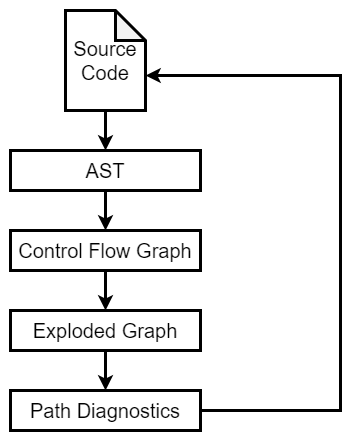

Doxygen of APIs: [LLVM: LLVM](https://llvm.org/doxygen/)

# Intro

[The LLVM Compiler Infrastructure Project](https://llvm.org/)

[Getting Started with LLVM Core Libraries（中文版） — Getting Started with LLVM Core Libraries 文档 (getting-started-with-llvm-core-libraries-zh-cn.readthedocs.io)](https://getting-started-with-llvm-core-libraries-zh-cn.readthedocs.io/zh-cn/latest/index.html#)

> 它最初的编写者，是一位叫做Chris Lattner(个人主页)的大神，硕博期间研究内容就是关于编译器优化的东西，发表了很多论文，博士论文是提出一套在编译时、链接时、运行时甚至是闲置时的优化策略，与此同时，LLVM的基本思想也就被确定了，这也让他在毕业前就在编译器圈子小有名气。
>
> 而在这之前，Apple公司一直使用GCC作为编译器，后来GCC对Objective-C的语言特性支持一直不够，Apple自己开发的GCC模块又很难得到GCC委员会的合并，所以老乔不开心。等到Chris Lattner毕业时，Apple就把他招入靡下，去开发自己的编译器，所以LLVM最初受到了Apple的大力支持。
>
> 最初时，LLVM的前端是GCC，后来Apple还是立志自己开发了一套Clang出来把GCC取代了，不过现在带有Dragon Egg的GCC还是可以生成LLVM IR，也同样可以取代Clang的功能，我们也可以开发自己的前端，和LLVM后端配合起来，实现我们自定义的编程语言的编译器。
>
> 原文链接：https://blog.csdn.net/RuanJian_GC/article/details/132031490

## *LLVM Compiler Infrastructure*

LLVM, Low Level Virtual Machine 是一个开源的编译器基础设施项目，旨在为各种编程语言提供优化的编译器和工具，用来开发编译器前端前端和后端。LLVM的设计目标是提供可移植、高效和灵活的编译解决方案

LLVM最早以C/C++为实作对象，到目前它已支援包括ActionScript、Ada、D语言、Fortran、GLSL、Haskell、Java字节码、Objective-C、Swift、Python、Ruby、Crystal、Rust、Scala以及C#等语言

LLVM 项目由一系列模块组成，包括前端、优化器和后端。以下是 LLVM 的关键组件


1. 前端（Frontend）：LLVM 前端是与特定编程语言相关的部分。它能够将不同的源代码语言转换为 LLVM 的中间表示（LLVM IR），这种中间表示是一种低级别的、面向对象的指令集表示形式，类似于汇编语言
2. 优化器（Optimizer）：LLVM 优化器是 LLVM 框架的核心组件之一。它可以对 LLVM IR 进行各种优化，包括常量折叠、循环优化、内联函数、代码消除、死代码消除等。这些优化可以显著提高程序的性能和执行效率
3. 后端（Backend）：LLVM 后端负责将优化后的 LLVM IR 转换为目标平台的机器码。LLVM 支持多种不同的目标体系结构，包括x86、ARM、MIPS等，因此可以在多个平台上生成高效的机器码
4. 工具链和库：LLVM 提供了一整套工具和库，用于构建编译器和开发工具。这些工具包括llvm-as（将汇编代码转换为 LLVM IR）、llvm-dis（将 LLVM IR 转换为可读的汇编代码）、llvm-link（将多个 LLVM 模块链接在一起）


## *LLVM项目的组成*

* LLVM核心库（LLVM Core libraries）：这些库提供了一个现代的源代码和目标代码无关的优化器，并支持许多流行CPU（以及一些不太常见的CPU）的代码生成。它们围绕着称为LLVM中间表示（"LLVM IR"）的良好定义的代码表示构建。LLVM核心库文档完善，若你想创造自己的语言（或将现有编译器移植）使用LLVM作为优化器和代码生成器非常容易
* Clang是LLVM原生的C/C++/Objective-C编译器前端。Clang使用LLVM作为其后端，能够将源码转换成LLVM IR，然后利用LLVM的优化器和代码生成器产生高效的机器码，Clang作为编译器前端，围绕它形成了丰富的工具生态，其中包括：
  - **libclang**：提供了一个稳定的C语言API，方便其他软件作为库来使用Clang。
  - **Clang Static Analyzer**：一个静态分析工具，可以在不执行程序的情况下检查源代码中的错误。
  - **Clang Format**：用于自动格式化C/C++/Obj-C代码，以保持统一的代码风格。
  - **Clang Tidy**：一个用于诊断和修复常见编程错误的模块化和可扩展的工具。
* LLDB项目（The LLDB Debugger）基于LLVM和Clang提供的库，提供了一个出色的本地调试器。它使用Clang的AST和表达式解析器、LLVM的即时编译（JIT）、LLVM反汇编器等，从而提供了一个“开箱即用”的体验。它运行速度非常快，并且在加载符号方面比GDB更加高效
* libc++ 和 libc++ ABI：这两个项目提供了一个符合标准且高性能的C++标准库实现，包括对C++11和C++14的完全支持
* compiler-rt：compiler-rt项目提供了精调的底层代码生成支持例程的实现，如"`__fixunsdfdi`"等，当目标没有简短的本地指令序列来实现核心IR操作时会生成这些调用。它还提供了动态测试工具（例如AddressSanitizer、ThreadSanitizer、MemorySanitizer和DataFlowSanitizer）的运行时库的实现
* MLIR：MLIR子项目是构建可复用和可扩展编译器基础设施的新方法。MLIR旨在解决软件碎片化问题，改进异构硬件的编译效率，显著降低构建特定领域编译器的成本，并帮助连接已有的编译器
* OpenMP：OpenMP子项目提供了一个运行时库，用于支持Clang中实现的OpenMP
* Polly：Polly项目实现了一系列缓存局部性优化以及使用多面体模型的自动并行化和向量化
* libclc：libclc项目旨在实现OpenCL标准库
* klee：klee项目实现了一个“符号虚拟机”，该项目使用定理证明器尝试评估程序中所有动态路径，以便发现bug并证明函数的属性。klee的一个主要特点是，如果检测到bug，它可以产生一个测试用例
* LLD：LLD项目是一个新的链接器，它可以替换系统链接器，并运行得更快。
* BOLT：BOLT项目是一个链接后优化器。它通过根据采样分析器收集的执行配置文件优化应用程序的代码布局来实现性能提升


### 源代码结构

根目录下，最重要的就是include和lib这两个文件夹。include文件夹包含了其它项目在使用LLVM核心库时需要包含的头文件，而lib文件夹里放的就是LLVM核心库的实现。分别打开lib和include，可以看到很多文件与子文件夹。有经验的读者应该能从名字大概猜到其实现的东西。比如，lib/IR子文件夹肯定是存放了与IR相关的代码，lib/Target子文件夹肯定与生成目标平台机器码有关。又比如，include/llvm/Pass.h文件里面声明了Pass类用来给你继承去遍历、修改LLVM IR。 当然，我们现在不必知道每个模块是干什么的。 等有需要再去查看官方文档吧。
根目录下还有一个tools文件夹，这里面就存放了我上面所说的周边工具。 打开这个目录，就可以看到类似llvm-as这样的子目录。显然这就是llvm-as的实现。
————————————————

                            版权声明：本文为博主原创文章，遵循 CC 4.0 BY-SA 版权协议，转载请附上原文出处链接和本声明。

原文链接：https://blog.csdn.net/m0_72827793/article/details/135371852

# 安装 & 编译 & 测试 LLVM

截止到2024.6.11，LLVM的最新版本为18.1.6

[Getting Started with the LLVM System — LLVM 19.0.0git documentation](https://llvm.org/docs/GettingStarted.html#getting-the-source-code-and-building-llvm)

## *准备工作*

### 依赖

* **CMake >= 3.20.0**,  Makefile/workspace generator

* **python >= 3.8**, Automated test suite

  Only needed if you want to run the automated test suite in the `llvm/test` directory, or if you plan to utilize any Python libraries, utilities, or bindings.

* **zlib >= 1.2.3.4**, Compression library

  Optional, adds compression / uncompression capabilities to selected LLVM tools.

* **GNU Make 3.79, 3.79.1**, Makefile/build processor

  Optional, you can use any other build tool supported by CMake.

```C++
$ sudo apt install -y gcc g++ git cmake ninja-build
```

zlib 是一个库，没有命令行的命令


## *使用预编译二进制包*

该方法适用于系统配置不足以完成编译的计算机体验LLVM，但如果未来要进行LLVM的自定义和实验，不建议使用该方法

### 从LLVM官网下载

[Download LLVM releases](https://releases.llvm.org/)

### Linux使用发行版的包管理器

* Ubuntu

  ```cmd
   $ sudo apt-get install llvm clang
  ```

* Fedora

  ```cmd
  $ sudo yum install llvm clang
  ```

Debian和Ubuntu Linux（i386和amd64）仓库可用于下载从LLVM subversion仓库编译得到的快照。[LLVM Debian/Ubuntu packages](https://apt.llvm.org/)

## *使用CMake进行编译*

### 拉取LLVM 

拉取LLVM source code [llvm/llvm-project: The LLVM Project is a collection of modular and reusable compiler and toolchain technologies. (github.com)](https://github.com/llvm/llvm-project)

github上面的是完整的LLVM项目，频繁的拉取完整的LLVM项目开销很大，以下是减少代码拉取量的设置

* shallow-clone

  ```cmd
  $ git clone --depth 1 https://github.com/llvm/llvm-project.git # https
  $ git clone --depth 1 git@github.com:llvm/llvm-project.git
  ```

* 不拉取 user branch

  ```cmd
  $ git config --add remote.origin.fetch '^refs/heads/users/*'
  $ git config --add remote.origin.fetch '^refs/heads/revert-*'
  ```

* 只拉取某个版本的LLVM

  ```cmd
  $ git clone --branch llvmorg-12.0.1 --depth 1 https://github.com/llvm/llvm-project.git
  ```

### 编译

[Getting Started with the LLVM System — LLVM 19.0.0git documentation](https://llvm.org/docs/GettingStarted.html#getting-the-source-code-and-building-llvm)

```cmd
$ cd llvm-project
# cmake configure
$ cmake -S llvm -B build -G Ninja -DCMAKE_BUILD_TYPE=Release -DCMAKE_INSTALL_PREFIX=/usr/local -DLLVM_ENABLE_PROJECTS="clang;lldb;lld;clang-tools-extra"
# $ cmake -G Ninja -DCMAKE_BUILD_TYPE=Release ../llvm
$ cmake --build build # cmake build
$ sudo cmake --build build --target install # cmake install
```

注意安装时文件可能不全，/usr/local/include/llvm/Config/config.h不会被安装进去，需要手动从build文件夹内复制出来。在运行编译时可以根据缺少头文件自行`sudo cp`

### Shell Script

```shell
# Download:
git clone https://github.com/llvm/llvm-project.git
cd llvm-project/llvm

# Configure
mkdir build && cd build && cmake .. -DCMAKE_BUILD_TYPE=Release

# build:
cmake --build . -j $(nproc)

# install:
cmake -DCMAKE_INSTALL_PREFIX=${HOME}/.local/ -P cmake_install.cmake

# uninstall
xargs rm -rf < install_manifest.txt
```

### 同时安装多个版本的LLVM

TBD

建议采用Docker的方式来安装

### CMake Cache

许多在本文档页面中提到的构建配置可以通过使用CMake缓存来实现。CMake缓存本质上是一个配置文件，用于设置特定构建配置所需的标志。Clang的缓存位于单一仓库的 `/clang/cmake/caches` 目录下。在下面的示例中展示了如何结合额外的配置标志，使用 `-C` 标志将它们传递给CMake

### 执行测试

```cmd
$ make check-all
```

### Stand-alone Builds

Stand-alone Builds 独立构建允许针对系统中已有的预编译版clang或LLVM库来构建子项目

You can use the source code from a standard checkout of the llvm-project (as described above) to do stand-alone builds, but you may also build from a sparse checkout or from the tarballs available on the releases page. 

对于独立构建，必须拥有一个配置正确、能够被其他项目的独立构建所使用的LLVM安装版本。这可以是发行版提供的LLVM安装，或者可以自己构建，像这样：

```cmake
cmake -G Ninja -S path/to/llvm-project/llvm -B $builddir \
      -DLLVM_INSTALL_UTILS=ON \
      -DCMAKE_INSTALL_PREFIX=/path/to/llvm/install/prefix \
      < other options >

ninja -C $builddir install
```

## *Options & Variables for CMake*

### 常用的CMake变量

`cmake --help-variable VARIABLE_NAME` 查看CMake变量的帮助

* **CMAKE_BUILD_TYPE**:STRING

  设置 make 或 ninja 的优化等级

  | Build Type         | Optimizations | Debug Info | Assertions | Best suited for            |
  | ------------------ | ------------- | ---------- | ---------- | -------------------------- |
  | **Release**        | For Speed     | No         | No         | Users of LLVM and Clang    |
  | **Debug**          | None          | Yes        | Yes        | Developers of LLVM         |
  | **RelWithDebInfo** | For Speed     | Yes        | No         | Users that also need Debug |
  | **MinSizeRel**     | For Size      | No         | No         | When disk space matters    |

  - Optimizations make LLVM/Clang run faster, but can be an impediment for step-by-step debugging.
  - Builds with debug information can use a lot of RAM and disk space and is usually slower to run. You can improve RAM usage by using `lld`, see the [LLVM_USE_LINKER](https://llvm.org/docs/CMake.html#llvm-use-linker) option.
  - Assertions are internal checks to help you find bugs. They typically slow down LLVM and Clang when enabled, but can be useful during development. You can manually set [LLVM_ENABLE_ASSERTIONS](https://llvm.org/docs/CMake.html#llvm-enable-assertions) to override the default from CMAKE_BUILD_TYPE.

* **CMAKE_INSTALL_PREFIX**:PATH

  Path where LLVM will be installed when the “install” target is built. 默认路径是/usr/local

* **CMAKE_{C,CXX}_FLAGS**:STRING

  Extra flags to use when compiling C and C++ source files respectively.

* **CMAKE_{C,CXX}_COMPILER**:STRING

  Specify the C and C++ compilers to use. If you have multiple compilers installed, CMake might not default to the one you wish to use.

### 常用的LLVM相关变量

- **LLVM_ENABLE_PROJECTS:STRING** 这个变量控制哪些项目被启用。如果只想要构建特定的LLVM子项目，比如Clang或者LLDB，可以使用这个变量来指定。例如，如果想同时构建Clang和LLDB，可以在CMake命令中加入 `-DLLVM_ENABLE_PROJECTS="clang;lldb"`

  所谓的Project就是llvm-project下面的那些目录，完整的Project Lists为 `clang;clang-tools-extra;cross-project-tests;libc;libclc;lld;lldb;openmp;polly;pstl`

- **LLVM_ENABLE_RUNTIMES:STRING** 这个变量让能够控制哪些运行时库被启用。如果想要构建libc++或者libc++abi这样的库，可以使用这个变量。例如，为了同时构建libc++和libc++abi，应该在CMake命令中添加 `-DLLVM_ENABLE_RUNTIMES="libcxx;libcxxabi"`

- **LLVM_LIBDIR_SUFFIX:STRING** 这个变量用于附加额外的后缀到库文件的安装目录。在64位架构上，你可能希望库文件被安装在`/usr/lib64`而非`/usr/lib`，那么可以设置 `-DLLVM_LIBDIR_SUFFIX=64`

- **LLVM_PARALLEL_{COMPILE,LINK}_JOBS:STRING** 构建LLVM工具链可能会消耗大量资源，尤其是Debug的链接。使用这些选项，当使用Ninja生成器时，可以限制并行性。例如，为了避免内存溢出（OOM）或使用交换空间(swap)，每15GB DRAM 可以给一个link job

- **LLVM_TARGETS_TO_BUILD:STRING** 这个变量控制哪些目标架构被启用。例如，如果你只需要为你的本地目标架构（比如x86）构建LLVM，你可以使用 `-DLLVM_TARGETS_TO_BUILD=X86` 来实现

- **LLVM_USE_LINKER:STRING** 这个变量允许你覆盖系统默认的链接器。例如，如果你想使用LLD作为链接器，可以设置 `-DLLVM_USE_LINKER=lld`

## *高级编译设置*

[Advanced Build Configurations — LLVM 19.0.0git documentation](https://llvm.org/docs/AdvancedBuilds.html)

### Multi-Stage Build

Multi-Stage Build 也称为 bootstrap build 自举编译，即将LLVM的编译过程分为多个阶段

为什么需要这么设计？因为会有这样的需求：当开发者想要移植LLVM到一个新的平台或支持一个新的处理器架构时，他们可能会遇到先有鸡还是先有蛋的问题，即需要一个已经存在的编译器来构建新的编译器。多阶段编译解决了这个问题，让开发者能够逐步地生成能够自举的LLVM工具链

* Stage 1

  使用现有编译器（例如系统提供的GCC或Clang）构建LLVM和Clang的基本可执行版本。这个阶段的输出是 bootstrap 编译器，它包含了基本的核心LLVM工具链，足以进行进一步的编译

* Stage 2

  使用第一步构建出的 bootstrap 编译器来编译完整的LLVM。这是为了确保新编译器能够编译自己的代码库，并且可以在特定的优化和代码生成方面自我验证与改进。产生一个由自身编译的更优化和精简的LLVM工具链

* Stage 3 and even more stages (optional)

  理论上，第三阶段的构建输出应该和第二阶段完全一致，这可以作为一个测试来确保编译器的生成自洽性（也就是说，它可以可靠地复制自己的输出）

LLVM的多阶段编译可以通过 `-DCLANG_ENABLE_BOOTSTRAP=On` 来开启

```cmd
$ cmake -G Ninja -DCMAKE_BUILD_TYPE=Release \
    -DCLANG_ENABLE_BOOTSTRAP=On \
    -DLLVM_ENABLE_PROJECTS="clang" \
    <path to source>/llvm
$ ninja stage2
```


```cmd
$ cmake -G Ninja -DCMAKE_BUILD_TYPE=Release \
    -DCLANG_ENABLE_BOOTSTRAP=On \
    -DCLANG_BOOTSTRAP_PASSTHROUGH="CMAKE_INSTALL_PREFIX;CMAKE_VERBOSE_MAKEFILE" \
    -DLLVM_ENABLE_PROJECTS="clang" \
    <path to source>/llvm
$ ninja stage2
```


### Multi-Stage PGO

Profile-Guided Optimizations, PGO

### BOLT

Binary Optimization and Layout Tool, BOLT

### 3-Stage Non-Determinism


## *Docker*

### Shell Script for Generating Dockerfile

`llvm/utils/docker` 文件夹下存放着将LLVM docker化的相关文件

LLVM Project提供了以 `debian10` and `nvidia-cuda` 分别作为基准镜像的两个dockerfile，还有一个example供用户自己填充关键选项

LLVM Project 另外提供了一个用来生成可定制化的LLVM的Dockerfile的Shell script `llvm/utils/build_docker_image.sh`

```cmd
$ cd llvm/utils/docker
$ ./build_docker_image.sh \
    --source ubuntu2204 \
    --docker-repository clang-ubuntu --docker-tag "staging" \
    -p clang -p lldb -i install-clang -i install-clang-resource-headers \
    -- \
    -DCMAKE_BUILD_TYPE=Debug
```

docker-repository 就是一个名字，取什么无所谓

### 自定义的Dockerfile

```dockerfile
FROM ubuntu22.04

ENV TZ=Asia/Shanghai

SHELL ["/bin/bash", "-c"]

RUN apt-get clean && \
    apt-get autoclean

# default cmake version 3.10.2
RUN apt-get update && apt-get upgrade -y && \
    apt-get install -y \
    htop \
    tree \
    apt-utils \
    curl \
    wget \
    cmake \ 
    git \
    openssh-server \
    build-essential \
    libboost-all-dev \
    net-tools \
    vim \
    stress \
    python3 \
    ninja-build \
    zlib1g

# default gcc verison 7.5.0
RUN apt-get install -y libc-ares-dev libssl-dev gcc g++ make

RUN git clone --depth 1 --progress https://github.com/llvm/llvm-project.git

WORKDIR /llvm-project

# RUN git config --add remote.origin.fetch '^refs/heads/users/*' && git config --add remote.origin.fetch '^refs/heads/revert-*'

# cmake config
RUN cmake -S llvm -B build -G Ninja -DCMAKE_BUILD_TYPE=Debug -DLLVM_PARALLEL_LINK_JOBS=1 -DCMAKE_INSTALL_PREFIX=/usr/local -DLLVM_ENABLE_PROJECTS="clang;lldb"

# cmake build
RUN cmake --build build

# cmake install
RUN cmake --build build --target install

# LLVM non-relevant install if needed
```

## *Cross-compile*

### 交叉编译的需求 

LLVM的cross-compile 交叉编译是指在一种架构或操作系统上使用LLVM工具链来编译为在不同的目标架构或操作系统上运行的代码。简而言之，交叉编译涉及生成可在与构建环境（即我们正在编译代码的机器）不同的目标环境（即代码将要运行的机器）上执行的程序

比如说我们可能在一台x86架构的Linux电脑上开发软件，但是需要为ARM架构的嵌入式设备编译这个软件。使用交叉编译，我们可以创建一个专门针对ARM架构的可执行文件，尽管我们的开发机器是基于x86架构的

交叉编译通常用于以下情况：

1. 编写嵌入式系统或移动设备应用程序，因为这些设备通常没有足够的资源来编译复杂的代码
2. 构建为特定操作系统或硬件优化的软件，尤其是当开发环境与目标环境不同时
3. 创建操作系统镜像，通常在主机系统上为其他架构的设备构建系统镜像

### `llvm::Triple`

LLVM作为一个编译器框架支持交叉编译的特性使得它非常适合开发需要在多平台上运行的软件。提供了目标三元组（target triple）的概念——一种标识目标系统的格式，包括CPU类型、制造商和操作系统等信息，以便于交叉编译器生成正确的代码。

```
<arch><sub>-<vendor>-<sys>-<abi>
```

```cmd
$ clang --version | grep Target
Target: x86_64-unknown-linux-gnu
```

```C++
// llvm-project/llvm/include/llvm/TargetParser/Triple.h
class Triple {
public:
  enum ArchType { };
  enum SubArchType { };
  enum VendorType { };
  enum OSType { };
  enum EnvironmentType { };
  enum ObjectFormatType { };
public:
  explicit Triple(const Twine &Str);
  Triple(const Twine &ArchStr, const Twine &VendorStr, const Twine &OSStr);
  Triple(const Twine &ArchStr, const Twine &VendorStr, const Twine &OSStr,
         const Twine &EnvironmentStr);
};
```

## *卸载LLVM*

## *测试*

[Llvm 源码结构及测试基础 - 吴建明wujianming - 博客园 (cnblogs.com)](https://www.cnblogs.com/wujianming-110117/p/17128814.html)

[LLVM测试框架_llvm-lit-CSDN博客](https://zhikunhuo.blog.csdn.net/article/details/125173869)

LLVM 测试基础设施包含三大类测试：单元测试 unit test、回归测试 regression test 和整个程序。单元测试和回归测试分别包含在 LLVM 存储在 LLVM/unittest 和 LLVM/test 之下，并且应该始终通过，一般情况作为check-in，即它们应该在每次提交之前运行

* 单元测试是使用 Google Test 和 Google Mock 编写的，位于 llvm/unittest 目录中。在一般情况下，单元测试用于针对支持库和其他通用数据结构，我们倾向于依赖回归测试来测试 IR 上的转换和分析
* 回归测试是测试 LLVM 特定特性或在 LLVM 中触发特定 bug 的小段代码。它们使用的语言取决于测试的 LLVM 部分。这些测试由 Lit 测试工具(LLVM 的一部分)驱动，位于 LLVM/test 目录中

通常，当在 LLVM 中发现 bug 时，应该编写一个回归测试，其中包含足够的代码来重现问题，并将该测试放置在这个目录的某个位置。例如，它可以是从实际应用程序或基准中提取的一小段 LLVM IR

# 预定义宏

## *`__attribute__`*

和GCC一样，Clang同样支持用 `__attribute__` 来显式地控制编译器的行为，而且还添加了一些自己的扩展。为了检查一个特殊属性的可用性，可以使用`__has_attribute`指令

这里介绍一下Clang独有的 `__attribute__` 指令

### availability

[__attribute__详解及应用 | roy's blog (woshiccm.github.io)](https://woshiccm.github.io/posts/__attribute__详解及应用/)

# Example: Kaleidoscope Language

[My First Language Frontend with LLVM Tutorial — LLVM 19.0.0git documentation](https://llvm.org/docs/tutorial/MyFirstLanguageFrontend/index.html)

[基于 LLVM 自制编译器——序 | 楚权的世界 (chuquan.me)](https://chuquan.me/2022/07/17/compiler-for-kaleidoscope-00/)

官方给出了一个 Kaleidoscope Language 万花筒语言的构建过程来展示LLVM的使用，这门语言采用手写前端（Lexer + Parser）+ LLVM IR + LLVM 后端的结构

1. [Chapter #1: Kaleidoscope language and Lexer](https://llvm.org/docs/tutorial/MyFirstLanguageFrontend/LangImpl01.html) - 这展示了我们的目标和我们想要构建的基本功能。Lexer 也是为语言构建 parser的第一部分，我们使用一个简单的C++ lexer，它易于理解
2. [Chapter #2: Implementing a Parser and AST](https://llvm.org/docs/tutorial/MyFirstLanguageFrontend/LangImpl02.html)- 有了lexer，我们可以讨论解析技术和基础的AST构建。本教程描述了递归下降解析和运算符优先级解析
3. [Chapter #3: Code generation to LLVM IR](https://llvm.org/docs/tutorial/MyFirstLanguageFrontend/LangImpl03.html) - AST准备好后，我们将展示生成LLVM IR有多么容易，并展示如何简单地将LLVM集成到你的项目中
4. [Chapter #4: Adding JIT and Optimizer Support](https://llvm.org/docs/tutorial/MyFirstLanguageFrontend/LangImpl04.html) - LLVM的一个优点是其对JIT编译的支持，因此我们将直接深入研究，并向您展示添加JIT支持只需3行代码。后续章节将展示如何生成 `.o` 文件
5. [Chapter #5: Extending the Language: Control Flow](https://llvm.org/docs/tutorial/MyFirstLanguageFrontend/LangImpl05.html) - 有了基础语言的支持，我们展示了如何用控制流操作（'if'语句和'for'循环）来扩展它。这给了我们一个讨论SSA构建和控制流的机会
6. [Chapter #6: Extending the Language: User-defined Operators](https://llvm.org/docs/tutorial/MyFirstLanguageFrontend/LangImpl06.html) - 本章扩展了语言，允许用户自定义任意一元和二元操作符——并且可以分配优先级！这使我们能够将“语言”的重要部分作为库例程来构建
7. [Chapter #7: Extending the Language: Mutable Variables](https://llvm.org/docs/tutorial/MyFirstLanguageFrontend/LangImpl07.html) - 本章讨论如何添加用户自定义的局部变量以及赋值操作符。这展示了在LLVM中构建SSA形式有多简单：LLVM不要求您的前端构建SSA形式就可以使用它
8. [Chapter #8: Compiling to Object Files](https://llvm.org/docs/tutorial/MyFirstLanguageFrontend/LangImpl08.html) - 本章解释了如何将LLVM IR编译成对象文件，就像静态编译器所做的那样
9. [Chapter #9: Debug Information](https://llvm.org/docs/tutorial/MyFirstLanguageFrontend/LangImpl09.html) - 一个真正的语言需要支持试器，因此我们添加了调试信息，允许在万花筒函数中设置断点，打印出参数变量，并调用函数
10. [Chapter #10: Conclusion and other tidbits](https://llvm.org/docs/tutorial/MyFirstLanguageFrontend/LangImpl10.html) - 本章通过讨论扩展语言的方法来结束整个系列，并包括指向关于“特殊主题”的信息的指针，比如添加垃圾回收支持、异常处理、调试、对“spaghetti stacks”等的支持


## *在项目中通过CMake使用LLVM*

```cmake
cmake_minimum_required(VERSION 3.20.0)
project(SimpleProject)

find_package(LLVM REQUIRED CONFIG)

message(STATUS "Found LLVM ${LLVM_PACKAGE_VERSION}")
message(STATUS "Using LLVMConfig.cmake in: ${LLVM_DIR}")

# Set your project compile flags.
# E.g. if using the C++ header files
# you will need to enable C++11 support
# for your compiler.

include_directories(${LLVM_INCLUDE_DIRS})
separate_arguments(LLVM_DEFINITIONS_LIST NATIVE_COMMAND ${LLVM_DEFINITIONS})
add_definitions(${LLVM_DEFINITIONS_LIST})

# Now build our tools
add_executable(simple-tool tool.cpp)

# Find the libraries that correspond to the LLVM components
# that we wish to use
llvm_map_components_to_libnames(llvm_libs support core irreader)

# Link against LLVM libraries
target_link_libraries(simple-tool ${llvm_libs})
```

# Clang Driver

[Clang C Language Family Frontend for LLVM](https://clang.llvm.org/)

[Welcome to Clang's documentation! — Clang 19.0.0git documentation (llvm.org)](https://clang.llvm.org/docs/)

[Clang Compiler User’s Manual — Clang 19.0.0git documentation (llvm.org)](https://clang.llvm.org/docs/UsersManual.html)

设计手册：[“Clang” CFE Internals Manual — Clang 19.0.0git documentation (llvm.org)](https://clang.llvm.org/docs/InternalsManual.html)

Doxygen: [clang: clang (llvm.org)](https://clang.llvm.org/doxygen/)

> The Clang project provides a language front-end and tooling infrastructure for languages in the C language family (C, C++, Objective C/C++, OpenCL, CUDA, and RenderScript) for the [LLVM](https://www.llvm.org/) project. Both a GCC-compatible compiler driver (`clang`) and an MSVC-compatible compiler driver (`clang-cl.exe`) are provided. You can [get and build](https://clang.llvm.org/get_started.html) the source today.

[clang 源码导读（1）: clang 入门-腾讯云开发者社区-腾讯云 (tencent.com)](https://cloud.tencent.com/developer/article/1803207)

[clang 源码导读（2）: clang driver 流程简介-腾讯云开发者社区-腾讯云 (tencent.com)](https://cloud.tencent.com/developer/article/1803206)

[clang 源码导读（3）: clang driver 参数解析-腾讯云开发者社区-腾讯云 (tencent.com)](https://cloud.tencent.com/developer/article/1803211)

[clang 源码导读（4）: clang driver 构建 Actions-腾讯云开发者社区-腾讯云 (tencent.com)](https://cloud.tencent.com/developer/article/1803208)

[clang 源码导读（5）: clang driver 构建 Jobs (qq.com)](https://mp.weixin.qq.com/s/abhUVoXqr52yXj-HJEjd8Q)

[clang 源码导读（6）: clang driver 执行命令 (qq.com)](https://mp.weixin.qq.com/s/7khfjSesUdeJUXi-NT5zZA)

[clang 源码导读（7）：编译器前端流程简介-腾讯云开发者社区-腾讯云 (tencent.com)](https://cloud.tencent.com/developer/article/1810976)

[clang 源码导读（8）：词法分析和预处理指令-腾讯云开发者社区-腾讯云 (tencent.com)](https://cloud.tencent.com/developer/article/1811032)

## *实操：编译Pipeline*

下图是以Clang为前端的，LLVM为后端的编译器的整体架构


以下面这份代码为例

```C++
//Example.c
#include <stdio.h>
int global;
void myPrint(int param) {
    if (param == 1)
        printf("param is 1");
    for (int i = 0 ; i < 10 ; i++ ) {
        global += i;
    }
}
int main(int argc, char *argv[]) {
    int param = 1;
    myPrint(param);
    return 0;
}
```

### 编译传参

由于Clang Driver的架构设计，需要分别用 `-Xclang` 和 `-mllvm` 分别将参数传递给Clang前端和LLVM中后段

* -Xclang参数是将参数传递给Clang的CC1前端

  比如想要禁用所有LLVM Pass的运行，也就是生成无任何优化的IR，那么就要使用-disable-llvm-passes参数传递给CC1。但是这个参数并没有Clang Driver的表示形式（也就是不使用-Xclang传递给CC1），那么就需要写-Xclang -disable-llvm-passes把参数透过Clang Driver把参数传递给CC1

* -mllvm参数的作用是将参数传递给作为中后端的LLVM

  如果参数是在LLVM中后端定义的，那么直接把参数给Clang的Driver或者CC1都是不行的，需要使用-mllvm将参数跳过Clang的Driver和CC1传递到LLVM。比如想要在Pass运行完成后输出IR，那么就需要使用-mllvm --print-after-all把参数传给LLVM

### clang & clang++

和gcc & g++的不同分工一样，clang & clang++同样分别适用于编译C和C++

clang++会自动链接C++标准库，而clang则不会

```C++
int half(int x) {
  int result = (x / 2);
  return result;
}

int main() {
  half(2);
  return 0;
}
```

```cmd
$ clang -### test.cc &> clang_output.txt
$ clang++ -### test.cc &> clangpp_output.txt
$ diff -u clang_output.txt clangpp_output.txt
```

编译器的参数是一样的，都是调用的cc1。差异在于链接器 ld的调用参数：

- 当使用 `clang` 时，链接器没有被告知链接 C++ 标准库 `libstdc++` 或数学库 `libm`
- 当使用 `clang++` 时，链接器的调用包含了 `-lstdc++` 和 `-lm` 参数，这表明它需要链接 C++ 标准库和数学库。这是因为 `clang++` 被当作 C++ 编译器使用，自动假设需要这些库

### 分别编译不同的阶段

我们可以看下有下面这些阶段

```cmd
$ clang -ccc-print-phases main.cc
            +- 0: input, "main.cc", c++
         +- 1: preprocessor, {0}, c++-cpp-output
      +- 2: compiler, {1}, ir
   +- 3: backend, {2}, assembler
+- 4: assembler, {3}, object
5: linker, {4}, image
```

1. 预处理

   ```cmd
   $ clang -E source.c -o preprocessed.i
   ```

2. 编译

   ```cmd
   $ clang -S -emit-llvm source.c -o intermediate.ll
   ```

3. 生成目标代码

   ```cmd
   $ clang -S source.c -o assembly.s
   ```

4. 汇编

   ```cmd
   $ clang -c source.c -o object.o
   ```

5. 编译

   ```cmd
   $ clang object.o -o executable
   ```

## *Overview*

平常使用的可执行文件 `clang.exe` 只是一个Driver，即一个命令解析器，**用于接收gcc兼容的参数**（`clang++.exe`/`clang-cl.exe`同理，用于g++/msvc兼容的参数），然后传递给真正的clang编译器前端，也就是CC1。CC1作为前端，负责解析C++源码为语法树，转换到LLVM IR。比如选项A在gcc中默认开启，但是clang规则中是默认不开启的，那么为了兼容gcc，clang.exe的Driver就要手动开启选项A，也就是添加命令行参数，将它传递给CC1

可以把Driver理解为以Clang为前端的LLVM整个软件的main函数，在这个main函数中依次调用整个编译流程中的各个阶段

### Procedure

[Driver Design & Internals — Clang 19.0.0git documentation (llvm.org)](https://clang.llvm.org/docs/DriverInternals.html)


上图中橙色的代表数据，绿色代表操作这些数据的阶段，蓝色的代表辅助组件

1. Input Strings

   调用Clang的时候后面命令行传入的命令

2. Parse: Option Parsing

   将传入的String类型输入解析成具体的参数对象，如果要查看完整的解析过程，可以使用 `-###`，下面有说明

3. Pipeline: Compilation Action Construction

   一旦解析了参数，就会构造出后续编译所需要的子任务。这涉及到确定输入文件及其类型，要对它们做哪些工作（预处理、编译、组装、链接等），以及为每个任务构造一个Action实例列表。其结果是一个由一个或多个顶层Action组成的列表，每个Action通常对应一个单一的输出（例如，一个对象或链接的可执行文件）。可以使用 `-ccc-print-phases` 可以打印出这个阶段的内容

4. Bind: Tool & Filename Selection

   这个阶段和后面的Trasnlate一起将将Actions转化成真正的进程。Driver自上而下匹配，将Actioins分配给分配给Tools，ToolChain负责为每个Action选择合适的Tool，一旦选择了Tool，Driver就会与Tool交互，看它是否能够匹配更多的Action

   一旦所有的Action都选择了Tool，Driver就会决定如何连接工具（例如，使用进程内模块、管道、临时文件或用户提供的文件名）

   Driver驱动程序与ToolChain交互，以执行Tool的绑定。ToolChain包含了特定架构、平台和操作系统编译所需的所有工具的信息，一次编译过程中，单个Driver调用可能会查询多个ToolChain，以便与不同架构的工具进行交互

   可以通过`-ccc-print-bindings` 可以查看Bind的大致情况，以下展示了在i386和ppc上编译t0.c文件Bing过程

5. Translate: Tool Specific Argument Translation

   一旦选择了一个Tool来执行一个特定的Action，该Tool必须构建具体的Commands，并在编译过程中执行。该阶段主要的工作是将gcc风格的命令行选项翻译成子进程所期望的任何选项

   这个阶段的结果是一些列将要执行Commands（包含执行路径和参数字符）

6. Execute

   执行阶段，Clang Driver 会创建两个子线程来分别之前上一阶段输出的编译和链接任务，并且产出结果

### `-###` option

```cmd
$ clang -### test.cc
clang version 19.0.0git (git@github.com:llvm/llvm-project.git 424188abe4956d51c852668d206dfc9919290fbf)
Target: x86_64-unknown-linux-gnu
Thread model: posix
InstalledDir: /usr/local/bin
 "/usr/local/bin/clang-19" "-cc1" "-triple" "x86_64-unknown-linux-gnu" "-emit-obj" "-dumpdir" "a-" "-disable-free" "-clear-ast-before-backend" "-disable-llvm-verifier" "-discard-value-names" "-main-file-name" "test.cc" "-mrelocation-model" "pic" "-pic-level" "2" "-pic-is-pie" "-mframe-pointer=all" "-fmath-errno" "-ffp-contract=on" "-fno-rounding-math" "-mconstructor-aliases" "-funwind-tables=2" "-target-cpu" "x86-64" "-tune-cpu" "generic" "-debugger-tuning=gdb" "-fdebug-compilation-dir=/home/wjfeng/clang_learn" "-fcoverage-compilation-dir=/home/wjfeng/clang_learn" "-resource-dir" "/usr/local/lib/clang/19" "-internal-isystem" "/usr/lib/gcc/x86_64-linux-gnu/11/../../../../include/c++/11" "-internal-isystem" "/usr/lib/gcc/x86_64-linux-gnu/11/../../../../include/x86_64-linux-gnu/c++/11" "-internal-isystem" "/usr/lib/gcc/x86_64-linux-gnu/11/../../../../include/c++/11/backward" "-internal-isystem" "/usr/local/lib/clang/19/include" "-internal-isystem" "/usr/local/include" "-internal-isystem" "/usr/lib/gcc/x86_64-linux-gnu/11/../../../../x86_64-linux-gnu/include" "-internal-externc-isystem" "/usr/include/x86_64-linux-gnu" "-internal-externc-isystem" "/include" "-internal-externc-isystem" "/usr/include" "-fdeprecated-macro" "-ferror-limit" "19" "-fgnuc-version=4.2.1" "-fskip-odr-check-in-gmf" "-fcxx-exceptions" "-fexceptions" "-fcolor-diagnostics" "-faddrsig" "-D__GCC_HAVE_DWARF2_CFI_ASM=1" "-o" "/tmp/test-0f12cd.o" "-x" "c++" "test.cc"
 "/usr/bin/ld" "-z" "relro" "--hash-style=gnu" "--eh-frame-hdr" "-m" "elf_x86_64" "-pie" "-dynamic-linker" "/lib64/ld-linux-x86-64.so.2" "-o" "a.out" "/lib/x86_64-linux-gnu/Scrt1.o" "/lib/x86_64-linux-gnu/crti.o" "/usr/lib/gcc/x86_64-linux-gnu/11/crtbeginS.o" "-L/usr/lib/gcc/x86_64-linux-gnu/11" "-L/usr/lib/gcc/x86_64-linux-gnu/11/../../../../lib64" "-L/lib/x86_64-linux-gnu" "-L/lib/../lib64" "-L/usr/lib/x86_64-linux-gnu" "-L/usr/lib/../lib64" "-L/lib" "-L/usr/lib" "/tmp/test-0f12cd.o" "-lgcc" "--as-needed" "-lgcc_s" "--no-as-needed" "-lc" "-lgcc" "--as-needed" "-lgcc_s" "--no-as-needed" "/usr/lib/gcc/x86_64-linux-gnu/11/crtendS.o" "/lib/x86_64-linux-gnu/crtn.o"
```

`clang -### test.cc` 实际上并没有编译文件，而是告诉 Clang 输出它将会执行的命令来编译 `test.cc` 源文件。**`-###` 选项使得 Clang 打印出详细的命令行调用信息，但不真正运行这些命令**。这非常有用于调试和理解 Clang 内部的工作机制

输出显示了 Clang Driver 组装出的将要执行的两个主要步骤：

1. 使用 cc1 编译器生成目标文件

   ```cmd
   "/usr/local/bin/clang-19" "-cc1" [一系列参数] "-o" "/tmp/test-0f12cd.o" "-x" "c++" "test.cc"
   ```

   这个命令调用了 Clang 的内部前端 (`-cc1`) 来编译 C++ 源文件 `test.cc` 并生成中间对象文件 `/tmp/test-0f12cd.o`。在这个过程中，Clang 处理了包括预处理、编译和生成 LLVM IR 等任务，并最终将其转换为目标代码

   参数包括指定目标三元组 `-triple` ("x86_64-unknown-linux-gnu")、优化设置、调试信息选项、警告级别等。这里也配置了编译路径、资源目录以及系统库的包含路径等信息

2. 使用ld链接器，链接生成可执行文件

   ```cmd
   "/usr/bin/ld" [一系列参数] "/tmp/test-0f12cd.o" "-o" "a.out"
   ```

   在第二步中，调用系统的链接器 `ld` 来将之前生成的目标文件 `/tmp/test-0f12cd.o` 链接成最终的可执行文件，默认输出为 `a.out`。链接器还会链接其他启动和结束例程需要的目标文件（如 `crt1.o`, `crti.o`, `crtbeginS.o`, `crtendS.o`）和库文件（如 `-lgcc`, `-lgcc_s`, `-lc`）。这些文件和库提供了程序初始化、标准库支持和正确关闭程序所需的代码

   链接器的参数还设定了一些链接选项，比如 PIE（Position Independent Executable，位置无关可执行文件），选择动态链接器以及库和搜索路径等

### Walkthrough of `clang_main`

[LLVM-Driver笔记 | 香克斯 (shanks.pro)](https://shanks.pro/2020/07/14/llvm-driver/)

[clang 01. clang driver流程分析-CSDN博客](https://blog.csdn.net/qq_43566431/article/details/130689146)

在`clang/tools/driver/driver.cpp` 我们可以找到Driver的入口，其中入口逻辑都集中在**clang_main**之中

1. **创建诊断**：clang_main 会先创建诊断实例 DiagnosticsEngine，诊断是编译器与开发者进行交互的重要部分。编译器通过诊断可以提供错误、警告或建议

   ```C++
   DiagnosticsEngine Diags(DiagID, &*DiagOpts, DiagClient);
   ```

2. **创建Driver实例**：创建 `clang::driver::Driver` 的实例 TheDriver，它会负责后续的所有任务

3. **创建Compilation**：通过 Driver 的 `BuildCompilation()` 生成需要执行的命令，下面的都是`BuildCompilation()` 所调用的方法

   1. `ParseArgStrings()` 参数解析 
   2. 获取ToolChain：通过 `computeTargetTriple()` 获取 triple 并通过 `getToolChain()` 获取对应的 ToolChain
   3. 创建Compilation持有参数
   4. 通过 `BuildInputs()` 获取输入文件
   5. 构建 Action：通过 `BuildUniversalActions()` 构建 Action
   6. 构建 Jobs：通过 `BuildJobs()` 构建 Jobs

4. **执行Compilation**：当 Driver 构造完 Jobs 后，会通过 Driver 的 ExecuteCompilation 方法执行命令

下面会对一些重要环节进行详细说明

### main 函数

用Debug模式编译后用lldb调试，断点打到 Driver.cpp:4151，得到如下的栈帧

```
(lldb) r
Process 2900 launched: '/usr/local/bin/clang++' (x86_64)
Process 2900 stopped
* thread #1, name = 'clang++', stop reason = breakpoint 3.1
    frame #0: 0x000055555b9f897e clang++`clang::driver::Driver::BuildActions(this=0x00007fffffffd250, C=0x000055556cba09c0, Args=0x000055556cb9f040, Inputs=0x00007fffffffcde0, Actions=0x000055556cba0a30) const at Driver.cpp:4154:7
   4151
   4152   // Builder to be used to build offloading actions.
   4153   std::unique_ptr<OffloadingActionBuilder> OffloadBuilder =
-> 4154       !UseNewOffloadingDriver
   4155           ? std::make_unique<OffloadingActionBuilder>(C, Args, Inputs)
   4156           : nullptr;
   4157
(lldb) bt
* thread #1, name = 'clang++', stop reason = breakpoint 3.1
  * frame #0: 0x000055555b9f897e clang++`clang::driver::Driver::BuildActions(this=0x00007fffffffd250, C=0x000055556cba09c0, Args=0x000055556cb9f040, Inputs=0x00007fffffffcde0, Actions=0x000055556cba0a30) const at Driver.cpp:4154:7
    frame #1: 0x000055555b9eae01 clang++`clang::driver::Driver::BuildCompilation(this=0x00007fffffffd250, ArgList=ArrayRef<char const*> @ 0x00007fffffffc9b0) at Driver.cpp:1543:17
    frame #2: 0x00005555569fe03a clang++`clang_main(Argc=2, Argv=0x00007fffffffe668, ToolContext=0x00007fffffffe480) at driver.cpp:361:66
    frame #3: 0x0000555556a3921c clang++`main(argc=2, argv=0x00007fffffffe668) at clang-driver.cpp:17:20
    frame #4: 0x00007ffff7a66d90 libc.so.6`___lldb_unnamed_symbol3139 + 128
    frame #5: 0x00007ffff7a66e40 libc.so.6`__libc_start_main + 128
    frame #6: 0x00005555569fc3e5 clang++`_start + 37
```


## *Diagnostics*

## *参数解析*


### DriverOptTable

OptTable 最小的单位是 `struct Info`，里面存放了一个 `ArrayRef<Info> OptionInfos`

/llvm-project/clang/lib/Driver/DriverOptions.cpp


### `Driver::ParseArgStrings()`

`Driver::ParseArgStrings()` 的作用是将字符串数组解析为 ArgList，并做相关的校验

如何区分不支持或者不认识的参数？clang driver **不支持** 的参数，都可以通过 `Options.td` 文件查到。以 -pass-exit-codes 为例，gcc 支持该参数，但是 clang **不支持** 此参数

### ParseArgs


### ParseOneArg

`OptTable::ParseOneArg()` 负责解析单个参数

## *构建Actions*

### Action Class

[clang: clang::driver::Action Class Reference (llvm.org)](https://clang.llvm.org/doxygen/classclang_1_1driver_1_1Action.html)

Action 是代表一个编译步骤的抽象基类，可以理解为将某种输入转为输出文件的操作步骤

* BindArchAction 将 `.o` 文件与特定的架构做绑定
* InputAction 只代表原始的输入文件/参数
* **JobAction 可以理解能够通过单独的程序执行的过程**
  * PreprocessJobAction 是将源码进行预处理的过程
  * CompileJobAction 是将上一步的结果转为 `bitcode` 的过程
  * BackendJobAction 是将 `bitcode` 转为 `.s` 文件的过程
  * AssembleJobAction 是将`.s` 文件转为 `.o` 二进制文件的过程
  * LinkJobAction 是将 `.o` 文件合并为静态库/动态库/可执行文件的过程
  * LipoJobAction 是用于将多个 `BindArchAction` 输入合并为单一的 `fat mach-o` 文件
* OffloadAction GPU的offload过程

### `BuildUniversalActions()`

通过 `BuildUniversalActions()` 构建 Actions

1. 若没有传入 `-arch` 参数，可以通过 `ToolChain::getDefaultUniversalArchName()` 获取 triple 对应的架构

2. 调用 `BuildActions()` 计算每个输入文件对应的 `SingleActions` (可能包含预处理、编译、后端、汇编等)

   1. 调用 `Driver::handleArguments()` 对参数进行一些处理

   2. 遍历输入源码文件`Inputs`，并通过下面的 `getCompilationPhases()` 获取需要对输入文件进行处理的 `phase` 数组，其内部会根据传入的参数通过 `getFinalPhase()` 来获取需要执行的最后一个 phase

      ```llvm
      // llvm-project/clang/include/clang/Driver/Types.def
      
      TYPE("c",                        C,            PP_C,            "c",      phases::Preprocess, phases::Compile, phases::Backend, phases::Assemble, phases::Link)
      
      TYPE("c++",                      CXX,          PP_CXX,          "cpp",    phases::Preprocess, phases::Compile, phases::Backend, phases::Assemble, phases::Link)
      ```

      ```C++
      // llvm-project/clang/lib/Driver/Types.cpp
      llvm::SmallVector< phases::ID, phases::MaxNumberOfPhases > clang::driver::types::getCompilationPhases(const clang::driver::Driver &Driver,
                                                 lvm::opt::DerivedArgList &DAL, ID Id);	
      ```

      1. 先组装一个 `InputAction`，相当于输入文件的占位符
      2. 依次遍历 phase，并根据 phase 创建 Acti	on（通过调用 `ConstructPhaseAction()` 实现） **注意，每个 NewCurrent 都会持有 Current**

### Action流程

1. Preprocess
2. Compile
3. Backend
4. Assemble
5. Link
6. Bind & Lipo

## *构建Jobs*

### 为什么需要Jobs

如前所述，上一步构建Actions中的每个JobAction可以理解为都可以通过单独的程序完成。但是这种方案会浪费很多时间进行 **生成中间文件** 和 **解析中间文件** 的操作。因此 clang driver 会尝试合并多个 JobAction ，以避免反复的硬盘读写操作和文件生成/解析操作

构建 Jobs 包含两个步骤：

1. Bind：将 Actions 转变要运行的实际 Jobs
2. Translate：将 clang driver 接收的参数转为对应 Tools 可以理解的参数

## *执行命令*

jobs 构建完成后，会先调用 `Driver::ExecuteCompilation()`，它会依次完成以下任务：

1. 通过 `Compilation::ExecuteJobs()` 执行命令
2. 如果某些命令存在报错，将结果文件移除，并打印相关信息

# Clang Lexer & Parser

本章介绍Clang的lexer & parser的实现

## *Lexer*

## *Parser*

Clang使用的Parser是基于递归下降分析 recursive descent parser 的

# Clang AST

[LLVM 编译器前端 Clang AST & API 学习笔记 | jywhy6's blog](https://blog.jywhy6.zone/2020/11/27/clang-notes/).

## *Clang Frontend*


本节介绍一下Clang Frontend的流程，同样是从clang_main开始

通过 `ExecuteCC1Tool()` 分发不同的 `cc1`类型
1. `-cc1` : LLVM 'Clang' Compiler
2. `-cc1as` : Clang Integrated Assembler
3. `-cc1gen-reproducer`: **Generate Libclang invocation reproducers**

### `cc1_main()`

llvm-project/clang/tools/driver/cc1_main.cpp

`cc1_main()` 负责初始化 CompilerInstance、DiagnosticIDs，并调用 `CreateFromArgs()` 构建 CompilerInvocation

1. `CreateFromArgs()` 内部会非常多的函数对参数进行解析，比如 -emit-obj

2. 调用 `clangFrontendTool` 模块的 `ExecuteCompilerInvocation()` 执行编译任务。clangFrontendTool 模块很简单，其中只有一个 ExecuteCompilerInvocation.cpp 文件

   1. 会先判断是否存在 `-h` `-v` 等参数，若存在，则会执行对应的任务。值得注意的是，这里会尝试加载 plugin

   2. 经过一系列的判断后，才会通过 `CreateFrontendAction()` 创建需要执行的**编译器前端**任务

      1. 先调用 `CreateFrontendBaseAction()` 创建 FrontendAction 的子类，并且会根据 `EmitObj` 参数创建 `EmitObjAction` 的实例

      2. 任务创建完成后，会调用 clang/Frontend 模块的 `ExecuteAction()` 执行编译任务，其会通过 Inputs 获取输入文件，并依次调用以下方法

         1. `Act.BeginSourceFile()` 通过懒加载方式创建 FileManager（负责和文件系统交互，文件缓存、目录查找等任务）和 SourceManager（负责查找并将文件缓存到内存）

            1. `createPreprocessor()` 创建预处理器
            2. `createASTContext()` 创建 ASTContext
            3. `CreateWrappedASTConsumer()` 创建ASTConsumer

         2. `Act.Execute()` 实际上是执行 EmitObjAction 继承自 FrontendAction 的 `Execute()`

            1. 创建 Sema

               ```
               Act.Execute() -> FrontendAction:Execute() -> CodeGenAction::ExecuteAction()
               -> ASTFrontendAction::ExecuteAction() -> CompilerInstance::createSema()
               ```

            2. `clang::ParseAST()` 构建 AST

         3. `Act.EndSourceFile()`

### CompilerInstance

clang/Frontend 模块包含了很多重要的功能。 比如 `cc1_main()` 函数创建的CompilerInstance就是来自clang/Frontend

CompilerInstance 是非常重要的一个类，因为它持有了诸如`preprocessor`、`Target`、`AST` 等属性

### FrontendAction

FrontendAction 是Clang前端执行的action的抽象基类


 ActionKind 枚举类高速了我们有哪些前端任务

```C++
// llvm-project/clang/include/clang/Frontend/FrontendOptions.h
enum ActionKind {
  /// Parse ASTs and list Decl nodes.
  ASTDeclList,
  /// Parse ASTs and dump them.
  ASTDump,
  /// Parse ASTs and print them.
  ASTPrint,
  /// Parse ASTs and view them in Graphviz.
  ASTView,
  /// Dump the compiler configuration.
  DumpCompilerOptions,
  /// Dump out raw tokens.
  DumpRawTokens,
  /// Dump out preprocessed tokens.
  DumpTokens,
  /// Emit a .s file.
  EmitAssembly,
  /// Emit a .bc file.
  EmitBC,
  /// Translate input source into HTML.
  EmitHTML,
  /// Emit a .cir file
  EmitCIR,
  /// Emit a .ll file.
  EmitLLVM,
  // ...
};  
```

## *AST核心API*

### `clang::ParseAST()`


注：上图的虚线框内为回调方法，表头黑体为类名

构建AST树的核心类是`clang::ParseAST()`

> Parse the entire file specified, notifying the ASTConsumer as the file is parsed.  This inserts the parsed decls into the translation unit held by Ctx.

```C++
void clang::ParseAST (Sema &S, bool PrintStats=false, bool SkipFunctionBodies=false);
void clang::ParseAST (Preprocessor &pp, ASTConsumer *C, ASTContext &Ctx, bool PrintStats=false,
                      TranslationUnitKind TUKind=TU_Complete,
                      CodeCompleteConsumer *CompletionConsumer=nullptr,
                      bool SkipFunctionBodies=false); // 复用第一个ParseAST
```

```C++
// llvm-project/clang/lib/Parse/ParseAST.cpp
void clang::ParseAST(Sema &S, bool PrintStats, bool SkipFunctionBodies) {
  // Collect global stats on Decls/Stmts (until we have a module streamer).
  if (PrintStats) {
    Decl::EnableStatistics();
    Stmt::EnableStatistics();
  }

  // Also turn on collection of stats inside of the Sema object.
  bool OldCollectStats = PrintStats;
  std::swap(OldCollectStats, S.CollectStats);

  // Initialize the template instantiation observer chain.
  // FIXME: See note on "finalize" below.
  initialize(S.TemplateInstCallbacks, S);

  ASTConsumer *Consumer = &S.getASTConsumer();

  std::unique_ptr<Parser> ParseOP(
      new Parser(S.getPreprocessor(), S, SkipFunctionBodies));
  Parser &P = *ParseOP.get();

  llvm::CrashRecoveryContextCleanupRegistrar<const void, ResetStackCleanup>
      CleanupPrettyStack(llvm::SavePrettyStackState());
  PrettyStackTraceParserEntry CrashInfo(P);

  // Recover resources if we crash before exiting this method.
  llvm::CrashRecoveryContextCleanupRegistrar<Parser>
    CleanupParser(ParseOP.get());

  S.getPreprocessor().EnterMainSourceFile();
  ExternalASTSource *External = S.getASTContext().getExternalSource();
  if (External)
    External->StartTranslationUnit(Consumer);

  // If a PCH through header is specified that does not have an include in
  // the source, or a PCH is being created with #pragma hdrstop with nothing
  // after the pragma, there won't be any tokens or a Lexer.
  bool HaveLexer = S.getPreprocessor().getCurrentLexer();

  if (HaveLexer) {
    llvm::TimeTraceScope TimeScope("Frontend");
    P.Initialize();
    Parser::DeclGroupPtrTy ADecl;
    Sema::ModuleImportState ImportState;
    EnterExpressionEvaluationContext PotentiallyEvaluated(
        S, Sema::ExpressionEvaluationContext::PotentiallyEvaluated);

    for (bool AtEOF = P.ParseFirstTopLevelDecl(ADecl, ImportState); !AtEOF;
         AtEOF = P.ParseTopLevelDecl(ADecl, ImportState)) {
      // If we got a null return and something *was* parsed, ignore it.  This
      // is due to a top-level semicolon, an action override, or a parse error
      // skipping something.
      if (ADecl && !Consumer->HandleTopLevelDecl(ADecl.get()))
        return;
    }
  }

  // Process any TopLevelDecls generated by #pragma weak.
  for (Decl *D : S.WeakTopLevelDecls())
    Consumer->HandleTopLevelDecl(DeclGroupRef(D));

  Consumer->HandleTranslationUnit(S.getASTContext());

  // Finalize the template instantiation observer chain.
  // FIXME: This (and init.) should be done in the Sema class, but because
  // Sema does not have a reliable "Finalize" function (it has a
  // destructor, but it is not guaranteed to be called ("-disable-free")).
  // So, do the initialization above and do the finalization here:
  finalize(S.TemplateInstCallbacks, S);

  std::swap(OldCollectStats, S.CollectStats);
  if (PrintStats) {
    llvm::errs() << "\nSTATISTICS:\n";
    if (HaveLexer) P.getActions().PrintStats();
    S.getASTContext().PrintStats();
    Decl::PrintStats();
    Stmt::PrintStats();
    Consumer->PrintStats();
  }
}
```

1. 启用统计信息（如果需要）：如果`PrintStats`为真，则启用用于声明（`Decl`）和语句（`Stmt`）的统计信息收集。交换`Sema`对象中的`CollectStats`标志，以便在解析期间收集统计数据
2. 初始化模板实例化观察者链：在`Sema`对象`S`中，初始化模板实例化时要使用的回调函数链
3. 设置解析器和错误恢复上下文：创建一个`Parser`对象来处理解析任务，并设置崩溃恢复上下文以确保在发生异常时能够进行适当的资源清理。`PrettyStackTraceParserEntry`用于提供在发生崩溃时更好的错误消息
4. 开始解析：让预处理器进入主源文件，并且如果有外部AST源，通知它开始翻译单元的工作
5. 检查是否存在词法分析器：检查预处理器是否当前拥有一个词法分析器，这在某些情况下可能不存在，例如，源文件中没有任何包含指令或正在生成预编译头（PCH）
6. 解析顶层声明：只要存在词法分析器，就循环解析顶层声明。对每个解析出来的顶层声明，通过`Consumer`来处理它。如果处理失败，则提前返回
7. 处理由`#pragma weak`生成的顶层声明：遍历所有弱引用的顶层声明并处理它们
8. 完成翻译单元的处理：通知消费者已经完成了整个翻译单元的解析工作，允许它执行必要的最终处理
9. 完成模板实例化观察者链的初始化和清理：将在`Sema`对象中初始化的模板实例化观察者链进行最终的清理工作
10. 打印统计信息：如果开启了统计信息功能，则在解析结束后打印相关的统计结果


为了方便用户加入自己的actions，Clang提供了众多的hooks

### ASTConsumer

> This is an abstract interface that should be implemented by clients that read ASTs.
>
> This abstraction layer allows the client to be independent of the AST producer (e.g. parser vs AST dump file reader, etc).

ASTConsumer 是一个抽象基类，它定义了一个接口供各种不同的组件使用，用来使用生成的AST

```C++
// llvm-project/clang/include/clang/AST/ASTConsumer.h
// llvm-project/clang/lib/AST/ASTConsumer.cpp
```

以下是ASTConsumer提供的接口虚函数

* Initialize

  This is called to initialize the consumer, providing the ASTContext.

  ```C++
  virtual void Initialize(ASTContext &Context) {}
  ```

* HandleTopLevelDecl

  当解析器完成一个顶层声明的解析时调用此方法。例如，当解析到一个全局变量、函数或类时，这个方法就会被执行

  返回true就继续parsing，返回false就终止

  ```C++
  virtual bool HandleTopLevelDecl(DeclGroupRef D);
  ```

* HandleTranslationUnit

  **一个翻译单元 (Translation Unit) 的顶层节点是 `TranslationUnitDecl`**

  在整个翻译单元（通常是一个源文件）的解析和语义分析结束时调用，这时候整个AST已经构建完成。这个方法适合做一些整体性的操作，比如输出整个翻译单元的代码

  ```C++
  virtual void HandleTranslationUnit(ASTContext &Ctx) {}
  ```

  

```C++


// 该回调函数在每次有inline函数或友元调用完成的时候被调用
virtual void HandleInlineFunctionDefinition(FunctionDecl *D) {}

/// HandleInterestingDecl - Handle the specified interesting declaration. This
/// is called by the AST reader when deserializing things that might interest
/// the consumer. The default implementation forwards to HandleTopLevelDecl.
virtual void HandleInterestingDecl(DeclGroupRef D);

// 在整个翻译单元（通常是一个源文件）的解析和语义分析结束时调用，这时候整个AST已经构建完成。这个方法适合做一些整体性的操作，比如输出整个翻译单元的代码
virtual void HandleTranslationUnit(ASTContext &Ctx) {}

// 当一个标签声明（例如一个结构体或类）被完整定义时调用
virtual void HandleTagDeclDefinition(TagDecl *D) {}

/// This callback is invoked the first time each TagDecl is required to
/// be complete.
virtual void HandleTagDeclRequiredDefinition(const TagDecl *D) {}

/// Invoked when a function is implicitly instantiated.
/// Note that at this point it does not have a body, its body is
/// instantiated at the end of the translation unit and passed to
/// HandleTopLevelDecl.
virtual void HandleCXXImplicitFunctionInstantiation(FunctionDecl *D) {}

/// Handle the specified top-level declaration that occurred inside
/// and ObjC container.
/// The default implementation ignored them.
virtual void HandleTopLevelDeclInObjCContainer(DeclGroupRef D);

// 这个函数是处理隐式导入声明的回调。在语言如Objective-C中，可能存在模块的隐式导入，这个函数会在这样的导入声明被解析时被调用
virtual void HandleImplicitImportDecl(ImportDecl *D);

/// CompleteTentativeDefinition - Callback invoked at the end of a translation
/// unit to notify the consumer that the given tentative definition should be
/// completed.
///
/// The variable declaration itself will be a tentative
/// definition. If it had an incomplete array type, its type will
/// have already been changed to an array of size 1. However, the
/// declaration remains a tentative definition and has not been
/// modified by the introduction of an implicit zero initializer.
virtual void CompleteTentativeDefinition(VarDecl *D) {}

/// CompleteExternalDeclaration - Callback invoked at the end of a translation
/// unit to notify the consumer that the given external declaration should be
/// completed.
virtual void CompleteExternalDeclaration(VarDecl *D) {}

/// Callback invoked when an MSInheritanceAttr has been attached to a
/// CXXRecordDecl.
virtual void AssignInheritanceModel(CXXRecordDecl *RD) {}

/// HandleCXXStaticMemberVarInstantiation - Tell the consumer that this
// variable has been instantiated.
virtual void HandleCXXStaticMemberVarInstantiation(VarDecl *D) {}

// 特定于C++的，用于处理虚函数表
virtual void HandleVTable(CXXRecordDecl *RD) {}

/// If the consumer is interested in entities getting modified after
/// their initial creation, it should return a pointer to
/// an ASTMutationListener here.
virtual ASTMutationListener *GetASTMutationListener() { return nullptr; }

/// If the consumer is interested in entities being deserialized from
/// AST files, it should return a pointer to a ASTDeserializationListener here
virtual ASTDeserializationListener *GetASTDeserializationListener() { return nullptr; }

// 打印统计信息
virtual void PrintStats() {}

/// This callback is called for each function if the Parser was
/// initialized with \c SkipFunctionBodies set to \c true.
///
/// \return \c true if the function's body should be skipped. The function
/// body may be parsed anyway if it is needed (for instance, if it contains
/// the code completion point or is constexpr).
virtual bool shouldSkipFunctionBody(Decl *D) { return true; }
```

### ASTContext

> Holds long-lived AST nodes (such as types and decls) that can be referred to throughout the semantic analysis of a file.

```
llvm-project/clang/include/clang/AST/ASTContext.h
llvm-project/clang/lib/AST/ASTContext.cpp
```

在一个翻译单元中，所有有关 AST 的信息都在类 `ASTContext` ，包括：

- 符号表
- `SourceManager`
- AST 的入口节点: `TranslationUnitDecl* getTranslationUnitDecl()`

## *AST结构*

### Reminder: Expression & Statement

* Expression 表达式

  表达式是计算机程序中的一个单元，**它会计算并返回一个值**。表达式由操作数（常量、变量、函数调用等）和操作符（比如加减乘除）组成。表达式总是产生或返回一个结果值，并且可以出现在任何需要值的地方

  ```C
  3 * 7      // 返回 21 的表达式
  x          // 如果 x 是一个变量，这是一个返回 x 值的表达式
  foo()      // foo 函数调用是一个表达式；假设 foo 返回一个值
  x + y * 2  // 返回 x 与 y 乘以 2 之和的表达式
  ```

* Statement 语句

  **语句是执行特定操作的最小独立单元**，它表示要做的一项动作或命令。**语句不像表达式那样返回值**，但它可以改变程序的状态。一个程序通常由一系列顺序执行的语句构成

  ```C
  int x = 10;   // 赋值语句
  if (x > 0) {  // 条件语句
      x = -x;   
  }
  return x;     // 返回语句
  ```

  每一个语句都可以改变程序的状态，比如通过赋值语句改变变量的值，或通过条件语句来控制程序流程的走向

Expression & Statement 的主要区别在于，表达式是有返回值的，而语句可能没有。在很多语言里，语句不能作为表达式的一部分出现，因为它不返回值，而表达式可以作为更大的表达式的一部分出现，也可以独立作为表达式语句。在某些语言中（如Python），表达式可以作为语句使用，而在其他语言中（如C, C++），则必须显式使用一个表达式语句（例如，一个以分号结束的表达式）

还有一些语言（如Scala和Ruby）模糊了表达式和语句的界限，因为在这些语言中几乎所有东西都是表达式（即都有返回值）

### AST Nodes

Clang的AST节点的最顶级类 Decl、Stmt 和 Type 被建模为没有公共祖先的独立类

* Decl 表示各种声明
  * FunctionDecl 函数声明。注意：在AST层级中，**不区分函数声明和函数定义，统一用FunctionDecl来标识**，两个区分主要看是否有函数体 function body，可以使用 `bool hasBody()` 来进行判断
  * VarDecl 变量声明，如果有初始化，可以通过 `getInit()` 获取到对应的初始化Expr
* Stmt 表示各种语句（代码块）
  * CompoundStmt 复合语句：代表大括号，函数实现、struct、enum、for的body等一般用此包起来
  * DeclStmt 定义语句，里边可能有VarDecl等类型的定义
  * ForStmt For语句对应，包括Init/Cond/Inc 对应 `(int a=0;a<mm;a++)` 这三部分，还有一部分是body，可以分别使用 `getInit()`，`getCond()`，`getInc()`，`getBody()` 来分别进行获取
  * IfStmt If语句：包括三部分Cond、TrueBody、FalseBody三部分，分别可以通过 `getCond()`，`getThen()`, `getElse()` 三部分获取，Cond和Then是必须要有的，Else可能为空
  * ReturnStmt 可选的return语句
  * ValueStmt 可能含有 Value & Type 的语句
    * Expr 表达式，clang中expression也是statement的一种
      * BinaryOperator 二元运算符
      * CallExpr 函数调用表达式，子节点有调用的参数列表
      * CastExpr 类型转换表达式
        * ImplicitCastExpr 隐形转换表达式，在左右值转换和函数调用等各个方面都会用到
      * IntegerLiteral 定点Integer值
      * ParenExpr 括号表达式
      * UnartOperator 一元操作符
* Type 类型
  * PointerType 指针类型

### Glue Classes

* DeclContext：包含其他 `Decl` 的 `Decl` 需要继承此类
* TemplateArgument：模板参数的访问器
* NestedNameSpecifier
* QualType：Qual 是 qualifier 的意思，将 C++ 类型中的 `const` 等拆分出来，避免类型的组合爆炸问题

### 实例

实例可以参考这个slide：[PowerPoint 프레젠테이션 (kaist.ac.kr)](https://swtv.kaist.ac.kr/courses/cs492-fall18/part1-coverage/lec7-Clang-tutorial.pdf)

```C++
//Example.c
#include <stdio.h>
int global;
void myPrint(int param) {
    if (param == 1)
    printf("param is 1");
    for (int i = 0 ; i < 10 ; i++ ) {
        global += i;
    }
}
int main(int argc, char *argv[]) {
    int param = 1;
    myPrint(param);
    return 0;
}
```

```cmd
$ clang -Xclang -ast-dump -fsyntax-only test.cc
```

- `-Xclang`：这个选项后面跟随的参数会直接传递给 Clang 的前端而不是驱动程序。Clang 驱动程序负责处理用户级别的编译选项，并将它们转化为针对各种工具（例如前端、汇编器和链接器）的实际命令行参数。使用 `-Xclang` 可以直接向 Clang 前端发送指令

- `-ast-dump`：这是传递给 Clang 前端的参数，告诉它输出 AST 的结构信息。AST 是源代码的树形表示，其中每个节点都代表了源代码中的构造（如表达式、声明等）

- `-fsyntax-only`：这个选项告诉 Clang 仅执行语法检查，而不进行代码生成或其他后续步骤。因此，它只会解析源代码，检查语法错误，并在完成后停止。这通常用于快速检查代码是否正确，或者像在这个命令中一样，与 `-ast-dump` 结合来查看源代码的 AST

  如果不使用它的话，clang driver的compile部分就会expect一个输入，会输出一个 `clang: error: linker command failed with exit code 1136` 的错误

-  `-fmodules` 选项启用了 Clang 的模块功能。模块是一种用于替代传统的 `#include` 预处理器指令和头文件的编译单元，它旨在改进 C 和 C++ 程序的编译时间和封装性

## *Traversing through AST*

Clang 主要提供了 2 种对 AST 进行访问的类：`RecursiveASTVisitor` 和 `ASTMatcher`

### RecursiveASTVisitor

[How to write RecursiveASTVisitor based ASTFrontendActions. — Clang 19.0.0git documentation (llvm.org)](https://clang.llvm.org/docs/RAVFrontendAction.html)


继承RecursiveASTVisitor，并且实现其中的 VisitCXXRecordDecl，那么这个方法就会在访问 CXXRecordDecl类型的节点上触发

### ASTMatcher

[Tutorial for building tools using LibTooling and LibASTMatchers — Clang 19.0.0git documentation (llvm.org)](https://clang.llvm.org/docs/LibASTMatchersTutorial.html)


## *AST可视化*

[FraMuCoder/PyClASVi: Python Clang AST Viewer (github.com)](https://github.com/FraMuCoder/PyClASVi)

[CAST-projects/Clang-ast-viewer: Clang AST viewer (github.com)](https://github.com/CAST-projects/Clang-ast-viewer)

1. ###### **Clang AST Viewer (Web Based)** 这是一个基于 Web 的工具，可以将 Clang 的 `-ast-dump` 输出转换为易于浏览的树形结构。用户可以在浏览器中直接查看以及交互式地探索 AST。
2. **Clang AST Explorer (Online Tool)** Clang AST Explorer 是一个在线工具，允许用户在网页上写代码，并实时看到对应的 AST。这个资源非常适合教学和演示目的。

# LLVM 中的数据结构

[LLVM Programmer’s Manual — LLVM 19.0.0git documentation](https://llvm.org/docs/ProgrammersManual.html)

## *LLVM String*

### StringRef

`StringRef` 是 LLVM 库中的一个类，用于提供对字符数组（通常是字符串）的非拥有的、不可变的视图。与标准库中的 `std::string` 类相比，`StringRef` 不会复制字符串数据，它只是引用已经存在的字符串。这使得 `StringRef` 能够在不涉及内存分配和复制的情况下高效地操作字符串

以下是一些 `StringRef` 的关键特性：

1. **非拥有**: `StringRef` 仅保存了指向实际数据（如 C 风格字符串）的指针和长度信息，但并不管理该数据的生命周期。因此，使用 `StringRef` 时必须确保它引用的数据在 `StringRef` 对象的生命周期内保持有效。
2. **轻量级**: `StringRef` 只包含两个成员：一个指针和一个长度。这使得它非常适合用作函数参数或返回值，无需担心性能开销。
3. **不可变**: `StringRef` 实例本身是不可更改的。虽然可以改变它所指向的字符串数据（如果数据是可变的），但不能通过 `StringRef` 接口修改它。
4. **字符串操作**: `StringRef` 提供了大量用于检查和处理字符串的方法，如 `equals()`, `startswith()`, `endswith()`, `substr()`, `find()`, `trim()` 等。
5. **与标准字符串类型互操作**: 你可以从 `const char*` 或 `std::string` 创建 `StringRef` 对象。同样，也可以将 `StringRef` 转换为 `std::string`。
6. **效率**: 因为不需要复制字符串数据，所以 `StringRef` 在许多场景下（例如解析、分词等）都非常高效。

`StringRef` 的典型用法示例：

```C++
#include "llvm/ADT/StringRef.h"
#include <iostream>

using namespace llvm;

int main() {
    const char *cstr = "Hello, world!";
    StringRef strRef(cstr);

    // 使用 StringRef 进行子串操作
    StringRef hello = strRef.substr(0, 5); // 截取前5个字符
    bool startsWithHello = strRef.startswith("Hello"); // 检查是否以 Hello 开头

    std::cout << "Substring: " << hello.str() << "\n";
    std::cout << "Starts with 'Hello': " << (startsWithHello ? "Yes" : "No") << "\n";

    // 遍历 StringRef 中的每个字符
    for (char c : strRef) {
        // ...
    }

    return 0;
}
```

在这个例子中，我们创建了一个 `StringRef` 来引用一个 C 风格字符串，并演示了如何使用其中的一些方法。

重要的一点是 `StringRef` 的设计意图主要是用作临时对象，在函数调用过程中传递字符串，而不是长期存储字符串数据。所以使用 `StringRef` 时，需要小心保证它引用的字符串在 `StringRef` 被使用的整个时间里都是有效的。

### Twine

Twine 是一个用于高效地进行字符串连接和操作的实用工具类，它被设计为延迟求值的方式以避免不必要的内存分配。Twine 不拥有其引用的字符串数据，而是保持对这些字符串片段（可以是字面量、字符串对象等）的引用，并在最后需要实际的字符串结果时才将它们组合起来

Twine 最常见的使用场景是构建错误消息或其他复杂的字符串，特别是在性能敏感的上下文中，因为它可以避免许多小型的临时字符串分配和复制


使用二叉树结构来描述字符串临时的拼接，避免 string 的堆开销。如 `auto c = Twine(std::string(a), "b")`，此时 c 的左子树保存 a 的常引用，右子树保存 “b” 的指针，再 `auto e = Twine(c, "d")` 则 e 的左子树保存 c 的常引用；此时调用 `e.str()` 则会从保存的二叉结构构造完整字符串

这个类**不会延长**保存的元素的**生命周期**，特别是临时变量用完就扔在其中是完全不能存在的，必须在确定作用域的情况下使用，多少有点为性能的受虐狂情结


下面是关于 Twine 的一些关键特性：

1. **延迟求值**：Twine 会保留对所涉及的各个字符串片段的引用，只在最终需要时（例如输出到流或转换为 `std::string` 时）才进行实际的字符串拼接
2. **非拥有性质**：因为 Twine 对象不拥有其引用的字符串数据，它应该只用作临时对象，在创建后尽快用于字符串操作，以确保引用的数据在使用时仍然有效
3. **不修改原始字符串**：Twine 只是引用原始字符串，并不修改它们。所有的拼接和组合操作都是在最终转换为另一个字符串表示时发生的。
4. **不用于长期存储**：由于其非拥有的特性和对原始数据的引用，Twine 并不适合用于长期存储字符串数据。
5. **与其他 LLVM 数据结构相互作用**：`Twine` 能够处理 LLVM 的 `StringRef`、基本 C 字符串 (`const char*`) 以及 C++ 标准库的 `std::string` 对象

Twine 的使用示例：

```C++
#include "llvm/ADT/Twine.h"
#include "llvm/ADT/StringRef.h"
#include <iostream>

using namespace llvm;

int main() {
    StringRef part1 = "Hello, ";
    std::string part2 = "world";
    const char *part3 = "!";

    // 创建 Twine 实例表示整个字符串，但没有立即执行连接。
    Twine fullMessage = Twine(part1) + part2 + part3;

    // 现在我们需要实际的字符串表示，这会构造一个新的 std::string 对象。
    std::string finalString = fullMessage.str();

    std::cout << finalString << std::endl; // 输出: Hello, world!

    return 0;
}
```

在上述代码中，我们创建了几个不同类型的字符串片段，并使用 `Twine` 将它们连接成一个完整的信息。请注意，只有在调用 `.str()` 方法时，`Twine` 才会生成一个新的 `std::string` 对象。在此之前，所有的操作都没有产生临时字符串对象或执行任何连接操作

总之，`Twine` 是一个高效的工具，用于在需要动态构建字符串但又想避免频繁内存分配时使用。然而，正因为它的这种设计，开发者需要谨慎使用，并确保 `Twine` 使用的上下文适合其设计意图

### SmallString

## *Sequential Containers*

### SmallVector

`llvm::SmallVector` 是一个针对小数组进行优化的结构。优化为当数组元素较少时不执行堆分配，只在栈上分配。若添加的元素数量超过了使用自动存储分配的元素数量，它将转回 `std::vector` 的行为并分配越来越大的数组。当明确始终拥有少量元素时，`llvm::SmallVector` 可以带来性能优势


### PagedVector

### ilist_node

和Linux内核中的双向链表一样，LLVM中实现的是侵入式的双向链表，ilist_node 则是它的基础节点。如 `ClassA : public ilist_node<ClassA, Tag1>` 这种类声明，即在 `ClassA` 内部放置了对应 Tag1 的双向链表指针，使用 `simple_ilist<ClassA, Tag1> list` 即可往 `list` 中插入 `ClassA` 对象，当一个对象需要插入至不同链表中时，多重继承不同的 Tag 的 `ilist_node` 模板，同上链表也使用对应的 Tag。需要**注意**元素对象的**生命周期**问题，`simple_ilist` 不负责管理容器中元素的生命周期，要实现比较复杂的生命周期管理需要在链表插入/删除元素等操作时使用 `iplist_impl` 包装类指定回调函数来实现

### Sentinels

对于熟悉STL的程序员而言，Sentinel 哨兵位的概念再熟悉不过了，它用来帮助在容器的头尾实现标准的迭代器行为

迭代器标准行为的约束为 ilist 如何分配和存储哨兵位提供了一些实现自由度。相应的策略由 `ilist_traits<T>` 决定。默认情况下，每当需要哨兵时，就会在堆上分配一个 T 类型的对象

尽管默认策略在大多数情况下是足够的，但当 T 没有提供默认构造函数时，可能会出现问题。此外，在许多 ilist 实例的情况下，与哨兵位关联的内存开销是浪费的。为了缓解众多且体积庞大的 T-哨兵的情况，有时会采用一种技巧，导致出现ghostly sentinels

ghostly sentinels 是通过特别设计的 `ilist_traits<T>` 获得的，它们在内存中与 ilist 实例重叠。使用指针运算来获取相对于 ilist 的 this 指针的哨兵。ilist 增加了一个额外的指针，作为哨兵位的反向链接。这是唯一可以合法访问的ghostly sentinels字段


## *Set-like Containers*

## *Map-like Containers*

* StringMap

  StringMap 使用字符串作为键。它通常比标准库中的 `std::map<std::string, ValueType>` 或 `std::unordered_map<std::string, ValueType>` 提供更好的性能，特别是对于编译器这样频繁进行字符串操作的应用场景。字符串键存储在 StringMap 中，并且通常与 StringMapEntry 结合使用，后者保存了键和值

  StringMap 的效率之一来源于它对键的内存管理方式：它将键存储在与值相邻的内存中，以减少指针跳转并提升缓存一致性

* IndexdMap

  IndexedMap 是一个数组风格的映射，通过整数索引访问元素。它提供快速的随机访问性能，其行为类似于直接使用一个数组或 `std::vector`，但是具有额外的功能，如按需自动调整大小

  此数据结构非常适用于情况是有密集的整数键集合，并且需要一个数组的性能而不是一般映射的开销

* ValueMap

  ValueMap 可以持有 LLVM IR 中的值（例如指令、全局变量等）作为键。这个数据结构通过增加一些针对 LLVM 值系统定制的附加逻辑来处理键的内部表示形式和生命周期问题。这意味着当使用 LLVM IR 中的值作为键时，`ValueMap` 可以确保在值被改变或删除时映射也会更新

  `ValueMap` 在做数据流分析或者其他 IR 级别的转换时非常有用，因为经常需要将值映射到某些分析结果或者新创建的值上

  ```C++
  llvm::ValueMap<llvm::Value*, int> Map;
  llvm::Value* Val; // 假设 Val 已初始化为有效的 LLVM IR Value
  Map[Val] = 42;
  ```

### DenseMap

[llvm中的数据结构及内存分配策略 - DenseMap_llvm::densemap-CSDN博客](https://blog.csdn.net/dashuniuniu/article/details/80043852)

DenseMap 的实现是一个基于 quadratic probing 二次探测的散列表，键值对本身是 `std::pair<KeyT, ValueT>`

`DenseMap<>` 的构造函数和赋值运算符的定义如下

```C++
// llvm-project/llvm/include/llvm/ADT/DenseMap.h
template <typename KeyT, typename ValueT,
          typename KeyInfoT = DenseMapInfo<KeyT>,
          typename BucketT = llvm::detail::DenseMapPair<KeyT, ValueT>>
class DenseMap : public DenseMapBase<DenseMap<KeyT, ValueT, KeyInfoT, BucketT>,
                                     KeyT, ValueT, KeyInfoT, BucketT> {
  friend class DenseMapBase<DenseMap, KeyT, ValueT, KeyInfoT, BucketT>;

  // Lift some types from the dependent base class into this class for
  // simplicity of referring to them.
  using BaseT = DenseMapBase<DenseMap, KeyT, ValueT, KeyInfoT, BucketT>;

  BucketT *Buckets;
  unsigned NumEntries;
  unsigned NumTombstones;
  unsigned NumBuckets;

public:
  /// Create a DenseMap with an optional \p InitialReserve that guarantee that
  /// this number of elements can be inserted in the map without grow()
  explicit DenseMap(unsigned InitialReserve = 0) { init(InitialReserve); }

  DenseMap(const DenseMap &other) : BaseT() {
    init(0);
    copyFrom(other);
  }

  DenseMap(DenseMap &&other) : BaseT() {
    init(0);
    swap(other);
  }

  template<typename InputIt>
  DenseMap(const InputIt &I, const InputIt &E) {
    init(std::distance(I, E));
    this->insert(I, E);
  }

  DenseMap(std::initializer_list<typename BaseT::value_type> Vals) {
    init(Vals.size());
    this->insert(Vals.begin(), Vals.end());
  }
  // ...
};
```

`DenseMap<>` 有四个数据成员

* Buckets 散列桶的首地址（一块连续的内存）
* NumEntries 存储的数据个数
* NumTombstones Tombstone个数（二次探测法删除数据时需要设置deleted标识）
* NumBuckets 桶的个数


## *Bit Storage Containers*

# 编程接口

## *Out-of-Tree Development with CMake*

Out-of-Tree Development 就是不直接在 LLVM 源码目录里面开发，而是新建一个项目，通过链接 LLVM 库和头文件来开发基于 LLVM 的程序。LLVM 提供 llvm-config 工具或者 cmake 文件来定位 LLVM 库和头文件

## *三个API库的区别*

Clang 提供了用于编写需要有关程序的语法和语义信息的工具的基础设施

[Choosing the Right Interface for Your Application — Clang 19.0.0git documentation (llvm.org)](https://clang.llvm.org/docs/Tooling.html)

[[转载\] AST 获取和分析：Clang And Tree-sitter | 微言 | wyanassert 个人工作总结](https://blog.wyan.vip/2023/07/AST_And_Clang_And_Tree_Sitter.html)


* LibClang：基于 LibClang 分析 AST 的优点是 LibClang 提供的 API 很稳定，Clang 版本更新对工具影响不大；缺点是 LibClang 无法访问和利用 Clang AST 的全部信息

* Clang Plugin

  Clang Plugin 是动态库，不能独立使用，需要在编译过程中动态加载执行，是编译流程的一部分

  * 使用例子

* LibTooling

  Clang Tools 是一个可独立运行的工具，不依赖编译流程

## *LibClang*

[Libclang tutorial — Clang 19.0.0git documentation (llvm.org)](https://clang.llvm.org/docs/LibClang.html)

llibclang是Clang的C语言接口库，它提供了一个相对较小的API，暴露了用于解析源代码成为AST、加载已经解析的AST、遍历AST、将物理源位置和AST中的元素关联起来以及其他支持基于Clang的开发工具的功能。这个Clang的C语言接口永远不会提供存储在Clang的C++ AST中的所有信息表示，也不应该提供：其意图是保持一个从一个版本到下一个版本相对稳定的API，只提供支持开发工具所需的基本功能

libclang的整个C语言接口可以在llvm-project/clang/include/clang-cIndex.h文件中找到

### libclang核心数据结构

**libclang中所有类型都以 `CX` 开头**

* CXIndex：一个Index包含了一系列会被链接到一起形成一个可执行文件或库的translation unit

* CXTranslationUnit：

* CXCursor：一个cursor代表了一个指向某个translation unit的AST中的某些元素

  ```C++
  typedef struct {
    enum CXCursorKind kind;
    int xdata;
    const void *data[3];	
  } CXCursor;
  ```


前序遍历

```C++
clang_visitChildren (CXCursor parent, CXCursorVisitor visitor, CXClientData client_data);
```


### Python API

[libclang · PyPI](https://pypi.org/project/libclang/)

## *LibTooling*

### Compilation Database

Clang Tooling 需要 Compilation Database 来制导每一个文件的build command

[JSON Compilation Database Format Specification — Clang 19.0.0git documentation (llvm.org)](https://clang.llvm.org/docs/JSONCompilationDatabase.html)

[Compilation database | CLion Documentation (jetbrains.com)](https://www.jetbrains.com/help/clion/compilation-database.html#compdb_clion)

`compile_commands.json` 是一个 JSON 格式的文件，它在构建系统中用于记录项目编译时每个文件的确切编译命令。这个文件通常由现代构建系统（如 CMake）自动生成，并被各种工具用来理解项目的编译过程，包括：

- 静态分析工具（如 `clang-tidy` 和 `clang-check`）
- 代码编辑器和IDE，用于提供代码补全、智能跳转等功能（如 Visual Studio Code, vim, emacs 等）
- 其他开发辅助工具，如文档生成器或代码格式化工具

`compile_commands.json` 的字段有

```json
[
  { "directory": "/home/user/llvm/build",
    "arguments": ["/usr/bin/clang++", "-Irelative", "-DSOMEDEF=With spaces, quotes and \\-es.", "-c", "-o", "file.o", "file.cc"],
    "file": "file.cc" },

  { "directory": "/home/user/llvm/build",
    "command": "/usr/bin/clang++ -Irelative -DSOMEDEF=\"With spaces, quotes and \\-es.\" -c -o file.o file.cc",
    "file": "file2.cc" },

  ...
]
```

* directory：编译的工作目录。命令或文件字段中指定的所有路径必须是绝对路径，或相对于此目录的相对路径

* file：该编译步骤处理的主要 translation unit 文件。这被工具用作进入编译数据库的关键。对于同一个文件可能存在多个命令对象，比如说如果相同的源文件以不同的配置进行多次编译

* arguments：编译命令参数 argv 作为字符串列表。这应该执行翻译单元文件的编译步骤。`arguments[0]` 应该是可执行程序的名称，比如 clang++。参数不应该被转义，但应该准备好传递给 `execvp()`

* command：编译命令作为一个单一的 shell-escaped 字符串。参数可能按平台惯例被 shell 引用和转义，其中 ‘"’ 和 ‘\’ 是唯一的特殊字符。不支持 Shell 扩展

  arguments 或 command 是必需的。首选 arguments，因为 shell 的转义与非转义是可能出现错误的来源

* output：由此编译步骤创建的输出名称。此字段是可选的。它可以用来区分同一输入文件的不同处理模式

生成 `compile_commands.json`（只有Makefile和Ninja两个generator实现了，其他的会忽略）

* 命令行开启

  ```cmd
  $ cmake -DCMAKE_EXPORT_COMPILE_COMMANDS=ON .
  ```

* CMake文件中set

  ```cmake
  set(CMAKE_EXPORT_COMPILE_COMMANDS ON)
  ```

### 构建一个ClangTool

[LibTooling — Clang 19.0.0git documentation (llvm.org)](https://clang.llvm.org/docs/LibTooling.html)

LibTooling 是用来构建可以单独进行 standalone build 的clang工具的库，它由 /llvm-project/clang/include/clang/Tooling/ 中的头文件和 llvm-project/clang/lib/Tooling 中的cpp文件组成

本质上LibTooling和Plugin都是对代码执行FrontendActions


ast-dump 这个FrontendAction本质就是对编译一个 translation unit，在前端遍历AST的时候把AST的信息打印出来


### 步骤

```C++
// Declares clang::SyntaxOnlyAction.
#include "clang/Frontend/FrontendActions.h"
#include "clang/Tooling/CommonOptionsParser.h"
#include "clang/Tooling/Tooling.h"
// Declares llvm::cl::extrahelp.
#include "llvm/Support/CommandLine.h"

using namespace clang::tooling;
using namespace llvm;

// Apply a custom category to all command-line options so that they are the
// only ones displayed.
static cl::OptionCategory MyToolCategory("my-tool options");

// CommonOptionsParser declares HelpMessage with a description of the common
// command-line options related to the compilation database and input files.
// It's nice to have this help message in all tools.
static cl::extrahelp CommonHelp(CommonOptionsParser::HelpMessage);

// A help message for this specific tool can be added afterwards.
static cl::extrahelp MoreHelp("\nMore help text...\n");

int main(int argc, const char **argv) {
  auto ExpectedParser = CommonOptionsParser::create(argc, argv, MyToolCategory);
  if (!ExpectedParser) {
    llvm::errs() << ExpectedParser.takeError();
    return 1;
  }
  CommonOptionsParser& OptionsParser = ExpectedParser.get();
  ClangTool Tool(OptionsParser.getCompilations(),
                 OptionsParser.getSourcePathList());
  return Tool.run(newFrontendActionFactory<clang::SyntaxOnlyAction>().get());
}
```

1. Parse options

   CommonOptionsParser


### ClangTool

Run 方法主动触发FrontedAction 的执行


### `runToolOnCode()` 快速测试

```C
// llvm-project/clang/lib/Tooling/Tooling.cpp
bool clang::tooling::runToolOnCode(std::unique_ptr< FrontendAction > ToolAction,
                                   const Twine &Code, const Twine &FileName = "input.cc",
                                   std::shared_ptr< PCHContainerOperations > PCHContainerOps =
                                       std::make_shared<PCHContainerOperations());
// 内部调用了runToolOnCodeWithArgs
```

`runToolOnCode()` 允许开发者在内存中的代码字符串上运行 Clang 工具，而不需要提供实际的物理源文件。这个函数特别有用于单元测试和快速原型设计，因为我们可以直接传递一个代码片段作为字符串，并检查工具的输出

* ToolAction：要对Code执行的Action
* Code：要执行的内存中的代码片段
* FileName 输入的源代码会在本地被映射的文件名
* PCHContainerOps 初始化PCH
* 正常执行返回true，否则返回false


### CommonOptionsParser

CommonOptionsParser 类是所有Clang Tools命令行选项的parser，特别是它支持对 Compilation Database 的定位和加载。其内部复用了 CommandLine

```C++
// llvm-project/clang/include/clang/Tooling/CommonOptionsParser.h
class clang::tooling::CommonOptionsParser {
protected:
  CommonOptionsParser(
      int &argc, const char **argv, llvm::cl::OptionCategory &Category,
      llvm::cl::NumOccurrencesFlag OccurrencesFlag = llvm::cl::OneOrMore,
      const char *Overview = nullptr);

public:
  static llvm::Expected<CommonOptionsParser>
  create(int &argc, const char **argv, llvm::cl::OptionCategory &Category,
         llvm::cl::NumOccurrencesFlag OccurrencesFlag = llvm::cl::OneOrMore,
         const char *Overview = nullptr);

  CompilationDatabase &getCompilations() { return *Compilations; }
    
  const std::vector<std::string> &getSourcePathList() const { return SourcePathList; }
    
  ArgumentsAdjuster getArgumentsAdjuster() { return Adjuster; }

  static const char *const HelpMessage;
private:
  CommonOptionsParser() = default;

  llvm::Error init(int &argc, const char **argv,
                   llvm::cl::OptionCategory &Category,
                   llvm::cl::NumOccurrencesFlag OccurrencesFlag,
                   const char *Overview);

  std::unique_ptr<CompilationDatabase> Compilations;
  std::vector<std::string> SourcePathList;
  ArgumentsAdjuster Adjuster;
};
```

```
CommonOptionsParser() / create() -> init() -> loadFromCommandLine()
                                           -> cl::ParseCommandLineOptions()
```


```C++
llvm::Expected<CommonOptionsParser> CommonOptionsParser::create(
    int &argc, const char **argv, llvm::cl::OptionCategory &Category,
    llvm::cl::NumOccurrencesFlag OccurrencesFlag, const char *Overview);
```


### Setup Clang Tooling

[How To Setup Clang Tooling For LLVM — Clang 19.0.0git documentation](https://clang.llvm.org/docs/HowToSetupToolingForLLVM.html)


## *Clang Plugin*

[Clang Plugins — Clang 19.0.0git documentation (llvm.org)](https://clang.llvm.org/docs/ClangPlugins.html)

Plugin 插件 是一种软件组件，可以添加到一个已经存在的计算机程序中以提供特定的功能。它们通常用来扩展程序的功能或允许第三方开发者为软件创建新的特性，而无需改变原有软件的核心编码。插件的好处在于它们增强了软件的可定制性和灵活性

插件通常通过软件应用程序的预定义的接口与主程序连接。这样，即使在主程序的代码没有改动的情况下，用户也可以根据需要安装或卸载插件

**Clang plugin即指那些能够与Clang编译器集成，提供额外功能的插件**。例如，这些插件可以用来进行：

- 源码分析：扫描代码，寻找可能的错误或执行静态代码分析
- 代码转换：如自动重构代码或实现某些自定义的代码转换规则
- 新语言特性的原型实现：尝试在不修改编译器源码的情况下实验新的语法或语义

通过加载插件，Clang可以在编译过程中的不同阶段执行这些插件提供的附加操作

### 如何使用Clang Plugin

要使用Clang插件，首先需要一个支持插件API的Clang版本。随后你需要编写一个插件，遵循Clang插件API编写相关的类和方法，并且编译这个插件成为共享库（如 `.so` 文件在Linux上，或 `.dylib` 在macOS上）。

加载插件时，可以在调用Clang时使用 `-Xclang` 参数，后跟 `-load` 和插件文件的路径。例如：

```
sh复制代码clang -Xclang -load -Xclang /path/to/plugin.so your_source_file.c
```

这会导致Clang在处理你的源文件时加载并运行该插件。

由于Clang插件直接与编译器的内部结构打交道，因此需要对Clang的内部API有深入的了解。同时，这也意味着插件可能需要针对不同版本的Clang进行更新，因为编译器的内部API可能会随着时间变化

## *Clang Transformer*

Clang Transformer 是一个用于编写 C++ 诊断和程序转换的框架。它建立在 clang 工具链和 LibTooling 库之上，旨在隐藏 clang 原生、底层库的许多复杂性

Transformer 的核心抽象是 **rewrite rule，它指定了如何将给定的程序模式更改为新形式**。以下是一些可以通过 Transformer 实现的任务示例：

* 对于声明的函数使用名字 MkX 发出警告
* 将声明的函数名字 MkX 更改为 MakeX
* 将 `s.size()` 更改为 `Size(s)`，其中 s 是一个 string
* 将 `e.child().m()` 折叠为 `e.m()`，对于任何表达式 e 和名为 m 的方法

所有这些例子都有一个共同的形式：它们识别作为转换目标的模式，它们指定了如何转换由该模式识别的代码，并且他们的模式和编辑引用了通用变量，比如 s、e 和 m，这些变量涵盖了代码片段。我们的第一和第二个例子还指定了模式的约束条件，这些约束条件仅从语法本身并不明显，例如“s 是一个字符串”。即使是第一个例子（“发出警告 ...”）也共享这种形式，尽管它没有改变任何代码——它的“编辑”仅仅是一个空操作

Transformer 帮助用户简洁地指定此类规则，并轻松地在本地文件集合上执行它们，将它们应用到代码库的选定部分，甚至将它们打包为 clang-tidy 检查以便持续应用


## *Support*

### Design of Support Library

[Support Library — LLVM 19.0.0git documentation](https://llvm.org/docs/SupportLibrary.html)

> This document provides some details on LLVM’s Support Library, located in the source at lib/Support and include/llvm/Support. The library’s purpose is to shield LLVM from the differences between operating systems for the few services LLVM needs from the operating system. Much of LLVM is written using portability features of standard C++. However, in a few areas, system dependent facilities are needed and the Support Library is the wrapper around those system calls.
>
> 这个库的目的是为了当LLVM需要从OS获取一些服务的时候，用来屏蔽OS之间的差异的。LLVM大部分是使用标准 C++ 的可移植性特性编写的。然而，在一些领域，需要依赖于OS的服务，Support Library 就是围绕这些系统调用的封装。
>
> By centralizing LLVM’s use of operating system interfaces, we make it possible for the LLVM tool chain and runtime libraries to be more easily ported to new platforms since (theoretically) only lib/Support needs to be ported. This library also unclutters the rest of LLVM from #ifdef use and special cases for specific operating systems. Such uses are replaced with simple calls to the interfaces provided in include/llvm/Support.
>
> 通过封装 LLVM 对OS系统调用接口的使用，我们使得 LLVM 工具链和运行时库能够更容易地移植到新平台，**因为（理论上）只有 `lib/Support` 需要被移植**。这个库还减少了 LLVM 其他部分对于 `#ifdef` 使用和特定操作系统的特殊情况的混乱。这样的使用被替换成对 `include/llvm/Support` 提供的接口的简单调用。
>
> Note that the Support Library is not intended to be a complete operating system wrapper (such as the Adaptive Communications Environment (ACE) or Apache Portable Runtime (APR)), but only provides the functionality necessary to support LLVM.
>
> 注意：Support Library 并不打算作为一个完整的OS Wrapper（例如ACE或APR），它仅提供支持 LLVM 所必需的功能
>
> The Support Library was originally referred to as the System Library, written by Reid Spencer who formulated the design based on similar work originating from the eXtensible Programming System (XPS). Several people helped with the effort; especially, Jeff Cohen and Henrik Bach on the Win32 port.
>
> Support Library 最初被称为 System Library，由 Reid Spencer 编写并制定设计，该设计基于起源于 eXtensible Programming System (XPS) 的类似工作。很多人帮助了这项工作；特别是 Jeff Cohen 和 Henrik Bach 在 Win32 端口上的努力

## *命令行选项解析*

[CommandLine 2.0 Library Manual — LLVM 19.0.0git documentation](https://llvm.org/docs/CommandLine.html)

[LLVM核心库之CommandLine 2.0 Library_如何使用llvm的库-CSDN博客](https://blog.csdn.net/qq_42909352/article/details/128331571)

CommandLine库用于定制命令行选项。它可以使用声明性的方法来指定程序采用的命令行选项

CommandLine 的类和方法都在 `llvm/Support/CommandLine.h` 中，这些接口在命名空间`llvm::cl` (This namespace contains all of the command line option processing machinery) 里面

```C++
#include "llvm/Support/CommandLine.h"

using namespace llvm;

int main(int argc, char **argv) {
  cl::ParseCommandLineOptions(argc, argv);
}
```


下面介绍一下CommandLine常用的类和方法

* `cl::getRegisteredOptions()`

  ```C++
  StringMap< Option * > & getRegisteredOptions (SubCommand &Sub=SubCommand::getTopLevel());
  ```

* `cl::ParseCommandLineOptions()`

  ```C++
  bool ParseCommandLineOptions(int argc, const char *const *argv,
                               StringRef Overview = "",
                               raw_ostream *Errs = nullptr,
                               const char *EnvVar = nullptr,
                               bool LongOptionsUseDoubleDash = false);
  ```

  如果需要给help增加一个命令的说明，就像man page一样的话，只需要传第三个参数就可以了

* `cl::opt` 是用来表示标量命令行选项的模板类

  ```C++
  namespace cl {
    template <class DataType, bool ExternalStorage = false,
              class ParserClass = parser<DataType> >
    class opt;
  }
  ```

  * DataType 用于指定命令行参数的基础数据类型，并用于选择默认的解析器实现
  * ExternalStorage 用于指定选项是否应包含选项的存储（默认值）或是否应使用外部存储来包含为选项解析的值
  * parser 用于指定要使用的解析器。parser默认值根据选项的基础数据类型选择类的实例化。通常，此默认值适用于大多数应用程序，因此此选项仅在使用自定义解析器时使用。第三个模板参数指定要使用的解析器。parser默认值根据选项的基础数据类型选择类的实例化。通常，此默认值适用于大多数应用程序，因此此选项仅在使用自定义解析器时使用

* `cl::list` 是用于表示命令行选项列表的模板类

  ```C++
  namespace cl {
    template <class DataType, class Storage = bool,
              class ParserClass = parser<DataType> >
    class list;
  }
  ```

* `cl::bits`是用于以位向量的形式表示命令行选项列表的模板类

* `cl::alias`是一个非模板类，用于为其他参数形成别名

* `cl::extrahelp`是一个非模板化类，它允许为该选项打印出额外的帮助文本`-help`

  ```C++
  struct extrahelp {
    StringRef morehelp;
  
    explicit extrahelp(StringRef help);
  };
  ```

  使用的时候只需要给它传递一个 `const char*` 类型（或者可以转换为 `const char*` 的其他字符串类型）的help就可以了，比如

  ```C++
  static cl::extrahelp CommonHelp(CommonOptionsParser::HelpMessage);
  static cl::extrahelp MoreHelp("\nMore help text...\n");
  ```

* `cl::OptionCategory`是一个用于声明选项类别的简单类


### Options

* Positional Arguments

`cl::opt<>` 需要是一个全局变量

```C++
cl::opt<string> OutputFilename("o", cl::desc("Specify output filename"), cl::value_desc("filename"));

int main(int argc, char **argv) {
  cl::ParseCommandLineOptions(argc, argv);
  // ...
}
```


Positional Arguments 是不需要通过 hyphen 指定的选项，这些选项的意义由指定选项的位置所决定

Positional Arguments 的顺序由它们被构造的顺序所确定（即它们在 `.cpp` 文件中存放的顺序）


`cl::desc` 是对选项的说明


### Option Attributes


`cl::Hidden`：`-help` 的时候不会被展示


### Internal vs. External Storage


### Parser


CommandLine Library 为不同数据类型的参数适配了不同的Parser


## *raw_ostream & debug logger*

### raw_ostream


在 LLVM 中，`raw_ostream` 是一个输出流的抽象基类，它提供了一种类型安全且高效的方式来生成输出。与 C++ 标准库中的 `std::ostream` 类似，`raw_ostream` 允许开发者将不同类型的数据格式化后写入到各种输出介质中，例如内存缓冲区、文件或终端

`raw_ostream` 被设计为比标准 C++ 流更高效，特别是在生成大量文本输出时。LLVM 很多地方使用 `raw_ostream` 来报告错误信息、生成调试输出以及实现其他与日志相关的功能

LLVM提供的raw_ostream形式支持

* `outs() `用于写入标准输出

* `errs()` 用于写入标准错误

* `nulls()` 丢弃输出（如写入/dev/null）

* `raw_fd_ostream(StringRef, std::error_code)` 用于写入文件描述符

* `raw_string_ostream(std::string)` 用于写入 `std::string`

  raw_string_ostream 一共有6种构造方式

  ```C++
  //打开指定的文件（Filename）进行写入。如果发生错误，则将有关错误的信息输入EC，并应立即销毁这个stream。作为一种特殊情况，如果文件名是“-”，那么这个stream将使用STDOUT_FILENO而不是打开文件。这将不会关闭stdout描述符。
  raw_fd_ostream::raw_fd_ostream (StringRef Filename, std::error_code & EC);
  //CreationDisposition是枚举类型，共有4种：
  //(1) CD_CreateAlways（打开文件时，如果它已经存在，截断它；如果它还不存在，创建一个新文件）截断文件的意思是打开文件的时候先将文件的内容清空，再进行写入；并不是删除文件。
  //(2) CD_CreateNew（打开文件时，如果它已经存在，fail；如果它还不存在，创建一个新文件）
  //(3) CD_OpenExisting（打开文件时，如果它已经存在，则打开文件，并将偏移量设置为0；如果它还不存在，fail）
  //(4) CD_OpenAlways （打开文件时，如果它已经存在，则打开文件，并将偏移量设置为0；如果它还不存在，创建一个新文件）
  raw_fd_ostream::raw_fd_ostream (StringRef Filename, std::error_code & EC, sys::fs::CreationDisposition Disp);
  //FileAccess枚举类型：FA_Read和FA_Write。
   
  raw_fd_ostream::raw_fd_ostream (StringRef Filename, std::error_code & EC, sys::fs::FileAccess Access)
   
  raw_fd_ostream::raw_fd_ostream (StringRef Filename, std::error_code & EC, sys::fs::OpenFlags Flags)
  /*Flags允许可选flags来控制文件将如何打开。枚举类型，共有9种：
  OF_None、F_None、OF_Text(以文本模式打开)、
  F_Text、OF_Append   (以追加模式打开)、
  F_Append、OF_Delete (关闭时删除文件，只对windows有影响)、
  OF_ChildInherit    (启动子进程时，此文件应在子进程中保持打开状态)、
  OF_UpdateAtime     (强制文件在访问时更新，只对windows有影响)。
  */
   
  raw_fd_ostream::raw_fd_ostream (StringRef Filename, std::error_code & EC, sys::fs::CreationDisposition Disp, sys::fs::FileAccess Access, sys::fs::OpenFlags Flags)
   
  raw_fd_ostream::raw_fd_ostream (int fd, bool shouldClose, bool unbuffered = false)
  // FD是它要写入的文件描述符。如果ShouldClose为true，则在stream销毁时关闭文件。但是如果FD是stdout或stderr，它将不会关闭。
  ```

一个使用的demo

```C++
#include "llvm/Support/raw_ostream.h"

int main() {
    // 输出到标准输出
    llvm::outs() << "Hello, world!\n";

    // 输出到标准错误
    llvm::errs() << "Error message\n";

    // 输出到内存缓冲区
    std::string str;
    llvm::raw_string_ostream sstream(str);
    sstream << "Output to a string buffer";
    sstream.flush(); // 不要忘记刷新流以确保所有内容都被写入到字符串中

    // 输出到文件
    std::error_code EC;
    llvm::raw_fd_ostream filestream("output.txt", EC, llvm::sys::fs::OF_None);
    if (!EC) {
        filestream << "Writing to a file\n";
        filestream.close();
    }

    return 0;
}
```

### debug logger

和很多C++工程中专门用于log的logger不同，LLVM并没有一个专门的logger，因为编译器并不像其他软件一样需要长时间运行，不需要频繁的记录日志。LLVM只是提供了一些工具用于打印debug信息

改变 `LLVM_DEBUG` 的值来选择性地打开特定组件的调试输出。例如，设置 `LLVM_DEBUG=Transforms` 将启用所有 Transformations 相关的调试信息

## *Error*

Error 类是一个轻量级的封装了错误处理的类，它带有错误上下文和强制检查，以防止潜在的错误被忽略

Error类封装了一个指向 ErrorInfoBase 的指针。失败状态通过将该指针设置为包含描述失败信息的 ErrorInfoBase 子类实例来表示。成功则通过一个空指针值来表示

Error 的实例还包含一个 Checked flag，在调用析构函数之前必须设置此标志，否则析构函数将触发运行时错误。这在运行时强制要求所有 Error 实例被检查或返回给调用者

根据 Error 实例所处的状态，有两种方法可以设置检查标志


```C++
Error mayFail();

Error foo() {
  if (auto Err = mayFail())
    return Err;
  // Success! We can proceed.
  ...
```


### Idiom of Usage

LLVM 的 `Error` 类是一种用于错误处理的轻量级机制，它要求开发者显式地处理错误。以下是如何使用 LLVM 的 `Error` 类的基本步骤：

1. **创建错误实例**： 错误类通常通过返回一个 `Error` 对象来表示操作可能失败的函数的结果。如果操作成功，则返回一个 `Error::success()`，表示没有错误

   ```C++
   llvm::Error functionThatMightFail() {
       if (/* 检测到错误 */) {
           return llvm::make_error<llvm::StringError>(
               "error message", llvm::inconvertibleErrorCode());
       }
       // 操作成功
       return llvm::Error::success();
   }
   ```

2. **检查并处理错误**： 当你调用可能返回 `Error` 的函数时，必须检查并处理返回的错误

   使用 `consumeError` 处理不需要进一步动作的错误：

   ```C++
   llvm::Error Err = functionThatMightFail();
   if (Err) {
       llvm::errs() << "Operation failed: " << Err << "\n";
       llvm::consumeError(std::move(Err));
   }
   ```

   或者，使用 `Expected<T>` 传递可能失败的操作结果和潜在的错误，并使用 `handleErrors` 或 `checkError` 对错误进行处理：

   ```C++
   llvm::Expected<int> Result = functionThatMightReturnExpected();
   if (!Result) {
       llvm::Error Err = Result.takeError();
       // 处理错误
       llvm::handleAllErrors(std::move(Err), [](const llvm::StringError &SE) {
           llvm::errs() << "StringError happened: " << SE.getMessage() << "\n";
       });
   } else {
       // 使用 Result.get() 中的成功结果
       int SuccessValue = *Result;
   }
   ```

3. **设置已检查标志**： 在 `Error` 对象的生命周期内，在析构之前，必须将其标记为已检查。这可以通过消费错误（比如使用 `consumeError`）或者传递错误使其成为另一个 `Error` 对象的一部分来完成。

如果在析构一个 `Error` 对象时，该对象包含一个未被检查的错误状态，运行时会触发一个错误，并且程序会中止执行。这个设计确保了所有的错误都得到了适当的处理。

`Error` 类的这种用法促使开发者养成良好的错误检查习惯，因为忽视错误的结果很明显——程序会立即终止。这迫使开发者对每个可能出现的错误给予注意，从而避免潜在的问题在软件开发过程中被忽视。


### Expected

若一个函数可能会失败，但是需要返回非Error的值时，可以使用Expected

```C++
Expected<FormattedFile> openFormattedFile(StringRef Path) {
  // If badly formatted, return an error.
  if (auto Err = checkFormat(Path))
    return std::move(Err);
  // Otherwise return a FormattedFile instance.
  return FormattedFile(Path);
}

Error processFormattedFile(StringRef Path) {
  // Try to open a formatted file
  if (auto FileOrErr = openFormattedFile(Path)) {
    // On success, grab a reference to the file and continue.
    auto &File = *FileOrErr;
    ...
  } else
    // On error, extract the Error value and return it.
    return FileOrErr.takeError();
}
```


### 定义Error


```C++
template <typename ThisErrT, typename ParentErrT = ErrorInfoBase>
class ErrorInfo : public ParentErrT {};
```

ErrorInfoBase 类似于 Exception，是所有Error类型的基类，但是**在自定义Error类型的时候不要直接继承 ErrorInfoBase，而是继承ErrorInfo这个模板子类**，比如说上面的StringError

```C++
class StringError : public ErrorInfo<StringError> {}
```

下面给出一个自定义的Error类型

```C++
#include "llvm/Support/Error.h"

// 自定义错误类
class MyCustomError : public llvm::ErrorInfo<MyCustomError> {
public:
    static char ID; // 必须提供这个静态成员来唯一标识你的错误类别。
    
    MyCustomError(std::string Msg) : Message(std::move(Msg)) {}

    // 重写 ErrorInfo 的虚函数以返回错误消息。
    std::string message() const override {
        return Message;
    }

    // 返回该错误类的唯一标识符。
    const void* dynamicClassID() const override {
        return &ID;
    }

private:
    std::string Message;
};

// 定义静态 ID 成员。
char MyCustomError::ID = 0;
```


### `ExitOnError()` on tool code


## *log*

# Clang Tools & Clang Plugin

[Overview — Clang 19.0.0git documentation (llvm.org)](https://clang.llvm.org/docs/ClangTools.html)

Clang Tools 是基于libTooling开发的Clang工具链，主要包括

* 语法检查工具 clang-check
* 自动修复编译错误工具 clang-fixit
* 自动代码格式工具 clang-format
* 新语言和新功能的迁移工具
* 重构工具

## *clang-check*

### 源代码

llvm-project/clang/tools/clang-check/ClangCheck.cpp

## *clang-diff*

## *clang-format*

### 安装 & 使用

1. 安装clang-format：可以直接编译LLVM源代码或者也可以用包管理器安装

   ```cmd
   $ sudo apt-get install clang-format
   ```

2. 配置clang-format

   为了使用Google的C++风格指南，需要在项目根目录创建一个`.clang-format`文件，该文件指定了代码格式化的风格。运行以下命令生成一个基于Google风格的配置文件。这会创建一个`.clang-format`文件，里面包含了Google C++风格指南的配置

   ```cmd
   $ clang-format -style=google -dump-config > .clang-format
   ```

3. 使用clang-format格式化代码，这会根据`.clang-format`文件中的规则格式化`your_file.cpp`

   ```cmd
   $ clang-format -i your_file.cpp
   ```

   也可以对整个项目中的所有C++文件进行格式化

4. 许多IDE和编辑器支持`clang-format`，可以集成进去以便自动格式化代码

5. 还可以编写脚本，来自动化格式化整个项目中的文件

### 源代码


## *clang-tidy*

### 基本用法

命令行中使用它来分析源代码文件。基本的命令行语法是：

```cmd
$ clang-tidy [options] file [-- compile_options...]
```

### 检查控制

`Clang-Tidy`提供了许多可配置的检查项。要查看所有可用的检查项，可以使用：

```cmd
$ clang-tidy -list-checks
```

要运行特定的检查项，可以使用`-checks=`选项，例如：

```cmd
$ clang-tidy -checks=bugprone-*,modernize-* my_file.cpp --
```

这将只运行以`bugprone-`和`modernize-`开头的检查项。

### 集成至构建系统

对于复杂的项目，直接在命令行中运行`Clang-Tidy`可能不太方便。在这种情况下，你可以将`Clang-Tidy`集成到你的构建系统中。例如，如果你使用的是CMake，可以通过设置`CMAKE_CXX_CLANG_TIDY`变量来实现：

```cmake
set(CMAKE_CXX_CLANG_TIDY clang-tidy;--checks=*;-header-filter=.*)
```

这样，每次你构建你的项目时，`Clang-Tidy`都会自动运行。

### 自动修复

`Clang-Tidy`支持一些检查的自动修复。要应用这些修复，可以使用`-fix`选项：

```cmd
$ clang-tidy -checks=... -fix my_file.cpp --
```

### 注意事项

* 由于`Clang-Tidy`进行的是静态分析，它可能无法捕捉到所有的运行时错误。
* 有些检查可能会产生误报，所以在应用任何自动修复之前，务必仔细检查。
* `Clang-Tidy`的某些功能可能依赖于你的Clang版本。

`Clang-Tidy`是一个强大的工具，可以大大提高代码质量。然而，它最好与其他工具和实践（如代码审查、单元测试等）结合使用，以形成一个全面的代码质量保证策略


# LLVM IR

[StormQ's Blog (csstormq.github.io)](https://csstormq.github.io/blog/LLVM 之 IR 篇（1）：零基础快速入门 LLVM IR)

IR是LLVM的核心所在


- `@` 全局标识
- `%` 局部标识
- `alloca` 开辟空间
- `align` 内存对齐
- `i32` 32个bit, 4个字节
- `store` 写入内存
- `load` 读取数据
- `call` 调用函数
- `ret` 返回


LLVM的优化级别分别是-O0 -O1 -O2 -O3 -Os（第一个是大写英文字母O）

Debug情况下默认是不优化，Release情况下默认Fastest、Smallest


## *IR的数据结构*

[看看 LLVM 的码（一）基础数据结构、IR (glass-panel.info)](https://blog.glass-panel.info/post/read-llvm-code-1/)

## *bitcode*

[blog/articles/llvm/2020_11_23_bc.md at main · zxh0/blog (github.com)](https://github.com/zxh0/blog/blob/main/articles/llvm/2020_11_23_bc.md)

bitcode 是 LLVM IR 的二进制形式

```cmd
$ clang -emit-llvm -c test.cc -o test.bc
$ file test.bc
test.bc: LLVM IR bitcode
```

### `-fembed-bitcode`

`-fembed-bitcode` 是 Clang 编译器的一个选项，它用于生成包含 LLVM bitcode 的二进制文件。当你在编译阶段使用这个选项时，编译器会在生成的目标文件（通常是 `.o` 文件）中嵌入一个 LLVM bitcode 的副本。这样，目标文件既包含了原生的机器码，也包含了可以进行进一步优化的 LLVM bitcode。

这个特性主要有两个应用场景：

1. **App Store 提交**：对于 iOS 和 macOS 应用开发者来说，当向 App Store 提交应用程序时，苹果公司要求所有的代码都包含 bitcode。这使得苹果可以重新优化应用程序而无需开发者提交新的二进制版本。例如，如果苹果发布了一个新的处理器或为现有的处理器引入了新的优化技术，他们可以自己对已经上传的 bitcode 进行重编译和优化，以便利用这些新特性
2. **后期优化和分析**：在其他环境，嵌入 bitcode 使得开发者能够在不访问源代码的情况下对程序进行后期的优化和分析。这可以用于产品支持、性能优化、安全分析等方面

还有几个相关的选项：

- `-fembed-bitcode-marker`：这个选项会在目标文件中插入一个占位符，代表 bitcode，但实际上并不包含真正的 bitcode 数据。这对确保工具链在其余部分支持 bitcode，但不需要完整的 bitcode 数据时非常有用。
- `-fembed-bitcode=all`：确保所有生成的文件（包括链接后的最终二进制文件）都包含 bitcode。

应当注意的是，嵌入 bitcode 会增加生成的二进制文件的大小，因为它既包含了可直接运行的机器码，也包含了用于可能的未来优化的 bitcode

# 代码优化 Pass

## *Polly*

Polly 是 LLVM 项目的一个子项目，它提供了自动并行化和循环优化的功能。Polly 使用高级多维数组索引（Affine Expressions）来理解、表示和优化循环嵌套，特别是那些对于性能至关重要的计算密集型循环

Polly 基于一种叫做多面体模型的数学表示，使用这种方法，可以进行复杂的优化

Polly 主要应用于需要大规模数值计算的科学和工程领域，例如物理模拟、矩阵运算和图像处理。在这些领域，循环结构往往占据了程序的绝大部分计算时间，并且有明确的数据依赖模式可供分析和优化

# Clang Static Analyzer

[Clang Static Analyzer — Clang 19.0.0git documentation (llvm.org)](https://clang.llvm.org/docs/ClangStaticAnalyzer.html)

Clang Static Analyzer，下面简称CSA，是LLVM提供的静态分析工具

[Clang Static Analyzer 介绍 | jywhy6's blog](https://blog.jywhy6.zone/2021/05/31/clang-static-analyzer-intro/)

CSA 是基于libclang实现的

## *Exploded Graph*

### CSA流程



1. CSA以源代码为起点，将源代码转换为AST
2. 将AST转换为控制流图 CFG
3. 随着程序的模拟执行，Clang 的符号执行引擎会生成 Exploded Graph 扩展图，详细记录程序的执行位置和程序当前状态信息
4. 最后，在各个 Checker（CSA中可自定义的漏洞检查器）回调函数检测到漏洞产生时，将基于 Exploded Graph 中的数据生成带漏洞触发路径的漏洞报告

### Exploded Graph

[clang static analyzer源码分析（一）_clang源码分析-CSDN博客](https://blog.csdn.net/dashuniuniu/article/details/50773316)

[clang static analyzer源码分析（二）_clang源码分析-CSDN博客](https://blog.csdn.net/dashuniuniu/article/details/52434781)

### CSA的符号执行

## *Checker*

以alpha开头的checker是实验版本

- DeadStores: 检测未被使用的存储，即赋值给变量但随后未使用的值。
- MallocChecker: 检测与动态内存分配相关的问题，包括内存泄漏、双重释放等。
- NullDereference: 检测潜在的空指针解引用。
- DivideZero: 检测可能导致除零错误的情况。
- UninitializedObject: 检测可能未初始化的对象使用

## *自定义Checker*

[Checker Developer Manual (llvm.org)](https://clang-analyzer.llvm.org/checker_dev_manual.html)

# JIT Compiler

JIT Compiler（Just-In-Time Compiler）即时编译器，它在运行时（即程序执行期间）将程序的源代码或字节码动态地编译成机器码，然后立即执行。这与传统的AOT（Ahead-Of-Time Compilation）编译方式不同，后者在程序运行前就已经将源代码完全编译成机器码。

JIT编译器的优势在于能够结合解释执行和静态编译的好处：它可以在运行时进行优化，根据程序的实际执行情况来生成更高效的机器码。同时，由于JIT编译器只编译程序中实际要执行的部分，因此可以减少初次启动时间，并避免编译那些在运行过程中从未使用到的代码。

Java虚拟机（JVM）是使用JIT编译技术的一个著名例子。在JVM中，Java程序首先被编译成平台无关的字节码，随后在运行时，JIT编译器会将热点代码（经常执行的代码）编译成针对具体硬件平台优化的机器码，以提升性能。

[其他支持JIT编译的语言和运行环境包括.NET](http://xn--jit-5q9d13js0cgyd9wllkz2fa19u3w4ciyhuj5aw42ajyf2ripoa232d.net/) Framework的CLR（Common Language Runtime），JavaScript的各种现代引擎（如V8引擎）等。通过JIT编译，这些环境能够提供既快速又灵活的执行策略。

# Backend

## *指令选择*

# LLVM的汇编器 & 链接器

## *llvm-as*

## *LLD - The LLVM Linker*

[LLD - The LLVM Linker — lld 19.0.0git documentation](https://lld.llvm.org/)

# 其他LLVM工具

## *LLDB*

LLDB的使用可以看 *IDE与调试工具.md*

## *TableGen*

[TableGen Overview — LLVM 19.0.0git documentation](https://llvm.org/docs/TableGen/index.html)

TableGen是LLVM项目用来定义和生成各种数据表和程序结构的一种工具。这些`.td` 文件通常包含着描述编译器组件如指令集架构、寄存器信息、指令选择规则等重要信息的声明

### TableGen工具

LLVM的TableGen工具可以从这些定义文件中生成C++代码、文档或其他格式的数据。例如，它可以被用来自动化以下任务：

- **生成寄存器描述**：TableGen可用于定义处理器的寄存器类、寄存器别名以及其他与寄存器相关的属性。
- **指令编码解码**：可以定义指令的二进制编码格式，并由此生成编码和解码指令所需的代码。
- **指令选择规则**：后端编译器的负责将中间表示转换为目标机器代码的指令选择阶段可以通过`.td`文件中的模式来定义。
- **调度信息**：给出CPU的管线模型和指令的延迟，调度算法需要此信息来进行指令重排序以提高性能。

### DSL: TableGen语言

[StormQ's Blog (csstormq.github.io)](https://csstormq.github.io/blog/LLVM 之后端篇（1）：零基础快速入门 TableGen)

### `.td` 文件内容

一个`.td`文件会包含一个或多个通过TableGen语言攥写的记录（record）格式定义的条目。这些记录描述了各种属性和值，然后被TableGen工具处理和转换。下面是一个简单的例子：

```llvm
// InstrInfo.td - Example instruction definitions for an imaginary target.

def MyTargetInst : Instruction {
  let Namespace = "MyTarget";
  bit<5> Opcode;
}

def ADD : MyTargetInst<"add", "Add two values">,
          InOperandList<[GPR, GPR]>, OutOperandList<[GPR]> {
  let Inst{31-27} = Opcode;
  let ParserMatchClass = AddRegReg;
}
```

上面的例子中，我们首先定义了一个指令类`MyTargetInst`，它有一个5位的操作码字段`Opcode`。接着我们使用该类来定义了一个加法指令`ADD`，并且指定了其输入和输出操作数列表，以及如何在解析器中匹配该指令。

最终，TableGen工具会读取`.td`文件并根据其中的定义来生成相应的代码或数据，这样开发者就不再需要手动编写大量重复而容易出错的代码了。在LLVM中，这种自动化的方法使得支持新的指令集架构或修改现有的指令集变得更加灵活和简单。
