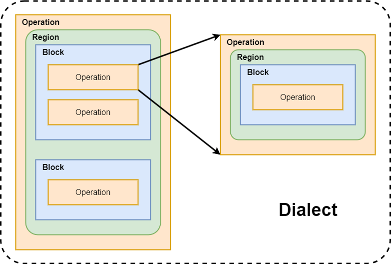

MLIR（多级中间表示，Multi-Level Intermediate Representation 是 LLVM 原作者 Chris Lattner 在 Google 时候开始做的项目，现在已经合入LLVM仓库。MLIR目的是做一个通用、可复用的编译器框架，减少构建 Domain Specific Compiler 的开销。MILIR 目前主要用于机器学习领域，但设计上是通用的编译器框架，比如也有 FLANG（Ilvm 中的 FORTRAN 编译器）、CIRCT（用于硬件设计）等与ML无关的项目。MLIR 现在还是早期阶段，还在快速更新迭代，发展趋势是尽可能完善功能，减少新增自定义 feature 的工作量

下面是一些用 MLIR 构建的开源项目

- tensorflow：没有 tf 就没有MLIR
- mhlo：tensorflow 组件，相当于支持动态规模的 XLA
- tfrt：tensorflow 组件，tensorflow 新的 runtime
- torch-mlir：连接 pytorch 与 mlir 生态
- onnx-mlir：连接 onnx 与 mlir 生态
- iree：深度学习 end2end 编译器
- circt：硬件设计及软硬件协同开发
- flang：FORTRAN 的编译器前端
- polygeist：C/C++ source code 变成 mlir Affine

### 与 LLVM IR 的区别 & 联系

[MLIR介绍（一）概览 - 知乎](https://zhuanlan.zhihu.com/p/465464378)

> 个人认为MLIR更适合和LLVM做比较,而不是TVM等dl compiler。LLVM和MLIR的很多概念都比
> 较像,了解LLVM的话MLIR会比较容易上手。
> LLVMIR由于当时的历史局限性,类型只设计了标量和定长vector,有个给LLVM加matrix类型的
> 提案目前看来也没有进展。而MLIR自带tensor*类型,对深度学习领域更友好。
> MLIR有Operation和Dialect的概念,Dialect,Operation,Attrribute,Type等都可以通过td文
> 件比较方便地定义出来。而LLVM定义新的intrinsic比较麻烦,定义新的IR就更麻烦了。LLVMIR
> 主要表示硬件指令操作,而MLIR能表示更多东西,比如表示神经网络的图结构。因为有Dialect,
> MLIR是组件化+,去中心的,不像LLVM的ir是一种大而全的。
> MLIR执行过程和LLVM一样,IR会过由Pass组成的Pipeline,不所地变换生成最终的IR。不同的是
> MLIR的IR可以是不同dialect的,构成了Multi-Level的效果。

[MLIR (llvm.org)](https://mlir.llvm.org/)

Block 块：一个多个不含控制流 control flow 的 Operations 组成的顺序表

Conversion 转换：用以区分翻译 translation，转换是 MLIR 体系同一种方言 Dialect 内部或不同方言之间的语义等效转换操作

DRR, Declarative Rewrite Rule 声明式重写规则：TableGen 通过编写的声明式的重写规则，可以生成等效的 C++ 的 `mlir::RewritePattern` 子类

Dialect 方言：是一系列用以拓展 MLIR 体系的组件，其于 MLIR 类似于标准用库之于 C++。不同的方言以不同的名字空间 namespace 体现

EDSC, Embedded Domain Specific Constructs 嵌入式域特定构造：一个声明式的构造器库，用于以朴素 C++ API 的方式构造 MLIR 

Export 导出：一般用以说明从 MLIR 表示体系到其他语义等效的表示的操作，例如翻译 translation

Function 函数：一个有名称操作，它包含一个域 region

Import 导入：一般用以说明从其他表示到 MLIR 体系的语义等效表示的操作，例如翻译 translation

Lowering 下降 ：表示从高级别 IR 表示到低级别 IR 表示，语义等效表示的改变。MLIR 中通常指转换 conversion

Module 单元：一个操作 operation，它包含一个域 region，这个域包含一个块 block，这个块由多个操作 operation 组成

Op, Operation 操作：表示一个代码单元。是MLIR最重要的概念之一。`Op` 是 `operation*` 的 wrapper

Region 域：为多个块 block 的控制流图 CFG

Round-trip 往返：原表示到目标表示又回到原表示的过程

Terminator operation 终止操作：该操作 operation 终止一个块 block

Transitive lowering 传递下降：类似 `A->B->C` 的下降模式。通过部分转换 partial conversion 充分将非法操作合法化

Translation 翻译。用以区分转换 conversion，翻译是非 MLIR 表示和 MLIR 表示之间的操作

# Dialect

将多个层次的 IR 通过 Dialect 方言机制进行语义的统一，共用同一套生态系统，可以使各个层次之间的跨度缩小，从而有效地实现各层次之间地协调优化

原来多种后端对应多个中间IR，现在可以通过dialect之间的互相转换，只需要graphIR一个

LLVM IR 抽象级别太低，无法针对特定领域或者语言优化，因而各个语言框架有自己的 IR 和优化实现，无法重用

IR 种类太多，针对不同种类 IR 的开发的 Pass 可能重复即不同 IR 的同类 Pass 不兼容。针对新的IR编写同类 Pass 需要重新学习 IR 语法，门槛过高

不同类型 IR 所做的 Pass 优化在下一层中不可见

不同类型 IR 间转换开销大，从图 IR 到 LLVM IR 直接转换存在较大开销

### MLIR 的格式

### Architecture of Dialect

[【源码研读】MLIR Dialect 分层设计 - Aurelius84 - 博客园](https://www.cnblogs.com/CocoML/p/17632342.html)

## *Built-in Dialect*

MLIR 原生支持的内建 Dialect 有很多，具体可以查看 [Builtin Dialect - MLIR](https://mlir.llvm.org/docs/Dialects/Builtin/)，我们下面只介绍几个最常用的 built-in dialect

* Affine dialect：处理循环嵌套，实现了循环展开、多面体变换等一些算法
* Func dialect：处理函数的 dialect，包含的函数定义、调用、返回等基本操作
* Arith dialect：处理加减乘除移位等各种运算
* Math dialect：
* SCF, Standard Control Flow dialect：结构化控制流，保留 for，if 等语句
* CF, Control Flow dialect：
* Vector dialect：
* GPU dialect：
* LLVM dialect：LLVM IR 的 binding，可以直接翻译给 LLVM 做后续编译
* SPIR-V dialect：

## *memref*

# Type & Arrtibute

## *Type*

## *Attribute*

# Transform

DRR, Declarative Rewrite Rules 使用基于规则的方式来自动生)成表达式匹配和重写函数

## *Lowering 过程*

这里先引入一个 Legalization 合法化 的概念：改变当前操作 operations 的表示以符合 conversion target 要求

### Components

* Conversion Target: Specification of what operations are legal and under what circunnstances
* Operation Conversion: Dag-Dag patterns specifying how to transform illegal operationsto legal ones
* Type Conversion: Specification of how to transform illegal types to legal ones

### Lowering Modes

有两种 lowering 的模式

* Partial: Not all input operations have to be legalized to the target。这是 MLIR 比较特色的转换方式， 可以保留原 dialect 中仍然需要的 operation，不像 LLVM IR 转换就把原来的 IR 全部转换走了
* Full: All input operations have to be legalized to the target

### Full Lowering

1. 创建 Lower to LLVM Pass
2. Type Conversion
3. Conversion Target
4. 定义 lowering pattern

# Pass

## PassManager

# Polly

Polly 是 LLVM 项目的一个子项目，它提供了自动并行化和循环优化的功能。Polly 使用高级多维数组索引（Affine Expressions）来理解、表示和优化循环嵌套，特别是那些对于性能至关重要的计算密集型循环

Polly 基于一种叫做多面体模型的数学表示，使用这种方法，可以进行复杂的优化

Polly 主要应用于需要大规模数值计算的科学和工程领域，例如物理模拟、矩阵运算和图像处理。在这些领域，循环结构往往占据了程序的绝大部分计算时间，并且有明确的数据依赖模式可供分析和优化