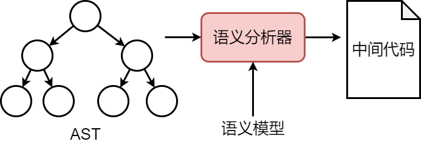

[ 分类: Compile Principle | Liuye Notebook (liuyehcf.github.io)](https://liuyehcf.github.io/categories/Compile-Principle/)

[USTC 编译原理和技术 2023](https://ustc-compiler-principles.github.io/2023/#课程信息)

本文中的实操部分实现 playscript 是来自于宫文学老师的*编译原理之美*

# Introduction

## *编译器构造*


一言以蔽之：**前端关注的是正确反映了代码含义的静态结构，而后端关注的是让代码良好运行的动态结构**

### 前端

前端负责理解源语言程序

* 词法分析 Lexical Analysis/Scanning（Lexical Analyzer/Lexer/Scanner）：扫描源代码字符流，提取出有意义的词法单元 token，以 token 序列的形式输出

* 文法/句法分析 Syntax Analysis（Parser）：文法分析器检查源代码的文法结构是否符合编程语言的规则，并按照文法规则将代码组织成树状结构（比如抽象语法树 Abstract Syntax Tree, AST）

  也有说 Parser 是包括了词法分析和文法分析两步的，即输入一个字符串序列，输出对应的 AST

* 语义分析 Semantic Analysis：将语义信息映射到上一步形成的 AST 上，比如检查变量的声明、类型匹配、函数调用等，以确保程序符合语言设定的语义规则。同时进行属性标注，这样编译器后端可以依据这些信息来生成目标代码

### 中端 & 体系结构无关优化

优化器分析代码的的 IR 形式，通过发现有关上下文的事实来重写代码，以求提高实现的效率

理想情况下优化器应该是机器无关的，即它应该通用于所有的机器。但事实并非如此，优化器总是要用到一些机器特性

### 后端 & 体系结构有关优化

后端负责将程序映射到目标机器上，即针对不同体系结构的计算机硬件，生成不同的优化过的目标代码

* 指令选择 Instruction Selection：选择适当的目标机器指令来执行高级语言中对应的操作，同时考虑目标机器的特定约束和优化策略
* 寄存器分配 Register Allocation：最大限度地复用寄存器，减少内存访问次数，从而提高程序的执行速度
* 指令调度 Instruction Scheduling：通过重排指令 reordering 的执行顺序，指令调度旨在减少指令之间的依赖关系，最大程度地利用目标机器的硬件资源，从而提高程序的性能

## *ILOC*

ILOC, Intermediate Language for an Optimizing Compiler 是一种用于优化编译器的中间表示 IR

ILOC 的设计旨在简化编译器的分析和优化任务，同时提供足够的灵活性，可以说它是一种RISC的核心指令集


### 命名规则

1. 变量的内存偏移量表示为变量名加前缀 `@` 字符
2. 用户可以假定寄存器数量是无限的，它们用简单的整数或符号名引用，前者如 `r_1776`，后者如 `r_i` 
3. 寄存器rarp是保留的，用做指向当前活动记录的指针

## *简单的例子*

### 栈式计算机

栈式计算机是一种计算机体系结构，其中的指令和数据都存储在一个栈（stack）数据结构中。在栈式计算机中，操作数和运算符都被压入栈中，并且所有的计算都是通过栈顶的元素进行的。栈顶指针（stack pointer）指向栈顶元素，指令执行时会从栈顶取出操作数进行计算，并将结果压入栈顶

现在栈式计算机已经不被用来构建计算机系统，但是仍常用于虚拟机、编译器和解释器的实现中，例如Java虚拟机（JVM）和.NET平台的中间语言（CIL）都采用了栈式计算机的模型

现在我们的例子如下

* 源语言：加法表达式语言 Sum
  * 两种语法形式
    * 整型数字：n
    * 加法：e1 + e2

* 目标机器：栈式计算机 Stack
  * 一个操作数栈
  * 两条指令
    * 压栈指令：`push n`
    * 加法指令：`add`。add的操作数不需要指定，因为是隐含的


### 编译器的阶段

任务：编译程序 `1+2+3` 到栈式计算机

1. 词法、文法分析

2. AST构建

3. 代码生成：后序遍历AST，根据不同的节点类型生成不同的指令

   

   ```
   n -> push n
   + -> add
   ----------根据AST生成如下指令----------
   push 1
   push 2
   add
   push 3
   add
   ```

## *编译器与NLP的对比*

https://cloud.tencent.com/developer/article/1776822

## *Nomenclature*

### 终结符 & 非终结符

* 终结符
  * 在字母表里排在前面的小写字母，比如a、b、c
  * 运算符号，比如+、`*`
  * 标点符号，比如括号、逗号等
  * 数字0、1、2、....、9
  * 黑体字符串
* 非终结符
  * 在字母表中排在前面的大写字母，比如A、B、C
  * 字母S，它通常表示开始符号
  * 小写、斜体的名字，比如*expr*或*stmt*
  * E (Expression)、T (Term)、F (Factor)
* 在字母表中排在后面的大写字母（比如X、Y、Z）表示文法符号。也就是说，表示非终结符号或终结符号
* 在字母表中排在后面的小写字母（主要是u、v、...、z）表示（可能为空的）终结符号串
* 小写的希腊字母，比如 α、β、γ 表示（可能为空的）文法符号串。因此一个普通的产生式可以写作 $A\rightarrow\alpha$，其中A是产生式的头，$\alpha$​​ 是产生式的体

### 推导

* $\Rightarrow$：通过一步推导出
* $\xRightarrow{*}$：经过零步或多步推导出
* $\xRightarrow{+}$​：经过一步或多步推导出
* $\xRightarrow{lm}$：最左推导 leftmost derivation
* $\xRightarrow{rm}$：最右推导 rightmost derivation

若 $S\xRightarrow{*}\alpha$，其中S是文法G的开始符号，则说 $\alpha$ 是 G 的一个句型 sentential form

# Lexical Analysis 词法分析

## *Token*

### 从字符流到 token 流


词法分析器 scanner 的任务是将字符流到记号流

* 字符流：和被编译的语言密切相关（ASCII, Unicode, or ...）
* **词法单元 token** 是一个由词法单元的名字 token name 和一个可选的属性值所构成的 pair。Token name 是一个代表了一个词法单元的抽象符号，比如下面的这些。可以理解为是一类的词素
  * Names / Identifiers 标识符，比如说 xyz, pi 等
  * Constants 常数，比如说 10, 20, `"abc"` 等
  * Operators 操作符，比如说 `+ - * /` 等
  * Resreved terms / Keywords 关键字，比如说 if, int 等
* **模式 pattern** 描述了一个词法单元的词素可能具有的形式
* **词素 lexeme** 是一个源代码中的字符串，它匹配了某种 token pattern，并且被词法分析器识别为一个 token 的实例

### Token 的数据结构定义

词法单元的属性值是至关重要的，比如它的具体词素、类型、它第一次出现的位置（用于记录该词法单元的错误信息）等。这些属性一般都不会直接保存在 Token 的数据结构中，而是保存在符号表中。**因此一个标识符的属性值是一个指向符号表中该标识符对应条目的指针**

```C
if (x > 5)
    y = "hello";
else
    z = 1;
```

注意每一行的末尾是一个隐藏的 `\n`，即 ASCII 的10

经过词法分析后上面的字符流会变成下面的token/word流，空格会被扔掉

```C
IF LPAREN IDENT(x) GT INT(5) RPAREN
	IDENT(y) ASSIGN STRING("hello") SEMICOLON
ELSE
	IDENT(z) ASSIGN INT(1) SEMICOLON EOF
```

```C
enum kind {IF, LPAREN, ID, INTLIT, ...};
struct token {
    enum kind k;  // token的类型
    char *lexeme; // token的值
    // ... 其他内容如行号等，用来给编译器后续阶段提供支持
};
```

`if (x > 5)` 会变成下面的 token

```C
token{k = IF, lexeme = 0}; // 0 就是没有值
token{k = LPAREN, lexeme = 0}; 
token{k = IDENT, lexeme = 'x'};
token{k = GT, lexeme = 0}; 
token{k = INT, lexeme = '5'}; 
token{k = RPAREN, lexeme = 0}; 
```

### 词法分析器的其他预处理功能

* 去除无用的内容，比如说空格和注释
* 收集 Pragmas，即对编译器行为和如何生成代码的指示，比如说 OpenMP 的 pragma
* 替换一些特定类的名字、内部表示等，比如说C++实现函数重载的 name mangling 机制

## *实现词法分析器的两种方式*

* 手工编码实现法 hard coded：相对复杂、且容易出错，但是是目前非常流行的实现方法，因为所有的一切都是由程序员来控制的，所以很灵活、高效。比如说GCC、LLVM都是这么实现的
* 词法分析器的生成器 generator：可快速原型、代码量较少，程序员在使用的时候只需要写一些词法规的声明，然后由生成器自动生成文法分析器（DFA），和手工编码相比较难控制细节，难以调优。比如说 lex、flex、jlex、antlr 等

### 转移图算法

从编译器的角度看，关键字是标识符的一个子集

关键字表算法

* 对给定语言中所有的关键字，构造关键字构成的哈希表H
* 对所有的标识符和关键字，先统一按标识符的转移图进行识别
* 识别完成后，进一步查表H看是否是关键字
* 通过合理的构造哈希表H（完美哈希 perfect hashing），可以 ***O(1)*** 时间完成

### 生成器

从RE的角度看，因为NFA允许类似于 or 这种不确定的分支语义以及 ε 转换，这使得我们可以以更灵活的方式来构建自动机，所以描述NFA显然更容易。但是从编码的对角度看，对DFA的编程是更加容易的，因为它具有确定性。所以我们的workflow应该是：RE `->` NFA `->` DFA


最终的词法分析器本质上就是一个DFA, Deterministic Finite Automaton 确定有限状态自动机。如何将RE转换为DFA是我们要重点研究的内容，具体来说分成下面这四步

1. RE转换成NFA：Thompson算法
2. NFA转换成DFA：子集构造算法
3. DFA的最小化：Hopcroft算法
4. 从DFA生成分析算法

接下来我们会首先介绍RE，然后介绍如何从RE转换为DFA

## *正则表达式*

正则表达式的详细内容可以看 *计算理论.md*

引入正则表达式最关键的目的是为了表达源程序中词法的规则，从而通过自动生成工具来生成词法解析器

### 定义

对于给定的字符集 $\Sigma=\left\{c_1,\ c_2,\ \dots,\ c_n\right\}$​​。有归纳定义

```
e -> ε
  -> c
  -> e1 e2
  -> e1 | e2
  -> e1*
```

* 空串 ε 是正则表达式
* 对于任意 $c\in\Sigma$，c 是正则表达式
* 若M和N都是正则表达式，则下面这些也是正则表达式
  * 选择/并集 union $M|N=\left\{M,\ N\right\}$
  * 连接 concatination $MN=\left\{mn|m\in M,n\in N\right\}$
  * kleene 闭包 $M^*=\left\{\varepsilon,\ M,\ MM,\ MMM,\ \cdots\right\}$​

为了避免产生过多的括号，通过运算符优先级来分别计算顺序：$* >\cdot>|$（连接/交操作的 $\cdot$ 操作符可以被省略，即 $MN=M\cdot N$​）

### 用正则表达式表示C语言中的标识符

* 关键字：以C语言中的关键字 if、while 为例：$i\in\Sigma,\ f\in\Sigma\Rightarrow if\in\Sigma$

* 标识符：以字母或下划线开头，后跟零个或多个字母、数字或下划线

  ```
  (a|b|c|...z|A|B|C|...|Z)(a|b|c|...z|A|B|C|...|Z|0|1|2|3|...|9)*
  ```

* （十进制整型数）规则是：或者是0；或者是以1到9开头，后跟零个或多个0到9

### 语法糖

语法糖 syntax sugar 是指对基本功能的封装，从而便利高层用户的使用。比如说图灵机的底层仅仅需要赋值和跳转两个基本的功能就可以表达所有的高层语法，所以其他的指令其实都是对赋值和跳转的进一步封装 

因此类似地我们也可以为上面的正则表达式引入更多的语法糖来便利之后的说明

- `[c1-cn] == c1|c2|...|cn`，前者必须按顺序排列

- $e^+\equiv(e\cdot e^*)$：一个或多个e

- $e?\equiv(\varepsilon|e)$：零个或多个e

- `"a*"`：`a*` 自身，不是a的Kleen闭包

- `e{i, j}`：`i` 到 `j` 个 e 的连接

- `.`：除 `\n` 之外的任意字符

- `{}` 表示一个macro

  ```
  le = [a-zA-Z_$]
  di = [0-9]
  Id = ({le}|{di})+
  ```

## *RE -> NFA*

DFA 和 NFA 的相关内容看 *计算理论.md*

### Thompson算法

Thompson算法 / Thompson构造法由C语言&Unix之父之一的Ken Thompson提出。它的核心思想是先构造识别子表达式的ε-NFA，再通过几个简单的规则将ε-NFA合并，最终得到识别完整正则表达式的ε-NFA。Thompson构造法的优点是构造速度快，且构造的ε-NFA状态数较少

也可以说Thompson算法的思想是 produce $\mathcal{O}(n)$ states for regular expressions of length n

基于对RE的结构做归纳


* 对基本的、原子的RE直接构造

  ```
  e -> ε
    -> c
  ```

* 对复合的RE递归构造：递归算法是容易实现的，在具体的工程实现里，只需要不到100行的C代码就可以实现它

  ```
  e -> e1 e2
    -> e1 | e2
    -> e1*
  ```

  怎么把两个小的子ε-NFA表达式连接起来呢？其实很简单，用一个无代价的 ε 连接就行了

  其实这里很容易会产生这样一个疑惑，为什么不使用 ε，而是直接将两个子ε-NFA表达式连接起来呢，效果和上面的 ε 连接是完全等价的。这其实是出于工程编码上的考虑，用 ε 连接会使递归更工整，节点的融合、边的删除也更方便

考虑这样一个例子：`a(b|c)*`


### Berry-Sethi 算法


## *构造DFA*

### 子集构造算法

关于具体的子集构造算法的形式定义可以看 *计算理论.md*

仍然以上面 `a(b|c)*` 为例，求每一个状态的 ε 闭包

```
n0 : q0
(q0, a) -> {n1, n2, n3, n4, n6, n9} : q1
(q1, b) -> {n5, n8, n9, n3, n4, n6} : q2
(q1, c) -> {n7, n8, n9, n3, n4, n6} : q3
```

最终 `a(b|c)*` 的NFC转换成的DFC为如下


下面是实现子集构造算法（工作表算法）的部分伪代码

```pseudocode
q0 <- eps_closure(n0)
Q <- {q0}
workList <- q0
while (workList != [])
	remove q from workList
    foreach (character c)
    t <- eps-closure(delta(q, c))
	D[q, c] <- t
	if (t\not\in Q)
	add t to Q and workList
```

ε 闭包的计算可以采用 DFS 和 BFS 两种实现

* DFS

  ```pseudocode
  # DFS
  set closure = {};
  
  void eps_closure(x)
  	closure += {x}
  	foreach (y: x--eps --> y) # 意思是每个通过eps转移到y的x
  		if (!visited(y))
  			eps_closure(y)
  ```

* BFS

  ```pseudocode
  # BFS
  set closure = {};
  Q = []; // queue
  void eps_closure(x)
  	Q = [x];
  	while (Q not empty)
  	q <- deQueue(Q)
  	closure += q
  	foreach (y: q--eps --> y)
  		if (!visited(y))
  			enQueue(Q, y)
  ```

子集构造算法总是可以终止的，不会无限循环，因为它是一个不动点算法

### Hopcroft最小化算法

```pseudocode
split(S)
	foreach (character c)
		if (c can split S)
			split S into T1, ..., Tk
			
hopcroft()
	split all nodes into N, A
	while (set is still changes)
		split(S)
```

## *DFA的代码表示*

DFA就是一个有向图，实际中的实现有转移表（类似邻接矩阵）、哈希表、跳转表等表示方法，使用什么实现取决于在实际实现中，对时间和空间的权衡

```pseudocode
char table[M][N];
table[0]['a'] = 1;
table[1]['b'] = 1;
table[1]['c'] = 1;
// other table entries are ERROR
```


```pseudocode
nextToken()
	state = 0
	stack = []
	while (state != ERROR)
	c = getChar()
	if (state is ACCEPT)
	clear(stack)
	push(state)
	state = table[state][c]
	while (state is not ACCEPT)
	state = pop();
	rol1back();
```

### 跳转表

```pseudocode
nextToken()
	state = 0
	stack = []
	goto q0
q0:
	c = getChar()
	if (state is ACCEPT)
		clear(stack)
	push (state)
	if (c == 'a')
		goto q1

q1:
	c = getChar()
	if (state is ACCEPT)
		clear(stack)
	push (state)
	if (c == 'b' || c == 'c')
		goto q1
```

## *加快读入速度*

### Ping-pong 缓冲区对

### 哨兵标记

# Syntax Analysis 文法/句法分析 & 文法改写

https://gaozhiyuan.net/compilers/syntax-analysis-internal-implementation.html

笔者认为实际上Syntax翻译为句法更好，因为Syntax描述的句子结构的规则，但是大部分资料都翻译为文法或语法，此外因为语法很容易让人以为是grammer，但grammer是一个更上层的概念，所以后文统一采用文法的翻译

## *intro*


文法分析器的输入是token流，借助的规则则是 CFG 上下文无关文法/形式语言 或者说下推自动机。具体来说，给定文法G和句子s，文法分析要回答的问题是：是否存在对句子s的推导（能够构建出一棵合法的AST）

在现代编译器中，前面的词法分析器往往是作为文法分析器的一个子模块实现的，也就是说并不是一次性地把所有token全部取出来，而是按照词法分析器地需要。当需要时就调用词法分析器返回一些token

文法分析器的任务可以分为两大块

* 输入的token流是否合法的问题，即这是一个根据CFL规则输出一个是/否的问题。这部分任务由各种文法分析算法来完成
* 构建AST的中间表达。这部分任务由文法制导翻译来完成

关于CFG、文法分析树（推导树）Parse Tree 和二义性的内容可以看 *计算理论.md*

Remainder：**分析树的含义取决于树的后序遍历**

### 文法分析算法纵览

文法分析的实现可以分为

* 自顶向下分析：从开始的非终结符出发，不断地对非终结符进行分解，从而推导出句子，对应于分析树自顶向下的构造顺序
  * 暴力搜索：盲目尝试扩展右边
  * 递归下降：每个非终结符构造一个分析函数，用前看符号指导右侧产生式规则的选择
  * LL(1)：确立右部，不再回溯
* 自底向上分析：从要推导出的终结符目标反推，不断合并这些终结符和非终结符，看是否能反推出开始地非终结符
  * LR(0)：见到First集就移进，见到终态就归约
  * SLR：看看Follow集后再规约
  * LR(1)：对LR(0)的另一种改造，使用一个前看符号来决定是否执行规约动作
  * LALR：把相似的项目集合并，改写action和goto表

### 实际中的文法分析算法的使用

* 手写的文法分析器一般都采用自顶向下算法，因为用这种方法可以更容易地手工构造出高效的文法分析器
* Generator一般都采用自底向上算法，因为自底向上算法可以处理更多的文法和翻译方案

## *改进二义性*

这个例子取自中科大的编译器课程

重写文法

树越往下优先级越高。因为改进的文法是左递归的，所以保证了加法的左结合性，同样的如果改写为右递归就能变成右结合性

## *消除左递归*

### 算法的左递归问题

左递归文法 left recursion syntax 是指在某个产生式中，最左边的符号直接或间接地引用了该产生式所定义的非终结符。这种文法在某些解析算法中，特别是递归下降解析器中会导致问题，因为它可能会使得解析器陷入无限循环

* 直接左递归

  ```
  A -> Aα | β
  ```

  在这里，`A` 是一个非终结符，`α` 和 `β` 是符号串（可以是终结符也可以是非终结符或它们的组合），而且 `β` 不以 `A` 开头。这样的产生式意味着要生成 `A` 的一个实例，需要首先生成另一个 `A` 的实例，这将不断重复下去，因此构成直接左递归

* 间接左递归

  ```
  A -> Bα
  B -> Aβ
  ```

  在这个例子中，`A` 和 `B` 都是非终结符，而且符号串 `α` 和 `β` 中不包含 `A` 或 `B`。尽管在产生式 `A -> Bα` 中 `A` 并没有直接调用自己，但通过产生式 `B -> Aβ`，`A` 间接地通过 `B` 调用了自己，从而构成了间接左递归

左递归文法需要被转换成等价的非左递归文法才能被某些类型的解析器处理，比如递归下降解析器。这通常涉及到改写产生式以消除左递归

### 消除直接左递归

### 消除间接左递归

### 提取左公因子


# 文法分析算法--自顶向下

暴力回溯的高复杂度在实际中是不可用的，本章介绍线性复杂度的递归下降和LL(1)算法。这两个算法的核心是**用向前看符号来知道右侧产生式的选择，从而避免回溯**

## *暴力回溯*

### 实现

为了回答对于G是否存在对句子s的推导的问题，基本的算法思想是从G的开始符号，随意推导出某个和s无关的句子t，并比较t和s。若 `t==s`，则返回 true，否则就要不断回溯继续迭代

算法本质就是BFS/回溯的暴搜（配合剪枝）

```pseudocode
tokens[]; // all tokens
i = 0;
stack = [S]; // s是开始符号
while(stack != [])
	if(stack[top] is a terminal t)
		if(t==tokens[i++])
			pop();
        else backtrack();
    else if (stack[top] is a nonterminal T)
    	pop(); push(the next right hand side of T) 
```

暴力搜索的效率非常低下，我们需要寻找更高效的算法。即下面两种避免回溯的常数时间复杂度的算法：递归下降和LL(1)分析算法

### 优化暴力搜索：尽量避免回溯

递归下降算法的基本思想是：每个非终结符构造一个分析函数、用前看符号指导产生式规则的选择

比如说有下面的CFL，对于一个给定的搜索token `[g d w]`，如果知道 N 能够推导出s、t、g、w，那只要选择匹配的g就好了，当然如果没有匹配的就返回 false，即不合法的 token

```
S -> N V N
N -> s
   | t
   | g
   | w
V -> e
   | d
```

但是这个算法的实现没有那么简单，比如说下面的这种情况，N可以推导出两种可能的 g 怎么办？

```
S -> N V N
N -> s
   | t
   | g
   | w -> g N
V -> e
   | d
```


## *递归下降分析算法*

### 优势

递归下降分析算法 Recursive-Descent Parsing 也称为预测分析算法 predictive analysis，它有下面这些优点

* 线性时间，分析高效
* 方便手工编码，容易实现
* 错误定位和诊断信息准确
* 被很多开源和商业的编译器所采用：GCC 4.0、LLVM

### 实现

递归下降的核心思想是

* 每个非终结符构造一个分析函数
* **用前看符号指导右侧产生式规则的选择**

分治思想：将 S 是否能分别推导出g、d、w 分解为N是否能推导出g、V是否能推导出d、N是否能推导出w

```
S -> N V N   ; 命名为分析函数 f 
N -> s       ; 命名为分析函数 k
   | t
   | g
   | w
V -> e       ; 命名为分析函数 h
   | d
```

```pseudocode
parse_S()
	parse_N()
	parse_V()
	parse_N()

parse_N()
	token = tokens[i++]
	if (token==s || token==t || token==g || token==w)
		return;
	error(“…”);
	
parse_V()
	token = tokens[i++]
```

### 递归下降一般算法框架

每一个非终结符变为一个函数，token的几种不同情况用来指导产生式的选择，case里面如果是终结符就作比较，如果是非终结符就递归调用函数，如果其他情况就原地报错

```
X -> β11 ... β1i
   | β21 ... β2j
   | β31 ... β3k
   | ...
```

```pseudocode
parse_X()
	token = nextToken()
	switch(token)
	case ...: 非终结符递归调用 // β11 ... β1i
	case ...: // β21 ... β2j
	case ...: // β31 ... β3k
	...
	default: error（".."); // 不匹配
```


## *三个集合*

### FIRST 串首终结符集

串首终结符是指串首的第一个是终结符的符号，简称首终结符

FIRST(α) 被定义为：给定一个文法符号串 α，可以从 α 中推导得到的串的首终结符的集合

### FOLLOW 后继集

FOLLOW(A) 被定义为：可能在某个句型中紧跟在非终结符A右边的终结符a的集合

### SELECT 生成式的可选集

产生式 $A\rightarrow\beta$ 的SELECT($A\rightarrow\beta$​) 集被定义为：可以选用该产生式进行推导时对应的输入符号的集合

### FIRST集产生算法（不动点）

FIRST(N) 是从非终结符N开始推导得出的句子开头的所有可能终结符集合

```pseudocode
foreach (nonterminal N) // 初始化
	FIRST(N) = {}
while(some set is changing)
	foreach (production p: N->β1 … βn)
		if (β1 == a …) // 遇到了一个非终结符a
			FIRST(N) ∪= {a}
		if (β1 == M …) // 遇到了一个终结符M
			FIRST(N) ∪= FIRST(M)
```

这个算法是一个不动点算法，即它确定可以终止

```pseudocode
FIRST_S(β1 … βn) = // S代表sentence
FIRST(N), if β1 == N;
{a}, if β1 == a
```


### FOLLOW集产生算法（不动点）

### LL(1)  文法

## *表驱动的LL(1)预测分析算法*

### 算法核心思想

算法名字由来：从左（L）向右读入程序，最左（L）推导，采用一个（1）前看符号（这个前看符号的功能和之前递归下降中用的不一样，是用于判断推导方向的）

* 分析高效（线性时间）
* 错误定位和诊断信息准确
* 有很多开源或商业的生成工具，比如著名的Antlr采用了LL(1)

所谓的向前看符号其实非常符合人的思维。它的意思就是因为第一个符号相同，看一个符号没法确定，所以继续看后面的字符来继续判断

**LL(1) 算法的基本思想是表驱动 table-driven 的分析算法**

分析表是根据文法分析器来生成的，其中编码了分析栈在操作的时候什么时候该移入字符、什么时候该展开的建议信息


用栈来实现一个非递归版本的树遍历过程

```pseudocode
tokens[]; // all tokens
i=0;
stack = [S] // S是开始符号
while (stack != [])
	if (stack[top] is a terminal t)
		if (t==tokens[i++]) pop();
		else backtrack(); // 不匹配，说明上一步可能推到的有问题，需要回溯
	else if (stack[top] is a nonterminal T)
		pop(); 
		push(the next right hand side of T); // 开始推导
```

这里要使用回溯的原因主要是因为盲目的使用了T可以生成的**下一个 next符号**，但实际上要避免回溯要使用的应该是**正确的 correct符号**！怎么才算是正确的符号呢，这是一种通过CFG总结得到的先验知识，即下面要讲的分析表

此时通过分析表后上面的遍历过程就可以优化为

```pseudocode
tokens[]; // all tokens
i=0;
stack = [S] // S是开始符号
while (stack != [])
	if (stack[top] is a terminal t)
		if (t==tokens[i++]) pop();
		else error(); // 不匹配，无须回溯，直接报错
	else if (stack[top] is a nonterminal T)
		pop(); 
		push(the correct right hand side of T); // 开始推导，通过分析表选择正确的RHS符号
```


### LL(1) 分析表：直接找到正确的右部


不应该是盲目地压下一个字符，而是压一个相对正确的字符


没有回溯，要么匹配成功，要么失败打印错误

### 构造LL(1)分析表的方法

### FIRST 集的不动点算法


## *LL(1)分析表中的冲突*

如果分析表中的所有表项都只有1个元素的话，就是LL(1)文法，否则如果有多于1个的表项，就称为LL(1)分析表中的冲突

### 处理冲突

### FOLLOW集合的不动点算法


* 优点
  * 线性复杂度，算法高效
  * 有现成的工具可以使用
* 缺点
  * 能够分析的文法类型有限
  * 往往需要用户改写文法以解决分析表冲突

## *[Pratt Parsers](https://journal.stuffwithstuff.com/2011/03/19/pratt-parsers-expression-parsing-made-easy/)*

Vaughan Pratt 提出的 Pratt Parsing 算法（也称为 operator precedence parser）主要解决了表达式的优先级问题，而且不会产生左递归，最多只需要 Look ahead 一个 Token 不用回溯

# 文法分析算法--自底向上

关键问题就在于何时进行规约以及应用哪个产生式来进行规约


### 移入-规约分析中的冲突

* 移入/规约冲突
* 规约/规约冲突

## *自底向上（LR分析）概述*

### 移入-规约分析


移入-规约分析 shift-reduce parsing 可以采取的动作有

* **移入 shift**：将下一个输入符号移到栈的顶端
* **归约 reduce**：被归约的符号串的**右端**必然处于栈顶。语法分析器在栈中确定这个串的**左端**，并决定用哪个非终结符来替换这个串
* **接收 accept**：宣布语法分析过程成功完成
* **报错 error**：发现一个语法错误，并调用错误恢复子例程

移入-归约分析的工作过程为

1. 在对**输入串**的一次从左到右扫描过程中，语法分析器将零个或多个输入符号**移入**到栈的顶端，直到它可以对栈顶的一个文法符号串𝛽进行**归约**为止
2. 然后，它将𝛽**归约**为某个产生式的左部
3. 语法分析器不断地重复这个循环，直到它检测到一个**语法错误**，或者**栈中包含了开始符号且输入缓冲区为空**（当进入这样的格局时，语法分析器停止运行，并宣称**成功**完成了语法分析）为止

**从左到右称为一个替换或推导，把从右到左的过程称为一个规约 reduction**

```
0: S -> E
1: E -> E + T
2:    | T
3: T -> T * F
4:    | F
5: F -> n
```

```
2 + 3 * 4 // 规则5：2规约为F
F + 3 * 4 // 规则4：F规约为T
T + 3 * 4 // 规则2：T规约为E
E + 3 * 4 // E不可以往S规约
E + F * 4 // 规则5：3规约为F
E + T * 4 // 规则4：F规约为T
E + T * F // 规则5：4规约为F
E + T     // 规则3：T * F规约为T
E         // 规则1：E + T规约为E
S         // 规则0：E规约为S
```

实际上是一个逆序的最右推导。总的来说就是两个步骤

* 移进一个记号到栈顶上，或者
* 归约栈顶上的n个符号（某产生式的右部） 到左部的非终结符
  * 对产生式 `A->β1 … βn`，如果 βn … β1 在栈顶上，则弹出 βn … β1
  * 压入 A

### 句柄剪枝

**每次归约的符号串称为句柄 handle**，即句柄是和某个产生式体匹配（且需要进行规约）的子串，对它的规约代表了相应的最右推导中的一个反向步骤


### intro


```
0: S’-> S$
1: S -> x x T
2: T -> y
```

引入 `S'` 有两个主要目的

* 保证 `S'` 不出现在任何一个产生式的右部
* `$` 是文件描述符，作用是标记一段文本的结束


### Overview


从圈内到圈外能力越强，从圈内到圈外逐渐改进，主要的区别就在于进行移位和规约操作的时机。改进的进度如下：

* 首先一条大思路是见到FIRST集就移进，见到FOLLOW集就归约
* 从LR(0)开始：见到FIRST集就移进，见到终态就归约
* SLR(1)：见到FIRST集就移进，到终态后，**先不要动，先看FOLLOW集**，与FOLLOW集对应的项目归约，其它报错。，因为含有一些“展望信息”——利用了FOLLOW(A)信息，所以可以减少表规模并且可以精确报错。可以解决归约－归约冲突；但是没有包含足够的展望信息，缺点是**不能完成解决移进－归约冲突**，需要改进
* LR(1)：基于LR(0)，是对LR(0)的另一种改进，通过进一步判断一个向前看符号来决定是否执行规约动作
* LALR：把相似的项目集合并，改写ACTION和GOTO表


## *LR(0) 分析*

[编译原理-语法分析1 | Liuye Notebook (liuyehcf.github.io)](https://liuyehcf.github.io/2017/10/16/编译原理-语法分析1/)

### 分析表

`$` 是文件描述符，作用是标记一段文本的结束，例如C语言中的EOF一样。在LR语法分析中，我们使用 `$` 来标记栈的底部以及输入的右端


一个文法G的一个LR(0)项（简称为项 item）是G的一个产生式再加上一个位于它的体中某处的点

一个项也可以表示为一对整数，第一个整数是基础文法的产生式编号，第二个整数是点的位置

一个称为规范LR(0)项集族 canonical LR(0) collection 的一组项集提供了构建一个DFA的基础，该DFA（称为LR(0)自动机）被用来做出语法分析的决定，即移入/规约的时机


LR(0)分析表是对这个DFA完全等价的描述，实际编码的时候这个DFA是被编码成这个LR(0)分析表的


### 分析表结构

### 增广文法

增广文法 Augmented Grammer：若G是一个以S为开始符号的文法，那么G的增广文法 $G'$ 就是在G中加上新开始符号 $S'$ 和产生式 $S'\rightarrow S$​ 而得到的文法

### 项集闭包 `CLOSURE(I)`

### `GOTO(I, X)`

### LR(0)分析表构造算法

### LR(0)分析算法的缺点

* LR(0)分析表中可能包含冲突

## *SLR分析算法*

SLR, Simple LR 分析算法和LR(0)分析算法基本步骤相同，仅区别于对归约的处理


基于LR(0)，通过进一步判断一个前看符号，来决定是否执行归约动作

## *LR(1) 分析算法*

LR(1)分析算法是对LR(0)的另一种改造，引入一个向前看符号 lookahead symbol

## *LALR分析算法*

把类似的项目集进行合并。需要修改ACTION表和GOTO表，以反映合并的效果

YACC，Bison采用的都是LALR(1)文法分析方法

## *二义性文法的LR分析*

## *语法错误的处理*

### 恐慌模式

恐慌模式 panic-mode 是编译器在语法分析阶段处理语法错误的一种策略。它的核心思想是：当编译器遇到语法错误时，尝试“跳过”错误部分，继续分析后续的代码，而不是立即停止编译。这种模式的目标是尽可能多地检测和报告源代码中的错误，而不是在遇到第一个错误时就终止

当语法分析器（Parser）遇到一个语法错误时，恐慌模式会执行以下步骤：

1. 检测错误：语法分析器发现当前输入的符号与预期的语法规则不匹配
2. 进入恐慌模式：
   - 跳过当前错误符号及其后续的符号，直到找到一个“同步符号”（Synchronization Token）
   - 同步符号通常是语法结构中的明显边界（如分号 `;`、右大括号 `}` 等）
3. 恢复分析：在找到同步符号后，语法分析器尝试从该点继续分析后续代码
4. 报告错误：编译器生成一个错误消息，指出错误的位置和类型

### 同步符号的选择

同步符号的选择对恐慌模式的效果至关重要。常见的同步符号包括：

- 语句结束符：如分号 `;`
- 块结束符：如右大括号 `}`
- 关键字：如 `if`、`else`、`while` 等
- 表达式边界：如右括号 `)`

同步符号应选择那些能够明显分隔语法结构的符号，以便语法分析器能够快速恢复

# 文法制导翻译 & 生成AST

语法分析树/推导树 Parse Tree, PT

### 两个重要概念

* An attribute is any quantity associated with a programming construct. Examples of attributes are data types of expressions, the number of instructions in the generated code, or the location of the rst instruction in the generated code for a construct, among many other possibilities. Since we use grammar symbols (nonterminals and terminals) to represent programming constructs, we extend the notion of attributes from constructs to the symbols that represent them. 

  属性是与编程结构相关联的任何量。属性的类型很多，比如表达式的数据类型、生成代码中的指令数量，或者某个结构生成代码的第一条指令的位置，都是属性的例子。由于我们使用语法符号（即非终结符和终结符）来表示编程结构，因此我们将属性的概念从结构扩展到代表它们的符号。

* (Syntax-directed) translation scheme: A translation scheme is a notation for attaching program fragments to the productions of a grammar. The program fragments are executed when the production is used during syntax analysis. The combined result of all these fragment executions, in the order induced by the syntax analysis, produces the translation of the program to which this analysis/synthesis process is applied.

  （语法制导的）翻译方案是一种符号记法，用于将程序片段附加到语法的产生式上。当在语法分析期间使用产生式时，执行程序片段。将所有这些片段执行的综合结果，按照语法分析引导的顺序组合起来，就是应用了此分析/合成过程的程序的翻译的结果。


## *语法制导定义 SDD*

语法制导定义 Syntax-Directed Definition, SDD 是对CFG的推广

- 将每个**文法符号**和一个**语义属性**集合相关联
- 将每个**产生式**和一组**语义规则**相关联，用来计算该产生式中各文法符号的属性值

### 文法符号的属性

文法符号的属性分为两种

* 综合属性 synthesized attribute：在PT的结点N上的非终结符号A的综合属性是由N上的产生式所关联的语义规则来定义的。注意：这个产生式的头一定是A。节点N上的综合属性只能通过N的子节点或N本身的属性值来定义

  综合属性有一个优良的性质：只需要对PT进行一次自底向上的遍历，就可以计算出属性的值

  

* 继承属性 inherited attribute：在PT结点上的**非终结符号**B的继承属性是由N的父节点上的产生式所关联的语义规则来定义的。注意：这个产生式的体中必然包含符号B。节点N上的继承属性只能通过N的父节点、N本身和N的兄弟节点上的属性来定义

  * **终结符是没有继承属性的**。终结符从词法分析器处获得的属性值被归为综合属性值
  * 继承属性还有另一种定义方式
  * 如果有继承属性的话求值顺序就会变得复杂，需要借助依赖图来解决
  
  

### 属性文法

一个没有副作用的SDD有时也称为属性文法 attribute grammer。属性文法的规则仅仅通过其它属性值和常量来定义一个属性值


## *SDD的求值顺序*

### 依赖图

依赖图 dependency graph 是一个描述了分析树中结点属性间依赖关系的有向图

一个可行的求值顺序就是依赖图的一个拓扑排序 topological sort


给定一个SDD，很难确定是否存在某棵语法分析树，使得SDD的属性之间存在循环依赖关系。幸运的是，存在一个SDD的有用子类，它们能够保证对每棵语法分析树都存在一个求值顺序，因为它们不允许产生带有环的依赖图。不仅如此，接下来介绍的两类SDD可以和自顶向下及自底向上的语法分析过程一起高效地实现

### S-SDD

S-属性定义 S-Attributed Definitions, S-SDD 是仅使用综合属性的SDD

- 如果一个SDD是S属性的，可以按照语法分析树节点的任何**自底向上**顺序来计算它的各个属性值
- S-属性定义可以在**自底向上的语法分析过程**中实现

### L-SDD

L-属性定义 L-Attributed Definitions, L-SDD 是指在一个产生式所关联的各属性之间，**依赖图的边可以从左到右，但不能从右到左**。因此称为L属性的，L是Left的首字母

## *语法制导翻译 SDT*

前面的文法分析器部分仅仅是回答之前提出的问题，即给定文法G，是否存在对句子s的推导，一个Yes or No的问题

除了文法分析之外，还需要做其他工作。——这就是文法制导翻译所做的事情


文法制导翻译 Syntax-Directed Translation, SDT 的基本思想：**给每条产生式规则附加一段代码，这个代码将在产生式分析完毕，即将规约的时候执行**

给每条产生式规则附加一个语义动作 a，在实现上就是一个代码片段。语义动作在产生式归约时执行，即当右部分析完毕时刻，由右部的值计算左部的值。自顶向下分析和自底向上分析采用的技术类似

```
1：X -> β1    a1
2:    | β2    a2
3:    | β3    a3
…              …
n:    | βn    an
```


## *AST*

### AST & Parse-Tree的区别

编译原理中的抽象语法树和语法分析树有什么区别吗？ - Timothy Liu的回答 - 知乎
https://www.zhihu.com/question/583091880/answer/2885484239

注意⚠️：AST和上文中的PT不是一个东西

* 语法分析树 Parse Tree 是用上下文无关文法G到终结符串的推导过程的表示形式，用于表示对该终结符串进行推导的时候应用了哪些产生式。即语法分析树是理论上用于完整地描述推导过程的，实际上并不需要真正地实现它，只是一种分析工具
* 而AST是在写编译器的文法分析阶段，根据前一阶段的词法分析产生的一堆Token所构建出来的。也就是说，AST是要用代码实实在在地写出来的，之后的语义分析是建立在这棵AST上的

AST是源代码的一种树状结构表示，它表示了源代码的文法结构，但忽略了不影响语义的细节，如空格、注 释等。每个节点代表程序的一部分，例如声明、表达式、控制流结构等

之所以说文法是抽象的，是因为这里的树并不会表示出真实语法中出现的每个细节，只需要保存之后语义分析阶段和中间代码生成阶段所需要的结点即可。具体的语义信息需要在语义分析阶段进行实现补充

编译器不像人能直接理解语句的含义，AST更有结构性，后续阶段可以针对这颗树做各种分析


在文法分析阶段要使用下面这种生成式，因为要消除左递归等原因

但AST只需要写成下面这种形式，实际上更符合我们的习惯


* 在编译器中，为了定义AST，需要使用实现语言来定义一组数据结构。因此和实现语言密切相关
* 早期的编译器有的不采用AST数据结构，而是直接在文法制导翻译中生成代码，这主要有两个原因：早期语言足够简单、早期计算机的内存有限，内存中无法放下生成的AST
* 现代的编译器一般采用AST作为文法分析器的输出，以求更好的系统的支持并简化编译器的设计


### AST的重要性

AST是编译器前端和后端的接口。程序一旦被转换成AST，则源代码将被丢弃。后续的阶段只处理AST

所以AST必须编码足够多的源代码信息。例如，它必须编码每个文法结构在源代码中的位置（文件、行号、列号等）。这样，后续的检查阶段才能精确的报错，或者获取程序的执行刨面

AST必须仔细设计！！

## *AST的自动生成*

### AST的实现

在编译器中，为了定义AST，需要使用实现语言来定义一组数据结构，其和实现语言密切相关

早期的编译器有的不采用AST的数据结构，而是直接在文法制导翻译中生成代码。但现代的编译器一般采用AST作为文法分析器

### 在LR分析中生成AST

SDT

# Semantic Analysis 语义分析

[编译原理（十）——语义分析基础_语义分析·-CSDN博客](https://blog.csdn.net/weixin_43633784/article/details/108928207)

[中国科学技术大学 编译原理 语义分析（类型检查、上下文相关分析） - 高志远的个人主页 (gaozhiyuan.net)](https://gaozhiyuan.net/compilers/ustc-semantic-analysis.html)



语义分析也称为类型检查、上下文相关分析，负责检查程序（这个阶段已经是用AST来表示的）的上下文相关的属性

大部分的程序设计语言都采用自然语言来表达程序语言的语义，即语言规范 Language Specification，比如C语言的 The ANSI/ISO C Specification Language (ACSL) 

## *为什么CFG需要上下文相关分析？*

这里有一些概念需要厘清。在语义分析之前，笔者总是直接把高级编程语言这个整体理解为一种CFL，但其实并不是这么一回事。重新回顾一下CFG和CSG在乔姆斯基语法体系中的区别：CSG的意思是在自然语言中一个单词是否可以出现在特定位置上，要依赖于上下文

关键就在于**是否可以出现在特定位置上**这个描述，这实际上是文法的内容，即一个句子的结构，它并不关心语义信息。自然语言的某些语句结构是否合乎语法规则会依赖于特定的上下文，我们以英语为例

### 英语自然语言的例子

在自然语言中，有些文法结构是不能用上下文无关文法（CFG）来准确描述的，因为这些文法结构的正确性取决于特定的上下文。一个经典的例子是人称代词的一致性问题

考虑以下英语句子：

1. "The girl put on her shoes."
2. "The girls put on their shoes."

在第一个句子中，“her”是单数形式，与单数名词“girl”相匹配。而在第二个句子中，“their”是复数形式，与复数名词“girls”相匹配。这种匹配被称为数的一致性

如果我们尝试用上下文无关文法来描述这种结构，我们可能会得到类似如下的规则：

```
N -> "girl" | "girls"
V -> "put on"
P -> "her" | "their"
O -> "shoes"

S -> N V P O
```

对于上述规则，`S` 代表句子，`N` 代表名词，`V` 代表动词短语，`P` 代表所属代词，`O` 代表对象。然而，这个简单的上下文无关产生式集合没有办法保证名词的数和其后所属代词的数之间的一致性。比如根据这些规则，可以生成如下不合语法的句子：

- "The girl put on their shoes."（用了错误的复数代词）
- "The girls put on her shoes."（用了错误的单数代词）

要正确地处理这种情况，并且生成符合数一致性要求的句子，需要上下文相关的信息。（实际上上面的例子还是有些问题，我们可以用歧义来强行解释句子的重要性，这也说明了CSG语义分析的复杂性）

在自然语言处理中，正确的处理方法通常涉及更为复杂的分析技术，如特性传播、约束基础系统或者使用更加强大的形式化体系，例如上下文相关文法（CSG）、依存语法或者计算树逻辑（Combinatory Categorial Grammar, CCG），这些方法能够处理特定上下文中的一致性约束

### 编程语言/形式语言的情况

编程语言/形式语言的CFG文法设计则没有这种情况，这里考虑一个例子，比如C++中使用一个没有定义过的变量来写一个句子

```C++
add(a + b);
```

这样的写法是合乎C++的文法结构的，但是语义是不明确的，add是什么？a是什么？b是什么？这些语义信息需要借助上下文

### 实际的情况

上面的论述实际上还是有一些问题，实际上文法的设计是灵活的，并不是所有的编程语言的文法就都是CFG，可以看下面这篇回答

> 每一种流行编程语言的规范都可以厚成一本书，作为语言设计者或者编译器开发者，你必须考虑那么多条规范中，哪一些作为词法处理，哪一些作为语法处理，哪一些作为语义处理。
>
> 大部分编程语言（或者说编译器）的语法分析部分都是[上下文无关文法](https://www.zhihu.com/search?q=上下文无关文法&search_source=Entity&hybrid_search_source=Entity&hybrid_search_extra={"sourceType"%3A"answer"%2C"sourceId"%3A1076761881})，这是因为设计者认为上下文无关文法的复杂度恰好适中。如果使用更简单的文法进行分析，比如限于LL文法，那么就会有更多的任务被分配给语义分析或者[词法分析](https://www.zhihu.com/search?q=词法分析&search_source=Entity&hybrid_search_source=Entity&hybrid_search_extra={"sourceType"%3A"answer"%2C"sourceId"%3A1076761881})，导致语义分析任务过重，难以设计；反之如果使用更复杂的[上下文相关文法](https://www.zhihu.com/search?q=上下文相关文法&search_source=Entity&hybrid_search_source=Entity&hybrid_search_extra={"sourceType"%3A"answer"%2C"sourceId"%3A1076761881})，那么语法分析本身就会变得复杂、低效。
>
> 所以，语法分析可以用上下文相关文法，但一般没必要，因为上下文相关的工作可以交给语义分析去做。
>
> 为什么编程语言都是上下文无关文法，不能采用上下文有关文法吗？ - SegFault的回答 - 知乎wwwwwwwwwwwwwwwwwwwwwwwwwwwwwwwwwww
> https://www.zhihu.com/question/378230370/answer/1076761881为什么编程语言都是上下文无关文法，不能采用上下文有关文法吗？ - SegFault的回答 - 知乎
> https://www.zhihu.com/question/378230370/answer/1076761881

## *Overview*

* 类型检查（Type Checking）：编译器需要确认每个操作符是否与其操作数的类型匹配，并确定表达式和语句是否类型安全。例如，在不允许隐式类型转换的语言中，尝试将整数赋值给字符串类型的变量会导致编译时错误
* 标识符绑定（Identifier Binding）：编译器需要链接每个变量和函数名（标识符）到它们的声明，这通常涉及到建立和维护一个符号表（Symbol Table），记录变量、函数名、类型等的信息以及它们的作用域
* 类型转换（Type Coercion）：如果某个编程语言支持自动类型转换，则语义分析阶段需要插入必要的类型转换代码。比如，浮点数和整数相加时，需要将整数转换为浮点数
* 作用域规则检查（Scope Rule Checking）：确认每个名称的引用是否符合其作用域的规则。例如，确保局部变量只能在它们声明的函数或代码块内部被访问
* 完整性验证（Completeness Verification）：确保所有必须的定义和声明都已经提供。例如，在使用一个函数之前，它必须被声明
* 流控制验证（Flow Control Verification）：检查程序的控制流路径（比如循环、条件分支等），以确保他们是合适和合理的（例如，避免无限循环、未初始化的变量使用或者未返回任何值的非void函数）
* 异常处理验证（Exception Handling Verification）：对那些支持异常处理的语言，语义分析需要确保异常被恰当地声明、抛出和捕获
* 访问权限检查（Access Rights Checking）：在面向对象的语言中，检查类成员（属性、方法等）的访问权限，例如private、protected和public等的正确使用

## *符号表*

### 符号表的作用

符号表是为生成中间代码所服务的，在生成中间代码后符号表就不再需要了

符号表是一个数据结构，用于存储变量、类型、函数、类等标识符的信息，包括其名称、类型、作用域、内存位置、参数类型和传递方法、返回类型等。**当编译器在源代码中遇到一个标识符时，它会在符号表中查找该标识符的相关信息，以确保其被正确使用**

### 根据符号表构造访问链

符号表也是数据结构中讲的一种存储结构，具体的实现跟具体的语言有关

符号表的作用就是查找，具体可以使用哈希表、树索引、二分查找、链表等等方式


```C
// 符号表是典型的字典结构： symbolTable: key -> value
// 一种简单的数据结构的定义（概念上的）：
typedef char *key;
typedef struct value {
	Type_t type;   // 符号类型
	Scope_t scope; // 符号作用域
	// 必要的其他字段
} value;
```

## *作用域 & 生存期*

### 作用域

作用域 scope 是指计算机语言中变量、函数、类等起作用的范围

### 生存期

生存期 extent 是变量可以访问的时间段，也就是从分配内存给它，到收回它的内存之间的时间

## *面向对象*

## *闭包*

静态作用域 static scope/ 词法作用域 lexical scope

动态作用域 dynamic scope

## *类型检查*

### 类型系统

编程语言的类型系统 Type System 定义了类型之间的操作和关系。语义分析会执行类型检查，确定表达式中各个操作数的类型是否满足操作符要求的类型，并且确保函数调用时参数类型与定义匹配


类型是高级语言赋予的一种语义，有了类型这种机制，就相当于定了规矩，可以检查施加在数据上的操作是否合法。因此类型系统最大的好处，就是可以通过类型检查降低计算出错的概率


根据类型检查是在编译期还是在运行期进行的，可以把计算机语言分为两类

* 静态类型语言：全部或者几乎全部的类型检查是在编译期进行的
* 动态类型语言：类型的检查是在运行期进行的


* 强类型：变量的类型一旦声明就不能改变。强类型语言不允许违法操作，因为能够被检查出来
* 弱类型：变量类型在运行期时可以改变。从机制上就无法禁止违法操作，所以是不安全的


* 类型推导 type inference
* 类型检查 type checking
* 类型转换 type conversion

## *继承 & 多态*

# IR & 静态分析 & 程序优化

静态分析不是编译器课程的重点，但是各种IR又是静态分析和程序优化的基础，所以这部分直接放在 *静态分析和程序优化.md* 中

中间表示、静态分析和程序优化这三者是紧密结合在一起的


1. 程序分析：即进行控制流分析、数据流分析、依赖分析等静态分析，得到被优化程序的**静态保守信息**，这是对动态运行行为的近似

   所谓的静态就是指静态分析，编译器只能做对程序的静态估计，而不能把程序动态地跑起来。保守是指程序得到的静态信息是没有动态行为准确和全面的 

2. 程序重写：根据以上一步得到的信息制导来重写程序

### Overview of  Optimizaiton

编译器在生成中间代码之后通常会执行一系列优化操作，目的是改进代码的性能表现和减少最终生成的机器码所需的资源，同时保持程序语义不变

- 常量合并与传播（Constant Folding and Propagation）：
  - 常量合并：在编译时计算常量表达式的值，而不是在运行时
  - 常量传播：将已知的常量值替换掉程序中相应的变量引
- 死代码块删除（Dead Code Block Elimination）：从程序中移除那些不会被执行到或其结果不会被使用的代码
- 公共子表达式删除（Common Subexpression Elimination, CSE）：查找并消除在多处计算但未更改的相同表达式
- 代码移动（Code Motion）：将循环内部不随迭代次数变化的计算移出循环体，避免重复计算
- 强度削减（Strength Reduction）：用较低开销的操作替换更昂贵的操作，例如将乘法替换为加法
- 无用代码删除（Unreachable Code Elimination）：移除程序流程中永远不会到达的代码块
- 循环优化（Loop Optimizations）：对于循环结构进行特定的优化，如循环展开、循环交换等
- 寄存器分配（Register Allocation）：尽可能地将变量分配到处理器的快速访问资源——寄存器中
- 函数内联（Function Inlining）：为了避免函数调用开销，将小的函数体"内联"到调用点
- 尾调用优化（Tail Call Optimization）：在函数末尾的递归调用可以被优化以节省栈空间和调用开销
- 指令调度（Instruction Scheduling）：重新排序指令序列来避免执行单元的空闲和减少延迟

# 后端 Codegen

## *指令选择*

指令选择 Instruction Selection：将 IR 转换为具体目标机器的指令集

### 树覆盖算法

### Maximal Munch

## *寄存器分配*

寄存器分配 Register Allocation：将 IR 中的**无限虚拟寄存器**映射到目标机器的**有限物理寄存器**上，同时确保程序的正确性和性能优化。寄存器分配的目标是最大化寄存器的利用率，减少内存访问（如加载和存储操作），从而提高程序的执行效率

寄存器分配算法的前提是要通过数据流分析来进行活性分析，以确定每个虚拟寄存器在程序中的活跃范围 liveness range（即从定义到最后一次使用的时间段）


【（转）编译器后端，寄存器分配算法 - CSDN App】https://blog.csdn.net/zyb418/article/details/89137118?sharetype=blogdetail&shareId=89137118&sharerefer=APP&sharesource=Paradox6&sharefrom=link

### 线性扫描

线性扫描寄存器分配（Linear Scan Register Allocation）
   •  特点：简单高效，适合即时编译（JIT）和动态编译。
   •  原理：
   1  将变量的生命周期表示为区间。
   2  按区间起点排序。
   3  线性扫描区间，为每个变量分配寄存器，必要时溢出到内存。

### 图着色算法 

图着色寄存器分配（Graph Coloring Register Allocation）
   •  特点：经典算法，分配结果较优。
   •  原理：
   1  构建冲突图（Interference Graph），节点是变量，边表示变量生命周期重叠。
   2  尝试用 K 种颜色（寄存器）为图着色，相邻节点颜色不同。
   3  如果无法着色，则溢出部分变量到内存。


 贪心寄存器分配（Greedy Register Allocation）
   •  特点：基于启发式规则，简单高效。
   •  原理：
   1  按变量的使用频率或生命周期长度排序。
   2  优先为高频或长生命周期的变量分配寄存器。
   3  必要时溢出低优先级变量到内存

 基于 SSA 的寄存器分配（SSA-based Register Allocation）
   •  特点：利用 SSA（静态单赋值形式）的特性简化分配。
   •  原理：
   1  将程序转换为 SSA 形式。
   2  利用 SSA 的单一赋值特性简化冲突图。
   3  结合图着色或线性扫描进行分配

 分裂式寄存器分配（Splitting Register Allocation）
   •  特点：通过分裂变量的生命周期来减少冲突。
   •  原理：
   1  将变量的生命周期分裂为多个区间。
   2  为每个区间单独分配寄存器。
   3  必要时插入移动指令（如 move）连接不同区间。

 基于整数的线性规划（Integer Linear Programming, ILP）
   •  特点：将寄存器分配问题建模为整数线性规划问题。
   •  原理：
   1  将变量、寄存器和冲突关系建模为约束条件。
   2  使用 ILP 求解器寻找最优分配方案。

 基于机器学习的寄存器分配
   •  特点：利用机器学习模型预测最佳分配策略。
   •  原理：
   1  收集程序特征（如变量生命周期、冲突图等）。
   2  训练模型预测最佳分配方案

## *指令调度*

指令调度 Instruction Scheduling：重新安排指令的顺序，以改善流水线性能并减少执行延迟

## *目标代码生成*

目标代码生成 Target Code Generation：生成最终的机器代码或汇编代码，使其能在目标平台上高效执行

目标代码 target code 是指在编译器前端处理后得到的IR的基础上，针对特定硬件平台的机器语言代码或汇编语言代码，它是直接可被该平台的处理器执行的代码。目标代码可以是机器语言代码（二进制格式）或者汇编语言代码（文本格式），具体取决于编译器的设计和目标机器

代码生成器以源程序的中间表示 IR 作为输入，并把它映射到目标语言


[手把手教你构建 C 语言编译器（0）- 前言 | 三点水 (lotabout.me)](https://lotabout.me/2015/write-a-C-interpreter-0/)


### Loop Unrolling

loop unrolling 循环展开是将循环体复制多份以减少循环控制开销的一种技术。例如，将一个简单的循环从执行若干次迭代变为执行较少次数的迭代，但每次迭代中执行多次原来的操作

```c++
// 原始循环
for (int i = 0; i < n; i++) {
    A[i] = B[i] + C[i];
}
// 展开后的循环（假设 n 是 4 的倍数）
for (int i = 0; i < n; i += 4) {
    A[i] = B[i] + C[i];
    A[i+1] = B[i+1] + C[i+1];
    A[i+2] = B[i+2] + C[i+2];
    A[i+3] = B[i+3] + C[i+3];
}
```

### Loop Interchange

loop interchange 循环交换是指重新排列嵌套循环的顺序，以改变内存访问模式或利用更高效的缓存策略

```c++
// 原始循环
for (int i = 0; i < N; i++) {
    for (int j = 0; j < M; j++) {
        A[j][i] = B[i][j] * 2;
    }
}
// 交换后的循环
for (int j = 0; j < M; j++) {
    for (int i = 0; i < N; i++) {
        A[j][i] = B[i][j] * 2;
    }
}
```

### Loop Fission

loop fission 循环分离是将一个复杂循环分成多个较小的循环，以提高优化机会和利用多核架构的能力

```c++
// 原始循环
for (int i = 0; i < n; i++) {
    A[i] = B[i] + C[i];
    D[i] = A[i] * 2;
}
// 分离后的循环
for (int i = 0; i < n; i++) {
    A[i] = B[i] + C[i];
}
for (int i = 0; i < n; i++) {
    D[i] = A[i] * 2;
}
```

### Loop Fusion

loop fusion 循环融合是将两个或多个循环合并为一个循环，以提高运行时性能，这通常适用于一系列共享某些计算性质或内存访问模式的循环

```c++
// 原始循环
for (int i = 0; i < n; i++) {
    A[i] = B[i] + C[i];
}
for (int i = 0; i < n; i++) {
    D[i] = E[i] + F[i];
}
// 融合后的循环
for (int i = 0; i < n; i++) {
    A[i] = B[i] + C[i];
    D[i] = E[i] + F[i];
}
```

# 高级编译概念

## *自举*

### 编译器自举的概念

自举 bootstrapping 是自己编译自己，或者说自己的编译器可以自行编译自己的编译器

实现方法就是这个编译器的作者用这个语言的一些特性来编写编译器并在该编译器中支持这些自己使用到的特性

**自举**是一种自生成编译器的技术，即某个编程语言的编译器（或汇编器）是由该语言本身编写的。最初的核心编译器（自举编译器）是由其他编程语言生成的（可以是使用汇编语言），而之后版本的编译器则是使用该语言的最小子集编写而成，后面的版本才能谈及自举

例如Python解释器中的CPython、JPython、PyPy等版本，PyPy就是自举

### 为何要自举？

自举过程中和自举之后，核心开发者每天使用自己设计的语言工作，至少是要用来开发自己的编译器），不断的在实践中锻造，利于及早发现设计缺陷和不足之处，并及时解决；自举之前，只能每天花费大量的时间和精力，使用其他编程语言开发和维护自己的编译器，学习积累的都是别的语言的经验和教训，缺少在实践中检验自己设计的语言的机会

自举越早对编程语言自zi身发展完善越有利，最好是在自身定型之前尽早自举

要实现自举，编程语言得是图灵完备的，而且要实现类似指针等特性才能更容易地实现自举

### 实现自举

https://developer.baidu.com/article/detail.html?id=3249854#

编译器自举的原理主要涉及到编译器的两个主要阶段：前端和后端。前端负责将源代码解析成抽象语法树（AST），进行词法分析、文法分析和语义分析。后端则负责将AST转换为目标代码，包括代码优化、目标代码生成等。

在自举过程中，前端和后端通常会交替进行。首先，使用其他语言编写一个简单的编译器前端，用于解析目标语言的源代码。然后，用这个前端生成一个新的编译器，这个新的编译器可以编译更复杂的源代码。接下来，不断迭代这个过程，逐步增加前端的功能，同时优化后端的目标代码生成。最终，当编译器的前端和后端都足够成熟时，就可以实现完全的自举。

四、编译器自举的实现方法

编译器自举的实现方法主要包括以下几个步骤：

1. 选择一种适合编写编译器的语言，如C、C++等。
2. 用这种语言编写一个简单的编译器前端，用于解析目标语言的源代码。
3. 编写一个简单的后端，用于将解析后的源代码转换为目标代码。
4. 使用这个简单的编译器编译目标语言的源代码，生成一个新的编译器。
5. 不断迭代这个过程，逐步增加前端的功能，同时优化后端的目标代码生成。
6. 当编译器的前端和后端都足够成熟时，实现完全的自举。


一个典型的编辑器自举过程分三到四步：

1. 步骤0：准备自举编译器的工作环境，选择自举编译器的编程语言和输出语言。在裸机（也就是没有任何语言的编译器）的情况下，源代码和输出代码需被编写为二进制机器代码，或者可以通过在目标机器之外的其他机器上[交叉编译](https://zh.wikipedia.org/wiki/交叉编译)来创建。否则，该语言的自举编译器必选使用目标机器上存在的一种语言编写而成，并且将生成可以在目标机器上执行的东西，包括高级编程语言、汇编语言、对象文件、甚至机器代码
2. 步骤1：生成自举编译器。这个编译器能够将自己的源代码编译成能在目标机器上运行的程序，之后的语言开发将会在这个自举编译器所支持的语言上拓展，进入步骤2
3. 步骤2：使用自举编译器生成全功能编译器。通常是分阶段进行的，比如语言版本X的编译器能够支持语言版本X+1的功能，但自己不会使用这些功能。一旦这个编译器完成测试并可自行编译后，则现在语言版本X+1的功能可能会被编译器的后续版本使用
4. 步骤3：使用步骤2的编译器生成全功能编译器。如果需要添加新的语言功能，则从步骤2重新开始。从这时候开始，可以使用步骤3生成的编译器代替自举编译器来继续语言的开发

全功能编译器被构建了两次，用于比较两个阶段的输出。 如果它们有不同，则自举编译器或者全功能编译器存在缺陷


## *JIT*

## *元编程*

