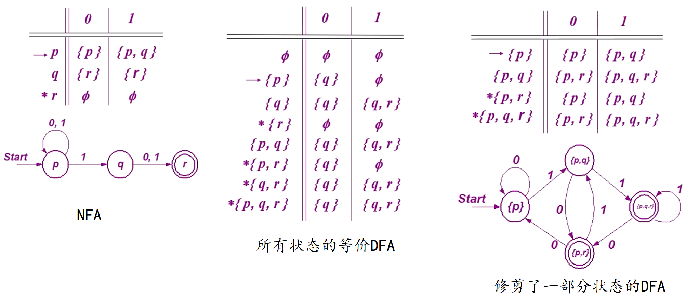

https://ocw.mit.edu/courses/18-404j-theory-of-computation-fall-2020/

# 语言及文法

## *自然语言和形式语言*

### Grammer vs. Syntax


自然语言学上的 Grammar 语法通常包括

* 语音学 phonetics：Phonology是研究语音系统的学科，关注的是语言中的声音（phonemes）以及这些声音如何组合、变化，并影响意义
* 音系学 phonology
* 形态学 morphology：Morphology是研究词汇结构和构词法的学科，主要关心的是单词如何通过添加前缀、后缀或改变词根来改变意义和功能
* 句法学 syntax：Syntax是**研究句子和短语结构**的学科，分析如何将词汇组合成更大的构成成分，如从句和句子。句法学关注词序、句子成分如主语和宾语的排列方式，以及这些结构如何影响意义
* 语义学 semantics：Semantics是研究意义的学科，探讨语言是如何给事物赋予意义的。它包括研究词汇意义（词义学）、句子意义（句义学）以及语境中的意义（语用学）。语义学试图了解语言表达背后的意义是如何构成和传递的

### 如何读懂一个句子？

无论是阅读自然语言还是形式语言，为了读懂一个句子，必须要同时明白token和structure

因此读懂一个句子的步骤是：1、识别token；2、分析句子结构的构成，该过程称为解析 parse

对于自然语言，这一过程在学习一门外语时是显得那么重要。当然相比于形式语言，自然语言由于其歧义性和不一致性还需要结合上下文 context 来理解

### 两种语言

自然语言 natrual language 是人类讲的语言，这种语言并不是人为设计的（当然有人类试图对其规范化的努力）而是自然进化产生的。形式语言 formal language 是为了特定应用而人为设计的语言，例如数字和运算符号、化学分子式和反应式、用来表达计算过程的编程语言等

形式语言有严格的syntax规则，语法规则由规定符号 token 和结构 structure 的规则所组成，下面以有效的数学表达式 `1+1=2` 和无效的数学表达式 `1+=$2` 为例

* 关于token的规则被称为**词法 lexical**
  * token的概念相当于自然语言中的单词与标点符号，数学表达式中的数字和运算符等，是最基本的组成
  * `1+=$3` 的lexical错误在于没有定义过有效的数字或运算符 `$`
* 关于structure的规则称为**文法 grammer**
  * structure是指token的正确排列组合方式，以产生有效的语义 semantic
  * `1+=$2` 的grammer错误在于虽然 `+` 和 `=` 都是lexical正确的运算符，但是数学式grammer没有定义 `=` 直接放在 `+` 后面所表达的意义
* syntax 句法本身只是对如何正确地组织符号、字符和关键字等以形成有效程序指令的具体规则，并不关心其具体语义。所以可以说 grammer 是包含了 lexical 和 syntax 的

### 两种语言的不同处

形式语言与自然语言主要存在下面三个不同点

* 歧义性 ambiguity 
  * 自然语言充满了歧义，人们需要通过上下文的辅助，甚至是自己的常识来解决这个问题
  * 形式语言的设计要求是清晰的、毫无歧义的，这意味着每个语句可以被单独拆开来看还能表达确切的意思，相当于与上下文切割开来了。因此形式语言一般都是上下文无关语言 context free language
* 冗余性 redundancy：为了消除歧义减少误解，自然语言引入了相当多的冗余，其结果就是语言的膨胀，或者说啰嗦。而形式语言则很紧凑 compact，很少有冗余
* 与字面意思的一致性 consistent with literal
  * 自然语言充斥着成语和隐喻 metaphor，这种成语和隐喻往往意味着意有所指，即与其字面意思不一致，这在文学作品中表现的淋漓精致，可以说这些文学作品的伟大有很大一部分是来源于自然语言的灵活与不一致
  * 形式语言中literal的意思就是其token代表的真实意思

## *Sprache und Grammatik*

### 语言的定义与运算

* 字母表与字符串 alphabet table

  * 字母表是非空的形式符号有限集合，常用 $T$ 或 $\Sigma$ 来表示
    * 英文字母表
    * 数字表、数学符号表

  * 字符串/句子 string 是由字母表 $T$ 中的字符构成的序列
    * $\varepsilon$ 称为空串 empty string，它是一个长度为0的字符串
    * $\lvert\vert$ 用来计算字符串长度

* 字符串运算

  * 连接 concatenation

  * 取前缀 prefix、取后缀 suffix、取子串

  * 取逆/倒置

* 字母表的幂运算

  * 定义
    * $T^0=\left\{\varepsilon\right\}$
    * 设 $x\in T^{n-1},\ a\in T$，则 $ax\in T^n$
  * 克林闭包 Kleene closure  $T^*=T^0\cup T^1\cup T^2\cup\dots$：字母表 $T$ 上的所有字符串和空串的集合
  * 正闭包 positive closure $T^+=T^1\cup T^2\cup T^3\cup\dots$：字母表 $T$ 上的所有字符串构成的集合
  * $T^*=T^+\cup\left\{\varepsilon\right\},\ T^+=T^*-\left\{\varepsilon\right\}$

* 语言 Language：设 $T$ 是字母表，则任何集合 $L\subseteq T^*$ 是字母表 $T$ 上的一个语言。由语言的定义知语言的本质是集合，因此对集合的运算可以用于语言

  * 语言的积：两个语言 $L_1$ 和 $L_2$ 是由 $L_1$ 和 $L_2$ 中的字符串连接所构成的字符串的集合
  * 语言的幂

### 语法

语法是用来定于语言的一个数学模型

* 若 $L$ 是有限集合，可用列举法
* 若 $L$ 是无限集合
  * 用语法产生系统，由定义的语法规则产⽣出语⾔的每个句⼦
  * 输入状态机，不报错就是符合语言规则的

元语言 metalanguage：描述语言的语言。当⼈们要解释或讨论程序设计语⾔本⾝时，又需要⼀种语⾔，被讨论的语⾔叫做对象语⾔，即某种程序设计语⾔，讨论对象语⾔的语⾔称为元语⾔

### 推导与句型

* 直接推导：设 $\alpha$ 和 $\gamma$ 是 $(V\cup T)^*$ 中的字符串，则有 $\alpha A\gamma\Rightarrow\alpha\beta\gamma$，称 $\alpha A\gamma$ 直接推导出 $\alpha\beta\gamma$
* 推导序列
  * $\alpha_0\Rightarrow\alpha_1\Rightarrow\cdots\alpha_n$ 是长度为n的推导序列
  * 推导序列的每一步，都会产生一个字符串，这些字符串一般称为句型
* 句型和句子
  * 通过recursive 递归不断生成新的句型，中间可能有终结符也有可能有非终结符，最终推导到所有的符号都被替换为终结符为止
  * 中间产生的还可以继续递归的，还有非中间符的就是一个句型
  * 推导到最后，若只包含了终结符，那么它就是一个句子
  * 用汉语举一个例子：句型就是[主语]+[谓语]+[宾语]，而一个句子就是对之前的三个非终结符进行替换，比如[我]+[吃]+[饭]就是一个句子

## *Chomsky 语法体系*

### Chomsky 语法体系

关于Chomsky语法体系和Backus-Naur范式的建立历史可以看这篇博客：https://blog.csdn.net/taidaohualang/article/details/93624507

Chomsky在1956年在他的论文 *syntactic structures* 中提出了他对语法的数学与逻辑定义，即Chomsky范式。对语法的定义并不是绝对的，实际上Chomsky范式之所以如此出众，还得归功于Backus之后为建立形式语言时从Chomsky的论文中得到的启发。简单地说，Chomsky的理论回答了这样一个问题，即**具备何种特征的语言可以用于书写程序**，而Backus的工作则告诉我们，**计算机程序确实能够用人类可以理解的方式写出并同时让人类和计算机理解**

>  *syntactic structures* 是对美国传统的描写语言学的一场革命，其革命性首先表现在乔姆斯基站在理性主义的立场上反对描写语言学的经验主义。
>
> 他把语言学看成跟自然科学中的其他科学一样，可以从假设出发，进行推演并形式化。换句话说，非经验主义是可能的。 *syntactic structures* 有一半篇幅用于英语语法的形式化。非经验主义和形式化是转换生成语法的首要标志。
>
> 把句法关系作为语言结构的中心并以此说明语句的生成是这场革命的又一表现。为了描写和解释语言现象，乔姆斯基在 *syntactic structures* 中论证了语法的生成能力，认为应该把语法看成是能生成无限句子的有限规则系统。-- 豆瓣读书

对于Backus是如何与这篇论文相遇并且理解了语言学如此晦涩的内容则无人可知。对于Chomsky语法体系本身的争论和批判虽然至今仍在继续，但以Chomsky为启发的Backus范式却在计算机科学中得到了几乎完美的使用

Chomksy范式定义的语法是一个4元组 $\mathcal{G}=\left\{V,T,P,S\right\}$

* $V$ Variable 变量或者非终结符，一般用大写字母表示。用来表示在句子中不同类型的短语或子句，非终结符在句子中不会出现，只会在生成式中出现
* $T$ Terminale 终结符，一般用小写字母表示 $V\cap T=\empty$：字母表 Alphabet 或者词典 Dictionary
* $P$ Produktionsregel 生成式/推导式，它是一个语法的**核心**
  * 形式为 $\alpha\rightarrow\beta$ 的生成式的有限集合
  * $\alpha\in(V\cup T)^*N^+(V\cup T)^*,\ \beta\in(N\cup T)^*$
* $S$ Startsymbol 开始变量，用来表示整个句子（或程序）。它必须是 $V$ 非终结符的元素

P中的⽣成式是⽤来产⽣语⾔句⼦的规则，它是语法的核心，决定了句子如何产生。⽽句⼦则是仅由终结符组成的字符串。这些字符必须从⼀个起始符S开始，不断使⽤P中的⽣成式⽽推导出来

所谓的终结符就是一个用来描述某一类终结符共同特性的概念。用汉语来举一个例子，所谓的非终结符就是“主语”、“谓语”这种概念，而终结符就是“我”、“吃”这种不可拆分的元素。而所谓的生成式就是比如说"主语"替换为“我”、“你”、“他”这种具体的token

### 用 Chosmky 语法体系来定义德语


### Chomsky Hierarchy


Chomsky语法体系，又称为Chomsky谱系 Chomsky Hierarchy **根据生成式**对语言和语法进行了分类

* 0型语法：无限制语法或者称为递归可枚举语言，即图灵机
* 1型语法：上下文有关语法 Context-Sensitive Grammer CSG
  * 生成式的形式为 $\alpha\rightarrow\beta$
    * 左部的长度小于右部 $\lvert\alpha\rvert\leq\lvert\beta\rvert$
    * $\beta$ 不能为空串，即不含 $A\rightarrow\beta$
  * 对应的语言为上下文有关语言 Context-Sensitive Language CSL
  * 若不包含 ε 空串，则与线形有界自动机 Linear Bounded Automaten LBA 等价
* 2型语法：上下文无关语法 Context Free Grammer CFL
  * **生成式的约束：左部只能是一个非终结符**
  * 对应的语言为上下文无关语言 Contex t-Free Language CFL
  * 对应的自动机为下推自动机 Pushdown Automaten PDA
  * 上下文无关更加关注语法，而不关注这句话是不是符合人类的认知。目前形式语言/编程语言都是CFL，表达紧凑，避免歧义
* 3型语法：正则语法 Regular Grammer
  * 正则语法必须是下面两种形式之一，其中的A和B都是非终结符，$\omega$ 是终结符（可以是空串）
    * 右线形语法 Right-linear Grammer $A\rightarrow\omega B$ 或 $A\rightarrow B$，$A,B\in N;\ \omega\in T^*$
    * 左线形语法 Left-linear Grammer $A\rightarrow B\omega$ 或 $A\rightarrow B$，$A,B\in N;\ \omega\in T^*$
  * 对应的语言是正则语言 Regular Language
  * 对应的自动机为有限自动机 Finite Automaten

### Chomsky Normal Form CNF Chomsky 范式

和逻辑命题中的CNF 和取范式（MMK.md中若不加说明，CNF指的都是Chomsky Normal Form）与DNF 析取范式一样，**任何的CFL都可以被转换为Chomsky Normal Form**

CNF的定义为：称一个CFL为CNF，若它的每一个生成规则都为如下形式
$$
A\rightarrow BC\\A\rightarrow a
$$
即生成式右边要么只有两个变量要么只有两个非终结符，要么只有一个终结符

## *BNF*

### Backus-Naur Form

Backus-Naur Form, BNF 巴克斯范式是CFL或者说形式语言的另一个表达方式，但它不是一种范式，而是一种对CFL的encoding方法，和CFL一样，都是一种元语言 Meta Language

自从编程语言Algol 60（Naur，1960）使用BNF符号定义语法以来，这种符号规则体系被证明适合作为形式化编程语言的语法，之后人们也开始习惯于使用此类元语言去定义语言语法。如今各种形式语言，尤其是各种程序设计语言因为BNF对于形式语言的高效表达而全部采用BNF描述
$$
\langle Variable\rangle::=Terminal|\langle Variable\rangle
$$
在左边的尖括号中必须是Variable，右边要么是终止符，要么也是Variable。BNF元语言的典型表达形式为

```
<symbol> ::= expression
<symbol> ::= expression1 | expression2
```

- 这个式子左侧放在尖括号中的symbol是一个非终结符号，而expression这个表达式由一个或多个终结符号或非终结符号的序列组成，这个式子也被称为产生式production
- 产生式中的 `::=` 这个符号含义是**被定义为**，左边的非终结符号可以被推导为右边的表达式，右边的表达式也可以归约为左边的非终结符号
- 如果右侧有多种表达式形式可作为symbol的归约选择，可以使用 `|` 符号分隔
- 从未出现在左边的符号是终结符号。另一方面，出现在左侧的符号为非终结符号，并且总是被包围在一对 `<>` 之间

随着BNF的广泛应用给，在不断迭代后BNF有两种更常用的简化和扩展形式

* Extended Backus-Naur Form, EBNF：增加了可选项 `[...]` 和重复项 `{...}`
* Augmented Backus–Naur Form, ABNF

### EBNF

最早的EBNF是由Niklaus Wirth开发的, 它包含了[Wirth语法符号](https://en.wikipedia.org/wiki/Wirth_syntax_notation)中的一些概念和不同的语法和符号. 1996年，国际标准化组织通过了EBNF标准[ISO/IEC 14977:1996](https://www.iso.org/standard/26153.html)

EBNF使用了与BNF不同的符号且对BNF进行了增强，EBNF甚至可以定义自己的语法

```
letter = "A" | "B" | "C" | "D" | "E" | "F" | "G"
       | "H" | "I" | "J" | "K" | "L" | "M" | "N"
       | "O" | "P" | "Q" | "R" | "S" | "T" | "U"
       | "V" | "W" | "X" | "Y" | "Z" | "a" | "b"
       | "c" | "d" | "e" | "f" | "g" | "h" | "i"
       | "j" | "k" | "l" | "m" | "n" | "o" | "p"
       | "q" | "r" | "s" | "t" | "u" | "v" | "w"
       | "x" | "y" | "z" ;

digit = "0" | "1" | "2" | "3" | "4" | "5" | "6" | "7" | "8" | "9" ;

symbol = "[" | "]" | "{" | "}" | "(" | ")" | "<" | ">"
       | "'" | '"' | "=" | "|" | "." | "," | ";" | "-" 
       | "+" | "*" | "?" | "\n" | "\t" | "\r" | "\f" | "\b" ;

character = letter | digit | symbol | "_" | " " ;
identifier = letter , { letter | digit | "_" } ;

S = { " " | "\n" | "\t" | "\r" | "\f" | "\b" } ;

terminal = "'" , character - "'" , { character - "'" } , "'"
         | '"' , character - '"' , { character - '"' } , '"' ;

terminator = ";" | "." ;

term = "(" , S , rhs , S , ")"
     | "[" , S , rhs , S , "]"
     | "{" , S , rhs , S , "}"
     | terminal
     | identifier ;

factor = term , S , "?"
       | term , S , "*"
       | term , S , "+"
       | term , S , "-" , S , term
       | term , S ;

concatenation = ( S , factor , S , "," ? ) + ;
alternation = ( S , concatenation , S , "|" ? ) + ;

rhs = alternation ;
lhs = identifier ;

rule = lhs , S , "=" , S , rhs , S , terminator ;

grammar = ( S , rule , S ) * ;
```

EBNF使用 `=` 替代BNF中的 `::=`，并且终结符号必须放在双引号内，避免了BNF自身使用的符号（`<, >, |, ::=`）无法在语言中使用。此外，BNF语法只能在一行中定义一条产生式规则，而EBNF使用一个终止字符，即分号字符 `;` 来标识着一条产生规则的结束，这样EBNF的一条产生式规则可以跨越多行。 此外，EBNF还提供了许多增强的机制，比如：定义重复的数量、支持注释等

但无论是BNF还是EBNF，它们都有一个共同特点，那就是**产生式规则左侧仅有一个非终结符号**，这样定义出的语法（文法）称为**上下文无关 Context-Free Grammar, CFG 文法**

# 有限自动机 & 正则文法

## *语言与自动机的等价性*

* 1956年 Chomsky从**语言产生**的角度定义了语言与文法
* 1951-1956 Kleene提出了有穷状态自动机 FA，从**语言识别**的角度，定义了语言
* 1959年 Chomsky证明了语言与自动机的等价性，形式语言从此诞生

## *有限自动机*

### 有限自动机 & 状态概念

* Finite Automaten, FA系统是具有离散输入输出系统的一种**数学模型**（可以没有输出，比较特殊的也可以没有输入）
* 该系统具有任意有限数据的内部状态。所谓状态就是可以将事物区分开的一种标识
* 状态+输入会导致对应的状态转移
* 根据每次状态转移得到的后继状态的唯一性可以分为
  * DFA, Deterministic Finite Automaton 确定有限状态自动机
  * NFA, Non-Deterministic Finite Automaton 非确定有限状态自动机
* 当有限自动机读入一个字符串时，它从初始状态 $q_0$ 开始，经过一系列状态转换，当读完字符串的最后一个字符，若能到达接受/终止状态，那么则称这一字符串可被有限自动机所接受

### DFA 的形式定义

DFA 是一个5元组 $\mathcal{M}_1=(Q,\Sigma,\delta,q_0,F)$

* $Q$ 是一个有限非空的状态集合
* $\Sigma$ 是输入字母表 alphabate，有限非空的字符集合（也可以用 $T$ 来表示）
* $\delta$ 是状态转移函数 transfer function：$\delta:Q\times\Sigma\rightarrow Q$，这个式子的意思是输入是 $Q$ 和 $\Sigma$ 中各自元素的集合，其笛卡尔积仍然在 $Q$​ 中。等价的描述方式是 $\delta(q,\ a)=r$
* 一个起始状态 start state $q_0\in Q$，约定转移图中**只有一个单向输入箭头的称为初始状态**
* 一个接受/终止状态集 accept state $F\subseteq Q$，当令 $F=\emptyset$​ 的时候就没有接受状态，约定转移图中用**双圈表示的是接受/终止状态**

自动机从左至右一个接一个地接收输入字符串的所有符号。读到一个符号之后，$M_1$ 会沿着标有该符号的转移从一个状态移动到另一个状态。当读到最后一个符号时，$M_1$ 产生它的输出。如果 $M_1$ 现在处于一个接受状态，则输出为接受；否则输出为拒绝

若 $A$ 是机器 $M_1$ 接受的全部字符串集，那么称 $A$ 是机器 $M_1$ 的语言 language，记作 $L(M_1=A)$，又称 $M_1$ 识别 recognises $A$ 或 $M_1$ 接受 accepts $A$。一台机器可能接受若干字符串，但它永远只能识别一种语言。若机器不接受任何字符串，那么它仍识别一个空语言 empty language $\emptyset$​​（set with no strings），也就是说所有的机器至少都会识别一种语言，即空语言

所谓机器 $M_1$ 接受一个字符串 $w=w_1w_2\dots w_n,\ each\ w_i\in\Sigma$ 的形式定义是：如果有一个状态的序列 $r_0,r_1,r_2,\dots r_n\in Q$，那么

* $r_0=q_0$
* $r_i=\delta(r_{i-1},w_i)$ for $1\leq i\leq n$
* $r_n\in F$

**可以被一个FA识别的语言称为正则语言 RE**

### 例子

下面举一个例子，下图是某个自动机 $M_1$ 的状态图 state diagram


$M_1=(Q,\Sigma,\delta,s,F)$ 识别的语言为至少含有一个1并且在最后的1后面有偶数个0

* 其中状态集合 $Q=\left\{q_1,q_2,q_3\right\}$

* 字母表为 $\Sigma=\left\{0,1\right\}$ 

* 转移函数 $\delta$​​ 的描述为

  ```
      |  0   1
  -----------------
  q1  |  q1  q2
  q2  |  q1  q2
  ```

* $q_1$ 为起始状态

* 接受集为 $F=\left\{q_2\right\}$

对于上面五元组的定义是针对单个字符的，下面给出对任意字符串 $\omega\in \Sigma^*$（字母表的克林闭包），$\delta'(q,\omega)$ 表示DFA在状态 $q$ 输入字符串 $\omega$ 后的状态，$\delta'$ 的定义如下

* 对 $\varepsilon\in \Sigma^*$，有 $\delta'(q,\varepsilon)=q$。即当没有读到字符时，或者说读到的是空字符时，FA的状态不发生改变

* 对任意 $a\in\Sigma$ 和 $\omega\in\Sigma^*$，有 $\delta'(q,\omega a)=\delta(\delta'(q,\omega),a)$。表示读入字符串 $\omega a$ 后，为了找出后即状态，应该是在读入 $\omega$ 之后得到转移过后的状态 $p=\delta'(q,\omega)$ 后，然后在这个新状态的基础上再求 $\delta(p,a)$

* 若有 $p=\delta'(q_0,\omega)\in F$，那么称字符串 $\omega$ 被FA $M$ 所接受，而 $L(M)$ 则表示 $M$ 所接受的语言，表示为
  $$
  L(M)=\left\{\omega|\delta'(q_0,\omega)\in F\right\}
  $$

### FA的格局

为描述FA的工作过程，对于它在某一时刻的工作状态，可以用两个信息表明

1. 在该FA所处的状态 $q$，称为当前状态
2. 在该时刻等待输入的字符串 $\omega$

两个构成一个瞬时描述，称为格局 configuration，用 $(q,\omega)$ 表示

### 设计有限自动机

如同设计文法一样，自动机的设计也是一个创造的过程，因此不可能提取出一种更简单的算法或设计流程

对于有限自动机，设计的核心在于估算出读一个字符串时需要记住哪些关键的东西。这是因为FA根据内部的状态来“记忆”字符串的某些性质。设想极端情况下，FA内部的状态数量可以变化成和任意字符串的长度一样，那么就相当于直接把字符串给存下来了，这显然是不现实的。因此要根据任务需求来设计合适的状态数来处理输入

## *正则集 & 正则式*

### 正则式、正则集与正则运算

正则表达式的值是一个语言，或者说是某种字符串的规律，比如说用grep来摘出需要的字符串模式

* 正则集 regular set：字母表上的一些特殊形式的字符串的集合，是正则式所表示的集合
* 正则式 regular expression：用类似代数表达式的方法表示正则语言
* 正则运算 regular operation：作用于语言上的三种代数运算（正则运算符运算优先级 precedence 如数字顺序）。以两个语言A和B为例
  1. 克林闭包 closure / star 运算：$A^*=\left\{x_1 x_2\dots x_k|k\geq 0 且每一个 x_i\in A\right\}$
  2. 连接 concatenation：$A\circ B=\left\{xy|x\in A\ and\ x\in B\right\}$
  3. 联合 union 取并集：$A\cup B=\left\{x|x\in A\ or\ x\in B\right\}$

一个例子：用 $(0+1)^*011$ 来表示所有以 011 结尾的串组成的语言
$$
(0+1)^*011\Rightarrow\left\{\left\{0\right\}\cup\left\{1\right\}\right\}^*\left\{0\right\}\left\{1\right\}\left\{1\right\}\Rightarrow\left\{0,1\right\}^*011\Rightarrow L((0+1)^*011)
$$

### 正则式的性质

设 $\alpha,\beta,\gamma$ 都是正则式

* 交换律和结合律
* 等幂律 idempotent law $\alpha+\alpha=\alpha$
* 分配律
* 幺元（单位元 identities）和零元（annihilators）
  * $\alpha+\emptyset=\emptyset+\alpha=\alpha$
  * $\alpha\emptyset=\emptyset\alpha=\emptyset$
  * $\alpha\varepsilon=\varepsilon\alpha=\alpha$
* 与闭包相关的定律
  * $(\alpha^*)^*=\alpha^*$
  * $\alpha^*=\alpha+\alpha^*$​​

## *不确定有限自动机*

### NFA的概念和形式定义

引入非确定性 non-deterministic，非确定性是确定性的推广，因此每一台DFA自动地是一台NFA


NFA相比于DFA有两个特点

* 上图是一个NFA $N_1$​​ 的状态转换图。在NFA中，**在一个输入下可能会转移到多个后继状态**，即一个状态对于字母表中的每一个符号可能有多个射出的箭头
* 把NFA进行进一步扩展，使之在不接受输入符号，即输入为 ε 时也能做转移动作。这种自动机在NFA的基础上又增加了一种不确定性

ε-NFA也用一个5元组 $\mathcal{M}=(Q,\Sigma,\delta,s,F)$ 来表示，**它和DFA的区别只在于转移函数 $\color{white}\delta$ 不同**。对于NFA，$\delta: Q\times\left(\Sigma\cup\varepsilon\right)\rightarrow\mathcal{P}(Q)$，其中 $\mathcal{P}(Q)$ 也可以写成是 $2^Q$，即 $Q$ 的 power set 幂集。也就是说，从当NFA在某一个状态下输入一个字符时，可转换的后继状态是 $Q$ 的一个子集

**如果有两条路径分别通往另一个状态和接受态，那么字符串就是被机器接受的**

当NFA的所有后继状态都只有一个 $Q$​​ 的子集时，NFA也就变成了DFA，因此说DFA是NFA的特例

### ε 的意义

ε 的意思是不需要消耗输入字符串中的任何一个字符就可以完成转移，即一种没有代价消耗的转移。虽然 ε 在物理机器上没有任何意义，但是在理论推理上它不仅在某些情况下有更简洁的表达能力，而且在证明一些理论问题时更是不可缺少的工具

同时相比于 DFA，虽然 NFA 并没有增加自动机的计算能力，并且无法被实现出来，但是 ε 的引入为 NFA 的设计提供了极大的便利性

我们仍然可以从 computational 和 mathmatical 两个角度来解释 ε

* computational：可以理解为 fork 了一个新的线程，如果这个线程可以通往接受态，那么整个进程就是被接受的

* mathmatical：将计算过程看作是一棵概率树。NFA 的转移过程可以看成是一棵树，当然在 DFA 中，也可以认为状态转移的过程是一条直线的特殊的树

  只要子过程中至少有一个到达了接受状态，那么整个计算过程就是接受的

  

  下面是上面 $N_1$ 当一个输入字符串 010110 的转移过程用树来表示

  

### 正则语言在三种正则计算中的封闭性

如果把某种运算应用于一个对象集合的成员得到的对象仍在这个集合中，则称这个对象集合在该运算下封闭，或具有该运算的封闭性 closure

正则运算的封闭性是之后使用递归来实现一些算法（比如说子集构造法）的基本原理

现在有两个正则语言 $A_1$ 和 $A_2$，要证明 $A_1\cup A_2$ 也是正则的。由于 $A_1$ 和 $A_2$ 是正则的，所以有一台有FA $M_1$识别$A_1$ 和另一台有FA $M_2$ 识别 $A_2$。为了要证明并、连接、闭包是正则的，则必须要证明有一台 FA $M$ 可以识别 $A_1$ 和 $A_2$​ 的并、连接、闭包


* 证明并操作 $\cup$​ 的封闭性

  * 确定性地模拟M：具体证明看书的定理1.12，这里仅给出M的五元组
    * $Q=\left\{(r_1,r_2)|r_1\in Q_1\ and\ r_2\in Q_2\right\}$，集合Q是 $Q_1$ 与 $Q_2$ 的笛卡儿积，记作 $Q_1\times Q_2$。它是第一个元素取自 $Q_1$、第二个元素取自 $Q_2$ 的所有的状态有序对组成的集合
    * $\Sigma=\Sigma_1\cup\Sigma_2$
    * $\delta((r_1,r_2),a)=\left(\delta_1(r_1,a),\delta_2(r_2,a)\right)$
    * $(q_1,q_2)$
    * $F=\left\{(r_1,r_2)|r_1\in F_1\ or\ r_2\in F_2\right\}$，该表达式等价于 $F=(F_1\times Q_2)\cup(Q_1\times F_1)$​
  * 使用NFA来证明

* 证明连接操作的封闭性

  * 在没有引入NFA之前，原来的问题是不知道如何去划分输入，因为此时要证明的效果是当它的输入可以被分成两段，$M_1$ 接受第一段且 $M_2$ 接受第二段时，M才接受输入

  * 这个证明必须要使用NFA才能完成

    把原来的 start state 设置为一个 accept state 是一个坏主意，正确的做法应该是新建立一个 start state 作为 accept state。或者也可以添加一个start到accept的epsilon转换

* 证明闭包操作的封闭性

  M1在内部自递归。一旦有接受的，剩下的部分会M2。然后M1继续自递

### 证明DFA与NFA的等效性：子集构造法

因为NFA是DFA的引申，所以DFA自动就可以转换为一台NFA，如果能证明NFA也可以转换为DFA，那么就可以证明NFA和DFA之间的等效性

设 $L(M_N)$ 是由不确定的有限自动机 $M_N$ 接受的语言，则存在一台确定确定的有限自动机 $M_D$ 接受 $L(M_D)$，满足 $L(M_D)=L(M_N)$。我们可以说 **NFA converts to a DFA**

用 **子集构造法 subset construction** 来证明：设一个语言被一台NFA识别，构造一个接受它所能接受语言的DFA，这个DFA的每一个状态对应了NFA的状态集合

设NFA $M_N=(Q,\Sigma,\delta,q_0,F)$，接受 $L(M_N)$，对应 $M_N$ 构造一个DFA $M_D=(Q_D,\Sigma,\delta_D,q_{0D},F_D)$，具体的五元组的内容如下

* $Q_D=2^Q$
  * 对于NFA，一个输入可以对应多个状态，那么我们可以把它对应的多个状态组合为一个新的确定的状态，即新的 $Q_D$ 是 $Q$ 的幂集。若子集为 $\left\{q_1,q_2,\cdots,q_k\right\}$，则 $Q_D$ 中的**状态**标记为 $\left[q_1,q_2,\cdots,q_k\right]$
  * 用下面的子集构造法例子来说明，对于对应的完整的DFA来说，它一共有 $2^3=8$ 个状态，比如 $\left\{p,q\right\}$ 是一个全新独立的状态
  
* $q_{0D}=\left[q_0\right]$

* $F_D\subseteq Q_D$，$F_D$ 的每个状态包含 $M_N$ 的至少一个终止状态

* $\delta_D$ 的定义为：$\delta_D\left([q_1,q_2,\cdots,q_i],a\right)=\left[p_1,p_2,\cdots,p_j\right]$ 当且仅当 $\delta\left(\left\{q_1,q_2,\cdots,q_i\right\},a\right)=\left\{p_1,p_2,\cdots,p_j\right\}(a\in\Sigma)$
  * 这个定义的意思是当要确定对于某个 $a$ 和状态 $Q_D$ 的 $\delta_D$ 的值时，要先将 $Q_D$ 中的对应**状态**还原为 $Q$ 中的**状态集**，然后通过 $\delta$ 的扩充定义计算出它的值，然后再把它看成是 $Q_D$ 中的状态即可
  
  * 用下面的子集构造法例子来说明，当试图确定最右边修剪DFA中新构造的 $\left\{p,q\right\}$ 状态的输出时候，我们要回到NFA中，分别取 $p,q$ 都等于0或者1时的输出进行组合
  
    比如NFA中，$p=0,q=0\rightarrow\left\{p,r\right\};\ p=1,q=1\rightarrow\left\{p,q,r\right\}$​

等价性可以由数学归纳法得出

**DFA的构造过程可以看成是对NFA转移动作的模拟**

下面是子集构造法的一个例子，注意完整的等价DFA中有很多状态实际上对于等价的NFA其实是不可达到的，因此要修剪完整DFA状态



## *证明RE和FA的等价性*

### RE的形式归纳定义

称R是一个正则表达式 regular expression，若R是

* atomic
  * a，这里a是字母表 $\Sigma$ 中的一个元素
  * ε empty string
  * $\empty$ empty language
* composite，下面的 $R_1$ 和 $R_2$ 都是正则的。这不是循环定义 circular difination，因为 $R_1$ 和 $R_2$ 总是比 R 小，所以这是归纳定义 induction（就是用递归来证明）
  * $R_1\cup R_2$
  * $R_1\cdot R_2$
  * $R_1^*$​

### 证明RE可以转换为NFA

定理：如果 R 是一个正则表达式并且 $A=L(R)$，那么A是正则的


### GNFA

广义/推广非确定型有穷自动机就是非确定型有穷自动机，只是转移箭头可以用任何正则表达式作标号，而不是只能用字母表的成员或 ε 作标号


GNFA同样用一个五元组 $M=(Q,\Sigma,\delta,q_{start},F_{start})$ 来表示，Q和$\Sigma$和前面的都是一样的，不赘述了

* 转移函数 $\delta$：$\left(Q-\left\{q_{accept}\right\}\right)\times\left(Q-\left\{q_{start}\right\}\right)\rightarrow\mathcal{R}$
* $q_{start}$ 是起始状态
* $q_{accept}$ 是接受状态

若字符串 w 可写成 $w=w_1w_2\cdots w_k$，这里每一个 $w_i\in\Sigma^*$，并且存在状态序列 $q_0,q_1,\cdots,q_k$。若使下面三个条件成立，则称这台 GNFA 接受字符串 w

1. $q_0=q_{start}$ 是起始状态
2. $q_k=q_{accpet}$ 是接受状态
3. 对每一个 `i`，$w_i\in L(R_i)$，其中 $R_i=\delta(q_{i-1},q_i)$，即 $R_i$ 是从 $q_{i-1}$ 到 $q_i$ 的箭头上的表达式

### 证明DFA可以转换为RE

定理：如果A是正则的，那么对于一些正则表达式 R 有 $A=L(R)$​

证明这个定义需要用到上面引入的GNFA

## *判断非正则语言*

用举不出反例这种方法是没有办法严谨证明非正则语言的，比如说 Let C = w has equal numbers of 01 and 10 substrings，第一眼看上去是需要记录数量的，所以认为它不是正则的，但实际上不对。比如说 `(01|10)*` 表示可以由任意数量的 "01" 或 "10" 子串组成的字符串。这符合题目中要求的条件，即字符串中包含相同数量的 "01" 和 "10" 子串

要严谨的证明不是正则语言需要使用 Pumping Lemma

### 正则语言的Pumping Lemma

正则语言的 Pumping Lemma 给出了正则集的一个特殊性质，如果能够证明一个语言没有这种性质，就可以证明某个语言不是正则的

这条性质的描述是：若 A 是一个正则语言，则存在一个数 p（泵长度 pumping length）使得，如果 s 是A中任一长度**不小于** p 的字符串，那么 s 可以被分成 3 段，$s=xyz$，满足下列条件

1. 对每一个 $i\geq0,xy^iz\in A$
2. $\left|y\right|>0$，即中间的不能是空串
3. $\left|xy\right|\leq p$

更具描述性的来说就是**每一个这样的字符串都包括一段中间的子串，把这段子串重复任意次，得到的字符串仍会在这个语言中**

形象地来说就是把中间那段 string pumping up（打气），但是无论 pumping 到多长这段 string 仍然被机器接受

### 例子

# 下推自动机 & 上下文无关文法

## *CFL*

Context-Free Grammer, CFL 上下文无关语法就是形式语言，**它能够描述某些应用广泛的具有递归结构特征的语言**

虽然CFL已经被整合到上面的Chomsky语法体系的定义中了，但是这里笔者为了方便理解，再次给出CFL的形式定义

CFL 是一个4元组 $(V,\Sigma,R,S)$，其中

* V 是一个有穷集合，称为变元集 variables / 非终结符
* $\Sigma$ 是一个与 V 不相交的有穷集合，称为终结符集 terminals
* R 是一个有穷规则集 rules，每条规则由**一个**变元和一个由变元及终结符组成的字符串构成。CFL means we can replace the variable Independent of its context in the intermediate string 等价于左边只有一个变元
* $S\in V$ 是起始变元

设 u，v 和 w 是由变元及终结符构成的字符串，$A\rightarrow w$ 是文法的一条规则。称 uAv 生成 yield uwv，记为 $uAv\Rightarrow uwv$​。$u\Rightarrow v$ **if can go from u to v with one substitution step in G**

若 u = v，或者存在 $u_1,u_2,\cdots,u_k$，可以使得 $u\Rightarrow u_1\Rightarrow u_2\Rightarrow\cdots\Rightarrow u_k\Rightarrow v$，其中 $k\geq 0$，则称 u 派生 derive 了 v，记作 $u\xRightarrow{*} v$，该文法的语言是 $\left\{w\in\Sigma^*|S\xRightarrow{*}w\right\}$。$u\xRightarrow{*} v$ **if can go from u to v with multiple substitution step in G**

之后在描述一个文法时，**通常只写出它的规则集 R**。出现在规则左边的所有符号都是变元，其余的符号都是终结符，**按照惯例，起始变元是第一条规则左边的变元**

比如说 $S\rightarrow aSb|SS|\varepsilon$，它的起始变元和变元集都是S，终结符集是 ${a,b,\varepsilon}$

### 语法分析树 Parse-tree

可以用图的方法来表示一个句型的推导，这种图称为推导树 Parse Tree, PT，也称为具体语法树 concrete syntax tree。**推导树的根节点的标记是文法的起始符**，其他枝和叶节点的标记，可以是非终结符、终结符或 ε

PT 正式的定义为：给定一个 CFG，该文法的一棵 PT 是具有以下性质的树：

* 根结点的标号为文法的开始符号
* 每个叶子结点的标号为一个终结符号或 ε
* 每个内部结点的标号为一个非终结符号
* 如果非终结符号 A 是某个内部结点的标号，并且它的子结点的的标号从左至右分别为 $X_1,X_2,\dots,X_n$，那么必然存在产生式 $A\rightarrow X_1X_2\cdots X_n$，其中 $X_1,X_2,\dots,X_n$ 既可以是终结符号，也可以是非终结符号。作为一个特殊情况，若 $A\rightarrow\varepsilon$ 是一个产生式，那么一个标号为 A 的节点可以只有一个标号为 ε 的子结点

注意⚠️：PT 和语法分析的结果 AST 是两个东西，它们的区别可以看 *编译器.md*

若标记为 $A$ 的节点，有直接子孙 $X_1X_2,\cdots,X_i$，那么 $A\rightarrow X_1X_2\cdots X_i$ 是 $P$ 的一个生成式

从左到右连接推导树的叶子结点所标记组成的字符串称为推导树的**边缘 frontier**

比如说对于一个文法
$$
\mathcal{G}:\ \langle EXPR\rangle\rightarrow \langle EXPR\rangle+\langle EXPR\rangle|\langle EXPR\rangle\times \langle EXPR\rangle|\langle EXPR\rangle|a
$$
如果让它产生一个字符串 $a+a\times a$，那么会有下面两种可能的语法分析树，**分析树的含义取决于树的后序遍历**。其中左边可以被解释为加法的优先级更高，因为后序遍历的时候加法在前面，结果应该为 $2a^2$


### 歧义性 Ambiguity

对于某个CFL $\mathcal{G}$，若有某个字符串 $\omega\in L(\mathcal{G})$，存在两颗不同的语法分析树都以 $\omega$ 为边缘，或者说**存在两个不同的最左（最右）派生**，则称该文法 $\mathcal{G}$​​​​ 是有歧义性/二义性的

歧义性在自然语言中也是广泛存在的，从编译器角度，二义性文法存在一些问题，即同一个程序会有不同的含义，因此程序运行的结果不是唯一的。解决方案只能是重写文法

有时对于一个歧义文法能够找到一个产生相同语言的非歧义文法。但对于某些CFL只能用歧义文法产生，此时称这样的语言为固有歧义的 inherently ambiguous

### 最左推导与最右推导

推导是为了对句子的结构进行确定性的分析，可以有各种不同的推导，但一般情况下，仅考虑最左推导或最右推导

对于CFL $\mathcal{G}$，若在从起始符 $S$ 推导过程的每一步中，都只能替换句型中**最左边的Variable**，则此推导过程称为最左推导 leftmost derivation/Linksentwicklung；类似地，若在从起始符 $S$​​​ 推导过程的每一步中，都只能替换句型中**最右边的Variable**，则此推导过程称为最右推导 rightmost derivation/Rechtsentwicklung

为了应对上面的歧义性，一般要么是采用最左推导，要么是采用最右推导，不能混着来

### 设计CFL

* 先设计简单的CFL，然后合并成复杂的CFL
* 利用正则
* 考察子串
* 利用递归

### Chomsky 范式和 Greibach 范式

* 上下文无关文法的生成式形式若是 $A\rightarrow BC$ 和 $A\rightarrow a$，$A,B,C\in N, a\in T$，则该文法为 CNF

  * 任何CFL都可以转换为CNF：通过引入新变量将所有不符合规范的生成式转换为CNF，比如下面这个例子
    $$
    S\rightarrow bA\Rightarrow S\rightarrow CA\ and\ C\rightarrow b
    $$

  * 转换为Chomsky范式的优势：可以使用动态规划进行高速推导语法树

* CFL $\mathcal{G}$ 的生成式形式都是 $A\rightarrow\alpha\beta$ 且不包含 ε 生成式，$A\in N,\alpha\in T, \beta\in N^*$ ，则 $\mathcal{G}$ 是Greibach范式 GNF

## *下推自动机 PDA*

下推自动机 Push-Down Automaten PDA (de. Kellerautomaten) 是一种用于处理上下文无关语言的有限状态自动机。**PDA在NFA的基础上配备了一个无限容量的下推栈**，栈在控制器的有限存储量之外提供了附加的存储，用于存储和操作数据，从而使PDA能够识别形式语言/非正则语言

PDA能控制自己的行为，因为在规则和栈之间有一个反馈环：栈的内容会影响到机器应该遵守的规则，而按照某个规则执行又回反过来影响栈的内容，这就允许 PDA 在栈中存储一些信息，这些信息可以影响它将来的执行

### PDA的形式定义

一个PDA包括五元组 $(Q,\Sigma,\Gamma,\delta,q_0,F)$

* $Q$ 是有限状态集合

* $\Sigma$ 是有限输入符号集合

* $\Gamma$ 是有限栈符号集合。一般栈里都会预先放一个 \$ 来检验栈是否为空

* $\delta$ 是状态转移函数，$\delta: Q\times\Sigma_{\epsilon}\times\Gamma_{\varepsilon}\rightarrow\mathcal{P}(Q\times \Gamma_{\varepsilon})$

  这个转移函数的意思是现在状态转移的过程由当前状态、当前字符和栈顶元素共同决定

  其中 ε 表示空串，也就是说类似于NFA，这是一个NPDA，不需要任何输入就可以转移，即**ε-输入转移（ε input move）**。另外栈顶可以是空的意思就是不需要读取、pop栈顶元素就可以转移，即 **ε-栈转移（ε-stack move）**

  而转移得到的 power set 也是 $\Gamma_{\varepsilon}$，它的意思是不需要往栈中写任何东西。因此这个状态转移函数可以写成 $\delta(q,a,c)=\left\{(r_1,d),(r_2,\varepsilon)\right\}$，意思就是既可以往栈里面写，也可以不写

  用 $a,b\rightarrow c$ 来表示读入一个输入 a，将栈顶的 b 替换为 c

* $q_0\in Q$ 是初始状态

* $F\subseteq Q$​ 是终止状态集合

### PDA的工作过程

它接受输入w，若能够把w写成 $w=w_1w_2\cdots w_m$，这里每一个 $w_i\in\Sigma_{\varepsilon}$，并且存在状态序列 $r_0,r_1,\cdots,r_m\in Q$ 和字符串序列（栈符号表 stack alphabet） $s_0,s_1,\cdots,s_m\in\Gamma^{*}$ 满足下述3个条件

1. 初始化：$r_0=q_0$ 且 $s_0=\varepsilon$，该条件表示 M 从起始状态和空栈开始（或者也可以说将空字符 ε 压入栈中）
2. 迭代过程：对于 $i=0,\cdots,m-1$，有 $(r_{i+1},b)\in\delta(r_i,w_{i+1},a)$，其中 $s_i=at,s_{i+1}=bt;\ a,b\in\Gamma_{\varepsilon},t\in\Gamma^{*}$。该条件说明M 在每一步都完全按照当时的状态、栈顶符号和下一个输入符号动作
3. 终止条件：$r_m\in F$ 且栈为空，该条件说明在输入结束时出现一个接受状态

则字符串 $s_i$​​ 是M在计算的接受分支中的栈内容序列

以一个接受CFL $\left\{0^n1^n|n\geq0\right\}$ 的PDA为例，它的五元组 $(Q,\Sigma,\Gamma,\delta,q_0,F)$ 为

* $Q=\left\{q_1,q_2,q_3,q_4\right\}$ 

* $\Sigma=\left\{0,1\right\}$

* $\Gamma=\left\{0,\$\right\}$

* $F=\left\{q_1,q_4\right\}$

* $\delta$​

  

## *CFL & PDA的等价性*

### 将 CFL 转换为 PDA

有一个问题就是不能取到非栈顶的元素，所以不能直接对非栈顶元素作替换。解决方法是简单的，只有只有当变元在栈顶的时候才替换它；当栈顶是一个终结符的时候，和输入字符对比，如果不相等就拒绝

定理：A is a CFL **iff** some PDA recognizes A

### 简单的推论

* 任何RE都是CFL（DFA相当于是一个没有使用栈的PDA）
* 如何A是一个CFL，B是一个 RE，则 $A\cap B$​ 是一个CFL

注意⚠️：若A和B都是CFL，$A\cap B$ 不一定是一个CFL，也就是说CFL在并操作不是闭合的。但是CFL在 union、concatenation 和 star 操作下是闭合的

## *证明不是CFL*

### Pump Lemma of CFL

如果A是CFL，则存在一个数 p（泵长度 puming length），使得A中任何一个长度不小于 p 的字符串 s 都能被划分成5段 $s=uvxyz$ 且满足下述条件

1. 对于每一个 $i\geq0$，有 $uv^ixy^iz\in A$
2. $\left|vy\right|>0$
3. $\left|vxy\right|\leq p$​


反证法：若 A 中有一定长度的字符串，在被pump后的字符串不在A中，则A不是一个CFL

### 证明

Cutting and Pasting Argument


取最小的解析树

### 例子

Prove $B=\left\{0^k1^k2^k\right\}$ is not a CFL

## *DCFL*

DFA 和 NDFA 在语言识别能力上是等价的，但对于 PDA 则不是，NPDA 比 DPDA 的语言识别能力强大，在一些情况下，NPDA 可以识别 DPDA 无法识别的 CFL

### DPDA的形式定义

**DPDA遵循确定性的基本准则：在计算的每一步，根据其转移函数，DPDA 最多只有一种继续的方式。但是DPDA是允许ε-输入转移和ε-栈转移的**，或者将二者结合起来

若一台 DPDA 能够在某种情况下做ε-转移，那么在这种情况下涉及处理非ε符号的转移是被禁止的，否则可能出现多个合法的计算分支的情况，进而导致非确定型的行为

DPDA的形式定义如下

 

DPDA, deterministic context-free language 确定型上下文无关语言 是能够让每一个有效串都有一个强制句柄的上下文无关文法


### PDA 扩展

DFA 有算法可以将其最小化，并可以找到一个最小的 DFA 与原来的 DFA 等价

但 PDA 却无法优化到最小，也无法判定两个 PDA 等价

# 算法的定义：图灵机模型

## *算法定义*

### Hilberts zehntes Problem

> Man gebe ein Verfahren an, das für eine beliebige [diophantische Gleichung](https://de.wikipedia.org/wiki/Diophantische_Gleichung) entscheidet, ob sie lösbar ist.

Diophantine equations 就是一个根为整数的不定式方程。Diophantus 丢番图 是创作了长篇巨著 *Arithmetica* 的古希腊数学家。丢番图在这部著作中 对整系数代数多项式方程进行了大量研究，那些研究对代数与数论的发展有着先驱性的贡献。后人为了纪念他，把整系数代数多项式方程统称为丢番图方程 Diophantine Equation

希尔伯特第十问题旨在设计一个算法来检测一个多项式是否有整数根

希尔伯特第十问题的解决过程：https://www.global-sci.org/uploads/Issue/MC/v3n8/38_87.pdf

### 可计算性

希尔伯特第十问题的遇到第一个困难是什么是算法？

可计算性 Computability，在理论计算机科学中，是指一个问题能否被某种计算模型完全自动化地解决的属性。这个领域研究的核心是什么问题是“可计算的”，即是否存在某种算法或过程，通过有限步骤的运算能够得到问题的答案

图灵机是可计算性理论的基础模型之一。**如果一个问题可以通过构造一个图灵机来解决，我们称这个问题是可图灵计算的，或简单地说，它是可计算的**。同样，其他形式的计算模型，如 λ 演算、递归函数等，也用于研究问题的可计算性

### Church-Turing 论断

Church-Turing Thesis, Church-Turing 论断：一个自然数上的函数 $f:N^n\rightarrow N$​ 是能行可计算的（effectively computable），当且仅当它是图灵可计算的（Turing computable）

换句话说：Church-Turing Thesis 认为图灵机是计算的极限，是算法的严格的数学定义

Church-Turing Thesis 无法被证明，但是越来越多的验证使我们越来越确信这个假说是真的

至于为什么 Church-Turing Thesis 无法被证明，主要有以下几个原因：

1. **概念的哲学性质**：Church-Turing Thesis 本质上是一个假设而非严格的数学陈述。它涉及“有效计算”或“可计算性”等概念，这些概念与经验和直觉相关，而不是纯粹形式化的。因此，它更接近于一种关于计算能力的哲学性声明，而不是可以通过数学严谨性加以证明的定理
2. **定义的模糊性**：“有效方法”或“算法”这些术语在数学上并没有一个标准的定义。虽然在实践中我们可以通过多个等价模型来捕捉这一概念（如图灵机、λ演算、递归函数等），但这些模型本身是基于某种直觉而被提出的，而不是“有效计算”直接的形式定义
3. **不可定义的领域**：任何试图定义“有效计算”的尝试只能依赖于我们已有的模型，而不可能涵盖所有可能的未来模型。随着计算模型的发展，我们可能会发现新的模型，这些模型能够计算目前模型不能计算的东西。因此，该论题只能是一种广泛接受的假设，而不是可以在所有情况下绝对成立的命题

Church-Turing Thesis 提供了算法的非形式化概念和精确定义之间的联系，即 λ 演算与图灵机模型的等价性

Church-Turing Thesis 是解决希尔伯特第十问题的必要前提

TODO: [Turing机、人工智能以及我们的世界 | Matrix67: The Aha Moments](http://www.matrix67.com/blog/archives/4930)

### 推翻希尔伯特纲领的公理系统：哥德尔不完备定理

Kurt Gödel 于1931在一篇论文 *Über formal unentscheidbare Sätze der Principia Mathematica und verwandter Systeme* 中正式发表了哥德尔不完备定理 Gödel‘s incompleteness theorem

哥德尔证明了，任何一个形式系统，只要包括了简单的初等数论描述，而且是自洽的，它必定包含某些系统内所允许的方法既不能证明真也不能证伪的命题

或者说**任何一个我们假定的能作为数学基础的公理集都不可避免地是不完备的**：总有一些关于数的事实不能被这些公理证明。他还说明**甚至没有任何一个候选的公理集能够证明其自身的一致性**

哥德尔不完备定理意味着不存在一个对万事万物皆适用的数学理论，可证明性和正确性也无法统一。**数学家可以证明的内容取决于他们的初始假设**，而非所有答案所依据的基本事实

1935 年，Alonzo Church 通过证明 Hilbert & Ackermann 著名的 Entscheidungsproblem（判定问题， 是否存在一种算法，输入正式逻辑语句，输出准确的"是"或"否"答案）没有一般解决方案，推导出哥德尔结果的推论/扩展。Church 使用了叫做 Untyped Lambda Calculus 的通用编码语言，这门语言构成了极具影响力的编程语言 LISP 的基础

如何简单清晰地解释哥德尔不完备定理？ - 叶青杰的回答 - 知乎
https://www.zhihu.com/question/27528796/answer/1346097249

## *标准图灵机*

图灵机是由Alan Turing于1936年在他的论文 *On Computable Numbers, with an Application to the Entscheidungsproblem* 提出的一种抽象的计算模型。这个模型被认为是计算理论的基石，对计算机科学和理论计算机科学产生了深远的影响。图灵机的提出是为了解决一个关键问题：**什么是可计算的？**

图灵机的基本构想包括：

1. **无限长的纸带 tape：** 纸带被划分为一个个的格子，每个格子上可以写有一个符号，这些符号包括图灵机的指令和输入数据。输入符号允许无限个空格 $\sqcup$
2. **读写头 head：** 读写头可以在纸带上左右移动，读取或写入符号
3. **状态集合：** 图灵机有一个有限的状态集合，每个状态对应于机器在某一时刻的内部状态
4. **转移函数：** 由状态和当前纸带上的符号决定的转移函数，它规定了在给定状态和读写头所指向的符号下，图灵机应该执行什么操作，包括移动读写头、改变状态和写入新的符号
5. 可以在任何状态接受或拒绝


图灵机通过执行一系列状态转移来处理输入数据，直到进入停机状态或者无限循环。图灵提出的这个抽象模型帮助人们理解什么是可计算的，即什么样的问题可以通过一台通用计算机（图灵机）解决。这也为后来计算机科学的发展提供了基础，例如通用图灵机的概念成为了通用计算机的理论基础

### 形式定义

图灵机可以用一个7元组 $(Q,\Sigma,\Gamma,\delta,q_0,q_{accept},q_{reject})$ 来定义，其中的 $Q,\Sigma,\Gamma$ 都是有穷集合

* $Q$ 是状态集

* $\Sigma$ 是输入字母表，$\Sigma^*$ 是所有 $\Sigma$ 由**有限**个 $\Sigma$ 中的字符连接而成的字符串闭包 。alphabet 中不允许特殊的空白符号 blank $\sqcup$，所以在带子上出现的第一个blank代表着输入的结束

* $\Gamma$ 是往带子上写的字母表，其中 $\sqcup\in\Gamma,\Sigma\subseteq\Gamma$

* $\delta$ 是状态转移函数，$\delta: Q\times\Gamma\rightarrow Q\times\Gamma\times\left\{L,R\right\}$。具体来说，当机器处于状态q，$\delta(q,a)=(r,b,L)$​ 的意义是，当读写头所在的带子方格内包含符号a，机器写下符号b以取代a，并进入状态r。第三个分量L或R的意思是，在写带之后，读写头是应该往左还是往右移动

  如果是不确定的图灵机，那么它的状态转移函数是 $\delta: Q\times\Gamma\rightarrow\mathcal{P}\left(Q\times\Gamma\times\left\{L,R\right\}\right)$

* $q_0\in Q$ 是初始状态

* $Q_{accept},Q_{reject}\in Q$ 是接受和拒绝的终止状态集合，且 $q_{reject}\neq q_{accpet}$，即接受集和拒绝集不相交 $Q_{accept}\cap Q_{reject}=\empty$​

### 编码图灵机

一台图灵机 $\mathcal{TM}$ 可以被编码为一个字符串 $\mathcal{\widetilde{M}}$。$\mathcal{\widetilde{M}}$ 按某种格式记录 $\mathcal{M}$ 的7元组。由于 $\mathcal{TM}$ 的Q只包含有穷个状态，其中哪个是开始状态、哪些属于接受状态、哪些属于拒绝状态都很容易标记 

$\Sigma$ 和 $\Gamma$ 都是有穷集合。$\delta$ 的定义域和值域都是有穷离散集合。所以只要定义好格式，$\mathcal{`tM}$ 就可以用一个字符串 $\mathcal{\widetilde{M}}$ 来编码

## *图灵机的一些概念*

### 格局

图灵机的当前状态、当前带子上的内容和读写头当前所在的位置组合在一起称为**格局 configuration**

如果图灵机能合法地从一个格局 $C_1$ 一步进入 $C_2$，则称格局 $C_1$ 产生 yields 格局 $C_2$。yield的形式化定义是：

设a、b和c是 $\Gamma$ 中的符号，u和v是 $\Gamma^*$ 中的字符串，$q_i$ 和 $q_j$ 是状态，则 $uaq_ibv$ 和 $uq_jacv$ 是两个格局，若转移函数满足 $\delta(q_i,b)=(q_j,c,L)$，则称 $uaq_ibv$ yields $uq_jacv$。前面的是图灵机左移的情况，右移的情况为当转移函数满足 $\delta(q_i,b)=(q_j,c,R)$，则称 $uaq_ibv$ yields $uacq_jv$

读写头处于格局的两个端点之一时要作为特殊情况来处理

* 对于左端点，如果转移是向左移动，则格局 $q_ibv$ 产生格局 $q_jcv$（因为不允许机器从带子的最左端移出）；如果转移是向右移动，这个格局产生 $cq_jv$
* 对于右端点，格局 $uaq_i$ 等价于 $uaq_i\sqcup$，因为已经假设了在带子上没有描述的部分都是空格。这样就能像以前一样处理了，因为此时读写头已不再处于带子的右端点

M 在输入w上的起始格局 start configuration 是格局 $q_0w$，表示机器处于起始状态 $q_0$，并且读写头处于带子的最左端位置。在接受格局 accepting configuration 里，状态是 $q_{accept}$ 。在拒绝格局 rejecting configuration 里，状态是 $q_{reiect}$。接受和拒绝状态都是停机格局 halting configuration，它们都不再产生新的格局

因为机器只在接收或拒绝状态下才停机，因此可以等价地将转移函数记为：$\delta: Q'\times\Gamma\rightarrow Q\times\Gamma\times\left\{L,R\right\}$，其中 $Q'$ 是去掉状态 $q_{accept}$ 与状态 $q_{reject}$ 的Q。图灵机 M 接受输入 $w_0$，如果存在格局的序列 $C_1,C_2,\cdots,C_k$ 使得

1. $C_i$ 是M在输入w上的起始格局
2. 每一个 $C_i$ 产生 $C_{i+1}$
3. $C_k$ 是接受格局

则M接受的字符串的集合称为M的语言（language of M），或被M识别的语言（language recognized by M），记为$L(M)$

若一个语言能够被某一个图灵机识别，则称该语言是图灵可识别的 Turing-recognizable。也称为图灵半判定或者递归可枚举语言 recursively enumerable language

### 递归可枚举

递归可枚举语言的意思是可以用类似穷举的算法在有限时间内判定一个元素属于该集合，而对于不属于该集合的元素，算法可能不会在有限时间内有结果，即无法判断是否能停机

递归可枚举，其含义是存在某个计算函数（可以是图灵机），能够将这种语言中的所有合法字符串枚举出来

- **递归**（Recursive）在这个上下文中指的是能够被某种计算过程（比如图灵机）计算出来的。在计算机科学的初期，人们研究了可计算函数的各种模型，以理解什么样的问题可以被机器解决。递归函数就是一类特殊的函数，它们可以通过一系列机械化步骤来得到结果
- **可枚举**（Enumerable）意味着这些语言的字符串可以被一个程序（或图灵机）生成或列举出来。对于递归可枚举语言，存在一个图灵机，它可以根据语言的规则生成属于该语言的所有字符串序列。然而，并非所有字符串都可以被图灵机在有限时间内确定是否属于该语言

[补充一下递归 Recursive这个概念的历史知识](#深入理解递归)

### 图灵可判定

在图灵机上运行时可能会出现三种结果：accept 接受、reject by halting 拒绝或循环 reject by looping。这里循环 loop不是无限循环的意思，仅仅是说图灵机不停机 not halting，我们也无法立刻知道是否会马上停机

对所有输入对停机的图灵机是永不循环的，将其称为判定器 decider

若一个语言能够被某一个图灵机判定，则称该语言是图灵可判定的 Turing-decidbale，简称可判定的。也称为递归语言 recursive language

### 图灵机的可计算性等级

所有的语言的集合，记为All；递归可枚举语言，即可以被图灵机枚举的语言的集合，记为RE；递归语言，即可以被图灵机决定的语言的集合，记为R。可见 $R\subseteq RE\subseteq All$，即形成**可计算性等级**。那么产生相关的问题即是两个包含关系是不是严格的，即是否有在All而不在RE中的语言，以及在RE而不在R中的语言。Alan Turing在1930年代的工作表明这两个包含关系都是严格的，即可以证明存在语言 $L_d$，是不能被图灵机所枚举的，以及存在语言 $L_u$，是不能被图灵机所决定的。证明的主要思想是[对角论证法](https://zh.wikipedia.org/wiki/對角論證法)

## *图灵机变种的等价性*

### 带不动选择的图灵机

在标准图灵机定义中，读写头要么是向左移动要么是向右移动的。而有时为了方便，我们引入第三种选择，即在读写头重写带上单元后位置保持不动。于是，我们可以修改标准图灵机的定义，即在L和R两种转移动作的基础上添加第三个S, Stay，从而得到新的带不动选择的图灵机 Turing machine with stay-option

### 不确定图灵机

### 多带图灵机


多带图灵机 Multi-tape Turing machines

将多带上的每条带子的内容作为一个block放到单带图灵机的输入

增加一些图灵机的符号来记录M读写头的位置

### 枚举器


枚举器 Enumerator 是一个外接了打印机的确定性图灵机（一个k带图灵机，最后一带作为输出带），它从一个全空白的纸带开始，可以打印所有打印机输入的字符串w

一个语言是图灵可识别的, 当且仅当存在枚举器枚举它。实际上一个枚举器就是一个通用图灵机

## *超计算模型*

### 图灵机无法解决的问题

下面列举一些图灵机无法解决的问题，这些问题都超出了计算理论的极限，在下文中都会介绍

* 停机问题 Halting Problem：图灵机无法判定任意程序是否会停止运行或进入无限循环
* 不可计算函数 Non-computable Functions：存在一些数学函数和问题，它们没有算法可以在有限步骤内计算出结果，因此图灵机也无法解决
* 决策问题中的不可判定性 Undecidability in Decision Problems：一些决策问题没有通用的算法来确定其真假，例如某些逻辑体系中的真理问题
* 复杂度类限制：对于某些问题，虽然它们在理论上是可以被图灵机解决的，但实际上需要超出人类可接受的时间（比如可能需要多于宇宙存续时间）。这类问题被认为是“计算上不可行”的，尽管它们并非真正意义上的“不可解”
* 物理世界问题：图灵机作为一个抽象的计算模型，并不能直接解决现实世界的物理问题，例如量子行为的精确预测等

### 超计算模型介绍

超计算 Hyper computation，是一个研究比图灵机计算能力更强的计算能力的计算机器的理论计算机科学分支

有没有比图灵机能力更强的计算模型？ - Xyan Xcllet的回答 - 知乎
https://www.zhihu.com/question/21579465/answer/106995708

## *算法的其他数学模型*

以下几种模型都是算法的数学模型

* 图灵机
* 可计算函数，数学方向
* λ 演算，程序语言方向。这部分内容可以看 *函数式编程与验证.md*
* 登记计算机 register machine，计算理论方向

# 可判定性 & 可规约性：算法的可解性

## *可判定性*

### 判定机

判定机/判定器 decider 是一类简化的图灵机，该特殊图灵机在所有的字符串上都会停机，任意给一个字符串，图灵机在该字符串上进行计算，要么进入接受状态，要么进入拒绝状态

### 可判定性

可判定性 Decidability 用来描述一个问题是否可以通过算法来解决。具体来说，一个问题是可判定的（或决定性的），如果存在一个算法能够在有限时间内对任意给定的输入得出正确的“是”或“否”的答案

不可判定性 / Undecidable Decision Problem 不可解问题：不可能找到一个正确的算法来求解它

### 区分可计算语言 & 可判定语言

将计算问题进行形式化，M 是图灵机，w 是字符串 , 如果 M 图灵机接受 w 字符串，将所有的可接受的 w 字符串放在一个集合中，组成的语言称为 A~TM~ 语言，即**图灵机可接受的或者图灵可识别的 Turing-recognizable**。显然 A~TM~ 是可计算的

先给出结论：**A~TM~ 是可计算的，但是不可判定**

A~TM~ 的不可判定性的形式化证明将在下面的对角化方法中给出

* 可判定性 decidability 的计算模型是图灵机中的判定机
* 可计算性 computability 的计算模型是图灵机

即可判定性 $\subset$ 可计算性

* 补集可计算：如果一个语言的补集 complement 是可计算的 Turing-recognizable，那么称该语言是补集可计算的 co-Turing-recognizable
* 判定 = 可计算 + 补集可计算：如果一个语言是可判定的 decidable，那么这个语言是可计算的 Turing-recognizable，同时这个语言又是补集是可计算的 co-Turing-recognizable 

### 图灵机停机问题

图灵停机问题 Turing halting problem：确定一个图灵机对给定的输入是否停机（通过接受或拒绝）问题。即下式是不可判定的
$$
HALT_{TM}=\left\{\langle M,w\rangle|M是一个图灵机，且对输入w停机\right\}
$$
通俗的讲图灵停机问题就是证明了不存在一个程序，能够判定任意一个程序，能在有限的时间之内停机

若将 A~TM~ 归约到 HALT~TM~，就可利用 A~TM~ 的不可判定性来证明停机问题的不可判定性

https://www.zhihu.com/tardis/zm/art/20318904?source_id=1003

检查一个图灵机是否接受一个给定的串问题：$A_{TM}=\left\{\langle M,w\rangle|M是一个图灵机，且接受w\right\}$​ 是不可判定的

A~TM~ 是不可判定的，即非递归语言，这意味着不存在一个算法可以判断某个图灵机是否可以接受某个语言

### 简单的反证法

用一个反证法来简单证明一下：[不可解问题(Undecidable Decision Problem) | Matrix67: The Aha Moments](http://www.matrix67.com/blog/archives/55)

假设图灵机停机问题是有解的，那么我们一定能定义一个函数

```pseudocode
Function Halting(a,b:input_type):boolean;
```

其中，a 是读入的程序源码，b 是输入数据。这个函数的功能就是返回对于指定的程序源码和输入数据，程序是否能顺利退出

```pseudocode
Program Bug;
var
    code:input_type;
begin
   get(code);   //读入code
   if halting(code,code) then repeat until false
      else halt;
end.
```

对于上面这个 Bug 程序来说，如果 code 是有解的，那么程序就死循环了，也就说程序无解，和假设矛盾了；如果 code 本身是无解的，那么就直接与假设矛盾了

## *对角化方法*

对角化方法是用来证明图灵停机问题的形式化方法

1874 年 G.Cantor 使用对角线方法证明了自然数集与实数集不是一一对应的，它证明了自然数的无穷与实数的无穷是两种性质截然不同的无穷 。代表了人类彻底掌握了无穷的运算，是现代数学的开端（1874 年之前的数学称为古典数学）

### 证明 A~TM~ 的不可判定性a

[【计算理论】可判定性 ( 对角线方法 | 使用对角线方法证明 通用任务图灵机 语言 不可判定 )_a tm是不可判定的-CSDN博客](https://hanshuliang.blog.csdn.net/article/details/110935394)

## *可判定语言*

先给出结论

### 与RE相关的可判定性问题

### 与CFG相关的可判定性问题

每个上下文无关语言都是可判定的

## *其他的不可判定问题*

### 波斯特对应问题

波斯特对应问题 Post Correspondence Problem, PCP 是美国数学家 Emil Post 于1946年提出的一个不可判定问题

已知字母表 A 是包含至少两个字符的有限集合。A上的一个字符串是指由A中字符组成的一个有限序列。假设 $\alpha_1,\dots,\alpha_N$ 和 $\beta_1,\dots,\beta_N$ 是由A上的字符串所组成的两个相同长度的表。如果存在一个序列 $(i_k)_{1\leq k\leq K}$（$K\geq 1$ 且对所有k都有 $1\leq i_k\leq N$），使得 $\alpha_{i_1},\dots,\alpha_{i_K}=\beta_{i_1},\dots,\beta_{i_K}$ 成立，那么就称A上的这两个字符串表匹配。判定一个字母表上的任意两个长度相同的字符串表是否匹配的问题即是波斯特对应问题

## *可归约性*

可归约性 reducibility 可以被用来证明问题是计算上不可解的

归约 reduction 旨在将一个问题转化为另一个问题，且使得可以用第二个问题的解来解第一个问题

## *Rice's Theorem*

### 定理

Rice's Theorem：任何一个关于图灵机的计算问题，。都是不可判定的

或者说：递归可枚举语言的所有非平凡 non-trivial 的性质都是不可判定的

> Any nontrivial property about the language recognized by a Turing machine is undecidable.

### 在程序设计中的应用

何谓非平凡的性质？平凡性质就是所有程序都有的，或者都没有的性质。那么非平凡性质，就是仅某些程序才有，某些没有

和程序运行时的行为相关的，让我们感兴趣的性质，基本都是非平凡的性质。比如程序有没有内存泄漏，或者程序可不可以被优化

# 图灵完全/完备

## *概念*

### 通用图灵机

通用图灵机 Universal Turing Machine, UTM 是一种特殊类型的理论图灵机模型（不可能被建造出来，毕竟即使最普通的图灵机都要求无限大的内存），它可以模拟任何其他图灵机的计算过程


通用图灵机的输入不仅包含普通图灵机要处理的输入符号串，还包含了另一个图灵机的描述信息（即该图灵机的状态转移表）。因此，通用图灵机可以接收两部分输入：

1. 要模拟的图灵机的编码（有时称为程序）
2. 该图灵机将要在其上运行的初始纸带内容

通用图灵机具有模拟任何其他图灵机的能力，而普通图灵机则是为解决单一问题而设计。通用图灵机体现了可编程计算设备的概念，预示着现代计算机的软件和硬件分离的原则，其中计算机硬件（相当于通用图灵机）能够通过加载不同的软件（相当于图灵机的描述和输入）来执行不同的任务

要被通用图灵机执行，那么程序本身（或者说一门语言）本身必须也是一个图灵机，由此也就引出了图灵完备的概念

PS：寻找最简单的通用图灵机 [号外：2,3图灵机通用性得证 英国大学生获得2.5万美元奖金 | Matrix67: The Aha Moments](http://www.matrix67.com/blog/archives/334)

### 图灵完备

> In [computability theory](https://en.wikipedia.org/wiki/Computability_theory), a system of data-manipulation rules (such as a [model of computation](https://en.wikipedia.org/wiki/Model_of_computation), a computer's [instruction set](https://en.wikipedia.org/wiki/Instruction_set), a [programming language](https://en.wikipedia.org/wiki/Programming_language), or a [cellular automaton](https://en.wikipedia.org/wiki/Cellular_automaton)) is said to be **Turing-complete** or **computationally universal** if it can be used to simulate any [Turing machine](https://en.wikipedia.org/wiki/Turing_machine).

图灵完备 Turing compelete 是指一种计算模型或编程语言具备足够的**计算能力**，可以用来**模拟通用图灵机**（即任何图灵机）的计算过程。即如果一系列操作数据的规则（如指令集、编程语言、细胞自动机）按照一定的顺序，可以计算出结果。**如果一个系统是图灵完备的，那么它具有处理任何可计算问题的能力**，尽管在实际中可能会有性能上的差异

图灵完备的系统通常具备以下特征：

1. **条件分支**：能够执行不同的操作或路径选择，基于一些条件（如“if”语句）
2. **循环或递归**：能够重复执行某些操作。无论是通过循环结构（如“for”或“while”）还是通过递归函数调用
3. **无限的内存**：理论上具有无限的存储能力（实际上受限于物理硬件），以便处理任意大规模的数据

编程语言通常被认为是图灵完备的，如果它能够支持条件判断、循环和递归等基本结构，并且具有足够的数据存储和处理能力。绝大多数主流编程语言，如C、Java、Python等，都是图灵完备的，因此它们能够表示和解决任何可计算的问题

注意⚠️：图灵完备性和乔姆斯基的形式语法等级之间的主要差异在于：**图灵完备性关注的是计算能力，而乔姆斯基等级关注的是语言的生成能力**。一种编程语言的语法可能是上下文无关的，但这与它是否图灵完备无关。图灵完备性取决于语言的表达能力，也就是说，它能否编写出能实现任意算法的程序

简而言之，编程语言之所以是图灵完备的，并不是因为它们的语法是上下文无关的，而是因为它们提供了足够的计算原语（如变量、控制流语句和函数等）来允许程序员编写出能模拟图灵机的程序

### 证明图灵完备

[什么是图灵完备？手把手教你证明brainfuck的图灵完备性 - TashiKani - 博客园](https://www.cnblogs.com/TashiKani/p/18449942)

[Rust类型系统图灵完备的证明](https://ch3nye.top/Rust类型系统图灵完备的证明/)

### 图灵等价

> A Turing-complete system is called Turing-equivalent if every function it can compute is also Turing-computable; i.e., it computes precisely the same class of functions as do Turing machines. Alternatively, a Turing-equivalent system is one that can simulate, and be simulated by, a universal Turing machine. (All known physically-implementable Turing-complete systems are Turing-equivalent, which adds support to the Church–Turing thesis.

图灵等价 Turing equivalence 是指**两种计算模型具有相同的计算能力，即它们可以模拟彼此的行为**。 这意味着，如果一个模型可以解决某个问题，那么另一个模型也可以解决同样的问题

图灵等价这个术语通常被用来描述一个图灵完备的系统可以模拟图灵机，即与图灵机等价

## *GPL & DSL & 图灵完备*

### intro

* 通用编程语言 General-Purpose Language, GPL 是一种设计用来适应多种不同的编程任务而非特定于某个问题领域的语言。这类语言提供了广泛的功能和结构，允许开发人员构建各式各样的应用程序，从简单的脚本到复杂的系统
* 领域特定语言 Domain-Specific Language, DSL 是一类专门用于特定的问题领域、解决方案领域或特定类型的问题处理的计算机编程语言或规范语言。与GPL相比，DSL拥有更严格的表达范围和更专业化的功能

### 图灵完备的高级编程语言

图灵完备的语言是指能够模拟任何图灵机的语言。图灵机是一种抽象的计算机模型，可以模拟任何可以被计算的函数。

图灵完备的语言具有以下特点：

- 可以表达任意复杂的算法。
- 可以模拟任何计算机程序。
- 可以生成任何可计算的输出。

几乎所有常用的编程语言都是图灵完备的，包括 C、C++、Java、Python、JavaScript 等。

- 汇编语言：汇编语言是直接对计算机硬件进行操作的语言。它是最基本的图灵完备语言。
- 高级语言：高级语言是面向人类编写的语言。几乎所有常用的高级语言都是图灵完备的。
- 脚本语言：脚本语言是一种快速开发应用程序的语言。有些脚本语言也是图灵完备的。

图灵完备性是编程语言的重要特性。它意味着，使用图灵完备的语言，可以编写任何可以被计算的程序。 图灵完备性还意味着，图灵完备的语言之间是等价的。也就是说，使用一种图灵完备的语言编写的程序，可以用另一种图灵完备的语言来模拟。

### 为什么高级语言需要图灵完备？

### DSL & 图灵完备

有一个误区是认为DSL都是图灵不完备的，实际上DSL和图灵完备并没有直接的关系，而是取决于设计考虑的需求

DSL（领域特定语言）可以是图灵完备的，也可以不是。其图灵完备性取决于该语言是否提供了足够的计算表达能力来实现任何计算过程。简单来说，如果一种编程语言能模拟图灵机的行为，即它能够通过一系列规则来读写无限长的纸带上的符号，则该语言被认为是图灵完备的。

让我们具体看几个例子：

- **SQL**：传统的SQL不是图灵完备的，因为它主要用于数据查询和操作，但没有提供完整的控制流程（如循环和条件分支）。然而，加入了某些程序化扩展（比如PL/SQL或者T-SQL）后，SQL可以进行复杂的程序逻辑，从而变成图灵完备的。
- **HTML/CSS**：HTML和CSS本身不是图灵完备的，因为它们都是标记语言，用于内容展示和样式描述，并没有提供执行任意计算所需的逻辑结构。
- **配置文件类DSL**（如YAML、JSON、XML等）：这些也不是图灵完备的，因为它们主要用于数据表示和配置，而不包含可执行的程序逻辑。

在另一方面，有些DSL是设计得足够强大以至于可以执行复杂的逻辑和计算，因此它们是图灵完备的。举例来说：

- **BASH/Shell脚本**：作为命令行界面和脚本语言，具有完整的控制流结构（如循环、分支等），所以是图灵完备的。

总的来说，DSL的设计目的通常更侧重于易用性、简洁性和专注于特定任务，而不是力求成为图灵完备的语言。因此，是否需要图灵完备性并不是评价DSL优劣的标准，关键在于DSL能否有效地解决其目标领域内的问题。

## *高级编程语言的图灵完备性的证明*

一个有图灵完备指令集的设备被定义为通用计算机。如果是图灵完备的，它（计算机设备）有能力执行条件跳转（“if” 和 “goto”语句）以及改变内存数据。 如果某个东西展现出了图灵完备，它就有能力表现出可以模拟原始计算机，而即使最简单的计算机也能模拟出最复杂的计算机。所有的通用编程语言和现代计算机的指令集都是图灵完备的（C++ template就是图灵完备的），都能解决内存有限的问题。图灵完备的机器都被定义有无限内存，但是机器指令集却通常定义为只工作在特定的，有限数量的RAM上


如何证明一门编程语言是图灵完备的？是否图灵完备，对语言来说会产生哪些影响？ - Hypatia的回答 - 知乎
https://www.zhihu.com/question/19963523/answer/153866139

### 模拟图灵机

怎么模拟？

### 实现μ-recursive functions

### Brainfuck

[终于AC了：用BrainFuck语言过SPOJ测试题 | Matrix67: The Aha Moments](http://www.matrix67.com/blog/archives/168)

Brainfuck是一种极简主义的编程语言，由Urban Müller在1993年创建。它被设计成具有尽可能小的编译器，并且以此闻名于编程语言社区。尽管其语法非常受限，Brainfuck却是图灵完备的，这意味着它理论上能计算出任何可计算的问题，只要有足够的时间和内存。

Brainfuck语言只有八个简单的命令和一个指令指针。以下是Brainfuck的全部命令集：

- `>` 移动数据指针到下一个单元格
- `<` 移动数据指针到前一个单元格
- `+` 增加当前单元格中的值
- `-` 减少当前单元格中的值
- `.` 输出当前单元格的值（ASCII码）
- `,` 读入一个字符并将其值存储在当前单元格
- `[` 如果当前单元格的值为零，则向前跳转到对应的 `]` 指令之后的位置
- `]` 如果当前单元格的值不为零，则向后跳转到对应的 `[` 指令之前的位置

Brainfuck程序通常被写作一个长字符串，其中包含这些命令。它的操作基于一个简单的机器模型，该模型包括一个以字节为单位的数组（通常初始化为零），一个数据指针（最初指向数组的第一个字节），以及一个指令指针用于遍历代码。

例如，下面是一个简单的Brainfuck程序，它增加第一个单元格的值到10，然后打印它（输出为字符 'J'，因为'J' 的 ASCII 码是 74）：

```
++++++++++[>+++++++<-]>.
```

这段代码做了以下事情：

1. `++++++++++` 将第一个单元格的值设置为10。
2. `[>+++++++<-]` 是一个循环，它会再次执行直到第一个单元格的值减少到0。每次循环，它将第二个单元格的值增加7（因为 `+++++++`），然后将第一个单元格的值减少1（因为 `<-`）。结果是第二个单元格的值变成了70。
3. `>` 将数据指针移动到第二个单元格。
4. `.` 输出当前单元格的值，即字符 'J'。

由于其简单性，Brainfuck代码往往难以读懂和调试，但它仍然是探索图灵完备性和编程语言设计的有趣工具。Brainfuck的设计哲学展示了用最少的规则创建功能性解决方案的可能性，从而在编程语言爱好者中获得了一定程度的关

### Rust 语言的图灵完备性证明

[Rust类型系统图灵完备的证明](https://ch3nye.top/Rust类型系统图灵完备的证明/)

## *深入理解递归*

[原创科普说明文：递归 | Matrix67: The Aha Moments](http://www.matrix67.com/blog/archives/30)

### 递归的历史

[科学网—递归函数的历史和家族 - 张寅生的博文 (sciencenet.cn)](https://blog.sciencenet.cn/blog-320682-970653.html)

递归函数 Recursive Function 这个术语起源于 20 世纪初对形式化计算的研究。这一时期，数学家和逻辑学家（如Church、Turing、Kleene等）试图精确地定义哪些数学函数是可以被算法计算出来的，也就是说，他们企图界定哪些问题是机械可解的。递归函数是为了描述和理解这种可计算性而提出的一个概念

在这个框架下，“递归”一词用于描述一类特殊的函数，这些函数可以通过一系列确定的步骤来计算结果，而无需人类的直觉或创造力介入。递归函数理论成为了可计算性理论的基础之一，**此领域的主要成果之一就是证明了递归函数与图灵机计算模型的等价性**，它们都能精确地捕捉到我们直觉上认为的“可计算”的概念

### 递归的类型

* **原始递归函数**（Primitive Recursive Functions）：定义为不断调用自己直至停机状态（预先规定、可执行的目标）的函数

  原始递归函数由最简单的函数开始，比如零函数（返回0），后继函数（返回其参数加一），以及投影函数（从序对中选择一个元素），然后通过组合和递归定义构建更复杂的函数。原始递归包含加法、乘法和其他许多简单算术运算，但不包括所有可能的可计算函数

* **部分递归函数**（Partial Recursive Functions）：当我们加入了无限搜索（μ-算子，最小化算子）后，原始递归函数扩展成为部分递归函数。部分递归函数包括了所有可以通过算法计算的函数，但这些函数可能对某些输入没有定义（即图灵机在处理这些输入时可能永远不会停止）

* **（完全）递归函数**（Recursive Functions 或 Total Recursive Functions）：这是部分递归函数的一个子集，其中包括了那些对于所有输入值都能够在有限时间内给出输出的函数。换句话说，这些函数总是会停止并产生一个结果，它们对应于图灵机在每种情况下都会停机的那些语言，即递归语言

### 现代编程语言中的递归 & 递归理论的关联

上面这些概念为今天的计算机科学奠定了理论基础。在现代编程中，我们通常谈到递归指的是函数自己调用自己的过程，这与早期递归函数理论中的“递归”概念是相关联的。现代编程中的递归提供了一种强大的机制来表达计算，尤其是在处理具有自然层次结构的数据（如树结构）时。**当我们说编程语言或系统是图灵完备的时候，实际上意味着它们能够表达和模拟任何递归函数**

其实这种等价性是容易察觉的，图灵机本身就是在执行一种特定的程序， 这和递归的概念是相同的

# 计算复杂度理论

[什么是P问题、NP问题和NPC问题？ | 集智俱乐部](https://swarma.org/?p=42800)

[16 年后重谈 P 和 NP | Matrix67: The Aha Moments](http://www.matrix67.com/blog/archives/7084)

[假如P=NP，世界将会怎样？ | Matrix67: The Aha Moments](http://www.matrix67.com/blog/archives/2552)


## *两种复杂度*

时间复杂度和空间复杂度是用来分析算法效率和性能的两个重要指标，分别衡量算法在执行过程中所需的时间和存储空间

### 时间复杂度

时间复杂度并不是表示一个程序解决问题需要花多少时间，而是**当问题规模扩大后，程序需要的时间长度增长得有多快**，即时间复杂度描述了算法的执行时间相对于输入数据量的增长情况。也就是说，对于高速处理数据的计算机来说，处理某一个特定数据的效率不能衡量一个程序的好坏，而应该看当这个数据的规模变大到数百倍后，程序运行时间是否还是一样，或者也跟着慢了数百倍，或者变慢了数万倍

它通常用大 O 表示法（Big O Notation）来表示，表示最坏情况下随着输入规模 n 的增长，算法的执行时间如何变化

常见的时间复杂度有：

- ***O(1)***：常数时间复杂度，无论输入大小如何，算法总是花费相同的时间
- P 类复杂度
  - ***O(log n)***：对数时间复杂度，随着输入规模增大，时间增长按对数形式
  - ***O(n)***：线性时间复杂度，时间随输入规模线性增长
  - ***O(n log n)***：常见于高效的排序算法，如归并排序和快速排序
  - ***O(n^2)***：平方时间复杂度，常见于简单的排序算法如插入排序和选择排序
- 非 P 类复杂度
  - ***O(2^n)***、***O(n!)***：指数和阶乘时间复杂度，通常对应于解决组合问题的暴力算法


前四种复杂度称为**多项式级的复杂度**，因为它的规模 n 出现在底数的位置。当我们在解决一个问题时，我们选择的算法通常都需要是多项式级的复杂度

### 空间复杂度

空间复杂度描述了算法在运行过程中所需存储空间相对于输入数据量的增长情况。空间复杂度同样用大 O 表示法表示，用来衡量一个算法在执行过程中临时占用的内存空间

影响空间复杂度的主要因素包括：

- **输入数据大小**：算法处理的数据量，即使是输入本身的存储
- **辅助变量和数据结构**：算法在计算过程中创建的临时变量和数据结构（如数组、栈、队列等）

常见的空间复杂度有：

- ***O(1)***：常数空间复杂度，算法只需要极少的辅助空间
- ***O(n)***：线性空间复杂度，算法所需空间与输入大小成正比

## *P 类 & NP 类*

### P 类

如果一个问题可以找到一个能在多项式的时间里解决它的算法，那么这个问题就属于P问题

### NP 类

Nondeterministic Polynominal, NP  非确定性多项式问题不是**非** P 类问题。NP 问题是指可以在多项式的时间里**验证**一个解的问题。NP问题的另一个定义是，可以在多项式的时间里**猜出**一个解的问题

之所以要定义NP问题，是因为通常只有NP问题才可能找到多项式的算法。我们不会指望一个连多项式地验证一个解都不行的问题存在一个解决它的多项式级的算法

### NP 问题：Is P = NP?

显然，所有的P类问题都是NP问题。也就是说，能多项式地解决一个问题，必然能多项式地验证一个问题的解

关键是反过来是否所有NP问题都是P问题，即是否所有能在多项式时间内验证正确解的 NP 问题都是 P 问题，这对寻找可行的算法有着重要的指导意义

人们普遍认为，P=NP不成立，也就是说多数人相信，存在至少一个不可能有多项式级复杂度的算法的NP问题

人们如此坚信P≠NP是有原因的，就是在研究NP问题的过程中找出了一类非常特殊的NP问题叫做NP-完全问题

## *NP完全*


### 多项式时间约化

为了解决上面的问题，科学家提出了很多方法，其中之一就是问题的约化 reduce to。所谓约化就是若可以用问题B的算法来解决问题A，就称问题A可以约化成问题B，比如可以用求解二元一次方程的方法来求解一元一次方程。且约化具有传递性，即A约化为B，B约化为C，则A可约化为C。可以一直约化下去直到最复杂的情况，当解决了这个最复杂情况时，也就可以解决其他的所有问题了

根据约化思想，对于同一类的所有的NP类问题，若他们都可以在多项式时间内约化成最难的一个NP类问题。当我们针对这个时间复杂度最高的超级NP问题要是能找到他的多项式时间算法的话，那就等于变向的证明了其余所有问题都是存在多项式算法的，即NP问题=P问题

当然，我们所说的“可约化”是指的可“多项式地”约化 polynomial-time reducible，即变换输入的方法是能在多项式的时间里完成的。约化的过程只有用多项式的时间完成才有意义

### NPC 问题

上面我们说过，如果能找到被约化的最难的 NP 问题，并且能够证明它有多项式时间的解法，那么就可以证明 NP=P。不可思议的是，这种问题不只一个，它有很多个，它是一类问题，即 NPC 问题

NP-Complete 问题/NP 完全问题：存在这样一个的 NP 问题，所有的NP问题都可以约化为它，那么解决了它的时候所有其他约化成它的 NP 问题也都解决了。这个超级 NP 问题有如下两个前提
* 它是一个 NP 问题
* 所有的 NP 问题都可以约化成它

第一个 NPC 问题是被严格证明过的：SAT 命题逻辑的可满足性 Propositional Satisfiability（其实本质上就是是否能快速的找到一个问题的解）。证明过程相当复杂，其大概意思是说任意一个NP问题的输入和输出都可以转换成逻辑电路的输入和输出

有了第一个 NPC 问题后，一大堆 NPC 问题就出现了，因为再证明一个新的 NPC 问题只需要将一个已知的 NPC 问题约化到它就行了

### NP-Hardness NP 困难

NP-hard 问题：NP-hard 问题不满足 NPC 的第一个条件，即所有的 NP 问题可以约化成它，但它不一定是一个 NP 问题，也就是说它**不一定能在多项式时间内验证一个解的正确性**。因此即使 NPC 有多项式时间解（NP=P），NP-hard 可能依旧没有多项式解，因此说 NP-hard 至少与 NPC 问题一样难

### NPC 问题的例子

* SAT 问题，第一个 NPC 问题
* Travelling Salesman Problem, TSP 旅行商问题：给定一系列城市和城市之间的距离，判断是否存在一条环路，使得旅行商访问每个城市一次且总旅行距离不超过给定值。
* 哈密顿回路问题：给定一个图，判断是否存在一条回路，使得该回路经过每个顶点一次且仅一次
* 顶点覆盖问题：给定一个无向图和一个整数 k，判断是否存在一个大小不超过 k 的顶点集合，覆盖所有的边
* 子集和问题：给定一组整数和一个目标整数，判断是否存在一个子集，其和等于目标整数
  * ​							3-可满足性问题（3-SAT）：特殊的布尔可满足性问题，每个子句最多包含三个字面
* 图着色问题：给定一个无向图和一个整数 k*k*，判断是否可以用最多 k*k* 种颜色着色图的顶点，使得相邻顶点颜色不同
* 集合覆盖问题：给定一个元素集合和一个集合的集合，判断是否存在一个子集集合，其并集等于元素集合
* 0-1 背包问题：给定一组物品，每种物品有重量和价值，在不超过总重量限制的情况下，最大化总价值
* 分区问题：给定一组正整数，判断是否可以将其划分为两个子集，使得两个子集的和相等
* [经典证明：扫雷是NP完全问题 | Matrix67: The Aha Moments](http://www.matrix67.com/blog/archives/544)
* [经典证明：星际争霸是NP-hard的 | Matrix67: The Aha Moments](http://www.matrix67.com/blog/archives/4897)

## *圈复杂度*

代码的圈复杂度 - 算法集市的文章 - 知乎
https://zhuanlan.zhihu.com/p/139386961

[详解圈复杂度 - Tech For Fun (kaelzhang81.github.io)](https://kaelzhang81.github.io/2017/06/18/详解圈复杂度/)

圈复杂度（Cyclomatic Complexity），也称为环路复杂度或麦凯布复杂度（McCabe complexity），是由 Thomas J. McCabe 在1976年提出的一种软件度量方法。它用于量化一个程序模块复杂度的指标，反映了控制流程中线性独立路径的数量

具体来说，圈复杂度基于以下几个核心概念：

- **控制流图 Control Flow Graph, CFG**：将程序表示为图的形式，其中节点表示程序中的语句，边则表示控制流
- **线性独立路径**：在CFG中不重复节点和边的路径，理解为测试中需要走过的"独立"路径

### 点边计算法

圈复杂度的计算公式通常如下所示：

$$
V(G) = E - N + 2P
$$

- `E` 表示在控制流图中边的数量
- `N` 表示在控制流图中节点的数量
- `P` 表示连接组件的数量（例如流程图中的连通分支，对大多数单一程序来说 P=1）

### 节点判定法

### 阈值

圈复杂度可以帮助开发者识别代码中可能存在的问题：

- 高复杂度往往意味着高风险，可能会导致更多的错误和更难维护的代码
- 它也被用来确定为了完整测试一个模块需要编写多少测试用例，因为它代表了达到完全覆盖所需走过的独立路径数量
- 对于过于复杂的模块，可以考虑重构以降低其复杂度

| 圈复杂度 | 代码状况     | 可测性 | 维护成本 |
| -------- | ------------ | ------ | -------- |
| 1-10     | 清晰、结构化 | 高     | 低       |
| 10-20    | 复杂         | 中     | 中       |
| 20-30    | 非常复杂     | 低     | 高       |
| >30      | 不可读       | 不可测 | 非常高   |

圈复杂度并不直接衡量代码的质量，而是一种警示工具，指出哪些代码可能需要更详尽的测试或设计上的改进。通常情况下，圈复杂度值建议保持在10以下，超过这个值的函数可能需要进行重构。不过，这个阈值没有硬性规定，应结合实际项目和团队的经验灵活调整

### 降低圈复杂度的方法