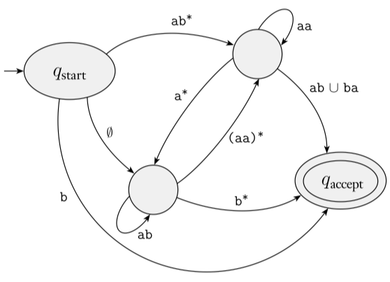

https://ocw.mit.edu/courses/18-404j-theory-of-computation-fall-2020/

# 基础数学知识

## *集合与元组*

### 集合的定义与形式化描述

集合 set 是一组对象，把它看成一个整体。集合中可以包含任何类型的对象，包括数、符号甚至是其他集合，集合中的对象称为它的元素 element 或成员 member

用大括号 $\left\{\right\}$ 来逐个列出集合的元素，用符号 $\in$ 和 $\notin$ 来分别表示集合成员和非集合成员，读作属于和不属于

集合与描述它的元素的排列顺序无关，也不考虑其元素的重复，即 $\left\{1,2,3\right\}$ 和  $\left\{1,1,1,2,2,3\right\}$ 是相同的集合。若要考虑元素出现的次数，则把它称为多重集合 multiset

### 常用的特殊集合

不含任何元素的集合称为空集 empty set $\emptyset$

无穷集合 infinite set 是包含无穷多元素的集合，不可能列出无穷集合的所有元素，所以有时用记号 $\cdots$ 来表示集合的元素将永远持续下去

数字集合

* 自然数集 set of natural number $N=\left\{1,2,3,\cdots\right\}$
* 整数集 set of integers  $Z=\left\{\cdots,-2,-1,0,1,2,\cdots\right\}$
* 实属集

### 集合之间的关系

对于两个集合 $A$ 和 $B$，若 $A$ 的每个成员也是 $B$ 的成员，则称 $A$ 为 $B$ 的子集 subset，记作 $A\subseteq B$，若 $A$ 为 $B$ 的子集且不等于 $B$，那么 $A$ 为 $B$ 的真子集 proper subset，记作 $A\subset B$

并集、交集、补集

### 序列

序列 sequence 是某些元素或成员按某种顺序排成的一个列表，通常把它写在一对圆括号来指明它为一个序列，比如 $(1,2,3)$

在集合中不用考虑元素的顺序和重复性，但在序列中要考虑元素的顺序和重复性，此时$\left(1,2,3\right)$ 和  $\left(1,1,2,1,2,3\right)$ 是两个不同的序列

与集合一样，序列也可以分为是有穷序列或者无穷序列，通常**把有穷序列称为多元组 tuple**，比如k个元素的序列称为k元组 k-tuple，二元组可以特殊地称为有序对 ordered pair

### 幂集与笛卡尔积

* 集合与序列可以作为其他集合或序列的元素，$A$ 的幂集 power set 为 $A$ 的所有子集的集合，表示为 $2^A$ 或 $\rho(A)$。比如 $A=\left\{0,1\right\}$ 的幂集为 $\left\{(0,0),(0,1),(1,0),(1,1)\right\}$。当 $A$ 为有限集时，$\#A=n$，则 $\rho(A)$ 的元素数为
  $$
  C_n^0+C_n^1+\cdots+C_n^n=2^n
  $$

* $A$ 和 $B$ 的笛卡尔积 Cartesian product 或叉积 cross prodcut $A\times B$ 为第一个 $A$ 的元素和第二个 $B$ 的元素的所有有序对组成的结合，注意顺序是很重要的！比如 $A=\left\{1,2\right\}$ 和 $B=\left\{x,y,z\right\}$ 的笛卡尔积为
  $$
  A\times B=\left\{(1,x),(1,y),(1,z),(2,x),(2,y),(2,z)\right\}
  $$

* 集合自身的笛卡尔积可以写作 $\overbrace{A\times A\times\cdots\times A}^{k}=A^k$

## *关系*

### 关系的定义

设 $A$ 是一个集合，$A\times A$ 的一个子集 $R$，称为是集合 $A$ 上的一个二元关系，简称关系

### 等价关系

### 关系闭包

## *函数映射*

# 语言及文法

## *自然语言和形式语言*

### 两种语言

自然语言 natrual language 是人类讲的语言，这种语言并不是人为设计的（当然有人类试图对其规范化的努力）而是自然进化产生的。形式语言 formal language 是为了特定应用而人为设计的语言，例如数字和运算符号、化学分子式和反应式、用来表达计算过程的编程语言等

形式语言有严格的syntax规则，语法规则由规定符号 token 和结构 structure 的规则所组成，下面以有效的数学表达式 `1+1=2` 和无效的数学表达式 `1+=$2` 为例

* 关于token的规则被称为**词法 lexical**
  * token的概念相当于自然语言中的单词与标点符号，数学表达式中的数字和运算符等，是最基本的组成
  * `1+=$3` 的lexical错误在于没有定义过有效的数字或运算符 `$`
* 关于structure的规则称为**语法 grammer**
  * structure是指token的正确排列组合方式，以产生有效的语义 semantic
  * `1+=$2` 的grammer错误在于虽然 `+` 和 `=` 都是lexical正确的运算符，但是数学式grammer没有定义 `=` 直接放在 `+` 后面所表达的意义

注意：在中文中syntax和grammer都被翻译成了语法，但实际上**syntax是包含了lexical和grammer的规则**

### 如何读懂一个句子？

无论是阅读自然语言还是形式语言，为了读懂一个句子，必须要同时明白token和structure

因此读懂一个句子的步骤是：1、识别token；2、分析句子结构的构成，该过程称为解析 parse

对于自然语言，这一过程在学习一门外语时是显得那么重要。当然相比于形式语言，自然语言由于其歧义性和不一致性还需要结合上下文 context 来理解

### 两种语言的不同处

形式语言与自然语言主要存在下面三个不同点

* 歧义性 ambiguity 
  * 自然语言充满了歧义，人们需要通过上下文的辅助，甚至是自己的常识来解决这个问题
  * 形式语言的设计要求是清晰的、毫无歧义的，这意味着每个语句可以被单独拆开来看还能表达确切的意思，相当于与上下文切割开来了。因此形式语言一般都是上下文无关语言 context free language
* 冗余性 redundancy：为了消除歧义减少误解，自然语言引入了相当多的冗余，其结果就是语言的膨胀，或者说啰嗦。而形式语言则很紧凑 compact，很少有冗余
* 与字面意思的一致性 consistent with literal
  * 自然语言充斥着成语和隐喻 metaphor，这种成语和隐喻往往意味着意有所指，即与其字面意思不一致，这在文学作品中表现的淋漓精致，可以说这些文学作品的伟大有很大一部分是来源于自然语言的灵活与不一致
  * 形式语言中literal的意思就是其token代表的真实意思

## *Sprache und Grammatik*

### 语言的定义与运算

* 字母表与字符串 alphabet table

  * 字母表是非空的形式符号有限集合，常用 $T$ 或 $\Sigma$ 来表示
    * 英文字母表
    * 数字表、数学符号表

  * 字符串/句子 string 是由字母表 $T$ 中的字符构成的序列
    * $\varepsilon$ 称为空串 empty string，它是一个长度为0的字符串
    * $\lvert\vert$ 用来计算字符串长度

* 字符串运算

  * 连接 concatenation

  * 取前缀 prefix、取后缀 suffix、取子串

  * 取逆/倒置

* 字母表的幂运算

  * 定义
    * $T^0=\left\{\varepsilon\right\}$
    * 设 $x\in T^{n-1},\ a\in T$，则 $ax\in T^n$
  * 克林闭包 Kleene closure  $T^*=T^0\cup T^1\cup T^2\cup\dots$：字母表 $T$ 上的所有字符串和空串的集合
  * 正闭包 positive closure $T^+=T^1\cup T^2\cup T^3\cup\dots$：字母表 $T$ 上的所有字符串构成的集合
  * $T^*=T^+\cup\left\{\varepsilon\right\},\ T^+=T^*-\left\{\varepsilon\right\}$

* 语言 Language：设 $T$ 是字母表，则任何集合 $L\subseteq T^*$ 是字母表 $T$ 上的一个语言。由语言的定义知语言的本质是集合，因此对集合的运算可以用于语言

  * 语言的积：两个语言 $L_1$ 和 $L_2$ 是由 $L_1$ 和 $L_2$ 中的字符串连接所构成的字符串的集合
  * 语言的幂

### 语法

语法是用来定于语言的一个数学模型

* 若 $L$ 是有限集合，可用列举法
* 若 $L$ 是无限集合
  * 用语法产生系统，由定义的语法规则产⽣出语⾔的每个句⼦
  * 输入状态机，不报错就是符合语言规则的

元语言 metalanguage：描述语言的语言。当⼈们要解释或讨论程序设计语⾔本⾝时，又需要⼀种语⾔，被讨论的语⾔叫做对象语⾔，即某种程序设计语⾔，讨论对象语⾔的语⾔称为元语⾔

### 推导与句型

* 直接推导：设 $\alpha$ 和 $\gamma$ 是 $(V\cup T)^*$ 中的字符串，则有 $\alpha A\gamma\Rightarrow\alpha\beta\gamma$，称 $\alpha A\gamma$ 直接推导出 $\alpha\beta\gamma$
* 推导序列
  * $\alpha_0\Rightarrow\alpha_1\Rightarrow\cdots\alpha_n$ 是长度为n的推导序列
  * 推导序列的每一步，都会产生一个字符串，这些字符串一般称为句型
* 句型和句子
  * 通过recursive 递归不断生成新的句型，中间可能有终结符也有可能有非终结符，最终推导到所有的符号都被替换为终结符为止
  * 中间产生的还可以继续递归的，还有非中间符的就是一个句型
  * 推导到最后，若只包含了终结符，那么它就是一个句子
  * 用汉语举一个例子：句型就是[主语]+[谓语]+[宾语]，而一个句子就是对之前的三个非终结符进行替换，比如[我]+[吃]+[饭]就是一个句子

## *Chomsky 语法体系 & Backus-Naur Form*

### Chomsky语法体系

关于Chomsky语法体系和Backus-Naur范式的建立历史可以看这篇博客：https://blog.csdn.net/taidaohualang/article/details/93624507

Chomsky在1956年在他的论文 *syntactic structures* 中提出了他对语法的数学与逻辑定义，即Chomsky范式。对语法的定义并不是绝对的，实际上Chomsky范式之所以如此出众，还得归功于Backus之后为建立形式语言时从Chomsky的论文中得到的启发。简单地说，Chomsky的理论回答了这样一个问题，即**具备何种特征的语言可以用于书写程序**，而Backus的工作则告诉我们，**计算机程序确实能够用人类可以理解的方式写出并同时让人类和计算机理解**

>  *syntactic structures* 是对美国传统的描写语言学的一场革命，其革命性首先表现在乔姆斯基站在理性主义的立场上反对描写语言学的经验主义。
>
> 他把语言学看成跟自然科学中的其他科学一样，可以从假设出发，进行推演并形式化。换句话说，非经验主义是可能的。 *syntactic structures* 有一半篇幅用于英语语法的形式化。非经验主义和形式化是转换生成语法的首要标志。
>
> 把句法关系作为语言结构的中心并以此说明语句的生成是这场革命的又一表现。为了描写和解释语言现象，乔姆斯基在 *syntactic structures* 中论证了语法的生成能力，认为应该把语法看成是能生成无限句子的有限规则系统。-- 豆瓣读书

对于Backus是如何与这篇论文相遇并且理解了语言学如此晦涩的内容则无人可知。对于Chomsky语法体系本身的争论和批判虽然至今仍在继续，但以Chomsky为启发的Backus范式却在计算机科学中得到了几乎完美的使用

Chomksy范式定义的语法是一个4元组 $\mathcal{G}=\left\{V,T,P,S\right\}$

* $V$ Variable 变量或者非终结符，一般用大写字母表示。用来表示在句子中不同类型的短语或子句，非终结符在句子中不会出现，只会在生成式中出现
* $T$ Terminale 终结符，一般用小写字母表示 $V\cap T=\empty$：字母表 Alphabet 或者词典 Dictionary
* $P$ Produktionsregel 生成式/推导式，它是一个语法的**核心**
  * 形式为 $\alpha\rightarrow\beta$ 的生成式的有限集合
  * $\alpha\in(V\cup T)^*N^+(V\cup T)^*,\ \beta\in(N\cup T)^*$
* $S$ Startsymbol 开始变量，用来表示整个句子（或程序）。它必须是 $V$ 非终结符的元素

P中的⽣成式是⽤来产⽣语⾔句⼦的规则，它是语法的核心，决定了句子如何产生。⽽句⼦则是仅由终结符组成的字符串。这些字符必须从⼀个起始符S开始，不断使⽤P中的⽣成式⽽推导出来

所谓的终结符就是一个用来描述某一类终结符共同特性的概念。用汉语来举一个例子，所谓的非终结符就是“主语”、“谓语”这种概念，而终结符就是“我”、“吃”这种不可拆分的元素。而所谓的生成式就是比如说"主语"替换为“我”、“你”、“他”这种具体的token

### 用Chosmky语法体系来定义德语


### Chomsky Hierarchy


Chomsky语法体系，又称为Chomsky谱系 Chomsky Hierarchy **根据生成式**对语言和语法进行了分类

* 0型语法：无限制语法，即图灵机
* 1型语法：上下文有关语法 Context-Sensitive Grammer CSG
  * 生成式的形式为 $\alpha\rightarrow\beta$
    * 左部的长度小于右部 $\lvert\alpha\rvert\leq\lvert\beta\rvert$
    * $\beta$ 不能为空串，即不含 $A\rightarrow\beta$
  * 对应的语言为上下文有关语言 Context-Sensitive Language CSL
  * 若不包含 $\varepsilon$ 空串，则与线形有界自动机 Linear Bounded Automaten LBA 等价
* 2型语法：上下文无关语法 Context Free Grammer CFL
  * **生成式的约束：左部只能是一个非终结符**
  * 对应的语言为上下文无关语言 Contex t-Free Language CFL
  * 对应的自动机为下推自动机 Pushdown Automaten PDA
  * 上下文无关更加关注语法，而不关注这句话是不是符合人类的认知。目前形式语言都是CFL，表达紧凑，避免歧义
* 3型语法：正则语法 Regular Grammer
  * 正则语法可以分为两类
    * 右线形语法 Right-linear Grammer $A\rightarrow\omega\beta$ 或 $A\rightarrow\beta$，$A,B\in N;\ \omega\in T^*$
    * 左线形语法 Left-linear Grammer $A\rightarrow\beta\omega$ 或 $A\rightarrow\beta$，$A,B\in N;\ \omega\in T^*$
  * 对应的语言是正则语言 Regular Language
  * 对应的自动机为有限自动机 Finite Automaten

### Chomsky Normal Form CNF Chomsky 范式

和逻辑命题中的CNF 和取范式（MMK.md中若不加说明，CNF指的都是Chomsky Normal Form）与DNF 析取范式一样，**任何的CFL都可以被转换为Chomsky Normal Form**

CNF的定义为：称一个CFL为CNF，若它的每一个生成规则都为如下形式
$$
A\rightarrow BC\\A\rightarrow a
$$
即生成式右边要么只有两个变量要么只有两个非终结符，要么只有一个终结符

### Backus-Naur Form

BNF是CFL或者说形式语言的另一个表达方式，但它不是一种范式，而是一种对CFL的encoding方法

如今各种形式语言，尤其是各种程序设计语言因为BNF对于形式语言的高效表达而全部采用BNF描述，BNF的起点是第二版Fortran语言
$$
\langle Variable\rangle::=Terminal|\langle Variable\rangle
$$
在左边的尖括号中必须是Variable，右边要么是终止符，要么也是Variable，不断迭代

* Extended Backus-Naur Form EBNF：增加了可选项 $[\dots]$ 和重复项 $\left\{\dots\right\}$
* ABNF

# 有限自动机 & 正则文法

## *语言与自动机的等价性*

* 1956年 Chomsky从**语言产生**的角度定义了语言与文法
* 1951-1956 Kleene提出了有穷状态自动机 FA，从**语言识别**的角度，定义了语言
* 1959年 Chomsky证明了语言与自动机的等价性，形式语言从此诞生

## *有限自动机*

### 有限自动机 & 状态概念

* Finite Automaten, FA系统是具有离散输入输出系统的一种**数学模型**（可以没有输出，比较特殊的也可以没有输入）
* 该系统具有任意有限数据的内部状态。所谓状态就是可以将事物区分开的一种标识
* 状态+输入会导致对应的状态转移
* 根据每次状态转移得到的后继状态的唯一性可以分为
  * DFA, Deterministic Finite Automaton 确定有限状态自动机
  * NFA, Non-Deterministic Finite Automaton 非确定有限状态自动机
* 当有限自动机读入一个字符串时，它从初始状态 $q_0$ 开始，经过一系列状态转换，当读完字符串的最后一个字符，若能到达接受/终止状态，那么则称这一字符串可被有限自动机所接受

### DFA的形式定义

DFA是一个5-元组 $\mathcal{M}_1=(Q,\Sigma,\delta,q_0,F)$

* $Q$ 是一个有限非空的状态集合
* $\Sigma$ 是输入字母表 alphabate，有限非空的字符集合（也可以用 $T$ 来表示）
* $\delta$ 是状态转移函数 transfer function：$\delta:Q\times\Sigma\rightarrow Q$，这个式子的意思是输入是 $Q$ 和 $\Sigma$ 中各自元素的集合，其笛卡尔积仍然在 $Q$​ 中。等价的描述方式是 $\delta(q,\ a)=r$
* 一个起始状态 start state $q_0\in Q$，约定转移图中**只有一个单向输入箭头的称为初始状态**
* 一个接受/终止状态集 accept state $F\subseteq Q$，当令 $F=\emptyset$​ 的时候就没有接受状态，约定转移图中用**双圈表示的是接受/终止状态**

自动机从左至右一个接一个地接收输入字符串的所有符号。读到一个符号之后，$M_1$ 会沿着标有该符号的转移从一个状态移动到另一个状态。当读到最后一个符号时，$M_1$ 产生它的输出。如果 $M_1$ 现在处于一个接受状态，则输出为接受；否则输出为拒绝

若 $A$ 是机器 $M_1$ 接受的全部字符串集，那么称 $A$ 是机器 $M_1$ 的语言 language，记作 $L(M_1=A)$，又称 $M_1$ 识别 recognises $A$ 或 $M_1$ 接受 accepts $A$。一台机器可能接受若干字符串，但它永远只能识别一种语言。若机器不接受任何字符串，那么它仍识别一个空语言 empty language $\emptyset$​​（set with no strings），也就是说所有的机器至少都会识别一种语言，即空语言

所谓机器 $M_1$ 接受一个字符串 $w=w_1w_2\dots w_n,\ each\ w_i\in\Sigma$ 的形式定义是：如果有一个状态的序列 $r_0,r_1,r_2,\dots r_n\in Q$，那么

* $r_0=q_0$
* $r_i=\delta(r_{i-1},w_i)$ for $1\leq i\leq n$
* $r_n\in F$

**可以被一个FA识别的语言称为正则语言 RE**

### 例子

下面举一个例子，下图是某个自动机 $M_1$ 的状态图 state diagram


$M_1=(Q,\Sigma,\delta,s,F)$ 识别的语言为至少含有一个1并且在最后的1后面有偶数个0

* 其中状态集合 $Q=\left\{q_1,q_2,q_3\right\}$

* 字母表为 $\Sigma=\left\{0,1\right\}$ 

* 转移函数 $\delta$​​ 的描述为

  ```
      |  0   1
  -----------------
  q1  |  q1  q2
  q2  |  q1  q2
  ```

* $q_1$ 为起始状态

* 接受集为 $F=\left\{q_2\right\}$

对于上面五元组的定义是针对单个字符的，下面给出对任意字符串 $\omega\in \Sigma^*$（字母表的克林闭包），$\delta'(q,\omega)$ 表示DFA在状态 $q$ 输入字符串 $\omega$ 后的状态，$\delta'$ 的定义如下

* 对 $\varepsilon\in \Sigma^*$，有 $\delta'(q,\varepsilon)=q$。即当没有读到字符时，或者说读到的是空字符时，FA的状态不发生改变

* 对任意 $a\in\Sigma$ 和 $\omega\in\Sigma^*$，有 $\delta'(q,\omega a)=\delta(\delta'(q,\omega),a)$。表示读入字符串 $\omega a$ 后，为了找出后即状态，应该是在读入 $\omega$ 之后得到转移过后的状态 $p=\delta'(q,\omega)$ 后，然后在这个新状态的基础上再求 $\delta(p,a)$

* 若有 $p=\delta'(q_0,\omega)\in F$，那么称字符串 $\omega$ 被FA $M$ 所接受，而 $L(M)$ 则表示 $M$ 所接受的语言，表示为
  $$
  L(M)=\left\{\omega|\delta'(q_0,\omega)\in F\right\}
  $$

### FA的格局

为描述FA的工作过程，对于它在某一时刻的工作状态，可以用两个信息表明

1. 在该FA所处的状态 $q$，称为当前状态
2. 在该时刻等待输入的字符串 $\omega$

两个构成一个瞬时描述，称为格局 configuration，用 $(q,\omega)$ 表示

### 设计有限自动机

如同设计文法一样，自动机的设计也是一个创造的过程，因此不可能提取出一种更简单的算法或设计流程

对于有限自动机，设计的核心在于估算出读一个字符串时需要记住哪些关键的东西。这是因为FA根据内部的状态来“记忆”字符串的某些性质。设想极端情况下，FA内部的状态数量可以变化成和任意字符串的长度一样，那么就相当于直接把字符串给存下来了，这显然是不现实的。因此要根据任务需求来设计合适的状态数来处理输入

## *正则集 & 正则式*

### 正则式、正则集与正则运算

正则表达式的值是一个语言，或者说是某种字符串的规律，比如说用grep来摘出需要的字符串模式

* 正则集 regular set：字母表上的一些特殊形式的字符串的集合，是正则式所表示的集合
* 正则式 regular expression：用类似代数表达式的方法表示正则语言
* 正则运算 regular operation：作用于语言上的三种代数运算（正则运算符运算优先级 precedence 如数字顺序）。以两个语言A和B为例
  1. 克林闭包 closure / star 运算：$A^*=\left\{x_1 x_2\dots x_k|k\geq 0 且每一个 x_i\in A\right\}$
  2. 连接 concatenation：$A\cdot B=\left\{xy|x\in A\ and\ x\in B\right\}$
  3. 联合 union 取并集：$A\cup B=\left\{x|x\in A\ or\ x\in B\right\}$

一个例子：用 $(0+1)^*011$ 来表示所有以011结尾的串组成的语言
$$
(0+1)^*011\Rightarrow\left\{\left\{0\right\}\cup\left\{1\right\}\right\}^*\left\{0\right\}\left\{1\right\}\left\{1\right\}\Rightarrow\left\{0,1\right\}^*011\Rightarrow L((0+1)^*011)
$$

### 正则式的性质

设 $\alpha,\beta,\gamma$ 都是正则式

* 交换律和结合律
* 等幂律 idempotent law $\alpha+\alpha=\alpha$
* 分配律
* 幺元（单位元 identities）和零元（annihilators）
  * $\alpha+\emptyset=\emptyset+\alpha=\alpha$
  * $\alpha\emptyset=\emptyset\alpha=\emptyset$
  * $\alpha\varepsilon=\varepsilon\alpha=\alpha$
* 与闭包相关的定律
  * $(\alpha^*)^*=\alpha^*$
  * $\alpha^*=\alpha+\alpha^*$​​

## *不确定有限自动机*

### NFA的概念和形式定义

引入非确定性 non-deterministic，非确定性是确定性的推广，因此每一台DFA自动地是一台NFA


NFA相比于DFA有两个特点

* 上图是一个NFA $N_1$​​ 的状态转换图。在NFA中，**在一个输入下可能会转移到多个后继状态**，即一个状态对于字母表中的每一个符号可能有多个射出的箭头
* 把NFA进行进一步扩展，使之在不接受输入符号，即输入为 ε 时也能做转移动作。这种自动机在NFA的基础上又增加了一种不确定性

ε-NFA也用一个5元组 $\mathcal{M}=(Q,\Sigma,\delta,s,F)$ 来表示，**它和DFA的区别只在于转移函数 $\color{white}\delta$ 不同**。对于NFA，$\delta: Q\times\left(\Sigma\cup\varepsilon\right)\rightarrow\mathcal{P}(Q)$，其中 $\mathcal{P}(Q)$ 也可以写成是 $2^Q$，即 $Q$ 的 power set 幂集。也就是说，从当NFA在某一个状态下输入一个字符时，可转换的后继状态是 $Q$ 的一个子集

**如果有两条路径分别通往另一个状态和接受态，那么字符串就是被机器接受的**

当NFA的所有后继状态都只有一个 $Q$​​ 的子集时，NFA也就变成了DFA，因此说DFA是NFA的特例

### ε 的意义

ε 的意思是不需要消耗输入字符串中的任何一个字符就可以完成转移，即一种没有代价消耗的转移。虽然 ε 在物理机器上没有任何意义，但是在理论推理上它不仅在某些情况下有更简洁的表达能力，而且在证明一些理论问题时更是不可缺少的工具

我们仍然可以从 computational 和 mathmatical 两个角度来解释 ε

* computational：可以理解为fork了一个新的线程，如果这个线程可以通往接受态，那么整个进程就是被接受的

* mathmatical：将计算过程看作是一棵概率树木。NFA的转移过程可以看成是一棵树，当然在DFA中，也可以认为状态转移的过程是一条直线的特殊的树

  只要子过程中至少有一个到达了接受状态，那么整个计算过程就是接受的

  

  下面是上面 $N_1$ 当一个输入字符串 010110 的转移过程用树来表示

  

### 正则语言在三种正则计算中的封闭性

如果把某种运算应用于一个对象集合的成员得到的对象仍在这个集合中，则称这个对象集合在该运算下封闭，或具有该运算的封闭性 closure

正则运算的封闭性是之后使用递归来实现一些算法（比如说子集构造法）的基本原理

现在有两个正则语言 $A_1$ 和 $A_2$，要证明 $A_1\cup A_2$ 也是正则的。由于 $A_1$ 和 $A_2$ 是正则的，所以有一台有FA $M_1$识别$A_1$ 和另一台有FA $M_2$ 识别 $A_2$。为了要证明并、连接、闭包是正则的，则必须要证明有一台 FA $M$ 可以识别 $A_1$ 和 $A_2$​ 的并、连接、闭包


* 证明并操作 $\cup$​ 的封闭性

  * 确定性地模拟M：具体证明看书的定理1.12，这里仅给出M的五元组
    * $Q=\left\{(r_1,r_2)|r_1\in Q_1\ and\ r_2\in Q_2\right\}$，集合Q是 $Q_1$ 与 $Q_2$ 的笛卡儿积，记作 $Q_1\times Q_2$。它是第一个元素取自 $Q_1$、第二个元素取自 $Q_2$ 的所有的状态有序对组成的集合
    * $\Sigma=\Sigma_1\cup\Sigma_2$
    * $\delta((r_1,r_2),a)=\left(\delta_1(r_1,a),\delta_2(r_2,a)\right)$
    * $(q_1,q_2)$
    * $F=\left\{(r_1,r_2)|r_1\in F_1\ or\ r_2\in F_2\right\}$，该表达式等价于 $F=(F_1\times Q_2)\cup(Q_1\times F_1)$​
  * 使用NFA来证明

* 证明连接操作的封闭性

  * 在没有引入NFA之前，原来的问题是不知道如何去划分输入，因为此时要证明的效果是当它的输入可以被分成两段，$M_1$ 接受第一段且 $M_2$ 接受第二段时，M才接受输入

  * 这个证明必须要使用NFA才能完成

    把原来的 start state 设置为一个 accept state 是一个坏主意，正确的做法应该是新建立一个 start state 作为 accept state。或者也可以添加一个start到accept的epsilon转换

* 证明闭包操作的封闭性

  M1在内部自递归。一旦有接受的，剩下的部分会M2。然后M1继续自递

### 证明DFA与NFA的等效性：子集构造法

因为NFA是DFA的引申，所以DFA自动就可以转换为一台NFA，如果能证明NFA也可以转换为DFA，那么就可以证明NFA和DFA之间的等效性

设 $L(M_N)$ 是由不确定的有限自动机 $M_N$ 接受的语言，则存在一台确定确定的有限自动机 $M_D$ 接受 $L(M_D)$，满足 $L(M_D)=L(M_N)$。我们可以说 **NFA converts to a DFA**

用 **子集构造法 subset construction** 来证明：设一个语言被一台NFA识别，构造一个接受它所能接受语言的DFA，这个DFA的每一个状态对应了NFA的状态集合

设NFA $M_N=(Q,\Sigma,\delta,q_0,F)$，接受 $L(M_N)$，对应 $M_N$ 构造一个DFA $M_D=(Q_D,\Sigma,\delta_D,q_{0D},F_D)$，具体的五元组的内容如下

* $Q_D=2^Q$
  * 对于NFA，一个输入可以对应多个状态，那么我们可以把它对应的多个状态组合为一个新的确定的状态，即新的 $Q_D$ 是 $Q$ 的幂集。若子集为 $\left\{q_1,q_2,\cdots,q_k\right\}$，则 $Q_D$ 中的**状态**标记为 $\left[q_1,q_2,\cdots,q_k\right]$
  * 用下面的子集构造法例子来说明，对于对应的完整的DFA来说，它一共有 $2^3=8$ 个状态，比如 $\left\{p,q\right\}$ 是一个全新独立的状态
  
* $q_{0D}=\left[q_0\right]$

* $F_D\subseteq Q_D$，$F_D$ 的每个状态包含 $M_N$ 的至少一个终止状态

* $\delta_D$ 的定义为：$\delta_D\left([q_1,q_2,\cdots,q_i],a\right)=\left[p_1,p_2,\cdots,p_j\right]$ 当且仅当 $\delta\left(\left\{q_1,q_2,\cdots,q_i\right\},a\right)=\left\{p_1,p_2,\cdots,p_j\right\}(a\in\Sigma)$
  * 这个定义的意思是当要确定对于某个 $a$ 和状态 $Q_D$ 的 $\delta_D$ 的值时，要先将 $Q_D$ 中的对应**状态**还原为 $Q$ 中的**状态集**，然后通过 $\delta$ 的扩充定义计算出它的值，然后再把它看成是 $Q_D$ 中的状态即可
  
  * 用下面的子集构造法例子来说明，当试图确定最右边修剪DFA中新构造的 $\left\{p,q\right\}$ 状态的输出时候，我们要回到NFA中，分别取 $p,q$ 都等于0或者1时的输出进行组合
  
    比如NFA中，$p=0,q=0\rightarrow\left\{p,r\right\};\ p=1,q=1\rightarrow\left\{p,q,r\right\}$​

等价性可以由数学归纳法得出

**DFA的构造过程可以看成是对NFA转移动作的模拟**

下面是子集构造法的一个例子，注意完整的等价DFA中有很多状态实际上对于等价的NFA其实是不可达到的，因此要修剪完整DFA状态


## *证明RE和FA的等价性*

### RE的形式归纳定义

称R是一个正则表达式 regular expression，若R是

* atomic
  * a，这里a是字母表 $\Sigma$ 中的一个元素
  * ε empty string
  * $\empty$ empty language
* composite，下面的 $R_1$ 和 $R_2$ 都是正则的。这不是循环定义 circular difination，因为 $R_1$ 和 $R_2$ 总是比 R 小，所以这是归纳定义 induction（就是用递归来证明）
  * $R_1\cup R_2$
  * $R_1\cdot R_2$
  * $R_1^*$​

### 证明RE可以转换为NFA

定理：如果 R 是一个正则表达式并且 $A=L(R)$，那么A是正则的


### GNFA

广义非确定型有穷自动机就是非确定型有穷自动机，只是转移箭头可以用任何正则表达式作标号，而不是只能用字母表的成员或 ε 作标号



GNFA同样用一个五元组 $M=(Q,\Sigma,\delta,q_{start},F_{start})$ 来表示，Q和$\Sigma$和前面的都是一样的，不赘述了

* 转移函数 $\delta$：$\left(Q-\left\{q_{accept}\right\}\right)\times\left(Q-\left\{q_{start}\right\}\right)\rightarrow\mathcal{R}$
* $q_{start}$ 是起始状态
* $q_{accept}$ 是接受状态

若字符串 w 可写成 $w=w_1w_2\cdots w_k$，这里每一个 $w_i\in\Sigma^*$，并且存在状态序列 $q_0,q_1,\cdots,q_k$。若使下面三个条件成立，则称这台 GNFA 接受字符串 w

1. $q_0=q_{start}$ 是起始状态
2. $q_k=q_{accpet}$ 是接受状态
3. 对每一个 `i`，$w_i\in L(R_i)$，其中 $R_i=\delta(q_{i-1},q_i)$，即 $R_i$ 是从 $q_{i-1}$ 到 $q_i$ 的箭头上的表达式

### 证明DFA可以转换为RE

定理：如果A是正则的，那么对于一些正则表达式 R 有 $A=L(R)$​

证明这个定义需要用到上面引入的GNFA

## *判断非正则语言*

用举不出反例这种方法是没有办法严谨证明非正则语言的，比如说 Let C = w has equal numbers of 01 and 10 substrings，第一眼看上去是需要记录数量的，所以认为它不是正则的，但实际上不对。比如说 `(01|10)*` 表示可以由任意数量的 "01" 或 "10" 子串组成的字符串。这符合题目中要求的条件，即字符串中包含相同数量的 "01" 和 "10" 子串

要严谨的证明不是正则语言需要使用 Pumping Lemma

### 正则语言的Pumping Lemma

正则语言的 Pumping Lemma 给出了正则集的一个特殊性质，如果能够证明一个语言没有这种性质，就可以证明某个语言不是正则的

这条性质的描述是：若A是一个正则语言，则存在一个数 p（泵长度 pumping length）使得，如果 s 是A中任一长度**不小于** p 的字符串，那么 s 可以被分成3段，$s=xyz$，满足下列条件

1. 对每一个 $i\geq0,xy^iz\in A$
2. $\left|y\right|>0$，即中间的不能是空串
3. $\left|xy\right|\leq p$

更具描述性的来说就是**每一个这样的字符串都包括一段中间的子串，把这段子串重复任意次，得到的字符串仍会在这个语言中**

形象地来说就是把中间那段 string pumping up（打气），但是无论 pumping 到多长这段 string 仍然被机器接受

### 例子

# 下推自动机 & 上下文无关文法

## *CFL*

Context-Free Grammer, CFL 上下文无关语法就是形式语言，**它能够描述某些应用广泛的具有递归结构特征的语言**

虽然CFL已经被整合到上面的Chomsky语法体系的定义中了，但是这里笔者为了方便理解，再次给出CFL的形式定义

CFL 是一个4元组 $(V,\Sigma,R,S)$，其中

* V 是一个有穷集合，称为变元集 variables / 非终结符
* $\Sigma$ 是一个与 V 不相交的有穷集合，称为终结符集 terminals
* R 是一个有穷规则集 rules，每条规则由**一个**变元和一个由变元及终结符组成的字符串构成。CFL means we can replace the variable Independent of its context in the intermediate string 等价于左边只有一个变元
* $S\in V$ 是起始变元

设 u，v 和 w 是由变元及终结符构成的字符串，$A\rightarrow w$ 是文法的一条规则。称 uAv 生成 yield uwv，记为 $uAv\Rightarrow uwv$​。$u\Rightarrow v$ **if can go from u to v with one substitution step in G**

若 u = v，或者存在 $u_1,u_2,\cdots,u_k$，可以使得 $u\Rightarrow u_1\Rightarrow u_2\Rightarrow\cdots\Rightarrow u_k\Rightarrow v$，其中 $k\geq 0$，则称 u 派生 derive 了 v，记作 $u\xRightarrow{*} v$，该文法的语言是 $\left\{w\in\Sigma^*|S\xRightarrow{*}w\right\}$。$u\xRightarrow{*} v$ **if can go from u to v with multiple substitution step in G**

之后在描述一个文法时，**通常只写出它的规则集 R**。出现在规则左边的所有符号都是变元，其余的符号都是终结符，**按照惯例，起始变元是第一条规则左边的变元**

比如说 $S\rightarrow aSb|SS|\varepsilon$，它的起始变元和变元集都是S，终结符集是 ${a,b,\varepsilon}$

### 推导树 Parse-tree

可以用图的方法来表示一个句型的推导，这种图称为推导树 Parse-tree。**推导树的根节点的标记是文法的起始符**，其他枝和叶节点的标记，可以是非终结符、终结符或 $\varepsilon$

若标记为 $A$ 的节点，有直接子孙 $X_1X_2,\cdots,X_i$，那么 $A\rightarrow X_1X_2\cdots X_i$ 是 $P$ 的一个生成式

从左到右连接推导树的叶子结点所标记组成的字符串称为推导树的**边缘 frontier**

比如说对于一个文法
$$
\mathcal{G}:\ \langle EXPR\rangle\rightarrow \langle EXPR\rangle+\langle EXPR\rangle|\langle EXPR\rangle\times \langle EXPR\rangle|\langle EXPR\rangle|a
$$
如果让它产生一个字符串 $a+a\times a$，那么会有下面两种可能的语法树，**分析树的含义取决于树的 后序遍历**。其中左边可以被解释为加法的优先级更高，因为后序遍历的时候加法在前面，结果应该为 $2a^2$


### 歧义性 Ambiguity

对于某个CFL $\mathcal{G}$，若有某个字符串 $\omega\in L(\mathcal{G})$，存在两颗不同的语法分析树都以 $\omega$ 为边缘，或者说**存在两个不同的最左（最右）派生**，则称该文法 $\mathcal{G}$​​​​ 是有歧义性/二义性的

歧义性在自然语言中也是广泛存在的，从编译器角度，二义性文法存在一些问题，即同一个程序会有不同的含义，因此程序运行的结果不是唯一的。解决方案只能是重写文法

有时对于一个歧义文法能够找到一个产生相同语言的非歧义文法。但对于某些CFL只能用歧义文法产生，此时称这样的语言为固有歧义的 inherently ambiguous

### 最左推导与最右推导

推导是为了对句子的结构进行确定性的分析，可以有各种不同的推导，但一般情况下，仅考虑最左推导或最右推导

对于CFL $\mathcal{G}$，若在从起始符 $S$ 推导过程的每一步中，都只能替换句型中**最左边的Variable**，则此推导过程称为最左推导 leftmost derivation/Linksentwicklung；类似地，若在从起始符 $S$​​​ 推导过程的每一步中，都只能替换句型中**最右边的Variable**，则此推导过程称为最右推导 rightmost derivation/Rechtsentwicklung

为了应对上面的歧义性，一般要么是采用最左推导，要么是采用最右推导，不能混着来

### 设计CFL

* 先设计简单的CFL，然后合并成复杂的CFL
* 利用正则
* 考察子串
* 利用递归

### Chomsky范式和Greibach范式

* 上下文无关文法的生成式形式若是 $A\rightarrow BC$ 和 $A\rightarrow a$，$A,B,C\in N, a\in T$，则该文法为CNF

  * 任何CFL都可以转换为CNF：通过引入新变量将所有不符合规范的生成式转换为CNF，比如下面这个例子
    $$
    S\rightarrow bA\Rightarrow S\rightarrow CA\ and\ C\rightarrow b
    $$

  * 转换为Chomsky范式的优势：可以使用动态规划进行高速推导语法树

* CFL $\mathcal{G}$ 的生成式形式都是 $A\rightarrow\alpha\beta$ 且不包含 ε 生成式，$A\in N,\alpha\in T, \beta\in N^*$ ，则 $\mathcal{G}$ 是Greibach范式 GNF

## *下推自动机 PDA*

下推自动机 Push-Down Automaten PDA (de. Kellerautomaten) 是一种用于处理上下文无关语言的有限状态自动机。**PDA在NFA的基础上配备了一个无限容量的下推栈**，栈在控制器的有限存储量之外提供了附加的存储，用于存储和操作数据，从而使PDA能够识别形式语言/非正则语言

PDA能控制自己的行为，因为在规则和栈之间有一个反馈环：栈的内容会影响到机器应该遵守的规则，而按照某个规则执行又回反过来影响栈的内容，这就允许 PDA 在栈中存储一些信息，这些信息可以影响它将来的执行

### PDA的形式定义

一个PDA包括五元组 $(Q,\Sigma,\Gamma,\delta,q_0,F)$

* $Q$ 是有限状态集合

* $\Sigma$ 是有限输入符号集合

* $\Gamma$ 是有限栈符号集合。一般栈里都会预先放一个 \$ 来检验栈是否为空

* $\delta$ 是状态转移函数，$\delta: Q\times\Sigma_{\epsilon}\times\Gamma_{\varepsilon}\rightarrow\mathcal{P}(Q\times \Gamma_{\varepsilon})$

  这个转移函数的意思是现在状态转移的过程由当前状态、当前字符和栈顶元素共同决定

  其中 ε 表示空串，也就是说类似于NFA，这是一个NPDA，不需要任何输入就可以转移，即**ε-输入转移（ε input move）**。另外栈顶可以是空的意思就是不需要读取、pop栈顶元素就可以转移，即 **ε-栈转移（ε-stack move）**

  而转移得到的 power set 也是 $\Gamma_{\varepsilon}$，它的意思是不需要往栈中写任何东西。因此这个状态转移函数可以写成 $\delta(q,a,c)=\left\{(r_1,d),(r_2,\varepsilon)\right\}$​，意思就是既可以往栈里面写，也可以不写

  用 $a,b\rightarrow c$ 来表示读入一个输入 a，将栈顶的 b 替换为 c

* $q_0\in Q$ 是初始状态

* $F\subseteq Q$​ 是终止状态集合

### PDA的工作过程

它接受输入w，若能够把w写成 $w=w_1w_2\cdots w_m$，这里每一个 $w_i\in\Sigma_{\varepsilon}$，并且存在状态序列 $r_0,r_1,\cdots,r_m\in Q$ 和字符串序列（栈符号表 stack alphabet） $s_0,s_1,\cdots,s_m\in\Gamma^{*}$ 满足下述3个条件

1. 初始化：$r_0=q_0$ 且 $s_0=\varepsilon$，该条件表示 M 从起始状态和空栈开始（或者也可以说将空字符 ε 压入栈中）
2. 迭代过程：对于 $i=0,\cdots,m-1$，有 $(r_{i+1},b)\in\delta(r_i,w_{i+1},a)$，其中 $s_i=at,s_{i+1}=bt;\ a,b\in\Gamma_{\varepsilon},t\in\Gamma^{*}$。该条件说明M 在每一步都完全按照当时的状态、栈顶符号和下一个输入符号动作
3. 终止条件：$r_m\in F$ 且栈为空，该条件说明在输入结束时出现一个接受状态

则字符串 $s_i$​​ 是M在计算的接受分支中的栈内容序列

以一个接受CFL $\left\{0^n1^n|n\geq0\right\}$ 的PDA为例，它的五元组 $(Q,\Sigma,\Gamma,\delta,q_0,F)$ 为

* $Q=\left\{q_1,q_2,q_3,q_4\right\}$ 

* $\Sigma=\left\{0,1\right\}$

* $\Gamma=\left\{0,\$\right\}$

* $F=\left\{q_1,q_4\right\}$

* $\delta$​

  

## *CFL & PDA的等价性*

### 将 CFL 转换为 PDA

有一个问题就是不能取到非栈顶的元素，所以不能直接对非栈顶元素作替换。解决方法是简单的，只有只有当变元在栈顶的时候才替换它；当栈顶是一个终结符的时候，和输入字符对比，如果不相等就拒绝

定理：A is a CFL **iff** some PDA recognizes A

### 简单的推论

* 任何RE都是CFL（DFA相当于是一个没有使用栈的PDA）
* 如何A是一个CFL，B是一个 RE，则 $A\cap B$​ 是一个CFL

注意⚠️：若A和B都是CFL，$A\cap B$ 不一定是一个CFL，也就是说CFL在并操作不是闭合的。但是CFL在 union、concatenation 和 star 操作下是闭合的

## *证明不是CFL*

### Pump Lemma of CFL

如果A是CFL，则存在一个数 p（泵长度 puming length），使得A中任何一个长度不小于 p 的字符串 s 都能被划分成5段 $s=uvxyz$ 且满足下述条件

1. 对于每一个 $i\geq0$，有 $uv^ixy^iz\in A$
2. $\left|vy\right|>0$
3. $\left|vxy\right|\leq p$​


反证法：若 A 中有一定长度的字符串，在被pump后的字符串不在A中，则A不是一个CFL

### 证明

Cutting and Pasting Argument


取最小的解析树

### 例子

Prove $B=\left\{0^k1^k2^k\right\}$ is not a CFL

## *DCFL*

DFA和NDFA在语言识别能力上是等价的，但对于PDA则不是，NPDA比DPDA的语言识别能力强大，在一些情况下，NPDA可以识别DPDA无法识别的CFL

### DPDA的形式定义

**DPDA遵循确定性的基本准则：在计算的每一步，根据其转移函数，DPDA 最多只有一种继续的方式。但是DPDA是允许ε-输入转移和ε-栈转移的**，或者将二者结合起来

若一台 DPDA 能够在某种情况下做ε-转移，那么在这种情况下涉及处理非ε符号的转移是被禁止的，否则可能出现多个合法的计算分支的情况，进而导致非确定型的行为

DPDA的形式定义如下


DPDA, deterministic context-free language 确定型上下文无关语言 是能够让每一个有效串都有一个强制句柄的上下文无关文法

# 图灵机模型

## *图灵机*

图灵机是由Alan Turing于1936年在他的论文 *On Computable Numbers, with an Application to the Entscheidungsproblem* 提出的一种抽象的计算模型。这个模型被认为是计算理论的基石，对计算机科学和理论计算机科学产生了深远的影响。图灵机的提出是为了解决一个关键问题：**什么是可计算的？**

图灵机的基本构想包括：

1. **无限长的纸带（tape）：** 纸带被划分为一个个的格子，每个格子上可以写有一个符号，这些符号包括图灵机的指令和输入数据。输入符号允许无限个空格 $\sqcup$
2. **读写头（head）：** 读写头可以在纸带上左右移动，读取或写入符号
3. **状态集合：** 图灵机有一个有限的状态集合，每个状态对应于机器在某一时刻的内部状态
4. **转移函数：** 由状态和当前纸带上的符号决定的转移函数，它规定了在给定状态和读写头所指向的符号下，图灵机应该执行什么操作，包括移动读写头、改变状态和写入新的符号
5. 可以在任何状态接受或拒绝


图灵机通过执行一系列状态转移来处理输入数据，直到进入停机状态或者无限循环。图灵提出的这个抽象模型帮助人们理解什么是可计算的，即什么样的问题可以通过一台通用计算机（图灵机）解决。这也为后来计算机科学的发展提供了基础，例如通用图灵机的概念成为了通用计算机的理论基础

### 形式定义

图灵机可以用一个7元组 $(Q,\Sigma,\Gamma,\delta,q_0,q_{accept},q_{reject})$ 来定义，其中的 $Q,\Sigma,\Gamma$ 都是有穷集合

* $Q$ 是状态集

* $\Sigma$​ 是输入字母表，alphabet 中不允许特殊的空白符号 blank $\sqcup$

* $\Gamma$ 是带子的字母表，其中 $\sqcup\in\Gamma,\Sigma\subseteq\Gamma$

* $\delta$ 是状态转移函数，$\delta: Q\times\Gamma\rightarrow Q\times\Gamma\times\left\{L,R\right\}$。具体来说，当机器处于状态q，$\delta(q,a)=(r,b,L)$​ 的意义是，当读写头所在的带子方格内包含符号a，机器写下符号b以取代a，并进入状态r。第三个分量L或R的意思是，在写带之后，读写头是应该往左还是往右移动

  如果是不确定的图灵机，那么它的状态转移函数是 $\delta: Q\times\Gamma\rightarrow\mathcal{P}\left(Q\times\Gamma\times\left\{L,R\right\}\right)$

* $q_0\in Q$ 是初始状态

* $Q_{accept},Q_{reject}\in Q$​ 是接受和拒绝的终止状态集合，且 $q_{reject}\neq q_{accpet}$​

## *图灵机的一些概念*

### 格局

图灵机的当前状态、当前带子上的内容和读写头当前所在的位置组合在一起称为**格局 configuration**

如果图灵机能合法地从一个格局 $C_1$ 一步进入 $C_2$，则称格局 $C_1$ 产生 yields 格局 $C_2$。yield的形式化定义是：

设a、b和c是 $\Gamma$ 中的符号，u和v是 $\Gamma^*$ 中的字符串，$q_i$ 和 $q_j$ 是状态，则 $uaq_ibv$ 和 $uq_jacv$ 是两个格局，若转移函数满足 $\delta(q_i,b)=(q_j,c,L)$，则称 $uaq_ibv$ yields $uq_jacv$。前面的是图灵机左移的情况，右移的情况为当转移函数满足 $\delta(q_i,b)=(q_j,c,R)$，则称 $uaq_ibv$ yields $uacq_jv$

读写头处于格局的两个端点之一时要作为特殊情况来处理

* 对于左端点，如果转移是向左移动，则格局 $q_ibv$ 产生格局 $q_jcv$（因为不允许机器从带子的最左端移出）；如果转移是向右移动，这个格局产生 $cq_jv$
* 对于右端点，格局 $uaq_i$ 等价于 $uaq_i\sqcup$，因为已经假设了在带子上没有描述的部分都是空格。这样就能像以前一样处理了，因为此时读写头已不再处于带子的右端点

M 在输人w上的起始格局 start configuration 是格局 $q_0w$，表示机器处于起始状态 $q_0$，并且读写头处于带子的最左端位置。在接受格局 accepting configuration 里，状态是 $q_{accept}$ 。在拒绝格局 rejecting configuration 里，状态是 $q_{reiect}$。接受和拒绝状态都是停机格局 halting configuration，它们都不再产生新的格局

因为机器只在接收或拒绝状态下才停机，因此可以等价地将转移函数记为：$\delta: Q'\times\Gamma\rightarrow Q\times\Gamma\times\left\{L,R\right\}$，其中 $Q'$ 是去掉状态 $q_{accept}$ 与状态 $q_{reject}$ 的Q。图灵机 M 接受输入 $w_0$，如果存在格局的序列 $C_1,C_2,\cdots,C_k$ 使得

1. $C_i$ 是M在输入w上的起始格局
2. 每一个 $C_i$ 产生 $C_{i+1}$
3. $C_k$ 是接受格局

则M接受的字符串的集合称为M的语言（language of M），或被M识别的语言（language recognized by M），记为$L(M)$

若一个语言能够被某一个图灵机识别，则称该语言是图灵可识别的 Turing-recognizable。也称为图灵半判定或者递归可枚举语言 recursively enumerable language

### 图灵可判定

在图灵机上运行时可能会出现三种结果：accept 接受、reject by halting 拒绝或循环 reject by looping。这里循环 loop不是无限循环的意思，仅仅是说图灵机不停机 not halting，我们也无法立刻知道是否会马上停机

对所有输入对停机的图灵机是永不循环的，将其称为判定器 decider

若一个语言能够被某一个图灵机判定，则称该语言是图灵可判定的 Turing-decidbale，简称可判定的。也称为递归语言 recursive language

### 图灵完备

图灵完备 Turing compelete 是指一种计算模型或编程语言具备足够的能力，可以模拟图灵机的计算过程。即如果一系列操作数据的规则（如指令集、编程语言、细胞自动机）按照一定的顺序，可以计算出结果。如果一个系统是图灵完备的，那么它具有处理任何可计算问题的能力，尽管在实际中可能会有性能上的差异

一个图灵完备的系统应该满足以下条件：

1. **状态：** 系统需要能够存储和处理信息的状态。这对应于图灵机的内部状态
2. **转移规则：** 系统需要定义规则，根据当前状态和输入来决定下一个状态。这对应于图灵机的状态转移函数
3. **无限存储：** 系统需要有足够的内存来存储无限多的数据。图灵机的纸带是无限长的，因此图灵完备的系统需要提供类似的无限存储能力
4. **基本操作：** 系统需要提供一组基本操作，通过这些操作可以实现复杂的计算。这对应于图灵机的读写头在纸带上的移动和改变符号等基本操作

编程语言通常被认为是图灵完备的，如果它能够支持条件判断、循环和递归等基本结构，并且具有足够的数据存储和处理能力。绝大多数主流编程语言，如C、Java、Python等，都是图灵完备的，因此它们能够表示和解决任何可计算的问题

## *图灵机变形*的等价性

### 多带图灵机


多带图灵机 Multi-tape Turing machines

将多带上的每条带子的内容作为一个block放到单带图灵机的输入

增加一些图灵机的符号来记录M读写头的位置

### 不确定图灵机

### 枚举器


枚举器 Enumerator 是一个外接了打印机的确定性图灵机，它从一个全空白的纸带开始，可以打印所有打印机输入的字符串w

## *算法定义*

### Hilberts zehntes Problem

> Man gebe ein Verfahren an, das für eine beliebige [diophantische Gleichung](https://de.wikipedia.org/wiki/Diophantische_Gleichung) entscheidet, ob sie lösbar ist.

Diophantine equations 就是一个根为整数的不定式方程。Diophantus 丢番图 是创作了长篇巨著 *Arithmetica* 的古希腊数学家。丢番图在这部著作中 对整系数代数多项式方程进行了大量研究，那些研究对代数与数论的发展有着 先驱性的贡献。后人为了纪念他，把整系数代数多项式方程统称为丢番图方程 Diophantine Equation

希尔伯特第十问题旨在设计一个算法来检测一个多项式是否有整数根

希尔伯特第十问题的解决过程：https://www.global-sci.org/uploads/Issue/MC/v3n8/38_87.pdf

### Church-Turing论断

Church-Turing Thesis, Church-Turing 论断：算法的非形式化概念和精确定义之间的联系，即λ演算与图灵机模型的等价性

Church-Turing Thesis 是解决希尔伯特第十问题的必要前提

### 图灵机无法解决的问题

下面列举一些图灵机无法解决的问题，这些问题都超出了计算理论的极限，在下文中都会介绍

* 停机问题 Halting Problem：图灵机无法判定任意程序是否会停止运行或进入无限循环
* 不可计算函数 Non-computable Functions：存在一些数学函数和问题，它们没有算法可以在有限步骤内计算出结果，因此图灵机也无法解决
* 决策问题中的不可判定性 Undecidability in Decision Problems：一些决策问题没有通用的算法来确定其真假，例如某些逻辑体系中的真理问题
* 复杂度类限制：对于某些问题，虽然它们在理论上是可以被图灵机解决的，但实际上需要超出人类可接受的时间（比如可能需要多于宇宙存续时间）。这类问题被认为是“计算上不可行”的，尽管它们并非真正意义上的“不可解”
* 物理世界问题：图灵机作为一个抽象的计算模型，并不能直接解决现实世界的物理问题，例如量子行为的精确预测等

## *补充：$\color{white}\lambda$ calculus & 函数式编程*

这部分内容可以看 *函数式编程与验证.md*


# 可判定性

## *可判定语言*

### 与RE相关的可判定性问题

### 与CFG相关的可判定性问题


每个上下文无关语言都是可判定的


## *不可判定性*

检查一个图灵机是否接受一个给定的串问题：$A_{TM}=\left\{\langle M,w\rangle|M是一个图灵机，且接受w\right\}$ 是不可判定的

### 对角化

对角化

# 可归约性

可归约性 reducibility 可以被用来证明问题是计算上不可解的

归约 reduction 旨在将一个问题转化为另一个问题，且使得可以用第二个问题的解来解第一个问题

### 哥德尔不完备定理

Kurt Gödel 于1931在一篇论文 *Über formal unentscheidbare Sätze der Principia Mathematica und verwandter Systeme* 中正式发表了哥德尔不完备定理 Gödel‘s incompleteness theorem

哥德尔证明了，任何一个形式系统，只要包括了简单的初等数论描述，而且是自洽的，它必定包含某些系统内所允许的方法既不能证明真也不能证伪的命题

或者说任何一个我们假定的能作为数学基础的公理集都不可避免地是不完备的：总有一些关于数的事实不能被这些公理证明。他还说明甚至没有任何一个候选的公理集能够证明其自身的一致性

哥德尔不完备定理意味着不存在一个对万事万物皆适用的数学理论，可证明性和正确性也无法统一。数学家可以证明的内容取决于他们的初始假设，而非所有答案所依据的基本事实

1935 年，Alonzo Church 通过证明 Hilbert & Ackermann 著名的 Entscheidungsproblem（判定问题）没有一般解决方案，推导出哥德尔结果的推论/扩展。Church 使用了叫做 Untyped Lambda Calculus 的通用编码语言，这门语言构成了极具影响力的编程语言 LISP 的基础

如何简单清晰地解释哥德尔不完备定理？ - 叶青杰的回答 - 知乎
https://www.zhihu.com/question/27528796/answer/1346097249

### 图灵停机问题

图灵停机问题 Turing halting problem：确定一个图灵机对给定的输人是否停机（通过接受或拒绝）问题。即 $HALT_{TM}=\left\{\langle M,w\rangle|M是一个图灵机，且对输入w停机\right\}$ 是不可判定的

通俗的讲图灵停机问题就是证明了不存在一个程序，能够判定任意一个程序，能在有限的时间之内停机

若将 $A_{TM}$ 归约到 $HALT_{TM}$，就可利用 $A_{TM}$​ 的不可判定性来证明停机问题的不可判定性

## *Rice's Theorem*

### 定理

Rice's Theorem：递归可枚举语言的所有非平凡 non-trivial 的性质都是不可判定的

> Any nontrivial property about the language recognized by a Turing machine is undecidable.


### 在程序设计中的应用

何谓非平凡的性质？平凡性质就是所有程序都有的，或者都没有的性质。那么非平凡性质，就是仅某些程序才有，某些没有。比如程序有没有内存泄漏，或者程序可不可以被优化

# 时间复杂度理论

## *P类*

## *NP类*

## *NP完全*