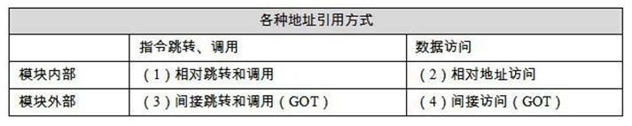

# 目标文件

## *Helper: GNU binutils*

[Binutils - GNU Project - Free Software Foundation](https://www.gnu.org/software/binutils/)

GNU Binutils (GNU Binary Utilities) 是一套针对不同二进制文件格式进行操作的程序集合，它们是 GNU 项目的一部分，旨在为 GNU 系统（包括基于 GNU 的操作系统，如 GNU/Linux）提供编译和链接程序的能力。Binutils 支持多种 Unix 变体和 Windows 系统，并且广泛用于软件开发中，尤其是在跨平台构建和维护方面

下面是一些主要工具的简介：

- **ld**：GNU 链接器，将多个对象文件或库链接成一个可执行文件或共享库
- **as**：GNU 汇编器，将汇编语言源代码转换为机器语言对象文件
- **gold**：一个新的、更快速的链接器，只支持 ELF 文件格式

除了上述主要工具，GNU Binutils 还包括以下工具：

- **addr2line**：将地址转换成源码文件名和行号
- **ar**：用于创建、修改和从归档文件（archive files）中提取内容的工具
- **c++filt**：过滤器，用来解码 C++ 符号名称
- **dlltool**：创建用于构建和使用 DLL 的文件
- **elfedit**：允许修改 ELF 格式文件
- **gprof**：显示性能分析信息
- **gprofng**：收集并显示应用程序性能数据
- **nlmconv**：将对象代码转换为 NLM（NetWare Loadable Module）
- **nm**：列出对象文件中的符号
- **objcopy**：复制并转换对象文件
- **objdump**：显示对象文件中的信息
- **ranlib**：生成归档文件的索引
- **readelf**：显示任何 ELF 格式对象文件中的信息
- **size**：列出对象文件或归档文件的节(section)大小
- **strings**：从文件中列出可打印的字符串
- **strip**：删除符号
- **windmc**：Windows 兼容的消息编译器
- **windres**：Windows 资源文件的编译器

此外，GNU Binutils 还包含一些库：

- **libbfd**：用于操纵各种格式的二进制文件的库
- **libctf**：用于操纵 CTF（Compact Type Format）调试格式的库
- **libopcodes**：用于汇编和反汇编多种汇编语言的库
- **libsframe**：用于操纵 SFRAME 调试格式的库

大多数 Binutils 工具使用 BFD (Binary File Descriptor) 库来进行底层文件操作。许多工具还利用 opcodes 库来汇编和反汇编机器指令

这些工具提供了广泛的功能，比如分析、转换和优化二进制文件，以及对编译后的代码进行调试和性能分析。它们在软件开发和系统编程中被广泛使用，并且对于支持 GNU/Linux 系统的软件生态至关重要

## *目标文件的格式及内容*

### Reminder：Linux的进程地址空间


上图是 *操作系统理论.md* 中重要的 Linux/x86-32 中典型的进程内存结构，它对我们理解目标文件有着重要意义。当然具体内容还是看 *操作系统理论.md* 

### 目标文件的格式

PC平台流行的可执行文件 executable file 的格式都是COFF, COmmon File Format 格式（Unix System V Release 3 提出，引入了段 Segment 机制）的变种

* Win系统的PE-COFF, Portable Executable
* Linux的ELF, Executable Linkable Format（System V Release 4提出）
* Unix最早的可执行文件为 `a.out`
* MacOS的Mach-O（Mach Object）
* Intel/Microsoft的OMF（Object Module Format）

根据ELF文件标准的规定，除了可执行文件外一共有三类采用与可执行文件中相同格式的文件，它们和可执行文件格式采用同一种格式存储。事实上也几乎和可执行文件没有多少区别，所以在Win中统称它们为PE-COFF文件，而**Linux中统称它们为ELF文件**

* 可重定位文件 relocatable file/目标文件 object file 是源代码编译以后但还没有经过链接的中间文件，可以用来进行链接即Win中的 `.obj` 和Linux中的 `.o` 文件。静态链接库 Static Linking Library 也属于这一类文件，Win中的 `.lib` 和 Linux中的 `.a`
* 共享目标文件 Shared Object File：动态链接库 Dynamic Linking Library，Win中的 `.DLL` 和Linux中的 `.so`
  * 与其他共享目标文件与可执行文件结合，作为进程一部分来运行
  * 与其他可重定位文件和共享目标链接，产生新的目标文件
* 可执行文件 Executable File：可直接执行的文件
* 核心转储文件 Core  Dump File：进程意外终止时记录的信息

Linux中可以用 `file` 命令来查看相应文件的格式

```cmd
$ clang++ main.cc -o main
$ clang++ -c main.cc -o main.o
$ file main
main: ELF 64-bit LSB pie executable, x86-64, version 1 (SYSV), dynamically linked, interpreter /lib64/ld-linux-x86-64.so.2, for GNU/Linux 3.2.0, not stripped
$ file main.o
main.o: ELF 64-bit LSB relocatable, x86-64, version 1 (SYSV), not stripped
```

### 目标文件里有什么

目标文件里是高级语言编译+机器语言汇编后形成的包含代码和数据的二进制文本，以及用于链接的符号表、调试信息、字符串等。目标文件会将这些信息按照不同的属性分段存储，这些段基本就对应于进程地址空间的段。下面列出最重要的几个段

* 文件头 File header：描述了整个文件的文件属性并且包括了一个段表 Section Table
* 程序指令：`.text` 代码段
* 程序数据
  * `.data` 数据段和只读数据段：已初始化的全局变量和局部静态变量
  * `.bss` BSS段（Block Started by Symbol）：在程序启动之前，系统将本段内所有内存初始化为 0。出于历史原因，此段常被称为 BSS 段，这源于老版本的汇编语言助记符 block started by symbol 。将经过初始化的全局变量和静态变量与未经初始化的全局变量和静态变量分开存放，其主要原因在于程序在磁盘上存储时，没有必要为未经初始化的变量分配存储空间。可执行文件只需要记录未初始化数据段的位置及所需大小，直到运行时再由程序加载器来分配这一空间

为什么要将程序指令和数据分离？

* 设置不同的读写权限，防止程序代码被意外更改
* 数据缓存和指令缓存分离，该删程序的局部性从而提高缓存的命中率
* 内存共享：因为代码段是共享的，所以运行多个相同进程或者 `fork` 出子进程后只需要在内存中加载同一份代码，节省了大量内存空间

实际中还有很多其他的段，具体可以查阅自我修养书的表3-2

* ` rodata1`
* `.comment`
* `.debug`
* `.dynamic`：动态连接信息
* `.hash`
* `.line`
* `.note`：额外的编译器信息，比如程序的公司名、发布版本号等
* `.strtab`：String Table 字符串表，用于存储ELF文件中用到的各种字符串
* `.symtab`：Symbol Table 符号表
* `.shstrtab`：Section String Table 段名表
* `.plt` & `.got`：动态链接的跳转表和全局入口表
* `.init` & `.fini`：程序的初始化与终结代码段

## *例子：`SimpleSecion.o`*

```c
int printf(const char* format, ...);

int global_init_var = 84;
int global_uninit_var;

const char* ch = "abcdef";

void func1(int i) {
    printf("%d\n", i);
}

int main(void) {
    static int static_var = 85;
    static int static_var2;

    int a = 1;
    int b;
    func1(static_var + static_var2 + a + b);

    return a;
}
```


### 概况

利用 `objdump -h SimpleSecion.o` 打印基本信息/header

```assembly
SimpleSection.o：     file format elf64-x86-64

Sections:
Idx Name          Size      VMA               LMA               File off  Algn
  0 .text         00000054  0000000000000000  0000000000000000  00000040  2**0
                  CONTENTS, ALLOC, LOAD, RELOC, READONLY, CODE
  1 .data         00000014  0000000000000000  0000000000000000  00000098  2**3
                  CONTENTS, ALLOC, LOAD, RELOC, DATA
  2 .bss          00000004  0000000000000000  0000000000000000  000000ac  2**2
                  ALLOC
  3 .rodata       0000000b  0000000000000000  0000000000000000  000000ac  2**0
                  CONTENTS, ALLOC, LOAD, READONLY, DATA
  4 .comment      0000002e  0000000000000000  0000000000000000  000000b7  2**0
                  CONTENTS, READONLY
  5 .note.GNU-stack 00000000  0000000000000000  0000000000000000  000000e5  2**0
                  CONTENTS, READONLY
  6 .eh_frame     00000058  0000000000000000  0000000000000000  000000e8  2**3
                  CONTENTS, ALLOC, LOAD, RELOC, READONLY, DATA
```

也可以利用 `size SimpleSection.o` 来查看三个核心段的长度

```assembly
   text	   data	    bss	    dec	    hex	filename
    183	     20	      4	    207	     cf	SimpleSection.o
```

### <span id="静态链接示例">各个段</span>

利用 `objdump -s -d SimpleSection.o` 进行反汇编

```assembly
SimpleSection.o：     文件格式 elf64-x86-64

Contents of section .text: # 代码段
#偏移量       十六进制表示的代码内容           ASCII码表示的代码内容
 0000 554889e5 4883ec10 897dfc8b 45fc89c6  UH..H....}..E...
 0010 bf000000 00b80000 0000e800 000000c9  ................
 0020 c3554889 e54883ec 10c745fc 01000000  .UH..H....E.....
 0030 8b150000 00008b05 00000000 01c28b45  ...............E
 0040 fc01c28b 45f801d0 89c7e800 0000008b  ....E...........
 0050 45fcc9c3                             E...
Contents of section .data: # 数据段
 0000 54000000 00000000 00000000 00000000  T...............
 0010 55000000                             U...
Contents of section .rodata: # 只读数据段
 0000 61626364 65660025 640a00             abcdef.%d..
Contents of section .comment:
 0000 00474343 3a202847 4e552920 342e382e  .GCC: (GNU) 4.8.
 0010 35203230 31353036 32332028 52656420  5 20150623 (Red
 0020 48617420 342e382e 352d3434 2900      Hat 4.8.5-44).
Contents of section .eh_frame:
 0000 14000000 00000000 017a5200 01781001  .........zR..x..
 0010 1b0c0708 90010000 1c000000 1c000000  ................
 0020 00000000 21000000 00410e10 8602430d  ....!....A....C.
 0030 065c0c07 08000000 1c000000 3c000000  .\..........<...
 0040 00000000 33000000 00410e10 8602430d  ....3....A....C.
 0050 066e0c07 08000000                    .n......

Disassembly of section .text:

0000000000000000 <func1>: # 十六进制表示的汇编指令对应上面.text的十六进制表示的代码内容
   0:	55                   	push   %rbp
   1:	48 89 e5             	mov    %rsp,%rbp
   4:	48 83 ec 10          	sub    $0x10,%rsp
   8:	89 7d fc             	mov    %edi,-0x4(%rbp)
   b:	8b 45 fc             	mov    -0x4(%rbp),%eax
   e:	89 c6                	mov    %eax,%esi
  10:	bf 00 00 00 00       	mov    $0x0,%edi
  15:	b8 00 00 00 00       	mov    $0x0,%eax
  1a:	e8 00 00 00 00       	callq  1f <func1+0x1f>
  1f:	c9                   	leaveq
  20:	c3                   	retq

0000000000000021 <main>:
  21:	55                   	push   %rbp
  22:	48 89 e5             	mov    %rsp,%rbp
  25:	48 83 ec 10          	sub    $0x10,%rsp
  29:	c7 45 fc 01 00 00 00 	movl   $0x1,-0x4(%rbp)
  30:	8b 15 00 00 00 00    	mov    0x0(%rip),%edx        # 36 <main+0x15>
  36:	8b 05 00 00 00 00    	mov    0x0(%rip),%eax        # 3c <main+0x1b>
  3c:	01 c2                	add    %eax,%edx
  3e:	8b 45 fc             	mov    -0x4(%rbp),%eax
  41:	01 c2                	add    %eax,%edx
  43:	8b 45 f8             	mov    -0x8(%rbp),%eax
  46:	01 d0                	add    %edx,%eax
  48:	89 c7                	mov    %eax,%edi
  4a:	e8 00 00 00 00       	callq  4f <main+0x2e>
  4f:	8b 45 fc             	mov    -0x4(%rbp),%eax
  52:	c9                   	leaveq
  53:	c3                   	retq
```

* `.text` 代码段
* `.data` 数据段：存储已经初始化了的全局（静态）变量和（局部）静态变量
* `.rodata` 只读数据段：存储只读数据，如字符串常量，将这个段的权限设置为只读就是支持了 `const` 关键字语义
* `.bss` 段：只有4个字节，甚至在通过 `-s` 打印段内容的时候都没有打出来

## *ELF文件结构描述*


ELF文件可以分为上面的部分，主要是3大块：Header、各种段、辅助用的段表 Section Header table、符号表等##

### ELF Header的内容

用 `readelf -h SimpleSection.o` 命令来查看ELF文件的文件头，可以看到它们之间的对应关系，因此我们可以反向推测 `readelf` 这个程序必然是利用了 `<elf.h>` 里Header的相关数据结构和接口

```cmd
$ readelf -h SimpleSection.o
ELF Header:
  Magic:   7f 45 4c 46 02 01 01 00 00 00 00 00 00 00 00 00
  Class:                             ELF64
  Data:                              2's complement, little endian
  Version:                           1 (current)
  OS/ABI:                            UNIX - System V
  ABI Version:                       0
  Type:                              REL (Relocatable file)
  Machine:                           Advanced Micro Devices X86-64
  Version:                           0x1
  Entry point address:               0x0
  Start of program headers:          0 (bytes into file)
  Start of section headers:          1032 (bytes into file)
  Flags:                             0x0
  Size of this header:               64 (bytes)
  Size of program headers:           0 (bytes)
  Number of program headers:         0
  Size of section headers:           64 (bytes)
  Number of section headers:         14
  Section header string table index: 13
```

ELF文件有32位版本和64位版本。它的文件头结构也有这两种版本，分别为 `Elf32_Ehdr` 和 `Elf64_Ehdr`。32位版本与64位版本的ELF文件的文件头内容是一样的，只不过有些成员的大小不一样。为了提高兼容性，对每个成员的大小做出明确的规定以便于在不同的编译环境下都拥有相同的字段长度，`elf.h` 使用typedef定义了一套自己的变量体系，比如 `typedef Elf32_Addr uint32_t;`

下面给出 `Elf32_Ehdr` 结构体（当然还有64位的兼容版本）

```c
typedef struct {
    unsigned char e_ident[EI_NIDENT]; /* Magic number and other info */
    Elf32_Half    e_type;         /* Object file type */
    Elf32_Half    e_machine;      /* Architecture */
    Elf32_Word    e_version;      /* Object file version */
    Elf32_Addr    e_entry;        /* Entry point virtual address */
    Elf32_Off e_phoff;        /* Program header table file offset */
    Elf32_Off e_shoff;        /* Section header table file offset */
    Elf32_Word    e_flags;        /* Processor-specific flags */
    Elf32_Half    e_ehsize;       /* ELF header size in bytes */
    Elf32_Half    e_phentsize;        /* Program header table entry size */
    Elf32_Half    e_phnum;        /* Program header table entry count */
    Elf32_Half    e_shentsize;        /* Section header table entry size */
    Elf32_Half    e_shnum;        /* Section header table entry count */
    Elf32_Half    e_shstrndx;     /* Section header string table index */
} Elf32_Ehdr;
```

* e_ident： 这个数组里包括了ELF header的魔数magic number（前四个字节，ASCII为`\DEC ELF`）、Class、Data、Version、OS/ABI、ABI Version 6个成员，其他结构体成员则是一一对应
* e_type ：OS通过 `e_type` 成员来判断ELF文件的类型（前面说过的几种），而不是通过文件的扩展名。1为可重定位 `ET_REL`，2为可执行 `ET_EXEC`，3为共享目标文件 `ET_DYN`
* e_machine：目标机器架构，指示该文件是为哪种处理器架构设计
* e_version：ELF版本号，通常设置为 1
* e_entry：程序入口点的虚拟地址。如果文件有关联的执行代码，则此处指出了执行开始的地点
* e_phoff：程序头表（Program Header Table）在文件中的偏移量（字节）。如果没有程序头表，则此字段为零
* e_shoff： 给出段表在ELF中的偏移位置
* e_flags：与处理器相关的标志，不同的架构有不同的意义
* e_ehsize：ELF 头部的大小（以字节为单位）
* e_phentsize：程序头表中每个条目的大小（字节）。所有条目都有相同的大小
* e_phnum：程序头表中的条目数量。通过这个数值和 `e_phentsize` 可以计算整个程序头表的大小
* e_shentsize：节头表中每个条目的大小（字节）。所有条目都有相同的大小
* e_shnum：节头表中的条目数量。通过这个数值和 `e_shentsize` 可以计算整个节头表的大小
* e_shstrndx：包含节名称字符串的节头表索引。它是一个指向字符串表的节索引，这个字符串表包含了其他所有节的名称

### C语言获取ELF文件的内容的API 

ELF文件是一种二进制格式的文件，它存储着可执行文件、共享库、目标文件等程序的机器码和数据。C语言本身不能直接读取和解析ELF文件，但是可以通过操作系统提供的系统调用和库函数来读取和处理文件

由于缺乏统一的-，目标文件的格式在不同硬件、不同OS的系统上大相径庭，即使是同样ELF格式的文件之间可能也存在很大的差异。高级语言为了避免直接面对这种差异，引入了BFD库 Binary File Descriptor Library，来提供一种统一的接口来处理不同的目标文件格式。BFD把目标文件抽象成一个统一的模型，里面定义了各种不同的数据结构，比如Header等，`<elf.h>` 里面就定义了很多

C语言可以使用标准库中的`fopen()`函数打开一个文件，然后使用`fread()`函数把ELF文件的二进制内容读到缓冲区。对于ELF文件，C语言需要**使用特定的数据结构来解析其结构和内容**。 这些数据结构定义在系统的 ``/usr/include/elf.h` 头文件中，可以使用它们来读取和解析ELF文件的头部、节区、符号表等信息

ELF文件中的程序代码和数据要被OS通过页映射等方式装载进内存中运行（看下面可执行文件的装载），C语言程序可以通过调用系统提供的函数来使用这些程序和数据。例如，在Linux系统中，可以使用`dlopen()`函数加载共享库，使用`dlsym()`函数获取共享库中的函数指针，并调用该函数

下面给出一个通过 `<elf.h>` 中定义的数据结构来读取ELF文件内容的代码

```c
#include <stdio.h>
#include <elf.h>

int main(int argc, char **argv) {
    if (argc < 2) {
        printf("Usage: %s <ELF file>\n", argv[0]);
        return 1;
    }

    FILE *file = fopen(argv[1], "r");
    if (!file) {
        printf("Failed to open file: %s\n", argv[1]);
        return 1;
    }

    Elf64_Ehdr elf_header;
    fread(&elf_header, sizeof(elf_header), 1, file);
    fclose(file);

    printf("ELF file class: %d\n", elf_header.e_ident[EI_CLASS]);
    printf("ELF file data encoding: %d\n", elf_header.e_ident[EI_DATA]);
    printf("ELF file version: %d\n", elf_header.e_ident[EI_VERSION]);
    printf("ELF file type: %d\n", elf_header.e_type);
    printf("ELF file entry point address: 0x%lx\n", elf_header.e_entry);
    // ... and so on for other fields in the ELF header

    return 0;
}
```

### 段表 Section header table

段表保存了所有段的基本属性结构，例如段名、长度、偏移、读写权限等等

用 `readelf -S SimpleSection.o` 来查看完整的段表结构（ `objdump -h` 省略了辅助性的段，比如符号表 ）

```cmd
$ readelf -S SimpleSection.o
There are 14 section headers, starting at offset 0x470: # e_shoff的值是1130D，对应的十六进制是0x470

Section Headers:
  [Nr] Name              Type             Address           Offset
       Size              EntSize          Flags  Link  Info  Align
  [ 0]                   NULL             0000000000000000  00000000
       0000000000000000  0000000000000000           0     0     0
  [ 1] .text             PROGBITS         0000000000000000  00000040
       0000000000000054  0000000000000000  AX       0     0     1
  [ 2] .rela.text        RELA             0000000000000000  00000348
       0000000000000078  0000000000000018   I      11     1     8
  [ 3] .data             PROGBITS         0000000000000000  00000098
       0000000000000014  0000000000000000  WA       0     0     8
  [ 4] .rela.data        RELA             0000000000000000  000003c0
       0000000000000018  0000000000000018   I      11     3     8
  [ 5] .bss              NOBITS           0000000000000000  000000ac
       0000000000000004  0000000000000000  WA       0     0     4
  [ 6] .rodata           PROGBITS         0000000000000000  000000ac
       000000000000000b  0000000000000000   A       0     0     1
  [ 7] .comment          PROGBITS         0000000000000000  000000b7
       000000000000002e  0000000000000001  MS       0     0     1
  [ 8] .note.GNU-stack   PROGBITS         0000000000000000  000000e5
       0000000000000000  0000000000000000           0     0     1
  [ 9] .eh_frame         PROGBITS         0000000000000000  000000e8
       0000000000000058  0000000000000000   A       0     0     8
  [10] .rela.eh_frame    RELA             0000000000000000  000003d8
       0000000000000030  0000000000000018   I      11     9     8
  [11] .symtab           SYMTAB           0000000000000000  00000140
       0000000000000198  0000000000000018          12    11     8
  [12] .strtab           STRTAB           0000000000000000  000002d8
       0000000000000069  0000000000000000           0     0     1
  [13] .shstrtab         STRTAB           0000000000000000  00000408
       0000000000000066  0000000000000000           0     0     1
Key to Flags:
  W (write), A (alloc), X (execute), M (merge), S (strings), I (info),
  L (link order), O (extra OS processing required), G (group), T (TLS),
  C (compressed), x (unknown), o (OS specific), E (exclude),
  l (large), p (processor specific)
```

ELF中关于段的信息存储在一个**结构体数组**中，数组的长度就是\#段+1，因为第一个数组元素是无效的 `NULL`。结构体 `Elf32_Shdr` 被称为段描述符 section descriptor

```c
typedef struct
{
    Elf32_Word    sh_name;        /* Section name (string tbl index) */
    Elf32_Word    sh_type;        /* Section type */
    Elf32_Word    sh_flags;       /* Section flags */
    Elf32_Addr    sh_addr;        /* Section virtual addr at execution */
    Elf32_Off sh_offset;      /* Section file offset */
    Elf32_Word    sh_size;        /* Section size in bytes */
    Elf32_Word    sh_link;        /* Link to another section */
    Elf32_Word    sh_info;        /* Additional section information */
    Elf32_Word    sh_addralign;       /* Section alignment */
    Elf32_Word    sh_entsize;     /* Entry size if section holds table */
} Elf32_Shdr;
```

- sh_name：段名本身是个字符串，它位于一个叫做 `.shstrtab` 的字符串表。sh_name是段名在 `.shstrtab` 字符串表中的偏移量（一个索引值），指向存储节名字符串的字符串表

- **sh_type**：段的类型，它决定了节的内容和如何解释该节的数据

  ```c
  /* Legal values for sh_type (section type). */
  #define SHT_NULL     0  /* Section header table entry unused */
  #define SHT_PROGBITS 1  /* Program data */
  #define SHT_SYMTAB   2  /* Symbol table */
  #define SHT_STRTAB   3  /* String table */
  #define SHT_RELA     4  /* Relocation entries with addends */
  #define SHT_HASH     5  /* Symbol hash table */
  #define SHT_DYNAMIC  6  /* Dynamic linking information */
  #define SHT_NOTE     7  /* Notes */
  #define SHT_NOBITS   8  /* Program space with no data (bss) */
  #define SHT_REL      9  /* Relocation entries, no addends */
  #define SHT_SHLIB    10 /* Reserved */
  #define SHT_DYNSYM   11 /* Dynamic linker symbol table */
  // ...
  ```

- **sh_flags**：一组位标记，指示节的属性

  ```C
  /* Legal values for sh_flags (section flags). */
  #define SHF_WRITE             (1 << 0) /* Writable */
  #define SHF_ALLOC             (1 << 1) /* Occupies memory during execution */
  #define SHF_EXECINSTR         (1 << 2) /* Executable */
  #define SHF_MERGE             (1 << 4) /* Might be merged */
  #define SHF_STRINGS           (1 << 5) /* Contains nul-terminated strings */
  #define SHF_INFO_LINK         (1 << 6) /* sh info' contains SHT index */
  #define SHF_LINK_ORDER        (1 << 7) /* Preserve order after combining */
  #define SHF_OS_NONCONFORMING  (1 << 8) /* Non-standard OS specific handling
  ```

- sh_addr：如果段将出现在进程执行时的内存映像中（即段被加载），则此项给出节的起始地址。否则该字段为0

- sh_offset：段的第一个字节在文件中的偏移量。通过这个偏移量可以从文件中读取节的内容。不过这个属性对于那些实际不存在于文件中的段，比BSS段来说就没有意义

- sh_size：段的大小（以字节为单位）。对于含有固定大小条目的节，比如符号表，sh_size 表示总大小；对于字符串表或者可变长度条目的节，sh_size 表示全部内容的大小

- **sh_link**：与其他段的链接信息。这个字段的具体意义依赖于节的类型。比如说，若段包含重定位信息，那么 sh_link 可以包含关联的符号表的索引

- **sh_info**：额外的信息。其具体含义也依赖于节的类型。比如，在一个包含符号表的节中，sh_info 可能会包含某些索引，指明哪些符号是本地的，哪些是全局的

- sh_addralign：段的对齐要求。某些段需要按照特定的边界对齐，这个字段指示了对齐的字节数。比如如果段需要在 4 字节边界上对齐，那么 sh_addralign 会被设为 4。若段没有对齐要求，则 sh_addralign 为0或1

- sh_entsize：Section Entry Size 如果段中包含固定大小条目的表（如符号表），该字段指示每个条目的大小。如果段中的条目大小不固定，sh_entsize 则为0

### 字符串表 String table

ELF文件中用到了很多字符串，不过字符串的长度是不定且彼此之间相差很大的，所以很难用一个固定结构来表示它。ELF中的处理方法就是把这些字符串集中起来，然后使用下标偏移来引用它们

`.strtab` 字符串表 String Table 用来保存普通的字符串，比如符号

`.shstrtab` 段表字符串表 Section Header String Table，用来保存段表中用到的字符串，最常见的就是段名 `sh_name` 里保存的就是 `.shstrtab` 数组里的index

## *链接的接口 -- 符号*

目标文件的相互链接实际上是对目标文件之间地址的引用，即对函数和变量的地址的引用 Referencing

比如说目标文件B要用到目标文件A中的函数 `test`，就称目标文件A**定义 Define**了函数 `test`，称目标文件B（直接）**引用 Reference**了定义在目标文件A中的函数 `test`

从链接的角度我们也可以回答之前一个非常容易混淆的概念，即什么是定义 define，什么是声明 declare。所有出现在本目标文件的符号表中的符号（函数+变量）都是定义；若没有出现在符号表中就是声明，也就是说只有用 `extern` 关键字修饰的变量和另外声明的函数才是声明，意思是去其他的目标文件中找对应符号的地址

除了 `extern` 以外所有的全部是都是定义，只是它们处于的段不同，导致初始化方式不同而已，即全局（静态）变量和用 `static` 关键字声明的（局部）静态变量放在 `.data` 段（或者说程序加载后放在静态区），自动被初始化为0；而函数的局部变量属于函数的栈，若没有显式初始化的话就会被被随机化

### 符号种类

链接过程中很关键的一部分就是要对符号进行管理，所以每一个目标文件中都会有一个相应的符号表 Symbol Table，这个表里面记录了目标文件中所用到的所有符号，每个定义的符号有一个对应的值，称为**符号值 Symbol Value**，对于函数和变量来说就是它们的地址

除了函数和变量外，还有几种不太常用的符号。可以把所有的符号分成下面几种

* 全局符号：定义在本目标文件中，可以被其他目标文件引用
* 外部符号 External Symbol：定义在其他目标文件中的符号，在本目标文件中仅仅是声明，比如 `SimpleSection.c` 里声明的函数 `printf`
* 段名，这种符号往往是由编译器产生的，它的值就是该段的起始地址
* 局部符号，用 `static` 修饰。**只在文件内部可见，对链接没有作用**，链接器会忽略它们，不会被放到符号表里
* 行号信息，可选

注意：块内的未用 `static` 或 `extern` 变量修饰的内容都在 `.text` 中，里面其实都不存在符号的概念，因为它们都以寄存器或者局部栈的形式被产生和销毁，所以**压根不会被放到符号表里**

### ELF符号表结构

用 `nm SimpleSection.o` 来查看符号表

```assembly
0000000000000008 D ch
0000000000000000 T func1
0000000000000000 D global_init_var
0000000000000004 C global_uninit_var
0000000000000021 T main
                 U printf
0000000000000010 d static_var.1732
0000000000000000 b static_var2.1733
```

当然也可以用 `readelf -s SimpleSection.o` 来获得更详细的符号表信息

```assembly
Symbol table '.symtab' contains 17 entries:
   Num:    Value          Size Type    Bind   Vis      Ndx Name
     0: 0000000000000000     0 NOTYPE  LOCAL  DEFAULT  UND
     1: 0000000000000000     0 FILE    LOCAL  DEFAULT  ABS SimpleSection.c
     2: 0000000000000000     0 SECTION LOCAL  DEFAULT    1
     3: 0000000000000000     0 SECTION LOCAL  DEFAULT    3
     4: 0000000000000000     0 SECTION LOCAL  DEFAULT    5
     5: 0000000000000000     0 SECTION LOCAL  DEFAULT    6
     6: 0000000000000010     4 OBJECT  LOCAL  DEFAULT    3 static_var.1732
     7: 0000000000000000     4 OBJECT  LOCAL  DEFAULT    5 static_var2.1733
     8: 0000000000000000     0 SECTION LOCAL  DEFAULT    8
     9: 0000000000000000     0 SECTION LOCAL  DEFAULT    9
    10: 0000000000000000     0 SECTION LOCAL  DEFAULT    7
    11: 0000000000000000     4 OBJECT  GLOBAL DEFAULT    3 global_init_var
    12: 0000000000000004     4 OBJECT  GLOBAL DEFAULT  COM global_uninit_var
    13: 0000000000000008     8 OBJECT  GLOBAL DEFAULT    3 ch
    14: 0000000000000000    33 FUNC    GLOBAL DEFAULT    1 func1
    15: 0000000000000000     0 NOTYPE  GLOBAL DEFAULT  UND printf
    16: 0000000000000021    51 FUNC    GLOBAL DEFAULT    1 main
```

ELF文件中的符号表是一个 `Elf32_Sym` 结构体的数组，和段结构体数组一样，第一个元素是无效 `NULL`，其他的每一个结构体代表一个符号。`Elf32_Sym` 结构体定义如下

```c
typedef struct
{
    Elf32_Word    st_name;        /* Symbol name (string tbl index) */
    Elf32_Addr    st_value;       /* Symbol value 符号值 */
    Elf32_Word    st_size;        /* Symbol size */
    unsigned char st_info;        /* Symbol type and binding 符号类型和绑定信息 */
    unsigned char st_other;       /* Symbol visibility */
    Elf32_Section st_shndx;       /* Section index 符号所在段 */
} Elf32_S
```

* st_name：符号名，表示在字符串表中的下标

* st_value 符号值

  * 若不是COMMON块，`st_value` 表示该符号在段中的偏移
  * 若符号是COMMON块，`st_value` 表示该符号的对齐属性
  * 在可执行文件中，`st_value` 表示符号的虚拟地址

* st_size：符号大小，对于包含数据的符号，这个值是该数据类型的大小，比如说一个double类型的符号的st_size为8。若这个值是0，则说明这该符号大小为0或未知

* st_info：低4位表示符号类型 Symbol Type（未知、数据对象、函数、段等），高28位表示符号绑定信息 Symbol Binding（局部、全局、弱引用）

  * 符号绑定信息

    ```C
    /* Legal values for ST_BIND subfield of st_info (symbol binding).  */
    #define STB_LOCAL       0               /* Local symbol */
    #define STB_GLOBAL      1               /* Global symbol */
    #define STB_WEAK        2               /* Weak symbol */
    #define STB_NUM         3               /* Number of defined types.  */
    #define STB_LOOS        10              /* Start of OS-specific */
    #define STB_GNU_UNIQUE  10              /* Unique symbol.  */
    #define STB_HIOS        12              /* End of OS-specific */
    #define STB_LOPROC      13              /* Start of processor-specific */
    #define STB_HIPROC      15              /* End of processor-specific */
    ```

  * 符号类型

    ```c
    /* Legal values for ST_TYPE subfield of st_info (symbol type).  */
    #define STT_NOTYPE      0               /* Symbol type is unspecified */
    #define STT_OBJECT      1               /* Symbol is a data object */
    #define STT_FUNC        2               /* Symbol is a code object */
    #define STT_SECTION     3               /* Symbol associated with a section */
    #define STT_FILE        4               /* Symbol's name is file name */
    #define STT_COMMON      5               /* Symbol is a common data object */
    #define STT_TLS         6               /* Symbol is thread-local data object*/
    #define STT_NUM         7               /* Number of defined types.  */
    #define STT_LOOS        10              /* Start of OS-specific */
    #define STT_GNU_IFUNC   10              /* Symbol is indirect code object */
    #define STT_HIOS        12              /* End of OS-specific */
    #define STT_LOPROC      13              /* Start of processor-specific */
    #define STT_HIPROC      15              /* End of processor-specific */
    ```

* st_shndx 符号所在段

  * 若符号定义在本目标文件中，那么 st_shndx表示符号所在的段在段表中的下标

  * 若符号不是定义在本目标文件中，需要注意下面的特殊值，特别是要特别注意[COMMON块](#COMMON)问题

    * `SHN_ABS -> 0xfff1`：表示文件名的符号

    * `SHN_COMMON -> 0xfff2`：该符号是一个COMMON块类型的符号，一般来说未初始化的全局符号就是这种类型的，比如 `global_unint_var`

    * `SHN_UNDEF -> 0`：该符号未定义，要去其他目标文件中找


### 特殊符号

使用 `ld` 作为链接器的时候，`ld` 会产生很多特殊的符号。这些符号并没有在程序中定义，但是可以直接声明并且引用过它们

比如说下面这些程序被装载时的虚拟地址

* `__executable_start`：该符号为程序起始地址，注意：不是入口地址，是程序的最开始的地址
* `__etext` 或 `_etext` 或 `etext`，该符号为代码段结束地址，即代码段最末尾的地址
* `_edata` 或 `edata`：该符号为数据段结束地址，即数据段最末尾的的地址
* `_end` 或 `end`：该符号为程序结束地址

### 弱符号/强符号与弱引用/强引用

针对**符号定义**来说，符号可以分为下面这两种。C/C++的编译器默认函数和初始化了的全局变量为强符号（注意：不要和符号修饰与函数重载搞混！符号修饰与函数重载的对象是函数签名不同的对象，这里的强弱符号指的是完全相同的符号），未初始化的全局变量为弱符号。可以通过GCC的编译选项 `__attribute__((weak))` 来定义任何一个强符号为弱符号

* 强符号 Strong Symbol
  * 不允许强符号被多次定义（不同的目标文件中不能有同名的强符号），如果发现多个强符号定义，就直接报链接错误
  * 若一个符号既被定义为强符号，又被定义为弱符号，就选择定义为强符号
* 弱符号 Weak Symbol：若有多个弱符号，就选择占用空间最大的那个，比如 `int global` 和 `long global` 选择定义为 `long global`

对符号的引用的宽容度也有差异

* 强引用 Strong reference：符号表里找不到对应的符号，链接器会直接报符号未定义错误 undefined reference
* 弱引用 Weak reference：不会报链接错误，将符号值直接设为0。默认为0，用 关键字来扩展

**实际上强弱符号就是为用户提供了一种在（可能存在的）多个同名符号中选择自己需要的那一个的方式**。因此弱符号和弱引用在用户自定义库函数是很有用的，库中的弱符号、弱引用可以被用户定义的强符号覆盖。比如当一个程序同时支持单线程和多线程的时候，可以用一个弱引用来判断当先程序是链接到单线程的还是多线程的Glibc库

### <span id="COMMON">COMMON块</span>

首先要明确一个概念，**链接器是不知道变量或者函数类型的，即变量类型对于链接器来说是透明的**。因为对于机器语言来说，变量类型这种语义信息是隐含在指令类型中的，因此只需要用特定的指令操作就行（Reminder：链接器最早的服务对象是机器语言，而非高级编程语言）。后来出现的高级语言才使用了变量类型的概念，高级语言的变量类型被编译器翻译成汇编代码后这些信息就已经隐式地转换成了汇编代码中的具体指令了

> 事实上，现在的编译器和链接器都支持一种叫COMMON块（Common Block）的机制，这种机制最早来源于Fortran，早期的Fortran没有动态分配空间的机制，程序员必须事先声明它所需要的临时使用空间的大小。Fortran把这种空间叫COMMON块，当不同的目标文件需要的COMMON块空间大小不一致时，以最大的那块为准。

弱符号机制允许多个同名符号存在，并从中挑占用空间最大的那个，那么问题就来了，既然链接器都不知道变量符号的类型，那么又该怎么决定判断留哪一个呢。COMMON块就是发明出来补这个漏洞的

如上所述，不要被COMMON块这个名字吓到了，**它只不过是在多个弱符号中选择占用空间最大的弱符号的这样一种机制**

**编译器会将未初始化的全局变量定义为弱符号**。除了用自定义库来覆盖共享库这个原因外，产生弱符号机制的还有一个原因据说是因为早先C程序员经常忘记在声明变量时添加 `extern`，导致总体符号表中总是出现多个同名变量符号导致链接错误，因为这个错误出现的过于频繁，干脆直接把未初始化全局变量设置为COMMON形式的符号。也可以用 `int global __attribute__((nocommon));` 来设置非COMMON，即设置为强符号

因此我们也可以理解为什么要把一个未初始化的全局变量标记为COMMON，而非和未初始化的静态变量一样直接把它放到BSS段。当一个编译单元被编译成目标文件的时候，如果该编详单元包含了弱符号（未初始化的全局变量就是典型的弱符号），那么该弱符号最终所占空间的大小在此时是未知的，因为有可能其他编译单元中该符号所占的空间比本编译单元该符号所占的空间要大。所以编译器此时无法为该弱符号在BSS段分配空间，因为所需要空间的大小未知。但是链接器在链接过程中可以确定弱符号的大小，因为当链接器读取所有输入目标文件以后，任何一个弱符号的最终大小都可以确定了,所以它可以在最终输出文件的BSS段为其分配空间。所以总体来看，未初始化全局变量最终还是被放在BSS段的

可以使用GCC的 `-fno-common` 来把所有未初始化的全局变量不以COMMON块的形式处理，或者也可以使用下面的 `__attribute__` 扩展。当然这样做的话就相当于是变成了讫那个符号，若其他目标文件中还有同名符号的话就直接报错了

```C++
int global __attribute__((nocommon));
```

# 静态链接库

## *链接简介*

### 为什么要链接？

链接器的历史比编译器长，因为编译器是用来将高级语言翻译成机器汇编语言，而链接器的服务对象则是比汇编语言更低级的二进制代码

早期的纸带程序中，在纸带上的指令要跳转时也需要确定跳转目标的地址。但是程序不可能是一成不变的，总是要修改、在中间增删指令的，修改的指令之后所有的指令、数据的地址就需要全部更新。**重新计算各个目标的地址的过程被称为重定位 Relocation**。在汇编器出现之前，这种重复性的计算任务都是人工完成的

随着单一程序规模的不断扩大，先驱者逐步发明了汇编语言，一段二进制指令可以用助记符 Mnemonic来表示了。若发生了指令的增删，自动化的**汇编器 Assembler**也会在翻译的同时**自动完成重定位**的工作了。**符号 Symbol** 的概念随着汇编语言的普及而被广泛使用，**它用来表示一个地址**，一个子程序（函数）的identifier就是这个代码段的起始地址，而一个变量的identifier就是这个变量的地址

随着汇编语言的出现，单个程序的代码量成倍膨胀。为了提高阅读、检查的效率，必须要推进代码的模块化设计，即将单一大体积程序拆分成不同功能的独立模块。比如把若干变量和函数组织成一个模块

在一个程序被分割成多个模块后，这些模块之间如何拼接起来形成一个完整的可执行程序，或者说不同的模块间如何通信是一个问题。通信问题主要是两个，即模块之间的函数如何调用？模块之间的变量如何访问？它们都需要知道被调用对象的地址，这个通信问题被称为**模块间的符号引用 Symbol referencing 问题**，它需要通过**链接 Linking**来协调

### 链接的主要内容

链接的主要内容就是**处理好各个独立编译的模块之间的相互引用，使得各个模块之间能够正确地找到在其他模块中所引用的函数、变量等**，从而进行正确的编译。本质上来说链接器只不过是代替人工自动化地完成跨模块之间的进行重定位的工作，它主要有三个方面的工作

* 地址和空间分配 Address and storage allocation
* 符号决议 Symbol resolution
  * 对于动态链接，也被称为符号绑定 Symbol binding、名称绑定 Name binding、地址绑定 Address binding、指令绑定 Instructiion binding
  * 对于静态链接，也被称为名称决议 Name resolution

* 重定位 Relocation

使用链接器，**可以直接引用其他模块的函数和全局变量而无须知道它们的地址**。对于没有见过的符号会直接给全0，真正的虚拟地址等之后链接器给出。每个要被修正的地方叫做一个重定位入口 Relocation entry

**头文件并不参加链接和编译**。编译器第一步要做的就是简单的把头文件在包含它的源文件中展开，也就是头文件里面有什么内容，通通把它移到包含这个头文件的源文件里

### ar工具

静态库的最小组成单位是一个个 `.o` 可执行文件，需要用一个工具来把这些可执行文件打包成静态库，并且对其进行编号和索引

ar (archiver) 是 GNU 二进制工具（binutils）包的一部分。ar 主要用于创建、修改和提取静态库文件（也称为归档文件）

* 创建静态库

  ```cmd
  $ ar -rcs libexample.a file1.o file2.o file3.o
  ```

  这条命令会创建一个名为 `libexample.a` 的静态库，并包含 `file1.o`、`file2.o` 和 `file3.o` 这几个目标文件。`r` 表示插入文件或替换库中的文件，`c` 表示创建库（如果不存在），而 `s` 表示创建一个对象文件索引（令库被连接器更快处理）

* 列出静态库内容

  ```cmd
  $ ar -t libexample.a
  ```

* 提取静态库中的文件

  ```cmd
  $ ar -x libexample.a file1.o
  ```

  这条命令会从 `libexample.a` 静态库中提取 `file1.o` 文件

* 删除静态库中的文件

  ```cmd
  $ ar -d libexample.a file1.o
  ```

  这条命令会从 `libexample.a` 静态库中删除 `file1.o` 文件

## *内容详解*

### 空间与地址分配

链接器的任务之一是要分配地址和空间，但是这个地址和空间有两层含义，一是物理上的输出的可执行文件中的空间，二是装载后的虚拟地址空间。对于 `.text`、`.data` 这种有实际数据的段，两种空间都要分配，但对于 `.bss` 这种预留的段，只需要分配虚拟地址空间，不需要分配实际物理空间

链接器所指的分配地址和空间**指的是进程空间的虚拟地址分配**，因为这会影响到后面对地址的计算。物理内层的地址分配属于OS进程装载的任务

* [ ] Naive 按序叠加：会产生大量零散的段，因为每个段都要对齐，所以会产生大量的内部碎片和空间浪费。对于x86来说，对齐单位是一个页，即4096字节，因此就算是只有一个字节的段，实际上都要占据一个页的空间

  

* [x] 相似段合并：一个更实际的方法是将相同性质的段合并在一起，实际中基本都采用这种**两步链接 Two-pass Linking** 的方法，所谓两步链接就是将链接过程分为下面两步

  
  
  1. 空间与地址分配：扫描所有的输入目标文件，获得它们所有的段属性数据，然后将收集所有符号表并合并成一个全局符号表，借此计算出输出文件中各个段合并后的长度与位置，并建立映射关系
  2. 符号解析与重定位：符号解析 symbol resolution 就是通过重定位表去全局符号表里找符号被分配的虚拟地址，重定位就是更新符号的虚拟地址

### 举例

* `a.c`

  ```c
  // a.c
  extern int shared;
  
  int main()
  {
      int a = 100;
      swap(&a, &shared);
  }
  ```

  `gcc a.c -c a.o` 会报swap函数的implicit declaration of function错误，可以通过 `-Wno-implicit-function-declaration` 关闭

  > A function is called without a prior function declaration or definition. When this happens, the compiler generates an implicit declaration of the function, **specifying an integer return type and no parameters**.

  `objdump -h a.o` 查看 `a.o` 链接前目标文件的段地址分配情况，可以看到在链接之前，目标文件中的所有段的VMA都是0，因为虚拟空间还没有被分配，所以它们默认都为0。VMA和LMA大部分情况下相同

  ```cmd
  $ objdump -h a.o
  a.o:     file format elf64-x86-64
  
  Sections:                   # 链接前VMA和LMA都是0
  Idx Name          Size      VMA               LMA               File off  Algn
    0 .text         00000027  0000000000000000  0000000000000000  00000040  2**0
                    CONTENTS, ALLOC, LOAD, RELOC, READONLY, CODE
    1 .data         00000000  0000000000000000  0000000000000000  00000067  2**0
                    CONTENTS, ALLOC, LOAD, DATA
    2 .bss          00000000  0000000000000000  0000000000000000  00000067  2**0
                    ALLOC
    3 .comment      0000002e  0000000000000000  0000000000000000  00000067  2**0
                    CONTENTS, READONLY
    4 .note.GNU-stack 00000000  0000000000000000  0000000000000000  00000095  2**0
                    CONTENTS, READONLY
    5 .eh_frame     00000038  0000000000000000  0000000000000000  00000098  2**3
                    CONTENTS, ALLOC, LOAD, RELOC, READONLY, DATA
  ```

* `b.c`

  ```c
  // b.c
  int shared = 1;
  
  void swap(int *a, int *b)
  {
      *a ^= *b ^= *a ^= *b;
  }
  ```

  `objdump -h b.o` 查看 `b.o` 链接前目标文件的段地址分配情况

  ```cmd
  $ objdump -h b.o
  b.o:     file format elf64-x86-64
  
  Sections:                   # 链接前VMA和LMA都是0
  Idx Name          Size      VMA               LMA               File off  Algn
    0 .text         0000004a  0000000000000000  0000000000000000  00000040  2**0
                    CONTENTS, ALLOC, LOAD, READONLY, CODE
    1 .data         00000004  0000000000000000  0000000000000000  0000008c  2**2
                    CONTENTS, ALLOC, LOAD, DATA
    2 .bss          00000000  0000000000000000  0000000000000000  00000090  2**0
                    ALLOC
    3 .comment      0000002e  0000000000000000  0000000000000000  00000090  2**0
                    CONTENTS, READONLY
    4 .note.GNU-stack 00000000  0000000000000000  0000000000000000  000000be  2**0
                    CONTENTS, READONLY
    5 .eh_frame     00000038  0000000000000000  0000000000000000  000000c0  2**3
                    CONTENTS, ALLOC, LOAD, RELOC, READONLY, DATA
  ```

* `ld a.o b.o -e main -o ab` 用 `ld` 链接，以 `main` 作为入口（`ld` 默认的程序入口为 `_start`）。查看链接后目标文件的段地址分配情况。可以看到，链接过后的目标文件的VMA和LMA就已经有值了

  ```cmd
  $ ld a.o b.o -e main -o ab
  ab:     file format elf64-x86-64
  
  Sections:
  Idx Name          Size      VMA               LMA               File off  Algn
    0 .text         00000071  00000000004000e8  00000000004000e8  000000e8  2**0
                    CONTENTS, ALLOC, LOAD, READONLY, CODE
    1 .eh_frame     00000058  0000000000400160  0000000000400160  00000160  2**3
                    CONTENTS, ALLOC, LOAD, READONLY, DATA
    2 .data         00000004  0000000000601000  0000000000601000  00001000  2**2
                    CONTENTS, ALLOC, LOAD, DATA
    3 .comment      0000002d  0000000000000000  0000000000000000  00001004  2**0
                    CONTENTS, READONLY
  ```

### 重定位

```cmd
$ objdump -d a.o
a.o:     file format elf64-x86-64


Disassembly of section .text:

0000000000000000 <main>:
   0:	55                   	push   %rbp
   1:	48 89 e5             	mov    %rsp,%rbp
   4:	48 83 ec 10          	sub    $0x10,%rsp
   8:	c7 45 fc 64 00 00 00 	movl   $0x64,-0x4(%rbp) # 分配地址为0
   f:	48 8d 45 fc          	lea    -0x4(%rbp),%rax
  13:	be 00 00 00 00       	mov    $0x0,%esi
  18:	48 89 c7             	mov    %rax,%rdi
  1b:	b8 00 00 00 00       	mov    $0x0,%eax
  20:	e8 00 00 00 00       	callq  25 <main+0x25>
  25:	c9                   	leaveq
  26:	c3                   	retq
```

用 `objdump -d a.o` 查看 `a.o` 的汇编代码，结合 `a.c` 来看，`share` 和 `swap` 两个符号是链接器不知道的，所以将 `shared` 和 `swap` 的虚拟地址暂时设为 0x00000000，等待链接器来重定位

链接器在完成之前的地址和空间分配之后就已经确定下来所有符号的虚拟地址了，此时链接器就可以将每个需要重定位的符号重定位了。链接器如何知道哪些符号是需要重定位呢？通过目标文件里的辅助段[重定位表](#重定位表)

通过 `objdump -d ab` 可以看到经过链接后的目标文件，其中`share` 和 `swap` 两个符号的虚拟地址已经填上去了

```assembly
ab:     file format elf64-x86-64


Disassembly of section .text:

00000000004000e8 <main>:
  4000e8:	55                   	push   %rbp
  4000e9:	48 89 e5             	mov    %rsp,%rbp
  4000ec:	48 83 ec 10          	sub    $0x10,%rsp
  4000f0:	c7 45 fc 64 00 00 00 	movl   $0x64,-0x4(%rbp)
  4000f7:	48 8d 45 fc          	lea    -0x4(%rbp),%rax
  4000fb:	be 00 10 60 00       	mov    $0x601000,%esi   # VMA填上去了
  400100:	48 89 c7             	mov    %rax,%rdi
  400103:	b8 00 00 00 00       	mov    $0x0,%eax
  400108:	e8 02 00 00 00       	callq  40010f <swap>    # VMA填上去了
  40010d:	c9                   	leaveq
  40010e:	c3                   	retq
```

### 重定位表

当链接器完成空间分配后，要对某些符号进行重定位，链接器是怎么知道哪些符号需要重定位呢？通过ELF目标文件里的重定位表 Relation Table，它专门用来保存与重定位相关的信息。对于每个需要被重定位的ELF中的段 `.x` 都有一个对应的重定位表（所以也可以称为重定位段 `.rel.x`）

可以通过 `objdump -r a.o` 查看。每一个要重定位的符号叫做一个重定位入口 Relocation entry。偏移 Offset则是该入口在段内的位置

```cmd
$ objdump -r a.o
a.o:     file format elf64-x86-64

RELOCATION RECORDS FOR [.text]:
OFFSET           TYPE              VALUE
000000000000000d R_X86_64_32       shared
000000000000001c R_X86_64_PC32     swap-0x0000000000000004


RELOCATION RECORDS FOR [.eh_frame]:
OFFSET           TYPE              VALUE
0000000000000020 R_X86_64_PC32     .text
```

和段表等一样，重定位表也是一个首项为无效 `NULL`  的结构体数组，它的结构体如下所示

```c
/* Relocation table entry without addend (in section of type SHT_REL).  */

typedef struct
{
  Elf32_Addr    r_offset;       /* Address */
  Elf32_Word    r_info;         /* Relocation type and symbol index */
} Elf32_Rel;
```

* r_offset：重定位入口的偏移。对于可重定位文件来说，这个值是该重定位入口所要修正的位置的第一个字节相对于段起始的偏移；对于可执行文件或共享对象文件来说，这个值是该重定位入口所要修正的位置的第一个字节的虚拟地址

* r_info：重定位入口的类型和符号

  * 低8位表示重定位入口的类型（TYPE），或者说某个ISA的重定位指令：因为各种处理器的指令格式不一样，所以重定位所修正的指令地址的格式也不一样。每种处理器都有自己一套重定位入口的类型。对于可执行文件和共享目标文件来说，它们的重定位入口是动态链接类型的

    比如说上面的 `.rel.text` 中的R_X86_64_32和R_X86_64_PC32就分别表示32位x86的绝对寻址修正和相对寻址修正

  * 高24位表示重定位入口的符号在符号表中的下标。为什么需要去符号表中寻找呢？因为每个重定位的入口都是对一个符号的引用，那么当链接器须要对某个符号的引用进行重定位时，**它就要确定这个符号的目标地址**。这时候链接器就会去查找由所有输入目标文件的符号表组成的全局符号表，找到相应的符号后进行重定位

    ```cmd
    $ readelf -s a.o
    Symbol table '.symtab' contains 6 entries:
       Num:    Value          Size Type    Bind   Vis      Ndx Name
         0: 0000000000000000     0 NOTYPE  LOCAL  DEFAULT  UND
         1: 0000000000000000     0 FILE    LOCAL  DEFAULT  ABS a.c
         2: 0000000000000000     0 SECTION LOCAL  DEFAULT    1 .text
         3: 0000000000000000    44 FUNC    GLOBAL DEFAULT    1 main
         4: 0000000000000000     0 NOTYPE  GLOBAL DEFAULT  UND shared
         5: 0000000000000000     0 NOTYPE  GLOBAL DEFAULT  UND swap
    ```

    GLOBAL 类型的符号，除了 main 是定义在代码段之外，其他两个 shared 和 swap 都是 UND，即 undefined 未定义类型，这种未定定义的符号都是因为该目标文件中有关于它们的重定位项。所以在链接器扫描完所有的输入目标文件之后，所有这些未定义的符号都应该能够在全局符号表中找到，否则链接器就会报符号未定义错误

## *控制链接过程*

# 动态链接库

## *为什么需要动态链接*

### 静态链接的问题

* 大量的存储空间浪费：一个目标文件要将所有它需要的目标文件全部链接导入后才能生成可执行文件，但往往很多文件用到的目标文件都是相同的，这就存在大量重复的代码，造成了很大的空间浪费
* 版本更新问题：对于一个20MB的 `Program1.o`，若它的链接用到了一个1MB的 `lab.o`，那么当 `lab.o` 要进行更新时，必须重新编译链接后推送，用户需要重新下载20MB的可执行文件

### 动态链接的引入

动态链接 Dynamic Linking 是指**将链接过程推迟到运行时再进行**。用一个比喻来类比，静态链接就是在车间把所有零部件组装成整车后放到4S店里销售，而动态链接就是只有等到订单之后，车间才会把所有零件组装起来（当然这个比喻有点不准确，因为不同的车辆之间不可能使用同一批零件）

比如说 `Program1.o` 中用到了 `Lib.o`，那么OS把 `Program1.o` 装载进内存后，发现它有对 `Lib.o` 的依赖关系，那么就把 `Lib.o`也装载进内存，然后此时发现需要的零部件都到齐了，再进行链接。若此时有一个 `Program2.o`，它也依赖于 `Lib.o`。那么把 `Program2.o` 装载进内存后，发现 `Lib.o` 已经在之前 `Program1.o` 动态编译的时候加载进内存了，所以不需要再加载一次，可以直接用 `Lib.o` 链接

Pros and Cons of Dynamic Linking

* Pros
  * 减少了空间浪费
  * 减小耦合度，让更个功能模块之间更加独立
  * 程序的可扩展性更强，动态链接是制作程序插件 Plug-in 的原理
* Cons
  * 当程序所依赖的某个模块更新后，由于新模块与旧模块之间不兼容，导致了原有的程序无法启动 DLL Hell
  * 程序每次被装载都要重新链接，因此存在一定的性能损失，不过经过延迟绑定 Lazy Binding 等优化后，可以尽可能地减少性能损失，动态链接与静态链接的速度差异大概可以控制在5%以内

Linux中的ELF动态链接文件被称为**动态共享对象 DSO Dynamic Shared Objects**，简称共享对象，扩展名为 `.so` ；Win中的动态链接文件被称为**动态链接库 Dynamical Linking Library**，扩展名为 `.dll`

动态链接的执行者是动态链接器 Dynamic Linker

### 例子

* `Program1.c`

  ```c
  #include "Lib.h"
  
  int main() {
      foobar(1);
      return 0;
  }
  ```
  
* `Program2.c`

  ```c
  #include "Lib.h"
  
  int main() {
      foobar(2);
      return 0;
  }
  ```
  
* `Lib.c`

  ```c
  include <stdio.h>
  
  void foobar(int i) {
      printf("Printing from Lib.so %d\n", i);
  }
  ```
  
* `Lib.h`

  ```c
  #ifndef LIB_H
  #define LIB_H
  
  void foobar(int i);
  
  #endif
  ```


1. `gcc -fPIC -shared -o Lib.so Lib.c` ：由 `Lib.c` 产生共享对象（动态库）`Lib.so`，其中 -shared 和 -fPIC 分别是c产生共享库和生成地址无关代码
2. ``gcc -o Program1 Program1.c ./Lib.so` 和 `gcc -o Program2 Program2.c ./Lib.so` 分别编译链接 `Programm1.c` 和 `Programm2.c`

用 `file Lib.so` 来查看一下共享对象的文件类型

```cmd
$ file Lib.so
Lib.so: ELF 64-bit LSB shared object, x86-64, version 1 (SYSV), dynamically linked, BuildID[sha1]=fe9d79dbda9002eed7116d070b8086dff2c6bc91, not stripped
```

若 `foobar()` 是一个静态目标对象中的函数，则链接器直接进行空间分配和重定位；若 `foobar()` 是一个定在某个动态共享对象中的函数，那么链接器就会将这个符号的引用标记成一个动态链接的符号，不会对它进行地址重定位，把这个过程留到装载时再进行

装载的时候不仅需要映射动态链接文件本身，还有运行库和动态链接器

## *动态链接的地址分配*

共享对象在被加载时，地址不能冲突，那么该如何确定它们在进程虚拟地址空间中的位置？

### 固定装载地址的问题

早期的静态共享库 Static Shared Libray 采用的就是由OS（最早期是人工）来分配固定装载地址。这个过程极其缓慢，且会带来库升级后难以重新链接的问题。注意区分静态共享库与静态库、动态共享库的区分

为了解决固定装载地址的问题，**共享对象在编译时不能预设自己在进程虚拟地址空间中的位置**。与静态库相对的是，可执行文件可以确定它在进程虚拟空间中的起始位置，因为可执行文件是第一个被加载的文件，它可以选择一个固定空闲的地址，在32位Linux OS中这个地址往往是 0x08040000

### 装载时重定位

* 静态链接的**链接时重定位 Link Time Relocation**：静态链接是在编译时将所有需要的目标文件和库文件链接在一起，生成一个单独的可执行文件。由于静态链接生成的可执行文件包含了所有的符号信息和代码，所以链接时重定位可以直接进行。也就是说，所有符号地址都可以在链接时解析，这样生成的可执行文件在加载和执行时不需要再进行重定位。因此，静态链接的可执行文件通常比较大，但执行时速度较快
* 动态链接的**装载时重定位 Load Time Relocation**：动态链接是在程序运行时将需要的共享库加载到内存中，并将程序与这些库进行链接。由于共享库是在程序运行时才加载的，所以不能在链接时进行所有的地址解析和重定位。为了解决这个问题，动态链接通常采用装载时重定位的方式，即在共享库加载到内存时，动态链接器会对共享库中的符号地址进行解析和重定位，将符号地址映射到正确的内存地址上。这样，程序才能正确地调用共享库中的函数和变量。由于动态链接器需要进行符号解析和地址重定位的工作，所以动态链接的程序启动时间比静态链接的程序长一些，但是由于共享库的代码可以被多个进程共享，所以动态链接通常会减小程序的内存占用

### 地址无关代码 PIC

但是单独依靠装载时重定位是无法解决问题的。一个动态库被装载进内存后，它的指令是被所有调用它的进程共享共享的，所以不能直接去重定位动态库中的引用，因为每个进程的内存布局和地址空间不同，**装载时重定位会根据每个进程的实际情况修改指令中的地址引用**。这样，即使多个进程共享了同一份指令，但经过重定位后，动态共享库中的这条地址相对于每个进程的指令虚拟地址实际上是不同的。**重定位就是更新符号的虚拟地址**

该问题要通过**地址无关代码 Position-independent Code PIC** 来解决。PIC的思想是既然每一次重定位共享库中的待重定位指令都需要修改它，就把这部分共享的指令抽离出来和进程的数据（即数据段）放在一块，数据是每个进程独享一份的。这样其余的指令部分仍然保持不变

gcc & clang都可以使用 `-fpic` 或 `-fPIC` 来产生地址无关代码，区别在于 `-fpic` 压缩的比 `-fPIC` 厉害，产生的代码体积较小，但是 `-fpic` 是受制于某些ISA的，可能无法使用，**所以大部分情况下用的都是 `-fPIC`**

## *PIC的具体分析*

### 共享对象的4种地址引用方式

```C++
static int a;
extern int b;

void bar() {
    a = 1; // Type 2: inner-module data access
    b = 2; // Type 4: inter-module data access;
}

void foo() {
    bar(); // Type 1: inner-module call
    ext(); // Type 3: inter-module call
}
```

可以将共享对象模块中的地址引用按照是否为跨模块分为两类：模块内部引用和模块外部引用；按照不同的引用方式又可以分为指令引用和数据引用。因此一共有4种情况



* 模块内部调用或跳转：被调用的函数与调用者都处于同一个模块，所以这种情况不需要进行重定位，直接用相对地址的 `call` 或 `jmp` 就行

* 模块内部数据访问：和模块内部的调用或跳转一个原理，不过ISA一般不会提供数据与PC之间的相对寻址。ELF中借助返回值压栈获得了这一相对值

* 模块间数据访问

  如上所述，PIC的实现就是把地址有关的代码放到数据段里。ELF通常的做法是在数据段里面建立一个指向这些变量的指针数组（里面存放的是指针），它被称为全局偏移表 GOT, Global Offset Table，当代码需要引用这个全局变量时，可以通过GOT中相对应的项间接引用

  链接器在装载模块的时候会查找每个变量的地址，然后填充GOT中的各个项，以确保每个指针所执行的地址正确

  

* 模块间调用或跳转：和模块间数据访问一样，通过GOT中转

* 共享模块的全局变量问题，见下

### 共享模块的全局变量问题

```C++
// module.c
extern int global;
int foo() {
    global = 1;
}
```

当编译器编译 `module.c` 时，它无法根据这个上下文来判断global是定义在同一个模块的的其他目标文件还是定义在另外一个共享对象之中，即无法判断是否为跨模块间的调用

若假设链接器认为global是定义在当前编译单元中的，那么就不会使用PIC机制，因为它是一个未初始化的全局变量，所以会直接把它放到 `.bss` 段。现在问题来了，如果global实际是在另外一个需要链接的共享对象中，即定义在另外的共享对象中，那么这就产生定义冲突了

所以唯一的解决方法就是无论如何都保守地认为变量是定义在另外的需要链接的共享对象中，也就是说都当作上面的模块间数据/跳转通过GOT来处理

## *动态链接相关结构*

### 延迟绑定 & PLT

[一篇长文带你深析Linux动态链接的全过程_linux动态库链接过程-CSDN博客](https://blog.csdn.net/qq_48322523/article/details/123433067)

在动态链接的时候，程序模块之间包含了大量的间接引用，所以程序在刚开始执行前，必然会消耗大量的时候去重定位，但是有时候有些函数程序几乎不会用到，比如错误处理函数，这会拖慢程序的启动速度

**延迟绑定 lazy binding 是指当函数第一次被用到时才进行绑定（符号查找、重定位等）。如果没有用到则不进行绑定**，此时程序开始执行的时候，模块间的函数调用都没有进行绑定，而是**需要用到的时才由动态链接器进行绑定**

ELF使用PLT, Procedure Linkage Table 过程链接表 的方式来实现延迟绑定，在名为 `ld-xxx-xxx.so` 的GNU链接器调用函数`_dl_runtime_resovlve(module, function)` 来实现它，这个函数保存在PLT表中，所以可以直接调用，其中module指的是共享对象的名称，function值得是共享对象中的某个函数

PLT在直接通过GOT找到响应的项增加了一层跳转，调用函数并不直接通过GOT跳转，而是通过一个PLT的项的结构进行跳转，每个外部函数在PLT中都有一个相应的项，如 `function()` 函数叫做 `function@plt`

比如说有一个 `bar()` 外部函数，它在PLT中的项称为 `bar@plt`，它的大概实现如下：

```assembly
bar@plt:
jmp *(bar@GOT) # bar@GOT 实际上是 push n 指令的地址
push n         # n 是重定位表 .rel.plt 中的下标
push moduleID  
jump _dl_runtime_resolve
```


ELF将GOT拆分成两个表：`.got` & `.got.plt`，其中前者用来保存全局变量引用的地址，后者用来保存函数引用的地址，即所有全局变量的引用都放到了 `.got.plt` 中。另外 `.got.plt` 的前三项是固定的

1. 第一项保存的是 `.dynamic` 段的地址，这个段描述了本模块动态链接相关的信息
2. 第二项保存的是本模块的ID
3. 第三项保存的是 `_dl_runtime_resolve()` 的地址

实际中为了减少代码的重复，ELF每个plt的后两条指令抽出来放在 `.plt` 段的开头（内部的相对跳转是固定的），因此实际中的PLT实现如下`

```assembly
PLT0:
push *(GOT + 4)
jump *(GOT + 8)
# ...
bar@plt:
jmp *(bar@GOT)
push n
jump PLT0
```

### `.interp` 段

动态链接器的位置既不是由系统配置指定，也不是由环境参数决定，而是由ELF可执行文件决定的。在动态链接的ELF可执行文件中，有一个 `.interp`段中保存的就是一个字符串，这个字符串就是可执行文件所需要动态链接器的路径

```cmd
$ objdump -s a.out
Contents of section .interp:
 400318 2f6c6962 36342f6c 642d6c69 6e75782d  /lib64/ld-linux-
 400328 7838362d 36342e73 6f2e3200           x86-64.so.2.
 
$ readelf -l a.out | grep interpreter
      [Requesting program interpreter: /lib64/ld-linux-x86-64.so.2]
```

### `.dynamic` 段

保存了动态链接器所需要的基本信息，比如依赖于哪些共享对象，动态符号表的位置，动态链接重定位表的位置等等

```c
/* Dynamic section entry.  */
typedef struct
{
    Elf32_Sword   d_tag;          /* Dynamic entry type */
    union
    {
        Elf32_Word d_val;         /* Integer value */
        Elf32_Addr d_ptr;         /* Address value */
    } d_un;
} Elf32_Dyn;
```

### 动态符号表

### 动态链接重定位表

## *动态链接的步骤和实现*

动态装载器 dynamic loader 负责装入动态链接的可执行程序运行所需的共享库，它实际上就是在 `ldd` 得到的动态库清单中列出的 `ld-xxx-xxx.so.x` 库

### 1. 找到共享库

动态装载器是如何在系统上找到适当的共享库的呢？它需要依赖两个配置文件 `/etc/ld.so.conf` 和 `/etc/ld.so.cache`

`/etc/ld.so.conf` 中的内容就是共享库装载器会去寻找的目录，不过动态装载器并不会直接去读这个文件，在使用之气那必须把`/etc/ld.so.conf` 中的内容转换到 `/etc/ld.so.cache` 中。可以通过 ldconfig 命令手动执行这一过程

### 2. 动态链接器自举

### 3. 装载共享对象

### 4. 重定位和初始化

## *显式运行时链接*

显式运行时链接，也叫做运行时加载，也就是让程序自己在运行时控制加载指定的模块，并且在不需要该模块时将其卸载，这种共享对象被佳作动态装载库 dynamic loading library

此时程序可以通过一系列由动态链接器提供的API来控制自己的链接、装载行为。API为有四个函数：`dlopen`打开动态库，`dlsym`查找符号，`dlerror`错误处理，`dlclose`关闭动态库


## *ABI*

共享库（也称为动态链接库，在Windows上是.dll文件，在Unix-like系统上是.so文件）是一种特殊的可执行文件，它包含可以被多个程序共同使用的代码和数据。这些库在运行时可以被加载到任何程序的地址空间中，并提供程序所需的函数和资源。ABI (应用程序二进制接口)对于共享库十分重要，因为：

1. **接口一致性**：ABI定义了函数调用的规范，确保不同的程序能够以相同的方式调用共享库中的函数。如果一个程序期望按照特定的ABI来调用一个函数，而共享库中的实现却遵循不同的ABI，那么可能无法正确执行或者导致程序崩溃。
2. **二进制兼容性**：当共享库更新时，只要保持ABI的兼容性，依赖该共享库的应用程序通常不需要重新编译就可以继续工作。这极大地方便了软件的维护和版本升级。
3. **调用约定**：ABI包括调用约定，这决定了如何传递参数、如何管理寄存器、如何处理函数的返回值等。如果共享库的ABI与调用它的程序的ABI不匹配，将会导致错误的行为。
4. **内存布局**：ABI还规定了结构体和类的内存布局等。如果共享库和使用它的程序对内存布局有不同的预期，会导致数据访问错误或程序崩溃。
5. **链接和装载**：共享库在被程序使用之前需要被操作系统的链接器（linker）和装载器（loader）处理。ABI保证了共享库可以被正确地链接到程序中，并且在运行时被正确地加载和映射到程序的地址空间。

总结来说，ABI的统一性和稳定性对于共享库的正常操作至关重要。它允许不同来源的程序和库能够无缝交互，是实现代码重用和降低开发成本的关键因素之一。因此，共享库的设计者和用户都非常关注ABI的定义和兼容性。

为了在Linux上ABI的问题还不算特别突出，MacOS平台上的Apple Clang这个问题比较常见

# 可执行文件的装载

## *装载方式*

动态装载：把程序最常用的部分留驻在内存中，不太常用的部分放到磁盘上

装载方式以虚拟内存页映射机制的发明为分割，可以分为覆盖装入 Overlay 和页映射 Paging

页映射机制可以看 *操作系统.md* 中的分页部分。页装载则会根据局部性原理由OS进行调度

### 虚拟内存前：覆盖装入


覆盖装入在没有发明虚拟存储之前使用比较广泛，现在基本上已经被淘汰了，只有一些比较老的系统才会使用

程序员在编写程序的时候必须手动将程序分割位若干份，也就是上图中的一个个小块。然后编写一个小的代码来管理这些模块何时应该驻留在内存中而何时则应该被放到磁盘上。这个管理员被称为 **Overlay Manager 覆盖管理器**。实际上覆盖管理器在页映射机制中就是OS本身

如上图右边所示，按照被划分的程序之间的依赖关系可以将其组织成树状结构的调用路径

## *进程虚拟内存空间分布*

### 堆栈

### 段地址对齐

### 进程栈初始化

## *Linux内核装载ELF过程概览*