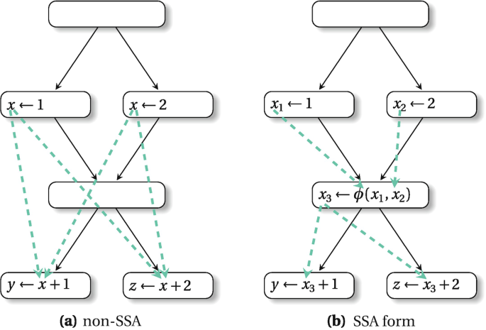

[Static Program Analysis | Tai-e (pascal-lab.net)](https://tai-e.pascal-lab.net/lectures.html)

[静态分析 (cuijiacai.com)](https://static-analysis.cuijiacai.com/)


# 静态分析基础

## *静态分析的概念 & 不可达性*

> Static analysis analyzes a program P to reason about its behaviors and determines whether it satisfies some properties before running P.
>
> 静态分析是指在实际运行程序P之前，通过分析静态程序P本身来推测程序的行为，并判断程序是否满足某些特定的性质Q。

我们关心的程序性质有比如

- 程序P是否会产生私有信息泄漏（Private Information Leak），或者说是否存在访问控制漏洞（Access Control Venerability）
- 程序P是否有空指针的解引用（Null Pointer Dereference）操作，更一般的，是否会发生不可修复的运行时错误（Runtime Error）
- 程序P中的类型转换（Type Cast）是否都是安全的
- 程序P中是否存在可能无法满足的断言（Assersion Error）
- 程序P中是否存在死代码（Dead Code，即控制流在任何情况下都无法到达的代码），从而它可以被消去

然而根据 *计算理论.md* 中的 Rice's Theorem：递归可枚举语言的所有非平凡 non-trivial 的性质都是不可判定的，静态分析并不能为我们关心的程序的非平凡性质给出一个确切的答案，即简单的 Yes or No

## *静态分析的类型*

### 完美的静态分析

若一个静态分析S能够对于程序P的某个非平凡性质Q给出确切的答案，我们就称S是P关于Q的 **完美静态分析 Perfect Static Analysis** 。我们定义程序P的关于Q的真实行为为 **真相 Truth** ，那么完美静态分析有两种性质：

- **完全性（健全、全面）Soundness）**：真相一定包含在S给出的答案中
- **正确性（Completeness）**：给出的答案一定包含在真相中

即记S给出的答案集合为A，真相的集合为T，则完美的静态分析可以写作下面的集合，也就是说一个完美的静态分析应当是既sound又complete的
$$
T\sube A\and A\sube T\Leftrightarrow A=T
$$

### 妥协的静态分析

根据Rice定理，完美的静态分析是不存在的，但这并不意味静态分析就没有意义。我们需要对静态分析的两个性质做一些取舍，即妥协的静态分析 Compromised Static Analysis


* Sound Static Analysis / Over-approximation 过近似，会出现假阳 false positive
* Complete Static Analysis / Under-approximation 欠近似，会出现假阴 false negative

### 实际开发中的静态分析要达成的目标

大部分的静态分析都会选择保全 soundness，牺牲 completnessm。soundness 是更加重要的，因为对于bug宁可杀错，不可放过

现实中的静态分析 Real-World Static Analysis 需要保证（或者尽可能保证）Soundness ，并在速度和精度 Precision 之间做出一个合适的权衡

## *抽象*

从 bird eye 的角度看，静态分析分为**abstract 抽象 + 过近似 over-approximation**两部分

### 什么是抽象

抽象 abstraction 是指在研究一个程序P的某个性质Q的时候，只把性质Q相关的内容提取出来，忽略其他细节的过程

具体的下一个定义：对于程序P的某个**具体值集 Concrete Domain** $D_C$，静态分析S基于要研究的性质Q设计一个**抽象值集 Abstract Domain** $D_A$（一般 $\left|D_A\right|<\left|D_C\right|$，因为这样的设计才有简化问题的意义），并建立映射关系 $f_{D_C\rightarrow D_A}$，这个过程称之为S对P关于Q的抽象过程

$D_A$ 中通常会有两个特殊的值，$\top$ 代表**未确定的值 unkwon**，$\bot$ 代表**未定义的值 undefined**，即通常 $\top\in D_A\and\bot\in D_A$，并且通常 $\top$ 和 $\bot$ 会是程序中的表达式的值，因此我们还需要定义基于 $D_
A$ 的运算来理解 $\top$ 和 $\bot$ 


### 状态转移函数

基于上面对抽象的定义，记 $f_1=f_{D_C\rightarrow D_A}$，考虑程序P关于 $D_C$ 的二元操作集 $O_p$，我们可以建立映射 $f_2=f_{O_p\times D_A\times  D_A\rightarrow D_A}$。借此我们可以将所有 $D_C$ 相关的表达式的值通过 $f_2\circ f_1$ 也映射到 $D_A$，其中 $f_1$ 称为状态函数 state function，$f_2$ 称为转移函数 transfer function

状态函数定义了我们如何将具体值转化为抽象值，转移函数定义了我们如何基于抽象值去 **解析（Evaluate）** 表达式

# IR

关于 IR  的一些思考：[编译器与中间表示: LLVM IR, SPIR-V, 以及 MLIR | Lei.Chat()](https://www.lei.chat/zh/posts/compilers-and-irs-llvm-ir-spirv-and-mlir/#演进与兼容性)

## *intro*

### 什么是IR

编译器通常会生成一种或多种形式的中间代码 Intermediate Representation, IR。中间代码位于高级源代码和目标机器代码之间的抽象层级。生成中间代码是编译器设计中的关键步骤，它对优化和跨平台代码生成尤为重要

~~注意⚠️：**AST本身不是编译过程中的中间代码**，但它是生成中间代码的基础。通过AST，编译器可以执行各种优化，并最终将其转换成中间代码，然后再转换成目标代码~~

AST 也可以看成是 IR 的一种

### 为什么需要划分成不同的中间表示

* 编译器工程上的考虑
  * 阶段划分：把整个编译过程划分成不同的阶段
  * 任务分解：每个阶段只处理翻译过程的一个步骤
  * 代码工程：代码更容易实现、除错、维护和演进
* 程序分析和代码优化的需要，这是现代编译器必须要做的。这两者都和程序的中间表示密切相关，许多优化在特定的中间表示上才可以或才容易进行

具体划分成哪些中间表示是和具体的编译器相关的

### Overview

下面列举了一些中间表示，但是实际中还有很多很多的中间表示，而且工业编译器往往都会同时采用多种中间表示

* 树和有向无环图（DAG）：高层表示，适用于程序源代码
* 三地址码（3-address code）：低层表示，靠近目标机器
* 控制流图（CFG）：更精细的三地址码，程序的图状表示，适合做程序分析、程序优化等
* 静态单赋值形式（SSA）：更精细的控制流图，同时编码控制流信息和数据流信息
* 连续传递风格（CPS）：更一般的SSA，在函数式编程中用的比较多

## *三地址码 TAC*

### Generalizaiton：n 地址码

将形如 $f(a_1,a_2,\dots,a_n)$ 的指令称为 **n 地址码 N-Address Code**，其中，每一个 $a_i$ 是一个地址，既可以通过 $a_i$ 传入数据，也可以通过 $a_i$ 传出数据， $f$​ 是从地址到语句的一个映射，其返回值是某个语句 s，s 中最多包含输入的 n 个地址。这里，我们定义某编程语言 L 的语句 s 是 L 的操作符、关键字和地址的组合

n 地址码中主要被使用的是三地址码，一方面是因为一些历史传统，一些经典的分析算法是以 3 地址码作为 IR 的所以这种表示方法就一直沿用着；另一方面是因为它表示上更加简洁方便且表达能力完备

### 三地址码的组成

三地址代码 Three-Address Code, TAC or 3AC，它被称为三地址是因为**每条指令最多涉及三个地址**，通常对应于两个操作数和一个结果，并且**每条代码最多有一个操作** op

TAC 的优点是很简洁，所以适合用来讨论算法

地址可能有下面的几种类型

- 名字 Name
  - 变量 Variable
  - 标签 Label：用于指示程序位置，方便跳转指令的书写
- 字面常量 Literal Constant
- 编译器生成的临时量 Compiler-Generated Temporary

三地址码的每一条指令通常包含以下几个部分：

* 运算符（Operator）：表示要执行的操作，如加法、减法、乘法等
* 操作数1（Operand1）：第一个输入值，可以是变量、常量或临时变量
* 操作数2（Operand2）：第二个输入值，与操作数1类似
* 结果（Result）：运算的输出，通常存储在一个变量或临时变量中

这种格式允许了复杂表达式和控制结构的简单翻译，同时也便于进行各种优化

### 三地址码的特点

* 每个三地址赋值指令的右部最多只有一个运算符
* 给每个中间变量和计算结果命名，没有复合表达式，即编译器应该生成一个临时名字以存放一个三地址指令计算得到的值
* 只有最基本的控制流，没有if、do、while、for等，只有goto、call等
* 有些三地址指令的运算分量少于三个
* 三地址码可以看成是抽象的指令集

### TAC的（近似）形式定义

三地址码并没有完全统一的定义方式，下面给出两种部分三地址码的形式定义

* 中科大编译器课程。下面给出的TAC的形式定义并不是完全严格的，有些是上下文有关的

  ```
  s -> x = n                // 常数赋值
     | x = y ⊕ z           // 二元运算
     | x = Ө y              // 一元运算
     | x = y                // 数据移动
     | x[y] = z             // 内存写
     | x = y[v]             // 内存读
     | x = f (x1, ..., xn)  // 函数调用，上下文有关
     | Cjmp (x1, L1, L2)    // 条件跳转
     | Jmp L                // 无条件跳转
     | Label L              // 标号
     | Return x             // 函数返回
  ```

* 南京大学静态分析课程

  ```
  x = y bop z
  x = uop y
  x = y
  goto L
  if x goto L
  if x rop y goto L
  ```

  - x, y, z是变量的地址
  - `bop` 是双目操作符（Binary Operator），可以是算数运算符，也可以是逻辑运算符
  - `uop` 是单目操作符（Unary Operator），可能是取负、按位取反或者类型转换
  - `L` 是标签（Label），是标记程序位置的助记符，本质上还是地址
  - `rop` 是关系运算符（Relational Operator），运算结果一般为布尔值
  - `goto` 是无条件跳转， `if... goto` 是条件跳转

## *静态单赋值形式 SSA*

[静态分析之数据流分析与 SSA 入门 （二）_汇合边,用于ssa-CSDN博客](https://blog.csdn.net/nklofy/article/details/84206428)

静态单赋值形式 Static Single Assignment, SSA 和 TAC 的区别在于在**每次赋值的时候都会创建一个新的变量，也就是说每个变量只被定义/赋值一次**

|                 3AC                 |                           SSA                           |
| :---------------------------------: | :-----------------------------------------------------: |
| $p=a+b\\q=p-c\\p=q*d\\p=e-p\\q=p+q$ | $p_1=a+b\\q_1=p_1-c\\p_2=q_1*d\\p_3=e-p_2\\q_2=p_3+q_1$ |

### φ function

当控制流汇合（Merge）的时候，我们会用一个特殊的操作符表示汇和后的定义
$$
x_3=\phi(x_1,x_2)=\left\{\begin{array}{ll}x_1,&if\ true\\x_2,&otherwise\end{array}\right.
$$


φ 函数是一个并行操作，根据运行的路径选择一个赋值，如果有多个 φ 函数，它们是并发执行的

### SSA 简化数据流方程



上面的左图中，虚线就是 x 每处定义的 def-use chain，传统代码因为变量不止一次定义，所以每个定义的 def-use chain 非常复杂。再看右图，SSA形式下没有同名变量，每个变量只定义一次，所以同名的 use 都是属于它的 def-use chain，而且因为每个变量 uss 前都只有一次 def，所以 use-def chain 是一对一的。可见 SSA 形式下的 def-use chain 与 use-def chain 都得到了简化

### SSA 的类型

* 最小 SSA minimal SSA：同一原始名字的两个不同定义的路径汇合处都插入一个 φ 函数。这样得到符合两大特征的且拥有最少 φ 函数数量的 SSA 形式。但是这里的最小不包含优化效果，比如死代码消除，或者值有可能经 live-range 分析是死的

* 剪枝 SSA ：如果变量在基本块的入口处不是活跃 live 的，就不必插入 φ 函数。一种方法是在插入 φ 函数的时候计算活跃变量分析。另一种剪枝方式是在最小 SSA 上做死代码消除，删掉多余的 φ 函数

* 半剪枝 SSA：鉴于剪枝 SSA 的成本，可以稍微折衷一点。插入 φ 函数前先去掉非跨越基本块的变量名。这样既减少了名字空间也没有计算活跃变量集的开销

* 严格 SSA：每个 use 被其 def 支配，那么称为严格 SSA。如下图所示，左图 a, b 的 def 没有支配 use，所以不是严格 SSA。在右图中，汇合点插入2个 φ 函数，重新编号了变量，保证了支配性。其中 ⊥ 表示未定义

  

* 传统与变形 SSA：构造 φ-web 并查集，将 def-use chains 有相同变量的都连接起来得到一个网络，比如 φ 函数两边的 define 或 parameter 变量。可以得到若干网络。传统 SSA 的特点是 φ-web 中变量的 live-range 互相不干涉。传统 SSA 经过优化例如复制传播之后，可能会被破坏这个性质，就称为变形 SSA

### Pros & Cons of SSA

* Pros
  * 控制流的信息间接地被包含在了独特的变量名之中，当我们做一些对控制流敏感的分析的时候，这些信息可能会有帮助
  * def 和 use 的关系明确
* Cons
  * 可能会引入过多的变量名和 φ 函数
  * 被翻译成机器码的时候效率低，因为有太多对于程序执行来说不必要的赋值

## *其他 IR 形式*

[Modern Intermediate Representations (IR)](https://llvm.org/devmtg/2017-06/1-Davis-Chisnall-LLVM-2017.pdf)

### 四元式

### RPN

逆波兰表达式 RPN

## *基于 IR 的 BB 构建算法*

三地址码的控制流信息是隐式的，对于做控制流分析不够方便，可以采用控制流图来做进一步的控制流分析

控制流图 Control Flow Graph, CFG 是进行控制流分析 Control Flow Analysis, CFA 的最重要一环（前提）

### 基块 BB

控制流图中的结点可以是一个指令，也可以是一个**基块 Basic Block, BB**

记一个程序 P **在 IR 表示下** 的指令序列为 $P=\left\{a_1,a_2,\dots,a_n\right\}$，这里 P 是一个有序集。我们定义

* $IN_i=\left\{a_j|next(a_j)=a_i\right\}$，即 $a_i$ 是控制流 $a_j$ 中的下一条指令 
* $OUT_I=\left\{a_j|prev(a_j)=a_i\right\}$，即 $a_i$ 是控制流 $a_j$ 中的上一条指令

若连续的指令序列 $a_p,a_{p+1},a_{p+2},\dots,a_q$ 的满足如下性质，并且 $a_{p-1},a_{p},\dots,a_{q-1},a_q$ 和 $a_{p},a_{p+1},\dots,a_{q},a_{q+1}$ 都不满足下面的性质，则称 $\left\{a_p,a_{p+1},a_{p+2},\dots,a_q\right\}$ 为 BB
$$
\left(\forall i\in\left[p+1,q\right],\ IN_i=\left\{a_{i-1}\right\}\right)\and\left(\forall i\in[p,q-1],\ OUT_I=\left\{a_{i+1}\right\}\right)
$$
抽取出上面的定义中最核心的BB特征，**即BB就是满足如下性质的最长指令序列：**

- **程序的控制流只能从首指令进入**
- **程序的控制流只能从尾指令流出**

比如下面这个例子


### Leader of BB

对于一个 IR 表示下的程序 $P=\left\{a_1,a_2,\dots,a_n\right\}$，考虑某个 BB $B=\left\{a_p,a_{p+1},a_{p+2},\dots,a_q\right\}$，我们称 $a_p$ 为 P 的BB $B$​ 的领导者 leader

**goto 跳转指令指导着如何划分 BB**

考虑程序 $P=\left\{a_1,a_2,\dots,a_n\right\}$ 中所有的 leader 所组成的集合 $L$，则有
$$
L=\left\{a_1\right\}\cup\left\{a_j|\exists a_i,\ type(a_i)=jump\and target(a_i)=a_j\right\}\cup\left\{a_{i+1}|type
(a_i)=jump\right\}
$$
其中，$type(a_i)$ 表示指令 $a_i$ 的类型，jump 类型是跳转指令，它包括了条件跳转 conditional jump和无条件跳转 unconditional jump。$target(a_i)$ 仅用于 $a_i$ 是跳转指令的时候，表示 $a_i$ 的目标指令

一个基块的领导者就是这个基块的首指令，整个程序中的领导者有如下 3 种：

- 整个程序的**首指令**
- 跳转指令（包括条件跳转和无条件跳转）的**目标指令**，保证唯一的入口
- 跳转指令（包括条件跳转和无条件跳转）紧接着的**下一条**指令，保证唯一的出口

考虑程序 $P=\left\{a_1,a_2,\dots,a_n\right\}$ 中所有的leader所组成的集合 $L$，则有
$$
\left(a_p\in L\right)\and\left(a_{q+1}\in L\right)\in\left(\forall a_i\left(i\in[p+1,q]\right),a_i\notin L\right)\Leftrightarrow B=\left\{a_p,a_{p+1},a_{p+2},\dots,a_q\right\}\ is\ BB
$$

## *构建 CFG*

### 过程

- 输入：程序 P 的一系列 3AC
- 输出：程序 P 的基本块
- 方法
  1. 决定 P 的 leaders
     - P 的第一条指令就是一个 leader
     - 跳转的目标指令是一个 leader
     - 跳转指令的后一条指令，也是一个 leader
  2. 构建 P 的基本块
     - 一个基本块就是一个 leader 及其后续直到下一个 leader 前的所有指令

除了基本块，CFG 中还会有块到块的边。块 A 和块 B 之间有一条边，当且仅当：

- A 的末尾有一条指向了 B 开头的跳转指令
- A 的末尾紧接着 B 的开头，且 A 的末尾不是一条无条件跳转指令


除了构建好的基本块，我们还会额外添加两个结点，入口节点 Entry 和出口节点 Exit

- 这两个结点不对应任何 IR
- 入口有一条边指向 IR 中的第一条指令
- 如果一个基本块的最后一条指令会让程序离开这段 IR，那么这个基本块就会有一条边指向出口

### CFG 的形式定义

记程序 $P$ 的 BB 构成了集合 $B=\left\{b_1,b_2,\dots,b_k\right\}$，考虑 $CFG_0=(B,E_0)$ ，其中 $E_0\sube B\times B$，满足
$$
E_0=\{(b_i, b_j)|(type(last(b_i))=jump\and target(last(b_i))=first(b_j))\\\or(next(last(b_i))=fist(b_j)\and type(last(b_i))\neq unconditional\ jump)\}
$$
其中，$first(b_i)$ 表示 BB $b_i$ 的首指令（即leader），$last(b_i)$ 表示 BB $b_i$ 的尾指令，$next(x)$ 表示指令 x 紧随其后的指令

若 $(b_i, b_j)\in E_0$，则 $b_i$ 是 $b_j$ 的前驱 predecessor，$b_j$ 是 $b_i$ 的后继 successor

- 对于图 $CFG_0$ 中所有入度为 0 的点（一般只有一个），考虑虚拟结点 **入口 Entry** ，所有的 **入度 In Degree** 为 0 的点都是 Entry 的后继
- 对于图 $CFG_0$ 中所有出度为 0 的点（可能不止一个），考虑虚拟结点 **出口 Exit** ，所有的 **出度 Out Degree** 为 0 的点都是 Exit 的前驱

分别记 $E_1=\left\{(Entry,b)|b\in B\and inDegree(b)=0\right\}$ 和 $E_2=\left\{(Exit,b)|b\in B\and outDegree(b)=0\right\}$，则可以定义 CFG 为 $CFG=(V,E)$，其中
$$
V=B\cup\left\{Entry,\ Exit\right\},\ E=E_0\cup E_1\cup E_2
$$

# 数据流分析应用

## *数据流分析的概念*

### 数据流分析在做什么？

数据流分析的核心：How Data Flows on CFG?

> How application-specific Data (对数据的抽象：+, -, 0 等……)
>
> Flows (根据分析的类型，做出合适的估算) through the
>
> Nodes (数据如何 transfer, 如 + op + = +) and
>
> Edges (控制流如何处理，例如两个控制流汇入一个BB) of
>
> CFG (整个程序) ?

不同的数据流分析，有着不同的 data abstraction, flow safe-approximation 策略，transfer functions & control-flow handlings

### 安全近似

数据流分析的对象是**应用特定型数据（Application-Specific Data）**

Safe-Approximation 安全近似 的概念由两部分组成

* 可能性分析 May Analysis：输出的结论**可能**为 true，即做的是 over-approximation，此时 safe == over。比如说bug检测就一般不一定非得是true的，可以存在一定的误报
* 必然性分析 Must Analysis：输出的结论**必须**要为 true，也就是一定要做 under-approximation，此时 safe == under。比如说优化的前提是一定要为 true，否则优化的结果就可能是不正确的

### IN & OUT集合

定义程序P的**抽象数据状态 Abstract Data State, ADS** 为程序 P 中所有的数据的抽象值的整体（具体数据结构可以根据需求来定义），抽象数据状态也称作 **数据流值 Data-Flow Value** 

* 称每一个 IR 语句 s 执行之前、pre(s)（控制流中 s 的前驱的集合）执行之后的数据流值为 s 的输入状态 input space，记为 IN[s]
* 称每一个 IR 语句 s 执行之后、suc(s)（控制流中 s 的后继的集合）执行之后的数据流值为 s 的输入状态 output space，记为 OUT[s]

考虑程序 P 的 IR 语句集为 S，定义集合为下式。即程序点可以用控制流中相邻语句的顺序二元组表示
$$
PP=\left\{(s_i,s_j)|s_i,s_j\in S\and(s_j\in suc(s_i)\or s_i\in pre(s_j))\right\}
$$

### 交汇


定义 ADS 在控制流推动下融合时的运算为 **交汇 meet** ，用符号 $\and$ 表示，**其含义由具体的数据流分析决定**。一般的，如果数据流值是集合类型的话，可能性分析下， $\and$ 常定义为并集，必然性分析下， $\and$​ 常定义为交集

* 正向分析中，每个语句 s 的输入状态，是其前驱语句输出状态的交汇，即
  $$
  IN[s]=\bigwedge\limits_{s_i\in pre(s)}{OUT[s_i]}
  $$

* 逆向分析中，每个语句 s 的输出状态，是其后继语句输入状态的交汇，即
  $$
  OUT[s]=\bigwedge\limits_{s_i\in suc(s)}{IN[s_i]}
  $$

具体常见的场景就是上面图中的三种

格理论中：如果有一个偏序集 $(A,\preceq)$，有 $(a,b)\in A$

* 当 a 和 b 有 GLB，就叫做 meet of a & b
* 当 a 和 b 有 LUB，就叫做 join of a & b

### 状态转移方程

状态转移方程也称为数据流方程

> In each data-flow analysis application, we associate with every program point a data-flow value that represents an abstraction of the set of all possible program states that can be observed for that point.

**在每一个数据流分析应用中，我们为每一个程序中的点（即每一句 statement 的前后）关联一个数据流的值，这个值代表了 program states 在该点的所有可能值的抽象**


比如上面的数据流过程，第一个 program point 的时候 y 还没有定义，所以它的抽象值是 unknown

我们只需要关注抽象，没必要知道确切的值是多少

数据流分析是给每一个程序中的点 program point 都关联一个在那个点可以看到的程序状态的抽象的集合，**即在每一个程序中的点都根据 safe-approximation 求满足约束 constraint 的 data-flow value (solution)**。Constraints 有两种

* constraints based on semantics of statements (transfer functions)
* constraints based on the flows of control

## *Constraint*

### Transfer Function’s Constraints

statement s 对应的 transfer function 为 $f_s$

* forward analysis
  $$
  OUT[s]=f_s(IN[s])
  $$

* backward analysis，等价于将 CFG 反着建后再进行 foward analysis
  $$
  IN[s]=f_s(OUT[s])
  $$

### Control Flow’s Constraints

* BB 内的控制流
  $$
  IN[s_{i+1}]=OUT[s_i],\ for\ all\ i=1,2,\dots,n-1
  $$

* BB 之间的控制流
  
  BB 只有一个输入，一个输出
  $$
  IN[B]=IN[s_1],\ OUT[B]=OUT[s_n]
  $$
  
  
  
  * 正向
    $$
    OUT[B]=f_B(IN[B]),\ f_B=f_{s_n}\circ\dots\circ f_{s_2}\circ f_{s_1}\Longrightarrow IN[B]=\bigwedge_{\textcolor{red}{P}\ is\ a\ predecessor\ of\ B}{OUT[\textcolor{red}{P}]}
    $$
  
  * 反向
    $$
    IN[B]=f_B(OUT[B]),\ f_B=f_{s_1}\circ\dots\circ f_{s_{n-1}}\circ f_{n}\Longrightarrow OUT[B]=\bigwedge_{\textcolor{red}{S}\ \ is\ a\ successor\ of\ B}{IN[\textcolor{red}{S}]}
    $$
    注意：如上文所述，这里的操作符 $\wedge$ 是 meet operator，其具体含义代表交集 $\cap$ 还是并集 $\cup$ 由具体的数据流分析决定

## *定义可达分析*

### 分析工具：数据流方程

先明确两个概念，在基于 IR 的静态分析中

* 定义 definition 是对变量的赋值
* 使用 use 是对变量的读取

引入两个概念

* **Def-Use Chain** 是一个数据结构，包含一个 def 变量，以及它的全部 use 的集合。它描述了一个变量在何处被定义以及这些定义在何处被使用
* **Use-Def Chain** 是 def-use chain 的逆过程，包含一个 use 变量，以及它的全部 def 的集合。从变量的使用点出发，记录该使用所依赖的定义。它描述的是变量使用的来源，即使用点依赖于哪些定义

对与任何一条的定义语句 `[d: x = ...]`，给出两个集合，其中 d 是语句的编号

* gen 产生集 `gen[d : x = ...] = {d}`

* kill 杀死集 `kill[d: x = ...] = defs[x] - {d}`

* 可以得到状态转移方程为
  $$
  IN[s_i]=OUT[s_{i-1}]\\OUT[s_i]=gen[s_i]\cup(IN[s_i]-kill[s_i])
  $$
  

举个下面的例子，个人理解因为存在循环和跳转，没法确定到底是谁真正的前驱，所以就不管顺序将其他所有定义的地方都 kill 掉

TODO：例子

### 定义可达分析的概念


定义可达分析 Reaching Definitions Analysis 静态分析用于确定在程序的每个点，哪些变量定义可能会到达 reach 这个点。即**确定在某个程序点，可以访问哪些变量定义**

* 这里的定义 definition 指的是给变量 x 赋一个定值 d 的操作，如果存在一个路径，从紧随 d 的点到达某点 q，并且此路径上面没有 x 的其他定值点，则称 x 的定值 d 到达 **reaching** q
* 如果在这条路径上有对 x 的其它定值，我们说变量 x 的这个定值 d 被杀死/覆盖 **killed** 了

定义可达分析可以用来检测潜在的未定义/未初始化的变量，在程序的入口会引入一个**未定义 dummy definition** 的定值，如果这个 dummy def 一直被保留到了出口，说明 v 可能在这条 path 上是没有被初始化过的，因为我的如果定义了可能会覆盖 dummy definition 状态

定义可达分析是一个may analysis，采用 over-approximation 原则。即若有多条路径可以到达，虽然运行时只会走其中的一条控制流，但是也应该报未定义的错误

~~强度削弱 strength reduction 就是把耗费较多 CPU 周期的汇编指令用耗费较少 CPU 周期的汇编指令替代掉，最常见的就是用高效的 `<<` 来替代 `2^n` 的乘法~~

### 定义可达分析的转移方程 & 数据流处理

* 用 bit vector 来表示可达性，每个 bit 代表一个 def，0 表示可达，1 表示不可达
  $$
  \underbrace{D1,D2,\dots,D100}_{100\ defs}\Rightarrow \underbrace{000\dots0}_{100\ bits}
  $$

* Transfer function
  $$
  OUT[B]=gen_B\cup(IN[B]-kill_B)
  $$
  
* Control Flow
  $$
  IN[B]=\bigcup_{\textcolor{red}{P}\ is\ a\ predecessor\ of\ B}{OUT[\textcolor{red}{P}]}
  $$

### 定义可达分析的迭代算法


为什么要分开初始化？因为上面这个迭代算法是适用于所有的数据流分析的，而其他数据流分析的边界条件（即初始化方式）可能是不同的


实际上就是给每一个 BB 把前面说的约束（状态转移方程+控制流）转换成算法


OUT 有任何的变化，都需要继续迭代


如果已经是 0 了就不用再 kill 了，也就是最多减到 0


IN 一样的话，OUT 肯定一样，因为 gen 和 kill 不会发生变化


因为 IN[B] 和 OUT[B] 的元素数是非严格递增且有上界，所以极限存在会收敛


## *活性分析*


活性分析 liveness analysis 也称为活跃变量分析 live variable analysis：在程序点 p 处，某个变量 v 的变量值 variable value **可能在之后的某条控制流中被用到**，我们就称变量 v 是程序点 p 处的**活变量 live variable** ，否则我们就称变量 v 为程序点 p 处的**死变量 dead variable** 。分析在各个程序点处所有的变量是活变量还是死变量的分析，称为 **活跃变量分析**

上面的定义隐含的意思是，我们判断活跃变量的标准不是这个变量之后有没有可能用到，而是**这个变量当前所储存的值在之后有没有可能被用到**，所以这个变量在使用之前**不能被重定义过 redefined**，重定义了变量指向的内存内容也就改变了

### 应用场景：编译器后端的寄存器分配

在编译器后端的讨论中假设了可以使用无限多个寄存器，但是当 codegen 的时候必须把有限多个虚拟寄存器分配到有限个寄存器当中

活性分析可以用于寄存器分配，当一个变量不会再被使用，那么此变量就可以从寄存器中腾空，用于新值的存储

### 活性分析的转移方程 & 数据流处理

* 用 bit vector 来表示可达性，每个 bit 代表一个 def，0 表示 dead，1 表示 live
  $$
  \underbrace{V1,V2,\dots,V100}_{100\ defs}\Rightarrow \underbrace{000\dots0}_{100\ bits}
  $$

* Transfer function
  $$
  IN[B]=use_B\cup(OUT[B]-def_B)
  $$
  如果是在 redefined 之前 use 了，那么在当前的 BB 变量还是 live 的；反过来如果是 redefine 之后再 use 就不成立了，因为 use 的已经不是同一个值了
  
* Control Flow
  $$
  OUT[B]=\bigcup_{\textcolor{red}{S}\ is\ a\ successor\ of\ B}{IN[\textcolor{red}{S}]}
  $$

backward 可以提前剪枝，降低搜索空间的复杂度

### 活性分析的数据流方程

如果 use 是在 def 之前，那么还是认为 IN 是存活的

### 活性分析的迭代算法

## *可用表达式分析*

### 可用表达式的定义

x op y 在 p 点可用的条件：从流图入口结点到达 p 的**每条**路径都对 x op y 求了值，且在最后一次求值之后再没有对 x 或 y 赋值

这个定义意味着

* 在程序点 p，我们可以用 x op y 的上一次求值结果来代替 x op y
* 可用表达式分析 Avaiable Analysis 可以用于全局公共子表达式 Common Subexpression Elimination, CSE 的计算。也就是说，如果一个表达式上次计算的值到这次仍然可用，我们就能直接利用其中值，而不用进行再次的计算

### 可用表达式的转移方程 & 数据流处理

* 用 bit vector 来表示可达性，每个 bit 代表一个 def，0 表示 dead，1 表示 live
  $$
  \underbrace{E1,E2,\dots,E100}_{100\ defs}\Rightarrow \underbrace{000\dots0}_{100\ bits}
  $$

* Transfer function
  $$
  OUT[B]=gen_B\cup(IN[B]-kill_B)
  $$
  
* Control Flow
  $$
  IN[B]=\bigcap_{\textcolor{red}{P}\ is\ a\ predecessor\ of\ B}{OUT[\textcolor{red}{P}]}
  $$
  之所以是交集是因为要对每条 path 都做处理，是一个 must analysis

## *常量传播分析*

常量传播分析 constant propagation analysis 的意思是给定一个程序点 p 的某个变量 x，决定 x 是否在点 p **一定**是一个常量

常量传播分析通过识别并替换程序中不变的变量，提高程序性能。该分析发现并传播程序中可以在编译时固定的常量。这是一个 must analysis，它用于优化程序

# 数据流分析理论

使用到的关系理论看 *离散数学.md*

## *Iterative Algorithm from Another View*

给定一个有 k 个节点的 CFG，迭代算法会更新每个节点 n 的 OUT[n] 值。那么我就可以考虑把这些值定义为一个 k-tuple
$$
\left(OUT[n_1],OUT[n_2],\dots,OUT[n_k]\right)\in\left(V_1\times V_2\times\dots\times V_k\right)=V^k
$$
则，我们的数据流分析迭代算法框架就可记为
$$
F:V^k \rightarrow V^k
$$
迭代过程就被记为：
$$
\text{init:}\ \ X_0 = (\bot,\bot,\dots,\bot)\\\text{iter 1:}\ X_1 = (v_1^1,v_2^1,...,v_k^1) = F(X_0)\\\text{iter 2:}\ X_2 = (v_1^2,v_2^2,...,v_k^2) = F(X_1)\\\vdots\\\text{iter i:}\ X_i = (v_1^i,v_2^i,...,v_k^i) = F(X_{i-1})\\\text{iter i+1:}\ X_{i+1} = (v_1^i,v_2^i,...,v_k^i) = F(X_{i})
$$
此时我们发现 X~i~ = X~i+1~，意味着 X~i~ 就是 F 的一个不动点

### 关于数据流迭代算法的几个问题

1. 算法保证可以终止或者停止到一个点，或者它始终是解的吗？**这是关于 lattice 函数的单调性问题**
2. 如果是的话，是只有一个解或只有一个固定点吗？如果有多个解，迭代算法可以找到最佳的或者说最精确的那个解吗？
3. 什么时候才可以得到解，或者说什么时候算法才可以达到不动点？

## *基于格的数据流分析框架*

一个基于格的数据流分析框架（D, L, F）由以下元素组成：

- D：数据流的方向，前向还是后向
- L：包含了数据值域 V 和 meet $\wedge$, join $\vee$ 符号的格
- F：V `->` V 的转移方程族。之所以说是族是因为每个节点的 kill 和 gen 的内容不一样 所以 F 具体操作也不一样

因此**数据流分析可以被视为在 lattice 的值上迭代地应用转移方程和 meet/join 操作符**

### 单调性 & 不动点定理

Monotonicity 单调性：如果 $x \sqsubseteq y \Rightarrow f(x)\sqsubseteq f(y)$，则说函数 $f: L \rightarrow L$ 是**单调的 monotic**

FIxed Point Theorem 不动点定理：给定一个全格 $(L,\sqsubseteq)$，如果

1. $f: L \rightarrow L$ 是单调的
2. L 是有穷的（callback：如果一个 lattice 是有穷的，那么它一定是一个全格）

上面的两个条件就是 **f 单调有界 + L 全格**，那么此时有**不动点定理 fixed point theorem**

- 迭代 $f^k(\bot)$ 可以得到最小不动点 least fixed point, LFP（按偏序关系最小的点）
- 迭代 $f^k(\top)$ 可以得到最大不动点 greatest fixed point, GFP（按偏序关系最大的点）

上面的不动点定理实际包含了两层含义

1. 不动点是存在的
2. 求得的不动点是最小/最大的

给出证明：

根据 $\bot$ 和 f 的定义，我们可以得到：$\bot \sqsubseteq f(\bot)$

证明不动点是存在的：由于 L 是有限的，且 f 单调，根据鸽巢原理，不断迭代必然存在一个 k 使得 $\bot \sqsubseteq f(\bot) \sqsubseteq f^2(\bot)\sqsubseteq ...\sqsubseteq f^k(\bot)\sqsubseteq f^{k+1}(\bot)$，且 $f^k(\bot) = f^{k+1}(\bot)$

证明求得的不动点是最小不动点：假设我们有另一个任意不动点 x=f(x)，由于 f 是单调的，因此 $f(\bot) \sqsubseteq f(x), f^2(\bot) \sqsubseteq f^2(x),...,f^{Fix} = f^k(\bot)\sqsubseteq f^k(x) = x$，可知的确 $f^{Fix}$ 是最小不动点

通过上面的证明，我们又回答了一个问题：如果我们的迭代算法符合不动点定理的要求，那么迭代得到的不动点，确实就是最优不动点

### 关联数据流迭代算法 & 不动点定理

首先，回想数据流分析 out 的形式：$(v_1^1,v_2^1,...,v_k^1)$，可以将其视为一个 finite lattice，它的积也是 finite lattice，因此 out 对应到 finite lattice 是可以的。既然是 finite lattice，就必然是一个 complete lattice 全格

也就是说每一个 BB node 就是一个 lattice ，然后整个 CFG 是 product of lattice

然后，我们的迭代函数 F 对应了转移函数 f，join/meet 函数则对应了 control-flow confluence，因此证明 F 是单调的，那么也就能得到 $F: L\rightarrow L$ 是单调的

以 join 为例，这里分两部分

1. 转移函数，即 OUT = gen U (IN - kill)，显然是单调的
2. 我们要证明其 join 的单调，就是要证明：$\forall x,y,z\in L, x\sqsubseteq y$，有$x \sqcup z \sqsubseteq y \sqcup z$
   1. 由 join 的定义，即求两个元素的 lub，所以有 $y \sqsubseteq y \sqcup z$
   2. 由传递性，有 $x\sqsubseteq y$ & $y \sqsubseteq y \sqcup z$，所以有 $x \sqsubseteq y \sqcup z$
   3. 则 $y \sqcup z$ 是 $x, z$ 的一个 upper bound
   4. 又 $x \sqcup z$ 是 $x, z$ 的 lub
   5. 因此 $x \sqcup z \sqsubseteq y \sqcup z$，证明 join 的单调性完毕

于是我们就完成了迭代算法到不动点定理的对应

现在我们要回答本文开头的第三个问题了，什么时候算法停机？

这个问题就很简单了，因为每个 lattice 都有其高度。假设 lattice 的高度为 h（h 是笛卡尔积之前的 lattice 的高度），而我们的 CFG 节点数为 k，就算每次迭代可以使一个节点在 lattice 上升一个高度，那么最坏情况下，我们的迭代次数也就是 $i = h \times k$

## *Distributivity & MOP*

### MOP

Meet-Over-All-Paths Solution, MOP

### 数据流迭代算法 vs. MOP

当 F 是可分配的 distributive，此时有 $F(x\sqcup y)=F(x)\sqcup F(y)$，即 MOP 的算法精度 = 数据流迭代算法的算法精度。Bit-vetor 或者说 Gen/Kill 问题（用集合的交并操作来表示 join/meet）的都是可分配的

## *格视角下的可能性分析 & 必然性分析*


May & must analysis 用一个完整的 lattice 而不是用 semi-lattice 来表达会更直观


May analysis 求解的是最大不动点，must analysis 求解的是最小不动点 


程序点值往上升应该是每次迭代比每个点上一次自己上升了，**最后达到跳出循环条件**


无论是 may 还是 must analysis 都是从 unsafe 往 safe 的方向走


reaching definition 是用于查错的，要是没有错就是刚刚开始查的时候，所以说没查出错误是不安全的

all dummy definition may reach 这个结论很安全，但是没什么用


如果一个不动点是从 ⊥ 不断 apply f 得到的，因为 monotonic，⊥ ≤ x，f^k(⊥) 肯定也 ≤ f^k(x) = x，无论 k 是多少

## *Worklist Algorithm*

worklist 是迭代算法的优化


$\empty$ 用 $\bot$ 来表示

偏序的意思是并不是集合中的任意一对元素都需要满足的关系，只是部分元素对需要满足


上升链 是 finite 的


## *支配树*

### 概念

**支配 Dominator**：在控制流图中，节点 A 支配节点 B，意味着所有从起始节点到 B 的路径都必须经过 A。简而言之，A 的执行对于 B 来说是必不可少的

直观解释：如果想要到达 B，那么不管走哪条路径，总是需要首先经过 A

支配树 dominator tree 是一颗由起点 S 为根的树，根到树上任意一点路径经过的点都是它的支配点。 对于每颗子树，都符合上述性质（即子树内一点到该子树的根路径经过的点都是该子树的根的支配点）

* 对于树来说，其本身就是自己的支配树
* 对于 DAG 来说，可以简单的看做是拓扑排序加上 LCA 求最近公共祖先的问题
* 对于一般有向图来说，采用 Lengauer–Tarjan 算法来解决

### Lengauer–Tarjan 算法

Lengauer–Tarjan 算法是求解支配树最有名的算法之一，可以在 $\mathcal{O}(n\alpha(n,m))$ 的时间复杂度内求出一个有向图的支配树。这一算法引入了**半支配点**的概念，并通过半支配点辅助求得直接支配点

# 过程间分析

## *创建调用图*

Call Graph Construction, CHA 调用关系图

## *过程间控制流图*

## *过程间数据流分析*

# 指针分析基础

指针分析，也称为别名分析

# 上下文不敏感指针分析

# 上下文敏感指针分析

# 静态分析在安全工程中的应用

# CFL & IFDS

# 完全性 & 近似完全性