# IO模型 & 高并发

**IO的本质是等+数据拷贝（内核缓冲区拷贝到应用缓冲区）**

## *IO分类*

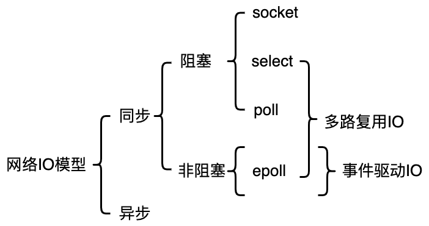

* 按照**是否利用标准库缓冲**来分为缓冲与非缓冲IO Buffered IO

* 按照**是否利用操作系统的页高速缓存 Page Cache** 来分为直接与非直接IO Direct IO

* 按照**等待和拷贝是否都是内核态**来分

  * 同步 Synchronous：发起IO和等待IO、执行数据拷贝的人是同一个发起者（注意不要和文件缓冲里的O_SYNC同步搞混了，O_SYNC是指每次IO直到数据被持久化到disk上才返回，另外网络IO主要考虑的是读数据没来如何处理的问题）
    * 阻塞 Block
    * 非阻塞 Non-block
      * 单纯轮询 Round-Robin
      * 多路复用既可以是阻塞的也可以是非阻塞的，但以非阻塞为主 Multiplexing

  * 异步 Asynchronous：发起IO和等待IO、执行数据拷贝的人不同


其中同步与非同步IO对于构建高并发服务器是最重要的，会单独介绍。先介绍一下比较好分类的缓冲/非缓冲IO和直接/非直接IO

### 缓冲与非缓冲IO

文件操作的标准库可以实现数据的缓存，那么**根据是否利用标准库缓冲，可以把文件 IO 分为缓冲 IO 和非缓冲 IO**

* 缓冲 IO：利用的是标准库的缓存实现文件的加速访问，而标准库再通过系统调用访问文件
* 非缓冲 IO：直接通过系统调用访问文件，不经过标准库缓存

举个例子：很多程序遇到换行时才会真正输出，而换行前的内容其实就是被标准库暂时缓存了起来，这样做的目的是为了减少系统调用的次数，毕竟系统调用要进行用户态和内核态的转换是有 CPU 上下文切换的开销的

```c
#include <stdio.h>
int fflush(FILE *stream);
```

标准库的fflush是用来强制刷新标准库缓冲区的

### 直接与非直接IO

 Linux 内核为了减少磁盘 IO 次数，在系统调用后，会把用户数据拷贝到内核中缓存起来，这个内核缓存空间也就是页高速缓存 Page Cache。在攒了一批数据后统一交付给IO，即只有当缓存满足某些条件的时候，内核才会发起磁盘 IO 的请求

因此**根据是否利用操作系统的Page Cache，可以把文件 IO 分为直接 IO 与非直接 IO**

* 直接 IO：不会发生内核缓存和用户程序之间数据复制，而是直接经过文件系统访问磁盘
* 非直接 IO：读操作时，数据从内核缓存中拷贝给用户程序；写操作时，数据从用户程序拷贝给内核缓存，再由内核决定什么时候写入数据到磁盘

若在使用文件操作类的系统调用函数时，设定了 `O_DIRECT` 宏，则表示使用直接 IO。若没有设置过，**默认使用的是非直接 IO**，会使用 Page Cache 来缓存数据

若使用非直接 IO 进行写数据操作，内核在以下几种情况下才会把缓存数据写入到磁盘

* 在调用 `write` 的最后，当发现内核缓存的数据太多的时候，内核会把数据写到磁盘上
* 若用户主动调用 `sync`，内核缓存会刷到磁盘上
* 当内存十分紧张，无法再分配页面时会把内核缓存的数据换出 swap out 到磁盘上
* 内核缓存的数据的缓存时间超过某个时间时，也会把数据刷到磁盘上

注意：**对大部分程序而言，使用直接 IO 可能会大大降低性能**。Page Cache是经过大量优化的，对整体的缓存命中、内存命中有极大的影响。直接IO只适用于有特定 IO 需求的应用，比如说数据库系统，其高速缓存和 IO 优化机制均自成一体，无需内核消耗 CPU 时间和内存去完成相同任务

直接IO因为是对disk块设备的直接访问，需要遵守一些对齐的规定，不遵守下面任一限制均都将导致 EINVAL 错误（Invalid Argument）

* 用于传递数据的缓冲区，其内存边界必须对齐为块大小（一般为一个扇区 512 Bytes）的整数倍
* 数据传输的开始点，亦即文件和设备的偏移量，必须是块大小的整数倍
* 待传递数据的长度必须是块大小的整数倍

```c
#define BUF_LEN 512 // 一个扇区大小
char *buf = NULL;
const char *TEXT = "This is a text.\n";
// buf = (char *)malloc(BUF_LEN); // 错误，内存地址不一定是512的整数倍
posix_memalign((void **)&buf, 512, BUF_LEN); // 要用这个内存对齐的来分配
strcpy(buf, char);
fd = open(filename, O_RDWR | O_TRUNC | O_CREAT | O_DIRECT);

write(fd, buf, BUF_LEN);
write(fd, buf, strlen(BUF_LEN)); // 写的时候不是一定要写块的整数倍
free(buf);
```

## *同步IO synchronous*

同步IO：发起IO和等待IO、执行数据拷贝的人是同一个发起者

### 阻塞模型

为了避免程序内部的数据不一致或者其他错误，程序在IO设备将数据准备好之前，会一直阻塞CPU，即程序一直处于调用的未返回状态。此时CPU是空闲的，但不能执行其他任务，CPU资源被浪费了。fd默认都是阻塞IO

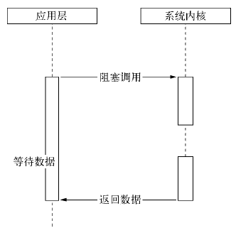

当一个应用进程被挂起后，它通常会等待某些事件的发生，比如等待IO操作完成、等待定时器到期等。这是因为当进程被挂起时，操作系统会将进程的状态保存在内存中，包括进程的寄存器值、堆栈信息等。当进程被恢复时，操作系统会将保存的状态恢复到CPU寄存器中，并从进程被挂起的位置继续执行。因此，当某个事件发生时，操作系统需要将CPU控制权交给相应的事件处理程序，并等待该事件处理程序执行完毕后，再恢复进程的执行

例如，当一个进程进行IO操作时，通常需要等待IO设备完成读写操作，然后才能继续执行。在这个过程中，操作系统会将进程挂起，然后将进程的状态保存在内存中，**并将CPU控制权交给IO设备的驱动程序**。驱动程序会在IO操作完成后向操作系统发出中断信号，然后操作系统会调用相应的事件处理程序来处理这个中断，从而将CPU控制权重新交给挂起的进程，使其继续执行。在这个过程中，**CPU需要等待IO操作完成并等待操作系统的调度，才能够恢复进程的执行**

当然了，**阻塞的概念是相对于每个程序/进程所占的CPU时间片而言的，在程序被调用的时间片内，程序就停止了调用IO的那一行了不会往下执行，它占用的CPU资源被浪费了**。并不是针对整个系统而言的，否则要是只要IO一下系统就卡住了也太可怕了

### 为什么还要用阻塞IO

既然阻塞IO听起来效果那么差，为什么还要使用阻塞IO呢？虽然阻塞IO的性能相对于异步IO和多路复用来说有一定的劣势，但是阻塞IO也有其适用场景，因此在一些情况下仍然需要使用阻塞IO。以下是一些使用阻塞IO的场景

* **简单易用**：阻塞IO的使用非常简单，只需要调用相应的系统调用即可，对于一些简单的应用场景来说，使用阻塞IO可以省去使用异步IO或多路复用的复杂性
* **低延迟**：在一些需要低延迟的场景下，使用阻塞IO可以获得更好的性能表现，因为阻塞IO能够保证IO操作的开始和结束时间，避免了异步IO或多路复用中需要进行多次上下文切换的开销
* **适用于小规模请求**：对于一些小规模的IO请求来说，使用阻塞IO可以获得更好的性能表现，因为异步IO或多路复用中需要进行上下文切换的开销可能会导致性能下降

因为现代计算机系统的软硬件高速发展，所以在很多情况下阻塞IO通过快速的调度和IO看起来并不会影响用户体验，所以90%的IO场景仍然是阻塞IO

### 非阻塞模型

若IO设备还未将数据准备好之前，采取**轮询 polling**的方式反复检测和尝试读取文件，若没有准备好就直接调用返回 `EWOULDBLOCK` 错误码。因为调用后马上返回，所以CPU这段时间可以用来处理其他工作，但是仍然要定期恢复询问

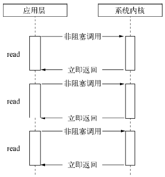

read 信号驱动IO：内核将数据准备好之后，使用 `SIGIO` 信号通知程序。信号会丢失，用的比较少

### IO多路转接/IO多路复用 multiplexing

**多路转接能够同时阻塞等待多个文件描述符的就绪状态**。IO中最耗时的就是等待数据就位，所以引入了一些IO函数，比如select可以一次等待多个文件，IO效率显著提高；还有poll和epoll进一步提高等待的IO量

**阻塞IO既要阻塞数据IO传输，也要阻塞拷贝过程；而非阻塞IO在数据IO时会直接返回，只会阻塞拷贝过程**。这样进程就可以在进行多个IO的时候处理自己的事情，直到IO完毕，由select通知进程，然后CPU再寻机调度进程处理。相比于阻塞IO，比如使用了线程池技术，所有的IO都是阻塞的，且处于内核态，要花费多余空间资源在维护这些线程上

`select` 和 `epoll` 在单进程模式下**本质上是单进程串行**，因为它们都只能在单个进程中运行。不过，它们使用了非阻塞 IO 和多路复用技术，可以在单进程中同时处理多个 IO 事件，从而提高系统的并发处理能力。但是，在高并发场景下，单进程的处理能力可能仍然无法满足要求，这时候就需要使用多进程或多线程来进行扩展。在多线程或多进程模式下，可以将不同的 IO 事件分配给不同的线程或进程来处理，从而提高系统的并发处理能力

注意多路复用既可以设置成阻塞式的，也可以设置为非阻塞的

## *异步：基于事件的并发*

### 异步IO的概念

*异步IO asynchronous*：发起IO和等待IO、执行数据拷贝的人是不同的发起者

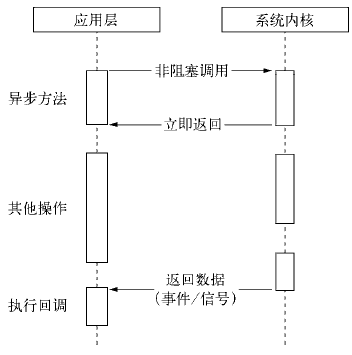

90%的场景里都是阻塞IO，因为它很简单，部分会采用非阻塞和多路转接，这三种是主流的。异步IO的逻辑非常复杂，一般都是底层的库，在公司里因为异步IO的代码很复杂也不易维护

注意和多线程同步的区分，同步IO和多线程同步没有什么关系

### 多线程实现并发的问题

假设业务场景中有一组互不相关的任务需要完成，现行的主流方法有两种

* 单线程串行依次执行
* 多线程并行执行

在OS中，若可以用信号、锁等方式来控制线程，从而实现低开销的多线程并发，那当然多线程会是首选。但多线程的应用是很复杂的，正确处理并发逻辑很困难，忘加锁、各种死锁现象层出不穷

那选择单线程串行执行由如何呢？对于阻塞IO那自然是直接堵塞了整个CPU，而非阻塞IO因为没有完成完整IO，CPU要不断轮询，所以实际上也会造成效率浪费

因此对于实际情况中高并发、高吞吐量的服务器而言，更实际的是采用基于事件的并发 event-based concurrency，而不是用线程来实现并发

### 基本思想：事件循环

基于事件的并发的思想是：等待某事件发生，当它发生时检查事件的类型，然后做少量的相应工作（IO或者其他的调度）就可以完成并发了

事件循环 event loop 的基本结构是

```python
while (1):
	events = getEvents()
    for e in events:
    	processEvent(e) # event handler 事件处理程序
```

## *高并发场景*

异步IO和多路复用都适用于高并发场景，但它们的应用场景有所不同

### 异步IO场景

异步IO适用于需要进行大量的IO操作，但IO操作的时间不确定的场景。在这种情况下，如果使用阻塞IO或非阻塞IO，应用程序需要轮询IO事件并等待IO操作完成，这会占用大量的CPU资源。相比之下，异步IO可以在IO操作进行的同时进行其他的操作，从而避免CPU的浪费，提高系统的并发性和吞吐量。但是，异步IO的实现比较复杂，需要适当的编程技巧和经验

1. Web服务器：在Web服务器中，客户端请求和响应的IO操作通常需要花费较长的时间，如果使用阻塞IO或非阻塞IO，会导致服务器的CPU资源浪费。因此，一些Web服务器会使用异步IO模型来处理这些IO操作，从而提高服务器的并发性和吞吐量
2. 大规模数据处理：在大规模数据处理中，需要进行大量的IO操作，如文件读写、网络传输等，这些IO操作的时间往往不确定。使用异步IO可以在IO操作进行的同时进行其他的操作，从而提高系统的并发性和吞吐量

### 多路复用场景

多路复用适用于需要同时处理多个IO事件的场景。在这种情况下，如果使用阻塞IO或非阻塞IO，应用程序需要使用多个线程或进程来同时处理多个IO事件，这会导致系统的资源浪费和复杂性增加。相比之下，多路复用可以使用单个线程或进程同时处理多个IO事件，从而提高系统的并发性和吞吐量。常见的多路复用模型有select、poll、epoll等，其中epoll是最常用的一种模型，具有更高的性能和可扩展性

1. 聊天程序：在聊天程序中，需要同时处理多个客户端的消息，使用多路复用可以使用单个线程或进程同时处理多个客户端的IO事件，从而避免使用多个线程或进程增加系统复杂性
2. 网络游戏：在网络游戏中，需要实时处理多个客户端的消息，使用多路复用可以提高服务器的并发性和响应速度，从而提升游戏体验

总之，异步IO和多路复用都可以提高系统的并发性和吞吐量，但它们的应用场景有所不同，需要根据实际情况进行选择。如果需要同时处理多个IO事件，可以选择多路复用；如果需要进行大量的IO操作，可以选择异步IO

# 提高IO的速度

**下面的内容大部分是对小林coding的图解系统 -- 网络系统的总结**，小林创作的文章与图片非常清晰。本文仅作学习使用，原文请通过下面的链接查看

> <https://xiaolincoding.com/os/8_network_system/zero_copy.html#为什么要有-dma-技术> -- 小林 coding 网络系统

## *DMA技术*

关于DMA技术的内容有一部分在 *操作系统.md* 的存储器部分有讲述

### 不使用DMA


在没有 DMA 技术前，IO 的过程是如上图所示的。整个数据的传输过程，**都需要 CPU 亲自参与搬运数据的过程**，而且这个过程，CPU 不能做其他事

* CPU 发出对应的指令给磁盘控制器，然后返回
* 磁盘控制器收到指令后，于是就开始准备数据，会把数据放入到磁盘控制器的内部缓冲区中，然后产生一个**中断**
* CPU 收到中断信号后，停下手头的工作，接着把**磁盘控制器的缓冲区的数据一次一个字节地读进自己的寄存器，然后再把寄存器里的数据写入到内存**，而在数据传输的期间 CPU 是无法执行其他任务的

### 使用DMA


为了减少CPU在搬运过程中浪费的资源，发明了DMA Direct Memory Access DMA技术。**在进行 IO 设备和内存的数据传输的时候，数据搬运的工作全部交给 DMA 控制器，而 CPU 不再参与任何与数据搬运相关的事情，这样 CPU 就可以把宝贵的时间片资源调拨给其他就绪队列中的进程/线程。**它的过程如上图所示

* 用户进程调用 read 方法，向操作系统发出 IO 请求，请求读取数据到自己的内存缓冲区中，进程进入阻塞状态
* 操作系统收到请求后，进一步将 IO 请求发送 DMA，然后让 CPU 执行其他任务
* DMA 进一步将 IO 请求发送给磁盘
* 磁盘收到 DMA 的 IO 请求，把数据从磁盘读取到磁盘控制器的缓冲区中，当磁盘控制器的缓冲区被读满后，向 DMA 发起中断信号，告知自己缓冲区已满
* **DMA 收到磁盘的信号，将磁盘控制器缓冲区中的数据拷贝到内核缓冲区中，此时不占用 CPU，CPU 可以执行其他任务**
* 当 DMA 读取了足够多的数据，就会发送中断信号给 CPU
* CPU 收到 DMA 的信号，知道数据已经准备好，于是将数据从内核拷贝到用户空间，系统调用返回

## *改善IO*

就算有了DMA技术，完成一次IO的消耗仍然是很大的

### 糟糕的传统文件传输


假设一次IO发生了两次下面的系统调用

```c
read(file, tmp_buf, len);
write(socket, tmp_buf, len);
```

期间共**发生了 4 次用户态与内核态的上下文切换**和**4 次数据拷贝**

* 4次用户态与内核态的上下文切换：read要2次，write要2次。上下文切换到成本并不小，一次切换需要耗时几十纳秒到几微秒，虽然时间看上去很短，但是在高并发的场景下，这类时间容易被累积和放大，从而影响系统的性能
* 4次数据拷贝：2次DMA拷贝，2次CPU拷贝
  * 第一次拷贝：把磁盘上的数据拷贝到操作系统内核的缓冲区里，这个拷贝的过程是通过 DMA 搬运的
  * 第二次拷贝：把内核缓冲区的数据拷贝到用户的缓冲区里，于是我们应用程序就可以使用这部分数据了，这个拷贝到过程是由 CPU 完成的
  * 第三次拷贝：把刚才拷贝到用户的缓冲区里的数据，再拷贝到内核的 socket 的缓冲区里，这个过程依然还是由 CPU 搬运的
  * 第四次拷贝：把内核的 socket 缓冲区里的数据，拷贝到网卡的缓冲区里，这个过程又是由 DMA 搬运的

### 如何优化文件传输性能

IO的主要消耗在于两方面

* 用户态与内核态的上下文切换
* 数据拷贝

传统的文件传输方式，存在冗余的上文切换和数据拷贝，在高并发系统里是非常糟糕的，多了很多不必要的开销，会严重影响系统性能

## *零拷贝*

### mmap + write

mmap 的相关内容可以看*操作系统.md IPC*。`mmap()` 系统调用可以直接把内核缓冲区映射到用户空间，从而内核与用户空间的缓冲区就不需要相互拷贝数据了


* 应用进程调用了 `mmap()` 后，OS缓冲区映射到了应用进程的缓冲区，DMA 会把磁盘的数据拷贝到内核的缓冲区里
* 应用进程再调用 `write()`，操作系统直接将内核缓冲区的数据拷贝到 socket 缓冲区中，这一切都发生在内核态，**由 CPU 来搬运数据**
* 最后，把内核的 socket 缓冲区里的数据，拷贝到网卡的缓冲区里，这个过程是由 DMA 搬运的

既然可以用mmap替代read，为什么不能用mmap来代替write？对于写操作，`mmap` 并不适合直接代替 `write` 操作将数据写入到 socket 缓冲区。这是因为 `mmap` 的特性和使用方式与写操作的要求不太匹配，以下是一些原因

* 写入到 socket 缓冲区需要通过系统调用，比如 `write` 或者 `send`，而不是简单的内存访问。这是因为发送数据到网络需要操作系统协议栈的参与，进行一系列的处理和封装，然后将数据发送出去。`mmap` 并没有提供直接将数据发送到网络的机制
* `mmap` 的映射区域是和文件相关的，而不是和 socket 缓冲区相关的。它的主要目的是提供对文件内容的访问，而不是直接用于网络传输。尽管可以将映射区域的内容复制到 socket 缓冲区，但这将涉及额外的复制操作，破坏了零拷贝的原则
* 写入 socket 缓冲区需要考虑网络传输的特性和性能，例如缓冲区的大小、数据的分片和排队等。这些方面需要由操作系统协议栈来管理和调度，而不是简单地将数据写入到某个内存区域

### sendto

```c
#include <sys/sendfile.h>
ssize_t sendfile(int out_fd, int in_fd, off_t *offset, size_t count);
```

> `sendfile()`  copies data between one file descriptor and another. Because this copying is done within the kernel, `sendfile()` is more efficient than  the combination of `read` and `write`, which would require transferring data to and from user space. -- manual 

* 参数
  * out_fd和in_fd：分别是目的端和源端的文件描述符
  * offset：源端的偏移量
  * count复制数据的长度
* 返回值是实际复制数据的长度

因为文件传输的应用场景中，在用户空间我们并不会对数据再加工，所以数据实际上可以不用搬运到用户空间，因此**用户的缓冲区是没有必要存在的**

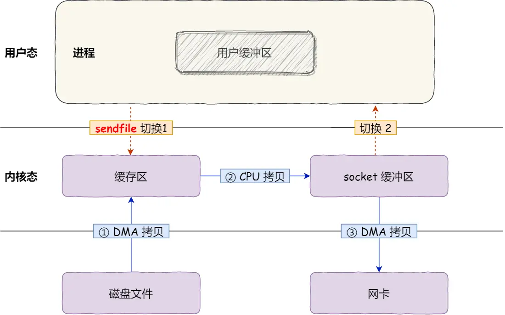

`sendto()` 可以替代前面的 `read()` 和 `write()` 这两个系统调用，这样就可以减少一次系统调用，也就减少了 2 次上下文切换的开销

它可以直接把内核缓冲区里的数据拷贝到 socket 缓冲区里，不再拷贝到用户态。这样就只有 2 次上下文切换，和 3 次数据拷贝

### 完全的零拷贝 SG-DMA


若网卡支持 SG-DMA The Scatter-Gather Direct Memory Access 技术（和普通的 DMA 有所不同），可以进一步减少通过 CPU 把内核缓冲区里的数据拷贝到 socket 缓冲区的过程，一共就只有两次拷贝

* 通过 DMA 将磁盘上的数据拷贝到内核缓冲区里
* 缓冲区描述符和数据长度传到 socket 缓冲区，这样网卡的 SG-DMA 控制器就可以直接将内核缓存中的数据拷贝到网卡的缓冲区里，此过程不需要将数据从操作系统内核缓冲区拷贝到 socket 缓冲区中，这样就减少了一次数据拷贝

这是真正的零拷贝，因为**没有在内存层面去拷贝数据，也就是说全程没有通过 CPU 来搬运数据**，所有的数据都是通过 DMA 来进行传输的。总体来看，**零拷贝技术可以把文件传输的性能提高至少一倍以上**

### 使用零拷贝的项目

* Kafka

  https://kafka.apache.org

  Kafka 是由 Apache 软件基金会开发的一个开源分布式消息队列系统。它的设计目标是为了满足高吞吐量、低延迟的数据传输，以及可扩展性、高可靠性等特点。Kafka 在实时数据处理、日志收集、流式计算等场景中被广泛应用，例如 Apache Storm、Apache Flink 等实时计算框架都支持使用 Kafka 作为数据源

  Kafka 这个开源项目，就利用了「零拷贝」技术，从而大幅提升了 IO 的吞吐率，这也是 Kafka 在处理海量数据为什么这么快的原因之一。看Kafka 文件传输部分的源代码可以发现，最终它调用了 Java NIO 库里的 `transferTo` 方法

  ```java
  @Overridepublic 
  long transferFrom(FileChannel fileChannel, long position, long count) throws IOException { 
      return fileChannel.transferTo(position, count, socketChannel);
  }
  ```

* Nginx

  https://www.nginx.com

  Nginx是一个高性能的、开源的Web服务器和反向代理服务器。Nginx通常被用作Web服务器，负责响应HTTP和HTTPS请求，还可以用作反向代理服务器，将请求转发到其他服务器。Nginx的设计目标是高性能、高可靠性和高并发性能，它采用了事件驱动的架构，可以支持数万并发连接

  Nginx 也支持零拷贝技术，一般默认是开启零拷贝技术，这样有利于提高文件传输的效率

## *用异步IO进行大文件传输*

### PageCache阻碍了大文件的零拷贝

从磁盘拷贝到内核态时的过程就是把数据从磁盘放到内核的PageCache缓冲区里，再做下一步的搬运。PageCache配合预读可以进一步提高缓存的命中率。然而再搬运大数据（GB级别）的时候，大文件会把PageCache直接塞满，而且这部分数据基本没有局部性可言。所以也就是说此时无法利用PageCache内核缓冲区，那也就无法实现零拷贝了

### 异步IO的过程


异步 IO 并没有涉及到 PageCache，所以使用异步 IO 就意味着要绕开 PageCache。绕开 PageCache 的 IO 叫直接 IO，使用 PageCache 的 IO 则叫缓存 IO。通常，对于磁盘，异步 IO 只支持直接 IO

在高并发的场景下，针对大文件的传输的方式，应该使用「异步 IO + 直接 IO」来替代零拷贝技术

总结一下：

* **传输大文件的时候，使用异步 IO + 直接 IO**
* **传输小文件的时候，则使用零拷贝技术**

# UNIX系统IO

## *阻塞IO*

### socket就绪条件

* 读就绪
  * socket内核中，当接收缓冲区中的字节数大于等于低水位标记 `SO_RCVLOWAT` 时，可以无阻塞的读该文件描述符并返回大于0
  * socket TCP通信中，对端关闭连接，此时对该socket读，则返回0
* 写就绪
  * socket内核中，当发送缓冲区中的可用字节数（发送缓冲区的空闲位置大小）大于等于低水位标记`SO_SNDLOWAT` 时，可以无阻塞的写并返回大于0
  * socket的写操作被关闭（close或者shutdown）时对一个写操作被关闭的socket进行写操作，会触发 `SIGPIPE` 信号
* 异常就绪：socket上收到带外数据，TCP的URG标志位相关

### 为什么要使用阻塞IO？

通常情况下非阻塞IO会比阻塞IO更加高效，因为非阻塞IO可以避免在等待IO事件发生时CPU的阻塞，从而提高系统的吞吐量和性能

然而，不是所有的场景都适合使用非阻塞IO。例如，在某些低负载的场景中，使用阻塞IO可能更加简单和易于维护，而且在某些场景中，由于使用阻塞IO可以避免出现竞争条件等问题，因此阻塞IO可能更加安全和可靠

另外，虽然非阻塞IO可以避免CPU的阻塞，但它也需要一定的轮询时间来检查IO事件是否已经发生，这可能会导致额外的CPU开销。因此，在高并发和高负载的场景中，选择合适的IO模型对于系统性能和吞吐量的提升至关重要

综上所述，选择适合特定场景的IO模型是一项复杂的任务，需要综合考虑系统的需求、负载情况、可靠性等因素，以达到最佳的性能和可维护性

## *非阻塞IO*

**文件描述符默认都是阻塞IO**，实现非阻塞IO有两种方式

* 在创建socket或者打开fd的时候设置NONBLOCK标志位
* 当已经打开了文件之后用 fcntl系统调用来改变已打开的文件的属性

### 以非阻塞的方式打开文件

* socket

  ```c
  int s = socket(AF_INET, SOCK_STREAM | SOCK_NONBLOCK, IPPROTO_TCP);
  ```

* open

  ```c
  int fd = open("filename", O_RDWR | O_NONBLOCK);
  ```

### fcntl实现非阻塞IO，以read轮询

关于fcntl的使用，可以查阅 *系统编程..md*

```cpp
bool SetNonBlock(int sock) {
    int flag = fcntl(sock, F_GETFL);
    if (flag == -1) return false;
    int n = fcntl(sock, F_SETFL, flag | O_NONBLOCK); //将sock设置为非阻塞
    if (n == -1) return false;
    return true;
}
```

* 使用 `F_GETFL` 将当前的文件描述符的属性取出来（这是一个位图）
* 然后再使用 `F_SETFL` 将文件描述符设置回去。设置回去的同时，加上一个 `O_NONBLOCK` 参数

非阻塞的时候，总是以read出错的形式返回，告知上层数据没有就绪

```c
sing func_t = std::function<void()>; // 用一个包装器
void show() { cout << "我们正在处理其他的事情" << endl; }
int main() {
    std::vector<func_t> funcs;
    SetNonBlock(0);
    //0号fd
    //string s;
    char buffer[1024];
    while (true) {
        buffer[0]=0;
        //cin >> s;
        int n = scanf("%s", buffer);

        if (n == -1) {
            // 设置错误码为EWOULDBLOCK
            cout << "errno: " << errno << "desc: " << strerror(errno) << endl;
        }
        else { cout << "刚刚获取的内容是" << buffer << "n: " << n << endl; }
        sleep(1);
    }
    return 0;
}
```

## *select*

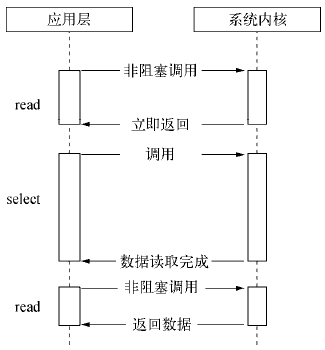

### select 函数

UNIX系统提供 `select` 函数来实现多路复用IO

* `select` 系统调用是用来让我们的程序监视**多个**文件描述符的状态变化的
* 程序会停在 `select` 这里等待，直到被监视的文件描述符有一个或多个发生了状态改变

```cpp
#include <sys/select.h>    
int select(int nfds, fd_set *readfds, fd_set *writefds, fd_set *exceptfds, struct timeval *timeout);
			// Returns number of ready file descriptors, O on timcout, or -1 on error
```

* 参数
  * `nfds`：要监视的最大的文件描述符+1
  
  * `readfds, writefds, exceptfds` 分别对应于需要检测的可读文件描述符的集合**位图**、可写文件描述符的集合位图及异常文件描述符（基本不会用到）的集合位图，**都是输入输出型参数**。输入输出用的是同一张位图表，所以会**覆盖式**地读写
    
    * 输入时：用户告诉OS，要关心哪些fd
    * 输出时：OS告诉用户，哪些fd已经就绪
    
  * 参数 `timeout` 为结构体 `timeval`，用来设置 `select()` 的等待时间
    
    ```c
    struct timeval
    {
        __time_t tv_sec;		/* Seconds.  */
        __suseconds_t tv_usec;	/* Microseconds.  */
    };
    ```
    
    * 阻塞式：`timeout=NULL`：表示 `select` 没有 `timeout`，`select` 将一直被阻塞直到某个文件描述符上发生了事件
    
    * 非阻塞式：`timeout={0, 0};`：轮询检测描述符集合的状态，然后立即返回，不会等待外部事件发生
    
    * 特定的时间值：如果在指定的时间段里没有事件发生，`select` 将超时返回
    
    * 输出型参数：距离下一次timeout剩余多少时间
  
* 返回值
  * 执行成功则返回fd状态已改变的个数
  * 返回 0 表示在任何文件描述符成为就绪态之前 select 调用已经超时。在这种情况下，每个返回的文件描述符集合将被清空
  * 当有错误发生时则返回-1，将错误原因写入 errno，此时参数 `readfds`、`writefds`、`exceptfds` 和 `timeout` 的值变成不可预测

### 对 `fd_set` 的相关操作

`fd_set` 是一个位图，每一个bit对应一个fd是否就绪。文件描述符集合有一个最大容量限制，由常量 FD_SETSIZE 来决定，它的大小一般是1024 bit

```cpp
typedef long int __fd_mask;
typedef struct
{
    __fd_mask fds_bits[__FD_SETSIZE / __NFDBITS];
# define __FDS_BITS(set) ((set)->fds_bits)
} fd_set;
```

不要自己去直接操作 `fd_set`，系统提供了一些接口函数来进行操作

```cpp
#include <sys/select.h>    
void FD_CLR(int fd, fd_set *set);   // 将文件描述符 fd 从 fdset 所指向的集合中移除
void FD_SET(int fd, fd_set *set);   // 置位，将文件描述符 fd 添加到由 fdset 所指向的集合中
void FD_ZERO(fd_set *set);          // 清空缓存，将 fdset 所指向的集合初始化为空

int  FD_ISSET(int fd, fd_set *set); // 文件描述符 fd 是否是 fdset 所指向的集合中的成员
			// Returns true (1) if fd is in fdset, or false (0) otherwise
```

### select 编码模式


核心思路是**让select来做所有的判断和通知工作**，即告诉我们有没有socket来连接，也让socket告诉我们有没有数据到来，若到来了再去读数据。而不是自己去单独开一条线程阻塞式的去尝试read或recv可能到来的数据

* listenSock也是input IO，这里也可以用select一并等，不需要像以前阻塞的阻塞IO多线程单独Listen了
* `select` 之前要重置所有参数，之后要遍历所有的合法fd来检测事件
  * select的第一个参数nfds：随着获取的sock越来越多，添加到select里的sock也越来越多，所以select每一次轮询时nfds都会发生变化，需要对它动态更新
  * select的第2、3、4个参数：rfds/writefds/exceptfds 都是输入输出型参数，输出会直接把传入的输入覆盖掉，所以必须每一次都把合法的fd保存起来要更新位图
* 要维护第三方数组 `int _fd_array[1024]`，来保存过往的所有合法fd，方便 `select` 进行批量处理
* 一旦特定的fd事件就绪，本次读取或者写入不会被阻塞

```c
// 使用
std::unique_ptr<SelectServer> svr(new SelectServer());
svr->Start();
```

```c
#ifndef __SELECT_SVR_H__
#define __SELECT_SVR_H__

#include <sys/select.h>
#include <sys/time.h>

#include <iostream>
#include <string>
#include <vector>

#include "Log.hpp"
#include "Sock.hpp"

#define BITS 8 // fd_set 中一位的长度，即有几个bits
#define NUM (sizeof(fd_set) * BITS)
#define FD_NONE -1

using namespace std;
// select 我们只完成读取，写入和异常不做处理 -- epoll(写完整)
class SelectServer {
 public:
  SelectServer(const uint16_t &port = 8080) : _port(port) {
    _listensock = Sock::Socket();
    Sock::Bind(_listensock, _port);
    Sock::Listen(_listensock);
    for (int i = 0; i < NUM; i++) _fd_array[i] = FD_NONE;
    // 规定 : _fd_array[0] = _listensock;
    _fd_array[0] = _listensock;
  }

  void Start() {
    while (true) {
      // struct timeval timeout = {0, 0};
      // 如何看待listensock?
      // 获取新连接，我们把它依旧看做成为IO，input事件，如果没有连接到来呢？阻塞
      // int sock = Sock::Accept(listensock, ...); // 不能直接调用accept了
      // 将listensock添加到读文件描述符集中
      // FD_SET(_listensock, &rfds);
      // int n = select(_listensock + 1, &rfds, nullptr, nullptr, &timeout);

      // 1. nfds: 随着我们获取的sock越来越多，随着我们添加到select的sock越来越多，注定了nfds每一次都可能要变化,我们需要对它动态计算
      // 2. rfds/writefds/exceptfds：都是输入输出型参数，输入输出不一定以一样的，所以注定了我们每一次都要对rfds进行重新添加
      // 3. timeout: 都是输入输出型参数，每一次都要进行重置，前提是你要的话
      // 1,2 => 注定了我们必须自己将合法的文件描述符需要单独全部保存起来
      // 用来支持：1. 更新最大fd 2.更新位图结构

      fd_set rfds;
      FD_ZERO(&rfds);           // 清空掉上一轮的输出型参数rfds
      int maxfd = _listensock;  // 一开始只有一个_listensock
      for (int i = 0; i < NUM; i++) {
        if (_fd_array[i] == FD_NONE) continue;
        FD_SET(_fd_array[i], &rfds);
        if (maxfd < _fd_array[i]) maxfd = _fd_array[i];
      }
      // rfds未来，一定会有两类sock，listensock，普通sock
      // 我们select中，就绪的fd会越来越多！
      int n = select(maxfd + 1, &rfds, nullptr, nullptr, nullptr);
      switch (n) {
        case 0:
          // 超时
          break;
        case -1:
          // 出错
          break;
        default:
          // 成功的，有新的IO到来
          HandlerEvent(rfds);
          break;
      }
    }
  }

  ~SelectServer() {
    if (_listensock >= 0) close(_listensock);
  }

 private:
  void HandlerEvent(
      const fd_set &rfds)  // fd_set 是一个集合，里面可能会存在多个sock
  {
    for (int i = 0; i < NUM; i++) {
      // 1. 去掉不合法的fd
      if (_fd_array[i] == FD_NONE) continue;
      // 2. 合法的就一定就绪了?不一定
      if (FD_ISSET(_fd_array[i], &rfds)) { // fd就位了才进去
        // 指定的fd，读事件就绪
        // 读事件就绪：连接时间到来，accept，不会阻塞，因为select帮我们等了
        if (_fd_array[i] == _listensock)
          Accepter();  //_listensock就位了，说明来新的连接了
        else
          Recver(i);
      }
    }
  }
  void Accepter() {
    string clientip;
    uint16_t clientport = 0;
    // listensock上面的读事件就绪了，表示可以读取了
    // 获取新连接了
    int sock = Sock::Accept(_listensock, &clientip,
                            &clientport);  // 这里在进行accept会不会阻塞？不会！
    if (sock < 0) return;
    printf("get a new line success : [%s:%d] : %d", clientip.c_str(), clientport, sock);
    // read / recv? 不能！为什么不能？我们不清楚该sock上面数据什么时候到来，
    // recv、read就有可能先被阻塞，IO = 等+数据拷贝 谁可能最清楚呢？select！
    // 得到新连接的时候，此时我们应该考虑的是，将新的sock托管给select，让select帮我们进行检测sock上是否有新的数据
    // 有了数据select，读事件就绪，select就会通知我，我们在进行读取，此时我们就不会被阻塞了
    // 要将sock添加 给 select， 其实我们只要将fd放入到数组中即可！
    int pos = 1;
    for (; pos < NUM; pos++) {
      if (_fd_array[pos] == FD_NONE) break;
    }
    if (pos == NUM) {
      printf("%s:%d", "select server already full，close: %d", sock);
      close(sock);
    } else {
      _fd_array[pos] = sock;
    }
  }
  void Recver(int pos) {
    // 读事件就绪：INPUT事件到来、recv，read
    printf("message in, get IO event: %d", _fd_array[pos]);
    // 暂时先不做封装, 此时select已经帮我们进行了事件检测，fd上的数据一定是就绪的，即本次IO不会被阻塞
    // 这样读取有bug，TCP是面向字节流的，怎么保证以读到了一个完整报文呢？需要用epoll解决
    char buffer[1024];
    int n = recv(_fd_array[pos], buffer, sizeof(buffer) - 1, 0);
    if (n > 0) {
      buffer[n] = 0;
      printf("client[%d]# %s", _fd_array[pos], buffer);
    } else if (n == 0) {
      printf("client[%d] quit, me too...", _fd_array[pos]);
      // 1. 我们也要关闭不需要的fd
      close(_fd_array[pos]);
      // 2. 不要让select帮我关心当前的fd了
      _fd_array[pos] = FD_NONE;
    } else {
      printf("%d sock recv error, %d : %s", _fd_array[pos], errno, strerror(errno));
      // 1. 我们也要关闭不需要的fd
      close(_fd_array[pos]);
      // 2. 不要让select帮我关心当前的fd了
      _fd_array[pos] = FD_NONE;
    }
  }

 private:
  uint16_t _port;
  int _listensock;
  int _fd_array[NUM];
  // int _fd_write[NUM];
  // std::vector<int> arr;
};
```

### Pros and Cons

* Pros
  * 和多进程、多线程相比，占用资源少并且高效，因此单位时间内等的fd多了
  * 适用于有大量连接，但是只有少量是活跃的，节省资源

* Cons
  * 每一次都要进行大量的重置工作，效率比较低
  * 每一次能够检测的fd数量是有**上限**的
  * 因为每一个参数都是输入输出型的，每一次都需要内核到用户，用户到内核传递位图参数，有大量的数据拷贝
  * `select` 编码不方便，需要用户自己维护数组
  * `select` 底层需要***O(N)***同步遍历的方式，检测所有需要检测的fd，最大 `maxfd+1`

## *poll*

poll对select的改进是分离了输入输出参数，并且采用链表链接取消了能检测fd的上限

### 声明

```c
#include <poll.h>
int poll(struct pollfd *fds, nfds_t nfds, int timeout);
			// Returs number of ready file descriptors, 0on timeout, or -l on error

struct pollfd {
   int   fd;         /* file descriptor */
   short events;     /* requested events bit mask */
   short revents;    /* returned events bit mask */
};
```

* 参数

  * fds 是一个poll函数监听的结构体，里面是fd、监听的事件集合、返回的事件集合

    poll针对select的缺点做了改进，分离了输入输出型参数。其中events是给用户设定的输入位图，用户告诉OS要关心哪些事件；而revents是给OS来设定的输出位图，OS告诉用户哪些事件已经就绪了

    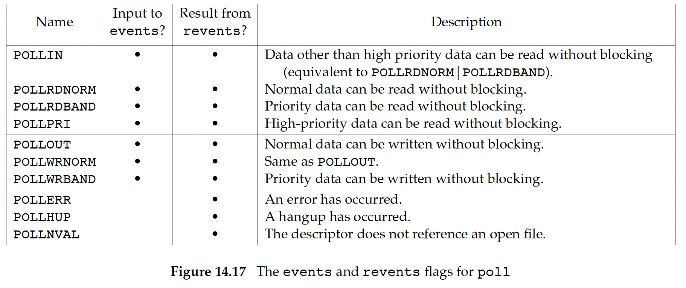

  * nfds表示fds数组的长度

  * timeout表示poll函数的超时事件，单位是毫秒 ms

    * `timeout == −1`：poll 会一直阻塞直到 fds 数组中列出的文件描述符有一个达到就绪态（定义在对应的 events 字段中）或者捕获到一个信号
    * `timeout == 0`：poll 不会阻塞，只是执行一次检查看看哪个文件描述符处于就绪态
    * `timeout > 0`：poll至多阻塞 timeout 毫秒，直到 fds 列出的文件描述符中有一个达到就绪态，或者到捕获到一个信号为止

* 返回值

  * `<0` 出错
  * `=0` poll函数等待超时
  * `>0` poll由于监听的fd就绪而返回，返回值表示数组 fds 中拥有非零 revents 字段的 pollfd 结构体数量
  * 注意poll和select `>0` 的返回值的区别：若一个文件描述符在返回的描述符集合中出现了不止一次，**select 会将同一个文件描述符计数多次**。而系统调用 poll 返回的是就绪态的文件描述符个数，**且一个文件描述符只会统计一次**，就算在相应的 revents 字段中设定了多个位掩码也是如此

### Pros and Cons

* Pros
  * 和select一样效率高，有大量连接，若只有少量的是活跃的可以节省资源
  * 输入输出资源分离，不需要进行大量的重置
  * poll参数级别，没有管理的fd上限

* Cons
  * poll依旧需要不少的遍历。在用户检测时间就绪，与内核检测fd就绪都需要便利。就这需要用户还是要维护第三户数组存储fd
  * poll还是需要内核到用户的拷贝

## *信号驱动IO*

# epoll

## *epoll接口*

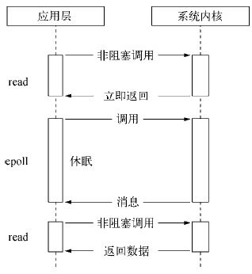

### intro

epoll是Linux特有的系统调用，而且是Linux下效率最高的IO，它是一种事件驱动 event-driven 的IO机制

epoll是为处理大批量句柄而做了改进的poll，它是在Linux Kernel 2.5.44中被引进

epoll多路复用的**流程**是

1. `epoll_create` 创建epoll实例 epoll instance来组织管理所有的数据结构 
2. `epoll_ctl` 告诉epoll实例要关心哪些fd的哪些行为（读、写、错误 ...）
3. `epoll_wait` 让epoll开始等，有就绪的就报告

### epoll_create：创建 epoll 结构体对象

```c
#include <sys/epoll.h>
int epoll_create(int size);
int epoll_create1(int flags);
			// Returns file descriptor on success, or -1 on error
```

返回代表一个epoll实例的文件描述符。注意参数 `int size` 是被废弃的，可以随便写

返回的文件描述符不是用来做 IO 操作的，而是epoll内核数据结构的句柄

从 2.6.27 版内核以来，Linux 支持了一个新的系统调用 epoll_create1。该系统调用执行的任务同 epoll_create 是一样的，只是将无用的参数 size 换成了可用来修改系统调用行为的 flags 参数。目前只支持一个 flag 标志：EPOLL_CLOEXEC，它使得内核在新的文件描述符上启动了执行即关闭（close-on-exec）标志 FD_CLOEXEC。相当于在open的时候指定 O_CLOEXEC

### epoll_crl：修改 epoll 的兴趣列表

```c
#include <sys/epoll.h>
int epoll_ctl(int epfd, int op, int fd, struct epoll_event *event);
			// Returns O on success, or -1 on error
```

* 参数：它不同于 `select()` 是在监听事件时告诉内核要监听什么类型的事件，而是在这里先注册要监听的事件类型

  * epfd是 `epoll_create()` 的返回值（epoll的句柄），即代表一个epoll实例的fd

  * op表示增删改动作，用三个宏来表示

    * EPOLL_CTL_ADD ：注册新的fd到epfd实例中去
    * EPOLL_CTL_MOD ：修改已经注册的fd的监听事件，需要用到由 ev 所指向的结构体中的信息
    * EPOLL_CTL_DEL ：从epfd中删除一个fd

  * fd是需要监听的fd，可以是除了文件或目录之外的任何fd（否则返回EPERM错误）

  * event结构体指针是告诉内核需要监听什么，其中events是关心事件的集合。注意：`struct epoll_event` 和 `struct eventpoll` 没什么关系

    ```c
    typedef union epoll_data {
       void        *ptr;         /* Pointer to user-defined data */
       int          fd; 
       uint32_t     u32;
       uint64_t     u64;
    } epoll_data_t;
    
    // 红黑树的一个node
    struct epoll_event {
       uint32_t     events;      /* Epoll events 宏表示是什么动作 */
       epoll_data_t data;        /* User data variable */
    };
    ```
    
    * `uint32_t events` 宏可以是下面的取值
      
      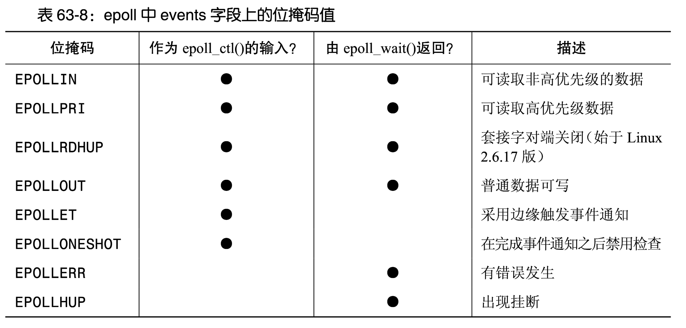
      
      * EPOLLONESHOT的意思是只激活事件一次
      * EPOLLET：采用边缘触发
      
    * `data` 用来保存用户自定义数据
  
* 返回值

### epoll_wait：等待被监听的文件状态发生改变

```c
#include <sys/epoll.h>
int epoll_wait(int epfd, struct epoll_event *events, int maxevents, int timeout);
			// Returns number of ready file descriptors, 0 on timeout, or -1 on error
```

收集在epoll监控的事件中已经就绪的事件

* 参数
  * events（是那个 `struct epoll_event` 类型的，不是struct里面的 `uint32_t events`，别搞混了）输出型参数是分配好的epoll_event结构体数组，epoll将会把发生的事件赋值到events数组中
  * maxevents告知内核这个events有多大，这个maxevents的值不能大于创建 `epoll_create()` 时的size
  * timeout是毫秒级的超时事件，0会立即返回非阻塞，-1是永久阻塞https://www.infoq.cn/article/kkylzqazdomqdkwxgxgv#
* 返回已经就绪的文件描述符的个数，若返回0表示已超时，小于0表示出错

## *epoll的工作原理*

<https://www.jxhs.me/2021/04/08/linux内核Epoll-实现原理/>

### epoll_create的时候发生了什么？

1. 查看源码可以得到调用链：，return一个映射到某个fd上的eventpoll句柄对象

   ```
   // glibc封装
   epoll_create()->epoll_create1()->INLINE_SYSCALL()
   // 进入系统调用
   sys_epoll_create()->do_epoll_create()->ep_alloc() & anon_inode_getfd()
   ```

   `do_epoll_create()` 主要做两件事情：

   1. 调用 `ep_alloc()` 函数创建并初始化一个 `eventpoll` 对象
   2. 调用 `anon_inode_getfd()` 函数把 `eventpoll` 对象映射到一个fd，并返回这个fd

2. 内核中的 eventpoll 对象用于管理 `epoll` 监听的文件列表（`epitem` 对象列表），它里面有很多的数据结构。被监听的文件是通过 `epitem` 对象来管理的，上图中的节点都是以 `epitem` 对象的形式存在的

   ```c
   /*
    * This structure is stored inside the "private_data" member of the file
    * structure and represents the main data structure for the eventpoll
    * interface.
    */
   struct eventpoll {
   	/*
   	 * This mutex is used to ensure that files are not removed
   	 * while epoll is using them. This is held during the event
   	 * collection loop, the file cleanup path, the epoll file exit
   	 * code and the ctl operations.
   	 */
   	struct mutex mtx;
   	/* Wait queue used by sys_epoll_wait() */
   	wait_queue_head_t wq; //等待队列，当调用 epoll_wait(fd) 时会把进程添加到 eventpoll 对象的 wq 等待队列中
   	/* Wait queue used by file->poll() */
   	wait_queue_head_t poll_wait;
   	/* List of ready file descriptors */
   	struct list_head rdllist; //保存已经就绪的文件列表
   	/* Lock which protects rdllist and ovflist */
   	rwlock_t lock;
   	/* RB tree root used to store monitored fd structs */
   	struct rb_root_cached rbr; //使用红黑树来管理所有被监听的文件
   	/*
   	 * This is a single linked list that chains all the "struct epitem" that
   	 * happened while transferring ready events to userspace w/out
   	 * holding ->lock.
   	 */
   	struct epitem *ovflist;
   	/* wakeup_source used when ep_scan_ready_list is running */
   	struct wakeup_source *ws;
   	/* The user that created the eventpoll descriptor */
   	struct user_struct *user;
   	struct file *file;
   	/* used to optimize loop detection check */
   	u64 gen;
   	struct hlist_head refs;
   	/*
   	 * usage count, used together with epitem->dying to
   	 * orchestrate the disposal of this struct
   	 */
   	refcount_t refcount;
   #ifdef CONFIG_NET_RX_BUSY_POLL
   	/* used to track busy poll napi_id */
   	unsigned int napi_id;
   #endif
   #ifdef CONFIG_DEBUG_LOCK_ALLOC
   	/* tracks wakeup nests for lockdep validation */
   	u8 nests;
   #endif
   };
   ```

   ```c
   /*
    * Each file descriptor added to the eventpoll interface will
    * have an entry of this type linked to the "rbr" RB tree.
    * Avoid increasing the size of this struct, there can be many thousands
    * of these on a server and we do not want this to take another cache line.
    */
   struct epitem {
   	union {
   		/* RB tree node links this structure to the eventpoll RB tree */
   		struct rb_node rbn;
   		/* Used to free the struct epitem */
   		struct rcu_head rcu;
   	};
   	/* List header used to link this structure to the eventpoll ready list */
   	struct list_head rdllink; //双向链表节点
   	/*
   	 * Works together "struct eventpoll"->ovflist in keeping the
   	 * single linked chain of items.
   	 */
   	struct epitem *next;
   	/* The file descriptor information this item refers to */
   	struct epoll_filefd ffd; //事件句柄信息
   	/*
   	 * Protected by file->f_lock, true for to-be-released epitem already
   	 * removed from the "struct file" items list; together with
   	 * eventpoll->refcount orchestrates "struct eventpoll" disposal
   	 */
   	bool dying;
   	/* List containing poll wait queues */
   	struct eppoll_entry *pwqlist;
   	/* The "container" of this item */
   	struct eventpoll *ep; //指向其所属的eventpoll对象
   	/* List header used to link this item to the "struct file" items list */
   	struct hlist_node fllink;
   	/* wakeup_source used when EPOLLWAKEUP is set */
   	struct wakeup_source __rcu *ws;
   	/* The structure that describe the interested events and the source fd */
   	struct epoll_event event; //期待发生的事件类型
   };
   ```

3. epoll_ctl就是对这棵红黑树的增删改查。通过红黑树能够通过文件句柄快速查找其对应的 `epitem` 对象

4. 构建底层回调机制 callback

5. 建立就绪队列，epoll_wait的功能就是去就绪队列里拿取就绪的事件节点


### 事件驱动

1. `epoll_ctl` 将需要监听的fd（通常是套接字）注册到 `epoll` 的事件表中

2. 等待事件：在调用 `epoll_wait` 函数时，`epoll` 将会等待fd的状态发生变化

3. 状态变化时触发事件通知：当注册的文件描述符状态发生变化（例如有新数据可读、连接建立等，硬件比如说网卡会发生硬件中断，调用epoll相关的内核程序来处理），内核会更新事件表，然后向 `eventfd` 写入数据

   内核为epoll维护了一条双链表用于快速遍历所有发生状态变化的fd，其中包含了所有发生状态变化的fd

   1. 当fd状态发生变化时（例如有新数据可读、连接建立等），内核更新红黑树中相应节点的状态
   2. 同时，将这个fd添加到双链表中，表示它发生了状态变化

4. `epoll_wait` 返回：`epoll_wait` 函数检测到 `eventfd` 上的写入，会返回并通知用户空间发生了事件

5. 用户空间处理事件：用户空间程序在收到 `epoll_wait` 返回后，可以通过读取 `eventfd` 来获取事件的发生次数，然后处理相应事件

### epoll解决select和poll的两个缺陷

1. 在select和poll里都需要自己来维护第三方数组，从而告诉OS要关心哪一些fd，并且这个第三方数组每次调用都需要在用户层和内核之间不断复制进入和复制出来。而epoll则是在内核维护了红黑树来记录用户要关心哪些fd，当内核构建数据结构完成后就不再需要大量的在用户层和内核层之间移动数据了

   红黑树节点的key值是要关心的fd，用户只需要设置关系获取相应的结果就可以，不用再关心任何对fd与event的管理细节

2. select和poll需要不断***O(N)***遍历，实际上主线程（实际上只有一个进程）是在不断的循环

   而epoll维护了就绪队列解决了OS告诉用户哪些事件就绪了，上层只需要检测就绪队列就可以，因此是FIFO的队列，所以只需要***O(1)***检测队头就行了。没有IO就绪的时候epoll主线程休眠就可以了

   数据IO的原理：硬件会引起CPU某个引脚上的中断，然后通过对中断向量表关于该引脚的索引得到对应的执行函数（这些方法都是由驱动程序提供的），然后执行响应的动作。以数据到来要读为例，就是执行读取的动作

### callback的功能

1. 根据红黑树上节点要关心的事件，结合已经发生的事件来判断。比如说要关心EPOLLIN，然后有数据进来了，就说明就绪了
2. 自动根据fd和已经发生的事件，构建就绪节点
3. 自动将构建好的节点，插入到就绪队列中

生产者消费者模型：底层只要有fd就绪了OS会自动构建节点加入到就绪队列中，上层只需要不断的从就绪队列中将数据拿走，就完成了获取就绪事件中的任务。就绪队列是一个共享资源，epoll已经保证所有的epoll接口都是线程安全的

若底层没有就绪事件需要阻塞或轮询，所以要设置timeout，可以设置阻塞模式也可以设置非阻塞模式

## *epoll的工作模式*

### LT和ET

**LT是select、poll和epoll的默认工作方式**。不过只有epoll可以切换LT和ET

* Level Triger, LT 水平触发：有数据就会一直通知
  * 当epoll检测到socket上事件就绪的时候，可以不立刻进行处理，或者只处理一部分。直到缓冲区上所有的数据都被处理完，`epoll_wait` 才不会立刻返回
  * 比如说10KB的缓冲区，读了1KB，那么再一次 `epoll_wait` 的时候仍然会立即返回 `struct epoll_event events` 显示读就绪 `EPOLLIN`
  * 支持阻塞读写和非阻塞读写
* Edge Triger, ET 边缘触发：只会通知一次，或者说当从无到有或从有到无的时候才会通知。非常高效，比如高性能的Nginx默认采用ET模式使用epoll
  * 当epoll检测到socket上事件就绪时，必须立刻处理。也就是说在ET模式，文件描述符上的事件就绪后只有一次处理机会
  * 用户必须循环的去读缓冲区，一次性把数据全部取走，直到读到read返回 `EAGAIN` 或者 `EWOULDBLOCK`。否则等下回来新数据了老数据就没了
  * **ET一定要配合非阻塞IO**，如果是阻塞的read，那么读走一部分之后，因为ET不会返回读就绪，所以read不会去读了

### 高效ET

ET的性能比LT性能更高的原因

*  `epoll_wait` 返回的次数少了很多，代价就是用户必须一次把所有数据都读走，否则数据就丢失了
* ET模式会倒逼用户尽快将接收缓冲区中的数据全部取走，即应用层要尽快取走缓冲区中的数据。因此在单位时间下接收方有一个更大的接受窗口和滑动窗口，一次可以收到更多的数据，提高IO吞吐

### ET模式和非阻塞fd

使用 ET 模式的 epoll，需要将文件描述设置为非阻塞。这并非接口上的要求，而是工程实践上的要求

如何保证本轮数据全部读完？LT和ET都需要循环读取。对于LT，若sock fd是阻塞模式，因为有epll_wait的多次返回所以可以随机读取多次，如果缓冲区里没数据了，epoll_wait就会把程序挂起，等下一波数据来

但是对于ET模式的循环读取，必须要自己去检测是否读到  `EWOULDBLOCK` 或 `EAGIAN`。因为即使还有要读取的数据因为epoll_wait不会再返回所以被阻塞住没机会去读了，所以在最后一次正常读取完毕后，肯定还要进行下一次读取，否则无法确认是否读取完毕了。若文件fd设置为阻塞模式，在没有epoll_wait的返回时，在一次读取之后就不能重复的读取了。为了解决这个问题，ET模式工作时sock fd必须通过 [fcntl 系统调用](#fcntl系统调用) 被设置为非阻塞，从而主动的去读

### ET的饥饿问题

ET模式存在fd的饥饿问题，即当我们开始对一个采用ET的已就绪fd进行非阻塞IO后，在我们对其他的就绪fd执行 IO 操作前会有很长的一段处理时间

一种解决方案是让应用程序维护一个列表，列表中存放着已经被通知为就绪态的文件描述符。此时我们在读某一个就绪fd的时候就不会一次性读到 `EWOULDBLOCK` 或 `EAGIAN`，而是在这个列表中的fd之间采取round-robin的方式，每次读一点

当一个fd读到 `EWOULDBLOCK` 或 `EAGIAN` 了，就把这个fd移出我们自定义的fd。所以虽然ET很高效，但是代码也更复杂了

### 独立的缓冲区

**为了保证完整的读取，每一个socket都要有自己的输入、输出缓冲区**。多个socket共用同一个缓冲区可能导致数据混淆的情况

假设有两个socket，分别为sock1和sock2，它们共用同一个缓冲区buf。现在，socket1上有数据"hello"，socket2上有数据"world"，程序要从这两个socket上分别读取数据。代码如下

```cpp
char buf[1024]; // 共用缓冲区

// 从socket1上读取数据
int n = recv(sock1, buf, 1024, 0);
if (n > 0) {
    printf("socket1: %s\n", buf); // 输出hello
}

// 从socket2上读取数据
n = recv(sock2, buf, 1024, 0);
if (n > 0) {
    printf("socket2: %s\n", buf); // 输出world
}
```

在上面的代码中，程序从socket1和socket2上分别读取数据，并将数据放入同一个缓冲区buf中。然后，程序使用printf函数输出缓冲区中的数据

然而，这段代码存在一个问题：当程序从socket1上读取数据时，它将 `"hello"` 放入了缓冲区buf中，但是并没有清空缓冲区。然后，程序从socket2上读取数据时，它将 `"world"` 放入了缓冲区buf中，并使用printf函数输出缓冲区中的数据。由于缓冲区没有被清空，程序会输出 `"helloworld"` 或者 `"hellorld" 等情况`，即将两个socket上的数据混淆在一起

这是因为多个socket共用同一个缓冲区时，程序需要正确地标记不同socket上的数据，否则就会导致数据混淆或丢失的情况。在上面的例子中，程序没有正确地标记不同socket上的数据，导致数据混淆。为了避免这种情况发生，程序应该为每个socket分配独立的缓冲区，并使用合适的同步机制来保证数据的正确性

## *epoll服务器*

独立缓冲区：每一个socket fd用一个Connection类来封装

关心写事件就绪 `EPOLLOUT` 都是按需设置的。因为写事件是根据对方的接受缓冲区来设置的。那很有可能写事件一直都是就绪的，所以这部分比较难搞，只有在真的需要写的时候才会设置

### 放宽系统连接限制

将下面的指令写入 `.bashrc` 中

```cmd
$ ulimit -n <NUM>
```


### 超时处理机制

## *惊群效应*

https://www.infoq.cn/article/kkylzqazdomqdkwxgxgv#

### intro

惊群效应 Thundering Herd 是指多进程/线程在同时阻塞等待同一个事件的时候（此时进程/线程处于休眠状态），如果等待的这个事件发生，那么他就会唤醒等待的所有进程/线程，但最终却只能有一个进程/线程来处理这个事件，而其他进程/线程抢夺失败，只能重新进入休眠状态，这种现象和性能浪费就叫做惊群效应

### 解决方案

# Reactor & Proactor模式

## *Reactor模式*

### intro

用原生的epoll系列的系统调用直接来编写服务器是面向过程的，效率不高。**Reactor设计模式是对IO多路复用做了一层封装**，这样使用者就不用考虑底层网络的API细节，只要关注应用代码的实现就可以了

Reactor模式也称为Dispatcher模式，它由两个主要部件构成

* Reactor 负责监听和分发事件，事件类型包含连接事件、读写事件。Reactor的意思就是来东西会响应
* 处理资源池负责处理具体的业务，比如 read -> 业务逻辑 -> send

### 分类与实际应用

Reactor 模式是灵活多变的，可以应对不同的业务场景

* Reactor 的数量可以只有一个，也可以有多个
* 处理资源池可以是单个进程/线程，也可以是多个进程/线程

为什么要写成“进程/线程”？这是由具体的语言而定的。Java一般会使用线程，因为main在JVM中是所有程序的一个线程；而C既可以用进程也可以用线程

通过对Reactor和业务处理部分的不同组合，可以得到下面4种组合

* 单Reactor 单进程/线程
* 单Reactor 多线程
* ~~多Reactor 单进程/线程~~：和单Reactor 单进程/线程相比，既复杂也没有性能优势，实际中没有应用
* 多Reactor 多进程/线程

## *单Reactor 单进程/线程*

### 架构

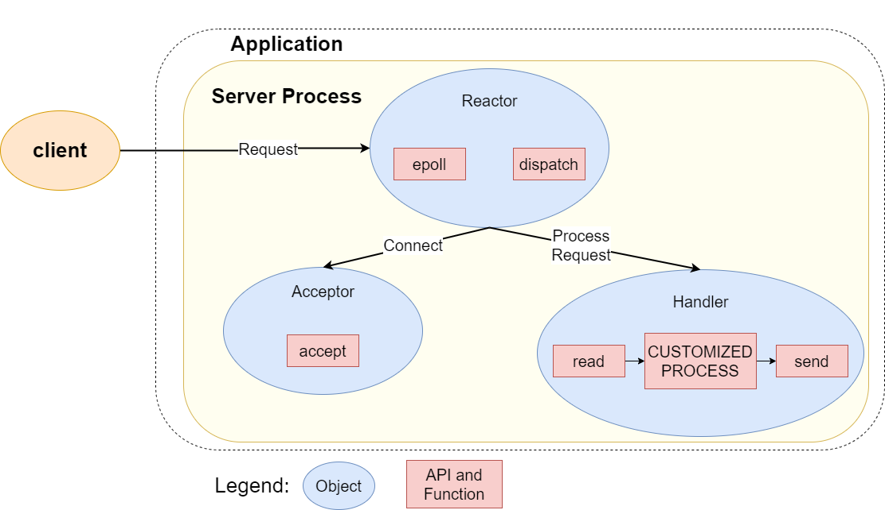

Server 中有3个对象

* Reactor 对象的作用是监听和分发事件
* Acceptor 对象的作用是获取新的连接
* Handler 对象的作用是处理具体的业务

Reactor按如下步骤运行

1. Reactor 对象通过 epoll（或者Java NIO 的 selector）监听事件，收到事件后通过 dispatch 分发，具体分发给 Acceptor 对象还是 Handler 对象取决于是哪种类型的事件
   * 若是连接建立的事件，则交由 Acceptor 对象进行处理，Acceptor 对象会通过 accept 方法 获取连接，并创建一个 Handler 对象来处理后续的响应事件
   * 如果不是连接建立事件， 则交由当前连接对应的 Handler 对象来进行响应
2. Handler 对象通过 read -> 业务处理 -> send 的流程来完成完整的业务流程

### 应用场景

单 Reactor 单进程的方案因为全部工作都在同一个进程内完成，所以实现起来比较简单，不需要考虑进程间通信，也不用担心多进程竞争

但这种方案存在 2 个缺点

* 因为只有一个进程，**无法充分利用 多核 CPU 的性能**；
* Handler 对象在业务处理时，整个进程是阻塞的，即无法处理其他连接的事件的，**如果业务处理耗时比较长，那么就造成响应的延迟**

因此单 Reactor 单进程的方案**不适用计算机密集型的场景，只适用于业务处理非常快速的场景**

Redis 是由 C 语言实现的，在 Redis 6.0 版本之前采用的正是单 Reactor 单进程的方案，因为 Redis 业务处理主要是在内存中完成，操作的速度很快，性能瓶颈不在 CPU 上，所以 Redis 对于命令的处理是单进程的方案

## *单Reactor 多线程*

### 架构

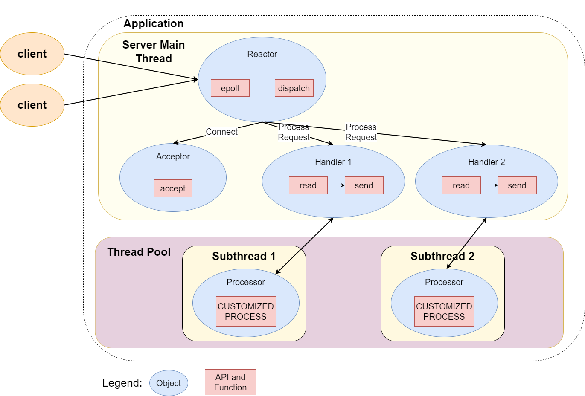

* Handler 对象不再负责业务处理，而是只负责数据的接收和发送。Handler  read到数据后，把数据发给子线程里的 Processor 对象处理具体的业务
* Processor处理完后，会把结果发给主线程中的 Handler，接着由 Handler send 响应结果给 client

收发数据都是在主线程里，所以此时会有线程竞争的问题，通过加锁解决

由于只有一个 Reactor 对象承担所有事件的监听和响应，而且只在主线程中运行，在面对瞬间高并发的场景时，Reactor容易成为性能瓶颈

### 应用

* Apache Tomcat：Tomcat 是一个常用的 Java Servlet 容器，用于托管和运行 Java Web 应用程序。Tomcat 使用单 Reactor 多线程模式处理并发的 HTTP 请求，以实现高性能的 Web 服务
* Redis 6.0之后的版本

## *多Reactor 多进程/线程*

### 架构

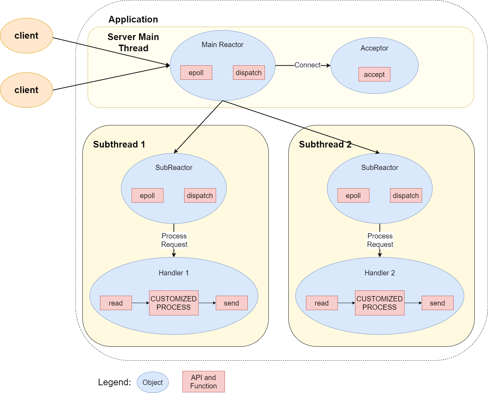

* 主线程中的 MainReactor 对象通过 epoll 监控请求建立连接的事件，收到事件后通过 Acceptor 对象中的 accept 获取连接，将新的连接分配给某个子线程
* 子线程中的 SubReactor 对象将 MainReactor 对象分配的连接加入自己的epoll后继续监听，并创建一个 Handler 用于处理连接的响应事件
* 如果有新的事件发生时，SubReactor 对象会调用当前连接对应的 Handler 对象来进行响应
* Handler 对象通过 read -> 业务处理 -> send 的流程来完成完整的业务流程

实际上多Reactor多线程的方案相比于前两种方案实现了更高程序的解耦

* 主线程和子线程分工明确，**主线程只负责接收新连接**，子线程负责完成后续的业务处理
* 主线程和子线程的交互很简单，**主线程只需要把新连接传给子线程，子线程无须返回数据**，直接就可以在子线程将处理结果发送给客户端

### 应用场景

* 多Reactor多线程：开源软件 Netty 和 Memcache 
* 多Reactor多进程：Nginx

## *Proactor模式*


**Proactor 是异步网络模式， 感知的是已完成的读写事件**。在发起异步读写请求时，需要传入数据缓冲区的地址（用来存放结果数据）等信息，这样系统内核才可以自动帮我们把数据的读写工作完成，这里的读写工作全程由操作系统来做，并不需要像 Reactor 那样还需要应用进程主动发起 read/write 来读写数据，操作系统完成读写工作后，就会通知应用进程直接处理数据

1. Proactor Initiator 负责创建 Proactor 和 Handler 对象，并将 Proactor 和 Handler 都通过 Asynchronous Operation Processor 注册到内核
2. Asynchronous Operation Processor 负责处理注册请求，并处理 IO 操作
3. Asynchronous Operation Processor 完成 IO 操作后通知 Proactor
4. Proactor 根据不同的事件类型回调不同的 Handler 进行业务处理
5. Handler 完成业务处理

Linux 下并不支持真正的异步 IO， `aio` 系列函数是由 POSIX 定义的异步操作接口，不是真正的操作系统级别支持的，而是在用户空间模拟出来的异步，并且仅仅支持基于本地文件的 aio 异步操作，网络编程中的 socket 是不支持的，这也使得基于 Linux 的高性能网络程序都是使用 Reactor 方案

而 Windows 则实现了一套完整的支持 socket 的异步编程接口，这套接口就是 `IOCP`，是由操作系统级别实现的异步 IO，它是真正意义上的异步 IO。因此在 Windows 里实现高性能网络程序可以使用效率更高的 Proactor 方案

# 负载均衡

# Libevent

## *intro*

### 功能

Libevent是用于编写高速可移植非阻塞 IO 应用的事件通知库 Event Notification Library

Libevent为系统提供一个软件层，它提供了检查文件描述符 IO 事件的抽象。能够让可移植的程序在提供有 epoll 机制的系统上应用 epoll（或类似的 API，如kqueue等） , 而在其他系统上继续使用 select 和 poll

### C10K问题

LAMP 是一个缩写，它指一组通常一起使用来运行动态网站或者服务器的自由软件

* Linux - 操作系统
* Apache - 网页服务器
* MySQL - 数据库管理系统（或者数据库服务器）
* PHP Perl 或 Python - 脚本语言

C10K问题是指采用LAMP，并发能力突破不了1万连接的。C10K问题的源头在于LMAP架构使用**每线程来处理每请求**，系统中维持大量的活跃线程的消耗是无法想象的

Squid和Nginx都采用了Reactor基于事件触发的模型，一个线程就可以处理10K的连接

Nginx曾经使用Libevent作为其事件处理的一部分。在Nginx的早期版本中，它使用了一种称为"ngx_event"的事件驱动模块，这个模块使用了Libevent库。后来，Nginx逐渐演变，引入了自己的事件模型，不再直接依赖于Libevent

## *组成*

### 核心组件

* evutil用于抽象不同平台网络实现差异的通用功能
* event 和 event_base：libevent 的核心，为各种平台特定的、基于事件的非阻塞 IO 后端提供抽象 API，让程序可以知道socket何时已经准备好、可以读或者写，并且处理基本的超时功能，检测 OS 信号
* bufferevent：为 libevent 基于事件的核心提供使用更方便的封装。除了通知程序socket已经准备好读写之外，还让程序可以请求缓冲的读写操作，可以知道何时 IO 已经真正发生。（bufferevent 接口有多个后端，可以采用系统能够提供的更快的非阻塞 IO 方式，如 Windows 中的 IOCP）
* evbuffer：在 bufferevent 层之下实现了缓冲功能 ，并且提供了方便有效的访问函数
* evhttp：一个简单的 HTTP 客户端/服务器实现
* evdns：一个简单的 DNS 客户端/服务器实现
* evrpc：一个简单的 RPC 实现

### 库

创建 libevent 时会默认安装下列库

* libevent_core：所有核心的事件和缓冲功能，包含了所有的 event_base、evbuffer、bufferevent 和工具函数
* libevent_extra：定义了程序可能需要，也可能不需要的协议特定功能，包括 HTTP、DNS 和 RPC
* libevent：这个库因为历史原因而存在，它包含 libevent_core 和 libevent_extra 的内容。**不应该使用这个库**，未来版本的 libevent 可能去掉这个库

某些平台上可能安装下列库:

* libevent_pthreads：添加基于 pthread 可移植线程库的线程和锁定实现。它独立于libevent_core，这样程序使用 libevent 时就不需要链接到 pthread，除非是以多线程方式使用 libevent
* libevent_openssl：这个库为使用 bufferevent 和 OpenSSL 进行加密的通信提供支持。它独立于 libevent_core，这样程序使用 libevent 时就不需要链接到 OpenSSL，除非是进行加密通信

### 头文件

### 安装

http://libevent.org/

注意：以 root 用户身份操作

1. 下载源码包，最新的稳定版2.1.12

   ```cmd
   $ wget https://github.com/libevent/libevent/releases/download/release-2.1.12-stable/libevent-2.1.12-stable.tar.gz
   ```

2. 解压

   ```cmd
   $ tar zxvf libevent-2.1.12-stable.tar.gz
   ```

3. 配置安装路径

   ```cmd
   $ cd libevent-2.1.12-stable
   $ ./configure --disable-openssl
   ```

   `--disable-openssl` 不安装 libevent_openssl 库

4. 编译并安装

   ```cmd
   $ make
   $ make install
   ```

5. 测试 libevent 是否安装成功

   ```cmd
   $ ls -la /usr/local/include | grep event
   ```

6. 如果编译后的程序提示找不到 libvent 的 so，则创建库的链接和缓存文件

### 总体框架

1. 创建 socket
2. 创建事件集 event_base
3. 创建 `event(socket, EV_READ, callback1)` / `event(socket, EV_WRITE, callback2)`
4. 把 event 添加到事件集 event_base
5. `event_base_dispatch(evnet_base);`， `event_base_loop();`

## *创建event_base*

```c
 struct event_base* event_base_new(void);
```


```c
struct event_config* event_config_new(void);
struct event_base* event_base_new_with_config(const struct event_config *cfg)
void event_config_free(struct event_config *cfg)
```

```c
int event_config_require_features(struct event_config *cfg, int feature)
```


# C++线程基础

## *线程的基本控制*

### C++线程库和C Posix的区别

Linux使用的是Posix标准的pthread线程库，而Win则采用Windows API定义的线程库。C++对此进行了进一步封装，用户可以在Linux和Win上使用同一套C++语言级别的线程库

Posix是面向过程的，然后直接通过pid来操纵线程。C++的线程库是面向过程的，通过对象指针来操纵对象

### thread库

构造函数：不允许拷贝构造，但可以移动构造

```cpp
thread() noexcept; // default
template <class Fn, class... Args>explicit thread (Fn&& fn, Args&&... args); 
thread (const thread&) = delete; // 禁止拷贝
thread (thread&& x) noexcept; // 移动构造
```

第一种default，构造一个线程对象，没有关联任何线程函数，即没有启动任何线程

第二种构造一个线程对象，并关联线程函数  `fn`，` args1, args2, ...` 为线程函数的参数。fn这个handler 函数调用可以是函数指针、函数对象、lambda表达式

```c
#include <pthread.h>
int pthread_create(pthread_t *thread, const pthread_attr_t *attr,
                   void *(*start_routine) (void *), void *arg);
```

回顾一下posix linux下的pthread库中创建对象的 `pthread_create`，其中 `void *start_routine` 这个handler就是fn

比较重要的API有：

* `get_id()`：返回线程的唯一标识符
* `join()`：用于等待线程的结束。调用该函数将阻塞当前线程，直到目标线程执行完成。类似于进程的wait
* `joinable()`
* `detach()`：用于分离线程，使得目标线程的执行可以独立于创建线程的线程继续进行。分离后的线程将在执行完成后自动释放资源

### thread库的命名空间

```cpp
namespace std {
    namespace this_thread {
        // ...
    }
    class thread {
        // ...
    };
    // ...
}
```

在C++的`thread`库中，有一个重要的命名空间：`std::this_thread`，它是std命名空间下的子空间

`std::this_thread`命名空间：`std::this_thread`命名空间包含了与当前线程相关的函数。这些函数可以用于获取当前线程的标识符、休眠当前线程、查询系统支持的并发线程数等

* `get_id()`

  返回值类型为id类型，id类型实际为 `std::thread` 命名空间下封装的一个类，该类中包含了一个结构体

  ```c
  typedef struct
  { /* thread identifier for Win32 */
      void *_Hnd; /* Win32 HANDLE */
      unsigned int _Id;
  } _Thrd_imp_t;
  ```

* `yield` 是让当前线程让出自己的时间片给其他线程，避免在确定条件未准备好的情况长期轮询占据时间片

* `slepp until`

* `slepp for`

### `std::ref`：线程函数的参数引用问题

强制以左值引用来传

# 线程间数据共享

## *mutex库*

### mutex的种类

1. `std::mutex`：最基本的互斥量，该类的对象之间不能拷贝，也不能进行移动
2. `std::recursive_mutex`：允许同一个线程对互斥量多次上锁（即递归上锁），来获得对互斥量对象的多层所有权
3. `std::timed_mutex`
4. `std::recursive_timed_mutex`：在递归中加普通锁可能会引起死锁。递归锁加了一层识别，如果调用者是自己就放开

```cpp
for (int i = 0; i < n; i++) {
    mtx.lock();
    try {
        cout << this_thread::get_id() << ":" << i << endl;
        //std::this_thread::sleep_for(std::chrono::miliseconds(100));
    }
    catch (...) { // ... 表示捕获跑出来的任何异常
        mtx.unlock();
        throw;
    }
    mtx.unlock();
}
```


RAII将锁托付给对象的生命周期来避免抛异常的程序跳转而引起的死锁

```cpp
// RAII
template<class Lock>
class LockGuard
{
public:
	LockGuard(Lock &lk)
		:_lock(lk)
	{
		_lock.lock();
		cout << "thread:" << this_thread::get_id() << "加锁" << endl;
	}

	~LockGuard()
	{
		cout << "thread:" << this_thread::get_id() << "解锁" << endl << endl;
		_lock.unlock();
	}
private:
	Lock &_lock; //锁是不能拷贝的，所以这里用的成员变量是一个引用
};
```


加 `{}` 限定，来手动控制局部域进行解锁
```cpp
{
    lock_guard<mutex> lk(mtx);
    // 如果存在抛异常就死锁了
    cout << this_thread::get_id() << ":" << i << endl;
}
std::this_thread::sleep_for(std::chrono::milliseconds(100));
```


### `lock_guard`

### `unique_guard`


### 条件变量

抢到了锁但不能执行就要释放锁

wait的Pred返回false的时候就阻塞，notify用于唤醒


# 并发同步

## *future*

## *限时等待*

`std::chrono` 是 C++ 标准库中用于处理时间和时钟的库，头文件是 `<chrono>` 它提供了一种类型安全的方式来处理时间点、时间间隔和时钟。它是 C++11 引入的一个重要部分，用于更精确地处理时间，特别是在多线程和跨平台开发中非常有用

有两种超时 timeout 机制可以选择

* 迟延超时 duration-based timeout：线程根据指定的时长而继续等待，比如 30 毫秒
* 绝对超时 absolute timeout：在某特定时间点 time point 来临之前，线程会一直等待

大部分 wait 函数都具有两种变体，专门处理这两种机制的超时。处理迟延超时的函数变体以 **\_for** 为后缀，而处理绝对超时的函数变体以**\_until** 为后缀

下面是一些 `std::chrono` 的主要用法和重要组件

### 时钟类

 `std::chrono` 提供了三种时钟类，它们的通用结构大概如下

```c++
class GeneralClock {
public:
	// 构造、析构函数等略
    static GeneralClock::time_point now() { return _t; } // 返回当前
    
private:
    time_point _t;
    std::ratio<fraction> _period;
    static bool is_steady;
}
```

* 通过静态成员函数 now 获取某时钟类的当前时刻，它的返回类型是 `some_clock::time_point`
* 时钟类的计时单元属于名为 period 的成员类型，它表示为秒的分数形式。比如说若时钟每秒计数 25 次，那么它的计时单元即为 `std::ratio<1,25>`，即 $\frac{1}{25}$ 秒计时一次
* 若时钟的计时速率恒定（无论速率是否与计时单元相符）且无法调整，则称之为恒稳时钟。恒稳时钟的静态成员函数 `is_steady = true`

下面介绍一下三种时钟类的作用

* `std::chrono::system_clock`：system_clock 表示操作系统的系统时钟。它通常用于获取当前系统的时间，以及与日历时间相关的操作。可以使用`now()`函数来获取当前时间点

   ```c++
   #include <iostream>
   #include <chrono>
   
   int main() {
       std::chrono::system_clock::time_point now = std::chrono::system_clock::now();
       std::time_t currentTime = std::chrono::system_clock::to_time_t(now);
   
       std::cout << "Current time: " << std::ctime(&currentTime) << std::endl;
       return 0;
   }
   ```

* `std::chrono::steady_clock`： `steady_clock`表示一个恒稳时钟，适用于性能测量和计时。它不受系统时间的影响，通常用于测量代码执行时间

   ```c++
   #include <iostream>
   #include <chrono>
   
   int main() {
       std::chrono::steady_clock::time_point start = std::chrono::steady_clock::now();
   
       // 执行一些操作
   
       std::chrono::steady_clock::time_point end = std::chrono::steady_clock::now();
       std::chrono::duration<double> duration =
           std::chrono::duration_cast<std::chrono::duration<double>>(end - start);
   
       std::cout << "Elapsed time: " << duration.count() << " seconds" << std::endl;
       return 0;
   }
   ```

*  `std::chrono::high_resolution_clock`： `high_resolution_clock`是一个高分辨率时钟，通常使用系统提供的最高分辨率计时器（它具备可能实现的最短计时单元）

   `std::chrono::high_resolution_clock` 可能不存在独立定义，而是由 typedef 声明的另一时钟类的别名
   
   ```C++
   #include <iostream>
   #include <chrono>
   
   int main() {
       std::chrono::high_resolution_clock::time_point start = std::chrono::high_resolution_clock::now();
   
       // 执行一些操作
   
       std::chrono::high_resolution_clock::time_point end = std::chrono::high_resolution_clock::now();
       std::chrono::duration<double> duration =
           std::chrono::duration_cast<std::chrono::duration<double>>(end - start);
   
       std::cout << "Elapsed time: " << duration.count() << " seconds" << std::endl;
       return 0;
   }
   ```

### 时长类

`std::chrono::duration<>` 类模版表示时间的长度，具有两个模板参数

* 第一个模版参数指明采用何种类型表示计时单元的数量，比如 int、long 或 double
* 第二个参数以不同的时间单位（如秒、毫秒、微秒、纳秒）来表示。`std::chrono` 库也提供了 `std::chrono::seconds`、`std::chrono::milliseconds`、`std::chrono::microseconds`、`std::chrono::nanoseconds` 等用于表示时间单位的类型

### 时间点类

时间点由类模板 `std::chrono::time_point<>` 的实例表示，具有两个模版参数

* 第一个模板参数指明所参考的时钟
* 第二个模板参数指明计时单元 `std::chrono::duration<>` 的特化

时间点类模版支持一些计算

* 可以使用 `+` 和 `-` 运算符来计算时间点之间的时间间隔，或者将时间间隔添加到时间点上
* 时间点的比较：可以使用比较运算符（如 `<`、`<=`、`==`、`!=`、`>=`、`>`）来比较时间点

# 原子操作

## *原子操作类别*

### atomic库

```cpp
//纯并行
for (int i = 0; i < n; i++) {
    mtx.lock();
    cout << this_thread::get_id() << ":" << i << endl;
    //std::this_thread::sleep_for(std::chrono::miliseconds(100));
    mtx.unlock();
}

//纯串行
mtx.lock();
for (int i = 0; i < n; i++) {
    cout << this_thread::get_id() << ":" << i << endl;
    //std::this_thread::sleep_for(std::chrono::miliseconds(100));
}
mtx.unlock();
```

上面两种加锁的粒度不一样，虽然理论上纯并行的效率应该远高于纯串行。但是加锁粒度过小时，线程上下文切分太过频繁，反而会导致效率变低

CPU硬件直接提供CAS Compare And Swap/Compare And Set,，从而实现了原子操作。原子操作不需要上锁，但是它保证了在某个线程使用某个变量（或者说某种资源）的时候不会被其他线程干扰（实际上是若多个操作访问临界资源的时候只有一个写入能成功）


<https://cplusplus.com/reference/atomic/

atomic库封装了CAS操作

原子操作禁止了拷贝、赋值拷贝构造

程序员不需要对原子类型变量进行加锁解锁操作，线程能够对原子类型变量互斥的访问

可以使用atomic类模板，定义出需要的任意原子类型


虽然当原子操作写入的时候可能需要多次尝试也会有消耗，但是对于非常细粒度的操作和频繁的线程上下文切换比起来还是高效的多


实现无锁队列可以采用原子操作：尾插的那一步是原子操作

<[无锁队列的实现 | 酷 壳 - CoolShell](https://coolshell.cn/articles/8239.html#comments)>

## *同步操作 & 强制次序*

# 无锁数据结构

# 线程管理

# Java的三种IO模型

Java中的BIO、NIO和AIO分别对应同步阻塞IO、同步非阻塞IO和异步IO。当然如之前所述，它们没有严格的谁替代谁的关系，只是应用场景不同。因为其简单易用性，大部分的IO仍然是阻塞式IO

下面会分别介绍Java中这三种IO应用到构建CS web的大概方法

## *BIO*

### BIO的CS框架

BIO 同步阻塞IO构建CS的方法是每当服务器有一个serverSock（或者说listenSock）用来监听client的连接请求（即发起并完成TCP3次握手）。每次新的连接到来就分一个新的线程出去处理这个client的各种任务。连接建立后**双方便阻塞式的读写**，若双方都没有读写那么这个线程资源就被阻塞住浪费了

虽然这种方式可以通过线程池和其他方式优化，但是若进来大量的高并发请求，线程池可能很快就被耗尽了

### Server

### Client

# Java NIO

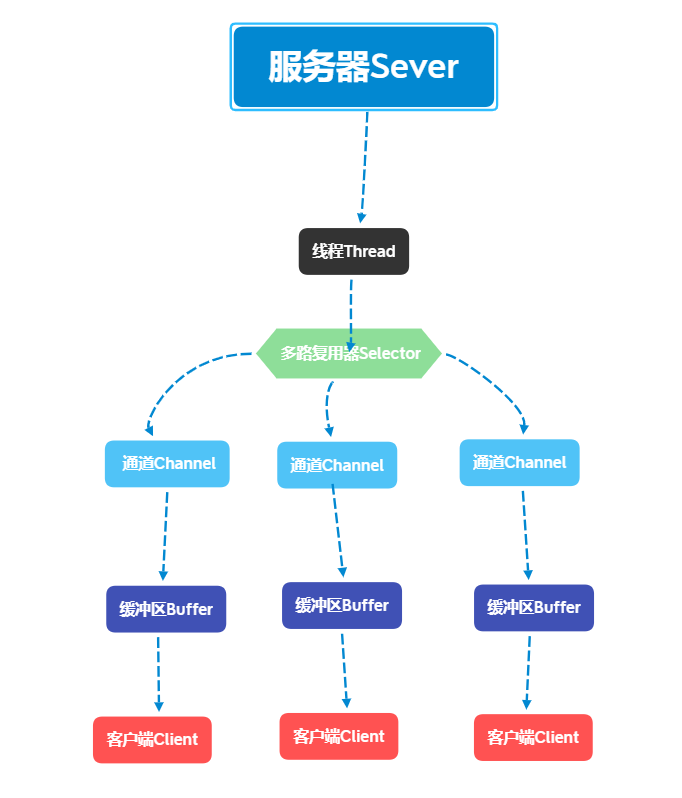

## *Channel 通道*

### 特点

Channel 类似于流，但不同的是既可以从通道中读取数据，又可以写数据到通道。但流的读写通常是单向

通道中的数据总是要**先**读到一个Buffer，或者总是要**从**一个Buffer 中写

### 4种channel

* FileChannel 从文件中读写数据
* DatagramChannel 能通过UDP 读写网络中的数据
* SocketChannel 能通过TCP 读写网络中的数据
* ServerSocketChannel 可以监听新进来的TCP 连接，对每一个新进来的连接都会创建一个SocketChannel

### filechannel

```java
public class HelloWorld {
    public static void main(String[] args) throws Exception {
        //创建FileChannel
        RandomAccessFile aFile = new RandomAccessFile("data.txt", "rw");
        FileChannel channel = aFile.getChannel();
        //创建Buffer
        ByteBuffer buffer = ByteBuffer.allocate(1024);
        //读取数据到buffer中
        int bytesRead = channel.read(buffer);
        while (bytesRead != -1) {
            System.out.println("Read " + bytesRead);
            //将buffer从写模式切换到读模式
            buffer.flip();
            //如果还有未读数据
            while (buffer.hasRemaining()) {
                //读取数据
                System.out.print((char) buffer.get());
            }
            //清空buffer
            buffer.clear();
            //继续读取数据
            bytesRead = channel.read(buffer);
        }
        aFile.close();
    }
}
```

* 打开FileChannel：无法直接打开一个FileChannel，需要通过使用一个InputStream、OutputStream 或 RandomAccessFile 来获取一个FileChannel 实例

* 从FileChannel 读取数据

  * 分配一个Buffer。从FileChannel 中读取的数据将被读到Buffer 中。然后，调用 `FileChannel.read()` 方法。该方法将数据从FileChannel 读取到Buffer中
  * `FileChannel.read()` 方法返回的int 值表示了有多少字节被读到了Buffer 中。如果返回-1，表示到了文件末尾

* 向FileChannel 写数据：`FileChannel.write()` 是在while 循环中调用的。因为无法保证 `write()` 方法一次能向FileChannel 写入多少字节，因此需要重复调用 `write()` 方法，直到channel中没有写入buffer的字节

  ```java
  while (buffer.hasRemaining()) {
  	channel.write(buffer); //通过channel写入buffer
  }
  ```

## *Socket通道*

### ServerSocketChannel

ServerSocketChannel 是一个基于通道的socket 监听器。它同我们所熟悉的 `java.net.ServerSocket` 执行相同的任务，不过它增加了通道语义，因此能够在非阻塞模式下运行

由于ServerSocketChannel **没有自己的 `bind()` 方法**，因此要通过 `socket()` 方法取出对等的socket 并使用它来**手动绑定**到一个端口以开始监听连接。我们也是使用对等ServerSocket 的API 来根据需要设置其他的socket 选项

同java.net.ServerSocket 一样，ServerSocketChannel **有 `accept()` 方法**。ServerSocketChannel 的 `accept()` 方法会返回SocketChannel 类型对象，SocketChannel 可以在非阻塞模式下运行

```java
public class HelloWorld {
    public static void main(String[] args) throws IOException {
        int port = 8888;
        ByteBuffer buffer = ByteBuffer.wrap("hello wolrd".getBytes());
        ServerSocketChannel ssc = ServerSocketChannel.open(); //打开ServerSocketChannel
        //手动绑定端口
        ssc.socket().bind(new InetSocketAddress(port));
        //设置非阻塞模式
        ssc.configureBlocking(false);
        //return新的socketChannel
        while (true) {
            SocketChannel sc = ssc.accept();
        }
    }
}
```

### SocketChannel

Java NIO 中的SocketChannel 是一个连接到TCP 网络套接字的通道，SocketChannel 实现了被多路复用的可选择通道

> A selectable channel for stream-oriented connecting sockets.

```java
public class HelloWorld {
    public static void main(String[] args) throws IOException {
        SocketChannel socketChannel = SocketChannel.open(new InetSocketAddress("localhost", 8080));
        //设置阻塞或者非阻塞
        socketChannel.configureBlocking(false);
        //设置读取缓冲区
        ByteBuffer byteBuffer = ByteBuffer.allocate(1024);
        socketChannel.read(byteBuffer);
        socketChannel.close();
        System.out.println("read over");
    }
}
```

* 对于已经存在的socket 不能创建SocketChannel
* SocketChannel 中提供的open 接口创建的Channel 并没有进行连接，需要使用connect 接口连接到指定地址
* 未进行连接的SocketChannle 执行IO 操作时，会抛出NotYetConnectedException
* SocketChannel 支持两种IO 模式：阻塞式和非阻塞式
* SocketChannel 支持异步关闭。如果SocketChannel 在一个线程上read 阻塞，另一个线程对该SocketChannel 调用shutdownInput，则读阻塞的线程将返回-1 表示没有读取任何数据；如果SocketChannel 在一个线程上write 阻塞，另一个线程对该SocketChannel 调用shutdownWrite，则写阻塞的线程将抛出AsynchronousCloseException
* SocketChannel 支持设定参数

### DatagramChannel

### Channel的分散与聚集

Java NIO 开始支持scatter/gather，scatter/gather 用于描述从Channel 中读取或者写入到Channel 的操作

* 分散 scatter 从Channel 中读取是指在读操作时将读取的数据写入多个buffer 中。因此，Channel 将从Channel 中读取的数据分散到多个Buffer 中

  ```java
  ByteBuffer header = ByteBuffer.allocate(128);
  ByteBuffer body = ByteBuffer.allocate(1024);
  ByteBuffer[] bufferArray = { header, body };
  channel.read(bufferArray);
  ```

* 聚集 gather 写入Channel 是指在写操作时将多个buffer 的数据写入同一个Channel，因此Channel 将多个Buffer 中的数据聚集后发送到Channel

  ```java
  ByteBuffer header = ByteBuffer.allocate(128);
  ByteBuffer body = ByteBuffer.allocate(1024);
  //write data into buffers
  ByteBuffer[] bufferArray = { header, body };
  channel.write(bufferArray);
  ```

scatter/gather 经常用于需要将传输的数据分开处理的场合，例如传输一个由消息头和消息体组成的消息，可能会将消息体和消息头分散到不同的buffer 中，这样可以方便的处理消息头和消息体

## *Buffer 缓冲区*

### Buffer的特点

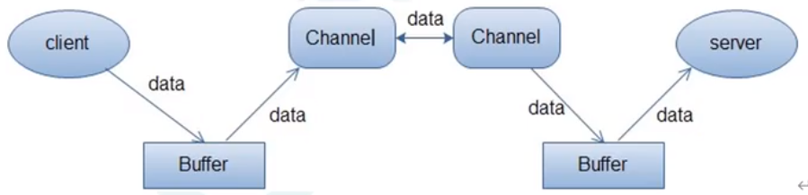

缓冲区本质上是一块可以写入数据，然后可以从中读取数据的内存。这块内存被包装成NIO Buffer 对象，并提供了一组方法，用来方便的访问该块内存。缓冲区实际上是一个容器对象，更直接的说，其实就是一个数组，在NIO 库中，所有数据都是用缓冲区处理的

所有的缓冲区类型都继承于抽象类Buffer，最常用的就是ByteBuffer

### 使用Buffer

使用Buffer 读写数据，一般遵循以下四个步骤

1. 写入数据到Buffer
2. 调用 `flip()` 方法
3. 从Buffer 中读取数据
4. 调用 `clear()` 方法或者 `compact()` 方法

当向buffer 写入数据时，buffer 会记录下写了多少数据。一旦要读取数据，需要通过 `flip()` 方法将Buffer 从写模式切换到读模式。在读模式下，可以读取之前写入到buffer的所有数据

一旦读完了所有的数据，就需要清空缓冲区，让它可以再次被写入。有两种方式能清空缓冲区：调用 `clear()` 或 `compact()` 方法。`clear()` 方法会清空整个缓冲区。`compact()` 方法只会清除已经读过的数据。任何未读的数据都被移到缓冲区的起始处，新写入的数据将放到缓冲区未读数据的后面

```java
public class HelloWorld {
    public static void main(String[] args) throws IOException {
        RandomAccessFile aFile = new RandomAccessFile("data.txt", "rw");
        FileChannel channel = aFile.getChannel();
        //创建buffer
        ByteBuffer buffer = ByteBuffer.allocate(1024);
        int bytesRead = channel.read(buffer);
        while (bytesRead != -1) {
            buffer.flip();
            while (buffer.hasRemaining()) {
                System.out.print((char) buffer.get());
            }
            buffer.clear(); //清空一下继续写
            bytesRead = channel.read(buffer);
        }
    }
}
```

### Buffer的属性

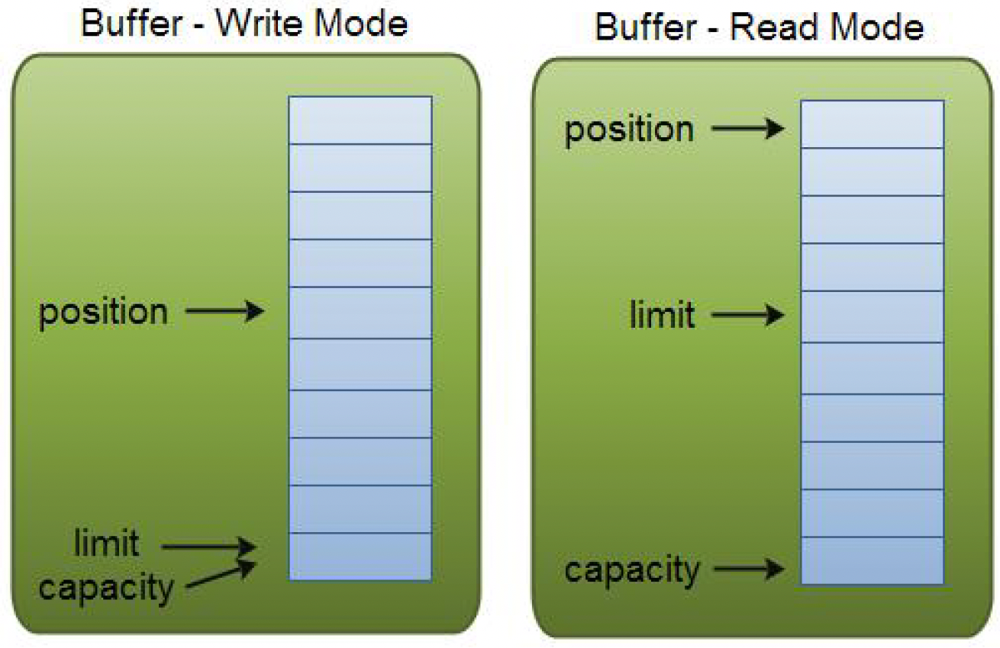

* capacity

  作为一个内存块，Buffer 有一个固定容量值 capacity。只能往里写capacity 个byte、long，char 等类型。一旦Buffer 满了，需要将其清空（通过读数据或者清除数据）才能继续写数据往里写数据

* position

  * 写数据到Buffer 中时，position 表示写入数据的当前位置，position 的初始值为0。当一个byte、long 等数据写到Buffer 后， position 会向下移动到下一个可插入数据的Buffer 单元。position 最大可为capacity – 1（因为position 的初始值为0）
  * 从Buffer 中读数据时，position 表示读入数据的当前位置，如position=2 时表示已开始读入了3 个byte，或从第3 个byte 开始读取。通过 `ByteBuffer.flip()` 切换到读模式时**position 会被重置为0**，当Buffer 从position 读入数据后，position 会下移到下一个可读入的数据Buffer 单元

* limit

  * 写数据时，limit 表示可对Buffer 最多写入多少个数据。写模式下，limit 等于Buffer 的capacity
  * 读数据时，limit 表示Buffer 里有多少可读数据（not null 的数据），因此能读到之前写入的所有数据（limit 被设置成已写数据的数量，这个值在写模式下就是position）

## *Selector简介*

selector多路复用器算是对linux下的select/poll/epoll进行封装

### 可选择通道 SelectableChannel

* **不是所有的Channel 都可以被Selector 复用的**。比方说，FileChannel 就不能被选择器复用。判断一个Channel 能被Selector 复用，有一个前提：判断它**是否继承了一个抽象类SelectableChannel**。如果继承了SelectableChannel，则可以被复用，否则不能
* SelectableChannel 类提供了实现通道的可选择性所需要的公共方法。它是所有支持就绪检查的通道类的父类。所有socket 通道，都继承了SelectableChannel 类都是可选择的，包括从管道 Pipe 对象的中获得的通道。而FileChannel 类，没有继承SelectableChannel，因此是不是可选通道
* 一个通道可以被注册到多个选择器上，但对每个选择器而言只能被注册一次。通道和选择器之间的关系，使用注册的方式完成。SelectableChannel 可以被注册到Selector 对象上，在注册的时候，需要指定通道的哪些操作是Selector 感兴趣的

### Channel 注册到 Selector

注册就是告诉selector关心哪些channel的状态

* 使用 `Channel.register(Selector sel，int ops)` 方法，将一个通道注册到一个选择器时。第一个参数，指定通道要注册的选择器；第二个参数指定选择器需要查询的通道操作

* 可以供选择器查询的通道操作，从类型来分，包括以下四种

  * 可读: SelectionKey.OP_READ

  * 可写: SelectionKey.OP_WRITE

  * 连接: SelectionKey.OP_CONNECT

  * 接收: SelectionKey.OP_ACCEPT

  * 如果Selector 对通道的多种操作类型感兴趣，可以用位或操作符来实现

    ```java
    int key = SelectionKey.OP_READ | SelectionKey.OP_WRITE;
    ```

* **选择器查询的不是通道的操作，而是通道的某个操作的一种就绪状态**

  什么是操作的就绪状态？一旦通道具备完成某个操作的条件，表示该通道的某个操作已经就绪，就可以被Selector 查询到，程序可以对通道进行对应的操作

  * 某个SocketChannel 通道可以连接到一个服务器，则处于连接就绪 OP_CONNECT
  * 一个ServerSocketChannel 服务器通道准备好接收新进入的连接，则处于接收就绪 OP_ACCEPT状态
  * 一个有数据可读的通道处于读就绪 OP_READ
  * 一个等待写数据的通道处于写就绪 OP_WRITE

### 选择键 SelectionKey

SelectionKey就是epoll的就绪队列

* Channel 注册到后，并且一旦通道处于某种就绪的状态，就可以被选择器查询到。这个工作，使用选择器Selector 的 `select()` 方法完成。select 方法的作用是对感兴趣的通道操作，进行就绪状态的查询
* Selector 可以不断的查询Channel 中发生的操作的就绪状态。并且挑选感兴趣的操作就绪状态。一旦通道有操作的就绪状态达成，并且是Selector 感兴趣的操作，就会被Selector 选中，放入选择键集合中
* 一个选择键，首先是包含了注册在Selector 的通道操作的类型，比方说SelectionKey.OP_READ。也包含了特定的通道与特定的选择器之间的注册关系。开发应用程序是，选择键是编程的关键。NIO 的编程，就是根据对应的选择键，进行不同的业务逻辑处理
* 选择键的概念，和事件的概念比较相似。一个选择键类似监听器模式里边的一个事件。由于 **Selector 不是事件触发的模式，而是主动去查询的模式，所以不叫事件Event，而是叫SelectionKey 选择键**

## *使用Selector*

### 注册的注意事项

* **与Selector 一起使用时，Channel 必须处于非阻塞模式下**，否则将抛出异常IllegalBlockingModeException。这意味着，FileChannel 不能与Selector 一起使用，因为FileChannel 不能切换到非阻塞模式，而套接字相关的所有的通道都可以
* 一个通道，并没有一定要支持所有的四种操作。比如服务器通道ServerSocketChannel 支持Accept 接受操作，而SocketChannel 客户端通道则不支持。可以通过通道上的 `validOps()` 方法，来获取特定通道下所有支持的操作集合

### 轮询查询就绪操作

* 通过Selector 的 `select()` 方法，可以查询出已经就绪的通道操作，这些就绪的状态集合，包存在一个元素是SelectionKey 对象的Set 集合中
* 下面是Selector 几个重载的查询 `select()` 方法
  * `select()`：阻塞到至少有一个通道在你注册的事件上就绪了
  * `select(long timeout)`：和 `select()` 一样，但最长阻塞事件为timeout 毫秒
  * `selectNow()`：非阻塞，只要有通道就绪就立刻返回

`select()` 方法返回的int 值，表示有多少通道已经就绪，更准确的说，是**自前一次**select方法以来到这一次select 方法之间的时间段上，有多少通道变成就绪状态

```java
public class HelloWorld {
    public static void main(String[] args) throws IOException {
        //创建一个Selector
        Selector selector = Selector.open();
        //通道
        ServerSocketChannel ssChannel = ServerSocketChannel.open();
        //注册之前一定要设置为非阻塞状态
        ssChannel.configureBlocking(false);
        //绑定端口
        ssChannel.bind(new InetSocketAddress(9999));
        //注册到Selector上
        ssChannel.register(selector, SelectionKey.OP_ACCEPT);
        //查询已经就绪通道操作，返回的是一个就绪set集合
        Set<SelectionKey> selectionKeys = selector.selectedKeys();
        Iterator<SelectionKey> keyIterator = selectionKeys.iterator();
        while (keyIterator.hasNext()) {
            //获取就绪通道
            SelectionKey selectionKey = keyIterator.next();
            //判断是什么事件就绪
            if (selectionKey.isAcceptable()) {
                //获取客户端连接
                ssChannel.accept();
            }
            if (selectionKey.isReadable()) {
                //读取数据
            }
            if (selectionKey.isWritable()) {
                //写数据
            }
            if (selectionKey.isConnectable()) {
                //连接
            }
            //移除就绪通道
            keyIterator.remove();
        }
    }
}
```

## *NIO总结与服务器demo*

### 编程步骤

1. 创建Selector 选择器
2. 创建ServerSocketChannel 通道，并绑定监听端口
3. 设置Channel 通道为非阻塞模式
4. 把Channel 注册到Socketor 选择器上，监听连接事件
5. 调用Selector 的select 方法（循环调用），监测通道的就绪状况
6. 调用 selectKeys 方法获取就绪channel 集合
7. 遍历就绪channel 集合，判断就绪事件类型，实现具体的业务操作
8. 根据业务，决定是否需要再次注册监听事件，重复执行第三步操作

### Client

```java
public class client(String[] args) throws IOException {
    //1 获取客户端通道，绑定主机和端口号
    SocketChannel socketChannel = SocketChannel.open(new InetSocketAddress("127.0.0.1", 8080));
    //2 切换非阻塞模式
    socketChannel.configureBlocking(false);
    //3 创建buffer
    ByteBuffer buffer = ByteBuffer.allocate(1024);
    Scanner scanner = new Scanner(System.in);
    while (scanner.hasNext()) {
        String str = scanner.next();
        //4 写入buffer数据
        buffer.put(str.getBytes());
        //5 切换读模式
        buffer.flip();
        //6 写入通道
        socketChannel.write(buffer);
        //7 清空buffer
        buffer.clear();
    }
}
```

### Server

```java
public void serverDemo() throws IOException {
    //1 获取服务端通道
    ServerSocketChannel ssSocketChannel = ServerSocketChannel.open();
    //2 切换非阻塞模式
    ssSocketChannel.configureBlocking(false);
    //3 创建buffer
    ByteBuff ser serverBuffer = ByteBuffer.allocate(1024);
    //4 绑定端口号
    ssSocketChannel.bind(new InetSocketAddress(8080)); //监听8080端口
    //5 获取selector选择器
    Selector selector = Selector.open();
    //6 监听的通道注册到选择器上接听
    ssSocketChannel.register(selector, SelectionKey.OP_ACCEPT);
    //7 轮询式的获取选择器上已经准备就绪的事件
    while (selector.select() > 0) { //select() 是阻塞地等，只有当来值后才会继续
        Set<SelectionKey> selectionKeys = selector.selectedKeys();
        //用迭代器遍历
        Iterator<SelectionKey> selectionKeyIterator = selectionKeys.iterator();
        while (selectionKeyIterator.hasNext()) {
            SelectionKey next = selectionKeyIterator.next();
            //8 判断具体是什么事件准备就绪
            if (next.isAcceptable()) {
                //9 若接受就绪，获取客户端连接
                SocketChannel accept = ssSocketChannel.accept();
                //10 切换非阻塞模式
                accept.configureBlocking(false);
                //11 将该通道注册到选择器上
                accept.register(selector, SelectionKey.OP_READ);
            } else if (next.isReadable()) {
                //12 获取当前选择器上读就绪状态的通道
                SocketChannel socketChannel = (SocketChannel) next.channel();
                //13 读取数据
                ByteBuffer byteBuffer = ByteBuffer.allocate(1024);
                int len = 0;
                while (socketChannel.read(byteBuffer) > 0) {
                    byteBuffer.flip();
                    System.out.println(new String(byteBuffer.array(), 0, len));
                    byteBuffer.clear();
                }
            }
            selectionKeyIterator.remove();
        }
    }
}
```

# Python多线程

Python中的多线程是一种并发编程技术，允许您在同一程序中同时执行多个线程，每个线程都有自己的执行流程。多线程可以用于同时执行多个任务，提高程序的性能和响应能力。Python提供了一个内置的线程模块，称为`threading`，用于创建和管理多线程。

以下是Python多线程的一些关键概念和用法：

1. 创建线程： 您可以使用`threading.Thread`类来创建线程。通常，您需要创建一个新的类，继承自`threading.Thread`，并重写`run`方法来定义线程的执行逻辑。然后，通过实例化线程对象并调用`start`方法来启动线程。

   ```python
   import threading
   
   class MyThread(threading.Thread):
       def run(self):
           # 线程的执行逻辑
           pass
   
   thread = MyThread()
   thread.start()
   ```

2. 线程同步： 多个线程可能会同时访问和修改共享数据，因此需要使用线程同步机制来防止竞争条件和数据不一致性。Python提供了锁（`threading.Lock`）、条件变量（`threading.Condition`）、信号量（`threading.Semaphore`）等工具来实现线程同步。

3. 线程间通信： 线程之间可以通过共享变量或队列等机制进行通信。`queue`模块提供了线程安全的队列，用于在线程之间传递数据。

4. 线程状态管理： 可以使用`is_alive()`方法来检查线程是否还在运行，使用`join()`方法来等待线程完成执行。

5. 全局解释器锁（GIL）： 在CPython（标准的Python解释器）中，由于GIL的存在，多线程并发性能受到限制。GIL会限制在同一时刻只能有一个线程执行Python字节码。这意味着Python多线程在处理CPU密集型任务时可能无法充分利用多核处理器。但对于IO密集型任务，多线程仍然可以提供性能改善。

总之，Python的多线程是一种用于并发编程的工具，可用于执行多个任务，但在处理CPU密集型任务时可能受到GIL的限制。对于更高级的并发需求，还可以考虑使用多进程、异步编程或使用第三方库（例如`asyncio`）来实现更复杂的并发模型。
