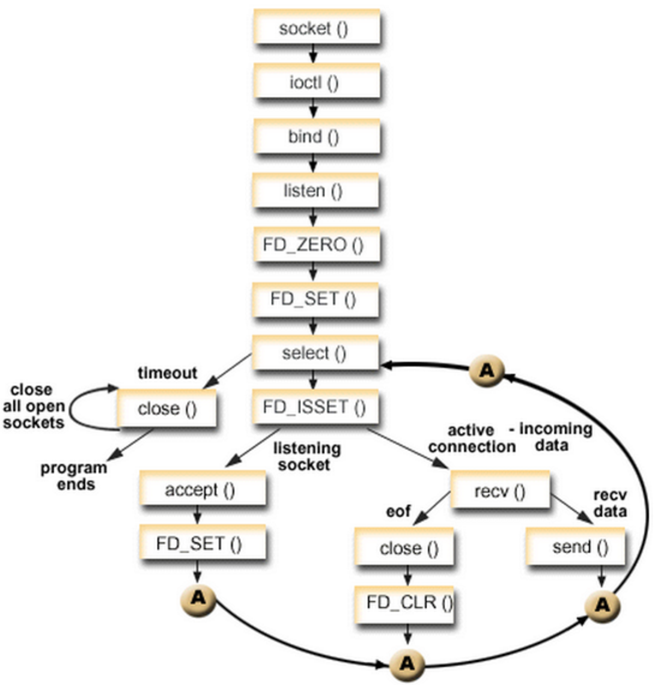
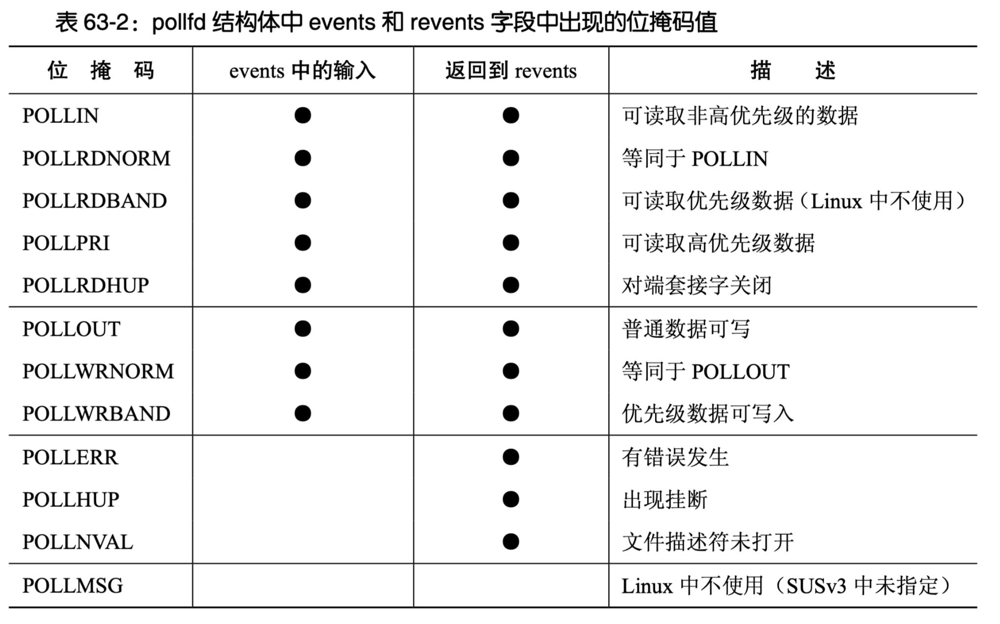
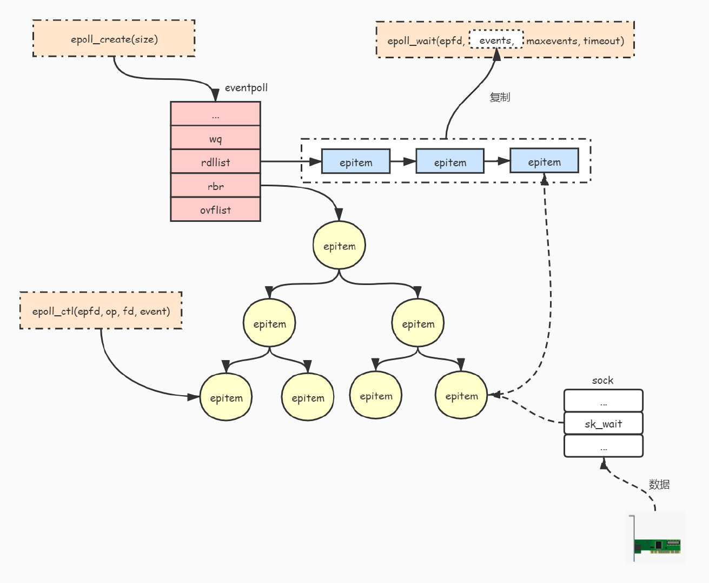

# IO模型和高并发

**I/O的本质是等+数据拷贝（内核缓冲区拷贝到应用缓冲区）**

IO分类

* 同步
  * 阻塞
  * 非阻塞
    * 单纯轮询
    * 多路复用既可以是阻塞的也可以是非阻塞的，但以非阻塞为主
* 异步

## *同步I/O synchronous*

同步IO：发起IO和等待IO、执行数据拷贝的人是同一个发起者

### 阻塞模型

为了避免程序内部的数据不一致或者其他错误，程序在IO设备将数据准备好之前，会一直阻塞CPU，即程序一直处于调用的未返回状态。此时CPU是空闲的，但不能执行其他任务，CPU资源被浪费了。fd默认都是阻塞I/O


当一个应用进程被挂起后，它通常会等待某些事件的发生，比如等待I/O操作完成、等待定时器到期等。这是因为当进程被挂起时，操作系统会将进程的状态保存在内存中，包括进程的寄存器值、堆栈信息等。当进程被恢复时，操作系统会将保存的状态恢复到CPU寄存器中，并从进程被挂起的位置继续执行。因此，当某个事件发生时，操作系统需要将CPU控制权交给相应的事件处理程序，并等待该事件处理程序执行完毕后，再恢复进程的执行

例如，当一个进程进行I/O操作时，通常需要等待I/O设备完成读写操作，然后才能继续执行。在这个过程中，操作系统会将进程挂起，然后将进程的状态保存在内存中，**并将CPU控制权交给I/O设备的驱动程序**。驱动程序会在I/O操作完成后向操作系统发出中断信号，然后操作系统会调用相应的事件处理程序来处理这个中断，从而将CPU控制权重新交给挂起的进程，使其继续执行。在这个过程中，**CPU需要等待I/O操作完成并等待操作系统的调度，才能够恢复进程的执行**

当然了，**阻塞的概念是相对于每个程序/进程所占的CPU时间片而言的，在程序被调用的时间片内，程序就停止了调用IO的那一行了不会往下执行，它占用的CPU资源被浪费了**。并不是针对整个系统而言的，否则要是只要IO一下系统就卡住了也太可怕了

### 为什么还要用阻塞IO

既然阻塞IO听起来效果那么差，为什么还要使用阻塞IO呢？虽然阻塞IO的性能相对于异步IO和多路复用来说有一定的劣势，但是阻塞IO也有其适用场景，因此在一些情况下仍然需要使用阻塞IO。以下是一些使用阻塞IO的场景

* **简单易用**：阻塞IO的使用非常简单，只需要调用相应的系统调用即可，对于一些简单的应用场景来说，使用阻塞IO可以省去使用异步IO或多路复用的复杂性
* **低延迟**：在一些需要低延迟的场景下，使用阻塞IO可以获得更好的性能表现，因为阻塞IO能够保证IO操作的开始和结束时间，避免了异步IO或多路复用中需要进行多次上下文切换的开销
* **适用于小规模请求**：对于一些小规模的IO请求来说，使用阻塞IO可以获得更好的性能表现，因为异步IO或多路复用中需要进行上下文切换的开销可能会导致性能下降

因为现代计算机系统的软硬件高速发展，所以在很多情况下阻塞IO通过快速的调度和IO看起来并不会影响用户体验，所以90%的IO场景仍然是阻塞IO

### 非阻塞模型

若IO设备还未将数据准备好之前，采取**轮询 polling**的方式反复检测和尝试读取文件，若没有准备好就直接调用返回 `EWOULDBLOCK` 错误码。因为调用后马上返回，所以CPU这段时间可以用来处理其他工作，但是仍然要定期恢复询问


read 信号驱动I/O：内核将数据准备好之后，使用 `SIGIO` 信号通知程序。信号会丢失，用的比较少

### I/O多路转接/I/O多路复用 multiplexing

**多路转接能够同时阻塞等待多个文件描述符的就绪状态**。I/O中最耗时的就是等待数据就位，所以引入了一些I/O函数，比如select可以一次等待多个文件，I/O效率显著提高；还有poll和epoll进一步提高等待的IO量

**阻塞IO既要阻塞数据IO传输，也要阻塞拷贝过程；而非阻塞IO在数据IO时会直接返回，只会阻塞拷贝过程**。这样进程就可以在进行多个IO的时候处理自己的事情，直到IO完毕，由select通知进程，然后CPU再寻机调度进程处理。相比于阻塞IO，比如使用了线程池技术，所有的IO都是阻塞的，且处于内核态，要花费多余空间资源在维护这些线程上

`select` 和 `epoll` 在单进程模式下**本质上是单进程串行**，因为它们都只能在单个进程中运行。不过，它们使用了非阻塞 IO 和多路复用技术，可以在单进程中同时处理多个 IO 事件，从而提高系统的并发处理能力。但是，在高并发场景下，单进程的处理能力可能仍然无法满足要求，这时候就需要使用多进程或多线程来进行扩展。在多线程或多进程模式下，可以将不同的 IO 事件分配给不同的线程或进程来处理，从而提高系统的并发处理能力

注意多路复用既可以设置成阻塞式的，也可以设置为非阻塞的

## *异步：基于事件的并发*

### 异步IO的概念

*异步I/O asynchronous*：发起IO和等待IO、执行数据拷贝的人是不同的发起者


90%的场景里都是阻塞I/O，因为它很简单，部分会采用非阻塞和多路转接，这三种是主流的。异步I/O的逻辑非常复杂，一般都是底层的库，在公司里因为异步I/O的代码很复杂也不易维护

注意和多线程同步的区分，同步IO和多线程同步没有什么关系

### 多线程实现并发的问题

假设业务场景中有一组互不相关的任务需要完成，现行的主流方法有两种

* 单线程串行依次执行
* 多线程并行执行

在OS中，若可以用信号、锁等方式来控制线程，从而实现低开销的多线程并发，那当然多线程会是首选。但多线程的应用是很复杂的，正确处理并发逻辑很困难，忘加锁、各种死锁现象层出不穷

那选择单线程串行执行由如何呢？对于阻塞IO那自然是直接堵塞了整个CPU，而非阻塞IO因为没有完成完整IO，CPU要不断轮询，所以实际上也会造成效率浪费

因此对于实际情况中高并发、高吞吐量的服务器而言，更实际的是采用基于事件的并发 event-based concurrency，而不是用线程来实现并发

### 基本思想：事件循环

基于事件的并发的思想是：等待某事件发生，当它发生时检查事件的类型，然后做少量的相应工作（IO或者其他的调度）就可以完成并发了

事件循环 event loop 的基本结构是

```python
while (1):
	events = getEvents()
    for e in events:
    	processEvent(e) # event handler 事件处理程序
```

## *高并发场景*

异步I/O和多路复用都适用于高并发场景，但它们的应用场景有所不同

### 异步IO场景

异步I/O适用于需要进行大量的I/O操作，但I/O操作的时间不确定的场景。在这种情况下，如果使用阻塞I/O或非阻塞I/O，应用程序需要轮询I/O事件并等待I/O操作完成，这会占用大量的CPU资源。相比之下，异步I/O可以在I/O操作进行的同时进行其他的操作，从而避免CPU的浪费，提高系统的并发性和吞吐量。但是，异步I/O的实现比较复杂，需要适当的编程技巧和经验

1. Web服务器：在Web服务器中，客户端请求和响应的I/O操作通常需要花费较长的时间，如果使用阻塞I/O或非阻塞I/O，会导致服务器的CPU资源浪费。因此，一些Web服务器会使用异步I/O模型来处理这些I/O操作，从而提高服务器的并发性和吞吐量
2. 大规模数据处理：在大规模数据处理中，需要进行大量的I/O操作，如文件读写、网络传输等，这些I/O操作的时间往往不确定。使用异步I/O可以在I/O操作进行的同时进行其他的操作，从而提高系统的并发性和吞吐量

### 多路复用场景

多路复用适用于需要同时处理多个I/O事件的场景。在这种情况下，如果使用阻塞I/O或非阻塞I/O，应用程序需要使用多个线程或进程来同时处理多个I/O事件，这会导致系统的资源浪费和复杂性增加。相比之下，多路复用可以使用单个线程或进程同时处理多个I/O事件，从而提高系统的并发性和吞吐量。常见的多路复用模型有select、poll、epoll等，其中epoll是最常用的一种模型，具有更高的性能和可扩展性

1. 聊天程序：在聊天程序中，需要同时处理多个客户端的消息，使用多路复用可以使用单个线程或进程同时处理多个客户端的I/O事件，从而避免使用多个线程或进程增加系统复杂性
2. 网络游戏：在网络游戏中，需要实时处理多个客户端的消息，使用多路复用可以提高服务器的并发性和响应速度，从而提升游戏体验

总之，异步I/O和多路复用都可以提高系统的并发性和吞吐量，但它们的应用场景有所不同，需要根据实际情况进行选择。如果需要同时处理多个I/O事件，可以选择多路复用；如果需要进行大量的I/O操作，可以选择异步I/O

# UNIX系统IO
## *阻塞IO*

### socket就绪条件

* 读就绪
  * socket内核中，当接收缓冲区中的字节数大于等于低水位标记 `SO_RCVLOWAT` 时，可以无阻塞的读该文件描述符并返回大于0
  * socket TCP通信中，对端关闭连接，此时对该socket读，则返回0
* 写就绪
  * socket内核中，当发送缓冲区中的可用字节数（发送缓冲区的空闲位置大小）大于等于低水位标记`SO_SNDLOWAT` 时，可以无阻塞的写并返回大于0
  * socket的写操作被关闭（close或者shutdown）时对一个写操作被关闭的socket进行写操作，会触发 `SIGPIPE` 信号
* 异常就绪：socket上收到带外数据，TCP的URG标志位相关

### 为什么要使用阻塞IO？

通常情况下非阻塞I/O会比阻塞I/O更加高效，因为非阻塞I/O可以避免在等待I/O事件发生时CPU的阻塞，从而提高系统的吞吐量和性能

然而，不是所有的场景都适合使用非阻塞I/O。例如，在某些低负载的场景中，使用阻塞I/O可能更加简单和易于维护，而且在某些场景中，由于使用阻塞I/O可以避免出现竞争条件等问题，因此阻塞I/O可能更加安全和可靠

另外，虽然非阻塞I/O可以避免CPU的阻塞，但它也需要一定的轮询时间来检查I/O事件是否已经发生，这可能会导致额外的CPU开销。因此，在高并发和高负载的场景中，选择合适的I/O模型对于系统性能和吞吐量的提升至关重要

综上所述，选择适合特定场景的I/O模型是一项复杂的任务，需要综合考虑系统的需求、负载情况、可靠性等因素，以达到最佳的性能和可维护性

## *非阻塞I/O*

### <span id="fcntl系统调用">`fcntl` 系统调用</span>

```cpp
#include <unistd.h>
#include <fcntl.h>
int fcntl(int fd, int cmd, ... /* arg */ );
```

fcntl系统调用 file control 用于控制已经打开的文件。它可以对打开的文件进行一些操作，如修改文件属性，获取或设置文件状态标志等。具体实现fd的什么功能，取决于`cmd`。**文件描述符默认都是阻塞IO**

* `cmd=F_DUPFD`：复制一个现有的描述符
* `cmd=F_GETFD` 或 `cmd=F_SETFD`：获得/设置文件描述符标记
* `cmd=F_GETFL` 或 `F_SETFL`：获得/设置文件状态标记
* `cmd=F_GETOWN` 或 `F_SETOWN`：获得/设置异步I/O所有权
* `cmd=F_GETLK`、`cmd=F_SETLK` 或 `cmd=F_SETLKW`：获得/设置记录锁

### 实现非阻塞I/O，以read轮询

```cpp
bool SetNonBlock(int sock)
{
    int flag = fcntl(sock, F_GETFL);
    if (flag == -1) return false;
    int n = fcntl(sock, F_SETFL, flag | O_NONBLOCK); //将sock设置为非阻塞
    if (n == -1) return false;
    return true;
}
```

* 使用 `F_GETFL` 将当前的文件描述符的属性取出来（这是一个位图）
* 然后再使用 `F_SETFL` 将文件描述符设置回去。设置回去的同时，加上一个 `O_NONBLOCK` 参数

非阻塞的时候，总是以read出错的形式返回，告知上层数据没有就绪

```c
sing func_t = std::function<void()>; // 用一个包装器
void show() { cout << "我们正在处理其他的事情" << endl; }
int main()
{
    std::vector<func_t> funcs;
    SetNonBlock(0);
    //0号fd
    //string s;
    char buffer[1024];
    while (true)
    {
        buffer[0]=0;
        //cin >> s;
        int n = scanf("%s", buffer);

        if (n == -1)
        {
            // 设置错误码为EWOULDBLOCK
            cout << "errno: " << errno << "desc: " << strerror(errno) << endl;
        }
        else { cout << "刚刚获取的内容是" << buffer << "n: " << n << endl; }
        sleep(1);
    }
    return 0;
}
```

## *select*


### select 函数

系统提供 `select` 函数来实现多路复用I/O

* `select` 系统调用是用来让我们的程序监视**多个**文件描述符的状态变化的
* 程序会停在 `select` 这里等待，直到被监视的文件描述符有一个或多个发生了状态改变

```cpp
#include <sys/select.h>    
int select(int nfds, fd_set *readfds, fd_set *writefds, fd_set *exceptfds, struct timeval *timeout);
```

* 参数
  * `nfds`：要监视的最大的文件描述符+1
  
  * `readfds, writefds, exceptfds` 分别对应于需要检测的可读文件描述符的集合**位图**，可写文件描述符的集合及异常文件描述符的集合，都是输入输出型参数。输入输出用的是同一张位图表，所以会**覆盖式**地读写
    
    * 输入时：用户告诉OS，要关心哪些fd
    * 输出时：OS告诉用户，哪些fd已经就绪
    
  * 参数 `timeout` 为结构体 `timeval`，用来设置 `select()` 的等待时间
    
    ```c
    struct timeval
    {
        __time_t tv_sec;		/* Seconds.  */
        __suseconds_t tv_usec;	/* Microseconds.  */
    };
    ```
    
    * 阻塞式：`timeout=NULL`：表示 `select` 没有 `timeout`，`select` 将一直被阻塞直到某个文件描述符上发生了事件
    
    * 非阻塞式：`timeout={0, 0};`：仅检测描述符集合的状态，然后立即返回，不会等待外部事件发生
    
    * 特定的时间值：如果在指定的时间段里没有事件发生，`select` 将超时返回
    
    * 输出型参数：距离下一次timeout剩余多少时间
  
* 返回值
  * 执行成功则返回fd状态已改变的个数
  * 如果返回0代表在描述词状态改变前已超过 `timeout` 时间，没有返回
  * 当有错误发生时则返回-1，错误原因写入 `errno`，此时参数 `readfds`、`writefds`、`exceptfds` 和 `timeout` 的值变成不可预测

### 对 `fd_set` 的相关操作

`fd_set` 是一个位图，每一个bit对应一个fd是否就绪。它的大小一般是1024 bit

```cpp
typedef long int __fd_mask;
typedef struct
{
    __fd_mask fds_bits[__FD_SETSIZE / __NFDBITS];
# define __FDS_BITS(set) ((set)->fds_bits)
} fd_set;
```

不要自己去直接操作 `fd_set`，系统提供了一些接口函数来进行操作

```cpp
void FD_CLR(int fd, fd_set *set);
int  FD_ISSET(int fd, fd_set *set); 
void FD_SET(int fd, fd_set *set); //置位
void FD_ZERO(fd_set *set); //清空缓存
```

### select 编码模式



核心思路是**让select来做所有的判断和通知工作**，即告诉我们有没有socket来连接，也让socket告诉我们有没有数据到来，若到来了再去读数据。而不是自己去单独开一条线程阻塞式的去尝试read或recv可能到来的数据

* listenSock也是input IO，这里也可以用select一并等，不需要像以前阻塞的阻塞IO多线程单独Listen了
* `select` 之前要重置所有参数，之后要遍历所有的合法fd来检测事件
  * select的第一个参数nfds：随着获取的sock越来越多，添加到select里的sock也越来越多，所以select每一次轮询时nfds都会发生变化，需要对它动态更新
  * select的第2、3、4个参数：rfds/writefds/exceptfds 都是输入输出型参数，输出会直接把传入的输入覆盖掉，所以必须每一次都把合法的fd保存起来要更新位图

* 要维护第三方数组 `int _fd_array[1024]`，来保存过往的所有合法fd，方便 `select` 进行批量处理
* 一旦特定的fd事件就绪，本次读取或者写入不会被阻塞

### Pros and Cons

* Pros
  * 和多进程、多线程相比，占用资源少并且高效，因此单位时间内等的fd多了
  * 适用于有大量连接，但是只有少量是活跃的，节省资源

* Cons
  * 每一次都要进行大量的重置工作，效率比较低
  * 每一次能够检测的fd数量是有**上限**的
  * 因为每一个参数都是输入输出型的，每一次都需要内核到用户，用户到内核传递位图参数，有大量的数据拷贝
  * `select` 编码不方便，需要用户自己维护数组
  * `select` 底层需要***O(N)***同步遍历的方式，检测所有需要检测的fd，最大 `maxfd+1`

## *poll*

poll对select的改进是分离了输入输出参数，并且采用链表链接取消了能检测fd的上限

### 声明

```c
#include <poll.h>
int poll(struct pollfd *fds, nfds_t nfds, int timeout);

struct pollfd {
   int   fd;         /* file descriptor */
   short events;     /* requested events */
   short revents;    /* returned events */
};
```

* 参数

  * fds 是一个poll函数监听的结构体，里面是fd、监听的事件集合、返回的事件集合

    poll针对select的缺点做了改进，分离了输入输出型参数。其中events是给用户设定的，用户告诉OS要关心哪些事件；而revents是给OS来设定的，OS告诉用户哪些事件已经就绪了

    

  * nfds表示fds数组的长度

  * timeout表示poll函数的超时事件，单位是毫秒 ms。为0非阻塞模式，不为0阻塞模式

* 返回值

  * `<0` 出错
  * `=0` poll函数等待超时
  * `>0` poll由于监听的fd就绪而返回

### Pros and Cons

* Pros
  * 和select一样效率高，有大量连接，若只有少量的是活跃的可以节省资源
  * 输入输出资源分离，不需要进行大量的重置
  * poll参数级别，没有管理的fd上限

* Cons
  * poll依旧需要不少的遍历。在用户检测时间就绪，与内核检测fd就绪都需要便利。就这需要用户还是要维护第三户数组存储fd
  * poll还是需要内核到用户的拷贝

# epoll与reactor模式

## *epoll接口*


### intro

epoll是Linux下效率最高的IO时间通知机制

epoll是为处理大批量句柄而做了改进的poll，它是在Linux Kernel 2.5.44中被引进

epoll多路复用的**流程**是

1. `epoll_create` 创建epoll对象来组织管理所有的数据结构 
2. `epoll_ctl` 告诉epoll对象要关心哪些fd的哪些行为（读、写、错误 ...）
3. `epoll_wait` 让epoll开始等，有就绪的就报告

### epoll_create：创建 epoll 结构体对象

```c
 #include <sys/epoll.h>
int epoll_create(int size);
```

返回一个epoll的文件描述符。注意参数 `int size` 是被废弃的，可以随便写

### epoll_crl：向 epoll 添加文件句柄

```c
int epoll_ctl(int epfd, int op, int fd, struct epoll_event *event);
```

* 参数：它不同于 `select()` 是在监听事件时告诉内核要监听什么类型的事件，而是在这里先注册要监听的事件类型

  * epfd是 `epoll_create()` 的返回值（epoll的句柄）

  * op表示增删改动作，用三个宏来表示

    * EPOLL_CTL_ADD ：注册新的fd到epfd中
    * EPOLL_CTL_MOD ：修改已经注册的fd的监听事件
    * EPOLL_CTL_DEL ：从epfd中删除一个fd

  * fd是需要监听的fd

  * event结构体指针是告诉内核需要监听什么，其中events是关心事件的集合。注意：`struct epoll_event` 和 `struct eventpoll` 没什么关系

    ```c
    typedef union epoll_data {
       void        *ptr;
       int          fd; 
       uint32_t     u32;
       uint64_t     u64;
    } epoll_data_t;
    
    //红黑树的一个node
    struct epoll_event {
       uint32_t     events;      /* Epoll events 宏表示是什么动作*/
       epoll_data_t data;        /* User data variable */
    };
    ```
    
    * `uint32_t events` 宏可以是下面的取值
      * `EPOLLIN` ：表示对应的文件句柄可以读（包括对端SOCKET正常关闭）
      * `EPOLLOUT`：表示对应的文件句柄可以写
      * `EPOLLPRI`：表示对应的文件句柄有紧急的数据可读（这里应该表示有带外数据到来）
      * `EPOLLERR`：表示对应的文件句柄发生错误
      * `EPOLLHUP`：表示对应的文件句柄被挂断
      * `EPOLLET`：将EPOLL设为边缘触发(Edge Triggered)模式，这是相对于水平触发(Level Triggered)来说的
      * `EPOLLONESHOT`：只监听一次事件，当监听完这次事件之后，如果还需要继续监听这个socket的话，需要再次把这个socket加入到EPOLL队列里
    * `data` 用来保存用户自定义数据

* 返回值

### epoll_wait：等待被监听的文件状态发生改变

```c
int epoll_wait(int epfd, struct epoll_event *events, int maxevents, int timeout)
```

收集在epoll监控的事件中已经就绪的事件

* 参数
  * events（是那个 `struct epoll_event` 类型的，不是struct里面的 `uint32_t events`，别搞混了）输出型参数是分配好的epoll_event结构体数组，epoll将会把发生的事件赋值到events数组中
  * maxevents告知内核这个events有多大，这个maxevents的值不能大于创建 `epoll_create()` 时的size
  * timeout是毫秒级的超时事件，0会立即返回非阻塞，-1是永久阻塞
* 返回已经就绪的文件描述符的个数，若返回0表示已超时，小于0表示出错

## *epoll的工作原理*

<https://www.jxhs.me/2021/04/08/linux内核Epoll-实现原理/>

### epoll_create的时候发生了什么？



1. 查看源码可以得到调用链：`epoll_create()->sys_epoll_create()->anon_inode_getfd()`，return一个映射到某个fd上的eventpoll句柄对象

2. eventpoll 对象用于管理 `epoll` 监听的文件列表（`epitem` 对象列表），它里面有很多的数据结构。被监听的文件是通过 `epitem` 对象来管理的，上图中的节点都是以 `epitem` 对象的形式存在的

   ```c
   struct eventpoll {
       ...
       wait_queue_head_t wq; //等待队列，当调用 epoll_wait(fd) 时会把进程添加到 eventpoll 对象的 wq 等待队列中
       ...
       struct list_head rdllist; //保存已经就绪的文件列表
       struct rb_root rbr; //使用红黑树来管理所有被监听的文件
       ...
   };
   
   struct epitem {
       struct rb_node rbn;//红黑树节点
       struct list_head rdllink;//双向链表节点
       struct epoll_filefd ffd; //事件句柄信息
       struct eventpoll *ep; //指向其所属的eventpoll对象
       struct epoll_event event; //期待发生的事件类型
   }
   ```

3. epoll_ctl就是对这棵红黑树的增删改查。通过红黑树能够通过文件句柄快速查找其对应的 `epitem` 对象

4. 构建底层回调机制 callback

5. 建立就绪队列，epoll_wait的功能就是去就绪队列里拿取就绪的事件节点

### epoll解决select和poll的两个缺陷

在select和poll里都需要自己来维护第三方数组，从而告诉OS要关心哪一些fd。epoll自己在底层维护了红黑树来记录用户要关心哪些fd

红黑树节点的key值是要关心的fd，用户只需要设置关系获取结果就可以，不用再关心任何对fd与event的管理细节

数据IO的原理：硬件会引起CPU某个引脚上的中断，然后通过对中断向量表关于该引脚的索引得到对应的执行函数（这些方法都是由驱动程序提供的），然后执行响应的动作。以数据到来要读为例，就是执行读取的动作

就绪队列解决了OS告诉用户哪些事件就绪了，上层只需要检测就绪队列就可以，因此是FIFO的队列，所以只需要***O(1)***检测队头就行了，不需要***O(N)***遍历

### callback的功能

1. 根据红黑树上节点要关心的事件，结合已经发生的事件来判断。比如说要关心EPOLLIN，然后有数据进来了，就说明就绪了
2. 自动根据fd和已经发生的事件，构建就绪节点
3. 自动将构建好的节点，插入到就绪队列中

生产者消费者模型：底层只要有fd就绪了OS会自动构建节点加入到就绪队列中，上层只需要不断的从就绪队列中将数据拿走，就完成了获取就绪事件中的任务。就绪队列是一个共享资源，epoll已经保证所有的epoll接口都是线程安全的

若底层没有就绪事件需要阻塞或轮询，所以要设置timeout，可以设置阻塞模式也可以设置非阻塞模式

## *epoll工作模式*

### LT和ET

LT是select、poll和epoll的默认工作方式。只有epoll可以切换LT和ET

* Level triger LT 水平触发：有数据就会一直通知
  * 当epoll检测到socket上事件就绪的时候，可以不立刻进行处理，或者只处理一部分。直到缓冲区上所有的数据都被处理完，`epoll_wait` 才不会立刻返回
  * 比如说10KB的缓冲区，读了1KB，那么再一次 `epoll_wait` 的时候仍然会立即返回 `struct epoll_event events` 显示读就绪 `EPOLLIN`
  * 支持阻塞读写和非阻塞读写
* Edge triger ET 边缘触发：只会通知一次，或者说当从无到有或从有到无的时候才会通知。非常高效，比如高性能的Nginx默认采用ET模式使用epoll
  * 当epoll检测到socket上事件就绪时，必须立刻处理。也就是说在ET模式，文件描述符上的事件就绪后只有一次处理机会
  * 用户必须循环的去读缓冲区，一次性把数据全部取走，直到读到read返回 `EAGAIN` 或者 `EWOULDBLOCK`。否则等会下回来新数据了老数据就没了
  * 只支持非阻塞的读写，如果是阻塞的read，那么读走一部分之后，因为ET不会返回读就绪，所以read不会去读了

### 高效ET

ET的性能比LT性能更高的原因

*  `epoll_wait` 返回的次数少了很多，代价就是用户必须一次把所有数据都读走，否则数据就丢失了
* ET模式会倒逼用户尽快将接收缓冲区中的数据全部取走，即应用层要尽快取走缓冲区中的数据。因此在单位时间下接收方有一个更大的接受窗口和滑动窗口，一次可以收到更多的数据，提高IO吞吐

虽然ET很高效，但是代码也更复杂了

### ET模式和非阻塞fd

使用 ET 模式的 epoll，需要将文件描述设置为非阻塞。这并非接口上的要求，而是工程实践上的要求

如何保证本轮数据全部读完？LT和ET都需要循环读取。对于LT，若sock fd是阻塞模式，因为有epll_wait的多次返回所以可以随机读取多次，如果缓冲区里没数据了，epoll_wait就会把程序挂起，等下一波数据来

但是对于ET模式的循环读取，必须要自己去检测是否读到  `EWOULDBLOCK` 或 `EAGIAN`。因为即使还有要读取的数据因为epoll_wait不会再返回所以被阻塞住没机会去读了，所以在最后一次正常读取完毕后，肯定还要进行下一次读取，否则无法确认是否读取完毕了。若文件fd设置为阻塞模式，在没有epoll_wait的返回时，在一次读取之后就不能重复的读取了。为了解决这个问题，ET模式工作时sock fd必须通过 [fcntl 系统调用](#fcntl系统调用) 被设置为非阻塞，从而主动的去读

### 独立的缓冲区

**为了保证完整的读取，每一个socket都要有自己的输入、输出缓冲区**。多个socket共用同一个缓冲区可能导致数据混淆的情况

假设有两个socket，分别为sock1和sock2，它们共用同一个缓冲区buf。现在，socket1上有数据"hello"，socket2上有数据"world"，程序要从这两个socket上分别读取数据。代码如下

```cpp
char buf[1024]; // 共用缓冲区

// 从socket1上读取数据
int n = recv(sock1, buf, 1024, 0);
if (n > 0) {
    printf("socket1: %s\n", buf); // 输出hello
}

// 从socket2上读取数据
n = recv(sock2, buf, 1024, 0);
if (n > 0) {
    printf("socket2: %s\n", buf); // 输出world
}
```

在上面的代码中，程序从socket1和socket2上分别读取数据，并将数据放入同一个缓冲区buf中。然后，程序使用printf函数输出缓冲区中的数据

然而，这段代码存在一个问题：当程序从socket1上读取数据时，它将 `"hello"` 放入了缓冲区buf中，但是并没有清空缓冲区。然后，程序从socket2上读取数据时，它将 `"world"` 放入了缓冲区buf中，并使用printf函数输出缓冲区中的数据。由于缓冲区没有被清空，程序会输出 `"helloworld"` 或者 `"hellorld" 等情况`，即将两个socket上的数据混淆在一起

这是因为多个socket共用同一个缓冲区时，程序需要正确地标记不同socket上的数据，否则就会导致数据混淆或丢失的情况。在上面的例子中，程序没有正确地标记不同socket上的数据，导致数据混淆。为了避免这种情况发生，程序应该为每个socket分配独立的缓冲区，并使用合适的同步机制来保证数据的正确性

## *epoll服务器*

独立缓冲区：每一个socket fd用一个Connection类来封装

关心写事件就绪 `EPOLLOUT` 都是按需设置的。因为写事件是根据对方的接受缓冲区来设置的。那很有可能写事件一直都是就绪的，所以这部分比较难搞，只有在真的需要写的时候才会设置

## *惊群效应*

### intro

惊群效应 Thundering Herd 是指多进程/线程在同时阻塞等待同一个事件的时候（此时进程/线程处于休眠状态），如果等待的这个事件发生，那么他就会唤醒等待的所有进程/线程，但最终却只能有一个进程/线程来处理这个事件，而其他进程/线程抢夺失败，只能重新进入休眠状态，这种现象和性能浪费就叫做惊群效应

### 解决方案

# Reactor 和 Proactor模式

## *Reactor模式*

用原生的epoll系列的系统调用直接来编写服务器是面向过程的，效率不高。Reactor设计模式是对IO多路复用做了一层封装，这样使用者就不用考虑底层网络的API细节，只要关注应用代码的实现就可以了

Reactor模式也称为Dispatcher模式

## *Proactor模式*

# 负载均衡

# C++

看Cpp.md的线程库部分

# Java的三种IO模型

Java中的BIO、NIO和AIO分别对应同步阻塞IO、同步非阻塞IO和异步IO。当然如之前所述，它们没有严格的谁替代谁的关系，只是应用场景不同。因为其简单易用性，大部分的IO仍然是阻塞式IO

下面会分别介绍Java中这三种IO应用到构建CS web的大概方法

## *BIO*

### BIO的CS框架

BIO 同步阻塞IO构建CS的方法是每当服务器有一个serverSock（或者说listenSock）用来监听client的连接请求（即发起并完成TCP3次握手）。每次新的连接到来就分一个新的线程出去处理这个client的各种任务。连接建立后**双方便阻塞式的读写**，若双方都没有读写那么这个线程资源就被阻塞住浪费了

虽然这种方式可以通过线程池和其他方式优化，但是若进来大量的高并发请求，线程池可能很快就被耗尽了

### Server

### Client

# Java NIO


## *Channel 通道*

### 特点

Channel 类似于流，但不同的是既可以从通道中读取数据，又可以写数据到通道。但流的读写通常是单向

通道中的数据总是要**先**读到一个Buffer，或者总是要**从**一个Buffer 中写

### 4种channel

* FileChannel 从文件中读写数据
* DatagramChannel 能通过UDP 读写网络中的数据
* SocketChannel 能通过TCP 读写网络中的数据
* ServerSocketChannel 可以监听新进来的TCP 连接，对每一个新进来的连接都会创建一个SocketChannel

### filechannel

```java
public class HelloWorld {
    public static void main(String[] args) throws Exception {
        //创建FileChannel
        RandomAccessFile aFile = new RandomAccessFile("data.txt", "rw");
        FileChannel channel = aFile.getChannel();
        //创建Buffer
        ByteBuffer buffer = ByteBuffer.allocate(1024);
        //读取数据到buffer中
        int bytesRead = channel.read(buffer);
        while (bytesRead != -1) {
            System.out.println("Read " + bytesRead);
            //将buffer从写模式切换到读模式
            buffer.flip();
            //如果还有未读数据
            while (buffer.hasRemaining()) {
                //读取数据
                System.out.print((char) buffer.get());
            }
            //清空buffer
            buffer.clear();
            //继续读取数据
            bytesRead = channel.read(buffer);
        }
        aFile.close();
    }
}
```

* 打开FileChannel：无法直接打开一个FileChannel，需要通过使用一个InputStream、OutputStream 或 RandomAccessFile 来获取一个FileChannel 实例

* 从FileChannel 读取数据

  * 分配一个Buffer。从FileChannel 中读取的数据将被读到Buffer 中。然后，调用 `FileChannel.read()` 方法。该方法将数据从FileChannel 读取到Buffer中
  * `FileChannel.read()` 方法返回的int 值表示了有多少字节被读到了Buffer 中。如果返回-1，表示到了文件末尾

* 向FileChannel 写数据：`FileChannel.write()` 是在while 循环中调用的。因为无法保证 `write()` 方法一次能向FileChannel 写入多少字节，因此需要重复调用 `write()` 方法，直到channel中没有写入buffer的字节

  ```java
  while (buffer.hasRemaining()) {
  	channel.write(buffer); //通过channel写入buffer
  }
  ```

## *Socket通道*

### ServerSocketChannel

ServerSocketChannel 是一个基于通道的socket 监听器。它同我们所熟悉的 `java.net.ServerSocket` 执行相同的任务，不过它增加了通道语义，因此能够在非阻塞模式下运行

由于ServerSocketChannel **没有自己的 `bind()` 方法**，因此要通过 `socket()` 方法取出对等的socket 并使用它来**手动绑定**到一个端口以开始监听连接。我们也是使用对等ServerSocket 的API 来根据需要设置其他的socket 选项

同java.net.ServerSocket 一样，ServerSocketChannel **有 `accept()` 方法**。ServerSocketChannel 的 `accept()` 方法会返回SocketChannel 类型对象，SocketChannel 可以在非阻塞模式下运行

```java
public class HelloWorld {
    public static void main(String[] args) throws IOException {
        int port = 8888;
        ByteBuffer buffer = ByteBuffer.wrap("hello wolrd".getBytes());
        ServerSocketChannel ssc = ServerSocketChannel.open(); //打开ServerSocketChannel
        //手动绑定端口
        ssc.socket().bind(new InetSocketAddress(port));
        //设置非阻塞模式
        ssc.configureBlocking(false);
        //return新的socketChannel
        while (true) {
            SocketChannel sc = ssc.accept();
        }
    }
}
```

### SocketChannel

Java NIO 中的SocketChannel 是一个连接到TCP 网络套接字的通道，SocketChannel 实现了被多路复用的可选择通道

> A selectable channel for stream-oriented connecting sockets.

```java
public class HelloWorld {
    public static void main(String[] args) throws IOException {
        SocketChannel socketChannel = SocketChannel.open(new InetSocketAddress("localhost", 8080));
        //设置阻塞或者非阻塞
        socketChannel.configureBlocking(false);
        //设置读取缓冲区
        ByteBuffer byteBuffer = ByteBuffer.allocate(1024);
        socketChannel.read(byteBuffer);
        socketChannel.close();
        System.out.println("read over");
    }
}
```

* 对于已经存在的socket 不能创建SocketChannel
* SocketChannel 中提供的open 接口创建的Channel 并没有进行连接，需要使用connect 接口连接到指定地址
* 未进行连接的SocketChannle 执行I/O 操作时，会抛出NotYetConnectedException
* SocketChannel 支持两种I/O 模式：阻塞式和非阻塞式
* SocketChannel 支持异步关闭。如果SocketChannel 在一个线程上read 阻塞，另一个线程对该SocketChannel 调用shutdownInput，则读阻塞的线程将返回-1 表示没有读取任何数据；如果SocketChannel 在一个线程上write 阻塞，另一个线程对该SocketChannel 调用shutdownWrite，则写阻塞的线程将抛出AsynchronousCloseException
* SocketChannel 支持设定参数

### DatagramChannel

### Channel的分散与聚集

Java NIO 开始支持scatter/gather，scatter/gather 用于描述从Channel 中读取或者写入到Channel 的操作

* 分散 scatter 从Channel 中读取是指在读操作时将读取的数据写入多个buffer 中。因此，Channel 将从Channel 中读取的数据分散到多个Buffer 中

  ```java
  ByteBuffer header = ByteBuffer.allocate(128);
  ByteBuffer body = ByteBuffer.allocate(1024);
  ByteBuffer[] bufferArray = { header, body };
  channel.read(bufferArray);
  ```

* 聚集 gather 写入Channel 是指在写操作时将多个buffer 的数据写入同一个Channel，因此Channel 将多个Buffer 中的数据聚集后发送到Channel

  ```java
  ByteBuffer header = ByteBuffer.allocate(128);
  ByteBuffer body = ByteBuffer.allocate(1024);
  //write data into buffers
  ByteBuffer[] bufferArray = { header, body };
  channel.write(bufferArray);
  ```

scatter/gather 经常用于需要将传输的数据分开处理的场合，例如传输一个由消息头和消息体组成的消息，可能会将消息体和消息头分散到不同的buffer 中，这样可以方便的处理消息头和消息体

## *Buffer 缓冲区*

### Buffer的特点


缓冲区本质上是一块可以写入数据，然后可以从中读取数据的内存。这块内存被包装成NIO Buffer 对象，并提供了一组方法，用来方便的访问该块内存。缓冲区实际上是一个容器对象，更直接的说，其实就是一个数组，在NIO 库中，所有数据都是用缓冲区处理的

所有的缓冲区类型都继承于抽象类Buffer，最常用的就是ByteBuffer

### 使用Buffer

使用Buffer 读写数据，一般遵循以下四个步骤

1. 写入数据到Buffer
2. 调用 `flip()` 方法
3. 从Buffer 中读取数据
4. 调用 `clear()` 方法或者 `compact()` 方法

当向buffer 写入数据时，buffer 会记录下写了多少数据。一旦要读取数据，需要通过 `flip()` 方法将Buffer 从写模式切换到读模式。在读模式下，可以读取之前写入到buffer的所有数据

一旦读完了所有的数据，就需要清空缓冲区，让它可以再次被写入。有两种方式能清空缓冲区：调用 `clear()` 或 `compact()` 方法。`clear()` 方法会清空整个缓冲区。`compact()` 方法只会清除已经读过的数据。任何未读的数据都被移到缓冲区的起始处，新写入的数据将放到缓冲区未读数据的后面

```java
public class HelloWorld {
    public static void main(String[] args) throws IOException {
        RandomAccessFile aFile = new RandomAccessFile("data.txt", "rw");
        FileChannel channel = aFile.getChannel();
        //创建buffer
        ByteBuffer buffer = ByteBuffer.allocate(1024);
        int bytesRead = channel.read(buffer);
        while (bytesRead != -1) {
            buffer.flip();
            while (buffer.hasRemaining()) {
                System.out.print((char) buffer.get());
            }
            buffer.clear(); //清空一下继续写
            bytesRead = channel.read(buffer);
        }
    }
}
```

### Buffer的属性


* capacity

  作为一个内存块，Buffer 有一个固定容量值 capacity。只能往里写capacity 个byte、long，char 等类型。一旦Buffer 满了，需要将其清空（通过读数据或者清除数据）才能继续写数据往里写数据

* position

  * 写数据到Buffer 中时，position 表示写入数据的当前位置，position 的初始值为0。当一个byte、long 等数据写到Buffer 后， position 会向下移动到下一个可插入数据的Buffer 单元。position 最大可为capacity – 1（因为position 的初始值为0）
  * 从Buffer 中读数据时，position 表示读入数据的当前位置，如position=2 时表示已开始读入了3 个byte，或从第3 个byte 开始读取。通过 `ByteBuffer.flip()` 切换到读模式时**position 会被重置为0**，当Buffer 从position 读入数据后，position 会下移到下一个可读入的数据Buffer 单元

* limit

  * 写数据时，limit 表示可对Buffer 最多写入多少个数据。写模式下，limit 等于Buffer 的capacity
  * 读数据时，limit 表示Buffer 里有多少可读数据（not null 的数据），因此能读到之前写入的所有数据（limit 被设置成已写数据的数量，这个值在写模式下就是position）

## *Selector简介*

selector多路复用器算是对linux下的select/poll/epoll进行封装

### 可选择通道 SelectableChannel

* **不是所有的Channel 都可以被Selector 复用的**。比方说，FileChannel 就不能被选择器复用。判断一个Channel 能被Selector 复用，有一个前提：判断它**是否继承了一个抽象类SelectableChannel**。如果继承了SelectableChannel，则可以被复用，否则不能
* SelectableChannel 类提供了实现通道的可选择性所需要的公共方法。它是所有支持就绪检查的通道类的父类。所有socket 通道，都继承了SelectableChannel 类都是可选择的，包括从管道 Pipe 对象的中获得的通道。而FileChannel 类，没有继承SelectableChannel，因此是不是可选通道
* 一个通道可以被注册到多个选择器上，但对每个选择器而言只能被注册一次。通道和选择器之间的关系，使用注册的方式完成。SelectableChannel 可以被注册到Selector 对象上，在注册的时候，需要指定通道的哪些操作是Selector 感兴趣的

### Channel 注册到 Selector

注册就是告诉selector关心哪些channel的状态

* 使用 `Channel.register(Selector sel，int ops)` 方法，将一个通道注册到一个选择器时。第一个参数，指定通道要注册的选择器；第二个参数指定选择器需要查询的通道操作

* 可以供选择器查询的通道操作，从类型来分，包括以下四种

  * 可读: SelectionKey.OP_READ

  * 可写: SelectionKey.OP_WRITE

  * 连接: SelectionKey.OP_CONNECT

  * 接收: SelectionKey.OP_ACCEPT

  * 如果Selector 对通道的多种操作类型感兴趣，可以用位或操作符来实现

    ```java
    int key = SelectionKey.OP_READ | SelectionKey.OP_WRITE;
    ```

* **选择器查询的不是通道的操作，而是通道的某个操作的一种就绪状态**

  什么是操作的就绪状态？一旦通道具备完成某个操作的条件，表示该通道的某个操作已经就绪，就可以被Selector 查询到，程序可以对通道进行对应的操作

  * 某个SocketChannel 通道可以连接到一个服务器，则处于连接就绪 OP_CONNECT
  * 一个ServerSocketChannel 服务器通道准备好接收新进入的连接，则处于接收就绪 OP_ACCEPT状态
  * 一个有数据可读的通道处于读就绪 OP_READ
  * 一个等待写数据的通道处于写就绪 OP_WRITE

### 选择键 SelectionKey

SelectionKey就是epoll的就绪队列

* Channel 注册到后，并且一旦通道处于某种就绪的状态，就可以被选择器查询到。这个工作，使用选择器Selector 的 `select()` 方法完成。select 方法的作用是对感兴趣的通道操作，进行就绪状态的查询
* Selector 可以不断的查询Channel 中发生的操作的就绪状态。并且挑选感兴趣的操作就绪状态。一旦通道有操作的就绪状态达成，并且是Selector 感兴趣的操作，就会被Selector 选中，放入选择键集合中
* 一个选择键，首先是包含了注册在Selector 的通道操作的类型，比方说SelectionKey.OP_READ。也包含了特定的通道与特定的选择器之间的注册关系。开发应用程序是，选择键是编程的关键。NIO 的编程，就是根据对应的选择键，进行不同的业务逻辑处理
* 选择键的概念，和事件的概念比较相似。一个选择键类似监听器模式里边的一个事件。由于 **Selector 不是事件触发的模式，而是主动去查询的模式，所以不叫事件Event，而是叫SelectionKey 选择键**

## *使用Selector*

### 注册的注意事项

* **与Selector 一起使用时，Channel 必须处于非阻塞模式下**，否则将抛出异常IllegalBlockingModeException。这意味着，FileChannel 不能与Selector 一起使用，因为FileChannel 不能切换到非阻塞模式，而套接字相关的所有的通道都可以
* 一个通道，并没有一定要支持所有的四种操作。比如服务器通道ServerSocketChannel 支持Accept 接受操作，而SocketChannel 客户端通道则不支持。可以通过通道上的 `validOps()` 方法，来获取特定通道下所有支持的操作集合

### 轮询查询就绪操作

* 通过Selector 的 `select()` 方法，可以查询出已经就绪的通道操作，这些就绪的状态集合，包存在一个元素是SelectionKey 对象的Set 集合中
* 下面是Selector 几个重载的查询 `select()` 方法
  * `select()`：阻塞到至少有一个通道在你注册的事件上就绪了
  * `select(long timeout)`：和 `select()` 一样，但最长阻塞事件为timeout 毫秒
  * `selectNow()`：非阻塞，只要有通道就绪就立刻返回

`select()` 方法返回的int 值，表示有多少通道已经就绪，更准确的说，是**自前一次**select方法以来到这一次select 方法之间的时间段上，有多少通道变成就绪状态

```java
public class HelloWorld {
    public static void main(String[] args) throws IOException {
        //创建一个Selector
        Selector selector = Selector.open();
        //通道
        ServerSocketChannel ssChannel = ServerSocketChannel.open();
        //注册之前一定要设置为非阻塞状态
        ssChannel.configureBlocking(false);
        //绑定端口
        ssChannel.bind(new InetSocketAddress(9999));
        //注册到Selector上
        ssChannel.register(selector, SelectionKey.OP_ACCEPT);
        //查询已经就绪通道操作，返回的是一个就绪set集合
        Set<SelectionKey> selectionKeys = selector.selectedKeys();
        Iterator<SelectionKey> keyIterator = selectionKeys.iterator();
        while (keyIterator.hasNext()) {
            //获取就绪通道
            SelectionKey selectionKey = keyIterator.next();
            //判断是什么事件就绪
            if (selectionKey.isAcceptable()) {
                //获取客户端连接
                ssChannel.accept();
            }
            if (selectionKey.isReadable()) {
                //读取数据
            }
            if (selectionKey.isWritable()) {
                //写数据
            }
            if (selectionKey.isConnectable()) {
                //连接
            }
            //移除就绪通道
            keyIterator.remove();
        }
    }
}
```

## *NIO总结与服务器demo*

### 编程步骤

1. 创建Selector 选择器
2. 创建ServerSocketChannel 通道，并绑定监听端口
3. 设置Channel 通道为非阻塞模式
4. 把Channel 注册到Socketor 选择器上，监听连接事件
5. 调用Selector 的select 方法（循环调用），监测通道的就绪状况
6. 调用 selectKeys 方法获取就绪channel 集合
7. 遍历就绪channel 集合，判断就绪事件类型，实现具体的业务操作
8. 根据业务，决定是否需要再次注册监听事件，重复执行第三步操作

### Client

```java
public class client(String[] args) throws IOException {
    //1 获取客户端通道，绑定主机和端口号
    SocketChannel socketChannel = SocketChannel.open(new InetSocketAddress("127.0.0.1", 8080));
    //2 切换非阻塞模式
    socketChannel.configureBlocking(false);
    //3 创建buffer
    ByteBuffer buffer = ByteBuffer.allocate(1024);
    Scanner scanner = new Scanner(System.in);
    while (scanner.hasNext()) {
        String str = scanner.next();
        //4 写入buffer数据
        buffer.put(str.getBytes());
        //5 切换读模式
        buffer.flip();
        //6 写入通道
        socketChannel.write(buffer);
        //7 清空buffer
        buffer.clear();
    }
}
```

### Server

```java
public void serverDemo() throws IOException {
    //1 获取服务端通道
    ServerSocketChannel ssSocketChannel = ServerSocketChannel.open();
    //2 切换非阻塞模式
    ssSocketChannel.configureBlocking(false);
    //3 创建buffer
    ByteBuff ser serverBuffer = ByteBuffer.allocate(1024);
    //4 绑定端口号
    ssSocketChannel.bind(new InetSocketAddress(8080)); //监听8080端口
    //5 获取selector选择器
    Selector selector = Selector.open();
    //6 监听的通道注册到选择器上接听
    ssSocketChannel.register(selector, SelectionKey.OP_ACCEPT);
    //7 轮询式的获取选择器上已经准备就绪的事件
    while (selector.select() > 0) { //select() 是阻塞地等，只有当来值后才会继续
        Set<SelectionKey> selectionKeys = selector.selectedKeys();
        //用迭代器遍历
        Iterator<SelectionKey> selectionKeyIterator = selectionKeys.iterator();
        while (selectionKeyIterator.hasNext()) {
            SelectionKey next = selectionKeyIterator.next();
            //8 判断具体是什么事件准备就绪
            if (next.isAcceptable()) {
                //9 若接受就绪，获取客户端连接
                SocketChannel accept = ssSocketChannel.accept();
                //10 切换非阻塞模式
                accept.configureBlocking(false);
                //11 将该通道注册到选择器上
                accept.register(selector, SelectionKey.OP_READ);
            } else if (next.isReadable()) {
                //12 获取当前选择器上读就绪状态的通道
                SocketChannel socketChannel = (SocketChannel) next.channel();
                //13 读取数据
                ByteBuffer byteBuffer = ByteBuffer.allocate(1024);
                int len = 0;
                while (socketChannel.read(byteBuffer) > 0) {
                    byteBuffer.flip();
                    System.out.println(new String(byteBuffer.array(), 0, len));
                    byteBuffer.clear();
                }
            }
            selectionKeyIterator.remove();
        }
    }
}
```
