# 自动控制的一般概念

## *自动控制理论发展概述*

* 传统控制理论（需要建立准确的数学模型）
  * 经典控制理论：时域法、复域法（根轨迹法）、频域法
  * 现代控制理论：线性系统、自适应控制、预测控制、最优控制、鲁棒控制、滑膜控制、最佳估计、容错控制、大系统复杂系统、系统辨识、集散控制、非线性系统理论
* 智能控制理论（运用大数据模拟人的控制策略）：专家系统、遗传算法、模糊控制、多智能体、神经网络

## *自动控制和自动控制系统的基本概念*

自动控制：在无人直接参与的情况下，利用控制装置，使工作机械、或生产过程（被控对象）的某一个物理量（被控量）按预定的规律（给定量）运行

* 开环控制系统 Open loop control system
* 闭环控制系统 Close loop control system
* 复合控制系统

### 自动控制系统的基本组成

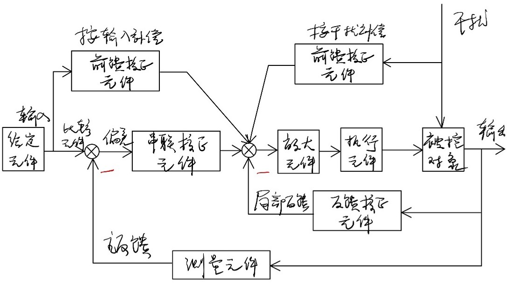

* 被控对象
* 控制装置
  * 测量元件
  * 比较原件
  * 放大原件
  * 执行机构
  * 矫正装置
  * 给定元件

## *自动控制系统的分类*

* 恒值控制系统、随动/伺服控制系统和程序控制系统 Constant input modulation & Servo control systems & Program control systems
* 时变系统和定常系统/时不变系统 Time-invariant systems & time-varying systems
* 线性系统和非线性系统 Linear systems & nonlinear systems
* 连续系统与离散系统 Continuous systems & Discrete(data) system
* 单变量系统和多变量系统

## *对控制系统性能的基本要求*

* 稳定性 Stability
* 准确性 Accuracy
* 快速性 Rapidity
* The response should be insensitive to disturbance input(Disturbance rejection) 干扰抑制
* The response should be insensitive to changing of parameters(Robustness)

## *本课程的研究内容*

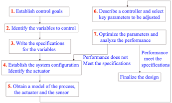

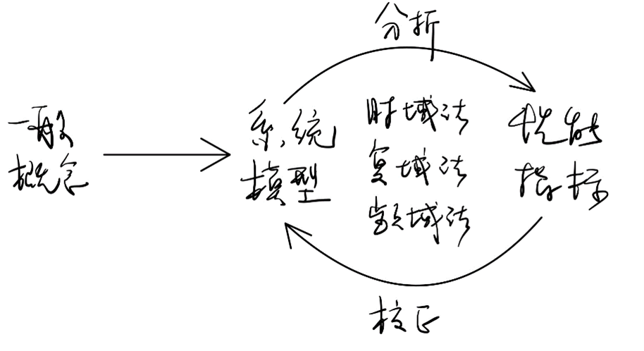

# 控制系统的数学模型

## *概述*

* 数学模型：概述系统输入、输出变量以及内部各变量之间关系的数学表达式

* 建模方法
  * 解析法（白盒子的机理分析法）：根据系统工作所依据的物理定律列写运动方程
  * 实验法（黑盒子的系统辨识法）：给系统施加某种测试信号，记录输出响应，并用适当的数学模型去逼近系统的输入输出特性
  
* 拉普拉斯变换 Laplace transform：$F\left(s\right)=\int_{0}^{\infty}{f\left(t\right)e^{-st}dt}$（详见DSP）
  * 常见函数拉普拉斯变换
    $$
    \left\{\begin{array}{c}F_b(s)=\int_{-\infty}^{\infty}{f(t)e^{-st}dt}\\f(t)=\frac{1}{2\pi j}\int_{\sigma-j\omega}^{\sigma+j\omega}{F_b(s)e^{st}ds}\end{array}\right.
    $$
    
    * cos推导 $\cos{\omega_0}=\frac{e^{j\omega_0t}+e^{-j\omega_0t}}{2}\xrightarrow{\mathcal{L}}\frac{1}{s-j\omega_0}+\frac{1}{s+j\omega_0}=\frac{s}{s^2+\omega_0^2}$
    * sin推导  $\sin{\omega_0}=\frac{e^{j\omega_0t}-e^{-j\omega_0t}}{2}\xrightarrow{\mathcal{L}}\frac{1}{s-j\omega_0}-\frac{1}{s+j\omega_0}=\frac{\omega_0}{s^2+\omega_0^2}$
  
  t域|s域
  :-:|:-:
  $\delta(t)$ 根据采样性|1, $\sigma>-\infty$
  $\delta(t)^{(n)}$ 根据时域特性|$s^n$
  $\varepsilon(t)$ or 1|$\frac{1}{s}, \sigma>0$
  $e^{s_0t}$|$\frac{1}{s-s_0}, \sigma>Re[s_0]$
  $\cos{\omega_0t}$|$\frac{s}{s^2+\omega_0^2}$
  $\sin{\omega_0t}$|$\frac{\omega_0}{s^2+\omega_0^2}$
  $f_T(t)$|$\int_{0}^{T}{f_T(t)e^{-st}dt}/(1-e^{-sT})$
  
  * 拉普拉斯变换的重要定理（见信号与系统）

## *控制系统的时域数学模型*

### 线性时不变系统的微分方程的一般形式

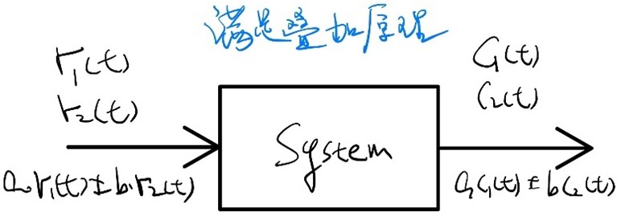

$a_n\frac{d^nc(t)}{dt^n}+a_{n-1}\frac{d^{n-1}c(t)}{dt^{n-1}}+\ldots+a_1\frac{dc(t)}{dt}+a_0c\left(t\right)=b_n\frac{d^nc(t)}{dt^n}+b_{n-1}\frac{d^{n-1}c(t)}{dt^{n-1}}+\ldots+b_1\frac{dc(t)}{dt}+b_0c\left(t\right)$

### 控制系统的数学模型构造

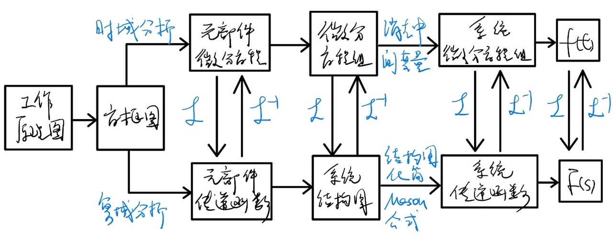

## *控制系统的复域数学模型*

### 求解微分方程模型（即求响应）的方法（有初始条件详见DSP，需要使用拉氏变换的微分性质求解）

* 时域解法，普通解+特解
* 用拉普拉斯变换到s域求解 $a_nc^{(n)}+a_{n-1}c^{(n-1)}+\ldots+a_1c^{(1)}+a_0c=b_mr^{(m)}+b_{m-1}r^{(m-1)}+\ldots+b_1r^{(1)}+b_0r$ 要求0初始条件&系数n>m
  * 0初始条件下的微分定理拉氏变换：$\left(a_ns^n+a_{n-1}s^{n-1}+\ldots+a_1s+a_0\right)C\left(s\right)=\left(b_ms^m+b_{m-1}s^{m-1}+\ldots+b_1s+b_0\right)R\left(s\right)$
  * 单位冲激响应下的输出：$C\left(s\right)^{r\left(t\right)=\delta(t)}=\frac{b_ms^m+b_{m-1}s^{m-1}+\ldots+b_1s+b_0}{a_ns^n+a_{n-1}s^{n-1}+\ldots+a_1s+a_0}=\frac{C_1}{s-\lambda_1}+\frac{C_2}{s-\lambda_2}+\ldots+\frac{C_n}{s-\lambda_n}$，$\lambda_i$ 为微分方程的特征根也是系统的极点
  * 用留数法分解部分分式 $\mathcal{L}^{-1}:c\left(t\right)=\mathcal{L}^{-1}\left[C\left(s\right)\right]=C_1e^{\lambda_1t}+C_2e^{\lambda_2t}+\ldots+C_ne^{\lambda_nt}\left\{\begin{array}{c}\lambda_i：特征根/极点\\e\lambda_it：相当于\lambda_i的模态\\C_i：极点对应的留数\end{array}\right.$
    * 关于模态（振型） Modal：系统构成单位脉冲响应的线性组合形式

### 影响系统响应的因素

* 输入$u_r(t)$ 规定单位阶跃响应$r(t)=1(t)$
  * 输入容易实现
  * 系统跟踪阶跃信号有一定难度
* 初始条件 规定0初始条件，即 $t=0$ 之前，系统的输入输出及其各阶导数皆为0，系统处于相对静止的状态
* 系统的结构参数

### 传递函数

在零初始条件下，线性时不变系统输出量拉氏变换与输入量拉氏变换之比（零初始条件下系统的单位冲激响应） $G\left(s\right)=\frac{C\left(s\right)}{R(s)}$（信号与系统中的系统函数形式为 $H(s)=\frac{Y_{zs}(s)}{F(s)}=\frac{B(s)}{A(s)}$）

* 传递函数的标准形式
  * 首1标准型/零、极点形式：要保证传递函数分子、分母最高次项s的系数都是+1 $G\left(s\right)=\frac{K^\ast\prod\limits_{j=1}^{m}{(s-z_j)}}{\prod\limits_{i=1}^{n}{(s-p_i)}}$。 $K^*$ 是根轨迹增益
  * 尾1标准型/典型环节形式：将传递函数分子、坟墓最低次项系数均化为+1 $G\left(s\right)=K\frac{\prod\limits_{k=1}^{m_1}{(\tau_ks+1)}\prod\limits_{l=1}^{m_2}{(\tau_l^2s^2+2\zeta\tau_ls+1)}}{\prod\limits_{i=1}^{n_1}{(T_is+1)}\prod\limits_{j=1}^{n_2}{(T_j^2s^2+2\zeta T_js+1)}}$, $K$ 为增益
  * 根轨迹增益和增益之间的关系：$K=\frac{K^*\prod\limits_{j=1}^{m}{\lvert z_j\rvert}}{\prod\limits_{i=1}^{n}{\lvert p_i\rvert}}$

* 传递函数的性质
  * 是复函数
  * 只与系统自身的结构参数有关
  * 与系统微分方程直接关联
  * 是系统的单位脉冲响应的相函数/拉氏变换 $G\left(s\right)=\mathcal{L}\left|k(t)\right|$
  * 与s平面上的零极点图相对应
* 传递函数的局限性
  * 原则上不反映非零初始条件时系统响应的全部信息
  * 适合于描述单输入/单输出系统
  * 只能用于表示线性定常系统

### 常用控制原件的传递函数

### 典型环节

环节名称|微分方程|传递函数|举例
:-:|:-:|:-:|:-:
比例环节 Proportional|$c=Kr$|$K$|电位器、放大器、减速器、减速发电机等
惯性环节 Inertial|$T\dot{c}+c=r$|$\frac{1}{Ts+1}$|RC电路，AC、DC电动机等
振荡环节 Oscillating|$T^2\ddot{c}+2\xi T\dot{c}+c=r, 0<\xi<1$|$\frac{1}{T^2s^2+2\xi T_s+1}$|RLC电路，弹簧-质块-阻尼器系统等
积分环节 Integral|$\dot{c}=r$|$\frac{1}{s}$|电容上的电流与电压，测速发电机位移与电压等
微分环节 Differential|$c=\dot{r}$s|
一阶复合微分环节 First-order differential|$c=\tau\dot{r}+r$|$\tau s+1$
二阶复合微分环节 Second-order differential|$c=\tau^2\ddot{r}+2\tau\zeta\dot{r}+r$|$\tau^2s^2+2\zeta\tau s+1$

## *控制系统的结构图及其等效代换*

* s域框图
  * 积分器在电路实现上
* 结构图等效变换
  * 串联 Cascade 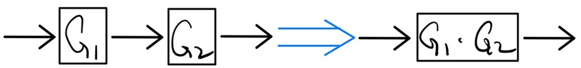
  * 并联 Parallel 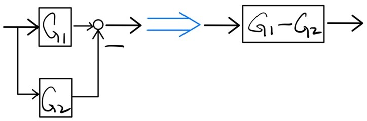
  * 反馈链接 Feedback 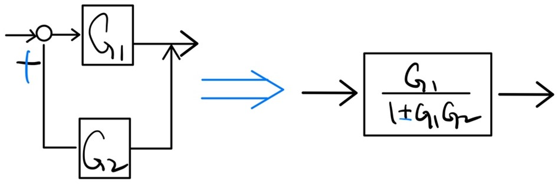
  * 比较点和引出点的移动

## *控制系统的信号流图*

### 信号流图（见信号与系统）

### 梅森增益公式 Mason’s gain formula（详见信号与系统）

$G\left(S\right)=\frac{C\left(S\right)}{R(S)}=\frac{\sum\limits_{k=1}^{m}{P_k\Delta_k}}{\Delta}$, 信号流图的特征多项式 $∆=1-\sum{L_1}+\sum{L_2}-\sum{L_3}+⋯$

## 控制系统的传递函数 Transfer function for control system

为方便系统分析，需要“人为”断开系统的主反馈通路，并将前向通路与反馈通路上的传递函数乘在一起，称为开环传递函数 $G\left(s\right)N\left(s\right)=\frac{B\left(s\right)}{E(s)}=G_1\left(s\right)G_2\left(s\right)H\left(s\right)$ 如果写成尾1标准形，系数为开环增益。开环传函可以用来帮助判断闭环传函是否稳定。开环传函是研究系统闭环特性的一个桥梁。

### 闭环传函

$\Phi\left(s\right)=\frac{C\left(s\right)}{R(s)}=\frac{G_1\left(s\right)G_2(s)}{1+G_1\left(s\right)G_2(s)H(s)}$：实际上的总传递函数，其分母为系统的特征方程。

* 输入r(t)作用下的闭环传递函数
  * 闭环传函 $\Phi\left(s\right)=\frac{C\left(s\right)}{R(s)}=\frac{G_1\left(s\right)G_2(s)}{1+G_1\left(s\right)G_2(s)H(s)}$
  * 误差传递函数 $\Phi\left(s\right)=\frac{E\left(s\right)}{R(s)}=\frac{1}{1+G_1\left(s\right)G_2(s)H(s)}$
* 干扰$n(t)$作用下的闭环传递函数
  * 干扰作用下的闭环传函 $\Phi_N\left(s\right)=\frac{C\left(s\right)}{N(s)}=\frac{G_2(s)}{1+G_1\left(s\right)G_2(s)H(s)}$
  * 干扰作用下的误差传函 $\Phi_{NE}\left(s\right)=\frac{E\left(s\right)}{N(s)}=\frac{{-G}_2(s)H(s)}{1+G_1\left(s\right)G_2(s)H(s)}$
* 系统的总输出$C(s)$及总误差$E(s)$
  * 总输出 $C\left(s\right)=\frac{G_1\left(s\right)G_2(s)R(s)}{1+G_1\left(s\right)G_2(s)H(s)}+\frac{G_2(s)N(s)}{1+G_1\left(s\right)G_2(s)H(s)}$
  * 总误差 $E\left(s\right)=\frac{R(s)}{1+G_1\left(s\right)G_2(s)H(s)}+\frac{{-G}_2(s)H(s)N(s)}{1+G_1\left(s\right)G_2(s)H(s)}$

# 线性系统的时域分析与校正（由单位阶跃响应作为输入在时域下研究系统）

## *概述*

### 时域法的作用和特点

* 作用：时域法是最基本的分析方法，是学习复域法、频域法的基础
* 特点
  * 直接在时间域中对系统进行分析校，直观，准确
  * 可以提供系统时间响应的全部信息
  * 基于求解系统输出的解析解，比较烦琐

### 时域法常用的典型输入信号（详见信号与系统）

* Pulse signal 脉冲输入/冲激信号：即闭环传函的拉氏反变换
  * 应用：冲激响应和作为干扰信号
* Step signal 阶跃信号
  * 应用：常作为输入系统的测试信号，比如开关打开和继电器闭合
* Ramp signal 斜坡信号
  * 应用：车辆匀速运动、电梯匀速上升
* Parabolic signal 双曲线输入
  * 应用：伺服控制系统
* Sinusoidal signal 正弦输入
  * 应用：频域分析，比如通讯系统

### 线性系统时域性能指标Performance criteria

* 基本要求
  * 稳（基本要求）：系统收扰动影响后能回到原来的平衡位置
  * 准：稳态输出与理想输出间的误差（稳态误差）要小
  * 快：阶跃响应的过渡过程要平稳，迅速
* 动态性能 Dynamic performance：系统动态性能是以系统阶跃响应为基础来衡量的。$t_r,\ t_d,\ t_p,\ t_s$是用来表示系统的快速性的，而$\sigma_p$用来表征响应的平滑性和相对稳定性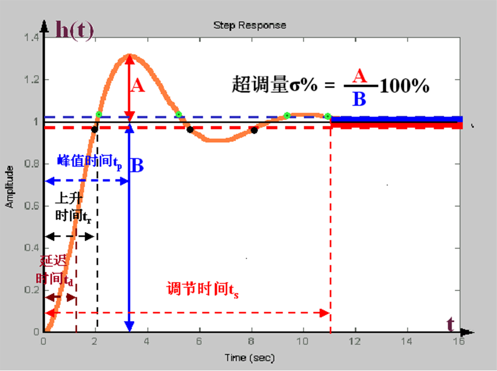
  * 上升时间 Rise time $t_r$ 
    * 欠阻尼 ${c\left(t\right)|}_{t=t_r}=c(\infty)$
    * 过阻尼 $t_r=t_2-t_1=0.9c\left(\infty\right)-0.1c(\infty)$
  * 延迟/滞后时间 Delay time $t_d$：表征系统惯性 ${c\left(t\right)|}_{t=t_r}=0.5c(\infty)$
  * 峰值时间 Peak time $t_p$:只定义在欠阻尼系统 ${\frac{c\left(t\right)}{dt}|}_{t=t_p}=0(the\ first\ peak)$
  * 调整时间 Settling time $t_s$：第一次到达某个误差区间的时间 $\left|c\left(t\right)-c\left(\infty\right)\right|_{t=t\left(s\right)}\leq\Delta$
  * 误差带 error band $\Delta=0.02c(\infty)\ or\ 0.05c(\infty)$
  * 超调量/最大偏差 Percent overshoot $\sigma_p=\frac{c\left(t_p\right)-c(\infty)}{c(\infty)}\ast 100\%$：只定义在欠阻尼曲线
* 稳态误差 Steady-state performance

## *一阶系统的时间响应及动态性能*

### 一阶系统（系统闭环传函是一阶的）传递函数标准形式及单位阶跃响应

* 开环传函 Open-loop transfer function: $G\left(s\right)=\frac{K}{s}$
* 闭环传函 Close-loop transfer function: $\Phi\left(s\right)=\frac{\frac{K}{S}}{1+\frac{K}{S}}=\frac{K}{s+K}=\frac{\frac{1}{T}}{s+\frac{1}{T}}=\frac{1}{Ts+1}$，时间常数$T=\frac{1}{K}$

### 一阶系统动态性能指标计算

$h\left(t_S\right)=1-e^{-\frac{t_s}{T}}=0.95,\ T_s=3T$

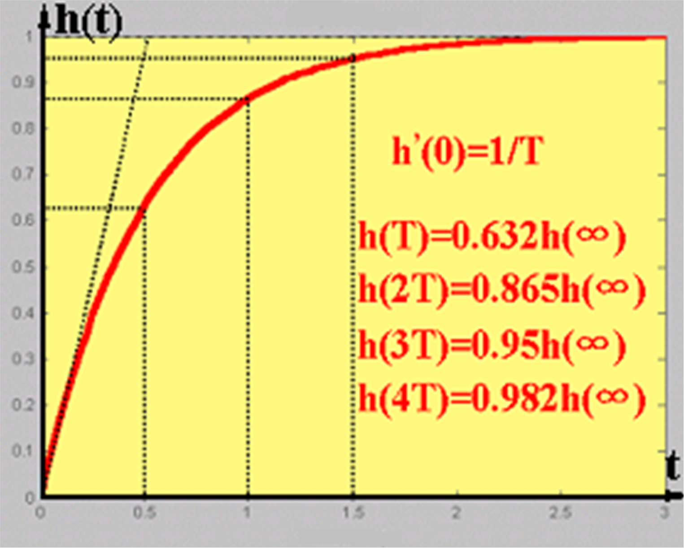
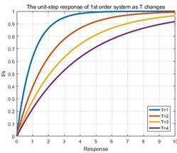

### 典型输入下一阶系统的响应

## *二阶系统的时间响应及动态性能 Second-order system*

### 二阶系统传递函数标准形式及分类

* 典型结构
  * 开环增益 $G\left(s\right)=\frac{\omega_n^2}{s(s+2\xi\omega_n)},\ k=\frac{\omega_n}{2\xi}$
  * 闭环增益 $\Phi\left(s\right)=\frac{\omega_n^2}{s^2+2\xi\omega_ns+\omega_n^2}$，$\omega_n$为无阻尼自然频率 natural frequency，$\xi$为阻尼比 damp ratio
  
* 二阶系统的分类 $D\left(s\right)=s^2+2\xi\omega_ns+\omega_n^2\ =0$ 特征根为 $\lambda_{1,2}=-\xi\omega_n\pm\omega_n\sqrt{\xi^2-1}$
  
  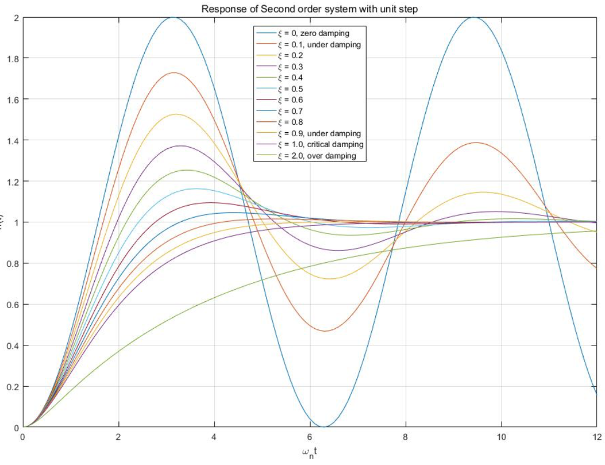
  
  * 0阻尼 0 damping $\xi=0,\ \lambda_{1,2}=\pm j\omega_n$ 不收敛的等幅振动曲线
  * 欠阻尼 Under damping $0<\xi<1,\ \lambda_{1,2}=-\xi\omega_n\pm j\sqrt{1-\xi^2}\omega_n$ 有超调量的收敛过程
  * 临界阻尼 Critical damping $\xi=1,\ \lambda_{1,2}=-\omega_n$ 初值斜率为0的无线逼近1的单调上升曲线
  * 过阻尼 Over damping $\xi>1,\ \lambda_{1,2}=-\xi\omega_n\pm j\sqrt{\xi^2-1}\omega_n$
  * $\xi\le0$ zero or negative damping case 不稳定
    * $\xi=0$ 等幅震荡
    * $-1<\xi<0$ 增幅震荡
    * $\xi<-1$ 指数上升

### $\xi\geq1$, 过阻尼/临界阻尼二阶系统动态性能指标计算

* 设过阻尼二阶系统的极点为
  $$
  \lambda_1=-\frac{1}{T_1}=-\left(\xi-\sqrt{\xi^2-1}\right)\omega_n \lambda_2=-\frac{1}{T_2}=-\left(\xi-\sqrt{\xi^2-1}\right)\omega_n
  $$

* 系统单位阶跃响应的拉氏变换
  $$
  C\left(s\right)=\Phi\left(s\right)R\left(s\right)=\frac{\omega_n^2}{\left(s+\frac{1}{T_1}\right)\left(s+\frac{1}{T_2}\right)\ }\frac{1}{s}\
  $$

* 进行拉氏反变换，得出系统单位阶跃响应
  $$
  h\left(t\right)=1+\frac{e^{-\frac{t}{T_1}}}{\frac{T_2}{T_1}-1}+\frac{e^{-\frac{t}{T_2}}}{\frac{T_1}{T_2}-1}(t\geq0)
  $$

* 通过不同 $T_1\&T_2$的组合查表计算 $t_s$  

* 由 $s^2+2\xi\omega_ns+\omega_n^2=\left(s+\frac{1}{T_1}\right)\left(s+\frac{1}{T_2}\right)$ 得 $\xi=\frac{1+(T_1/T_2)}{2\sqrt{T_1/T_2}}$

### 欠阻尼二阶系统动态性能指标计算

* 欠阻尼二阶系统极点的两种表示方法
  * 直角坐标 $\lambda_{1,2}=\sigma\pm j\omega_d=-\xi\omega_n\pm j\sqrt{1-\xi^2}\omega_n$
  * 极坐标 $\left\{\begin{array}{c}\lambda=\omega_n\\\angle\lambda=\beta\end{array}\right. \left\{\begin{array}{c}\cos{\beta}=\xi\\\sin{\beta}=\sqrt{1-\xi^2}\end{array}\right.$
  
* 欠阻尼二阶系统的单位阶跃响应
  * 系统的单位阶跃响应的拉氏变换
    $$
    C\left(s\right)=\Phi\left(s\right)R\left(s\right)=\frac{\omega_n^2}{s^2+2\xi\omega_ns+\omega_n^2}\frac{1}{s}=\frac{\left[s^2+2\xi\omega_ns+\omega_n^2\right]-s(s+2\xi\omega_n)}{s(s^2+2\xi\omega_ns+\omega_n^2)}=\frac{1}{s}-\frac{s+2\xi\omega_n}{\left(s+\xi\omega_n\right)^2+\left(1-\xi^2\right)\omega_n^2}\\=\frac{1}{s}-\frac{s+\xi\omega_n}{\left(s+\xi\omega_n\right)^2+\left(1-\xi^2\right)\omega_n^2}-\frac{\xi}{\sqrt{1-\xi^2}}\frac{\sqrt{1-\xi^2}\omega_n}{\left(s+\xi\omega_n\right)^2+\left(1-\xi^2\right)\omega_n^2}
    $$
  
  * 利用复位移定理
    $$
    h\left(t\right)=1-e^{-\xi\omega_nt}\cos{\left(\sqrt{1-\xi^2}\omega_nt\right)}-\frac{\xi}{\sqrt{1-\xi^2}}e^{-\xi\omega_nt}\sin{\left(\sqrt{1-\xi^2}\omega_nt\right)}\\=1-\frac{e^{-\xi\omega_nt}}{\sqrt{1-\xi^2}}\left[\sqrt{1-\xi^2}\cos{\left(\sqrt{1-\xi^2}\omega_nt\right)}+\xi\sin{\left(\sqrt{1-\xi^2}\omega_nt\right)}\right]\\=1-\frac{e^{-\xi\omega_nt}}{\sqrt{1-\xi^2}}\sin{\left(\sqrt{1-\xi^2}\omega_nt+\arctan{\frac{\sqrt{1-\xi^2}}{\xi}}\right)}=1-\frac{e^{-\xi\omega_nt}}{\sqrt{1-\xi^2}}\sin{\left(\sqrt{1-\xi^2}\omega_nt+\beta\right)}
    $$
    
  * 为了求峰值点，即 $h(t)’=0$，系统单位脉冲响应
    $$
    k\left(t\right)=h^\prime\left(t\right)=\mathcal{L}^{-1}\left[\Phi\left(s\right)\right]=\mathcal{L}^{-1}\left[\frac{\omega_n^2}{s^2+2\xi\omega_ns+\omega_n^2}\right]\\=\mathcal{L}^{-1}\left[\frac{\omega_n}{\sqrt{1-\xi^2}}\frac{\sqrt{1-\xi^2}\omega_n}{\left(s+\xi\omega_n\right)^2+\left(1-\xi^2\right)\omega_n^2}\right]=\frac{\omega_n}{\sqrt{1-\xi^2}}e^{-\xi\omega_nt}\sin{(\sqrt{1-\xi^2}\omega_nt)}
    $$
  
* 最佳阻尼比：$\xi=\sqrt2=0.707$

* 欠阻尼二阶系统动态性能指标计算
  * 峰值时间 Peak time
    $$
    h^\prime\left(t\right)=k\left(t\right)=\sin{\left(\sqrt{1-\xi^2}\omega_nt_p\right)}=0\\t_p=\frac{\pi}{\sqrt{1-\xi^2}\omega_n}=\frac{\pi}{Im\lambda}
    $$
    
  * 超调量 Overshoot
    $$
    h\left(t_p\right)=1+e^{-\frac{\xi\pi}{\sqrt{1-\xi^2}}} \sigma\%=\frac{h\left(t_p\right)-h\left(\infty\right)}{h\left(\infty\right)}\ast100\%=e^{-\frac{\xi\pi}{\sqrt{1-\xi^2}}}\ast100\%
    $$
  
  * 超调量 $\sigma$ 只和阻尼比 $\xi$ 有关
  
  * 调节时间 Setting time用定义求解欠阻尼二阶系统的调节时间比较麻烦，为简化计算，通常按阶跃响应的包络线进入5%或2%误差带的时间计算调节时间
    $$
    \left|1+\frac{e^{-\xi\omega_nt}}{\sqrt{1-\xi^2}}-1\right|=\frac{e^{-\xi\omega_nt}}{\sqrt{1-\xi^2}}=0.05\ or\ 0.02\\t_s=-\frac{\ln{0.05}+\frac{1}{2}\ln{(1-\xi^2)}}{\xi\omega_n}\approx-\ln{\Delta\sqrt{1-\xi^2}}{\xi\omega_n}={\color{red}\frac{3.5}{\xi\omega n}(\Delta=5\%)\ or\ \frac{4}{\xi\omega n}(\Delta=2\%)}
    $$
    
    
    * 最佳阻尼比 Optimum damping ratio 选取阻尼比要看实际工程需要：民航客机取大阻尼比减小超调，战斗机取小阻尼比增大超调，减小调节时间
  
* 典型欠阻尼二阶系统动态性能、系统参数及极点分布之间的关系
  * 从直角坐标变化
    $$
    \left\{\begin{array}{c}\sigma=\xi\omega_n\uparrow\Rightarrow\left\{\begin{array}{c}t_p=\frac{\pi}{\sqrt{1-\xi^2}\omega_n}\rightarrow\\t_s=\frac{3.5}{\xi\omega_n}\downarrow\\\beta\downarrow\Rightarrow\xi\uparrow\Rightarrow\sigma\%=e^{-\frac{\xi\pi}{\sqrt{1-\xi^2}}}\downarrow\end{array}\right.\\\omega_d=\sqrt{1-\xi^2}\omega_n\uparrow\Rightarrow\left\{\begin{array}{c}t_p=\frac{\pi}{\sqrt{1-\xi^2}\omega_n}\downarrow\\t_s=\frac{3.5}{\xi\omega_n}\rightarrow\\\beta\uparrow\Rightarrow\xi\rightarrow\Rightarrow\sigma\%\uparrow\end{array}\right.\end{array}\right.
    $$
    
  * 从极坐标变化
    $$
    \left\{\begin{array}{c}\beta\uparrow=\xi\omega_n\downarrow\Rightarrow\left\{\begin{array}{c}t_p=\frac{\pi}{\sqrt{1-\xi^2}\omega_n}\uparrow\\t_s=\frac{3.5}{\xi\omega_n}\downarrow\\\beta\downarrow\Rightarrow\xi\uparrow\Rightarrow\sigma\%=e^{-\frac{\xi\pi}{\sqrt{1-\xi^2}}}\downarrow\end{array}\right.\\\omega_n\uparrow\Rightarrow\left\{\begin{array}{c}t_p=\frac{\pi}{\sqrt{1-\xi^2}\omega_n}\downarrow\\t_s=\frac{3.5}{\xi\omega_n}\downarrow\\\beta\rightarrow\Rightarrow\xi\rightarrow\Rightarrow\sigma\%\rightarrow\end{array}\right.\end{array}\right.
    $$

### 改善二阶系统动态性能的措施

* 测速反馈 – 增加阻尼
* 比例加微分 PD控制 – 提前控制
  * 二阶振荡系统的零点极点法

### 附加闭环零极点对系统动态性能的影响

## *高阶系统的时间响应及动态性能*

### 高阶系统单位阶跃响应

### 闭环主导极点：距离虚轴最近而且附近又没有闭环零点的闭环极点

### 估算高阶系统动态性能指标的零点极点法

* 通过 $\Phi(s)$ 画出闭环零极点图
* 略去非主导零极点和不寻常靠近虚轴的偶极子，保留主导极点根
* 根据表3-7计算系统动态性能

## *线性系统的稳定性分析*

### 稳定性的定义

* 如果在扰动作用下系统偏离了原来的平衡状态，当扰动消失后，系统自身能够以足够的准确度恢复到原来的平衡状态，则系统是稳定的，否则则不稳定
* Another definition: a system is stable if and only if this system always has a bounded response to a bounded input当且仅当系统稳定时有界的输入能够得到有界的输出

### 稳定的充要条件

系统闭环特征方程的所有根都具有负的实部，即所有闭环特征跟均位于s平面左半面

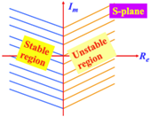

* 设系统闭环传函为
  $$
  \Phi\left(s\right)=\frac{M\left(s\right)}{D(s)}=\frac{b_m\left(s-z_1\right)\left(s-z_2\right)\ldots(s-z_m)}{a_n\left(s-\lambda_1\right)\left(s-\lambda_2\right)\ldots(s-\lambda_m)}
  $$

* 设闭环极点为互不相同的单根，则单位脉冲响应的拉氏反变换为
  $$
  C\left(s\right)=\frac{A_1}{s-\lambda_1}+\frac{A_2}{s-\lambda_2}+\ldots+\frac{A_n}{s-\lambda_n}=\sum\limits_{i=1}^{n}\frac{A_i}{s-\lambda_i}
  $$

* 拉氏反变换求单位脉冲响应：$k\left(t\right)=A_1e^{\lambda_1t}+A_2e^{\lambda_2t}+\ldots+A_ne^{\lambda_nt}=\sum\limits_{i=1}^{n}{A_ie^{\lambda_it}}$

* 若施加单位脉冲响应$\lim\limits_{t\rightarrow\infty}{k\left(t\right)}=\lim\limits_{t\rightarrow\infty}\sum\limits_{i=1}^{n}{A_ie^{\lambda_it}}=0$，则系统是稳定的，得到$\lim\limits_{t\rightarrow\infty}e^{\lambda_it}=0$，则特征根必有负实部

### 稳定判据, 设系统特征方程$D\left(s\right)=a_ns^n+a_{n-1}s^{n-1}+\ldots a_1s+a_0=0$

* 判定稳定的必要条件：$a_i>0$

* 劳斯判据 Routh criterion：使用闭环传函的特征方程（即分子）。系统稳定的充分必要条件是劳斯表中第一列系数都大于零，否则系统不稳定，而且第一列系数符号改变的次数就是系统特征方程中正实部跟的个数

  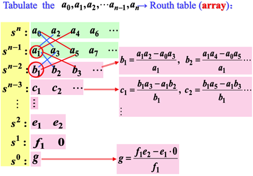

* 劳斯判据的特点：代数稳定判据
  * 由闭环特征多项式系数（不解根）判定系统稳定性
  * 不能用于研究如何调整系统结构来改善系统稳定性的问题
  
* 劳斯判据特殊情况的处理
  * 某行第一列元素为零而该行元素不全为零时，用一个很小的整数$\varepsilon$代替第一列的零元素参与计算，表格计算完成后再令$\varepsilon\rightarrow0$
  * 某行元素全部为零时，利用上一行元素构成辅助方程，对辅助方程求导得到新的方程，用新方程的系数代替该行的零元素继续计算
  
* 稳定性结论
  * 系统的稳定性是其自身的属性，与输入类型、形式无关
  * 系统稳定与否，只取决于闭环极点，与闭环零点无关，闭环零点会影响留数，因此会改变动态性能，但不影响稳定性，闭环极点决定模态，因此决定系统的稳定性
  * 闭环系统的稳定性与其开环是否稳定没有直接关系

## *线性系统的稳态误差*

### 概述

稳态误差是系统的稳态性能指标，是对系统控制精度的度量。对稳定的系统研究稳态误差才有意义，所以计算稳态误差以系统稳定为前提。

### 误差与稳态误差

* 误差
  * 按输入端定义的误差 $E\left(s\right)=R\left(s\right)-H(s)C(s)$
  * 按输出端定义的误差
* 稳态误差
  * 静态误差 $e_{ss}=\lim\limits_{t\rightarrow\infty}{e\left(t\right)=e(\infty)}$
  * 动态误差：误差中的稳态分量$e_s(t)$
  
### 计算稳态误差的一般方法

* 判定系统的稳定性
* 求误差传递函数 $\Phi_e\left(s\right)=\frac{E(s)}{R(s)}$  $\Phi_{en}\left(s\right)=\frac{E(s)}{N(s)}$
* 用终值定理求稳态误差 $e_{ss}=\lim\limits_{s\rightarrow 0}{[\Phi_{e}(s)R(s)+\Phi_{en}(s)N(s)]}$

### 静态误差系数法

型别/无差度|静态误差系数|稳态误差计算
:-|:-|:-
$V|$k_p=\lim\limits{s\rightarrow0}{G_1H}=\lim\limits{s\rightarrow0}\frac{K}{s^v}$|$k_p=\lim\limits_{s\rightarrow0}{sG_1H}=\lim\limits_{s\rightarrow0}\frac{K}{s^{v-1}}$|$k_p=\lim\limits_{s\rightarrow0}{s^2G_1H}=\lim\limits_{s\rightarrow0}\frac{K}{s^{v-2}}$|$r=A\bullet1(t)$ $e_{ss}=\frac{A}{1+K_P}$|$r=A\bullet t$ $e_{ss}=\frac{A}{K_v}$|$r=A\bullet\frac{t^2}{2}$ $e_{ss}=\frac{A}{1+K_a}$
0|K|0|0|$\frac{A}{1+K}$|$\infty$|\infty
I|\infty|K|0|0|$\frac{A}{K}$|$\infty$
II|$\infty$|$\infty$|K|0||0|$\frac{A}{K}$

### 干扰作用引起的稳态误差分析

### 动态误差系数法

## 线性系统时域矫正

### 反馈矫正

### 复合矫正

# 根轨迹 Root locus（复域分析）

## *根轨迹的基本概念*

### 定义

根轨迹：系统某一参数由$0\rightarrow\infty$变化时，闭环极点$\lambda$在s平面相应变化所描绘出来的轨迹

### 特点：三大分析校正方法之一，即复域分析

* 图解方法，直观、形象
* 适合于研究当系统中某一参数变化时，系统性能的变化趋势
* 近似方法，不十分精确

### 根轨迹与系统性能

* 稳定性
* 稳态性能
* 动态性能

### 闭环零、极点与开环零、极点之间的关系

由控制系统的一般结构假设 $G\left(s\right)=\frac{K_G^\ast\prod\limits_{i=1}^{f}{(s-z_i)}}{\prod\limits_{i=1}^{m}{(s-p_i)}} H\left(s\right)=\frac{K_H^\ast\prod\limits_{j=f+1}^{m}{(s-z_j)}}{\prod\limits_{j=g+1}^{n}{(s-p_j)}}$

得 $G\left(s\right)H\left(s\right)=\frac{K^\ast\prod\limits_{i=1}^{f}{(s-z_i)}\prod\limits_{j=f+1}^{m}{(s-z_j)}}{\prod\limits_{i=1}^{m}{(s-p_i)}\prod\limits_{j=g+1}^{n}{(s-p_j)}} K^\ast=K_G^\ast K_H^\ast$ 为系统根轨迹增益（即携程首1标准形得到的开环增益）

对于有m个零点，n个极点的开环系统，其开环传函为 $G\left(s\right)H\left(s\right)=\frac{K^\ast\prod\limits_{i=1}^{m}{(s-z_i)}}{\prod\limits_{j=1}^{n}{(s-p_j)}}$

其闭环传函为 $\Phi\left(s\right)=\frac{G\left(s\right)}{1+G\left(s\right)H\left(s\right)}=\frac{K_G^\ast\prod\limits_{i=1}^{f}{(s-z_i)}\prod\limits_{j=g+1}^{n}{(s-p_j)}}{\prod\limits_{j=1}^{n}{(s-p_j)}+K^\ast\prod\limits_{i=1}^{f}{(s-z_i)}}$
由此可见：闭环零点由前向通路传函的零点和反馈通路传函的极点决定，其不随开环增益变化。闭环极点与开环零点、开环极点以及根轨迹增益有关，我们需要研究闭环极点随根轨迹增益变换的规律

### 根轨迹方程

系统的闭环特征方程 $1+G\left(s\right)H\left(s\right)=0$ 即 $G\left(s\right)H\left(s\right)=\frac{K^\ast\prod\limits_{i=1}^{m}{(s-z_i)}}{\prod\limits_{j=1}^{n}{(s-p_j)}}=-1$

$\left\{\begin{array}{c}模值条件：\lvert G(s)H(s)\rvert=\frac{K^*\prod\limits_{i=1}^{m}}{\prod\limits_{j=1}^{n}{(s-p_j)}}=-1\\相角条件：\angle G(s)H(s)=\prod\limits_{i=1}^{m}{\angle(s-z_i)}-\prod\limits_{j=1}^{n}{\angle(s-p_i)}=(2k+1)\pi\end{array}\right.$

## *绘制根轨迹的基本法则*

* 根轨迹的起点和终点：根轨迹起始于开环极点，终止于开环零点；如果开环极点个数n大于开环零点个数m，则有n-m条根轨迹终止于无穷远处
* 根轨迹的分支数，对称性和连续性：根轨迹的分支数=开环极点数；根轨迹连续且对称于实轴
* 实轴上的根轨迹：从实轴上最右端的开环零、极点算起，奇数开环零、极点到偶数开环零、极点之间的区域必是根轨迹
* 跟之和：$\sum\limits_{i=1}^{n}\lambda_i=C,\ (n-m\geq2) n-m\geq2$ 时，闭环跟之和保持一个常值
* 根轨迹的渐近线：当系统开环极点个数n大于开环零点个数m时，由n-m条根轨迹分支沿着与实轴夹角为 $\varphi_a$、交点为$\sigma_a$ 的一组渐近线趋向于无穷远处，且有 $\left\{\begin{array}{c}\frac{\varphi_a=(2k+1)\pi}{n-m}\\\sigma_a=\frac{\sum\limits_{j=1}^{n}{p_j}-\sum\limits_{i=1}^{m}{z_i}}{n-m}\end{array}\right.$
* 根轨迹的分离点d：$\sum\limits_{i=1}^{n}\frac{1}{d-p_i}=\sum\limits_{i=1}^{m}\frac{1}{d-z_j}$
* 与虚轴交点：1.系统临界稳定点2.$s=j\omega$ 是根的点
* 出射角 $\theta$ 入射角 $\varphi$（起始角/终止角）：$\sum\limits_{i=1}^{n}{\angle(s-p_i)}-\sum\limits_{j=1}^{m}{\angle\left(s-z_j\right)}=(2k+1)\pi$(或者直接是-180)

## 广义根轨迹

### 参数根轨迹—除$K^*$之外其他参数变化时系统的根轨迹

### 零度根轨迹—系统实质上处于正反馈时的根轨迹

## 利用根轨迹分析系统性能

# 线性系统的频域分析与校正（以稳态正弦作为输入在频域下研究系统）

## 频率特性的基本概念

### 频域分析法特点

* 研究稳态正弦响应的幅值和相角随频率的变化规律
* 由开环频率特性研究闭环稳定性及性能
* 图解分析法，方便，实用
* 有一定的近似性

### 频率响应 Frequency response

### 频率特性 Frequency characteristic

* 定义一物理意义：线性定常系统的频率特性定义为系统的稳态正弦响应与输入正弦信号的复数比，用$G(j\omega)$表示，即$G(j\omega)=\lvert G(j\omega)\rvert e^{j\angle G(j\omega)}\Rightarrow\left\{\begin{array}{c}\lvert G(j\omega)\rvert=\frac{\lvert c_s(t)\rvert}{\lvert r(t)\rvert}=\frac{1}{\sqrt{1+\omega^2T^2}}，幅值特性\\\angle c_s(t)-\angle r(t)=-\arctan{\omega T}，相频特性\end{array}\right.$
* $\frac{X\lvert G(j\omega)\rvert e^{j\angle G(j\omega)}}{Xe^{j0}}=\lvert G(j\omega)\rvert e^{j\angle G(j\omega)}=A(\omega)\varphi(\omega)$
* 定义二：$G\left(j\omega\right)={G\left(s\right)|}_{s=j\omega}=\frac{1}{\sqrt{1+\omega^2T^2}}\angle-\arctan{\omega T}=\lvert\frac{1}{1+j\omega T}\rvert\angle\frac{1}{1+j\omega T}=\frac{1}{1+j\omega T}={\frac{1}{Ts+1}|}_{s=j\omega}$
* 定义三：$G\left(j\omega\right)=\frac{C(j\omega)}{R(j\omega)}$

### 频率特性的图形表示方法

* 频率特性曲线
  * Amplitude-frequency characteristic 幅频特性曲线：  
  * Phase-frequency characteristic 相频特性曲线：
* Amplitude-phase characteristic 幅相特性（Nyquist）：G平就是用极坐标来表示的复平面
* Logarithm frequency characteristic 对数频率特性（Bode）：幅频特性&相频特性
* Logarithm phase characteristic 对数幅相特性（Nichols）：

## 开环幅相频率特性（Nyquist图）：绘制在用极坐标来表示的复平面G平面上

### 绘制思路

将系统在s平面的开环零极点分布图画出来，令$s=j\omega$沿虚轴变化，当$\omega=0\rightarrow\infty$时，分析各零极点指向$s=j\omega$的复向量的变化趋势，就可以推断各典型环节频率特性的变化规律，从而概略画出系统的开环幅相特性曲线。

### 典型环节的幅相频率特性曲线

* 比例环节 $G\left(s\right)=K G\left(j\omega\right)=K G=K\angle G=0\degree$
* 微分环节 $G\left(s\right)=s G\left(j\omega\right)=j\omega G=\omega\angle G=90\degree$
* 积分环节 $G\left(s\right)=\frac{1}{s} G\left(j\omega\right)=\frac{1}{j\omega} G=1ω∠G=-90°$
* 惯性环节 $G\left(s\right)=\frac{1}{Ts+1} G\left(j\omega\right)=\frac{1}{1+j\omega T} G=11+ω2T2∠G=-arctanωT$
  * 不稳定惯性环节 
* 一阶复合微分环节 $Ts\pm1 G\left(j\omega\right)=\pm1+j\omega T G=1+ω2T2∠G=arctanωT180°-arctanωT$  
* 二阶振荡环节 $G\left(s\right)=\frac{\omega_n^2}{s^2+2\xi\omega_ns+\omega_n^2}=\frac{1}{\left(\frac{s}{\omega_n}\right)^2+2\xi\frac{s}{\omega_n}+1}=\frac{\omega_n^2}{(s-\lambda_!)(s-\lambda_2)} G\left(j\omega\right)=\frac{1}{1-\frac{\omega^2}{\omega_n^2}+j2\xi\frac{\omega}{\omega_n}} G=11-ω2ωn22+2ξωωn2∠G=-arctam2ξωωn1-ω2ωn2$ 
  * 谐振频率 $\omega_r$ 和谐振峰值 $M_r$
  $\left|G\right|=\frac{1}{\sqrt{\left[1-\frac{\omega^2}{\omega_n^2}\right]^2+\left[2\xi\frac{\omega}{\omega_n}\right]^2}} \frac{d}{d\omega}\left|G\right|=0 \frac{d}{d\omega}\left\{\left[1-\frac{\omega^2}{\omega_n^2}\right]^2+\left[2\xi\frac{\omega}{\omega_n}\right]^2\right\}=0 ωr=ωn1-2ξ2Mr=Aωr=12ξ1-ξ2$
* 二阶复合微分环节 G\left(s\right)=T^2s^2+2\xi Ts+1=\left(\frac{s}{\omega_n}\right)^2+2\xi\frac{s}{\omega_n}+1 G\left(j\omega\right)=1-\frac{\omega^2}{\omega_n^2}+j2\xi\frac{\omega}{\omega_n}
* 延迟环节G\left(s\right)=e^{-\tau s} G\left(j\omega\right)=e^{-j\tau\omega} G=1∠G=-τω

### 开环系统幅相特性曲线的绘制

* 起点：K∠0°,v=0∞∠-90°v,v>0
* 终点：0\angle-90°(n-m)
* 化成X+jY的形式求幅相频率特性G\left(j\omega\right)与Re, Im轴的交点

## 对数频率特性（Bode图）

是 $G\left(j\omega\right)$ 的对数值 $20\lg{\lvert G(j\omega)\rvert}$ 与频率的关系曲线

### Bode图介绍

坐标特点横轴按lgω刻度，dec“十倍频程”或“旬距”按ω标定，等距等比纵轴Lω=20lgG(jω)lgPcPr贝尔=10lgPcPr(分贝) 特点幅值相乘=对数相加，便于叠加作图可在大范围内表示频率特性利用实验数据容易确定Lω，进而确定G(s)

### 典型环节的Bode图

* 比例环节 G\left(j\omega\right)=K Lω=20lgG=20lgKφ(ω)=0°  
* 微分环节 G\left(j\omega\right)=j\omega G(jω)=ω⟹Lω=20lgGjω=20logωφω=90°  
* 一阶复合微分 G\left(j\omega\right)=\pm1+j\omega T Lω=20lgG=20lg1+ω2T2=0,ω≪1T3dB,ω=1T20log⁡(ωT),ω≫1Tφω=arctanωT-180°+arctanωT  
* 二阶复合微分
* 积分环节 \frac{1}{s} G\left(j\omega\right)=\frac{1}{j\omega}\rightarrowG(jω)=1ω⟹Lω=20lgGjω=-20logωφω=-90°
	惯性环节：G\left(j\omega\right)=\frac{1}{Ts+1} Lω=20lgG=-20lgωTφω=-arctanωT 对数相频特性关于(\omega=\frac{1}{T},\ \varphi=-45°)点对称 G\left(j\omega\right)=\frac{1}{\pm1+j\omega T} Lω=20lgG=-20lg1+ω2T2=0,ω≪1T-3dB,ω=1T-20log⁡(ωT),ω≫1Tφω=-arctanωT-180°+arctanωT 
	二阶振荡环节 G\left(s\right)=\frac{\omega_n^2}{s^2+2\xi\omega_ns+\omega_n^2}=\frac{1}{\left(\frac{s}{\omega_n}\right)^2+2\xi\frac{s}{\omega_n}+1}=\frac{\omega_n^2}{(s-\lambda_!)(s-\lambda_2)} G\left(j\omega\right)=\frac{1}{1-\frac{\omega^2}{\omega_n^2}+j2\xi\frac{\omega}{\omega_n}}=Lω=0,ω≪ωn-20log2ξ-40logωT,ω≫ωn,ω=ωnφω=arctan2ξTω1-ω2T2     
	延迟环节
	开环系统Bode图的绘制
	化G(s)为尾1标准型
	按转折频率从小到大顺序列出，即低频段渐近线
	确定基准线：第一转折频率左边的特性及其延长线 基准点：(ω=1,L1=20lgK)斜率：-20v dB/dec
	叠加作图：一阶惯性环节 1Ts+1：-20dB/dec复合微分 τs+1：+20dB/dec二阶振荡环节 1T2s2+2ξTs+1：-40dB/dec复合微分 T2s2+2ξTs+1：+40dB/dec
	修正：两惯性环节转折频率很接近时振荡环节ξ∉0.38,0.8时
	检查：Lω最右端曲线斜率=-20n-m dB/dec转折点数=惯性+一阶复合微分+振荡+（二阶复合微分）φω⇒-90°(n-m) 
	由对数幅频特性曲线确定开环函数
	最小相角系统和非最小相角系统

## 频率稳定判据

### 奈奎斯特稳定判据/Nyquist criterion

* 特点
  * 由开环频率特性直接判定闭环系统的稳定性
  * 可以研究包含延迟环节的系统的稳定性问题
  * 可研究如何调整系统结构参数改善系统稳定性及性能问题
* 构造辅助函数$F(s)$ $G\left(s\right)=G_0\left(s\right)H\left(s\right)=\frac{M(s)}{N(s)} \Phi\left(s\right)=\frac{G(s)}{1+G(s)H(s)}=\frac{G(s)}{1+\frac{M(s)}{N(s)}}=\frac{N\left(s\right)G_0(s)}{N\left(s\right)+M(s)} F\left(s\right)=1+G\left(s\right)H\left(s\right)=1+\frac{K^\ast M\left(s\right)}{N\left(s\right)}=\frac{N\left(s\right)+K^\ast M\left(s\right)}{N\left(s\right)}$
* $Z=P-2N$ P是右半s平面中开环极点的个数，N是开环幅相特行曲线宝瓶G平面$(-1, j0)$点的圈数（逆时针为正）

### 对数稳定判据

* 公式：Z=P-2NN=N+-N-
* Nyquist图和Bode图的对应关系
  * Nyquist图上$\left|G(j\omega)\right|=1$的单位圆与Bode图上的0dB线相对应。单位圆外部对应Bode图中$L\left(\omega\right)>0$，内部对应0Bode图中$L\left(\omega\right)<0$

## *稳定裕度*

### 定义

### 稳定裕度的计算

## *利用开环对数幅频特性分析系统的性能*

## *闭环频率特性曲线的绘制*

## *利用闭环频率特性分析系统的性能*

## *频率法串联校正*

# 线性离散系统的分析与矫正

## *离散系统*

## *信号采样与保持*

## *Z变换*

## *离散系统的数学模型*

## *稳定性分析*

## 稳态误差计算

## 动态性能分析

## 离散系统的模拟化校正

## 离散系统的数字校正

# 非线性控制系统分析

# 控制系统的状态空间分析与综合

	Time-Domain analysis of the linear systems
	求解含干扰输入的稳态误差
	减小稳态误差的办法
	升高开环增益
	增加前向传函的积分环节
