

# 1. 模拟信号数字处理方法（电话）

## *Telefon*

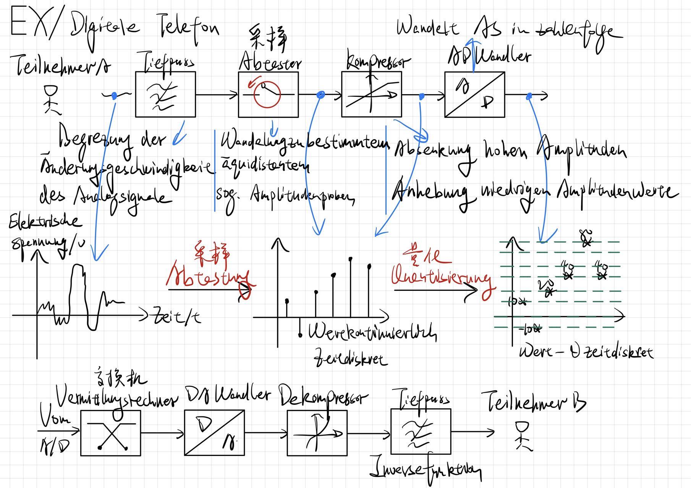

* Tiefpass
  
  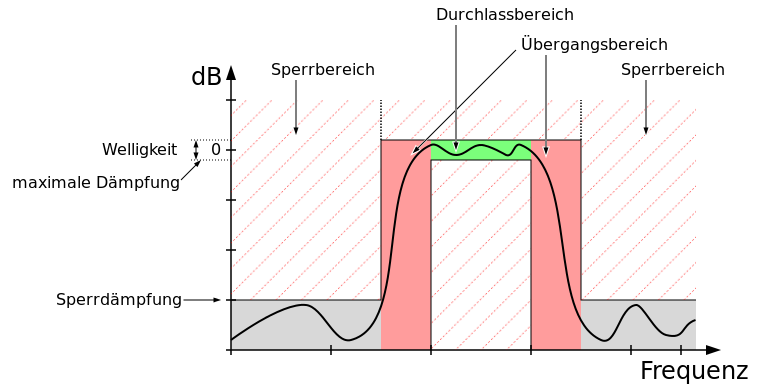
  
  * 采样之前的滤波器作用：滤除无用的高频，抗混叠
  * 最后的滤波器作用：Um das abgestastete Spektrum wieder auszuschneiden
  * 以声音为例，信号输入是3.4kHz，但采样用的是8kHz。如果考虑高频噪音，那么采样频率应该尽可能靠近Nyquist频率，但实际上会留有一些余量，这是因为考虑到取样的时候用的滤波器不可能是理想滤波器，是由过渡带的，所以采样频率略高一些方便恢复。 Denn ein reales Filter hat keine senkreichten Flanken, d.h., man braucht Puffer für den Übergangsbreich (schräger Verlauf zwischen Durchlass- und Sperrbeirech)
  
* Abtaster

* Kompressor/Dekompressor 编/解码器或压缩/解压缩器
  * Ziel: leise Teile nicht verändern, laute Teile dämpfen. Deshalb geringere Amplitude und somit feinere Quantisierungsstufen. 压缩动态范围，提高信噪比 SNR，使量化效果更好
  
  * $\mu$-law ist in US und Japan verwendeteter 8-bit PCM Kompressionalgorithmus, während A-law in Europa
  
    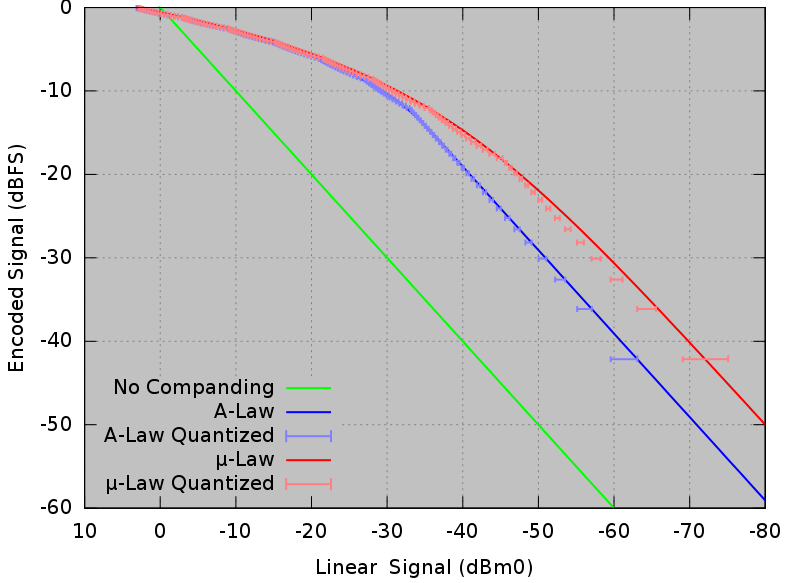
  
* AD-Wandler/DA-Wandler（详见下）

* Vermittlungsrechner

## *AD Wandler und DA Wandler*

Sehr häufig verwendetes Element in elektronischen Geräten: Fernseher, Radio, Telefon usw.

### AD-Wandler

* Abstatung（原理见信号与系统采样定理）
  * Laut Nyquist Theorem，采样频率要高于2倍信号的最高频率 $f_s\geq f_{max}$
  * Aliasing 混叠
* Quantisierung
  * Wertdiskretisierung in n bit: $N=2^n$
  * Diskretisierungsabstand
    * $\Delta=\frac{x_{max}-x_{min}}{N}$
    * $\frac{\Delta}{2}$: Maximaler Fehler pro Messwert
  * Wertgenauigkeit abhängig von N
    * bei großem N, hohe Datenrate, geringes Rauschen
    * bei kleinem N, geringere Datenrate, höheres Rauschen
  * Rauschen 量化噪声1
    
    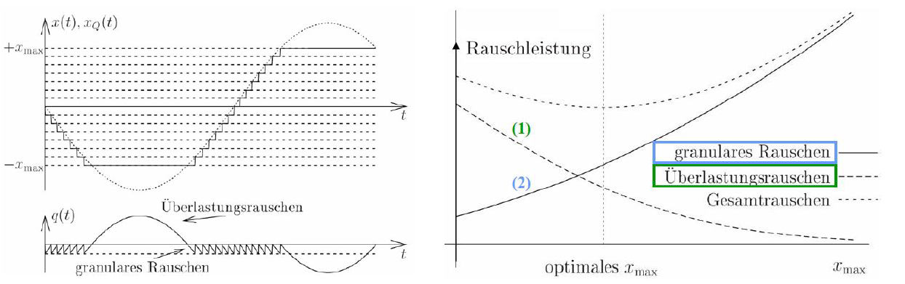
    
    * Je größer $x_{max}$, desto größer $\Delta$ und das granulare Rauschen 基本量化噪声
    * Je kleiner desto größer das Überlastungsrauschen 过载量化噪声

### DA-Wandler

## *Psychoakustik*

### Die menschliche Hörschwelle 人类的听觉域

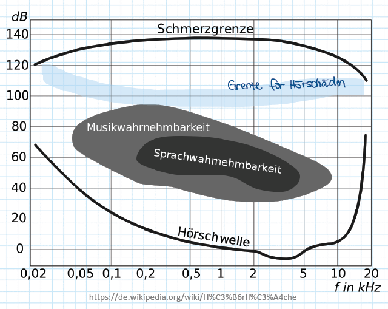

* 人类的听觉对危险信号频段和语言频段比较灵敏，特别是2-5kHz的频段范围
* 低频段灵敏度很低，可以更好入睡，并且身体里很多的声音都处于低频段，灵敏度不适合太高

### Masking/Verdeckung

https://zhuanlan.zhihu.com/p/35197883

* Simultaneous Masking 同时掩蔽或频域掩蔽：Versteckung eines leisen Tons durch einen lauteren mit der selben Frequenz 同频或者频率接近的大响度声音可以掩盖低响度声音。下图中绿色的声域将原来的虚线声域掩盖了

  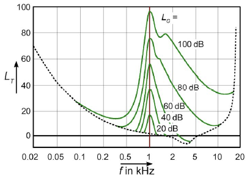

* Temporal Masking 非同时掩蔽或时域掩蔽：Verstekcung von unmittelbar vor oder nach dem lauten Ton auftretenden, leiseren Tönen 一个响度很大的声音能够掩蔽非同时发生的较为柔和的声音
  
  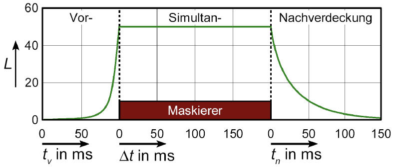
  
  * Pre-masking 10ms 向前掩蔽。因为听觉具有记忆功能，而由于听觉对声音的感觉需要一个建立过程，所以就会有一定的延迟
  * Simultaneous-masking 同时掩蔽
  * Post-masking 10ms 向后掩蔽
  
* Masking in MP3-Kompression: Verstecken von Quantiesierungsfehlern in den maskierten Bereichen oder löschen von unhörbaren Komponeten 掩蔽量化噪声以及去除不能被人耳听到的冗余成分

### Audiokompression

## *Sprachanalyse mit Cepstrum*

### Modell der Sprachproduktion

### Cepstrum 倒谱

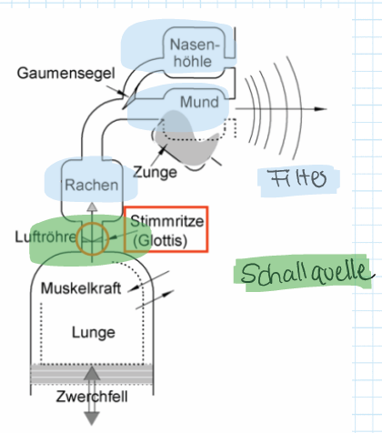

* Modell der Sprachproduktion, $x(t)$ is die Schallquelle (Glottis 声门), Rachen, Mund, Nasenhöhle usw. sind die Filter $h(t)$ （声道）
* Verfahren
  * $s(t)=x(t)\ast h(t)\ \overrightarrow{\mathcal{F}}\ S(\omega)=X(\omega)H(\omega)$
  * 取对数分离信号 $\log{\lvert S(\omega)\rvert}=\log{\lvert X(\omega)\rvert}+\log{\lvert H(\omega)\rvert}$
  * 傅里叶逆变换 Bestimmung der Grundfrequenz $\mathcal{F}^{-1}\left\{\log{\lvert S(\omega)\rvert}\right\}=\mathcal{F}^{-1}\left\{\log{\lvert X(\omega)\rvert}\right\}+\mathcal{F}^{-1}\left\{\log{\lvert H(\omega)\rvert}\right\}$
* Anwendung
  * Echos Detektion
  * Mulplikationen im Frequenzbereich als Addition darstellen und somit die Einflüsse von X und H als Addition sehen (Grundschwingugnen und Harmonische zu trennen 实际中是为了分析基频和共振峰)
  * Spracherkennung, Sprechererkennung

# 2. 时域离散信号和系统的频域分析

## *DTFT 时域离散信号的傅里叶变换*

### 定义

DTFT变换对：$\left\{\begin{array}{c}X(e^{j\omega})=\sum\limits_{n=-\infty}^{\infty}{x_ne^{-j\omega n}}\\x(n)=\frac{1}{2\pi}\int_{-\pi}^{\pi}{X(e^{j\omega})e^{j\omega n}d\omega}\end{array}\right.$

### 补充：共轭对称与共轭反对称 Conjugate Symmetric/Anti-symmetric

* 共轭对称序列 $x_e(n)=x_e^*(-n)$
  * 将共轭对称序列拆成实部和虚部 $x_e(n)=x_{er}(n)+jx_{ei}(n)$
  * 令 $n=-n$，并取共轭，得 $x_e^*(-n)=x_{er}(-n)-jx_{ei}(-n)=x_e(n)\rightarrow\left\{\begin{array}{c}x_{er}(n)=x_{er}(-n)\\x_{ei}(n)=-x_{ei}(-n)\end{array}\right.$
  * 共轭对称矩阵实部是偶函数，虚部是奇函数
* 共轭反对称序列 $x_o(n)=-x_o^*(-n)$
  * 将共轭对称序列拆成实部和虚部 $x_o(n)=x_{or}(n)+jx_{oi}(n)$
  * 令 $n=-n$，并取共轭和相反数，得 $-x_o^*(-n)=-x_{or}(-n)+jx_{oi}(-n)=x_o(n)\rightarrow\left\{\begin{array}{c}x_{or}(n)=-x_{or}(-n)\\x_{oi}(n)=x_{oi}(-n)\end{array}\right.$
  * 共轭对称矩阵实部是奇函数，虚部是偶函数

### 性质

* 周期性
  * $X(e^{j\omega})=\sum\limits_{n=-\infty}^{\infty}{x_ne^{-j\omega n}}=\sum\limits_{n=-\infty}^{\infty}{x_ne^{-j(\omega+2\pi M)n}}=X(e^{j(\omega+2\pi M)})$
  * 这个频域上的周期性是由时域采样定理带来的，即时域采样对应频域的周期延拓。
  * 但连续模拟信号的傅里叶变换不具有这个性质，因为 $F(j\omega)=\int_{-\infty}^{\infty}{f(t)e^{-j\omega t}dt}\neq\int_{-\infty}^{\infty}{f(t)e^{-j(\omega+2\pi)t}dt}$
* 线性
* 时移与频移性质
  * $FT[x(n\pm n_0)]=e^{\pm j\omega n_0}X(e^{j\omega})$
  * $FT[e^{\pm j\omega_0 n}x(n)]=X(e^{j(\omega\mp\omega_0)})$
* 对称性

## *DFS*

DFS变换对
$$
\left\{\begin{array}{c}\widetilde{X}(k)=\sum\limits_{n=0}^{N-1}{\widetilde{x}(n)e^{-j\frac{2\pi}{N}kn}}\\\widetilde{x}(n)=\frac{1}{N}\sum_{k=0}^{N-1}{\widetilde{X}(k)e^{j\frac{2\pi}{N}kn}}\end{array}\right.
$$

## *DTFT与FT之间的关系*

$X(e^{j\omega})=\frac{1}{T}\sum\limits_{k=-\infty}^{\infty}{X_a(j\frac{\omega-2\pi k}{T})}$

时域离散信号的频谱也是模拟信号频谱的周期性延拓

## *序列的Z变换（详见信号与系统第六章）*

## *利用z变换分析信号和系统的频域特性*

### 频率响应函数与系统函数

* 设初始状态为零，系统对输入为单位脉冲序列 $\delta(n)$ 的响应输出称为系统的单位脉冲响应 $h(n)$
* 对 $h(n)$ 进行傅里叶变换，得到系统的频率响应函数，它表征的是系统的频域特性
  * $H(e^{j\omega})=\sum\limits_{n=-\infty}^{\infty}{h(n)e^{-j\omega n}}=\lvert H(e^{j\omega n})\rvert e^{j\varphi(\omega)}$
  * $\lvert H(e^{j\omega n})\rvert$ 称为频幅特性函数
  * $\varphi(\omega)$ 称为相频特性函数
* 对 $h(n)$ 进行z变换，得到系统的系统函数/传递函数 $H(z)$，它表征了系统的傅频域特性
  * $H(z)=\frac{Y(z)}{X(z)}=\frac{\sum\limits_{i=0}^{M}{b_iz^{-i}}}{\sum\limits_{i=0}^{N}{a_iz^{-i}}}$
  * 若 $H(z)$ 的收敛域包含单位圆，则 $H(e^{j\omega})=H(z)|_{z=e^{j\omega}}$

### 频率响应函数

* 若系统输入信号 $x(n)=e^{j\omega n}$，则系统输出信号为
  $$
  y(n)=h(n)\ast x(n)=\sum\limits_{m=-\infty}^{\infty}{h(m)x(n-m)}=\sum\limits_{m=-\infty}^{\infty}{h(m)e^{j\omega(n-m)}}=e^{j\omega n}\sum\limits_{m=-\infty}^{\infty}{h(m)e^{-j\omega m}}=H(e^{j\omega})e^{j\omega n}=\lvert H(e^{j\omega})\rvert e^{j\left[\omega n+\varphi(\omega)\right]}
  $$
  
  * 上式说明，单频复指数 $e^{j\omega n}$ 通过频率响应函数为 $H(e^{j\omega n})$ 的系统后，输出仍然为单频复指数序列，其幅度放大 $\lvert H(e^{j\omega})\rvert$，相移为 $\varphi(\omega)$
  * 同理，单频复指数 $e^{-j\omega n}$ 通过频率响应函数为 $H(e^{j\omega n})$ 的系统后为 $y(n)=H(e^{-j\omega})e^{-j\omega n}$
  
* 若系统输入信号 $x(n)=\cos{\omega n}=\frac{1}{2}\left[e^{j\omega n}+e^{-j\omega n}\right]$，则系统输出信号为 $\lvert H(e^{j\omega})\rvert\cos[\omega n+\varphi(\omega)]$。由此可见，线性时不变系统对单频正弦信号 $\cos{\omega n}$ 的响应为同频正弦信号。即正弦稳态信号通过系统后仍然是正弦稳态响应，但辐角和幅度发生了变化

### 利用系统的极零点分布分析系统的频率响应特性

* 因式分解，其中 $A=\frac{b_0}{a_0}$，$c_r,\ d_r$ 分别是 $H(z)$ 的零点和极点
  $$
  H(z)=\frac{Y(z)}{X(z)}=\frac{\sum\limits_{i=0}^{M}{b_iz^{-i}}}{\sum\limits_{i=0}^{N}{a_iz^{-i}}}=A\frac{\prod\limits_{r=1}^{M}{(1-c_rz^{-1})}}{\prod\limits_{r=1}^{N}{(1-d_rz^{-1})}}
  $$

* 分子分母同乘 $z^{N+M}$
  $$
  H(z)=A\frac{z^{N+M}\prod\limits_{r=1}^{M}{(1-c_rz^{-1})}}{z^{N+M}\prod\limits_{r=1}^{N}{(1-d_rz^{-1})}}=A\frac{z^N\prod\limits_{r=1}^{M}{(z-c_r)}}{z^M\prod\limits_{r=1}^{N}{(z-d_r)}}=Az^{N-M}\frac{\prod\limits_{r=1}^{M}{(z-c_r)}}{\prod\limits_{r=1}^{N}{(z-d_r)}}
  $$

* 设系统稳定，代入 $z=e^{j\omega}$，得到频率响应函数
  $$
  H(e^{j\omega})=Ae^{j\omega(N-M)}\frac{\prod\limits_{r=1}^{M}{(e^{j\omega}-c_r)}}{\prod\limits_{r=1}^{N}{(e^{j\omega}-d_r)}}
  $$

* 在z平面上，$e^{j\omega}-c_r,\ e^{j\omega}-d_r$ 分别为单位圆 $e^{j\omega}$ 上零极点 $c_r,\ d_r$ 指向点 $B$ 的向量，用极坐标表示：$\left\{\begin{array}{c}\overrightarrow{c_rB}=c_rBe^{j\alpha_r}\\\overrightarrow{d_rB}=d_rBe^{j\beta_r}\end{array}\right.$ 

  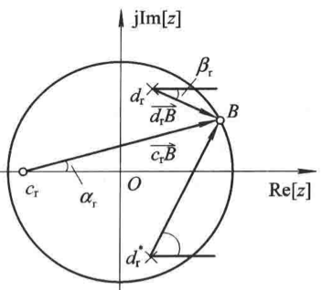

* 将两直线坐标代入
  $$
  H(e^{j\omega})=Ae^{j\omega(N-M)}\frac{\prod\limits_{r=1}^{M}{\overrightarrow{c_rB}}}{\prod\limits_{r=1}^{N}{\overrightarrow{d_rB}}}=\lvert H(e^{j\omega})\rvert e^{j\varphi(\omega)}\longrightarrow\left\{\begin{array}{l}\lvert H(e^{j\omega})\rvert=\lvert A\rvert=\frac{\prod\limits_{r=1}^{M}{\overrightarrow{c_rB}}}{\prod\limits_{r=1}^{N}{\overrightarrow{d_rB}}}\\\varphi(\omega)=\omega(N-M)+\sum\limits_{r=1}^{M}{\alpha_r}-\sum\limits_{r=1}^{M}{\beta_r}\end{array}\right.
  $$
  
  
  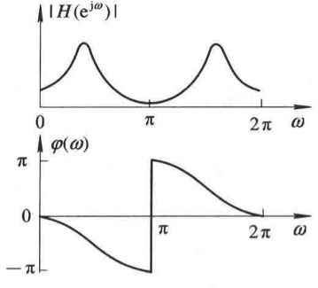
  
  * 如上图所示，假设两个Pole，一个Null
  * 极点增强效应：极点位置主要影响频响的峰值位置及尖锐程度
  * 零点抑制效应：零点位置主要影响频响的谷点位置及形状

# 3. DFT 离散傅里叶变换

## *DFT*

### 定义

DFT变换对，其中旋转因子 $W_N=e^{-j\frac{2\pi}{N}}$
$$
\left\{\begin{array}{l}X(k)=\sum\limits_{n=0}^{N-1}{x(n)W_N^{kn}},0\leq k\leq N-1\\x(n)=\frac{1}{N}\sum\limits_{k=0}^{N-1}{X(k)W_N^{kn}},0\leq n\leq N-1\end{array}\right.
$$

### 旋转因子的性质

* 周期性 $W_N^m=e^{-j\frac{2\pi}{N}m}=e^{-j\frac{2\pi}{N}(m+lN)}=e^{-j\frac{2\pi}{N}m+-j2\pi l}=W_N^{m+lN}$
* 对称性的三种形式
  * $W_N^{-m}=e^{j\frac{2\pi}{N}m}=e^{-j\frac{2\pi}{N}(N-m)}=W_N^{N-m}$
  * $[W_N^{N-m}]^*=W_N^m$
  * $W_N^{m+\frac{N}{2}}=e^{-j\frac{2\pi}{N}(m+\frac{N}{2})}=-W_N^m$
* 可约性 $W_N^m=e^{-j\frac{2\pi}{N/n}m/n}=W_{N/n}^{m/n}$，$N/n, m/n$ 要为整数

### DFT与傅里叶变换和Z变换的关系

设序列 $x(n)$ 的长度为M，其Z变换和 $N(N\geq M)$ 点DFT分别为

* $X(z)=ZT[x(n)]=\sum\limits_{n=0}^{M-1}{x(n)z^{-n}}$
* $X(k)=DFT[x(n)]_N=\sum\limits_{n=0}^{M-1}{x(n)W_N^{kn}},\ k=0,1,\cdots,N-1$

比较上式可知 $X(k)=X(z)|_{z=e^{j\frac{2\pi}{N}k}}$ 或 $X(k)=X(e^{j\omega})_{\omega=\frac{2\pi}{N}k}$，说明序列 $x(n)$ 的N点DFT是 $x(n)$ 的Z变换在单位圆上的N点等间隔采样

### DFT的隐含周期性

由于 $W_N^{kn}$ 的周期性，使得DFT也有周期性
$$
W_N^k=e^{-j\frac{2\pi}{N}k}=e^{-j\frac{2\pi}{N}(k+mN)}=e^{-j\frac{2\pi}{N}k+-j2\pi m}=W_N^{k+mN}\rightarrow X(k+mN)=\sum\limits_{n=0}^{N-1}{{x(n)W_N^{(k+mN)n}}}=\sum\limits_{n=0}^{N-1}{{x(n)W_N^{kn}}}=X(k)
$$
任何周期为N的周期序列
$$
\widetilde{x}(n)=\sum\limits_{m=-\infty}^{\infty}{x(n+mN)}\rightarrow x(n)=\widetilde{x}(n)R_N(n)
$$

* 称周期序列 $\widetilde{x}(n)$ 中从 $n=0$ 到 $N-1$ 的第一个周期为 $\widetilde{x}(n)$ 的主值区间，而主值区间上的序列称为 $\widetilde{x}(n)$ 的主值序列
* 当 $N>M$ 时，可表示为 $\widetilde{x}(n)=x((n))_N$

### DFT和IDFT的矩阵表示

* DFT
  $$
  X(k)=\sum\limits_{n=0}^{N-1}{{x(n)W_N^{kn}}},\ 0\leq k\leq N-1\rightarrow X=D_Nx\\D_N=\left[\begin{array}{c}1&1&1&\cdots&1\\1&W_N^1&W_N^2&\cdots&W_N^{N-1}\\1&W_N^2&W_N^4&\cdots&W_N^{2(N-1)}\\\vdots&\vdots&\vdots&\ddots&\vdots\\1&W_N^{(N-1)}&W_N^{2(N-1)}&\cdots&W_N^{(N-1)\times(N-1)}\end{array}\right]
  $$
  
* IDFT
  $$
  x(n)=\frac{1}{N}\sum\limits_{k=0}^{N-1}{X(k)W_N^{kn}},\ 0\leq n\leq N-1\rightarrow x=D_N^{-1}X\\D_N^{-1}=\frac{1}{N}\left[\begin{array}{c}1&1&1&\cdots&1\\1&W_N^{-1}&W_N^{-2}&\cdots&W_N^{-(N-1)}\\1&W_N^{-2}&W_N^(-4)&\cdots&W_N^{-2(N-1)}\\\vdots&\vdots&\vdots&\ddots&\vdots\\1&W_N^{-(N-1)}&W_N^{-2(N-1)}&\cdots&W_N^{-(N-1)\times(N-1)}\end{array}\right]
  $$

## *DFT的基本性质*

### 线性性质

### 循环移位性质

### 循环卷积定理

使用循环卷机定理DFT计算线性卷积的目的是可以利用DFT的FFT算法进行快速的计算

### 复共轭序列的DFT

### DFT的共轭对称性

* 有限长共轭对称序列和共轭反对称序列
* DFT的共轭对称性

## *频率域采样*

## *DFT的应用*

# 4. FFT 快速傅里叶变换（基2FF算法）

使取样点 $N$ 为2的整数幂的FFT算法称为基2FFT算法

## *直接计算DFT的特点及减少运算量的基本途径*

* $X(k)=\sum\limits_{n=0}^{N-1}{{x(n)W_N^{kn}}},\ 0\leq k\leq N-1$：对每一个频域采样点药进行N次复数乘法和N-1次复数加法，对所有N个点就需要 $o(N^2)$ 的运算复杂度
* 把N点DFT分解为几个较短的DFT，可使乘法次数大大减少；利用旋转因子 $W_N^m$ 的周期性、对称性和可约性来减少DFT的运算次数。利用这些性质可以得到基2、基4FFT、分裂基FFT、DHT等FFT算法
* 复合数FFT算法，适用于N为复合数的情况，即N可表示为若干因子之乘积 $N=r_1,r_2,\cdots,r_{L_0}$，基2FFT是这种方法的一个特例
* 若序列的长度N不是 $2^M$，且N又是素数，若要求准确的N点DFT（因为要补数到 $2^M$，所以不准确），可用线性调频Z变换方法 Chirp-Z Transformation 求FFT

## *时域抽取法基2FFT基本原理*

基2时域抽取法FFT Decimation-In-Time FFT，简称DIT-FFT。首先采用奇偶分组：$x(n)\rightarrow\left\{\begin{array}{l}x(2r)\coloneqq x_1(r)\\x(2r+1)\coloneqq x_2(r)\end{array}\right.\ r=0,1,\cdots,\frac{N}{2}-1$

### 算法步骤

* 设序列点数 $N=2^L$，$L$ 为正整数。若不满足则补零到满足条件。

* 求前 $N/2$ 点的DFT
  * $X(k)=DFT\left[x(n)\right]=\sum\limits_{n=0}^{N-1}{{x(n)W_N^{kn}}}=\sum\limits_{n=even}{{x(n)W_N^{kn}}}+\sum\limits_{n=odd}{{x(n)W_N^{kn}}}$
  * 代入 $x(n)$ 的奇偶分组 $=\sum\limits_{n=0}^{N/2-1}{{x(2r)W_N^{2kr}}}+\sum\limits_{n=0}^{N/2-1}{{x(2r+1)W_N^{k(2r+1)}}}=\sum\limits_{n=0}^{N/2-1}{{x_1(r)W_N^{2kr}}}+W_N^k\sum\limits_{n=0}^{N/2-1}{{x_2(r)W_N^{2kr}}}$
  * 运用旋转因子的可约性 $W_N^{2kr}=W_{N/2}^{kr}$，得到前 $N/2$ 点的DFT：$\sum\limits_{n=0}^{N/2-1}{{x_1(r)W_{N/2}^{kr}}}+W_N^k\sum\limits_{n=0}^{N/2-1}{{x_2(r)W_{N/2}^{kr}}}=X_1(k)+W_N^kX_2(k)=DFT\left[x_1(r)\right]+W_N^kDFT\left[x_2(r)\right],\ k=0,1,\cdots,\frac{N}{2}-1$
  
* 求 $X(k)$ 后 $N/2$ 点的DFT：
  * 因为 $X_1(k),\ X_2(k)$ 是以 $N/2$ 为周期的，所以 $X_1(k+\frac{N}{2})=X_1(k),\ X_2(k+\frac{N}{2})=X_2(k)$
  * 根据旋转因子的共轭对称性 $W_N^{k+\frac{N}{2}}=W_N^{\frac{N}{2}}W_N^k=-W_N^k$，可以得到后半部分的求法为 $X(K+N/2)=X_1(k+N/2)+W_N^{(k+N/2)}X_2(k+N/2)=X_1(K)-W_N^{k}X_2(k)$
  
* $\left\{\begin{array}{l}X(k)=X_1(k)+W_N^kX_2(k)\\X(k+N/2)=X_1(k)-W_N^{k}X_2(k)\end{array}\right.,\ k=0,1,\cdots,\frac{N}{2}-1$

* 蝶形单元 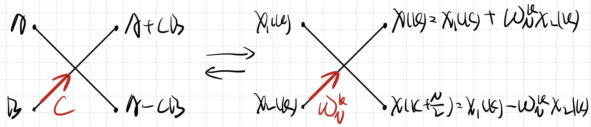 每进行一次蝶形运算需要1次乘法（CB可复用）和2次加法

* 蝶形运算：运用N点DFT的一次时域抽取分解图

  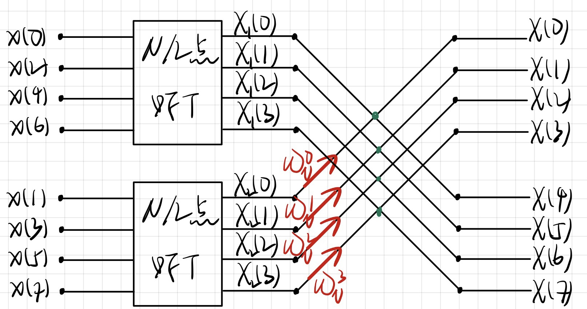

### 二次分解（可以一直分解到不可分为止）

* $N/2$ 仍为偶数，进一步分解 $N/2\rightarrow N/4$，即 $\left\{\begin{array}{l}x(2l)\coloneqq x_3(l)\\x(2l+1)\coloneqq x_4(l)\end{array}\right.\ l=0,1,\cdots,\frac{N}{4}-1\longrightarrow\left\{\begin{array}{l}X_1(k)=X_3(k)+W_{N/2}^kX_4(k)\\X_1(k+N/4)=X_3(k)-W_{N/2}^{k}X_4(k)\end{array}\right.,\ k=0,1,\cdots,\frac{N}{4}-1$，同理 $\left\{\begin{array}{l}X_2(k)=X_5(k)+W_{N/2}^kX_6(k)\\X_2(k+N/4)=X_5(k)-W_{N/2}^{k}X_6(k)\end{array}\right.,\ k=0,1,\cdots,\frac{N}{4}-1$

  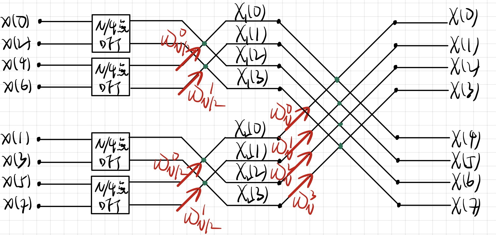

* 还可以再进行一次分解，这里不继续下去了。对于 $N=8$ 的时域抽取基2FFT一共进行了3次时域抽取

## *频域抽取法基2FFT基本原理*

基2频域抽取法FFT Decimation-In-Frequency FFT，简称DIF-FFT。首先采用奇偶分组：$X(k)\rightarrow\left\{\begin{array}{l}X(2m)\\X(2m+1)\end{array}\right.\ m=0,1,\cdots,\frac{N}{2}-1$

## *DIT-FFT算法与直接计算DFT运算量的比较*

* 由DIF-FFT的分解图可知，对于 $N=2^M$，一共需要 $M$ 级蝶形运算，每一级需要 $N/2$ 个蝶形运算，因此每一级需要 $N/2$ 次复数乘法和 $N$ 次复数加法，则所有的 $M$ 级蝶形运算共需要 $C_M=\frac{N}{2}M=\frac{N}{2}\log_2{N}$ 次复数乘法和 $C_A=NM=N\log_{2}{N}$ 次复数加法，即算法复杂度为 $o(n\log_{2}{n})$

* 和直接计算DFT的 $o(n^2)$ 相比，当采样点为 $N=1024$ 时 $\frac{N^2}{n\log_{2}{n}}=204.8$

  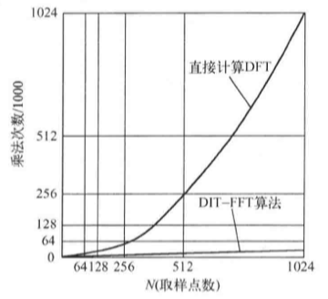

## *DIT-FFT算法的运算规律及编程思想*

## *进一步减少运算量的措施*

### 多类蝶形运算

### 旋转因子的生成

### 实序列的FFT算法

## *DCT 离散余弦变换*

### DCT推导

* DCT是DFT的一种特殊形式，因此从DFT的表达式开始推导：$X(k)=\sum\limits_{n=0}^{N-1}{x(n)e^{-j\frac{2\pi}{N}kn}}=\sum\limits_{n=0}^{N-1}{\left\{x(n)\left[\cos{\frac{2\pi kn}{N}}-j\sin{\frac{2\pi kn}{N}}\right]\right\}}$
* 则原序列可以被拆分为实部和虚部，设 $\cos{\frac{2\pi kn}{N}}=\cos{kt}$：$\left\{\begin{array}{l}Re(k)=\sum\limits_{n=0}^{N-1}{x(n)\cos{kt}}\\Im(k)=\sum\limits_{n=0}^{N-1}{x(n)\sin{kt}}\end{array}\right.$
* 因此当原信号序列 $x(n)$ 为一个实偶函数信号时，虚部为0，DFT可以写成 $X(k)=\sum\limits_{n=0}^{N-1}{x(n)\cos{\frac{2\pi kn}{N}}}$，因此DCT变换实际上就是限定了输入信号的DFT变换
* 实际中不可能所有的信号都是实偶函数，因此运用DCT时需要对原信号进行处理：设一长度为N的实数离散信号 $\left\{x(0),x(1),\cdots,x(N-1)\right\}$
  * 首先要将信号长度扩大成原来的两倍 $2N$，定义为新信号 $x'(m)=\left\{\begin{array}{l}x'(m)=x(m),&(0\leq m\leq N-1)\\x'(m)=x(-m-1),&(-N\leq m\leq -1)\end{array}\right.$
    * 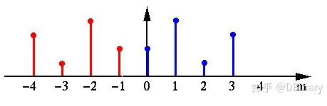
    * 此时DCT公式变成了 $X(k)=\sum\limits_{m=-N}^{N-1}{x'(m)e^{\frac{-j2\pi mk}{2N}}}$
  * 但是这个信号并不关于 $m=0$ 偶对称，它关于 $m=-\frac{1}{2}$ 对称，为了让信号关于原点对称，将整个延拓的信号向右平移 $\frac{1}{2}$ 个单位
    * 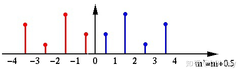
    * 此时DCT公式变成了 $X(k)=\sum\limits_{m=-N+\frac{1}{2}}^{N-\frac{1}{2}}{x'(m-\frac{1}{2})e^{\frac{-j2\pi mk}{2N}}}=\sum\limits_{m=-N+\frac{1}{2}}^{N-\frac{1}{2}}{x'(m-\frac{1}{2})\cos{\left(\frac{2\pi mk}{2N}\right)}}$
* m计算出来是一个负小数，需要处理
  * 该序列是一个偶对称序列：$\sum\limits_{m=-N+\frac{1}{2}}^{N-\frac{1}{2}}{x'(m-\frac{1}{2})\cos{\left(\frac{2\pi mk}{2N}\right)}}=2\sum\limits_{m=\frac{1}{2}}^{N-\frac{1}{2}}{x'(m-\frac{1}{2})\cos{\left(\frac{2\pi mk}{2N}\right)}}$
  * 设 $n=m-\frac{1}{2}$代入上式：$2\sum\limits_{n=0}^{N-1}{x'(n)\cos{\left(\frac{(n+\frac{1}{2})\pi k}{N}\right)}}$
* 为了方便DCT以矩阵形式运算，将该矩阵正交化以便进一步计算，因此需要给DCT增加一个系数 $c(u)$，最终得到了DCT表达式 $F(u)=c(u)\sum\limits_{x=0}^{N-1}{f(x)\cos{\left[\frac{(x+0.5)\pi u}{N}\right]}},\left\{\begin{array}{l}c(u)=\sqrt{\frac{1}{N}},&u=0\\c(u)=\sqrt{\frac{2}{N}},&others\end{array}\right.$

### DCT优势

* Sowohl FT als auch DFT erzeugen (egal was für ein Input), ein komplexes Sepktrum. Normalerweise reicht nur der relle Teil nicht aus, um das Signal zu erklären. Aber in Realität sind viele Signale relle Signale, und weisen sie eine Symmetrie auf. D.h, die Hälfte is unnötig, das Signal ist auch mit nur einer rekonstruierbar.

  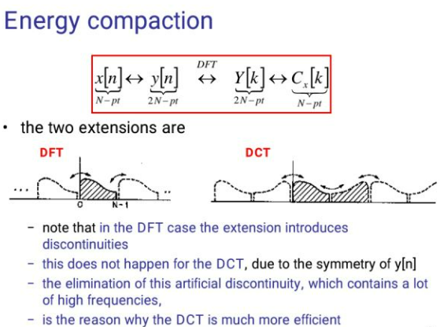

* 上图说明，DFT是对信号直接进行周期扩展，而DCT是对信号先镜像再周期扩展，这样做的好处在于对于扩展的信号间实现了平滑的过渡，而直接周期扩展会出现跳变，这种跳变在频域就对应着高频的分量。DCT变换后图像、信号的主要低频信号都集中在频域的原点处

* Große Anteile der Signalenergie in wenigen Koeffizienten (energy compaction),deswegen können viele Koeffizienten gelöscht werden, d.h. starke Kompression ohne viele Informationen zu verlieren. DCT相比DFT具有更好的频域能量聚集度，即可以把更重要的信息聚集在一块，对于那些不重要的频域区域和系数能够直接裁剪掉。因此DCT变换非常适合于压缩算法的处理，比如JPEG就采用了DCT作为其图像压缩算法 Anwendung von DCT auf kleine Teilbereiche (Fenster) statt auf das ganze Bild ß kann Artefakte erzeugen

### DCT与JPEG有损压缩算法

# 5. 数字滤波器的基本概念及一些特殊滤波器

# 6. 时域离散系统的网络结构

## *用信号流图表示网络结构*

## *IIR系统基本网路结构*

$y(n)=\sum\limits_{i=0}^{M}{b_ix(n-1)}+\sum\limits_{i=1}^{N}{a_iy(n-i)}$

$H(z)=\frac{\sum\limits_{i=0}^{M}{b_iz^{-i}}}{1-\sum\limits_{i=1}^{N}{a_iz^{-i}}}$

## *FIR系统基本网络结构*

$H(z)=\sum\limits_{n=0}^{N-1}{h(n)z^{-n}}$

$y(n)=\sum\limits_{n=0}^{N-1}{h(m)x(n-m)}$

## *FIR系统的线性相位结构*

$h(n)=\pm h(N-n-1)$

$H(z)=\sum\limits_{n=0}^{N/2-1}{h(n)\left[z^{-n}\pm z^{-(N-n-1)}\right]}$

$H(z)=\sum\limits_{n=0}^{(\frac{N-1}{2})-1}{h(n)\left[z^{-n}\pm z^{-(N-n-1)}\right]+h(\frac{N-1}{2})z^{-\frac{N-1}{2}}}$

## *FIR系统的频率采样结构*

$H(z)=(1-z^{-N})\frac{1}{N}\sum\limits_{k=0}^{N-1}{\frac{H(k)}{1-W_N^{-k}z^{-1}}}$

$H_k(z)=\frac{H(k)}{1-W_N^{-k}z^{-1}}$

## *格型网络结构*

# 7. IIR数字滤波器设计（间接法）

## *滤波器*

### 滤波器作用

滤除不需要的频率段，保留需要的频率段 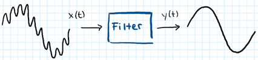

### 滤波器分类

* 模拟滤波器
* 数字滤波器
  * 经典滤波器：输入信号中游泳的频率成分和希望滤除的频率成分各占有不同的频带，通过一个合适的选频滤波器滤除干扰，得到纯净信号，达到滤波的目的
    * 按滤波特性分
      * 低通滤波器 Tiefpass
      * 高通滤波器 Hochpass
      * 带通滤波器 Bandpass
      * 带阻滤波器 Bandsperre
    * 按实现的网络结构或单位脉冲响应长度分
      * IIR：$H(z)=\prod_{k=1}^{N}{\frac{z^{-1}-z_k}{1-z_k^*z^{-1}}}$
      * FIR：$H(z^N)=\frac{1-z^{-N}}{1-az^{-N}}$
  * 现代滤波器：根据随机信号的一些统计特性，在某种最佳准则下，最大限度地抑制干扰，同时最大限度地恢复信号
    * 维纳滤波器
    * 卡尔曼滤波器
    * 自适应滤波器

## *数字滤波器的基本概念*

* 离散线性时不变系统的差分方程为 $y(n)=\sum\limits_{i=0}^{M}{b_ix(n-i)}-\sum\limits_{k=1}^{N}{a_ky(n-k)}\ \overrightarrow{\mathcal{Z}}\ H(z)=\frac{\sum\limits_{i=0}^{M}{b_iz^{-i}}}{1+\sum\limits_{k=1}^{N}{a_kz^{-k}}}$
* 当 $N\geq 1$ 时，$a_k$ 中至少有一个非零系数时，该系统存在反馈回路，其所对应的滤波器为IIR；当 $a_k$ 均为零系数时，其所对应的滤波器为FIR
* IIR的输出取决于之前的输入和之前的滤波器输出值。反馈造成IIR滤波器输入端有扰动，将该滤波器变得不稳定并无限振荡
* 一般假定IIR满足 $M\leq N$，此时将系统称为 $N$ 阶的IIR数字滤波器；若 $M>N$，可看成是一个 $N$ 阶的IIR数字滤波器与一个 $M-N$ 阶的FIR数字滤波器的级联

### 数字滤波器的技术指标

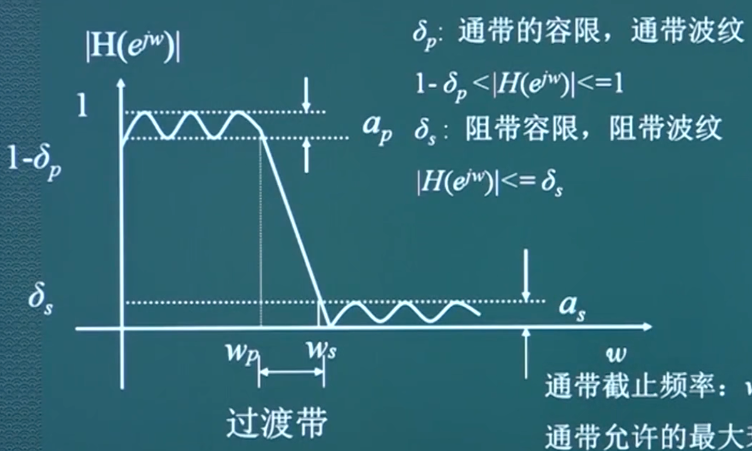

* 数字滤波器的频率响应函数 $H(e^{j\omega})$ 都是以 $2\pi$ 为周期的，低通滤波器的通带中心位于 $2\pi$ 的整数倍处，而高通滤波器的通带中心位于 $\pi$ 的奇数倍处，一般在数字频率的主值区间 $[-\pi,\ \pi]$ 描述数字滤波器的频率响应特性
* 理想滤波器是不可能实现的，因为其单位脉冲响应均是非因果且无限长的，我们只能按照某些准则设计滤波器，使其在误差容限内逼近理想滤波器
* $\omega_p,\ \omega_s$ 分别为通带边界频率和阻带截止频率，$\delta_p,\ \delta_s$ 分别为通带和阻带波纹，$a_p=20\lg{\frac{\max{\lvert H(e^{j\omega})\rvert}}{\min{\lvert H(e^{j\omega})\rvert}}}dB,\ a_s=20\lg{\frac{通带中\max{\lvert H(e^{j\omega})\rvert}}{阻带中\max{\lvert H(e^{j\omega})\rvert}}}dB$
* 低通滤波器的设计指标完全由 $\omega_p,\ \omega_s,\ a_p,\ a_s$ 确定
* 片段常数特性
* 3dB通带截止频率 $a=-20\lg{\lvert H(e^{j\omega_c})\rvert}=3dB$，此时 $\lvert H(e^{j\omega_c})\rvert=\frac{\sqrt{2}}{2}$

### 数字滤波器设计方法概述

* IIR
  * 脉冲响应不变法/函数模型设计法
    * 间接法
    * 直接法
  * 双线性不变法
* FIR
  * 窗函数
  * 频率采样法
  * 切比雪夫等波纹逼近法

## *模拟滤波器的设计*

### 模拟低通滤波器的设计指标及逼近方法

* 工程实际中常用损耗函数/衰减函数 $A(\Omega)$ 来描述滤波器的幅频特性（$\max{\lvert H_a(j\Omega)\rvert=1}$），$A(\Omega)$ 定义为 $A(\Omega)=-20\lg{\lvert H_a(j\Omega)\rvert}=-10\lg{\lvert H_a(j\Omega)\rvert^2}\ dB$
* 损耗函数的有点是对幅频特性的取值非线性压缩，放大了小的幅度
* 模拟低通滤波器的设计指标参数有 $\Omega_p,\ \Omega_s,\ a_p,\ a_s$
* 给定技术指标参数后，需要设计一个系统函数 $H_a(s)$，希望其幅度平方函数 $\lvert H_a(j\Omega)\rvert^2$ 满足给定的制定。 $\lvert H_a(j\Omega)\rvert^2=H_a(j\Omega)H_a^*(j\Omega)=H_a(s)H_a(-s)|_{s=j\Omega}$
* 如果能由 $\Omega_p,\ \Omega_s,\ a_p,\ a_s$ 求出 $\lvert H_a(j\Omega)\rvert^2$，并进一步求出 $H_a(s)$，那么必须要求 $H_a(s)$ 是因果稳定的，也就是要求 $H_a(s)$ 的极点落在s平面的左半平面，而对于 $H_a(-s)$，其极点要落在s域右半平面。这就是由 $H_a(s)H_a(-s)$ 求所需要的 $H_a(s)$ 的具体原则，即模拟低通滤波器的逼近方法

### 巴特沃斯低通滤波器 Butterworth 的设计

* Butterworth性质
  * N阶Butterworth模拟低通滤波器的幅频响应的平方函数为 $\lvert H_a(j\Omega)\rvert^2=\frac{1}{1+(\Omega/\Omega_c)^{2N}}\ \overrightarrow{s=j\Omega}\ H_a(s)H_a(-s)=\frac{1}{1+\left(\frac{s}{j\Omega_c}\right)^{2N}}$
  * 极点：$1+\left(\frac{s}{j\Omega_c}\right)^{2N}=0\rightarrow\left(\frac{s}{j\Omega_c}^{2N}\right)=-1\rightarrow s_k=(-1)^{\frac{1}{2N}}(j\Omega_c)=\Omega_ce^{j\pi(\frac{1}{2}+\frac{2k+1}{2N})},\ k=1,2,\cdots,2N$
  * 具有单调下降的幅频特性 $\frac{d\lvert H_a(j\Omega)\rvert^2}{d\Omega}=\frac{2N(\Omega/\Omega_c)^{2N-1}}{[1+(\Omega/\Omega_c)^{2N}]^2}<0$
  * $H_a(s)=\frac{\Omega_c^N}{\prod\limits_{k=0}^{N-1}{(s-s_k)}}$
  * 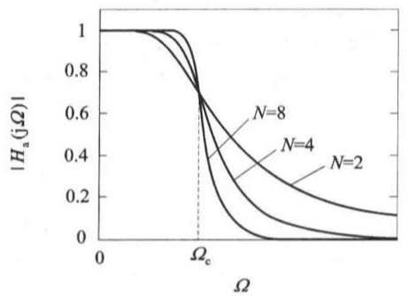 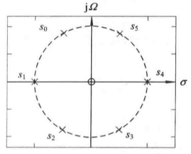
* Butterworth 设计步骤
  * 根据模拟低通滤波器的设计指标参数 $\Omega_p,\ \Omega_s,\ a_p,\ a_s$ 确定滤波器的阶数 $N=\frac{\lg\left[(10^{0.1\alpha_p-1})/(10^{0.1\alpha_s-1})\right]}{2\lg{\left(\Omega_p/\Omega_s\right)}}$，取Butterworth阶数N为比计算结果大的最小整数
  * 确定滤波器的3dB截止频率 $\Omega_{cp}=\frac{\Omega_p}{\sqrt[2N]{10^{0.1\alpha_p}-1}},\ \Omega_{cs}=\frac{\Omega_s}{\sqrt[2N]{10^{0.1\alpha_s}-1}}$，实际设计时，$\Omega_c$ 可在 $\Omega_{cp}\leq\Omega_c\leq\Omega_{cs}$ 范围内选择
  * 求出N个极点，$p_k=\Omega_ce^{j\frac{\pi}{2N}(2k+N-1)},k=1,2,\cdots,N$，得到滤波器的系统函数。也可先用3dB截止频率来归一化系统函数 $H_a(s)=\frac{\Omega_c^N}{\prod\limits_{k=1}^{N}{(s-p_k)}}=\prod\limits_{k=1}^{N}{\left(\frac{s}{\Omega_c}-\frac{p_k}{\Omega_c}\right)}$
  * 另 $p=\frac{s}{\Omega_k}$ 代入上式，再根据N查表得到 $b_i$ 的值，从而确定归一化系统函数为 $H_n(p)=\frac{1}{p^N+b_{N-1}p^{N-1}+b_{N-2}p^{N-2}+\cdots+b_1p+b_0}$

### 切比雪夫I型滤波器 Chebyshev 的设计

* Chebyshev I性质
  * 切比雪夫滤波器：幅频特性在通带或者阻带有等波纹特性，可以提高选择性
  * Chebyshev I的平方幅度响应为：$\lvert H_a(j\Omega)\rvert^2=\frac{1}{1+\varepsilon^2C_N^2\frac{\Omega}{\Omega_P}}$
    * $\varepsilon$ 是小于1的正数，表示滤波器通带内幅度波动的程度，$\varepsilon$ 越大，幅度波动也越大
    * $\Omega_p$ 是通带截止频率，$\lambda=\frac{\Omega}{\Omega_p}$ 称为对 $\Omega_p$ 的归一化频率
    * $C_N(x)$是 $N$ 阶Chebyshev多项式：$C_N(x)=\left\{\begin{array}{l}\cos{[N\arccos{(x)}]}&\lvert x\rvert\leq 1\\\cosh{[N\ arccosh (x)]}&\lvert x\rvert>1\end{array}\right.$
    * 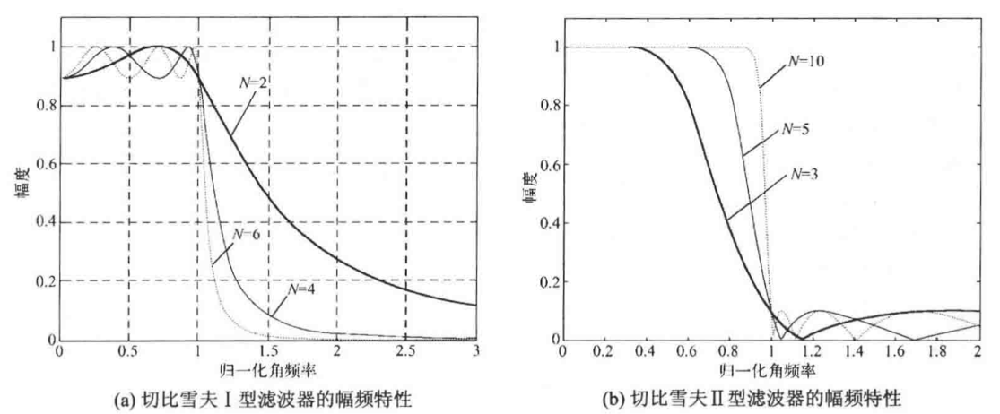
* Chebyshev 设计步骤
  * 确定模拟滤波器的设计指标 $\Omega_p,\ \Omega_s,\ a_p,\ a_s$
  * 确定参数 $\varepsilon$：$\varepsilon^2=10^{0.1\alpha_p}-1$
  * 求出滤波器的阶数 $N$，取 $N$ 为比计算结果大的最小整数，就是Chebyshev模拟低通滤波器的阶数 $N=\arccos{h\left(\frac{10^{0.1\alpha_s}-1}{10^{0.1\alpha_p}-1}\right)^{\frac{1}{2}}}/\arccos{h(\Omega_s/\Omega_p)}$

### 椭圆滤波器的设计

* 椭圆低通滤波器的性质
  * 椭圆滤波器：选择性相对前两种性价比是最好的，也最常用。但通带和阻带内均呈现等波纹幅频特性，相位特性的非线性也稍严重
  * 幅频响应平方函数 $\lvert H_a(j\Omega)\rvert^2=\frac{1}{1+\varepsilon^2U_N^2(\Omega/\Omega_c)}$，其中 $U_N$ 是 $N$ 阶雅可比椭圆函数
  * 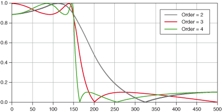
* 椭圆低通滤波器的设计
  * 确定模拟滤波器的设计指标 $\Omega_p,\ \Omega_s,\ a_p,\ a_s$
  * 根据通带最大衰减 $\alpha_p$ 确定滤波器参数 $\varepsilon=\sqrt{10^{0.1\alpha_p}-1}$
  * 由通带截止频率 $\Omega_p$ 和 $\Omega_s$ 确定滤波器参数 $k=\frac{\Omega_p}{\Omega_s}$
  * 根据 $\alpha_s$，确定滤波器参数 $k_1=\varepsilon/\sqrt{10^{0.1\alpha_p}-1}$
  * 确定滤波器的阶数N $N=\frac{K(k)K(\sqrt{1-k_1^2})}{K(k_1)K(\sqrt{1-k^2})},\ K(x)=\int_{0}^{\pi/2}{\frac{d\theta}{\sqrt{1-x^2\sin^2{\theta}}}}$
  * 求归一化椭圆低通滤波器的零极点和系统函数 $H_n(s)$，然后去归一化，得所设计滤波器的系统函数 $H_a(s)$

### 五种类型模拟滤波器的比较

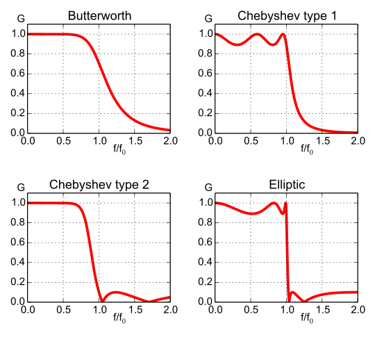

* 当阶数相同时，对相同的通带最大衰减 $a_p$ 和阻带最小衰减 $a_s$
  * Butterworth具有单调下降的幅频特性，过渡带最宽。两种类型的Chebyshev的过渡带宽度相等，比Butterworth的过度带摘，但比椭圆滤波器的过渡带宽
  * Chebyshev I在通带具有等波纹幅频特性，过渡带和阻带是单调下降的幅频特性；Chebyshev II的通带幅频特性几乎与Butterworth相同，阻带是等波纹幅频特性
  * 椭圆滤波器的过渡带最窄，通带和阻带均是等波纹幅频特性
* 相位逼近
  * Butterworth和Chebyshev在大约 $3/4$ 的通带上非常接近线性相位特性
  * 椭圆滤波器仅在大约半个通带上非常接近线性相位特性
  * Bessel在整个通带逼近线性相位特性，而其幅频特性的过渡带比其他四种滤波器宽的多
* 复杂性
  * 在满足相同的滤波器幅频响应指标条件下，Butterworth阶数最高，椭圆最低，而且阶数差别比较大
  * 所以就满足滤波器幅频响应指标而言，椭圆滤波器的性价比最高，应用较广泛

由上述比较可见，五种滤波器各具特点。工程实际中选择哪种滤波器取决于对滤波器阶数（阶数影像处理速度和实现的复杂性）和对相位特性的具体要求

### 频率变换与模拟高通、带通、带阻滤波器的设计

* 模拟高通滤波器设计
$p=\frac{\lambda_p\Omega_{ph}}{s}$

$\lambda=-\frac{\lambda_p\Omega_{ph}}{\Omega}$

* 低通到高通的频率变换

$p=\lambda_p\frac{s^2+\Omega_0^2}{B_ws}$

$\lambda=-\lambda_p\frac{\Omega_0^2-\Omega^2}{\Omega B_w}$

* 低通到带阻的频率变换

$p=\lambda_s\frac{B_ws}{s^2+\Omega_0^2}$

$\lambda=-\lambda_s\frac{\Omega B_w}{\Omega_0^2-\Omega^2}$

## *用脉冲响应不变法设计IIR数字低通滤波器*

$\Omega=\frac{2}{T}\tan{\left(\frac{1}{2}\Omega_1T\right)}$

### 基于AF的DF设计步骤

* 将DF的技术指标转换成AF的技术指标
* 按转换后技术指标，设计模拟低通滤波器的 $H_a(s)$
* 然后将 $H_a(s)$ 按某种方法转换成数字滤波器的系统函数 $H(z)$
* 若不是低通，则必须先将其转换成低通AF的技术指标

## *用双线性变换法设计IIR数字低通滤波器*

## *数字高通、带通和带组滤波器的设计*

## *直接法设计IIR*

* 零极点累试法
* 频域最小均方误差设计
* 时域最小均方误差设计小平方逆滤波设计

# 8. FIR数字滤波器设计

## *线性相位FIR数字滤波器的条件和特点*

$H(z)=\sum\limits_{n=0}^{N-1}{h(n)z^{-n}}$

$H(z)=\frac{\sum\limits_{i=0}^{M}{b_jz^{-j}}}{1+\sum\limits_{i=1}^{N}{a_kz^{-k}}}$

### 线性相位FIR数字滤波器

### 线性相位FIR滤波器的时域约束条件

### 线性相位FIR滤波器幅度线性 $H_g(\omega)$ 的特点

### 线性相位FIR数字滤波器的零点分布特点

## *利用窗函数设计FIR滤波器*

### 窗函数法设计原理

### 典型窗函数介绍

* 矩形窗 Rectangle window
* 三角形窗 Barlet window
* 汉宁窗-升余弦窗 Hanning window
* 汉明窗-改进的升余弦窗 Hamming window
* 布莱克窗 Blackman window
* 凯塞-贝塞尔窗 Kaiser-Basel window

### 用窗函数法设计FIR滤波器的步骤

* 根据对阻带衰减及过渡带的指标要求，选择窗函数的类型，并估计窗口长度 $N$
* 构造希望逼近的频率响应函数 $H_d(e^{j\omega})$
* 计算 $h_d(n)$，如果给出代求滤波器的频响函数 $H_d(e^{j\omega})$，那么单位脉冲响应用下式求出：$h_d(n)=\frac{1}{2\pi}\int_{-\pi}^{\pi}{H_d(e^{j\omega})e^{j\omega n}d\omega}$

## *利用频率采样法设计FIR数字滤波器*

### 用频率采样法设计FIR滤波器的基本思想

### 设计线性相位滤波器时对 $H_d(k)$ 的约束条件

### 逼近误差及其改进措施

### 频率采样法设计步骤

## *利用等波纹逼近法设计FIR数字滤波器*

### 等波纹最佳逼近法的基本思想

### remez和remezord函数及滤波器设计指标

* remez和remezord函数及滤波器设计指标
* 滤波器设计指标

## *FIR和IIR数字滤波器的比较*

### FIR Finite Impulse Response 有限长冲激响应滤波器

* 冲激响应在有限时间内衰减为0，其输出仅取决于当前和过去的输入信号值，$y(n)=\sum\limits_{k=0}^{M}{b_kx(n-k)}$

* 结构框图 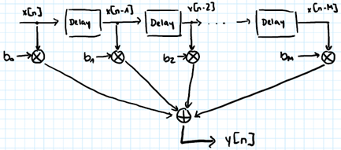
* 优缺点
  * 优点
    * 既具有严格的线性相位，又具有任意的幅度
    * FIR滤波器的频率响应极点都在零点上，因此滤波器的性能稳定
    * 只要经过一定的延时，任何非因果有现场序列都能变成因果的有限长序列，因而能用因果系统来实现
    * 单位冲激响应式有限长，因而可用FFT来实现过滤信号，可大大提高运算效率
  * 缺点：不存在反馈，需要用更高的阶数达到相同的指标 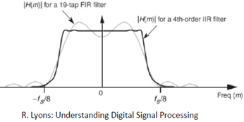

### IIR Infinite Impulse Response 无限长冲激相应滤波器

* 冲激响应理论上应会无限持续，其输出不仅取决于当前和过去的输入信号值，也取决于过去的信号输出值（反馈），$y(n)=\sum\limits_{k=0}^{M}{b_kx(n-k)}-\sum\limits_{k=1}^{N}{a_ky(n-k)}$
* 结构框图 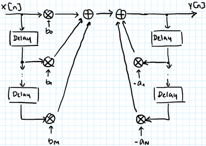
* 优缺点
  * 优点：有反馈，因此可以用比较少的阶数来达到指标。存储单元少，运算次数少
  * 缺点
    * IIR滤波器频率响应的极点，可位于单位圆上的任何一个地方，因此有稳定性的问题
    * 高效率式以线性相位为代价的。选择性越好，相位非线性越严重。若IIR要得到线性相位，又要满足滤波要求，必须加全通网络进行相位校正，这样会增加滤波器的阶数
    * 必须采用递归结构，极点必须在单位圆内以达到稳定。而对于递归结构运算中的四舍五入处理，有时会引起寄生震荡