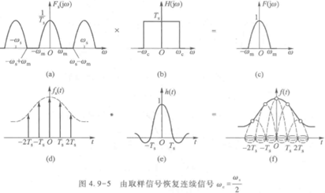

# 1. 信号与系统

## *课程核心*

### 围绕三个基本问题

* 基本信号及其基本响应
* 任意信号的分解
* LTI系统分析

### 数学工具

* 卷积积分与卷积和
* 傅里叶变换
* 拉普拉斯变换
* Z变换
* 小波变换

## *信号的基本概念和分类*

### 确定信号与随机信号 Stochastisches Signal

* 确定信号：可用确定时间函数表示的信号
* 随机信号：信号不能用确切的函数描述，只可能知道它的统计特性比如概率，例如：电子系统中的起伏热噪声、雷电干扰信号。严格来讲实际生活中由于或多或少存在的噪声干扰给信号带来的失真，所有的信号都是随机信号

### 连续信号和离散信号 Kontinuierliches Signal & Zeitdiskretes Signal

* 连续时间信号：连续时间范围内有定义的信号，简称连续信号；若其函数值也连续，常称为模拟信号
* 离散时间信号：仅在一些离散的瞬间才有定义的信号，简称离散信号；当取值为规定数值时，常称为数字信号。等间隔的离散信号可表示为 $f\left(kT\right)$ 或 $f\left(k\right)$，这种等间隔的离散信号常称为序列
* 转换
  * 连续信号采样变离散信号 Abtastung
  * 离散信号变连续信号
    * 零阶保持 
    * 分段线性 

### 周期信号和非周期信号 Periodisches Signal

* 周期信号是指每隔一段时间T（或整数N），按相同规律重复变化的信号
* 连续信号的周期：两个周期信号的周期之比若为有理数，则周期信号之后仍为周期信号且周期为 $T_1$,$T_2$ 的最小公倍数
* 离散信号的周期

### 实信号和复信号 Reelles Signal & komplexes Signal

### 能量信号和功率信号 Energiesignal & Leistungssignal

* 连续信号
  * 能量有限信号 $E=\int_{-\infty}^{\infty}{\lvert f\left(t\right)\rvert^2dt}$ 信号的能量 $E<\infty$，简称能量信号，此时$P=0$。如单个脉冲信号
  * 功率有限信号 $P=\lim\limits_{T\rightarrow\infty}{\frac{1}{T}\int_{\frac{T}{2}}^{\frac{-T}{2}}{\lvert f\left(t\right)\rvert^2dt}}$ 信号的功率$P<\infty$，简称功率信号，此时 $E=\infty$。如直流信号、周期信号、阶跃信号等
* 离散信号
  * 能量信号 $E=\sum\limits_{k=-\infty}^{\infty}{\lvert f\left(k\right)\rvert^2<\infty}$
  * 功率信号 $P=\lim\limits_{N\rightarrow\infty}{\frac{1}{N}\sum\limits_{K=-N/2}^{N/2}{\lvert f\left(k\right)\rvert^2<\infty}}$

### 因果信号和反因果信号 Kausales Signal

* 因果信号
* 反因果信号

## *信号的运算*

* 加减乘运算：同一时刻两信号之值对应加减乘
* 反转：$f\left(t\right)\rightarrow f\left(-t\right)$ 
* 平移：$f\left(t\right)\rightarrow f\left(t\pm t_0\right)$  
* 尺度变化：$f\left(t\right)\rightarrow f\left(at\right)$，$a>0$压缩，$a<0$展开
* 建议采取先平移再尺度变换再反转

## *基本信号：阶跃函数和冲激函数 Treppenfunktion & Impuls/Stoßfunktion*

### 阶跃函数

* 定义：阶跃函数和冲激函数不同于普通函数，称为奇异函数，描述的是某些物理量在空间或时间坐标上集中于一点的物理现象。只管上来看，阶跃函数是序列 $\gamma_n$ 的极限 $\varepsilon\left(t\right)=\lim\limits_{n\rightarrow\infty}{\gamma_n\left(t\right)}=\left\{\begin{matrix}0,&t<0\\1,&t>0\\\end{matrix}\right.$ 
* 性质
  * 表示分段常量信号 $f\left(t\right)=2\varepsilon\left(t\right)-3\varepsilon\left(t-1\right)+\varepsilon\left(t-2\right)$ 
  * 表示信号的作用区间 
  * 积分 $\int_{-\infty}^{t}{\varepsilon\left(\tau\right)d\tau=t\varepsilon\left(t\right)}$

### 冲激函数/狄拉克函数/Δ函数

* 定义：单位冲激函数是奇异函数，它是对强度极大，作用时间极短的物理量的理想化模型。高度无穷大，宽度无穷小，面积（强度）为1的对称窄脉冲。$\left\{\begin{array}{lr}\delta\left(t\right)=0&,t\neq 0\\\int_{-\infty}^{\infty}\delta\left(t\right)dt=1&,t=0\end{array}\right.$
* 冲激函数和阶跃函数的关系  序列 $\gamma_n$ 中有效段的导数为面积/强度 $p_n$，$\gamma_n$有效段宽度取极限时在变成在 $t=0$ 时突然产生跳变，即 $\gamma_n$ 的极限为阶跃函数 $\varepsilon(t)$；而 $p_n$ 在取极限时则变成冲激函数 $\delta$ 
* 作用：冲激函数可以描述间断点的导数 
* 冲激函数的广义函数定义
  * 普通函数 $y=f\left(t\right)$：是将一维实数空间的数t经过f所规定的运算映射为一维实数空间的数y
  * 广义函数 Verallgemeinertefunktion $N_g\left(\varphi\left(t\right)\right)$：选择一类性能良好的函数 $\varphi\left(t\right)$ 作为检验函数（相当于自变量），一个广义函数 $g(t)$ 对检验函数空间中的每个函数 $\varphi\left(t\right)$ 赋予一个数值N的映射，记为 $N_g(\varphi(t))=\int_{-\infty}^{\infty}g(t)\varphi(t)dt$ 
  * 冲激函数的广义函数定义：$\int_{-\infty}^{\infty}\delta(t)\varphi(t)dt=\varphi(0)$
    * 含义：冲激函数 $\delta\left(t\right)$ 作用于检验函数 $\varphi\left(t\right)$ 中筛选出函数值 $\varphi\left(0\right)$ 的广义函数就称为冲激函数 $\delta\left(t\right)$
    * 例子：$\delta\left(t\right)$ 是一种现实生活中不存在的理想信号，需要用下面的满足冲激函数定义的信号代替
      * 高斯（钟形）函数 $\delta(t)=\lim\limits_{b\rightarrow\infty}{be^{-\pi(bt)^2}}$ 
      * 取样函数 $\delta(t)=\lim\limits_{b\rightarrow\infty}{\frac{\sin{bt}}{\pi t}}$
* 冲激函数的取样性质（积分区间要包含冲激所在时刻t）
  * 信号与冲激函数的乘积及其积分 $\int_{-\infty}^{\infty}{f(t)\delta(t)dt}=f(0)\rightarrow f(t)\delta(t)=f(0)\delta(t)$
  * 信号与冲激函数时移的乘积及其积分 $\int_{-\infty}^{\infty}f(t)\delta(t-a)dt=f(a)\rightarrow f(t)\delta(t-a)=f(a)\delta(t-a)$
* 冲激函数的导数
  * 冲激偶的定义 $\delta^\prime(t)$
    * $f(t)\delta^\prime(t)=f(0)\delta^\prime(t)-f(0)^\prime\delta(t)$
    * 广义函数定义 $\int_{-\infty}^{\infty}{f(t)\delta^\prime(t)dt}=-f^\prime(0)$
  * 推广到n阶导 $\int_{-\infty}^{\infty}{f(t)\delta^{(n)}(t)dt}=(-1)^nf^{(n)}(0)$
* 冲激函数的尺度变化
  * $\delta^n(at)=\frac{1}{\left|a\right|}\frac{1}{a^n}\delta^n(t)\rightarrow\delta(at)=\frac{1}{\left|a\right|}\delta(t)$
  * 推广
    * $\delta\left(at-t_0\right)=\delta\left[a(t-\frac{t_0}{a})\right]=\frac{1}{\left|a\right|}\delta\left(t-\frac{t_0}{a}\right)$
    * $a=-1$时， $\delta^{\left(n\right)}\left(-t\right)=\left(-1\right)^n\delta^{\left(n\right)}\left(t\right)$
  * 单位脉冲序列与单位阶跃序列
    * 单位脉冲序列 $\delta(k)$
      * $\delta(k)=\left\{\begin{matrix}1&k=0\\0&k\neq0\\\end{matrix}\right.$ 
      * 取样性质
    * 单位阶跃序列 $\varepsilon(k)$ 
    * $\delta(k)与\varepsilon(k)$的关系 $\delta\left(k\right)=\varepsilon\left(k\right)-\varepsilon\left(k-1\right)$; $\varepsilon\left(k\right)=\sum\limits_{i=-\infty}^{k}\delta\left(i\right)$

## *系统的概念及分类 System*

### 概念

* 定义：系统是指若干相互关联的事物组合而成具有特定功能的整体。其基本作用是对输入信号进行加工和处理，将其转换为所需要的输出信号
* 模型
  * 系统模型 
  * 集总参数系统 Lumped element System
  * 分布参数系统
  * 状态

### 系统的框图表示

  

* 基本单元
  * 积分器（连续）/迟延单位（离散）/s域/z域
    * 连续时域中只有积分器，没有微分器，因为在电路实现上积分器比微分器稳定，微分器更容易收到噪声干扰，因为一旦求微分会放大噪声，而积分运算可以平滑噪声，因此现实中用积分器来实现微积分运算
    * 根据拉普拉斯变换时域连续积分特性积分器变为
      * 零状态：$\int_{0}^{t}\rightarrow\frac{1}{s}$
      * 非零状态：$\int_{-\infty}^{t}\rightarrow\frac{1}{s}+\frac{f^{(-1)}(0_-)}{s}$
    * 根据z变换时域离散延迟单位变为
      * 零状态：$z^{-1}$
      * 非零状态：$z^{-1}F(z)+f(-1)$
  * 加法器
  * 数乘器
* 列写微分方程/差分方程/s域、z域框图的一般步骤
  * 若有两个及以上的加法器，需要设中间变量 $x(t)$，取最右端积分器的输出为 $x(t)$
  * 写出各加法器输出信号的方程
  * 消去中间变量，得到输入端与输出端的关系

### 分类

* 系统的激励 $f(\bullet)$ 与响应$y(\bullet)$之间的关系为$y(\bullet)=T\left[f(\bullet)\right]$。而动态系统的响应还与初始状态有关，即其完全响应为 $y\left(\bullet\right)=T\left[\left\{x(0)\right\},\left\{f(\bullet)\right\}\right]$
* 线性与非线性系统：线性系统的响应是 $\left\{x(0)\right\}$ 与 $\left\{f(\bullet)\right\}$ 单独作用的和，因此线性系统的响应要可以拆解为零输入响应 $y_{zi}(\bullet)$ 和零状态响应 $y_{zs}(\bullet)$
* 时变与时不变系统：系统的零状态响应 $y_{zs}(\bullet)$ 的形式与输入信号的接入时间无关
* 因果与非因果系统

## *系统的分析方法*

### 输入输出法（外部法）

* 时域分析
* 变换域法
  * 连续系统
    * 频域法
    * 复频域法
  * 离散系统
    * 频域法
    * Z域法

### 状态变量法（内部法）

# 2. 连续系统的时域分析

## *连续系统的时域描述：微分方程*

LTI连续系统用线性常系数微分方程来描述：$y^{(n)}(t)+a_{n-1}y^{(n-1)}(t)+...+a_1y^{(1)}(t)+a_0y(t)=b_mf^{(m)}+b_{m-1}f^{(m-1)}(t)+...+b_1f^{(1)}(t)+b_0f(t)$

### 模拟框图（见第一节）

### 经典解法：$y(t)=y_h(t)+y_p(t)$

## *LTI连续系统的响应 Antwort des linearen, zeitinvarianten Systems (LZI-System)*

### 系统的初始值

* 初始值是n阶系统在$t=0$时接入激励，其响应在$t=0_+$时刻的值，即$y^j\left(0_+\right)$
* 初始状态是指系统在激励尚未接入的$t=0_-$时刻的响应值$y^j\left(0_-\right)$，该值反映了系统的历史情况，而与激励无关

### 系统全响应=零输入响应+零状态响应 $y\left(t\right)=y_{zi}\left(t\right)+y_{zs}\left(t\right)$

### 零输入响应：设右端输入为0

* 初始值的确定：$y_{zi}\left(0_-\right)=y_{zi}\left(0_+\right)=y\left(0\right)$
* 求解步骤
  * 设定齐次解
  * 代入各阶 $y_{zi}\left(0_-\right)$ 初始值，求待定系数

### 零状态响应

* 初始值的确定
  * $y_{zs}^{\left(j\right)}\left(0_-\right)=0$
  * 由系数匹配法，从 $y_{zs}^{(j)}(0_-)=0$ 求得 $y_{zs}^{(j)}(0_+)$
    * 右端激励的最高阶对应左端输出的最高阶
    * 设待定系数直到 $\varepsilon(t)$
  * 先求$y_{zi}^{(j)}(0_+)$，再求$y_{zs}^{(j)}(0_+)=y^{(j)}(0_+)-y_{zi}^{(j)}(0_+)$，即零状态响应等于全响应减去零输入响应
* 求解步骤
  * 设定齐次解
  * 设定特解，代入方程求解（若有阶跃函数，则直接设特解 $\widetilde{y}=p$（p为常数，通过系数相等求解），若为冲激函数及其各阶导则为0）
  * 冲激函数系数匹配法求出跳变量 $y_{zs}(0_+)-y_{zs}(0_-)$
  * 利用跳变量，求齐次解待定系数

## *冲激响应与阶跃响应 Impulsantwort/Stoßantwort & Sprungantwort*

### 响应分类

* 固有响应和强迫响应
* 暂态响应和稳态响应

### 冲激响应

* 定义：冲激响应是由单位冲激函数 $\delta\left(t\right)$ 所引起的零状态响应，记作 $h\left(t\right)$
* 隐含条件
* 求法

### 阶跃响应

* 定义：阶跃响应是由单位阶跃函数 $\varepsilon\left(t\right)$ 所引起的零状态响应，记作 $g(t)$
* 隐含条件
* 求法
  * 利用线性性质和微分性质
  * 利用单位阶跃函数 $\varepsilon\left(t\right)$ 与单位冲激函数 $\delta(t)$ 的关系

## *卷积积分与零状态响应 Faltung*

### 信号的时域分解、任意激励下的零状态响应

* ：用 $p(t)$ 门函数来表示 $f_1(t)：f_1(t)=\frac{A}{\frac{1}{\Delta}}p(t)=A\Delta p(t)$ 
* ：任意信号用门函数脉冲波序列分解表示 
  * 0号脉冲高度 $f(0)$，宽度为 $\Delta$，用 $p(t)$ 表示为 $f(0)\Delta p(t-\Delta)$
  * 1号脉冲高度 $f(\Delta)$，宽度为 $\Delta$，用 $p(t-\Delta)$ 表示为 $f(\Delta)\Delta p(t-\Delta)$
  * -1号脉冲高度 $f\left(-\Delta\right)$，宽度为 $\Delta$，用 $p\left(t+\Delta\right)$ 表示为 $f(-\Delta)\Delta p(t+\Delta)$
  * 离散求和：$\hat{f}(t)=\sum\limits_{n=-\infty}^\infty f(n\Delta)\Delta p(t-n\Delta)$
  * 连续取极限：$f(t)=\lim\limits_{\Delta\rightarrow0}{\hat{f}(t)}=\int_{-\infty}^{\infty}f(\tau)\delta(t-\tau)d\tau$：微观上看，其意义为任意信号可被分解为无数冲激函数之和
*  从该图中$\delta(t)$信号对系统的零状态响应为$h(t)$，以及由LTI系统的线性性质及时不变性质可得任意激励信号$f\left(t\right)$对LTI系统的零状态响应为$y_{zs}(t)=\int_{-\infty}^{\infty}f(\tau)h(t-\tau)d\tau=f(t)\ast h(t)$
* 通过卷积求LTI系统任意激励信号$f\left(t\right)$产生的零状态响应$y_{zs}$的思路总结：
  * 信号与系统的核心任务是求解LTI系统对输入信号（激励）的全响应，全响应由零状态响应和零输入响应组成。零输入响应易得，该响应由系统的特征方程的特征根得到，但零状态响应不易求，这个特解是根据输入信号变化而变化的，求特征方程的特解不容易，卷积求零状态响应容易
  * $f(t)=\int_{-\infty}^{\infty}f(\tau)\delta(t-\tau)d\tau$：即任意激励信号可以被分解为无数冲激信号之和
  * 由LTI系统的线性性质及时不变性质可得任意激励信号 $f\left(t\right)$ 对LTI系统的零状态响应为
  $y_{zs}(t)=\int_{-\infty}^{\infty}f(\tau)h(t-\tau)d\tau=f(t)\ast h(t)$。由此就将问题转换成了先求冲激响应 $h(t)$（用冲激函数系数匹配法求解）再求 $f(t)$与$h(t)$ 的问题

### 卷积公式

$f(t)=f_1(t)\ast f_2(t)=\int_{-\infty}^{\infty}{f_1(τ)f_2(t-τ)dτ}$：积分在虚设变量 $\tau$ 下进行，$\tau$ 为积分变量，t为参变量，结果仍为t的函数

### 卷积的物理意义

* 离散卷积：信号分析：某时刻激励信号对系统的影响是需要叠加过去时间激励信号对系统的影响的，因此卷积就是用来计算某个时间输入的激励信号对系统的总影响
  * 输入信号建模 
  * 系统响应（系统对激励的反应）建模，在这个例子里可以看到当信号刚输入t=0时响应最大，经过10个单位后，信号对系统的影响基本已经结束了 
  * 计算某个时刻的系统总相应：系统对激励的响应是和历史状态有关的，对于LTI系统而言这是一种纯线性叠加态，那么在计算$t_{10}$时刻的响应时，只需要叠加前10个时刻的激励和响应即 $f=f(10)g(0)+f(9)g(1)+f(8)g(2)+f(7)g(3)+f(6)g(4)+f(5)g(5)+f(4)g(6)+f(3)g(7)+f(2)g(8)+f(1)g(9)+f(0)g(10)$
    * 
    * 翻折g   
    * 向右平移g，可以得到卷积公式 
* 连续卷积：馒头的腐败量
* 卷积在图像处理中的应用
  * 为什么不使用互相关而是用卷积？
  * 在对图像进行处理时，从计算上看需要用一个宽度\sigma的卷积核对一个像素周围的像素进行操作，这和信号系统中计算某一时候激励对系统产生响应时要考虑过去状态是一样的
* 卷积在卷积神经网络中的应用：实际上CNN中的卷积操作是一种互相关计算，卷积核不需要翻转。之所以叫做卷积的原因在于1、CNN中的卷积核模板是通过网络学习到的，是否翻转不重要 2、卷积核相当于是一个信号处理系统，输入图像激励得到的响应是一种特征提取的过程，以便于后期进行图像分类、目标检测等任务；而互相关操作是具有实际物理意义的，即两种信号的相似度，这与特征提取这一信号处理任务的目标不同

### 卷积积分的图解法

* 图解法重在概念解释，一般适用于简单图形
* 求某一时刻卷积值时比较方便
* 确定积分的上下限是关键

## *卷积积分的性质*

### 卷积积分的代数性质

* 卷积运算是线性的，因此其满足交换律、分配律、结合律
* 复合系统的冲激响应
  * 并联 
  * 级联 

### 奇异函数的卷积特性

* 冲激函数：由卷积信号的采样性质 $\int_{-\infty}^{\infty}{f(t)\delta(t)dt}=f(0)\rightarrow f(t)\delta(t)=f(0)\delta(t)$ 和卷积运算的交换律可以得到 ${\color{red}f(t)\ast\delta(t)=\delta(t)\ast f(t)=f(t)}$
  * 意义：任意激励$f(t)$与冲激函数的卷积即为自身
  * 推广 $f(t)\ast\delta(t-t_0)=f(t-t_0)$：任何信号与冲激函数的卷积作用都是延迟相应时间t后移植该信号，可用于产生梳状函数
* 冲激偶: $f(t)\ast\delta^\prime(t)=f^\prime(t)\rightarrow f(t)\ast\delta^{(n)}t=f^{(n)}t$
* 阶跃函数 $f\left(t\right)\ast\varepsilon\left(t\right)=\int_{-\infty}^{\infty}f\left(\tau\right)\varepsilon\left(t-\tau\right)d\tau=\int_{-\infty}^{t}f\left(\tau\right)d$
* $\varepsilon(t)\ast\varepsilon(t)=t\varepsilon\left(t\right)$

### 卷积的微积分性质

* 微分 $\frac{d^n}{dt^n}\left[f_1(t)\ast f_2(t)\right]=\frac{d^nf_1(t)}{dt^n}\ast f_2(t)=f_1(t)\ast\frac{d^n f_2(t)}{dt^n}$
* 积分 $\int_{-\infty}^{t}{[f_1(\tau)\ast f_2(\tau)]d\tau}=[\int_{-\infty}^{t}{f_1(\tau)]d\tau}\ast f_2(\tau)=f_1(\tau)\ast[\int_{-\infty}^{t}{f_2(\tau)]d\tau}$
* 在 $f_1(-\infty)=0$ 或 $f_2^{(-1)}(\infty)=f_1'(t)\ast f_2^{(-1)}(t)$

### 卷积的时移特性

若 $f(t)=f_1(t)\ast f_2(t)$，则 $f_1(t-t_1)\ast f_2(t-t_2)=f_1(t-t_1-tt_2)\ast f_2(t)=f_1(t)\ast f_2(t-t_1-t_2)=f(t-t_1-t_2)$

### 常用的卷积重要公式

* $K\ast f(t)=K\times Area\ of\ f(t)$
* $f(t)\ast\delta (t)=f(t)$
* $f\left(t\right)\ast\delta^\prime\left(t\right)=f^\prime\left(t\right)$
* $f\left(t\right)\ast\varepsilon\left(t\right)=f^{\left(-1\right)}\left(t\right)$
* $\varepsilon\left(t\right)\ast\varepsilon\left(t\right)=t\varepsilon\left(t\right)$

## *相关函数*

### 互相关和自相关函数的定义

* 互相关：比较某信号与另一延时$\tau$的信号之间的相似度，需要引入相关函数的概念 $R_{12}\left(\tau\right)=\int_{-\infty}^{\infty}{f_1\left(t\right)f_2\left(t-\tau\right)dt}=\int_{-\infty}^{\infty}{f_1\left(t+\tau\right)f_2\left(t\right)dt}$。从计算上看是将一个信号向延迟的信号投影，投影结果越大，夹角越小，则方向越一致，相似度越高
* 自相关：比较统一信号不同时间段的相似度 $R\left(\tau\right)=\int_{-\infty}^{\infty}f\left(t\right)f\left(t-\tau\right)dt=\int_{-\infty}^{\infty}f\left(t+\tau\right)f\left(t\right)dt$

### 相关与卷积的比较

卷积开始时需要将 $f_2\left(\tau\right)$ 反折为 $f_2\left(-\tau\right)$，而相关运算则不需反折，仍为 $f_2\left(\tau\right)$。其他的移位、相乘和积分的运算方法相同

### 互相关的应用

* 雷达回波分析
* 图像应用：模板匹配

## *信号产生 Signalgenerierung*

### Ziel

* Zu Testzwecken in der Simulation mit Matlab/Simulink oder einem Oszillator
* Für Anwendungen in Elektronikkomponenten wie Radios, Fernsehern, etc.

### 信号分类

* 按照用途
  * 通用型
  * 专用型
* 按照输出波形
  * 正弦波形发生器
  * 脉冲信号发生器
  * 函数发生器
  * 任意波形发生器
* 按照产生频率的方法
  * 谐振法：用具有频率选择性的回路来产生正弦振荡，获得所需频率
  * 合成法：从一个或多个高稳定和准确的参考频率源，经过技术处理，生成大量离散的频率输出。基于频率合成原理制成的信号发生器，可以获得很高的频率稳定度和精确度
    * 非相关合成方法
    * 相关合成方法
      * 直接式频率合成技术
      * 锁相环频率技术
      * 直接数字频率合成技术

### Phase Locked Loop PLL锁相环

* Referenzsignal bestimmt Phase und Frequenz
* Phasenkomparator berechnet Fehlersignal proportional zu Phasendifferenz
* Schleifenfilter entfernt ungewollte Freqeuenzen vom Phasenkomparator und erzeugt Steuersignal
* Spannungsgesteuerter Oszillator VCO erzeugt ein Signal basierend auf der Spannung
* Optionaler Frequenzteiler verändert durch Division

### Direct Digital frequecy Synthesis DDS 直接数字频率合成器

* Phasenakkumulartor addiert zyklisch, pro Taktschritt, den links zugeführten Eingabewert (FTW). Der momentane Zählerstand entspricht dann einem Phasenwinkel, und ein Überlaufen des Pahsenakkumulators (Rücksetzen auf 0) entspricht dabei einem vollen Umlauf des Phasenzeigers von $2\pi$
* Phasenakkumulator liefert die Adresse, um den Sinuswert in der Tabelle zu adressieren
* Maximale output Frenquenz laut Nyquist Theorem: $f_{out,max}=f_c/2$
* $f_{out}=f_c\cdot M/2^N$, Frequenzauflösung wenn $M=1$: $f=f_c/2^N$
* Umgekert für Codewert $M=(f_{out}\cdot 2^N)/f_c$
* Die Qualität hängt vor allem von der Genauigkeit/Qualität des Takts und DACs ab

### DDS vs PLL

* DDS: Extrem schnelle Sprunggeschwindigkeit und sehr feine Frenquenzauflösung, aber die maximale Ausgangsfrenquenz ist beschränkt
* PPL: Hohe Ausgangsfrenquenz aber sehr langsame Sprunggeschwindigkeit

### 用梳状函数Dirac-comb卷积产生周期信号

* 梳状函数 $\delta_T\left(t\right)=\sum\limits_{m=-\infty}^{\infty}\delta\left(t-mT\right)$ 
* $f\left(t\right)\ast\delta_T\left(t\right)=f\left(t\right)\ast\sum\limits_{m=-\infty}^{\infty}\delta\left(t-mT\right)=\sum\limits_{m=-\infty}^{\infty}\left[f_0\left(t\right)\ast\delta\left(t-mT\right)\right]=\sum\limits_{m=-\infty}^{\infty}f\left(t-mT\right)$
* 当 $T>\tau$时，$f_T\left(t\right)$ 中每个周期内的波形与 $f\left(t\right)$ 相同；当 $T<\tau$ 时，各相邻脉冲之间将会出现重叠，将无法使波形 $f\left(t\right)$在$f_T\left(t\right)$ 中的每个周期中重现

### 矩形脉冲的卷积产生三角形和梯形脉冲

* 三角波：两个宽度相同的门函数进行卷积
* 梯形波：两个宽度不同的门函数进行卷积

## *连续系统的微分算子描述*

### 微分算子P的定义

### 微分算子的性质

### 传输算子$H(P)$

### RLC微分算子模型及算子方程建立

### 算子法求连续系统的冲激响应

# 3. 离散系统的时域分析 Zeitreihenanalyse

## *差分方程的建立及经典解法 Differenzgleichung*

### 差分

* 一阶前向差分 $\vartriangle f(k)=f(k+1)-f(k)$
* 一阶后向差分 $\triangledown f(k)=f(k)-f(k-1)$
* 前向差分和后向差分是没有区别的，计算结果相同，一般用后向差分比较好理解

### 差分性质

* 线性性质
* 高阶差分

### 描述LTI离散系统的是线性常系数差分方程

* $y(k)+a_{n-1}y(k-1)+...+a_oy(k-n)=b_mf(k)+...+b_0f(k-m)$
* 离散系统中的差分方程对应了连续系统中的微分方程，微分就是差分取极限。微分和差分都表征了系统过去时刻和当前时刻互相之间的影响

## *基本信号与基本响应*

### 离散信号表示

* 图形表示 
* 解析表示
* 集合表示

### 单位脉冲序列/单位取样序列

* 定义
  * $\delta(k)\triangleq\left\{\begin{matrix}1,&k=0\\0,&k\neq0\\\end{matrix}\right.$
  * 位移单位脉冲序列：$\delta(k-k_0)\triangleq\left\{\begin{matrix}1,&k=k_0\\0,&k\neq k_0\\\end{matrix}\right.$
* 运算
  * 加：$\delta(k)+2\delta(k)=3\delta(k)$
  * 乘：$\delta(k)\cdot\delta(k)=\delta(k)$
  * 延时
  * 迭分：$\sum\limits_{i=-\infty}^{k}{\delta(i)}=\left\{\begin{array}{c}0,&k<0\\1,&k\geq0\end{array}\right.=\varepsilon(k)$
* 取样性质
  * $f(k)\delta(k)=f(0)\delta(k)$
  * $\sum\limits_{k=-\infty}^{\infty}{\delta(k)=1}$
  * $\sum\limits_{k=-\infty}^{\infty}{f(k)\delta(k)}=f(0)$

### 单位阶跃序列

* 定义
  * $\varepsilon(k)\triangleq\left\{\begin{matrix}0,&k<0\\1,&k\geq0\\\end{matrix}\right.$
  * 唯一单位阶跃序列： $\varepsilon(k-k_0)\triangleq\left\{\begin{matrix}0,&k<k_0\\1,&k\geq k_0\\\end{matrix}\right.$
* 运算
  * 加
  * 减
  * 延时
  * 迭分：$\sum\limits_{i=-\infty}^{k}{\varepsilon(i)}=\left\{\begin{array}{c}0,&k<0\\k+1,&k\geq0\end{array}\right.=(k+1)\varepsilon(k)$

### 单位脉冲响应的定义和求解

### 单位阶跃响应的定义和求解

### 单位阶跃响应与单位脉冲响应之间的关系

## *零状态响应和卷积和*

### 卷积和公式

$y_{zs}(k)=\sum\limits_{i=-\infty}^{\infty}{f(i)h(k-i)}=f(k)\ast h(k)$

* $f_1(k)$是因果序列：$f(k)=\sum\limits_{0}^{\infty}{f(i)h(k-i)}$
* $f_2(k)$是因果序列：$f(k)=\sum\limits_{i=-\infty}^{k}{f(i)h(k-i)}$
* 二者都是因果序列：$f(k)=\left[\sum\limits_{0}^{k}{f(i)h(k-i)}\right]\varepsilon(k)$

### 图解法和连续时域空间的卷积差不多

### 卷积和的不进位乘法运算（表格法）

## *反卷积 Entfaltung*

# 4. 傅里叶变换和系统的频域分析 Frenquenzanalyse/Fourieranalyse

## *信号的正交分解*

### 正交复函数集$\int_{t_1}^{t_2}{\varphi_i(t)\varphi_j^\ast(t)dt}=\left\{\begin{matrix}0&,i\neq j\\K_i\neq0&,\ i=j\\\end{matrix}\right.$

* 三角函数集
* 复指数正交集
* Walsh函数集

### 信号分解为正交函数

将 $f(t)$展开为n个正交函数的线性组合$f(t)\neq C_1\varphi_1(t)+C_2\varphi_2(t)+\ldots+C_n\varphi_n(t)=\sum\limits_{j=1}^{n}{C_j\varphi_j(t)}$

* 令近似均方误差 $\varepsilon^2=\frac{1}{t_2-t_1}\int_{t_1}^{t_2}{\left[f(t)-\sum\limits_{j=1}^{n}{C_i\varphi_i(t)}\right]^2dt}$
* 令 $\varepsilon^2=0$ 得到Parseval方程 $\int_{t_1}^{t_2}{f^2(t)dt}=\sum\limits_{i=1}^{\infty}{C_j^2K_j}$
  * 物理意义：在区间 $(t_1,t_2)$，信号 $f(t)$ 所含有的能量恒等于此信号在完备正交函数集中各正交分量能量之和，即能量守恒定理
  * 数学本质：矢量空间信号正交变换的范数不变性
* 当正交函数集为复函数集时，可确定系数为 $C_j=\frac{\int_{t_1}^{t_2}{ft)\varphi_j^\ast(t)dt}}{\int_{t_1}^{t_2}{\varphi_i(t)\varphi_j^\ast(t)dt}}$

## *用三角函数正交集和复函数正交集得到傅里叶级数*

### 三角形式

设周期信号f(t)，在满足Dirichlet条件时可展开为三角形形式的傅里叶级数

* $f(t)=\frac{a_0}{2}+\sum\limits_{n=1}^{\infty}(a_n\cos{n\Omega t}+b_n\sin{n\Omega t})$，傅里叶系数 $\left\{\begin{matrix}a_n=\frac{2}{T}\int_{-T/2}^{T/2}{f\left(t\right)\cos{n\Omega t}dt}&n=0,1,2,3,\ldots\\b_n=\frac{2}{T}\int_{-T/2}^{T/2}{f\left(t\right)\sin{n\Omega t}dt}&n=1,2,3,\ldots\end{matrix}\right.$
  * $\frac{a_0}{2}$ 称为直流分量
  * $a_n$ 称为余弦分量系数
  * $b_n$ 称为正弦分量系数
* Dirichlet条件
* 余弦形式的傅里叶级数 ${\color{red}f(t)=\frac{a_0}{2}+\sum\limits_{n=1}^{\infty}(a_n\cos{n\Omega t}+b_n\sin{n\Omega t})}$ 在合并n次正余弦分量后得到 ${\color{red}{}f(t)=\frac{A_0}{2}+\sum\limits_{n=1}^{\infty}{A_n\cos{(n\Omega t+\varphi_n)}}}$，其中 $\left\{\begin{matrix}A_n=\sqrt{a_n^2+b_n^2}\\\varphi_n=-arctan{\frac{b_n}{a_n}}\\\end{matrix}\right.$
  * $\frac{A_0}{2}$ 称为直流分量
  * $A_1\cos{(\Omega t+\varphi_1)}$ 称为基波或一次谐波；$A_2\cos{(2\Omega t+\varphi_2)}$ 称为二次谐波…
* 吉布斯现象：用有限项傅里叶级数表示有间断点的信号时，在间断点附近不可避免的会出现振荡和超调量。超调量的幅度不会随所取项数的增加而减小，只是随着项数的增多，振荡频率变高，并向间断点处压缩，从而使它所占有的能量减少；当选取的项数很大时，该超调量趋于一个常数，大约等于总跳变值的9%，并从间断点开始以起伏振荡的形式逐渐衰减下去 

### 周期信号波形对称性和谐波特性

* $f(t)$ 为偶函数 Gerade Funktion $f(t)=f(-t),b_n=0$，展开为余弦函数
* $f(t)$ 为奇函数 Ungerade Funktion $f(t)=-f(-t),a_n=0$，展开为正弦函数
* $f(t)$ 为奇谐函数 $f(t)=-f(t\pm T/2),a_0=a_2=\ldots b_2=b_4=0$，其傅里叶级数中只含奇次谐波分量，而不含偶次谐波分量
* $f(t)$为偶谐函数 $f(t)=f(t\pm T/2),a_1=a_3=\ldots b_1=b_3=0$

### 指数形式的傅里叶级数

根据 $C_j=\frac{\int_{t_1}^{t_2}{f(t)\varphi_j^\ast(t)dt}}{\int_{t_1}^{t_2}{\varphi_i(t)\varphi_j^\ast(t)dt}}$ 可以得到指数形式的傅里叶级数 ${\color{red}f(t)=\sum\limits_{n=-\infty}^{\infty}{F_ne^{jn\Omega t}}}$

其复傅里叶系数为： ${\color{red}F_n=\frac{1}{2}A_ne^{j\varphi_n}=\frac{1}{T}\int_{-T/2}^{T/2}{f(t)e^{-jn\Omega t}dt}}$

### 指数形式和三角形式傅里叶级数的关系

用欧拉方程 $e^{jn\Omega t}=\cos{n\Omega t}+j\sin{n\Omega t}\rightarrow\left\{\begin{matrix}\cos{n\Omega t}=\frac{e^{jn\Omega t}+e^{-jn\Omega t}}{2}\\\sin{n\Omega t}=\frac{e^{jn\Omega t}-e^{-jn\Omega t}}{2j}\\\end{matrix}\right.$ 推导两种傅里叶级数展开形式的关系 $F_n=\frac{1}{2}A_ne^{j\varphi_n}=\frac{1}{2}(a_n-jb_n)\rightarrow \left\{\begin{array}{c}\left|F_n\right|=\frac{1}{2}A_n\\\phi_n=\varphi_n\end{array}\right.$

## *周期信号的频谱*

### 单边谱和双边谱的关系 

* 三角形傅里叶级数对应的频谱为单边谱，而复数傅里叶级数对应的频谱为双边谱
* $\left\{\begin{array}{c}\left|F_n\right|=\frac{1}{2}A_n\\\phi_n=\varphi_n\end{array}\right.$
 双边幅度谱的谱线高度为单边幅度谱的高度的一半，且为偶函数，关于y轴对称，但直流分量不变（两边叠加）
* 双边相位谱可以由单边相位谱直接关于零点奇对称

### 周期信号频谱的特点：以周期矩形脉冲为例

* 幅度为1，脉冲宽度为$\tau$的周期矩形脉冲，周期为T，求频谱 

  * 以 $T=4\tau$ 为例画图，确定基频 $\Omega=\frac{2\pi}{T}=\frac{2\pi}{4\tau}$
  * 零点为 $\frac{n\Omega\tau}{2}=m\pi\rightarrow n\Omega=\frac{2m\pi}{\tau}$
  * 两零点间谱线间隔数 $\frac{2\pi}{\tau}/\frac{2\pi}{T}=\frac{T}{\tau}$
  * 频谱函数为Sampling function $Sa(x)\triangleq\frac{\sin{x}}{x}$ 取样函数 
* 特点
  * 离散性：以基频 $\Omega$ 为间隔的若干离散谱线组成
  * 谐波性：谱线仅含有基频 $\Omega$ 的整数倍分量
  * 收敛性：整体趋势减小
* 谱线结构与波形参数的关系
  * T不变，$\tau$ 变小 
    * 谱线间隔 $\Omega=\frac{2\pi}{4\tau}=\frac{\pi}{2\tau}$ 不变
    * 幅度下降
    * 零点右移，两零点间的谱线数目 $\frac{T}{\tau}$ 增
    * 总结：时域压缩，频域展宽
  * $\tau$ 不变，T变大 
    * 幅度下降，谱线间隔 $\Omega$ 减小，频谱变密
    * $T\rightarrow\infty$时，谱线间隔$\Omega=\frac{2\pi}{T}\rightarrow 0$，谱线幅度$\rightarrow 0$，周期信号的离散频谱过渡为非周期信号的连续频谱
* 收敛性分析
  * 振幅是收敛的：信号的能量主要集中在低频分量中
  * 收敛具有不同速度：信号连续光滑，幅度谱快速衰减；低频反应信号的主要信息，高频表示细节

### 周期信号的功率：$P=\frac{1}{T}\int_{\frac{T}{2}}^{-\frac{T}{2}}{f^2\left(t\right)dt}=\sum\limits_{n=-\infty}^{\infty}\left|F_n\right|^2$

* 周期信号平均功率=直流和谐波分量平均功率之和；对于周期信号，在时域中求得的的信号功率与在频率中求得的信号功率相等
* 
* 第一个零点 $\omega=\frac{2\pi}{\tau}$ 内集中了信号绝大部分能量（平均功率），由频谱的收敛性可知，信号的功率集中在低频段。计算可得 $\frac{P_{8\pi}}{P}=\frac{0.2257}{0.25}\approx90.3%$
* 一般把第一个零点作为信号的频带宽度 $B_\omega=\frac{2\pi}{\tau}$

### 应用案例：DA转换

## *非周期信号的傅里叶变换*

非周期信号的频谱-频谱密度函数 $F(j\omega)=\lim\limits_{T\rightarrow\infty}{\frac{F_n}{1/T}}=\lim\limits_{T\rightarrow\infty}{F_nT}\triangleq\int_{-\infty}^{\infty}{f\left(t\right)e^{-j\omega t}dt}$ 表示单位频率上的频谱，之所以用密度来表示是因为 $T\rightarrow\infty$ 时，频谱之间的间隔无穷小，以及幅度也无穷小，必须要将周期除掉才能看到幅度

### $\mathcal{F}$变换对

（频域）$F(j\omega)=\int_{-\infty}^{\infty}{f(t)e^{-j\omega t}dt}\longleftrightarrow f(t)=\frac{1}{2\pi}\int_{-\infty}^{\infty}{F(j\omega)e^{j\omega t}d\omega}$（时域）

T域| $\omega$ 域
:-:|:-:
$\delta(t)$|1
$\delta^{(n)}(t)$|$(j\omega)^{n}$
1|$2\pi\delta\left(\omega\right)$
$e^{j\omega_0t}$|$2\pi\delta(\omega-\omega_0)$
$\varepsilon(t)$|$2\pi\delta\left(\omega\right)+\frac{1}{j\omega}$
$e^{-\alpha t}\varepsilon(t)$|$\frac{1}{\alpha+j\omega}$
$g_{\tau}(t)$|$\tau sa(\frac{\omega\tau}{2})$
$sgn{(t)}$|$\frac{2}{j\omega}$
$e^{-\left\|\alpha\right\|t}$|$\frac{2\alpha}{\alpha^2+\omega^2}$
$\cos{\omega_0t}$|$\pi\left[\delta\left(\omega+\omega_0\right)+\delta\left(\omega-\omega_0\right)\right]$
$\sin{\omega_0t}$|$\frac{1}{2j}\left(2\pi\delta\left(\omega-\omega_0\right)-2\pi\delta\left(\omega+\omega_0\right)\right)$

### 常用函数的傅里叶变换

* 单边指数函数 $f(t)=e^{-\alpha t}\varepsilon(t)\longleftrightarrow F(j\omega)=\frac{1}{\alpha+j\omega}$
  * 幅度频谱 
  * 相位频谱 
* 双边指数函数 $f(t)=e^{-\alpha\left|t\right|}\longleftrightarrow F(j\omega)=\frac{2\alpha}{\alpha^2+\omega^2}$   
* 门函数
  * $g_\tau\left(t\right)=\left\{\begin{matrix}1&,\left|t\right|\le\frac{\tau}{2}\\0&,\left|t\right|>\frac{\tau}{2}\\\end{matrix}\right. F\left(j\omega\right)=\int_{\tau/2}^{-\tau/2}{e^{-j\omega t}dt}=\frac{e^{-j\omega\frac{\tau}{2}}-e^{j\omega\frac{\tau}{2}}}{-j\omega}=\frac{2\sin{\frac{\omega\tau}{2}}}{\omega}=\tau\frac{\sin{\frac{\omega\tau}{2}}}{\frac{\omega\tau}{2}}=\tau sa\left(\frac{\omega\tau}{2}\right)$
  * 频谱图 
  * 幅度频谱 
  * 相位频谱 
* 冲激函数
  * 根据冲激函数的采样性可得 $\delta(t)\longleftrightarrow F(j\omega)=\int_{-\infty}^{\infty}{\delta(t)e^{-j\omega t}dt}=1$  即冲激函数中包含了从无穷小到无穷大的所有频率，因此这种函数只能是一种模型，不可能被实现 
    * $(t)\longleftrightarrow F(j\omega)=\int_{-\infty}^{\infty}{\delta\prime(t)e^{-j\omega t}dt}=-\frac{d}{dt}e^{-j\omega t}=j\omega$
    * $\delta^{(n)}(t)\longleftrightarrow(j\omega)^n$
    * 将门函数 $\tau\rightarrow 0$ 时，门函数逼近冲激函数相当于门函数的频谱图被拉长，第一个零点在无穷远 
* 常数1：可以看作是 $f(t)=e^{-\alpha\left|t\right|}\longleftrightarrow F(j\omega)=\frac{2\alpha}{\alpha^2+\omega^2}$ 当幕 $\alpha\rightarrow 0$ 时的极限，可以得到 $\mathcal{F}(1)=2\pi\delta(\omega)$
* 符号函数 $sgn{(t)}\longleftrightarrow\lim\limits_{\alpha\rightarrow 0}{F_\alpha(j\omega)}=\lim\limits_{\alpha\rightarrow 0}{-\frac{j2\omega}{\alpha^2+\omega^2}}=\frac{2}{j\omega}$
* 阶跃函数 $\varepsilon(t)=\frac{1}{2}+\frac{1}{2}sgn{(t)}$，根据傅里叶变换的线性性质 $\varepsilon(t)\longleftrightarrow\pi\delta(\omega)+\frac{1}{j\omega}$

## *傅立叶变换的性质：在某一域中对函数进行某种运算，在另一域中所引起的效应*

### 线性性质

### 奇偶性

* 若 $f(t)\longleftrightarrow F(j\omega)，则 f(-t)\longleftrightarrow F(-j\omega)$
* 时间函数与其频谱的奇偶虚实关系
  * $f(t)$ 为实函数
    * $f\left(t\right)$ 为实偶函数，$F\left(j\omega\right)$ 为实偶函数，$F(j\omega)$ 虚部消失。这是DCT的基础
    * $f\left(t\right)$ 为实奇函数，$F\left(j\omega\right)$ 为虚奇函数，$F(j\omega)$ 实部消失
  * $f\left(t\right)$为 虚函数

### （共轭）对称性

若 ${\color{red}f(t)\longleftrightarrow F(j\omega)}$，则 ${\color{red}F(jt)\longleftrightarrow 2\pi f(-\omega)}$

### 尺度变换特性

* 若 $f(t\longleftrightarrow F(j\omega)$，则 $f(at)\longleftrightarrow\frac{1}{\left|a\right|}F(j\frac{\omega}{a})$
* $0<a<1$ 时域扩展，频带压缩
* $a>1$ 时域压缩，频带扩展

### 时移特性

* 若 $f(t)\longleftrightarrow F(j\omega)$，则 $f(t\pm t_0)\longleftrightarrow e^{\pm j\omega t_0}F(j\omega)$
* 若 $F(j\omega)=\left|F(j\omega)\right|e^{j\varphi(\omega)}$ 则 $f(t\pm t_0)\longleftrightarrow\left|F(j\omega)\right|e^{j\left[\varphi(\omega)\pm\omega t_0\right]}$
* 尺度特性+时移特性 $f(at-b)=f\left[a(t-\frac{b}{a})\right]\longleftrightarrow\frac{1}{\left|a\right|}e^{-j\frac{b}{a}t_0}F(j\frac{\omega}{a})$

### 频移特性/调制特性

若 $f(t)\longleftrightarrow F(j\omega)$，则 $F\left[j(\omega\pm\omega_0)\right]\longleftrightarrow e^{\mp j\omega t_0}f(t)$

* 频移特性的实质是频谱搬移，它是通信理论中信号调制与解调的理论基础。调制：$y\left(t\right)=f\left(t\right)\cos{\omega_0t}$ 高频信号=调制信号*载频信号 
* 用频移特性推导正余弦的傅里叶变换
  * 求 $\mathcal{F}\left(e^{j\omega_0t}\right) \mathcal{F}\left[1\right]=2\pi\delta\left(\omega\right)$，根据时移特性可得 $e^{j\omega_0t}\longleftrightarrow2\pi\delta\left(\omega-\omega_0\right)$
  * 求 $\mathcal{F}\left(\cos{\omega_0t}\right)\cos{\omega_0t}=\frac{1}{2}e^{j\omega_0t}+\frac{1}{2}e^{-j\omega_0t}$，根据时移特性可得 $\cos{\omega_0t}\longleftrightarrow\pi\left[\delta\left(\omega+\omega_0\right)+\delta\left(\omega-\omega_0\right)\right]$ 
  * 求 $\mathcal{F}\left(\sin{\omega_0t}\right)\sin{\omega_0t}=\frac{1}{2j}\left(e^{j\omega_0t}-e^{-j\omega_0t}\right)$，根据时移特性可得 $\sin{\omega_0t}\longleftrightarrow\frac{1}{2j}\left(2\pi\delta\left(\omega-\omega_0\right)-2\pi\delta\left(\omega+\omega_0\right)\right)=j\pi\left[\delta\left(\omega+\omega_0\right)-\delta\left(\omega-\omega_0\right)\right]$ 
* 载波调制求 $\mathcal{F}\left(f\left(t\right)\cos{\omega_0t}\right)$： $f\left(t\right)\cos{\omega_0t}=f\left(t\right)\left[\frac{1}{2}e^{j\omega_0t}+\frac{1}{2}e^{-j\omega_0t}\right]$，根据时移特性可得 $f\left(t\right)\cos{\omega_0t}\longleftrightarrow\frac{1}{2}F\left[j\left(\omega-\omega_0\right)\right]+\frac{1}{2}F\left[j\left(\omega+\omega_0\right)\right]$ 

### 卷积定理

* 时域卷积定理：若 $f_1(t)\longleftrightarrow F_1(j\omega),\ f_2(t)\longleftrightarrow F_2(j\omega)$ 则 $f_1(t)\ast f_2(t)\longleftrightarrow F_1(j\omega)F_2(j\omega)$
* 频域卷积定理：若 $f_1(t)\longleftrightarrow F_1(j\omega),\ f_2(t)\longleftrightarrow F_2(j\omega)$ 则 ${\frac{1}{2\pi}F_1(j\omega)\ast F_2(j\omega)\longleftrightarrow f}_1(t)f_2(t)$

### 时域微积分特性
  
* 时域微分：$f^{\left(n\right)}\left(t\right)\longleftrightarrow\left(j\omega\right)^nF\left(j\omega\right)$
* 时域积分：$\int_{-\infty}^{t}f\left(x\right)dx\longleftrightarrow\pi F\left(0\right)\delta\left(\omega\right)+\frac{F\left(j\omega\right)}{j\omega}$，其中$F\left(0\right)=F\left(j\omega\right)|_{\omega=0}=\int_{-\infty}^{\infty}f\left(t\right)dt$

### 频域微积分特性

* 频域微分：$(-jt)^nf(t)\longleftrightarrow F^{(n)}(j\omega)$
* 频域积分微分：$\pi f\left(0\right)\delta\left(t\right)+\frac{f\left(t\right)}{-jt}\longleftrightarrow\int_{-\infty}^{\infty}F\left(jx\right)dx$

### 相关定理

* 若 $f_1\left(t\right)\longleftrightarrow F_1\left(j\omega\right),\ f_2\left(t\right)\longleftrightarrow F_2\left(j\omega\right)$ 则 $\mathcal{F}\left[R_{12}\left(\tau\right)\right]\longleftrightarrow F_1\left(j\omega\right)F_2^\ast\left(j\omega\right),\mathcal{F}\left[R_{21}\left(\tau\right)\right]\longleftrightarrow F_1^\ast\left(j\omega\right)F_2\left(j\omega\right)$
* 自相关函数：$\mathcal{F}\left[R\left(\tau\right)\right]\longleftrightarrow F\left(j\omega\right)F^\ast\left(j\omega\right)=\left|F\left(j\omega\right)\right|^2$

## *能量谱和功率谱*

### 能量谱

* 信号能量：时间 $(-\infty,\infty)$ 区间上信号的能量 $E=\lim\limits_{T\rightarrow\infty}{\int_{-T}^{T}{\left|f(t)\right|^2dt}}$
* 帕斯瓦尔方程 $E=\lim\limits_{T\rightarrow\infty}{\int_{-T}^{T}{\left|f\left(t\right)\right|^2dt}}=\int_{-\infty}^{\infty}{\left|f(t)\right|^2dt}=\frac{1}{2\pi}\int_{-\infty}^{\infty}\left|F(j\omega))\right|^2d\omega$
* 能量密度谱
  * 为了表征能量在频域中的分布情况而定义的能量密度函数 $E(\omega)=\left|F(j\omega)\right|^2$
  * 能量有限信号的能量谱与自相关函数是一对傅里叶变换

### 功率谱

* $P(\omega)=\lim\limits_{T\rightarrow\infty}{\frac{\left|F_T(j\omega)\right|^2}{T}}$
* 功率有限信号的功率谱 $P(\omega)$与自相关函数$R(\tau)$ 是一对傅里叶变换，称为Wiener-Khintchine关系

### 白噪声功率谱密度的估计

## *周期信号的傅里叶变换：适用于周期信号（连续谱）和非周期信号（离散谱）的统一分析方法*

### 周期信号的傅里叶变换

* 一般周期信号的傅里叶变换
  * 指数形式的傅里叶级数 $f(t)=\sum\limits_{n=-\infty}^{\infty}{F_ne^{jn\Omega t}}$；复傅里叶系数 $F_n=\frac{1}{2}A_ne^{j\varphi_n}=\frac{1}{T}\int_{-T/2}^{T/2}{f(t)e^{-jn\Omega t}dt}$
  * ${\color{red}\mathcal{F}\left[f_T(t)\right]}=\ \mathcal{F}\left[\sum\limits_{n=-\infty}^{\infty}{F_ne^{jn\Omega t}}\right]=\sum\limits_{n=-\infty}^{\infty}{F_n\mathcal{F}\left[e^{jn\Omega t}\right]}=\sum\limits_{n=-\infty}^{\infty}{F_n2\pi\delta(\omega-n\Omega)}={\color{red}2\pi\sum\limits_{n=-\infty}^{\infty}{F_n\delta(\omega-n\Omega)}}$
  * 结论
    * 周期信号 $f_T(t)$ 的频谱由冲激序列组成
    * 位置：$\omega=n\Omega$（谐波频率）
    * 强度：$2\pi F_n$（离散谱）
  * ：傅里叶变换是傅里叶级数放大无穷大倍得到的频谱密度函数
* 求周期为T的单位冲激函数 $\delta_T(t)=\sum\limits_{n=-\infty}^{\infty}\delta(t-mT)$的傅里叶变换：$F_n=\frac{1}{T}\int_{-\frac{T}{2}}^{\frac{T}{2}}{\delta_T(t)e^{-jn\Omega t}dt}=\frac{1}{T}$（冲激函数的取样性质）${\color{red}\delta_T(t)}\longleftrightarrow 2\pi\sum\limits_{n=-\infty}^{\infty}{\frac{1}{T}\delta(\omega-n\Omega)}={\Omega\sum\limits_{n=-\infty}^{\infty}\delta(\omega-n\Omega)=\color{red}\Omega\delta_\Omega(\omega)}$ 周期为T的单位冲激函数序列 $\delta_T(t)$ 的傅里叶变换是一个在频域中个周期为 $\Omega$，强度为 $\Omega$ 的冲激序列
* 求周期T=4的门函数的傅里叶变换  
  * 任何信号与冲激函数的卷积作用都是移植该信号，将一个周期信号理解为一个基本信号与脉冲序列的卷积：$f_T(t)=\delta_T(t)\ast f_0(t)\rightarrow{\color{red}F_T(j\omega)=\Omega\delta_{\Omega}(\omega)F_0(j\omega)=\Omega\sum\limits_{n=-\infty}^{\infty}{F_0(jn\Omega)\delta(\omega-n\Omega)}}$
  * $\left\{\begin{array}{c}f_0(t)=g_2(t)\longleftrightarrow 2Sa(\omega)\\ \Omega=\frac{2\pi}{T}=\frac{\pi}{2}\end{array}\right.\rightarrow F_T(j\omega)=\Omega\sum\limits_{n=-\infty}^{\infty}{2Sa(n\Omega)\delta(\omega-n\Omega)}=\pi\sum\limits_{n=-\infty}^{\infty}{Sa(\frac{n\pi}{2})\delta(\omega-n\Omega)}$

### 周期信号傅里叶级数与傅里叶变换的关系

* 公式1 傅里叶级数 $f_T(t)=\sum\limits_{n=-\infty}^{\infty}{F_ne^{jn\Omega t}}\longleftrightarrow F_T(j\omega)=2\pi\sum\limits_{n=-\infty}^{\infty}{F_n\delta(\omega-n\Omega)}$
* 公式2 非周期信号卷积拓展 $f_T(t)=\delta_T(t)\ast f_0(t)\longleftrightarrow {\color{red}F_T(j\omega)=\Omega\delta_\Omega(\omega)F_0(j\omega)=\Omega\sum\limits_{n=-\infty}^{\infty}{F_0(jn\Omega)\delta(\omega-n\Omega)}}$
* 两个公式的结果是一样的，可以得到周期信号傅里叶级数与傅里叶变换的关系：${\color{red}F_n=\frac{\Omega}{2\pi}F_0(jn\Omega)=\frac{1}{T}F_0(j\frac{2n\pi}{T})}$

## *LTI系统的频域分析*

### 思路和时域分析是一样的：1、求基本信号的响应；2、分解一般信号；3、求一般信号的响应

* 基本信号 $e^{j\omega t}$ 作用于LTI系统的响应
  * 傅里叶分析是将任意信号分解为无穷多项不同频率的虚指数函数之和，周期信号可以分解为 $f(t)=\sum\limits_{n=-\infty}^{\infty}{F_ne^{jn\Omega t}}$，其基本信号为 $e^{jn\Omega t}$；而非周期信号可以分解为 $f(t)=\frac{1}{2\pi}\int_{-\infty}^{\infty}{F(j\omega)e^{j\omega t}d\omega}$，基本信号是 $e^{j\omega t}$，$n\Omega$ 可以被包含在 $\omega$ 中，因此最后用基本信号 $e^{j\omega t}$ 表征
  * 频域分析中，基本信号的定义域为 $-\infty,\ \infty$，而 $t=-\infty$ 总可认为系统的状态为0，因此本章的响应指的是零状态响应写作 $y(t)$，若初始状态不在无穷远处将使用拉普拉斯变换解决
  * 推导：设LTI系统的冲激响应为 $h(t)$，当激励是角频率 $\omega$ 的基本信号 $e^{j\omega t}$ 时，其响应 $y(t)=h(t)\ast e^{j\omega t}$，根据卷积定义可得 ${\color{red}y(t)}=\int_{-\infty}^{\infty}{h(\tau)e^{j\omega(t-\tau)}d\tau}=\int_{-\infty}^{\infty}{{\color{blue}h(\tau)e^{-j\omega t}d\tau}}e^{j\omega\tau}{\color{red}=H(j\omega)e^{j\omega\tau}}$，定义 $h(t)$ 的傅里叶变换 $H(j\omega)$ 称为系统的频率响应函数，其反应了响应 $y(t)$ 的幅度和相位
* 一般信号 $f(t)$ 作用于LTI系统的响应
  * 可根据线性系统的齐次性和可加性合成一般信号 $f(t)=\frac{1}{2\pi}\int_{-\infty}^{\infty}{F(j\omega)e^{j\omega t}d\omega}\longleftrightarrow y(t)=\frac{1}{2\pi}\int_{-\infty}^{\infty}{H(j\omega)F(j\omega)e^{j\omega t}d\omega}=F^{-1}[F(j\omega)H(j\omega)]$
  * 通过傅里叶变换可得求系统零状态响应的频域表达关系 ${\color{red}y(t)=f(t)\ast h\left(t\right)\longleftrightarrow Y(j\omega)=F(j\omega)H(j\omega)}$

### 傅里叶变换分析法

* 求输入信号 $f(t)的傅里叶变换F(j\omega)$
* 求系统函数 $H(j\omega)$
* 求零状态响应 $y(t)$ 的傅里叶变换 $Y(j\omega)=Ft(j\omega)H(j\omega)$
* 求 $Y(j\omega)$ 的傅里叶逆变换 $y(t)=F^{-1}\left[Fj\omega)H(j\omega)\right]$

### 傅里叶级数分析法：周期信号既可以用傅里叶变换分析也可以用傅里叶级数分析

* 傅里叶级数分析步骤
  * 求周期输入信号 $f_T(t)$ 的傅里叶系数 $F_n$
  * 求系统频率响应 $H(jn\Omega)=H(j\omega)|_{\omega=n\Omega}$
  * 求零状态响应 $y(t)$ 的傅里叶系数 $Y_n=F_nH(jn\Omega)$
  * 求傅里叶级数展开式 $y(t)=\sum\limits_{n=-\infty}^{\infty}{F_nH(jn\Omega)e^{n\Omega t}}$
* 若周期信号采用三角形傅里叶级数表示，则可推导出 $y(t)=\frac{A_0}{2}H_0+\sum\limits_{n=1}^{\infty}{A_n\left|H(jn\Omega)\right|\cos{[n\Omega t+\varphi_n+\theta(n\Omega)]}}$

### 频率响应函数

* 定义：系统零状态响应 $y\left(t\right)$ 的傅里叶变换 $Y\left(j\omega\right)$ 与激励 $f\left(t\right)$ 的傅里叶变换 $F\left(j\omega\right)$ 之比，即 $H\left(j\omega\right)=\frac{Y\left(j\omega\right)}{F\left(j\omega\right)}$
* 频率响应的求法

### 系统对信号的作用

* 系统对于信号的作用大体可分为两类：传输和滤波。传输要求信号尽量不失真，而滤波则要求尽量完整的滤去或削弱不需要的成分
* 无失真传输
  * 定义：信号无失真传输时指系统的输出信号与输入信号相比，只有幅度的大小和出现时间的先后不同，而没有波形上的变化 $y(t)=Kf(t-t_d)\longleftrightarrow Y(j\omega)={\color{blue}Ke^{-j\omega t_d}}F(j\omega)={\color{blue}H(j\omega)}F(j\omega)$
  * 条件
    * 对 $h(t)$ 的要求：$h(t)=K\delta(t-t_d)$
    * 对 $H(j\omega)$ 的要求：$H(j\omega)=Ke^{-j\omega t_d}$，即要求 $\left|H\left(j\omega\right)\right|=K,\theta(\omega)=-\omega t_d$
    * 上述条件是信号无失真传输的理想，实际中不可能造出这种带宽无限大的器件，实际中只要在信号占有频带范围内满足条件就可以了
* 理想低通滤波器
  * 具有这种矩形幅频特性、线性相频特性的系统称为理想低通滤波器。$\omega_c$称为截止角频率。其频率响应可写成$g_{2\omega_c}\left(\omega\right)e^{-j\omega t_d}$
    * 
    *  $\varphi\left(\omega\right)=-j\omega t_d$
  * 冲激响应 $h\left(t\right)=\mathcal{F}^{-1}\left[g_{2\omega_c}(\omega)e^{-j\omega t_d}\right]=\frac{\omega_c}{\pi}Sa\left[\omega_c(t-t_d)\right]$
    * 产生严重失真，因为 $\delta_t\longleftrightarrow 1$ 信号频带无限宽，$\omega_c$ 以外的所有频率被截止 
    * 理想低通滤波器是物理不可实现的非因果系统
  * 阶跃响应 $g(t)=h(t)\ast\varepsilon(t)=\frac{1}{2}+\frac{1}{\pi}Si\left[\omega_c(t-t_d)\right],Si(y)=\int_{0}^{y}{\frac{\sin{x}}{x}dx}$ 
    * 上升时间t_r：输出由最小值到最大值所经历的时间 $t_r=\frac{2\pi}{\omega_c}=\frac{1}{B}$，即阶跃响应的上升时间$t_r$与滤波器带宽B成反比（若 $\omega_c$ 无穷大，则 $t_r=0$）
    * 有明显失真，只要 $\omega_c<\infty$，则必有振荡，其过冲比稳态值高约9%，这一由频率截断效应引起的振荡现象称为吉布斯现象 $g_{max}=\frac{1}{2}+\frac{1}{\pi}Si\left(\pi\right)\approx1.0895$

### 物理可实现系统的条件

* 时域特性：满足因果条件$h(t)=0,t<0$
* 频域特性：满足必要条件Paley-Wiener Criterion $\int_{-\infty}^{\infty}{\left|H(j\omega)\right|^2d\omega}<\infty且\int_{-\infty}^{\infty}{\frac{ln{\left|H(j\omega)\right|}}{1+\omega^2}d\omega}<\infty$，即要求有限频带内不能有零点，因为零的对数为无穷大

### 二次抑制载波振幅调制接收系统

## *取样定理：解决信号离散化过程中信息不丢失问题*

一个正弦信号不需要被采集每一个单独点才能恢复其振幅和周期，理论上只需要合理的取3个点就可以还原。但是为了系统的鲁棒和准确肯定是采的点多一点比较好。如何平衡采样点的多少呢？取样定理论述了在一定条件下，一个连续信号完全可以用该信号在等时间间隔上的瞬时值（或称样本值）表示。这些样本值包含了该连续时间信号的全部信息，利用这些样本值可以恢复原信号

### 信号的采样

* $f_s\left(t\right)=f\left(t\right)s\left(t\right)$ 取样间隔$T_s$，取样频率$f_s=\frac{1}{T_s}$，取样信号频谱为${\color{red}F_s\left(j\omega\right)=\frac{1}{2\pi}F\left(j\omega\right)\ast S\left(j\omega\right)}$。被采样信号$f\left(t\right)$必须是带限信号，即$f\left(t\right)$的频谱只在区间$\left(\omega_m,\omega_m\right)$为有限值，其余区间为0
* 矩形脉冲取样：$s\left(t\right)$是周期为$T_s$的矩形脉冲信号  
  * $S(j\omega)=2\pi\sum\limits_{n=-\infty}^{\infty}{\frac{\tau}{T_s}Sa(\frac{n\omega_s\tau}{2})\delta(\omega-n\omega_s)}$
  * $F_s\left(j\omega\right)=\frac{1}{2\pi}F\left(j\omega\right)\ast S\left(j\omega\right)=\frac{\tau}{T_s}\sum\limits_{n=-\infty}^{\infty}Sa\left(\frac{n\omega_s\tau}{2}\right)F\left[j\left(\omega-n\omega_s\right)\right]$
* 冲激取样：$s(t)$是周期为$T_s$的冲激函数序列$\delta_{Ts}\left(t\right)$ 
  * 以周期函数的傅里叶变换为基础可以得到 $S(j\omega)=\mathcal{F}\left[\sum\limits_{n=-\infty}^{\infty}{\delta(t-nT_s)}\right]=2\pi\sum\limits_{n=-\infty}^{\infty}{\frac{1}{T_s}\delta(\omega-n\omega_S)}$
  * $F_s(j\omega)=\frac{1}{2\pi}F(j\omega)\ast S(j\omega)={\color{red}\frac{1}{T_s}\sum\limits_{n=-\infty}^{\infty}{F[j(\omega-n\omega_S)]}}$

* 需要设定 $\omega\left(s\right)\geq2\omega_m$ 采样角频率至少要大于带限信号频率宽度，此时其频谱不发生重叠，因此利用低通滤波器从 $F_S(j\omega)$ 中提取出 $F(j\omega)$，即从$f_s(t)$中恢复原信号$f(t)$
* 混叠现象 Aliasing
  * 当采样设置不合理时，即不满足Nyquist取样定理时，则会导致原本的高频信号被采样为低频信号  
  * 生活中也有这样的例子：螺旋桨或者是电风扇在高速旋转时看起来是静止的甚至是往后退。这是因为人脑和计算机一样，实际上都是以固定频率对视觉信号进行采样的。当转速超过人脑的采样频率后，就会出现混叠现象 

### 时域采样定理：Nyquist采样定理

* 以冲激函数取样为例，从取样信号 $f_s$ 中恢复原信号$f(t)$ 
  * $f\left(t\right)=\sum\limits_{n=-\infty}^{\infty}{f(nT_s)\delta(t-nT_s)\ast S a(\frac{\omega_st}{2})}=\sum\limits_{n=-\infty}^{\infty}f(nT_s)Sa\left[\frac{\omega_s}{2}(t-nT_s)\right]=\sum\limits_{n=-\infty}^{\infty}{f(nT_s)Sa(\frac{\omega_st}{2})-n\pi}$
  * 上式表示，连续信号 $f(t)$ 可以展开成正交取样函数的无穷级数，该级数的系数为取样值 $f(nT_s)$。若在取样信号的每个样点处都画一个最大峰值为 $f(nT_s)$ 的Sa函数，则其合成波形就是原信号。因此只要已知各取样值 $f(nT_s)$，就能唯一地确定出原信号 $f(t)$
* 取样定理：一个频谱在区间 $(-\omega_m,\omega_m)$ 以外为0的频带有限信号 $f(t)$，可唯一地尤其在均匀间隔 $T_s(T_s<\frac{1}{2f_m})$ 上的样点值 $f(nT_s)$ 确定
* 最低允许取样频率 $f_s=2f_m$ 称为Nyquist频率，最大允许取样间隔 $T_s=\frac{1}{2f_m}$ 称为Nyquist间隔

### 频域采样定理

## *离散傅里叶变换及其性质（详见DSP）*

### 连续变换到离散变换的演化

* 由FT演化出DTFT Discrete-Time Transform $X\left(j\omega\right)=\sum\limits_{-\infty}^{\infty}{x(n\Delta t)e^{-j\omega n\Delta t}\Delta t}$，归一化取单位时间后得到 $X\left(j\omega\right)=\sum\limits_{-\infty}^{\infty}{x(n)e^{-j\omega n}}$
  * 从采样的角度理解DTFT频域是连续的：由Nyquist取样频率和混叠现象可知，对于特定离散的点只要是用高于Nquist频率的余弦都可以拟合，因此必然是连续的
  * DTFT频域是有周期性的
    * 从卷积搬迁的角度来看：根据取样定理，时域中的乘积就是频域中的卷积，相当于是将信号做了周期性的额搬迁，周期为 $2\pi$
    * 从混叠的角度来看：当采样频率高于奈奎斯特频率时会产生混叠，这些混叠的高频率会被分别映射到低频率从而形成周期
    * 从公式的角度来看：$X(e^{j\omega})=\sum\limits_{n=-\infty}^{\infty}{x_ne^{-j\omega n}}=\sum\limits_{n=-\infty}^{\infty}{x_ne^{-j(\omega+2\pi M)n}}=X(e^{j(\omega+2\pi M)})$
  * 问题
    * 时域序列的长度仍然是无限长的
    * 信号在频域仍然是连续的
* 演化出DFS Discrete Fourier Series 离散傅里叶级数
  * 具有周期性的离散时间信号可表示为 $f_N(k)=f_N(k+lN)$
  * 因为离散信号是根据采样定理由模拟信号采样而来，因此
* 演化出DFT Discrete Fourier Transform 离散傅里叶变换
  * 因为DTFT的频域是连续且有周期性的，因此只要对对时限信号在一个频域周期 $(-\pi,\pi)$ 内以 $\frac{2\pi}{N}$ 为间隔对DFTF的变换结果进行频域取样，离散化输出的频率 $X\left(k\right)=\sum\limits_{n=0}^{N-1}{x\left[n\right]e^{-j\frac{2\pi}{N}nk}},\ k=0,\ldots,N-1$
  * DFT可以理解为是对DTFT在一个频率周期 $(-\pi,\pi)$ 上的采样，也可以理解为是提取出DFS一个周期

## *各类傅里叶变换之间的关系*

变换|时域特性（逆变换）|频域特性（正变换）
:-:|:-:|:-:
傅里叶变换 FT|$f(t)=\frac{1}{2\pi}\int_{-\infty}^{\infty}{F(j\omega)e^{j\omega t}d\omega}$ 连续、非周期| $F(j\omega)=\int_{-\infty}^{\infty}{f(t)e^{-j\omega t}dt}$ 非周期、连续
傅里叶级数 FS|$f(t)=\sum\limits_{n=-\infty}^{\infty}{F_ne^{jn\Omega t}}$ 连续、周期|傅里叶级数：$F_n=\frac{1}{2}A_ne^{j\varphi_n}=\frac{1}{T}\int_{-T/2}^{T/2}{f(t)e^{-jn\Omega t}dt}$ 非周期、离散
离散时间傅里叶变换 DTFT|$x(n)=\frac{1}{2\pi}\int_{-\pi}^{\pi}{X(e^{j\omega})e^{j\omega n}}d\omega$ 离散、非周期|$X(e^{j\omega})=\sum\limits_{-\infty}^{\infty}x(n)e^{-j\omega n}$ 周期、连续
离散傅里叶级数 DFS|$\widetilde{x}(n)=\frac{1}{N}\sum_{k=0}^{N-1}{\widetilde{X}(k)e^{j\frac{2\pi}{N}kn}}$ 离散、周期|离散傅里叶系数：$\widetilde{X}(k)=\sum\limits_{n=0}^{N-1}{\widetilde{x}(n)e^{-j\frac{2\pi}{N}kn}}$ 周期、离散
离散傅里叶变换|$x(n)=\frac{1}{N}\sum\limits_{k=0}^{N-1}{X(k)e^{j\frac{2\pi}{N}kn}},0\leq n\leq N-1$ 离散、非周期|$X(k)=\sum\limits_{n=0}^{N-1}{{x(n)e^{-j\frac{2\pi}{N}kn}}},0\leq k\leq N-1$ 离散、非周期

* 由于序列的傅里叶变换具有周期性，因此经常将 $x(n)$ 的傅里叶变换写成 $X(e^{j\omega})$，而不写成 $X(j\omega)$，以彰显其周期性
* 周期信号统一到傅里叶变换中：$\mathcal{F}\left[f_T(t)\right]=2\pi\sum\limits_{n=-\infty}^{\infty}{F_n\delta(\omega-n\Omega)}$
* 规律：除离散傅里叶变换外，若某个信号在时域（或频域）内是周期的，则经变换（或反变换）后其变换结果在频域（或时域）内是离散的；若某个信号在时域（或频域）内是离散的，则经变换（或反变换）后其变换结果在频域（或时域）内是周期的；周期性和离散型呈现出对偶关系，原因是根据取样定理，离散点的拟合不确定。

# 5. 连续系统的s域分析

## *拉普拉斯变换*

### 傅里叶变换无法解决的问题

* 有些函数不满足绝对可积条件，不能求解傅里叶变换
* 假设观测时刻从 $-\infty$ 开始，即零状态响应，求得的响应即为全相应，当如果只知道某一开始时刻的状态不能用

### 双边拉普拉斯变换的定义

* 用一个衰减因子 $e^{-\sigma t}$ 乘信号$f(t)$，适当选取 $\sigma$ 的值，使乘积信号 $\lim\limits_{t\rightarrow \infty}{f(t)e^{-\sigma t}}=0$，从而使 $f(t)e^{-\sigma t}$ 的傅里叶变换存在
* $\mathcal{F}[f(t)e^{-\sigma t}]=\int_{-\infty}^{\infty}{f(t)}e^{-\sigma t}e^{-j\omega t}dt=\int_{-\infty}^{\infty}{f(t)e^{-(\sigma+j\omega)t}dt}=F_b(\sigma+j\omega)$
* 相应的傅里叶逆变换为 $f(t)e^{-\sigma t}=\frac{1}{2\pi}\int_{-\infty}^{\infty}{F_b(\sigma+j\omega)e^{j\omega t}d\omega}\rightarrow\int_{-\infty}^{\infty}{F_b(\sigma+j\omega)e^{(\sigma+j\omega t)}d\omega}$
* 另 $s=\sigma+j\omega, d\omega=ds/j$，可以得到双边拉普拉斯变换对 $\left\{\begin{array}{c}F_b(s)=\int_{-\infty}^{\infty}{f(t)e^{-st}dt}\\f(t)=\frac{1}{2\pi j}\int_{\sigma-j\omega}^{\sigma+j\omega}{F_b(s)e^{st}ds}\end{array}\right.$ $F_b(s)$ 称为 $f(t)$ 的双边拉式变换（或像函数）；而 $f(t)$ 称为 $F_b(s)$ 的双边拉式逆变换（或原函数）

### 收敛域 Konvergenzradius

* 只有选择适当的 $\sigma$ 值才能使积分收敛，收敛域指的就是使 $f(t)$ 拉氏变换存在的 $\sigma$ 取值范围
* 因果信号
  * $f_t=e^{\alpha t}\varepsilon(t)\rightarrow F(s)=\int_{0}^{\infty}{e^{\alpha t}e^{-st}dt}=\frac{e^{-(s-\alpha)t}}{-(s-\alpha)}|_0^{\infty}=\frac{1}{s-\alpha}[1-\lim\limits_{t\rightarrow\infty}{e^{-(\sigma-\alpha)t}e^{-j\omega t}}]=\left\{\begin{array}{c}\frac{1}{s-\alpha}&Re[s]=\sigma>\alpha\\Grenz,&\sigma=\alpha\\Divergent,&\sigma<\alpha\end{array}\right.$
  * 可以发现，对于因果信号，仅当$Re[s]=\sigma>\alpha$时，其拉氏变换存在，收敛域在右边
* 反因果信号
  * $f_t=e^{\beta t}\varepsilon(-t)\rightarrow F(s)=\int_{-\infty}^{0}{e^{\beta t}e^{-st}dt}=\frac{e^{-(s-\beta)t}}{-(s-\beta)}|_{-\infty}^{0}=\frac{1}{-(s-\beta)}[1-\lim\limits_{t\rightarrow-\infty}{e^{-(\sigma-\beta)t}e^{-j\omega t}}]=\left\{\begin{array}{c}Divergenz,&Re[s]=\sigma>\beta\\Grenz,&\sigma=\beta\\\frac{1}{-(s-\beta)},&\sigma<\beta\end{array}\right.$
  * 可以发现，对于反因果信号，仅当$Re[s]=\sigma<\beta$时，其拉氏变换存在，收敛域在左边
* 双边信号
  * $f_3(t)=f_1(t)+f_2(t)=\left\{\begin{array}{c}e^{\beta t},&t<0\\e^{\alpha t},&t>0\end{array}\right.$
  * 可以发现，对于双边信号，仅当$\beta>\alpha\wedge \alpha<Re[s]=\sigma<\beta$时，其拉氏变换存在，收敛域在中间
* 对一个双边拉普拉斯变换，同一个 $f(t)$ 根据它是因果信号、反因果信号还是双边信号可以对一个同一个 $F(s)$，区别在于其收敛域。因此 ${\color{red}{}f(t)\ \overleftrightarrow{one\ to\ one}\ F(s)+Domain\ of\ Convergence}$

### 单边拉氏变换的定义

* 通常遇到的信号都有初始时刻，拉氏变换一般都指单边拉式变换。$F(s)=\mathcal{L}[f(t)]\triangleq\int_{0_-}^{\infty}{f(t)e^{-st}dt}$
* 由于单边拉氏变换的收敛于都在右侧，所以原信号与s域信号一一对应 ${\color{red}{}f(t)\ \overleftrightarrow{one\ to\ one}\ F(s)}$

### 单边拉氏变换与傅里叶变换的关系

要讨论 $F(s)=\int_{0}^{\infty}{e^{-st}dt, Re[s]>\sigma_0}$ 和 $F(j\omega)=\int_{-\infty}^{\infty}{f(t)e^{-j\omega t}dt}$ 的关系，$f(t)$ 必须为因果信号

* $\sigma_0<0$ 即 $F(s)$ 的收敛域包含了 $j\omega$ 轴，则 $f(t)$ 的傅里叶变换存在，并且 $F(j\omega)=F(s)|_{s=j\omega}$
* $\sigma_0=0$ 即 $F(s)$ 的收敛边界为 $j\omega$ 轴 $F(j\omega)=\lim\limits_{\sigma\rightarrow 0}{F(s)}$
* $\sigma_0>0$ 即 $F(j\omega)$ 不存在

从中可以得到，拉氏变换是傅里叶变换的一种推广，傅里叶变换是在衰减因子 $\sigma=0$ 时的频域变换，并在此基础上做频域分析（自变量为频谱 $\omega$，分析因变量幅频特性和相频特性），但并不是所有的函数都满足能进行傅里叶变换的前提。因此引入拉式变换通过衰减因子解决了傅里叶变换不收敛时无法求解的问题。此时是在复频域（基向量为 $\sigma,\ \omega$）上进行分析。

### 常见信号的拉普拉斯变换

t域|s域
:-:|:-:
$\delta(t)$ 根据采样性|1, $\sigma>-\infty$
$\delta(t)^{(n)}$ 根据时域特性|$s^n$
$\varepsilon(t)$ or 1|$\frac{1}{s}, \sigma>0$
$ae^{s_0t}$|$\frac{a}{s-s_0}, \sigma>Re[s_0]$
$\cos{\omega_0t}$|$\frac{s}{s^2+\omega_0^2}$
$\sin{\omega_0t}$|$\frac{\omega_0}{s^2+\omega_0^2}$
$f_T(t)$|$\int_{0}^{T}{f_T(t)e^{-st}dt}/(1-e^{-sT})$

* $\int_{0_-}^{\infty}{\varepsilon(t)\cdot e^{-st}dt}=-\frac{1}{s}e^{-st}|_{0_-}^{\infty}=0--\frac{1}{s}=\frac{1}{s}$
* cos推导 $\cos{\omega_0}=\frac{e^{j\omega_0t}+e^{-j\omega_0t}}{2}\xrightarrow{\mathcal{L}}\frac{1}{s-j\omega_0}+\frac{1}{s+j\omega_0}=\frac{s}{s^2+\omega_0^2}$
* sin推导  $\sin{\omega_0}=\frac{e^{j\omega_0t}-e^{-j\omega_0t}}{2}\xrightarrow{\mathcal{L}}\frac{1}{s-j\omega_0}-\frac{1}{s+j\omega_0}=\frac{\omega_0}{s^2+\omega_0^2}$
* 其中 $ae^{s_0t}$ 及其拉氏变换 $\frac{a}{s-s_0}$ 最常用，因为 $\frac{a}{s-s_0}$ 是系统函数的形式。此处有一个经常想错的地方，为什么上面拉氏变换的变换域往往是 $Re[s]=\sigma$ 在某个非零的收敛于中，但实际上之后的计算中，往往都只要看极点是在零点左侧还是右侧就行，其原因就是因为 $ae^{s_0t}$ （系统函数）的收敛域位于0点左平面

## *拉普拉斯变换的性质*

### 线性、尺度变换

* 线性
* 尺度变换
  * 若 $f(t\longleftrightarrow F(s), Re[s]>\sigma_0$，则 $f(at)\longleftrightarrow\frac{1}{a}F(\frac{s}{a}), Re[s]>\sigma_0$
  * 推导：$\mathcal{L}\left[f(at)\right]=\int_{0_-}^{\infty}{f(at)e^{-st}dt}\ \overrightarrow{令x=at}\ \int_{0_-}^{\infty}{f(x)e^{-\frac{s}{a}x}\frac{dx}{a}}=\frac{1}{a}F(\frac{s}{a})$

### 时移、复频移变换

* 时移 $f(t-t_0)\varepsilon(t-t_0)\leftrightarrow e^{-st_0}F(s), Res[s]>\sigma_0$
* 复频移 $F(s-s_a),\ Re[s]>(\sigma_0+\sigma_a)\leftrightarrow f(t)e^{s_at}$

### 时域和复频域的微积分特性

* 时域
  * 微分特性
    * ${\color{red}f'(t)\longleftrightarrow sF(s)-f(0_-)}$ $f^{''}(t)\longleftrightarrow s^2F(s)-sf(0_-)-f'(0_-)$
    * 推导：Accorrding to definition $\mathcal{L}[f^{(1)}(t)]=\int_{0_-}^{\infty}{\frac{df(t)}{dt}}{e^{-st}dt}$，令$u=e^{-st}, v=f(t)$，进行分部积分。$e^{-st}f(t)|_{0_-}^{\infty}+s\int_{0_-}^{\infty}{f(t)e^{-st}}dt=\sout{\lim\limits_{t\rightarrow\infty}{e^{-st}f(t)}dt}-f(0_-+sF(s)=sF(s)-f(0_-)$
    * 若 $f(t)$ 为因果信号，则 ${\color{red}f^{(n)}(t)\longleftrightarrow s^nF(s)}$
  * 积分特性 $(\int_{0_-}^{t})^n{f(x)dx\longleftrightarrow \frac{1}{s^n}F(s)}$
* s域
  * 微分特性 $\frac{d^nF(s)}{ds^n}=(-t)^nf(t)$
  * 积分特性 $\int_{s}^{\infty}F(\eta)d\eta$

### 卷积定理

* 时域卷积定理：若 $f_1(t)\longleftrightarrow F_1(j\omega),\ Re[s]>\sigma_0,\ f_2(t)\longleftrightarrow F_2(j\omega),\ Re[s]>\sigma_0$则$f_1(t)\ast f_2(t)\longleftrightarrow F_1(s)F_2(s)$
* 频域卷积定理：若 $f_1(t)\longleftrightarrow F_1(j\omega),\ f_2(t)\longleftrightarrow F_2(j\omega)$则${\frac{1}{2\pi j}\int_{c-j\infty}^{c+j\infty}{F_1(\eta)\ast F_2(s-\eta)d\eta}\longleftrightarrow f}_1(t)f_2(t)$

### 初值、终值定理 Anfangswert- und Endwertsatz

初值定理和终值定理常用于由$F(s)$直接求$f(0_+)$和$f(\infty)$，而不必求出原函数$f(t)$

* 初值定理：$f(0_+)=\lim\limits_{t\rightarrow 0_+}={\lim\limits_{s\rightarrow\infty}{sF(s)}}$
* 终值定理：若 $f(t)$ 当$ t\rightarrow\infty$ 时存在，并且 $f(t)\longleftrightarrow F(s),\ Re[s]>\sigma_0,\ \sigma_0<0$，则 $f(\infty)=\lim\limits_{s\rightarrow 0}{sF(s)}$
* 推导：$\left\{\begin{array}{c}f'(t)=sF(s)-f(0_-)\\\int_{0_-}^{\infty}{f'(t)e^{-st}}dt=\int_{0_-}^{0_+}{f'(t)e^{-st}}dt+\int_{0_+}^{\infty}{f'(t)e^{-st}}dt\end{array}\right.\rightarrow\because 在(0_-,0_+)e^{-st}=1\therefore\int_{0_-}^{0_+}{f'(t)e^{-st}}dt=\int_{0_-}^{0_+}{f'(t)}dt=f(0_+)-f(0_-)$
  * 代入 $f'(t)=sF(s)-f(0_-)$ 后得到 ${\color{red}sF(s)-\sout{f(0_-)}=f(0_+)-\sout{f(0_-)}+\int_{0_+}^{\infty}{f'(t)e^{-st}}dt}$
  * $s\rightarrow\infty\Rightarrow\lim\limits_{s\rightarrow\infty}{sF(s)}=f(0_+)$
  * $s\rightarrow 0\Rightarrow\lim\limits_{s\rightarrow 0}{\int_{0_+}^{\infty}{f'(t)e^{-st}}dt}=\int_{0_+}^{\infty}{f'(t)[\lim\limits_{s\rightarrow}{e^{-st}}]}dt=\int_{0_+}^{\infty}{f'(t)}dt=f(\infty)-f(0_+)\Rightarrow\lim\limits_{s\rightarrow 0}{sF(s)}=\sout{f(0_+)}+f(\infty)-\sout{f(0_+)}=f(\infty)$

## *拉普拉斯逆变换：用于求解系统时域响应*

时域模型：$a_n\frac{d^nc(t)}{dt^n}+a_{n-1}\frac{d^{n-1}c(t)}{dt^{n-1}}+\ldots+a_1\frac{dc(t)}{dt}+a_0c\left(t\right)=b_n\frac{d^nc(t)}{dt^n}+b_{n-1}\frac{d^{n-1}c(t)}{dt^{n-1}}+\ldots+b_1\frac{dc(t)}{dt}+b_0c\left(t\right)\xRightarrow{\mathcal{L}}F(s)=\frac{b_ms^m+b_{m-1}s^{m-1}+...+b_1s+b_0}{s^n+a_{n-1}s^{n-1}+...+a_1s+a_0}$

* 查表
* 利用性质
* 部分分式展开 $F(s)=\frac{B(s)}{A(s)}$ 为有理真分式时，$A(s)$ 称为 $F(s)$ 的特征多项式，方程 $A(s)=0$ 称为特征方程，它的根称为特征根，也称为 $F(s)$ 的固有频率
  * $F(s)$ 为单极点
    * $F(s)=\frac{K_1}{s-s_1}+\frac{K_2}{s-s_2}+...+\frac{K_i}{s-s_i}+...+\frac{K_n}{s-s_n}=\sum\limits_{i=1}^{n}{\frac{K_i}{s-s_i}}$
    * $K_i=(s-p_i)F(s)|_{s=p_i}$；$\mathcal{L}^{-1}[\frac{1}{s-s_i}]=e^{p_it}\varepsilon(t)$
    * 总结：利用以上公式以及线性性质可以得到原函数 $f(t)=\sum\limits_{i=1}^{n}{K_ie^{s_it}\varepsilon(t)}$
  * $F(s)$ 为共轭复极点
    * 当 $A(s)$ 有复数根时，必然是成共轭对出现的，否则$A(s)$的系数不可能为实数。此时系数K也是共轭对出现的
    * 推导可得 $f_1(t)=2\lvert K_1\rvert e^{-\alpha t}\cos{(\beta t+\theta)}\varepsilon(t)$，用和单根同一方法求出 $K$ 后就可以求解
  * $F(s)$ 为重极点
    * $F(s)=\frac{B(s)}{A(s)}=\frac{K_{11}}{(s-s_1)^r}+\frac{K_{12}}{(s-s_1)^{r-1}}+...+\frac{K_{1r}}{s-s_1}+\frac{B_s(s)}{A_2(s)}$
    * $K_{11}=[(s-s_1)^rF(s)]|_{s=s_1}$ 利用复频移特性 $\mathcal{L}^{-1}[\frac{1}{(s-s_1)^{n+1}}]=\frac{1}{n!}t^ne^{s_1t}\varepsilon(t)$
    * $f(t)=\mathcal{L}^{-1}\left[\sum\limits_{i=1}^{r}{\frac{K_{1i}}{(s-s_1)^{r+1-i}}}\right]=\left[\sum\limits_{i=1}^{r}{\frac{K_{1i}}{(s-s_1)^{r+1-i}}}\right]e^{s_1t}\varepsilon(t)$

## *复频域分析*

### 微分方程的s域变换解

* 拉普拉斯变换将时域的微分方程转换为s域的代数方程方便求解
* 步骤（详见例题）
  * 两边取 $\mathcal{L}$，若有初始状态可根据拉式变换的微分特性代入
  * 代入输入信号的 $\mathcal{L}$
  * 解出 Y(s)=Y_{zi}(s)+Y_{zs}(s)$
  * 部分因式分解求拉式逆变换得到全响应 $\mathcal{L}^{-1}(Y(s))=y(t)$

# 6. 离散系统的z域分析

## *z变换 $\mathcal{Z}$*

### Z变换导出

* 和拉普拉斯变换相似，z变换把时域的差分方程转换为z域代数方程方便求解
* 取样信号 $f_s(t)=f(t)\delta_T(t)=\sum\limits_{k=-\infty}^{\infty}f(kT)\delta(t-kT)$
* 双边取拉普拉斯变换，由 $\mathcal{L}$ 时移特性可得 $F_{sb}(s)=\sum\limits_{k=-\infty}^{\infty}{f(kT)e^{-kTs}}$
* 令$z=e^{sT}$，上式将变成复变量Z的复变函数；$f(kT)\rightarrow f(k)$，得到
  * 序列 $f(k)$ 的双边z变换：$F(z)\triangleq\sum\limits_{k=-\infty}^{\infty}{f(k)z^{-k}}$
  * 序列 $f(k)$ 的单边z变换：${\color{red}F(z)\triangleq\sum\limits_{k=0}^{\infty}{f(k)z^{-k}}=\sum\limits_{k=-\infty}^{\infty}{f(k)\varepsilon(k)z^{-k}}}$（一般用的都是因果序列的单边z变换）

### z变换与拉氏变换的关系/Z平面与S平面的映射关系

* 由取样定理（详见第六章开头）可以得到 $\left\{\begin{array}{c}z=e^{sT}\\s=\frac{1}{T}\ln{z}\end{array}\right.$，其中T是序列的时间间隔，重复频率 $\omega_s=\frac{2\pi}{T}$。
* 为了说明s与z的映射关系，将s表示成直角坐标形式 $s=\sigma+j\omega$，而把z表示成极坐标形式 $z=re^{j\theta}=e^{(\sigma+j\omega)T}=e^{\sigma T}e^{j\omega T}\rightarrow\left\{\begin{array}{c}r=e^{\sigma T}=e^{\frac{2\pi\sigma}{\omega_s}}\\\theta=\omega T=2\pi\frac{\omega}{\omega_S}\end{array}\right.\Rightarrow {\color{red}z=e^{2\pi\frac{\sigma}{\omega_s}}e^{j2\pi\frac{\omega}{\omega_S}}}$（下图皆为因果序列）

* s平面上的虚轴（$\sigma=0,\ s=j\omega$）映射到z平面是单位圆 $r=1$，其右半平面 $\sigma>0$ 映射到z平面的单位圆外 $r>1$，而左半平面映射到z平面的单位圆内 $r<1$
* 由于 $e^{j\theta}$是以 $\omega_s$ 为周期的周期函数，因此在s平面上沿虚轴移动对应于z平面上沿单位圆周期旋转，每平移 $\omega_s$，则沿单位圆转一圈，所以s-z映射并不是单值的（因为由采样定理可知，离散信号是由周期函数采样得到，因此离散化的信号必然是存在一定周期关系的。）
* s变换与z变换的转换公式：$F(z)|_{z=e^{sT}}=F_s(s)$ $F_s$ 的下标s代表sampling

### 收敛域

* 有限长序列：整个Z平面收敛
* 因果序列的收敛域 $f(k)=a^k\varepsilon(k)$
  * $F(z)=\sum\limits_{k=0}^{\infty}{a^kz^{-k}}=\lim\limits_{N\rightarrow\infty}{\sum\limits_{k=0}^{N}{(az^{-1})^k}}=\lim\limits_{N\rightarrow \infty}{\frac{1-(az^{-1})^{N+1}}{1-az^{-1}}}=\frac{1}{1-az^{-1}}=\frac{z}{z-a}=\rightarrow f(k)=a^k\varepsilon(k)\longleftrightarrow F(z)=\frac{z}{z-a}, \lvert z\rvert>\lvert a\rvert$
  *  由于 $z=e^{sT}$，即z是一个复数，所以收敛域在某一个圆上，因为是 $z^{-k}$ 所以收敛域在圆外
* 反因果序列的收敛域
  * $F(z)=\sum\limits_{k=-\infty}^{-1}{(bz^{-1})^k}=\sum\limits_{m=1}^{\infty}{(b^{-1}z)^m}=\lim\limits_{N\rightarrow \infty}{\frac{b^{-1}z-(b^{-1}z)^{N+1}}{1-b^{-1}z}}\rightarrow f(k)=b^k\varepsilon(-k-1)\longleftrightarrow F(z)=\frac{-z}{z-b}, \lvert z\rvert<\lvert b\rvert$
  * 
* 双边序列的收敛域
  * 收敛：环状趋于
    * 
  * 不收敛

### 常用序列的z变换

离散时域|z域|收敛域
:-:|:-:|:-:
$\delta(k)$ 根据采样性|1|整个z平面
$\delta(k-m)$|$z^{-m}$|$\lvert z\rvert>0$
$f_1(k)=a^k\varepsilon(k)$|$F_1(z)=\frac{z}{z-a}$|$\lvert z\rvert>\lvert a\rvert$
$f_2(k)=-a^k\varepsilon(-k-1)$|$F_2(z)=\frac{-z}{z-a}$|$\lvert z\rvert<\lvert a\rvert$
$\varepsilon(k)$|$\frac{z}{z-1}$|$\lvert z\rvert>1$
$-\varepsilon(-k-1)$|$\frac{z}{z-1}$|$\lvert z\rvert<1$

* $\sum\limits_{k=-\infty}^{\infty}{a^k\varepsilon(k)z^{-k}}=\sum\limits_{k=0}^{\infty}{(az^{-1})^k}$ 等比级数求和：$F(z)=\lim\limits_{N\rightarrow\infty}{\sum\limits_{k=0}^{N}{(az^{-1})^k}}=\lim\limits_{N\rightarrow\infty}{\frac{1-(az^{-1})^{N+1}}{1-az^{-1}}}=\frac{z}{z-a},\ falls\ \lvert az^{-1}\rvert<1\rightarrow\lvert z\rvert>\lvert a\rvert$

## *Z变换的性质*

### 线性

### 移位特性

* 双边z变换的移位
  * $f(k\pm m)\longleftrightarrow z^{\pm m}F(z),\ \alpha<\lvert z\rvert<\beta$
  * 推导：$\mathcal{Z}[f(k+m)]=\sum\limits_{k=-\infty}^{\infty}{f(k+m)z^{-k}\cdot z^{-m}z^m}=z^m\sum\limits_{k=-\infty}^{\infty}{f(k+m)z^{-(k+m)}}=z^m F(z)$
* 单边z变换的移位：单边z变换移位后原来不参与运算的部分序列也要加入运算，s域变换只考虑单边因果信号，因此不需要考虑 $t<0$ 时的情况：若 $f(k)\longleftrightarrow F(z),\lvert z\rvert>\alpha$，且有整数 $m>0$，则
  * $f(k-m)\longleftrightarrow z^{-m}F(z)+\sum\limits_{k=0}^{m-1}{f(k-m)z^{-k}}$
  * $f(k+m)\longleftrightarrow z^{m}F(z)-\sum\limits_{k=0}^{m-1}{f(k)z^{m-k}}$
* k域翻转（仅适用双边z变换，单边反折后就没了）：设 $f(k)\longleftrightarrow F(z),\alpha<\lvert z\rvert<\beta$，则 $f(-k)\longleftrightarrow F(z^{-1}),\ \frac{1}{\beta}<\lvert z\rvert<\frac{1}{\alpha}$

### Z域尺度特性

* 序列乘 $a^k$，设 $f(k)\longleftrightarrow F(z),\alpha<\lvert z\rvert<\beta$，则 $a^kf(k)\longleftrightarrow F(\frac{z}{a}),\ \lvert a\rvert\alpha<\lvert z\rvert<\lvert a\rvert\beta$
* 推导：$\sum\limits_{k=-\infty}^{\infty}{a^kf(k)z^{-k}}=\sum\limits_{k=-\infty}^{\infty}{f(k)\left(\frac{z}{a}\right)^{-k}}=F(\frac{z}{a})$

### z域微积分性质

* z域微分特性（序列乘k）
  * 设 $f(k)\longleftrightarrow F(z),\alpha<\lvert z\rvert<\beta$，则 $kf(k)\longleftrightarrow(-z)\frac{d}{dz}F(z)$，可以推广到m阶微分
  * 推导：z变换的定义级数在收敛域内绝对且一致收敛，故可逐项求导，所得级数的收敛域与原级数相同，故而有 $\frac{d}{dz}F(z)=\sum\limits_{k=-\infty}^{\infty}{f(k)\frac{d}{dz}z^{-k}= -z^{-1}\sum\limits_{k=-\infty}^{\infty}{kf(k)z^{-k}}}=-z^{-1}\mathcal{Z}[kf(k)]$

* z域积分特性（序列除k+m）
  * 设 $f(k)\longleftrightarrow F(z),\alpha<\lvert z\rvert<\beta$，则 $\frac{f(k)}{k+m}\longleftrightarrow z^m\int_{z}^{\infty}{\frac{F(\eta)}{\eta^{m+1}}d\eta},\  \alpha<\lvert z\rvert<\beta$
  * 推导：

### 时域卷积

设 $f_1(k)\longleftrightarrow F_1(z),\alpha_1<\lvert z\rvert<\beta_1$，设 $f_2(k)\longleftrightarrow F_2(z),\alpha_2<\lvert z\rvert<\beta_2$，则 $f_1(k)\ast f_2(k)\longleftrightarrow F_1(z)\cdot F_2(z), \max(\alpha_1,\alpha_2)<\lvert z\rvert<\min(\beta_1,\beta_2)$

* 收敛域一般为 $F_1(z)$ 与 $F_2(z)$ 收敛域的相交部分
* 对单边z变换，要求 $f_1(k),\ f_2(k)$ 为因果序列

### 部分和

* 设 $f_1(k)\longleftrightarrow F_1(z),\alpha_1<\lvert z\rvert<\beta_1$，则 $\sum\limits_{i=-\infty}^{k}{f(i)}\longleftrightarrow\frac{z}{z-1}F(z),\ \max(\alpha, 1)<\lvert z\rvert<\beta$
* 直接利用时域卷积定理证明：$f(k)\ast\varepsilon(k)=\sum\limits_{i=-\infty}^{\infty}{f(i)\varepsilon(k-i)=\sum\limits_{i=-\infty}^{k}{}f(i)}\longleftrightarrow\frac{z}{z-1}F(z)$

### 初值和终值定理

* 初值定理和终值定理均适用于右边序列（或称有始序列），即适用于 $k<M$（M为整数）时 $f(k)=0$ 的序列
* 初值定理 $f(M)=\lim\limits_{z\rightarrow\infty}{z^MF(z)},\ f(M+1)=\lim\limits_{z\rightarrow\infty}\left[z^{M+1}F(z)-zf(M)\right],\ ...$
* 终值定理 $f(\infty)=\lim\limits_{k\rightarrow\infty}{f(k)}=\lim\limits_{z\rightarrow 1}{\frac{z-1}{z}F(z)}$

### 拉氏变换与Z变换性质的对比

性质|$\mathcal{L}$|$\mathcal{Z}$
:-:|:-:|:-:
线性|
尺度变换|
时域卷积|
初值定理|
终值定理|

## *逆Z变换*

$f(k)=\frac{1}{2\pi j}\oint_{c}{F(z)z^{k-1}dz,\ -\infty<k<\infty}$  
已知象函数 $F(z)$ 时，根据给定的收敛域可以将其分解为因果序列与反因果序列两部分，然后根据线性性质求和

### 留数法

### 幂级数展开法

根据z变换的定义，因果序列和反因果序列的象函数分别是 $z^{-1}$ 和 $z$ 的幂级数，其系数就是相应的序列。但这种方法难以将反变换结果写成k的闭合表达式

* 因果序列
* 反因果序列
* 双边序列

### 部分分式展开法

$F(z)=\frac{B(z)}{A(z)}=\frac{b_mz^m+b_{m-1}z^{m-1}+...+b_1z+b_0}{z^n+a_{n-1}z^{n-1}+...+a_1z+a_0}$。因为 $f_1(k)=a^k\varepsilon(k)\longleftrightarrow F_1(z)=\frac{z}{z-a}$ 所以要先将分式除去一个z然后再将原式展开为真分式或假分式

* $F(z)$ 为单极点，且不为0
  * $\frac{F(z)}{z}=\frac{K_0}{z}+\frac{K_1}{z-z_1}+...+\frac{K_n}{z-z_n}=\frac{K_0}{z}+\sum\limits_{i=1}^{n}{\frac{K_i}{z-z_i}}\Rightarrow F(z)=K_0+\sum\limits_{i=1}^{n}{\frac{K_iz}{z-z_i}}$
  * $K_i=(z-z_i)\frac{F(z)}{z}|_{z=z_i}$

* $4F(z)$ 为共轭复极点 $z_{1,2}=c+jd=\alpha e^{\pm j\beta}$
  * 当 $A(s)$ 有复数根时，必然是成共轭对出现的，否则 $A(s)$ 的系数不可能为实数。此时系数K也是共轭对出现的
  * 推导可得 $f_1(t)=2\lvert K_1\rvert e^{-\alpha t}\cos{(\beta t+\theta)}\varepsilon(t)$，用和单根同一方法求出 $K$ 后就可以求解
* $F(z)$ 为重极点
  * $F(s)=\frac{B(s)}{A(s)}=\frac{K_{11}}{(s-s_1)^r}+\frac{K_{12}}{(s-s_1)^{r-1}}+...+\frac{K_{1r}}{s-s_1}+\frac{B_s(s)}{A_2(s)}$
  * $K_{11}=[(s-s_1)^rF(s)]|_{s=s_1}$ 利用复频移特性 $\mathcal{L}^{-1}[\frac{1}{(s-s_1)^{n+1}}]=\frac{1}{n!}t^ne^{s_1t}\varepsilon(t)$
  * $f(t)=\mathcal{L}^{-1}\left[\sum\limits_{i=1}^{r}{\frac{K_{1i}}{(s-s_1)^{r+1-i}}}\right]=\left[\sum\limits_{i=1}^{r}{\frac{K_{1i}}{(s-s_1)^{r+1-i}}}\right]e^{s_1t}\varepsilon(t)$

## *z域分析*

### 差分方程的z域解

### 系统函数与系统特性

* 系统函数 $H(z)=\frac{Y_{zs}}{F(z)}$ 求解过程和S域的系统函数一样
* 系统特性
  * $H(z)$ 的极点在单位圆内，对应 $h(k)$ 按指数规律衰减，表征的系统稳定
  * $H(z)$ 的极点在单位圆上
    * 一阶极点对应 $h(k)$ 为稳态分量，表征的系统稳定
    * 二阶及二阶以上极点对应 $h(k)$ 增长，表征的系统不稳定
  * $H(z)$ 的极点在单位圆外，对应 $h(k)$ 按指数规律增长，表征的系统不稳定

### 离散系统稳定性判据：Jury判据

$b_k=\left|\begin{array}{c}a_0&a_{n-k}\\a_n&a_k\end{array}\right|$

### 借助DTFT求离散系统的频率响应

单位圆上的Z变换就是DTF，DFT为DTFT的等间隔采样

## *信号流图与系统模拟（和连续s域一样，见第五章）*

# 7. 系统函数

## *系统函数与系统特性（详见Control theory）*

$H(s)\triangleq\frac{Y_{zs}(s)}{F(s)}=\frac{B(s)}{A(s)}$ $H(s)$只与描述系统的微分方程系数 $a_i、b_i$ 相关，即只与系统的结构、原件参数等有关，而与外界因素（激励、初始状态）无关。也可以从零状态响应的角度理解，零状态响应指的就是不考虑系统的历史，不同的激励会得到不同的响应，因此对应的系统函数必然是同一个。

和之前的时域分析也对应上了，求解零输入响应 $y_{zi}$ 的时候只要求解系统特征方程解即可；而求解状态响应就需要考虑初始状态。$y_{zs}(t)=h(t)\ast f(t)\rightarrow Y_{zs}(t)=\mathcal{L}[h(t)]\cdot F(s)\Rightarrow H(s)=\mathcal{L}[h(t)]$

连续系统不同描述方法的关系：

## *系统的因果性和稳定性*

* $\int_{-\infty}^{\infty}{\lvert h(t)\rvert dt}\leq M$ 绝对可积
* $H(s)$ 的收敛域包括虚轴，也就是 $H(s)$ 的极点均在左半开平面。因为发散量是由指数函数信号 $e^{st}$ 造成的，而该函数对应的s域为 $\frac{1}{s+a}$，也就是极点。所以这两个解释是等价的
* 稳定性的s域判别方法
  * 必要条件 $a_i>0$
  * 充要条件：劳斯判据（详见Control Theory）
  * 赫尔维茨稳定性判据
  * 伯德图稳定性判定法
  * 奈奎斯特稳定性判据（根轨迹）

## *信号流图*

* 定义
* 常用术语
  * 结点：信号流图中的每个结点表示一个变量或信号
  * 支路和支路增益：连接两个结点之间的有向线段称为支路；每条支路上的权值（支路增益）就是该两结点间的系统函数（转移函数）。即用一条有向线段表示一个子系统
  * 源点与汇点，混合结点
    * 仅有出支路的结点称为源点（或输入结点）
    * 仅有入支路的结点称为汇点（或输入结点）
    * 有入有出的结点为混合结点
  * 通路、开通路、闭通路、不接触回路、自回路
  * 前向通路、前向通路增益、回路增益
    * 前向通路：从源点到汇点的开通路
    * 前向通路增益：前向通路中各支路增益的乘积
    * 回路增益：回路中各支路增益的乘积
* 信号流图的基本性质
* 流图的基本规则

### Mason增益公式

$H=\frac{1}{\Delta}\sum\limits_{i}{p_i\Delta_i}$ 其中流图的特征行列式 $\Delta=1-\sum\limits_{j}{L_j}+\sum\limits_{m,n}{L_mL_n}-\sum\limits_{p,q,r}{L_pL_qL_r}+...$

* 公式解释
  * $\sum\limits_{j}{L_j}$ 为所有不同回路的增益之和
  * $\sum\limits_{m,n}{L_mL_n}$ 为所有两两不接触回路的增益乘积之和
  * $\sum\limits_{p,q,r}{L_pL_qL_r}$ 为所有三三不接触回路的增益乘积之和
  * $i$ 表示由源点到汇点的第i条前向通路的标号
  * $P_i$ 是由源点到汇点的第i条前向通路增益
  * $\Delta_i$ 称为第i条前向通路的剩余特征行列式
* 步骤
  * 找出所有回路及其增益
  * 求特征行列式
  * 找出所有的前向通路及其增益
  * 求各前向通路的余因子

## *系统的结构*

* 直接形式
* 级联形式
* 并联形式

### $H(s)=\frac{B(s)}{A(s)}$的零极点与时域特性

* 零极点
  * $A(s)=0$ 的根 $p_i$ 称为极点
  * $B(s)=0$ 的根 $\xi_i$ 称为零点
  * $H(s)=\frac{2(s+2)}{(s+1)^2(s^2+1)}$ 的零极点图 
* 时域特性
  * $H(s)$ 在左半开平面的极点所对应的响应函数为衰减的。即当 $t\rightarrow\infty$ 时，响应均趋于0，此时系统稳定
  * $H(s)$ 在虚轴上的一阶极点所对应的响应函数为阶跃函数或者正弦函数，此时为稳定的稳态分量
  * $H(s)$ 在虚轴上上的高阶极点或右半平面上的极点，其所对应的响应函数是递增的，此时系统不稳定

# 8. 小波分析

## *平稳信号与非平稳信号 Stationary Signal*

### 平稳信号和非平稳信号的定义

对于确定信号，若信号的频率成分随着时间而发生变化，那么这样的信号称为非平稳信号；若信号的频率成分与时间无关，则称为平稳信号。自然中的大部分信号都是非平稳信号，如脑电波等

### 非平稳信号分析的难点

从上图可以看到，平稳信号与非平稳信号在时域内可能具有完全不同的波形，但在频域内却可能非常相似。特别是图二和图三的两个非平稳信号从时域上看完全不同，但频域上若将细节看做噪声的话则基本相同

### 傅里叶变换的不足

* 傅里叶变换需要全局时域信息，因此其全局积分导致变换结果无法提供频域分量的时间信息
* 对域非平稳信号来说，傅里叶变换一般不适合，除非仅仅关心是否包含某种频域分量，而不关系其出现的时间时候傅里叶变换才可用于处理非平稳信号

## *短时傅里叶变换 Short-Time FT/加窗傅里叶变换 Windowed FT*

### STFT的定义

把整个时域过程分解成无数个等长的小过程，每个小过程近似平稳，再对每个小过程分别进行傅里叶变换，就可以知道在哪个时间点出现了什么频率。在满足平方可积条件时，有 STFT $X(\tau,\omega)=\int_{-\infty}^{\infty}{x(t)W(t-\tau)e^{-j\omega t}dt}$，当加的窗为高斯窗时，称为Gabor变换

### STFT的缺陷

STFT中窗函数的选择是困难的

* 选择比较合适的窗 
* Kleine Fenster haben eine höhere zeitliche Auflösung, niedrige Frequenzen nicht erkennbar 较窄的窗口 $\rightarrow$，窗内的信号太短，会导致频率分析不够精准，因此有较高的时间分辨率，较低的频率分辨率 
* Große Fenster erkennen niedrige Frequenzen, haben aber eine schlechte zeitliche Auflösung 较宽的窗口 $\rightarrow$，窗内的信号过长，会导致时域分析不够精准，因此有较高的频率分辨率，较低的时间分辨率 

### 实际信号时域分析的需求

* 时域高频成分对应的是时域中快速变化的细节，比如纹理边缘、边沿突变或者大幅度的脉冲等，分析时关心的是其出现的时刻，对时域分辨率要求较高
* 信号低频成分对应着时域中缓慢变化的主题（信号能量主要集中在低频段），对频率分辨率要求较高
* 因此比较理想的分析方法是依据实际情况有针对性的选择分辨率。但这是很难做到的，因为差滚函数的选择与频率无关，一旦选定，在这个那个变换过程中保持恒定，这本质上是一种分辨率单一且固定的分析方法。因此引入了小波变换这种多分辨率分析 Multiple Resolution Analysis MRA
* 傅立叶变换本质上是时域上无限长的三角函数基与信号做相关性计算，因为是时域无限长，所以可以做到最大限度的将频域信息摘出来。而小波函数仅在有限区域内非零，且在变换过程中窗口宽度可变，因而具有了多尺度特性和局部化能力，这是小波湖岸边最重要的特征

## *连续小波变换 Continuous Wavelet Transformation*

### 连续小波变换的定义

* 母小波函数 Mother wavelet $\psi(t)$：若函数 $\psi(t)$ 是一个平方可积函数，即 $\psi(t)\in L^2(R)$，若其傅里叶变换 $\Psi(\omega)=\int_{-\infty}^{\infty}{\psi(t)e^{-j\omega t}dt}$ 满足容许条件 Admissibility condition 即 $C_{\psi}=\int_{-\infty}^{\infty}{\frac{\lvert\Psi(\omega)\rvert^2}{\lvert\omega\rvert}d\omega<+\infty}$
* 连续小波变换：$W_f^{\psi}(a,b)=\int_{-\infty}^{\infty}{f(t)\bar{\psi}}_{a,b}(t)dt=\int_{-\infty}^{\infty}{f(t)\frac{1}{\sqrt{a}}\bar{\psi}}(\frac{t-b}{a})dt$
  * $\psi_{a,b}(t)$ 是小波函数，$\bar{\psi}_{a,b}(t)$ 是其共轭
  * $a$ 是尺度参数，$b$ 是平移参数
  * $W_f^{\psi}(a,b)$ 是小波变换系数

### 小波参数的定义

* 尺度参数 $a$ 的特性
* 尺度参数 $b$ 的特性

### 几种代表性的连续小波函数

* Mexican hat Wavelet/Ricker Wavelet 墨西哥帽小波
* 高斯差分小波 DOG Wavelet
* Morlet小波
* 复Shannon小波
* 复高斯小波

### 三种变换的比较

### 二进小波

## *离散小波变换*

### 离散小波的定义

### Haar小波

### DWT的快速算法

## *Anwendung*
