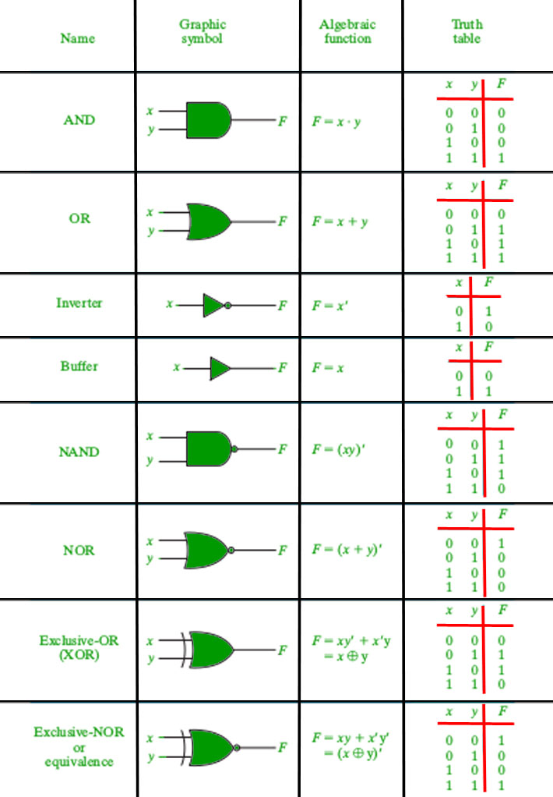
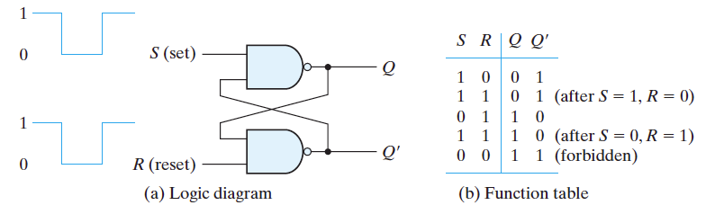
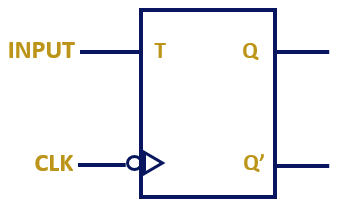

# 逻辑代数基础

## *布尔代数基础*

### 基本运算符

* 与 $\cdot,\ \or$
* 或  $+,\ \and$ 
* 非 $\neg$

对于一个代數系统，若仅用它所定义的一组运算行号就能解决所有的运算问题，则称这一组符号是一个完备的集合，简称完备集

在逻辑代數中，与、或、非是三种最基本的运算，n变量的所有逻辑函数都可以用n个变量及一组逻辑运算符以与、或、非来构成，因此与、或、非运算符是一组完备集

### 基本定理

* 恒等定律 $A+0=A,\ A\cdot1=A$

* 0/1定律 $A+1=1,\ A\cdot0=0$

* 互补律 $A+\bar{A}=1,\ A\cdot\bar{A}=0$

* 交换律

* 结合律

* 分赔律

* 对偶律（德摩根公式 De Morgan）/反演律
  * $\overline{A\cup B}=\bar{A}\cap\bar{B}$
  
  * $\overline{A\cap B}=\bar{A}\cup\bar{B}$
  
  * 反演规则：对于任意一个逻辑函数式F，若将其表达式中所有的算符 $\cdot$ 换成 $+$，$+$ 换成 $\cdot$，常量0换成1，1换成0；原变量换成反变量，反变量换成原变量，則所得到的结果就是 $\overline{F}$，$\overline{F}$称为原函数F的反函数，或称为补函数。反演规则是反演律的推广，运用它可以简便地求出一个函数的反函数
  
    如下例
    $$
    F=\overline{AB+C}\cdot D=AC\Rightarrow\overline{F}=\left[\overline{\left(\overline{A}+\overline{B}\right)\cdot \overline{C}}+\overline{D}\right]\left(\overline{A}+\overline{C}\right)
    $$
  
    * 不能破坏原式的运算顺序，即先算括号里的，然后按先与后或的原则运算
    * 不属于单变量上的（公用的）非号应保留不变，比如上式中 $\overline{AB+C}$ 的非不应去掉
  
* 代入定理：在任何一个包含A的逻辑等式中，若以另外一个逻辑式带入式中A的位置，则等式依然成立。**代入定理是逻辑电路进行模块化设计和层次化设计的理论基础**

### 常用公式

* 合并律：在逻辑代数中，如果两个乘积项分别包含了**1对**互补的两个因子（如$B$和$\overline{B}$），而其它因子都相同，那么这两个乘积项称为相邻项
  $$
  AB+A\overline{B}=A
  $$

* 吸收律1：在一个与或表达式中，如果某一乘积项的部分因子（如AB项中的A）恰好等于另一乘积项（如A）的全部，则该乘积项（AB）是多余的
  $$
  A+AB=A\\证：A+AB=A(1+B)=A\cdot1=A
  $$

* 吸收律2：在一个与或表达式中，如果两个乘积项中的部分因子互补（如AB项和$\overline{A}C$项中的A和$\overline{A}$），而第三个乘积项中的因子完全是由这两个乘积项中的其余因子（如B和C）构成的，则这个第三项是多余的，可以消去
  $$
  AB+\overline{A}C+BC=AB+\overline{A}C\\证：AB+\overline{A}C+BC=AB+\overline{A}C+(A+\overline{A})BC=AB+\overline{A}C+ABC+\overline{A}BC=
  $$

## *复合逻辑*

### 赋合逻辑运算

* 与非：与运算和非运算的组合
  $$
  F=\overline{A\cdot B}
  $$

* 或非
  $$
  F=\overline{A+B}
  $$

* 与或非：与运算、或运算和非运算的组合
  $$
  F=\overline{AB+CD}
  $$

* 异或：当2个输入变量相异时，输出为1；相同时输出为0。异或运算也称模2加运算
  $$
  F=A\oplus B=A\overline{B}+\overline{A}B
  $$

* 同或：同或与异或相反并且互为对偶，它表示当两个输入变量相同时输出为1；相异时输出为0
  $$
  F=A\odot B=\overline{A}\cdot\overline{B}+A\cdot B
  $$

补充一个异或非常有用的性质
$$
A\oplus A\oplus A\oplus\cdots\oplus A=\left\{\begin{array}{ll}0,&\# A\ is\ even\\A,&\# A\ is\ odd\end{array}\right.
$$

### 完备性问题 & 万能门电路

之前说过，与、或、非运算是完备的，但并不是最好的，因为它实现一个函数要使用三种不同规格的逻辑门

从反演律可以看出，有了“与"和“非"可得出“或”，有了“或"和“非”可得出“与”，因此“与非”、“或非”、“与或非’运算中的任何一种都能单独实现“与、或、非"运算，这三种复合运算每种都是完备集，而且实现函数只需要一种规格的逻辑门，这就给设计工作带来许多方便

所有逻辑函数都能用单一门电路构建，只要该门电路是反向门电路 inverting

比如两种常用的反向门电路为或非门 NOR 和与非门 NAND，它们称为万能门电路 universal gates

### 复合门



上图为IEEE标准的逻辑门

## *逻辑函数*


### 与相关

* **Product term 与项**: A product term is one or more literals connected by AND operators. (A literal is the appearance of a variable or its complement.) 其实就是由布尔变量及其反演（取反）组成的乘积。一个项可以是单个变量或多个变量的乘积
  $$
  A\overline{B},\ \overline{B}CD,\ \overline{E}
  $$

* **Standard product term 标准与项/最小项 minterm**: A minterm is a product term that includes each variable of the problem, either uncomplemented or complemented. 标准与项式包含某个逻辑问题所有变量的与项，不管是原变量 uncomplemented 还是反变量 complemented。用 $m_i$ 表示

* **Sum of Products form SOP 积之和式/与或式/析取范式**：与或式是用OR将一个或多个与项连接起来

* **Canonical sum/sum of standard product terms 标准和/标准与项和；最小项标准式**：用OR将一个或多个最小项连接起来。表示方法如下
  $$
  F(A,B,C)=A\overline{B}C+A\overline{B}\overline{C}+AB\overline{C}=m_5+m_4+m_6=\sum{m(4,5,6)}
  $$

* **Minimum sum of products 最简与或式**，满足一下两个条件

  1. Fewest number of product terms 最少的与项
  2. Fewest number of literals 最少的变量或反变量

### 或相关

* **Sum term 或项**: A product term is one or more literals connected by OR operators
* **Standard sum term 标准或项/最大项 maxterm**: A maxterm is a sum term that includes each variable of the problem, either uncomplemented or complemented。用 $M_i$ 表示
* **POS Product of sums 和之积式/或与式/和取范式**：用AND将一个或多个或项连接起来
* **Canonical product/product of standard sum terms 标准与/标准或与项；最大项标准式**
* **Minimum product of sum 最简或与式**
  1. Fewest number of sum terms 最少的和项
  2. Fewest number of literals 最少的变量或反变量

### 一些性质


* **使最小项结果为1的变量取值组合是唯一的，使最大项结果为0变量取值组合也是唯一的**

* 与项

  * n变量的全部最小项的逻辑和恒为1，即

  $$
  \sum\limits_{i=1}^{2^n-1}{m_i}=1
  $$

  * 任意两个不同的最小项的逻辑乘恒为0，即

  $$
  m_i\cdot m_j=0(i\neq j)
  $$

  * n变量的每一个最小项有n个相邻项

  * 任何一个逻辑函数都可以表示为最小项标准式

    * 只要将真值表中使函数值为1的各个最小项相或，便可得出该函数的最小项表达式
      $$
      F=AB+\overline{A}C=AB\left(C+\overline{C}\right)+\overline{A}\left(B+\overline{B}\right)C=ABC+AB\overline{C}+\overline{A}BC+\overline{A}\overline{B}C\\=m_7+m_6+m_3+m_1=\sum{m(1,3,6,7)}
      $$

    * 借助真值表：遍历所有取值可能，将真值表中**每一项与其值相与**后整体再相或就是其逻辑表达式

* 或项

  * n变量的全部最大项的逻辑乘恒为0，即

  $$
  \prod\limits_{i=1}^{2^n-1}{M_i}=0
  $$

  * 任意两个不同的最大项的逻辑和恒为1，即

  $$
  M_i+ M_j=1(i\neq j)
  $$

  * n变量的每一个最大项有n个相邻项

* 最小项 & 最大项之间的关系：变量数相同，编号相同的最小项和最大项之间存在互补关系。举例：$m_0$ 和 $M_0$
  $$
  m_0=\overline{A}\overline{B}\overline{C}\xrightarrow{inverting}\overline{m_0}=A+B+C=M_0
  $$
  可以利用这个性质来通过真值表求最大项表达式：如果一个逻辑函数的真值表已给出，要写出该函数的最大项表达式，可以先求出该西数的反函数 $\overline{F}$，并写出$\overline{F}$ 的最小项表达式，然后将 $\overline{F}$ 再求反，利用 $m_i$ 和 $M_i$ 的互补关系便得到最大项表达式

  举例：比如说下面这个真值表

  | A    | B    | F    | $\overline{F}$ |
  | ---- | ---- | ---- | -------------- |
  | 0    | 0    | 0    | 1              |
  | 0    | 1    | 1    | 0              |
  | 1    | 0    | 1    | 0              |
  | 1    | 1    | 0    | 1              |

  $$
  F=\overline{A}B+A\overline{B}=\sum{m(1,2)}\\\overline{F}=\overline{A}\overline{B}+AB\xrightarrow{inverting}\overline{\overline{F}}=F=\overline{\overline{A}\overline{B}+AB}=\overline{m_0+m_3}=\overline{m_0}\cdot\overline{m_3}=M_0\cdot M_3=\prod{M(0,3)}
  $$

  可以发现最小项和与最大项积的编号是互补的

* 结论：任何一个逻辑函数既可以用最小项表达式表示，也可以用最大项表达式表示。如果将一个n变量函数的最小项表达式改为最大项表达式时，其最大项的编号必定都不是最小项的编号，而且这些最小项的个数和最大项的个数之和为 $2^n$

### 逻辑函数及其描述方法

* 真值表

* 逻辑式

* 逻辑图

* 波形图

* 卡诺图 Karnaugh map

* EDA中的硬件描述语言

## *逻辑函数的化简方法*

### 代数化简法

* 化简原则
  * 与项（或项）数最少
  * 与项（或项）中的变量数最少
* 利用公式化简不直观，依赖于化简者对逻辑代数性质的灵活应用，也无法确定到底是否是最简了

### 格雷码 Gray code

格雷码 Gray Code 是一种二进制编码方式，**其中相邻的两个数只有一位不同**。格雷码的特点是在进行数字变化时，每次只改变一位，从而减少了误差和干扰

以下是一个用于表示十进制数字0到7的3位格雷码示例：

```
Decimal   Binary   Gray Code
0         000      000
1         001      001
2         010      011
3         011      010
4         100      110
5         101      111
6         110      101
7         111      100
```

可以看到在格雷码中，相邻的两个数只有一位发生变化。这种编码方式有助于在数字变化时减少了传输错误的可能性，因为每次只需要改变一位。格雷码在编码器中的应用非常常见，例如用于将旋转编码器的旋转转动映射成输出值的增加或减少

### 卡诺图 Karnaugh map

最小项真值表：在逻辑函数的真值表中，输入变量的每一种组合都和一个最小项相对应

卡诺图就是根据最小项真值表按逻辑相邻规则（格雷码）排列的方格图

N变量的卡诺图具有 $2^n$ 个方格，对应表是 $2^n$ 个最小项。每当变量数增加一个，卡诺图的方格数就扩大一倍。一般卡诺图用于5个及以下变量，5个以上难以用几何图形的二维空间的相邻性来表示其逻辑相邻性，5变量的相邻变量还需要在对称后找相重，对称轴必须是 $2^n$，非常复杂

* 前提：所有逻辑函数都可以展开为最小项之和的形式，从而采用合并最小项的方式化简逻辑函数

* 步骤
  * 将函数化为最小项之和或者直接代指来画出卡诺图
  * 找出可以合并的最小项：如果有2n个最小项相邻（n=1,2,…）并排列成一个**矩形组**，则它们可以合并为一项，并消去n对互补因子。这一对因子称为K圈
  * 选取化简后的乘积项，选取的原则有
    * 这些乘积项应包含函数式中所有的最小项（应覆盖卡诺图中的所有的1）
    * 在卡诺图上以最少的卡诺圈数和尽可能大的卡诺圈覆盖所有填1的方格，即满足最小覆盖，就可以求得逻辑函数的最简与或式
    * 每个乘积项包含的因子最少，也就是每个可合并的最小项矩形组中应包含尽量多的最小项
  
  
  
* 一道例题

  其实用1\*8的格雷码排列也可以，但容易出错，所以还是采用2\*4的格雷码排列
  
  

### 非完全描述逻辑函数（无关项）

* 完全描述逻辑函数：如果对于输入变量的每一组取值，逻辑函数都有确定的值
* 非完全描述的逻辑函数：如果对于输入变量的某些取值组合逻辑函数值不确定，即函数值可以为0，也可以为1。通常将其函数值记为 $\emptyset$ 或 $\cross$，将其称为无关项 don't cares

举个例子：红绿灯是一个典型的非完全描述逻辑函数（仅给出部分真值表）

| R       | Y       | G       | F           |
| ------- | ------- | ------- | ----------- |
| 0       | 0       | 0       | $\emptyset$ |
| 0       | 0       | 1       | 1           |
| 0       | 1       | 1       | $\emptyset$ |
| $\dots$ | $\dots$ | $\dots$ | $\dots$     |

无关项还可以分为

* 约束项：输入变量的取值不是任意的
* 任意项：输入变量的取值对电路功能没有影响

### 非完全描述逻辑函数的化简 

在非完全描述逻辑函数中，由于在无关项的相应取值下，函数值随意取成0或1都不影响函数原有的功能，因此可以充分利用这些无关项来化简逻辑函数，即采用卡诺图化简函数时，可以利用 $\emptyset$ 或 $\cross$ 来扩大卡诺圈

# 门电路

## *半导体二极管门电路*


### 获得高低电平的基本原理 

存在信号高、低电平的偏移以及带负载能力不高，只适用于IC内部电路

## *CMOS门电路*

### MOS管的开关特性

MOS 管是一种基于金属-氧化物-半导体结构的晶体管，分为 N-MOS（N型MOS）和 P-MOS（P型MOS）两种类型。它的主要工作原理是通过控制栅极电压来控制通道中的电流流动。MOS 管在数字和模拟电路中都有广泛应用，例如用于放大、开关和逻辑门电路中

### MOS管的输入特性和输出特性

### 4种MOS管

* N沟道增强型
* P沟道增强型
* N沟道耗尽型
* P沟道耗尽型

### CMOS反相器

CMOS Complementary Metal-Oxide-Semiconductor是一种电路技术，结合了 N-MOS 和 P-MOS 管的优势，用于构建高性能、低功耗的数字电路。CMOS 技术使用互补的 N-MOS 和 P-MOS 管，通过电压控制来实现逻辑门的操作。在 CMOS 电路中，只有在逻辑操作时才会消耗电流，因此它在静态状态下几乎没有功耗，这使得它非常适合于低功耗应用，如移动设备和嵌入式系统

## *TTL门电路*

### BJT


# 组合逻辑电路 Combinational logic

## *组合逻辑电路的分析与设计*

### 组合逻辑电路的分析步骤

* 根据给定的逻辑电路，从输入端开始，逐级推导出输出端的逻辑函数表达式
* 根据输出函数表达式列出真值表
* 用文字概括出电路的逻辑功能

### 设计的衡量指标

工程上的最佳设计，通常需要用多个指标去衡量，主要考惠的问题有以下几个方面

* 所用的逻辑器件数目最少，器件的种类最少，且器件之间的连线最简单，这样的电路称为最小化电路。注意：最简不一定是最好的，比如说增加冗余K圈来提高对竞争-冒险的鲁棒性
* 满足速度要求，应使级数尽量少，以减少门电路的延迟
* 功耗小，工作稳定可靠

### 设计的一般步骤

1. 逻辑抽象：设计最难的是第一步将功能抽象成输入输出模型
2. 选择器件类型，用NAND还是用NOR等等
3. 根据真值表和选用逻辑器件的类型，写出相应的逻辑函数表达式
4. 根据逻辑函数表达式及选用的逻辑器件画出逻辑电路图

## *编码器和译码器*

下面介绍一些常用的MIS器件。MSI Medium-Scale Integration 中规模器件是具有一定功能的集成器件，一般会有Enable 使能位和 Chip Select 片选位

### 编码器


* 编码器将输入的每个高/低电平信号变成一个对应的二进制代码，最常见的编码器有n位输入和 $2^n$ 个输出，其中每种输出只对应一种输入
* 分类
  * 普通编码器：任何时刻只允许一个需要编码的电平信号，不允许同时出现两个或两个以上的有效信号，因而其输入是一组有约束（互相排斥）的变量
  * 优先编码器 priority encoder：允许同时输入两个以上的电平信号，但只对其中优先权最高的一个进行编码。常用于优先中断系统和键盘编码
    * 8-3优先编码器 74HC148
    * 16-4优先编码器 两个8-3编码器的组合：二-十进制优先编码器是16-4编码器的一种特殊使用方式

### 译码器


* 译码器将每个输入的二进制代码译成对应的输出信号（高低电平信号），只有一个输出是有效的

* 分类
  * 二进制译码器：3-8译码器 74HC138（高速CMOS工艺）、74LS138（早期TTL工艺）
  * 二-十进制译码器也称为BCD译码器或者4-10译码器，它的功能是将输入的一组BCD码译成10哥高低电平输出信号，典型的芯片是74LS42
  * 显示译码器 Display Decoder：共阴极 Common Cathode

* 应用
  * 实现设备及存储系统的地址译码，实际中用的很多 

    

  * 实现逻辑函数，实际中用的并不多

  * 带使能端的译码器可用作数据分配器或脉冲分配器

### 地址译码

不变的地址用使能端来控制

### 译码器扩展

MSI要扩展的前提是要有使能端

## *MUX & DEMUX*

### 多选器/选择器 MUX


数据选择器又称多路选择器 Multiplexer，简称MUX。MUX有n位地址输入，$2^n$ 位数据输入和1位输出（当有n个数据输入时，需要 $\log_2{n}$ 个选择信号）。每次在地址输入的控制下，从多路输入教据中遠择一路输出，其功能类似于一个单刀多掷开关

数据选择器的应用有

* 作数据选择，以实现多路信号分时传送
* 实现组合逻辑
* 在数据传输时实现并-串转换，USB在转移文件的时候就有从串行接口转换
* 产生序列信号，外接计时器来循环选择

### 如何设计 $l>n$ 的MUX？ 

对于n个地址输入的MUX，其表达式为如下，其中 $m_i$ 是由地址变量 $A_{n-1},\ \dots,\ A_1,\ A_0$ 组成的地址最小项
$$
Y=\sum\limits_{i=0}^{2^{n}-1}{m_iD_i}=\left[\begin{matrix}m_1&m_2&\cdots&m_{2_n-1}\end{matrix}\right]\left[\begin{matrix}d_1\\d_2\\\vdots\\d_{2_n-1}\end{matrix}\right]
$$
任何一个具有 $l$ 个输入变量的逻辑函数都可以用最小项之和来表示如下，这里的 $m_i$ 是由函数的输入变量 $A,\ B,\ C,\ \dots$ 组成的最小项
$$
F=\sum\limits_{i=0}^{2^l-1}{m_i\left(1\ or\ 0\right)}
$$

* 当 $l=n$ 时，只要将函数的输入变量 $A,\ B,\ C,\ \dots$ 依次接到MUX的地址输入端，根据逻辑函数F所需要的最小项，确定MUX中以的 $D_i$ （0或1）即可
* 当 $l＜n$ 时，将MIUX的高位地址输入端不用（接0或1），其余同上
* 当 $l>n$​ 时，即逻辑函数的变量数 $l$ 大于MUX的地址输入端数 $n$ 时，不能采用上面所述的苘单方法。如果从 $l$ 个输入变量中遠择 $n$ 个直接作为MIU X的地址输入，那么多余的 $l-n$ 个变量就要反映到MUX的数据输入 $D_i$ 端，即 $D_i$ 是多余输入变量的函数，简称余函数

**因此设计的关键在于如何求出函数 $D_i=f(1-n)$**，下面是两种球余子式 $D_i$ 的方法

* 代数方法
  * 首先选择地址输入，另 $A_1A_0=AB$，则多余的输入变量为 $C$，余函数为 $D_i=f(c)$
  * 确定余函数 $D_i$：用代数法将F的表达式变换为与Y相应的形式
* 降维K图法：n变量的逻辑函数，可以用n维（即n变量）的卡诺图表示，也可以用 $(n-1),\ (n-2),\ \dots$ 维K图表示，这种K图称为降维K图
  1. 画出函数F的K图
  2. 选择地址输入
  3. 在F的K图上确定余函数 $D_i$ 的范围，即子K图
  4. 求余函数 $D_i$
  5. 画出逻辑图

### 数据分配器 DEMUX

數据分配器又称多路分配器 DEMUX，其功能与數据选择器相反，它可以将一路输入款据按 $n$ 位地址分送到 $2^n$ 个数据输出端上

## *组合逻辑电路中的竞争-冒险*

### 竞争-冒险

* 在组合电路中，某一输入变量经不同途径传输后，到达电路中某一会合点的时问有先有后，这种现象称为竟争 race
* 由于竞争而使电路输出发生瞬时错误的现象称为冒险 hazard

考虑器件延时 $\Delta$，冒险会导致毛刺 glitch。毛刺可能会导致数据错误、时序混乱、死锁和竞态条件、引发功耗问题、导致测试和验证苦难等问题


注意：竞争是经常发生的，但不一定都会产生毛刺，这是因为竞态条件的影响取决于系统的具体设计和实现

### 竞争与冒险的识别

* 代数法：当函数表达式在一定条件下可以简化成 $F=X+\overline{X}\ or\ F=X\cdot\overline{X}$ 的形式时，$X$ 的变化可能会引起冒险现象
* K图法：若两卡诺图相切、而相切处又未被其它卡诺图包围，则可能会发生冒险现象
* 实验法：两个以上的输入变量同时交化引起的功能冒险难以用上述方法制断，因而发现冒险现象最有效的方法是实验。利用示波器仔细观察在输入信号各种变化情况下的输出信号，发现毛刺则分析原因并加以消除，这是工程实际中经常采用的方法

### 消除竞争冒险的途径

当电路中存在冒险现象时，必领设法消除它，否则会导致错误结果，消除冒险现象通常有如下方法

* 增加冗余项消除逻辑冒险

* 加选通信号以避开毛刺

  毛刺仅发生在输入信号变化的瞬间，因此在这段时间内先将门封住，待电路进入稳态后，再加选通脉冲选取输出结果。该方法简单易行，但选通信号的作用时间和极性等一定要合适

* 加滤波电路，消除毛刺的影响

  毛刺是很窄的，其宽度可以和门的传输时间相比拟，因此常在输出端并联滤波电容 $C$，或在本级输出端与下级输入端之间，串接一个积分电路来消除其影响。但 $C$ 或 $R$ 的引入会使输出波形边沿变斜，故参数要选择合适，一般都是要通过试验来确定

* 修改逻辑设计（卡诺图相切）

# ALU

## *加法器*

### 全加器

### 半加器

## *快速加法：超前进位*

## *时钟*

# 触发器

## *基本触发器/锁存器*

### 相关术语

当输入信号变化时，触发器可以从一个稳定状态转换到另一个稳定状态

把输入信号作用前的触发器状态称为现在状态/现态，用 $Q^n$ 和 $\overline{Q}^n$（或 $Q$、$\overline{Q}$）表示

把在输入信号作用后触发器所进入的状态称为下一状态/次态，用 $Q^{n+1}$ 和 $\overline{Q}^{n+1}$ 表示

### SR锁存器 SR latch



用与非门还是或非门来构成SR锁存器的区别在于是高电平作为输入信号还是高电平作为输入信号

基本锁存器用于记忆1位二进制信号，它有两个能够自行保存的状态，根据输入信号可以置成0或1

下面先分析一下NAND器件组成的SR锁存器的逻辑函数和真值表
$$
\left\{\begin{array}{l}P=\overline{R\cdot Q}\\Q=\overline{S\cdot P}\end{array}\right.
$$

* $S=0,\ R=1\Longrightarrow Q=1,\ P=0$：**置位状态 set**
* $S=1,\ R=0\Longrightarrow Q=0,\ P=1$：**复位状态 reset**
* $S=1,\ R=1\Longrightarrow Q=\overline{P},\ P=\overline{Q}$：从这里我们规定 $P=\overline{Q}$，也就是输出端要互斥。将 $Q$ 称为**主状态**，此时称为**保持状态 hold**
* $S=0,\ R=0$：虽然可以代入逻辑函数得到 $Q=1,\ P=1$，但是因为我们规定了输出要互斥，所以这种输入是**不允许的 forbidden**

此时另 $P=\overline{Q}^n$，我们可以改写得到 $P$ 和 $Q^{n+1}$ 关于现态 $Q_n$ 的逻辑函数
$$
\left\{\begin{array}{l}P=\overline{R\cdot Q^n}\\Q^{n+1}=\overline{S\cdot\overline{Q}^n}\end{array}\right.
$$
真值表为

| R    | S    | $Q^n$ \| | $Q^{n+1}$ |
| ---- | ---- | -------- | --------- |
| 0    | 0    | 0    \|  | 0         |
| 0    | 0    | 1    \|  | 1         |
| 0    | 1    | 0    \|  | 1         |
| 0    | 1    | 1    \|  | 1         |
| 1    | 0    | 0    \|  | 0         |
| 1    | 0    | 1    \|  | 0         |
| 1    | 1    | 0    \|  | X         |
| 1    | 1    | 1    \|  | X         |

### 描述触发器逻辑功能的方法

* 状态转移真值表（状态表）

* 卡诺图

* 特征方程（状态方程）是描述触发器逻辑功能的函数表达式，以SR锁存器为
  $$
  \left\{\begin{array}{l}Q^{n+1}=\overline{S}+R\cdot\overline{Q}^n\\S+R=1\end{array}\right.
  $$

* 状态转移图

* 激励表/驱动表：由输出来确定输入，触发器由当前状态 $Q_n$ 转至确定的下一状态 $Q_{n+1}$ 时的对输入信号的要求

* 波形图（时序波形） Timing graph：它反映了触发器的输出状态随时间和输入信号变化的规律，是实验中可观察到的波形

  

### 为什么不允许 $S=0,\ R=0$？

根据下面的波形图我们可以分析一下当从 $S=0,\ R=0$ 马上跳变到 $S=1,\ R=1$ 会发生什么


**在实际器件中，延时都是存在的**。假设S的延时为 $\Delta_1$，R的延时为 $\Delta_2$，如果这两个期间极其相似，我们无法确定到底哪个大哪个小

不定指的是我们无法从理论上分析到底是什么值，但是如果使用示波器去测，肯定得到的是一个确定值

当从 $S=0,\ R=0$ 马上跳变到 $S=1,\ R=1$ 就会出现不确定的状态，而从 $S=0,\ R=0$ 马上跳变到 $S=1,\ R=0$ 或者 $S=0,\ R=1$ 结果则是确定的，因为只有一个状态在变化，也就无所谓哪个延时高了

### D锁存器 D latch


原理：为了能适应单端输入信号的需要设计。由于从一个输入信号接反相器得到两个相反的信号所以信号时刻相反，避免了不定状态，但同时也失去了保持功能

## *基本钟控触发器 Flip-flop*

### 锁存器的问题

上面的锁存器总是要记住不允许从 $S=0,\ R=0$ 马上跳变到 $S=1,\ R=1$，这用起来有些麻烦，钟控触发器可以解决这个问题。钟控也称为门控 gated

**时序电路的一个重要任务就是要保持数据的安全**，若此时S和R因为外界的任何干扰产生跳变，数据都会产生变化

### 分类

* 按触发方式：电平、脉冲、边沿
* 按逻辑功能：RS、JK、D、T

### 钟控RS触发器


钟控RS触发器是在基本RS触发器基础上加两个与非门构成的，R为置0端，S为置1端，CP为时钟输入端

* $CP=1$ 时，正常工作状态
* $CP=0$ 时，两个外面的与非门都被关闭，此时 $R_D=1,\ S_D=1$，进入保持状态。此时无论S和R受到什么干扰，数据都是安全的，相当于加了一层保险

分析一下钟控RS触发器的特征方程，代入SR锁存器的特征方程（注意：SR锁存器中的S和R是钟控RS触发器中的 $S_D$ 和 $R_D$，不要混淆了）
$$
\left\{\begin{array}{l}R_D=\overline{R\cdot CP}\\S_D=\overline{S\cdot CP}\end{array}\right.\xRightarrow{SR\ Latch}\left\{\begin{array}{l}Q^{n+1}=S+\overline{R}\cdot\overline{Q}^n\\R\cdot S=0\end{array}\right.
$$
约束条件：$R\cdot S=0$ 表示R和S不能同时为1。当R和S同时为1，且CP=1为工作状态，此时 $S_D=1,\ R_D=1$

## *令约束恒成立：FF变种*

### 钟控D触发器 DFF

钟控RS触发器中有 $R\cdot S=0$ 这个约束条件，该约束条件对于用户来说是不方便的，所以我们得想办法去掉它，或者说想办法让它恒成立，恒成立了也就是去掉约束了

具体方法就是将原来S和C的输出作为原来C和R的输入。此时当CP=1时，若 $S=1$，则S和C的输出为 $R=0$；若 $S=0$，则S和C的输出为 $R=1$

由这种方法可以得到钟控D触发器。D代表Delay，意思是在R和S中制造了一个延时，来强行错开它们


可以得到D触发器的特征方程为
$$
\left\{\begin{array}{l}Q^{n+1}=D,&CP=1\\Q^{n+1}=Q^n,&CP=0\end{array}\right.
$$
因为D触发器的特征方程比较简单，输入什么得到的次态就是什么，所以D触发器是比较常用的触发器。实际上**钟控D触发器就是寄存器**

### 钟控T触发器 TFF

把钟控RS触发器的RS输入端连接到一块，另外将 $R_D$ 和 $S_D$ 的输出分别作为R和S的第三个输入，这种改动称为T触发器


$$
\left\{\begin{array}{l}R=T\cdot Q\\S=T\cdot\overline{Q}\end{array}\right.\Rightarrow R\cdot S=0\\Q^{n+1}=S+\overline{R}\cdot\overline{Q}^n=T\cdot\overline{Q}+\overline{T\cdot Q^n}\cdot Q^n=T\cdot\overline{Q}^n+\left(\overline{T}+ \overline{Q}^n\right)\cdot Q^n\\=T\cdot\overline{Q}^n+\overline{T}\cdot Q^n=T\oplus Q^n
$$
T触发器具有保持和翻转的功能：T代表Toggle

* 当 $T=0$ 的时候，得到 $Q^n$，此时为保持状态
* 当 $T=1$ 的时候，得到 $\overline{Q}^n$，此时为翻转状态

### 钟控JK触发器 JKFF

将T触发器的T输入拆开为J输入和K输入，可以得到JK触发器


$$
Q^{n+1}=J\overline{Q}^n+\overline{K}Q^n
$$

### 用JK触发器来实现其他触发器的功能

JK触发器的功能是最多的，它有保持、置位、复位、翻转的功能。因为JKFF囊括了其他FF的功能，所以可以用JKFF来实现其他FF

原理是让特征方程相等

* JKFF实现TFF：令 $J=K=T$
* JKFF实现DFF：令 $J\overline{Q}^n+\overline{K}Q^n=D$，可以得到当 $J=D,\ K=\overline{D}$ 时就可以实现

## *触发方式 & 时序图的绘制*

### 边沿触发

之前的钟控/门控实际上都是电平触发的。电平触发的特点是

* 只有当CLK变为有效电平时，触发器才能接收输入信号，并按照输入信号将触发器的输出置成相应的状态

* 在CLK=1的全部时间里，S和R状态的变化都可能引起输出状态的改变。在CLK回到0以后，触发器保存的是CLK回到0以前瞬间的状态

* 只要在CLK=1期间S、R的状态可以多次发生改变，降低了触发器的抗干扰能力

为了提高抗干扰能力，我们的目标是将CLK=1的这段时间再尽可能缩短。此时可以采用边沿触发 Edge-triggered：因为用于计算的时间非常短，甚至是短于边沿变化的时间，所以需要留出的最短时间就是给边沿变化完成用的

* 触发器仅在CP某一约定跳变到来时，才接收输入信号
* 在CP=0或CP=1期间，输入信号变化不会引起触发器输出状态变化

边沿触发器不仅克服了空翻现象（因为干扰产生的误翻转），而且大大提高了抗干扰能力，工作更为可靠

边沿触发器的逻辑符号如下，箭头+圆圈代表下降沿触发，只有箭头代表上升沿触发



### 异步信号/静态信号 static

异步信号的优先级比同步信号高

### 时序图的绘制步骤

1. 以时钟CP的作用沿为基准，划分时间间隔，CP作用沿来到前为现态，作用沿来到后为次态
2. 每个时钟脉冲作用沿来到后，根据触发器的状态方程或状态来确定器次态
3. 异步直接置0、置1端（$R_D, S_D$）的操作不受时钟CP的控制，画波形时要特别注意

### 例子：二分频

### 触发器的动态特性

* 建立时间 Setup time
* 保持时间 Hold time
* 传输延迟时间 Propagation delay time

# 时序逻辑电路的分析与常用MSI器件

## *概述*

### 时序逻辑电路的总体框架


时序逻辑电路的特点

* 时序逻辑电路包含组合逻辑电路和存储电路两部分，存储电路具有记忆功能，通常由触发器组成

* 存储电路的状态反馈到组合逻辑电路的输入端，与外部输入信号共同决定组合逻辑电路的输出

  * $\boldsymbol{X}=\left(x_1,x_2,\dots,x_n\right)$ 为外部输入信号

  * $\boldsymbol{Q}=\left(q_1,q_2,\dots,q_n\right)$ 为存储电路的状态输出，也是组合逻辑电路的内部输入

  * $\boldsymbol{Z}=\left(z_1,z_2,\dots,z_n\right)$ 为外部输出信号  

  * $\boldsymbol{Y}=\left(y_1,y_2,\dots,y_n\right)$ 为存储电路的激励信号 excitation，也是组合逻辑电路的内部输出
    $$
    \left\{\begin{array}{lll}输出方程：&z_1^n=f_1\left(x_1^n,x_2^n,\cdots,x_n^n,q_1^n,q_2^n,\cdots,q_j^n\right),&z_1\cdots z_m\\驱动方程/激励方程：&y_1^n=g_1\left(x_1^n,x_2^n,\cdots,x_n^n,q_1^n,q_2^n,\cdots,q_j^n\right),&y_1\cdots y_k\\状态方程：&q_1^{n+1}=h_1\left(x_1^n,x_2^n,\cdots,x_n^n,q_1^n,q_2^n,\cdots,q_j^n\right),&h_1\cdots h_j\end{array}\right.\Rightarrow\left\{\begin{array}{l}\boldsymbol{Z}^n=F\left(\boldsymbol{X}^n,\boldsymbol{Q}^n\right)\\\boldsymbol{Y}^n=G\left(\boldsymbol{X}^n,\boldsymbol{Q}^n\right)\\\boldsymbol{Q}^{n+1}=H\left(\boldsymbol{Y}^n,\boldsymbol{Q}^n\right)\end{array}\right.
    $$

  * 

  从以上关系式可得：时序逻辑电路某时刻的输出 $\boldsymbol{Z}^n$ 决定于该时刻的外部输入 $\boldsymbol{X}^n$ 和内部状态 $\boldsymbol{Q}^n$；而时序逻辑电路的下一状态 $\boldsymbol{Q}^{n+1}$ 同样决定于 $\boldsymbol{X}^b$ 和 $\boldsymbol{Q}^n$

实际上存储电路并没有太多要设计的地方，最终要设计的还是组合逻辑电路部分

### 时序电路的分类

* 根据时钟分类
  * 同步时序电路：存储电路中所有触发器的时钟**使用统一的CLK**，状态变化发生在同一时刻
  * 异步时序电路：各个触发器的时钟脉冲不同，即电路中没有统一的时钟脉冲来控制电路状态的变化，电路状态改变时，电路中要更新状态的触发器的翻转有先有后，是异步进行的
* 根据输出分类 
  * Melay型：$Z=F(X, Q)$，看得到外部的输入
  * Moore型：$Z=F(Q)$ 仅取决与电路状态
  * Melay型转换成Moore型：加一个触发器

### 时序电路的功能描述

* 逻辑方程：输出方程、激励方程、状态方程
* 状态转移表：状态迁移 表或状态表，是用列表的方式来描述时序逻辑电路输出Z、次态 $Q^{n+1}$和外部输入X、现态Q之间的還辑关系

7.2.  时序逻辑电路的分析方法

7.2.1.   同步时序电路的分析方法：找出给定时序电路的逻辑功能，即找出在输入和CLK作用下，电路的次态和输出

7.2.1.1.  从给定电路写出存储电路中每个触发器的驱动方程（输入的逻辑式），得到整个电路的驱动方程

7.2.1.2.  将驱动方程式代入触发器的特性方程，得到状态方程

7.2.1.3.  从给定电路写出输出方程


7.4.  时序逻辑电路的设计方法

7.4.1.   同步时序逻辑电路的设计方法

7.4.2.   时序逻辑电路的自启动设计


## *寄存器和移位寄存器 shift-register*

### 寄存器

寄存器：用于寄存一组二值代码。在钟控D触发器中我们看到，1个触发器可以存储1 bit，所以若要存储n bit，就需要n个触发器

## *计数器*

### 计数器分类

* 同步计数器

  * 二进制计数器
    * 加法计数器
    * 减法计数器
    * 可逆计数器
  * 十进制计数器

  * N进制计数器

* 异步计数器

  * 二进制计数器
  * 十进制计数器
  * N进制计数器

## *半导体存储器*

### ROM

RAM在断电后会失去存储的数据，即易失 volatile。由于历史原因，虽然ROM中有的类型既可以读也可以写，但是它们整体上都被称为只读存储器 Read-Only Memory ROM。ROM是非易失存储器 nonvolative memory

**只读存储器ROM 实际上是组合电路**

* Mask ROM 掩模只读存储器

  

  * 存储矩阵的每个交叉点是一个“存储单元”，存储单元中通过有无器件判断存入1还是0
  * 存储器的容量：$字数*位数$
  * 特点：出厂时已经固定，不能更改，适合大量生产，简单，便宜，非易失性

* PROM Programmable ROM 只能被编程一次，原理是fuse，只能熔断一次

* EPROM Erasable Programmble ROM 可擦写可编程ROM，擦除和重编程的数量级可以达到1000次 -- Flash memeory 闪存

  * 发展历程：UVEPORM `->` E2PROM `->` Flash Memory
  * UVEPROM
    * 工艺：采用叠栅注入SIMOS Stakced-gate Injection MOS 工艺
    * 写入：雪崩注入
    * 擦除：通过照射产生电子-空穴对，提供泄放通道，紫外线照射20-30分钟

  * EEPROM/E2PROM Electrically Erasable PROM 电子可擦除PROM，擦除和重编程的数量级可以达到 $10^5$ 次
    * 工艺：为了克服UVEPROM擦除慢，擦除不变的缺点采用FLOTOX(浮栅隧道氧化层MOS管)


存储在ROM设备中的程序通常被称为固件 firmware，当一个计算机系统通电后，它会自动运行存储在ROM中的固件。ROM中存储的经常是用来启动电脑/OS的程序，比如BIOS。BIOS提供一连串的指令对CPU等组件进行初始化，在初始化过程中，BIOS程序初始化并检查RAM

### 静态随机存储器SRAM -- 高速Cache

### 动态随机存储器DRAM -- 内存

运用电容可以存储电荷的原理来存储二值信息，在提高集成度的同时要引入刷新电路

### 存储器容量扩展

* 位扩展方式
  * 使用场合：适用于每片RAM，ROM字数够用而位数不够时
  * 接法：将每片的地址线、读写线、片选线并联即可
* 字扩展方式
  * 使用场合：适用于每片RAM，ROM位数够用而字数不够时

# 可编程逻辑器件 PLD

## *PLD简介*

### 什么是PLD

标准逻辑器件、微处理器芯片、SRAM 和 DRAM 芯片以及专用集成电路 ASIC 芯片，这些种类的芯片一旦被生产出来，它们内部的逻辑结构和电路结构是固定不变的

与这些芯片不同，业界还推出了另一大类数字逻辑器件，这类数字逻辑器件的逻辑功能和电路结构可以通过电学和逻辑编程的方式进行变换，从而得到新的逻辑功能和电路结构，这类器件被称为可编程逻辑器件 Programmable Logic Device。它是一类数字电路器件，允许工程师根据特定的需求来配置其内部逻辑功能。PLD可以根据用户的设计要求编程，从而实现各种数字逻辑功能和电路。PLD的主要目的是提供一种灵活性高、可定制化的解决方案，以满足不同应用中的逻辑和控制需求

### 分类


* SPLD Simple Programmable Logic Devices 简单可编程逻辑器件
* CPLD Complex Programmable Logic Devices 复杂可编程逻辑器件
* FPGA Field Programmable Gate Arrays 现场可编程逻辑门阵列

从SPLD到CPLD再到FPGA，其集成度、复杂度和性能是不断提高的，当然它们产生的年代也各不相同

PLD芯片的重要意义不仅仅是提高了系统的性能和可靠性，降低了印制板和系统的成本。更重要的是PLD芯片的逻辑功能和电路结构将可以按照系统的功能需求极大地方便了系统原型的建构、系统功能的验证和完善

## *SPLD*

### PROM

### 两级逻辑与PLA

Programmable Logic Array 可编程逻辑阵列

### PAL

Programmable Array Logic 可编程阵列逻辑

## *CPLD*

## *FPGA*

Field这个词的由来是因为FPGA允许用户在实际现场或现地进行配置和编程，以实现定制的数字逻辑功能

### FPGA的应用

FPGA是一种灵活的数字电路器件，可以通过编程配置来实现各种不同的数字逻辑和信号处理功能。FPGA 在许多领域都有广泛的应用：

1. **数字电路设计和原型开发：** FPGA 可以用于实现各种数字逻辑电路，从简单的逻辑门到复杂的处理器核心和系统。工程师可以使用硬件描述语言（如Verilog或VHDL）来编写逻辑设计，并将其配置到 FPGA 上进行验证和原型开发。
2. **嵌入式系统开发：** FPGA 可以用于构建嵌入式系统，其中包括处理器、外设接口、通信接口等。这些系统可以在单个 FPGA 芯片上实现，从而在特定应用中提供定制化的硬件功能。
3. **数字信号处理（DSP）：** FPGA 可以用于高性能数字信号处理任务，如滤波、快速傅里叶变换（FFT）、图像处理等。其并行处理能力使其在实时信号处理和通信应用中非常有用。
4. **加速计算：** 对于需要大量并行计算的任务，如科学计算、密码学、人工智能等，FPGA 可以作为加速器与传统的中央处理器（CPU）一起使用，提供更高的计算性能。
5. **协议转换和接口适配：** FPGA 可以用于实现不同设备之间的协议转换和接口适配，从而使不同设备能够进行通信和数据交换。
6. **实时控制系统：** FPGA 可以用于实时控制和自动化系统，如机器人控制、工业自动化、航空航天等领域，因为其响应速度和可编程性使其适合处理实时的控制逻辑。

# 硬件描述语言 HDL

## *EDA技术*

### EDA技术的发展历程

硬件描述语言的产生和基于硬件描述语言的数字电路设计技术的发展，是随着数字电路的计算机辅助设计，也称为电子设计自动化 EDA Electronic Design Automatic 的发展而逐步发展起来的

1. 20世纪70年代：这一代EDA系统常称为计算机辅助设计CAD系统
2. 20世纪80年代：计算机辅助工程CAE系统
3. 20世纪90年代：引入了硬件描述语言，实现了设计的高度自动化

### 硬件描述语言的分类

件描述语言 Hardware Description Language HDL是一种用于描述数字电路和硬件系统的专门语言。它允许工程师和设计人员以一种结构化的方式来描述硬件电路的功能和行为，从而实现硬件设计、仿真、验证和综合等任务。HDL可以看作是一种编程语言，但其主要关注的是硬件电路的描述，而不是传统的软件程序

* VHDL：侧重于系统级描述—系统级设计

  VHDL VHSIC Hardware Description Language：VHDL是一种通用的硬件描述语言，最早是由美国国防部下属的高速集成电路（VHSIC）项目开发的。它在语法上更加正式，适合用于大型系统级设计。**VDHL基于Ada语言**

  > VHDL 是单词 VHSIC (Very High Speed Integrated Circuit) Hardware Description Language 的缩写，即高速集成电路硬件描述语言。早在1980年，因为美国军事工业需要规范电子系统的描述方法，美国国防部开始进行 VHDL 语言的开发，IBM、TI公司也参与了该项目。1987 年，由 IEEE 将 VHDL 制定为标准，称为 TEEE 1076—1987。第二个增强版本是在1993 年制定的，称为 IEEE1076一1993。新增的标准包 packages 增加了数据类型和时序的定义，含 IEEE 1164 (data types)、IEEE 1076.3 (numeric)、 IEEE 1076.4 (timing)

* Verilog：侧重于电路级描述—电路级设计

  Verilog最早是由Gateway Design Automation公司开发。Verilog在工业界广泛使用，特别是在数字逻辑设计和验证领域。**Verilog基于C语言**

### 基于HDL的数字电路设计流程

## *EDA和PLD*

EDA Electronic Design Automation

### 概述

* 可编程逻辑器件 PLD Programming Logic Device: A PLD is like an electronic breadboard that is wired together by an automated synthesis tool
* 数字继承电路从功能上分为通用型 General ICs 和专用型 Application-Specific ICs
* PLD的特点：是一种按通用器件来生产，但逻辑功能是由用户通过对器件变成来设定的
* Built-in components are called macros

### PLD的发展和分类：PROM是最早的PLD

* FPLA现场可编程逻辑阵列
* PAL可编程逻辑阵列
* GAL通用阵列逻辑
* EPLD可擦除的可编程逻辑器件
* CPLD复杂的可编程逻辑器件
* FPGA现场可编程门阵列

### EDA技术特征

* 以超大规模IC为基础，以高性能计算机及软件为平台
* 多学科综合
* 实现电子产品从设计到生产全过程自动化
* 电路软件化—软件即是电路，用计算机程序描述电路
* 电路的描述形式为硬件描述语言HDL(Hardware Description Language)

## *Verilog*

### Verilog中的数据类型

1. **wire**：表示一个连接的输出或者一个网络中的信号。`wire`类型用于表示信号之间的连接关系，即一个组合信号
2. **reg**：表示一个存储元素，可以用来存储数字值，数值可随时间变化
3. **integer**：表示整数值，常用于循环和计数等应用
4. **real**：表示实数值，用于模拟和数学计算
5. **parameter**：表示常数值，通常用于定义常量或者参数
6. **input**：表示输入端口，通常用于模块的输入
7. **output**：表示输出端口，通常用于模块的输出
8. **inout**：表示双向端口，既可以作为输入也可以作为输出

### wire和reg的可能取值、常量值

wire和reg的可能取值是

* 0或1，表示逻辑假或真
* X，表示未知，给定所有寄存器和未连接线的处世之
* Z，表示三态门的高阻态

常量值可以是

### 操作

1. **赋值操作符（=）**：用于将一个值赋给一个信号或寄存器
2. **逻辑运算符**：包括AND（&）、OR（|）、XOR（^）等，用于执行逻辑运算
3. **位运算符**：如AND、OR、XOR，用于对信号的每一位进行逻辑运算
4. **比较运算符**：如==、!=、<、>等，用于比较信号的值
5. **条件运算符（三目运算符）**：用于根据条件选择一个值，如 `condition ? true_value : false_value`
6. **位选择运算符（[]）**：用于选择信号的特定位
7. **拼接运算符（{}）**：用于将多个信号或值拼接成一个新的信号
8. **重复运算符（{N{value}}）**：用于重复一个值N次
9. **延时操作符（#n 或 #n time_unit）**：用于在仿真中引入延时
10. **非阻塞赋值（<=）**：用于在组合逻辑中执行非阻塞赋值，通常用于时序逻辑
11. **阻塞赋值（=）**：用于在顺序逻辑中执行阻塞赋值，按照顺序逐条执行

### Verilog程序结构

Verilog程序由一组组模块构成，模块可以表示任何内容，比如逻辑门集合甚至是一个完整系统

模块的主题是

* initial结构，初始化reg变量
* 连续赋值，仅用于定义组合逻辑
* always结构，定义时序逻辑或组合逻辑
* 其他模块实例，用于定义模块的实现

## *VHDL*

# 脉冲波形的产生和整形电路

## *概述*

### 矩形脉冲的作用

矩形脉冲是一种特殊的信号，具有固定宽度和幅度的短暂信号。它在不同领域具有各种应用，以下是一些常见的矩形脉冲的作用：

1. **通信系统**：矩形脉冲可以用于数字通信中的脉冲编码调制（PCM）和调制解调器中。在数字通信中，矩形脉冲可以用来表示二进制数据位，其中不同的脉冲宽度和幅度表示不同的数字值
2. **计时和时序分析**：矩形脉冲可以用于测试和分析电路的时序行为。通过在电路中注入矩形脉冲，可以观察信号在不同部件之间传播的时间延迟，从而帮助诊断电路中的问题
3. **数字逻辑分析**：矩形脉冲可以用于测试和分析数字逻辑电路的功能。通过产生特定的输入脉冲序列，可以验证电路是否按照预期进行逻辑运算
4. **测量和仪器**：矩形脉冲可以用于测量和校准各种类型的仪器，如示波器、频谱分析仪等。通过发送已知的矩形脉冲信号，可以根据仪器的响应来测量其性能
5. **控制系统**：在控制系统中，矩形脉冲可以用于触发或同步各种操作。例如，可以使用矩形脉冲来控制步进电机的步进动作，或者用于时序控制和时钟同步
6. **激励信号**：矩形脉冲可以作为激励信号，用于测试和评估电路或系统的响应。在电路和系统的性能评估中，通过注入矩形脉冲可以了解其对瞬态信号的响应

### 获取矩形脉冲的方法

* 脉冲波形发生电路
* 脉冲波形整形电路

### 描述矩形脉冲波形的主要参数


## *555定时器*

## *施密特触发器 Schmitt trigger*

## *单稳态电路*

## *多谐振荡电路*

### 对称式多谐振荡电路

### 非对称式多谐振荡电路

### 环形振荡电路

### 用施密特触发器电路构成的多谐振荡电路

### 石英晶体多谐振荡电路

# 数模和模数转换

## *DAC*

### 权电阻网络DAC

### 倒T型电阻网络DAC

### 权电流型DAC

## *DAC技术指标*

### DAC的转换精度

### DAC的转换速度

## *ADC*

### ADC的电路结构和工作原理

### 并联比较型ADC

### 逐次逼近型ADC

### 双积分型ADC

## *ADC技术指标*

### ADC的转换精度

### ADC的转换速度