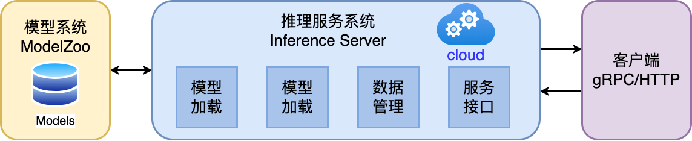

# AI系统概述

https://github.com/chenzomi12/DeepLearningSystem/tree/main

## *方向*

### 算法

对**算法、特征、业务、实际算法场景**感兴趣，可以专注深度学习各种算法知识（识别、检测、分类、校准、损失函数），然后**基于这些知识**解决实际的问题，可以训练模型，也可以结合传统图像或者其他方法一起解决。现实生活中的问题千奇百怪，一般只使用一个模型解决不了，可能会有多个模型一起上，解决方法也多种多样

### 部署

* 对**AI落地、部署、移植、算法SDK**感兴趣，可以多看工程落地的一些知识（C++、Makefile、cmake、编译相关、SDK），多参与一些实际项目攒攒经验，多熟悉一些常见的大厂造的部署轮子（libtorch、TensorRT、openvino、TVM、openppl、Caffe等），尝试转几个模型（ONNX）、写几个op（主要是补充，性能不要最优）、写几个前后处理、debug下各种奇葩的错误，让模型可以顺利在一些平台跑起来，平台可以在PC、手机、服务器等等；
* 对**算子优化、底层硬件实现**实现感兴趣的，可以重点看某一平台的硬件架构（CPU、GPU、NPU、VPU、DSP），然后学学汇编语言，看看内存结构，看看优化方法等等，做一些算子的优化，写一些OP啥的，再者涉及到profile、算子优化、内存复用等等。
* 当然还有**模型压缩、模型剪枝、量化、蒸馏**，这些其实也是部署的一部分，根据需要掌握即可

AI部署是将经过训练的AI模型整合到实际应用中的过程，以便在生产环境（例如服务器、云平台、移动设备或边缘设备）中使用。这个过程涉及到将模型从一个研究和开发环境转移到一个可以稳定、高效处理实时数据的环境。AI部署的主要目标是确保模型能够可靠地执行其预测或决策功能，同时满足性能和资源效率的要求

AI部署需要以下技术栈：

1. **模型优化和转换**：为了在特定硬件上高效运行，经常需要优化和转换模型。这可能包括减少模型的大小（模型剪枝、量化）、转换为特定格式（例如，将PyTorch模型转换为ONNX格式以便在不同的推理引擎上运行）。
2. **推理引擎和框架**：推理引擎是用于执行模型推理（即模型的前向传递）的软件。流行的推理引擎和框架包括TensorRT、OpenVINO、ONNX Runtime等。
3. **服务化（Serving）**：模型需要被包装成服务，以便可以通过API调用。这可以使用诸如TensorFlow Serving、TorchServe、Flask、FastAPI等工具实现。
4. **容器化和微服务**：为了便于部署和扩展，AI模型通常被容器化（使用Docker等技术）并部署为微服务。
5. **云和边缘计算**：部署可以在云平台（如AWS、Azure、Google Cloud）进行，也可以在边缘设备上进行。边缘计算涉及在离数据源更近的地方进行计算，以减少延迟。
6. **DevOps和MLOps工具**：用于自动化部署流程的工具，包括持续集成和持续部署（CI/CD）工具，以及专门针对机器学习的版本控制和实验追踪工具。
7. **监控和维护**：一旦部署，模型的性能需要被持续监控，以确保其准确性和效率。可能还需要定期重新训练模型，以适应新数据或条件的变化。

### 流程

* 训练一个模型，也可以是拿一个别人训练好的模型
* 针对不同平台对生成的模型进行转换，也就是俗称的parse、convert，即前端解释器
* 针对转化后的模型进行优化，这一步**很重要**，涉及到很多优化的步骤
* 在特定的平台（嵌入端或者服务端）成功运行已经转化好的模型
* 在模型可以运行的基础上，保证模型的速度、精度和稳定性

### pipeline

一个完整的AI模型部署pipeline或技术栈通常包括多个阶段，每个阶段使用不同的技术和工具。下面是一个典型的部署pipeline的概述，以及在每个阶段可能使用的技术：

1. **模型开发和训练**：
   * **工具**：TensorFlow, PyTorch, Keras, Scikit-learn
   * **目的**：开发和训练机器学习或深度学习模型
2. **模型优化**：
   * **工具**：TensorRT, OpenVINO, ONNX Runtime
   * **目的**：优化模型以提高在特定硬件上的推理效率
3. **模型转换**：
   * **工具**：ONNX Converter, TensorFlow Lite Converter
   * **目的**：将模型转换为适合部署的格式
4. **模型服务化（Serving）**：
   * **工具**：TensorFlow Serving, TorchServe, Flask, FastAPI
   * **目的**：将模型转换为可通过API调用的服务
5. **容器化**：
   * **工具**：Docker, Kubernetes
   * **目的**：创建模型服务的容器，以便在不同环境中部署
6. **持续集成和持续部署（CI/CD）**：
   * **工具**：Jenkins, GitLab CI, GitHub Actions
   * **目的**：自动化模型更新和部署流程
7. **云和边缘计算平台**：
   * **平台**：AWS, Azure, Google Cloud, NVIDIA EGX
   * **目的**：根据需求选择在云端或边缘设备上部署模型
8. **监控和维护**：
   * **工具**：Prometheus, Grafana, ELK Stack
   * **目的**：监控模型性能和健康状况，维护和更新模型
9. **数据管道和存储**：
   * **工具**：Apache Kafka, Apache Spark, Hadoop, AWS S3, Azure Blob Storage
   * **目的**：管理数据流和存储，用于训练和推理
10. **安全性和合规性**：
    * **考虑因素**：数据加密、用户认证、权限管理、合规性标准（如GDPR、HIPAA）
    * **目的**：确保数据安全和符合相关法规

整个pipeline的目标是确保模型能夠安全、高效、稳定地运行，同时能够根据业务需求和环境变化灵活调整。在实践中，具体使用哪些工具和技术取决于项目需求、团队经验和组织的资源

# AI芯片

### 人工高性能算子

"人工高性能算子"（在深度学习和计算机视觉的领域中），通常指的是为了提高计算效率和性能而专门设计和优化的算法或函数。在深度学习框架中，算子（Operator）是执行特定计算任务的基本单位，如矩阵乘法、激活函数、卷积等。当这些算子被针对特定硬件或特定场景手工优化时，它们就可以被认为是“高性能算子”。

这些算子的特点和重要性包括：

### 特点

1. **高度优化**：这些算子针对特定的硬件架构（如GPU、CPU、FPGA或ASIC）进行了优化，以实现最大的运算效率。
2. **定制实现**：它们通常是针对特定应用或数据集的特性定制的，以提高在这些场景下的性能。
3. **并行计算**：在GPU等硬件上，这些算子利用并行计算的优势来加速处理。
4. **底层编程**：高性能算子的开发可能涉及底层编程语言和技术，如CUDA编程，以直接与硬件交互。

### 重要性

1. **提高模型推理效率**：在实际应用中，如自动驾驶、实时视频分析等场景，快速准确的模型推理至关重要。高性能算子可以显著提升这些应用的性能。
2. **节约资源**：通过优化计算，可以减少所需的硬件资源，降低成本和能耗。
3. **实现复杂任务**：有些高级的或特别复杂的任务（如3D图像处理或实时语言翻译）需要高度优化的算子来实现。

在实践中，开发高性能算子需要深厚的专业知识，包括对目标硬件的理解、算法优化技巧以及对应用场景的深入了解。这些算子是高性能计算和深度学习应用中不可或缺的组成部分。

# AI编译器

## *前端优化*

### 算子融合

### 内存优化

## *后端优化*

### Kernel优化

### Auto-tuning

# 大模型训练

# 推理系统

## *推理系统*

### 概念

* 训综 training：数据中心中更像是传统的批处理任务，需要执行数小时、数天才能完成，其一般配置较大的批尺寸追求较大的吞吐，将模型训练达到指定的准确度或错误率
* 推理 inference
   * 对于训练（Training）而言的推理，即模型前向计算，也就是对于给出的输入数据计算得到模型的输出结果；相对预测（Prediction）的推理，是统计学领域的范畴
   * 推理任务要执行7*24的服务，其常常受到响应延迟的约束，配置的批尺寸更小，模型已经稳定一般不再被训练

* 部署 deployment：训练得到的模型主要目的还是为了更有效地解决实际中的问题，因此部署是一个非常重要的阶段。模型部署的课题也非常多，包括但不仅限于：移植、压缩、加速等
* 服务化 serving：模型的部署方式是多样的，封装成一个SDK，集成到APP或者服务中；封装成一个web服务，对外暴露接口（HTTP(s) / RPC）

### 部署时的新挑战

一个典型的DL推理应用的部署、落地过程中，推理系统需要考虑和提供以下的功能

* 提供可以被用户调用的接口
* 能够完成一定的数据处理将输入数据转为向量
* 能够在指定低延迟要求下返回用户响应
* 能够利用多样的加速器进行一定的加速
* 能够随着用户的增长保持高吞吐的服务响应和动态进行扩容
* 能够可靠的提供服务，应对软硬件的失效
* 能够支持算法工程师不断更新迭代模型，应对不断变化的新框架

### 推理系统

模型训练后会保存在文件系统中，随着训练的不断推进，模型效果不断提升，可能会产生新版本的模型，并存储在文件系统中并由一定的模型版本管理协议进行管理

之后模型会通过服务系统部署上线，推理系统首先会加载模型到内存，同时会对模型进行一定的版本管理，支持新版本上线和I版本回滚，对输入数据进行批尺寸（Batch Size ）动态优化，并提供服务接口（例如，HTTP，gRPC等），供客户端调用

用户不断向推理服务系统发起请求并接受响应。除了被用户直接访问，推理系统也可以作为一个微服务，被数据中心中其他微服务所调用，完成整个请求处理中一个环节的功能与职责

推理系统中，以数据中心（云端）的服务端推理系统为主，兼顾边缘侧移动端推理的场景，但是这些策略本身大部分是数据中心与边缘侧都适用

## *部署态*

### 部署态区别

推理系统一般有两种部署态 deployment status，可以部署在云或者边缘。云端部署的推理系统更像传统Web 服务，在边缘侧部署的模型更像手机应用和IOT应用系统

* Cloud 云端：云端有更大的算力、内存，且供电也更能满足模型的功耗需求，同时与训练平台连接更加紧密，更容易使用最新版本模型，同时安全和隐私更容易保证。相比边缘侧可以达到更高的推理吞吐量。但是用户的请求需要经过网络传输到数据中心并进行返回，同时使用的是服务提供商的软硬件资源

  

  云端面临的挑战

  * 云上提供所有人工智能服务成本高昂
  * 推理服务对网络依赖度高
  * 数据隐私问题
  * 数据传输成本
  * 很难定制化模型

* 端侧

  

  端侧 Edge 是指计算或数据处理发生在网络的边缘，而不是在中央数据中心或云中心。端侧计算通常涉及将计算资源和应用程序推送到离数据源或终端设备更近的位置，以便在离数据源较近的地方进行数据处理和决策，从而减少延迟、提高响应速度，并降低网络流量

  边缘侧设备资源更紧张（例如，手机和IOT设备），且功耗受电池约束，需要更加在意资源的使用和执行的效率。用户的响应只需要在自身设备完成，且不需消耗服务提供商的资源

  端侧面临的挑战

  * 严格约束功耗、热量、模型尺寸小于设备内存
  * 硬件算力对推理服务来说不足
  * 数据分散且难以训练
  * 模型在边缘更容易受到攻击
  * DNN平台多样，无通用解决方案

### 边缘部署方式

1. 边缘设备计算：将模型部署在设备端，聚焦如何优化模型执行降低延迟

   * 端侧模型结构设计

   * 通过模型量化、剪枝等压缩手段

   * 针对神经网络的专用芯片 ASIC设计

2. 安全计算 + 卸载到云端：将模型部署于数据中心，边缘侧通过安全通信协议将请求发送到云端，云端推理返回结果，相当于将计算卸载到云端：

   * 利用云端运行提升模型安全性
   * 适合部署端侧无法部署的大模型
   * 完全卸载到云端有可能违背实时性的需求

3. 边缘设备 + 云端服务器：利用AI模型结构特点，将一部分层切（或者其 Student 模型）分放置在设备端进行计算，其他放置在云端。这种方式一定程度上能够比方式2降低延迟，由于其利用了边缘设备的算力，但是与云端通信和计算还是会带来额外开销

4. 分布式计算：联邦学习

   * 从分布式系统角度抽象问题，A计算在多个辅助边缘设备上切片
   * 切片策略根据设备计算能力，内存约束
   * 通过细粒度的切片策略，将模型切片部署其他边缘设备
   * 运行对计算模型进行调度，并通过输入数据通过负载均衡策略进行调度

5. 跨设备offloading：决策基于经验性的权衡功耗，准确度，延迟和输入尺寸等度量和参数，不同的模型可以从当前流行的模型中选择，或者通过知识蒸馏，或者通过混合和匹配的方式从多个模型中组合层。如较强的模型放在边缘服务器，较弱模型放置在设备

## *推理引擎*

### intro

推理引擎（Inference Engine）是用于执行已训练好的机器学习或深度学习模型的软件。在AI领域，"推理"指的是使用训练好的模型对新的输入数据进行预测或分类的过程。推理引擎是部署流程中的关键部分，它负责运行模型并产生输出

推理引擎的主要特点和功能包括：

1. **高效性能**：推理引擎通常针对特定的硬件平台优化，如CPU、GPU、FPGA或专用AI加速器，以实现高效的运算性能。
2. **模型执行**：它们可以执行各种类型的机器学习和深度学习模型，包括但不限于神经网络、决策树、支持向量机等。
3. **支持多种框架**：大多数推理引擎支持多种模型格式和训练框架，如TensorFlow、PyTorch、Keras等。这通常通过模型转换工具实现，例如将模型转换为ONNX（开放神经网络交换）格式。
4. **优化和量化**：推理引擎可能包含模型优化工具，如减少模型大小（模型剪枝）、提高运行效率（量化）等，以适应部署环境的资源限制。
5. **易用性**：许多推理引擎提供简洁的API和工具，使得将模型整合到应用程序变得简单快捷。
6. **可扩展性和灵活性**：推理引擎通常设计有考虑到可扩展性和灵活性，以支持不同规模和需求的部署。

流行的推理引擎包括TensorRT（针对NVIDIA GPU优化）、OpenVINO（针对英特尔硬件优化）、ONNX Runtime（支持多种硬件和平台）等。选择合适的推理引擎取决于部署环境、性能需求和所使用的模型类型

### 整体架构

* 优化阶段
  * 模型转换工具，由转換和图优化构成
  * 模型压缩工具、端侧学习和其他组件组成
* 运行阶段：即推理引擎，负责AI模型的加载与执行，可分为调度与执行两层

## *模型转换*

### 基本介绍

### 架构与文件格式

### 自定义计算图IR

### 流程细节

## *模型小型化*

### NAS神经网络搜索

### CNN小型化结构

### Transform小型化

## *模型压缩*

### 压缩四件套

### 低比特量化原理

### 感知量化训练 QAT

### 训练后量化PTQ与部署

### 模型剪枝

### 知识蒸馏原理

## *离线优化压缩*

### 低比特量化

### 二值网络

### 蒸馏

### 剪枝

## *图优化*

### 图转换优化

### 并发执行与内存分配

### 动态batch与bin Packing

### 常量折叠&冗余节点消除

### 算子融合/替换/前移

### 数据布局转换&内存优化

## *Kernel优化*

### Kernel优化架构

### Im2Col算法

### Winograd算法

### QNNPack算法

### 推理内存布局

## *推理引擎框架*

### OpenVINO

OpenVINO（Open Visual Inference and Neural Network Optimization）是一个由英特尔开发的免费工具套件，专门用于加速深度学习推理工作负载。这个框架最初是为了优化计算机视觉应用而设计，但现在它支持多种类型的深度学习模型

OpenVINO可以帮助开发者充分利用英特尔硬件的性能，提高深度学习模型的推理效率，特别是在边缘计算和计算机视觉应用方面

### TensorRT

TensorRT是NVIDIA开发的一个高性能深度学习推理（inference）引擎，专门用于生产环境。它为深度学习模型提供低延迟和高吞吐量的推理。TensorRT主要针对NVIDIA GPU进行了优化，广泛应用于从自动驾驶汽车到医疗诊断、从机器人到智能摄像头的各种领域

TensorRT是可以在NVIDIA各种GPU硬件平台下运行的一个C++推理框架。我们利用Pytorch、TF或者其他框架训练好的模型，可以转化为TensorRT的格式，然后利用TensorRT推理引擎去运行训练好的模型，从而提升这个模型在英伟达GPU上运行的速度。速度提升的比例是比较可观的

主要特点

* 性能优化
  * TensorRT可以通过各种优化方法提高深度学习模型在NVIDIA GPU上的运行效率，包括层融合、内核自动调整、精度校准（如FP32到FP16或INT8的量化）等
  * 通过针对NVIDIA GPU的特定优化，TensorRT显著减少了模型的推理时间，提高了吞吐量
  * 支持使用低精度计算，进一步加速推理过程，同时在许多应用中保持了足够的精度
* 动态张量内存：提供动态张量内存分配，以优化不同大小输入的处理效率
* 多平台兼容性：TensorRT支持在多种NVIDIA平台上运行，从数据中心的GPU到嵌入式系统和边缘设备。

应用场景

* 自动驾驶和车辆辅助系统：用于快速处理和分析来自车辆传感器的数据
* 医疗成像和诊断：加速图像处理和分析流程，帮助医生更快地做出诊断
* 机器人技术：用于提高机器人的反应速度和处理能力
* 视频分析和处理：在安全监控和内容分析中快速处理视频数据

TensorRT是在需要高性能和实时推理的应用中的理想选择，尤其是在NVIDIA GPU环境中。通过优化和加速深度学习模型的推理过程，TensorRT使得复杂的AI应用能够实时和高效地运行

### ONNX Runtime

ONNX Runtime是一个用于执行机器学习模型推理的性能优化引擎。它由Microsoft开发，专门用来执行ONNX（Open Neural Network Exchange）格式的模型。ONNX是一个开放格式，用于表示深度学习和机器学习模型，它使模型可以在不同的框架、工具、运行时和编译器之间移植

### 阿里 MNN

### 华为 MindSpore
