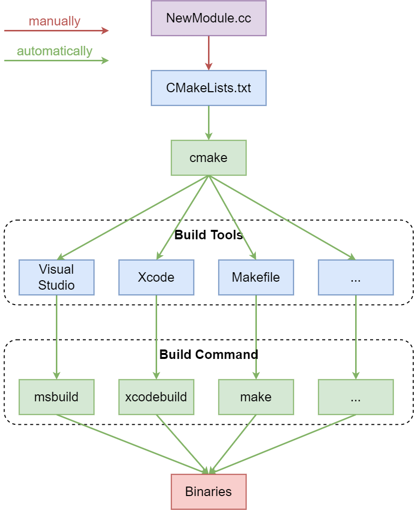
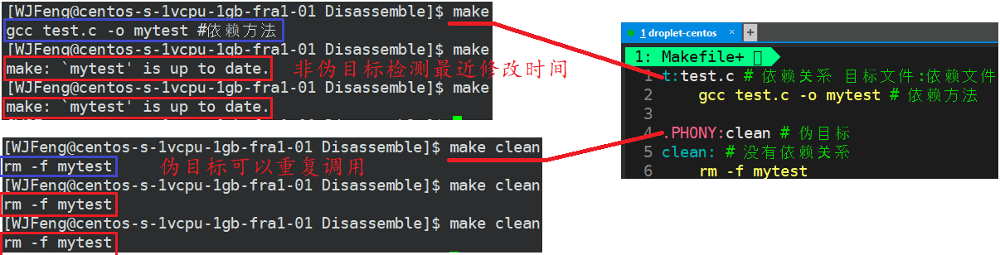
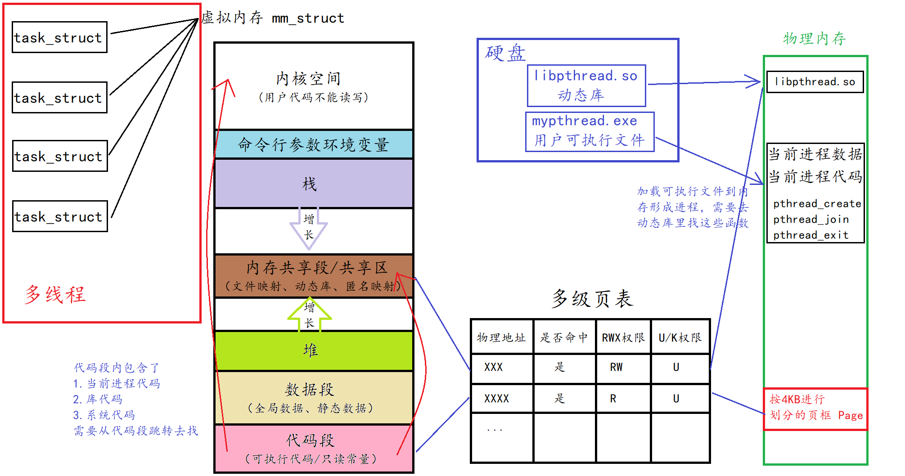

# Makefile

## *intro*

### build系统

直接用g++命令来编译的话，需要我们自己逐模块地编译目标文件，然后再链接起来，对于大的项目根本不可能手动来做

类似于Java的build工具maven、gradle等，`make` 是最常用的build系统之一，它通常被安装到了几乎所有类UNIX系统中

* 一个大的项目需要根据文件的类型、功能、模块按照一定顺序进行编译，不可能每次都手动输入编译命令，Makefile文件中存储着我们设计好的编译代码
* `make` 是一个命令，用来解释Makefile文件中指令的命令工具。当执行 `make` 时，它会去参考当前目录下名为 `Makefile` 的文件。所有构建目标、相关依赖和规则都需要在该文件中定义
* `make`并不完美，但是对于中小型项目来说，它已经足够好了。实际上单个project用的更多的是自动化构建Makefile工具如cmake，Makefile可以用来调用其他的build工具，比如camke、Maven等

### Makefile vs. CMake



* Makefile
  * Makefile 是一个文本文件，通常称为 `Makefile` 或 `makefile`，它包含了一系列规则，用于指导构建系统如何编译和链接项目的源代码文件
  * Makefile 的规则通常定义了目标文件、依赖文件和构建命令。当你运行 `make` 命令时，它会根据 Makefile 中的规则来构建项目
  * Makefile 通过检查文件的时间戳来确定哪些文件需要重新编译，以提高构建效率
  * Makefile 是一个传统的构建工具，通常需要手动编写，它是用于构建过程的静态规则
* CMake
  * CMake 是一个**跨平台**的构建系统生成工具，它允许开发者定义项目的构建过程，而不需要在不同平台上重复编写或使用复杂的构建工具
  * CMake 使用一个名为 `CMakeLists.txt` 的文本文件来描述项目的构建规则和依赖关系。这个文件中包含了构建配置选项、源代码文件、依赖库以及生成的目标等信息
  * CMake 生成的 Makefile 可以用于不同的构建工具，如 GNU Make、Ninja 等。这使得项目可以在不同的平台上使用不同的构建工具
  * CMake 支持多种生成器，允许你生成适用于不同集成开发环境和编译器的项目文件。这使得跨平台开发更加方便

总的来说，Makefile 是一个静态的构建工具，需要手动编写，而 CMake 是一个用于生成 Makefile 或其他构建系统的工具，它提供了更灵活的方式来管理和构建项目，特别是在需要跨平台支持的情况下。使用 CMake 可以减少构建系统的维护成本，提高项目的可移植性

## *Makefile*

### Makefile中的特殊符号

* `$@` 表示目前规则中所有的目标文件的集合
* `$^` 表示所有的依赖文件的集合
* `$<` 表示第一个依赖目标
* `$?` 表示比目标还要新的依赖文件列表
* `$%` 仅当目标是函数库文件中，表示规则中的目标成员名。例如，如果一个目标是 `foo.a(bar.o)`，那么，`$%` 就是 bar.o，`$@` 就是 foo.a。如果目标不是函数库文件（Unix下是[.a]，Windows下是[.lib]），那么，其值为空
* `$+` 这个变量很像 `$^`，也是所有依赖目标的集合。只是它不去除重复的依赖目标
* `$*` 这个变量要和 `%` 搭配使用，表示目标模式 % 及其之前的部分
  * 例子：如果目标是 `dir/a.foo.b`，并且目标的模式是 `a.%.b`，那么，`$*` 的值就是 `dir/a.foo`。这个变量对于构造有关联的文件名是比较有较
  * 如果目标中没有模式的定义，那么 `$*` 也就不能被推导出，但是，如果目标文件的后缀是make所识别的，那么`$*` 就是除了后缀的那一部分。例如：如果目标是 `foo.c`，因为 `.c` 是make所能识别的后缀名，所以，`$*` 的值就是 `foo`。这个特性是GNU make的，很有可能不兼容于其它版本的make，所以应该尽量避免使用 `$*`，除非是在隐含规则或是静态模式中。如果目标中的后缀是make所不能识别的，那么 `$*` 就是空值

`%` 是Makefile的Pattern Rule中的通配符，而 `*` 则是shell script的通配符

### 在不同层级上忽略错误

* 单条命令：在命令前加上 `-`
* 单条规则中的所有命令：直接以 `.IGNORE` 作为目标
* 全局：make时加上 `-i` 或者 `--ignore-errors`

如果make时加上 `-k` 或者 `--keep-going`，那么在执行时若某条规则中的命令出错了，就中止该规则的执行，但是继续执行其他规则

### 编写Makefile

```makefile
test: test.cc # 依赖关系 -> 目标文件: 依赖文件
    g++ -std=c++11 -o $@ $^ # 依赖方法，必须要用Tab缩进，不可以用空格

.PHONY: clean
clean:
    rm -f test
```

Makefile是一种汇编语言

* 一对make指令是由依赖关系和依赖方法组成的
  * 依赖关系：文件之间的关系，即 `目标文件: 依赖文件`
  * 依赖方法：如何通过依赖关系编译文件
  
* `make` **默认执行遇到的第一对依赖关系和依赖方法**，其余的需要 `make+依赖关系`，如 `make clean`

* 如果依赖关系中的文件找不到，就继续往下找，比如说下面的makefile所有指令都会执行

  ```makefile
  main: main.o add.o # 没找到main.o add.o，继续往下找
      g++ main.o add.o -o main
  main.o add.o: main.s add.s
  	g++ -cmain.s -o main.o
  	g++ -c add.s -o add.o
  main.s add.s: main.i add.i
  	g++ -S main.i -o main.s
  	g++ -S add.i -o add.s
  main.i add.i: main.cpp add.cpp
  	g++ -E main.cpp -o main.i
  	g++ -E add.cpp -o add.i
  ```

* 伪指令 `.PHONY`：每次 make 总是被执行的，若不是伪目标则若已经存在make后的结构则不会被执行；习惯是将 `clean` 设为伪目标，其他不设置

* make是如何知道目标已经是最新的呢？根据文件的最近修改时间，若可执行程序的修改时间比所有相关文件的修改时间都要晚，那么可执行程序就是最新的



## *变量*

### 赋值

* `=` 直接对变量赋值
* `+=` 追加赋值，`+=` 会继承之前的赋值符号，如果前面没有赋值，就等同于 `=`
* `:=` 该符号右侧是否有变量，如有变量且变量的定义在后边，则忽略该右侧变量，其他情况同=号。主要是为了防止成环
* `?=` 如果符号左侧的变量已经定义过则跳过该句

### 环境变量

## *函数*

### 字符串处理函数

### if 

* 条件控制语句 Ifeq、ifneq、ifdef
* 条件控制函数

## *隐含规则*

# CMake基础

## *基本语法*

### 基本语法格式

```CMake
#CMakeLists.txt
# CMake最小版本要求为2.8.3
CMAKE_MINIMUM_REQUIRED(VERSION 2.8.3)
project (HELLO)
SET(SRC_LIST main.cpp)
MESSAGE(STATUS "This is BINARY dir " ${HELLO_BINARY_DIR})
MESSAGE(STATUS "This is SOURCE dir "${HELLO_SOURCE_DIR})
add_executable(hello ${SRC_LIST})
```

* 基本语法格式为 `指令(参数1 参数2 ...)`
  * 参数使用 `()` 括起
  * 参数之间使⽤空格或分号分开，一般建议用空格
* 与makefile/Makefile都可以不一样，**CMakeLists.txt文件名必须严格区分大小写**。然而指令是⼤⼩写⽆关的，参数和变量是⼤⼩写相关的。但是推荐全部使⽤⼤写指令
* 变量使⽤ `${}` ⽅式取值，但是在 IF 控制语句中是直接使⽤变量名

CMake的指令笔者不会在这里统一给出，而是在下面用到了之后再给出

`CMAKE_MINIMUM_REQUIRED(VERSION versionNumber [FATAL_ERROR])` 指定CMake的最小版本要求

### project指令

project可以⽤来指定⼯程的名字和⽀持的语⾔，默认⽀持所有语⾔

* `project (HELLO)`：指定了⼯程的名字，并且⽀持所有语⾔，**建议这么写**
* `project (HELLO CXX)` 指定了⼯程的名字，并且⽀持语⾔是C++
* `project (HELLO C CXX)` 指定了⼯程的名字，并且⽀持语⾔是C和C++
* 也可以支持JAVA

## *CMake命令*

### 新版编译命令

```cmake
#cmake构建命令
cmake -B build
#cmake编译命令
cmake --build build
```

* `cmake -B build`：这个命令用于配置CMake的构建过程，并将生成的构建系統文件放置在一个指定的目录中（在此示例中是build目录）。-B选项后面指定的参数表示生成构建文件的目录。如果不存在build目录，那么它会自动创建build目录

  例如，运行命令 cmake -B build 会根据CMakellists.txt文件中的配置生成构建系统文件（如Makefile或Visual Studio项目文件）并将其放置在名为build的目录中。这个命令通常用于在构建系统文件和源代码文件分离的情况下，以保持源代码目录的干净和可维护性

* `cmake --build build`：这个命令用于执行构建过程，根据配置好的构建系統文件（例如Makefile） 在指定的构建目录中进行实际的编译和链接

  例如，在运行cmake -B build之后，可以使用cmake--build build命令在build 目录中执行构建过程。这将根据所生成的构建系统文件执行编译器和链接器，并生成可执行文件或库文件

  这个命令会使用构建系统的默认构建规则，但也可以通过在cmake --build命令后面添加选项来修改构建过程的行为。例如，您可以使用--target 选项指定要构建的特定目标，或使用其他选项来控制并行编译、生成的输出等

  该命今是跨平台的，可以在不同平台使用该命令编译构建cmake项目

### 旧版编译命令

在Linux平台下使用CMake构建C/C++工程的流程如下

1. 手动编写CmakeLists.txt
2. 执行命令 `cmake PATH` 生成Makefile，PATH是顶层CMakeLists.txt所在的目录。注意，在哪里执行cmake命令生成的内容就在哪里，一般选择在build文件夹中执行 `cmake ..`，因为build中是所有编译产生的内容
3. 使用 `cmake --build .` 进行跨平台build，Linux上也可以使用 `make`

可以通过 `cmake .. -DCMAKE_VERBOSE_MAKEFILE=on` 将之后在make的时候具体的编译命令展示出来

## *CMake变量*

### 自定义变量方法

在CMake中，可以使用变量来存储和传递值。这些变量可用于设置构建选项、路径、编译器选项等。下面是一些常见的CMake变量用法

1. SET定义变量

   ```cmake
   set(variable_name value)
   ```

   **`set`  指令用于创建一个名为 `variable_name` 的变量，并将其设置为 `value`**

   demo中 `SET(SRC_LIST main.cpp)` 就是创建一个 `SRC_LIST` 变量，并将其值设置为 main.cpp

   如果源⽂件名中含有空格，就必须要加双引号，比如 `m ain.cpp`

2. 引用变量：

   ```cmake
   ${variable_name}
   ```

   在CMake中，使用 `${}` 来引用变量的值。例如，`${variable_name}` 将被替换为变量 `variable_name` 的实际值

3. MESSAGE获取变量的值

   ```cmake
   message(STATUS "Variable value: ${variable_name}")
   ```

   **`message` 指令可以用于向终端打印变量的值**。上述示例将输出变量 `variable_name` 的值到 CMake 构建过程的输出。

   主要包含三种信息

   * `SEND_ERROR`，产⽣错误，⽣成过程被跳过
   * `SATUS`，输出前缀为 `—` 或 `--` 的信息
   * `FATAL_ERROR`，⽴即终⽌所有 cmake 过程

4. 条件判断

   ```cmake
   if(variable_name)
     # 条件为真时执行的代码
   else()
     # 条件为假时执行的代码
   endif()
   ```

   可以使用 `if` 来根据变量的值执行不同的代码块

5. 全局变量和局部变量： CMake 中有全局变量和局部变量的概念。通过 `set` 命令定义的变量默认情况下是全局变量，可以在整个项目中使用。在函数或代码块中使用 `set` 命令定义的变量是局部变量，只在该代码块范围内有效

这些只是一些常见的CMake变量用法示例。CMake提供了更多高级用法，如列表变量、环境变量、缓存变量

### CMake常用内置变量

* CMAKE_C_FLAGS：gcc编译选项

* CMAKE_CXX_FLAGS：g++编译选项

  ```cmake
  # 在CMAKE_CXX_FLAGS编译选项后追加-std=c++11
  set(CMAKE_CXX_FLAGS "${CMAKE_CXX_FLAGS} -std=c++11")
  ```

* CMAKE_BUILD_TYPE：编译类型（Debug or Release）

  ```cmake
  # 设定编译类型为debug，调试时需要选择debug
  set(CMAKE_BUILD_TYPE Debug)
  # 设定编译类型为release，发布时需要选择release
  set(CMAKE_BUILD_TYPE Release)
  ```

* CMAKE_BINARY_DIR、project_BINARY_DIR、BINARY_DIR：这三个变量指代的内容是一致的

  * 若是 in source build，指的就是工程顶层目录
  * 若是 out-of-source 编译，指的是工程编译发生的目录

* CMAKE_SOURCE_DIR、project_SOURCE_DIR、SOURCE_DIR

  * CMAKE_SOURCE_DIR 定义了顶级 CMakeLists.txt 所在的文件夹，这个变量的值是不会变的

  * project_SOURCE_DIR 定义了包含最近的 `project()` 命令的CMakeLists.txt所在的文件夹

* CMAKE_C_COMPILER：指定C编译器

* CMAKE_CXX_COMPILER：指定C++编译器

* EXECUTABLE_OUTPUT_PATH：可执行文件输出的存放路径

* LIBRARY_OUTPUT_PATH：库文件输出的存放路径

## *CMake控制流*

## *函数 & 宏*

## *属性*

# 构建

## *CMake项目结构组织*

### 工程结构

```shell
- MyProject/
  |- CMakeLists.txt
  |- src/
  |  |- main.cpp
  |  |- module1.cpp
  |  |- module2.cpp
  |
  |- include/
  |  |- module1.h
  |  |- module2.h
  |
  |- build/
  |
  |- bin/
  |
  |- libs/
  |  |- lib1/
  |  |  |- lib1.h
  |  |  |- lib1.cpp
  |  |
  |  |- lib2/
  |     |- lib2.h
  |     |- lib2.cpp
  |
  |- tests/
  |  |- test_module1.cpp
  |  |- test_module2.cpp
  |
  |- docs/
  |  |- README.md
  |  |- API.md

```

* `src/`：存放项目的源代码文件
* `include/`：存放项目的头文件
* `build/`：存放构建生成的可执行文件或库文件
* `libs/`：存放第三方库的文件夹。这里示例了两个库，每个库都有自己的头文件和源文件
* `tests/`：存放测试相关的代码文件
* `docs/`：存放项目的文档文件，包括项目说明和API文档等
* `bin/`：存放编译得到的二进制文件
* CMakeLists.txt or  Makefile：项目的构建文件，用于编译、链接和构建项目

### 内部构建 in-source build

在内部构建中，构建过程发生在源代码目录中，**也就是在与源代码相同的目录中进行构建**。这意味着生成的构建文件、中间文件和可执行文件与源代码混合在一起。这种构建方式简单，适用于小型项目或测试目的，但不推荐用于生产环境

```shell
cd /path/to/project
cmake .
make
```

### 外部构建 out-of-source build

在外部构建中，构建过程发生在与源代码目录分离的单独的build目录中。这意味着生成的构建文件、中间文件和可执行文件不会污染源代码目录，使得项目结构更加清晰和可维护。这种构建方式通常用于实际项目的生产环境

```shell
cd /path/to/project
mkdir build
cd build
cmake ..
make
```

在上述示例中，构建命令在与源代码目录分离的 build 目录中执行，这样可以确保生成的构建文件和输出文件不会与源代码混在一起

外部构建具有以下优点，通常建议在实际项目中使用外部构建

* 避免污染源代码目录，使得源代码目录保持干净和可重复使用
* 方便进行多个配置和平台的构建，而无需重复克隆源代码
* 更好地支持并行构建，加快构建过程
* 支持更简洁和可靠的清理过程

### CMake文件的层次结构

有两种方式来设置编译规则

* 包含源文件的子文件夹包含CMakeLists.txt文件，主目录的CMakeLists.txt通过add_subdirectory添加子目录即可。即每一个目录下面都要有一个CMakeLists.txt，**推荐使用这种方式**
* 包含源文件的子文件夹未包含CMakeLists.txt文件，子目录编译规则体现在主目录的CMakeLists.txt中

比如说有这么一个结构

```shell
.
├── build
├── CMakeLists.txt
└── src
    ├── CMakeLists.txt
    └── main.cpp
```

* 外层CMakeLists.txt

  ```cmake
  project(hello)
  add_subdirectory(src bin)
  ```

* src下的CMakeLists.txt

  ```cmake
  add_executable(hello main.cpp)
  ```

在一个复杂的项目中，可能有多个子目录，每个子目录都包含了相关的源代码文件和构建规则。为了方便管理和配置，CMake 采用了一种层次化的项目结构，每个子目录都可以拥有一个独立的 `CMakeLists.txt` 文件。每个子目录下的 `CMakeLists.txt` 文件可以根据需要设置特定的构建规则，并与父目录的配置进行协调

通过在每个目录下创建 `CMakeLists.txt` 文件，**可以将构建规则和相关配置与对应的源代码文件放在一起，使项目的组织更加清晰和可维护**。同时，这样的结构也使得整个项目可以方便地进行模块化和扩展

当使用 CMake 来构建项目并且通过 add_subdirectory 或 include 来组织层次时，CMake 会递归地遍历项目目录结构，并根据每个目录下的 `CMakeLists.txt` 文件来生成相应的构建脚本（如 Makefile、Visual Studio 解决方案等），最终用于编译和构建整个项目

因此，为了使 CMake 能够正确地解析和处理项目，每个目录下都需要一个 `CMakeLists.txt` 文件来描述该目录的构建规则和相关配置

## *子目录*

### add_subdirectory

* ADD_SUBDIRECTORY

  ```cmake
  ADD_SUBDIRECTORY(source_dir [binary_dir] [EXCLUDE_FROM_ALL])
  ```

  * 这个指令⽤于向当前⼯程添加存放源⽂件的⼦⽬录，并可以指定中间⼆进制和⽬标⼆进制存放的位置
  * 其实最常用的用法是告诉cmake**去找子目录下的CMakeLists.txt**
  * `EXCLUDE_FROM_ALL` 函数是将写的⽬录从编译中排除，如程序中的example
  * 例：`ADD_SUBDIRECTORY(src bin)`
    * 将 src ⼦⽬录加⼊⼯程并指定编译输出(包含编译中间结果)路径为bin ⽬录
    * 本质上和包头文件是一样的，相当于包子文件中的 `add_executable` 直接拷进来
    * 如果不进⾏ bin ⽬录的指定，那么编译结果(包括中间结果)都将存放在build/src ⽬录

* AUX_SOURCE_DIRECTORY：发现一个目录下所有的源代码文件并将列表存储在一个变量中，这个指令临时被用来自动构建源文件列表

  ```cmake
  AUX_SOURCE_DIRECTORY(dir VARIABLE)
  # 定义SRC变量，其值为当前目录下所有的源代码文件
  AUX_SOURCE_DIRECTORY(.src)
  # 编译SRC变量所代表的源代码文件，生成main可执行文件
  add_executable(main ${SRC})
  ```

* SOURCE_AUX_DIRECTORY：搜集所有在指定路径下的源文件的文件名，并将输出结果列表储存在指定的变最中

### include


### include_directories

include_directories：向工程添加多个特定的**头文件搜索路径**，效果就是指定g++编译器的 `-I` 参数

开发时遇到过这个问题：如果用到的头文件和cc文件不在同一目录下的时候，要通过绝对路径或相对路径显式给出头文件路径。这很麻烦，而且一旦头文件或者cc文件本身的位置发生变化，就要把涉及到的所有头文件位置都要更改掉。include_directories就是用来解决这个麻烦的

这条指令可以用来向工程添加多个特定的头文件搜索路径，路径之间用空格分割

**如果要让VS Code和Clion在写代码时找到用的头文件，得先编译一次**

```cmake
include_directories([AFTER|BEFORE] [SYSTEM] dir1 dir2 ...)
# 将/usr/include/myincludefolder 和 ./include 添加到头文件搜索路径
include_directories(/usr/include/myincludefolder ./include)
```

注意：include_directories只适用于头文件，源文件如果是在其他文件夹里，还是得自己显式的给出路径

### target_include_directories

## *生成目标*

* add_compile_options：添加编译参数

  ```cmake
  add_compile_options(）
  # 添加编译参数 -Wall -std=c++11 -O2
  add_compile_options(-Wall -std=c++11 -O2)
  ```

* add_executable：使用指定的源文件来生成目标可执行文件

  ```cmake
  add_executable(targetName [WIN32] [MACOSX_BUNDLE]                
  				[EXCLUDE_FROM_ALL]
                  source1 [source2 ...] )
  # 编译main.cpp生成可执行文件main
  add_executable(main main.cpp)
  ```

  `add_executable(hello ${SRC_LIST})` ⽣成的可执⾏⽂件名是hello，源⽂件读取变量SRC_LIST中的内容。也可以直接写 `add_executable(hello main.cpp)`

  Demo可以简化的写成

  ```cmake
  project(HELLO)
  add_executable(hello main.cpp)
  ```

  注意：⼯程名的 HELLO 和⽣成的可执⾏⽂件 hello 是没有任何关系的

## *链接库*

### target_link_libraries

* link_directories：向工程添加多个特定非标准的库文件搜索路径，相当于指定g++编译器的 `-L` 参数

  ```cmake
  link_directories(dir1 dir2 ...)
  # 将/usr/lib/mylibfolder 和 ./lib 添加到库文件搜索路径
  link_directories(/usr/lib/mylibfolder ./lib)
  ```

* target_link_directories：为 target 添加需要链接的共享库，相同于指定g++编译器 `-l` 参数

  ```cmake
  link_directories(dir1 dir2 ...) # 需要先把库的路径包进来，不包的话就要写绝对路径了
  target_link_directories(target library1<debug | optimized> library2...)
  # 将hello动态库文件链接到可执行文件main
  target_link_directories(main hello)
  ```

  这里注意和 `LINK_LIBRARIES(绝对路径)` 的区别，这个命令要写要链接的库文件的绝对路径，不推荐使用它


## *返回码*

* 0：成功。CMake 配置和生成过程成功完成
* 1：一般错误。通常是由于无效的命令行参数或配置文件中的问题导致的
* 2：严重错误。通常表示 CMake 在执行配置或生成期间遇到了致命错误，无法继续
* 3：没有匹配的 CMakeLists.txt 文件。这表示 CMake 在当前目录或指定的目录中找不到 CMakeLists.txt 文件
* 4：配置文件错误。表示 CMake 在配置项目时发生了错误，可能是由于 CMakeLists.txt 文件中的问题导致的

# 构建库

## *函数库和 gcc/g++编译器*

### gcc/g++ 编译器

GCC（GNU Compiler Collection）和G++都是由GNU项目开发的编译器，用于编译各种编程语言，包括C和C++。它们之间的主要区别在于它们所针对的编程语言以及默认的编译行为：

* GCC（GNU C Compiler）：GCC最初是C语言的编译器，因此其主要关注点是C语言的编译。尽管如此，GCC也可以用于编译C++代码，但在这种情况下，需要手动指定编译器选项来告诉GCC编译器将源代码视为C++代码
* G++：G++是GCC的一个衍生版本，专门用于C++编译。它默认将源代码视为C++代码，因此无需手动指定编译选项。G++提供了对C++语言的更好支持，并在默认情况下启用C++语言特性，如C++标准库的支持

总结来说，主要区别在于默认编译语言和默认编译行为：

* 使用GCC时，源代码默认视为C代码，需要手动指定编译选项来将其视为C++代码
* 使用G++时，源代码默认视为C++代码，无需手动指定编译选项

在实际使用中，您可以根据需要选择使用GCC或G++来编译C或C++代码。如果您编写纯C代码，GCC通常足够，但如果您编写C++代码，建议使用G++以获得更好的C++语言支持

### 函数库

* 函数库可以让其他开发者用到高质量的代码以及提高自己工程的安全度，防止暴露源代码
* 静态库 Static Library
  * 静态库是指编译链接时，把库文件中用到的目标文件的代码全部链接到可执行文件中，因此生成的文件比较大，但在运行时也就不再需要库文件了
  * CentOS安装C/Cpp静态库（系统默认自带动态库）
    * C: `sudo yum install -y glibc-static`
    * Cpp: `sudo yum install -y libstdc++static`
  * 可以通过 `ldd` 命令查看依赖库文件 
* 动态库 Dynamic Link Library：动态库在编译链接时并不会把库文件的代码加入到可执行文件中，而是在程序运行时由运行时链接文件加载库，这样可以节省系统的开销
* Linux环境中 `.so` 为动态库，`.a` 为静态库；而 windows环境中 `.dll` 为动态库，`.lib` 为静态库
* gcc生成的二进制文件默认采用动态链接，可以用 `file` 命令验证



### 制作静态库

* 前缀必须是lib，后缀必须是.a  `ar -rc libhello.a mymath.o myprint.o`
* 库目录
  * include 库的所有头文件
  * lib 对应的库文件
* 发布和使用
  * 自己写的库属于第三方库，既不是语言提供的也不是系统调用库。gcc调用时需要显式给
  * 头文件gcc的默认搜索路径是：`/usr/include`
  * 库文件的默认搜索路径是：`/lib64` 或者 `/usr/lib64`
  * 把第三方库拷贝到系统的默认路径下，称为库的安装
  * 为了避免未经测试的库污染，不要把第三库放到系统库里，对第三方库进行指定头文件搜索路劲共和库文件搜索路径的硬使用：`gcc main.c -I ./hello/include -L ./hello/lib -lhello`，其中-I指定头文件搜索路径，-L指定库文件搜索路径，lhello是库名

### 制作动态库

* `gcc -shared  myprint.o mymath.o -o libhello.so`
* fPIC 的意思是生成一个与地址无关的目标二进制文件。程序编译完后有自己固定的内存地址空间，因此静态库在调用时是占用固定的地址空间的，而动态库则不占用，动态库采用的是相对动态编址方式
* gcc对动态库和静态库的使用选择
  * 静态库和动态库可以同名
  * 若只有静态库，则会强制进行静态连接
  * 若既有静态库也有动态库，则默认使用动态库；此时若想强制使用静态库，也可以用 `-staic` 来指定
* 动态库是一个独立的库文件，动态库可以和可执行文件分批加载
  * 动态库只要加载到内存中的**堆栈之间的共享区**一次，**每次使用时只要与调用它的进程的页表建立新的映射关系就可以**；但用静态库的时候是将静态库引入到了调用程序中，即即**保存在代码段**，成为程序的一部分，一起调用，若有很多个程序都使用了同一份静态库，那么内存中将存在大量的库代码冗余
  * 每一个动态库被加载到内存中，映射到进程的地址空间，映射的位置可能是不一样的，但是因为库里面是相对地址，每一个函数定位采用的是偏移量的方式来寻找的。即只要知道这个库的相对地址，库的起始地址+函数偏移量就可以将函数映射到虚拟地址上·

* 虽然在gcc编译的时候已经告诉了程序需要的动态库的地址，但对生成程序进行调用的时候它并不能找到动态库
  * 可以将库放到系统库中，但这会造成库污染，不要使用这种方法
  * 可以将第三方动态库的地址放到库加载的搜索路径的环境变量下 `export LD_LIBRARY_PATH=$LD_LIBRARY_PATH: pwd`，但这个环境变量在OS重启后会被重置为原来的内容
  * 可以通过新增系统默认的配置文件来达到永久修改的目的：往 `/etc/ld.so.conf.d` 新建一个带有库地址的配置文件后再执行 `ldconfig` 令配置文件生效
  * 也可以在系统库 `/usr/lib64` 中建立一个指向第三库的软连接

```makefile
.PHONY:all    
all:libhello.so libhello.a    

libhello.so:mymath_d.o myprint_d.o
    gcc -std=c99 -shared mymath_d.o myprint_d.o -o libhello.so    
mymath_d.o:mymath.c
    gcc -std=c99 -c -fPIC mymath.c -o mymath_d.o    
myprint_d.o:myprint.c
    gcc -std=c99 -c -fPIC myprint.c -o myprint_d.o

libhello.a: mymath.o myprint.o    
    ar -rc libhello.a mymath.o myprint.o
mymath.o:mymath.c    
    gcc -std=c99 -c mymath.c -o mymath.o    
myprint.o:myprint.c    
    gcc -std=c99 -c myprint.c -o myprint.o    

.PHONY:output    
output:    
    mkdir -p output/lib    
    mkdir -p output/include    
    cp -rf *.h output/include    
    cp -rf *.a output/lib    
    cp -rf *.so output/lib                                                                                     

.PHONY:clean    
clean:    
    rm -rf *.o *.a *.so output    
```

## *CMake构建库*

### 用到的指令

* SET_TARGET_PROPERTIES

* ADD_LIBRARY 生成库文件，SHARED为动态库，STATIC为静态库

* 如果没有给出库的类型，那么根据变量 `BUILD_SHARED_LIBS` 是否是 `on` 来自动设置为 SHARED 或 STATIC

  ```cmake
  add_library(libname [SHARED | STATIC | MODULE] 
  			[EXCLUDE_FROM_ALL]
              source1 source2 ... sourceN)
  # 通过变量 SRC 生成 libhello.so 共享库
  add_library(hello SHARED ${SRC})
  ```


SET 指令重新定义 `EXECUTABLE_OUTPUT_PATH` 和 `LIBRARY_OUTPUT_PATH` 变量来指定最终的⽬标⼆进制的位置

```cmake
SET(EXECUTABLE_OUTPUT_PATH ${project_BINARY_DIR}/bin)
SET(LIBRARY_OUTPUT_PATH${project_BINARY_DIR}/lib)
```

### 同时生成同名的动态库和静态库

```cmake
# 如果⽤这种⽅式，只会构建⼀个动态库，不会构建出静态库，虽然静态库的后缀是.a
ADD_LIBRARY(hello SHARED ${LIBHELLO_SRC})
ADD_LIBRARY(hello STATIC ${LIBHELLO_SRC})
# 修改静态库的名字，这样是可以的，但是我们往往希望他们的名字是相同的，只是后缀不同⽽已
ADD_LIBRARY(hello SHARED ${LIBHELLO_SRC})
ADD_LIBRARY(hello_static STATIC ${LIBHELLO_SRC})
```

解决方法是使用 SET_TARGET_PROPERTIES 来设置输出的名称，对于动态库，还可以用来指定动态库版本和 API 版本

### Win的特殊流程

当使用Win中的VS配合MSVC编译时，流程和用gcc不太一样

VS要求必须在编译动态库的函数实现的返回值之前声明为 `__declspec(dllexport)`，此时同时生成一个 `.lib`（编译时需要） 和一个 `.dll` 动态库文件（运行加载时需要）

此时需要搭配 TARGET_COMPILE_DEFINITIONS 使用

```c++
#ifdef EXPORT
#define CMAKE_STUDY_API declspec（dllexport）
#else
#define CMAKE_STUDY_API _declspec（d11import）
#endif
```

一定要把 `.lib` 放到和 `.exe` 同一个文件夹里

## *安装*

### 安装的内容与方式

INSTALL的安装可以包括：⼆进制、动态库、静态库以及⽂件、⽬录、脚本等

* 从代码编译后直接 make install 安装
* 打包时的指定⽬录安装
  * 简单的可以这样指定⽬录：`make install DESTDIR=/tmp/test`
  * 稍微复杂⼀点可以这样指定⽬录：`./configure –prefix=/usr`

### 安装⽂件COPYRIGHT和README

INSTALL(FILES COPYRIGHT README DESTINATION share/doc/cmake/)

FILES：⽂件

DESTINATION：

1、写绝对路径

2、可以写相对路径，相对路径实际路径是：${CMAKE_INSTALL_PREFIX}/<DESTINATION 定义的路径>

CMAKE_INSTALL_PREFIX 默认是在 /usr/local/

cmake -DCMAKE_INSTALL_PREFIX=/usr 在cmake的时候指定CMAKE_INSTALL_PREFIX变量的路径
